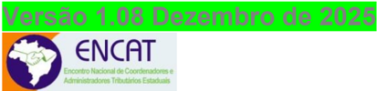

## Sistema Nota Fiscal Eletrônica

Informe Técnico 2023.003

Tabela de Combustíveis Sujeitos à Tributação Monofásica

## Sumário

| Controle de Versões (Histórico de Alterações) ..........................................................................2                        |
|--------------------------------------------------------------------------------------------------------------------------------------------------|
| Informação sobre a finalidade do IT - Informe Técnico.............................................................3                              |
| 01. Objetivo...................................................................................................................................3 |
| 02. Sobre a Tabela de Combustíveis Sujeitos à Tributação Monofásica..................................3                                           |

## Controle de Versões (Histórico de Alterações)

|   Versão | Publicação                                                                                                             | Descrição                                                                                                              | Implantação Teste   | Implantação Produção   |
|----------|------------------------------------------------------------------------------------------------------------------------|------------------------------------------------------------------------------------------------------------------------|---------------------|------------------------|
|     1.00 | Abril/2023                                                                                                             | Atualização da Tabela de Combustíveis Sujeitos à Tributação Monofásica                                                 | 20/04/2023          | 01/05/2023             |
|     1.01 | Janeiro/2024                                                                                                           | Atualização da Tabela de Combustíveis Sujeitos à Tributação Monofásica                                                 | 28/12/2023          | 28/12/2023             |
|     1.02 | Fevereiro/2024                                                                                                         | Atualização da Tabela de Combustíveis Sujeitos à Tributação Monofásica                                                 | 26/02/2024          | 01/03/2024             |
|     1.03 | Maio/2024                                                                                                              | Atualização da Tabela de Combustíveis Sujeitos à Tributação Monofásica                                                 | 01/07/2024          | 02/09/2024             |
|     1.04 | Dezembro/2024Atualização da Tabela de                                                                                  | Combustíveis Sujeitos à Tributação Monofásica                                                                          | 04/12/2024          | 09/12/2024             |
|     1.05 | Janeiro/2025                                                                                                           | Atualização da Tabela de Combustíveis Sujeitos à Tributação Monofásica                                                 | 01/02/2025          | 01/02/2025             |
|     1.06 | Setembro/2025                                                                                                          | Atualização da Tabela de Combustíveis Sujeitos à Tributação Monofásica                                                 | 01/10/2025          | 01/10/2025             |
|     1.07 | Novembro/2025Atualização da Tabela de Combustíveis Sujeitos à Tributação Monofásica                                    | Novembro/2025Atualização da Tabela de Combustíveis Sujeitos à Tributação Monofásica                                    | até 10/11/2025      | até 10/11/2025         |
|     1.08 | Dezembro/2025Atualização da Tabela de Combustíveis Sujeitos à Tributação Monofásica - Novos valores de Adrem para 2026 | Dezembro/2025Atualização da Tabela de Combustíveis Sujeitos à Tributação Monofásica - Novos valores de Adrem para 2026 | 01/01/2026          | 01/01/2026             |

## Informação sobre a finalidade do IT -Informe Técnico

De forma geral, o Informe Técnico tem a finalidade de:

- Divulgar orientações e aperfeiçoamentos para os Serviços de Autorização de Uso dos DFe, que são usados pelas Empresas;
- Divulgar e manter registro da atualização de tabelas de domínio usadas pelo Serviço de Autorização, não significando obrigatoriamente a necessidade de alteração no Sistema de Computação das Empresas;
- Divulgar e manter registro de orientações sobre a prestação de informações no leiaute do DF-e, informando sobre o preenchimento de campo e outros;
- Divulgar e manter registro de comunicados e outras necessidades de comunicação com as empresas.

## 01. Objetivo

O objetivo deste Informe Técnico é divulgar a atualização da Tabela de Combustíveis Sujeitos à Tributação  Monofásica  do  ICMS,  cujos  códigos  são  utilizados  na  Nota  Técnica  2023.001 (NT2023.001),  visando  atender  à  Lei  Complementar  nº  192/2022  e  alterações  legislativas decorrentes.

Os prazos dessa atualização de tabelas estão documentados anteriormente, no item que trata de 'Controle de Versões', para a versão mais recente deste Informe Técnico.

## 02. Sobre a Tabela de Combustíveis Sujeitos à Tributação Monofásica

A tabela de combustíveis sujeitos à tributação monofásica do ICMS a ser utilizada na autorização de NF-e/NFC-e (modelos 55/65) é a tabela publicada no Portal Nacional da NF-e (www.nfe.fazenda.gov.br)  no  menu  "Documentos", "Diversos", "Vigentes",  denominada 'Tabela de códigos de combustíveis sujeitos à tributação monofásica de ICMS'. Essa tabela utiliza os códigos de produtos mantidos pela Agência Nacional de Petróleo, a ANP.

Caso seja necessário conhecer mais sobre as tabelas da ANP que dão origem a esses códigos, outras informações podem ser obtidas no link: https://csa.anp.gov.br/informacoes/simp. Essas tabelas não são usadas no Serviço de Autorização dos Documentos Fiscais Eletrônicos, mas são úteis para as empresas que operam com combustível. Nesse link pode se efetuar o download de  um  arquivo  ZIP  com  as  Tabelas  de  Apoio  ao  I-SIMP  (Sistema  de  Informações  de Movimentação  de  Produtos),  da  Agência  Nacional  de  Petróleo,  sendo  o  arquivo  'T012 -Codigos\_de\_produtos' a principal referência para os códigos de combustíveis.