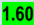
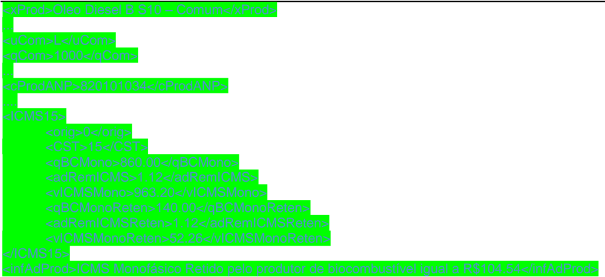

## Projeto Nota Fiscal Eletrônica

Nota Técnica 2023.001

Tributação Monofásica sobre Combustíveis

| Sumário                                                                                                                                                                                                                                                                                                                                                                                                                                                                                                                                                                                                                                                                                                                                                                                                                                                                                                                                                                                                                                                                                                                                                                                                                                                                                                                                                      |
|--------------------------------------------------------------------------------------------------------------------------------------------------------------------------------------------------------------------------------------------------------------------------------------------------------------------------------------------------------------------------------------------------------------------------------------------------------------------------------------------------------------------------------------------------------------------------------------------------------------------------------------------------------------------------------------------------------------------------------------------------------------------------------------------------------------------------------------------------------------------------------------------------------------------------------------------------------------------------------------------------------------------------------------------------------------------------------------------------------------------------------------------------------------------------------------------------------------------------------------------------------------------------------------------------------------------------------------------------------------|
| Controle de Versões................................................................................................................................................................................................................5 Histórico de Alterações / Cronograma.....................................................................................................................................................................................5                                                                                                                                                                                                                                                                                                                                                                                                                                                                                                                                                                                                                                                                                                                                                                                                                                                                                              |
| 1. Resumo...............................................................................................................................................................................................................................8                                                                                                                                                                                                                                                                                                                                                                                                                                                                                                                                                                                                                                                                                                                                                                                                                                                                                                                                                                                                                                                                                                                    |
| 2. Visão Geral........................................................................................................................................................................................................................10                                                                                                                                                                                                                                                                                                                                                                                                                                                                                                                                                                                                                                                                                                                                                                                                                                                                                                                                                                                                                                                                                                                     |
| 2.1. Alterações de Campos................................................................................................................................................................................................10 2.1.1. Inclusão do Campo de Índice de Mistura do Biodiesel no Diesel B ou do Etanol Anidro na Gasolina C (tag: pBio) 10 2.1.2. Inclusão do Grupo indicador da origem do combustível (tag: origComb)....................................... 10                                                                                                                                                                                                                                                                                                                                                                                                                                                                                                                                                                                                                                                                                                                                                                                                                                                                                    |
| 2.2. Alterações em Regras de Validação ...........................................................................................................................................................................11                                                                                                                                                                                                                                                                                                                                                                                                                                                                                                                                                                                                                                                                                                                                                                                                                                                                                                                                                                                                                                                                                                                                         |
| 2.2.1. Regra de Validação N12-20 ............................................................................................................ 11 2.2.2. Regras de Validação N12-30 e N12-70........................................................................................... 11                                                                                                                                                                                                                                                                                                                                                                                                                                                                                                                                                                                                                                                                                                                                                                                                                                                                                                                                                                                                                                                                    |
| 2.2.3. Regra de Validação W16-10 ........................................................................................................... 11                                                                                                                                                                                                                                                                                                                                                                                                                                                                                                                                                                                                                                                                                                                                                                                                                                                                                                                                                                                                                                                                                                                                                                                                              |
| 2.3. Novas Regras de Validação........................................................................................................................................................................................11 2.3.1. Regra de Validação I13-20.............................................................................................................. 12 2.3.2. Regras de Validação LA17-10 e LA17-20....................................................................................... 12 2.3.3. Regra de Validação LA18-10 .......................................................................................................... 12 2.3.4. Regra de Validação LA21-10 .......................................................................................................... 13 2.3.5. Regras de Validação N12-100 e N12-110....................................................................................... 13 2.3.6. Regras de Validação N38-10, N40-10 e N44-10............................................................................. 13 2.3.7. Regras de Validação N39-10, N41-10 e N45-10............................................................................. 13 2.3.8. Regras de Validação W06c-10, W06d-10 e W06e-10 .................................................................... 13 |
| 2.4. Alterações na versão 1.10 ..........................................................................................................................................................................................13 2.4.1. Criação dos campos indicadores da Base de Cálculo do ICMS monofásico (campos: qBCMono, qBCMonoReten , qBCMonoRet e qBCMonoDif) 13 2.4.2. Criação dos campos totalizadores das Bases de Cálculo do ICMS monofásico (campos: qBCMono, qBCMonoReten , qBCMonoRet) no Grupo W. Total da NF- e............................................................................................................................................. 14                                                                                                                                                                                                                                                                                                                                                                                                                                                                                                                                                                                                                                                                                 |
| 2.4.3. Criação dos campos pRedAdRem (id: N47) e motRedAdRem (id: N48)........................................ 14                                                                                                                                                                                                                                                                                                                                                                                                                                                                                                                                                                                                                                                                                                                                                                                                                                                                                                                                                                                                                                                                                                                                                                                                                                             |
| 2.4.4. Alteração da regra de Validação I13-20.......................................................................................... 14                                                                                                                                                                                                                                                                                                                                                                                                                                                                                                                                                                                                                                                                                                                                                                                                                                                                                                                                                                                                                                                                                                                                                                                                                   |

| 2.4.5. Criação da Regra de Validação LA18-20........................................................................................ 14 2.4.6. Criação da Regra de Validação LA18-30........................................................................................ 14 2.4.7. Criação da Regra de Validação LA21-20........................................................................................ 14 2.4.8. Alteração da Regra de Validação N12-110..................................................................................... 14 2.4.9. Alteração das Regras de Validação N39-10, N41-10 e N45-10...................................................... 15 2.4.10. Revogação das Regras de Validação N38-10, N40-10 e N44-10 ................................................ 15 2.4.11. Criação das Regras de Validação W06b.1-10, W06c.1-10, W06d.1-10....................................... 15                                                                                                                                                              |
|-----------------------------------------------------------------------------------------------------------------------------------------------------------------------------------------------------------------------------------------------------------------------------------------------------------------------------------------------------------------------------------------------------------------------------------------------------------------------------------------------------------------------------------------------------------------------------------------------------------------------------------------------------------------------------------------------------------------------------------------------------------------------------------------------------------------------------------------------------------------------------------------------------------------------------------------------------------------------------------------------------------------------------------------------------------------------------------------------|
| 2.5. Alterações na versão 1.11 ..........................................................................................................................................................................................15 2.6. Alterações na versão 1.20 ..........................................................................................................................................................................................15 2.6.1. Alteração da documentação dos campos cProdANP e descANP .................................................. 15 2.6.2. Criação dos campos qBCMono, adRemICMS, vICMSMonoOp, pDif e vICMSMono para o CST 53 e revogação dos campos qBCMonoDif e adRemICMSDif. 15 2.6.3. Correção do Número de referência da tag XML (Coluna #) de alguns campos ............................. 15 2.6.4. Alteração na documentação das Regras I13-20, LA17-10, LA17-20, LA18-10, LA18-30 .............. 16 2.6.5. Alteração da regra de Validação LA18-20....................................................................................... 16 |
| 2.6.6. Exclusão da regra de Validação LA03d-10 ..................................................................................... 16 2.6.7. Exclusão da regra de Validação N45-10......................................................................................... 16                                                                                                                                                                                                                                                                                                                                                                                                                                                                                                                                                                                                                                                                                                                                                                                                              |
| 2.7. Alterações na versão 1.30 ..........................................................................................................................................................................................16 2.7.1. Exclusão das regras LA17-20, N39-10 e N41-10 para modelo 65 ................................................. 16 2.7.2. Incluída tolerância de arredondamento para as regras W06b.1-10, W06c.1-10 e W06d.1-10....... 16 2.7.3. Alteradas as regras LA17-20, LA18-10, LA18-20, N12-110, W06b.1-10, W06c-10, W06c.1-10, W06d-10, W06d.1-10 e W06e-10 16                                                                                                                                                                                                                                                                                                                                                                                                                                                                                                      |
| 2.7.4. Incluídas novas regras de validação N37a-10, N39a-10 e N43a-10 .............................................. 17 2.7.5. Alterada regra N41-10..................................................................................................................... 17 2.7.6. Incluída regra N41-20...................................................................................................................... 17                                                                                                                                                                                                                                                                                                                                                                                                                                                                                                                                                                                                                                                            |
| 2.8. Alterações na versão 1.40 ..........................................................................................................................................................................................17 2.8.1. Alterada regra N12-70..................................................................................................................... 17 2.8.2. Alterada regra LA17-20, LA18-10 e LA18-20.................................................................................. 17                                                                                                                                                                                                                                                                                                                                                                                                                                                                                                                                                                        |
| 2.9. Alterações na versão 1.50 ..........................................................................................................................................................................................17                                                                                                                                                                                                                                                                                                                                                                                                                                                                                                                                                                                                                                                                                                                                                                                                                                                                   |
| Alterações na versão                                                                                                                                                                                                                                                                                                                                                                                                                                                                                                                                                                                                                                                                                                                                                                                                                                                                                                                                                                                                                                                                          |
| 2.10.1. Alterada regra LA17-20 ................................................................................................................. 17                                                                                                                                                                                                                                                                                                                                                                                                                                                                                                                                                                                                                                                                                                                                                                                                                                                                                                                                           |
| 2.10.2. Atualização da documentação em relação ao campo pBIO ......................................................... 18                                                                                                                                                                                                                                                                                                                                                                                                                                                                                                                                                                                                                                                                                                                                                                                                                                                                                                                                                                     |
| 1.50.........................................................................................................................................................................................17                                                                                                                                                                                                                                                                                                                                                                                                                                                                                                                                                                                                                                                                                                                                                                                                                                                                                               |
| 2.10.                                                                                                                                                                                                                                                                                                                                                                                                                                                                                                                                                                                                                                                                                                                                                                                                                                                                                                                                                                                                                                                                                         |
| 2.9.1. Alterada regra LA18-10 ................................................................................................................... 17                                                                                                                                                                                                                                                                                                                                                                                                                                                                                                                                                                                                                                                                                                                                                                                                                                                                                                                                          |

| 2.11. Alterações na versão 1.60.........................................................................................................................................................................................18          |
|-------------------------------------------------------------------------------------------------------------------------------------------------------------------------------------------------------------------------------------|
| 3. Leiaute da Nota Fiscal Eletrônica ......................................................................................................................................................................................18       |
| 3.1. Grupo LA. Detalhamento Específico de Combustíveis................................................................................................................................................18                            |
| 3.2. Grupo N02a- Grupo Tributação do ICMS = 02............................................................................................................................................................21                        |
| 3.3. Grupo N03a- Grupo Tributação do ICMS = 15............................................................................................................................................................22                        |
| 3.4. Grupo N07a- Grupo Tributação do ICMS = 53............................................................................................................................................................23                        |
| 3.5. Grupo N08a- Grupo Tributação do ICMS = 61............................................................................................................................................................25                        |
| 3.6. Grupo W. Total da NF-e..............................................................................................................................................................................................26         |
| 4. Detalhamento das Validações ...........................................................................................................................................................................................28        |
| 4.1. I. Produtos e Serviços.................................................................................................................................................................................................28      |
| 4.2. LA. Item / Combustível................................................................................................................................................................................................29       |
| 4.3. N. Item/ Tributo: ICMS ................................................................................................................................................................................................34      |
| 4.4. W. Total da NF-e.........................................................................................................................................................................................................39    |
| 5. Novos códigos de Rejeição ...............................................................................................................................................................................................43      |
| 6. Sobre o DANFE.................................................................................................................................................................................................................44 |

## Controle de Versões

|   Versão | Publicação     | Descrição                                                                                                           |
|----------|----------------|---------------------------------------------------------------------------------------------------------------------|
|     1.00 | Fevereiro 2023 | Publicação da NT.                                                                                                   |
|     1.10 | Março 2023     | Alterações no DANFE Criação de campos para indicação e somatório das Bases de Cálculo do ICMS monofásico            |
|     1.11 | Março 2023     | Alteração da data de produção                                                                                       |
|     1.20 | Abril 2023     | Criação de Campos e Alteração em Regras de validação                                                                |
|     1.30 | Agosto 2023    | Alterações em Regras de validação                                                                                   |
|     1.40 | Setembro 2023  | Alterações em Regras de validação                                                                                   |
|     1.50 | Novembro 2023  | Alteração em Regra de Validação (implementação futura)                                                              |
|     1.51 | Maio 2024      | Alteração da exceção 2 da regra de validação LA17-20 e atualização da documentação quanto a descrição do campo pBIO |
|     1.60 | Junho 2025     | Alteração das regras N41-10 e N41-20; Ativação da regra LA18-10                                                     |

## Histórico de Alterações / Cronograma

| Versão   | Histórico de atualizações   | Implantação Teste   | Implantação Produção   |
|----------|-----------------------------|---------------------|------------------------|

|   1.00 | Novos campos e alterações de regras existentes abrangendo a nova forma de tributação monofásica sobre combustíveis Novas regas de validação para tributação monofásica sobre combustíveis                                                                                                                                    | Até 03/03/2023 Até 03/07/23   | 30/03/2023 04/09/2023   |
|--------|------------------------------------------------------------------------------------------------------------------------------------------------------------------------------------------------------------------------------------------------------------------------------------------------------------------------------|-------------------------------|-------------------------|
|   1.10 | Alterações no DANFE NF-e para constar os novos campos de ICMS monofásico sobre combustíveis e inclusão de novos campos.Criação de campos para indicação das Bases de Cálculo do ICMS monofásico e também de seus totais Criação de regras de validação para verificação do somatório das bases de cálculo do ICMS monofásico | Até 03/03/2023 Até 03/07/2023 | 30/03/2023 04/09/2023   |
|   1.11 | Alteração da data de produção Conforme disposto no Convênio ICMS No. 12, de 31 de março de 2023, a entrada do ICMS Monofásico para Diesel e GLP foi postergada para 01/05/2023                                                                                                                                               | -                             | 01/05/2023              |
|   1.20 | Criação de novos campos para que seja possível informar o Diferimento Parcial Ajustes nas de regras de validação LA18-10 E LA18-20 para que não sejam aplicadas na NFC-e, nem na NF-e nas operações com consumidor final. Exclusão da Regra de Validação LA03d-10 e N45-10                                                   | 20/04/2023                    | 01/05/2023              |
|   1.30 | Inclusão e alteração em regras de validação                                                                                                                                                                                                                                                                                  | Até 25/09/2023                | 30/10/2023              |
|   1.30 | RV N43a-10                                                                                                                                                                                                                                                                                                                   | Até 25/09/2023                | 01/04/2024              |
|   1.40 | Altera a regra N12-70                                                                                                                                                                                                                                                                                                        | Até 16/10/2023                | 30/10/2023              |
|   1.50 | LA18-10                                                                                                                                                                                                                                                                                                                      | Implementação Futura          | Implementação Futura    |
|   1.51 | Altera regra LA17-20. Exceção 2 Atualização do texto quando trata do campo pBio esclarecendo que este campo também se aplica no caso de mistura do Etanol Anidro na Gasolina C                                                                                                                                               | 01/07/2024                    | 02/09/2024              |

|   1.60 | Alteração das regras N41-10 e N41-20   | Até 01/07/2025   | 14/07/2025   |
|--------|----------------------------------------|------------------|--------------|
|   1.60 | Implantação da regra LA18-10           | 04/08/2025       | 01/10/2025   |

## 1. Resumo

Essa Nota Técnica divulga novos campos e Regras de Validação da NF-e versão 4.0. Como existe a introdução de novos campos facultativos no Leiaute (Schema XML), algumas Regras de Validação serão ativadas posteriormente conforme observação em cada uma delas, visando garantir um prazo de adequação para as empresas. Já as regras existentes que não permitiriam a informação dos novos campos, tem o mesmo prazo de entrada do Leiaute (Schema XML). O prazo abaixo, portanto, se refere a entrada das alterações no Leiaute (Schema XML), e das regras que visam permitir a informação dos novos campos sem rejeição.

O prazo previsto para a implementação das mudanças nos schemas e alterações nas regras de validação N12-20, N12-30, N12-70 e W16-10 é:

- o Ambiente de Homologação (ambiente de teste das empresas): até 03/03/2023
- o Ambiente de Produção : 30/03/2023

## O prazo previsto para a implementação das novas regras de validação é:

- o Ambiente de Homologação (ambiente de teste das empresas): até 03/07/2023
- o Ambiente de Produção : 04/09/2023

Para a versão 1.10 dessa Nota Técnica, o prazo previsto para a implementação dos novos campos é:

- o Ambiente de Homologação (ambiente de teste das empresas): até 03/03/2023
- o Ambiente de Produção : 30/03/2023

Para a versão 1.10 dessa Nota Técnica, o prazo previsto para a implementação das novas Regras de Validação é:

- o Ambiente de Homologação (ambiente de teste das empresas): até 03/07/2023
- o Ambiente de Produção : 04/09/2023

Para a versão 1.11 dessa Nota Técnica, o prazo previsto para a implementação das novas Regras de Validação é:

- o Ambiente de Homologação (ambiente de teste das empresas): Sem alteração
- o Ambiente de Produção : 01/05/2023

Para a versão 1.20 dessa Nota Técnica, o prazo previsto para a implementação das mudanças no schema e revogação da Regra LA03d-10 é:

- o Ambiente de Homologação (ambiente de teste das empresas): 20/04/2023
- o Ambiente de Produção : 01/05/2023

Para a versão 1.30 dessa Nota Técnica, o prazo previsto para a implementação das alterações nas Regras de Validação é:

- o Ambiente de Homologação (ambiente de teste das empresas): até 25/09/2023
- o Ambiente de Produção : 30/10/2023 e 01/04/2024 (para a RV N43a-10)

Para a versão 1.40 dessa Nota Técnica, o prazo previsto para a implementação das alterações nas Regras de Validação é:

- o Ambiente de Homologação (ambiente de teste das empresas): até 16/10/2023
- o Ambiente de Produção : 30/10/2023 e 01/04/2024 (para a RV N43a-10)

Para a versão 1.50 dessa Nota Técnica, a Regra de Validação LA18-10 passa a ter implementação futura.

Para a versão 1.51 dessa Nota Técnica, o prazo previsto para a implementação das alterações nas Regras de Validação é:

- o Ambiente de Homologação (ambiente de teste das empresas): até 01/07/2024
- o Ambiente de Produção : 02/09/2024

Para a versão 1.60 dessa Nota Técnica, o prazo previsto para a implementação das alterações nas Regras de Validação é:

- o Ambiente de Homologação (ambiente de teste das empresas): até 01/07/2025
- o Ambiente de Produção : 14/07/2025

* Para a regra LA18-10 as datas serão conforme prevista no cronograma.

## 2. Visão Geral

Essa Nota Técnica tem o objetivo de atender o disposto no Convênio ICMS nº 199, de 22 de dezembro de 2022, que dispõe sobre o regime de tributação monofásica do ICMS nas operações com combustíveis nos termos da Lei Complementar nº 192/2022, e ao disposto no Ajuste SINIEF Nº 01/2023 em relação aos novos Códigos de Situação Tributária do ICMS.

https://www.confaz.fazenda.gov.br/legislacao/convenios/2022/CV199\_22

## 2.1.  Alterações de Campos

## 2.1.1. Inclusão do Campo de Índice de Mistura do Biodiesel no Diesel B ou do Etanol Anidro na Gasolina C (tag: pBio)

Criação de campo específico no Grupo de Detalhamento de Combustíveis para a indicação do índice de Mistura do Biodiesel no Óleo Diesel B ou do Etanol Anidro na Gasolina C. Este campo tem a finalidade de auxiliar no cálculo do volume do Biodiesel B100 a ser misturado com Óleo Diesel A, ou do volume do Biodiesel B100 misturado nas operações com Óleo Diesel B. Da mesma forma, tem a finalidade de auxiliar no cálculo do volume do Etanol Anidro a ser misturado com Gasolina A, ou do volume do Etanol Anidro misturado nas operações com Gasolina C.

## 2.1.2. Inclusão do Grupo indicador da origem do combustível (tag: origComb)

Este grupo deve ser preenchido para as operações com Biodiesel B100, Óleo Diesel B, GLP/GLGN, Etanol Anidro e Gasolina C.  Serve para identificar as UFs do produtor ou do importador de B100, Etanol Anidro ou GLGN utilizados na mistura. Além da identificação da UF de Origem, há a necessidade de se informar se o produto é nacional ou importado.

## 2.1.3. Criação do Grupo N02a- Grupo Tributação do ICMS = 02 (tag: ICMS02)

Este grupo trata do regime de tributação monofásica própria do ICMS nas operações com combustíveis nos termos da Lei Complementar nº 192/2022 e Convênio ICMS 199/2022. Novo Código de Situação Tributária (CST = 02) criado pelo Ajuste SINIEF Nº 1/2023.

## 2.1.4. Criação do Grupo N03a- Grupo Tributação do ICMS = 15 (tag: ICMS15)

Este grupo trata do regime de tributação monofásica própria e com responsabilidade pela retenção do ICMS nas operações com combustíveis nos termos da Lei Complementar nº 192/2022 e Convênio ICMS 199/2022. Novo Código de Situação Tributária (CST = 15) criado pelo Ajuste SINIEF Nº 1/2023.

## 2.1.5. Criação do Grupo N07a- Grupo Tributação do ICMS = 53 (tag: ICMS53)

Este grupo trata do regime de tributação monofásica com recolhimento diferido do ICMS nas operações com combustíveis nos termos da Lei Complementar nº 192/2022 e Convênio ICMS 199/2022. Novo Código de Situação Tributária (CST = 53) criado pelo Ajuste SINIEF Nº 1/2023.

## 2.1.6. Criação do Grupo N08a- Grupo Tributação do ICMS = 61 (tag: ICMS61)

Este grupo trata do regime de tributação monofásica sobre combustíveis com ICMS cobrado anteriormente nos termos da Lei Complementar nº 192/2022 e Convênio ICMS 199/2022. Novo Código de Situação Tributária (CST = 61) criado pelo Ajuste SINIEF Nº 1/2023.

## 2.1.7. Criação dos campos de Valor total do ICMS monofásico

Campos Valor total do ICMS monofásico próprio (tag: vICMSMono), Valor total do ICMS monofásico sujeito a retenção (tag: vICMSMonoReten) e Valor total do ICMS monofásico retido anteriormente (tag vICMSMonoRet) criados no grupo de Total da NF-e (tag: total).

## 2.2. Alterações em Regras de Validação

As alterações de Regras de Validação pré-existentes realizadas por essa Nota Técnica visam permitir a informação dos novos campos e grupos a partir da entrada em vigor do novo Leiaute (Schema XML). Estas alterações entram no ar, conforme explicado no Resumo, em 03/03/2023 em homologação e 30/03/2023 em produção. Foram alteradas as seguintes Regras:

## 2.2.1. Regra de Validação N12-20

Incluída exceção nesta regra para permitir que o emissor enquadrado no Simples Nacional possa informar os novos Códigos de Situação Tributária criados pelo Ajuste SINIEF Nº 01/2023.

## 2.2.2. Regras de Validação N12-30 e N12-70

Inclusão do CST 61, criado pelo Ajuste SINIEF Nº 01/2023, na relação de CSTs permitidos na emissão de NFC-e (Regra N12-30) e na relação de CSTs permitidos na operação com Não Contribuinte da NF-e (Regra N12-70).

## 2.2.3. Regra de Validação W16-10

Inclusão do Valor Total do ICMS monofásico sujeito a retenção (tag: vICMSMonoReten) no somatório do Valor Total da NF-e (campo: W16)

## 2.3. Novas Regras de Validação

As Regras de Validação criadas nessa Nota Técnica visam garantir a consistência dos novos campos criados. Estas regras não serão publicadas ao mesmo tempo  que  o  Leiaute  (Schema  XML)  para  permitir  uma  implementação  gradual  das  empresas  e  dos  autorizadores,  possibilitando  inicialmente  o preenchimento dos novos campos para atender a legislação sem maiores complicações.

Para validação de algumas destas regras foi criada a Tabela de Combustíveis Sujeitos à Tributação Monofásica . O seu objetivo é facilitar a visualização da obrigatoriedade de preenchimento de campos e de alguns valores para cada produto sujeito a tributação monofásica sobre combustíveis. Os produtos presentes na tabela são identificados conforme o seu Código ANP. Além disso, para a alíquota adrem de cada produto, será criada uma aba com o histórico de valores e a respectiva data de vigência.

A criação desta tabela permite uma melhor parametrização dos ambientes autorizadores e das empresas, e evita que sejam feitas alterações constantes em Notas Técnicas para adequação das regras às novas situações que surgirem. As alterações necessárias na tabela serão feitas via Informe Técnico. A Tabela de Combustíveis Sujeitos à Tributação Monofásica se encontra publicada no Portal Nacional da NF-e, na aba 'Documentos' opção 'Diversos'.

O prazo para entrada destas regras se encontra na descrição de cada uma delas. Foram criadas as seguintes Regras:

## 2.3.1. Regra de Validação I13-20

Apesar desta regra já existir previamente, a sua descrição foi completamente alterada para que ela fique compatível com a Tabela de Combustíveis Sujeitos à Tributação Monofásica. Por isso receberá o tratamento de nova regra, e somente entrará em vigor na data prevista na sua nova descrição. Ela visa garantir o correto preenchimento da unidade tributária exigida por lei para os combustíveis cujos códigos ANP se encontrem na Tabela de Combustíveis Sujeitos à Tributação Monofásica.

## 2.3.2. Regras de Validação LA17-10 e LA17-20

Estas regras visam controlar o correto preenchimento do índice de mistura do biocombustível (tag: pBio) obrigando ou rejeitando o seu preenchimento conforme o combustível informado. Para isso, o código ANP (tag: cProdANP) informado na nota é confrontado com a coluna 'cProdANP' da Tabela de Combustíveis Sujeitos à Tributação Monofásica, com a respectiva coluna 'pBio' indicando se o índice deve ou não ser preenchido conforme determinado na descrição das regras.

## 2.3.3. Regra de Validação LA18-10

Esta  regra  visa  obrigar  o  preenchimento  do  grupo  de  origem  do  combustível  (tag:  origComb)  conforme  indicador  da  coluna  'origComb',  a  partir  da correspondência entre o Código ANP do combustível (tag; cProdANP) informado na nota e a coluna 'cProdANP' da Tabela de Combustíveis Sujeitos à Tributação Monofásica.

NT 2023.001- Tributação Monofásica sobre Combustíveis

## 2.3.4. Regra de Validação LA21-10

Caso informado o grupo indicador da origem do combustível (tag: origComb), é realizado o somatório dos percentuais originários para a UF (tag: pOrig) informados em cada ocorrência deste grupo para verificar se o total deste somatório é 100.

## 2.3.5. Regras de Validação N12-100 e N12-110

O objetivo destas regras é verificar o correto preenchimento dos novos Códigos de Situação Tributária do ICMS criados pelo Ajuste SINIEF Nº 01/2023. Estes novos códigos somente poderão ser preenchidos quando se tratar de operação com combustíveis sujeitos à tributação monofásica do ICMS. Para isso, é verificado se o código ANP do produto (tag: cProdANP) informado na nota existe na Tabela de Combustíveis Sujeitos à Tributação Monofásica. Caso o código ANP exista na tabela o preenchimento destes CSTs é obrigatório, e caso não exista o seu preenchimento é proibido.

## 2.3.6. Regras de Validação N38-10, N40-10 e N44-10

Estas regras visam validar o valor preenchido para a alíquota adrem do imposto nas diferentes modalidades de tributação monofásica dos combustíveis (próprio, com retenção e retido anteriormente). Para isso, é verificada a correspondência entre o código ANP do produto (tag: cProdANP) informado na nota e a coluna cProdANP da Tabela de Combustíveis Sujeitos à Tributação Monofásica, e a partir daí é validado o valor informado no respectivo campo da alíquota adrem de cada situação tributária com a coluna 'adRemICMS' da tabela.

## 2.3.7. Regras de Validação N39-10, N41-10 e N45-10

Estas regras visam garantir a consistência, para cada tipo de tributação monofásica sobre combustíveis, do Valor do ICMS, que deve ser obtido pela multiplicação da quantidade tributável pela alíquota adrem de cada situação tributária.

## 2.3.8. Regras de Validação W06c-10, W06d-10 e W06e-10

O objetivo destas regras é realizar a totalização, respectivamente, do ICMS monofásico próprio, ICMS monofásico sujeito a retenção e do ICMS monofásico retido anteriormente, conforme valores informados nos itens da nota.

## 2.4. Alterações na versão 1.10

## 2.4.1. Criação dos campos  indicadores da Base de Cálculo do ICMS monofásico (campos: qBCMono, qBCMonoReten , qBCMonoRet e  qBCMonoDif)

Estes campos visam permitir a indicação da Base de Cálculo do ICMS monofásico para cada uma das situações tributárias existentes.

## 2.4.2. Criação dos campos totalizadores das Bases de Cálculo do ICMS monofásico (campos: qBCMono, qBCMonoReten , qBCMonoRet) no Grupo W. Total da NF-e.

Campos criados para realizar a totalização os valores das Bases de Cálculo do ICMS monofásico informadas nos itens da NF-e. Estes campos possuem preenchimento facultativo para evitar erros de schema neste momento.

## 2.4.3. Criação dos campos pRedAdRem (id: N47) e motRedAdRem (id: N48)

Estes campos devem ser preenchidos quando houver algum Percentual de redução do valor da alíquota adrem , juntamente com o indicador do motivo desta redução.

## 2.4.4. Alteração da regra de Validação I13-20

Criada exceção nesta regra para operações de comércio exterior, permitindo que sejam informadas unidades tributárias específicas de exportação.

## 2.4.5. Criação da Regra de Validação LA18-20

A regra LA18-20 visa obrigar o preenchimento do grupo de origem do combustível (tag: origComb) se preenchido um dos campos Percentual de Gás Natural Nacional - GLGNn para o produto GLP (tag: pGNn) ou Percentual de Gás Natural Importado - GLGNi para o produto GLP (tag: pGNi) com valor diferente de '0'.

## 2.4.6. Criação da Regra de Validação LA18-30

Esta regra visa proibir o preenchimento do grupo indicador da origem do combustível (tag:origComb) para produtos que não estejam presentes na Tabela de Combustíveis Sujeitos à Tributação Monofásica.

## 2.4.7. Criação da Regra de Validação LA21-20

Para os produtos com os códigos ANP 210203001, 210203003, 210203004, 210203005, caso informado o grupo indicador da origem do combustível (tag: origComb), o somatório dos percentuais originários para a UF (tag: pOrig) deverá ser feito por opção '0' ou '1' informada no campo indicador de importação (tag: indImport). O somatório de cada opção, se informada, deverá totalizar 100.

## 2.4.8. Alteração da Regra de Validação N12-110

Adicionada exceção à esta regra para permitir também a utilização dos CSTs 40, 41 e 50.

## 2.4.9. Alteração das Regras de Validação N39-10, N41-10 e N45-10

Estas regras foram alteradas para considerar a respectiva Base de Cálculo de cada situação tributária no cálculo do ICMS monofásico correspondente. Além disso, a Regra N41-10 teve sua redação corrigida para considerar o CST correto (CST = 15).

## 2.4.10. Revogação das Regras de Validação N38-10, N40-10 e N44-10

Estas regras visavam validar o valor informado na alíquota adrem de cada situação tributária do imposto com o valor definido pelo Convênio ICMS 199/2022. No entanto, por se tratar ainda de um período de transição e para melhor análise do impacto em alterações futuras de alíquotas, foram revogadas para posterior reavaliação.

## 2.4.11. Criação das Regras de Validação W06b.1-10, W06c.1-10, W06d.1-10

O objetivo destas regras é verificar  a correta totalização dos valores das quantidades tributadas informadas nos itens da NF-e.

## 2.5. Alterações na versão 1.11

Conforme disposto no Convênio ICMS No. 12, de 31 de março de 2023, a entrada do ICMS Monofásico para Diesel e GLP foi postergada para 01/05/2023.

## 2.6. Alterações na versão 1.20

## 2.6.1. Alteração da documentação dos campos cProdANP e descANP

A coluna observação destes campos foi alterada para que constasse a Tabela de Códigos de Produto da ANP, publicada no Portal Nacional da NF-e como referência para o preenchimento dos valores.

## 2.6.2. Criação dos campos  qBCMono, adRemICMS, vICMSMonoOp, pDif e vICMSMono para o CST 53 e revogação dos campos qBCMonoDif e adRemICMSDif.

Campos criados para atender a previsão de diferimento parcial, conforme previsto no Convênio ICMS 10/23 que altera o Convênio ICMS 199/22.

## 2.6.3. Correção do Número de referência da tag XML (Coluna #) de alguns campos

Nas versões anteriores a numeração de referência das tags XML estava errada, não respeitando a sequência das tags. Correção meramente documental realizada para evitar falhas na interpretação.

## 2.6.4. Alteração na documentação das Regras I13-20, LA17-10, LA17-20, LA18-10, LA18-30

Algumas colunas da Tabela de Combustíveis Sujeitos à tributação Monofásica, publicada no Portal Nacional da NF-e, tinham o mesmo nome de tags do XML. Isso poderia causar confusão na interpretação destas regras. Os nomes das colunas das tabelas foram trocados juntamente com a documentação destas regras para evitar essa confusão.

## 2.6.5. Alteração da regra de Validação LA18-20

Excluída a aplicação desta regra de validação na NFC-e, modelo 65. Adicionada exceção para que a regra também não seja aplicada na NF-e, nas operações com consumidor final, (tag: indFinal) igual a 1.

## 2.6.6. Exclusão da regra de Validação LA03d-10

A exigência do campo estava relacionada à tributação do GLP/GLGN que possuía diferentes regras e alíquotas. O valor de partida (preço sem ICMS) era utilizado nas auditorias para conferência da composição das bases de cálculo do GLGNn e GLGNi que, nas operações interestaduais eram tributados a 12% e 4% respectivamente. Com a tributação Monofásica, esta informação deixa de ser relevante, pois as bases de cálculo passam a ser as quantidades e a alíquota definida é igual para GLGN nacional ou importado.

## 2.6.7. Exclusão da regra de Validação N45-10

O campo 'Valor do ICMS retido anteriormente' (tag: vICMSMonoRet) receberá 100% do imposto correspondente ao volume de Óleo Diesel A e 33,33% do imposto correspondente ao volume de B100, não sendo possível a aplicação da regra de validação conforme especificada.

## 2.7. Alterações na versão 1.30

## 2.7.1. Exclusão das regras LA17-20, N39-10 e N41-10 para modelo 65

Exclusão do modelo 65 para as regras LA17-20, N39-10 e N41-10

## 2.7.2. Incluída tolerância de arredondamento para as regras W06b.1-10, W06c.1-10 e W06d.1-10

As regras W06b.1-10, W06c.1-10 e W06d.1-10 passam a ter uma tolerância de R$ 0,01 para mais ou para menos na validação.

## 2.7.3. Alteradas as regras LA17-20, LA18-10, LA18-20, N12-110, W06b.1-10, W06c-10, W06c.1-10, W06d-10, W06d.1-10 e W06e-10

Regras de validação alteradas, incluindo algumas exceções novas.

## 2.7.4. Incluídas novas regras de validação N37a-10, N39a-10 e N43a-10

Novas regras de validação incluídas para exigências de preenchimento de campos.

## 2.7.5. Alterada regra N41-10

Regra alterada para ter uma nova condição baseada em código ANP

## 2.7.6. Incluída regra N41-20

Regra incluída para ter uma nova condição de cálculo baseada em código ANP

## 2.8. Alterações na versão 1.40

## 2.8.1. Alterada regra N12-70

Alterada a regra N12-70 para prever o CST 02 na exceção 8, permitindo assim a emissão de NFe de combustível para não contribuinte.

## 2.8.2. Alterada regra LA17-20, LA18-10 e LA18-20

Alterada as regras LA17-20, LA18-10 e LA18-20 retirando a condição de exceção que verifica as datas nas chaves referenciadas.

## 2.9. Alterações na versão 1.50

## 2.9.1. Alterada regra LA18-10

Alterada a regra LA18-10 para ficar com implementação futura.

## 2.10. Alterações na versão 1.50

## 2.10.1. Alterada regra LA17-20

Alterada a exceção 2 da regra LA17-20 que passa a usar como parâmetro para validação o campo (tag:indfinal) igual a 1 no lugar do campo (indIEdest) igual a 9.

## 2.10.2. Atualização da documentação em relação ao campo pBIO

Atualizada todas as indicações desta documentação referente ao campo pBIO de forma a constar que este campo também tem a finalidade de auxiliar no cálculo do volume do Etanol Anidro a ser misturado com Gasolina A, ou do volume do Etanol Anidro misturado nas operações com Gasolina C.

## 2.11. Alterações na versão 1.60

Atualizada as regras N41-10 e N41-20 para incluir os códigos ANP do Diesel B, tem como objetivo permitir que a refinaria de petróleo, ou suas bases, emita a NF-e na venda de óleo diesel B, nas hipóteses em que o ICMS monofásico ainda não tenha incidido sobre a parcela correspondente ao óleo diesel A ou C, mas já tenha incidido, na saída do produtor, sobre o biodiesel correspondente ao percentual obrigatório de adição, conforme a proporção prevista na alínea 'c' do inciso VI da cláusula segunda do Convênio ICMS nº 199/22.

## A regra LA18-10 passará a ser ativada a partir de 04/08/2025 em homologação, e 01/10/2025 em produção.

## 3. Leiaute da Nota Fiscal Eletrônica

## 3.1. Grupo LA. Detalhamento Específico de Combustíveis

| #     | ID    | Campo    | Descrição                                                                           | Ele   | Pai   | Tipo   | Ocor.   | Tam.   | Observação                                                                                                                                |
|-------|-------|----------|-------------------------------------------------------------------------------------|-------|-------|--------|---------|--------|-------------------------------------------------------------------------------------------------------------------------------------------|
| 162a  | LA01  | comb     | Informações específicas para combustíveis líquidos e lubrificantes                  | CG    | I90   |        | 1-1     |        | Informar apenas para operações com combustíveis líquidos e lubrificantes.                                                                 |
| 162b  | LA02  | cProdANP | Código de produto da ANP                                                            | E     | LA01  | N      | 1-1     | 9      | Utilizar a Tabela de Código de Produtos da ANP, publicada no Portal Nacional da NF-e, no grupo 'Documentos', opção 'Diversos'             |
| 162b1 | LA03  | pMixGN   | Percentual de Gás Natural para o produto GLP (cProdANP=210203001)                   | E     | LA01  | N      | 0-1     | 2v4    | (Excluído no leiaute 4.0 - NT2016.002)                                                                                                    |
| 162b1 | LA03  | descANP  | Descrição do produto conforme ANP                                                   | E     | LA01  | N      | 1-1     | 2-95   | Utilizar a Tabela de Código de Produtos da ANP, publicada no Portal Nacional da NF-e, no grupo 'Documentos', opção 'Diversos'             |
| 162b2 | LA03a | pGLP     | Percentual do GLP derivado do petróleo no produto GLP (cProdANP=210203001)          | E     | LA01  | N      | 0-1     | 3v4    | Informar em número decimal o percentual do GLP derivado de petróleo no produto GLP. Valores de 0 a 100. (Incluído na NT2016.002)          |
| 162b3 | LA03b | pGNn     | Percentual de Gás Natural Nacional - GLGNn para o produto GLP (cProdANP=210203001)  | E     | LA01  | N      | 0-1     | 3v4    | Informar em número decimal o percentual do Gás Natural Nacional - GLGNn para o produto GLP. Valores de 0 a 100. (Incluído na NT2016.002)  |
| 162b4 | LA03c | pGNi     | Percentual de Gás Natural Importado - GLGNi para o produto GLP (cProdANP=210203001) | E     | LA01  | N      | 0-1     | 3v4    | Informar em número decimal o percentual do Gás Natural Importado - GLGNi para o produto GLP. Valores de 0 a 100. (Incluído na NT2016.002) |

| #     | ID    | Campo      | Descrição                                                                                                                                   | Ele   | Pai   | Tipo   | Ocor.   | Tam.   | Observação                                                                                                                                                                                                                               |
|-------|-------|------------|---------------------------------------------------------------------------------------------------------------------------------------------|-------|-------|--------|---------|--------|------------------------------------------------------------------------------------------------------------------------------------------------------------------------------------------------------------------------------------------|
| 162b5 | LA03d | vPart      | Valor de partida (cProdANP=210203001)                                                                                                       | E     | LA01  | N      | 0-1     | 13v2   | Deve ser informado neste campo o valor por quilograma sem ICMS. (Incluído na NT2016.002)                                                                                                                                                 |
| 162c  | LA04  | CODIF      | Código de autorização / registro do CODIF                                                                                                   | E     | LA01  | N      | 0-1     | 1- 21  | Informar apenas quando a UF utilizar o CODIF (Sistema de Controle do Diferimento do Imposto nas Operações com AEAC - Álcool Etílico Anidro Combustível).                                                                                 |
| 162d  | LA05  | qTemp      | Quantidade de combustível faturada à temperatura ambiente.                                                                                  | E     | LA01  | N      | 0-1     | 12v4   | Informar quando a quantidade faturada informada no campo "prod/qCom" (id:I10) tiver sido ajustada para uma temperatura diferente da ambiente.                                                                                            |
| 162e  | LA06  | UFCons     | Sigla da UF de consumo                                                                                                                      | E     | LA01  | C      | 1-1     | 2      | Informar a UF de consumo. Informar "EX" para Exterior.                                                                                                                                                                                   |
| 162f  | LA07  | CIDE       | Informações da CIDE                                                                                                                         | G     | LA01  |        | 0-1     |        | Grupo de informações da CIDE                                                                                                                                                                                                             |
| 162g  | LA08  | qBCProd    | BC da CIDE                                                                                                                                  | E     | LA07  | N      | 1-1     | 12v0-4 | Informar a BC da CIDE em quantidade                                                                                                                                                                                                      |
| 162h  | LA09  | vAliqProd  | Valor da alíquota da CIDE                                                                                                                   | E     | LA07  | N      | 1-1     | 11v4   | Informar o valor da alíquota em reais da CIDE                                                                                                                                                                                            |
| 162i  | LA10  | vCIDE      | Valor da CIDE                                                                                                                               | E     | LA07  | N      | 1-1     | 13v2   | Informar o valor da CIDE                                                                                                                                                                                                                 |
| 162j  | LA11  | encerrante | Informações do grupo de 'encerrante'                                                                                                        | G     | LA01  |        | 0-1     |        | Informações do grupo de 'encerrante' disponibilizado por hardware específico acoplado à bomba de Combustível, definido no controle da venda do Posto Revendedor de Combustível. (Grupo incluído na NT 2015/002)                          |
| 162k  | LA12  | nBico      | Número de identificação do bico utilizado no abastecimento                                                                                  | E     | LA11  | N      | 1-1     | 1 - 3  | Informar o número do bico utilizado no abastecimento.                                                                                                                                                                                    |
| 162l  | LA13  | nBomba     | Número de identificação da bomba ao qual o bico está interligado                                                                            | E     | LA11  | N      | 0-1     | 1 - 3  | Caso exista, informar o número da bomba utilizada.                                                                                                                                                                                       |
| 162m  | LA14  | nTanque    | Número de identificação do tanque ao qual o bico está interligado                                                                           | E     | LA11  | N      | 1-1     | 1 - 3  | Informar o número do tanque utilizado.                                                                                                                                                                                                   |
| 162n  | LA15  | vEncIni    | Valor do Encerrante no início do abastecimento                                                                                              | E     | LA11  | N      | 1-1     | 12v3   | Informar o valor da leitura do contador (Encerrante) no início do abastecimento                                                                                                                                                          |
| 162o  | LA16  | vEncFin    | Valor do Encerrante no final do abastecimento                                                                                               | E     | LA11  | N      | 1-1     | 12v3   | Informar o valor da leitura do contador (Encerrante) no término do abastecimento                                                                                                                                                         |
| 162p  | LA17  | pBio       | Percentual do índice de mistura do Biodiesel (B100) no Óleo Diesel B ou do Etanol Anidro na Gasolina C instituído pelo órgão regulamentador | E     | LA01  | N      | 0-1     | 3v4    | Informar em número decimal o percentual do índice de mistura do Biodiesel para o produto Óleo Diesel B ou o percentual do índice de mistura do Etanol Anidro para o produto Gasolina C. Valores maiores que 0 e menores ou iguais a 100. |
| 162q  | LA18  | origComb   | Grupo indicador da origem do combustível                                                                                                    | G     | LA01  |        | 0-30    |        | Obrigatoriedade de preenchimento do grupo conforme Tabela de Combustíveis Sujeitos à Tributação Monofásica (publicada no Portal Nacional da NF-e, no grupo 'Documentos', opção 'Diversos'                                                |

| #    | ID   | Campo     | Descrição                       | Ele   | Pai   | Tipo   | Ocor.   | Tam.   | Observação                                                                                                                                                                                    |
|------|------|-----------|---------------------------------|-------|-------|--------|---------|--------|-----------------------------------------------------------------------------------------------------------------------------------------------------------------------------------------------|
| 162r | LA19 | indImport | Indicador de importação         | E     | LA18  | N      | 1-1     | 1      | 0=Nacional; 1=Importado;                                                                                                                                                                      |
| 162s | LA20 | cUFOrig   | Código da UF                    | E     | LA18  | N      | 1-1     | 2      | UF de origem do produtor ou do importador. Utilizar a tabela do IBGE.                                                                                                                         |
| 162t | LA21 | pOrig     | Percentual originário para a UF | E     | LA18  | N      | 1-1     | 3v4    | Informar em número decimal o percentual originário da UF. Esse valor será obtido através dos Anexos de Combustíveis previstos em Ato Cotepe. Valores maiores que 0 e menores ou iguais a 100. |

## 3.2. Grupo N02a- Grupo Tributação do ICMS = 02

|      # | ID   | Campo     | Descrição                           | Ele   | Pai   | Tipo   | Ocor.   | Tam.   | Observação                                                                                                                                                                                                                                                                                                                                                                                                                                                                                                                                                                                                                                                                                                                                                                                                                                                                                                  |
|--------|------|-----------|-------------------------------------|-------|-------|--------|---------|--------|-------------------------------------------------------------------------------------------------------------------------------------------------------------------------------------------------------------------------------------------------------------------------------------------------------------------------------------------------------------------------------------------------------------------------------------------------------------------------------------------------------------------------------------------------------------------------------------------------------------------------------------------------------------------------------------------------------------------------------------------------------------------------------------------------------------------------------------------------------------------------------------------------------------|
| 171.04 | N02a | ICMS02    | Grupo Tributação do ICMS monofásico | CG    | N01   |        | 1-1     |        | Tributação monofásica própria sobre combustíveis                                                                                                                                                                                                                                                                                                                                                                                                                                                                                                                                                                                                                                                                                                                                                                                                                                                            |
| 171.05 | N11  | orig      | Origem da mercadoria                | E     | N02a  | N      | 1-1     | 1      | 0 - Nacional, exceto as indicadas nos códigos 3, 4, 5 e 8; 1 - Estrangeira - Importação direta, exceto a indicada no código 6; 2 - Estrangeira - Adquirida no mercado interno, exceto a indicada no código 7; 3 - Nacional, mercadoria ou bem com Conteúdo de Importação superior a 40% e inferior ou igual a 70%; 4 - Nacional, cuja produção tenha sido feita em conformidade com os processos produtivos básicos de que tratam as legislações citadas nos Ajustes; 5 - Nacional, mercadoria ou bem com Conteúdo de Importação inferior ou igual a 40%; 6 - Estrangeira - Importação direta, sem similar nacional, constante em lista da CAMEX e gás natural; 7 - Estrangeira - Adquirida no mercado interno, sem similar nacional, constante lista CAMEX e gás natural. 8 - Nacional, mercadoria ou bem com Conteúdo de Importação superior a 70%; 02= Tributação monofásica própria sobre combustíveis; |
| 171.06 | N12  | CST       | Tributação do ICMS                  | E     | N02a  | N      | 1-1     | 2      |                                                                                                                                                                                                                                                                                                                                                                                                                                                                                                                                                                                                                                                                                                                                                                                                                                                                                                             |
| 171.07 | N37a | qBCMono   | Quantidade tributada                | E     | N02a  | N      | 0-1     | 11v0-4 | Informar a BC do ICMS próprio em quantidade conforme unidade de medida estabelecida na legislação para o produto.                                                                                                                                                                                                                                                                                                                                                                                                                                                                                                                                                                                                                                                                                                                                                                                           |
| 171.08 | N38  | adRemICMS | Alíquota ad rem do imposto          | E     | N02a  | N      | 1-1     | 3v2-4  | Alíquota ad rem do ICMS, estabelecida na legislação para o produto.                                                                                                                                                                                                                                                                                                                                                                                                                                                                                                                                                                                                                                                                                                                                                                                                                                         |
| 171.09 | N39  | vICMSMono | Valor do ICMS próprio               | E     | N02a  | N      | 1-1     | 13v2   | O valor do ICMS é obtido pela multiplicação da alíquota ad rem pela quantidade do produto conforme unidade de medida estabelecida na legislação.                                                                                                                                                                                                                                                                                                                                                                                                                                                                                                                                                                                                                                                                                                                                                            |

## 3.3. Grupo N03a- Grupo Tributação do ICMS = 15

|      # | ID   | Campo          | Descrição                               | Ele   | Pai   | Tipo   | Ocor.   | Tam.   | Observação                                                                                                                                                                                                                                                                                                                                                                                                                                                                                                                                                                                                                                                                                                                                                                                                                                            |
|--------|------|----------------|-----------------------------------------|-------|-------|--------|---------|--------|-------------------------------------------------------------------------------------------------------------------------------------------------------------------------------------------------------------------------------------------------------------------------------------------------------------------------------------------------------------------------------------------------------------------------------------------------------------------------------------------------------------------------------------------------------------------------------------------------------------------------------------------------------------------------------------------------------------------------------------------------------------------------------------------------------------------------------------------------------|
| 184.13 | N03a | ICMS15         | Grupo Tributação do ICMS monofásico     | CG    | N01   |        | 1-1     |        | Tributação monofásica própria e com responsabilidade pela retenção sobre combustíveis;                                                                                                                                                                                                                                                                                                                                                                                                                                                                                                                                                                                                                                                                                                                                                                |
| 184.14 | N11  | orig           | Origem da mercadoria                    | E     | N03a  | N      | 1-1     | 1      | 0 - Nacional, exceto as indicadas nos códigos 3, 4, 5 e 8; 1 - Estrangeira - Importação direta, exceto a indicada no código 6; 2 - Estrangeira - Adquirida no mercado interno, exceto a indicada no código 7; 3 - Nacional, mercadoria ou bem com Conteúdo de Importação superior a 40% e inferior ou igual a 70%; 4 - Nacional, cuja produção tenha sido feita em conformidade com os processos produtivos básicos de que tratam as legislações citadas nos Ajustes; 5 - Nacional, mercadoria ou bem com Conteúdo de Importação inferior ou igual a 40%; 6 - Estrangeira - Importação direta, sem similar nacional, constante em lista da CAMEX e gás natural; 7 - Estrangeira - Adquirida no mercado interno, sem similar nacional, constante lista CAMEX e gás natural. 8 - Nacional, mercadoria ou bem com Conteúdo de Importação superior a 70%; |
| 184.15 | N12  | CST            | Tributação do ICMS                      | E     | N03a  | N      | 1-1     | 2      | 15= Tributação monofásica própria e com responsabilidade pela retenção sobre combustíveis;                                                                                                                                                                                                                                                                                                                                                                                                                                                                                                                                                                                                                                                                                                                                                            |
| 184.16 | N37a | qBCMono        | Quantidade tributada                    | E     | N03a  | N      | 0-1     | 11v0-4 | Informar a BC do ICMS próprio em quantidade conforme unidade de medida estabelecida na legislação para o produto.                                                                                                                                                                                                                                                                                                                                                                                                                                                                                                                                                                                                                                                                                                                                     |
| 184.17 | N38  | adRemICMS      | Alíquota ad rem do imposto              | E     | N03a  | N      | 1-1     | 3v2-4  | Alíquota ad rem do ICMS estabelecida na legislação para o produto.                                                                                                                                                                                                                                                                                                                                                                                                                                                                                                                                                                                                                                                                                                                                                                                    |
| 184.18 | N39  | vICMSMono      | Valor do ICMS próprio                   | E     | N03a  | N      | 1-1     | 13v2   | O valor do ICMS é obtido pela multiplicação da alíquota ad rem pela quantidade do produto conforme unidade de medida estabelecida em legislação.                                                                                                                                                                                                                                                                                                                                                                                                                                                                                                                                                                                                                                                                                                      |
| 184.19 | N39a | qBCMonoReten   | Quantidade tributada sujeita a retenção | E     | N03a  | N      | 0-1     | 11v0-4 | Informar a BC do ICMS sujeito a retenção em quantidade conforme unidade de medida estabelecida na legislação para o produto.                                                                                                                                                                                                                                                                                                                                                                                                                                                                                                                                                                                                                                                                                                                          |
| 184.20 | N40  | adRemICMSReten | Alíquota ad rem do imposto com retenção | E     | N03a  | N      | 1-1     | 3v2-4  | Alíquota ad rem do ICMS sobre o biocombustível a ser adicionado para a composição da mistura vendida a consumidor final estabelecida na legislação para o produto.                                                                                                                                                                                                                                                                                                                                                                                                                                                                                                                                                                                                                                                                                    |

|      # | ID   | Campo          | Descrição                                                | Ele   | Pai   | Tipo   | Ocor.   | Tam.   | Observação                                                                                                                                       |
|--------|------|----------------|----------------------------------------------------------|-------|-------|--------|---------|--------|--------------------------------------------------------------------------------------------------------------------------------------------------|
| 184.21 | N41  | vICMSMonoReten | Valor do ICMS com retenção                               | E     | N03a  | N      | 1-1     | 13v2   | O valor do ICMS é obtido pela multiplicação da alíquota ad rem pela quantidade do produto conforme unidade de medida estabelecida em legislação. |
| 184.22 | N46  | -x-            | Sequência XML                                            | G     | N03a  |        | 0-1     |        | Grupo Opcional                                                                                                                                   |
| 184.23 | N47  | pRedAdRem      | Percentual de redução do valor da alíquota adrem do ICMS | E     | N46   | N      | 1-1     | 3v2    | Informar o percentual de redução do valor da alíquota ad rem do ICMS                                                                             |
| 184.24 | N48  | motRedAdRem    | Motivo da redução do adrem                               | E     | N46   | N      | 1-1     | 1      | Campo será preenchido quando o campo anterior estiver preenchido. Informar o motivo da redução: 1= Transporte coletivo de passageiros; 9=Outros; |

## 3.4. Grupo N07a- Grupo Tributação do ICMS = 53

|      # | ID   | Campo   | Descrição                           | Ele   | Pai   | Tipo   | Ocor.   |   Tam. | Observação                                                                                                                                                                                                                                                                                                                                                                                                                                                                                                                                                                                                                                                                                                                                                                                                                                            |
|--------|------|---------|-------------------------------------|-------|-------|--------|---------|--------|-------------------------------------------------------------------------------------------------------------------------------------------------------------------------------------------------------------------------------------------------------------------------------------------------------------------------------------------------------------------------------------------------------------------------------------------------------------------------------------------------------------------------------------------------------------------------------------------------------------------------------------------------------------------------------------------------------------------------------------------------------------------------------------------------------------------------------------------------------|
| 212.09 | N07a | ICMS53  | Grupo Tributação do ICMS monofásico | CG    | N01   |        | 1-1     |        | Tributação monofásica sobre combustíveis com recolhimento diferido;                                                                                                                                                                                                                                                                                                                                                                                                                                                                                                                                                                                                                                                                                                                                                                                   |
| 212.10 | N11  | orig    | Origem da mercadoria                | E     | N07a  | N      | 1-1     |      1 | 0 - Nacional, exceto as indicadas nos códigos 3, 4, 5 e 8; 1 - Estrangeira - Importação direta, exceto a indicada no código 6; 2 - Estrangeira - Adquirida no mercado interno, exceto a indicada no código 7; 3 - Nacional, mercadoria ou bem com Conteúdo de Importação superior a 40% e inferior ou igual a 70%; 4 - Nacional, cuja produção tenha sido feita em conformidade com os processos produtivos básicos de que tratam as legislações citadas nos Ajustes; 5 - Nacional, mercadoria ou bem com Conteúdo de Importação inferior ou igual a 40%; 6 - Estrangeira - Importação direta, sem similar nacional, constante em lista da CAMEX e gás natural; 7 - Estrangeira - Adquirida no mercado interno, sem similar nacional, constante lista CAMEX e gás natural. 8 - Nacional, mercadoria ou bem com Conteúdo de Importação superior a 70%; |
| 212.11 | N12  | CST     | Tributação do ICMS                  | E     | N07a  | N      | 1-1     |      2 | 53= Tributação monofásica sobre combustíveis com recolhimento diferido;                                                                                                                                                                                                                                                                                                                                                                                                                                                                                                                                                                                                                                                                                                                                                                               |

|      # | ID   | Campo        | Descrição                           | Ele   | Pai   | Tipo   | Ocor.   | Tam.   | Observação                                                                                                                                                                          |
|--------|------|--------------|-------------------------------------|-------|-------|--------|---------|--------|-------------------------------------------------------------------------------------------------------------------------------------------------------------------------------------|
| 212.12 | N37a | qBCMono      | Quantidade Tributada                | E     | N07a  | N      | 0-1     | 11v0-4 | Informar a BC do ICMS em quantidade conforme unidade de medida estabelecida na legislação para o produto.                                                                           |
| 212.13 | N38  | adRemICMS    | Alíquota adRem do imposto           | E     | N07a  | N      | 0-1     | 3v2-4  | Alíquota ad rem do ICMS estabelecida na legislação para o produto.                                                                                                                  |
| 212.14 | N41a | vICMSMonoOp  | Valor do ICMS da operação           | E     | N07a  | N      | 0-1     | 13v2   | O valor do ICMS é obtido pela multiplicação da alíquota ad rem pela quantidade do produto conforme unidade de medida estabelecida em legislação, como se não houvesse o diferimento |
| 212.15 | N42  | pDif         | Percentual do diferimento           | E     | N07a  | N      | 0-1     | 3v2-4  | No caso de diferimento total, informar o percentual de diferimento "100".                                                                                                           |
| 245.74 | N43  | vICMSMonoDif | Valor do ICMS diferido              | E     | N07a  | N      | 0-1     | 13v2   | O valor do ICMS é obtido pela multiplicação da alíquota ad rem pela quantidade do produto conforme unidade de medida estabelecida, multiplicado pelo percentual de diferimento.     |
| 212.18 | N39  | vICMSMono    | Valor do ICMS próprio devido        | E     | N07a  | N      | 0-1     | 13v2   | O valor do ICMS próprio devido é o resultado do valor do ICMS da operação menos valor do ICMS diferido.                                                                             |
| 212.15 | N41a | qBCMonoDif   | Quantidade tributada diferida       | E     | N07a  | N      | 0-1     | 11v0-4 | Informar a BC do ICMS diferido em quantidade conforme unidade de medida estabelecida na legislação para o produto.                                                                  |
| 212.16 | N42  | adRemICMSDif | Alíquota ad rem do imposto diferido | E     | N07a  | N      | 0-1     | 3v2-4  | Alíquota ad rem do ICMS estabelecida na legislação para o produto.                                                                                                                  |

## 3.5. Grupo N08a- Grupo Tributação do ICMS = 61

|      # | ID   | Campo        | Descrição                                       | Ele   | Pai   | Tipo   | Ocor.   | Tam.   | Observação                                                                                                                                                                                                                                                                                                                                                                                                                                                                                                                                                                                                                                                                                                                                                                                                                                                                                                 |
|--------|------|--------------|-------------------------------------------------|-------|-------|--------|---------|--------|------------------------------------------------------------------------------------------------------------------------------------------------------------------------------------------------------------------------------------------------------------------------------------------------------------------------------------------------------------------------------------------------------------------------------------------------------------------------------------------------------------------------------------------------------------------------------------------------------------------------------------------------------------------------------------------------------------------------------------------------------------------------------------------------------------------------------------------------------------------------------------------------------------|
|  217.6 | N08a | ICMS61       | Grupo Tributação do ICMS monofásico             | CG    | N01   |        | 1-1     |        | Tributação monofásica sobre combustíveis cobrada anteriormente;                                                                                                                                                                                                                                                                                                                                                                                                                                                                                                                                                                                                                                                                                                                                                                                                                                            |
|  217.7 | N11  | orig         | Origem da mercadoria                            | E     | N08a  | N      | 1-1     | 1      | 0 - Nacional, exceto as indicadas nos códigos 3, 4, 5 e 8; 1 - Estrangeira - Importação direta, exceto a indicada no código 6; 2 - Estrangeira - Adquirida no mercado interno, exceto a indicada no código 7; 3 - Nacional, mercadoria ou bem com Conteúdo de Importação superior a 40% e inferior ou igual a 70%; 4 - Nacional, cuja produção tenha sido feita em conformidade com os processos produtivos básicos de que tratam as legislações citadas nos Ajustes; 5 - Nacional, mercadoria ou bem com Conteúdo de Importação inferior ou igual a 40%; 6 - Estrangeira - Importação direta, sem similar nacional, constante em lista da CAMEX e gás natural; 7 - Estrangeira - Adquirida no mercado interno, sem similar nacional, constante lista CAMEX e gás natural. 8 - Nacional, mercadoria ou bem com Conteúdo de Importação superior a 70%; 61= Tributação monofásica sobre combustíveis cobrada |
|  217.8 | N12  | CST          | Tributação do ICMS                              | E     | N08a  | N      | 1-1     | 2      | anteriormente;                                                                                                                                                                                                                                                                                                                                                                                                                                                                                                                                                                                                                                                                                                                                                                                                                                                                                             |
|  217.9 | N43a | qBCMonoRet   | Quantidade tributada retida anteriormente       | E     | N08a  | N      | 0-1     | 11v0-4 | Informar a BC do ICMS em quantidade conforme unidade de medida estabelecida na legislação.                                                                                                                                                                                                                                                                                                                                                                                                                                                                                                                                                                                                                                                                                                                                                                                                                 |
| 217.10 | N44  | adRemICMSRet | Alíquota ad rem do imposto retido anteriormente | E     | N08a  | N      | 1-1     | 3v2-4  | Alíquota ad rem do ICMS estabelecida em legislação para o produto.                                                                                                                                                                                                                                                                                                                                                                                                                                                                                                                                                                                                                                                                                                                                                                                                                                         |
| 217.11 | N45  | vICMSMonoRet | Valor do ICMS retido anteriormente              | E     | N08a  | N      | 1-1     | 13v2   | O valor do ICMS é obtido pela multiplicação da alíquota ad rem pela quantidade do produto conforme unidade de medida estabelecida em legislação.                                                                                                                                                                                                                                                                                                                                                                                                                                                                                                                                                                                                                                                                                                                                                           |

## 3.6. Grupo W. Total da NF-e

| #       | ID     | Campo          | Descrição                                                                          | Ele   | Pai   | Tipo   | Ocor.   | Tam.   | Observação                                                                                                                                                           |
|---------|--------|----------------|------------------------------------------------------------------------------------|-------|-------|--------|---------|--------|----------------------------------------------------------------------------------------------------------------------------------------------------------------------|
| 326     | W01    | total          | Grupo Totais da NF-e                                                               | G     | A01   |        | 1-1     |        | O grupo de valores totais da NF-e deve ser informado com o somatório do campo correspondente dos itens.                                                              |
| 327     | W02    | ICMSTot        | Grupo Totais referentes ao ICMS                                                    | G     | W01   |        | 1-1     |        |                                                                                                                                                                      |
| 328     | W03    | vBC            | Base de Cálculo do ICMS                                                            | E     | W02   | N      | 1-1     | 13v2   |                                                                                                                                                                      |
| 329     | W04    | vICMS          | Valor Total do ICMS                                                                | E     | W02   | N      | 1-1     | 13v2   |                                                                                                                                                                      |
| 329.01  | W04a   | vICMSDeson     | Valor Total do ICMS desonerado                                                     | E     | W02   | N      | 1-1     | 13v2   |                                                                                                                                                                      |
| 329.03  | W04c   | vFCPUFDest     | Valor total do ICMS relativo Fundo de Combate à Pobreza (FCP) da UF de destino     | E     | W02   | N      | 0-1     | 13v2   | Valor total do ICMS relativo ao Fundo de Combate à Pobreza (FCP) para a UF de destino. (Incluído na NT 2015/003)                                                     |
| 329.05  | W04e   | vICMSUFDest    | Valor total do ICMS Interestadual para a UF de destino                             | E     | W02   | N      | 0-1     | 13v2   | Valor total do ICMS Interestadual para a UF de destino, já considerando o valor do ICMS relativo ao Fundo de Combate à Pobreza naquela UF. (Incluído na NT 2015/003) |
| 329.07  | W04g   | vICMSUFRemet   | Valor total do ICMS Interestadual para a UF do remetente                           | E     | W02   | N      | 0-1     | 13v2   | Valor total do ICMS Interestadual para a UF do remetente. Nota: A partir de 2019, este valor será zero. (Incluído na NT 2015/003)                                    |
| 329.08  | W04h   | vFCP           | Valor Total do FCP (Fundo de Combate à Pobreza)                                    | E     | W02   | N      | 1-1     | 13v2   | Corresponde ao total da soma dos campos id: N17c (Incluído na NT2016.002)                                                                                            |
| 330     | W05    | vBCST          | Base de Cálculo do ICMS ST                                                         | E     | W02   | N      | 1-1     | 13v2   |                                                                                                                                                                      |
| 331     | W06    | vST            | Valor Total do ICMS ST                                                             | E     | W02   | N      | 1-1     | 13v2   |                                                                                                                                                                      |
| 331.01  | W06a   | vFCPST         | Valor Total do FCP (Fundo de Combate à Pobreza) retido por substituição tributária | E     | W02   | N      | 1-1     | 13v2   | Corresponde ao total da soma dos campos id:N23d (Incluído na NT2016.002)                                                                                             |
| 331.02  | W06b   | vFCPSTRet      | Valor Total do FCP retido anteriormente por Substituição Tributária                | E     | W02   | N      | 1-1     | 13v2   | Corresponde ao total da soma dos campos id:N27d (Incluído na NT2016.002)                                                                                             |
| 331.02a | W06b.1 | qBCMono        | Valor total da quantidade tributada do ICMS monofásico próprio                     | E     | W02   | N      | 0-1     | 13v2   | Correspondente ao total da soma dos campos id:N37a                                                                                                                   |
| 331.03  | W06c   | vICMSMono      | Valor total do ICMS monofásico próprio                                             | E     | W02   | N      | 0-1     | 13v2   | Correspondente ao total da soma dos campos id:N39                                                                                                                    |
| 331.03a | W06c.1 | qBCMonoReten   | Valor total da quantidade tributada do ICMS monofásico sujeito a retenção          | E     | W02   | N      | 0-1     | 13v2   | Correspondente ao total da soma dos campos id:N39a                                                                                                                   |
| 331.04  | W06d   | vICMSMonoReten | Valor total do ICMS monofásico sujeito a retenção                                  | E     | W02   | N      | 0-1     | 13v2   | Correspondente ao total da soma dos campos id: N41                                                                                                                   |
| 331.04a | W06d.1 | qBCMonoRet     | Valor total da quantidade tributada do ICMS monofásico retido anteriormente        | E     | W02   | N      | 0-1     | 13v2   | Correspondente ao total da soma dos campos id: N43a                                                                                                                  |
| 331.05  | W06e   | vICMSMonoRet   | Valor total do ICMS monofásico retido anteriormente                                | E     | W02   | N      | 0-1     | 13v2   | Correspondente ao total da soma dos campos id: N45                                                                                                                   |
| 332     | W07    | vProd          | Valor Total dos produtos e serviços                                                | E     | W02   | N      | 1-1     | 13v2   |                                                                                                                                                                      |
| 333     | W08    | vFrete         | Valor Total do Frete                                                               | E     | W02   | N      | 1-1     | 13v2   |                                                                                                                                                                      |

| #      | ID   | Campo     | Descrição                                                            | Ele   | Pai   | Tipo   | Ocor.   | Tam.   | Observação                                                                                                                                                                                                                     |
|--------|------|-----------|----------------------------------------------------------------------|-------|-------|--------|---------|--------|--------------------------------------------------------------------------------------------------------------------------------------------------------------------------------------------------------------------------------|
| 334    | W09  | vSeg      | Valor Total do Seguro                                                | E     | W02   | N      | 1-1     | 13v2   |                                                                                                                                                                                                                                |
| 335    | W10  | vDesc     | Valor Total do Desconto                                              | E     | W02   | N      | 1-1     | 13v2   |                                                                                                                                                                                                                                |
| 336    | W11  | vII       | Valor Total do II                                                    | E     | W02   | N      | 1-1     | 13v2   |                                                                                                                                                                                                                                |
| 337    | W12  | vIPI      | Valor Total do IPI                                                   | E     | W02   | N      | 1-1     | 13v2   |                                                                                                                                                                                                                                |
| 337.01 | W12a | vIPIDevol | Valor Total do IPI devolvido                                         | E     | W02   | N      | 1-1     | 13v2   | Deve ser informado quando preenchido o Grupo Tributos Devolvidos na emissão de nota finNFe=4 (devolução) nas operações com não contribuintes do IPI. Corresponde ao total da soma dos campos id:UA04. (Incluído na NT2016.002) |
| 338    | W13  | vPIS      | Valor do PIS                                                         | E     | W02   | N      | 1-1     | 13v2   |                                                                                                                                                                                                                                |
| 339    | W14  | vCOFINS   | Valor da COFINS                                                      | E     | W02   | N      | 1-1     | 13v2   |                                                                                                                                                                                                                                |
| 340    | W15  | vOutro    | Outras Despesas acessórias                                           | E     | W02   | N      | 1-1     | 13v2   |                                                                                                                                                                                                                                |
| 341    | W16  | vNF       | Valor Total da NF-e                                                  | E     | W02   | N      | 1-1     | 13v2   | Vide validação para este campo na regra de validação "W16-xx".                                                                                                                                                                 |
| 341a   | W16a | vTotTrib  | Valor aproximado total de tributos federais, estaduais e municipais. | E     | W02   | N      | 0-1     | 13v2   | (NT 2013/003)                                                                                                                                                                                                                  |

## 4. Detalhamento das Validações

## 4.1. I. Produtos e Serviços

| Campo-Seq   | Modelo   | Regra de Validação                                                                                                                                                                                                                                                                                                                                                                                                                                                                                                                                                                                                                                                                             | Aplic.   |   Msg | Efeito   | Descrição Erro                                                                           |
|-------------|----------|------------------------------------------------------------------------------------------------------------------------------------------------------------------------------------------------------------------------------------------------------------------------------------------------------------------------------------------------------------------------------------------------------------------------------------------------------------------------------------------------------------------------------------------------------------------------------------------------------------------------------------------------------------------------------------------------|----------|-------|----------|------------------------------------------------------------------------------------------|
| I13-20      | 55/65    | Informado campo cProdANP (id: LA02) e produto está presente na Tabela de Combustíveis Sujeitos à Tributação Monofásica (coluna cProdANP) - Se campo uTrib (id: I13) diferente da unidade informada na coluna ('Unidade Tributária') correspondente (ignorar a diferenciação entre maiúsculas e minúsculas) Exceção : Regra da validação não aplicável para: - Operação de Exportação (tpNF=1-Saída e idDest=3); ou - Operações vinculadas a exportação, CFOP=1501, 2501, 5501, 5502, 5504, 5505, 6501, 6502, 6504 ou 6505. Observação 1: Tabela de Combustíveis Sujeitos à Tributação Monofásica publicada na aba 'Documentos', opção 'Diversos' do Portal Nacional da Nota Fiscal Eletrônica. | Obrig.   |   854 | Rej.     | Rejeição: Unidade Tributável (tag:uTrib) incompatível com produto informado [nItem: 999] |

## 4.2. LA. Item / Combustível

| Campo-Seq   | Modelo   | Regra de Validação                                                                                                                                                                                                                                                                                                                                                                                                                                                                                                                                                                                                                              | Aplic.   |   Msg | Efeito   | Descrição Erro                                                                                 |
|-------------|----------|-------------------------------------------------------------------------------------------------------------------------------------------------------------------------------------------------------------------------------------------------------------------------------------------------------------------------------------------------------------------------------------------------------------------------------------------------------------------------------------------------------------------------------------------------------------------------------------------------------------------------------------------------|----------|-------|----------|------------------------------------------------------------------------------------------------|
| LA03d-10    | 55       | Obrigatória a informação do campo vPart (id: LA03d) para produto "210203001 - GLP" (tag:cProdANP) (NT 2016.002)                                                                                                                                                                                                                                                                                                                                                                                                                                                                                                                                 | Obrig.   |   856 | Rej.     | Rejeição: Campo valor de partida não preenchido para produto GLP [nItem: 999].                 |
| LA17-10     | 55/65    | - Se produto (tag: cProdANP) não existe na Tabela de Combustíveis Sujeitos à Tributação Monofásica (coluna 'Código ANP') ou - Se produto (tag: cProdANP) existe na Tabela de Combustíveis Sujeitos à Tributação Monofásica (coluna 'Código ANP')) e coluna 'Percentual do Biocombustível' igual a 0 - Proibido o preenchimento do índice de mistura do biocombustível (tag: pBio) Observação 1: Tabela de Combustíveis Sujeitos à Tributação Monofásica publicada na aba 'Documentos', opção 'Diversos' do Portal Nacional da Nota Fiscal Eletrônica. Observação 2: Regra implantada até 25/09/2023 em homologação e em 30/10/2023 em produção. | Obrig.   |   907 | Rej.     | Rejeição: Grupo de combustível não pode ter o índice de mistura do Biocombustível. [nItem:999] |

| Campo-Seq   | Modelo   | Regra de Validação                                                                                                                                                                                                                                                                                                                                                                                                                                          | Aplic.   |   Msg | Efeito   | Descrição Erro                                                                            |
|-------------|----------|-------------------------------------------------------------------------------------------------------------------------------------------------------------------------------------------------------------------------------------------------------------------------------------------------------------------------------------------------------------------------------------------------------------------------------------------------------------|----------|-------|----------|-------------------------------------------------------------------------------------------|
| LA17-20     | 55/65    | Se produto (tag: cProdANP) existe na Tabela de Combustíveis Sujeitos à Tributação Monofásica (coluna 'Código ANP') e coluna 'Percentual do Biocombustível' igual a 1 - Obrigatório o preenchimento do índice de mistura do Biocombustível (tag: pBio) Exceção 1: Regra de validação não se aplica quando: - NF-e Complementar (tag:finNFe =2) ou NF-e de Devolução (tag:finfe=4) e - AnoMes da ChaveReferenciada (tag:refNFe) < '2307' (em Homologação) e < | Obrig.   |   908 | Rej.     | Rejeição: Obrigatório o preenchimento do índice de mistura do Biocombustível. [nItem:999] |

| Campo-Seq   | Modelo   | Regra de Validação                                                                                                                                                                                                                                                      | Aplic.   |   Msg | Efeito   | Descrição Erro                                                                            |
|-------------|----------|-------------------------------------------------------------------------------------------------------------------------------------------------------------------------------------------------------------------------------------------------------------------------|----------|-------|----------|-------------------------------------------------------------------------------------------|
| LA18-10     | 55/65    | Se produto (tag: cProdANP) está presente na Tabela de Combustíveis Sujeitos à Tributação Monofásica (coluna 'Código ANP') e coluna 'Origem do Combustível' igual a 1 - Obrigatória informação de pelo menos uma ocorrência do grupo de origem do combustível (id: LA18) | Obrig.   |   909 | Rej.     | Rejeição: Obrigatório o preenchimento do grupo de UF de origem do combustível [nItem:999] |
| LA18-10     | 55/65    | Exceção 1: Regra de Validação não se aplica quando o campo (tag: indFinal) igual a 1.                                                                                                                                                                                   | Obrig.   |   909 | Rej.     | Rejeição: Obrigatório o preenchimento do grupo de UF de origem do combustível [nItem:999] |
| LA18-10     | 55/65    | Exceção 2: Regra de validação não se aplica quando: - NF-e Complementar (tag:finNFe =2) ou NF-e de Devolução (tag:finfe=4) e - AnoMes da ChaveReferenciada (tag:refNFe) < '2307' (em Homologação) e < '2309' (em Produção)                                              | Obrig.   |   909 | Rej.     | Rejeição: Obrigatório o preenchimento do grupo de UF de origem do combustível [nItem:999] |
| LA18-10     | 55/65    | Exceção 3: Regra de validação não se aplica quando CFOP 5.922 ou 6.922                                                                                                                                                                                                  | Obrig.   |   909 | Rej.     | Rejeição: Obrigatório o preenchimento do grupo de UF de origem do combustível [nItem:999] |
| LA18-10     | 55/65    | Observação 1: Tabela de Combustíveis Sujeitos à Tributação Monofásica publicada na aba 'Documentos', opção 'Diversos' do Portal Nacional da Nota Fiscal Eletrônica.                                                                                                     | Obrig.   |   909 | Rej.     | Rejeição: Obrigatório o preenchimento do grupo de UF de origem do combustível [nItem:999] |
| LA18-10     | 55/65    | Observação 2: Regra implementada em 04/08/2025 em homologação, e 01/10/2025 em produção                                                                                                                                                                                 | Obrig.   |   909 | Rej.     | Rejeição: Obrigatório o preenchimento do grupo de UF de origem do combustível [nItem:999] |
| LA18-10     | 55/65    |                                                                                                                                                                                                                                                                         | Obrig.   |   909 | Rej.     | Rejeição: Obrigatório o preenchimento do grupo de UF de origem do combustível [nItem:999] |

| Campo-Seq   | Modelo   | Regra de Validação                                                                                                                                                                                                                                                                                                  | Aplic.   |   Msg | Efeito   | Descrição Erro                                                                              |
|-------------|----------|---------------------------------------------------------------------------------------------------------------------------------------------------------------------------------------------------------------------------------------------------------------------------------------------------------------------|----------|-------|----------|---------------------------------------------------------------------------------------------|
| LA18-20     | 55/65    | Se preenchido o campo Percentual de Gás Natural Nacional - GLGNn para o produto GLP (tag: pGNn) ou o campo Percentual de Gás Natural Importado - GLGNi para o produto GLP (tag: pGNi) com valor diferente de '0' - Obrigatória informação de pelo menos uma ocorrência do grupo de origem do combustível (id: LA18) | Obrig.   |   909 | Rej.     | Rejeição: Obrigatório o preenchimento do grupo de UF de origem do combustível [nItem:999]   |
| LA18-20     | 55/65    | Exceção 1: Regra de Validação não se aplica quando o campo (tag: indFinal) igual a 1.                                                                                                                                                                                                                               |          |       |          |                                                                                             |
| LA18-20     | 55/65    | Exceção 2: Regra de validação não se aplica quando: - NF-e Complementar (tag:finNFe =2) ou NF-e de Devolução (tag:finfe=4) e - AnoMes da ChaveReferenciada (tag:refNFe) < '2307' (em Homologação) e < '2309' (em Produção)                                                                                          |          |       |          |                                                                                             |
| LA18-20     | 55/65    | Exceção 3: Regra de validação não se aplica quando CFOP 5.922 ou 6.922                                                                                                                                                                                                                                              |          |       |          |                                                                                             |
| LA18-20     | 55/65    | Observação 1: Tabela de Combustíveis Sujeitos à Tributação Monofásica publicada na aba 'Documentos', opção 'Diversos' do Portal Nacional da Nota Fiscal Eletrônica.                                                                                                                                                 |          |       |          |                                                                                             |
| LA18-20     | 55/65    | Observação 2: Regra implantada até 25/09/2023 em homologação e em 30/10/2023 em produção.                                                                                                                                                                                                                           |          |       |          |                                                                                             |
| LA18-30     | 55/65    | Se produto (tag: cProdANP) não está presente na Tabela de Combustíveis Sujeitos à Tributação Monofásica (coluna 'Código ANP'): - Proibida a informação do grupo de origem do combustível (id: LA18)                                                                                                                 | Obrig.   |   747 | Rej.     | Rejeição: Não permitido o preenchimento do grupo de UF de origem do combustível [nItem:999] |
| LA18-30     | 55/65    | Observação 1: Tabela de Combustíveis Sujeitos à Tributação Monofásica publicada na aba 'Documentos', opção 'Diversos' do Portal Nacional da Nota Fiscal Eletrônica.                                                                                                                                                 |          |       |          |                                                                                             |
| LA18-30     | 55/65    | Observação 2: Regra implantada até 25/09/2023 em homologação e em 30/10/2023 em produção.                                                                                                                                                                                                                           |          |       |          |                                                                                             |

| Campo-Seq   | Modelo   | Regra de Validação                                                                                                                                                                                                                                                                                                                | Aplic.   |   Msg | Efeito   | Descrição Erro                                                                                       |
|-------------|----------|-----------------------------------------------------------------------------------------------------------------------------------------------------------------------------------------------------------------------------------------------------------------------------------------------------------------------------------|----------|-------|----------|------------------------------------------------------------------------------------------------------|
| LA21-10     | 55/65    | Se informado o grupo indicador da origem do combustível (tag: origComb), -Se Código ANP (tag:cProdANP) diferente de 210203001, 210203003, 210203004, 210203005. - Somatório dos percentuais originários para a UF (tag: pOrig) deve ser igual a 100.                                                                              | Obrig.   |   958 | Rej.     | Rejeição: Somatório dos percentuais originários para a UF do combustível diverge de 100. [nItem:999] |
|             |          | Observação 1 : Considerar uma tolerância de 0,1% para mais ou para menos na validação.                                                                                                                                                                                                                                            |          |       |          |                                                                                                      |
| LA21-20     | 55/65    | 30/10/2023 em produção. Se informado o grupo indicador da origem do combustível (tag: origComb), e - Se Código ANP (tag; cProdANP) igual a 210203001, 210203003, 210203004, 210203005: - Somatório dos percentuais originários para a UF (tag: pOrig) deverá ser igual a 100 para todos os itens nacionais (tag:indImport = 0); e | Obrig.   |   958 | Rej.     | Rejeição: Somatório dos percentuais originários para a UF do combustível diverge de 100. [nItem:999] |
|             |          | Observação 1: Considerar uma tolerância de 0,1% para mais ou para menos na validação de ambos os somatórios.                                                                                                                                                                                                                      |          |       |          |                                                                                                      |
|             |          | Observação 2: Regra implantada até 25/09/2023 em homologação e em 30/10/2023 em produção.                                                                                                                                                                                                                                         |          |       |          |                                                                                                      |

## 4.3. N. Item/ Tributo: ICMS

| Campo-Seq   | Modelo   | Regra de Validação                                                                                                                                                                                                                                                                                                                                                                                                                                                                                                               | Aplic.   |   Msg | Efeito   | Descrição Erro                                                               |
|-------------|----------|----------------------------------------------------------------------------------------------------------------------------------------------------------------------------------------------------------------------------------------------------------------------------------------------------------------------------------------------------------------------------------------------------------------------------------------------------------------------------------------------------------------------------------|----------|-------|----------|------------------------------------------------------------------------------|
| N12-20      | 55/65    | Informado CST (id:N12) para CRT (id:C21) igual a 1 (NT 2010/010)                                                                                                                                                                                                                                                                                                                                                                                                                                                                 | Facul.   |   590 | Rej.     | Rejeição: Informado CST para emissor do Simples Nacional (CRT=1) [nItem:999] |
| N12-30      | 65       | monofásica sobre combustíveis (CST = 02, 15, 53, 61) NFC-e com CST diferente da relação abaixo: - 00-Tributada integralmente; - 20-Com redução da Base de Cálculo; - 40-Isenta; - 41-Não tributada; - 60-ICMS cobrado anteriormente por substituição tributária; - 61- Tributação monofásica sobre combustíveis cobrada anteriormente; Exceção 1: Aceitar CST=90-Outros, a critério da UF. Exceção 2: A regra de validação não se aplica, em produção, para Nota Fiscal com Data de Emissão anterior a 01/04/2016. (NT 2015.002) | Obrig.   |   766 | Rej.     | Rejeição: Item com CST indevido [nItem:nnn]                                  |

| N12-70   | 55   | Operação com Não Contribuinte (indIEDest=9) e CST difere da relação abaixo: - 00-Tributada integralmente; - 20-Com redução da Base de Cálculo; - 40-Isenta; - 41-Não tributada; - 60-ICMS cobrado anteriormente por substituição tributária; - 61- Tributação monofásica sobre combustíveis cobrada anteriormente; Exceção 1: A regra de validação acima não se aplica para NF-e de entrada (tpNF=0-Entrada). Exceção 2: A regra de validação acima não se aplica, para o CST=50 (Suspensão), nas operações com CFOP de Retorno de Mercadorias (Tabela CFOP, indRetor=1), nem nas operações com CFOP de Remessa de Mercadorias (Tabela CFOP, indRemes=1), e nem nas operações com CFOP 5.949 ou 6.949. Exceção 3: A regra de validação acima não se aplica quando houver ao menos um item de venda de veículos novos (grupo 'veicProd'). Exceção 4: A regra de validação não se aplica, em produção, para Nota Fiscal com data de emissão anterior a 01/07/2016. Exceção 5: A regra de validação não se aplica para o CST=30 (Isenta ou não tributada e com cobrança do ICMS por substituição tributária), em operação interestadual (idDest=2) com combustíveis (tag: comb) derivados de petróleo (código ANP diferente de: 820101001, 820101010, 810102001, 810102004, 810102002, 810102003, 810101002, 810101001, 810101003, 220101003, 220101004, 220101002, 220101001, 220101005, 220101006, 560101001). Exceção 6: A regra de validação acima não se aplica, para os CST=50 (Suspensão) e 51 (Diferimento), nas operações de devolução (finNFe=4). Exceção 7: A regra de validação acima não se aplica, para o CST=51 (Diferimento), nas operações com CFOP 5.123, 5.922, 6.123 e 6.922, nem nas operações internas (idDest=1).de retorno de Mercadoria depositada em depósito fechado ou armazém geral (CFOP 5.906 ou 5.907). Exceção 8: A critério da UF a regra de validação não se aplica para o CST=10 (Tributada e com cobrança do ICMS por substituição tributária) e CST=02 (Tributação monofásica própria sobre combustíveis) em operação interna (idDest=1). (NT 2017.002 / NT 2015.003) Exceção 9: A regra de validação não se aplica para o CST=30 (Isenta ou não tributada e com cobrança do ICMS por substituição tributária), em operação interestadual (idDest=2) na aquisição de energia elétrica em Ambiente de Contratação Livre (ACL) com NCM: 27160000 (NT 2020.005)   | Obrig.   | 508   | Rej.   | Rejeição: CST incompatível na operação com Não Contribuinte [nItem: 999]   |
|----------|------|---------------------------------------------------------------------------------------------------------------------------------------------------------------------------------------------------------------------------------------------------------------------------------------------------------------------------------------------------------------------------------------------------------------------------------------------------------------------------------------------------------------------------------------------------------------------------------------------------------------------------------------------------------------------------------------------------------------------------------------------------------------------------------------------------------------------------------------------------------------------------------------------------------------------------------------------------------------------------------------------------------------------------------------------------------------------------------------------------------------------------------------------------------------------------------------------------------------------------------------------------------------------------------------------------------------------------------------------------------------------------------------------------------------------------------------------------------------------------------------------------------------------------------------------------------------------------------------------------------------------------------------------------------------------------------------------------------------------------------------------------------------------------------------------------------------------------------------------------------------------------------------------------------------------------------------------------------------------------------------------------------------------------------------------------------------------------------------------------------------------------------------------------------------------------------------------------------------------------------------------------------------------------------------------------------------------------------------------------------------------------------------------------|----------|-------|--------|----------------------------------------------------------------------------|

| Campo-Seq   | Modelo   | Regra de Validação                                                                                                                                                                                                                                                                                                                                                                                                                                                                                                                                                                 | Aplic.   |   Msg | Efeito   | Descrição Erro                                                                                                      |
|-------------|----------|------------------------------------------------------------------------------------------------------------------------------------------------------------------------------------------------------------------------------------------------------------------------------------------------------------------------------------------------------------------------------------------------------------------------------------------------------------------------------------------------------------------------------------------------------------------------------------|----------|-------|----------|---------------------------------------------------------------------------------------------------------------------|
| N12-100     | 55/65    | Se produto (tag: cProdANP) não está presente na Tabela de Combustíveis Sujeitos à Tributação Monofásica (coluna cProdANP): - Proibido o preenchimento de CST de tributação monofásica sobre combustíveis (CST= 02, 15, 53, 61) Observação 1: Tabela de Combustíveis Sujeitos à Tributação Monofásica publicada na aba 'Documentos', opção 'Diversos' do Portal Nacional da Nota Fiscal Eletrônica Observação 2: Regra implantada até 25/09/2023 em homologação e em 30/10/2023 em produção.                                                                                        | Obrig.   |   959 | Rej.     | Rejeição: NF-e não pode ter preenchimento de Grupo de Tributação do ICMS monofásica sobre combustíveis. [nItem:999] |
| N12-110     | 55/65    | Se produto (tag: cProdANP) está presente na Tabela de Combustíveis Sujeitos à Tributação Monofásica (coluna cProdANP): - Obrigatório o preenchimento de CST de tributação monofásica sobre combustíveis (CST= 02, 15, 53, 61) Observação 1: Tabela de Combustíveis Sujeitos à Tributação Monofásica publicada na aba 'Documentos', opção 'Diversos' do Portal Nacional da Nota Fiscal Eletrônica. Observação 2: Regra implantada até 25/09/2023 em homologação e em 30/10/2023 em produção. Observação 3 : Também poderão ser aceitos os CST 40, 41, 50 e 90.                      | Obrig.   |   960 | Rej.     | Rejeição: Obrigatório o preenchimento de Grupo de Tributação do ICMS monofásica sobre combustíveis. [nItem:999]     |
| N38-10      | 55       | Se produto (tag: cProdANP) está presente na Tabela de Combustíveis Sujeitos à Tributação Monofásica (coluna cProdANP): - Alíquota adrem do imposto (id: N38) dever ser igual ao valor presente na coluna (adRemICMS) correspondente. Exceção 1: Regra não aplicável quando preenchido o campo de Percentual de redução do valor da alíquota ad rem do ICMS (tag: pRedAdRem) Observação 1: Tabela de Combustíveis Sujeitos à Tributação Monofásica publicada na aba 'Documentos', opção 'Diversos' do Portal Nacional da Nota Fiscal Eletrônica Observação 2: Implementação futura. | Obrig.   |   961 | Rej.     | Rejeição: Alíquota adrem do imposto difere do definido na legislação para o produto. [nItem:999]                    |
| N37a-10     | 55       | Se informado CST de ICMS = 02, 15 ou 53: - Obrigatório o preenchimento da Quantidade tributada (id: N37a): Observação 1: Regra implantada até 25/09/2023 em homologação e em 30/10/2023 em produção.                                                                                                                                                                                                                                                                                                                                                                               | Obrig.   |   767 | Rej.     | Rejeição: Obrigatório o preenchimento da Quantidade tributada [nItem:999]                                           |

| Campo-Seq   | Modelo   | Regra de Validação                                                                                                                                                                                                                                                                                                                                                                                                                                                                                                                                                      | Aplic.   |   Msg | Efeito   | Descrição Erro                                                                                                |
|-------------|----------|-------------------------------------------------------------------------------------------------------------------------------------------------------------------------------------------------------------------------------------------------------------------------------------------------------------------------------------------------------------------------------------------------------------------------------------------------------------------------------------------------------------------------------------------------------------------------|----------|-------|----------|---------------------------------------------------------------------------------------------------------------|
| N39-10      | 55/65    | -Se CST de ICMS = 02, 15 e trata-se de NF-e normal (tag:finNFe = 1) e - Se informada a Quantidade tributada (id: N37a): - Valor do ICMS próprio (id: N39) difere de Quantidade tributada (id: N37a) * Alíquota adrem do imposto (id: N38) (*4)                                                                                                                                                                                                                                                                                                                          | Obrig.   |   962 | Rej.     | Rejeição: Valor do ICMS próprio difere do calculado. [nItem:999]                                              |
| N39a-10     | 55       | 30/10/2023 em produção. Se informado CST de ICMS = 15: - Obrigatório o preenchimento da Quantidade tributada sujeita a retenção (id: N39a)                                                                                                                                                                                                                                                                                                                                                                                                                              | Obrig.   |   768 | Rej.     | Rejeição: Obrigatório o preenchimento da Quantidade tributada sujeita a retenção [nItem:999]                  |
| N40-10      | 55       | 30/10/2023 em produção. Se produto (tag: cProdANP) está presente na Tabela de Combustíveis Sujeitos à Tributação Monofásica (coluna cProdANP): - Alíquota adrem do imposto com retenção (id: N40) dever ser igual ao valor presente na coluna (adRemICMS) Exceção 1: Regra não aplicável quando preenchido o campo de Percentual de redução do valor da alíquota ad rem do ICMS (tag: pRedAdRem) Observação 1: Tabela de Combustíveis Sujeitos à Tributação Monofásica publicada na aba 'Documentos', opção 'Diversos' do Portal Nacional da Nota Fiscal Eletrônica     | Obrig.   |   963 | Rej.     | Rejeição: Alíquota adrem do imposto com retenção difere do definido na legislação para o produto. [nItem:999] |
| N41-10      | 55/65    | - Se CST de ICMS = 15 e trata-se de NF-e normal (tag:finNFe = 1) e - Se informada a Quantidade tributada sujeita à retenção (id: N39a) e - Se informado código ANP diferente de 420102004 ou 420102005 ou 420105001 ou 820101003 ou 820101011 ou 820101012 ou 820101013 ou 820101026 ou 820101027 ou 820101032 ou 820101033 ou 820101034: - Valor do ICMS com retenção (id: N41) difere de Quantidade tributada sujeita à retenção (id: N39a) * Alíquota adrem do imposto com retenção (id: N40) (*4) Observação 1: Regra implantada até 25/09/2023 em homologação e em | Obrig.   |   964 | Rej.     | Rejeição: Valor do ICMS com retenção difere do calculado. [nItem:999]                                         |

| Campo-Seq   | Modelo   | Regra de Validação                                                                                                                                                                                                                                                                                                                                                                                                                                                                                        | Aplic.   |   Msg | Efeito   | Descrição Erro                                                                                                        |
|-------------|----------|-----------------------------------------------------------------------------------------------------------------------------------------------------------------------------------------------------------------------------------------------------------------------------------------------------------------------------------------------------------------------------------------------------------------------------------------------------------------------------------------------------------|----------|-------|----------|-----------------------------------------------------------------------------------------------------------------------|
| N41-20      | 55       | - Se CST de ICMS = 15 e trata-se de NF-e normal (tag:finNFe = 1) e - Se informada a Quantidade tributada sujeita à retenção (id: N39a) e - Se informado código ANP igual a 420102004 ou 420102005 ou 420105001 ou 820101003 ou 820101011 ou 820101012 ou 820101013 ou 820101026 ou 820101027 ou 820101032 ou 820101033 ou 820101034: - Valor do ICMS com retenção (id: N41) difere de Quantidade tributada sujeita à retenção (id: N39a) * Alíquota adrem do imposto com retenção (id: N40) * 0,3333 (*4) | Obrig.   |   964 | Rej.     | Rejeição: Valor do ICMS com retenção difere do calculado. [nItem:999]                                                 |
| N43a-10     | 55/65    | 30/10/2023 em produção. Se informado CST de ICMS = 61: - Obrigatório o preenchimento da Quantidade tributada retida anteriormente (id: N43a): Observação 1: Regra válida a partir de 25/09/2023 em homologação e                                                                                                                                                                                                                                                                                          | Obrig.   |   769 | Rej.     | Rejeição: Obrigatório o preenchimento da Quantidade tributada retida anteriormente [nItem:999]                        |
| N44-10      | 55/65    | 01/04/2024 em produção. Se produto (tag: cProdANP) está presente na Tabela de Combustíveis Sujeitos à Tributação Monofásica (coluna cProdANP): - Alíquota adrem do imposto retido anteriormente (id: N44) dever ser igual ao valor presente na coluna (adRemICMS). Observação 1: Tabela de Combustíveis Sujeitos à Tributação Monofásica publicada na aba 'Documentos', opção 'Diversos' do Portal Nacional da Nota Fiscal Eletrônica Observação 2: Implementação futura.                                 | Obrig.   |   965 | Rej.     | Rejeição: Alíquota adrem do imposto retido anteriormente difere do definido na legislação para o produto. [nItem:999] |
| N45-10      | 55/65    | -Se CST de ICMS = 61 e trata-se de NF-e normal (tag:finNFe = 1) e - Se informada a Quantidade tributada retida anteriormente (id: N44a): - Valor do ICMS retido anteriormente (id: N45) difere de Quantidade Tributada retida anteriormente (id: N44a) * Alíquota adrem do imposto retido anteriormente (id: N44) (*4) Observação 1: Regra válida a partir de 03/07/2023 em homologação e 04/09/2023 em produção.                                                                                         | Obrig.   |   966 | Rej.     | Rejeição: Valor do ICMS retido anteriormente difere do calculado. [nItem:999]                                         |

## 4.4. W. Total da NF-e

| Campo-Seq   |   Modelo | Regra de Validação                                                                                                                              | Aplic.   |   Msg | Efeito   | Descrição Erro                                                                                               |
|-------------|----------|-------------------------------------------------------------------------------------------------------------------------------------------------|----------|-------|----------|--------------------------------------------------------------------------------------------------------------|
| W06b.1-10   |       55 | Total da quantidade tributada do ICMS monofásico próprio (id:W06b.1, tag: qBCMono) difere do somatório dos itens (id:N37a) (*4)                 | Facult.  |   700 | Rej.     | Rejeição: Total da quantidade tributada do ICMS monofásico próprio difere do somatório dos itens.            |
|             |          | Observação 1: Regra implantada até 25/09/2023 em homologação e em 30/10/2023 em produção.                                                       |          |       |          |                                                                                                              |
|             |          | Observação 2: Considerar valor=0, se não informado.                                                                                             |          |       |          |                                                                                                              |
| W06c-10     |       55 | Total do ICMS monofásico próprio (id:W06c, tag:vICMSMono) difere do somatório dos itens (id:N39)                                                | Facult.  |   967 | Rej.     | Rejeição: Total do ICMS monofásico próprio difere do somatório dos itens.                                    |
|             |          | Observação 1: Regra implantada até 25/09/2023 em homologação e em 30/10/2023 em produção.                                                       |          |       |          |                                                                                                              |
|             |          | Observação 2: Considerar valor=0, se não informado.                                                                                             |          |       |          |                                                                                                              |
| W06c.1-10   |       55 | Total da quantidade tributada do ICMS monofásico sujeito a retenção (id:W06c.1, tag: qBCMonoReten) difere do somatório dos itens (id:N39a) (*4) | Facult.  |   723 | Rej.     | Rejeição: Total da quantidade tributada do ICMS monofásico sujeito a retenção difere do somatório dos itens. |
|             |          | Observação 1: Regra implantada até 25/09/2023 em homologação e em 30/10/2023 em produção.                                                       |          |       |          |                                                                                                              |
|             |          | Observação 2: Considerar valor=0, se não informado.                                                                                             |          |       |          |                                                                                                              |
| W06d-10     |       55 | Total do ICMS monofásico sujeito a retenção (id:W06d, tag:vICMSMonoReten) difere do somatório dos itens (id: N41)                               | Facult.  |   968 | Rej.     | Rejeição: Total do ICMS monofásico sujeito a retenção difere do somatório dos itens.                         |
|             |          | Observação 1: Regra implantada até 25/09/2023 em homologação e em 30/10/2023 em produção.                                                       |          |       |          |                                                                                                              |
|             |          | Observação 2: Considerar valor=0, se não informado.                                                                                             |          |       |          |                                                                                                              |

| Campo-Seq   | Modelo   | Regra de Validação                                                                                                                                                    | Aplic.   |   Msg | Efeito   | Descrição Erro                                                                                                 |
|-------------|----------|-----------------------------------------------------------------------------------------------------------------------------------------------------------------------|----------|-------|----------|----------------------------------------------------------------------------------------------------------------|
| W06d.1-10   | 55/65    | Total da quantidade tributada do ICMS monofásico retido anteriormente (id:W06d.1, tag: qBCMonoRet) difere do somatório dos itens (id: N43a) (*4)                      | Facult.  |   744 | Rej.     | Rejeição: Total da quantidade tributada do ICMS monofásico retido anteriormente difere do somatório dos itens. |
| W06e-10     | 55/65    | Observação 2: Considerar valor=0, se não informado. Total do ICMS monofásico retido anteriormente (id:W06e, tag:vICMSMonoRet) difere do somatório dos itens (id: N45) | Facult.  |   969 | Rej.     | Rejeição: Total do ICMS monofásico retido anteriormente difere do somatório dos itens.                         |

| Campo-Seq   | Modelo   | Regra de Validação                                                                   | Aplic.   |   Msg | Efeito   | Descrição Erro                                                                        |
|-------------|----------|--------------------------------------------------------------------------------------|----------|-------|----------|---------------------------------------------------------------------------------------|
| W16-10      | 55/65    | -Total do vNF (id:W16) difere do somatório de: (+) vProd (id:W07) (-) vDesc (id:W10) | Facul.   |   610 | Rej.     | Rejeição: Total da NF difere do somatório dos Valores que compõe o valor Total da NF. |

NT 2023.001- Tributação Monofásica sobre Combustíveis

(*4) O valor resultante da multiplicação deve ser arredondado para um valor numérico com duas casas decimais. Considerar uma tolerância de R$ 0,01 para mais ou para menos na validação.

## 5. Novos códigos de Rejeição

|   CÓDIGO | MOTIVO DE NÃO ATENDIMENTO DA SOLICITAÇÃO                                                                              |
|----------|-----------------------------------------------------------------------------------------------------------------------|
|      610 | Rejeição: Total da NF difere do somatório dos Valores que compõe o valor Total da NF.                                 |
|      700 | Rejeição: Total da quantidade tributada do ICMS monofásico próprio difere do somatório dos itens.                     |
|      723 | Rejeição: Total da quantidade tributada do ICMS monofásico sujeito a retenção difere do somatório dos itens.          |
|      744 | Rejeição: Total da quantidade tributada do ICMS monofásico retido anteriormente difere do somatório dos itens.        |
|      747 | Rejeição: Não permitido o preenchimento do grupo de UF de origem do combustível [nItem:999]                           |
|      767 | Rejeição: Obrigatório o preenchimento da Quantidade tributada [nItem:999]                                             |
|      768 | Rejeição: Obrigatório o preenchimento da Quantidade tributada sujeita a retenção [nItem:999]                          |
|      769 | Rejeição: Obrigatório o preenchimento da Quantidade tributada retida anteriormente [nItem:999]                        |
|      907 | Rejeição: Grupo de combustível não pode ter o índice de mistura do Biocombustível. [nItem:999]                        |
|      908 | Rejeição: Obrigatório o preenchimento do índice de mistura do Biocombustível. [nItem:999]                             |
|      909 | Rejeição: Obrigatório o preenchimento do grupo de UF de origem do combustível [nItem:999]                             |
|      958 | Rejeição: Somatório dos percentuais originários para a UF do combustível diverge de 100.                              |
|      959 | Rejeição: NF-e não pode ter preenchimento de Grupo de Tributação do ICMS monofásica sobre combustíveis. [nItem:999]   |
|      960 | Rejeição: Obrigatório o preenchimento de Grupo de Tributação do ICMS monofásica sobre combustíveis. [nItem:999]       |
|      961 | Rejeição: Alíquota adrem do imposto difere do definido na legislação para o produto. [nItem:999]                      |
|      962 | Rejeição: Valor do ICMS próprio difere do calculado. [nItem:999]                                                      |
|      963 | Rejeição: Alíquota adrem do imposto com retenção difere do definido na legislação para o produto. [nItem:999]         |
|      964 | Rejeição: Valor do ICMS com retenção difere do calculado. [nItem:999]                                                 |
|      965 | Rejeição: Alíquota adrem do imposto retido anteriormente difere do definido na legislação para o produto. [nItem:999] |
|      966 | Rejeição: Valor do ICMS retido anteriormente difere do calculado. [nItem:999]                                         |
|      967 | Rejeição: Total do ICMS monofásico próprio difere do somatório dos itens.                                             |
|      968 | Rejeição: Total do ICMS monofásico sujeito a retenção difere do somatório dos itens.                                  |
|      969 | Rejeição: Total do ICMS monofásico retido anteriormente difere do somatório dos itens.                                |

## 6. Sobre o DANFE

Para identificação do total das operações, os valores correspondentes deverão ser informados no campo INFORMAÇÕES COMPLEMENTARES conforme exemplos abaixo.

-  Exemplo 1:  preenchimento do DANFE (CST 02= Tributação monofásica própria sobre combustíveis)

## INFORMAÇÕES COMPLEMENTARES:

ICMS monofásico próprio: BC XXXXX (em litros); Alíquota: R$ XXXXX; ICMS mono: R$ XXXXX;

-  Exemplo 2:  preenchimento do DANFE (CST 15= Tributação monofásica própria e com responsabilidade pela retenção sobre combustíveis)

## INFORMAÇÕES COMPLEMENTARES:

ICMS monofásico próprio: BC XXXXX (em litros); Alíquota: R$ XXXXX; ICMS mono: R$ XXXXX;

ICMS monofásico sujeito a retenção: BC XXXXX (em litros); Alíquota: R$ XXXXX; ICMS mono: R$ XXXXX;

-  Exemplo 3:  preenchimento do DANFE (CST 53= Tributação monofásica sobre combustíveis com recolhimento diferido)

## INFORMAÇÕES COMPLEMENTARES:

ICMS monofásico sobre combustíveis diferido conforme Convênio ICMS 199/2022;

-  Exemplo 4:  preenchimento do DANFE (CST 61= Tributação monofásica sobre combustíveis cobrada anteriormente)

## INFORMAÇÕES COMPLEMENTARES:

ICMS monofásico sobre combustíveis cobrado anteriormente conforme Convênio ICMS 199/2022;

Para cada um dos produtos da NF-e, preencher os valores conforme exemplos acima no campo Informações Adicionais do Produto.

## 7. Orientação de preenchimento na venda de óleo diesel B realizada por refinaria de petróleo ou suas bases

Na  venda  de  óleo  diesel  B  realizada  pela  refinaria  de  petróleo  ou  suas  bases,  quando  o  ICMS  monofásico  ainda  não  tiver  incidido  sobre  a  parcela correspondente ao óleo diesel A ou C, mas já tiver incidido, na saída do produtor, sobre o biocombustível correspondente ao percentual obrigatório de adição, conforme a proporção prevista na alínea 'c' do inciso VI da cláusula segunda do Convênio ICMS nº 199/22, a emissão da NF-e deverá seguir as especificações abaixo, além do atendimento aos demais requisitos legais aplicáveis.

| Campo          | Descrição do Campo                      | Valor                                                                                           | Observações                                                                                                                                                                                                                                                            |
|----------------|-----------------------------------------|-------------------------------------------------------------------------------------------------|------------------------------------------------------------------------------------------------------------------------------------------------------------------------------------------------------------------------------------------------------------------------|
| xProd          | Descrição do produto ou serviço         | [Nome do óleo Diesel B]                                                                         | Deverá ser informado somente um item, sendo de Diesel B                                                                                                                                                                                                                |
| qCom           | Quantidade Comercial                    | [Quantidade de óleo Diesel B]                                                                   | Quantidade de óleo Diesel B sendo vendida                                                                                                                                                                                                                              |
| cProdANP       | Código de produto da ANP                | [Código ANP do óleo Diesel B]                                                                   | Utilizar a Tabela de Código de Produtos da ANP, publicada no Portal Nacional da NF-e, no grupo 'Documentos', opção 'Diversos'                                                                                                                                          |
| ICMS15         | Grupo Tributação do ICMS monofásico     | [ICMS15]                                                                                        | Tributação monofásica própria e com responsabilidade pela retenção sobre combustíveis                                                                                                                                                                                  |
| qBCMono        | Quantidade tributada                    | [Quantidade da BC do ICMS Monofásico]                                                           | Quantidade da BC do ICMS Monofásico, conforme o percentual de Diesel A no Diesel B                                                                                                                                                                                     |
| adRemICMS      | Alíquota ad rem do imposto              | [Alíquota ad rem do Diesel A]                                                                   | Valor da alíquota ad rem do Diesel A                                                                                                                                                                                                                                   |
| vICMSMono      | Valor do ICMS próprio                   | [Valor do ICMS monofásico próprio]                                                              | Destaque do ICMS monofásico do Diesel A                                                                                                                                                                                                                                |
| qBCMonoReten   | Quantidade tributada sujeita a retenção | [Quantidade da BC do ICMS Monofásico por Retenção]                                              | Quantidade da BC do ICMS Monofásico, conforme o percentual de biocombustível que deverá ser retido pela refinaria                                                                                                                                                      |
| adRemICMSReten | Alíquota ad rem do imposto com retenção | [Alíquota ad rem do biocombustível]                                                             | Valor da alíquota ad rem do biocombustível                                                                                                                                                                                                                             |
| vICMSMonoReten | Valor do ICMS com retenção              | [Valor do ICMS monofásico retido]                                                               | Destaque do ICMS monofásico com retenção do biocombustível                                                                                                                                                                                                             |
| infAdProd      | Informações Adicionais do Produto       | [Informação adicional com o valor do ICMS Monofásico recolhido pelo produtor de biocombustível] | No campo infAdProd poderá ser informado o valor recolhido pelo produtor do biocombustível no qual deverá ser utilizado a fórmula [qBCMonoReten * adRemICMSReten * 0,6667], conforme previsto na alínea 'c' do inciso VI da cláusula segunda do Convênio ICMS nº 199/22 |

## Exemplo de XML para o preenchimento de venda de 1000 litros de 'Óleo Diesel B S10 - Comum' pela refinaria:

## Metadados
- [Metadados do corpus](metadata.json)
- [Fonte e procedência](../../../../sources/portal_nacional_nfe/combustiveis/notas-tecnicas/nt2023-001v1-60-tributa-o-monof-sica-dos-combust-veis/source.json)
- [Dados normalizados](../../../../normalized/combustiveis/notas-tecnicas/nt2023-001v1-60-tributa-o-monof-sica-dos-combust-veis/normalized.json)
- [Changelog](../../../../changelog/combustiveis/notas-tecnicas/nt2023-001v1-60-tributa-o-monof-sica-dos-combust-veis.md)
- [Proveniência resumida](../../../../sources/provenance/nt2023-001v1-60-tributa-o-monof-sica-dos-combust-veis.json)
