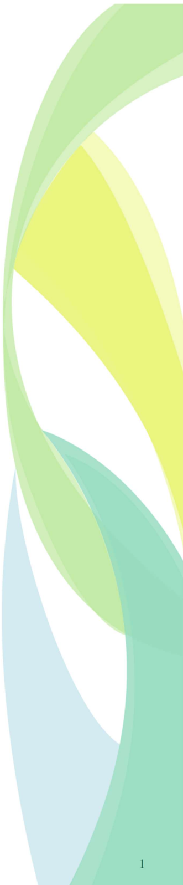
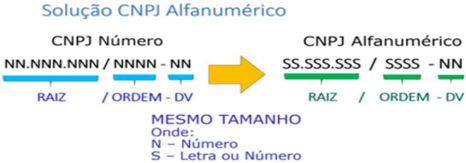
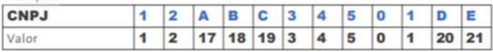
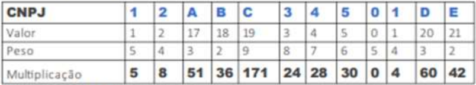
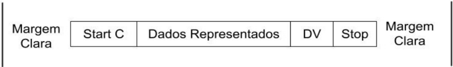

## Nota Técnica Conjunta CNPJ Alfanumérico

Nota Técnica 2025.001

Versão 1.00 de 25 de abril de 2025




## Sumário

| 1.Introdução..............................................................................................................................................3   |
|---------------------------------------------------------------------------------------------------------------------------------------------------------------|
| 2.Nova lei de formação do número do CNPJ:...............................................................................................4                     |
| 3.Alterações necessárias nos Documentos Fiscais Eletrônicos ...................................................................7                              |
| 4.Campos do tipo CNPJ..............................................................................................................................7          |
| Regras de Validação .....................................................................................................................................7    |
| 5.Chave de Acesso do Documento Fiscal Eletrônico ...................................................................................8                         |
| Cálculo do DVdaChavedeAcesso...............................................................................................................8                  |
| Regras de Validação .....................................................................................................................................9    |
| 6.Padrão do Código de Barras dos Documentos Auxiliares ..........................................................................9                            |
| Cálculo do Dígito Verificador do CODE-128C...............................................................................................11                   |
| Representação Simbólica do Código...........................................................................................................12                |
| Conjunto de Caracteres Código de Barras CODE-128 ..................................................................................13                         |
| Anexo I - Exemplo de validação do CNPJ Alfa emJavaScript.............................................................................14                       |
| Anexo II - Exemplo de validação da Chave de Acesso emVisual Basic .NET......................................................15                                |

## Histórico de Alterações / Cronograma

|   Versão | Histórico de atualizações                       | Implantação Ho- mologação   | Implantação Pro- dução   |
|----------|-------------------------------------------------|-----------------------------|--------------------------|
|     1.00 |  Versão inicial da NT Conjunta sobre CNPJ Alfa | 06/04/2026                  | 06/07/2026               |

## 1. Introdução

A Receita Federal do Brasil publicou a Instrução Normativa 2229 de 15 de outubro de 2024 que modifica a regra de formação do CNPJ no Brasil. Essa ação visa ampliar a capacidade de geração de números de CNPJ para abertura de empresas devido ao esgotamento da modelagem atual.

A  repercussão  dessa  mudança  afeta  milhares  de  sistemas,  e  não  será  diferente  com  os  sistemas  de faturamento  e  emissão  de  documentos  fiscais  eletrônicos  e  seus  respectivos  ambientes  de  autorização mantidos pelas Administrações Tributárias.

Esta nota técnica abrange os ambientes de autorização de documentos fiscais eletrônicos sob a coordenação do ENCAT: NFe, NFCe, CTe, CTe OS, GTVe, MDFe, BPe, BPe TM, NF3e e NFCom.

A previsão de geração dos primeiros CNPJ Alfanuméricos está definida para julho de 2026.

## 2. Nova lei de formação do número do CNPJ:

O novo número de identificação - CNPJ alfanumérico - terá o mesmo tamanho que o número atual, com 14 posições. As oito primeiras posições terão caracteres alfanuméricos (letras e números) e identificarão a raiz do  novo  número. As  quatro  posições  seguintes  à  raiz  também  terão  caracteres  alfanuméricos  (letras  e números) e identificarão a ordem do estabelecimento a ser inscrito. As duas últimas posições serão numéricas e identificam os dígitos verificadores deste CNPJ alfanumérico. O desenho abaixo identifica a transição da identificação numérica para alfanumérica:



A fórmula de cálculo do dígito verificador do CNPJ Alfanumérico não muda: foi mantido o cálculo pelo módulo 11. Porém, para garantir a utilização dos atuais números do CNPJ (tipo numérico), será necessária a alteração do modo como se calcula o dígito verificador pelo módulo 11. Serão utilizados, no cálculo do módulo 11, os valores  relativos  a  letras  maiúsculas  lastreadas  na  tabela  denominada  código ASCII,  como  solução  para unificar a representação de caracteres alfanuméricos;

Na  rotina  de  cálculo  do  Dígito  Verificador  (DV)  no  CNPJ,  serão  substituídos  os  valores  numéricos  e alfanuméricos pelo valor decimal correspondente ao código constante na tabela ASCII e dele subtraído o valor 48 .  Desta  forma  os  caracteres  numéricos  continuarão  com  os  mesmos  montantes,  e  os  caracteres alfanuméricos  terão  os  seguintes  valores: A=17,  B=18,  C=19…  e  assim  sucessivamente.  Esta  definição permitirá que o atual número do CNPJ tenha o mesmo cálculo do seu dígito verificador quando os sistemas iniciarem a identificação alfanumérica.

## Calculo do primeiro digitoverificador

Para cada um dos caracteres do CNPJ,atribuir ovalor da colunaValor para calculo do Dv" conformea tabelaabaixo(ousubtrair48doValorAScll):

| TabelaResumo                        | TabelaResumo   | TabelaResumo           |
|-------------------------------------|----------------|------------------------|
| CNPJ Alfanumerico (numerose letras) | ValorAsCil     | Valorpara calculo doDv |
|                                     | 49             |                        |
| 1                                   | 49             | 1                      |
| 2                                   | 50             | 2                      |
| 3                                   | 51             | 3                      |
| 4                                   | 52             | 4                      |
| 5                                   | 53             | 5                      |
| 6                                   | 54             |                        |
| 7                                   | 55             |                        |
| 8                                   | 55             | 8                      |
|                                     | 57             |                        |
| A                                   | 65             | 17                     |
| B                                   | 66             | 18                     |
| C                                   | 67             | 19                     |
| D                                   |                | 20                     |
| E                                   | 9              | 21                     |
| F                                   | 70             | 22                     |
| G                                   | 71             | 23                     |
| H                                   | 72             | 24                     |
|                                     | 7刀            | 25                     |
|                                     | 74             | 25                     |
| K                                   | 75             | 27                     |
| L                                   | 76             | 28                     |
| M                                   | 77             | 29                     |
| N                                   | 78             | 30                     |
|                                     | 79             | 31                     |
| P                                   | 80             | 32                     |
| Q                                   | 81             | 33                     |
| R                                   |                | 34                     |
| S                                   | 83             | 35                     |
| T                                   | 84             | 36                     |
| U                                   |                | 37                     |
| V                                   |                | 38                     |
| W                                   | 87             | 39                     |
| X                                   | 8              | 40                     |
| Y                                   | 89             | 41                     |
| Z                                   | 00             | 42                     |



| CNPJ   |   1 |   2 |   A |   B |   C |   3 |   4 |   5 |    |   1 |   D |   E |
|--------|-----|-----|-----|-----|-----|-----|-----|-----|----|-----|-----|-----|
| Valor  |   1 |   2 |  17 |  18 |  19 |   3 |   4 |   5 |  0 |   1 |  20 |  21 |

## Exemplo:

Distribuir os pesos de 2a9da direita para a esquerda (recomecandodepoisdooitavo caracter). conforme oexemplo:

| CNPJ   |   1 |   2 |   A |   B |   C |   3 |   4 |   5 |   0 |   1 |   D |   E |
|--------|-----|-----|-----|-----|-----|-----|-----|-----|-----|-----|-----|-----|
| Valor  |   1 |   2 |  17 |  18 |  19 |   3 |   4 |   5 |   0 |   1 |  20 |  21 |
| Peso   |   5 |   4 |   3 |   2 |   9 |   8 |   7 |   6 |   5 |   4 |   3 |   2 |

Multiplicarvalorepeso decada coluna esomar todososresultados:



| CNPJ          |   1 |   2 |   A |   B |   C |   3 |   4 |   5 |   0 |   1 |   D |   E |
|---------------|-----|-----|-----|-----|-----|-----|-----|-----|-----|-----|-----|-----|
| Valor         |   1 |   2 |  17 |  18 |  19 |   3 |   4 |   5 |   0 |   1 |  20 |  21 |
| Peso          |   5 |   4 |   3 |   2 |   9 |   8 |   7 |   6 |   5 |   4 |   3 |   2 |
| Multiplicacao |   5 |   8 |  51 |  36 | 171 |  24 |  28 |  30 |   0 |   4 |  60 |  42 |

Obterorestodadivisaodosomatoriopor1l.

Seoresto dadivisao forigualalou O,oprimeiro digitoseraiguala0（zero). Senao,oprimeiro digitoseraigualaoresultadodell-resto.

## No exemplo:

Restodadivisao459/11=8.

<!-- formula-not-decoded -->

## Calculo do segundo digito verificador

Para ocalculo dosegundo digitoenecessario acrescentaroprimeiro DV ao final do CNPJ formando assim treze caracteres,erepetir os passosrealizados para oprimeiro digito.

## Assim,noexemplo.temos:

| CNPJ               |   1 |   2 |   A |   B |   C3 |    |   4 |    |    |   1 |   D |    |   E3 |
|--------------------|-----|-----|-----|-----|------|----|-----|----|----|-----|-----|----|------|
| Atribuicaode Valor |   1 |   2 |  17 |  18 |   19 |  3 |   4 |  5 |  0 |   1 |  20 | 21 |    3 |
| Atribuicaode Peso  |   6 |   5 |   4 |   3 |    2 |  9 |   8 |  7 |  6 |   5 |   4 |  3 |    2 |
| Multiplicacao      |   6 |  10 |  68 |  54 |   38 | 27 |  32 | 35 |  0 |   5 |  80 | 63 |    6 |

Somatorio（6+10+.+6)=424

Restodadivisao424/11=6

- 2°DV=5（resultadode11-6）
- Rcsultadofinnl:12.ABC.345/01DE-35

## 3. Alterações necessárias nos Documentos Fiscais Eletrônicos

A  informação  do  CNPJ  é  essencial  no  ambiente  dos  documentos  fiscais  eletrônicos. A  identificação  do emitente do documento, e das demais partes relacionadas como destinatário, tomador, comprador, recebedor, expedidor  são  alguns  dos  exemplos. Além  disto,  o  CNPJ  é  parte  na  composição  da  chave  de  acesso identificadora unívoca dos documentos fiscais e compõe à tupla que representa a chamada chave natural: UF, CNPJ, série e número, também relacionada a validações de duplicidade.

Como forma de reduzir os impactos desta mudança, já foi antecipada a alteração de estrutura nos schemas XML juntamente com a Nota Técnica da Reforma Tributária do Consumo.

As alterações compreendem as expressões regulares responsáveis pela validação dos campos do tipo CNPJ nos schemas XSD de todos os leiautes que compõem cada um dos documentos fiscais e serviços disponíveis nos ambientes de autorização

Esta Nota Técnica complementa a especificação apontando as demais alterações referentes ao CNPJ Alfa.

## 4. Campos do tipo CNPJ

Os  Campos  que  representam  um  CNPJ  existem  dispostos  diversas  vezes  em  todos  os  DFe,  eventos  e schemas de inúmeros serviços disponíveis.

A expressão regular que valida um campo do tipo CNPJ passa a aceitar letras maiúsculas nas primeiras 12 posições: [A-Z0-9]{12}[0-9]{2}

Observação: Algumas letras não devem ser aceitas no CNPJ Alfa, como I, O, U, Q e F, essa exclusão faz parte das solicitações feitas pela equipe técnica do ENCAT para a Receita Federal do Brasil e precisa ser confirmada.

## Regras de Validação

Os campos de CNPJ estão associados a centenas de regras de validação nos Manuais e notas técnicas para os DFe e seus respectivos eventos.

A redação destas validações não se altera, uma vez que de forma geral, sinalizam que o CNPJ informado deve ser válido em relação ao DV e estar aderente ao cálculo apresentado no item 2 desta nota técnica.

A partir da data de implantação desta nota técnica, os contribuintes podem considerar que a rotina que faz a validação do cálculo do dígito verificador do CNPJ na SEFAZ Autorizadora está considerando o novo cálculo, e por consequência as rejeições já existentes serão aplicadas considerando-se o CNPJ informado, seja ele numérico ou alfanumérico.

Nota aos Autorizadores: As rotinas de validação de CNPJ devem rejeitar CNPJ Alfanuméricos informados anteriores a data de implantação de cada ambiente (homologação e produção), mesmo que seja admitida a informação na validação de schema (já modificado). A rejeição aplicada nesse caso será a de falha no cálculo do Digito verificador.

## 5. Chave de Acesso do Documento Fiscal Eletrônico

A  chave  de Acesso  de  qualquer  DFe  possui  uma  estrutura  composta  pela  concatenação  de  campos  da identificação do DFe com 44 posições:

|             |   Código da UF |   AAMMda emissão |   CNPJ do Emitente |   Modelo (mod) |   Série (serie) |   Número |   Forma de emissão |   Código Numérico |   DV |
|-------------|----------------|------------------|--------------------|----------------|-----------------|----------|--------------------|-------------------|------|
| Qtd Digitos |             02 |               04 |                 14 |             02 |              03 |       09 |                 01 |                08 |   01 |

-  cUF - Código da UF do emitente do Documento Fiscal
-  AAMM - Ano e Mês de emissão do DFe
-  CNPJ - CNPJ do emitente (* em alguns DFe nessas posições poderá existir CPF)
-  mod - Modelo do Documento Fiscal
-  serie - Série do Documento Fiscal
-  nNF - Número do Documento Fiscal
-  tpEmis - forma de emissão do DFe (diz respeito a emissão normal ou as contingências)
-  cXXX - Código Numérico que compõe a Chave de Acesso
-  cDV - Dígito Verificador da Chave de Acesso

A expressão regular que verifica a chave de acesso passa a suportar letras nas 12 primeiras posições do CNPJ: [0-9]{6}[A-Z0-9]{12}[0-9]{26}

Observação: Se algumas letras forem vedadas na composição do CNPJ Alfa, isto deve ser considerado também para a chave de acesso

## Cálculo do DV da Chave de Acesso

O cálculo do DV da chave de acesso deverá aplicar a mesma lógica da validação do CNPJ Alfa, trocando todos os caracteres (44) que compõe a chave (números e letras) pelos números correspondentes da tabela ASCII subtraindo 48 .

Posteriormente  à  substituição,  deverá  ser  aplicado  o  cálculo  do  Modulo  11  para  a  totalidade  dos  dígitos resultantes da chave de acesso.

## Regras de Validação

As regras de validação que verificam a lei de formação da chave de acesso possuem diversas ocorrências em cada um dos DFe, seja para verificar o DFe que está sendo autorizado, seja para relacionar um outro DFe como documento originário, realizar uma substituição e referenciação, registrar um evento e até no serviço de consulta chave de acesso.

Da mesma forma que as validações de CNPJ, não será necessário alterar nada na redação destas validações, no geral elas indicam que o CNPJ que compõe a chave de acesso deve ser válido, portanto, consideram-se as regras dispostas no item 2 desta nota técnica.

Nota aos Autorizadores: As rotinas de validação de Chave de acesso devem rejeitar chaves contendo CNPJ Alfanuméricos informados anteriores a data de implantação de cada ambiente (homologação e produção), mesmo que seja admitida a informação na validação de schema (já modificado). A rejeição aplicada nesse caso será a de falha no CNPJ informado na chave de acesso.

## 6. Padrão do Código de Barras dos Documentos Auxiliares

O padrão de código de barras a ser impresso no documento auxiliar (DACTE, DANFE, DABPE etc.) é o CODE128C e deverá representar a chave de acesso do DFe em emissão normal ou contingência.

O CODE-128C tem como característica suportar somente números, portanto, não é compatível com uma chave de acesso que venha possuir caracteres alfanuméricos nas posições do CNPJ.

O CODE-128C também possui um dígito verificador baseado em um cálculo do módulo 103 considerando a soma ponderada dos valores de cada um dos dígitos na mensagem que está sendo codificada, incluindo o valor do caractere de início (start).

Para suportar as alterações do CNPJ Alfa será necessário adaptar o padrão de código para geração dos documentos auxiliares.

O padrão sugerido a ser adotado é o modelo híbrido, utilizando o CODE 128-C, e na ocorrência de caracteres não numéricos, alternando para o CODE-128A que aceita além de números, letras maiúsculas. Esta alteração é feita usando o código 100 para alternar os subtipos A e C.

-  128A (Code Set A) - ASCII characters 00 a 95 (0-9, A-Z e códigos de controle)
-  128C (Code Set C) - 00-99 (codifica pares de números para cada item representado)

O  conjunto  de  caracteres  representativos  do  Código  de  Barras  CODE-128A  e  CODE-128C  encontra-se referenciado baixo. Para a sua impressão será considerada a seguinte estrutura de simbolização:



##  Margem

| Margem Clara   | StartC   | Dados Representados   | DV   | Stop   | Margem Clara   |
|----------------|----------|-----------------------|------|--------|----------------|

Clara: espaço claro que não contém nenhuma marca legível por máquina, localizado à esquerda e à direita  do  código,  a  fim  de  evitar  interferência  na  decodificação  da  simbologia. A  margem  clara  é chamada também de "área livre", "zona de silêncio" ou "margem de silêncio".

-  Start C: inicia a codificação dos dados CODE-128C de acordo com o conjunto de caracteres. O Start C não representa nenhum caractere.
-  Dados representados: caracteres representados no código de barras.
-  DV: dígito verificador da simbologia.
-  Stop: caractere de parada que indica o final do código ao leitor óptico.

O código de barras deverá ser impresso com os padrões próprios residentes das impressoras de não impacto (laser ou deskjet) e de impacto (matriciais ou de linhas) a fim de respeitarem os padrões dos referidos códigos:

-  A área reservada no Documento Auxiliar;
-  Largura  mínima  total  do  código  de  barras  (considerando  o  código  de  barras  da  chave  de  acesso,  com  44 posições):
- o 11,5 cm para impressoras de Não Impacto (Laser de Jato de Tinta);
- Por conta da mudança para o CNPJ Alfa, o novo padrão de código de barras - combinação do 128-A com 128-C poderá apresentar maior volume de dados para suportar os caracteres não numéricos, por isso teremos mais barras e necessitando de mais espaço para acomodar essa informação  e  manter  o  código  com  leitura  eficiente  nos  diversos  leitores  encontrados  no mercado. ■
- o 11,5 cm para impressora de impacto (Matricial e de linha)
-  Altura mínima da barra: 0,8 cm;
-  Largura mínima da barra: 0,02 cm, conforme explicado a seguir:
-  Considerando que para cada símbolo da barra são codificados dois caracteres, então teremos:
-  Tamanho do campo = 44 (caracteres) = 44 (símbolos)
-  Considerando que cada símbolo possui 11 (módulos) * 44 (símbolos) = 484 posições
-  Margem clara = deve ter no mínimo a dimensão de 10 (módulos) * 2 = 20 posições
-  Start A = 11 (módulos) = 11 posições
-  DV = 11 (módulos) = 11 posições
-  Stop = 13 (módulos) = 13 posições
-  Tamanho total da simbologia = 484 + 20 + 11 + 11 + 13 = 539 (posições)
-  Largura mínima de cada módulo da barra = 11,5 cm / 539 (posições) = 0,02 cm

## Cálculo do Dígito Verificador do CODE-128C

O dígito verificador é baseado em um cálculo do módulo 103 considerando a soma ponderada dos valores de cada um dos dígitos na mensagem que está sendo codificada, incluindo o valor do caractere de início (start).

O Code-128-C, que sempre será usado no início do código de barras utiliza o 105 como 'Start'. Exemplo: consideremos que a chave de acesso fosse apenas de oito caracteres e contivesse o seguinte termo: 5225AB83

| Código                   |   Valor do Código | Peso   | Valor × Peso      |
|--------------------------|-------------------|--------|-------------------|
| START C                  |               105 | (1)    | 105               |
| 52                       |                52 | 1      | 52                |
| 25                       |                25 | 2      | 50                |
| CODEA                    |               101 | 3      | 303               |
| 'A' (ASCII)              |                33 | 4      | 132               |
| 'B' (ASCII)              |                34 | 5      | 170               |
| CODE C                   |                99 | 6      | 594               |
| 83                       |                83 | 7      | 581               |
| Soma                     |                   |        | 1987              |
| Resto da divisão por 103 |                   |        | 1987 mod 103 = 30 |

Então 30 corresponde a '30' conforme tabela de composição dos caracteres do código de barras 128

Na linha valor do caractere foi incluso o valor 103 que corresponde ao valor do caractere de início (start) para o padrão Code C.

-  O dígito verificador do código será o resto da divisão da somatória dos valores ponderados dividido por 103 (módulo 103).

Assim o dígito verificador será:

-  Valor da soma ponderada =(1×105)+(1×52)+(2×25)+(3×101)+(4×33)+(5×34)+(6×99)+(7×83) = 1987
-  1987/103 = 19, e resta 30, assim o DV é o código correspondente ao valor 30.

## Representação Simbólica do Código

Combinação de barras: B=barra preta e S=espaço (barra branca)

| Símbolo   |   Código | Padrão (B/S)   | Larguras      |
|-----------|----------|----------------|---------------|
| START C   |      105 | B S B S B S    | 2 1 4 1 1 1   |
| 52        |       52 | B S B S B S    | 2 3 2 1 1 1   |
| 25        |       25 | B S B S B S    | 1 1 2 2 3 1   |
| CODEA     |      101 | B S B S B S    | 2 1 1 1 3 2   |
| A         |       33 | B S B S B S    | 2 1 2 1 2 2   |
| B         |       34 | B S B S B S    | 2 2 2 1 2 1   |
| CODE C    |       99 | B S B S B S    | 2 1 1 2 2 2   |
| 83        |       83 | B S B S B S    | 1 3 3 1 1 1   |
| DV (30)   |       30 | B S B S B S    | 2 2 2 1 1 2   |
| STOP      |      106 | B S B S B S B  | 2 3 3 1 1 1 2 |

## Orientações para o uso dos caracteres START, CODE e SHIFT

As seguintes orientações devem ser seguidas para minimizar o comprimento do código de barras.

Começando da esquerda:

1. Use o caractere de início 'C' pois os a chave de acesso dos DFe começarem com quatro ou mais dígitos.
2. Considerando que começamos com o 'C' e os dados começarem com um número ímpar de dígitos:
3.  Insira o código de mudança para o conjunto 'A' (Code A) antes do último dígito ímpar.
3. Se quatro ou mais dígitos ocorrerem em sequência enquanto se estiver no conjunto de caracteres 'A':
5.  Se houver um número par de dígitos no grupo, insira o código de mudança para o conjunto 'C' (Code C) antes do primeiro dígito do grupo.
6.  Se houver um número ímpar de dígitos no grupo, insira o código de mudança para o conjunto 'C' (Code C) imediatamente após o primeiro dígito do grupo. O primeiro dígito permanecerá codificado no conjunto 'A'.
4. Quando estiver no conjunto de caracteres 'C' e um caractere não numérico ocorrer nos dados, insira o código de mudança para o conjunto 'A' (Code A) antes do caractere não numérico.

Exemplo para o caso de número ímpar antes de um caractere (começando em 'C'):

Suponha que você esteja codificando "123A" e começou com o modo 'C'.

-  Você codificaria "12" no modo 'C'.
-  Ao encontrar o "3" (ímpar antes de um caractere não numérico), você inseriria o código "Code A" .
-  Então, você codificaria "3" no modo 'A'.
-  Finalmente, você codificaria "A" no modo 'A'.

O objetivo é sempre otimizar a densidade do código de barras, utilizando o conjunto de caracteres mais adequado para o tipo de dado que está sendo codificado em cada momento.

## Conjunto de Caracteres Código de Barras CODE-128

Conjunto de caracteres representativos do Código de Barras pode ser obtido em:

-  https://en.wikipedia.org/wiki/Code\_128
-  https://www.barcodesinc.com/articles/code128.htm

## Anexo I - Exemplo de validação do CNPJ Alfa em JavaScript

```
class CNPJ { static tamanhoCNPJSemDV = 12; static regexCNPJSemDV = /^([A-Z\d]){12}$/; static regexCNPJ = /^([A-Z\d]){12}(\d){2}$/; static regexCaracteresMascara = /[./-]/g; static regexCaracteresNaoPermitidos = /[^A-Z\d./-]/i; static valorBase = "0".charCodeAt(0); static pesosDV = [6, 5, 4, 3, 2, 9, 8, 7, 6, 5, 4, 3, 2]; static cnpjZerado = "00000000000000"; static isValid(cnpj) { if (!this.regexCaracteresNaoPermitidos.test(cnpj)) { let cnpjSemMascara = this.removeMascaraCNPJ(cnpj); if (this.regexCNPJ.test(cnpjSemMascara) && cnpjSemMascara !== this.cnpjZerado) { const dvInformado = cnpjSemMascara.substring(this.tamanhoCNPJSemDV); const dvCalculado = this.calculaDV(cnpjSemMascara.substring(0, this.tamanhoCNPJSemDV)); return dvInformado === dvCalculado; } } return false; } static calculaDV(cnpj) { if (!this.regexCaracteresNaoPermitidos.test(cnpj)) { let cnpjSemMascara = this.removeMascaraCNPJ(cnpj); if (this.regexCNPJSemDV.test(cnpjSemMascara) && cnpjSemMascara !== this.cnpjZerado.substring(0, this.tamanhoCNPJSemDV)) { let somatorioDV1 = 0; let somatorioDV2 = 0; for (let i = 0; i < this.tamanhoCNPJSemDV; i++) { const asciiDigito = cnpjSemMascara.charCodeAt(i) - this.valorBase; somatorioDV1 += asciiDigito * this.pesosDV[i + 1]; somatorioDV2 += asciiDigito * this.pesosDV[i]; } const dv1 = somatorioDV1 % 11 < 2 ? 0 : 11 - (somatorioDV1 % 11); somatorioDV2 += dv1 * this.pesosDV[this.tamanhoCNPJSemDV]; const dv2 = somatorioDV2 % 11 < 2 ? 0 : 11 - (somatorioDV2 % 11); return `${dv1}${dv2}`; } } throw new Error("Não é possível calcular o DV pois o CNPJ fornecido é inválido"); } static removeMascaraCNPJ(cnpj) { return cnpj.replace(this.regexCaracteresMascara, ""); } }
```

## Anexo II - Exemplo de validação da Chave de Acesso em Visual Basic .NET

```
Public Class ChaveAcesso Private Const TamanhoChaveAcessoSemDV = 43 Public Shared Function ValidaDigitoChaveAcesso(ByVal chaveAcesso As String) As Boolean 'Verifica DV Dim digito As Char = CalculaDigitoVerificadorChaveAcesso(chaveAcesso).ToString() If digito <> chaveAcesso.Substring(43, 1) Then Return False Else Return True End If 'Verifica demais informações da chAcesso (UF, CNPJ, AAAAMM emissão, caracteres inválidos, ...) ' ... ' ... End Function Public Shared Function CalculaDigitoVerificadorChaveAcesso(chaveAcesso As String) As Integer 'Converte a string em um array de bytes, onde cada byte representa o código ASCII do caractere subtraído de 48 Dim chAcessoBytes(TamanhoChaveAcessoSemDV - 1) As Byte For i As Integer = 0 To TamanhoChaveAcessoSemDV - 1 chAcessoBytes(i) = CByte(Asc(chaveAcesso(i)) - 48) Next Dim soma As Integer = 0 Dim peso As Integer = 2 ' multiplicador vai de 9 a 2 'Começa do final For i As Integer = TamanhoChaveAcessoSemDV - 1 To 0 Step -1 soma = soma + Convert.ToInt32(chAcessoBytes(i)) * peso peso += 1 If peso > 9 Then peso = 2 Next Dim dv As Integer = 11 - (soma Mod 11) If dv >= 10 Then dv = 0 End If Return dv End Function End Class
```