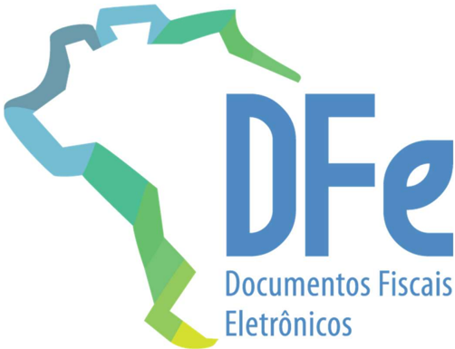

## Reforma Tributária do Consumo

Informe Técnico 2026.001 Versão 1.00 fevereiro de 2026

## Sumário

|   Histórico de Alterações / Cronograma....................................................................................3 | Histórico de Alterações / Cronograma....................................................................................3          |
|-----------------------------------------------------------------------------------------------------------------------------|------------------------------------------------------------------------------------------------------------------------------------|
|                                                                                                                           1 | Introdução.......................................................................................................................3 |

## Histórico de Alterações / Cronograma

|   Versão | Histórico de atualizações                                                                 | Implantação Homologação   | Implantação Produção   |
|----------|-------------------------------------------------------------------------------------------|---------------------------|------------------------|
|     1.00 |  Divulgação dos códigos válidos para o campo de Tipo de Meio de Pagamento (NTs 2026.001) | Abril/2026                | Maio/2026              |

## 1 Introdução

As Notas Técnicas 2026.001 dos documentos fiscais eletrônicos (CTe, CTe OS, BPe, BPeTM, BPeTA, NF3e, NFCom, NFAg e NFGas) introduziram o grupo de informações da vinculação da transação do pagamento nos DFe.

A estrutura de campos, voltada para as informações que serão utilizadas no sistema do Split Payment,  possui  uma  tag  para  informar  o  código  do  Meio  de  Pagamento  utilizado  na transação.

Existe  uma  tabela  nacional  que  estabelece  os  códigos  para  os  meios  de  pagamento  nos documentos  fiscais  eletrônicos,  utilizada  pelo  sistema  da  Nota  Fiscal  Eletrônica  (NFe)  e publicada no portal nacional da NFe (https://www.nfe.fazenda.gov.br) e no portal dos DFe da SEFAZ Virtual RS (https://dfe-portal.svrs.rs.gov.br).

O  grupo  de  informação  da  vinculação  da  transação  de  pagamento  utilizará  os  seguintes códigos estabelecidos nesta tabela citada anteriormente:

| Código                       | Descrição     |
|------------------------------|---------------|
| 15 Boleto                    |               |
| Pix QRCode dinâmico          | 17            |
| TED                          | 18            |
| PIX chave ou QRCode estático | 20            |
| Pix automático*              | 23            |
| 24 TEF /                     | booktransfer* |

A utilização de um código diferente dos relacionados acima causará a rejeição 1003 - Tipo de Pagamento inválido

A inclusão de códigos válidos será realizada através de atualizações deste Informe Técnico.