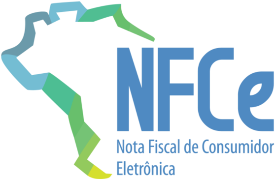

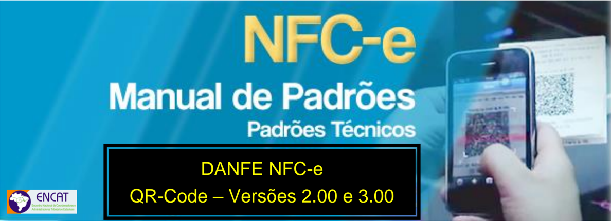

## CONTROLE DE VERSÕES

| DATA           | ALTERAÇÕES                                                                                                                                                                                                                                                                                                                                                                                                                                      |
|----------------|-------------------------------------------------------------------------------------------------------------------------------------------------------------------------------------------------------------------------------------------------------------------------------------------------------------------------------------------------------------------------------------------------------------------------------------------------|
| Fevereiro/2018 | (1ª Publicação)                                                                                                                                                                                                                                                                                                                                                                                                                                 |
| Dezembro/2019  | pág. 6 de: No DANFE NFC-e não devem ser inseridas informações que não constem do respectivo arquivo eletrônico XML da NFC-e, exceto o protocolo de autorização da NFC-e; Para: No DANFE NFC-e não devem ser inseridas informações que não constem do respectivo arquivo eletrônico XML da NFC-e, exceto as informações do XML de retorno da autorização da NFC-e (ex.: protocolo autorização, cMsg e xMsg);                                     |
|                | pág. 10                                                                                                                                                                                                                                                                                                                                                                                                                                         |
|                | Possibilidade de inclusão noDANFENFC-e de informações IDs: I15, I16, I17 e I17a, tags: vFrete, vSeg, vDesc e vOutro, a critério da UF, poderem estar discriminadas                                                                                                                                                                                                                                                                              |
|                | por item.                                                                                                                                                                                                                                                                                                                                                                                                                                       |
|                | pág. 13 de: Esta divisão é reservada para a impressão de mensagens de interesse fiscal que constem do campo informações fiscais do arquivo eletrônico da NFC-e (tag: infAdFisco). Para: Esta divisão é reservada para a impressão de mensagens de interesse fiscal que constem do campo informações fiscais do arquivo eletrônico da NFC-e (tag: infAdFisco) ou, a critério da UF, a tagxMsg contida no XML de retorno da autorização da NFC-e. |
|                | Item 3.1.1 - Informações de Cabeçalho Inclusão de CPF como emissor de NFC-e.                                                                                                                                                                                                                                                                                                                                                                    |
| Março/2025     | Item 4.4 - Geração da imagem do QR Code para NFC-e - Leiaute Versão 3.00 Inclusão da versão 3.00 do QR Code do DANFE NFC-e Item 5.3 - Relação de mensagens de validações Exclusão da denegação                                                                                                                                                                                                                                                  |

|                                                                                                                         | Sumário                                                                                                                             |                                                                      |
|-------------------------------------------------------------------------------------------------------------------------|-------------------------------------------------------------------------------------------------------------------------------------|----------------------------------------------------------------------|
| 1.                                                                                                                      | Vigência .........................................................................................................................  | 5                                                                    |
| 2.                                                                                                                      | Leiaute de Impressão DANFE NFC-e ...........................................................................                        | 6                                                                    |
| 3.                                                                                                                      | Modelos de Impressão do DANFE NFC-e....................................................................                             | 7                                                                    |
| 3.1                                                                                                                     | Modelo do DANFE NFC-e...............................................................................................7               |                                                                      |
| 3.1.1                                                                                                                   | Divisão I - Informações do Cabeçalho........................................................................8                       |                                                                      |
| 3.1.2                                                                                                                   | Divisão II - Informações de detalhes de produtos/serviços                                                                           | ........................................8                            |
| 3.1.3                                                                                                                   | Divisão III - Informações de Totais do DANFE NFC-e                                                                                  | ...............................................9                     |
| 3.1.4                                                                                                                   | Divisão IV - Informações da consulta via chave de acesso......................................10                                    |                                                                      |
| 3.1.5                                                                                                                   | Divisão V - Informações da consulta via QR Code...................................................10                                |                                                                      |
| 3.1.6                                                                                                                   | Divisão VI - Informações sobre o Consumidor.........................................................11                              |                                                                      |
| 3.1.7                                                                                                                   | Divisão VII -Informações de Identificação da NFC-e e do Protocolo de Autorização12                                                  |                                                                      |
| 3.1.8                                                                                                                   | Divisão VIII - Área de Mensagem Fiscal                                                                                              | ..................................................................12 |
| 3.1.9                                                                                                                   | Divisão IX - Mensagem de Interesse do Contribuinte                                                                                  | ..............................................14                     |
| 3.2                                                                                                                     | Exemplos de DANFE NFC-e.........................................................................................15                  |                                                                      |
| 3.3                                                                                                                     | Requisitos do Papel e Margens do DANFE NFC-e                                                                                        | .......................................................18            |
| 3.4                                                                                                                     | Dimensões mínimas do QR Code.................................................................................18                     |                                                                      |
| 4.                                                                                                                      | QR Code do DANFE NFC-e.........................................................................................                     | 19                                                                   |
| 4.1                                                                                                                     | Licença .........................................................................................................................20 |                                                                      |
| 4.2                                                                                                                     | Geração da imagem do QR Code para NFC-e..............................................................20                             |                                                                      |
| 4.3                                                                                                                     | Geração da imagem do QR Code para NFC-e - Versão 2.00.......................................20                                      |                                                                      |
| 4.3.1                                                                                                                   | Parâmetros da URL do QR Code na emissão ONLINE - Versão 2.00                                                                        | ....................21                                               |
| 4.3.2                                                                                                                   | Parâmetros da URL doQRCode na emissãoem contingência OFFLINE - Versão 22                                                            | 2.00                                                                 |
| 4.3.3                                                                                                                   | Conceito e objetivo do hash do QR Code - Versão 2.00..........................................23                                    |                                                                      |
| 4.3.4                                                                                                                   | Geração do Hash do QR Code na emissão ONLINE - Versão 2.00........................23                                                |                                                                      |
| 4.3.5                                                                                                                   | Geração do Hash do QR Code na emissão em contingência OFFLINE - Versão 24                                                           | 2.00                                                                 |
| 4.3.6                                                                                                                   | Exemplo de QR Code e Hash QR Code - Versão 2.00...........................................24                                        |                                                                      |
| 4.4 Geração da imagem do QR Code para NFC-e - Versão 3.00.......................................28                      | 4.4 Geração da imagem do QR Code para NFC-e - Versão 3.00.......................................28                                  |                                                                      |
| 4.4.1                                                                                                                   | Parâmetros da URL do QR Code na emissão ONLINE - Versão 3.00                                                                        | .....................29                                              |
| 4.4.2                                                                                                                   | Parâmetros da URL doQRCode na emissãoem contingência OFFLINE - Versão 30                                                            | 3.00                                                                 |
| 4.5 Configurações para QR Code.......................................................................................30 | 4.5 Configurações para QR Code.......................................................................................30             |                                                                      |
| 4.5.1                                                                                                                   | Capacidade de armazenamento...............................................................................31                        |                                                                      |
| 4.5.2                                                                                                                   | Capacidade de correção de erros.............................................................................31                      |                                                                      |
| 4.5.3                                                                                                                   | Tipo de caracteres....................................................................................................31            |                                                                      |

|   4.6 | Fornecimento do CSC...................................................................................................31   |
|-------|----------------------------------------------------------------------------------------------------------------------------|
|   4.7 | Implementação no sistema do contribuinte ...................................................................32             |
|   4.8 | URL da Consulta da NFC-e via QR-Code no XML - obrigatoriedade ............................33                               |
|    5. | Consulta Pública NFC-e.............................................................................................. 34    |
|   5.1 | Consulta Pública de NFC-e via Digitação de Chave de Acesso....................................34                           |
|   5.2 | Consulta Pública de NFC-e via QR Code......................................................................37              |
|   5.3 | Tabela padronizada com os códigos e mensagens na consulta de NFC-e ...................38                                   |

## 1.  Vigência

As  alterações  no  leiaute  do  DANFE  NFC-e  trazidas  pela  presente  versão  do Manual serão de observância obrigatória a partir de 01/10/2018, e somente se aplica às NFCe emitidas na versão 4.00 ou superior do XML.

Recomenda-se  que  as  empresas  e  desenvolvedores  observem  os  seguintes prazos para adequação da versão do leiaute de impressão do DANFE NFC-e, especialmente no que concerne à alteração da versão do QR Code:

- 04/06/2018 - Início da homologação da versão 4.00 do XML para a NFC-e
- 02/07/2018  -  Início  da  produção  da  versão  4.00  do  XML  para  a  NFC-e    -  início  da concomitância com a versão 1.00 do QR Code (a versão 4.00 do XML da NFC-e aceitará as versões 1.00 e 2.00 do QR Code)
- 01/10/2018 - Desativação da versão 3.10 do XML para a NFC-e
- 01/10/2018 - Fim da concomitância com a versão 1.00 do QR Code (a versão 4.00 do XML da NFC-e aceitará somente a versão 2.00 do QR Code)

## 2.  Leiaute de Impressão DANFE NFC-e

Este capítulo descreve o leiaute de impressão do Documento Auxiliar da NFC-e pelo contribuinte, chamado de DANFE NFC-e, assim como os requisitos mínimos do Detalhe da Venda que poderá constar do DANFE NFC-e, a critério do consumidor final e da UF.

Algumas considerações acerca da impressão do DANFE NFC-e:

- O  DANFE  NFC-e  é  um  documento  fiscal  auxiliar,  sendo  apenas  uma  representação simplificada em papel da transação de venda no varejo, de forma a facilitar a consulta do documento fiscal eletrônico, no ambiente da SEFAZ, pelo consumidor final;
- A impressão do DANFE NFC-e é efetuada diretamente pelo aplicativo do contribuinte em impressora comum (não fiscal), com base nas informações do arquivo eletrônico XML da NFC-e;
- No DANFE NFC-e não devem ser inseridas informações que não constem do respectivo arquivo eletrônico XML da NFC-e, exceto as informações do XML de retorno da autorização da NFC-e (ex.: protocolo autorização, cMsg e xMsg);
- Poderá  ser  impresso  apenas  o DANFE  NFC-e  resumido  ou  ecológico ,  sem  o detalhamento dos itens da venda, desde que a Unidade Federada permita esta opção em sua legislação e o consumidor assim o solicite. O consumidor que aceitar receber somente o DANFE NFC-e resumido poderá, posteriormente, solicitar ao emissor a impressão, sem custo, do correspondente DANFE NFC-e completo. O consumidor também poderá imprimir o DANFE NFC-e completo apresentado no portal da Secretaria da Fazenda em resposta à consulta pública pela chave de acesso ou pela leitura do QR Code. O prazo máximo de que dispõe o consumidor para a solicitação de impressão do DANFE NFC-e completo (com detalhe de itens) ao emitente corresponde ao prazo de garantia da mercadoria, segundo o código de defesa do consumidor;
- O contribuinte emitente de NFC-e fica dispensado de enviar ou disponibilizar download ao consumidor do arquivo XML da NFC-e, exceto se o consumidor assim o solicitar, desde que antes de iniciada a emissão da NFC-e;
- A  legislação  estadual  poderá  facultar  que,  por  opção  do  adquirente  da  mercadoria,  o DANFE NFC-e tenha sua impressão substituída pelo envio em formato eletrônico ou pelo envio da chave de acesso do documento fiscal a qual ele se refere, ou ainda, seja impresso apenas o DANFE NFC-e resumido, sem a impressão do detalhe dos itens de mercadoria.

A legibilidade do texto impresso no DANFE NFC-e, assim como a durabilidade do papel empregado, deverão ser garantidos, no mínimo, pelo prazo de (6) seis meses.

## 3.  Modelos de Impressão do DANFE NFC-e

## 3.1 Modelo do DANFE NFC-e

Seguem abaixo nas Figuras 1A e 1B as divisões de informações que compõem o DANFE NFC-e.

Figura 1A:  Modelo DANFE NFC-e - QR Code na lateral

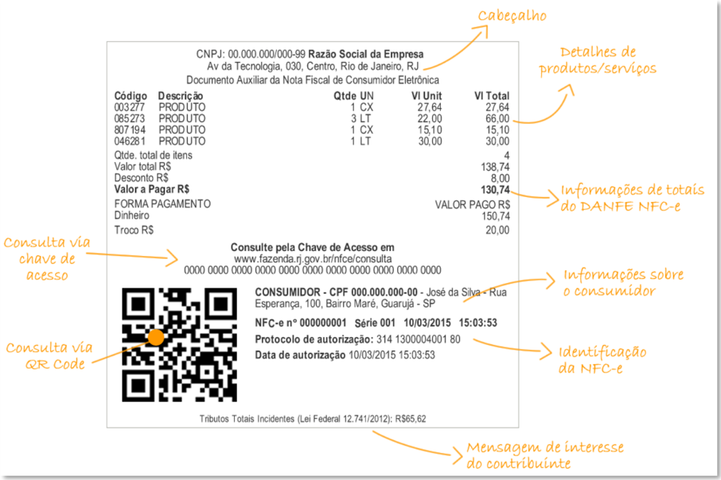

Figura 1B: QR Code centralizado

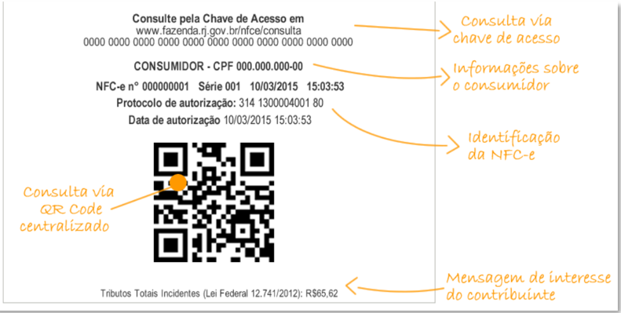

## 3.1.1 Divisão I - Informações do Cabeçalho

O cabeçalho deverá conter as seguintes informações:

- CNPJ do Emitente - formatado com a máscara 99.999.999/9999-99 (ID: C02, tag: CNPJ) ou CPF do Emitente - formatado com a máscara 999.999.999-99 (ID: C02a, tag: CPF);
- Razão Social ou Nome do Emitente (ID: C03, tag: xNome);
- Endereço Completo do Emitente sem a indicação do país
- Texto: 'Documento Auxiliar da Nota Fiscal de Consumidor Eletrônica'.

A  critério  do  emissor  da  NFC-e  poderá  ser  incluído,  no  canto  esquerdo  desta  divisão,  o logotipo da empresa ou o logotipo da NFC-e.

## 3.1.2 Divisão II - Informações de detalhes de produtos/serviços

Figura 2: Detalhes de produtos/serviços

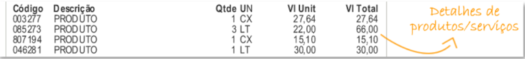

|   Codigo | Descricao   | QtdeUN   | VIUnit   | VITotal   | Detalhes de       |
|----------|-------------|----------|----------|-----------|-------------------|
|   003277 | PRODUTO     | 1CX      | 27,64    | 27,64     |                   |
|   085273 | PRODUTO     | 3LT      | 22,00    | 66,00     | produtos/servigos |
|   807194 | PRODUTO     | 1 CX     | 15,10    | 15,10     |                   |
|   046281 | PRODUTO     | 1 LT     | 30,00    | 30,00     |                   |

A divisão II (exibida na Figura 2) corresponde ao local onde poderão ser impressas as  informações  de  detalhamento  dos  produtos/serviços  adquiridos.  A  critério  da  Unidade Federada poderá ser autorizado ao emissor de NFC-e, pela legislação estadual, imprimir o DANFE NFC-e sem o detalhamento dos itens de mercadoria/serviço, desde que o consumidor esteja de acordo. Nessa hipótese não existirá a divisão II no DANFE NFC-e.

Caso exista  a  divisão  II,  não  são  reguladas  as  posições  das  informações  dos detalhes de produtos/serviços e forma de sua impressão, mas são obrigatórias, no mínimo, as seguintes informações:

- Código : código do produto adotado pelo estabelecimento (ID: I02, tag: cProd);
- Descrição : descrição do produto (ID: I04, tag: xProd);
- Qtde : quantidade de unidades do produto adquiridas pelo consumidor (ID: I10, tag: qCom);
- Un : unidade de medida do produto (ID: I09, tag: uCom);
- Valor unit. : valor de uma unidade do produto (ID: I10a, tag: vUnCom);
- Valor total : valor total do produto (ID: I11, tag: vProd).

As informações de valores devem ter as casas decimais separadas por vírgula e ser utilizado ponto para a indicação de milhar.

## 3.1.3 Divisão III - Informações de Totais do DANFE NFC-e

Figura 3: informações de totais do DANFE NFC-e

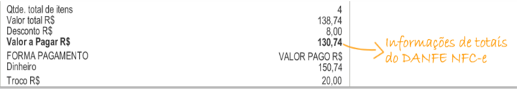

Esta divisão define os totais que deverão ser impressos no DANFE NFC-e de acordo com o detalhamento abaixo:

- Qtde. Total de Itens : somatório da quantidade de itens (observação: a quantidade de itens refere-se à quantidade de itens de produtos/serviços distintos na NFC-e não guardando qualquer relação com a soma de quantidade de produtos/serviços);
- Valor Total R$ : somatório dos valores totais dos itens;
- Acréscimos (frete, seguro e outras despesas) /Desconto R$ : somatório dos valores dos itens dos acréscimos (frete, seguro e outras despesas) e dos descontos (deve ser impressa a  linha  apenas  se  existir  acréscimo  ou  desconto))  (IDs:  W08,  W09,  W10  e  W15,  tags: vFrete, vSeg, vDesc e vOutro);

OBS.: Estas informações, a critério da UF, podem estar discriminadas por item (IDs: I15, I16, I17 e I17a, tags: vFrete, vSeg, vDesc e vOutro).

| LOGO da CNPJ:00.000.000/000-99RazaoSocialdaEmpresa Av da Tecnologia,030,Centro,Rio de Janeiro,RJ EMPRESA DocumentoAuxiliar da NotaFiscal de Consumidor Eletronica   | LOGO da CNPJ:00.000.000/000-99RazaoSocialdaEmpresa Av da Tecnologia,030,Centro,Rio de Janeiro,RJ EMPRESA DocumentoAuxiliar da NotaFiscal de Consumidor Eletronica   | LOGO da CNPJ:00.000.000/000-99RazaoSocialdaEmpresa Av da Tecnologia,030,Centro,Rio de Janeiro,RJ EMPRESA DocumentoAuxiliar da NotaFiscal de Consumidor Eletronica   | LOGO da CNPJ:00.000.000/000-99RazaoSocialdaEmpresa Av da Tecnologia,030,Centro,Rio de Janeiro,RJ EMPRESA DocumentoAuxiliar da NotaFiscal de Consumidor Eletronica   | LOGO da CNPJ:00.000.000/000-99RazaoSocialdaEmpresa Av da Tecnologia,030,Centro,Rio de Janeiro,RJ EMPRESA DocumentoAuxiliar da NotaFiscal de Consumidor Eletronica   |
|---------------------------------------------------------------------------------------------------------------------------------------------------------------------|---------------------------------------------------------------------------------------------------------------------------------------------------------------------|---------------------------------------------------------------------------------------------------------------------------------------------------------------------|---------------------------------------------------------------------------------------------------------------------------------------------------------------------|---------------------------------------------------------------------------------------------------------------------------------------------------------------------|
| Codigo                                                                                                                                                              | Descricao                                                                                                                                                           | Qtde UN                                                                                                                                                             | VIUnit                                                                                                                                                              | VITotal                                                                                                                                                             |
| 003277                                                                                                                                                              | Cadeira Est. Comtemp.                                                                                                                                               | 2 Pega                                                                                                                                                              | 500,00                                                                                                                                                              | 1.000,00                                                                                                                                                            |
|                                                                                                                                                                     | Frete                                                                                                                                                               |                                                                                                                                                                     |                                                                                                                                                                     | 25,00                                                                                                                                                               |
| 085273                                                                                                                                                              | Mesa                                                                                                                                                                | 1Peca                                                                                                                                                               | 1.500,00                                                                                                                                                            | 1.500,00                                                                                                                                                            |
|                                                                                                                                                                     | Desconto                                                                                                                                                            |                                                                                                                                                                     |                                                                                                                                                                     | -500,00                                                                                                                                                             |
|                                                                                                                                                                     | Frete                                                                                                                                                               |                                                                                                                                                                     |                                                                                                                                                                     | 25,00                                                                                                                                                               |
| Qtde.totaldeitens                                                                                                                                                   | Qtde.totaldeitens                                                                                                                                                   |                                                                                                                                                                     |                                                                                                                                                                     | 2                                                                                                                                                                   |
| Valor total R$                                                                                                                                                      | Valor total R$                                                                                                                                                      |                                                                                                                                                                     |                                                                                                                                                                     | 2.500,00                                                                                                                                                            |
| Desconto total RS                                                                                                                                                   | Desconto total RS                                                                                                                                                   |                                                                                                                                                                     |                                                                                                                                                                     | -500,00                                                                                                                                                             |
| Frete total R$                                                                                                                                                      | Frete total R$                                                                                                                                                      |                                                                                                                                                                     |                                                                                                                                                                     | 50,00                                                                                                                                                               |
| Valor a Pagar RS                                                                                                                                                    | Valor a Pagar RS                                                                                                                                                    |                                                                                                                                                                     |                                                                                                                                                                     | 2.050,00                                                                                                                                                            |
| FORMAPAGAMENTO                                                                                                                                                      | FORMAPAGAMENTO                                                                                                                                                      |                                                                                                                                                                     |                                                                                                                                                                     | VALORPAGO R$                                                                                                                                                        |
| Cartao de credito                                                                                                                                                   | Cartao de credito                                                                                                                                                   |                                                                                                                                                                     |                                                                                                                                                                     | 1.050,00                                                                                                                                                            |
| Cartaodecredito                                                                                                                                                     | Cartaodecredito                                                                                                                                                     |                                                                                                                                                                     |                                                                                                                                                                     | 1.000,00                                                                                                                                                            |

NFC-en°000000001Série00110/03/2015

15:03:53

Via empresa

Protocolodeautorizacao:314130000400180

Datadeautorizacao10/03/201515:03:53

Figura C: DANFE NFC-e

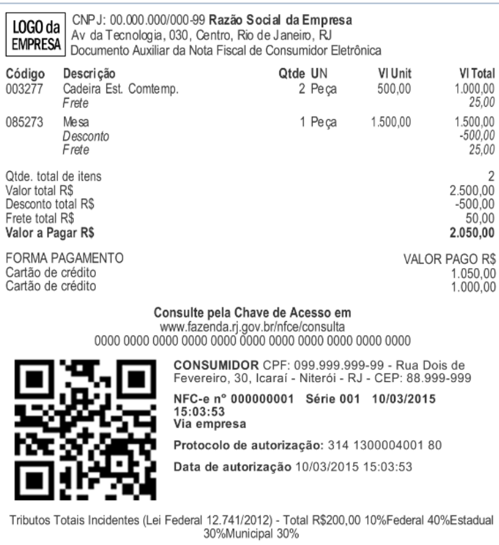

- Valor  a  Pagar  R$ :  somatório  dos  valores  totais  dos  itens  somados  os  acréscimos  e subtraído os descontos (deve ser impresso apenas se existir acréscimo ou desconto) (ID: W16, tag: vNF);
- Forma de Pagamento : forma na qual o pagamento da NFC-e foi efetuado (podem ocorrer mais de uma forma de pagamento, devendo nesse caso ser indicado o montante parcial do pagamento para a respectiva forma. Exemplo: em dinheiro, em cheque etc (ID: YA02, tag: tPag);
- Valor Pago : valor pago efetivamente em cada forma de pagamento (ID: YA03, tag: vPag);
- Troco : valor do troco (ID:YA09, tag: vTroco).

As informações de valores devem ter as casas decimais separadas por vírgula e ser utilizado ponto para a indicação de milhar.

A informação do troco será obrigatória a partir da nova versão do leiaute da NFCe, conforme NT 2016.002.

## 3.1.4 Divisão IV - Informações da consulta via chave de acesso

Esta divisão contém as informações referentes à consulta NFC-e.  Deve iniciar com  o  texto  'Consulte  pela  Chave  de  Acesso  em'  seguido  do  endereço  eletrônico  para consulta  pública  da  NFC-e  no  Portal  da  Secretaria  da  Fazenda  da  Unidade  Federada  do contribuinte (endereços disponíveis no Portal Nacional da NFC-e - http://NFC-e.encat.org/ na opção "Consumidor" - "Consulte sua Nota"), e a chave de acesso impressa em 11 blocos de quatro dígitos, com um espaço entre cada bloco.

A URL da consulta chaves de acesso da NFC-e deve constar do arquivo XML da NFC-e, no campo destinado às Informações Suplementares da Nota Fiscal (tag ZX-03).

## 3.1.5 Divisão V - Informações da consulta via QR Code

A divisão V corresponde à área de impressão do QR Code no DANFE NFC-e. A imagem do QR Code poderá ser impressa à esquerda das informações exigidas nas Divisões VI e VII, conforme figura 4, ou centralizada, conforme figura 5, e deve ter tamanho mínimo 25mm x 25mm, sendo 22mm de conteúdo para 3mm de margem segura (quiet zone). Para dimensões superiores a 25mm, considerar a margem segura de 10% da dimensão total.

Figura 4: layout DANFE NFC-eQR Code à esquerda

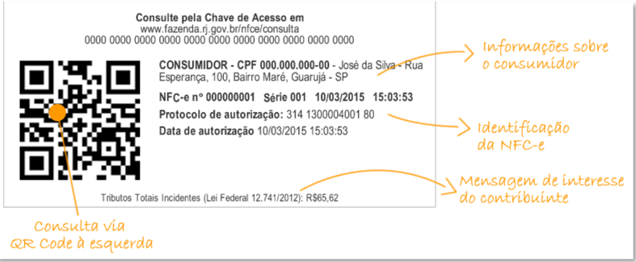

Figura 5: layout DANFE NFC-eQR Code centralizado

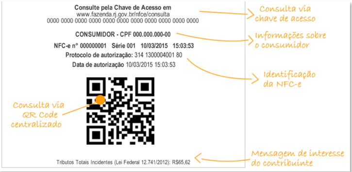

## 3.1.6  Divisão VI - Informações sobre o Consumidor

Nesta Divisão deve ser informada a identificação do consumidor no DANFE NFCe, à direita ou antes da Divisão V, conforme exemplo nas figuras 4 ou 5. Deverá constar uma das seguintes opções, em caixa alta, conforme o caso: 'CONSUMIDOR CNPJ:' e o respectivo CNPJ (ID: E02, tag: CNPJ); 'CONSUMIDOR CPF:' e o respectivo CPF (ID: E03, tag: CPF); ou 'CONSUMIDOR Id. Estrangeiro:' e a respectiva identificação do estrangeiro (ID: E03a, tag: idEstrangeiro),  como  passaporte,  ou  documento  de  identificação  do  respectivo  país.  As informações  de  CNPJ,  CPF  ou  de  identificação  de  estrangeiro  somente  deverão  ser impressas se constarem do arquivo eletrônico da NFC-e em decorrência de NFC-e de valor igual ou superior a R$ 10.000,00 (valor que poderá ser menor, a critério da UF - http://NFCe.encat.org/desenvolvedor/regras-de-validacao/), NFC-e  para entrega em  domicílio ou atendendo pedido de identificação do consumidor.

Poderá  ser  incluída  nesta  divisão  também  o  nome  do  consumidor  e/ou  seu endereço. No caso de emissão de NFC-e com entrega em domicílio é obrigatória a impressão do nome do consumidor e do endereço de entrega.

Na hipótese de o consumidor não desejar ser identificado, e em se tratando de NFC-e de valor inferior a R$ 10.000,00 (valor a critério da UF) e que não se refira a entrega em domicílio, deverá ser impressa apenas nesta divisão a mensagem 'CONSUMIDOR NÃO IDENTIFICADO'.

## 3.1.7 Divisão VII -Informações de Identificação da NFC-e e do Protocolo de Autorização

As  informações  da  divisão  VII  deverão  ser  impressas  em  uma  das  formas indicadas nas figuras 4 ou 5, devendo conter:

- Número da NFC-e (ID: B08, tag: nNF)
- Série da NFC-e (ID: B07, tag: serie)
- Data e Hora de Emissão da NFC-e (ID: B09, tag: dhEmi), convertida para o horário local (apesar da data de emissão constar no arquivo XML da NFC-e em formato UTC, esta data deverá ser impressa no DANFE NFC-e sempre convertida para o horário local)
- O texto 'Protocolo de autorização:' seguido do número do protocolo de autorização (ID: PR09,  tag:  nProt)  obtido  para  NFC-e  e  a  data  e  hora  da  autorização  (ID:  PR08,  tag: dhRecbto). A data de autorização é fornecida pela SEFAZ no formato UTC e deve ser impressa no  DANFE  NFC-e  convertida  para  o  horário  local.    No  caso  de  emissão  em contingência a informação sobre o protocolo de autorização será suprimida.

## 3.1.8 Divisão VIII - Área de Mensagem Fiscal

Esta divisão é reservada para a impressão de mensagens de interesse fiscal que constem do campo informações fiscais do arquivo eletrônico da NFC-e (tag: infAdFisco) ou, a critério da UF, a tagxMsg contida no XML de retorno da autorização da NFC-e.

Na hipótese  de  emissão  de  NFC-e  em  contingência  é  obrigatório  imprimir  em destaque o texto em duas linhas: 'EMITIDA EM CONTINGÊNCIA Pendente de autorização'. O texto deve ser exibido em dois locais no documento:

- Abaixo do cabeçalho (divisão I): centralizado em duas linhas, entre bloco de linhas, conforme imagem a seguir.
- Abaixo da identificação da NFC-e (divisão VII) em duas linhas, conforme imagem a seguir.

Figura 6: DANFE NFC-e emitida em contingência

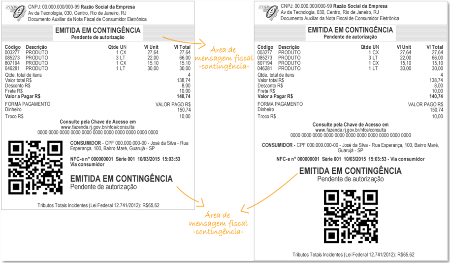

Ainda na hipótese contingência, deverá ser impressa uma segunda via do DANFE NFC-e que deverá permanecer a disposição do Fisco no estabelecimento até que tenha sido transmitida e autorizada a respectiva NFC-e emitida em contingência. Essa obrigação poderá, a critério da Unidade Federada, ser dispensada. Alternativamente à impressão da segunda via do DANFE NFC-e quando de emissão em contingência, o contribuinte poderá optar pela guarda eletrônica, em local seguro, do respectivo arquivo XML da NFC-e que deve possibilitar impressão do respectivo DANFE NFC-e para apresentação ao fisco quando solicitado.

Para poder fazer uso desta opção de guarda eletrônica do arquivo XML emitido em  contingência,  deverá,  previamente,  lavrar  termo  no  livro  Registro  de  Utilização  de Documentos Fiscais e Termos de Ocorrência - modelo 6, ou formalizar declaração de opção segundo disciplina que vier a ser estabelecida por sua Unidade Federada, assumindo total responsabilidade  pela  guarda  do  arquivo  e  declarando  ter  ciência  que  não  poderá, posteriormente, alegar problemas técnicos para justificar a eventual perda desta informação eletrônica que está sob sua posse, assumindo as consequências legais por ventura cabíveis.

Para qualquer NFC-e emitida em ambiente de homologação é obrigatório imprimir nesta área, de forma centralizada e em caixa alta, o seguinte texto: 'EMITIDA EM AMBIENTE DE HOMOLOGAÇÃO - SEM VALOR FISCAL'.

No caso de emissão de NFC-e em contingência, a 2ª via do DANFE NFC-e deverá ser  identificada  com  a  impressão  ao  lado  da  data  e  hora  da  emissão  do  texto  'Via  do Estabelecimento'.

## 3.1.9 Divisão IX - Mensagem de Interesse do Contribuinte

Esta divisão corresponde à parte final do DANFE NFC-e e se refere à área em que  poderão  ser  impressas  mensagens  de  interesse  do  contribuinte  que  façam  parte  do arquivo eletrônico da NFC-e no campo informações complementares do contribuinte (ID: Z03, tag: infCpl).

Caso  o  contribuinte  queira  imprimir,  no  mesmo  papel  do  DANFE  NFC-e, mensagens institucionais ou outras informações que não estejam no arquivo XML da NFC-e, as mesmas deverão ser apresentadas logo após o final do DANFE NFC-e (imediatamente após a divisão IX de mensagem de interesse do contribuinte).

## 3.1.9.1  Informações exigidas pela Lei Federal nº 12.741/2012

A critério do emissor da NFC-e poderão ser impressas na área de mensagem de interesse do contribuinte (divisão IX) as informações exigidas pela Lei Federal nº 12.741, de 10 de dezembro de 2012, que trata da discriminação da carga tributária nos documentos fiscais. No leiaute atual da NF-e e NFC-e existe apenas um campo de valor total de tributos por item de mercadoria (campo 183a - vTotTrib) e um campo de valor total de tributos no documento fiscal (campo 341a - vTotTrib).

Esses campos não são de preenchimento obrigatório, e têm natureza informativa ao consumidor sobre a carga tributária total do produto ou serviço, e portanto, não é possível ser feita qualquer validação com relação a soma de tributos destacados na NF-e ou NFC-e.

Fica  facultado  ao  contribuinte  emissor  de  NFC-e  que  assim  desejar,  imprimir também na divisão II do detalhe de produtos/serviços o valor total de carga tributária por item de mercadoria.

Também é importante ressaltar que, alternativamente à impressão de informação no documento fiscal, a lei 12.741/12 possibilita a empresa que detalhe a carga tributária por produto  por  meio  de  painel  afixado  ou  meio  eletrônico  disponível  ao  consumidor  no estabelecimento.

## 3.2  Exemplos de DANFE NFC-e

Para facilitar aos emissores e aos desenvolvedores de NFC-e apresentamos a seguir alguns exemplos hipotéticos de DANFE NFC-e.

Exemplo 1: DANFE NFC-e normal com vários itens e sem identificação do consumidor

## DANFE NFC-e completo

Codigo

Descricao

003277

PRODUTO

085273

PRODUTO

807194

PRODUTO

046281

PRODUTO

Qtde.totaldeitens

Valor total R$

DescontoR$

ValoraPagar R$

FORMAPAGAMENTO

Dinheiro

NFC-en°000000001Serie001 10/03/2015 15:03:53

Protocolodeautorizacao:314130000400180

Datadeautorizacao10/03/201515:03:53

TributosTotais Incidentes(Lei Federal 12.741/2012):R$65,62

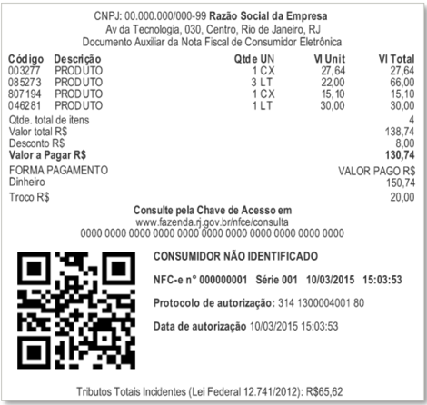

## DANFE NFC-e Resumido

CNPJ:00.000.000/000-99RazaoSocialdaEmpresa

Av da Tecnologia,030,Centro,Rio deJaneiro,RJ

DocumentoAuxiliar da NotaFiscal de ConsumidorEletronica

Qtde.total de itens

4

Valor totalR$

138,74

Desconto R$

8,00

ValoraPagarR$

130,74

FORMAPAGAMENTO

VALORPAGOR$ 150,74

Dinheiro

Troco R$

20,00

www.fazenda.rj.gov.br/nfce/consulta 000000000000 00000000000000000000 000000000000

Consultepela Chave deAcesso em

CONSUMIDOR-CPF 000.000.000-00-Jose daSilva-Rua Esperanga, 100,Bairo Mare, Guaruja -SP

NFC-en°000000001Serie00110/03/2015 15:03:53

Protocolode autorizacao:314130000400180

Data de autorizacao10/03/201515:03:53

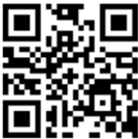

Tributos Totais Incidentes (Lei Federal 12.741/2012): R$65,62

Exemplo 2: DANFE NFC-e normal com 2 itens, 2 formas de pagamento, desconto, frete (ou taxa de entrega), entrega em domicílio e com identificação do consumidor (com endereço entrega)

## DANFE NFC-e completo

CNPJ:00.000.000/000-99RazaoSocialdaEmpresa Av da Tecnobgia,030,Centro,Rio deJaneiro,RJ DocumentoAuxiliardaNotaFiscaldeConsumidorEletronica

Codigo

## Descricao

QtdeUN

VUnit

VITotal

003277

CadeiraEst.Comtemp. Mesa

2Peca

500,00

1.000,00

085273

1Peca

1.500,00

1.000,00

Qtde.total de itens

2

Valor total RS

2.500,00

Desconto RS

500,00

Frete R$

50,00

ValoraPagar RS

2.050,00

FORMAPAGAMENTO

VALORPAGOR$

Cartao de credito

1.050,00

Cartaodecredito

1.000,00

## ConsultepelaChavedeAcessoem

00000000000000000000000000000000000000000000

www.fazenda.rj.gov.br/nfce/consulta

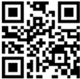

CONSUMIDORCPF:099.999.999-99-RuaDoisde

Fevereiro,30,lcarai-Niteroi-RJ-CEP:88.999-999

NFC-en°000000001Serie00110/03/201515:03:53 Viaempresa

Protocolode autorizacao:314130000400180

Datadeautorizacao10/03/201515:03:53

TributosTotais Incidentes (LeiFederal12.741/2012)-TotalR$200,00 10%Federal40%Estadual 30%Municipal30%

## DANFE NFC-e Resumido

CNPJ:00.000.000/000-99RazaoSocial daEmpresa Av da Tecnologia,030,Centro,Rio de Janeiro,RJ DoaumentoAuxiliarda NotaFiscal deConsumidor日etronica

Qtde.total deitens

2

Valortotal R$

2.500,00

DescontoRS

500,00

FreteR$

50,00

ValoraPagarR$

2.050,00

FORMAPAGAMENTO

VALOR PAGO R$

Cartaodecredito

1.050,00

Cartaodecredito

1.000,00

ConsultepelaChavedeAcessoem

www.fazenda.rj.gov.br/nfce/consulta 00000000000000000000000000000000000000000000

NFC-e n°000000001Serie00110/03/201515:03:53 Viaconsumidor

CONSUMIDOR CPF:099.999.999-99-RuaDois deFevereiro, 30,Icarai-Niteroi-RJ-CEP:88.999-999

Protocolode autorizacao:314130000400180 Datadeautorizacao10/03/201515:03:53

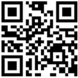

TributosTotais Incidentes(LeiFederal 12.741/2012)-Total R$200,0010%Federal40%Estadual30%Municipal30%

## Via Consumidor

LOGO da EMPRESA

CNPJ:00.000.000/000-99RazaoSocialdaEmpresa

Av da Tecnobgia,030,Centro,Rio deJaneiro,RJ

DocumentoAuxiliardaNotaFiscal deConsumidorEletronica

## EMITIDAEM CONTINGENCIA

Pendentedeautorizacao

Codigo Descricao

QtdeUN

VUnit

VITotal

003277

Tablet

2Peca

500,00

1.000,00

085273

Smartphone

1Peca

1.500,00

1.000,00

Qtde.total de itens

2

Valor total R$

2.500,00

DescontoRS

500,00

ValoraPagarR$

2.000,00

FORMAPAGAMENTO

VALORPAGORS

Cartao de credito

1.000,00

Cartao de credito

1.000,00

## ConsultepelaChavedeAcessoem

www.fazenda.rj.gov.br/nfce/consulta 00000000000000000000000000000000000000000000

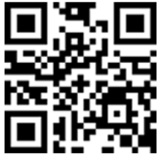

CONSUMIDORCNPJ:99.999.999/00001-99

NFC-en°000000001Serie 00110/03/2015 15:03:53 Viaconsumidor

## EMITIDAEMCONTINGENCIA

Pendentede autorizacao

TributosTotais Incidentes(LeiFederal12.741/2012)-TotalR$200,00 10%Federal40%Estadual 30%Municipal30%

## Via Empresa

CNPJ:00.000.000/000-99RazaoSocialdaEmpresa Av da Tecnobgia,030,Centro,Rio de Janeiro,RJ DocumentoAuxiliardaNotaFiscal deConsumidorEletronica

## EMITIDAEMCONTINGENCIA

Pendente de autorizacao

Codigo

Descricao

Qtde UN

VUnit

VITotal

003277

Tablet

2Peca

500,00

1.000,00

085273

Smartphone

1Peca

1.500,00

1.000,00

Qtde. total de itens

2

Valor total R$

2.500,00

Desconto R$

500,00

ValoraPagarR$

2.000,00

FORMAPAGAMENTO

VALORPAGOR$

Cartao de credito

1.000,00

Cartao de credito

1.000,00

## ConsultepelaChavedeAcessoem

www.fazenda.rj.gov.br/nfce/consulta 00000000000000000000000000000000000000000000

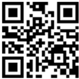

CONSUMIDORCNPJ:99.999.999/00001-99

NFC-en°000000001Serie00110/03/201515:03:53 Viaestabelecimento

## EMITIDAEMCONTINGENCIA

Pendente de autorizacao

TributosTotais Incidentes (LeiFederal12.741/2012)-Total R$200,00 10%Federal40%Estadual 30%Municipal30%

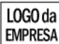

## 3.3 Requisitos do Papel e Margens do DANFE NFC-e

Na impressão do DANFE NFC-e deve ser utilizado papel com largura mínima de 56mm.  O  papel  utilizado  deve  garantir  a  legibilidade  das  informações  impressas  por,  no mínimo, seis meses. As margens laterais deverão ter, no mínimo, 2mm em cada lateral.

Não existe restrição que se imprima o DANFE NFC-e em outros tamanhos de papel, que pode ser impresso em papel do padrão A4 (cujas dimensões são de 210mm x 297mm, conforme norma ISO 2016.

Não  é  permitida,  em  nenhuma  hipótese,  a  impressão  do  DANFE  NFC-e  em Equipamento Emissor de Cupom Fiscal - ECF, ainda que em modo de relatório gerencial.

## 3.4 Dimensões mínimas do QR Code

A dimensão mínima para a imagem do QR Code será 25mm X 25mm (sendo 22mm de conteúdo para 3mm de margem segura - 'quiet zone'), tendo em vista ter sido essa a menor dimensão que se conseguiu leitura em dispositivos móveis que não possuem zoom (aproximação de imagem). Para dimensões superiores a 25mm, considerar a margem segura de 10% da dimensão total.

É  importante  que  seja  observada  a  margem  de  segurança  necessária  para proporcionar uma melhor leitura do QR Code e evitar erros de leitura nos dispositivos.

## 4.  QR Code do DANFE NFC-e

O QR code é um código de barras bidimensional que foi criado em 1994 pela empresa japonesa Denso-Wave. QR significa "quick response" devido à capacidade de ser interpretado rapidamente. Esse tipo de codificação permite que possa ser armazenada uma quantidade significativa de caracteres:

Numéricos:

7.089

Alfanumérico:

4.296

Binário (8 bits):

2.953

O QR code a ser impresso na Nota Fiscal  do Consumidor eletrônica - NFC-e seguirá o padrão internacional ISO/IEC 18004.

Figura 7: Padrão da imagem do QR Code - Fonte: Wikipédia

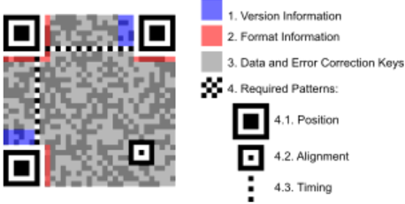

O QR Code deverá existir no DANFE NFC-e relativo à emissão em operação normal  ou  em  contingência,  seja  ele  impresso  ou  virtual  (DANFE  NFC-e  em  mensagem eletrônica).

A impressão do QR Code no DANFE NFC-e tem a finalidade de facilitar a consulta dos dados do documento fiscal eletrônico pelos consumidores, mediante leitura com o uso de aplicativo leitor de QR Code, instalado em smartphones ou tablets.

Atualmente, existem no mercado inúmeros aplicativos gratuitos para smartphones que possibilitam a leitura de QR Code.

Esta tecnologia tem sido amplamente difundida e é de crescente utilização como forma de comunicação.

Figura 8: Processo de leitura do QR Code (adaptado)

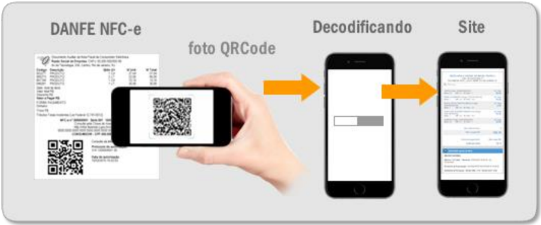

## 4.1 Licença

O uso do código QR é livre, sendo definido e publicado como um padrão ISO. Os direitos de patente pertencem a Denso Wave, mas a empresa escolheu não os exercer, sendo que o termo QR Code é uma marca registrada da Denso Wave Incorporated.

## 4.2 Geração da imagem do QR Code para NFC-e

A imagem do QR Code deverá ser impressa no DANFE NFC-e com os padrões residentes das impressoras de não impacto (térmica, laser ou deskjet), conforme mostrado no item 3.2, tendo largura e altura mínimas de 25mm x 25mm. A largura e altura mínimas foram definidas conforme testes realizados, nos quais o leitor de QR Code conseguiu ler a imagem.

## QR Code do DANFE NFC-e - Versão 2.00

## 4.3 Geração da imagem do QR Code para NFC-e - Versão 2.00

A  imagem  do  QR  Code  deverá  conter  uma  URL  composta  com  as  seguintes informações:

1ª parte: Endereço do site da Secretaria da Fazenda de localização do emitente da NFC-e. Exemplo: http://www.sefazexemplo.gov.br/NFC-e/QR Code?p=

2ª parte: Parâmetros constantes da tabela 2 para emissão online (seção 4.3.1) e  da tabela 3 para emissão em contingência off-line (seção 4.3.2), utilizando query string.

Tabela 1: Formação da URL do QR Code

Os endereços de consulta a serem utilizados no QR Code para as Unidades Federadas participantes do Projeto NFC-e em ambiente de produção e ambiente de homologação estão disponíveis no Portal Nacional da NFC-e (http://nfce.encat.org/ -&gt; Desenvolvedor -&gt; URL por UF utilizada QR code) -

http://nfce.encat.org/desenvolvedor/qrcode/

A  critério  da  Unidade  Federada  poderá  ser  utilizado  o  mesmo  endereço  para consulta no ambiente de produção e ambiente de homologação. Nesse caso, a distinção entre os ambientes de consulta será feita diretamente pela aplicação da UF, a partir do conteúdo do parâmetro de identificação do ambiente, constante do QR Code.

O QR Code deverá ser impresso com os padrões residentes das impressoras de não impacto (térmica, laser ou deskjet).

A URL do QR code deverá ser composta de duas maneiras diferentes: uma para NFC-e  emitidas  de  forma  online  (sem  contingência),  e  outra  para  as  NFC-e  emitidas  na contingência off-line.

## 4.3.1  Parâmetros da URL do QR Code na emissão ONLINE  - Versão 2.00

Tabela 2: Relação de Parâmetros da URL do QR Code para NFC-e ONLINE

| Posição   | Discrição do Parâmetro                                                                | Bytes   | Orientações de preenchimento                                                                                                                                             |
|-----------|---------------------------------------------------------------------------------------|---------|--------------------------------------------------------------------------------------------------------------------------------------------------------------------------|
| 1º        | Chave de Acesso da NFC-e                                                              | 44*     | Informar a chave de acesso da NFC-e                                                                                                                                      |
| 2º        | Versão do QR Code                                                                     | 1*      | Para esta versão de documento, preencher o com '2'.                                                                                                                      |
| 3º        | Identificação do Ambiente (1 - Produção, 2 - Homologação)                             | 1*      | Informar valor do campo B24 do leiaute NFC-e.                                                                                                                            |
| 4º        | Identificador do CSC (Código de Segurança do Contribuinte no Banco de Dados da SEFAZ) | 1-6     | Deve ser informado sem os '0' (zeros) não significativos. A identificação do CSC corresponde a ordem do CSC no banco de dados da SEFAZ, não confundir com o próprio CSC. |
| 5º        | Código Hash dos Parâmetros                                                            | 40*     | Ver geração do Hash do QR Codena emissão online na seção 4.3.1 deste documento.                                                                                          |

O asterisco (*) na tabela acima indica que o preenchimento deve ser exato com a quantidade de bytes indicada.

Dessa forma, o modelo da URL na emissão online, será:

http://&lt;dominio&gt;/nfce/qrcode?p=&lt;chave\_acesso&gt;|&lt;versao\_qrcode&gt;|&lt;tipo\_ambien te&gt;|&lt;identificador\_csc&gt;|&lt;codigo\_hash&gt;

## 4.3.2  Parâmetros da URL do QR Code na emissão em contingência OFFLINE - Versão 2.00

Tabela 3: Relação de Parâmetros da URL do QR Code para NFC-e OFFLINE

| Posição   | Descrição do Parâmetro                                                                | Byte s   | Orientações de preenchimento                                                                                                                                                                                                                                                                                                             |
|-----------|---------------------------------------------------------------------------------------|----------|------------------------------------------------------------------------------------------------------------------------------------------------------------------------------------------------------------------------------------------------------------------------------------------------------------------------------------------|
| 1º        | Chave de Acesso da NFC-e                                                              | 44*      | Informar a chave de acesso da NFC-e                                                                                                                                                                                                                                                                                                      |
| 2º        | Versão do QR Code                                                                     | 1*       | Para esta versão de documento, preencher com '2'.                                                                                                                                                                                                                                                                                        |
| 3º        | Identificação do Ambiente (1 - Produção, 2 - Homologação)                             | 1*       | Informar valor do campo B24 do leiaute NFC-e                                                                                                                                                                                                                                                                                             |
| 4º        | Dia da data de emissão                                                                | 2*       | Informar o dia da data de emissão, que consta no campo B09 do leiaute NFC-e. O valor deverá ter exatamente dois dígitos.                                                                                                                                                                                                                 |
| 5º        | Valor Total da NFC-e                                                                  | 15       | Informar valor do campo W16 do leiaute NFC-e. O valor deve ser informado com ponto ('.') como separador decimal; não informar separador de milhar ou sinais.                                                                                                                                                                             |
| 6º        | DigestValue da NFC-e                                                                  | 56*      | Corresponde ao algoritmo SHA1 sobre o arquivo XML da NFC-e, convertido para formato hexadecimal. Ao se efetuar a assinatura digital da NFC-e emitida em contingência off-line, o campo DigestValue constante da XML Signature deve obrigatoriamente ser idêntico ao encontrado quando da geração do DigestValue para a montagem QR Code. |
| 7º        | Identificador do CSC (Código de Segurança do Contribuinte no Banco de Dados da SEFAZ) | 1-6      | Deve ser informado sem os '0' (zeros) não significativos. A identificação do CSC corresponde a ordem do CSC no banco de dados da SEFAZ, não confundir com o próprio CSC.                                                                                                                                                                 |
| 8º        | Código Hash dos Parâmetros                                                            | 40*      | Ver geração do Hash do QR Code na emissão contingência offline na seção 4.3.2 deste documento.                                                                                                                                                                                                                                           |

O asterisco (*) na tabela acima indica que o preenchimento deve ser exato com a quantidade de bytes indicada.

Dessa forma, o modelo da URL na emissão contingência offline, será:

http://&lt;dominio&gt;/nfce/qrcode/?p=&lt;chave\_acesso&gt;|&lt;versao\_qrcode&gt;|&lt;tipo\_ambiente&gt;|&lt;d ia\_data\_emissao&gt;|&lt;valor\_total\_nfce&gt;|&lt;digVal&gt;|&lt;identificador\_csc&gt;|&lt;codigo\_hash&gt;

## 4.3.3 Conceito e objetivo do hash do QR Code - Versão 2.00

A fim de garantir maior segurança ao processo da NFC-e no que diz respeito à impressão do DANFE NFC-e e à geração de QR Code, foi incluído o  parâmetro 'hash do QR Code'.

Esse hash é gerado sobre um conjunto padrão de informações essenciais da NFCe e também sobre CSC - Código de Segurança do Contribuinte válido para a empresa na Unidade Federada.

O CSC corresponde a um código de segurança alfanumérico (16 a 36 bytes) de conhecimento  apenas  da  Secretaria  da  Fazenda  da  Unidade  Federada  do  emitente  e  do próprio contribuinte. Importante destacar que até versão anterior deste manual (versão 3.2) o código de segurança CSC era chamado de 'Token', todavia optou-se pela adequação do nome para minimizar eventuais confusões decorrentes da palavra 'token'.

Desta forma é possível garantir a autoria do DANFE NFC-e e do respectivo QR Code pois somente o Fisco e o contribuinte emissor conhecem o valor válido do CSC para aquela empresa na UF.

Para a geração do hash do QR Code sobre os parâmetros da consulta NFC-e via QR Code, deve ser utilizado o algoritmo SHA-1 e o resultado obtido deve ser convertido para hexadecimal,  correspondendo  a  40  bytes.  Informações  adicionais  sobre  esse  algoritmo podem ser encontradas no endereço eletrônico http://pt.wikipedia.org/wiki/SHA1.

Para verificar se a conversões realizadas do HEXA do DigestValue e SHA-1 do hash do QR Code estão corretas ou não, foi disponibilizada uma página de validação da URL no Portal Nacional NFC-e - Desenvolvedor (http://nfce.encat.org/desenvolvedor/) na opção "Validador de SHA1 e HEXA".

## 4.3.4  Geração do Hash do QR Code na emissão ONLINE  - Versão 2.00

Os passos para geração do Hash do QR Code na emissão online estão descritos a seguir e exemplificados na seção:

- Passo 1: Concatenar os parâmetros de 1 a 4 constantes da tabela 2 (seção 4.3.1) separados por '|' na ordem indicada;
- Passo 2: Adicionar ao final da string o CSC (disponibilizado pela SEFAZ da UF onde a empresa está localizada);
- Passo 3: Aplicar o algoritmo SHA-1 sobre o resultado e converter para hexadecimal, correspondendo a 40 bytes.

## 4.3.5  Geração do Hash do QR Code na emissão em contingência OFFLINE Versão 2.00

Os passos para geração do Hash do QR Code na emissão em contingência offline estão descritos a seguir e exemplificados na seção 4.3.6.2 :

- Passo 1: Converter o valor do DigestValue da NFC-e (digVal) para HEXA;
- Passo 2: Concatenar os parâmetros de 1 a 7 constantes da tabela 3 (seção 4.3.2) separados por '|', na ordem indicada;
- Passo 3: Adicionar ao final da string o CSC (disponibilizado pela SEFAZ da UF onde a empresa está localizada);
- Passo 4: Aplicar o algoritmo SHA-1 sobre o resultado e converter para hexadecimal, correspondendo a 40 bytes.

## 4.3.6  Exemplo de QR Code e Hash QR Code  - Versão 2.00

A seguir se apresentam exemplos de QR Code para facilitar as implementações por  parte  das  empresas  e  as  validações  por  parte  das  Unidades  Federadas.  O  exemplo hipotético serve para orientá-lo no desenvolvimento da montagem da URL de consulta via QR Code, como também na geração da imagem do QR Code.

## 4.3.6.1  Exemplo de QR Code para NFC-e ONLINE  - Versão 2.00

Considere  uma  situação  hipotética  de  emissão  de  NFC-e  em  ambiente  de produção na forma ONLINE, cujos parâmetros a serem utilizados no cálculo do hash do QR Code são:

- Chave de Acesso: 28170800156225000131650110000151341562040824
- Versão do QR Code: 2
- Identificação do Ambiente: 1 (Produção)
- Identificação do CSC: 1 (informar sem os zeros não significativos)
- CSC de produção 1: CODIGO-CSC-CONTRIBUINTE-36-CARACTERES
- Seguindo as sequências descritas nas seções 4.2.1 e 4.3.1:
- Passo 1 : Montar a string com os valores dos parâmetros separados por barra '|', na ordem indica na tabela 2 (seção 4.3.1);
- Passo 2 : Adicionar, ao final dos parâmetros, o CSC referente ao identificador indicado no  parâmetro  4  (CSC  do  contribuinte  disponibilizado  pela  SEFAZ  da  UF  onde  a empresa está localizada):

Resultado: 28170800156225000131650110000151341562040824|2|1|1

Resultado:28170800156225000131650110000151341562040824|2|1|1 SEU-

## CODIGO-CSC-CONTRIBUINTE-36-CARACTERES

- Passo 3 : Gerar o Hash, aplicando o algoritmo SHA-1 sobre o resultado acima. A saída do  algoritmo  SHA-1  deve  ser  em  HEXADECIMAL.  Para  verificar  se  a  conversão realizada está correta, acesse o Portal Nacional NFC-e -&gt; Desenvolvedor (nfce.encat.org/desenvolvedor/) na opção "Validador de SHA1 e HEXA".

Entrada: 28170800156225000131650110000151341562040824|2|1|1 SEUCODIGO-CSC-CONTRIBUINTE-36-CARACTERES

Saída: Hash do QR Code = DC6AE2C2B9A992BE59679AC365E29922DE6B7511

- Passo 4 :  Gerar  a  imagem  do QR Code, conforme descrito na seção  4.2: 1ª parte (endereço da consulta) + 2ª parte (parâmetros da tabela 2 separados por '|')

O resultado da URL formada deverá ser incluída na imagem QR Code:

Tabela 4: Demonstração das partes componentes da URL da consulta via QR Code

| 1ª parte   | http://www.sefazexemplo.gov.br/nfce/qrcode?p=                                                                    |
|------------|------------------------------------------------------------------------------------------------------------------|
| 2ª parte   | 28170800156225000131650110000151341562040824&#124;2&#124;1&#124;1&#124;DC6AE2C2B9A9 92BE59679AC365E29922DE6B7511 |

A URL para se adicionar dentro da imagem do QR Code ficaria então assim:

http://www.sefazexemplo.gov.br/NFC-e/QR

Code?p= 28170800156225000131650110000151341562040824|2|1|1|DC6AE2C2B9A992B E59679AC365E29922DE6B7511

A Erro!  Fonte  de  referência  não  encontrada. 09  foi  gerada  com  a  URL apresentada acima. Se desejar, você pode testar efetuando a leitura  do QR Code da Figura.

Figura 9: QR Code gerado do exemplo hipotético

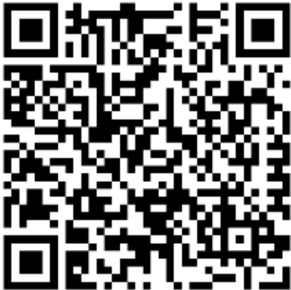

## 4.3.6.2  Exemplo de QR Code e Hash QR Code para NFC-e OFFLINE  Versão 2.00

Considere  uma  situação  hipotética  de  emissão  de  NFC-e  em  ambiente  de produção na forma OFFLINE (contingência), cujos parâmetros a serem utilizados no cálculo do hash do QR Code são:

- Chave de Acesso: 28170800156225000131650110000151349562040824
- Versão do QR Code: 2
- Identificação do Ambiente: 1 (Produção)
- Dia da data de emissão da NFC-e: 02
- Valor Total da NFC-e: 60.90
- DigestValue da NFC-e: yzGYhUx1/XYYzksWB+fPR3Qc50c=
- Identificação do CSC: 1 (informar sem os zeros não significativos)
- CSC de produção 1: CODIGO-CSC-CONTRIBUINTE-36-CARACTERES

Seguindo as sequências descritas nas seções 4.3.1 e 4.3.2:

Passo  1 :  Converter  o  valor  do  DigestValue  da  NFC-e  para  HEXADECIMAL.  Para verificar se a conversão realizada está correta, acesse o site: Portal Nacional NFC-e Desenvolvedor (http://nfce.encat.org/desenvolvedor/) na opção "Validador de SHA1 e HEXA".

Entrada: yzGYhUx1/XYYzksWB+fPR3Qc50c=

Saída : 797a4759685578312f5859597a6b7357422b6650523351633530633d

- Passo 2 :  Montar a string com os valores dos parâmetros separados por '|', na ordem indica na tabela 3 (seção 4.3.2);

## Resultado:

28170800156225000131650110000151349562040824|2|1|02|60.90|797a4759685578312f5 859597a6b7357422b6650523351633530633d|1

- Passo 3 : Adicionar, ao final dos parâmetros, o CSC referente ao identificador indicado no parâmetro 7 (CSC do contribuinte disponibilizado pela SEFAZ da UF onde a empresa está localizada):

## Resultado:

28170800156225000131650110000151349562040824|2|1|02|60.90|797a4759685578312f5 859597a6b7357422b6650523351633530633d|1 SEU-CODIGO-CSC-CONTRIBUINTE-36-

## CARACTERES

- Passo 4 : Aplicar o algoritmo SHA-1 sobre todos os parâmetros concatenados. A saída do algoritmo SHA-1 deve ser em HEXADECIMAL. Para verificar se a conversão realizada está correta, acesse o site:

Portal  Nacional  NFC-e  -  Desenvolvedor  (http://nfce.encat.org/desenvolvedor/)  na opção "Validador de SHA1 e HEXA".

## Entrada:

28170800156225000131650110000151349562040824|2|1|02|60.90|797a475968557831 2f5859597a6b7357422b6650523351633530633d|1 SEU-CODIGO-CSC-CONTRIBUINTE36-CARACTERES

Saída:4615A93BB0D7C4E780F8D30EE77EDD5BA55C7D66

- Passo  5 :  Gerar  a  imagem  do  QR  Code,  conforme  descrito  na  seção  4.2:  1ª  parte (endereço da consulta) + 2ª parte (parâmetros da tabela 3 separados por '|')

O resultado da URL formada deverá ser incluída na imagem QR Code:

Tabela 5: Demonstração das partes componentes da URL da consulta via QR Code

| 1ª parte   | http://www.sefazexemplo.gov.br/nfce/qrcode?p=                                                                                                                                                      |
|------------|----------------------------------------------------------------------------------------------------------------------------------------------------------------------------------------------------|
| 2ª parte   | 28170800156225000131650110000151349562040824&#124;2&#124;1&#124;02&#124;60.90&#124;797a4759 685578312f5859597a6b7357422b6650523351633530633d&#124;1&#124;4615A93BB0D7 C4E780F8D30EE77EDD5BA55C7D66 |

A URL para se adicionar dentro da imagem do QR Code ficaria então assim:

http://www.sefazexemplo.gov.br/nfce/qrcode?p=28170800156225000131650110000151349 562040824|2|1|02|60.90|797a4759685578312f5859597a6b7357422b665052335163353063 3d|1|4615A93BB0D7C4E780F8D30EE77EDD5BA55C7D66

A Erro!  Fonte  de  referência  não  encontrada. 10  foi  gerada  com  a  URL apresentada acima. Se desejar, você pode testar efetuando a leitura do QR Code da Figura.

Figura 10: QR Code gerado do exemplo hipotético

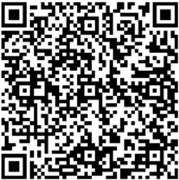

## QR Code do DANFE NFC-e - Versão 3.00

## 4.4 Geração da imagem do QR Code para NFC-e - Versão 3.00

A imagem do QR Code deverá ser impressa no DANFE NFC-e com os padrões residentes das impressoras de não impacto (térmica, laser ou deskjet), conforme mostrado no item 3.2, tendo largura e altura mínimas de 25mm x 25mm. A largura e altura mínimas foram definidas conforme testes realizados, nos quais o leitor de QR Code conseguiu ler a imagem.

A imagem do QR Code deverá conter uma URL composta com as seguintes informações:

| 1ª parte   | Endereço do site da Secretaria da Fazenda de localização do emitente da NFC-e. Exemplo: http://www.sefazexemplo.gov.br/nfce/qrcode?p=   |
|------------|-----------------------------------------------------------------------------------------------------------------------------------------|
| 2ª parte   | Parâmetros constantes da tabela 6 para emissão online e da tabela 7 para emissão em contingência off-line, utilizando query string.     |
|            | Parâmetros da consulta a chave de acesso da NFC-e separados pelo caractere ' &#124; '.                                                  |

Os endereços de consulta a serem utilizados no QR Code para as Unidades Federadas participantes do Projeto NFC-e em ambiente de produção e ambiente de homologação estão disponíveis no Portal Nacional da NFC-e (http://nfce.encat.org/ -&gt; Desenvolvedor -&gt; URL por UF utilizada QR code) -

http://nfce.encat.org/desenvolvedor/qrcode/

A critério da Unidade Federada poderá ser utilizado o mesmo endereço para consulta no ambiente de produção e ambiente de homologação. Neste caso, a distinção entre os ambientes de consulta será feita diretamente pela aplicação da UF, a partir do conteúdo do parâmetro de identificação do ambiente, constante do QR Code.

O QR Code deverá ser impresso com os padrões residentes das impressoras de não impacto (térmica, laser ou deskjet).

A URL do QR code deverá ser composta de duas maneiras diferentes: uma para NFC-e emitidas de forma online (sem contingência), e outra para NFC-e emitidas na contingência off-line.

## Observação 1 - Sobre a nova versão do leiaute do QR-Code (versão 3) :

Neste novo leiaute do QR-Code (versão 3) não é necessária a obtenção de um CSC previamente combinado com a SEFAZ. Portanto, não são necessários também os controles da empresa sobre o idCSC, para manter somente 2 CSC ativos a cada momento. Desta forma, o controle sobre a autenticidade do conteúdo do QR-Code impresso no DANFE NFC-e é feito pela assinatura dos parâmetros do QR-Code, com a inclusão do resultado dessa assinatura no próprio QR-Code.

## Observação 2 - Sobre o QR-Code para o Emitente Produtor Rural (Pessoa Física)

No caso de Produtor Rural, em várias UF é concedida uma Inscrição Estadual que pode ser utilizada por qualquer Pessoa Física (CPF) participante do Estabelecimento Rural, ou seja, uma Inscrição Estadual pode possuir vários participantes, Pessoa Física (CPF) ou Pessoa Jurídica (CNPJ). Portanto, existe uma complexidade operacional na manutenção do CSC para esse tipo de Estabelecimento.

A orientação atual é adotar o novo leiaute do QR-Code (versão 3) para o Produtor Rural Pessoa Física, evitando a necessidade de conceder, e controlar, o CSC por Pessoa Física e UF. (exceto PR)

## Observação 3 - Sobre o QR-Code para Emitente Pessoa Jurídica (CNPJ)

No caso de emitente Pessoa Jurídica (CNPJ) é opção da empresa adotar esse novo leiaute do QR-Code, ou não. A adoção do novo leiaute do QR-Code pode ser feita tanto para o CNPJ de Produtor Rural, quanto para o CNPJ de uma Inscrição Estadual normal.

## 4.4.1  Parâmetros da URL do QR Code na emissão ONLINE - Versão 3.00

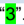

Tabela 6: Relação de Parâmetros da URL do QR Code para NFC-e ONLINE

| Posição   | Descrição do Parâmetro                                    | Bytes   | Orientações de preenchimento                         |
|-----------|-----------------------------------------------------------|---------|------------------------------------------------------|
| 1º        | Chave de Acesso da NFC-e                                  | 44*     | Informar a chave de acesso da NFC-e                  |
| 2º        | Versão do QR Code                                         | 1*      | Para esta versão de documento, preencher o com '3'.  |
| 3º        | Identificação do Ambiente (1 - Produção, 2 - Homologação) | 1*      | Informar valor do campo B24 do leiaute NFC-e - tpAmb |

O asterisco (*) na tabela acima indica que o preenchimento deve ser exato com a quantidade de bytes indicada.

Dessa forma, o modelo da URL na emissão online, será:

http://www.sefazexemplo.gov.br/nfce/qrcode?p=&lt;chave\_acesso&gt;|&lt;3&gt;|&lt;tpAmb&gt;

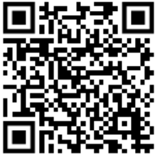

Figura 11: QR Code gerado do exemplo hipotético

## 4.4.2  Parâmetros da URL do QR Code na emissão em contingência OFFLINE - Versão 3.00

Tabela 7: Relação de Parâmetros da URL do QR Code para NFC-e OFFLINE

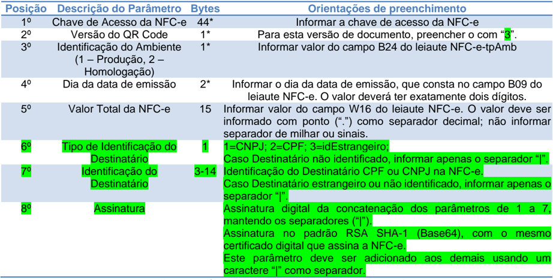

| Posição   | Descrição do Parâmetro                                    | Bytes   | Orientações de preenchimento                                                                                                                                                                                                                                                            |
|-----------|-----------------------------------------------------------|---------|-----------------------------------------------------------------------------------------------------------------------------------------------------------------------------------------------------------------------------------------------------------------------------------------|
| 1º        | Chave de Acesso da NFC-e                                  | 44*     | Informar a chave de acesso da NFC-e                                                                                                                                                                                                                                                     |
| 2º        | Versão do QR Code                                         | 1*      | Para esta versão de documento, preencher o com '3'.                                                                                                                                                                                                                                     |
| 3º        | Identificação do Ambiente (1 - Produção, 2 - Homologação) | 1*      | Informar valor do campo B24 do leiaute NFC-e-tpAmb                                                                                                                                                                                                                                      |
| 4º        | Dia da data de emissão                                    | 2*      | Informar o dia da data de emissão, que consta no campo B09 do leiaute NFC-e. O valor deverá ter exatamente dois dígitos.                                                                                                                                                                |
| 5º        | Valor Total da NFC-e                                      | 15      | Informar valor do campo W16 do leiaute NFC-e. O valor deve ser informado com ponto ('.') como separador decimal; não informar separador de milhar ou sinais.                                                                                                                            |
| 6º        | Tipo de Identificação do Destinatário                     | 1       | 1=CNPJ; 2=CPF; 3=idEstrangeiro; Caso Destinatário não identificado, informar apenas o separador '&#124;'.                                                                                                                                                                               |
| 7º        | Identificação do Destinatário                             | 3-14    | Identificação do Destinatário CPF ou CNPJ na NFC-e. Caso Destinatário estrangeiro ou não identificado, informar apenas o separador '&#124;'.                                                                                                                                            |
| 8º        | Assinatura                                                |         | Assinatura digital da concatenação dos parâmetros de 1 a 7, mantendo os separadores ('&#124;'). Assinatura no padrão RSA SHA-1 (Base64), com o mesmo certificado digital que assina a NFC-e. Este parâmetro deve ser adicionado aos demais usando um caractere '&#124;' como separador. |

O asterisco (*) na tabela acima indica que o preenchimento deve ser exato com a quantidade de bytes indicada.

Dessa forma, o modelo da URL na emissão contingência offline, será:

http://www.sefazexemplo.gov.br/nfce/qrcode?p=&lt;chave\_acesso&gt;|&lt;3&gt;|&lt;tpAmb&gt;|&lt;dia\_data\_ emissao&gt;|&lt;vNF&gt;|&lt;tp\_idDest&gt;|&lt;idDest&gt;|ZZSKiypy7fkg22MUv6TUh71EI+wLYWr/fUHJy3Py WnL7d5mzEqtxu6bVbhE7AeNiDTirh1u9gVfC2Hw+Lsno2XNL5FRUc5NcuMTT2hA6E9HY C9gryvtWAIgiCZUNG5cWWLCh0G62QdnNe8iSrlSooQu9Z5g1vbGaTFMxaugzzvo=

Figura 12: QR Code gerado do exemplo hipotético

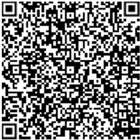

## 4.5 Configurações para QR Code

O QR Code permite algumas configurações adicionais conforme descrito a seguir:

## 4.5.1  Capacidade de armazenamento

As configurações para capacidade de armazenamento de caracteres do QR Code:

- 1 - Numérica - máx. 7089 caracteres
- 2 - Alfanumérica - máx. 4296 caracteres
- 3 - Binário (8 bits) - máx. 2953 bytes
- 4 - Kanji/Kana - máx. 1817 caracteres

Fonte: http://en.wikipedia.org/wiki/QR\_code

## 4.5.2  Capacidade de correção de erros

Seguem as configurações para correções de erros do QR Code:

- Nível L (Low) 7% das palavras do código podem ser recuperadas;
- Nível M (Medium) 15% das palavras de código podem ser restauradas;
- Nível Q (Quartil) 25% das palavras de código podem ser restauradas;
- Nível H (High) 30% das palavras de código podem ser restauradas.

Fonte: http:// http://en.wikipedia.org/wiki/QR\_code

Para o QR Code do DANFE NFC-e será utilizado Nível M.

## 4.5.3 Tipo de caracteres

Existem dois padrões de caracteres que podem ser configurados na geração do QR Code, conforme visto abaixo:

1 - ISO-8859-1

2 - UTF-8

Fonte: http://en.wikipedia.org/wiki/QR\_code

Para o QR Code da NFC-e será utilizada a opção 2 - UTF-8.

## 4.6 Fornecimento do CSC

O processo de fornecimento de CSC é feito por meio de página web específica da Secretaria de Fazenda da UF de cada Contribuinte Emissor. Também disponíveis no Portal Nacional da NFC-e (http://NFC-e.encat.org/ - Empresário - CSC). Por meio desta página o contribuinte deve poder solicitar novo CSC, consultar CSC válidos e revogar CSC.

A critério da UF poderá o CSC ser fornecido também por Web Service, segundo especificações técnicas padronizadas nacionalmente.

O contribuinte pode solicitar até 2 CSC para toda a empresa na UF. Todavia, se a empresa necessitar de um terceiro CSC deverá indicar, previamente, qual dos dois outros CSC  válidos  deseja  revogar,  uma  vez  que  a  empresa  na  UF  somente  poderá  ter, simultaneamente, apenas 2 CSC válidos.

O CSC corresponderá a um conjunto de no mínimo 16, e no máximo 36 caracteres alfanuméricos, sendo que cada CSC possui associado um código sequencial de identificação de até 6 dígitos para facilitar a identificação do respectivo CSC e validação do QR Code pelo Fisco quando da realização da consulta pelo consumidor.

O código de identificação do CSC será um sequencial numérico crescente por empresa (CNPJ base 8 dígitos) na UF.

No banco de dados do Fisco da UF ficarão armazenados os seguintes dados: CNPJ base da empresa, código de identificação do CSC, CSC, data de ativação do CSC e eventual data de revogação do CSC.

Para a emissão de NFC-e em ambiente de homologação a empresa deverá utilizar CSC que solicitou  pela página  web  de  sua  Secretaria  da  Fazenda.  A  critério  da  Unidade Federada poderá ser disponibilizada página web específica para fornecimento de CSC para uso em ambiente de homologação.

## 4.6.1  Outros Detalhes sobre o CSC

O contribuinte pode solicitar até 2 CSC para toda a empresa na UF. Todavia, se for necessário um terceiro CSC deverá ser indicado, previamente, qual dos dois outros CSC válidos deseja revogar, uma vez que a empresa na UF somente poderá ter, simultaneamente, apenas 2 CSC válidos.

O código de identificação do CSC será um sequencial numérico crescente por empresa (CNPJ base 8 dígitos) na UF.

No banco de dados do Fisco da UF ficarão armazenados os seguintes dados: CNPJ base da empresa, código de identificação do CSC, CSC, data de ativação do CSC e eventual data de revogação do CSC.

Para a emissão de NFC-e em ambiente de homologação a empresa deverá utilizar o CSC que solicitou pela página web de sua Secretaria da Fazenda. A critério da Unidade Federada poderá ser disponibilizada página web específica para fornecimento de CSC para uso em ambiente de homologação.

## 4.7 Implementação no sistema do contribuinte

Na emissão da NFC-e, o sistema do contribuinte adicionará a imagem gerada e armazenará  no  local  especificado  do  DANFE  NFC-e.  A  saída  de  impressão,  por  default, deverá ser na tela do computador do frente de caixa, com a opção de envio para a impressora, caso o consumidor deseje o DANFE NFC-e impresso ou para meio eletrônico (e-mail ou SMS).

## 4.8 URL da Consulta da NFC-e via QR-Code no XML - obrigatoriedade

A NT 002.2015 determina que a URL da Consulta da NFC-e via QR Code deve constar do arquivo da NFC-e (XML) no grupo ZX. Informações Suplementares da Nota Fiscal.

## 5.  Consulta Pública NFC-e

Para que o consumidor possa verificar a validade e autenticidade da NFC-e, a UF do contribuinte emitente deverá disponibilizar o serviço de consulta pública da NFC-e.

Esta consulta poderá ser efetuada pelo consumidor de duas formas: pela digitação em página web dos 44 caracteres numéricos da chave de acesso constantes impressos no DANFE NFC-e ou consulta via leitura  do  QR Code  impresso  ou  disponibilizado  em  meio eletrônico, utilizando aplicativos gratuitos de leitura de QR Code, disponíveis em dispositivos móveis como smartphones e tablets.

## 5.1 Consulta Pública de NFC-e via Digitação de Chave de Acesso

O  endereço  que  deve  estar  impresso  no  DANFE  NFC-e  destinado  à  consulta utilizando a chave de acesso, está indicado por cada Unidade Federada, e consta do Portal Nacional NFC-e (http://NFC-e.encat.org/) na opção "Consumidor" - "Consulte sua Nota".

A NT determina que a URL da consulta por chaves da NFC-e deve constar do arquivo da NFC-e (XML) em ZX-03, tag: urlChave, do grupo. Informações Suplementares da Nota Fiscal.

Nesta hipótese o consumidor deverá acessá-los pela internet e digitar a chave de acesso composta por 44 caracteres numéricos.

Figura 13: Tela de consulta da NFC-e com digitação da chave de acesso

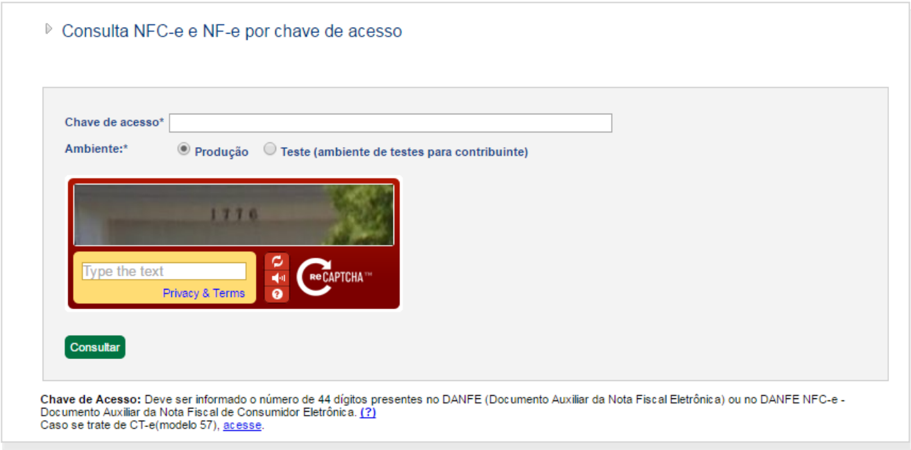

Como resultado da consulta pública, deverá ser apresentado ao consumidor na tela o DANFE NFC-e completo (com itens de mercadoria). Nessa tela o consumidor terá a opção de imprimir o DANFE NFC-e completo ou optar pela visualização do conteúdo da NFCe em formato de abas.

A opção visualização por abas apresentará os dados da mesma NFC-e todavia com apresentação similar à consulta pública atual da NF-e modelo 55.

Figura 12: Resultado da consulta da NFC-e com digitação da chave de acesso

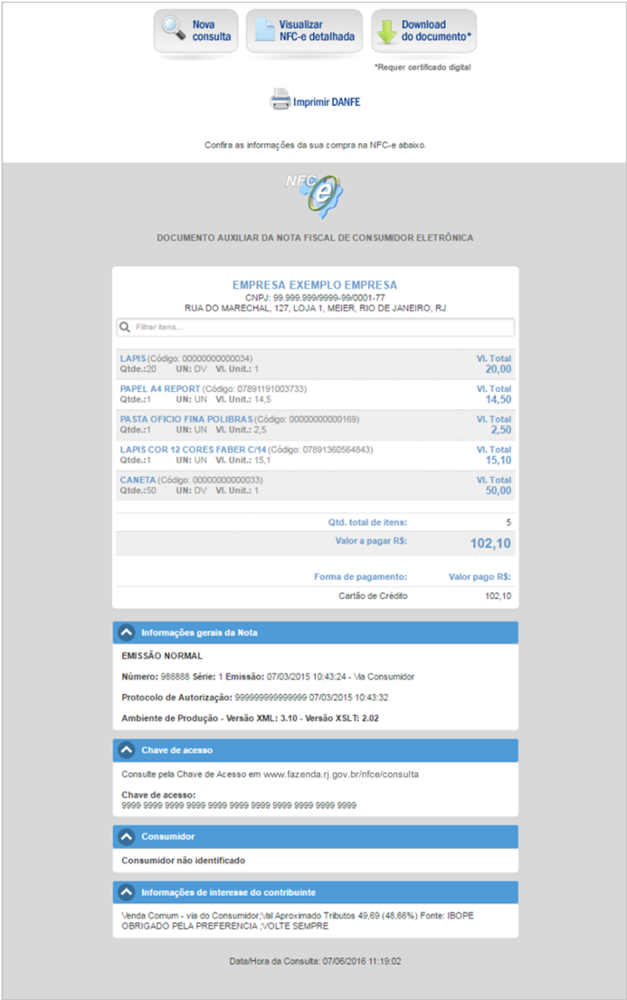

Na hipótese da consulta pública de um NFC-e que esteja com status de cancelada (Figura  14),  será  apresentado  o  dado  da  respectiva  NFC-e  consultada,  todavia  com mensagem ao consumidor indicativa de que se trata de documento inválido - sem valor fiscal.

Figura 14: Resultado da consulta da NFC-e com status CANCELADA

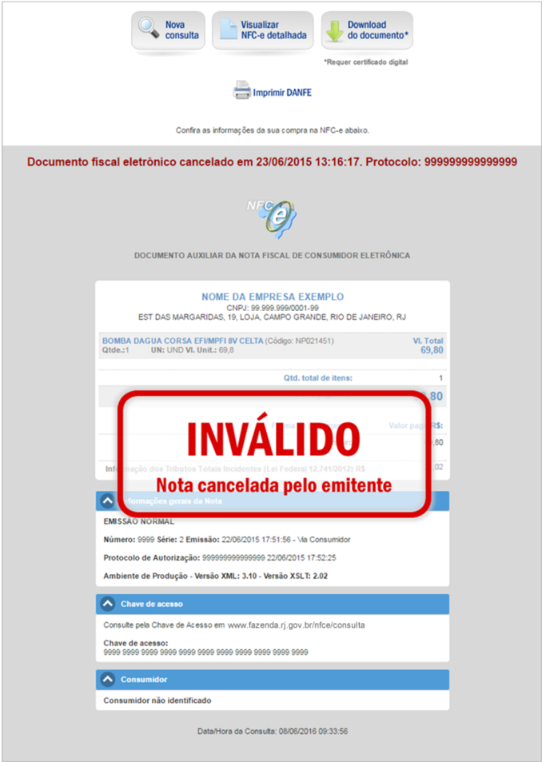

## 5.2 Consulta Pública de NFC-e via QR Code

A aplicação de consulta pública da NFC-e via QR Code será efetuada por cada Unidade Federada e efetuará validações do conteúdo de informações constantes do QR Code versus o conteúdo da respectiva NFC-e, bem como a conferência do hash do QR Code.

Nesta hipótese, o consumidor deverá apontar o seu dispositivo móvel (smartphone ou tablet) para a imagem do QR Code gerada na tela do caixa ou impressa no DANFE NFCe  entregue  pelo  operador  do  caixa.  O  leitor  de  QR  Code  se  encarregará  de  interpretar  a imagem e efetuar a consulta da NFC-e da URL recuperada no Portal da SEFAZ da Unidade Federada da emissão do documento.

Figura 15: Processo de leitura do QR Code (adaptado)

Como resultado da consulta QR Code, deverá ser apresentado ao consumidor na tela do dispositivo móvel o DANFE NFC-e completo (com itens de mercadoria). Nesta tela, o consumidor terá a opção de imprimir o DANFE NFC-e completo ou optar pela visualização do conteúdo da NFC-e também em formato de abas. O resultado deve ser idêntico ao resultado utilizando a consulta com digitação em tela conforme visto no tópico 5.1.

Eventuais divergências encontradas entre as informações da NFC-e constantes dos parâmetros do QR Code ou problemas na validação do Hash do QR Code deverão ser informadas ao consumidor em área de mensagem a ser disponibilizada na tela de resposta da consulta pública sem, todavia, um detalhamento excessivo do erro identificado, que será de pouco interesse ao consumidor e apenas poderá acabar por gerar dúvidas e inseguranças.

Assim, será apresentado na tela ao consumidor o código do erro e uma mensagem de aviso mais genérica.

## 5.3 Tabela padronizada com os códigos e mensagens na consulta de NFC-e

A tabela relaciona todas as mensagens de validações utilizadas na consulta de NFC-e seja por digitação em tela ou via QR Code. Estas mensagens somente serão utilizadas na implementação da consulta pela SEFAZ.

38

| Tabela do item 5.3 - Relação de mensagens de validações na consulta de NFC-e   | Tabela do item 5.3 - Relação de mensagens de validações na consulta de NFC-e            | Tabela do item 5.3 - Relação de mensagens de validações na consulta de NFC-e   |
|--------------------------------------------------------------------------------|-----------------------------------------------------------------------------------------|--------------------------------------------------------------------------------|
| Código                                                                         | Mensagem                                                                                | Exibir para o Consumidor                                                       |
| 100                                                                            | Hash QR Code inválido.                                                                  | QR Code Inválido                                                               |
| 101                                                                            | CSC inválido para o contribuinte.                                                       | QR Code Inválido                                                               |
| 102                                                                            | CSC revogado.                                                                           | QR Code Inválido                                                               |
| 103                                                                            | Identificador de CSC inexistente.                                                       | QR Code Inválido                                                               |
| 104                                                                            | Identificador de CSC inválido.                                                          | QR Code Inválido                                                               |
| 201                                                                            | Dígito verificador da Chave de Acesso da NFC-e inválido.                                | Problemas na Chave de Acesso da NFC-e                                          |
| 202                                                                            | Chave de Acesso da NFC-e com menos de 44 caracteres.                                    | Problemas na Chave de Acesso da NFC-e                                          |
| 203                                                                            | Ano e mês da Chave de Acesso da NFC-e inconsistente com data de emissão.                | Problemas na Chave de Acesso da NFC-e                                          |
| 204                                                                            | Modelo constante da Chave de Acesso difere de 65 (NFC-e).                               | Problemas na Chave de Acesso da NFC-e                                          |
| 205                                                                            | CNPJ do emitente constante da Chave de Acesso da NFC-e com dígito verificador inválido. | Problemas na Chave de Acesso da NFC-e                                          |
| 206                                                                            | Chave de acesso da NFC-e não preenchida.                                                | Problemas na Chave de Acesso da NFC-e                                          |
| 211                                                                            | Versão do QR Code inválida.                                                             | Inconsistência de Informações no QR Code                                       |
| 212                                                                            | Versão do QR Code não preenchida.                                                       | Inconsistência de Informações no QR Code                                       |
| 213                                                                            | Identificação do ambiente difere de 1 ou 2.                                             | Inconsistência de Informações no QR Code                                       |
| 214                                                                            | Identificação do ambiente não preenchida.                                               | Inconsistência de Informações no QR Code                                       |
| 217                                                                            | Dia da data de emissão informada no QR Code inválida.                                   | Inconsistência de Informações no QR Code                                       |
| 218                                                                            | Dia da data de emissão não preenchido.                                                  | Inconsistência de Informações                                                  |
| 219                                                                            | Dia da data de emissão inconsistente com dado informado na NFC-e.                       | Inconsistência de Informações                                                  |
| 220                                                                            | Valor total informado no QR Code em formato inválido.                                   | Inconsistência de Informações no QR Code                                       |
| 221                                                                            | Valor total informado no QR Code inconsistente com dado constante da NFC-e.             | Inconsistência de Informações no QR Code                                       |
| 227                                                                            | DigestValue informado no QR Code inconsistente com dado constante da NFC-e.             | Inconsistência de Informações no QR Code                                       |
| 229                                                                            | Nota Fiscal do Consumidor CANCELADA.                                                    | A NFC-e está CANCELADA                                                         |
| 230                                                                            | Hash do QR Code não preenchido no QR Code.                                              | Inconsistência de Informações no QR Code                                       |

|   231 | Valor total da NFC-e não preenchido no QR Code.                                                                       | Inconsistência de Informações no QR Code   |
|-------|-----------------------------------------------------------------------------------------------------------------------|--------------------------------------------|
|   233 | DigestValue não preenchido no QR Code.                                                                                | Inconsistência de Informações no QR Code   |
|   234 | O prazo de24h para o envio desta NFC-e já foi ultrapassado.                                                           | Regra de negócios da NFC-e                 |
|   235 | NFC-e foi emitida em contingência. Volte a consultar após 24h.                                                        | Regra de negócios da NFC-e                 |
|   236 | A NFC-e da chave de acesso não existe.                                                                                | Regra de negócios da NFC-e                 |
|   237 | Código da imagem é inválido.                                                                                          | Erro na digitação dos dados                |
|   238 | NFC-e emitida ainda não consta na nossa base de dados. Favor volte a consultarem outra hora.                          | Regra de negócios da NFC-e                 |
|   239 | A UF da chave de acesso está diferente do código da UF                                                                | Problemas na Chave de Acesso daNFC-e       |
|   240 | NFC-e CANCELADA - Documento cancelado pelo emitente.                                                                  | Documento Inválido - Sem Valor Fiscal      |
|   241 | NFC-e DENEGADA - Emitente não autorizado pelo fisco.                                                                  | Documento Inválido - Sem Valor Fiscal      |
|   242 | Dia da data de emissão informada é inválido.                                                                          | Inconsistência de Informações              |
|   245 | Chave de Acesso da NFC-e inválida.                                                                                    | Problema na Chave de Acesso                |
|   246 | A chave de acesso informada não é de uma NFC-e (modelo 65). Verifique o modelo do documento fiscal eletrônico (DF-e). | Problema na Chave de Acesso                |
|   247 | A chave de acesso informada não se refere a uma NFC-e emitida por contribuinte da UF indicada.                        | Problema na Chave de Acesso                |

Tabela 8:Mensagens de validações de consulta da NFC-e