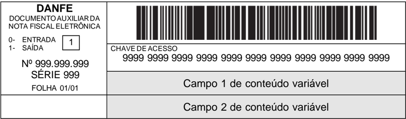
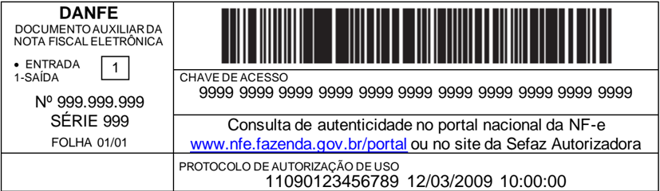
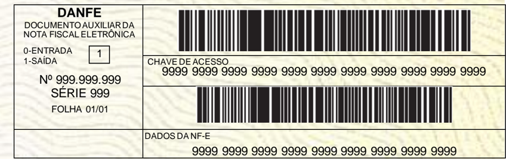
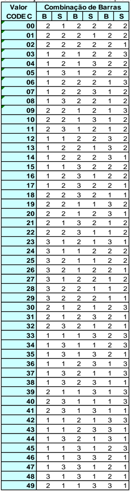
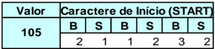
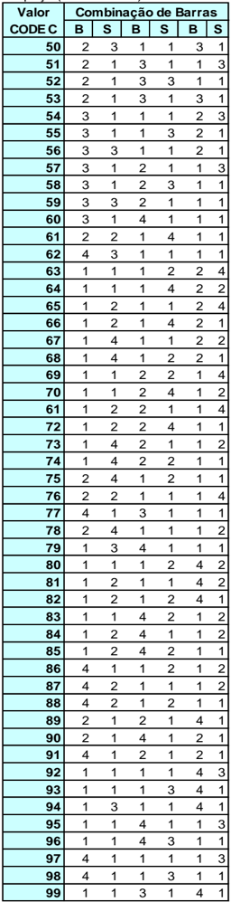
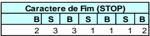
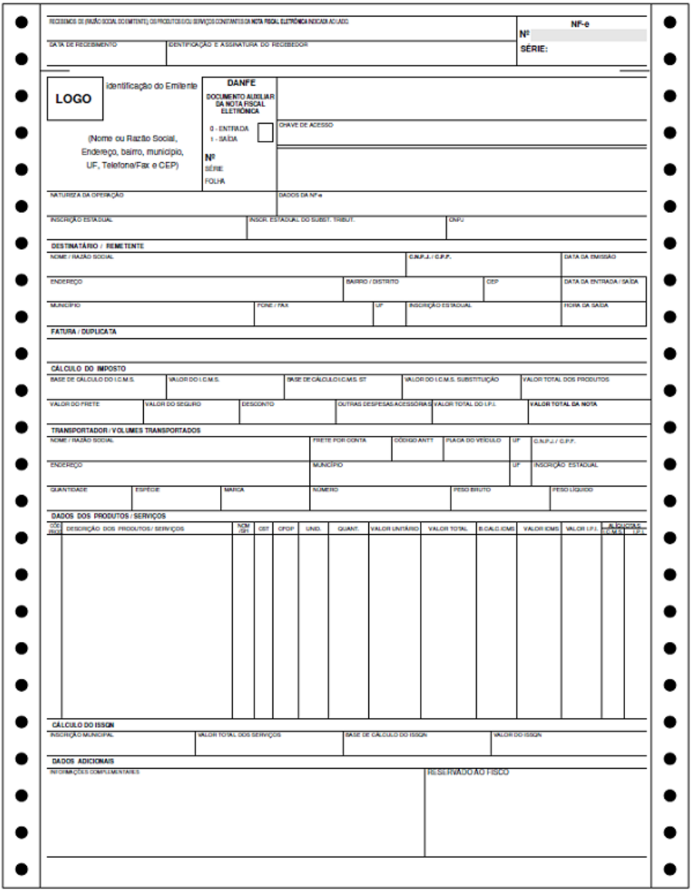
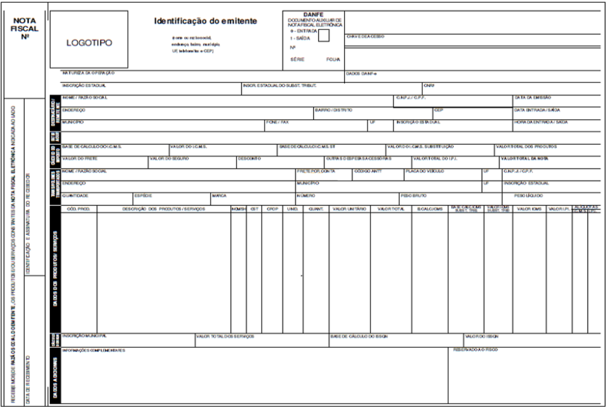
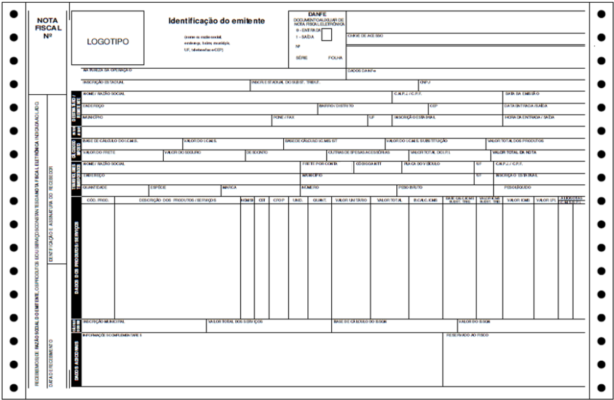

## Sistema Nota Fiscal Eletrônica

## Manual de Orientação do Contribuinte

Anexo II -Manual de Especificações Técnicas do DANFE e Código de Barras

Versão 7.00 -Outubro de 2020


## Sumário

| Controle de Versões .................................................................................................................................4                                                                                                                                            | Controle de Versões .................................................................................................................................4                                                                                                                                            | Controle de Versões .................................................................................................................................4                                                                                                                                            |                                                                                                                   |
|---------------------------------------------------------------------------------------------------------------------------------------------------------------------------------------------------------------------------------------------------------------------------------------------------|---------------------------------------------------------------------------------------------------------------------------------------------------------------------------------------------------------------------------------------------------------------------------------------------------|---------------------------------------------------------------------------------------------------------------------------------------------------------------------------------------------------------------------------------------------------------------------------------------------------|-------------------------------------------------------------------------------------------------------------------|
| Histórico de Alterações / Cronograma......................................................................................................5                                                                                                                                                       | Histórico de Alterações / Cronograma......................................................................................................5                                                                                                                                                       | Histórico de Alterações / Cronograma......................................................................................................5                                                                                                                                                       |                                                                                                                   |
| 1 Introdução ..........................................................................................................................................6                                                                                                                                          | 1 Introdução ..........................................................................................................................................6                                                                                                                                          | 1 Introdução ..........................................................................................................................................6                                                                                                                                          |                                                                                                                   |
| 2 Código de Barras...............................................................................................................................6                                                                                                                                                | 2 Código de Barras...............................................................................................................................6                                                                                                                                                | 2 Código de Barras...............................................................................................................................6                                                                                                                                                |                                                                                                                   |
| 2.1. Cálculo do Dígito Verificador do CODE-128C...............................................................................7                                                                                                                                                                   | 2.1. Cálculo do Dígito Verificador do CODE-128C...............................................................................7                                                                                                                                                                   | 2.1. Cálculo do Dígito Verificador do CODE-128C...............................................................................7                                                                                                                                                                   |                                                                                                                   |
| 2.2. Representação Simbólica do Código.............................................................................................7                                                                                                                                                              | 2.2. Representação Simbólica do Código.............................................................................................7                                                                                                                                                              | 2.2. Representação Simbólica do Código.............................................................................................7                                                                                                                                                              |                                                                                                                   |
| 3 DANFE...............................................................................................................................................8                                                                                                                                           | 3 DANFE...............................................................................................................................................8                                                                                                                                           | 3 DANFE...............................................................................................................................................8                                                                                                                                           |                                                                                                                   |
| 3.1. Campos do DANFE........................................................................................................................8                                                                                                                                                     | 3.1. Campos do DANFE........................................................................................................................8                                                                                                                                                     | 3.1. Campos do DANFE........................................................................................................................8                                                                                                                                                     |                                                                                                                   |
| 3.1.1.                                                                                                                                                                                                                                                                                            | Chave de Acesso...................................................................................................................8                                                                                                                                                               | Chave de Acesso...................................................................................................................8                                                                                                                                                               |                                                                                                                   |
| 3.1.2.                                                                                                                                                                                                                                                                                            | Dados                                                                                                                                                                                                                                                                                             | da NF-e......................................................................................................................9                                                                                                                                                                    |                                                                                                                   |
| 3.1.3.                                                                                                                                                                                                                                                                                            |                                                                                                                                                                                                                                                                                                   | Dados do Emitente                                                                                                                                                                                                                                                                                 | ................................................................................................................9 |
| 3.1.4.                                                                                                                                                                                                                                                                                            |                                                                                                                                                                                                                                                                                                   | Informações do local de retirada (NT 2018.005).......................................................................9                                                                                                                                                                            |                                                                                                                   |
| 3.1.5.                                                                                                                                                                                                                                                                                            |                                                                                                                                                                                                                                                                                                   | Informações do local de entrega (NT 2018.005).......................................................................9                                                                                                                                                                             |                                                                                                                   |
| 3.1.6.                                                                                                                                                                                                                                                                                            |                                                                                                                                                                                                                                                                                                   | Quadro Fatura/Duplicatas.......................................................................................................9                                                                                                                                                                  |                                                                                                                   |
| 3.1.7.                                                                                                                                                                                                                                                                                            |                                                                                                                                                                                                                                                                                                   | Quadro Dados dos Produtos / Serviços.................................................................................10                                                                                                                                                                           |                                                                                                                   |
| 3.1.8.                                                                                                                                                                                                                                                                                            |                                                                                                                                                                                                                                                                                                   | Informações Complementares..............................................................................................11                                                                                                                                                                        |                                                                                                                   |
| 3.1.9.                                                                                                                                                                                                                                                                                            |                                                                                                                                                                                                                                                                                                   | Reservado ao Fisco.............................................................................................................12                                                                                                                                                                 |                                                                                                                   |
| 3.1.10.                                                                                                                                                                                                                                                                                           |                                                                                                                                                                                                                                                                                                   | Quadro do Transportador .....................................................................................................12                                                                                                                                                                   |                                                                                                                   |
| 3.2. Possibilidade de Uso de Uma Mesma Coluna Com Mais de Um Campo no Quadro                                                                                                                                                                                                                      | 3.2. Possibilidade de Uso de Uma Mesma Coluna Com Mais de Um Campo no Quadro                                                                                                                                                                                                                      | 3.2. Possibilidade de Uso de Uma Mesma Coluna Com Mais de Um Campo no Quadro                                                                                                                                                                                                                      | 'Dados                                                                                                            |
| dos Produtos/Serviços' .......................................................................................................................13                                                                                                                                                  | dos Produtos/Serviços' .......................................................................................................................13                                                                                                                                                  | dos Produtos/Serviços' .......................................................................................................................13                                                                                                                                                  |                                                                                                                   |
| 3.3. Supressões e Modificações Permitidas ...................................................................................13                                                                                                                                                                   | 3.3. Supressões e Modificações Permitidas ...................................................................................13                                                                                                                                                                   | 3.3. Supressões e Modificações Permitidas ...................................................................................13                                                                                                                                                                   |                                                                                                                   |
| 3.3.1.                                                                                                                                                                                                                                                                                            | Bloco de Canhoto ................................................................................................................13                                                                                                                                                               | Bloco de Canhoto ................................................................................................................13                                                                                                                                                               |                                                                                                                   |
| 3.3.2.                                                                                                                                                                                                                                                                                            |                                                                                                                                                                                                                                                                                                   | Quadro 'Fatura/Duplicatas' ..................................................................................................13                                                                                                                                                                   |                                                                                                                   |
|                                                                                                                                                                                                                                                                                                   |                                                                                                                                                                                                                                                                                                   | Quadro 'Cálculo do ISSQN'..................................................................................................14                                                                                                                                                                     |                                                                                                                   |
| 3.3.3.                                                                                                                                                                                                                                                                                            | Verso do DANFE......................................................................................................................14                                                                                                                                                            | Verso do DANFE......................................................................................................................14                                                                                                                                                            |                                                                                                                   |
| 3.5. Folhas Adicionais .....................................................................................................................14 3.6. Formulário.................................................................................................................................14 | 3.5. Folhas Adicionais .....................................................................................................................14 3.6. Formulário.................................................................................................................................14 | 3.5. Folhas Adicionais .....................................................................................................................14 3.6. Formulário.................................................................................................................................14 |                                                                                                                   |
| 3.6.1.                                                                                                                                                                                                                                                                                            | Tamanho do Papel...............................................................................................................14                                                                                                                                                                 | Tamanho do Papel...............................................................................................................14                                                                                                                                                                 |                                                                                                                   |
| 3.6.2.                                                                                                                                                                                                                                                                                            | Margem Lateral no Formulário..............................................................................................15                                                                                                                                                                      | Margem Lateral no Formulário..............................................................................................15                                                                                                                                                                      |                                                                                                                   |
| 3.6.3.                                                                                                                                                                                                                                                                                            | Modelos de DANFE Permitidos.............................................................................................15                                                                                                                                                                        | Modelos de DANFE Permitidos.............................................................................................15                                                                                                                                                                        |                                                                                                                   |
| 3.7. Padrões de Caracteres (Tipos de Fontes)...............................................................................15                                                                                                                                                                     | 3.7. Padrões de Caracteres (Tipos de Fontes)...............................................................................15                                                                                                                                                                     | 3.7. Padrões de Caracteres (Tipos de Fontes)...............................................................................15                                                                                                                                                                     |                                                                                                                   |
| 3.7.1.                                                                                                                                                                                                                                                                                            | Descritivo dos Blocos de Campos.........................................................................................15                                                                                                                                                                        | Descritivo dos Blocos de Campos.........................................................................................15                                                                                                                                                                        |                                                                                                                   |
| 3.7.2.                                                                                                                                                                                                                                                                                            | Descritivo dos Campos do Quadro 'Dados dos Produtos/Serviços'.........................................15                                                                                                                                                                                          | Descritivo dos Campos do Quadro 'Dados dos Produtos/Serviços'.........................................15                                                                                                                                                                                          |                                                                                                                   |
| 3.7.3.                                                                                                                                                                                                                                                                                            | Descritivo dos Demais Campos ............................................................................................15                                                                                                                                                                       | Descritivo dos Demais Campos ............................................................................................15                                                                                                                                                                       |                                                                                                                   |
| 3.7.4.                                                                                                                                                                                                                                                                                            | Conteúdo do Bloco de Campos de Identificação do Documento..............................................15                                                                                                                                                                                         | Conteúdo do Bloco de Campos de Identificação do Documento..............................................15                                                                                                                                                                                         |                                                                                                                   |
| 3.7.5.                                                                                                                                                                                                                                                                                            | Conteúdo do Campo Chave de Acesso.................................................................................15                                                                                                                                                                              | Conteúdo do Campo Chave de Acesso.................................................................................15                                                                                                                                                                              |                                                                                                                   |
| 3.7.6.                                                                                                                                                                                                                                                                                            | Conteúdo do Quadro Dados do Emitente ..............................................................................15                                                                                                                                                                             | Conteúdo do Quadro Dados do Emitente ..............................................................................15                                                                                                                                                                             |                                                                                                                   |
| 3.7.7.                                                                                                                                                                                                                                                                                            | Conteúdo dos Campos do Quadro 'Dados dos Produtos/Serviços'.........................................16                                                                                                                                                                                            | Conteúdo dos Campos do Quadro 'Dados dos Produtos/Serviços'.........................................16                                                                                                                                                                                            |                                                                                                                   |
|                                                                                                                                                                                                                                                                                                   |                                                                                                                                                                                                                                                                                                   |                                                                                                                                                                                                                                                                                                   | ..............................................................16                                                  |
| 3.7.8.                                                                                                                                                                                                                                                                                            | Conteúdo do Campo Informações Complementares                                                                                                                                                                                                                                                      | Conteúdo do Campo Informações Complementares                                                                                                                                                                                                                                                      |                                                                                                                   |
| 3.7.9. Conteúdo dos Demais Campos ............................................................................................16 3.8. Tamanho dos Campos .............................................................................................................16                          | 3.7.9. Conteúdo dos Demais Campos ............................................................................................16 3.8. Tamanho dos Campos .............................................................................................................16                          | 3.7.9. Conteúdo dos Demais Campos ............................................................................................16 3.8. Tamanho dos Campos .............................................................................................................16                          |                                                                                                                   |
| 3.8.1.                                                                                                                                                                                                                                                                                            | Formulário A-4 em Modo Retrato..........................................................................................16                                                                                                                                                                        | Formulário A-4 em Modo Retrato..........................................................................................16                                                                                                                                                                        |                                                                                                                   |
| 3.8.2.                                                                                                                                                                                                                                                                                            | Formulário A-4 em Modo Paisagem......................................................................................17                                                                                                                                                                           | Formulário A-4 em Modo Paisagem......................................................................................17                                                                                                                                                                           |                                                                                                                   |
| 3.9. Campos de Conteúdo Variável ................................................................................................20                                                                                                                                                               | 3.9. Campos de Conteúdo Variável ................................................................................................20                                                                                                                                                               | 3.9. Campos de Conteúdo Variável ................................................................................................20                                                                                                                                                               |                                                                                                                   |
| 3.9.1.                                                                                                                                                                                                                                                                                            | Emissão Normal da NF-e e SVC-XX.....................................................................................20                                                                                                                                                                            | Emissão Normal da NF-e e SVC-XX.....................................................................................20                                                                                                                                                                            |                                                                                                                   |
| 3.9.2.                                                                                                                                                                                                                                                                                            | Emissão da NF-e em Contingência com Impressão do DANFE em Formulário de Segurança...20                                                                                                                                                                                                            | Emissão da NF-e em Contingência com Impressão do DANFE em Formulário de Segurança...20                                                                                                                                                                                                            |                                                                                                                   |
| 3.9.3.                                                                                                                                                                                                                                                                                            | Emissão da NF-e com Prévio Registro do EPEC no Ambiente Nacional..................................21                                                                                                                                                                                              | Emissão da NF-e com Prévio Registro do EPEC no Ambiente Nacional..................................21                                                                                                                                                                                              |                                                                                                                   |
| 3.10. Outros ...................................................................................................................................22                                                                                                                                                | 3.10. Outros ...................................................................................................................................22                                                                                                                                                | 3.10. Outros ...................................................................................................................................22                                                                                                                                                |                                                                                                                   |
| 3.10.1.                                                                                                                                                                                                                                                                                           | Marca d'Água......................................................................................................................22                                                                                                                                                              | Marca d'Água......................................................................................................................22                                                                                                                                                              |                                                                                                                   |
| 3.10.2.                                                                                                                                                                                                                                                                                           | Impressão do Número da Folha............................................................................................22                                                                                                                                                                        | Impressão do Número da Folha............................................................................................22                                                                                                                                                                        |                                                                                                                   |


## Nota Fiscal Eletrônica


| 3.10.3.                                                                                                            | Limitações da Impressora.....................................................................................................22     |                                                                                                                                    |
|--------------------------------------------------------------------------------------------------------------------|-------------------------------------------------------------------------------------------------------------------------------------|------------------------------------------------------------------------------------------------------------------------------------|
| 3.10.4.                                                                                                            | Código de Barras.................................................................................................................22 |                                                                                                                                    |
| 3.10.5.                                                                                                            | Campo 'Valor de ICMS Desonerado' ....................................................................................22             |                                                                                                                                    |
| 3.11.                                                                                                              | DANFE Simplificado .............................................................................................................22  |                                                                                                                                    |
| 3.11.1.                                                                                                            | 3.11.1.                                                                                                                             | Tipo e tamanho do Papel......................................................................................................22    |
| 3.11.2.                                                                                                            | 3.11.2.                                                                                                                             | Chave de acesso.................................................................................................................22 |
| 3.11.3.                                                                                                            | 3.11.3.                                                                                                                             | Padrões de Caracteres (Tipos de Fontes) .............................................................................22            |
| 3.11.4.                                                                                                            | 3.11.4.                                                                                                                             | Campos obrigatórios............................................................................................................23  |
| 3.12.                                                                                                              | 3.12.                                                                                                                               | DANFE Simplificado - Etiqueta (NT 2020.004) ...................................................................23                  |
| 3.12.1.                                                                                                            | 3.12.1.                                                                                                                             | Tipo e tamanho do Papel......................................................................................................23    |
| 3.12.2.                                                                                                            | 3.12.2.                                                                                                                             | Chave de acesso.................................................................................................................23 |
| 3.12.3.                                                                                                            | 3.12.3.                                                                                                                             | Padrões de Caracteres (Tipos de Fontes) .............................................................................23            |
| 3.12.4.                                                                                                            | 3.12.4.                                                                                                                             | Campos obrigatórios............................................................................................................23  |
| Anexo III.01 - Conjunto de Caracteres Código de Barras CODE-128C                                                   | Anexo III.01 - Conjunto de Caracteres Código de Barras CODE-128C                                                                    | ...............................................24                                                                                  |
| Anexo III.02 - DANFE Tamanho A-4 em Modo Retrato, Folhas Soltas ................................................25 | Anexo III.02 - DANFE Tamanho A-4 em Modo Retrato, Folhas Soltas ................................................25                  | Anexo III.02 - DANFE Tamanho A-4 em Modo Retrato, Folhas Soltas ................................................25                 |
| Anexo III.03 - DANFE Tamanho A-4 em Modo Retrato, Formulário Contínuo.....................................26       | Anexo III.03 - DANFE Tamanho A-4 em Modo Retrato, Formulário Contínuo.....................................26                        | Anexo III.03 - DANFE Tamanho A-4 em Modo Retrato, Formulário Contínuo.....................................26                       |
| Anexo III.04 - DANFE Tamanho A-4 em Modo Paisagem, Folhas Soltas............................................27     | Anexo III.04 - DANFE Tamanho A-4 em Modo Paisagem, Folhas Soltas............................................27                      | Anexo III.04 - DANFE Tamanho A-4 em Modo Paisagem, Folhas Soltas............................................27                     |
| Anexo III.05 - DANFE Tamanho A-4 em Modo Paisagem, Formulário Contínuo .................................28         | Anexo III.05 - DANFE Tamanho A-4 em Modo Paisagem, Formulário Contínuo .................................28                          | Anexo III.05 - DANFE Tamanho A-4 em Modo Paisagem, Formulário Contínuo .................................28                         |

## Controle de Versões

|   Versão | Publicação    | Descrição                                                                                                                                                                     |
|----------|---------------|-------------------------------------------------------------------------------------------------------------------------------------------------------------------------------|
|     7.00 | Novembro/2020 | Criação deste manual como documento anexo do MOC. Corresponde aos capítulos 6 e 7 do MOC 6.0 e seus Anexos III, IV, V, VI e VIII, que tratam da especificaçãotécnicado DANFE. |


## Histórico de Alterações / Cronograma

|   Versão | Histórico de atualizações                                                                                                                              | Implantação Homologação   | Implantação Produção   |
|----------|--------------------------------------------------------------------------------------------------------------------------------------------------------|---------------------------|------------------------|
|     7.00 | Publicação dos campos obrigatóriosda NF-e no DANFESimplificado - Etiqueta (NT 2020.004)                                                                | Imediato                  | Imediato               |
|     7.00 | Atualização das informações do Quadro do Transportador,Informaçõesdo local de retirada e Informações do local de entrega (NT2018.005)                  | 25/02/2019                | 29/04/2019             |
|     7.00 | Separação dos capítulos6 e 7 do MOC6.0 e seus Anexos III, IV, V, VI e VIII, que tratam da especificação técnica do DANFE, para este manual específico. |                           |                        |


## 1  Introdução

Este documento é parte integrante do Manual de Orientação  do Contribuinte  (MOC) e por objetivo a definição do leiaute da NF-e, modelos 55 e 65.

O Manual de Orientação do Contribuinte 7.0 é composto pelos seguintes documentos:

- MOC - Visão Geral
- MOC - Anexo I - Leiaute NF-e/NFC-e
- MOC - Anexo II - Manual de Especificações  Técnicas do DANFE e Código de Barras
- MOC - Anexo III - Manual de Contingência NF-e
- MOC - Anexo IV - Manual de Contingência NFC-e

As informações do DANFE NFC-e estão publicadas no Manual de Especificações Técnicas do DANFE NFC-e e QR Code, disponível no Portal Nacional da NFC-e

Ao longo deste documento o acrônimo NF-e é utilizado para todas as situações que se aplicam indistintamente  a ambos os modelos de NF-e (55 e 65). Sempre que é necessário  identificar  um dos dois modelos em particular, a diferenciação é feita pela expressão respectiva: NF-e modelo 55 ou NFC-e modelo 65.

## 2  Código de Barras

O padrão de código de barras a ser impresso no DANFE é o CODE-128C. Utilize o código de barras:

- a)  No  caso  de  DANFE  impresso  para  representar  uma  NF-e  emitida  em  operação  normal  ou  em contingência  utilizando  o  Sistema  de Contingência  do  Ambiente  Nacional:  apenas  um código  de barras com a chave de acesso do arquivo da nota fiscal eletrônica, descrita no item  3.9.1 e;
- b)  No  caso  de  DANFE  impresso  para  representar  uma  NF-e  emitida  nas  demais  hipóteses  de contingência:  dois códigos de barras; um para representar a chave de acesso do arquivo da nota fiscal eletrônica, e outro para representar dados da NF-e emitida em contingência, conforme o item 3.9.2.

A impressão dos códigos de barras no DANFE tem a finalidade de facilitar e agilizar a captura de dados para consulta nos portais estaduais e da Receita Federal do Brasil.

Com a chave de acesso é possível realizar a consulta de uma Nota Fiscal Eletrônica e de sua situação, bem como visualizar a autorização de uso da mesma. Dentre outras finalidades do código, destacamse o registro do trânsito de mercadorias  nos Postos Fiscais e, a critério de cada unidade federada, a disponibilização do arquivo da NF-e consultada.

Os dados adicionais contidos no segundo código de barras serão utilizados para auxiliar o registro do trânsito de mercadorias acobertadas por notas fiscais eletrônicas emitidas em contingência.

O conjunto  de  caracteres  representativos  do  Código  de  Barras  CODE-128C  encontra-se  no Anexo III.01 deste manual. Para a sua impressão será considerada a seguinte estrutura de simbolização:

| Margem clara   | Start C   | Dados representados   | DV   | Stop   | Margem clara   |
|----------------|-----------|-----------------------|------|--------|----------------|

- Margem Clara : espaço claro que não  contém nenhuma  marca legível por máquina, localizado à esquerda e  à  direita do  código, a  fim de  evitar interferência na  decodificação da  simbologia. A margem clara é chamada também de "área livre", "zona de silêncio" ou "margem de silêncio".
- Start C: inicia a codificação dos dados CODE-128C de acordo com o conjunto de caracteres. O Start C não representa nenhum caractere.
- Dados representados: caracteres representados no código de barras.


- DV : dígito verificador da simbologia.
- Stop : caractere de parada que indica o final do código ao leitor óptico.

O código de barras deverá ser impresso com os padrões próprios residentes das impressoras de não impacto (laser ou deskjet) e de impacto (matriciais ou de linhas) a fim de respeitarem os padrões dos referidos códigos:

- A área reservada no DANFE;
- Largura  mínima total do código de barras (considerando  o código de barras da chave de acesso, com 44 posições):
- o 6 cm para impressoras de Não Impacto (Laser de Jato de Tinta);
- o 11,5 cm para impressora de impacto (Matricial e de linha)
- Altura mínima da barra: 0,8 cm;
- Largura mínima da barra: 0,02 cm, conforme explicado a seguir:

Considerando que para cada símbolo da barra são codificados dois caracteres, então teremos: Tamanho do campo = 44 (caracteres) / 2 = 22 (símbolos)

Considerando que cada símbolo possui 11 (módulos) * 22 (símbolos) = 242 posições

Margem clara = deve ter no mínimo a dimensão de 10 (módulos) * 2 = 20 posições

Start C = 11 (módulos) = 11 posições

DV = 11 (módulos) = 11 posições

Stop = 13 (módulos) = 13 posições

Tamanho total da simbologia = 242 + 20 + 11 + 11 + 13 = 297 (posições)

Largura mínima de cada módulo da barra = 6 cm / 297 (posições) = 0,02 cm

## 2.1. Cálculo do Dígito Verificador do CODE-128C

O dígito  verificador  é baseado  em um cálculo  do módulo  103 considerando  a soma  ponderada  dos valores de cada um dos dígitos na mensagem que está sendo codificada, incluindo o valor do caractere de início (start).

Exemplo:  consideremos  que  a  chave  de  acesso  fosse  apenas  de  oito  caracteres  e  contivesse  o seguinte número: 09758364

| Chave de acesso        |    |   START |   09 |   75 |   83 |   64 |
|------------------------|----|---------|------|------|------|------|
| Sequência              | A  |         |    1 |    2 |    3 |    4 |
| Valor do caractere     | B  |     105 |    9 |   75 |   83 |   64 |
| Valor Ponderado (AX B) | C  |     105 |    9 |  150 |  249 |  256 |

- Na linha valor do caractere foi incluso o valor 105 que corresponde  ao valor do caractere de início (start) para o padrão Code C.
- Excetuando  o  caractere  de  start,  os  demais  valores  dos  caracteres  coincidem  com  os valores da chave de acesso, isto porque estamos utilizando o padrão Code C de codificação que é exclusivamente numérico.
- O dígito verificador do código será o resto da divisão da somatória dos valores ponderados dividido por 103 (módulo 103).

## Assim o dígito verificador será:

- Valor da soma ponderada = (1x105)+(1x9)+(2x75)+(3x83)+(4x64) = 769
- 769/103 = 7 resta 48, assim o DV é 48

## 2.2. Representação Simbólica do Código

| START   | 09   | 75   | 83   | 64   | DV = 48   | STOP   |
|---------|------|------|------|------|-----------|--------|

A sequência de barras está descrita na tabela do Anexo III.01 deste manual.

B = barra preta

S = espaço ou barra branca

A numeração acima indica quantas vezes a barra deverá ser impressa no símbolo.


## 3  DANFE

O DANFE é um documento auxiliar impresso em papel com os objetivos de:

- a)  Acompanhar o trânsito de mercadorias;
- b)  Colher a firma do destinatário/tomador para comprovação de entrega das mercadorias ou prestação de serviços;
- c)  Prover  a  necessidade de  representações impressas  adicionais  previstas  expressamente na legislação; e
- d)  Auxiliar a escrituração da NF-e pelo destinatário não credenciado como emissor de NF-e.

O DANFE será impresso:

- a)  Em condições normais, em qualquer tipo de papel, exceto papel jornal; e
- b)  Em uma única via, salvo quando houver disposição expressa em outro sentido.

O DANFE emitido para representar NF-e cujo uso foi autorizado em ambiente de homologação sempre deverá conter a frase 'SEM VALOR FISCAL' no quadro 'Informações Complementares' ou em marca d'água destacada.

O DANFE emitido para representar  NF-e emitida em contingência  deverá conter esta informação em destaque, conforme disposto no Anexo IV do MOC 7.

O 'Valor Aproximado dos Tributos' calculado pela empresa, correspondente  a totalidade dos tributos federais,  estaduais  e  municipais,  cuja  incidência  influa  na formação  do  respectivo  preço  de venda, opcionalmente  poderá  aparecer  no  DANFE  no  campo  de  Informações  Adicionais  do  Produto  (tag: infAdProd, id:V01) e/ou no campo de Informações Complementares da NF-e (tag: infCpl, id:Z03).

O 'Valor  Aproximado  dos  Tributos',  poderá  opcionalmente  constar  no  DANFE  em  campo  próprio, conforme segue:

- Quadro de Cálculo do Imposto: incluir nova coluna com o 'Valor Aproximado dos Tributos' (itens 3.8.1 e 3.8.2 );
- Quadro Dados dos Produtos / Serviços: incluir nova coluna com o 'Valor Aproximado  dos Tributos' (itens 3.1.7 , 3.8.1 e 3.8.2 ).

## 3.1. Campos do DANFE

Os campos do DANFE deverão representar o conteúdo das respectivas TAG XML da NF-e, quando conhecidos no momento da solicitação de autorização de uso. Não poderão ser impressas informações que não constem do arquivo da NF-e.

O conteúdo dos campos poderá ser impresso em mais de uma linha desde que a leitura possa ser feita de forma clara.

O item 3.8 deste  manual  traz  a  sugestão  de  tamanhos  a  serem  seguidos  para  cada  campo,  que garantem a legibilidade prevista na legislação. Embora os tamanhos descritos no item 3.8 não sejam obrigatórios,  o DANFE  deverá ser impresso  conforme  um dos modelos  permitidos  (conforme  o item 3.6.3 ) e utilizando-se os tamanhos mínimos de fonte descritos no item 3.7 .

O DANFE deverá conter todos os campos previstos no modelo adotado, com exceção dos campos não obrigatórios do quadro 'Dados dos Produtos/Serviços',  conforme disposto no item 3.1.7 .

As  regras  estabelecidas  para  a  impressão  dos  campos  aplicam-se  também  para  a  impressão  das folhas adicionais do DANFE.

## 3.1.1.  Chave de Acesso

A chave de acesso será impressa em onze blocos de quatro dígitos cada, com a seguinte máscara: 9999 9999 9999 9999 9999 9999 9999 9999 9999 9999 9999


## 3.1.2.  Dados da NF-e

No caso de emissão de NF-e normal ou em contingência SVC-XX, os campos 1 e 2 serão preenchidos conforme o item 3.9.1;

No caso de emissão  de NF-e em contingência  FS  ou FS-DA,  os  campos  1  e 2  serão  preenchidos conforme o item 3.9.2. Observando que no Campo 2, o Código de Barras Adicional 'Dados da NF-e' será impresso em nove blocos de quatro dígitos cada, com a seguinte máscara: 9999 9999 9999 9999 9999 9999 9999 9999 9999;

No caso de emissão de NF-e em contingência EPEC, os campos 1 e 2 serão preenchidos conforme o item 3.9.3.

## 3.1.3.  Dados do Emitente

Deverá conter a identificação do emitente, composta no mínimo por:

- nome ou razão social;
- endereço completo (logradouro, número, complemento, bairro, município, UF, CEP); e
- telefone.

Opcionalmente  poderá  conter  logotipo,  desde  que  sua  inclusão  não  prejudique  a  exibição  das informações obrigatórias.

## 3.1.4.  Informações do local de retirada (NT 2018.005)

Caso haja preenchimento  do grupo F - Local de retirada, fica possibilitada  a exibição de informações no DANFE em área especifica, conforme sugestão de modelo abaixo:

DESTINATARIOREMETENTE

NOME/RAZAOSOCIAL

CNPJ/CPF

DATADAEMISSAO

ENDERECO

BAIRRO/DISTRITO

CEP

DATADASAIDA/ENTRADA

MUNICIPIO

UF

FONE/FAX

INSCRICAOESTADUAL

HORADASAIDA/ENTRADA

INFORMACOESDOLOCALDERETIRADA

NOME/RAZAOSOCIAL

CNPJ/CPF

INSCRICAOESTADUAL

ENDERECO

BAIRRO/DISTRITO

CEP

MUNICIPIO

UF

FONE/FAX

## 3.1.5.  Informações do local de entrega (NT 2018.005)

Caso haja preenchimento  do grupo G - Local de entrega, fica possibilitada a exibição de informações no DANFE em área especifica, conforme sugestão de modelo abaixo:

DESTINATARIOREMETENTE

NOME/RAZAOSOCIAL

CNPJ/CPF

DATADAEMISSAO

ENDERECO

BAIRRO/DISTRITO

CEP

DATADASAIDA/ENTRADA

MUNICIPIO

UF

FONE/FAX

INSCRICAOESTADUAL

HORADASAIDA/ENTRADA

INFORMACOESDOLOCALDEENTREGA

NOME/RAZAOSOCIAL

CNPJ/CPF

INSCRICAOESTADUAL

ENDERECO

BAIRRO/DISTRITO

CEP

MUNICIPIO

UF

FONE/FAX

## 3.1.6.  Quadro Fatura/Duplicatas

Poderá conter linhas divisórias internas separando as informações. Poderão ser acrescidas ao quadro outras  informações  relativas  ao  assunto,  além  das  informações  contidas  no  grupo  de  Dados  de


SNFeNFCe Cobrança da NF-e, desde que estas informações  adicionais também estejam contidas no arquivo da NF-e.


## 3.1.7.  Quadro Dados dos Produtos / Serviços

As informações adicionais de produto (TAG &lt; infAdProd &gt;) deverão constar impressas no DANFE logo abaixo do item ao qual se referirem.

As informações relativas ao Fundo de Combate à Pobreza (FCP) devem ser informadas:

- No campo de "Informações Adicionais  do Produto, tag: infAdProd",  os valores informados  por item nos campos (vBCFCP, pFCP, vFCP,  vBCFCPST, pFCPST, vFCPST), quando existirem.

Sempre que o conteúdo de um mesmo item for impresso utilizando-se  mais de uma linha do quadro de 'Dados dos Produtos/Serviços',  deverá  ser aplicado  um  destaque  divisório  que identifique  quais linhas foram utilizadas para cada item, a fim de distinguir  com clareza um item do outro. O destaque divisório  pode ser aplicado  com o uso de linha  (pontilhadas,  continuas,  ou tracejada),  espaçamento duplo  entre  linhas,  sombreamento  ou  qualquer  outro  recurso  ou  efeito  semelhante  que  resulte  no destaque divisório.

## Exemplo de destaque divisório com linha tracejada:

|   Cód. Produto | Descrição do Produto/Serviço                          |      NCM |
|----------------|-------------------------------------------------------|----------|
|            123 | Camisa Social Masculina Manga Longa EAN 7890123456789 | 61099000 |
|            124 | Camisa Social Masculina Manga Curta EAN 7890123456790 | 61099000 |
|            125 | Camiseta Polo EAN 7890123456790                       | 61099000 |

## Exemplo de destaque divisório com espaço duplo:


|   Cód. Produto | Descrição do Produto/Serviço                          |      NCM |
|----------------|-------------------------------------------------------|----------|
|            123 | Camisa Social Masculina Manga Longa EAN 7890123456789 | 61099000 |
|            124 | Camisa Social Masculina Manga Curta EAN 7890123456790 | 61099000 |
|            125 | Camiseta Polo EAN 7890123456790                       | 61099000 |

## Exemplo de destaque divisório com sombreamento:

|   Cód. Produto | Descrição do Produto/Serviço                          |      NCM |
|----------------|-------------------------------------------------------|----------|
|            123 | Camisa Social Masculina Manga Longa EAN 7890123456789 | 61099000 |
|            124 | Camisa Social Masculina Manga Curta EAN 7890123456790 | 61099000 |
|            125 | Camiseta Polo EAN 7890123456790                       | 61099000 |

Essa exigência também se aplica no caso da utilização de uma mesma coluna para aposição de outro campo, conforme o item 3.2 .

Deve-se  utilizar  o  quadro  'Dados  dos  Produtos/Serviços'  para  detalhar  as  operações  que  não caracterizem  circulação  de  mercadorias  ou  prestações  de  serviços,  e  que  exijam  emissão  de documentos fiscais (como transferência de créditos ou apropriação de incentivos fiscais, por exemplo).

Nas situações  em  que o valor  unitário  comercial  for diferente  do  valor unitário  tributável,  ambas  as informações deverão estar expressas e identificadas no DANFE, podendo ser utilizada uma das linhas adicionais previstas, ou o campo de informações adicionais.

Independentemente do descrito no item 3.3, o contribuinte poderá suprimir colunas do quadro 'Dados dos Produtos/Serviços' que não se apliquem a suas atividades e acrescentar outras do seu interesse. A inserção  destas  colunas  será realizada  à direita  da coluna  'Descrição  dos  Produtos/Serviços'.  A ordem das colunas remanescentes deverá ser respeitada.

As seguintes colunas não poderão ser suprimidas:

- Código dos Produtos/Serviços;
- Descrição dos Produtos/Serviços;
- NCM;
- CST;
- CFOP;
- Unidade;
- Quantidade;
- Valor Unitário;
- Valor Total;
- Base de Cálculo do ICMS próprio;
- Valor do ICMS próprio; e
- Alíquota do ICMS.

## 3.1.8.  Informações Complementares

Deverá conter todas as Informações Adicionais da NF-e incluídas nas TAGs &lt;infAdFisco&gt; e &lt;infCpl&gt;, ficando facultada a impressão das informações adicionais contidas nas TAGs &lt;obsCont&gt;. Na hipótese de insuficiência  de espaço  no quadro de 'informações  complementares',  a impressão destas deverá ser  continuada  no  verso  ou  na  folha  seguinte,  neste  mesmo  quadro  ou  no  quadro  'Dados  dos Produtos/Serviços'.


As empresas remetentes  devem informar,  no campo  de 'Informações  Complementares',  os valores descritos no grupo de tributação do ICMS para a UF de destino. (NT 2015.003)

Exemplo 1 de preenchimento do DANFE (1ª situação da sistemática de cálculo descrita a seguir):

```
INFORMAÇÕES COMPLEMENTARES: Valores totais do ICMS Interestadual: DIFAL da UF destino R$216,00 + FCP R$40,00; DIFAL da UF Origem R$324,00.
```

Exemplo 2 de preenchimento do DANFE (2ª situação da sistemática de cálculo descrita a seguir):

```
INFORMAÇÕES COMPLEMENTARES: Valores totais do ICMS Interestadual: DIFAL da UF destino R$156,00 + FCP R$40,00; DIFAL da UF Origem R$234,00.
```

As informações relativas ao Fundo de Combate à Pobreza (FCP) devem ser informadas:

- Os  valores  de  totais  do  FCP  (id:  W04b  e  W06a)  devem  ser  informados  em  "Informações Adicionais de Interesse do Fisco, campo 'infAdFisco", quando existirem."

## 3.1.9.  Reservado ao Fisco

O contribuinte não deverá preencher este quadro, sendo seu preenchimento de uso exclusivo do fisco, exceto, a critério da UF, quanto à orientação de impressão do teor das tags contidas no XML de retorno de autorização da NF-e. Em caso de utilização de formulário de segurança provido de estampa fiscal, esse quadro não estará presente."

## 3.1.10. Quadro do Transportador

O campo identificação da Modalidade do Frete (id: X02, tag:modFrete) deverá ser preenchido com um dos seguintes códigos (NT 2016/002) (Atualizado NT 2108.005):

0=Contratação do Frete por conta do Remetente (CIF);

- 1=Contratação do Frete por conta do Destinatário (FOB);
- 2=Contratação do Frete por conta de Terceiros;
- 3=Transporte Próprio por conta do Remetente;
- 4=Transporte Próprio por conta do Destinatário;
- 9=Sem Ocorrência de Transporte.

Exemplo de preenchimento:

| Nome / Razão Social   | Frete por Conta 0 - Remetente   | Código ANTT   |
|-----------------------|---------------------------------|---------------|


## 3.2. Possibilidade de Uso de Uma Mesma Coluna Com Mais de Um Campo no Quadro 'Dados dos Produtos/Serviços'

É permitida a utilização de uma mesma coluna para aposição de outro campo no quadro 'Dados dos Produtos/Serviços'  do DANFE.

A utilização de uma mesma coluna para mais de um campo implicará na ocupação de duas linhas do 'Dados  dos  Produtos/Serviços'  para  cada  item  da  NF-e,  além  das  linhas  adicionais  previstas  para descrever as informações adicionais de produto/serviço (TAG &lt;infAdProd&gt;).

Deverá ser observada a necessidade de aposição de destaque divisório dos diferentes itens do quadro 'Dados dos Produtos/Serviços',  conforme descrito no item  3.1.7.

Os campos que podem ser colocados na mesma coluna são:

- 'Código do Produto/Serviço' com 'NCM/SH';
- 'CST' com 'CFOP';
- 'CSOSN' com 'CFOP';
- 'Quantidade' com 'Unidade';
- 'Valor Unitário' com 'Desconto';
- 'Valor Total' com 'Base de Cálculo do ICMS';
- 'Base  de  Cálculo  do  ICMS  por  Substituição  Tributária' com  'Valor  do  ICMS  por  Substituição Tributária';
- 'Valor do ICMS Próprio' com 'Valor do IPI';
- 'Alíquota do ICMS' com 'Alíquota do IPI'.

A utilização de uma mesma coluna para mais de um campo não se aplicará para a aposição do campo Descrição dos Produtos e/ou Serviços, podendo-se, neste caso, utilizar mais linhas para aposição de seu conteúdo.

## 3.3. Supressões e Modificações Permitidas

Além  das  supressões  e  inclusões  de  colunas  tratadas  no  item  3.1.7  poderão  ser  feitas  ainda  as seguintes alterações:

## 3.3.1.  Bloco de Canhoto

Caso  o emitente não utilize o bloco de Canhoto, poderá aumentar o  quadro  'Dados dos Produtos/Serviços'  suprimindo  os  campos  do  referido  bloco  e  deslocando  para  cima  os  campos seguintes.  Estes ajustes deverão  ser feitos  no mesmo  valor da redução  obtida com a eliminação  do quadro Fatura e de sua descrição.

Para a impressão de DANFE que não utilizar formulário de segurança, o bloco de canhoto poderá ser deslocado  para  a  extremidade  inferior  do  formulário,  sem  alterações  nas  demais  dimensões  e disposições de campos e quadros.

Essas alterações serão admitidas somente no formato retrato.

## 3.3.2.  Quadro 'Fatura/Duplicatas'

O quadro 'fatura/duplicatas'  poderá ser suprimido, caso o contribuinte não utilize esses documentos; ou reduzido, desde que contenha todos os dados das respectivas TAGs.

O valor  obtido  com  a eliminação  ou redução  do quadro  'fatura/duplicatas'  deverá  ser  acrescido  na altura  do  quadro  'Dados  dos  Produtos/Serviços',  deslocando  para  cima  os  campos  seguintes  ao quadro Fatura e anteriores ao quadro a ser aumentado.

Essas alterações poderão ser feitas tanto nos formatos retrato quanto paisagem.

## 3.3.3.  Quadro 'Cálculo do ISSQN'

Caso não se aplique às suas operações, o emitente poderá suprimir os campos do bloco 'Cálculo do ISSQN' e efetuar os seguintes ajustes:

- Aumentar a altura  do quadro  'Dados  dos  Produtos/Serviços'  no mesmo  valor da  redução  obtida com a eliminação dos campos do referido bloco.
- Aumentar a altura do campo 'Informações Complementares'  e do quadro 'Reservado ao Fisco' no mesmo valor da redução obtida com a eliminação dos campos do bloco 'Cálculo do ISSQN'.

## 3.4. Verso do DANFE

Até 50% do verso de qualquer  folha do DANFE poderá  ser utilizado  para continuação  dos dados do quadro  'Dados  dos  Produtos/Serviços',  do  campo  'Informações  Complementares'  ou  para  uma combinação de ambos. O restante do verso deverá ser deixado sem nenhum tipo de impressão. Sempre que o verso do DANFE for utilizado, a informação  'CONTINUA  NO VERSO' deverá constar no anverso,  ao final  dos quadros  'Dados  dos Produtos/Serviços'  e 'Informações  Complementares', conforme a utilização.

## 3.5. Folhas Adicionais

O DANFE poderá ser emitido em mais de uma folha.

Cada uma das folhas adicionais deverá conter, na parte superior, no mínimo as seguintes informações, impressas na mesma disposição e tamanho definidos para a primeira folha:

- Dados de Identificação do Emitente;
- As descrições 'DANFE' em destaque, e 'Documento Auxiliar da Nota Fiscal Eletrônica';
- O número e a série da NF-e, o tipo de operação,  se Entrada  ou Saída, além  do número total de folhas e o número de ordem de cada folha;
- Código(s) de Barras;
- Campos Natureza da Operação e Chave de Acesso; e
- Demais campos de identificação do Emitente: Inscrição Estadual, Inscrição Estadual do Substituto Tributário e CNPJ.

A área restante das folhas adicionais poderá ser utilizada exclusivamente para apor:

- Os demais itens da NF-e que não couberem na primeira folha do DANFE, mantendo-se as mesmas colunas com a mesma disposição e largura utilizadas na primeira folha; e/ou
- As demais informações complementares  da NF-e que não couberem no campo próprio da primeira folha do DANFE.

## 3.6. Formulário

Para a impressão do DANFE poderá ser utilizado qualquer tipo de papel, com exceção de papel jornal, desde que seja garantido  o contraste  necessário  para assegurar  leitura  dos códigos  de barras  sem problemas.

## 3.6.1.  Tamanho do Papel

A  impressão  do  DANFE  poderá  ser  efetuada  tanto  em  modo  retrato  quanto  em  modo  paisagem, utilizando-se formulários de tamanho mínimo A-4 e máximo Ofício II (230 x 330 mm).

Em caso de uso de folha de tamanho superior ao tamanho A-4 o espaço excedente deverá ser alocado da seguinte maneira:

- Na horizontal, para aumentar a largura dos campos; e
- Na vertical, somente para aumentar a altura:
- o do quadro 'Dados dos Produtos/Serviços';  ou
- o simultaneamente  dos campos 'Informações Complementares'  e 'Reservado ao Fisco'; ou, ainda,
- o de uma combinação destas duas opções.


## 3.6.2.  Margem Lateral no Formulário

As Margens entre o corpo impresso do DANFE e o final do formulário (ou a linha de picote) deverão ter, no mínimo, 0,2 cm e, no máximo, 0,8 cm em cada lateral (inclusive nas margens superior e inferior).

## 3.6.3.  Modelos de DANFE Permitidos

É  opção  do  contribuinte  a  utilização  em  folhas  soltas  ou  formulário  contínuo,  pré-impresso  ou  em branco. Poderão ser utilizados os formatos a seguir, devendo a disposição de campos obrigatoriamente  obedecer ao disposto no respectivo anexo:

- Tamanho A-4 em modo retrato:
- o Folhas Soltas - Anexo III.02
- o Formulário Contínuo - Anexo III.03
- Tamanho A-4 em modo paisagem:
- o Folhas Soltas - Anexo III.04
- o Formulário Contínuo - Anexo III.05

## 3.7. Padrões de Caracteres (Tipos de Fontes)

Todos os caracteres deverão estar impressos na fonte Times New Roman ou na fonte Courier New. A impressão dos dados variáveis feitas por Impressoras  de Impacto (Matricial e de Linha) deverá estar entre 10 e 17 CPP (Caracteres por Polegada).

## 3.7.1.  Descritivo dos Blocos de Campos

Deverá ter tamanho mínimo de cinco (5) pontos, impresso em negrito em caixa alta (maiúsculas).

## 3.7.2.  Descritivo dos Campos do Quadro 'Dados dos Produtos/Serviços'

Deverá ser impresso em caixa alta (maiúsculas), com tamanho mínimo de cinco (5) pontos.

## 3.7.3.  Descritivo dos Demais Campos

Deverá ser impresso em caixa alta (maiúsculas) e ter tamanho mínimo de seis (6) pontos.

## 3.7.4.  Conteúdo do Bloco de Campos de Identificação do Documento

O conteúdo  dos  campos  'DANFE',  'entrada  ou  saída',  'número',  'série'  e  'folhas  do  documento' deverá ser impresso em caixa alta (maiúsculas). Além disto:

- a  descrição  'DANFE'  deverá  estar  impressa  em  negrito  e  ter  tamanho  mínimo  de  doze  (12) pontos, ou 10 CPP;
- a série e número da NF-e, o número de ordem da folha, o total de folhas do DANFE e o número identificador do tipo de operação (se 'ENTRADA' ou 'SAÍDA', conforme tag 'tpNF') deverão estar impressos em negrito e ter tamanho mínimo de dez (10) pontos, ou 10 CPP;
- a identificação  'DOCUMENTO  AUXILIAR DA NOTA FISCAL ELETRÔNICA' e as descrições do tipo de operação, 'ENTRADA' ou 'SAÍDA' deverão ter tamanho mínimo de oito (8) pontos, ou 17 CPP.

## 3.7.5.  Conteúdo do Campo Chave de Acesso.

Deverá ser impresso em formato negrito.

## 3.7.6.  Conteúdo do Quadro Dados do Emitente

Deverá estar impresso em negrito. A razão social e/ou nome fantasia deverá ter tamanho mínimo de doze  (12)  pontos,  ou  17 CPP  e  os demais  dados  do emitente,  endereço,  município,  CEP,  fone/fax deverão ter tamanho mínimo de oito (8) pontos, ou 17 CPP.


## 3.7.7.  Conteúdo dos Campos do Quadro 'Dados dos Produtos/Serviços'

Deverá ter tamanho mínimo de seis (6) pontos, ou 17 CPP.

## 3.7.8.  Conteúdo do Campo Informações Complementares

Deverá ter tamanho mínimo de seis (6) pontos, ou 17 CPP.

## 3.7.9.  Conteúdo dos Demais Campos

Deverá ter tamanho mínimo de dez (10) pontos, ou 17 CPP.

## 3.8. Tamanho dos Campos

Esta seção apresenta a sugestão de tamanho e posição de cada campo. Todas as medidas estão em centímetros.

## 3.8.1.   Formulário  A-4 em Modo Retrato

O eixo 0 (zero) é no início da folha no canto superior esquerdo.

| NOME                                  | Id         |           | Tamanhos   | Tamanhos   | Posiçãoc/ relação          | Posiçãoc/ relação   |     | Outras   | Tam. das   |
|---------------------------------------|------------|-----------|------------|------------|----------------------------|---------------------|-----|----------|------------|
| BLOCO                                 | da         | Mínimos   | Largura    |            | à margem Esquerda Superior | Linha               |     | TAG/ Obs | TAG        |
| CAMPO CANHOTO                         | TAG        | Altura    |            |            |                            |                     |     |          |            |
| RECEBEMOSDE...                        |            | 0,85      | 16,10      | 0,25       | 0,42                       |                     |     |          |            |
| NF-e / Nº 000.000.000 /SÉRIE000       |            | 1,70      | 4,50       | 16,35      | 0,42                       |                     |     |          |            |
| DATADE RECEBIMENTO                    |            | 0,85      | 4,10       | 0,25       | 1,27                       |                     |     |          |            |
| IDENTIFICAÇÃOEASSINATURA...           |            | 0,85      | 12,10      | 4,35       | 1,27                       |                     |     |          |            |
| DADOSDANF-e                           |            |           |            |            |                            |                     |     |          |            |
| QUADROIDENTIFICAÇÃODOEMITENTE         | Mat.       | 3,92      | 5,33       | 0,25       | 2,54                       |                     |     | Obs 5    |            |
| QUADRODA DESCRIÇÃO"DANFE..."          | Laser      | 3.92 3,92 | 10.00 2,54 | 0.25       | 2.54 5,58 2,54             |                     |     |          |            |
|                                       |            | 3.92      | 2.54       | 10.25      | 2.54                       |                     |     |          |            |
| QUADROCÓDIGODEBARRAS DACHAVE          | Mat. Laser | 1,48 1.48 | 12,70 8.00 | 8,12       | 12.79 2,54 2.54            |                     |     |          |            |
| CÓDIGODEBARRAS DA CHAVE               |            | 1,00      | 11,50      | 8,62       | 2,78                       |                     |     |          | 44         |
| CHAVEDEACESSO                         |            | 0,85      | 12,70      | 8,12       | 4,02                       |                     |     |          |            |
| QUADROTIPO DEOPERAÇÃO                 |            |           |            |            |                            | Invisível           |     | Obs 6    |            |
| QUADRONÚMERO/SÉRIE DANF-e             |            |           |            |            |                            | Invisível           |     | Obs 7    |            |
| QUADROCÓDIGODEBARRAS DOSDADOS         | Mat. Laser | 1,48 1.48 | 12,70 8.00 | 8,12       | 12.79 4,98 4.98            |                     |     | Obs 9    |            |
| CÓDIGODEBARRAS DOS DADOS              |            | 1,00      | 7,00       | Ver        | Ver                        |                     |     | Obs 9    |            |
| NATUREZADA OPERAÇÃO                   | B04        | 0,85      | 7,87       | 0,25       | 6,46                       |                     |     |          | 60         |
| DADOSDANF-e                           | Mat. Laser | 0,85 0.85 | 12,70      | 8,12       | 12.79 6,46 6.46            |                     |     | Obs 9    | 44         |
| INSCRIÇÃOESTADUALDOEMITENTE           | C17        | 0,85      | 8.00 6,86  | 0,25       | 7,31                       |                     |     |          | 14         |
| INSCRIÇÃOESTADUALDESTDOEMITENTE       | C18        | 0,85      | 6,86       | 7,11       | 7,31                       |                     |     |          | 14         |
| CNPJDOEMITENTE                        | C02        | 0,85      | 6,86       | 13,97      | 7,31                       |                     |     |          | 14         |
| DESTINATÁRIO/REMETENTE                |            | 0,42      | 3,30       | 0,25       | 8,16                       | Invisível           |     |          |            |
| RAZÃO SOCIAL                          | E04        | 0,85      | 12,32      | 0,25       | 8,58                       |                     |     |          | 60         |
| CNPJ                                  | E02        | 0,85      | 5,33       | 12,57      | 8,58                       | Negrito             |     |          | 14         |
| DATADA EMISSÃO                        | B09        | 0,85      | 2,92       | 17,90      | 8,58                       |                     |     |          | 10         |
| ENDEREÇO                              | E06        | 0,85      | 10,16      | 0,25       | 9,43                       |                     | E07 |          | 120        |
| BAIRRO/DISTRITO                       | E09        | 0,85      | 4,83       | 10,41      | 9,43                       |                     |     |          | 60         |
| CEP                                   | E13        | 0,85      | 2,67       | 15,24      | 9,43                       |                     |     |          | 8          |
| DATADA ENTRADA/SAÍDA                  | B10        | 0,85      | 2,92       | 17,91      | 9,43                       | Negrito             |     |          | 10         |
| MUNICÍPIO                             | E11        | 0,85      | 7,11       | 0,25       | 10,28                      |                     |     |          | 60         |
| FONE/FAX UF                           | E16 E12    | 0,85 0,85 | 4,06 1,14  | 11,42      | 7,36 10,28 10,28           |                     |     |          | 10         |
| INSCRIÇÃOESTADUAL                     | E03        | 0,85      | 5,33       | 12,56      | 10,28                      |                     |     |          | 2 14       |
| HORA DAENTRADA/SAÍDA                  |            | 0,85      | 2,92       | 17,89      | 10,28                      | Negrito             |     |          |            |
| FATURA/DUPLICATAS                     |            | 0,42      | 1,00       | 0,25       | 11,09                      | Invisível           |     |          |            |
| FATURA                                | Y02        | 0,85      | 20,57      | 0,25       | 11,51                      |                     |     | Obs 1    |            |
| CÁLCULODOIMPOSTO BASEDE CÁLCULODOICMS | W03        | 0,42 0,85 | 5,60 4,06  | 0,25 0,25  | 12,36 12,78                | Invisível           |     |          | 15 15      |
| VALORDOICMS                           | W04        | 0,85      | 4,06       | 4,31       | 12,78                      |                     |     |          | 15         |
| BASEDE CÁLCULODOICMSST                | W05        | 0,85      | 4,06       | 8,37       | 12,78                      |                     |     |          |            |
| VALORDOICMSST                         | W06        | 0,85      | 4,06       | 12,43      | 12,78                      |                     |     |          | 15         |
| VALORTOTAL DOSPRODUTOS                | W07 W08    | 0,85      | 4,32       | 16,49      | 12,78                      |                     |     |          | 15         |
| VALORDOFRETE                          | W09        | 0,85 0,85 | 3,30 3,30  | 0,25       | 13,63                      |                     |     |          | 15 15      |
| VALORDOSEGURO DESCONTO                | W10        | 0,85      | 3,30       | 3,55       | 13,63 13,63                |                     |     |          | 15         |
| OUTRAS DESPESASACESSÓRIAS             | W15        | 0,85      | 3,30       | 6,85 10,15 | 13,63                      |                     |     |          | 15         |
| VALORDOIPI                            |            | 0,85      | 3,30       | 13,45      | 13,63                      |                     |     |          | 15         |
| VALORTOTAL DANOTA                     | W12 W16    | 0,85      | 4,06       |            | 16,75 13,63                | Negrito             |     |          | 15         |

## Nota Fiscal Eletrônica


| NOME                               | NOME                               | Id da Tamanhos   | Id da Tamanhos   | Posiçãoc/ relação   | Posiçãoc/ relação   |                 | Outras   | Tam.   |
|------------------------------------|------------------------------------|------------------|------------------|---------------------|---------------------|-----------------|----------|--------|
| BLOCO                              | BLOCO                              | Mínimos          | Mínimos          | à margem            | à margem            |                 | TAG/     | das    |
| CAMPO                              | CAMPO                              | Altura           | Largura          | Esquerda            | Superior            |                 | Obs      | TAG    |
| TRANSPORTADOR/VOLUMESTRANSPORTADOS | TRANSPORTADOR/VOLUMESTRANSPORTADOS | 0,42             | 5,20             | 0,25                | 14,48               | Linha Invisível |          |        |
| RAZÃO SOCIAL                       | X06                                | 0,85             | 9,02             | 0,25                | 14,90               |                 |          | 60     |
| FRETE POR CONTADE                  | FRETE POR CONTADE                  | 0,85             | 2,79             | 9,27                | 14,90               |                 | Obs 8    |        |
| CÓDIGO ANTT                        | X21                                | 0,85             | 1,78 12,06       |                     | 14,90               | X25             |          | 20     |
| PLACADOVEÍCULO                     | X19                                | 0,85             | 2,29             | 13,84               | 14,90               | X23             |          | 8      |
| UF                                 | X10                                | 0,85             | 0,76             | 16,13               | 14,90               |                 |          | 2      |
| CNPJ/CPF                           | X04                                | 0,85             | 3,94             | 16,89               | 14,90               |                 |          | 14     |
| ENDEREÇO                           | X08                                | 0,85             | 9,02             | 0,25                | 15,75               |                 |          | 60     |
| MUNICÍPIO                          | X09                                | 0,85             | 6,86             | 9,27                | 15,75               |                 |          | 60     |
| UF                                 | X10                                | 0,85             | 0,76             | 16,13               | 15,75               |                 |          | 2      |
| INSCRIÇÃOESTADUAL                  | X07                                | 0,85             | 3,94 16,89       |                     | 15,75               |                 |          | 14     |
| QUANTIDADEDEVOLUMES                | X27                                | 0,85             | 2,92             | 0,25                | 16,60               |                 |          | 15     |
| ESPÉCIE                            | X28                                | 0,85             | 3,05             | 3,17                | 16,60               |                 |          | 60     |
| MARCA                              | X29                                | 0,85             | 3,05             | 6,22                | 16,60               |                 |          | 60     |
| NUMERAÇÃO                          | X30                                | 0,85             | 4,83             | 9,27                | 16,60               |                 |          | 60     |
| PESOBRUTO                          | X32                                | 0,85             | 3,43             | 14,10               | 16,60               |                 |          | 15     |
| PESOLÍQUIDO                        | X31                                | 0,85             | 3,30 17,53       | 16,60               |                     |                 |          | 15     |
| DADOSDOS PRODUTOS/SERVIÇOS         | DADOSDOS PRODUTOS/SERVIÇOS         | 0,42             | 4,00             | 0,25                | 17,45 Invisível     |                 |          |        |
| QUADRODADOSDOS PRODUTOS/SERVIÇOS   |                                    | 20,57            | 0,25             |                     | 17,87               |                 | Obs 4    |        |
| CÓDIGO                             | I02                                | 6,77             |                  |                     |                     |                 |          | 60     |
| DESCRIÇÃODOSPRODUTOS/SERVIÇOS      | I04                                |                  |                  |                     |                     |                 |          | 120    |
| "COLUNASESPECÍFICASDAEMPRESA"      | "COLUNASESPECÍFICASDAEMPRESA"      |                  |                  |                     |                     |                 | Obs 2    |        |
| NCM/SH                             | I05                                |                  |                  |                     |                     |                 |          | 8      |
| CST                                | N11                                |                  |                  |                     |                     | N12             |          |        |
| CFOP                               | I08                                |                  |                  |                     |                     |                 |          | 4      |
| UNIDADE                            | I09                                |                  |                  |                     |                     | I13             |          | 6      |
| QUANTIDADE                         | I10                                |                  |                  |                     |                     | I14             |          | 12     |
| VALORUNITÁRIO                      | I10a                               |                  |                  |                     |                     | I14a            |          | 16     |
| DESCONTO                           | I17                                |                  |                  |                     |                     |                 |          | 15     |
| VALORTOTAL                         | I11                                |                  |                  |                     |                     |                 | Obs 3    | 15     |
| B.CÁLC.ICMS                        | N15                                |                  |                  |                     |                     |                 |          | 15     |
| B.CÁLC.ICMSST                      | N21                                |                  |                  |                     |                     |                 |          | 15     |
| VALORICMS                          | N17                                |                  |                  |                     |                     |                 |          | 15     |
| VALORICMSST                        | N23                                |                  |                  |                     |                     |                 |          | 15     |
| VALORIPI                           | O14                                |                  |                  |                     |                     |                 |          | 15     |
| ALÍQUOTAICMS                       | N16                                |                  |                  |                     |                     |                 |          | 5      |
| ALÍQUOTAIPI                        | O13                                |                  |                  |                     |                     |                 |          | 5      |
| CÁLCULODOISSQN                     | CÁLCULODOISSQN                     | 0,42             | 2,29             | 0,25                | 24,64 Invisível     |                 |          |        |
| INSCRIÇÃOMUNICIPAL                 | C19                                | 0,85 5,08        | 0,25             | 25,06               |                     |                 |          | 15     |
| VALORTOTAL DOSSERVIÇOS             | W18                                | 0,85 5,08        | 5,33             | 25,06               |                     |                 |          | 15     |
| BASEDE CÁLCULODOISSQN              | W19                                | 0,85 5,08        | 10,41            |                     | 25,06               | U02             |          | 15     |
| VALORDOISSQN                       | W20                                | 5,33             | 15,49            |                     | 25,06               | U04             |          | 15     |
| DADOSADICIONAIS                    | DADOSADICIONAIS                    | 0,85 0,42        | 2,29             | 0,25                | 25,91 Invisível     |                 |          |        |
| INFORMAÇÕESCOMPLEMENTARES          | Z02                                | 3,07 12,95       | 0,25             |                     | 26,33               | Z03             |          | 5256   |
| RESERVADOAOFISCO                   | RESERVADOAOFISCO                   |                  |                  |                     | Invisível           |                 |          |        |

Obs 2: Detalhamento específicos de produtos/serviços (outras TAG do grupo H)

Obs 3: Total Bruto (TAG)  ou Líquido (Mod.1/1-A)?

Obs 4: Colunas apresentadas na ordem descrita

Obs 5: TAG: C03, C04, C06, C07, C08, C09, C11, C12, C13, C16

Obs 6: TAG: B11

Obs 7: TAG: B07, B08

Obs 8: TAG: X02

Obs 9: Campo utilizado exclusivamente no Modelo de Contingência

## 3.8.2.   Formulário  A-4 em Modo Paisagem

## O eixo 0 (zero) é no início da folha no canto superior esquerdo.

|                                 | Id da TAG   | Tamanho   | Tamanho   | Posiçãoc/ relação   | Posiçãoc/ relação   | Linha     | Outras tag/ obs   |
|---------------------------------|-------------|-----------|-----------|---------------------|---------------------|-----------|-------------------|
|                                 | Id da TAG   | Mínimo    | Mínimo    | à margem            | à margem            | Linha     | Outras tag/ obs   |
| CAMPO                           | Id da TAG   | Altura    | Largura   | Esquerda            | Superior            | Linha     | Outras tag/ obs   |
| NF-e / Nº 000.000.000 /SÉRIE000 |             | 4,53      | 2,03      | 0,13                | 0,47                |           |                   |
| RECEBEMOSDE...                  |             | 16,95     | 1,02      | 0,13                | 5,00                |           |                   |
| IDENTIFICAÇÃOEASSINATURA...     |             | 9,21      | 1,02      | 1,15                | 5,00                |           |                   |
| DATADE RECEBIMENTO              |             | 6,75      | 1,05      | 1,15                | 14,21               |           |                   |
| QUADROIDENTIFICAÇÃODOEMITENTE   |             | 3,10      | 11,43     | 2,41                | 0,47                |           | Obs 5             |
| QUADRODA DESCRIÇÃO"DANFE..."    |             | 3,10      | 3,05      | 13,84               | 0,47                |           |                   |
| QUADROCÓDIGODEBARRAS DACHAVE    |             | 1,19      | 12,57     | 16,89               | 0,47                |           |                   |
| CÓDIGODEBARRAS DA CHAVE         |             |           |           |                     |                     |           |                   |
| CHAVEDEACESSO                   |             | 0,64      | 12,57     | 16,89               | 1,66                |           |                   |
| QUADROTIPO DEOPERAÇÃO           |             |           |           |                     |                     | Invisível | Obs 6             |
| QUADROCÓDIGODEBARRAS DOSDADOS   |             | 1,19      | 12,57     | 16,89               | 2,38                |           | Obs 9             |
| CÓDIGODEBARRAS DOS DADOS        |             |           |           |                     |                     |           | Obs 9             |
| QUADRONÚMERO/FL./SÉRIE DANF-e   |             |           |           |                     |                     | Invisível | Obs 7             |


| NOME                                                        | Id       | Tamanho       | Tamanho     | Posiçãoc/ relação   | Posiçãoc/ relação   | Outras tag/   | Tam.    |
|-------------------------------------------------------------|----------|---------------|-------------|---------------------|---------------------|---------------|---------|
| BLOCO CAMPO                                                 | da TAG   | Mínimo Altura | Largura     | à margem Esquerda   | Linha Superior      | obs           | das TAG |
| DADOSDANF-e                                                 | B04      | 0,64 0,64     | 12,57 13,97 | 16,89 2,92          | 3,57 3,57           | Obs 9         | 44      |
| NATUREZADA OPERAÇÃO INSCRIÇÃOESTADUALDOEMITENTE             | C17      | 0,64          | 8,89        | 2,92                | 4,21                |               | 60 14   |
| INSCRIÇÃOESTADUALDESTDOEMITENTE                             | C18      | 0,64          | 8,89        | 11,81               | 4,21                |               | 14      |
| CNPJDOEMITENTE                                              | C02      | 0,64          | 8,76        | 20,70               | 4,21                |               | 14      |
| DESTINATÁRIO/REMETENTE                                      |          | 1,92          | 0,51        | 2,41                | 4,85                |               |         |
| RAZÃO SOCIAL                                                | E04      | 0,64          | 16,38       | 2,92                | 4,85                |               | 60      |
| CNPJ                                                        | E02      | 0,64          | 5,84        | 19,30               | 4,85 Negrito        |               | 14      |
| DATADA EMISSÃO                                              | B09      | 0,64          | 4,32        | 25,14               | 4,85 5,49           | E07           | 10 120  |
| ENDEREÇO BAIRRO/DISTRITO                                    | E06 E09  | 0,64 0,64     | 12,45 5,84  | 2,92 15,37          | 5,49                |               | 60      |
| CEP                                                         | E13      | 0,64          | 3,94        | 21,21               | 5,49                |               | 8       |
| DATADA ENTRADA/SAÍDA                                        | B10      | 0,64          | 4,32        | 25,14               | 5,49 Negrito        |               | 10      |
| MUNICÍPIO FONE/FAX                                          | E11 E16  | 0,64          | 10,03 5,08  | 2,92 12,95          | 6,13 6,13           |               | 60 10   |
| UF                                                          | E12      | 0,64 0,64     | 1,27        | 18,03               | 6,13                |               | 2       |
| INSCRIÇÃOESTADUAL                                           | E03      | 0,64          | 5,84        | 19,30               | 6,13                |               | 14      |
| HORA DAENTRADA/SAÍDA                                        |          | 0,64          | 4,32        | 25,14               | 6,13 Negrito        |               |         |
| FATURA/DUPLICATAS                                           |          | 0,64          | 0,51        | 2,41                | 6,77 Invisível      |               |         |
| FATURA                                                      | Y02      | 0,64          | 26,54       | 2,92                | 6,77                | Obs 1         |         |
| CÁLCULODOIMPOSTO BASEDE                                     | W03      | 1,28          | 0,51        | 2,41                | 7,41 Invisível      |               | 15      |
| CÁLCULODOICMS VALORDOICMS                                   |          | 0,64          | 5,33        | 2,92                | 7,41                |               |         |
| BASEDE CÁLCULODOICMSST                                      | W04 W05  | 0,64 0,64     | 5,33 5,33   | 8,25 13,58          | 7,41 7,41           |               | 15 15   |
| VALORDOICMSST VALORTOTAL DOSPRODUTOS                        | W06      | 0,64          | 5,33        | 18,91               | 7,41                |               | 15      |
|                                                             | W07      | 0,64          | 5,21        | 24,24               | 7,41                |               | 15      |
| VALORDOFRETE                                                | W08      | 0,64          | 4,32        | 2,92                | 8,05 8,05           |               | 15 15   |
| VALORDOSEGURO DESCONTO                                      | W09      | 0,64 0,64     | 4,32 4,32   | 7,24 11,56          | 8,05                |               | 15      |
| OUTRAS DESPESASACESSÓRIAS                                   | W10 W15  | 0,64          | 4,32        | 15,88               | 8,05                |               | 15      |
| VALORDOIPI                                                  | W12      | 0,64          | 4,32        | 20,20               | 8,05                |               | 15      |
| VALORTOTAL DANOTA                                           | W16      | 0,64          | 4,95        | 24,52               | 8,05 Negrito        |               | 15      |
| TRANSPORTADOR/VOLUMESTRANSPORTADOS                          |          | 1,92 0,64     | 0,51        | 2,41                | 8,69                |               |         |
| RAZÃO SOCIAL                                                | X06      |               | 11,56       | 2,92                | 8,69                |               | 60      |
| FRETE POR CONTADE CÓDIGO ANTT                               | X21      | 0,64 0,64     | 2,79 2,54   | 14,48 17,27         | 8,69 8,69           | Obs 8 X25     | 20      |
| PLACADOVEÍCULO                                              | X19      | 0,64          | 3,81        | 19,81               | 8,69                | X23           | 8       |
| UF                                                          | X20      | 0,64          | 1,02        | 23,62               | 8,69                | X24           | 2       |
| CNPJ/CPF                                                    | X04      | 0,64          | 4,83        | 24,64               | 8,69                |               | 14      |
| ENDEREÇO MUNICÍPIO                                          | X08 X09  | 0,64 0,64     | 11,56 9,14  | 2,92 14,48          | 9,33 9,33           |               | 60 60   |
| UF                                                          | X10      | 0,64          | 1,02        | 23,62               | 9,33                |               | 2       |
| INSCRIÇÃOESTADUAL QUANTIDADEDEVOLUMES                       | X07 X27  | 0,64          | 4,83        | 24,64               | 9,33                |               | 14 15   |
| ESPÉCIE                                                     | X28      | 0,64 0,64     | 3,56 3,81   | 2,92 6,48           | 9,97 9,97           |               | 60      |
| MARCA                                                       | X29      | 0,64          | 4,19        | 10,29               | 9,97                |               | 60      |
| NUMERAÇÃO PESOBRUTO                                         | X30 X32  | 0,64          | 5,08        | 14,48 19,56         | 9,97 9,97           |               | 60 15   |
| PESOLÍQUIDO                                                 |          | 0,64 0,64     | 5,08 4,83   | 24,64               | 9,97                |               | 15      |
|                                                             | X31      |               |             |                     |                     |               |         |
| DADOSDOS PRODUTOS/SERVIÇOS                                  |          | 6,67          | 0,51        | 2,41                | 10,61               |               |         |
| QUADRODADOSDOS PRODUTOS/SERVIÇOS CÓDIGO                     | I02      | 6,67          | 26,54       | 2,92                | 10,61               | Obs 4         | 60      |
| DESCRIÇÃODOSPRODUTOS/SERVIÇOS "COLUNASESPECÍFICASDAEMPRESA" | I04      |               |             |                     |                     | Obs 2         | 120     |
| NCM/SH                                                      | I05      |               |             |                     |                     |               | 8       |
| CST CFOP                                                    | N11 I08  |               |             |                     |                     | N12           | 4       |
| UNIDADE                                                     | I09      |               |             |                     |                     | I13           | 6       |
| QUANTIDADE                                                  |          |               |             |                     |                     | I14           | 12      |
| VALORUNITÁRIO                                               | I10 I10a |               |             |                     |                     | I14a          | 16      |
| DESCONTO                                                    | I17      |               |             |                     |                     |               | 15      |
| VALORTOTAL                                                  | I11      |               |             |                     |                     | Obs 3         | 15 15   |
| B.CÁLC.ICMS                                                 | N15      |               |             |                     |                     |               |         |
| B.CÁLC.ICMSST VALORICMS                                     | N21 N17  |               |             |                     |                     |               | 15 15   |
| VALORICMSST                                                 | N23      |               |             |                     |                     |               | 15      |
| VALORIPI                                                    | O14      |               |             |                     |                     |               | 15      |
| ALÍQUOTAICMS                                                | N16      |               |             |                     |                     |               | 5 5     |
| ALÍQUOTAIPI CÁLCULODOISSQN                                  | O13      | 0,67          | 0,51        | 2,41                | 17,28               |               |         |
| INSCRIÇÃOMUNICIPAL                                          | C19      | 0,67          | 6,60        | 2,92                | 17,28               |               | 15      |
| VALORTOTAL DOSSERVIÇOS BASEDE CÁLCULODOISSQN                | W18 W19  | 0,67 0,67     | 6,60 6,60   | 9,52 16,12          | 17,28 17,28         | U02           | 15 15   |
| VALORDOISSQN DADOSADICIONAIS                                | W20      | 0,67 2,94     | 6,73 0,51   | 22,72 2,41          | 17,28 17,95         | U04           | 15      |
| INFORMAÇÕESCOMPLEMENTARES                                   | Z02      | 2,94          | 19,05       | 2,92                | 17,95               | Z03           | 5256    |
| RESERVADOAOFISCO RESERVADOAO FISCO                          |          | 2,94          | 7,49        | 21,97               | 17,95               |               |         |

Obs 1: Permite-se a inclusão dos dados de duplicatas das TAG do grupo Y07

## Nota Fiscal Eletrônica

Obs 2: Detalhamento específicos de produtos/serviços (outras TAG do grupo H)

Obs 3: Total Bruto sem desconto Obs 4: Colunas apresentadas na ordem descrita Obs 5: TAG: C03, C04, C06, C07, C08, C09, C11, C12, C13, C16 Obs 6: TAG: B11 Obs 7: TAG: B07, B08 Obs 8: TAG: X02

Obs 9: Campo utilizado exclusivamente no Modelo de Contingência


## 3.9. Campos de Conteúdo Variável

O leiaute de impressão DANFE prevê dois campos de conteúdo variável logo abaixo do local onde é impressa a chave de acesso, de acordo com a seguinte disposição:



O conteúdo destes campos é função da forma de emissão da NF-e.

## 3.9.1.   Emissão Normal da NF-e e SVC-XX

A emissão de NF-e normal e a emissão com a utilização da Sefaz Virtual de Contingência do Ambiente Nacional (SVC-AN) ou da Sefaz Virtual de Contingência  do RS (SVC-RS) são formas conclusivas de emissão  da  NF-e,  pois  é  dada  a  autorização  de  uso  para  a  NF-e,  sem  necessidade  de  posterior transmissão para a SEFAZ.

Nestes casos, após a obtenção da autorização de uso da NF-e o emissor poderá imprimir o DANFE em papel comum,  informando  o número  do protocolo  de  autorização  de  uso  e a  data  e a  hora  de autorização no Campo 2, de acordo com a seguinte disposição:



O Campo 1 conterá a mensagem  informando onde pode ser consultada a autenticidade  da  NF-e a partir do valor da chave de acesso.

## 3.9.2.   Emissão  da  NF-e  em  Contingência  com  Impressão  do  DANFE  em Formulário de Segurança

O uso do formulário de segurança (FS ou FS-DA) para impressão do DANFE é a forma de contingência mais  simples.  As  NF-e  devem  ser transmitidas  posteriormente  para  a SEFAZ  quando  cessados  os problemas técnicos que impediam a transmissão.


SNFeNFCe SNFeNFCe Neste caso, o emissor deverá gerar o Código de Barras Adicional 'Dados da NF-e' no Campo 1 e a representação numérica deste Código de Barras Adicional no Campo 2:




O Código de Barras Adicional dos Dados da NF-e será formado pelo seguinte conteúdo, em um total de 36 caracteres:

|                          |   cUF |   tpEmis |   CNPJ |   vNF |   ICMSp |   ICMSs |   DD |   DV |
|--------------------------|-------|----------|--------|-------|---------|---------|------|------|
| Quantidade de caracteres |    02 |       01 |     14 |    14 |      01 |      01 |   02 |   01 |

- cUF = Código  da  UF do  destinatário  ou  remetente  do  Documento  Fiscal,  informar  99  quando  a operação for de comércio exterior;
- tpEmis  =  Forma  de  Emissão  da  NF-e,  informar  2-Contingência  FS  ou  5-Contingência  FS-DA, conforme o Capítulo 2 do Anexo I do MOC 7.
- CNPJ = CNPJ do destinatário ou do remetente, informar zeros no caso de operação com o exterior ou o CPF caso o destinatário ou remetente seja pessoa física;
- vNF = Valor Total da NF-e (sem ponto decimal, informar sempre os centavos);
- ICMSp = Destaque de ICMS próprio na NF-e no seguinte formato:
- o 1 = há destaque de ICMS próprio;
- o 2 = não há destaque de ICMS próprio.
- ICMSs = Destaque de ICMS por substituição tributária na NF-e, no seguinte formato:
- o 1 = há destaque de ICMS por substituição tributária;
- o 2 = não há destaque de ICMS por substituição tributária.
- DD = Dia da emissão da NF-e;
- DV = Dígito Verificador, calculado de forma igual ao DV da Chave de Acesso (item 5.4).

Obs.  Todos  os  campos  que  formam  o  código  de  barras  devem  ser  preenchidos  com alinhamento  à  direita,  sem  formatação  e  com  os  zeros  não  significativos  necessários  para alcançar o tamanho do campo.

## 3.9.3.  Emissão da NF-e com Prévio Registro do EPEC no Ambiente Nacional

Nesta modalidade de contingência  eletrônica  o emissor deve gerar o Evento Prévio  de Emissão  em Contingência  (EPEC),  que  consiste  em  um arquivo  de resumo  das  operações  que  está  realizando. Este arquivo será transmitido ao Ambiente Nacional para autorização do EPEC.

Após o registro do EPEC o emissor poderá imprimir o DANFE em papel comum devendo consignar o número e data e hora do protocolo de autorização do EPEC no campo 2:

## DANFE

DOCUMENTO AUXILIAR DA NOTA FISCAL ELETRÔNICA

0-ENTRADA 1-SAÍDA

1

Nº 999.999.999 SÉRIE 999 FOLHA 01/01


CHAVE DE ACESSO

9999 9999 9999 9999 9999 9999 9999 9999 9999 9999 9999

Consulta de autenticidade no portal da NF-e

www.nfe.fazenda.gov.br/portal

PROTOCOLO DE AUTORIZAÇÃO DO EPEC

11090123456789 12/03/2009 10:00:00

## 3.10. Outros

## 3.10.1.  Marca d'Água

O  formulário  poderá  conter  marca  d'água  desde  que  não  prejudique  a  legibilidade  dos  dados impressos.

## 3.10.2.  Impressão do Número da Folha

O número de ordem e o número total de folhas deverão ser impressos na parte superior de cada uma das folhas do DANFE, inclusive na primeira, mesmo que se utilize uma única folha.

## 3.10.3.  Limitações da Impressora

Se, no formato retrato, for necessária a utilização de uma margem superior ou inferior maior, devido a limitações  da  impressora,  a  redução  necessária  poderá  ser  feita  somente  na  altura  do  quadro  de 'Dados dos Produtos/Serviços'  deslocando os campos seguintes para cima pelo valor desta redução. Essa redução não é permitida no formato paisagem.

## 3.10.4.  Código de Barras

É  permitida  a  impressão  de  código  de  barras  de  informações  existentes  na  NF-e  de  interesse  do emissor no quadro de informações complementares,  no rodapé ou no verso do DANFE.

## 3.10.5.  Campo 'Valor de ICMS Desonerado'

O conteúdo  do  campo  vICMSDeson,  enquanto  não  for  previsto  no  leiaute  do  DANFE,  deverá  ser copiado no campo de Informações Complementares de Interesse do Contribuinte  (infCpl) para que a informação conste impressa no DANFE.

Caso seja necessária  sua impressão  no DANFE, outros campos  que não forem previstos  no leiaute também  poderão  ser  copiados no  campo  de  Informações Complementares de Interesse do Contribuinte (infCpl).

## 3.11. DANFE Simplificado

Nas  operações  realizadas  fora  do  estabelecimento  o  DANFE  poderá  ser  impresso  em  formato simplificado,  não  sendo  admitida  a  emissão  em  contingência  utilizando  EPEC  ou  a  impressão  de DANFE em formulário de segurança.

## 3.11.1.  Tipo e tamanho do Papel

Para  a  impressão  do  DANFE  Simplificado  poderá  ser  utilizado  qualquer  tipo  de  papel  com  largura mínima  de  55  milímetros,  com  exceção  de  papel  jornal,  desde  que  seja  garantido  o  contraste necessário para assegurar leitura dos códigos de barras sem problemas.

## 3.11.2.  Chave de acesso

A chave de acesso e seu respectivo código de barras poderão ser impressos em qualquer sentido, no canto superior direito do papel, observadas as demais disposições dos capítulos 2 e 3 deste Anexo.

## 3.11.3.  Padrões de Caracteres (Tipos de Fontes)

Todos os caracteres  deverão  estar  impressos  em tamanho  não inferior  a seis (6) pontos,  sendo  os títulos dos campos impressos em negrito e em caixa alta (maiúsculas).


## 3.11.4.  Campos obrigatórios

No DANFE Simplificado deverão ser impressos, no mínimo, além da expressão 'DANFE Simplificado', da chave de acesso, seu código de barras e do correspondente  Protocolo  de Autorização  de Uso, o conteúdo dos seguintes campos:

- a) Dados do emitente: Nome/Razão Social, Sigla da UF, CNPJ, Inscrição Estadual;
- b)  Dados  gerais  da  NF-e:  Tipo  de operação  (entrada  ou  saída),  Série  e  número  da  NF-e,  Data  de emissão;
- c) Dados do destinatário/remetente:  Nome/Razão Social, Sigla da UF, CNPJ/CPF;
- d) Dados dos itens: Descrição dos Produtos/Serviços,  Unidade Comercial, Quantidade, Valor unitário, Valor total do item;
- e) Dados dos totais da NF-e: Valor total da Nota Fiscal.

## 3.12. DANFE Simplificado  - Etiqueta (NT 2020.004)

Com o avanço do comércio eletrônico, surgiu a necessidade de simplificar o processo de impressão do Documento Auxiliar da Nota Fiscal Eletrônica.

A  impressão  do  DANFE  Simplificado  -  Etiqueta,  possível  de  ser  utilizado  pelos  contribuintes  nas operações de venda a varejo para consumidor  final em comércio eletrônico,  venda por telemarketing ou processos semelhantes, ocorrerá seguindo os padrões técnicos estabelecidos nesta Nota Técnica, atendendo ao disposto no §5º-A da cláusula nona do Ajuste SINIEF 07/05.

## 3.12.1.  Tipo e tamanho do Papel

Para  a  impressão  do  DANFE  Simplificado  poderá  ser  utilizado  qualquer  tipo  de  papel  com  largura mínima  de  55  milímetros,  com  exceção  de  papel  jornal,  desde  que  seja  garantido  o  contraste necessário para assegurar leitura do código de barras nos equipamentos normais do mercado.

## 3.12.2.  Chave de acesso

A chave de acesso e seu respectivo código de barras poderão ser impressos em qualquer sentido, no canto superior direito do papel, observadas as demais disposições dos capítulos 2 e 3 deste Anexo.

## 3.12.3.  Padrões de Caracteres (Tipos de Fontes)

Todos os caracteres  deverão  estar  impressos  em tamanho  não inferior  a seis (6) pontos,  sendo  os títulos dos campos impressos em negrito e em caixa alta (maiúsculas).

## 3.12.4.  Campos obrigatórios

No DANFE Simplificado - Etiqueta deverão estar visíveis e ser impresso no mínimo, além da chave de acesso, seu código de barras e do correspondente Protocolo de Autorização de Uso, o conteúdo dos seguintes campos:

- a) A descrição 'DANFE Simplificado - Etiqueta';
- b) Dados do emitente: Nome/Razão Social, Sigla da UF, CNPJ, Inscrição Estadual;
- c) Dados gerais da NF-e: Tipo de operação, se entrada ou saída, Série e Número da NF-e, Data de emissão;
- d) Dados do destinatário/remetente:  Nome/Razão  Social, Sigla da UF, CNPJ/CPF, Inscrição Estadual, quando existir;
- e) Dados dos totais da NF-e: Valor total da Nota Fiscal.
- f) Contingência EPEC: Informar o protocolo de autorização do Evento EPEC.


## Anexo III.01 - Conjunto de Caracteres Código de Barras CODE128C

Conjunto de caracteres representativos do Código de Barras CODE-128C

Combinação de barras: B = barra preta e S = espaço (barra branca)







| Valor   | Combinação de Barras   | Combinação de Barras   | Combinação de Barras   | Combinação de Barras   | Combinação de Barras   | Combinação de Barras   |
|---------|------------------------|------------------------|------------------------|------------------------|------------------------|------------------------|
| CODEC   | B                      | S                      | B                      | S                      | B                      | S                      |
| 50 51   | 2 2                    | 3 1                    | 1 3                    | 1 1                    | 3 1                    | 1 3                    |
| 52      | 2                      | 1                      | 3                      | 3                      | 1                      | 1                      |
| 53      | 2                      | 1                      | 3                      | 1                      | 3                      | 1                      |
| 54      | 3                      | 1                      | 1                      | 1                      | 2                      | 3                      |
| 55      | 3                      | 1                      | 1                      | 3                      | 2                      | 1                      |
| 56      | 3                      | 3                      | 1                      | 1                      | 2                      | 1                      |
| 57      | 3                      | 1                      | 2                      | 1                      | 1                      | 3                      |
| 58      | 3                      | 1                      | 2                      | 3                      | 1                      | 1                      |
| 59      | 3                      | 3                      | 2                      | 1                      | 1                      | 1                      |
| 60      | 3                      | 1                      | 4                      | 1                      | 1                      | 1                      |
| 61      | 2                      | 2                      | 1                      | 4                      | 1                      | 1                      |
| 62      | 4                      | 3                      | 1                      | 1                      | 1                      | 1                      |
| 63      | 1                      | 1                      | 1                      | 2                      | 2                      | 4                      |
| 64      | 1                      | 1                      | 1                      | 4                      | 2                      | 2                      |
| 65      | 1                      | 2                      | 1                      | 1                      | 2                      | 4                      |
| 66      | 1                      | 2                      | 1                      | 4                      | 2                      | 1                      |
| 67      | 1                      | 4                      | 1                      | 1                      | 2                      | 2                      |
| 68      | 1                      | 4                      | 1                      | 2                      | 2                      | 1                      |
| 69      | 1                      | 1                      | 2                      | 2                      | 1                      | 4                      |
| 70      | 1                      | 1                      | 2                      | 4                      | 1                      | 2                      |
| 61      | 1                      | 2                      | 2                      | 1                      | 1                      | 4                      |
| 72      | 1                      | 2                      | 2                      | 4                      | 1                      | 1                      |
| 73      | 1                      | 4                      | 2                      | 1                      | 1                      | 2                      |
| 74      | 1                      | 4                      | 2                      | 2                      | 1                      | 1                      |
| 75      | 2                      | 4                      | 1                      | 2                      | 1                      | 1                      |
| 76      | 2                      | 2                      | 1                      | 1                      | 1                      | 4                      |
| 77      | 4                      | 1                      | 3                      | 1                      | 1                      | 1                      |
| 78      | 2                      | 4                      | 1                      | 1                      | 1                      | 2                      |
| 79      | 1                      | 3                      | 4                      | 1                      | 1                      | 1                      |
| 80      | 1                      | 1                      | 1                      | 2                      | 4                      | 2                      |
| 81      | 1                      | 2                      | 1                      | 1                      | 4                      | 2                      |
| 82      | 1                      | 2                      | 1                      | 2                      | 4                      | 1                      |
| 83      | 1                      | 1                      | 4                      | 2                      | 1                      | 2                      |
| 84      | 1                      | 2                      | 4                      | 1                      | 1                      | 2                      |
| 85      | 1                      | 2                      | 4                      | 2                      | 1                      | 1                      |
| 86      | 4                      | 1                      | 1                      | 2                      | 1                      | 2                      |
| 87      | 4                      | 2                      | 1                      | 1                      | 1                      | 2                      |
| 88      | 4                      | 2                      | 1                      | 2                      | 1                      | 1                      |
| 89      | 2                      | 1                      | 2                      | 1                      | 4                      | 1                      |
| 90      | 2                      | 1                      | 4                      | 1                      | 2                      | 1                      |
| 91      | 4                      | 1                      | 2                      | 1                      | 2                      | 1                      |
| 92      | 1                      | 1                      | 1                      | 1                      | 4                      | 3                      |
| 93      |                        |                        | 1                      |                        |                        | 1                      |
| 94      | 1 1                    | 1 3                    | 1                      | 3 1                    | 4 4                    | 1                      |
| 95      | 1                      | 1                      | 4                      | 1                      | 1                      | 3                      |
| 96      | 1                      | 1                      | 4                      | 3                      | 1                      | 1                      |
| 97      | 4                      | 1                      | 1                      | 1                      | 1                      | 3                      |
| 98      | 4                      | 1                      | 1                      | 3                      | 1                      | 1                      |
| 99      | 1                      | 1                      | 3                      | 1                      | 4                      | 1                      |



| Valor CODEC   | Combinação de Barras   | Combinação de Barras   | Combinação de Barras   | Combinação de Barras   | Combinação de Barras   | Combinação de Barras   |
|---------------|------------------------|------------------------|------------------------|------------------------|------------------------|------------------------|
| Valor CODEC   | B                      | S                      | B                      | S                      | B                      | S                      |
| 100           | 1                      | 1                      | 4                      | 1                      | 3                      | 1                      |
| 101           | 3                      | 1                      | 1                      | 1                      | 4                      | 1                      |
| 102           | 4                      | 1                      | 1                      | 1                      | 3                      | 1                      |
| 103           | 2                      | 1                      | 1                      | 4                      | 1                      | 2                      |
| 104           | 2                      | 1                      | 1                      | 2                      | 1                      | 4                      |


SNFeNFCe

## Anexo III.02 -  DANFE Tamanho A-4  em  Modo Retrato, Folhas Soltas

REDBRBVOS DE (RAIOSOCAL DOEMTENTE CE PRODUTOS EOUSERMPCB CONSIANTESDA HOTA FISCAL ELETROHCA INDCADAAOLADO

NF-e

N2

DATADE RECEBIMENIO

HOIEBEEHOOWHWRSY3OONHHUNEM

SERIE:

DANFE

idenliicacao do Emilenle

DOCUMENTOAURILIAR DANOTA FISCAL BLEIROHCA

LOGO

(Nome ou Razao Social, Endereco, bairo, municipio, UF. Telefone/Fax e CEP)

- [ ] 0- ENTRADA 1- SADA

CHANE DE ACESSO

NP

SERIE

FOLHA

NATURFZADA OPERACAO

DADOSDANF

MNSEONOHHRN

NSCRLESTAUALDOSUBST.THBUT.

GHP

DESTINATARIO/ REMETENTE

NOMEFRAZAD SOGAL

C.NPJ./ CPF.

DATA DA EMISSAO

ENDEREQO

BAIRROTDISTRITO

CEP

DATADAENTRADA/SADIA

MUNICPIO

HONETHAX

INSCHIAOTESTADUAL

HORA DA SAIDA

FATURA/ DUPLICATA

CALCULO DO IMPOSTO

BASEDE CALCULO DOLCMR.

VALOR DOLCMR

BASEDECALCLLOICMSST

WALORDOLCIMS.SUBSTITUICAO

WALORTOTAL DOS PROOUTOS

VALORDO FRETE

VALORDOSEGURO

QINOHISE0

CUTRASDESPESASACESSORIASVALORTOTALDOLP.L

WALORTOTALDA NOTA

TRANSPORTADOR/VOLUMESTRANSPORTADOS

NOMETHAZAO SOIHAL

FRETEPORGONTA

CODIEOANIT

CNPAICPF

ENDEREQO

MIHCPIO

LF

NSCRICAO ESTADUAL

GUANTDADE

ESPECIE

WAHCA

MUMEHO

PESOBHUTO

PESOLIOUDO

DADOS DOS PRODUTOST SERMICOS

DESGRICAO DOS PRODUTOSI SERWICOS

1BH

GST

CFOP

LMD.

CUANT.

WALORUNITARIO

VALOR TOTAL

BCALCICMS

WALORICMS

WALORLPL

ALNUOIAS

HMHI

LPL

CALCULO DOISSON

INSCRICAOMUNCPAL

VALOR TOTAL DOS SERWIQOS

BASE DE CALCULO DOISSON

WALOR DO ISSON

DADOS ADICIONAIS

INFORWACDIS COMPLEHENIARES

RESERWADOAOFSCO


SNFeNFCe

## Anexo III.03 - DANFE Tamanho A-4 em Modo Retrato, Formulário Contínuo



## Anexo III.04 - DANFE Tamanho A-4 em Modo Paisagem, Folhas Soltas




## Anexo III.05 - DANFE Tamanho A-4 em Modo Paisagem, Formulário Contínuo



