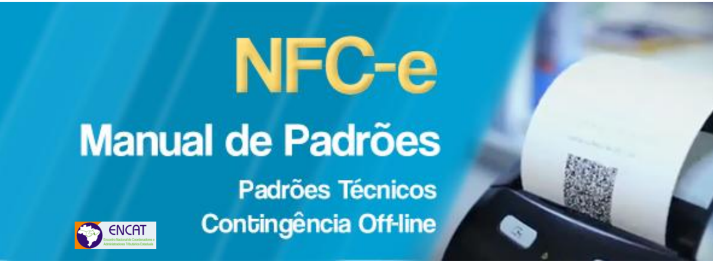
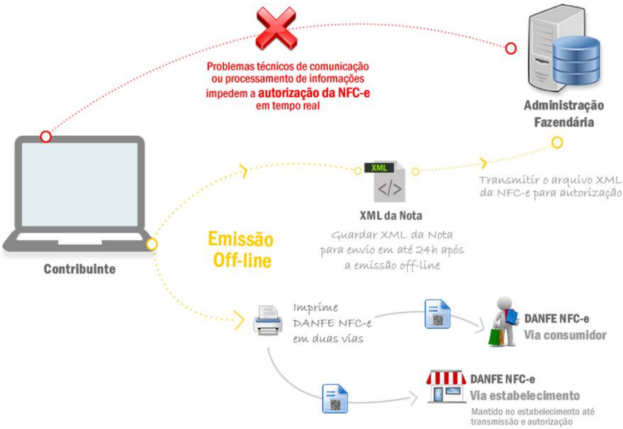
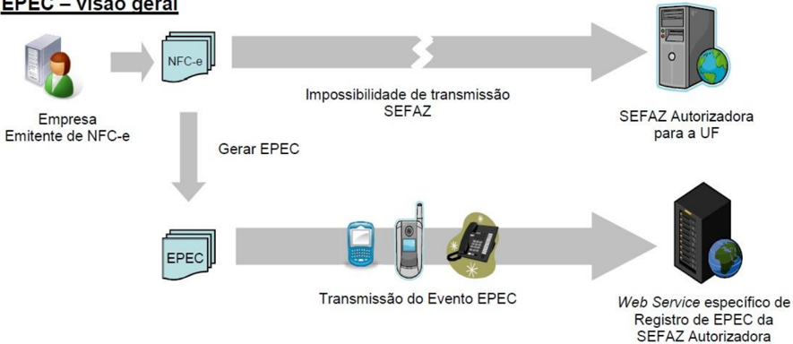
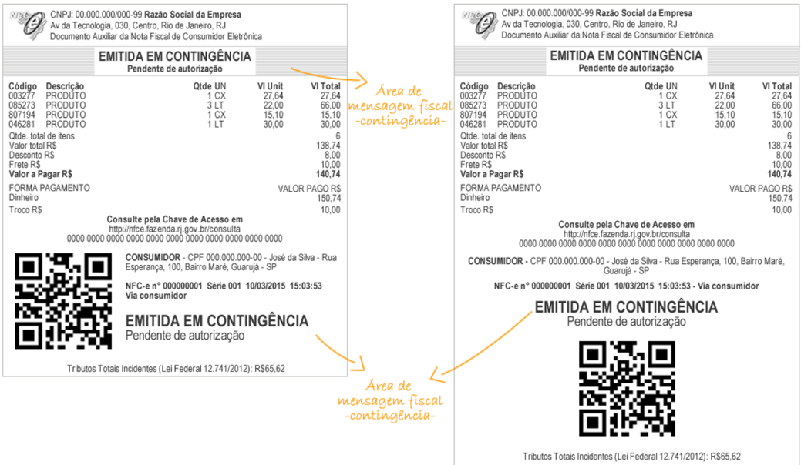
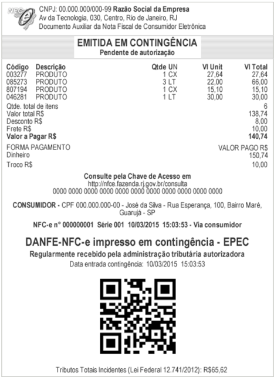
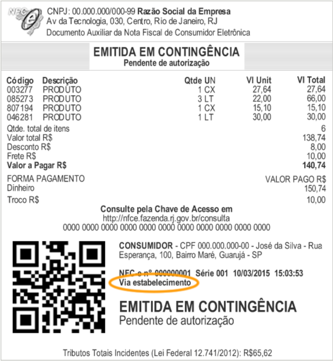
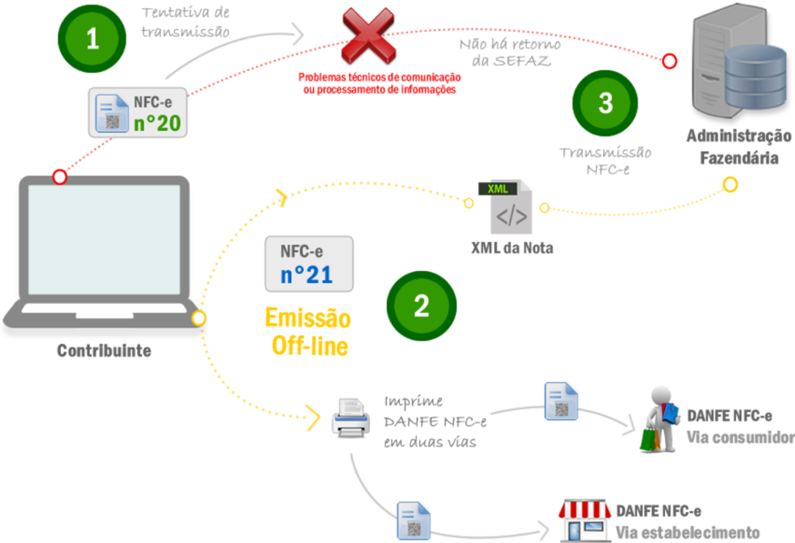

## 1.  Conceito e Modelo Operacional da Contingência Off-line para NFC-e

O modelo operacional atual da NFC-e prevêa utilização de 'Contingência Off-line NFC-e'.

Nesta modalidade, o contribuinte que estiver com problemas técnicos para autorização da NFC-e  poderá  emiti-la  em  contingência  off-line,  imprimir  o  DANFE  NFC-e  e  depois  de superado o problema técnico, transmitir o arquivo XML da NFC-e para autorização. O prazo estabelecido  pelo  Fisco,  atualmente,  é  o  final  do  primeiro  dia  útil  subsequente  contado  a partir de sua emissão.

A  possibilidade  de  uso  da  contingência  off-line  para  NFC-e  é  um  decisão  exclusiva  da Unidade Federada, que poderá vir a não autorizar  esta  modalidade  de  contingência  para todos ou determinados contribuintes emissores de NFC-e. Para tanto, foi definida regra de validação específica no leiaute possibilitando a implementação desta decisão pela UF.

A legislação nacional da NFC-e prevê a possibilidade, inclusive, que, a critério da Unidade Federada, sejam adotadas outras formas de contingência, ou utilização concomitante, como a emissão de cupom fiscal em papel por ECF, ou a geração de Cupom Fiscal Eletrônico por SAT Fiscal.

A contingência off-line é de uso exclusivo como alternativa de contingência de emissão de NFC-e, não sendo aceita esta modalidade de contingência, em nenhuma hipótese, para a NF-e. Para garantia desta premissa foi também inserida regra de validação específica para garantir o cumprimento desta regra.

A decisão pela entrada em contingência, bem como a escolha da alternativa de contingência (dentre as aceitas pela UF) é exclusiva do contribuinte, devendo ser utilizada nas situações em  que  ocorram  problemas  técnicos  de  comunicação  ou  processamento  de  informações que impeçam a autorização da NFC-e em tempo real. Não existe exigência de obtenção, pelo contribuinte, de autorização prévia do Fisco para entrada em contingência, tampouco de efetuar qualquer termo de início e término de contingênciano livro modelo 6 - RUDFTO.

Todavia, alertamos que as NFC-e devem ser autorizadas, preferencialmente, em tempo real, antes da ocorrência do fato gerador, e que as alternativas de contingência somente devem ser  acionadas  em  situações  extremas,  que  interfiram  de  forma  significativa  na  atividade operacional do estabelecimento.

Assim,  a  emissão  de  NFC-eem contingência  off-line  deve  ser  tratada  como  exceção , sendo que a regra deve ser a emissão com autorização em tempo real.

O Fisco poderá solicitar esclarecimentos, e até mesmo restringir ao contribuinte a utilização da  modalidade  de  contingência  off-line,  caso  seja  identificado  que  o  emissor  da  NFC-e utiliza a contingência em demasia e sem justificativa aceitável, quando comparado a outros contribuintes em situação similar.

É  importante  ressaltar  ainda  que  a  utilização  de  contingência  off-line  deve  se restringir às situações de efetiva impossibilidade de autorização da NFC-e em tempo real ,  haja  vista  que  pode  vir  a  representar  custos  e  riscos  adicionais  ao  contribuinte,  em especial, pelos seguintes aspectos:

- As NFC-e emitidas em contingência off-line  deverão  ser  posteriormente  encaminhadas para  autorização,  podendo  virem  a  ser  rejeitadas,  gerando  possíveis  retrabalhos  e problemas junto ao cliente, uma vez que a operação comercial já ocorreu;
- As  NFC-e  emitidas  em  contingência  off-line  estarão  disponíveis  para  consulta  pública pelos consumidores no site da SEFAZ ou via consulta QR Code apenas em momento posterior,  quando  forem  autorizadas,  havendo  risco  de  reclamações  ou  denúncias  de consumidores  por  não  localizarem  a  sua  NFC-e  na  consulta  realizada    imediatamente após a venda;

- Na  utilização  de  contingência  off-line,  o  contribuinte  assume  o  risco  de  perda  da informação das NFC-e emitidas em contingência, até que as mesmas constem da base de dados do Fisco. Na autorização online da NFC-e a informação já está segura na base de dados do Fisco;

O nível de serviço acordado para a NFC-e pelos sistemas dos Estados Autorizadores deve ser inferior a 30 (trinta) segundos, em 85% do tempo.

## 2.  Detalhes Técnicos NFC-e Emitida em Contingência

Ao emitir uma NFC-e em contingência, a primeira decisão é sobre a forma de emissão em contingência  dentre  as  disponíveis  para  NFC-e  (de  acordo  as  alternativas  aceitas  pela Unidade Federada).

No  arquivo  eletrônico  XML  da  NFC-e  deverá  ser  indicada  a  forma  de  emissão  em contingência pelo preenchimento do campo tpEmis (B22) com um dos seguintes conteúdos:

- 1-Emissão normal (não em contingência);
- 4 - Contingência EPEC (Evento Prévio da Emissão em Contingência);
- 9 - Contingência off-line da NFC-e.

## EPEC-visaogeral

Na escolha de contingência off-line da NFC-e (tpEmis = 9) não é necessária a adoção de série específica ou a utilização de papel especial.Todavia, deve ser observado o prazo de envio para autorização da NFC-eaté o final do primeiro dia útil subsequente contado a partir de sua emissão em contingência..

Qualquer  que  seja  a  alternativa  de  contingência  adotada,  a  informação  de  operação  em contingência deve ser impressa no DANFE NFC-e.

Figura 1 - DANFE NFC-e emitida em contingência off-line

Figura 2 - DANFE NFC-e emitida em contingência EPEC

Além disso, o QR Code impresso no DANFE daNFC-e emitida em contingência conterá a informação da data e hora de emissão do documento fiscal eletrônico. Isto possibilita que na consulta via QR Code, pelo consumidor, a SEFAZ retorne a informação de que se trata de emissão em contingência e o prazo máximo para o documento fiscal eletrônico constar da base de dados do Fisco.

Nos  casos  de  contingências  4  e  9  o  contribuinte  deverá  preencher,  obrigatoriamente,  os campos  de  Data  e  Hora  da  entrada  em  contingência  (dhCont  B28)  e  de  Justificativa  da entrada em contingência (xJust B29) que, todavia, não serão impressos no DANFE NFC-e.

Outro ponto importante é a recomendação de que se avance um número na sequência da numeração quando da entrada em contingência a fim de evitar que a NFC-e emitida em contingência seja posteriormente rejeitada por duplicidade.

Também cabe alertar que, superado o problema técnico, na transmissão da NFC-e emitida em contingência, deve-se manter a mesma chave de acesso , inclusive com a manutenção do mesmo código numérico original (campo cNF B03).

## 3.  Modelo Operacional Contingência Off-line NFC-e

A  contingência  off-line  para  a  NFC-e  foi  pensada  como  uma  forma  de  garantir  ao contribuinte a minimização de risco de impacto operacional pela implantação e utilização da NFC-e no varejo, sem acarretar a perda de controle pelo Fisco.

A  operação  comercial  no  varejo,  como  regra,  envolve  uma  situação  crítica  em  que  o consumidor está presente no estabelecimento, escolhe a mercadoria e se dirige ao caixa para  pagamento  e  retirada  do  produto.  Dessa  forma,  a  autorização  prévia  da  NFC-e  na frente de caixa exige um tempo de resposta adequado, da ordem de poucos segundos, de forma a evitar reclamações dos consumidores pela demora no atendimento.

Assim, em  uma  situação  de  problemas  técnicos, seja nos servidores ou rede de comunicação interna do contribuinte, seja no sistema de autorização da SEFAZ, ou ainda no meio de comunicação Internet, em que o tempo de autorização não se mostre adequado, ou não  se  consiga  a  autorização,  não  podem  ocorrer  reflexos  significativos  na  operação  de frente de caixa.

Nessas  situações  é  indicada  a  adoção  da  contingência  off-line,  em  que  as  NFC-e  são geradas,  assinadas  e  os  respectivos  DANFE  NFC-e  são  impressos  sem  a  autorização prévia da SEFAZ. Posteriormente, superado o problema técnico, até o final do primeiro dia útil seguinte à emissão, as NFC-e emitidas em contingência deverão ser transmitidas para obtenção da autorização de uso.

A  seguir  detalhamos  o  preenchimento  dos  campos  específicos  da  NFC-e  no  caso  de emissão em contingência off-line:

- Mod = 65 (NFC-e);
- dhCont = data e hora de entrada em contingência;
- xJust   = preencher com a justificativa da entrada em contingência;
- idDest = 1 (operação interna);
- tpEmis = 9 (contingência off-line);
- finfe = 1 (finalidade de emissão normal);
- indFinal =1 (indicador de operação com consumidor final);
- indPres =1 (indicador de presença do consumidor no estabelecimento);

No caso de emissão em contingência deverá constar obrigatoriamente no DANFE NFC-e a mensagem 'EMITIDA EM CONTINGÊNCIA'.

O DANFE NFC-e tem por característica não trazer  impressas  as  informações  detalhadas dos itens de mercadorias, que serão apresentadas no documento Detalhe da Venda ou no resultado da consulta pública da NFC-e no portal da Secretaria de Fazenda.

No caso de emissão em contingência 9, é obrigatória a impressão do Detalhe da Venda e do DANFE  NFC-e,  sendo  que,  nesta  hipótese,  deverá  ser  impressa  uma  segunda  via  do DANFE NFC-e que deverá permanecer a disposição do Fisco no estabelecimento até que tenha  sido  transmitida  e  autorizada  a  respectiva  NFC-e  emitida  em  contingência.  Esta obrigação poderá, a critério da Unidade Federada, ser dispensada.

Esta segunda via deverá estar identificada como 'Via do Estabelecimento' conforme modelo constante da figura a seguir. Alternativamente à impressão da segunda via do DANFE NFCe, quando de emissão em contingência, o contribuinte poderá optar pela guarda eletrônica, em local seguro, do respectivo arquivo XML da NFC-e. Neste caso, o contribuinte deverá possibilitar  a  impressão  do  respectivo  DANFE  NFC-e  para  apresentação  ao  fisco  quando solicitado.

TributosTotais Incidentes (Lei Federal 12.741/2012):R$65,62

Para  poder  fazer  uso  desta  opção  de  guarda  eletrônica  do  arquivo  XML  emitido  em contingência, o contribuinte deverá, previamente, lavrar termo no livro Registro de Utilização de Documentos Fiscais e Termos de Ocorrência - modelo 6, ou formalizar declaração de opção segundo disciplina que vier a ser estabelecida por sua Unidade Federada, assumindo total  responsabilidade  pela  guarda  do  arquivo  e  declarando  ter  ciência  que  não  poderá, posteriormente, alegar problemas técnicos para justificar a eventual perda desta informação eletrônica sob sua posse, assumindo as consequências legais por ventura cabíveis.

## 4.  Exemplo prático

## Tentativa de transmissão 1

Há a tentativa de transmissão de uma NFC-e com numeração 20 . Há um problema técnico na comunicação ou processamento das informações. Não há retorno da SEFAZ.

## Observação:

É vedada a reutilização, em contingência, de número de NFC-e transmitida com tipo de emissão 'Normal'.

## Emissão off-line 2

A NFC-e é emitida offline com numeração diferente, n° 21 , para evitar a duplicidade da nota.  Deve-se imprimir o DANFE-NFCe, em duas vias ou manter em local seguro o arquivo digital, sendo impresso para apresentar ao fisco quando solicitado

## Observação:

- Caso  na  tentativa  de  transmissão  (opção  1)  o  serviço  de  comunicação  seja retomado, e a NFC-e autorizada,o procedimento correto é cancelar a NFC-e n°20.
- Caso não haja tentativa de transmissão, a numeração utilizada na emissão off-line pode ser mantida.

## Transmissão

Superado  o  problema  técnico,  a  NFC-e  n°21  é  transmitida  para  obtenção  da autorização de uso.

Se vier a ser rejeitada, gerar novamente o arquivo com a mesma numeração e série, sanando a irregularidade e transmitir novamente.

Para aquela que ficou pendente de retorno (a nota n° 20 desse exemplo):

- inutilizar a numeração, se não autorizada; ou
- cancelar, se autorizada.