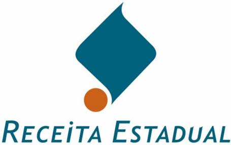

## - Manual Credenciamento como Emissor de Nota Fiscal Eletrônica

|   Versão |   Revisão | Data       | Responsável                  | Revisor                      |
|----------|-----------|------------|------------------------------|------------------------------|
|        1 |         0 | 16/04/2007 | Vinicius Pimentel de Freitas | Geraldo Scheilbler           |
|        1 |         1 | 08/05/2007 | Vinicius Pimentel de Freitas | Geraldo Scheilbler           |
|        1 |         2 | 06/09/2007 | Dimitri Munari Domingos      | Vinicius Pimentel de Freitas |
|        2 |         0 | 10/10/2007 | Dimitri Munari Domingos      | Geraldo Scheilbler           |
|        3 |         0 | 18/02/2008 | Dimitri Munari Domingos      | Vinicius Pimentel de Freitas |
|        3 |         1 | 17/03/2008 | Dimitri Munari Domingos      | Vinicius Pimentel de Freitas |


## Manual - Credenciamento como Emissor de Nota Fiscal Eletrônica

## Sumário

| Credenciamento como Emissor de Nota Fiscal Eletrônica ____________________________                | Credenciamento como Emissor de Nota Fiscal Eletrônica ____________________________                | Credenciamento como Emissor de Nota Fiscal Eletrônica ____________________________                                                                | 3                                                                             |
|---------------------------------------------------------------------------------------------------|---------------------------------------------------------------------------------------------------|---------------------------------------------------------------------------------------------------------------------------------------------------|-------------------------------------------------------------------------------|
| 1.                                                                                                | Procedimentos Mínimos Necessários para se tornar um Emissor de NF-e: ___________                  | Procedimentos Mínimos Necessários para se tornar um Emissor de NF-e: ___________                                                                  | 3                                                                             |
| 2.                                                                                                | Credenciamento como Emissor de NF-e: ______________________________________                       | Credenciamento como Emissor de NF-e: ______________________________________                                                                       | 3                                                                             |
| 2.1.                                                                                              | 2.1.                                                                                              | Credenciamento como Emissor de NF-e no RS:                                                                                                        | __________________________________ 3                                          |
| 2.2.                                                                                              | 2.2.                                                                                              | Credenciamento como Emissor emEstado da Sefaz-Virtual/RS:____________________                                                                     | 4                                                                             |
| 3.                                                                                                | Certificado Digital para uso na NF-e:_________________________________________                    | Certificado Digital para uso na NF-e:_________________________________________                                                                    | 4                                                                             |
| 4.                                                                                                | Sistema para Emissão de NF-e:______________________________________________                       | Sistema para Emissão de NF-e:______________________________________________                                                                       | 4                                                                             |
| 4.1.                                                                                              |                                                                                                   | Programa Emissor de NF-e Disponibilizado pelo ENCAT                                                                                               | _________________________ 5                                                   |
| 4.2.                                                                                              | 4.2.                                                                                              | Desenvolvimento/Adaptação do Sistema de Informações da Empresa________________                                                                    | 5                                                                             |
| 4.2.1.                                                                                            | 4.2.1.                                                                                            | Padrões técnicos de comunicação                                                                                                                   | ____________________________________________________ 5                        |
| 4.2.2.                                                                                            | 4.2.2.                                                                                            | Conexão segura SSL: _____________________________________________________________                                                                 | 5                                                                             |
|                                                                                                   |                                                                                                   | Assinatura Digital                                                                                                                                | 6                                                                             |
| 4.2.3.                                                                                            | 4.2.3.                                                                                            | ________________________________________________________________                                                                                  |                                                                               |
| 5. Fases ___________________________________________________________________                      | 5. Fases ___________________________________________________________________                      | 5. Fases ___________________________________________________________________                                                                      | 6                                                                             |
| 5.1. Testes_____________________________________________________________________                  | 5.1. Testes_____________________________________________________________________                  | 5.1. Testes_____________________________________________________________________                                                                  | 6                                                                             |
| 5.1.1.                                                                                            | 5.1.1.                                                                                            | Procedimentos Iniciais Recomendados________________________________________________                                                               | 7                                                                             |
| 5.1.2.                                                                                            | 5.1.2.                                                                                            | Testes Mínimos Sugeridos _________________________________________________________                                                                | 7                                                                             |
| 5.2.                                                                                              | 5.2.                                                                                              | Emissão Simultânea_________________________________________________________                                                                       | 8                                                                             |
| 5.3.                                                                                              | 5.3.                                                                                              | Produção                                                                                                                                          | __________________________________________________________________ 8          |
| 6. Consulta à NF-e na SEFAZ/RS e na Sefaz-Virtual/RS ___________________________                  | 6. Consulta à NF-e na SEFAZ/RS e na Sefaz-Virtual/RS ___________________________                  | 6. Consulta à NF-e na SEFAZ/RS e na Sefaz-Virtual/RS ___________________________                                                                  | 9                                                                             |
| 7.                                                                                                | Outras Informações sobre a NF-e____________________________________________                       | Outras Informações sobre a NF-e____________________________________________                                                                       | 9                                                                             |
| 8.                                                                                                | Contatos ________________________________________________________________                         | Contatos ________________________________________________________________                                                                         | 9                                                                             |
| 9.                                                                                                | ANEXOS_______________________________________________________________                             | ANEXOS_______________________________________________________________                                                                             | 10                                                                            |
|                                                                                                   | ANEXO 1 - Estabelecimento da Conexão Segura SSL:___________________________                       | ANEXO 1 - Estabelecimento da Conexão Segura SSL:___________________________                                                                       | 10                                                                            |
| 9.1. 9.1.1. Obtenção dos certificados de servidor da SEFAZ-RS____________________________________ | 9.1. 9.1.1. Obtenção dos certificados de servidor da SEFAZ-RS____________________________________ | 9.1. 9.1.1. Obtenção dos certificados de servidor da SEFAZ-RS____________________________________                                                 | 10                                                                            |
| 9.1.2.                                                                                            | 9.1.2.                                                                                            | Verificação da correta instalação dos certificados digitais                                                                                       | ________________________________ 12                                           |
| 9.1.3.                                                                                            | 9.1.3.                                                                                            | Obtenção do WSDL ( Web Services Description Language                                                                                              | )_______________________________ 13                                           |
| 9.2.                                                                                              | 9.2.                                                                                              | ANEXO 2 - Consumo dos Web Service do Ambiente NF-e da SEFAZ/RS                                                                                    |                                                                               |
| Virtual/RS                                                                                        | Virtual/RS                                                                                        | Pré-Requisitos para Consumo Web Service                                                                                                           |                                                                               |
| 9.2.1.                                                                                            | 9.2.1.                                                                                            |                                                                                                                                                   | ____________________________________________ 13                               |
| 9.2.2. 9.2.3.                                                                                     | 9.2.2. 9.2.3.                                                                                     | Passos do Processo ______________________________________________________________ Exemplo de Código em .NET, framework 2 (ou superior), linguagem | 13 C#____________________ 14                                                  |
| 9.2.4.                                                                                            | 9.2.4.                                                                                            | Endereços Web Services do RS_____________________________________________________                                                                 | 14                                                                            |
| 9.3.                                                                                              | 9.3.                                                                                              |                                                                                                                                                   | __________________________________ 15                                         |
|                                                                                                   |                                                                                                   | ANEXO 3-O Processo de Assinatura Digital                                                                                                          |                                                                               |
| 9.3.1.                                                                                            | 9.3.1.                                                                                            | Pré-Requisitos para a Assinatura____________________________________________________                                                              | 16                                                                            |
| 9.3.2. 9.3.3.                                                                                     | 9.3.2. 9.3.3.                                                                                     | Seqüência de Passos para o Processo de Assinatura Gerando o código hash e calculando a assinatura digital                                         | _____________________________________ 16 _________________________________ 16 |
| 9.3.4.                                                                                            | 9.3.4.                                                                                            | O Elemento 'Signature'                                                                                                                            | __________________________________________________________ 17                 |
| 9.3.5.                                                                                            | 9.3.5.                                                                                            | Exemplo de Código em .NET, Framework 2 (ou superior), linguagem c#____________________                                                            | 19                                                                            |
| Principais                                                                                        | Principais                                                                                        | Abreviaturas Utilizadas ______________________________________________                                                                            | 20                                                                            |


## Credenciamento como Emissor de Nota Fiscal Eletrônica

Este documento descreve o processo de credenciamento como Emissor de Nota Fiscal Eletrônica para contribuintes do ICMS no Rio Grande do Sul e na Sefaz-Virtual/RS.

Eventuais  dúvidas  podem  ser  esclarecidas  através  dos  emails nfe@sefaz.rs.gov.br,  para  os contribuintes do RS, e sefaz-virtual@sefaz.rs.gov.br para os contribuintes da Sefaz-Virtual/RS.

## 1. Procedimentos  Mínimos  Necessários  para  se  tornar  um Emissor de NF-e:

Para tornar-se um emissor de NF-e, a empresa necessitará, ao menos:

1. Credenciar-se como emissora de NF-e no Estado onde esteja estabelecida;
2. Adquirir um certificado digital nos padrões da NF-e;
3. Adaptar o seu sistema de faturamento para emitir NF-e.

## 2. Credenciamento como Emissor de NF-e:

Para se tornar emissor de NF-e, o contribuinte deve se credenciar junto à Secretaria de Fazenda ou  de  Tributos  de  seu  Estado.  Tendo  em  vista  a  atual  fase  de  massificação  da  NF-e  e  a conseqüente qualificação do mercado de TI sobre o sistema NF-e, o processo de credenciamento vem  sendo  simplificado.  O  credenciamento  em  uma  Unidade  da  Federação  não  credencia  a empresa  perante  as  demais  Unidades;  portanto,  a  empresa  deve  solicitar  credenciamento  em todos os Estados em que possuir estabelecimentos e nos quais deseje emitir NF-e.

## 2.1. Credenciamento como Emissor de NF-e no RS:

A empresa que desejar se credenciar como emissora de NF-e no RS deverá:

-  Ser  contribuinte  inscrito  no  RS  e  usuário  de  sistema  eletrônico  de  processamento  de dados, ou estar enquadrada em um  dos protocolos ICMS-Confaz que estabelecem a obrigatoriedade de uso da NF-e para determinados segmentos de atuação;
-  Solicitar  acesso  aos  ambientes  da  NF-e  formalizando  seu  pedido  de  credenciamento pelo  site  da  SEFAZ/RS,  em www.sefaz.rs.gov.br, no menu  de  Auto-Atendimento,  item 'Credenciamento como Emissor de NF-e'. Para a solicitação será necessário o login e a senha da pessoa cadastrada como autorizada pela empresa no cadastro de contribuintes do Estado;
- A solicitação será deferida ou rejeitada com base em critérios como a regularidade da situação no cadastro de contribuintes do Estado e no Cadastro Nacional de Pessoas Jurídicas, a capacidade de atendimento do ambiente da NF-e, o interesse para a Administração Tributária, as premissas  do  projeto  nacional  da  NF-e,  entre  outros  critérios  considerados  relevantes  para  o sistema NF-e e para as Administrações Tributárias.

A  SEFAZ/RS  poderá  credenciar  de ofício, forma antecipada e independente  de solicitação da empresa contribuintes enquadrados em situações de obrigatoriedade de adoção da NF-e..  Caso  a  empresa  enquadrada  nos  protocolos  da  obrigatoriedade  não  esteja  conseguindo acesso  ao  ambiente  NF-e  deverá  entrar  em  contato  com  a  SEFAZ/RS  através  dos  e-mails referidos no início deste documento.


## 2.2. Credenciamento como Emissor em Estado da Sefaz-Virtual/RS:

Os contribuintes estabelecidos nos Estados que firmaram protocolo de utilização do ambiente da Sefaz-Virtual/RS deverão entrar em contato com a Administração Fazendária ou de Tributos do Estado  onde  estejam  estabelecidos,  solicitando  credenciamento  como  emissor  de  NF-e  pela Sefaz-Virtual/RS.  Compete  à  Administração  Tributária/Fazendária  daquele  Estado  (e  não  à Sefaz-Virtual/RS) credenciar seus contribuintes e permitir acesso aos ambientes de testes ou de produção.

Uma  relação  dos  Estados  signatários  pode  ser  obtida  em  consulta  aos  Protocolos  da  SefazVirtual/RS (Protocolos ICMS nº 55, 64 e 84 de 2007, e alterações). Os protocolos ICMS e os demais dispositivos legais nacionais da NF-e podem ser obtidos no Portal Nacional da NF-e, em www.nfe.fazenda.gov.br/portal, na sessão de Legislação e Documentos.

## 3. Certificado Digital para uso na NF-e:

Para emissão de NF-e é necessária a utilização de um certificado digital, inclusive  no caso de uso do Programa Emissor de NF-e disponibilizado pelo ENCAT. Por isso a empresa precisará adquirir um certificado digital nos padrões da NF-e junto a uma Autoridade Certificadora (AC) credenciada  na  ICP-Brasil.  Uma  lista  das  AC  comerciais  pode  ser  obtida  no  site  do  Instituto Nacional de Tecnologia da Informação, ITI, em www.iti.gov.br.

Conforme  o  Manual  de  Integração-Contribuinte  (disponível  na sessão de 'Legislação  e Documentos'  do  Portal  Nacional  da  NF-e,  em www.nfe.fazenda.gov.br/portal)  o  ' certificado digital  utilizado  no  Projeto  Nota  Fiscal  eletrônica  será  emitido  por  Autoridade  Certificadora credenciada  pela  Infra-estrutura  de  Chaves  Públicas  Brasileira  -  ICP-Brasil,  tipo  A1  ou  A3, devendo conter o CNPJ da pessoa jurídica titular do certificado digital no campo otherName OID =2.16.76.1.3.3 '.  O  mesmo  manual  prevê  ainda  que  o  ' certificado  digital  utilizado  para essa  função  deverá  conter  o  CNPJ  do  estabelecimento  emissor  da  NF-e  ou  o  CNPJ  do estabelecimento matriz '.

Poderá ser utilizado qualquer certificado que atenda a estes requisitos. Compete ao contribuinte avaliar  e  escolher o  tipo  de  certificado  que utilizará,  dentre as opções de mercado  (e-PJ ou eCNPJ, tipo A1 ou A3, e assim por diante). Recomenda-se consultar as Autoridades Certificadoras credenciadas junto à ICP-Brasil para a obtenção de maiores informações sobre os certificados disponíveis.

A empresa poderá utilizar o mesmo certificado digital para assinatura das NF-e de todos os seus estabelecimentos desde que o certificado utilizado contenha o CNPJ do estabelecimento matriz.

## 4. Sistema para Emissão de NF-e:

O contribuinte pode optar entre as seguintes alternativas:

- x Desenvolver ou adaptar seu sistema de informações
- x Adquirir solução de mercado
- x Utilizar o Programa Emissor Autônomo disponibilizado pelo ENCAT.

O  contribuinte  deverá  avaliar  qual  das  alternativas  é  mais  interessante  de  acordo  com  a  sua realidade  de  emissão  de  notas  fiscais,  podendo  inclusive  optar  por  utilizar  mais  de  uma  das soluções.


## 4.1. Programa Emissor de NF-e Disponibilizado pelo ENCAT

O programa emissor pode ser baixado através do link existente no Portal Nacional da NF-e.

É  um  programa  de  fácil  utilização,  possuindo  opções  de  importação  e  exportação  de  dados através de arquivos. Não existe, no entanto, a possibilidade de integração com outros programas fiscais.

## 4.2. Desenvolvimento/Adaptação  do  Sistema  de  Informações  da Empresa

O sistema da NF-e utiliza-se de tecnologias de padrão aberto, de forma que qualquer empresa pode  desenvolver  aplicação  própria,  ou  adequar  seu  sistema  de  gestão  (ERP  Enterprise Resource  Planning )  para  emitir  NF-e.  Para  tanto,  a  empresa  deverá  seguir  o  estabelecido  na documentação  técnica  da  NF-e.  Toda  a  documentação  técnica,  incluindo  os  manuais  de Integração e de Contingência, Schemas XML, entre outros, está publicada no Portal Nacional da NF-e, que pode ser acessado na internet pelo endereço www.nfe.fazenda.gov.br/portal.

## 4.2.1. Padrões técnicos de comunicação

Os padrões de comunicação do Sistema da Nota Fiscal Eletrônica estão definidos no documento 'Manual de Integração - Contribuinte, Padrões Técnicos de Comunicação', disponível no Portal Nacional da NF-e, na sessão de Legislação e Documentos.

Esta é a transcrição da introdução do manual:

'Este  documento  tem  por  objetivo  a  definição  das  especificações  e  critérios técnicos necessários para a integração entre os Portais das Secretarias de Fazendas dos  Estados  e  os  sistemas  de  informações  das  empresas  emissoras  de  NF-e  do Projeto da Nota Fiscal Eletrônica (NF-e).

Em vista  da  complexidade  do  projeto,  esclarecemos  aos  usuários  deste  manual (equipes  fiscal  e  de  TI  das  empresas  integrantes  do  projeto),  que  a  legislação aprovada, conceitos e especificações contidas neste manual podem sofrer ajustes que  venham  a  ser  demandados  a  partir  do  aprofundamento  das  discussões  e experiências adquiridas durante a fase de implantação do projeto.'

Além das informações disponíveis no Manual de Integração-Contribuinte, algumas informações úteis sobre a comunicação com os Web Services da SEFAZ/RS e da Sefaz-Virtual/RS poderão ser obtidas nos anexos deste Manual de Credenciamento, em tópico específico.

## 4.2.2. Conexão segura SSL:

A operação  do  WS  está  configurada  para  utilização  do  SSL  com  autenticação  mútua.  Para  o estabelecimento do SSL com autenticação mútua, faz-se necessário que:

- A empresa instale no equipamento servidor que irá estabelecer a transmissão da NF-e o certificado digital da empresa que será utilizado na comunicação;
- A empresa instale no equipamento servidor que irá efetuar a transmissão os Certificados de AC (Autoridade Certificadora) que emitiram o Certificado da SEFAZ-RS (incluindo o certificado raiz ICP-Brasil);
- A SEFAZ autorizadora instale em seus equipamentos servidores os certificados das AC vinculadas ao certificado digital utilizado pela empresa na comunicação.


A  SEFAZ-RS  e  a  Sefaz-Virtual/RS  já  possuem  instalados  em  seus  equipamentos  servidores todos os Certificados das AC comerciais mais comuns identificadas no site do ITI - Instituto Nacional de Tecnologia de Informação, em www.iti.gov.br.

A empresa deverá possuir um certificado digital para ser usado no processo de assinatura da nota fiscal e um certificado digital para ser usado como certificado de transmissor. Nos dois casos, o certificado  deve possuir uma extensão com o CNPJ. O mesmo certificado poderá ser utilizado para  as  duas  funções,  assinatura  e  transmissão,  porém  para  a  assinatura  é  exigido  que  o certificado contenha o CNPJ da empresa matriz ou do próprio estabelecimento emissor.

Outras informações sobre a conexão segura SSL poderão ser obtidas nos anexos deste manual, em tópico específico sobre Conexão SSL.

## 4.2.3.  Assinatura Digital

O Ajuste SINIEF 07/2005, que instituiu a NF-e  na  legislação  nacional, definiu como NF-e  'o documento  emitido  e  armazenado  eletronicamente  (...)  cuja  validade  jurídica  é  garantida  pela assinatura digital do emitente e (...)'. Com isso, os arquivos XML gerados deverão ser assinados digitalmente para poderem ser autorizados pela Administração Tributária.

Cada NF-e deverá ser assinada digitalmente de forma individual. Antes da transmissão, a NF-e deverá ser envelopada em um lote de até 50 NF-e (ou até o limite máximo de 500KB).

Como a Sefaz necessita desenvelopar os arquivos NF-e, e este processo onera significativamente o tempo de processamento da NF-e, o ideal é que a empresa transmita lotes no maior tamanho possível  (observar  os  limites  máximos  de  50  NF-e  e  500KB  por  lote).  Agindo  desta  forma  a empresa  estará  otimizando  o  processamento  dos  lotes  e  reduzindo  substancialmente  o  tempo médio de resposta de autorização das NF-e.

Outras informações sobre o processo de assinatura digital poderão ser obtidas nos anexos deste manual, em tópico específico.

## 5. Fases

O processo de credenciamento de contribuintes como emissor de Nota Fiscal Eletrônica consta de três fases sugeridas:

1. Testes
2. Emissão Simultânea
3. Produção

O cumprimento das mencionadas fases não é obrigatório, sendo possível ao contribuinte solicitar credenciamento  final como  emissor  de  NF-e,  e  conseqüente  acesso  ao  ambiente  de  produção, independente  de  ter  ou  não  efetuado  testes  ou  cumprido  as  fases  sugeridas.  Contudo  é aconselhável que a empresa, para uma  implementação  mais  tranqüila e segura, efetue antecipadamente todos os testes que julgar necessário, de acordo com suas necessidades.

## 5.1. Testes

Não é necessário que a empresa que deseje tornar-se emissora de NF-e efetue testes, embora seja altamente  recomendável.  Nos  tópicos  seguintes  há  uma  relação  de  procedimentos  e  testes sugeridos, contudo a forma ou mesmo quantidade de testes necessários para uma implementação segura dependerá da realidade de cada empresa.


## Manual de Credenciamento como Emissor de Nota Fiscal Eletrônica

Empresas  que  não  sejam  contribuintes  no  Estado  do  RS,  mas  que  tenham  interesse  em desenvolver suas aplicações para emissão de NF-e, como empresas desenvolvedoras de sistemas, poderão obter acesso ao ambiente de testes da NF-e do RS em contato direto com a Equipe NF-e pelo endereço de e-mail nfe@sefaz.rs.gov.br.

## 5.1.1. Procedimentos Iniciais Recomendados

Estes procedimentos são dispensáveis para o contribuinte que for utilizar o Programa Emissor de NF-e, pois os testes foram realizados pela equipe desenvolvedora do Programa.

A empresa que desejar adequar sua aplicação para emissão de NF-e não necessita obter acesso ao ambiente da NF-e para iniciar os testes com seus aplicativos, pois alguns testes podem ser feitos antecipadamente.  Para  efetuar  testes  iniciais,  a  empresa  poderá  validar  seus  arquivos  XML utilizando os schemas disponibilizados e os aplicativos Assinador e Visualizador da NF-e. Tais aplicativos,  assim  como  demais  documentos  técnicos  da  NF-e,  a  exemplo  do  Manual  de Integração, podem ser encontrados no Portal Nacional da Nota Fiscal Eletrônica, no endereço www.nfe.fazenda.gov.br/portal.

Também é possível validar os arquivos XML da NF-e através do validador de mensagens NF-e, disponível para utilização pela página da NF-e do site da SEFAZ/RS, em www.sefaz.rs.gov.br, menu 'Informações Gerais',  no  item 'Nota Fiscal Eletrônica'.  Na  mesma página poderão  ser encontrados alguns exemplos de arquivos XML da NF-e.

Recomenda-se  a  seguinte  seqüencia  de  procedimentos  (dispensáveis  no  uso  do  Programa Emissor de NF-e).

1. Verificar se o XML está bem formado
2. Validação do esquema ( schema ) XML
3. Assinatura digital (mais detalhes podem ser encontrados no tópico e anexo específicos sobre 'Assinatura Digital')
4. Autenticação mútua de servidores (maiores detalhes no tópico e anexo específicos sobre 'Conexão Segura SSL')
5. Comunicação com todos os web services expostos no ambiente de testes (relacionados no Manual de Integração e no anexo específico).

## 5.1.2. Testes Mínimos Sugeridos

A execução de testes é mero interesse da empresa, não estando esta obrigada ao cumprimento da relação  de  testes  sugerida  para  tornar-se  emissora  de  NF-e.  Porém,  com  base  na  experiência adquirida  com  o  processo  de  credenciamento  de  grandes  empresas  que  se  voluntariaram  a tornarem-se emissoras de NF-e, sugere-se que a empresa execute no mínimo os seguintes testes:

1. Emissão de notas fiscais
- a. Emitir no mínimo 100 NF-e, ou uma quantidade de notas fiscais que represente o faturamento da empresa de forma significativa
- b. Variar o tamanho dos lotes, emitindo pelo menos um lote com 50 notas fiscais, e três lotes com apenas uma nota fiscal
2. Consulta de retorno de recepção: consultar todos os lotes enviados no período
3. Cancelamento de notas fiscais: efetuar no mínimo 10 cancelamentos de notas fiscais.
4. Consulta protocolo: efetuar pelo menos 20 vezes a consulta protocolo.
5. Inutilização de nota fiscal:


## Manual de Credenciamento como Emissor de Nota Fiscal Eletrônica

- a. Efetuar pelo menos 5 inutilizações de numeração
- b. Variar  a  faixa  de  numeração  inutilizada,  inutilizando  tanto  um  único  número como uma faixa de números contida entre números de notas já autorizadas.
6. Consulta status: efetuar pelo menos 20 consulta status.

## Observações:

1. Recomenda-se que sejam emitidas notas fiscais eletrônicas correspondendo, dentro do possível,  a  todos  os  tipos  de  operações  realizadas  pelo  contribuinte,  inclusive  notas fiscais de entrada, utilizando dados reais de suas notas fiscais modelo 1 ou 1-A.
2. Recomenda-se  executar  os  testes  até  que  o  número  de  erros  reduza  a  zero  ou  a  um volume não significativo para as operações da empresa, permitindo à empresa operar de forma tranqüila com a NF-e.

## 5.2. Emissão Simultânea

A Fase de Emissão Simultânea tem dois objetivos:

1. Verificar a implantação da NF-e dentro do ambiente da empresa e de acordo com sua realidade,  validando  os  processos  e  a  cultura  da  organização.  Objetiva  simular  a realidade da empresa, evitando imprevistos, antes de sua entrada em produção; e
2. Ambientar clientes e colaboradores da empresa com a realidade da NF-e, onde a Nota Fiscal  Modelo  1  ou  1A  é  substituída  pelo  arquivo  eletrônico,  e  a  circulação  da mercadoria ocorre documentada pelo DANFE.

Nesta  fase,  deverão  ser  emitidas  tanto  a  Nota  Fiscal  Modelo  1  ou  1A  como  a  Nota  Fiscal Eletrônica  (autorizada  no  Ambiente  de  Testes)  em  todas  as  operações  de  circulação  de mercadorias constantes da estratégia de implantação.

Os  DANFE  correspondentes  (contendo  a  expressão  'SEM  VALOR  FISCAL')  deverão acompanhar as Notas Fiscais Modelo 1 ou 1A, com finalidade dos destinatários das mercadorias já tomarem conhecimento que este contribuinte emissor em breve deverá estar emitindo apenas Nota Fiscal Eletrônica.

Assim como ocorre com a Fase de Testes, a execução da Fase de Emissão Simultânea é apenas de interesse da empresa, não sendo seu cumprimento obrigatório, apesar de recomendável.

## 5.3. Produção

A Fase de Produção corresponde ao efetivo credenciamento do contribuinte como emissor de Nota Fiscal Eletrônica.

Constatada a regularidade fiscal do contribuinte e não havendo nenhum outro impedimento, será concedida  a  autorização  para  entrada  na  Fase  de  Produção,  sendo  os  dados  do  contribuinte publicados pelo  Estado  na relação  de  empresas credenciadas para emissão  de NF-e. No RS, a lista de contribuintes credenciados como emissores de NF-e é publicada na página da NF-e do site da SEFAZ/RS, pelo endereço anteriormente mencionado.

A partir  do  dia  em  que  o  contribuinte  tomar  ciência  da  autorização  para  entrada  na  Fase  de Produção poderá passar a operar com Notas Fiscais Eletrônicas.


## 6. Consulta à NF-e na SEFAZ/RS e na Sefaz-Virtual/RS

Além  da  consulta  implementada  por  consumo  dos Web  Services ,  através  do  aplicativo  da empresa  ou  do  Programa  Emissor  de  NF-e,  as  NF-e  de  contribuintes  do  RS,  autorizadas  no ambiente da SEFAZ/RS, poderão ser consultas na página da NF-e da SEFAZ/RS, pelo endereço já mencionado, em 'Serviços Disponíveis'.

Como  o  Protocolo  ICMS  nº  55  de  2007,  que  instituiu  a  Sefaz-Virtual/RS,  não  prevê  o fornecimento  do  serviço  de  consulta  às  NF-e  por  página web ,  é  atribuição  de  cada  Estado signatário fornecer a consulta às NF-e autorizadas por seus contribuintes.

Para os Estados que ainda não disponibilizaram os serviços de consulta em seus sites web (sem a exigência de consumo de Web Services ), a consulta às NF-e poderá ser efetuada pelos sites do Ambiente Nacional, através de consulta aos seguintes endereços:

- Ambiente de Produção (Portal Nacional da NF-e):

[https://www.nfe.fazenda.gov.br/portal](https://www.nfe.fazenda.gov.br/portal)

- Ambiente de Testes (apenas trocar www por hom no endereço do Portal Nacional da NF-e):

[https://hom.nfe.fazenda.gov.br/portal/](https://hom.nfe.fazenda.gov.br/portal/)

## 7. Outras Informações sobre a NF-e

Toda a documentação da NF-e está publicada na  internet, podendo ser obtida pelos endereços listados a seguir:

- Informações Gerais - na página da NF-e do site da SEFAZ/RS, em www.sefaz.rs.gov.br, pelo menu 'Informações Gerais', no item 'Nota Fiscal Eletrônica'. Aconselha-se a leitura da FAQ e deste Manual de Credenciamento.
-  Documentação  Técnica  -  no  Portal  Nacional  da  NF-e,  em www.nfe.fazenda.gov.br/portal. Aconselha-se a leitura do Manual de Integração e do Manual de Contingência.
-  Convênios  e  Protocolos  ICMS  e  Ajustes  SINIEF,  com  âmbito  nacional  -  na  sessão  de 'Legislação'  do  site  do  Confaz,  em www.fazenda.gov.br/confaz.  Também  na  sessão  de 'Legislação  e  Documentos'  do  Portal  Nacional  da  NF-e  pode  ser  obtida  uma  relação  destes documentos  relacionados  à  NF-e.  Aconselha-se  a  leitura  dos  Protocolos  ICMS  nº  10/2007  (e alterações, em especial a do Protocolo ICMS 88/2007), sobre a obrigatoriedade de uso da NF-e, e  do  Protocolo  ICMS  nº  55/2007  (e  alterações  pelo  64/2007  e  84/2007),  sobre  a  SefazVirtual/RS, além dos Ajustes SINIEF nº 07 de 2005 e 08 de 2007.
- Legislação Estadual - no site da Secretaria de Fazenda ou de Tributos de cada Estado. Pode-se ter acesso a toda legislação tributária do RS em www.sefaz.rs.gov.br pelo link da página inicial para o Portal de Legislação, ou diretamente em www.legislacao.sefaz.rs.gov.br. No mesmo site, em sua página principal, há ainda um link para o site das SEFAZ dos demais Estados, caso seja necessária a consulta aos portais da NF-e de outras UF.

## 8. Contatos

Dúvidas ou esclarecimentos adicionais poderão ser supridos pelos endereços de contato:

- Contribuintes da SEFAZ/RS: nfe@sefaz.rs.gov.br;

- Contribuintes da Sefaz-Virtual/RS: sefazvirtual@sefaz.rs.gov.br;


## 9. ANEXOS

## 9.1. ANEXO 1 - Estabelecimento da Conexão Segura SSL:

## 9.1.1. Obtenção dos certificados de servidor da SEFAZ-RS

Descreve-se, a seguir, os procedimentos necessários para obtenção dos certificados de AC dos Servidores da SEFAZ-RS e da Sefaz-Virtual/RS:

1. Abrir o 'browser' (navegador da Internet);
2. Digitar o endereço de domínio do ambiente NF-e desejado:

https://homologacao.nfe.sefaz.rs.gov.br para o ambiente de testes da SEFAZ/RS;

[https://homologacao.nfe.sefazvirtual.rs.gov.br para testes Sefaz-Virtual/RS;](https://homologacao.nfe.sefazvirtual.rs.gov.br/)

https://nfe.sefaz.rs.gov.br para o ambiente de produção da SEFAZ/RS, e;

https://nfe.sefazvirtual.rs.gov.br para o ambiente de produção da Sefaz-Virtual/RS.

3. Clicar  no  local  indicado  para  baixar  a  cadeia  de  Certificados  do  site  (download  dos Certificados);
4. Instalar os 3 certificados das AC, a partir das janelas e diálogos abertos.

Como exemplo, segue abaixo uma descrição detalhada da instalação dos certificados de AC dos servidores de testes da SEFAZ-RS para os usuários que utilizam o sistema operacional Windows e o Internet Explorer como navegador de internet:

Abrir o Internet Explorer e digitar o endereço de domínio do ambiente de testes na linha de Endereço:

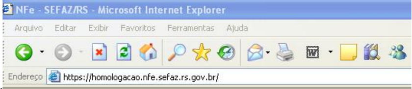

.

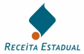

Clicar no local indicado para baixar a cadeia de Certificados do site  (Download  dos Certificados):

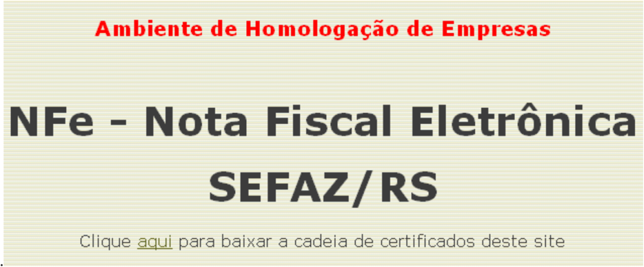

Na janela de assistente para 'Download de Arquivo', clique em &lt;Abrir&gt;:

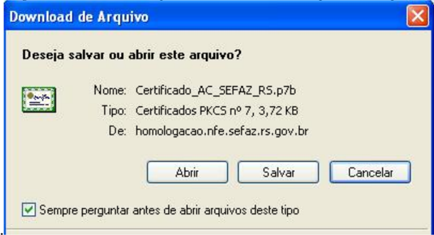

.

No  'Console  de  Gerenciamento  de  Certificados',  expandir  a  estrutura  até  'Certificados':

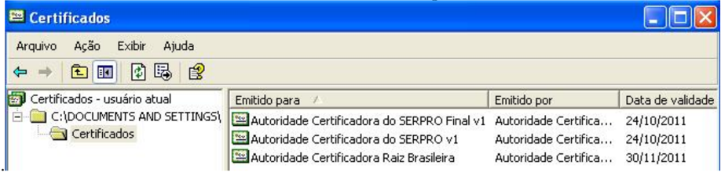

Para cada um dos três (3) Certificados apresentados, proceder como segue:

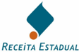

Efetuar duplo-clique no Certificado desejado:

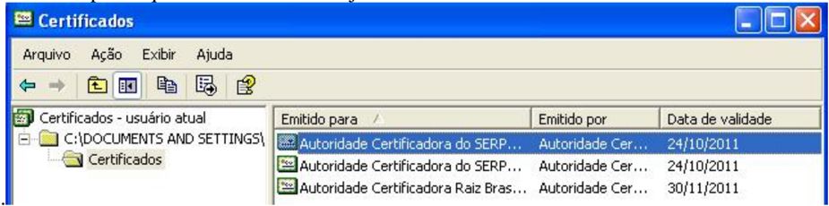

No 'Visualizador de Certificado' do Windows, clicar no botão 'Instalar Certificado':

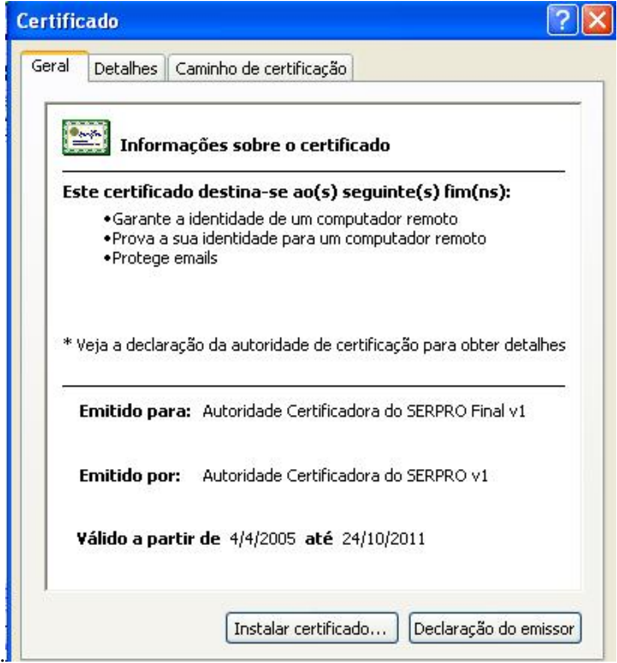

No 'Assistente para importação de Certificados' do Windows, clicar em 'Avançar', 'Avançar' novamente e 'Concluir';

Repetir a operação para cada um dos 3 (três) Certificados apresentados.

Nota :  No  momento  de  instalar  o  Certificado  da  AC  Raiz  Brasileira  poderá  ser  emitido  um 'Aviso de Segurança'. Deve-se clicar no botão 'Sim', confirmando a confiança no Certificado de AC Raiz Brasileira que está sendo instalado.

## 9.1.2. Verificação da correta instalação dos certificados digitais

Para  se  certificar  que  o  Certificado  Digital  e  os  Certificados  da  AC  foram  corretamente instalados,  pode-se  utilizar  o  navegador  da  Internet  ('browser')  para  acessar  manualmente  o endereço do Web Service .  Como o site está configurado como 'autenticação mútua', o próprio


'browser'  solicitará  ao  operador  que  informe  o  Certificado  Digital  que  será  utilizado  nesta comunicação. O sucesso nesta tentativa confirma  que o certificado é  válido para utilização  no estabelecimento da conexão SSL com os servidores da SEFAZ.

## 9.1.3. Obtenção do WSDL ( Web Services Description Language )

O WSDL descreve o formato de mensagem que o Web Service espera  receber.  Para  buscar  o WSDL  dos  servidores  da  SEFAZ/RS  e  Sefaz-Virtual/RS,  de  testes  ou  de  produção,  deve-se proceder como indicado no tópico anterior 'Obtendo os certificados de servidor da SEFAZ/RS', abrindo o navegador de internet e digitando o endereço do domínio do ambiente NF-e desejado, porém clicando no link identificado para baixar a descrição WSDL ao invés do link para baixar a cadeia de certificados

## 9.2. ANEXO 2 - Consumo dos Web Service do  Ambiente NF-e da SEFAZ/RS e da Sefaz-Virtual/RS

## 9.2.1. Pré-Requisitos para Consumo Web Service

- ¾ Documento XML de Lote de NF-e, sem erro de Schema e com as NF-e devidamente assinadas;
- ¾ Certificado digital que será utilizado para a transmissão, com chave privada ,  instalado no  repositório  do  sistema  operacional  do  Windows,  para  o  usuário  do  aplicativo  da empresa;
- ¾ Certificados  digitais  da  Cadeia  de  Certificação  do Web  Service da  SEFAZ  que  será conectado  deverão  estar  instalados  no  repositório  de  Certificados  do  equipamento  da empresa que está sendo usado nesta conexão;
- ¾ Classe proxy de conexão com o Web Service (exemplo: NFeRecepcao). Obs.: No .NET Framework, esta classe pode ser construída automaticamente a partir do WSDL, com uma ferramenta chamada WSDL.exe

## 9.2.2. Passos do Processo

1. Declara variável (tipo string) com o conteúdo do Cabecalho da mensagem;
2. Declara variável  (tipo string) com o conteúdo do Lote NF-e (Dados da mensagem);
3. Declara o objeto principal do Web Service , via classe proxy NFeRecepcao;
4. Declara  variável  de  certificado  com  conteúdo  do  Certificado  de  Transmissão  (chave pública) padrão X509;
5. Adiciona o objeto certificado ao objeto Web Service ;
6. Declara a variável de retorno;
7. (Invoke) Faz a chamada ao método de envio de Lote de NF-e, recebendo o resultado do processo em variável;
8. Registra o retorno no aplicativo da empresa, de acordo com o status obtido.


## 9.2.3. Exemplo  de  Código  em  .NET,  framework  2  (ou  superior), linguagem C#

```
// Passo 1 : Declara variável (tipo string) com o conteúdo do Cabecalho da mensagem string sNFeCabecMsg = obtemCabecalho();            //Aplicativo da empresa // Passo 2 : Declara variável (tipo string) com o conteúdo do Lote NF-e (Dados da //          mensagem) string sNFeDadosMsg = obtemLote_NFe();            //Aplicativo da empresa // Passo 3 : Declara o objeto principal do Web Service via classe proxy NFeRecepcao NfeRecepcao oWS_NFeRecepcao = new NfeRecepcao(); // Passo 4 : Declara variável de certificado com conteúdo do Certificado de Transmissão //         (chave pública) padrão X509; X509Certificate oX509Cert = X509Certificate.CreateFromCertFile(@"C:\MeuCertificado.cer"); // Passo 5 : Adiciona o objeto certificado ao objeto Web Service oWS_NFeRecepcao.ClientCertificates.Add(oX509Cert); // Passo 6 : Declara a variável de retorno string sNFeRecepcaoLoteResultado = string.Empty; try { // Passo 7 : (Invoke) Faz a chamada ao método de envio de Lote de NF-e, recebendo o //          resultado do processo em variável. sNFeRecepcaoLoteResultado = oWS_NFeRecepcao.nfeRecepcaoLote(sNFeCabecMsg, sNFeDadosMsg); // Passo 8: Registra o retorno no aplicativo da empresa, de acordo com o status //          obtido registraEnvioLoteNFe();                       //Aplicativo da empresa } catch (Exception ex) { // Passo alternativo : Registra o retorno no sistema interno, de acordo com a //                    exceção registraERROEnvioLoteNFe();                   //Aplicativo da empresa }
```

## 9.2.4. Endereços Web Services do RS

Todos os endereços dos Web Services da NF-e, da SEFAZ/RS, Sefaz-Virtual/RS, e dos demais Estados autorizadores, podem ser obtidos no Manual de Integração-Contribuinte, disponível no Portal Nacional da NF-e. Para facilitar, foram descritos abaixo os endereços dos ambientes de testes disponibilizados pelo RS.

Os endereços dos Web Services de Testes da SEFAZ-RS são:

| Função                         | Endereço Web Service (URL)                                                        |
|--------------------------------|-----------------------------------------------------------------------------------|
| Envio do lote de NF-e          | https://homologacao.nfe.sefaz.rs.gov.br/ws/nferecepcao/NfeRecepcao.asmx           |
| Retorno do processamento       | https://homologacao.nfe.sefaz.rs.gov.br/ws/nferetrecepcao/NfeRetRecepcao.asmx     |
| Cancelamento da NF-e           | https://homologacao.nfe.sefaz.rs.gov.br/ws/nfecancelamento/NfeCancelamento.asmx   |
| Inutilização de numeração      | https://homologacao.nfe.sefaz.rs.gov.br/ws/nfeinutilizacao/nfeinutilizacao.asmx   |
| Consulta ao Protocolo da NF-e  | https://homologacao.nfe.sefaz.rs.gov.br/ws/nfeconsulta/NfeConsulta.asmx           |
| Consulta Status                | https://homologacao.nfe.sefaz.rs.gov.br/ws/nfestatusservico/NfeStatusServico.asmx |
| Consulta Cadastro Contribuinte | https://sef.sefaz.rs.gov.br/ws/cadconsultacadastro/cadconsultacadastro.asmx       |

E os endereços dos Web Services da Sefaz-Virtual/RS são:

| Função                   | Endereço Web Service (URL)                                                             |
|--------------------------|----------------------------------------------------------------------------------------|
| Envio do lote de NF-e    | https://homologacao.nfe.sefazvirtual.rs.gov.br/ws/nferecepcao/NfeRecepcao.asmx         |
| Retorno do processamento | https://homologacao.nfe.sefazvirtual.rs.gov.br/ws/nferetrecepcao/NfeRetRecepcao.asmx   |
| Cancelamento da NF-e     | https://homologacao.nfe.sefazvirtual.rs.gov.br/ws/nfecancelamento/NfeCancelamento.asmx |


## Manual de Credenciamento como Emissor de Nota Fiscal Eletrônica

| Inutilização de numeração   | https://homologacao.nfe.sefazvirtual.rs.gov.br/ws/nfeinutilizacao/NfeInutilizacao.asmx   |
|-----------------------------|------------------------------------------------------------------------------------------|
| Consulta Protocolo da NF-e  | https://homologacao.nfe.sefazvirtual.rs.gov.br/ws/nfeconsulta/NfeConsulta.asmx           |
| Consulta Status             | https://homologacao.nfe.sefazvirtual.rs.gov.br/ws/nfestatusservico/NfeStatusServico.asmx |

Por exigir um cadastro unificado entre as Administrações Tributárias dos contribuintes de todos os  Estados  participantes,  a  Sefaz-Virtual/RS  não  disponibiliza  o  serviço  provido  pelo  Web Service de Consulta Cadastro, que deverá ser disponibilizado pelo Estado correspondente.

Os endereços para os ambientes de produção são similares aos dos ambientes de testes, bastando retirar a literal 'homologacao.' do endereço do Web Service de teste correspondente.

## 9.3. ANEXO 3 - O Processo de Assinatura Digital

Cada NF-e deverá conter um grupo de informações (TAG xml) de assinatura digital ( signature ), que representará a assinatura digital daquela NF-e.

Conforme  descrito  no  item  3.2.4  do  Manual  de  Integração-Contribuinte  ' A  assinatura  do Contribuinte na NF-e será feita na TAG &lt;infNFe&gt; identificada pelo atributo Id , cujo conteúdo deverá ser um identificador  único  (chave  de  acesso)  precedido  do  literal  'NFe'  para  cada  NF-e,  conforme  leiaute descrito no Anexo I. O identificador único precedido  do literal '#NFe' deverá ser informado no atributo URI  da  TAG  &lt;Reference&gt;.  Para  as  demais  mensagens  a  serem  assinadas,  o  processo  é  o  mesmo mantendo sempre um identificador único para o atributo Id na TAG a ser assinada. '

A chave de acesso, que irá compor as TAG &lt;infNFe&gt; e a TAG &lt;Reference URI&gt;, formando o ID único, deverá ser formada como indicado no item 5.4 do Manual de Integração-Contribuinte. No  mesmo  item  do  Manual  de  Integração-Contribuinte  poderá  ser  obtido  um  exemplo  de formação de arquivo XML com as respectivas TAG de assinatura.

Antes de serem transmitidas, as NF-e (TAG xml &lt;NFe&gt;) deverão ser envelopadas em um lote de transmissão (TAG xml &lt;enviNFe&gt;). Mesmo que a empresa necessite transmitir uma única NF-e, esta  deverá  ser  envelopada  em  um  lote.  Um  exemplo  de  lote  de  NF-e  pode  ser  encontrado abaixo:

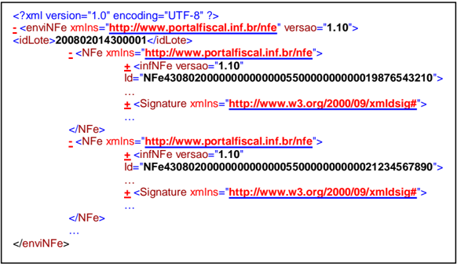

Outras informações sobre os padrões de geração da assinatura digital da NF-e podem ser obtidos no  Manual  de  Integração-Contribuinte,  especialmente  nos  itens  3.2.4  e  3.2.6.  Também  outras informações úteis poderão ser obtidas na página NF-e da SEFAZ/RS, em www.sefaz.rs.gov.br, menu  'Informações  Gerais',  submenu  'Nota  Fiscal  Eletrônica',  no  item  'Assinatura  Digital (AssinadorRS)'.

NOTA :  Como  a  Sefaz  necessita  desenvelopar  os  arquivos  NF-e,  e  este  processo  onera significativamente o tempo de processamento da NF-e, o ideal é que a empresa transmita lotes

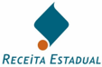

## Manual de Credenciamento como Emissor de Nota Fiscal Eletrônica

no maior tamanho possível (observar os limites máximos de 50 NF-e e 500KB por lote). Agindo desta forma a empresa estará otimizando o processamento dos lotes e reduzindo substancialmente o tempo médio de resposta de autorização das NF-e.

## 9.3.1. Pré-Requisitos para a Assinatura

São condições para que o arquivo da NF-e possa ser assinado digitalmente:

- ¾ Que o Documento XML da NF-e esteja sem erros de Schema;
- ¾ Que o Certificado digital que será utilizado para a assinatura, com chave privada, esteja instalado no repositório do sistema operacional do Windows, para o usuário atual.

## 9.3.2. Seqüência de Passos para o Processo de Assinatura

1. Obter os objetos principais para assinatura: Documento XML e Certificado Digital;
2. Identificar e referenciar o "bloco" dentro do documento XML que necessita ser assinado;
3. Aplicar os algoritmos de transformação;
4. Definir a chave de criptografia do algoritmo de assinatura assimétrica;
5. Calcular a assinatura digital;
6. Adicionar o certificado ao documento NF-e assinado;
7. Obter o "bloco" XML que representa a assinatura (elemento 'Signature');
8. Adicionar o elemento de assinatura ao documento NF-e;
9. Gravar o documento NF-e assinado.

## 9.3.3. Gerando o código hash e calculando a assinatura digital

Exemplificamos, na figura abaixo, o processo de assinatura digital:


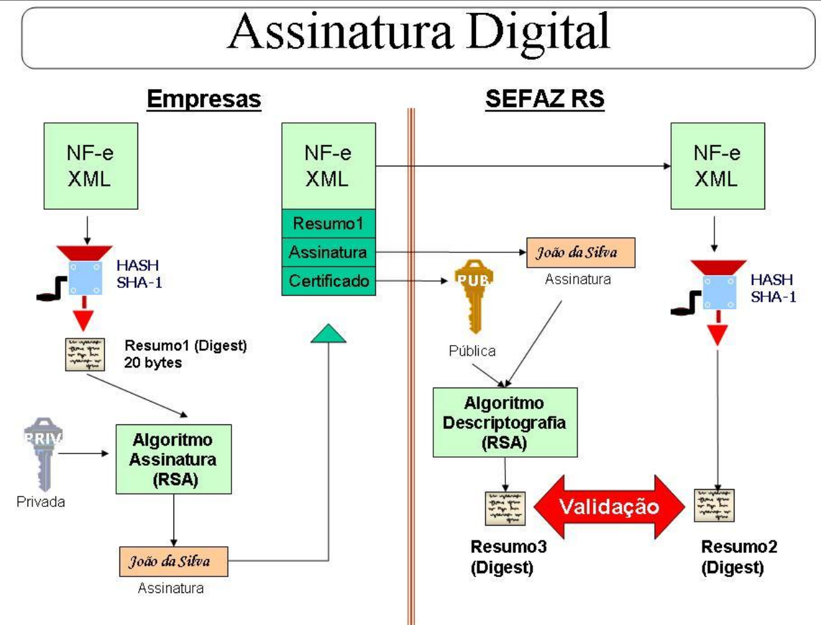

No  bloco  de  assinatura  (TAG  &lt;Signature&gt;)  da  NF-e,  existem  algumas  informações  que,  em geral,  serão  constantes  nas  NF-e  da  empresa,  como  os  dados  que  identificam  os  métodos  de assinatura  utilizados,  e  outras  que  serão  variáveis  de  acordo  com  a  NF-e.  As  informações constantes poderão ser obtidas com o uso do aplicativo AssinadorRS, disponível para download no  Portal  Nacional  da  NF-e,  e  alguns  exemplos  estão  descritos  no  Manual  de  IntegraçãoContribuinte. A seguir descrevemos as principais informações variáveis no bloco de assinatura.

No  processo  de  assinatura,  o hash-code gerado  a  partir  da  aplicação  do  algoritmo  'SHA-1' representa  um  código  de  resumo  do  conteúdo  do  bloco  NF-e.  Esse  resumo  irá  compor  o conteúdo da TAG &lt;DigestValue&gt; do bloco de assinatura de cada NF-e.

Após o processo anterior, o sistema da empresa deverá aplicar o algoritmo de assinatura RSA no código hash obtido  com  o  uso  do  certificado  digital  de  assinatura  da  empresa  emitente, criptografando  o  seu  conteúdo.  O  resultado  do  processo  de  criptografia  irá  compor  a  TAG &lt;SignatureValue&gt; do bloco de assinatura de cada NF-e.

Também no bloco de assinatura, a TAG &lt;Reference URI&gt; é composta pela chave de acesso da NF-e,  conforme  descrito  anteriormente.  E  a  TAG  &lt;x509Certificate&gt;  é  composta  pela  chave pública do certificado digital utilizado na assinatura da NF-e.

Maiores detalhes sobre o bloco de assinatura poderão ser obtidos no tópico seguinte e no Manual de Integração-Contribuinte, nos tópicos já mencionados.

## 9.3.4. O Elemento 'Signature'

O elemento 'Signature' para o Projeto da NF-e possui a estrutura que segue:

## A. SignedInfo :

CanonicalizationMethod : Indica o algoritmo usado para normalizar os dados;


## Manual de Credenciamento como Emissor de Nota Fiscal Eletrônica

- SignatureMethod : Indica o algoritmo usado para converter o SignedInfo normalizado para o SignatureValue ;
- A.1 Reference : Identifica o "bloco" dentro do documento  que  será  assinado (bloco identificado pelo atributo 'Id' no documento XML);
- A.1.1 Transforms : Indica os algoritmos de transformação aplicados ao documento original antes do cálculo do 'hash';
- A.1.2 DigestMethod : Indica o algoritmo de 'hash' que será aplicado no "bloco" referenciado;
- A.1.3 DigestValue : Contém o valor real do 'hash' calculado sobre o "bloco" a ser assinado;
- B. SignatureValue : Contém  o  valor  da  assinatura  digital,  calculado  pelo  algoritmo  de assinatura sobre o elemento indicado por SignedInfo;
- C. KeyInfo : Contém  a  chave  pública  do  remetente,  que  será  utilizada  pelo  aplicativo  de recepção da SEFAZ para validar a assinatura digital.


## 9.3.5. Exemplo  de  Código  em  .NET,  Framework  2  (ou  superior), linguagem c#

```
private void geraAssinaturaDigitalXML () { // Passo 1: Obter os objetos principais: Documento XML e Certificado digital XmlDocument oDocNFE = new XmlDocument(); oDocNFE.Load(@"C:\minhaNFe.xml"); X509Certificate2 oCertificado; oCertificado = obterCertificadoRepositorio ("CN=meu certificado, C=BR, ..."); if (oCertificado == null)  { throw new Exception("Certificado Digital não encontrado"); } if (!oCertificado.HasPrivateKey)  { throw new Exception("Certificado Digital deve possuir chave privada."); } // Passo 2: Identificar e referenciar o "bloco" dentro do documento XML Reference oReference = new Reference(); oReference.Uri = "#NFe minha chave de acesso"; // Passo 3: Aplicar os algoritmos de transformação oReference.AddTransform(new XmlDsigEnvelopedSignatureTransform()); oReference.AddTransform(new XmlDsigC14NTransform()); // Passo 4: Definir a chave de criptografia do algoritmo de assinatura assimétrica SignedXml oSignedXml = new SignedXml(oDocNFE); oSignedXml.SigningKey = oCertificado.PrivateKey; oSignedXml.AddReference(oReference); // Passo 5: Calcular a assinatura digital oSignedXml.ComputeSignature(); // Passo 6: Adicionar o certificado ao documento NF-e assinado, KeyInfo keyInfo = new KeyInfo(); keyInfo.AddClause(new KeyInfoX509Data(oCertificado)); oSignedXml.KeyInfo = keyInfo; // Passo 7: Obter o "bloco" que representa o XML da assinatura XmlElement oXmlElementoAssinatura = oSignedXml.GetXml(); // Passo 8: Adicionar o Elemento de assinatura ao documento NF-e oDocNFE.DocumentElement.AppendChild(oDocNFE.ImportNode(oXmlElementoAssinatura, true)); // Passo 9: Gravar o docmento NF-e assinado XmlTextWriter oXmlAssinado = new XmlTextWriter(@"C:\minhaNFeAssinada.xml", new UTF8Encoding(false)); oDocNFE.WriteTo(oXmlAssinado); oXmlAssinado.Close(); } // Buscar certificado no repositório do usuário atual public X509Certificate2 obterCertificadoRepositorio (string sCertificadoSubject) { X509Certificate2 oCert = null; X509Store oRepositorio = new X509Store("My", StoreLocation.CurrentUser); try { oRepositorio.Open(OpenFlags.ReadOnly | OpenFlags.OpenExistingOnly); X509Certificate2Collection oCertCollection = oRepositorio.Certificates; foreach (X509Certificate2 oCertTemp in oCertCollection) { if (oCertTemp.Subject == sCertificadoSubject) { oCert = oCertTemp; break;   } } } finally  { oRepositorio.Close(); } return oCert; }
```


## Principais Abreviaturas Utilizadas

| AC................................Autoridade Certificadora                                                                                                                                 |
|--------------------------------------------------------------------------------------------------------------------------------------------------------------------------------------------|
| CPF..............................Cadastro de Pessoas Físicas                                                                                                                               |
| CNPJ............................Cadastro Nacional de Pessoas Jurídicas                                                                                                                     |
| CONFAZ .....................Conselho Nacional de Política Fazendária                                                                                                                       |
| DANFE........................Documento Auxiliar da Nota Fiscal Eletrônica                                                                                                                  |
| DTIF ...........................Divisão de Tecnologia e Informações Fiscais do Departamento da Receita Pública Estadual do RS                                                              |
| ENCAT........................Encontro Nacional de Administradores Tributários                                                                                                              |
| ICMS ...........................Imposto sobre operações relativas à circulação de mercadorias e sobre prestações de serviços de transporte interestadual e intermunicipal e de comunicação |
| ICP-Brasil ...................Infra-Estrutura de Chaves Públicas Brasileira                                                                                                                |
| ITI................................Instituto Nacional de Tecnologia de Informação                                                                                                          |
| NF-e.............................Nota Fiscal Eletrônica                                                                                                                                    |
| SEFAZ/RS ...................Secretaria de Estado da Fazenda do Rio Grande do Sul                                                                                                           |
| SINIEF.........................Sistema Nacional Integrado de Informações Econômico-Fiscais                                                                                                 |
| TI .................................Tecnologia da Informação                                                                                                                               |
| XML............................Extended Markup Language                                                                                                                                    |