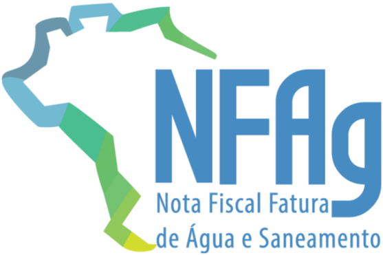
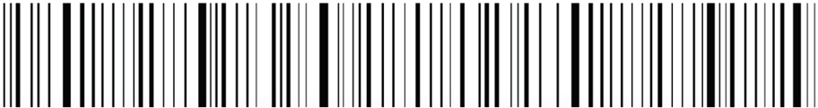
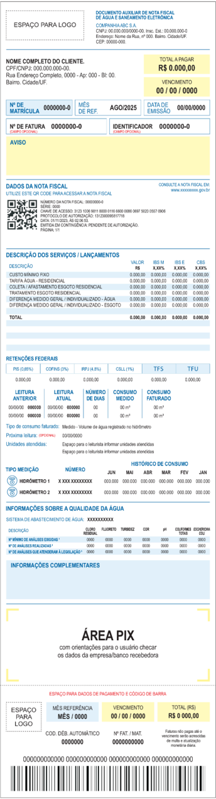
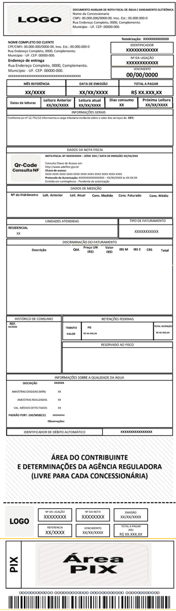
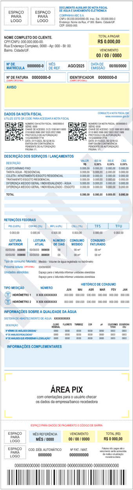
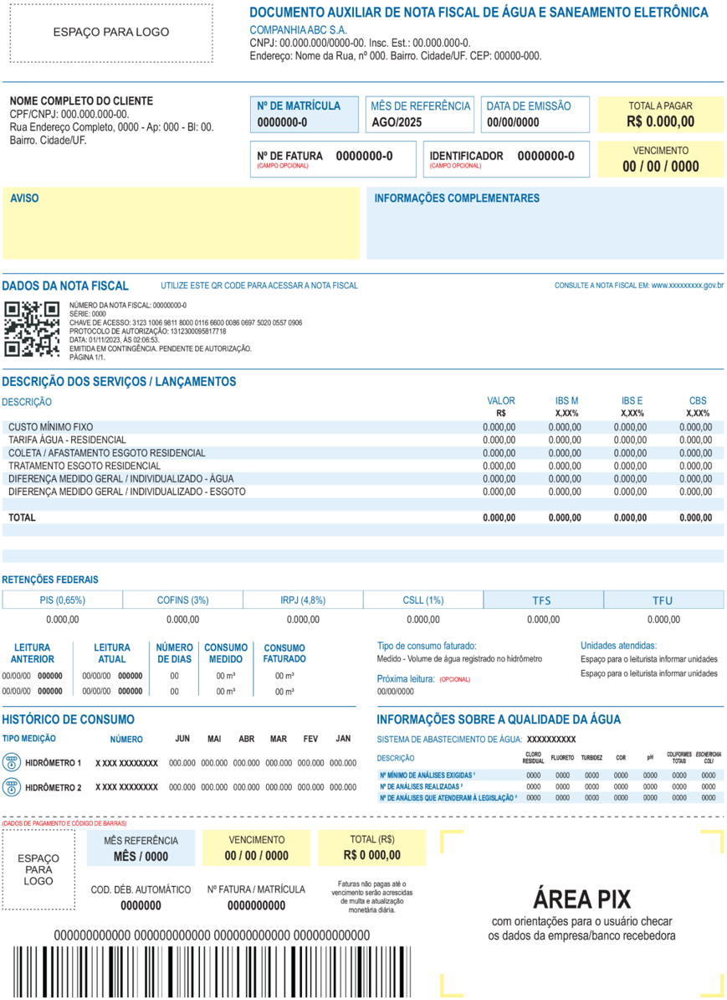
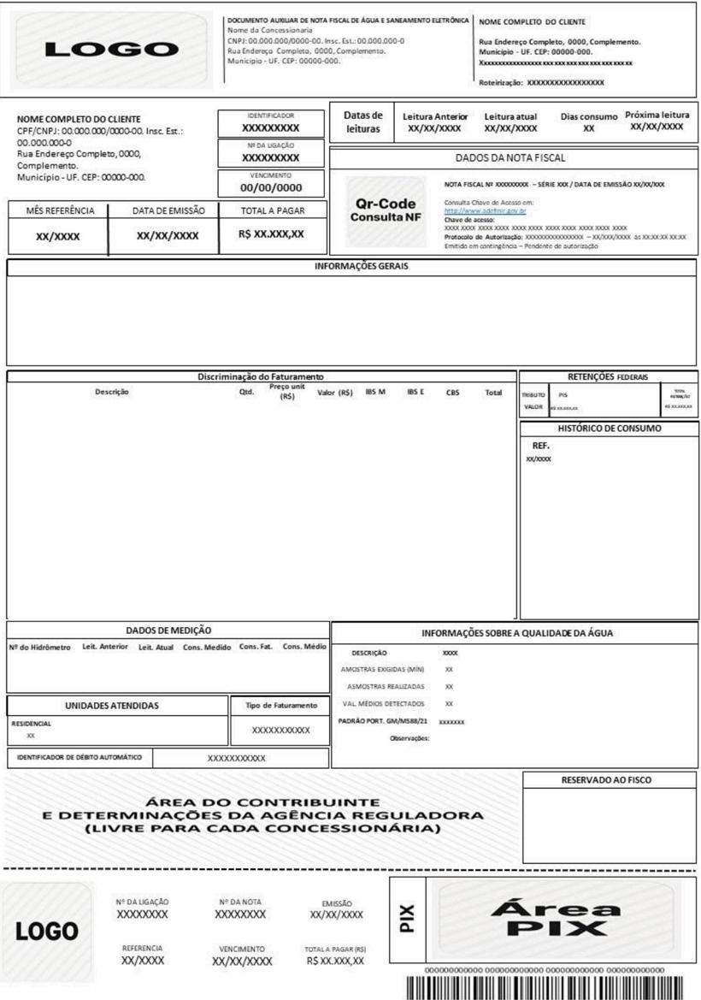
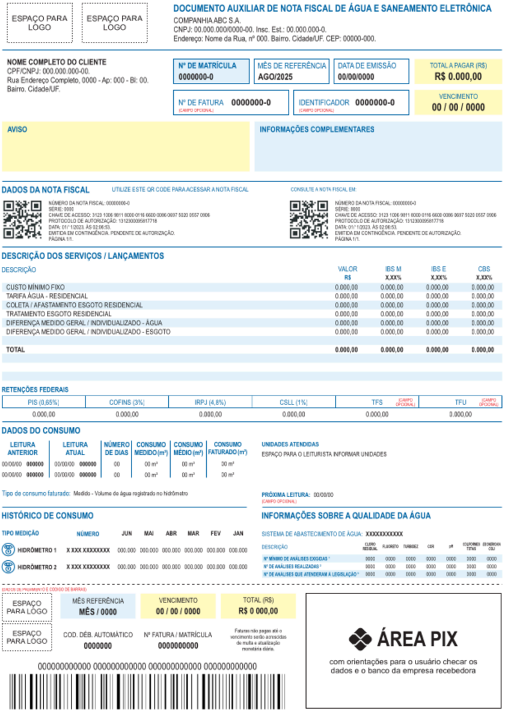

MINUTA Projeto Nota Fiscal da Água e Saneamento Eletrônica Manual de Orientação do Contribuinte Anexo II - DANFAG Versão 1.01 - Janeiro 2026

## Sumário

| 1 Introdução                                                                                         |   4 |
|------------------------------------------------------------------------------------------------------|-----|
| 2 Documento Auxiliar de NFAg - DANFAG                                                                |   5 |
| 2.1 Leiaute de Impressão do DANFAG                                                                   |   5 |
| 2.2 Divisão I - Informações do Cabeçalho: Dados do Emitente                                          |   6 |
| 2.3 Divisão II - Informações ao Destinatário                                                         |   6 |
| 2.4 Divisão III - Informações de identificação da NFAg e do Protocolo de Autorização e consulta NFAg |   7 |
| 2.5 Divisão IV - Informações dos itens                                                               |   8 |
| 2.6 Retenções Federais                                                                               |   9 |
| 2.7 Informações das Leituras                                                                         |   9 |
| 2.8 Histórico de consumo                                                                             |  10 |
| 2.9 Informações sobre a Qualidade da Água                                                            |  11 |
| 2.10 Informações Complementares                                                                      |  12 |
| 2.11 Informações de Pagamento                                                                        |  12 |
| 3 Leiaute do DANFAG Bobina - Opção 1                                                                 |  14 |
| 4 Leiaute do DANFAG Bobina - Opção 2                                                                 |  16 |
| 5 Leiaute do DANFAG Bobina Cofaturamento                                                             |  18 |
| 6 Leiaute do DANFAG A4 - Opção 1                                                                     |  20 |
| 7 Leiaute do DANFAG A4 - Opção 2                                                                     |  22 |
| 8 Leiaute do DANFAG A4 - Cofaturamento                                                               |  24 |

4

5

5

6

6

7

8

9

9

MINUTA

## Controle de Versões

|   Versão | Publicação   | Descrição                                                                                                                               |
|----------|--------------|-----------------------------------------------------------------------------------------------------------------------------------------|
|     1.00 | 10/2025      | Criação deste manual como documento anexo do MOC. Corresponde ao Anexo II do MOC 1.00, que trata das especificações técnicas do DANFAG. |
|     1.01 | 01/2026      | Ajuste do Modelo A4 (remoção das marcações) e do endereço na imagem do QRCode.                                                          |

|   Versão | Histórico de atualizações   | Implantação Teste   | Implantação Produção   |
|----------|-----------------------------|---------------------|------------------------|
|     1.00 | Versão inicial              | 10/2025             | 01/2026                |
|     1.01 | Correção de erros           | 01/2026             | 01/2026                |

MINUTA Histórico de Alterações / Cronograma

## 1 Introdução

Este  documento  é  parte integrante do Manual de Orientação do Contribuinte (MOC) e tem por objetivo a definição das especificações técnicas do Documento Auxiliar da Nota Fiscal da Água e Saneamento Eletrônica - DANFAG.

MINUTA O Manual de Orientação do Contribuinte 1.00a é composto pelos seguintes documentos: ● MOC - Visão Geral ● MOC - Anexo I - Leiaute e Regras de Validação da NFAG ● MOC - Anexo II - Manual de Especificações Técnicas do DANFAG

## 2  Documento Auxiliar de NFAg - DANFAG

O DANFAG é uma representação gráfica resumida da NFAg, impressa em papel comum, para ser entregue ao consumidor do serviço de abastecimento de água e saneamento, representando sua conta mensal de consumo.

MINUTA 2.1  Leiaute de Impressão do DANFAG Este capítulo descreve o leiaute de impressão do Documento Auxiliar da NFAg pelo contribuinte, chamado de DANFAG, assim como os requisitos mínimos do que poderá constar do DANFAG. Algumas considerações acerca da impressão do DANFAG: ● O DANFAG é um documento fiscal auxiliar, sendo apenas uma representação simplificada em papel da nota fiscal de água e saneamento eletrônica, de forma a facilitar a consulta do documento fiscal eletrônico, no ambiente do FISCO, pelo consumidor; ● A impressão do DANFAG é efetuada diretamente pelo aplicativo do contribuinte em impressora comum (não fiscal), com base nas informações do arquivo eletrônico XML da NFAg; ● No DANFAG é vedada a inclusão de informações que não estejam presentes no respectivo arquivo XML da NFAg, exceto o protocolo de autorização. ● O contribuinte emitente da NFAg está dispensado de enviar ou disponibilizar o arquivo XML ao consumidor, salvo se este solicitar previamente ao início da emissão. ● A legislação poderá facultar que, por opção do consumidor, o DANFAG não seja impresso e seja enviado por mensagem eletrônica (e-mail ou SMS);

- Modelos de leiaute diversos dos apresentados neste anexo somente poderão ser utilizados com a concordância da respectiva Agência Reguladora.
- A competência para definir a obrigatoriedade de cada campo é do órgão regulador. Ressalta-se que, mesmo quando um campo estiver indicado como opcional neste manual, seu preenchimento será obrigatório caso a regulação o exija.

A legibilidade do texto impresso no DANFAG, assim como a durabilidade do papel empregado, deverá ser garantida, no mínimo, pelo prazo de (12) doze meses.

## 2.2  Divisão I - Informações do Cabeçalho: Dados do Emitente

O  cabeçalho  deverá  indicar  obrigatoriamente  os  dados  do  emitente  da  NFAg  contendo  as seguintes informações:

- Endereço : Endereço Completo do destinatário sem a indicação do país

MINUTA ● Razão social do Emitente ● CNPJ do Emitente - formatado com a máscara 99.999.999/9999-99 ● Endereço Completo do Emitente sem a indicação do país ● Texto: 'Documento Auxiliar da Nota Fiscal da Água e Saneamento Eletrônica'. Observação: a critério do emissor da NFAg poderá ser incluído, no canto esquerdo desta divisão, o logotipo da empresa ou o logotipo da NFAg. 2.3  Divisão II - Informações ao Destinatário A divisão II corresponde ao local onde deverão ser impressas as informações de qualificação do destinatário e da localização do acessante. Os campos opcionais devem observar aspectos de regulação. Não estão reguladas as posições e localização das informações dos detalhes do destinatário e dados do acessante, assim como a forma de sua impressão, são informações mínimas: ● Nome : Nome do destinatário; ● Nome 2 : Nome do segundo destinatário (se existir no XML); ● CNPJ / CPF / idOutros : Identificação do destinatário pelo número do CNPJ / CPF / Outros ○ Observação : A critério do emissor ou regulação, por razões de sigilo  da informação,  os  dados  deste  campo poderão ser impressos de forma incompleta, substituindo 60% dos algarismos por * (asterisco).

- Nro. do Cliente [opcional]: Código único de identificação da Unidade Consumidora (ligacao/idCliente)
- Matrícula / Fornecimento [opcional] : Matrícula do cliente (ligacao/idLigacao);
- Nro da Fatura [opcional]
- Identificador [opcional]
- Vencimento : Data de vencimento do pagamento da fatura(gFat/dVencFat);

- Total a Pagar : Valor total da fatura (total/vNF);
- Mês de Referência : Competência da medição a que se refere a NFAg (gFat/CompetFat);
- Classificação / Tipo de Ligação [opcional] : Classe do acessante (ligacao/tpLigacao);

## 2.4  Divisão III - Informações de identificação da NFAg e do Protocolo de Autorização e consulta NFAg

MINUTA As informações da identificação da NFAg devem conter: ● Número da NFAg ● Série da NFAg ● Data de Emissão da NFAg (observação: a data de emissão apesar de constar no arquivo XML  da  NFAg  em  formato  UTC  deverá  ser  impressa  no  DANFAG  sempre  no  formato dd/mm/aaaa). ● O  texto:  'Consulte  pela  Chave  de  Acesso  em'  seguido  do  endereço  eletrônico  para consulta pública da NFAg no Portal Nacional da NFAg -https://dfe-portal.svrs.rs.gov.br/NFAg),  e  a  chave  de  acesso  impressa  em  11  blocos  de quatro dígitos, com um espaço entre cada bloco. ● O  texto  'Protocolo  de  autorização:  '  devendo  ser  impresso  o  número  do  protocolo  de autorização  obtido  para  NFAg  e a data e hora da autorização. A data de autorização é fornecida pela Administração Tributária no formato UTC e deve ser impressa no DANFAG convertida para o horário local. ○ No  caso  de  emissão  em  contingência  a  informação  sobre o protocolo  de autorização será suprimida. ● A imagem do QR Code da NFAg que deve ter tamanho mínimo 25 mm x 25 mm, sendo 22mm de conteúdo para 3mm de margem segura (quiet zone), para dimensões superiores a 25mm, considerar a margem segura de 10% da dimensão total. O conteúdo QR Code deverá ser informado no arquivo XML da NFAg em campo específico, conforme descrito no MOC (tag: qrCodNFAg). Abaixo segue um exemplo de exibição:

## DATADEEMISSAO01/01/0001

Consultapelachavedeacessoem:

https://dfe-portal.svrs.rs.gov.br/Nfag

ChavedeAcesso:

00000000000000000000000000000000000000000000

Protocolodeautorizacao:00000000000-01/01/0001as00:00:00

Pagina1/1

## 2.5  Divisão IV - Informações dos itens

Nessa seção serão discriminados os itens constantes da NFAg, definindo-se os itens faturados que  deverão  ser  impressos  no  DANFAG,  de  acordo  com  o  detalhamento  abaixo.  Serão apresentadas as informações mínimas que devem constar nessa parte do documento; contudo, deverão ser observadas as questões regulatórias, podendo ser inseridas colunas adicionais caso a regulação assim exija.

MINUTA ● Itens da Fatura / Descrição : descrição do item relacionado na NFAg (prod/xProd) ● Unid [opcional]: unidade de medida (quando item for mensurável) (prod/uMed) ● Quant [opcional]: informação da quantidade faturada relacionada ao item (prod/qFaturada) ● Preço Unit [opcional]. R$: valor unitário do item (prod/vItem); ● Valor R$: valor total do item (prod/vProd); ● IBS Estadual X,XX% : Valor do IBS Estadual ● IBS Municipal X,XX% : Valor do IBS Municipal ● CBS X,XX% : Valor da CBS Deverá ser apresentada uma linha totalizadora 'TOTAL' ao final do quadro dos itens. Observação :  no  caso  de  valores,  devem  ter  as  casas  decimais  separadas  por  vírgula  e  ser utilizado ponto para a indicação de milhar. Exemplo: 1.234,56. Importante :  Itens  de  classificação  de  natureza  negativa  (cClass)  podem  aparecer  com  sinal negativo, mesmo que o valor no arquivo XML seja positivo. Se  o  item  possuir  o  indicador  de  devolução  (prod/indDevolucao)  deverá  ser  adicionado  na descrição o literal 'Devolução' entre parênteses. Nesta  seção  o contribuinte, se desejar, pode informar também os valores de impostos federais retidos e também taxas de fiscalização.

A localização do grupo dos itens no DANFAG não está regulamentada, devendo ser posicionado conforme melhor exibição, impressão e dobra para entrega ao consumidor, desde que respeitado os leiautes dos modelos anexados nesta nota técnica.

## DESCRICAODOSSERVICOS/LANCAMENTOS

| DESCRICAO                           | VALOR R$   | IBS M X,XX%   | IBS E X,XX%   | CBS X,XX%   |
|-------------------------------------|------------|---------------|---------------|-------------|
| CUSTOMINIMOFIXO                     | 0.000,00   | 0.000,00      | 0.000,00      | 0.000,00    |
| TARIFAAGUA-RESIDENCIAL              | 0.000,00   | 0.000,00      | 0.000,00      | 0.000,00    |
| COLETA/AFASTAMENTOESGOTORESIDENCIAL | 0.000,00   | 0.000,00      | 0.000,00      | 0.000,00    |
| TRATAMENTOESGOTORESIDENCIAL         | 0.000,00   | 0.000,00      | 0.000,00      | 0.000,00    |

| PIS   |
|-------|

Serão discriminados nesta seção os valores de retenções de tributos federais. Neste quadro pode ser informado também o valor da Taxa de Fiscalização do Serviço e Taxa de Fiscalização de Uso, conforme necessidade da empresa ou regulação.

MINUTA Outra opção, com os impostos federais retidos e as taxas: 2.6  Retenções Federais e Taxas de Fiscalização

- PIS (x.xx%) : Valor da retenção do PIS
- COFINS (x.xx%) : Valor da retenção da COFINS
- IRPJ (x.xx%) : Valor da retenção do IRPJ
- CSLL (x.xx%) : Valor da retenção da CSLL
- TFS / Taxa de Fiscalização [opcional] : Valor da taxa de fiscalização do serviço

- TFU [opcional] : Valor da taxa de fiscalização de uso

Não estão reguladas as posições e localização destas informações da NFAg no DANFAG, assim como a forma de sua impressão, abaixo segue um exemplo opcional de exibição:

Não estão reguladas as posições e localização destas informações da NFAg no DANFAG, assim como a forma de sua impressão, abaixo segue um exemplo opcional de exibição:

MINUTA 2.7  Informações das Leituras Nesta seção serão apresentadas as informações referentes às leituras dos medidores. Pode ser indicada uma linha para cada medidor. Podem ser acrescidas colunas desde que a informação esteja  no  arquivo  XML  ou  possa  ser  obtida  a  partir  de  um  cálculo  simples  a  partir  de  dados apresentados (Exemplo: média diária = consumo medido / qtd dias). ● Leitura Atual e Anterior : Datas em  que foram realizadas (gMed/dMedAnt) e (gMed/dMedAtu) ● Valor da medição (leitura) anterior [Opcional]: Valor da leitura anterior (gMedida/vMedAnt) ● Valor da medição (leitura) atual [Opcional]: Valor da leitura anterior (gMedida/vMedAtu) ● Consumo medido: Valor do consumo medido (gMedida/vMed). ○ Indicar unidade de medida (gMedida/uMed) ● Consumo médio [Opcional]: Calculado a partir das informações de outros campos. ● Consumo faturado : Consumo faturado. (prod/qFaturada) ● Próxima leitura / Previsão próxima leitura [Opcional]: Data que deve ocorrer a próxima medição (gFat/dProxLeitura) ● Número de dias faturados / Dias de consumo ● Tipo de Consumo Faturado: Origem do consumo faturado (prod/indOrigemQtd)

| LEITURA ANTERIOR   |   LEITURA ANTERIOR | LEITURA ATUAL   |   LEITURA ATUAL |   NUMERO DEDIAS | CONSUMO MEDIDO   | CONSUMO MEDIO   | CONSUMO FATURADO   |
|--------------------|--------------------|-----------------|-----------------|-----------------|------------------|-----------------|--------------------|
| 00/00/00           |             000000 | 00/00/00        |          000000 |              00 | 00 m3            | 00 m3           | 00 m3              |
| 00/00/00           |             000000 | 00/00/00        |          000000 |              00 | 00 m3            | 00 m3           | 00 m3              |

Tipo de consumo faturado: Medido - Volume de agua registrado no hidrometro

MINUTA 2.8  Unidades Atendidas Nesta seção serão apresentadas as informações referentes às unidades atendidas. Abaixo segue um exemplo opcional de exibição: 2.9  Histórico de consumo As  informações  do histórico de consumo, exigidas pela regulação, devem ser apresentadas no documento. ● Identificação do Hidrômetro , quando aplicável ● Média de consumo [Opcional] ● Para cada mês apresentado ○ Mes/Ano de Referência ○ Valor do consumo Não estão reguladas as posições e localização destas informações da NFAg no DANFAG, assim como a forma de sua impressão. A quantidade de meses da imagem abaixo é ilustrativa e devem ser apresentados os meses conforme período exigido pela regulação, abaixo segue um exemplo opcional de exibição:

## HISTORICODECONSUMO

| TIPO MEDICAO   | NUMERO         | JUN   | MAI ABR MAR FEV JAN                        |
|----------------|----------------|-------|--------------------------------------------|
| HIDROMETRO 1   | X XXX XXXXXXXX |       | 000.000000.000000.000000.000000.000000.000 |
|                | X XXX XXXXXXXX |       | 000.000000.000000.000000.000000.000000.000 |

| N°MiNIMODEANALISESEXIGIDAS1          |   0000 |   0000 |   0000 |   0000 |   0000 |   0000 |   0000 |
|--------------------------------------|--------|--------|--------|--------|--------|--------|--------|
| N°DEANALISESREALIZADAS2              |   0000 |   0000 |   0000 |   0000 |   0000 |   0000 |   0000 |
| N°DEANALISESQUEATENDERAMALEGISLACAO3 |   0000 |   0000 |   0000 |   0000 |   0000 |   0000 |   0000 |

MINUTA 2.10  Informações sobre a Qualidade da Água Devem ser apresentadas as informações relativas à qualidade da água, conforme as exigências estabelecidas pela regulação do setor. ● Sistema de Abastecimento [Opcional] ● Item Analisado / Descrição : Item sujeito à análise (gAnalise/xItemAnalisado) ● Para cada item analisado ○ Número mínimo exigido de amostrar / Número mínimo de análises exigidas ○ Número de amostras realizadas / Número de análises realizadas ○ Amostras fora do padrão / Análises que não atenderam à legislação [Opcional] ○ Amostras dentro do padrão / Análises que atenderam à legislação [Opcional] ○ Média mensal [Opcional] ○ Valor de Referência [Opcional] ○ Conclusão / Observações [Opcional] Não estão reguladas as posições e localização destas informações da NFAg no DANFAG, assim como a forma de sua impressão, abaixo segue um exemplo opcional de exibição:

## 2.11  Aviso

de Agua e Saneamento Essa seção deve conter as informações de interesse do contribuinte ou da regulação, em posição de  destaque.  É  importante  ressaltar  que as informações constantes neste quadro devem estar presentes no arquivo XML da NFAg (infAdic/infCpl), que pode ter até 5 ocorrências.

Não estão reguladas as posições e localização destas informações da NFAg no DANFAG, assim como a forma de sua impressão, abaixo segue um exemplo opcional de exibição:

Esta  seção  contém  as  informações  para  pagamento  da  fatura,  quando  aplicável.  Devem  ser apresentadas  aqui  as  informações  sobre  PIX  /  Boleto  ou  outra forma para quitação da fatura, conforme interesse do contribuinte.

MINUTA 2.12  Informações Complementares Essa  seção  deve  conter  as  informações  complementares  de  interesse  do  contribuinte  ou  da regulação.  É  importante  ressaltar  que  as  informações  constantes  neste  quadro  devem  estar presentes no arquivo XML da NFAg (infAdic/infCpl), que pode ter até 5 ocorrências. Não estão reguladas as posições e localização destas informações da NFAg no DANFAG, assim como a forma de sua impressão, abaixo segue um exemplo opcional de exibição: 2.13  Informações de Pagamento

- Mês de Referência : Competência da fatura (gFat/CompetFat)

- Data de Vencimento : Conforme (gFat/dVencFat)

- Valor total da Fatura : Conforme (total/vTotDFe)

- Código  de  débito  automático :  Conforme  (gFat/codDebAuto)  ou  (gFat  /codBanco  e gFat/codAgencia)
- Número da Fatura / Matrícula : Código único de identificação da fatura ou cliente.
- Código de Barras [opcional]
- PIX [opcional]

MINUTA Não estão reguladas as posições e localização destas informações da NFAg no DANFAG, assim como a forma de sua impressão, abaixo segue um exemplo opcional de exibição:

## 3 Leiaute do DANFAG Bobina - Opção 1

MINUTA

## 4 Leiaute do DANFAG Bobina - Opção 2

MINUTA

## 5  Leiaute do DANFAG Bobina Cofaturamento

MINUTA

## 6 Leiaute do DANFAG A4 - Opção 1

## 7 Leiaute do DANFAG A4 - Opção 2

## 8 Leiaute do DANFAG A4 - Cofaturamento

