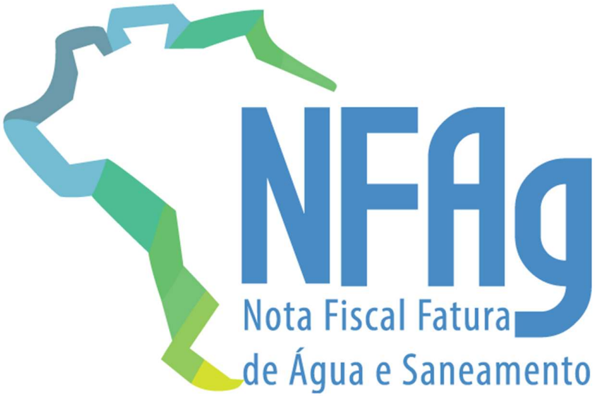
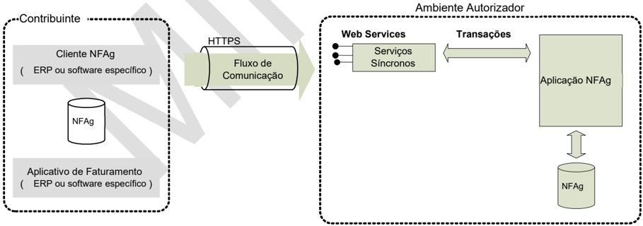
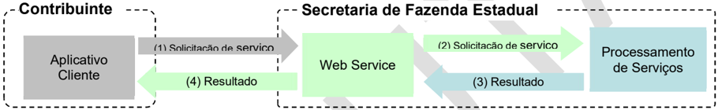
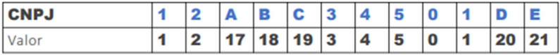
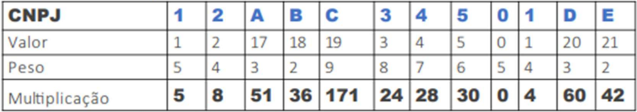
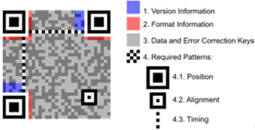
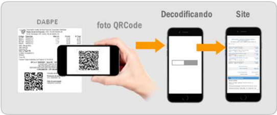
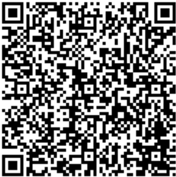
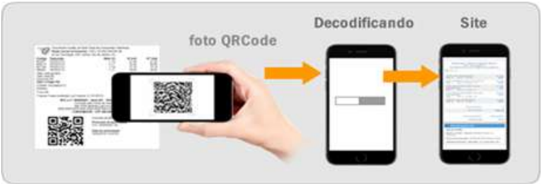

## Projeto Nota Fiscal de Água e Saneamento Eletrônica

Manual de Orientação do Contribuinte

Padrões Técnicos de Comunicação da NFAg

Versão 1.00k - 11 de março de 2026


## Sumário

| Histórico de Alterações / Cronograma ..............................................................................................5                           |                                                                                                                                    |
|----------------------------------------------------------------------------------------------------------------------------------------------------------------|------------------------------------------------------------------------------------------------------------------------------------|
| 1 Introdução                                                                                                                                                   | .................................................................................................................................6 |
| 2 Base Conceitual                                                                                                                                              | ........................................................................................................................6          |
| Conceitos......................................................................................................................................6               |                                                                                                                                    |
| NFAg (modelo 75) .......................................................................................................................................       | 6                                                                                                                                  |
| DANFAG......................................................................................................................................................   | 6                                                                                                                                  |
| Chave de Acesso da NFAg .........................................................................................................................              | 6                                                                                                                                  |
| Chave Natural da NFAg...............................................................................................................................           | 7                                                                                                                                  |
| 3 Arquitetura de Comunicação com Contribuinte..........................................................................8                                       |                                                                                                                                    |
| Modelo Conceitual                                                                                                                                              | ........................................................................................................................8          |
| Padrões Técnicos                                                                                                                                               | .........................................................................................................................9         |
| Padrão de documento XML.........................................................................................................................               | 9                                                                                                                                  |
| Padrão de Comunicação ...........................................................................................................................              | 11                                                                                                                                 |
| Padrão de Certificado Digital.....................................................................................................................             | 11                                                                                                                                 |
| Padrão da Assinatura Digital .....................................................................................................................             | 12                                                                                                                                 |
| Validação da Assinatura Digital pelo Ambiente Autorizador .....................................................................                                | 14                                                                                                                                 |
| Resumo dos Padrões Técnicos.................................................................................................................                   | 14                                                                                                                                 |
| Modelo Operacional....................................................................................................................15                       |                                                                                                                                    |
| Padrão de Mensagens dos Web Services...................................................................................15                                      |                                                                                                                                    |
| Área de dados das mensagens.................................................................................................................                   | 15                                                                                                                                 |
| Validação da estrutura XML das Mensagens dos Web Services .............................................................                                        | 16                                                                                                                                 |
| Schemas XML das Mensagens dos Web Services...................................................................................                                  | 17                                                                                                                                 |
| Versão dos Schemas XML..........................................................................................................17                             |                                                                                                                                    |
| Liberação das versões dos schemas para a NFAg...................................................................................                               | 17                                                                                                                                 |
| Correção de Pacote de Liberação.............................................................................................................                   | 18                                                                                                                                 |
| Divulgação de novos Pacotes de Liberação .............................................................................................                         | 18                                                                                                                                 |
| Controle de Versão....................................................................................................................................         | 18                                                                                                                                 |
| Sistema de Registro de Eventos .................................................................................................19                             |                                                                                                                                    |
| Relação dos Tipos de Evento....................................................................................................................                | 20                                                                                                                                 |
| Eventos de Marcação................................................................................................................................            | 20                                                                                                                                 |
| Data e hora de emissão e outros horários...................................................................................21                                  |                                                                                                                                    |
| SEFAZ virtual..............................................................................................................................21                  |                                                                                                                                    |
| 4 Web Services ..........................................................................................................................22                    |                                                                                                                                    |
| Regras de Validação Gerais........................................................................................................23                           |                                                                                                                                    |
| Grupo A: Validação do Certificado de Transmissão (protocolo TLS) .......................................................                                       | 23                                                                                                                                 |
| Grupo B-0: Validação da Compactação da Mensagem............................................................................                                    | 23                                                                                                                                 |
| Grupo B: Validação Inicial da Mensagem no Web Service.......................................................................                                   | 24                                                                                                                                 |
| Grupo C: Validação da área de dados da mensagem..............................................................................                                  | 24                                                                                                                                 |
| Grupo D: Validações do Certificado de Assinatura Digital........................................................................                               | 24                                                                                                                                 |
| Grupo E: Validações da Assinatura Digital................................................................................................                      | 25                                                                                                                                 |
| Grupo E-1: Validações do PAA.................................................................................................................                  | 25                                                                                                                                 |
| Serviço de Recepção NFAg........................................................................................................26 Leiaute Mensagem de Entrada | ................................................................................................................. 26               |
| Leiaute Mensagem de Retorno                                                                                                                                    | ................................................................................................................. 26               |


## Nota Fiscal de Água e Saneamento Eletrônica


|                                                                                                                                                                                                                                                                | Leiaute de NFAg processada.................................................................................................................... 27   |
|----------------------------------------------------------------------------------------------------------------------------------------------------------------------------------------------------------------------------------------------------------------|-----------------------------------------------------------------------------------------------------------------------------------------------------|
| Regras de Validação Básicas do Serviço..................................................................................................                                                                                                                       | 27                                                                                                                                                  |
| Validação das regras de negócio da NFAg...............................................................................................                                                                                                                         | 27                                                                                                                                                  |
| Final do Processamento da NFAg.............................................................................................................                                                                                                                    | 28                                                                                                                                                  |
| Serviço de Consulta Situação da NFAg.......................................................................................29                                                                                                                                  |                                                                                                                                                     |
| Leiaute Mensagem de Entrada .................................................................................................................                                                                                                                  | 29                                                                                                                                                  |
| Leiaute Mensagem de Retorno                                                                                                                                                                                                                                    | ................................................................................................................. 29                                |
| Descrição do Processo de Web Service                                                                                                                                                                                                                           | ................................................................................................... 29                                              |
| Regras de Validação Básicas do Serviço..................................................................................................                                                                                                                       | 30                                                                                                                                                  |
| Validação das Regras de Negócio da Consulta Situação.........................................................................                                                                                                                                  | 30                                                                                                                                                  |
| Final do Processamento............................................................................................................................                                                                                                             | 31                                                                                                                                                  |
| Serviço de Consulta Status do Serviço de Autorização...............................................................32                                                                                                                                          |                                                                                                                                                     |
| Leiaute Mensagem de Entrada .................................................................................................................                                                                                                                  | 32                                                                                                                                                  |
| Leiaute Mensagem de Retorno                                                                                                                                                                                                                                    | ................................................................................................................. 32                                |
| Descrição do Processo de Web Service ...................................................................................................                                                                                                                       | 32                                                                                                                                                  |
| Regras de Validação Básicas do Serviço..................................................................................................                                                                                                                       | 33                                                                                                                                                  |
| Validação das Regras de Negócio da Consulta Status Serviço ...............................................................                                                                                                                                     | 33                                                                                                                                                  |
| Final do Processamento............................................................................................................................                                                                                                             | 33                                                                                                                                                  |
| 5 Sistema de Registro de Eventos (Parte Geral) ........................................................................34                                                                                                                                      |                                                                                                                                                     |
| Leiaute Mensagem de Entrada .................................................................................................................                                                                                                                  | 34                                                                                                                                                  |
| Leiaute Mensagem de Retorno .................................................................................................................                                                                                                                  | 35                                                                                                                                                  |
| Descrição do Processo de Web Service ...................................................................................................                                                                                                                       | 35                                                                                                                                                  |
| Regras de Validação Básicas do Validação das Regras de Negócio do Serviço de Registro de Eventos                                                                                                                                                               | Serviço.................................................................................................. 36                                        |
| ................................................... Processamento das validações específicas de cada evento....................................................................                                                                                | 36                                                                                                                                                  |
| Final do Processamento do Evento........................................................................................................... 6                                                                                                                  | 37 37                                                                                                                                               |
| Sistema de Registro de Eventos (Parte                                                                                                                                                                                                                          | Específica).................................................................38                                                                      |
| Evento de Cancelamento............................................................................................................38                                                                                                                           |                                                                                                                                                     |
|                                                                                                                                                                                                                                                                | 38                                                                                                                                                  |
| Validação das Regras Específicas do Evento........................................................................................... Eventos de marcação originados no Cancelamento da NFAg.................................................................. | 39                                                                                                                                                  |
| Final do Processamento............................................................................................................................                                                                                                             | 39                                                                                                                                                  |
| Web Services - Informações Adicionais..................................................................................40                                                                                                                                      |                                                                                                                                                     |
| 7 Ambiente de Homologação / Produção.......................................................................................40                                                                                                                                  |                                                                                                                                                     |
| Sobre as condições de teste para as empresas .......................................................................................                                                                                                                           | 40                                                                                                                                                  |
| Tratamento de caracteres especiais no texto de XML.................................................................40                                                                                                                                          |                                                                                                                                                     |
| Cálculo do dígito verificador do CNPJ Alfanumérico....................................................................41                                                                                                                                       |                                                                                                                                                     |
| Cálculo do primeiro dígito verificador ........................................................................................................                                                                                                                | 41                                                                                                                                                  |
| Cálculo do segundo dígito verificador .......................................................................................................                                                                                                                  | 42                                                                                                                                                  |
| Cálculo do dígito verificador da chave de acesso da NFAg.........................................................43                                                                                                                                            |                                                                                                                                                     |
| Número do protocolo...................................................................................................................43                                                                                                                       |                                                                                                                                                     |
| Classificação de Produtos...........................................................................................................44                                                                                                                         |                                                                                                                                                     |
| Código de Classificação Tributária do IBS/CBS..........................................................................45                                                                                                                                      |                                                                                                                                                     |
| 8 Uso Indevido............................................................................................................................46                                                                                                                   |                                                                                                                                                     |
| Erros e problemas comuns..........................................................................................................46                                                                                                                           |                                                                                                                                                     |
| Regras de Validação de Consumo Indevido................................................................................47                                                                                                                                      |                                                                                                                                                     |
| 9 QR Code .................................................................................................................................48                                                                                                                  |                                                                                                                                                     |
| Licença........................................................................................................................................49                                                                                                              |                                                                                                                                                     |

## Nota Fiscal de Água e Saneamento Eletrônica


| Imagem do QR Code para NFAg ................................................................................................49                          | Imagem do QR Code para NFAg ................................................................................................49                          |    |
|---------------------------------------------------------------------------------------------------------------------------------------------------------|---------------------------------------------------------------------------------------------------------------------------------------------------------|----|
| Para NFAg com tipo de emissão Normal: .................................................................................................                 | Para NFAg com tipo de emissão Normal: .................................................................................................                 | 49 |
| Para NFAg com tipo de emissão Contingência Off-line: ...........................................................................                        | Para NFAg com tipo de emissão Contingência Off-line: ...........................................................................                        | 49 |
| Configurações para QR Code.....................................................................................................50                       | Configurações para QR Code.....................................................................................................50                       |    |
| Capacidade de armazenamento ...............................................................................................................             | Capacidade de armazenamento ...............................................................................................................             | 50 |
| Capacidade de correção de erros .............................................................................................................           | Capacidade de correção de erros .............................................................................................................           | 51 |
| Tipo de caracteres..................................................................................................................................... | Tipo de caracteres..................................................................................................................................... | 51 |
| URL da Consulta da NFAg via QR Code no XML........................................................................51                                    | URL da Consulta da NFAg via QR Code no XML........................................................................51                                    |    |
| 10                                                                                                                                                      | Consulta Pública NFAg........................................................................................................52                         |    |
| Consulta Pública de NFAg via Digitação de Chave de Acesso....................................................52                                         | Consulta Pública de NFAg via Digitação de Chave de Acesso....................................................52                                         |    |
| Consulta Pública de NFAg via QR Code.....................................................................................52                             | Consulta Pública de NFAg via QR Code.....................................................................................52                             |    |
| Tabela padronizada com os códigos e mensagens na consulta da NFAg...................................53                                                  | Tabela padronizada com os códigos e mensagens na consulta da NFAg...................................53                                                  |    |
| Padronização dos endereços das consultas públicas..................................................................53                                   | Padronização dos endereços das consultas públicas..................................................................53                                   |    |
| 11                                                                                                                                                      | Contingência Off-line para NFAg..........................................................................................55                             |    |
| Detalhes técnicos da Contingência Off-line .................................................................................56                          | Detalhes técnicos da Contingência Off-line .................................................................................56                          |    |
| Resumo das ações para entrada em contingência......................................................................57                                   | Resumo das ações para entrada em contingência......................................................................57                                   |    |

## Histórico de Alterações / Cronograma

| Versão   | Histórico de atualizações                                                                                                                                                                        | Implantação Homologação   | Implantação Produção   |
|----------|--------------------------------------------------------------------------------------------------------------------------------------------------------------------------------------------------|---------------------------|------------------------|
| 1.00     |  Elaboração do draft do MOC da NFAg                                                                                                                                                             |                           |                        |
| 1.00a    |  Ajustes em leiaute e regras de validação do IBS e CBS                                                                                                                                          |                           |                        |
| 1.00b    |  Ajuste em RV´s de cálculo de valores nos itens  Aumento do idLigacao para 20 caracteres  Regras do PAA                                                                                       |                           |                        |
| 1.00c    |  Correção tipo NFAg no schema                                                                                                                                                                   |                           |                        |
| 1.00d    |  Ajuste no tamanho do campo quantidade de dias de medição e ajuste na observação do campo CNPJ do Destinatário                                                                                  |                           |                        |
| 1.00e    |  Correção na regra de validação do CBS, permitindo alíquota zero para a CBS em operações específicas dentro de áreas incentivadas.  Ajuste na explicação da regra de valor do tributo negativo |                           |                        |
| 1.00f    |  Explicação dos procedimentos para cancelamento e substituição de NFAg com eventos de marcação automático                                                                                       |                           |                        |
| 1.00g    |  Desativação das regras de validação IE do emitente e destinatário                                                                                                                              |                           |                        |
| 1.00h    |  Esclarecimento do preenchimento do campo vTotDFe (Ver MOC Anexo I)                                                                                                                             |                           |                        |
| 1.00i    |  Correções na regra da redução de alíquota (ver MOC Anexo I)                                                                                                                                    | Já implantada             | Já implantada          |
| 1.00j    |  Inclusão de campos do tipo de operação e DFe referenciado nas compras governamentais                                                                                                           |                           |                        |
| 1.00k    |  Ajustes nas mensagens de rejeição das compras gov                                                                                                                                              | 06/042026                 | 04/05/2026             |


## 1 Introdução

Este Manual tem por objetivo a definição das especificações e critérios técnicos necessários para a integração entre os sistemas das administrações tributárias e os sistemas das empresas emissoras da Nota Fiscal de Água e Saneamento Eletrônica - NFAg.

## 2 Base Conceitual

## Conceitos

## NFAg (modelo 75)

Nota  Fiscal  de  Água  e  Saneamento  Eletrônica  (NFAg)  é  o  documento  emitido  e  armazenado eletronicamente,  de  existência  apenas  digital,  cuja  validade  jurídica  é  garantida  pela  assinatura digital do emitente e autorização de uso pelo ambiente nacional da NFAg.

## DANFAG

O  DANFAG  (Documento  Auxiliar  da  Nota  Fiscal  de  Água  e  Saneamento  Eletrônica)  é  um documento  auxiliar  impresso  em  papel  e  sua  especificação/modelos  de  leiaute  encontram-se disponíveis no documento Anexo II: Manual de Orientações do Contribuinte - DANFAG.

## Chave de Acesso da NFAg

A Chave de Acesso da NFAg é composta pelos seguintes campos que se encontram dispersos no leiaute da NFAg (vide Anexo I):

|                          |   Código da UF |   AAMM da emissão |   CNPJ do Emitente |   Modelo (mod) |   Série (serie) |   Número da NFAg |   Forma de emissão da NFAg |   Site Autoriz. |   Código Numérico |   DV |
|--------------------------|----------------|-------------------|--------------------|----------------|-----------------|------------------|----------------------------|-----------------|-------------------|------|
| Quantidade de caracteres |             02 |                04 |                 14 |             02 |              03 |               09 |                         01 |              01 |                07 |   01 |

-  cUF - Código da UF do emitente do Documento Fiscal
-  AAMM - Ano e Mês de emissão da NFAg
-  CNPJ - CNPJ do emitente
-  mod - Modelo do Documento Fiscal (75)
-  serie - Série do Documento Fiscal
-  nNF - Número do Documento Fiscal


-  tpEmis - forma de emissão da NFAg (1 - Normal, 2 - Contingência Offline)
-  nSiteAutoriz - Site do Autorizador que recepcionou a NFAG
-  cNF - Código Numérico aleatório que compõe a Chave de Acesso
-  cDV - Dígito Verificador da Chave de Acesso

O Dígito Verificador (DV) irá garantir a integridade da chave de acesso, protegendo-a principalmente contra digitações erradas.

## Chave Natural da NFAg

A Chave Natural da NFAg é composta pelos campos de UF, CNPJ do Emitente, Série e Número da NFAg, além do modelo do documento fiscal eletrônico, da forma de emissão e do Site em que ela foi autorizada. O Sistema de Autorização de Uso validará a existência de uma NFAg previamente autorizada e rejeitará novos pedidos de autorização para NFAg com duplicidade da Chave Natural, quando autorizados no mesmo ambiente de autorização. A informação da Forma de Emissão e do Site  em  que  foi  Autorizada  a  NFAg  podem  indicar  ambientes  alternativos  de  autorização  do Ambiente Nacional.


## 3 Arquitetura de Comunicação com Contribuinte

## Modelo Conceitual

O ambiente autorizador de NFAg irá disponibilizar os seguintes serviços:

- a)  Recepção de NFAg (Modelo 75) - Modelo síncrono (uma nota);
- b)  Consulta da Situação Atual da NFAg;
- c) Consulta do status do serviço.
- d) Registro de Eventos

Para cada serviço oferecido existirá um Web Service específico. O fluxo de comunicação é sempre iniciado pelo aplicativo do contribuinte através do envio de uma mensagem ao Web Service com a solicitação do serviço desejado.

- O  Web  Service  sempre  devolve  uma  mensagem  de  resposta  confirmando  o  recebimento  da solicitação de serviço ao aplicativo do contribuinte na mesma conexão.

O processamento da solicitação de serviço é concluído na mesma conexão, com a devolução de uma mensagem com o resultado do processamento do serviço solicitado;

O diagrama a seguir ilustra o fluxo conceitual de comunicação entre o aplicativo do contribuinte e o Ambiente Autorizador:

## Arquitetura de Comunicação - Visão Conceitual




## Padrões Técnicos

## Padrão de documento XML

## a) Padrão de Codificação

A especificação do documento XML adotada é a recomendação W3C para XML 1.0, disponível em www.w3.org/TR/REC-xml  e  a  codificação  dos  caracteres  será  em  UTF-8,  assim  todos  os documentos XML serão iniciados com a seguinte declaração:

```
<?xml version="1.0" encoding="UTF-8"?>
```

OBS:  Lembrando  que  cada  arquivo  XML  somente  poderá  ter  uma  única  declaração  &lt;?xml version="1.0" encoding="UTF-8"?&gt;.

## b) Declaração namespace

O  documento  XML  deverá  ter  uma  única  declaração  de  namespace  no  elemento  raiz  do documento com o seguinte padrão:

&lt;NFAg xmlns='http://www.portalfiscal.inf.br/nfag' &gt; (exemplo para o XML da NFAg)

O uso de declaração namespace diferente do padrão estabelecido para o Projeto é vedado.

A declaração do namespace da assinatura digital deverá ser realizada na própria tag &lt;Signature&gt;, conforme exemplo abaixo.

## c) Prefixo de namespace

Não é permitida a utilização de prefixos de namespace. Essa restrição visa otimizar o tamanho do arquivo XML.

Assim, ao invés da declaração:

&lt;NFAg:NFAg xmlns:NFAg='http://www.portalfiscal.inf.br/nfag'&gt; (exemplo para o XML da NFAg com prefixo NFAg) deverá ser adotada a declaração:

&lt;NFAg xmlns ='http://www.portalfiscal.inf.br/nfag' &gt;


## d) Otimização na montagem do arquivo

Na geração do arquivo XML da NFAg, excetuados os campos identificados como obrigatórios no modelo (primeiro dígito da coluna de ocorrências do leiaute iniciada com 1, ex.: 1-1, 1-2, 1-N), não deverão  ser  incluídas  as  TAGs  de  campos  com  conteúdo  zero  (para  campos  tipo  numérico)  ou vazio (para campos tipo caractere).

Na geração do arquivo XML da NFAg, deverão ser preenchidas no modelo apenas as TAGs de campos  identificados  como  obrigatórios  no  leiaute  ou  os  campos  obrigatórios  por  força  da legislação pertinente. Os campos obrigatórios no leiaute são identificados pelo primeiro dígito da coluna ocorrência ('Ocorr') que inicie com 1, ex.: 1-1, 1-2, 1-N. Os campos obrigatórios por força da legislação  pertinente  devem  ser  informados,  mesmo  que  no  leiaute  seu  preenchimento  seja facultativo.

A regra constante do parágrafo anterior deverá estender-se para os campos onde não há indicação de obrigatoriedade e que, no entanto, seu preenchimento torna-se obrigatório por estar condicionado à legislação específica ou ao negócio do contribuinte. Neste caso, deverá constar a TAG com o valor correspondente e, para os demais campos, deverão ser eliminadas as TAGs.

Para reduzir o tamanho final do arquivo XML da NFAg alguns cuidados de programação deverão ser assumidos:

-  Não incluir "zeros não significativos" para campos numéricos;
-  Não incluir  "espaços"  ("line-feed",  "carriage  return",  "tab",  caractere  de  "espaço"  entre  as TAGs) no início ou no final de campos numéricos e alfanuméricos;
-  Não incluir comentários no arquivo XML;
-  Não incluir anotação e documentação no arquivo XML  (TAG annotation e  TAG documentation);
-  Não incluir  caracteres  de  formatação  no  arquivo  XML  ("line-feed",  "carriage  return",  "tab", caractere de "espaço" entre as TAGs).

## e) Validação de Schema

Para  garantir  minimamente  a  integridade  das  informações  prestadas  e  a  correta  formação  dos arquivos XML, o contribuinte deverá submeter o arquivo da NFAg e as demais mensagens XML para  validação  pelo  Schema  (XSD  -  XML  Schema  Definition),  disponibilizado  pelo  Ambiente Autorizador, antes de seu envio.


## Padrão de Comunicação

A comunicação entre o contribuinte e o Ambiente de Autorização será baseada em Web Services disponíveis no Portal da SEFAZ Virtual.

O meio físico de comunicação utilizado será a Internet, com o uso do protocolo TLS versão 1.2, com  autenticação  mútua,  que  além  de  garantir  um  duto  de  comunicação  seguro  na  Internet, permite  a  identificação  do  servidor  e  do  cliente  através  de  certificados  digitais,  eliminando  a necessidade de identificação do usuário através de nome ou código de usuário e senha.

O modelo de comunicação segue o padrão de Web Services definido pelo WS-I Basic Profile.

A  troca  de  mensagens  entre  os  Web  Services  do  Ambiente  Autorizador  e  o  aplicativo  do contribuinte será realizada no padrão SOAP versão 1.2, com troca de mensagens XML no padrão Style/Enconding: Document/Literal.

A  chamada  dos  diferentes  Web  Services  do  Projeto  NFAg  é  realizada  com  o  envio  de  uma mensagem através do campo nfagDadosMsg.

A resposta do processamento da requisição pela aplicação do ambiente autorizador será realizada através de uma mensagem XML através do campo nfagResultMsg

## Padrão de Certificado Digital

O  certificado  digital  utilizado  no  Projeto  da  NFAg  será  emitido  por  Autoridade  Certificadora credenciada pela Infraestrutura de Chaves Públicas Brasileira - ICP-Brasil, tipo A1 ou A3, devendo conter o CNPJ da pessoa jurídica titular do certificado digital.

Os certificados digitais serão exigidos em 3 (três) momentos distintos para o projeto:

- a)  Assinatura de Mensagens: O certificado digital utilizado para essa função deverá conter o CNPJ  de  um  dos  estabelecimentos  da  empresa  emissora  da  NFAg.  Por  mensagens, entenda-se:  o  Pedido  de  Autorização  de  Uso  (Arquivo  NFAg),  o  Registro  de  Eventos  de NFAg e demais arquivos XML que necessitem de assinatura. O certificado digital deverá ter o  'uso  da  chave'  previsto  para  a  função  de  assinatura  digital  e  atributo  de  "não  recusa" obrigatoriamente  com  o  CNPJ  no  campo  otherName  OID  =  2.16.76.1.3.3,  respeitando  a Política do Certificado.
- b)  Transmissão (durante a transmissão das mensagens entre o servidor do contribuinte e o Ambiente  Autorizador):  O  certificado  digital  utilizado  para  identificação  do  aplicativo  do


contribuinte deverá conter o CNPJ do responsável pela transmissão das mensagens, mas não  necessita  ser  o  mesmo  CNPJ  do  estabelecimento  emissor  da  NFAg,  devendo  ter  a extensão Extended Key Usage com permissão de "Autenticação Cliente".

- c)  Geração do QR Code da NFAg: O certificado digital utilizado para a assinatura da NFAg deverá ser utilizado para assinar a chave de acesso da NFAg na geração do QR Code na hipótese de emissão off-line, conforme será descrito em item futuro deste manual.

## Padrão da Assinatura Digital

As  mensagens  enviadas  ao  Ambiente  Autorizador  são  documentos  eletrônicos  elaborados  no padrão XML e devem ser assinados digitalmente com um certificado digital que contenha o CNPJ do estabelecimento matriz ou o CNPJ do estabelecimento emissor da NFAg objeto do pedido.

Os elementos abaixo estão presentes dentro do Certificado do contribuinte tornando desnecessária a sua  representação  individualizada  no  arquivo  XML.  Portanto,  o  arquivo  XML  não  deve  conter  os elementos:

```
<X509SubjectName> <X509IssuerSerial> <X509IssuerName> <X509SerialNumber> <X509SKI>
```

Deve-se evitar o uso das TAGs relacionadas a seguir, pois as informações serão obtidas a partir do Certificado do emitente:

```
<KeyValue> <RSAKeyValue> <Modulus> <Exponent>
```

- O Projeto NFAg utiliza um subconjunto do padrão de assinatura XML definido pelo http://www.w3.org/TR/xmldsig-core/, que tem o seguinte leiaute:

| #                           | Campo   | Ele   | Pai   | Tipo   | Ocor.   | Tam.   | Descrição/Observação                                                                                                |
|-----------------------------|---------|-------|-------|--------|---------|--------|---------------------------------------------------------------------------------------------------------------------|
| Signature                   | Raiz    | -     | -     | -      |         | -      | XS01                                                                                                                |
| XS02 SignedInfo             | G       | XS01  | -     |        | 1-1     |        | Grupo da Informação da assinatura                                                                                   |
| XS03 CanonicalizationMethod | G       |       | XS02  | -      | 1-1     |        | Grupo do Método de Canonicalização                                                                                  |
| XS04 Algorithm              | A       | XS03  |       | C      | 1-1     |        | Atributo Algorithm de CanonicalizationMethod: http://www.w3.org/TR/2001/REC-xml-c14n- 20010315 Método de Assinatura |
| XS05 SignatureMethod        | G       | XS02  | -     |        |         |        | 1-1 Grupo do                                                                                                        |
| XS06 Algorithm              | A       |       | XS05  | C      | 1-1     |        | Atributo Algorithm de SignedMethod: http://www.w3.org/2000/09/xmldsig#rsa-sha1                                      |

## Nota Fiscal de Água e Saneamento Eletrônica


| XS07   | Reference         | G      | XS02   | -   | 1-1   | Grupo de Reference                                                                                                                                |
|--------|-------------------|--------|--------|-----|-------|---------------------------------------------------------------------------------------------------------------------------------------------------|
| XS08   | URI               | A XS07 | C      |     | 1-1   | Atributo URI da tag Reference                                                                                                                     |
| XS10   | Transforms G      | XS07   | -      |     | 1-1   | Grupo do algorithm de Transform                                                                                                                   |
| XS11   | unique_Transf_Alg | RC     | XS10   | -   | 1-1   | Regra para o atributo Algorithm do Transform ser único.                                                                                           |
| XS12   | Transform         | G      | XS10   | -   | 2-2   | Grupo de Transform                                                                                                                                |
| XS13   | Algorithm         | A      | XS12   | C   | 1-1   | Atributos válidos Algorithm do Transform: http://www.w3.org/TR/2001/REC-xml-c14n- 20010315 http://www.w3.org/2000/09/xmldsig#enveloped- signature |
| XS14   | XPath             | E      | XS12   | C   | 0-N   | XPath                                                                                                                                             |
| XS15   | DigestMethod      | G      | XS07   | -   | 1-1   | Grupo do Método de DigestMethod                                                                                                                   |
| XS16   | Algorithm         | A      | XS15   | C   | 1-1   | Atributo Algorithm de DigestMethod: http://www.w3.org/2000/09/xmldsig#sha1                                                                        |
| XS17   | DigestValue       | E      | XS07   | C   | 1-1   | Digest Value (Hash SHA-1 - Base64)                                                                                                                |
| XS18   | SignatureValue    | G      | XS01   | -   | 1-1   | Grupo do Signature Value                                                                                                                          |
| XS19   | KeyInfo           | G      | XS01   | -   | 1-1   | Grupo do KeyInfo                                                                                                                                  |
| XS20   | X509Data          | G      | XS19   | -   | 1-1   | Grupo X509                                                                                                                                        |
| XS21   | X509Certificate   | E      | XS20   | C   | 1-1   | Certificado Digital x509 em Base64                                                                                                                |

A assinatura do Contribuinte na NFAg será feita na TAG &lt;infNFAg&gt; identificada pelo atributo Id , cujo conteúdo deverá ser um identificador único (chave de acesso) precedido do literal 'NFAg' para a  NFAg, conforme leiaute descrito no Anexo I. O identificador único precedido do literal '#NFAg' deverá ser informado no atributo URI da TAG &lt;Reference&gt;. Para as demais mensagens a serem assinadas, o processo será o mesmo mantendo sempre um identificador único para o atributo Id na TAG a ser assinada.

Para o processo de assinatura, o contribuinte não deve fornecer a Lista de Certificados Revogados, já  que  ela  será  montada  e  validada  no  Ambiente  Autorizador  no  momento  da  conferência  da assinatura digital.

A assinatura digital do documento eletrônico deverá atender aos seguintes padrões adotados:

-  Padrão de assinatura: 'XML Digital Signature', utilizando o formato 'Enveloped' (http://www.w3.org/TR/xmldsig-core/);
-  Certificado digital: Emitido por AC credenciada no ICP-Brasil (http://www.w3.org/2000/09/xmldsig#X509Data);
-  Cadeia  de  Certificação: EndCertOnly  (Incluir  na  assinatura  apenas  o  certificado  do  usuário final);
-  Tipo do certificado: A1 ou A3 (o uso de HSM é recomendado);
-  Tamanho da Chave Criptográfica: Compatível com os certificados A1 e A3 (1024 bits);
-  Função criptográfica assimétrica: RSA (http://www.w3.org/2000/09/xmldsig#rsa-sha1);
-  Função de 'message digest' : SHA-1 (http://www.w3.org/2000/09/xmldsig#sha1);

-  Codificação : Base64 (http://www.w3.org/2000/09/xmldsig#base64);
-  Transformações exigidas : Útil para realizar a canonicalização do XML enviado para realizar a validação correta da Assinatura Digital. São elas:
- (1)  Enveloped (http://www.w3.org/2000/09/xmldsig#enveloped-signature)
- (2)  C14N (http://www.w3.org/TR/2001/REC-xml-c14n-20010315)

## Validação da Assinatura Digital pelo Ambiente Autorizador

Para  a  validação  da  assinatura  digital,  seguem  as  regras  que  serão  adotadas  pelo  Ambiente Autorizador:

- (1)  Extrair a chave pública do certificado;
- (2)  Verificar o prazo de validade do certificado utilizado;
- (3)  Montar e validar a cadeia de confiança dos certificados validando também a LCR (Lista de Certificados Revogados) de cada certificado da cadeia;
- (4)  Validar o uso da chave utilizada (Assinatura Digital) de tal forma a aceitar certificados somente do tipo A (não serão aceitos certificados do tipo S);
- (5)  Garantir  que  o  certificado  utilizado  é  de  um  usuário  final  e  não  de  uma  Autoridade Certificadora;
- (6)  Adotar as regras definidas pelo RFC 3280 para LCRs e cadeia de confiança;
- (7)  Validar a integridade de todas as LCR utilizadas pelo sistema;
- (8)  Prazo de validade de cada LCR utilizada (verificar data inicial e final).

A  forma  de  conferência  da  LCR  pode  ser  feita  de  2  (duas)  maneiras:  On-line  ou  Download periódico.  As  assinaturas  digitais  das  mensagens  serão  verificadas  considerando  a  lista  de certificados revogados disponível no momento da conferência da assinatura.

## Resumo dos Padrões Técnicos

| Característica                | Descrição                                                                                                                                                                                                                                                                                                                                                                                                                |
|-------------------------------|--------------------------------------------------------------------------------------------------------------------------------------------------------------------------------------------------------------------------------------------------------------------------------------------------------------------------------------------------------------------------------------------------------------------------|
| Web Services                  | Padrão definido pelo WS-I Basic Profile 1.1 (http://www.ws-i.org/Profiles/BasicProfile- 1.1-2004-08-24.html).                                                                                                                                                                                                                                                                                                            |
| Meio lógico de comunicação    | Web Services, disponibilizados pelo AMBIENTE AUTORIZADOR                                                                                                                                                                                                                                                                                                                                                                 |
| Meio físico de comunicação    | Internet                                                                                                                                                                                                                                                                                                                                                                                                                 |
| Protocolo Internet            | TLS versão 1.2, com autenticação mútua através de certificados digitais.                                                                                                                                                                                                                                                                                                                                                 |
| Padrão de troca de mensagens  | SOAP versão 1.2                                                                                                                                                                                                                                                                                                                                                                                                          |
| Padrão da mensagem            | XML no padrão Style/Encoding: Document/Literal.                                                                                                                                                                                                                                                                                                                                                                          |
| Padrão de certificado digital | X.509 versão 3, emitido por Autoridade Certificadora credenciada pela Infra-estrutura de Chaves Públicas Brasileira - ICP-Brasil, do tipo A1 ou A3, devendo conter o CNPJ do proprietário do certificado digital. Para assinatura de mensagens, utilizar o certificado digital de um dos estabelecimentos da empresa emissora de NFAg. Para transmissão, utilizar o certificado digital do responsável pela transmissão. |
| Padrão de assinatura digital  | XML Digital Signature, Enveloped, com certificado digital X.509 versão 3, com chave privada de 1024 bits, com padrões de criptografia assimétrica RSA, algoritmo message digest SHA-1 e utilização das transformações Enveloped e C14N.                                                                                                                                                                                  |


| Validação de assinatura digital   | Será validada além da integridade e autoria, a cadeia de confiança com a validação das LCRs.                                                                                                                                                                                                                                                      |
|-----------------------------------|---------------------------------------------------------------------------------------------------------------------------------------------------------------------------------------------------------------------------------------------------------------------------------------------------------------------------------------------------|
| Padrões de preenchimento XML      | Campos não obrigatórios do Schema que não possuam conteúdo terão suas tags suprimidas no arquivo XML. Máscara de números decimais e datas estão definidas no Schema XML. Nos campos numéricos inteiro, não incluir a vírgula ou ponto decimal. Nos campos numéricos com casas decimais, utilizar o 'ponto decimal' na separação da parte inteira. |

## Modelo Operacional

As solicitações de serviços da NFAg seguem o modelo de implementação síncrona processadas imediatamente e o resultado do processamento é obtido em uma única conexão.

A seguir, o fluxo simplificado de funcionamento:

## Serviço de Implementação Síncrona



## Etapas do processo ideal:

- (1)  O aplicativo do contribuinte inicia a conexão enviando uma mensagem de solicitação de serviço para o Web Service;
- (2)  O Web Service recebe a mensagem de solicitação de serviço e encaminha ao aplicativo da NFAg que irá processar o serviço solicitado;
- (3)  O  aplicativo  da  NFAg  recebe  a  mensagem  de  solicitação  de  serviço  e  realiza  o processamento,  devolvendo  uma  mensagem  de  resultado  do  processamento  ao  Web Service ;
- (4)  O Web Service recebe a mensagem de resultado do processamento e o encaminha ao aplicativo do contribuinte;
- (5)  O aplicativo do contribuinte recebe a mensagem de resultado do processamento e, caso não exista outra mensagem, encerra a conexão.

## Padrão de Mensagens dos Web Services

## Área de dados das mensagens

A informação armazenada na área de dados &lt;Body&gt; da mensagem SOAP é um documento que deve atender o leiaute definido na documentação do Web Service acessado.


Para  os  serviços  de  recepção,  a  mensagem  deverá  ser  compactada  no  padrão  GZip,  onde  o resultado  da  compactação  é  convertido  para  Base64,  reduzindo  o  tamanho  da  mensagem  em aproximadamente 70%, conforme abaixo:

```
xmlns="http://www.portalfiscal.inf.br/NFAg/wsdl/NFAgRecepcao">string</nfagDadosMsg>
```

```
<soap12:Body> <nfagDadosMsg </soap12:Body>
```

Para os demais serviços (Consulta, Recepção Eventos e Status), a mensagem deverá utilizar XML sem compactação:

```
<soap12:Body> <nfagDadosMsg
```

```
xmlns="http://www.portalfiscal.inf.br/NFAg/wsdl/NFAgRecepcaoEvento">xml</nfagDadosMsg> </soap12:Body
```

A área referente ao SOAP Header não deverá ser informada.

## Validação da estrutura XML das Mensagens dos Web Services

As informações são enviadas ou recebidas dos Web Services através de mensagens no padrão XML definido na documentação de cada Web Service.

As alterações de leiaute e da estrutura de dados XML realizadas nas mensagens são controladas através da atribuição de um número de versão para a mensagem.

Um Schema XML é uma linguagem que define o conteúdo do documento XML, descrevendo os seus elementos e a sua organização, além de estabelecer regras de preenchimento de conteúdo e de obrigatoriedade de cada elemento ou grupo de informação.

A validação da estrutura XML da mensagem é realizada por um analisador sintático (parser) que verifica se a mensagem atende as definições e regras de seu Schema XML.

Qualquer divergência da estrutura XML da mensagem em relação ao seu Schema XML provoca um erro de validação do Schema XML.

A primeira condição para que a mensagem seja validada com sucesso é que ela seja submetida ao Schema XML correto.

Assim, o aplicativo do contribuinte deve estar preparado para gerar as mensagens no leiaute em vigor,  devendo  ainda  informar  a  versão  do  leiaute  da  estrutura  XML  da  mensagem  na  TAG correspondente em cada mensagem.

```
<infNFAg Id="NFAg43081808467115000100750010757245731000000010" versao="1.00">
```

```
<NFAg xmlns="http://www.portalfiscal.inf.br/nfag"> …. </infNFAg> </NFAg>
```

## Schemas XML das Mensagens dos Web Services

Toda  mudança  de  leiaute  das  mensagens  dos  Web  Services  implica  na  atualização  do  seu respectivo Schema XML.

A identificação da versão dos Schemas será realizada com o acréscimo do número da versão no nome do arquivo precedida da literal '\_v', como segue:

NFAg\_v1.00.xsd (Schema XML da NFAg, versão 1.00);

tiposGeral\_v1.00.xsd (Schema XML dos tipos da NFAg, versão 1.00).

A maioria dos Schemas XML da NFAg utilizam as definições de tipos básicos ou tipos complexos que estão definidos em outros Schemas XML (ex.: tiposGeralNFAg\_v1.00.xsd, etc.), nestes casos, a modificação de versão do Schema básico será repercutida no Schema principal.

Por exemplo, o tipo numérico de 15 posições com  2 decimais é definido  no  Schema tiposGeralNFAg\_v1.00.xsd,  caso  ocorra  alguma  modificação  na  definição  deste  tipo,  todos  os Schemas que utilizam este tipo básico devem ter a sua versão atualizada e as declarações 'import' ou 'include' devem ser atualizadas com o nome do Schema básico atualizado.

As  modificações  de  leiaute  das  mensagens  dos  Web  Services  podem  ser  causadas  por necessidades  técnicas  ou  em  razão  da  modificação  de  alguma  legislação.  As  modificações decorrentes de alteração da legislação deverão ser implementadas nos prazos previstos na norma que introduziu a alteração. As modificações de ordem técnica serão divulgadas pela Coordenação Técnica do ENCAT e poderão ocorrer sempre que se fizerem necessárias.

## Versão dos Schemas XML

## Liberação das versões dos schemas para a NFAg

Os  schemas  válidos  para  a  NFAg  serão  disponibilizados  no  sítio  nacional  do  Projeto  (dfeportal.svrs.rs.gov.br/NFAg),  e  serão  liberados  após  autorização  da  equipe  de  Gestão  do  Projeto formada pelos Líderes dos Projetos nos Estados e representante das Empresas.

A  cada  nova  liberação  de  schema  será  disponibilizado  um  arquivo  compactado  contendo  o conjunto  de  schemas  a  ser  utilizados  pelas  empresas  para  a  geração  dos  arquivos  XML.  Este arquivo será denominado 'Pacote de Liberação' e terá a mesma numeração da versão do Manual de  Orientações  que  lhe  é  compatível.  Os  pacotes  de  liberação  serão  identificados  pelas  letras 'PL\_NFAg', seguida do número da versão do Manual de Orientações correspondente.


Exemplificando: O pacote PL\_NFAg\_1.00.zip representa o 'Pacote de Liberação' de schemas da NFAg compatíveis com o Manual de Orientações do Contribuinte - versão 1.00.

Os schemas XML das mensagens XML são identificados pelo seu nome, seguido da versão do respectivo schema.

Assim, para o schema XML de 'NFAg', corresponderá um arquivo com a extensão '.xsd', que terá o nome de 'NFAg \_v9.99.xsd ', onde v9.99, corresponde a versão do respectivo schema.

Para  identificar  quais  os  schemas  que  sofreram  alteração  em  um  determinado  pacote  liberado, deve-se comparar o número da versão do schema deste pacote com o do pacote anterior.

## Correção de Pacote de Liberação

Em alguma situação pode surgir a necessidade de correção de um Schema XML por um erro de implementação  de  regra  de  validação,  obrigatoriedade  de  campo,  nome  de  tag  divergente  do definido  no leiaute  da  mensagem, que não modifica a estrutura do Schema XML e nem exige a alteração dos aplicativos da autorização ou dos contribuintes.

Nesta  situação,  divulgaremos  um  novo  pacote  de  liberação  com  o  Schema  XML  corrigido,  sem modificar o número da versão do PL para manter a compatibilidade com o Manual de Orientações do Contribuinte vigente.

A  identificação  dos  pacotes  mais  recentes  se  dará  com  o  acréscimo  de  letras  minúscula  do alfabeto,  como  por  exemplo:  NFAg\_PL\_1.00a.ZIP,  indicando  que  se  trata  da  primeira  versão corrigida do NFAg\_PL\_1.00.ZIP.

## Divulgação de novos Pacotes de Liberação

A divulgação de novos pacotes de liberação ou atualizações de pacote de liberação será realizada através  da  publicação  de  Notas  Técnicas  no  Portal  Nacional  da  NFAg  com  as  informações necessárias para a implementação dos novos pacotes de liberação.

## Controle de Versão

O  controle  de  versão  de  cada  um  dos  schemas  válidos  da  NFAg  compreende  uma  definição nacional sobre:

Qual a versão vigente (versão mais atualizada)? Quais são as versões anteriores ainda suportadas?


Este  controle  de  versão  permite  a  adaptação  dos  sistemas  de  informática  das  empresas participantes do Projeto em diferentes datas. Ou seja, algumas empresas poderão estar com uma versão de leiaute mais atualizada, enquanto outras empresas poderão ainda estar operando com mensagens em um leiaute anterior.

Não estão previstas mudanças frequentes de leiaute de mensagens e as empresas deverão ter um prazo  razoável  para  implementar  as  mudanças  necessárias,  conforme  acordo  operacional  a  ser estabelecido.

Mensagens  recebidas  com  uma  versão  de  leiaute  não  suportada  serão  rejeitadas  com  uma mensagem de erro específica na versão do leiaute de resposta mais recente em uso.

## Sistema de Registro de Eventos

O Sistema de Registro de Eventos da NFAg - SRE é o modelo genérico que permite o registro de evento  de  interesse  da  NFAg  originado  a  partir  do  próprio  contribuinte  ou  da  administração tributária.

Um evento é o registro  de  um  fato  relacionado  com  o  documento  fiscal  eletrônico,  esse  evento pode  ou  não  modificar  a  situação  do  documento  (por  exemplo:  cancelamento)  ou  até  mesmo substituí-lo por outro (por exemplo: substituição).

O serviço para registro de eventos será disponibilizado pelo Ambiente Autorizador através de Web Service  de  processamento síncrono  e será  propagado  para os demais órgãos  interessados pelo mecanismo  de  compartilhamento  de  documentos  fiscais  eletrônicos.  As  mensagens  de  evento utilizarão o padrão XML já definido para o projeto NFAg contendo a assinatura digital do emissor do evento (seja ele contribuinte ou fisco).

O  registro  do  evento  requer  a  existência  da  NFAg  vinculada  no  Ambiente  Autorizador,  contudo alguns  tipos  de  eventos  poderão  ser  registrados  sem  que  exista  a  NFAg  na  base  de  dados  do autorizador em conformidade com as regras de negócio estabelecidas para este tipo de evento.

O  modelo  de  mensagem  do  evento  deverá  ter  um  conjunto  mínimo  de  informações  comuns,  a saber:

-  Identificação do autor da mensagem;
-  Identificação do evento;
-  Identificação da NFAg vinculada;
-  Informações específicas do evento;
-  Assinatura digital da mensagem;


O Web Service será único com a funcionalidade de tratar eventos de forma genérica para facilitar a criação  de  novos  eventos  sem  a  necessidade  de  criação  de  novos  serviços  e  com  poucas alterações na aplicação de Registro de Eventos do Ambiente Autorizador.

O leiaute da mensagem de Registro de Evento seguirá o modelo adotado para o documento NFAg, contendo uma parte genérica (comum a todos os tipos  de evento) e  uma parte  específica onde será inserido o XML correspondente a cada tipo de evento em uma tag do tipo any .

As regras de validação referentes à parte genérica dos eventos estarão descritas no item 5 deste manual.

As  validações  específicas  de  cada  tipo  de  evento  estarão  descritas  no  item  6  deste  Manual, originando um novo subitem para cada tipo de evento especificado.

O Pacote de Liberação de schemas da NFAg deverá conter o leiaute da parte genérica do Registro de Eventos e um schema para cada leiaute específico dos eventos definidos neste manual.

## Relação dos Tipos de Evento

Os  eventos  identificados  abaixo  serão  construídos  gradativamente  pelo  ambiente  autorizador, assim  como  novos  eventos  poderão  ser  identificados  e  acrescentados  nesta  tabela  em  futuras versões deste MOC.

| Tipo de Evento               | Descrição Evento                         | Tipo de Autor do Evento      | Tipo de Meio Informação              | NFAg deve existir?           |
|------------------------------|------------------------------------------|------------------------------|--------------------------------------|------------------------------|
| *** Evento: Empresa Emitente | *** Evento: Empresa Emitente             | *** Evento: Empresa Emitente | *** Evento: Empresa Emitente         | *** Evento: Empresa Emitente |
| 110111                       | Cancelamento                             | 1-Empresa Emitente           | 1=via WS Evento                      | Sim                          |
| *** Evento: Fisco Emitente   | *** Evento: Fisco Emitente               | *** Evento: Fisco Emitente   | *** Evento: Fisco Emitente           | *** Evento: Fisco Emitente   |
| 240140                       | Autorizada NFAg de Substituição          | 2-Fisco Emitente             | 1=via WS Evento                      | Sim                          |
| 240160                       | Autorizada NFAg de Faturamento Conjunto  | 2-Fisco Emitente             | 1=via WS Evento                      | Sim                          |
| 240161                       | Cancelada NFAg de Faturamento Conjunto   | 2-Fisco Emitente             | 1=via WS Evento                      | Sim                          |
| 240162                       | Substituída NFAg de Faturamento Conjunto | 2-Fisco Emitente             | 1=via WS Evento                      | Sim                          |
| 240170                       | Liberação Prazo Cancelamento             | 2-Fisco Emitente             | 1=via WS Evento; 2=via Extranet NFAg | Sim                          |

## Eventos de Marcação

Serão criados eventos de marcação de NFAg para os casos em que um documento referenciar outro. Por exemplo: Autorizada NFAg de Faturamento Conjunto.


Esses  eventos  serão  gerados  automaticamente  pelo  Fisco  no  momento  da  autorização  dos documentos e serão assinados digitalmente com certificado digital da SEFAZ Virtual autorizadora da NFAg.

Os  eventos  gerados  nas  NFAg  referenciados  deverão  constar  da  consulta  pública  destes documentos.

## Data e hora de emissão e outros horários

Todos os campos que representam Data e Hora no leiaute das mensagens da NFAg seguem o formato  UTC completo com a informação  do TimeZone.  Este tipo de representação de dados  é tecnicamente adequado  para a representação do horário para um  País  com  dimensões continentais como o Brasil.

Serão aceitos os horários de qualquer região do mundo (faixa de horário UTC de -11 a +12) e não apenas as faixas de horário do Brasil.

Exemplo:  no  formato  UTC  para  os  campos  de  Data-Hora,  "TZD"  pode  ser  -02:00  (Fernando  de Noronha), -03:00 (Brasília) ou -04:00 (Manaus), no horário de verão serão -01:00, -02:00 e -03:00. Exemplo: "2010-08-19T13:00:15-03:00".

## SEFAZ virtual

Os serviços da SEFAZ VIRTUAL compreendem os Web Services descritos no Modelo Conceitual da  Arquitetura  de  Comunicação,  conforme  consta  no  item  3.1  do  Manual  de  Orientações  do Contribuinte.

O  credenciamento  de  contribuintes  bem  como  a  autorização  de  uso  dos  serviços  de  uma determinada  SEFAZ  VIRTUAL  é  responsabilidade  da  Administração  Tributária  de  circunscrição daqueles contribuintes.

## 4 Web Services

Os Web  Services disponibilizam os serviços que serão utilizados pelos aplicativos dos contribuintes. O mecanismo de utilização dos Web Services segue as seguintes premissas:

- a) Será disponibilizado um Web Service por serviço, existindo um método para cada tipo de serviço;
- b) O  envio  da  solicitação  e  a  obtenção  do  retorno  serão  realizados  na  mesma  conexão através de um único método.
- c) As URLs dos Web  Services encontram-se no Portal Nacional da NFAg (dfeportal.svrs.rs.gov.br/NFAg).  Acessando  a  URL  pode  ser  obtido  o  WSDL  (Web  Services Description Language) de cada Web Service.
- d) O processo de utilização dos Web Services sempre é iniciado pelo contribuinte enviando uma mensagem nos padrões XML e SOAP, através do protocolo TLS com autenticação mútua.
- e)  A ocorrência de qualquer erro na validação dos dados recebidos interrompe o processo com a disponibilização de uma mensagem contendo o código e a descrição do erro.


## Regras de Validação Gerais

Os quadros a seguir representam as regras de validação genéricas para os serviços da NFAg. Os quadros serão relacionados a cada serviço conforme a necessidade, além das regras específicas de cada Web Service.

Grupo A: Validação do Certificado de Transmissão (protocolo TLS)

| #   | Regra de Validação                                                                                                                                                                                                                         | Aplic.   |   cStat | Efeito   | Mensagem                                                        |
|-----|--------------------------------------------------------------------------------------------------------------------------------------------------------------------------------------------------------------------------------------------|----------|---------|----------|-----------------------------------------------------------------|
| A01 | Certificado de Transmissor Inválido: - Certificado de Transmissor inexistente na mensagem - Versão difere "3" - Se informado, Basic Constraint deve ser true (não pode ser Certificado de AC) - KeyUsage não define "Autenticação Cliente" | Obrig.   |     280 | Rej.     | Rejeição: Certificado Transmissor inválido                      |
| A02 | Validade do Certificado (data início e data fim)                                                                                                                                                                                           | Obrig.   |     281 | Rej.     | Rejeição: Certificado Transmissor Data Validade                 |
| A03 | Verificar a Cadeia de Certificação: - Certificado da AC emissora não cadastrado na SEFAZ - Certificado de AC revogado - Certificado não assinado pela AC emissora do Certificado                                                           | Obrig.   |     283 | Rej.     | Rejeição: Certificado Transmissor - erro Cadeia de Certificação |
| A04 | LCR do Certificado de Transmissor - Falta o endereço da LCR (CRL DistributionPoint) - LCR indisponível - LCR inválida                                                                                                                      | Obrig.   |     286 | Rej.     | Rejeição: Certificado Transmissor erro no acesso a LCR          |
| A05 | Certificado do Transmissor revogado                                                                                                                                                                                                        | Obrig.   |     284 | Rej.     | Rejeição: Certificado Transmissor revogado                      |
| A06 | Certificado Raiz difere da "ICP-Brasil"                                                                                                                                                                                                    | Obrig.   |     285 | Rej.     | Rejeição: Certificado Transmissor difere ICP-Brasil             |
| A07 | Falta a extensão de CNPJ no Certificado (OtherName - OID=2.16.76.1.3.3                                                                                                                                                                     | Obrig.   |     282 | Rej.     | Rejeição: Certificado Transmissor sem CNPJ                      |

As validações de A01, A02, A03, A04 e A05 são realizadas pelo protocolo TLS e não precisam ser implementadas. A validação A06 também pode ser realizada pelo protocolo, mas pode falhar se existirem outros certificados digitais de Autoridade Certificadora Raiz que não sejam 'ICP-Brasil' no repositório de certificados digitais do servidor de Web Service o ambiente de autorização.

## Grupo B-0: Validação da Compactação da Mensagem

O sistema do autorizador deverá descompactar mensagem da área de Dados.

Todas as validações serão aplicadas sobre o XML já descompactado A mensagem será descartada se o tamanho exceder o limite previsto (1024 KB) A aplicação do contribuinte não poderá permitir a geração de mensagem com tamanho superior a 1024 KB. Caso isto ocorra, a conexão poderá ser interrompida sem mensagem de erro se o controle do tamanho da mensagem for implementado por configurações do ambiente de rede da SEFAZ (ex.: controle no firewall ).  No  caso  de  o  controle  de  tamanho  ser  implementado  por  aplicativo  teremos  a devolução da mensagem de erro 214.

| #   | Regra de Validação                                 | Aplic.   |   cStat | Efeito   | Mensagem                                           |
|-----|----------------------------------------------------|----------|---------|----------|----------------------------------------------------|
| B00 | Verificar compactação da mensagem da área de dados | Obrig.   |     244 | Rej.     | Rejeição: Falha na descompactação da área de dados |


Grupo B: Validação Inicial da Mensagem no Web Service

| #   | Regra de Validação                                                      | Aplic.   |   cStat | Efeito   | Mensagem                                                    |
|-----|-------------------------------------------------------------------------|----------|---------|----------|-------------------------------------------------------------|
| B01 | Tamanho do XML de Dados superior a 1024 Kbytes                          | Obrig.   |     214 | Rej.     | Rejeição: Tamanho da mensagem excedeu o limite estabelecido |
| B02 | XML de Dados Malformado                                                 | Obrig.   |     243 | Rej.     | Rejeição: XML Malformado                                    |
| B03 | Verificar se o Serviço de processamento está Paralisado Momentaneamente | Obrig.   |     108 | Rej.     | Serviço Paralisado Momentaneamente (curto prazo)            |
| B04 | Verificar se o Serviço de processamento está Paralisado sem Previsão    | Obrig.   |     109 | Rej.     | Serviço Paralisado sem Previsão                             |

O Ambiente Autorizador que mantêm o Web Service disponível, mesmo quando o serviço estiver paralisado, deverá  implementar  as  verificações 108  e 109. Estas validações  poderão  ser dispensadas se o Web Service não ficar disponível quando o serviço estiver paralisado.

Grupo C: Validação da área de dados da mensagem

| #   | Regra de Validação                                                                                                        | Aplic.   |   cStat | Efeito   | Mensagem                                                                                                            |
|-----|---------------------------------------------------------------------------------------------------------------------------|----------|---------|----------|---------------------------------------------------------------------------------------------------------------------|
| C01 | Verificar Schema XML da Área de Dados                                                                                     | Obrig.   |     215 | Rej.     | Rejeição: Falha no schema XML                                                                                       |
| C02 | Verificar a existência de qualquer namespace diverso do namespace padrão do projeto (http://www.portalfiscal.inf.br/nfag) | Obrig.   |     598 | Rej.     | Rejeição: Usar somente o namespace padrão da NFAg                                                                   |
| C03 | Verificar a existência de caracteres de edição no início ou fim da mensagem ou entre as tags                              | Obrig.   |     599 | Rej.     | Rejeição: Não é permitida a presença de caracteres de edição no início/fim da mensagem ou entre as tags da mensagem |
| C04 | Verificar o uso de prefixo no namespace                                                                                   | Obrig.   |     404 | Rej.     | Rejeição: Uso de prefixo de namespace não permitido                                                                 |
| C05 | Verificar se XML utiliza codificação diferente de UTF-8                                                                   | Obrig.   |     402 | Rej.     | Rejeição: XML da área de dados com codificação diferente de UTF-8                                                   |
| C06 | Verificar se a versão do XML é suportada                                                                                  | Obrig.   |     239 | Rej.     | Rejeição: Versão informada para a NFAg não suportada                                                                |

Grupo D: Validações do Certificado de Assinatura Digital

| #   | Regra de Validação                                                                                                                                                                                                  | Aplic.   |   cStat | Efeito   | Mensagem                                  |
|-----|---------------------------------------------------------------------------------------------------------------------------------------------------------------------------------------------------------------------|----------|---------|----------|-------------------------------------------|
| D01 | Certificado de Assinatura Inválido: - Certificado de Assinatura inexistente na mensagem - Versão difere '3' - Basic Constraint = true (não pode ser Certificado de AC) - KeyUsage não define 'Autenticação Cliente' | Obrig.   |     290 | Rej.     | Rejeição: Certificado Assinatura inválido |


| D02   | Validade do Certificado (data início e data fim)                                                                                                                                 | Obrig.   |   291 | Rej.   | Rejeição: Certificado Assinatura Data Validade                 |
|-------|----------------------------------------------------------------------------------------------------------------------------------------------------------------------------------|----------|-------|--------|----------------------------------------------------------------|
| D03   | Falta a extensão de CNPJ no Certificado (OtherName - OID=2.16.76.1.3.3)                                                                                                          | Obrig.   |   292 | Rej.   | Rejeição: Certificado Assinatura sem CNPJ                      |
| D04   | Verificar a Cadeia de Certificação: - Certificado da AC emissora não cadastrado na SEFAZ - Certificado de AC revogado - Certificado não assinado pela AC emissora do Certificado | Obrig.   |   293 | Rej.   | Rejeição: Certificado Assinatura - erro Cadeia de Certificação |
| D05   | LCR do Certificado de Assinatura - Falta o endereço da LCR (CRL DistributionPoint) - Erro no acesso à LCR                                                                        | Obrig.   |   296 | Rej.   | Rejeição: Certificado Assinatura erro no acesso a LCR          |
| D06   | Certificado de Assinatura revogado                                                                                                                                               | Obrig.   |   294 | Rej.   | Rejeição: Certificado Assinatura revogado                      |
| D07   | Certificado Raiz difere da 'ICP-Brasil'                                                                                                                                          | Obrig.   |   295 | Rej .  | Rejeição: Certificado Assinatura difere ICP-Brasil             |

## Grupo E: Validações da Assinatura Digital

| #   | Regra de Validação                                                                                                                                                                                                                                                                           | Aplic.   |   cStat | Efeito   | Mensagem                                                                   |
|-----|----------------------------------------------------------------------------------------------------------------------------------------------------------------------------------------------------------------------------------------------------------------------------------------------|----------|---------|----------|----------------------------------------------------------------------------|
| E01 | Assinatura difere do padrão do Projeto: - Não assinado o atributo 'ID' (falta 'Reference URI' na assinatura) (*validado também pelo Schema) - Faltam os 'Transform Algorithm' previstos na assinatura ('C14N' e 'Enveloped') Estas validações são implementadas pelo Schema XML da Signature | Obrig.   |     298 | Rej.     | Rejeição: Assinatura difere do padrão do Projeto                           |
| E02 | Valor da assinatura (SignatureValue) difere do valor calculado                                                                                                                                                                                                                               | Obrig.   |     297 | Rej.     | Rejeição: Assinatura difere do calculado                                   |
| E03 | CNPJ-Base do Emitente difere do CNPJ-Base do Certificado Digital Exceção: Se a NFAg/Evento for de tipo de faturamento 'Fatura por Terceiro' e Provedor de Assinatura e Autorização (grupo: infPAA preenchido) esta regra não será aplicada.                                                  | Obrig.   |     213 | Rej.     | Rejeição: CNPJ-Base do Emitente difere do CNPJ-Base do Certificado Digital |

## Grupo E-1: Validações do PAA

| #     | Regra de Validação                                                                                                                                                                                                                                | Aplic.   |   cStat | Efeito   | Mensagem                                                                        |
|-------|---------------------------------------------------------------------------------------------------------------------------------------------------------------------------------------------------------------------------------------------------|----------|---------|----------|---------------------------------------------------------------------------------|
| PAA01 | Se o grupo de informações do Provedor de Assinatura e Autorização estiver informado (grupo: infPAA), o CNPJ do PAA dever ser válido (zeros, DV)                                                                                                   | Obrig.   |     909 | Rej.     | Rejeição: CNPJ do PAA inválido                                                  |
| PAA03 | Se o grupo de informações do Provedor de Assinatura e Autorização estiver informado (grupo: infPAA): Verificar se o Emitente (tag: CNPJ/CPF grupo emit) possui vínculo ativo com o PAA (tag: CNPJPAA) Observações: No credenciamento das empresas | Obrig.   |     912 | Rej.     | Rejeição: Emitente não associado ao PAA                                         |
| PAA05 | Se o grupo de informações do Provedor de Assinatura e Autorização estiver informado (grupo: infPAA) o CNPJ do certificado de assinatura DEVE ser igual ao CNPJ do PAA                                                                             |          |     915 | Rej.     | Rejeição: Emissão por PAA deve ser assinada pelo CNPJ do Provedor de Assinatura |

## Serviço de Recepção NFAg

O Serviço de Recepção de NFAg é o serviço oferecido Ambiente Autorizador para recepção das NFAg emitidas pelos contribuintes credenciados para emissão da NFAg.

A forma de processamento do serviço de recepção de NFAg é síncrona sem a formação de lotes. O contribuinte deve transmitir uma NFAg através do Web Service de recepção de NFAg recebendo o resultado do processamento na mesma conexão.

Função

: serviço destinado à recepção de mensagens de envio de NFAg.

Processo

: síncrono.

Nome Serviço:

NFAgRecepcao

Método: NFAgRecepcao

Parâmetro da Mensagem da área de dados:

Compactada utilizando GZip (Base64)

## Leiaute Mensagem de Entrada

Entrada: Estrutura XML da Nota Fiscal de Água e Saneamento Eletrônica está definida no documento Anexo I: Manual de Orientações do Contribuinte - Leiaute e Regras de Validação.

Schema XML: NFAg\_v9.99.xsd

## Leiaute Mensagem de Retorno

Retorno:

Estrutura XML com a mensagem do resultado do envio da NFAg

Schema XML: retNFAg\_v9.99.xsd

| #             | Campo    | Ele    | Pai   | Tipo   | Ocor.   | Tam.   | Descrição/Observação                                      |
|---------------|----------|--------|-------|--------|---------|--------|-----------------------------------------------------------|
| BR01          | retNFAg  | Raiz - | -     | -      | -       |        | TAG raiz da Resposta                                      |
| BR02 versao   |          | A BR01 |       | N      | 1-1     | 2v2    | Versão do leiaute                                         |
| BR03          | tpAmb    | E      | BR01  | N      | 1-1     | 1      | Identificação do Ambiente: 1 - Produção / 2 - Homologação |
| BR04 cUF      | E        | BR01   | N     |        | 1-1     | 2      | Código da UF que atendeu à solicitação.                   |
| BR05 verAplic | E        | BR01   | C     |        | 1-1     | 1-20   | Versão do Aplicativo que recebeu a NFAg.                  |
| BR06 cStat    |          | E BR01 | N     |        | 1-1     | 3      | Código do status da resposta                              |
| BR07 xMotivo  |          | E BR01 | C     |        | 1-1     | 1-255  | Descrição literal do status da resposta                   |
| BR08          | protNFAg | E BR01 | G     |        | 0-1     | XML    | Resposta ao processamento da NFAg                         |


## Leiaute de NFAg processada

| #    | Campo     | Ele   | Pai   | Tipo   | Ocor.   | Tam.   | Descrição/Observação                                                                                                                                                                                             |
|------|-----------|-------|-------|--------|---------|--------|------------------------------------------------------------------------------------------------------------------------------------------------------------------------------------------------------------------|
| PR01 | protNFAg  | Raiz  | -     | -      | -       | -      | TAG raiz da resposta processamento                                                                                                                                                                               |
| PR02 | versao    | A     | PR01  | N      | 1-1     | 2v2    | Versão do leiaute                                                                                                                                                                                                |
| PR03 | infProt   | G     | PR01  | -      | 1-1     | -      | Informações do protocolo de resposta                                                                                                                                                                             |
| PR04 | Id        | A     | PR03  | C      | 0-1     | -      | Identificador da TAG a ser assinada, somente precisa ser informado se a UF assinar a resposta. Em caso de assinatura da resposta, preencher o campo com o Nro do Protocolo, precedido com o literal 'ID'         |
| PR05 | tpAmb     | E     | PR03  | N      | 1-1     | 1      | Identificação do Ambiente: 1 - Produção / 2 - Homologação                                                                                                                                                        |
| PR06 | verAplic  | E     | PR03  | C      | 1-1     | 1-20   | Versão do Aplicativo que recebeu a NFAg.                                                                                                                                                                         |
| PR07 | chNFAg    | E     | PR03  | N      | 1-1     | 44     | Chave de acesso da NFAg                                                                                                                                                                                          |
| PR08 | dhRecbto  | E     | PR03  | D      | 1-1     | -      | Data e Hora do Processamento Formato = AAAA-MM-DDTHH:MM:SS TZD Preenchido com data e hora da gravação da NFAg no Banco de Dados. Em caso de Rejeição, com data e hora do recebimento do Arquivo de NFAg enviado. |
| PR09 | nProt     | E     | PR03  | N      | 0-1     | 16     | Número do protocolo de autorização da NFAg                                                                                                                                                                       |
| PR10 | digVal    | E     | PR03  | C      | 0-1     | 28     | Digest Value da NFAg processada, utilizada para conferir a integridade com a NFAg original                                                                                                                       |
| PR11 | cStat     | E     | PR03  | N      | 1-1     | 3      | Código do status da resposta para a NFAg                                                                                                                                                                         |
| PR12 | xMotivo   | E     | PR03  | C      | 1-1     | 1-255  | Descrição literal do status da resposta para a NFAg                                                                                                                                                              |
| PR13 | infFisco  | G     | PR01  | -      | 0-1     | -      | Grupo reservado para envio de mensagem do Fisco para o contribuinte                                                                                                                                              |
| PR14 | cMsg      | E     | PR13  | N      | 1-1     | 3      | Código de status da mensagem do fisco                                                                                                                                                                            |
| PR15 | xMsg      | E     | PR13  | C      | 1-1     | 1-255  | Mensagem do Fisco para o contribuinte                                                                                                                                                                            |
| PR16 | Signature | G     | PR01  | XML    | 0-1     | -      | Assinatura XML do grupo identificado pelo atributo 'ID' A decisão de assinar a mensagem fica a critério da UF interessada.                                                                                       |

## Regras de Validação Básicas do Serviço

Deverão ser aplicadas as validações gerais conforme quadro abaixo:

| Grupo   | Descrição                                               |
|---------|---------------------------------------------------------|
| A       | Validação do Certificado de Transmissão (protocolo TLS) |
| B-0     | Validação da Compactação da Mensagem                    |
| B       | Validação Inicial da Mensagem no Web Service            |
| C       | Validação da Área de Dados da mensagem                  |

## Validação das regras de negócio da NFAg

As regras de negócio que serão aplicadas à NFAg estão descritas Grupo G, constante do Anexo I: Manual de Orientações do Contribuinte - Leiaute e Regras de Validação.


## Final do Processamento da NFAg

A validação da NFAg poderá resultar em:

-  Rejeição - a NFAg será descartada, não sendo armazenada no Banco de Dados, podendo ser corrigida e novamente transmitida;
-  Autorização de uso - a NFAg será armazenada no Banco de Dados;

Ou seja:

| Validação        | Validação          | Consequência        | Consequência   |
|------------------|--------------------|---------------------|----------------|
| De forma da NFAg | Situação da NFAg   | Para o contribuinte | Banco de Dados |
| Inválida         | Rejeição           | Corrigir NFAg       | Não gravar     |
| Válida           | Autorização de uso | Autorizada          | Gravar         |

Para cada NFAg será atribuído um número de protocolo do Ambiente Autorizador.


## Serviço de Consulta Situação da NFAg

Função : serviço destinado ao atendimento de solicitações de consulta da situação atual da NFAg na Base de Dados do Ambiente Autorizador.

Processo

: síncrono.

Nome Serviço:

NFAgConsulta

Método: NFAgConsultaNF

Parâmetro da Mensagem da área de dados:

XML sem compactação

Leiaute Mensagem de Entrada

Entrada:

Estrutura XML contendo a consulta por chave de acesso da NFAg

Schema XML: consSitNFAg\_v9.99.xsd

| #           | Campo       | Ele    | Pai Tipo   | Ocor.   | Tam.   | Descrição/Observação                                      |
|-------------|-------------|--------|------------|---------|--------|-----------------------------------------------------------|
| DP01        | consSitNFAg | Raiz - | -          | -       | -      | TAG raiz                                                  |
| DP02 versao | A           | DP01   | N          | 1-1     | 2v2    | Versão do leiaute                                         |
| DP03 tpAmb  | E           |        | DP01 N     | 1-1     | 1      | Identificação do Ambiente: 1 - Produção / 2 - Homologação |
| DP04 xServ  | E           | DP01   | C          | 1-1     | 9      | Serviço solicitado: 'CONSULTAR'                           |
| DP05 chNFAg | E           | DP01   | N          | 1-1     | 44     | Chave de acesso da NFAg                                   |

## Leiaute Mensagem de Retorno

Retorno:

Estrutura XML com o resultado da consulta situação.

Schema XML: retConsSitNFAg\_v9.99.xsd

| #             | Campo               | Ele   | Pai   | Tipo   | Ocor.   | Tam.                 | Descrição/Observação                                                  |
|---------------|---------------------|-------|-------|--------|---------|----------------------|-----------------------------------------------------------------------|
| DR01          | retConsSitNFAg Raiz | -     | -     | -      | -       | TAG raiz da Resposta |                                                                       |
| DR02 versao   | A                   | DR01  | N     |        | 1-1     | 2v2                  | Versão do leiaute                                                     |
| DR03 tpAmb    |                     | E     | DR01  | N      | 1-1     | 1                    | Identificação do Ambiente: 1 - Produção / 2 - Homologação             |
| DR04 verAplic | E                   | DR01  | C     |        | 1-1     | 1-20                 | Versão do Aplicativo que processou a consulta                         |
| DR05 cStat    | E                   | DR01  | N     | 1-1    |         | 3                    | Código do status da resposta                                          |
| DR06 xMotivo  | E                   | DR01  | C     |        | 1-1     | 1-                   | Descrição literal do status da resposta                               |
| DR07 cUF      | E                   | DR01  |       | N      | 1-1     | 2                    | Código da UF que atendeu à solicitação                                |
| DR08 protNFAg | G                   | DR01  |       | XML    | 0-1     | -                    | Protocolo de autorização de uso da NFAg                               |
| DR09          | procEventoNFAg      | G     | DR01  | XML    | 0-N     | -                    | Informações dos eventos e respectivo protocolo de registro de evento. |

## Descrição do Processo de Web Service

Este  método  será  responsável  por  receber  as  solicitações  referentes  à  consulta  de  situação  da NFAg enviadas para o Ambiente Autorizador. Seu acesso é permitido apenas pela chave única de identificação da NFAg.


O aplicativo do contribuinte envia a solicitação para o Web Service do Ambiente Autorizador. Ao receber  a  solicitação,  a  aplicação  do  Ambiente  Autorizador  processará  a  solicitação  de  consulta validando a Chave de Acesso da NFAg, e retornará mensagem contendo a situação atual da NFAg na  Base  de  Dados,  o  respectivo  Protocolo  (mensagem  de  Autorização  de  uso)  e  os  eventos associados à NFAg (informações do evento e protocolo de registro de evento).

O  processamento  da  requisição  das  consultas  deste  Web  Service  será  limitado  ao  período  de consulta de até 180 dias da data de emissão da NFAg.

Deverão ser realizadas as validações e procedimentos que seguem:

## Regras de Validação Básicas do Serviço

Deverão ser aplicadas as validações gerais conforme quadro abaixo:

| Grupo   | Descrição                                               |
|---------|---------------------------------------------------------|
| A       | Validação do Certificado de Transmissão (protocolo TLS) |
| B       | Validação Inicial da Mensagem no Web Service            |
| C       | Validação da Área de Dados da mensagem                  |

## Validação das Regras de Negócio da Consulta Situação

| #   | Regra de Validação                                                                                                                                                                                                                                                                                            | Aplic   |   cStat. | Efeito   | Mensagem                                                        |
|-----|---------------------------------------------------------------------------------------------------------------------------------------------------------------------------------------------------------------------------------------------------------------------------------------------------------------|---------|----------|----------|-----------------------------------------------------------------|
| I01 | Tipo do ambiente informado difere do ambiente do Web Service                                                                                                                                                                                                                                                  | Obrig.  |      252 | Rej.     | Rejeição: Ambiente informado diverge do Ambiente de recebimento |
| I02 | UF da chave de acesso difere da UF do Web Service                                                                                                                                                                                                                                                             | Obrig.  |      226 | Rej.     | Rejeição: Código da UF do Emitente diverge da UF autorizadora   |
| I03 | Verificar se o ano - mês da chave de acesso está com atraso superior a 6 meses em relação ao ano - mês atual                                                                                                                                                                                                  | Obrig   |      478 | Rej.     | Rejeição: Consulta a uma Chave de Acesso muito antiga           |
| I04 | - Validar chave de acesso Retornar motivo da rejeição da Chave de Acesso: CNPJ zerado ou inválido, Ano < 2025 ou maior que atual, Mês inválido (0 ou > 12), Modelo diferente de 75, Número zerado, Tipo de emissão inválido, Site de Autorização inválido, UF inválida ou DV inválido) [Motivo: XXXXXXXXXXXX] | Obrig.  |      236 | Rej.     | Rejeição: Chave de Acesso inválida [Motivo: XXXXXXXXX]          |
| I05 | Site de autorização da chave de acesso da NFAG difere do Site de Recebimento                                                                                                                                                                                                                                  | Obrig.  |      418 | Rej.     | Rejeição: Site de autorização inválido                          |
| I06 | Acesso BD NFAg (Chave: CNPJ Emit, Modelo, Série, Nro): - Verificar se NFAg não existe                                                                                                                                                                                                                         | Obrig.  |      217 | Rej.     | Rejeição: NFAg não consta na base de dados da SEFAZ             |
| I07 | Verificar se campo 'Código Numérico' informado na Chave de Acesso é diferente do existente no BD                                                                                                                                                                                                              | Obrig.  |      216 | Rej.     | Rejeição: Chave de Acesso difere da cadastrada                  |
| I08 | Chave de Acesso difere da existente em BD (opcionalmente a descrição do erro, campo xMotivo, tem concatenada a Chave de Acesso, quando o autor da consulta for o emissor)                                                                                                                                     | Obrig.  |      600 | Rej.     | Rejeição: Chave de Acesso difere da existente em BD             |

## Final do Processamento

O processamento do pedido de consulta situação de NFAg pode resultar em uma mensagem de erro,  caso  a  NFAg  não  seja  localizada.  Ou,  caso  localizada,  retornar  à  situação  atual  da  NFAg consultada,  devolvendo  o  cStat  com  um  dos  valores,  100  ('Autorizado  o  Uso  da  NFAg'),  101 ('Cancelamento de NFAg homologado'), 102 ('Substituição da NFAg homologado), 150 ('Autorizado o Uso da NFAg, autorização fora de prazo') e o respectivo protocolo de autorização de uso e registro de eventos.


## Serviço de Consulta Status do Serviço de Autorização

Função

: serviço destinado à consulta do status do serviço prestado pelo Ambiente Autorizador.

Processo

: síncrono.

Nome Serviço:

NFAgStatusServico

Método: NFAgStatusServicoNF

Parâmetro da Mensagem da área de dados:

XML sem compactação

Leiaute Mensagem de Entrada

Entrada:

Estrutura XML contendo a consulta do status do serviço

Schema XML: consStatServNFAg\_v9.99.xsd

| #    | Campo            | Ele   | Pai   | Tipo   | Ocor.   | Tam.   | Descrição/Observação                                      |
|------|------------------|-------|-------|--------|---------|--------|-----------------------------------------------------------|
| EP01 | consStatServNFAg | Raiz  | -     | -      | -       | -      | TAG raiz                                                  |
| EP02 | versao           | A     | EP01  | N      | 1-1     | 2v2    | Versão do leiaute                                         |
| EP03 | tpAmb            | E     | EP01  | N      | 1-1     | 1      | Identificação do Ambiente: 1 - Produção / 2 - Homologação |
| EP04 | xServ            | E     | EP01  | C      | 1-1     | 6      | Serviço solicitado: 'STATUS'                              |

## Leiaute Mensagem de Retorno

Retorno:

Estrutura XML com o resultado da consulta status serviço.

Schema XML: retConsStatServNFAg\_v9.99.xsd

| #    | Campo               | Ele   | Pai   | Tipo   | Ocor.   | Tam.   | Descrição/Observação                                                                              |
|------|---------------------|-------|-------|--------|---------|--------|---------------------------------------------------------------------------------------------------|
| ER01 | retConsStatServNFAg | Raiz  | -     | -      | -       | -      | TAG raiz da Resposta                                                                              |
| ER02 | versao              | A     | ER01  | N      | 1-1     | 2v2    | Versão do leiaute                                                                                 |
| ER03 | tpAmb               | E     | ER01  | N      | 1-1     | 1      | Identificação do Ambiente: 1 - Produção / 2 - Homologação                                         |
| ER04 | verAplic            | E     | ER01  | C      | 1-1     | 1-20   | Versão do Aplicativo que processou a consulta                                                     |
| ER05 | cStat               | E     | ER01  | N      | 1-1     | 3      | Código do status da resposta                                                                      |
| ER06 | xMotivo             | E     | ER01  | C      | 1-1     | 1- 255 | Descrição literal do status da resposta                                                           |
| ER07 | cUF                 | E     | ER01  | N      | 1-1     | 2      | Código da UF que atendeu à solicitação                                                            |
| ER08 | dhRecbto            | E     | ER01  | D      | 1-1     | -      | Data e hora de recebimento do pedido Formato = AAAA-MM-DDTHH:MM:SS TZD                            |
| ER09 | tMed                | E     | ER01  | N      | 0-1     | 1-4    | Tempo médio de resposta do serviço (em segundos) dos últimos 5 minutos                            |
| ER10 | dhRetorno           | E     | ER01  | D      | 0-1     | -      | Preencher com data e hora previstas para o retorno do Web Service, no formato AAA-MM- DDTHH:MM:SS |
| ER11 | xObs                | E     | ER01  | C      | 0-1     | 1- 255 | Informações adicionais ao contribuinte                                                            |

## Descrição do Processo de Web Service

Este  método  será  responsável  por  receber  as  solicitações  referentes  à  consulta  do  status  do serviço do Ambiente Autorizador.


O aplicativo do contribuinte envia a solicitação para o Web Service do Ambiente Autorizador. Ao receber a solicitação a aplicação do Ambiente Autorizador processará a solicitação de consulta, e retornará mensagem contendo o status do serviço.

A empresa que construir aplicativo que se mantenha em permanente "loop" de consulta a este Web Service,  deverá  aguardar  um  tempo  mínimo  de  3  minutos  entre  uma  consulta  e  outra,  evitando sobrecarga desnecessária dos servidores do Ambiente Autorizador.

Deverão ser realizadas as validações e procedimentos que seguem:

## Regras de Validação Básicas do Serviço

Deverão ser aplicadas as validações gerais conforme quadro abaixo:

| Grupo   | Descrição                                               |
|---------|---------------------------------------------------------|
| A       | Validação do Certificado de Transmissão (protocolo TLS) |
| B       | Validação Inicial da Mensagem no Web Service            |
| C       | Validação da Área de Dados da mensagem                  |

## Validação das Regras de Negócio da Consulta Status Serviço

| #   | Regra de Validação                                                      | Aplic   |   cStat. | Efeito   | Mensagem                                                        |
|-----|-------------------------------------------------------------------------|---------|----------|----------|-----------------------------------------------------------------|
| J01 | Tipo do ambiente informado difere do ambiente do Web Service            | Obrig . |      252 | Rej.     | Rejeição: Ambiente informado diverge do Ambiente de recebimento |
| J02 | Verifica se o Servidor de Processamento está Paralisado Momentaneamente | Obrig . |      108 | -        | Serviço Paralisado Momentaneamente (curto prazo)                |
| J03 | Verifica se o Servidor de Processamento está Paralisado sem Previsão    | Obrig . |      109 | -        | Serviço Paralisado sem Previsão                                 |

## Final do Processamento

O processamento do pedido de consulta de status de Serviço pode resultar em uma mensagem de erro ou retornar a situação atual do Servidor de Processamento, códigos de situação 107 ('Serviço em  Operação'),  108  ('Serviço  Paralisado  Momentaneamente')  e  109  ('Serviço  Paralisado  sem Previsão').

## 5 Sistema de Registro de Eventos (Parte Geral)

Função

: serviço destinado à recepção de mensagem de evento da NFAg.

Processo

: síncrono.

Nome Serviço:

NFAgRecepcaoEvento

Método: NFAgRecepcaoEvento

Parâmetro da Mensagem da área de dados:

XML sem compactação

Leiaute Mensagem de Entrada

Entrada:

Estrutura XML contendo a consulta do status do serviço

Schema XML: eventoNFAg\_v9.99.xsd

| #    | Campo        | Ele   | Pai   | Tipo   | Ocor.   | Tam.   | Descrição/Observação                                                                                                                                                                    |
|------|--------------|-------|-------|--------|---------|--------|-----------------------------------------------------------------------------------------------------------------------------------------------------------------------------------------|
| FP01 | eventoNFAg   | Raiz  | -     | -      | -       | -      | TAG raiz                                                                                                                                                                                |
| FP02 | versao       | A     | FP01  | N      | 1-1     | 2v2    | Versão do leiaute                                                                                                                                                                       |
| FP03 | infEvento    | G     | FP01  | -      | 1-1     |        | Grupo de informações do registro de eventos                                                                                                                                             |
| FP04 | Id           | ID    | FP03  | C      | 1-1     | 55     | Identificador da TAG a ser assinada, a regra de formação do Id é: 'ID' + tpEvento+ chave da NFAg+ nSeqEvento                                                                            |
| FP05 | cOrgao       | E     | FP03  | N      | 1-1     | 2      | Código do órgão de recepção do Evento. Utilizar a Tabela do IBGE estendida                                                                                                              |
| FP06 | tpAmb        | E     | FP03  | N      | 1-1     | 1      | Identificação do Ambiente: 1 - Produção 2 - Homologação                                                                                                                                 |
| FP07 | CNPJ         | E     | FP03  | N      | 1-1     | 14     | Informar o CNPJ do autor do Evento                                                                                                                                                      |
| FP08 | chNFAg       | E     | FP03  | N      | 1-1     | 44     | Chave de Acesso da NFAg vinculada ao Evento                                                                                                                                             |
| FP09 | dhEvento     | E     | FP03  | D      | 1-1     | -      | Data e Hora do Evento Formato = AAAA-MM-DDTHH:MM:SS TZD.                                                                                                                                |
| FP10 | tpEvento     | E     | FP03  | N      | 1-1     | 6      | Tipo do Evento (ver tabela de tipos de evento)                                                                                                                                          |
| FP11 | nSeqEvento   | E     | FP03  | N      | 1-1     | 1-3    | Sequencial do evento para o mesmo tipo de evento. Para maioria dos eventos será 1, nos casos em que possa existir mais de um evento o autor do evento deve numerar de forma sequencial. |
| FP12 | detEvento    | G     | FP03  | -      | 1-1     | -      | Informações do evento específico.                                                                                                                                                       |
| FP13 | versaoEvento | A     | FP12  | N      | 1-1     | 2v2    | Versão do leiaute específico do evento.                                                                                                                                                 |
| FP14 | any          | E     | FP12  | XML    | 1-1     | -      | XML do evento Insira neste local o XML específico do tipo de evento (cancelamento)                                                                                                      |
| FP15 | infPAA       | G     | FP03  | -      | 0-1     | -      | Grupo de Informação do Provedor de Assinatura e Autorização                                                                                                                             |
| FP16 | CNPJPAA      | E     | FP15  | C      | 1-1     | 14     | CNPJ da empresa que emitirá evento em nome de outra no caso do faturamento conjunto                                                                                                     |
| FP17 | Signature    | G     | FP01  | XML    | 1-1     | -      | Assinatura XML do grupo identificado pelo atributo 'Id'                                                                                                                                 |


## Leiaute Mensagem de Retorno

Retorno: Estrutura XML com o resultado do pedido de evento.

Schema XML: retEventoNFAg\_v9.99.xsd

| #                                                                                                                                                                        | Campo                                                                                                                                                                    | Ele                                                                                                                                                                      | Pai                                                                                                                                                                      | Tipo                                                                                                                                                                     | Ocor.                                                                                                                                                                    | Tam.                                                                                                                                                                     | Descrição/Observação                                                                                                                                                                                                                  |
|--------------------------------------------------------------------------------------------------------------------------------------------------------------------------|--------------------------------------------------------------------------------------------------------------------------------------------------------------------------|--------------------------------------------------------------------------------------------------------------------------------------------------------------------------|--------------------------------------------------------------------------------------------------------------------------------------------------------------------------|--------------------------------------------------------------------------------------------------------------------------------------------------------------------------|--------------------------------------------------------------------------------------------------------------------------------------------------------------------------|--------------------------------------------------------------------------------------------------------------------------------------------------------------------------|---------------------------------------------------------------------------------------------------------------------------------------------------------------------------------------------------------------------------------------|
| FR01                                                                                                                                                                     | retEventoNFAg                                                                                                                                                            | Raiz                                                                                                                                                                     | -                                                                                                                                                                        | -                                                                                                                                                                        | -                                                                                                                                                                        | -                                                                                                                                                                        | TAG raiz do Resultado do Envio do Evento                                                                                                                                                                                              |
| FR02                                                                                                                                                                     | versao                                                                                                                                                                   | A                                                                                                                                                                        | FR01                                                                                                                                                                     | N                                                                                                                                                                        | 1-1                                                                                                                                                                      | 1-4                                                                                                                                                                      | Versão do leiaute                                                                                                                                                                                                                     |
| FR03                                                                                                                                                                     | infEvento                                                                                                                                                                | G                                                                                                                                                                        | FR01                                                                                                                                                                     |                                                                                                                                                                          | 1-1                                                                                                                                                                      |                                                                                                                                                                          | Grupo de informações do registro do Evento                                                                                                                                                                                            |
| FR04                                                                                                                                                                     | Id                                                                                                                                                                       | ID                                                                                                                                                                       | FR03                                                                                                                                                                     | C                                                                                                                                                                        | 0-1                                                                                                                                                                      | 18                                                                                                                                                                       | Identificador da TAG a ser assinada, somente deve ser informado se o órgão de registro assinar a resposta. Em caso de assinatura da resposta pelo órgão de registro, preencher com o número do protocolo, precedido pela literal 'ID' |
| FR05                                                                                                                                                                     | tpAmb                                                                                                                                                                    | E                                                                                                                                                                        | FR03                                                                                                                                                                     | N                                                                                                                                                                        | 1-1                                                                                                                                                                      | 1                                                                                                                                                                        | Identificação do Ambiente: 1 - Produção / 2 - Homologação                                                                                                                                                                             |
| FR06                                                                                                                                                                     | verAplic                                                                                                                                                                 | E                                                                                                                                                                        | FR03                                                                                                                                                                     | C                                                                                                                                                                        | 1-1                                                                                                                                                                      | 1-20                                                                                                                                                                     | Versão da aplicação que registrou o Evento, utilizar literal que permita a identificação do órgão, como a sigla da UF ou do órgão.                                                                                                    |
| FR07                                                                                                                                                                     | cOrgao                                                                                                                                                                   | E                                                                                                                                                                        | FR03                                                                                                                                                                     | N                                                                                                                                                                        | 1-1                                                                                                                                                                      | 2                                                                                                                                                                        | Código da UF que registrou o Evento.                                                                                                                                                                                                  |
| FR08                                                                                                                                                                     | cStat                                                                                                                                                                    | E                                                                                                                                                                        | FR03                                                                                                                                                                     | N                                                                                                                                                                        | 1-1                                                                                                                                                                      | 3                                                                                                                                                                        | Código do status da resposta                                                                                                                                                                                                          |
| FR09                                                                                                                                                                     | xMotivo                                                                                                                                                                  | E                                                                                                                                                                        | FR03                                                                                                                                                                     | C                                                                                                                                                                        | 1-1                                                                                                                                                                      | 1-255                                                                                                                                                                    | Descrição do status da resposta                                                                                                                                                                                                       |
| Os campos a seguir são obrigatórios no caso de homologação do evento cStat=135, 134 ou cStat=136. Os campos de dhRegEvento e nProt não serão preenchidos em caso de erro | Os campos a seguir são obrigatórios no caso de homologação do evento cStat=135, 134 ou cStat=136. Os campos de dhRegEvento e nProt não serão preenchidos em caso de erro | Os campos a seguir são obrigatórios no caso de homologação do evento cStat=135, 134 ou cStat=136. Os campos de dhRegEvento e nProt não serão preenchidos em caso de erro | Os campos a seguir são obrigatórios no caso de homologação do evento cStat=135, 134 ou cStat=136. Os campos de dhRegEvento e nProt não serão preenchidos em caso de erro | Os campos a seguir são obrigatórios no caso de homologação do evento cStat=135, 134 ou cStat=136. Os campos de dhRegEvento e nProt não serão preenchidos em caso de erro | Os campos a seguir são obrigatórios no caso de homologação do evento cStat=135, 134 ou cStat=136. Os campos de dhRegEvento e nProt não serão preenchidos em caso de erro | Os campos a seguir são obrigatórios no caso de homologação do evento cStat=135, 134 ou cStat=136. Os campos de dhRegEvento e nProt não serão preenchidos em caso de erro | Os campos a seguir são obrigatórios no caso de homologação do evento cStat=135, 134 ou cStat=136. Os campos de dhRegEvento e nProt não serão preenchidos em caso de erro                                                              |
| FR10                                                                                                                                                                     | chNFAg                                                                                                                                                                   | E                                                                                                                                                                        | FR03                                                                                                                                                                     | N                                                                                                                                                                        | 0-1                                                                                                                                                                      | 44                                                                                                                                                                       | Chave de Acesso da NFAg vinculada ao evento                                                                                                                                                                                           |
| FR11                                                                                                                                                                     | tpEvento                                                                                                                                                                 | E                                                                                                                                                                        | FR03                                                                                                                                                                     | N                                                                                                                                                                        | 0-1                                                                                                                                                                      |                                                                                                                                                                          | Código do Tipo do Evento                                                                                                                                                                                                              |
| FR12                                                                                                                                                                     | xEvento                                                                                                                                                                  | E                                                                                                                                                                        | FR03                                                                                                                                                                     | C                                                                                                                                                                        | 0-1                                                                                                                                                                      | 5-60                                                                                                                                                                     | Descrição do Evento                                                                                                                                                                                                                   |
| FR13                                                                                                                                                                     | nSeqEvento                                                                                                                                                               | E                                                                                                                                                                        | FR03                                                                                                                                                                     | N                                                                                                                                                                        | 0-1                                                                                                                                                                      | 1-3                                                                                                                                                                      | Sequencial do evento para o mesmo tipo de evento. Para maioria dos eventos será 1, nos casos em que possa existir mais de um evento o autor do evento deve numerar de forma sequencial.                                               |
| FR14                                                                                                                                                                     | dhRegEvento                                                                                                                                                              | E                                                                                                                                                                        | FR03                                                                                                                                                                     | D                                                                                                                                                                        | 0-1                                                                                                                                                                      |                                                                                                                                                                          | Data e Hora do Evento Formato = AAAA-MM- DDTHH:MM:SS TZD                                                                                                                                                                              |
| FR15                                                                                                                                                                     | nProt                                                                                                                                                                    | E                                                                                                                                                                        | FR15                                                                                                                                                                     | N                                                                                                                                                                        | 0-1                                                                                                                                                                      | 16                                                                                                                                                                       | Número do protocolo de registro do evento                                                                                                                                                                                             |
| FR16                                                                                                                                                                     | Signature                                                                                                                                                                | G                                                                                                                                                                        | FR01                                                                                                                                                                     | XML                                                                                                                                                                      | 0-1                                                                                                                                                                      |                                                                                                                                                                          | Assinatura Digital do documento XML, a assinatura deverá ser aplicada no elemento infEvento. A decisão de assinar a mensagem fica a critério do Ambiente Autorizador                                                                  |

## Descrição do Processo de Web Service

Este método é responsável por receber as solicitações referentes ao registro de eventos da NFAg. Ao  receber a solicitação do transmissor, a aplicação do Ambiente  Autorizador realiza o processamento  da  solicitação e devolve o resultado do processamento  para  o  aplicativo transmissor.

O  WS  de  Eventos  é  acionado  pelo  interessado  (emissor  ou  órgão  público)  que  deve  enviar mensagem de registro de evento.

Deverão ser realizadas as validações e procedimentos que seguem:


## Regras de Validação Básicas do Serviço

Deverão ser aplicadas as validações gerais conforme quadro abaixo:

| Grupo   | Descrição                                               |
|---------|---------------------------------------------------------|
| A       | Validação do Certificado de Transmissão (protocolo TLS) |
| B       | Validação Inicial da Mensagem no Web Service            |
| C       | Validação da Área de Dados da mensagem                  |
| D       | Validações do Certificado de Assinatura                 |
| E       | Validações da Assinatura Digital                        |
| E-1     | Validações do PAA                                       |

## Validação das Regras de Negócio do Serviço de Registro de Eventos

| #   | Regra de Validação                                                                                                                                                                                                                                                                      | Aplic.   |   cStat | Efeito   | Mensagem                                                                                                                                                                                                                                                                                         |
|-----|-----------------------------------------------------------------------------------------------------------------------------------------------------------------------------------------------------------------------------------------------------------------------------------------|----------|---------|----------|--------------------------------------------------------------------------------------------------------------------------------------------------------------------------------------------------------------------------------------------------------------------------------------------------|
| K01 | Tipo do ambiente informado difere do ambiente do Web Service                                                                                                                                                                                                                            | Obrig.   |     252 | Rej.     | Rejeição: Ambiente informado diverge do Ambiente de recebimento                                                                                                                                                                                                                                  |
| K02 | Verificar se o código do órgão de recepção do Evento diverge do solicitado                                                                                                                                                                                                              | Obrig.   |     226 | Rej.     | Rejeição: Código da UF do Emitente diverge da UF autorizadora                                                                                                                                                                                                                                    |
| K03 | Validar CNPJ do autor do evento (DV ou zeros)                                                                                                                                                                                                                                           | Obrig.   |     757 | Rej.     | Rejeição: CNPJ do autor do evento inválido                                                                                                                                                                                                                                                       |
| K04 | Validar se atributo Id corresponde à concatenação dos campos evento ('ID' + tpEvento + chNFAg + nSeqEvento)                                                                                                                                                                             | Obrig.   |     758 | Rej.     | Rejeição: Erro Atributo ID do evento não corresponde à concatenação dos campos ('ID' + tpEvento + chNFAg + nSeqEvento)                                                                                                                                                                           |
| K05 | Verificar se o tpEvento é válido                                                                                                                                                                                                                                                        | Obrig.   |     759 | Rej.     | Rejeição: O tpEvento informado inválido                                                                                                                                                                                                                                                          |
| K06 | Verificar Schema da parte específica do Evento OBS: Utilizar o tpEvento + o atributo versaoEvento para identificar qual schema deve ser validado.                                                                                                                                       | Obrig.   |     630 | Rej.     | Rejeição: Falha no Schema XML específico para o evento                                                                                                                                                                                                                                           |
| K07 | - Validar chave de acesso da NFAg Retornar motivo da rejeição da Chave de Acesso: CNPJ zerado ou inválido, Ano < 2025 ou maior que atual, Mês inválido (0 ou > 12), Modelo diferente de 75, Número zerado, Tipo de emissão inválido, UF inválida ou DV inválido) [Motivo: XXXXXXXXXXXX] | Obrig.   |     236 | Rej.     | Rejeição: Chave de Acesso inválida [Motivo: XXXXXXXXX]                                                                                                                                                                                                                                           |
| K08 | Site de autorização da chave de acesso da NFAG difere do Site de Recebimento                                                                                                                                                                                                            | Obrig.   |     418 | Rej.     | Rejeição: Site de autorização inválido                                                                                                                                                                                                                                                           |
| K09 | Verificar duplicidade do evento (cOrgao + tpEvento + chNFAg + nSeqEvento)                                                                                                                                                                                                               | Obrig.   |     631 | Rej.     | Rejeição: Duplicidade de evento [nProt:999999999999999][ dhRegEvento: AAAA- MM-DDTHH:MM:SS TZD]                                                                                                                                                                                                  |
| K10 | Se evento do emissor verificar se CNPJ do Autor diferente do CNPJ da chave de acesso da NFAg                                                                                                                                                                                            | Obrig.   |     632 | Rej.     | Rejeição: O autor do evento diverge do emissor da NFAg Observação: Se informado o grupo infPAA (emissão do evento em hipótese de faturamento conjunto) o CNPJ do Autor deve ser o da empresa emissora da NFAg (CNPJ da chave de acesso) mesmo que a assinatura e transmissão seja feita pelo PAA |
| K11 | Se evento do Fisco/Outros órgãos, verificar se CNPJ do Autor consta da tabela de órgãos autorizados a gerar evento.                                                                                                                                                                     | Obrig.   |     633 | Rej.     | Rejeição: O autor do evento não é um órgão autorizado a gerar o evento                                                                                                                                                                                                                           |
| K12 | Se evento exige NFAg: Acesso BD NFAg (Chave: CNPJ Emit, Modelo, Série, Nº): - Verificar se NFAg não existe Observação : Esta validação leva em consideração o ambiente de autorização do DFe (nSiteAutoriz)                                                                             | Obrig.   |     217 | Rej.     | Rejeição: NFAg não consta na base de dados da SEFAZ                                                                                                                                                                                                                                              |


## Nota Fiscal de Água e Saneamento Eletrônica


| K13   | Se existir a NFAg: (Independente do evento exigir) Verificar se a Chave de Acesso difere da existente em BD (opcionalmente a descrição do erro, campo xMotivo, tem concatenada a Chave de Acesso)   | Obrig.   |   600 | Rej.   | Rejeição: Chave de Acesso difere da existente em BD                              |
|-------|-----------------------------------------------------------------------------------------------------------------------------------------------------------------------------------------------------|----------|-------|--------|----------------------------------------------------------------------------------|
| K14   | Data do evento não pode ser menor que a data de emissão da NFAg, se existir. A Autorização deve tolerar uma diferença máxima de 5 minutos em função da sincronização de horário de servidores.      | Obrig.   |   634 | Rej.   | Rejeição: A data do evento não pode ser menor que a data de emissão da NFAg      |
| K15   | Data do evento não pode ser menor que a data de autorização da NFAg, se existir A Autorização deve tolerar uma diferença máxima de 5 minutos em função da sincronização de horário de servidores.   | Obrig.   |   637 | Rej.   | Rejeição: A data do evento não pode ser menor que a data de autorização da NFAg  |
| K16   | Data do evento não pode ser maior que a data de processamento. A Autorização deve tolerar uma diferença máxima de 5 minutos em função da sincronização de horário de servidores.                    | Obrig.   |   635 | Rej.   | Rejeição: A data do evento não pode ser maior que a data do processamento        |
| K17   | Se tipo de faturamento da NFAg = 2 (Faturado por terceiro) (tag: tpFat): - O grupo de informações do PAA (provedor de assinatura e autorização) deve ser informado (grupo:infPAA)                   | Obrig.   |   515 | Rej.   | Rejeição: CNPJ do PAA deve ser informado para faturamento por terceiro           |
| K18   | Se tipo de faturamento da NFAg for diferente de 2 (Fatura por terceiro) (tag: tpFat diferente de 2): - Rejeitar se foi informado grupo de informações do PAA (grupo:infPAA)                         | Obrig.   |   532 | Rej.   | Rejeição: CNPJ do PAA NÃO deve ser informado para faturamento normal ou conjunto |

## Processamento das validações específicas de cada evento

Serão definidas no item 6 deste Manual correspondentes a cada evento.

## Final do Processamento do Evento

O processamento do evento pode resultar em:

-  Rejeição -  o  Evento  será  descartado,  com  retorno  do  código  do  status  do  motivo  da rejeição;
-  Recebido  pelo  Sistema  de  Registro  de  Eventos,  com  vinculação  do  evento  na respetiva  NFAg ,  o  Evento  será  armazenado  no  repositório  do  Sistema  de  Registro  de Eventos com a vinculação do Evento na respectiva NFAg (cStat=135);
-  Recebido pelo Sistema de Registro de Eventos - vinculação do evento à respectiva NFAg prejudicado - o Evento será armazenado no repositório do Sistema de Registro de Eventos, a vinculação do evento à respectiva NFAg fica prejudicada face a inexistência da NFAg no momento do recebimento do Evento (cStat=136);


-  Recebido pelo Sistema de Registro de Eventos, com vinculação do evento na respectiva NFAg com situação diferente de Autorizada ,  o  Evento  será  armazenado  no  repositório  do Sistema de Registro de Eventos com a vinculação do Evento na respectiva NFAg retornando um alerta com a situação da NFAg (cStat=134) ;

O Ambiente Autorizador deverá  compartilhar os eventos  autorizados  no  Sistema  de  Registro  de Eventos com os órgãos interessados.

## 6 Sistema de Registro de Eventos (Parte Específica)

## Evento de Cancelamento

Função : evento destinado ao atendimento de solicitações de cancelamento de NFAg.

Autor do Evento :  O  autor  do  evento  é  o  emissor  da  NFAg.  A  mensagem  XML  do  evento  será assinada com o certificado digital que tenha o CNPJ base do Emissor da NFAg.

## Código do Tipo de Evento: 110111

Schema XML: evCancNFAg\_v9.99.xsd

| #               | Campo   | Ele   | Pai   | Tipo   | Ocor.   | Tam.   | Descrição/Observação                                                  |
|-----------------|---------|-------|-------|--------|---------|--------|-----------------------------------------------------------------------|
| GP01 evCancNFAg | G       | -     | -     | -      |         | -      | TAG raiz                                                              |
| GP02 descEvento | E       | GP01  | C     |        | 1-1     | 12     | Descrição do Evento: 'Cancelamento'                                   |
| GP03 nProt      | E       | GP01  |       | N      | 1-1     | 16     | Informar o número do protocolo de autorização da NFAg a ser cancelada |
| GP04 xJust      | E       | GP01  | C     |        | 1-1     | 1- 255 | Informar a justificativa do cancelamento                              |

## Validação das Regras Específicas do Evento

| #   | Regra de Validação                                                   | Aplic.   |   cStat | Efeito   | Mensagem                                                        |
|-----|----------------------------------------------------------------------|----------|---------|----------|-----------------------------------------------------------------|
| L01 | Verificar se a UF da Chave de Acesso difere da UF do Web Service     | Obrig.   |     249 | Rej.     | Rejeição: UF da Chave de Acesso diverge da UF autorizadora      |
| L02 | Verificar se o nSeqEvento é maior que o valor permitido (=1)         | Obrig.   |     636 | Rej.     | Rejeição: O número sequencial do evento é maior que o permitido |
| L03 | Emitente deve estar habilitado na base de dados para emissão da NFAg | Obrig.   |     203 | Rej.     | Rejeição: Emissor não habilitado para emissão da NFAg           |
| L04 | Verificar Situação Fiscal irregular do Emitente                      | Obrig.   |     240 | Rej.     | Rejeição: Cancelamento - Irregularidade Fiscal do Emitente      |


| L05   | Verificar se NFAg já está cancelada.                                                                                                                                                                                                                       | Obrig.   |   218 | Rej.   | Rejeição: NFAg já está cancelada na base de dados da SEFAZ. [nProt:999999999999999][dhCanc: AAAA-MM- DDTHH:MM:SS TZD].    |
|-------|------------------------------------------------------------------------------------------------------------------------------------------------------------------------------------------------------------------------------------------------------------|----------|-------|--------|---------------------------------------------------------------------------------------------------------------------------|
| L06   | Verificar se NFAg já está substituída Observação : Se a NFAg de Faturamento Conjunto estiver cancelada ou substituída o bloqueio será desfeito por eventos gerados pelo                                                                                    | Obrig.   |   224 | Rej.   | Rejeição: NFAg já está substituída na base de dados da SEFAZ. [nProt:999999999999999][dhSubst: AAAA-MM- DDTHH:MM:SS TZD]. |
| L07   | Rejeitar se o Tipo da NFAg = 3 (Substituição) (tag: finNFAg)                                                                                                                                                                                               | Obrig.   |   524 | Rej.   | Rejeição: NFAg de substituição não pode ser cancelada                                                                     |
| L09   | Verificar se a NFAg está referenciada por uma NFAg com tipo de faturamento conjunto em Situação Autorizado o Uso. Observação : Se a NFAg de Faturamento Conjunto estiver cancelada ou substituída o bloqueio será desfeito por eventos gerados pelo Fisco. | Obrig.   |   526 | Rej.   | Rejeição: NFAg está associada a uma NFAg de Faturamento Conjunto em situação autorizada                                   |
| L10   | Verificar se número do Protocolo informado difere do número do Protocolo da NFAg                                                                                                                                                                           | Obrig.   |   222 | Rej.   | Rejeição: Protocolo de Autorização de Uso difere do cadastrado                                                            |
| L11   | Verificar se a NFAg foi autorizada até 120 horas do mês anterior Observação : Na comparação dos horários acima, aceitar uma tolerância de 5 minutos, devido ao sincronismo de horário entre servidor da Empresa e o servidor da Autorizadora               | Obrig.   |   220 | Rej.   | Rejeição: Vedado cancelamento de NFAg com data/hora de autorização anterior ao prazo permitido                            |

O Fisco poderá liberar o cancelamento fora de prazo através do evento de Manifestação do Fisco do tipo 'Liberação do Prazo de Cancelamento'

## Eventos de marcação originados no Cancelamento da NFAg

Quando  as  NFAg  com  tipo  de  faturamento  Conjunto  (tpFat=3)  são  canceladas,  provocam  a geração automática de eventos de marcação do fisco na NFAg que estiverem associadas.

-  Evento Cancelada NFAg de Faturamento Conjunto: será registrado na NFAg relacionada no atributo  chNFAgFat  de  uma  NFAg  que  receber  o  evento  de  cancelamento.  Esse  evento libera as NFAg faturadas por terceiro a receberem eventos de cancelamento e substituição, por exemplo.

## Final do Processamento

Se o evento de cancelamento for homologado, a situação da NFAg para efeito de consulta situação passará para '101 - Cancelamento homologado'

## 7 Web Services - Informações Adicionais

## Ambiente de Homologação / Produção

O  Ambiente  Autorizador  Nacional  deverá  manter  dois  ambientes  para  recepção  de  NFAg.  O ambiente de homologação é específico para a realização de testes e integração das aplicações do contribuinte durante a fase de implementação e adequação do sistema de emissão de NFAg do contribuinte.

A emissão de NFAg no ambiente de produção fica condicionada à prévia aprovação das equipes de  TI  e  de  negócios  da  própria  empresa,  que  deverá  avaliar  a  adequação,  comportamento  e performance  de  seu  sistema  de  emissão  de  NFAg  no  ambiente  de  homologação.  Uma  vez aprovados os testes em homologação, pode o contribuinte habilitar-se ao ambiente de produção.

## Sobre as condições de teste para as empresas

O  ambiente  de  homologação  deve  ser  usado  para  que  as  empresas  possam  efetuar  os  testes necessários  nas  suas  aplicações,  antes  de  passar  a  consumir  os  serviços  no  ambiente  de produção.

Em relação à massa de dados para que os testes possam ser efetuados, lembramos que podem ser geradas NFAg no ambiente de homologação à critério da empresa (NFAg sem valor fiscal).

Testes  no  ambiente  de  produção,  quando  liberado  este  ambiente,  por  falha  da  aplicação  da empresa  podem  disparar  os  mecanismos  de  controle  de  uso  indevido,  causando  bloqueios administrativos na utilização dos serviços.

## Tratamento de caracteres especiais no texto de XML

Todos  os  textos  de  um  documento  XML  passam  por  uma  análise  do  'parser'  específico  da linguagem. Alguns caracteres afetam o funcionamento deste 'parser', não podendo aparecer no texto de uma forma não controlada.

Os caracteres que afetam o 'parser' são:

-  (Sinal de maior),
-  &lt; (Sinal de menor),
-  &amp; (e-comercial),
-  ' (aspas),
-  ' (sinal de apóstrofe).


Alguns destes caracteres podem aparecer especialmente nos campos de Razão Social, Endereço e  Informação  Adicional.  Para  resolver  o  problema,  é  recomendável  o  uso  de  uma  sequência  de 'escape' em substituição ao respectivo caractere.

Ex. a denominação: DIAS &amp; DIAS LTDA deve ser informada como: DIAS &amp;amp; DIAS LTDA no XML para não afetar o funcionamento do "parser".

| Caractere   | Sequência de escape   |
|-------------|-----------------------|
| <           | &lt;                  |
| >           | &gt;                  |
| &           | &amp;                 |
| "           | &quot;                |
| '           | &#39;                 |

## Cálculo do dígito verificador do CNPJ Alfanumérico

O CNPJ alfanumérico é composto por doze caracteres alfanuméricos e dois dígitos verificadores numéricos.

Os  dígitos  verificadores  (DV)  são  calculados  a  partir  dos  doze  primeiros  caracteres  em  duas etapas, utilizando o módulo de divisão 11 e pesos distribuídos de 2 a 9.

## Cálculo do primeiro dígito verificador

Para cada um dos caracteres do CNPJ, atribuir o valor da coluna 'Valor para cálculo do DV', conforme a tabela abaixo (ou subtrair 48 do 'Valor ASCII'):

| TabelaResumo                        | TabelaResumo   | TabelaResumo          |
|-------------------------------------|----------------|-----------------------|
| CNPJ Alfanumerico (numerose letras) | ValorASCIl     | calculodoDV Valorpara |
| 0                                   | 48             | 0                     |
| 1                                   | 49             | 1                     |
| 2                                   | 50             | 2                     |
| 3                                   | 51             | 3                     |
| 4                                   | 52             |                       |
| 5                                   | 53             | 4 5                   |
| 6                                   | 54             | 6                     |
| 7                                   | 55             | 7                     |
| 8                                   | 56             | 8                     |
| 9                                   | 57             | 9                     |
| A                                   | 65             | 17                    |
| B                                   | 66             | 18                    |
| C                                   | 67             | 19                    |
| D                                   | 68             | 20                    |
| E                                   | 69             | 21                    |
| F                                   | 70             | 22                    |
| G                                   | 71             | 23                    |
| H                                   | 72             | 24                    |
|                                     | 73             | 25                    |
|                                     | 74             | 26                    |
| K                                   | 75             | 27                    |
| L                                   | 76             | 28                    |
| M                                   | 77             | 29                    |
| N                                   | 78             | 30                    |
|                                     | 79             | 31                    |
| P                                   | 80             | 32                    |
| Q                                   | 81             | 33                    |
| R                                   | 82             | 34                    |
| S                                   | 83             | 35                    |
| T                                   | 84             | 36                    |
| U                                   | 85             | 37                    |
| V                                   | 86             | 38                    |
| W                                   | 87             | 39                    |
| X                                   | 88             | 40                    |
| 人                                  | 89             | 41                    |
| Z                                   | 90             | 42                    |

## Exemplo:



| CNPJ   |   1 |   2 |   A |   B |   C |   3 |   4 |   5 |   0 |   1 |   D |   E |
|--------|-----|-----|-----|-----|-----|-----|-----|-----|-----|-----|-----|-----|
| Valor  |   1 |   2 |  17 |  18 |  19 |   3 |   4 |   5 |   0 |   1 |  20 |  21 |

conformeoexemplo:

| CNPJ   |   1 |   2 |   A |   B |   C |   3 |   4 |   5 |   0 |   1 |   D |   E |
|--------|-----|-----|-----|-----|-----|-----|-----|-----|-----|-----|-----|-----|
| Valor  |   1 |   2 |  17 |  18 |  19 |   3 |   4 |   5 |   0 |   1 |  20 |  21 |
| Peso   |   5 |   4 |   3 |   2 |   6 |   8 |   7 |   6 |   5 |   4 |   3 |   2 |

Multiplicarvalorepeso decadacolunaesomar todososresultados:



| CNPJ          |   1 |   2 |   A |   B |   C |   3 |   4 |   5 |   0 |   1 |   D |   E |
|---------------|-----|-----|-----|-----|-----|-----|-----|-----|-----|-----|-----|-----|
| Valor         |   1 |   2 |  17 |  18 |  19 |   3 |   4 |   5 |   0 |   1 |  20 |  21 |
| Peso          |   5 |   4 |   3 |   2 |   9 |   8 |   7 |   6 |   5 |   4 |   3 |   2 |
| Multiplicacao |   5 |   8 |  51 |  36 | 171 |  24 |  28 |  30 |   0 |   4 |  60 |  42 |

Somatorio (5+8+...+42) =459

Obter o resto da divisão do somatório por 11.

Se o resto da divisão for igual a 1 ou 0, o primeiro dígito será igual a 0 (zero).

Senão, o primeiro dígito será igual ao resultado de 11 - resto.

No exemplo:

Resto da divisão 459/11 = 8.

-  1º DV = 3 (resultado de 11-8)

## Cálculo do segundo dígito verificador

Para  o  cálculo  do  segundo  dígito  é  necessário  acrescentar  o  primeiro  DV  ao  final  do  CNPJ, formando assim treze caracteres, e repetir os passos realizados para o primeiro dígito.

## Assim, no exemplo, temos:

| CNPJ                |   1 |   2 |   A |   B |   C |   3 |   4 |   5 |   0 |   1 |   D |   E |   3 |
|---------------------|-----|-----|-----|-----|-----|-----|-----|-----|-----|-----|-----|-----|-----|
| Atribuicao de Valor |   1 |   2 |  17 |  18 |  19 |   3 |   4 |   5 |   0 |   1 |  20 |  21 |   3 |
| Atribuicao de Peso  |   6 |   5 |   4 |   3 |   2 |   9 |   8 |   7 |   6 |   5 |   4 |   3 |   2 |
| Multiplicacao       |   6 |  10 |  68 |  54 |  38 |  27 |  32 |  35 |   0 |   5 |  80 |  63 |   6 |

Somatorio(6+10+...+6) = 424

Restodadivisao424/11=6

- 2°DV= 5 (resultado de 11-6)

- Resultadofinal:12.ABC.345/01DE-35


## Cálculo do dígito verificador da chave de acesso da NFAg

O  dígito  verificador  da  chave  de  acesso  da  NFAg  é  baseado  em  um  cálculo  do  módulo  11.  O módulo  11  de  um  número  é  calculado  multiplicando-se  cada  algarismo  pela  sequência  de multiplicadores 2,3,4,5,6,7,8,9,2,3, ... posicionados da direita para a esquerda.

A  somatória  dos  resultados  das  ponderações  dos  algarismos  é  dividida  por  11  e  o  DV  (dígito verificador) será a diferença entre o divisor (11) e o resto da divisão:

## DV = 11 - (resto da divisão)

Quando o resto da divisão for 0 (zero) ou 1 (um), o DV deverá ser igual a 0 (zero).

Exemplo: consideremos que a chave de acesso tem a seguinte sequência de caracteres:

| A CHAVEDEACESSO   | 5 2 0 6 0 4 3 3 0 0 9 9 1 1 0 0 2 5 0 6 5 5 0 1 2 0 0 0 0 0 0 7 8 0 0 2 6 7 3 0 1 6 1                   |
|-------------------|---------------------------------------------------------------------------------------------------------|
| B PESOS           | 4 3 2 9 8 7 6 5 4 3 2 9 8 7 6 5 4 3 2 9 8 7 6 5 4 3 2 9 8 7 6 5 4 3 2 9 8 7 6 5 4 3 2                   |
| C PONDERAÇÃO(A*B) | 20 6 0 54 0 28 18 15 0 0 18 81 8 7 0 0 8 15 0 54 40 35 0 5 8 0 0 0 0 0 0 35 32 0 0 18 48 49 18 0 4 18 2 |

Somatória das ponderações = 644

Dividindo a somatória das ponderações por 11 teremos, 644 /11 = 58 restando 6.

Como o dígito verificador DV = 11 - (resto da divisão), portando 11 - 6 = 5

Neste caso o DV da chave de acesso da NFAg é igual a " 5 ", valor este que deverá compor a chave de acesso totalizando a uma sequência de 44 caracteres.

IMPORTANTE : O cálculo do DV da chave de acesso deverá aplicar a mesma lógica da validação do CNPJ Alfanumérico,  trocando  todos  os  caracteres  (44)  que  compõe  a  chave  (números  e  letras) pelos números correspondentes da tabela ASCII subtraindo 48 .

Posteriormente à substituição, deverá ser aplicado o cálculo do Modulo 11 para a totalidade dos dígitos resultantes da chave de acesso.

## Número do protocolo

O  número  do  protocolo  é  gerado  pelo  Ambiente  Autorizador  para  identificar  univocamente  as transações realizadas de autorização de uso e registro de eventos da NFAg.

A regra de formação do número do protocolo é:

| 9                   | 9            | 9            | 9   | 9   | 9                              | 9                         | 9                         | 9                         | 9                         | 9                         | 9                         | 9                         | 9                         | 9                         | 9                         |
|---------------------|--------------|--------------|-----|-----|--------------------------------|---------------------------|---------------------------|---------------------------|---------------------------|---------------------------|---------------------------|---------------------------|---------------------------|---------------------------|---------------------------|
| Tipo de Autorizador | Código da UF | Código da UF | Ano |     | Identificação Site Autorizador | Sequencial de 10 posições | Sequencial de 10 posições | Sequencial de 10 posições | Sequencial de 10 posições | Sequencial de 10 posições | Sequencial de 10 posições | Sequencial de 10 posições | Sequencial de 10 posições | Sequencial de 10 posições | Sequencial de 10 posições |


-  1 posição com o Tipo de Autorizador (3 = SEFAZ Virtual RS);
-  2 posições para o código da UF do IBGE;
-  2 posições para o ano;
-  1 posição para o número do Site que autorizou a NFAG (0 para apenas um site)
-  10 posições numéricas sequenciais no ano.

A geração do número de protocolo deverá ser única, sendo utilizada por todos os Web Services que precisam atribuir um número de protocolo para o resultado do processamento.

Juntamente ao protocolo, no DANFE-AG aparecerá a data (DD/MM/AAAA) e hora (hh:mm:ss).

O  protocolo  iniciado  em  2  ocorrerá  somente  quando  o  ambiente  de  autorização  possuir  um  site alternativo para situações de contingência e seguirá numeração sequencial própria enquanto estiver em utilização de forma transparente para a empresa emitente.

O projeto utiliza a codificação da UF definida pelo IBGE:

| Região Norte                                                             | Região Nordeste                                                                                              | Região Sudeste                                                   | Região Sul                                       | Região Centro-Oeste                                               |
|--------------------------------------------------------------------------|--------------------------------------------------------------------------------------------------------------|------------------------------------------------------------------|--------------------------------------------------|-------------------------------------------------------------------|
| 11-Rondônia 12-Acre 13-Amazonas 14-Roraima 15-Pará 16-Amapá 17-Tocantins | 21-Maranhão 22-Piauí 23-Ceará 24-Rio Grande do Norte 25-Paraíba 26-Pernambuco 27-Alagoas 28-Sergipe 29-Bahia | 31-Minas Gerais 32-Espírito Santo 33-Rio de Janeiro 35-São Paulo | 41-Paraná 42-Santa Catarina 43-Rio Grande do Sul | 50-Mato Grosso do Sul 51-Mato Grosso 52-Goiás 53-Distrito Federal |

## Tempo médio de resposta

O tempo médio de resposta é um indicador que mede a performance do serviço de processamento nos últimos 5 minutos.

O tempo médio de processamento de uma NFAg é obtido pela divisão do tempo decorrido entre o recebimento da mensagem e o momento de armazenamento da mensagem de processamento do arquivo.

O tempo médio de resposta é a média dos tempos médios de processamento de uma NFAg dos últimos 5 minutos.

Caso o tempo médio de resposta fique abaixo de 1 (um) segundo o tempo será informado como 1 segundo. As frações de segundos serão arredondados para cima.

## Classificação de Produtos

A tabela de classificação de produtos utilizada para validar o valor do campo cClass nos itens da NFAg  determina  diversas  validações  que  são  aplicadas  na  autorização  da  NFAg,  além  de determinar  a  natureza  do  valor  do  item  na  totalização  da  nota,  uma  vez  que  alguns  tipos  de produtos podem entrar deduzindo do valor total.


Códigos  que  iniciarem  pelo  dígito  5  devem  deduzir  do  valor  total  da  nota,  enquanto  os  demais códigos, iniciados por zero, serão itens somados no total da nota.

A tabela atualizada está disponível no portal nacional da NFAg (http://dfeportal.svrs.rs.gov.br/NFAg).

## Código de Classificação Tributária do IBS/CBS

O  grupo  de  informações  do  IBS  e  CBS  associado  ao  documento  fiscal  contém  o  Código  de Situação Tributária (CST) e Código de Classificação Tributária (cClassTrib) do IBS e CBS.

A  publicação  da  tabela  contendo  esta  codificação  está  disponível  no  Portal  Nacional  da  NF-e (www.nfe.fazenda.gov.br),  na  aba  'Documentos',  opção  'Diversos'  e  no  portal  dos  Documentos Fiscais Eletrônicos (dfe-portal.svrs.rs.gov.br).

Cada  código  'cClassTrib'  corresponde  a  um  dispositivo  específico  da  Lei  Complementar  nº 214/2025,  tornando  objetiva  a  informação  prestada  pelo  contribuinte  quanto  à  forma  como interpreta a tributação do IBS e da CBS para cada DFe.

A tabela também contém indicadores que vinculam de forma dinâmica códigos 'CST-IBS/CBS' e 'cClassTrib'  com  as  Regras  de  Validação  descritas  nesta  documentação,  ou  que  contêm informações  necessárias  para  a  preparação  das  apurações  assistidas  do  IBS  e  da  CBS,  em atendimento ao disposto na Legislação vigente.

Vale ressaltar que a tabela poderá sofrer alterações em virtude de aperfeiçoamentos, novidades introduzidas em sede de Regulamento, ou para atender a necessidades relacionadas à apuração assistida do IBS e da CBS.

## 8 Uso Indevido

A  análise  do  comportamento  atual  das  aplicações  das  empresas  ('aplicação  cliente')  permite identificar algumas situações de 'uso indevido' nos ambientes autorizadores.

Como  exemplo  maior  do  mau  uso  do  ambiente,  ressalta-se  a  falta  de  controle  de  algumas aplicações  que  entram  em  'loop',  consumindo  recursos  de  forma  indevida,  sobrecarregando principalmente o canal de comunicação com a Internet.

Para evitar esses problemas serão mantidos controles para identificar as situações de uso indevido de sucessivas tentativas de busca de registros já disponibilizados anteriormente.

As novas tentativas serão rejeitadas com o erro '678-Rejeição: Consumo Indevido'.

## Erros e problemas comuns

O erro e problema mais comum encontrado nos ambientes de autorização é o envio repetido (em looping) de requisições para os Web Services dos sistemas autorizadores de documentos fiscais eletrônicos. Normalmente isso ocorre devido algum erro na aplicação do emissor de documentos fiscais eletrônicos ou má utilização do usuário.

Após o envio de uma requisição para o sistema autorizador, essa requisição pode ser autorizada ou rejeitada. Caso ela seja rejeitada, o usuário do sistema deverá verificar o motivo da rejeição e corrigi-la,  se  assim  desejar,  ou  caso  a  rejeição  seja  indevida  (o  sistema  autorizador  rejeitou  de forma equivocada) deverá entrar em contato com o Ambiente Autorizador.

Seguem alguns exemplos de 'Consumo Indevido' que podem ocorrer nos Web Services:

| Web Service                                    | Aplicação com erro/problema                                                                                                                                                                                                                                                      |
|------------------------------------------------|----------------------------------------------------------------------------------------------------------------------------------------------------------------------------------------------------------------------------------------------------------------------------------|
| Registro de Evento da NFAg                     | Aplicação da empresa em 'looping' enviando o mesmo Pedido Evento (exemplo: cancelamento), que sempre é rejeitado. Usuário do sistema fica enviando manualmente o mesmo evento (efeito pica-pau).                                                                                 |
| Consulta Situação da NFAg (Consulta Protocolo) | Algumas empresas utilizam esta consulta para verificar a disponibilidade dos serviços da SEFAZ Autorizadora, consultando a mesma Chave de Acesso, em 'looping'. Usuário do sistema fica enviando manualmente o mesmo pedido de consulta da NFAg durante meses (efeito pica-pau). |
| Consulta Status Serviço                        | Aplicação em 'loop' consumindo o Web Service em uma frequência maior do que a prevista.                                                                                                                                                                                          |


## Regras de Validação de Consumo Indevido

| Autorização de NFAg   | Autorização de NFAg                                                                                                                                                                                                                                                                                                                                                                                                                                                                                                                                                                                                                                                                                                                                                                                                                                        | Autorização de NFAg   | Autorização de NFAg   | Autorização de NFAg   |
|-----------------------|------------------------------------------------------------------------------------------------------------------------------------------------------------------------------------------------------------------------------------------------------------------------------------------------------------------------------------------------------------------------------------------------------------------------------------------------------------------------------------------------------------------------------------------------------------------------------------------------------------------------------------------------------------------------------------------------------------------------------------------------------------------------------------------------------------------------------------------------------------|-----------------------|-----------------------|-----------------------|
| #                     | Regra de Validação                                                                                                                                                                                                                                                                                                                                                                                                                                                                                                                                                                                                                                                                                                                                                                                                                                         | Crítica               | Msg                   | Efeito                |
| CI01                  | NFAg enviada com mais de 30* rejeições iguais: Contribuinte ficará com o WSde autorização recebendo a rejeição 678 por até 1 (uma) * hora para todas as requisições. Observação 1: Caso após o tempo de 1 (uma) * hora o contribuinte envie novamente a mesma NFAg e tenha a mesma rejeição, ele poderá voltar a receber a rejeição 678 por até 1 (uma) * hora, e isso se repetirá até ele parar de enviar a NFAg com a mesma rejeição. Observação 2: A verificação do contribuinte para receber a rejeição 678 poderá ser feita em tempo de conexão pela identificação do CNPJ do certificado digital de transmissão mais o endereço IP (CNPJ + IP) ou pela identificação do CNPJ do emitente. Observação 3: A critério da UF, após 50* bloqueios o contribuinte poderá receber a rejeição 678 permanentemente, até entrar em contato com a Autorizadora. | Facult..              | 678                   | Rej.                  |
| Consulta Situação     | Consulta Situação                                                                                                                                                                                                                                                                                                                                                                                                                                                                                                                                                                                                                                                                                                                                                                                                                                          | Consulta Situação     | Consulta Situação     | Consulta Situação     |
| CI03                  | NFAg consultada mais de 10* vezes em 1 (uma) * hora: Contribuinte ficará com o WSde Consulta Protocolo recebendo a rejeição 678 por até 1 (uma) * hora para todas as requisições. Observação 1: Após o tempo de 1 (uma) * hora o contribuinte poderá fazer novamente mais 10* consultas da mesma chave de acesso. Observação 2: A verificação do contribuinte para receber a rejeição 678 poderá ser feita em tempo de conexão pela identificação do CNPJ do certificado digital de transmissão mais o endereço IP (CNPJ + IP) ou pela identificação do CNPJ do emitente.                                                                                                                                                                                                                                                                                  | Facult.               | 678                   | Rej.                  |
| Registro de Eventos   | Registro de Eventos                                                                                                                                                                                                                                                                                                                                                                                                                                                                                                                                                                                                                                                                                                                                                                                                                                        | Registro de Eventos   | Registro de Eventos   | Registro de Eventos   |
| CI04                  | Contribuinte ficará com o WS de Eventos recebendo a rejeição 678 por até 1 (uma) hora para todas as requisições. Observação 1: Caso após o tempo de 1 (uma) * hora o contribuinte envie novamente o mesmo Evento e tenha a mesma rejeição, ele poderá voltar a receber a rejeição 678 por até 1 (uma) * hora, e isso se repetirá até ele parar de enviar o Evento com a mesma rejeição. Observação 2: A verificação do contribuinte para receber a rejeição 678 poderá ser feita em tempo de conexão pela identificação do CNPJ do certificado digital de transmissão mais o endereço IP (CNPJ + IP) ou pela identificação do CNPJ do autor. Observação 3: A critério da UF, após 50* bloqueios o contribuinte poderá receber a rejeição 678 permanentemente, até entrar em contato com a Autorizadora.                                                    | Facult.               | 678                   | Rej.                  |
| Outros Serviços       | Outros Serviços                                                                                                                                                                                                                                                                                                                                                                                                                                                                                                                                                                                                                                                                                                                                                                                                                                            | Outros Serviços       | Outros Serviços       | Outros Serviços       |
| CI05                  | Se for verificado algum tipo de envio em looping (mais de 60* envios repetidos) no período de 5 minutos em outro Web Service que gere erro ou onere o sistema autorizador: Contribuinte ficará com o Web Service recebendo a rejeição 678 por até 1 (uma) * hora para todas as requisições. Observação 1: A verificação do contribuinte para receber a rejeição 678 poderá ser feita em tempo de conexão pela identificação do CNPJ do certificado digital de transmissão mais o endereço IP (CNPJ + IP) ou pela identificação do CNPJ do emitente (emit/CNPJ).                                                                                                                                                                                                                                                                                            | Facult.               | 678                   | Rej.                  |

sistema autorizador, de acordo com o comportamento identificado no sistema.


## 9  QR Code

O QR Code é um código de barras bidimensional que foi criado em 1994 pela empresa japonesa Denso-Wave. QR significa "quick response" devido à capacidade de ser interpretado rapidamente.

Esse  tipo  de  codificação  permite  que  possa  ser  armazenada  uma  quantidade  significativa  de caracteres:

Numéricos:

7.089

Alfanumérico:

4.296

Binário (8 bits):

2.953

O QR Code a ser impresso na NFAg seguirá o padrão internacional ISO/IEC 18004.

Padrão da imagem do QR Code - Fonte: Wikipédia



O  QR  Code  deverá  existir  no  DANFE-AG  relativo  à  emissão  em  operação  normal  ou  em contingência, seja ele impresso ou virtual (DANFE-AG em meio eletrônico).

A  impressão  do  QR  Code  no  DANFE-AG  tem  a  finalidade  de  facilitar  a  consulta  dos  dados  do documento fiscal eletrônico pelos destinatários, mediante leitura com o uso de aplicativo leitor de QR  Code,  instalado  em  smartphones  ou  tablets.  Atualmente  existem  no  mercado,  inúmeros aplicativos gratuitos para smartphones que possibilitam a leitura de QR Code.

Esta  tecnologia  tem  sido  amplamente  difundida  e  é  de  crescente  utilização  como  forma  de comunicação.



Processo de leitura do QR Code (adaptado)


## Licença

O  uso  do  código  QR  é  livre,  sendo  definido  e  publicado  como  um  padrão  ISO.  Os  direitos  de patente pertencem a Denso Wave, mas a empresa escolheu não os exercer, sendo que o termo QR Code é uma marca registrada da Denso WaveIncorporated.

## Imagem do QR Code para NFAg

A imagem do QR Code, que será impressa no DANFE-AG conterá uma URL composta com as seguintes informações:

## Para NFAg com tipo de emissão Normal:

1ª parte - Endereço do site da Secretaria da Fazenda de localização do emitente da NFAg, seguido do caractere '?'; exemplo: http://dfe-portal.svrs.rs.gov.br/NFAg/QRCode

Os  endereços  de  consulta  a  serem  utilizados  no  QR  Code  para  as  Unidades  Federadas participantes  do  Projeto  NFAg  em  ambiente  de  produção  e  ambiente  de  homologação  estão disponíveis no Portal Nacional da NFAg (http://dfe-portal.svrs.rs.gov.br/NFAg).

Observação: a critério da Unidade Federada poderá ser utilizado o mesmo endereço para consulta no ambiente de produção e ambiente de homologação. Neste caso, a distinção entre os ambientes de  consulta  será  feita  diretamente  pela  aplicação  da  UF,  a  partir  do  conteúdo  do  parâmetro  de identificação do ambiente (tpAmb), constante do QR Code.

2ª parte - Parâmetros para consultar a chave de acesso da NFAg separados pelo caractere '&amp;';

-  chNFAg: chave de acesso da NFAg (44 caracteres)
-  tpAmb: Identificação do ambiente (1 - Produção; 2 - Homologação)

## Exemplo:

http://dfe-portal.svrs.rs.gov.br/NFAg/QRCode?chNFAg=43081808467115000100750010757245731000000010&amp;tpAmb=1

## Para NFAg com tipo de emissão Contingência Off-line:

Documentos emitidos em contingência off-line demandam um conjunto de informações adicionais às informadas na NFAg normal para garantia de autoria do documento fiscal que pode não ter sido transmitido para a base da Secretaria da Fazenda. Neste caso, o QR Code deverá conter:


1ª parte - URL para acessar a NFAg, seguido do caractere '?'

2ª  parte  -  parâmetros  chNFAg  e  tpAmb  da  mesma  forma  como  na  forma  de  emissão  normal separados pelo caractere '&amp;';

3ª parte - sign assinatura digital no padrão RSA SHA-1 (Base64) do valor do parâmetro chNFAg (chave  de  acesso  com  44  caracteres)  a  partir  do  certificado  digital  que  assina  a  NFAg,  este parâmetro deve ser adicionado aos demais usando um caractere '&amp;' como separador.

| 1ª parte: URL         | http://dfe-portal.svrs.rs.gov.br/NFAg/QRCode                                                                                                                                         |
|-----------------------|--------------------------------------------------------------------------------------------------------------------------------------------------------------------------------------|
| 2ª parte : parâmetros | chNFAg=43081808467115000100750010757245731000000010&tpAmb=1                                                                                                                          |
| 3ª parte: assinatura  | &sign=ZZSKiypy7fkg22MUv6TUh71EI+wLYWr/fUHJy3PyWnL7d5mzEqtxu6bVbhE7AeNiDTirh1u9 gVfC2Hw+Lsno2XNL5FRUc5NcuMTT2hA6E9HYC9gryvtWAIgiCZUNG5cWWLCh0G75QdnNe8iSr lSooQu9Z5g1vbGaTFMxaugzzvo= |

Gerar o QR Code com as concatenações das três partes (URL + parâmetros + assinatura):



## Configurações para QR Code

O QR Code permite algumas configurações adicionais conforme descrito a seguir:

## Capacidade de armazenamento

As configurações para capacidade de armazenamento de caracteres do QR Code:

- 1 - Numérica - máx. 7089 caracteres
- 2 - Alfanumérica - máx. 4296 caracteres
- 3 - Binário (8 bits) - máx. 2953 bytes
- 4 - Kanji/Kana - máx. 1817 caracteres

Fonte: http://en.wikipedia.org/wiki/QR\_code


## Capacidade de correção de erros

Seguem as configurações para correções de erros do QR Code:

-  Nível L (Low) 7% das palavras do código podem ser recuperadas;
-  Nível M (Medium) 15% das palavras de código podem ser restauradas;
-  Nível Q (Quartil) 25% das palavras de código podem ser restauradas;
-  Nível H (High) 30% das palavras de código podem ser restauradas.

Fonte: http://en.wikipedia.org/wiki/QR\_code

Para o QR Code do DANFE-AG será utilizado Nível M.

## Tipo de caracteres

Existem  dois  padrões  de  caracteres  que  podem  ser  configurados  na  geração  do  QR  Code, conforme visto abaixo:

1 - ISSO-8859-1

2 - UTF-8

Fonte: http://en.wikipedia.org/wiki/QR\_code

Para o QR Code do DANFE-AG será utilizada a opção 2 - UTF-8.

## URL da Consulta da NFAg via QR Code no XML

A  URL  da  Consulta  da  NFAg  via  QR  Code  deve  constar  do  arquivo  da  NFAg  (XML)  em infNFAgSupl/qrCodNFAg (Informações Suplementares da NFAg).


## 10 Consulta Pública NFAg

Para  que  o  usuário  possa  verificar  a  validade  e  autenticidade  da  NFAg,  a  UF  do  contribuinte emitente deverá disponibilizar o serviço de consulta pública de NFAg.

Esta  consulta  poderá  ser  efetuada  pelo  usuário  do  serviço  de  duas  formas:  pela  digitação  em página web dos 44 caracteres numéricos da chave de acesso impressos no DANFE-AG; ou via leitura do QR Code impresso ou disponibilizado em meio eletrônico, utilizando aplicativos gratuitos de leitura de QR Code, disponíveis em dispositivos móveis como smartphones e tablets.

## Consulta Pública de NFAg via Digitação de Chave de Acesso

O endereço que deve estar impresso no DANFE-AG destinado à consulta utilizando a chave de acesso, está indicado por cada Unidade Federada, e consta do Portal Nacional NFAg (http://dfeportal.svrs.rs.gov.br/NFAg).

Nesta hipótese o usuário deverá acessá-los pela internet e digitar a chave de acesso composta por 44 caracteres numéricos.

Como resultado da consulta pública, deverá ser apresentado ao usuário na tela a NFAg completa com navegação em abas.

## Consulta Pública de NFAg via QR Code

A  aplicação  de  consulta  pública  de  NFAg  via  QR  Code  será  disponibilizada  por  cada  Unidade Federada  e  efetuará  validações  do  conteúdo  de  informações  constantes  do  QR  Code  versus  o conteúdo da respectiva NFAg.

Nesta hipótese, o usuário deverá apontar o seu dispositivo móvel (smartphone ou tablet) para a imagem  do  QR  Code  gerada  na  tela  ou  impressa  no  DANFE-AG.  O  leitor  de  QR  Code  se encarregará de interpretar a imagem e efetuar a consulta da NFAg da URL recuperada no Portal da SEFAZ da Unidade Federada da emissão do documento.



Figura 7: Processo de leitura do QR Code


Como resultado da consulta QR Code, deverá ser apresentado ao usuário do serviço na tela do dispositivo móvel a NFAg completa. Nesta tela, haverá a opção de imprimir a NFAg completa ou a visualização do conteúdo em formato de abas. O resultado deve ser idêntico ao resultado utilizando a consulta com digitação em tela.

Eventuais divergências encontradas entre as informações da NFAg constantes dos parâmetros do QR Code deverão ser informadas em área de mensagem a ser disponibilizada na tela de resposta da  consulta  pública  sem,  todavia,  um  detalhamento  excessivo  do  erro  identificado,  que  será  de pouco interesse e apenas poderá acabar por gerar dúvidas e inseguranças.

Assim,  será  apresentado  na  tela  ao  usuário  o  código  do  erro  e  uma  mensagem  de  aviso  mais genérica.

## Tabela padronizada com os códigos e mensagens na consulta da NFAg

A tabela a seguir relaciona todas as mensagens de validações utilizadas na consulta de NFAg seja por digitação em  tela ou via  QR  Code.  Estas  mensagens  somente  serão  utilizadas na implementação da consulta pela SEFAZ.

| Relação de mensagens de validações na consulta de NFAg   | Relação de mensagens de validações na consulta de NFAg                                                                                                                                                        | Relação de mensagens de validações na consulta de NFAg                                              |
|----------------------------------------------------------|---------------------------------------------------------------------------------------------------------------------------------------------------------------------------------------------------------------|-----------------------------------------------------------------------------------------------------|
| Código                                                   | Regra de Validação                                                                                                                                                                                            | Exibir na Consulta                                                                                  |
| 201                                                      | Se a Chave de Acesso da NFAg não preenchida ou com menos de 44 caracteres.                                                                                                                                    | Problemas no preenchimento da Chave de Acesso da NFAg                                               |
| 202                                                      | Se dígito verificador da Chave de Acesso da NFAg inválido                                                                                                                                                     | Problemas na Chave de Acesso da NFAg (dígito verificador inválido)                                  |
| 203                                                      | Se o modelo constante da Chave de Acesso difere de 75 (NFAg) ou CNPJ do emitente constante na Chave de Acesso com dígito verificador inválido ou UF da chave de acesso diferente do código da UF da consulta. | Problemas na Chave de Acesso da NFAg (modelo ou CNPJ ou UF inválido)                                |
| 204                                                      | Se o parâmetro tpAmb (Identificação do ambiente) não preenchido ou difere de 1 ou 2 no QRCODE.                                                                                                                | Inconsistência de Informações no QR Code (tipo ambiente)                                            |
| 205                                                      | Se a forma de emissão for 1 (normal) e a NFAg da chave de acesso não encontrado na base de dados.                                                                                                             | A NFAg não consta na nossa base de dados                                                            |
| 206                                                      | Se a forma de emissão for 2 (contingência off-line) e a NFAg não for encontrado na base de dados.                                                                                                             | A NFAg foi emitida em contingência e não consta na nossa base de dados. Volte a consultar após 24h. |
| 207                                                      | Se NFAg possuir evento de cancelamento.                                                                                                                                                                       | A NFAg foi Cancelada - Documento Inválido - Sem Valor Fiscal                                        |
| 208                                                      | Se NFAg possuir evento de Substituição.                                                                                                                                                                       | A NFAg foi Substituída - Documento Inválido - Sem Valor Fiscal                                      |

## Padronização dos endereços das consultas públicas

Os endereços de consulta pública por chave de acesso e a consulta QR Code das SEFAZ deverão seguir uma padronização visando facilitar seu acesso pelo contribuinte.

Os endereços disponibilizados deverão seguir a seguinte estrutura:

http(s)://URL\_da\_SEFAZ/NFAg/consulta http(s)://URL\_da\_SEFAZ/NFAg/qrcode

A relação de endereços dos serviços de consulta das SEFAZ encontra-se no Portal Nacional da NFAg (https://dfe-portal.svrs.rs.gov.br/NFAg/Servicos)


## 11 Contingência Off-line para NFAg

O modelo operacional atual da NFAg prevê a utilização de 'Contingência Off-line'.

Nesta modalidade, o contribuinte que estiver com problemas técnicos para autorização da NFAg poderá emiti-lo em contingência off-line, imprimir o DANFE-AG e, depois de superado o problema técnico, transmitir o arquivo XML da NFAg para autorização.

A  decisão  pela  entrada  em  contingência  é  exclusiva  do  contribuinte,  devendo  ser  utilizada  nas situações em que ocorram problemas técnicos de comunicação ou processamento de informações que  impeçam  a  autorização  da  NFAg  em  tempo  real.  Não  existe  exigência  de  obtenção,  pelo contribuinte, de autorização prévia do Fisco para entrada em contingência.

Todavia, alertamos que as NFAg devem ser autorizadas, preferencialmente, em tempo real, antes da ocorrência do fato gerador, e que as alternativas de contingência somente devem ser acionadas em  situações  extremas, que  interfiram de forma significativa na atividade operacional  do estabelecimento.

Assim, a emissão da NFAg em contingência off-line deve ser tratada como exceção, sendo que a regra deve ser a emissão com autorização em tempo real.

Neste  sentido  é  importante  esclarecer  a  emissão  batch,  realizada  dentro  da  empresa,  deve  ser considerada como normal, caso o processo de faturamento adote essa sistemática.

A opção pela contingência (tpEmis=2) ocorre quando a transmissão desse faturamento batch ou quando  a  emissão  de  nota  individualmente  falhar  por  dificuldade  técnica  do  emitente  (conexão, internet, hardware) ou do ambiente de autorização. As demais emissões devem ser consideradas normais (tpEmis=1 no arquivo XML).

O Fisco  poderá  solicitar  esclarecimentos  e,  até  mesmo,  restringir  ao  contribuinte  a  utilização  da modalidade  de  contingência  off-line,  caso  seja  identificado  que  o  emissor  da  NFAg  utiliza  a contingência em demasia e sem justificativa aceitável,  quando comparado a outros contribuintes em situação similar.

É  importante  ressaltar,  ainda,  que  a  utilização  de  contingência  off-line  deve  se  restringir  às situações de efetiva impossibilidade de autorização da NFAg, haja vista que pode vir a representar custos e riscos adicionais ao contribuinte, em especial, pelos seguintes aspectos:


-  As NFAg emitidas em contingência off-line deverão ser posteriormente encaminhadas para autorização, podendo virem a serem rejeitadas, gerando possíveis retrabalhos e problemas junto ao usuário do serviço, uma vez que a fatura já foi entregue ao cliente;
-  As NFAg emitidas em contingência off-line estarão disponíveis para consulta pública pelos usuários no site da SEFAZ ou via consulta QR Code apenas em momento posterior, quando forem  autorizadas,  havendo  risco  de  reclamações  ou  denúncias  de  usuários  por  não localizarem a sua NFAg na consulta realizada imediatamente após receberem a fatura;
-  Na utilização de contingência off-line, o contribuinte assume o risco de perda da informação das NFAg emitidas em contingência, até que os mesmos constem da base de dados do Fisco.  Na autorização online da NFAg a informação já está segura na base de dados do Fisco;

## Detalhes técnicos da Contingência Off-line

Ao  emitir  uma  NFAg  em  contingência,  algumas  modificações  deverão  ser  realizadas  no  arquivo XML, caracterizando esse tipo de emissão.

A  primeira  providência  é  selecionar  a  forma  de  emissão  correta  no  campo  tpEmis  com  a  opção Contingência off-line (2).

Na  escolha  de  contingência  off-line  da  NFAg  (tpEmis  =  2)  não  é  necessária  a  adoção  de  série específica ou a utilização de papel especial. Todavia, deve ser observado o prazo de envio para autorização da NFAg até o final do primeiro dia útil subsequente contado a partir de sua emissão em contingência.

O  emitente  deverá  preencher,  obrigatoriamente,  os  campos  de  Data  e  Hora  da  entrada  em contingência (dhCont) e de Justificativa da entrada em contingência (xJust) que, todavia, não serão impressos no DANFE-AG.

Outro  ponto  importante  é  a  recomendação  de  que  se  avance  um  número  na  sequência  da numeração  quando  da  entrada  em  contingência  a  fim  de  evitar  que  a  NFAg  emitida  em contingência seja posteriormente rejeitada por duplicidade.

Também  cabe  alertar  que,  superado  o  problema  técnico,  na  transmissão  da  NFAg  emitida  em contingência, deve-se manter a mesma chave de acesso, inclusive com a manutenção do mesmo código numérico original (campo cNF).


O DANFE-AG da NFAg emitida em contingência deverá conter a informação impressa 'EMITIDA EM CONTINGÊNCIA'.

Além  disso,  o  QR  Code  impresso  no  DANFE-AG  da  NFAg  emitida  em  contingência  conterá  o parâmetro sign assinando a chave de acesso com o certificado digital que efetuou a assinatura da NFAg. Isto possibilita que na consulta via QR Code pelo usuário, a SEFAZ retorne a informação de que  se  trata  de  emissão  em  contingência  e  o  prazo  máximo  para  o  documento  fiscal  eletrônico constar da base de dados do Fisco, além de garantir a autoria do emitente da NFAg pelo certificado digital.

## Resumo das ações para entrada em contingência

-  Alterar XML da NFAg com tpEmis = 2 (Contingência Off-line);
-  Preencher campos dhCont e xJust (Data e justificativa da entrada em contingência);
-  Gerar nova chave de acesso com o tpEmis = 2, mantendo o mesmo cNF;
-  Gerar o QR Code do DANFE-AG adicionando parâmetro sign (conforme especificado no item 9.2.2);
-  Emitir o DANFE-AG com a mensagem 'EMITIDA EM CONTINGÊNCIA';
-  Transmitir o arquivo assim que superada a dificuldade técnica que demandou  a contingência;

## 12 WS disponíveis

Os  endereços  dos  Web  Services  disponíveis  podem  ser  obtidos  no  sítio  nacional  do  projeto  no endereço https://dfe-portal.svrs.rs.gov.br/NFAg

## Obtenção do WSDL:

A  documentação  do  WSDL  pode  ser  obtida  na  internet  acessando  o  endereço  do  Web  Service desejado.

Exemplificando, para obter o WSDL de cada um dos Web Service acione o navegador Web (Internet Explorer, por exemplo) e digite o endereço desejado seguido do literal '?WSDL'.

