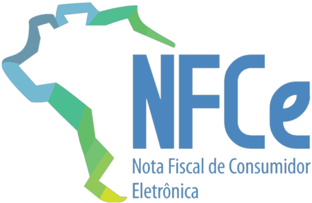
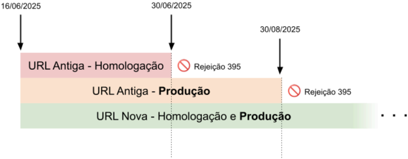

## Nota Fiscal de Consumidor Eletrônica

Informe Técnico 2025.003

Alteração na URL do QRCode da consulta da NFC-e para o estado de Goiás

Versão 1.00 - Junho 2025

## Sumário

| 1 Introdução....................................................................................................................................... 2   |
|---------------------------------------------------------------------------------------------------------------------------------------------------------|
| 2 Alteração da URL............................................................................................................................2         |
| 2.1 - Regra de validação relacionada com o endereço da consulta QRCode............................. 3                                                   |
| 2.2 - Fluxograma da alteração..................................................................................................... 3                    |

## Controle de Versões

|   Versão | Publicação   | Descrição                                                                                                                                 |
|----------|--------------|-------------------------------------------------------------------------------------------------------------------------------------------|
|     1.00 | 06/2025      | Criação deste Informe Técnico para divulgação do novo endereço de consulta da NFC-e para geração do QRCode que é impresso no DANFE NFC-e. |

## 1 Introdução

A  alteração  da  URL  de  consulta  do  QR  Code  para  HTTPS  é  crucial  para  a  segurança  e integridade das informações.

O  HTTPS  (Hypertext  Transfer Protocol Secure) garante a criptografia dos dados, protegendo a comunicação entre o usuário e o servidor contra interceptações maliciosas (ataques Man-in-the-Middle). Além disso, autentica a identidade do site, prevenindo redirecionamentos para páginas falsas (phishing), e aumenta a confiança do usuário, visto que navegadores e dispositivos móveis já alertam sobre conexões HTTP inseguras.

No contexto específico dos QR Codes, a adoção do HTTPS tem um impacto direto na segurança e usabilidade. Links sem criptografia podem ser alterados ou bloqueados, expondo o usuário a riscos como fraudes e vazamento de dados. Por outro lado, URLs com HTTPS asseguram que o destino seja legítimo e íntegro, evitando  que  terceiros  manipulem  o  conteúdo  acessado. Adicionalmente, muitas funcionalidades e recursos modernos exigem conexões seguras para seu correto funcionamento.

Em resumo, a implementação do HTTPS é uma medida fundamental para garantir a proteção e confiabilidade dos links compartilhados via QR Code. Além de atender a requisitos técnicos e de SEO (Search Engine Optimization), essa prática reforça a segurança do usuário e a credibilidade do serviço que disponibiliza a consulta.

## 2 Alteração da URL

| UF               | URL                                                               | Vigência               |
|------------------|-------------------------------------------------------------------|------------------------|
| GO Produção      | http://nfe.sefaz.go.gov.br/nfeweb/sites/nfce/danfeNFCe            | Até 30/08/2025         |
| GO Produção      | https://nfeweb.sefaz.go.gov.br/nfeweb/sites/nfce/danfeNFCe        | A partir de 16/06/2025 |
| GO Homolo- gação | http://homolog.sefaz.go.gov.br/nfeweb/sites/nfce/danfeNFCe        | Até 30/06/2025         |
| GO Homolo- gação | https://nfewebhomolog.sefaz.go.gov.br/nfeweb/sites/nfce/danfeNFCe | A partir de 16/06/2025 |

## 2.1 - Regra de validação relacionada com o endereço da consulta QRCode

A partir da data de vigência da nova URL, somente será aceita a nova URL, ocasionando rejeição em documentos que contenham endereço diferente do informado na tabela do item anterior.

Os documentos com a URL incorreta serão rejeitados com a aplicação da regra de validação - RV ZX02-20, que ocasiona a 'Rejeição 395', conforme ilustrado abaixo.

Não há alteração na RV, apenas mudou a URL de Goiás utilizada para fazer a validação.

| Campo- Seq   |   Modelo | Regra de Validação                                                                                                                                                                                                                                                                                                                                                                    | Aplic .   |   Msg | Efeito   | Descrição Erro                                                               |
|--------------|----------|---------------------------------------------------------------------------------------------------------------------------------------------------------------------------------------------------------------------------------------------------------------------------------------------------------------------------------------------------------------------------------------|-----------|-------|----------|------------------------------------------------------------------------------|
| ZX02-20      |       65 | Endereço do site da UF para a Consulta via QR-Code difere do previsto. Nota: O uso diferenciado de maiúsculas ou minúsculas não deve ser considerado na validação. Observação 1: Regra de Validação opcional até 01/11/2016, a critério da UF. Observação 2: Para consultar as URLs por UF utilizadas no QR Code, acesse: http://nfce.encat.org/desenvolvedo r/qrcode/" (NT 2015.002) | Obrig .   |   395 | Rej.     | Rejeição: Endereço do site da UF da Consulta via QR-Code diverge do previsto |

## 2.2 - Fluxograma da alteração

## Fluxo temporal da alteracao da URL da consulta QRCode da NFC-e em Goias

## Metadados
- [Metadados do corpus](metadata.json)
- [Fonte e procedência](../../../../sources/portal_nacional_nfe/nfce/informes-tecnicos/it-2025-003-altera-o-endere-o-qrcode-nfc-e-go/source.json)
- [Dados normalizados](../../../../normalized/nfce/informes-tecnicos/it-2025-003-altera-o-endere-o-qrcode-nfc-e-go/normalized.json)
- [Changelog](../../../../changelog/nfce/informes-tecnicos/it-2025-003-altera-o-endere-o-qrcode-nfc-e-go.md)
- [Proveniência resumida](../../../../sources/provenance/it-2025-003-altera-o-endere-o-qrcode-nfc-e-go.json)
