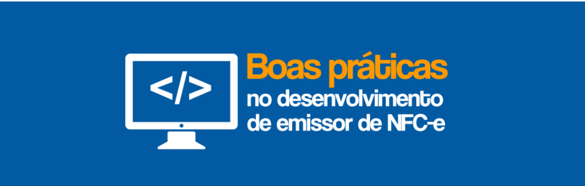

## CONTROLE DE VERSÕES

| DATA      | ALTERAÇÕES      |
|-----------|-----------------|
| maio/2018 | (1ª Publicação) |

## O que se espera de uma Solução Sistêmica para Emissão de NFC-e

Esta publicação visa orientar contribuintes na escolha e/ou desenvolvimento de Solução Sistêmica  a  ser  utilizada  para  emissão  de  NFC-e  -  Nota  Fiscal  de  Consumidor eletrônica.

Entende-se por Solução Sistêmica para Emissão de NFC-e o conjunto de Softwares, Hardwares e Meios de Comunicação utilizados na Geração, Transmissão, Autorização de Uso, Impressão e Guarda de NFC-e.

A seguir estão apresentados os principais itens que a Solução Sistêmica para Emissão de NFC-e deve oferecer:

## 1.  Emitir  NFC-e  respeitando  os  padrões  previstos  na  legislação  nacional  e estadual.

O Solução Sistêmica para Emissão de NFC-e, além de observar a legislação tributária, deverá seguir os padrões definidos nos Manuais, nas Notas Técnicas e nos Esquemas XML NF-e - Pacote de Liberação. Verificar últimas versões disponíveis em:

http://www.nfe.fazenda.gov.br/portal/principal.aspx.

## 2.  Utilização do ambiente de homologação para realização de testes

O ambiente de homologação é disponibilizado para possibilitar a realização de testes e/ou treinamentos com a emissão de documentos sem validade jurídica. O programa emissor deve possibilitar a sua configuração para utilização deste ambiente. Recomenda-se  o  uso  exaustivo  do  ambiente  de  homologação  de  forma  a  prevenir rejeições  de  autorização  da  NFC-e  e  outros  erros  durante  a  venda  a  consumidor.  O ambiente de produção deve ser utilizado apenas para emissão de documentos fiscais com validade jurídica.

## 3. Cadastrar clientes, emitentes e produtos

A Solução Sistêmica para Emissão de NFC-e deverá permitir o cadastramento de pelo menos  um  emitente  de  NFC-e,  com  todos  os  dados:  CNPJ,  Razão  Social,  Nome Fantasia e dados de endereço.

A Solução Sistêmica para Emissão de NFC-e deverá permitir o pré-cadastramento de clientes  (pessoa  física  ou  jurídica)  e  produtos,  assim  como  permitir  alterações  dos dados cadastrados, de emitentes, clientes e produtos.

Para evitar rejeições decorrentes de cadastro de produtos realizado incorretamente, ao cadastrar novo produto, o sistema deve ter a funcionalidade de testar (de preferência de forma automática) conforme conjunto de regras existente para a NFC-e.  (autorização da NFC-e, contendo tal produto, no ambiente de Homologação das SEFAZ Autorizadoras).  Destaca-se  que  é  grande  o  volume  de  rejeições  originadas  por  uma informação  incorreta ou  faltante  no  cadastro  de  produtos  da  empresa.  A  título exemplificativo, 'NCM Inexistente' é uma das rejeições mais comuns detectadas pelas SEFAZ Autorizadoras.

Para auxiliar o desenvolvimento e a manutenção da aplicação, o anexo único contém as 50 maiores rejeições em um só dia.

## 4.  Venda rápida

A  Solução  Sistêmica  para  Emissão  de  NFC-e  deverá  permitir  a  venda  rápida  e  fácil, sem  cadastrar  o  consumidor  final,  podendo,  facultado  ao  consumidor  final,  informar apenas o CPF/CNPJ ou identificação de estrangeiro.

## 5.  Identificar o destinatário

A  Solução  Sistêmica  para  Emissão  de  NFC-e  deverá  permitir  a  venda  sem  a identificação  de  destinatário,  respeitando  as  validações  previstas  nas  documentações das  Nota  Técnicas  e  Manuais,  bem  como,  observando  os  casos  de  obrigatoriedade definidos em legislação tributária.

## 6.  Calcular automaticamente os tributos

A  Solução  Sistêmica  para  Emissão  de  NFC-e  poderá  preencher  automaticamente  os cálculos de tributos, para agilizar a venda e a emissão da NFC-e.

## 7.  Transmissão do XML da NFC-e

O  arquivo  XML  da  NFC-e  emitida  deve  ser  transmitido  para  Secretaria  de  Fazenda Estadual  assinado  digitalmente,  conforme  o  Manual  de  Orientação  do  Contribuinte (MOC).

## 8.  Suportar o certificado A1 e/ou A3

A Solução Sistêmica para Emissão de NFC-e poderá aceitar certificados de assinatura digital  no  padrão  ICP-Brasil,  do  tipo  A1  e/ou  A3  (Certificado  A3  é  honeroso  e  a complexidade da utilização para o varejo torna seu uso inviável).

Recomenda-se  que  o  aplicativo  contenha  controles  que  verifiquem  a  validade  dos certificados  digitais  utilizados  para  emissão  e  transmissão  da  NFC-e,  gerando  alertas antecipados (1 mês) sobre o futuro vencimento do certificado digital em uso.

## 9.  Tempo para transmissão e autorização

O  tempo  de  transmissão  e  autorização  da  NFC-e  deverá  respeitar  o  Manual  de Orientação do Contribuinte (MOC).

## 10.  Possuir histórico e Status das notas

A Solução Sistêmica para Emissão de NFC-e deverá manter os status de cada NFC-e emitida, se ela foi autorizada, cancelada ou se a numeração foi inutilizada. As NFC-e rejeitadas  deverão  ter  o  motivo  de  rejeição,  até  que  um  novo  status  seja  obtido  para essa NFC-e (corrigindo o motivo da rejeição). Consulta deverá ser disponibilizada para verificação deste histórico.

## 11. Imprimir DANFE NFC-e

A impressão gerada pelo software deverá respeitar o previsto na legislação nacional e estadual,  e  possuir  o  QR  Code.  O  software  deverá  possuir  a  opção  de  imprimir  o DANFE NFC-e  tanto  na  forma  completa  como  na  forma  resumida,  sempre  com  QR Code.

Consultar o Manual de Especificações Técnicas do DANFE NFC-e e QR Code (última versão) para uma melhor utilização da área de impressão e buscando uma redução da utilização de papel.

Disponível em:

http://www.nfe.fazenda.gov.br/portal/principal.aspx - Documentos - Manuais

O  contribuinte  deverá  utilizar  impressora  comum  (não  fiscal),  exceto  impressora matricial pela dificuldade de impressão do QR-Code.

## 12.  Backup

A  Solução  Sistêmica  para  Emissão  de  NFC-e  deverá  permitir  que  o  usuário  faça  o backup  dos  dados  contidos  no  seu  sistema,  tanto  de  NFC-e  como  de  cadastro  de clientes e produtos.

## 13.  Enviar a NFC-e para o e-mail do consumidor final

A Solução Sistêmica para Emissão de NFC-e poderá permitir o envio para o destinatário do arquivo XML da NFC-e (procNFe) e do DANFE NFC-e. Se o adquirente concordar, o DANFE NFC-e poderá ter sua impressão substituída pelo envio em formato eletrônico ou pelo envio da chave de acesso do documento fiscal a qual ele se refere.

## 14.  Não emitir NFC-e sem que esteja cadastrado o CSC e seu identificador.

O CSC corresponde a um código de segurança alfanumérico de conhecimento apenas da Secretaria de Fazenda do Estado do emitente e do próprio contribuinte.  O CSC (e seu identificador - nº sequencial) é utilizado para cálculo do 'hash do QR Code', que é um dos parâmetros do QR Code. O software deverá permitir o pré-cadastramento do CSC para ser utilizado na impressão do DANFE NFC-e.  Observar que, a critério da Unidade Federada, o CSC para uso no ambiente de produção difere do CSC para uso no ambiente de homologação. O software também deverá permitir a alteração do CSC cadastrado. Caso tenha dúvidas sobre o fornecimento e utilização do CSC, consulte o Manual de

Especificações Técnicas do DANFE NFC-e e QR Code (última versão).

## 15.  A emissão de NFC-e em contingência off-line deve ser tratada como exceção, sendo que a regra deve ser a emissão com autorização em tempo real.

O software deverá permitir emitir as NFC-e em contingência. É importante ressaltar que a utilização de contingência off-line deve  se restringir às situações de efetiva impossibilidade  de  autorização  da  NFC-e  em  tempo  real,  haja  vista  que  pode  vir  a representar custos e riscos adicionais ao contribuinte.

O  aplicativo  deve  transmitir  as  NFC-e  emitidas  em  contingência  logo  após  cessados problemas técnicos que motivaram a emissão em contingência.

Nota :  Observado  que  praticamente  70%  das  empresas  emitentes  de  NFC-e  não possuem  emissões  em  contingência  em  um  determinado  dia,  ou  elas  ocorrem  em pequena quantidade.

Aparentemente a maior quantidade de emissão em contingência está vinculada com a implementação do software no tratamento das falhas de comunicação, e/ou na própria qualidade do canal de comunicação utilizado.

Provavelmente,  o  investimento  no  tratamento  das  falhas  de  comunicação  pelas soluções sistêmicas vão reduzir de forma sensível a quantidade de NFC-e autorizadas em contingência.

## 16.    O  aplicativo  deve  transmitir  as  NFC-e  emitidas  em  contingência  logo  após cessados problemas técnicos.

A Solução Sistêmica para Emissão de NFC-e deve permitir que as NFC-e emitidas em contingência  sejam  transmitidas  logo  após  cessados  os  problemas  técnicos  para obtenção da autorização de uso.

## 17.  Contingência off-line e autorização da nota.

Quando a contingência off-line for utilizada após uma solicitação de autorização de uma nota, após a cessação dos problemas técnicos, se houver a recepção de autorização de nota  não  emitida  em  contingência,  o  contribuinte  deve  ser  questionado  se  esta  nota deva  ser  cancelada  ou  não.  Mais  informações  no  Manual  de  Especificações  da Contingência Off-line para NFC-e (última versão).

## 18.    O  software  deve  ser  capaz  de  efetuar  cancelamento  (evento)  e  inutilizar numeração não utilizada.

O software deverá permitir o cancelamento de NFC-e como previsto nas legislações. O software deverá permitir a inutilização da numeração da NFC-e. Destaca-se que a NFCe emitida em contingência não pode ter sua numeração inutilizada.

## 19.  Não possuir alternativa de controle de vendas sem a emissão de NFC-e.

O  aplicativo  não  deve  possuir  nenhuma  funcionalidade  que  permita  controlar  vendas sem a emissão de NFC-e ou outro documento fiscal hábil, sob pena de responsabilidade tributária solidária, bem como as civil e criminal.

## 21.  Permitir consulta de notas emitidas.

O  software  deverá  permitir  a  consulta  das  NFC-e  emitidas,  possibilitando  inclusive  a seleção  de  alguma  para  nova  impressão  do  DANFE  NFC-e,  quando  solicitada  pelo consumidor .

## 22.  Permitir a correção de erros que geraram a rejeição da nota.

A NFC-e pode ser rejeitada, conforme regras de validação previamente divulgadas em Notas  Técnicas  publicadas.  O  software  deverá  permitir  a  correção  desse  erro  e possibilitar nova transmissão objetivando a Autorização de Uso

O software  deve,  a  princípio,  se  propor  a  validar  localmente  as  NFC-e  antes  do  seu envio para a SEFAZ Autorizadora, já que a rejeição da NFC-e acabará prejudicando o próprio ambiente operacional da empresa.

O desejável  é  que  o  software  implemente  todas  as  regras  de  validação  previamente divulgadas, mas, na sua impossibilidade, não é aceitável que ele não implemente regras básicas  de  validação,  tais  como  'Valor  do  Item  difere  do  Valor  Unitário  vezes  a quantidade', valor do imposto difere da Base de Cálculo vezes a alíquota' e dezenas de regras deste tipo.

## 23.  Permitir a integração com sistemas gerenciais da empresa.

É recomendável a integração do software emissor de NFC-e com o sistema gerencial da empresa. É uma maneira de agilizar e otimizar o trabalho do contribuinte.

## 24.    Permitir  a  integração  com  sistema  de  pagamento por cartão (Transferência Eletrônica de Fundos - TEF).

O  programa  deverá  possibilitar  sua  integração  com  o  sistema  de  autorização  de pagamento com cartão de crédito ou débito (TEF) para uso opcional pelo contribuinte.

## 25.  Permitir a exportação dos arquivos XML para o sistema de contabilidade da empresa.

O software deverá permitir a exportação dos arquivos XML da NFC-e, tanto o arquivo do documento fiscal quanto o XML da resposta da SEFAZ.

## 26.  Permitir a exportar e importar arquivos XML.

O contribuinte pode ter a necessidade de transmitir as NFC-e emitidas em contingência off-line de um outro local que não seja o da efetiva emissão. Para tal, precisará exportar as NFC-e e importá-las em qualquer outro local onde haja software instalado e apto a transmiti-las.

## 27. Não fazer mau uso (uso indevido) dos Web Services das SEFAZ Autorizadoras.

O uso indevido dos ambientes autorizadores pode comprometer a estabilidade dos Web Services, ocasionando a perda de performance ou indisponibilidade desses ambientes. Assim,  após  o  recebimento  de  rejeição  de  uma  NFC-e,  o  aplicativo  não  deve  tentar reenviar a mesma NFC-e (em loop ), sem antes corrigir o problema.

Destaca-se que, a critério da SEFAZ autorizadora, o contribuinte, cujo aplicativo estiver com tal comportamento, poderá ficar bloqueado da emissão da NFC-e, conforme Nota Técnica que trata do Consumo Indevido.

Esse  bloqueio  poderá  ser  aplicado  também  para  os  demais  Web  Services,  caso detectado o mau uso dos recursos (consumo indevido).

Para auxiliar o desenvolvimento e a manutenção da aplicação, o anexo único contém as 50 maiores rejeições em um só dia na SVRS e RS. Este comportamento, presume-se, deve se repetir em outras UF autorizadoras.

## 28. Considerações para determinar o Tempo de Espera do Retorno do Processo

## de Autorização da NFC-e.

Durante  o  processo  de  autorização  de  uma  NFC-e,  caso  o  contribuinte  não  receba resposta  da  SEFAZ  autorizadora  após  um  determinado  tempo  ( timeout ),  o  aplicativo pode tentar repetir o processo por uma pequena quantidade de vezes (por exemplo 3 vezes).

A definição do tempo de espera de retorno, determinada pelo contribuinte e observando o  que  determina  o  MOC,  deve  considerar  o  seu  negócio,  sua  infraestrutura  de comunicação, sua localidade, etc. A título exemplificativo, observa-se que boa parte das empresas definem o tempo de espera entre 20 a 50 segundos.

Após isso, a aplicação do contribuinte pode emitir a NFC-e em contingência off-line, até que seja resolvido o problema de comunicação.

## 29.  Confirmação  de  timeout  (ausência  de  retorno  citada  no  tópico  acima)  e Emissão em Contingência Off-line.

Caso se confirme o timeout , ou seja, a aplicação não recebe o retorno do processo de autorização da NFC-e, devem ser executados os seguintes procedimentos enquanto a aplicação  estiver  off-line  (ou  seja,  sem  comunicação  com  o  ambiente  autorizador  da respectiva SEFAZ):

1. Manter a operação que não teve retorno em uma fila de 'NFC-e pendente de Retorno';
2. Gerar uma nova NFC-e, em contingência (tpEmis=9), com  uma  nova numeração (sequencial em relação a numeração anterior);

Atenção:  Nota  Técnica  poderá  adicionar  critérios  para  geração  da  NFC-e  em contingência.

3. Imprimir o DANFE da NFC-e (observando a numeração sequencial), com a tarja de 'Emitida em Contingência - Pendente de autorização'.
4. Repetir  os  procedimentos  2  e  3  para  as  seguintes  NFC-e  emitidas  em contingência até que o aplicativo retorne à normalidade para emissão em tempo real.

## 30. Retorno  à normalidade  para emissão  Online e  tratamento  das  NFC-e pendentes de retorno.

Após  a  confirmação  de  que  o  aplicativo  está  apto  para  utilizar  o  ambiente  de autorização, os seguintes procedimentos devem ser seguidos:

1. Tratar a fila de 'NFC-e pendente de Retorno':
- a. Por meio do Web Service de 'Consulta Situação' da NF-e, verificar se a NFC-e foi autorizada ou se não existe na SEFAZ Autorizadora.

- i. Se autorizada: Cancelar a NFC-e autorizada;
- ii. Se não existir: Inutilizar a numeração.
2. Transmitir à SEFAZ Autorizadora as NFC-e emitidas em contingência off-line.

## 31. Pedido de Resposta Síncrono

As empresas devem solicitar o Pedido de Resposta Síncrono (indSinc=1) para os Lotes com somente 1 (uma) NFC-e (caso normal).

Este modo traz benefícios para a empresa tanto em menor tempo de resposta, quanto em simplificação de processo de emissão.

## 32. Compactação de Mensagem

Preferencialmente,  as  empresas  devem  compactar  a  mensagem  para  envio  a  SEFAZ Autorizadora,  conforme  orientação  e  regras  do  MOC,  reduzindo  o  uso  do  canal  de comunicação da empresa e reduzindo o tempo de resposta (que é fortemente impactado pela quantidade de bytes a ser transmitido).

## 33. Alterações Indevidas das informações: 'Data-Hora de Emissão em Contingência' e 'Data-Hora de Entrada em Contingência'

A data-hora de emissão da NFC-e emitida em contingência deverá ser exatamente aquela em que ocorreu a operação no ponto de venda. E a data-hora de entrada em contingência deverá ser igual à do momento em que o sistema entrou em contingência.

Detectou-se  o  comportamento  indevido  de  algumas  empresas  alterando  essas  datas  no envio (a posteriori) para autorização das NFC-e emitidas em contingência.

## 34. SEFAZ Autorizadora

A princípio o ambiente da SEFAZ Autorizadora deve ter alta disponibilidade e um bom tempo  de  resposta,  como  forma  de  não  impactar  o  ambiente  de  faturamento  das empresas.

A alta disponibilidade pode ser caracterizada como:

- disponibilidade 24 x 7;
- uma interrupção por mês, em um período inferior a x tempo;

Não  se  considera  'indisponibilidade'  as  paradas  de  manutenção  previstas  para  o domingo, que eventualmente podem ocorrer e são previamente comunicadas no site da SEFAZ.

Sobre o tempo  de  resposta, esta variável é fortemente afetada pelo canal de comunicação da empresa com a Internet e com o próprio 'backbone' da Internet.

Deve se esperar um tempo de processamento inferior a 1 segundo no processamento das requisições atendidas pela SEFAZ Autorizadora, desconsiderando-se os tempos da Internet.

## Anexo Único

## 50 maiores rejeições em único dia (a título de exemplo)

|   # | Mensagens de Rejeição                                                                                  | Quantidade de Rejeições   |   Quantidade de Chaves de Acesso Rejeitadas |
|-----|--------------------------------------------------------------------------------------------------------|---------------------------|---------------------------------------------|
|   1 | 539-Rejeicao: Duplicidade de NF-e, com diferença na Chave de Acesso                                    | 2.721.610                 |                                     143.958 |
|   2 | 778-Rejeicao: Informado NCM inexistente                                                                | 2.172.567                 |                                      75.344 |
|   3 | 204-Rejeicao: Duplicidade de NF-e                                                                      | 1.614.137                 |                                     252.662 |
|   4 | 291-Rejeicao: Certificado Assinatura Data Validade                                                     | 487.647                   |                                      22.500 |
|   5 | 383-Rejeicao: Item com CSOSN indevido                                                                  | 453.302                   |                                      43.387 |
|   6 | 464-Rejeicao: Código de Hash no QR-Code difere do calculado                                            | 396.197                   |                                      24.310 |
|   7 | 397-Rejeicao: Parâmetro do QR-Code divergente da Nota Fiscal                                           | 265.031                   |                                       5.687 |
|   8 | 704-Rejeicao: NFC-e com Data-Hora de emissão atrasada                                                  | 239.774                   |                                      68.263 |
|   9 | 386-Rejeicao: CFOP não permitido para o CSOSN informado                                                | 166.418                   |                                      13.320 |
|  10 | 725-Rejeicao: NFC-e com CFOP invalido                                                                  | 162.815                   |                                      16.471 |
|  11 | 767-Rejeicao: Total do Produto / Serviço difere do somatório do total de pagamentos para NFC-e         | 147.759                   |                                       5.093 |
|  12 | 382-Rejeicao: CFOP não permitido para o CST informado                                                  | 138.335                   |                                      21.693 |
|  13 | 602-Rejeicao: Total do PIS difere do somatório dos itens sujeitos ao ICMS                              | 130.466                   |                                       6.738 |
|  14 | 766-Rejeicao: Item com CST indevido                                                                    | 125.270                   |                                       9.737 |
|  15 | 569-Rejeicao: Data de entrada em contingencia muito atrasada                                           | 74.702                    |                                      10.057 |
|  16 | 531-Rejeicao: Total da BC ICMS difere do somatório dos itens                                           | 70.313                    |                                       7.030 |
|  17 | 206-Rejeicao: NF-e já está inutilizada na Base de dados da SEFAZ                                       | 65.166                    |                                       8.864 |
|  18 | 703-Rejeicao: Data-Hora de Emissão posterior ao horário de recebimento                                 | 62.686                    |                                      17.614 |
|  19 | 226-Rejeicao: Código da UF do Emitente diverge da UF autorizadora                                      | 54.441                    |                                      13.845 |
|  20 | 564-Rejeicao: Total do Produto / Serviço difere do somatório dos itens                                 | 52.870                    |                                       1.720 |
|  21 | 537-Rejeicao: Total do Desconto difere do somatório dos itens                                          | 50.410                    |                                       1.125 |
|  22 | 777-Rejeicao: Obrigatória a informação do NCM completo                                                 | 49.375                    |                                       3.945 |
|  23 | 769-Rejeicao: NFC-e deve possuir o grupo de Formas de Pagamento                                        | 44.321                    |                                         771 |
|  24 | 591-Rejeicao: Informado CSOSN para emissor que não e do Simples Nacional (CRT diferente de 1)          | 39.009                    |                                         983 |
|  25 | 611-Rejeicao: cEAN invalido                                                                            | 38.421                    |                                       2.202 |
|  26 | 218-Rejeicao: NF-e já está cancelada na base de dados da SEFAZ                                         | 38.122                    |                                         412 |
|  27 | 220-Rejeicao: Destinatário com identificação igual a identificação do emitente                         | 37.365                    |                                         688 |
|  28 | 462-Rejeicao: Código identificador do CSC no QR-Code não cadastrado na SEFAZ                           | 34.403                    |                                       2.858 |
|  29 | 237-Rejeicao: CPF do destinatário invalido                                                             | 34.077                    |                                       1.730 |
|  30 | 869-Rejeicao: Valor do troco incorreto                                                                 | 32.972                    |                                         236 |
|  31 | 502-Rejeicao: Erro na Chave de Acesso - Campo ID não corresponde a concatenação dos campos corresponde | 32.239                    |                                      10.119 |

|   32 | 391-Rejeicao: Não informados os dados do cartão de credito/debito nas Formas de Pagamento da Nota Fiscal   |   28.905 |   4.712 |
|------|------------------------------------------------------------------------------------------------------------|----------|---------|
|   33 | 315-Rejeicao: Data de Emissão anterior ao início da autorização de Nota Fiscal na UF                       |   28.154 |     807 |
|   34 | 384-Rejeicao: CSOSN não permitido para a UF                                                                |   27.907 |   3.800 |
|   35 | 590-Rejeicao: Informado CST para emissor do Simples Nacional (CRT=1)                                       |   27.378 |     883 |
|   36 | 203-Rejeicao: Emissor não habilitado para emissão da NF-e                                                  |   25.582 |   8.223 |
|   37 | 213-Rejeicao: CNPJ-Base do Emitente difere do CNPJ-Base do Certificado Digital                             |   25.568 |  17.012 |
|   38 | 483-Rejeicao: Valor do desconto maior que valor do produto                                                 |   21.086 |     462 |
|   39 | 750-Rejeicao: NFC-e com valor total superior ao permitido para destinatário não identificado (Código)      |   20.927 |     312 |
|   40 | 392-Rejeicao: Não informados os dados da operação de pagamento por cartão de credito/debito                |   20.129 |     991 |
|   41 | 603-Rejeicao: Total do COFINS difere do somatório dos itens sujeitos ao ICMS                               |   16.004 |     917 |
|   42 | 610-Rejeicao: Total da NF difere do somatório dos Valores compõe o valor Total da NF.                      |   14.329 |     773 |
|   43 | 394-Rejeicao: Nota Fiscal sem a informação do QR-Code                                                      |   13.858 |  11.003 |
|   44 | 252-Rejeicao: Ambiente informado diverge do Ambiente de recebimento                                        |   13.169 |      69 |
|   45 | 208-Rejeicao: CNPJ do destinatário invalido                                                                |   12.824 |     346 |
|   46 | 629-Rejeicao: Valor do Produto difere do produto Valor Unitário de Comercialização e Quantidade Comercial  |   11.669 |   3.436 |
|   47 | 604-Rejeicao: Total do vOutro difere do somatório dos itens                                                |   10.246 |     236 |
|   48 | 685-Rejeicao: Total do Valor Aproximado dos Tributos difere do somatório dos itens                         |    9.144 |     349 |
|   49 | 660-Rejeicao: CFOP de Combustível e não informado grupo de combustível da NF-e                             |    8.728 |     230 |
|   50 | 780-Rejeicao: NFC-e com valor total superior ao permitido                                                  |    8.447 |      11 |
## Metadados
- [Metadados do corpus](metadata.json)
- [Fonte e procedência](../../../../sources/portal_nacional_nfe/nfce/manuais/manual-de-boas-pr-ticas-nfc-e-bp-2018-001-vers-o-1-0/source.json)
- [Dados normalizados](../../../../normalized/nfce/manuais/manual-de-boas-pr-ticas-nfc-e-bp-2018-001-vers-o-1-0/normalized.json)
- [Changelog](../../../../changelog/nfce/manuais/manual-de-boas-pr-ticas-nfc-e-bp-2018-001-vers-o-1-0.md)
- [Proveniência resumida](../../../../sources/provenance/manual-de-boas-pr-ticas-nfc-e-bp-2018-001-vers-o-1-0.json)

## Documentos relacionados

- [manual-de-orienta-o-ao-contribuinte-moc-vers-o-7-0-nf-e-e-nfc-e](../../../nfe/manuais/manual-de-orienta-o-ao-contribuinte-moc-vers-o-7-0-nf-e-e-nfc-e/document.md)
