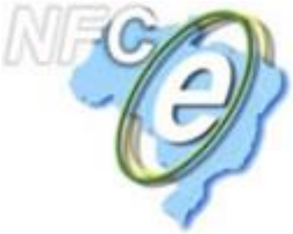
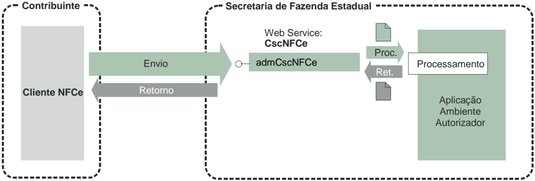

## Projeto Nota Fiscal de Consumidor Eletrônica

## Manual Técnico de Utilização do Web Service de Administração do Código de Segurança do Contribuinte - CSC

Versão 1.00 19 de Agosto de 2014

## Controle de Versões

|   Versão | Data            |
|----------|-----------------|
|     1.00 | 23/05/2014 - AM |

## Identificação e vigência do Manual

| Versão do manual                                      | 1.00      |
|-------------------------------------------------------|-----------|
| Data de divulgação do manual                          | A definir |
| Pacote de liberação de Schemas XML                    | PL_001a   |
| Data de início de vigência no ambiente de homologação | A definir |
| Data de início de vigência no ambiente de produção    | A definir |

## Versões de leiautes do PL\_001a

| Leiaute       |   versão | Schema XML              | Observação                                                                                      |
|---------------|----------|-------------------------|-------------------------------------------------------------------------------------------------|
| admCscNFCe    |     1.00 | admCscNFCe_v1.00.xsd    | Mensagem de solicitação de consulta, geração ou revogação de número(s) de CSC NFC-e.            |
| retAdmCscNFCe |     1.00 | retAdmCscNFCe_v1.00.xsd | Mensagem de retorno da solicitação de consulta, geração ou revogação de número(s) de CSC NFC-e. |

## 1. Introdução

Este  manual  objetiva  definir  as  especificações  e  critérios  técnicos  necessários  para  que  as empresas  emissoras  de  Nota  Fiscal  de  Consumidor  Eletrônica  -  NFC-e  -  possam  efetuar  o gerenciamento dos números de CSC NFC-e por meio do uso de Web Service .  Esse  serviço poderá ser usado como alternativa às soluções já existentes de gerenciamento do CSC NFC-e por meio de página web. O CSC NFC-e e seu respectivo número de identificação constituem informações fundamentais  para  a  correta  geração  do  QR-Code  que  deverá  ser  impresso  no DANFE NFC-e. Mais informações sobre a forma de utilização do CSC poderão ser obtidas em manual específico.

## 2. Descrição Simplificada do Modelo Operacional

A  empresa  emissora  de  NFC-e  deverá  gerar  um  arquivo  eletrônico  em  formato  XML obedecendo leiaute específico. O Web Service de manutenção do CSC NFC-e oferecerá três funcionalidades  distintas:  consulta  de  códigos  de  segurança  ativos,  revogação  de  código  de segurança ativo e requisição de novo código de segurança.

O arquivo eletrônico gerado pelo contribuinte será transmitido pela Internet, para  o ambiente autorizador, que fará uma pré-validação do arquivo e devolverá uma mensagem eletrônica com o resultado da validação.

Cada contribuinte (CNPJ Raiz) poderá manter até dois CSC ativos simultaneamente. O Web Service fará o controle para garantir que esta regra seja respeitada. Na hipótese de haver dois CSC ativos, só será aceita a requisição de novo CSC após a revogação de um deles.

A funcionalidade de consulta de CSC ativos poderá ser usada a qualquer tempo sem nenhum tipo de restrição.

## 3. Modelo operacional

As funcionalidades (métodos) do Web Service de administração do CSC NFC-e obedecerão ao padrão  síncrono  de  comunicação,  ou  seja,  o  retorno  do  serviço  solicitado  será  dado  ao contribuinte pela mesma conexão usada para realizar a solicitação.

| Serviço                 | Método                | Implementação   |
|-------------------------|-----------------------|-----------------|
| Manutenção do CSC NFC-e | Administrar CSC NFC-e | Síncrona        |

## NT-NFCe 2014/001 Web Service de Gerenciamento do CSC

## 4. Web Service

O Web Service disponibiliza os serviços que serão utilizados pelos aplicativos dos emissores de NFC-e. O mecanismo de utilização do Web Service segue as seguintes premissas:

a) Será disponibilizado apenas um Web Service, com um único método, que atenderá todos os serviços;

b) O envio da solicitação e a obtenção do retorno serão realizados na mesma conexão, pelo mesmo método.

c)  A  URL  do Web Service de  cada  ambiente  autorizador  de  NFC-e  será  publicada  no  portal nacional da Nota Fiscal Eletrônica. Acessando a URL o contribuinte poderá obter o WSDL ( Web Service Description Language ) do serviço.

d) O processo de utilização do Web Service sempre é iniciado pelo emissor de NFC-e, enviando uma  mensagem  nos  padrões  XML  e  SOAP  (versão  1.2),  por  meio  do  protocolo  SSL  com autenticação mútua.

e) A ocorrência de qualquer erro na validação dos dados recebidos interrompe o processo com a disponibilização de uma mensagem contendo o código e a descrição do erro.

## NT-NFCe 2014/001 Web Service de Gerenciamento do CSC

## 5. Serviço de Manutenção do CSC NFC-e

O Serviço de Manutenção do CSC NFC-e é o serviço oferecido pelo Web Service da SEFAZ autorizadora  para  atualização  do  repositório  de  CSC  NFC-e.  A  utilização  de  cada  uma  das funcionalidades oferecidas pelo serviço deverá ser feita por meio da especificação do tipo de operação no XML de requisição.

## 5.1. Método admCscNFCe

Função :  serviço  destinado  às  opções  de  consulta,  requisição  e  revogação  dos  números  de CSC NFC-e.

Processo

: síncrono.

## 5.1.1. Leiaute Mensagem de Entrada

Entrada:

Estrutura XML com os dados para a administração de CSC NFC-e.

Schema XML: admCscNFCe \_v9.99.xsd

| AP01   | admCscNFCe   | Raiz   | -    | -   | -   |   - | -   | TAG raiz                                                                                                |
|--------|--------------|--------|------|-----|-----|-----|-----|---------------------------------------------------------------------------------------------------------|
| AP02   | versao       | A      | AP01 | C   | 1-1 |   4 |     | Versão do leiaute - "1.00"                                                                              |
| AP03   | tpAmb        | E      | AP01 | N   | 1-1 |   1 |     | Identificação do tipo de ambiente: 1 - Produção; 2 - Homologação                                        |
| AP04   | indOp        | E      | AP01 | N   | 1-1 |   1 |     | Identificador do tipo de operação: 1 - Consulta CSC Ativos; 2 - Solicita novo CSC; 3 - Revoga CSC Ativo |
| AP05   | raizCNPJ     | E      | AP01 | N   | 1-1 |   8 |     | Raiz do CNPJ do contribuinte que está efetuando a consulta.                                             |
| AP06   | dadosCsc     | G      | CP01 |     | 0-1 |     |     | Dados do CSC a ser revogado                                                                             |
| AP07   | idCsc        | E      | CP05 | N   | 1-1 |   6 |     | Número identificador do CSC a ser revogado                                                              |
| AP08   | codigoCsc    | E      | CP05 | N   | 1-1 |  16 |     | Código alfanumérico do CSC a ser revogado                                                               |

## NT-NFCe 2014/001 Web Service de Gerenciamento do CSC

## 5.1.2. Leiaute Mensagem de Retorno

Retorno: Estrutura XML com a mensagem de retorno da solicitação de administração do CSC NFC-e.

Schema XML: retAdmCscNFCe \_v9.99.xsd

| #    | Campo         | Ele   | Pai   | Tipo   | Ocorr   | Tam.   | Dec.   | Descrição/Observação                                                                                     |
|------|---------------|-------|-------|--------|---------|--------|--------|----------------------------------------------------------------------------------------------------------|
| AR01 | retAdmCscNFCe | Raiz  | -     | -      | -       | -      | -      | TAG Raiz                                                                                                 |
| AR02 | versao        | A     | AR01  | C      | 1-1     | 4      |        | Versão do leiaute - "1.00"                                                                               |
| AR03 | tpAmb         | E     | AR01  | N      | 1-1     | 1      |        | Identificação do tipo de ambiente: 1 - Produção; 2 - Homologação.                                        |
| AR04 | indOp         | E     | AR01  | N      | 1-1     | 1      |        | Identificador do tipo de operação: 1 - Consulta CSC Ativos; 2 - Requisita novo CSC; 3 - Revoga CSC Ativo |
| AR05 | cStat         | E     | AR01  | N      | 1-1     | 3      |        | Código do resultado do processamento da solicitação.                                                     |
| AR06 | xMotivo       | E     | AR01  | C      | 1-1     | 1-255  |        | Descrição literal do resultado do processamento da solicitação.                                          |
| AR07 | dadosCsc      | G     | AR01  |        | 0-2     |        |        | Tag de grupo para retorno dos dados de até dois CSC.                                                     |
| AR08 | idCsc         | E     | AR07  | N      | 1-1     | 6      |        | Número sequencial do CSC na base de dados do órgão autorizador.                                          |
| AR09 | codigoCsc     | E     | AR07  | C      | 1-1     | 16     |        | Código alfanumérico do CSC.                                                                              |

## 5.1.3. Tabela de Regras de Validação do Serviço de Consulta de CSC Ativos:

| Regras de Validação do Serviço   | Regras de Validação do Serviço                                   | Regras de Validação do Serviço   | Regras de Validação do Serviço   |        |
|----------------------------------|------------------------------------------------------------------|----------------------------------|----------------------------------|--------|
| #                                | Regra de Validação                                               | Aplic.                           | Msg                              | Efeito |
| A01                              | Validar schema XML                                               | Obrig                            | 215                              | Rej.   |
| A02                              | Validar versão do arquivo XML não suportada                      | Obrig                            | 239                              | Rej.   |
| A03                              | Validar cabeçalho                                                | Obrig                            | 242                              | Rej.   |
| A04                              | Validar ambiente informado diverge do Ambiente de recebimento    | Obrig                            | 252                              | Rej.   |
| A05                              | Validar certificado Transmissor inválido                         | Obrig                            | 280                              | Rej.   |
| A06                              | Validar certificado Transmissor Data Validade                    | Obrig                            | 281                              | Rej.   |
| A07                              | Validar certificado Transmissor sem CNPJ                         | Obrig                            | 282                              | Rej.   |
| A08                              | Validar certificado Transmissor - erro Cadeia de Certificação    | Obrig                            | 283                              | Rej.   |
| A09                              | Validar certificado Transmissor revogado                         | Obrig                            | 284                              | Rej.   |
| A10                              | Validar certificado Transmissor difere ICP-Brasil                | Obrig                            | 285                              | Rej.   |
| A11                              | Validar certificado Transmissor erro no acesso a LCR             | Obrig                            | 286                              | Rej.   |
| A12                              | Validar XML da área de dados com codificação diferente de UTF-8  | Obrig                            | 402                              | Rej.   |
| A13                              | Validar uso de prefixo de namespace não permitido                | Obrig                            | 404                              | Rej.   |
| A14                              | Validar campo cUF no elemento nfeCabecMsg do SOAP Header         | Obrig                            | 409                              | Rej.   |
| A15                              | Validar UF informada no campo cUF                                | Obrig                            | 410                              | Rej.   |
| A16                              | Validar campo versaoDados no elemento nfeCabecMsg do SOAP Header | Obrig                            | 411                              | Rej.   |
| A17                              | Validar solicitante não autorizado para a consulta               | Obrig                            | 695                              | Rej.   |

## NT-NFCe 2014/001 Web Service de Gerenciamento do CSC

## 5.1.4. Final do Processamento da Solicitação

A validação da solicitação poderá resultar em:

-  Rejeição - devolução da mensagem com o motivo da falha informado no cStat;
-  Atendimento  com  CSC  ativos -  devolução  dos  CSC  ativos  (cStat=150)  caso  o indicador da operação seja de consulta (indOp=1);
-  Atendimento  sem  CSC  ativo -  não  há  CSC  ativo  (cStat=151)  caso  o  indicador  da operação seja consulta (indOp=1)
-  Atendimento com novo CSC - a requisição retornará um novo CSC (cStat=152) caso o indicador da operação seja requisição (indOp=2);
-  Atendimento com CSC revogado a  requisição  retornará  que  o  CSC  foi  revogado (cStat=153) caso o indicador da operação seja revogação (indOp=3);

## 5.2.3. Tabela de Regras de Validação do Serviço de Requisição de Novo CSC:

| Regras de Validação do Serviço   | Regras de Validação do Serviço                                   | Regras de Validação do Serviço   | Regras de Validação do Serviço   |        |
|----------------------------------|------------------------------------------------------------------|----------------------------------|----------------------------------|--------|
| #                                | Regra de Validação                                               | Aplic.                           | Msg                              | Efeito |
| A01                              | Validar schema XML                                               | Obrig                            | 215                              | Rej.   |
| A02                              | Validar versão do arquivo XML não suportada                      | Obrig                            | 239                              | Rej.   |
| A03                              | Validar cabeçalho                                                | Obrig                            | 242                              | Rej.   |
| A04                              | Validar ambiente informado diverge do Ambiente de recebimento    | Obrig                            | 252                              | Rej.   |
| A05                              | Validar certificado Transmissor inválido                         | Obrig                            | 280                              | Rej.   |
| A06                              | Validar certificado Transmissor Data Validade                    | Obrig                            | 281                              | Rej.   |
| A07                              | Validar certificado Transmissor sem CNPJ                         | Obrig                            | 282                              | Rej.   |
| A08                              | Validar certificado Transmissor - erro Cadeia de Certificação    | Obrig                            | 283                              | Rej.   |
| A09                              | Validar certificado Transmissor revogado                         | Obrig                            | 284                              | Rej.   |
| A10                              | Validar certificado Transmissor difere ICP-Brasil                | Obrig                            | 285                              | Rej.   |
| A11                              | Validar certificado Transmissor erro no acesso a LCR             | Obrig                            | 286                              | Rej.   |
| A12                              | Validar XML da área de dados com codificação diferente de UTF-8  | Obrig                            | 402                              | Rej.   |
| A13                              | Validar uso de prefixo de namespace não permitido                | Obrig                            | 404                              | Rej.   |
| A14                              | Validar campo cUF no elemento nfeCabecMsg do SOAP Header         | Obrig                            | 409                              | Rej.   |
| A15                              | Validar UF informada no campo cUF                                | Obrig                            | 410                              | Rej.   |
| A16                              | Validar campo versaoDados no elemento nfeCabecMsg do SOAP Header | Obrig                            | 411                              | Rej.   |
| A17                              | Validar solicitante não autorizado para a consulta               | Obrig                            | 695                              | Rej.   |
| A18                              | Validar se contribuinte possui número máximo de CSC              | Obrig                            | 802                              | Rej    |

## 5.3.3. Tabela de Regras de Validação do Serviço de Revogação de CSC Ativo:

| Regras de Validação do Serviço   | Regras de Validação do Serviço                                | Regras de Validação do Serviço   | Regras de Validação do Serviço   |        |
|----------------------------------|---------------------------------------------------------------|----------------------------------|----------------------------------|--------|
| #                                | Regra de Validação                                            | Aplic.                           | Msg                              | Efeito |
| A01                              | Validar schema XML                                            | Obrig                            | 215                              | Rej.   |
| A02                              | Validar versão do arquivo XML não suportada                   | Obrig                            | 239                              | Rej.   |
| A03                              | Validar cabeçalho                                             | Obrig                            | 242                              | Rej.   |
| A04                              | Validar ambiente informado diverge do Ambiente de recebimento | Obrig                            | 252                              | Rej.   |
| A05                              | Validar certificado Transmissor inválido                      | Obrig                            | 280                              | Rej.   |
| A06                              | Validar certificado Transmissor Data Validade                 | Obrig                            | 281                              | Rej.   |
| A07                              | Validar certificado Transmissor sem CNPJ                      | Obrig                            | 282                              | Rej.   |

## Projeto Nota Fiscal de Consumidor Eletrônica

## NT-NFCe 2014/001 Web Service de Gerenciamento do CSC

| A08   | Validar certificado Transmissor - erro Cadeia de Certificação           | Obrig   |   283 | Rej.   |
|-------|-------------------------------------------------------------------------|---------|-------|--------|
| A09   | Validar certificado Transmissor revogado                                | Obrig   |   284 | Rej.   |
| A10   | Validar certificado Transmissor difere ICP-Brasil                       | Obrig   |   285 | Rej.   |
| A11   | Validar certificado Transmissor erro no acesso a LCR                    | Obrig   |   286 | Rej.   |
| A12   | Validar XML da área de dados com codificação diferente de UTF-8         | Obrig   |   402 | Rej.   |
| A13   | Validar uso de prefixo de namespace não permitido                       | Obrig   |   404 | Rej.   |
| A14   | Validar campo cUF no elemento nfeCabecMsg do SOAP Header                | Obrig   |   409 | Rej.   |
| A15   | Validar UF informada no campo cUF                                       | Obrig   |   410 | Rej.   |
| A16   | Validar campo versaoDados no elemento nfeCabecMsg do SOAP Header        | Obrig   |   411 | Rej.   |
| A17   | Validar solicitante não autorizado para a consulta                      | Obrig   |   695 | Rej.   |
| A19   | Rejeição: O CSC e o identificador informado não possuem correspondência | Obrig   |   803 | Rej    |
| A20   | Rejeição: O CSC informado não pertence ao solicitante da revogação      | Obrig   |   804 | Rej    |
| A21   | Rejeição: O CSC informado está revogado                                 | Obrig   |   805 | Rej    |

## 6. Web Service - Informações Adicionais

## 6.1. Tabela de códigos e descrições das mensagens retornadas pelos serviços do Web Service de manutenção do CSC:

|   CÓDIGO | MENSAGEM                                                                       |
|----------|--------------------------------------------------------------------------------|
|      150 | Consulta de CSC realizada com sucesso, com CSC ativo(s)                        |
|      151 | Consulta de CSC realizada com sucesso, sem CSC ativo                           |
|      152 | CSC gerado                                                                     |
|      153 | CSC revogado                                                                   |
|      802 | Rejeição: Contribuinte possui número máximo de CSC ativo                       |
|      803 | Rejeição: O CSC e o identificador informado não possuem correspondência        |
|      804 | Rejeição: O CSC informado não pertence ao solicitante da revogação             |
|      805 | Rejeição: O CSC informado está revogado                                        |
|      213 | Rejeição: CNPJ-Base do Emitente difere do CNPJ-Base do Certificado Digital     |
|      215 | Rejeição: Falha no schema XML                                                  |
|      239 | Rejeição: Cabeçalho - Versão do arquivo XML não suportada                      |
|      242 | Rejeição: Cabeçalho - Falha no schema XML                                      |
|      252 | Rejeição: Ambiente informado diverge do Ambiente de recebimento                |
|      280 | Rejeição: Certificado Transmissor inválido                                     |
|      281 | Rejeição: Certificado Transmissor Data Validade                                |
|      282 | Rejeição: Certificado Transmissor sem CNPJ                                     |
|      283 | Rejeição: Certificado Transmissor - erro Cadeia de Certificação                |
|      284 | Rejeição: Certificado Transmissor revogado                                     |
|      285 | Rejeição: Certificado Transmissor difere ICP-Brasil                            |
|      286 | Rejeição: Certificado Transmissor erro no acesso a LCR                         |
|      402 | Rejeição: XML da área de dados com codificação diferente de UTF-8              |
|      404 | Rejeição: Uso de prefixo de namespace não permitido                            |
|      409 | Rejeição: Campo cUF inexistente no elemento nfeCabecMsg do SOAP Header         |
|      410 | Rejeição: UF informada no campo cUF não é atendida pelo WebService             |
|      411 | Rejeição: Campo versaoDados inexistente no elemento nfeCabecMsg do SOAP Header |
|      695 | Rejeição: Solicitante não autorizado para a consulta                           |
|      999 | Rejeição: Erro não catalogado                                                  |
## Metadados
- [Metadados do corpus](metadata.json)
- [Fonte e procedência](../../../../sources/portal_nacional_nfe/nfce/notas-tecnicas/nt-nfce-2014-001/source.json)
- [Dados normalizados](../../../../normalized/nfce/notas-tecnicas/nt-nfce-2014-001/normalized.json)
- [Changelog](../../../../changelog/nfce/notas-tecnicas/nt-nfce-2014-001.md)
- [Proveniência resumida](../../../../sources/provenance/nt-nfce-2014-001.json)

## Documentos relacionados
_Nenhum documento relacionado conhecido._
