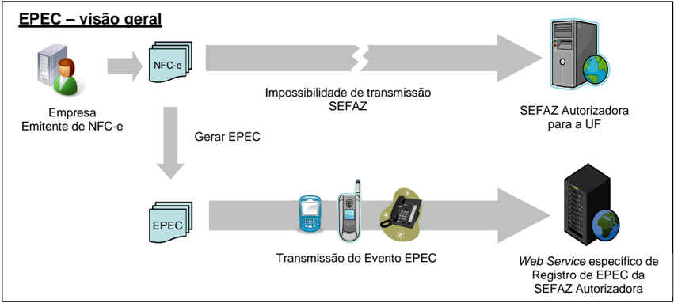
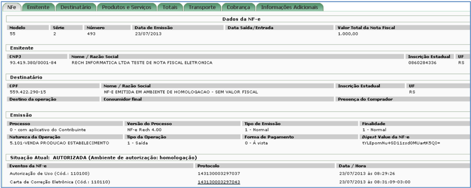

## Metadados
- [Metadados do corpus](metadata.json)
- [Fonte e procedência](../../../../sources/portal_nacional_nfe/nfce/notas-tecnicas/nt2014-003-v1-02/source.json)
- [Dados normalizados](../../../../normalized/nfce/notas-tecnicas/nt2014-003-v1-02/normalized.json)
- [Changelog](../../../../changelog/nfce/notas-tecnicas/nt2014-003-v1-02.md)
- [Proveniência resumida](../../../../sources/provenance/nt2014-003-v1-02.json)

## Projeto Nota Fiscal Eletrônica

## Nota Técnica 2014/003

## Evento da Nota Fiscal Eletrônica

## Evento Prévio de

Emissão em Contingência (EPEC) da NFC-e

Versão 1.02 Janeiro de 2015

## Histórico de Alterações

## A.  Alterações Efetuadas na Versão 1.01

- No  caso  do  destinatário  ser  informado  (tag  dest), um  dos  campos  CPF,  CNPJ  ou idEstrangeiro  deve  ser  obrigatoriamente  preenchido.  O  CNPJ  e  o  idEstrangeiro  estavam anteriormente como opcionais.
- Corrigida a mensagem de rejeição 618 para referenc iar o modelo de documento fiscal 65.

## B.  Alterações Efetuadas na Versão 1.02

Incluída  validação  do  ANO-MÊS  de  Emissão  do  EPEC  co mparando  com  o  ANO-MÊS  da Chave de Acesso (Validação: P23-30).

## 01. Resumo

Esta Nota Técnica apresenta a especificação técnica  necessária para a implementação do registro de evento prévio de emissão em contingência de NFC- e. O evento é:

- Evento Prévio de Emissão em Contingência (tpEvento =110140, 'EPEC')

A Nota Técnica especifica também outras mudança s e controles, conforme segue:

- Controle do Ambiente de Contingência do EPEC (item  04);
- Serviços de Autorização de Uso (item 05);
- Sincronismo dos Ambientes de Autorização: Exceções  (item 06);
- Consulta Pública da NFC-e (item 07).

A decisão de implementação desta Nota Técnica e prazo para entrada em vigência ficam a critério de cada unidade federada.

## 02. Sobre a Emissão em Contingência

A obtenção da autorização de uso da NFC-e é um processo que envolve diversos recursos de infraestrutura, hardware e software. O mau funcionamento ou a indisponibilidade de qualquer um destes recursos pode prejudicar o processo de autorização da NFC-e, com reflexos nos negócios do emissor da NFC-e, que fica impossibilitado de obter a prévia autorização de uso da NFC-e exigida na legislação para a impressão do DANFE, ne cessário para acompanhar a circulação da mercadoria.

A  alta  disponibilidade  é  uma  das  premissas  básicas do  sistema  da  NFC-e  e  os  sistemas  de recepção  de  NFC-e  das  UF  foram  construídos  para  funcionar  em  regime  de  24x7;  contudo, existem diversos outros componentes do sistema que podem apresentar falhas e comprometer a disponibilidade dos serviços, exigindo alternativas de emissão da NFC-e em contingência.

O EPEC permite à empresa solicitar o registro do "Evento Prévio de Emissão em Contingência" anterior à emissão do documento em si com um leiaut e mínimo de informações. O EPEC deve ser enviado  para  a  um  ambiente  de  contingência  da  SEFAZ   diverso  do  ambiente  normal  de autorização utilizando-se do Web Service de registro de eventos.

Os principais benefícios deste tipo de contingência são:

- Reduzir custo da emissão em Formulário de Seguranç a (FS-DA);
- Geração  de  arquivo  pequeno,  com  melhores  condições de  transmissão,  em  função  de possível  problema  de  largura  de  banda  e  outras  rest rições  na  transmissão  (uso  de  linha discada, rede celular, etc.);
- Prover uma rota alternativa em caso de falha da infraestrutura de internet para acesso ao ambiente normal da SEFAZ Autorizadora;
- Garante o registro digital em sistema acessível pe lo fisco do evento gerador de ICMS no momento em que ocorre.

## 03. Emissão do EPEC

## 03.1 Visão Geral

Esta modalidade de contingência é baseada no concei to de "Declaração Prévia" do evento EPEC, que contem as principais informações sobre a NFC-e  emitida em contingência.

A  emissão  do  EPEC  poderá  ser  adotada  por  qualquer  e missor  que  esteja  impossibilitado  de transmissão  e/ou  recepção  das  autorizações  de  uso  d e  suas  NFC-e,  adotando  os  seguintes passos:

- Gerar a NFC-e com 'tpEmis = 4', mantendo também a  informação do motivo de entrada em contingência com data e hora do início da contingên cia, com número diferente de qualquer NFC-e que tenha sido transmitida com outro 'tpEmis';
- Gerar o arquivo XML do EPEC com as seguintes informações da NFC-e:
- o UF, CNPJ e Inscrição Estadual do emitente;
- o Chave de Acesso;
- o UF e CNPJ ou CPF do destinatário se Valor Total da  nota acima de R$10.000,00;
- o Valor Total da NFC-e, Valor Total do ICMS;
- o Outras informações constantes no leiaute;
- Assinar o arquivo com o certificado digital do emitente;
- Impressão  do  DANFE  da  NFC-e  que  consta  do  EPEC,  em   papel  comum,  constando  no corpo a expressão 'DANFE impresso em contingência -  DPEC regularmente recebida pela SEFAZ autorizadora'.
- Enviar o arquivo XML do EPEC para o Web Service de registro de eventos do ambiente  de contingência da SEFAZ autorizadora;
- Adotar as seguintes providências, após a cessação  dos problemas técnicos que impediam a transmissão da NFC-e para o ambiente normal da SEFA Z autorizadora:
- o Transmitir  as  NFC-e  emitidas  em  Contingência  Eletr ônica  para  o  ambiente  normal  da SEFAZ,  observando  o  prazo  limite  de  transmissão  na legislação,  bem  como  outros procedimentos constantes na legislação caso ocorra  rejeição na autorização de uso;
- o A Chave de Acesso desta NFC-e é a mesma Chave de A cesso do EPEC autorizado.

## 03.1a Informações complementares

## A. Endereço do Web Service

O endereço do Web Service de Registro de Evento deve ser informado pela UF autorizadora que disponibilizar a contingência do evento EPEC pa ra a NFC-e.

## B. Assinatura Digital do EPEC

A assinatura é efetuada para cada evento de EPEC.

## C. Entrada em Contingência

A  decisão  da  empresa  de  começar  a  usar  a  contingênc ia  do  EPEC  é  tomada  quando  a empresa não recebe a resposta de uma determinada NF C-e com pedido de autorização de uso, ou quando não consegue determinar se o pedido  foi ou não corretamente enviado.

O  MOC,  Manual  de  Orientação  do  Contribuinte,  descre ve  o  tratamento  necessário  para  as NFC-e pendentes de retorno (item 8.3.3 do MOC).

## D. Impressão do DANFE

Deverá ser impresso no DANFE o número do Protocolo de Autorização do Evento de EPEC, além do motivo e a hora da entrada em contingência.

O DANFE deverá ser impresso em duas vias que terão  a seguinte destinação:

- o Uma via deverá ser entregue ao consumidor;
- o A outra via deverá ser mantida pelo emitente.

O  Emitente  deverá  manter  sua  via  em  arquivo  durante o  prazo  estabelecido  na  legislação tributária para a guarda de documentos fiscais.

## E. Lote de EPEC

É possível registrar lote de até 20 EPEC diferentes  em uma mesma conexão, sendo um EPEC para cada NFC-e.

## 03.2 Leiaute Mensagem de Entrada

O Web Service de registro de evento possui uma interface genéric a conhecida, complementada por uma área específica para cada tipo de evento. S egue abaixo a especificação da mensagem de entrada deste Web Service .

## Schema XML: eventoEPEC\_v9.99.xsd

| #   | Campo         | Ele   | Pai     | Tipo   | Ocor.   | Tam.   | Descrição/Observação                                                                                              |
|-----|---------------|-------|---------|--------|---------|--------|-------------------------------------------------------------------------------------------------------------------|
| P01 | envEvento     | Raiz  | -       | -      | -       | -      | TAG raiz                                                                                                          |
| P02 | versao        | A     | P01     | N      | 1-1     | 2v2    | Versão do leiaute                                                                                                 |
| P03 | idLote        | E     | P01     | N      | 1-1     | 1-15   | Identificador de controle do Lote de envio do Evento. Número sequencial único para identificação do Lote.         |
| P04 | evento        | G     | P01     | xml    | 1-20    | -      | Evento, um lote pode conter até 20 eventos                                                                        |
| P05 | versao        | A     | P04     | N      | 1-1     | 2v2    | Versão do leiaute do evento                                                                                       |
| P06 | infEvento     | G     | P04     |        | 1-1     |        | Grupo de informações do registro do Evento                                                                        |
| P07 | Id            | ID    | P06     | C      | 1-1     | 54     | Identificador da TAG a ser assinada, a regra de formação do Id é: 'ID' + tpEvento + Chave da NFC-e + nSeqEvento   |
| P08 | cOrgao        | E     | P06     | N      | 1-1     | 2      | Código do órgão de recepção d o Evento.                                                                           |
| P09 | tpAmb         | E     | P06     | N      | 1-1     | 1      | Identificação do Ambiente: 1=Prod ução /2=Homologação                                                             |
| P10 | CNPJ          | CE    | P06     | N      | 1-1     | 14     | Informar o CNPJ / CPF do autor do Evento.                                                                         |
| P11 | CPF           | CE    | P06     | N      | 1-1     | 11     |                                                                                                                   |
| P12 | chNFe         | E     | P06     | N      | 1-1     | 44     | Para o evento de EPEC, a posição 35 da Chave de Acesso deve ser 4 (tpEmis=4).                                     |
| P13 | dhEvento      | E     | P06     | D      | 1-1     |        | Data e hora do evento no formato AAAA-MM-DDThh:mm:ssTZD (UTC - Universal Coordinated Time).                       |
| P14 | tpEvento      | E     | P06     | N      | 1-1     | 6      | Código do evento: 110140 -EPEC                                                                                    |
| P15 | nSeqEvento    | E     | P06     | N      | 1-1     | 1-2    | Informar o valor '1' para o evento do EPEC.                                                                       |
| P16 | verEvento     | E     | P06     | N      | 1-1     | 2v2    | Versão do detalhe do evento (grupo detEvento - P17), informação usada pela SEFAZ para validar o grupo detEvento . |
| P17 | detEvento     | G     | P06     |        | 1-1     |        | Informações de detalhes do evento                                                                                 |
| P18 | versao        | A     | P17     | N      | 1-1     | 2v2    | Informar o mesmo valor da tag verEvento (P16).                                                                    |
| P19 | descEvento    | E     | P17     | C      | 1-1     | 5-60   | 'EPEC'                                                                                                            |
| P20 | cOrgaoAutor   | E     | P17     | N      | 1-1     | 2      | Código do Órgão do Autor d o Evento. Nota: Informar o código da UF do Emitente para este evento.                  |
| P21 | tpAutor       | E     | P17     | N      | 1-1     | 1      | Informar "1=Empresa Emitente" para este evento.                                                                   |
| P22 | verAplic      | E     | P17     | C      | 1-1     | 1-20   | Versão do aplicativo do Autor do Evento.                                                                          |
| P23 | dhEmi         | E     | P17     | D      | 1-1     |        | Data e hora no formato UTC (Universal Coordinated Time): "AAAA-MM-DDThh:mm:ss TZD".                               |
| P24 | tpNF          | E     | P17     | N      | 1-1     | 1      | Informar 1=Saída.                                                                                                 |
| P25 | IE            | E     | P17     | N      | 1-1     | 2-14   | IE do Emitente                                                                                                    |
| P26 | dest          | G     | P17 P26 | C      | 0-1     |        |                                                                                                                   |
| P27 | UF            | E     |         |        | 1-1     | 2      | Sigla da UF do destinatário. Informar 'EX' no caso de operação com o exterior.                                    |
| P28 | CNPJ          | CE    | P26     | N      | 1-1     | 14     | Informar o CPF ou o CNPJ do destinatário, preenchendo os                                                          |
| P29 | CPF           | CE    | P26     | N      | 1-1     | 11     | zeros não significativos. No caso de operação com e xterior, ou                                                   |
| P30 | idEstrangeiro | CE    | P26     | C      | 1-1     | 5-20   | para comprador estrangeiro, informar a tag 'idEstrangeiro', com o número do passaporte, ou outro documento legal. |
| P31 | vNF           | E     | P17     | N      | 1-1     | 13v2   | Valor total da NFC-e                                                                                              |
| P32 | vICMS         | E     | P17     | N      | 1-1     | 13v2   | Valor total do ICMS                                                                                               |
| P91 | Signature     | G     | P04     | XML    | 1-1     |        | Assinatura Digital do documento XML, a assinatura deverá ser aplicada no elemento infEvento                       |

## 03.3 Leiaute Mensagem de Retorno

O Web Service de Registro de Eventos possui uma interface genéri ca conhecida, complementada por uma área específica para cada tipo de evento. S egue abaixo a especificação da mensagem de retorno (resposta) para este Web Service .

## Schema XML: retEventoEPEC\_v9.99.xsd

| #   | Campo        | Ele   | Pai   | Tipo   | Ocor.   | Tam.   | Descrição/Observação                                                                                                                                                                                                                   |
|-----|--------------|-------|-------|--------|---------|--------|----------------------------------------------------------------------------------------------------------------------------------------------------------------------------------------------------------------------------------------|
| R01 | retEnvEvento | Raiz  | -     | -      | -       | -      | TAG raiz da mensagem de retorno                                                                                                                                                                                                        |
| R02 | versao       | A     | R01   | N      | 1-1     | 2v2    | Versão do leiaute                                                                                                                                                                                                                      |
| R03 | idLote       | E     | R01   | N      | 1-1     | 1-15   | Identificador de controle do Lote de envio do Evento, conforme informado na mensagem de entrada.                                                                                                                                       |
| R04 | tpAmb        | E     | R01   | N      | 1-1     | 1      | Identificação do Ambiente: 1=Produção /2=Homologação                                                                                                                                                                                   |
| R05 | verAplic     | E     | R01   | C      | 1-1     | 1-20   | Versão da aplicação que processou o evento.                                                                                                                                                                                            |
| R06 | cOrgao       | E     | R01   | N      | 1-1     | 2      | Código da UF que registrou o Evento.                                                                                                                                                                                                   |
| R07 | cStat        | E     | R01   | N      | 1-1     | 3      | Código do status da resposta                                                                                                                                                                                                           |
| R08 | xMotivo      | E     | R01   | C      | 1-1     | 1-255  | Descrição do status da resposta                                                                                                                                                                                                        |
| R09 | retEvento    | G     | R01   | -      | 0-20    | -      | TAG de grupo do resultado do processamento do Evento                                                                                                                                                                                   |
| R10 | versao       | A     | R09   | N      | 1-1     | 2v2    | Versão do leiaute                                                                                                                                                                                                                      |
| R11 | infEvento    | G     | R09   |        | 1-1     |        | Grupo de informações do registro do Evento                                                                                                                                                                                             |
| R12 | Id           | ID    | R11   | C      | 0-1     | 17     | Identificador da TAG a ser assinada, somente deve ser informado se o órgão de registro assinar a resposta . Em caso de assinatura da resposta pelo órgão de regi stro, preencher com o número do protocolo, precedido pelaliteral 'ID' |
| R13 | tpAmb        | E     | R11   | N      | 1-1     | 1      | Identificação do Ambiente: 1=Produção /2=Homologação                                                                                                                                                                                   |
| R14 | verAplic     | E     | R11   | C      | 1-1     | 1-20   | Versão da aplicação que registrou o Evento, utilizar literal que permita a identificação do órgão, como a sigla da U F ou do órgão.                                                                                                    |
| R15 | cOrgao       | E     | R11   | N      | 1-1     | 2      | Código da UF que registrou o Evento.                                                                                                                                                                                                   |
| R16 | cStat        | E     | R11   | N      | 1-1     | 3      | Código do status da resposta.                                                                                                                                                                                                          |
| R17 | xMotivo      | E     | R11   | C      | 1-1     | 1-255  | Descrição do status da resposta.                                                                                                                                                                                                       |
| R18 | chNFe        | E     | R11   | N      | 0-1     | 44     | Chave de Acesso da NFC-e vinculada ao evento.                                                                                                                                                                                          |
| R19 | tpEvento     | E     | R11   | N      | 0-1     | 6      | 110140 - EPEC                                                                                                                                                                                                                          |
| R20 | xEvento      | E     | R11   | C      | 0-1     | 5-60   | 'EPEC autorizado'                                                                                                                                                                                                                      |
| R21 | nSeqEvento   | E     | R11   | N      | 0-1     | 1-2    | Sequencial do evento, conforme a mensagem de entrada.                                                                                                                                                                                  |
| R22 | cOrgaoAutor  | E     | R11   | N      | 0-1     | 2      | Idem a mensagem de entrada.                                                                                                                                                                                                            |
| R23 | dhRegEvento  | E     | R11   | D      | 1-1     |        | Data e hora de registro do evento no formato AAAA-MM- DDTHH:MM:SSTZD (formato UTC, onde TZD é +HH:MM ou - HH:MM). Se o evento for rejeitado informar a data e hora de recebimento do evento.                                           |
| R24 | nProt        | E     | R11   | N      | 0-1     | 15     | Número do Protocolo do Evento 1 posição (5=Sefaz Estadual Ambiente Contingência ), 2 posições para o código da UF, 2 posições para o ano e 10 pos ições para o sequencial no ano.                                                      |
| R25 | chNFePend    | E     | R11   | N      | 0-50    | 44     | Relação de Chaves de Ac esso de EPEC pendentes de conciliação.                                                                                                                                                                         |
| R91 | Signature    | G     | R09   | XML    | 0-1     |        | Assinatura Digital do documento XML, a assinatura deverá ser aplicada no elemento infEvento. A decisão de assinar a mensagem fica a critério da UF.                                                                                    |

Nota 1: No caso de evento registrado com sucesso, os campos opcionais serão retornados.

Nota  2:  A  relação  de  Chaves  de  Acesso  pendentes  de conciliação  (tag:chNFePend)  será disponibilizada sempre que o ambiente de autorizaçã o do EPEC estiver bloqueado para o CNPJ do emitente (Rejeição '142-Ambiente de Contingência EP EC bloqueado para o Emitente').

## 03.4 Descrição do Processo de Recepção de Evento

O processo de Registro de Eventos recebe eventos em uma estrutura de lotes, que pode conter de 1 a 20 eventos. Normalmente este evento será fei to de forma on-line para cada necessidade de autorização de EPEC (lote com somente 1 ocorrênc ia).

## 03.5 Validação do Certificado de Transmissão

Regras de validação idênticas aos demais Web Servic es, podendo gerar os erros:

- 280: "Rejeição: Certificado Transmissor inválido"
- 283: "Rejeição: Certificado Transmissor - erro Cad eia de Certificação"
- 281: "Rejeição: Certificado Transmissor Data Valid ade"
- 286: "Rejeição: Certificado Transmissor erro no ac esso a LCR"
- 285: "Rejeição: Certificado Transmissor difere ICP -Brasil"
- 284: "Rejeição: Certificado Transmissor revogado"
- 282: "Rejeição: Certificado Transmissor sem CNPJ"

## 03.6 Validação Inicial da Mensagem no Web Service

Regras de validação idênticas aos demais Web Servic es, podendo gerar os erros:

- 108: "Serviço Paralisado Momentaneamente (curto prazo)"
- 214: "Rejeição: Tamanho da mensagem excedeu o limi te estabelecido"
- 109: "Serviço Paralisado sem Previsão"

## 03.7 Validação das informações de controle da chama da ao Web Service

Regras de validação idênticas aos demais Web Servic es, podendo gerar os erros:

- 242: "Rejeição: Elemento nfeCabecMsg inexistente n o SOAP Header"
- 410: "Rejeição: UF informada no campo cUF não é atendida pelo WebService"
- 409: "Rejeição: Campo cUF inexistente no elemento  nfeCabecMsg do SOAP Header"
- 411: 'Rejeição: Campo versaoDados inexistente no e lemento nfeCabecMsg do SOAP Header'
- 239: 'Rejeição: Cabeçalho - Versão do arquivo XML  não suportada'
- 238: 'Rejeição: Cabeçalho - Versão do arquivo XML  superior a Versão vigente'

## 03.8 Validação da Área de Dados

## a) Validação de forma da área de dados

Regras de validação idênticas aos demais Web Servic es, podendo gerar os erros:

- 517: "Rejeição: Falha Schema XML, inexiste atribut o versão na tag raiz da mensagem"
- 516: "Rejeição: Falha Schema XML, inexiste a tag r aiz esperada para a mensagem"
- 545:  "Rejeição:  Falha  no  schema  XML  -  versão  infor mada  na  versaoDados  do  SOAP Header diverge da versão da mensagem'
- 587: "Rejeição: Usar somente o namespace padrão da  NF-e"
- 215: "Rejeição: Falha Schema XML"
- 588: "Rejeição: Não é permitida a presença de caracteres de edição no início/fim da mensagem ou entre as tags da mensagem"
- 404: "Rejeição: Uso de prefixo de namespace não pe rmitido"
- 402: "Rejeição: XML da área de dados com codificaç ão diferente de UTF-8"

## b) Extração dos eventos do lote e validação do Sche ma XML do evento

Regras de validação idênticas aos demais Eventos, p odendo gerar os erros:

- 492: 'Rejeição: O verEvento informado invalido'
- 491: "Rejeição: O tpEvento informado invalido"
- 493: 'Rejeição: Evento não atende o Schema XML esp ecífico'

## c) Validação do Certificado Digital de Assinatura

Regras de validação idênticas aos demais Web Servic es, podendo gerar os erros:

- 291: 'Rejeição: Certificado Assinatura Data Valida de'
- 290: "Rejeição: Certificado Assinatura inválido"
- 292: 'Rejeição: Certificado Assinatura sem CNPJ'
- 296: 'Rejeição: Certificado Assinatura erro no ace sso a LCR'
- 293: 'Rejeição: Certificado Assinatura - erro Cade ia de Certificação'
- 294: 'Rejeição: Certificado Assinatura revogado'
- 295: 'Rejeição: Certificado Assinatura difere ICP- Brasil'

## d) Validação da Assinatura Digital

Regras de validação idênticas aos demais Web Servic es, podendo gerar os erros:

- 297: 'Rejeição: Assinatura difere do calculado'
- 298: 'Rejeição: Assinatura difere do padrão do Pro jeto'
- 213: 'Rejeição: CNPJ-Base do Autor difere do CNPJ- Base do Certificado Digital'

## 03.9 Validação das regras de negócio do evento EPEC

| #                                                             | Regra de Validação                                                                                                 | Aplic.                                                        | Msg                                                           | Efeito                                                        |
|---------------------------------------------------------------|--------------------------------------------------------------------------------------------------------------------|---------------------------------------------------------------|---------------------------------------------------------------|---------------------------------------------------------------|
| P07-10                                                        | Validar se atributo Id corresponde à concatenação dos campos do evento ('ID' + tpEvento + chNFe + nSeqEvento) (*1) | Obrig.                                                        | 572                                                           | Rej.                                                          |
| P08-10                                                        | Código do órgão de recepção do Evento diverg e do solicitado. (*1)                                                 | Obrig.                                                        | 250                                                           | Rej.                                                          |
| P09-10                                                        | Tipo do ambiente difere do ambiente do Web Service (*1)                                                            | Obrig.                                                        | 252                                                           | Rej.                                                          |
| P10-10                                                        | Se informado CNPJ do Autor do evento: - CNPJ inválido (DV, zeros ou não informado) (*1 )                           | Obrig.                                                        | 489                                                           | Rej.                                                          |
| P11-10                                                        | Se informado CPF do Autor do evento: - CPF do autor do evento informado inválido (DVou zeros) (*1)                 | Obrig.                                                        | 490                                                           | Rej.                                                          |
| P11-20                                                        | - Evento não disponível para Autor pessoa física (CPF)                                                             | Obrig.                                                        | 408                                                           | Rej.                                                          |
| P12-10                                                        | Validação da Chave de Acesso: - Dígito verificador inválido (*1)                                                   | Obrig.                                                        | 236                                                           | Rej.                                                          |
| P12-14                                                        | - Código UF inválido (*1)                                                                                          | Obrig.                                                        | 614                                                           | Rej.                                                          |
| P12-18                                                        | - Ano < 06 ou Ano maior que Ano corrente (*1)                                                                      | Obrig.                                                        | 615                                                           | Rej.                                                          |
| P12-22                                                        | - Mês = 0 ou Mês > 12 (*1)                                                                                         | Obrig.                                                        | 616                                                           | Rej .                                                         |
| P12-26                                                        | - CNPJ zerado ou dígito inválido (*1)                                                                              | Obr ig.                                                       | 617                                                           | Rej.                                                          |
| P12-30                                                        | - Modelo diferente de 65 (*1)                                                                                      | Obrig.                                                        | 618                                                           | Rej.                                                          |
| P12-34                                                        | - Número NF = 0 (*1)                                                                                               | Obrig.                                                        | 619                                                           | Rej.                                                          |
| P12-50                                                        | - Tipo de Emissão difere de '4' (posição 35 da Chave de Acesso)                                                    | Obrig                                                         | 484                                                           | Rej.                                                          |
| P12-60                                                        | - Verificar se CNPJ difere do CNPJ da Chave de Acesso (*1, Evento do Emitente)                                     | Obrig.                                                        | 574                                                           | Rej.                                                          |
| P13-10                                                        | Data do evento não pode ser maior que a data de processamento (aceitar uma tolerância de até 5 minutos) (*1)       | Obrig.                                                        | 578                                                           | Rej.                                                          |
| P14-10                                                        | Verificar se sequencial do evento (nSeqEvento) difere de                                                           | Obrig.                                                        | 594                                                           | Rej.                                                          |
| P20-10                                                        | 1 Verificar se o órgão do Autor (cOrgaoAutor) difere da UF da Chave de Acesso (Evento do Emitente)                 | Obrig.                                                        | 455                                                           | Rej.                                                          |
| P21-10                                                        | Verificar se Tipo do Autor difere de "1=Empresa Emitente"                                                          | Obrig.                                                        | 466                                                           | Rej.                                                          |
| P23-10                                                        | Data de Emissão ocorrida a mais de 1 dia                                                                           | Obr ig.                                                       | 228                                                           | Rej.                                                          |
| P23-20                                                        | Data de Emissão maior do que a data do event o (dhEvento)                                                          | Obrig.                                                        | 577                                                           | Rej.                                                          |
| P23-30                                                        | Ano-Mês da Data de Emissão (dhEmi) diverge d o Ano-Mês da Chave de Acesso                                          | Obrig.                                                        | 659                                                           | Rej.                                                          |
| P25-10                                                        | Validação da IE do Emitente: - IE Emitente com zeros ou nulo                                                       | Obrig.                                                        | 229                                                           | Rej.                                                          |
| P25-20                                                        | - IE inválida para a UF: erro no tamanho,composição ou dígito verificador                                          | Obrig.                                                        | 209                                                           | Rej.                                                          |
| P26-10                                                        | NFC-e sem a identificação do destinatário qu ando ValorTotal > R$10.000,00 (tag:infNFe/dest) (*2)                  | Obrig.                                                        | 719                                                           | Rej.                                                          |
| P28-10                                                        | Se informado CNPJ do destinatário: -CNPJ com zeros ou dígito de controle inválido                                  | Obrig.                                                        | 208                                                           | Rej.                                                          |
| P29-10                                                        | Se informado CPF do Destinatário: -CPF com zeros, 111..., 222..., ..., 999..., ou dígito de controle inválido      | Obrig.                                                        | 237                                                           | Rej.                                                          |
| P31-10                                                        | Valor da NFC-e superior ao valor limite estabelecido (*2)                                                          | Obrig.                                                        | 628                                                           | Rej.                                                          |
| P32-10                                                        | Valor do ICMS superior ao valor limite (*2)                                                                        | Obrig.                                                        | 417                                                           | Rej.                                                          |
| *** de Dados: Emitente / Cadastro de Emitente                 | *** de Dados: Emitente / Cadastro de Emitente                                                                      | *** de Dados: Emitente / Cadastro de Emitente                 | *** de Dados: Emitente / Cadastro de Emitente                 | *** de Dados: Emitente / Cadastro de Emitente                 |
| Banco 1P25-10                                                 | Acessar Cadastro de Emitentes (Chave: UF, IE):                                                                     |                                                               |                                                               |                                                               |
|                                                               | - IE emitente não cadastrada                                                                                       | Obrig.                                                        | 230                                                           | Rej.                                                          |
| 1P25-20                                                       | - IE Emitente não vinculada ao CNPJ                                                                                | Obrig.                                                        | 231                                                           | Rej.                                                          |
| 1P25-30                                                       | - Emitente não habilitado para emissão de NFC-e                                                                    | Obrig.                                                        | 203                                                           | Rej.                                                          |
| 1P25-40                                                       | - Emitente em situação irregular perante o Fisco                                                                   | Obrig.                                                        | 301                                                           | Rej.                                                          |
| 2P10-10 Acessar BD Ambiente de Contingência EPEC (Chave: UF , | 2P10-10 Acessar BD Ambiente de Contingência EPEC (Chave: UF ,                                                      | 2P10-10 Acessar BD Ambiente de Contingência EPEC (Chave: UF , | 2P10-10 Acessar BD Ambiente de Contingência EPEC (Chave: UF , | 2P10-10 Acessar BD Ambiente de Contingência EPEC (Chave: UF , |

## Nota Fiscal eletrônica

| #                                      | Regra de Validação                                                                                                                                               | Aplic.                                 | Msg                                    | Efeito                                 |
|----------------------------------------|------------------------------------------------------------------------------------------------------------------------------------------------------------------|----------------------------------------|----------------------------------------|----------------------------------------|
|                                        | CNPJ Emitente): - Verificar se Ambiente EPEC está bloqueado para o Emitente (*3)                                                                                 | Obrig.                                 | 142                                    | Rej.                                   |
| *** Banco de Dados: Numeração da NFC-e | *** Banco de Dados: Numeração da NFC-e                                                                                                                           | *** Banco de Dados: Numeração da NFC-e | *** Banco de Dados: Numeração da NFC-e | *** Banco de Dados: Numeração da NFC-e |
| 3P12-10                                | Acesso ao BD de Eventos (Chave: Modelo=65, tpEvento=110140, UF, CNPJ Emitente, Série, Número d a NFC-e) - Verificar se já existe EPEC para a numeração d a NFC-e | Obrig.                                 | 485                                    | Rej.                                   |
| 4P12-10                                | Acesso ao BD NFC-e (Chave: Modelo=65, UF Emitente, CNPJ Emitente, Série e Nro da NFC-e): - NFC-e já existente para o número do EPEC infor mado                   | Obrig.                                 | 661                                    | Rej.                                   |
| 5P12.10                                | Acesso ao BD de Inutilização (Chave: Modelo=65, UF Emitente, CNPJ Emitente, Série e Nro): - Numeração do EPEC está inutilizada na Base deDados da SEFAZ          | Obrig.                                 | 662                                    | Rej.                                   |

## Nota:

- (*1) Validações genéricas do Registro de Evento;
- (*2) Valor parametrizável, ficando a critério da UF .
- (*3) No caso do ambiente de contingência EPEC bloqu eado para o emitente, serão retornadas as Chaves de Acesso de até 50 EPEC pendentes de concil iação (tag:chNFePend);

## 03.10 Final do Processamento do Lote

O processamento do lote pode resultar em:

- Processamento do Lote - o lote foi processado (cStat=128), a validação de  cada evento do lote poderá resultar em:
- Rejeição do Lote - por algum problema que comprometa o processamento do lote;
- o Rejeição : o Evento será rejeitado, retornando o código do s tatus e o motivo da rejeição;
- o Evento  autorizado  sem  vinculação  do  evento  à  respec tiva  NFC-e, devido à inexistência  da  NFC-e  no  momento  do  recebimento  do Evento  (cStat='136-Evento registrado, mas não vinculado a NFC-e');

Nota: No caso do evento de EPEC, não existe a possi bilidade do retorno "135- Evento registrado e vinculado a NFC-e" porque este evento somente é a utorizado se não existir uma NFC-e para a mesma Nota Fiscal (mesma UF, CNPJ emitente, Série  e Número).

## 04. Controle do Ambiente de Contingência do EPEC

As notas fiscais emitidas em contingência, com a au torização do "Evento Prévio de Emissão em Contingência (EPEC)", devem ser transmitidas imedia tamente após a cessação dos problemas técnicos que impediam a transmissão da NFC-e, observado o prazo limite definido na legislação.

Neste modelo de contingência serão estabelecidos co ntroles para identificar a existência de EPEC sem o envio da NFC-e correspondente. Passado o prazo previsto na legislação para o envio da NFC-e, será bloqueada a autorização de novos EPEC p ara o Contribuinte Emitente, sem prejuízo das  demais  ações  relacionadas  com  a  ausência  da  NFC -e  para  os  EPEC  pendentes  de conciliação.

Os próximos itens  descrevem de forma geral o controle  para  o  bloqueio  da  emissão  de  novos EPEC para um determinado Emitente.

## 04.1 Controle de EPEC Pendente de Conciliação

Para cada EPEC autorizado, a SEFAZ deverá manter um a base de dados contendo, entre outros dados, as informações de:

- Chave de Acesso da NFC-e, com os campos:
- o Modelo do documento fiscal (65=NFC-e);
- o UF e CNPJ do Emitente;
- o Série e Número da NFC-e;
- Protocolo e Data-Hora da Autorização do EPEC;
- Valor do EPEC;
- Indicador de Conciliação: 0=Pendente; 1=EPEC Conci liado;
- Indicador para Liberar a necessidade de Conciliaçã o: 0=Não; 1=Liberada a necessidade de conciliação do EPEC.

Quando o Emitente enviar a NFC-e com a mesma Chave de Acesso de um EPEC pendente, o indicador de conciliação do EPEC deverá ser alterad o, eliminando a pendência de conciliação.

## 04.2 Controle de Bloqueio/Desbloqueio no Ambiente de Contingência do EPEC

## A. Bloqueio do Ambiente de Contingência do EPEC

Ao  menos  diariamente  a  SEFAZ  deverá  efetuar  uma  ava liação  dos  "EPEC  Pendente  de Conciliação"  bloqueando  a  emissão  de  novos  EPEC  par a  Contribuinte  Emitente  com  EPEC pendente além do prazo limite definido na legislação. A partir deste momento o contribuinte não conseguirá obter autorização de novos EPEC enquanto  não regularizar a situação dos "EPEC Pendentes de Conciliação".

## B. Desbloqueio do Ambiente de Contingência do EPEC

Deverá  também  ser  efetuado  o  desbloqueio  do  ambient e  de  contingência  EPEC  para  um Emitente bloqueado anteriormente, mas que não possu a mais "EPEC Pendente de Conciliação". O processo de avaliação de Contribuin tes Emitentes que deveriam ter emissão de EPEC desbloqueada deve ser realizado pela SEFAZ ao menos uma vez por dia.

## 04.3 Relação de EPEC Pendente de Conciliação

É  responsabilidade  da  empresa  obter  a  autorização  d e  uso  da  NFC-e  com  Chave  de  Acesso idêntica ao EPEC previamente autorizado.

A  critério  de  cada  UF,  poderá  ser  disponibilizada  n o  Portal  da  SEFAZ,  em  área  restrita,  uma Consulta de EPEC Pendente de Conciliação ,  onde  o  operador  informa o CNPJ do Emitente, obtendo as informações de:

- Relação  dos  EPEC  Pendente  de  Conciliação,  na  ordem   de  Data  de  Autorização  do EPEC, mostrando também as informações destes EPEC.
- UF, CNPJ consultado e Nome da Empresa;

## 05. Adaptação nos Serviços de Autorização de Uso

A  SEFAZ  Autorizadora  mantém  um  controle  sobre  a  num eração  das  NFC-e  já  autorizadas, evitando a duplicidade de autorização de uso para a  mesma Chave Natural (campos de: Modelo, UF, CNPJ do Emitente, Série e Número da NFC-e).

Os Serviços de Autorização de Uso existentes deverã o ser alterados, conforme segue.

## 05.1 Serviço de Autorização de NFC-e

Conforme citado  anteriormente,  o  Emitente  do  EPEC  deve  obter  a  Autorização  de  Uso  para  a NFC-e correspondente ao EPEC autorizado.

Como os dados do EPEC são obtidos a partir da NFC-e  que não conseguiu ser transmitida por problemas técnicos, quando for transmitida, esta NF C-e deverá possuir:

- mesma IE do Emitente;
- mesma Chave de Acesso do EPEC autorizado;
- mesma Data de Emissão;
- mesmos dados de valor total e valor do ICMS.
- mesmos dados do destinatário (se houver);

O serviço de autorização de uso da NFC-e deverá val idar estas informações. Portanto, deverão ser alteradas as regras de validação da NFC-e, conf orme segue:

| Regra de Validação                                                                                                                                                       | Erro                                                                        |
|--------------------------------------------------------------------------------------------------------------------------------------------------------------------------|-----------------------------------------------------------------------------|
| *** Acesso ao BD NFC-e (Chave: Modelo, CNPJ Emitente, Série e Número da NFC-e) - NFC-e já cadastrada com diferença na Chave de Ace sso (Regra de Validação já existente) | 539 - Rejeição: Duplicidade de NFC-e com diferença na Chave de Acesso [...] |
| - Se existe EPEC - Verificar divergência dos dados do EPEC e da NFC- e (*1)                                                                                              | 467 - Rejeição: Dados da NFC-e divergentes do EPEC                          |
| - Se não existe NFC-e para a mesma Chave de Acesso e Tipo Emissão = 4 - EPEC (*2): - Se não existe EPEC                                                                  | 468 - Rejeição: NFC-e com Tipo Emissão = 4, sem EPEC correspondente         |

(*2) Esta validação somente poderá começar a ser a  partir do momento da implantação da EPEC.

Caso  a  NFC-e  com  tipo  de  emissão  4  (EPEC)  seja  auto rizada  ou  denegada,  deverá  ser assinalado  o  EPEC  como  conciliado,  conforme  o  item  de  "Controle  de  EPEC  Pendente  de Conciliação" tratado anteriormente.

## 05.2 Serviço de Registro de Evento: Cancelamento de NFC-e

Não existe o cancelamento de um EPEC autorizado, po rtanto o pedido de cancelamento da NFCe somente é possível se existir a NFC-e.

No  caso  da  empresa  ter  autorizado  o  evento  de  EPEC,  mas  decidir  pelo  cancelamento  da operação, deverá proceder como segue:

- Obter a autorização de uso da NFC-e relacionada co m o EPEC autorizado;
- Cancelar a NFC-e recém autorizada.

## 05.3 Serviço de Inutilização de Numeração

A validação do pedido de inutilização deverá considerar a existência do EPEC, portanto o pedido de inutilização será rejeitado com a mensagem abaix o, caso exista um EPEC autorizado para a faixa de numeração:

- Mensagem: "241 - Rejeição: Um número da faixa já f oi utilizado".

## 05.4 Serviço de Consulta Situação da NFC-e ( Web Service : NfeConsulta2)

Caso a NFC-e referente ao evento EPEC já tenha sido  autorizada, a Consulta da Situação da NFC-e deverá retornar normalmente o protocolo de au torização de uso da NFC-e e os dados dos eventos, da mesma forma que acontece para qualquer NFC-e com evento.

Caso exista unicamente o EPEC, a Consulta da Situação da NFC-e deverá retornar os dados do evento EPEC, com a mensagem abaixo:

- "124 - EPEC Autorizado".

## 06. Sincronismo dos Ambientes de Autorização: Exceç ões

## 06.1 Sincronismo das Informações

O processo de compartilhamento das informações entr e os diferentes ambientes de autorização demora algum tempo para ser efetuado (poucos minutos) e durante este tempo podem ocorrer algumas situações de exceção, conforme segue:

## A. Autorização Simultânea: EPEC e NFC-e

Neste  caso  a  Empresa  emitente  autoriza  simultaneamente,  ou  com  um  pequeno  atraso,  os documentos de:

- NFC-e:  Autorizada  em  regime  normal  na  SEFAZ  Autorizadora,  com  a  mesma  Chave Natural do EPEC, mas com o Tipo de Emissão diferent e de 4-EPEC.
- EPEC: Autorizado em contingência na SEFAZ;

O documento de EPEC será compartilhado com o ambien te normal de autorização de NFC-e da SEFAZ, causando uma duplicidade de Chave Natural que deverá ser tratada.

Este  EPEC  deverá  ser  assinalado  com  o  indicador  de "Desconsiderar  Conciliação  =  1" (desconsiderar a necessidade de conciliação do EPEC ), não sendo origem para futuro bloqueio do ambiente de autorização do EPEC para o Emitente.

A ocorrência desta situação ficará registrada em ba nco de dados e eventualmente a SEFAZ deverá  contatar  a  empresa  para  que  reveja  seus  proc essos  internos,  evitando  ocorrências deste tipo.

## B. Autorização Simultânea: EPEC e Inutilização de N umeração

Neste  caso  a  Empresa  emitente  autoriza  simultaneamente,  ou  com  um  pequeno  atraso,  os documentos de:

- Pedido  de  Inutilização  de  Numeração:  Autorizado  na   SEFAZ,  com  a  mesma  Chave Natural do EPEC.
- EPEC: Autorizado em contingência na SEFAZ;

O documento de EPEC será compartilhado com o ambien te normal de autorização de NFC-e da SEFAZ, causando uma duplicidade de Chave Natural que deverá ser tratada.

Ocorrida  esta  situação,  a  Empresa  poderá  não  conseguir  autorizar  uma  NFC-e  com  uma Chave de Acesso idêntica à Chave de Acesso do EPEC,  resultando em um EPEC pendente de conciliação.  Decorrido o prazo, o ambiente de conti ngência EPEC será bloqueado para este emitente. A empresa deverá rever seus processos int ernos, evitando ocorrências deste tipo.

Para liberar o uso do Ambiente de Contingência EPEC , a empresa deverá contatar a SEFAZ, informando a Chave de Acesso do EPEC pendente de conciliação. Analisado o caso, a SEFAZ poderá  decidir  por  desconsiderar  a  necessidade  de  c onciliação  para  este  EPEC  específico, comandando esta liberação no Ambiente de Contingênc ia EPEC.

## 07. Consulta Pública da NFC-e

## 07.1. Evento EPEC com a Respectiva NFC-e

Caso  a  NFC-e  referente  ao  EPEC  já  tenha  sido  autori zada,  a  Consulta  Pública  da  NFC-e deverá ser visualizada normalmente, mostrando també m a existência do evento de EPEC.

## 07.2. Evento EPEC sem a Respectiva NFC-e

Caso exista unicamente o EPEC, a Consulta Pública d a NFC-e deverá mostrar os dados do EPEC somente em formato DANFE - NFC-e.

## 08. Tabela de códigos de erros e descrições de mens agens de erros

| Código   | RESULTADO DO PROCESSAMENTO DA SOLICITAÇÃO                                                                |
|----------|----------------------------------------------------------------------------------------------------------|
| 108      | Serviço Paralisado Momentaneamente (curto prazo)                                                         |
| 109      | Serviço Paralisado sem Previsão                                                                          |
| 124      | EPEC Autorizado                                                                                          |
| 128      | Lote de Evento Processado                                                                                |
| 135      | Evento registrado e vinculado a NFC-e                                                                    |
| 136      | Evento registrado, mas não vinculado a NFC-e                                                             |
| 142      | Ambiente de Contingência EPEC bloqueado para oEmitente                                                   |
| 203      | Rejeição: Emissor não habilitado para emissão d e NFC-e                                                  |
| 206      | Rejeição: NFC-e já está inutilizada na Base de Dados da SEFAZ                                            |
| 209      | Rejeição: IE do emitente inválida                                                                        |
| 212      | Rejeição: Data de emissão NFC-e posterior a dat a de recebimento                                         |
| 213      | Rejeição: CNPJ-Base do Autor difere do CNPJ-Base do Certificado Digital                                  |
| 214      | Rejeição: Tamanho da mensagem excedeu o limite estabelecido                                              |
| 215      | Rejeição: Falha Schema XML                                                                               |
| 228      | Rejeição: Data de Emissão muito atrasada                                                                 |
| 229      | Rejeição: IE do emitente não informada                                                                   |
| 230      | Rejeição: IE do emitente não cadastrada                                                                  |
| 231      | Rejeição: IE do emitente não vinculada ao CNPJ                                                           |
| 236      | Rejeição: Chave de Acesso com dígito verificador inválido                                                |
| 237      | Rejeição: CPF do destinatário inválido                                                                   |
| 238      | Rejeição: Cabeçalho - Versão do arquivo XML sup erior a Versão vigente                                   |
| 241      | Rejeição: Um número da faixa já foi utilizado                                                            |
| 242 250  | Rejeição: Elemento nfeCabecMsg inexistente no SOAP Header Rejeição: UF diverge da UF autorizadora        |
| 252      | Rejeição: Ambiente informado diverge do Ambient e de recebimento                                         |
| 280      | Rejeição: Certificado Transmissor inválido                                                               |
| 281      | Rejeição: Certificado Transmissor Data Validade                                                          |
| 282      | Rejeição: Certificado Transmissor sem CNPJ                                                               |
| 283      | Rejeição: Certificado Transmissor - erro Cadeia de Certificação                                          |
| 284      | Rejeição: Certificado Transmissor revogado                                                               |
| 285      | Rejeição: Certificado Transmissor difere ICP-Br asil o a LCR                                             |
| 286      | Rejeição: Certificado Transmissor erro no acess                                                          |
| 290      | Rejeição: Certificado Assinatura inválido                                                                |
| 291      | Rejeição: Certificado Assinatura Data Validade                                                           |
| 292      | Rejeição: Certificado Assinatura sem CNPJ                                                                |
| 293 294  | Rejeição: Certificado Assinatura - erro Cadeia de Certificação Rejeição: Certificado Assinatura revogado |
| 295      | Rejeição: Certificado Assinatura difere ICP-Bra sil                                                      |
| 296      | Rejeição: Certificado Assinatura erro no acesso a LCR                                                    |
| 297      | Rejeição: Assinatura difere do calculado                                                                 |
| 298      | Rejeição: Assinatura difere do padrão do Projet o                                                        |
| 301      | Rejeição: Irregularidade Cadastral do Emitente                                                           |
| 402      | Rejeição: XML da área de dados com codificação diferente de UTF-8                                        |
| 404      | Rejeição: Uso de prefixo de namespace não permi tido                                                     |
| 408      | Rejeição: Evento não disponível para Autor pessoa física                                                 |
| 409      | Rejeição: Campo cUF inexistente no elemento nfeCabecMsg do SOAP Header                                   |
| 410      | Rejeição: UF informada no campo cUF não é atendida pelo WebService                                       |
| 411      | Rejeição: Campo versaoDados inexistente no elem ento nfeCabecMsg do SOAP Header                          |
|          | Rejeição: Total do ICMS superior ao valor limit e estabelecido                                           |
| 417      | Rejeição: Órgão Autor do evento diferente da UF da Chave de Acesso                                       |
| 455 466  | Rejeição: Evento com Tipo de Autor incompatível                                                          |
| 467      | Rejeição: Dados da NFC-e divergentes do EPEC                                                             |
| 468      | Rejeição: NFC-e com Tipo Emissão = 4, sem EPEC                                                           |
| 484      | correspondente Rejeição: Chave de Acesso com tipo de emissão difer ente de 4 (posição 35 da Chave        |
| 485      | de Acesso) Rejeição: Duplicidade de numeração do EPEC (Modelo, CNPJ, Série e Número)                     |
|          | Rejeição: CNPJ informado inválido (DV ou zeros)                                                          |
| 489      |                                                                                                          |

## Nota Fiscal eletrônica

|   Código | RESULTADO DO PROCESSAMENTO DA SOLICITAÇÃO                                                                              |
|----------|------------------------------------------------------------------------------------------------------------------------|
|      490 | Rejeição: CPF informado inválido (DV ou zeros)                                                                         |
|      491 | Rejeição: O tpEvento informado inválido                                                                                |
|      492 | Rejeição: O verEvento informado inválido                                                                               |
|      493 | Rejeição: Evento não atende o Schema XML específico                                                                    |
|      516 | Rejeição: Falha Schema XML, inexiste a tag raiz esperada para a mensagem                                               |
|      517 | Rejeição: Falha Schema XML, inexiste atributo v ersão na tag raiz da mensagem                                          |
|      539 | Rejeição: Duplicidade de NFC-e com diferença na Chave de Acesso [...]                                                  |
|      545 | Rejeição: Falha no schema XML - versão informad a na versaoDados do SOAP Header diverge da versão da mensagem          |
|      572 | Rejeição: Erro Atributo ID do evento não corres ponde a concatenação dos campos ('ID' + tpEvento + chNFe + nSeqEvento) |
|      574 | Rejeição: O autor do evento diverge do emissor da NFC-e                                                                |
|      577 | Rejeição: A data do evento não pode ser menor q ue a data de emissão da NFC-e                                          |
|      578 | Rejeição: A data do evento não pode ser maior q ue a data do processamento                                             |
|      587 | Rejeição: Usar somente o namespace padrão da NFC-e                                                                     |
|      588 | Rejeição: Não é permitida a presença de caracteres de edição no início/fim da mensagem ou entre as tags da mensagem    |
|      594 | Rejeição: O número de sequencia do evento informadoé maior que o permitido                                             |
|      614 | Rejeição: Chave de Acesso inválida (Código UF invál ido)                                                               |
|      615 | Rejeição: Chave de Acesso inválida (Ano menor que 0 6 ou Ano maior que Ano corrente)                                   |
|      616 | Rejeição: Chave de Acesso inválida (Mês menor que 1 ou Mês maior que 12)                                               |
|      617 | Rejeição: Chave de Acesso inválida (CNPJ zerado oudígito inválido)                                                     |
|      618 | Rejeição: Chave de Acesso inválida (modelo diferent e de 65)                                                           |
|      619 | Rejeição: Chave de Acesso inválida (número NF = 0)                                                                     |
|      628 | Rejeição: Total da NF superior ao valor limite esta belecido pela SEFAZ [Limite]                                       |
|      659 | Rejeição: Ano-Mês da Data de Emissão diverge do Ano-Mês da Chave de Acesso                                             |
|      661 | Rejeição: NFC-e já existente para o número do EPEC informado                                                           |
|      662 | Rejeição: Numeração do EPEC está inutilizada na Base de Dados da SEFAZ                                                 |
|      719 | Rejeição: NFC-e com valor total superior ao permitido para destinatário não identificado [Limite]                      |

## OBS.:

1. Recomendado a não utilização de caracteres espec iais ou acentuação nos textos das mensagens de erro.
2. Recomendado que o campo xMotivo da mensagem de erro para o código 999 seja informado com a mensagem de erro do aplicativo ou do sistema que gerou a exceção não prevista.

## Documentos relacionados
_Nenhum documento relacionado conhecido._
