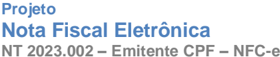
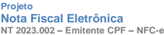
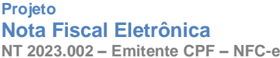

## Metadados
- [Metadados do corpus](metadata.json)
- [Fonte e procedência](../../../../sources/portal_nacional_nfe/nfce/notas-tecnicas/nt2023-002-v1-01-emitente-cpf-nfce/source.json)
- [Dados normalizados](../../../../normalized/nfce/notas-tecnicas/nt2023-002-v1-01-emitente-cpf-nfce/normalized.json)
- [Changelog](../../../../changelog/nfce/notas-tecnicas/nt2023-002-v1-01-emitente-cpf-nfce.md)
- [Proveniência resumida](../../../../sources/provenance/nt2023-002-v1-01-emitente-cpf-nfce.json)

## Projeto Nota Fiscal Eletrônica

Nota Técnica 2023.002

Emitente Pessoa Física (CPF) com Inscrição Estadual -NFC-e

Versão 1.01 - Novembro 2025

## Sumário

| Controle de Versões.............................................................................................................                                                                                                                                                                    | Controle de Versões.............................................................................................................                                                                                                                                                                    | Controle de Versões.............................................................................................................                                                                                                                                                                    |
|-----------------------------------------------------------------------------------------------------------------------------------------------------------------------------------------------------------------------------------------------------------------------------------------------------|-----------------------------------------------------------------------------------------------------------------------------------------------------------------------------------------------------------------------------------------------------------------------------------------------------|-----------------------------------------------------------------------------------------------------------------------------------------------------------------------------------------------------------------------------------------------------------------------------------------------------|
| Histórico de Alterações / Cronograma.................................................................................. 4                                                                                                                                                                            | Histórico de Alterações / Cronograma.................................................................................. 4                                                                                                                                                                            | Histórico de Alterações / Cronograma.................................................................................. 4                                                                                                                                                                            |
| 1.                                                                                                                                                                                                                                                                                                  | Resumo.......................................................................................................................... 5                                                                                                                                                                  | Resumo.......................................................................................................................... 5                                                                                                                                                                  |
| 2.                                                                                                                                                                                                                                                                                                  | Visão Geral .................................................................................................................... 6                                                                                                                                                                  | Visão Geral .................................................................................................................... 6                                                                                                                                                                  |
| 2.1                                                                                                                                                                                                                                                                                                 | 2.1                                                                                                                                                                                                                                                                                                 | Sobre a Chave de Acesso da NFC-e.....................................................................................6                                                                                                                                                                              |
| 2.2                                                                                                                                                                                                                                                                                                 | 2.2                                                                                                                                                                                                                                                                                                 | Alteração de Schema para evitar caracteres inválidos ..........................................................6                                                                                                                                                                                    |
| 2.3                                                                                                                                                                                                                                                                                                 | 2.3                                                                                                                                                                                                                                                                                                 | Alteração das Regras de Validação B26-30 e B26-50...........................................................6                                                                                                                                                                                       |
| 3.                                                                                                                                                                                                                                                                                                  | Grupo D: Validação da Área de Dados.......................................................................... 7                                                                                                                                                                                     | Grupo D: Validação da Área de Dados.......................................................................... 7                                                                                                                                                                                     |
| 3.1 DA. Autorização - Área de dados do lote de                                                                                                                                                                                                                                                      | 3.1 DA. Autorização - Área de dados do lote de                                                                                                                                                                                                                                                      | NF-e................................................................7                                                                                                                                                                                                                               |
| 4.                                                                                                                                                                                                                                                                                                  | Serviço: Autorização de Uso da Nota Fiscal (item 4.1 do MOC).................................... 7                                                                                                                                                                                                  | Serviço: Autorização de Uso da Nota Fiscal (item 4.1 do MOC).................................... 7                                                                                                                                                                                                  |
| 4.1 Leiaute                                                                                                                                                                                                                                                                                         | 4.1 Leiaute                                                                                                                                                                                                                                                                                         | da Nota Fiscal Eletrônica (Anexo I do MOC).............................................................7                                                                                                                                                                                            |
| 4.2                                                                                                                                                                                                                                                                                                 | 4.2                                                                                                                                                                                                                                                                                                 | Alteração em Regras de Validação - RV (Anexo II do MOC)................................................8                                                                                                                                                                                            |
| B. Identificação da Nota Fiscal ............................................................................................................... 8 C. Identificação do Emitente................................................................................................................... 8 | B. Identificação da Nota Fiscal ............................................................................................................... 8 C. Identificação do Emitente................................................................................................................... 8 | B. Identificação da Nota Fiscal ............................................................................................................... 8 C. Identificação do Emitente................................................................................................................... 8 |
| 5.                                                                                                                                                                                                                                                                                                  | Serviço: Evento de Cancelamento (Item 4.3 do MOC)................................................... 9                                                                                                                                                                                              | Serviço: Evento de Cancelamento (Item 4.3 do MOC)................................................... 9                                                                                                                                                                                              |
| 5.1 Alteração em Regras de Validação (Item 4.3.7-e e 4.3.8 do MOC) .......................................9                                                                                                                                                                                         | 5.1 Alteração em Regras de Validação (Item 4.3.7-e e 4.3.8 do MOC) .......................................9                                                                                                                                                                                         |                                                                                                                                                                                                                                                                                                     |
| 6.                                                                                                                                                                                                                                                                                                  | Fim da Denegação na NFC-e ...................................................................................... 10                                                                                                                                                                                 | Fim da Denegação na NFC-e ...................................................................................... 10                                                                                                                                                                                 |

## Controle de Versões

|   Versão | Publicação    | Descrição                                                                     |
|----------|---------------|-------------------------------------------------------------------------------|
|     1.00 | Maio/ 2023    | Publicação da NT para permitir a emissão de NFC-e por CPF para produtor rural |
|     1.01 | Novembro/2025 | Possibilitar emissão de NFC-e pela nota avulsa para a UF SC                   |

## Histórico de Alterações / Cronograma

|   Versão | Histórico de atualizações                                                    | Implantação Teste   | Implantação Produção   |
|----------|------------------------------------------------------------------------------|---------------------|------------------------|
|     1.00 | Emissão de NFC-e para Produtor Rural Pessoa Física e Eliminação da Denegação | 24/07/2023          | Até 04/09/2023         |
|          | Elimina Lote para a NFC-e                                                    | 24/07/2023          | 04/09/2023             |
|     1.01 | Possibilitar emissão de NFC-e pela nota avulsa para a UF SC                  | Até 19/01/2026      | Até 02/02/2026         |

## 1. Resumo

Foi alterada a legislação nacional (Ajuste SINIEF 54/2022), permitindo a emissão da NFC-e para emitente produtor rural, em substituição a Nota Fiscal, modelo 04. Esta decisão atende produtores rurais, que possuem uma Inscrição Estadual vinculada ao seu CPF, a realizar vendas utilizando a NFC-e.

Com esta mudança, o contribuinte Produtor Rural com CPF poderá emitir a NFC-e na venda para consumidor final. Também será possível utilizar o aplicativo da Nota Fiscal Fácil - NFF para emitir a NFC-e na venda para consumidor final, facultando a identificação do destinatário na venda, facilitando a emissão.

Portanto, deverá ser possível a emissão de NFC-e para produtor rural utilizando o aplicativo NFF ou do próprio contribuinte.

Para a UF SC poderá ser possível também a emissão de NFC-e utilizando aplicativo de Nota Fiscal Avulsa.

Esta especificação documenta as mudanças necessárias no serviço de autorização de NFC-e disponibilizado pelas SEFAZ.

Esta NT também faz referências as alterações necessárias para a eliminação da denegação na NFC-e, prevista pelo Ajuste SINIEF 10/2023.

A NFC-e também terá a eliminação de envio por lote com mais de 1 NFC-e.

## 2. Visão Geral

No leiaute atual da NF-e já consta a possibilidade do emitente ser uma pessoa física, identificada pelo  seu  CPF.  Esta  possibilidade  foi  implementada  pela  Nota  Técnica  2018.001.  Portanto, também será permitido a emissão por CPF para NFC-e.

## 2.1 Sobre a Chave de Acesso da NFC-e

Na Chave de Acesso da NFC-e consta o CNPJ da empresa emitente da NFC-e. Esta realidade terá que ser alterada, permitindo a identificação na Chave de Acesso do emitente produtor rural (CPF).

Também terá que ser alterado o processo de assinatura da NFC-e, que neste caso poderá ser utilizado um e-CPF quando utilizar software próprio.

No caso de emissão com software próprio:

- O CPF deverá constar na Chave de Acesso, precedido por zeros, completando 14 posições;
- Deverá utilizar a série reservada [920-969]
- A NFC-e deverá ser assinada com o Certificado Digital do Emitente, do tipo 'e-CPF'.

No caso de emissão com aplicativo NFF:

- O CPF deverá constar na Chave de Acesso, precedido por zeros, completando 14 posições;
- Não terá série reservada, mas identifica se o emitente é CPF por outro campo na chave de acesso ([NT 2021.002](../../../nfe/notas-tecnicas/nt2021-002-v1-12-nota-fiscal-f-cil/document.md));
- A NFC-e deverá ser assinada com o Certificado Digital do Emitente da Sefaz Virtual do Rio Grande do Sul (SVRS).

## 2.2 Alteração de Schema para evitar caracteres inválidos

Foi identificado algumas NF-e e Eventos sendo emitidos com caracteres inválidos, o que pode gerar  problema  na  assinatura digital,  ou na extração  do  XML. Para  impedir  esses  caracteres inválidos o SCHEMA estará sendo alterado com as correções.

## 2.3 Alteração das Regras de Validação B26-30 e B26-50

Alteração  das  Regras  de  Validação  B26-30  e  B26-50  para  possibilitar  a  emissão  de  NFC-e utilizando aplicativo de Nota Fiscal Avulsa para a UF SC.

## 3. Grupo D: Validação da Área de Dados

## 3.1 DA. Autorização - Área de dados do lote de NF-e

Para a NFC-e será eliminada a requisição assíncrona, portanto o Lote de NFC-e somente poderá ser informado com 1 NFC-e.

| Campo-Seq Modelo   | Regra de Validação               | Aplic. Msg Efeito Descrição Erro                           |
|--------------------|----------------------------------|------------------------------------------------------------|
| GAP03a-4 65        | Enviado Lote com mais de 1 NFC-e | Obrig. 126 Rej. Rejeição: Enviado lote com mais de 1 NFC-e |

## 4. Serviço: Autorização de Uso da Nota Fiscal (item 4.1 do MOC)

## 4.1 Leiaute da Nota Fiscal Eletrônica (Anexo I do MOC)

Esta Nota Técnica não altera o leiaute da NFC-e, mas para efeito de documentação, são destacadas as séries que serão utilizadas para emissão de NFC-e com sistema próprio. Deverá ser utilizada a mesma série reservada [920-969] da NF-e, conforme documentado na [NT 2018.001](../../../nfe/notas-tecnicas/nt2018-001-v1-10-emitente-cpf/document.md)

## B. Identificação da NF-e (Não altera leiaute)

|   # | ID   | Campo   | Descrição                 | El e   | Pai   | Tip o   | Oco r.   | Tam.   | Observação                                                                                                                                                                                                                                                                                                                                                                                                                                                                                                                                                                                                                                                                            |
|-----|------|---------|---------------------------|--------|-------|---------|----------|--------|---------------------------------------------------------------------------------------------------------------------------------------------------------------------------------------------------------------------------------------------------------------------------------------------------------------------------------------------------------------------------------------------------------------------------------------------------------------------------------------------------------------------------------------------------------------------------------------------------------------------------------------------------------------------------------------|
|  11 | B07  | serie   | Série do Documento Fiscal | E      | B01   | N       | 1-1      | 1-3    | Série do Documento Fiscal, preencher com zeros na hipótese de a NF-e não possuir série. Série na faixa - [000-889]: Aplicativo do Contribuinte; Emitente=CNPJ; Assinatura pelo e-CNPJ do contribuinte (procEmi<>1,2); - [890-899]: Emissão no site do Fisco (NFA-e - Avulsa); Emitente= CNPJ / CPF; Assinatura pelo e- CNPJ da SEFAZ (procEmi=1); - [900-909]: Emissão no site do Fisco (NFA-e); Emitente= CNPJ; Assinatura pelo e-CNPJ da SEFAZ (procEmi=1), ou Assinatura pelo e-CNPJ do contribuinte (procEmi=2); - [910-919]: Emissão no site do Fisco (NFA-e); Emitente= CPF; Assinatura pelo e-CNPJ da SEFAZ (procEmi=1), ou Assinatura pelo e-CPF do contribuinte (procEmi=2); |

| - [920-969]: Aplicativo do Contribuinte; Emitente=CPF; Assinatura pelo e-CPF do contribuinte (procEmi<>1,2);   |
|----------------------------------------------------------------------------------------------------------------|

## 4.2 Alteração em Regras de Validação - RV (Anexo II do MOC)

Nesta NT, são melhor documentadas algumas regras de validação já existentes e alteradas regras de validação considerando que o Emitente da NF-e pode ser um CPF. Seguem as alterações em regras de validação:

## B. Identificação da Nota Fiscal

| Campo-Seq   | Modelo   | Regra de Validação                                                                                                                                                                                                                                                                                    | Aplic.   |   Msg | Efeito   | Descrição Erro                                                        |
|-------------|----------|-------------------------------------------------------------------------------------------------------------------------------------------------------------------------------------------------------------------------------------------------------------------------------------------------------|----------|-------|----------|-----------------------------------------------------------------------|
| B26-30      | 55/65    | Se Processo de Emissão pelo Fisco (procEmi=1 ou 2): - Tipo de Emissão difere de 1-Emissão Normal ou Emissão na SVC (tpEmis<>1, 6 e 7) ([NT 2018.001](../../../nfe/notas-tecnicas/nt2018-001-v1-10-emitente-cpf/document.md)/ [NT 2015.002](../../../nfe/notas-tecnicas/nt-2015-002-v141-23-08-2016/document.md)) Exceção 1: Para a UF SC, aceitar Tipo de Emissão igual a 9=Contingência off-line da NFC-e.                                           | Obrig.   |   370 | Rej.     | Rejeição: Processo de emissão pelo Fisco com Tipo de Emissão inválido |
| B26-50      | 65       | Se Tipo de Emissão da NFC-e diferente de Regime Especial NFF (tpEmis<>3): - Processo de Emissão pelo Contribuinte diferente de '0=Emissão de NF-e com aplicativo do contribuinte' (procEmi<>0) Exceção 1: Para a UF SC, a regra não se aplica se Processo de Emissão é pelo Fisco (procEmi = 1 ou 2). | Obrig.   |   957 | Rej.     | Rejeição: Tipo de emissão incompatível com o Processo de Emissão      |

## C. Identificação do Emitente

| Campo-Seq   | Modelo   | Regra de Validação                                                                                                                                     | Aplic.   |   Msg | Efeito   | Descrição Erro                                                                                |
|-------------|----------|--------------------------------------------------------------------------------------------------------------------------------------------------------|----------|-------|----------|-----------------------------------------------------------------------------------------------|
| C02a-10     | 55/65    | Se informado CPF do emitente e tpEmis <> 3-NFF ([NT 2021.002](../../../nfe/notas-tecnicas/nt2021-002-v1-12-nota-fiscal-f-cil/document.md)): - Série difere da faixa para emitente CPF: 890-899 e 910-969 ([NT 2018.001](../../../nfe/notas-tecnicas/nt2018-001-v1-10-emitente-cpf/document.md) / [NT 2015.002](../../../nfe/notas-tecnicas/nt-2015-002-v141-23-08-2016/document.md)) | Obrig.   |   495 | Rej.     | Rejeição: CPF do Emitente com Série incompatível                                              |
| C02a-20     | 55/65    | Se informado CPF do emitente: - CPF com zeros, nulo, 111..., 222..., ..., ou DV inválido ([NT 2012/003](../../../nfe/notas-tecnicas/nt2012-003d/document.md))                                                 | Obrig.   |   401 | Rej.     | Rejeição: CPF do emitente inválido                                                            |
| C02a-30     | 55/65    | Se informado CPF do emitente: - CPF do Emitente difere do CPF da primeira NF-e do Lote recebido                                                        | Facult.  |   560 | Rej.     | Rejeição: CNPJ Base/CPF do emitente difere do CNPJ Base/CPF da primeira NF-e do lote recebido |

## 5. Serviço: Evento de Cancelamento (Item 4.3 do MOC)

## 5.1 Alteração em Regras de Validação (Item 4.3.7-e e 4.3.8 do MOC)

| #    | Regra de Validação                                                                                                                                                                                                                                                                                                                                                                      | Aplic.   |   Msg | Efeito   | Descrição Erro                                                                              |
|------|-----------------------------------------------------------------------------------------------------------------------------------------------------------------------------------------------------------------------------------------------------------------------------------------------------------------------------------------------------------------------------------------|----------|-------|----------|---------------------------------------------------------------------------------------------|
| G04e | Modelo 55/65 Chave de Acesso inválida: - Série = [0-909] e CNPJ zerado ou dígito inválido, ou - Série = [920-969] e CPF zerado ou dígito inválido                                                                                                                                                                                                                                       | Obrig.   |   617 | Rej.     | Rejeição: Chave de Acesso inválida (CNPJ/CPF zerado ou dígito inválido)                     |
| G06  | 55/65 Acesso BD NFE (Chave: CNPJ/CPF Emitente, Modelo, Série e Número): - Chave Acesso inexistente para o tpEvento que exige a existência da NF-e Observação: Se existir no banco de dados uma Chave de Acesso divergente, concatenar na mensagem de erro a Chave de Acesso já existente, caso o CNPJ/CPF do Autor do evento seja o mesmo CNPJ/CPF da Chave de Acesso (opcional). 55/65 | Obrig.   |   494 | Rej.     | Rejeição: Chave de Acesso inexistente [chNFe:99999999999999999999999999999999 999999999999] |
| G08  | Se evento do emissor verificar se CNPJ/CPF do Autor diferente do CNPJ/CPF da Chave de Acesso da NF-e                                                                                                                                                                                                                                                                                    | Obrig.   |   574 | Rej.     | Rejeição: O autor do evento diverge do emissor da NF-e                                      |

## 6. Fim da Denegação na NFC-e

O  Ajuste  SINIEF  10/2023  publicou  a  alteração  no  qual  exclui  a  denegação  na  NFC-e,  portanto,  a  NFC-e  não  será  mais  denegada  por irregularidade fiscal do emitente, e passará a ser rejeitada.

| Campo-Seq Modelo   | Regra de Validação                                                                                                                                                                                                                                                                                                                                                                                                                                    | Aplic.   |   Msg | Efeito   | Descrição Erro                                  |
|--------------------|-------------------------------------------------------------------------------------------------------------------------------------------------------------------------------------------------------------------------------------------------------------------------------------------------------------------------------------------------------------------------------------------------------------------------------------------------------|----------|-------|----------|-------------------------------------------------|
| 1C17-40 55/65      | - Emitente em situação irregular perante o Fisco Observação: o aplicativo emissor de NFF garante que a solicitação de emissão da NF-e é realizada somente para contribuintes ativos; entretanto, como é possível que ocorra um atraso no envio do XML para o ambiente de autorização, nessa situação, de forma excepcional e transitória, poderá acontecer a autorização de uso de uma NF-e para um contribuinte que já não está mais ativo na UF (NT | Obrig.   |   301 | Den.     | Uso Denegado: Irregularidade fiscal do emitente |

Quando o emissor tiver em situação irregular deverá ter a rejeição '781 - Rejeição: Emissor não habilitado para emissão da NFC-e', da regra 1C17-38.

| Campo-Seq Modelo   | Regra de Validação                                                           | Aplic. Msg   | Efeito   | Descrição Erro                                         |
|--------------------|------------------------------------------------------------------------------|--------------|----------|--------------------------------------------------------|
| 1C17-38            | 65 - Emitente não autorizado para emissão de NFC-e irregular perante o Fisco | Obrig. 781   | Rej.     | Rejeição: Emissor não habilitado para emissão da NFC-e |

## 7. Tabela de códigos e descrições de mensagens de erro

|   CÓDIGO | MOTIVO DE NÃO ATENDIMENTO DA SOLICITAÇÃO                                                      |
|----------|-----------------------------------------------------------------------------------------------|
|      126 | Rejeição: Enviado lote com mais de 1 NFC-e                                                    |
|      401 | Rejeição: CPF do emitente inválido                                                            |
|      494 | Rejeição: Chave de Acesso inexistente [chNFe:99999999999999999999999999999999999999999999]    |
|      560 | Rejeição: CNPJ base/CPF do emitente difere do CNPJ base/CPF da primeira NF-e do lote recebido |
|      574 | Rejeição: O autor do evento diverge do emissor da NF-e                                        |
|      617 | Rejeição: Chave de Acesso inválida (CNPJ/CPF zerado ou dígito inválido)                       |
|      781 | Rejeição: Emissor não habilitado para emissão da NFC-e                                        |
|      957 | Rejeição: Tipo de emissão incompatível com o Processo de Emissão                              |
|      961 | Rejeição: Enviado lote com mais de 1 NFC-e                                                    |

## Documentos relacionados
_Nenhum documento relacionado conhecido._
