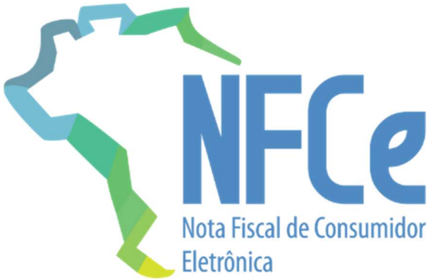

## Sistema Nota Fiscal Eletrônica

Nota Técnica 2025.001

## Simplificação Operacional:

- NFC-e: Leiaute do QR-Code versão 3

- NF-e: Resposta Síncrona para Lote com

somente 1 NF-e

## Sumário

| Controle de Versões.....................................................................................................................2              |
|--------------------------------------------------------------------------------------------------------------------------------------------------------|
| Histórico de Alterações / Cronograma........................................................................................2                          |
| 01. Resumo....................................................................................................................................4        |
| 02. Visão Geral..............................................................................................................................5         |
| 02.1 NFC-e: Leiaute QR-Code versão 3......................................................................................5                            |
| 02.2 NFC-e para Produtor Rural - Pessoa Física........................................................................5                                |
| 02.3 Resposta Síncrona para Lote com somente 1 (uma) NF-e..................................................6                                           |
| 02.4 Controle do Atraso na Data de Emissão da NF-e................................................................6                                    |
| 02.5 Controle do Tipo da IE do Destinatário (campo indIEDest)..................................................7                                       |
| 02.6 Dados de Cobrança: Novas Regras de Validação...............................................................7                                      |
| 02.7 Dados de Pagamento: Regras de Validação .......................................................................7                                  |
| 03. Serviço: Autorização de Uso da NF-e....................................................................................8                           |
| 03.1 Leiaute da Nota Fiscal Eletrônica (Anexo I do MOC)...........................................................8                                    |
| Grupo ZX. Informações Suplementares da Nota Fiscal...............................................................8                                     |
| 03.2 Validação da Área de Dados (Item 4.1.3 do MOC v7.0, Anexo I) ........................................8                                            |
| DA. Autorização - Área de dados do Lote de NF-e...................................................................................8                    |
| 03.3 Alteração em Regras de Validação - RV (Anexo II do MOC)..............................................9                                            |
| B. Identificação da NF-e.............................................................................................................................9 |
| E. Identificação do Destinatário..................................................................................................................9    |
| Y. Dados de Cobrança .............................................................................................................................10   |
| YA. Formas de Pagamento ......................................................................................................................10       |
| Grupo ZX. Informações Suplementares da Nota Fiscal...........................................................................11                        |
| Banco de Dados: Destinatário..................................................................................................................13       |
| 04. Preenchimento da URL do QR Code ...................................................................................14                              |
| 90. Mensagens do Resultado do Processamento ....................................................................15                                     |
| 90.1 Código das Mensagens.....................................................................................................15                       |

## Controle de Versões

|   Versão | Publicação    | Descrição                                            |
|----------|---------------|------------------------------------------------------|
|     1.00 | Março/2025    | NFC-e: Leiaute do QR-Code versão 3 e outras mudanças |
|     1.01 | Junho/2025    | Ajustes diversos                                     |
|     1.02 | Setembro/2025 | Ajustes Diversos                                     |
|     1.03 | Setembro/2025 | Ajustes Diversos                                     |

## Histórico de Alterações / Cronograma

|   Versão | Histórico de atualizações                                                                                                                                                                                                        | Implantação Teste   | Implantação Produção   |
|----------|----------------------------------------------------------------------------------------------------------------------------------------------------------------------------------------------------------------------------------|---------------------|------------------------|
|     1.00 | NFC-e: Leiaute do QR-Code versão 3 e outras mudanças                                                                                                                                                                             | Até 02/06/2025      | Até 01/09/2025         |
|     1.01 | - Alterada documentação do tamanho máximo do campo de qrCode, conforme o schema; - Alterada RV E16a-30, incluindo a lista de UF; - Removida RV ZX02-220, considerando que todas as UF irão disponibilizar o layout do qrCode v3. | -x-                 | -x-                    |

## Sistema Nota Fiscal Eletrônica

NT2025.001 - Simplificação Operacional: Leiaute QR-Code, Resposta Assíncrona Lote 1 NF-e

|   1.02 | - Alterada RV GAP03a-3 (Rejeição 452): adiando a entrada em produção para 13/10/25; - Alterada RV E16a-30 (Rejeição 805), eliminando da lista as UF RJ e ES. Esta alteração tem vigência imediata, ou a RV deverá ser desativada enquanto a eliminação das UF não estiver implementada; - Alterada a mesma RV E16a-30 (rejeição 805) para validar também as operações internas, com data de entrada em produção em 13/10/25; - Alterada RV YA03-10 (Rejeição 865) para 'Implementação futura' no modelo 55; - Alterada RV YA04-10 (Rejeição 391) para 'Implementação futura' no modelo 55; - Alterada RV 5E17-12 (Rejeição 300): Alterada a RV para 'Implementação futura';   | Até 08/09/25   | Até 08/09/25 ou data prevista na própria RV   |
|--------|-------------------------------------------------------------------------------------------------------------------------------------------------------------------------------------------------------------------------------------------------------------------------------------------------------------------------------------------------------------------------------------------------------------------------------------------------------------------------------------------------------------------------------------------------------------------------------------------------------------------------------------------------------------------------------|----------------|-----------------------------------------------|
|   1.03 | - Alterada RV YA03-10 (Rejeição 865): incluindo o código 91 (pagamento posterior) na 'Exceção 2; - Alterada RV YA03-30 (Rejeição 904): incluindo o uso do código 91 (pagamento posterior) em operações em que haja a postergação total ou parcial do pagamento. - Alterada RV E16a-30 (Rejeição 805): incluindo ES e RJ                                                                                                                                                                                                                                                                                                                                                       | Até 20/10/2025 | 03/11/2025                                    |

## 01. Resumo

Esta NT traz algumas mudanças em Regras de Validação, conforme descrição constante no Item 02. Visão Geral, com o detalhamento das mudanças nos itens seguintes.

Os principais itens da NT são:

- NFC-e: Leiaute QR-Code versão 3;
- NFC-e para Produtor Rural - Pessoa Física;
- Resposta Síncrona para Lote com 1 (uma) NF-e;
- Controle do Atraso na Data de Emissão da NF-e;
- Controle do Tipo da IE do Destinatário (campo indIEDest);
- Dados de Cobrança: Novas Regras de Validação;

## 02. Visão Geral

## 02.1 NFC-e: Leiaute QR-Code versão 3

Nesta NT está definido o novo leiaute do QR-Code da NFC-e (versão 3). Nesta nova versão, o controle sobre a autenticidade do conteúdo do QR-Code impresso no DANFE NFC-e será feito pela assinatura de campos específicos do QR-Code. Esse controle será feito unicamente para as NFC-e emitidas em Contingência, com a inclusão do resultado da assinatura no próprio QRCode.

Neste  novo  modelo,  não  será  mais  necessário  o  controle  do  CSC-Código  de  Segurança  do Contribuinte pelas empresas.

Futuramente (sem data definida) está prevista a eliminação do CSC (Código de Segurança do Contribuinte), com a adoção unicamente do leiaute do QR-Code versão 3.

As vantagens para as empresas na adoção deste modelo são:

-  Elimina a necessidade de manutenção do CSC, considerando que essa manutenção é feita manualmente em página Web do Portal da UF e o CSC fornecido tem que ser carregado manualmente  no  sistema  Emissor  da  NFC-e.  Portanto,  a  eliminação  do  CSC  reduz  a complexidade operacional para a empresa;
-  A manutenção do CSC é por UF, ou seja, a empresa que possui filial em várias UF tem que  manter  CSC  diferentes  para  cada  UF/CNPJ-8.  Eliminando  o  CSC,  elimina  essa complexidade;
-  Elimina o controle da empresa em manter somente 2 CSC ativos por UF.

As vantagens para o Fisco são:

-  Da mesma forma que as empresas, elimina a complexidade operacional de manutenção de página WEB para controle do CSC para cada CNPJ-8;
-  Elimina a necessidade de manter Web Service de Sincronismo com a SEFAZ Virtual, para as UF participantes deste tipo de Ambiente Autorizador de NFC-e;
-  Permite a adoção deste controle de segurança sobre a emissão do QR-Code para todas as UF, considerando que atualmente algumas UF não mantém o controle do CSC no seu Portal de atendimento ao Contribuinte.

## 02.2 NFC-e para Produtor Rural - Pessoa Física

No caso de Produtor Rural, em várias UF é concedida uma Inscrição Estadual que pode ser utilizada por qualquer Pessoa Física (CPF) participante do Estabelecimento Rural, ou seja, uma Inscrição Estadual pode possuir vários participantes, Pessoa Física (CPF) ou Pessoa Jurídica (CNPJ). Portanto, existe uma complexidade operacional na manutenção do CSC para esse tipo de Estabelecimento.

A orientação atual é adotar o novo leiaute do QR-Code (versão 3) para o Produtor Rural Pessoa Física, evitando a necessidade de conceder, e controlar, o CSC por Pessoa Física e UF. (exceto PR)

No caso de emitente Pessoa Jurídica (CNPJ) é opção da empresa adotar esse novo leiaute do QR-Code, ou não. A adoção do novo leiaute do QR-Code pode ser feita tanto para o CNPJ de Produtor Rural, quanto para o CNPJ de uma Inscrição Estadual normal.

## 02.3 Resposta Síncrona para Lote com somente 1 (uma) NF-e

Em 2013, por solicitação das Empresas, foi criada a possibilidade do emitente enviar um Lote com somente 1 (uma) Nota Fiscal, informando que deseja a resposta de forma síncrona, sem a geração de um Recibo para consulta futura.

Notamos que uma grande parte das empresas adotou esse modelo de simplificação operacional, no processo de Autorização de Uso, reduzindo inclusive o tempo de atendimento das operações do que depende do Ambiente da SEFAZ Autorizadora.

Mais tarde, para a NFC-e (modelo 65) foi tornada obrigatória a solicitação de resposta síncrona para Lote com somente 1 (uma) Nota Fiscal.

Nesta NT, também está sendo tornada obrigatória a solicitação de resposta síncrona para Lotes com somente 1 (uma) NF-e (modelo 55).

Os argumentos para essa mudança são os mesmos que justificaram as mudanças já efetuadas nessa direção:

-  O processo de autorização síncrona simplifica a aplicação das empresas, eliminando a necessidade de enviar o Lote, receber um Recibo e posteriormente consultar o resultado do processamento do Lote, informando esse Recibo;
-  A simplificação da aplicação das empresas reduz a quantidade de problemas operacionais dessas  aplicações,  melhorando  o  uso  do  Ambiente  de  Autorização  para  todas  as empresas;
-  A redução na quantidade de erros, principalmente para as empresas novas, ou para as novas versões do Sistema da Empresa, reduzem a necessidade de contato com o Fisco na elucidação de problemas na autorização de uso.

## 02.4 Controle do Atraso na Data de Emissão da NF-e

Como orientação geral, a NF-e deve ser emitida e autorizada antes da circulação da mercadoria. Ou seja, devemos ter a emissão 'on-line' da NF-e, evitando a manutenção de processos que levam a emissão do documento fiscal a posteriori.

Em relação a Nota Fiscal para Consumidor (NFC-e, modelo 65), se espera um atraso máximo de 5 minutos entre a Data de Emissão da NFC-e pela Empresa em relação a Data da Autorização do documento pelo Fisco.

No caso da NF-e (modelo 55), desde o início do Projeto NFE, é aceita uma Data de Emissão com um atraso de até 30 dias da data atual. Se a Data de Emissão ultrapassar esse limite, a NFe  pode  ainda  ser  autorizada,  desde  que  emitida  em  contingência,  recebendo  o  cStat="150Autorizado Uso da NF-e, autorização fora de prazo".

Atualmente o limite de 30 dias de atraso para a NF-e é muito superior ao desejável.

Nesta NT, o limite de prazo fica alterado para 7 dias, respeitando casos previstos em legislação de algumas SEFAZ, considerando também:

-  Será mantido a resposta com cStat='100-Autorizado o uso da NF-e' dentro deste período de até 7 dias, considerando a criticidade do ambiente de autorização (Fisco e Empresas);
-  Após o período de 7 dias, a NF-e continuará a ser autorizada normalmente, retornando o cStat='150-Autorizado Uso da NF-e, autorização fora de prazo';
- o A critério da UF, após 30 dias (ou outro limite definido pela SEFAZ) somente será aceita NF-e emitida em contingência (tpEmis=2, 4, 5).

## 02.5 Controle do Tipo da IE do Destinatário (campo indIEDest)

Atualmente o campo 'indIEDest' pode ser informado com os valores:

- 1-Contribuinte normal de ICMS na UF do Destinatário (informar a IE do destinatário);
- 2-Contribuinte isento de Inscrição no Cadastro de Contribuintes da UF do Destinatário;
- 9-Não Contribuinte, que pode ou não possuir Inscrição Estadual no Cadastro de Contribuintes de ICMS na UF do Destinatário.

Notamos que a informação  do  campo  não  é  clara  para  as  empresas,  com  muitos  casos  de divergência para o mesmo destinatário na UF. Algumas situações de divergência são:

-  Empresa informa a IE do Destinatário e o campo indIEDest='9-Não Contribuinte', mesmo que o Contribuinte seja um Contribuinte Normal na UF do Destinatário;
-  Empresa informa a IE do Destinatário e o campo indIEDest='1-Contribuinte Normal', para Não Contribuinte (que pode ter ou não a IE).

Até pouco tempo atrás, algumas UF não concediam IE para Empresas MEI, caracterizando a situação de 'Contribuinte Isento de Inscrição'. Atualmente, praticamente todas as UF concedem IE para MEI, reduzindo as UF que aceitam a situação de 'Contribuinte Isento de Inscrição'.

Nesta  NT,  são  alteradas  as  Regras  de  Validação  que  efetuam  o  controle  sobre  o  campo 'indIEDest', evitando as situações de divergência reportadas.

## 02.6 Dados de Cobrança: Novas Regras de Validação

Melhorado o controle sobre os dados de Cobrança (Grupo de Parcelas, id:'Y07', tag:'dup'), não permitindo seu preenchimento em casos de pagamento à vista (indPag=0) e limitando a Data de Vencimento a um máximo de 10 anos a partir da data atual.

## 02.7 Dados de Pagamento: Regras de Validação

Estendido os controles sobre pagamentos  para  a  NF-e  e  tornado  obrigatória  a  aplicação  de algumas  Regras  de  Validação  que  eram  opcionais  por  UF,  com  o  objetivo  de  melhorar  os controles da conciliação de pagamentos com a emissão do documento fiscal (RV YA03-10 a YA06-10).

## 03. Serviço: Autorização de Uso da NF-e

## 03.1 Leiaute da Nota Fiscal Eletrônica (Anexo I do MOC)

## Grupo ZX. Informações Suplementares da Nota Fiscal

|   # | ID   | Campo      | Descrição                                                                                                                                                                                                | Ele   | Pai   | Tipo   | Ocor.   | Tam.    | Observação                                                                                                                                        |
|-----|------|------------|----------------------------------------------------------------------------------------------------------------------------------------------------------------------------------------------------------|-------|-------|--------|---------|---------|---------------------------------------------------------------------------------------------------------------------------------------------------|
| 424 | ZX01 | infNFeSupl | Informações suplementares da Nota Fiscal                                                                                                                                                                 | G     | Raiz  | -      | 0-1     |         | Informações suplementares da Nota Fiscal, não afetando a assinatura digital. (NT 2015.002)                                                        |
| 425 | ZX02 | qrCode     | Texto com o QR-Code impresso no DANFE NFC-e. Obs .: URLs, por UF, utilizadas para consulta QR Code acesse: http://nfce.encat.org/desenvolvedor/qrcode/                                                   | E     | ZX01  | C      | 1-1     | 60-1000 | Ver orientações de preenchimento no item '04- Preenchimento da URL do QR Code' deste documento.                                                   |
| 426 | ZX03 | urlChave   | Texto com a URL de consulta por chave de acesso a ser impressa no DANFE NFC-e. Obs .: URLs, por UF, utilizadas para consulta por chave de acesso acesse: http://nfce.encat.org/consumidor/consulteno ta/ | E     | ZX01  | C      | 1-1     | 21-85   | Informar a URL da 'Consulta por chave de acesso da NFC-e'. A mesma URL que deve estar informada no DANFE NFC-e para consulta por chave de acesso. |

## 03.2 Validação da Área de Dados (Item 4.1.3 do MOC v7.0, Anexo I)

Seguem as alterações em regras de validação:

## DA. Autorização - Área de dados do Lote de NF-e

| # Regra de Validação                                                                                                                                        | Aplic.   |   Msg | Descrição Erro                                                                        |
|-------------------------------------------------------------------------------------------------------------------------------------------------------------|----------|-------|---------------------------------------------------------------------------------------|
| GAP03a-2 Solicitada resposta síncrona para UF que não disponibiliza este atendimento (indSinc=1)                                                            | Facult.  |   776 | Rejeição: Solicitada resposta síncrona para UF que não disponibiliza este atendimento |
| GAP03a-3 Solicitação de resposta assíncrona (indSinc=0) para lote com somente 1 (uma) NF-e. (NT 2025.001) Observação : Implantação em produção em 13/10/25. | Obrig.   |   452 | Rejeição: Solicitada resposta assíncrona para Lote com somente 1 (uma) NF-e           |

## 03.3 Alteração em Regras de Validação - RV (Anexo II do MOC)

## B. Identificação da NF-e

| Campo   |                                                                                                                                                                                                                                                                                                                                                                                                                                                                                                                                                                                                                                                                                                                                                                                                                                                                                                                                                                                  | Aplic.   |   Msg | Descrição Erro          | Descrição Erro   | Descrição Erro   |
|---------|----------------------------------------------------------------------------------------------------------------------------------------------------------------------------------------------------------------------------------------------------------------------------------------------------------------------------------------------------------------------------------------------------------------------------------------------------------------------------------------------------------------------------------------------------------------------------------------------------------------------------------------------------------------------------------------------------------------------------------------------------------------------------------------------------------------------------------------------------------------------------------------------------------------------------------------------------------------------------------|----------|-------|-------------------------|------------------|------------------|
| B09-20  | Modelo Regra de Validação 55 NF-e com Tipo de Emissão = 1-Normal (ou 6-SVC-AN, 7-SVC-RS) (NT2012.003): - Data de Emissão ocorrida há mais de 30 dias (ou outro limite definido pela SEFAZ) Exceção 1: A critério da UF, a rejeição acima pode ser efetuada para qualquer Tipo de Emissão. Exceção 2: A critério da UF, pode ser aceita a NF-e com Data de Emissão muito atrasada, desde que tenha sido emitida em contingência (tpEmis=2, 4, 5). Neste caso, a SEFAZ Autorizadora irá retornar cStat="150-Autorizado Uso da NF-e, autorização fora de prazo" (NT 2015.002) Independentemente do Tipo de Emissão: - Aceita NF-e com atraso de até 7 dias, retornando cStat='100-Autorizado Uso da NF-e'; - Aceita NF-e com atraso superior a 7 dias, retornando cStat='150-Autorizado Uso da NF- e, autorização fora de prazo'; Exceção : A critério da UF, após 30 dias (ou outro limite definido pela SEFAZ) somente será aceita NF-e emitida em contingência (tpEmis=2, 4, 5). | Obrig.   |   228 | Rejeição: Data atrasada | de Emissão       | muito            |

## E. Identificação do Destinatário

| Campo   | Modelo Regra de Validação                                                                                                                                                                                                                                                                                                                                                                                                                                                                                                                                                                                                                                                                                                                                                                                                                                                                                                                                                                                                                                                                                                                                                                                 | Aplic.   |   Msg | Descrição Erro                                                                          |
|---------|-----------------------------------------------------------------------------------------------------------------------------------------------------------------------------------------------------------------------------------------------------------------------------------------------------------------------------------------------------------------------------------------------------------------------------------------------------------------------------------------------------------------------------------------------------------------------------------------------------------------------------------------------------------------------------------------------------------------------------------------------------------------------------------------------------------------------------------------------------------------------------------------------------------------------------------------------------------------------------------------------------------------------------------------------------------------------------------------------------------------------------------------------------------------------------------------------------------|----------|-------|-----------------------------------------------------------------------------------------|
| E16a-30 | 55 Informado destinatário como Contribuinte Isento de Inscrição Estadual (indIEDest=2- ISENTO) em UF que não permite esta situação nas operações internas e interestaduais (idDest=1 ou 2), conforme segue: AL, AM, BA, CE, DF, ES, GO, MG, MS, MT, PB, PE, RJ, RN, RS, SE, SP. Observação 1: Regra de validação conforme configuração da UF do Destinatário (permite ou não permite Contribuinte Isento de Inscrição Estadual). Observação 2: No caso das operações internas, a implantação da RV em produção foi adiada para 13/10/25. Exceção 1: Esta regra de validação não se aplica quando houver destaque do ICMS-ST (campo vICMSST) em pelo menos um item da NF-e. Exceção 2: Esta regra de validação não se aplica quando houver informação do ICMS- ST retido anteriormente (campo vICMSSTRet) em pelo menos um item da NF-e. Exceção 3: A regra de validação não se aplica, em produção, para Nota Fiscal com data de emissão anterior a 01/07/2016. Exceção 4: Esta regra de validação não se aplica nas operações isentas (CST=40-Isenta ou CSOSN=103-Isento), imunes ou não tributadas (CST=41-Não tributada, ou CSOSN=300-Imune, ou CSOSN=400-Não tributada pelo Simples Nacional). Obrig. |          |   805 | Rejeição: A SEFAZ do destinatário não permite Contribuinte Isento de Inscrição Estadual |

| Campo   |   Modelo | Regra de Validação                                                                                                                                                                                                                                                                                                                                                                                                                                                                                                                                                                                                                                                                                                                                                                                                                           | Aplic.   |   Msg | Descrição Erro                                                          |
|---------|----------|----------------------------------------------------------------------------------------------------------------------------------------------------------------------------------------------------------------------------------------------------------------------------------------------------------------------------------------------------------------------------------------------------------------------------------------------------------------------------------------------------------------------------------------------------------------------------------------------------------------------------------------------------------------------------------------------------------------------------------------------------------------------------------------------------------------------------------------------|----------|-------|-------------------------------------------------------------------------|
| E16a-35 |       55 | Informado destinatário como Contribuinte Isento de Inscrição Estadual (indIEDest=2- ISENTO) em UF que não permite esta situação nas operações internas (idDest=1) Exceção 1 : Esta regra de validação não se aplica quando houver destaque do ICMS-ST (campo vICMSST) em pelo menos um item da NF-e. Exceção 2 : Esta regra de validação não se aplica quando houver informação do ICMS- ST retido anteriormente (campo vICMSSTRet) em pelo menos um item da NF-e. Exceção 3 : A regra de validação não se aplica, em produção, para Nota Fiscal com data de emissão anterior a 01/07/2016. Exceção 4 : Esta regra de validação não se aplica nas operações isentas (CST=40-Isenta ou CSOSN=103-Isento), imunes ou não tributadas (CST=41-Não tributada, ou CSOSN=300-Imune, ou CSOSN=400-Não tributada pelo Simples Nacional) (NT 2015.003) | Facult.  |   805 | Rejeição: A SEFAZ do destinatário não permite Contribuinte Isento de IE |

## Y. Dados de Cobrança

| Campo   | Modelo Regra de Validação Aplic. Msg Descrição Erro                                                                                                                                                                                                                                                          |
|---------|--------------------------------------------------------------------------------------------------------------------------------------------------------------------------------------------------------------------------------------------------------------------------------------------------------------|
| Y09-40  | 55 Se informado o grupo de Parcelas de cobrança (tag:dup, Id:Y07) com apenas uma ocorrência e a Data de vencimento (dVenc, id:Y09) for igual à data de emissão (dhEmi, id:B09, desconsiderando a hora). (NT 2025.001) Obrig. 853 Rejeição: Dados de cobrança não devem ser informados para pagamento à vista |
| Y09-50  | 55 Se informado o grupo de Parcelas de cobrança (tag:dup, Id:Y07) e Data de Vencimento (dVenc, id:Y09) superior a 10 anos da data atual. (NT 2025.001) Obrig. 797 Rejeição: Data de vencimento da parcela superior a 10 anos da data atual [nOcor: 999]                                                      |

## YA. Formas de Pagamento

| Campo   | Modelo   | Regra de Validação                                                                                                                                                                                                                                                                                                                                                                                                                                                        | Aplic.         |   Msg | Descrição Erro                                                                                     |
|---------|----------|---------------------------------------------------------------------------------------------------------------------------------------------------------------------------------------------------------------------------------------------------------------------------------------------------------------------------------------------------------------------------------------------------------------------------------------------------------------------------|----------------|-------|----------------------------------------------------------------------------------------------------|
| YA03-10 | 55/65    | Somatório do valor dos pagamentos (id:YA03, tag:vPag) menor que o total da nota (id:W16, tag: vNF). Exceção 1: Esta regra não se aplica para nota fiscal de Ajuste, campo finNFe=3 (id:B25) e para nota fiscal de Devolução finNFe=4 (id:B25) Exceção 2: Esta regra não se aplica quando o campo Meio de Pagamento (id:YA02, tag:tPag) for igual a 90 (sem pagamento) ou igual a 91 (pagamento posterior). (NT 2017.002) Observação: Implementação futura para modelo 55. | Facult. Obrig. |   865 | Rejeição: Total dos pagamentos menor que o total da nota                                           |
| YA03-20 | 55/65    | Somatório do valor dos pagamentos (id:YA03, tag:vPag) maior que o total da nota (id:W16, tag: vNF) e sem informação no campo vTroco (id:YA09) (NT 2017.002)                                                                                                                                                                                                                                                                                                               | Facult. Obrig. |   866 | Rejeição: Ausência de troco quando o valor dos pagamentos informados for maior que o total da nota |

| Campo   | Modelo   | Regra de Validação                                                                                                                                                                                                                                                                                                                                                                                                                           | Aplic.         |   Msg | Descrição Erro                                                                                                     |
|---------|----------|----------------------------------------------------------------------------------------------------------------------------------------------------------------------------------------------------------------------------------------------------------------------------------------------------------------------------------------------------------------------------------------------------------------------------------------------|----------------|-------|--------------------------------------------------------------------------------------------------------------------|
| YA03-30 | 55/65    | Informado o campo Meio de Pagamento igual a sem pagamento (tag:tPag=90, id:YA02) ou pagamento posterior (tag:tPag=91, id:YA02) e informado campo Valor do Pagamento diferente de zero (tag:vPag<>0, id:YA03). (NT 2017.002)                                                                                                                                                                                                                  | Facult. Obrig. |   904 | Rejeição: Informado indevidamente campo valor de pagamento                                                         |
| YA04-10 | 55/65    | Se informado o grupo de pagamentos (tag:pag): - Se o Pagamento for por cartão (tag:tPag=03, 04), ou PIX (tpag=17), deve ser informado o grupo de cartões (tag:card) Observação: Implementação por padrão, opcional a critério da UF. Exceção: A regra de validação não se aplica, em produção, para Nota Fiscal com Data de Emissão anterior a 01/04/2016. (NT 2015.002) Observação: Implementação futura para modelo 55.                    | Facult. Obrig. |   391 | Rejeição: Não informados os dados do cartão de crédito / débito nas Formas de Pagamento da Nota Fiscal [nOcor:999] |
| YA05-10 | 55/65    | Se informado o grupo de Cartão de Crédito / Débito (tag:card): - Se o pagamento com cartão for integrado ao sistema de automação da empresa (tag:tpIntegra=1) devem ser informado os campos de CNPJ da Credenciadora e o código de autenticação da operação (tag:card/CNPJ e card/cAut) Observação: Implementação por padrão, opcional a critério da UF. Exceção: A regra de validação não se aplica, em produção, para Nota Fiscal com Data | Facult. Obrig. |   392 | Rejeição: Não informados os dados da operação de pagamento por cartão de crédito / débito                          |
| YA05-20 | 55/65    | Se informado o CNPJ da instituição de pagamento: - Verificar CNPJ com zeros, nulo ou DV inválido (Incluída na NT 2020.006)                                                                                                                                                                                                                                                                                                                   | Facult. Obrig. |   437 | Rejeição: CNPJ da instituição de pagamento inválido                                                                |
| YA06-10 | 55/65    | Verificar se o Código da bandeira de cartão de crédito e/ou débito (campo: tBand) existe na tabela de códigos das operadoras de cartão de crédito e/ou débito publicada no Portal Nacional da Nota Fiscal Eletrônica (NT 2020.006) Observação 1: Regra válida a partir de 03/05/2021 para homologação e 01/09/2021 para produção                                                                                                             | Facult. Obrig. |   443 | Rejeição: Código da bandeira de cartão de crédito e/ou débito inexistente                                          |

## Grupo ZX. Informações Suplementares da Nota Fiscal

| Campo    |   Modelo | Regra de Validação                                                                                                                                                                                      | Aplic.   |   Msg | Descrição Erro                                                   |
|----------|----------|---------------------------------------------------------------------------------------------------------------------------------------------------------------------------------------------------------|----------|-------|------------------------------------------------------------------|
| ZX02-220 |       65 | Se QR Code versão 3 e UF não aceita esta versão Obs. : Parâmetro por UF, enquanto todas as UF não migrarem para o leiaute do qrCode versão 3. (NT 2025.001)                                             | Obrig.   |   407 | Rejeição: NFC-e com qrCode na versão 3                           |
| ZX02-222 |       65 | Se QR-Code versão 2 e Emitente Pessoa Física (Produtor Rural, identificado pelo CPF), rejeitar a NFC-e. (NT 2025.001)                                                                                   | Obrig.   |   444 | Rejeição: NFC-e com qrCode na versão 2 para Pessoa Física        |
| ZX02-224 |       65 | Se QR Code versão '2 ou 3' e Parâmetro Chave de Acesso não informado no QR- Code. Nota : O Schema XML faz esta verificação. Observação: Para NFC-e ONLINE ou OFFLINE é o 1º parâmetro da URL do QR Code | Obrig.   |   396 | Rejeição: Parâmetro do QR-Code inexistente: [Param: xxx)]        |
| ZX02-228 |       65 | Se QR Code versão '2 ou 3' e Parâmetro Chave de Acesso no QR-Code diverge da Chave de Acesso da Nota Fiscal                                                                                             | Obrig.   |   397 | Rejeição: Parâmetro do QR-Code divergente da Nota Fiscal [Param: |

## Sistema Nota Fiscal Eletrônica

NT2025.001 - Simplificação Operacional: Leiaute QR-Code, Resposta Assíncrona Lote 1 NF-e

| Campo    |   Modelo | Regra de Validação                                                                                                                                                                                                                                                                                                | Aplic.   | Msg           | Descrição Erro                                                                    |
|----------|----------|-------------------------------------------------------------------------------------------------------------------------------------------------------------------------------------------------------------------------------------------------------------------------------------------------------------------|----------|---------------|-----------------------------------------------------------------------------------|
|          |          | Observação: Para NFC-e ONLINE ou OFFLINE é o 1º parâmetro da URL do QR Code                                                                                                                                                                                                                                       |          | xxx)].        |                                                                                   |
| ZX02-232 |       65 | Se QR Code versão '2 ou 3' e Parâmetro Versão não informado no QR-Code. Nota: O Schema XML faz esta verificação Observação: Para NFC-e ONLINE ou OFFLINE é o 2º parâmetro da URL do QR Code                                                                                                                       | Obrig.   | 396           | Rejeição: Parâmetro do QR-Code inexistente: [Param: xxx)]                         |
| ZX02-236 |       65 | SeQR Code versão '2 ou 3' e Parâmetro Versão informada no QR-Code diverge do previsto ('2 ou 3') Observação: Para NFC-e ONLINE ou OFFLINE é o 2º parâmetro da URL do QR Code                                                                                                                                      | Obrig.   | 398           | Rejeição: Parâmetro Versão informada no QR-Code diverge do previsto [Param: xxx]. |
| ZX02-240 |       65 | Se QR Code versão '2 ou 3' e Parâmetro Tipo de Ambiente não informado no QR- Code. Nota: O Schema XML faz esta verificação Observação: Para NFC-e ONLINE ou OFFLINE é o 3º parâmetro da URL do QR Code                                                                                                            | Obrig.   | 396           | Rejeição: Parâmetro do QR-Code inexistente: [Param: xxx]                          |
| ZX02-244 |       65 | Se QR Code versão '2 ou 3' e Parâmetro Tipo de Ambiente do QR-Code diverge do Tipo de Ambiente da Nota Fiscal (tag:tpAmb, id:B24) Observação: Para NFC-e ONLINE ou OFFLINE é o 3º parâmetro da URL do QR Code                                                                                                     | Obrig.   | 397           | Rejeição: Parâmetro do QR-Code divergente da Nota Fiscal: [Param: xxx]            |
| ZX02-260 |       65 | Se QR Code versão '2 ou 3' e NFC-e de contingência (tpEmis=9): - Parâmetro Dia da Data de Emissão não informado no QR-Code. Nota: O Schema XML faz esta verificação Obs. 1: Para NFC-e ONLINE esse parâmetro não existe. Obs. 2: Para a NFC-e OFFLINE é o 4º parâmetro da URL do QR Code (NT 2017.002)            | Obrig.   | 396 Rejeição: | Parâmetro do QR-Code inexistente: [Param: xxx]                                    |
| ZX02-268 |       65 | Se QR Code versão '2 ou 3" e NFC-e de contingência (tpEmis=9): - Parâmetro Dia da Data de Emissão no QR-Code diverge do Dia Data de Emissão da Nota Fiscal (tag:dhEmi, id:B09) Obs. 1: Para NFC-e ONLINE esse parâmetro não existe. Obs. 2: Para a NFC-e OFFLINE é o 4º parâmetro da URL do QR Code (NT 2017.002) | Obrig.   | 397           | Rejeição: Parâmetro do QR-Code divergente da Nota Fiscal: [Param: xxx]            |
| ZX02-272 |       65 | Se QR Code versão '2 ou 3" e NFC-e de contingência (tpEmis=9): - Parâmetro Valor da Nota Fiscal não informado no QR-Code. Nota: O Schema XML faz esta verificação Obs. 1: Para NFC-e ONLINE esse parâmetro não existe. Obs. 2: Para a NFC-e OFFLINE é o 5º parâmetro da URL do QR Code (NT 2017.002)              | Obrig.   | 396           | Rejeição: Parâmetro do QR-Code inexistente: [Param: xxx]                          |
| ZX02-276 |       65 | Se QR Code versão '2 ou 3" e NFC-e de contingência (tpEmis=9): - Parâmetro Valor da Nota Fiscal no QR-Code diverge do Valor Total da Nota Fiscal (tag:vNF, id:W16) Obs. 1: Para NFC-e ONLINE esse parâmetro não existe. Obs. 2: Para a NFC-e OFFLINE é o 5º parâmetro da URL do QR Code (NT 2017.002)             | Obrig.   | 397           | Rejeição: Parâmetro do QR-Code divergente da Nota Fiscal: [Param: xxx]            |
| ZX02-300 |       65 | Se QR Code versão '1 ou 2', se Parâmetro Código Identificador do CSC não informado no QR Code. Obs.: Mais informações sobre o CSC de cada UF estão disponíveis em http://nfce.encat.org/empresario/csc/ Nota: O Schema XML faz esta verificação                                                                   | Obrig.   | 396           | Rejeição: Parâmetro do QR-Code inexistente: [Param: xxx]                          |

## Sistema Nota Fiscal Eletrônica

| Campo    |   Modelo | Regra de Validação                                                                                                                                                                                                                                                                                                                                                                                                                       | Aplic.   |   Msg | Descrição Erro                                                    |
|----------|----------|------------------------------------------------------------------------------------------------------------------------------------------------------------------------------------------------------------------------------------------------------------------------------------------------------------------------------------------------------------------------------------------------------------------------------------------|----------|-------|-------------------------------------------------------------------|
|          |          | Obs. 1: Para NFC-e ONLINE é o 4º parâmetro da URL do QR Code. Obs. 2: Para a NFC-e OFFLINE é o 7º parâmetro da URL do QR Code (NT 2017.002)                                                                                                                                                                                                                                                                                              |          |       |                                                                   |
| ZX02-324 |       65 | Se QR Code versão '3' e NFC-e de contingência (tpEmis=9): - Parâmetro Tipo de Identificação do Destinatário não informado no QR-Code. Nota: O Schema XML faz esta verificação Obs. 1: Para NFC-e ONLINE esse parâmetro não existe. Obs. 2: Para a NFC-e OFFLINE é o 6º parâmetro da URL do QR Code (NT 2025.001)                                                                                                                         | Obrig.   |   396 | Rejeição: Parâmetro do QR-Code inexistente: [Param: xxx]          |
| ZX02-326 |       65 | Se QR Code versão '3' e NFC-e de contingência (tpEmis=9): - Parâmetro Identificação do Destinatário não informado no QR-Code. Nota: O Schema XML faz esta verificação Obs. 1: Para NFC-e ONLINE esse parâmetro não existe. Obs. 2: Para a NFC-e OFFLINE é o 7º parâmetro da URL do QR Code (NT 2025.001)                                                                                                                                 | Obrig.   |   396 | Rejeição: Parâmetro do QR-Code inexistente: [Param: xxx]          |
| ZX02-328 |       65 | Se QR Code versão '3' e NFC-e de contingência (tpEmis=9): - Parâmetro Identificação do Destinatário do QR-Code diverge da Identificação do Destinatário da NFC-e. Obs. 1: Para NFC-e ONLINE esse parâmetro não existe. Obs. 2: Para NFC-e OFFLINE, considerar 6º e 7º parâmetros da URL do QR Code (NT 2025.001) Obs. 3: Se a identificação do Destinatário não for informada na NFC-e, não deve ser informada no QR Code, e vice-versa. | Obrig.   |   397 | Rejeição: Parâmetro do QR-Code divergente da Nota Fiscal (idDest) |
| ZX02-330 |       65 | Se QR Code versão '3' e NFC-e não é de contingência (tpEmis<>9), o parâmetro 'assinatura' não deve ser informado no qrCode. (NT 2025.001)                                                                                                                                                                                                                                                                                                | Obrig.   |   445 | Rejeição: Parâmetro assinatura não deve ser informado no qrCode   |
| ZX02-334 |       65 | Se QR Code versão '3' e NFC-e é de contingência (tpEmis=9), o parâmetro 'assinatura' deve ser informado no qrCode. (NT 2025.001)                                                                                                                                                                                                                                                                                                         | Obrig.   |   474 | Rejeição: Parâmetro assinatura deve ser informado no qrCode       |
| ZX02-338 |       65 | Se QR Code versão '3' e NFC-e de contingência (tpEmis=9): Valor da assinatura difere do valor calculado. (NT 2025.001)                                                                                                                                                                                                                                                                                                                   | Obrig.   |   583 | Rejeição: Valor da assinatura do qrCode difere do valor calculado |

## Banco de Dados: Destinatário

| Campo   |   Modelo | Regra de Validação                                                                                                                                                                                                                                                | Aplic.     | Msg Descrição Erro                                                                |
|---------|----------|-------------------------------------------------------------------------------------------------------------------------------------------------------------------------------------------------------------------------------------------------------------------|------------|-----------------------------------------------------------------------------------|
| 5E17-12 |       55 | Se informada IE do Destinatário e informado Tipo IE Destinatário como 'Não Contribuinte' (indIEDest=9): - IE cadastrada no CCC com Tipo IE diferente de '3-IE para Não Contribuinte de ICMS na UF' (CCC.tpIE<>3). (NT 2025.001) Observação: Implementação futura. | Obrig. 300 | Rejeição: Tipo da IE do Destinatário difere de Não Contribuinte no cadastro da UF |

## 04. Preenchimento da URL do QR Code

## Versão QRCode

## Orientações de Preenchimento da URL do QR Code (id ZX02: qrCode)

100 Informar a URL da 'Consulta da NFC-e via QR-Code' no site da SEFAZ, compreendendo:

- Endereço do site da UF, incluindo o protocolo de comunicação ('http://' ou 'https://');
- Caractere separador '?';
- Parâmetros do QR-Code, concatenados usando o '&amp;' como separador.

Nota 1: Vide 'Manual de Padrões Técnicos do DANFE NFC-e e QR-Code' que documenta os endereços dos sites das UF, os parâmetros do QR-Code e a fórmula de montagem e/ou cálculo dos parâmetros.

Nota 2: Respeitar o uso de caracteres maiúsculos / minúsculos, conforme consta no referido Manual.

Nota 3: O caractere '&amp;' é um caractere reservado do XML, portanto não pode aparecer no conteúdo da tag. Para viabilizar a informação do QR-Code, o conteúdo deste campo deve ser informado como: &lt;![CDATA[texto]]&gt;

Exemplo:&lt;![CDATA[https://www.sefaz.rs.gov.br/NFCE/NFCECOM.aspx?chNFe=43150108287693000157651010000000971000001251&amp;nVersao=100&amp;t pAmb=2&amp;cDest=99999999000191&amp;dhEmi=323031352d30312d32305431373a30303a34392d30323a3030&amp;vNF=1.00&amp;vICMS=0.00&amp;digVal=2f4a703477 714e6d6e4e646d31776b64743936655a486b65354f513d&amp;cIdToken=000001&amp;cHashQRCode=ecc4f0e7e612456f2e3521768bd572b6f0eae240]]&gt;

- 2 Informar a URL da 'Consulta da NFC-e via QR-Code', na versão 2, usando o Protocolo 'http' ou 'https', conforme os seguintes modelos:
- Para NFC-e emitida 'on-line' : https:// endereco-consulta-

QRCode?p=&lt;chave\_acesso&gt;|&lt;versao\_qrcode&gt;|&lt;tipo\_ambiente&gt;|&lt;identificador\_csc&gt;|&lt;codigo\_hash&gt;

- Para NFC-e emitida em contingência 'off-line': http:// endereco-consulta-

QRCode?p=&lt;chave\_acesso&gt;|&lt;versao\_qrcode&gt;|&lt;tipo\_ambiente&gt;|&lt;dia\_data\_emissao&gt;|&lt;valor\_total\_nfce&gt;|&lt;digVal&gt;|&lt;identificador\_csc&gt;|&lt;codigo\_hash&gt; Nota 1: Vide 'Manual de Padrões Técnicos do DANFE NFC-e e QR-Code' que documenta os endereços de consulta de QR Code por UF, os parâmetros do QR-Code e a fórmula de montagem e/ou cálculo dos parâmetros.

Nota 2: Respeitar o uso de caracteres maiúsculos / minúsculos, conforme consta no referido Manual.

Nota 3: A forma de emissão da NFC-e está codificado no campo 'tpEmis' do XML, e deve ser usado na validação dos diferentes modelos de QR-Code Nota 4: Nesta nova versão do layout do qrCode não existe a necessidade de informar o conteúdo da tag qrCode dentro de uma seção CDATA.

- 3 Informar a URL da 'Consulta da NFC-e via QR-Code', na versão 3, usando o Protocolo 'http' ou 'https', conforme os seguintes modelos:
- Para NFC-e emitida 'on-line' : https://endereco-consulta-QRCode ?p=&lt;chave\_acesso&gt;|&lt;versao\_qrcode&gt;|&lt;tpAmb&gt;
- Para NFC-e emitida em contingência 'off-line':
- https:// endereco-consulta-

QRCode?p=&lt;chave\_acesso&gt;|&lt;versao\_qrcode&gt;|&lt;tpAmb&gt;|&lt;dia\_data\_emissao&gt;|&lt;vNF&gt;|&lt;tp\_idDest&gt;|&lt;idDest&gt;|&lt;assinatura&gt;

Nota 1: Vide 'Manual de Padrões Técnicos do DANFE NFC-e e QR-Code' que documenta os endereços de consulta de QR Code por UF, os parâmetros do QR-Code e a fórmula de montagem e/ou cálculo dos parâmetros.

Nota 2: Respeitar o uso de caracteres maiúsculos / minúsculos, conforme consta no referido Manual.

- Nota 3: A forma de emissão da NFC-e está codificado no campo 'tpEmis' do XML, e deve ser usado na validação dos diferentes modelos de QR-Code

Nota 4: Nesta nova versão do layout do qrCode não existe a necessidade de informar o conteúdo da tag qrCode dentro de uma seção CDATA.

## 90. Mensagens do Resultado do Processamento

## 90.1 Código das Mensagens

|   Código | Mensagem                                                                              |
|----------|---------------------------------------------------------------------------------------|
|      300 | Rejeição: Tipo da IE do Destinatário difere de Não Contribuinte no cadastro da UF     |
|      452 | Rejeição: Solicitada resposta assíncrona para Lote com somente 1 (uma) NF-e           |
|      407 | Rejeição: NFC-e com qrCode na versão 3                                                |
|      444 | Rejeição: NFC-e com qrCode na versão 2 para Pessoa Física                             |
|      445 | Rejeição: Parâmetro assinatura não deve ser informado no qrCode                       |
|      474 | Rejeição: Parâmetro assinatura deve ser informado no qrCode                           |
|      583 | Rejeição: Valor da assinatura do qrCode difere do valor calculado                     |
|      797 | Rejeição: Data de vencimento da parcela superior a 10 anos da data atual [nOcor: 999] |
|      853 | Rejeição: Dados de cobrança não devem ser informados para pagamento à vista           |

