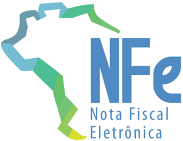

## Sistema Nota Fiscal Eletrônica

Informe Técnico 2024.002

Atualiza Tabela de Meios de Pagamento

## Sumário

| Controle de Versões.....................................................................................................................2         | Controle de Versões.....................................................................................................................2         |
|---------------------------------------------------------------------------------------------------------------------------------------------------|---------------------------------------------------------------------------------------------------------------------------------------------------|
| Histórico de Alterações / Cronograma........................................................................................2                     | Histórico de Alterações / Cronograma........................................................................................2                     |
| Informação sobre a finalidade do IT - Informe Técnico.............................................................2                               | Informação sobre a finalidade do IT - Informe Técnico.............................................................2                               |
| 01. Objetivo ...................................................................................................................................4 | 01. Objetivo ...................................................................................................................................4 |
| 02. Alterações realizadas na Tabela de Meios de Pagamento...................................................4                                     | 02. Alterações realizadas na Tabela de Meios de Pagamento...................................................4                                     |
| 02.1                                                                                                                                              | Alterações na versão 1.00.............................................................................................4                           |
| 02.2                                                                                                                                              | Alterações na versão 1.01.............................................................................................4                           |
| 02.3                                                                                                                                              | Alterações na versão 1.10.............................................................................................4                           |
| 02.4                                                                                                                                              | Alterações na versão 1.11.............................................................................................4                           |

## Controle de Versões

|   Versão | Publicação    | Descrição                                               |
|----------|---------------|---------------------------------------------------------|
|     1.00 | Abril/2024    | Altera Tabela de Meios de Pagamento                     |
|     1.01 | Junho/2024    | Correção da Tabela de Meios de Pagamento                |
|     1.10 | Setembro/2025 | Altera Tabela de Meios de Pagamento                     |
|     1.11 | Março/2026    | Inclui e altera códigos na Tabela de Meios de Pagamento |

## Histórico de Alterações / Cronograma

|   Versão | Histórico de atualizações                                    | Implantação Teste   | Implantação Produção   |
|----------|--------------------------------------------------------------|---------------------|------------------------|
|     1.10 | Inclusão da opção 91 = Pagamento Posterior                   | 20/10/2025          | 03/11/2025             |
|     1.11 | Inclusão dos códigos 23 e 24 na Tabela de Meios de Pagamento | 02/04/2026          | 04/05/2026             |

## Informação sobre a finalidade do IT -Informe Técnico

De forma geral, o Informe Técnico tem a finalidade de:

- Divulgar orientações e aperfeiçoamentos para os Serviços de Autorização de Uso dos DF-e, que são usados pelas Empresas;
- Divulgar e manter registro da atualização de tabelas de domínio usadas pelo Serviço de Autorização, não significando obrigatoriamente a necessidade de alteração no Sistema de Computação das Empresas;
- Divulgar e manter registro de orientações sobre a prestação de informações no leiaute do DF-e, informando sobre o preenchimento de campo e outros;

## Sistema Nota Fiscal Eletrônica

IT2024.002 -Atualiza Tabela de Meios de Pagamento

- Divulgar e manter registro de comunicados e outras necessidades de comunicação com as empresas.

## 01. Objetivo

O objetivo deste Informe Técnico é divulgar as alterações da Tabela de Meios de Pagamento, disponível no Portal Nacional da NF-e (www.nfe.fazenda.gov.br), na aba 'Documentos', opção 'Diversos'.

## 02. Alterações realizadas na Tabela de Meios de Pagamento

## 02.1  Alterações na versão 1.00

- As alterações na tabela de meios de pagamentos são para 01/07/2024 no ambiente de produção.
- Foi incluída uma coluna 'Observações' para explicar o item quando necessário.
- O item 5 teve o texto alterado de 'Crédito de Loja' para 'Cartão da Loja (Private Label)' , para melhor definir esse tipo de pagamento.
- Foi adicionada observação para o item 14: 'Duplicata Mercantil'.
- Foi alterado o item 17 para acrescentar a palavra 'Dinâmico'. O objetivo é separar o os pagamentos de PIX com o ' QR-Code Dinâmico ' do tipo 'Q R-Code Estático ' .
- Foi incluído o item 20: ' Pagamento Instantâneo (PIX) -Estático ' .
- Foi incluído o item 21: ' Crédito  em  Loja ', que pode decorrer de: valor pago antecipadamente, devolução de mercadoria etc.
- Foi  incluído  o  item  22: ' Pagamento  Eletrônico  não  Informado  -  falha  de  hardware  do sistema  emissor '. Usado  para  informar  que  o  pagamento  por  meio  eletrônico  não  foi integrado  por  falha  no  hardware  do  sistema  emissor  de  documento  fiscal  eletrônico, exclusivamente quando, por tal falha, não for possível a emissão offline. É uma informação útil para as empresas que utilizam sistemas integrados, sobretudo para aquelas que são obrigadas à integração do pagamento eletrônico com o documento fiscal pela sua UF.
- Foi adicionada observação para o item 99: 'Outros'.

## 02.2  Alterações na versão 1.01

- O item 5 apenas foi corrigido para contemplar outras formas de crediário.

## 02.3  Alterações na versão 1.10

- Inclusão da opção 91 = Pagamento Posterior

## 02.4  Alterações na versão 1.11

- Inclusão das opções ' 23 = Pagamento Instantâneo (PIX) -Automático ' e ' 24 = TEF -' Book Transfer ' ";
- Alteração da descrição do código 18 e da observação código 20.

## Metadados
- [Metadados do corpus](metadata.json)
- [Fonte e procedência](../../../../sources/portal_nacional_nfe/nfe/informes-tecnicos/it2024-002v1-11-atualiza-tabela-meios-de-pagamento-04032026/source.json)
- [Dados normalizados](../../../../normalized/nfe/informes-tecnicos/it2024-002v1-11-atualiza-tabela-meios-de-pagamento-04032026/normalized.json)
- [Changelog](../../../../changelog/nfe/informes-tecnicos/it2024-002v1-11-atualiza-tabela-meios-de-pagamento-04032026.md)
- [Proveniência resumida](../../../../sources/provenance/it2024-002v1-11-atualiza-tabela-meios-de-pagamento-04032026.json)

## Documentos relacionados

- [[it-2026-001-v-1-00-tabelas-de-meios-de-pagamento-para-vincula-o-com-o-split]]
- [[it-2026-002-v-1-00-tabela-de-aliquotas-da-cbs]]
- [[it2023-002v1-00-tabela-cfop-11-04-2023]]
- [[it2024-001v2-30-atualiza-tabela-de-ncm]]
- [[it2025-001v1-00-atualiza-tabela-municipios]]
- [[nt-2016-003-v3-62-tabela-ncm-vig-ncia-01-11-2023-ou-01-01-2024]]
- [[nt-2016-003-v3-7-tabela-ncm-vig-ncia-01-04-2024]]
