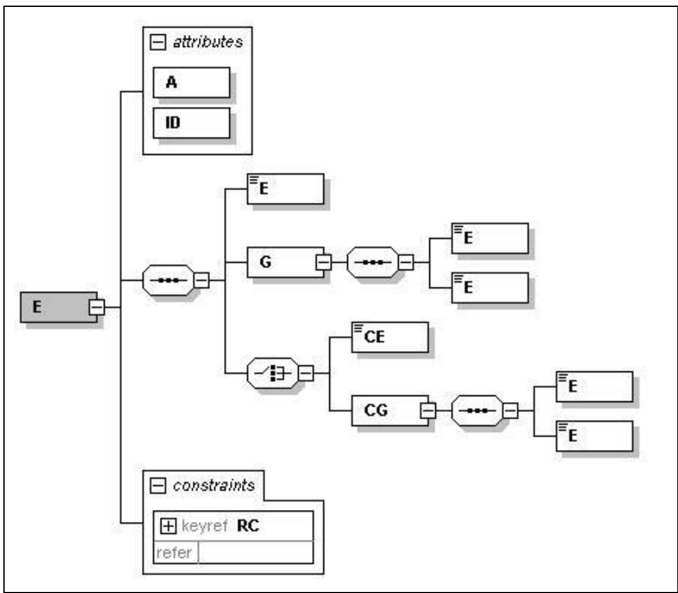

## Metadados
- [Metadados do corpus](metadata.json)
- [Fonte e procedência](../../../../sources/portal_nacional_nfe/nfe/manuais/anexo-i-leiaute-e-regra-de-valida-o-nf-e-e-nfc-e/source.json)
- [Dados normalizados](../../../../normalized/nfe/manuais/anexo-i-leiaute-e-regra-de-valida-o-nf-e-e-nfc-e/normalized.json)
- [Changelog](../../../../changelog/nfe/manuais/anexo-i-leiaute-e-regra-de-valida-o-nf-e-e-nfc-e.md)
- [Proveniência resumida](../../../../sources/provenance/anexo-i-leiaute-e-regra-de-valida-o-nf-e-e-nfc-e.json)

## Sistema Nota Fiscal Eletrônica

Manual de Orientação do Contribuinte

Anexo I -Leiaute e Regras de Validação da NF-e e da NFC-e

Versão 7.00 -Novembro de 2020

## Nota Fiscal Eletrônica

## Sumário

| Sumário.....................................................................................................................................................................2                                                                                                              |                                                                                                              |
|--------------------------------------------------------------------------------------------------------------------------------------------------------------------------------------------------------------------------------------------------------------------------------------------|--------------------------------------------------------------------------------------------------------------|
| Controle de Versões...................................................................................................................................................5                                                                                                                    |                                                                                                              |
| Histórico de Alterações / Cronograma..........................................................................................................................6                                                                                                                            |                                                                                                              |
| 1. Introdução..............................................................................................................................................................7                                                                                                               |                                                                                                              |
| 2. Leiaute da NF-e......................................................................................................................................................8                                                                                                                  |                                                                                                              |
| Grupo A. Dados da Nota Fiscal eletrônica .........................................................................................................                                                                                                                                         | 8                                                                                                            |
| Grupo B. Identificação da Nota Fiscal eletrônica ...............................................................................................                                                                                                                                           | 8                                                                                                            |
| Grupo BA. Documento Fiscal Referenciado ....................................................................................................                                                                                                                                               | 11                                                                                                           |
| Grupo C. Identificação do Emitente da Nota Fiscal eletrônica .......................................................................                                                                                                                                                       | 12                                                                                                           |
| Grupo D. Identificação do Fisco Emitente da NF-e.........................................................................................                                                                                                                                                  | 13                                                                                                           |
| Grupo E. Identificação do Destinatário da Nota Fiscal eletrônica ...................................................................                                                                                                                                                       | 14                                                                                                           |
| Grupo F. Identificação do Local de Retirada....................................................................................................                                                                                                                                            | 15                                                                                                           |
| Grupo G. Identificação do Local de Entrega ....................................................................................................                                                                                                                                            | 16                                                                                                           |
| Grupo GA. Autorização para obter XML ..........................................................................................................                                                                                                                                            | 17                                                                                                           |
| Grupo H. Detalhamento de Produtos e Serviços da NF-e...............................................................................                                                                                                                                                        | 17                                                                                                           |
| Grupo I. Produtos e Serviços da NF-e .............................................................................................................                                                                                                                                         | 17                                                                                                           |
| Grupo I01. Produtos e Serviços / Declaração de Importação .........................................................................                                                                                                                                                        | 19                                                                                                           |
| Grupo I03. Produtos e Serviços / Grupo de Exportação..................................................................................                                                                                                                                                     | 20                                                                                                           |
| Grupo I05. Produtos e Serviços / Pedido de Compra......................................................................................                                                                                                                                                    | 21                                                                                                           |
| Grupo I07. Produtos e Serviços / Grupo Diversos ...........................................................................................                                                                                                                                                | 21                                                                                                           |
| Grupo I80. Rastreabilidade de produto ............................................................................................................                                                                                                                                         | 21                                                                                                           |
| Grupo J. Produto Específico.............................................................................................................................                                                                                                                                   | 21                                                                                                           |
| Grupo JA. Detalhamento Específico de Veículos novos .................................................................................                                                                                                                                                      | 22                                                                                                           |
| Grupo K. Detalhamento Específico de Medicamento e de matérias-primas farmacêuticas...........................                                                                                                                                                                              | 23                                                                                                           |
| Grupo L. Detalhamento Específico de Armamentos........................................................................................                                                                                                                                                     | 23                                                                                                           |
| Grupo LA. Detalhamento Específico de Combustíveis....................................................................................                                                                                                                                                      | 24                                                                                                           |
| Grupo LB. Detalhamento Específico para Operação com Papel Imune .........................................................                                                                                                                                                                  | 25                                                                                                           |
| Grupo M. Tributos incidentes no Produto ou Serviço ......................................................................................                                                                                                                                                  | 25                                                                                                           |
| Grupo N01. ICMS Normal e ST........................................................................................................................                                                                                                                                        | 25                                                                                                           |
| Grupo N02. Grupo Tributação do ICMS= 00....................................................................................................                                                                                                                                                | 25                                                                                                           |
| Grupo N03. Grupo Tributação do ICMS= 10....................................................................................................                                                                                                                                                | 26                                                                                                           |
| Grupo N04. Grupo Tributação do ICMS= 20....................................................................................................                                                                                                                                                | 28                                                                                                           |
| Grupo N05. Grupo Tributação do ICMS= 30....................................................................................................                                                                                                                                                | 29                                                                                                           |
| Grupo N06. Grupo Tributação do ICMS= 40, 41, 50 .......................................................................................                                                                                                                                                    | 30                                                                                                           |
| Grupo N07. Grupo Tributação do ICMS= 51....................................................................................................                                                                                                                                                | 32                                                                                                           |
| Grupo N08. Grupo Tributação do ICMS= 60.................................................................................................... Grupo N09. Grupo Tributação do ICMS=                                                                                                           | 33 70.................................................................................................... 35 |
|                                                                                                                                                                                                                                                                                            | 37                                                                                                           |
| Grupo N10. Grupo Tributação do ICMS= 90.................................................................................................... Grupo N10a. Grupo de Partilha do ICMS......................................................................................................... | 38                                                                                                           |
| Grupo N10b. Grupo de Repasse do ICMS ST.................................................................................................                                                                                                                                                   |                                                                                                              |
|                                                                                                                                                                                                                                                                                            | 40                                                                                                           |

## Nota Fiscal Eletrônica

| Grupo N10c. Grupo CRT=1 (CSON 101).........................................................................................................                                                                                                                                                              |   41 |
|----------------------------------------------------------------------------------------------------------------------------------------------------------------------------------------------------------------------------------------------------------------------------------------------------------|------|
| Grupo N10d. Grupo CRT=1 (CSON 102, 103, 300 ou 400) ............................................................................                                                                                                                                                                         |   42 |
| Grupo N10e. Grupo CRT=1 (CSON 201) ........................................................................................................                                                                                                                                                              |   43 |
| Grupo N10f. Grupo CRT=1 (CSON 202 ou 203) .............................................................................................                                                                                                                                                                  |   45 |
| Grupo N10g. Grupo CRT=1 (CSON 500) ........................................................................................................                                                                                                                                                              |   46 |
| Grupo N10h. Grupo CRT=1 (CSON 900) ........................................................................................................                                                                                                                                                              |   47 |
| Grupo NA. ICMS para a UF de destino............................................................................................................                                                                                                                                                          |   49 |
| Grupo O. Imposto sobre Produtos Industrializados .........................................................................................                                                                                                                                                               |   50 |
| Grupo P. Imposto de Importação .....................................................................................................................                                                                                                                                                     |   51 |
| Grupo Q. PIS.....................................................................................................................................................                                                                                                                                        |   51 |
| Grupo R. PIS ST ...............................................................................................................................................                                                                                                                                          |   54 |
| Grupo S. COFINS.............................................................................................................................................                                                                                                                                             |   54 |
| Grupo T. COFINS ST........................................................................................................................................                                                                                                                                               |   56 |
| Grupo U. ISSQN ...............................................................................................................................................                                                                                                                                           |   56 |
| Grupo UA. Tributos Devolvidos (para o item da NF-e)....................................................................................                                                                                                                                                                  |   57 |
| Grupo V. Informações adicionais (para o item da NF-e) .................................................................................                                                                                                                                                                  |   57 |
| Grupo W. Total da NF-e ...................................................................................................................................                                                                                                                                               |   58 |
| Grupo W01. Total da NF-e / ISSQN.................................................................................................................                                                                                                                                                        |   59 |
| Grupo W02. Total da NF-e / Retenção de Tributos .........................................................................................                                                                                                                                                                |   59 |
| Grupo X. Informações do Transporte da NF-e.................................................................................................                                                                                                                                                              |   60 |
| Grupo Y. Dados da Cobrança ..........................................................................................................................                                                                                                                                                    |   61 |
| Grupo YA. Informações de Pagamento ...........................................................................................................                                                                                                                                                           |   62 |
| Grupo YB. Informações do Intermediador da Transação ................................................................................                                                                                                                                                                     |   63 |
| Grupo Z. Informações Adicionais da NF-e.......................................................................................................                                                                                                                                                           |   63 |
| Grupo ZA. Informações de Comércio Exterior .................................................................................................                                                                                                                                                             |   64 |
| Grupo ZB. Informações de Compras................................................................................................................                                                                                                                                                         |   64 |
| Grupo ZC. Informações do Registro de Aquisição de Cana............................................................................                                                                                                                                                                       |   64 |
| Grupo ZD. Informações do Responsável Técnico ([NT 2018.005](../../notas-tecnicas/nt2018-005-v1-52-alteracaodeleiautenf-enfc/document.md)) ..................................................................                                                                                                                                                                            |   65 |
| Grupo ZX. Informações Suplementares da Nota Fiscal ..................................................................................                                                                                                                                                                    |   66 |
| Grupo ZZ. Informações da Assinatura Digital ..................................................................................................                                                                                                                                                           |   66 |
| 3. Orientações Gerais...............................................................................................................................................67                                                                                                                                   |      |
| 3.1. Abreviações utilizadas nas colunas de cabeçalho do leiaute...................................................................                                                                                                                                                                       |   67 |
| 3.2. Regras de preenchimento dos campos da Nota Fiscal Eletrônica ...........................................................                                                                                                                                                                            |   69 |
| 3.3. Preenchimento da URL do QR Code........................................................................................................                                                                                                                                                             |   70 |
| 4. Regras de Validação dos Webservices ..................................................................................................................71                                                                                                                                              |      |
| 4.1. Regras de Validação Gerais......................................................................................................................                                                                                                                                                    |   71 |
| 4.1.1. Grupo A: Validação do Certificado de Transmissão (protocolo TLS)............................................................71                                                                                                                                                                    |      |
| 4.1.2. Grupo B: Validação Inicial da Mensagem no Web Service..........................................................................71                                                                                                                                                                 |      |
| 4.1.3. Grupo D: Validação da Área de Dados......................................................................................................72 4.1.4. Grupo E: Validação do Certificado Digital de Assinatura.............................................................................73         |      |
| 4.1.5. Grupo F: Validação da Assinatura Digital ..................................................................................................74 4.2. Regras de Negócio específicas................................................................................................................. |   74 |
| 4.2.1. Autorização de NF-e................................................................................................................................74                                                                                                                                             |  140 |
| 4.3. Regras de Validação de Consumo Indevido ([NT 2018.002](../../notas-tecnicas/nt-2018-002-v1-00/document.md)) ..................................................................                                                                                                                                                                            |      |

## Nota Fiscal Eletrônica

| 4.3.1. Autorização de NF-e..............................................................................................................................140     |     |
|-----------------------------------------------------------------------------------------------------------------------------------------------------------------|-----|
| 4.3.2. Consulta Lote........................................................................................................................................141 |     |
| 4.3.3. Inutilização de numeração de NF-e.........................................................................................................141            |     |
| 4.3.4. Consulta Protocolo ................................................................................................................................141   |     |
| 4.3.5. Registro de Eventos...............................................................................................................................142    |     |
| 4.3.6. Outros Serviços.....................................................................................................................................142  |     |
| 4.4. Lista das Regras de Validação................................................................................................................              | 143 |
| 4.4.1. Tabela de Códigos de Resultado de Processamento (cStat).....................................................................143                          |     |
| 4.4.2. Tabela de Códigos de Rejeição..............................................................................................................143           |     |
| 4.4.3. Tabela de Códigos de Denegação de Uso ..............................................................................................153                  |     |

## Controle de Versões

|   Versão | Publicação    | Descrição                                                                                                                                                                                                                                                                                                                                                      |
|----------|---------------|----------------------------------------------------------------------------------------------------------------------------------------------------------------------------------------------------------------------------------------------------------------------------------------------------------------------------------------------------------------|
|     7.03 | Outubro/ 2020 | Atualização deste Anexo com as informações das seguintes NTs publicadas até outubro/2020: [NT 2020.002](../../notas-tecnicas/nt2020-002v-1-01-espec-fica-para-ipi/document.md), [NT 2020.001](../../notas-tecnicas/nt-2020-001-v1-60-manifesta-o-do-destinat-rio/document.md), [NT 2017.002](../../notas-tecnicas/nt-2017-002-v1-40-tabela-cfop/document.md) v1.40, [NT 2016.003](../../notas-tecnicas/nt-2016-003-v3-62-tabela-ncm-vig-ncia-01-11-2023-ou-01-01-2024/document.md) v1.60 e v 1.70, [NT 2019.001](../../notas-tecnicas/nt2019-001-v1-70-regras-de-valida-o/document.md) v1.50, [NT 2014.001](../../notas-tecnicas/nt-2014-001-v1-30-evento-epec/document.md) v1.20, 2018.001 v1.10, [NT 2020.003](../../notas-tecnicas/nt2020-003-v1-00-emiss-o-nf-e-de-energia-el-trica/document.md) v1.00, [NT 2020.004](../../notas-tecnicas/nt2020-004-danfe-simplificado-v1-10/document.md) v1.00, [NT 2020.006](../../notas-tecnicas/nt2020-006-v1-31-intermediador-e-marketplace/document.md), [NT 2020.007](../../notas-tecnicas/nt2020-007-v1-40-evento-ator-nfe-transportador/document.md), [NT 2014.001](../../notas-tecnicas/nt-2014-001-v1-30-evento-epec/document.md) v1.20, [NT 2016.003](../../notas-tecnicas/nt-2016-003-v3-62-tabela-ncm-vig-ncia-01-11-2023-ou-01-01-2024/document.md) v1.60, v.170, v.180, [NT 2019.001](../../notas-tecnicas/nt2019-001-v1-70-regras-de-valida-o/document.md) v1.51 |
|     7.02 | Maio/ 2019    | Atualização deste Anexo com as informações das [NT 2018.005](../../notas-tecnicas/nt2018-005-v1-52-alteracaodeleiautenf-enfc/document.md) v1.20, [NT 2018.005](../../notas-tecnicas/nt2018-005-v1-52-alteracaodeleiautenf-enfc/document.md) v1.30 e NT 2019.0001 v1.00                                                                                                                                                                                                                                                       |
|     7.01 | Março/ 2019   | Atualização deste Anexo com as informações da [NT 2018.005](../../notas-tecnicas/nt2018-005-v1-52-alteracaodeleiautenf-enfc/document.md) v1.10                                                                                                                                                                                                                                                                                                |
|     7.00 | Janeiro/ 2019 | Criação deste manual como documento anexo do MOC. Corresponde ao Anexo I do MOC 7.0, que trata do leiaute da NF-e e da NFC-e. Consolida todas as alterações de leiaute das NTs publicadas após a divulgação do MOC 6.0 até janeiro de 2019.                                                                                                                    |

MOC 7.0 - Anexo  I, Leiaute e Regras  de Validação da NF-e e da NFC-e

## Histórico de Alterações / Cronograma

|   Versão | Histórico de atualizações                                                                                                                                                                                                                                                                                                                                 | Implantação Homologação   | Implantação Produção   |
|----------|-----------------------------------------------------------------------------------------------------------------------------------------------------------------------------------------------------------------------------------------------------------------------------------------------------------------------------------------------------------|---------------------------|------------------------|
|     7.03 | • Aplicação das regras de validação B25c-10,YA02-50                                                                                                                                                                                                                                                                                                       | 01/02/2021                | 01/09/2021             |
|     7.03 | • Criação de campos do Intermediador/Marketplace, alteração no grupo YAe inclusão do grupo YBe Regras de Validação da [NT 2020.006](../../notas-tecnicas/nt2020-006-v1-31-intermediador-e-marketplace/document.md)                                                                                                                                                                                                                         | 01/02/2021                | 05/04/2021             |
|     7.03 | • DF ativará as regras de validações N12-85, N12-86, N12-90,N12-94, N12-97e N12-98 .                                                                                                                                                                                                                                                                      | 05/10/2020                | 02/11/2020             |
|     7.03 | • Inclusão de novosCFOPna regra de validação N28-20.Como EXCEÇÃO, a alteração nessaregraentraráem homologação e produção no dia 28/9/2020.                                                                                                                                                                                                                | 28/09/2020                | 28/09/2020             |
|     7.02 | • Correções de leiaute, conforme publicado na [NT 2018.005](../../notas-tecnicas/nt2018-005-v1-52-alteracaodeleiautenf-enfc/document.md) v1.20: Ocampo N26a foi alterado para ter ocorrência '0 - 1' no 'Grupo de Repasse do ICMSST'. Ocampo N26b foi alterado parater ocorrência '0 - 1'nos Grupos:'Grupo Tributação do ICMS= 60', 'Grupo de Repasse doICMSST' e 'Grupo CRT=1(CSON500)'. • Criação dos tópicos 1.1 e 1.2 destedocumento | Já implantado             | 07/05/2019             |
|     7.01 | • Implantaçãodos grupos e campos criados e/ou atualizados na [NT 2018.005](../../notas-tecnicas/nt2018-005-v1-52-alteracaodeleiautenf-enfc/document.md) v1.10, publicadaem fevereiro/2019                                                                                                                                                                                                                                                | Até 25/02/2019            | 07/05/2019             |
|     7.00 | • Consolidação do leiaute para contemplar todos os novos campos criados e atualizados por meio de NT, após a publicação do MOC6.0                                                                                                                                                                                                                         | --                        | --                     |

## 1. Introdução

Este documento é parte integrante do Manual de Orientação do Contribuinte (MOC) e por objetivo a definição do leiaute da NF-e, modelos 55 e 65.

O Manual de Orientação do Contribuinte 7.0 é composto pelos seguintes documentos:

- [MOC - Visão Geral](../manual-de-orienta-o-ao-contribuinte-moc-vers-o-7-0-nf-e-e-nfc-e/document.md)
- MOC - Anexo I - Leiaute NF-e/NFC-e e Regras de Validação
- MOC - Anexo II - Manual de Especificações  Técnicas do DANFE e Código de Barras
- MOC - Anexo III - Manual de Especificações  Técnicas do DANFE NFC-e e QR Code
- MOC - Anexo IV - Manual de Contingência NF-e
- MOC - Anexo V - Manual de Contingência NFC-e

Ao longo deste documento o acrônimo NF-e é utilizado para todas as situações que se aplicam indistintamente a ambos os modelos de NF-e (55 e 65). Sempre que é necessário identificar um dos dois modelos em particular, a diferenciação é feita pela expressão respectiva: NF-e modelo 55 ou NFCe modelo 65.

## 2. Leiaute da NF-e

A seguir são apresentados os campos do leiaute da NF-e. Para consultar as regras de validação dos campos, leia a seção 4 deste documento.

|   # | ID   | Campo   | Descrição        | Ele   | Pai   | Tipo   | Ocor.   | Tam.   | Observação       |
|-----|------|---------|------------------|-------|-------|--------|---------|--------|------------------|
|   0 | -    | NFe     | TAG raiz da NF-e | G     | -     |        | 1-1     |        | TAG raiz da NF-e |

## Grupo A. Dados da Nota Fiscal eletrônica

|   # | ID   | Campo    | Descrição                                                        | Ele   | Pai   | Tipo   | Ocor.   | Tam.   | Observação                                                                                                                                        |
|-----|------|----------|------------------------------------------------------------------|-------|-------|--------|---------|--------|---------------------------------------------------------------------------------------------------------------------------------------------------|
|   1 | A01  | infNFe   | Informações da NF-e                                              | G     | Raiz  | -      | 1-1     |        | Grupo que contém as informações da NF-e                                                                                                           |
|   2 | A02  | versao   | Versão do leiaute                                                | A     | A01   | C      | 1-1     | 1 - 4  | Versão do leiaute (4.00)                                                                                                                          |
|   3 | A03  | Id       | Identificador da TAG a ser assinada                              | ID    | A01   | C      | 1-1     | 47     | Informar a Chavede Acesso precedida do literal 'NFe',                                                                                             |
|   4 | A04  | pk_nItem | Regra para que a numeração do item de detalhe da NF-e sejaúnica. | RC    | -     | -      | 1-1     |        | Regra de validação do item de detalhe da NF-e,campo de controle do Schema XML, o contribuinte não devese preocuparcom o preenchimentodeste campo. |

## Grupo B. Identificação da Nota Fiscal eletrônica

|   # | ID   | Campo   | Descrição                                   | Ele   | Pai   | Tipo   | Ocor.   | Tam.   | Observação                                                                                                                                                                                                                                                                                                       |
|-----|------|---------|---------------------------------------------|-------|-------|--------|---------|--------|------------------------------------------------------------------------------------------------------------------------------------------------------------------------------------------------------------------------------------------------------------------------------------------------------------------|
|   5 | B01  | ide     | Informações de identificação da NF-e        | G     | A01   |        | 1-1     |        |                                                                                                                                                                                                                                                                                                                  |
|   6 | B02  | cUF     | Código da UF do emitentedo Documento Fiscal | E     | B01   | N      | 1-1     | 2      | Código da UF do emitentedo Documento Fiscal. Utilizar a Tabela do IBGE de código deunidades da federação(Seção 8.1 do [MOC - Visão Geral](../manual-de-orienta-o-ao-contribuinte-moc-vers-o-7-0-nf-e-e-nfc-e/document.md), Tabela deUF, Município e País).                                                                                                                                         |
|   7 | B03  | cNF     | Código Numérico quecompõe a Chave deAcesso  | E     | B01   | N      | 1-1     | 8      | Código numérico que compõe a Chave de Acesso.Número aleatório gerado pelo emitente para cada NF-e para evitar acessos indevidos da NF-e.(v2.0)                                                                                                                                                                   |
|   8 | B04  | natOp   | Descrição da Natureza da Operação           | E     | B01   | C      | 1-1     | 1 - 60 | Informar a natureza da operação de quedecorrer a saída ou a entrada, tais como: venda,compra, transferência, devolução, importação, consignação, remessa (para fins de demonstração, de industrialização ou outra), conforme previsto na alínea 'i', inciso I, art. 19 do CONVÊNIOS/Nº, de 15 dedezembrode 1970. |
|   9 | B05  | indPag  | Indicador da forma depagamento              | E     | B01   | N      | 1-1     | 1      | 0=Pagamento à vista; 1=Pagamento a prazo; 2=Outros. (Excluído no leiaute 4.0 - [NT2016.002](../../notas-tecnicas/nt-2016-002-v1-61/document.md))                                                                                                                                                                                                                       |
|  10 | B06  | mod     | Código do Modelo do Documento Fiscal        | E     | B01   | N      | 1-1     | 2      | 55=NF-e emitida emsubstituição ao modelo 1 ou 1A; 65=NFC-e,utilizada nas operaçõesde vendano varejo(a critério da UF aceitar estemodelo de documento).                                                                                                                                                           |

## Nota Fiscal Eletrônica

MOC 7.0 - Anexo  I, Leiaute e Regras  de Validação da NF-e e da NFC-e

| #   | ID   | Campo    | Descrição                                                | Ele   | Pai   | Tipo   | Ocor.   | Tam.   | Observação                                                                                                                                                                                                                                                                                                                                                                                                                                                                                                                                                                                                                                                                                                                                                                                                   |
|-----|------|----------|----------------------------------------------------------|-------|-------|--------|---------|--------|--------------------------------------------------------------------------------------------------------------------------------------------------------------------------------------------------------------------------------------------------------------------------------------------------------------------------------------------------------------------------------------------------------------------------------------------------------------------------------------------------------------------------------------------------------------------------------------------------------------------------------------------------------------------------------------------------------------------------------------------------------------------------------------------------------------|
| 11  | B07  | serie    | Série do Documento Fiscal                                | E     | B01   | N      | 1-1     | 1 - 3  | Série do Documento Fiscal, preenchercom zeros na hipótesede a NF-enão possuir série. Série na faixa: - [000-889]: Aplicativo do Contribuinte; Emitente=CNPJ; Assinatura pelo e-CNPJdocontribuinte (procEmi<>1,2); - [890-899]: Emissão no site do Fisco (NFA-e - Avulsa); Emitente=CNPJ / CPF; Assinatura pelo e-CNPJda SEFAZ (procEmi=1); - [900-909]: Emissão no site do Fisco (NFA-e);Emitente= CNPJ; Assinatura pelo e-CNPJda SEFAZ (procEmi=1), ou Assinatura pelo e-CNPJdocontribuinte (procEmi=2); - [910-919]: Emissão no site do Fisco (NFA-e);Emitente= CPF; Assinatura pelo e-CNPJda SEFAZ (procEmi=1), ou Assinatura pelo e-CPFdo contribuinte (procEmi=2); - [920-969]: Aplicativo do Contribuinte; Emitente=CPF; Assinatura pelo e-CPFdo contribuinte (procEmi<>1,2); (Atualizado [NT 2018/001](../../notas-tecnicas/nt2018-001-v1-10-emitente-cpf/document.md)) |
| 12  | B08  | nNF      | Número do Documento Fiscal                               | E     | B01   | N      | 1-1     | 1 - 9  | Número do Documento Fiscal.                                                                                                                                                                                                                                                                                                                                                                                                                                                                                                                                                                                                                                                                                                                                                                                  |
| 13  | B09  | dhEmi    | Data e hora de emissão do Documento Fiscal               | E     | B01   | D      | 1-1     |        | Data e hora no formato UTC (Universal Coordinated Time): AAAA-MM-DDThh:mm:ssTZD                                                                                                                                                                                                                                                                                                                                                                                                                                                                                                                                                                                                                                                                                                                              |
| 14  | B10  | dhSaiEnt | Data e hora de Saída ou da Entrada da Mercadoria/Produto | E     | B01   | D      | 0-1     |        | Data e hora no formato UTC (Universal Coordinated Time): AAAA-MM-DDThh:mm:ssTZD. Observação: Não informar estecampo para a NFC-e.                                                                                                                                                                                                                                                                                                                                                                                                                                                                                                                                                                                                                                                                            |
| 15  | B11  | tpNF     | Tipo de Operação                                         | E     | B01   | N      | 1-1     | 1      | 0=Entrada; 1=Saída                                                                                                                                                                                                                                                                                                                                                                                                                                                                                                                                                                                                                                                                                                                                                                                           |
| 15a | B11a | idDest   | Identificador de local de destinoda operação             | E     | B01   | N      | 1-1     | 1      | 1=Operação interna; 2=Operação interestadual; 3=Operação com exterior.                                                                                                                                                                                                                                                                                                                                                                                                                                                                                                                                                                                                                                                                                                                                       |
| 16  | B12  | cMunFG   | Código do Município de Ocorrência do Fato Gerador        | E     | B01   | N      | 1-1     | 7      | Informar o município de ocorrência do fato gerador do ICMS. Utilizar a Tabela do IBGE (Seção 8.2 do[MOC - Visão Geral](../manual-de-orienta-o-ao-contribuinte-moc-vers-o-7-0-nf-e-e-nfc-e/document.md), Tabela deUF, Município e País)                                                                                                                                                                                                                                                                                                                                                                                                                                                                                                                                                                                                                                                         |
| 25  | B21  | tpImp    | Formato deImpressão do DANFE                             | E     | B01   | N      | 1-1     | 1      | 0=Sem geração deDANFE; 1=DANFEnormal, Retrato; 2=DANFEnormal, Paisagem; 3=DANFESimplificado; 4=DANFENFC-e; 5=DANFENFC-eem mensagemeletrônica (o envio de mensagemeletrônica pode serfeita deforma simultânea com a impressão do DANFE; usar o tpImp=5quando esta for a única forma de disponibilização do DANFE).                                                                                                                                                                                                                                                                                                                                                                                                                                                                                            |

## Nota Fiscal Eletrônica

MOC 7.0 - Anexo  I, Leiaute e Regras  de Validação da NF-e e da NFC-e

|    # | ID   | Campo    | Descrição                                                                            | Ele   | Pai   | Tipo   | Ocor.   |   Tam. | Observação                                                                                                                                                                                                                                                                                                                                                                                                                                                                                                                                                                                                                                                                                                |
|------|------|----------|--------------------------------------------------------------------------------------|-------|-------|--------|---------|--------|-----------------------------------------------------------------------------------------------------------------------------------------------------------------------------------------------------------------------------------------------------------------------------------------------------------------------------------------------------------------------------------------------------------------------------------------------------------------------------------------------------------------------------------------------------------------------------------------------------------------------------------------------------------------------------------------------------------|
|   26 | B22  | tpEmis   | Tipo de Emissão da NF-e                                                              | E     | B01   | N      | 1-1     |      1 | 1=Emissão normal (não emcontingência); 2=Contingência FS-IA,com impressão do DANFEem Formulário de Segurança - ImpressorAutônomo; 3=Contingência SCAN (Sistemade Contingência do AmbienteNacional); *Desativado * [NT 2015/002](../../notas-tecnicas/nt-2015-002-v141-23-08-2016/document.md) 4=Contingência EPEC (EventoPrévio da Emissão em Contingência); 5=Contingência FS-DA,com impressão do DANFE em Formulário de Segurança - Documento Auxiliar; 6=Contingência SVC-AN(SEFAZVirtual de Contingência do AN); 7=Contingência SVC-RS(SEFAZ Virtual de Contingência do RS); 9=Contingência off-line da NFC-e; Observação: Para a NFC-esomenteé válida a opção de contingência: 9-Contingência Off-Line e, a critério da UF, opção 4-Contingência EPEC. ([NT 2015/002](../../notas-tecnicas/nt-2015-002-v141-23-08-2016/document.md)) |
|   27 | B23  | cDV      | Dígito Verificador da Chavede Acessoda NF-e                                          | E     | B01   | N      | 1-1     |      1 | Informar o DV da Chave deAcesso da NF-e,o DV será calculado com a aplicação do algoritmo módulo 11 (base 2,9) da Chave de Acesso. (vide item 5.4 do[MOC - Visão Geral](../manual-de-orienta-o-ao-contribuinte-moc-vers-o-7-0-nf-e-e-nfc-e/document.md))                                                                                                                                                                                                                                                                                                                                                                                                                                                                                                                                     |
|   28 | B24  | tpAmb    | Identificação do Ambiente                                                            | E     | B01   | N      | 1-1     |      1 | 1=Produção; 2=Homologação                                                                                                                                                                                                                                                                                                                                                                                                                                                                                                                                                                                                                                                                                 |
|   29 | B25  | finNFe   | Finalidade de emissão da NF-e                                                        | E     | B01   | N      | 1-1     |      1 | 1=NF-e normal; 2=NF-e complementar; 3=NF-ede ajuste; 4=Devolução demercadoria.                                                                                                                                                                                                                                                                                                                                                                                                                                                                                                                                                                                                                            |
| 29.1 | B25a | indFinal | Indica operação com Consumidor final                                                 | E     | B01   | N      | 1-1     |      1 | 0=Normal; 1=Consumidor final;                                                                                                                                                                                                                                                                                                                                                                                                                                                                                                                                                                                                                                                                             |
| 29.2 | B25b | indPres  | Indicador de presençado comprador no estabelecimento comercial no momentoda operação | E     | B01   | N      | 1-1     |      1 | 0=Não se aplica (por exemplo,Nota Fiscal complementar ou de ajuste); 1=Operação presencial; 2=Operação não presencial, pela Internet; 3=Operação não presencial, Teleatendimento; 4=NFC-eemoperação com entrega a domicílio; 5=Operação presencial, fora do estabelecimento; (incluído [NT2016.002](../../notas-tecnicas/nt-2016-002-v1-61/document.md)) 9=Operação não presencial, outros.                                                                                                                                                                                                                                                                                                                                                                     |

## Nota Fiscal Eletrônica

MOC 7.0 - Anexo  I, Leiaute e Regras  de Validação da NF-e e da NFC-e

| #     | ID    | Campo       | Descrição                               | Ele   | Pai   | Tipo   | Ocor.   | Tam.     | Observação                                                                                                                                                                                                                                                                                                                                                                                                                                                                                                                                                                                                                                                                                |
|-------|-------|-------------|-----------------------------------------|-------|-------|--------|---------|----------|-------------------------------------------------------------------------------------------------------------------------------------------------------------------------------------------------------------------------------------------------------------------------------------------------------------------------------------------------------------------------------------------------------------------------------------------------------------------------------------------------------------------------------------------------------------------------------------------------------------------------------------------------------------------------------------------|
| 29.03 | B25c  | indIntermed | Indicador de intermediador/marketplace  | E     | B01   | N      | 0-1     | 1        | 0=Operação semintermediador (emsite ou plataforma própria) 1=Operação emsite ou plataforma deterceiros (intermediadores/marketplace) * Considera-se intermediador/marketplace os prestadores de serviços e de negócios referentesàstransações comerciais ou deprestação de serviços intermediadas, realizadas por pessoasjurídicas inscritas no Cadastro Nacional de Pessoa Jurídica - CNPJ ou pessoasfísicas inscritas no Cadastro de Pessoa Física - CPF, ainda quenão inscritas no cadastro de contribuintes do ICMS. * Considera-se site/plataforma própria as vendas quenão foram intermediadas (pormarketplace), como vendaem site próprio, teleatendimento. (Criado na [NT2020.006](../../notas-tecnicas/nt2020-006-v1-31-intermediador-e-marketplace/document.md)) |
| 29a   | B26   | procEmi     | Processo deemissão da NF-e              | E     | B01   | N      | 1-1     | 1        | 0=Emissão de NF-ecom aplicativo do contribuinte; 1=Emissão de NF-e avulsa pelo Fisco; 2=Emissão de NF-e avulsa, pelo contribuinte com seu certificado digital, através do site do Fisco; 3=Emissão NF-e pelo contribuinte com aplicativo fornecido pelo Fisco.                                                                                                                                                                                                                                                                                                                                                                                                                            |
| 29b   | B27   | verProc     | Versão do Processode emissão da NF-e    | E     | B01   | C      | 1-1     | 1- 20    | Informar a versão do aplicativo emissor de NF-e.                                                                                                                                                                                                                                                                                                                                                                                                                                                                                                                                                                                                                                          |
| 29b.1 | B27.1 | -x-         | SequênciaXML                            | G     | B01   |        | 0-1     |          | Grupo opcional.                                                                                                                                                                                                                                                                                                                                                                                                                                                                                                                                                                                                                                                                           |
| 29c   | B28   | dhCont      | Data e Hora da entrada emcontingência   | E     | B27.1 | D      | 1-1     |          | Data e hora no formato UTC (Universal Coordinated Time): AAAA-MM-DDThh:mm:ssTZD                                                                                                                                                                                                                                                                                                                                                                                                                                                                                                                                                                                                           |
| 29d   | B29   | xJust       | Justificativa da entrada emcontingência | E     | B27.1 | C      | 1-1     | 15 - 256 | (v2.0)                                                                                                                                                                                                                                                                                                                                                                                                                                                                                                                                                                                                                                                                                    |

## Grupo BA. Documento Fiscal Referenciado

| #     | ID   | Campo   | Descrição                                                                           | Ele   | Pai   | Tipo   | Ocor.   |   Tam. | Observação                                                                                                                                                                                                        |
|-------|------|---------|-------------------------------------------------------------------------------------|-------|-------|--------|---------|--------|-------------------------------------------------------------------------------------------------------------------------------------------------------------------------------------------------------------------|
| 29x.1 | BA01 | NFref   | Informação de Documentos Fiscais referenciados                                      | G     | B01   |        | 0-500   |        | Grupo com informações de Documentos Fiscais referenciados. Informação utilizada nas hipóteses previstas na legislação. (Ex.: Devolução de mercadorias, Substituição de NF cancelada, Complementação de NF, etc.). |
| 29x.2 | BA02 | refNFe  | Chave deacesso da NF-e referenciada                                                 | CE    | BA01  | N      | 1-1     |     44 | Referencia umaNF-e(modelo 55) emitida anteriormente, vinculada a NF-e atual, ou umaNFC-e(modelo 65)                                                                                                               |
| 29x.3 | BA03 | refNF   | Informação da NF modelo 1/1A ou NF modelo 2 referenciada (alterado pela [NT2016.002](../../notas-tecnicas/nt-2016-002-v1-61/document.md)) | CG    | BA01  |        | 1-1     |        |                                                                                                                                                                                                                   |
| 29x.4 | BA04 | cUF     | Código da UF do emitente                                                            | E     | BA03  | N      | 1-1     |      2 | Utilizar a Tabela do IBGE (Seção 8.1 do MOCVisão Geral- Tabela de UF,Município e País)                                                                                                                            |
| 29x.5 | BA05 | AAMM    | Ano e Mêsde emissão da NF-e                                                         | E     | BA03  | N      | 1-1     |      4 | AAMMda emissão da NF                                                                                                                                                                                              |
| 29x.6 | BA06 | CNPJ    | CNPJ do emitente                                                                    | E     | BA03  | N      | 1-1     |     14 | Informar o CNPJ do emitenteda NF                                                                                                                                                                                  |

## Nota Fiscal Eletrônica

| #      | ID   | Campo   | Descrição                                        | Ele   | Pai   | Tipo   | Ocor.   | Tam.   | Observação                                                                                                                       |
|--------|------|---------|--------------------------------------------------|-------|-------|--------|---------|--------|----------------------------------------------------------------------------------------------------------------------------------|
| 29x.7  | BA07 | mod     | Modelo do Documento Fiscal                       | E     | BA03  | N      | 1-1     | 2      | 01=modelo 01 02=modelo 02 (incluído na [NT2016.002](../../notas-tecnicas/nt-2016-002-v1-61/document.md))                                                                               |
| 29x.8  | BA08 | serie   | Série do Documento Fiscal                        | E     | BA03  | N      | 1-1     | 1 - 3  | Informar zero se não utilizada Série do documento fiscal.                                                                        |
| 29x.9  | BA09 | nNF     | Número do Documento Fiscal                       | E     | BA03  | N      | 1-1     | 1 - 9  | Faixa: 1 - 999999999                                                                                                             |
| 29x.10 | BA10 | refNFP  | Informações da NF de produtor rural referenciada | CG    | BA01  |        | 1-1     |        |                                                                                                                                  |
| 29x.11 | BA11 | cUF     | Código da UF do emitente                         | E     | BA10  | N      | 1-1     | 2      | Utilizar a Tabela do IBGE (Seção 8.1 do [MOC - Visão Geral](../manual-de-orienta-o-ao-contribuinte-moc-vers-o-7-0-nf-e-e-nfc-e/document.md), Tabela de UF,Município e País) (v2.0)                                 |
| 29x.12 | BA12 | AAMM    | Ano e Mêsde emissão da NF-e                      | E     | BA10  | N      | 1-1     | 4      | AAMMda emissão da NF de produtor (v2.0)                                                                                          |
| 29x.13 | BA13 | CNPJ    | CNPJ do emitente                                 | CE    | BA10  | N      | 1-1     | 14     | Informar o CNPJ do emitenteda NF deprodutor (v2.0)                                                                               |
| 29x.14 | BA14 | CPF     | CPF do emitente                                  | CE    | BA10  | N      | 1-1     | 11     | Informar o CPF do emitenteda NF de produtor (v2.0)                                                                               |
| 29x.15 | BA15 | IE      | IE do emitente                                   | E     | BA10  | N      | 1-1     | 2 - 14 | Informar a IE do emitenteda NF de Produtor ou o literal 'ISENTO' (v2.0)                                                          |
| 29x.16 | BA16 | mod     | Modelo do Documento Fiscal                       | E     | BA10  | N      | 1-1     | 2      | 04=NF deProdutor; 01=NF (v2.0)                                                                                                   |
| 29x.17 | BA17 | serie   | Série do Documento Fiscal                        | E     | BA10  | N      | 1-1     | 1 - 3  | Informar a série do documentofiscal (informar zero se inexistente) (v2.0).                                                       |
| 29x.18 | BA18 | nNF     | Número do Documento Fiscal                       | E     | BA10  | N      | 1-1     | 1 - 9  | Faixa: 1 - 999999999                                                                                                             |
| 29x.19 | BA19 | refCTe  | Chave deacesso do CT-e referenciada              | CE    | BA01  | N      | 1-1     | 44     | Utilizar esta TAGpara referenciarumCT-e emitido anteriormente, vinculada a NF-e atual - (v2.0).                                  |
| 29x.20 | BA20 | refECF  | Informações do CupomFiscal referenciado          | CG    | BA01  |        | 1-1     |        | Grupo do Cupom Fiscal vinculado à NF-e (v2.0).                                                                                   |
| 29x.21 | BA21 | mod     | Modelo do Documento Fiscal                       | E     | BA20  | C      | 1-1     | 2      | "2B"=Cupom Fiscal emitido por máquina registradora (não ECF); "2C"=Cupom Fiscal PDV; "2D"=Cupom Fiscal (emitido por ECF) (v2.0). |
| 29x.22 | BA22 | nECF    | Número deordem sequencialdo ECF                  | E     | BA20  | N      | 1-1     | 3      | Informar o número de ordem sequencialdo ECF queemitiu o Cupom Fiscal vinculado à NF-e (v2.0).                                    |
| 29x.23 | BA23 | nCOO    | Número do Contador de Ordem deOperação - COO     | E     | BA20  | N      | 1-1     | 6      | Informar o Número do Contador deOrdem de Operação - COOvinculado à NF-e (v2.0).                                                  |

## Grupo C.  Identificação do Emitente da Nota Fiscal eletrônica

| #   | ID   | Campo     | Descrição                         | Ele   | Pai   | Tipo   | Ocor.   | Tam.   | Observação                                                                                                                                                                                     |
|-----|------|-----------|-----------------------------------|-------|-------|--------|---------|--------|------------------------------------------------------------------------------------------------------------------------------------------------------------------------------------------------|
| 30  | C01  | emit      | Identificação do emitente da NF-e | G     | A01   |        | 1-1     |        |                                                                                                                                                                                                |
| 31  | C02  | CNPJ      | CNPJ do emitente                  | CE    | C01   | N      | 1-1     | 14     | Informar o CNPJ do emitente. Naemissão de NF-e avulsa pelo Fisco, as informações do remetente serãoinformadas neste grupo. OCNPJ ou CPF deverãoser informados com os zeros não significativos. |
| 31a | C02a | CPF       | CPF do remetente                  | CE    | C01   | N      | 1-1     | 11     |                                                                                                                                                                                                |
| 32  | C03  | xNome     | Razão Social ou Nome do emitente  | E     | C01   | C      | 1-1     | 2 - 60 |                                                                                                                                                                                                |
| 33  | C04  | xFant     | Nomefantasia                      | E     | C01   | C      | 0-1     | 1 - 60 |                                                                                                                                                                                                |
| 34  | C05  | enderEmit | Endereço do emitente              | G     | C01   |        | 1-1     |        |                                                                                                                                                                                                |
| 35  | C06  | xLgr      | Logradouro                        | E     | C05   | C      | 1-1     | 2 - 60 |                                                                                                                                                                                                |

## Nota Fiscal Eletrônica

| #    | ID    | Campo   | Descrição                                   | Ele   | Pai   | Tipo   | Ocor.   | Tam.   | Observação                                                                                                                                                       |
|------|-------|---------|---------------------------------------------|-------|-------|--------|---------|--------|------------------------------------------------------------------------------------------------------------------------------------------------------------------|
| 36   | C07   | nro     | Número                                      | E     | C05   | C      | 1-1     | 1 - 60 |                                                                                                                                                                  |
| 37   | C08   | xCpl    | Complemento                                 | E     | C05   | C      | 0-1     | 1 - 60 |                                                                                                                                                                  |
| 38   | C09   | xBairro | Bairro                                      | E     | C05   | C      | 1-1     | 2 - 60 |                                                                                                                                                                  |
| 39   | C10   | cMun    | Código do município                         | E     | C05   | N      | 1-1     | 7      | Utilizar a Tabela do IBGE (Seção 8.2 do[MOC - Visão Geral](../manual-de-orienta-o-ao-contribuinte-moc-vers-o-7-0-nf-e-e-nfc-e/document.md), Tabela de UF,Município e País).                                                                        |
| 40   | C11   | xMun    | Nomedo município                            | E     | C05   | C      | 1-1     | 2 - 60 |                                                                                                                                                                  |
| 41   | C12   | UF      | Sigla da UF                                 | E     | C05   | C      | 1-1     | 2      |                                                                                                                                                                  |
| 42   | C13   | CEP     | Código do CEP                               | E     | C05   | N      | 1-1     | 8      | Informar os zeros não significativos. ([NT 2011/004](../../notas-tecnicas/nt2011-004/document.md))                                                                                                              |
| 43   | C14   | cPais   | Código do País                              | E     | C05   | N      | 0-1     | 4      | 1058=Brasil                                                                                                                                                      |
| 44   | C15   | xPais   | Nomedo País                                 | E     | C05   | C      | 0-1     | 1 - 60 | Brasil ou BRASIL                                                                                                                                                 |
| 45   | C16   | fone    | Telefone                                    | E     | C05   | N      | 0-1     | 6 - 14 | Preenchercom o Código DDD +número do telefone.Nas operações com exterior é permitido informar o código do país + código da localidade +número do telefone (v2.0) |
| 46   | C17   | IE      | Inscrição Estadual do Emitente              | E     | C01   | C      | 1-1     | 2 - 14 | Informar somenteos algarismos, semos caracteres de formatação (ponto, barra, hífen, etc.).                                                                       |
| 47   | C18   | IEST    | IE do Substituto Tributário                 | E     | C01   | N      | 0-1     | 2 - 14 | IE do Substituto Tributário da UF de destino da mercadoria, quando houver a retenção do ICMS ST para a UF de destino.                                            |
| 47.1 | C18.1 | -x-     | SequênciaXML                                | G     | C01   |        | 0-1     |        | Grupo opcional.                                                                                                                                                  |
| 48   | C19   | IM      | Inscrição Municipal do Prestador de Serviço | E     | C18.1 | C      | 1-1     | 1 - 15 | Informado na emissão de NF-e conjugada, com itens de produtos sujeitosao ICMS e itens deserviços sujeitosao ISSQN.                                               |
| 49   | C20   | CNAE    | CNAEfiscal                                  | E     | C18.1 | N      | 0-1     | 7      | Campo Opcional. Pode ser informado quando a Inscrição Municipal (id:C19) for informada.                                                                          |
| 49a  | C21   | CRT     | Código deRegime Tributário                  | E     | C01   | N      | 1-1     | 1      | 1=Simples Nacional; 2=Simples Nacional, excessosublimite de receita bruta; 3=Regime Normal. (v2.0).                                                              |

## Grupo D.  Identificação do Fisco Emitente da NF-e

|   # | ID   | Campo   | Descrição                                    | Ele   | Pai   | Tipo   | Ocor.   | Tam.   | Observação                                                        |
|-----|------|---------|----------------------------------------------|-------|-------|--------|---------|--------|-------------------------------------------------------------------|
|  50 | D01  | avulsa  |                                              | G     | A01   |        | 0-1     |        | Informações do fisco emitente (uso exclusivo do fisco)            |
|  51 | D02  | CNPJ    | CNPJ do órgão emitente                       | E     | D01   | C      | 1-1     | 14     | Informar os zeros não significativos.                             |
|  52 | D03  | xOrgao  | Órgão emitente                               | E     | D01   | C      | 1-1     | 1 - 60 |                                                                   |
|  53 | D04  | matr    | Matrícula do agente do Fisco                 | E     | D01   | C      | 1-1     | 1 - 60 |                                                                   |
|  54 | D05  | xAgente | Nomedo agentedo Fisco                        | E     | D01   | C      | 1-1     | 1 - 60 |                                                                   |
|  55 | D06  | fone    | Telefone                                     | E     | D01   | N      | 0-1     | 6 - 14 | Preenchercom Código DDD + número do telefone (v2.0) ([NT 2011/004](../../notas-tecnicas/nt2011-004/document.md)) |
|  56 | D07  | UF      | Sigla da UF                                  | E     | D01   | C      | 1-1     | 2      |                                                                   |
|  57 | D08  | nDAR    | Número do Documento deArrecadação de Receita | E     | D01   | C      | 0-1     | 1- 60  | ([NT 2011/004](../../notas-tecnicas/nt2011-004/document.md))                                                     |
|  58 | D09  | dEmi    | Data de emissão do Documento de Arrecadação  | E     | D01   | D      | 0-1     |        | Formato: 'AAAA -MM- DD'(NT2011/004)                               |

|   # | ID   | Campo   | Descrição                                                    | Ele   | Pai   | Tipo   | Ocor.   | Tam.     | Observação              |
|-----|------|---------|--------------------------------------------------------------|-------|-------|--------|---------|----------|-------------------------|
|  59 | D10  | vDAR    | Valor Total constante no Documento de arrecadação de Receita | E     | D01   | N      | 0-1     | 1 - 13v2 | ([NT 2011/004](../../notas-tecnicas/nt2011-004/document.md))           |
|  60 | D11  | repEmi  | Repartição Fiscal emitente                                   | E     | D01   | C      | 1-1     | 1 -      | 60                      |
|  61 | D12  | dPag    | Data de pagamento do Documento de Arrecadação                | E     | D01   | D      | 0-1     |          | Formato: 'AAAA -MM- DD' |

## Grupo E. Identificação do Destinatário da Nota Fiscal eletrônica

| #   | ID   | Campo         | Descrição                                                     | Ele   | Pai   | Tipo   | Ocor.   | Tam.   | Observação                                                                                                                                                                                                                                                                                                                      |
|-----|------|---------------|---------------------------------------------------------------|-------|-------|--------|---------|--------|---------------------------------------------------------------------------------------------------------------------------------------------------------------------------------------------------------------------------------------------------------------------------------------------------------------------------------|
| 62  | E01  | dest          | Identificação do Destinatário da NF-e                         | G     | A01   |        | 0-1     |        | Grupo Obrig.atório para a NF-e (modelo55).                                                                                                                                                                                                                                                                                      |
| 63  | E02  | CNPJ          | CNPJ do destinatário                                          | CE    | E01   | N      | 1-1     | 14     | Informar o CNPJ ou o CPF do destinatário, preenchendoos zeros não significativos. No caso de operação com o exterior,ou para comprador estrangeiro informar a tag "idEstrangeiro'.                                                                                                                                              |
| 64  | E03  | CPF           | CPF do destinatário                                           | CE    | E01   | N      | 1-1     | 11     |                                                                                                                                                                                                                                                                                                                                 |
| 64a | E03a | idEstrangeiro | Identificação do destinatário no caso decomprador estrangeiro | CE    | E01   | C      | 1-1     | 0,5,20 | Informar esta tag no caso deoperação com o exterior,ou para comprador estrangeiro. Informar o número do passaporte ou outro documento legal para identificar pessoa estrangeira (campo aceita valor nulo). Observação: Campo aceita algarismos, letras (maiúsculas e minúsculas) e os caracteres do conjunto quesegue:[:.+-/()] |
| 65  | E04  | xNome         | Razão Social ou nome do destinatário                          | E     | E01   | C      | 0-1     | 2 - 60 | Tag Obrigatória para a NF-e (modelo 55) e opcional para a NFC-e.                                                                                                                                                                                                                                                                |
| 66  | E05  | enderDest     | Endereço do Destinatário da NF-e                              | G     | E01   |        | 0 -1    |        | Grupo Obrig.atório para a NF-e (modelo55).                                                                                                                                                                                                                                                                                      |
| 67  | E06  | xLgr          | Logradouro                                                    | E     | E05   | C      | 1-1     | 2 - 60 |                                                                                                                                                                                                                                                                                                                                 |
| 68  | E07  | nro           | Número                                                        | E     | E05   | C      | 1-1     | 1 - 60 |                                                                                                                                                                                                                                                                                                                                 |
| 69  | E08  | xCpl          | Complemento                                                   | E     | E05   | C      | 0-1     | 1 - 60 |                                                                                                                                                                                                                                                                                                                                 |
| 70  | E09  | xBairro       | Bairro                                                        | E     | E05   | C      | 1-1     | 2 - 60 |                                                                                                                                                                                                                                                                                                                                 |
| 71  | E10  | cMun          | Código do município                                           | E     | E05   | N      | 1-1     | 7      | Utilizar a Tabela do IBGE (Seção 8.2 do [MOC - Visão Geral](../manual-de-orienta-o-ao-contribuinte-moc-vers-o-7-0-nf-e-e-nfc-e/document.md), - Tabela de UF,Município e País).                                                                                                                                                                                                                                    |
| 72  | E11  | xMun          | Nomedo município                                              | E     | E05   | C      | 1-1     | 2 - 60 | Informar 'EXTERIOR 'para operaçõescom o exterior.                                                                                                                                                                                                                                                                               |
| 73  | E12  | UF            | Sigla da UF                                                   | E     | E05   | C      | 1-1     | 2      | Informar 'EX' para operações com o exterior.                                                                                                                                                                                                                                                                                    |
| 74  | E13  | CEP           | Código do CEP                                                 | E     | E05   | N      | 0-1     | 8      | Informar os zeros não significativos.                                                                                                                                                                                                                                                                                           |
| 75  | E14  | cPais         | Código do País                                                | E     | E05   | N      | 0-1     | 2 - 4  | Utilizar a Tabela do BACEN (Seção 8.3 do[MOC - Visão Geral](../manual-de-orienta-o-ao-contribuinte-moc-vers-o-7-0-nf-e-e-nfc-e/document.md), Tabela deUF, Município e País).                                                                                                                                                                                                                                      |
| 76  | E15  | xPais         | Nomedo País                                                   | E     | E05   | C      | 0-1     | 2 - 60 |                                                                                                                                                                                                                                                                                                                                 |
| 77  | E16  | fone          | Telefone                                                      | E     | E05   | N      | 0-1     | 6 - 14 | Preenchercom o Código DDD +número do telefone.Nas operações com exterior é permitido informar o código do país + código da localidade +número do telefone (v2.0)                                                                                                                                                                |

## Nota Fiscal Eletrônica

MOC 7.0 - Anexo  I, Leiaute e Regras  de Validação da NF-e e da NFC-e

| #    | ID   | Campo     | Descrição                                 | Ele   | Pai   | Tipo   | Ocor.   | Tam.   | Observação                                                                                                                                                                                                                                                                                                                                                                                                                                                                                                                       |
|------|------|-----------|-------------------------------------------|-------|-------|--------|---------|--------|----------------------------------------------------------------------------------------------------------------------------------------------------------------------------------------------------------------------------------------------------------------------------------------------------------------------------------------------------------------------------------------------------------------------------------------------------------------------------------------------------------------------------------|
| 77a  | E16a | indIEDest | Indicador da IE do Destinatário           | E     | E01   | N      | 1-1     | 1      | 1=Contribuinte ICMS (informar a IE do destinatário); 2=Contribuinte isento de Inscrição no cadastro de Contribuintes 9=Não Contribuinte, que pode ou não possuir Inscrição Estadual no Cadastro de Contribuintes do ICMS. Nota 1: No caso de NFC-e informar indIEDest=9 e não informar a tag IE do destinatário; Nota 2: No caso de operação com o Exterior informar indIEDest=9e não informar a tag IE do destinatário; Nota 3: No caso de Contribuinte Isentode Inscrição (indIEDest=2),não informar a tag IE do destinatário. |
| 78   | E17  | IE        | Inscrição Estadual do Destinatário        | E     | E01   | N      | 0-1     | 2 - 14 | Campo opcional. Informar somenteos algarismos, sem os caracteres deformatação (ponto, barra, hífen, etc.).                                                                                                                                                                                                                                                                                                                                                                                                                       |
| 79   | E18  | ISUF      | Inscrição na SUFRAMA                      | E     | E01   | N      | 0-1     | 8 - 9  | Obrig.atório, nas operações que se beneficiam de incentivos fiscais existentesnas áreas sob controle da SUFRAMA.A omissão desta informação impede o processamentoda operação pelo Sistema deMercadoria Nacional da SUFRAMAe a liberação da Declaração de Ingresso, prejudicando a comprovação do ingresso / internamento da mercadoria nestas áreas. (v2.0)                                                                                                                                                                      |
| 79.1 | E18a | IM        | Inscrição Municipal do Tomador do Serviço | E     | E01   | C      | 0-1     | 1 - 15 | Campo opcional, pode ser informado na NF-e conjugada, com itens deprodutos sujeitos ao ICMS e itens de serviços sujeitosao ISSQN.                                                                                                                                                                                                                                                                                                                                                                                                |
| 79a  | E19  | email     | email                                     | E     | E01   | C      | 0-1     | 1 - 60 | Campo pode ser utilizado para informar o e-mail de recepção da NF-e indicada pelo destinatário (v2.0)                                                                                                                                                                                                                                                                                                                                                                                                                            |

## Grupo F. Identificação do Local de Retirada

| #   | ID   | Campo    | Descrição                          | Ele   | Pai   | Tipo   | Ocor.   | Tam.    | Observação                                                                                                                                   |
|-----|------|----------|------------------------------------|-------|-------|--------|---------|---------|----------------------------------------------------------------------------------------------------------------------------------------------|
| 80  | F01  | retirada | Identificação do Local de retirada | G     | A01   |        | 0-1     |         | Informar somente se diferentedo endereço do remetente.                                                                                       |
| 81  | F02  | CNPJ     | CNPJ                               | CE    | F01   | N      | 1-1     | 0 ou 14 | Informar CNPJ ou CPF. Preencheros zeros não significativos.                                                                                  |
| 81a | F02a | CPF      | CPF                                | CE    | F01   | N      | 1-1     | 11      |                                                                                                                                              |
| 81b | F02b | xNome    | Razão Social ou Nome do Expedidor  | E     | F01   | C      | 0-1     | 2-60    | (Criado na[NT2018.005](../../notas-tecnicas/nt2018-005-v1-52-alteracaodeleiautenf-enfc/document.md))                                                                                                                        |
| 82  | F03  | xLgr     | Logradouro                         | E     | F01   | C      | 1-1     | 2 - 60  |                                                                                                                                              |
| 83  | F04  | nro      | Número                             | E     | F01   | C      | 1-1     | 1 - 60  |                                                                                                                                              |
| 84  | F05  | xCpl     | Complemento                        | E     | F01   | C      | 0-1     | 1 - 60  |                                                                                                                                              |
| 85  | F06  | xBairro  | Bairro                             | E     | F01   | C      | 1-1     | 2 - 60  |                                                                                                                                              |
| 86  | F07  | cMun     | Código do município                | E     | F01   | N      | 1-1     | 7       | Utilizar a Tabela do IBGE (Seção 8.2 do [MOC - Visão Geral](../manual-de-orienta-o-ao-contribuinte-moc-vers-o-7-0-nf-e-e-nfc-e/document.md), Tabela de UF,Município e País). Informar '9999999 'para operações com o exterior. |
| 87  | F08  | xMun     | Nomedo município                   | E     | F01   | C      | 1-1     | 2 - 60  | Informar 'EXTERIOR 'para operaçõescom o exterior.                                                                                            |

## Nota Fiscal Eletrônica

| #   | ID   | Campo   | Descrição                                       | Ele   | Pai   | Tipo   | Ocor.   | Tam.   | Observação                                                                                                                                                                              |
|-----|------|---------|-------------------------------------------------|-------|-------|--------|---------|--------|-----------------------------------------------------------------------------------------------------------------------------------------------------------------------------------------|
| 88  | F09  | UF      | Sigla da UF                                     | E     | F01   | C      | 1-1     | 2      | Informar 'EX' para operações com o exterior.                                                                                                                                            |
| 88a | F10  | CEP     | Código do CEP                                   | E     | F01   | N      | 0-1     | 8      | Informar os zeros não significativos. (Criado na [NT2018.005](../../notas-tecnicas/nt2018-005-v1-52-alteracaodeleiautenf-enfc/document.md))                                                                                                                            |
| 88b | F11  | cPais   | Código do País                                  | E     | F01   | N      | 0-1     | 4      | Utilizar a Tabela do BACEN (Seção 8.3 do[MOC - Visão Geral](../manual-de-orienta-o-ao-contribuinte-moc-vers-o-7-0-nf-e-e-nfc-e/document.md),Tabela de UF, Município e País). (Criado na [NT2018.005](../../notas-tecnicas/nt2018-005-v1-52-alteracaodeleiautenf-enfc/document.md))                                                                       |
| 88c | F12  | xPais   | Nomedo País                                     | E     | F01   | C      | 0-1     | 2 - 60 | (Criado na [NT2018.005](../../notas-tecnicas/nt2018-005-v1-52-alteracaodeleiautenf-enfc/document.md))                                                                                                                                                                  |
| 88d | F13  | fone    | Telefone                                        | E     | F01   | N      | 0-1     | 6 - 14 | Preenchercom o Código DDD +número do telefone.Nas operações com exterior é permitido informar o código do país + código da localidade +número do telefone (v2.0) (Criado na [NT2018.005](../../notas-tecnicas/nt2018-005-v1-52-alteracaodeleiautenf-enfc/document.md)) |
| 88e | F14  | email   | Endereço de e-maildo Expedidor                  | E     | F01   | C      | 0-1     | 1 - 60 | (Criado na [NT2018.005](../../notas-tecnicas/nt2018-005-v1-52-alteracaodeleiautenf-enfc/document.md))                                                                                                                                                                  |
| 88f | F15  | IE      | Inscrição Estadual do Estabelecimento Expedidor | E     | F01   | N      | 0-1     | 2 - 14 | Informar somenteos algarismos, semos caracteres de formatação (ponto, barra, hífen, etc.). (Criado na [NT 2018.005](../../notas-tecnicas/nt2018-005-v1-52-alteracaodeleiautenf-enfc/document.md))                                                                      |

## Grupo G. Identificação do Local de Entrega

| #   | ID   | Campo   | Descrição                         | Ele   | Pai   | Tipo   | Ocor.   | Tam.    | Observação                                                                                                                                                                              |
|-----|------|---------|-----------------------------------|-------|-------|--------|---------|---------|-----------------------------------------------------------------------------------------------------------------------------------------------------------------------------------------|
| 89  | G01  | entrega | Identificação do Local de entrega | G     | A01   |        | 0-1     |         | Informar somente se diferentedo endereço destinatário.                                                                                                                                  |
| 90  | G02  | CNPJ    | CNPJ                              | CE    | G01   | N      | 1-1     | 0 ou 14 | Informar CNPJ ou CPF. Preencheros zeros não significativos. (v2.0)                                                                                                                      |
| 90a | G02a | CPF     | CPF                               | CE    | G01   | N      | 1-1     | 11      |                                                                                                                                                                                         |
| 90b | G02b | xNome   | Razão Social ou Nome do Recebedor | E     | G01   | C      | 0-1     | 2-60    | (Criado na [NT2018.005](../../notas-tecnicas/nt2018-005-v1-52-alteracaodeleiautenf-enfc/document.md))                                                                                                                                                                  |
| 91  | G03  | xLgr    | Logradouro                        | E     | G01   | C      | 1-1     | 2 - 60  |                                                                                                                                                                                         |
| 92  | G04  | nro     | Número                            | E     | G01   | C      | 1-1     | 1 -     | 60                                                                                                                                                                                      |
| 93  | G05  | xCpl    | Complemento                       | E     | G01   | C      | 0-1     | 1 - 60  |                                                                                                                                                                                         |
| 94  | G06  | xBairro | Bairro                            | E     | G01   | C      | 1-1     | 2 - 60  |                                                                                                                                                                                         |
| 95  | G07  | cMun    | Código do município               | E     | G01   | N      | 1-1     | 7       | Utilizar a Tabela do IBGE (Seção 8.2 do [MOC - Visão Geral](../manual-de-orienta-o-ao-contribuinte-moc-vers-o-7-0-nf-e-e-nfc-e/document.md),Tabela de UF, Município e País). Informar '9999999 'para operações com o exterior.                                            |
| 96  | G08  | xMun    | Nomedo município                  | E     | G01   | C      | 1-1     | 2 - 60  | Informar 'EXTERIOR 'para operaçõescom o exterior.                                                                                                                                       |
| 97  | G09  | UF      | Sigla da UF                       | E     | G01   | C      | 1-1     | 2       | Informar 'EX' para operações com o exterior.                                                                                                                                            |
| 97a | G10  | CEP     | Código do CEP                     | E     | G01   | N      | 0-1     | 8       | Informar os zeros não significativos. (Criado na[NT 2018.005](../../notas-tecnicas/nt2018-005-v1-52-alteracaodeleiautenf-enfc/document.md))                                                                                                                            |
| 97b | G11  | cPais   | Código do País                    | E     | G01   | N      | 0-1     | 4       | Utilizar a Tabela do BACEN (Seção 8.3 do[MOC - Visão Geral](../manual-de-orienta-o-ao-contribuinte-moc-vers-o-7-0-nf-e-e-nfc-e/document.md), Município e País). (Criado na [NT2018.005](../../notas-tecnicas/nt2018-005-v1-52-alteracaodeleiautenf-enfc/document.md))                                                                                    |
| 97c | G12  | xPais   | Nomedo País                       | E     | G01   | C      | 0-1     | 2 - 60  | (Criado na [NT2018.005](../../notas-tecnicas/nt2018-005-v1-52-alteracaodeleiautenf-enfc/document.md))                                                                                                                                                                  |
| 97d | G13  | fone    | Telefone                          | E     | G01   | N      | 0-1     | 6 - 14  | Preenchercom o Código DDD +número do telefone.Nas operações com exterior é permitido informar o código do país + código da localidade +número do telefone (v2.0) (Criado na [NT2018.005](../../notas-tecnicas/nt2018-005-v1-52-alteracaodeleiautenf-enfc/document.md)) |
| 97e | G14  | email   | Endereço de e-maildo Recebedor    | E     | G01   | C      | 0-1     | 1 - 60  | (Criado na [NT2018.005](../../notas-tecnicas/nt2018-005-v1-52-alteracaodeleiautenf-enfc/document.md))                                                                                                                                                                  |

| #   | ID   | Campo   | Descrição                                       | Ele   | Pai   | Tipo   | Ocor.   | Tam.   | Observação                                                                                                        |
|-----|------|---------|-------------------------------------------------|-------|-------|--------|---------|--------|-------------------------------------------------------------------------------------------------------------------|
| 97f | G15  | IE      | Inscrição Estadual do Estabelecimento Recebedor | E     | G01   | N      | 0-1     | 2 - 14 | Informar somenteos algarismos, semos caracteres de formatação (ponto, barra, hífen, etc.). (Criado na[NT 2018.005](../../notas-tecnicas/nt2018-005-v1-52-alteracaodeleiautenf-enfc/document.md)) |

## Grupo GA. Autorização para obter XML

| #     | ID   | Campo   | Descrição                                   | Ele   | Pai   | Tipo   | Ocor.   |   Tam. | Observação                                                  |
|-------|------|---------|---------------------------------------------|-------|-------|--------|---------|--------|-------------------------------------------------------------|
| 97a.1 | GA01 | autXML  | Pessoas autorizadas a acessar o XML da NF-e | G     | A01   |        | 0-10    |        |                                                             |
| 97a.2 | GA02 | CNPJ    | CNPJ Autorizado                             | CE    | GA01  | N      | 1-1     |     14 | Informar CNPJ ou CPF. Preencheros zeros não significativos. |
| 97a.3 | GA03 | CPF     | CPF Autorizado                              | CE    | GA01  | N      | 1-1     |     11 |                                                             |

## Grupo H. Detalhamento de Produtos e Serviços da NF-e

|   # | ID   | Campo   | Descrição                           | Ele   | Pai   | Tipo   | Ocor.   | Tam.   | Observação                           |
|-----|------|---------|-------------------------------------|-------|-------|--------|---------|--------|--------------------------------------|
|  98 | H01  | det     | Detalhamento de Produtos e Serviços | G     | A01   |        | 1-990   |        | Múltiplas ocorrências (máximo = 990) |
|  99 | H02  | nItem   | Número do item                      | A     | H01   | N      | 1-1     | 1 - 3  | Número do item (1-990)               |

## Grupo I. Produtos e Serviços da NF-e

|   # | ID   | Campo   | Descrição                                                                        | Ele   | Pai   | Tipo   | Ocor.   | Tam.           | Observação                                                                                                                                                                                                                         |
|-----|------|---------|----------------------------------------------------------------------------------|-------|-------|--------|---------|----------------|------------------------------------------------------------------------------------------------------------------------------------------------------------------------------------------------------------------------------------|
| 100 | I01  | prod    | Detalhamento de Produtos e Serviços                                              | G     | H01   |        | 1-1     |                |                                                                                                                                                                                                                                    |
| 101 | I02  | cProd   | Código do produto ou serviço                                                     | E     | I01   | C      | 1-1     | 1 - 60         | Preenchercom CFOP,caso se trate de itens não relacionados com mercadorias/produtos e que o contribuinte não possua codificação própria. Formato: 'CFOP9999'                                                                        |
| 102 | I03  | cEAN    | GTIN (Global Trade Item Number)do produto, antigo código EAN ou código de barras | E     | I01   | C      | 1-1     | 0,8,12, 13, 14 | Preenchercom o código GTIN-8, GTIN-12, GTIN-13ou GTIN-14 (antigos códigos EAN, UPC e DUN-14) Para produtos quenão possuemcódigo de barras com GTIN,deve ser informado o literal 'SEM GTIN'; (atualizado NT2017/001)                |
| 103 | I04  | xProd   | Descrição do produto ou serviço                                                  | E     | I01   | C      | 1-1     | 1 - 120        |                                                                                                                                                                                                                                    |
| 104 | I05  | NCM     | Código NCMcom 8 dígitos                                                          | E     | I01   | N      | 1-1     | 2, 8           | Obrigatória informação do NCMcompleto (8 dígitos). Nota:Em caso deitem deserviço ou item que não tenham produto (ex. transferência de crédito, crédito do ativo imobilizado, etc.), informar o valor 00 (dois zeros).([NT 2014/004](../../notas-tecnicas/nt2014-004-v1-10-ncm-pais-fuso-evento/document.md)) |

## Nota Fiscal Eletrônica

MOC 7.0 - Anexo  I, Leiaute e Regras  de Validação da NF-e e da NFC-e

| #    | ID   | Campo     | Descrição                                                     | Ele   | Pai   | Tipo   | Ocor.   | Tam.    | Observação                                                                                                                                                                                                                                                                                              |
|------|------|-----------|---------------------------------------------------------------|-------|-------|--------|---------|---------|---------------------------------------------------------------------------------------------------------------------------------------------------------------------------------------------------------------------------------------------------------------------------------------------------------|
| 104a | I05a | NVE       | Codificação NVE- Nomenclatura de Valor Aduaneiro Estatística. | E     | I01   | C      | 0-8     | 6       | Codificação opcional que detalha alguns NCM.Formato: duas letras maiúsculas e 4 algarismos. Se a mercadoria se enquadraremmais de uma codificação, informar até 8 codificações principais. Vide: (Seção8.6 do[MOC - Visão Geral](../manual-de-orienta-o-ao-contribuinte-moc-vers-o-7-0-nf-e-e-nfc-e/document.md), Identificador NVE.                                                      |
| 104b | I05b | -x-       | SequênciaXML                                                  | G     | I01   |        | 0-1     |         | (Incluído na [NT2016.002](../../notas-tecnicas/nt-2016-002-v1-61/document.md))                                                                                                                                                                                                                                                                                |
| 104d | I05c | CEST      | Código CEST                                                   | E     | I05b  | N      | 1-1     | 7       | Campo CEST (Código Especificador da Substituição Tributária), que estabelece a sistemática de uniformização e identificação das mercadorias e benspassíveis desujeição aos regimes de substituição tributária e de antecipação de recolhimento do ICMS. (Incluído na NT2015/003. Atualizado [NT2016.002](../../notas-tecnicas/nt-2016-002-v1-61/document.md)) |
| 104e | I05d | indEscala | Indicador de Escala Relevante                                 | E     | I05b  | C      | 0-1     | 1       | Indicador de Produção emescala relevante,conforme Cláusula 23 do Convenio ICMS 52/2017: S - Produzido emEscala Relevante;N - Produzidoem Escala NÃORelevante.Nota: preenchimento Obrig.atório para produtos com NCM relacionado no AnexoXXVIIdo Convenio 52/2017 (Incluído na [NT2016.002](../../notas-tecnicas/nt-2016-002-v1-61/document.md))               |
| 104f | I05e | CNPJFab   | CNPJ do Fabricante da Mercadoria                              | E     | I05b  | N      | 0-1     | 14      | CNPJ do Fabricante da Mercadoria, obrigatório para produto emescala NÃOrelevante. (Incluído na [NT2016.002](../../notas-tecnicas/nt-2016-002-v1-61/document.md))                                                                                                                                                                                              |
| 104g | I05f | cBenef    | Código de Benefício Fiscal na UF aplicado ao item             | E     | I01   | C      | 0-1     | 8,10    | Código deBenefício Fiscal utilizado pela UF,aplicado ao item. Obs.: Deveser utilizado o mesmocódigo adotado na EFD e outras declarações, nas UF que o exigem. (Incluído na [NT2016.002](../../notas-tecnicas/nt-2016-002-v1-61/document.md))                                                                                                                  |
| 105  | I06  | EXTIPI    | EX_TIPI                                                       | E     | I01   | N      | 0-1     | 2 - 3   | Preencherde acordo com o código EX da TIPI. Em caso de serviço, não incluir a TAG.                                                                                                                                                                                                                      |
| 107  | I08  | CFOP      | Código Fiscal de Operaçõese Prestações                        | E     | I01   | N      | 1-1     | 4       | Utilizar Tabela deCFOP.                                                                                                                                                                                                                                                                                 |
| 108  | I09  | uCom      | Unidade Comercial                                             | E     | I01   | C      | 1-1     | 1 - 6   | Informar a unidade decomercialização do produto.                                                                                                                                                                                                                                                        |
| 109  | I10  | qCom      | Quantidade Comercial                                          | E     | I01   | N      | 1-1     | 11v0-4  | Informar a quantidade de comercialização do produto (v2.0).                                                                                                                                                                                                                                             |
| 109a | I10a | vUnCom    | Valor Unitário deComercialização                              | E     | I01   | N      | 1-1     | 11v0-10 | Informar o valor unitário decomercialização do produto, campo meramenteinformativo, o contribuinte pode utilizar a precisão desejada(0-10 decimais). Para efeitosde cálculo, o valor unitário será obtido pela divisão do valor do produto pela quantidade comercial. (v2.0)                            |
| 110  | I11  | vProd     | Valor Total Bruto dos Produtosou Serviços.                    | E     | I01   | N      | 1-1     | 13v2    | Ovalor do ICMS faz parte do Valor Total Bruto                                                                                                                                                                                                                                                           |

## Nota Fiscal Eletrônica

| #    | ID   | Campo    | Descrição                                                                                   | Ele   | Pai   | Tipo   | Ocor.   | Tam.           | Observação                                                                                                                                                                                                                                                                                                                                                                |
|------|------|----------|---------------------------------------------------------------------------------------------|-------|-------|--------|---------|----------------|---------------------------------------------------------------------------------------------------------------------------------------------------------------------------------------------------------------------------------------------------------------------------------------------------------------------------------------------------------------------------|
| 111  | I12  | cEANTrib | GTIN (Global Trade Item Number)da unidade tributável, antigo código EAN ou código de barras | E     | I01   | C      | 1-1     | 0,8,12, 13, 14 | Preenchercom o código GTIN-8, GTIN-12, GTIN-13ou GTIN-14 (antigos códigos EAN, UPC e DUN-14) da unidade tributável do produto. OGTIN da unidade tributável devecorresponder àquele da menor unidade comercializável identificada por código GTIN. Para produtos quenão possuemcódigo de barras com GTIN,deve ser informado o literal "SEM GTIN'; (Atualizado [NT 2017.001](../../notas-tecnicas/nt-2017-001-v1-50/document.md)) |
| 112  | I13  | uTrib    | Unidade Tributável                                                                          | E     | I01   | C      | 1-1     | 1 - 6          |                                                                                                                                                                                                                                                                                                                                                                           |
| 113  | I14  | qTrib    | Quantidade Tributável                                                                       | E     | I01   | N      | 1-1     | 11v0-4         | OGTIN da unidade tributável devecorresponder àquele da menor unidade comercializável identificada por código GTIN.                                                                                                                                                                                                                                                        |
| 113a | I14a | vUnTrib  | Valor Unitário detributação                                                                 | E     | I01   | N      | 1-1     | 11v0-10        |                                                                                                                                                                                                                                                                                                                                                                           |
| 114  | I15  | vFrete   | Valor Total do Frete                                                                        | E     | I01   | N      | 0-1     | 13v2           | Para produtos quenão possuemcódigo de barras com GTIN,deve ser informado o literal "SEM GTIN';                                                                                                                                                                                                                                                                            |
| 115  | I16  | vSeg     | Valor Total do Seguro                                                                       | E     | I01   | N      | 0-1     | 13v2           |                                                                                                                                                                                                                                                                                                                                                                           |
| 116  | I17  | vDesc    | Valor do Desconto                                                                           | E     | I01   | N      | 0-1     | 13v2           |                                                                                                                                                                                                                                                                                                                                                                           |
| 116a | I17a | vOutro   | Outras despesasacessórias                                                                   | E     | I01   | N      | 0-1     | 13v2           | (v2.0)                                                                                                                                                                                                                                                                                                                                                                    |
| 116b | I17b | indTot   | Indica se valor do Item(vProd) entra no valor total da NF-e (vProd)                         | E     | I01   | N      | 1-1     | 1              | 0=Valor do item (vProd)não compõeo valor total da NF-e 1=Valor do item (vProd)compõe o valor total da NF- e (vProd) (v2.0)                                                                                                                                                                                                                                                |

## Grupo I01. Produtos e Serviços / Declaração de Importação

| #    | ID   | Campo       | Descrição                                                                 | Ele   | Pai   | Tipo   | Ocor.   | Tam.   | Observação                                                                         |
|------|------|-------------|---------------------------------------------------------------------------|-------|-------|--------|---------|--------|------------------------------------------------------------------------------------|
| 117  | I18  | DI          | Declaração de Importação                                                  | G     | I01   |        | 0-100   |        | Informar dados da importação                                                       |
| 118  | I19  | nDI         | Número do Documento deImportação (DI, DSI, DIRE, ...)                     | E     | I18   | C      | 1-1     | 1 - 12 | ([NT 2011/004](../../notas-tecnicas/nt2011-004/document.md))                                                                      |
| 119  | I20  | dDI         | Data de Registro do documento                                             | E     | I18   | D      | 1-1     |        | Formato: 'AAAA -MM- DD'                                                            |
| 120  | I21  | xLocDesemb  | Local dedesembaraço                                                       | E     | I18   | C      | 1-1     | 1 -    | 60                                                                                 |
| 121  | I22  | UFDesemb    | Sigla da UF ondeocorreu o Desembaraço Aduaneiro                           | E     | I18   | C      | 1-1     | 2      |                                                                                    |
| 122  | I23  | dDesemb     | Data do Desembaraço Aduaneiro                                             | E     | I18   | D      | 1-1     |        | Formato: 'AAAA -MM- DD'                                                            |
| 122a | I23a | tpViaTransp | Via detransporte internacional informada na Declaração de Importação (DI) | E     | I18   | N      | 1-1     | 2      | 1=Marítima; 2=Fluvial; 3=Lacustre; 4=Aérea; 5=Postal; 6=Ferroviária; 7=Rodoviária; |
| 122b | I23b | vAFRMM      | Valor daAFRMM - Adicional ao Frete para Renovação da Marinha Mercante     | E     | I18   | N      | 0-1     | 13v2   | A tag deveser informada no caso da via de transporte marítima.                     |

## Nota Fiscal Eletrônica

| #      | ID   | Campo        | Descrição                                    | Ele   | Pai   | Tipo   | Ocor.   | Tam.       | Observação                                                                                                                                                                                                                       |
|--------|------|--------------|----------------------------------------------|-------|-------|--------|---------|------------|----------------------------------------------------------------------------------------------------------------------------------------------------------------------------------------------------------------------------------|
| 122c   | I23c | tpIntermedio | Forma deimportação quanto a intermediação    | E     | I18   | N      | 1-1     | 1          | 1=Importação por conta própria; 2=Importação por conta e ordem; 3=Importação por encomenda;                                                                                                                                      |
| 122d   | I23d | CNPJ         | CNPJ do adquirenteou do encomendante         | E     | I18   | N      | 0-1     | 14         | Obrigatória a informação no caso de importação por conta e ordem ou por encomenda.Informar os zerosnão significativos                                                                                                            |
| 122e   | I23e | UFTerceiro   | Sigla da UF do adquirente ou do encomendante | E     | I18   | C      | 0-1     | 2          | Obrigatória a informação no caso de importação por conta e ordem ou por encomenda.Não aceita o valor "EX".                                                                                                                       |
| 123    | I24  | cExportador  | Código do Exportador                         | E     | I18   | C      | 1-1     | 1 - 60     | Código do Exportador, usado nos sistemas internos de informação do emitenteda NF-e                                                                                                                                               |
| 124    | I25  | adi          | Adições                                      | G     | I18   |        | 1-100   |            | ([NT 2011/004](../../notas-tecnicas/nt2011-004/document.md))                                                                                                                                                                                                                    |
| 125    | I26  | nAdicao      | Numero da Adição                             | E     | I25   | N      | 1-1     | 1 - 3      |                                                                                                                                                                                                                                  |
| 126    | I27  | nSeqAdic     | Numero sequencialdo item dentro da Adição    | E     | I25   | N      | 1-1     | 1 - 3      |                                                                                                                                                                                                                                  |
| 127    | I28  | cFabricante  | Código do fabricante estrangeiro             | E     | I25   | C      | 1-1     | 1 - 60     | Código do fabricante estrangeiro, usado nos sistemas internos de informação do emitenteda NF-e                                                                                                                                   |
| 128    | I29  | vDescDI      | Valor do descontodo item da DI - Adição      | E     | I25   | N      | 0-1     | 13v2       |                                                                                                                                                                                                                                  |
| 128.01 | I29a | nDraw        | Número do ato concessório deDrawback         | E     | I25   | N      | 0-1     | 0, 9 ou 11 | Onúmero do Ato Concessório de Suspensãodeve ser preenchido com 11 dígitos (AAAANNNNNND)eo número do Ato Concessório de Drawback Isenção deveser preenchido com 9 dígitos (AANNNNNND).(Observação incluída na[NT 2013/005](../../notas-tecnicas/nt2013-005-v1-22/document.md) v. 1.10) |

## Grupo I03. Produtos e Serviços / Grupo de Exportação

|      # | ID   | Campo     | Descrição                                       | Ele   | Pai   | Tipo   | Ocor.   | Tam.       | Observação                                                                                                                                                                                                                       |
|--------|------|-----------|-------------------------------------------------|-------|-------|--------|---------|------------|----------------------------------------------------------------------------------------------------------------------------------------------------------------------------------------------------------------------------------|
| 128.20 | I50  | detExport | Grupo de informações de exportação para o item  | G     | I01   |        | 0-500   |            | Informar apenas no Drawback e nas exportações                                                                                                                                                                                    |
| 128.21 | I51  | nDraw     | Número do ato concessório deDrawback            | E     | I50   | N      | 0-1     | 0, 9 ou 11 | Onúmero do Ato Concessório de Suspensãodeve ser preenchido com 11 dígitos (AAAANNNNNND)eo número do Ato Concessório de Drawback Isenção deveser preenchido com 9 dígitos (AANNNNNND).(Observação incluída na[NT 2013/005](../../notas-tecnicas/nt2013-005-v1-22/document.md) v. 1.10) |
| 128.22 | I52  | exportInd | Grupo sobre exportação indireta                 | G     | I50   |        | 0-1     |            |                                                                                                                                                                                                                                  |
| 128.23 | I53  | nRE       | Número do Registro de Exportação                | E     | I52   | N      | 1-1     | 12         |                                                                                                                                                                                                                                  |
| 128.24 | I54  | chNFe     | Chave deAcesso da NF-e recebida para exportação | E     | I52   | N      | 1-1     | 44         | NF-e recebidacom fim específico de exportação Observação: No caso de operação com CFOP 3.503, informar a chave de acesso da NF-e queefetivoua exportação                                                                         |
| 128.25 | I55  | qExport   | Quantidade do item realmente exportado          | E     | I52   | N      | 1-1     | 11v4       | A unidade de medida desta quantidade é a unidade de comercialização deste item. No caso de operação com CFOP 3.503, informar a quantidade demercadoria devolvida                                                                 |

## Grupo I05. Produtos e Serviços / Pedido de Compra

|      # | ID   | Campo    | Descrição                 | Ele   | Pai   | Tipo   | Ocor.   | Tam.   | Observação                                                     |
|--------|------|----------|---------------------------|-------|-------|--------|---------|--------|----------------------------------------------------------------|
| 128.40 | I60  | xPed     | Número do Pedidode Compra | E     | I01   | C      | 0-1     | 1 - 15 | Informação de interessedo emissor para controle do B2B. (v2.0) |
| 128.41 | I61  | nItemPed | Item do Pedido deCompra   | E     | I01   | N      | 0-1     | 6      | Informação de interessedo emissor para controle do B2B. (v2.0) |

## Grupo I07. Produtos e Serviços / Grupo Diversos

|      # | ID   | Campo   | Descrição                                                 | Ele   | Pai   | Tipo   | Ocor.   |   Tam. | Observação                                                                                                                                                                              |
|--------|------|---------|-----------------------------------------------------------|-------|-------|--------|---------|--------|-----------------------------------------------------------------------------------------------------------------------------------------------------------------------------------------|
| 128.60 | I70  | nFCI    | Número decontrole da FCI - Ficha de Conteúdode Importação | E     | I01   | C      | 0-1     |     36 | Informação relacionada com a Resolução 13/2012 do Senado Federal.Formato: Algarismos, letras maiúsculas de "A" a "F" e o caractere hífen.Exemplo: B01F70AF-10BF- 4B1F-848C-65FF57F616FE |

## Grupo I80. Rastreabilidade de produto

Grupo  criado  para  permitir  a  rastreabilidade  de  qualquer  produto  sujeito  a  regulações  sanitárias,  casos  de  recolhimento/recall,  além  de  defensivos agrícolas,  produtos  veterinários,  odontológicos,  medicamentos,  bebidas,  águas  envasadas,  embalagens,  etc.,  a  partir  da  indicação  de  informações  de número de lote, data de fabricação/produção, data de validade, etc. Obrig.atório o preenchimento deste grupo no caso de medicamentos e produtos farmacêuticos.

|      # | ID   | Campo   | Descrição                                         | Ele   | Pai   | Tipo   | Ocor.   | Tam.   | Observação                                                                                              |
|--------|------|---------|---------------------------------------------------|-------|-------|--------|---------|--------|---------------------------------------------------------------------------------------------------------|
| 128.70 | I80  | rastro  | Detalhamento de produto sujeito a rastreabilidade | G     | I01   |        | 0-500   |        | Informar apenas quando se tratar de produto a ser rastreado posteriormente (Grupocriado na NT/2016/002) |
| 128.71 | I81  | nLote   | Número do Lote do produto                         | E     | I80   | C      | 1-1     | 1- 20  |                                                                                                         |
| 128.72 | I82  | qLote   | Quantidade de produto no Lote                     | E     | I80   | N      | 1-1     | 8v3    |                                                                                                         |
| 128.73 | I83  | dFab    | Data de fabricação/ Produção                      | E     | I80   | D      | 1-1     |        | Formato: 'AAAA -MM- DD'                                                                                 |
| 128.74 | I84  | dVal    | Data de validade                                  | E     | I80   | D      | 1-1     |        | Formato: 'AAAA -MM- DD'Informar o último dia do mês caso a validade não especifiqueo dia.               |
| 128.75 | I85  | cAgreg  | Código deAgregação                                | E     | I80   | N      | 0-1     | 1-20   |                                                                                                         |

## Grupo J. Produto Específico

| #    | ID   | Campo   | Descrição    | Ele   | Pai   | Tipo   | Ocor.   | Tam.   | Observação                                                                                      |
|------|------|---------|--------------|-------|-------|--------|---------|--------|-------------------------------------------------------------------------------------------------|
| 128x | I90  | -x-     | SequênciaXML | G     | I01   |        | 0-1     |        | Grupo opcional, somente um delespoderá ser informado: Veículo,Medicamentos, Armas, Combustível. |

## Grupo JA. Detalhamento Específico de Veículos novos

|   # | ID   | Campo    | Descrição                      | Ele   | Pai   | Tipo   | Ocor.   | Tam.   | Observação                                                                                                                                                                                                                                                           |
|-----|------|----------|--------------------------------|-------|-------|--------|---------|--------|----------------------------------------------------------------------------------------------------------------------------------------------------------------------------------------------------------------------------------------------------------------------|
| 129 | J01  | veicProd | Detalhamento de Veículos novos | CG    | I90   |        | 1-1     |        | Informar apenas quando se tratar de veículosnovos                                                                                                                                                                                                                    |
| 130 | J02  | tpOp     | Tipo da operação               | E     | J01   | N      | 1-1     | 1      | 1=Vendaconcessionária, 2=Faturamento direto para consumidor final 3=Venda direta para grandes consumidores (frotista, governo,...) 0=Outros                                                                                                                          |
| 131 | J03  | chassi   | Chassi do veículo              | E     | J01   | C      | 1-1     | 17     | VIN(código-identificação-veículo)                                                                                                                                                                                                                                    |
| 132 | J04  | cCor     | Cor                            | E     | J01   | C      | 1-1     | 1 - 4  | Código decada montadora                                                                                                                                                                                                                                              |
| 133 | J05  | xCor     | Descrição da Cor               | E     | J01   | C      | 1-1     | 1 - 40 |                                                                                                                                                                                                                                                                      |
| 134 | J06  | pot      | Potência Motor (CV)            | E     | J01   | C      | 1-1     | 1 - 4  |                                                                                                                                                                                                                                                                      |
| 135 | J07  | cilin    | Cilindradas                    | E     | J01   | C      | 1-1     | 1 - 4  | Potência máxima do motor do veículo emcavalo vapor (CV). (potência-veículo)                                                                                                                                                                                          |
| 136 | J08  | pesoL    | PesoLíquido                    | E     | J01   | C      | 1-1     | 9v4    | Em toneladas - 4 casas decimais                                                                                                                                                                                                                                      |
| 137 | J09  | pesoB    | PesoBruto                      | E     | J01   | C      | 1-1     | 9v4    | PesoBruto Total - emtonelada - 4 casas decimais                                                                                                                                                                                                                      |
| 138 | J10  | nSerie   | Serial (série)                 | E     | J01   | C      | 1-1     | 1 - 9  |                                                                                                                                                                                                                                                                      |
| 139 | J11  | tpComb   | Tipo de combustível            | E     | J01   | C      | 1-1     | 1 - 2  | Utilizar Tabela RENAVAM(v2.0) 01=Álcool, 02=Gasolina, 03=Diesel, (...);16=Álcool/Gasolina; 17=Gasolina/Álcool/GNV; 18=Gasolina/Elétrico                                                                                                                              |
| 140 | J12  | nMotor   | Número deMotor                 | E     | J01   | C      | 1-1     | 1 - 21 |                                                                                                                                                                                                                                                                      |
| 141 | J13  | CMT      | Capacidade Máxima de Tração    | E     | J01   | C      | 1-1     | 9v4    | CMT-Capacidade Máxima de Tração - emToneladas 4 casas decimais (v2.0)                                                                                                                                                                                                |
| 142 | J14  | dist     | Distância entre eixos          | E     | J01   | C      | 1-1     | 1 - 4  |                                                                                                                                                                                                                                                                      |
| 144 | J16  | anoMod   | Ano Modelo deFabricação        | E     | J01   | N      | 1-1     | 4      |                                                                                                                                                                                                                                                                      |
| 145 | J17  | anoFab   | Ano de Fabricação              | E     | J01   | N      | 1-1     | 4      |                                                                                                                                                                                                                                                                      |
| 146 | J18  | tpPint   | Tipo de Pintura                | E     | J01   | C      | 1-1     | 1      |                                                                                                                                                                                                                                                                      |
| 147 | J19  | tpVeic   | Tipo de Veículo                | E     | J01   | N      | 1-1     | 1 - 2  | Utilizar Tabela RENAVAM,conformeexemplosabaixo: 02=CICLOMOTO; 03=MOTONETA; 04=MOTOCICLO; 05=TRICICLO; 06=AUTOMÓVEL; 07=MICROÔNIBUS; 08=ÔNIBUS;10=REBOQUE; 11=SEMIRREBOQUE;13=CAMINHONETA; 14=CAMINHÃO;17=C. TRATOR; 22=ESP / ÔNIBUS; 23=MISTO / CAM;24=CARGA/CAM;... |
| 148 | J20  | espVeic  | Espécie de Veículo             | E     | J01   | N      | 1-1     | 1      | Utilizar Tabela RENAVAM1=PASSAGEIRO;2=CARGA; 3=MISTO;4=CORRIDA; 5=TRAÇÃO; 6=ESPECIAL;                                                                                                                                                                                |
| 149 | J21  | VIN      | Condição do VIN                | E     | J01   | C      | 1-1     | 1      | Informa-seo veículo tem VIN(chassi) remarcado. R=Remarcado; N=Normal                                                                                                                                                                                                 |
| 150 | J22  | condVeic | Condição do Veículo            | E     | J01   | N      | 1-1     | 1      | 1=Acabado; 2=Inacabado; 3=Semiacabado                                                                                                                                                                                                                                |
| 151 | J23  | cMod     | Código Marca Modelo            | E     | J01   | N      | 1-1     | 1 - 6  | Utilizar Tabela RENAVAM                                                                                                                                                                                                                                              |

| #    | ID   | Campo        | Descrição                    | Ele   | Pai   | Tipo   | Ocor.   | Tam.   | Observação                                                                                                                                                                                                                |
|------|------|--------------|------------------------------|-------|-------|--------|---------|--------|---------------------------------------------------------------------------------------------------------------------------------------------------------------------------------------------------------------------------|
| 151a | J24  | cCorDENATRAN | Código da Cor                | E     | J01   | N      | 1-1     | 1 - 2  | Segundoas regras de pré-cadastro do DENATRAN (v2.0) 01=AMARELO, 02=AZUL, 03=BEGE,04=BRANCA, 05=CINZA, 06=-DOURADA,07=GRENÁ, 08=LARANJA, 09=MARROM,10=PRATA, 11=PRETA, 12=ROSA, 13=ROXA,14=VERDE, 15=VERMELHA, 16=FANTASIA |
| 151b | J25  | lota         | Capacidade máxima de lotação | E     | J01   | N      | 1-1     | 1 - 3  | Quantidade máxima permitida de passageiros sentados, inclusive o motorista. (v2.0)                                                                                                                                        |
| 151c | J26  | tpRest       | Restrição                    | E     | J01   | N      | 1-1     | 1      | 0=Não há; 1=Alienação Fiduciária; 2=Arrendamento Mercantil; 3=Reserva de Domínio; 4=Penhorde Veículos; 9=Outras. (v2.0)                                                                                                   |

## Grupo K. Detalhamento Específico de Medicamento e de matérias-primas farmacêuticas

| #    | ID   | Campo          | Descrição                                                                         | Ele   | Pai   | Tipo   | Ocor.   | Tam.   | Observação                                                                                                                                                                                        |
|------|------|----------------|-----------------------------------------------------------------------------------|-------|-------|--------|---------|--------|---------------------------------------------------------------------------------------------------------------------------------------------------------------------------------------------------|
| 152  | K01  | med            | Detalhamento de Medicamentos e de matérias-primas farmacêuticas                   | CG    | I90   |        | 1-1     |        | Informar apenas quando se tratar de medicamentos ou de matérias-primas farmacêuticas, permite ocorrências.                                                                                        |
| 152a | K01a | cProdANVISA    | Código deProduto da ANVISA                                                        | E     | K01   | C      | 1-1     | 6,13   | Utilizar o número do registro ANVISA ou preenchercom o literal 'ISENTO', no caso de medicamento isento de registro na ANVISA. (Incluído na [NT2016.002](../../notas-tecnicas/nt-2016-002-v1-61/document.md). Atualizado na[NT 2018.005](../../notas-tecnicas/nt2018-005-v1-52-alteracaodeleiautenf-enfc/document.md))                  |
| 152b | K01b | xMotivoIsencao | Motivo da isenção da ANVISA                                                       | E     | K01   | C      | 0-1     | 1-255  | Obs.: Para medicamentoisento de registro na ANVISA, informar o número da decisão queo isenta, como por exemploo número da Resolução da Diretoria Colegiada da ANVISA(RDC). (Criado na [NT2018.005](../../notas-tecnicas/nt2018-005-v1-52-alteracaodeleiautenf-enfc/document.md)) |
| 153  | K02  | nLote          | Número do Lote de medicamentosou de matérias-primas farmacêuticas                 | E     | K01   | C      | 1-1     | 1-20   | (Excluído no leiaute 4.0 - [NT2016.002](../../notas-tecnicas/nt-2016-002-v1-61/document.md))                                                                                                                                                            |
| 154  | K03  | qLote          | Quantidade de produto no Lote de medicamentos ou de matérias-primas farmacêuticas | E     | K01   | N      | 1-1     | 8v3    | (Excluído no leiaute 4.0 - [NT2016.002](../../notas-tecnicas/nt-2016-002-v1-61/document.md))                                                                                                                                                            |
| 155  | K04  | dFab           | Data de fabricação                                                                | E     | K01   | D      | 1-1     |        | Formato: 'AAAA -MM- DD' (Excluído no leiaute 4.0 - [NT2016.002](../../notas-tecnicas/nt-2016-002-v1-61/document.md))                                                                                                                                    |
| 156  | K05  | dVal           | Data de validade                                                                  | E     | K01   | D      | 1-1     |        | Formato: 'AAAA -MM- DD' (Excluído no leiaute 4.0 - [NT2016.002](../../notas-tecnicas/nt-2016-002-v1-61/document.md))                                                                                                                                    |
| 157  | K06  | vPMC           | Preço máximo consumidor                                                           | E     | K01   | N      | 1-1     | 13v2   |                                                                                                                                                                                                   |

## Grupo L. Detalhamento Específico de Armamentos

|   # | ID   | Campo   | Descrição                        | Ele   | Pai   | Tipo   | Ocor.   | Tam.   | Observação                                                          |
|-----|------|---------|----------------------------------|-------|-------|--------|---------|--------|---------------------------------------------------------------------|
| 158 | L01  | arma    | Detalhamento de Armamento        | CG    | I90   |        | 1-500   |        | Informar apenas quando se tratar de armamento, permite ocorrências. |
| 159 | L02  | tpArma  | Indicador do tipo dearma de fogo | E     | L01   | N      | 1-1     | 1      | 0=Uso permitido; 1=Uso restrito;                                    |
| 160 | L03  | nSerie  | Número desérie da arma           | E     | L01   | C      | 1-1     | 1 - 15 |                                                                     |

## Nota Fiscal Eletrônica

|   # | ID   | Campo   | Descrição                                                                                                                                                            | Ele   | Pai   | Tipo   | Ocor.   | Tam.    | Observação   |
|-----|------|---------|----------------------------------------------------------------------------------------------------------------------------------------------------------------------|-------|-------|--------|---------|---------|--------------|
| 161 | L04  | nCano   | Número desérie do cano                                                                                                                                               | E     | L01   | C      | 1-1     | 1 - 15  |              |
| 162 | L05  | descr   | Descrição completa da arma, compreendendo:calibre, marca, capacidade, tipo defuncionamento, comprimento e demais elementosque permitam a sua perfeita identificação. | E     | L01   | C      | 1-1     | 1 - 256 |              |

## Grupo LA. Detalhamento Específico de Combustíveis

| #     | ID    | Campo     | Descrição                                                                          | Ele   | Pai   | Tipo   | Ocor.   | Tam.   | Observação                                                                                                                                            |
|-------|-------|-----------|------------------------------------------------------------------------------------|-------|-------|--------|---------|--------|-------------------------------------------------------------------------------------------------------------------------------------------------------|
| 162a  | LA01  | comb      | Informações específicas para combustíveis líquidos e lubrificantes                 | CG    | I90   |        | 1-1     |        | Informar apenas para operações comcombustíveis líquidos e lubrificantes.                                                                              |
| 162b  | LA02  | cProdANP  | Código deproduto da ANP                                                            | E     | LA01  | N      | 1-1     | 9      | Utilizar a codificação de produtos do Sistema de Informaçõesde Movimentação de Produtos - SIMP (http://www.anp.gov.br/simp/).(NT2012/003)             |
| 162b1 | LA03  | pMixGN    | Percentual de Gás Natural para o produto GLP (cProdANP=210203001)                  | E     | LA01  | N      | 0-1     | 2v4    | (Excluído no leiaute 4.0 - [NT2016.002](../../notas-tecnicas/nt-2016-002-v1-61/document.md))                                                                                                                |
| 162b1 | LA03  | descANP   | Descrição do produto conformeANP                                                   | E     | LA01  | N      | 1-1     | 2-95   | Utilizar a descrição de produtos do Sistema de Informações de Movimentação de Produtos - SIMP (http://www.anp.gov.br/simp/). Incluídona [NT2016.002](../../notas-tecnicas/nt-2016-002-v1-61/document.md))   |
| 162b2 | LA03a | pGLP      | Percentualdo GLP derivado do petróleo no produto GLP (cProdANP=210203001)          | E     | LA01  | N      | 0-1     | 3v4    | Informaremnúmero decimal o percentualdo GLP derivado de petróleono produto GLP.Valores de 0 a 100. (Incluído na [NT2016.002](../../notas-tecnicas/nt-2016-002-v1-61/document.md))                           |
| 162b3 | LA03b | pGNn      | Percentual de Gás Natural Nacional - GLGNnpara o produto GLP (cProdANP=210203001)  | E     | LA01  | N      | 0-1     | 3v4    | Informaremnúmero decimal o percentualdo Gás Natural Nacional - GLGNnpara o produto GLP.Valores de 0 a 100. (Incluído na [NT2016.002](../../notas-tecnicas/nt-2016-002-v1-61/document.md))                   |
| 162b4 | LA03c | pGNi      | Percentual de Gás Natural Importado - GLGNipara o produto GLP (cProdANP=210203001) | E     | LA01  | N      | 0-1     | 3v4    | Informaremnúmero decimal o percentualdo Gás Natural Importado - GLGNipara o produto GLP. Valores de0 a 100. (Incluído na [NT2016.002](../../notas-tecnicas/nt-2016-002-v1-61/document.md))                  |
| 162b5 | LA03d | vPart     | Valor departida (cProdANP=210203001)                                               | E     | LA01  | N      | 0-1     | 13v2   | Deveser informado nestecampo o valor por quilograma sem ICMS.(Incluído na [NT2016.002](../../notas-tecnicas/nt-2016-002-v1-61/document.md))                                                                 |
| 162c  | LA04  | CODIF     | Código deautorização / registro do CODIF                                           | E     | LA01  | N      | 0-1     | 1- 21  | Informar apenas quando a UFutilizar o CODIF (Sistema de Controle do Diferimento do Impostonas Operaçõescom AEAC - Álcool Etílico Anidro Combustível). |
| 162d  | LA05  | qTemp     | Quantidade de combustível faturada à temperatura ambiente.                         | E     | LA01  | N      | 0-1     | 12v4   | Informar quando a quantidade faturada informada no campo "prod/qCom" (id:I10) tiver sido ajustada para uma temperatura diferenteda ambiente.          |
| 162e  | LA06  | UFCons    | Sigla da UF deconsumo                                                              | E     | LA01  | C      | 1-1     | 2      | Informar a UF deconsumo. Informar "EX" para Exterior.                                                                                                 |
| 162f  | LA07  | CIDE      | Informações da CIDE                                                                | G     | LA01  |        | 0-1     |        | Grupo de informações da CIDE                                                                                                                          |
| 162g  | LA08  | qBCProd   | BC da CIDE                                                                         | E     | LA07  | N      | 1-1     | 12v0-4 | Informar a BC da CIDE emquantidade                                                                                                                    |
| 162h  | LA09  | vAliqProd | Valor da alíquota da CIDE                                                          | E     | LA07  | N      | 1-1     | 11v4   | Informar o valor da alíquota emreais da CIDE                                                                                                          |
| 162i  | LA10  | vCIDE     | Valor da CIDE                                                                      | E     | LA07  | N      | 1-1     | 13v2   | Informar o valor da CIDE                                                                                                                              |

| #    | ID   | Campo      | Descrição                                                        | Ele   | Pai   | Tipo   | Ocor.   | Tam.   | Observação                                                                                                                                                                                                   |
|------|------|------------|------------------------------------------------------------------|-------|-------|--------|---------|--------|--------------------------------------------------------------------------------------------------------------------------------------------------------------------------------------------------------------|
| 162j | LA11 | encerrante | Informações do grupo de'encerrante'                              | G     | LA01  |        | 0-1     |        | Informações do grupo de'encerrante' disponibilizado por hardware específicoacoplado à bomba de Combustível, definidono controle da venda do Posto Revendedor de Combustível. (Grupo incluído na [NT 2015/002](../../notas-tecnicas/nt-2015-002-v141-23-08-2016/document.md)) |
| 162k | LA12 | nBico      | Número deidentificação do bico utilizado no abastecimento        | E     | LA11  | N      | 1-1     | 1 - 3  | Informar o número do bico utilizado no abastecimento.                                                                                                                                                        |
| 162l | LA13 | nBomba     | Número deidentificação dabombaao qual o bico está interligado    | E     | LA11  | N      | 0-1     | 1 - 3  | Caso exista, informar o número da bombautilizada.                                                                                                                                                            |
| 162m | LA14 | nTanque    | Número deidentificação do tanque ao qual o bico está interligado | E     | LA11  | N      | 1-1     | 1 - 3  | Informar o número do tanque utilizado.                                                                                                                                                                       |
| 162n | LA15 | vEncIni    | Valor do Encerrante no início do abastecimento                   | E     | LA11  | N      | 1-1     | 12v3   | Informar o valor da leitura do contador (Encerrante)no início do abastecimento                                                                                                                               |
| 162o | LA16 | vEncFin    | Valor do Encerrante no final do abastecimento                    | E     | LA11  | N      | 1-1     | 12v3   | Informar o valor da leitura do contador (Encerrante)no término do abastecimento                                                                                                                              |

## Grupo LB. Detalhamento Específico para Operação com Papel Imune

| #    | ID   | Campo   | Descrição        | Ele   | Pai   | Tipo   | Ocor.   |   Tam. | Observação                                                |
|------|------|---------|------------------|-------|-------|--------|---------|--------|-----------------------------------------------------------|
| 162j | LB01 | nRECOPI | Número do RECOPI | CE    | I90   | N      | 1-1     |     20 | Vide: Seção 8.5 do[MOC - Visão Geral](../manual-de-orienta-o-ao-contribuinte-moc-vers-o-7-0-nf-e-e-nfc-e/document.md), Identificador RECOPI |

## Grupo M. Tributos incidentes no Produto ou Serviço

| #    | ID   | Campo    | Descrição                                                            | Ele   | Pai   | Tipo   | Ocor.   | Tam.   | Observação                                                                                                                                             |
|------|------|----------|----------------------------------------------------------------------|-------|-------|--------|---------|--------|--------------------------------------------------------------------------------------------------------------------------------------------------------|
| 163  | M01  | imposto  | Tributos incidentes no Produto ou Serviço                            | G     | H01   |        | 1-1     |        | Grupo ISSQN mutuamente exclusivo com os grupos ICMS e II, isto é,se o grupo ISSQN for informado os grupos ICMS e II não serão informados e vice-versa. |
| 163a | M02  | vTotTrib | Valor aproximado total de tributos federais, estaduais e municipais. | E     | M01   | N      | 0-1     | 13v2   | ([NT 2013/003](../../notas-tecnicas/nt2013-003-v1-00a-lei-transparencia/document.md))                                                                                                                                          |

## Grupo N01. ICMS Normal e ST

|   # | ID   | Campo   | Descrição                                    | Ele   | Pai   | Tipo   | Ocor.   | Tam.   | Observação                                                                       |
|-----|------|---------|----------------------------------------------|-------|-------|--------|---------|--------|----------------------------------------------------------------------------------|
| 164 | N01  | ICMS    | Informações do ICMS da Operação própria e ST | CG    | M01   |        | 1-1     |        | Informar apenas um dos grupos de tributação do ICMS (ICMS00, ICMS10, ...) (v2.0) |

## Grupo N02. Grupo Tributação  do ICMS= 00

|   # | ID   | Campo   | Descrição                    | Ele   | Pai   | Tipo   | Ocor.   | Tam.   | Observação              |
|-----|------|---------|------------------------------|-------|-------|--------|---------|--------|-------------------------|
| 165 | N02  | ICMS00  | Grupo Tributação do ICMS= 00 | CG    | N01   |        | 1-1     |        | Tributada integralmente |

|      # | ID    | Campo   | Descrição                                                      | Ele   | Pai   | Tipo   | Ocor.   | Tam.   | Observação                                                                                                                                                                                                                                                                                                                                                                                                                                                                                                                                                                                                                                                                                                                                                                                                                               |
|--------|-------|---------|----------------------------------------------------------------|-------|-------|--------|---------|--------|------------------------------------------------------------------------------------------------------------------------------------------------------------------------------------------------------------------------------------------------------------------------------------------------------------------------------------------------------------------------------------------------------------------------------------------------------------------------------------------------------------------------------------------------------------------------------------------------------------------------------------------------------------------------------------------------------------------------------------------------------------------------------------------------------------------------------------------|
|    166 | N11   | orig    | Origem da mercadoria                                           | E     | N02   | N      | 1-1     | 1      | 0 - Nacional, excetoas indicadas nos códigos 3, 4, 5 e 8; 1 - Estrangeira - Importação direta, excetoa indicada no código 6; 2 - Estrangeira - Adquirida no mercado interno, excetoa indicada no código 7; 3 - Nacional, mercadoria ou bemcom Conteúdode Importação superior a 40% e inferior ou igual a 70%; 4 - Nacional, cuja produção tenha sido feitaem conformidade com os processos produtivos básicos deque tratam as legislações citadas nos Ajustes; 5 - Nacional, mercadoria ou bemcom Conteúdode Importação inferior ou igual a 40%; 6 - Estrangeira - Importação direta, sem similar nacional, constante emlista da CAMEX e gás natural; 7 - Estrangeira - Adquirida no mercado interno, semsimilar nacional, constante lista CAMEX e gás natural. 8 - Nacional, mercadoria ou bemcom Conteúdode Importação superior a 70%; |
|    167 | N12   | CST     | Tributação do ICMS = 00                                        | E     | N02   | N      | 1-1     | 2      | 00=Tributada integralmente.                                                                                                                                                                                                                                                                                                                                                                                                                                                                                                                                                                                                                                                                                                                                                                                                              |
|    168 | N13   | modBC   | Modalidade de determinação da BC do ICMS                       | E     | N02   | N      | 1-1     | 1      | 0=Margem Valor Agregado (%);1=Pauta (Valor);2=Preço Tabelado Máx.(valor); 3=Valor da operação.                                                                                                                                                                                                                                                                                                                                                                                                                                                                                                                                                                                                                                                                                                                                           |
|    169 | N15   | vBC     | Valor da BC do ICMS                                            | E     | N02   | N      | 1-1     | 13v2   |                                                                                                                                                                                                                                                                                                                                                                                                                                                                                                                                                                                                                                                                                                                                                                                                                                          |
|    170 | N16   | pICMS   | Alíquota do imposto                                            | E     | N02   | N      | 1-1     | 3v2-4  | Alíquota do ICMS sem o FCP. Quando for o caso, informar a alíquota do FCP no campo pFCP                                                                                                                                                                                                                                                                                                                                                                                                                                                                                                                                                                                                                                                                                                                                                  |
|    171 | N17   | vICMS   | Valor do ICMS                                                  | E     | N02   | N      | 1-1     | 13v2   |                                                                                                                                                                                                                                                                                                                                                                                                                                                                                                                                                                                                                                                                                                                                                                                                                                          |
| 171.01 | N17.1 | -x-     | SequênciaXML                                                   | G     | N02   |        | 0-1     |        | (Criada na [NT2016.002](../../notas-tecnicas/nt-2016-002-v1-61/document.md))                                                                                                                                                                                                                                                                                                                                                                                                                                                                                                                                                                                                                                                                                                                                                                                                                   |
| 171.02 | N17b  | pFCP    | Percentualdo ICMS relativo ao Fundo de Combate à Pobreza (FCP) | E     | N17.1 | N      | 1-1     | 3v2-4  | Percentual relativo ao Fundo de Combate à Pobreza (FCP).                                                                                                                                                                                                                                                                                                                                                                                                                                                                                                                                                                                                                                                                                                                                                                                 |
| 171.03 | N17c  | vFCP    | Valor do Fundo deCombate à Pobreza(FCP)                        | E     | N17.1 | N      | 1-1     | 13v2   | Valor do ICMS relativo ao Fundo de Combateà Pobreza (FCP).                                                                                                                                                                                                                                                                                                                                                                                                                                                                                                                                                                                                                                                                                                                                                                               |

## Grupo N03. Grupo Tributação do ICMS= 10

|   # | ID   | Campo   | Descrição                     | Ele   | Pai   | Tipo   | Ocor.   | Tam.   | Observação                                                   |
|-----|------|---------|-------------------------------|-------|-------|--------|---------|--------|--------------------------------------------------------------|
| 172 | N03  | ICMS10  | Grupo Tributação do ICMS = 10 | CG    | N01   |        | 1-1     |        | Tributada e com cobrança do ICMS por substituição tributária |

## Nota Fiscal Eletrônica

MOC 7.0 - Anexo  I, Leiaute e Regras  de Validação da NF-e e da NFC-e

|      # | ID    | Campo    | Descrição                                          | Ele   | Pai   | Tipo   | Ocor.   | Tam.   | Observação                                                                                                                                                                                                                                                                                                                                                                                                                                                                                                                                                                                                                                                                                                                                                                                                                               |
|--------|-------|----------|----------------------------------------------------|-------|-------|--------|---------|--------|------------------------------------------------------------------------------------------------------------------------------------------------------------------------------------------------------------------------------------------------------------------------------------------------------------------------------------------------------------------------------------------------------------------------------------------------------------------------------------------------------------------------------------------------------------------------------------------------------------------------------------------------------------------------------------------------------------------------------------------------------------------------------------------------------------------------------------------|
|    173 | N11   | orig     | Origem da mercadoria                               | E     | N03   | N      | 1-1     | 1      | 0 - Nacional, excetoas indicadas nos códigos 3, 4, 5 e 8; 1 - Estrangeira - Importação direta, excetoa indicada no código 6; 2 - Estrangeira - Adquirida no mercado interno, excetoa indicada no código 7; 3 - Nacional, mercadoria ou bemcom Conteúdode Importação superior a 40% e inferior ou igual a 70%; 4 - Nacional, cuja produção tenha sido feitaem conformidade com os processos produtivos básicos deque tratam as legislações citadas nos Ajustes; 5 - Nacional, mercadoria ou bemcom Conteúdode Importação inferior ou igual a 40%; 6 - Estrangeira - Importação direta, sem similar nacional, constante emlista da CAMEX e gás natural; 7 - Estrangeira - Adquirida no mercado interno, semsimilar nacional, constante lista CAMEX e gás natural. 8 - Nacional, mercadoria ou bemcom Conteúdode Importação superior a 70%; |
|    174 | N12   | CST      | Tributação do ICMS = 10                            | E     | N03   | N      | 1-1     | 2      | 10=Tributada e com cobrança do ICMS por substituição tributária                                                                                                                                                                                                                                                                                                                                                                                                                                                                                                                                                                                                                                                                                                                                                                          |
|    175 | N13   | modBC    | Modalidade de determinação da BC do ICMS           | E     | N03   | N      | 1-1     | 1      | 0=Margem Valor Agregado (%); 1=Pauta (Valor); 2=Preço Tabelado Máx.(valor); 3=Valor da operação.                                                                                                                                                                                                                                                                                                                                                                                                                                                                                                                                                                                                                                                                                                                                         |
|    176 | N15   | vBC      | Valor da BC do ICMS                                | E     | N03   | N      | 1-1     | 13v2   |                                                                                                                                                                                                                                                                                                                                                                                                                                                                                                                                                                                                                                                                                                                                                                                                                                          |
|    177 | N16   | pICMS    | Alíquota do imposto                                | E     | N03   | N      | 1-1     | 3v2-4  | Alíquota do ICMS sem o FCP. Quando for o caso, informar a alíquota do FCP no campo pFCP.                                                                                                                                                                                                                                                                                                                                                                                                                                                                                                                                                                                                                                                                                                                                                 |
|    178 | N17   | vICMS    | Valor do ICMS                                      | E     | N03   | N      | 1-1     | 13v2   |                                                                                                                                                                                                                                                                                                                                                                                                                                                                                                                                                                                                                                                                                                                                                                                                                                          |
| 178.01 | N17.0 | -x-      | SequênciaXML                                       | G     | N03   |        | 0-1     |        |                                                                                                                                                                                                                                                                                                                                                                                                                                                                                                                                                                                                                                                                                                                                                                                                                                          |
| 178.02 | N17.a | vBCFCP   | Valor da Base de Cálculo do FCP                    | E     | N17.0 | N      | 1-1     | 13v2   | Informar o valor da Base de Cálculo do FCP                                                                                                                                                                                                                                                                                                                                                                                                                                                                                                                                                                                                                                                                                                                                                                                               |
| 178.03 | N17.b | pFCP     | Percentualdo Fundo de Combate à Pobreza (FCP)      | E     | N17.0 | N      | 1-1     | 3v2-4  | Percentual relativo ao Fundo de Combate à Pobreza (FCP).                                                                                                                                                                                                                                                                                                                                                                                                                                                                                                                                                                                                                                                                                                                                                                                 |
| 178.04 | N17.c | vFCP     | Valor do Fundo deCombate à Pobreza(FCP)            | E     | N17.0 | N      | 1-1     | 13v2   | Valor do ICMS relativo ao Fundo de Combateà Pobreza (FCP).                                                                                                                                                                                                                                                                                                                                                                                                                                                                                                                                                                                                                                                                                                                                                                               |
|    179 | N18   | modBCST  | Modalidade de determinação da BC do ICMS ST        | E     | N03   | N      | 1-1     | 1      | 0=Preço tabelado ou máximo sugerido 1=Lista Negativa (valor) 2=Lista Positiva (valor); 3=Lista Neutra (valor) 4=Margem Valor Agregado (%) 5=Pauta (valor) 6 = Valor da Operação ([NT 2019.001](../../notas-tecnicas/nt2019-001-v1-70-regras-de-valida-o/document.md))                                                                                                                                                                                                                                                                                                                                                                                                                                                                                                                                                                                                                                            |
|    180 | N19   | pMVAST   | Percentual da margem devalor Adicionado do ICMS ST | E     | N03   | N      | 0-1     | 3v2-4  |                                                                                                                                                                                                                                                                                                                                                                                                                                                                                                                                                                                                                                                                                                                                                                                                                                          |
|    181 | N20   | pRedBCST | Percentual da Redução deBC do ICMS ST              | E     | N03   | N      | 0-1     | 3v2-4  |                                                                                                                                                                                                                                                                                                                                                                                                                                                                                                                                                                                                                                                                                                                                                                                                                                          |
|    182 | N21   | vBCST    | Valor da BC do ICMS ST                             | E     | N03   | N      | 1-1     | 13v2   |                                                                                                                                                                                                                                                                                                                                                                                                                                                                                                                                                                                                                                                                                                                                                                                                                                          |

|     # | ID    | Campo    | Descrição                                                          | Ele   | Pai   | Tipo   | Ocor.   | Tam.   | Observação                                                                                    |
|-------|-------|----------|--------------------------------------------------------------------|-------|-------|--------|---------|--------|-----------------------------------------------------------------------------------------------|
|   183 | N22   | pICMSST  | Alíquota do imposto do ICMSST                                      | E     | N03   | N      | 1-1     | 3v2-4  | Alíquota do ICMS STsem o FCP. Quando for o caso, informar a alíquota do FCP no campo pFCP     |
|   184 | N23   | vICMSST  | Valor do ICMS ST                                                   | E     | N03   | N      | 1-1     | 13v2   | Valor do ICMS ST retido                                                                       |
| 184.0 | N23.1 | -x-      | SequênciaXML                                                       | G     | N03   |        | 0-1     |        | Grupo opcional. (Incluído na [NT2016.002](../../notas-tecnicas/nt-2016-002-v1-61/document.md))                                                      |
| 184.1 | N23a  | vBCFCPST | Valor da Base de Cálculo do FCP retido por Substituição Tributária | E     | N23.1 | N      | 1-1     | 13v2   | Informar o valor da Base de Cálculo do FCP retido por Substituição Tributária                 |
| 184.2 | N23b  | pFCPST   | Percentualdo FCP retido por Substituição Tributária                | E     | N23.1 | N      | 1-1     | 3v2-4  | Percentual relativo ao Fundo de Combate à Pobreza (FCP) retido por substituição tributária.   |
| 184.4 | N23d  | vFCPST   | Valor do FCP retido por Substituição Tributária                    | E     | N23.1 | N      | 1-1     | 13v2   | Valor do ICMS relativo ao Fundo de Combateà Pobreza (FCP) retido por substituição tributária. |

## Grupo N04. Grupo Tributação do ICMS= 20

|   # | ID   | Campo   | Descrição                                | Ele   | Pai   | Tipo   | Ocor.   | Tam.   | Observação                                                                                                                                                                                                                                                                                                                                                                                                                                                                                                                                                                                                                                                                                                                                                                                                                               |
|-----|------|---------|------------------------------------------|-------|-------|--------|---------|--------|------------------------------------------------------------------------------------------------------------------------------------------------------------------------------------------------------------------------------------------------------------------------------------------------------------------------------------------------------------------------------------------------------------------------------------------------------------------------------------------------------------------------------------------------------------------------------------------------------------------------------------------------------------------------------------------------------------------------------------------------------------------------------------------------------------------------------------------|
| 185 | N04  | ICMS20  | Grupo Tributação do ICMS = 20            | CG    | N01   |        | 1-1     |        | Tributação com redução de base de cálculo                                                                                                                                                                                                                                                                                                                                                                                                                                                                                                                                                                                                                                                                                                                                                                                                |
| 186 | N11  | orig    | Origem da mercadoria                     | E     | N04   | N      | 1-1     | 1      | 0 - Nacional, excetoas indicadas nos códigos 3, 4, 5 e 8; 1 - Estrangeira - Importação direta, excetoa indicada no código 6; 2 - Estrangeira - Adquirida no mercado interno, excetoa indicada no código 7; 3 - Nacional, mercadoria ou bemcom Conteúdode Importação superior a 40% e inferior ou igual a 70%; 4 - Nacional, cuja produção tenha sido feitaem conformidade com os processos produtivos básicos deque tratam as legislações citadas nos Ajustes; 5 - Nacional, mercadoria ou bemcom Conteúdode Importação inferior ou igual a 40%; 6 - Estrangeira - Importação direta, sem similar nacional, constante emlista da CAMEX e gás natural; 7 - Estrangeira - Adquirida no mercado interno, semsimilar nacional, constante lista CAMEX e gás natural. 8 - Nacional, mercadoria ou bemcom Conteúdode Importação superior a 70%; |
| 187 | N12  | CST     | Tributação do ICMS = 20                  | E     | N04   | N      | 1-1     | 2      | 20=Com redução de base decálculo                                                                                                                                                                                                                                                                                                                                                                                                                                                                                                                                                                                                                                                                                                                                                                                                         |
| 188 | N13  | modBC   | Modalidade de determinação da BC do ICMS | E     | N04   | N      | 1-1     | 1      | 0=Margem Valor Agregado (%); 1=Pauta (Valor); 2=Preço Tabelado Máx.(valor); 3=Valor da operação.                                                                                                                                                                                                                                                                                                                                                                                                                                                                                                                                                                                                                                                                                                                                         |
| 189 | N14  | pRedBC  | Percentual da Redução deBC               | E     | N04   | N      | 1-1     | 3v2-4  |                                                                                                                                                                                                                                                                                                                                                                                                                                                                                                                                                                                                                                                                                                                                                                                                                                          |
| 190 | N15  | vBC     | Valor da BC do ICMS                      | E     | N04   | N      | 1-1     | 13v2   |                                                                                                                                                                                                                                                                                                                                                                                                                                                                                                                                                                                                                                                                                                                                                                                                                                          |
| 191 | N16  | pICMS   | Alíquota do imposto                      | E     | N04   | N      | 1-1     | 3v2-4  | Alíquota do ICMS sem o FCP. Quando for o caso, informar a alíquota do FCP no campo pFCP                                                                                                                                                                                                                                                                                                                                                                                                                                                                                                                                                                                                                                                                                                                                                  |
| 192 | N17  | vICMS   | Valor do ICMS                            | E     | N04   | N      | 1-1     | 13v2   |                                                                                                                                                                                                                                                                                                                                                                                                                                                                                                                                                                                                                                                                                                                                                                                                                                          |

## Nota Fiscal Eletrônica

MOC 7.0 - Anexo  I, Leiaute e Regras  de Validação da NF-e e da NFC-e

| #     | ID    | Campo      | Descrição                                                      | Ele   | Pai   | Tipo   | Ocor.   | Tam.   | Observação                                                                                                                                                                             |
|-------|-------|------------|----------------------------------------------------------------|-------|-------|--------|---------|--------|----------------------------------------------------------------------------------------------------------------------------------------------------------------------------------------|
| 192.0 | N17.1 | -x-        | SequênciaXML                                                   | G     | N04   |        | 0-1     |        | Grupo opcional. (Incluído na [NT2016.002](../../notas-tecnicas/nt-2016-002-v1-61/document.md))                                                                                                                                               |
| 192.w | N17a  | vBCFCP     | Valor da Base de Cálculo do FCP                                | E     | N17.1 | N      | 1-1     | 13v2   | Informar o valor da Base de Cálculo do FCP                                                                                                                                             |
| 192.x | N17b  | pFCP       | Percentualdo ICMS relativo ao Fundo de Combate à Pobreza (FCP) | E     | N17.1 | N      | 1-1     | 3v2-4  | Percentual relativo ao Fundo de Combate à Pobreza (FCP).                                                                                                                               |
| 192.y | N17c  | vFCP       | Valor do ICMS relativo ao Fundo de Combateà Pobreza (FCP)      | E     | N17.1 | N      | 1-1     | 13v2   | Valor do ICMS relativo ao Fundo de Combateà Pobreza (FCP).                                                                                                                             |
| 192.1 | N27.1 | -x-        | SequênciaXML                                                   | G     | N04   |        | 0-1     |        | Grupo opcional.                                                                                                                                                                        |
| 192.2 | N28a  | vICMSDeson | Valor do ICMS desonerado                                       | E     | N27.1 | N      | 1-1     | 13v2   | Informar apenas nos motivos de desoneração documentados abaixo.                                                                                                                        |
| 192.3 | N28   | motDesICMS | Motivo da desoneraçãodo ICMS                                   | E     | N27.1 | N      | 1-1     | 2      | Campo será preenchido quando o campo anterior estiver preenchido. Informar o motivo da desoneração: 3=Uso na agropecuária; 9=Outros; 12=Órgão de fomentoe desenvolvimentoagropecuário. |

## Grupo N05. Grupo Tributação do ICMS= 30

|   # | ID   | Campo   | Descrição                     | Ele   | Pai   | Tipo   | Ocor.   |   Tam. | Observação                                                                                                                                                                                                                                                                                                                                                                                                                                                                                                                                                                                                                                                                                                                                                                                                                               |
|-----|------|---------|-------------------------------|-------|-------|--------|---------|--------|------------------------------------------------------------------------------------------------------------------------------------------------------------------------------------------------------------------------------------------------------------------------------------------------------------------------------------------------------------------------------------------------------------------------------------------------------------------------------------------------------------------------------------------------------------------------------------------------------------------------------------------------------------------------------------------------------------------------------------------------------------------------------------------------------------------------------------------|
| 193 | N05  | ICMS30  | Grupo Tributação do ICMS = 30 | CG    | N01   |        | 1-1     |        | Tributação Isenta ou não tributada e com cobrança do ICMS por substituição tributária                                                                                                                                                                                                                                                                                                                                                                                                                                                                                                                                                                                                                                                                                                                                                    |
| 194 | N11  | orig    | Origem da mercadoria          | E     | N05   | N      | 1-1     |      1 | 0 - Nacional, excetoas indicadas nos códigos 3, 4, 5 e 8; 1 - Estrangeira - Importação direta, excetoa indicada no código 6; 2 - Estrangeira - Adquirida no mercado interno, excetoa indicada no código 7; 3 - Nacional, mercadoria ou bemcom Conteúdode Importação superior a 40% e inferior ou igual a 70%; 4 - Nacional, cuja produção tenha sido feitaem conformidade com os processos produtivos básicos deque tratam as legislações citadas nos Ajustes; 5 - Nacional, mercadoria ou bemcom Conteúdode Importação inferior ou igual a 40%; 6 - Estrangeira - Importação direta, sem similar nacional, constante emlista da CAMEX e gás natural; 7 - Estrangeira - Adquirida no mercado interno, semsimilar nacional, constante lista CAMEX e gás natural. 8 - Nacional, mercadoria ou bemcom Conteúdode Importação superior a 70%; |
| 195 | N12  | CST     | Tributação do ICMS = 30       | E     | N05   | N      | 1-1     |      2 | 30=Isenta ou não tributada e com cobrança do ICMS por substituição tributária                                                                                                                                                                                                                                                                                                                                                                                                                                                                                                                                                                                                                                                                                                                                                            |

## Nota Fiscal Eletrônica

MOC 7.0 - Anexo  I, Leiaute e Regras  de Validação da NF-e e da NFC-e

| #     | ID    | Campo      | Descrição                                           | Ele   | Pai   | Tipo   | Ocor.   | Tam.   | Observação                                                                                                                                                                                                                                                     |
|-------|-------|------------|-----------------------------------------------------|-------|-------|--------|---------|--------|----------------------------------------------------------------------------------------------------------------------------------------------------------------------------------------------------------------------------------------------------------------|
| 196   | N18   | modBCST    | Modalidade de determinação da BC do ICMS ST         | E     | N05   | N      | 1-1     | 1      | 0=Preço tabelado ou máximo sugerido; 1=Lista Negativa (valor) 2=Lista Positiva (valor) 3=Lista Neutra (valor) 4=Margem Valor Agregado (%) 5=Pauta (valor) 6 = Valor da Operação ([NT 2019.001](../../notas-tecnicas/nt2019-001-v1-70-regras-de-valida-o/document.md))                                                                  |
| 197   | N19   | pMVAST     | Percentual da margem devalor Adicionado do ICMS ST  | E     | N05   | N      | 0-1     | 3v2-4  |                                                                                                                                                                                                                                                                |
| 198   | N20   | pRedBCST   | Percentual da Redução deBC do ICMS ST               | E     | N05   | N      | 0-1     | 3v2-4  |                                                                                                                                                                                                                                                                |
| 199   | N21   | vBCST      | Valor da BC do ICMS ST                              | E     | N05   | N      | 1-1     | 13v2   |                                                                                                                                                                                                                                                                |
| 200   | N22   | pICMSST    | Alíquota do imposto do ICMSST                       | E     | N05   | N      | 1-1     | 3v2-4  | Alíquota do ICMS STsem o FCP. Quando for o caso, informar a alíquota do FCP no campo pFCP (Atualizado [NT2016.002](../../notas-tecnicas/nt-2016-002-v1-61/document.md))                                                                                                                                              |
| 201   | N23   | vICMSST    | Valor do ICMS ST                                    | E     | N05   | N      | 1-1     | 13v2   | Valor do ICMS ST retido                                                                                                                                                                                                                                        |
| 201.0 | N23.1 | -x-        | SequênciaXML                                        | G     | N05   |        | 0-1     |        | Grupo opcional. (Incluído na [NT2016.002](../../notas-tecnicas/nt-2016-002-v1-61/document.md))                                                                                                                                                                                                                       |
| 201.w | N23a  | vBCFCPST   | Valor da Base de Cálculo do FCP                     | E     | N23.1 | N      | 1-1     | 13v2   | Informar o valor da Base de Cálculo do FCP retido por Substituição Tributária                                                                                                                                                                                  |
| 201.x | N23b  | pFCPST     | Percentualdo FCP retido por Substituição Tributária | E     | N23.1 | N      | 1-1     | 3v2-4  | Percentual relativo ao Fundo de Combate à Pobreza (FCP) retido por substituição tributária.                                                                                                                                                                    |
| 201.y | N23d  | vFCPST     | Valor do FCP retido por Substituição Tributária     | E     | N23.1 | N      | 1-1     | 13v2   | Valor do ICMS relativo ao Fundo de Combateà Pobreza (FCP) retido por substituição tributária.                                                                                                                                                                  |
| 201.1 | N27.1 | -x-        | SequênciaXML                                        | G     | N05   |        | 0-1     |        | Grupo opcional.                                                                                                                                                                                                                                                |
| 201.2 | N28a  | vICMSDeson | Valor do ICMS desonerado                            | E     | N27.1 | N      | 1-1     | 13v2   | Informar apenas nos motivos de desoneração documentados abaixo.                                                                                                                                                                                                |
| 201.3 | N28   | motDesICMS | Motivo da desoneraçãodo ICMS                        | E     | N27.1 | N      | 1-1     | 2      | Campo será preenchido quando o campo anterior estiver preenchido. Informar o motivo da desoneração: 6=Utilitários e Motocicletas da Amazônia Ocidental e Áreas de Livre Comércio (Resolução 714/88 e 790/94 - CONTRAN e suas alterações); 7=SUFRAMA; 9=Outros; |

## Grupo N06. Grupo Tributação do ICMS= 40, 41, 50

|   # | ID   | Campo   | Descrição                          | Ele   | Pai   | Tipo   | Ocor.   | Tam.   | Observação                                     |
|-----|------|---------|------------------------------------|-------|-------|--------|---------|--------|------------------------------------------------|
| 202 | N06  | ICMS40  | Grupo Tributação ICMS = 40, 41, 50 | CG    | N01   |        | 1-1     |        | Tributação Isenta, Não tributada ou Suspensão. |

## Nota Fiscal Eletrônica

MOC 7.0 - Anexo  I, Leiaute e Regras  de Validação da NF-e e da NFC-e

|      # | ID    | Campo      | Descrição                         | Ele   | Pai   | Tipo   | Ocor.   | Tam.   | Observação                                                                                                                                                                                                                                                                                                                                                                                                                                                                                                                                                                                                                                                                                                                                                                                                                               |
|--------|-------|------------|-----------------------------------|-------|-------|--------|---------|--------|------------------------------------------------------------------------------------------------------------------------------------------------------------------------------------------------------------------------------------------------------------------------------------------------------------------------------------------------------------------------------------------------------------------------------------------------------------------------------------------------------------------------------------------------------------------------------------------------------------------------------------------------------------------------------------------------------------------------------------------------------------------------------------------------------------------------------------------|
|    203 | N11   | orig       | Origem da mercadoria              | E     | N06   | N      | 1-1     | 1      | 0 - Nacional, excetoas indicadas nos códigos 3, 4, 5 e 8; 1 - Estrangeira - Importação direta, excetoa indicada no código 6; 2 - Estrangeira - Adquirida no mercado interno, excetoa indicada no código 7; 3 - Nacional, mercadoria ou bemcom Conteúdode Importação superior a 40% e inferior ou igual a 70%; 4 - Nacional, cuja produção tenha sido feitaem conformidade com os processos produtivos básicos deque tratam as legislações citadas nos Ajustes; 5 - Nacional, mercadoria ou bemcom Conteúdode Importação inferior ou igual a 40%; 6 - Estrangeira - Importação direta, sem similar nacional, constante emlista da CAMEX e gás natural; 7 - Estrangeira - Adquirida no mercado interno, semsimilar nacional, constante lista CAMEX e gás natural. 8 - Nacional, mercadoria ou bemcom Conteúdode Importação superior a 70%; |
|    204 | N12   | CST        | Tributação do ICMS = 40, 41 ou 50 | E     | N06   | N      | 1-1     | 2      | 40=Isenta; 41=Não tributada; 50=Suspensão.                                                                                                                                                                                                                                                                                                                                                                                                                                                                                                                                                                                                                                                                                                                                                                                               |
| 204.00 | N27.1 | -x-        | SequênciaXML                      | G     | N06   |        | 0-1     |        | Grupo opcional.                                                                                                                                                                                                                                                                                                                                                                                                                                                                                                                                                                                                                                                                                                                                                                                                                          |
| 204.01 | N28a  | vICMSDeson | Valor do ICMS                     | E     | N27.1 | N      | 1-1     | 13v2   | Informar nas operações: a) com produtos beneficiadoscom a desoneração condicional do ICMS. b) destinadas à SUFRAMA,informando-seo valor queseria devido senão houvesse isenção. c) de venda a órgão da administração pública direta e suas fundaçõese autarquias com isenção do ICMS.([NT 2011/004](../../notas-tecnicas/nt2011-004/document.md) d) demais casos solicitados pelo Fisco. ([NT2016.002](../../notas-tecnicas/nt-2016-002-v1-61/document.md))                                                                                                                                                                                                                                                                                                                                                                                                                                                                                   |

## Nota Fiscal Eletrônica

MOC 7.0 - Anexo  I, Leiaute e Regras  de Validação da NF-e e da NFC-e

|      # | ID   | Campo      | Descrição                    | Ele   | Pai   | Tipo   | Ocor.   |   Tam. | Observação                                                                                                                                                                                                                                                                                                                                                                                                                                                                                                                                                                                                                                         |
|--------|------|------------|------------------------------|-------|-------|--------|---------|--------|----------------------------------------------------------------------------------------------------------------------------------------------------------------------------------------------------------------------------------------------------------------------------------------------------------------------------------------------------------------------------------------------------------------------------------------------------------------------------------------------------------------------------------------------------------------------------------------------------------------------------------------------------|
| 204.02 | N28  | motDesICMS | Motivo da desoneraçãodo ICMS | E     | N27.1 | N      | 1-1     |      2 | Campo será preenchido quando o campo anterior estiver preenchido. Informar o motivo da desoneração: 1=Táxi; 3=Produtor Agropecuário; 4=Frotista/Locadora; 5=Diplomático/Consular; 6=Utilitários e Motocicletas da Amazônia Ocidental e Áreas de Livre Comércio (Resolução 714/88 e 790/94 - CONTRAN e suas alterações); 7=SUFRAMA; 8=Vendaa Órgão Público; 9=Outros. ([NT 2011/004](../../notas-tecnicas/nt2011-004/document.md)); 10=Deficiente Condutor (Convênio ICMS38/12); 11=Deficiente Não Condutor (ConvênioICMS 38/12). 16=Olimpíadas Rio 2016 ([NT 2015.002](../../notas-tecnicas/nt-2015-002-v141-23-08-2016/document.md)); 90=Solicitado pelo Fisco ([NT2016.002](../../notas-tecnicas/nt-2016-002-v1-61/document.md)) Revogada a partir da versão 3.10 a possibilidade deusar o motivo 2=Deficiente Físico |

## Grupo N07. Grupo Tributação do ICMS= 51

|   # | ID   | Campo   | Descrição                     | Ele   | Pai   | Tipo   | Ocor.   |   Tam. | Observação                                                                                                                                                                                                                                                                                                                                                                                                                                                                                                                                                                                                                                                                                                                                                                                                                               |
|-----|------|---------|-------------------------------|-------|-------|--------|---------|--------|------------------------------------------------------------------------------------------------------------------------------------------------------------------------------------------------------------------------------------------------------------------------------------------------------------------------------------------------------------------------------------------------------------------------------------------------------------------------------------------------------------------------------------------------------------------------------------------------------------------------------------------------------------------------------------------------------------------------------------------------------------------------------------------------------------------------------------------|
| 205 | N07  | ICMS51  | Grupo Tributação do ICMS = 51 | CG    | N01   |        | 1-1     |        | Tributação com Diferimento (a exigênciado preenchimento das informações do ICMS diferidofica a critério de cada UF).                                                                                                                                                                                                                                                                                                                                                                                                                                                                                                                                                                                                                                                                                                                     |
| 206 | N11  | orig    | Origem da mercadoria          | E     | N07   | N      | 1-1     |      1 | 0 - Nacional, excetoas indicadas nos códigos 3, 4, 5 e 8; 1 - Estrangeira - Importação direta, excetoa indicada no código 6; 2 - Estrangeira - Adquirida no mercado interno, excetoa indicada no código 7; 3 - Nacional, mercadoria ou bemcom Conteúdode Importação superior a 40% e inferior ou igual a 70%; 4 - Nacional, cuja produção tenha sido feitaem conformidade com os processos produtivos básicos deque tratam as legislações citadas nos Ajustes; 5 - Nacional, mercadoria ou bemcom Conteúdode Importação inferior ou igual a 40%; 6 - Estrangeira - Importação direta, sem similar nacional, constante emlista da CAMEX e gás natural; 7 - Estrangeira - Adquirida no mercado interno, semsimilar nacional, constante lista CAMEX e gás natural. 8 - Nacional, mercadoria ou bemcom Conteúdode Importação superior a 70%; |

| #      | ID    | Campo    | Descrição                                                      | Ele   | Pai   | Tipo   | Ocor.   | Tam.   | Observação                                                                                                      |
|--------|-------|----------|----------------------------------------------------------------|-------|-------|--------|---------|--------|-----------------------------------------------------------------------------------------------------------------|
| 207    | N12   | CST      | Tributação do ICMS = 51                                        | E     | N07   | N      | 1-1     | 2      | 51=Diferimento                                                                                                  |
| 208    | N13   | modBC    | Modalidade de determinação da BC do ICMS                       | E     | N07   | N      | 0-1     | 1      | 0=Margem Valor Agregado (%); 1=Pauta (Valor); 2=Preço Tabelado Máx.(valor); 3=Valor da operação.                |
| 209    | N14   | pRedBC   | Percentual da Redução deBC                                     | E     | N07   | N      | 0-1     | 3v2-4  |                                                                                                                 |
| 210    | N15   | vBC      | Valor da BC do ICMS                                            | E     | N07   | N      | 0-1     | 13v2   |                                                                                                                 |
| 211    | N16   | pICMS    | Alíquota do imposto                                            | E     | N07   | N      | 0-1     | 3v2-4  | Alíquota do ICMS sem o FCP. Quando for o caso, informar a alíquota do FCP no campo pFCP (Atualizado [NT2016.002](../../notas-tecnicas/nt-2016-002-v1-61/document.md)) |
| 211.01 | N16a  | vICMSOp  | Valor do ICMS da Operação                                      | E     | N07   | N      | 0-1     | 13v2   | Valor como se não tivesse o diferimento                                                                         |
| 211.02 | N16b  | pDif     | Percentualdo diferimento                                       | E     | N07   | N      | 0-1     | 3v2-4  | No caso dediferimento total, informar o percentual de diferimento "100".                                        |
| 211.03 | N16c  | vICMSDif | Valor do ICMS diferido                                         | E     | N07   | N      | 0-1     | 13v2   |                                                                                                                 |
| 212    | N17   | vICMS    | Valor do ICMS                                                  | E     | N07   | N      | 0-1     | 13v2   | Informar o valor realmente devido.                                                                              |
| 212.0  | N17.1 | -x-      | SequênciaXML                                                   | G     | N07   |        | 0-1     |        | Grupo opcional. (Incluído na [NT2016.002](../../notas-tecnicas/nt-2016-002-v1-61/document.md))                                                                        |
| 212.w  | N17a  | vBCFCP   | Valor da Base de Cálculo do FCP                                | E     | N17.1 | N      | 1-1     | 13v2   | Informar o valor da Base de Cálculo do FCP                                                                      |
| 212.x  | N17b  | pFCP     | Percentualdo ICMS relativo ao Fundo de Combate à Pobreza (FCP) | E     | N17.1 | N      | 1-1     | 3v2-4  | Percentual relativo ao Fundo de Combate à Pobreza (FCP).                                                        |
| 212.y  | N17c  | vFCP     | Valor do ICMS relativo ao Fundo de Combateà Pobreza (FCP)      | E     | N17.1 | N      | 1-1     | 13v2   | Valor do ICMS relativo ao Fundo de Combateà Pobreza (FCP).                                                      |

## Grupo N08. Grupo Tributação do ICMS= 60

|   # | ID   | Campo   | Descrição                     | Ele   | Pai   | Tipo   | Ocor.   | Tam.   | Observação                                                        |
|-----|------|---------|-------------------------------|-------|-------|--------|---------|--------|-------------------------------------------------------------------|
| 213 | N08  | ICMS60  | Grupo Tributação do ICMS = 60 | CG    | N01   |        | 1-1     |        | Tributação ICMS cobrado anteriormente por substituição tributária |

## Nota Fiscal Eletrônica

MOC 7.0 - Anexo  I, Leiaute e Regras  de Validação da NF-e e da NFC-e

| #     | ID      | Campo           | Descrição                                                         | Ele   | Pai   | Tipo   | Ocor.   | Tam.   | Observação                                                                                                                                                                                                                                                                                                                                                                                                                                                                                                                                                                                                                                                                                                                                                                                                                               |
|-------|---------|-----------------|-------------------------------------------------------------------|-------|-------|--------|---------|--------|------------------------------------------------------------------------------------------------------------------------------------------------------------------------------------------------------------------------------------------------------------------------------------------------------------------------------------------------------------------------------------------------------------------------------------------------------------------------------------------------------------------------------------------------------------------------------------------------------------------------------------------------------------------------------------------------------------------------------------------------------------------------------------------------------------------------------------------|
| 214   | N11     | orig            | Origem da mercadoria                                              | E     | N08   | N      | 1-1     | 1      | 0 - Nacional, excetoas indicadas nos códigos 3, 4, 5 e 8; 1 - Estrangeira - Importação direta, excetoa indicada no código 6; 2 - Estrangeira - Adquirida no mercado interno, excetoa indicada no código 7; 3 - Nacional, mercadoria ou bemcom Conteúdode Importação superior a 40% e inferior ou igual a 70%; 4 - Nacional, cuja produção tenha sido feitaem conformidade com os processos produtivos básicos deque tratam as legislações citadas nos Ajustes; 5 - Nacional, mercadoria ou bemcom Conteúdode Importação inferior ou igual a 40%; 6 - Estrangeira - Importação direta, sem similar nacional, constante emlista da CAMEX e gás natural; 7 - Estrangeira - Adquirida no mercado interno, semsimilar nacional, constante lista CAMEX e gás natural. 8 - Nacional, mercadoria ou bemcom Conteúdode Importação superior a 70%; |
| 215   | N12     | CST             | Tributação do ICMS = 60                                           | E     | N08   | N      | 1-1     | 2      | 60=ICMS cobrado anteriormente por substituição tributária                                                                                                                                                                                                                                                                                                                                                                                                                                                                                                                                                                                                                                                                                                                                                                                |
| 215.1 | N25.1   | -x-             | SequênciaXML                                                      | G     | N08   |        | 0-1     |        | Grupo opcional.                                                                                                                                                                                                                                                                                                                                                                                                                                                                                                                                                                                                                                                                                                                                                                                                                          |
| 216   | N26     | vBCSTRet        | Valor da BC do ICMS ST retido                                     | E     | N25.1 | N      | 1-1     | 13v2   | Valor da BC do ICMS ST cobrado anteriormente por ST (v2.0). Ovalor pode ser omitido quando a legislação não exigir a sua informação. ([NT 2011/004](../../notas-tecnicas/nt2011-004/document.md))                                                                                                                                                                                                                                                                                                                                                                                                                                                                                                                                                                                                                                                                                       |
| 216.1 | N26a    | pST             | Alíquota suportada pelo Consumidor Final                          | E     | N25.1 | N      | 1-1     | 3v2-4  | Deveser informada a alíquota do cálculo do ICMS-ST,já incluso o FCP caso incida sobre a mercadoria. Exemplo: alíquota da mercadoria na venda ao consumidor final = 18% e 2% de FCP.A alíquota a ser informada no campo pST deveser 20%. (Atualizado [NT2016.002](../../notas-tecnicas/nt-2016-002-v1-61/document.md))                                                                                                                                                                                                                                                                                                                                                                                                                                                                                                                                                                          |
| 216.2 | N26b    | vICMSSubstituto | Valor do ICMS próprio do Substituto                               | E     | N25.1 | N      | 0-1     | 13v2   | Valor do ICMS Próprio do Substituto cobrado emoperação anterior (Criado na [NT2018.005](../../notas-tecnicas/nt2018-005-v1-52-alteracaodeleiautenf-enfc/document.md). Atualizado na 2018.005 v1.20)                                                                                                                                                                                                                                                                                                                                                                                                                                                                                                                                                                                                                                                                                                                     |
| 217   | N27     | vICMSSTRet      | Valor do ICMS ST retido                                           | E     | N25.1 | N      | 1-1     | 13v2   | Valor do ICMS ST cobrado anteriormente por ST (v2.0).O valor podeser omitido quando a legislação não exigir a sua informação. ([NT 2011/004](../../notas-tecnicas/nt2011-004/document.md))                                                                                                                                                                                                                                                                                                                                                                                                                                                                                                                                                                                                                                                                                              |
| 217.0 | N27.1 - | -x-             | SequênciaXML                                                      | G     | N08   |        | 0-1     |        | Grupo opcional. (Incluído na [NT2016.002](../../notas-tecnicas/nt-2016-002-v1-61/document.md))                                                                                                                                                                                                                                                                                                                                                                                                                                                                                                                                                                                                                                                                                                                                                                                                 |
| 217.w | N27a    | vBCFCPSTRet     | Valor da Base de Cálculo do FCP retido anteriormente              | E     | N27.1 | N      | 1-1     | 13v2   | Informar o valor da Base de Cálculo do FCP retido anteriormente por ST                                                                                                                                                                                                                                                                                                                                                                                                                                                                                                                                                                                                                                                                                                                                                                   |
| 217.x | N27b    | pFCPSTRet       | Percentualdo FCP retido anteriormente por Substituição Tributária | E     | N27.1 | N      | 1-1     | 3v2-4  | Percentual relativo ao Fundo de Combate à Pobreza (FCP) retido por substituição tributária.                                                                                                                                                                                                                                                                                                                                                                                                                                                                                                                                                                                                                                                                                                                                              |
| 217.y | N27d    | vFCPSTRet       | Valor do FCP retido por Substituição Tributária                   | E     | N27.1 | N      | 1-1     | 13v2   | Valor do ICMS relativo ao Fundo de Combateà Pobreza (FCP) retido por substituição tributária.                                                                                                                                                                                                                                                                                                                                                                                                                                                                                                                                                                                                                                                                                                                                            |
| 217.1 | N33     | -x-             | SequênciaXML                                                      | G     | N08   |        | 0-1     |        | Grupo opcional para informações do ICMS Efetivo (Incluído na [NT2016.002](../../notas-tecnicas/nt-2016-002-v1-61/document.md))                                                                                                                                                                                                                                                                                                                                                                                                                                                                                                                                                                                                                                                                                                                                                                 |

## Nota Fiscal Eletrônica

MOC 7.0 - Anexo  I, Leiaute e Regras  de Validação da NF-e e da NFC-e

|     # | ID   | Campo      | Descrição                                        | Ele   | Pai   | Tipo   | Ocor.   | Tam.   | Observação                                                                                                                                                                                                                             |
|-------|------|------------|--------------------------------------------------|-------|-------|--------|---------|--------|----------------------------------------------------------------------------------------------------------------------------------------------------------------------------------------------------------------------------------------|
| 217.2 | N34  | pRedBCEfet | Percentual de redução da base de cálculo efetiva | E     | N33   | N      | 1-1     | 3v2-4  | Percentual de redução, caso estivesse submetida ao regime comumde tributação, para obtenção da basede cálculo efetiva(vBCEfet). Obs.: opcional a critério da UF.                                                                       |
| 217.3 | N35  | vBCEfet    | Valor da base de cálculo efetiva                 | E     | N33   | N      | 1-1     | 13v2   | Valor da base de cálculo queseria atribuída à operação própria do contribuinte substituído, caso estivesse submetida ao regime comum de tributação, obtida pelo produto do Vprod por (1- pRedBCEfet). Obs.: opcional a critério da UF. |
| 217.4 | N36  | pICMSEfet  | Alíquota do ICMS efetiva                         | E     | N33   | N      | 1-1     | 3v2-4  | Alíquota do ICMS na operação a consumidor final, caso estivesse submetida ao regime comum detributação. Obs.: opcional a critério da UF.                                                                                               |
| 217.5 | N37  | vICMSEfet  | Valor do ICMS efetivo                            | E     | N33   | N      | 1-1     | 13v2   | Obtido pelo produto do valor do campo pICMSEfet pelo valor do campo vBCEfet,caso estivesse submetidaao regime comumde tributação. Obs.: opcional a critério da UF.                                                                     |

## Grupo N09. Grupo Tributação do ICMS= 70

|   # | ID   | Campo   | Descrição                     | Ele   | Pai   | Tipo   | Ocor.   |   Tam. | Observação                                                                                                                                                                                                                                                                                                                                                                                                                                                                                                                                                                                                                                                                                                                                                                                                                               |
|-----|------|---------|-------------------------------|-------|-------|--------|---------|--------|------------------------------------------------------------------------------------------------------------------------------------------------------------------------------------------------------------------------------------------------------------------------------------------------------------------------------------------------------------------------------------------------------------------------------------------------------------------------------------------------------------------------------------------------------------------------------------------------------------------------------------------------------------------------------------------------------------------------------------------------------------------------------------------------------------------------------------------|
| 218 | N09  | ICMS70  | Grupo Tributação do ICMS = 70 | CG    | N01   |        | 1-1     |        | Tributação ICMS com redução de base de cálculo e cobrança do ICMS por substituição tributária                                                                                                                                                                                                                                                                                                                                                                                                                                                                                                                                                                                                                                                                                                                                            |
| 219 | N11  | orig    | Origem da mercadoria          | E     | N09   | N      | 1-1     |      1 | 0 - Nacional, excetoas indicadas nos códigos 3, 4, 5 e 8; 1 - Estrangeira - Importação direta, excetoa indicada no código 6; 2 - Estrangeira - Adquirida no mercado interno, excetoa indicada no código 7; 3 - Nacional, mercadoria ou bemcom Conteúdode Importação superior a 40% e inferior ou igual a 70%; 4 - Nacional, cuja produção tenha sido feitaem conformidade com os processos produtivos básicos deque tratam as legislações citadas nos Ajustes; 5 - Nacional, mercadoria ou bemcom Conteúdode Importação inferior ou igual a 40%; 6 - Estrangeira - Importação direta, sem similar nacional, constante emlista da CAMEX e gás natural; 7 - Estrangeira - Adquirida no mercado interno, semsimilar nacional, constante lista CAMEX e gás natural. 8 - Nacional, mercadoria ou bemcom Conteúdode Importação superior a 70%; |
| 220 | N12  | CST     | Tributação do ICMS = 70       | E     | N09   | N      | 1-1     |      2 | 70=Com redução de base decálculo e cobrança do ICMS por substituição tributária                                                                                                                                                                                                                                                                                                                                                                                                                                                                                                                                                                                                                                                                                                                                                          |

## Nota Fiscal Eletrônica

MOC 7.0 - Anexo  I, Leiaute e Regras  de Validação da NF-e e da NFC-e

| #     | ID    | Campo      | Descrição                                                                     | Ele   | Pai   | Tipo   | Ocor.   | Tam.   | Observação                                                                                                                                                                          |
|-------|-------|------------|-------------------------------------------------------------------------------|-------|-------|--------|---------|--------|-------------------------------------------------------------------------------------------------------------------------------------------------------------------------------------|
| 221   | N13   | modBC      | Modalidade de determinação da BC do ICMS                                      | E     | N09   | N      | 1-1     | 1      | 0=Margem Valor Agregado (%);1=Pauta (Valor);2=Preço Tabelado Máx.(valor); 3=Valor da operação.                                                                                      |
| 222   | N14   | pRedBC     | Percentual da Redução deBC                                                    | E     | N09   | N      | 1-1     | 3v2-4  |                                                                                                                                                                                     |
| 223   | N15   | vBC        | Valor da BC do ICMS                                                           | E     | N09   | N      | 1-1     | 13v2   |                                                                                                                                                                                     |
| 224   | N16   | pICMS      | Alíquota do imposto                                                           | E     | N09   | N      | 1-1     | 3v2-4  | Alíquota do ICMS sem o FCP. Quando for o caso, informar a alíquota do FCP no campo pFCP.                                                                                            |
| 225   | N17   | vICMS      | Valor do ICMS                                                                 | E     | N09   | N      | 1-1     | 13v2   |                                                                                                                                                                                     |
| 225.0 | N17.0 | -x-        | SequênciaXML                                                                  | G     | N09   |        | 0-1     |        | Grupo opcional. (Incluído na [NT2016.002](../../notas-tecnicas/nt-2016-002-v1-61/document.md))                                                                                                                                            |
| 225.1 | N17a  | vBCFCP     | Valor da Base de Cálculo do FCP                                               | E     | N17.0 | N      | 1-1     | 13v2   | Informar o valor da Base de Cálculo do FCP retido anteriormente por ST                                                                                                              |
| 225.2 | N17b  | pFCP       | Percentualdo ICMS relativo ao Fundo de Combate à Pobreza (FCP)                | E     | N17.0 | N      | 1-1     | 3v2-4  | Percentual relativo ao Fundo de Combate à Pobreza (FCP) retido por substituição tributária. Nota: Percentualmáximo de 2%, conforme a legislação.                                    |
| 225.3 | N17c  | vFCP       | Valor do ICMS relativo ao Fundo de Combateà Pobreza (FCP)                     | E     | N17.0 | N      | 1-1     | 13v2   | Valor do ICMS relativo ao Fundo de Combateà Pobreza (FCP) retido por substituição tributária.                                                                                       |
| 226   | N18   | modBCST    | Modalidade de determinação da BC do ICMS ST                                   | E     | N09   | N      | 1-1     | 1      | 0=Preço tabelado ou máximo sugerido 1=Lista Negativa (valor) 2=Lista Positiva (valor) 3=Lista Neutra (valor) 4=Margem Valor Agregado (%) 5=Pauta (valor)                            |
| 227   | N19   | pMVAST     | Percentual da margem devalor Adicionado do ICMS ST                            | E     | N09   | N      | 0-1     | 3v2-4  |                                                                                                                                                                                     |
| 228   | N20   | pRedBCST   | Percentual da Redução deBC do ICMS ST                                         | E     | N09   | N      | 0-1     | 3v2-4  |                                                                                                                                                                                     |
| 229   | N21   | vBCST      | Valor da BC do ICMS ST                                                        | E     | N09   | N      | 1-1     | 13v2   |                                                                                                                                                                                     |
| 230   | N22   | pICMSST    | Alíquota do imposto do ICMSST                                                 | E     | N09   | N      | 1-1     | 3v2-4  | Alíquota do ICMS STsem o FCP. Quando for o caso, informar a alíquota do FCP no campo pFCP (Atualizado [NT2016.002](../../notas-tecnicas/nt-2016-002-v1-61/document.md))                                                                   |
| 231   | N23   | vICMSST    | Valor do ICMS ST                                                              | E     | N09   | N      | 1-1     | 13v2   | Valor do ICMS ST retido                                                                                                                                                             |
| 231.0 | N23.1 | -x-        | SequênciaXML                                                                  | G     | N09   |        | 0-1     |        | Grupo opcional. (Incluído na [NT2016.002](../../notas-tecnicas/nt-2016-002-v1-61/document.md))                                                                                                                                            |
| 231.w | N23a  | vBCFCPST   | Informar o valor da Base de Cálculo do FCP retido por Substituição Tributária | E     | N23.1 | N      | 1-1     | 13v2   | Informar o valor da Base de Cálculo do FCP retido por Substituição Tributária                                                                                                       |
| 231.x | N23b  | pFCPST     | Percentualdo FCP retido por Substituição Tributária                           | E     | N23.1 | N      | 1-1     | 3v2-4  | Percentual relativo ao Fundo de Combate à Pobreza (FCP) retido por substituição tributária. Nota: Percentualmáximo de 2%, conforme a legislação.                                    |
| 231.y | N23d  | vFCPST     | Valor do FCP retido por Substituição Tributária                               | E     | N23.1 | N      | 1-1     | 13v2   | Valor do ICMS relativo ao Fundo de Combateà Pobreza (FCP) retido por substituição tributária.                                                                                       |
| 231.1 | N27.1 | -x-        | Sequência XML                                                                 | G     | N09   |        | 0-1     |        | Grupo opcional.                                                                                                                                                                     |
| 231.2 | N28a  | vICMSDeson | Valor do ICMS desonerado                                                      | E     | N27.1 | N      | 1-1     | 13v2   | Informar apenas nos motivos de desoneração documentados abaixo.                                                                                                                     |
| 231.3 | N28   | motDesICMS | Motivo da desoneraçãodo ICMS                                                  | E     | N27.1 | N      | 1-1     | 2      | Campo será preenchido quando o campo anterior estiver preenchido. Informar o motivo da desoneração: 3=Uso na agropecuária 9=Outros 12=Órgão de fomentoe desenvolvimentoagropecuário |

## Grupo N10. Grupo Tributação do ICMS= 90

| #     | ID    | Campo   | Descrição                                                      | Ele   | Pai   | Tipo   | Ocor.   | Tam.   | Observação                                                                                                                                                                                                                                                                                                                                                                                                                                                                                                                                                                                                                                                                                                                                                                                                                               |
|-------|-------|---------|----------------------------------------------------------------|-------|-------|--------|---------|--------|------------------------------------------------------------------------------------------------------------------------------------------------------------------------------------------------------------------------------------------------------------------------------------------------------------------------------------------------------------------------------------------------------------------------------------------------------------------------------------------------------------------------------------------------------------------------------------------------------------------------------------------------------------------------------------------------------------------------------------------------------------------------------------------------------------------------------------------|
| 232   | N10   | ICMS90  | Grupo Tributação do ICMS = 90                                  | CG    | N01   |        | 1-1     |        | Tributação ICMS: Outros                                                                                                                                                                                                                                                                                                                                                                                                                                                                                                                                                                                                                                                                                                                                                                                                                  |
| 233   | N11   | orig    | Origem da mercadoria                                           | E     | N10   | N      | 1-1     | 1      | 0 - Nacional, excetoas indicadas nos códigos 3, 4, 5 e 8; 1 - Estrangeira - Importação direta, excetoa indicada no código 6; 2 - Estrangeira - Adquirida no mercado interno, excetoa indicada no código 7; 3 - Nacional, mercadoria ou bemcom Conteúdode Importação superior a 40% e inferior ou igual a 70%; 4 - Nacional, cuja produção tenha sido feitaem conformidade com os processos produtivos básicos deque tratam as legislações citadas nos Ajustes; 5 - Nacional, mercadoria ou bemcom Conteúdode Importação inferior ou igual a 40%; 6 - Estrangeira - Importação direta, sem similar nacional, constante emlista da CAMEX e gás natural; 7 - Estrangeira - Adquirida no mercado interno, semsimilar nacional, constante lista CAMEX e gás natural. 8 - Nacional, mercadoria ou bemcom Conteúdode Importação superior a 70%; |
| 234   | N12   | CST     | Tributação do ICMS = 90                                        | E     | N10   | N      | 1-1     | 2      | 90=Outros                                                                                                                                                                                                                                                                                                                                                                                                                                                                                                                                                                                                                                                                                                                                                                                                                                |
| 234.1 | N12.1 | -x-     | SequênciaXML                                                   | G     | N10   |        | 0-1     |        | Grupo opcional.                                                                                                                                                                                                                                                                                                                                                                                                                                                                                                                                                                                                                                                                                                                                                                                                                          |
| 235   | N13   | modBC   | Modalidade de determinação da BC do ICMS                       | E     | N12.1 | N      | 1-1     | 1      | 0=Margem Valor Agregado (%); 1=Pauta (Valor); 2=Preço Tabelado Máx.(valor); 3=Valor da operação.                                                                                                                                                                                                                                                                                                                                                                                                                                                                                                                                                                                                                                                                                                                                         |
| 236   | N15   | vBC     | Valor da BC do ICMS                                            | E     | N12.1 | N      | 1-1     | 13v2   |                                                                                                                                                                                                                                                                                                                                                                                                                                                                                                                                                                                                                                                                                                                                                                                                                                          |
| 237   | N14   | pRedBC  | Percentual da Redução deBC                                     | E     | N12.1 | N      | 0-1     | 3v2-4  |                                                                                                                                                                                                                                                                                                                                                                                                                                                                                                                                                                                                                                                                                                                                                                                                                                          |
| 238   | N16   | pICMS   | Alíquota do imposto                                            | E     | N12.1 | N      | 1-1     | 3v2-4  | Alíquota do ICMS sem o FCP. Quando for o caso, informar a alíquota do FCP no campo pFCP (Atualizado [NT2016.002](../../notas-tecnicas/nt-2016-002-v1-61/document.md))                                                                                                                                                                                                                                                                                                                                                                                                                                                                                                                                                                                                                                                                                                                          |
| 239   | N17   | vICMS   | Valor do ICMS                                                  | E     | N12.1 | N      | 1-1     | 13v2   |                                                                                                                                                                                                                                                                                                                                                                                                                                                                                                                                                                                                                                                                                                                                                                                                                                          |
| 239.0 | N17.0 | -x-     | SequênciaXML                                                   | G     | N12.1 |        | 0-1     |        | Grupo opcional. (Incluído na [NT2016.002](../../notas-tecnicas/nt-2016-002-v1-61/document.md))                                                                                                                                                                                                                                                                                                                                                                                                                                                                                                                                                                                                                                                                                                                                                                                                 |
| 239.w | N17a  | vBCFCP  | Valor da Base de Cálculo do FCP                                | E     | N17.0 | N      | 1-1     | 13v2   | Informar o valor da Base de Cálculo do FCP                                                                                                                                                                                                                                                                                                                                                                                                                                                                                                                                                                                                                                                                                                                                                                                               |
| 239.x | N17b  | pFCP    | Percentualdo ICMS relativo ao Fundo de Combate à Pobreza (FCP) | E     | N17.0 | N      | 1-1     | 3v2-4  | Percentual relativo ao Fundo de Combate à Pobreza (FCP). Nota: Percentualmáximo de2%, conforme a legislação.                                                                                                                                                                                                                                                                                                                                                                                                                                                                                                                                                                                                                                                                                                                             |
| 239.y | N17c  | vFCP    | Valor do ICMS relativo ao Fundo de Combateà Pobreza (FCP)      | E     | N17.0 | N      | 1-1     | 13v2   | Valor do ICMS relativo ao Fundo de Combateà Pobreza (FCP).                                                                                                                                                                                                                                                                                                                                                                                                                                                                                                                                                                                                                                                                                                                                                                               |
| 239.1 | N17.1 | -x-     | SequênciaXML                                                   | G     | N10   |        | 0-1     |        | Grupo opcional.                                                                                                                                                                                                                                                                                                                                                                                                                                                                                                                                                                                                                                                                                                                                                                                                                          |

## Nota Fiscal Eletrônica

MOC 7.0 - Anexo  I, Leiaute e Regras  de Validação da NF-e e da NFC-e

| #     | ID    | Campo      | Descrição                                                          | Ele   | Pai   | Tipo   | Ocor.   | Tam.   | Observação                                                                                                                                                                            |
|-------|-------|------------|--------------------------------------------------------------------|-------|-------|--------|---------|--------|---------------------------------------------------------------------------------------------------------------------------------------------------------------------------------------|
| 240   | N18   | modBCST    | Modalidade de determinação da BC do ICMS ST                        | E     | N17.1 | N      | 1-1     | 1      | 0=Preço tabelado ou máximo sugerido 1=Lista Negativa (valor) 2=Lista Positiva (valor) 3=Lista Neutra (valor) 4=Margem Valor Agregado (%) 5=Pauta (valor)                              |
| 241   | N19   | pMVAST     | Percentual da margem devalor Adicionado do ICMS ST                 | E     | N17.1 | N      | 0-1     | 3v2-4  |                                                                                                                                                                                       |
| 242   | N20   | pRedBCST   | Percentual da Redução deBC do ICMS ST                              | E     | N17.1 | N      | 0-1     | 3v2-4  |                                                                                                                                                                                       |
| 243   | N21   | vBCST      | Valor da BC do ICMS ST                                             | E     | N17.1 | N      | 1-1     | 13v2   |                                                                                                                                                                                       |
| 244   | N22   | pICMSST    | Alíquota do imposto do ICMSST                                      | E     | N17.1 | N      | 1-1     | 3v2-4  | Alíquota do ICMS STsem o FCP. Quando for o caso, informar a alíquota do FCP no campo pFCP (Atualizado [NT2016.002](../../notas-tecnicas/nt-2016-002-v1-61/document.md))                                                                     |
| 245   | N23   | vICMSST    | Valor do ICMS ST                                                   | E     | N17.1 | N      | 1-1     | 13v2   | Valor do ICMS ST retido                                                                                                                                                               |
| 245.0 | N23.1 | -x-        | SequênciaXML                                                       | G     | N17.1 |        | 0-1     |        | Grupo opcional. (Incluído na [NT2016.002](../../notas-tecnicas/nt-2016-002-v1-61/document.md))                                                                                                                                              |
| 245.w | N23.a | vBCFCPST   | Valor da Base de Cálculo do FCP retido por Substituição Tributária | E     | N23.1 | N      | 1-1     | 13v2   | Informar o valor da Base de Cálculo do FCP retido por Substituição Tributária                                                                                                         |
| 245.x | N23.b | pFCPST     | Percentualdo FCP retido por Substituição Tributária                | E     | N23.1 | N      | 1-1     | 3v2-4  | Percentual relativo ao Fundo de Combate à Pobreza (FCP) retido por substituição tributária.                                                                                           |
| 245.y | N23.d | vFCPST     | Valor do FCP retido por Substituição Tributária                    | E     | N23.1 | N      | 1-1     | 13v2   | Valor do ICMS relativo ao Fundo de Combateà Pobreza (FCP) retido por substituição tributária.                                                                                         |
| 245.1 | N27.1 | -x-        | SequênciaXML                                                       | G     | N10   |        | 0-1     |        | Grupo opcional.                                                                                                                                                                       |
| 245.2 | N28a  | vICMSDeson | Valor do ICMS desonerado                                           | E     | N27.1 | N      | 1-1     | 13v2   | Informar apenas nos motivos de desoneração documentados abaixo.                                                                                                                       |
| 245.3 | N28   | motDesICMS | Motivo da desoneraçãodo ICMS                                       | E     | N27.1 | N      | 1-1     | 2      | Campo será preenchido quando o campo anterior estiver preenchido. Informar o motivo da desoneração: 3=Usona agropecuária; 9=Outros; 12=Órgão de fomentoe desenvolvimentoagropecuário. |

## Grupo N10a. Grupo de Partilha do ICMS

|      # | ID   | Campo    | Descrição                                                                                     | Ele   | Pai   | Tipo   | Ocor.   | Tam.   | Observação                                                                                                                                                                                                            |
|--------|------|----------|-----------------------------------------------------------------------------------------------|-------|-------|--------|---------|--------|-----------------------------------------------------------------------------------------------------------------------------------------------------------------------------------------------------------------------|
| 245.01 | N10a | ICMSPart | Grupo de Partilha do ICMS entre aUF de origem e UF de destino ou a UF definida na legislação. | CG    | N01   |        | 1-1     |        | Operação interestadual para consumidor final com partilha do ICMS devido na operação entre a UF de origem e a do destinatário, ou a UF definidana legislação. (Ex. UF da concessionária de entrega do veículo) (v2.0) |

## Nota Fiscal Eletrônica

MOC 7.0 - Anexo  I, Leiaute e Regras  de Validação da NF-e e da NFC-e

|      # | ID   | Campo    | Descrição                                       | Ele   | Pai   | Tipo   | Ocor.   | Tam.   | Observação                                                                                                                                                                                                                                                                                                                                                                                                                                                                                                                                                                                                                                                                                                                                                                                                                               |
|--------|------|----------|-------------------------------------------------|-------|-------|--------|---------|--------|------------------------------------------------------------------------------------------------------------------------------------------------------------------------------------------------------------------------------------------------------------------------------------------------------------------------------------------------------------------------------------------------------------------------------------------------------------------------------------------------------------------------------------------------------------------------------------------------------------------------------------------------------------------------------------------------------------------------------------------------------------------------------------------------------------------------------------------|
| 245.02 | N11  | orig     | Origem da mercadoria                            | E     | N10a  | N      | 1-1     | 1      | 0 - Nacional, excetoas indicadas nos códigos 3, 4, 5 e 8; 1 - Estrangeira - Importação direta, excetoa indicada no código 6; 2 - Estrangeira - Adquirida no mercado interno, excetoa indicada no código 7; 3 - Nacional, mercadoria ou bemcom Conteúdode Importação superior a 40% e inferior ou igual a 70%; 4 - Nacional, cuja produção tenha sido feitaem conformidade com os processos produtivos básicos deque tratam as legislações citadas nos Ajustes; 5 - Nacional, mercadoria ou bemcom Conteúdode Importação inferior ou igual a 40%; 6 - Estrangeira - Importação direta, sem similar nacional, constante emlista da CAMEX e gás natural; 7 - Estrangeira - Adquirida no mercado interno, semsimilar nacional, constante lista CAMEX e gás natural. 8 - Nacional, mercadoria ou bemcom Conteúdode Importação superior a 70%; |
| 245.03 | N12  | CST      | Tributação do ICMS                              | E     | N10a  | N      | 1-1     | 2      | 10=Tributada e com cobrança do ICMS por substituição tributária; 90=Outros.                                                                                                                                                                                                                                                                                                                                                                                                                                                                                                                                                                                                                                                                                                                                                              |
| 245.04 | N13  | modBC    | Modalidade de determinação da BC do ICMS        | E     | N10a  | N      | 1-1     | 1      | 0=Margem Valor Agregado (%) 1=Pauta (Valor) 2=Preço Tabelado Máx.(valor) 3=Valor da operação                                                                                                                                                                                                                                                                                                                                                                                                                                                                                                                                                                                                                                                                                                                                             |
| 245.05 | N15  | vBC      | Valor da BC do ICMS                             | E     | N10a  | N      | 1-1     | 13v2   | (v2.0)                                                                                                                                                                                                                                                                                                                                                                                                                                                                                                                                                                                                                                                                                                                                                                                                                                   |
| 245.06 | N14  | pRedBC   | Percentual da Redução deBC                      | E     | N10a  | N      | 0-1     | 3v2-4  | (v2.0)                                                                                                                                                                                                                                                                                                                                                                                                                                                                                                                                                                                                                                                                                                                                                                                                                                   |
| 245.07 | N16  | pICMS    | Alíquota do imposto                             | E     | N10a  | N      | 1-1     | 3v2-4  | (v2.0)                                                                                                                                                                                                                                                                                                                                                                                                                                                                                                                                                                                                                                                                                                                                                                                                                                   |
| 245.08 | N17  | vICMS    | Valor do ICMS                                   | E     | N10a  | N      | 1-1     | 13v2   |                                                                                                                                                                                                                                                                                                                                                                                                                                                                                                                                                                                                                                                                                                                                                                                                                                          |
| 245.09 | N18  | modBCST  | Modalidade de determinação da BC do ICMS ST     | E     | N10a  | N      | 1-1     | 1      | 0=Preço tabelado ou máximo sugerido 1=Lista Negativa (valor) 2=Lista Positiva (valor); 3=Lista Neutra (valor) 4=Margem Valor Agregado (%); 5=Pauta (valor)                                                                                                                                                                                                                                                                                                                                                                                                                                                                                                                                                                                                                                                                               |
| 245.10 | N19  | pMVAST   | Percentual da margem devalor Adicionado do ICMS | E     | N10a  | N      | 0-1     | 3v2-4  | (v2.0)                                                                                                                                                                                                                                                                                                                                                                                                                                                                                                                                                                                                                                                                                                                                                                                                                                   |
| 245.11 | N20  | pRedBCST | Percentual da Redução deBC do ICMS ST           | E     | N10a  | N      | 0-1     | 3v2-4  | (v2.0)                                                                                                                                                                                                                                                                                                                                                                                                                                                                                                                                                                                                                                                                                                                                                                                                                                   |
| 245.12 | N21  | vBCST    | Valor da BC do ICMS ST                          | E     | N10a  | N      | 1-1     | 13v2   | (v2.0)                                                                                                                                                                                                                                                                                                                                                                                                                                                                                                                                                                                                                                                                                                                                                                                                                                   |
| 245.13 | N22  | pICMSST  | Alíquota do imposto do ICMSST                   | E     | N10a  | N      | 1-1     | 3v2-4  | (v2.0)                                                                                                                                                                                                                                                                                                                                                                                                                                                                                                                                                                                                                                                                                                                                                                                                                                   |
| 245.14 | N23  | vICMSST  | Valor do ICMS ST                                | E     | N10a  | N      | 1-1     | 13v2   | Valor do ICMS ST(v2.0)                                                                                                                                                                                                                                                                                                                                                                                                                                                                                                                                                                                                                                                                                                                                                                                                                   |
| 245.15 | N25  | pBCOp    | Percentual da BC operação própria               | E     | N10a  | N      | 1-1     | 3v2-4  | Percentual para determinação do valor da Base de Cálculo da operação própria. (v2.0)                                                                                                                                                                                                                                                                                                                                                                                                                                                                                                                                                                                                                                                                                                                                                     |
| 245.16 | N24  | UFST     | UF para qual é devido o ICMS ST                 | E     | N10a  | C      | 1-1     | 2      | Sigla da UF para qual é devido o ICMS ST da operação. Informar "EX" para Exterior. (v2.0)                                                                                                                                                                                                                                                                                                                                                                                                                                                                                                                                                                                                                                                                                                                                                |

## Grupo N10b. Grupo de Repasse do ICMS ST

| #       | ID    | Campo           | Descrição                                                                                                                  | Ele   | Pai   | Tipo   | Ocor.   | Tam.   | Observação                                                                                                                                                                                                                                                                                                                                                                                                                                                                                                                                                                                                                                                                                                                                                                                                                               |
|---------|-------|-----------------|----------------------------------------------------------------------------------------------------------------------------|-------|-------|--------|---------|--------|------------------------------------------------------------------------------------------------------------------------------------------------------------------------------------------------------------------------------------------------------------------------------------------------------------------------------------------------------------------------------------------------------------------------------------------------------------------------------------------------------------------------------------------------------------------------------------------------------------------------------------------------------------------------------------------------------------------------------------------------------------------------------------------------------------------------------------------|
| 245.17  | N10b  | ICMSST          | Grupo de Repasse de ICMS ST retido anteriormente em operações interestaduais com repasses através do Substituto Tributário | CG    | N01   |        | 1-1     |        | Grupo de informação do ICMS ST devido para a UF de destino, nas operações interestaduais de produtos que tiveram retenção antecipada de ICMS por ST na UF do remetente. Repasse via Substituto Tributário. (v2.0)                                                                                                                                                                                                                                                                                                                                                                                                                                                                                                                                                                                                                        |
| 245.18  | N11   | orig            | Origem da mercadoria                                                                                                       | E     | N10b  | N      | 1-1     | 1      | 0 - Nacional, excetoas indicadas nos códigos 3, 4, 5 e 8; 1 - Estrangeira - Importação direta, excetoa indicada no código 6; 2 - Estrangeira - Adquirida no mercado interno, excetoa indicada no código 7; 3 - Nacional, mercadoria ou bemcom Conteúdode Importação superior a 40% e inferior ou igual a 70%; 4 - Nacional, cuja produção tenha sido feitaem conformidade com os processos produtivos básicos deque tratam as legislações citadas nos Ajustes; 5 - Nacional, mercadoria ou bemcom Conteúdode Importação inferior ou igual a 40%; 6 - Estrangeira - Importação direta, sem similar nacional, constante emlista da CAMEX e gás natural; 7 - Estrangeira - Adquirida no mercado interno, semsimilar nacional, constante lista CAMEX e gás natural. 8 - Nacional, mercadoria ou bemcom Conteúdode Importação superior a 70%; |
| 245.19  | N12   | CST             | Tributação do ICMS                                                                                                         | E     | N10b  | N      | 1-1     | 2      | 41=Não Tributado (v2.0). 60= cobrado anteriormente por substituição tributária (Incluído [NT2016.002](../../notas-tecnicas/nt-2016-002-v1-61/document.md))                                                                                                                                                                                                                                                                                                                                                                                                                                                                                                                                                                                                                                                                                                                                     |
| 245.20  | N26   | vBCSTRet        | Valor do BC do ICMSST retido na UF remetente                                                                               | E     | N10b  | N      | 1-1     | 13v2   | Informar o valor da BC do ICMSST retido na UF remetente (v2.0)                                                                                                                                                                                                                                                                                                                                                                                                                                                                                                                                                                                                                                                                                                                                                                           |
| 245.20a | N26a  | pST             | Alíquota suportada pelo Consumidor Final                                                                                   | E     | N10b  | N      | 0-1     | 3v2-4  | Deveser informada a alíquota do cálculo do ICMS-ST,já incluso o FCP caso incida sobre a mercadoria. Exemplo: alíquota da mercadoria na venda ao consumidor final = 18% e 2% de FCP.A alíquota a ser informada no campo pST deveser 20%. (Criado na [NT2018.005](../../notas-tecnicas/nt2018-005-v1-52-alteracaodeleiautenf-enfc/document.md) v1.10. Atualizado na 2018.005 v1.20)                                                                                                                                                                                                                                                                                                                                                                                                                                                                                                                                       |
| 245.20b | N26b  | vICMSSubstituto | Valor do ICMS próprio do Substituto                                                                                        | E     | N10b  | N      | 0-1     | 13v2   | Valor do ICMS Próprio do Substituto cobrado emoperação anterior (Criado na [NT2018.005](../../notas-tecnicas/nt2018-005-v1-52-alteracaodeleiautenf-enfc/document.md) v1.10. Atualizado na 2018.005 v1.20)                                                                                                                                                                                                                                                                                                                                                                                                                                                                                                                                                                                                                                                                                                               |
| 245.21  | N27   | vICMSSTRet      | Valor do ICMS ST retido na UF remetente                                                                                    | E     | N10b  | N      | 1-1     | 13v2   | Informar o valor do ICMSST retido na UF remetente (v2.0)                                                                                                                                                                                                                                                                                                                                                                                                                                                                                                                                                                                                                                                                                                                                                                                 |
| 245.21a | N27.1 | -x-             | SequênciaXML                                                                                                               | G     | N10b  |        | 0-1     |        | Grupo opcional para informações do FCP retido anteriormente por ST (Criado na[NT 2018.005](../../notas-tecnicas/nt2018-005-v1-52-alteracaodeleiautenf-enfc/document.md))                                                                                                                                                                                                                                                                                                                                                                                                                                                                                                                                                                                                                                                                                                                                                |

## Nota Fiscal Eletrônica

MOC 7.0 - Anexo  I, Leiaute e Regras  de Validação da NF-e e da NFC-e

| #       | ID   | Campo       | Descrição                                                         | Ele   | Pai   | Tipo   | Ocor.   | Tam.   | Observação                                                                                                                                                                                                                                                           |
|---------|------|-------------|-------------------------------------------------------------------|-------|-------|--------|---------|--------|----------------------------------------------------------------------------------------------------------------------------------------------------------------------------------------------------------------------------------------------------------------------|
| 245.21b | N27a | vBCFCPSTRet | Valor da Base de Cálculo do FCP retido anteriormente              | E     | N27.1 | N      | 1-1     | 13v2   | Informar o valor da Base de Cálculo do FCP retido anteriormente por ST (Criado na [NT2018.005](../../notas-tecnicas/nt2018-005-v1-52-alteracaodeleiautenf-enfc/document.md))                                                                                                                                                                        |
| 245.21c | N27b | pFCPSTRet   | Percentualdo FCP retido anteriormente por Substituição Tributária | E     | N27.1 | N      | 1-1     | 3v2-4  | Percentual relativo ao Fundo de Combate à Pobreza (FCP) retido por substituição tributária. (Criado na [NT2018.005](../../notas-tecnicas/nt2018-005-v1-52-alteracaodeleiautenf-enfc/document.md))                                                                                                                                                   |
| 245.21d | N27d | vFCPSTRet   | Valor do FCP retido por Substituição Tributária                   | E     | N27.1 | N      | 1-1     | 13v2   | Valor do ICMS relativo ao Fundo de Combateà Pobreza (FCP) retido por substituição tributária.} (Criado na [NT2018.005](../../notas-tecnicas/nt2018-005-v1-52-alteracaodeleiautenf-enfc/document.md))                                                                                                                                                |
| 245.22  | N31  | vBCSTDest   | Valor da BC do ICMS ST da UF destino                              | E     | N10b  | N      | 1-1     | 13v2   | Informar o valor da BC do ICMSST da UF destino (v2.0)                                                                                                                                                                                                                |
| 245.23  | N32  | vICMSSTDest | Valor do ICMS ST da UF destino                                    | E     | N10b  | N      | 1-1     | 13v2   | Informar o valor do ICMSST da UF destino (v2.0)                                                                                                                                                                                                                      |
| 245.23a | N33  | -x-         | SequênciaXML                                                      | G     | N10b  |        | 0-1     |        | Grupo opcional para informações do ICMS Efetivo (Criado na[NT 2018.005](../../notas-tecnicas/nt2018-005-v1-52-alteracaodeleiautenf-enfc/document.md) v1.10)                                                                                                                                                                                         |
| 245.23b | N34  | pRedBCEfet  | Percentual de redução da base de cálculo efetiva                  | E     | N33   | N      | 1-1     | 3v2-4  | Percentual de redução, caso estivesse submetida ao regime comum de tributação, para obtenção da base de cálculo efetiva(vBCEfet). Obs.: opcional a critério da UF. (Criado na [NT2018.005](../../notas-tecnicas/nt2018-005-v1-52-alteracaodeleiautenf-enfc/document.md) v1.10)                                                                      |
| 245.23c | N35  | vBCEfet     | Valor da base de cálculo efetiva                                  | E     | N33   | N      | 1-1     | 13v2   | Valor da base de cálculo que seria atribuída à operação própria do contribuinte substituído, caso estivesse submetida ao regime comum de tributação, obtida pelo produto do Vprod por (1- pRedBCEfet). Obs.: opcional a critério da UF (Criado na [NT2018.005](../../notas-tecnicas/nt2018-005-v1-52-alteracaodeleiautenf-enfc/document.md) v1.10). |
| 245.23d | N36  | pICMSEfet   | Alíquota do ICMS efetiva                                          | E     | N33   | N      | 1-1     | 3v2-4  | Alíquota do ICMS na operação a consumidor final, caso estivesse submetida ao regime comum detributação. Obs.: opcional a critério da UF (Criado na [NT2018.005](../../notas-tecnicas/nt2018-005-v1-52-alteracaodeleiautenf-enfc/document.md) v1.10).                                                                                                |
| 245.23e | N37  | vICMSEfet   | Valor do ICMS efetivo                                             | E     | N33   | N      | 1-1     | 13v2   | Obtido pelo produto do valor do campo pICMSEfet pelo valor do campo vBCEfet, caso estivesse submetida ao regime comumde tributação. Obs.: opcional a critério da UF. (Criado na [NT2018.005](../../notas-tecnicas/nt2018-005-v1-52-alteracaodeleiautenf-enfc/document.md) v1.10)                                                                    |

## Grupo N10c. Grupo CRT=1 (CSON 101)

|      # | ID   | Campo     | Descrição                                 | Ele   | Pai   | Tipo   | Ocor.   | Tam.   | Observação                                             |
|--------|------|-----------|-------------------------------------------|-------|-------|--------|---------|--------|--------------------------------------------------------|
| 245.24 | N10c | ICMSSN101 | Grupo CRT=1 - SimplesNacional e CSOSN=101 | CG    | N01   |        | 1-1     |        | Tributação ICMS peloSimples Nacional, CSOSN=101 (v2.0) |

## Nota Fiscal Eletrônica

MOC 7.0 - Anexo  I, Leiaute e Regras  de Validação da NF-e e da NFC-e

|      # | ID   | Campo       | Descrição                                                                                       | Ele   | Pai   | Tipo   | Ocor.   | Tam.   | Observação                                                                                                                                                                                                                                                                                                                                                                                                                                                                                                                                                                                                                                                                                                                                                                                                                               |
|--------|------|-------------|-------------------------------------------------------------------------------------------------|-------|-------|--------|---------|--------|------------------------------------------------------------------------------------------------------------------------------------------------------------------------------------------------------------------------------------------------------------------------------------------------------------------------------------------------------------------------------------------------------------------------------------------------------------------------------------------------------------------------------------------------------------------------------------------------------------------------------------------------------------------------------------------------------------------------------------------------------------------------------------------------------------------------------------------|
| 245.25 | N11  | orig        | Origem da mercadoria                                                                            | E     | N10c  | N      | 1-1     | 1      | 0 - Nacional, excetoas indicadas nos códigos 3, 4, 5 e 8; 1 - Estrangeira - Importação direta, excetoa indicada no código 6; 2 - Estrangeira - Adquirida no mercado interno, excetoa indicada no código 7; 3 - Nacional, mercadoria ou bemcom Conteúdode Importação superior a 40% e inferior ou igual a 70%; 4 - Nacional, cuja produção tenha sido feitaem conformidade com os processos produtivos básicos deque tratam as legislações citadas nos Ajustes; 5 - Nacional, mercadoria ou bemcom Conteúdode Importação inferior ou igual a 40%; 6 - Estrangeira - Importação direta, sem similar nacional, constante emlista da CAMEX e gás natural; 7 - Estrangeira - Adquirida no mercado interno, semsimilar nacional, constante lista CAMEX e gás natural. 8 - Nacional, mercadoria ou bemcom Conteúdode Importação superior a 70%; |
| 245.26 | N12a | CSOSN       | Código deSituação da Operação - Simples Nacional                                                | E     | N10c  | N      | 1-1     | 3      | 101=Tributada pelo Simples Nacional com permissão de crédito. (v2.0)                                                                                                                                                                                                                                                                                                                                                                                                                                                                                                                                                                                                                                                                                                                                                                     |
| 245.27 | N29  | pCredSN     | Alíquota aplicável de cálculo do crédito (Simples Nacional).                                    | E     | N10c  | N      | 1-1     | 3v2-4  | (v2.0)                                                                                                                                                                                                                                                                                                                                                                                                                                                                                                                                                                                                                                                                                                                                                                                                                                   |
| 245.28 | N30  | vCredICMSSN | Valor crédito do ICMS que podeser aproveitado nos termos do art. 23 da LC 123 (SimplesNacional) | E     | N10c  | N      | 1-1     | 13v2   | (v2.0)                                                                                                                                                                                                                                                                                                                                                                                                                                                                                                                                                                                                                                                                                                                                                                                                                                   |

## Grupo N10d. Grupo CRT=1 (CSON 102, 103, 300 ou 400)

|      # | ID   | Campo     | Descrição                                                  | Ele   | Pai   | Tipo   | Ocor.   | Tam.   | Observação                                                              |
|--------|------|-----------|------------------------------------------------------------|-------|-------|--------|---------|--------|-------------------------------------------------------------------------|
| 245.24 | N10d | ICMSSN102 | Grupo CRT=1 - SimplesNacional e CSOSN=102, 103, 300 ou 400 | CG    | N01   |        | 1-1     |        | Tributação ICMS peloSimples Nacional, CSOSN=102, 103, 300 ou 400 (v2.0) |

## Nota Fiscal Eletrônica

MOC 7.0 - Anexo  I, Leiaute e Regras  de Validação da NF-e e da NFC-e

|      # | ID   | Campo   | Descrição                                        | Ele   | Pai   | Tipo   | Ocor.   |   Tam. | Observação                                                                                                                                                                                                                                                                                                                                                                                                                                                                                                                                                                                                                                                                                                                                                                                                                               |
|--------|------|---------|--------------------------------------------------|-------|-------|--------|---------|--------|------------------------------------------------------------------------------------------------------------------------------------------------------------------------------------------------------------------------------------------------------------------------------------------------------------------------------------------------------------------------------------------------------------------------------------------------------------------------------------------------------------------------------------------------------------------------------------------------------------------------------------------------------------------------------------------------------------------------------------------------------------------------------------------------------------------------------------------|
| 245.25 | N11  | orig    | Origem da mercadoria                             | E     | N10d  | N      | 1-1     |      1 | 0 - Nacional, excetoas indicadas nos códigos 3, 4, 5 e 8; 1 - Estrangeira - Importação direta, excetoa indicada no código 6; 2 - Estrangeira - Adquirida no mercado interno, excetoa indicada no código 7; 3 - Nacional, mercadoria ou bemcom Conteúdode Importação superior a 40% e inferior ou igual a 70%; 4 - Nacional, cuja produção tenha sido feitaem conformidade com os processos produtivos básicos deque tratam as legislações citadas nos Ajustes; 5 - Nacional, mercadoria ou bemcom Conteúdode Importação inferior ou igual a 40%; 6 - Estrangeira - Importação direta, sem similar nacional, constante emlista da CAMEX e gás natural; 7 - Estrangeira - Adquirida no mercado interno, semsimilar nacional, constante lista CAMEX e gás natural. 8 - Nacional, mercadoria ou bemcom Conteúdode Importação superior a 70%; |
| 245.26 | N12a | CSOSN   | Código deSituação da Operação - Simples Nacional | E     | N10d  | N      | 1-1     |      3 | 102=Tributada pelo Simples Nacional sem permissão de crédito. 103=Isenção do ICMS no Simples Nacional para faixa de receita bruta. 300=Imune. 400=Não tributada pelo Simples Nacional (v2.0) (v2.0)                                                                                                                                                                                                                                                                                                                                                                                                                                                                                                                                                                                                                                      |

## Grupo N10e. Grupo CRT=1 (CSON 201)

|      # | ID   | Campo     | Descrição                                 | Ele   | Pai   | Tipo   | Ocor.   | Tam.   | Observação                                             |
|--------|------|-----------|-------------------------------------------|-------|-------|--------|---------|--------|--------------------------------------------------------|
| 245.27 | N10e | ICMSSN201 | Grupo CRT=1 - SimplesNacional e CSOSN=201 | CG    | N01   |        | 1-1     |        | Tributação ICMS peloSimples Nacional, CSOSN=201 (v2.0) |

## Nota Fiscal Eletrônica

MOC 7.0 - Anexo  I, Leiaute e Regras  de Validação da NF-e e da NFC-e

| #        | ID    | Campo       | Descrição                                                                                       | Ele   | Pai   | Tipo   | Ocor.   | Tam.   | Observação                                                                                                                                                                                                                                                                                                                                                                                                                                                                                                                                                                                                                                                                                                                                                                                                                               |
|----------|-------|-------------|-------------------------------------------------------------------------------------------------|-------|-------|--------|---------|--------|------------------------------------------------------------------------------------------------------------------------------------------------------------------------------------------------------------------------------------------------------------------------------------------------------------------------------------------------------------------------------------------------------------------------------------------------------------------------------------------------------------------------------------------------------------------------------------------------------------------------------------------------------------------------------------------------------------------------------------------------------------------------------------------------------------------------------------------|
| 245.28   | N11   | orig        | Origem da mercadoria                                                                            | E     | N10e  | N      | 1-1     | 1      | 0 - Nacional, excetoas indicadas nos códigos 3, 4, 5 e 8; 1 - Estrangeira - Importação direta, excetoa indicada no código 6; 2 - Estrangeira - Adquirida no mercado interno, excetoa indicada no código 7; 3 - Nacional, mercadoria ou bemcom Conteúdode Importação superior a 40% e inferior ou igual a 70%; 4 - Nacional, cuja produção tenha sido feitaem conformidade com os processos produtivos básicos deque tratam as legislações citadas nos Ajustes; 5 - Nacional, mercadoria ou bemcom Conteúdode Importação inferior ou igual a 40%; 6 - Estrangeira - Importação direta, sem similar nacional, constante emlista da CAMEX e gás natural; 7 - Estrangeira - Adquirida no mercado interno, semsimilar nacional, constante lista CAMEX e gás natural. 8 - Nacional, mercadoria ou bemcom Conteúdode Importação superior a 70%; |
| 245.29   | N12a  | CSOSN       | Código deSituação da Operação - Simples Nacional                                                | E     | N10e  | N      | 1-1     | 3      | 201=Tributada pelo Simples Nacional com permissão de crédito e com cobrança do ICMS por Substituição Tributária (v2.0)                                                                                                                                                                                                                                                                                                                                                                                                                                                                                                                                                                                                                                                                                                                   |
| 245.30   | N18   | modBCST     | Modalidade de determinação da BC do ICMS ST                                                     | E     | N10e  | N      | 1-1     | 1      | 0=Preço tabelado ou máximo sugerido 1=Lista Negativa (valor) 2=Lista Positiva (valor); 3=Lista Neutra (valor) 4=Margem Valor Agregado (%) 5=Pauta (valor)                                                                                                                                                                                                                                                                                                                                                                                                                                                                                                                                                                                                                                                                                |
| 245.31   | N19   | pMVAST      | Percentual da margem devalor Adicionado do ICMS ST                                              | E     | N10e  | N      | 0-1     | 3v2-4  | (v2.0)                                                                                                                                                                                                                                                                                                                                                                                                                                                                                                                                                                                                                                                                                                                                                                                                                                   |
| 245.32   | N20   | pRedBCST    | Percentual da Redução deBC do ICMS ST                                                           | E     | N10e  | N      | 0-1     | 3v2-4  | (v2.0)                                                                                                                                                                                                                                                                                                                                                                                                                                                                                                                                                                                                                                                                                                                                                                                                                                   |
| 245.33   | N21   | vBCST       | Valor da BC do ICMS ST                                                                          | E     | N10e  | N      | 1-1     | 13v2   | (v2.0)                                                                                                                                                                                                                                                                                                                                                                                                                                                                                                                                                                                                                                                                                                                                                                                                                                   |
| 245.34   | N22   | pICMSST     | Alíquota do imposto do ICMSST                                                                   | E     | N10e  | N      | 1-1     | 3v2-4  | Alíquota do ICMS STsem o FCP. Quando for o caso, informar a alíquota do FCP no campo pFCP (Atualizado [NT2016.002](../../notas-tecnicas/nt-2016-002-v1-61/document.md))                                                                                                                                                                                                                                                                                                                                                                                                                                                                                                                                                                                                                                                                                                                        |
| 245.35   | N23   | vICMSST     | Valor do ICMS ST                                                                                | E     | N10e  | N      | 1-1     | 13v2   | Valor do ICMS ST retido (v2.0)                                                                                                                                                                                                                                                                                                                                                                                                                                                                                                                                                                                                                                                                                                                                                                                                           |
| 245.35.0 | N23.1 | -x-         | Sequência xml                                                                                   | G     | N10e  |        | 0-1     |        | Grupo opcional. (Incluído na [NT2016.002](../../notas-tecnicas/nt-2016-002-v1-61/document.md))                                                                                                                                                                                                                                                                                                                                                                                                                                                                                                                                                                                                                                                                                                                                                                                                 |
| 245.35w  | N23a  | vBCFCPST    | Valor da Base de Cálculo do FCP                                                                 | E     | N23.1 | N      | 1-1     | 13v2   | Informar o valor da Base de Cálculo do FCP                                                                                                                                                                                                                                                                                                                                                                                                                                                                                                                                                                                                                                                                                                                                                                                               |
| 245.35x  | N23b  | pFCPST      | Percentualdo FCP retido por Substituição Tributária                                             | E     | N23.1 | N      | 1-1     | 3v2-4  | Percentual relativo ao Fundo de Combate à Pobreza (FCP) retido por substituição tributária.                                                                                                                                                                                                                                                                                                                                                                                                                                                                                                                                                                                                                                                                                                                                              |
| 245.35y  | N23d  | vFCPST      | Valor do FCP retido por Substituição Tributária                                                 | E     | N23.1 | N      | 1-1     | 13v2   | Valor do ICMS relativo ao Fundo de Combateà Pobreza (FCP) retido por substituição tributária.                                                                                                                                                                                                                                                                                                                                                                                                                                                                                                                                                                                                                                                                                                                                            |
| 245.36   | N29   | pCredSN     | Alíquota aplicável de cálculo do crédito (SIMPLES NACIONAL).                                    | E     | N10e  | N      | 1-1     | 3v2-4  | (v2.0) (Atualizado [NT2016.002](../../notas-tecnicas/nt-2016-002-v1-61/document.md))                                                                                                                                                                                                                                                                                                                                                                                                                                                                                                                                                                                                                                                                                                                                                                                                           |
| 245.37   | N30   | vCredICMSSN | Valor crédito do ICMS que podeser aproveitado nos termos do art. 23 da LC 123 (SIMPLESNACIONAL) | E     | N10e  | N      | 1-1     | 13v2   | (v2.0) (Atualizado [NT2016.002](../../notas-tecnicas/nt-2016-002-v1-61/document.md))                                                                                                                                                                                                                                                                                                                                                                                                                                                                                                                                                                                                                                                                                                                                                                                                           |

## Grupo N10f. Grupo CRT=1 (CSON 202 ou 203)

| #        | ID      | Campo     | Descrição                                          | Ele   | Pai   | Tipo   | Ocor.   | Tam.   | Observação                                                                                                                                                                                                                                                                                                                                                                                                                                                                                                                                                                                                                                                                                                                                                                                                                                                                                   |
|----------|---------|-----------|----------------------------------------------------|-------|-------|--------|---------|--------|----------------------------------------------------------------------------------------------------------------------------------------------------------------------------------------------------------------------------------------------------------------------------------------------------------------------------------------------------------------------------------------------------------------------------------------------------------------------------------------------------------------------------------------------------------------------------------------------------------------------------------------------------------------------------------------------------------------------------------------------------------------------------------------------------------------------------------------------------------------------------------------------|
| 245.38   | N10f    | ICMSSN202 | Grupo CRT=1 - SimplesNacional e CSOSN=202 ou 203   | CG    | N01   |        | 1-1     |        | Tributação ICMS peloSimples Nacional, CSOSN=202 ou 203 (v2.0)                                                                                                                                                                                                                                                                                                                                                                                                                                                                                                                                                                                                                                                                                                                                                                                                                                |
| 245.39   | N11     | orig      | Origem da mercadoria                               | E     | N10f  | N      | 1-1     | 1      | 0 - Nacional, excetoas indicadas nos códigos 3, 4, 5 e 8; 1 - Estrangeira - Importação direta, excetoa indicada no código 6; 2 - Estrangeira - Adquirida no mercado interno, excetoa indicada no código 7; 3 - Nacional, mercadoria ou bemcom Conteúdode Importação superior a 40% e inferior ou igual a 70%; 4 - Nacional, cuja produção tenha sido feitaem conformidade com os processos produtivos básicos deque tratam as legislações citadas nos Ajustes; 5 - Nacional, mercadoria ou bemcom Conteúdode Importação inferior ou igual a 40%; 6 - Estrangeira - Importação direta, sem similar nacional, constante emlista da CAMEX e gás natural; 7 - Estrangeira - Adquirida no mercado interno, semsimilar nacional, constante lista CAMEX e gás natural. 8 - Nacional, mercadoria ou bemcom Conteúdode Importação superior a 70%; 202=Tributada pelo Simples Nacional sempermissão de |
| 245.40   | N12a    | CSOSN     | Código deSituação da Operação - Simples Nacional   | E     | N10f  | N      | 1-1     | 3      | crédito e com cobrança do ICMS por Substituição Tributária; 203- Isenção do ICMS nos Simples Nacional para faixa de receita bruta e com cobrança do ICMS por Substituição Tributária (v2.0)                                                                                                                                                                                                                                                                                                                                                                                                                                                                                                                                                                                                                                                                                                  |
| 245.41   | N18     | modBCST   | Modalidade de determinação da BC do ICMS ST        | E     | N10f  | N      | 1-1     | 1      | 0=Preço tabelado ou máximo sugerido 1=Lista Negativa (valor) 2=Lista Positiva (valor) 3=Lista Neutra (valor) 4=Margem Valor Agregado (%) 5=Pauta (valor)                                                                                                                                                                                                                                                                                                                                                                                                                                                                                                                                                                                                                                                                                                                                     |
| 245.42   | N19     | pMVAST    | Percentual da margem devalor Adicionado do ICMS ST | E     | N10f  | N      | 0-1     | 3v2-4  | (v2.0)                                                                                                                                                                                                                                                                                                                                                                                                                                                                                                                                                                                                                                                                                                                                                                                                                                                                                       |
| 224.43   | N20     | pRedBCST  | Percentual da Redução deBC do ICMS ST              | E     | N10f  | N      | 0-1     | 3v2-4  | (v2.0)                                                                                                                                                                                                                                                                                                                                                                                                                                                                                                                                                                                                                                                                                                                                                                                                                                                                                       |
| 245.44   | N21     | vBCST     | Valor da BC do ICMS ST                             | E     | N10f  | N      | 1-1     | 13v2   | (v2.0)                                                                                                                                                                                                                                                                                                                                                                                                                                                                                                                                                                                                                                                                                                                                                                                                                                                                                       |
| 245.45   | N22     | pICMSST   | Alíquota do imposto do ICMSST                      | E     | N10f  | N      | 1-1     | 3v2-4  | Alíquota do ICMS STsem o FCP. Quando for o caso, informar a alíquota do FCP no campo pFCP (Atualizado [NT2016.002](../../notas-tecnicas/nt-2016-002-v1-61/document.md))                                                                                                                                                                                                                                                                                                                                                                                                                                                                                                                                                                                                                                                                                                                                                                            |
| 245.46   | N23     | vICMSST   | Valor do ICMS ST                                   | E     | N10f  | N      | 1-1     | 13v2   | Valor do ICMS ST retido (v2.0)                                                                                                                                                                                                                                                                                                                                                                                                                                                                                                                                                                                                                                                                                                                                                                                                                                                               |
| 245.46.0 | N23.1 - | -x-       | Sequência xml                                      | G     | N10.f |        | 0-1     |        | Grupo opcional. (Incluído na [NT2016.002](../../notas-tecnicas/nt-2016-002-v1-61/document.md))                                                                                                                                                                                                                                                                                                                                                                                                                                                                                                                                                                                                                                                                                                                                                                                                                                                     |
| 245.46w  | N23a    | vBCFCPST  | Valor da Base de Cálculo do FCP                    | E     | N23.1 | N      | 1-1     | 13v2   | Informar o valor da Base de Cálculo do FCP retido por Substituição Tributária                                                                                                                                                                                                                                                                                                                                                                                                                                                                                                                                                                                                                                                                                                                                                                                                                |

| #       | ID   | Campo   | Descrição                                           | Ele   | Pai   | Tipo   | Ocor.   | Tam.   | Observação                                                                                                                                      |
|---------|------|---------|-----------------------------------------------------|-------|-------|--------|---------|--------|-------------------------------------------------------------------------------------------------------------------------------------------------|
| 245.46x | N23b | pFCPST  | Percentualdo FCP retido por Substituição Tributária | E     | N23.1 | N      | 1-1     | 3v2-4  | Percentual relativo ao Fundo de Combate à Pobreza (FCP) retido por substituição tributária. Nota: Percentualmáximo de2%, conforme a legislação. |
| 245.46y | N23d | vFCPST  | Valor do FCP retido por Substituição Tributária     | E     | N23.1 | N      | 1-1     | 13v2   | Valor do ICMS relativo ao Fundo de Combateà Pobreza (FCP) retido por substituição tributária.                                                   |

## Grupo N10g. Grupo CRT=1 (CSON 500)

| #        | ID    | Campo           | Descrição                                        | Ele   | Pai   | Tipo   | Ocor.   | Tam.   | Observação                                                                                                                                                                                                                                                                                                                                                                                                                                                                                                                                                                                                                                                                                                                                                                                                                               |
|----------|-------|-----------------|--------------------------------------------------|-------|-------|--------|---------|--------|------------------------------------------------------------------------------------------------------------------------------------------------------------------------------------------------------------------------------------------------------------------------------------------------------------------------------------------------------------------------------------------------------------------------------------------------------------------------------------------------------------------------------------------------------------------------------------------------------------------------------------------------------------------------------------------------------------------------------------------------------------------------------------------------------------------------------------------|
| 245.47   | N10g  | ICMSSN500       | Grupo CRT=1 - SimplesNacional e CSOSN = 500      | CG    | N01   |        | 1-1     |        | Tributação ICMS peloSimples Nacional, CSOSN=500 (v2.0)                                                                                                                                                                                                                                                                                                                                                                                                                                                                                                                                                                                                                                                                                                                                                                                   |
| 245.48   | N11   | orig            | Origem da mercadoria                             | E     | N10g  | N      | 1-1     | 1      | 0 - Nacional, excetoas indicadas nos códigos 3, 4, 5 e 8; 1 - Estrangeira - Importação direta, excetoa indicada no código 6; 2 - Estrangeira - Adquirida no mercado interno, excetoa indicada no código 7; 3 - Nacional, mercadoria ou bemcom Conteúdode Importação superior a 40% e inferior ou igual a 70%; 4 - Nacional, cuja produção tenha sido feitaem conformidade com os processos produtivos básicos deque tratam as legislações citadas nos Ajustes; 5 - Nacional, mercadoria ou bemcom Conteúdode Importação inferior ou igual a 40%; 6 - Estrangeira - Importação direta, sem similar nacional, constante emlista da CAMEX e gás natural; 7 - Estrangeira - Adquirida no mercado interno, semsimilar nacional, constante lista CAMEX e gás natural. 8 - Nacional, mercadoria ou bemcom Conteúdode Importação superior a 70%; |
| 245.49   | N12a  | CSOSN           | Código deSituação da Operação - Simples Nacional | E     | N10g  | N      | 1-1     | 3      | 500=ICMS cobrado anteriormente por substituição tributária (substituído)ou por antecipação. (v2.0)                                                                                                                                                                                                                                                                                                                                                                                                                                                                                                                                                                                                                                                                                                                                       |
| 245.50   | N25.1 | -x-             | SequênciaXML                                     | G     | N10g  |        | 0-1     |        | Grupo opcional.                                                                                                                                                                                                                                                                                                                                                                                                                                                                                                                                                                                                                                                                                                                                                                                                                          |
| 245.50   | N26   | vBCSTRet        | Valor da BC do ICMS ST retido                    | E     | N25.1 | N      | 1-1     | 13v2   | Valor da BC do ICMS ST cobrado anteriormente por ST (v2.0). Ovalor pode ser omitido quando a legislação não exigir a sua informação. ([NT 2011/004](../../notas-tecnicas/nt2011-004/document.md))                                                                                                                                                                                                                                                                                                                                                                                                                                                                                                                                                                                                                                                                                       |
| 245.50.0 | N26a  | pST             | Alíquota suportada pelo Consumidor Final         | E     | N25.1 | N      | 1-1     | 3v2-4  | Deveser informada a alíquota do cálculo do ICMS-ST,já incluso o FCP. Exemplo: alíquota da mercadoria na venda ao consumidor final = 18% e 2% de FCP.A alíquota a ser informada no campo pST deveser 20%. (Atualizada [NT2016.002](../../notas-tecnicas/nt-2016-002-v1-61/document.md))                                                                                                                                                                                                                                                                                                                                                                                                                                                                                                                                                                                                         |
| 245.50.1 | N26b  | vICMSSubstituto | Valor do ICMS próprio do Substituto              | E     | N25.1 | N      | 0-1     | 13v2   | Valor do ICMS próprio do Substituto cobrado emoperação anterior (Criado na [NT2018.005](../../notas-tecnicas/nt2018-005-v1-52-alteracaodeleiautenf-enfc/document.md) v1.10. Atualizado na 2018.005 v1.20)                                                                                                                                                                                                                                                                                                                                                                                                                                                                                                                                                                                                                                                                                                               |

| #        | ID    | Campo       | Descrição                                                         | Ele   | Pai   | Tipo   | Ocor.   | Tam.   | Observação                                                                                                                                                                                                                             |
|----------|-------|-------------|-------------------------------------------------------------------|-------|-------|--------|---------|--------|----------------------------------------------------------------------------------------------------------------------------------------------------------------------------------------------------------------------------------------|
| 245.51   | N27   | vICMSSTRet  | Valor do ICMS ST retido                                           | E     | N25.1 | N      | 1-1     | 13v2   | Valor do ICMS ST cobrado anteriormente por ST (v2.0).O valor podeser omitido quando a legislação não exigir a sua informação. ([NT 2011/004](../../notas-tecnicas/nt2011-004/document.md))                                                                                            |
| 245.51.0 | N27.1 | -x-         | Sequência xml                                                     | G     | N10g  |        | 0-1     |        | Grupo opcional. (Incluído na [NT2016.002](../../notas-tecnicas/nt-2016-002-v1-61/document.md))                                                                                                                                                                                               |
| 245.51w  | N27a  | vBCFCPSTRet | Valor da Base de Cálculo do FCP retido anteriormente              | E     | N27.1 | N      | 1-1     | 13v2   | Informar o valor da Base de Cálculo do FCP retido anteriormente por ST                                                                                                                                                                 |
| 245.51x  | N27b  | pFCPSTRet   | Percentualdo FCP retido anteriormente por Substituição Tributária | E     | N27.1 | N      | 1-1     | 3v2-4  | Percentual relativo ao Fundo de Combate à Pobreza (FCP).                                                                                                                                                                               |
| 245.51y  | N27d  | vFCPSTRet   | Valor do FCP retido anteriormente por Substituição Tributária     | E     | N27.1 | N      | 1-1     | 13v2   | Valor do ICMS relativo ao Fundo de Combateà Pobreza (FCP) retido por substituição tributária.                                                                                                                                          |
| 245.51.1 | N33   | - x -       | SequênciaXML                                                      | G     | N10g  |        | 0-1     |        | Grupo opcional para informações do ICMS Efetivo. (Incluído na [NT2016.002](../../notas-tecnicas/nt-2016-002-v1-61/document.md))                                                                                                                                                              |
| 245.51.2 | N34   | pRedBCEfet  | Percentual de redução da base de cálculo efetiva                  | E     | N33   | N      | 1-1     | 3v2-4  | Percentual de redução, caso estivesse submetida ao regime comumde tributação, para obtenção da basede cálculo efetiva(vBCEfet). Obs.: opcional a critério da UF.                                                                       |
| 245.51.3 | N35   | vBCEfet     | Valor da base de cálculo efetiva                                  | E     | N33   | N      | 1-1     | 13v2   | Valor da base de cálculo queseria atribuída à operação própria do contribuinte substituído, caso estivesse submetida ao regime comum de tributação, obtida pelo produto do Vprod por (1- pRedBCEfet). Obs.: opcional a critério da UF. |
| 245.51.4 | N36   | pICMSEfet   | Alíquota do ICMS efetiva                                          | E     | N33   | N      | 1-1     | 3v2-4  | Alíquota do ICMS na operação a consumidor final, caso estivesse submetida ao regime comum detributação. Obs.: opcional a critério da UF.                                                                                               |
| 245.51.5 | N37   | vICMSEfet   | Valor do ICMS efetivo                                             | E     | N33   | N      | 1-1     | 13v2   | Obtido pelo produto do valor do campo pICMSEfet pelo valor do campo vBCEfet,caso estivesse submetidaao regime comumde tributação. Obs.: opcional a critério da UF.                                                                     |

## Grupo N10h. Grupo CRT=1 (CSON 900)

|      # | ID   | Campo     | Descrição                                 | Ele   | Pai   | Tipo   | Ocor.   | Observação                                             |
|--------|------|-----------|-------------------------------------------|-------|-------|--------|---------|--------------------------------------------------------|
| 245.52 | N10h | ICMSSN900 | Grupo CRT=1 - SimplesNacional e CSOSN=900 | CG    | N01   |        | 1-1     | Tributação ICMS peloSimples Nacional, CSOSN=900 (v2.0) |

## Nota Fiscal Eletrônica

MOC 7.0 - Anexo  I, Leiaute e Regras  de Validação da NF-e e da NFC-e

| #        | ID    | Campo    | Descrição                                                          | Ele   | Pai   | Tipo   | Ocor.   | Tam.   | Observação                                                                                                                                                                                                                                                                                                                                                                                                                                                                                                                                                                                                                                                                                                                                                                                                                               |
|----------|-------|----------|--------------------------------------------------------------------|-------|-------|--------|---------|--------|------------------------------------------------------------------------------------------------------------------------------------------------------------------------------------------------------------------------------------------------------------------------------------------------------------------------------------------------------------------------------------------------------------------------------------------------------------------------------------------------------------------------------------------------------------------------------------------------------------------------------------------------------------------------------------------------------------------------------------------------------------------------------------------------------------------------------------------|
| 245.53   | N11   | orig     | Origem da mercadoria                                               | E     | N10h  | N      | 1-1     | 1      | 0 - Nacional, excetoas indicadas nos códigos 3, 4, 5 e 8; 1 - Estrangeira - Importação direta, excetoa indicada no código 6; 2 - Estrangeira - Adquirida no mercado interno, excetoa indicada no código 7; 3 - Nacional, mercadoria ou bemcom Conteúdode Importação superior a 40% e inferior ou igual a 70%; 4 - Nacional, cuja produção tenha sido feitaem conformidade com os processos produtivos básicos deque tratam as legislações citadas nos Ajustes; 5 - Nacional, mercadoria ou bemcom Conteúdode Importação inferior ou igual a 40%; 6 - Estrangeira - Importação direta, sem similar nacional, constante emlista da CAMEX e gás natural; 7 - Estrangeira - Adquirida no mercado interno, semsimilar nacional, constante lista CAMEX e gás natural. 8 - Nacional, mercadoria ou bemcom Conteúdode Importação superior a 70%; |
| 245.54   | N12a  | CSOSN    | Código deSituação da Operação - SIMPLES NACIONAL                   | E     | N10h  | N      | 1-1     | 3      | 900=Outros (v2.0)                                                                                                                                                                                                                                                                                                                                                                                                                                                                                                                                                                                                                                                                                                                                                                                                                        |
| 245.55   | N12.1 | -x-      | SequênciaXML                                                       | G     | N10h  |        | 0-1     |        | Grupo opcional.                                                                                                                                                                                                                                                                                                                                                                                                                                                                                                                                                                                                                                                                                                                                                                                                                          |
| 245.55   | N13   | modBC    | Modalidade de determinação da BC do ICMS                           | E     | N12.1 | N      | 1-1     | 1      | 0=Margem Valor Agregado (%);1=Pauta (Valor);2=Preço Tabelado Máx.(valor); 3=Valor da operação.                                                                                                                                                                                                                                                                                                                                                                                                                                                                                                                                                                                                                                                                                                                                           |
| 245.56   | N15   | vBC      | Valor da BC do ICMS                                                | E     | N12.1 | N      | 1-1     | 13v2   | (v2.0)                                                                                                                                                                                                                                                                                                                                                                                                                                                                                                                                                                                                                                                                                                                                                                                                                                   |
| 245.57   | N14   | pRedBC   | Percentual da Redução deBC                                         | E     | N12.1 | N      | 0-1     | 3v2-4  | (v2.0)                                                                                                                                                                                                                                                                                                                                                                                                                                                                                                                                                                                                                                                                                                                                                                                                                                   |
| 245.58   | N16   | pICMS    | Alíquota do imposto                                                | E     | N12.1 | N      | 1-1     | 3v2-4  | (v2.0)                                                                                                                                                                                                                                                                                                                                                                                                                                                                                                                                                                                                                                                                                                                                                                                                                                   |
| 245.59   | N17   | vICMS    | Valor do ICMS                                                      | E     | N12.1 | N      | 1-1     | 13v2   | (v2.0)                                                                                                                                                                                                                                                                                                                                                                                                                                                                                                                                                                                                                                                                                                                                                                                                                                   |
| 245.59.0 | N17.1 | -x-      | SequênciaXML                                                       | G     | N10h  |        | 0-1     |        | Grupo opcional.                                                                                                                                                                                                                                                                                                                                                                                                                                                                                                                                                                                                                                                                                                                                                                                                                          |
| 245.60   | N18   | modBCST  | Modalidade de determinação da BC do ICMS ST                        | E     | N17.1 | N      | 1-1     | 1      | 0=Preço tabelado ou máximo sugerido 1=Lista Negativa (valor) 2=Lista Positiva (valor) 3=Lista Neutra (valor) 4=Margem Valor Agregado (%) 5=Pauta (valor)                                                                                                                                                                                                                                                                                                                                                                                                                                                                                                                                                                                                                                                                                 |
| 245.61   | N19   | pMVAST   | Percentual da margem devalor Adicionado do ICMS ST                 | E     | N17.1 | N      | 0-1     | 3v2-4  | (v2.0)                                                                                                                                                                                                                                                                                                                                                                                                                                                                                                                                                                                                                                                                                                                                                                                                                                   |
| 245.62   | N20   | pRedBCST | Percentual da Redução deBC do ICMS ST                              | E     | N17.1 | N      | 0-1     | 3v2-4  | (v2.0)                                                                                                                                                                                                                                                                                                                                                                                                                                                                                                                                                                                                                                                                                                                                                                                                                                   |
| 245.63   | N21   | vBCST    | Valor da BC do ICMS ST                                             | E     | N17.1 | N      | 1-1     | 13v2   | (v2.0)                                                                                                                                                                                                                                                                                                                                                                                                                                                                                                                                                                                                                                                                                                                                                                                                                                   |
| 245.64   | N22   | pICMSST  | Alíquota do imposto do ICMSST                                      | E     | N17.1 | N      | 1-1     | 3v2-4  | Alíquota do ICMS STsem o FCP. Quando for o caso, informar a alíquota do FCP no campo pFCP                                                                                                                                                                                                                                                                                                                                                                                                                                                                                                                                                                                                                                                                                                                                                |
| 245.65   | N23   | vICMSST  | Valor do ICMS ST                                                   | E     | N17.1 | N      | 1-1     | 13v2   | Valor do ICMS ST retido(v2.0)                                                                                                                                                                                                                                                                                                                                                                                                                                                                                                                                                                                                                                                                                                                                                                                                            |
| 245.65.0 | N23.1 | -x-      | SequênciaXML                                                       | G     | N10h  |        | 0-1     |        | Grupo opcional. (Incluído na [NT2016.002](../../notas-tecnicas/nt-2016-002-v1-61/document.md))                                                                                                                                                                                                                                                                                                                                                                                                                                                                                                                                                                                                                                                                                                                                                                                                 |
| 245.65w  | N23a  | vBCFCPST | Valor da Base de Cálculo do FCP retido por Substituição Tributária | E     | N23.1 | N      | 1-1     | 13v2   | Informar o valor da Base de Cálculo do FCP retido por Substituição Tributária                                                                                                                                                                                                                                                                                                                                                                                                                                                                                                                                                                                                                                                                                                                                                            |
| 245.65X  | N23b  | pFCPST   | Percentualdo FCP retido por Substituição Tributária                | E     | N23.1 | N      | 1-1     | 3v2-4  | Percentual relativo ao Fundo de Combate à Pobreza (FCP) retido por substituição tributária.                                                                                                                                                                                                                                                                                                                                                                                                                                                                                                                                                                                                                                                                                                                                              |

## Nota Fiscal Eletrônica

MOC 7.0 - Anexo  I, Leiaute e Regras  de Validação da NF-e e da NFC-e

| #        | ID    | Campo       | Descrição                                                                                             | Ele   | Pai     | Tipo   | Ocor.   | Tam.   | Observação                                                                                    |
|----------|-------|-------------|-------------------------------------------------------------------------------------------------------|-------|---------|--------|---------|--------|-----------------------------------------------------------------------------------------------|
| 245.65Y  | N23d  | vFCPST      | Valor do FCP retido por Substituição Tributária                                                       | E     | N23.1 N | N      | 1-1     | 13v2   | Valor do ICMS relativo ao Fundo de Combateà Pobreza (FCP) retido por substituição tributária. |
| 245.52   | N27.1 | -x-         | SequênciaXML                                                                                          | G     | N10h    |        | 0-1     |        | Grupo opcional.                                                                               |
| 245.52.0 | N29   | pCredSN     | Alíquota aplicável de cálculo do crédito (Simples Nacional).                                          | E     | N27.1   | N      | 1-1     | 3v2-4  | (v2.0)                                                                                        |
| 245.53   | N30   | vCredICMSSN | Valor crédito do ICMS que podeser aproveitado nos termos do art. 23 da LC 123/2006 (Simples Nacional) | E     | N27.1   | N      | 1-1     | 3v2-4  | (v2.0)                                                                                        |

## Grupo NA. ICMS para a UF de destino

| #       | ID   | Campo          | Descrição                                                                      | Ele   | Pai   | Tipo   | Ocor.   | Tam.   | Observação                                                                                                                                                                                                                                                                                                                                                     |
|---------|------|----------------|--------------------------------------------------------------------------------|-------|-------|--------|---------|--------|----------------------------------------------------------------------------------------------------------------------------------------------------------------------------------------------------------------------------------------------------------------------------------------------------------------------------------------------------------------|
| 245a.01 | NA01 | ICMSUFDest     | Informação do ICMS Interestadual                                               | G     | M01   |        | 0-1     |        | Grupo a ser informado nas vendas interestaduais para consumidor final, não contribuinte do ICMS. Observação: Este grupo não deve ser utilizado nas operações com veículosautomotores novos efetuadas por meio de faturamento direto para o consumidor (Convênio ICMS 51/00), as quais possuem grupo de campos próprio (ICMSPart) (Grupo criado na [NT 2015/003](../../notas-tecnicas/nt-2015-003-v194/document.md)) |
| 245a.03 | NA03 | vBCUFDest      | Valor da BC do ICMS na UF de destino                                           | E     | NA01  | N      | 1-1     | 13v2   | Valor da Base de Cálculo do ICMS na UF de destino.                                                                                                                                                                                                                                                                                                             |
| 245a.04 | NA04 | vBCFCPUFDest   | Valor da BC FCP na UF de destino                                               | E     | NA01  |        | 1-1     | 13v2   | Valor da Base de Cálculo do FCP na UF de destino. (Incluído na [NT2016.002](../../notas-tecnicas/nt-2016-002-v1-61/document.md))                                                                                                                                                                                                                                                                                     |
| 245a.05 | NA05 | pFCPUFDest     | Percentualdo ICMS relativo ao Fundo de Combate à Pobreza (FCP)na UF de destino | E     | NA01  | N      | 0-1     | 3v2-4  | Percentual adicional inserido na alíquota interna da UF de destino, relativo ao Fundo deCombate à Pobreza (FCP) naquela UF. Nota: Percentualmáximo de2%, conforme a legislação.                                                                                                                                                                                |
| 245a.07 | NA07 | pICMSUFDest    | Alíquota interna da UF dedestino                                               | E     | NA01  | N      | 1-1     | 3v2-4  | Alíquota adotada nas operaçõesinternas na UF de destino para o produto / mercadoria. A alíquota do Fundo de Combate a Pobreza, se existente para o produto / mercadoria, deveser informada no campo próprio (pFCPUFDest)nãodevendoser somada à essa alíquota interna.                                                                                          |
| 245a.09 | NA09 | pICMSInter     | Alíquota interestadual das UF envolvidas                                       | E     | NA01  | N      | 1-1     | 2v2    | Alíquota interestadual das UF envolvidas: - 4% alíquota interestadual para produtos importados; - 7% para os Estados de origem do Sul e Sudeste (exceto ES), destinado para os Estados do Norte, Nordeste,Centro- Oeste e Espírito Santo; - 12% para os demais casos.                                                                                          |
| 245a.11 | NA11 | pICMSInterPart | Percentual provisório de partilha do ICMSInterestadual                         | E     | NA01  | N      | 1-1     | 3v2-4  | Percentual de ICMS Interestadualpara a UF dedestino: - 40% em2016; - 60% em2017; - 80% em2018; - 100% a partir de 2019.                                                                                                                                                                                                                                        |

| #       | ID   | Campo        | Descrição                                                                | Ele   | Pai   | Tipo   | Ocor.   | Tam.   | Observação                                                                                                                        |
|---------|------|--------------|--------------------------------------------------------------------------|-------|-------|--------|---------|--------|-----------------------------------------------------------------------------------------------------------------------------------|
| 245a.13 | NA13 | vFCPUFDest   | Valor do ICMS relativo ao Fundo de Combateà Pobreza (FCP)da UFde destino | E     | NA01  | N      | 0-1     | 13v2   | Valor do ICMS relativo ao Fundo de Combateà Pobreza (FCP)da UFde destino. (Atualizado na [NT2016.002](../../notas-tecnicas/nt-2016-002-v1-61/document.md))                              |
| 245a.15 | NA15 | vICMSUFDest  | Valor do ICMS Interestadualpara a UF dedestino                           | E     | NA01  | N      | 1-1     | 13v2   | Valor do ICMS Interestadualpara a UF dedestino, já considerando o valor do ICMSrelativo ao Fundo de Combate à Pobreza naquela UF. |
| 245a.17 | NA17 | vICMSUFRemet | Valor do ICMS Interestadualpara a UF do remetente                        | E     | NA01  | N      | 1-1     | 13v2   | Valor do ICMS Interestadualpara a UF do remetente.Nota: A partir de 2019, este valor será zero.                                   |

## Grupo O. Imposto sobre Produtos Industrializados

|   # | ID   | Campo    | Descrição                                                                                                           | Ele   | Pai   | Tipo   | Ocor.   | Tam.   | Observação                                                                                                                | Observação                                                                                                                | Observação                                                                                                                |
|-----|------|----------|---------------------------------------------------------------------------------------------------------------------|-------|-------|--------|---------|--------|---------------------------------------------------------------------------------------------------------------------------|---------------------------------------------------------------------------------------------------------------------------|---------------------------------------------------------------------------------------------------------------------------|
| 246 | O01  | IPI      | Grupo IPI                                                                                                           | CG    | M01   |        | 0-1     |        | Informar apenas quando o item for sujeito ao IPI                                                                          | Informar apenas quando o item for sujeito ao IPI                                                                          | Informar apenas quando o item for sujeito ao IPI                                                                          |
| 247 | O02  | clEnq    | Classe de enquadramentodo IPI para Cigarros e Bebidas                                                               | E     | O01   | C      | 0-1     | 1 - 5  | Preenchimentoconforme Atos Normativos editados pela Receita Federal (Observação 2) (Excluído no leiaute 4.0 - [NT2016.002](../../notas-tecnicas/nt-2016-002-v1-61/document.md)) | Preenchimentoconforme Atos Normativos editados pela Receita Federal (Observação 2) (Excluído no leiaute 4.0 - [NT2016.002](../../notas-tecnicas/nt-2016-002-v1-61/document.md)) | Preenchimentoconforme Atos Normativos editados pela Receita Federal (Observação 2) (Excluído no leiaute 4.0 - [NT2016.002](../../notas-tecnicas/nt-2016-002-v1-61/document.md)) |
| 248 | O03  | CNPJProd | CNPJ do produtor da mercadoria, quando diferentedo emitente.Somente para os casos de exportação direta ou indireta. | E     | O01   | N      | 0-1     | 14     | Informar os zeros não significativos                                                                                      | Informar os zeros não significativos                                                                                      | Informar os zeros não significativos                                                                                      |
| 249 | O04  | cSelo    | Código do selo de controle IPI                                                                                      | E     | O01   | C      | 0-1     | 1 - 60 | Preenchimentoconforme AnexoII-Ada Instrução Normativa RFB Nº 770/2007                                                     | Preenchimentoconforme AnexoII-Ada Instrução Normativa RFB Nº 770/2007                                                     | Preenchimentoconforme AnexoII-Ada Instrução Normativa RFB Nº 770/2007                                                     |
| 249 | O04  | cSelo    | Código do selo de controle IPI                                                                                      | E     | O01   | C      | 0-1     | 1 - 60 | TIPO DE SELO                                                                                                              | CÓDIGO                                                                                                                    | CORDO SELO                                                                                                                |
| 249 | O04  | cSelo    | Código do selo de controle IPI                                                                                      | E     | O01   | C      | 0-1     | 1 - 60 | Produto Nacional                                                                                                          | 9710-01                                                                                                                   | Verde combinado com marrom                                                                                                |
| 249 | O04  | cSelo    | Código do selo de controle IPI                                                                                      | E     | O01   | C      | 0-1     | 1 - 60 | Produto Nacional para Exportação - Tipo "1"                                                                               | 9710-10                                                                                                                   | Verde Escuro combinado com marrom                                                                                         |
| 249 | O04  | cSelo    | Código do selo de controle IPI                                                                                      | E     | O01   | C      | 0-1     | 1 - 60 | Produto Nacional para Exportação - Tipo "2"                                                                               | 9710-11                                                                                                                   | Verde Escuro combinado com marrom                                                                                         |
| 249 | O04  | cSelo    | Código do selo de controle IPI                                                                                      | E     | O01   | C      | 0-1     | 1 - 60 | Produto Nacional para Exportação - Tipo "3"                                                                               | 9710-12                                                                                                                   | Verde Escuro combinado com marrom                                                                                         |
| 249 | O04  | cSelo    | Código do selo de controle IPI                                                                                      | E     | O01   | C      | 0-1     | 1 - 60 | Produto Estrangeiro                                                                                                       | 8610-09                                                                                                                   | Vermelho combinado com azul                                                                                               |
| 250 | O05  | qSelo    | Quantidade de selo de controle                                                                                      | E     | O01   | N      | 0-1     | 1 - 12 | (Atualizado na [NT2016.002](../../notas-tecnicas/nt-2016-002-v1-61/document.md))                                                                                                | (Atualizado na [NT2016.002](../../notas-tecnicas/nt-2016-002-v1-61/document.md))                                                                                                | (Atualizado na [NT2016.002](../../notas-tecnicas/nt-2016-002-v1-61/document.md))                                                                                                |
| 251 | O06  | cEnq     | Código deEnquadramento Legal do IPI                                                                                 | E     | O01   | N      | 1-1     | 1 - 3  | Preenchimentoconforme seção 8.9 do[MOC - Visão Geral](../manual-de-orienta-o-ao-contribuinte-moc-vers-o-7-0-nf-e-e-nfc-e/document.md) (Tabela do Código de Enquadramento do IPI)                            | Preenchimentoconforme seção 8.9 do[MOC - Visão Geral](../manual-de-orienta-o-ao-contribuinte-moc-vers-o-7-0-nf-e-e-nfc-e/document.md) (Tabela do Código de Enquadramento do IPI)                            | Preenchimentoconforme seção 8.9 do[MOC - Visão Geral](../manual-de-orienta-o-ao-contribuinte-moc-vers-o-7-0-nf-e-e-nfc-e/document.md) (Tabela do Código de Enquadramento do IPI)                            |
| 252 | O07  | IPITrib  | Grupo do CST 00, 49, 50 e 99                                                                                        | CG    | O01   |        | 1-1     |        | Informar apenas um dos grupos O07 ou O08 com base valor atribuído ao campo O09 - CSTdo IPI                                | Informar apenas um dos grupos O07 ou O08 com base valor atribuído ao campo O09 - CSTdo IPI                                | Informar apenas um dos grupos O07 ou O08 com base valor atribuído ao campo O09 - CSTdo IPI                                |

## Nota Fiscal Eletrônica

| #     | ID    | Campo   | Descrição                                                                                           | Ele   | Pai   | Tipo   | Ocor.   | Tam.   | Observação                                                                                                                                                                                                                                                                          |
|-------|-------|---------|-----------------------------------------------------------------------------------------------------|-------|-------|--------|---------|--------|-------------------------------------------------------------------------------------------------------------------------------------------------------------------------------------------------------------------------------------------------------------------------------------|
| 253   | O09   | CST     | Código da situação tributária do IPI                                                                | E     | O07   | N      | 1-1     | 2      | 00=Entrada com recuperação de crédito 49=Outras entradas 50=Saída tributada 99=Outras saídas                                                                                                                                                                                        |
| 253,1 | O09.1 | -x-     | SequênciaXML                                                                                        | CG    | O07   |        | 1-1     |        | Informar os campos O10 e O13 se o cálculo do IPI for por alíquota.                                                                                                                                                                                                                  |
| 254   | O10   | vBC     | Valor da BC do IPI                                                                                  | E     | O09.1 | N      | 1-1     | 13v2   |                                                                                                                                                                                                                                                                                     |
| 257   | O13   | pIPI    | Alíquota do IPI                                                                                     | E     | O09.1 | N      | 1-1     | 3v2-4  |                                                                                                                                                                                                                                                                                     |
| 257,1 | O13.1 | -x-     | SequênciaXML                                                                                        | CG    | O07   |        | 1-1     |        | Informar os campos O11 e O12 se o cálculo do IPI for de valor por unidade.                                                                                                                                                                                                          |
| 255   | O11   | qUnid   | Quantidade total na unidade padrão para tributação (somente para os produtostributados por unidade) | E     | O13.1 | N      | 1-1     | 12v0-4 | Informar os campos O11 e O12 seo cálculo do IPI for de valor por unidade.                                                                                                                                                                                                           |
| 256   | O12   | vUnid   | Valor por Unidade Tributável                                                                        | E     | O13.1 | N      | 1-1     | 11v0-4 | Informar os campos O11 e O12 seo cálculo do IPI for de valor por unidade.                                                                                                                                                                                                           |
| 259   | O14   | vIPI    | Valor do IPI                                                                                        | E     | O07   | N      | 1-1     | 13v2   | Informar os campos O11 e O12 seo cálculo do IPI for de valor por unidade.                                                                                                                                                                                                           |
| 260   | O08   | IPINT   | Grupo CST 01, 02, 03, 04, 51, 52, 53                                                                | CG    | O01   |        | 1-1     |        |                                                                                                                                                                                                                                                                                     |
| 261   | O09   | CST     | Código da situação tributária do IPI                                                                | E     | O08   | C      | 1-1     | 2      | Código da situação tributária do IPI: 01=Entrada tributada com alíquota zero 02=Entrada isenta 03=Entrada não-tributada 04=Entrada imune 05=Entrada com suspensão 51=Saída tributada com alíquota zero 52=Saída isenta 53=Saída não-tributada 54=Saída imune 55=Saída com suspensão |

## Grupo P. Imposto de Importação

|   # | ID   | Campo    | Descrição                                | Ele   | Pai   | Tipo   | Ocor.   | Observação                                      |
|-----|------|----------|------------------------------------------|-------|-------|--------|---------|-------------------------------------------------|
| 262 | P01  | II       | Grupo Imposto de Importação              | CG    | M01   |        | 0-1     | Informar apenas quando o item for sujeito ao II |
| 263 | P02  | vBC      | Valor BC do Imposto de Importação        | E     | P01   | N      | 1-1     | 13v2                                            |
| 264 | P03  | vDespAdu | Valor despesasaduaneiras                 | E     | P01   | N      | 1-1     | 13v2                                            |
| 265 | P04  | vII      | Valor Impostode Importação               | E     | P01   | N      | 1-1     | 13v2                                            |
| 266 | P05  | vIOF     | Valor Impostosobre Operações Financeiras | E     | P01   | N      | 1-1     | 13v2                                            |

## Grupo Q. PIS

| # ID   | Campo   | Descrição   | Ele Pai Tipo Ocor.   |
|--------|---------|-------------|----------------------|

## Nota Fiscal Eletrônica

|   # | ID   | Campo     | Descrição                           | Ele   | Pai   | Tipo   | Ocor.   | Tam.   | Observação                                                                                                                                                                                                                                                                          |
|-----|------|-----------|-------------------------------------|-------|-------|--------|---------|--------|-------------------------------------------------------------------------------------------------------------------------------------------------------------------------------------------------------------------------------------------------------------------------------------|
| 267 | Q01  | PIS       | Grupo PIS                           | G     | M01   |        | 0-1     |        | Informar apenas um dos grupos Q02, Q03, Q04 ou Q05 com base valor atribuído ao campo Q06 - CST do PIS                                                                                                                                                                               |
| 268 | Q02  | PISAliq   | Grupo PIS tributado pela alíquota   | CG    | Q01   |        | 1-1     |        |                                                                                                                                                                                                                                                                                     |
| 269 | Q06  | CST       | Código deSituação Tributária do PIS | E     | Q02   | N      | 1-1     | 2      | 01=Operação Tributável (basede cálculo = valor da operação alíquota normal (cumulativo/não cumulativo)); 02=Operação Tributável (basede cálculo = valor da operação (alíquota diferenciada));                                                                                       |
| 270 | Q07  | vBC       | Valor da Base de Cálculo do PIS     | E     | Q02   | N      | 1-1     | 13v2   |                                                                                                                                                                                                                                                                                     |
| 271 | Q08  | pPIS      | Alíquota do PIS (empercentual)      | E     | Q02   | N      | 1-1     | 3v2-4  |                                                                                                                                                                                                                                                                                     |
| 272 | Q09  | vPIS      | Valor do PIS                        | E     | Q02   | N      | 1-1     | 13v2   |                                                                                                                                                                                                                                                                                     |
| 273 | Q03  | PISQtde   | Grupo PIS tributado por Qtde        | CG    | Q01   |        | 1-1     |        |                                                                                                                                                                                                                                                                                     |
| 274 | Q06  | CST       | Código deSituação Tributária do PIS | E     | Q03   | N      | 1-1     | 2      | 03=Operação Tributável (basede cálculo = quantidade vendida x alíquota por unidade de produto);                                                                                                                                                                                     |
| 275 | Q10  | qBCProd   | Quantidade Vendida                  | E     | Q03   | N      | 1-1     | 12v0-4 |                                                                                                                                                                                                                                                                                     |
| 276 | Q11  | vAliqProd | Alíquota do PIS (emreais)           | E     | Q03   | N      | 1-1     | 11v0-4 |                                                                                                                                                                                                                                                                                     |
| 277 | Q09  | vPIS      | Valor do PIS                        | E     | Q03   | N      | 1-1     | 13v2   |                                                                                                                                                                                                                                                                                     |
| 278 | Q04  | PISNT     | Grupo PIS não tributado             | CG    | Q01   |        | 1-1     |        |                                                                                                                                                                                                                                                                                     |
| 279 | Q06  | CST       | Código deSituação Tributária do PIS | E     | Q04   | N      | 1-1     | 2      | 04=Operação Tributável (tributação monofásica (alíquota zero)); 05=Operação Tributável (Substituição Tributária); 06=Operação Tributável (alíquota zero); 07=Operação Isenta da Contribuição; 08=Operação Sem Incidência da Contribuição; 09=Operação com Suspensãoda Contribuição; |
| 280 | Q05  | PISOutr   | Grupo PIS Outras Operações          | CG    | Q01   |        | 1-1     |        |                                                                                                                                                                                                                                                                                     |

## Nota Fiscal Eletrônica

MOC 7.0 - Anexo  I, Leiaute e Regras  de Validação da NF-e e da NFC-e

|   # | ID   | Campo   | Descrição                           | Ele   | Pai   | Tipo   | Ocor.   |   Tam. | Observação                                                                                                                                                                                                                                                                                                                                                                                                                                                                                                                                                                                                                                                                                                                                                                                                                                                                                                                                                                                                                                                                                                                                                                                                                                                                                                                                                                                                                                                                                                                                                                                                                                                                                                                                                                                                                                                                                                                                                                                           |
|-----|------|---------|-------------------------------------|-------|-------|--------|---------|--------|------------------------------------------------------------------------------------------------------------------------------------------------------------------------------------------------------------------------------------------------------------------------------------------------------------------------------------------------------------------------------------------------------------------------------------------------------------------------------------------------------------------------------------------------------------------------------------------------------------------------------------------------------------------------------------------------------------------------------------------------------------------------------------------------------------------------------------------------------------------------------------------------------------------------------------------------------------------------------------------------------------------------------------------------------------------------------------------------------------------------------------------------------------------------------------------------------------------------------------------------------------------------------------------------------------------------------------------------------------------------------------------------------------------------------------------------------------------------------------------------------------------------------------------------------------------------------------------------------------------------------------------------------------------------------------------------------------------------------------------------------------------------------------------------------------------------------------------------------------------------------------------------------------------------------------------------------------------------------------------------------|
| 281 | Q06  | CST     | Código deSituação Tributária do PIS | E     | Q05   | N      | 1-1     |      2 | 49=Outras Operações de Saída; 50=Operação com Direito a Crédito - Vinculada Exclusivamente a Receita Tributada no Mercado Interno; 51=Operação com Direito a Crédito - Vinculada Exclusivamente a Receita Não Tributada no Mercado Interno; 52=Operação com Direito a Crédito - Vinculada Exclusivamente a Receita de Exportação; 53=Operação com Direito a Crédito - Vinculada a Receitas Tributadas e Não-Tributadas no Mercado Interno; 54=Operação com Direito a Crédito - Vinculada a Receitas Tributadas no Mercado Internoe de Exportação; 55=Operação com Direito a Crédito - Vinculada a Receitas Não-Tributadas no Mercado Interno ede Exportação; 56=Operação com Direito a Crédito - Vinculada a Receitas Tributadas e Não-Tributadas no Mercado Interno,e de Exportação; 60=Crédito Presumido - Operação de Aquisição Vinculada Exclusivamente a Receita Tributada no Mercado Interno; 61=Crédito Presumido - Operação de Aquisição Vinculada Exclusivamente a Receita Não-Tributada no Mercado Interno; 62=Crédito Presumido - Operação de Aquisição Vinculada Exclusivamente a Receita de Exportação; 63=Crédito Presumido - Operação de Aquisição Vinculada a Receitas Tributadas e Não-Tributadas no Mercado Interno; 64=Crédito Presumido - Operação de Aquisição Vinculada a Receitas Tributadas no Mercado Internoe de Exportação; 65=Crédito Presumido - Operação de Aquisição Vinculada a Receitas Não-Tributadas no Mercado Interno e de Exportação; 66=Crédito Presumido - Operação de Aquisição Vinculada a Receitas Tributadas e Não-Tributadas no Mercado Interno, e de Exportação; 67=Crédito Presumido - Outras Operações; 70=Operação de Aquisição sem Direito a Crédito; 71=Operação de Aquisição com Isenção; 72=Operação de Aquisição com Suspensão; 73=Operação de Aquisição a Alíquota Zero; 74=Operação de Aquisição; sem Incidência da Contribuição; 75=Operação de Aquisição por Substituição Tributária; 98=Outras Operações de Entrada; 99=Outras Operações; |

|     # | ID    | Campo   | Descrição                       | Ele   | Pai   | Tipo   | Ocor.   | Tam.   | Observação                                                     |
|-------|-------|---------|---------------------------------|-------|-------|--------|---------|--------|----------------------------------------------------------------|
| 281.1 | Q06.1 | -x-     | SequênciaXML                    | CG    | Q05   |        | 1-1     |        | Informar os campos Q07 e Q08 se o cálculo do PISem percentual. |
|   282 | Q07   | vBC     | Valor da Base de Cálculo do PIS | E     | Q06.1 | N      | 1-1     | 13v2   |                                                                |
|   283 | Q08   | pPIS    | Alíquota do PIS (empercentual)  | E     | Q06.1 | N      | 1-1     | 3v2-4  |                                                                |
| 283.1 | Q08.1 | -x-     | SequênciaXML                    | CG    | Q05   |        | 1-1     |        | Informar os campos Q10 e Q11 se o cálculo do PIS for em valor. |

## Grupo R. PIS ST

|     # | ID    | Campo     | Descrição                         | Ele   | Pai   | Tipo   | Ocor.   | Tam.   | Observação                                                      |
|-------|-------|-----------|-----------------------------------|-------|-------|--------|---------|--------|-----------------------------------------------------------------|
|   287 | R01   | PISST     | Grupo PIS Substituição Tributária | G     | M01   |        | 0-1     |        |                                                                 |
| 287.1 | R01.1 | -x-       | SequênciaXML                      | CG    | R01   |        | 1-1     |        | Informar os campos R02 e R03 para cálculo do PIS em percentual. |
|   288 | R02   | vBC       | Valor da Base de Cálculo do PIS   | E     | R01.1 | N      | 1-1     | 13v2   |                                                                 |
|   289 | R03   | pPIS      | Alíquota do PIS (empercentual)    | E     | R01.1 | N      | 1-1     | 3v2-4  |                                                                 |
| 289.1 | R03.1 | -x-       | SequênciaXML                      | CG    | R01   |        | 1-1     |        | Informar os campos R04 e R05 para cálculo do PIS em valor.      |
|   290 | R04   | qBCProd   | Quantidade Vendida                | E     | R031. | N      | 1-1     | 12v0-4 |                                                                 |
|   291 | R05   | vAliqProd | Alíquota do PIS (emreais)         | E     | R03.1 | N      | 1-1     | 11v0-4 |                                                                 |
|   292 | R06   | vPIS      | Valor do PIS                      | E     | R01   | N      | 1-1     | 13v2   |                                                                 |

## Grupo S. COFINS

|   # | ID   | Campo      | Descrição                              | Ele   | Pai   | Tipo   | Ocor.   | Tam.   | Observação                                                                                                                                                                                    |
|-----|------|------------|----------------------------------------|-------|-------|--------|---------|--------|-----------------------------------------------------------------------------------------------------------------------------------------------------------------------------------------------|
| 293 | S01  | COFINS     | Grupo COFINS                           | G     | M01   |        | 0-1     |        | Informar apenas um dos grupos S02, S03, S04 ou S04 com base valor atribuído ao campo de CST da COFINS                                                                                         |
| 294 | S02  | COFINSAliq | Grupo COFINS tributado pela alíquota   | CG    | S01   |        | 1-1     |        |                                                                                                                                                                                               |
| 295 | S06  | CST        | Código deSituação Tributária da COFINS | E     | S02   | N      | 1-1     | 2      | 01=Operação Tributável (basede cálculo = valor da operação alíquota normal (cumulativo/não cumulativo)); 02=Operação Tributável (basede cálculo = valor da operação (alíquota diferenciada)); |
| 296 | S07  | vBC        | Valor da Base de Cálculo da COFINS     | E     | S02   | N      | 1-1     | 13v2   |                                                                                                                                                                                               |
| 297 | S08  | pCOFINS    | Alíquota da COFINS (empercentual)      | E     | S02   | N      | 1-1     | 3v2-4  |                                                                                                                                                                                               |
| 298 | S11  | vCOFINS    | Valor da COFINS                        | E     | S02   | N      | 1-1     | 13v2   |                                                                                                                                                                                               |
| 299 | S03  | COFINSQtde | Grupo de COFINS tributado por Qtde     | CG    | S01   |        | 1-1     |        |                                                                                                                                                                                               |
| 300 | S06  | CST        | Código deSituação Tributária da COFINS | E     | S03   | N      | 1-1     | 2      | 03=Operação Tributável (basede cálculo = quantidade vendida x alíquota por unidade de produto);                                                                                               |
| 301 | S09  | qBCProd    | Quantidade Vendida                     | E     | S03   | N      | 1-1     | 12v0-4 |                                                                                                                                                                                               |
| 302 | S10  | vAliqProd  | Alíquota da COFINS (emreais)           | E     | S03   | N      | 1-1     | 11v0-4 |                                                                                                                                                                                               |
| 303 | S11  | vCOFINS    | Valor da COFINS                        | E     | S03   | N      | 1-1     | 13v2   |                                                                                                                                                                                               |
| 304 | S04  | COFINSNT   | Grupo COFINSnão tributado              | CG    | S01   |        | 1-1     |        |                                                                                                                                                                                               |

## Nota Fiscal Eletrônica

MOC 7.0 - Anexo  I, Leiaute e Regras  de Validação da NF-e e da NFC-e

|   # | ID   | Campo      | Descrição                              | Ele   | Pai   | Tipo   | Ocor.   |   Tam. | Observação                                                                                                                                                                                                                                                                                                                                                                                                                                                                                                                                                                                                                                                                                                                                                                                                                                                                                                                                                                                                                                                                                                                                                                                                                                                                                                                                                                                                                                                                                                                                                                                                                                                                                                                                    |
|-----|------|------------|----------------------------------------|-------|-------|--------|---------|--------|-----------------------------------------------------------------------------------------------------------------------------------------------------------------------------------------------------------------------------------------------------------------------------------------------------------------------------------------------------------------------------------------------------------------------------------------------------------------------------------------------------------------------------------------------------------------------------------------------------------------------------------------------------------------------------------------------------------------------------------------------------------------------------------------------------------------------------------------------------------------------------------------------------------------------------------------------------------------------------------------------------------------------------------------------------------------------------------------------------------------------------------------------------------------------------------------------------------------------------------------------------------------------------------------------------------------------------------------------------------------------------------------------------------------------------------------------------------------------------------------------------------------------------------------------------------------------------------------------------------------------------------------------------------------------------------------------------------------------------------------------|
| 305 | S06  | CST        | Código deSituação Tributária da COFINS | E     | S04   | N      | 1-1     |      2 | 04=Operação Tributável (tributação monofásica, alíquota zero); 05=Operação Tributável (Substituição Tributária); 06=Operação Tributável (alíquota zero); 07=Operação Isenta da Contribuição; 08=Operação Sem Incidência da Contribuição; 09=Operação com Suspensãoda Contribuição;                                                                                                                                                                                                                                                                                                                                                                                                                                                                                                                                                                                                                                                                                                                                                                                                                                                                                                                                                                                                                                                                                                                                                                                                                                                                                                                                                                                                                                                            |
| 306 | S05  | COFINSOutr | Grupo COFINS Outras Operações          | CG    | S01   |        | 1-1     |        |                                                                                                                                                                                                                                                                                                                                                                                                                                                                                                                                                                                                                                                                                                                                                                                                                                                                                                                                                                                                                                                                                                                                                                                                                                                                                                                                                                                                                                                                                                                                                                                                                                                                                                                                               |
| 307 | S06  | CST        | Código deSituação Tributária da COFINS | E     | S05   | N      | 1-1     |      2 | 49=Outras Operações de Saída; 50=Operação com Direito a Crédito - Vinculada Exclusivamente a Receita Tributada no Mercado Interno; 51=Operação com Direito a Crédito - Vinculada Exclusivamente a Receita Não Tributada no Mercado Interno; 52=Operação com Direito a Crédito - Vinculada Exclusivamente a Receita de Exportação; 53=Operação com Direito a Crédito - Vinculada a Receitas Tributadas e Não-Tributadas no Mercado Interno; 54=Operação com Direito a Crédito - Vinculada a Receitas Tributadas no Mercado Internoe de Exportação; 55=Operação com Direito a Crédito - Vinculada a Receitas Não-Tributadas no Mercado Interno ede Exportação; 56=Operação com Direito a Crédito - Vinculada a Receitas Tributadas e Não-Tributadas no Mercado Interno,e de Exportação; 60=Crédito Presumido - Operação de Aquisição Vinculada Exclusivamente a Receita Tributada no Mercado Interno; 61=Crédito Presumido - Operação de Aquisição Vinculada Exclusivamente a Receita Não-Tributada no Mercado Interno; 62=Crédito Presumido - Operação de Aquisição Vinculada Exclusivamente a Receita de Exportação; 63=Crédito Presumido - Operação de Aquisição Vinculada a Receitas Tributadas e Não-Tributadas no Mercado Interno; 64=Crédito Presumido - Operação de Aquisição Vinculada a Receitas Tributadas no Mercado Internoe de Exportação; 65=Crédito Presumido - Operação de Aquisição Vinculada a Receitas Não-Tributadas no Mercado Interno e de Exportação; 66=Crédito Presumido - Operação de Aquisição Vinculada a Receitas Tributadas e Não-Tributadas no Mercado Interno, e de Exportação; 67=Crédito Presumido - Outras Operações; 70=Operação de Aquisição sem Direito a Crédito; 71=Operação de Aquisição com Isenção; |

|     # | ID    | Campo     | Descrição                          | Ele   | Pai   | Tipo   | Ocor.   | Tam.   | Observação                                                                                                                                                                                                                                             |
|-------|-------|-----------|------------------------------------|-------|-------|--------|---------|--------|--------------------------------------------------------------------------------------------------------------------------------------------------------------------------------------------------------------------------------------------------------|
|       |       |           |                                    | CG    | S05   |        | 1-1     |        | 72=Operação de Aquisição com Suspensão; 73=Operação de Aquisição a Alíquota Zero; 74=Operação de Aquisição; sem Incidência da Contribuição; 75=Operação de Aquisição por Substituição Tributária; 98=Outras Operações de Entrada; 99=Outras Operações; |
| 307.1 | S06.1 | -x-       | SequênciaXML                       |       |       |        |         |        | Informar os campos S07 e S08 para cálculo da COFINSem percentual.                                                                                                                                                                                      |
|   308 | S07   | vBC       | Valor da Base de Cálculo da COFINS | E     | S06.1 | N      | 1-1     | 13v2   |                                                                                                                                                                                                                                                        |
|   309 | S08   | pCOFINS   | Alíquota da COFINS (empercentual)  | E     | S06.1 | N      | 1-1     | 3v2-4  |                                                                                                                                                                                                                                                        |
| 309.1 | S08.1 | -x-       | SequênciaXML                       | CG    | S05   |        | 1-1     |        | Informar os campos S09 e S10 para cálculo da COFINSem valor.                                                                                                                                                                                           |
|   310 | S09   | qBCProd   | Quantidade Vendida                 | E     | S08.1 | N      | 1-1     | 12v0-4 |                                                                                                                                                                                                                                                        |
|   311 | S10   | vAliqProd | Alíquota da COFINS (emreais)       | E     | S08.1 | N      | 1-1     | 11v0-4 |                                                                                                                                                                                                                                                        |
|   312 | S11   | vCOFINS   | Valor da COFINS                    | E     | S05   | N      | 1-1     | 13v2   |                                                                                                                                                                                                                                                        |

## Grupo T. COFINS ST

|     # | ID    | Campo     | Descrição                            | Ele   | Pai   | Tipo   | Ocor.   | Tam.   | Observação                                                                                |
|-------|-------|-----------|--------------------------------------|-------|-------|--------|---------|--------|-------------------------------------------------------------------------------------------|
|   313 | T01   | COFINSST  | Grupo COFINS Substituição Tributária | G     | M01   |        | 0-1     |        |                                                                                           |
| 313.1 | T01.1 | -x-       | SequênciaXML                         | CG    | T01   |        | 1-1     |        | Informar os campos T02 e T03 para cálculo da COFINS Substituição Tributária empercentual. |
|   314 | T02   | vBC       | Valor da Base de Cálculo da COFINS   | E     | T01.1 | N      | 1-1     | 13v2   |                                                                                           |
|   315 | T03   | pCOFINS   | Alíquota da COFINS (empercentual)    | E     | T01.1 | N      | 1-1     | 3v2-4  |                                                                                           |
| 315.1 | T03.1 | -x-       | SequênciaXML                         | CG    | T01   |        | 1-1     |        | Informar os campos T04 e T05 para cálculo da COFINS Substituição Tributária emvalor.      |
|   316 | T04   | qBCProd   | Quantidade Vendida                   | E     | T03.1 | N      | 1-1     | 12v0-4 |                                                                                           |
|   317 | T05   | vAliqProd | Alíquota da COFINS (emreais)         | E     | T03.1 | N      | 1-1     | 11v0-4 |                                                                                           |
|   318 | T06   | vCOFINS   | Valor da COFINS                      | E     | T01   | N      | 1-1     | 13v2   |                                                                                           |

## Grupo U. ISSQN

|   # | ID   | Campo   | Descrição                         | Ele   | Pai   | Tipo   | Ocor.   | Tam.   | Observação                                                                                                                                 |
|-----|------|---------|-----------------------------------|-------|-------|--------|---------|--------|--------------------------------------------------------------------------------------------------------------------------------------------|
| 319 | U01  | ISSQN   | Grupo ISSQN                       | CG    | M01   |        | 0-1     |        | Campos para cálculo do ISSQN na NF-e conjugada, onde há a prestação de serviços sujeitosao ISSQN e fornecimento de peças sujeitas ao ICMS. |
| 320 | U02  | vBC     | Valor da Base de Cálculo do ISSQN | E     | U01   | N      | 1-1     | 13v2   |                                                                                                                                            |
| 321 | U03  | vAliq   | Alíquota do ISSQN                 | E     | U01   | N      | 1-1     | 3v2-4  |                                                                                                                                            |
| 322 | U04  | vISSQN  | Valor do ISSQN                    | E     | U01   | N      | 1-1     | 13v2   |                                                                                                                                            |

| #    | ID   | Campo        | Descrição                                                                  | Ele   | Pai   | Tipo   | Ocor.   | Tam.   | Observação                                                                                                                                                                                                                                                                                                                                                                      |
|------|------|--------------|----------------------------------------------------------------------------|-------|-------|--------|---------|--------|---------------------------------------------------------------------------------------------------------------------------------------------------------------------------------------------------------------------------------------------------------------------------------------------------------------------------------------------------------------------------------|
| 323  | U05  | cMunFG       | Código do município de ocorrência do fato gerador do ISSQN                 | E     | U01   | N      | 1-1     | 7      | Informar o município de ocorrência do fato gerador do ISSQN.Utilizar a Tabela do IBGE (Seção 8.2 do[MOC - Visão Geral](../manual-de-orienta-o-ao-contribuinte-moc-vers-o-7-0-nf-e-e-nfc-e/document.md),Tabela de UF, Município e País). Nota 1: Não vincular com o município do fato gerador de ICMS (id:B12), ou com o município do emitente (id:C10) ou do destinatário (id:E10). Nota 2: Pode ser informado 9999999 se a prestação de serviço for no Exterior. |
| 324  | U06  | cListServ    | Item da Lista de Serviços                                                  | E     | U01   | C      | 1-1     | 5      | Informar o Item da lista de serviços emquese classifica o serviço no padrão ABRASF (Formato: NN.NN).                                                                                                                                                                                                                                                                            |
| 324a | U07  | vDeducao     | Valor dedução para redução da Base de Cálculo                              | E     | U01   | N      | 0-1     | 13v2   |                                                                                                                                                                                                                                                                                                                                                                                 |
| 324b | U08  | vOutro       | Valor outras retenções                                                     | E     | U01   | N      | 0-1     | 13v2   | Valor declaratório                                                                                                                                                                                                                                                                                                                                                              |
| 324c | U09  | vDescIncond  | Valor descontoincondicionado                                               | E     | U01   | N      | 0-1     | 13v2   |                                                                                                                                                                                                                                                                                                                                                                                 |
| 324d | U10  | vDescCond    | Valor descontocondicionado                                                 | E     | U01   | N      | 0-1     | 13v2   |                                                                                                                                                                                                                                                                                                                                                                                 |
| 324f | U11  | vISSRet      | Valor retenção ISS                                                         | E     | U01   | N      | 0-1     | 13v2   | Valor declaratório                                                                                                                                                                                                                                                                                                                                                              |
| 324g | U12  | indISS       | Indicador da exigibilidade do ISS                                          | E     | U01   | N      | 1-1     | 2      | 1=Exigível, 2=Não incidência; 3=Isenção;4=Exportação; 5=Imunidade; 6=Exigibilidade Suspensapor Decisão Judicial; 7=Exigibilidade Suspensapor Processo Administrativo;                                                                                                                                                                                                           |
| 324h | U13  | cServico     | Código do serviço prestado dentro do município                             | E     | U01   | C      | 0-1     | 1 - 20 |                                                                                                                                                                                                                                                                                                                                                                                 |
| 324i | U14  | cMun         | Código do Município de incidência do imposto                               | E     | U01   | N      | 0-1     | 7      | Tabela do IBGE. Informar "9999999" para serviço fora do País.                                                                                                                                                                                                                                                                                                                   |
| 324j | U15  | cPais        | Código do País onde o serviço foi prestado                                 | E     | U01   | N      | 0-1     | 4      | Tabela do BACEN. Infomar somentese o município da prestação do serviço for "9999999".                                                                                                                                                                                                                                                                                           |
| 324k | U16  | nProcesso    | Número do processo judicial ou administrativo de suspensãoda exigibilidade | E     | U01   | C      | 0-1     | 1 - 30 | Informar somentequando declarada a suspensãoda exigibilidade do ISSQN.                                                                                                                                                                                                                                                                                                          |
| 324l | U17  | indIncentivo | Indicador de incentivo Fiscal                                              | E     | U01   | N      | 1-1     | 1      | 1=Sim; 2=Não;                                                                                                                                                                                                                                                                                                                                                                   |

## Grupo UA. Tributos Devolvidos (para o item da NF-e)

| #    | ID   | Campo        | Descrição                          | Ele   | Pai   | Tipo   | Ocor.   | Tam.   | Observação                                                                                                                        |
|------|------|--------------|------------------------------------|-------|-------|--------|---------|--------|-----------------------------------------------------------------------------------------------------------------------------------|
| 324p | UA01 | impostoDevol | Informação do Imposto devolvido    | G     | H01   |        | 0-1     |        | Observação: Omotivo da devolução deverá ser informado pela empresa no campo de Informações Adicionais do Produto (tag:infAdProd). |
| 324q | UA02 | pDevol       | Percentual da mercadoria devolvida | E     | UA01  | N      | 1-1     | 3v2    | Observação: Ovalor máximo deste percentual é 100%, no caso dedevolução total da mercadoria.                                       |
| 324r | UA03 | IPI          | Informação do IPI devolvido        | G     | UA01  |        | 1-1     |        |                                                                                                                                   |
| 324s | UA04 | vIPIDevol    | Valor do IPI devolvido             | E     | UA03  | N      | 1-1     | 13v2   |                                                                                                                                   |

## Grupo V. Informações adicionais (para o item da NF-e)

| # ID   | Campo   | Descrição   | Ele Pai   |
|--------|---------|-------------|-----------|

|   # | ID   | Campo     | Descrição                        | Ele   | Pai   | Tipo   | Ocor.   | Tam.   | Observação                                          |
|-----|------|-----------|----------------------------------|-------|-------|--------|---------|--------|-----------------------------------------------------|
| 325 | V01  | infAdProd | InformaçõesAdicionais do Produto | E     | H01   | C      | 0-1     | 1-500  | Norma referenciada, informações complementares,etc. |

## Grupo W. Total da NF-e

|      # | ID   | Campo        | Descrição                                                                         | Ele   | Pai   | Tipo   | Ocor.   | Tam.   | Observação                                                                                                                                                                                                                |
|--------|------|--------------|-----------------------------------------------------------------------------------|-------|-------|--------|---------|--------|---------------------------------------------------------------------------------------------------------------------------------------------------------------------------------------------------------------------------|
|    326 | W01  | total        | Grupo Totais da NF-e                                                              | G     | A01   |        | 1-1     |        | O grupo devalores totais da NF-edeve ser informado com o somatório do campo correspondente dos itens.                                                                                                                     |
|    327 | W02  | ICMSTot      | Grupo Totais referentesao ICMS                                                    | G     | W01   |        | 1-1     |        |                                                                                                                                                                                                                           |
|    328 | W03  | vBC          | Base de Cálculo do ICMS                                                           | E     | W02   | N      | 1-1     | 13v2   |                                                                                                                                                                                                                           |
|    329 | W04  | vICMS        | Valor Total do ICMS                                                               | E     | W02   | N      | 1-1     | 13v2   |                                                                                                                                                                                                                           |
| 329.01 | W04a | vICMSDeson   | Valor Total do ICMS desonerado                                                    | E     | W02   | N      | 1-1     | 13v2   |                                                                                                                                                                                                                           |
| 329.03 | W04c | vFCPUFDest   | Valor total do ICMS relativo Fundode Combate à Pobreza (FCP)da UFde destino       | E     | W02   | N      | 0-1     | 13v2   | Valor total do ICMS relativo ao Fundo de Combateà Pobreza (FCP) para a UF de destino. (Incluído na NT2015/003)                                                                                                            |
| 329.05 | W04e | vICMSUFDest  | Valor total do ICMS Interestadualpara a UF dedestino                              | E     | W02   | N      | 0-1     | 13v2   | Valor total do ICMS Interestadualpara a UF dedestino, já considerando o valor do ICMSrelativo ao Fundo de Combate à Pobreza naquela UF. (Incluído na NT2015/003)                                                          |
| 329.07 | W04g | vICMSUFRemet | Valor total do ICMS Interestadualpara a UF do remetente                           | E     | W02   | N      | 0-1     | 13v2   | Valor total do ICMS Interestadualpara a UF do remetente. Nota: A partir de2019, este valor será zero. (Incluído na NT2015/003)                                                                                            |
| 329.08 | W04h | vFCP         | Valor Total do FCP (Fundode Combate à Pobreza)                                    | E     | W02   | N      | 1-1     | 13v2   | Corresponde ao total da soma dos campos id: N17c (Incluído na [NT2016.002](../../notas-tecnicas/nt-2016-002-v1-61/document.md))                                                                                                                                                 |
|    330 | W05  | vBCST        | Base de Cálculo do ICMSST                                                         | E     | W02   | N      | 1-1     | 13v2   |                                                                                                                                                                                                                           |
|    331 | W06  | vST          | Valor Total do ICMS ST                                                            | E     | W02   | N      | 1-1     | 13v2   |                                                                                                                                                                                                                           |
| 331.01 | W06a | vFCPST       | Valor Total do FCP (Fundode Combate à Pobreza) retido por substituição tributária | E     | W02   | N      | 1-1     | 13v2   | Corresponde ao total da soma dos campos id:N23d (Incluído na [NT2016.002](../../notas-tecnicas/nt-2016-002-v1-61/document.md))                                                                                                                                                  |
| 331.02 | W06b | vFCPSTRet    | Valor Total do FCP retido anteriormente por Substituição Tributária               | E     | W02   | N      | 1-1     | 13v2   | Corresponde ao total da soma dos campos id:N27d (Incluído na [NT2016.002](../../notas-tecnicas/nt-2016-002-v1-61/document.md))                                                                                                                                                  |
|    332 | W07  | vProd        | Valor Total dos produtos e serviços                                               | E     | W02   | N      | 1-1     | 13v2   |                                                                                                                                                                                                                           |
|    333 | W08  | vFrete       | Valor Total do Frete                                                              | E     | W02   | N      | 1-1     | 13v2   |                                                                                                                                                                                                                           |
|    334 | W09  | vSeg         | Valor Total do Seguro                                                             | E     | W02   | N      | 1-1     | 13v2   |                                                                                                                                                                                                                           |
|    335 | W10  | vDesc        | Valor Total do Desconto                                                           | E     | W02   | N      | 1-1     | 13v2   |                                                                                                                                                                                                                           |
|    336 | W11  | vII          | Valor Total do II                                                                 | E     | W02   | N      | 1-1     | 13v2   |                                                                                                                                                                                                                           |
|    337 | W12  | vIPI         | Valor Total do IPI                                                                | E     | W02   | N      | 1-1     | 13v2   |                                                                                                                                                                                                                           |
| 337.01 | W12a | vIPIDevol    | Valor Total do IPI devolvido                                                      | E     | W02   | N      | 1-1     | 13v2   | Deveser informado quando preenchidoo GrupoTributos Devolvidos na emissão denota finNFe=4(devolução) nas operações com não contribuintes do IPI. Corresponde ao total da soma dos campos id:UA04. (Incluído na [NT2016.002](../../notas-tecnicas/nt-2016-002-v1-61/document.md)) |
|    338 | W13  | vPIS         | Valor do PIS                                                                      | E     | W02   | N      | 1-1     | 13v2   |                                                                                                                                                                                                                           |
|    339 | W14  | vCOFINS      | Valor da COFINS                                                                   | E     | W02   | N      | 1-1     | 13v2   |                                                                                                                                                                                                                           |

| #    | ID   | Campo    | Descrição                                                            | Ele   | Pai   | Tipo   | Ocor.   | Tam.   | Observação                                                    |
|------|------|----------|----------------------------------------------------------------------|-------|-------|--------|---------|--------|---------------------------------------------------------------|
| 340  | W15  | vOutro   | Outras Despesas acessórias                                           | E     | W02   | N      | 1-1     | 13v2   |                                                               |
| 341  | W16  | vNF      | Valor Total da NF-e                                                  | E     | W02   | N      | 1-1     | 13v2   | Vide validação para estecampo na regra de validação "W16-xx". |
| 341a | W16a | vTotTrib | Valor aproximado total de tributos federais, estaduais e municipais. | E     | W02   | N      | 0-1     | 13v2   | ([NT 2013/003](../../notas-tecnicas/nt2013-003-v1-00a-lei-transparencia/document.md))                                                 |

## Grupo W01. Total da NF-e / ISSQN

| #    | ID   | Campo       | Descrição                                                                | Ele   | Pai   | Tipo   | Ocor.   | Tam.   | Observação                                                                                                                                                          |
|------|------|-------------|--------------------------------------------------------------------------|-------|-------|--------|---------|--------|---------------------------------------------------------------------------------------------------------------------------------------------------------------------|
| 342  | W17  | ISSQNtot    | Grupo Totais referentesao ISSQN                                          | G     | W01   |        | 0-1     |        |                                                                                                                                                                     |
| 343  | W18  | vServ       | Valor total dos Serviços sob não- incidência ou não tributados pelo ICMS | E     | W17   | N      | 0-1     | 13v2   |                                                                                                                                                                     |
| 344  | W19  | vBC         | Valor total Base deCálculo do ISS                                        | E     | W17   | N      | 0-1     | 13v2   |                                                                                                                                                                     |
| 345  | W20  | vISS        | Valor total do ISS                                                       | E     | W17   | N      | 0-1     | 13v2   |                                                                                                                                                                     |
| 346  | W21  | vPIS        | Valor total do PIS sobre serviços                                        | E     | W17   | N      | 0-1     | 13v2   |                                                                                                                                                                     |
| 347  | W22  | vCOFINS     | Valor total da COFINS sobre serviços                                     | E     | W17   | N      | 0-1     | 13v2   |                                                                                                                                                                     |
| 347a | W22a | dCompet     | Data da prestação do serviço                                             | E     | W17   | N      | 1-1     | 8      | Formato: 'AAAA -MM- DD'                                                                                                                                             |
| 347b | W22b | vDeducao    | Valor total dedução para redução da Base de Cálculo                      | E     | W17   | N      | 0-1     | 13v2   |                                                                                                                                                                     |
| 347c | W22c | vOutro      | Valor total outras retenções                                             | E     | W17   | N      | 0-1     | 13v2   | Valor declaratório                                                                                                                                                  |
| 347d | W22d | vDescIncond | Valor total descontoincondicionado                                       | E     | W17   | N      | 0-1     | 13v2   |                                                                                                                                                                     |
| 347e | W22e | vDescCond   | Valor total descontocondicionado                                         | E     | W17   | N      | 0-1     | 13v2   |                                                                                                                                                                     |
| 347f | W22f | vISSRet     | Valor total retençãoISS                                                  | E     | W17   | N      | 0-1     | 13v2   |                                                                                                                                                                     |
| 347g | W22g | cRegTrib    | Código do Regime Especial de Tributação                                  | E     | W17   | N      | 0-1     | 2      | 1=Microempresa Municipal; 2=Estimativa; 3=Sociedade de Profissionais; 4=Cooperativa; 5=Microempresário Individual (MEI);6=Microempresário e Empresa de PequenoPorte |

## Grupo W02. Total da NF-e / Retenção de Tributos

Exemplos de atos normativos que definem Obrigatoriedade  da retenção de contribuições:

- a) IRPJ/CSLL/PIS/COFINS - Fonte - Recebimentos de Órgão Público Federal, Lei nº 9.430, de 27 de dezembro de 1996, art. 64, Lei nº 10.833/2003, art. 34, como normas infralegais, temos como exemplo: IN SRF 480/2004 e IN 539, de 25/04/05.
- b) Retenção do Imposto de Renda pelas Fontes Pagadoras, REMUNERAÇÃO DE SERVIÇOS PROFISSIONAIS PRESTADOS POR PESSOA JURÍDICA, Lei nº 7.450/85, art. 52
- c) IRPJ, CSLL, COFINS e PIS - Serviços Prestados por Pessoas Jurídicas - Retenção na Fonte, Lei nº 10.833 de 29.12.2003, art. 30, 31, 32, 35 e 36

|   # | ID   | Campo      | Descrição                   | Ele   | Pai   | Tipo   | Ocor.   | Tam.   | Observação   |
|-----|------|------------|-----------------------------|-------|-------|--------|---------|--------|--------------|
| 348 | W23  | retTrib    | Grupo Retenções de Tributos | G     | W01   |        | 0-1     |        |              |
| 349 | W24  | vRetPIS    | Valor Retido de PIS         | E     | W23   | N      | 0-1     | 13v2   |              |
| 350 | W25  | vRetCOFINS | Valor Retido de COFINS      | E     | W23   | N      | 0-1     | 13v2   |              |

|   # | ID   | Campo      | Descrição                                         | Ele   | Pai   | Tipo   | Ocor.   | Tam.   | Observação   |
|-----|------|------------|---------------------------------------------------|-------|-------|--------|---------|--------|--------------|
| 351 | W26  | vRetCSLL   | Valor Retido de CSLL                              | E     | W23   | N      | 0-1     | 13v2   |              |
| 352 | W27  | vBCIRRF    | Base de Cálculo do IRRF                           | E     | W23   | N      | 0-1     | 13v2   |              |
| 353 | W28  | vIRRF      | Valor Retido do IRRF                              | E     | W23   | N      | 0-1     | 13v2   |              |
| 354 | W29  | vBCRetPrev | Base de Cálculo da Retenção da Previdência Social | E     | W23   | N      | 0-1     | 13v2   |              |
| 355 | W30  | vRetPrev   | Valor da Retenção da Previdência Social           | E     | W23   | N      | 0-1     | 13v2   |              |

## Grupo X. Informações do Transporte da NF-e

|     # | ID    | Campo                       | Descrição                                                               | Ele   | Pai   | Tipo   | Ocor.   | Tam.   | Observação                                                                                                                                                                                                                                                                                                                         |
|-------|-------|-----------------------------|-------------------------------------------------------------------------|-------|-------|--------|---------|--------|------------------------------------------------------------------------------------------------------------------------------------------------------------------------------------------------------------------------------------------------------------------------------------------------------------------------------------|
|   356 | X01   | transp Grupo Informações do | Transporte                                                              | G     | A01   |        | 1-1     |        |                                                                                                                                                                                                                                                                                                                                    |
|   357 | X02   | modFrete                    | Modalidade do frete                                                     | E     | X01   | N      | 1-1     | 1      | 0=Contratação do Frete por conta do Remetente(CIF); 1=Contratação do Frete por conta do Destinatário (FOB); 2=Contratação do Frete por conta de Terceiros; 3=Transporte Próprio por conta do Remetente; 4=Transporte Próprio por conta do Destinatário; 9=Sem Ocorrência de Transporte. (Atualizado na [NT2016.002](../../notas-tecnicas/nt-2016-002-v1-61/document.md))                 |
|   358 | X03   | transporta                  | Grupo Transportador                                                     | G     | X01   |        | 0-1     |        |                                                                                                                                                                                                                                                                                                                                    |
|   359 | X04   | CNPJ CNPJ do                | Transportador                                                           | CE    | X03   | N      | 0-1     | 14     | Preencheros zeros não significativos.                                                                                                                                                                                                                                                                                              |
|   360 | X05   | CPF CPF do                  | Transportador                                                           | CE    | X03   | N      | 0-1     | 11     |                                                                                                                                                                                                                                                                                                                                    |
|   361 | X06   | xNome                       | Razão Social ou nome                                                    | E     | X03   | C      | 0-1     | 2 - 60 |                                                                                                                                                                                                                                                                                                                                    |
|   362 | X07   | IE                          | Inscrição Estadual do Transportador                                     | E     | X03   | C      | 0-1     | 2 - 14 | Informar: - Inscrição Estadual do transportador contribuinte do ICMS, sem caracteres de formatação (ponto, barra, hífen, etc.); - Literal 'ISENTO' para transportador isento de inscrição no cadastro de contribuintes ICMS; - Não informar a tag para não contribuinte do ICMS, A UF deveser informada se informado umaIE. (v2.0) |
|   363 | X08   | xEnder                      | Endereço Completo                                                       | E     | X03   | C      | 0-1     | 1 - 60 |                                                                                                                                                                                                                                                                                                                                    |
|   364 | X09   | xMun                        | Nomedo município                                                        | E     | X03   | C      | 0-1     | 1 - 60 |                                                                                                                                                                                                                                                                                                                                    |
|   365 | X10   | UF                          | Sigla da UF                                                             | E     | X03   | C      | 0-1     | 2      | A UF deveser informada se informado umaIE. (v2.0). Informar "EX" para Exterior.                                                                                                                                                                                                                                                    |
|   366 | X11   | retTransp                   | Grupo Retenção ICMS transporte                                          | G     | X01   |        | 0-1     |        |                                                                                                                                                                                                                                                                                                                                    |
|   367 | X12   | vServ                       | Valor do Serviço                                                        | E     | X11   | N      | 1-1     | 13v2   |                                                                                                                                                                                                                                                                                                                                    |
|   368 | X13   | vBCRet BC                   | da Retenção do ICMS                                                     | E     | X11   | N      | 1-1     | 13v2   |                                                                                                                                                                                                                                                                                                                                    |
|   369 | X14   | pICMSRet                    | Alíquota da Retenção                                                    | E     | X11   | N      | 1-1     | 3v2-4  |                                                                                                                                                                                                                                                                                                                                    |
|   370 | X15   | vICMSRet                    | Valor do ICMS Retido                                                    | E     | X11   | N      | 1-1     | 13v2   |                                                                                                                                                                                                                                                                                                                                    |
|   371 | X16   | CFOP                        | CFOP                                                                    | E     | X11   | N      | 1-1     | 4      | CFOP de Serviço de Transporte (Seção 8.10 do[MOC - Visão Geral](../manual-de-orienta-o-ao-contribuinte-moc-vers-o-7-0-nf-e-e-nfc-e/document.md),).                                                                                                                                                                                                                                                                   |
|   372 | X17   | cMunFG                      | Código do município de ocorrência do fato gerador do ICMS do transporte | E     | X11   | N      | 1-1     | 7      | Utilizar a Tabela do IBGE (Seção 8.2 do [MOC - Visão Geral](../manual-de-orienta-o-ao-contribuinte-moc-vers-o-7-0-nf-e-e-nfc-e/document.md), Tabela de UF,Município e País)                                                                                                                                                                                                                                          |
| 372.1 | X17.1 | -x-                         | SequênciaXML                                                            | CG    | X01   |        | 0-1     |        | Transporte por Veículo,Vagão ou Balsa.                                                                                                                                                                                                                                                                                             |

| #    | ID   | Campo      | Descrição                                         | Ele   | Pai   | Tipo   | Ocor.   | Tam.   | Observação                                                                                                                                                                                  |
|------|------|------------|---------------------------------------------------|-------|-------|--------|---------|--------|---------------------------------------------------------------------------------------------------------------------------------------------------------------------------------------------|
| 373  | X18  | veicTransp | Grupo Veículo Transporte                          | G     | X17.1 |        | 0-1     |        | Informar o veículo trator (v2.0)                                                                                                                                                            |
| 374  | X19  | placa      | Placa do Veículo                                  | E     | X18   | C      | 1-1     | 7      | Informar emumdosseguintes formatos: XXX9999, XXX999, XX9999 ou XXXX999. Informar a placa eminformações complementaresquando a placa do veículo tiver lei de formação diversa. ([NT 2011/005](../../notas-tecnicas/nt2011-005/document.md)) |
| 375  | X20  | UF         | Sigla da UF                                       | E     | X18   | C      | 1-1     | 2      | Informar "EX" se Exterior.                                                                                                                                                                  |
| 376  | X21  | RNTC       | Registro Nacional de Transportador deCarga (ANTT) | E     | X18   | C      | 0-1     | 1 - 20 |                                                                                                                                                                                             |
| 377  | X22  | reboque    | Grupo Reboque                                     | G     | X17.1 |        | 0-5     |        | Informar os reboques/Dolly (v2.0)                                                                                                                                                           |
| 378  | X23  | placa      | Placa do Veículo                                  | E     | X22   | C      | 1-1     | 7      | Informar emumdosseguintes formatos: XXX9999, XXX999, XX9999 ou XXXX999. Informar a placa eminformações complementaresquando a placa do veículo tiver lei de formação diversa. ([NT 2011/005](../../notas-tecnicas/nt2011-005/document.md)) |
| 379  | X24  | UF         | Sigla da UF                                       | E     | X22   | C      | 1-1     | 2      | Informar "EX" se Exterior.                                                                                                                                                                  |
| 380  | X25  | RNTC       | Registro Nacional de Transportador deCarga (ANTT) | E     | X22   | C      | 0-1     | 1 - 20 |                                                                                                                                                                                             |
| 380a | X25a | vagao      | Identificação do vagão                            | CE    | X01   | C      | 0-1     | 1 - 20 | (v2.0)                                                                                                                                                                                      |
| 380b | X25b | balsa      | Identificação da balsa                            | CE    | X01   | C      | 0-1     | 1 - 20 | (v2.0)                                                                                                                                                                                      |
| 381  | X26  | vol        | Grupo Volumes                                     | G     | X01   |        | 0-5000  |        | ([NT 2012/003](../../notas-tecnicas/nt2012-003d/document.md))                                                                                                                                                                               |
| 382  | X27  | qVol       | Quantidade de volumes transportados               | E     | X26   | N      | 0-1     | 1 - 15 |                                                                                                                                                                                             |
| 383  | X28  | esp        | Espécie dos volumes transportados                 | E     | X26   | C      | 0-1     | 1 - 60 |                                                                                                                                                                                             |
| 384  | X29  | marca      | Marca dos volumes transportados                   | E     | X26   | C      | 0-1     | 1 -60  |                                                                                                                                                                                             |
| 385  | X30  | nVol       | Numeração dos volumes transportados               | E     | X26   | C      | 0-1     | 1 - 60 |                                                                                                                                                                                             |
| 386  | X31  | pesoL      | PesoLíquido (em kg)                               | E     | X26   | N      | 0-1     | 12v3   |                                                                                                                                                                                             |
| 387  | X32  | pesoB      | PesoBruto (emkg)                                  | E     | X26   | N      | 0-1     | 12v3   |                                                                                                                                                                                             |
| 387a | X33  | lacres     | Grupo Lacres                                      | G     | X26   |        | 0-5000  |        | ([NT 2012/003](../../notas-tecnicas/nt2012-003d/document.md))                                                                                                                                                                               |
| 388  | X34  | nLacre     | Número dos Lacres                                 | E     | X33   | C      | 1-1     | 1 - 60 |                                                                                                                                                                                             |

## Grupo Y. Dados da Cobrança

|   # | ID   | Campo   | Descrição                | Ele   | Pai   | Tipo   | Ocor.   | Tam.   | Observação                                                                                                                                                                                                    |
|-----|------|---------|--------------------------|-------|-------|--------|---------|--------|---------------------------------------------------------------------------------------------------------------------------------------------------------------------------------------------------------------|
| 389 | Y01  | cobr    | Grupo Cobrança           | G     | A01   |        | 0-1     |        |                                                                                                                                                                                                               |
| 390 | Y02  | fat     | Grupo Fatura             | G     | Y01   |        | 0-1     |        |                                                                                                                                                                                                               |
| 391 | Y03  | nFat    | Número da Fatura         | E     | Y02   | C      | 0-1     | 1 - 60 |                                                                                                                                                                                                               |
| 392 | Y04  | vOrig   | Valor Original da Fatura | E     | Y02   | N      | 0-1     | 13v2   |                                                                                                                                                                                                               |
| 393 | Y05  | vDesc   | Valor do desconto        | E     | Y02   | N      | 0-1     | 13v2   |                                                                                                                                                                                                               |
| 394 | Y06  | vLiq    | Valor Líquido da Fatura  | E     | Y02   | N      | 0-1     | 13v2   |                                                                                                                                                                                                               |
| 395 | Y07  | dup     | Grupo Parcelas           | G     | Y01   |        | 0-120   |        | ([NT 2011/004](../../notas-tecnicas/nt2011-004/document.md)) (Grupo atualizado na [NT2016.002](../../notas-tecnicas/nt-2016-002-v1-61/document.md))                                                                                                                                                                |
| 396 | Y08  | nDup    | Número da Parcela        | E     | Y07   | C      | 0 - 1   | 1 - 60 | Obrigatória informação do número de parcelas com 3 algarismos, sequenciais e consecutivos. Ex.: '001','002','003',... Observação: este padrão de preenchimentoserá Obrig.atório somentea partir de 03/09/2018 |
| 397 | Y09  | dVenc   | Data de vencimento       | E     | Y07   | D      | 0 - 1   |        | Formato: 'AAAA -MM- DD'. Obrigatória a informação da                                                                                                                                                          |

|   # | ID   | Campo   | Descrição        | Ele   | Pai   | Tipo   | Ocor.   | Tam.   | Observação                                                                                             |
|-----|------|---------|------------------|-------|-------|--------|---------|--------|--------------------------------------------------------------------------------------------------------|
|     |      |         |                  |       | Y07   | N      | 1-1     | 13v2   | data devencimento na ordem crescente das datas. Ex.: '2018 -06- 01','2018 -07- 01', '2018 -08- 01',... |
| 398 | Y10  | vDup    | Valor da Parcela | E     |       |        |         |        | ([NT 2012/003](../../notas-tecnicas/nt2012-003d/document.md))                                                                                          |

## Grupo YA. Informações de Pagamento

|      # | ID    | Campo     | Descrição                         | Ele   | Pai   | Tipo   | Ocor.   | Tam.   | Observação                                                                                                                                                                                                                                                                                                                                                                                       |
|--------|-------|-----------|-----------------------------------|-------|-------|--------|---------|--------|--------------------------------------------------------------------------------------------------------------------------------------------------------------------------------------------------------------------------------------------------------------------------------------------------------------------------------------------------------------------------------------------------|
| 398.01 | YA01  | pag       | Grupo de Informações de Pagamento | G     | A01   |        | 1-1     |        | Obrig.atório o preenchimento do Grupo Informações de Pagamento para NF-ee NFC-e.Para as notas com finalidade de Ajuste ou Devolução o campo Meio de Pagamento deve ser preenchido com 90=Sem Pagamento.                                                                                                                                                                                          |
| 398.10 | YA01a | detPag    | Grupo Detalhamento do Pagamento   | G     | YA01  |        | 1-100   |        |                                                                                                                                                                                                                                                                                                                                                                                                  |
| 398.11 | YA01b | indPag    | Indicador da Forma de Pagamento   | E     | YA01a | N      | 0-1     | 1      | 0= Pagamento à Vista 1= Pagamento à Prazo (Incluído na [NT2016.002](../../notas-tecnicas/nt-2016-002-v1-61/document.md))                                                                                                                                                                                                                                                                                                                               |
| 398.12 | YA02  | tPag      | Meio de pagamento                 | E     | YA01a | N      | 1-1     | 2      | 01=Dinheiro 02=Cheque 03=Cartão deCrédito 04=Cartão deDébito 05=Crédito Loja 10=Vale Alimentação 11=Vale Refeição 12=Vale Presente 13=Vale Combustível 15=Boleto Bancário 16=Depósito Bancário 17=Pagamento Instantâneo (PIX) 18=Transferência bancária, Carteira Digital 19=Programa defidelidade, Cashback, Crédito Virtual 90= Sem pagamento 99=Outros (Atualizado na [NT2016.002](../../notas-tecnicas/nt-2016-002-v1-61/document.md), [NT2020.006](../../notas-tecnicas/nt2020-006-v1-31-intermediador-e-marketplace/document.md)) |
| 398.13 | YA03  | vPag      | Valor do Pagamento                | E     | YA01a | N      | 1-1     | 13v2   |                                                                                                                                                                                                                                                                                                                                                                                                  |
| 398.20 | YA04  | card      | Grupo de Cartões                  | G     | YA01a |        | 0-1     |        |                                                                                                                                                                                                                                                                                                                                                                                                  |
| 398.21 | YA04a | tpIntegra | Tipo de Integração para pagamento | E     | YA04  | N      | 1-1     | 1      | Tipo de Integração do processo de pagamento com o sistema de automação da empresa: 1=Pagamento integrado com o sistema de automação da empresa(Ex.: equipamentoTEF, Comércio Eletrônico); 2= Pagamento não integrado com o sistema de automação da empresa (Ex.:equipamento POS);                                                                                                                |

|      # | ID   | Campo   | Descrição                                                     | Ele   | Pai   | Tipo   | Ocor.   | Tam.   | Observação                                                                                                                                                                                |
|--------|------|---------|---------------------------------------------------------------|-------|-------|--------|---------|--------|-------------------------------------------------------------------------------------------------------------------------------------------------------------------------------------------|
| 398.22 | YA05 | CNPJ    | CNPJ da instituição de pagamento                              | E     | YA04  | C      | 0-1     | 14     | Informar o CNPJ da instituição de pagamento, adquirente ou subadquirente.Caso o pagamento sejaprocessado pelo intermediador da transação, informar o CNPJdeste (Atualizado na [NT2020.006](../../notas-tecnicas/nt2020-006-v1-31-intermediador-e-marketplace/document.md)) |
| 398.23 | YA06 | tBand   | Bandeira da operadora de cartão de crédito e/ou débito        | E     | YA04  | N      | 0-1     | 2      | 01=Visa 02=Mastercard 03=American Express 04=Sorocred 05=Diners Club 06=Elo 07=Hipercard 08=Aura 09=Cabal 99=Outros (Atualizado na [NT2016.002](../../notas-tecnicas/nt-2016-002-v1-61/document.md))                                            |
| 398.24 | YA07 | cAut    | Número de autorização da operação cartão decrédito e/oudébito | E     | YA04  | C      | 0-1     | 1-20   | Identifica o númeroda autorização da transação da operação com cartão de crédito e/oudébito                                                                                               |
| 398.25 | YA09 | vTroco  | Valor do troco                                                | E     | YA01  | N      | 0-1     | 13v2   | Valor do troco (Incluído na [NT2016.002](../../notas-tecnicas/nt-2016-002-v1-61/document.md))                                                                                                                                                   |

## Grupo YB. Informações do Intermediador da Transação

|      # | ID   | Campo        | Descrição                                                                                                               | Ele   | Pai   | Tipo   | Ocor.   |   Tam. | Observação                                                                                                                                                                                           |
|--------|------|--------------|-------------------------------------------------------------------------------------------------------------------------|-------|-------|--------|---------|--------|------------------------------------------------------------------------------------------------------------------------------------------------------------------------------------------------------|
| 398.26 | YB01 | infIntermed  | Grupo de Informações do Intermediador da Transação                                                                      | G     | A01   |        | 0-1     |        | Obrigatório o preenchimento do Grupo de Informações do Intermediador da Transação nos casos de 'operação não presencial pela internet emsite de terceiros (intermediadores) (Incluído na [NT2020.006](../../notas-tecnicas/nt2020-006-v1-31-intermediador-e-marketplace/document.md)) |
| 398.27 | YB02 | CNPJ         | CNPJ do Intermediadorda Transação (agenciador, plataforma de delivery,marketplace e similar) de serviços e de negócios. | E     | YB01  | N      | 1-1     |     14 | Informar o CNPJ do Intermediador da Transação (agenciador, plataforma de delivery, marketplace e similar) deserviços ede negócios.                                                                   |
| 398.28 | YB03 | idCadIntTran | Identificador cadastrado no intermediador                                                                               | R     | YB01  | C      | 1-1     |     60 | Nomedo usuário ou identificação do perfil do vendedor no site do intermediador (agenciador, plataforma de delivery, marketplace e similar) de serviços e de negócios.                                |

## Grupo Z. Informações Adicionais da NF-e

|   # | ID   | Campo      | Descrição                                            | Ele   | Pai   | Tipo   | Ocor.   | Tam.     | Observação   |
|-----|------|------------|------------------------------------------------------|-------|-------|--------|---------|----------|--------------|
| 399 | Z01  | infAdic    | Grupo de Informações Adicionais                      | G     | A01   |        | 0-1     |          |              |
| 400 | Z02  | infAdFisco | InformaçõesAdicionais de Interesse doFisco           | E     | Z01   | C      | 0-1     | 1 - 2000 | (v2.0)       |
| 401 | Z03  | infCpl     | InformaçõesComplementares deinteressedo Contribuinte | E     | Z01   | C      | 0-1     | 1 - 5000 |              |

| #    | ID   | Campo    | Descrição                                   | Ele   | Pai   | Tipo   | Ocor.   | Tam.   | Observação                                                                                                     |
|------|------|----------|---------------------------------------------|-------|-------|--------|---------|--------|----------------------------------------------------------------------------------------------------------------|
| 401a | Z04  | obsCont  | Grupo Campo de uso livre do contribuinte    | G     | Z01   |        | 0-10    |        | Campo de uso livre do contribuinte, Informar onome do campo no atributo xCampo e o conteúdo do campo no xTexto |
| 401b | Z05  | xCampo   | Identificação do campo                      | A     | Z04   | C      | 1-1     | 1 - 20 | Identificação do campo                                                                                         |
| 401c | Z06  | xTexto   | Conteúdodo campo                            | E     | Z04   | C      | 1-1     | 1 - 60 | Conteúdodo campo                                                                                               |
| 401d | Z07  | obsFisco | Grupo Campo de uso livre do Fisco           | G     | Z01   |        | 0-10    |        | Campo de uso livre do Fisco. Informar o nome do campo no atributo xCampo e o conteúdo do campo no xTexto       |
| 401e | Z08  | xCampo   | Identificação do campo                      | A     | Z07   | C      | 1-1     | 1 - 20 | Identificação do campo                                                                                         |
| 401f | Z09  | xTexto   | Conteúdodo campo                            | E     | Z07   | C      | 1-1     | 1 - 60 | Conteúdodo campo                                                                                               |
| 401g | Z10  | procRef  | Grupo Processo referenciado                 | G     | Z01   |        | 0-100   |        | ([NT 2012/003](../../notas-tecnicas/nt2012-003d/document.md))                                                                                                  |
| 401h | Z11  | nProc    | Identificador do processoou ato concessório | E     | Z10   | C      | 1-1     | 1 - 60 | Identificador do processoou ato concessório                                                                    |
| 401i | Z12  | indProc  | Indicador da origem do processo             | E     | Z10   | N      | 1-1     | 1      | 0=SEFAZ; 1=Justiça Federal; 2=Justiça Estadual; 3=Secex/RFB; 9=Outros                                          |

## Grupo ZA. Informações de Comércio Exterior

| #    | ID   | Campo        | Descrição                                                      | Ele   | Pai   | Tipo   | Ocor.   | Tam.   | Observação                        |
|------|------|--------------|----------------------------------------------------------------|-------|-------|--------|---------|--------|-----------------------------------|
| 402  | ZA01 | exporta      | Grupo Exportação                                               | G     | A01   |        | 0-1     |        | Informar apenas na exportação.    |
| 403  | ZA02 | UFSaidaPais  | Sigla da UF deEmbarque ou de transposição defronteira          | E     | ZA01  | C      | 1-1     | 2      | Não aceita o valor "EX".          |
| 404  | ZA03 | xLocExporta  | Descrição do Local de Embarque ou de transposição de fronteira | E     | ZA01  | C      | 1-1     | 1 - 60 |                                   |
| 404a | ZA04 | xLocDespacho | Descrição do local de despacho                                 | E     | ZA01  | C      | 0-1     | 1 - 60 | Informação do Recinto Alfandegado |

## Grupo ZB. Informações de Compras

|   # | ID   | Campo   | Descrição       | Ele   | Pai   | Tipo   | Ocor.   | Tam.   | Observação                                                                           |
|-----|------|---------|-----------------|-------|-------|--------|---------|--------|--------------------------------------------------------------------------------------|
| 405 | ZB01 | compra  | Grupo Compra    | G     | A01   |        | 0-1     |        | Informação adicional de compra                                                       |
| 406 | ZB02 | xNEmp   | Nota de Empenho | E     | ZB01  | C      | 0-1     | 1 - 22 | Identificação da Nota de Empenho, quando se tratar de compras públicas ([NT 2011/004](../../notas-tecnicas/nt2011-004/document.md)) |
| 407 | ZB03 | xPed    | Pedido          | E     | ZB01  | C      | 0-1     | 1 - 60 | Informar o pedido.                                                                   |
| 408 | ZB04 | xCont   | Contrato        | E     | ZB01  | C      | 0-1     | 1 - 60 | Informar o contrato de compra                                                        |

## Grupo ZC. Informações do Registro de Aquisição de Cana

|   # | ID   | Campo   | Descrição   | Ele   | Pai   | Tipo   | Ocor.   | Tam.   | Observação                                      |
|-----|------|---------|-------------|-------|-------|--------|---------|--------|-------------------------------------------------|
| 409 | ZC01 | cana    | Grupo Cana  | G     | A01   |        | 0-1     |        | Informações de registro aquisições de cana v2.0 |

|   # | ID   | Campo   | Descrição                              | Ele   | Pai   | Tipo   | Ocor.   | Tam.   | Observação                                                    |
|-----|------|---------|----------------------------------------|-------|-------|--------|---------|--------|---------------------------------------------------------------|
| 410 | ZC02 | safra   | Identificação da safra                 | E     | ZC01  | C      | 1-1     | 4 - 9  | Informar a safra, no formato: "AAAA"ou "AAAA/AAAA". v2.0      |
| 411 | ZC03 | ref     | Mês eano dereferência                  | E     | ZC01  | C      | 1-1     | 7      | Informar o mês e ano de referência,no formato: "MM/AAAA".v2.0 |
| 412 | ZC04 | forDia  | Grupo Fornecimento diário de cana      | G     | ZC01  |        | 1 -31   |        | Informar os fornecimentos diários de cana v2.0                |
| 427 | ZC05 | dia     | Dia                                    | A     | ZC04  | N      | 1-1     | 1 - 2  | v2.0                                                          |
| 414 | ZC06 | qtde    | Quantidade                             | E     | ZC04  | N      | 1-1     | 11v10  | Quantidade emKG v2.0                                          |
| 415 | ZC07 | qTotMes | Quantidade Total do Mês                | E     | ZC01  | N      | 1-1     | 11v10  | v2.0                                                          |
| 416 | ZC08 | qTotAnt | Quantidade Total Anterior              | E     | ZC01  | N      | 1-1     | 11v10  | v2.0                                                          |
| 417 | ZC09 | qTotGer | Quantidade Total Geral                 | E     | ZC01  | N      | 1-1     | 11v10  | v2.0                                                          |
| 418 | ZC10 | deduc   | Grupo Deduções - Taxas e Contribuições | G     | ZC01  |        | 0-10    |        | Informar as Deduções - Taxas e Contribuições v2.0             |
| 419 | ZC11 | xDed    | Descrição da Dedução                   | E     | ZC10  | C      | 1-1     | 1 - 60 | Informar a Descrição da Dedução v2.0                          |
| 420 | ZC12 | vDed    | Valor da Dedução                       | E     | ZC10  | N      | 1-1     | 13v2   | v2.0                                                          |
| 421 | ZC13 | vFor    | Valor dos Fornecimentos                | E     | ZC01  | N      | 1-1     | 13v2   | Valor dos Fornecimentosv2.0                                   |
| 422 | ZC14 | vTotDed | Valor Total da Dedução                 | E     | ZC01  | N      | 1-1     | 13v2   | Valor das deduçõesv2.0                                        |
| 423 | ZC15 | vLiqFor | Valor Líquido dos Fornecimentos        | E     | ZC01  | N      | 1-1     | 13v2   | Valor Líquido dos Fornecimentosv2.0                           |

## Grupo ZD. Informações do Responsável Técnico ([NT 2018.005](../../notas-tecnicas/nt2018-005-v1-52-alteracaodeleiautenf-enfc/document.md))

| #    | ID   | Campo      | Descrição                                                                                          | Ele   | Pai   | Tipo   | Ocor.   | Tam.   | Observação                                                                                                                         |
|------|------|------------|----------------------------------------------------------------------------------------------------|-------|-------|--------|---------|--------|------------------------------------------------------------------------------------------------------------------------------------|
| 423a | ZD01 | infRespTec | Informações do Responsável Técnico pela emissão do DF- e                                           | G     | A01   |        | 0-1     |        | Grupo para informações do responsável técnico pelo sistema de emissão do DF-e                                                      |
| 423b | ZD02 | CNPJ       | CNPJ da pessoa jurídica responsávelpelo sistema utilizado na emissão do documentofiscal eletrônico | E     | ZD01  | N      | 1-1     | 14     | Informar o CNPJ da pessoa jurídica responsável pelo sistema utilizado na emissão do documento fiscal eletrônico.                   |
| 423c | ZD04 | xContato   | Nomeda pessoaa ser contatada                                                                       | E     | ZD01  | C      | 1-1     | 2-60   | Informar o nome da pessoaa ser contatada na empresa desenvolvedorado sistema utilizado na emissão do documento fiscal eletrônico.  |
| 423d | ZD05 | email      | E-mail da pessoajurídica a ser contatada                                                           | E     | ZD01  | C      | 1-1     | 6-60   | Informar o e-mail da pessoa a ser contatada na empresa desenvolvedorado sistema.                                                   |
| 423e | ZD06 | fone       | Telefone da pessoa jurídica/física a ser contatada                                                 | E     | ZD01  | N      | 1-1     | 6-14   | Informar o telefone da pessoa a ser contatada na empresa desenvolvedorado sistema. Preenchercom o Código DDD + número do telefone. |
| 423f | ZD07 | -x-        | SequênciaXML                                                                                       | G     | ZD01  |        | 0-1     |        | Grupo de informações do Código de Segurança do Responsável Técnico - CSRT                                                          |
| 423g | ZD08 | idCSRT     | Identificador do CSRT                                                                              | E     | ZD07  | N      | 1-1     | 2      | Identificador do CSRT utilizado para montar o hash do CSRT                                                                         |
| 423h | ZD09 | hashCSRT   | Hash do CSRT                                                                                       | E     | ZD07  | C      | 1-1     | 28     | OhashCSRT é o resultado da função hash (SHA-1 - Base64) do CSRT fornecido pelo fisco mais a Chave deAcesso da NFe.                 |

## Grupo ZX. Informações Suplementares da Nota Fiscal

|   # | ID   | Campo      | Descrição                                                                                                                                                                                                          | Ele   | Pai   | Tipo   | Ocor.   | Tam.    | Observação                                                                                                                                        |
|-----|------|------------|--------------------------------------------------------------------------------------------------------------------------------------------------------------------------------------------------------------------|-------|-------|--------|---------|---------|---------------------------------------------------------------------------------------------------------------------------------------------------|
| 424 | ZX01 | infNFeSupl | Informações suplementares da Nota Fiscal                                                                                                                                                                           | G     | Raiz  | -      | 0-1     |         | Informações suplementares da Nota Fiscal, não afetando a assinatura digital. ([NT 2015.002](../../notas-tecnicas/nt-2015-002-v141-23-08-2016/document.md))                                                        |
| 425 | ZX02 | qrCode     | Texto com o QR-Code impresso no DANFENFC-e. Obs.: URLs, por UF, utilizadas para consulta QR Code acesse: http://nfce.encat.org/desenvolvedor/qrcode/                                                               | E     | ZX01  | C      | 1-1     | 100-600 | Ver orientações depreenchimento na seção 3.3 deste documento.                                                                                     |
| 426 | ZX03 | urlChave   | Texto com a URL de consulta por chave de acesso a ser impressa no DANFE NFC-e. Obs.: URLs, por UF, utilizadas para consulta por chave de acesso acesse: http://nfce.encat.org/consumidor-nfce/consulte-nota- nfce/ | E     | ZX01  | C      | 1-1     | 21-85   | Informar a URL da 'Consulta por chave de acesso da NFC - e'. A mesmaURLque deveestar informada no DANFENFC - e para consulta por chave de acesso. |

## Grupo ZZ. Informações da Assinatura Digital

|   # | ID   | Campo     | Descrição                                                     | Ele   | Pai   | Tipo   | Ocor.   | Tam.   | Observação   |
|-----|------|-----------|---------------------------------------------------------------|-------|-------|--------|---------|--------|--------------|
| 999 | ZZ01 | Signature | Assinatura XML da NF-e Segundo o Padrão XML Digital Signature | G     | A01   |        | 1-1     |        |              |

## 3. Orientações Gerais

## 3.1. Abreviações utilizadas nas colunas de cabeçalho do leiaute

|   # | ID   | Campo   | Descrição        | Ele   | Pai   | Tipo   | Ocor.   | Tam.   | Observação   |
|-----|------|---------|------------------|-------|-------|--------|---------|--------|--------------|
| 389 | Y01  | cobr    | grupode Cobrança | G     | A01   |        | 0-1     |        |              |

- a) coluna # : identificador da linha da tabela;
- b) coluna ID : identificação do campo, alguns campos relacionados com tributos podem aparecer mais de uma vez no leiaute em função da estrutura de grupos de choice baseados no CST - Código de Tributação do ICMS.

Exemplo:

- O preenchimento dos campos de tributos relacionados com o 'ICMS Normal e ST' depende do conteúdo informado no código de Tributação do ICMS (campo N12), que pode assumir um dos seguintes valores:
- 00 - Tributada integralmente;
- 10 - Tributada e com cobrança do ICMS por substituição tributária;
- 20 - Com redução de base de cálculo;
- 30 - Isenta ou não tributada e com cobrança do ICMS por substituição tributária;
- 40 - Isenta;
- 41 - Não tributada;
- 50 - Suspensão;
- 51 - Diferimento;
- 60 - ICMS cobrado anteriormente por substituição tributária;
- 70 - Com redução de base de cálculo e cobrança do ICMS por substituição tributária;
- 90 - Outros.

Assim, conforme o código de Tributação do ICMS aplicável para a situação, o grupo de tributo 'ICMS Normal e ST' deverá ter os campos assinalados com 'S' ou '?' da seguinte tabela:

| ID   | Campo    | Descrição                                          | Tributação do ICMS   | Tributação do ICMS   | Tributação do ICMS   | Tributação do ICMS   | Tributação do ICMS   | Tributação do ICMS   | Tributação do ICMS   | Tributação do ICMS   | Tributação do ICMS   | Tributação do ICMS   | Tributação do ICMS   |
|------|----------|----------------------------------------------------|----------------------|----------------------|----------------------|----------------------|----------------------|----------------------|----------------------|----------------------|----------------------|----------------------|----------------------|
| ID   | Campo    | Descrição                                          | 00                   | 10                   | 20                   | 30                   | 40                   | 41                   | 50                   | 51                   | 60                   | 70                   | 90                   |
| N11  | Orig     | Origem da mercadoria                               | S                    | S                    | S                    | S                    | S                    | S                    | S                    | S                    | S                    | S                    | ?                    |
| N12  | CST      | Tributação do ICMS                                 | S                    | S                    | S                    | S                    | S                    | S                    | S                    | S                    | S                    | S                    | ?                    |
| N13  | modBC    | Modalidade de determinação da BC do ICMS           | S                    | S                    | S                    | N                    | N                    | N                    | N                    | ?                    | N                    | S                    | ?                    |
| N14  | pRedBC   | Percentual da Redução deBC                         | N                    | N                    | S                    | N                    | N                    | N                    | N                    | ?                    | N                    | S                    | ?                    |
| N15  | vBC      | Valor da BC do ICMS                                | S                    | S                    | S                    | N                    | N                    | N                    | N                    | ?                    | N                    | S                    | ?                    |
| N16  | pICMS    | Alíquota do imposto                                | S                    | S                    | S                    | N                    | N                    | N                    | N                    | ?                    | N                    | S                    | ?                    |
| N17  | vICMS    | Valor do ICMS                                      | S                    | S                    | S                    | N                    | N                    | N                    | N                    | ?                    | N                    | S                    | ?                    |
| N18  | modBCST  | Modalidade de determinação da BC do ICMS ST        | N                    | S                    | N                    | S                    | N                    | N                    | N                    | N                    | N                    | S                    | ?                    |
| N19  | pMVAST   | Percentual da margem devalor Adicionado do ICMS ST | N                    | S                    | N                    | S                    | N                    | N                    | N                    | N                    | N                    | S                    | ?                    |
| N20  | pRedBCST | Percentual da Redução deBC do ICMS ST              | N                    | ?                    | N                    | ?                    | N                    | N                    | N                    | N                    | N                    | ?                    | ?                    |

| ID   | Campo       | Descrição                                | Tributação do ICMS   | Tributação do ICMS   | Tributação do ICMS   | Tributação do ICMS   | Tributação do ICMS   | Tributação do ICMS   | Tributação do ICMS   | Tributação do ICMS   | Tributação do ICMS   | Tributação do ICMS   | Tributação do ICMS   |
|------|-------------|------------------------------------------|----------------------|----------------------|----------------------|----------------------|----------------------|----------------------|----------------------|----------------------|----------------------|----------------------|----------------------|
| ID   | Campo       | Descrição                                | 00                   | 10                   | 20                   | 30                   | 40                   | 41                   | 50                   | 51                   | 60                   | 70                   | 90                   |
| N21  | vBCST       | Valor da BC do ICMS ST                   | N                    | S                    | N                    | S                    | N                    | N                    | N                    | N                    | S                    | S                    | ?                    |
| N22  | pICMSST     | Alíquota do imposto do ICMSST            | N                    | S                    | N                    | S                    | N                    | N                    | N                    | N                    | N                    | S                    | ?                    |
| N23  | vICMSST     | Valor do ICMS ST                         | N                    | S                    | N                    | S                    | N                    | N                    | N                    | N                    | S                    | S                    | ?                    |
| N24  | UFST        | UF para qual é devido o ICMS ST          | N                    | N                    | N                    | N                    | N                    | N                    | N                    | N                    | N                    | N                    | ?                    |
| N25  | pBCop       | Percentual da BC operação própria        | N                    | N                    | N                    | N                    | N                    | N                    | N                    | N                    | N                    | N                    | ?                    |
| N26  | vBCSTRet    | Valor da BC do ICMS Retido Anteriormente | N                    | N                    | N                    | N                    | N                    | S                    | N                    | N                    | S                    | N                    | ?                    |
| N27  | vICMSSTRet  | Valor do ICMS Retido Anteriormente       | N                    | N                    | N                    | N                    | N                    | S                    | N                    | N                    | S                    | N                    | ?                    |
| N28  | motDesICMS  | Motivo da desoneraçãodo ICMS             | N                    | N                    | N                    | N                    | N                    | N                    | N                    | N                    | N                    | N                    | ?                    |
| N31  | vBCSTDest   | Valor da BC do ICMS ST da UF destino     | N                    | N                    | N                    | N                    | N                    | S                    | N                    | N                    | N                    | N                    | N                    |
| N32  | vICMSSTDest | Valor do ICMS ST da UF destino           | N                    | N                    | N                    | N                    | N                    | S                    | N                    | N                    | N                    | N                    | N                    |

c) coluna campo : identificador do nome do campo, como a nomenclatura dos nomes dos campos foi padronizada. Um nome de campo é utilizado para identificar campos diferentes, como por exemplo, a IE, que pode ser do emitente ou do destinatário. A diferenciação dos campos é realizada considerando as tags de grupo.

## d) coluna Ele :

- A - indica que o campo é um atributo do Elemento anterior;
- E - indica que o campo é um Elemento;
- CE - indica que o campo é um Elemento que deriva de uma Escolha (Choice);
- G - indica que o campo é um Elemento de Grupo;
- CG - indica que o campo é um Elemento de Grupo que deriva de uma Escolha (Choice);
- ID - indica que o campo é um ID da XML 1.0;
- RC - indica que o campo é uma key constraint (Restrição de Chave) para garantir a unicidade e presença do valor;
- e) coluna Pai : indica qual é o elemento pai;

## f) coluna Tipo:

N - campo numérico;

C - campo alfanumérico;

- D - campo data;
- g) Coluna Ocorrência: x-y ,  onde x indica a ocorrência mínima e y a ocorrência máxima;
- h) Coluna tamanho: x-y(vz), onde x indica o tamanho mínimo e y o tamanho máximo; v , quando presente, indica a possibilidade de valores decimais (vírgula) e z indica a quantidade máxima de casas decimais do campo; a existência de um único valor indica que o campo tem tamanho fixo, devendo-se informar a quantidade de caracteres exigidos, preenchendo-se os zeros não significativos; tamanhos separados por vírgula indicam que o campo deve ter um dos tamanhos fixos da lista.

## 3.2. Regras de preenchimento dos campos da Nota Fiscal Eletrônica

- Campos que representam códigos (CNPJ, CPF, CEP, CST, NCM, EAN, etc.) devem ser informados com o tamanho fixo previsto, sem formatação e com o preenchimento dos zeros não significativos;
- Campos  numéricos  que  representam  valores  e  quantidades  são  de  tamanho  variável,  respeitando  o  tamanho  máximo  previsto  para  o  campo  e  a quantidade  de  casas  decimais.  O  preenchimento  de  zeros  não  significativos causa erro de validação do Schema XML. Os campos numéricos devem

ser  informados  sem  o  separador  de  milhar,  com  uso  do  ponto  decimal  para  indicar  a  parte  fracionária  se  existente  respeitando-se  a  quantidade  de dígitos prevista no leiaute;

- O uso de caracteres  acentuados  e  símbolos  especiais  para o preenchimento dos campos alfanuméricos devem ser evitados. Os espaços informados no início e no final do campo alfanumérico também devem ser evitados;
- As datas devem ser informadas no formato 'AAAA-MM-DD';
- A forma e a Obrig.atoriedade de preenchimento dos campos da Nota Fiscal Eletrônica estão previstas na legislação aplicável para a operação que se pretende realizar;
- Inexistindo conteúdo (valor zero ou vazio) para um campo não Obrig.atório, a TAG deste campo não deverá ser informada no arquivo da NF-e;
- Tratando-se de operações com o exterior, uma vez que o campo CNPJ é Obrig.atório não informar o conteúdo deste campo;
- No caso das pessoas desObrigadas de inscrição no CNPJ/MF, deverá ser informado o CPF da pessoa, exceto nas operações com o exterior.

## 3.3. Preenchimento da URL do QR Code

|   Versão QRCode | Orientações de Preenchimento da URL do QR Code (id ZX02: qrCode)                                                                                                                                                                                                                                                                                                                                                                                                                                                                                                                                                                                                                                                                                                                                                                                                                                                                                                                                                                                                                                                                                                                                                                                                                                                                                                                                                                                                                          |
|-----------------|-------------------------------------------------------------------------------------------------------------------------------------------------------------------------------------------------------------------------------------------------------------------------------------------------------------------------------------------------------------------------------------------------------------------------------------------------------------------------------------------------------------------------------------------------------------------------------------------------------------------------------------------------------------------------------------------------------------------------------------------------------------------------------------------------------------------------------------------------------------------------------------------------------------------------------------------------------------------------------------------------------------------------------------------------------------------------------------------------------------------------------------------------------------------------------------------------------------------------------------------------------------------------------------------------------------------------------------------------------------------------------------------------------------------------------------------------------------------------------------------|
|             100 | Informar a URL da 'Consulta da NFC-e via QR-Code' no site da SEFAZ, compreendendo: • Endereço do site da UF, incluindo o protocolo de comunicação ('http://' ou 'https://'); • Caractere separador '?'; • Parâmetros do QR-Code, concatenados usando o '&' como separador. Nota 1: Vide 'Manual de Padrões Técnicos do DANFE NFC-e e QR-Code' que documenta os endereços dos sites das UF, os parâmetros do QR-Code e a fórmula de montagem e/ou cálculo dos parâmetros. Nota 2: Respeitar o uso de caracteres maiúsculos / minúsculos, conforme consta no referido Manual. Nota 3: Ocaractere '&' é um caractere reservado do XML, portanto não pode aparecer no conteúdo da tag. Para viabilizar a informação do QR-Code, o conteúdo deste campo deve ser informado como: <![CDATA[texto]]> Exemplo:<![CDATA[https://www.sefaz.rs.gov.br/NFCE/NFCECOM.aspx?chNFe=43150108287693000157651010000000971000001251&nVersao=100&tpAmb=2&cDest =99999999000191&dhEmi=323031352d30312d32305431373a30303a34392d30323a3030&vNF=1.00&vICMS=0.00&digVal=2f4a703477714e6d6e4e646d31776b64743 936655a486b65354f513d&cIdToken=000001&cHashQRCode=ecc4f0e7e612456f2e3521768bd572b6f0eae240]]>                                                                                                                                                                                                                                                                                                           |
|               2 | Informar a URL da 'Consulta da NFC-e via QR-Code', na versão 2, conforme os seguintes modelos: • Para a NFC-e emitida 'on-line: https:// endereco-consulta-QRCode?p=<chave_acesso>&#124;<versao_qrcode>&#124;<tipo_ambiente>&#124;<identificador_csc>&#124;<codigo_hash> Ou • http:// endereco-consulta-QRCode?p=<chave_acesso>&#124;<versao_qrcode>&#124;<tipo_ambiente>&#124;<identificador_csc>&#124;<codigo_hash> • Para a NFC-e emitida em contingência 'off-line: http:// endereco-consulta- QRCode?p=<chave_acesso>&#124;<versao_qrcode>&#124;<tipo_ambiente>&#124;<dia_data_emissao>&#124;<valor_total_nfce>&#124;<digVal>&#124;<identificador_csc>&#124;<codigo_hash> Ou https:// endereco-consulta- QRCode?p=<chave_acesso>&#124;<versao_qrcode>&#124;<tipo_ambiente>&#124;<dia_data_emissao>&#124;<valor_total_nfce>&#124;<digVal>&#124;<identificador_csc>&#124;<codigo_hash> Nota 1: Vide 'Manual de Padrões Técnicos do DANFE NFC-e e QR-Code' que documenta os endereços de consulta de QRCode por UF, os parâmetros do QR-Code e a fórmula de montagem e/ou cálculo dos parâmetros. Nota 2: Respeitar o uso de caracteres maiúsculos / minúsculos, conforme consta no referido Manual. Nota 3: A formade emissão da NFC-e está codificado no campo 'tpEmis' do XML, e deve ser usado na validação dos diferentes modelos de QR-Code Nota4: Nesta nova versão do layout do qrCode não existe a necessidade de informar o conteúdo da tag qrCode dentro de uma seção CDATA. |

## 4. Regras de Validação dos Webservices

## 4.1. Regras de Validação Gerais

## 4.1.1. Grupo A: Validação do Certificado de Transmissão (protocolo TLS)

As  validações  de  A01,  A02,  A03,  A04  e  A05  são  realizadas  pelo  protocolo  TLS  e  não precisam ser implementadas. A validação A06 também pode ser realizada  pelo  protocolo  TLS,  mas  pode  falhar  se  existirem  outros  certificados  digitais  de  Autoridade  Certificadora  Raiz  que  não  sejam  'ICP-Brasil'  no repositório de certificados digitais do servidor de Web Service da SEFAZ.

| #   | Regra de Validação                                                                                                                                                                                                                     | Aplic   |   Msg | Efeito   | Descrição Erro                                                 |
|-----|----------------------------------------------------------------------------------------------------------------------------------------------------------------------------------------------------------------------------------------|---------|-------|----------|----------------------------------------------------------------|
| A01 | Certificado de Transmissor Inválido: - Certificado de Transmissor inexistentena mensagem - Versão difere "3" - Se informado, Basic Constraint deveser true (não podeser Certificado de AC) - KeyUsagenão define "Autenticação Cliente" | Obrig.  |   280 | Rej.     | Rejeição: Certificado Transmissor inválido                     |
| A02 | Validade do Certificado (data início e data fim)                                                                                                                                                                                       | Obrig.  |   281 | Rej.     | Rejeição: Certificado Transmissor Data Validade                |
| A03 | Verifica a Cadeia deCertificação: - Certificado da AC emissora não cadastrado na SEFAZ - Certificado de AC revogado - Certificado não assinado pela AC emissora do Certificado                                                         | Obrig.  |   283 | Rej.     | Rejeição: Certificado Transmissor - erro Cadeia deCertificação |
| A04 | LCR do Certificado de Transmissor - Falta o endereçoda LCR (CRL DistributionPoint) - LCR indisponível - LCR inválida                                                                                                                   | Obrig.  |   286 | Rej.     | Rejeição: Certificado Transmissor erro no acesso a LCR         |
| A05 | Certificado do Transmissor revogado                                                                                                                                                                                                    | Obrig.  |   284 | Rej.     | Rejeição: Certificado Transmissor revogado                     |
| A06 | Certificado Raiz difere da "ICP-Brasil"                                                                                                                                                                                                | Obrig.  |   285 | Rej.     | Rejeição: Certificado Transmissor difere ICP-Brasil            |
| A07 | Falta a extensãodeCNPJ no Certificado (OtherName - OID=2.16.76.1.3.3) ou a extensãodeCPF (OtherName - OID=2.16.76.1.3.1) ([NT 2018.001](../../notas-tecnicas/nt2018-001-v1-10-emitente-cpf/document.md))                                                                                                 | Obrig.  |   282 | Rej.     | Rejeição: Certificado Transmissor sem CNPJ/CPF                 |

## 4.1.2. Grupo B: Validação Inicial da Mensagem no Web Service

| #   | Regra de Validação                                                     | Aplic   |   Msg | Efeito   | Descrição Erro                                                     |
|-----|------------------------------------------------------------------------|---------|-------|----------|--------------------------------------------------------------------|
| B01 | Tamanho do XMLde Dados superior a 500 KB                               | Obrig.  |   214 | Rej.     | Rejeição: Tamanho da mensagemexcedeuo limite estabelecido          |
| B02 | XMLde Dados Malformado                                                 | Facul.  |   243 | Rej.     | Rejeição: XMLMal Formado                                           |
| B03 | Verifica seo Servidor de Processamento está Paralisado Momentaneamente | Obrig.  |   108 | Rej.     | Rejeição: Serviço Paralisado Momentaneamente(curtoprazo)           |
| B04 | Verifica seo Servidor deProcessamento está Paralisado sem Previsão     | Obrig.  |   109 | Rej.     | Rejeição: Serviço Paralisado semPrevisão                           |
| B05 | Verifica seUF informada é atendida pelo Webservice ([NT 2018.004](../../../nfce/notas-tecnicas/nt-2018-004-cancelamento-por-substitui-o-da-nfc-e/document.md))       | Obrig.  |   410 | Rej.     | Rejeição: UF informada no campo cUF não é atendida pelo WebService |
| B06 | Verifica se versão do XML é suportada ([NT 2018.004](../../../nfce/notas-tecnicas/nt-2018-004-cancelamento-por-substitui-o-da-nfc-e/document.md))                    | Obrig.  |   239 | Rej.     | Rejeição: Versãodo arquivo XML não suportada                       |

A mensagem será descartada se o tamanho exceder o limite previsto (500 KB) A aplicação do contribuinte não poderá permitir a  geração de mensagem com tamanho superior a 500 KB. Caso isto ocorra, a conexão poderá ser interrompida sem mensagem de erro se o controle do tamanho da mensagem for implementado  por  configurações  do  ambiente  de  rede  da  SEFAZ  (ex.:  controle  no  firewall).  No  caso  do  controle  de  tamanho  ser  implementado  por aplicativo teremos a devolução da mensagem de erro 214.

As  unidades  federadas  que  mantêm  o  Web  Service  disponível,  mesmo  quando  o  serviço  estiver  paralisado, deverão implementar as  verificações 108 e 109. Estas validações poderão ser dispensadas se o Web Service não ficar disponível quando o serviço estiver paralisado.

## 4.1.3. Grupo D: Validação da Área de Dados

## D. Validação de forma da área de dados

A validação de forma da área de dados da mensagem é realizada com a aplicação da seguinte regra:

| #    | Regra de Validação                                                                                                  | Aplic   |   Msg | Efeito   | Descrição Erro                                                                                                    |
|------|---------------------------------------------------------------------------------------------------------------------|---------|-------|----------|-------------------------------------------------------------------------------------------------------------------|
| D01  | Verifica SchemaXMLdaÁreade Dados (WS Autorização)                                                                   | Obrig.  |   225 | Rej.     | Rejeição: Falha no SchemaXMLdo lote de NFe                                                                        |
| D01  | Verifica SchemaXMLdaÁreade Dados                                                                                    | Obrig.  |   215 | Rej.     | Rejeição: Falha no schemaXML                                                                                      |
| D01a | Em caso de Falha de Schema, verificar se existe a tag raiz esperadapara o lote (WS Autorização)                     | Facul.  |   565 | Rej.     | Rejeição: Falha no schemaXML - inexiste a tag raiz esperada para o lote de NF-e                                   |
| D01a | Em caso de Falha de Schema, verificar se existe a tag raiz esperadapara mensagem                                    | Facul.  |   516 | Rej.     | Rejeição: Falha no schemaXML - inexiste a tag raiz esperada para a mensagem                                       |
| D01b | Em caso de Falha de Schema, verificar se existe o atributo versao para a tag raiz da mensagem                       | Facul.  |   568 | Rej.     | Rejeição: Falha no schemaXML - inexiste atributo versao na tag raiz do lote de NF- e                              |
| D01b | Em caso de Falha de Schema, verificar se existe o atributo versao para a tag raiz da mensagem                       | Facul.  |   517 | Rej.     | Rejeição: Falha no schema XML - inexiste atributo versao na tag raiz da mensagem                                  |
| D01d | Verifica a existência de qualquer namespace diverso do namespacepadrão da NF-e (http://www.portalfiscal.inf.br/nfe) | Facul.  |   587 | Rej.     | Rejeição: Usar somenteo namespace padrão da NF-e                                                                  |
| D01e | Verifica a existência de caracteres deedição no início ou fim da mensagemou entre as tags                           | Facul.  |   588 | Rej.     | Rejeição: Não é permitida a presença de caracteres deedição no início/fim da mensagemou entre as tags da mensagem |
| D02  | Verifica o uso de prefixono namespace                                                                               | Obrig.  |   404 | Rej.     | Rejeição: Uso deprefixo de namespacenão permitido                                                                 |
| D03  | XMLutiliza codificação diferentedeUTF-8                                                                             | Obrig.  |   402 | Rej.     | Rejeição: XMLda área de dados com codificação diferentede UTF-8                                                   |

As validações D01a, D01b são de aplicação facultativa e podem ser aplicadas sucessivamente quando ocorrer falha na validação  D01.

Como a validação do Schema XML é realizada em toda mensagem de entrada, a existência de um erro em uma NF-e implica na rejeição de todo o lote.

## DA. Autorização - Área de dados do lote de NF-e

A  aplicação  da  SEFAZ  deverá  verificar  se  a  empresa  enviou  um  Lote  solicitando  a  resposta  síncrona,  mas  o  Lote  contém  mais  de  uma  NF-e.  Caso a SEFAZ Autorizadora não implemente o processamento síncrono poderá rejeitar os lotes que solicitam resposta síncrona.

| #        | Regra de Validação                                                                     | Aplic.   |   Msg | Efeito   | Descrição Erro                                                                                  |
|----------|----------------------------------------------------------------------------------------|----------|-------|----------|-------------------------------------------------------------------------------------------------|
| GAP03a-1 | Solicitada resposta síncrona para Lote com mais de uma NF-e (indSinc=1)                | Obrig.   |   764 | Rej.     | Rejeição: Solicitada resposta síncrona para Lote com mais de uma NF-e (indSinc=1)               |
| GAP03a-2 | Solicitada resposta síncrona para UF quenão disponibiliza este atendimento (indSinc=1) | Facul.   |   776 | Rej.     | Rejeição: Solicitada resposta síncrona para UF quenão disponibiliza este atendimento(indSinc=1) |

## DB. Extração dos eventos do lote e validação do Schema XML do evento

A aplicação deve extrair os eventos do lote para tratar individualmente os eventos, a princípio não existe necessidade de que todos os eventos sejam do mesmo tipo.

A escolha do Schema XML aplicável para o evento é realizado com base no tipo do evento tpEvento combinado com a verEvento, assim, a aplicação deve manter um controle dos tpEvento válidos e as verEvento em vigência e o respectivo Schema XML.

| #   | Regra de Validação                                 | Aplic.   |   Msg | Efeito   | Descrição Erro                                    |
|-----|----------------------------------------------------|----------|-------|----------|---------------------------------------------------|
| D04 | Verifica seo tpEventoé válido                      | Obrig.   |   491 | Rej.     | Rejeição: OtpEvento informado inválido            |
| D05 | Verifica seo verEventoé válido                     | Obrig.   |   492 | Rej.     | Rejeição: OverEventoinformado inválido            |
| D06 | Verifica seo detEventoatendeo respectivo schemaXML | Obrig.   |   493 | Rej.     | Rejeição: Evento não atendeo Schema XMLespecífico |

## 4.1.4. Grupo E: Validação do Certificado Digital de Assinatura

| #   | Regra de Validação                                                                                                                                                                                                                                                                | Aplic.   |   Msg | Efeito   | Descrição Erro                                                 |
|-----|-----------------------------------------------------------------------------------------------------------------------------------------------------------------------------------------------------------------------------------------------------------------------------------|----------|-------|----------|----------------------------------------------------------------|
| E01 | Certificado de Assinatura inválido: - Certificado de Assinatura inexistentena mensagem (*validado também pelo Schema) - Versão difere "3" - Se informado o Basic Constraint devesertrue (não pode ser Certificado deAC) - KeyUsage não define "Assinatura Digital" e 'Não Recusa' | Obrig.   |   290 | Rej.     | Rejeição: Certificado Assinatura inválido                      |
| E02 | Validade do Certificado (data início e data fim)                                                                                                                                                                                                                                  | Obrig.   |   291 | Rej.     | Rejeição: Certificado Assinatura Data Validade                 |
| E03 | Falta a extensãodeCNPJ no Certificado (OtherNameOID=2.16.76.1.3.3) ou a extensãodeCPF (OtherName OID=2.16.76.1.3.1) ([NT 2018.001](../../notas-tecnicas/nt2018-001-v1-10-emitente-cpf/document.md))                                                                                                                                                 | Obrig.   |   292 | Rej.     | Rejeição: Certificado de Assinaturasem CNPJ/CPF                |
| E04 | Verifica Cadeia de Certificação: - Certificado da AC emissora não cadastrado na SEFAZ - Certificado de AC revogado - Certificado não assinado pela AC emissora do Certificado                                                                                                     | Obrig.   |   293 | Rej.     | Rejeição: Certificado Assinatura - erro Cadeia de Certificação |

| #   | Regra de Validação                        | Aplic.   |   Msg | Efeito   | Descrição Erro                                        |
|-----|-------------------------------------------|----------|-------|----------|-------------------------------------------------------|
| E05 | LCR do Certificado de Assinatura:         | Obrig.   |   296 | Rej.     | Rejeição: Certificado Assinatura erro no acesso a LCR |
| E06 | Certificado de Assinatura revogado        | Obrig.   |   294 | Rej.     | Rejeição: Certificado Assinatura revogado             |
| E07 | Certificado Raiz difere da 'ICP - Brasil' | Obrig.   |   295 | Rej.     | Rejeição: Certificado Assinatura difere ICP-Brasil    |

## 4.1.5. Grupo F: Validação da Assinatura Digital

| #    | Regra de Validação                                                                                                                                                                                                                                                                        | Aplic.   |   Msg | Efeito   | Descrição Erro                                                          |
|------|-------------------------------------------------------------------------------------------------------------------------------------------------------------------------------------------------------------------------------------------------------------------------------------------|----------|-------|----------|-------------------------------------------------------------------------|
| F01  | Assinatura diferedo padrão do Sistema: - Não assinado o atributo "Id" (falta "Reference URI" na assinatura) (*validado também pelo Schema) - Faltam os "Transform Algorithm" previstos na assinatura ("C14N" e "Enveloped") Estas validações são implementadas pelo SchemaXMLda Signature | Obrig.   |   298 | Rej.     | Rejeição: Assinatura diferedo padrão do Sistema                         |
| F02  | Valor da assinatura (SignatureValue) difere do valor calculado                                                                                                                                                                                                                            | Obrig.   |   297 | Rej.     | Rejeição: Assinatura diferedo calculado                                 |
| F03  | Se Certificado deAssinatura com CNPJe CNPJ do Certificado diferedo CNPJ da SEFAZ para a UF: - CNPJ-Basedo Emitente diferedo CNPJ-Basedo Certificado Digital ([NT 2018.001](../../notas-tecnicas/nt2018-001-v1-10-emitente-cpf/document.md))                                                                                                                 | Obrig.   |   213 | Rej.     | Rejeição: CNPJ-Basedo Emitente diferedo CNPJ-Basedo Certificado Digital |
| F03A | Se Certificado deAssinatura com CPF: - CPF do Emitente difere do CPF do Certificado Digital ([NT 2018.001](../../notas-tecnicas/nt2018-001-v1-10-emitente-cpf/document.md))                                                                                                                                                                                 | Obrig.   |   227 | Rej.     | Rejeição: CPF do Emitente difere do CPF do Certificado Digital          |

## 4.2. Regras de Negócio específicas

## 4.2.1. Autorização de NF-e

Validações específicas do Erro! Fonte de referência não encontrada. .

## A. Dados da NF-e

| Campo-Seq   | Modelo   | Regra de Validação                                                                                                                                                                                                                                                             | Aplic.   |   Msg | Efeito   | Descrição Erro                                                                                         |
|-------------|----------|--------------------------------------------------------------------------------------------------------------------------------------------------------------------------------------------------------------------------------------------------------------------------------|----------|-------|----------|--------------------------------------------------------------------------------------------------------|
| A03-10      | 55/65    | Campo Id inválido: - Chave deAcesso do campo Id difere da concatenação dos campos correspondentes. Observação: No caso da Nota Fiscal Avulsa da Série 890-899, considerar CNPJ da SEFAZ para a UF correspondente.Nosdemais casos, considerar CNPJ/CPFdo emitente.([NT 2018.001](../../notas-tecnicas/nt2018-001-v1-10-emitente-cpf/document.md)) | Obrig.   |   502 | Rej.     | Rejeição: Erro na Chave de Acesso - Campo Id não corresponde à concatenação dos campos correspondentes |

## B. Identificação da NF-e

| Campo-Seq   | Modelo   | Regra de Validação                                                                                                                                                                                                                                                                                                                                                                                                                                                                                                                                 | Aplic.   |   Msg | Efeito   | Descrição Erro                                                                  |
|-------------|----------|----------------------------------------------------------------------------------------------------------------------------------------------------------------------------------------------------------------------------------------------------------------------------------------------------------------------------------------------------------------------------------------------------------------------------------------------------------------------------------------------------------------------------------------------------|----------|-------|----------|---------------------------------------------------------------------------------|
| B02-10      | 55/65    | Código da UF do Emitente difere da UF do Web Service                                                                                                                                                                                                                                                                                                                                                                                                                                                                                               | Obrig.   |   226 | Rej.     | Rejeição: Código da UF do Emitente diverge da UF autorizadora                   |
| B02-20      | 55/65    | Código da UF do Emitente difere da UF da primeira NF-edo Lote Observação: Esta validação temsentido unicamente para a SEFAZ Virtual, que deveevitar umLote, com NF-e dediferentesUF.                                                                                                                                                                                                                                                                                                                                                               | Obrig.   |   476 | Rej.     | Rejeição: Código da UF diverge da UF da primeira NF-edo Lote                    |
| B03-10      | 55/65    | Verificar formação do cNF: cNF não podeser igual a 00000000, 11111111, 22222222, 33333333, 44444444, 55555555, 66666666, 77777777, 88888888, 99999999, 12345678, 23456789, 34567890, 45678901, 56789012, 67890123, 78901234, 89012345, 90123456, 01234567. cNF não podeser igual a nNF (id: B08). ([NT 2019.001](../../notas-tecnicas/nt2019-001-v1-70-regras-de-valida-o/document.md) v1.00, v1.50)                                                                                                                                                                                                                       | Obrig.   |   897 | Rej.     | Rejeição: Código numérico emformato inválido.                                   |
| B06-10      | 65       | NFC-enão é aceita pela UFdo Emitente                                                                                                                                                                                                                                                                                                                                                                                                                                                                                                               | Obrig.   |   702 | Rej.     | Rejeição: NFC-enão é aceita pela UFdo Emitente                                  |
| B06-20      | 55/65    | Lote de documentosenviados só poderá conter NF-eou NFC-e                                                                                                                                                                                                                                                                                                                                                                                                                                                                                           | Obrig.   |   765 | Rej.     | Rejeição: Lote só poderá conter NF-eou NFC-e                                    |
| B06-30      | 55       | Se a SEFAZ optar por ambientesseparados de autorização: - NFC-e enviada para ambiente deautorização da NF-e                                                                                                                                                                                                                                                                                                                                                                                                                                        | Facul.   |   450 | Rej.     | Rejeição: Modelo da NF-e diferentede 55                                         |
| B06-40      | 65       | Se a SEFAZ optar por ambientesseparados de autorização: - NF-e enviada para ambiente deautorização da NFC-e                                                                                                                                                                                                                                                                                                                                                                                                                                        | Facul.   |   775 | Rej.     | Rejeição: Modelo da NFC-e diferentede 65                                        |
| B09-10      | 55/65    | Data-Hora de Emissão posterior ao horário de recepção na SEFAZ. Observação: Aceita umatolerância deaté 5 minutos, devido ao sincronismo de horário do servidor da Empresa e o servidor da SEFAZ.                                                                                                                                                                                                                                                                                                                                                   | Obrig.   |   703 | Rej.     | Rejeição: Data-Hora de Emissão posterior ao horário de recebimento              |
| B09-20      | 55       | NF-ecom Tipo deEmissão = 1-Normal (ou 6-SVC-AN,7-SVC-RS) ([NT2012.003](../../notas-tecnicas/nt2012-003d/document.md)): - Data de Emissão ocorrida há mais de30 dias (ououtro limite definido pela SEFAZ) Exceção 1: A critério da UF,a rejeição acima podeser efetuadapara qualquer Tipo de Emissão. Exceção 2: A critério da UF, pode ser aceita a NF-ecom Data deEmissão muito atrasada, desdeque tenha sido emitida emcontingência (tpEmis=2, 4, 5). Neste caso, a SEFAZ Autorizadora irá retornar cStat='150 - Autorizado Uso da NF- e, autorização fora de prazo' ([NT2012.003](../../notas-tecnicas/nt2012-003d/document.md)). ([NT 2015.002](../../notas-tecnicas/nt-2015-002-v141-23-08-2016/document.md)) | Obrig.   |   228 | Rej.     | Rejeição: Data de Emissão muito atrasada                                        |
| B09-30      | 55       | Data de Emissão anterior ao início da autorização deNF-e na UF. Observação:O início da operação da NF-e ocorreu emdiferentesmomentos, conforme a UF (a primeira NF-e autorizada no País foi em14/09/2006). ([NT 2015.002](../../notas-tecnicas/nt-2015-002-v141-23-08-2016/document.md))                                                                                                                                                                                                                                                                                                                           | Obrig.   |   315 | Rej.     | Rejeição: Data de Emissão anterior ao início da autorização deNota Fiscal na UF |

## Nota Fiscal Eletrônica

MOC 7.0 - Anexo  I, Leiaute e Regras  de Validação da NF-e e da NFC-e

| Campo-Seq   | Modelo   | Regra de Validação                                                                                                                                                                                                                                                                                                                                                                                                                                                                                                                                                                                                                                                                                                    | Aplic.   |   Msg | Efeito   | Descrição Erro                                                                  |
|-------------|----------|-----------------------------------------------------------------------------------------------------------------------------------------------------------------------------------------------------------------------------------------------------------------------------------------------------------------------------------------------------------------------------------------------------------------------------------------------------------------------------------------------------------------------------------------------------------------------------------------------------------------------------------------------------------------------------------------------------------------------|----------|-------|----------|---------------------------------------------------------------------------------|
| B09-40      | 65       | NFC-ecom Tipo deEmissão=1-Normal (ou 3-SCAN, ou 6-SVC-AN,7-SVC-RS)e Data-Hora de Emissão com atraso superior a 5 minutos emrelação ao horário de recepção na SEFAZ. Exceção 1: A critério da UF, a rejeição acima pode ser efetuadapara qualquer Tipo de Emissão. Exceção 2: A critério da UF, pode ser aceita a NFC-ecom Data deEmissão muito atrasada, desdeque tenham sido emitida emcontingência (tpEmis=4, 9). A NFC-e transmitida para a SEFAZ Autorizadora após o prazo de 24 horas deveretornarcStat='150 - Autorizado Usoda NF-e,autorização fora de prazo'. Observação 1: A emissão da NFC-e deveocorrer de forma on-line, real-time, com umatolerância deaté 5 minutos, devido ao sincronismo dehorário do | Obrig.   |   704 | Rej.     | Rejeição: NFC-ecom Data-Hora de emissão atrasada                                |
| B09-50      | 65       | Data de Emissão anterior ao início da autorização deNFC-ena UF. Observação:O início da operação da NFC-e ocorreu emdiferentesmomentos, conforme a UF (a primeira NFC-e autorizada no País foi em01/03/2013). ([NT 2015.002](../../notas-tecnicas/nt-2015-002-v141-23-08-2016/document.md))                                                                                                                                                                                                                                                                                                                                                                                                                                                                                            | Obrig.   |   315 | Rej.     | Rejeição: Data de Emissão anterior ao início da autorização deNota Fiscal na UF |
| B10-10      | 65       | NFC-ecom data de entrada/saída.                                                                                                                                                                                                                                                                                                                                                                                                                                                                                                                                                                                                                                                                                       | Obrig.   |   705 | Rej.     | Rejeição: NFC-ecom data de entrada/saída                                        |
| B10-20      | 55       | Se informado Data de Entrada / Saída (dhSaiEnt): - Data Entrada / Saída posterior a 30 dias da Data de Autorização                                                                                                                                                                                                                                                                                                                                                                                                                                                                                                                                                                                                    | Facul.   |   504 | Rej.     | Rejeição: Data de Entrada/Saída posterior ao permitido                          |
| B10-30      | 55       | Se informado Data de Entrada / Saída (dhSaiEnt): - Data Entrada / Saída anterior a 30 dias da Data de Autorização Observação: Para as SEFAZ que aceitam NF-e emitida emcontingência a mais de 30 dias, esta rejeição deveráconsiderar tpEmi=1, 3, 6, 7                                                                                                                                                                                                                                                                                                                                                                                                                                                                | Facul.   |   505 | Rej.     | Rejeição: Data de Entrada/Saída anterior ao permitido                           |
| B10-40      | 55       | Se informado Data de Entrada / Saída (tag:dhSaiEnt) para NF-ede Saída (tag:tpNF=1): - Data de Saída (dSaiEnt) menor quea Data de Emissão (dhEmi)                                                                                                                                                                                                                                                                                                                                                                                                                                                                                                                                                                      | Facul.   |   506 | Rej.     | Rejeição: Data de Saída menorque a Data deEmissão                               |
| B11-10      | 65       | NFC-e para operação de entrada (tag:tpNF=0)                                                                                                                                                                                                                                                                                                                                                                                                                                                                                                                                                                                                                                                                           | Obrig.   |   706 | Rej.     | Rejeição: NFC-e para operação de entrada                                        |
| B11a-10     | 65       | NFC-e para operação interestadual ou com o exterior(tag:idDest<>1)                                                                                                                                                                                                                                                                                                                                                                                                                                                                                                                                                                                                                                                    | Obrig.   |   707 | Rej.     | Rejeição: NFC-e para operação interestadual ou com o exterior                   |
| B12-10      | 55/65    | Código do Município do Fato Geradorde ICMS inexistente (Tabela Municípios IBGE) ([NT 2015.002](../../notas-tecnicas/nt-2015-002-v141-23-08-2016/document.md))                                                                                                                                                                                                                                                                                                                                                                                                                                                                                                                                                                                                                         | Obrig.   |   270 | Rej.     | Rejeição: Código Município do Fato Gerador de ICMS inexistente                  |
| B12-20      | 55/65    | Código do Município do Fato Gerador(2 primeiras posições) diferedo Código da UF do emitente                                                                                                                                                                                                                                                                                                                                                                                                                                                                                                                                                                                                                           | Obrig.   |   271 | Rej.     | Rejeição: Código Município do Fato Gerador: difere da UF do emitente            |
| B21-10      | 65       | NFC-ecom tipo de impressão diferentede 4 e 5 (tag:tpImp<>4e 5)                                                                                                                                                                                                                                                                                                                                                                                                                                                                                                                                                                                                                                                        | Obrig.   |   709 | Rej.     | Rejeição: NFC-ecom formato deDANFE inválido                                     |
| B21-20      | 55       | NF-ecom tipo de impressão 4 ou 5 (tag:tpImp= 4 ou 5)                                                                                                                                                                                                                                                                                                                                                                                                                                                                                                                                                                                                                                                                  | Obrig.   |   710 | Rej.     | Rejeição: NF-ecom formato deDANFE inválido                                      |
| B22-10      | 55       | NF-ecom contingência off-line (tag:tpEmis=9)                                                                                                                                                                                                                                                                                                                                                                                                                                                                                                                                                                                                                                                                          | Obrig.   |   711 | Rej.     | Rejeição: NF-ecom contingência off-line                                         |
| B22-20      | 65       | NFC-ecom contingência off-line para a UF(tag:tpEmis=9 e UF não aceita este tipo decontingência)                                                                                                                                                                                                                                                                                                                                                                                                                                                                                                                                                                                                                       | Facul.   |   712 | Rej.     | Rejeição: NFC-ecom contingência off-line para a UF                              |
| B22-30      | 55/65    | Naautorização pela SEFAZ: - não aceitar o conteúdo tpEmis=3-SCAN ([NT 2010/004](../../notas-tecnicas/nt2010-004/document.md)) , 6-SVC-ANou 7- SVC-RS                                                                                                                                                                                                                                                                                                                                                                                                                                                                                                                                                                                                                 | Obrig.   |   570 | Rej.     | Rejeição: Tipo de Emissão 3, 6 ou 7 só é válido nas contingências SCAN/SVC      |

## Nota Fiscal Eletrônica

MOC 7.0 - Anexo  I, Leiaute e Regras  de Validação da NF-e e da NFC-e

| Campo-Seq   | Modelo   | Regra de Validação                                                                                                                                                                                                                                                 | Aplic.   |   Msg | Efeito   | Descrição Erro                                                                                              |
|-------------|----------|--------------------------------------------------------------------------------------------------------------------------------------------------------------------------------------------------------------------------------------------------------------------|----------|-------|----------|-------------------------------------------------------------------------------------------------------------|
| B22-34      | 65       | Naautorização pela SEFAZ: - rejeitar a NFC-ecom opção de contingência inválida (tag:tpEmis=2, 4, 5) Observação: A contingência EPEC (tag:tpEmis=4) poderáser aceita, a critério da UF. ([NT 2015.002](../../notas-tecnicas/nt-2015-002-v141-23-08-2016/document.md))                                                               | Facul.   |   714 | Rej.     | Rejeição: NFC-ecom contingência inválida (tpEmis=2, 4 (a critério da UF)ou 5)                               |
| B22-60      | 55/65    | Naautorização pela SVC: - não aceitar o conteúdo da tag tpEmis diferentede6 para a SVC-ANou7 para a SVC-RS                                                                                                                                                         | Obrig.   |   713 | Rej.     | Rejeição: Tipo de Emissão diferentede6 ou 7 para contingência da SVC acessada                               |
| B22-70      | 65       | Naautorização pela SVC: - não aceitar autorização de NFC-e                                                                                                                                                                                                         | Obrig.   |   783 | Rej.     | Rejeição: NFC-enão é autorizada pela SVC                                                                    |
| B23-10      | 55/65    | Chave deAcesso obtida pela concatenação dos campos correspondentes com dígito verificador (DV) inválido                                                                                                                                                            | Obrig.   |   253 | Rej.     | Rejeição: Digito Verificador da chave de acesso composta inválida                                           |
| B24-10      | 55/65    | Tipo do ambiente da NF-e difere do ambiente do Web Service                                                                                                                                                                                                         | Obrig.   |   252 | Rej.     | Rejeição: Ambienteinformado diverge do Ambiente derecebimento                                               |
| B25-20      | 65       | NFC-ecom finalidade diferentede normal (tag:finNFe <>1)                                                                                                                                                                                                            | Obrig.   |   715 | Rej.     | Rejeição: NFC-ecom finalidade inválida                                                                      |
| B25-30      | 55       | Se NF-e complementar (tag:finNFe=2): - Não informado NF referenciada(NF-e,NFC-e,NFmodelo 1)                                                                                                                                                                        | Obrig.   |   254 | Rej.     | Rejeição: NF-e complementar não possui NF referenciada                                                      |
| B25-40      | 55       | Se NF-e complementar (tag:finNFe=2): - NF referenciadacom mais de umaocorrência (NF-e,NFC-e,NFmodelo 1)                                                                                                                                                            | Obrig.   |   255 | Rej.     | Rejeição: NF-e complementar possui mais de umaNF referenciada                                               |
| B25-50      | 55       | Se NF-e complementar (tag:finNFe=2): - CNPJ/CPFemitenteda NF Referenciadadifere do CNPJ/CPFemitente desta NF-e (NF-e,NFC-e,NFmodelo 1) ([NT 2018.001](../../notas-tecnicas/nt2018-001-v1-10-emitente-cpf/document.md))                                                                                                               | Obrig.   |   269 | Rej.     | Rejeição: CNPJ/CPFEmitente da NF Complementar difere do CNPJ/CPFda NF Referenciada                          |
| B25-60      | 55       | Se NF-e complementar (tag:finNFe=2): - UF da NF-e referenciada diferenteda UF do emitente (NF-e,NFC-e,NF modelo 1) ([NT 2013/003](../../notas-tecnicas/nt2013-003-v1-00a-lei-transparencia/document.md))                                                                                                                                   | Facul.   |   678 | Rej.     | Rejeição: NF referenciadacom UF diferenteda NF-e complementar                                               |
| B25-70      | 55       | Se NF-ededevolução demercadoria (tag:finNFe=4): - Não informado documentofiscal referenciado (NF-e,NFC-e,NFmodelo 1, NF Produtor, ECF) Observação: não aplicar esta regra para os CFOP 1.201, 1.202, 1.410, 1.411, 5,921 e 6,921 ([NT 2013/005](../../notas-tecnicas/nt2013-005-v1-22/document.md) v 1.20)              | Obrig.   |   321 | Rej.     | Rejeição: NF-ede devolução de mercadoria não possuidocumento fiscal referenciado                            |
| B25a-10     | 65       | NFC-e para operação não destinada a Consumidor Final (tag:indFinal=0)                                                                                                                                                                                              | Obrig.   |   716 | Rej.     | Rejeição: NFC-eemoperação não destinada a consumidor final                                                  |
| B25b-10     | 55       | NF-ecom indicativo de NFC-ecom entregaa domicílio (tag:indPres=4)                                                                                                                                                                                                  | Obrig.   |   794 | Rej.     | Rejeição: NF-ecom indicativo de NFC-ecom entregaa domicílio                                                 |
| B25b-20     | 65       | NFC-eemumaoperação não presencial (tag:indPres<>1e 4)                                                                                                                                                                                                              | Obrig.   |   717 | Rej.     | Rejeição: NFC-eemoperação não presencial                                                                    |
| B25b-30     | 65       | NFC-ecom operação de entregaa domicílio, não permitida para a UF (parametrizável).                                                                                                                                                                                 | Obrig.   |   785 | Rej.     | Rejeição: NFC-ecom entregaa domicílio não permitida pela UF                                                 |
| B25b-40     | 55       | NF-ecom indicativo de Operação presencial, fora do estabelecimento (tag:indPres=5)e não informada campos refNFe (id:BA02) ou refNF (id:BA03) ([NT 2016.002](../../notas-tecnicas/nt-2016-002-v1-61/document.md))                                                                                                         | Obrig.   |   864 | Rej.     | Rejeição: NF-ecom indicativo de Operação presencial, fora do estabelecimentoe não informada NF referenciada |
| B25c-10     | 55/65    | Se Informadoindicativo de presença, tag: indPres, IGUALa 2, 3, 4 ou 9 - Obrigatório o preenchimentodo campo Indicativo do Intermediador (tag: indIntermed) Observação: Regra devalidação valida a partir de 01/02/2021 para homologação e 01/09/2021 para produção | Obrig.   |   434 | Rej.     | Rejeição: NF-esem indicativo do intermediador (Incluída na [NT2020.006](../../notas-tecnicas/nt2020-006-v1-31-intermediador-e-marketplace/document.md))                                      |

## Nota Fiscal Eletrônica

| Campo-Seq   | Modelo   | Regra de Validação                                                                                                                                                                                                                                                                                                    | Aplic.   |   Msg | Efeito   | Descrição Erro                                                                                      |
|-------------|----------|-----------------------------------------------------------------------------------------------------------------------------------------------------------------------------------------------------------------------------------------------------------------------------------------------------------------------|----------|-------|----------|-----------------------------------------------------------------------------------------------------|
| B25c-20     | 55/65    | Se Informadoindicativo de presença, tag: indPres, DIFERENTE de 2, 3, 4 ou 9 - Proibido o preenchimentodo campo Indicativo do Intermediador (tag: indIntermed)                                                                                                                                                         | Obrig.   |   435 | Rej.     | Rejeição: NF-enão pode ter o indicativo do intermediador (Incluída na [NT 2020.006](../../notas-tecnicas/nt2020-006-v1-31-intermediador-e-marketplace/document.md))                  |
| B26-10      | 55/65    | Se Processode Emissão pelo Contribuinte (procEmi<>1e 2): - Série da NF-e difere da faixa de0-889 ou 920-969 ([NT 2018.001](../../notas-tecnicas/nt2018-001-v1-10-emitente-cpf/document.md))                                                                                                                                                                                             | Obrig.   |   244 | Rej.     | Rejeição: Processo deEmissão pelo Contribuinte incompatível com a Série da NF                       |
| B26-20      | 55/65    | Se Processode Emissão pelo Fisco (procEmi=1 ou 2): - Série difere da faixa 890-919 (NFAvulsa) ([NT 2018.001](../../notas-tecnicas/nt2018-001-v1-10-emitente-cpf/document.md))                                                                                                                                                                                                           | Obrig.   |   451 | Rej.     | Rejeição: Processo deEmissão pelo Fisco incompatível com a Série da NF                              |
| B26-30      | 55/65    | Se Processode Emissão pelo Fisco (procEmi=1 ou 2): - Tipo de Emissão diferede 1-Emissão Normal ou Emissão na SVC (tpEmis<>1, 6 e 7) ([NT 2018.001](../../notas-tecnicas/nt2018-001-v1-10-emitente-cpf/document.md)/ [NT 2015.002](../../notas-tecnicas/nt-2015-002-v141-23-08-2016/document.md))                                                                                                                                                        | Obrig.   |   370 | Rej.     | Rejeição: Processo deemissão pelo Fisco com Tipo de Emissão inválido                                |
| B26-40      | 55/65    | Se Processode Emissão pelo Fisco (procEmi=1 ou 2): - Certificado de Transmissão sem o CNPJda SEFAZ para a UF ([NT 2018.001](../../notas-tecnicas/nt2018-001-v1-10-emitente-cpf/document.md))                                                                                                                                                                                            | Obrig.   |   571 | Rej.     | Rejeição: Processo deemissão pelo Fisco com Certificado de Transmissão incompatível                 |
| B28-10      | 55/65    | Se emissão normal (tpEmis = 1-Normal): - dhCont e xJustnão devemserinformados                                                                                                                                                                                                                                         | Obrig.   |   556 | Rej.     | Rejeição: Justificativa de entrada emcontingência não deveser informada para tipo de emissão normal |
| B28-20      | 55/65    | Se emissão emcontingência utilizando DPEC, formulário de segurança ou contingência off-line (tpEmis = 2, 4, 5 ou 9): - dhCont e xJustdevemser informados                                                                                                                                                              | Obrig.   |   557 | Rej.     | Rejeição: A Justificativa de entrada emcontingência deveser informada                               |
| B28-30      | 55/65    | Data de entrada emcontingência não deveser maior que a data de recepção da NF-e ([NT 2010/004](../../notas-tecnicas/nt2010-004/document.md)). Observação 1: Não considerar a Hora no caso da NF-ecom versãoinferior a versão 3.0. Observação 2: Aceita umatolerância deaté 5 minutos, devido ao sincronismo de horário do servidor da Empresa e o servidor da SEFAZ. | Facul.   |   558 | Rej.     | Rejeição: Data de entrada emcontingência posterior a data de recebimento                            |
| B28-40      | 55/65    | Data de entrada emcontingência deveser menor ou igual à data deemissão - 30 dias ([NT 2010/004](../../notas-tecnicas/nt2010-004/document.md)) Observação: Não considerar a Hora no caso da NF-ecom versãoinferior a versão 3.0                                                                                                                                       | Facul.   |   569 | Rej.     | Rejeição: Data de entrada emcontingência muito atrasada                                             |

## BA. Documento Fiscal Referenciado

| Campo-Seq   |   Modelo | Regra de Validação                                                                                                                     | Aplic.   |   Msg | Efeito   | Descrição Erro                                                                  |
|-------------|----------|----------------------------------------------------------------------------------------------------------------------------------------|----------|-------|----------|---------------------------------------------------------------------------------|
| BA01-10     |       65 | NFC-enão pode referenciar outros documentos(tag:NFref)                                                                                 | Obrig.   |   708 | Rej.     | Rejeição: NFC-enão pode referenciar documentofiscal                             |
| BA02-10     |       55 | Se informadauma NF-e referenciada (tag:refNFe): - Dígito Verificador da Chavede Acessoinválido ([NT 2015.002](../../notas-tecnicas/nt-2015-002-v141-23-08-2016/document.md))                           | Facul.   |   547 | Rej.     | Rejeição: Chave deAcesso referenciadacom Dígito Verificador inválido[nOcor:nnn] |
| BA02-14     |       55 | Se informadauma NF-e referenciada (tag:refNFe): - Chave deAcesso referenciadacom UF inválida ([NT 2015.002](../../notas-tecnicas/nt-2015-002-v141-23-08-2016/document.md))                             | Facul.   |   522 | Rej.     | Rejeição: Chave deAcesso referenciadacom UF inválida[nOcor:nnn]                 |
| BA02-20     |       55 | Se informadauma NF-e referenciada (tag:refNFe): - Chave deAcesso referenciadacom Ano Emissão < 06 ou > queo Ano corrente ([NT 2015.002](../../notas-tecnicas/nt-2015-002-v141-23-08-2016/document.md)) | Facul.   |   524 | Rej.     | Rejeição: Chave deAcesso referenciadacom Ano-Mêsinválido[nOcor:nnn]             |
| BA02-24     |       55 | Se informadauma NF-e referenciada (tag:refNFe): - Chave deAcesso referenciadacom Mês Emissão < 01 ou > 12 [NT2015.002](../../notas-tecnicas/nt-2015-002-v141-23-08-2016/document.md))                  | Facul.   |   524 | Rej.     | Rejeição: Chave deAcesso referenciadacom Ano-Mêsinválido[nOcor:nnn]             |

## Nota Fiscal Eletrônica

MOC 7.0 - Anexo  I, Leiaute e Regras  de Validação da NF-e e da NFC-e

| Campo-Seq   |   Modelo | Regra de Validação                                                                                                                                                                                                                                                                                                                                                                                                           | Aplic.   |   Msg | Efeito   | Descrição Erro                                                                                 |
|-------------|----------|------------------------------------------------------------------------------------------------------------------------------------------------------------------------------------------------------------------------------------------------------------------------------------------------------------------------------------------------------------------------------------------------------------------------------|----------|-------|----------|------------------------------------------------------------------------------------------------|
| BA02-30     |       55 | Se informadauma NF-e referenciada (tag:refNFe): - Série = [0-909] e CNPJ zerado ou dígito inválido, ou - Série = [910-969] e CPF zerado ou dígito inválido ([NT 2018.001](../../notas-tecnicas/nt2018-001-v1-10-emitente-cpf/document.md))                                                                                                                                                                                                                                                     | Facul.   |   552 | Rej.     | Rejeição: Chave deAcesso referenciadacom CNPJ/CPFinválido[nOcor:nnn]                           |
| BA02-34     |       55 | Se informadauma NF-e referenciada (tag:refNFe): - Modelo da NF-e referenciada diferente de55/65/59 ([NT 2013/003](../../notas-tecnicas/nt2013-003-v1-00a-lei-transparencia/document.md)) ([NT 2015.002](../../notas-tecnicas/nt-2015-002-v141-23-08-2016/document.md))                                                                                                                                                                                                                                                                                               | Facul.   |   679 | Rej.     | Rejeição: Chave deAcesso referenciadacom Modelo inválido[nOcor:nnn]                            |
| BA02-40     |       55 | Se informadauma NF-e referenciada (tag:refNFe): - Chave de Acesso referenciadacom Número zerado ([NT 2015.002](../../notas-tecnicas/nt-2015-002-v141-23-08-2016/document.md))                                                                                                                                                                                                                                                                                                                | Facul.   |   683 | Rej.     | Rejeição: Chave deAcesso referenciadacom Número inválido[nOcor:nnn]                            |
| BA02-44     |       55 | Se informadauma NF-e referenciada (tag:refNFe): - Verificar duplicidade da NF-e referenciada (duplicidade da tag refNFe)([NT 2013/003](../../notas-tecnicas/nt2013-003-v1-00a-lei-transparencia/document.md)) ([NT 2015.002](../../notas-tecnicas/nt-2015-002-v141-23-08-2016/document.md))                                                                                                                                                                                                                                                                          | Facul.   |   680 | Rej.     | Rejeição: Chave deAcesso referenciada emduplicidade na NF-e [nOcor:nnn]                        |
| BA02-50     |       55 | Se informadauma NF-e referenciada (tag:refNFe): - Nota Fiscal referenciadacom a mesmaChave de Acessoda Nota Fiscal atual ([NT 2015.002](../../notas-tecnicas/nt-2015-002-v141-23-08-2016/document.md))                                                                                                                                                                                                                                                                                       | Obrig.   |   316 | Rej.     | Rejeição: Chave deAcesso referenciadacom a mesmaChavede Acessoda Nota Fiscal atual [nOcor:nnn] |
| BA03-10     |       55 | Se informada NF Modelo 1 ou NF Modelo 2 referenciada (tag:refNF): - Verificar duplicidade de Nota Fiscal Modelo 1 ou 2 referenciada (mesmo CNPJ,Modelo, Série,Número) ([NT2016.002](../../notas-tecnicas/nt-2016-002-v1-61/document.md))                                                                                                                                                                                                                                           | Facul.   |   681 | Rej.     | Rejeição: Duplicidade de NF Modelo 1 referenciada (CNPJ,Modelo,Série e Número)[nOcor: nnn]     |
| BA05-10     |       55 | Se informada NF Modelo 1 referenciada (tag:refNF): - NF modelo 1 referenciada emitida há mais de20 anos da data atual ou com data deemissão superior ao Ano-Mêsatual ([NT 2015.002](../../notas-tecnicas/nt-2015-002-v141-23-08-2016/document.md))                                                                                                                                                                                                                                           | Facul.   |   317 | Rej.     | Rejeição: NF modelo 1 referenciadacom data de emissão inválida [nOcor:nnn]                     |
| BA06-10     |       55 | Se informada NF Modelo 1 referenciada (tag:refNF): - CNPJ com zeros, nulo ou DV inválido                                                                                                                                                                                                                                                                                                                                     | Facul.   |   548 | Rej.     | Rejeição: NF modelo 1 referenciadacom data de emissão inválida [nOcor:nnn]                     |
| BA10-10     |       55 | Se informada NF de Produtor referenciada (tag:refNFP): - Verificar duplicidade de Nota Fiscal de Produtor referenciada (mesmaIE, Modelo, Série,Número)([NT 2013/003](../../notas-tecnicas/nt2013-003-v1-00a-lei-transparencia/document.md)) ([NT 2015.002](../../notas-tecnicas/nt-2015-002-v141-23-08-2016/document.md))                                                                                                                                                                                                                                            | Facul.   |   682 | Rej.     | Rejeição: Duplicidade de NF de Produtor referenciada (IE,Modelo, Série e Número)[nOcor: 999]   |
| BA10-20     |       55 | Contranota deProdutor semNota Fiscal referenciada: - não informada NF de Produtor referenciada (tag:refNFP); - e não informada Nota Fiscal referenciada (tag:refNFe). Observação 1: A Contranota de Produtor é identificada como uma Nota Fiscal de entrada (tag:tpNF=0)e remetentedamesmaUF com IE deProdutor Rural. Observação 2: A utilização e controle da Contranota de Produtor é opcional,                            | Facul.   |   318 | Rej.     | Rejeição: Contranota deProdutorsem Nota Fiscal referenciada                                    |
| BA10-30     |       55 | Contranota deProdutor não podereferenciar somenteNota Fiscal de entrada: - não informada NF de Produtor referenciada (tag:refNFP); - e não informada Nota Fiscal referenciada(tag:refNFe) desaída (tag:tpNF=1). Observação 1: Identificação de Contranota de Produtor conforme observação da validação anterior. Observação 2: A utilização e controle da Contranota de Produtor é opcional, a critério da UF. ([NT 2015.002](../../notas-tecnicas/nt-2015-002-v141-23-08-2016/document.md)) | Facul.   |   319 | Rej.     | Rejeição: Contranota deProdutor não podereferenciar somenteNota Fiscal de entrada              |

## Nota Fiscal Eletrônica

MOC 7.0 - Anexo  I, Leiaute e Regras  de Validação da NF-e e da NFC-e

| Campo-Seq   |   Modelo | Regra de Validação                                                                                                                                                                                                                                                                                                                                                                                                                                                                                                                                                                                                                                                                                                                                                                                                                                  | Aplic.   |   Msg | Efeito   | Descrição Erro                                                                    |
|-------------|----------|-----------------------------------------------------------------------------------------------------------------------------------------------------------------------------------------------------------------------------------------------------------------------------------------------------------------------------------------------------------------------------------------------------------------------------------------------------------------------------------------------------------------------------------------------------------------------------------------------------------------------------------------------------------------------------------------------------------------------------------------------------------------------------------------------------------------------------------------------------|----------|-------|----------|-----------------------------------------------------------------------------------|
| BA10-40     |       55 | Contranota deProdutor referenciasomente Nota Fiscal de outro emitente. Não existenenhuma das ocorrências abaixo: - IE da NF de Produtor referenciada (tag: refNFP/IE) idêntica à IE do Emitente (tag: emit/IE) ou do Remetente(tag: dest/IE); - IE do emitenteda NF referenciada (tag: emit/IE) idêntica à IE do Emitente (tag: emit/IE) ou do Remetente(tag: dest/IE). Observação 1: Identificação de Contranota de Produtor conforme Observação 1 da regra BA10-20. Observação 2: A utilização e controle da Contranota de Produtor é opcional, a critério da UF. Observação 3: A critério da UF, a validação da IE do emitenteda NF referenciada (tag: emit/IE) podeser substituída por: o CNPJ-8do emitenteda NFreferenciada (tag:emit/CNPJ) idêntico ao CNPJ-8do Emitente (tag: emit/CNPJ)ou do Remetente(tag: dest/CNPJ) ([NT 2019.001](../../notas-tecnicas/nt2019-001-v1-70-regras-de-valida-o/document.md) v1.00). | Facul.   |   320 | Rej.     | Rejeição: Contranota deProdutor referencia somenteNF de outro emitente            |
| BA10-50     |       55 | Contranota deProdutor só podereferenciar NF-e (tag: refNFe)ou NF de Produtor Modelo 4 (tag: refNFP): Observação 1: Identificação de Contranota de Produtor conforme Observação 1 da regra BA10-20. Observação 2: Regra opcional, a critério da UF. ([NT 2019.001](../../notas-tecnicas/nt2019-001-v1-70-regras-de-valida-o/document.md) v1.00)                                                                                                                                                                                                                                                                                                                                                                                                                                                                                                                                                                              | Facul.   |   922 | Rej.     | Rejeição: Contranota deProdutor só podereferenciar NF-eou NF de Produtor Modelo 4 |
| BA12-10     |       55 | Se informada NF de Produtor referenciada (tag:refNFP): - NF de produtor referenciada emitida a mais de 20 anos da data atual ou com data de emissão superior ao Ano-Mêsatual ([NT2015.002](../../notas-tecnicas/nt-2015-002-v141-23-08-2016/document.md))                                                                                                                                                                                                                                                                                                                                                                                                                                                                                                                                                                                                                                                           | Facul.   |   322 | Rej.     | Rejeição: NF de produtor referenciadacom data de emissão inválida [nOcor:nnn]     |
| BA13-10     |       55 | Se informada NF de Produtor referenciada (tag:refNFP): - CNPJ com zeros, nulo ou DV inválido                                                                                                                                                                                                                                                                                                                                                                                                                                                                                                                                                                                                                                                                                                                                                        | Facul.   |   549 | Rej.     | Rejeição: CNPJ da NF referenciada deprodutor inválido [nOcor: 999]                |
| BA14-10     |       55 | Se informada NF de Produtor referenciada (tag:refNFP): - CPF com zeros, nulo, 111..., 222, ...,ou DV inválido ([NT 2012/003](../../notas-tecnicas/nt2012-003d/document.md))                                                                                                                                                                                                                                                                                                                                                                                                                                                                                                                                                                                                                                                                                                                         | Facul.   |   550 | Rej.     | Rejeição: CPF da NF referenciada de produtor inválido.                            |
| BA15-10     |       55 | Se informada NF de Produtor referenciada (tag:refNFP): - IEcom zeros, nulo ou DV inválido para a UF.                                                                                                                                                                                                                                                                                                                                                                                                                                                                                                                                                                                                                                                                                                                                                | Facul.   |   551 | Rej.     | Rejeição: IE da NF referenciada deprodutor inválido.                              |
| BA19-10     |       55 | Se informado CT-e Referenciado (tag:refCTe): - Chave deAcesso referenciadacom Dígito Verificador inválido ([NT 2015.002](../../notas-tecnicas/nt-2015-002-v141-23-08-2016/document.md))                                                                                                                                                                                                                                                                                                                                                                                                                                                                                                                                                                                                                                                                                                                             | Facul.   |   547 | Rej.     | Rejeição: Chave deAcesso referenciadacom Dígito Verificador inválido[nOcor:nnn]   |
| BA19-14     |       55 | Se informado CT-e Referenciado(tag:refCTe): - Chave deAcesso referenciadacom UF inválida ([NT 2015.002](../../notas-tecnicas/nt-2015-002-v141-23-08-2016/document.md))                                                                                                                                                                                                                                                                                                                                                                                                                                                                                                                                                                                                                                                                                                                                              | Facul.   |   522 | Rej.     | Rejeição: Chave deAcesso referenciadacom UF inválida[nOcor:nnn]                   |
| BA19-20     |       55 | Se informado CT-e Referenciado (tag:refCTe): - Chave deAcesso referenciadacom Ano Emissão < 06 ou > queo Ano corrente ([NT 2015.002](../../notas-tecnicas/nt-2015-002-v141-23-08-2016/document.md))                                                                                                                                                                                                                                                                                                                                                                                                                                                                                                                                                                                                                                                                                                                 | Facul.   |   524 | Rej.     | Rejeição: Chave deAcesso referenciadacom Ano-Mêsinválido[nOcor:nnn]               |
| BA19-24     |       55 | Se informado CT-e Referenciado(tag:refCTe): - Chave deAcesso referenciadacom Mês Emissão < 01 ou > 12 ([NT 2015.002](../../notas-tecnicas/nt-2015-002-v141-23-08-2016/document.md))                                                                                                                                                                                                                                                                                                                                                                                                                                                                                                                                                                                                                                                                                                                                 | Facul.   |   524 | Rej.     | Rejeição: Chave deAcesso referenciadacom Ano-Mêsinválido [nOcor: 999]             |
| BA19-30     |       55 | Se informado CT-e Referenciado(tag:refCTe): - Chave deAcesso referenciadacom CNPJ zerado ou CNPJ com DV inválido ([NT 2015.002](../../notas-tecnicas/nt-2015-002-v141-23-08-2016/document.md))                                                                                                                                                                                                                                                                                                                                                                                                                                                                                                                                                                                                                                                                                                                      | Facul.   |   552 | Rej.     | Rejeição: Chave de Acesso referenciadacom CNPJ inválido[nOcor:nnn]                |

| Campo-Seq   | Modelo   | Regra de Validação                                                                                                                                                                          | Aplic.   |   Msg | Efeito   | Descrição Erro                                                                                |
|-------------|----------|---------------------------------------------------------------------------------------------------------------------------------------------------------------------------------------------|----------|-------|----------|-----------------------------------------------------------------------------------------------|
| BA19-34     | 55       | Se informado CT-e Referenciado(tag:refCTe): - Chave deAcesso referenciadacom Modelo diferentede 57 ([NT 2013/003](../../notas-tecnicas/nt2013-003-v1-00a-lei-transparencia/document.md)) ([NT 2015.002](../../notas-tecnicas/nt-2015-002-v141-23-08-2016/document.md))                                                              | Facul.   |   679 | Rej.     | Rejeição: Chave deAcesso referenciadacom Modelo inválido[nOcor:nnn]                           |
| BA19-40     | 55       | Se informado CT-e Referenciado (tag:refCTe): - Chave deAcesso referenciadacom Número zerado ([NT 2015.002](../../notas-tecnicas/nt-2015-002-v141-23-08-2016/document.md))                                                                                   | Facul.   |   683 | Rej.     | Rejeição: Chave deAcesso referenciadacom Número inválido[nOcor:nnn]                           |
| BA19-44     | 55       | Se informado CT-e Referenciado(tag:refCTe): - Chave deAcesso referenciada emduplicidade na NF-e (duplicidade da tag refCTe)([NT 2013/003](../../notas-tecnicas/nt2013-003-v1-00a-lei-transparencia/document.md)) ([NT 2015.002](../../notas-tecnicas/nt-2015-002-v141-23-08-2016/document.md))                                      | Facul.   |   680 | Rej.     | Rejeição: Chave deAcesso referenciada emduplicidade na NF-e [nOcor:nnn]                       |
| BA20-10     | 55       | Se informado Cupom Fiscal referenciado(tag:refECF): - Verificar duplicidade de Cupom Fiscal referenciado (mesmoModelo, Número deOrdem e COO) ([NT 2013/003](../../notas-tecnicas/nt2013-003-v1-00a-lei-transparencia/document.md))                                  | Facul.   |   684 | Rej.     | Rejeição: Duplicidade de Cupom Fiscal referenciado(Modelo,Número de Ordem e COO)[nOcor: 999]  |
| BA20-20     | 55       | Informado Cupom Fiscal referenciado (tag: refECF)ou informado NF modelo 1 ou 2 referenciada (tag: refNF)emNF-edeoperação interestadualou com o exterior (tag: idDest<>1)([NT 2019.001](../../notas-tecnicas/nt2019-001-v1-70-regras-de-valida-o/document.md) v1.00) | Facul.   |   923 | Rej.     | Rejeição: Referenciadodocumento de operação interna emoperação interestadualou com o exterior |
| BA20-30     | 55/65    | Informado Cupom Fiscal referenciado (tag: refECF)emUFque não permite essa referência. Observação: Regra de validação opcional, a critério da UF.([NT 2019.001](../../notas-tecnicas/nt2019-001-v1-70-regras-de-valida-o/document.md) v1.00, v.150)                  | Facul.   |   924 | Rej.     | Rejeição: Informado Cupom Fiscal referenciado                                                 |

## C. Identificação do Emitente

| Campo-Seq   | Modelo   | Regra de Validação                                                                                                                                                                                                                                                    | Aplic.   |   Msg | Efeito   | Descrição Erro                                                                           |
|-------------|----------|-----------------------------------------------------------------------------------------------------------------------------------------------------------------------------------------------------------------------------------------------------------------------|----------|-------|----------|------------------------------------------------------------------------------------------|
| C02-10      | 55/65    | Se informado CNPJ do emitente: - CNPJ com zeros, nulo ou DV inválido                                                                                                                                                                                                  | Obrig.   |   207 | Rej.     | Rejeição: CNPJ do emitente inválido                                                      |
| C02-20      | 55/65    | Se informado CNPJ do emitente: - CNPJ Base do Emitente diferedo CNPJ Base da primeira NF-edo Lote recebido ([NT 2018.001](../../notas-tecnicas/nt2018-001-v1-10-emitente-cpf/document.md))                                                                                                                                              | Facul.   |   560 | Rej.     | Rejeição: CNPJ base/CPFdo emitente diferedo CNPJbase/CPFda primeira NF-edo lote recebido |
| C02-30      | 55/65    | Se informado CNPJ do Emitente: - Série difere da faixa para emitente CNPJ: faixa 000-909 ([NT 2018.001](../../notas-tecnicas/nt2018-001-v1-10-emitente-cpf/document.md))                                                                                                                                                                | Obrig.   |   503 | Rej.     | Rejeição: CNPJ do emitentecom Série incompatível                                         |
| C02a-04     | 65       | Se informado CPF do emitente: - Se NFC-e (modelo65) ([NT 2015.002](../../notas-tecnicas/nt-2015-002-v141-23-08-2016/document.md))                                                                                                                                                                                                     | Obrig.   |   337 | Rej.     | Rejeição: NFC-e para emitente pessoafísica                                               |
| C02a-08     | 55       | Se informado CPF do emitente: - Se NF-e (modelo55) Observação: Regra devalidação opcional a critério da UF. ([NT2018.001](../../notas-tecnicas/nt2018-001-v1-10-emitente-cpf/document.md))                                                                                                                                              | Obrig.   |   652 | Rej.     | Rejeição: NF-e para emitente pessoafísica                                                |
| C02a-10     | 55       | Se informado CPF do emitente: - Série difere da faixa para emitente CPF: 890-899 e 910-969 ([NT 2018.001](../../notas-tecnicas/nt2018-001-v1-10-emitente-cpf/document.md) / [NT 2015.002](../../notas-tecnicas/nt-2015-002-v141-23-08-2016/document.md))                                                                                                                                                | Obrig.   |   495 | Rej.     | Rejeição: CPF do Emitente com Série incompatível                                         |
| C02a-14     | 55       | Se informado CPF do Emitente: - Série difere da faixa para emitente CPF: 890-899 e 910-919 Observação: Regra devalidação opcional a critério da UF. Permite a emissão de NF-e por pessoa física, somenteno serviço de Nota Fiscal Avulsa no site da UF. ([NT 2018.001](../../notas-tecnicas/nt2018-001-v1-10-emitente-cpf/document.md)) | Obrig.   |   407 | Rej.     | Rejeição: CPF do Emitente somenteno serviço deNota Fiscal Avulsa no site do Fisco        |

## Nota Fiscal Eletrônica

MOC 7.0 - Anexo  I, Leiaute e Regras  de Validação da NF-e e da NFC-e

| Campo-Seq   | Modelo   | Regra de Validação                                                                                                                                                                                                                                                                                                                                             | Aplic.   |   Msg | Efeito   | Descrição Erro                                                                                |
|-------------|----------|----------------------------------------------------------------------------------------------------------------------------------------------------------------------------------------------------------------------------------------------------------------------------------------------------------------------------------------------------------------|----------|-------|----------|-----------------------------------------------------------------------------------------------|
| C02a-20     | 55       | Se informado CPF do emitente: - CPF com zeros, nulo, 111..., 222..., ...,ou DV inválido ([NT 2012/003](../../notas-tecnicas/nt2012-003d/document.md)) ([NT 2015.002](../../notas-tecnicas/nt-2015-002-v141-23-08-2016/document.md))                                                                                                                                                                                                                                            | Obrig.   |   401 | Rej.     | Rejeição: CPF do emitente inválido                                                            |
| C02a-30     | 55       | Se informado CPF do emitente: - CPF do Emitente difere do CPF da primeira NF-e do Lote recebido ([NT 2018.001](../../notas-tecnicas/nt2018-001-v1-10-emitente-cpf/document.md))                                                                                                                                                                                                                                                  | Facul.   |   560 | Rej.     | Rejeição: CNPJ Base/CPFdo emitente difere do CNPJBase/CPF da primeira NF-edo lote recebido    |
| C10-10      | 55/65    | Código do Município do Emitente inexistente (Tabela Municípios IBGE) ([NT 2015.002](../../notas-tecnicas/nt-2015-002-v141-23-08-2016/document.md))                                                                                                                                                                                                                                                                             | Obrig.   |   272 | Rej.     | Rejeição: Código Município do Emitente inexistente                                            |
| C10-20      | 55/65    | Código do Município do Emitente (2 primeiras posições) diferedo Código da UF do emitente                                                                                                                                                                                                                                                                       | Obrig.   |   273 | Rej.     | Rejeição: Código Município do Emitente: difere da UF do emitente                              |
| C12-10      | 55/65    | Sigla da UF do Emitente difere da UF do Web Service                                                                                                                                                                                                                                                                                                            | Obrig.   |   247 | Rej.     | Rejeição: Sigla da UF do Emitente diverge da UF autorizadora                                  |
| C17-10      | 55/65    | IE Emitente com zeros ou nulo                                                                                                                                                                                                                                                                                                                                  | Obrig.   |   229 | Rej.     | Rejeição: IE do emitentenão informada                                                         |
| C17-20      | 55/65    | Se IE diferentede 'ISENTO', validar a Inscrição Estadual: - IE Emitente inválida para a UF: erro no tamanho, na composição da IE, ou no dígito verificador (*2) ([NT 2018.001](../../notas-tecnicas/nt2018-001-v1-10-emitente-cpf/document.md))                                                                                                                                                                                  | Obrig.   |   209 | Rej.     | Rejeição: IE do emitente inválida                                                             |
| C17-30      | 55/65    | Se IE informada com 'ISENTO': - Se modelo = 65 ou Série difere da faixa 890-919 ([NT 2018.001](../../notas-tecnicas/nt2018-001-v1-10-emitente-cpf/document.md))                                                                                                                                                                                                                                                                  | Obrig.   |   554 | Rej.     | Rejeição: IE do Emitente informada como ISENTO indevidamente                                  |
| C18-10      | 65       | NFC-enão deveinformar IE deSubstituto Tributário (tag:emit/IEST)                                                                                                                                                                                                                                                                                               | Obrig.   |   718 | Rej.     | Rejeição: NFC-enão deveinformar IE deSubstituto Tributário                                    |
| C18-14      | 55       | Se informada a IE do Substituto Tributário para umaoperação com Exterior ou Operação Interna(tag:idDest=1 ou 3) Exceção: A critério da UF, poderá ser aceita a informação da IE-STem operação interna. ([NT 2015.002](../../notas-tecnicas/nt-2015-002-v141-23-08-2016/document.md))                                                                                                                                           | Obrig.   |   347 | Rej.     | Rejeição: Informada IE do substituto tributário emoperação quenão é interestadual             |
| C18-20      | 55       | Se informada operação de Faturamento Direto para veículos novos(id:J02, tag:tpOp = 2): - UF do Local deEntrega (id:G09) não informada Observação: A UF é necessária na validação da IEST nestasoperações. Vide Convênio ICMS51/00.                                                                                                                             | Obrig.   |   478 | Rej.     | Rejeição: Local da entrega não informado para faturamento direto de veículos novos            |
| C18-30      | 55       | Se informada a IE do Substituto Tributário: - IEST inválida para a UF: erro no tamanho, na composição da IE, ou no dígito verificador (*2) UF a ser utilizada na validação: - UF do Local de Entrega para operação de Faturamento Direto de veículos novos (id:G09, caso tpOP,id:J02 = 2); - UF do destinatário (UF,campo E12) nos demais casos. ([NT 2015.002](../../notas-tecnicas/nt-2015-002-v141-23-08-2016/document.md)) | Obrig.   |   211 | Rej.     | Rejeição: IE do substituto inválida                                                           |
| C18-40      | 55       | Se informada a IE do Substituto Tributário: - IEST idêntica à IE do emitenteou do destinatário ([NT 2015.002](../../notas-tecnicas/nt-2015-002-v141-23-08-2016/document.md))                                                                                                                                                                                                                                                   | Obrig.   |   363 | Rej.     | Rejeição: IE do substituto tributário idêntica à IE do emitenteou do destinatário             |
| C21-10      | 55/65    | Regime Tributário SN, com excessode sublimite não é permitido para Emitentes desta UF (id:CRT=2). Nota: Regra devalidação opcional, a critério da UF. ([NT 2015.002](../../notas-tecnicas/nt-2015-002-v141-23-08-2016/document.md))                                                                                                                                                                                            | Facul.   |   812 | Rej.     | Rejeição: Regime Tributário SN,com excessode sublimite não é permitido para Emitentes destaUF |

## D. Identificação do Fisco Emitente (NF-e Avulsa)

| Campo-Seq   | Modelo   | Regra de Validação                                                                     | Aplic.   |   Msg | Efeito   | Descrição Erro                                                           |
|-------------|----------|----------------------------------------------------------------------------------------|----------|-------|----------|--------------------------------------------------------------------------|
| D01-10      | 55/65    | Informado grupo 'avulsa' pela empresa(tag:procEmi<>1 e 2).                             | Obrig.   |   403 | Rej.     | Rejeição: Ogrupo deinformações da NF-e avulsa éde uso exclusivo do Fisco |
| D01-20      | 55/65    | Não informado grupo "avulsa" na emissão de Nota Fiscal pelo Fisco (tag:procEmi=1 ou 2) | Obrig.   |   369 | Rej.     | Rejeição: Não informado o grupo avulsa na emissão pelo Fisco             |

## E. Identificação do Destinatário

| Campo-Seq   | Modelo   | Regra de Validação                                                                                                                                                | Aplic.   |   Msg | Efeito   | Descrição Erro                                                                                                                                     |
|-------------|----------|-------------------------------------------------------------------------------------------------------------------------------------------------------------------|----------|-------|----------|----------------------------------------------------------------------------------------------------------------------------------------------------|
| E01-10      | 55       | NF-esem a identificação do destinatário (tag:infNFe/dest)                                                                                                         | Obrig.   |   719 | Rej.     | Rejeição: NF-esem a identificação do destinatário                                                                                                  |
| E01-20      | 65       | NFC-ecom entregaa domicílio (indPres=4)sem identificação do destinatário (tag:infNFe/dest)                                                                        | Obrig.   |   787 | Rej.     | Rejeição: NFC-ede entregaa domicílio sem a identificação do destinatário                                                                           |
| E02-10      | 55/65    | Se informado CNPJ: - CNPJ com zeros ou dígito de controle inválido                                                                                                | Obrig.   |   208 | Rej.     | Rejeição: CNPJ do destinatário inválido                                                                                                            |
| E02-20      | 65       | Se informado CNPJ: - CNPJ do destinatário = CNPJdo Emitente ([NT 2015.002](../../notas-tecnicas/nt-2015-002-v141-23-08-2016/document.md))                                                                                         | Obrig.   |   220 | Rej.     | Rejeição: Destinatário com identificação igual à identificação do emitente                                                                         |
| E03-10      | 55/65    | Se informado CPF: - CPF com zeros, nulo, 111..., 222..., ... ou dígito de controle inválido ([NT 2013/003](../../notas-tecnicas/nt2013-003-v1-00a-lei-transparencia/document.md))                                                         | Obrig.   |   237 | Rej.     | Rejeição: CPF do destinatário inválido                                                                                                             |
| E03a-10     | 55       | Se Operação com Exterior (tag:idDest = 3): - Deveser informada tag idEstrangeiro (conteúdoda tag pode ser nulo)                                                   | Obrig.   |   720 | Rej.     | Rejeição: Naoperação com Exterior deveser informada tag idEstrangeiro                                                                              |
| E03a-20     | 55       | Se não é operação com Exterior (tag:idDest<>3): - Informado 'idEstrangeiro', e operação não é com consumidor final(tag:indFinal<> 1) ([NT 2015.002](../../notas-tecnicas/nt-2015-002-v141-23-08-2016/document.md))                | Obrig.   |   721 | Rej.     | Rejeição: Informado idEstrangeiro e Operação não écom consumidor final.                                                                            |
| E03a-30     | 55/65    | Se informado 'idEstrangeiro' não pode ser informada 'IE' do destinatário (tag: dest/IE).([NT 2019.001](../../notas-tecnicas/nt2019-001-v1-70-regras-de-valida-o/document.md) v1.00)                                                       | Obrig.   |   925 | Rej.     | Rejeição: NF-ecom identificação de estrangeiro e inscrição estadual informada para destinatário                                                    |
| E03a-60     | 55/65    | Se informado 'idEstrangeiro', campo deveconter somentealgarismos, letras (maiúsculas e minúsculas) e/ouos caracteres do conjunto que segue:[:.+- /()]([NT2015.002](../../notas-tecnicas/nt-2015-002-v141-23-08-2016/document.md)) | Obrig.   |   372 | Rej.     | Rejeição: Destinatário com identificação de estrangeiro com caracteres inválidos                                                                   |
| E04-10      | 55       | NF-esem o nome do destinatário (tag:dest/xNome)                                                                                                                   | Obrig.   |   724 | Rej.     | Rejeição: NF-esem o nome do destinatário                                                                                                           |
| E04-20      | 55/65    | Se tag: tpAmb (id:B24) = 2: o xNome (E04) deveserinformado com a literal 'NF -E EMITIDA EM AMBIENTEDE HOMOLOGACAO - SEM VALOR FISCAL' ([NT 2011/002](../../notas-tecnicas/nt2011-002/document.md))               | Obrig.   |   598 | Rej.     | Rejeição: NF-e emitida emambientede homologação com Razão Social do destinatário diferentedeNF-E EMITIDA EMAMBIENTE DEHOMOLOGACAO SEM VALOR FISCAL |
| E05-10      | 55       | NF-esem a informação de endereçodo destinatário (tag:dest/enderDest)                                                                                              | Obrig.   |   726 | Rej.     | Rejeição: NF-esem a informação de endereçodo destinatário                                                                                          |
| E05-20      | 65       | NFC-ecom entregaa domicílio (indPres=4)sem o endereçodo destinatário (tag:dest/enderDest)                                                                         | Obrig.   |   788 | Rej.     | Rejeição: NFC-ede entregaa domicílio sem o endereçodo destinatário                                                                                 |
| E10-10      | 55/65    | Se endereçodestinatário não é no Exterior (dest/UF<> 'EX"): - Código Município do destinatário inexistente (Tabela Municípios IBGE) ([NT 2015.002](../../notas-tecnicas/nt-2015-002-v141-23-08-2016/document.md))                 | Obrig.   |   274 | Rej.     | Rejeição: Código Município do Destinatário inexistente                                                                                             |

## Nota Fiscal Eletrônica

MOC 7.0 - Anexo  I, Leiaute e Regras  de Validação da NF-e e da NFC-e

| Campo-Seq   | Modelo   | Regra de Validação                                                                                                                                                                                                                                                                                                                                                                                                                                                                                                                                                                                                                                                                                                                                                                                                                                                                                                                               | Aplic.   |   Msg | Efeito   | Descrição Erro                                                                            |
|-------------|----------|--------------------------------------------------------------------------------------------------------------------------------------------------------------------------------------------------------------------------------------------------------------------------------------------------------------------------------------------------------------------------------------------------------------------------------------------------------------------------------------------------------------------------------------------------------------------------------------------------------------------------------------------------------------------------------------------------------------------------------------------------------------------------------------------------------------------------------------------------------------------------------------------------------------------------------------------------|----------|-------|----------|-------------------------------------------------------------------------------------------|
| E10-20      | 55/65    | Se endereçodestinatário não é no Exterior (dest/UF<> 'EX"): - Código Município do destinatário (2 primeiras posições) difere do Código da UF do destinatário                                                                                                                                                                                                                                                                                                                                                                                                                                                                                                                                                                                                                                                                                                                                                                                     | Obrig.   |   275 | Rej.     | Rejeição: Código Município do Destinatário: difere da UF do Destinatário                  |
| E10-30      | 55       | Se endereçodestinatário éno Exterior (dest/UF= 'EX"): - Código Município do destinatário difere de'9999999'                                                                                                                                                                                                                                                                                                                                                                                                                                                                                                                                                                                                                                                                                                                                                                                                                                      | Obrig.   |   509 | Rej.     | Rejeição: Informado código demunicípio diferente de'9999999' para operação com o exterior |
| E12-10      | 55       | Se endereçodestinatário éno Exterior (dest/UF= 'EX"): - UF de destinodiferentede 'EX'                                                                                                                                                                                                                                                                                                                                                                                                                                                                                                                                                                                                                                                                                                                                                                                                                                                            | Obrig.   |   727 | Rej.     | Rejeição: Operação com Exterior eUF diferentede EX                                        |
| E12-30      | 55       | Se Nota Fiscal é de Saída (tpNF=1)e operação é Interestadual (tag:idDest = 2): - UF do destinatário (tag: enderDest/UF) igual à UF do emitente (tag: enderEmit/UF)e CNPJemissor diferentedo CNPJ destinatário ([NT 2013/005](../../notas-tecnicas/nt2013-005-v1-22/document.md)). Observação: Não rejeitar se existir algum item com a tag UFCons (id:L120) diversa da UF do emitente. Exceção 1: A regra de validação não se aplica se informada UF do local de entrega (tag: entrega/UF) diferenteda UF do emitente (tag: enderEmit/UF)e não informada UF do local deretirada (tag: retirada/UF); Exceção 2: A regra de validação não se aplica se informada UF do local de retirada (tag: retirada/UF) diferenteda UF do destinatário (tag: enderDest/UF)enão informada UFdo local de entrega (tag: entrega/UF); Exceção 3: A regra de validação não se aplica se informadas UF do local de entrega (tag: entrega/UF)eUF do local de retirada (tag: retirada/UF) diferentesentre si; ([NT 2015.003](../../notas-tecnicas/nt-2015-003-v194/document.md)) | Obrig.   |   772 | Rej.     | Rejeição: Operação Interestadual e UF de destinoigual à UF de origem                      |
| E12-40      | 55       | Se Nota Fiscal é de Saída (tpNF=1),operação é Interna no Estado (tag:idDest = 1) e operação não é com Consumidor final: - UF do destinatário (tag: enderDest/UF) diferedaUF do emitente (tag: enderEmit/UF).([NT 2015.003](../../notas-tecnicas/nt-2015-003-v194/document.md)) Exceção 1: Se a tag UFCons (id:LA06) foi informada com amesmaUF do emitentenão se aplica esta regra (NT2013/005) Exceção 2: A regra de validação não se aplica se informada UF do local de entrega (tag: entrega/UF) igual à UF do emitente (tag: enderEmit/UF)e não informada UF do local de retirada (tag: retirada/UF); Exceção 3: A regra de validação não se aplica se informada UF do local de retirada (tag: retirada/UF) igual à UF do destinatário (tag: enderDest/UF)e não informada UF do local deentrega (tag: entrega/UF); Exceção 4: A regra de validação não se aplica se informadas UF do local de entrega (tag: entrega/UF)eUF do local de retirada (tag: retirada/UF) iguais entre si;               | Obrig.   |   773 | Rej.     | Rejeição: Operação Interna e UF de destino difere da UF de origem                         |

## Nota Fiscal Eletrônica

MOC 7.0 - Anexo  I, Leiaute e Regras  de Validação da NF-e e da NFC-e

| Campo-Seq   | Modelo   | Regra de Validação                                                                                                                                                                                                                                                                                                                                                                                                                                                                                                                                                                                                                                                                                                                                                                                                                                                                                                                   | Aplic.   |   Msg | Efeito   | Descrição Erro                                                                              |
|-------------|----------|--------------------------------------------------------------------------------------------------------------------------------------------------------------------------------------------------------------------------------------------------------------------------------------------------------------------------------------------------------------------------------------------------------------------------------------------------------------------------------------------------------------------------------------------------------------------------------------------------------------------------------------------------------------------------------------------------------------------------------------------------------------------------------------------------------------------------------------------------------------------------------------------------------------------------------------|----------|-------|----------|---------------------------------------------------------------------------------------------|
| E12-50      | 55       | Se Nota Fiscal é de Entrada (tpNF=0)e operação é Interestadual (tag:idDest = 2): - UF do destinatário (tag: enderDest/UF) igual à UF do emitente (tag: enderEmit/UF)e CNPJemissor diferentedo CNPJ destinatário. Observação: Não rejeitar se existir algum item com a tag UFCons (id:L120) diversa da UF do emitente. Exceção 1: A regra de validação não se aplica se informada UF do local de entrega (tag: entrega/UF) diferenteda UF do destinatário (tag: enderDest/UF)enão informada UFdo local de retirada (tag: retirada/UF); Exceção 2: A regra de validação não se aplica se informada UF do local de retirada (tag: retirada/UF) diferenteda UF do emitente (tag: enderEmit/UF)e não informada UF do local deentrega (tag: entrega/UF); Exceção 3: A regra de validação não se aplica se informadas UF do local deentrega (tag: entrega/UF)e UF do local de retirada (tag: retirada/UF) diferentesentre si; ([NT 2015.003](../../notas-tecnicas/nt-2015-003-v194/document.md)) | Obrig.   |   772 | Rej.     | Rejeição: Operação Interestadual e UF de destinoigual à UFde origem                         |
| E12-60      | 55       | Se Nota Fiscal é de Entrada (tpNF=0),operação é Interna no Estado (tag:idDest = 1) e operação não é com Consumidor final: - UF do destinatário (tag: enderDest/UF) diferedaUF do emitente (tag: enderEmit/UF). Exceção 1: Se a tag UFCons (id:LA06) foi informada com amesmaUF do emitentenão se aplica esta regra; Exceção 2: A regra de validação não se aplica se informada UF do local de entrega (tag: entrega/UF) igual à UF do destinatário (tag: enderDest/UF)e não informada UF do local deretirada (tag: retirada/UF); Exceção 3: A regra de validação não se aplica se informada UF do local de retirada (tag: retirada/UF) igual à UF do emitente (tag: enderEmit/UF)e não informada UF do local de entrega (tag: entrega/UF); Exceção 4: A regra de validação não se aplica se informadas UF do local de entrega (tag: entrega/UF)eUF do local de retirada (tag: retirada/UF) iguais entre si; ([NT 2015.003](../../notas-tecnicas/nt-2015-003-v194/document.md))            | Obrig.   |   773 | Rej.     | Rejeição: Operação Interna e UF de destino difere da UF de origem                           |
| E14-04      | 55/65    | Se informado Código País do destinatário (tag: enderDest/cPais): - Código do País inexistente (Tabela do BACEN, vide tabela de apoio publicada no Portal da NF-e). Observação: OCódigo do País informado na NF-e podeconter ou não zeros não significativos. ([NT 2015.002](../../notas-tecnicas/nt-2015-002-v141-23-08-2016/document.md))                                                                                                                                                                                                                                                                                                                                                                                                                                                                                                                                                                                                                                                           | Obrig.   |   377 | Rej.     | Rejeição: Código de País do destinatário inexistente                                        |
| E14-10      | 55       | Se operação com Exterior (tag:idDest=3): - Código País do destinatário = 1058 (Brasil), ou não informado                                                                                                                                                                                                                                                                                                                                                                                                                                                                                                                                                                                                                                                                                                                                                                                                                             | Facul.   |   510 | Rej.     | Rejeição: Operação com Exterior e Código País destinatário é 1058 (Brasil) ou não informado |
| E14-20      | 55/65    | Se não é operação com Exterior (tag:idDest<>3)e informado Código País do destinatário: - Código País do destinatário difere de1058 (Brasil) Exceção: Se idEstrangeiro <> nulo é permitido cPais <>1058. ([NT 2015.002](../../notas-tecnicas/nt-2015-002-v141-23-08-2016/document.md))                                                                                                                                                                                                                                                                                                                                                                                                                                                                                                                                                                                                                                                                                                                | Facul.   |   511 | Rej.     | Rejeição: Não é de Operação com Exterior e Código País destinatário difere de 1058 (Brasil) |
| E14-30      | 55/65    | Se endereçodo destinatário é no Exterior (dest/UF= 'EX"): - Código do país 'cPais' (id: E14) não podeser 1058 (Brasil). ([NT 2019.001](../../notas-tecnicas/nt2019-001-v1-70-regras-de-valida-o/document.md) v1.00)                                                                                                                                                                                                                                                                                                                                                                                                                                                                                                                                                                                                                                                                                                                                                                                          | Obrig.   |   926 | Rej      | Rejeição: Operação com Exterior e país de destino igual a Brasil.                           |

## Nota Fiscal Eletrônica

MOC 7.0 - Anexo  I, Leiaute e Regras  de Validação da NF-e e da NFC-e

| Campo-Seq   |   Modelo | Regra de Validação                                                                                                                                                                                                                                                                                                                                                                                                                                                                                                                                                                                                                                                                                                                                                                                                                                                           | Aplic.   |   Msg | Efeito   | Descrição Erro                                                                                  |
|-------------|----------|------------------------------------------------------------------------------------------------------------------------------------------------------------------------------------------------------------------------------------------------------------------------------------------------------------------------------------------------------------------------------------------------------------------------------------------------------------------------------------------------------------------------------------------------------------------------------------------------------------------------------------------------------------------------------------------------------------------------------------------------------------------------------------------------------------------------------------------------------------------------------|----------|-------|----------|-------------------------------------------------------------------------------------------------|
| E16a-10     |       65 | NFC-ecom indicação deIE do destinatário diferentede"Não Contribuinte" (tag:indIEDest <>9)                                                                                                                                                                                                                                                                                                                                                                                                                                                                                                                                                                                                                                                                                                                                                                                    | Obrig.   |   789 | Rej.     | Rejeição: NFC-e para destinatário contribuinte de ICMS                                          |
| E16a-20     |       55 | Se operação com Exterior (tag:idDest=3): - Indicação de IE Destinatário diferente"Não Contribuinte" (tag:indIEDest <>9) ([NT 2015.003](../../notas-tecnicas/nt-2015-003-v194/document.md))                                                                                                                                                                                                                                                                                                                                                                                                                                                                                                                                                                                                                                                                                                                                        | Obrig.   |   790 | Rej.     | Rejeição: Operação com Exterior para destinatário Contribuinte deICMS                           |
| E16a-30     |       55 | Informado destinatário como Contribuinte Isentode Inscrição Estadual (indIEDest=2-ISENTO)emUFquenão permite esta situação nas operações interestaduais (idDest=2),conforme abaixo: - AM, BA, CE, GO, MG,MS, MT, PA, PE, RN, SE, SP Exceção 1: Esta regra devalidação não se aplica quando houver destaquedo ICMS-ST (campo vICMSST)empelo menos umitem da NF-e Exceção 2: Esta regra devalidação não se aplica quando houver informação do ICMS-ST retido anteriormente (campo vICMSSTRet)em pelo menosum item da NF-e Exceção 3: A regra de validação não se aplica, emprodução, para Nota Fiscal com data de emissão anterior a 01/07/2016 Exceção 4: Esta regra devalidação não se aplica nas operações isentas (CST=40-Isenta ou CSOSN=103-Isento),imunesou não tributadas (CST=41- Não tributada, ou CSOSN=300-Imune, ou CSOSN=400-Não tributada pelo Simples Nacional) | Obrig.   |   805 | Rej.     | Rejeição: A SEFAZ do destinatário não permite Contribuinte Isentode Inscrição Estadual          |
| E16a-35     |       55 | Informado destinatário como Contribuinte Isentode Inscrição Estadual (indIEDest=2-ISENTO)emUFquenão permite esta situação nas operações internas (idDest=1) Exceção 1: Esta regra devalidação não se aplica quando houver destaquedo ICMS-ST (campo vICMSST)empelo menos umitem da NF-e. Exceção 2: Esta regra devalidação não se aplica quando houver informação do ICMS-ST retido anteriormente (campo vICMSSTRet)empelo menosum item da NF-e. Exceção 3: A regra de validação não se aplica, emprodução, para Nota Fiscal com data de emissão anterior a 01/07/2016. Exceção 4: Esta regra devalidação não se aplica nas operações isentas (CST=40-Isenta ou CSOSN=103-Isento),imunesou não tributadas (CST=41- Não tributada, ou CSOSN=300-Imune, ou CSOSN=400-Não tributada pelo Simples Nacional) ([NT 2015.003](../../notas-tecnicas/nt-2015-003-v194/document.md))                                                        | Facul.   |   805 | Rej.     | Rejeição: A SEFAZ do destinatário não permite Contribuinte Isentode Inscrição Estadual          |
| E16a-40     |       55 | Informado indicador de IE do Destinatário não-contribuinte (tag: indIEDest=9) e não é operação com consumidor final (tag: indFinal<>1) em operação de saída (tag: tpNF=1) quenão é com exterior (tag:idDest<>3).([NT 2019.001](../../notas-tecnicas/nt2019-001-v1-70-regras-de-valida-o/document.md) v1.00)                                                                                                                                                                                                                                                                                                                                                                                                                                                                                                                                                                                                                                          | Obrig.   |   696 | Rej.     | Rejeição: Operação com não contribuinte deveindicar operação com consumidor final               |
| E17-10      |       65 | Se operação com Exterior (tag:idDest=3): NFC-ecom tag IE do Destinatário (tag:dest/IE)                                                                                                                                                                                                                                                                                                                                                                                                                                                                                                                                                                                                                                                                                                                                                                                       | Obrig.   |   729 | Rej.     | Rejeição: NFC-ecom informação da IE do destinatário                                             |
| E17-20      |       55 | NF-ecom indicação deDestinatário Contribuinte do ICMS (tag:dest/indIEDest=1),seminformar a IE (tag:dest/IE)                                                                                                                                                                                                                                                                                                                                                                                                                                                                                                                                                                                                                                                                                                                                                                  | Obrig.   |   728 | Rej.     | Rejeição: NF-esem informação da IE do destinatário                                              |
| E17-30      |       55 | NF-ecom indicação deDestinatário Contribuinte Isentode IE (tag:dest/indIEDest=2),mas com informação da IE (tag:dest/IE)                                                                                                                                                                                                                                                                                                                                                                                                                                                                                                                                                                                                                                                                                                                                                      | Obrig.   |   791 | Rej.     | Rejeição: NF-ecom indicação dedestinatário isento de IE, com a informação da IE do destinatário |

| Campo-Seq   |   Modelo | Regra de Validação                                                                                                                                                                | Aplic.   |   Msg | Efeito   | Descrição Erro                                                                      |
|-------------|----------|-----------------------------------------------------------------------------------------------------------------------------------------------------------------------------------|----------|-------|----------|-------------------------------------------------------------------------------------|
| E17-40      |       55 | Se informada a IE do Destinatário: - Não informar a IE do Destinatário se endereçodo Destinatário no Exterior (tag:dest/enderDest/UF='EX')                                        | Obrig.   |   792 | Rej.     | Rejeição: Informada a IE do destinatário para operação com destinatário no Exterior |
| E17-50      |       55 | Se informada a IE do Destinatário: - IE inválida para a UF:erro no tamanho, na composição da IE, ou no dígito verificador (*2)                                                    | Obrig.   |   210 | Rej.     | Rejeição: IE do destinatário inválida                                               |
| E18-10      |       65 | NFC-ecom Inscrição da Suframa (tag:dest/ISUF)                                                                                                                                     | Obrig.   |   730 | Rej.     | Rejeição: NFC-ecom Inscrição Suframa                                                |
| E18-20      |       55 | Se Inscrição SUFRAMAinformada: - Inscrição com dígito verificador inválido                                                                                                        | Obrig.   |   235 | Rej.     | Rejeição: Inscrição SUFRAMAinválida                                                 |
| E18-30      |       55 | Se Inscrição SUFRAMAinformada: - UF destinatário diferede AC-Acre,ou AM-Amazonas,ou RO-Rondônia, ou RR-Roraima, ou AP-Amapá (sópara municípios 1600303-Macapá e 1600600- Santana) | Obrig.   |   251 | Rej.     | Rejeição: UF/Município destinatário não pertence a SUFRAMA                          |

## F. Local da Retirada

| Campo-Seq   | Modelo   | Regra de Validação                                                                                                                                                                                                                                  | Aplic.   |   Msg | Efeito   | Descrição Erro                                                                          |
|-------------|----------|-----------------------------------------------------------------------------------------------------------------------------------------------------------------------------------------------------------------------------------------------------|----------|-------|----------|-----------------------------------------------------------------------------------------|
| F02-10      | 55/65    | Se informado Local deRetirada com CNPJ: - CNPJ com zeros ou dígito inválido                                                                                                                                                                         | Facul.   |   512 | Rej.     | Rejeição: CNPJ do Local de Retirada inválido                                            |
| F02a-10     | 55/65    | Se informado Local deRetirada com CPF: - CPF com zeros, nulo, 111..., 222..., ...,ou dígito de controle inválido ([NT 2012/003](../../notas-tecnicas/nt2012-003d/document.md))                                                                                                                      | Facul.   |   540 | Rej.     | Rejeição: CPF do Local deRetirada inválido                                              |
| F07-10      | 55/65    | Se informado Local deRetirada com UF Retirada = 'EX': - Código do Município do Local de Retirada diferede '9999999'                                                                                                                                 | Obrig.   |   513 | Rej.     | Rejeição: Código Município do Local deRetirada deveser 9999999 para UF retirada = 'EX'. |
| F07-20      | 55/65    | Se informado Local deRetirada com UF Retirada <>'EX': - Código do Município do Local de Retirada inexistente (Tabela Municípios IBGE) ([NT 2015.002](../../notas-tecnicas/nt-2015-002-v141-23-08-2016/document.md))                                                                                                 | Obrig.   |   276 | Rej.     | Rejeição: Código Município do Local deRetirada inexistente                              |
| F07-30      | 55/65    | Se informado Local deRetirada com UF Retirada <>'EX': - Código Município do Local deRetirada (2 primeiras posições) diferedo Código da UF do Local deRetirada                                                                                       | Obrig.   |   277 | Rej.     | Rejeição: Código Município do Local deRetirada: difere da UF do Local de Retirada       |
| F11-10      | 55       | Se informado Código País do local de retirada (tag: retirada/cPais): - Código do País inexistente (Tabela do BACEN, vide tabela de apoio publicada no Portal da NF-e). Observação: OCódigo do País podeconter zerosnão significativos. ([NT2018.005](../../notas-tecnicas/nt2018-005-v1-52-alteracaodeleiautenf-enfc/document.md)) | Obrig.   |   970 | Rej.     | Rejeição: Código de País inexistente [local de retirada/entrega]                        |
| F15-10      | 55       | Se informada a IE do Expedidor: - IE inválida para a UFdo Expedidor (id: F09): erro no tamanho, na composição da IE, ou no dígito verificador ([NT2018.005](../../notas-tecnicas/nt2018-005-v1-52-alteracaodeleiautenf-enfc/document.md))                                                                                          | Obrig.   |   971 | Rej.     | Rejeição: IE inválida [local de retirada/entrega]                                       |

## G. Local da Entrega

| Campo-Seq   | Modelo   | Regra de Validação                                                                                                                                                                                                                                  | Aplic.   |   Msg | Efeito   | Descrição Erro                                                                        |
|-------------|----------|-----------------------------------------------------------------------------------------------------------------------------------------------------------------------------------------------------------------------------------------------------|----------|-------|----------|---------------------------------------------------------------------------------------|
| G02-10      | 55/65    | Se informado o Local de Entregacom CNPJ: - CNPJ com zeros ou dígito inválido                                                                                                                                                                        | Facul.   |   514 | Rej.     | Rejeição: CNPJ do Local de Entrega inválido                                           |
| G02a-10     | 55/65    | Se informado o Local de Entregacom CPF: - CPF com zeros, nulo, 111..., 222..., ...,ou dígito de controle inválido ([NT 2012/003](../../notas-tecnicas/nt2012-003d/document.md))                                                                                                                     | Facul.   |   541 | Rej.     | Rejeição: CPF do Local deEntrega inválido                                             |
| G07-10      | 55/65    | Se informado Local deEntrega com UFEntrega = 'EX': - Código do Município do Local de Entrega difere de'9999999'                                                                                                                                     | Obrig.   |   515 | Rej,     | Rejeição: Código Município do Local deEntrega deveser 9999999 para UF entrega = 'EX'. |
| G07-20      | 55/65    | Se informado Local deEntrega com UFEntrega <>'EX': - Código Município do Local deEntrega inexistente (Tabela Municípios IBGE) ([NT 2015.002](../../notas-tecnicas/nt-2015-002-v141-23-08-2016/document.md))                                                                                                         | Obrig.   |   278 | Rej.     | Rejeição: Código Município do Local deEntrega inexistente                             |
| G07-30      | 55/65    | Se informado Local deEntrega com UFEntrega <>'EX': - Código Município do Local deEntrega (2 primeiras posições) difere do Código da UF do Local deEntrega                                                                                           | Obrig.   |   279 | Rej.     | Rejeição: Código Município do Local deEntrega: difere da UF do Local de Entrega       |
| G11-10      | 55       | Se informado Código País do local de retirada (tag: entrega/cPais): - Código do País inexistente (Tabela do BACEN, vide tabela de apoio publicada no Portal da NF-e). Observação: OCódigo do País podeconter zerosnão significativos. ([NT 2018.005](../../notas-tecnicas/nt2018-005-v1-52-alteracaodeleiautenf-enfc/document.md)) | Obrig.   |   970 | Rej.     | Rejeição: Código de País inexistente [local de retirada/entrega]                      |
| G15-10      | 55       | Se informada a IE do Recebedor: - IE inválida para a UF do Recebedor (id: G09): erro no tamanho, na composição da IE, ou no dígito verificador ([NT 2018.005](../../notas-tecnicas/nt2018-005-v1-52-alteracaodeleiautenf-enfc/document.md))                                                                                        | Obrig.   |   971 | Rej.     | Rejeição: IE inválida [local de retirada/entrega]                                     |

## GA. Autorização para obter o XML

| Campo-Seq   | Modelo   | Regra de Validação                                                                                                          | Aplic.   |   Msg | Efeito   | Descrição Erro                                             |
|-------------|----------|-----------------------------------------------------------------------------------------------------------------------------|----------|-------|----------|------------------------------------------------------------|
| GA02-10     | 55/65    | Se informada autorização download XMLcom CNPJ: - CNPJ com zeros ou dígito inválido                                          | Obrig.   |   323 | Rej.     | Rejeição: CNPJ autorizado para download inválido           |
| GA02-20     | 55/65    | Se informada autorização download XMLcom CNPJ: - Informado CNPJdo destinatário                                              | Obirg.   |   324 | Rej.     | Rejeição: CNPJ do destinatário já autorizado para download |
| GA03-10     | 55/65    | Se informada autorização download do XML com CPF: - CPF com zeros, nulo, 111..., 222..., ...,ou dígito de controle inválido | Obrig.   |   325 | Rej.     | Rejeição: CPF autorizado para download inválido            |
| GA03-20     | 55/65    | Se informada autorização download do XML com CPF: - Informado CPF do destinatário                                           | Obrig.   |   326 | Rej.     | Rejeição: CPF do destinatário já autorizado para download  |

## H. Detalhamento Produtos e Serviços

| Campo-Seq   | Modelo   | Regra de Validação                                                                                                                                                       | Aplic.   |   Msg | Efeito   | Descrição Erro                                   |
|-------------|----------|--------------------------------------------------------------------------------------------------------------------------------------------------------------------------|----------|-------|----------|--------------------------------------------------|
| H02-10      | 55/65    | Número sequencialdo item no arquivo XML'nItem' fora deordem incremental, consecutiva, a partir de1. Observação: Regra devalidação opcional, a critério da UF([NT2019.001](../../notas-tecnicas/nt2019-001-v1-70-regras-de-valida-o/document.md)) | Obrig.   |   927 | Rej.     | Rejeição: Númerodo item fora da ordemsequencial. |

## I. Produtos e Serviços

| Campo-Seq   | Modelo   | Regra de Validação                                                                                                                                                                                                                                                                       | Aplic.   |   Msg | Efeito   | Descrição Erro                                                                                                               |
|-------------|----------|------------------------------------------------------------------------------------------------------------------------------------------------------------------------------------------------------------------------------------------------------------------------------------------|----------|-------|----------|------------------------------------------------------------------------------------------------------------------------------|
| I03-10      | 55/65    | Se informado GTIN (tag: cEAN) <>'SEM GTIN' ou Nulo): - cEAN com dígito de controle inválido Observação: Cálculo do dígito verificador em www.gs1.org/check-digit- calculator. ([NT 2017.001](../../notas-tecnicas/nt-2017-001-v1-50/document.md))                                                                                              | Obrig.   |   611 | Rej.     | Rejeição: GTIN (cEAN) inválido [nItem:999]                                                                                   |
| I03-20      | 55/65    | Se informado GTIN (tag: cEAN) <>'SEM GTIN' ou Nulo): - PrefixoGS1 inválido, conforme tabela de prefixospublicada no Portal da NF- e Observação : Validação efetuadaconforme prefixose orientações constantes na 'Tabela PrefixoGS1' publicada no Portal Nacional da NF -e. ([NT 2017.001](../../notas-tecnicas/nt-2017-001-v1-50/document.md)) | Obrig.   |   882 | Rej.     | Rejeição: GTIN (cEAN)com prefixo inválido [nItem:999]                                                                        |
| I03-30      | 55/65    | GTIN (tag: cEAN) embranco, campo sem informação. Observação 1: Para produtos que não possuem GTIN,utilizar a informação de "SEM GTIN" ([NT 2017.001](../../notas-tecnicas/nt-2017-001-v1-50/document.md))                                                                                                                                      | Obrig.   |   883 | Rej.     | Rejeição: GTIN (cEAN)sem informação [nItem:999]                                                                              |
| I04-10      | 65       | Para a NFC-e,se ambientede homologação (tag:tpAmb=2, id:B24): - Descrição do primeiro item da Nota Fiscal (tag:xProd)deveser informada como 'NOTA FISCAL EMITIDA EM AMBIENTEDE HOMOLOGACAO - SEM VALOR FISCAL' ([NT 2015.002](../../notas-tecnicas/nt-2015-002-v141-23-08-2016/document.md))                                                             | Obrig.   |   373 | Rej.     | Rejeição: Descrição do primeiro item diferentedeNOTA FISCAL EMITIDA EM AMBIENTEDE HOMOLOGACAO - SEM VALOR FISCAL [nItem:nnn] |

## Nota Fiscal Eletrônica

MOC 7.0 - Anexo  I, Leiaute e Regras  de Validação da NF-e e da NFC-e

| I05-10   | 55/65   | Informar o NCMcompleto (8 posições)                                                                                                                                                                                                                                                                                                                                                                                                                                                                                                         | Obrig.   |   777 | Rej.   | Rejeição: Obrigatória a informação do NCMcompleto (redação dada pela [NT 2013/005](../../notas-tecnicas/nt2013-005-v1-22/document.md) v 1.20) [nItem:999]     |
|----------|---------|---------------------------------------------------------------------------------------------------------------------------------------------------------------------------------------------------------------------------------------------------------------------------------------------------------------------------------------------------------------------------------------------------------------------------------------------------------------------------------------------------------------------------------------------|----------|-------|--------|----------------------------------------------------------------------------------------------------------|
| I05-20   | 55/65   | '00000000' ([NT 2014/004](../../notas-tecnicas/nt2014-004-v1-10-ncm-pais-fuso-evento/document.md)) Se informado NCMcompleto (8 pos.)e valor diferede '00000000': - NCMinexistentena tabela deNCMpublicada pelo Ministério do Desenvolvimento,Indústria e Comércio Exterior - MDIC Exceção 1 : A regra devalidação não se aplica, emprodução, para Nota Fiscal com Data deEmissão anterior a 01/01/2016. Exceção 2 : Para a NF-e, considerar nesta validação os códigos de NCM especiais definidos pela RFB para permitir o uso no Registro de Exportação ( Erro! Fonte de referência não encontrada. ). ([NT 2015.002](../../notas-tecnicas/nt-2015-002-v141-23-08-2016/document.md)) | Obrig.   |   778 | Rej.   | Rejeição: Informado NCMinexistente[nItem:nnn]                                                            |
| I05-24   | 55/65   | Se informadoNCM= '00': - Não é umaNF-ede Ajuste (tag:finfe<> 3) e não é umitem deserviço (item não possui a tag:ISSQN) Observação : A UF autorizadora que aceitar o uso da NF-emodelo 55 para documentar prestações deserviços ocorridas dentro do campo de incidência do ICMS poderá definir outras exceçõesa esta regra. ([NT 2014/004](../../notas-tecnicas/nt2014-004-v1-10-ncm-pais-fuso-evento/document.md))                                                                                                                                                                                                    | Obrig.   |   471 | Rej.   | Rejeição: Informado NCM=00indevidamente ([NT 2014/004](../../notas-tecnicas/nt2014-004-v1-10-ncm-pais-fuso-evento/document.md)) [nItem:999]                                        |
| I05-30   | 65      | Informado NCMincompatível com a NFC-e                                                                                                                                                                                                                                                                                                                                                                                                                                                                                                       | Obrig.   |   779 | Rej.   | Rejeição: NFC-ecom NCMincompatível [nItem:999]                                                           |
| I05e-10  | 55/65   | Se informado indEscala='N - não relevante' (id: I05d), deveser informado CNPJ do Fabricante da Mercadoria (id: I05e) ([NT 2016.002](../../notas-tecnicas/nt-2016-002-v1-61/document.md))                                                                                                                                                                                                                                                                                                                                                                                                          | Obrig.   |   879 | Rej.   | Rejeição: Informado item 'Produzido emEscala NÃORelevante'e não informado CNPJ do Fabricante [nItem:999] |
| I05e-20  | 55/65   | Se informado CNPJFab (id: I05e) - CNPJ inválido (DV, zeros) ([NT 2016.002](../../notas-tecnicas/nt-2016-002-v1-61/document.md))                                                                                                                                                                                                                                                                                                                                                                                                                                                                   | Obrig.   |   489 | Rej.   | Rejeição: CNPJ informado inválido (DV ou zeros) [nItem:999]                                              |
| I05f-10  | 55/65   | Informado código debenefício fiscal (tag: cBenef) para CST sem benefício fiscal (CST = 00, 10, 60), conforme Tabela de apoio publicada no Portal Nacional da NF-e                                                                                                                                                                                                                                                                                                                                                                           | Facul.   |   928 | Rej    | Rejeição: Informado código debenefício fiscal para CST sembenefício fiscal [nItem:nnn]                   |

## Nota Fiscal Eletrônica

MOC 7.0 - Anexo  I, Leiaute e Regras  de Validação da NF-e e da NFC-e

| I05f-20   | 55/65   | Se informado código de benefício fiscal (tag: cBenef): - verificar se tipo de código do benefício corresponde ao CSTcom benefício fiscal. Exemplo : Código debenefício fiscal de isenção deveser utilizado com CST de isenção. Observação 1 : Implementação a critério da UF, por modelo de DF-e. Observação 2 : Tabela de código debenefício fiscal por UF publicada no Portal                                                                                                                                                                                                                                                              | Facul.   |   931 | Rej.   | Rejeição: CST não corresponde ao tipo de código de benefício fiscal [nItem: nnn]                        |
|-----------|---------|----------------------------------------------------------------------------------------------------------------------------------------------------------------------------------------------------------------------------------------------------------------------------------------------------------------------------------------------------------------------------------------------------------------------------------------------------------------------------------------------------------------------------------------------------------------------------------------------------------------------------------------------|----------|-------|--------|---------------------------------------------------------------------------------------------------------|
| I05f-30   | 55/65   | Nacional da NF-e ([NT 2019.001](../../notas-tecnicas/nt2019-001-v1-70-regras-de-valida-o/document.md) v1.00, v1.50) Se informado código de benefício fiscal (tag: cBenef), Obrig.atório informar valor do ICMS desonerado(tag: vICMSDeson)e o motivo de desoneração (tag: motDesICMS)                                                                                                                                                                                                                                                                                                                                                                                                                                | Facul.   |   934 | Rej.   | Rejeição: Não informado valor do ICMSdesoneradoou o Motivo de desoneração [nItem:nnn]                   |
| I08-04    | 55/65   | Observações : Implementação a critério da UF ([NT 2019.001](../../notas-tecnicas/nt2019-001-v1-70-regras-de-valida-o/document.md) v1.00, v1.50) CFOP inexistenteou não pode ser usado na NF-e,conforme tabela de apoio publicada no Portal da NF-e (Tabela CFOP, indNFe=0) ([NT 2015.002](../../notas-tecnicas/nt-2015-002-v141-23-08-2016/document.md))                                                                                                                                                                                                                                                                                                                                                                                                                             | Obrig.   |   770 | Rej.   | Rejeição: CFOP Inexistente [nItem:nnn]                                                                  |
| I08-10    | 55      | CFOP de Entrada (inicia por 1, 2, 3) para NF-edeSaída (tpNF=1)                                                                                                                                                                                                                                                                                                                                                                                                                                                                                                                                                                               | Facul.   |   518 | Rej.   | Rejeição: CFOP de entrada para NF-e desaída                                                             |
| I08-20    | 55      | CFOP de Saída (inicia por 5, 6, 7) para NF-e deEntrada (tpNF=0)                                                                                                                                                                                                                                                                                                                                                                                                                                                                                                                                                                              | Facul.   |   519 | Rej.   | Rejeição: CFOP de saída para NF-ede entrada                                                             |
| I08-30    | 55      | CFOP de operação com Exterior (inicia por 3 ou 7) e idDest <>3 Exceção : Se a tag UFCons (id:LA06) foi informada com 'EX' é válido CFOP iniciado por 7 e idDest <> 3 ([NT 2013/005](../../notas-tecnicas/nt2013-005-v1-22/document.md) v 1.10)                                                                                                                                                                                                                                                                                                                                                                                                                                                    | Obrig.   |   731 | Rej.   | Rejeição: CFOP de operação com Exterior e idDest <> 3                                                   |
| I08-40    | 55      | CFOP de operação interestadual (inicia por 2 ou 6) e idDest <> 2                                                                                                                                                                                                                                                                                                                                                                                                                                                                                                                                                                             | Obrig.   |   732 | Rej.   | Rejeição: CFOP de operação interestadual e idDest <>2                                                   |
| I08-50    | 55      | CFOP de operação interna (inicia por 1 ou 5) e idDest <>1                                                                                                                                                                                                                                                                                                                                                                                                                                                                                                                                                                                    | Obrig.   |   733 | Rej.   | Rejeição: CFOP de operação interna e idDest <>1                                                         |
| I08-60    | 55      | CFOP de operação com Exterior (inicia por 3 ou 7) e UF Destinatário <>'EX' Exceção : Se a tag UFCons (id:LA06) foi informada com 'EX': CFOP iniciado com 3 ou 7 é válido ([NT 2010/007](../../notas-tecnicas/nt2010-007/document.md))                                                                                                                                                                                                                                                                                                                                                                                                                                                       | Facul.   |   520 | Rej.   | Rejeição: CFOP de Operação com Exterior e UF destinatário diferede 'EX'                                 |
| I08-70    | 55      | Operação Interna (idDest=1) e UF emitente diferenteda UF do destinatário/remetente e destinatário/remetente contribuinte do ICMS (indIEDest=1) Exceção 1 : A regra devalidação não se aplica se a tag UFCons (id:LA06) foi informada com a mesmaUF do emitente.([NT 2010/007](../../notas-tecnicas/nt2010-007/document.md)) Exceção 2 : A regra devalidação não se aplica se a operação é presencial (tag: indPres=1 -Operação presencial) e não possui frete (tag: modFrete=9- Sem frete).(NT2011/004) Observação : No caso da NFC-e,a informação do endereçodo destinatário é opcional. Considerar a UF do destinatário como sendoa mesmaUF do emitente (operação interna). ([NT 2015.002](../../notas-tecnicas/nt-2015-002-v141-23-08-2016/document.md)) | Facul.   |   521 | Rej.   | Rejeição: Operação Interna e UF do emitente difere da UF do destinatário/remetente contribuinte do ICMS |

## Nota Fiscal Eletrônica

| I08-90   |   55 | CFOP é de operação interestadual (inicia por 2 ou 6) e UF emitente = UF destinatário e CNPJ/CPFemissor diferentedo CNPJ/CPFdestinatário ([NT 2010/004](../../notas-tecnicas/nt2010-004/document.md)) Exceção : Se a tag UFCons (id:LA06) foi informada com UF diversa do emitente:CFOP iniciado com 2 ou 6 é válido. ([NT 2010/010](../../notas-tecnicas/nt2010-010/document.md))                                                                                                                                                                                       | Facul.   |   523 | Rej.   | Rejeição: CFOP não é de Operação Estadual e UF emitente igual à UF destinatário [nItem:999]                   |
|----------|------|---------------------------------------------------------------------------------------------------------------------------------------------------------------------------------------------------------------------------------------------------------------------------------------------------------------------------------------------------------------------------------------------------------------------------------------------------------------------------|----------|-------|--------|---------------------------------------------------------------------------------------------------------------|
| I08-94   |   55 | Operação Interestadual (idDest=2) e informado idEstrangeiro Exceção : A regra acima não se aplica para o CFOP='6.667 - Vendade combustívelou lubrificante a consumidor ou usuário final estabelecido emoutra UF diferenteda queocorrer o consumo' ([NT 2015.002](../../notas-tecnicas/nt-2015-002-v141-23-08-2016/document.md))                                                                                                                                                                                                           | Facul.   |   771 | Rej.   | Rejeição: Informado idEstrangeiro emoperação interestadual                                                    |
| I08-110  |   55 | CFOP de Importação (inicia por 3) e não informado a tag DI Exceção : a regra não se aplica para os seguintes CFOP: 3.201; 3.202; 3.503; 3.553 (NT2010/007)                                                                                                                                                                                                                                                                                                                | Facul.   |   525 | Rej.   | Rejeição: CFOP de Importação e não informado dados da DI [nItem:999]                                          |
| I08-120  |   55 | CFOP de Importação (inicia por 3) e não informado o grupo de IPI Exceção : a regra não se aplica para os seguintes CFOP: 3.201; 3.202; 3.211; 3.503; 3.553 ([NT 2011/004](../../notas-tecnicas/nt2011-004/document.md), [NT 2020.002](../../notas-tecnicas/nt2020-002v-1-01-espec-fica-para-ipi/document.md) v1.00)                                                                                                                                                                                                                                                                               | Facul.   |   597 | Rej.   | Rejeição: CFOP de Importação e não informado dados de IPI                                                     |
| I08-130  |   55 | CFOP de Importação (inicia por 3) e não informado o grupo de II Exceção : a regra não se aplica para os seguintes CFOP: 3.201; 3.202; 3.211; 3.503; 3.553 ([NT 2011/004](../../notas-tecnicas/nt2011-004/document.md))                                                                                                                                                                                                                                                                                                   | Facul.   |   599 | Rej.   | Rejeição: CFOP de Importação e não informado dados de II [nItem:999]                                          |
| I08-140  |   55 | Para as NF-ecom finalidade dedevolução de mercadoria (tag:finNFe=4), somenteserão aceitos CFOP dedevolução de mercadoria. Observação : Vide relação de CFOP de devolução de mercadoria natabela de apoio publicada no Portal da NF-e (Tabela CFOP, indDevol=1). Exceção : Aceitar os CFOP 1.949 e 2.949 na devolução devenda para não Contribuinte. Para estesCFOP verificar a condição: - tag:finNFe =4 (devolução) e tag:indIEDest = 9 (não Contribuinte) ([NT 2015.002](../../notas-tecnicas/nt-2015-002-v141-23-08-2016/document.md)) | Obrig.   |   327 | Rej.   | Rejeição: CFOP inválido para Nota Fiscal com finalidade de devolução de mercadoria[nItem:nnn]                 |
| I08-144  |   55 | Para as NF-eque não tem a finalidade de devolução de mercadoria (tag:finNFenão é '2' nem'4'), não serão aceitos CFOP de devolução de mercadoria. ([NT 2013/005](../../notas-tecnicas/nt2013-005-v1-22/document.md)) Observação : Vide relação de CFOP de devolução de mercadoria natabela de apoio publicada no Portal da NF-e (Tabela CFOP, indDevol=1). ([NT 2015.002](../../notas-tecnicas/nt-2015-002-v141-23-08-2016/document.md))                                                                                                                                                        | Obrig.   |   328 | Rej.   | Rejeição: CFOP de devolução demercadoria para NF-equenão temfinalidade de devolução de mercadoria [nItem:nnn] |

## Nota Fiscal Eletrônica

MOC 7.0 - Anexo  I, Leiaute e Regras  de Validação da NF-e e da NFC-e

| I08-150   | 65    | NFC-e (mod=65) com CFOPinválido. Aceitar unicamente os CFOP: - 5.101: Venda deprodução do estabelecimento; - 5.102: Venda demercadoria deterceiros; - 5.103: Venda deprodução do estabelecimentoefetuadafora do estabelecimento; - 5.104: Venda demercadoria adquirida ou recebida de terceiros, efetuada fora do estabelecimento; - 5.115: Venda demercadoria deterceiros, recebida anteriormenteem consignação mercantil; - 5.405: Venda demercadoria deterceiros, sujeita a ST, como contribuinte substituído; - 5.656: Venda decombustível ou lubrificante de terceiros, destinados a consumidor final; - 5.667: Venda decombustível ou lubrificante a consumidor ou usuário final estabelecido emoutra Unidade da Federação; - 5.933: Prestação deserviço tributado pelo ISSQN(Nota Fiscal conjugada); ([NT 2013/005](../../notas-tecnicas/nt2013-005-v1-22/document.md) v 1.20) ([NT 2015.002](../../notas-tecnicas/nt-2015-002-v141-23-08-2016/document.md))   | Obrig.   |   725 | Rej.   | Rejeição: NFC-ecom CFOPinválido[nItem:nnn]                                                                       |
|-----------|-------|--------------------------------------------------------------------------------------------------------------------------------------------------------------------------------------------------------------------------------------------------------------------------------------------------------------------------------------------------------------------------------------------------------------------------------------------------------------------------------------------------------------------------------------------------------------------------------------------------------------------------------------------------------------------------------------------------------------------------------------------------------------------------------------------------------------------------------------------------|----------|-------|--------|------------------------------------------------------------------------------------------------------------------|
| I08-160   | 65    | NFC-e (mod=65) com CFOP=5.933 (Prestação de serviço),sem o grupo de tributação pelo ISSQN(tag:imposto/ISSQN) ([NT 2015.002](../../notas-tecnicas/nt-2015-002-v141-23-08-2016/document.md))                                                                                                                                                                                                                                                                                                                                                                                                                                                                                                                                                                                                                                                                                                                       | Obrig.   |   374 | Rej.   | Rejeição: CFOP incompatível com o grupo de tributação [nItem:nnn]                                                |
| I08-170   | 65    | NFC-e (mod=65) com CFOPdiferentede 5.933 (Prestaçãode serviço), com o grupo de tributação pelo ISSQN(tag:imposto/ISSQN) ([NT 2015.002](../../notas-tecnicas/nt-2015-002-v141-23-08-2016/document.md))                                                                                                                                                                                                                                                                                                                                                                                                                                                                                                                                                                                                                                                                                                            | Obrig.   |   374 | Rej.   | Rejeição: CFOP incompatível com o grupo de tributação [nItem: nnn]                                               |
| I08-180   | 55    | NF-e (mod=55) com lançamento relativo a Cupom Fiscal (CFOP=5.929) e existe NFC-e referenciada (tag:refNFecom modelo 65)                                                                                                                                                                                                                                                                                                                                                                                                                                                                                                                                                                                                                                                                                                                          | Facul.   |   375 | Rej.   | Rejeição: NF-ecom lançamento relativo a Cupom Fiscal referencia umaNFC-e [nItem:nnn]                             |
| I08-184   | 55    | NF-e (mod=55) com lançamento relativo a Cupom Fiscal (CFOP=5.929ou CFOP6.929) semDocumento Fiscal referenciado(tag:NFref, idBA01) ([NT 2015.002](../../notas-tecnicas/nt-2015-002-v141-23-08-2016/document.md))                                                                                                                                                                                                                                                                                                                                                                                                                                                                                                                                                                                                                                                                                                  | Obrig.   |   701 | Rej.   | Rejeição: Não informado Nota Fiscal referenciada (Lançamento relativo a Cupom Fiscal) [nItem:nnn]                |
| I08-190   | 55    | NF-e (mod=55) com CFOPde exportação indireta (3503, 7501) semNota Fiscal referenciada(tag:NFref, id:BA01) ([NT 2015.002](../../notas-tecnicas/nt-2015-002-v141-23-08-2016/document.md))                                                                                                                                                                                                                                                                                                                                                                                                                                                                                                                                                                                                                                                                                                                          | Obrig.   |   701 | Rej.   | Rejeição: Não informado Nota Fiscal referenciada (CFOPde Exportação Indireta) [nItem:nnn]                        |
| I09-10    | 65    | NFC-ecom Unidadede Comercialização inválida (tag:uCom não consta de tabela específica)                                                                                                                                                                                                                                                                                                                                                                                                                                                                                                                                                                                                                                                                                                                                                           | Obrig.   |   734 | Rej.   | Rejeição: NFC-ecom Unidadede Comercialização inválida [nItem:999]                                                |
| I11-10    | 55/65 | Se NF-e Normal (tag:finNFe=1): - vProd (id:I11) diferede vUnCom(id:I10a) * qCom (id:I10) (*4) ([NT 2011/005](../../notas-tecnicas/nt2011-005/document.md))                                                                                                                                                                                                                                                                                                                                                                                                                                                                                                                                                                                                                                                                                                                                      | Facul.   |   629 | Rej.   | Rejeição: Valor do Produto diferedo produto Valor Unitário de Comercialização e Quantidade Comercial [nItem:999] |
| I11-20    | 55/65 | Se NF-e Normal (tag:finNFe=1): - vProd (id:I11) diferede vUnTrib (id:I14a) * qTrib (id:I14) (*4) ([NT 2011/005](../../notas-tecnicas/nt2011-005/document.md))                                                                                                                                                                                                                                                                                                                                                                                                                                                                                                                                                                                                                                                                                                                                   | Facul.   |   630 | Rej.   | Rejeição: Valor do Produto diferedo produto Valor Unitário de Tributação e Quantidade Tributável [nItem:999]     |
| I12-10    | 55/65 | Se informado GTIN da unidade tributável (tag: cEANTrib) <>'SEM GTIN' ou Nulo): - cEANTrib com dígito de controle inválido                                                                                                                                                                                                                                                                                                                                                                                                                                                                                                                                                                                                                                                                                                                        | Obrig.   |   612 | Rej.   | Rejeição: GTIN da unidade tributável (cEANTrib) inválido [nItem:999]                                             |

## Nota Fiscal Eletrônica

MOC 7.0 - Anexo  I, Leiaute e Regras  de Validação da NF-e e da NFC-e

| I12-20   | 55/65   | Se informado GTIN da unidade tributável (tag: cEANTrib) <>'SEM GTIN' ou Nulo): - PrefixoGS1 inválido, conforme tabela de prefixospublicada no Portal da NF- e Observação : Validação efetuadaconforme prefixose orientações constantes na 'Tabela PrefixoGS1' publicada no Portal Nacional da NF -e. ([NT 2017.001](../../notas-tecnicas/nt-2017-001-v1-50/document.md))                                                                                                                                                                                                                                                               | Obrig.   |   884 | Rej.   | Rejeição: GTIN da unidade tributável (cEANTrib) com prefixo inválido [nItem:999]                           |
|----------|---------|----------------------------------------------------------------------------------------------------------------------------------------------------------------------------------------------------------------------------------------------------------------------------------------------------------------------------------------------------------------------------------------------------------------------------------------------------------------------------------------------------------------------------------------------------------------------------------|----------|-------|--------|------------------------------------------------------------------------------------------------------------|
| I12-30   | 55/65   | Informado GTINespecífico (cEAN<> 'SEM GTIN'ou Nulo) e informado GTINda unidade tributável igual a "SEM GTIN" ou Nulo (cEANTrib='SEM GTIN' ou Nulo) ([NT 2017.001](../../notas-tecnicas/nt-2017-001-v1-50/document.md))                                                                                                                                                                                                                                                                                                                                                                                                                 | Obrig.   |   885 | Rej.   | Rejeição: GTIN informado, mas não informado o GTIN da unidade tributável [nItem:999]                       |
| I12-40   | 55/65   | Informado GTINda unidade tributável específico (cEANTrib<>'SEM GTIN'ou Nulo) e informado GTIN igual a "SEM GTIN" ou Nulo (cEAN='SEM GTIN' ou Nulo) ([NT 2017.001](../../notas-tecnicas/nt-2017-001-v1-50/document.md))                                                                                                                                                                                                                                                                                                                                                                                                                 | Obrig.   |   886 | Rej.   | Rejeição: GTIN da unidade tributável informado, mas não informado o GTIN [nItem:999]                       |
| I12-60   | 55/65   | GTIN da unidade tributável (tag: cEANTrib) embranco, campo sem informação. Observação Para produtos que não possuem GTINda unidade tributável, utilizar a informação de"SEM GTIN". ([NT 2017.001](../../notas-tecnicas/nt-2017-001-v1-50/document.md))                                                                                                                                                                                                                                                                                                                                                                                 | Obrig.   |   888 | Rej.   | Rejeição: GTIN da unidade tributável (cEANTrib) sem informação [nItem:999]                                 |
| I13-10   | 65      | NFC-ecom Unidadede Tributação inválida (tag:uTrib não consta da tabela específica) Observação : Implementação Futura                                                                                                                                                                                                                                                                                                                                                                                                                                                             | Obrig.   |   735 | Rej.   | Rejeição: NFC-ecom Unidadede Tributação inválida [nItem:999]                                               |
| I13-20   | 55/65   | Informado campo cProdANP (id: LA02) = 210203001 (GLP)e campo uTrib (id: I1 3) <>'kg' (ignorar a diferenciação entre maiúsculas e minúsculas) ([NT 2016.002](../../notas-tecnicas/nt-2016-002-v1-61/document.md))                                                                                                                                                                                                                                                                                                                                                                                                                       | Obrig.   |   854 | Rej.   | Rejeição: Unidade Tributável (tag:uTrib) incompatível com produto informado [nItem:999]                    |
| I14-10   | 55      | Validar a correspondência entre o código NCMea unidade tributável (tag: uTrib) nas operações com o Comércio Exterior, conforme segue: - Operação de Exportação (tpNF=1-Saída e idDest=3);ou - Operações vinculadas a exportação, CFOP=1501, 2501, 5501, 5502, 5504, 5505, 6501, 6502, 6504 ou 6505 Observação : Tabela deUnidades Tributáveis no Comércio Exterior publicada na aba 'Documentos', opção 'Diversos' do Portal Nacional da NF -e (www.nfe.fazenda.gov.br) Nota : Ouso diferenciado de maiúsculas ou minúsculas não deveser considerado na validação. ([NT 2016.001](../../notas-tecnicas/nt2016-001-v1-40-altera-tabela-unidades-de-medidas-tributaveis-no-comercio-exterior/document.md)) | Obrig.   |   817 | Rej    | Rejeição: Unidade Tributável incompatível com o NCMinformado na operação com Comércio Exterior [nItem:999] |
| I17-10   | 55/65   | Valor do Desconto (tag:vDesc, id:I17) maior queo valor do Produto (tag:vProd, id:I11) ([NT 2015.002](../../notas-tecnicas/nt-2015-002-v141-23-08-2016/document.md))                                                                                                                                                                                                                                                                                                                                                                                                                                                                              | Obrig.   |   483 | Rej.   | Rejeição: Valor do descontomaior quevalor do produto [nItem:nnn]                                           |
| I17b-10  | 65      | NFC-ecom indicador de item não participante do total (tag:indTot=0)                                                                                                                                                                                                                                                                                                                                                                                                                                                                                                              | Obrig.   |   774 | Rej.   | R Rejeição: NFC-ecom indicador de item não participante do total [nItem: 999]                              |

Observação :  as regras I05-20, I05-30, I09-10 e I13-10 possuem previsão de implementação futura, não tendo sido postas em produção até a publicação deste Manual.

## I01. Produtos e Serviços / Declaração de Importação

| Campo-Seq   |   Modelo | Regra de Validação                                                                                                       | Aplic.   |   Msg | Efeito   | Descrição Erro                                                                      |
|-------------|----------|--------------------------------------------------------------------------------------------------------------------------|----------|-------|----------|-------------------------------------------------------------------------------------|
| I19-10      |       55 | Número da DI / DSI inválido                                                                                              | Obrig.   |   329 | Rej.     | Rejeição: Númeroda DI /DSI inválido                                                 |
| I23-10      |       55 | Data do Desembaraço Aduaneiro inferior a 5 anos da data atual ou superior a data atual ([NT 2015.002](../../notas-tecnicas/nt-2015-002-v141-23-08-2016/document.md))                     | Obrig.   |   376 | Rej.     | Rejeição: Data do Desembaraço Aduaneiro inválida [nItem:nnn]                        |
| I23b-10     |       55 | Informar o Valor da AFRMMna importação por via marítima (tag:tpViaTransp=1 enão existetag:vAFRMM)                        | Obrig.   |   330 | Rej.     | Rejeição: Informar o Valor daAFRMMna importação por via marítima                    |
| I23d-10     |       55 | Informar o CNPJ do adquirente ou do encomendante na importação por conta e ordem ou encomenda(tag:DI/tpIntermedio=2ou 3) | Obrig.   |   331 | Rej.     | Rejeição: Informar o CNPJ do adquirente ou do encomendantenesta forma de importação |
| I23d-20     |       55 | CNPJ do adquirenteou do encomendanteinválido (zeros, nulo ou DV inválido)                                                | Obrig.   |   332 | Rej.     | Rejeição: CNPJ do adquirenteou do encomendanteda importação inválido                |
| I23e-10     |       55 | Informar a UF do adquirenteou do encomendantena importação por conta e ordem ou encomenda(tag:DI/tpIntermedio=2ou 3)     | Obrig.   |   333 | Rej.     | Rejeição: Informar a UF do adquirenteou do encomendantenestaforma de importação     |
| I29a-10     |       55 | Obrigatória a informação do númerodo processode drawback na Adição (Declaração de Importação) para os CFOP:3127, 3211    | Obrig.   |   334 | Rej.     | Rejeição: Númerodo processode drawback não informado na importação                  |
| I29a-20     |       55 | Número do processo dedrawback inválido na Adição (Declaração de Importação)                                              | Obrig.   |   335 | Rej.     | Rejeição: Númerodo processode drawback na importação inválido                       |

Observação :  as regras I19-10 e I29a-20 possuem previsão de implementação  futura, não tendo sido postas em produção até a publicação deste Manual.

## I03. Produtos e Serviços / Grupo de Exportação

| Campo-Seq   | Modelo   | Regra de Validação                                                                                                                                                                                                                                              | Aplic.   |   Msg | Efeito   | Descrição Erro                                                                                            |
|-------------|----------|-----------------------------------------------------------------------------------------------------------------------------------------------------------------------------------------------------------------------------------------------------------------|----------|-------|----------|-----------------------------------------------------------------------------------------------------------|
| I50-10      | 55/65    | Informado o grupo de Exportação (tag:detExport)no Item emoperação que não é com exterior(tag: idDest <>3). ([NT 2015.002](../../notas-tecnicas/nt-2015-002-v141-23-08-2016/document.md))                                                                                                                                        | Obrig.   |   336 | Rej.     | Rejeição: Informado o grupo de exportação no item emoperação quenão é com exterior[nItem:nnn]             |
| I51-10      | 55       | Obrigatória informação do número do processo de drawback para CFOP: - 7127: Vendade produção do estabelecimentosob o regime de drawback - 7211: Devolução de compras p/ industrialização sob o regime de drawback                                               | Obrig.   |   338 | Rej.     | Rejeição: Númerodo processode drawback não informado na exportação                                        |
| I51-20      | 55       | Número do processo dedrawback inválido                                                                                                                                                                                                                          | Obrig.   |   339 | Rej.     | Rejeição: Númerodo processode drawback na exportação inválido                                             |
| I52-10      | 55       | Grupo decontrole para a Exportação Indireta (tag:detExport/exportInd)não informado para os CFOP: 3503, 7501 Observação 1: Implementação opcional por UF ([NT 2013/005](../../notas-tecnicas/nt2013-005-v1-22/document.md) v 1.10) Observação 2: Esta regra não se aplica para NF-e complementar ([NT 2013/005](../../notas-tecnicas/nt2013-005-v1-22/document.md) v 1.10) | Facul.   |   340 | Rej.     | Rejeição: Não informado o grupo de exportação indireta no item                                            |
| I53-10      | 55       | Número do registro de exportação inválido (tag:detExport/exportInd/nRE)                                                                                                                                                                                         | Obrig.   |   341 | Rej.     | Rejeição: Númerodo registro de exportação inválido                                                        |
| I54-10      | 55       | Chave deAcesso na exportação indireta (tag:exportInd/chNFe): - Dígito Verificador da Chavede Acessoinválido                                                                                                                                                     | Facul.   |   342 | Rej.     | Rejeição: Chave deAcesso informada na Exportação Indiretacom DV inválido                                  |
| I54-20      | 55       | Chave deAcesso na exportação indireta (tag:exportInd/chNFe): - Modelo da Chave de Acessodiferente de 55                                                                                                                                                         | Facul.   |   343 | Rej.     | Rejeição: Modelo da NF-e informada na Exportação Indireta diferentede 55                                  |
| I54-30      | 55       | Chave deAcesso na exportação indireta (tag:exportInd/chNFe): - Verificar duplicidade da Chave de Acessoinformada (duplicidade de informação da tag exportInd/chNFe),parao item da NF-e                                                                          | Facul.   |   344 | Rej.     | Rejeição: Duplicidade de NF-e informada na Exportação Indireta (Chave de Acesso informada mais de umavez) |

| I54-40   |   55 | Chave deAcesso na exportação indireta (tag:exportInd/chNFe): - Verificar se Chavede Acessona exportação indireta constacomo NF-e referenciada                                                                                           | Facul.   |   345 | Rej.   | Rejeição: Chave deAcesso informada na Exportação Indireta não consta como NF-e referenciada                      |
|----------|------|-----------------------------------------------------------------------------------------------------------------------------------------------------------------------------------------------------------------------------------------|----------|-------|--------|------------------------------------------------------------------------------------------------------------------|
| I55-10   |   55 | Se informado o grupo deExportação Indireta, o somatório das quantidades informada (tag:qExport) devecorresponder a quantidade comercial informada para o item (tag:qCom) Observação: Implementação opcional por UF ([NT 2013/005](../../notas-tecnicas/nt2013-005-v1-22/document.md) v 1.10) | Facul.   |   346 | Rej.   | Rejeição: Somatório das quantidades informadas na Exportação Indireta não corresponde a quantidade total do item |

Observação :  as regras I51-20 e I53-10 possuem previsão de implementação  futura, não tendo sido postas em produção até a publicação deste Manual.

## I05. Produtos e Serviços / Pedido de Compra

Não há regras de validação para este grupo.

## I07. Produtos e Serviços / Grupo Diversos

| Campo-Seq   | Modelo   | Regra de Validação                                                                                                                                                                                                                 | Aplic.   |   Msg | Efeito   | Descrição Erro                                 |
|-------------|----------|------------------------------------------------------------------------------------------------------------------------------------------------------------------------------------------------------------------------------------|----------|-------|----------|------------------------------------------------|
| I70-10      | 55/65    | Se informado o Número de Controle da FCI (tag:nFCI, id:I70): - Acessar Cadastro de FCI (Chave:nFCI) Observação: esta regra possui previsão de implementação futura, não tendo sido posta emprodução até a publicação deste Manual. | Facul.   |   465 | Rej.     | Rejeição: Númerode Controle da FCI inexistente |

## I08. Rastreabilidade de produto

| Campo-Seq   | Modelo   | Regra de Validação                                                                               | Aplic.   |   Msg | Efeito   | Descrição Erro                                                            |
|-------------|----------|--------------------------------------------------------------------------------------------------|----------|-------|----------|---------------------------------------------------------------------------|
| I83-10      | 55/65    | Data de Fabricação dFab (id:I83) maior quea data deprocessamento ([NT 2016.002](../../notas-tecnicas/nt-2016-002-v1-61/document.md))                   | Obrig.   |   877 | Rej      | Rejeição: Data de fabricação maior que a data de processamento[nItem:999] |
| I84-10      | 55/65    | Informada data devalidade dVal(id: I84) menor que Data deFabricação dFab (id: I83) ([NT 2016.002](../../notas-tecnicas/nt-2016-002-v1-61/document.md)) | Obrig.   |   870 | Rej      | Rejeição: Data de validade incompatível com data defabricação [nItem:999] |

## J. Item / Veículos Novos

| Campo-Seq   |   Modelo | Regra de Validação                              | Aplic. Msg Efeito   | Descrição Erro                                  |
|-------------|----------|-------------------------------------------------|---------------------|-------------------------------------------------|
| J01-10      |       65 | NFC-ecom grupo de Veículos novos (tag:veicProd) | Obrig. 736          | Rej. Rejeição: NFC-ecom grupo de Veículos novos |

## K. Item / Medicamentos

| Campo-Seq   |   Modelo | Regra de Validação                                                                                             | Aplic.   |   Msg | Efeito   | Descrição Erro                                                                               |
|-------------|----------|----------------------------------------------------------------------------------------------------------------|----------|-------|----------|----------------------------------------------------------------------------------------------|
| K01-20      |       55 | Se informado Grupo de Medicamentos(tag :med) Obrig.atório preenchimentodo grupo rastro (id: I80) ([NT 2016.002](../../notas-tecnicas/nt-2016-002-v1-61/document.md)) | Obrig.   |   873 | Rej      | Rejeição: Operação com medicamentos e não informado os campos de rastreabilidade [nItem:999] |

## L. Item / Armamentos

| Campo-Seq Modelo   | Regra de Validação                     | Aplic. Msg Efeito   | Descrição Erro                              |
|--------------------|----------------------------------------|---------------------|---------------------------------------------|
| L01-10 65          | NFC-ecom grupo de Armamentos(tag:arma) | Obrig. 738          | Rej. Rejeição: NFC-ecom grupo de Armamentos |

## LA. Item / Combustível

| Campo-Seq   | Modelo   | Regra de Validação                                                                                                                                                                                                                                                                                                                              | Aplic.   |   Msg | Efeito   | Descrição Erro                                                                                              |
|-------------|----------|-------------------------------------------------------------------------------------------------------------------------------------------------------------------------------------------------------------------------------------------------------------------------------------------------------------------------------------------------|----------|-------|----------|-------------------------------------------------------------------------------------------------------------|
| LA01-20     | 55/65    | Obrigatória a informação do grupo de combustível para os CFOP constantes na Tabela CFOP, indComb=1ou 2. Observação: Para a NFC-e,a regra de validação é opcional, a critério da UF. Exceção: Para a NFC-e,a regra devalidação não se aplica, emprodução, para Nota Fiscal com Data de Emissão anterior a 01/01/2016. ([NT 2016.002](../../notas-tecnicas/nt-2016-002-v1-61/document.md)/ [NT 2015.002](../../notas-tecnicas/nt-2015-002-v141-23-08-2016/document.md)) | Facul.   |   660 | Rej.     | Rejeição: CFOP de Combustívelenão informado grupo decombustível da NF- e [nItem:nnn]                        |
| LA02-10     | 55/65    | Código do Produto daANP (tag: cProdANP)inexistentena tabela de codificação de produtos do Sistema de Informaçõesde Movimentação de Produtos (SIMP), disponibilizada pela ANP,para uso na NF-e.([NT 2015.003](../../notas-tecnicas/nt-2015-003-v194/document.md))                                                                                                                                     | Obrig.   |   761 | Rej.     | Rejeição: Código de Produto ANP inexistente [nItem:999]                                                     |
| LA03c-10    | 55/65    | Informado percentualdo GLP (id: LA03a) ou percentual de GásNatural Nacional (id: LA03b) ou percentual de Gás Natural Importado (id: LA03c) para produto diferentede "210203001 - GLP" (tag:cProdANP) ([NT 2016.002](../../notas-tecnicas/nt-2016-002-v1-61/document.md))                                                                                                                              | Obrig.   |   461 | Rej.     | Rejeição: Informado campos de percentual de GLP e/ouGLGNne/ou GLGNi para produto diferentedeGLP [nItem:999] |
| LA03c-20    | 55/65    | Se informado GLP (cProdANP=210203001) o somatório dos percentuais pGLP(id:LA03a) e pGNn(id:LA03b) e pGNi(id:LA03c) deveser igual a 100. ([NT 2016.002](../../notas-tecnicas/nt-2016-002-v1-61/document.md))                                                                                                                                                                                           | Obrig.   |   855 | Rej.     | Rejeição: Somatório percentuais de GLPderivado do petróleo,GLGNne GLGNidiferentede100 [nItem: 999].         |
| LA03d-10    | 55       | Obrigatória a informação do campo vPart (id: LA03d) para produto "210203001 - GLP" (tag:cProdANP) ([NT2016.002](../../notas-tecnicas/nt-2016-002-v1-61/document.md))                                                                                                                                                                                                                                  | Obrig.   |   856 | Rej.     | Rejeição: Campo valor de partida não preenchido para produto GLP [nItem: 999].                              |

## Nota Fiscal Eletrônica

MOC 7.0 - Anexo  I, Leiaute e Regras  de Validação da NF-e e da NFC-e

| Campo-Seq   | Modelo   | Regra de Validação                                                                                                                                                                                                                                                                                                                                                                                                                                                                                                                                                                                                                                                                                                                                                                                                                                                                                                                                                                                                                                                                                          | Aplic.   |   Msg | Efeito   | Descrição Erro                                                                                                               |
|-------------|----------|-------------------------------------------------------------------------------------------------------------------------------------------------------------------------------------------------------------------------------------------------------------------------------------------------------------------------------------------------------------------------------------------------------------------------------------------------------------------------------------------------------------------------------------------------------------------------------------------------------------------------------------------------------------------------------------------------------------------------------------------------------------------------------------------------------------------------------------------------------------------------------------------------------------------------------------------------------------------------------------------------------------------------------------------------------------------------------------------------------------|----------|-------|----------|------------------------------------------------------------------------------------------------------------------------------|
| LA11-10     | 65       | NFC-esem a informação do grupo de Encerrante na venda de combustível para consumidor final Observação: Regra devalidação opcional a critério da UF. Exceção 1: A regra de validação se aplica somentepara os códigos de produtos ANP(cProdANP)abaixo: - 810101002 - ETANOL HIDRATADO ADITIVADO - 810101001 - ETANOL HIDRATADOCOMUM - 220101005 - GÁSNATURALVEICULAR - 220101006 - GÁSNATURALVEICULARPADRÃO - 320103001 - GASOLINAAUTOMOTIVAPADRÃO - 320102002 - GASOLINAC ADITIVADA - 320102001 - GASOLINACCOMUM - 320102003 - GASOLINAC PREMIUM - 820101033 - ÓLEO DIESEL B S10 - ADITIVADO - 820101034 - ÓLEO DIESEL B S10 -COMUM - 420106001 - ÓLEO DIESEL B S10 AMD10 - 820101011 - ÓLEO DIESEL B S1800 Não Rodoviário- Aditivado - 820101003 - ÓLEO DIESEL B S1800 Não Rodoviário - Comum - 820101013 - ÓLEO DIESEL B S500 - ADITIVADO - 820101012 - ÓLEO DIESEL B S500 -COMUM - 420106002 - ÓLEO DIESEL B S500 AMD10 - 420301004 - OLEO DIESEL DE REFERÊNCIA S300 Exceção 2: A regra de validação não se aplica, emprodução, para Nota Fiscal com Data deEmissão anterior a 01/01/2016. ([NT 2015.002](../../notas-tecnicas/nt-2015-002-v141-23-08-2016/document.md)) | Facul.   |   378 | Rej.     | Rejeição: Grupo deCombustívelsem a informação deEncerrante [nItem:nnn]                                                       |
| LA11-20     | 55       | Informado o grupo de 'Encerrante' na NF -e (modelo 55) para CFOP diferente de vendade combustível para consumidor final (CFOP= 5.656, 5.667). ([NT 2015.002](../../notas-tecnicas/nt-2015-002-v141-23-08-2016/document.md))                                                                                                                                                                                                                                                                                                                                                                                                                                                                                                                                                                                                                                                                                                                                                                                                                                                                                                                                                 | Obrig.   |   379 | Rej.     | Rejeição: Grupo deEncerrante na NF-e (modelo 55) para CFOP diferentede venda decombustível para consumidor final [nItem:nnn] |
| LA16-10     | 55/65    | Valor do Encerrante final não é superior ao Encerrante inicial Observação: No caso do valor do encerrante chegar ao final (zerar)o item correspondente deveráser informado com encerrante final 999... e deverá ser incluído umnovo item na NF a partir do encerrante com valor inicial zero. ([NT 2015.002](../../notas-tecnicas/nt-2015-002-v141-23-08-2016/document.md))                                                                                                                                                                                                                                                                                                                                                                                                                                                                                                                                                                                                                                                                                                                                                                                                 | Obrig.   |   380 | Rej.     | Rejeição: Valor do Encerrante final não é superior ao Encerrante inicial [nItem:nnn]                                         |

## LB. Item / Papel Imune

| Campo-Seq   |   Modelo | Regra de Validação                                                                                                                                                                                                    | Aplic.   |   Msg | Efeito   | Descrição Erro                       |
|-------------|----------|-----------------------------------------------------------------------------------------------------------------------------------------------------------------------------------------------------------------------|----------|-------|----------|--------------------------------------|
| LB01-10     |       65 | NFC-ecom grupo RECOPI - PapelImune (tag:nRECOPI)                                                                                                                                                                      | Obrig.   |   348 | Rej.     | Rejeição: NFC-ecom grupo RECOPI      |
| LB01-20     |       55 | Se não informado o númerodo RECOPI (tag:nRECOPI, id:LB01) - Se Papel Imune(CST=41 ou CSOSN=300) e - NCMpapel(ver relação NCM na seção 8.12 do[MOC - Visão Geral](../manual-de-orienta-o-ao-contribuinte-moc-vers-o-7-0-nf-e-e-nfc-e/document.md)) Observação: implementação futura ([NT 2013/005](../../notas-tecnicas/nt2013-005-v1-22/document.md) v 1.10) | Facul.   |   349 | Rej.     | Rejeição: NúmeroRECOPI não informado |

| Campo-Seq   |   Modelo | Regra de Validação                                                                                                | Aplic.   |   Msg | Efeito   | Descrição Erro                  |
|-------------|----------|-------------------------------------------------------------------------------------------------------------------|----------|-------|----------|---------------------------------|
| LB01-30     |       55 | Informado númerodo RECOPI: - Número do RECOPI inválido (VerSeção 8.5 do [MOC - Visão Geral](../manual-de-orienta-o-ao-contribuinte-moc-vers-o-7-0-nf-e-e-nfc-e/document.md),, Identificador RECOPI) | Facul.   |   350 | Rej.     | Rejeição: NúmeroRECOPI inválido |

Observação :  a regra LB01-20 possui previsão de implementação futura, não tendo sido posta em produção até a publicação deste Manual.

## M. Item / Tributos do Produto e Serviço

Não há regras de validação para este grupo.

N. Item / Tributo: ICMS

| Campo-Seq   | Modelo   | Regra de Validação                                                                                                                                                                                                                                                                                                                                                                                                                                                                                                                                                                                                                                                                                                                                                                                                                                                                                                                                                                                             | Aplic.   |   Msg | Efeito   | Descrição Erro                                                                       |
|-------------|----------|----------------------------------------------------------------------------------------------------------------------------------------------------------------------------------------------------------------------------------------------------------------------------------------------------------------------------------------------------------------------------------------------------------------------------------------------------------------------------------------------------------------------------------------------------------------------------------------------------------------------------------------------------------------------------------------------------------------------------------------------------------------------------------------------------------------------------------------------------------------------------------------------------------------------------------------------------------------------------------------------------------------|----------|-------|----------|--------------------------------------------------------------------------------------|
| N07-10      | 55       | Não informados campos de valores do CST 51 (Diferimento): - modBC (id: N13), pRedBC (id: N14), vBC (id: N15), pICMS (id: N16), vICMSOp (id: N16a), pDif (id: N16b), vICMSDif (id: N16c), vICMS (id: N17) Observações:Implementação a critério da UF ([NT2019.001](../../notas-tecnicas/nt2019-001-v1-70-regras-de-valida-o/document.md) v1.10, v1.50)                                                                                                                                                                                                                                                                                                                                                                                                                                                                                                                                                                                                                                                                                                                                  | Facul.   |   929 | Rej.     | Rejeição: Informado CST de diferimento sem as informações de diferimento [nItem:nnn] |
| N08-10      | 55       | Grupo ICMS60 (id:N08) informado indevidamente nas operações com os produtos combustíveis sujeitos a repasse interestadual (tag:cProdANP) igual a 210203001, 320101001, 320101002, 320102002, 320102001, 320102003, 320102005, 320201001, 320103001, 220102001, 320301001, 320103002, 820101032, 820101026, 820101027, 820101004, 820101005, 820101022, 820101031, 820101030, 820101014, 820101006, 820101016, 820101015, 820101025, 820101017, 820101018, 820101019, 820101020, 820101021, 420105001, 420101005, 420101004, 420102005, 420102004, 420104001, 820101033, 820101034, 420106001, 820101011, 820101003, 820101013, 820101012, 420106002, 830101001, 420301004, 420202001, 420301001, 420301002, 410103001, 410101001, 410102001, 430101004, 510101001, 510101002, 510102001, 510102002, 510201001, 510201003, 510301003, 510103001, 510301001 Obs.: Para CST 60 Obrig.atório o preenchimento do Grupo Repassede ICMS ST (id:N10b) com o Campo Tributação do ICMS (id:N12) igual a 60 ([NT 2016.002](../../notas-tecnicas/nt-2016-002-v1-61/document.md)) | Obrig.   |   858 | Rej      | Rejeição: Grupo deTributação informado indevidamente [nItem:999]                     |
| N12-10      | 55       | CFOP de Exportação (inicia por 7): - Informado CST de ICMS diferentede41 ou CSOSN diferentede300 ([NT 2010/010](../../notas-tecnicas/nt2010-010/document.md)) Exceção: A regra acima não se aplica para a NF-ede devolução (finNFe=4).                                                                                                                                                                                                                                                                                                                                                                                                                                                                                                                                                                                                                                                                                                                                                                                                                        | Facul.   |   527 | Rej.     | Rejeição: Operação de Exportação com informação deICMS incompatível                  |
| N12-20      | 55/65    | Informado CST (id:N12) para CRT (id:C21) igual a 1 ([NT 2010/010](../../notas-tecnicas/nt2010-010/document.md))                                                                                                                                                                                                                                                                                                                                                                                                                                                                                                                                                                                                                                                                                                                                                                                                                                                                                                                                               | Facul.   |   590 | Rej.     | Rejeição: Informado CST para emissor do Simples Nacional (CRT=1)                     |

## Nota Fiscal Eletrônica

MOC 7.0 - Anexo  I, Leiaute e Regras  de Validação da NF-e e da NFC-e

| Campo-Seq   |   Modelo | Regra de Validação                                                                                                                                                                                                                                                                                                                                                                                | Aplic.   |   Msg | Efeito   | Descrição Erro                                                                  |
|-------------|----------|---------------------------------------------------------------------------------------------------------------------------------------------------------------------------------------------------------------------------------------------------------------------------------------------------------------------------------------------------------------------------------------------------|----------|-------|----------|---------------------------------------------------------------------------------|
| N12-30      |       65 | NFC-ecom CST diferenteda relação abaixo: - 00-Tributada integralmente; - 20-Com redução da Base de Cálculo; - 40-Isenta; - 41-Não tributada; - 60-ICMS cobrado anteriormente por substituição tributária; Exceção 1: Aceitar CST=90-Outros, a critério da UF. Exceção 2: A regra de validação não se aplica, emprodução, para Nota Fiscal com Data deEmissão anterior a 01/04/2016. ([NT 2015.002](../../notas-tecnicas/nt-2015-002-v141-23-08-2016/document.md)) | Obrig.   |   766 | Rej.     | Rejeição: Item com CST indevido [nItem:nnn]                                     |
| N12-34      |       65 | NFC-ecom CST=90, informando dados do ICMS-ST (tag: ICMS90/modBCST) ([NT 2015.002](../../notas-tecnicas/nt-2015-002-v141-23-08-2016/document.md))                                                                                                                                                                                                                                                                                                                  | Obrig.   |   381 | Rej.     | Rejeição: Grupo detributação ICMS90, informando dados do ICMS-ST [nItem:nnn]    |
| N12-40      |       65 | NFC-ecom CST=00, 20, 40, 41 ou 90 e - CFOP diferente de5.101, 5.102, 5.103, 5.104, 5.115 ([NT 2015.002](../../notas-tecnicas/nt-2015-002-v141-23-08-2016/document.md))                                                                                                                                                                                                                                                                                            | Obrig.   |   382 | Rej.     | Rejeição: CFOP não permitido para o CST informado [nItem:nnn]                   |
| N12-44      |       65 | NFC-ecom CST=60 (ICMScobrado anteriormente por ST) e CFOP diferentede 5.405, 5.656, 5.667 ([NT 2015.002](../../notas-tecnicas/nt-2015-002-v141-23-08-2016/document.md))                                                                                                                                                                                                                                                                                           | Obrig.   |   382 | Rej.     | Rejeição: CFOP não permitido para o CST informado [nItem:nnn]                   |
| N12-50      |       65 | NFC-ecom Partilha de ICMS entreUF (tag:ICMS/ICMSPart)                                                                                                                                                                                                                                                                                                                                             | Obrig.   |   741 | Rej.     | Rejeição: NFC-ecom Partilha de ICMS entreUF                                     |
| N12-60      |       65 | NFC-ecom repassede ICMS-STretido anteriormenteemoperação interestadualcom repasse pelo SubstitutoTributário (tag: ICMS/ICMSST) ([NT 2015.002](../../notas-tecnicas/nt-2015-002-v141-23-08-2016/document.md))                                                                                                                                                                                                                                                      | Obrig.   |   740 | Rej.     | Rejeição: Item com Repassede ICMS retido por Substituto Tributário [nItem: nnn] |

## Nota Fiscal Eletrônica

MOC 7.0 - Anexo  I, Leiaute e Regras  de Validação da NF-e e da NFC-e

| Campo-Seq   |   Modelo | Regra de Validação                                                                                                                                                                                                                                                                                                                                                                                                                                                                                                                                                                                                                                                                                                                                                                                                                                                                                                                                                                                                                                                                                                                                                                                                                                                                                                                                                                                                                                                                                                                                                                                                                                                                                                                                                                                                                                                                                                                          | Aplic.   |   Msg | Efeito   | Descrição Erro                                                          |
|-------------|----------|---------------------------------------------------------------------------------------------------------------------------------------------------------------------------------------------------------------------------------------------------------------------------------------------------------------------------------------------------------------------------------------------------------------------------------------------------------------------------------------------------------------------------------------------------------------------------------------------------------------------------------------------------------------------------------------------------------------------------------------------------------------------------------------------------------------------------------------------------------------------------------------------------------------------------------------------------------------------------------------------------------------------------------------------------------------------------------------------------------------------------------------------------------------------------------------------------------------------------------------------------------------------------------------------------------------------------------------------------------------------------------------------------------------------------------------------------------------------------------------------------------------------------------------------------------------------------------------------------------------------------------------------------------------------------------------------------------------------------------------------------------------------------------------------------------------------------------------------------------------------------------------------------------------------------------------------|----------|-------|----------|-------------------------------------------------------------------------|
| N12-70      |       55 | Operação com Não Contribuinte (indIEDest=9)e CST difere da relação abaixo: - 00-Tributada integralmente; - 20-Com redução da Base de Cálculo; - 40-Isenta; - 41-Não tributada; - 60-ICMS cobrado anteriormente por substituição tributária; Exceção 1: A regra de validação acima não se aplica para NF-ede entrada (tpNF=0-Entrada). Exceção 2: A regra de validação acima não se aplica, para o CST=50 (Suspensão),nasoperações com CFOP deRetorno de Mercadorias (Tabela CFOP, indRetor=1),nemnas operações com CFOP deRemessa de Mercadorias (Tabela CFOP, indRemes=1),e nemnas operações com CFOP 5.949 ou 6.949. Exceção 3: A regra de validação acima não se aplica quando houverao menos umitem devenda de veículos novos (grupo 'veicProd'). Exceção 4: A regra de validação não se aplica, emprodução, para Nota Fiscal com data de emissão anterior a 01/07/2016. Exceção 5: A regra de validação não se aplica para o CST=30 (Isentaou não tributada e com cobrança do ICMS por substituição tributária), emoperação interestadual (idDest=2) com combustíveis (tag: comb) derivados de petróleo (código ANP diferente de:820101001, 820101010, 810102001, 810102004, 810102002, 810102003, 810101002, 810101001, 810101003, 220101003, 220101004, 220101002, 220101001, 220101005, 220101006, 560101001). Exceção 6: A regra de validação acima não se aplica, para os CST=50 (Suspensão)e 51 (Diferimento),nas operaçõesde devolução (finNFe=4). Exceção 7: A regra de validação acima não se aplica, para o CST=51 (Diferimento),nas operações com CFOP 5.123, 5.922, 6.123 e 6.922, nemnas operações internas (idDest=1).de retorno deMercadoria depositadaem depósito fechadoou armazém geral (CFOP5.906 ou 5.907). Exceção 8: A critério da UF a regra de validação não se aplica para o CST=10 (Tributada e com cobrança do ICMS por substituição tributária) emoperação interna (idDest=1). ([NT 2017.002](../../notas-tecnicas/nt-2017-002-v1-40-tabela-cfop/document.md) / [NT 2015.003](../../notas-tecnicas/nt-2015-003-v194/document.md)) | Obrig.   |   508 | Rej.     | Rejeição: CST incompatível na operação com Não Contribuinte [nItem:999] |

## Nota Fiscal Eletrônica

MOC 7.0 - Anexo  I, Leiaute e Regras  de Validação da NF-e e da NFC-e

| Campo-Seq   | Modelo   | Regra de Validação                                                                                                                                                                                                                                                                                                                                                                                                                                                                                                                                                                                                                                                                                                                                                                                                                                                                               | Aplic.   |   Msg | Efeito   | Descrição Erro                                                                                  |
|-------------|----------|--------------------------------------------------------------------------------------------------------------------------------------------------------------------------------------------------------------------------------------------------------------------------------------------------------------------------------------------------------------------------------------------------------------------------------------------------------------------------------------------------------------------------------------------------------------------------------------------------------------------------------------------------------------------------------------------------------------------------------------------------------------------------------------------------------------------------------------------------------------------------------------------------|----------|-------|----------|-------------------------------------------------------------------------------------------------|
| N12-80      | 55       | Operação com Contribuinte Isentode Inscrição Estadual (indIEDest=2)e CST constante na relação abaixo: - 50-Suspensão na cobrança do ICMS; - 51-Diferimento na cobrança do ICMS. Exceção 1: A regra de validação acima não se aplica para o CST=50- Suspensão,nas operações com CFOP de conserto ou reparo (CFOP1915, 1916, 2915, 2916, 5915, 5916, 6915 e 6916) ou de remessapara demonstração dentro do Estado (CFOP1912, 1913, 5912 e 5913). Exceção 2: A regra de validação acima não se aplica, emprodução, para Nota Fiscal com data de emissão anterior a 01/07/2016. Exceção 3: A critério da UF, a regra de validação acima não se aplica para CST=51-Diferimento emoperações internas (idDest=1) quando o destinatário for Pessoa Jurídica (tag:dest/CNPJ). Exceção 4: Esta regra não se aplica na emissão da NFA-enas operações internas, a critério da UF. ([NT 2017.002](../../notas-tecnicas/nt-2017-002-v1-40-tabela-cfop/document.md) / [NT2015.003](../../notas-tecnicas/nt-2015-003-v194/document.md)) | Obrig.   |   529 | Rej.     | Rejeição: CST incompatível na operação com Contribuinte Isentode Inscrição Estadual [nItem:999] |
| N12-81      | 55/65    | Se informado CST 60 emoperações quenão sejampara consumidor final (tag: indFinal=0, 'Normal'): - Não informada Base de Cálculo ICMS Retido na operação anterior (tag: vBCSTRet), Alíquota suportada pelo Consumidor Final (tag: pST) e Valor do ICMS ST Retido na operação anterior (tag: vICMSSTRet). Observação: Implementação opcional a critério da UF. (Atualizado [NT 2018.005](../../notas-tecnicas/nt2018-005-v1-52-alteracaodeleiautenf-enfc/document.md) v1.30)                                                                                                                                                                                                                                                                                                                                                                                                                                                                                                       | Facul.   |   938 | Rej.     | Rejeição: Não informada BCST, pST e ICMSST retido na operação anterior [nItem:999]              |
| N12-82      | 55/65    | Se InformadoCST = 60 emoperações a consumidor final (tag: indFinal=1, 'Consumidor final'), preenchimento Obrig.atório dos campos do grupo opcional para informações do ICMSEfetivo (N33) Observação: Implementação opcional a critério da UF. ([NT 2018.005](../../notas-tecnicas/nt2018-005-v1-52-alteracaodeleiautenf-enfc/document.md))                                                                                                                                                                                                                                                                                                                                                                                                                                                                                                                                                                                                                                      | Facul.   |   906 | Rej.     | Rejeição: Não informados os campos para informações do ICMS Efetivo. [nItem:nnn]                |
| N12-84      | 55/65    | Se informado CST com benefício fiscal (CST = 20, 30, 40, 41, 50, 51, 60, 70 ou 90): - Obrig.atório informar o código debenefício fiscal (tag: cBenef) Observação 1: Implementação a critério da UF, por modelode DF-e e por CST. Observação 2: Tabela de código de benefício fiscal porUF publicada no Portal Nacional da NF-e Exceção: Não se aplica esta regra devalidação no caso de CST=90 e: - Percentual de Redução de Base deCálculo (tag: pRedBC) igual a zero; - e (Percentualde Redução de Base de Cálculo do ICMS-ST(tag: pRedBCST) igual a zero e operação interna (idDest=1). ([NT 2019.001](../../notas-tecnicas/nt2019-001-v1-70-regras-de-valida-o/document.md) v1.10, v1.50)                                                                                                                                                                                                                                                                            | Facul.   |   930 | Rej.     | Rejeição: CST com benefício fiscal e não informado o código de benefício fiscal [nItem:nnn]     |

## Nota Fiscal Eletrônica

MOC 7.0 - Anexo  I, Leiaute e Regras  de Validação da NF-e e da NFC-e

| Campo-Seq   | Modelo   | Regra de Validação                                                                                                                                                                                                                                                                                                                                                                                                                                                                                                                                                                                                                                                                                                                                                                                                                                                                                                                                                                                                                                                                                                                                             | Aplic.   |   Msg | Efeito   | Descrição Erro                                                                              |
|-------------|----------|----------------------------------------------------------------------------------------------------------------------------------------------------------------------------------------------------------------------------------------------------------------------------------------------------------------------------------------------------------------------------------------------------------------------------------------------------------------------------------------------------------------------------------------------------------------------------------------------------------------------------------------------------------------------------------------------------------------------------------------------------------------------------------------------------------------------------------------------------------------------------------------------------------------------------------------------------------------------------------------------------------------------------------------------------------------------------------------------------------------------------------------------------------------|----------|-------|----------|---------------------------------------------------------------------------------------------|
| N12-85      | 55/65    | Se informado CST e não informado código de benefício fiscal: - Verificar se CST exige código de benefício fiscal (tag: cBenef),conforme tabela decódigo de benefício fiscal porUF publicada no Portal da Secretaria de Fazenda da respectiva UF. Observação 1: Implementação a critério da UF, por modelo de DF-e e por CST. Observação 2: Para o CST informado, o sistema autorizador apenas verifica se existe qualquer cBenef na tabela publicada no Portal da Secretaria de Fazenda da respectiva UF, sem verificar a compatibilidade. Exceção 1: a RV não se aplica quando Finalidade de emissão da NFe (tag: finNFe) igual a Devolução de Mercadoria e Identificador de local de destinoda operação (tag: idDest) igual a Operação interestadualou com o Exterior; Exceção 2: a critério da UF,a RV não se aplica quando Finalidade de emissão da NF-e (tag: finNFe) igual a Devolução de Mercadoria; Exceção 3: a critério da UF,a RV não se aplica quando Finalidade de emissão da NF-e (tag: finNFe) igual a NF-e deAjuste; Exceção 4: a critério da UF,a RV não se se aplica quando Tipo deOperação (tag: tpNF) igual à Entrada. ([NT 2019.001](../../notas-tecnicas/nt2019-001-v1-70-regras-de-valida-o/document.md) v1.50) | Facul.   |   930 | Rej.     | Rejeição: CST com benefício fiscal e não informado o código de benefício fiscal [nItem:nnn] |

## Nota Fiscal Eletrônica

MOC 7.0 - Anexo  I, Leiaute e Regras  de Validação da NF-e e da NFC-e

| Campo-Seq   | Modelo   | Regra de Validação                                                                                                                                                                                                                                                                                                                                                                                                                                                                                                                                                                                                                                                                                                                                                                                                                                                                                                                                                                                                                                                                    | Aplic.   |   Msg | Efeito   | Descrição Erro                                                                         |
|-------------|----------|---------------------------------------------------------------------------------------------------------------------------------------------------------------------------------------------------------------------------------------------------------------------------------------------------------------------------------------------------------------------------------------------------------------------------------------------------------------------------------------------------------------------------------------------------------------------------------------------------------------------------------------------------------------------------------------------------------------------------------------------------------------------------------------------------------------------------------------------------------------------------------------------------------------------------------------------------------------------------------------------------------------------------------------------------------------------------------------|----------|-------|----------|----------------------------------------------------------------------------------------|
| N12-86      | 55/65    | Se informado CST e informado código de benefíciofiscal: - Verificar se CST não possui código de benefício fiscal, conforme tabela de código de benefíciofiscal porUF publicada no Portal da Secretaria de Fazenda da respectiva UF. Observação 1: Implementação a critério da UF, por modelo de DF-e e CST. Observação 2: Para o CST informado, o sistema apenas verifica senão existe qualquer cBenefna tabela publicada no Portal da Secretaria de Fazenda da respectiva UF, semverificar a compatibilidade. Exceção 1: a RV não se aplica quando Finalidade de emissão da NFe (tag: finNFe) igual a Devolução de Mercadoria e Identificador de local de destinoda operação (tag: idDest) igual a Operação interestadualou com o Exterior. Exceção 2: a critério da UF,a RV não se aplica quando Finalidade de emissão da NF-e (tag: finNFe) igual a Devolução de Mercadoria; Exceção 3: a critério da UF,a RV não se aplica quando Finalidade de emissão da NF-e (tag: finNFe) igual a NF-e deAjuste; Exceção 4: a critério da UF,a RV não se aplica quando Tipo de Operação (tag: | Facul.   |   928 | Rej.     | Rejeição: Informado código debenefício fiscal para CST sembenefício fiscal [nItem:nnn] |
| N12-88      | 55/65    | Se informado código de benefício fiscal (tag: cBenef): - verificar se tipo de código do benefício corresponde ao CSTcom benefício fiscal. Exemplo: Código de benefício fiscal de isenção deveser utilizado com CST de isenção. Observação 1: Implementação a critério da UF, por modelode DF-e e por CST. Observação 2: Tabela de código de benefício fiscal porUF publicada no Portal Nacional da NF-e ([NT 2019.001](../../notas-tecnicas/nt2019-001-v1-70-regras-de-valida-o/document.md) v1.10, v1.50)                                                                                                                                                                                                                                                                                                                                                                                                                                                                                                                                                                                                                                                    | Facul.   |   931 | Rej.     | Rejeição: CST não corresponde ao tipo de código de benefício fiscal [nItem: nnn]       |

## Nota Fiscal Eletrônica

MOC 7.0 - Anexo  I, Leiaute e Regras  de Validação da NF-e e da NFC-e

| Campo-Seq   | Modelo   | Regra de Validação                                                                                                                                                                                                                                                                                                                                                                                                                                                                                                                                                                                                                                                                                                                                                                                                                                                                                                                                                                                                                                                                              | Aplic.   |   Msg | Efeito   | Descrição Erro                                                                        |
|-------------|----------|-------------------------------------------------------------------------------------------------------------------------------------------------------------------------------------------------------------------------------------------------------------------------------------------------------------------------------------------------------------------------------------------------------------------------------------------------------------------------------------------------------------------------------------------------------------------------------------------------------------------------------------------------------------------------------------------------------------------------------------------------------------------------------------------------------------------------------------------------------------------------------------------------------------------------------------------------------------------------------------------------------------------------------------------------------------------------------------------------|----------|-------|----------|---------------------------------------------------------------------------------------|
| N12-90      | 55/65    | Se CST de ICMS = (20, 30, 40, 41, 50, 70 ou 90): - Verificar se informado o valor do ICMS desonerado(tag:vICMSDeson)e o Motivo da Desoneração (tag: motDesICMS). Observação: Implementação a critério da UF, por modelo deDF-e e por CST. Exceção 1: a RV não se aplica quando Finalidade de emissão da NFe (tag: finNFe) igual a Devolução de Mercadoria e Identificador de local de destinoda operação (tag: idDest) igual a Operação interestadualou com o Exterior; Exceção 2: a critério da UF,a RV não se aplica quando Finalidade de emissão da NF-e (tag: finNFe) igual a Devolução de Mercadoria; Exceção 3: a critério da UF,a RV não se aplica quando Finalidade de emissão da NF-e (tag: finNFe) igual a NF-e deAjuste; Exceção 4: a critério da UF,a RV não se aplica quando Tipo de Operação (tag: tpNF) igual à Entrada. Exceção 5: Não se aplica esta regra de validação no caso de CST=90 e: - Percentual de Redução de Base deCálculo (tag: pRedBC) igual a zero; - e (PercentualdeRedução de Base de Cálculo do ICMS-ST(tag: pRedBCST)igual a zero([NT 2019.001](../../notas-tecnicas/nt2019-001-v1-70-regras-de-valida-o/document.md) v1.10, v1.50) | Facul.   |   934 | Rej.     | Rejeição: Não informado valor do ICMSdesoneradoou o Motivo de desoneração [nItem:nnn] |

## Nota Fiscal Eletrônica

MOC 7.0 - Anexo  I, Leiaute e Regras  de Validação da NF-e e da NFC-e

| Campo-Seq   | Modelo   | Regra de Validação                                                                                                                                                                                                                                                                                                                                                                                                                                                                                                                                                                                                                                                                                                                                                                                                                                                                                                                                                                                                                                                                                                                                                                                                                                                   | Aplic.   |   Msg | Efeito   | Descrição Erro                                                                      |
|-------------|----------|----------------------------------------------------------------------------------------------------------------------------------------------------------------------------------------------------------------------------------------------------------------------------------------------------------------------------------------------------------------------------------------------------------------------------------------------------------------------------------------------------------------------------------------------------------------------------------------------------------------------------------------------------------------------------------------------------------------------------------------------------------------------------------------------------------------------------------------------------------------------------------------------------------------------------------------------------------------------------------------------------------------------------------------------------------------------------------------------------------------------------------------------------------------------------------------------------------------------------------------------------------------------|----------|-------|----------|-------------------------------------------------------------------------------------|
| N12-94      | 55/65    | Se informado CST e informado código de benefíciofiscal: - Verificar se código de benefício fiscal corresponde ao CST informado, conforme tabela de código de benefíciofiscal porUF publicada no Portal da Secretaria de Fazendada respectiva UF. Observação: Implementação a critério da UF, por modelo deDF-e e por CST. Exceção 1: a RV não se aplica quando Finalidade de emissão da NFe (tag: finNFe) igual a Devolução de Mercadoria e Identificador de local de destinoda operação (tag: idDest) igual a Operação interestadualou com o Exterior. Exceção 2: a critério da UF, a RV não se aplica quando Finalidade de emissão da NF-e (tag: finNFe) igual a Devolução de Mercadoria; Exceção 3: a critério da UF, a RV não se aplica quando Finalidade de emissão da NF-e (tag: finNFe) igual a NF-e deAjuste; Exceção 4: a critério da UF, a RV não se aplica quando Tipo de Operação (tag: tpNF) igual à Entrada. Nota: Para itens sem benefício fiscal, a UF poderá exigir a informação da literal 'SEM CBENEF' para alguns CST, vide tabela publicada no Portal da Secretaria de Fazenda da respectiva UF. Nota: Para itens sem benefíciofiscal, a UF poderá exigir a informação da literal 'SEM CBENEF' para alguns CST, vide tabela publicada no Portal | Facul.   |   931 | Rej.     | Rejeição: Informado código debenefício fiscal incompatível com CST eUF [nItem:nnn]  |
| N12-97      | 55       | Nacional Fazenda da respectiva UF. Não informados campos de valores do CST 51 (Diferimento): - modBC (id: N13), pRedBC (id: N14), vBC (id: N15), pICMS (id: N16), vICMSOp (id: N16a), pDif (id: N16b), vICMSDif (id: N16c), vICMS (id: N17) Observações:Regra deValidação opcional a critério da UF. Exceção 1: a RV não se aplica quando Finalidade de emissão da NFe (tag: finNFe) igual a Devolução de Mercadoria e Identificador de local de destinoda operação (tag: idDest) igual a Operação interestadualou com o Exterior. Exceção 2: a critério da UF,a RV não se aplica quando Finalidade de emissão da NF-e (tag: finNFe) igual a Devolução de Mercadoria; Exceção 3: a critério da UF,a RV não se aplica quando Finalidade de emissão da NF-e (tag: finNFe) igual a NF-e deAjuste; Exceção 4: a critério da UF,a RV não se aplica quando Tipo de Operação (tag: tpNF) igual à Entrada. ([NT2019.001](../../notas-tecnicas/nt2019-001-v1-70-regras-de-valida-o/document.md))                                                                                                                                                                                                                                                                                                                                                      | Facul.   |   929 | Rej.     | Rejeição: Informado CST de diferimento semas informações de diferimento [nItem:nnn] |

## Nota Fiscal Eletrônica

MOC 7.0 - Anexo  I, Leiaute e Regras  de Validação da NF-e e da NFC-e

| Campo-Seq   | Modelo   | Regra de Validação                                                                                                                                                                                                                                                                                                                                                                                                                                                                                                                                                                                                                                                                                                                                                                                                                                                                                                                                                                                                           | Aplic.   |   Msg | Efeito   | Descrição Erro                                                                          |
|-------------|----------|------------------------------------------------------------------------------------------------------------------------------------------------------------------------------------------------------------------------------------------------------------------------------------------------------------------------------------------------------------------------------------------------------------------------------------------------------------------------------------------------------------------------------------------------------------------------------------------------------------------------------------------------------------------------------------------------------------------------------------------------------------------------------------------------------------------------------------------------------------------------------------------------------------------------------------------------------------------------------------------------------------------------------|----------|-------|----------|-----------------------------------------------------------------------------------------|
| N12-98      | 55/65    | Se informado código de benefício fiscal: - Verificar se código de benefício fiscal existe e está vigente,conforme tabela de código debenefício fiscal por UF publicada no Portal da Secretaria de Fazenda da respectiva UF. Observação: Implementação a critério da UF e por modelo deDF-e. Exceção 1: a RV não se aplica quando Finalidade de emissão da NFe (tag: finNFe) igual a Devolução de Mercadoria e Identificador de local de destinoda operação (tag: idDest) igual a Operação interestadualou com o Exterior. Exceção 2: a critério da UF,a RV não se aplica quando Finalidade de emissão da NF-e (tag: finNFe) igual a Devolução de Mercadoria; Exceção 3: a critério da UF,a RV não se aplica quando Finalidade de emissão da NF-e (tag: finNFe) igual a NF-e deAjuste; Exceção 4: a critério da UF,a RV não se aplica quando Tipo de Operação (tag: tpNF) igual à Entrada. Exceção 5: essa RV não se aplica quando informado CSOSN (operação realizada por optante pelo Simples Nacional). ([NT2019.001](../../notas-tecnicas/nt2019-001-v1-70-regras-de-valida-o/document.md) v1.50) | Facul.   |   946 | Rej.     | Rejeição: Informado código debenefício fiscal incorreto ou inexistentena UF [nItem:nnn] |
| N12a-10     | 55/65    | Informado CSOSN(id:N12a) para CRT (id:C21) diferentede 1 ([NT 2010/010](../../notas-tecnicas/nt2010-010/document.md))                                                                                                                                                                                                                                                                                                                                                                                                                                                                                                                                                                                                                                                                                                                                                                                                                                                                                                                                                       | Facul.   |   591 | Rej.     | Rejeição: Informado CSOSNpara emissor que não é do Simples Nacional (CRT diferentede 1) |
| N12a-20     | 65       | NFC-ecom CSOSNdiferenteda relação abaixo: - 102-Tributação SN sem permissão de crédito; - 103-Tributação SN, com isenção para faixa de receita bruta; - 300-Imune; - 400-Não tributada pelo Simples Nacional; - 500-ICMS cobrado anteriormente por substituição tributária ou por antecipação; Exceção 1: Aceitar CSOSN=900-Outros, a critério da UF. Exceção 2: A regra de validação não se aplica, emprodução, para Nota Fiscal com Data deEmissão anterior a 01/04/2016. ([NT 2015.002](../../notas-tecnicas/nt-2015-002-v141-23-08-2016/document.md))                                                                                                                                                                                                                                                                                                                                                                                                                                                                                                                                    | Obrig.   |   383 | Rej.     | Rejeição: Item com CSOSN indevido [nItem:nnn]                                           |
| N12a-50     | 55/65    | Se informado CSOSN = 500 em operaçõesque não sejam para consumidor final (tag: indFinal=0, 'Normal'): - Não informada Base de Cálculo ICMS Retido na operação anterior (tag: vBCSTRet), Alíquota suportada pelo Consumidor Final (tag: pST) e Valor do ICMS ST Retido na operação anterior (tag: vICMSSTRet). Observação: Implementação opcional a critério da UF. (Atualizado na[NT 2018.005](../../notas-tecnicas/nt2018-005-v1-52-alteracaodeleiautenf-enfc/document.md) v1.30)                                                                                                                                                                                                                                                                                                                                                                                                                                                                                                                                                                                                                          | Facul.   |   938 | Rej.     | Rejeição: Não informada BCST, pST e ICMSST retido na operação anterior [nItem:999]      |

## Nota Fiscal Eletrônica

MOC 7.0 - Anexo  I, Leiaute e Regras  de Validação da NF-e e da NFC-e

| Campo-Seq   | Modelo   | Regra de Validação                                                                                                                                                                                                                                                                                                                                                                                                                                                                                                                                                                                                                                                                                                                                                  | Aplic.   |   Msg | Efeito   | Descrição Erro                                                                   |
|-------------|----------|---------------------------------------------------------------------------------------------------------------------------------------------------------------------------------------------------------------------------------------------------------------------------------------------------------------------------------------------------------------------------------------------------------------------------------------------------------------------------------------------------------------------------------------------------------------------------------------------------------------------------------------------------------------------------------------------------------------------------------------------------------------------|----------|-------|----------|----------------------------------------------------------------------------------|
| N12a-60     | 55/65    | Se InformadoCSOSN=500 em operações a consumidor final (tag: indFinal=1, 'Consumidor final'), preenchimento Obrig.atório dos campos do grupo opcional para informações do ICMSEfetivo (N33) Observação: Implementação opcional a critério da UF. ([NT2018.005](../../notas-tecnicas/nt2018-005-v1-52-alteracaodeleiautenf-enfc/document.md))                                                                                                                                                                                                                                                                                                                                                                                                                                                                                                        | Facul.   |   906 | Rej.     | Rejeição: Não informados os campos para informações do ICMS Efetivo. [nItem:nnn] |
| N12a-30     | 65       | NFC-ecom CSOSN103 ou 400 não permitidos para a UF. Observação: Regra devalidação opcional a critério da UF. Exceção: A regra de validação não se aplica, emprodução, para Nota Fiscal com Data deEmissão anterior a 01/04/2016. ([NT 2015.002](../../notas-tecnicas/nt-2015-002-v141-23-08-2016/document.md))                                                                                                                                                                                                                                                                                                                                                                                                                                                                                                                       | Obrig.   |   384 | Rej.     | Rejeição: CSOSN não permitido para a UF [nItem:nnn]                              |
| N12a-34     | 65       | NFC-ecom CSOSN=900, informando dados do ICMS-ST (tag: ICMSSN900/modBCST) ([NT 2015.002](../../notas-tecnicas/nt-2015-002-v141-23-08-2016/document.md))                                                                                                                                                                                                                                                                                                                                                                                                                                                                                                                                                                                                                                                                              | Obrig.   |   385 | Rej.     | Rejeição: Grupo detributação ICMSSN900, informando dados do ICMS-ST [nItem:nnn]  |
| N12a-40     | 65       | NFC-ecom CSOSN=102, 103, 300, 400 ou 900 CFOP diferente de5.101, 5.102, 5.103, 5.104, 5.115 ([NT 2015.002](../../notas-tecnicas/nt-2015-002-v141-23-08-2016/document.md))                                                                                                                                                                                                                                                                                                                                                                                                                                                                                                                                                                                                                                                           | Obrig.   |   386 | Rej.     | Rejeição: CFOP não permitido para o CSOSN informado [nItem:nnn]                  |
| N12a-44     | 65       | NFC-ecom CSOSN=500 (ICMScobrado anteriormente)CFOP diferentede 5.405, 5.656, 5.667 ([NT 2015.002](../../notas-tecnicas/nt-2015-002-v141-23-08-2016/document.md))                                                                                                                                                                                                                                                                                                                                                                                                                                                                                                                                                                                                                                                                    | Obrig.   |   386 | Rej.     | Rejeição: CFOP não permitido para o CSOSN informado [nItem:nnn]                  |
| N12a-70     | 55       | Operação com Não Contribuinte (indIEDest=9)e CSOSN difere da relação abaixo: - 102-Tributação SN sem permissão de crédito; - 103-Tributação SN, com isenção para faixa de receita bruta; - 300-Imune; - 400-Não tributada pelo Simples Nacional; - 500-ICMS cobrado anteriormente por substituição tributária ou por antecipação; Exceção 1: A regra de validação acima não se aplica para NF-ede entrada (tpNF=0-Entrada). Exceção 2: A regra de validação acima não se aplica nas operações com CFOP de conserto ou reparo (CFOP 5915, 5916, 6915 e 6916) ou de remessapara demonstração dentro do Estado (CFOP5912 e 5913). Exceção 3: A regra de validação não se aplica, emprodução, para Nota Fiscal com data de emissão anterior a 01/07/2016. ([NT 2015.003](../../notas-tecnicas/nt-2015-003-v194/document.md)) | Obrig.   |   600 | Rej.     | Rejeição: CSOSN incompatível na operação com Não Contribuinte [nItem: 999]       |

## Nota Fiscal Eletrônica

MOC 7.0 - Anexo  I, Leiaute e Regras  de Validação da NF-e e da NFC-e

| Campo-Seq   |   Modelo | Regra de Validação                                                                                                                                                                                                                                                                                                                                                                                                                                                                                                                                                                                                                                                                                                                                                                                                                                                                                                                                                                                                                                                                                                                                                                                                                                                                                                                                                                                                                                                                                                                                                                                                                                                                                                                                                                                                                                                                                           | Aplic.   |   Msg | Efeito   | Descrição Erro                                                                                                                    |
|-------------|----------|--------------------------------------------------------------------------------------------------------------------------------------------------------------------------------------------------------------------------------------------------------------------------------------------------------------------------------------------------------------------------------------------------------------------------------------------------------------------------------------------------------------------------------------------------------------------------------------------------------------------------------------------------------------------------------------------------------------------------------------------------------------------------------------------------------------------------------------------------------------------------------------------------------------------------------------------------------------------------------------------------------------------------------------------------------------------------------------------------------------------------------------------------------------------------------------------------------------------------------------------------------------------------------------------------------------------------------------------------------------------------------------------------------------------------------------------------------------------------------------------------------------------------------------------------------------------------------------------------------------------------------------------------------------------------------------------------------------------------------------------------------------------------------------------------------------------------------------------------------------------------------------------------------------|----------|-------|----------|-----------------------------------------------------------------------------------------------------------------------------------|
| N16-04      |       55 | Validação alíquota do ICMS na operação interestadual de produtos importados ([NT 2012/005](../../notas-tecnicas/nt2012-005c-resol-13/document.md) e NT2013/006): - Operação Interestadualde Saída (idDest=2e tpNF=1); - Origem da mercadoria = 1, 2, 3 ou 8; - CST deICMS = 00, 10, 20, 70 ou 90; - Data de Emissão igual ou superior a 01/01/2013; - Valor alíquota do ICMS maior do que '4.00' (4 por cento). Exceção 0: Para as NF-ecom Data de Emissão anterior a 01/07/2016, a regra de validação acima não se aplica para destinatário Não Contribuinte (tag:dest/indIEDest=9). Exceção 1: A regra acima não se aplica para as operaçõesde Devolução (finNFe=4). Exceção 2: A regra de validação acima não se aplica para as operações com CFOP de Retorno deMercadorias (Tabela CFOP,indRetor=1). Exceção 3: A regra de validação acima não se aplica na venda de veículos novos (grupo 'veicProd') se existir ao menos umitem de Vendadireta para grandes consumidores (tpOp=3),ou de Faturamento direto para consumidor final (tpOp=2). Exceção 4: : Para as NF-ecom Data deEmissão anterior a 01/07/2016, mesmo que informada a IE do destinatário, a regra de validação acima não se aplica para as operações com os CFOP 6107, 6108 (Não Contribuinte).Exceção5: A regra devalidação acima não se aplica para a NF Complementar (finNFe=2) quando: - Se referenciadauma NF-e,a NF-e referenciada tem a Data de Emissão anterior a 01/01/13; - Se referenciadauma NF modelo 1, a Data de Emissão é anterior a 1301 (tag refNF/AAMM). Exceção 6: Para as NF-ecom Data de Emissão anterior a 01/07/2016, mesmo que informada a IE do destinatário, a regra de validação acima não se aplica para as operações com o CFOP 6.929 - Lançamento relativo a operação registrada emCupomFiscal ([NT 2013/004](../../notas-tecnicas/nt2013-004-v1-00-resol-13/document.md)) Exceção 7: A regra de validação acima não se aplica para as operações de venda à ordem (CFOP6.118, 6.119, 6.122 e 6.123). ([NT 2017.002](../../notas-tecnicas/nt-2017-002-v1-40-tabela-cfop/document.md) / [NT 2015.003](../../notas-tecnicas/nt-2015-003-v194/document.md)) | Facul.   |   663 | Rej.     | Rejeição: Alíquota do ICMS com valor superior a 4 por cento na operação de saída interestadualcom produtos importados [nItem:999] |

## Nota Fiscal Eletrônica

MOC 7.0 - Anexo  I, Leiaute e Regras  de Validação da NF-e e da NFC-e

| Campo-Seq   |   Modelo | Regra de Validação                                                                                                                                                                                                                                                                                                                                                                                                                                                                                                                                                                                                                                                                                                                                                                                                                                                                                                                                                                                                                                                                                                                                                                                                                                                                                                                                                                                                                                                                                                                                                           | Aplic.   |   Msg | Efeito   | Descrição Erro                                                                                                       |
|-------------|----------|------------------------------------------------------------------------------------------------------------------------------------------------------------------------------------------------------------------------------------------------------------------------------------------------------------------------------------------------------------------------------------------------------------------------------------------------------------------------------------------------------------------------------------------------------------------------------------------------------------------------------------------------------------------------------------------------------------------------------------------------------------------------------------------------------------------------------------------------------------------------------------------------------------------------------------------------------------------------------------------------------------------------------------------------------------------------------------------------------------------------------------------------------------------------------------------------------------------------------------------------------------------------------------------------------------------------------------------------------------------------------------------------------------------------------------------------------------------------------------------------------------------------------------------------------------------------------|----------|-------|----------|----------------------------------------------------------------------------------------------------------------------|
| N16-20      |       55 | Validação alíquota do ICMS na operação interestadual de Saída Normal: - Operação Interestadualde Saída Normal (idDest=2,tpNF=1e finNFe=1); - Origem da mercadoria difere de1, 2, 3 ou 8; - Valor alíquota do ICMS (tag:pICMS) maior do que'7.00' (7 por cento) para os Estados de origem (enderEmit/UF)do Sul e Sudeste,excetoES, destinado (enderDest/UF) paraos Estados do Norte,Nordeste,Centro-Oeste e Espírito Santo. - Valor alíquota do ICMS (tag:pICMS) maior do que'12.00' (12 por cento) para os demais casos. Exceção 1: Para as NF-ecom Data de Emissão anterior a 01/07/2016, a regra de validação acima não se aplica para destinatário Não Contribuinte (tag:dest/indIEDest=9). Exceção 2: A regra de validação acima não se aplica na venda de veículos novos (grupo 'veicProd') se existir ao menos umitem de Vendadireta para grandes consumidores (tpOp=3),ou de Faturamento direto para consumidor final (tpOp=2). Exceção 3: A regra de validação acima não se aplica para as operações com CFOP de Retorno deMercadorias ou Anulação de Valor (Tabela CFOP, indRetor=1ou indAnula=1). Exceção 4: A regra de validação acima não se aplica para as operações de venda à ordem (CFOP6.118, 6.119, 6.122 e 6.123) Exceção 5: A regra de validação não se aplica se informada UF do local de entrega (tag: entrega/UF) diferenteda UF do emitente (tag: enderEmit/UF); Exceção 6: A regra de validação não se aplica se informada UF do local de retirada (tag: retirada/UF) diferenteda UF do destinatário (tag: enderDest/UF);([NT2017.002](../../notas-tecnicas/nt-2017-002-v1-40-tabela-cfop/document.md) / [NT 2015.003](../../notas-tecnicas/nt-2015-003-v194/document.md)) | Obrig.   |   693 | Rej.     | Rejeição: Alíquota deICMS superior à definida para a operação interestadual [nItem:999]                              |
| N16a-10     |       55 | Se CST de ICMS = 51 (diferimento): - Valor ICMS da Operação (id:N16a) difere de Base deCálculo (id:N15) * Alíquota (id:N16) (*4) Observação: Campos opcionais não informados serão considerados como se tiverem sido informados com valor = zero.                                                                                                                                                                                                                                                                                                                                                                                                                                                                                                                                                                                                                                                                                                                                                                                                                                                                                                                                                                                                                                                                                                                                                                                                                                                                                                                            | Facul.   |   351 | Rej.     | Rejeição: Valor do ICMS da Operação no CST=51 diferedo produto BC e Alíquota [nItem:999]                             |
| N16c-10     |       55 | Se CST de ICMS = 51 (diferimento): - Valor do ICMS diferido (id:N16c) diferedo produto do Valor do ICMS da Operação (id:N16a) e percentualdo diferimento(id:N16b) (*4) Observação: Campos opcionais não informados serão considerados como se tiverem sido informados com valor = zero.                                                                                                                                                                                                                                                                                                                                                                                                                                                                                                                                                                                                                                                                                                                                                                                                                                                                                                                                                                                                                                                                                                                                                                                                                                                                                      | Facul.   |   352 | Rej.     | Rejeição: Valor do ICMS Diferido no CST=51 diferedo produto Valor ICMS Operação e percentual diferimento [nItem:999] |
| N17-10      |       55 | Se CST de ICMS = 51 (diferimento): - Valor do ICMS (id:N17) não corresponde a diferença do Valor do ICMSda Operação (id:N16a) e Valor do ICMS diferido (id:N16c) Exceção: A regra de validação acima não se aplica caso não forem informados os dois campos: vICMSDif e vICMS. Observação: Campos opcionais não informados serão considerados como se tiverem sido informados com valor = zero.                                                                                                                                                                                                                                                                                                                                                                                                                                                                                                                                                                                                                                                                                                                                                                                                                                                                                                                                                                                                                                                                                                                                                                              | Facul.   |   353 | Rej.     | Rejeição: Valor do ICMS no CST=51 não corresponde a diferença do ICMS operação e ICMS diferido [nItem: 999]          |

## Nota Fiscal Eletrônica

MOC 7.0 - Anexo  I, Leiaute e Regras  de Validação da NF-e e da NFC-e

| Campo-Seq   | Modelo   | Regra de Validação                                                                                                                                                                                                                                                                                                                       | Aplic.   |   Msg | Efeito   | Descrição Erro                                                                                                                      |
|-------------|----------|------------------------------------------------------------------------------------------------------------------------------------------------------------------------------------------------------------------------------------------------------------------------------------------------------------------------------------------|----------|-------|----------|-------------------------------------------------------------------------------------------------------------------------------------|
| N17-20      | 55/65    | Se CST de ICMS = 00, 10, 20, 70 e tag:finNFe = 1 (id:B25) - Valor ICMS (id:N17) difere deBase de Cálculo (id:N15) * Alíquota (id:N16) (*4) (NT2010/010):                                                                                                                                                                                 | Facul.   |   528 | Rej.     | Rejeição: Valor do ICMS diferedo produto BC e Alíquota [nItem:999]                                                                  |
| N17b-10     | 55/65    | Informado percentual de FCP (id:N17b) igual a zero. Nota: Não informar os campos relativos a FCP para os produtos não sujeitos à sua incidência. ([NT 2016.002](../../notas-tecnicas/nt-2016-002-v1-61/document.md))                                                                                                                                                                           | Obrig.   |   880 | Rej.     | Rejeição: Percentual de FCP igual a zero [nItem:999]                                                                                |
| N17b-20     | 55/65    | Se informado percentual de FCP (id:N17b), percentual de FCP validado conforme tabela de alíquota definida por UF do emitente (tag:enderEmit/UF, id:C12). ([NT 2016.002](../../notas-tecnicas/nt-2016-002-v1-61/document.md))                                                                                                                                                                   | Obrig.   |   874 | Rej.     | Rejeição: Percentual de FCP inválido [nItem:999]                                                                                    |
| N17c-10     | 55/65    | Informado a tag vFCP (id:N17c) e finNFe=1(id:B25), verificar: - Se CST=00 e vFCP (id:N17c) difere da vBC (id:N15)* pFCP (id:N17b) (*4)ou - Se CST=10, 20,70, 90 ou 51 e vFCP (id:N17c) difere da vBCFCP (id:N17a)* pFCP (id:N17b) (*4) ([NT 2016.002](../../notas-tecnicas/nt-2016-002-v1-61/document.md))                                                                                     | Obrig.   |   860 | Rej      | Rejeição: Valor do FCP informado difere debase de cálculo*alíquota [nItem: 999]                                                     |
| N17c-20     | 55       | Se Operação interestadual (tag:idDest=2) para Consumidor Final (tag: indFinal=1), não contribuinte (tag: indIEDest=9) e informado o valor do FCP (tag: vFCP) Observação:Em operaçõesinterestaduais para consumidor final não contribuinte, o valor do FCP, quando existir, deveser informado no campo vFCPUFDest(id:NA13). ([NT 2016.002](../../notas-tecnicas/nt-2016-002-v1-61/document.md)) | Obrig.   |   876 | Rej      | Rejeição: Operação interestadual para Consumidor Final e valor do FCP informado emcampo diferente devFCPUFDest(id:NA13) [nItem:999] |
| N18-10      | 55       | Se o campo modBCST= '4' Margem Valor Agregado, Obrigatório o preenchimentodo campo pMVAST Nota: Regra deValidação opcional a critério da UF ([NT 2019.001](../../notas-tecnicas/nt2019-001-v1-70-regras-de-valida-o/document.md) v1.10, v1.50)                                                                                                                                                                   | Facul.   |   932 | Rej.     | Rejeição: Informada modalidade dedeterminação da BC da ST comoMVAe não informado o campo pMVAST[nItem:nnn]                          |
| N18-20      | 55       | Se o campo modBCST<> '4' Margem Valor Agr egado,não deveráser preenchido o campo pMVAST Nota: Regra deValidação opcional a critério da UF ([NT 2019.001](../../notas-tecnicas/nt2019-001-v1-70-regras-de-valida-o/document.md) v1.10, v1.50)                                                                                                                                                                     | Facul.   |   933 | Rej.     | Rejeição: Informada modalidade dedeterminação da BC da ST diferentede MVAe informado o campo pMVAST[nItem:nnn]                      |

## Nota Fiscal Eletrônica

MOC 7.0 - Anexo  I, Leiaute e Regras  de Validação da NF-e e da NFC-e

| Campo-Seq   | Modelo   | Regra de Validação                                                                                                                                                                                                                                                                                                                                                                                                                                                                                                                                                                                                                                                                                                                                                                                                                                                                                                                                                                                                                                                                                                                              | Aplic.   |   Msg | Efeito   | Descrição Erro                                                                  |
|-------------|----------|-------------------------------------------------------------------------------------------------------------------------------------------------------------------------------------------------------------------------------------------------------------------------------------------------------------------------------------------------------------------------------------------------------------------------------------------------------------------------------------------------------------------------------------------------------------------------------------------------------------------------------------------------------------------------------------------------------------------------------------------------------------------------------------------------------------------------------------------------------------------------------------------------------------------------------------------------------------------------------------------------------------------------------------------------------------------------------------------------------------------------------------------------|----------|-------|----------|---------------------------------------------------------------------------------|
| N23-10      | 55       | Operação sem informação do campo CEST, e CST ou CSOSN da relação abaixo: -10-tributada com cobrança deICMS por substituição tributária -30-isenta ou não tributada com cobrança de ICMS por substituição tributária -60-ICMS cobrado anteriormente por substituição tributária -70-com redução de base de cálculo e cobrança deICMS por substituição tributária -90-outros, desdeque com valor deICMS retido por substituição tributária (tag: vICMSST diferente dezero) -201-tributada pelo Simples Nacional com permissão de crédito e com cobrança do ICMS por substituição tributária -202-tributada pelo Simples Nacional sem permissão de crédito e com cobrança do ICMS por substituição tributária -203-isenção deICMS do Simples Nacional para a faixa de receita, com cobrança do ICMS por substituição tributária -500-ICMS cobrado anteriormente por substituição tributária ou por antecipação; -900-outros, desdeque com valor de ICMS retido por substituição tributária (tag: vICMSST diferente dezero). Exceção 1: A regra de validação não se aplica se informado o Grupo de Partilha do ICMS (campo ICMSPart). ([NT 2015.003](../../notas-tecnicas/nt-2015-003-v194/document.md)) | Obrig.   |   806 | Rej.     | Rejeição: Operação com ICMS-ST seminformação do CEST [nItem: 999]               |
| N23b-10     | 55       | Informado percentual de FCP ST (tag:N23b) igual a zero. Nota: não informar os campos relativos a FCP ST para os produtos não sujeitosà sua incidência. ([NT 2016.002](../../notas-tecnicas/nt-2016-002-v1-61/document.md))                                                                                                                                                                                                                                                                                                                                                                                                                                                                                                                                                                                                                                                                                                                                                                                                                                                                                                                                                                            | Obrig.   |   881 | Rej.     | Rejeição: Percentual de FCPST igual a zero [nItem:999]                          |
| N23b-20     | 55       | Se UF do destinatário diferente de'EX' e se informado percent ual de FCP ST (tag:N23b), percentual de FCP validado conforme tabela de alíquota definida por UF. Obs.1: Utilizar a UF do destinatário na validação (tag: enderDest/UF,id:E12); Obs.2: Quando informada a UF do local deentrega (tag: entrega/UF) diferentede 'EX', aceitar como válidas tanto a alíquota da UF do destinatário (tag: enderDest/UF;id:E12) quanto a alíquota da UF deentrega (tag: entrega/UF).                                                                                                                                                                                                                                                                                                                                                                                                                                                                                                                                                                                                                                                                   | Obrig.   |   875 | Rej.     | Rejeição: Percentual de FCPST inválido [nItem:999]                              |
| N23d-10     | 55       | Informado a tag vFCPST (id:N23d) e finNFe=1 (id:B25), verificar: - Se informado CST= 10 ou 30 ou 70 ou 90 ou CSOSN=201 ou 202 ou 203 ou 900 e vFCPST (id:N23d) difere da vBCFCPST (id:N23a)* pFCPST (id:N23b) - vFCP (id:N17c) (*4) Obs.1: Campos não informados devemser considerados como '0" Obs.2: Regra de validação aplicável a critério da UF ([NT 2016.002](../../notas-tecnicas/nt-2016-002-v1-61/document.md))                                                                                                                                                                                                                                                                                                                                                                                                                                                                                                                                                                                                                                                                                                                                                                              | Obrig.   |   860 | Rej      | Rejeição: Valor do FCP informado difere debase de cálculo*alíquota [nItem: 999] |
| N27b-10     | 55/65    | Informado percentual de FCP ST retido (id:N27b) igual a zero. Nota: não informar os campos relativos a FCP ST para os produtos não sujeitosà sua incidência. ([NT 2016.002](../../notas-tecnicas/nt-2016-002-v1-61/document.md))                                                                                                                                                                                                                                                                                                                                                                                                                                                                                                                                                                                                                                                                                                                                                                                                                                                                                                                                                                      | Obrig.   |   881 | Rej.     | Rejeição: Percentual de FCPST igual a zero [nItem:999]                          |

| Campo-Seq   | Modelo   | Regra de Validação                                                                                                                                                                                                                                                                                                                                                                                                                                                                               | Aplic.   |   Msg | Efeito   | Descrição Erro                                                                                                                                                               |
|-------------|----------|--------------------------------------------------------------------------------------------------------------------------------------------------------------------------------------------------------------------------------------------------------------------------------------------------------------------------------------------------------------------------------------------------------------------------------------------------------------------------------------------------|----------|-------|----------|------------------------------------------------------------------------------------------------------------------------------------------------------------------------------|
| N27b-20     | 55/65    | Se UF do destinatário diferente de'EX' e se informado percentual de FCP ST retido (id:N27b), percentual de FCP validado conforme tabela de alíquota definida por UF. Obs.1: Utilizar a UF do destinatário na validação (tag: enderDest/UF; id:E12); Obs.2: Quando informada a UF do local deentrega (tag: entrega/UF) diferentede 'EX , aceitar como válidas tanto a alíquota da UF de destinatário (tag: enderDest/UF;id:E12) quanto a alíquota da UF deentrega (tag: entrega/UF). ([NT2016.002](../../notas-tecnicas/nt-2016-002-v1-61/document.md)) | Obrig.   |   875 | Rej.     | Rejeição: Percentual de FCPST inválido [nItem:999]                                                                                                                           |
| N27d-10     | 55/65    | Informado a tag vFCPSTRet (id:N27d) e finNFe=1(id:B25), verificar: - Se CST=60 ou CSOSN=500 e vFCPSTRet (id:N27d) difere da vBCFCPSTRet (id:N27a)* pFCPSTRet (id:N27b) (*4) Obs.: regra de validação para implementação futura ([NT 2016.002](../../notas-tecnicas/nt-2016-002-v1-61/document.md))                                                                                                                                                                                                                                                     | Obrig.   |   860 | Rej      | Rejeição: Valor do FCP informado difere debase de cálculo*alíquota [nItem: 999]                                                                                              |
| N28-10      | 55/65    | Se informado motDesICMS= 7 (desoneração Suframa): - tag:ISUF (id:E18) deveser informado ([NT 2011/004](../../notas-tecnicas/nt2011-004/document.md)) Exceção: Não exigir a Inscrição Suframa se informado CFOP de entrada (inicia por 1 ou 2) ([NT 2012/003](../../notas-tecnicas/nt2012-003d/document.md))                                                                                                                                                                                                                                                                                     | Facul.   |   625 | Rej.     | Rejeição: Inscrição SUFRAMAdeveser informada na vendacom isenção para ZFM [nItem:999]                                                                                        |
| N28-20      | 55       | Se informado tag:motDesICMS = 7 (desoneraçãoSuframa): - deveser informadoum dos CFOP abaixo: 1203, 1204, 1208, 1209, 2203, 2204, 2208, 2209, 5109, 5110, 5120, 5151, 5152, 5651, 5652, 5654, 5655, 5658, 5659, 5910, 6905, 6109, 6110, 6120, 6122, 6123, 6151, 6152, 6651, 6652, 6654, 6655, 6658, 6659, 6910, 6923 ([NT 2012/003](../../notas-tecnicas/nt2012-003d/document.md)) ([NT 2013/005](../../notas-tecnicas/nt2013-005-v1-22/document.md) v1.10)                                                                                                                                            | Facul.   |   626 | Rej.     | Rejeição: CFOP de operação isenta para ZFM diferentedo previsto [nItem: 999]                                                                                                 |
| N28-30      | 55/65    | Se informado tag:motDesICMS,o vICMSDeson(id:N28a) deveser maior que zero ([NT 2011/004](../../notas-tecnicas/nt2011-004/document.md)). Observação: Omotivo da desoneração pode ocorre nos grupos de tributação do ICMS 20, 30, 40, 70 e 90. ([NT 2016.002](../../notas-tecnicas/nt-2016-002-v1-61/document.md))                                                                                                                                                                                                                                                                                       | Facul.   |   627 | Rej.     | Rejeição: Ovalor do ICMS desoneradodeve ser informado [nItem:999]                                                                                                            |
| N33-10      | 55/65    | Se InformadoCST = 60 ou CSOSN=500 e indFinal=1 (id:B25a), preenchimento Obrig.atório dos campos do grupo opcional para informações do ICMS Efetivo (N33) Observação: Implementação opcional a critério da UF. ([NT 2016.002](../../notas-tecnicas/nt-2016-002-v1-61/document.md)) (REMOVIDANA [NT2018.005](../../notas-tecnicas/nt2018-005-v1-52-alteracaodeleiautenf-enfc/document.md))                                                                                                                                                                                                                                              | Facul.   |   906 | Rej.     | Rejeição: Não informados os campos do grupo opcional para informações do ICMS Efetivo, Obrig.atório quando CST = 60 ou CSOSN=500 e operação com consumidor final [nItem:nnn] |

## Datas, Exceções e Modelos para Regras de Validação: N12-85, N12-86, N12-90, N12-94, N12-97, N12-98

Na tabela a seguir encontram-se as Unidades da Federação que implementarão as Regras de Validação N12-85, N12-86, N12-90, N12-94, N12-97 e N1298, previstas na Nota Técnica 2019.001 v1.51. Na legenda são encontradas as datas de aplicação, as exceções e os modelos aplicáveis (55/65), a critério da UF.

| UF        | Regra de validação - Aplicação e Exceções   | Regra de validação - Aplicação e Exceções   | Regra de validação - Aplicação e Exceções   | Regra de validação - Aplicação e Exceções   | Regra de validação - Aplicação e Exceções   | Regra de validação - Aplicação e Exceções   |
|-----------|---------------------------------------------|---------------------------------------------|---------------------------------------------|---------------------------------------------|---------------------------------------------|---------------------------------------------|
| UF        | N12-85                                      | N12-86                                      | N12-90                                      | N12-94                                      | N12-97                                      | N12-98                                      |
| DF        | (D4), (55/65)                               | (D4), (55/65)                               | (D4), (55/65)                               | (D4), (55/65)                               | (D4), (55/65)                               | (D4), (55/65)                               |
| DF        | (E2, E3, E4)                                | (E2, E3, E4)                                | (E2, E3, E4)                                | (E2, E3, E4)                                | (E2, E3, E4)                                | (E2, E3, E4)                                |
| PR        | (D1), (55/65)                               | (D1), (55/65)                               | (D*)                                        | (D2), (55/65)                               | (D1), (55/65)                               | (D3), (55/65)                               |
| (D2),     | (55/65)                                     | (D2), (55/65)                               | (D2), (55/65)                               | (D2), (55/65)                               | (D2), (55/65)                               | (D3), (55/65)                               |
| (D2),     | (E2, E3)                                    | (E2, E3)                                    | (E2, E3)                                    | (E2, E3)                                    | (E2, E3)                                    | (E2, E3)                                    |
| RS        | (D2), (55/65)                               | (D2), (55/65)                               | (D*)                                        | (D*)                                        | (D*)                                        | (D3), (55/65)                               |
| RS        | (E3,E4)                                     | (E3,E4)                                     |                                             |                                             |                                             | (E3,E4)                                     |
| Demais UF | (D*)                                        | (D*)                                        | (D*)                                        | (D*)                                        | (D*)                                        | (D*)                                        |

Datas para aplicação das Regras de validação (D), com respectivo Modelo de DF-e:

(D*) - Regra de validação não será aplicada

(D1) - Aplicação a partir de 02/09/2019

(D2) - Aplicação a partir de 01/10/2019

(D3) - Aplicação a partir de 10/8/2020 em Produção (Homologação: 16/03/2020)

(D4) - Aplicação a partir de 02/11/2020 em Produção (Homologação: 05/10/2020)

Aplicação aos Modelos de DF-e: (55); (65); ou (55/65)

Exceções constantes nas Regras de Validação, a critério da UF:

(E1) - Exceção 1: a RV não se aplica quando Finalidade de emissão da NF-e (tag: finNFe) igual a Devolução de Mercadoria e Identificador de local de destino da operação (tag: idDest) igual a Operação interestadual ou com o Exterior.

(E2) - Exceção 2: a RV não se aplica quando Finalidade de emissão da NF-e (tag: finNFe) igual a Devolução de Mercadoria;

(E3) - Exceção 3: a RV não se aplica quando Finalidade de emissão da NF-e (tag: finNFe) igual a NF-e de ajuste;

(E4) - Exceção 4: a RV não se aplica quando Tipo de Operação (tag: tpNF) igual a Entrada.

Observação: A Exceção 1, constante nas respectivas Regras de Validação, aplica-se a todas as UF. Assim, não necessita estar no quadro acima.

As  datas  aqui  definidas,  juntamente  com  todas  as demais informações a respeito das regras de validação opcionais por UF, podem ser consultadas em tabela publicada no Portal Nacional da NFC-e, na área 'Regras de Validação' da aba 'Desenvolvedor'.

Para  contribuintes  estabelecidos  no  Estado  do  Rio  Grande  do  Sul,  as  Regras  de  Validação  N12-85  e  N12-86  permitirão  informar  qualquer  CST  até 09/08/2020 no ambiente de autorização em produção, conforme tabela disponibilizada no Portal da NF-e.

- A RV N12-94 foi desativada para o Rio Grande do Sul a partir da publicação da [NT 2019.001](../../notas-tecnicas/nt2019-001-v1-70-regras-de-valida-o/document.md).
- A RV N12-98 foi ativada conforme as datas de homologação e produção previstas na [NT 2019.001](../../notas-tecnicas/nt2019-001-v1-70-regras-de-valida-o/document.md)

## NA. Item / ICMS para a UF de Destino

| Campo-Seq   |   Modelo | Regra de Validação                                                                                                                                                                                                                                                                                                                                                                                                                                                                                                                                                                                                                                                                                                                                                                                                                                                                                                                                                                                                                                                                                                                                                                                                                                                                                                                                                                                                                                                                                                                                                                                                                                                                                                                                                                                                                                                                                                               | Aplic.   |   Msg | Efeito   | Descrição Erro                                                           |
|-------------|----------|----------------------------------------------------------------------------------------------------------------------------------------------------------------------------------------------------------------------------------------------------------------------------------------------------------------------------------------------------------------------------------------------------------------------------------------------------------------------------------------------------------------------------------------------------------------------------------------------------------------------------------------------------------------------------------------------------------------------------------------------------------------------------------------------------------------------------------------------------------------------------------------------------------------------------------------------------------------------------------------------------------------------------------------------------------------------------------------------------------------------------------------------------------------------------------------------------------------------------------------------------------------------------------------------------------------------------------------------------------------------------------------------------------------------------------------------------------------------------------------------------------------------------------------------------------------------------------------------------------------------------------------------------------------------------------------------------------------------------------------------------------------------------------------------------------------------------------------------------------------------------------------------------------------------------------|----------|-------|----------|--------------------------------------------------------------------------|
| NA01-10     |       65 | Informado grupo 'ICMSUFDest' para a NFC -e ([NT 2015.003](../../notas-tecnicas/nt-2015-003-v194/document.md))                                                                                                                                                                                                                                                                                                                                                                                                                                                                                                                                                                                                                                                                                                                                                                                                                                                                                                                                                                                                                                                                                                                                                                                                                                                                                                                                                                                                                                                                                                                                                                                                                                                                                                                                                                                                                                                                         | Obrig.   |   807 | Rej.     | Rejeição: NFC-ecom grupo de ICMSpara a UF do destinatário                |
| NA01-20     |       55 | Não informado grupo de ICMSpara a UF de Destino (tag:ICMSUFDest): - Operação Interestadual(idDest=2) e - Operação com Consumidor Final (indFinal=1) e - Operação com Não Contribuinte (indIEDest=9)e - Não é operação deprestação de serviços (não existe tag 'ISSQN'). Exceção 1: Esse grupo não deveser exigido se o Grupo dePartilha do ICMS (campo ICMSPart) estiverpreenchido. Exceção 2: A regra de validação não se aplica, emprodução, para Nota Fiscal com data de emissão anterior a 01/07/2016. Exceção 3: A regra de validação não se aplica para Devolução de Mercadoria (finNFe=4) quereferencie Nota Fiscal com chave de acesso anterior a 2016. Exceção 4: A regra de validação acima não se aplica para as operações com CFOP de Retorno deMercadorias (Tabela CFOP,indRetor=1). Exceção 5: A regra de validação acima não se aplica nas NF-ede entrada (tpNF=0). Exceção 6: A regra de validação acima não se aplica nas operações com combustíveis (tag:comb) derivados de petróleo com código ANP diferente de: 820101001, 820101010, 810102001, 810102004, 810102002, 810102003, 810101002, 810101001, 810101003, 220101003, 220101004, 220101002, 220101001, 220101005, 220101006, 560101001. Exceção 7: A regra de validação acima não se aplica se informada UF do local de entrega(tag: entrega/UF) igual à UF do emitente (tag: emit/enderEmit/UF). Exceção 8: A regra de validação acima não se aplica para as operações com CFOP de Remessade Mercadoria (Tabela CFOP, indRemes=1). Exceção 9: A regra de validação acima não se aplica para os CFOP: - 6.552 - Transferência de bemdo ativo imobilizado; - 6.922 - Lançamento efetuadoa título de simples faturamentodecorrentede venda p/ entregafutura; - 6.929 - Lançamento relativo aCupom Fiscal. Exceção 10: Esta regra de validação não se aplica nas operações isentas (CST=40-Isenta ou CSOSN=103-Isento),imunesou não tributadas (CST=41- | Obrig.   |   694 | Rej.     | Rejeição: Não informado o grupo de ICMS para a UF de destino [nItem:999] |

## Nota Fiscal Eletrônica

MOC 7.0 - Anexo  I, Leiaute e Regras  de Validação da NF-e e da NFC-e

| Campo-Seq   |   Modelo | Regra de Validação                                                                                                                                                                                                                                                                                                                                                                                                                                                                                                                                                                                                                                                                                                                                                                                                                                                                                                                                                                                                                                         | Aplic.   |   Msg | Efeito   | Descrição Erro                                                                      |
|-------------|----------|------------------------------------------------------------------------------------------------------------------------------------------------------------------------------------------------------------------------------------------------------------------------------------------------------------------------------------------------------------------------------------------------------------------------------------------------------------------------------------------------------------------------------------------------------------------------------------------------------------------------------------------------------------------------------------------------------------------------------------------------------------------------------------------------------------------------------------------------------------------------------------------------------------------------------------------------------------------------------------------------------------------------------------------------------------|----------|-------|----------|-------------------------------------------------------------------------------------|
|             |          | Não tributada, ou CSOSN=300-Imune, ou CSOSN=400-Não tributada pelo Simples Nacional). Exceção 11: A regra devalidação acima não se aplica nas NF-e complementares(finNFe=2)nemnas de ajuste (finNFe=3). Exceção 12: A regra devalidação acima não se aplica para emitentesoptantes pelo Simples Nacional (CRT=1). ([NT 2017.002](../../notas-tecnicas/nt-2017-002-v1-40-tabela-cfop/document.md) / [NT 2015.003](../../notas-tecnicas/nt-2015-003-v194/document.md))                                                                                                                                                                                                                                                                                                                                                                                                                                                                                                                                                                                                                                                                                                              |          |       |          |                                                                                     |
| NA01-30     |       55 | Informado indevidamenteo grupo de ICMS para a UF de Destino (tag:ICMSUFDest): - Não é operação Interestadual(idDest<>2)ou - Não é operação com Consumidor Final (indFinal<>1) ou - Não é operação com Não Contribuinte (indIEDest<>9)ou - Operação deprestação de serviços (existe tag 'ISSQN') ou - Operação com combustível (tag:comb) derivado depetróleo: código ANP diferente de: 820101001, 820101010, 810102001, 810102004, 810102002, 810102003, 810101002, 810101001, 810101003, 220101003, 220101004, 220101002, 220101001, 220101005, 220101006, 560101001, ou - Data de Emissão anterior a 01/01/2016. Exceção 1: A critério da UF a regra de validação acima não se aplica na devolução (finNFe=4) por NFeAvulsa com IE do Emitente=ISENTO. Exceção 2: A regra de validação acima não se aplica se informada UF do local de entrega(tag: entrega/UF) diferentedaUF do emitente (tag: emit/enderEmit/UF). Exceção 3: A regra de validação não se aplica, emprodução, para Nota Fiscal com data de emissão anterior a 01/07/2016. ([NT 2015.003](../../notas-tecnicas/nt-2015-003-v194/document.md)) | Obrig.   |   695 | Rej.     | Rejeição: Informado indevidamenteo grupo de ICMS para a UF de destino [nItem:999]   |
| NA09-10     |       55 | Se informada alíquota interestadual (tag:pICMSInter)de4% e - Origem da mercadoria difere deproduto importado (tag:orig<>1,2,3,8) Exceção: A regra de validação não se aplica, emprodução, para Nota Fiscal com data de emissão anterior a 01/07/2016. ([NT 2015.003](../../notas-tecnicas/nt-2015-003-v194/document.md))                                                                                                                                                                                                                                                                                                                                                                                                                                                                                                                                                                                                                                                                                                                                                                                        | Obrig.   |   697 | Rej.     | Rejeição: Alíquota interestadualdo ICMS com origem diferentedo previsto [nItem:999] |
| NA09-20     |       55 | Se informada alíquota interestadual (tag:pICMSInter)de7% ou 12% e - Origem da mercadoria de produto importado (tag:orig=1,2,3,8) Exceção: A regra de validação não se aplica, emprodução, para Nota Fiscal com data de emissão anterior a 01/07/2016. ([NT 2015.003](../../notas-tecnicas/nt-2015-003-v194/document.md))                                                                                                                                                                                                                                                                                                                                                                                                                                                                                                                                                                                                                                                                                                                                                                                        | Obrig.   |   697 | Rej.     | Rejeição: Alíquota interestadualdo ICMS com origem diferentedo previsto [nItem:999] |

## Nota Fiscal Eletrônica

MOC 7.0 - Anexo  I, Leiaute e Regras  de Validação da NF-e e da NFC-e

| Campo-Seq   |   Modelo | Regra de Validação                                                                                                                                                                                                                                                                                                                                                                                                                                                                                                                                                                                                                                                                                                                                                                                                                                                                                                                    | Aplic.   |   Msg | Efeito   | Descrição Erro                                                                                                                     |
|-------------|----------|---------------------------------------------------------------------------------------------------------------------------------------------------------------------------------------------------------------------------------------------------------------------------------------------------------------------------------------------------------------------------------------------------------------------------------------------------------------------------------------------------------------------------------------------------------------------------------------------------------------------------------------------------------------------------------------------------------------------------------------------------------------------------------------------------------------------------------------------------------------------------------------------------------------------------------------|----------|-------|----------|------------------------------------------------------------------------------------------------------------------------------------|
| NA09-30     |       55 | Se informada alíquota interestadual (tag:pICMSInter)de7% ou 12% emNFde Saída Normal (tpNF=1e finNFe=1) e alíquota interestadual incompatível com as UF envolvidas: - 7% para os Estados de origem do Sul e Sudeste,excetoES, destinado para os Estados do Norte,Nordeste,Centro-Oeste e Espírito Santo; - 12% para os demais casos. Exceção 1: A regra de validação acima não se aplica para as operações com CFOP de Retorno deMercadorias (Tabela CFOP,indRetor=1) Exceção 2: A regra de validação não se aplica, emprodução, para Nota Fiscal com data de emissão anterior a 01/07/2016. Exceção 3: A regra de validação não se aplica se informada UF do local de entrega (tag: entrega/UF) diferenteda UF do emitente (tag: enderEmit/UF); Exceção 4: A regra de validação não se aplica se informada UF do local de retirada (tag: retirada/UF) diferenteda UF do destinatário (tag: enderDest/UF); ([NT 2017.002](../../notas-tecnicas/nt-2017-002-v1-40-tabela-cfop/document.md) / [NT 2015.003](../../notas-tecnicas/nt-2015-003-v194/document.md)) | Obrig.   |   698 | Rej.     | Rejeição: Alíquota interestadualdo ICMS incompatível com as UF envolvidas na operação [nItem:999]                                  |
| NA11-10     |       55 | Percentualdo ICMS Interestadual para a UF de destino (tag:pICMSInterPart) diferedo previsto para o ano da Data deEmissão. Observação: Nas operações quenão sejamde finalidade de emissão normal (finNFe<>1)ounas operações com CFOP deRetorno de Mercadorias (Tabela CFOP, indRetor=1) considerar o ano da NF referenciadaem substituição ao ano da Data de Emissão. Exceção: A regra de validação não se aplica, emprodução, para Nota Fiscal com data de emissão anterior a 01/01/2016. ([NT 2017.002](../../notas-tecnicas/nt-2017-002-v1-40-tabela-cfop/document.md) / [NT 2015.003](../../notas-tecnicas/nt-2015-003-v194/document.md))                                                                                                                                                                                                                                                                                                                                                                                                                 | Obrig.   |   699 | Rej.     | Rejeição: Percentual do ICMS Interestadual para a UF de destino diferedo previsto para o ano da Data de Emissão [nItem:999]        |
| NA13-10     |       55 | Valor do ICMS relativo ao Fundo de Combateà Pobreza na UF de destino tag: vFCPUFDest(id:NA11) difere devBCFCPUFDest(id:NA04) * pFCPUFDest (id:NA05) (*4) Exceção: A regra de validação não se aplica, emprodução, para Nota Fiscal com data de emissão anterior a 01/01/2016. ([NT 2016.002](../../notas-tecnicas/nt-2016-002-v1-61/document.md)/ [NT2015.003](../../notas-tecnicas/nt-2015-003-v194/document.md))                                                                                                                                                                                                                                                                                                                                                                                                                                                                                                                                                                                                                               | Obrig.   |   793 | Rej.     | Rejeição: Valor do ICMS relativo ao Fundo deCombate à Pobreza na UF de destino diferedo calculado [nItem: 999]                     |
| NA15-10     |       55 | Valor do ICMS Interestadualpara UF de Destino (tag: vICMSUFDest)diferede vBCUFDest* (pICMSUFDest- pICMSInter)* pICMSInterPart (*4) 1 Observação: implementação futura ([NT 2015.003](../../notas-tecnicas/nt-2015-003-v194/document.md))                                                                                                                                                                                                                                                                                                                                                                                                                                                                                                                                                                                                                                                                                                                                                   | Obrig.   |   815 | Rej.     | Rejeição: Valor do ICMS Interestadualpara UF de Destino diferedo calculado [nItem:999] (Valor Informado: XXX,Valor Calculado:XXX)  |
| NA17-10     |       55 | Valor do ICMS Interestadualpara a UF do Remetente(tag:vICMSUFRemet) diferede (vBCUFDest* (pICMSUFDest - pICMSInter)) - vICMSUFDest (*4) 2 Observação:implementação futura ([NT 2015.003](../../notas-tecnicas/nt-2015-003-v194/document.md))                                                                                                                                                                                                                                                                                                                                                                                                                                                                                                                                                                                                                                                                                                                                               | Obrig.   |   816 | Rej.     | Rejeição: Valor do ICMS Interestadualpara UF do Remetentediferedo calculado [nItem:999] (Valor Informado: XXX,Valor Calculado:XXX) |

## O. Item / Tributo: IPI

| Campo-Seq   |   Modelo | Regra de Validação                                                                                                                                                                                                                                                                                                                                                                                                                                                                                                                                                                 | Aplic.   |   Msg | Efeito   | Descrição Erro                                                                                                     |
|-------------|----------|------------------------------------------------------------------------------------------------------------------------------------------------------------------------------------------------------------------------------------------------------------------------------------------------------------------------------------------------------------------------------------------------------------------------------------------------------------------------------------------------------------------------------------------------------------------------------------|----------|-------|----------|--------------------------------------------------------------------------------------------------------------------|
| O01-10      |       65 | NFC-ecom o grupo de tributação pelo IPI (id:O01)                                                                                                                                                                                                                                                                                                                                                                                                                                                                                                                                   | Obrig.   |   742 | Rej.     | Rejeição: NFC-ecom grupo do IPI                                                                                    |
| O06-10      |       55 | Código deEnquadramento Legal do IPI inválido (tag:cEnq, id:O06). Preenchimentoconforme seção 8.9 do[MOC - Visão Geral](../manual-de-orienta-o-ao-contribuinte-moc-vers-o-7-0-nf-e-e-nfc-e/document.md) (Tabela do Código de Enquadramento do IPI)                                                                                                                                                                                                                                                                                                                                                                                                                    | Obrig.   |   387 | Rej.     | Rejeição: Código de Enquadramento Legal do IPI inválido [nItem:nnn]                                                |
| O09-10      |       55 | Verificar compatibilidade entreo CST do IPI e o Código de Enquadramento Legal (cEnq),conforme as regras abaixo: - CST deIsenção e Código deEnquadramento incompatível (IPINT/CST=02, 52 e cEnq fora da faixa [301, 399]) - CST deImunidade e Código de Enquadramento incompatível (IPINT/CST=04, 54 e cEnq fora da faixa [001, 099]) - CST deSuspensãoe Código de Enquadramento incompatível (IPINT/CST=05, 55 e cEnq fora da faixa [101, 199]) Exceção: A regra de validação não se aplica, emprodução, para Nota Fiscal com data de emissão anterior a 01/04/2016. ([NT 2015.002](../../notas-tecnicas/nt-2015-002-v141-23-08-2016/document.md)) | Obrig.   |   388 | Rej.     | Rejeição: Código de Situação Tributária do IPI incompatível com o Código de Enquadramento Legal do IPI [nItem:nnn] |

## P. Item / Tributo: II

| Campo-Seq Modelo   | Regra de Validação                              | Aplic. Msg Efeito   | Descrição Erro                 |
|--------------------|-------------------------------------------------|---------------------|--------------------------------|
| P01-10 65          | NFC-ecom o grupo de tributação pelo II (id:P01) | Obrig. 743 Rej.     | Rejeição: NFC-ecom grupo do II |

## Q. Item / Tributo: PIS

| Campo-Seq   |   Modelo | Regra de Validação                              | Aplic. Msg Efeito   | Descrição                           |
|-------------|----------|-------------------------------------------------|---------------------|-------------------------------------|
| Q01-20      |       55 | NF-esem o grupo de tributação pelo PIS (id:Q01) | Obrig. 745          | Rej. Rejeição: NF-esem grupo do PIS |

## R. Item / Tributo: PIS ST

| Campo-Seq   |   Modelo | Regra de Validação                                 | Aplic. Msg Efeito   | Descrição Erro                          |
|-------------|----------|----------------------------------------------------|---------------------|-----------------------------------------|
| R01-10      |       65 | NFC-ecom o grupo de tributação pelo PIS-ST(id:R01) | Obrig. 746          | Rej. Rejeição: NFC-ecom grupo do PIS-ST |

## S. Item / Tributo: COFINS

| Campo-Seq   |   Modelo | Regra de Validação                                | Aplic. Msg Efeito   | Descrição                              |
|-------------|----------|---------------------------------------------------|---------------------|----------------------------------------|
| S01-20      |       55 | NF-esem o grupo de tributação pela COFINS(id:S01) | Obrig. 748          | Rej. Rejeição: NF-esem grupo da COFINS |

## T. Item / Tributo: COFINS ST

| Campo-Seq Modelo   | Regra de Validação                                    | Aplic. Msg Efeito   | Descrição Erro                             |
|--------------------|-------------------------------------------------------|---------------------|--------------------------------------------|
| T01-10 65          | NFC-ecom o grupo de tributação pela COFINS-ST(id:T01) | Obrig. 749          | Rej. Rejeição: NFC-ecom grupo da COFINS-ST |

## U. Item / Tributo: ISSQN

| Campo-Seq   | Modelo   | Regra de Validação                                                                                                                                                                                                                                                            | Aplic.   |   Msg | Efeito   | Descrição Erro                                                               |
|-------------|----------|-------------------------------------------------------------------------------------------------------------------------------------------------------------------------------------------------------------------------------------------------------------------------------|----------|-------|----------|------------------------------------------------------------------------------|
| U01-10      | 55/65    | Informado grupo de tributação do ISSQN (id:U01) seminformar a Inscrição Municipal (id:C19)                                                                                                                                                                                    | Facul.   |   530 | Rej.     | Rejeição: Operação com tributação deISSQN sem informar a Inscrição Municipal |
| U01-20      | 55/65    | Informado grupo de tributação do ISSQN (id:U01) seminformar nenhum grupo de ICMS (id:N01) Exceção: A critério da UF poderá ser autorizada a emissão de NF-equesó tenham itens sujeitosao ISSQN.([NT 2010/010](../../notas-tecnicas/nt2010-010/document.md))                                                                  | Facul.   |   592 | Rej.     | Rejeição: A NF-e deveter pelo menos umitem de produto sujeito ao ICMS.       |
| U05-10      | 55/65    | Se informado Código Município do FG - ISSQN: - Código Município do FG - ISSQN inexistente (Tabela Municípios IBGE) Exceção: Aceitar ISSQN/cMunFG='9999999' no ca so de prestação de serviço no exterior (dest/cUF='EX').(NT2013/005 v1.20) ([NT 2015.002](../../notas-tecnicas/nt-2015-002-v141-23-08-2016/document.md))                      | Obrig.   |   287 | Rej.     | Rejeição: Código Município do Fato Gerador de ISSQN inexistente [nItem:nnn]  |
| U14-10      | 55/65    | Se informado Código Município de incidência do ISSQN: - Código Município ISSQN inexistente (Tabela Municípios IBGE) ([NT 2015.002](../../notas-tecnicas/nt-2015-002-v141-23-08-2016/document.md))                                                                                                                                             | Obrig.   |   389 | Rej.     | Rejeição: Código Município ISSQN inexistente [nItem:nnn]                     |
| U15-10      | 55/65    | Se informado Código País onde o serviço foi prestado (tag:ISSQN/cPais) - Código País inexistente (Tabela do BACEN, vide tabela de apoio publicada no Portal da NF-e). Observação: OCódigo do País informado na NF-e podeconter ou não zeros não significativos. ([NT 2015.002](../../notas-tecnicas/nt-2015-002-v141-23-08-2016/document.md)) | Obrig.   |   739 | Rej.     | Rejeição: Código de País do ISSQN Inexistente                                |

## UA. Item / Devolução de Tributos

| Campo-Seq   |   Modelo | Regra de Validação                                                                                                     | Aplic.   |   Msg | Efeito   | Descrição Erro                                                                                              |
|-------------|----------|------------------------------------------------------------------------------------------------------------------------|----------|-------|----------|-------------------------------------------------------------------------------------------------------------|
| UA01-10     |       55 | Informado grupo de devolução de tributos (tag:impostoDevol): - NF-enão é de devolução de tributos ([NT 2013/005](../../notas-tecnicas/nt2013-005-v1-22/document.md) v 1.20) | Obrig.   |   354 | Rej.     | Rejeição: Informado grupo de devolução de tributos para NF-eque não tem finalidade dedevolução demercadoria |

| Campo-Seq   |   Modelo | Regra de Validação                                                                                                   | Aplic.   |   Msg | Efeito   | Descrição Erro                                                      |
|-------------|----------|----------------------------------------------------------------------------------------------------------------------|----------|-------|----------|---------------------------------------------------------------------|
| UA01-20     |       65 | Informado grupo de devolução de tributos (tag: impostoDevol): - NFC-ecom grupo de devolução de tributos ([NT2015.002](../../notas-tecnicas/nt-2015-002-v141-23-08-2016/document.md)) | Obrig.   |   390 | Rej.     | Rejeição: Nota Fiscal com grupo dedevolução de Tributos [nItem:nnn] |

## V. Item / Informação Adicional

Não há regras de validação para este grupo.

## W. Total da NF-e

| Campo-Seq   | Modelo   | Regra de Validação                                                                                                                                                                                                                          | Aplic.   |   Msg | Efeito   | Descrição Erro                                                                                                                        |
|-------------|----------|---------------------------------------------------------------------------------------------------------------------------------------------------------------------------------------------------------------------------------------------|----------|-------|----------|---------------------------------------------------------------------------------------------------------------------------------------|
| W03-10      | 55/65    | Total da BC ICMS (id:W03) difere do somatório do valor dos itens (id:N15).                                                                                                                                                                  | Facul.   |   531 | Rej.     | Rejeição: Total da BC ICMS diferedo somatório dos itens                                                                               |
| W03-20      | 55/65    | Valor total da base de cálculo tag 'vBC' (id:W03) superior ao valor limite estabelecido pela SEFAZ por modelo deDF-e. Observação: o valor total máximo da base de cálculo éde R$ 200.000,00 (Duzentosmil reais). ([NT 2019.001](../../notas-tecnicas/nt2019-001-v1-70-regras-de-valida-o/document.md) v1.10, v1.50) | Facul.   |   935 | Rej.     | Rejeição: Valor total da Base de Cálculo superior ao valor limite estabelecido [Valor Limite: R$ XXX.XXX,XX] (valor definido pela UF) |
| W04-10      | 55/65    | Total do ICMS (id:W04) diferedo somatório do valor dos itens (id:N17). O Total não deveconsiderar o valor informado para os CST 40, 41, 50 . ([NT 2010/007](../../notas-tecnicas/nt2010-007/document.md))                                                                                  | Facul.   |   532 | Rej.     | Rejeição: Total do ICMS difere do somatório dos itens                                                                                 |
| W04-20      | 55/65    | Valor total do ICMS superior ao valor limite estabelecidopela SEFAZ (valor parametrizável por UF)                                                                                                                                           | Facul.   |   417 | Rej.     | Rejeição: Total do ICMS superior ao valor limite estabelecido                                                                         |
| W04a-10     | 55/65    | Total do ICMS desonerado(id:W04a) diferedo somatório do valor dos itens (id:N28a). ([NT 2016.002](../../notas-tecnicas/nt-2016-002-v1-61/document.md))                                                                                                                                            | Facul.   |   795 | Rej.     | Rejeição: Total do ICMS desoneradodifere do somatório dos itens                                                                       |
| W04b-10     | 55/65    | Total do FCP (id: W04b) diferedo somatório do valor dos itens (id:N17c). ([NT 2016.002](../../notas-tecnicas/nt-2016-002-v1-61/document.md))                                                                                                                                                      | Obrig.   |   861 | Rej.     | Rejeição: Total do FCP difere do somatório dos itens                                                                                  |
| W04c-10     | 55       | Total do ICMS relativo Fundo de Combateà Pobreza (FCP)da UF de destino (tag:vFCPUFDest, id:W04c) diferedo somatório do valor dos itens (id:NA13) ([NT 2015.003](../../notas-tecnicas/nt-2015-003-v194/document.md))                                                                              | Obrig.   |   798 | Rej.     | Rejeição: Valor total do ICMS relativo Fundo de Combate à Pobreza (FCP)da UF de destinodifere do somatório do valor dos itens         |
| W04e-10     | 55       | Total do ICMS Interestadual para a UF de destino (tag:vICMSUFDest,id:W04e) diferedo somatório do valor dos itens (id:NA15). Nota: Considerar o valor Null como sendo zero. ([NT 2015.003](../../notas-tecnicas/nt-2015-003-v194/document.md))                                                    | Obrig.   |   799 | Rej.     | Rejeição: Valor total do ICMS Interestadualda UF dedestino difere do somatório dos itens                                              |
| W04g-10     | 55       | Total do ICMS Interestadual para a UF do remetente (tag:vICMSUFRemet, id:W04g) diferedo somatório do valor dos itens (id:NA17). Nota: Considerar o valor Null como sendo zero. ([NT 2015.003](../../notas-tecnicas/nt-2015-003-v194/document.md))                                                | Obrig.   |   800 | Rej.     | Rejeição: Valor total do ICMS Interestadualda UF do remetente diferedo somatório dos itens                                            |
| W05-10      | 55/65    | Total da BC ICMS-ST (id:W05) difere do somatório do valor dos itens (id:N21)                                                                                                                                                                | Facul.   |   533 | Rej.     | Rejeição: Total da BC ICMS-ST diferedo somatório dos itens                                                                            |
| W06-10      | 55/65    | Total do ICMS-ST (id:W06) difere do somatório do valor dos itens (id:N23)                                                                                                                                                                   | Facul.   |   534 | Rej.     | Rejeição: Total do ICMS-ST diferedo somatório dos itens                                                                               |
| W06-20      | 55/65    | Valor total do ICMS-STsuperior ao valor limite estabelecido pela SEFAZ (valor parametrizável por UF)                                                                                                                                        | Facul.   |   418 | Rej.     | Rejeição: Total do ICMS ST superior ao valor limite estabelecido                                                                      |
| W06a-10     | 55       | Total do FCP ST (id: W06a) diferedo somatório do valor dos itens (id:N23d) ([NT 2016.002](../../notas-tecnicas/nt-2016-002-v1-61/document.md))                                                                                                                                                    | Obrig.   |   862 | Rej.     | Rejeição: Total do FCP ST diferedo somatório dos itens                                                                                |
| W06b-10     | 55       | Total do FCP ST retido anteriormente (id: W06b) diferedo somatório do valor dos itens (id:N27d) ([NT 2016.002](../../notas-tecnicas/nt-2016-002-v1-61/document.md))                                                                                                                               | Obrig.   |   859 | Rej.     | Rejeição: Total do FCP retido anteriormente por Substituição Tributária difere do somatório dos itens                                 |

## Nota Fiscal Eletrônica

MOC 7.0 - Anexo  I, Leiaute e Regras  de Validação da NF-e e da NFC-e

| Campo-Seq   | Modelo   | Regra de Validação                                                                                                                                                                        | Aplic.   |   Msg | Efeito   | Descrição Erro                                                         |
|-------------|----------|-------------------------------------------------------------------------------------------------------------------------------------------------------------------------------------------|----------|-------|----------|------------------------------------------------------------------------|
| W07-10      | 55/65    | Total dos Produtos e Serviços (id:W07) diferedo somatório do valor dos itens (id:I11) sujeitosao ICMS.Considerar somenteos valores dos itens com a TAG indTot (id:I17b) = 1 ([NT 2011.004](../../notas-tecnicas/nt2011-004/document.md)) | Facul.   |   564 | Rej.     | Rejeição: Total do Produto / Serviço diferedo somatório dos itens      |
| W08-10      | 55/65    | Total do Frete (id:W08) difere do somatório do valor dos itens (id:I15)                                                                                                                   | Facul.   |   535 | Rej.     | Rejeição: Total do Frete diferedo somatório dos itens                  |
| W09-10      | 55/65    | Total do Seguro (id:W09) diferedo somatório do valor dos itens (id:I16)                                                                                                                   | Facul.   |   536 | Rej.     | Rejeição: Total do Seguro difere do somatório dos itens                |
| W10-10      | 55/65    | Total do Desconto (id:W10) diferedo somatório do valor dos itens (id:I17)                                                                                                                 | Facul.   |   537 | Rej.     | Rejeição: Total do Desconto difere do somatório dos itens              |
| W11-10      | 55       | Total do vII (id:W11) difere do somatório do valor dos itens (id:P04) ([NT 2011/004](../../notas-tecnicas/nt2011-004/document.md))                                                                                                       | Facul.   |   601 | Rej.     | Rejeição: Total do II difere do somatório dos itens                    |
| W12-10      | 55       | Total do IPI (id:W12) difere do somatório do valor dos itens (id:O14)                                                                                                                     | Facul.   |   538 | Rej.     | Rejeição: Total do IPI diferedo somatório dos itens                    |
| W12a-10     | 55       | Total do IPI devolvido (id: W12a) diferedo somatório do valor dos itens (id:UA04) ) ([NT 2016.002](../../notas-tecnicas/nt-2016-002-v1-61/document.md))                                                                                         | Facul.   |   863 | Rej.     | Rejeição: Total do IPI devolvido diferedo somatório dos itens          |
| W13-10      | 55/65    | Total do vPIS (id:W13) difere do somatório do valor dos itens (id:Q09) de item sujeito ao ICMS (existe grupo ICMS). ([NT 2011.004](../../notas-tecnicas/nt2011-004/document.md))                                                         | Facul.   |   602 | Rej.     | Rejeição: Total do PIS difere do somatório dos itens sujeitosao ICMS   |
| W14-10      | 55/65    | Total do vCOFINS (id:W14) difere do somatório do valor dos itens (id:S11) de item sujeito ao ICMS (existe grupo ICMS). ([NT 2011.004](../../notas-tecnicas/nt2011-004/document.md))                                                      | Facul.   |   603 | Rej.     | Rejeição: Total da COFINSdifere do somatório dos itens sujeitosao ICMS |
| W15-10      | 55/65    | Total do vOutro (id:W15) diferedo somatório do valor dos itens (id:I17a) ([NT 2011/004](../../notas-tecnicas/nt2011-004/document.md))                                                                                                    | Facul.   |   604 | Rej.     | Rejeição: Total do vOutro difere do somatório dos itens                |

## Nota Fiscal Eletrônica

MOC 7.0 - Anexo  I, Leiaute e Regras  de Validação da NF-e e da NFC-e

| Campo-Seq   | Modelo   | Regra de Validação                                                                                                                                                                                                                                                                                                                                                                                                                                                                                                                                                                                                                                                                                                                                                                                                                                                                                                           | Aplic.   |   Msg | Efeito   | Descrição Erro                                                                                              |
|-------------|----------|------------------------------------------------------------------------------------------------------------------------------------------------------------------------------------------------------------------------------------------------------------------------------------------------------------------------------------------------------------------------------------------------------------------------------------------------------------------------------------------------------------------------------------------------------------------------------------------------------------------------------------------------------------------------------------------------------------------------------------------------------------------------------------------------------------------------------------------------------------------------------------------------------------------------------|----------|-------|----------|-------------------------------------------------------------------------------------------------------------|
| W16-10      | 55/65    | -Total do vNF (id:W16) difere do somatório de: (+) vProd (id:W07) (-) vDesc (id:W10) (-) vICMSDeson(id:W04a) (+) vST (id:W06) (+)vFCPST (id:W06a) (+) vFrete (id:W08) (+) vSeg(id:W09) (+) vOutro (id:W15) (+) vII (id:W11) (+) vIPI (id:W12) (+) vIPIDevol(id: W12a) (+) vServ(id:W18) (*3) ([NT 2011/005](../../notas-tecnicas/nt2011-005/document.md)) Exceção 1: Faturamento direto de veículos novos: Se informada operação de Faturamento Direto para veículos novos(tpOp = 2, id:J02): - Total do vNF (id:W16) difere do somatório de: (+) vProd (id:W07) (-) vDesc (id:W10) (-) vICMSDeson(id:W04a) (+) vFrete (id:W08) (+) vSeg(id:W09) (+) vOutro (id:W15) (+) vII (id:W11) (+) vIPI (id:W12) (+) vServ(id:W18) (*3) ([NT 2011/005](../../notas-tecnicas/nt2011-005/document.md)) Exceção 2: Esta regra não se aplica nas operações deimportação (CFOPinicia com '3'). Exceção 3 ([NT 2013/005](../../notas-tecnicas/nt2013-005-v1-22/document.md) v 1.22): Esta regra devalidação não deverácausar rejeição caso não tenha sido subtraído o valor do ICMS Desonerado | Facul.   |   610 | Rej.     | Rejeição: Total da NF diferedo somatório dos Valores compõe o valor Total da NF.                            |
| W16-20      | 55       | (vICMSDeson) dovalor total da NF-e.) ([NT 2016.002](../../notas-tecnicas/nt-2016-002-v1-61/document.md)) Valor total da NF-e superior ao valor limite estabelecido pela SEFAZ (valor limite parametrizável por UF) ([NT 2011/004](../../notas-tecnicas/nt2011-004/document.md))                                                                                                                                                                                                                                                                                                                                                                                                                                                                                                                                                                                                                                                                                                                                                   | Facul.   |   628 | Rej.     | Rejeição: Total da NF superior ao valor limite estabelecido pela SEFAZ [Limite]                             |
| W16-30      | 65       | Valor total da NFC-e é superior ao valor limite estabelecidopela SEFAZ (valor parametrizável por UF) Observação: Ovalor máximo default para a NFC-eé de R$200.000,00                                                                                                                                                                                                                                                                                                                                                                                                                                                                                                                                                                                                                                                                                                                                                         | Obrig.   |   780 | Rej.     | Rejeição: Total da NFC-e superior ao valor limite estabelecido pela SEFAZ [Limite]                          |
| W16-40      | 65       | NFC-ecom valor total superior a R$ 10.000,00: - Código do Destinatário não informado (tag:dest/CNPJ,dest/CPFou dest/idEstrang). ([NT 2015.002](../../notas-tecnicas/nt-2015-002-v141-23-08-2016/document.md))                                                                                                                                                                                                                                                                                                                                                                                                                                                                                                                                                                                                                                                                                                                                                                                | Obrig.   |   750 | Rej.     | Rejeição: NFC-ecom valor total superior ao permitido para destinatário não identificado (Código) [Limite]   |
| W16-50      | 65       | NFC-ecom valor total superior a R$ 10.000,00: - Nomedo Destinatário não informado (tag:dest/xNome) Observação: Regra deValidação opcional, a critério da UF. ([NT 2015.002](../../notas-tecnicas/nt-2015-002-v141-23-08-2016/document.md))                                                                                                                                                                                                                                                                                                                                                                                                                                                                                                                                                                                                                                                                                                                                                   | Facul.   |   751 | Rej.     | Rejeição: NFC-ecom valor total superior ao permitido para destinatário não identificado (Nome)[Limite]      |
| W16-60      | 65       | NFC-ecom valor total superior a R$ 10.000,00: - Endereço do Destinatário não informado (tag:dest/enderDest) Observação: Regra deValidação opcional, a critério da UF. ([NT 2015.002](../../notas-tecnicas/nt-2015-002-v141-23-08-2016/document.md))                                                                                                                                                                                                                                                                                                                                                                                                                                                                                                                                                                                                                                                                                                                                          | Obrig.   |   752 | Rej.     | Rejeição: NFC-ecom valor total superior ao permitido para destinatário não identificado (Endereço) [Limite] |

| Campo-Seq   | Modelo   | Regra de Validação                                                                                                                                                                                                        | Aplic.   |   Msg | Efeito   | Descrição Erro                                                                |
|-------------|----------|---------------------------------------------------------------------------------------------------------------------------------------------------------------------------------------------------------------------------|----------|-------|----------|-------------------------------------------------------------------------------|
| W16a-10     | 55/65    | Total do valor aproximado dos tributos (id:W16a) diferedo somatório dos itens (id:M02) ([NT 2013/003](../../notas-tecnicas/nt2013-003-v1-00a-lei-transparencia/document.md)) Observação: Ocampo 'vTotTrib' é opcional para o Item e para o grupo de Totais. Considerar valor=0, se não informado. | Facul.   |   685 | Rej.     | Rejeição: Total do Valor Aproximado dos Tributos diferedo somatório dos itens |

## W01. Total da NF-e / ISSQN

| Campo-Seq   | Modelo   | Regra de Validação                                                                                                   | Aplic.   |   Msg | Efeito   | Descrição Erro                                                                   |
|-------------|----------|----------------------------------------------------------------------------------------------------------------------|----------|-------|----------|----------------------------------------------------------------------------------|
| W18-10      | 55/65    | Total vServ (id:W18) difere do somatório do valor dos itens do vProd (id:I11) de item sujeito ao ISSQN ([NT 2011/004](../../notas-tecnicas/nt2011-004/document.md)) | Facul.   |   605 | Rej.     | Rejeição: Total do vServ diferedo somatório do vProd dos itens sujeitos ao ISSQN |
| W19-10      | 55/65    | Total vBC (id:W19) diferedo somatório do valor dos itens (id:U02) de item sujeito ao ISSQN ([NT 2011/004](../../notas-tecnicas/nt2011-004/document.md))             | Facul.   |   606 | Rej.     | Rejeição: Total do vBC do ISS diferedo somatório dos itens                       |
| W20-10      | 55/65    | Total vISS (id:W20) difere do somatório do valor dos itens (id:U04) deitem sujeito ao ISSQN ([NT 2011/004](../../notas-tecnicas/nt2011-004/document.md))            | Facul.   |   607 | Rej.     | Rejeição: Total do ISS difere do somatório dos itens                             |
| W21-10      | 55/65    | Total vPIS (id:W21) difere do somatório do valor dos itens (id:Q09) de item sujeito ao ISSQN ([NT 2011/004](../../notas-tecnicas/nt2011-004/document.md))           | Facul.   |   608 | Rej.     | Rejeição: Total do PIS difere do somatório dos itens sujeitosao ISSQN            |
| W22-10      | 55/65    | Total vCOFINS (id:W22) diferedo somatório do valor dos itens (id:S11) de item sujeito ao ISSQN ([NT 2011/004](../../notas-tecnicas/nt2011-004/document.md))         | Facul.   |   609 | Rej.     | Rejeição: Total da COFINSdifere do somatório dos itens sujeitosao ISSQN          |
| W22b-10     | 55/65    | Total do valor da dedução (id:W22b) diferedo somatório dos itens (id:U07)                                            | Obrig.   |   364 | Rej.     | Rejeição: Total do valor da dedução do ISS diferedo somatório dos itens          |
| W22c-10     | 55/65    | Total de outras retenções(id:W22c) difere do somatório dos itens (id:U08)                                            | Obrig.   |   365 | Rej.     | Rejeição: Total de outras retençõesdifere do somatório dos itens                 |
| W22d-10     | 55/65    | Total do desconto incondicionado ISS (id:W22d) diferedo somatório dos itens (id:U09)                                 | Obrig.   |   366 | Rej.     | Rejeição: Total do desconto incondicionado ISS diferedo somatório dos itens      |
| W22e-10     | 55/65    | Total do desconto condicionado ISS (id:W22e) difere do somatório dos itens (id:U10)                                  | Obrig.   |   367 | Rej.     | Rejeição: Total do desconto condicionado ISS difere do somatório dos itens       |
| W22f-10     | 55/65    | Total de ISS retido (id:W22f) difere do somatório dos itens (id:U11)                                                 | Obrig.   |   368 | Rej.     | Rejeição: Total de ISS retido difere do somatório dos itens                      |

## W02. Total da NF-e / Retenção de Tributos

Não há regras de validação para este grupo.

## X. Transporte da NF-e

| Campo-Seq   |   Modelo | Regra de Validação                         | Aplic.   |   Msg | Efeito   | Descrição Erro           |
|-------------|----------|--------------------------------------------|----------|-------|----------|--------------------------|
| X02-10      |       65 | NFC-ecom Frete e não é entrega a domicílio | Obrig.   |   753 | Rej.     | Rejeição: NFC-ecom Frete |

## Nota Fiscal Eletrônica

MOC 7.0 - Anexo  I, Leiaute e Regras  de Validação da NF-e e da NFC-e

| Campo-Seq   | Modelo   | Regra de Validação                                                                                                                                                                                                                                                                                                                                                                                                                                                                                                                                                                                                                                                                                                                                                                                                 | Aplic.   |   Msg | Efeito   | Descrição Erro                                                       |
|-------------|----------|--------------------------------------------------------------------------------------------------------------------------------------------------------------------------------------------------------------------------------------------------------------------------------------------------------------------------------------------------------------------------------------------------------------------------------------------------------------------------------------------------------------------------------------------------------------------------------------------------------------------------------------------------------------------------------------------------------------------------------------------------------------------------------------------------------------------|----------|-------|----------|----------------------------------------------------------------------|
| X02-20      | 55       | Se operação interestadual (idDest=2),não informar os Grupos Veiculo Transporte (id:X18; veicTransp) e GrupoReboque(id: X22). Obs1: a critério decada UF, a regra de validação acima também pode ser aplicada nas operações internas (idDest=1) secMun (id:C10) do Emitente <> cMun (id: E10) do Destinatário Obs.2: Esta regra nãose aplica a emissão da NFA-e.) ([NT 2016.002](../../notas-tecnicas/nt-2016-002-v1-61/document.md))                                                                                                                                                                                                                                                                                                                                                                                                                                     | Obrig.   |   868 | Rej.     | Rejeição: Grupos Veiculo Transporte e Reboquenão devemser informados |
| X03-10      | 65       | NFC-ecom dados do Transportador e não é entrega a domicílio (tag:transporta e indPres<>4)                                                                                                                                                                                                                                                                                                                                                                                                                                                                                                                                                                                                                                                                                                                          | Obrig.   |   754 | Rej.     | Rejeição: NFC-ecom dados do Transportador                            |
| X03-20      | 65       | NFC-esem dados do Transportador (tag:transporta) e é entrega a domicílio (indPres=4)                                                                                                                                                                                                                                                                                                                                                                                                                                                                                                                                                                                                                                                                                                                               | Obrig.   |   786 | Rej.     | Rejeição: NFC-ede entregaa domicílio sem dados do Transportador      |
| X04-10      | 55       | Obrigatória a informação de identificação do Transportador para os CFOP de venda decombustível (tag: CNPJ/CPF,id:X04/X05) com esta Obrig.atoriedade na Tabela CFOP, indComb=2. Exceção 1: A regra de validação acima se aplica somentepara as NF-ecom Finalidade de Emissão normal (tag:finNFe=1); Exceção 2: A regra de validação acima se aplica somentepara os Códigos de Produto ANPrelacionados na seção 8.11 do[MOC - Visão Geral](../manual-de-orienta-o-ao-contribuinte-moc-vers-o-7-0-nf-e-e-nfc-e/document.md), Exceção 3: A regra de validação acima não se aplica se for informada a UF do Transportador no exterior (tag:transporta/UF='EX', id:X10); Observação: Nos casos emque não houver circulação física demercadoria ou emqueo transportador sejaestrangeiro, os dados do transportador poderão ser preenchidos com o CNPJ do próprio emitentedo documento fiscal. ([NT 2015.002](../../notas-tecnicas/nt-2015-002-v141-23-08-2016/document.md)) | Facul.   |   362 | Rej.     | Rejeição: Vendade combustívelsem informação do Transportador         |
| X04-20      | 55/65    | Se informado CNPJ do Transportador: - CNPJ com zeros ou dígito de controle inválido                                                                                                                                                                                                                                                                                                                                                                                                                                                                                                                                                                                                                                                                                                                                | Obrig.   |   542 | Rej.     | Rejeição: CNPJ do Transportador inválido                             |
| X05-10      | 55/65    | Se informado CPF do transportador: - CPF com zeros, nulo, 111..., 222..., ...,ou DV inválido ([NT 2012/003](../../notas-tecnicas/nt2012-003d/document.md))                                                                                                                                                                                                                                                                                                                                                                                                                                                                                                                                                                                                                                                                                                         | Obrig.   |   543 | Rej.     | Rejeição: CPF do Transportador inválido                              |
| X07-10      | 55/65    | Se informada a IE do Transportador: - UF do Transportador (id:X10) não informada                                                                                                                                                                                                                                                                                                                                                                                                                                                                                                                                                                                                                                                                                                                                   | Obrig.   |   559 | Rej.     | Rejeição: UF do Transportador não informada                          |
| X07-20      | 55/65    | IE do Transportador informada e diferentede 'ISENTO': - Validar IE, conforme a UFdo transportador informada                                                                                                                                                                                                                                                                                                                                                                                                                                                                                                                                                                                                                                                                                                        | Obrig.   |   544 | Rej.     | Rejeição: IE do Transportador inválida                               |
| X11-10      | 65       | NFC-ecom dados deRetenção do ICMS no Transporte (tag:retTransp)                                                                                                                                                                                                                                                                                                                                                                                                                                                                                                                                                                                                                                                                                                                                                    | Obrig.   |   755 | Rej.     | Rejeição: NFC-ecom dados deRetenção do ICMS no Transporte            |
| X16-10      | 55       | CFOP de Transporte inexistenteou não pode ser usado no grupo de retenção do ICMS de transporte, conforme tabela de apoio publicada no Portal da NF-e (Tabela CFOP, indTransp=0) ([NT 2015.002](../../notas-tecnicas/nt-2015-002-v141-23-08-2016/document.md))                                                                                                                                                                                                                                                                                                                                                                                                                                                                                                                                                                                                                      | Obrig.   |   722 | Rej.     | Rejeição: CFOP de Transporte Inexistente                             |
| X17-10      | 55       | Se informado Código Município do FG - Transporte (id:X17): - Código do Município do FG - Transporte inexistente (Tabela Municípios IBGE)([NT 2015.002](../../notas-tecnicas/nt-2015-002-v141-23-08-2016/document.md))                                                                                                                                                                                                                                                                                                                                                                                                                                                                                                                                                                                                                                                              | Obrig.   |   288 | Rej.     | Rejeição: Código Município do Fato Gerador do Transporte inexistente |
| X18-10      | 65       | NFC-ecom dados do veículo deTransporte (tag:veicTransp)                                                                                                                                                                                                                                                                                                                                                                                                                                                                                                                                                                                                                                                                                                                                                            | Obrig.   |   756 | Rej.     | Rejeição: NFC-ecom dados do veículo de Transporte                    |
| X22-10      | 65       | NFC-ecom dados deReboquedo veículo de Transporte (tag:reboque)                                                                                                                                                                                                                                                                                                                                                                                                                                                                                                                                                                                                                                                                                                                                                     | Obrig.   |   757 | Rej.     | Rejeição: NFC-ecom dados deReboquedo veículo de Transporte           |
| X25a-10     | 65       | NFC-ecom dados do Vagão de Transporte (tag:vagao)                                                                                                                                                                                                                                                                                                                                                                                                                                                                                                                                                                                                                                                                                                                                                                  | Obrig.   |   758 | Rej.     | Rejeição: NFC-ecom dados do Vagão de Transporte                      |
| X25b-10     | 65       | NFC-ecom dados da Balsa de Transporte (tag:balsa)                                                                                                                                                                                                                                                                                                                                                                                                                                                                                                                                                                                                                                                                                                                                                                  | Obrig.   |   759 | Rej.     | Rejeição: NFC-ecom dados da Balsa de Transporte                      |

## Y. Dados de Cobrança

| Campo-Seq   |   Modelo | Regra de Validação                                                                                                                                                                                                                                                                                             | Aplic.   |   Msg | Efeito   | Descrição Erro                                                                                                        |
|-------------|----------|----------------------------------------------------------------------------------------------------------------------------------------------------------------------------------------------------------------------------------------------------------------------------------------------------------------|----------|-------|----------|-----------------------------------------------------------------------------------------------------------------------|
| Y01-10      |       65 | NFC-ecom dados decobrança (Fatura, Duplicata) (tag:cobr)                                                                                                                                                                                                                                                       | Obrig.   |   760 | Rej.     | Rejeição: NFC-ecom dados decobrança (Fatura, Duplicata)                                                               |
| Y01-20      |       55 | Se informado o Grupo Cobrança (Y01, tag: cobr) os campos nFat, vOrig e vLiq devemser informados. Observação: Implementação futura emambiente deprodução a partir de 03/09/2018 ) ([NT 2016.002](../../notas-tecnicas/nt-2016-002-v1-61/document.md))                                                                                                                 | Obrig.   |   905 | Rej.     | Rejeição: Campos do grupo Fatura não informados                                                                       |
| Y05-10      |       55 | Valor do Desconto (vDesc, id:Y05) maior que o Valor Original da Fatura (vOrig, id:Y04) Obs.: Considerarcomo zero os valores opcionais não informados. ) ([NT 2016.002](../../notas-tecnicas/nt-2016-002-v1-61/document.md))                                                                                                                                          | Obrig.   |   901 | Rej.     | Rejeição: Valor do Desconto da Fatura maior que Valor Original da Fatura                                              |
| Y06-10      |       55 | Se informado Valor Líquido da Fatura (vLiq, id:Y06) e o Valor Original da Fatura (vOrig; id:Y04): - Valor Líquido da Fatura (vLiq, id:Y06) diferedo Valor Original da Fatura (vOrig; id:Y04) - Valor do Desconto (vDesc, id:Y05) Obs.: Considerarcomo zero os valores opcionais não informados ) ([NT 2016.002](../../notas-tecnicas/nt-2016-002-v1-61/document.md)) | Obrig.   |   902 | Rej.     | Rejeição: Valor Liquido da Fatura diferedo Valor Original menos o Valor do Desconto                                   |
| Y08-10      |       55 | Se informado o Grupo Parcelas de cobrança (tag:dup, Id:Y07), Número da parcela (nDup, id:Y08) não informado ou inválido. Obs1: Onúmero deparcelas deveser informado com 3 algarismos, sequenciais e consecutivos. Ex.: '001','002','003',... ([NT 2016.002](../../notas-tecnicas/nt-2016-002-v1-61/document.md))                                                     | Obrig.   |   852 | Rej.     | Rejeição: Númeroda parcela inválido ou não informado [nOcor: 999]                                                     |
| Y09-20      |       55 | Se informado o grupo deParcelas de cobrança (tag:dup, Id:Y07) e Data de vencimento (dVenc,id:Y09) não informada ou menor que a Data de Emissão (id:B09) ([NT 2016.002](../../notas-tecnicas/nt-2016-002-v1-61/document.md))                                                                                                                                          | Obrig.   |   900 | Rej.     | Rejeição: Data de vencimentoda parcela não informada ou menor queData de Emissão [nOcor: 999]                         |
| Y09-30      |       55 | Se informado o grupo deParcelas de cobrança (tag:dup, Id:Y07) e Data de vencimento (dVenc,id:Y09) não informada ou menor que a Data de vencimento da parcela anterior (dVenc,id:Y09) ) ([NT 2016.002](../../notas-tecnicas/nt-2016-002-v1-61/document.md))                                                                                                           | Obrig.   |   850 | Rej.     | Rejeição: Data de vencimentoda parcela não informada ou menor quea Data de vencimentoda parcela anterior [nOcor: 999] |
| Y10-10      |       55 | Se informado o grupo deParcelas de cobrança (tag:dup, Id:Y07) e a soma do valor das parcelas (vDup, id: Y10) diferedo Valor Líquido da Fatura (vLiq, id:Y06). ([NT2016.002](../../notas-tecnicas/nt-2016-002-v1-61/document.md))                                                                                                                                     | Obrig.   |   851 | Rej.     | Rejeição: Soma do valor das parcelas diferedo Valor Líquido da Fatura                                                 |

## YA. Formas de Pagamento

| Campo-Seq   |   Modelo | Regra de Validação                                                                                            | Aplic.   |   Msg | Efeito   | Descrição Erro                                                                 |
|-------------|----------|---------------------------------------------------------------------------------------------------------------|----------|-------|----------|--------------------------------------------------------------------------------|
| YA02-04     |       55 | Se campo finNFe = 3 ou 4 e campo Meio de Pagamento (tag: tPag, id:YA02) <> 90 (SemPagamento). ) ([NT 2016.002](../../notas-tecnicas/nt-2016-002-v1-61/document.md)) | Obrig.   |   871 | Rej.     | Rejeição: Ocampo Meio de Pagamentodeveser preenchido com a opção Sem Pagamento |
| YA02-10     |       65 | Se informado Campo Forma de Pagamento (tag:tPag, id:YA02) =14 ) ([NT 2016.002](../../notas-tecnicas/nt-2016-002-v1-61/document.md))                                 | Obrig.   |   857 | Rej.     | Rejeição: Informado Duplicata Mercantil como Forma de Pagamento                |
| YA02-40     |       65 | Informado tpag (id=YA02)= 90 'Sem Pagamento' ) ([NT 2016.002](../../notas-tecnicas/nt-2016-002-v1-61/document.md))                                                  | Obrig.   |   899 | Rej.     | Rejeição: Informado incorretamenteo campo meio depagamento                     |

## Nota Fiscal Eletrônica

MOC 7.0 - Anexo  I, Leiaute e Regras  de Validação da NF-e e da NFC-e

| Campo-Seq   | Modelo   | Regra de Validação                                                                                                                                                                                                                                                                                                                                                                                                                                                                                    | Aplic.   |   Msg | Efeito   | Descrição Erro                                                                                         |
|-------------|----------|-------------------------------------------------------------------------------------------------------------------------------------------------------------------------------------------------------------------------------------------------------------------------------------------------------------------------------------------------------------------------------------------------------------------------------------------------------------------------------------------------------|----------|-------|----------|--------------------------------------------------------------------------------------------------------|
| YA02-50     | 65       | Informado meio de pagamento tPag= 99 'Outros' Observação: Regra de validação valida a partir de 01/02/2021 para homologação e 01/09/2021 para produção (Incluída na[NT 2020.006](../../notas-tecnicas/nt2020-006-v1-31-intermediador-e-marketplace/document.md))                                                                                                                                                                                                                                                                                                                       | Obrig.   |   436 | Rej.     | Rejeição: Informado 99-Outros como meio de pagamento                                                   |
| YA03-10     | 65       | Somatório do valor dos pagamentos (id:YA03, tag:vPag) menor que o total da nota (id:W16, tag: vNF) Exceção 1: Esta regra não se aplica para nota fiscal de Ajuste, campo finNFe=3 (id:B25) e para nota fiscal de Devolução finNFe=4(id:B25) Exceção 2: Esta regra não se aplica quando o campo Meio dePagamento (id:YA02, tag:tPag) for igual a 90 (sempagamento). ) ([NT 2016.002](../../notas-tecnicas/nt-2016-002-v1-61/document.md))                                                                                                                    | Facul.   |   865 | Rej.     | Rejeição: Total dos pagamentos menorqueo total da nota                                                 |
| YA03-20     | 55/65    | Somatório do valor dos pagamentos (id:YA03, tag:vPag) maior que o total da nota (id:W16, tag: vNF)e seminformação no campo vTroco (id:YA09) ) ([NT 2016.002](../../notas-tecnicas/nt-2016-002-v1-61/document.md))                                                                                                                                                                                                                                                                                                                                           | Facul.   |   866 | Rej.     | Rejeição: Ausência de troco quando o valor dos pagamentos informados for maior que o total da nota     |
| YA03-30     | 55/65    | Informado o campo Meio dePagamento igual asem pagamentoo (tag:tPag=90, id:YA02) e informado campo Valor do Pagamento diferentede zero (tag:vPag<>0, id:YA03). ) ([NT 2016.002](../../notas-tecnicas/nt-2016-002-v1-61/document.md))                                                                                                                                                                                                                                                                                                                         | Facul.   |   904 | Rej.     | Rejeição: Informado indevidamentecampo valor de pagamento                                              |
| YA04-10     | 65       | Se informado o grupo depagamentos (tag:pag): - Se o Pagamento for por cartão (tag:tPag=03, 04), deveser informado o grupo de cartões (tag:card) Observação: Implementação por padrão, opcional a critério da UF. Exceção: A regra de validação não se aplica, emprodução, para Nota Fiscal com Data deEmissão anterior a 01/04/2016. ([NT2015.002](../../notas-tecnicas/nt-2015-002-v141-23-08-2016/document.md))                                                                                                                                                     | Facul.   |   391 | Rej.     | Rejeição: Não informados os dados do cartão de crédito / débito nas Formas de Pagamento da Nota Fiscal |
| YA04a-20    | 55/65    | Se informado o tipo de integração como pagamento não integrado com o sistema de automação da empresa (tag: tpIntegra=2) para UF que não aceita esse tipo deintegração. Observação 1: Regra deValidação opcional a critério da UF. ) ([NT 2016.002](../../notas-tecnicas/nt-2016-002-v1-61/document.md) / [NT2015.002](../../notas-tecnicas/nt-2015-002-v141-23-08-2016/document.md))                                                                                                                                                                                                                                        | Facul.   |   737 | Rej.     | Rejeição: Pagamento com cartão decrédito emsistema de automação não integrado                          |
| YA05-10     | 55/65    | Se informado o grupo deCartão de Crédito / Débito (tag:card): - Se o pagamento com cartão for integrado ao sistema de automação da empresa (tag:tpIntegra=1)devemser informado os campos de CNPJ da Credenciadora e o código deautenticação da operação (tag:card/CNPJ e card/cAut) Observação: Implementação por padrão, opcional a critério da UF. Exceção: A regra de validação não se aplica, emprodução, para Nota Fiscal com Data deEmissão anterior a 01/04/2016. ) ([NT 2016.002](../../notas-tecnicas/nt-2016-002-v1-61/document.md)/ [NT 2015.002](../../notas-tecnicas/nt-2015-002-v141-23-08-2016/document.md)) | Facul.   |   392 | Rej.     | Rejeição: Não informados os dados da operação de pagamento por cartão de crédito / débito              |
| YA05-20     | 55/65    | Se informado o CNPJ da instituição de pagamento - Verificar CNPJcom zeros, nulo ou DV inválido (Incluída na [NT2020.006](../../notas-tecnicas/nt2020-006-v1-31-intermediador-e-marketplace/document.md)                                                                                                                                                                                                                                                                                                                                                                                | Obrig.   |   437 | Rej.     | Rejeição: CNPJ da instituição de pagamento inválido)                                                   |
| YA09-10     | 55/65    | Se informado campo Valor do troco (id:YA09, tag:vTroco) com valor difere de: (+) vPag (id:YA03) (-)vNF (id:W16) ) ([NT 2016.002](../../notas-tecnicas/nt-2016-002-v1-61/document.md))                                                                                                                                                                                                                                                                                                                                                                       | Obrig.   |   869 | Rej.     | Rejeição: Valor do troco incorreto                                                                     |

## YB. Informações do Intermediador da Transação

| Campo-Seq   |   Modelo | Regra de Validação                                                                                                                                                                                                                                                                                                                  | Aplic.   |   Msg | Efeito   | Descrição Erro                                                                                                  |
|-------------|----------|-------------------------------------------------------------------------------------------------------------------------------------------------------------------------------------------------------------------------------------------------------------------------------------------------------------------------------------|----------|-------|----------|-----------------------------------------------------------------------------------------------------------------|
| YB01-10     |       55 | Se informado Indicador do Intermediador IGUAL '1=Operação emsite ou plataforma de terceiros (intermediadores/marketplace)'(indIntermed=1) - Obrigatório o preenchimentodas Informaçõesdo Intermediador da Transação (tag: infIntermed) (Incluídana[NT 2020.006](../../notas-tecnicas/nt2020-006-v1-31-intermediador-e-marketplace/document.md)                                                                       | Obrig.   |   438 | Rej.     | Rejeição: Obrigatória as informações do intermediador da transação para operação por site de terceiros          |
| YB01-20     |       55 | Se informado Indicador de presençado comprador no estabelecimento comercial no momentoda operação DIFERENTE de'1=Operação emsite ou plataforma de terceiros (intermediadores/marketplace)'(indIntermed<>1) - Não é permitido o preenchimentodas Informações do Intermediador da Transação (tag: infIntermed) (Incluídana[NT 2020.006](../../notas-tecnicas/nt2020-006-v1-31-intermediador-e-marketplace/document.md) | Obrig.   |   439 | Rej.     | Rejeição: Informaçõesdo intermediador da transação para operação por site de terceiros preenchido indevidamente |
| YB02-10     |       55 | Se informado o CNPJ do intermediador da transação - Verificar CNPJ com zeros, nulo ou DV inválido (Incluída na [NT2020.006](../../notas-tecnicas/nt2020-006-v1-31-intermediador-e-marketplace/document.md)                                                                                                                                                                                                           | Obrig.   |   440 | Rej.     | Rejeição: CNPJ do intermediador da transação inválido                                                           |

## SZ. Informação Adicional da NF-e

Não há regras de validação para este grupo.

## ZA. Comércio Exterior

| Campo-Seq   |   Modelo | Regra de Validação                                                                                                              | Aplic.   |   Msg | Efeito   | Descrição Erro                                                           |
|-------------|----------|---------------------------------------------------------------------------------------------------------------------------------|----------|-------|----------|--------------------------------------------------------------------------|
| ZA01-10     |       55 | Não informado o local embarqueou de transposição de fronteira (tag:exporta)na operação de exportação (tpNF=1e idDest=3)         | Obrig.   |   355 | Rej.     | Rejeição: Informar o local de saída do Pais no caso da exportação        |
| ZA01-20     |       55 | Informado o local embarqueou de transposição de fronteira (tag:exporta)em operação que não é de exportação (tpNF=0ou idDest<>3) | Obrig.   |   356 | Rej.     | Rejeição: Informar o local de saída do Pais somenteno caso da exportação |
| ZA01-30     |       65 | Informado grupo de comércio exterior(tag: exporta): - NFC-ecom grupo de exportação ([NT 2015.002](../../notas-tecnicas/nt-2015-002-v141-23-08-2016/document.md))                                | Obrig.   |   814 | Rej.     | Rejeição: Nota Fiscal com grupo decomércio exterior                      |

## ZB. Informação de Compra

| Campo-Seq   |   Modelo | Regra de Validação                                                                                                                                                                   | Aplic.   |   Msg | Efeito   | Descrição Erro                                                    |
|-------------|----------|--------------------------------------------------------------------------------------------------------------------------------------------------------------------------------------|----------|-------|----------|-------------------------------------------------------------------|
| ZB01-10     |       65 | NFC-ecom dados decompras (Empenho,Pedido, Contrato) (tag:compra)                                                                                                                     | Obrig.   |   762 | Rej.     | Rejeição: NFC-ecom dados decompras (Empenho, Pedido, Contrato)    |
| ZB02-10     |       55 | NF-ecom desoneraçãode ICMS motivada por venda a Órgão Públlico (tag:ICMSxx/motDesICMS=8;id:N28), sem informar Nota de Empenho. Observação: Implementação opcional, a critério da UF. | Facul.   |   359 | Rej.     | Rejeição: NF-ede vendaa Órgão Público seminformar a NotadeEmpenho |
| ZB02-20     |       55 | NF-ecom Nota de Empenhoinválida para a UF. Observação: Implementação opcional, a critério da UF.                                                                                     | Facul.   |   360 | Rej.     | Rejeição: NF-ecom NotadeEmpenho inválida para a UF.               |
| ZB02-30     |       55 | NF-ecom Nota de Empenhoinexistente para a UF. Observação: Implementação opcional, a critério da UF.                                                                                  | Facul.   |   361 | Rej.     | Rejeição: NF-ecom NotadeEmpenho inexistentena UF.                 |

## ZC. Informações do Registro de Aquisição de Cana

| Campo-Seq   |   Modelo | Regra de Validação                            | Aplic. Msg Efeito   | Descrição Erro                                    |
|-------------|----------|-----------------------------------------------|---------------------|---------------------------------------------------|
| ZC01-10     |       65 | NFC-ecom dados deaquisição de Cana (tag:cana) | Obrig. 763          | Rej. Rejeição: NFC-ecom dados deaquisição de Cana |

## ZD. Informações do Responsável Técnico

| Campo-Seq   | Modelo   | Regra de Validação                                                                                                                                                                                                                                                                                               | Aplic.   |   Msg | Efeito   | Descrição Erro                                                               |
|-------------|----------|------------------------------------------------------------------------------------------------------------------------------------------------------------------------------------------------------------------------------------------------------------------------------------------------------------------|----------|-------|----------|------------------------------------------------------------------------------|
| ZD01-10     | 55/65    | Não informado o grupo de informações do responsável técnico Observação: Implementação futura, excetoas UF de AM, MS, PE, PR, SC e TO, nas quais estas regras já estão emvigor emambientede teste e entrarão em vigor emambientede produção no dia 03 de junho de2019 ([NT 2018.005](../../notas-tecnicas/nt2018-005-v1-52-alteracaodeleiautenf-enfc/document.md) v 1.30)                        | Facul.   |   972 | Rej.     | Rejeição: Obrigatória as informações do responsáveltécnico                   |
| ZD02-10     | 55/65    | Informado CNPJdo responsável técnico inválido - CNPJcom zeros, nulo ou DV inválido Observação: Implementação futura, excetoas UF de AM, MS, PE, PR, SC e TO, nas quais estas regras já estão emvigor emambientede teste e entrarão em vigor emambientede produção no dia 03 de junho de2019 ([NT 2018.005](../../notas-tecnicas/nt2018-005-v1-52-alteracaodeleiautenf-enfc/document.md) v 1.30) | Facul.   |   973 | Rej.     | Rejeição: CNPJ do responsáveltécnico inválido                                |
| ZD07-10     | 55/65    | Obrigatória a informação do identificador do CSRT (tag: idCSRT) e Hash do CSRT (tag: hashCSRT) Observação: Implementação futura, todas as UFs ([NT 2018.005](../../notas-tecnicas/nt2018-005-v1-52-alteracaodeleiautenf-enfc/document.md) v1.30)                                                                                                                                                | Facul.   |   975 | Rej.     | Rejeição: Obrigatória a informação do identificador do CSRT edo Hash do CSRT |

## ZX. Informações Suplementares da Nota Fiscal

| Campo-Seq   |   Modelo | Regra de Validação                                                                                                                                                                                                                                                               | Aplic.   |   Msg | Efeito   | Descrição Erro                                                                        |
|-------------|----------|----------------------------------------------------------------------------------------------------------------------------------------------------------------------------------------------------------------------------------------------------------------------------------|----------|-------|----------|---------------------------------------------------------------------------------------|
| ZX01-10     |       55 | Informado o grupo de parâmetros suplementarespara a NF-e (Modelo55) ([NT 2015.002](../../notas-tecnicas/nt-2015-002-v141-23-08-2016/document.md))                                                                                                                                                                                                | Obrig.   |   393 | Rej.     | Rejeição: NF-ecom o grupo de InformaçõesSuplementares                                 |
| ZX02-10     |       65 | Não informado o campo de QR-Code para a NFC-e. Exceção: A regra de validação não se aplica, emprodução, para Nota Fiscal com Data deEmissão anterior a 01/04/2016. Não sendo informado o QR- Code não se aplicam as demais validações relacionadas com este campo. ([NT 2015.002](../../notas-tecnicas/nt-2015-002-v141-23-08-2016/document.md)) | Obrig.   |   394 | Rej.     | Rejeição: Nota Fiscal sema informação do QR-Code                                      |
| ZX02-15     |       65 | Se QRCode versão '100' e DtEmiss > 30/09/2018 Versão informada no QR-Code ('100') não é mais válida para a data de emissão ) ([NT 2016.002](../../notas-tecnicas/nt-2016-002-v1-61/document.md))                                                                                                                                       | Obrig.   |   903 | Rej.     | Rejeição Versãoinformada no QR- Code ('100') não é mais válida para a data de emissão |

## Nota Fiscal Eletrônica

MOC 7.0 - Anexo  I, Leiaute e Regras  de Validação da NF-e e da NFC-e

| Campo-Seq   |   Modelo | Regra de Validação                                                                                                                                                                                                                                                                                                                                                          | Aplic.   |   Msg | Efeito   | Descrição Erro                                                                                                   |
|-------------|----------|-----------------------------------------------------------------------------------------------------------------------------------------------------------------------------------------------------------------------------------------------------------------------------------------------------------------------------------------------------------------------------|----------|-------|----------|------------------------------------------------------------------------------------------------------------------|
| ZX02-20     |       65 | Endereço do site da UF para a Consulta via QR-Code diferedo previsto. Nota:O uso diferenciado demaiúsculas ou minúsculas não deveser considerado na validação. Observação 1: Regra deValidação opcional até 01/11/2016, a critério da UF. Observação 2: Para consultar as URLs porUF utilizadas no QRCode, acesse: http://nfce.encat.org/desenvolvedor/qrcode/ ([NT2015.002](../../notas-tecnicas/nt-2015-002-v141-23-08-2016/document.md)) | Obrig.   |   395 | Rej.     | Rejeição: Endereço do site da UFda Consulta via QR-Code divergedo previsto                                       |
| ZX02-22     |       65 | Se QRCode versão '100' eQR -Code com sequência de escape para o e- comercial '&' (qrCode like '%&amp;%') Nota: Deve-se usar o CDATA. Observação: A regra devalidação não se aplica, emprodução, para Nota Fiscal com data de emissão anterior a 03/04/2017. ) ([NT 2016.002](../../notas-tecnicas/nt-2016-002-v1-61/document.md) / [NT 2015.002](../../notas-tecnicas/nt-2015-002-v141-23-08-2016/document.md))                                                                                   | Obrig.   |   813 | Rej.     | Rejeição: QR-Codecom sequência deescape para o e-comercial. Usar CDATA                                           |
| ZX02-24     |       65 | Se QRCode versão '100' e Parâmetro Chavede Acesso não informado no QR - Code. Nota:O Schema XML faz esta verificação. ) ([NT 2016.002](../../notas-tecnicas/nt-2016-002-v1-61/document.md)/[NT 2015.002](../../notas-tecnicas/nt-2015-002-v141-23-08-2016/document.md))                                                                                                                                                                                                                           | Obrig.   |   396 | Rej.     | Rejeição: Parâmetro do QR-Code inexistente (chAcesso)                                                            |
| ZX02-28     |       65 | Se QRCode versão '100' e Parâmetro Chavede Acesso no QR -Code diverge da Chave de Acessoda Nota Fiscal ) ([NT 2016.002](../../notas-tecnicas/nt-2016-002-v1-61/document.md)/[NT 2015.002](../../notas-tecnicas/nt-2015-002-v141-23-08-2016/document.md))                                                                                                                                                                                                                                          | Obrig.   |   397 | Rej.     | Rejeição: Parâmetro do QR-Code divergenteda Nota Fiscal (chAcesso)                                               |
| ZX02-32     |       65 | Se QRCode versão '100' e Parâmetro Versãonão informado noQR -Code. Nota:O Schema XML faz esta verificação. ) ([NT 2016.002](../../notas-tecnicas/nt-2016-002-v1-61/document.md) /[NT 2015.002](../../notas-tecnicas/nt-2015-002-v141-23-08-2016/document.md))                                                                                                                                                                                                                                     | Obrig.   |   396 | Rej.     | Rejeição: Parâmetro do QR-Code inexistente (nVersao)                                                             |
| ZX02-40     |       65 | Se QRCode versão '100' e Parâmetro Tipo deAmbiente não informado no QR-Code. Nota:O Schema XML faz esta verificação. ) ([NT 2016.002](../../notas-tecnicas/nt-2016-002-v1-61/document.md) / [NT2015.002](../../notas-tecnicas/nt-2015-002-v141-23-08-2016/document.md))                                                                                                                                                                                                                           | Obrig.   |   396 | Rej.     | Rejeição: Parâmetro do QR-Code inexistente (tpAmp)                                                               |
| ZX02-44     |       65 | Se QRCode versão '100' e Parâmetro T ipo deAmbiente doQR-Codediverge do Tipo de Ambienteda Nota Fiscal (tag:tpAmb, id:B24) ) ([NT 2016.002](../../notas-tecnicas/nt-2016-002-v1-61/document.md) / [NT 2015.002](../../notas-tecnicas/nt-2015-002-v141-23-08-2016/document.md))                                                                                                                                                                                                                    | Obrig.   |   397 | Rej.     | Rejeição: Parâmetro do QR-Code divergenteda Nota Fiscal (tpAmb)                                                  |
| ZX02-48     |       65 | Se QRCode versão '100' e Parâmetro Código de Identificação do Destinatário não informado no QR-Code,para Nota Fiscal com identificação do destinatário (existe tag:dest, id:E01). ) ([NT 2016.002](../../notas-tecnicas/nt-2016-002-v1-61/document.md) / [NT 2015.002](../../notas-tecnicas/nt-2015-002-v141-23-08-2016/document.md))                                                                                                                                                             | Obrig.   |   396 | Rej.     | Rejeição: Parâmetro do QR-Code inexistente (cDest)                                                               |
| ZX02-52     |       65 | Se QRCode versão '100' e Parâmetro Código de Identificação do Destinatário no QR-Code para Nota Fiscal sem identificação do destinatário (não existe tag:dest, id:E01) ) ([NT 2016.002](../../notas-tecnicas/nt-2016-002-v1-61/document.md) / [NT2015.002](../../notas-tecnicas/nt-2015-002-v141-23-08-2016/document.md))                                                                                                                                                                         | Obrig.   |   399 | Rej.     | Rejeição: Parâmetro de Identificação do destinatário no QR-Codepara Nota Fiscal semidentificação do destinatário |
| ZX02-56     |       65 | Se QRCode versão '100' e Parâmetro Código de Identificação do Destinatário no QR-Code divergedo destinatário da Nota Fiscal (tag:CNPJ - id:E02, ou CPF - id:E03 ou idEstrangeiro - id:E03a) ) ([NT 2016.002](../../notas-tecnicas/nt-2016-002-v1-61/document.md) / [NT2015.002](../../notas-tecnicas/nt-2015-002-v141-23-08-2016/document.md))                                                                                                                                                    | Obrig.   |   397 | Rej.     | Rejeição: Parâmetro do QR-Code divergenteda Nota Fiscal (cDest)                                                  |
| ZX02-60     |       65 | Se QRCode versão '100' e Parâmetro Data deEmissão não informado no QR - Code. Nota:O Schema XML faz esta verificação. ([NT 2016.002](../../notas-tecnicas/nt-2016-002-v1-61/document.md) / [NT 2015.002](../../notas-tecnicas/nt-2015-002-v141-23-08-2016/document.md))                                                                                                                                                                                                                           | Obrig.   |   396 | Rej.     | Rejeição: Parâmetro do QR-Code inexistente (dhEmi)                                                               |
| ZX02-64     |       65 | Se QRCode versão '100' e Parâmetro Data deEmissão no QR -Codenão está no formato hexadecimal (Caracteres: '0 - 9', 'a - f', 'A - F'). Nota:O Schema XML faz esta verificação. ) ([NT 2016.002](../../notas-tecnicas/nt-2016-002-v1-61/document.md)/ [NT2015.002](../../notas-tecnicas/nt-2015-002-v141-23-08-2016/document.md))                                                                                                                                                                   | Obrig.   |   400 | Rej.     | Rejeição: Parâmetro do QR-Code não está no formato hexadecimal (dhEmi)                                           |
| ZX02-68     |       65 | Se QRCode versão '100' e Parâmetro Data deEmissão no QR -Code diverge da Data de Emissão da Nota Fiscal (tag:dhEmi, id:B09) ) ([NT 2016.002](../../notas-tecnicas/nt-2016-002-v1-61/document.md)/ [NT 2015.002](../../notas-tecnicas/nt-2015-002-v141-23-08-2016/document.md))                                                                                                                                                                                                                    | Obrig.   |   397 | Rej.     | Rejeição: Parâmetro do QR-Code divergenteda Nota Fiscal (dhEmi)                                                  |

## Nota Fiscal Eletrônica

MOC 7.0 - Anexo  I, Leiaute e Regras  de Validação da NF-e e da NFC-e

| Campo-Seq   |   Modelo | Regra de Validação                                                                                                                                                                                                                                                                                                           | Aplic.   |   Msg | Efeito   | Descrição Erro                                                               |
|-------------|----------|------------------------------------------------------------------------------------------------------------------------------------------------------------------------------------------------------------------------------------------------------------------------------------------------------------------------------|----------|-------|----------|------------------------------------------------------------------------------|
| ZX02-72     |       65 | Se QRCode versão '100' e Parâmetro Valor da Nota Fiscal não informado no QR-Code. Nota:O Schema XML faz esta verificação. ) ([NT 2016.002](../../notas-tecnicas/nt-2016-002-v1-61/document.md)/ [NT2015.002](../../notas-tecnicas/nt-2015-002-v141-23-08-2016/document.md))                                                                                                                                                                        | Obrig.   |   396 | Rej      | Rejeição: Parâmetro do QR-Code inexistente (vNF)                             |
| ZX02-76     |       65 | Se QRCode versão '100' e Parâmetro Valor da Nota Fiscal no QR -Code diverge do Valor Total da Nota Fiscal (tag:vNF, id:W16) ) ([NT 2016.002](../../notas-tecnicas/nt-2016-002-v1-61/document.md)/ [NT 2015.002](../../notas-tecnicas/nt-2015-002-v141-23-08-2016/document.md))                                                                                                                                                                     | Obrig.   |   397 | Rej.     | Rejeição: Parâmetro do QR-Code divergenteda Nota Fiscal (vNF)                |
| ZX02-80     |       65 | Se QRCode versão '100' e Parâmetro Valor do ICMSnão informado no QR - Code. Nota:O Schema XML faz esta verificação. ) ([NT 2016.002](../../notas-tecnicas/nt-2016-002-v1-61/document.md)/ [NT2015.002](../../notas-tecnicas/nt-2015-002-v141-23-08-2016/document.md))                                                                                                                                                                              | Obrig.   |   396 | Rej.     | Rejeição: Parâmetro do QR-Code inexistente (vICMS)                           |
| ZX02-84     |       65 | Se QRCode versão '100' e Parâmetro Valor do ICMSno QR -Code diverge do Valor Total do ICMS da Nota Fiscal (tag:vICMS, id:W04) ([NT2016.002](../../notas-tecnicas/nt-2016-002-v1-61/document.md)/ [NT 2015.002](../../notas-tecnicas/nt-2015-002-v141-23-08-2016/document.md))                                                                                                                                                                      | Obrig.   |   397 | Rej.     | Rejeição: Parâmetro do QR-Code divergenteda Nota Fiscal (vICMS)              |
| ZX02-88     |       65 | Se QRCode versão '100' e Parâmetro Digest Value não informado no QR - Code. Nota:O Schema XML faz esta verificação. ) ([NT 2016.002](../../notas-tecnicas/nt-2016-002-v1-61/document.md)/ [NT2015.002](../../notas-tecnicas/nt-2015-002-v141-23-08-2016/document.md))                                                                                                                                                                              | Obrig.   |   396 | Rej.     | Rejeição: Parâmetro do QR-Code inexistente (digVal)                          |
| ZX02-92     |       65 | Se QRCode versão '100' e Parâmetro Digest Value no QR -Code não está no formato hexadecimal (Caracteres: '0 - 9', 'a - f','A - F'). Nota:O Schema XML faz esta verificação. ) ([NT 2016.002](../../notas-tecnicas/nt-2016-002-v1-61/document.md)/ [NT2015.002](../../notas-tecnicas/nt-2015-002-v141-23-08-2016/document.md))                                                                                                                      | Obrig.   |   400 | Rej.     | Rejeição: Parâmetro do QR-Code não está no formato hexadecimal (digVal)      |
| ZX02-96     |       65 | Se QRCode versão '100' e Parâmetro Digest Value no QR -Code divergedo Digest Value da Nota Fiscal (tag grupo: Signature, id:ZZ01) ) ([NT 2016.002](../../notas-tecnicas/nt-2016-002-v1-61/document.md)/ [NT 2015.002](../../notas-tecnicas/nt-2015-002-v141-23-08-2016/document.md))                                                                                                                                                               | Obrig.   |   397 | Rej.     | Rejeição: Parâmetro do QR-Code divergenteda Nota Fiscal (digVal)             |
| ZX02-100    |       65 | Se QRCode versão '100' e Parâmetro Código Identificador do CSC não informado no QR-Code. Nota:O Schema XML faz esta verificação. Observação: Mais informações sobre o CSC de cada UF estão disponíveisem http://nfce.encat.org/empresario/csc/ ) ([NT 2016.002](../../notas-tecnicas/nt-2016-002-v1-61/document.md)/ [NT 2015.002](../../notas-tecnicas/nt-2015-002-v141-23-08-2016/document.md))                                                  | Obrig.   |   396 | Rej.     | Rejeição: Parâmetro do QR-Code inexistente (cIdToken)                        |
| ZX02-104    |       65 | Se QRCode versão '100' e Parâmetro Código Identificador do CSC no QR - Code não cadastrado na SEFAZ. Observação 1: Regra deValidação opcional até 01/11/2016, a critério da UF. Observação 2: Mais informações sobre o CSC de cada UF estão disponíveisem http://nfce.encat.org/empresario/csc/ ) ([NT 2016.002](../../notas-tecnicas/nt-2016-002-v1-61/document.md) / [NT2015.002](../../notas-tecnicas/nt-2015-002-v141-23-08-2016/document.md)) | Obrig.   |   462 | Rej.     | Rejeição: Código Identificador do CSC no QR-Codenão cadastrado na SEFAZ      |
| ZX02-108    |       65 | Se QRCode versão '100' e Parâmetro Código Identificador do CSC no QR - Code foi revogado pela empresa anteriormente a Data deEmissão. Observação: Regra deValidação opcional até 01/11/2016, a critério da UF. ) ([NT 2016.002](../../notas-tecnicas/nt-2016-002-v1-61/document.md)/ [NT2015.002](../../notas-tecnicas/nt-2015-002-v141-23-08-2016/document.md))                                                                                   | Obrig.   |   463 | Rej.     | Rejeição: Código Identificador do CSC no QR-Codefoi revogado pela empresa    |
| ZX02-112    |       65 | Se QRCode versão '100' e Parâmetro Hashnão informado no QR -Code. Nota:O Schema XML faz esta verificação. ) ([NT 2016.002](../../notas-tecnicas/nt-2016-002-v1-61/document.md)/ [NT2015.002](../../notas-tecnicas/nt-2015-002-v141-23-08-2016/document.md))                                                                                                                                                                                        | Obrig.   |   396 | Rej.     | Rejeição: Parâmetro do QR-Code inexistente (cHashQRCode)                     |
| ZX02-116    |       65 | Se QRCode versão '100' e Parâmetro Hash no QR -Codenão está no formato hexadecimal (Caracteres: '0 - 9', 'a - f','A - F'). Nota:O Schema XML faz esta verificação. ) ([NT 2016.002](../../notas-tecnicas/nt-2016-002-v1-61/document.md)/ [NT2015.002](../../notas-tecnicas/nt-2015-002-v141-23-08-2016/document.md))                                                                                                                               | Obrig.   |   400 | Rej.     | Rejeição: Parâmetro do QR-Code não está no formato hexadecimal (cHashQRCode) |
| ZX02-120    |       65 | Se QRCode versão '100' e Parâmetro Hash no QR -Code diverge do calculado. Observação: Regra deValidação opcional até 01/11/2016, a critério da UF. ) ([NT 2016.002](../../notas-tecnicas/nt-2016-002-v1-61/document.md)/ [NT2015.002](../../notas-tecnicas/nt-2015-002-v141-23-08-2016/document.md))                                                                                                                                               | Obrig.   |   464 | Rej.     | Rejeição: Código de Hash no QR-Code diferedo calculado                       |

## Nota Fiscal Eletrônica

MOC 7.0 - Anexo  I, Leiaute e Regras  de Validação da NF-e e da NFC-e

| Campo-Seq   |   Modelo | Regra de Validação                                                                                                                                                                                                                                                                                                     | Aplic.   |   Msg | Efeito   | Descrição Erro                                                            |
|-------------|----------|------------------------------------------------------------------------------------------------------------------------------------------------------------------------------------------------------------------------------------------------------------------------------------------------------------------------|----------|-------|----------|---------------------------------------------------------------------------|
| ZX02-224    |       65 | Se QRCode versão '2' e Parâmetro Chavede Acessonão informado no QR - Code. Nota:O Schema XML faz esta verificação. Observação: Para NFC-eONLINE ou OFFLINE é o 1º parâmetro da URL do QR Code ) ([NT2016.002](../../notas-tecnicas/nt-2016-002-v1-61/document.md))                                                                                                           | Obrig.   |   396 | Rej.     | Rejeição: Parâmetro do QR-Code inexistente:[Param: xxx)]                  |
| ZX02-228    |       65 | Se QRCode versão '2' e Parâmetro Chavede Acessono QR -Code diverge da Chave deAcesso da Nota Fiscal Observação: Para NFC-eONLINE ou OFFLINE é o 1º parâmetro da URL do QR Code ) ([NT2016.002](../../notas-tecnicas/nt-2016-002-v1-61/document.md))                                                                                                                          | Obrig.   |   397 | Rej.     | Rejeição: Parâmetro do QR-Code divergenteda Nota Fiscal [Param: xxx)].    |
| ZX02-232    |       65 | Se QRCode versão '2' e Parâmetro Versãonão informado no QR -Code. Nota:O Schema XML faz esta verificação Observação: Para NFC-eONLINE ou OFFLINE é o 2º parâmetro da URL do QR Code ) ([NT2016.002](../../notas-tecnicas/nt-2016-002-v1-61/document.md))                                                                                                                     | Obrig.   |   396 | Rej.     | Rejeição: Parâmetro do QR-Code inexistente:[Param: xxx)]                  |
| ZX02-236    |       65 | Se QRCode versão '2' e Parâmetro Versãoinformada no QR -Code diverge do pre visto ('2') Observação: Para NFC-eONLINE ou OFFLINE é o 2º parâmetro da URL do QR Code ) ([NT2016.002](../../notas-tecnicas/nt-2016-002-v1-61/document.md))                                                                                                                                      | Obrig.   |   398 | Rej.     | Rejeição: Parâmetro Versão informada no QR- Codediverge do previsto ('2') |
| ZX02-240    |       65 | Se QRCode versão '2' e Parâmetro Tipo de Ambientenão informado no QR - Code. Nota:O Schema XML faz esta verificação Observação: Para NFC-eONLINE ou OFFLINE é o 3º parâmetro da URL do QR Code ) ([NT2016.002](../../notas-tecnicas/nt-2016-002-v1-61/document.md))                                                                                                          | Obrig.   |   396 | Rej.     | Rejeição: Parâmetro do QR-Code inexistente:[Param: xxx)]                  |
| ZX02-244    |       65 | Se QRCode versão '2' e Parâmetro Tipo de Ambientedo QR -Code diverge do Tipo de Ambienteda Nota Fiscal (tag:tpAmb, id:B24) Observação: Para NFC-eONLINE ou OFFLINE é o 3º parâmetro da URL do QR Code ) ([NT2016.002](../../notas-tecnicas/nt-2016-002-v1-61/document.md))                                                                                                   | Obrig.   |   397 | Rej.     | Rejeição: Parâmetro do QR-Code divergenteda Nota Fiscal: [Param: xxx)]    |
| ZX02-260    |       65 | Se QRCode versão '2' e NFC -ede contingência (tpEmis=9): - Parâmetro Dia da Data de Emissão não informado no QR-Code. Nota:O Schema XML faz esta verificação Observação 1: Para NFC-eONLINE esse parâmetro não existe. Observação 2: Para a NFC-e OFFLINE é o 4º parâmetro da URL do QR Code ) ([NT 2016.002](../../notas-tecnicas/nt-2016-002-v1-61/document.md))           | Obrig.   |   396 | Rej.     | Rejeição: Parâmetro do QR-Code inexistente:[Param: xxx)                   |
| ZX02-268    |       65 | Se QRCode versão '2' e NFC -ede contingência (tpEmis=9): Parâmetro Dia da Data de Emissão no QR-Code diverge do Dia Data de Emissão da Nota Fiscal (tag:dhEmi, id:B09) Observação 1: Para NFC-eONLINE esse parâmetro não existe. Observação 2: Para a NFC-e OFFLINE é o 4º parâmetro da URL do QR Code ) ([NT 2016.002](../../notas-tecnicas/nt-2016-002-v1-61/document.md)) | Obrig.   |   397 | Rej.     | Rejeição: Parâmetro do QR-Code divergenteda Nota Fiscal: [Param: xxx)]    |
| ZX02-272    |       65 | Se QRCode versão '2' e NFC -ede contingência (tpEmis=9): Parâmetro Valor da Nota Fiscal não informado no QR-Code. Nota:O Schema XML faz esta verificação Observação 1: Para NFC-eONLINE esse parâmetro não existe. Observação 2: Para a NFC-e OFFLINE é o 5º parâmetro da URL do QR Code ) ([NT 2016.002](../../notas-tecnicas/nt-2016-002-v1-61/document.md))               | Obrig.   |   396 | Rej.     | Rejeição: Parâmetro do QR-Code inexistente:[Param: xxx)                   |

## Nota Fiscal Eletrônica

MOC 7.0 - Anexo  I, Leiaute e Regras  de Validação da NF-e e da NFC-e

| Campo-Seq   |   Modelo | Regra de Validação                                                                                                                                                                                                                                                                                                                                                        | Aplic.   |   Msg | Efeito   | Descrição Erro                                                                                                        |
|-------------|----------|---------------------------------------------------------------------------------------------------------------------------------------------------------------------------------------------------------------------------------------------------------------------------------------------------------------------------------------------------------------------------|----------|-------|----------|-----------------------------------------------------------------------------------------------------------------------|
| ZX02-276    |       65 | Se QRCode versão '2' e NFC -ede contingência (tpEmis=9): Parâmetro Valor da Nota Fiscal no QR-Code divergedo Valor Total da Nota Fiscal (tag:vNF, id:W16) Observação 1: Para NFC-eONLINE esse parâmetro não existe. Observação 2: Para a NFC-e OFFLINE é o 5º parâmetro da URL do QR Code ) ([NT 2016.002](../../notas-tecnicas/nt-2016-002-v1-61/document.md))                                                                 | Obrig.   |   397 | Rej.     | Rejeição: Parâmetro do QR-Code divergenteda Nota Fiscal: [Param: xxx)]                                                |
| ZX02-288    |       65 | Se QRCode versão '2' e NFC -ede contingência (tpEmis=9): Parâmetro Digest Value não informado no QR-Code Nota:O Schema XML faz esta verificação Observação 1: Para NFC-eONLINE esse parâmetro não existe. Observação 2: Para a NFC-e OFFLINE éo 6º parâmetro da URL do QRCode ) ([NT 2016.002](../../notas-tecnicas/nt-2016-002-v1-61/document.md))                                                                             | Obrig.   |   396 | Rej.     | Rejeição: Parâmetro do QR-Code inexistente:[Param: xxx)                                                               |
| ZX02-292    |       65 | Se QRCode versão '2' e NFC -ede contingência (tpEmis=9): Parâmetro Digest Value no QR- Codenão está no formato hexadecimal (Caracteres: '0 - 9', 'a - f','A - F'). Nota:O Schema XML faz esta verificação Observação 1: Para NFC-eONLINE esse parâmetro não existe. Observação 2: Para a NFC-e OFFLINE éo 6º parâmetro da URL do QRCode ) ([NT 2016.002](../../notas-tecnicas/nt-2016-002-v1-61/document.md))                   | Obrig.   |   400 | Rej.     | Rejeição: Parâmetro Digest Value no QR-Codenão estáno formato hexadecimal (Caracteres: '0 - 9', 'a - f','A - F').     |
| ZX02-296    |       65 | Se QRCode versão '2' e NFC -ede contingência (tpEmis=9): Parâmetro Digest Value no QR-Codediverge do Digest Value da Nota Fiscal (tag grupo: Signature, id:ZZ01) Observação 1: Para NFC-eONLINE esse parâmetro não existe. Observação 2: Para a NFC-e OFFLINE éo 6º parâmetro da URL do QRCode ([NT 2016.002](../../notas-tecnicas/nt-2016-002-v1-61/document.md))                                                              | Obrig.   |   397 | Rej.     | Rejeição: Parâmetro do QR-Code divergenteda Nota Fiscal: [Param: xxx)]                                                |
| ZX02-300    |       65 | Parâmetro Código Identificador do CSC não informado no QR-Code. Observação: Mais informações sobre o CSC de cada UF estão disponíveisem http://nfce.encat.org/empresario/csc/ Nota:O Schema XML faz esta verificação Observação 1: Para NFC-eONLINE é o 4º parâmetro da URL do QR Code. Observação 2: Para a NFC-e OFFLINE éo 7º parâmetro da URL do QRCode ([NT 2016.002](../../notas-tecnicas/nt-2016-002-v1-61/document.md)) | Obrig.   |   396 | Rej.     | Rejeição: Parâmetro do QR-Code inexistente:[Param: xxx)                                                               |
| ZX02-304    |       65 | Se QRCode versão '2' e Parâmetro Código Identificador do CSC no QR -Code não cadastrado na SEFAZ. Observação : Mais informações sobre o CSC decada UF estão disponíveisem http://nfce.encat.org/empresario/csc/ Observação 1: Para NFC-eONLINE é o 4º parâmetro da URL do QR Code. Observação 2: Para a NFC-e OFFLINE éo 7º parâmetro da URL do QRCode ([NT 2016.002](../../notas-tecnicas/nt-2016-002-v1-61/document.md))      | Obrig.   |   462 | Rej.     | Rejeição: Parâmetro Código Identificador do CSC no QR-Code não cadastrado na SEFAZ.                                   |
| ZX02-308    |       65 | Se QRCode versão '2' e Parâmetro Código Identificador do CSC no QR -Code foi revogado pela empresa anteriormente a Data de Emissão. Observação 1: Para NFC-eONLINE é o 4º parâmetro da URL do QR Code. Observação 2: Para a NFC-e OFFLINE éo 7º parâmetro da URL do QRCode ([NT 2016.002](../../notas-tecnicas/nt-2016-002-v1-61/document.md))                                                                                  | Obrig.   |   463 | Rej.     | Rejeição: Parâmetro Código Identificador do CSC no QR-Code foi revogado pela empresa anteriormente a Data de Emissão. |

| Campo-Seq   |   Modelo | Regra de Validação                                                                                                                                                                                                                                                                                                                          | Aplic.   |   Msg | Efeito   | Descrição Erro                                                                                              |
|-------------|----------|---------------------------------------------------------------------------------------------------------------------------------------------------------------------------------------------------------------------------------------------------------------------------------------------------------------------------------------------|----------|-------|----------|-------------------------------------------------------------------------------------------------------------|
| ZX02-312    |       65 | Se QRCode versão '2' e Parâmetro Hash não informado no QR -Code. Nota:O Schema XML faz esta verificação Observação 1: Para NFC-eONLINE é o 5º parâmetro da URL do QR Code. Observação 2: Para a NFC-e OFFLINE éo 8º parâmetro da URL do QRCode ([NT 2016.002](../../notas-tecnicas/nt-2016-002-v1-61/document.md))                                                                                | Obrig.   |   396 | Rej.     | Rejeição: Parâmetro do QR-Code inexistente:[Param: xxx)                                                     |
| ZX02-316    |       65 | Se QRCode versão '2' e Parâmetro Hash no QR -Code não está no formato hexadecimal (Caracteres: '0 - 9', 'a - f','A - F'). Nota:O Schema XML faz esta verificação Observação 1: Para NFC-eONLINE é o 5º parâmetro da URL do QR Code. Observação 2: Para a NFC-e OFFLINE éo 8º parâmetro da URL do QRCode ([NT 2016.002](../../notas-tecnicas/nt-2016-002-v1-61/document.md))                       | Obrig.   |   400 | Rej.     | Rejeição: Parâmetro Hash no QR-Code não está no formato hexadecimal (Caracteres: '0 - 9', 'a - f','A - F'). |
| ZX02-320    |       65 | Se QRCode versão '2' e Parâmetro Hash do QR -Code divergedo calculado. Observação 1: Ocálculo do Hash do QR Code deveseguir o Manual de especificações técnicas do DANFENFC-ee QR Code. Observação 2: A URL do QRCode da NFC-eONLINE possui cinco parâmetros, já a NFC-e OFFLINE possui oito parâmetros. ([NT 2016.002](../../notas-tecnicas/nt-2016-002-v1-61/document.md))                      | Obrig.   |   464 | Rej.     | Rejeição: Parâmetro Hash no QR-Code divergedo calculado                                                     |
| ZX03-20     |       65 | Endereço do site da UF para a Consulta por chave de acesso diferedo previsto. Observação 1: URLs, por UF,utilizadas para consulta por chave de acesso acesse: http://nfce.encat.org/consumidor/consulte-nota/ Observação 2: regra devalidação opcional por UF Observação3: regra de validação vigente a partir de 01/04/2019. ([NT 2016.002](../../notas-tecnicas/nt-2016-002-v1-61/document.md)) | Facul.   |   878 | Rej.     | Rejeição: Endereço do site da UFda Consulta por chave de acesso divergedo previsto                          |

## 1. Banco de Dados: Emitente

| Campo-Seq   | Modelo   | Regra de Validação                                                                                                                                               | Aplic.   |   Msg | Efeito   | Descrição Erro                                                              |
|-------------|----------|------------------------------------------------------------------------------------------------------------------------------------------------------------------|----------|-------|----------|-----------------------------------------------------------------------------|
| 1C03-10     | 55/65    | Razão Social (tag: emit\xNome)doemitentediverge do informado no cadastro da SEFAZ. Observação: Regra devalidação opcional, a critério da UF. ([NT 2019.001](../../notas-tecnicas/nt2019-001-v1-70-regras-de-valida-o/document.md) v1.50) | Facul.   |   935 | Rej.     | Rejeição: Razão Social do emitente divergedo informado no cadastro da SEFAZ |
| 1C17-10     | 55/65    | Se informada IE do Emitente: - Acessar Cadastro deContribuinte da UF (Chave:IE Emitente) - IE Emitente não cadastrada                                            | Obrig.   |   230 | Rej.     | Rejeição: IE do emitentenão cadastrada                                      |
| 1C17-20     | 55/65    | Se informada IE do Emitente: - IE Emitente não vinculada ao CNPJ(se informado CNPJ emitente, tratar Regime Especial de IE Única)                                 | Obrig.   |   231 | Rej.     | Rejeição: IE do emitentenão vinculada ao CNPJ                               |
| 1C17-30     | 55/65    | Se informada IE do Emitente: - IE emitentenão vinculada ao CPF (se informado CPF emitente)                                                                       | Obrig.   |   622 | Rej.     | Rejeição: IE emitente não vinculada ao CPF                                  |
| 1C17-34     | 55       | Se informada IE do Emitente: - Emitente não autorizado para emissão de NF-e                                                                                      | Obrig.   |   203 | Rej.     | Rejeição: Emissor não habilitado para emissão da NF-e                       |

| Campo-Seq   | Modelo   | Regra de Validação                                                                                                                                            | Aplic.   |   Msg | Efeito   | Descrição Erro                                         |
|-------------|----------|---------------------------------------------------------------------------------------------------------------------------------------------------------------|----------|-------|----------|--------------------------------------------------------|
| 1C17-38     | 65       | Se informada IE do Emitente: - Emitente não autorizado para emissão de NFC-e                                                                                  | Obrig.   |   781 | Rej.     | Rejeição: Emissor não habilitado para emissão da NFC-e |
| 1C17-40     | 55/65    | Se informada IE do Emitente: - Emitente emsituação irregular peranteo Fisco                                                                                   | Obrig.   |   301 | Den.     | Uso Denegado:Irregularidade fiscal do emitente         |
| 1C17-50     | 55       | Se IE do Emitente = "ISENTO" (unicamente para Nota Fiscal Avulsa): - Se não for NF-e Avulsa (excluída na [NT2018.001](../../notas-tecnicas/nt2018-001-v1-10-emitente-cpf/document.md))                                          | Obrig.   |   230 | Rej.     | Rejeição: IE do emitentenão cadastrada                 |
| 1C17-60     | 55/65    | Mensagensopcionais no caso de IE não vinculada ao CNPJ/CPF. - Acessar Cadastro de PessoaJurídica ou PessoaFísica: - CNPJ emitentenão cadastrado               | Facul.   |   245 | Rej.     | Rejeição: CNPJ Emitentenão cadastrado                  |
| 1C17-70     | 55       | Mensagensopcionais no caso de IE não vinculada ao CNPJ/CPF. - Acessar Cadastro de PessoaJurídica ou PessoaFísica: - CPF Emitente não cadastrado ([NT 2011/004](../../notas-tecnicas/nt2011-004/document.md)) | Facul.   |   621 | Rej.     | Rejeição: CPF Emitente não cadastrado                  |

## 2. Banco de Dados: NF-e

| Campo-Seq   | Modelo   | Regra de Validação                                                                                                                                                                                                                                                                                                                                                                                                                                 | Aplic.   |   Msg | Efeito   | Descrição Erro                                                                                                                                                                                                                                           |
|-------------|----------|----------------------------------------------------------------------------------------------------------------------------------------------------------------------------------------------------------------------------------------------------------------------------------------------------------------------------------------------------------------------------------------------------------------------------------------------------|----------|-------|----------|----------------------------------------------------------------------------------------------------------------------------------------------------------------------------------------------------------------------------------------------------------|
| 2B08-10     | 55/65    | Modelo 55: Acesso BD NFE (Chave:Modelo, UF,CNPJ/CPFEmitente, Série, Número): - NF-e já cadastrada, com diferença na Chave de Acesso(Código Numérico ou outras posições da Chave de Acesso).(NT2011/004) Modelo 65: Acesso BD NFE (Chave:Modelo, UF,CNPJ Emitente, Série, Número,Tipo de Emissão): - NF-e já cadastrada, com diferença na Chave de Acesso(Código Numérico ou outras posições da Chave de Acesso). ([NT 2011/004](../../notas-tecnicas/nt2011-004/document.md)) ([NT 2018.001](../../notas-tecnicas/nt2018-001-v1-10-emitente-cpf/document.md) v1.10) | Facul.   |   539 | Rej.     | Rejeição: Duplicidade de NF-ecom diferença na Chave deAcesso [chNFe: 99999999999999999999999999999999999999999999][nRec:9999999999999 99] Observação: Naresposta assíncrona, a SEFAZ podedevolver o nREC - Número do Recibo do Lote caso tenhacondições. |
| 2B08-20     | 55/65    | Acesso BDNFE (Chave:Modelo,UF, CNPJ/CPFEmitente, Série, Número): - NF-e já cadastrada e não Cancelada/Denegada Observação 1: Naresposta assíncrona, a SEFAZ podedevolver o nREC - Número do Recibo do Lote caso tenha condições. Observação 2: A critério da UF, no caso do DigestValue ser igual a NF-e autorizada, poderá retornar o protocolo deAutorização. ([NT 2018.005](../../notas-tecnicas/nt2018-005-v1-52-alteracaodeleiautenf-enfc/document.md) v1.30 / [NT 2018.001](../../notas-tecnicas/nt2018-001-v1-10-emitente-cpf/document.md) v1.10)                                            | Obrig.   |   204 | Rej.     | Rejeição: Duplicidade de NF-e [nRec:999999999999999] Observação: Naresposta assíncrona, concatenar na mensagem deerro o Número do Recibo do Lote (opcional).                                                                                             |
| 2B08-30     | 55/65    | Acesso BDNFE (Chave:Modelo,UF, CNPJ/CPFEmitente, Série, Número): - NF-e já cadastrada e está Cancelada ([NT 2018.001](../../notas-tecnicas/nt2018-001-v1-10-emitente-cpf/document.md))                                                                                                                                                                                                                                                                                                                               | Obrig.   |   218 | Rej.     | Rejeição: NF-e já está cancelada na base dedados da SEFAZ [nRec:999999999999999] Observação: Naresposta assíncrona, a SEFAZ podedevolver o nREC - Número do Recibo do Lote caso tenhacondições.                                                          |

| Campo-Seq   | Modelo   | Regra de Validação                                                                                                                                                                                                     | Aplic.   |   Msg | Efeito   | Descrição Erro                                                                                                                                                                             |
|-------------|----------|------------------------------------------------------------------------------------------------------------------------------------------------------------------------------------------------------------------------|----------|-------|----------|--------------------------------------------------------------------------------------------------------------------------------------------------------------------------------------------|
| 2B08-40     | 55/65    | Acesso BDNFE (Chave:Modelo,UF, CNPJ/CPFEmitente, Série, Número): - NF-e já cadastrada e está Denegada ([NT 2018.001](../../notas-tecnicas/nt2018-001-v1-10-emitente-cpf/document.md))                                                                                                    | Obrig.   |   205 | Rej.     | Rejeição: NF-e está denegadana basede dados da SEFAZ [nRec:999999999999999] Observação: Naresposta assíncrona, a SEFAZ podedevolver o nREC - Número do Recibo do Lote caso tenhacondições. |
| 2B08-50     | 55/65    | Acesso BDNFE (Chave:Modelo,UF, CNPJ/CPFEmitente, Série, Número): NF-ecom mesmonúmero e série já transmitida e aguardando processamento ([NT 2011/004](../../notas-tecnicas/nt2011-004/document.md)) Observação: Verificação necessária para algumas UF. ([NT 2018.001](../../notas-tecnicas/nt2018-001-v1-10-emitente-cpf/document.md)) | Facul.   |   635 | Rej.     | Rejeição: NF-ecom mesmonúmero e série já transmitida e aguardando processamento                                                                                                            |

## 2A. Banco de Dados: Evento EPEC

| Campo-Seq   |   Modelo | Regra de Validação                                                                                                                                   | Aplic.   |   Msg | Efeito   | Descrição Erro                                                                             |
|-------------|----------|------------------------------------------------------------------------------------------------------------------------------------------------------|----------|-------|----------|--------------------------------------------------------------------------------------------|
| 2AB08-10    |       55 | Acesso ao BD Evento EPEC (Chave: Modelo, UF,CNPJ ou CPF Emitente, Série, Nro): - Se existe EPEC: - Se Tipo Emissão da NF-e<> 4                       | Obrig.   |   692 | Rej      | Rejeição: Existe EPEC registrado para esta Série e Número[Chave EPEC: xxxxxxxxxxx]         |
| 2AB08-20    |       55 | - Chave de Acessoda NF-e diverge da Chavede Acesso do EPEC                                                                                           | Obrig.   |   691 | Rej      | Rejeição: Chave deAcesso da NF-e diverge da Chave de Acessodo EPEC [Chave EPEC: xxxxxxxxx] |
| 2AB08-30    |       55 | - Verificar divergência entre os dados da NF-e e os dados do EPEC (*1)                                                                               | Obrig.   |   467 | Rej      | Rejeição: Dados da NF-e divergentesdo EPEC [tag: xxxx]                                     |
| 2AB08-40    |       55 | - Se não existe EPEC: - Se Tipo Emissão da NF-e=4-EPECe Data Emissão NF-e > Data da desativação do DPEC (01/04/2015) ([NT 2018.001](../../notas-tecnicas/nt2018-001-v1-10-emitente-cpf/document.md)/[NT 2014.001](../../notas-tecnicas/nt-2014-001-v1-30-evento-epec/document.md) v1.20) | Obrig.   |   468 | Rej      | Rejeição: NF-ecom Tipo Emissão = 4, sem EPEC correspondente.                               |

## 3. Banco de Dados: Inutilização

| Campo-Seq   | Modelo   | Regra de Validação                                                                                                                  | Aplic.   |   Msg | Efeito   | Descrição Erro                                              |
|-------------|----------|-------------------------------------------------------------------------------------------------------------------------------------|----------|-------|----------|-------------------------------------------------------------|
| 3B08-100    | 55/65    | Acesso BDde Inutilização (Chave:Modelo, UF,CNPJ/CPF,Série, Número): - Numeração da NF-e está inutilizada ([NT 2011/004](../../notas-tecnicas/nt2011-004/document.md)) ([NT2018.001](../../notas-tecnicas/nt2018-001-v1-10-emitente-cpf/document.md)) | Obrig.   |   206 | Rej.     | Rejeição: NF-e já está inutilizada na Base deDados da SEFAZ |

## 3A. Banco de Dados: NF-e Referenciada

| Campo-Seq   |   Modelo | Regra de Validação                                                                                                                                                                                                                                                                                                                                                                                      | Aplic.   |   Msg | Efeito   | Descrição Erro                                                                            |
|-------------|----------|---------------------------------------------------------------------------------------------------------------------------------------------------------------------------------------------------------------------------------------------------------------------------------------------------------------------------------------------------------------------------------------------------------|----------|-------|----------|-------------------------------------------------------------------------------------------|
| 3BA02-10    |       55 | Para cada NF-e referenciada(tag:refNFe), se a UF da Chave deAcesso referenciada for igual a UF do Emitente: - AcessarBD NFEcom Chavede Acessoreferenciada (semod=55) - NF-e referenciada inexistente Exceção: A NF-e referenciadapode não existir no caso de Emissão em Contingência (tpEmis = 2, 4 ou 5) ([NT 2013/003](../../notas-tecnicas/nt2013-003-v1-00a-lei-transparencia/document.md)) Observação: A exceção acima não se aplica para 'finNFe=2" (NF -e Complementar). | Facul.   |   267 | Rej.     | Rejeição: Chave deAcesso referenciada inexistente [nRef:xxx]                              |
| 3BA02-20    |       55 | Para cada NF-e referenciada(tag:refNFe), se a UF da Chave deAcesso referenciada for igual a UF do Emitente: - AcessarBD NFEcom Chavede Acessoreferenciada (semod=55) - NF-e Complementar(finNFe=2) referencia umaoutra NF-eComplementar (finNFe=2)                                                                                                                                                      | Facul.   |   268 | Rej.     | Rejeição: NF Complementar referenciauma outra NF-eComplementar                            |
| 3BA02-30    |       55 | Para cada NF-e referenciada(tag:refNFe), se a UF da Chave deAcesso referenciada for igual a UF do Emitente: - AcessarBD NFEcom Chavede Acessoreferenciada (semod=55) - NF-eComplementar (finNFe=2) referenciaumaNF-ecancelada ([NT 2013/003](../../notas-tecnicas/nt2013-003-v1-00a-lei-transparencia/document.md))                                                                                                                                                             | Facul.   |   686 | Rej.     | Rejeição: NF Complementar referenciauma NF-e cancelada                                    |
| 3BA02-40    |       55 | Para cada NF-e referenciada(tag:refNFe), se a UF da Chave deAcesso referenciada for igual a UF do Emitente: - AcessarBD NFEcom Chavede Acessoreferenciada (semod=55) - NF-eComplementar (finNFe=2)referenciaumaNF-edenegada ([NT 2013/003](../../notas-tecnicas/nt2013-003-v1-00a-lei-transparencia/document.md))                                                                                                                                                               | Facul.   |   687 | Rej.     | Rejeição: NF Complementar referenciauma NF-edenegada                                      |
| 3BA15-10    |       55 | Para cada NF deProdutor referenciada(tag:refNFP), se a Nota Fiscal referenciada for da própria UF (tag:refNFP/cUF): - Acessar Cadastro da SEFAZ: - IE deProdutor inexistente ([NT 2013/003](../../notas-tecnicas/nt2013-003-v1-00a-lei-transparencia/document.md))                                                                                                                                                                                                              | Facul.   |   688 | Rej.     | Rejeição: NF referenciada deProdutorcom IE inexistente [nRef:xxx]                         |
| 3BA15-20    |       55 | Para cada NF deProdutor referenciada(tag:refNFP), se a Nota Fiscal referenciada for da própria UF (tag:refNFP/cUF): - Acessar Cadastro da SEFAZ: - IE de Produtor não vinculada ao CNPJ / CPF ([NT 2013/003](../../notas-tecnicas/nt2013-003-v1-00a-lei-transparencia/document.md))                                                                                                                                                                                             | Facul.   |   689 | Rej.     | Rejeição: NF referenciada deProdutorcom IE não vinculada ao CNPJ/CPF informado [nRef:xxx] |

## 4. Banco de Dados: Chave de Acesso na Exportação Indireta

| Campo-Seq   |   Modelo | Regra de Validação                                                                                                                                                                                            | Aplic.   |   Msg | Efeito   | Descrição Erro                                                                   |
|-------------|----------|---------------------------------------------------------------------------------------------------------------------------------------------------------------------------------------------------------------|----------|-------|----------|----------------------------------------------------------------------------------|
| 4I54-10     |       55 | Para cada Chavede Acesso citada na Exportação Indireta (tag:detExport/exportInd/chNFe),seaUF da Chavede Acesso citada for igual a UFdo Emitente: - AcessarBD NFEcom Chavede Acesso(mod=55) - NF-e inexistente | Facul.   |   357 | Rej.     | Rejeição: Chave deAcesso do grupo de Exportação Indireta inexistente [nRef: xxx] |

| Campo-Seq   |   Modelo | Regra de Validação                                                                                                                                                                                                     | Aplic.   |   Msg | Efeito   | Descrição Erro                                                                           |
|-------------|----------|------------------------------------------------------------------------------------------------------------------------------------------------------------------------------------------------------------------------|----------|-------|----------|------------------------------------------------------------------------------------------|
| 4I54-20     |       55 | Para cada Chavede Acesso citada na Exportação Indireta (tag:detExport/exportInd/chNFe),seaUF da Chavede Acesso citada for igual a UFdo Emitente: - AcessarBD NFEcom Chavede Acesso(mod=55) - NF-e cancelada / denegada | Facul.   |   358 | Rej.     | Rejeição: Chave deAcesso do grupo de Exportação Indireta cancelada ou denegada[nRef:xxx] |

## 5. Banco de Dados: Destinatário

| Campo-Seq   |   Modelo | Regra de Validação                                                                                                                                                                                                                                            | Aplic.   |   Msg | Efeito   | Descrição Erro                                          |
|-------------|----------|---------------------------------------------------------------------------------------------------------------------------------------------------------------------------------------------------------------------------------------------------------------|----------|-------|----------|---------------------------------------------------------|
| 5E17-10     |       55 | Se informada IE do Destinatário: - Acessar Cadastro deContribuinte da UF (Chave:UF Dest, IE Dest.) (*5) - IE destinatário não cadastrada (*7) ([NT 2019.001](../../notas-tecnicas/nt2019-001-v1-70-regras-de-valida-o/document.md) v1.00)                                                                                             | Obrig.   |   233 | Rej.     | Rejeição: IE do destinatário não cadastrada             |
| 5E17-20     |       55 | Se informado CNPJ do destinatário e IE destinatário não vinculada ao CNPJ (tratar Regime Especial de IE Única) ([NT 2019.001](../../notas-tecnicas/nt2019-001-v1-70-regras-de-valida-o/document.md) v1.00)                                                                                                                            | Obrig.   |   234 | Rej.     | Rejeição: IE do destinatário não vinculada ao CNPJ      |
| 5E17-30     |       55 | Se informado CPF do destinatário e IE destinatário não vinculada ao CPF (*7) ([NT 2019.001](../../notas-tecnicas/nt2019-001-v1-70-regras-de-valida-o/document.md) v1.00)                                                                                                                                                              | Obrig.   |   624 | Rej.     | Rejeição: IE Destinatário não vinculada ao CPF          |
| 5E17-40     |       55 | Destinatário emsituação irregular peranteo Fisco, vedada operação na UF (CCC.cSitCNPJ=3-Vedado) ([NT2019.001](../../notas-tecnicas/nt2019-001-v1-70-regras-de-valida-o/document.md) v1.00)                                                                                                                                            | Obrig.   |   302 | Den.     | Uso Denegado:Irregularidade fiscal do destinatário      |
| 5E17-43     |       55 | Destinatário bloqueado na UF (CCC.cSitCNPJ=2-Bloqueado)([NT 2019.001](../../notas-tecnicas/nt2019-001-v1-70-regras-de-valida-o/document.md) v1.00)                                                                                                                                                                                    | Obrig.   |   305 | Rej.     | Rejeição: Destinatário bloqueado na UF                  |
| 5E17-46     |       55 | IE do Destinatário não está ativa na UF (CCC.cSitIE=0-Nãohabilitado) (*7)([NT 2019.001](../../notas-tecnicas/nt2019-001-v1-70-regras-de-valida-o/document.md) v1.00)                                                                                                                                                                  | Obrig.   |   306 | Rej.     | Rejeição: IE do destinatário não está ativa na UF       |
| 5E17-50     |       55 | Se IE Destinatário não informada e informado CNPJdo destinatário: - Acessar Cadastro Contribuinte da UF(Chave: UF-Dest,CNPJ-Dest) (*6) - Destinatário possui IE ativa na UF (CCC.cSitIE=1-Habilitado) e CCC.IndIEDestOpc=0 - Obrig.atório ([NT 2019.001](../../notas-tecnicas/nt2019-001-v1-70-regras-de-valida-o/document.md) v1.00) | Obrig.   |   232 | Rej.     | Rejeição: IE do destinatário não informada              |
| 5E17-60     |       55 | - Destinatário com CNPJvedado na UF (CCC.cSitCNPJ=3-Vedado)([NT 2019.001](../../notas-tecnicas/nt2019-001-v1-70-regras-de-valida-o/document.md) v1.00)                                                                                                                                                                                | Obrig.   |   303 | Den.     | Uso Denegado:Destinatário não habilitado a operar na UF |
| 5E17-63     |       55 | - Destinatário bloqueado na UF(CCC.cSitCNPJ=2-Bloqueado)([NT 2019.001](../../notas-tecnicas/nt2019-001-v1-70-regras-de-valida-o/document.md) v1.00)                                                                                                                                                                                   | Obrig.   |   305 | Rej.     | Rejeição: Destinatário bloqueado na UF                  |
| 5E17-70     |       55 | Mensagensopcionais se informada IE do destinatário e IE não vinculada ao CNPJ/CPF. - Acessar Cadastro dePessoa Jurídica ou PessoaFísica: - CNPJdestinatário não cadastrado ([NT 2019.001](../../notas-tecnicas/nt2019-001-v1-70-regras-de-valida-o/document.md) v1.00)                                                                | Facul.   |   246 | Rej.     | Rejeição: CNPJ Destinatário não cadastrado              |
| 5E17-80     |       55 | CPF destinatário não cadastrado (*7) ([NT 2019.001](../../notas-tecnicas/nt2019-001-v1-70-regras-de-valida-o/document.md) v1.00)                                                                                                                                                                                                      | Facul.   |   623 | Rej.     | Rejeição: CPF Destinatário não cadastrado               |

## 7. Banco de Dados: Cadastro da SEFAZ

| Campo-Seq   | Modelo   | Regra de Validação                                                                                                                                                                                                                                                                                              | Aplic.   |   Msg | Efeito   | Descrição Erro                                                                                                               |
|-------------|----------|-----------------------------------------------------------------------------------------------------------------------------------------------------------------------------------------------------------------------------------------------------------------------------------------------------------------|----------|-------|----------|------------------------------------------------------------------------------------------------------------------------------|
| 7B09-10     | 55/65    | Data de Emissão anterior a data decredenciamento do Contribuinte para a emissão de Nota Fiscal na UF, ou anterior a Data de Abertura do estabelecimentona UF.([NT 2015.002](../../notas-tecnicas/nt-2015-002-v141-23-08-2016/document.md))                                                                                                                                      | Facul.   |   479 | Rej.     | Rejeição: Data de Emissão anterior a data decredenciamento ou anterior a Data de Abertura do estabelecimento                 |
| 7C10-10     | 55/65    | Código do Município do Emitente diverge do cadastrado na UF ([NT2015.002](../../notas-tecnicas/nt-2015-002-v141-23-08-2016/document.md))                                                                                                                                                                                                                                        | Facul.   |   480 | Rej.     | Rejeição: Código Município do Emitente diverge do cadastrado na UF                                                           |
| 7C21-10     | 55/65    | Código deRegime Tributário do emitente divergentedo cadastrado na SEFAZ (tag:emit/CRT): - CRT='1 - Simples Nacional' para Contribuinte cadastrado como Regime Normal na UF; - CRT='3 - Regime Normal' para Contribuinte cadastrado como Simples Nacional na UF; Observação: Implementação futura. ([NT 2015.002](../../notas-tecnicas/nt-2015-002-v141-23-08-2016/document.md)) | Facul.   |   481 | Rej.     | Rejeição: Código Regime Tributário do emitente divergedo cadastro na SEFAZ                                                   |
| 7E10-10     | 55/65    | Código do Município do Destinatário divergedo cadastrado na UF ([NT 2015.002](../../notas-tecnicas/nt-2015-002-v141-23-08-2016/document.md))                                                                                                                                                                                                                                    | Facul.   |   482 | Rej.     | Rejeição: Código do Município do Destinatário divergedo cadastrado na UF                                                     |
| 7GA01-10    | 55       | Não informado o Grupo deAutorização para obter o XML, para a UF queexige a identificação do Escritório de Contabilidade na Nota Fiscal, conforme legislação estadual. Observação: Regra de Validação opcional, a critério da UF. ([NT 2015.002](../../notas-tecnicas/nt-2015-002-v141-23-08-2016/document.md))                                                                  | Facul.   |   486 | Rej.     | Rejeição: Não informado o Grupode Autorização para UF que exige a identificação do Escritório deContabilidade na Nota Fiscal |
| 7GA01-20    | 55       | Verificar se o CNPJ/CPFinformado na primeira ocorrência do Grupo de Autorização corresponde a umEscritório de Contabilidade cadastrado na SEFAZ, conforme legislação estadual. Observação: Regra deValidação opcional a critério da UF.([NT 2015.002](../../notas-tecnicas/nt-2015-002-v141-23-08-2016/document.md))                                                            | Facul.   |   487 | Rej.     | Rejeição: Escritório de Contabilidade não cadastrado na SEFAZ                                                                |
| 7I03-10     | 55/65    | Se não informado GTIN (cEAN=Nulo). Observação: Para produtos quenão possuemGTIN,utilizar a informação de "SEM GTIN" ([NT 2017.001](../../notas-tecnicas/nt-2017-001-v1-50/document.md))                                                                                                                                                                               | Obrig.   |   889 | Rej.     | Rejeição: Obrigatória a informação do GTINpara o produto [nItem: 999]                                                        |
| 7ZD02-10    | 55/65    | CNPJ do responsável técnico diverge do cadastrado para o emitente (UF/CNPJ). Observação: Implementação futura ([NT 2018.005](../../notas-tecnicas/nt2018-005-v1-52-alteracaodeleiautenf-enfc/document.md) v1.30)                                                                                                                                                                               | Facul.   |   974 | Rej.     | Rejeição: CNPJ do responsáveltécnico divergedo cadastrado                                                                    |
| 7ZD08-10    | 55/65    | Identificador do CSRT (tag: idCSRT) não cadastrado na SEFAZ. Observação: Implementação futura ([NT 2018.005](../../notas-tecnicas/nt2018-005-v1-52-alteracaodeleiautenf-enfc/document.md) v1.30)                                                                                                                                                                                               | Facul.   |   976 | Rej.     | Rejeição: Identificador do CSRT não cadastrado na SEFAZ                                                                      |
| 7ZD08-20    | 55/65    | Identificador do CSRT (tag: idCSRT) revogado. Observação: Implementação futura ([NT 2018.005](../../notas-tecnicas/nt2018-005-v1-52-alteracaodeleiautenf-enfc/document.md) v1.30)                                                                                                                                                                                                              | Facul.   |   977 | Rej.     | Rejeição: Identificador do CSRT revogado                                                                                     |
| 7ZD09-10    | 55/65    | Hash do CSRT (tag: hashCSRT) diverge do calculado. Observação: Implementação futura ([NT 2018.005](../../notas-tecnicas/nt2018-005-v1-52-alteracaodeleiautenf-enfc/document.md) v1.30)                                                                                                                                                                                                         | Facul.   |   978 | Rej.     | Rejeição: Hash do CSRT diverge do calculado                                                                                  |

## 8. Banco de Dados: Acompanhamento do Contribuinte

| Campo-Seq Modelo   | Regra de Validação   | Aplic. Msg Efeito   | Descrição Erro   |
|--------------------|----------------------|---------------------|------------------|

| Campo-Seq   |   Modelo | Regra de Validação                                                                                                                                                                                                                                                                                                                | Aplic.   |   Msg | Efeito   | Descrição Erro                                                   |
|-------------|----------|-----------------------------------------------------------------------------------------------------------------------------------------------------------------------------------------------------------------------------------------------------------------------------------------------------------------------------------|----------|-------|----------|------------------------------------------------------------------|
| 8C02-10     |       55 | NaNota Fiscal de Saída, verificar se a soma das demais Notas Fiscais de Saída (vendas)do Emitente no período ultrapassa o limite anual de faturamento, conforme o Porte da Empresa. Observação 1: Regra devalidação opcional a critério da UF. Observação 2: Considerar tolerância, conforme a legislação estadual. ([NT 2015.002](../../notas-tecnicas/nt-2015-002-v141-23-08-2016/document.md)) | Facul.   |   488 | Rej.     | Rejeição: Vendasdo Emitente incompatíveis com o Porte da Empresa |

## 9. Banco de Dados: Cadastro Centralizado de GTIN (CCG)

As regras de validação do GTIN serão implantadas por etapas, conforme plano de implantação divulgado na [NT 2017.001](../../notas-tecnicas/nt-2017-001-v1-50/document.md).

| Campo-Seq   | Modelo   | Regra de Validação                                                                                                                                                                                                                                                                                                                                                                                                                                                                                                                                                                | Aplic.   |   Msg | Efeito   | Descrição Erro                                                                                                                |
|-------------|----------|-----------------------------------------------------------------------------------------------------------------------------------------------------------------------------------------------------------------------------------------------------------------------------------------------------------------------------------------------------------------------------------------------------------------------------------------------------------------------------------------------------------------------------------------------------------------------------------|----------|-------|----------|-------------------------------------------------------------------------------------------------------------------------------|
| 9I03-10     | 55/65    | Se informado GTIN (tag: cEAN) com prefixo do Brasil (iniciado em789 ou 790) e GTINinformado na NF-e inexistenteno CCG. ([NT 2017.001](../../notas-tecnicas/nt-2017-001-v1-50/document.md))                                                                                                                                                                                                                                                                                                                                                                                                                                              | Obrig.   |   890 | Rej.     | Rejeição: GTIN inexistenteno Cadastro Centralizado de GTIN(CCG) [nItem:999]                                                   |
| 9I03-20     | 55/65    | Se informado GTIN (tag: cEAN) com prefixo do Brasil (iniciado em789 ou 790) e NCMinformada na NF-e diferenteda cadastrada no CCG ([NT 2017.001](../../notas-tecnicas/nt-2017-001-v1-50/document.md))                                                                                                                                                                                                                                                                                                                                                                                                                                    | Obrig.   |   891 | Rej.     | Rejeição: GTIN incompatível com a NCM[nItem:999; NCMesperada: 99999999]                                                       |
| 9I03-30     | 55/65    | Se informado o GTIN (tag: cEAN) com prefixodo Brasil (iniciado em789 ou 790) e CEST informado na NF-e diferentedo cadastrado no CCG ([NT 2017.001](../../notas-tecnicas/nt-2017-001-v1-50/document.md))                                                                                                                                                                                                                                                                                                                                                                                                                                 | Obrig.   |   892 | Rej.     | Rejeição: GTIN incompatível com CEST [nItem:999; CEST esperado:9999999]                                                       |
| 9I03-40     | 55/65    | Se informado GTIN-14 (tag: cEAN>09999999999999) com prefixo do Brasil (iniciado em 789 ou 790) e informado GTIN da unidade tributável (tag: cEANTrib) diferentedo GTINContido cadastrado no CCG Exceção: a RV não se aplica emoperaçõescom exterior (idDest=3) Nota: o GTIN pode possuir GTIN denível inferior (GTINContido), agrupando diversas unidades do mesmo produto. OGTINda unidade tributável deve corresponder àquele da menor unidade comercializável identificada por código GTIN,ou seja, devecorresponderao GTINdo menornível inferior (GTINContido). ([NT 2017.001](../../notas-tecnicas/nt-2017-001-v1-50/document.md)) | Obrig.   |   893 | Rej.     | Rejeição: GTIN da unidade tributável divergedo GTINContido cadastrado no CCG [nItem:999; GTINContido esperado:99999999999999] |
| 9I12-10     | 55/65    | Se informado GTIN da unidade tributável (tag: cEANTrib) com prefixo do Brasil (iniciado em789 ou 790) e GTIN da unidade tributável informado na NF-e (tag: cEANTrib) inexistenteno CCG. ([NT 2017.001](../../notas-tecnicas/nt-2017-001-v1-50/document.md))                                                                                                                                                                                                                                                                                                                                                                             | Obrig.   |   894 | Rej.     | Rejeição: GTIN da unidade tributável inexistenteno Cadastro Centralizado de GTIN (CCG) [nItem:999]                            |
| 9I12-20     | 55/65    | Se informado GTIN da unidade tributável (tag: cEANTrib) com prefixo do Brasil (iniciado em789 ou 790) e NCMinformada na NF-e diferenteda cadastrada no CCG ([NT 2017.001](../../notas-tecnicas/nt-2017-001-v1-50/document.md))                                                                                                                                                                                                                                                                                                                                                                                                          | Obrig.   |   895 | Rej.     | Rejeição: GTIN da unidade tributável incompatível com a NCM[nItem:999; NCMesperada:99999999]                                  |
| 9I12-30     | 55/65    | Se informado GTIN da unidade tributável (tag: cEANTrib) com prefixo do Brasil (iniciado em789 ou 790) e CEST informado na NF-e diferentedo cadastrado no CCG ([NT 2017.001](../../notas-tecnicas/nt-2017-001-v1-50/document.md))                                                                                                                                                                                                                                                                                                                                                                                                        | Obrig.   |   896 | Rej.     | Rejeição: GTIN da unidade tributável incompatível com CEST [nItem:999; CEST esperado:9999999]                                 |

- (*3) Considerar uma tolerância de R$ 0,50 para mais ou para menos ([NT 2012/003](../../notas-tecnicas/nt2012-003d/document.md)).
- (*4) O  valor  resultante  da  multiplicação  deve  ser  arredondado para um valor numérico com duas casas decimais. Considerar uma tolerância de R$ 0,01 para mais ou para menos na validação.
- (*5) Validação possível na operação interestadual, ou no ambiente da SEFAZ Virtual, utilizando o CCC-Cadastro  Centralizado de Contribuintes.

## 4.3. Regras de Validação de Consumo Indevido ([NT 2018.002](../../notas-tecnicas/nt-2018-002-v1-00/document.md))

Atualmente,  várias  UF  autorizadoras  de  documentos  fiscais  eletrônicos  estão  tendo  seus  serviços  utilizados  de  forma  indevida  por alguns contribuintes. Esse uso indevido pode comprometer a estabilidade dos Web Services e resultar na saturação dos recursos, deixando o ambiente autorizador inoperante, podendo também ser interpretadas como ataques aos recursos de processamento,  rede e armazenamento.

Portanto,  para  preservar  os  sistemas  autorizadores,  observado  um  comportamento  indevido  da  aplicação de alguma empresa no consumo dos diversos Web Services, a SEFAZ autorizadora, a seu critério, poderá implantar as regras de validação de Consumo Indevido.

O contribuinte que estiver utilizando indevidamente  os sistemas poderá sofrer as penalidades definidas na legislação de cada UF.

A  critério  da  SEFAZ  Autorizadora,  as  requisições  enviadas  em  'looping'  e/ou  com  erro  poderão  ser  rejeitadas  com  o  erro  '656-Rejeição:  Consumo indevido', independentemente  de outras medidas saneadoras do erro detectado.

## 4.3.1. Autorização de NF-e

| Modelo   | Regra de Validação                                                                                                                                                                                                                                                                                                                                                                                                                                                                                                                                                                                                                                                                                                                                                                                                                                                                                                                                    | Aplic.   |   Msg | Efeito   | Descrição Erro                                                                                                         |
|----------|-------------------------------------------------------------------------------------------------------------------------------------------------------------------------------------------------------------------------------------------------------------------------------------------------------------------------------------------------------------------------------------------------------------------------------------------------------------------------------------------------------------------------------------------------------------------------------------------------------------------------------------------------------------------------------------------------------------------------------------------------------------------------------------------------------------------------------------------------------------------------------------------------------------------------------------------------------|----------|-------|----------|------------------------------------------------------------------------------------------------------------------------|
| 55/65    | NF-e/NFC-e* enviadacom mais de30* rejeições iguais: - Contribuinte ficará com o WS de autorização recebendo a rejeição 656 por até 1 (uma)* hora para todas as requisições. Observação 1: Caso após o tempo de 1 (uma)* hora o contribuinte envie novamente a mesma NF-e/NFC-e* e tenha a mesma rejeição, ele poderá voltar a receber a rejeição 656 por até 1 (uma)* hora, e isso se repetirá até ele parar de enviar a NF-e com a mesma rejeição. Observação 2: A verificação do contribuinte para receber a rejeição 656 poderá ser feita em tempo deconexão pela identificação do CNPJ do certificado digital detransmissão mais o endereçoIP (CNPJ+ IP) ou pela identificação do CNPJdo emitente (emit/CNPJ). Observação 3: A critério da UF, após 50* bloqueios o contribuinte poderá receber a rejeição 656 permanentemente,até entrar emcontato com a UF autorizadora. (*) Critérios preferenciais, parametrizáveis por ambiente autorizador. | Facul.   |   656 | Rej.     | Rejeição: Consumo indevido pelo aplicativo da empresa [det:Quantidade de rejeiçõesencontradas: XXX, NF-e:CHAVE_ACESSO] |

## 4.3.2. Consulta Lote

| Modelo   | Regra de Validação                                                                                                                                                                                                                                                                                                                                                                                                                                                                                                                                                                                                                     | Aplic.   |   Msg | Efeito   | Descrição Erro                                                                                                                |
|----------|----------------------------------------------------------------------------------------------------------------------------------------------------------------------------------------------------------------------------------------------------------------------------------------------------------------------------------------------------------------------------------------------------------------------------------------------------------------------------------------------------------------------------------------------------------------------------------------------------------------------------------------|----------|-------|----------|-------------------------------------------------------------------------------------------------------------------------------|
| 55/65    | Recibo consultado mais de 40* vezesem 1 (uma)* hora: - Contribuinte ficará com o WS de Consulta Lote recebendo a rejeição 656 por até 1 (uma)* hora para todas as requisições. Observação 1: Após o tempo de 1 (uma)* hora o contribuinte poderá fazer novamente mais 40* consultas do número do lote. Observação 2: A verificação do contribuinte para receber a rejeição 656 será feitaemtempo de conexão pela identificação do CNPJ do certificado digital de transmissão mais o endereço IP (CNPJ+ IP)ou pela identificação do CNPJdo emitente (emit/CNPJ). (*) Critérios preferenciais, parametrizáveis por ambiente autorizador. | Facul.   |   656 | Rej.     | Rejeição: Consumo indevido pelo aplicativo da empresa [det:Número máximo de consultas excedido(40) para o recibo: NUM_RECIBO] |

## 4.3.3. Inutilização de numeração de NF-e

| Modelo   | Regra de Validação                                                                                                                                                                                                                                                                                                                                                                                                                                                                                                                                                                                                                                                                                                                                                                                                                                                                                                                                                            | Aplic.   |   Msg | Efeito   | Descrição Erro                                                                                                             |
|----------|-------------------------------------------------------------------------------------------------------------------------------------------------------------------------------------------------------------------------------------------------------------------------------------------------------------------------------------------------------------------------------------------------------------------------------------------------------------------------------------------------------------------------------------------------------------------------------------------------------------------------------------------------------------------------------------------------------------------------------------------------------------------------------------------------------------------------------------------------------------------------------------------------------------------------------------------------------------------------------|----------|-------|----------|----------------------------------------------------------------------------------------------------------------------------|
| 55/65    | Inutilização enviadacom mais de 20* rejeições iguais: - Contribuinte (CNPJ + IP) ficará com o WS de Inutilização recebendo a rejeição 656 por até 1 (uma)* hora para todas as requisições. Observação 1: Caso após o tempo de 1 (uma)* hora o contribuinte envie novamente a mesma Inutilização e tenha a mesma rejeição, ele poderá voltar a receber a rejeição 656 por até 1 (uma)* hora, e isso se repetirá até ele parar de enviar a Inutilização com a mesma rejeição. Observação 2: A verificação do contribuinte para receber a rejeição 656 poderá ser feita em tempo de conexão pela identificação do CNPJ do certificado digital de transmissão mais o endereçoIP (CNPJ+ IP)ou pela identificação do CNPJdo emitente (emit/CNPJ). Observação 3: A critério da UF, após 50* bloqueios o contribuinte poderá receber a rejeição 656 permanentemente,atéentrar emcontato com a UF autorizadora. (*) Critérios preferenciais, parametrizáveis por ambiente autorizador. | Facul.   |   656 | Rej.     | Rejeição: Consumo indevido pelo aplicativo da empresa [det:Quantidade de rejeiçõesencontradas: XXX, Inutilização: ID_INUT] |

## 4.3.4. Consulta Protocolo

| Modelo   | Regra de Validação                                                                                                                                                                                                                                                                                                                                                                                                                                                                                                                                                                                                                                    | Aplic.   |   Msg | Efeito   | Descrição Erro                                                                                                               |
|----------|-------------------------------------------------------------------------------------------------------------------------------------------------------------------------------------------------------------------------------------------------------------------------------------------------------------------------------------------------------------------------------------------------------------------------------------------------------------------------------------------------------------------------------------------------------------------------------------------------------------------------------------------------------|----------|-------|----------|------------------------------------------------------------------------------------------------------------------------------|
| 55/65    | NF-e consultada mais de 10* vezesem1 (uma)* hora: - Contribuinte ficará com o WS de Consulta Protocolo recebendo a rejeição 656 por até 1 (uma)* hora para todas as requisições. Observação 1: Após o tempo de 1 (uma)* hora o contribuinte poderá fazer novamente mais 10* consultas da mesmachave de acesso. Observação 2: A verificação do contribuinte para receber a rejeição 656 poderá ser feita em tempo de conexão pela identificação do CNPJ do certificado digital de transmissão mais o endereçoIP (CNPJ+ IP)ou pela identificação do CNPJdo emitente (emit/CNPJ). (*) Critérios preferenciais, parametrizáveis por ambiente autorizador. | Facul.   |   656 | Rej.     | Rejeição: Consumo indevido pelo aplicativo da empresa [det:Número máximo de consultas excedido(10) para a NF-e:CHAVE_ACESSO] |

## 4.3.5. Registro de Eventos

| Modelo   | Regra de Validação                                                                                                                                                                                                                                                                                                                                                                                                                                                                                                                                                                                                                                                                                                                                                                                                                                                                                                                          | Aplic.   |   Msg | Efeito   | Descrição Erro                                                                                                      |
|----------|---------------------------------------------------------------------------------------------------------------------------------------------------------------------------------------------------------------------------------------------------------------------------------------------------------------------------------------------------------------------------------------------------------------------------------------------------------------------------------------------------------------------------------------------------------------------------------------------------------------------------------------------------------------------------------------------------------------------------------------------------------------------------------------------------------------------------------------------------------------------------------------------------------------------------------------------|----------|-------|----------|---------------------------------------------------------------------------------------------------------------------|
| 55/65    | Evento enviado com mais de 20 * rejeições iguais: - Contribuinte ficará com o WS de Eventos recebendo a rejeição 656 por até 1 (uma)* hora para todas as requisições. Observação 1: Caso após o tempo de 1 (uma)* hora o contribuinte envie novamente o mesmo Evento e tenha a mesma rejeição, ele poderá voltar a receber a rejeição 656 por até 1 (uma)* hora, e isso se repetirá até ele parar deenviar o Evento com a mesmarejeição. Observação 2: A verificação do contribuinte para receber a rejeição 656 poderá ser feita em tempo de conexão pela identificação do CNPJ do certificado digital de transmissão mais o endereçoIP (CNPJ+ IP)ou pela identificação do CNPJdo emitente (emit/CNPJ). Observação 3: A critério da UF, após 50* bloqueios o contribuinte poderá receber a rejeição 656 permanentemente,até entrar emcontato com a UF autorizadora. (*) Critérios preferenciais, parametrizáveis por ambiente autorizador. | Facul.   |   656 | Rej.     | Rejeição: Consumo indevido pelo aplicativo da empresa [det:Quantidade de rejeiçõesencontradas: XXX, NF-e:ID_EVENTO] |

## 4.3.6. Outros Serviços

| Modelo   | Regra de Validação                                                                                                                                                                                                                                                                                                                                                                                                                                                                                                                                                                                        | Aplic.   |   Msg | Efeito   | Descrição Erro                                                        |
|----------|-----------------------------------------------------------------------------------------------------------------------------------------------------------------------------------------------------------------------------------------------------------------------------------------------------------------------------------------------------------------------------------------------------------------------------------------------------------------------------------------------------------------------------------------------------------------------------------------------------------|----------|-------|----------|-----------------------------------------------------------------------|
| 55/65    | Se for verificado algum tipo de envio em looping (mais de 40* envios repetidos) em outro WebService que gere erro ou onereo sistema autorizador: - Contribuinte ficará com o Web Service recebendo a rejeição 656 por até 1 (uma)* hora para todas as requisições. Observação 1: A verificação do contribuinte para receber a rejeição 656 poderá ser feita em tempo de conexão pela identificação do CNPJ do certificado digital de transmissão mais o endereçoIP (CNPJ+ IP)ou pela identificação do CNPJdo emitente (emit/CNPJ). (*) Critérios preferenciais, parametrizáveis por ambiente autorizador. | Facul.   |   656 | Rej.     | Rejeição: Consumo indevido pelo aplicativo da empresa [det:DESC_ERRO] |

- (*) A  parametrização  dos  valores  definidos  como  referência  para  a  rejeição  656  poderão  ser  alterados  a  qualquer  tempo,  a  critério  do  sistema  autorizador,  de  acordo  com  o comportamento identificado no sistema.

## 4.4. Lista das Regras de Validação

Tabela de códigos de erros e descrições das mensagens específicas da NF-e.

## 4.4.1. Tabela de Códigos de Resultado de Processamento (cStat)

|   CÓDIGO | RESULTADO DO PROCESSAMENTO DA SOLICITAÇÃO             |
|----------|-------------------------------------------------------|
|      100 | Autorizado o uso da NF-e                              |
|      101 | Cancelamento de NF-ehomologado                        |
|      102 | Inutilização de númerohomologado                      |
|      103 | Lote recebido com sucesso                             |
|      104 | Lote processado                                       |
|      105 | Lote emprocessamento                                  |
|      106 | Lote não localizado                                   |
|      107 | Serviço emOperação                                    |
|      108 | Serviço Paralisado Momentaneamente(curtoprazo)        |
|      109 | Serviço Paralisado sem Previsão                       |
|      110 | Uso Denegado                                          |
|      111 | Consulta cadastro com uma ocorrência                  |
|      112 | Consulta cadastro com mais de umaocorrência           |
|      124 | EPEC Autorizado                                       |
|      128 | Lote de Evento Processado                             |
|      135 | Evento registrado e vinculado a NF-e                  |
|      136 | Evento registrado, mas não vinculado a NF-e           |
|      137 | Nenhumdocumento localizado para o Destinatário        |
|      138 | Documento localizado para o Destinatário              |
|      139 | Pedido deDownload processado                          |
|      140 | Download disponibilizado                              |
|      142 | Ambientede Contingência EPEC bloqueadopara o Emitente |
|      150 | Autorizado o uso da NF-e,autorização fora de prazo    |
|      151 | Cancelamento de NF-ehomologado fora deprazo           |

## 4.4.2. Tabela de Códigos de Rejeição

|   CÓD | MOTIVOS DE NÃOATENDIMENTO DASOLICITAÇÃO                                               |
|-------|---------------------------------------------------------------------------------------|
|   142 | Rejeição: Ambientede Contingência EPEC bloqueado para o Emitente                      |
|   201 | Rejeição: Númeromáximo de numeração a inutilizar ultrapassou o limite                 |
|   203 | Rejeição: Emissor não habilitado para emissão da NF-e                                 |
|   204 | Rejeição: Duplicidade de NF-e [nRec:999999999999999]                                  |
|   205 | Rejeição: NF-e está denegadana basede dados da SEFAZ [nRec:999999999999999]           |
|   206 | Rejeição: NF-e já está inutilizada na Base deDados da SEFAZ                           |
|   207 | Rejeição: CNPJ do emitente inválido                                                   |
|   208 | Rejeição: CNPJ do destinatário inválido                                               |
|   209 | Rejeição: IE do emitente inválida                                                     |
|   210 | Rejeição: IE do destinatário inválida                                                 |
|   211 | Rejeição: IE do substituto inválida                                                   |
|   212 | Rejeição: Data de emissão NF-e posterior a data de recebimento                        |
|   213 | Rejeição: CNPJ-Basedo Emitente diferedo CNPJ-Basedo Certificado Digital               |
|   214 | Rejeição: Tamanho da mensagemexcedeuo limite estabelecido                             |
|   215 | Rejeição: Falha no schemaXML                                                          |
|   217 | Rejeição: NF-enão consta na base de dados da SEFAZ                                    |
|   218 | Rejeição: NF-e já está cancelada na base dedados da SEFAZ [nRec:999999999999999]      |
|   219 | Rejeição: Circulação da NF-e verificada                                               |
|   220 | Rejeição: Destinatário com identificação igual à identificação do emitente            |
|   221 | Rejeição: Confirmado o recebimentoda NF-e pelo destinatário                           |
|   222 | Rejeição: Protocolo deAutorização deUso diferedo cadastrado                           |
|   223 | Rejeição: CNPJ/CPFdo transmissor do lote difere do CNPJ/CPFdo transmissor da consulta |
|   224 | Rejeição: A faixa inicial é maior quea faixa final                                    |
|   225 | Rejeição: Falha no SchemaXMLdo lote de NFe                                            |

## Nota Fiscal Eletrônica

MOC 7.0 - Anexo  I, Leiaute e Regras  de Validação da NF-e e da NFC-e

| CÓD     | MOTIVOS DE NÃOATENDIMENTO DASOLICITAÇÃO                                                                                       |
|---------|-------------------------------------------------------------------------------------------------------------------------------|
| 226     | Rejeição: Código da UF do Emitente diverge da UF autorizadora                                                                 |
| 227     | Rejeição: CPF do Emitente difere do CPF do Certificado Digital                                                                |
| 228     | Rejeição: Data de Emissão muito atrasada                                                                                      |
| 229     | Rejeição: IE do emitentenão informada                                                                                         |
| 230     | Rejeição: IE do emitentenão cadastrada                                                                                        |
| 231     | Rejeição: IE do emitentenão vinculada ao CNPJ                                                                                 |
| 232     | Rejeição: IE do destinatário não informada                                                                                    |
| 233     | Rejeição: IE do destinatário não cadastrada                                                                                   |
| 234     | Rejeição: IE do destinatário não vinculada ao CNPJ                                                                            |
| 235     | Rejeição: Inscrição SUFRAMAinválida                                                                                           |
| 236     | Rejeição: Chave deAcesso com dígito verificador inválido                                                                      |
| 237     | Rejeição: CPF do destinatário inválido                                                                                        |
| 239     | Rejeição: Versãodo arquivo XML não suportada (NT 2108.004)                                                                    |
| 240     | Rejeição: Irregularidade Fiscal do Emitente                                                                                   |
| 241     | Rejeição:Umnúmero da faixa já foi utilizado                                                                                   |
| 243     | Rejeição: XMLMal Formado                                                                                                      |
| 244     | Rejeição: Processo deEmissão pelo Contribuinte incompatível com a Série da NF                                                 |
| 245     | Rejeição: CNPJ Emitentenão cadastrado                                                                                         |
| 246     | Rejeição: CNPJ Destinatário não cadastrado                                                                                    |
| 247     | Rejeição: Sigla da UF do Emitente diverge da UF autorizadora                                                                  |
| 248     | Rejeição: UF do Recibo diverge da UF autorizadora                                                                             |
| 249     | Rejeição: UF da Chave de Acessodiverge da UF autorizadora                                                                     |
| 250     | Rejeição: UF diverge da UF autorizadora                                                                                       |
| 251     | Rejeição: UF/Município destinatário não pertence a SUFRAMA                                                                    |
| 252     | Rejeição: Ambienteinformado diverge do Ambiente derecebimento                                                                 |
| 253     | Rejeição: Digito Verificador da chave de acesso composta inválida                                                             |
| 254     | Rejeição: NF-e complementar não possui NF referenciada Rejeição: NF-e complementar possui mais de umaNF referenciada          |
| 255     | Rejeição: UmaNF-eda faixa já está inutilizada na Base de dados da SEFAZ                                                       |
| 256 257 | Rejeição: Solicitante não habilitado para emissão da NF-e                                                                     |
| 258     | Rejeição: CNPJ da consulta inválido                                                                                           |
| 259     | Rejeição: CNPJ da consulta não cadastrado como contribuinte na UF                                                             |
| 260     | Rejeição: IE da consulta inválida                                                                                             |
| 261     | Rejeição: IE da consulta não cadastrada como contribuinte na UF                                                               |
| 262     | Rejeição: UF não fornece consulta por CPF                                                                                     |
| 263     | Rejeição: CPF da consulta inválido                                                                                            |
| 264     | Rejeição: CPF da consulta não cadastrado como contribuinte na UF Rejeição: Sigla da UF da consulta difere da UF do WebService |
| 265 266 | Rejeição: Série utilizada não permitida no WebService                                                                         |
| 267     | Rejeição: Chave deAcesso referenciada inexistente [nRef:xxx]                                                                  |
| 268     | Rejeição: NF Complementar referenciauma outra NF-eComplementar                                                                |
| 269     | Rejeição: CNPJ/CPFEmitente da NF Complementar difere do CNPJ/CPFda NF Referenciada                                            |
| 270     | Rejeição: Código Município do Fato Gerador de ICMS inexistente                                                                |
| 271     | Rejeição: Código Município do Fato Gerador: difere da UF do emitente                                                          |
| 272     | Rejeição: Código Município do Emitente inexistente                                                                            |
|         | Rejeição: Código Município do Emitente: difere da UF do                                                                       |
| 273 274 | emitente Rejeição: Código Município do Destinatário inexistente                                                               |
| 275     | Rejeição: Código Município do Destinatário: difere da UF do Destinatário                                                      |
| 276     | Rejeição: Código Município do Local deRetirada inexistente                                                                    |
| 277     | Rejeição: Código Município do Local deRetirada: difere da UF do Local de Retirada                                             |
| 278     | Rejeição: Código Município do Local deEntrega inexistente                                                                     |
| 279     | Rejeição: Código Município do Local de Entrega: difere da UF do Local de Entrega                                              |
| 280     | Rejeição: Certificado Transmissor inválido                                                                                    |
| 281     | Rejeição: Certificado Transmissor Data                                                                                        |
| 282     | Validade Rejeição: Certificado Transmissor sem CNPJ/CPF                                                                       |
| 283     | Rejeição: Certificado Transmissor - erro Cadeia de Certificação                                                               |
| 284     | Rejeição: Certificado Transmissor revogado                                                                                    |
| 285     | Rejeição: Certificado Transmissor difere ICP-Brasil Rejeição: Certificado Transmissor erro no                                 |
| 286     | acesso a LCR Rejeição: Código Município do Fato Gerador de ISSQN                                                              |
| 287     | inexistente [nItem:nnn]                                                                                                       |
| 288     | Rejeição: Código Município do Fato Gerador do Transporte inexistente                                                          |
| 289     | Rejeição: Código da UF informada diverge da UF solicitada                                                                     |

## Nota Fiscal Eletrônica

MOC 7.0 - Anexo  I, Leiaute e Regras  de Validação da NF-e e da NFC-e

| CÓD     | MOTIVOS DE NÃOATENDIMENTO DASOLICITAÇÃO                                                                                                             |
|---------|-----------------------------------------------------------------------------------------------------------------------------------------------------|
| 290     | Rejeição: Certificado Assinatura inválido                                                                                                           |
| 291     | Rejeição: Certificado Assinatura Data Validade                                                                                                      |
| 292     | Rejeição: Certificado de Assinaturasem CNPJ/CPF                                                                                                     |
| 293     | Rejeição: Certificado Assinatura - erro Cadeia de Certificação                                                                                      |
| 294     | Rejeição: Certificado Assinatura revogado                                                                                                           |
| 295     | Rejeição: Certificado Assinatura difere ICP-Brasil                                                                                                  |
| 296     | Rejeição: Certificado Assinatura erro no acesso a LCR                                                                                               |
| 297     | Rejeição: Assinatura diferedo calculado                                                                                                             |
| 298     | Rejeição: Assinatura diferedo padrão do Sistema                                                                                                     |
| 304     | Rejeição: Pedido deCancelamento para NF-ecom eventoda Suframa                                                                                       |
| 305     | Rejeição: Destinatário bloqueado na UF [NT 2019.001](../../notas-tecnicas/nt2019-001-v1-70-regras-de-valida-o/document.md)                                                                                                |
| 306     | Rejeição: IE do destinatário não está ativa na UF [NT 2019.001](../../notas-tecnicas/nt2019-001-v1-70-regras-de-valida-o/document.md)                                                                                     |
| 315     | Rejeição: Data de Emissão anterior ao início da autorização deNota Fiscal na UF                                                                     |
| 316     | Rejeição: Chave deAcesso referenciadacom a mesmaChavede Acessoda Nota Fiscal atual [nOcor:nnn]                                                      |
| 317     | Rejeição: NF modelo 1 referenciadacom data de emissão inválida [nOcor:nnn]                                                                          |
| 318     | Rejeição: Contranota deProdutorsem Nota Fiscal referenciada                                                                                         |
| 319     | Rejeição: Contranota deProdutor não podereferenciar somente Nota Fiscal de entrada                                                                  |
| 320     | Rejeição: Contranota deProdutor referencia somenteNF de outro emitente                                                                              |
| 321     | Rejeição: NF-ede devolução de mercadoria não possuidocumento fiscal                                                                                 |
|         | referenciado [nOcor:nnn]                                                                                                                            |
| 322     | Rejeição: NF de produtor referenciadacom data de emissão inválida                                                                                   |
| 323 324 | Rejeição: CNPJ autorizado para download inválido Rejeição: CNPJ do destinatário já autorizado para download                                         |
| 325     | Rejeição: CPF autorizado para download inválido                                                                                                     |
| 326     | Rejeição: CPF do destinatário já autorizado para download                                                                                           |
| 327     | Rejeição: CFOP inválido para Nota Fiscal com finalidade de devolução                                                                                |
| 328     | de mercadoria[nItem:nnn] Rejeição: CFOP de devolução demercadoria para NF-equenão temfinalidade de devolução de mercadoria [nItem:nnn]              |
| 329     | Rejeição: Númeroda DI /DSI inválido                                                                                                                 |
| 330     | Rejeição: Informar o Valor daAFRMMna importação por via marítima                                                                                    |
| 331     | Rejeição: Informar o CNPJ do adquirente ou do encomendantenesta forma de importação                                                                 |
| 332     | Rejeição: CNPJ do adquirenteou do encomendanteda importação inválido Rejeição: Informar a UF do adquirenteou do encomendantenestaforma deimportação |
| 333 334 | Rejeição: Númerodo processode drawback não informado na importação                                                                                  |
| 335     | Rejeição: Númerodo processode drawback na importação inválido                                                                                       |
|         | Rejeição: Informado o grupo de exportação no item emoperação quenão é com exterior                                                                  |
| 336     | [nItem:nnn]                                                                                                                                         |
| 337     | Rejeição: NFC-e para emitente pessoafísica                                                                                                          |
| 338     | Rejeição: Númerodo processode drawback não informado na exportação Rejeição: Númerodo processode drawback na exportação inválido                    |
| 339 340 | Rejeição: Não informado o grupo de exportação indireta no item                                                                                      |
| 341     | Rejeição: Númerodo registro de exportação inválido                                                                                                  |
| 342 343 | Rejeição: Chave deAcesso informada na Exportação Indiretacom DV inválido Rejeição: Modelo da NF-e informada na Exportação Indireta diferentede 55   |
| 344     | Rejeição: Duplicidade de NF-e informada na Exportação Indireta (Chave deAcesso informada mais de umavez)                                            |
| 345     | Rejeição: Chave deAcesso informada na Exportação Indireta não consta como NF-ereferenciada                                                          |
| 346     | Rejeição: Somatório das quantidades informadas na Exportação Indireta não corresponde a quantidade total do item                                    |
|         | Rejeição: Informada IE do substituto tributário emoperação quenão é interestadual                                                                   |
| 347     | Rejeição: NFC-ecom grupo RECOPI                                                                                                                     |
| 348 349 | Rejeição: NúmeroRECOPI não informado                                                                                                                |
| 350     | Rejeição: NúmeroRECOPI inválido                                                                                                                     |
| 351     | Rejeição: Valor do ICMS da Operação no CST=51 diferedo produto BC e Alíquota [nItem:999]                                                            |
| 352     | Rejeição: Valor do ICMS Diferido no CST=51 diferedo produto Valor ICMS Operação e percentual diferimento [nItem:999]                                |
| 353     | Rejeição: Valor do ICMS no CST=51 não corresponde a diferença do ICMS operação e ICMSdiferido [nItem:999] dedevolução demercadoria                  |
| 354     | Rejeição: Informado grupo de devolução de tributos para NF-eque não tem finalidade                                                                  |
| 355     | Rejeição: Informar o local de saída do Pais no caso da exportação                                                                                   |
|         | Rejeição: Informar o local de saída do Pais somenteno caso da                                                                                       |
| 356 357 | exportação Rejeição: Chave deAcesso do grupo de Exportação Indireta inexistente [nRef:xxx]                                                          |
| 358     | Rejeição: Chave deAcesso do grupo de Exportação Indireta cancelada ou denegada[nRef:xxx]                                                            |
| 359     | Rejeição: NF-ede vendaa Órgão Público seminformar a NotadeEmpenho                                                                                   |
| 360     | Rejeição: NF-ecom NotadeEmpenho inválida para a UF.                                                                                                 |
| 361     | Rejeição: NF-ecom NotadeEmpenho inexistentena UF.                                                                                                   |
| 362     | Rejeição: Vendade combustívelsem informação do Transportador                                                                                        |
| 363     | Rejeição: IE do substituto tributário idêntica à IE do emitenteou do                                                                                |
|         | destinatário                                                                                                                                        |
| 364     | Rejeição: Total do valor da dedução do ISS diferedo somatório dos itens                                                                             |

## Nota Fiscal Eletrônica

MOC 7.0 - Anexo  I, Leiaute e Regras  de Validação da NF-e e da NFC-e

| CÓD     | MOTIVOS DE NÃOATENDIMENTO DASOLICITAÇÃO                                                                                                                                  |
|---------|--------------------------------------------------------------------------------------------------------------------------------------------------------------------------|
| 365     | Rejeição: Total de outras retençõesdifere do somatório dos itens                                                                                                         |
| 366     | Rejeição: Total do desconto incondicionado ISS diferedo somatório dos itens                                                                                              |
| 367     | Rejeição: Total do desconto condicionado ISS difere do somatório dos itens                                                                                               |
| 368     | Rejeição: Total de ISS retido difere do somatório dos itens                                                                                                              |
| 369     | Rejeição: Não informado o grupo avulsa na emissão pelo Fisco                                                                                                             |
| 370     | Rejeição: Processo deemissão pelo Fisco com Tipo de Emissão inválido                                                                                                     |
| 372     | Rejeição: Destinatário com identificação de estrangeiro com caracteres inválidos                                                                                         |
| 373     | Rejeição: Descrição do primeiro item diferentedeNOTA FISCAL EMITIDA EM AMBIENTEDE HOMOLOGACAO - SEM VALOR FISCAL [nItem:nnn]                                             |
| 374     | Rejeição: CFOP incompatível com o grupo de tributação [nItem: nnn]                                                                                                       |
| 375     | Rejeição: NF-ecom lançamento relativo a Cupom Fiscal referencia umaNFC-e[nItem:nnn]                                                                                      |
| 376     | Rejeição: Data do Desembaraço Aduaneiro inválida [nItem:nnn]                                                                                                             |
| 377     | Rejeição: Código de País do destinatário inexistente                                                                                                                     |
| 378     | Rejeição: Grupo deCombustívelsem a informação deEncerrante [nItem:nnn]                                                                                                   |
| 379     | Rejeição: Grupo deEncerrante na NF-e (modelo 55) para CFOP diferentedevenda decombustível para consumidor final [nItem:nnn]                                              |
| 380     | Rejeição: Valor do Encerrante final não é superior ao Encerrante inicial [nItem:nnn]                                                                                     |
| 381     | Rejeição: Grupo detributação ICMS90, informando dados do ICMS-ST [nItem:nnn]                                                                                             |
| 382     | Rejeição: CFOP não permitido para o CST informado [nItem:nnn]                                                                                                            |
| 383     | Rejeição: Item com CSOSN indevido [nItem:nnn]                                                                                                                            |
| 384     | Rejeição: CSOSN não permitido para a UF [nItem:nnn]                                                                                                                      |
| 385     | Rejeição: Grupo de tributação ICMSSN900, informando dados do ICMS-ST [nItem:nnn]                                                                                         |
| 386     | Rejeição: CFOP não permitido para o CSOSN informado [nItem:nnn]                                                                                                          |
| 387     | Rejeição: Código de Enquadramento Legal do IPI inválido [nItem:nnn]                                                                                                      |
| 388     | Rejeição: Código de Situação Tributária do IPI incompatível com o Código de Enquadramento Legal do IPI [nItem:nnn]                                                       |
| 389     | Rejeição: Código Município ISSQN inexistente [nItem:nnn]                                                                                                                 |
| 390     | Rejeição: Nota Fiscal com grupo dedevolução de Tributos [nItem:nnn]                                                                                                      |
| 391     | Rejeição: Não informados os dados do cartão de crédito / débito nas Formas de Pagamento da Nota Fiscal                                                                   |
| 392     | Rejeição: Não informados os dados da operação de pagamento por cartão de crédito / débito Rejeição: NF-ecom o grupo de Informações Suplementares                         |
| 393     | Rejeição: Nota Fiscal sema informação do QR-Code                                                                                                                         |
| 394     |                                                                                                                                                                          |
| 395 396 | Rejeição: Endereço do site da UFda Consulta via QR-Code divergedo previsto Rejeição: Parâmetro do QR-Code inexistente:[Nomedo parâmetro do QRCode: xxx)]                 |
| 397     | Rejeição: Parâmetro do QR-Code divergenteda Nota Fiscal: [Nomedo parâmetro do QR Code::xxx)]                                                                             |
| 398     | Rejeição: Parâmetro Versão informada no QR- Codediverge do previsto ('2')                                                                                                |
| 399     | Rejeição: Parâmetro de Identificação do destinatário no QR-Codepara Nota Fiscal sem identificação do destinatário                                                        |
| 400     | Rejeição: Parâmetro do QR-Code não está no formato hexadecimal: [Nomedo parâmetro do QR Code: xxx)]                                                                      |
| 401     | Rejeição: CPF do emitente inválido                                                                                                                                       |
| 402     | Rejeição: XMLda área de dados com codificação diferentede UTF-8                                                                                                          |
| 403     | Rejeição: Ogrupo deinformações da NF-e avulsa éde uso exclusivo do Fisco                                                                                                 |
| 404     | Rejeição: Uso deprefixo de namespacenão permitido Rejeição: CPF do Emitente somenteno serviço deNota Fiscal Avulsa                                                       |
| 407     | no site do Fisco                                                                                                                                                         |
| 408     | Rejeição: Evento não disponível para Autor pessoa física Rejeição: UF informada no campo cUF não é atendida pelo                                                         |
| 410     | WebService ([NT 2018.004](../../../nfce/notas-tecnicas/nt-2018-004-cancelamento-por-substitui-o-da-nfc-e/document.md)) Rejeição: Total do ICMS superior ao valor limite estabelecido                                                                                   |
| 417     | Rejeição: Total do ICMS ST superior ao valor limite                                                                                                                      |
| 418 434 | estabelecido Rejeição: NF-esem indicativo do intermediador ([NT 2020.006](../../notas-tecnicas/nt2020-006-v1-31-intermediador-e-marketplace/document.md))                                                                                                 |
| 435     | Rejeição: NF-enão pode ter o indicativo do intermediador ([NT 2020.006](../../notas-tecnicas/nt2020-006-v1-31-intermediador-e-marketplace/document.md)) Rejeição: Informado 99-Outros como meio de pagamento (NT                                          |
| 436     | 2020.006) Rejeição: CNPJ da instituição depagamento inválido ([NT 2020.006](../../notas-tecnicas/nt2020-006-v1-31-intermediador-e-marketplace/document.md))                                                                                               |
| 437 438 | Rejeição: Obrigatória as informações do intermediador da transação para                                                                                                  |
| 439     | operação por site de terceiros ([NT2020.006](../../notas-tecnicas/nt2020-006-v1-31-intermediador-e-marketplace/document.md)) Rejeição: Informaçõesdo intermediador da transação para operação por site de terceiros preenchidoindevidamente ([NT 2020.006](../../notas-tecnicas/nt2020-006-v1-31-intermediador-e-marketplace/document.md)) |
| 440     | Rejeição: CNPJ do intermediador da transação inválido ([NT 2020.006](../../notas-tecnicas/nt2020-006-v1-31-intermediador-e-marketplace/document.md)) Rejeição: Modelo da NF-e diferentede 55                                                              |
| 450     | Série da                                                                                                                                                                 |
| 451 453 | Rejeição: Processo deEmissão pelo Fisco incompatível com a NF Rejeição: Ano de inutilização não pode ser superior ao Anoatual                                            |
| 454     | Rejeição: Ano de inutilização não pode ser inferior a 2006                                                                                                               |
|         | Rejeição: Órgão Autor do eventodiferenteda UF da Chave de                                                                                                                |
| 455     | Acesso Rejeição: Informado campos de percentual de GLP e/ouGLGNne/ou                                                                                                     |
| 461     | GLGNipara produto diferentede GLP [nItem:999]                                                                                                                            |
| 462     | Rejeição: Código Identificador do CSC no QR-Codenão cadastrado na SEFAZ                                                                                                  |
|         | Rejeição: Código Identificador do CSC no QR-Codefoi revogado pela empresa                                                                                                |
| 463     |                                                                                                                                                                          |

## Nota Fiscal Eletrônica

MOC 7.0 - Anexo  I, Leiaute e Regras  de Validação da NF-e e da NFC-e

| CÓD     | MOTIVOS DE NÃOATENDIMENTO DASOLICITAÇÃO                                                                                                                                               |
|---------|---------------------------------------------------------------------------------------------------------------------------------------------------------------------------------------|
| 464     | Rejeição: Código de Hash no QR-Code diferedo calculado                                                                                                                                |
| 465     | Rejeição: Númerode Controle da FCI inexistente                                                                                                                                        |
| 466     | Rejeição: Evento com Tipo de Autor incompatível                                                                                                                                       |
| 467     | Rejeição: Dados da NF-e divergentesdo EPEC [tag: xxxx]                                                                                                                                |
| 468     | Rejeição: NF-ecom Tipo Emissão = 4, sem EPEC correspondente                                                                                                                           |
| 471     | Rejeição: Informado NCM=00indevidamente                                                                                                                                               |
| 472     | Rejeição: CPF consultado diferedo CPF do Certificado Digital                                                                                                                          |
| 476     | Rejeição: Código da UF diverge da UF da primeira NF-edo Lote                                                                                                                          |
| 477     | Rejeição: Código do órgão diverge do órgão do primeiro eventodo Lote                                                                                                                  |
| 478     | Rejeição: Local da entrega não informado para faturamento direto de veículos novos                                                                                                    |
| 479     | Rejeição: Data de Emissão anterior a data decredenciamento ou anterior a Data deAbertura do estabelecimento                                                                           |
| 480     | Rejeição: Código Município do Emitente diverge do cadastrado na UF                                                                                                                    |
| 481     | Rejeição: Código Regime Tributário do emitente divergedo cadastro na SEFAZ                                                                                                            |
| 482     | Rejeição: Código do Município do Destinatário divergedo cadastrado na UF                                                                                                              |
| 483     | Rejeição: Valor do descontomaior quevalor do produto [nItem:nnn]                                                                                                                      |
| 484     | Rejeição: Chave deAcesso com tipo de emissão diferentede4 (posição 35 da Chave deAcesso)                                                                                              |
| 485     | Rejeição: Duplicidade de numeração do EPEC (Modelo, CNPJ ou CPF, Série e Número)                                                                                                      |
| 486     | Rejeição: Não informado o Grupode Autorização para UF que exige a identificação do Escritório de Contabilidade na Nota Fiscal                                                         |
| 487     | Rejeição: Escritório de Contabilidade não cadastrado na SEFAZ                                                                                                                         |
|         | Rejeição: Vendasdo Emitente incompatíveis com o Porte da Empresa                                                                                                                      |
| 488 489 | Rejeição: CNPJ informado inválido (DV ou zeros)                                                                                                                                       |
| 489     |                                                                                                                                                                                       |
|         | Rejeição: CNPJ informado inválido (DV ou zeros) [nItem:999]                                                                                                                           |
| 490 494 | Rejeição: CPF informado inválido (DVou zeros) Rejeição: Chave deAcesso inexistente [chNFe:99999999999999999999999999999999999999999999]                                               |
| 495     | Rejeição: CPF do Emitente com Série incompatível                                                                                                                                      |
| 501     | Rejeição: Prazo de cancelamento superior ao previsto na Legislação                                                                                                                    |
| 502     | Rejeição: Erro na Chave de Acesso - Campo Id não corresponde à concatenação dos campos correspondentes                                                                                |
| 503     | Rejeição: CNPJ do emitentecom Série incompatível                                                                                                                                      |
| 504     | Rejeição: Data de Entrada/Saída posterior ao permitido                                                                                                                                |
| 505     | Rejeição: Data de Entrada/Saída anterior ao permitido                                                                                                                                 |
| 506     | Rejeição: Data de Saída menorque a Data deEmissão                                                                                                                                     |
| 508     | Rejeição: CST incompatível na operação com Não Contribuinte [nItem:999]                                                                                                               |
| 509     | Rejeição: Informado código demunicípio diferente de'9999999' para operação com o exterior Rejeição: Operação com Exterior e Código País destinatário é 1058 (Brasil) ou não informado |
| 510     | Rejeição: Não é de Operação com Exterior e Código País destinatário difere de1058 (Brasil)                                                                                            |
| 511     | Rejeição: CNPJ do Local de Retirada inválido                                                                                                                                          |
| 512 513 | Rejeição: Código Munic ípio do Local deRetirada deveser 9999999 para UF retirada = 'EX'.                                                                                              |
| 514     | Rejeição: CNPJ do Local de Entrega inválido                                                                                                                                           |
| 515     | Rejeição: Código Município do Local deEntrega deveser 9999999 para UF entrega = 'EX'.                                                                                                 |
| 516     | Rejeição: Falha no schema XML - inexiste a tag raiz esperada para a mensagem da mensagem                                                                                              |
| 517     | Rejeição: Falha no schemaXML - inexiste atributo versao na tag raiz                                                                                                                   |
| 518     | Rejeição: CFOP de entrada para NF-e desaída                                                                                                                                           |
| 519     | Rejeição: CFOP de saída para NF-ede entrada                                                                                                                                           |
| 520     | Rejeição: CFOP de Operação com Exterior e UF destinatário diferede 'EX'                                                                                                               |
| 521     | Rejeição: Operação Interna e UF do emitente difere da UF do destinatário/remetente contribuinte do ICMS                                                                               |
| 522     | Rejeição: Chave deAcesso referenciadacom UF inválida[nOcor:nnn]                                                                                                                       |
| 523 524 | Rejeição: CFOP não é de Operação Estadual e UF emitente igual à UF destinatário [nItem:999] Rejeição: Chave deAcesso referenciadacom Ano-Mêsinválido [nOcor: 999]                     |
| 525     | Rejeição: CFOP de Importação e não informado dados da DI [nItem:999]                                                                                                                  |
| 526     | Rejeição: Consulta a umaChave de Acessomuito antiga                                                                                                                                   |
| 527     | Rejeição: Operação de Exportação com informação deICMS                                                                                                                                |
|         | incompatível Rejeição: Valor do ICMS diferedo produto BC e Alíquota [nItem:999]                                                                                                       |
| 528     | Rejeição: CST incompatível na operação com Contribuinte Isentode                                                                                                                      |
| 529     | Inscrição Estadual [nItem:999] Inscrição Municipal                                                                                                                                    |
| 530 531 | Rejeição: Operação com tributação deISSQN sem informar a Rejeição: Total da BC ICMS diferedo somatório dos itens                                                                      |
|         | Rejeição: Total do ICMS difere do somatório dos itens                                                                                                                                 |
| 532 533 | Rejeição: Total da BC ICMS-ST diferedo somatório dos itens                                                                                                                            |
| 534     | Rejeição: Total do ICMS-ST diferedo somatório dos itens                                                                                                                               |
| 535     | Rejeição: Total do Frete diferedo somatório dos itens                                                                                                                                 |
| 536     | Rejeição: Total do Seguro difere do somatório dos itens                                                                                                                               |
| 537     | Rejeição: Total do Desconto difere do somatório dos itens                                                                                                                             |

## Nota Fiscal Eletrônica

MOC 7.0 - Anexo  I, Leiaute e Regras  de Validação da NF-e e da NFC-e

| CÓD     | MOTIVOS DE NÃOATENDIMENTO DASOLICITAÇÃO                                                                                                                                                                                        |
|---------|--------------------------------------------------------------------------------------------------------------------------------------------------------------------------------------------------------------------------------|
| 538     | Rejeição: Total do IPI diferedo somatório dos itens                                                                                                                                                                            |
| 539     | Rejeição: Duplicidade de NF-ecom diferença na Chave deAcesso [chNFe: 99999999999999999999999999999999999999999999][nRec:999999999999999]                                                                                       |
| 540     | Rejeição: CPF do Local deRetirada inválido                                                                                                                                                                                     |
| 541     | Rejeição: CPF do Local deEntrega inválido                                                                                                                                                                                      |
| 542     | Rejeição: CNPJ do Transportador inválido                                                                                                                                                                                       |
| 543     | Rejeição: CPF do Transportador inválido                                                                                                                                                                                        |
| 544     | Rejeição: IE do Transportador inválida                                                                                                                                                                                         |
| 547     | Rejeição: Chave deAcesso referenciadacom Dígito Verificador inválido[nOcor:nnn]                                                                                                                                                |
| 548     | Rejeição: NF modelo 1 referenciadacom data de emissão inválida [nOcor:nnn]                                                                                                                                                     |
| 549     | Rejeição: CNPJ da NF referenciada deprodutor inválido [nOcor: 999]                                                                                                                                                             |
| 550     | Rejeição: CPF da NF referenciada de produtor inválido.                                                                                                                                                                         |
| 551     | Rejeição: IE da NF referenciada deprodutor inválido.                                                                                                                                                                           |
| 552     | Rejeição: Chave deAcesso referenciadacom CNPJ/CPFinválido[nOcor:nnn]                                                                                                                                                           |
| 553     | Rejeição: Tipo autorizador do recibo diverge do Órgão Autorizador.                                                                                                                                                             |
| 554     | Rejeição: IE do Emitente informada como ISENTO indevidamente                                                                                                                                                                   |
| 556     | Rejeição: Justificativa de entrada emcontingência não deveser informada para tipo deemissão normal                                                                                                                             |
| 557     | Rejeição: A Justificativa de entrada emcontingência deveser informada                                                                                                                                                          |
| 558     | Rejeição: Data de entrada emcontingência posterior a data de recebimento                                                                                                                                                       |
| 559     | Rejeição: UF do Transportador não informada                                                                                                                                                                                    |
| 560     | Rejeição: CNPJ base/CPFdo emitente diferedo CNPJ base/CPFda primeira NF-edo lote recebido                                                                                                                                      |
| 561 562 | Rejeição: Mêsde Emissão informado na Chave deAcesso diferedo Mês de Emissão da NF-e Rejeição: Código Numérico informado na Chavede Acesso diferedo Código Numérico da NF-e [chNFe:99999999999999999999999999999999999999999999 |
| 563     | Rejeição: Já existe pedido de Inutilização com a mesmafaixa de inutilização                                                                                                                                                    |
| 564     | Rejeição: Total do Produto / Serviço diferedo somatório dos itens                                                                                                                                                              |
| 565     | Rejeição: Falha no schemaXML - inexiste a tag raiz esperada para o lote de NF-e                                                                                                                                                |
| 568     | Rejeição: Falha no schemaXML - inexiste atributo versao na tag raiz do lote de NF-e                                                                                                                                            |
| 569     | Rejeição: Data de entradaem contingência muito atrasada                                                                                                                                                                        |
| 570     | Rejeição: Tipo de Emissão 3, 6 ou 7 só é válido nas contingências SCAN/SVC                                                                                                                                                     |
| 571 572 | Rejeição: Processo deemissão pelo Fisco com Certificado de Transmissão incompatível Rejeição: Erro Atributo ID do eventonão corresponde a concatenação dos campos ('ID' + tpEvento + chNFe+ nSeqEvento)                        |
| 573     | Rejeição: Duplicidade de Evento                                                                                                                                                                                                |
|         | Rejeição: Oautor do eventodiverge do emissor da NF-e                                                                                                                                                                           |
| 574 575 | Rejeição: Oautor do eventodiverge do destinatário da NF-e                                                                                                                                                                      |
|         | Rejeição: Oautor do eventonão é umórgão autorizado a gerar o                                                                                                                                                                   |
| 576     | evento Rejeição: A data do eventonão pode ser menorque a data de emissão da NF-e                                                                                                                                               |
| 577     | Rejeição: A data do eventonão pode ser maior quea data do processamento                                                                                                                                                        |
| 578 579 | Rejeição: A data do eventonão pode ser menorque a data de autorização para NF-enão emitida emcontingência                                                                                                                      |
| 580     | Rejeição: Oeventoexigeuma NF-e autorizada                                                                                                                                                                                      |
| 587     | Rejeição: Usar somenteo namespace padrão da NF-e                                                                                                                                                                               |
| 588     | Rejeição: Não é permitida a presença de caracteres deedição no início/fim damensagemou entre as tags da mensagem                                                                                                               |
| 589     | Rejeição: Númerodo NSUinformado superior ao maior NSU do AmbienteNacional                                                                                                                                                      |
| 590     | Rejeição: Informado CST para emissor do Simples Nacional (CRT=1)                                                                                                                                                               |
| 591     | Rejeição: Informado CSOSNpara emissor que não é do Simples Nacional (CRT diferente de1)                                                                                                                                        |
| 592     | Rejeição: A NF-e deveter pelo menos umitem de produto sujeito ao ICMS.                                                                                                                                                         |
| 593     | Rejeição: CNPJ-Base consultado difere do CNPJ-Basedo Certificado Digital                                                                                                                                                       |
| 594     | Rejeição: Onúmero de sequenciado eventoinformado é maior queo permitido                                                                                                                                                        |
| 595     | Rejeição: Obrigatória a informação da justificativa do evento.                                                                                                                                                                 |
| 596 597 | Rejeição: Evento apresentadofora do prazo: [prazo vigente] Rejeição: CFOP de Importação e não informado dados de IPI                                                                                                           |
| 598     | Rejeição: NF-e emitida emambientede homologação com Razão Social do destinatário diferentede NF-EEMITIDA                                                                                                                       |
| 599     | AMBIENTEDE HOMOLOGACAO - SEM VALOR FISCAL                                                                                                                                                                                      |
|         | Rejeição: CFOP de Importação e não informado dados de II [nItem:999] [nItem:999]                                                                                                                                               |
| 600     | Rejeição: CSOSN incompatível na operação com Não Contribuinte                                                                                                                                                                  |
| 601     | Rejeição: Total do II difere do somatório dos itens                                                                                                                                                                            |
| 602 603 | Rejeição: Total do PIS difere do somatório dos itens sujeitosao ICMS Rejeição: Total da COFINSdifere do somatório dos itens sujeitosao                                                                                         |
|         | ICMS                                                                                                                                                                                                                           |
| 604     | Rejeição: Total do vOutro difere do somatório dos itens Rejeição: Total do vServ diferedo somatório do vProd dos                                                                                                               |
| 605     | itens sujeitos ao ISSQN                                                                                                                                                                                                        |
| 606     | Rejeição: Total do vBC do ISS diferedo somatório dos itens                                                                                                                                                                     |
| 607     | Rejeição: Total do ISS difere do somatório dos itens                                                                                                                                                                           |

## Nota Fiscal Eletrônica

MOC 7.0 - Anexo  I, Leiaute e Regras  de Validação da NF-e e da NFC-e

| CÓD     | MOTIVOS DE NÃOATENDIMENTO DASOLICITAÇÃO                                                                                                                                  |
|---------|--------------------------------------------------------------------------------------------------------------------------------------------------------------------------|
| 608     | Rejeição: Total do PIS difere do somatório dos itens sujeitosao ISSQN                                                                                                    |
| 609     | Rejeição: Total da COFINSdifere do somatório dos itens sujeitosao ISSQN                                                                                                  |
| 610     | Rejeição: Total da NF diferedo somatório dos Valores compõe o valor Total da NF.                                                                                         |
| 611     | Rejeição: GTIN (cEAN) inválido [nItem:999]                                                                                                                               |
| 612     | Rejeição: GTIN da unidade tributável (cEANTrib) inválido [nItem:999]                                                                                                     |
| 613     | Rejeição: Chave deAcesso difere da existenteemBD                                                                                                                         |
| 614     | Rejeição: Chave deAcesso inválida (Código UFinválido)                                                                                                                    |
| 615     | Rejeição: Chave deAcesso inválida (Ano < 06 ou Ano maior que Ano Corrente)                                                                                               |
| 616     | Rejeição: Chave deAcesso inválida (Mês < 1 ou Mês> 12)                                                                                                                   |
| 617     | Rejeição: Chave deAcesso inválida (CNPJ/CPFzerado ou dígito inválido)                                                                                                    |
| 618     | Rejeição: Chave deAcesso inválida (modelo diferentede55 e 65)                                                                                                            |
| 619     | Rejeição: Chave deAcesso inválida (número NF = 0)                                                                                                                        |
| 621     | Rejeição: CPF Emitente não cadastrado                                                                                                                                    |
| 622     | Rejeição: IE emitente não vinculada ao CPF                                                                                                                               |
| 623     | Rejeição: CPF Destinatário não cadastrado                                                                                                                                |
| 624     | Rejeição: IE Destinatário não vinculada ao CPF                                                                                                                           |
| 625     | Rejeição: Inscrição SUFRAMAdeveser informada na vendacom isenção para ZFM [nItem:999]                                                                                    |
| 626     | Rejeição: CFOP de operação isenta para ZFM diferentedo previsto [nItem:999]                                                                                              |
| 627     | Rejeição: Ovalor do ICMS desoneradodeve ser informado [nItem:999]                                                                                                        |
| 628     | Rejeição: Total da NF superior ao valor limite estabelecido pela SEFAZ [Limite]                                                                                          |
| 629     | Rejeição: Valor do Produto diferedo produto Valor Unitário de Comercialização e Quantidade Comercial [nItem:999]                                                         |
| 630     | Rejeição: Valor do Produto diferedo produto Valor Unitário de Tributação e Quantidade Tributável [nItem:999]                                                             |
| 631     | Rejeição: CNPJ-Basedo Destinatário difere do CNPJ-Basedo Certificado Digital                                                                                             |
| 632     | Rejeição: Solicitação fora deprazo, a NF-enão está mais disponível para download                                                                                         |
| 633     | Rejeição: NF-e indisponível para download devidoa ausência deManifestação do Destinatário                                                                                |
| 634     | Rejeição: Destinatário da NF-enão tem o mesmo CNPJraiz do solicitante do download                                                                                        |
| 635     | Rejeição: NF-ecom mesmonúmero e série já transmitida e aguardando processamento                                                                                          |
| 636     | Rejeição: Otipo do eventode cancelamento não corresponde ao tipo do eventoa ser cancelado                                                                                |
| 638     | Rejeição: A quantidade de Pedidosde Prorrogação 1º prazo excedeo valor limite de 20 Pedidos de Prorrogação autorizados sem respostado Fisco                              |
| 639     | Rejeição: A quantidade de Pedidosde Prorrogação 2° prazo excedeo valor limite de 20 Pedidos deProrrogação autorizados sem respostado Fisco.                              |
| 640     | Rejeição: CNPJ/CPFdo interessado não possui permissão para consultar esta NF-e                                                                                           |
| 640     | Rejeição: ID do Pedido de Prorrogação inválido                                                                                                                           |
| 641     | Rejeição: A data do eventonão pode ser menorque a data de autorização para o evento Rejeição: NF-e indisponível para o emitente                                          |
| 641     |                                                                                                                                                                          |
| 650     | Rejeição: Evento de"Ciência da Emissão" para NF-e Cancelada ou Denegada                                                                                                  |
| 651     | Rejeição: Evento de"Desconhecimento da Operação" para NF-e Cancelada ou Denegada                                                                                         |
| 652 653 | Rejeição: NF-e para emitente pessoafísica Rejeição: NF-e Cancelada, arquivo indisponível para download                                                                   |
|         | Rejeição: NF-e Denegada,arquivo indisponível para download                                                                                                               |
| 654     | Rejeição: Evento deCiência da Emissão informado após a manifestação final do destinatário                                                                                |
| 655 656 | Rejeição: Consumo indevido pelo aplicativo da empresa [det:DESC_ERRO]                                                                                                    |
| 657     | Rejeição: Código do Órgão diverge do órgão autorizador                                                                                                                   |
|         | Rejeição: UF do destinatário da Chave de Acessodiverge da UF autorizadora                                                                                                |
| 658 659 | Rejeição: Ano-Mêsda Data de Emissão divergedo Ano_MêsdaChave de Acesso                                                                                                   |
| 660     | Rejeição: CFOP de Combustívelenão informado grupo decombustível da NF-e[nItem:nnn]                                                                                       |
| 661     | Rejeição: NF-e já existente para o númerodo EPEC informado                                                                                                               |
| 662     | Rejeição: Numeração do EPEC está inutilizada na Base deDados da SEFAZ                                                                                                    |
| 663     | Rejeição: Alíquota do ICMS com valor superior a 4 por cento na operação de saída interestadualcom produtos importados                                                    |
| 678     | [nItem:999] Rejeição: NF referenciadacom UF diferenteda NF-e complementar                                                                                                |
|         | Rejeição: Chave deAcesso referenciadacom Modelo inválido[nOcor:nnn]                                                                                                      |
| 679 680 | Rejeição: Chave deAcesso referenciada emduplicidade na                                                                                                                   |
|         | NF-e[nOcor:nnn]                                                                                                                                                          |
| 681 682 | Rejeição: Duplicidade de NF Modelo 1 referenciada (CNPJ,Modelo,Série e Número)[nOcor: nnn] Duplicidade de NF de Produtor referenciada (IE,Modelo, Série e Número)[nOcor: |
|         | Rejeição: 999]                                                                                                                                                           |
| 683 684 | Rejeição: Chave deAcesso referenciadacom Número inválido[nOcor:nnn] Rejeição: Duplicidade de Cupom Fiscal referenciado(Modelo,Número deOrdem e COO) [nOcor: 999]         |
|         | Rejeição: Total do Valor Aproximado dos Tributos diferedo somatório dos itens                                                                                            |
| 685     | Rejeição: NF Complementar referenciauma NF-e cancelada                                                                                                                   |
| 686     | Rejeição: NF Complementar referenciauma NF-edenegada                                                                                                                     |
| 687     |                                                                                                                                                                          |
|         | Rejeição: NF referenciada deProdutorcom IE inexistente [nRef:xxx]                                                                                                        |
| 688     |                                                                                                                                                                          |

## Nota Fiscal Eletrônica

MOC 7.0 - Anexo  I, Leiaute e Regras  de Validação da NF-e e da NFC-e

| CÓD     | MOTIVOS DE NÃOATENDIMENTO DASOLICITAÇÃO                                                                                     |
|---------|-----------------------------------------------------------------------------------------------------------------------------|
| 689     | Rejeição: NF referenciada deProdutorcom IE não vinculada ao CNPJ/CPFinformado [nRef:xxx]                                    |
| 690     | Rejeição: Pedido deCancelamento para NF-ecom CT-e ou MDF-e                                                                  |
| 691     | Rejeição: Chave deAcesso da NF-e diverge da Chave de Acessodo EPEC [Chave EPEC: xxxxxxxxx]                                  |
| 692     | Rejeição: Existe EPEC registrado para esta Série e Número[Chave EPEC: xxxxxxxxxxx]                                          |
| 693     | Rejeição: Alíquota deICMS superior à definida para a operação interestadual [nItem:999]                                     |
| 694     | Rejeição: Não informado o grupo de ICMS para a UF de destino [nItem:999]                                                    |
| 695     | Rejeição: Informado indevidamenteo grupo de ICMS para a UF de destino [nItem:999]                                           |
| 696     | Rejeição: Operação com não contribuinte deveindicar operação com consumidor final                                           |
| 697     | Rejeição: Alíquota interestadualdo ICMS com origem diferentedo previsto [nItem:999]                                         |
| 698     | Rejeição: Alíquota interestadualdo ICMS incompatível com as UF envolvidas na operação [nItem:999]                           |
| 699     | Rejeição: Percentualdo ICMS Interestadual para a UF de destino diferedo previsto para o ano da Data de Emissão [nItem: 999] |
| 701     | Rejeição: Não informado Nota Fiscal referenciada (CFOPde Exportação Indireta) [nItem:nnn]                                   |
| 701     | Rejeição: Não informado Nota Fiscal referenciada (Lançamento relativo aCupom Fiscal) [nItem: nnn]                           |
| 702     | Rejeição: NFC-enão é aceita pela UFdo Emitente                                                                              |
| 703     | Rejeição: Data-Hora de Emissão posterior ao horário de recebimento                                                          |
| 704     | Rejeição: NFC-ecom Data-Hora de emissão atrasada                                                                            |
| 705     | Rejeição: NFC-ecom data de entrada/saída                                                                                    |
| 706     | Rejeição: NFC-e para operação de entrada                                                                                    |
| 707     | Rejeição: NFC-e para operação interestadual ou com o                                                                        |
| 708     | exterior Rejeição: NFC-enão pode referenciar documentofiscal                                                                |
| 709     | Rejeição: NFC-ecom formato deDANFE inválido                                                                                 |
| 710     | Rejeição: NF-ecom formato deDANFE inválido                                                                                  |
| 711     | Rejeição: NF-ecom contingência off-line                                                                                     |
| 712     | Rejeição: NFC-ecom contingência off-line para a UF                                                                          |
| 713     | Rejeição: Tipo de Emissão diferentede6 ou 7 para contingência da SVC acessada 4 (a critério da UF)ou                        |
| 714     | Rejeição: NFC-ecom contingência inválida (tpEmis=2, 5)                                                                      |
| 715     | Rejeição: NFC-ecom finalidade inválida                                                                                      |
| 716 717 | Rejeição: NFC-eemoperação não destinada a consumidor final Rejeição: NFC-eemoperação não presencial                         |
| 718     | Rejeição: NFC-enão deveinformar IE de Substituto Tributário                                                                 |
| 719     | Rejeição: NF-esem a identificação do destinatário                                                                           |
| 720     | Rejeição: Naoperação com Exterior deveser informada tag idEstrangeiro final.                                                |
| 721     | Rejeição: Informado idEstrangeiro e Operação não écom consumidor CNPJou CPF                                                 |
| 721     | Rejeição: Operação interestadual deveinformar                                                                               |
| 722     | Rejeição: CFOP de Transporte Inexistente                                                                                    |
| 724 725 | Rejeição: NF-esem o nome do destinatário Rejeição: NFC-ecom CFOPinválido[nItem:nnn]                                         |
| 726     | Rejeição: NF-esem a informação de endereçodo destinatário                                                                   |
| 727     | Rejeição: Operação com Exterior eUF diferentede EX                                                                          |
| 728     | Rejeição: NF-esem informação da IE do destinatário                                                                          |
| 729     | Rejeição: NFC-ecom informação da IE do destinatário                                                                         |
| 730     | Rejeição: NFC-ecom Inscrição Suframa                                                                                        |
| 731     | Rejeição: CFOP de operação com Exterior e idDest <> 3                                                                       |
| 732     | Rejeição: CFOP de operação interestadual e idDest <>2                                                                       |
| 733     | Rejeição: CFOP de operação interna e idDest <>1                                                                             |
| 734     | Rejeição: NFC-ecom Unidadede Comercialização inválida [nItem:999] [nItem:999]                                               |
| 735     | Rejeição: NFC-ecom Unidadede Tributação inválida                                                                            |
| 736     | Rejeição: NFC-ecom grupo de Veículos novos                                                                                  |
| 737     | Rejeição: Pagamento com cartão decrédito emsistema de automação não integrado Rejeição: NFC-ecom grupo de Armamentos        |
| 738     | Rejeição: Código de País do ISSQN                                                                                           |
| 739     | Inexistente                                                                                                                 |
| 740     | Rejeição: Item com Repassede ICMS retido por Substituto Tributário [nItem:nnn] entreUF                                      |
| 741     | Rejeição: NFC-ecom Partilha de ICMS                                                                                         |
| 742 743 | Rejeição: NFC-ecom grupo do IPI Rejeição: NFC-ecom grupo do II                                                              |
|         | Rejeição: NF-esem grupo do PIS                                                                                              |
| 745 746 | Rejeição: NFC-ecom grupo do                                                                                                 |
|         | PIS-ST Rejeição: NF-esem grupo da COFINS                                                                                    |
| 748 749 | Rejeição: NFC-ecom grupo da COFINS-ST                                                                                       |
| 750     | Rejeição: NFC-ecom valor total superior ao permitido para destinatário não identificado                                     |
|         | (Código) [Limite]                                                                                                           |
| 751     | Rejeição: NFC-ecom valor total superior ao permitido para destinatário não identificado (Nome)[Limite]                      |

## Nota Fiscal Eletrônica

MOC 7.0 - Anexo  I, Leiaute e Regras  de Validação da NF-e e da NFC-e

| CÓD     | MOTIVOS DE NÃOATENDIMENTO DASOLICITAÇÃO                                                                                                                                                 |
|---------|-----------------------------------------------------------------------------------------------------------------------------------------------------------------------------------------|
| 752     | Rejeição: NFC-ecom valor total superior ao permitido para destinatário não identificado (Endereço) [Limite]                                                                             |
| 753     | Rejeição: NFC-ecom Frete                                                                                                                                                                |
| 754     | Rejeição: NFC-ecom dados do Transportador                                                                                                                                               |
| 755     | Rejeição: NFC-ecom dados deRetenção do ICMS no Transporte                                                                                                                               |
| 756     | Rejeição: NFC-ecom dados do veículo de Transporte                                                                                                                                       |
| 757     | Rejeição: NFC-ecom dados de Reboquedo veículo de Transporte                                                                                                                             |
| 758     | Rejeição: NFC-ecom dados do Vagão de Transporte                                                                                                                                         |
| 759     | Rejeição: NFC-ecom dados da Balsa de Transporte                                                                                                                                         |
| 760     | Rejeição: NFC-ecom dados decobrança (Fatura, Duplicata)                                                                                                                                 |
| 761     | Rejeição: Código de Produto ANP inexistente [nItem:999]                                                                                                                                 |
| 762     | Rejeição: NFC-ecom dados decompras (Empenho,Pedido, Contrato)                                                                                                                           |
| 763     | Rejeição: NFC-ecom dados deaquisição de Cana                                                                                                                                            |
| 765     | Rejeição: Lote só poderá conter NF-eou NFC-e                                                                                                                                            |
| 766     | Rejeição: Item com CST indevido [nItem:nnn]                                                                                                                                             |
| 770     | Rejeição: CFOP Inexistente [nItem:nnn]                                                                                                                                                  |
| 771     | Rejeição: Informado idEstrangeiro emoperação interestadual                                                                                                                              |
| 772     | Rejeição: Operação Interestadual e UF de destinoigual à UF de origem                                                                                                                    |
| 773     | Rejeição: Operação Interna e UF de destino difere da UF de origem                                                                                                                       |
| 774     | Rejeição: NFC-ecom indicador de item não participante do total [nItem:999]                                                                                                              |
| 775     | Rejeição: Modelo da NFC-e diferentede 65                                                                                                                                                |
| 777     | Rejeição: Obrigatória a informação do NCMcompleto (redação dada pela NT2013/005                                                                                                         |
| 778     | v 1.20) [nItem:999] Rejeição: Informado NCMinexistente[nItem:nnn]                                                                                                                       |
| 779     | Rejeição: NFC-ecom NCMincompatível [nItem:999]                                                                                                                                          |
| 780     | Rejeição: Total da NFC-e superior ao valor limite estabelecido pela SEFAZ [Limite]                                                                                                      |
| 781     | Rejeição: Emissor não habilitado para emissão da NFC-e                                                                                                                                  |
| 783     | Rejeição: NFC-enão é autorizada pela SVC                                                                                                                                                |
| 784     | Rejeição: NFC-enão permite o eventode Carta de Correção                                                                                                                                 |
| 785     | Rejeição: NFC-ecom entregaa domicílio não permitida pela UF                                                                                                                             |
| 786     | Rejeição: NFC-ede entregaa domicílio sem dados do Transportador                                                                                                                         |
| 787 788 | Rejeição: NFC-ede entregaa domicílio sem a identificação do destinatário Rejeição: NFC-ede entregaa domicílio sem o endereçodo destinatário                                             |
| 789     | Rejeição: NFC-e para destinatário contribuinte de ICMS                                                                                                                                  |
| 790     | Rejeição: Operação com Exterior para destinatário Contribuinte deICMS                                                                                                                   |
| 791     | Rejeição: NF-ecom indicação dedestinatário isento de IE, com a informação da IE do destinatário                                                                                         |
|         | Rejeição: Informada a IE do destinatário para operação com destinatário no Exterior                                                                                                     |
| 792 793 | Rejeição: Valor do ICMS relativo ao Fundo deCombate à Pobreza na UF de destino diferedo calculado [nItem:999]                                                                           |
| 794     | Rejeição: NF-ecom indicativo de NFC-ecom entregaa domicílio                                                                                                                             |
| 795 798 | Rejeição: Total do ICMS desoneradodifere do somatório dos itens Rejeição: Valor total do ICMS relativo Fundo de Combate à Pobreza (FCP)da UF dedestino difere do somatório do valor dos |
|         | itens                                                                                                                                                                                   |
| 799     | Rejeição: Valor total do ICMS Interestadualda UF dedestino difere do somatório dos itens Rejeição: Valor total do ICMS Interestadualda UF do remetente diferedo somatório dos itens     |
| 800     | Rejeição: A SEFAZ do destinatário não permite Contribuinte Isentode Inscrição Estadual 999]                                                                                             |
| 805     |                                                                                                                                                                                         |
| 806     | Rejeição: Operação com ICMS-ST seminformação do CEST [nItem:                                                                                                                            |
| 807     | Rejeição: NFC-ecom grupo de ICMSpara a UF do destinatário                                                                                                                               |
| 811     | Rejeição: Pedido deProrrogação deferidoimpedeo cancelamento da NF-e Rejeição: Regime Tributário SN,com excessode sublimite não é permitido                                              |
| 812     | para Emitentes desta UF Rejeição: QR-Codecom sequência deescape para o e-comercial. Usar CDATA                                                                                          |
| 813 814 | Rejeição: Nota Fiscal com grupo decomércio exterior                                                                                                                                     |
| 815     | Rejeição: Valor do ICMS Interestadualpara UF de Destino diferedo calculado [nItem:999] (Valor Informado:XXX, Calculado:XXX)                                                             |
|         | Valor                                                                                                                                                                                   |
| 816     | Rejeição: Valor do ICMS Interestadualpara UF do Remetentediferedo calculado [nItem:999] (Valor Informado: XXX,Valor Calculado:XXX)                                                      |
| 817     | Rejeição: Unidade Tributável incompatível com o NCMinformado na operação com Comércio Exterior [nItem:999] Rejeição: Obrigatório informar o tipo de autorização                         |
| 827 828 | Rejeição: Não permitido informar o campo tipo de                                                                                                                                        |
|         | autorização Rejeição: Condição de uso não informado para o tipo de autorização                                                                                                          |
| 829 830 | de uso Rejeição: Não permitido preenchero campo Condição de Uso                                                                                                                         |
| 850     | Rejeição: Data de vencimentoda parcela não informada ou menor de vencimentoda parcela anterior [nOcor: 999]                                                                             |
| 851     | quea Data Rejeição: Soma do valor das parcelas diferedo Valor Líquido da Fatura                                                                                                         |
| 852     | Rejeição: Númeroda parcela inválido ou não informado [nOcor: 999]                                                                                                                       |
|         | Rejeição:                                                                                                                                                                               |
| 854     | Unidade Tributável (tag:uTrib) incompatível com produto informado [nItem:999]                                                                                                           |

## Nota Fiscal Eletrônica

MOC 7.0 - Anexo  I, Leiaute e Regras  de Validação da NF-e e da NFC-e

| CÓD     | MOTIVOS DE NÃOATENDIMENTO DASOLICITAÇÃO                                                                                                                                                    |
|---------|--------------------------------------------------------------------------------------------------------------------------------------------------------------------------------------------|
| 855     | Rejeição: Somatório percentuais de GLPderivado do petróleo,GLGNne GLGNidiferentede100 [nItem:999].                                                                                         |
| 856     | Rejeição: Campo valor de partida não preenchido para produto GLP [nItem:999].                                                                                                              |
| 857     | Rejeição: Informado Duplicata Mercantil como Forma de Pagamento                                                                                                                            |
| 858     | Rejeição: Grupo deTributação informado indevidamente [nItem:999]                                                                                                                           |
| 859     | Rejeição: Total do FCP retido anteriormente por Substituição Tributária diferedo somatório dos itens                                                                                       |
| 860     | Rejeição: Valor do FCP informado difere debase de cálculo*alíquota [nItem:999]                                                                                                             |
| 861     | Rejeição: Total do FCP difere do somatório dos itens                                                                                                                                       |
| 862     | Rejeição: Total do FCP ST diferedo somatório dos itens                                                                                                                                     |
| 863     | Rejeição: Total do IPI devolvido diferedo somatório dos itens                                                                                                                              |
| 864     | Rejeição: NF-ecom indicativo de Operação presencial, fora do estabelecimentoe não informada NF referenciada                                                                                |
| 865     | Rejeição: Total dos pagamentos menorqueo total da nota                                                                                                                                     |
| 866     | Rejeição: Ausência de troco quando o valor dos pagamentos informados for maior que o total da nota                                                                                         |
| 868     | Rejeição: Grupos Veiculo Transporte e Reboquenão devemser informados                                                                                                                       |
| 869     | Rejeição: Valor do troco incorreto                                                                                                                                                         |
| 870     | Rejeição: Data de validade incompatível com data defabricação [nItem:999]                                                                                                                  |
| 871     | Rejeição: Ocampo Meio de Pagamentodeveser preenchido com a opção Sem Pagamento                                                                                                             |
| 873     | Rejeição: Operação com medicamentos e não informado os campos de rastreabilidade [nItem:999]                                                                                               |
| 874     | Rejeição: Percentual de FCP inválido [nItem:999]                                                                                                                                           |
| 875     |                                                                                                                                                                                            |
|         | Rejeição: Percentual de FCPST inválido [nItem:999]                                                                                                                                         |
| 876     | Rejeição: Operação interestadual para Consumidor Final e valor do FCP informado emcampo diferentede vFCPUFDest (id:NA13) [nItem:999]                                                       |
| 877     | Rejeição: Data de fabricação maior que a data de processamento[nItem:999]                                                                                                                  |
| 878     | Rejeição: Endereço do site da UFda Consulta por chave de acesso divergedo previsto                                                                                                         |
| 879     | Rejeição: Informado item 'Produzido emEscala NÃORelevante'e não informado CNPJdo Fabricante [nItem:999]                                                                                    |
| 880     | Rejeição: Percentual de FCP igual a zero [nItem:999]                                                                                                                                       |
| 881     | Rejeição: Percentual de FCPST igual a zero [nItem:999]                                                                                                                                     |
| 882     | Rejeição: GTIN (cEAN)com prefixo inválido [nItem:999]                                                                                                                                      |
| 883     | Rejeição: GTIN (cEAN)sem informação [nItem:999] Rejeição: GTIN da unidade tributável (cEANTrib) com prefixo inválido [nItem:999]                                                           |
| 884 885 | Rejeição: GTIN informado, mas não informado o GTIN da unidade tributável [nItem:999]                                                                                                       |
| 886     | Rejeição: GTIN da unidade tributável informado, mas não informado o GTIN [nItem:999]                                                                                                       |
| 888     | Rejeição: GTIN da unidade tributável (cEANTrib) sem informação [nItem:999]                                                                                                                 |
| 889     | Rejeição: Obrigatória a informação do GTINpara o produto [nItem: 999]                                                                                                                      |
| 890     | Rejeição: GTIN inexistenteno Cadastro Centralizado de GTIN(CCG)[nItem:999]                                                                                                                 |
| 891     | Rejeição: GTIN incompatível com a NCM[nItem:999; NCMesperada: 99999999]                                                                                                                    |
| 892     | Rejeição: GTIN incompatível com CEST [nItem:999; CEST esperado:9999999]                                                                                                                    |
| 893     | Rejeição: GTIN da unidade tributável divergedo GTINContido cadastrado no CCG [nItem:999; GTINContido esperado: 99999999999999]                                                             |
| 894     | Rejeição: GTIN da unidade tributável inexistenteno Cadastro Centralizado de GTIN (CCG) [nItem:999]                                                                                         |
| 895     | Rejeição: GTIN da unidade tributável incompatível com a NCM[nItem:999; NCMesperada:99999999] Rejeição: GTIN da unidade tributável incompatível com CEST [nItem:999; CEST esperado:9999999] |
| 896     | Rejeição: Informado incorretamenteo campo meio depagamento                                                                                                                                 |
| 899     |                                                                                                                                                                                            |
| 900     | Rejeição: Data de vencimentoda parcela não informada ou menor queData de Emissão [nOcor: 999]                                                                                              |
| 901     | Rejeição: Valor do Desconto da Fatura maior que Valor Original da Fatura                                                                                                                   |
| 902     | Rejeição: Valor Liquido da Fatura diferedo Valor Original menos o Valor do Desconto data de emissão                                                                                        |
| 903 904 | Rejeição Versãoinformada no QR-Code ('100') não é mais válida para a Rejeição: Informado indevidamentecampo valor de pagamento                                                             |
|         | Rejeição: Campos do grupo Fatura não informados                                                                                                                                            |
| 905 906 | Rejeição: Não informados os campos para informações do ICMS Efetivo.                                                                                                                       |
|         | [nItem:nnn] [NT2018.005](../../notas-tecnicas/nt2018-005-v1-52-alteracaodeleiautenf-enfc/document.md)                                                                                                                                                                   |
| 910 911 | Rejeição: Chave deAcesso NF-e Substituta inválida (<nomedo campo>)[NT 2018.004](../../../nfce/notas-tecnicas/nt-2018-004-cancelamento-por-substitui-o-da-nfc-e/document.md) Rejeição: Chave deAcesso NF-e Substituta incorreta (<nomedo campo>) [NT 2018.004](../../../nfce/notas-tecnicas/nt-2018-004-cancelamento-por-substitui-o-da-nfc-e/document.md)                          |
| 912     | Rejeição: NF-e Substituta inexistente [NT 2018.004](../../../nfce/notas-tecnicas/nt-2018-004-cancelamento-por-substitui-o-da-nfc-e/document.md)                                                                                                                                        |
|         | Rejeição: NF-e Substituta Denegada ou Cancelada [NT                                                                                                                                        |
| 913     | 2018.004] Rejeição: Data de emissão da NF-e Substituta maior que2 horas da                                                                                                                 |
| 914     | data de emissão da NF-e a ser cancelada [NT 2018.004](../../../nfce/notas-tecnicas/nt-2018-004-cancelamento-por-substitui-o-da-nfc-e/document.md)                                                                                                                                      |
| 915     | Rejeição: Valor total da NF-e Substituta difere do valor da NF-e a ser cancelada [NT 2018.004](../../../nfce/notas-tecnicas/nt-2018-004-cancelamento-por-substitui-o-da-nfc-e/document.md) Rejeição: Valor total do ICMS da NF-e Substituta diferedo valor da NF-e a ser cancelada [NT |
| 916     | 2018.004] Rejeição: Identificação do destinatário da NF-e Substituta difere da identificação do destinatário da NF-e a ser cancelada. 2018.004]                                            |
| 917     | Rejeição: Quantidade de itens da NF-e Substituta difere da quantidade de itens da NF-e a ser cancelada. [NT 2018.004](../../../nfce/notas-tecnicas/nt-2018-004-cancelamento-por-substitui-o-da-nfc-e/document.md)                                                                      |
| 918     | Rejeição: Item da NF-e Substituta difere do mesmo item da NF-e a ser cancelada. [NT 2018.004](../../../nfce/notas-tecnicas/nt-2018-004-cancelamento-por-substitui-o-da-nfc-e/document.md)                                                                                              |
| 919     |                                                                                                                                                                                            |
| 920     | Rejeição: Tipo de Emissão inválido no Cancelamento por Substituição [NT 2018.004](../../../nfce/notas-tecnicas/nt-2018-004-cancelamento-por-substitui-o-da-nfc-e/document.md)                                                                                                          |
|         | Rejeição: Contranota deProdutor só podereferenciar NF-eou NF de Produtor Modelo 4 [NT                                                                                                      |
| 922     | 2019.001]                                                                                                                                                                                  |

## Nota Fiscal Eletrônica

MOC 7.0 - Anexo  I, Leiaute e Regras  de Validação da NF-e e da NFC-e

|   CÓD | MOTIVOS DE NÃOATENDIMENTO DASOLICITAÇÃO                                                                                                           |
|-------|---------------------------------------------------------------------------------------------------------------------------------------------------|
|   923 | Rejeição: Referenciadodocumento de operação interna emoperação interestadualou com o exterior [NT 2019.001](../../notas-tecnicas/nt2019-001-v1-70-regras-de-valida-o/document.md)                                       |
|   924 | Rejeição: Informado Cupom Fiscal referenciado.[NT 2019.001](../../notas-tecnicas/nt2019-001-v1-70-regras-de-valida-o/document.md)                                                                                       |
|   925 | Rejeição: NF-ecom identificação de estrangeiro e inscrição estadual informada para destinatário [NT 2019.001](../../notas-tecnicas/nt2019-001-v1-70-regras-de-valida-o/document.md)                                     |
|   926 | Rejeição: Operação com Exterior e país de destino igual a Brasil. [NT 2019.001](../../notas-tecnicas/nt2019-001-v1-70-regras-de-valida-o/document.md)                                                                   |
|   927 | Rejeição: Númerodo item fora da ordemsequencial. [NT 2019.001](../../notas-tecnicas/nt2019-001-v1-70-regras-de-valida-o/document.md)                                                                                    |
|   928 | Rejeição: Informado código debenefício fiscal para CST sembenefício fiscal [nItem: nnn][NT 2019.001](../../notas-tecnicas/nt2019-001-v1-70-regras-de-valida-o/document.md)                                              |
|   929 | Rejeição: Informado CST de diferimento semas informações de diferimento[nItem:nnn] [NT 2019.001](../../notas-tecnicas/nt2019-001-v1-70-regras-de-valida-o/document.md)                                                  |
|   930 | Rejeição: CST com benefício fiscal e não informado o código de benefíciofiscal [nItem:nnn][NT 2019.001](../../notas-tecnicas/nt2019-001-v1-70-regras-de-valida-o/document.md)                                           |
|   931 | Rejeição: CST não corresponde ao tipo de código de benefício fiscal [nItem:nnn] [NT2019.001]                                                      |
|   932 | Rejeição: Informada modalidade dedeterminação da BC da ST comoMVAenão informado o campo pMVAST[nItem:nnn] [NT 2019.001](../../notas-tecnicas/nt2019-001-v1-70-regras-de-valida-o/document.md)                           |
|   933 | Rejeição: Informada modalidade dedeterminação da BC da ST diferentedeMVA e informado o campo pMVAST[nItem:nnn] [NT 2019.001](../../notas-tecnicas/nt2019-001-v1-70-regras-de-valida-o/document.md)                      |
|   934 | Rejeição: Não informado valor do ICMSdesoneradoou o Motivo de desoneração [nItem:nnn][NT 2019.001](../../notas-tecnicas/nt2019-001-v1-70-regras-de-valida-o/document.md)                                                |
|   935 | Rejeição: Valor total da Base de Cálculo superior ao valor limite estabelecido [Valor Limite: R$ XXX.XXX,XX] (valor definidopela UF)[NT 2019.001](../../notas-tecnicas/nt2019-001-v1-70-regras-de-valida-o/document.md) |
|   936 | Rejeição: Razão Social do emitente divergedo informado no cadastro da SEFAZ                                                                       |
|   938 | Rejeição: Não informada BCST, pST e ICMSST retido na operação anterior [nItem:999] [NT 2018.005](../../notas-tecnicas/nt2018-005-v1-52-alteracaodeleiautenf-enfc/document.md)                                                  |
|   946 | Rejeição: Informado código debenefício fiscal incorreto ou inexistentena UF[nItem: nnn]                                                           |
|   970 | Rejeição: Código de País inexistente [local de retirada/entrega][NT 2018.005](../../notas-tecnicas/nt2018-005-v1-52-alteracaodeleiautenf-enfc/document.md)                                                                     |
|   971 | Rejeição: IE inválida [local de retirada/entrega] [NT 2018.005](../../notas-tecnicas/nt2018-005-v1-52-alteracaodeleiautenf-enfc/document.md)                                                                                   |
|   972 | Rejeição: Obrigatória as informações do responsáveltécnico [NT 2018.005](../../notas-tecnicas/nt2018-005-v1-52-alteracaodeleiautenf-enfc/document.md)                                                                          |
|   973 | Rejeição: CNPJ do responsáveltécnico inválido [NT 2018.005](../../notas-tecnicas/nt2018-005-v1-52-alteracaodeleiautenf-enfc/document.md)                                                                                       |
|   974 | Rejeição: CNPJ do responsáveltécnico divergedo cadastrado [NT 2018.005](../../notas-tecnicas/nt2018-005-v1-52-alteracaodeleiautenf-enfc/document.md)                                                                           |
|   975 | Rejeição: Obrigatória a informação do identificador do CSRT edo Hash do CSRT [NT 2018.005](../../notas-tecnicas/nt2018-005-v1-52-alteracaodeleiautenf-enfc/document.md)                                                        |
|   976 | Rejeição: Identificador do CSRT não cadastrado na SEFAZ [NT 2018.005](../../notas-tecnicas/nt2018-005-v1-52-alteracaodeleiautenf-enfc/document.md)                                                                             |
|   977 | Rejeição: Identificador do CSRT revogado [NT 2018.005](../../notas-tecnicas/nt2018-005-v1-52-alteracaodeleiautenf-enfc/document.md)                                                                                            |
|   978 | Rejeição: Hash do CSRT diverge do calculado [NT 2018.005](../../notas-tecnicas/nt2018-005-v1-52-alteracaodeleiautenf-enfc/document.md)                                                                                         |
|   999 | Rejeição: Erro não catalogado (informar a mensagemde erro capturado no tratamento da exceção)                                                     |

## 4.4.3. Tabela de Códigos de Denegação de Uso

|   CÓD | MOTIVOS DE DENEGAÇÃO DE USO                             |
|-------|---------------------------------------------------------|
|   301 | Uso Denegado:Irregularidade fiscal do emitente          |
|   302 | Uso Denegado:Irregularidade fiscal do destinatário      |
|   303 | Uso Denegado:Destinatário não habilitado a operar na UF |

## OBS.:

1. Recomendada a não utilização de caracteres especiais ou acentuação nos textos das mensagens de erro.
2. Recomendado que o campo xMotivo da mensagem de erro para o código 999 seja informado com a mensagem de erro do aplicativo ou do sistema que gerou a exceção não prevista.

## Documentos relacionados
_Nenhum documento relacionado conhecido._
