## Metadados
- [Metadados do corpus](metadata.json)
- [Fonte e procedência](../../../../sources/portal_nacional_nfe/nfe/manuais/anexo-iii-manual-de-conting-ncia-nf-e/source.json)
- [Dados normalizados](../../../../normalized/nfe/manuais/anexo-iii-manual-de-conting-ncia-nf-e/normalized.json)
- [Changelog](../../../../changelog/nfe/manuais/anexo-iii-manual-de-conting-ncia-nf-e.md)
- [Proveniência resumida](../../../../sources/provenance/anexo-iii-manual-de-conting-ncia-nf-e.json)

## Sistema Nota Fiscal Eletrônica

Manual de Orientação do Contribuinte - MOC

Anexo III -Manual de Contingência NF-e

Versão 7.00 -Novembro de 2020

## Sumário

| Controle de Versões ..............................................................................................................................3   | Controle de Versões ..............................................................................................................................3   | Controle de Versões ..............................................................................................................................3   | Controle de Versões ..............................................................................................................................3   |
|-------------------------------------------------------------------------------------------------------------------------------------------------------|-------------------------------------------------------------------------------------------------------------------------------------------------------|-------------------------------------------------------------------------------------------------------------------------------------------------------|-------------------------------------------------------------------------------------------------------------------------------------------------------|
| Histórico de Alterações / Cronograma...................................................................................................4              | Histórico de Alterações / Cronograma...................................................................................................4              | Histórico de Alterações / Cronograma...................................................................................................4              | Histórico de Alterações / Cronograma...................................................................................................4              |
| 1                                                                                                                                                     | Introdução .......................................................................................................................................5   | Introdução .......................................................................................................................................5   | Introdução .......................................................................................................................................5   |
| 2                                                                                                                                                     | Contingência da NF-e (modelo 55) ................................................................................................5                    | Contingência da NF-e (modelo 55) ................................................................................................5                    | Contingência da NF-e (modelo 55) ................................................................................................5                    |
|                                                                                                                                                       | 2.1. Modalidades de Emissão de NF-e..........................................................................................7                        | 2.1. Modalidades de Emissão de NF-e..........................................................................................7                        | 2.1. Modalidades de Emissão de NF-e..........................................................................................7                        |
|                                                                                                                                                       | 2.1.1.                                                                                                                                                | Emissão Normal .................................................................................................................7                     |                                                                                                                                                       |
|                                                                                                                                                       | 2.1.2.                                                                                                                                                | Contingênciaem Formulário de Segurança para impressão de Documento Auxiliar de                                                                        |                                                                                                                                                       |
|                                                                                                                                                       | Documento Fiscal Eletrônico - FS-DA................................................................................................7                  | Documento Fiscal Eletrônico - FS-DA................................................................................................7                  | Documento Fiscal Eletrônico - FS-DA................................................................................................7                  |
|                                                                                                                                                       | 2.1.3.                                                                                                                                                | Ambiente de Autorização - SVC..........................................................................................8                              |                                                                                                                                                       |
|                                                                                                                                                       | 2.1.4.                                                                                                                                                | Contingência Eletrônica com o uso do Evento Prévio de Emissão em Contingência - EPEC.13                                                               |                                                                                                                                                       |
|                                                                                                                                                       | 2.1.5.                                                                                                                                                | Quadro Resumo das modalidades de emissão da NF-e......................................................16                                              |                                                                                                                                                       |
| 2.2.                                                                                                                                                  | Documento Auxiliar da Nota Fiscal Eletrônica - DANFE......................................................16                                          |                                                                                                                                                       |                                                                                                                                                       |
|                                                                                                                                                       | 2.2.1.                                                                                                                                                | Formulários de Segurança para Impressão do DANFE........................................................16                                            |                                                                                                                                                       |
|                                                                                                                                                       | 2.2.2.                                                                                                                                                | Localização da Estampa Fiscal no FS -DA.........................................................................18                                    |                                                                                                                                                       |
|                                                                                                                                                       | 2.2.3.                                                                                                                                                | Impressão do DANFE em Contingência com Formulário de Segurança................................20                                                      |                                                                                                                                                       |
| 2.3.                                                                                                                                                  | Ações que devem ser tomadas após a recuperação da falha .............................................20                                               | Ações que devem ser tomadas após a recuperação da falha .............................................20                                               | Ações que devem ser tomadas após a recuperação da falha .............................................20                                               |
|                                                                                                                                                       | 2.3.1.                                                                                                                                                | Transmissão das NF-e emitidas em Contingência...............................................................20                                        |                                                                                                                                                       |
|                                                                                                                                                       | 2.3.2.                                                                                                                                                | Rejeição de NF-e emitidas em Contingência.......................................................................20                                    |                                                                                                                                                       |
|                                                                                                                                                       | 2.3.3.                                                                                                                                                | NF-e Pendentes de Retorno ..............................................................................................21                            |                                                                                                                                                       |

## Controle de Versões

|   Versão | Publicação    | Descrição                                                                                                                                              |
|----------|---------------|--------------------------------------------------------------------------------------------------------------------------------------------------------|
|     7.00 | Novembro/2020 | Criação deste manual como documento anexo do MOC. Corresponde ao capítulo 8 do MOC 6.0, que trata da especificação técnica da emissão em Contingência. |

## Histórico de Alterações / Cronograma

|   Versão | Histórico de atualizações                                                       | Implantação Homologação   | Implantação Produção   |
|----------|---------------------------------------------------------------------------------|---------------------------|------------------------|
|     7.00 | • Separação do capítulo 8 - Contingência do MOC6.0, paraeste manual específico. |                           |                        |

## 1  Introdução

Este documento é parte integrante do Manual de Orientação do Contribuinte (MOC) e por objetivo a definição do leiaute da NF-e, modelos 55 e 65.

O Manual de Orientação do Contribuinte 7.0 é composto pelos seguintes documentos:

- [MOC - Visão Geral](../manual-de-orienta-o-ao-contribuinte-moc-vers-o-7-0-nf-e-e-nfc-e/document.md)
- [MOC - Anexo I - Leiaute NF-e/NFC-e e Regras de Validação](../anexo-i-leiaute-e-regra-de-valida-o-nf-e-e-nfc-e/document.md)
- MOC - Anexo II - Manual de Especificações  Técnicas do DANFE e Código de Barras
- MOC - Anexo III - Manual de Contingência NF-e
- MOC - Anexo IV - Manual de Contingência NFC-e

As  informações  do  DANFE  NFC-e  estão  publicadas  no  Manual  de  Especificações  Técnicas  do DANFE NFC-e e QR Code, disponível no Portal Nacional da NFC-e

Ao  longo  deste  documento  o  acrônimo  NF-e  é  utilizado  para  todas  as  situações  que  se aplicam  indistintamente  a  ambos  os  modelos  de  NF-e  (55  e  65). Sempre  que  é  necessário identificar um dos dois modelos em particular, a diferenciação é feita pela expressão respectiva: NF-e modelo 55 ou NFC-e modelo 65.

## 2 Contingência da NF-e (modelo 55)

O Sistema da NF-e é baseado no conceito de documento fiscal eletrônico: um arquivo eletrônico com as informações fiscais da operação comercial que tenha a assinatura digital do emissor.

A validade de uma NF-e está condicionada à existência da respectiva autorização de uso concedida pela  Secretaria  de  Fazenda  de  localização  do  emissor  ou  pelo  órgão  por  ela  designado  para autorizar  a  NF-e  em  seu  nome,  como  são  os  casos  da  SEFAZ  Virtual  do  Ambiente  Nacional,  da SEFAZ Virtual do Rio Grande do Sul e das Sefaz Virtuais de Contingência (SVC).

A  obtenção  da  autorização  de  uso  da  NF-e  é  um  processo  que  envolve  diversos  recursos  de infraestrutura,  hardware  e  software.  O  mau  funcionamento  ou  a  indisponibilidade  de  qualquer  um destes  recursos  pode  prejudicar  o  processo  de  autorização  da  NF-e, com reflexos nos negócios do emissor  da  NF-e,  que  fica  impossibilitado  de  obter  a  prévia  autorização  de  uso da NF-e exigida na legislação para a emissão do DANFE para acompanhar a circulação da mercadoria.

A  alta  disponibilidade é uma das premissas básicas do sistema da NF-e e os sistemas de recepção de  NF-e  das  UF  foram  construídos  para  funcionar  em  regime  de  24x7.  Contudo,  existem  diversos outros  componentes  do  sistema  que  podem  apresentar  falhas  e  comprometer  a disponibilidade dos serviços, exigindo alternativas de emissão da NF-e em contingência.

Atualmente existem as seguintes modalidades de emissão de NF-e:

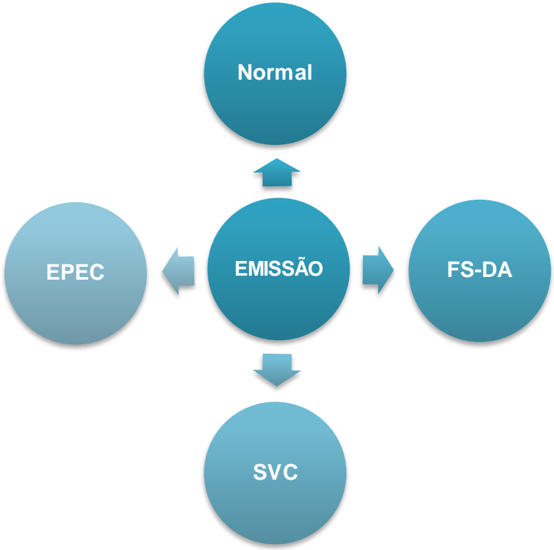

- a) Normal -  é  o  procedimento  padrão  de  emissão da NF-e com transmissão da NF-e para a Secretaria de Fazenda da unidade federada onde o emissor está estabelecido para obter a autorização de uso. O DANFE será impresso em papel comum após o recebimento da autorização de uso da NF-e;
- b) FS-DA -  Contingência  com uso do Formulário de Segurança para impressão de Documento Auxiliar do Documento  Fiscal  eletrônico  -  é  a  alternativa  mais  simples  para  a  situação  em  que  exista  algum impedimento para obtenção da autorização de uso da NF-e, como por exemplo, um problema no acesso à internet  ou  a  indisponibilidade  da  SEFAZ de origem do emissor. Neste caso, o emissor pode optar pela emissão da NF-e em contingência com a impressão do DANFE em Formulário de Segurança. O envio das NF-e  emitidas  nesta  situação  para  SEFAZ  de  origem  será  realizado  quando  cessarem  os  problemas técnicos que impediam a sua transmissão. Cabe ressaltar que a esta modalidade de contingência ainda é possível utilizando-se formulários de segurança para impressor autônomo, nos termos da legislação vigente até 2010, até o final do estoque daqueles formulários;
- c) EPEC - Evento Prévio de Emissão em Contingência - é alternativa de emissão de NF-e em contingência com o registro prévio do resumo das NF-e emitidas. O registro prévio das NF-e permite a impressão do DANFE em papel comum. A validade do DANFE está condicionada à posterior transmissão da NF-e para a SEFAZ de Origem;
- d) SVC - Sefaz Virtual de Contingência - é alternativa de emissão de NF-e em contingência com transmissão da NF-e para uma das Sefaz Virtuais de Contingência. Nesta modalidade de contingência o DANFE pode ser impresso em papel comum e não existe necessidade de transmissão da NF-e para a SEFAZ de origem quando cessarem os problemas técnicos que impediam a transmissão. A utilização da SVC depende de ativação da SEFAZ de origem, o que significa dizer que a SVC só entra em operação quando a SEFAZ de origem estiver com problemas técnicos que impossibilitam a recepção da NF-e.

SNFeNFCe

## 2.1. Modalidades de Emissão de NF-e

O  AJUSTE  SINIEF  07/05  e  as  legislações  específicas  de  cada  UF  disciplinam  e  detalham  as modalidades de emissão de NF-e que serão descritos de forma simplificada a seguir.

Em um cenário de falha que impossibilite a emissão da NF-e na modalidade normal, o emissor deve escolher  a  modalidade  de  emissão  de  contingência  que  lhe  for  mais  conveniente,  ou  até  mesmo aguardar  a  normalização  da  situação  para  voltar  a  emitir  a  NF-e  na  modalidade  normal,  caso  a emissão da NF-e não seja premente.

Como não existe precedência ou hierarquia nas modalidades de emissão da NF-e em contingência, o  emissor  pode  adotar  uma,  algumas  ou  todas  as  modalidades  que  tiver  à  sua  disposição,  ou não adotá-las.

## 2.1.1.  Emissão Normal

O  processo  de  emissão  normal  é  a  situação  desejada  e  mais  adequada  para  o  emissor,  pois  é  a situação  em  que  todos  os  recursos  necessários  para  a  emissão  da  NF-e  estão  operacionais  e  a autorização de uso da NF-e é concedida normalmente pela SEFAZ.

Nesta situação a emissão das NF-e é realizada normalmente com a impressão do DANFE em papel comum, após o recebimento da autorização de uso da NF-e.

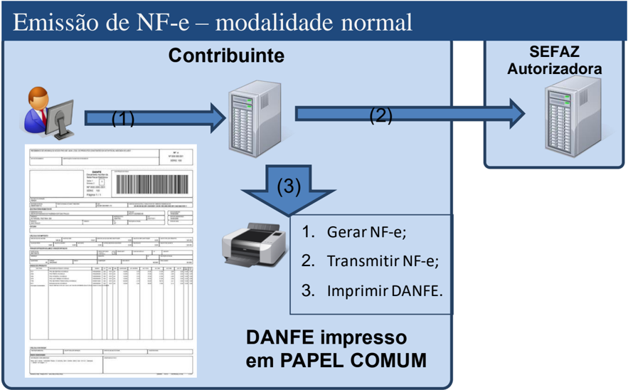

## 2.1.2.  Contingência em  Formulário de Segurança para impressão de Documento Auxiliar de Documento Fiscal Eletrônico - FS-DA

A  contingência  com  o  uso  do  formulário  de  segurança  é  o  processo  mais  simples  de  implementar, sendo  o  processo  de  contingência  que  tem  a  menor  dependência  de  recursos  de  infraestrutura, hardware e software para ser utilizado.

Sendo identificada  a  existência  de  qualquer  incidente  que  prejudique  ou impossibilite a transmissão das  NF-e  e/ou  obtenção  da  autorização  de  uso  da  SEFAZ,  a  empresa  pode  adotar a Contingência com formulário de segurança que requer os seguintes procedimentos do emissor:

- atribuir novo número de NF-e para as NF-e transmitidas que estão pendentes de retorno;

SNFeNFCe

- alterar o campo tpEmis para '5' 1 ;
- informar o motivo de entrada em contingência com data, hora com minutos e segundos do seu início, que devem ser impressas no DANFE;
- regerar  o  XML  da  NF-e  com  outro  número  e,  eventualmente,  outra  série,  caso  já  tenha transmitido a NF-e com o campo tpEmis com valor '1';
- impressão  de  pelo menos duas vias do DANFE em formulário de segurança constando no  corpo  a  expressão  ' DANFE  em  Contingência  -  impresso  em  decorrência  de problemas técnicos ', tendo as vias a seguinte destinação:
- o uma  das  vias  permitirá  o  trânsito  das  mercadorias  e  deverá  ser  mantida  em  arquivo pelo  destinatário  pelo  prazo  estabelecido  na  legislação  tributária  para  a  guarda  de documentos fiscais;
- o a  outra  via  deverá  ser  mantida  em  arquivo  pelo  emitente  pelo  prazo estabelecido na legislação tributária para a guarda dos documentos fiscais.
- transmitir as NF-e imediatamente após a cessação dos problemas técnicos que impediam a transmissão da NF-e, observando o prazo limite de transmissão na legislação;
- a  Chave  de  Acesso  da  NF-e  é  a  mesma  Chave  de  Acesso  do  DANFE  emitido  em Formulário  de Segurança;
- tratar  as  NF-e  transmitidas  por  ocasião  da  ocorrência  dos  problemas  técnicos que estão pendentes de retorno.

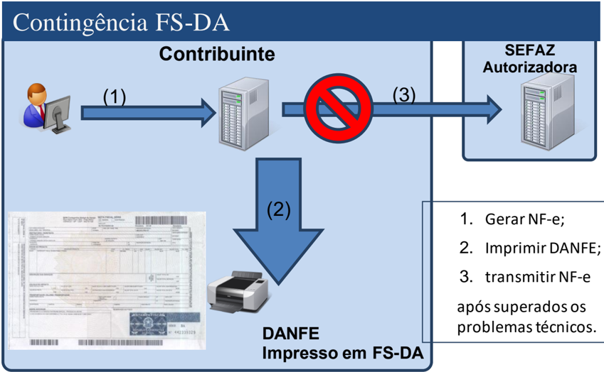

## 2.1.3.  Ambiente de Autorização - SVC

## 2.1.3.1.  Ambiente de Contingência Alternativo

O ambiente de autorização  da  SVC,  SEFAZ  Virtual  de  Contingência,  poderá  assumir  a  recepção  e autorização de NF-e de outra unidade da federação, quando solicitado pela SEFAZ de origem. Existirão  dois  locais  alternativos  de  autorização  em  contingência,  operados  pelas  estruturas  das

SEFAZ VIRTUAIS atuais:

- SVAN - SEFAZ Virtual do Ambiente Nacional;
- SVRS - SEFAZ Virtual do Rio Grande do Sul.

1  Se a empresa estiver utilizando seu estoque de FS-IA nos termos do Convênio ICMS 58/95, deverá utilizar o campo tpEmis com valor  '2' 1

SNFeNFCe Portanto,  de  forma  natural,  mesmo  as  estruturas  de  autorização  das  SEFAZ  VIRTUAIS  passarão a ter a contingência da SVC, utilizando a infraestrutura de autorização uma da outra.

As  SEFAZ  autorizadoras  adotarão  uma  das  duas  SVC,  conforme  definido  no  Ato  COTEPE  39,  de 04/09/2012:

Art.  1º O  Serviço  de  Sefaz  Virtual  de  Contingência,  previsto  no  Ajuste  SINIEF  07/05,  de  30  de setembro  de  2005,  e  disciplinado  pelo  Convênio  ICMS  32/12,  de  30  de  março  de  2012,  será oferecido:

I  -  pela  Sefaz  Virtual  do  Ambiente  Nacional,  disponibilizada  pela  Secretaria  da  Receita  Federal  do Brasil, para os Estados do Acre, Alagoas, Amapá, Minas Gerais, Paraíba, Rio de Janeiro, Rio Grande do  Sul,  Rondônia,  Roraima,  Santa  Catarina,  Sergipe,  São  Paulo  e  Tocantins  e  para  o  Distrito Federal; e

II  -  pela  Sefaz Virtual do Rio Grande do Sul, disponibilizada pelo Estado do Rio Grande do Sul, para os  estados  do  Amazonas,  Bahia,  Ceará,  Espírito  Santo,  Goiás,  Maranhão,  Mato  Grosso,  Mato Grosso do Sul, Pará, Pernambuco, Piauí, Paraná e Rio Grande do Norte.

## 2.1.3.2.  Ambiente de Produção e Ambiente de Teste

A SVC deverá manter um ambiente de produção e um ambiente de teste (homologação) disponíveis para as empresas. O ambiente de testes (homologação) deverá estar sempre ativo para todas as UF e o  ambiente  de  produção  será  disponibilizado  conforme ativação  da  SEFAZ  de  origem  da circunscrição do contribuinte.

## 2.1.3.3.  Ativação da SVC-XX

O  ambiente  de  autorização  da  SVC  é  ativado  pela  UF  interessada  e  uma  vez  acionado  passa  a recepcionar as NF-e enviadas pelas empresas credenciadas para emitir NF-e na UF. O ambiente da SVC deverá manter controle  sobre  os  contribuintes  credenciados  para emissão de NF-e para todas as  UF,  através  do  sincronismo  automático  com  o  Cadastro  Centralizado  de  Contribuintes  (CCC), mantido na SEFAZ-RS.

Ocorrendo a indisponibilidade do ambiente de autorização normal, seja de forma programada ou não, a  SEFAZ  de  origem  acionará  a  SVC  para  que  ative  o  serviço  de  recepção  e  autorização  de  NF-e para  utilização  dos  contribuintes  da  sua  circunscrição.  Esta  ativação  será  realizada  na  área  de acesso restrito do Portal Nacional da NF-e ou na Extranet da SVC-RS, conforme o caso.

Finda  a  indisponibilidade,  a  SEFAZ  de  origem  acionará  novamente  a  SVC,  agora  para  desativar  o serviço.  A  desativação  do  serviço  de  recepção  e autorização de NF-e pela SVC será precedida por um  período  de  15  minutos,  em  que  ambos  os  ambientes  estarão  simultaneamente  disponíveis,  de forma a minimizar o impacto da mudança para as Empresas.

Inicialmente,  a  ativação  /  desativação  será  baseada  em  interação  humana  de  um  representante  da SEFAZ de origem, acionando o ambiente de autorização da SVC específica para a sua UF.

Esta  operação  de  ativação  prevê  o  registro  prévio  da  informação  de  Data-Hora  de  início  e  fim  de funcionamento do ambiente da SVC, servindo, portanto, para as situações que a indisponibilidade da recepção  de  NF-e  no  ambiente  normal  de  autorização  da  SEFAZ  de  origem  seja  previsível  e  de longa duração. É o caso das interrupções programadas para manutenção preventiva da infraestrutura de recepção e autorização da SEFAZ de origem.

## 2.1.3.4.  Serviços Disponibilizados  pela SVC

Serão  disponibilizados  pela  SVC  os  mesmos  serviços  do  ambiente  normal  de  autorização,  com  as características que seguem:

## a)  Serviço de Recepção

O  serviço  de  recepção  e  autorização  de  NF-e  pela  SVC  (Web  Service:  NFeAutorizacao)  somente estará  disponível  conforme  decisão sobre a ativação ou não da SVC para uma determinada SEFAZ de origem.

## b)  Serviço de Retorno da Recepção

O  serviço  de  retorno  da  recepção  do  lote  de  NF-e  pela  SVC  (Web  Service:  NFeRetAutorizacao) sempre  estará  disponível  para  consultar  o  resultado  do  processamento  dos  Lotes  enviados  para  a SVC.

## c)  Serviço de Registro de Eventos: Cancelamento

O  Serviço  de  Registro  de  Eventos  (Web  Service:  RecepcaoEvento,  seção  5.9  da  Visão  Geral  do MOC  7.00),  para  o  evento  de  Cancelamento  (Tipo  Evento=110111),  sempre  estará  disponível somente  para  as  NF-e  autorizadas  pela  própria  SVC,  dentro  das  regras  definidas  para  a  operação normal de cancelamento.

Quando  da  utilização  da  SVC  pela  empresa,  uma  eventual  necessidade  de  cancelamento  de  uma NF-e autorizada  no  ambiente  normal  deverá  ser  represada  para comando posterior no ambiente de autorização normal da SEFAZ de origem da circunscrição do contribuinte.

Nota:

Futuramente, poderá ser analisada a possibilidade de cancelamento na SVC de uma NF-e emitida no ambiente de autorização normal da SEFAZ e/ou o cancelamento no ambiente de autorização normal da SEFAZ de uma NF-e autorizada pela SVC. Neste caso, somente será possível o cancelamento no outro  ambiente,  caso  o  documento  autorizado  já  tenha  sido automaticamente compartilhado entre o ambiente normal de autorização e o ambiente da SVC (e vice-versa).

## d)  Serviço de Registro de Eventos: CC-e e outros

O  registro dos  demais  tipos  de  evento,  tais  como  a  Carta  de  Correção  Eletrônica  e  outros, inicialmente não será disponibilizado  para atendimento pela SVC.

## e) Serviço de Inutilização

O Serviço de Inutilização (Web Service: NFeInutilizacao) não deverá ser oferecido pela SVC.

Quando da utilização da SVC  pela  empresa,  uma  eventual necessidade de inutilização de numeração identificada pela aplicação da empresa deverá ser represada para comando posterior no ambiente de autorização normal da SEFAZ de origem da circunscrição do contribuinte.

## f) Serviço de Consulta da Situação da NF-e

O  Serviço  de  Consulta  da  Situação  atual  da  NF-e  (Web  Service:  NFeConsultaProtocolo)  sempre estará  disponível  somente  para  as  NF-e  autorizadas  pela  própria  SVC,  dentro  das  regras  definidas para a operação normal desta consulta.

A  Consulta  da  Situação  da  NF-e  retorna  toda  a  estrutura  de  autorização  da  NF-e,  portanto  com informações inexistentes na SVC para uma NF-e autorizada pela SEFAZ de origem.

## g)  Serviço de Consulta do Status dos Serviços da SVC

O  Serviço  de  Consulta  do  Status  dos  Serviços  (Web  Service:  NFeStatusServico)  sempre  deverá estar disponível na SVC. No caso de indisponibilidade do ambiente normal de autorização da SEFAZ de  origem  da  circunscrição  do  contribuinte,  a  aplicação  da  empresa  consultará  este Web Service e identificará a oportunidade de trocar seu ambiente normal de autorização para utilização da SVC-XX.

O Serviço de Consulta ao Status da SVC poderá retornar os seguintes códigos de situação:

MOC 7.0 - Anexo  III, Manual de Contingência  NF-e

- 107 - Serviço SVC em Operação;
- 113  -  SVC  em  processo  de  desativação.  SVC  será  desabilitada  para  a  SEFAZ-XX  em dd/mm/aa às hh:mm horas;
- 114 - SVC desabilitada pela SEFAZ Origem.

A empresa  somente  deverá  efetuar a consulta ao  Status  do  Serviço  da  SVC  no  caso  de indisponibilidade  do ambiente de autorização normal da SEFAZ.

Acessando a Consulta Status da SVC, a empresa somente poderá utilizar os serviços de recepção e autorização de NF-e da SVC quando obtiver o Status '107 - Serviço SVC em Operação'.

## h)  Compartilhamento das NF-e autorizadas pela SVC

Todas  as  NF-e  autorizadas  pela  SVC  serão  automaticamente  disponibilizadas  para  o  Ambiente Nacional  da  NF-e  e,  consequentemente,  distribuídas  para  as  Sefaz  envolvidas  na  operação.  A princípio, quando o ambiente de autorização normal da UF retornar ao seu funcionamento normal, os documentos autorizados no ambiente da SVC já constarão na sua base de dados.

## 2.1.3.5.  Uso da SVC Pela Empresa

## a)  Operação 'Em Contingência'

A  aplicação  da  empresa  atualmente  já  mantém  um  controle  sobre  a  disponibilidade  do  ambiente normal de autorização da sua SEFAZ de circunscrição, identificando o seu status de operação como 'Normal' ou 'Em Contingência'.

No caso da indisponibilidade do ambiente normal de autorização, para uso dos serviços de recepção e autorização da SVC-XX, a empresa deve adotar os seguintes procedimentos:

- Identificação  que  a  SVC-XX  foi  ativada  pela  SEFAZ  de  origem  da  sua  circunscrição, conforme resultado do Web Service de Consulta Status do Serviço, descrito anteriormente;
- Geração de novo arquivo XML da NF-e com as seguintes alterações:
- o Campo tpEmis alterado para '6' (SVC-AN) ou para '7' (SVC-RS),  conforme legislação que define qual UF está vinculada a cada uma das SVC;
- o Informação  do  motivo  da  adoção  da  contingência  (campo xJust) e da data e hora de início  de  utilização  da  SVC  (campo  dhCont),  que  também  devem  ser  impressos  no DANFE, conforme definido na legislação.
- Transmissão do Lote de NF-e para a SVC-XX e obtenção da autorização de uso;
- Impressão do DANFE em papel comum;
- Tratamento  dos  arquivos  de  NF-e  transmitidos  para  a  SEFAZ  de  origem  antes  da ocorrência dos problemas técnicos e que estão pendentes de retorno, cancelando aquelas NF-e autorizadas e que foram substituídas por NF-e autorizada na SVC, ou inutilizando a numeração de arquivos não recebidos ou processados.

## SVC-SEFAZVirtual deContingencia

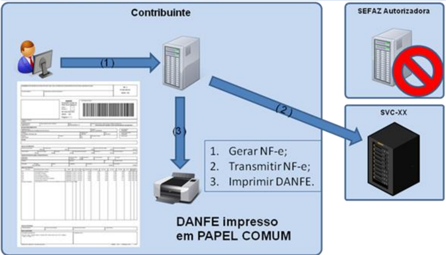

Nota:  No  momento  que  a  empresa  detecta  a  indisponibilidade  do  ambiente  de  autorização  normal, pode ser  que  tenha  enviado  uma  NF-e  e  não tenha obtido o resultado deste pedido de autorização de  uso.  Neste  caso,  deve  gerar  outro  número  de  NF-e,  evitando  que  seja  autorizado  o  mesmo número e série de NF-e no ambiente da SEFAZ autorizadora e da SVC.

## b)  Controle do campo Tipo de Emissão (tpEmis)

O  campo  'tpEmis'  faz  parte  da  Chave  de  Acesso  desde  a  versão  2.0  do  leiaute  da  NF-e  e  isso garante  que duas Chaves de Acesso exatamente iguais não conseguirão ser autorizadas na SEFAZ autorizadora normal e na SEFAZ Virtual de Contingência.

Algumas  regras  de  validação  foram  implementadas  garantindo  a  integridade  do  funcionamento  da SVC, da forma que segue:

|                                                 | Ambiente de Autorização   | Ambiente de Autorização   | Ambiente de Autorização   |
|-------------------------------------------------|---------------------------|---------------------------|---------------------------|
| Campo tpEmis                                    | Normal                    | SVC-AN                    | SVC-RS                    |
| 1-Emissão Normal                                | OK                        | -x-                       | -x-                       |
| 2-Contingência em Formulário de Segurança       | OK                        | -x-                       | -x-                       |
| 4-Contingência EPEC                             | OK                        | -x-                       | -x-                       |
| 5-Contingência em Formulário de Segurança FS-DA | OK                        | -x-                       | -x-                       |
| 6-Contingência SVC-AN                           | -x-                       | OK                        | -x-                       |
| 7-Contingência SVC-RS                           | -x-                       | -x-                       | OK                        |

## 2.1.3.6.  Chave Natural da NF-e

## a)  Numeração da Nota Fiscal

A  numeração  da  Nota  Fiscal modelo 1/1A é disciplinada por legislação nacional e existem controles das SEFAZ sobre esta sequência de numeração. O advento da NF-e liberou o uso do AIDF, mas não desobrigou  as  empresas  do  controle  da  numeração.  Ou  seja,  as  empresas  continuam  sem  poder emitir NF-e diferentes, com o mesmo CNPJ/CPF do emitente, Série e Número da Nota Fiscal.

## b)  Chave Natural e Chave de Acesso

A Chave Natural da NF-e é composta pelos campos de UF, CNPJ/CPF do Emitente, Série e Número da  NF-e,  além  do  modelo  do  documento  fiscal  eletrônico.  O  sistema  de  recepção  e autorização da SEFAZ  valida  a  existência  de  uma  NF-e  previamente  autorizada  com  uma  determinada  Chave Natural e rejeita novos pedidos de autorização de uso para NF-e com duplicidade da Chave Natural.

A  existência  de  mais  de  um  ambiente  de  autorização  para  a  mesma  SEFAZ  de  origem,  e  a impossibilidade técnica de  manutenção  de  um  sincronismo em  tempo  real  entre  estes  dois ambientes, traz como consequência a possibilidade de autorização de Notas Fiscais Eletrônicas com a mesma Chave Natural, uma em cada ambiente de autorização.

Para evitar que estas duas NF-e com a mesma Chave Natural tivessem também a mesma Chave de Acesso, foi alterada a composição da Chave de Acesso, incluindo a informação do Tipo de Emissão, que passa a ter os valores:

- '6' - Autorização pela SVC-AN;
- '7' - Autorização pela SVC-RS.

A Chave de Acesso de uma NF-e contém todos os campos da Chave Natural, complementados com o  Código  Numérico  (chave  de  segurança  gerada  pela  empresa),  Ano-Mês  da  emissão  da  NFe  e  o dígito  de  controle  desta  Chave  de  Acesso.  A  partir  da  versão 2.0, faz parte da Chave de Acesso a informação do Tipo de Emissão, conforme citado anteriormente.

## c)  Chave Natural em Duplicidade

Para evitar problemas futuros, tendo ciência que fatalmente ocorrerão erros nos aplicativos utilizados pelas empresas, a legislação que trata especificamente da numeração da Nota Fiscal Eletrônica será alterada para conviver com uma possível duplicidade da Chave Natural nas situações de autorização em ambientes operacionais diferentes, já que as duas NF-e terão uma autorização de uso fornecida pelo Fisco.

Conforme  definição  a  ser  considerada  em  legislação,  as  duas  NF-e  são  válidas,  embora  também caracterizem uma inconformidade da aplicação da empresa na utilização da mesma numeração para NF-e  diferentes.  Nestes  casos,  a  empresa  emitente  deve  providenciar  o  imediato  cancelamento  da NF-e que não acobertou o trânsito físico da mercadoria, nem foi enviada para o destinatário.

Será disponibilizada uma consulta no Portal Nacional e no Portal das SEFAZ mostrando a Chave de Natural autorizada em duplicidade no ambiente normal da SEFAZ e no ambiente de contingência da SVC-XX.

A  relação  de  web  services  dos  ambientes  de  produção  e  homologação  da  SVC-AN  e  da  SVC-RS pode ser consultada no Portal Nacional da Nota Fiscal Eletrônica (http://www.nfe.fazenda.gov.br para o ambiente de produção e http://hom.nfe.fazenda.gov.br  para o ambiente de homologação).

## 2.1.4.  Contingência Eletrônica com o uso do Evento Prévio de Emissão em Contingência - EPEC

Esta modalidade  de  contingência  é  baseada  no  conceito  de  Evento  Prévio  de  Emissão  em Contingência  -  EPEC,  que  contém  as  principais  informações  da  NF-e  que  serão  emitidas  em contingência, que será prestada pelo emissor para SEFAZ.

## Nota Fiscal Eletrônica

SNFeNFCe

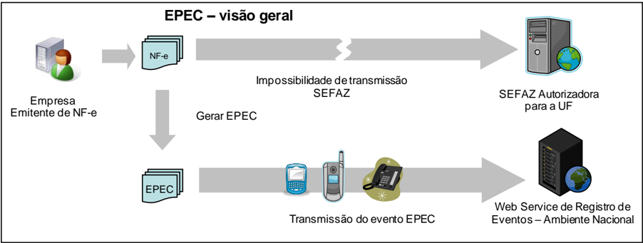

A  emissão  do  EPEC  poderá  ser  adotada  por  qualquer  emissor  que  esteja  impossibilitado  de transmissão e/ou recepção das autorizações de uso de suas NF-e, adotando os seguintes passos:

- Gerar a NF-e com 'tpEmis = 4', mantendo também a informação do motivo de entrada em contingência  com  data  e  hora  do  início  da  contingência,  com  número  diferente  de qualquer NF-e que tenha sido transmitida com outro 'tpEmis';
- Gerar o arquivo XML do EPEC com as seguintes informações da NF-e:
- o UF, CNPJ/CPF e Inscrição Estadual do emitente;
- o Chave de Acesso;
- o UF e CNPJ ou CPF do destinatário;
- o Valor Total da NF-e, Valor Total do ICMS e Valor Total do ICMS-ST;
- o Outras informações constantes no leiaute.
- Assinar o arquivo com o certificado digital do emitente;
- Enviar o arquivo XML do EPEC para o Web Service de Registro de Eventos do AN;
- Impressão  do  DANFE  da  NF-e  que  consta  do  EPEC,  em  papel  comum,  constando  no corpo a expressão 'DANFE impresso em contingência - EPEC regularmente recebida pela Receita Federal do Brasil'.

Obtida  a  autorização  do  Evento  (Número do Protocolo: 891xxxxxxxxxxxx), a exemplo do que ocorre com  outros  eventos  da  NF-e,  este  evento  também  será  distribuído  para  as  UF  envolvidas  na operação, inclusive para a própria UF do emitente.

Após a cessação dos problemas técnicos que impediam a transmissão da NF-e para UF de origem, a NF-e  que  deu  origem  a  necessidade  de  uso  da  Contingência  Eletrônica  'EPEC'  deverá  ser transmitida  para  a  SEFAZ  de  origem,  observando  o  prazo  limite de transmissão na legislação, bem como outros procedimentos constantes na legislação caso ocorra rejeição na autorização de uso.

Nota: A Chave de Acesso desta NF-e é exatamente a mesma Chave de Acesso do EPEC autorizado anteriormente.

## Contingência EPEC - Evento Prévio de Emissão em Contingência

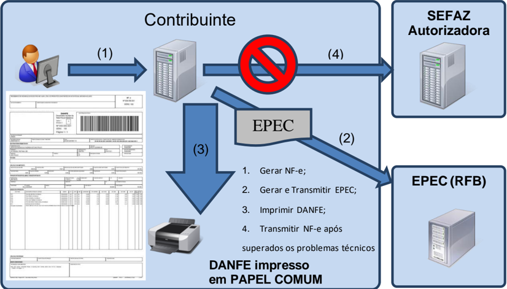

## 2.1.5.  Quadro Resumo das modalidades de emissão da NF-e

A seguir resumimos os principais procedimentos necessários para adequar a NF-e  para a modalidade de emissão desejada.

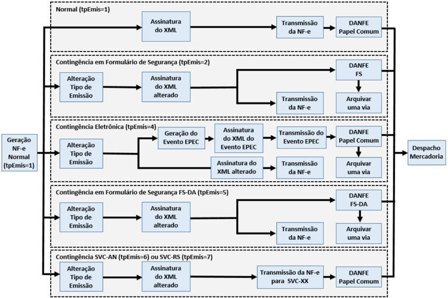

## 2.2. Documento Auxiliar da Nota Fiscal Eletrônica - DANFE

O  DANFE  é  um  documento  fiscal  auxiliar  que  tem  a  finalidade  de  acobertar  a  circulação  da mercadoria  e  não  se  confunde  com  a  NF-e  da  qual  é  mera  representação  gráfica,  obedecendo  ao disposto no Capítulo 3 do Anexo II do MOC 7. A sua validade está condicionada à existência da NF-e que representa devidamente autorizada na SEFAZ de origem.

As  folhas  soltas, formulário contínuo ou formulário pré-impresso são considerados papel comum e a sua  aquisição  ou  confecção  não  está  sujeito  ao  controle  do  fisco  como  ocorre com o formulário de segurança que é um impresso fiscal com normas rígidas de aquisição, controle e utilização.

## 2.2.1.  Formulários de Segurança para Impressão do DANFE

Atualmente existem os seguintes tipos de formulários de segurança:

- Formulário de Segurança - FS : disciplinado pelos Convênios ICMS 58/95 e 131/95;
- Formulário  de  Segurança  para  Impressão  de  Documento  Auxiliar  de  Documento  Fiscal Eletrônico - FS-DA : disciplinado pelo Convênio ICMS 110/08 e Ato COTEPE 35/08.

O uso do formulário de segurança FS será permitido apenas para consumir os estoques existentes, pois sua aquisição para impressão de DANFE não é mais autorizada.

O FS e o FS-DA  podem  ser  fabricados por estabelecimento industrial gráfico previamente credenciado  junto  à  COTEPE/ICMS,  porém  somente  aquele  último  tem  a  possibilidade  de  ser distribuído através de estabelecimento gráfico credenciado como distribuidor junto à UF de interesse, mediante a obtenção de credenciamento, concedido por regime especial.

SNFeNFCe SNFeNFCe Os  formulários  de  segurança  são  confeccionados  com  requisitos  de  segurança  com  o  objetivo  de dificultar  falsificação  e  fraudes.  Estes  requisitos  são  adicionados  ou  por  ocasião  da  fabricação  do papel  de  segurança  produzido  pelo  processo mould made ou por ocasião da impressão no caso do FS fabricado  com  papel  dotado  de  estampa fiscal, com recursos de segurança impressos. Assim, a legislação tributária permite o uso de formulários de segurança que atendam os seguintes requisitos:

- FS com Estampa Fiscal -  impresso  com  calcografia  com  microtexto  e  imagem  latente  na  área reservado  ao  fisco,  o  impresso  deverá  ter  fundo  numismático  com  tinta  reagente  a  produtos químicos combinado com as Armas da República;
- FS  em  Papel  de  Segurança -  com  filigrana  (marca  d'água)  produzida  pelo  processo  "mould made",  fibras  coloridas  e  luminescentes,  papel  não  fluorescente,  microcápsulas  de  reagente químico e microporos que aumentem a aderência do toner ao papel.

Todos  os  formulários  de  segurança  terão  o  número  de  controle  do  formulário  com  numeração sequencial  de 000.000.001 a 999.999.999 e seriação de "AA" a "ZZ", impresso no quadro reservado ao fisco.

A  identificação  do  formulário  de  segurança  com  calcografia  é  mais  simples  pela  existência  da estampa  fiscal localizada no quadro reservado ao  fisco  e  pelo  fundo  numismático  com  cor característica associada ao brasão das Armas da República no corpo do formulário.

A  diferenciação  entre  o  FS-IA  e  FS-DA  produzidos  por  calcografia  é  estabelecida  simultaneamente pela  cor  utilizada  no  fundo  numismático,  pela  estampa  fiscal,  pelas  Armas  da  República  e  pelo logotipo característico de formulário destinado a impressão de documento fiscal eletrônico.

O  FS-IA  tem  o  fundo  numismático  impresso  na  cor  de  tonalidade  predominante  esverdeada combinada com as Armas da República e estampa fiscal na cor azul pantone. O FS-DA tem o fundo numismático impresso na cor de tonalidade predominante Salmão pantone nº 155 combinada com as Armas da República ao lado do logotipo que caracteriza o Documento Auxiliar de Documento Fiscal Eletrônico e estampa fiscal na cor Vinho Pantone, conforme exemplos visualizados na figura abaixo.

Exemplo de FS

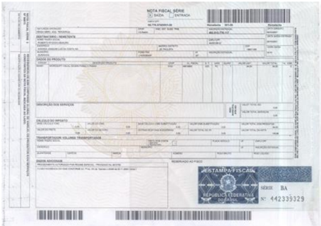

Exemplo de FS-DA

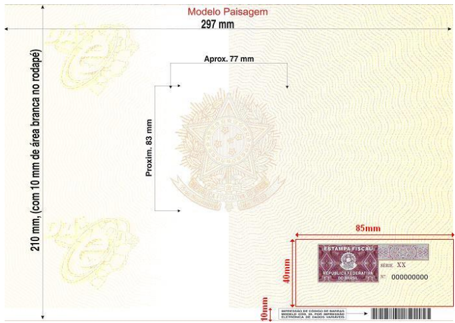

A  identificação  do  formulário  de  segurança  fabricado  em  papel  de  segurança  não  é  tão  evidente como é o formulário com calcografia, pois a primeira vista é um papel branco  facilmente confundido com um papel comum.

A  distinção  deste  papel  de  segurança  deve  ser  feito  pela  filigrana  (marca  d'água)  existente  no  seu corpo;  pela seriação composta por duas letras e numeração sequencial de nove números aposta no espaço  normalmente  reservado  ao  fisco;  pela  impressão  da  identificação  do  adquirente  e  pelo códigos de barras impressos no rodapé inferior.

O  FS-IA  possui  filigrana  caracterizada  com  o  brasão  de  Armas  da  República  intercalada  com  a expressão  'NOTA  FISCAL',  enquanto  que  o  FS-DA  possui  filigrana  caracterizada  pelo  brasão  das Armas  da  República  intercalada  com  o  logotipo  do  Documento  Auxiliar  de  Documentos  Fiscais SNFeNFCe Eletrônicos. Estas filigranas somente se tornam visíveis contra a luz, conformes exemplos e modelos reproduzidos nas figuras abaixo.

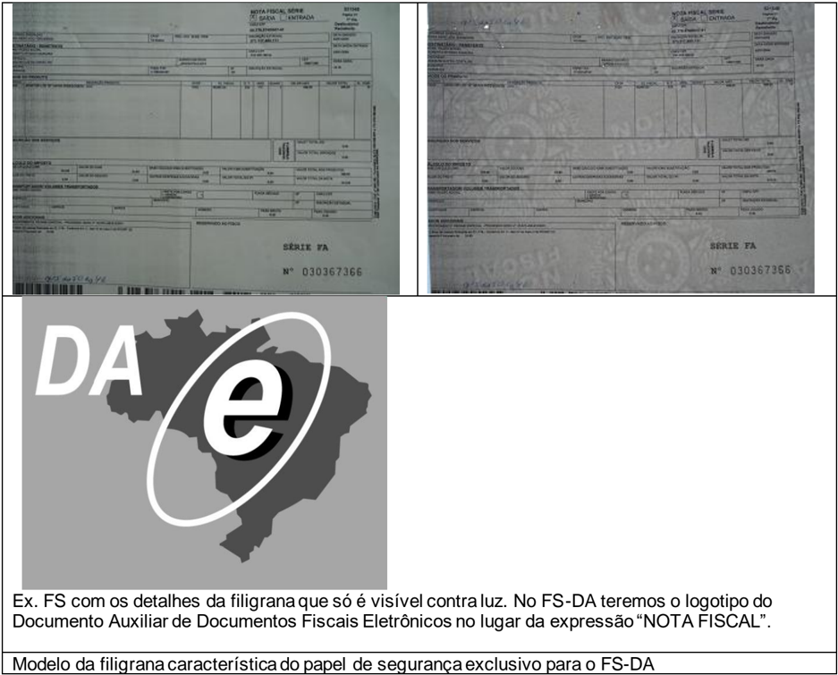

## 2.2.2.  Localização da Estampa Fiscal no FS -DA

A  estampa  fiscal  é  impressa  na área reservado ao fisco que está localizada no canto inferior direito do formulário de segurança.

Nesta  mesma  área  também  é  impresso  a  série  e  o  número  de  controle  do  impresso.  Assim,  o emissor  deve  tomar  os  cuidados necessários para que o recibo do canhoto de entrega não utilize o espaço  de  40  mm  x  85  mm  do  canto  inferior  do  impresso,  deslocando-o  para  a  parte  superior  do formulário.

SNFeNFCe

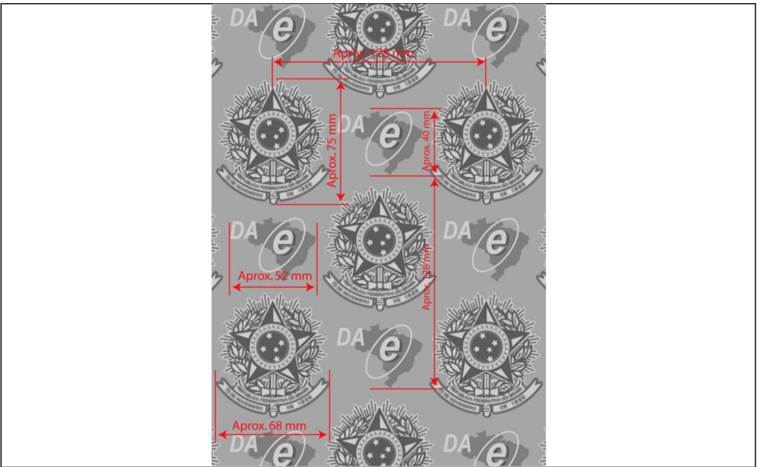

Modelo das dimensões e posicionamento das filigranas no papel de segurança para FS-DA

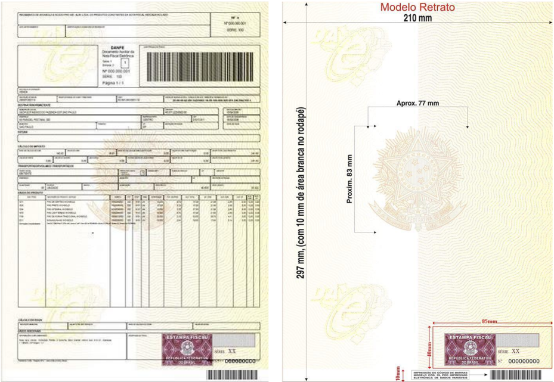

Ex. de DANFE com recibo deslocado para a parte superior.

Importante destacar que o FS-DA tem um código de barras com a identificação da sua origem e seu usuário pré-impresso no rodapé inferior, que deve ser preservado, pois será utilizado na fiscalização de trânsito.

## 2.2.3.  Impressão do DANFE em Contingência com Formulário de Segurança

Quando  a  modalidade  emissão  de  contingência  for  baseada  no  uso  de  formulário  de  segurança,  o DANFE deve ser impresso no mesmo tipo de formulário de segurança declarado no campo tpEmis da NF-e.

Nos casos de contingência  com  uso  de  formulário de segurança, a impressão do DANFE em papel comum  contraria  a  legislação  e  ocasiona  graves  consequências  ao  emitente,  pelo  descumprimento de obrigação acessória, caracterizando ainda a inidoneidade do DANFE para efeito de circulação da mercadoria e de escrituração e aproveitamento do crédito pelo seu destinatário.

O formulário de segurança pode ser utilizado para impressão do DANFE em qualquer modalidade de emissão,  contudo,  o  emissor  deverá  formalizar  a  opção  pelo  uso  do  formulário  de  segurança  em todas  as  operações  no  livro  Registro  de  Documentos  Fiscais  e  Termos  de  Ocorrência  -  RUDFTO, modelo 6.

|                                 | Modalidade de emissão da NF-e   | Modalidade de emissão da NF-e   | Modalidade de emissão da NF-e   | Modalidade de emissão da NF-e   | Modalidade de emissão da NF-e   |
|---------------------------------|---------------------------------|---------------------------------|---------------------------------|---------------------------------|---------------------------------|
| Impressão do DANFE              | Normal                          | FS-IA                           | FS-DA                           | SVC                             | EPEC                            |
| em papel comum                  |                                 |                                 |                                 |                                 |                                 |
| em FS-IA (Convênio ICMS 58/57)  |                                 |                                 |                                 |                                 |                                 |
| em FS-DA (Convênio ICMS 110/08) |                                 |                                 |                                 |                                 |                                 |

## 2.3. Ações que devem ser tomadas após a recuperação da falha

A  emissão  de  NF-e  em  contingência  é  um  procedimento de exceção e existem algumas ações que devem  ser  tomadas  após  a  recuperação  da  falha,  a  principal  delas  é  a  transmissão  das  NF-e emitidas em contingência para que sejam autorizadas.

## 2.3.1.  Transmissão das NF-e emitidas em Contingência

As notas fiscais emitidas em  contingência FS-IA, FS-DA e EPEC  devem  ser  transmitidas imediatamente  após  a  cessação  dos  problemas  técnicos  que  impediam  a  transmissão  da  NF-e, observando o prazo limite de transmissão estabelecido na legislação.

As NF-e emitidas com uma das SVC não precisam ser transmitidas para a SEFAZ de origem.

## 2.3.2.  Rejeição de NF-e emitidas em Contingência

Caso ocorra a rejeição de alguma NF-e emitida em contingência, o contribuinte deverá:

- (1)  Gerar  novamente  o  arquivo  com  a mesma numeração e série 2 , sanando a irregularidade desde que não se altere:
2. (a) as  variáveis  que  determinam  o  valor  do  imposto  tais  como:  base  de  cálculo,  alíquota, diferença de preço, quantidade, valor da operação ou da prestação;
3. (b) a correção de dados cadastrais que implique mudança do remetente ou do destinatário; nem
4. (c) a data de emissão ou de saída;
- (2)  Solicitar Autorização de Uso da NF-e;

2  Observar que a manutenção do número e série somente se aplica para os casos de rejeição da NF-e que foi emitida em contingência, e nunca para os casos em que a NF-e foi normalmente emitida mas o contribuinte não obteve êxito na consulta sobre o resultado da autorização de uso de uma NF-e emitida com tpEmis = '1' (as NF-e pendentes de retorno, conforme item 2.3.3).

MOC 7.0 - Anexo  III, Manual de Contingência  NF-e

- (3) Imprimir  o  DANFE  correspondente  à  NF-e  autorizada,  no  mesmo  tipo  de  papel  utilizado  para imprimir o DANFE original;
- (4) Providenciar,  junto  ao  destinatário,  a  entrega  da  NF-e  autorizada  bem  como  do  novo  DANFE impresso  nos  termos  do  item  3,  caso  a  geração  saneadora  da  irregularidade  da  NF-e  tenha promovido alguma alteração no DANFE.

## 2.3.3.  NF-e Pendentes de Retorno

Quando ocorrer  uma falha, seja ela no ambiente do Contribuinte, no ambiente da SEFAZ origem ou no  ambiente  da  SVC,  há  a  probabilidade  de existirem NF-e transmitidas pelo contribuinte e para as quais  ele  ainda  não  obteve  o  resultado  do  processamento.  Estas  NF-e  são  denominadas  de  'NF-e Pendentes de Retorno'.

As  NF-e  Pendentes  de  Retorno  podem  não  ter  sido  recebidas  pela  SEFAZ  origem,  estar  na  fila aguardando  processamento,  estar em  processamento  ou  o  processamento  pode  já ter sido concluído.

Caso a falha tenha ocorrido na SEFAZ origem, ao retornar à operação normal, é possível que as NFe  em  processamento  sejam  perdidas,  e  que  as  que  estavam  na  fila  tenham  o  seu  processamento concluído normalmente.

Todas  as  NF-e  Pendentes  de  Retorno  devem  receber  nova  numeração  para  serem  emitidas  em contingência, este procedimento é necessário para evitar a rejeição da NF-e emitida em contingência que pode ocorrer caso a NF-e transmitida incialmente tenha sido autorizada.

Cabe à aplicação do contribuinte tratar adequadamente a situação das NF-e Pendentes de Retorno e executar, imediatamente após o retorno à operação normal, as ações necessárias à regularização da situação destas NF-e, a saber:

- Cancelar  as  NF-e  Pendentes  de  Retorno  que  tenham  sido  autorizadas  pela  SEFAZ  origem,  mas  que tiveram as operações comerciais correspondentes registradas em NF-e emitidas em contingência.
- Inutilizar a numeração das NF-e Pendentes de Retorno que não foram autorizadas ou denegadas.

## Documentos relacionados
_Nenhum documento relacionado conhecido._
