## Sistema Nota Fiscal Eletrônica

Manual de Orientação do Contribuinte Visão Geral

Versão 7.00 -Novembro de 2020


## Nota Fiscal Eletrônica

## Sumário

| Sumário                                                                                                                                                                                                                                                                                                                          | .....................................................................................................................................................2     |
|----------------------------------------------------------------------------------------------------------------------------------------------------------------------------------------------------------------------------------------------------------------------------------------------------------------------------------|------------------------------------------------------------------------------------------------------------------------------------------------------------|
| Índice de Ilustrações                                                                                                                                                                                                                                                                                                            | .................................................................................................................................9                         |
| Índice de Tabelas....................................................................................................................................10                                                                                                                                                                          |                                                                                                                                                            |
| Índice de Schemas XML.........................................................................................................................12                                                                                                                                                                                 |                                                                                                                                                            |
| Controle de Versões                                                                                                                                                                                                                                                                                                              | ...............................................................................................................................13                          |
| Acrônimos ...............................................................................................................................................14                                                                                                                                                                      |                                                                                                                                                            |
| 1. Introdução                                                                                                                                                                                                                                                                                                                    | ...........................................................................................................................................16              |
| 2. Considerações Iniciais ........................................................................................................................16                                                                                                                                                                             |                                                                                                                                                            |
| 2.1. Objetivos do Projeto ......................................................................................................................16                                                                                                                                                                               |                                                                                                                                                            |
| 2.2. Conceitos .......................................................................................................................................17                                                                                                                                                                         |                                                                                                                                                            |
| 2.2.1. NF-e (Modelo 55)......................................................................................................................                                                                                                                                                                                    | 17                                                                                                                                                         |
| 2.2.2. NFA-e - Nota Fiscal Avulsa Eletrônica (Modelo 55).....................................................................                                                                                                                                                                                                    | 17                                                                                                                                                         |
| 2.2.3. NFC-e (modelo 65)....................................................................................................................                                                                                                                                                                                     | 18                                                                                                                                                         |
| 2.2.4. DANFE.....................................................................................................................................                                                                                                                                                                                | 18                                                                                                                                                         |
| 2.2.5. DANFE NFC-e.........................................................................................................................                                                                                                                                                                                      | 18                                                                                                                                                         |
| 2.2.6. Chave de Acesso......................................................................................................................                                                                                                                                                                                     | 18                                                                                                                                                         |
| 2.2.6.1. Versão 4.00 da NF-e .................................................................................................................................................                                                                                                                                                   | 19                                                                                                                                                         |
| 2.2.6.2. Cálculo do Dígito Verificador da Chave de Acesso da NF-e ......................................................................................... 2.2.6.3. Versões anteriores ao leiaute 4.00 da NF-e................................................................................................................. | 19 20                                                                                                                                                      |
| 2.2.7. Chave Natural...........................................................................................................................                                                                                                                                                                                  |                                                                                                                                                            |
|                                                                                                                                                                                                                                                                                                                                  | 20                                                                                                                                                         |
| 2.2.8. Série Reservadas da Numeração da NF-e por Estabelecimento Rural (Inscrição Estadual)........................................................................................                                                                                                                                              | NF-e......................................................................................................... 21 21                                        |
| 2.2.9. GTIN........................................................................................................................................                                                                                                                                                                              | 21                                                                                                                                                         |
| 2.2.9.1. Cadastro Centralizado de                                                                                                                                                                                                                                                                                                | 22                                                                                                                                                         |
| GTIN.................................................................................................................................. 2.2.9.2. Manutenção do Cadastro Centralizado de GTIN..........................................................................................................                            | 22                                                                                                                                                         |
| 2.2.10. Responsável Técnico ..............................................................................................................                                                                                                                                                                                       | 23                                                                                                                                                         |
| 2.2.10.1. Fornecimento do CSRT ...........................................................................................................................................                                                                                                                                                       | 23                                                                                                                                                         |
| 2.2.10.2. Geração do hashCSRT............................................................................................................................................ 2.2.10.3. Exemplo do                                                                                                                                   | 24 hashCSRT............................................................................................................................................ 24 |
| 2.2.11. cBenef....................................................................................................................................                                                                                                                                                                               | 24                                                                                                                                                         |
| 2.2.11.1. Arquivo no Portal Nacional da NF-e contendo os endereços das tabelas de 'cBenef x CST' das UF:............................                                                                                                                                                                                             | 25                                                                                                                                                         |
| 2.2.12. Cadastro Centralizado de Contribuintes (CCC)..........................................................................                                                                                                                                                                                                   | 25                                                                                                                                                         |
| 2.3. Descrição Simplificada do Modelo Operacional da NF-e.............................................................25                                                                                                                                                                                                         |                                                                                                                                                            |
| 2.3.1. Autorização de Uso...................................................................................................................                                                                                                                                                                                     | 25                                                                                                                                                         |
| 2.3.2. Modalidades de Emissão...........................................................................................................                                                                                                                                                                                         | 26                                                                                                                                                         |
| 2.3.2.1. Emissão Normal........................................................................................................................................................                                                                                                                                                  | 26                                                                                                                                                         |
| 2.3.2.2. Contingência.............................................................................................................................................................                                                                                                                                               | 26                                                                                                                                                         |
| 3. Eventos ...............................................................................................................................................27                                                                                                                                                                     |                                                                                                                                                            |
| 3.1. Tipos de 3.1.1. Eventos Registrados pelo                                                                                                                                                                                                                                                                                    | Evento.............................................................................................................................28                      |
| Emitente............................................................................................                                                                                                                                                                                                                             | 28                                                                                                                                                         |
| Tabela 3-1 - Eventos Registrados pelo Emitente.....................................................................................................................                                                                                                                                                              | 28                                                                                                                                                         |
| 3.1.2. Eventos Registrados pelo Destinatário .......................................................................................                                                                                                                                                                                             | 29                                                                                                                                                         |
| Tabela 3-2 - Eventos Registrados pelo Destinatário ................................................................................................................                                                                                                                                                              | 29                                                                                                                                                         |
| 3.1.3. Eventos Registrados pelo Fisco .................................................................................................                                                                                                                                                                                          | 29                                                                                                                                                         |
| Tabela 3-3 - Eventos Registrados pelo Fisco..........................................................................................................................                                                                                                                                                            | 29                                                                                                                                                         |
| 3.1.4. Eventos Propagados Automaticamente ...................................................................................... Tabela 3-4 - Eventos Registrados Automaticamente pelo Ambiente                                                                                                                                  | 30 Nacional ........................................................................... 30                                                                 |
| 3.1.5. Eventos Registrados por Outros Órgãos.....................................................................................                                                                                                                                                                                                | 31                                                                                                                                                         |
| Tabela 3-5 - Eventos Registrados por Outros Órgãos .............................................................................................................                                                                                                                                                                 | 31                                                                                                                                                         |


## Nota Fiscal Eletrônica


| 3.2. Manifestações do Destinatário ......................................................................................................31                                                                                                                                                                                                                                                                                                                                                                                    |                                                                                                                |
|--------------------------------------------------------------------------------------------------------------------------------------------------------------------------------------------------------------------------------------------------------------------------------------------------------------------------------------------------------------------------------------------------------------------------------------------------------------------------------------------------------------------------------|----------------------------------------------------------------------------------------------------------------|
| 3.2.1. Eventos de Manifestação do Destinatário ...................................................................................                                                                                                                                                                                                                                                                                                                                                                                             | 31                                                                                                             |
| 3.2.1.1. Confirmação da Operação .........................................................................................................................................                                                                                                                                                                                                                                                                                                                                                     | 31                                                                                                             |
| 3.2.1.2. Desconhecimento da Operação .................................................................................................................................                                                                                                                                                                                                                                                                                                                                                         | 32                                                                                                             |
| 3.2.1.3. Operação não Realizada ...........................................................................................................................................                                                                                                                                                                                                                                                                                                                                                    | 32                                                                                                             |
| 3.2.1.4. Evento de 'Ciência da Operação ou Ciência da Emissão'............................................................................................                                                                                                                                                                                                                                                                                                                                                                     | 32                                                                                                             |
| 3.2.1.5. Sobre a mudança da Manifestação do Destinatário .....................................................................................................                                                                                                                                                                                                                                                                                                                                                                 | 32                                                                                                             |
| 3.2.2. Como operacionalizar a Manifestação do Destinatário.................................................................                                                                                                                                                                                                                                                                                                                                                                                                    | 32 33                                                                                                          |
| 3.2.2.1. Por Meio de Web Service s......................................................................................................................................... 3.2.2.2. Por Meio de Consulta no Portal Nacional ....................................................................................................................                                                                                                                                                                              | 33 35                                                                                                          |
| 3.2.2.3. Por Meio do Programa Manifestador........................................................................................................................... 3.2.3. Obrigatoriedade de                                                                                                                                                                                                                                                                                                                                | Manifestação............................................................................................... 35 |
| 3.3. Evento Prévio de Emissão em Contingência (EPEC) ..................................................................36                                                                                                                                                                                                                                                                                                                                                                                                      |                                                                                                                |
| 3.3.1. EPEC, Visão Geral....................................................................................................................                                                                                                                                                                                                                                                                                                                                                                                   | 36                                                                                                             |
| Figura 3-1 - Visão Geral do Evento Prévio de Emissão em                                                                                                                                                                                                                                                                                                                                                                                                                                                                        | Contingência.................................................................................. 36              |
| 3.3.2. Endereço dos Web Services......................................................................................................                                                                                                                                                                                                                                                                                                                                                                                         | 37                                                                                                             |
|                                                                                                                                                                                                                                                                                                                                                                                                                                                                                                                                | 37                                                                                                             |
| 3.3.3. Entrada em Contingência........................................................................................................... 3.3.4. Impressão do DANFE................................................................................................................                                                                                                                                                                                                                                            | 37                                                                                                             |
| 3.3.5. Lote de EPEC...........................................................................................................................                                                                                                                                                                                                                                                                                                                                                                                 | 37                                                                                                             |
| 3.3.6. Controle do Ambiente de Contingência do EPEC........................................................................                                                                                                                                                                                                                                                                                                                                                                                                    | 38                                                                                                             |
| 3.3.7. Controle de EPEC Pendente de Conciliação...............................................................................                                                                                                                                                                                                                                                                                                                                                                                                 | 38                                                                                                             |
| 3.3.8. Controle do Ambiente de Contingência do EPEC........................................................................                                                                                                                                                                                                                                                                                                                                                                                                    | 38                                                                                                             |
| 3.3.9. Relação de EPEC Pendente de Conciliação ...............................................................................                                                                                                                                                                                                                                                                                                                                                                                                 | 39                                                                                                             |
| 3.3.10. Adaptação nos Serviços de Autorização de Uso........................................................................                                                                                                                                                                                                                                                                                                                                                                                                   | 39                                                                                                             |
| 3.3.11. Serviço de Autorização de NF-e............................................................................................... 3.3.12. Serviço de Registro de Evento: Cancelamento de NF-e.............................................................                                                                                                                                                                                                                                                                 | 39 40                                                                                                          |
| 3.3.13. Serviço de Registro de Evento: Carta de Correção....................................................................                                                                                                                                                                                                                                                                                                                                                                                                   | 40                                                                                                             |
| 3.3.14. Serviço de Registro de Evento: Manifestação do Destinatário ....................................................                                                                                                                                                                                                                                                                                                                                                                                                       | 40                                                                                                             |
| 3.3.15. Serviço de Inutilização de Numeração......................................................................................                                                                                                                                                                                                                                                                                                                                                                                             | 40                                                                                                             |
| 3.3.16. Serviço de Consulta Situação da NF-e (Web Service: NfeConsulta2)..........................................                                                                                                                                                                                                                                                                                                                                                                                                             | 40 40                                                                                                          |
| 3.3.17. Sincronismo dos Ambientes de Autorização: Situações de Exceção...........................................                                                                                                                                                                                                                                                                                                                                                                                                              |                                                                                                                |
| 3.3.17.1. Compartilhamento de Informações entre as SEFAZ e o Ambiente Nacional da Receita Federal ................................... 3.3.17.2. Sincronismo das Informações...................................................................................................................................                                                                                                                                                                                                                 | 40 41                                                                                                          |
| 3.4. Pedidos de Prorrogação de Suspensão ICMS em Remessas Interestaduais.............................42                                                                                                                                                                                                                                                                                                                                                                                                                        |                                                                                                                |
| 3.4.1. Pedido de Prorrogação..............................................................................................................                                                                                                                                                                                                                                                                                                                                                                                     | 43                                                                                                             |
| Figura 3-2 - Exemplo de Pedido de Prorrogação.....................................................................................................................                                                                                                                                                                                                                                                                                                                                                             | 43                                                                                                             |
| 3.4.2. Cancelamento do Pedido de Prorrogação...................................................................................                                                                                                                                                                                                                                                                                                                                                                                                | 43                                                                                                             |
| Figura 3-3 - Exemplo de Cancelamento de Pedido de Prorrogação 2º prazo ............................................................................ Figura 3-4 - Exemplo de Cancelamento de Pedido de Prorrogação 1º prazo ............................................................................                                                                                                                                                                                                                        | 44 44                                                                                                          |
| 3.4.3. Deferimento dos pedidos de prorrogação e de cancelamento pela SEFAZ....................................                                                                                                                                                                                                                                                                                                                                                                                                                 | 44                                                                                                             |
| Figura 3-5 - Exemplo de Pedido de Prorrogação.....................................................................................................................                                                                                                                                                                                                                                                                                                                                                             | 45 45                                                                                                          |
| Figura 3-6 - Exemplo Resposta do Fisco ao Pedido de Prorrogação ........................................................................................ Figura 3-7 - Exemplo de Cancelamento de Pedido de Prorrogação..........................................................................................                                                                                                                                                                                                               | 46                                                                                                             |
| Figura 3-8 - Exemplo Resposta do Fisco ao Cancelamento de Pedido de Prorrogação .............................................................                                                                                                                                                                                                                                                                                                                                                                                  | 47                                                                                                             |
| 3.5. Cancelamento por Substituição ....................................................................................................47                                                                                                                                                                                                                                                                                                                                                                                      |                                                                                                                |
| 3.6. Evento Ator Interessado na NF-e - Transportador.......................................................................48                                                                                                                                                                                                                                                                                                                                                                                                  |                                                                                                                |
| Arquitetura de Comunicação com Contribuinte..................................................................................49                                                                                                                                                                                                                                                                                                                                                                                                |                                                                                                                |
| 4.                                                                                                                                                                                                                                                                                                                                                                                                                                                                                                                             |                                                                                                                |
| 4.1. Modelo Conceitual .........................................................................................................................49 4.2. Padrões Técnicos                                                                                                                                                                                                                                                                                                                                                       |                                                                                                                |
| ..........................................................................................................................49 4.2.1. Padrão de Documento XML.......................................................................................................                                                                                                                                                                                                                                                             | 49                                                                                                             |
| 4.2.1.1. Padrão de Codificação............................................................................................................................................... 4.2.1.2. Declaração namespace ............................................................................................................................................. 4.2.1.3. Otimização na Montagem do Arquivo.......................................................................................................................... | 49 50                                                                                                          |
| 4.2.1.4. Validação de Schema................................................................................................................................................ 4.2.1.5. Tratamento de Caracteres Especiais no Texto de                                                                                                                                                                                                                                                                                           | 50                                                                                                             |
|                                                                                                                                                                                                                                                                                                                                                                                                                                                                                                                                | 51 51                                                                                                          |
| XML................................................................................................                                                                                                                                                                                                                                                                                                                                                                                                                            |                                                                                                                |

## Nota Fiscal Eletrônica

5.


| 4.2.2. Padrão de Comunicação                                                                                                                                                                                                                                                                                                                 | ........................................................................................................... 52                                   |
|----------------------------------------------------------------------------------------------------------------------------------------------------------------------------------------------------------------------------------------------------------------------------------------------------------------------------------------------|--------------------------------------------------------------------------------------------------------------------------------------------------|
| 4.2.3. Padrão de Certificado Digital......................................................................................................                                                                                                                                                                                                   | 52                                                                                                                                               |
| 4.2.4. Padrão de Assinatura Digital......................................................................................................                                                                                                                                                                                                    | 53                                                                                                                                               |
| 4.2.4.1. Assinatura Digital com Certificado e-CPF....................................................................................................................                                                                                                                                                                        | 55                                                                                                                                               |
| 4.2.5. Validação de Assinatura Digital pela Secretaria de Fazenda Estadual ..........................................                                                                                                                                                                                                                        | 55                                                                                                                                               |
| 4.2.6. Resumo dos Padrões Técnicos..................................................................................................                                                                                                                                                                                                         | 55                                                                                                                                               |
| 4.2.7. Colunas das Tabelas de Leiaute de Mensagens..........................................................................                                                                                                                                                                                                                 | 56                                                                                                                                               |
| 4.3. Modelo Operacional ......................................................................................................................57                                                                                                                                                                                             |                                                                                                                                                  |
| 4.3.1. Serviços Síncronos ...................................................................................................................                                                                                                                                                                                                | 58                                                                                                                                               |
| 4.3.2. Serviços Assíncronos                                                                                                                                                                                                                                                                                                                  | ................................................................................................................ 58                              |
| 4.3.3. Filas e Mensagens....................................................................................................................                                                                                                                                                                                                 | 59                                                                                                                                               |
| 4.3.4. Número do Recibo de Lote                                                                                                                                                                                                                                                                                                              | ........................................................................................................ 60                                      |
| 4.3.5. Número do Protocolo.................................................................................................................                                                                                                                                                                                                  | 61 61                                                                                                                                            |
| 4.3.6. Tempo Médio de Resposta........................................................................................................ 4.3.7. Ambientes de Homologação e de Produção................................................................................                                                                         | 61                                                                                                                                               |
| Sobre as Condições de Teste para as Empresas.....................................................................................................................                                                                                                                                                                            | 62                                                                                                                                               |
| 4.3.8. Uso Indevido.............................................................................................................................                                                                                                                                                                                             | 62                                                                                                                                               |
| 4.4. Padrão de Mensagens dos Web Service s....................................................................................64                                                                                                                                                                                                             |                                                                                                                                                  |
| 4.4.1. Informação de Controle e Área de Dados das Mensagens...........................................................                                                                                                                                                                                                                       | 64                                                                                                                                               |
| 4.4.2. Validação da EstruturaXML das Mensagens dos Web Services ..................................................                                                                                                                                                                                                                           | 65                                                                                                                                               |
| 4.4.3. Schemas XML das Mensagens dos Web Services ......................................................................                                                                                                                                                                                                                     | 65                                                                                                                                               |
| 4.5. Versão dos Schemas                                                                                                                                                                                                                                                                                                                      | ....................................................................................................................66                           |
| 4.5.1. Controle de Versão ...................................................................................................................                                                                                                                                                                                                | 66                                                                                                                                               |
| 4.5.2. Liberação das Versões dos Schemas para o Sistema da NF Eletrônica........................................                                                                                                                                                                                                                             | 66                                                                                                                                               |
| 4.5.3. Schemas e Seus Pacotes de Liberação......................................................................................                                                                                                                                                                                                             | 67                                                                                                                                               |
| Web Service s ......................................................................................................................................71                                                                                                                                                                                       |                                                                                                                                                  |
| 5.1. Web Service - NfeAutorizacao .....................................................................................................71                                                                                                                                                                                                    |                                                                                                                                                  |
| 5.1.1. Leiaute Mensagem de Entrada................................................................................................... Schema XML: enviNFe_v4.00.xsd                                                                                                                                                                          | 71 .......................................................................................................................................... 71 |
| Schema XML: retEnviNFe_v4.00.xsd......................................................................................................................................                                                                                                                                                                       | 72                                                                                                                                               |
| 5.1.2. Leiaute Mensagem de Retorno..................................................................................................                                                                                                                                                                                                         | 72                                                                                                                                               |
| 5.1.3. Descrição do Processamento do Lote de NF-e............................................................................ 5.1.4. Geração da Resposta com o Recibo ..........................................................................................                                                                             | 73 73                                                                                                                                            |
| 5.1.4.1. Erro no                                                                                                                                                                                                                                                                                                                             | 73                                                                                                                                               |
| Lote.............................................................................................................................................................. 5.1.4.2. Processamento Assíncrono........................................................................................................................................ |                                                                                                                                                  |
| 5.1.4.3. Processamento Síncrono ...........................................................................................................................................                                                                                                                                                                  | 73 73                                                                                                                                            |
| 5.1.5. Regras de Validação .................................................................................................................                                                                                                                                                                                                 | 74                                                                                                                                               |
| 5.1.6. Final do Processamento do Lote ................................................................................................                                                                                                                                                                                                       | 74                                                                                                                                               |
| 5.2.1. Leiaute Mensagem de                                                                                                                                                                                                                                                                                                                   |                                                                                                                                                  |
| Entrada...................................................................................................                                                                                                                                                                                                                                   | 75                                                                                                                                               |
| Schema XML: consReciNFe_v4.00.xsd ..................................................................................................................................                                                                                                                                                                         | 75                                                                                                                                               |
| 5.2.2. Leiaute Mensagem de Retorno ..................................................................................................                                                                                                                                                                                                        | 76                                                                                                                                               |
| Schema XML: retConsReciNFe_v4.00.xsd..............................................................................................................................                                                                                                                                                                           | 76                                                                                                                                               |
| 5.2.3. Descrição do Processo de Web Service .....................................................................................                                                                                                                                                                                                            | 77                                                                                                                                               |
| 5.2.4. Regras de Validação .................................................................................................................                                                                                                                                                                                                 | 77                                                                                                                                               |
| 5.2.5. Final do Processamento ............................................................................................................                                                                                                                                                                                                   | 78                                                                                                                                               |
| 5.2.6. Canal de Comunicação com Contribuinte ...................................................................................                                                                                                                                                                                                             | 78                                                                                                                                               |
| 5.3. Web Service - NfeInutilizacao ......................................................................................................78                                                                                                                                                                                                  |                                                                                                                                                  |
| 5.3.1. Leiaute Mensagem de Entrada................................................................................................... Schema XML: inutNFe_v4.00.xsd...........................................................................................................................................                               | 78                                                                                                                                               |
|                                                                                                                                                                                                                                                                                                                                              | 78                                                                                                                                               |

## Nota Fiscal Eletrônica


| 5.3.2. Leiaute Mensagem de Retorno ..................................................................................................                                                                                                                                                                                                                | 79                                                                                                              |
|------------------------------------------------------------------------------------------------------------------------------------------------------------------------------------------------------------------------------------------------------------------------------------------------------------------------------------------------------|-----------------------------------------------------------------------------------------------------------------|
| Schema XML: retInutNFe_v4.00.xsd.......................................................................................................................................                                                                                                                                                                              | 79                                                                                                              |
| 5.3.3. Descrição do Processo de Web Service .....................................................................................                                                                                                                                                                                                                    | 80                                                                                                              |
| 5.3.4. Regras de Validação .................................................................................................................                                                                                                                                                                                                         | 80                                                                                                              |
| 5.3.5. Final do Processamento                                                                                                                                                                                                                                                                                                                        | ............................................................................................................ 81 |
| 5.4. Web Service - NfeConsultaProtocolo...........................................................................................81                                                                                                                                                                                                                 |                                                                                                                 |
| 5.4.1. Leiaute Mensagem de Entrada...................................................................................................                                                                                                                                                                                                                | 82                                                                                                              |
| Schema XML: consSitNFe_4.00.xsd.......................................................................................................................................                                                                                                                                                                               | 82                                                                                                              |
| 5.4.2. Leiaute Mensagem de Retorno..................................................................................................                                                                                                                                                                                                                 | 82                                                                                                              |
| Schema XML: retConsSitNFe_v4.00.xsd.................................................................................................................................                                                                                                                                                                                 | 82                                                                                                              |
| 5.4.3. Descrição do Processo de Web Service .....................................................................................                                                                                                                                                                                                                    | 82                                                                                                              |
| 5.4.4. Regras de Validação .................................................................................................................                                                                                                                                                                                                         | 83                                                                                                              |
| 5.4.5. Final do Processamento ............................................................................................................                                                                                                                                                                                                           | 84                                                                                                              |
| 5.5. Web Service - NfeStatusServico ..................................................................................................84                                                                                                                                                                                                             |                                                                                                                 |
| 5.5.1. Leiaute Mensagem de Entrada...................................................................................................                                                                                                                                                                                                                | 85                                                                                                              |
| Schema XML: consStatServ_v4.00.xsd...................................................................................................................................                                                                                                                                                                                | 85                                                                                                              |
| 5.5.2. Leiaute Mensagem de Retorno ..................................................................................................                                                                                                                                                                                                                | 85                                                                                                              |
| Schema XML: retConsStatServ_4.00.xsd................................................................................................................................                                                                                                                                                                                 | 85                                                                                                              |
| 5.5.3. Descrição do Processo de Web Service .....................................................................................                                                                                                                                                                                                                    | 86                                                                                                              |
| 5.5.4. Regras de Validação .................................................................................................................                                                                                                                                                                                                         | 86                                                                                                              |
| 5.5.5. Final do Processamento ............................................................................................................                                                                                                                                                                                                           | 86                                                                                                              |
| 5.6. Web Service - NfeConsultaCadastro ...........................................................................................87                                                                                                                                                                                                                 |                                                                                                                 |
| 5.6.1. Leiaute da Mensagem de Entrada..............................................................................................                                                                                                                                                                                                                  | 87                                                                                                              |
| Schema XML: consCad_v2.00.xsd .........................................................................................................................................                                                                                                                                                                              | 87                                                                                                              |
| 5.6.2. Leiaute da Mensagem de Retorno..............................................................................................                                                                                                                                                                                                                  | 87                                                                                                              |
| Schema XML: retConsCad_v2.00.xsd.....................................................................................................................................                                                                                                                                                                                | 87                                                                                                              |
| 5.6.3. Descrição do Processo de Web Service .....................................................................................                                                                                                                                                                                                                    | 89                                                                                                              |
| 5.6.4. Regras de Validação .................................................................................................................                                                                                                                                                                                                         | 89                                                                                                              |
| 5.6.5. Final do Processamento ............................................................................................................                                                                                                                                                                                                           | 90                                                                                                              |
| 5.7. Web Service - NfeDistribuicaoDFe...............................................................................................90                                                                                                                                                                                                               |                                                                                                                 |
| 5.7.1. Leiaute Mensagem de Entrada...................................................................................................                                                                                                                                                                                                                | 91                                                                                                              |
| Schema XML: distDFeInt_v9.99.xsd .......................................................................................................................................                                                                                                                                                                             | 91                                                                                                              |
| Schema XML: retDistDFeInt _v9.99.xsd..................................................................................................................................                                                                                                                                                                               | 92                                                                                                              |
| 5.7.3. Mensagem de Retorno Compactada ..........................................................................................                                                                                                                                                                                                                     | 92                                                                                                              |
| 5.7.4. Descrição do Processo de Distribuição de DF-e de Interesse.......................................................                                                                                                                                                                                                                             | 93                                                                                                              |
| 5.7.4.1. Geração do pedido de distribuição.............................................................................................................................. 5.7.4.2. CNPJ ou CPF do Interessado no DF-e .......................................................................................................................         | 93 93                                                                                                           |
| 5.7.4.3. Envio das Informações ..............................................................................................................................................                                                                                                                                                                        | 94                                                                                                              |
| 5.7.4.4. Processamento da Requisição de Distribuição de Conjunto de DF-e a Partir do NSU Informado (distNSU)..................... 5.7.4.5. Processamento da Requisição de Consulta DF-e Vinculado ao NSU Informado (consNSU)...........................................                                                                              | 94 94                                                                                                           |
| 5.7.4.6. Processamento da Requisição de Consulta de NF-e por Chave de Acesso Informada (consChNFe) ..............................                                                                                                                                                                                                                    | 95                                                                                                              |
|                                                                                                                                                                                                                                                                                                                                                      | 95                                                                                                              |
| 5.7.5. Regras de Validação .................................................................................................................                                                                                                                                                                                                         |                                                                                                                 |
| 5.7.6. Leiautes Resumidos..................................................................................................................                                                                                                                                                                                                          | 96                                                                                                              |
| 5.7.6.1. Leiaute Resumo da NF-e ........................................................................................................................................... Schema XML: resNFe_v1.01.xsd ........................................................................................................................................... | 96 97                                                                                                           |
| 5.7.6.2. Leiaute Resumo de Evento de NF-e ........................................................................................................................... Schema XML: resEvento_ v1.01.xsd ......................................................................................................................................        | 97 97                                                                                                           |
| 5.7.7. Visão Geral do Modelo de Distribuição .......................................................................................                                                                                                                                                                                                                 | 98                                                                                                              |
| 5.7.7.1. Recomendações Para Evitar o Uso Indevido...............................................................................................................                                                                                                                                                                                     | 99                                                                                                              |
| 5.7.7.2. Endereços dos Web Services.....................................................................................................................................                                                                                                                                                                             | 99                                                                                                              |


| 5.8. Web Service - NFeRecepcaoEvento - Parte Geral.....................................................................99                                                                                                                         |                                                                                                                                      |
|---------------------------------------------------------------------------------------------------------------------------------------------------------------------------------------------------------------------------------------------------|--------------------------------------------------------------------------------------------------------------------------------------|
| 5.8.1. Leiaute Mensagem de Entrada (Parte Geral) ............................................................................                                                                                                                     | 100                                                                                                                                  |
| Schema XML: envEvento_v1.00.xsd.....................................................................................................................................                                                                              | 100                                                                                                                                  |
| 5.8.2. Leiaute Mensagem de Retorno (Parte Geral) ............................................................................                                                                                                                     | 101                                                                                                                                  |
| Schema XML: retEnvEvento_v1.00.xsd                                                                                                                                                                                                                | ................................................................................................................................ 101 |
| 5.8.3. Descrição do Processo de Web Service ...................................................................................                                                                                                                   | 102                                                                                                                                  |
| 5.8.4. Regras de Validação Genéricas Para Todos os Eventos............................................................                                                                                                                            | 102                                                                                                                                  |
| 5.8.5. Final do Processamento do Lote ..............................................................................................                                                                                                              | 103                                                                                                                                  |
| 5.8.6. Armazenamento e Disponibilização do Evento..........................................................................                                                                                                                       | 104                                                                                                                                  |
| Schema XML: procEventoNFe_v1.00.xsd                                                                                                                                                                                                               | ............................................................................................................................. 104    |
| 5.9. Web Service - NFeRecepcaoEvento - Cancelamento / Cancelamento por substituição                                                                                                                                                               | ........105                                                                                                                          |
| 5.9.1. Leiaute Mensagem de Entrada.................................................................................................                                                                                                               | 105                                                                                                                                  |
| Schema XML: envEventoCancNFe_v1.00.xsd (tpEvento=110111) .........................................................................................                                                                                                | 105                                                                                                                                  |
| Schema XML: envEventoCancSubst_v1.00.xsd (tpEvento=110112) .......................................................................................                                                                                                | 105                                                                                                                                  |
| 5.9.2. Leiaute Mensagem de Retorno ................................................................................................                                                                                                               | 105                                                                                                                                  |
| Schema XML: retEnvEventoCancNFe_v1.00.xsd (tpEvento=110111) .....................................................................................                                                                                                 | 106                                                                                                                                  |
| 5.9.3. Regras de Validação ...............................................................................................................                                                                                                        | 106                                                                                                                                  |
| 5.9.4. Final do Processamento do Lote..............................................................................................                                                                                                               | 109                                                                                                                                  |
| 5.10. Web Service - NFeRecepcaoEvento - Carta de Correção .....................................................109                                                                                                                                |                                                                                                                                      |
| 5.10.1. Leiaute Mensagem de Entrada...............................................................................................                                                                                                                | 110                                                                                                                                  |
| Schema XML: envCCe_v9.99.xsd ........................................................................................................................................                                                                             | 110                                                                                                                                  |
| 5.10.2. Leiaute Mensagem de Retorno...............................................................................................                                                                                                                | 111                                                                                                                                  |
| 5.10.3. Regras de Validação .............................................................................................................                                                                                                         | 111                                                                                                                                  |
| 5.10.4. Final do Processamento do Lote............................................................................................                                                                                                                | 111                                                                                                                                  |
| 5.10.5. Disponibilização do Evento ....................................................................................................                                                                                                           | 111                                                                                                                                  |
| 5.11. Web Service - NFeRecepcaoEvento - Manifestação do Destinatário ....................................112                                                                                                                                      |                                                                                                                                      |
| 5.11.1. Leiaute Mensagem de Entrada...............................................................................................                                                                                                                | 112                                                                                                                                  |
| Schema XML: envConfRecebto_v9.99.xsd............................................................................................................................                                                                                  | 112                                                                                                                                  |
| 5.11.2. Leiaute Mensagem de Retorno...............................................................................................                                                                                                                | 113 113                                                                                                                              |
| Schema XML: retEnvConfRecebto _v9.99.xsd ......................................................................................................................                                                                                   |                                                                                                                                      |
| 5.11.3. Regras de Validação .............................................................................................................                                                                                                         | 113                                                                                                                                  |
| 5.11.4. Final do Processamento do Lote ............................................................................................                                                                                                               | 114                                                                                                                                  |
| 5.12. Web Service - NFeRecepcaoEvento - EPEC .........................................................................114                                                                                                                         |                                                                                                                                      |
| 5.12.1. Leiaute Mensagem de Entrada...............................................................................................                                                                                                                | 114                                                                                                                                  |
| Schema XML: envEPEC_v1.00.xsd......................................................................................................................................                                                                               | 114                                                                                                                                  |
| 5.12.2. Leiaute Mensagem de Retorno...............................................................................................                                                                                                                | 115                                                                                                                                  |
| Schema XML: retEnvEPEC_v1.00........................................................................................................................................                                                                              | 115                                                                                                                                  |
| 5.12.3. Regras de Validação                                                                                                                                                                                                                       | 115                                                                                                                                  |
| ............................................................................................................. 5.12.4. Final do Processamento do Lote ............................................................................................ | 117                                                                                                                                  |
| 5.13. Web Service - NFeRecepcaoEvento - Pedido de Prorrogação..............................................117                                                                                                                                    |                                                                                                                                      |
| 5.13.1. Leiaute Mensagem de Entrada...............................................................................................                                                                                                                | 118                                                                                                                                  |
| Schema XML: envRemIndus_v1.0.xsd..................................................................................................................................                                                                                | 118                                                                                                                                  |
| 5.13.2. Leiaute Mensagem de Retorno...............................................................................................                                                                                                                | 118                                                                                                                                  |
| Schema XML: retEnvRemIndus_v1.0.xsd .............................................................................................................................                                                                                 | 118                                                                                                                                  |
| 5.13.3. Regras de Validação.............................................................................................................                                                                                                          | 118                                                                                                                                  |
| 5.13.4. Final do Processamento do Lote ............................................................................................                                                                                                               | 119                                                                                                                                  |


| 5.14. Web Service - NFeRecepcaoEvento - Ator Interessado na NF-e - Transportador ................119                                                                                             |                                                                                                                                 |
|--------------------------------------------------------------------------------------------------------------------------------------------------------------------------------------------------|---------------------------------------------------------------------------------------------------------------------------------|
| 5.14.1. Leiaute Mensagem de Entrada...............................................................................................                                                               | 120                                                                                                                             |
| Schema XML: envEventoAtorInteressado_v1.00.xsd.............................................................................................................                                      | 120                                                                                                                             |
| 5.14.2. Leiaute Mensagem de Retorno...............................................................................................                                                               | 120                                                                                                                             |
| Schema XML: retEnvEventoAtorInteressado_v1.00.xsd.........................................................................................................                                       | 120                                                                                                                             |
| 5.14.3. Regras de Validação .............................................................................................................                                                        | 121                                                                                                                             |
| 5.14.4. Final do Processamento do Lote ............................................................................................                                                              | 123                                                                                                                             |
| 6. Distribuição dos Documentos com Autorização pela SEFAZ..........................................................124                                                                           |                                                                                                                                 |
| 6.1. Processo de Distribuição.............................................................................................................124                                                    |                                                                                                                                 |
| 6.2. Distribuição de Documentos Autorizados e Informações de                                                                                                                                     | B2B..............................................124                                                                            |
| 6.3. Leiaute da Distribuição: NF-e......................................................................................................125                                                      |                                                                                                                                 |
| 7. Consulta Pública da NF-e.................................................................................................................126                                                  |                                                                                                                                 |
| 7.1. Consulta Completa da NF-e........................................................................................................126                                                        |                                                                                                                                 |
| 7.2. Consulta Resumida da NF-e.......................................................................................................126                                                         |                                                                                                                                 |
| 7.3. Exibição de EPEC na Consulta Pública......................................................................................126                                                               |                                                                                                                                 |
| 7.3.1. Evento EPECcom a Respectiva NF-e......................................................................................                                                                    | 126                                                                                                                             |
| 7.3.2. Evento EPECsem a Respectiva NF-e......................................................................................                                                                    | 127                                                                                                                             |
| 7.4. Leiaute de Distribuição: Evento da NF-e ....................................................................................127                                                             |                                                                                                                                 |
| 8. Tabelas e Códigos                                                                                                                                                                             | ............................................................................................................................129 |
| 8.1. Tabela de Código de UF do IBGE                                                                                                                                                              | ..............................................................................................129                               |
| 8.2. Tabela de Código de Município do IBGE....................................................................................129                                                                |                                                                                                                                 |
| 8.2.1. Validação do Código de Município............................................................................................                                                              | 130                                                                                                                             |
| 8.2.2. Exemplo de Cálculo do Dígito de Controle do Código de Município ............................................                                                                              | 130                                                                                                                             |
| 8.3. Tabela de Código de País do BACEN                                                                                                                                                           | ........................................................................................131                                     |
| 8.3.1. Validação do Código de País do BACEN..................................................................................                                                                    | 131                                                                                                                             |
| 8.3.2. Validação Possível do Código de País do BACEN.....................................................................                                                                        | 131                                                                                                                             |
| 8.3.3. Exemplo de Cálculo do Dígito de Controle do Código de País....................................................                                                                            | 131                                                                                                                             |
| 8.4. Identificador: Inscrição SUFRAMA..............................................................................................132                                                           |                                                                                                                                 |
| 8.4.1. Composição do Identificador de Inscrição SUFRAMA................................................................                                                                          | 132                                                                                                                             |
| 8.4.2. Validação Possível do Identificador de Inscrição SUFRAMA......................................................                                                                            | 133                                                                                                                             |
| 8.4.3. Exemplo de Cálculo do Dígito Verificador do Identificador de Inscrição SUFRAMA......................                                                                                      | 133                                                                                                                             |
| 8.5. Identificador: RECOPI                                                                                                                                                                       | .................................................................................................................133            |
| 8.5.1. Composição do Identificador                                                                                                                                                               | RECOPI...................................................................................... 133                                |
| 8.5.2. Validação Possível..................................................................................................................                                                      | 133                                                                                                                             |
| 8.5.3. Exemplo de Cálculo do Dígito Verificador .................................................................................                                                                | 134                                                                                                                             |
| 8.6. Identificador: Nomenclatura de Valor Aduaneiro e Estatística ...................................................134                                                                         |                                                                                                                                 |
| 8.6.1. Composição............................................................................................................................                                                    | 134                                                                                                                             |
| 8.6.2. Validação Possível..................................................................................................................                                                      | 135                                                                                                                             |
| 8.6.3. Exemplo de Códigos NVE........................................................................................................ .......................................................135 | 135                                                                                                                             |
| 8.7. Classe de enquadramento do IPI para Cigarros e Bebidas ............................................................................................................................136      |                                                                                                                                 |
| 8.8. Código do Selo                                                                                                                                                                              |                                                                                                                                 |
| 8.9. Código de Enquadramento Legal do                                                                                                                                                            | IPI.....................................................................................136                                     |
| 8.10. CFOP Específicos                                                                                                                                                                           | .....................................................................................................................141        |
| 8.11. Códigos de Produto da ANP Específicos .................................................................................142                                                                 |                                                                                                                                 |
| 8.11.1. Tabela de Códigos de Produto da ANP (Combustíveis e Lubrificantes).....................................                                                                                  | 142                                                                                                                             |
| NCM Específicos                                                                                                                                                                                  |                                                                                                                                 |
| 8.12.                                                                                                                                                                                            | .......................................................................................................................144      |

## Nota Fiscal Eletrônica


| 8.12.1. NCMTipos de Papel (Vinculado ao RECOPI, #128 NCM)........................................................         |   144 |
|---------------------------------------------------------------------------------------------------------------------------|-------|
| 8.12.2. NCM Especiais Definidos pela RFB para Permitir Uso no Registro de Exportação.....................                 |   147 |
| 8.12.3. Tabela NCM e Unidade Tributável (comércio exterior) ............................................................. |   147 |
| 9. Sistemática de Cálculo em Operações Interestaduais (EC 87/2015)..............................................148       |       |

## Índice de Ilustrações

| Figura 3-1 - Visão Geral do Evento Prévio de Emissão em Contingência ...........................................36                 |
|------------------------------------------------------------------------------------------------------------------------------------|
| Figura 3-2 - Exemplo de Pedido de Prorrogação ..................................................................................43 |
| Figura 3-3 - Exemplo de Cancelamento de Pedido de Prorrogação 2º prazo......................................44                     |
| Figura 3-4 - Exemplo de Cancelamento de Pedido de Prorrogação 1º prazo......................................44                     |
| Figura 3-5 - Exemplo de Pedido de Prorrogação ..................................................................................45 |
| Figura 3-6 - Exemplo Resposta do Fisco ao Pedido de Prorrogação...................................................45               |
| Figura 3-7 - Exemplo de Cancelamento de Pedido de Prorrogação ....................................................46               |
| Figura 3-8 - Exemplo Resposta do Fisco ao Cancelamento de Pedido de Prorrogação.....................47                             |
| Figura 4-1 - Arquitetura de Comunicação: Visão Conceitual ................................................................49       |
| Figura 4-2 - Serviço de Implementação Síncrona .................................................................................58 |
| Figura 4-3 - Serviço de Implementação Assíncrona .............................................................................59   |
| Figura 4-4 - Exemplo de Fila de Armazenamento.................................................................................60   |
| Figura 4-5 - Padrão de Mensagem de Chamada/Retorno de Web Service .........................................64                      |
| Figura 5-1 - Fluxo do Web Service nfeAutorizacaoLote (Recepção de Lote de NF-e)........................71                          |
| Figura 5-2 - Fluxo do Web Service nfeRetAutorizacao (Consulta Processamento de Lote de NF-e).75                                    |
| Figura 5-3 - Fluxo do Web Service nfeInutilizacaoNF...........................................................................78   |
| Figura 5-4 - Fluxo do Web Service nfeConsultaProtocolo ....................................................................81      |
| Figura 5-5 - Fluxo do Web Service nfeStatusServico ...........................................................................85   |
| Figura 5-6 - Fluxo do Web Service NfeConsultaCadastro ....................................................................87       |
| Figura 5-7 - Fluxo do Web Service nfeDistribuicaoDFe ........................................................................90    |
| Figura 5-8 - Visão Geral do Modelo de Distribuição .............................................................................98 |
| Figura 5-9 - Fluxo do Web Service NFeRecepcaoEvento ..................................................................100          |
| Figura 5-10 - Diagrama Simplificado do procEventoNFe....................................................................104        |
| Figura 7-1 - Visualização de um Evento Prévio de Emissão em Contingência..................................127                      |


## Nota Fiscal Eletrônica

## Índice de Tabelas

| Tabela 1-1 - Controle de Versões deste Manual...................................................................................13                                                       |                                                                                               |
|------------------------------------------------------------------------------------------------------------------------------------------------------------------------------------------|-----------------------------------------------------------------------------------------------|
| Tabela 2-1 - Chave de Acesso da Versão 4.00 da NF-e ......................................................................19                                                             |                                                                                               |
| Tabela 2-2 - Chave de Acesso da Versão 1.10 da NF-e ......................................................................20                                                             |                                                                                               |
| Tabela 2-3 - Chave de Acesso da Versão 2.00 da NF-e ......................................................................20                                                             |                                                                                               |
| Tabela 2-4 - Faixas de Série Reservadas .............................................................................................21                                                  |                                                                                               |
| Tabela 2-5 - Principais Validações Efetuadas no                                                                                                                                          | CCG.........................................................................22                |
| Tabela 3-1 - Eventos Registrados pelo Emitente                                                                                                                                           | ..................................................................................28          |
| Tabela 3-2 - Eventos Registrados pelo Destinatário.............................................................................29                                                        |                                                                                               |
| Tabela 3-3 - Eventos Registrados pelo Fisco........................................................................................29                                                    |                                                                                               |
| Tabela 3-4 - Eventos Registrados Automaticamente pelo Ambiente Nacional ....................................30                                                                           |                                                                                               |
| Tabela 3-5 - Eventos Registrados por Outros Órgãos                                                                                                                                       | ..........................................................................31                  |
| Tabela 4-1 - Caracteres Especiais no Texto de XML............................................................................51                                                          |                                                                                               |
| Tabela 4-2 - Padrões de Assinatura Digital                                                                                                                                               | ...........................................................................................54 |
| Tabela 4-3 - Resumo dos Padrões Técnicos                                                                                                                                                 | ........................................................................................55    |
| Tabela 4-4 - Colunas das Tabelas de Leiaute de Mensagens..............................................................56                                                                 |                                                                                               |
| Tabela 4-5 - Notação e Exemplos de Tamanhos de Elementos em Tabelas de Leiaute                                                                                                           | XML............56                                                                             |
| Tabela 4-6 - Forma de Implementação dos Serviços Web...................................................................57                                                                |                                                                                               |
| Tabela 4-7 - Estrutura do Recibo do Lote..............................................................................................61                                                 |                                                                                               |
| Tabela 4-8 - Estrutura do Número do Protocolo....................................................................................61                                                      |                                                                                               |
| Tabela 4-9 - Exemplos de Consumo Indevido de Web Services..........................................................63                                                                    |                                                                                               |
| Tabela 4-10 - Exemplo de Identificação de Schema Alterado em um Pacote de Liberação                                                                                                      | ...............67                                                                             |
| Tabela 4-11 - Relação de Web Services do Sistema NF-e                                                                                                                                    | ..................................................................67                          |
| Tabela 4-12 - Schemas e Pacotes de Liberação ..................................................................................67                                                        |                                                                                               |
| Tabela 4-13 - Pacotes de Liberação Referenciados na Tabela 4-12 e na Tabela                                                                                                              | 4-14.......................68                                                                 |
| Tabela 4-14 - Outros Schemas..............................................................................................................69                                             |                                                                                               |
| Tabela 5-1 - Leiaute Mensagem de Entrada do Web Service nfeAutorizacao.....................................71                                                                            |                                                                                               |
| Tabela 5-2 - Leiaute Mensagem de Retorno do Web Service nfeAutorizacao.....................................72                                                                            |                                                                                               |
| Tabela 5-3 - Regras de Validação do Web Service nfeAutorizacao.....................................................74                                                                    |                                                                                               |
| Tabela 5-4 - Posíveis Resultados do Web Service nfeAutorizacao......................................................74                                                                   |                                                                                               |
| Tabela 5-5 - Leiaute Mensagem de Entrada do Web Service nfeRetAutorizacao                                                                                                                | ...............................75                                                             |
| Tabela 5-6 - Leiaute Mensagem de Retorno do Web Service nfeRetAutorizacao...............................76                                                                               |                                                                                               |
| Tabela 5-7 - Regras de Validação Genéricas do Web Service nfeRetAutorizacao Tabela 5-8 - Regras de Validação Específicas do Web Service nfeRetAutorizacao                                | .............................77 ...........................77                                 |
| Tabela 5-9 - Leiaute Mensagem de Entrada do Web Service NFeInutilizacao                                                                                                                  | ....................................78                                                        |
| Tabela 5-10 - Leiaute Mensagem de Retorno do Web Service NFeInutilizacao..................................79                                                                             |                                                                                               |
| Tabela 5-11 - Regras de Validação Genéricas do Web Service NFeInutilizacao                                                                                                               | ................................80                                                            |
| Tabela 5-12 - Regras de Validação Específicas do Web Service NFeInutilizacao                                                                                                             | ..............................80                                                              |
| Tabela 5-13 - Leiaute Mensagem de Entrada do Web Service nfeConsultaProtocolo                                                                                                            | ........................82                                                                    |
| Tabela 5-14 - Leiaute Mensagem de Retorno do Web Service nfeConsultaProtocolo........................82                                                                                  |                                                                                               |
| Tabela 5-15 - Regras de Genéricas Validação do Web Service nfeConsultaProtocolo                                                                                                          | ......................83                                                                      |
| Tabela 5-16 - Regras de Validação Específicas do Web Service nfeConsultaProtocolo                                                                                                        | ....................83                                                                        |
| Tabela 5-17 - Leiaute Mensagem de Entrada do Web Service nfeStatusServico                                                                                                                | ...............................85                                                             |
| Tabela 5-18 - Leiaute Mensagem de Retorno do Web Service nfeStatusServico                                                                                                                | ...............................85                                                             |
| Tabela 5-19 - Regras de Validação Genéricas do Web Service nfeStatusServico..............................86                                                                              |                                                                                               |
| Tabela 5-20 - Regras de Validação Específicas do Web Service nfeStatusServico............................86                                                                              |                                                                                               |
| Tabela 5-21 - Leiaute Mensagem de Entrada do Web Service NfeConsultaCadastro                                                                                                             | ........................87                                                                    |
| Tabela 5-22 - Leiaute Mensagem de Retorno do Web Service NfeConsultaCadastro........................87                                                                                   |                                                                                               |
| Tabela 5-23 - Regras de Validação Genéricas do Web Service NfeConsultaCadastro                                                                                                           | ......................89                                                                      |
| Tabela 5-24 - Regras de Validação Específicas do Web Service NfeConsultaCadastro                                                                                                         | ....................89                                                                        |
| Tabela 5-25 - Leiaute Mensagem de Entrada do Web Service nfeAutorizacao...................................91 Tabela 5-26 - Leiaute Mensagem de Entrada do Web Service nfeDistribuicaoDFe | ............................91                                                                |
| Tabela 5-27 - Leiaute Mensagem de Retorno do Web Service nfeDistribuicaoDFe............................92                                                                                |                                                                                               |
| Tabela 5-28 - Regras de Validação Genéricas do Web Service nfeDistribuicaoDFe                                                                                                            | ..........................95                                                                  |


## Nota Fiscal Eletrônica

MOC 7.0 - Visão Geral


| Tabela 5-29 - Regras de Validação Específicas do Web Service nfeDistribuicaoDFe ........................96                                                                                                                                                                                                                           |                                                                   |
|--------------------------------------------------------------------------------------------------------------------------------------------------------------------------------------------------------------------------------------------------------------------------------------------------------------------------------------|-------------------------------------------------------------------|
| Tabela 5-30 - Leiaute Mensagem de Resumo da NF-e........................................................................97                                                                                                                                                                                                           |                                                                   |
| Tabela 5-31 - Leiaute Mensagem de Resumo de Evento da NF-e ......................................................97                                                                                                                                                                                                                  |                                                                   |
| Tabela 5-32 - Leiaute Mensagem de Entrada de Evento, Parte Geral...............................................100                                                                                                                                                                                                                   |                                                                   |
| Tabela 5-33 - Leiaute Mensagem de Retorno de Evento, Parte Geral...............................................101                                                                                                                                                                                                                   |                                                                   |
| Tabela 5-34 - Regras de Validação Genéricas do Web Service NFeRecepcaoEvento.....................102                                                                                                                                                                                                                                 |                                                                   |
| Tabela 5-35 - Regras de Validação da Parte Geral do Web Service NFeRecepcaoEvento..............102                                                                                                                                                                                                                                   |                                                                   |
| Tabela 5-36 - Leiaute da Informação do Registro de Evento .............................................................104                                                                                                                                                                                                           |                                                                   |
| Tabela 5-37 - Leiaute Mensagem de Entrada do Web Service NFeRecepcaoEvento - Cancelamento105                                                                                                                                                                                                                                         |                                                                   |
| Tabela 5-38 - Regras de Validação Específicas dos Eventos Cancelamento de NF-e e Cancelamento por Substituição ........................................................................................................106                                                                                                           |                                                                   |
| Tabela 5-39 - Leiaute Mensagem de Entrada do Web Service NFeRecepcaoEvento - Carta Correção ...................................................................................................................110                                                                                                                   |                                                                   |
| Tabela 5-40 - Regras de Validação Específicas do Evento Carta de Correção.................................111 Tabela 5-41 - Leiaute Mensagem de Entrada do Web Service NFeRecepcaoEvento - Manifestação do Destinatário..........................................................................................................113 |                                                                   |
| Tabela 5-42 - Regras de Validação da Específicas do Evento Manifestação do Destinatário ..........113 Tabela 5-43 - Leiaute Mensagem de Entrada do Web Service NFeRecepcaoEvento - EPEC........114                                                                                                                                   |                                                                   |
| Tabela 5-44 - Leiaute Mensagem de Retorno do Web Service NFeRecepcaoEvento - EPEC.......115                                                                                                                                                                                                                                          |                                                                   |
| Tabela 5-45 - Regras de Validação Específicas do Evento Prévio de Emissão em Contingência....115 Tabela 5-46 - Leiaute Mensagem de Entrada do Web Service NFeRecepcaoEvento - Pedido                                                                                                                                                 |                                                                   |
| de Prorrogação ..............................................................................................................118                                                                                                                                                                                                     |                                                                   |
| Tabela 5-47 - Regras de Validação Específicas do Evento Pedido de Prorrogação .........................118                                                                                                                                                                                                                           |                                                                   |
| Tabela 6-1 - Exemplo de Estrutura de Dados Sobre Logística de Circulação de Mercadorias                                                                                                                                                                                                                                              | .........124                                                      |
| Tabela 6-2 - Leiaute de Distribuição da NF-e (proc) ...........................................................................125                                                                                                                                                                                                   |                                                                   |
| Tabela 7-1 - Leiaute de Distribuição: Evento da NF-e ........................................................................127                                                                                                                                                                                                     |                                                                   |
| Tabela 8-1 -Tabela de Código de UF do IBGE ...................................................................................129                                                                                                                                                                                                    |                                                                   |
| Tabela 8-2 - Brasília e Capitais de Estado na Tabela de Código de Município do IBGE ..................129                                                                                                                                                                                                                            |                                                                   |
| Tabela 8-3 - Exemplos de Códigos de País na Tabela do BACEN....................................................131                                                                                                                                                                                                                   |                                                                   |
| Tabela 8-4 - Tabela do Artigo 149 do RIPI/2002 (Decreto nº 4.544 de 26.12.2002 D.O.U: 27.12.2002)135                                                                                                                                                                                                                                 |                                                                   |
| Tabela 8-5 - Codificação utilizada no Ato Declaratório Executivo COFIS Nº 8, de 31 de março de                                                                                                                                                                                                                                       |                                                                   |
| 2005 ..........................................................................................................................136                                                                                                                                                                                                   |                                                                   |
| Tabela 8-6 - Código de Enquadramento Legal do IPI.........................................................................136                                                                                                                                                                                                        |                                                                   |
| Tabela 8-7 - Produtos da ANP com Obrigatoriedade de informação do Transportador ....................142                                                                                                                                                                                                                              |                                                                   |
| Tabela 8-8 - NCM Tipos de Papel Vinculados ao RECOPI ................................................................144 Tabela 8-9 - NCM Especiais para Uso no Registro de                                                                                                                                                          | Exportação....................................................147 |

## Índice de Schemas XML

| Schema XML: enviNFe_v4.00.xsd                                                                                                              | .........................................................................................................71   |
|--------------------------------------------------------------------------------------------------------------------------------------------|---------------------------------------------------------------------------------------------------------------|
| Schema XML: retEnviNFe_v4.00.xsd.....................................................................................................72    |                                                                                                               |
| Schema XML: consReciNFe_v4.00.xsd .................................................................................................75      |                                                                                                               |
| Schema XML: retConsReciNFe_v4.00.xsd ............................................................................................76        |                                                                                                               |
| Schema XML: inutNFe_v4.00.xsd ..........................................................................................................78 |                                                                                                               |
| Schema XML: retInutNFe_v4.00.xsd......................................................................................................79   |                                                                                                               |
| Schema XML: consSitNFe_4.00.xsd ......................................................................................................82   |                                                                                                               |
| Schema XML: retConsSitNFe_v4.00.xsd ...............................................................................................82      |                                                                                                               |
| Schema XML: consStatServ_v4.00.xsd .................................................................................................85     |                                                                                                               |
| Schema XML: retConsStatServ_4.00.xsd ..............................................................................................85      |                                                                                                               |
| Schema XML: consCad_v2.00.xsd.........................................................................................................87   |                                                                                                               |
| Schema XML: retConsCad_v2.00.xsd ...................................................................................................87     |                                                                                                               |
| Schema XML: distDFeInt_v9.99.xsd                                                                                                           | ......................................................................................................91      |
| Schema XML: retDistDFeInt _v9.99.xsd ................................................................................................92    |                                                                                                               |
| Schema XML: resNFe_v1.01.xsd ...........................................................................................................97 |                                                                                                               |
| Schema XML: resEvento_ v1.01.xsd......................................................................................................97   |                                                                                                               |
| Schema XML: envEvento_v1.00.xsd....................................................................................................100     |                                                                                                               |
| Schema XML: retEnvEvento_v1.00.xsd ...............................................................................................101      |                                                                                                               |
| Schema XML: procEventoNFe_v1.00.xsd............................................................................................104         |                                                                                                               |
| Schema XML: envEventoCancNFe_v1.00.xsd (tpEvento=110111) ....................................................105                           |                                                                                                               |
| Schema XML: envEventoCancSubst_v1.00.xsd (tpEvento=110112) .................................................105                            |                                                                                                               |
| Schema XML: retEnvEventoCancNFe_v1.00.xsd (tpEvento=110111) ...............................................106                             |                                                                                                               |
| Schema XML: retEventoCancSubst_v1.00.xsd (tpEvento=110112) ...................................................106                          |                                                                                                               |
| Schema XML: envCCe_v9.99.xsd........................................................................................................110    |                                                                                                               |
| Schema XML: retEnvCCe_v9.99.xsd                                                                                                            | ...................................................................................................111        |
| Schema XML: envConfRecebto_v9.99.xsd..........................................................................................112          |                                                                                                               |
| Schema XML: retEnvConfRecebto _v9.99.xsd ....................................................................................113           |                                                                                                               |
| Schema XML: envEPEC_v1.00.xsd                                                                                                              | .....................................................................................................114      |
| Schema XML: retEnvEPEC_v1.00                                                                                                               | .......................................................................................................115    |
| Schema XML: envRemIndus_v1.0.xsd                                                                                                           | ................................................................................................118           |
| Schema XML: retEnvRemIndus_v1.0.xsd............................................................................................118         |                                                                                                               |
| Schema XML: envEventoAtorInteressado_v1.00.xsd..........................................................................120                |                                                                                                               |
| Schema XML: retEnvEventoAtorInteressado_v1.00.xsd                                                                                          | .....................................................................120                                      |


## Controle de Versões

Tabela 1-1 - Controle de Versões deste Manual

| Versão           | Publicação                | Descrição                                                                                                                                                                                                                                                                                                                                  |
|------------------|---------------------------|--------------------------------------------------------------------------------------------------------------------------------------------------------------------------------------------------------------------------------------------------------------------------------------------------------------------------------------------|
| 7.0              | Novembro2020 MS/PR/RJ/RS  | Atualização com as informações das seguintesNTs publicadas até outubro/2020: NT 2020.002, NT 2020.001, NT2017.002 v1.40, NT 2016.003 v1.60 e v 1.70, NT2019.001 v1.50, NT2014.001 v1.20, 2018.001 v1.10, NT 2020.003 v1.00, NT2020.004 v1.00, NT2020.006, NT 2020.007, NT 2014.001 v1.20, NT2016.003 v1.60, v.170, v.180, NT2019.001 v1.51 |
| 7.0              | Junho 2020 - MS/PR/RJ/ RS | Atualização com informações da NT2020.002                                                                                                                                                                                                                                                                                                  |
| 7.0              | Março 2020 - MS/PR/RJ/ RS | Atualização do manual com todas as NTpublicadas até dezembrode 2019.                                                                                                                                                                                                                                                                       |
| 6.0              | Maio/2015 - RS            | Atualizações detodas as NTpublicadas até dezembrode 2014, excetoNT NFC-e2014.001, NT 2014.002 v1.01 e NTNFC-e2014.003 v1.02.                                                                                                                                                                                                               |
| 5.0              | Março/2012 - SP/RS        | Ato COTEPE/ICMS Nº 11, de 13.03.2012. Atualizações das NT 2010.001, 2010.002, 2010.004, 2010.005, 2010.007, 2010.008, 2010.009, 2010.010, 2011.001, 2011.002, 2011.003, 2011.004, 2011.005, 2011.007, 2012.001                                                                                                                             |
| 4.0.1-NT 2009/06 | Dezembro/2009             | Atualizações daNT 2009/006                                                                                                                                                                                                                                                                                                                 |
| 4.0.1            | 03/11/2009                | Ato COTEPE/ICMS Nº 49, de 27.11.2009 - SP/RS Errata da versão 4.0 doMOC                                                                                                                                                                                                                                                                    |
| 4.0              | 21/09/2009 - SP/RS        | Ato COTEPE/ICMS nº 39, de 19.11.2009                                                                                                                                                                                                                                                                                                       |
| 3.0              | 16/03/2009 - SP/RS        | Ato COTEPE/ICMS nº 3, de 19.03.2009                                                                                                                                                                                                                                                                                                        |
| 2.0.2a           | 16/06/2008 - SP           | Ato COTEPE/ICMS Nº 22, de 25.06.2008                                                                                                                                                                                                                                                                                                       |
| 2.0.2            | 29/06/2007 - SP/RS        | Ato COTEPE/ICMS Nº 14, de 12.11.2007                                                                                                                                                                                                                                                                                                       |
| 2.0.1            | 23.04/2007 - SP/RS/GO     |                                                                                                                                                                                                                                                                                                                                            |
| 2.0.0            | 27/11/2006 - SP/RS        |                                                                                                                                                                                                                                                                                                                                            |
| 1.1.1            | 30/05/2006 - SP           | Consolidação das seguintes erratas: • Errata 13-03-2006 • Errata 21-03-2006 • Errata 05-05-2006 • Errata 08-05-2006 • Errata 25-05-2006                                                                                                                                                                                                    |
| 1.1.0            | 26/01/2006 - SP           |                                                                                                                                                                                                                                                                                                                                            |
| 1.0.2            | 19/01/2006 - SP           |                                                                                                                                                                                                                                                                                                                                            |
| 1.0.1            | 11/01/2006 - GO           |                                                                                                                                                                                                                                                                                                                                            |
| 1.0.0            | 06/01/2006 - SP           | Ato COTEPE/ICMS Nº 72, de 20.12.2005                                                                                                                                                                                                                                                                                                       |
| 0.1.0            | 16/12/2005 - SC           |                                                                                                                                                                                                                                                                                                                                            |


## Acrônimos

| BACEN..................Banco Central do Brasil                                                                                                                                                                                                         |
|--------------------------------------------------------------------------------------------------------------------------------------------------------------------------------------------------------------------------------------------------------|
| CCG......................Cadastro Centralizado de GTIN                                                                                                                                                                                                 |
| CEST.....................Código Especificador da Substituição Tributária                                                                                                                                                                               |
| CFOP....................Código Fiscal de Operações e Prestações                                                                                                                                                                                        |
| CNAE....................Classificação Nacional de Atividade Econômica                                                                                                                                                                                  |
| ....................Cadastro Nacional de Pessoas Jurídicas                                                                                                                                                                                             |
| CNP......................Cadastro Nacional de Produtos da GS1                                                                                                                                                                                          |
| CONFAZ................Conselho Nacional de Política Fazendária                                                                                                                                                                                         |
| ................Comissão Técnica Permanente do ICMS                                                                                                                                                                                                    |
| ......................Cadastro Nacional de Pessoas Físicas                                                                                                                                                                                             |
| ....................Código de Segurança do Responsável Técnico                                                                                                                                                                                         |
| CT-e.....................Conhecimento de Transporte Eletrônico                                                                                                                                                                                         |
| DANFE..................Documento Auxiliar da Nota Fiscal Eletrônica                                                                                                                                                                                    |
| DF........................Distrito Federal                                                                                                                                                                                                             |
| ......................Documento Fiscal Eletrônico                                                                                                                                                                                                      |
| DV........................Dígito Verificador                                                                                                                                                                                                           |
| EAN......................Número Europeu de Artigo Comercial ( European Article Number )                                                                                                                                                                |
| ENAT....................Encontro Nacional de Administradores Tributários                                                                                                                                                                               |
| ENCAT..................Encontro Nacional de Coordenadores e Administradores Tributários Estaduais                                                                                                                                                      |
| ....................Evento Prévio de Emissão em Contingência                                                                                                                                                                                           |
| ERP......................[sistema para] Planejamento de Recursos da Empresa ( Entreprise Resource Planning )                                                                                                                                           |
| FS-DA...................Formulário de Segurança para Documento Auxiliar de Documento Fiscal Eletrônico                                                                                                                                                 |
| ....................Número de Identificação Comercial Global ( Global Trade Item Number )                                                                                                                                                              |
| HTTPS...................Protocolo Seguro para Transferência de Hipertexto ( Hypertext Transfer Protocol Secure )                                                                                                                                       |
| IBGE.....................Instituto Brasileiro de Geografia e Estatística                                                                                                                                                                               |
| ICMS....................Imposto sobre Operações relativas à Circulação de Mercadorias e Prestação de Serviços de Transporte Interestadual e Intermunicipal e de Comunicação                                                                            |
| ICP-Brasil..............Infraestrutura de Chaves Pública Brasileira .........................Identificador do campo XML nas tabelas de leiaute no documento MOC - Anexo I - Leiaute                                                                    |
| ........................Imposto Sobre Produtos Industrializados                                                                                                                                                                                        |
| Gzip..............Protocolo de compactação para o sistema operacional GNU                                                                                                                                                                              |
| GS1...................... Global Standards One , no Brasil GS1 - Brasil: Associação Brasileira de Automação, é uma associação multissetorial sem fins lucrativos, que tem como propósito implementar e disseminar padrões de identificação de produtos |
| ....................Manual de Orientação ao Contribuinte                                                                                                                                                                                               |
| NCM....................Nomenclatura Comum do Mercosul                                                                                                                                                                                                  |
| MDF-e..................Manifesto Eletrônico de Documentos Fiscais                                                                                                                                                                                      |
| NFA-e...................Nota Fiscal Avulsa Eletrônica                                                                                                                                                                                                  |
| NFC-e...................Nota Fiscal Eletrônica de Consumidor                                                                                                                                                                                           |
| NF-e.....................Nota Fiscal Eletrônica .....................Número Sequencial Único                                                                                                                                                           |
| ....................Plataforma de Consultas para Antecipações de Recebíveis                                                                                                                                                                            |
| NVE......................Nomenclatura de Valor Aduaneiro e Estatística                                                                                                                                                                                 |
| Procergs...............Companhia de Processamento de Dados do Rio Grande do Sul                                                                                                                                                                        |
| PRODEB................Companhia de Processamento de Dados da Bahia                                                                                                                                                                                     |
| Code...............Código de Resposta Rápida ( Quick Response Code )                                                                                                                                                                                   |
| da Receita Federal do Brasil                                                                                                                                                                                                                           |
| ......................Secretaria                                                                                                                                                                                                                       |


## Nota Fiscal Eletrônica


)

| RSA......................Algoritmo de criptografia Rivest-Shamir-Adleman                                 |
|----------------------------------------------------------------------------------------------------------|
| SEFAZ...................Secretaria Estadual de Fazenda, Finanças ou Tributação                           |
| SHA1....................Algoritmo Seguro de Resumo, versão 1 ( Secure Hash Algorithm Version 1.0 )       |
| SINIEF ..................Sistema Nacional de Informações Econômico Fiscais                               |
| SOAP....................Protocolo Simples de Acesso a Objetos ( Simple Object Access Protocol )          |
| SSL.......................Protocolo de Camada Segura de Soquetes ( Secure Socket Layer )                 |
| SOAP .................... Protocolo de Acesso Simples de Objeto ( Simple Object Access Protocol )        |
| SRE ......................Sistema de Registro de Eventos                                                 |
| SUFRAMA.............Superintendência da Zona Franca de Manaus                                            |
| SVBA....................Sefaz Virtual da Bahia                                                           |
| SVRS.....................Sefaz Virtual do Rio Grande do Sul                                              |
| TLS.......................Segurança do Nível de Transporte ( Transport Layer Security )                  |
| UF........................Unidade da Federação, unidade federada                                         |
| URI ......................Identificador Único de Recurso ( Uniform Resource Identifier )                 |
| XML .....................Linguagem de marcas extensível ( Extensible Markup Language )                   |
| XSD......................Definição de esquema para XML ( XML Schema Definition )                         |
| W3C.....................Consórcio mundial para a regulamentação da Internet ( World Wide WebConsortium ) |
| WS.......................Serviço Web ( Web Service )                                                     |
| WSDL...................Linguagem de descrição de serviços web ( Web Services Description Language )      |

## 1. Introdução

Este documento tem por objetivo a definição das especificações e critérios técnicos necessários para a  integração  entre  os  sistemas  das  Secretarias  de  Fazendas  dos  Estados  e  os  sistemas  de informações  das  empresas  emissoras  de  Nota  Fiscal  Eletrônica  -  NF-e  e  de  Nota  Fiscal  do Consumidor Eletrônica - NFC-e.

O Manual de Orientação do Contribuinte 7.0 é composto pelos seguintes documentos:

- MOC - Visão Geral
- MOC - Anexo I - Leiaute NF-e/NFC-e e Regras de Validação
- MOC - Anexo II - Manual de Especificações  Técnicas do DANFE e Código de Barras
- MOC - Anexo III - Manual de Contingência NF-e
- MOC - Anexo IV - Manual de Contingência NFC-e

As  informações  do  DANFE  NFC-e  estão  publicadas  no  Manual  de  Especificações  Técnicas  do DANFE NFC-e e QR Code, disponível no Portal Nacional da NFC-e

## 2. Considerações Iniciais

A Nota Fiscal Eletrônica (NF-e) e a Nota Fiscal de Consumidor  Eletrônica (NFC-e) foram desenvolvidas  de  forma  integrada,  pelas  Secretarias  de  Fazenda  dos  Estados  e  Secretaria  da Receita Federal do Brasil, a partir da assinatura do Protocolo ENAT 03/2005 (27/08/2005), que atribui ao Encontro Nacional de Coordenadores  e  Administradores  Tributários  Estaduais  (ENCAT)  a coordenação e a responsabilidade pelo desenvolvimento  e implantação do Projeto NF-e.

Para  instituir  a  NF-e,  modelo  55,  foi  celebrado  o  Ajuste  SINIEF  07/2005,  pelos  Estados,  Distrito Federal  e  União,  juntamente  com  a  legislação  complementar  contida  no  Ato  COTEPE  72/05,  de 22/12/2005.  Ambas  as  legislações  sofreram  modificações  e  atualizações,  resultado  da  evolução ocorrida desde o início da fase de massificação.

Quanto  à  NFC-e,  modelo  65,  o  Ajuste  SINIEF  19/2016  trata  da  legislação  base  deste  documento, delineia  as  principais  regras  e  identifica  quais  os  documentos  em  papel podem  ser  por  ela substituídos.

Ao  longo  deste  documento  o  acrônimo  NF-e  é  utilizado  para  todas  as  situações  que  se  aplicam indistintamente  a  ambos  os  modelos  de  Nota  Fiscal  Eletrônica (55 e 65). Sempre que é necessário identificar um dos dois modelos em particular, a diferenciação é feita pela expressão respectiva: NF-e modelo 55 ou NFC-e modelo 65.

## 2.1. Objetivos do Projeto

O  Projeto  NF-e  teve  como  objetivo  a  implantação  de  um  modelo  nacional  de  documento  fiscal eletrônico,  identificado  pelo  modelo  55, visando a substituir a sistemática de emissão do documento fiscal  em  papel,  no  caso  as  notas  fiscais  modelos  1  e  1A,  com  validade  jurídica  garantida  pela assinatura digital do emitente, simplificando as obrigações acessórias dos contribuintes e permitindo, ao mesmo tempo, o acompanhamento em tempo real das operações comerciais pelo Fisco.

O  final  do  processo  de  implantação  das  diversas  obrigatoriedades  de  uso  da  NF-e  com  alcance nacional, em dezembro de 2010, marcou o fim do Projeto, e a NF-e assumiu o status de um sistema nacional  de  documento  fiscal eletrônico, compartilhado entre as unidades da Federação e a Receita Federal  do  Brasil.  A  evolução  da  NF-e trouxe a possibilidade de substituir também a sistemática da Nota Fiscal de Produtor, modelo 4.


Posteriormente, a critério de cada unidade federada, foi introduzida a possibilidade de substituir-se a sistemática da nota fiscal modelo 2 e dos cupons fiscais. Nesta última situação a NF-e é identificada pelo modelo 65 e chamada de Nota Fiscal Eletrônica de Venda a Consumidor Final - NFC-e.

## 2.2. Conceitos

## 2.2.1. NF-e (Modelo 55)

A  Nota  Fiscal  Eletrônica  (NF-e)  é  um  documento  de  existência  exclusivamente  digital,  emitido  e armazenado eletronicamente, com  o  intuito de documentar  uma  operação  de  circulação de mercadorias  ou  prestação  de  serviços,  nos  campos  de  incidência  do  Imposto  sobre  Operações relativas  à  Circulação  de  Mercadorias  e  Prestação  de  Serviços  de  Transporte  Interestadual  e Intermunicipal  e  de  Comunicação  (ICMS)  e  do  Imposto  Sobre  Produtos  Industrializados  (IPI),  cuja validade  jurídica  é  garantida  por  duas  condições  necessárias:  a  assinatura  digital  do  emitente  e  a Autorização  de  Uso  fornecida  pela  administração  tributária  do  domicílio  do  contribuinte,  que poderá ser utilizada em substituição:

I - à Nota Fiscal, modelo 1 ou 1-A;

II - à Nota Fiscal de Produtor, modelo 4.

## 2.2.2. NFA-e - Nota Fiscal Avulsa Eletrônica (Modelo 55)

Na  hipótese  de  a  NF-e  ser  emitida  por  sistema  eletrônico  disponibilizado  pelas  administrações tributárias  das  unidades  federadas  em  seus  correspondentes  endereços  eletrônicos,  contendo  a assinatura  digital  da  respectiva  administração  tributária,  passa  a  receber  a  denominação  de  Nota Fiscal Avulsa eletrônica - NFA-e, modelo 55.

A  emissão  da  NFA-e  -  Modelo  55  segue  o  padrão  da  NF-e  emitida  pelas  empresas,  com  as seguintes diferenças:

- Dados do Emitente: Os  campos  de  identificação do  emitente  (grupo  'emit', id 1 :C01)  são preenchidos com os dados do remetente da NF-e.
- Os dados de identificação do Fisco são informados em grupo específico (grupo 'avulsa', id:D01).
- Chave  de  Acesso  e  Série  da  NFA-e:  Conforme  pode  ser  visto  na  Tabela  2-4,  a  série  utilizada (campo  'serie',  id:B07),  define  se  na  Chave  de  Acesso 2 da  NFA-e  é  informado  o  número  de inscrição no  Cadastro  Nacional  de  Pessoas  Jurídicas  (CNPJ)  que  consta  no  cadastro  da Secretaria  Estadual  de  Fazenda,  Finanças  ou  Tributação  (SEFAZ),  o  CNPJ  do  Emitente,  ou  o número  de  inscrição  no  Cadastro  Nacional  de  Pessoas  Físicas  (CPF)  do  Emitente  (atributo  'Id', id:A03).
- Número  da  NFA-e:  O  número  da  NFA-e  deve  ser  controlado  pela  SEFAZ  de  forma  a  garantir  a sua unicidade. A numeração pode ser feita, a critério da SEFAZ autorizadora, de forma sequencial para  todas  as  NFA-e  da  unidade  federada  (UF),  ou  sequencial  conforme  o  CNPJ  /  CPF  do Emitente (campo 'nNF', id:B08).

1  Identificador do campo XML nas tabelas de leiaute no documento MOC - Anexo I - Leiaute NF-e/NFC-e .

2  Veja item 2.2.6.


- Código Numérico: Este campo compõe a Chave de Acesso e também é gerado pela SEFAZ, com um valor  aleatório,  garantindo  a  segurança contra o conhecimento indevido da Chave de Acesso (campo 'cNF', id:B03).
- Processo de Emissão: 1=Emissão de NF-e avulsa pelo Fisco (campo 'procEmi', id:B26).
- Inscrição Estadual do Emitente: Caso o emitente seja contribuinte eventual, é aceita a informação de 'ISENTO' (campo 'IE', id:C17).
- Tipo  de  Emissão:  Normal  (campo  'tpEmis',  id:B22  =  '1':  não  está  prevista  a  emissão  em contingência).
- Assinatura do XML: A assinatura do XML é feita com o Certificado Digital da SEFAZ.

## 2.2.3. NFC-e (modelo 65)

Considera-se  Nota  Fiscal  de  Consumidor  Eletrônica  -  NFC-e  o  documento  emitido  e  armazenado eletronicamente,  de  existência  apenas  digital,  com o intuito de documentar operações e prestações, cuja  validade  jurídica  é  garantida  pela  assinatura  digital  do  emitente  e  autorização  de  uso  pela administração  tributária  da  unidade  federada  do  contribuinte,  antes  da  ocorrência  do  fato  gerador, que  poderá  ser  utilizada,  a  critério  das  unidades  federadas,  pelos  contribuintes  do  ICMS  em substituição:

I - à Nota Fiscal de Venda a Consumidor, modelo 2;

II - ao Cupom Fiscal emitido por equipamento Emissor de Cupom Fiscal (ECF);

III - ao Cupom Fiscal Eletrônico - SAT (CF-e-SAT).

## 2.2.4. DANFE

O DANFE (Documento Auxiliar da Nota Fiscal Eletrônica)  é  um documento fiscal auxiliar, que pode ser  impresso  em  papel;  sua  especificação  e  modelos  de  leiaute  encontram-se  disponíveis  no documento MOC - Anexo II - Manual de Especificações  Técnicas do DANFE e Código de Barras .

O  DANFE  não  é  nota  fiscal,  nem  a  substitui,  servindo  apenas  como  instrumento  auxiliar  para consulta  da  NF-e,  pois  contém  a  chave  de  acesso  da  NF-e,  que  permite  ao  detentor  desse documento confirmar, através das páginas da Secretaria de Fazenda Estadual ou da Receita Federal do Brasil (RFB), a efetiva existência de uma NF-e que tenha tido seu uso regularmente autorizado.

## 2.2.5. DANFE  NFC-e

O DANFE NFC-e é um documento fiscal auxiliar, sendo apenas uma representação simplificada da transação  de venda no varejo, que pode ser impressa, de forma a facilitar a consulta do documento fiscal eletrônico, no ambiente da SEFAZ, pelo consumidor final.

A impressão do DANFE NFC-e é efetuada diretamente pelo aplicativo do contribuinte em impressora comum  (não  fiscal),  com  base  nas  informações  do  arquivo  eletrônico  XML  da  NFC-e,  conforme especificação/modelos de leiaute disponíveis  no  documento MOC  -  Anexo  III -  Manual  de Especificações Técnicas do DANFE NFC-e e QR Code .

## 2.2.6. Chave de Acesso

A composição da chave de acesso da NF-e sofreu alterações ao longo da evolução do sistema, pela versão 2.00 da NF-e e pela NT 2018.001.

## 2.2.6.1. Versão 4.00 da NF-e

A  Chave  de  Acesso  de  identificação  da  Nota  Fiscal  eletrônica  é  um  conjunto  de  44  caracteres numéricos, formado pela concatenação de campos que se encontram no leiaute da NF-e, seguindo a estrutura que pode ser vista na Tabela 2-1.

Tabela 2-1 - Chave de Acesso da Versão 4.00 da NF-e

|   Posição | Informação                                  |   Caracteres | Campo    | Id              |
|-----------|---------------------------------------------|--------------|----------|-----------------|
|         1 | Código da UF do emitentedo Documento Fiscal |           02 | cUF      | B02             |
|         2 | Ano e Mêsde emissão da NF-e                 |           04 | AAMM     | Extraídos deB09 |
|         3 | CNPJ/CPFdo emitente                         |           14 | CNPJ/CPF | C02/C02a        |
|         4 | Modelo do Documento Fiscal                  |           02 | mod      | B06             |
|         5 | Série do Documento Fiscal                   |           03 | serie    | B07             |
|         6 | Número do Documento Fiscal                  |           09 | nNF      | B08             |
|         7 | forma de emissão da NF-e                    |           01 | tpEmis   | B22             |
|         8 | Código Numérico quecompõe a Chave deAcesso  |           08 | cNF      | B03             |
|         9 | Dígito Verificador da Chavede Acesso        |           01 | cDV      | B23             |

O  Dígito  Verificador  (DV)  garante  a  integridade  da  chave  de  acesso,  protegendo-a  principalmente contra digitações erradas.

Originalmente, na Chave de Acesso da NF-e deveria ser informado o CNPJ da empresa emitente da NF-e,  ou  o  CNPJ  da  SEFAZ  no  caso  da  Nota  Fiscal  Avulsa.  Esta  realidade  foi alterada a partir da versão 4.00 do leiaute da NF-e (NT 2018.001), permitindo, a critério da UF, a identificação na Chave de Acesso também de emitente pessoa física (CPF).

Também foi alterado  o  processo  de  assinatura  da  NF-e,  que  anteriormente somente podia ser feito utilizando um Certificado Digital tipo 'e-CNPJ'. No caso do Emitente Pessoa Física:

- O CPF deverá constar na Chave de Acesso, precedido por zeros, completando 14 posições;
- Conforme pode ser visto na Tabela 2-4, está reservada uma faixa do campo Série da NF-e, como forma de identificação do Emitente pessoa física (CPF);
- A NF-e deverá ser assinada com o Certificado Digital do Emitente, do tipo 'e-CPF'.

Com exceção do Código Numérico, todas as demais informações que compõem a Chave de Acesso podem ser deduzidas por qualquer pessoa, o que representa um risco importante para a segurança das  consultas  aos  dados  das  NF-e.  Para  minimizar  este  risco,  o  Código  Numérico  deve  ser  uma sequência totalmente aleatória.

## 2.2.6.2. Cálculo do Dígito Verificador da Chave de Acesso da NF-e

O dígito  verificador  (DV)  da  chave  de  acesso  da  NF-e  é  baseado  em  um  cálculo  do módulo 11. O módulo 11 de um número é calculado multiplicando-se  cada  algarismo  pela  sequência  de números 2,3,4,5,6,7,8,9,2,3,  ...,  posicionados  da  direita  para  a  esquerda.  A  somatória  dos  resultados  das ponderações  dos  algarismos  é  dividida  por  11  e  o  DV  (dígito  verificador)  será  a  diferença  entre  o divisor (11) e o resto da divisão:

DV = 11 - (resto da divisão)

Quando o resto da divisão for 0 (zero) ou 1 (um), o DV deverá ser igual a 0 (zero).

## Exemplo:

Consideremos uma chave de acesso com a seguinte sequência de caracteres:

| A. CHAVEDE ACESSO   | 5 2 0 6 0 4 3 3 0 0 9 9 1 1 0 0 2 5 0 6 5 5 0 1 2 0 0 0 0 0 0 7 8 0 0 2 6 7 3 0 1 6 1   |
|---------------------|-----------------------------------------------------------------------------------------|
| B. PESOS            | 4 3 2 9 8 7 6 5 4 3 2 9 8 7 6 5 4 3 2 9 8 7 6 5 4 3 2 9 8 7 6 5 4 3 2 9 8 7 6 5 4 3 2   |


## C. PONDERAÇÃO (A*B) 20  6  0 54  0 28 18 15  0  0 18 81  8  7  0  0  8 15  0 54 40 35  0  5  8  0  0  0  0  0  0 35 32  0  0 18 48 49 18  0  4 18  2

Somatória das ponderações = 644

Dividindo a somatória das ponderações por 11 teremos 644 / 11 = 58 restando 6.

DV = 11 - (resto da divisão) = 11 - 6 = 5

Neste caso o DV da chave de acesso da NF-e é igual a "5", valor este que deverá compor a chave de acesso, formando uma sequência de 44 caracteres.

## 2.2.6.3. Versões anteriores ao leiaute 4.00 da NF-e

Até a versão 1.10 do leiaute da NF-e, a Chave de Acesso da Nota Fiscal Eletrônica foi composta pela caracteres numéricos exposta na Tabela 2-2.

Tabela 2-2 - Chave de Acesso da Versão 1.10 da NF-e

|                          |   Código da UF (cUF) |   AAMMda emissão |   CNPJ do Emitente |   Modelo (mod) |   Série (serie) |   Número da NF-e (nNF) |   Código Numérico (cNF) |   DV (cDV) |
|--------------------------|----------------------|------------------|--------------------|----------------|-----------------|------------------------|-------------------------|------------|
| Quantidade de caracteres |                   02 |               04 |                 14 |             02 |              03 |                     09 |                      09 |         01 |

A  partir  da  versão  2.00  do  leiaute  da  NF-e,  o campo tpEmis (forma de emissão da NF-e) passou a compor  a  chave  de  acesso.  Para  que  o  tamanho  de  44  posições  da  chave  não  fosse  alterado,  o tamanho do campo cNF (código  numérico  da  NF-e)  foi  reduzido para oito posições, conforme pode ser visto na Tabela 2-3.

Tabela 2-3 - Chave de Acesso da Versão 2.00 da NF-e

|                          |   Código da UF (cUF) |   AAMM da emissão |   CNP do Emitente |   Modelo (mod) |   Série (serie) |   Número da NF-e (nNF) |   Forma de emissão da NF-e (tpEmis) |   Código Numérico |   DV |
|--------------------------|----------------------|-------------------|-------------------|----------------|-----------------|------------------------|-------------------------------------|-------------------|------|
| Quantidade de caracteres |                   02 |                04 |                14 |             02 |              03 |                     09 |                                  01 |                08 |   01 |

## 2.2.7. Chave Natural

A  legislação  determina  que  a  identificação  única  de  uma  nota  fiscal  para  efeitos  tributários  é  feita pelos  seguintes  conjuntos  de  informações,  que  são  um  subconjunto  das  informações  existentes  na chave de acesso:

- NF-e :  UF,  CNPJ  ou  CPF  do  Emitente,  Série  e  Número  da  NF-e,  modelo  do  documento  fiscal eletrônico e ambiente de autorização.
- NFC-e :  UF, CNPJ do Emitente, Série e Número da NF-e, modelo do documento fiscal eletrônico e tipo de emissão.

Estes  subconjuntos  recebem  a  denominação  de  'chave  natural'  (NT  2018.001),  sendo  que  o ambiente de autorização e o tipo de emissão aparecem no campo tpEmis (id: B22).

O  Sistema  de  Autorização  de  Uso  da  SEFAZ  valida  a  existência  de  uma  NF-e  previamente autorizada  e  rejeita  novos  pedidos  de  autorização  para  NF-e  caso  seja  identificada  duplicidade  de Chave Natural.

## 2.2.8. Série Reservadas da NF-e

O campo Série da NF-e (id:B07) também é utilizado para auxiliar, juntamente com o campo procEmi (id:  B26),    no  controle  das  emissões  e  identificação  do  processo  de  emissão, conforme descrito na Tabela 2-4.

Tabela 2-4 - Faixas de Série Reservadas

| Emit                                     | Processo Emissão                         | Assinatura                                                   | Série                                    | Ch Acesso                                | Numeração                                                         |
|------------------------------------------|------------------------------------------|--------------------------------------------------------------|------------------------------------------|------------------------------------------|-------------------------------------------------------------------|
| CNPJ                                     | Aplicativo da Empresa                    | e-CNPJdo Emitente (procEmi <>1,2)                            | 000- 889                                 | CNPJ do Emitente                         | Sequencial por CNPJ,controlado pelo emitente                      |
| CNPJ                                     | Programa Emissor Fisco                   | e-CNPJdo Emitente (procEmi <>1,2)                            | 000- 889                                 | CNPJ do Emitente                         | Sequencial por CNPJ,controlado pelo emitente                      |
| CNPJ/ CPF                                | Site SEFAZ (NFA-e)                       | e-CNPJda SEFAZ (procEmi=1)                                   | 890- 899                                 | CNPJ da SEFAZ                            | Sequencial pela SEFAZ, independentementedo emitente (CPF ou CNPJ) |
| Faixas reservadas a partir daNT 2018.001 | Faixas reservadas a partir daNT 2018.001 | Faixas reservadas a partir daNT 2018.001                     | Faixas reservadas a partir daNT 2018.001 | Faixas reservadas a partir daNT 2018.001 | Faixas reservadas a partir daNT 2018.001                          |
| CNPJ                                     | Site SEFAZ                               | e-CNPJda SEFAZ (procEmi=1), ou e-CNPJdo Emitente (procEmi=2) | 900- 909                                 | CNPJ do Emitente                         | Sequencial por CNPJ, controlado pela SEFAZ                        |
| CPF                                      | Site SEFAZ                               | e-CNPJda SEFAZ (procEmi=1), ou e-CPFdo Emitente (procEmi=2)  | 910- 919                                 | CPF do Emitente                          | Sequencial pelo CPF, controlado pela SEFAZ                        |
| CPF                                      | Aplicativo da Empresa                    | e-CPFdo Emitente (procEmi<>1,2)                              | 920- 969                                 | CPF do Emitente                          | Sequencial por CPF, controlado pelo emitente                      |

Importante comentar que normalmente o CNPJ define um único estabelecimento (uma única filial da empresa na UF), com um único endereço e uma única Inscrição Estadual.

No  caso  do  Produtor  Primário  isto  muda,  e  podem  existir  casos  onde  o  mesmo  CNPJ  participa  de vários  Estabelecimentos  (várias  Inscrições  Estaduais).  Nestes  casos,  o  CNPJ  na  Chave  de  Acesso pode não identificar uma única Inscrição Estadual na UF.

O  mesmo  ocorre  para  o  Produtor  Primário  identificado  pelo  seu  CPF,  sendo  mais  comum  ainda  a participação do mesmo  CPF  em  diferentes  estabelecimentos (várias  Inscrições  Estaduais  de Produtor Primário) na mesma UF.

## Numeração da NF-e por Estabelecimento Rural (Inscrição Estadual)

No caso de Produtor Primário, Pessoa Física, na Chave de Acesso consta o CPF do Emitente, mas não consta a Inscrição Estadual.

Esta  realidade  traz  uma  dificuldade  para  poder  gerenciar  a  numeração  das  NF-e  por  Inscrição Estadual, caso o CPF participe em vários estabelecimentos  rurais.

Exemplificando, para o mesmo CPF, a NF-e número 1 pode ser autorizada por uma determinada Inscrição Estadual e a NF-e número 2 pode ter sido autorizada para outra Inscrição Estadual de Produtor Primário.

Nestes casos, o contribuinte deverá utilizar Séries específicas para cada estabelecimento, na faixa 920 a 969.

## 2.2.9. GTIN

O  GTIN,  acrônimo  para Global  Trade  Item  Number ,  é  um  identificador  para  itens  comerciais, resultado  da  evolução  no  sentido  da  internacionalização  do  UGPIG  ( Universal  Grocery  Products Identification  Code ),  que  era  a  unificação  dos  códigos  comerciais  em  uso  nos  Estados  Unidos  em 1970,  e  que  foi  substituído  pelo  UPC  ( Universal  Product  Code )  em  1973,  e  a  união  deste  último código com os códigos EAN ( European Article Number ), em uso na Europa desde 1977.


O  GTIN  é  um  padrão  único  internacional  criado  e  administrado  pela  GS1,  uma  organização internacional  multissetorial,  neutra,  sem  fins  lucrativos,  que  desenvolve  e  mantém  padrões  globais utilizados  na  comunicação  empresarial.  A  GS1  é  responsável  a  nível  mundial  pelo  gerenciamento destes códigos, garantindo sua unicidade

Os  GTIN  são  atribuídos  para  qualquer  produto  que  pode  ser  precificado,  pedido  ou  faturado  em qualquer ponto da cadeia de suprimentos. O GTIN é utilizado para recuperar informação pré-definida e abrange desde as matérias primas até produtos acabados; podem ter o tamanho de 8, 12, 13 ou 14 dígitos, podem  ser  construídos utilizando  uma  destas quatro estruturas de  numeração,  que dependem da aplicação que será dada à codificação.

## 2.2.9.1. Cadastro Centralizado de GTIN

O Cadastro Centralizado de GTIN (CCG) (NT 2017.001) é um banco de dados contendo um conjunto reduzido  de  informações  dos  produtos  que  possuem  código  GTIN,  e  funciona  de  forma  integrada com  o  Cadastro  Nacional  de  Produtos  da  GS1  (CNP),  que  é  o  cadastro  mantido  por  esta organização.

Os produtos em circulação no mercado que possuem GTIN informado na NF-e terão esta informação validada contra o CCG, de acordo com o cronograma previsto na legislação. Portanto, os donos das marcas dos produtos que possuem GTIN deverão manter atualizados os dados cadastrais de seus produtos  junto  ao  CNP  (em  cnp.gs1br.org/),  de  forma  a  manter  atualizado  o  Cadastro  Centralizado de GTIN.

As informações obrigatórias que devem estar no CCG são:

- I. GTIN
- II. Marca
- III. Tipo GTIN (8, 12, 13 ou 14 posições)
- IV. Descrição do Produto
- V. Dados da classificação do produto (Segmento, Família, Classe e Subclasse/Bloco)
- VI. País - Principal Mercado de Destino
- VII. CEST (quando existir)
- VIII.  NCM
- IX. Peso Bruto
- X. Unidade de Medida do Peso Bruto
- XI. Foto do produto

Caso o GTIN cadastrado seja de um agrupamento de produtos homogêneos (GTIN-14, antigo DUN14), as seguintes informações adicionais devem constar do CCG:

- I. GTIN de nível inferior, também denominado  GTIN contido ou item comercial contido
- II. Quantidade de Itens Contidos

## 2.2.9.2. Manutenção do Cadastro Centralizado de GTIN

Os Ajustes SINIEF 07/05 e 19/16 dispõem que os sistemas autorizadores da NF-e e NFC-e deverão validar  as  informações  de  GTIN,  devendo  as  notas  serem  rejeitadas  quando  não  estiverem  em conformidade com o CCG.

A Tabela 2-5 apresenta as principais validações efetuadas no CCG,  que  poderão  levar à necessidade de correção, pelos donos de marca, do cadastro de GTIN no CNP-GS1:

<!-- formula-not-decoded -->

| Campo   | Validação                   |
|---------|-----------------------------|
| GTIN    | Dígito de Controle inválido |


| Campo                                                     | Validação                                                                                                                                               |
|-----------------------------------------------------------|---------------------------------------------------------------------------------------------------------------------------------------------------------|
| Descrição do Produto                                      | Descrição do Produto muito genérica ou quenão permita a identificação adequada do produto. Exemplo: 'A definir', 'Disponível', 'Não informado(a)', etc. |
| Inscrição do Dono da Marca no Cadastro da Receita Federal | CNPJ ou CPF inválido                                                                                                                                    |
| NCM                                                       | Não informado o código do NCMdoproduto, ou informadoum NCMinexistente                                                                                   |
| CEST                                                      | Se for o caso, não informado o código CEST para o produto,ou informado umCEST inexistente,ou informado código CEST incompatível com oNCM                |
| Código deClassificação Geral do Produto (GPC)             | Não informado o código deClassificação Geraldo Produto (Segmento,Família, Classe e Subclasse),ou informado código existente, ouincompatível.            |
| GTIN denível inferior (vinculado ao GTIN-14)              | Não informado GTINcontido para o GTIN-14ou Dígito de Controle inválido.                                                                                 |

## 2.2.10. Responsável Técnico

Responsável  Técnico  (NT  2018.005)  é  a  empresa  desenvolvedora  ou  a  empresa  responsável tecnicamente pelo sistema (software) de emissão de NF-e/NFC-e utilizado pelo contribuinte emitente. Essa  informação  será  utilizada  pelas  Administrações  Tributárias,  principalmente  na  identificação  de uso  indevido 3   do  ambiente  de  autorização,  viabilizando  eventual  contato  das  SEFAZ  com  os responsáveis técnicos.

Em caso de sistema emissão de NF-e de desenvolvimento próprio o responsável técnico é o próprio contribuinte.

## Código de Segurança do Responsável Técnico - CSRT

A critério da UF, para os estados que exigem o credenciamento de software emissor de DF-e, poderá ser  exigido  um  código  de  segurança  para  a  empresa  desenvolvedora  do  software,  denominado Código de Segurança do Responsável Técnico -  CSRT.

O  CSRT  corresponde  a  um  código  de  segurança  alfanumérico  (16  a  36  bytes)  de  conhecimento apenas da Secretaria da Fazenda da Unidade Federada do emitente e da empresa responsável pelo sistema emissor de DF-e.

A  fim  de  garantir  maior  segurança  no  processo  de  emissão da NF-e e NFC-e, foi incluído o campo 'hashCSRT'  no  grupo  de  identificação  do  responsável  técnico.  Este  hash  é  gerado  a  partir  da concatenação  do  CSRT  da  empresa  com  a  chave  de  acesso  da  NF-e/NFC-e.  Desta  forma  será possível garantir a autoria do software emissor da NF-e/NFC-e,  pois,  somente  a  empresa desenvolvedora do software e o Fisco conhecem o valor válido do CSRT utilizado para a geração do 'hashCSRT'.  Deverá ser utilizado o algoritmo SHA-1 para a geração do hash.

## 2.2.10.1. Fornecimento do CSRT

O  processo  de  fornecimento  do  CSRT  para  o  Responsável  Técnico  será  feito  por  meio  de  página web  específica  da  Secretaria  da  Fazenda  da  UF  de  cada  emissor.  Por  meio  desta  página,  o Responsável Técnico deverá solicitar, consultar ou revogar o CSRT. A critério da UF, poderá o CSRT ser fornecido também por Web Service .  Cada unidade federada que tenha a intenção de utilizar este código deverá publicar como os contribuintes nela estabelecidos deverão obtê-lo.

3  Item 4.3.8.


Será  possível  solicitar  somente  cinco CSRT por UF. Todavia, se a empresa necessitar de um sexto CSRT  deverá  indicar,  previamente,  qual  dos  outros  CSRT  válidos  deseja  revogar,  uma  vez  que  a empresa desenvolvedora  do software poderá ter simultaneamente,  no máximo, 5 CSRT válidos.

## 2.2.10.2. Geração do hashCSRT

Os passos para a geração do 'hashCSRT' estão descritos a seguir:

- Passo 1: Concatenar o CSRT com a chave de acesso da NF-e/NFC-e que está sendo emitida.
- Passo 2: Aplicar o algoritmo SHA-1 sobre o resultado da concatenação do passo 1, resultando em um string de 20 bytes hexadecimais.
- Passo 3: Converter o resultado do passo anterior para Base64, resultando em uma string de 28 caracteres
- Passo 4: Montar o grupo de identificação da empresa desenvolvedora do software (tag: infRespTec ),  com a tag 'idCSRT' o identificador do CSRT utilizado p ara a geração do hash e a tag 'hashCSRT' o resultado do passo 3

## 2.2.10.3. Exemplo do hashCSRT

Considere  a  situação  hipotética  de  emissão  de  uma  NF-e,  e  os  parâmetros  a  serem  utilizado  no cálculo do 'hashCSRT' são:

- Chave de Acesso: 41180678393592000146558900000006041028190697
- CSRT: G8063VRTNDMO886SFNK5LDUDEI24XJ22YIPO
- idCSRT: 01
- o Passo  1 :  Concatenar  o  CSRT  com  a  chave  de  acesso  da  NF-e/NFC-e  que  está  sendo emitida.
- Resultado: G8063VRTNDMO886SFNK5LDUDEI24XJ22YIPO41180678393592000146558900000006041028190697
- o Passo 2 :  Aplicar o algoritmo SHA-1 sobre o resultado da concatenação do passo 1, gerando uma string de 40 caracteres em hexadecimal.
- Resultado: 696bfa2de10ce17eaee3ea8123639867c82b8a0c
- o Passo 3 :  Converter o resultado do passo anterior para Base64, resultando em uma string de 28 caracteres (20 bytes).

Resultado: aWv6LeEM4X6u4+qBI2OYZ8grigw=

- o -Passo 4 : Montar o grupo de identificação do responsável técnico (tag: infRespTec).

## Resultado:

&lt;infRespTec&gt;

- &lt;CNPJ&gt;99999999999999&lt;/CNPJ&gt;
- &lt;xContato&gt;Nome do Contato&lt;/xContato&gt;
- &lt;email&gt;email@empresaficticia.com.br&lt;/email&gt;
- &lt;fone&gt;41999999999&lt;/fone&gt;
- &lt;idCSRT&gt;01&lt;/idCSRT&gt;
- &lt;hashCSRT&gt;aWv6LeEM4X6u4+qBI2OYZ8grigw=&lt;/hashCSRT&gt;

&lt;/infRespTec&gt;

## 2.2.11. cBenef

O  código  de  benefício  fiscal  (tag:  cBenef),  por  tratar  de  situações  particulares  de  cada  unidade federada, tem sua definição também especificada pelas UF que o utilizam.


Considerando a necessidade de atualizações constantes que virão durante e depois da COVID-19 as UF  que  utilizam essa tabela e respectivas Regras  de Validação, disponibilizarão endereços eletrônicos  em  suas  páginas  contendo  as  respectivas  tabelas  para  download,  a  partir  da  data  de publicação dessa versão da NT 2019.001.

## 2.2.11.1. Arquivo no Portal Nacional da NF-e contendo os endereços das tabelas de 'cBenef x CST' das UF:

Na área 'Diversos' da aba 'Documentos' no Portal Nacional da NF-e, consta o arquivo contendo os endereços onde estão disponibilizadas as Tabelas de 'cBenef x CST' nos portais das Secretarias de Fazenda que implantaram o código de benefício fiscal.

## 2.2.12. Cadastro Centralizado de Contribuintes (CCC)

As  SEFAZ  mantêm  um  cadastrado  centralizado  de  todos  os  contribuintes  da  sua  UF,  no  qual  é possível  cadastrar  não  somente  contribuintes  pessoa  jurídica,  com  seu  CNPJ  e  a  respectiva Inscrição  Estadual,  mas  também  contribuintes  pessoa  física,  com  seu  CPF  e a respectiva Inscrição Estadual.

O CCC é utilizado para:

- Verificação  se  a  IE  do  destinatário  existe  na  UF  de  destino  (operação  interestadual),  se  o contribuinte  está  habilitado  e  se  o  CNPJ  informado está  vinculado com a IE informada, para qualquer um dos ambientes de autorização (SEFAZ Autorizadora ou SEFAZ Virtual);
- Idem para os ambientes de contingência (ambiente SVC e ambiente EPEC).

Este  cadastro  do  CCC  é  utilizado  também  como  local  único  de  informações  sobre  o  contribuinte, inclusive para as informações de credenciamento para os emitentes Pessoa Física.

## 2.3. Descrição Simplificada  do Modelo Operacional da NF-e

## 2.3.1. Autorização de Uso

A  empresa  emissora  de  NF-e  gera  um  arquivo  eletrônico  contendo  as  informações  da  operação comercial,  o  qual  deverá  ser  assinado  digitalmente,  transformando  este  arquivo  em  um  documento eletrônico  nos  termos  da  legislação  brasileira,  de  maneira  a  garantir  a  integridade  dos  dados  e  a autoria do emissor.

Este  arquivo  eletrônico  será  transmitido  pela  Internet  para  a  Secretaria  de  Fazenda,  Finanças  ou Tributação  da  unidade  federada  de  jurisdição  do  contribuinte  emitente,  a  qual,  após  verificar  a integridade formal, devolverá um protocolo de recebimento denominado 'Autorização de Uso', sem o qual não poderá haver o trânsito da mercadoria, ressalvados os casos previstos na legislação para a hipótese de haver problemas técnicos na comunicação do contribuinte com aplicação autorizadora.

Após a Autorização de Uso, que transforma o documento  eletrônico no Documento  Fiscal denominado  Nota  Fiscal  Eletrônica,  a  Secretaria  de  Fazenda  Estadual  disponibilizará  consulta, através  da  Internet,  para  o  destinatário  e  outros  legítimos  interessados,  que  conheçam  a  chave  de acesso do documento eletrônico.

Este mesmo arquivo da NF-e será ainda transmitido para:

- a Receita Federal, que é o repositório nacional de todas as NF-e emitidas com modelo 55;


- no  caso  de  uma  operação  interestadual,  a  Secretaria  de  Fazenda  Estadual  de  destino  da operação; e,
- quando  aplicável,  os  Órgãos  e  Entidades  da  Administração Pública Federal Direta e Indireta que tenham atribuição legal de regulação, normatização, controle e fiscalização, tais  como  a SUFRAMA, por exemplo.

Para  acompanhar  o  trânsito  da  mercadoria  deve  ser  impressa  a  representação  gráfica  simplificada da Nota Fiscal Eletrônica, intitulada DANFE ou DANFE NFC-e.

## 2.3.2. Modalidades de Emissão

Os Ajustes SINIEF 07/05 e 19/16 e as legislações específicas de cada UF disciplinam e detalham as modalidades de emissão de NF-e que serão descritos de forma simplificada a seguir.

Em  um  cenário  de  falha  que  impossibilite  a  emissão  da  NF-e  na  modalidade  normal,  o  emissor poderá  escolher  a  modalidade  de  emissão  de  contingência  que  lhe  for  mais  conveniente,  ou aguardar a regularização da situação para voltar a emitir a NF-e na modalidade normal.

Como não existe precedência ou hierarquia nas modalidades de emissão da NF-e em contingência, o  emissor  pode  adotar  uma,  algumas  ou  todas  as  modalidades  que  tiver  à  sua  disposição,  ou não adotá-las.

## 2.3.2.1. Emissão Normal

O  processo  de  emissão  normal  é  a  situação  desejada  e  mais  adequada  para  o  emissor,  pois  é  a situação  em  que  todos  os  recursos  necessários  para  a  emissão  da  NF-e  estão  operacionais  e  a autorização de uso da NF-e é concedida normalmente pela SEFAZ.

Nesta situação a emissão das NF-e é realizada normalmente, sendo que os respectivos documentos auxiliares somente podem ser gerados após o o contribuinte ter recebido a autorização de uso.

## 2.3.2.2. Contingência

A  obtenção  da  autorização  de  uso  da  NF-e  é  um  processo  que  envolve  diversos  recursos  de infraestrutura,  hardware  e  software.  O  mau  funcionamento  ou  a  indisponibilidade  de  qualquer  um destes  recursos  pode  prejudicar  o  processo  de  autorização  da  NF-e, com reflexos nos negócios do emissor  da  NF-e,  que  fica  impossibilitado  de  obter  a  prévia  autorização  de  uso da NF-e exigida na legislação para a emissão do DANFE para acompanhar a circulação da mercadoria.

A  alta  disponibilidade é uma das premissas básicas do sistema da NF-e e os sistemas de recepção de  NF-e  das  UF  foram  construídos  para  funcionar  em  regime  de  24x7.  Contudo,  existem  diversos outros  componentes  do  sistema  que  podem  apresentar  falhas  e  comprometer  a disponibilidade dos serviços, exigindo alternativas de emissão da NF-e em contingência.

As  opções  de  contingência  variam  de  acordo  com  o  modelo  do  documento  e  estão  detalhadas em manuais específicos:

- MOC - Anexo IV - Manual de Contingência NF-e
- MOC - Anexo V  - Manual de Contingência NFC-e

## 3. Eventos

Um evento é o registro de uma ocorrência relacionada com um documento fiscal eletrônico.

O evento pode modificar  a situação do documento (por exemplo autorização de uso, cancelamento) ou  simplesmente  dar  ciência  sobre  um acontecimento relacionado com o documento, sem modificar a sua situação (por exemplo carta de correção, registro de passagem).

O  Sistema  de  Registro  de  Eventos  da  NF-e  (SRE)  é  o  modelo  genérico  que  permite  o  registro  da ocorrência por ator que pratica ou recepciona qualquer ocorrência que tenha vinculação ou interesse para  a  NF-e.  A  autorização  de  uso  também  é  considerada  um  evento  da  NF-e,  ainda  que  sua estrutura seja diferente dos demais eventos.

Os  eventos  são  mensagens  no  formato  XML  gerados  pela  aplicação  do  contribuinte,  por  meio  dos serviços oferecidos no Portal da Secretaria de Fazenda interessada ou por órgão público que realize atos  relacionados  com  uma  NF-e.  O  autor  da  assinatura  da  mensagem  XML  do evento pode ser o emissor da NF-e, o destinatário da NF-e ou o órgão que gerou o evento.

Os  serviços  para  registro  de  eventos  que  não  sejam  de  geração  automática  pelo  sistema  da  NF-e são  disponibilizados  pelo  Ambientes  Autorizadores  através  de Web  Service de  processamento síncrono,  e  um  evento  é  propagado  automaticamente para os demais atores relacionados com este evento  pelo  mecanismo  dos  Fiscos  de  compartilhamento  de  documentos fiscais eletrônicos descrito no Capítulo 6 .

Existe um único Web Service com a funcionalidade de tratar eventos de forma genérica, para facilitar a  criação  de  novos  eventos  sem  a  necessidade  de  criação  de  novos  serviços,  e  com  poucas alterações na aplicação de Registro de Eventos do Ambiente Autorizador.

O registro de um evento normalmente requer a existência no Ambiente Autorizador da NF-e à qual o evento se refere; contudo, alguns tipos de eventos podem ser registrados sem que exista a NF-e na base de dados do autorizador, em conformidade com as regras de negócio estabelecidas para estes eventos  (por  exemplo,  o  evento  prévio  de  emissão  em  contingência  evidentemente  deve  poder  ser registrado para uma NF-e que ainda não tenha sido transmitida).

O  modelo  de  mensagem  de  registro  de  evento  possui  o  seguinte  conjunto  mínimo  de  informações comuns:

- Identificação do autor do registro;
- Identificação do evento;
- Identificação da NF-e vinculada;
- Informações específicas do evento;
- Assinatura digital da mensagem.

O leiaute da mensagem de Registro de Evento contém uma parte genérica (comum a todos os tipos de  evento)  e  uma  parte  específica  onde será inserido o XML correspondente a cada tipo de evento em  uma  tag  do  tipo any .  As  regras  de  validação  aplicadas  nos Web  Service s  referentes  à  parte genérica dos eventos estão descritas na seção 5.8 deste manual. As validações específicas de cada tipo de evento estão descritas logo a seguir, em uma seção separada no capítulo 5 para cada tipo de evento.


O  Pacote  de  Liberação  de  schemas  da  NF-e 4 contém  o  leiaute  da  parte  genérica  do  Registro  de Eventos e um schema para cada leiaute específico dos eventos definidos neste manual.

## 3.1. Tipos de Evento

Os  eventos  da  NF-e  modelo  55  encontram-se  regrados  na  Cláusula  décima  quinta-A  do  Ajuste SINIEF  07/05.  Destes,  a  Cláusula  décima  terceira  do  Ajuste  SINIEF  19/16  regra  para  a  NFC-e modelo 65 somente o Cancelamento e o Evento Prévio de Emissão em Contingência.

Os  eventos  atualmente  implementados  no  sistema  da  NF-e,  divididos  conforme  a  responsabilidade pelo seu respectivo registro são:

- Eventos Registrados pelo Emitente;
- Eventos Registrados pelo Destinatário;
- Eventos Registrados pelo Fisco Emitente;
- Eventos  Registrados  como  resultado  da  propagação  de  informações  resultantes  de  eventos registrados em outros documentos; e
- Eventos Registrados por Outros Órgãos.

Os itens a seguir na presente seção detalham mais informações sobre cada um dos eventos da NF-e modelo 55, sendo que os eventos que necessitam um detalhamento mais específico são tratados em seções separadas do presente capítulo.

Novos eventos poderão ser  criados por meio de Notas Técnicas, antes de serem inseridos em uma próxima versão deste Manual.

## 3.1.1. Eventos Registrados pelo Emitente

Tabela 3-1 - Eventos Registrados pelo Emitente

|   Tipo | Nome                                           | *   | Descrição                                                                                                                                                                                                          | Criado por            | Seção   |
|--------|------------------------------------------------|-----|--------------------------------------------------------------------------------------------------------------------------------------------------------------------------------------------------------------------|-----------------------|---------|
| 110110 | Carta de Correção Eletrônica                   | II  | Correção das informações da NF-e,dentrodos limites previstos na Legislação                                                                                                                                         | NT2010.008 NT2011.003 | -       |
| 110111 | Cancelamento pelo Emitente                     | I   | Cancelamento da NF-e                                                                                                                                                                                               | NT2011.006 NT2013.008 | -       |
| 110112 | Cancelamento por substituição                  | I   | Cancelamento, emprazo não superior a 168 horas, de NFC-e emitida emduplicidade e quenão acobertou a operação                                                                                                       | NT2018.004            | 3.5     |
| 110140 | EPEC - Emissão emContigência                   | XI  | Evento Prévio deEmissão emContingência.                                                                                                                                                                            | NT2014.001 NT2014.003 | 3.3     |
| 111500 | Pedido deProrrogação 1º prazo                  | XVI | Solicitação de prorrogação do prazo de retorno de produtos deuma NF-ede remessa para industrialização por encomenda com suspensãodo ICMS. • Implementação a critério da UF                                         | NT2015.001            | 3.4     |
| 111501 | Pedido deProrrogação 2º prazo                  |     | Solicitação de prorrogação do prazo de retorno de produtos deuma NF-ede remessa para industrialização por encomenda com suspensãodo ICMS, após o primeiro período de prorrogação. • Implementação a critério da UF |                       |         |
| 111502 | Cancelamento de Pedido de Prorrogação 1º prazo |     | Cancelamento do evento111500 • Implementação a critério da UF                                                                                                                                                      |                       |         |


|   Tipo | Nome                                          | Descrição                                                                                                                               | Criado por   | Seção   |
|--------|-----------------------------------------------|-----------------------------------------------------------------------------------------------------------------------------------------|--------------|---------|
| 111503 | Cancelamento de Pedido deProrrogação 2º prazo | Cancelamento do evento111501 • Implementação a critério da UF                                                                           |              |         |
| 110150 | Ator interessado na NF-e - Transportador      | Permite queo Emitente informe a identificação do Transportador a qualquermomento,como umadas pessoasautorizadas a acessar o XMLda NF-e. | NT2020.007   | -       |

O  evento  'Registro  de  Saída',  previsto  no  Inc.  VIII  do  parágrafo  I  da  Cláusula  décima  quinta-A  do Ajuste  SINIEF  07/05,  não  é  mais  utilizado,  tendo  sua  funcionalidade sido substituída pelos diversos outros eventos que evidenciam a circulação efetiva da mercadoria.

## 3.1.2. Eventos Registrados pelo Destinatário

Qualquer  destinatário  pode  manifestar-se  com  respeito  às  informações  registradas em uma NF-e; o item 3.2.3 apresenta  o  detalhamento  das  operações  em  que  existe  a  obrigatoriedade  para  o destinatário registrar sua manifestação.

Tabela 3-2 - Eventos Registrados pelo Destinatário

|   Tipo | Nome                                                          | *   | Descrição                                                                                                                                                                                                 | Criado por   |   Seção |
|--------|---------------------------------------------------------------|-----|-----------------------------------------------------------------------------------------------------------------------------------------------------------------------------------------------------------|--------------|---------|
| 210200 | Confirmação de Operação pelo Destinatário                     | V   | Manifestação do destinatário confirmando que a operação descrita na NF-e ocorreu exatamentecomo informado nesta NF-e                                                                                      | NT2012.002   |     3.2 |
| 210210 | Ciência da Operação pelo Destinatário (ou Ciência da Emissão) | IV  | Recebimentopelo destinatário ou pelo remetente deinformações relativas à existência de NF-eemqueesteja envolvido, quando ainda não existem elementossuficientespara apresentar umamanifestação conclusiva | NT2012.002   |         |
| 210220 | Desconhecimentoda Operação pelo Destinatário                  | VII | Manifestação do destinatário declarando que a operação descrita da NF-enão foi por ele solicitada                                                                                                         | NT2012.002   |         |
| 210240 | Operação não Realizada                                        | VI  | Manifestação do destinatário reconhecendo sua participação na operação descrita na NF-e,mas declarando que a operação não ocorreu ou não se efetivoucomo informado nesta NF-e                             | NT2012.002   |         |

## 3.1.3. Eventos Registrados pelo Fisco

Tabela 3-3 - Eventos Registrados pelo Fisco

|   Tipo | Nome                                                     | *   | Descrição                                                         | Criado por   |
|--------|----------------------------------------------------------|-----|-------------------------------------------------------------------|--------------|
| 400200 | Documento Fiscal Inidôneo                                | XV  | SEFAZ do emitente declara queNF-eé um 'Documento Fiscal Inidôneo' | BT 2016.003  |
| 400201 | Cancelamento Evento Fisco 400200                         | XV  | Cancelamento do evento400200                                      | BT 2016.003  |
| 411500 | Evento Fisco Respostaao Pedidode Prorrogação 1º prazo    | XVI | Resposta do Fisco ao Pedido de Prorrogação 1º Prazo               | NT2015.001   |
| 411501 | Evento Fisco Respostaao Pedidode Prorrogação 2º prazo    | XVI | Resposta do Fisco ao Pedido de Prorrogação 2º Prazo               | NT2015.001   |
| 411502 | Evento Fisco Respao Cancelamento de Prorrogação 1º prazo | XVI | Cancelamento do evento411500                                      | NT2015.001   |
| 411503 | Evento Fisco Respao Cancelamento de Prorrogação 2º prazo | XVI | Cancelamento do evento411501                                      | NT2015.001   |
| 610500 | Registro PassagemNF-e                                    | III | Registro dePassagem da NF-eno PostoFiscal.                        | BT 2017.002  |
| 610501 | Cancelamento Registro PassagemNF-e                       | III | Cancelamento do evento 610500                                     | BT 2017.002  |


|   Tipo | Nome                                                        | *   | Descrição                                                                                                                                            | Criado por   |
|--------|-------------------------------------------------------------|-----|------------------------------------------------------------------------------------------------------------------------------------------------------|--------------|
| 400300 | Visto Eletrônico do Fisco                                   | XV  | Possibilita quea SEFAZ marque umaNF-eemitida emfunção de umasituação específica previstaem legislação • ex.:transferência de crédito, ressarcimento. | BT 2018.002  |
| 400301 | Cancelamento Evento Fisco 400300                            |     | Cancelamento do evento400300 - Visto Eletrônico do Fisco                                                                                             |              |
| 400100 | Alerta Fisco Emitente: Simulação Operação Emitente          | XV  | SEFAZ do emitente declara queNF-eé um 'Documento com simulação de operação do Emitente '                                                             | BT 2016.003  |
| 400104 | Alerta Fisco Emitente: Simulação Operação Emitente Inex.    | XV  | SEFAZ do emitente declara queNF-eé um 'Documento com simulação de operação do Emitente '                                                             | BT 2016.003  |
| 400120 | Alerta Fisco Emitente: Mercadoria Sem Origem Comprovada     | XV  | SEFAZ do emitente declara queNF-eé um 'Documento com Mercadoria sem Origem Comprovada '                                                              | BT 2016.003  |
| 500100 | Alerta Fisco Emitente: Simulação Operação Destinatário      | XV  | SEFAZ do emitente declara queNF-eé um 'Documento com simulação de operação do Destinatário '                                                         | BT 2016.003  |
| 500104 | Alerta Fisco Emitente: Simulação Operação Destinatário Inex | XV  | SEFAZ do emitente declara queNF-eé um 'Documento com simulação de operação do Destinatário '                                                         | BT 2016.003  |
| 400101 | Cancelamento Evento Fisco 400100                            | XV  | Cancelamento Evento Fisco 400100                                                                                                                     | BT 2016.003  |
| 400105 | Cancelamento Evento Fisco 400104                            | XV  | Cancelamento Evento Fisco 400104                                                                                                                     | BT 2016.003  |
| 400121 | Cancelamento Evento Fisco 400120                            | XV  | Cancelamento Evento Fisco 400120                                                                                                                     | BT 2016.003  |
| 500101 | Cancelamento Evento Fisco 500100                            | XV  | Cancelamento Evento Fisco 500100                                                                                                                     | BT 2016.003  |
| 500105 | Cancelamento Evento Fisco 500104                            | XV  | Cancelamento Evento Fisco 500104                                                                                                                     | BT 2016.003  |

## 3.1.4. Eventos Propagados Automaticamente

Os eventos listados na Tabela 3-4 são registrados automaticamente pelo Ambiente Nacional da NFe, para propagar informações resultantes de eventos registrados em outros documentos.

Tabela 3-4 - Eventos Registrados Automaticamente  pelo Ambiente  Nacional

|   Tipo | Nome                                            | *   | Descrição                                                                                                                                                                                                                                                                                 | Criado por                          |
|--------|-------------------------------------------------|-----|-------------------------------------------------------------------------------------------------------------------------------------------------------------------------------------------------------------------------------------------------------------------------------------------|-------------------------------------|
| 790700 | Averbação de Exportacao                         | -   | Evento queindica a quantidade demercadoria na unidade tributável quefoiefetivamente embarcada para o exteriorreferenteaum certo itemde umaNF-e. • Gerado e enviado pelo sistema Portal Único do Comércio Exterior (PUCOMEX)Receita Federaldo Brasil (RFB) para o AmbienteNacional da NF-e | BT 2017.001                         |
| 410300 | NF-e Referenciada                               | XII | Oeventoda Nota Fiscal Referenciada é gerado sempreque umanovaNF-ereferenciaruma ou mais outras Notas Fiscais Eletrônicas. • Não são geradoseventosde "NF-e Referenciada" para os documentos diferentesdoModelo 55                                                                         | BT 2013.004                         |
| 610510 | Registro dePassagem MDF-e                       | III | Registro dePassagem do MDF-e no Posto Fiscal, propagado pelo Sistema MDF-e                                                                                                                                                                                                                | BT 2017.002                         |
| 610511 | Cancelamento Registro dePassagem MDF-e          | III | Cancelamento do evento610511                                                                                                                                                                                                                                                              | BT 2017.002                         |
| 610514 | Registro dePassagem MDF-ecom CT-e               | III | Registro dePassagem do MDF-e no Posto Fiscal, propagado pelo AmbienteNacional. • A Chave deAcesso da NF-e está vinculada aum CT-e citado no MDF-e                                                                                                                                         | BT 2017.002                         |
| 610515 | Cancelamento Registro dePassagem MDF-ecom CT- e | III | Cancelamento do evento610514                                                                                                                                                                                                                                                              | BT 2017.002                         |
| 610550 | Registro PassagemNF-eBRId                       |     | Registro dePassagem do MDF-e,capturado por antenas do ProjetoBrasil ID. • Evento eliminado (BT 2017.002), substituído pelo Registro dePassagem Automático MDF-e                                                                                                                           | BT 2013.003 BT 2014.003 BT 2017.002 |


|   Tipo | Nome                                          | *    | Descrição                                                                                                                                                                          | Criado por              |
|--------|-----------------------------------------------|------|------------------------------------------------------------------------------------------------------------------------------------------------------------------------------------|-------------------------|
| 610552 | Registro de Passagem Automático MDF-e         | III  | Registro dePassagem do MDF-e capturado de forma automática (antena, leitura de placa por OCR, etc.),propagado pelo Sistema MDF- e. • A Chave deAcesso da NF-e está citada no MDF-e | BT 2017.002             |
| 610554 | Registro de Passagem Automático MDF-ecom CT-e | III  | Cancelamento do evento610552                                                                                                                                                       | BT 2017.002             |
| 610600 | CT-e Autorizado                               | XIII | Documenta na NF-e a ocorrência deCT-e autorizado, no momentodo compartilhamento do CT-e com o Ambiente Nacional. • A Chave deAcesso da NF-e está citada no CT-e.                   | BT 2012.001             |
| 610601 | CT-e Cancelado                                | XIII | Documenta na NF-e a ocorrência decancelamento de CT-e autorizado, no momento do compartilhamento do eventocom o AmbienteNacional. • A Chave deAcesso da NF-e está citada no CT-e.  | BT 2012.001             |
| 610610 | MDF-eAutorizado                               | XIV  | Evento quedocumenta na NF-e a ocorrência de MDF-eautorizado. • A Chave deAcesso da NF-e está citada no MDF-e.                                                                      | BT 2013.007 BT 2017.002 |
| 610611 | MDF-eCancelado                                | XIV  | Cancelamento do MDF-e • A Chave deAcesso da NF-e está citada no MDF-e.                                                                                                             | BT 2013.007 BT 2017.002 |
| 610614 | MDF-eAutorizado com CT-e                      | XIV  | Evento quedocumenta na NF-e a ocorrência de MDF-eautorizado. • A Chave deAcesso da NF-e está vinculada aum CT-e citado no MDF-e.                                                   | BT 2017.002             |
| 610615 | Cancelamento do MDF-e Autorizado com CT-e     | XIV  | Cancelamento do evento610615                                                                                                                                                       | BT 2017.002             |

## 3.1.5. Eventos Registrados por Outros Órgãos

Tabela 3-5 - Eventos Registrados por Outros Órgãos

|   Tipo | Nome                   |    | Descrição                                                                                                                                                               | Criado por   |
|--------|------------------------|----|-------------------------------------------------------------------------------------------------------------------------------------------------------------------------|--------------|
| 990900 | Vistoria SUFRAMA       | IX | Registro da ocorrência da Vistoria do processo de internalização de produtos industrializados de origem nacional com isenção de ICMS nas áreas sob controle da SUFRAMA. | BT 2011.006  |
| 990910 | Internalização SUFRAMA | X  | Confirmação da internalização de produtos industrializados de origem nacional com isenção de ICMS nas áreas sob controle da SUFRAMA.                                    | BT 2011.006  |

## 3.2. Manifestações do Destinatário

(NT 2012.002)

## 3.2.1. Eventos de Manifestação do Destinatário

Os eventos de manifestação do destinatário são:

## 3.2.1.1. Confirmação da Operação

O evento de 'Confirmação da Operação' pelo destinatário  confirma a operação e o recebimento da mercadoria  (para  as  operações  com  circulação  de  mercadoria).  Se  ocorrer  a  devolução  total  ou parcial  das  mercadorias,  além  do  procedimento  atual  de  geração  da  Nota  Fiscal  de  devolução, também poderá ser comandado o evento da 'Confirmação da Operação'.


O  registro  deste  evento  libera  a  possibilidade  da  empresa  efetuar  o  download  da  NF-e,  conforme especificado no 'Serviço de Distribuição'.

Nota:  Após a Confirmação da Operação pelo destinatário, a empresa emitente fica automaticamente impedida de cancelar a NF-e.

## 3.2.1.2. Desconhecimento da Operação

Uma  empresa  pode  ficar  sabendo  das  operações  destinadas  a  um  determinado  CNPJ/CPF consultando  o  'Serviço  de  Consulta  da  Relação  de  Documentos  Destinados'  ao  seu  CNPJ/CPF.  O evento  de  'Desconhecimento da Operação' permite ao destinatário informar o seu desconhecimento de uma determinada operação que conste nesta relação, por exemplo.

## 3.2.1.3. Operação não Realizada

Em  algumas  situações,  a  empresa  destinatária  informa  que  a  operação  não  foi  realizada  (com Recusa  de  Recebimento  da  mercadoria  e  outros  motivos),  não  cabendo  neste  caso  a  emissão  de uma  Nota  Fiscal  de  devolução.  Este  evento  permite  o  registro  da  declaração  de  Operação  não Realizada  pelo  destinatário,  permitindo  também  a  informação  complementar  da  justificativa  desta informação.

## 3.2.1.4. Evento de 'Ciência da Operação ou Ciência da Emissão'

Neste  evento,  o  destinatário  declara  ter  ciência  sobre  uma  determinada operação destinada ao seu CNPJ ou CPF, mas não possui elementos suficientes para apresentar a sua manifestação conclusiva sobre a operação citada.

O evento de 'Ciência  da  Emissão'  é um evento opcional e pode ser evitado, já que normalmente o destinatário da NF-e deve possuir o arquivo XML da NF-e enviado e/ou disponibilizado pelo emitente.

Após um período determinado, todas as operações com 'Ciência da Emissão' deverão obrigatoriamente ter a manifestação final do destinatário declarada em  um  dos  eventos  de Confirmação da Operação, Desconhecimento ou Operação não Realizada.

## 3.2.1.5. Sobre a mudança da Manifestação do Destinatário

O destinatário poderá enviar uma única mensagem de Confirmação da Operação, Desconhecimento da  Operação ou Operação não Realizada, valendo apenas a última mensagem registrada. Exemplo: o destinatário pode desconhecer uma operação que havia confirmado inicialmente ou confirmar uma operação que havia desconhecido inicialmente.

O evento de 'Ciência  da  Emissão'  não  configura  a  manifestação  final  do  destinatário, portanto não cabe o registro deste evento após a manifestação  final do destinatário.

Os demais eventos representam uma manifestação conclusiva do destinatário sobre a operação representada pela NF-e.

## 3.2.2. Como operacionalizar a Manifestação do Destinatário

A  Manifestação  do  Destinatário  pode  ser  operacionalizada  em  qualquer  uma  das  formas  que seguem:

## 3.2.2.1. Por Meio de Web Service s

A  NT  2012.002  especifica  a  possibilidade  de  Manifestação  do  Destinatário  utilizando  os  diferentes serviços ( Web Service s) disponibilizados para este fim.

Com  esta  alternativa,  uma  empresa  destinatária  pode  automatizar  seus  processos  de  controle, recebendo a relação de Chaves de Acesso destinadas à sua empresa, podendo também registrar os seus eventos de Manifestação do Destinatário de forma automatizada.

Se for  de  seu  interesse,  a  empresa  pode  também  buscar  de  forma  automática  o XML da NF-e em que ela é destinatária.

Nota: Estes Web Services estão disponibilizados no Ambiente Nacional para todas as UF.

## 3.2.2.2. Por Meio de Consulta no Portal Nacional

O  Portal  Nacional  da  NF-e  (https://www.nfe.fazenda.gov.br)  viabiliza  também  o  serviço  de  consulta às  Chaves  de  Acesso  destinadas  a  uma  empresa,  dando  a  possibilidade  de  manifestação  do destinatário para cada Chave de Acesso relacionada.

A  consulta  deve ser feita com o Certificado Digital da empresa no menu 'Serviços', na operação de 'Manifestação Destinatário'.

Como citado acima, no No menu 'Serviços', 'Manifestação Destinatário' do Portal Nacional da NF-e (https://www.nfe.fazenda.gov.br)  é  disponibilizada  a  opção  de  realizar  a  manifestação  por  chave  de acesso  ou  por  NSU  (Número  Sequencial  Único),  sendo  obrigatório  o  uso  de  Certificado  Digital  do destinatário.  Nas  telas  a  seguir  será  acrescida  também  a  opção  de  informar  o  CPF  para permitir a manifestação por Pessoa Física.

Tela 1: Manifestação do destinatário por chave de acesso

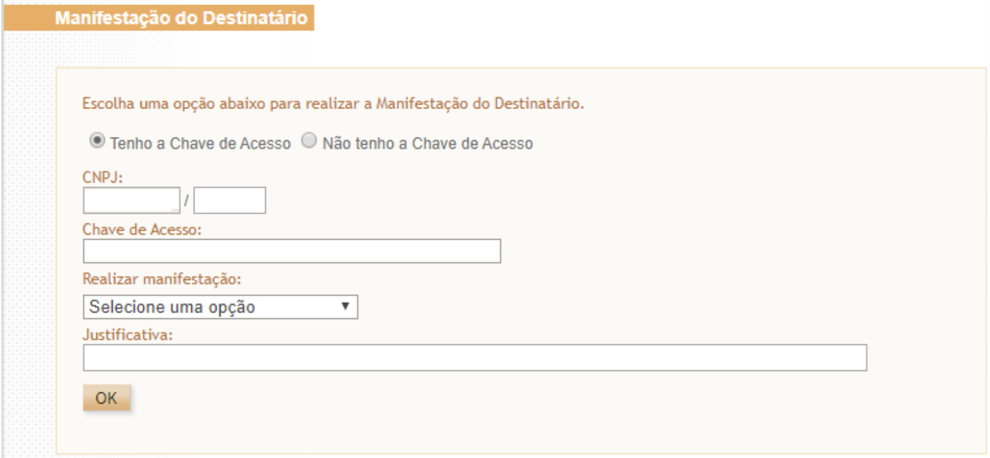

Tela 2: Manifestação do destinatário por NSU (Número Sequencial Único)


SNFeNFCe SNFeNFCe


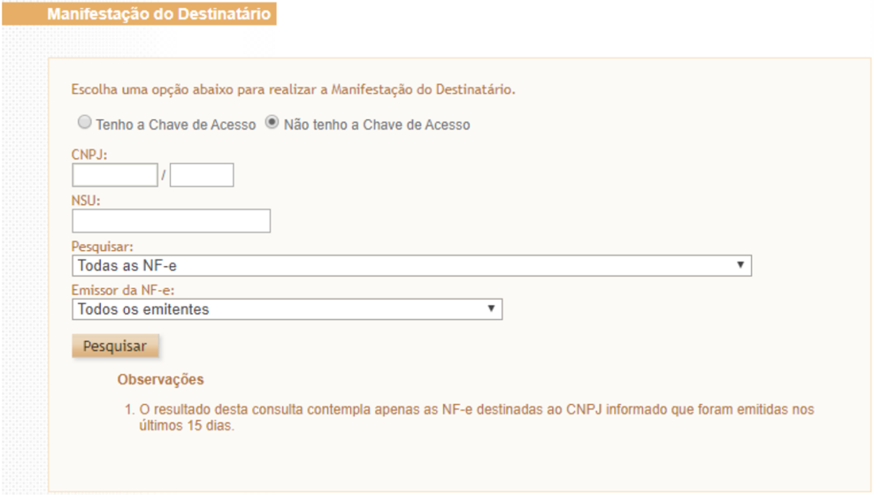

Tela 3: Opções de manifestação do destinatário por chave de acesso

Tela 4: Opções de manifestação do destinatário por NSU

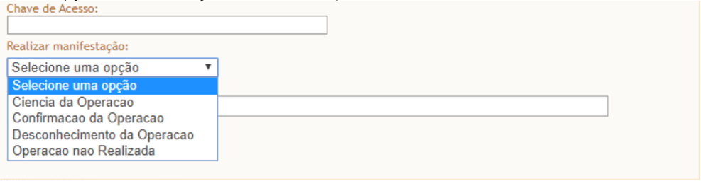

Tela 5: Permite escolher para todos os emitentes.

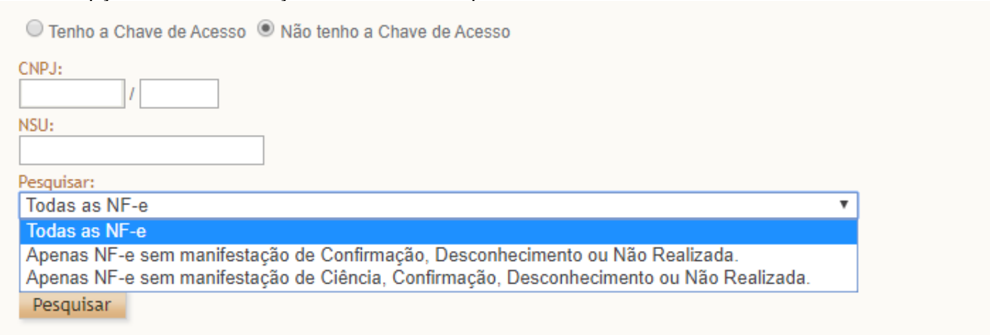

## Obs:

- a  NT  2012/003  (item  03.1),  publicada  em  Agosto/2012,  define  quais  são  os  CFOP  que obrigam a informação do Grupo de Combustível na NF-e. Os  CFOP  citados  estão relacionados  com  as  operações  que  envolvem  'Combustível  derivado  ou  não  de  Petróleo  e Lubrificantes'.


SNFeNFCe

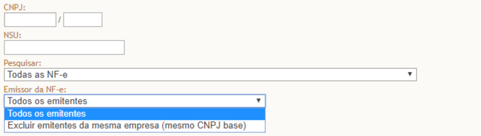

## 3.2.2.3. Por Meio do Programa Manifestador

No menu 'Downloads', 'Manifestador de NF-e' do Portal Nacional da NF-e (https://www.nfe.fazenda.gov.br) foi disponibilizado software desenvolvido pela Sefaz-SP que viabiliza  exclusivamente  a  manifestação  do  destinatário  pessoa  jurídica,  sendo  obrigatório  o  uso de Certificado Digital do destinatário.

## 3.2.3. Obrigatoriedade de Manifestação

A  cláusula  décima-quinta-B  do  Ajuste  SINIEF  7/2005  prevê  a  obrigatoriedade  do  registro  pelo destinatário da NF-e dos eventos de confirmação da operação, operação não realizada e desconhecimento da operação nos prazos especificados  naquele Ajuste.

Também  está  obrigado  a  realizar  a  manifestação,  de  acordo  com  o  Anexo  II  do  Ajuste  SINIEF 7/2005, o destinatário de toda NF-e que:

I - seja exigido o preenchimento do Grupo Detalhamento  específico de Combustíveis, como nos casos de mercadoria destinada a:

- a) estabelecimentos  distribuidores de combustíveis, a partir de 1º de março de 2013;
- b) postos de combustíveis e transportadores revendedores retalhistas, a partir de 1º de julho de 2013;

II  -  acoberte operações com álcool para fins não-combustíveis, transportado a granel, a partir de 1º de julho de 2014;

III  -  acoberte,  nos  casos  em  que  o  destinatário  for  um  estabelecimento  distribuidor  ou atacadista, a partir de 1º de agosto de 2015, a circulação de:

- a) cigarros;
- b) bebidas alcoólicas, inclusive cervejas e chopes;
- c) refrigerantes e água mineral.


SNFeNFCe

- Como  as  operações  com  lubrificantes  são  exceção  à  obrigatoriedade  de  manifestação  do dentinário, consta no Anexo II a tabela de Códigos de Produto da ANP relativa a lubrificantes e que não estão obrigados à Manifestação do Destinatário.

## 3.3. Evento Prévio de Emissão em Contingência (EPEC)

O  EPEC  permite  à  empresa  solicitar  o  registro  do  "Evento  Prévio  de  Emissão  em  Contingência" anterior  à  emissão  do  documento  em  si  com  um  leiaute mínimo de informações. O EPEC deve ser enviado  para  o  Ambiente  Nacional  (AN),  utilizando-se  o Web  Service de  Eventos  genérico,  criado para este fim.

Os principais benefícios deste tipo de contingência são:

- Reduzir custo da emissão em Formulário de Segurança (FS-DA);
- Prover  uma  rota  alternativa  em  caso  de  falha da infraestrutura de internet para acesso a SEFAZ Autorizadora, não tendo sido ativada a SEFAZ Virtual de Contingência para a UF;
- A  geração  de  arquivo  pequeno,  com melhores condições de transmissão, em função de possível problema  de  largura  de  banda  e  outras restrições na transmissão (uso de linha discada, rede de celular, etc.).

## 3.3.1. EPEC, Visão Geral

Figura 3-1 - Visão Geral do Evento Prévio de Emissão em Contingência

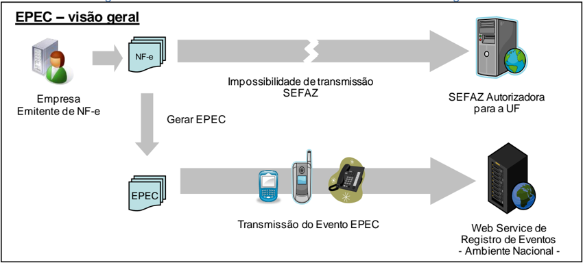

A  emissão  do  EPEC  poderá  ser  adotada  por  qualquer  emissor  que  esteja  impossibilitado  de transmissão e/ou recepção das autorizações de uso de suas NF-e, adotando os seguintes passos:

- Gerar  a  NF-e  com  'tpEmis  =  4',  mantendo  também  a  informação  do  motivo  de  entrada  em contingência  com  data  e  hora  do  início da contingência, com número diferente de qualquer NF-e que tenha sido transmitida com outro 'tpEmis';
- Gerar o arquivo XML do EPEC com as seguintes informações da NF-e:
- o UF, CNPJ e Inscrição Estadual do emitente;
- o Chave de Acesso;
- o UF e CNPJ ou CPF do destinatário;
- o Valor Total da NF-e, Valor Total do ICMS e Valor Total do ICMS-ST;
- o Outras informações constantes no leiaute.
- Assinar o arquivo com o certificado digital do emitente;
- Enviar o arquivo XML do EPEC para o Web Service de Registro de Eventos do AN;


- Impressão  do  DANFE  da  NF-e  que  consta  do  EPEC,  em  papel  comum,  constando  no  corpo  a expressão  'DANFE  impresso  em  contingência  -    EPEC  regularmente  recebida  pela  Receita Federal do Brasil'.

Obtida  a  autorização  do  Evento  (Número do Protocolo: 891xxxxxxxxxxxx), a exemplo do que ocorre com  outros  eventos  da  NF-e,  este  evento  também  será  distribuído  para  as  UF  envolvidas  na operação, inclusive para a própria UF do emitente.

Após a cessação dos problemas técnicos que impediam a transmissão da NF-e para UF de origem, a NF-e  que  deu  origem  a  necessidade  de  uso  da  Contingência  Eletrônica  'EPEC'  deverá  ser transmitida  para  a  SEFAZ  de  origem,  observando  o  prazo  limite de transmissão na legislação, bem como outros procedimentos constantes na legislação caso ocorra rejeição na autorização de uso.

Nota: A Chave de Acesso desta NF-e é exatamente a mesma Chave de Acesso do EPEC autorizado anteriormente.

## 3.3.2. Endereço dos Web Services

O  endereço  do  Web  Service  de  Eventos  do  Ambiente  Nacional  está  publicado  no  Portal  da  NF-e (http://www . nfe.fazenda.gov . br/porta l), no link "Serviços"  / "Relação de Serviços Web".

Idem para o ambiente de homologação, no Portal de Homologação (http://hom.nfe.fazenda.gov.br/porta  l)

## 3.3.3. Entrada em Contingência

A decisão da empresa de começar a usar a contingência do EPEC é tomada quando a empresa não recebe  a  resposta  de  uma  determinada  NF-e  com  pedido  de  autorização  de  uso,  ou  quando  não consegue determinar se o pedido foi ou não corretamente enviado. O documento MOC - Anexo IV Manual de Contingência NF-e descreve o tratamento necessário para as NFe pendentes de retorno.

## 3.3.4. Impressão do DANFE

Deverá ser impresso no DANFE o número do Protocolo de Autorização do Evento de EPEC, além do motivo e a hora da entrada em contingência.

O DANFE deverá ser impresso em duas vias que terão a seguinte destinação:

- Uma via permite o trânsito das mercadorias e deverá ser mantida pelo destinatário;
- A outra via deverá ser mantida pelo emitente.

Estas  vias  deverão  ser  mantidas  em  arquivo  pelo  emitente  e  pelo  destinatário,  durante  o  prazo estabelecido na legislação tributária para a guarda de documentos fiscais.

## 3.3.5. Lote de EPEC

Como  é utilizado  o Web Service genérico  de  registro  de  evento  é  possível  registrar  os  eventos  de EPEC para até 20 NF-e diferentes em uma mesma conexão, sendo um EPEC para cada NF-e.

## 3.3.6. Controle do Ambiente de Contingência do EPEC

As  notas  fiscais  emitidas  em  contingência,  com  a  autorização  do  "Evento  Prévio  de  Emissão  em Contingência  (EPEC)",  devem  ser  transmitidas  imediatamente  após  a  cessação  dos  problemas técnicos que impediam a transmissão da NF-e, observado o prazo limite definido na legislação.

Neste  modelo  de  contingência  serão  estabelecidos  controles  para  identificar  a  existência  de  EPEC sem o envio da NF-e correspondente. Passado o prazo previsto na legislação para o envio da NF-e, será  bloqueada  a  autorização  de  novos  EPEC  para  o  Contribuinte  Emitente,  sem  prejuízo  das demais ações relacionadas com a ausência da NF-e para os EPEC pendentes de conciliação.

## 3.3.7. Controle de EPEC Pendente de Conciliação

Para  cada  EPEC  autorizado,  a  SEFAZ  (e/ou  o  Ambiente  Nacional)  deverá  manter  um  controle  em banco de dados, contendo, entre outras, as informações de:

- Chave de Acesso da NF-e, com os campos:
- o Modelo do documento fiscal (55=NF-e);
- o UF e CNPJ do Emitente, além da Série e Número da NF-e;
- UF do Destinatário;
- Valor do EPEC;
- Protocolo e Data-Hora da Autorização do EPEC;
- Indicador de Conciliação: 0=Pendente; 1 = EPEC Conciliado;
- Indicador  para  Liberar  a  necessidade  de  Conciliação:  0=Não;  1=Liberada  a  necessidade  de conciliação do EPEC.

Quando  o  Emitente  enviar  a  NF-e  com  a  mesma  Chave  de  Acesso  de  um  EPEC  pendente,  o "Indicador

de Conciliação"  do EPEC deverá ser alterado, eliminando a pendência de conciliação.

## 3.3.8. Controle do Ambiente de Contingência do EPEC

## A.  Bloqueio do Ambiente de Contingência EPEC

Diariamente será efetuada uma avaliação dos "EPEC Pendente de Conciliação"  há mais de 168 horas (7 dias), bloqueando o Ambiente de Contingência do EPEC para o Emitente com pendência. A partir  deste  momento,  o  Emitente  não  conseguirá  obter  autorização  de  novas  EPEC, enquanto não regularizar a situação dos "EPEC Pendentes de Conciliação".

## B.  Desbloqueio do Ambiente de Contingência EPEC

Deverá ser  efetuado  o  desbloqueio  do  "Ambiente  de  contingência  EPEC"  para  um  Emitente  (CNPJ ou  CPF)  bloqueado  anteriormente,  mas  que  não  possua  mais  "EPEC  Pendente  de  Conciliação". Outras informações:

- A avaliação do desbloqueio do ambiente EPEC para um determinado Emitente pode ser feita no momento de recepção da NF-e correspondente ao EPEC que originou o bloqueio. Se não restarem  outros  EPEC  pendentes  de  conciliação  após  o  prazo  de  168  horas,  o  ambiente EPEC pode ser liberado;


- Deverá ser possível desconsiderar a necessidade de conciliação para um determinado EPEC, a  partir  de  comando  de  liberação  pela  SEFAZ,  efetuado  em  Extranet  disponibilizada  pelo Ambiente  Nacional.  Esta  liberação  comandada  pode  significar  o  desbloqueio  do  Ambiente EPEC, caso não existam outros EPEC pendentes de conciliação.

## 3.3.9. Relação de EPEC Pendente de Conciliação

É  responsabilidade  da  empresa  obter a autorização de uso da NF-e com Chave de Acesso idêntica ao EPEC previamente autorizado.

A critério de cada UF poderá ser disponibilizada no Portal da SEFAZ, em área restrita, uma Consulta de  EPEC Pendente de Conciliação, onde o operador informa o CNPJ ou CPF do Emitente, obtendo as informações de:

- UF, CNPJ ou CPF consultado e Nome da Empresa;
- Relação  dos  EPEC  Pendente  de  Conciliação,  na  ordem  de  Data  de  Autorização  do  EPEC, mostrando também as informações destes EPEC.

Os EPEC pendentes de conciliação poderão ser visíveis para o CNPJ ou CPF do emitente ou para o CNPJ ou CPF do destinatário que constam do leiaute do respectivo EPEC.

## 3.3.10. Adaptação nos Serviços de Autorização de Uso

A SEFAZ  Autorizadora  mantém  controle  da  numeração  das  NF-e  já  autorizadas,  evitando  a duplicidade de autorização de uso para a mesma Chave Natural (campos de: Modelo, UF, CNPJ ou CPF do Emitente, Série e Número da NF-e).

O EPEC autorizado pelo Ambiente Nacional é compartilhado com a SEFAZ do emitente e deverá ser armazenado  na  UF  como  um  evento  normal.  A  Chave  Natural  da  NF-e  constante  no  EPEC autorizado  deverá  também  ser  registrada  no  banco  de  dados  de  controle  de  numeração  das  NF-e autorizadas.

## 3.3.11. Serviço de Autorização de NF-e

Conforme citado  anteriormente,  o  Emitente  do  EPEC deve obter a Autorização de Uso para a NF-e correspondente ao EPEC autorizado.

Caso a NF-e com tipo de emissão 4 (EPEC) seja autorizada ou denegada, o ambiente nacional no Serpro  assinará  o  EPEC  como  conciliado,  conforme  o  item  de  "Controle  de  EPEC  Pendente  de Conciliação"  tratado  anteriormente.  No  caso  da  NF-e  ter  sido  "Denegada",  o  ambiente  nacional  no Serpro  assinará  para  avaliação  a  posteriori  pela  SEFAZ,  já  que  o  EPEC  autorizado  pode  ter acobertado

a circulação da mercadoria.

Como  os  dados  do  EPEC  são  obtidos  a  partir  da  NF-e  que  não  conseguiu  ser  transmitida  por problemas  técnicos,  quando  for  transmitida,  esta  NF-e  deverá  possuir  os  mesmos  dados  do  EPEC autorizado anteriormente.


## 3.3.12. Serviço de Registro de Evento: Cancelamento de NF-e

Não  existe  o  cancelamento  de  um  EPEC  autorizado,  portanto  o  pedido  de  cancelamento  da  NF-e somente é possível se existir a NF-e.

No caso da empresa ter autorizado o evento de EPEC, mas decidir pelo cancelamento da operação, deverá proceder como segue:

- Obter a autorização de uso da NF-e relacionada com o EPEC autorizado;
- Cancelar a NF-e recém autorizada.

## 3.3.13. Serviço de Registro de Evento: Carta de Correção

O evento de Carta de Correção somente é possível se existir a NF-e autorizada.

## 3.3.14. Serviço de Registro de Evento: Manifestação do Destinatário

Os eventos da Manifestação do Destinatário se referem a uma NF-e autorizada, portanto os serviços relacionados  com  a  Manifestação do Destinatário não serão afetados pela existência unicamente do EPEC, sem ter sido autorizada a NF-e correspondente.

## 3.3.15. Serviço de Inutilização de Numeração

A validação do pedido de inutilização deverá considerar a existência do EPEC, portanto o pedido de inutilização será rejeitado com a mensagem abaixo, caso exista um EPEC autorizado para a faixa de numeração:

- Mensagem: "241 - Rejeição: Um número da faixa já foi utilizado".

## 3.3.16. Serviço de Consulta Situação da NF-e (Web Service: NfeConsulta2)

Caso a NF-e referente  ao  evento  EPEC  já  tenha  sido  autorizada,  a  Consulta  da  Situação  da  NF-e deverá retornar normalmente o protocolo de autorização de uso da NF-e e os dados dos eventos, da mesma forma que acontece para qualquer NF-e com evento.

Caso  exista  unicamente  o  EPEC,  a  Consulta  da  Situação  da  NF-e  deverá  retornar  os  dados  do evento

EPEC, com a mensagem abaixo:

- "124 - EPEC Autorizado".

## 3.3.17. Sincronismo dos Ambientes de Autorização: Situações de Exceção

## 3.3.17.1. Compartilhamento  de Informações  entre as SEFAZ e o Ambiente Nacional da Receita Federal


A NF-e e o EPEC são autorizados em ambientes de autorização diferentes e existe um processo de compartilhamento  de  informações  entre  as  SEFAZ  e  o  Ambiente  Nacional  mantido  pela  Secretaria Especial da Receita Federal, que se encarrega de sincronizar estas informações. Portanto:

- A NF-e autorizada em uma SEFAZ Autorizadora é compartilhada com o Ambiente Nacional;
- O EPEC autorizado no Ambiente Nacional é compartilhado com a SEFAZ Autorizadora.

Este  processo  de  compartilhamento  acontece  também  para  a  UF  de  destino  da  operação  e  para todas

as demais UF citadas no documento fiscal.

## 3.3.17.2. Sincronismo das Informações

O  processo  de  compartilhamento  das  informações  entre  os  diferentes  ambientes  de  autorização demora  algum  tempo  para  ser  efetuado  (poucos  minutos)  e  durante  este  tempo  podem  ocorrer algumas situações de exceção, conforme segue:

## A.  Autorização Simultânea: EPEC e NF-e

Neste caso a Empresa emitente autoriza simultaneamente,  ou com um pequeno atraso, os documentos de:

- EPEC:  Autorizado no  Ambiente  Nacional  mantido  pela  Secretaria  Especial  da  Receita Federal;
- NF-e: Autorizada na SEFAZ Autorizadora, com a mesma Chave Natural do EPEC, mas com o Tipo de Emissão diferente de 4-EPEC.

O  documento de EPEC será compartilhado com a SEFAZ do Emitente, causando uma duplicidade de Chave Natural que deverá ser tratada.

Ocorrida  esta  situação,  a  Empresa  não  conseguirá  autorizar  uma  NF-e com uma Chave de Acesso idêntica  à  Chave de Acesso do EPEC, resultando em um EPEC pendente de conciliação. Decorrido o  prazo,  o  ambiente  de  contingência  EPEC  será  bloqueado  para  este  emitente.  A  empresa  deverá rever seus processos internos, evitando ocorrências deste tipo.

Para liberar o uso do Ambiente de Contingência EPEC, a empresa deverá contatar a SEFAZ da sua circunscrição, informando a Chave de Acesso do EPEC pendente de conciliação. Analisado o caso, a SEFAZ poderá decidir  por  desconsiderar  a  necessidade  de  conciliação  para  este  EPEC  específico, comandando esta liberação no Ambiente de Contingência EPEC.

## B.  Autorização Simultânea: EPEC e Inutilização de Numeração

Neste caso a Empresa  emitente autoriza simultaneamente,  ou  com  um  pequeno  atraso,  os documentos de:

- EPEC:  Autorizado no  Ambiente  Nacional  mantido  pela  Secretaria  Especial  da  Receita Federal;
- Pedido  de  Inutilização  de  Numeração:  Autorizada  na  SEFAZ  Autorizadora,  com  a  mesma Chave Natural do EPEC.


O  documento de EPEC será compartilhado com a SEFAZ do Emitente, causando uma duplicidade de Chave Natural que deverá ser tratada.

Ocorrida  esta  situação,  a  Empresa  poderá  não  conseguir  autorizar  uma  NF-e  com  uma  Chave  de Acesso  idêntica  à  Chave  de  Acesso  do  EPEC,  resultando  em  um  EPEC  pendente  de  conciliação. Decorrido o prazo, o ambiente de contingência EPEC será bloqueado para este emitente. A empresa deverá rever seus processos internos, evitando ocorrências deste tipo.

Para liberar o uso do Ambiente de Contingência EPEC, a empresa deverá contatar a SEFAZ de sua circunscrição, informando a Chave de Acesso do EPEC pendente de conciliação. Analisado o caso, a SEFAZ poderá decidir  por  desconsiderar  a  necessidade  de  conciliação  para  este  EPEC  específico, comandando esta liberação no Ambiente de Contingência EPEC.

## 3.4. Pedidos de Prorrogação de Suspensão ICMS em Remessas Interestaduais

(NT 2015.001)

O  Evento  de  pedido  de  prorrogação  da  suspensão  do  Imposto  sobre  Operações  Relativas  à Circulação  de  Mercadorias  nas  remessas  interestaduais  de  produtos  destinados  a  conserto,  reparo ou  industrialização,  desde  que  as  mesmas  retornem  ao  estabelecimento  de  origem,  substitui  uma petição do contribuinte para o Fisco, que era feita em papel, por um arquivo xml assinado.

O  evento  será  utilizado  pelo  contribuinte  e  o  alcance  das  alterações  permitidas  é  definido  no CONVÊNIO AE-15/74:

- 'Os Secretários de Fazenda dos Estados e do Distrito Federal, reunidos em Brasília, DF, no dia 11 de dezembro de 1974, resolvem celebrar o seguinte CONVÊNIO.

(...)

Cláusula primeira Os signatários acordam em conceder suspensão do Imposto sobre Operações Relativas à Circulação de Mercadorias nas remessas interestaduais de produtos destinados a conserto, reparo ou industrialização, desde que as mesmas retornem ao estabelecimento de origem no prazo de 180 (cento oitenta) dias, contados da data das respectivas saídas, prorrogáveis por mais cento e oitenta dias, admitindo-se, excepcionalmente, uma segunda prorrogação de igual prazo.

(...)

- § 1º O disposto nesta cláusula não se aplica às saídas de sucatas e de produtos primários de origem animal, vegetal ou mineral, salvo se a remessa e o retorno se fizerem nos termos de protocolos celebrados entre os Estados interessados.
- § 2º A  suspensão  nas  remessas  interestaduais  para  industrialização  promovidas  por estabelecimentos  localizados  no  Estado  de  Mato  Grosso  do  Sul  fica  condicionada  à  existência  de autorização específica concedida pela Secretaria de Estado de Fazenda desse Estado.

(...)

Cláusula segunda O presente Convênio passa a vigorar a partir de 1º de janeiro de 1975.

(...)

Signatários: AC, AL, AM, BA, CE, DF, ES, GB, GO, MA, MG, MT, PA, PB, PE, PI, PR, RJ, RN, RS, SC, SE e SP.'

As  UFs  que  determinarem  em  sua  legislação  local  a  suspensão  do  ICMS  podem  utilizar  o  mesmo recurso  para  receberem  os  pedidos  de  prorrogação  de  operações  internas.  Por  enquanto  apenas São Paulo adota estes eventos.

## 3.4.1. Pedido de Prorrogação

A  saída  com  a  suspensão  de  ICMS  (nos  casos  previstos  em  legislação)  independe  da  emissão de eventos  na  NFe.  Na  necessidade  de  prorrogação  deste  prazo,  o  pedido  de  prorrogação  se  dá  por eventos vinculados à NFe indicando o item e a quantidade que se pretende prorrogar.

A  suspensão  do  ICMS  é  prorrogável  por  mais  180  dias  após  o  primeiro  período  de  prorrogação. Neste caso, a empresa solicita uma nova prorrogação com o evento de  2º prazo de prorrogação.

No exemplo da Figura 3-2, uma saída de 5 itens teve a suspensão prorrogada por 180 dias para os itens 1 e 2 nas quantidades 10 e 3, respectivamente. Em seguida, a empresa pediu a prorrogação da suspensão novamente para o item 2. Como já havia pedido a prorrogação para 3 unidades do item 2, está  limitada  a  este  no  valor  na  2ª  prorrogação.  No  exemplo  acima,  pediu  para  apenas  uma  1 unidade.

Como  a  suspensão  pode  ser  prorrogável  por  até  2  períodos  de  180  dias,  há  dois  pedidos  de prorrogação:  um  para  o  primeiro  período  de  180  dias  (tpEvento  =  111500)  e  outro para o segundo período de 180 dias (tpEvento = 111501).

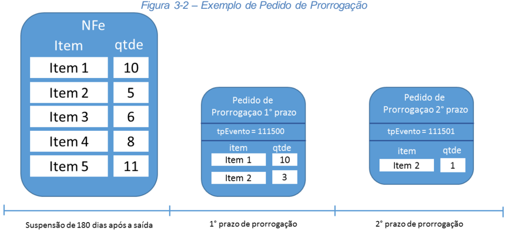

## 3.4.2. Cancelamento do Pedido de Prorrogação

Se  a  empresa  quiser  desfazer  o  pedido  de  prorrogação  (1º  ou  2º  prazo),  pode  enviar  um  evento pedindo  seu  cancelamento,  porém,  deverá  observar  a  seguinte  regra  para  cancelar  eventos  de Pedido de Prorrogação 1º prazo:

A  quantidade  de  um  determinado  item  prorrogado  de  360  a  540  dias  (nos  eventos  de prorrogação  2°  prazo)  deve  sempre  ter  sido  prorrogado  de  180  a  360  dias  por  eventos  de prorrogação  1°  prazo.  Por  isso,  ao  tentar  cancelar  eventos  de  prorrogação 1° prazo, deve-se atentar  para  a  quantidade  de  itens  nos  eventos  de  prorrogação  de  2°  prazo.  É  preciso  que existam itens prorrogados no primeiro prazo (até 360 dias) suficientes para que as prorrogações a partir de 360 dias sejam compatíveis.

Considerando como exemplo os dados do exemplo da Figura 3-2, não é possível cancelar o Pedido de  Prorrogação  1º  prazo  sem  antes  cancelar  o  Pedido  de  Prorrogação  2º  prazo.  Neste  caso,  para realizar este cancelamento a empresa deverá seguir os seguintes passos:


SNFeNFCe SNFeNFCe


- 1 -  Solicitar  evento  de  Cancelamento  de  Pedido  de  Prorrogação  2º  prazo  e,  após  deferimento deste;

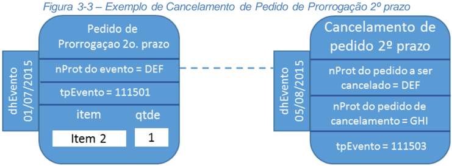

## 2 -  Solicitar evento de Cancelamento de Pedido de Prorrogação 1º prazo

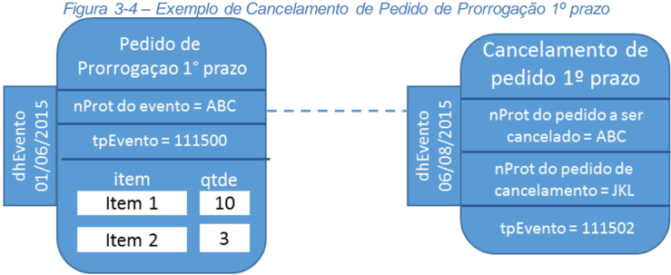

O evento de cancelamento, além de vinculado à NFe de remessa, também está vinculado ao evento de prorrogação que se pretende cancelar. Este vínculo ocorre pelo ID do evento e pelo protocolo de registro do evento.

## 3.4.3. Deferimento dos pedidos de prorrogação e de cancelamento pela SEFAZ

Todos  os  eventos  de  pedido  de  prorrogação  e  cancelamento  são  síncronos.  A  obtenção  de  um protocolo  de  registro  na  NFe  não  implica  o  deferimento  pelo  fisco  como  ocorre  no  registro  de cancelamento de NFe, por exemplo.

O  deferimento  pela  Sefaz  depende  de  um  evento  (tp  -  411500,  411501,  411502  ou  411503) assinado  com  certificado  da  Fazenda responsável pela empresa emitente da NFe de remessa. Este evento traz o posicionamento da Sefaz frente o pedido e a motivação no caso de indeferimento.

Para cada item, a Sefaz defere/indefere o pedido e justifica a resposta.

O evento do fisco está vinculado à NFe de remessa e ao pedido de prorrogação pelo ID do evento e pelo protocolo de registro do evento na NFe.

Figura 3-5 - Exemplo de Pedido de Prorrogação

SNFeNFCe


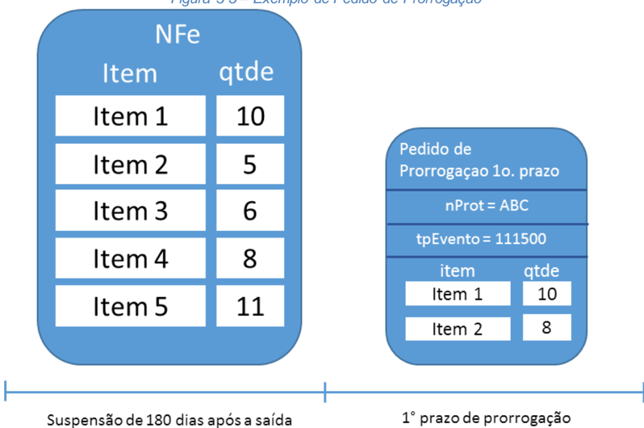

A empresa pediu a prorrogação de 8 unidades do item 2. Porém, a NFe de remessa contém apenas 5 unidades do item 2. O evento de resposta para o pedido de prorrogação com  nProt = ABC autoriza a prorrogação de prazo para 10 unidades do item 1 e indefere o pedido de prorrogação para o item 2.

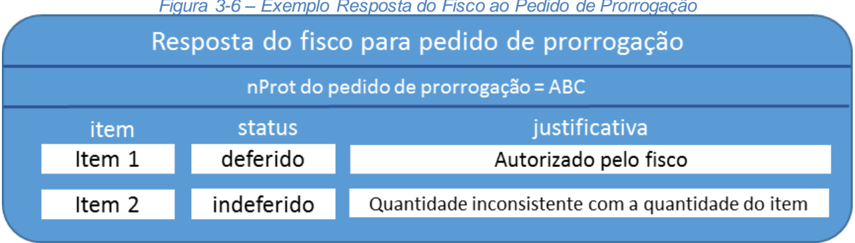

| Figura 3-6 - Exemplo Resposta do Fisco ao Pedido de Prorrogação  Resposta do fisco para pedido de prorrogacao  nProt do pedido de prorrogacäo = ABC  item  status  justificativa  Item 1  deferido  Autorizadopelofisco  Item 2  indeferido  Quantidadeinconsistentecomaquantidadedoitem   |
|--------------------------------------------------------------------------------------------------------------------------------------------------------------------------------------------------------------------------------------------------------------------------------------------|

A  empresa  pode  pedir  para  cancelar  um  pedido  de  prorrogação  depois  da  manifestação  do  fisco (deferindo ou indeferindo o cancelamento).

Figura 3-7 - Exemplo de Cancelamento  de Pedido de Prorrogação

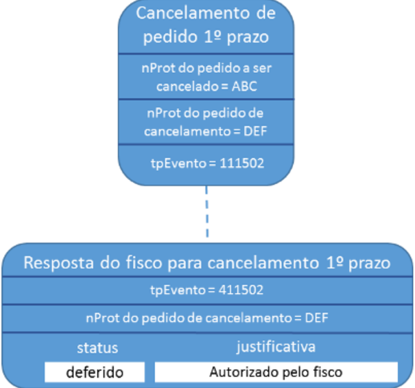

O  deferimento  de  um  pedido  de  cancelamento  de  um  pedido  de  prorrogação  que  tenha  sido aprovado anteriormente gera um novo evento do fisco revertendo todos os deferimentos.

Em situações  que  estejam fora do controle do fisco, por exemplo, uma ordem judicial em virtude de um mandado de segurança, determinando a reversão de uma resposta do fisco, há a possibilidade do fisco emitir novo evento revertendo sua posição.

Assim,  um  evento  de  prorrogação  pode  ter  mais  de  um  evento  de  resposta  do  fisco  ao  longo  do tempo. A resposta do fisco que prevalece é sempre a última.


SNFeNFCe SNFeNFCe Exemplo de sequência de eventos no tempo e seu relacionamento:


Figura 3-8 - Exemplo Resposta do Fisco ao Cancelamento  de Pedido de Prorrogação

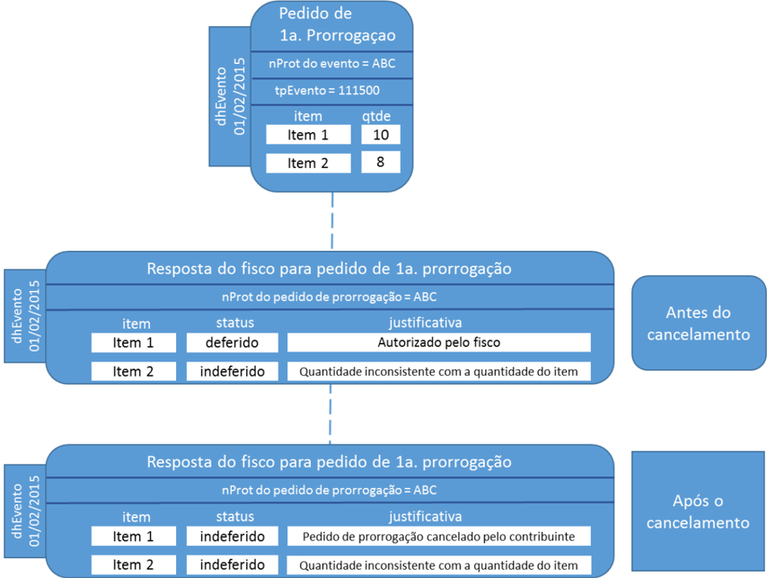

| (1)   | emissão da NFe de remessa...................................................01/02/2015   |
|-------|------------------------------------------------------------------------------------------|
| (2)   | pedido de prorrogação1º prazo...............................................01/07/2015   |
| (3)   | resposta do fiscopara prorrogação1º prazo.............................02/07/2015         |
| (4)   | cancelamento pela empresa para prorrogação1º prazo ............05/08/2015                |
| (5)   | resposta do fiscopara o cancelamento 1º prazo .......................06/08/2015          |
| (6)   | resposta do fiscopara prorrogação1° prazo.............................06/08/2015         |

## 3.5. Cancelamento por Substituição

(NT 2018.004)

O  Ajuste  SINIEF  07/18,  que  alterou  o  ajuste  SINIEF  19/16,  trouxe  a  seguinte  disposição,  para viabilizar o cancelamento de uma NFC-e que tenha sido emitida em duplicidade:

'Cláusula décima  quinta-A Na  hipótese  prevista no  inciso  I  da  cláusula  décima segunda,  o  emitente  poderá  solicitar  o  cancelamento da NFC-e, desde que tenha sido emitida uma outra NFC-e em contingência para acobertar a mesma operação, em prazo não superior a 168 horas, podendo ser reduzido a critério de cada unidade federada, contado do momento em que foi concedida a Autorização  de Uso da NFC-e, de que trata o inciso I da cláusula oitava.'.

A emissão em duplicidade ocorre quando um contribuinte solicita a autorização de uso de uma NFCe  (NFC-e  1),  porém,  por  algum  motivo,  não  obtém  a  resposta  a  esta  solicitação.  Para  acobertar  a operação  e  fornecer  o  DANFE  NFC-e  para  o  consumidor,  emite  uma  outra  NFC-e  (NFC-e  2),  em contingência.


Ao se restabelecer a comunicação normal entre o sistema de emissão do contribuinte e o sistema de autorização  da  Sefaz    verifica-se  que  a  'NFC-e  1'  havia  sido  regularmente  autorizada;  como consequência, existem duas NFC-e acobertando a mesma operação.

Nesta situação o contribuinte poderá solicitar o cancelamento, em prazo não superior a 168 horas, da NFC-e  emitida  em  duplicidade  e  que  não  acobertou  a  operação  (NFC-e  1,  emitida  em  operação normal),  devendo  referenciar  a  NFC-e  que  substituiu  aquela  que  está  sendo  cancelada  (NFC-2, emitida em contringência).

## 3.6. Evento Ator Interessado na NF-e - Transportador

Um dos grandes desafios do projeto  Nota  Fiscal  Eletrônica  é  prover  para  os  atores envolvidos nos processos da NF-e informações de seu interesse de forma eficiente e confiável.

No momento da emissão da NF-e, muitas vezes o emitente ainda não definiu o Transportador que ficará responsável pela entrega da mercadoria, impedindo, portanto, que essa informação conste em campo  específico da NF-e  (tag:  CNPJ/CPF,  id:  X04/X05),  ou  mesmo  no  grupo  de  pessoas autorizadas  a  acessar  o  XML  da  NF-e  (tag:  autXML,  Id:  GA01).  Em  vários  outros  casos,  o responsável  pelo  transporte  é  o  destinatário  e,  nesses  casos,  o  Emitente  não  tem  condições  de informar o Transportador no XML da NF-e.

O objetivo deste evento, publicado na NT 2020.007, é permitir que o Emitente informe a identificação do Transportador a qualquer momento, como uma das pessoas autorizadas a acessar o XML da NFe.

No caso em que o transporte não é de responsabilidade do Emitente, o Destinatário poderá gerar o evento, com o mesmo objetivo de autorizar que o Transportador fique autorizado a acessar o XML da NF-e.

Nos  casos  de  Redespacho  ou  Subcontratação,  definido  o  transportador  contratado,  este  poderá também  autorizar  outro  transportador  participante  da  mesma  operação  de  transporte  a  acessar  o XML da NF-e.

O Transportador precisa dos dados da NF-e para instrumentalizar seus processos de transporte e, a partir  da  geração  deste  evento,  possibilita  o  transportador  em  buscar  o  XML  da  NF-e  no  Ambiente Nacional,  por  meio  do  Web  Service  de  Distribuição  de  DF-e  de  Interesse  dos  Atores  da  NF-e conforme documentado na NT2014.002.

## 4. Arquitetura de Comunicação com Contribuinte

## 4.1. Modelo Conceitual

As Secretarias de Fazenda Estaduais disponibilizam os seguintes serviços:

- Recepção de NF-e;
- Recepção de Lote;
- Consulta Processamento  de Lote;
- Inutilização de numeração de NF-e;
- Consulta da situação atual da NF-e;
- Consulta do status do serviço;
- Consulta cadastro;
- Registro de eventos.

Para  cada  serviço  oferecido  existe  um Web Service específico.  O  fluxo  de  comunicação  é  sempre iniciado  pelo  aplicativo  do  contribuinte  através  do  envio  de  uma  mensagem  ao Web Service com a solicitação do serviço desejado.

O Web  Service devolve  uma  mensagem  de  resposta  confirmando  o  recebimento  da  solicitação  de serviço ao aplicativo do contribuinte na mesma conexão.

A Figura 4-1 ilustra o fluxo conceitual de comunicação entre o aplicativo do contribuinte e o Sistema da Secretaria de Fazenda Estadual.

Figura 4-1 - Arquitetura  de Comunicação: Visão Conceitual

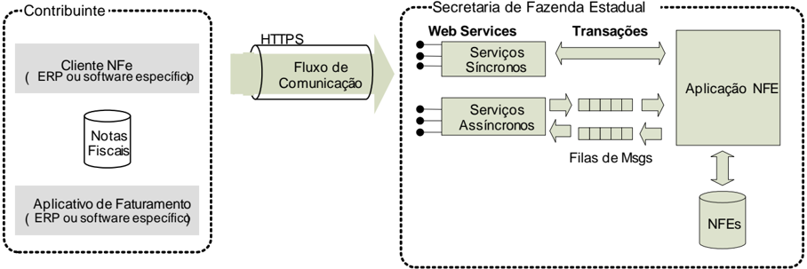

## 4.2. Padrões Técnicos

## 4.2.1. Padrão de Documento XML

## 4.2.1.1. Padrão de Codificação

A  especificação  do  documento  XML  adotada  é  a  recomendação  W3C para XML 1.0, disponível em www.w3.org/TR/REC-xml e a codificação dos caracteres é UTF-8; assim, todos os documentos XML devem iniciar com a seguinte declaração:


SNFeNFCe

```
<?xml version="1.0" encoding="UTF-8"?>
```

Cada arquivo XML somente poderá ter uma única declaração &lt;?xml version="1.0" encoding="UTF-8"?&gt; .  Nas situações em que um documento XML pode conter outros documentos XML, como ocorre com o documento XML de lote de envio de NF-e, deve-se tomar cuidado para que exista uma única declaração no início do lote.

## 4.2.1.2. Declaração namespace

O documento XML deverá ter uma única declaração de namespace no elemento raiz do documento com o seguinte padrão:

<!-- formula-not-decoded -->

(exemplo para o XML de envio de Lote de NF-e)

É vedado o uso de declaração namespace diferente do padrão estabelecido.

Não é permitida  a  utilização  de  prefixos  de namespace .  Essa  restrição  visa  otimizar  o  tamanho  do arquivo XML.  Assim, ao invés  da  declaração  &lt;NFe  xmlns:nfe=http://www.portalfiscal.inf.br/nfe&gt; (exemplo  para  o  XML  de  NF-e  com  prefixo  nfe),  deverá  ser  adotada  a  declaração:  &lt;NFe  xmlns ='http://www.portalfiscal.inf.br/nfe'  &gt;.

A  declaração  do namespace da  assinatura  digital  deverá  ser  realizada  na  própria  tag  &lt;Signature&gt;, conforme exemplo abaixo.

```
<?xml version="1.0" encoding="UTF-8"?> <enviNFe xmlns="http://www.portalfiscal.inf.br/nfe"  versao="1.01"> <idLote>200602220000001</idLote> <NFe xmlns="http://www.portalfiscal.inf.br/nfe"> <infNFe Id="NFe31060243816719000108550000000010001234567890"  versao="1.01"> ... <Signature  xmlns="http://www.w3.org/2000/09/xmldsig#"> … </NFe> <NFe xmlns="http://www.portalfiscal.inf.br/nfe"> <infNFe Id="NFe31060243816719000108550000000010011234567900"  versao="1.01"> ... <Signature  xmlns="http://www.w3.org/2000/09/xmldsig#"> … </NFe> <NFe xmlns="http://www.portalfiscal.inf.br/nfe"> <infNFe Id="NFe31060243816719000108550000000010021234567916"  versao="1.01"> ... <Signature  xmlns="http://www.w3.org/2000/09/xmldsig#"> … </NFe> </enviNFe>
```

## 4.2.1.3. Otimização na Montagem do Arquivo

Na  geração  do  arquivo  XML  da  NF-e,  excetuados  os  campos  identificados  como  obrigatórios  no modelo,  não  deverá  ser  incluída  a  TAG  de  campo com conteúdo zero (para campos tipo numérico) ou vazio (para campos tipo caractere).

A  regra  constante  do  parágrafo  anterior deverá estender-se para os campos onde não há indicação de obrigatoriedade e que, no entanto, seu preenchimento torna-se obrigatório por estar condicionado à legislação específica ou ao negócio do contribuinte. Neste caso, deverá constar a TAG com o valor correspondente e, para os demais campos, deverão ser eliminadas as TAG.


Exemplo 1: campo R01 - indAdic. Será preenchido se a legislação específica o exigir.

Exemplo 2: Subgrupo de Informações de Transportadora. Será preenchido somente se o negócio do contribuinte for transporte.

Para reduzir o tamanho final do arquivo XML da NF-e alguns cuidados de programação deverão ser assumidos:

- não incluir "zeros não significativos" para campos numéricos;
- não incluir "espaços" no início ou no final de campos numéricos e alfanuméricos;
- não incluir comentários no arquivo XML;
- não incluir anotação e documentação  no arquivo XML (TAG annotation e TAG documentation);
- não incluir caracteres de formatação no arquivo XML ("line-feed", "carriage return", "tab", caractere de "espaço"  entre as TAGs);
- não incluir prefixo no namespace das tags de NFe.

## 4.2.1.4. Validação de Schema

Para  garantir  minimamente  a  integridade  das  informações  prestadas  e  a  correta  formação  dos arquivos  XML,  o  contribuinte  deverá,  antes  de  seu  envio,  submeter  o arquivo da NF-e e as demais mensagens XML para validação pelo Schema do  XML  (XSD -XML  Schema  Definition), disponibilizado pela Secretaria de Fazenda Estadual.

Os Schemas estão disponíveis na URL:

https://www.nfe.fazenda.gov.br/portal/listaConteudo.aspx?tipoConteudo=/fwLvLUSmU8=

## 4.2.1.5. Tratamento de Caracteres Especiais no Texto de XML

Todos  os  textos  de  um  documento  XML  passam  por  uma  análise  do  'parser'  específico  da linguagem.  Alguns  caracteres  afetam  o  funcionamento  deste  'parser',  não  podendo  aparecer  no texto de uma forma não controlada.

Os caracteres que afetam o 'parser' podem ser encontrados na Tabela 4-1.

Alguns  destes  caracteres  podem  aparecer  especialmente  no  campo  de  Razão  Social,  Endereço  e Informação  Adicional.  Para  resolver  esses  casos,  é  recomendável  o  uso  de  uma  sequência  de 'escape' em substituição ao caractere que causa o problema.

- Ex.  a  denominação:  DIAS  &amp;  DIAS  LTDA  deve  ser  informada  como:  DIAS  &amp;amp; DIAS LTDA no XML para não afetar o funcionamento  do "parser".

Nota:  A  sequência  de  escape  conta  como  um  único  caractere  para  a  validação  do  tamanho  do campo pelo Schema.

Tabela 4-1 - Caracteres Especiais no Texto de XML

| Caractere   | Descrição          | Sequência de Escape   |
|-------------|--------------------|-----------------------|
| <           | sinal de maior     | &lt;                  |
| >           | sinal de menor     | &gt;                  |
| &           | e-comercial        | &amp;                 |
| "           | aspas              | &quot;                |
| '           | sinal de apóstrofe | &#39;                 |

## 4.2.2. Padrão de Comunicação

A comunicação será baseada em Web Services disponibilizados pelo Sistema de Recepção de Nota Fiscal eletrônica.

O meio físico de comunicação utilizado será a Internet, com o uso do protocolo TLS 1.2 ou superior, com autenticação mútua, que além de garantir um duto de comunicação seguro na Internet, permite a  identificação  do  servidor  e do cliente através de certificados digitais, eliminando a necessidade de identificação do usuário através de nome ou código de usuário e senha.

O modelo de comunicação segue o padrão de Web Services definido pelo WS-I Basic Profile.

A  troca  de  mensagens  entre  os Web Services do  ambiente  do  Sistema  de  Recepção  da  NF-e  e  o aplicativo da empresa será realizada no padrão SOAP versão 1.2, com troca de mensagens XML no padrão Style/Enconding:  Document/Literal.

A chamada de diferentes Web Services é  realizada com o envio de uma mensagem XML através do parâmetro nfeDadosMsg .

A  versão  do  leiaute  da  mensagem  XML  contida  no  parâmetro nfeDadosMsg será  informada  no elemento versaoDados do tipo string localizado no elemento nfeCabecMsg do SOAP Header. Exemplo de uma mensagem requisição padrão SOAP:

```
<?xml version="1.0" encoding="utf-8"?> <soap12:Envelope xmlns:xsi="http://www.w3.org/2001/XMLSchema-instance" xmlns:xsd="http://www.w3.org/2001/XMLSchema" xmlns:soap12="http://www.w3.org/2003/05/soap-envelope"> <soap12:Header> <nfeCabecMsg xmlns="http://www.portalfiscal.inf.br/sce/wsdl/NfeRecepcao2"> <versaoDados>string</versaoDados> <cUF>string</cUF> </nfeCabecMsg> </soap12:Header> <soap12:Body> <nfeDadosMsg xmlns="http://www.portalfiscal.inf.br/nfe/wsdl/NfeRecepcao2"> xml</nfeDadosMsg> </soap12:Body> </soap12:Envelope>
```

## Exemplo de uma mensagem de retorno padrão SOAP:

```
<soap12:Envelope xmlns:xsi="http://www.w3.org/2001/XMLSchema-instance" xmlns:xsd="http://www.w3.org/2001/XMLSchema" xmlns:soap12="http://www.w3.org/2003/05/soap-envelope"> <soap12:Header> <nfeCabecMsg xmlns="http://www.portalfiscal.inf.br/nfe/wsdl/NfeRecepcao2"> <versaoDados>string</versaoDados> <cUF>string</cUF> </nfeCabecMsg> </soap12:Header> <soap12:Body> <nfeRecepcaoLote2Result xmlns="http://www.portalfiscal.inf.br/nfe/wsdl/NfeRecepcao2"> xml</nfeRecepcaoResult> </soap12:Body> </soap12:Envelope> <?xml version="1.0" encoding="utf-8"?>
```

## 4.2.3. Padrão de Certificado Digital

O  certificado digital utilizado no Sistema Nota Fiscal eletrônica  será  emitido  por  Autoridade Certificadora  credenciada  pela  Infraestrutura  de  Chaves  Públicas  Brasileira  -  ICP-Brasil,  tipo  A1 ou A3, devendo conter o CNPJ da pessoa jurídica titular do certificado digital no campo OtherName OID =2.16.76.1.3.3  ou  o  CPF  da  pessoa  física  titular do  certificado  digital  no  campo OtherName OID=2.16.76.1.3.1.


Os certificados digitais serão exigidos em 2 (dois) momentos distintos:

- Assinatura  de  Mensagens :  O  certificado  digital  utilizado  para  essa  função  deverá  conter  o CNPJ/CPF de um dos estabelecimentos da empresa emissora da NF-e .
- o Por  mensagens,  entenda-se:  o  Pedido  de  Autorização  de  Uso  (Arquivo  NF-e),  o  Pedido  de Cancelamento  de  NF-e,  o  Pedido  de  Inutilização  de  Numeração  de  NF-e,  o  Registro  de Evento e demais arquivos XML que necessitem de assinatura.
- o O certificado  digital  deverá  ter  o  'uso  da chave' previsto para a função de assinatura digital, respeitando a Política do Certificado.
- Transmissão (durante  a  transmissão  das  mensagens  entre  o  servidor  do contribuinte e o Portal da  Secretaria  de  Fazenda  Estadual):  O  certificado digital utilizado para identificação do aplicativo do  contribuinte  deverá conter o CNPJ do responsável pela transmissão das mensagens, que não será  necessariamente  o  CNPJ/CPF  da  empresa  emissora  da  NF-e,  devendo  ter  a  extensão Extended Key Usage com permissão de "Autenticação  Cliente".

## 4.2.4. Padrão de Assinatura Digital

As  mensagens  enviadas  ao  Portal  da  Secretaria  de  Fazenda  Estadual  são  documentos  eletrônicos elaborados  no  padrão  XML  e  devem  ser  assinados  digitalmente  com  um  certificado  digital  que contenha o CNPJ de um dos estabelecimentos  da empresa emissora da NF-e objeto do pedido.

Alguns  elementos  estão  presentes  dentro  do  Certificado  do  contribuinte  tornando  desnecessária  a sua  representação  individualizada  no  arquivo  XML.  Portanto,  o  arquivo  XML  não  deve  conter  os elementos:

- &lt;X509SubjectName&gt;
- &lt;X509IssuerSerial&gt;
- &lt;X509IssuerName&gt;
- &lt;X509SerialNumber&gt;
- &lt;X509SKI&gt;

Deve-se evitar  o  uso  das  TAG  abaixo,  pois  as  informações  serão  obtidas a partir do Certificado do emitente:

- &lt;KeyValue&gt;
- &lt;RSAKeyValue&gt;
- &lt;Modulus&gt;
- &lt;Exponent&gt;

A NF-e utiliza um subconjunto do padrão de assinatura XML definido pelo http://www.w3.org/TR/xmldsig-core/,  com o seguinte leiaute:

Schema XML: xmldsig-core-schema\_v1.01.xsd

| #    | Campo                   | Ele   | Pai   | Tipo   | Ocor.   | Tam.   | Descrição/Observação                                                                          |
|------|-------------------------|-------|-------|--------|---------|--------|-----------------------------------------------------------------------------------------------|
| XS01 | Signature               | Raiz  | -     | -      | -       | -      |                                                                                               |
| XS02 | SignedInfo              | G     | XS01  | -      | 1-1     |        | Grupo da Informação da assinatura                                                             |
| XS03 | Canonicalization Method | G     | XS02  | -      | 1-1     |        | Grupo do Método de Canonicalização                                                            |
| XS04 | Algorithm               | A     | XS03  | C      | 1-1     |        | Atributo Algorithm de CanonicalizationMethod: http://www.w3.org/TR/2001/REC-xml-c14n-20010315 |
| XS05 | SignatureMethod         | G     | XS02  | -      | 1-1     |        | Grupo do Método de Assinatura                                                                 |
| XS06 | Algorithm               | A     | XS05  | C      | 1-1     |        | Atributo Algorithm de SignatureMethod: http://www.w3.org/2000/09/xmldsig#rsa-sha1             |
| XS07 | Reference               | G     | XS02  | -      | 1-1     |        | Grupo Reference                                                                               |
| XS08 | URI                     | A     | XS07  | C      | 1-1     |        | Atributo URI da tag Reference                                                                 |
| XS10 | Transforms              | G     | XS07  | -      | 1-1     |        | Grupo do algorithm de Transform                                                               |


| #    | Campo             | Ele   | Pai   | Tipo   | Ocor.   | Tam.   | Descrição/Observação                                                                                                                             |
|------|-------------------|-------|-------|--------|---------|--------|--------------------------------------------------------------------------------------------------------------------------------------------------|
| XS11 | unique_Transf_Alg | RC    | XS10  | -      | 1-1     |        | Regra para o atributo Algorithm do Transform ser único.                                                                                          |
| XS12 | Transform         | G     | XS10  | -      | 2-2     |        | Grupo de Transform                                                                                                                               |
| XS13 | Algorithm         | A     | XS12  | C      | 1-1     |        | Atributos válidos Algorithm do Transform: http://www.w3.org/TR/2001/REC-xml-c14n-20010315 http://www.w3.org/2000/09/xmldsig#enveloped- signature |
| XS14 | XPath             | E     | XS12  | C      | 0-N     |        | XPath                                                                                                                                            |
| XS15 | DigestMethod      | G     | XS07  | -      | 1-1     |        | Grupo do Método de DigestMethod                                                                                                                  |
| XS16 | Algorithm         | A     | XS15  | C      | 1-1     |        | Atributo Algorithm de DigestMethod: http://www.w3.org/2000/09/xmldsig#sha1                                                                       |
| XS17 | DigestValue       | E     | XS07  | C      | 1       |        | Digest Value (Hash SHA-1 - Base64)                                                                                                               |
| XS18 | SignatureValue    | G     | XS01  | -      | 1-1     |        | Grupo do Signature Value                                                                                                                         |
| XS19 | KeyInfo           | G     | XS01  | -      | 1-1     |        | Grupo do KeyInfo                                                                                                                                 |
| XS20 | X509Data          | G     | XS19  | -      | 1-1     |        | Grupo X509                                                                                                                                       |
| XS21 | X509Certificate   | E     | XS20  | C      | 1-1     |        | Certificado Digital X509 emBase64                                                                                                                |

A  assinatura  do  Contribuinte  na  NF-e  será  feita  na  TAG  &lt;infNFe&gt;  identificada pelo atributo Id ,  cujo conteúdo  deverá  ser  um  identificador  único  (chave  de  acesso)  precedido  do  literal  'NFe'  para  cada NF-e conforme leiaute descrito no documento MOC - Anexo I - Leiaute NF-e/NFC-e . O identificador único precedido do literal '#NFe' deverá ser informado no atributo URI da TAG &lt;Reference&gt;. Para as demais  mensagens  a  serem  assinadas,  o  processo  é  o  mesmo  mantendo  sempre  um  identificador único para o atributo Id na TAG a ser assinada. Segue abaixo um exemplo:

```
<NFe xmlns="http://www.portalfiscal.inf.br/nfe" > <infNFe Id="NFe31060243816719000108550000000010001234567897" versao="1.01"> ... </infNFe> <Signature xmlns="http://www.w3.org/2000/09/xmldsig#"> <SignedInfo> <CanonicalizationMethod Algorithm="http://www.w3.org/TR/2001/REC-xml-c14n-20010315"/> <SignatureMethod Algorithm="http://www.w3.org/2000/09/xmldsig#rsa-sha1" /> <Reference URI="#NFe31060243816719000108550000000010001234567897"> <Transforms> <Transform Algorithm="http://www.w3.org/2000/09/xmldsig#enveloped-signature"/> <Transform Algorithm="http://www.w3.org/TR/2001/REC-xml-c14n-20010315"/> </Transforms> <DigestMethod Algorithm="http://www.w3.org/2000/09/xmldsig#sha1"/> <DigestValue>vFL68WETQ+mvj1aJAMDx+oVi928=</DigestValue> </Reference> </SignedInfo> <SignatureValue>IhXNhbdL1F9UGb2ydVc5v/gTB/y6r0KIFaf5evUi1i ...</SignatureValue> <KeyInfo> <X509Data> <X509Certificate>MIIFazCCBFOgAwIBAgIQaHEfNaxSeOEvZGlVDANB ... </X509Certificate> </X509Data> </KeyInfo> </Signature> </NFe>
```

Para o processo de assinatura o contribuinte não deve fornecer a Lista de Certificados Revogados, já que  a  mesma  será  montada  e  validada  por  cada  Portal  da  Secretaria  de  Fazenda  Estadual  no momento da conferência da assinatura digital.

A  assinatura  digital  do  documento  eletrônico  deverá  atender  aos  seguintes  padrões  adotados descritos na Tabela 4-2.

## Tabela 4-2 - Padrões de Assinatura Digital

| Parâmtero             | Padrão                                                                                           |
|-----------------------|--------------------------------------------------------------------------------------------------|
| Padrão deassinatura   | 'XML Digital Signature', utilizando o formato 'Enveloped' ( http://www.w3.org/TR/xmldsig- core/) |
| Certificado digital   | Emitido por AC credenciada no ICP-Brasil (http://www.w3.org/2000/09/xmldsig#X509Data)            |
| Cadeia deCertificação | EndCertOnly (Incluir na assinatura apenas o certificado do usuário final)                        |
| Tipo do certificado   | A1 ou A3                                                                                         |

## Nota Fiscal Eletrônica

## Parâmtero

## Padrão

Tamanho da Chave Criptográfica Função criptográfica  assimétrica Função de 'message digest' Codificação Transformações exigidas

Compatível com os certificados A1 e A3 (1024  bits)

RSA (http://www.w3.org/2000/09/xmldsig#rsa-sha1)

SHA-1 (http://www.w3.org/2000/09/xmldsig#sha1)

Base64 (http://www.w3.org/2000/09/xmldsig#base64)

Útil para realizar a canonicalização  do XML enviado para realizar a validação correta da Assinatura Digital. São elas:

- Enveloped (http://www.w3.org/2000/09/xmldsig#enveloped-signature)

- C14N (http://www.w3.org/TR/2001/REC-xml-c14n-20010315)

## 4.2.4.1. Assinatura Digital com Certificado e-CPF

O Manual de Orientação do Contribuinte (MOC) define que o certificado digital será emitido dentro do padrão ICP-Brasil, devendo conter o CNPJ da pessoa jurídica titular do certificado digital na extensão 'Nome Alternativo para o Requerente' ('OtherName'), com o OID = 2.16.76.1.3.3.

Isso  se mantém, incluindo a partir da NT 2018.001 a possibilidade de utilização do certificado digital do  tipo  'e-CPF',  com  o  CPF  da  pessoa  física  na  mesma  extensão  do  certificado,  com  o  OID  = 2.16.76.1.3.1.  Da  mesma  forma  que  o  certificado  digital  para  pessoa  jurídica, o 'e-CPF' poderá ser usado  na  transmissão  dos  dados  e/ou  na  assinatura  dos  documentos.  No  caso  da  assinatura  de documentos XML, o CPF constante no certificado digital deverá coincidir com o CPF do emitente da NF-e.

## 4.2.5. Validação de Assinatura Digital pela Secretaria de Fazenda Estadual

O  Procedimento  para  a  validação  da  assinatura  digital  adotado  pelas  Secretarias  de  Fazenda Estaduais é:

- a) Extrair a chave pública do certificado;
- b) Verificar o prazo de validade do certificado utilizado;
- c) Montar  e  validar  a  cadeia  de  confiança  dos  certificados  validando  também  a  LCR  (Lista  de Certificados Revogados) de cada certificado da cadeia;
- d) Validar  o  uso  da  chave  utilizada  (Assinatura  Digital)  de tal forma a aceitar certificados somente do tipo A (não serão aceitos certificados do tipo S);
- e) Garantir que o certificado utilizado é de um usuário final e não de uma Autoridade Certificadora;
- f) Adotar as regras definidas pelo RFC 3280 para as LCR e cadeia de confiança;
- g) Validar a integridade de todas as LCR utilizadas pelo sistema;
- h) Prazo de validade de cada LCR utilizada (verificar data inicial e final).

A forma de conferência da LCR fica a critério de cada Secretaria de Fazenda Estadual, podendo ser feita de 2 (duas) maneiras: Online ou Download periódico. As assinaturas digitais das mensagens serão verificadas considerando a lista de certificados revogados disponível  no  momento  da conferência da assinatura.

## 4.2.6. Resumo dos Padrões Técnicos

A Tabela 4-3 resume os principais padrões de tecnologia utilizados:

Tabela 4-3 - Resumo dos Padrões Técnicos

| Parâmetro                   | Padrão                                                                                                       |
|-----------------------------|--------------------------------------------------------------------------------------------------------------|
| WebServices                 | Padrão definidopelo WS-I Basic Profile 1.1 (http://www.ws-i.org/Profiles/BasicProfile-1.1- 2004-08-24.html). |
| Meio lógico decomunicação   | WebServices, disponibilizados pelo Portal da Secretaria deFazenda Estadual.                                  |
| Meio físico de comunicação  | Internet                                                                                                     |
| Protocolo Internet          | TLS versão 1.2, com autenticação mútua através de certificados digitais.                                     |
| Padrão detroca de mensagens | SOAP versão1.2.                                                                                              |


| Parâmetro                       | Padrão                                                                                                                                                                                                                                                                                                                                           |
|---------------------------------|--------------------------------------------------------------------------------------------------------------------------------------------------------------------------------------------------------------------------------------------------------------------------------------------------------------------------------------------------|
| Padrão da mensagem              | XMLno padrão Style/Encoding: Document/Literal.                                                                                                                                                                                                                                                                                                   |
| Padrão decertificado digital    | X.509 versão 3, emitido por Autoridade Certificadora credenciada pela Infraestrutura de Chaves Públicas Brasileira - ICP-Brasil, do tipo A1 ou A3, devendocontero CNPJdo proprietário do certificado digital. Para transmissão, utilizar o certificado digital do responsávelpela transmissão.                                                   |
| Padrão deassinatura digital     | XMLDigital Signature, Enveloped,com certificado digital X.509 versão 3, com chave privada de tamanho variável, conforme o padrão da ICP-Brasil (1024, 2048, ou mais bits).,com padrões de criptografia assimétrica RSA, algoritmo messagedigest SHA-1e utilização das transformações Envelopede C14N.                                            |
| Validação de assinatura digital | Será validada além da integridade e autoria, a cadeia de confiança com a validação das LCR.                                                                                                                                                                                                                                                      |
| Padrões depreenchimento XML     | Campos não obrigatórios do Schema que não possuam conteúdo terão suas tags suprimidas no arquivo XML. Máscara de númerosdecimais e datas estão definidas no Schema XML. Nos campos numéricos inteiro, não incluir a vírgula ou ponto decimal. Nos campos numéricos com casas decimais, utilizar o 'ponto decimal' na separação da parte inteira. |

## 4.2.7. Colunas das Tabelas de Leiaute de Mensagens

As  colunas  utilizadas  nas  tabelas  que  definem  as  mensagens  XML  contêm  informações  conforme descrito na Tabela 4-4.

Tabela 4-4 - Colunas das Tabelas de Leiaute  de Mensagens

| Nome da Coluna        | Informação contida                                                                                                                                                                                                                                                                                                                                                                                                      |
|-----------------------|-------------------------------------------------------------------------------------------------------------------------------------------------------------------------------------------------------------------------------------------------------------------------------------------------------------------------------------------------------------------------------------------------------------------------|
| #                     | Número dereferência da tag XML                                                                                                                                                                                                                                                                                                                                                                                          |
| Campo                 | Nomeda tag XML                                                                                                                                                                                                                                                                                                                                                                                                          |
| Ele                   | Tipo de elemento,podendoassumir os valores: • A=Versão • Id=Identificador da TAG a ser assinada • G=Grupo • CG=Grupoexclusivo ( Choice Group :somenteum dos grupos pode existir) • E=Elemento • CE=Elemento exclusivo ( Choice Element : somenteum dos elementospodeexistir)                                                                                                                                            |
| Pai                   | Número dereferência da tag XMLque contém esta tagXML                                                                                                                                                                                                                                                                                                                                                                    |
| Tipo                  | Tipo de dado, podendoassumir os valores: • C=Caractere (alfanumérico) • N=Número • D=Data no formato AAAA-MM-DD • DH=Data e hora no formato UTC (Universal Coordinated Time): AAAA-MM-DDThh:mm:ssTZD,onde: • AAAA=Anocom quatro dígitos • MM=Mêscomdois dígitos • DD=Dia com dois dígitos • T=Letra 'T' • HH=Hora (de 00 a 23) • MM=Minuto • SS=Segundo • TZD=Distância emhoras do meridiano de Greenwich(zona horária) |
| Ocor.                 | Quantidade de ocorrências • 1-1: elementoobrigatório com no máximo umaocorrência • 0-1: elementoopcional com no máximo umaocorrência • 1- n: elementoobrigatório com no máximo 'n' ocorrências • 0- n: elementoopcional com no máximo 'n' ocorrências                                                                                                                                                                   |
| Tam.                  | Tamanhos aceito, conforme notação e exemplos vistos na Tabela 4-5                                                                                                                                                                                                                                                                                                                                                       |
| Descrição/ Observação | Comentários explicativos desta tagXML                                                                                                                                                                                                                                                                                                                                                                                   |

Tabela 4-5 - Notação e Exemplos de Tamanhos de Elementos em Tabelas de Leiaute XML

| Tam   | Observação   |
|-------|--------------|


| x                              | Tamanho do elemento • ex.: 5: o campo deveconterum valorcom cinco posições.                                                                                                                                                                                                                |
|--------------------------------|--------------------------------------------------------------------------------------------------------------------------------------------------------------------------------------------------------------------------------------------------------------------------------------------|
| x-y                            | Tamanho mínimo de'x', máximo de 'y' • ex.: 0- 10: neste exemplo,o campo podeconternenhum valor (tamanho '0') até umvalor de até dez posições.                                                                                                                                              |
| xvn                            | Campo de valor, com tamanho de'x' posições na parte inteira, seguido pelo 'ponto decimal' e com 'n' casas decimais. • ex.:11v4: Número com onze posições no inteiro e quatro casas decimais.                                                                                               |
| xv(n-m)                        | Campo de valor, com tamanho de'x' posições na parte inteira, seguido pelo 'ponto decimal' e com entre 'n' e 'm' casas decimais • ex.:11v(0- 6): Número com onze posições no inteiro, com zero a 6 casas decimais. No caso de 'zero' casas decimais, o ponto decimal não deveser informado. |
| (x-y)v(n-m)                    | Campo de valor com tamanho mínimo de 'x' e no máximo de'y' posições, com entre 'n' e 'm' casas decimais • ex.:1-11v(0-6): Númerodeveter entre umae onze posições, com zero a seis casas decimais.                                                                                          |
| Valores separados por vírgulas | Oelementodever serinformado com o tamanho de umadas opçõeslistadas • ex.: 1, 3, 5, 8: Campo deveser informado com umdoquatro tamanhos fixosna quantidade de caracteres.                                                                                                                    |

## 4.3. Modelo Operacional

A  solicitação  de  serviço  poderá  ser  atendida  na  mesma  conexão  ou  ser  armazenada  em  filas  de processamento nos serviços mais críticos para  um  melhor aproveitamento dos recursos de comunicação  e  de  processamento  das  Secretarias  de  Fazenda  Estaduais,  ou  seja,  os  serviços podem  ser  síncronos  ou  assíncronos  em  função  da  forma  de  processamento  da  solicitação  de serviços:

- Serviços  síncronos -  o  processamento  da  solicitação  de  serviço  é  concluído  na  mesma conexão,  com  a  devolução  de  uma  mensagem  com  o  resultado  do  processamento  do  serviço solicitado;
- Serviços  assíncronos -  o  processamento  da  solicitação  de  serviço  não  é  concluído na mesma conexão,  havendo  a  devolução  de  uma  mensagem  de  resposta  com  um  recibo  que  apenas confirma o recebimento da solicitação de serviço. O aplicativo do contribuinte deverá realizar uma nova conexão para consultar o resultado do processamento do serviço solicitado anteriormente.

As solicitações de serviços que exigem  processamento  intenso serão executadas de forma assíncrona e as demais solicitações de serviços de forma síncrona, conforme descrito na Tabela 4-6.

Tabela 4-6 - Forma de Implementação  dos Serviços Web

| Serviço                            | Implementação       |
|------------------------------------|---------------------|
| Autorização de NF-e                | Síncrona/Assíncrona |
| Inutilização de Numeração deNF-e   | Síncrona            |
| Consulta da situação atual da NF-e | Síncrona            |
| Consulta do status do serviço      | Síncrona            |
| Consulta cadastro                  | Síncrona            |
| Registro deeventos                 | Síncrona            |

Os Web Services disponibilizam os serviços que serão utilizados pelos aplicativos dos contribuintes. O mecanismo de utilização dos Web Services segue as seguintes premissas:

- a)  É disponibilizado um Web Service por serviço, existindo um método para cada tipo de serviço, com exceção do registro de eventos, que poderão ser atendidos por Web Services diferentes conforme o tipo de evento;
- b) Para os serviços síncronos ,  o  envio da solicitação e a obtenção do retorno serão realizados na mesma conexão através de um único método;


SNFeNFCe

- c) Para  os  serviços  assíncronos ,  o  método  de  envio  retorna uma mensagem de confirmação de  recebimento  da  solicitação  de  serviço  com o recibo e a data e hora local de recebimento da solicitação ou retorna uma mensagem de erro;
- 1) As  Secretarias  de  Fazenda  Estaduais  se  comprometem  a  processar  os  lotes de notas fiscais recebidas  em  até 3 minutos em no mínimo 95% do total do volume recebido no período de 24 horas. Este indicador de performance será constantemente avaliado e aperfeiçoado;
- 2) No recibo de recepção do lote, também será informado o tempo médio de resposta do serviço nos últimos minutos; as empresas poderão verificar a performance do serviço de processamento dos lotes, verificando o tempo médio de resposta do serviço nos últimos 5 minutos;
- 3) Cada Portal de Secretaria de Fazenda Estadual disponibilizará o resultado do processamento do lote por um período mínimo de 24 horas (NfeRetAutorizacao). Após o término do processamento, a  informação  da  situação  atual  de  cada  nota  será  disponibilizada  para  consulta  individual (nfeConsulta);
- d)  As  URL  dos Web  Services encontram-se  disponíveis  no  Portal  Nacional  da  NF-e;  mediante acesso  à  URL  pode  ser  obtido  o  WSDL ( Web Services Description Language )  de cada Web Service ;
- e)  O processo de utilização dos Web Services sempre é iniciado pelo contribuinte enviando uma mensagem nos padrões XML e SOAP, através do protocolo TLS com autenticação mútua;
- f) A  ocorrência  de  qualquer  erro na validação dos dados recebidos interrompe o processo com a disponibilização  de uma mensagem contendo o código e a descrição do erro.

## 4.3.1. Serviços Síncronos

As solicitações de serviços de  implementação  síncrona  são  processadas  imediatamente  e  o resultado  do  processamento  é  obtido  em  uma  única  conexão,  conforme  o  fluxo  exposto  na  Figura 4-2.

Figura 4-2 - Serviço de Implementação  Síncrona

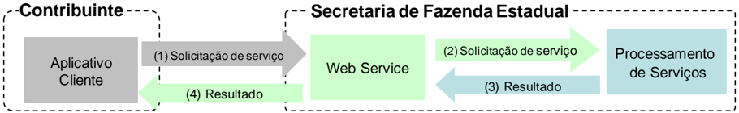

Etapas do processo:

- (1)  O  aplicativo  do  contribuinte  inicia  a  conexão enviando uma mensagem de solicitação de serviço para o Web Service;
- (2)  O Web Service recebe a mensagem de solicitação de serviço e encaminha ao aplicativo da NF-e que irá processar o serviço solicitado;
- (3)  O aplicativo da NF-e recebe a mensagem de solicitação de serviço e realiza o processamento, devolvendo uma mensagem de resultado do processamento ao Web Service;
- (4)  O  Web  Service  recebe  a  mensagem  de  resultado  do  processamento  e  o  encaminha  ao aplicativo do contribuinte;
- (5)  O aplicativo do contribuinte recebe a mensagem de resultado do processamento e, caso não exista outra mensagem, encerra a conexão.

## 4.3.2. Serviços Assíncronos

As  solicitações  de  serviços  de  implementação  assíncrona  são processadas de forma distribuída por vários processos e o resultado do processamento  somente é obtido em uma segunda conexão.


A  Figura  4-3  apresenta  o  fluxo  simplificado  de  funcionamento  de  um  serviço  de  implementação assíncrona.

Figura 4-3 - Serviço de Implementação  Assíncrona

## Serviço de Implementação assíncrona

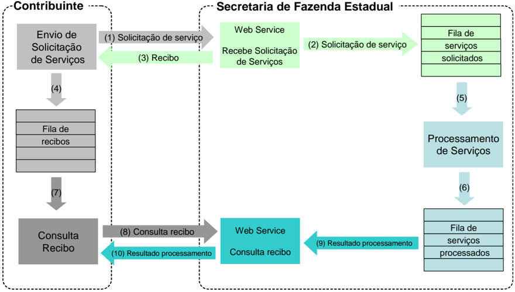

## Etapas do processo:

- (1) O aplicativo do contribuinte inicia a conexão enviando uma mensagem de solicitação de serviço para o Web Service de recepção de solicitação de serviços;
- (2) O Web Service de recepção de solicitação de serviços recebe a mensagem de solicitação de serviço e a coloca na fila de serviços solicitados, acrescentando o CNPJ do transmissor obtido do certificado digital do transmissor;
- (3) O Web Service de recepção de solicitação de serviço retorna o recibo da solicitação de serviço e a data e hora de recebimento da mensagem no Web Service ;
- (4) O aplicativo do contribuinte recebe o recibo e o coloca na fila de recibos de serviços solicitados e ainda não processados e, caso não exista outra mensagem, encerra a conexão;
- (5) Na Secretaria de Fazenda Estadual a solicitação de serviços é retirada da fila de serviços solicitados pelo aplicativo da NF-e;
- (6) O serviço solicitado é processado pelo aplicativo da NF-e e o resultado do processamento é colocado na fila de serviços processados;
- (7) O aplicativo do contribuinte retira um recibo da fila de recibos de serviços solicitados;
- (8) O aplicativo do contribuinte envia uma consulta de recibo, iniciando uma conexão com o Web Service para consulta de recibo;
- (9) O Web Service para consulta de recibo recebe a mensagem de consulta recibo e localiza o resultado de processamento da solicitação de serviço;
- (10)  O Web Service para consulta de recibo devolve o resultado do processamento ao aplicativo contribuinte;
- (11)  O aplicativo do contribuinte recebe a mensagem de resultado do processamento e, caso não exista outra mensagem, encerra a conexão.

## 4.3.3. Filas e Mensagens

As  filas  de  mensagens  de  solicitação  de  serviços  são  necessárias  para  a  implementação  do processamento assíncrono das solicitações de serviços.


SNFeNFCe

As  mensagens de solicitações de serviços no processamento assíncrono são armazenadas em uma fila de entrada.

Para ilustrar como as filas armazenam as informações, observe o diagrama exposto na Figura 4-4.

Figura 4-4 - Exemplo de Fila de Armazenamento

## Estrutura de um item da fila:

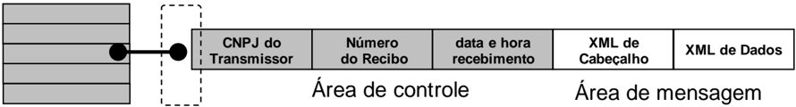

A  estrutura  de  um  item  é  composta  pela  área  de  controle (identificador) e pela área de detalhe. As seguintes informações são adotadas como atributos de controle:

- CNPJ  do  transmissor :  CNPJ  da  empresa  que  enviou  a  mensagem  que  não  necessita  estar vinculado  ao  CNPJ  do  estabelecimento  emissor  da  NF-e.  Somente  o  transmissor  da  mensagem terá acesso ao resultado do processamento  das mensagens de solicitação de serviços;
- Recibo  de  entrega :  Número  sequencial  único  atribuído  para  a  mensagem  pela  Secretaria  de Fazenda  Estadual.  Este  atributo  identifica  a  mensagem  de  solicitação  de  serviços  na  fila  de mensagem;
- Data  e  hora  de  recebimento  da  mensagem: Data  e  hora  local  do  instante  de  recebimento  da mensagem  atribuída  pela  Secretaria  de  Fazenda  Estadual.  Este  atributo  é  importante  como parâmetro de desempenho  do  sistema, eliminação de mensagens,  adoção  do  regime  de contingência, etc. O tempo médio de resposta é calculado com base neste atributo.

A área de mensagem contém uma área de cabeçalho e a área de dados em formato XML.

Para  processar  as  mensagens  de  solicitações  de  serviços,  a  aplicação  da  NF-e  irá  retirar  a mensagem da fila de entrada  de  acordo com a ordem de chegada, devendo armazenar o resultado do processamento  da solicitação de serviço em uma fila de saída.

A  fila  de  saída  terá  a  mesma  estrutura  da  fila  de  entrada,  sendo  a  única  diferença  o  conteúdo  do detalhe  da  mensagem,  que  contém  o  resultado  do  processamento  da  solicitação  de  serviço  em formato XML.

O  tempo  médio  de  resposta  que  mede  a  performance  do  serviço  de  processamento  dos  lotes  é calculado  com  base  no  tempo  decorrido  entre  o  momento  de  recebimento  da  mensagem  e  o momento  de  armazenamento  do  resultado  do  processamento  da  solicitação  de  serviço  na  fila  de saída.

Nota: O  termo fila é utilizado apenas  para designar  um  repositório  de  recibos  emitidos.  A implementação da fila  poderá  ser  feita  através  de  Banco  de Dados ou qualquer outra forma, sendo transparente ao contribuinte que realizará a consulta  do  processamento  efetuado  (processos assíncronos).

## 4.3.4. Número do Recibo de Lote

O número do Recibo do Lote deve ser gerado pelo Portal da Secretaria de Fazenda Estadual, com a seguinte regra de formação, que também pode ser vista na Tabela 4-7:

- 2 posições com o Código da UF onde foi entregue o lote (codificação do IBGE);


- 1  posição  com  o  Tipo  de  Autorizador  (0  ou  1=SEFAZ  normal,  2=Contingência  SCAN-RFB, 3=SEFAZ VIRTUAL-RS, 4=SEFAZ VIRTUAL-RFB);
- 12 posições numéricas sequenciais.

Tabela 4-7 - Estrutura do Recibo do Lote

| Campo                    | Códigoda UF     |   Tipo Autorizador |   Sequencial |
|--------------------------|-----------------|--------------------|--------------|
| Quantidade de caracteres | 02 (Tabela 8-1) |                 01 |           12 |

## 4.3.5. Número do Protocolo

O  número  do  protocolo  (nProt)  é  gerado  pelo  Portal  da  Secretaria  da  Fazenda  Estadual  ou  da Secretaria  da  Receita  Federal  do  Brasil  para  identificar  univocamente  as  transações  realizadas  de autorização de uso, denegação de uso, cancelamento de NF-e e inutilização de numeração de NF-e. A regra de formação do número do protocolo pode ser vista na Tabela 4-8.

Tabela 4-8 - Estrutura do Número do Protocolo

| 9                | 9            | 9            | 9   | 9                         | 9                         | 9                         | 9                         | 9                         | 9                         | 9                         | 9                         | 9                         | 9                         | 9                         |
|------------------|--------------|--------------|-----|---------------------------|---------------------------|---------------------------|---------------------------|---------------------------|---------------------------|---------------------------|---------------------------|---------------------------|---------------------------|---------------------------|
| Tipo Autorizador | código da UF | código da UF | Ano | sequencial de 10 posições | sequencial de 10 posições | sequencial de 10 posições | sequencial de 10 posições | sequencial de 10 posições | sequencial de 10 posições | sequencial de 10 posições | sequencial de 10 posições | sequencial de 10 posições | sequencial de 10 posições | sequencial de 10 posições |

- 1 posição para indicar o Tipo Autorizado:
- o 1=Secretaria de Fazenda Estadual;
- o 2=Receita Federal;
- o 3=SEFAZ Virtual RS ;
- o 4=SEFAZ Virtual RFB);
- 2 posições para o código da UF do IBGE (Tabela 8-1);
- 2 posições para ano;
- 10 posições para o sequencial no ano.

A  geração  do  número  de  protocolo  é  única,  e  é  utilizada  por  todos  os Web Services que precisam atribuir um número de protocolo para o resultado do processamento.

## 4.3.6. Tempo Médio de Resposta

O tempo médio de resposta é um indicador que mede a performance do serviço de processamento dos lotes dos últimos 5 minutos.

O  tempo  médio  de  processamento  de  uma  NF-e  é  obtido  pela  divisão  do  tempo  decorrido  entre  o recebimento  da  mensagem  e  o  momento  de  armazenamento  da  mensagem  de  processamento  do lote pela quantidade de NF-e existentes no lote.

O  tempo  médio  de  resposta  é  a  média  dos  tempos  médios  de  processamento  de  uma  NF-e  dos últimos 5 minutos.

Caso o tempo médio de resposta fique abaixo de 1 (um) segundo, o tempo será informado como 1 segundo. Arredondar as frações de segundos para cima.

## 4.3.7. Ambientes de Homologação e de Produção

As  Secretarias  de  Fazenda  Estaduais  mantêm  dois  ambientes  para  recepção  de  NF-e. O ambiente de homologação é específico para a realização de testes e integração das aplicações do contribuinte durante  a  fase  de  implementação  e  adequação  do  sistema  de  emissão  de  NF-e  do  contribuinte,  e nos casos em que este sistema sofre alterações após entrar em regime de operação normal.


A autorização de uso de NF-e no ambiente de produção, nos termos das cláusulas quarta e quinta do Ajuste SINIEF 07/05, de 30 de setembro de 2005, tem o efeito de permitir que o arquivo da NF-e seja utilizado como documento fiscal.

A  utilização  pelo  contribuinte  de  qualquer  um  dos  dois  ambientes  fica  condicionada  a  prévia autorização  da  Secretaria  de  Fazenda,  Finanças  ou  Tributação  de  sua  UF,  através  do  respectivo processo de credenciamento.

O acesso a cada um dos ambientes será concedido mediante prévia requisição do contribuinte ou de ofício, caso seja de interesse da Administração Tributária.

A relação dos Web Services em operação está disponível no Portal Nacional:

## WS de Homologação:

http://hom.nfe.fazenda.gov.br/portal/webServices.aspx?tipoConteudo=Wak0FwB7dKs=

## WS de Produção:

https://www.nfe.fazenda.gov.br/portal/webServices.aspx?tipoConteudo=Wak0FwB7dKs=

A documentação do WSDL pode ser obtida na internet acessando o endereço do Web Service desejado.

- Exemplificando,  para  obter  o  WSDL  de  cada  um  dos Web  Services acione  o  navegador  Web (Internet Explorer, por exemplo) e digite o endereço desejado seguido do literal '?WSDL'.

## Sobre as Condições de Teste para as Empresas

O  ambiente  de  homologação  deve  ser  usado  para  que  as  empresas  possam  efetuar  os  testes necessários nas suas aplicações, antes de passar a consumir os serviços no ambiente de produção.

Em relação à massa de dados para que os testes possam ser efetuados, lembramos que podem ser geradas  NF-e  no  ambiente  de  homologação  à  critério  da  empresa (NF-e sem valor fiscal). As NF-e no  ambiente  de  homologação  podem  ser  geradas  por  aplicativo  da  própria  empresa,  ou  usando  o Programa Emissor Público, com a mesma finalidade.

Os  testes  no  ambiente  de  produção,  quando  liberado  este  ambiente,  por  falha  da  aplicação  da empresa podem disparar os mecanismos de controle de uso indevido 5 , impedindo, por exemplo, uma nova  Consulta  a  Relação  de  Documentos  Destinados  para  documentos  que  já  foram  consultados anteriormente.

## 4.3.8. Uso Indevido

(NT 2018.002)

A  análise  do  comportamento  atual  das  aplicações  das  empresas  ('aplicação  cliente')  permite identificar  algumas  situações  de  uso  indevido  nos  ambientes  autorizadores.  Atualmente,  várias  UF autorizadoras  de  documentos  fiscais  eletrônicos  estão  tendo  seus  serviços  utilizados  de  forma indevida  por  alguns  contribuintes.  Esse  uso  indevido  pode  comprometer  a  estabilidade  dos  Web Services e resultar na saturação dos recursos, deixando o ambiente autorizador inoperante, podendo também ser interpretadas como ataques aos recursos de processamento, rede e armazenamento.

5  Item 4.3.8.


Portanto,  para  preservar  os  sistemas  autorizadores,  observado  um  comportamento  indevido  da aplicação  de  alguma  empresa  no consumo dos diversos Web Services ,  a  Sefaz autorizadora, a seu critério, poderá implantar as regras de validação de Consumo Indevido.

O  contribuinte  que  estiver  utilizando  indevidamente  os  sistemas  poderá  sofrer  as  penalidades definidas na legislação de cada UF.

Como exemplo maior do mau uso do ambiente, ressalta-se a falta de controle de algumas aplicações que  entram  em  'loop',  consumindo  recursos  de  forma  indevida,  sobrecarregando  principalmente  o canal de comunicação com a Internet, além da capacidade de processamento dos serviços expostos pelas Sefaz.

Existem controles para identificar as situações de uso indevido de sucessivas tentativas de busca de registros já disponibilizados anteriormente.

As novas tentativas serão rejeitadas com o erro '656-Rejeição:  Consumo Indevido'.

O erro e problema mais comum encontrado pelas Sefaz é o envio repetido (em loop) de requisições para  os Web Service s  dos  sistemas  autorizadores  de  documentos  fiscais  eletrônicos.  Normalmente isso  ocorre  devido  algum  erro  na  aplicação  do  emissor  de  documentos  fiscais  eletrônicos  ou  má utilização do usuário.

Após o envio de uma requisição para o sistema autorizador, essa requisição pode ser autorizada ou rejeitada. Caso ela seja rejeitada, o usuário do sistema deverá verificar o motivo da rejeição e corrigila,  se  assim  desejar,  ou  caso  a  rejeição  seja  indevida  (o  sistema  autorizador  rejeitou  de  forma equivocada) deverá entrar em contato com a SEFAZ autorizadora.

A Tabela 4-9 apresenta alguns exemplos de Consumo Indevido dos Web Service s existentes:

Tabela 4-9 - Exemplos de Consumo Indevido de Web Service s

| WebServices                                    | Aplicação com erro/problema                                                                                                                                                                                                                                                                                                                                                                                                               |
|------------------------------------------------|-------------------------------------------------------------------------------------------------------------------------------------------------------------------------------------------------------------------------------------------------------------------------------------------------------------------------------------------------------------------------------------------------------------------------------------------|
| Envio deLote de NF-e                           | • Aplicação da empresa em'looping' enviando o mesmo Lote deNF -e rejeitado por erro deSchema, ou com NF e rejeitada por umerro específico • Usuário do sistema fica enviando manualmentea mesmaNF-e                                                                                                                                                                                                                                       |
| Consulta Resultado do Lote                     | • Aplicação da empresa efetuaem 'looping' consultando os númerosde Recibo deLote emsequência, mesmo para Número de Recibo que não foram gerados para sua empresa • Usuário do sistema fica enviando manualmentea mesmaconsulta                                                                                                                                                                                                            |
| Registro deEvento da NF-e                      | • Aplicação daemp resa em'looping' enviando o mesmo Pedidode Cancelamento ou Evento, que sempreé rejeitado • Usuário do sistema fica enviando manualmenteo mesmocancelamento ou evento                                                                                                                                                                                                                                                    |
| Inutilização de Numeração                      | • Aplicação da empresa em'looping' enviando o mesmo pedidode inutilização, que sempreé rejeitado • Usuário do sistema fica enviando manualmenteo mesmopedido de Inutilização                                                                                                                                                                                                                                                              |
| Consulta Situação da NF-e (Consulta Protocolo) | • Algumas empresas utilizam esta consulta para verificar a disponibilidade dos serviços da SEFAZ Autorizadora, consultando a mesmaChavede Acesso,em'looping' • Algumas empresas mantêm em'looping' umaconsulta as Chavesde Acessode NF -e destinadas para sua empresa o Em alguns casos, fica sendoconsultada umaChave de Acessoinexistente durante meses • Usuário do sistema fica enviando manualmenteo mesmopedido de consulta da NF-e |
| Consulta Status Serviço                        | • Aplicação em'loop' consumindo o Web Service emumafrequência maior do que a prevista                                                                                                                                                                                                                                                                                                                                                     |

## 4.4. Padrão de Mensagens dos Web Service s

As  chamadas  dos Web  Services disponibilizados  pelos Web  Service da  NF-e  e  os  respectivos resultados  do  processamento  são  realizadas  através  das  mensagens  com  o  padrão  mostrado  na Figura 4-5, onde:

- versaoDados: versão do leiaute da estrutura XML informado na área de dados;
- Área de Dados estrutura XML variável definida na documentação do Web Service acessado.

Figura 4-5 - Padrão de Mensagem  de Chamada/Retorno  de Web Service

versaoDados Estrutura XML definida na documentação do Web Service

Elemento nfeCabecMsg (SOAP Header)

Área de dados (SOAP Body)

## 4.4.1. Informação de Controle e Área de Dados das Mensagens

A  criação  das  variáveis  de  'Código  da  UF'  e  'Versão  dos  Dados'  no  SOAP  Header  (ou  'Área  de Cabeçalho')  foi  uma  decisão  inicial  do Projeto NF-e, quando ainda não se tinha muitas informações sobre a capacidade de processamentos dos Web Service s pelas SEFAZ. Na época, esta decisão foi tomada para conseguir rejeitar previamente as mensagens  enviadas  para  um  ambiente  de autorização diferente do previsto, sem precisar 'abrir' os dados da mensagem.

As  variáveis  do  SOAP  Header  ('cabeçalho') constam também na mensagem enviado pela Empresa e  observado  que,  a  cada  troca  de  versão  do  leiaute  XML, este controle tem atrapalhado, já que as empresas montam corretamente a mensagem, mas algumas vezes esquecem-se de alterar os dados do cabeçalho.

Na  versão  4.0  do  leiaute  da  NF-e  foi  eliminado  o  uso  de  variáveis  no  SOAP  Header  (eliminada  a 'Área de Cabeçalho') na requisição enviada para todos os Web Service s previstos no Sistema NFE.

Portanto, foram eliminadas também as regras de validação relacionadas com o controle da chamada ao Web  Service que  usam  estas  variáveis  do  SOAP  Header.  Exemplo  do  SOAP  Header  que  não será mais necessário:

```
<soap12:Header> <nfeCabecMsg xmlns="http://www.portalfiscal.inf.br/nfe/wsdl/nfeAutorizacao"> <versaoDados>string</versaoDados> <cUF>string</cUF> </nfeCabecMsg> </soap12:Header>
```

A  informação  armazenada  na  área  de  dados  é  um  documento  XML  que  deve  atender  o  leiaute definido na documentação do Web Service acessado:

```
<soap12:Body> <nfeAutorizacaoResponse xmlns="http://www.portalfiscal.inf.br/nfe/wsdl/nfeAutorizacao"> <nfeRetornoMsg>xml</nfeRetornoMsg> </nfeAutorizacaoResponse>
```


SNFeNFCe


## 4.4.2. Validação da Estrutura XML das Mensagens dos Web Services

As informações são enviadas ou recebidas dos Web Service s através de mensagens no padrão XML definido na documentação de cada Web Service .

As  alterações  de  leiaute  e  da  estrutura  de  dados  XML  realizadas  nas  mensagens  são  controladas através da atribuição de um número de versão para a mensagem.

Um Schema XML é uma linguagem que define o conteúdo do documento XML, descrevendo os seus elementos  e  a  sua  organização,  além  de  estabelecer  regras  de  preenchimento  de  conteúdo  e  de obrigatoriedade de cada elemento ou grupo de informação.

A  validação  da  estrutura  XML  da  mensagem  é  realizada  por  um  analisador  sintático  ( parser )  que verifica se a mensagem atende as definições e regras de seu Schema XML.

Qualquer  divergência da estrutura XML da mensagem em relação ao seu Schema XML provoca um erro de validação do Schema XML.

A primeira condição para que a mensagem seja validada com sucesso é que ela seja submetida com êxito ao Schema XML correspondente.

Assim,  os  aplicativos  do  contribuinte  devem  estar  preparados  para  gerar  as  mensagens  no  leiaute em  vigor,  devendo  ainda  informar  a  versão  do  leiaute  da  estrutura  XML  da  mensagem  no  campo versaoDados da área de cabeçalho da mensagem.

## 4.4.3. Schemas XML das Mensagens dos Web Services

Toda  mudança  de  leiaute  das  mensagens  dos Web  Service s implica  na  atualização  do  seu respectivo Schema XML.

A  identificação  da  versão  dos  Schemas  será  realizada  com  o  acréscimo  do  número  da  versão  no nome do arquivo precedida do literal '\_v', conforme os exemplos a seguir:

- enviNFe\_v1.03.xsd
- o Schema XML de Envio de NF-e, versão 1.03
- leiauteNFe\_v10.15.xsd
- o Schema XML dos tipos básicos da NF-e, versão 10.15

A maioria dos Schemas XML da NF-e utilizam as definições de tipos básicos ou tipos complexos que estão definidos em  outros Schemas  XML  (ex.:  tiposBasico\_v1.00.xsd,  etc.),  nestes  casos,  a modificação de versão do Schema básico será repercutida no Schema principal.

Por exemplo, o tipo numérico de 15 posições com 2 decimais é definido no Schema tiposBasico\_v1.00.xsd,  caso  ocorra  alguma  modificação  na  definição  deste  tipo,  todos  os  Schemas que  utilizam  este  tipo  básico  devem  ter  a  sua  versão  atualizada  e  as  declarações  'import'  ou 'include' devem ser atualizadas com o nome do Schema básico atualizado.

Exemplo de Schema XML:

&lt;?xml version="1.0" encoding="UTF-8"?&gt;

&lt;xs:schema xmlns:ds="http://www.w3.org/2000/09/xmldsig#" xmlns:xs="http://www.w3.org/2001/XMLSchema"

xmlns="http://www.portalfiscal.inf.br/nfe"

targetNamespace="http://www.portalfiscal.inf.br/nfe" elementFormDefault="qualified"

attributeFormDefault="unqualified"&gt;

&lt;xs:import namespace="http://www.w3.org/2000/09/xmldsig#" schemaLocation="xmldsig-core-

```
schema_v1.01.xsd"/> <xs:include schemaLocation="tiposBasico_v1.00.xsd"/> <xs:element name="NFe"> <xs:annotation> <xs:documentation>Nota Fiscal Eletrônica</xs:documentation> </xs:annotation>
```

As modificações de leiaute das mensagens dos Web Services podem  ser causadas por necessidades técnicas ou em  razão da modificação de alguma  legislação. As modificações decorrentes  de  alteração  da  legislação  deverão  ser  implementadas  nos  prazos  previstos  no  ato normativo  que  introduziu  a  alteração.  As  modificações  de  ordem  técnica  serão  divulgadas  pela Coordenação Técnica do Sistema e poderão ocorrer sempre que se fizerem necessárias.

## 4.5. Versão dos Schemas

## 4.5.1. Controle de Versão

O  controle  de  versão  de  cada  um  dos  schemas  válidos  para  o  Sistema  Nota  Fiscal  Eletrônica compreende uma definição nacional sobre:

- qual a versão vigente (versão mais atualizada);
- quais são as versões anteriores ainda suportadas por todas as SEFAZ.

Este controle de versões permite a adaptação dos sistemas de informática  das  empresas participantes  do  Sistema  em  diferentes  datas;  desta  forma,  algumas  empresas  poderão  estar  com uma  versão  de  leiaute  mais  atualizada,  enquanto  outras  empresas  poderão  ainda  estar  operando com mensagens em um leiaute anterior.

Não existem mudanças frequentes de leiaute  de  mensagens  e  as  empresas  dispõem  de  um  prazo razoável para implementar as mudanças necessárias, conforme acordo operacional estabelecido. Mensagens  recebidas  com  uma  versão  de  leiaute  não  suportada  serão  rejeitadas  com  uma mensagem de erro específica na versão do leiaute de resposta mais antiga em uso.

## 4.5.2. Liberação das Versões dos Schemas para o Sistema da NF Eletrônica

Os schemas válidos para o Sistema da Nota Fiscal Eletrônica são disponibilizados no Portal Nacional da NF-e (www.nfe.fazenda.gov.br),  após terem sido liberados pela Coordenação Técnica do Sistema.

A  cada  nova liberação é disponibilizado um arquivo compactado contendo o conjunto de schemas a serem utilizados pelas empresas para a geração dos arquivos XML.

Este  arquivo  é  denominado  'Pacote  de  Liberação',  e  numerado  sequencialmente.  Os  pacotes  de liberação são identificados pelas letras 'PL', seguida do número do pacote.

Exemplo: O pacote PL\_001.zip é o 'Pacote de Liberação' nº 1 de schemas da Nota Fiscal Eletrônica.

Os  schemas  válidos  estão  contidos  no  pacote  de  liberação  e  são  identificados  pelo  seu  nome, seguido da versão do respectivo schema.

Assim, para o schema de 'Envio de Lotes de Nota Fiscal Eletrônica', corresponderá um arquivo com a  extensão  .XSD,  que  terá  o  nome  de  ' enviNFe\_v9.99.xsd ',  onde  v9.99,  corresponde  a  versão  do respectivo schema.


Para identificar quais os schemas que sofreram alteração em um determinado pacote liberado, devese  comparar  o  número  da  versão  do  schema  deste  pacote  com  o  do  pacote  anterior,  conforme exemplificado na Tabela 4-10.

Tabela 4-10 - Exemplo de Identificação de Schema Alterado em um Pacote de Liberação

| PACOTE         | PL_001.ZIP            | PL_002.ZIP            |
|----------------|-----------------------|-----------------------|
| DATA LIBERAÇÃO | 01/04/2006            | 01/06/2006            |
| SCHEMAS        | enviNFe_v1.00.xsd     | enviNFe_v1.30.xsd     |
| SCHEMAS        | inutNFe_v1.00.xsd     | inutNFe_v1.00.xsd     |
| SCHEMAS        | cancNFe_v1.00.xsd     | cancNFe_v1.00.xsd     |
| SCHEMAS        | tiposBasico_v1.00.xsd | tiposBasico_v1.01.xsd |

Para  as  atualizações  de  versões  que  decorrem  de  correção  de  regra  de  validação,  modificação  da obrigatoriedade  de  campo,  etc.,  que  não  modificam  a  estrutura  do  Schema  através  da  inclusão  ou exclusão  de  campos,  serão  liberados  novos  pacotes  de  liberação  sem  a  atualização  do número do pacote.

Nestas situações os pacotes mais recentes serão identificados com o acréscimo de letras minúscula do alfabeto, como por exemplo: PL\_002a.ZIP, indicando que se trata da primeira versão corrigida do PL\_002.ZIP.

## 4.5.3. Schemas e Seus Pacotes de Liberação

A  Tabela 4-11 lista os Web Services do Sistema NF-e, juntamente com seus métodos e respectivas funções.

Tabela 4-11 - Relação de Web Service s do Sistema NF-e

| Serviço                            | Função                                                                                                      | WebService           |
|------------------------------------|-------------------------------------------------------------------------------------------------------------|----------------------|
| Autorização de Lote de NF-e        | Recepção de mensagensde lote de NF-e                                                                        | NFeAutorizacao       |
| Consulta Recibo do Lote            | Retorno do resultado do processamentodo lote de NF-e                                                        | NFeRetAutorizacao    |
| Inutilização de numeração NF-e     | Solicitações deinutilização de numeração                                                                    | NFeInutilizacao      |
| Consulta Protocolo da NF-e         | Solicitações deconsulta da situação atual da NF-e                                                           | NFeConsultaProtocolo |
| Consulta Status de Serviço da NF-e | Consulta do status do serviço prestadopelo Portal da Secretaria de Fazenda Estadual                         | NFeStatusServico     |
| Consulta Cadastro                  | Consulta cadastro decontribuintes do ICMS da unidade federada                                               | NfeConsultaCadastro  |
| Distribuição aos interessados      | Distribuição de informações resumidas e documentos fiscais eletrônicos de interessede umator. (NT 2014.002) | NFeDistribuicaoDFe   |
| Registro deEvento                  | Recepção de mensagemde Evento da NF-e                                                                       | NFeRecepcaoEvento    |

A  Tabela  4-12  apresenta  os schemas XML  utilizados  nos  serviços  listados  na  Tabela  4-11,  suas versões e a seção ou item do capítulo 5 que detalha o Web Service .

Tabela 4-12 - Schemas e Pacotes de Liberação

| WS                   |   S | Schema         | PL   |   vers | Observação                                                            |
|----------------------|-----|----------------|------|--------|-----------------------------------------------------------------------|
| NFeAutorizacao       | 5.1 | enviNFe        | A    |   4.00 | Mensagemde envio delote deNF-e                                        |
| NFeAutorizacao       | 5.1 | retEnviNFe     | A    |   4.00 | Mensagemde retorno do envio de lote de NF-e                           |
| NFeRetAutorizacao    | 5.2 | consReciNFe    | A    |   4.00 | Mensagemde consulta processamentodo lote de NF-e transmitida          |
| NFeRetAutorizacao    | 5.2 | retConsReciNFe | A    |   4.00 | Mensagemde retorno da consulta de processamentodo lote de NF-e        |
| NFeInutilizacao      | 5.3 | inutNFe        | A    |   4.00 | Mensagemde solicitação de inutilização de numeração deNF-e            |
| NFeInutilizacao      | 5.3 | retInutNFe     | A    |   4.00 | Mensagemde retorno da solicitação deinutilização de numeração de NF-e |
| NFeConsultaProtocolo | 5.4 | consSitNFe     | A    |   4.00 | Mensagemde consulta da situação atual da NF-e                         |
| NFeConsultaProtocolo | 5.4 | retConsSitNFe  | A    |   4.00 | Mensagemde retorno da consulta da situação atual da NF-e              |
| NFeStatusServico     | 5.5 | consStatServ   | A    |   4.00 | Mensagemda consulta do status do serviço de autorização de NF-e       |


| WS                  | S                                  | Schema              | PL   |   vers | Observação                                                                                                                                                                                                |
|---------------------|------------------------------------|---------------------|------|--------|-----------------------------------------------------------------------------------------------------------------------------------------------------------------------------------------------------------|
|                     |                                    | retConsStatServ     | A    |   4.00 | Mensagemde retorno da consulta do status do serviço de autorização deNF-e                                                                                                                                 |
| NfeConsultaCadastro | 5.6                                | consCad             | B    |   2.00 | Mensagemde consulta ao cadastro de contribuintes do ICMS                                                                                                                                                  |
|                     |                                    | retConsCad          | B    |   2.00 | Mensagemde retorno da consulta ao cadastro decontribuintes do ICMS                                                                                                                                        |
| NfeDistribuicaoDFe  | 5.7                                | distDFeInt          | C    |   1.01 | Mensagemde pedido dedistribuição de DF-e deinteressedo ator                                                                                                                                               |
|                     |                                    | retDistDFeInt       | C    |   1.01 | Estrutura XMLcom os documentos deinteressedo ator                                                                                                                                                         |
|                     | Erro! Font                         | resNFe              | C    |   1.01 | Estrutura XMLcom o conjunto de informações resumidas da NF-e                                                                                                                                              |
|                     | e de refer ência não enco ntra da. | resEvento           | C    |   1.01 | Estrutura XMLcom o conjunto de informações resumidas de um eventode NF-e                                                                                                                                  |
| NFeRecepcaoEvento   | 5.8.6                              | procEventoNFe       | D    |   1.00 | Estrutura XMLpara disponibilização deeventopelo emissor para o destinatário                                                                                                                               |
|                     | 5.9                                | envEventoCancNFe    | E    |   1.00 | Mensagemde solicitação de registro deeventode cancelamento                                                                                                                                                |
|                     |                                    | retEnvEventoCancNFe | E    |   1.00 | Mensagemde retorno da solicitação deregistro de eventode cancelamento                                                                                                                                     |
|                     | 5.10                               | envEventoCancSubst  | F    |        | Mensagemde solicitação de registro deeventode cancelamento por substituição                                                                                                                               |
|                     |                                    | retEventoCancSubst  | F    |        | Mensagemde retorno da solicitação deregistro de eventode cancelamento por substituição                                                                                                                    |
|                     | 5.11                               | envCCe              | G    |   1.00 | Mensagemde solicitação de registro deeventode carta de correção                                                                                                                                           |
|                     |                                    | retEnvCCe           | G    |   1.00 | Mensagemde retorno da solicitação deregistro de eventode carta de correção                                                                                                                                |
|                     | 5.12                               | envConfRecebto      | H    |   1.00 | Mensagemde solicitação de registro deeventode manifestação do destinatário                                                                                                                                |
|                     |                                    | retEnvConfRecebto   | H    |   1.00 | Mensagemde retorno da solicitação deregistro de eventode eventode manifestação do destinatário                                                                                                            |
|                     | 5.13                               | envEPEC             | I    |   1.00 | Mensagemde solicitação de registro deeventoprévio de emissão emcontingência                                                                                                                               |
|                     |                                    | retEnvEPEC          | I    |   1.00 | Mensagemde retorno da solicitação deregistro de evento prévio de emissão emcontingência                                                                                                                   |
|                     | Erro! Font e de refer              | envRemIndus         | J    |   1.00 | Mensagemde solicitação de registro deeventode pedido relacionado com a prorrogação do prazo deretorno de produtos de umaNF-ede remessapara industrialização porencomendacom suspensão do ICMS             |
|                     | ência não enco ntra da.            | retEnvRemIndus      | J    |   1.00 | Mensagemde retorno da solicitação deregistro de evento relacionado com a pedido de prorrogação do prazo de retorno de produtos deuma NF-ede remessapara industrialização porencomendacom suspensãodo ICMS |

A  Tabela  4-13  apresenta  informações  sobre  a  publicação  dos  pacotes  de  liberação (PL) citados na Tabela 4-12 e na Tabela 4-14.

Tabela 4-13 - Pacotes de Liberação Referenciados na Tabela 4-12 e na Tabela 4-14

| PL   | Nome do Pacote                  | PublicadoPor   | At         | Hom        | Prod       |
|------|---------------------------------|----------------|------------|------------|------------|
| A    | PL_009_V4_00_NT_2019_001_v1.20a | NT2019.001     | 20/08/2019 | 26/08/2019 | 02/09/2019 |
| B    | PL_ConsCad_v2.00                | NT2020.002     | 30/05/2014 | 15/07/2014 | 01/08/2014 |
| C    | PL_nfeDistDFe_102               | NT2014.002     | 25/10/2016 | 05/12/2016 | 09/01/2017 |
| D    | Evento_Generico_PL_v1.01        | NT2014.004     | 05/08/2014 | 15/07/2014 | 01/08/2014 |


| PL   | Nome do Pacote                | PublicadoPor   | At         | Hom        | Prod       |
|------|-------------------------------|----------------|------------|------------|------------|
| E    | Evento_Canc_PL_v1.01          | NT2018.004     | 21/12/2018 | 25/02/2019 | 29/04/2019 |
| F    | Evento_CancSubst_v1.01        | NT2018.004     | 21/12/2018 | 25/02/2019 | 29/04/2019 |
| G    | Evento_CCe_PL_v1.01           | NT2014.004     | 30/05/2014 | 15/07/2014 | 01/08/2014 |
| H    | Evento_ManifestaDest_PL_v1.01 | NT2014.004     | 30/05/2014 | 15/07/2014 | 01/08/2014 |
| I    | Evento_EPEC_PL_v1.01          | NT2014.004     | 30/05/2014 | 15/07/2014 | 01/08/2014 |
| J    | Evento_Prorrog_Indust_1.0     | NT2015.001     | 20/03/2015 | 26/10/2015 | 30/11/2015 |

At ........Última Atualização

Hom ....Data de entrada em ambiente de homologação

Prod ....Data de entrada em ambiente de produção

A  Tabela  4-14  apresenta  outros schemas XML  que  fazem  parte  dos  pacotes  de liberação referidos na  Tabela  4-13,  e  que  são  utilizados  pelos  demais schemas ,  ou  que  são  utilizados  para  montar pacotes de compartilhamentos  de informação.

Tabela 4-14 - Outros Schemas

| PL   | Schema                          | vers      | Observação                                                                                                                                                                |
|------|---------------------------------|-----------|---------------------------------------------------------------------------------------------------------------------------------------------------------------------------|
| A    | nfe                             | 4.00      | Schema base da NF-e                                                                                                                                                       |
| A    | leiauteConsSitNFe               | 4.00      | Tipos básicos da consulta de situação da NF-e                                                                                                                             |
| A    | leiauteConsStatServ             | 4.00      | Tipos básicos da consulta de status de serviço                                                                                                                            |
| A    | leiauteInutNFe                  | 4.00      | Tipos básicos da inutilização denumeração                                                                                                                                 |
| A    | leiauteNFe                      | 4.00      | Tipos básicos da NF-e                                                                                                                                                     |
| A    | procInutNFe                     | 4.00      | Leiaute de compartilhamento de pedido deinutilização denumeração de NF-e                                                                                                  |
| A    | procNFe                         | 4.00      | Leiaute de compartilhamento da NF-e                                                                                                                                       |
| A    | tiposBasico                     | 4.00      | Tipos de dados utilizados no leiaute da NF-e                                                                                                                              |
| A    | xmldsig-core-schema             | 1.01      | Definições de assinatura digital para NF-e                                                                                                                                |
| B    | leiauteConsultaCadastro         | 2.00      | Leiaute da consulta cadastro                                                                                                                                              |
| B    | tiposBasico                     | 1.03      | Tipos de dados utilizados na consulta cadastro                                                                                                                            |
| C    | tiposDistDFe                    | 1.01      | Tipos de dados utilizados no Pedido de Distribuição de DF-e                                                                                                               |
| C    | xmldsig-core-schema             | 1.01      | Definições de assinatura digital para Pedidode Distribuição de DF-e                                                                                                       |
| D    | leiauteEvento                   | 1.00      | Tipos básicos de evento genérico                                                                                                                                          |
| D    | tiposBasico                     | 1.03      | Tipos de dados utilizados no leiaute de eventogenérico                                                                                                                    |
| D    | xmldsig-core-schema             | 1.01      | Definições de assinatura digital para eventogenérico                                                                                                                      |
| E    | e110111                         | 1.00      | Evento Cancelamento                                                                                                                                                       |
| E    | EventoCanc                      | 1.00      | Validação do eventoCancelamento                                                                                                                                           |
| E    | leiauteEventoCanc               | 1.00      | Tipos básicos do eventoCancelamento                                                                                                                                       |
| E    | procEventoCanc                  | 1.00      | Leiaute para validação do proc Cancelamento                                                                                                                               |
| E    | tiposBasico                     | 1.03      | Tipos de dados utilizados no leiaute do eventoCancelamento                                                                                                                |
| E    | xmldsig-core-schema             | 1.01      | Definições de assinatura digital para registro do eventoCancelamento                                                                                                      |
| F    | e110112                         | 1.00      | Evento Cancelamento por Substituição                                                                                                                                      |
| F    | eventoCancSubst                 | 1.00      | Tipos básicos do eventoCancelamento por Substituição                                                                                                                      |
| F    | leiauteEventoCancSubst          | 1.00      | Leiaute chamado pelo schema eventoCancSubst                                                                                                                               |
| F    | procEventoCancSubst             | 1.00      | Leiaute para validação do proc Cancelamento por Substituição                                                                                                              |
| F    | tiposBasico                     | 1.03      | Tipos de dados utilizados no leiaute do eventoCancelamento por Substituição                                                                                               |
| F    | xmldsig-core-schema             | 1.01      | Definições de assinatura digital para registro do eventoCancelamento por Substituição                                                                                     |
| G    | CCe                             | 1.00      | Schema base da Carta de Correção                                                                                                                                          |
| G    | e110110                         | 1.00      | Evento Carta deCorreção                                                                                                                                                   |
| G    | leiauteCCe                      | 1.00      | Tipos básicos do eventoCarta deCorreção                                                                                                                                   |
| G    | procCCeNFe                      | 1.00      | Leiaute de compartilhamento do eventoCarta de Correção                                                                                                                    |
| G    | tiposBasico                     | 1.03      | Tipos de dados utilizados no leiaute do eventoCarta de Correção                                                                                                           |
| G    | xmldsig-core-schema             | 1.01      | Definições de assinatura digital para registro do eventoCarta de Correção                                                                                                 |
| H    | confRecebto                     | 1.00      | Schema base da Manifestação do Destinatário                                                                                                                               |
| H    | e210200                         | 1.00      | Evento Confirmação deOperação pelo Destinatário                                                                                                                           |
| H    | e210210                         | 1.00      | Evento Ciência da Operação pelo Destinatário (ou Ciência da Emissão)                                                                                                      |
| H    | e210220                         | 1.00      | Evento Desconhecimentoda Operação pelo Destinatário                                                                                                                       |
| H    | e210240                         | 1.00      | Evento Operação não Realizada                                                                                                                                             |
| H    | leiauteConfRecebto              | 1.00      | Tipos básicos dos eventosde Manifestação do Destinatário                                                                                                                  |
| H    | procConfRecebtoNFe              | 1.00      | Leiaute de compartilhamento dos eventosde Manifestação do Destinatário                                                                                                    |
| H H  | tiposBasico xmldsig-core-schema | 1.03 1.01 | Tipos de dados utilizados no leiaute dos eventosde Manifestação do Destinatário Definições de assinatura digital para registro dos eventosde Manifestação do Destinatário |
| I    | EPEC                            |           | Schema base do Evento Prévio de Emissão emContingência                                                                                                                    |
|      |                                 | 1.00      |                                                                                                                                                                           |

## Nota Fiscal Eletrônica

MOC 7.0 - Visão Geral


WS .....  Nome do Web Service

| PL   | Schema              |   vers | Observação                                                                                                                                     |
|------|---------------------|--------|------------------------------------------------------------------------------------------------------------------------------------------------|
| I    | e110140             |   1.00 | Evento Prévio deEmissão emContingência                                                                                                         |
| I    | leiauteEPEC         |   1.00 | Tipos básicos do Evento Prévio deEmissão emContingência                                                                                        |
| I    | procEPEC            |   1.00 | Leiaute de compartilhamento do Evento Prévio de Emissão emContingência                                                                         |
| I    | tiposBasico         |   1.03 | Tipos de dados utilizados no leiaute do EventoPrévio de Emissão emContingência                                                                 |
| I    | xmldsig-core-schema |   1.01 | Definições de assinatura digital para registro do Evento Prévio de Emissão emContingência                                                      |
| J    | eventoRemIndus      |        | Schema base dos eventos relacionados comPedido de Prorrogação da suspensão de ICMS em operações para industrialização por encomenda emoutra UF |
| J    | e111500             |   1.00 | Pedido deProrrogação 1º prazo                                                                                                                  |
| J    | e111501             |   1.00 | Pedido deProrrogação 2º prazo                                                                                                                  |
| J    | e111502             |   1.00 | Cancelamento de Pedido deProrrogação 1º prazo                                                                                                  |
| J    | e111503             |   1.00 | Cancelamento de Pedido deProrrogação 2º prazo                                                                                                  |
| J    | e411500             |   1.00 | Evento Fisco Respostaao Pedidode Prorrogação 1º prazo                                                                                          |
| J    | e411501             |   1.00 | Evento Fisco Respostaao Pedidode Prorrogação 2º prazo                                                                                          |
| J    | e411502             |   1.00 | Evento Fisco Respostaao Cancelamento de Prorrogação 1º prazo                                                                                   |
| J    | e411503             |   1.00 | Evento Fisco Respostaao Cancelamento de Prorrogação 2º prazo                                                                                   |
| J    | leiauteRemIndus     |   1.00 | Tipos básicos dos eventosrelacionados com Pedido de Prorrogação                                                                                |
| J    | procRemIndus        |   1.00 | Leiaute de compartilhamento dos eventosrelacionados com Pedido de Prorrogação                                                                  |
| J    | tiposBasico         |   1.03 | Tipos de dados utilizados no leiaute dos eventosrelacionados com Pedido deProrrogação                                                          |
| J    | xmldsig-core-schema |   1.01 | Definições de assinatura digital para registro dos eventosrelacionados com Pedidode Prorrogação                                                |

PL.......  Linha da Tabela 4-13 que contém mais informações sobre o respectivo pacote de liberação

vers....  versão do último schema publicado

Notas  técnicas  futuras  que  contiverem  alterações  de schemas também  conterão  as  alterações correspondentes  nas tabelas presentes neste item deste manual.

## 5. Web Service s

## 5.1. Web Service - NfeAutorizacao

Função

: serviço destinado à recepção de mensagens de lote de NF-e.

Processo

:  assíncrono/síncrono.

Método:

nfeAutorizacaoLote

Figura 5-1 - Fluxo do Web Service nfeAutorizacaoLote  (Recepção de Lote de NF-e)

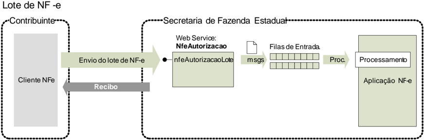

## 5.1.1. Leiaute Mensagem de Entrada

Entrada

: Estrutura XML com as notas fiscais enviadas.

Schema XML: enviNFe\_v4.00.xsd

Tabela 5-1 - Leiaute  Mensagem de Entrada do Web Service nfeAutorizacao

| #     | Campo   | Ele   | Pai   | Tipo   | Ocor.   | Tam.   | Descrição/Observação                                                                                                                                                                                                                                                                                                                                                                                                                                                                                      |
|-------|---------|-------|-------|--------|---------|--------|-----------------------------------------------------------------------------------------------------------------------------------------------------------------------------------------------------------------------------------------------------------------------------------------------------------------------------------------------------------------------------------------------------------------------------------------------------------------------------------------------------------|
| AP01  | enviNFe | Raiz  | -     | -      | -       | -      | TAG raiz                                                                                                                                                                                                                                                                                                                                                                                                                                                                                                  |
| AP02  | versao  | A     | AP01  | N      | 1-1     | 1-2v2  | Versão do leiaute                                                                                                                                                                                                                                                                                                                                                                                                                                                                                         |
| AP03  | idLote  | E     | AP01  | N      | 1-1     | 1-15   | Identificador de controle do envio do lote. Número sequencial auto incremental, decontrole correspondente ao identificador único do lote enviado. A responsabilidade de gerar e controlar essenúmero é exclusiva do contribuinte.                                                                                                                                                                                                                                                                         |
| AP03a | indSinc | E     | AP01  | N      | 1-1     | 1      | 0=Não. 1=Empresa solicita processamento síncrono do Lote de NF-e(sema geração deRecibo para consulta futura); Nota:O processamentosíncrono do Lote corresponde a entrega da resposta do processamentodas NF-e do Lote, sem a geração de umRecibo deLote para consulta futura. A resposta deforma síncrona pela SEFAZ Autorizadora só ocorrerá se: • a empresasolicitar e constar unicamente umaNF-e no Lote; • a SEFAZ Autorizadora implementar o processamento síncrono para a resposta do Lote de NF-e. |


SNFeNFCe O  tamanho  médio  da  NF-e  é  de  aproximadamente  10  KB  (dependendo  da  quantidade  de  itens), necessitando de um dimensionamento correto da rede interna e do canal de Internet das empresas e da SEFAZ.


| #    | Campo   | Ele   | Pai   | Tipo   | Ocor.   | Tam.   | Descrição/Observação                                                                                                                               |
|------|---------|-------|-------|--------|---------|--------|----------------------------------------------------------------------------------------------------------------------------------------------------|
| AP04 | NFe     | G     | AP01  | xml    | 1-50    | -      | Conjunto de NF-etransmitidas (máximo de 50 NF-e), seguindo definição do documento MOC - AnexoI - Leiaute e Regras de Validação daNF-e e da NFC-e . |

Para minimizar a necessidade de uma maior infraestrutura de rede, a mensagem de envio de Lote de NF-e poderá ser compactada, a critério da empresa (estima-se que a compactação da mensagem de Lote  irá  reduzir  aproximadamente  em  70%  o  tamanho  desta  mensagem),  por  meio  das  seguintes especificações:

- Nome do Web Service :  'nfeAutorizacao', conforme descrito neste item;
- Nome do Método: NfeAutorizacaoLoteZip;

O  novo  método  tem  unicamente  o  parâmetro  'nfeDadosMsgZip',  contendo  a  mensagem  'enviNFe' compactada no padrão GZip, onde o resultado da compactação é convertido para Base64.

A aplicação da SEFAZ irá descompactar a mensagem recebida, seguindo o procedimento normal do tratamento  do  Lote  descompactado.  Em  caso  de  falha  no  processo  de  descompactação  será retornado o erro '416 -  Rejeição: Falha na descompactação da área de dados'.

## 5.1.2. Leiaute Mensagem de Retorno

Retorno : Estrutura XML com a mensagem do resultado da transmissão.

Schema XML: retEnviNFe\_v4.00.xsd

Tabela 5-2 - Leiaute  Mensagem de Retorno do Web Service nfeAutorizacao

| #     | Campo      | Ele   | Pai   | Tipo   | Ocor.   | Tam.   | Descrição/Observação                                                                                                                                        |
|-------|------------|-------|-------|--------|---------|--------|-------------------------------------------------------------------------------------------------------------------------------------------------------------|
| AR01  | retEnviNFe | Raiz  | -     | -      | -       | -      | TAG raiz da Resposta                                                                                                                                        |
| AR02  | versao     | A     | AR01  | N      | 1-1     | 1-2v2  | Versão do leiaute                                                                                                                                           |
| AR03  | tpAmb      | E     | AR01  | N      | 1-1     | 1      | Identificação do Ambiente: 1=Produção/2= Homologação                                                                                                        |
| AR04  | verAplic   | E     | AR01  | C      | 1-1     | 1-20   | Versão do Aplicativo que recebeuo Lote. A versão deveser iniciada com a sigla da UF nos casos de WSpróprio ou a sigla SVANou SVRSnos demais casos.          |
| AR05  | cStat      | E     | AR01  | N      | 1-1     | 3      | Código do status da resposta (conforme item 4.4.1 do documento MOC - AnexoI - Leiaute NF-e/NFC-e )                                                          |
| AR06  | xMotivo    | E     | AR01  | C      | 1-1     | 1-255  | Descrição literal do status da resposta                                                                                                                     |
| AR06a | cUF        | E     | AR01  | N      | 1-1     | 2      | Código da UF que atendeua solicitação.                                                                                                                      |
| AR06b | dhRecbto   | E     | AR01  | D      | 1-1     |        | Preenchido com a data e hora do processamento (informado também no caso derejeição). Formato: 'AAAA -MM- DDThh:mm:ssTZD'(UTC - Universal Coordinated Time). |
| AR07  | infRec     | CG    | AR01  | -      | 0-1     | -      | Dados do Recibo do Lote (Só égerado se o Lote for aceito eo processamento for assíncrono)                                                                   |
| AR08  | nRec       | E     | AR07  | N      | 1-1     | 15     | Número do Recibo gerado pelo Portal da Secretaria de Fazenda Estadual, conforme descrição do item 4.3.4                                                     |


| #    | Campo   | Ele   | Pai   | Tipo   | Ocor.   | Tam.   | Descrição/Observação                                                                                                                                                                                                                                     |
|------|---------|-------|-------|--------|---------|--------|----------------------------------------------------------------------------------------------------------------------------------------------------------------------------------------------------------------------------------------------------------|
| AR10 | tMed    | E     | AR07  | N      | 1-1     | Nv1-4  | Tempo médio de respostado serviço (emsegundos)dos últimos 5 minutos, conforme descrição do item 4.3.6 Nota: Caso o tempomédio deresposta fique abaixo de 1 (um)segundo,o temposerá informado como 1 segundo.Arredondar as frações de segundos para cima. |
| AR11 | protNFe | CG    | AR01  | -      | 0-1     | -      | Dados do Protocolo de recebimento da NF-egerado no caso do processamento síncrono do Lote de NF- e, conforme descrito no item 5.2.2.                                                                                                                     |

## 5.1.3. Descrição do Processamento do Lote de NF-e

No caso do processamento assíncrono, o processamento do Lote de NF-e recepcionado é realizado pelo  Servidor  de  Processamento  de  NF-e,  que  consome  as  mensagens  armazenadas  na  fila  de entrada  e  faz  a  validação  de  forma  e  das  regras  de  negócios  e  armazena  o  resultado  do processamento na fila de saída.

## 5.1.4. Geração da Resposta com o Recibo

## 5.1.4.1. Erro no Lote

Caso  ocorra  algum  problema  de  validação  no  Lote  de  NF-e,  o  aplicativo  deverá  retornar  uma mensagem com as seguintes informações:

- a identificação do ambiente;
- a versão do aplicativo;
- o código e a respectiva mensagem de erro, segundo a estrutura da Tabela 4-7.

## 5.1.4.2. Processamento  Assíncrono

No  caso  de  processamento  assíncrono  do  Lote  de  NF-e,  não  existindo  qualquer  problema  nas validações  acima  referidas,  o  aplicativo  poderá  gerar  um  número  de  recibo  e  gravar  a  mensagem, juntamente  com  o  número  do  recibo  e  o  CNPJ  do  transmissor.  O  número  do  recibo  gerado  pelo Portal  da  Secretaria  de  Fazenda  Estadual  será  a  chave  de  consulta  do  serviço  de  consulta  ao resultado do processamento do lote.

Após a gravação da mensagem na fila de entrada será retornada uma mensagem de confirmação de recebimento para o transmissor, com as seguintes informações:

- a identificação do ambiente;
- a versão do aplicativo;
- o código 103 e o literal 'Lote recebido com Sucesso';
- o código da UF que atendeu a solicitação;
- o  Número  do  Recibo  de  Lote  de  que  trata  o  item 4.3.4 ,  com data, hora local de recebimento da mensagem;
- Tempo Médio de Resposta do serviço de processamento dos lotes nos últimos 5 minutos, tratado no item 4.3.6 .

## 5.1.4.3. Processamento  Síncrono

No  caso  de  processamento  síncrono  do  Lote  de  NF-e,  as  validações  da  NF-e  serão  feitas  na sequência, sem a geração de um Número de Recibo.

## 5.1.5. Regras de Validação

Serão  aplicadas  as  regras  de  validação  genéricas  conforme  os  grupos  citados  na  Tabela  5-3, detalhados na Seção 4.1 do documento Anexo I - Leiaute e Regras de Validação da NF-e e da NFCe .

Tabela 5-3 - Regras de Validação do Web Service nfeAutorizacao

| Grupo   | Descrição                                               |
|---------|---------------------------------------------------------|
| A       | Validação do Certificado de Transmissão (protocolo TLS) |
| B       | Validação Inicial da Mensagemno Web Service             |
| D       | Validação da Área de Dados                              |
| E       | Validação do Certificado Digital de Assinatura          |
| F       | Validação da Assinatura Digital                         |

As regras de validação específicas deste WS estão descritas na Seção 4.1 do documento Anexo I Leiaute e Regras de Validação da NF-e e da NFC-e .

## 5.1.6. Final do Processamento do Lote

## A validação da NF-e poderá resultar em:

- Rejeição -  a  NF-e  será  descartada,  não  sendo  armazenada  no  Banco  de  Dados  podendo  ser corrigida e novamente transmitida;
- Autorização de uso - a NF-e será armazenada no Banco de Dados;
- Denegação de uso - a NF-e será armazenada no Banco de Dados com esse status nos casos de irregularidade fiscal do emitente.

## Ou seja:

| Validação   | Validação   | Consequência       | Consequência        | Consequência                        | Consequência   |
|-------------|-------------|--------------------|---------------------|-------------------------------------|----------------|
| NF-e        | Emitente    | Situação da NF-e   | Uso como Doc Fiscal | Para o contribuinte                 | Banco de Dados |
| Inválida    | Irrelevante | Rejeição           | Vedado              | Corrigir NF-e                       | Não gravar     |
| Válida      | Irregular   | Denegação de uso   | Vedado              | A operação não poderá ser realizada | Gravar         |
| Válida      | Regular     | Autorização de uso | Permitido           | A operação estáautorizada           | Gravar         |

A validação da NF-e poderá resultar em (NT 2017.001):

- Rejeição  sem  avisos -  a  NF-e  será  descartada,  não  sendo  armazenada  no  Banco  de  Dados podendo ser corrigida e novamente transmitida;
- Rejeição  com  avisos -  a  NF-e  será  descartada,  não  sendo  armazenada  no  Banco  de  Dados podendo ser corrigida e novamente transmitida a solucionar a origem do(s) avisos;
- Autorização de uso sem avisos - a NF-e será armazenada no Banco de Dados;
- Autorização  de  uso  com avisos -  a  NF-e será armazenada no Banco de Dados, e não poderá ser corrigida e novamente transmitida para solucionar a origem do(s) avisos;
- Denegação de uso -  caso o emitente ou o destinatário estejam situação irregular de acordo com o  Cadastro  Centralizado  de  Contribuintes  (CCC),  a  NF-e  será  armazenada  no  Banco  de  Dados com esse status, independente dos demais resultados de aplicação de regras de validação.

## Ou seja:

Tabela 5-4 - Posíveis Resultados do Web Service nfeAutorizacao

| Validação   | Validação                | Consequências       | Consequências             | Consequências                       | Consequências   |
|-------------|--------------------------|---------------------|---------------------------|-------------------------------------|-----------------|
| NF-e        | Emitente ou destinatário | Situação da NF-e    | Uso como Documento Fiscal | Para o contribuinte                 | Banco de Dados  |
| Irrelevante | Irregular                | Denegação de uso    | Vedado                    | A operação não poderá ser realizada | Gravar          |
| Inválida    | Ambos regulares          | Rejeição com avisos | Vedado                    | Corrigir NF-e                       | Não gravar      |
| Inválida    | Ambos regulares          | Rejeição sem avisos | Vedado                    | Corrigir NF-e                       | Não gravar      |


SNFeNFCe

| Validação   | Validação                | Consequências                 | Consequências             | Consequências                                             | Consequências   |
|-------------|--------------------------|-------------------------------|---------------------------|-----------------------------------------------------------|-----------------|
| NF-e        | Emitente ou destinatário | Situação da NF-e              | Uso como Documento Fiscal | Para o contribuinte                                       | Banco de Dados  |
| Válida      | Ambos regulares          | Autorização de uso com avisos | Permitido                 | A operação estáautorizada, a NF-enão poderá ser corrigida | Gravar          |
| Válida      | Ambos regulares          | Autorização de uso sem avisos | Permitido                 | A operação estáautorizada                                 | Gravar          |

Para  cada  NF-e  autorizada  ou  denegada  será  atribuído  o  Número  de  Protocolo  da  Secretaria  de Fazenda, seguindo o disposto no item 4.3.5 .

O resultado do processamento do lote será disponibilizado na fila de saída e conterá o resultado da validação de cada NF-e contida no lote.

O resultado  do  processamento do lote deve ficar disponível na fila de saída por um período mínimo de 24 horas.

## 5.2. Web Service - NfeRetAutorizacao

Função : serviço destinado a retornar o resultado do processamento do lote de NF-e.

A  mensagem  de  retorno  poderá  ser  utilizada  pela  SEFAZ  para  enviar  mensagens  de  interesse  da SEFAZ para o emissor.

Processo

:  assíncrono.

Método :

nfeRetAutorizacao

Figura 5-2 - Fluxo do Web Service nfeRetAutorizacao  (Consulta Processamento de Lote de NF-e)

## ConsultaProcessamentodeLotedeNF-e

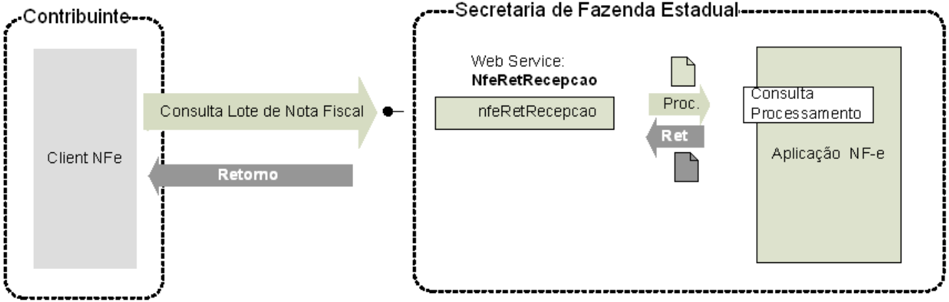

## 5.2.1. Leiaute Mensagem de Entrada

Entrada :  Estrutura  XML  contendo  o  número do recibo que identifica a mensagem de envio de lotes de NF-e.

## Schema XML: consReciNFe\_v4.00.xsd

Tabela 5-5 - Leiaute  Mensagem de Entrada do Web Service nfeRetAutorizacao

| #    | Campo       | Ele   | Pai   | Tipo   | Ocor.   | Tam.   | Descrição/Observação                                                                              |
|------|-------------|-------|-------|--------|---------|--------|---------------------------------------------------------------------------------------------------|
| BP01 | consReciNFe | Raiz  | -     |        | -       | -      | TAG raiz                                                                                          |
| BP02 | versao      | A     | BP01  | N      | 1-1     | 1-2v2  | Versão do leiaute                                                                                 |
| BP03 | tpAmb       | E     | BP01  | N      | 1-1     | 1      | Identificação do Ambiente: 1=Produção/2=Homologação                                               |
| BP04 | nRec        | E     | BP01  | N      | 1-1     | 15     | Número do Recibo gerado pelo Portal da Secretaria de Fazenda Estadual, conforme descrição do item |


| 4.3.4   |
|---------|

## 5.2.2. Leiaute Mensagem de Retorno

Retorno: Estrutura XML com o resultado do processamento da mensagem de envio de lote de NF-e.

Schema XML: retConsReciNFe\_v4.00.xsd

Tabela 5-6 - Leiaute  Mensagem de Retorno do Web Service nfeRetAutorizacao

| #      | Campo          | Ele   | Pai   | Tipo   | Ocor.   | Tam.   | Descrição/Observação                                                                                                                                                                                                                                                            |
|--------|----------------|-------|-------|--------|---------|--------|---------------------------------------------------------------------------------------------------------------------------------------------------------------------------------------------------------------------------------------------------------------------------------|
| BR01   | retConsReciNFe | Raiz  | -     | -      | -       | -      | TAG raiz da Resposta                                                                                                                                                                                                                                                            |
| BR02   | versao         | A     | BR01  | N      | 1-1     | 1-2v2  | Versão do leiaute                                                                                                                                                                                                                                                               |
| BR03   | tpAmb          | E     | BR01  | N      | 1-1     | 1      | Identificação do Ambiente: 1=Produção/2=Homologação                                                                                                                                                                                                                             |
| BR04   | verAplic       | E     | BR01  | C      | 1-1     | 1-20   | Versão do Aplicativo que recebeua Consulta. A versão deveser iniciada com a sigla da UF nos casos de WSpróprio ou a sigla SVANou SVRSnos demais casos.                                                                                                                          |
| BR04a  | nRec           | E     | BR01  | N      | 1-1     | 15     | Número do Recibo consultado. Será preenchido com zeros se for impossível de obter o valor da mensagemde entrada (Ex. mensageminválida).                                                                                                                                         |
| BR05   | cStat          | E     | BR01  | N      | 1-1     | 3      | Código do status da resposta para o Lote (conforme item 4.4.2 do documento MOC - AnexoI - Leiaute NF-e/NFC-e ) Se cStatus = 215, 516, ou 517 significa que a mensagem de consulta é inválida. Se cStatus = 225, 565, ou 568, significa queo lote de NF- e consultado é inválido |
| BR06   | xMotivo        | E     | BR01  | C      | 1-1     | 1-255  | Descrição literal do status da resposta.                                                                                                                                                                                                                                        |
| BR06a  | cUF            | E     | BR01  | N      | 1-1     | 2      | Código da UF que atendeua solicitação.                                                                                                                                                                                                                                          |
| BR06a1 | dhRecbto       | E     | BR01  | D      | 1-1     | -      | Preenchido com a data e hora do processamento (informado também no caso derejeição). Formato: 'AAAA -MM- DDThh:mm:ssTZD'(UTC - Universal Coordinated Time).                                                                                                                     |
| BR06b  | cMsg           | E     | BR01  | N      | 0-1     | 1-4    | Código da Mensagem(v2.0) Campo deuso da SEFAZ para enviarmensagemde interesse da SEFAZ para o emissor. (NT 2011.004)                                                                                                                                                            |
| BR06c  | xMsg           | E     | BR01  | C      | 0-1     | 1-200  | Mensagemda SEFAZ para o emissor. (v2.0)                                                                                                                                                                                                                                         |
| BR07   | protNFe*       | xml   | BR01  | -      | 0-50    | -      | Conjunto de resultado do processamento de cada NF-e (vide leiaute abaixo). Estas informações são retornadas apenas para o código do status do lote = 104 (Lote processado)                                                                                                      |

## *  Para  cada  Protocolo  de  uma  NF-e  processada  teremos  o  seguinte  leiaute:  (Atualizado  NT 2018.005)

| #    | Campo    | Ele   | Pai   | Tipo   | Ocor.   | Tam.   | Descrição/Observação                                                                                                                                                                                               |
|------|----------|-------|-------|--------|---------|--------|--------------------------------------------------------------------------------------------------------------------------------------------------------------------------------------------------------------------|
| PR01 | protNFe  | Raiz  | -     | -      | -       | -      | TAG raiz do Protocolo de recebimento da NFe                                                                                                                                                                        |
| PR02 | versao   | A     | PR01  | N      | 1-1     | 2v2    | Versão do leiaute das informações de Protocolo.                                                                                                                                                                    |
| PR03 | infProt  | G     | PR01  | -      | 1-1     | -      | Informações do Protocolo de resposta. TAG a ser assinada                                                                                                                                                           |
| PR04 | Id       | ID    | PR03  | C      | 0-1     | -      | Identificador da TAG a ser assinada, somenteprecisa ser informado se a UF assinar a resposta. Em caso de assinatura da respostapela SEFAZ preenchero campo com o Número do Protocolo, precedido com o literal 'ID' |
| PR05 | tpAmb    | E     | PR03  | N      | 1-1     | 1      | Identificação do Ambiente: 1=Produção/2=Homologação                                                                                                                                                                |
| PR06 | verAplic | E     | PR03  | C      | 1-1     | 1-20   | Versão do Aplicativo que processou o Lote. A versão deveser iniciada com a sigla da UF nos casos de WSpróprio ou a sigla SVANou SVRSnos demais casos.                                                              |


| #    | Campo        | Ele   | Pai   | Tipo   | Ocor.   | Tam.   | Descrição/Observação                                                                                                                                        |
|------|--------------|-------|-------|--------|---------|--------|-------------------------------------------------------------------------------------------------------------------------------------------------------------|
| PR07 | chNFe        | E     | PR03  | N      | 1-1     | 44     | Chave deAcesso da NF-e                                                                                                                                      |
| PR08 | dhRecbto     | E     | PR03  | D      | 1-1     | -      | Preenchido com a data e hora do processamento (informado também no caso derejeição). Formato: ' AAAA-MM- DDThh:mm:ssTZD'(UTC - Universal Coordinated Time). |
| PR09 | nProt        | E     | PR03  | N      | 0-1     | 15     | Número do Protocolo da NF-e,conforme item 4.3.5                                                                                                             |
| PR10 | digVal       | E     | PR03  | C      | 0-1     | 28     | Digest Value da NF-e processada Utilizado para conferir a integridade da NFeoriginal.                                                                       |
| PR11 | cStat        | E     | PR03  | N      | 1-1     | 3      | Código do status da resposta (conforme item 4.4.1 do documento MOC - AnexoI - Leiaute NF-e/NFC-e )                                                          |
| PR12 | xMotivo      | E     | PR03  | C      | 1-1     | 1-255  | Descrição literal do status da resposta para a NF-e.                                                                                                        |
| PR13 | SequênciaXML | G     | PR03  |        | 0-1     |        | Grupo de informações para envio de mensagens do interesseda SEFAZ (Criado naNT 2018.005)                                                                    |
| PR14 | cMsg         | E     | PR13  | N      | 0-1     | 1-4    | Código da Mensagem.(Criado na NT2018.005)                                                                                                                   |
| PR15 | xMsg         | E     | PR13  | C      | 1-1     | 1-200  | Mensagemda SEFAZ para o emissor. (Criado naNT 2018.005)                                                                                                     |
| PR90 | Signature    | G     | PR01  | xml    | 0-1     | -      | Assinatura XML do grupo identificado pelo atributo 'Id' Adecisão de assinar a mensagemfica a critério da UF interessada.                                    |

## 5.2.3. Descrição do Processo de Web Service

Este método oferece a consulta do resultado do processamento  de um lote de NF-e.

O  aplicativo  do  Contribuinte  deve  ser  construído  de  forma  a  aguardar  um  tempo  mínimo  de  15 segundos  entre  o  envio  do  Lote  de  NF-e  para  processamento  e  a  consulta  do  resultado  deste processamento, evitando a obtenção desnecessária do status de erro 105 -"Lote  em Processamento".

## 5.2.4. Regras de Validação

Serão  aplicadas  as  regras  de  validação  genéricas  conforme  os  grupos  citados  na  Tabela  5-7, detalhados na Seção 4.1 do documento MOC - Anexo I - Leiaute e Regras de Validação da NF-e e da NFC-e .

Tabela 5-7 - Regras de Validação Genéricas do Web Service nfeRetAutorizacao

| Grupo   | Descrição                                               |
|---------|---------------------------------------------------------|
| A       | Validação do Certificado de Transmissão (protocolo TLS) |
| B       | Validação Inicial da Mensagemno Web Service             |
| D       | Validação da Área de Dados                              |

As regras de validação específicas deste WS podem ser vistas na Tabela 5-8.

Tabela 5-8 - Regras de Validação Específicas do Web Service nfeRetAutorizacao

| #    | Regra de Validação                                                          | Aplic.   |   Msg | Efeito   | Descrição Erro                                                     |
|------|-----------------------------------------------------------------------------|----------|-------|----------|--------------------------------------------------------------------|
| E01  | Tipo do ambiente da NF-e difere do ambiente do Web Service                  | Obrig    |   252 | Rej.     | Rejeição: Ambienteinformado diverge do Ambiente de recebimento     |
| E02  | UF do Recibo difere da UFdo Web Service                                     | Obrig    |   248 | Rej.     | Rejeição: UF do Recibo diverge da UF autorizadora                  |
| E02a | Tipo autorizador do recibo diverge do Órgão Autorizador.                    | Obrig    |   553 | Rej.     | Rejeição: Tipo autorizador do recibo diverge do Órgão Autorizador. |
| E03  | Verifica seo Lote não está na fila de saída, nemna fila de entrada          | Obrig    |   106 | Rej.     | Rejeição: Lote não localizado                                      |
| E04  | Verifica seo Lote não está na fila de resposta, mas está na fila de entrada | Obrig    |   105 | Rej.     | Rejeição: Serviço emOperação                                       |


SNFeNFCe

| #   | Regra de Validação                                                                         | Aplic.   | Msg Efeito   | Descrição Erro                                                                        |
|-----|--------------------------------------------------------------------------------------------|----------|--------------|---------------------------------------------------------------------------------------|
| E05 | CNPJ/CPFdo transmissor do lote difere do CNPJ/CPF do transmissor da consulta (NT 2018.001) | Obrig    | 223 Rej.     | Rejeição: CNPJ/CPFdo transmissor do lote difere do CNPJ/CPFdo transmissor da consulta |

## 5.2.5. Final do Processamento

A mensagem de retorno poderá ser:

- Lote processado -cStat =104, com os resultados individuais de processamento  das NF-e;
- Lote  em  processamento -cStat =105,  o  aplicativo  do  contribuinte  deverá  fazer  uma  nova consulta;
- Lote  não  localizado -cStat =106,  o  aplicativo  do  contribuinte  deverá  providenciar  o  reenvio  da mensagem;
- Recibo  ou  CNPJ  do  requisitante  com  problemas -cStat =  248  ou  223,  o  aplicativo  do contribuinte deverá sanar o problema;

## 5.2.6. Canal de Comunicação com Contribuinte

A  SEFAZ  poderá  utilizar  este  serviço  como  canal  de  comunicação  com  o  emissor  da  NF-e.  A aplicação  deverá  verificar  se  existe  alguma  mensagem  para o emissor, se  existir a mensagem será disponibilizada para o contribuinte.

## 5.3. Web Service - NfeInutilizacao

Função

: serviço destinado ao atendimento de solicitações de inutilização de numeração.

Processo

:  síncrono.

Método: nfeInutilizacaoNF

Figura 5-3 - Fluxo do Web Service nfeInutilizacaoNF

## Inutilizacao de numeracao de NF-e

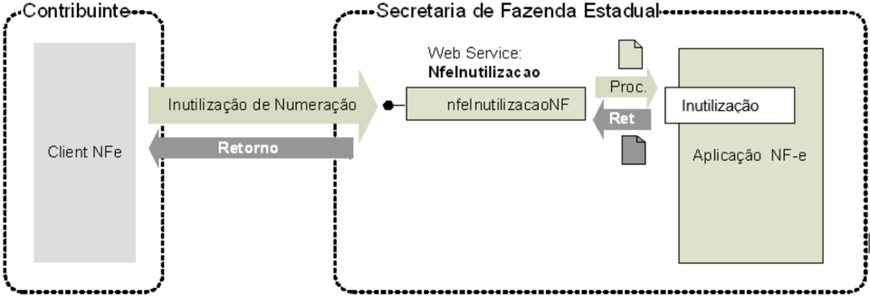

## 5.3.1. Leiaute Mensagem de Entrada

Entrada : Estrutura XML contendo a mensagem de solicitação de inutilização.

Schema XML: inutNFe\_v4.00.xsd

Tabela 5-9 - Leiaute  Mensagem de Entrada do Web Service NFeInutilizacao

| #    | Campo   | Ele   | Pai   | Tipo   | Ocor.   | Tam.   | Descrição/Observação   |
|------|---------|-------|-------|--------|---------|--------|------------------------|
| DP01 | inutNFe | Raiz  | -     | -      | -       | -      | TAG raiz               |


| #    | Campo     | Ele   | Pai   | Tipo   | Ocor.   | Tam.   | Descrição/Observação                                                                                                                                          |
|------|-----------|-------|-------|--------|---------|--------|---------------------------------------------------------------------------------------------------------------------------------------------------------------|
| DP02 | versao    | A     | DP01  | N      | 1-1     | 1-2v2  | Versão do leiaute                                                                                                                                             |
| DP03 | infInut   | G     | DP01  | -      | 1-1     | -      | Dados do Pedido TAG a ser assinada                                                                                                                            |
| DP04 | Id        | ID    | DP03  | C      | 1-1     | 43     | Identificador da TAG a ser assinada formadacom Código da UF + Ano (2 posições) + CNPJ+ modelo + série + númeroinicial e númerofinal precedida do literal 'ID' |
| DP05 | tpAmb     | E     | DP03  | N      | 1-1     | 1      | Identificação do Ambiente: 1=Produção/2=Homologação                                                                                                           |
| DP06 | xServ     | E     | DP03  | C      | 1-1     | 10     | Serviço solicitado: 'INUTILIZAR'                                                                                                                              |
| DP07 | cUF       | E     | DP03  | N      | 1-1     | 2      | Código da UF do solicitante                                                                                                                                   |
| DP08 | ano       | E     | DP03  | N      | 1-1     | 2      | Ano de inutilização da numeração                                                                                                                              |
| DP09 | CNPJ      | E     | DP03  | C      | 1-1     | 14     | CNPJ do emitente                                                                                                                                              |
| DP10 | mod       | E     | DP03  | N      | 1-1     | 2      | Modelo do documento (55 ou 65)                                                                                                                                |
| DP11 | serie     | E     | DP03  | N      | 1-1     | 1-3    | Série da NF-e                                                                                                                                                 |
| DP12 | nNFIni    | E     | DP03  | N      | 1-1     | 1-9    | Número da NF-e inicial a ser inutilizada                                                                                                                      |
| DP13 | nNFFin    | E     | DP03  | N      | 1-1     | 1-9    | Número da NF-e final a ser inutilizada                                                                                                                        |
| DP14 | xJust     | E     | DP03  | C      | 1-1     | 15-255 | Informar a justificativa do pedido de inutilização                                                                                                            |
| DP15 | Signature | G     | DP01  | xml    | 1-1     | -      | Assinatura XML do grupo identificado pelo atributo 'Id'                                                                                                       |

## 5.3.2. Leiaute Mensagem de Retorno

Retorno: Estrutura XML contendo a mensagem do resultado da solicitação de inutilização:

Schema XML: retInutNFe\_v4.00.xsd

Tabela 5-10 - Leiaute Mensagem de Retorno do Web Service NFeInutilizacao

| #                                                                                                                                                       | Campo                                                                                                                                                   | Ele                                                                                                                                                     | Pai                                                                                                                                                     | Tipo                                                                                                                                                    | Ocor.                                                                                                                                                   | Tam.                                                                                                                                                    | Descrição/Observação                                                                                                                                                                                               |
|---------------------------------------------------------------------------------------------------------------------------------------------------------|---------------------------------------------------------------------------------------------------------------------------------------------------------|---------------------------------------------------------------------------------------------------------------------------------------------------------|---------------------------------------------------------------------------------------------------------------------------------------------------------|---------------------------------------------------------------------------------------------------------------------------------------------------------|---------------------------------------------------------------------------------------------------------------------------------------------------------|---------------------------------------------------------------------------------------------------------------------------------------------------------|--------------------------------------------------------------------------------------------------------------------------------------------------------------------------------------------------------------------|
| DR01                                                                                                                                                    | retInutNFe                                                                                                                                              | Raiz                                                                                                                                                    | -                                                                                                                                                       | -                                                                                                                                                       | -                                                                                                                                                       | -                                                                                                                                                       | TAG raiz da Resposta                                                                                                                                                                                               |
| DR02                                                                                                                                                    | versao                                                                                                                                                  | A                                                                                                                                                       | DR01                                                                                                                                                    | N                                                                                                                                                       | 1-1                                                                                                                                                     | 1-2v2                                                                                                                                                   | Versão do leiaute                                                                                                                                                                                                  |
| DR03                                                                                                                                                    | infInut                                                                                                                                                 | G                                                                                                                                                       | DR01                                                                                                                                                    | -                                                                                                                                                       | 1-1                                                                                                                                                     | -                                                                                                                                                       | Dados da resposta - TAG a ser assinada                                                                                                                                                                             |
| DR04                                                                                                                                                    | Id                                                                                                                                                      | ID                                                                                                                                                      | DR03                                                                                                                                                    | C                                                                                                                                                       | 0-1                                                                                                                                                     | 17                                                                                                                                                      | Identificador da TAG a ser assinada, somenteprecisa ser informado se a UFassinar a resposta. Em caso de assinatura da respostapela SEFAZ preenchero campo com o Número do Protocolo, precedido com o literal 'ID'. |
| DR05                                                                                                                                                    | tpAmb                                                                                                                                                   | E                                                                                                                                                       | DR03                                                                                                                                                    | N                                                                                                                                                       | 1-1                                                                                                                                                     | 1                                                                                                                                                       | Identificação do Ambiente: 1=Produção/2=Homologação                                                                                                                                                                |
| DR06                                                                                                                                                    | verAplic                                                                                                                                                | E                                                                                                                                                       | DR03                                                                                                                                                    | C                                                                                                                                                       | 1-1                                                                                                                                                     | 1-20                                                                                                                                                    | Versão do Aplicativo que processou o pedido de inutilização. A versão deveser iniciada com a sigla da UF nos casos de WSpróprio ou a sigla SVANou SVRSnos demais casos.                                            |
| DR07                                                                                                                                                    | cStat                                                                                                                                                   | E                                                                                                                                                       | DR03                                                                                                                                                    | N                                                                                                                                                       | 1-1                                                                                                                                                     | 3                                                                                                                                                       | Código do status da resposta (conforme item 4.4.1 do documento MOC - AnexoI - Leiaute NF-e/NFC-e                                                                                                                   |
| DR08                                                                                                                                                    | xMotivo                                                                                                                                                 | E                                                                                                                                                       | DR03                                                                                                                                                    | C                                                                                                                                                       | 1-1                                                                                                                                                     | 1-255                                                                                                                                                   | Descrição literal do status da resposta.                                                                                                                                                                           |
| DR09                                                                                                                                                    | cUF                                                                                                                                                     | E                                                                                                                                                       | DR03                                                                                                                                                    | N                                                                                                                                                       | 1-1                                                                                                                                                     | 2                                                                                                                                                       | Código da UF que atendeua solicitação                                                                                                                                                                              |
| Os campos a seguir são obrigatórios no caso de homologação da inutilização cStat=102. Os campos dedhRecbto e nProt não serão preenchidosem caso de erro | Os campos a seguir são obrigatórios no caso de homologação da inutilização cStat=102. Os campos dedhRecbto e nProt não serão preenchidosem caso de erro | Os campos a seguir são obrigatórios no caso de homologação da inutilização cStat=102. Os campos dedhRecbto e nProt não serão preenchidosem caso de erro | Os campos a seguir são obrigatórios no caso de homologação da inutilização cStat=102. Os campos dedhRecbto e nProt não serão preenchidosem caso de erro | Os campos a seguir são obrigatórios no caso de homologação da inutilização cStat=102. Os campos dedhRecbto e nProt não serão preenchidosem caso de erro | Os campos a seguir são obrigatórios no caso de homologação da inutilização cStat=102. Os campos dedhRecbto e nProt não serão preenchidosem caso de erro | Os campos a seguir são obrigatórios no caso de homologação da inutilização cStat=102. Os campos dedhRecbto e nProt não serão preenchidosem caso de erro | Os campos a seguir são obrigatórios no caso de homologação da inutilização cStat=102. Os campos dedhRecbto e nProt não serão preenchidosem caso de erro                                                            |
| DR10                                                                                                                                                    | ano                                                                                                                                                     | E                                                                                                                                                       | DR03                                                                                                                                                    | N                                                                                                                                                       | 0-1                                                                                                                                                     | 2                                                                                                                                                       | Ano de inutilização da numeração                                                                                                                                                                                   |
| DR11                                                                                                                                                    | CNPJ                                                                                                                                                    | E                                                                                                                                                       | DR03                                                                                                                                                    | C                                                                                                                                                       | 0-1                                                                                                                                                     | 14                                                                                                                                                      | CNPJ do emitente                                                                                                                                                                                                   |
| DR12                                                                                                                                                    | mod                                                                                                                                                     | E                                                                                                                                                       | DR03                                                                                                                                                    | N                                                                                                                                                       | 0-1                                                                                                                                                     | 2                                                                                                                                                       | Modelo da NF-e                                                                                                                                                                                                     |
| DR13                                                                                                                                                    | serie                                                                                                                                                   | E                                                                                                                                                       | DR03                                                                                                                                                    | N                                                                                                                                                       | 0-1                                                                                                                                                     | 1-3                                                                                                                                                     | Série da NF-e                                                                                                                                                                                                      |
| DR14                                                                                                                                                    | nNFIni                                                                                                                                                  | E                                                                                                                                                       | DR03                                                                                                                                                    | N                                                                                                                                                       | 0-1                                                                                                                                                     | 1-9                                                                                                                                                     | Número da NF-e inicial a ser inutilizada                                                                                                                                                                           |
| DR15                                                                                                                                                    | nNFFin                                                                                                                                                  | E                                                                                                                                                       | DR03                                                                                                                                                    | N                                                                                                                                                       | 0-1                                                                                                                                                     | 1-9                                                                                                                                                     | Número da NF-e final a ser inutilizada                                                                                                                                                                             |
| DR16                                                                                                                                                    | dhRecbto                                                                                                                                                | E                                                                                                                                                       | DR03                                                                                                                                                    | D                                                                                                                                                       | 1-1                                                                                                                                                     | -                                                                                                                                                       | Preenchido com a data e hora do processamento (informado também no caso derejeição). Formato: 'AAAA -MM- DDThh:mm:ssTZD'(UTC - Universal Coordinated Time).                                                        |


| #    | Campo     | Ele   | Pai   | Tipo   | Ocor.   | Tam.   | Descrição/Observação                                                                                                     |
|------|-----------|-------|-------|--------|---------|--------|--------------------------------------------------------------------------------------------------------------------------|
| DR17 | nProt     | E     | DR03  | N      | 0-1     | 15     | Número do Protocolo de Inutilização, conforme item 4.3.5                                                                 |
| DR18 | Signature | G     | DR01  | xml    | 0-1     | -      | Assinatura XML do grupo identificado pelo atributo 'Id' Adecisão de assinar a mensagemfica a critério da UF interessada. |

Nota: A  resposta  da  SEFAZ  pode  ser  assinada  e  neste  caso  deve  ser  preenchido  o  atributo  "Id' (PR04).  Este  atributo  é  opcional  e  não  deve  ser  informado  pela  SEFAZ  caso  a  mensagem  de resposta não seja assinada.

## 5.3.3. Descrição do Processo de Web Service

Este  método  será  responsável  por  receber  as  solicitações  referentes  à  inutilização  de  faixas  de numeração  de  notas  fiscais  eletrônicas.  Ao  receber  a  solicitação,  a  aplicação  NFE  realiza  o processamento  da  solicitação e devolve  o  resultado  do  processamento  para  o  aplicativo  do transmissor.

A mensagem de pedido de inutilização de numeração de NF-e é um documento eletrônico e deve ser assinado digitalmente pelo emitente da NF-e.

## 5.3.4. Regras de Validação

Serão  aplicadas  as  regras  de  validação  genéricas  conforme  os  grupos  citados  na  Tabela  5-11, detalhados no documento MOC - Anexo I - Leiaute e Regras de Validação da NF-e e da NFC-e .

Tabela 5-11 - Regras de Validação Genéricas do Web Service NFeInutilizacao

| Grupo   | Descrição                                               |
|---------|---------------------------------------------------------|
| A       | Validação do Certificado de Transmissão (protocolo TLS) |
| B       | Validação Inicial da Mensagemno Web Service             |
| D       | Validação da Área de Dados                              |
| E       | Validação do Certificado Digital deAssinatura           |
| F       | Validação da Assinatura Digital                         |

As regras de validação específicas deste WS podem ser vistas na Tabela 5-12.

Tabela 5-12 - Regras de Validação Específicas do Web Service NFeInutilizacao

| #     | Regra de Validação                                                                                   | Aplic.   |   Msg | Efeito   | Descrição Erro                                                                                         |
|-------|------------------------------------------------------------------------------------------------------|----------|-------|----------|--------------------------------------------------------------------------------------------------------|
| I01   | Tipo do ambiente da NF-e difere do ambiente do Web Service                                           | Obrig.   |   252 | Rej.     | Rejeição: Ambienteinformado diverge do Ambiente de recebimento                                         |
| I02   | UF do Pedido de inutilização difere da UF do Web Service                                             | Obrig.   |   250 | Rej      | Rejeição: UF diverge da UF autorizadora                                                                |
| I02a  | Série do Pedido deInutilização identifica emitente com CPF: • Série na faixa de910-969 (NT 2018.001) | Obrig.   |   266 | Rej      | Rejeição: Série utilizada não permitida no Web Service                                                 |
| I02b  | Ano da Inutilização não pode ser superior ao Ano atual                                               | Obrig.   |   453 | Rej.     | Rejeição: Ano de inutilização não pode ser superior ao Ano atual                                       |
| I02c  | Ano da inutilização não pode ser inferior a 2006                                                     | Obrig.   |   454 | Rej.     | Rejeição: Ano de inutilização não pode ser inferior a 2006                                             |
| I03   | Número da Faixa Inicial maior do queo númeroFinal                                                    | Obrig.   |   224 | Rej      | Rejeição: A faixa inicial é maior quea faixa final                                                     |
| I04   | Quantidade máxima de numeração a inutilizar ultrapassa o limite (10.000 números)                     | Obrig.   |   201 | Rej      | Rejeição: Númeromáximo de numeração a inutilizar ultrapassou o limite                                  |
| I04.a | Campo Id inválido: conteúdoinformado difere da concatenação dos campos correspondentes               | Obrig.   |   502 | Rej.     | Rejeição: Erro na Chave de Acesso - Campo Id não corresponde à concatenação dos campos correspondentes |
| I05   | Acesso Cadastro Contribuinte: • Verificar Emitente não autorizado a emitir NF-e                      | Obrig.   |   203 | Rej      | Rejeição: Emissor não habilitado para emissão de NF- e                                                 |


SNFeNFCe

| #    | Regra de Validação                                                                                                                              | Aplic.   |   Msg | Efeito   | Descrição Erro                                                              |
|------|-------------------------------------------------------------------------------------------------------------------------------------------------|----------|-------|----------|-----------------------------------------------------------------------------|
| I06  | • Verificar Situação Fiscal irregular do Emitente                                                                                               | Obrig.   |   240 | Rej      | Rejeição: Cancelamento/Inutilização - Irregularidade Fiscal do Emitente     |
| I07  | Acesso BDNFE-Inutilização (Chave:CNPJEmit, Modelo, Série, nNFIni, nNFFin): • Verificar se já existeum Pedido deinutilização igual (NT 2011.004) | Obrig.   |   563 | Rej      | Rejeição: Já existe pedido de Inutilização com a mesmafaixa de inutilização |
| I07a | • Verificar se algum Número da Faixa de Inutilização atual pertence a umafaixa anterior                                                         | Obrig.   |   256 | Rej      | Rejeição: UmaNF-eda faixa já está inutilizada na Base de dados da SEFAZ     |
| I08  | Acesso BDNFE (Chave:CNPJEmit, Modelo, Série, Número): • Verificar se existe NF-e utilizada na faixa de inutilização solicitada                  | Obrig.   |   241 | Rej      | Rejeição:Umnúmero da faixa já foi utilizado                                 |
| I09  | Acesso ao BD Evento EPEC (Chave: Modelo,UF, CNPJ Emitente, Série, Nro): • Verificar se existe EPEC (NT 2014.001)                                | Obrig.   |   241 | Rej      | Rejeição:Umnúmero da faixa já foi utilizado                                 |

Para cada inutilização de numeração de NF-e homologada é criado um novo protocolo de status para NF-e, com a atribuição de um número de protocolo único, seguindo o disposto no item 4.3.5 .

## 5.3.5. Final do Processamento

No caso de homologação da Inutilização retornar o cStat = 102.

É  verificada  a  existência  de  um  Pedido  de Inutilização de Numeração em duplicidade (mesma faixa de numeração a ser inutilizada), rejeitando o novo Pedido de Inutilização com o erro '563-Rejeição: Já  existe  pedido  de  Inutilização  com  a  mesma  faixa  de  inutilização'.  Para  esta  rejeição,  será informado na resposta o Número do Protocolo de Autorização do Pedido de Inutilização anteriormente autorizado (tag: retInutNFe/infInut/nProt).  (NT 2015.002)

## 5.4. Web Service - NfeConsultaProtocolo

Função :  serviço destinado ao atendimento de solicitações de consulta da situação atual da NF-e na Base de Dados do Portal da Secretaria de Fazenda Estadual.

Processo

:  síncrono.

Método: nfeConsulta

Figura 5-4 - Fluxo do Web Service nfeConsultaProtocolo

## Consulta situacao atual da NF-e

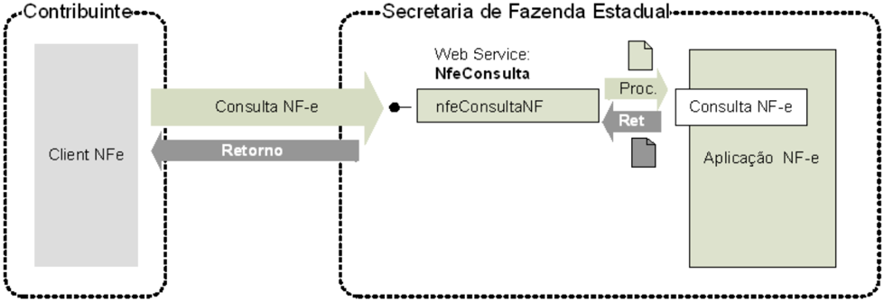

## 5.4.1. Leiaute Mensagem de Entrada

Entrada

: Estrutura XML contendo a chave de acesso da NF-e.

Schema XML: consSitNFe\_4.00.xsd

Tabela 5-13 - Leiaute Mensagem de Entrada do Web Service nfeConsultaProtocolo

| #    | Campo      | Ele   | Pai   | Tipo   | Ocor.   | Tam.   | Descrição/Observação                                |
|------|------------|-------|-------|--------|---------|--------|-----------------------------------------------------|
| EP01 | consSitNFe | Raiz  | -     | -      | -       | -      | TAG raiz                                            |
| EP02 | versao     | A     | EP01  | N      | 1-1     | 1-2v2  | Versão do leiaute                                   |
| EP03 | tpAmb      | E     | EP01  | N      | 1-1     | 1      | Identificação do Ambiente: 1=Produção/2=Homologação |
| EP04 | xServ      | E     | EP01  | C      | 1-1     | 9      | Serviço solicitado 'CONSULTAR'                      |
| EP05 | chNFe      | E     | EP01  | N      | 1-1     | 44     | Chave deAcesso da NF-e.                             |

## 5.4.2. Leiaute Mensagem de Retorno

Retorno:

Estrutura XML contendo a mensagem do resultado da consulta de protocolo:

Schema XML: retConsSitNFe\_v4.00.xsd

Tabela 5-14 - Leiaute Mensagem de Retorno do Web Service nfeConsultaProtocolo

| #     | Campo         | Ele   | Pai   | Tipo   | Ocor.   | Tam.   | Descrição/Observação                                                                                                                                                                                                           |
|-------|---------------|-------|-------|--------|---------|--------|--------------------------------------------------------------------------------------------------------------------------------------------------------------------------------------------------------------------------------|
| ER01  | retConsSitNFe | Raiz  | -     | -      | -       | -      | TAG raiz da Resposta                                                                                                                                                                                                           |
| ER02  | versao        | A     | ER01  | N      | 1-1     | 1-2v2  | Versão do leiaute                                                                                                                                                                                                              |
| ER03  | tpAmb         | E     | ER01  | N      | 1-1     | 1      | Identificação do Ambiente: 1=Produção/2=Homologação                                                                                                                                                                            |
| ER04  | verAplic      | E     | ER01  | C      | 1-1     | 1-20   | Versão do Aplicativo que processou a consulta. A versão deveser iniciada com a sigla da UF nos casos de WSpróprio ou a sigla SVANou SVRSnos demais casos.                                                                      |
| ER05  | cStat         | E     | ER01  | N      | 1-1     | 3      | Código do status da resposta (conforme item 4.4.1 do documento MOC - AnexoI - Leiaute NF-e/NFC-e )                                                                                                                             |
| ER06  | xMotivo       | E     | ER01  | C      | 1-1     | 1-255  | Descrição literal do status da resposta.                                                                                                                                                                                       |
| ER07  | cUF           | E     | ER01  | N      | 1-1     | 2      | Código da UF que atendeua solicitação.                                                                                                                                                                                         |
| ER07a | dhRecbto      | E     | ER01  | D      | 1-1     |        | Preenchido com a data e hora do processamento. Formato: 'AAAA -MM- DDThh:mm:ssTZD'(UTC - Universal Coordinated Time).                                                                                                          |
| ER07b | chNFe         | E     | ER01  | N      | 1-1     | 44     | Chave deAcesso da NF-e consultada.                                                                                                                                                                                             |
| ER08  | protNFe       | G     | ER01  | xml    | 0-1     | -      | Protocolo de autorização ou denegação de uso do NF- e, conforme descrito no item 5.2.2. • Informar se localizada uma NF-e com cStat = 100- uso autorizado, 150-uso autorizado fora de prazo ou 110-uso denegado. (NT 2012.003) |
| ER09  | retCancNFe    | G     | ER01  | xml    | 0-1     | -      | Protocolo de homologação de cancelamento de NF-e (vide item 4.3.2). Informar se localizada uma NF-ecom cStat = 101-cancelado ou 151- cancelado fora de prazo. (NT 2012.003)                                                    |
| ER10  | procEventoNFe | G     | ER01  | xml    | 0-N     | -      | Informação do evento e respectivo Protocolo de registro de Evento                                                                                                                                                              |

## 5.4.3. Descrição do Processo de Web Service

Este método será responsável por receber as solicitações referentes à consulta de situação de notas fiscais  eletrônicas  enviadas  para  as  Secretarias  de  Fazendas  Estaduais.  Seu  acesso  é  permitido apenas pela chave única de identificação da nota fiscal.


O  aplicativo  do  contribuinte  envia  a  solicitação  para  o Web  Service da  Secretaria  de  Fazenda Estadual.  Ao  receber  a  solicitação  a  aplicação  do  Portal  da  Secretaria  de  Fazenda  Estadual processará a solicitação de consulta, validando a Chave de Acesso da NF-e, e retornará mensagem contendo a situação atual da NF-e na Base de Dados.

Na  resposta do Web  Service de Consulta Situação  da  Nota  Fiscal  deverão  ser  retornados unicamente  os  Eventos  de  Cancelamento,  Carta  de  Correção  e  EPEC,  reduzindo  o  tamanho  da mensagem de resposta da SEFAZ Autorizadora e reduzindo também o tempo de resposta para esta consulta.  Ainda  no  processamento  da  requisição  das  consultas  deste Web Service ,  será  limitado  o período de consulta para 180 dias da data de emissão da Nota Fiscal 6 .

## 5.4.4. Regras de Validação

Serão  aplicadas  as  regras  de  validação  genéricas  conforme  os  grupos  citados  na  Tabela  5-15, detalhados no documento MOC - Anexo I - Leiaute e Regras de Validação da NF-e e da NFC-e .

Tabela 5-15 - Regras de Genéricas Validação do Web Service nfeConsultaProtocolo

| Grupo   | Descrição                                               |
|---------|---------------------------------------------------------|
| A       | Validação do Certificado de Transmissão (protocolo TLS) |
| B       | Validação Inicial da Mensagemno Web Service             |
| D       | Validação da Área de Dados                              |
| E       | Validação do Certificado Digital de Assinatura          |
| F       | Validação da Assinatura Digital                         |

As regras de validação específicas deste WS podem ser vistas na Tabela 5-16.

Tabela 5-16 - Regras de Validação Específicas do Web Service nfeConsultaProtocolo

| #    | Regra de Validação                                                                                                                               | Aplic.   |   Msg | Efeito   | Descrição Erro                                                                    |
|------|--------------------------------------------------------------------------------------------------------------------------------------------------|----------|-------|----------|-----------------------------------------------------------------------------------|
| J01  | Tipo do ambiente da NF-e difere do ambiente do Web Service                                                                                       | Obrig.   |   252 | Rej.     | Rejeição: Ambiente informado diverge do Ambiente de recebimento                   |
| J02  | UF da Chave de Acessodifere da UF do Web Service                                                                                                 | Obrig.   |   226 | Rej.     | Rejeição: Código da UF do Emitente diverge da UF autorizadora                     |
| J02a | Chave deAcesso com dígito verificador inválido (NT 2011.004)                                                                                     | Obrig.   |   236 | Rej.     | Rejeição: Chave deAcesso com dígito verificador inválido                          |
| J02b | Chave deAcesso inválida (Código UF inválido) (NT 2011.004)                                                                                       | Obrig.   |   614 | Rej.     | Rejeição: Chave deAcesso inválida (Código UF inválido)                            |
| J02c | Chave deAcesso inválida (Ano< 06 ou Anomaior que Anocorrente) (NT 2012.003)                                                                      | Obrig.   |   615 | Rej.     | Rejeição: Chave deAcesso inválida (Ano menor que 06 ou Ano maior queAno corrente) |
| J02d | Chave deAcesso inválida (Mês<1 ou Mês> 12) (NT 2011.004)                                                                                         | Obrig.   |   616 | Rej.     | Rejeição: Chave deAcesso inválida (Mês menorque 1 ou Mês maior que12)             |
| J02e | Chave deAcesso inválida • Série = [0-909] e CNPJ zerado ou dígito inválido, ou • Série = [910-969] e CPF zerado ou dígito inválido (NT 2018.001) | Obrig.   |   617 | Rej.     | Rejeição: Chave deAcesso inválida (CNPJ/CPFzerado ou dígito inválido)             |
| J02f | Chave deAcesso inválida (modelodiferentede 55 e 65) (NT 2013.005)                                                                                | Obrig.   |   618 | Rej.     | Rejeição: Chave deAcesso inválida (modelo diferente de 55 e 65)                   |
| J02g | Chave deAcesso inválida (númeroNF = 0) (NT 2011.004)                                                                                             | Obrig.   |   619 | Rej.     | Rejeição: Chave deAcesso inválida (número NF = 0)                                 |


| #    | Regra de Validação                                                                                                                                                                                                                                                                                                                                                                                                                                                                                                                         | Aplic.   |   Msg | Efeito   | Descrição Erro                                                                                                                              |
|------|--------------------------------------------------------------------------------------------------------------------------------------------------------------------------------------------------------------------------------------------------------------------------------------------------------------------------------------------------------------------------------------------------------------------------------------------------------------------------------------------------------------------------------------------|----------|-------|----------|---------------------------------------------------------------------------------------------------------------------------------------------|
| J02k | Ano-Mêsda Chave deAcesso com atraso superior a 6 mesesem relação ao Ano-Mêsatual Observação: Eventualmente a SEFAZ Autorizadora poderá não implementar esta validação, conforme seucritério. (NT 2015.002)                                                                                                                                                                                                                                                                                                                                 | Obrig.   |   526 | Rej.     | Rejeição: Consulta a umaChave de Acessomuito antiga                                                                                         |
| J03  | Acesso BDNFE (Chave:CNPJ/CPFEmit, Modelo, Série, Número): • Se NF-enão existe,acessarBD Evento EPEC Chave: CNPJ/CPFEmitente, Modelo,Série, Nro) • Verificar se EPEC não existe (NT 2014.001) (NT 2018.001)                                                                                                                                                                                                                                                                                                                                 | Obrig.   |   217 | Rej.     | Rejeição: NF-enão consta na base de dados da SEFAZ                                                                                          |
| J04  | - Verificar secampo 'Código Numérico' informado na Chave de Acessoé diferentedo existente no BD Observação: Opcionalmente, concatenar na mensagemde erro a Chavede Acesso da NF-e existenteno BDnas situações de: • CNPJ basedo certificado digital detransmissão igual ao CNPJbase do emitente ou do destinatário da NF-e (NT 2010.007); • CNPJ basedo certificado digital detransmissão igual ao CNPJbase do transmissor da NF-e (NT 2010.007); • CPF do certificado digital de transmissão igual ao CPF do emitenteda NF-e.(NT2018.001) | Obrig.   |   562 | Rej.     | Rejeição: Código Numérico informado na Chavede Acesso diferedo Código Numérico da NF-e [chNFe:9999999999999999999999999999999 9999999999999 |
| J05  | • Verificar se campo MM(mês)informado na Chave de Acessoé diferentedo existenteno BD                                                                                                                                                                                                                                                                                                                                                                                                                                                       | Obrig.   |   561 | Rej.     | Rejeição: Mêsde Emissão informado na Chave de Acesso diferedo Mês deEmissão da NF-e                                                         |
| J06  | Chave deAcesso difere da existenteemBD (NT 2011.004) (NT 2015.002)                                                                                                                                                                                                                                                                                                                                                                                                                                                                         | Obrig.   |   613 | Rej.     | Rejeição: Chave deAcesso difere da existenteemBD                                                                                            |

## 5.4.5. Final do Processamento

O processamento do pedido de consulta de status de NF-e pode resultar em uma mensagem de erro ou retornar à situação atual da NF-e consultada.

No  caso  de  localização  da  NF-e  retornar  o cStat com  os  valores  '100-Autorizado  o  Uso',  '101Cancelamento de NF-e Homologado' ou '110-Uso Denegado'.

## 5.5. Web Service - NfeStatusServico

Função :  serviço  destinado  à  consulta  do  status  do  serviço  prestado  pelo  Portal  da  Secretaria  de Fazenda Estadual.

Processo

:  síncrono.

Método: nfeStatusServico

Figura 5-5 - Fluxo do Web Service nfeStatusServico

## Consulta Status do Servico

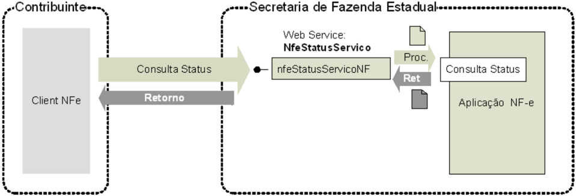

## 5.5.1. Leiaute Mensagem de Entrada

Entrada:

Estrutura XML para a consulta do status do serviço.

Schema XML: consStatServ\_v4.00.xsd

Tabela 5-17 - Leiaute Mensagem de Entrada do Web Service nfeStatusServico

| #    | Campo        | Ele   | Pai   | Tipo   | Ocor.   | Tam.   | Descrição/Observação                                |
|------|--------------|-------|-------|--------|---------|--------|-----------------------------------------------------|
| FP01 | consStatServ | Raiz  | -     | -      | -       | -      | TAG raiz                                            |
| FP02 | versao       | A     | FP01  | N      | 1-1     | 1-2v2  | Versão do leiaute                                   |
| FP03 | tpAmb        | E     | FP01  | N      | 1-1     | 1      | Identificação do Ambiente: 1=Produção/2=Homologação |
| FP04 | cUF          | E     | FP01  | N      | 1-1     | 2      | Código da UF consultada                             |
| FP05 | xServ        | E     | FP01  | C      | 1-1     | 6      | Serviço solicitado 'STATUS'                         |

## 5.5.2. Leiaute Mensagem de Retorno

Retorno: Estrutura XML contendo a mensagem do resultado da consulta do status do serviço:

Schema XML: retConsStatServ\_4.00.xsd

Tabela 5-18 - Leiaute Mensagem de Retorno do Web Service nfeStatusServico

| #    | Campo           | Ele   | Pai   | Tipo   | Ocor.   | Tam.   | Descrição/Observação                                                                                                                                      |
|------|-----------------|-------|-------|--------|---------|--------|-----------------------------------------------------------------------------------------------------------------------------------------------------------|
| FR01 | retConsStatServ | Raiz  | -     | -      | -       | -      | TAG raiz da Resposta                                                                                                                                      |
| FR02 | versao          | A     | FR01  | N      | 1-1     | 1-2v2  | Versão do leiaute                                                                                                                                         |
| FR03 | tpAmb           | E     | FR01  | N      | 1-1     | 1      | Identificação do Ambiente: 1=Produção/2=Homologação                                                                                                       |
| FR04 | verAplic        | E     | FR01  | C      | 1-1     | 1-20   | Versão do Aplicativo que processou a consulta. A versão deveser iniciada com a sigla da UF nos casos de WSpróprio ou a sigla SVANou SVRSnos demais casos. |
| FR05 | cStat           | E     | FR01  | N      | 1-1     | 3      | Código do status da resposta (conforme item 4.4.1 do documento MOC - AnexoI - Leiaute NF-e/NFC-e )                                                        |
| FR06 | xMotivo         | E     | FR01  | C      | 1-1     | 1-60   | Descrição literal do status da resposta.                                                                                                                  |
| FR07 | cUF             | E     | FR01  | N      | 1-1     | 2      | Código da UF que atendeua solicitação                                                                                                                     |
| FR08 | dhRecbto        | E     | FR01  | D      | 1-1     | -      | Preenchido com a data e hora do processamento. Formato: 'AAAA -MM- DDThh:mm:ssTZD'(UTC - Universal Coordinated Time).                                     |
| FR09 | tMed            | E     | FR01  | N      | 0-1     | 1-4    | Tempo médio de respostado serviço (emsegundos) dos últimos 5 minutos (item 5.7).                                                                          |


SNFeNFCe


| #    | Campo     | Ele   | Pai   | Tipo   | Ocor.   | Tam.   | Descrição/Observação                                                                              |
|------|-----------|-------|-------|--------|---------|--------|---------------------------------------------------------------------------------------------------|
| FR10 | dhRetorno | E     | FR01  | D      | 0-1     | -      | Preenchercom data e hora previstas para o retorno do Web Service , no formato AAA-MM- DDTHH:MM:SS |
| FR11 | xObs      | E     | FR01  | C      | 0-1     | 1-255  | Informaçõesadicionais para o Contribuinte                                                         |

## 5.5.3. Descrição do Processo de Web Service

Este método é responsável por receber as solicitações referentes à consulta do status do serviço do Portal da Secretaria de Fazenda Estadual.

O  aplicativo  do  contribuinte  envia  a  solicitação  para  o Web  Service da  Secretaria  de  Fazenda Estadual.

Ao  receber  a  solicitação  a  aplicação  do  Portal  da  Secretaria  de  Fazenda  Estadual  processa  a solicitação de consulta, e retorna mensagem contendo a status do serviço.

As  empresas  que  construírem  um  aplicativo  que  se  mantenha  em  "loop"  permanente de consulta a este Web  Service ,  devem  aguardar  um  tempo  mínimo  de  3  minutos  entre  cada  consulta,  evitando sobrecarregar desnecessariamente  os servidores da SEFAZ.

## 5.5.4. Regras de Validação

Serão  aplicadas  as  regras  de  validação  genéricas  conforme  os  grupos  citados  na  Tabela  5-19, detalhados no documento MOC - Anexo I - Leiaute e Regras de Validação da NF-e e da NFC-e .

Tabela 5-19 - Regras de Validação Genéricas do Web Service nfeStatusServico

| Grupo   | Descrição                                               |
|---------|---------------------------------------------------------|
| A       | Validação do Certificado de Transmissão (protocolo TLS) |
| B       | Validação Inicial da Mensagemno Web Service             |
| D       | Validação da Área de Dados                              |

As regras de validação específicas deste WS podem ser vistas na Tabela 5-20.

Tabela 5-20 - Regras de Validação Específicas do Web Service nfeStatusServico

| #   | Regra de Validação                                                    | Aplic.   |   Msg | Efeito   | Descrição Erro                                                 |
|-----|-----------------------------------------------------------------------|----------|-------|----------|----------------------------------------------------------------|
| K01 | Tipo do ambiente da NF-e difere do ambiente do Web Service            | Obrig.   |   252 | Rej.     | Rejeição: Ambienteinformado diverge do Ambiente de recebimento |
| K02 | Código da UF consultada difere da UF do Web Service                   | Obrig.   |   289 | Rej.     | Rejeição: Código da UF informada diverge da UF solicitada      |
| K03 | Verifica seo Servidor deProcessamento está Paralisado Momentaneamente | Obrig.   |   108 | -        | Rejeição: Serviço Paralisado Momentaneamente (curto prazo)     |
| K04 | Verifica seo Servidor de Processamento está Paralisado sem Previsão   | Obrig.   |   109 | -        | Rejeição: Serviço Paralisado semPrevisão                       |

## 5.5.5. Final do Processamento

O processamento do pedido de consulta de status de Serviço pode resultar em uma mensagem de erro  ou  retornar  a  situação  atual  do  Servidor  de  Processamento,  códigos  de  situação  '107-Serviço em Operação', '108-Serviço Paralisado Temporariamente' e '109-Serviço Paralisado sem Previsão'. A critério da UF o campo xObs pode ser utilizado para fornecer maiores informações ao contribuinte, como  por  exemplo:  'manutenção  programada',  'modificação  de  versão  do  aplicativo',  'previsão  de retorno', etc.

## 5.6. Web Service - NfeConsultaCadastro

Função:

Serviço para consultar o cadastro de contribuintes do ICMS da unidade federada.

Processo

:  síncrono.

Método: consultaCadastro

Figura 5-6 - Fluxo do Web Service NfeConsultaCadastro

## Consulta Cadastro

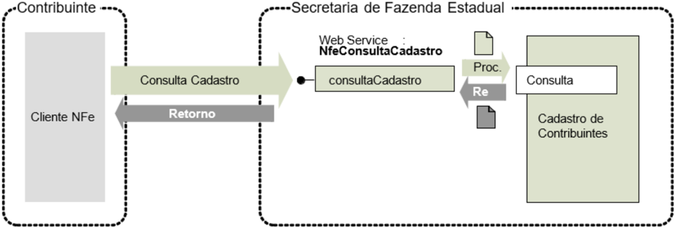

## 5.6.1. Leiaute da Mensagem de Entrada

Entrada

: Estrutura XML para consulta ao cadastro de contribuintes ICMS.

Schema XML: consCad\_v2.00.xsd

Tabela 5-21 - Leiaute Mensagem de Entrada do Web Service NfeConsultaCadastro

| #    | Campo   | Ele   | Pai   | Tipo   | Ocor.   | Tam.   | Descrição/Observações                               |
|------|---------|-------|-------|--------|---------|--------|-----------------------------------------------------|
| GP01 | ConsCad | Raiz  | -     | -      | -       | -      | TAG raiz da solicitação                             |
| GP02 | versao  | A     | GP01  | N      | 1-1     | 1-2v2  | Versão do leiaute                                   |
| GP03 | infCons | G     | GP01  | -      | 1-1     | -      | Dados da consulta                                   |
| GP04 | xServ   | E     | GP03  | C      | 1-1     | 8      | Serviço solicitado 'CONS - CAD'                     |
| GP05 | UF      | E     | GP03  | C      | 1-1     | 2      | Sigla da UF consultada, informar 'SU' para SUFRAMA. |
| GP06 | IE      | CE    | GP03  | C      | 1-1     | 2-14   | Inscrição estadual do contribuinte                  |
| GP07 | CNPJ    | CE    | GP03  | N      | 1-1     | 3-14   | CNPJ do contribuinte                                |
| GP08 | CPF     | CE    | GP03  | N      | 1-1     | 3-11   | CPF do contribuinte                                 |

## 5.6.2. Leiaute da Mensagem de Retorno

Retorno : Estrutura XML com o retorno da consulta ao cadastro de contribuintes do ICMS.

Schema XML: retConsCad\_v2.00.xsd

Tabela 5-22 - Leiaute Mensagem de Retorno do Web Service NfeConsultaCadastro

| #    | Campo      | Ele   | Pai   | Tipo   | Ocor.   | Tam.   | Descrição/Observações                                                                                                                                     |
|------|------------|-------|-------|--------|---------|--------|-----------------------------------------------------------------------------------------------------------------------------------------------------------|
| GR01 | retConsCad | Raiz  | -     | -      | -       | -      | TAG raiz da solicitação                                                                                                                                   |
| GR02 | versao     | A     | GR01  | N      | 1-1     | 1-2v2  | Versão do leiaute                                                                                                                                         |
| GR03 | infCons    | G     | GR01  | -      | 1-1     | -      | Dados da consulta                                                                                                                                         |
| GR04 | verAplic   | E     | GR03  | C      | 1-1     | 1-20   | Versão do Aplicativo que processou a consulta. A versão deveser iniciada com a sigla da UF nos casos de WSpróprio ou a sigla SVANou SVRSnos demais casos. |
| GR05 | cStat      | E     | GR03  | N      | 1-1     | 3      | Código do status da resposta (conforme item 4.4.1 do documento MOC - AnexoI - Leiaute NF-e/NFC-e )                                                        |


SNFeNFCe

## Nota Fiscal Eletrônica

MOC 7.0 - Visão Geral


| #     | Campo      | Ele   | Pai   | Tipo   | Ocor.   | Tam.   | Descrição/Observações                                                                                                                                                                                                                                                                                                                                     |
|-------|------------|-------|-------|--------|---------|--------|-----------------------------------------------------------------------------------------------------------------------------------------------------------------------------------------------------------------------------------------------------------------------------------------------------------------------------------------------------------|
| GR06  | xMotivo    | E     | GR03  | C      | 1-1     | 1-255  | Descrição do Status da resposta.                                                                                                                                                                                                                                                                                                                          |
| GR06a | UF         | E     | GP03  | C      | 1-1     | 2      | Sigla da UF consultada.                                                                                                                                                                                                                                                                                                                                   |
| GR06b | IE         | CE    | GP03  | C      | 1-1     | 2-14   | Inscrição estadual consultada                                                                                                                                                                                                                                                                                                                             |
| GR06c | CNPJ       | CE    | GP03  | N      | 1-1     | 3-14   | CNPJ consultado                                                                                                                                                                                                                                                                                                                                           |
| GR06d | CPF        | CE    | GP03  | N      | 1-1     | 3-11   | CPF consultado                                                                                                                                                                                                                                                                                                                                            |
| GR06e | dhCons     | E     | GR03  | D      | 1-1     |        | Data e hora de processamento da consulta Formato =AAAA-MM-DDTHH:MM:SS                                                                                                                                                                                                                                                                                     |
| GR06f | cUF        | E     | GR03  | N      | 1-1     | 2      | Código da UF que atendeua solicitação.                                                                                                                                                                                                                                                                                                                    |
| GR07  | infCad     | G     | GR03  | -      | 0-N     | -      | Dados da situação cadastral Esta estrutura existesomente para as consultas realizadas com sucesso cStat=111, com possibilidadede múltiplas ocorrências (Ex.: consulta por IE de contribuinte com Inscrição Única - retorno de todos os estabelecimentos do contribuinte).                                                                                 |
| GR08  | IE         | E     | GR07  | C      | 1-1     | 2-14   | Inscrição estadual do contribuinte                                                                                                                                                                                                                                                                                                                        |
| GR09  | CNPJ       | CE    | GR07  | N      | 1-1     | 3-14   | CNPJ do contribuinte                                                                                                                                                                                                                                                                                                                                      |
| GR10  | CPF        | CE    | GR07  | N      | 1-1     | 3-11   | CPF emcaso depessoa física com IE                                                                                                                                                                                                                                                                                                                         |
| GR11  | UF         | E     | GR07  | C      | 1-1     | 2      | Ocampo deveser preenchido com a sigla da UF de localização do contribuinte. Em algumas situações, a UF delocalização podeser diferente da UF consultada. Ex. IE decontribuinte inscrito como Substituto Tributário.                                                                                                                                       |
| GR12  | cSit       | E     | GR07  | N      | 1-1     | 1      | Situação do contribuinte: 0=não habilitado; 1=habilitado.                                                                                                                                                                                                                                                                                                 |
| GR12a | indCredNFe | E     | GR07  | N      | 1-1     | 1      | Indicador de contribuinte credenciado a emitir NF-e. 0=Não credenciado para emissão da NF-e; 1=Credenciado; 2=Credenciado com obrigatoriedade para todas operações; 3=Credenciado com obrigatoriedade parcial; 4=a SEFAZ não fornece a informação. Este indicador significa apenas que o contribuinte é credenciado para emitir NF-e na SEFAZ consultada. |
| GR12b | indCredCTe | E     | GR07  | N      | 1-1     | 1      | Indicador de contribuinte credenciado a emitir CT-e. 0=Não credenciado para emissão da CT-e; 1=Credenciado; 2=Credenciado com obrigatoriedade para todas operações; 3=Credenciado com obrigatoriedade parcial; 4=a SEFAZ não fornece a informação. Este indicador significa apenas que o contribuinte é credenciado para emitir CT-e na SEFAZ             |
| GR13  | xNome      | E     | GR07  | C      | 1-1     | 1-60   | Razão Social ou nome do Contribuinte                                                                                                                                                                                                                                                                                                                      |
| GR13a | xFant      | E     | GR07  | C      | 0-1     | 1-60   | NomeFantasia                                                                                                                                                                                                                                                                                                                                              |
| GR14  | xRegApur   | E     | GR07  | C      | 0-1     | 1-60   | Regime de Apuração do ICMS do Contribuinte                                                                                                                                                                                                                                                                                                                |
| GR15  | CNAE       | E     | GR07  | N      | 0-1     | 6-7    | CNAEprincipal do contribuinte                                                                                                                                                                                                                                                                                                                             |
| GR16  | dIniAtiv   | E     | GR07  | D      | 0-1     |        | Data de Início da Atividade do Contribuinte                                                                                                                                                                                                                                                                                                               |
| GR17  | dUltSit    | E     | GR07  | D      | 0-1     |        | Data da última modificação da situação cadastral do contribuinte.                                                                                                                                                                                                                                                                                         |
| GR18  | dBaixa     | E     | GR07  | D      | 0-1     |        | Data de ocorrência da baixa do contribuinte.                                                                                                                                                                                                                                                                                                              |
| GR20  | IEUnica    | E     | GR07  | C      | 0-1     | 2-14   | IE única, este campo será informado quando o contribuinte possuir IE única.                                                                                                                                                                                                                                                                               |
| GR21  | IEAtual    | E     | GR07  | C      | 0-1     | 2-14   | IE atual (emcaso deIE antiga consultada)                                                                                                                                                                                                                                                                                                                  |


| #    | Campo   | Ele   | Pai   | Tipo   | Ocor.   | Tam.   | Descrição/Observações                                        |
|------|---------|-------|-------|--------|---------|--------|--------------------------------------------------------------|
| GR22 | Ender   | G     | GR07  |        | 0-1     |        | Endereço - grupo de informações opcionais.                   |
| GR23 | xLgr    | E     | GR22  | C      | 0-1     | 1-255  | Nomedo Logradouro                                            |
| GR24 | Nro     | E     | GR22  | C      | 0-1     | 1-60   | Número                                                       |
| GR25 | xCpl    | E     | GR22  | C      | 0-1     | 1-60   | Complemento                                                  |
| GR26 | xBairro | E     | GR22  | C      | 0-1     | 1-60   | Nomedo Bairro                                                |
| GR27 | cMun    | E     | GR22  | N      | 0-1     | 7      | Código do Município do Contribuinte, conforme Tabela do IBGE |
| GR28 | xMun    | E     | GR22  | C      | 0-1     | 1-60   | Nomedo município                                             |
| GR29 | CEP     | E     | GR22  | N      | 0-1     | 7-8    | Código do CEP                                                |

## 5.6.3. Descrição do Processo de Web Service

Este Web Service oferece a consulta pública do cadastro de contribuintes do ICMS de uma unidade federada.

O Web Service poderá ser oferecido por qualquer UF, sendo de oferecimento obrigatório para as UF que autorizam a emissão de qualquer espécie de Documento Fiscal eletrônico -  DF-e.

Apenas  as  empresas  autorizadas  a  emitir  Documentos  Fiscais  eletrônicos  poderão  utilizar  este serviço. A UF que oferecer o Web Service deverá verificar se o CNPJ da empresa solicitante consta do cadastro nacional de emissores de Documentos Fiscais eletrônicos -  DF-e.

A  identificação  da  empresa  solicitante  do  serviço  será  realizada  através  do  CNPJ  contido  na extensão otherName - OID=2.16.76.1.3.3 do certificado digital utilizado na conexão TLS.

Importante  ressaltar  que  este Web  Service não  tem  a  mesma  disponibilidade  dos  demais Web Services da NF-e.

O  aplicativo  do  contribuinte  envia  a  solicitação  para  o Web  Service da  Secretaria  de  Fazenda Estadual.  Ao  receber  a  solicitação  a  aplicação  do  Portal  da  Secretaria  de  Fazenda  Estadual processará  a  solicitação  de  consulta,  validando  o  argumento de pesquisa informado (CNPJ ou CPF ou  IE),  e  retornará  mensagem  contendo  a  situação  cadastral  atual  do  contribuinte  no  cadastro  de contribuintes do ICMS.

## 5.6.4. Regras de Validação

Serão  aplicadas  as  regras  de  validação  genéricas  conforme  os  grupos  citados  na  Tabela  5-23, detalhados no documento MOC - Anexo I - Leiaute e Regras de Validação da NF-e e da NFC-e .

Tabela 5-23 - Regras de Validação Genéricas do Web Service NfeConsultaCadastro

| Grupo   | Descrição                                               |
|---------|---------------------------------------------------------|
| A       | Validação do Certificado de Transmissão (protocolo TLS) |
| B       | Validação Inicial da Mensagemno Web Service             |
| D       | Validação da Área de Dados                              |

As regras de validação específicas deste WS podem ser vistas na Tabela 5-24.

Tabela 5-24 - Regras de Validação Específicas do Web Service NfeConsultaCadastro

| #   | Regra de Validação                         | Aplic.   |   Msg | Efeito   | Descrição Erro                                                |
|-----|--------------------------------------------|----------|-------|----------|---------------------------------------------------------------|
| K01 | UF da consulta difere da UF do Web Service | Obrig.   |   265 | Rej.     | Rejeição: Sigla da UF da consulta difere da UF do Web Service |

## Nota Fiscal Eletrônica

MOC 7.0 - Visão Geral SNFeNFCe


| #    | Regra de Validação                                                                                                                                                                                                                                       | Aplic.   |   Msg | Efeito   | Descrição Erro                                                    |
|------|----------------------------------------------------------------------------------------------------------------------------------------------------------------------------------------------------------------------------------------------------------|----------|-------|----------|-------------------------------------------------------------------|
| K02  | Se Certificado de Transmissão = e-CNPJ: • Acessar Cadastro Centralizado de Contribuionte (CCC): • Acessar Cadastro Nacional de Emissores (CNE): o Verificar CNPJ do Certificado Digital é emitente de NF-e (NT 2018.001) (Alterada naNT 2018.001 v 1.10) | Obrig .  |   257 | Rej.     | Rejeição: Solicitante não habilitado para emissão da NF-e         |
| K02a | Se Certificado deTransmissão = e-CPF: • Acessar Cadastro Centralizado deContribuintes (CCC): o Verificar CPF do Certificado Digital é emitentede NF-e (NT 2018.001)                                                                                      | Obrig.   |   257 | Rej.     | Rejeição: Solicitante não habilitado para emissão da NF-e         |
| K03  | Se informado CNPJ: Verificar dígito controle, ou zeros                                                                                                                                                                                                   | Obrig.   |   258 | Rej.     | Rejeição: CNPJ da consulta inválido                               |
| K04  | Se informado CNPJ: Acessar Cadastro Contribuinte por CNPJ Não encontrado Contribuinte                                                                                                                                                                    | Obrig.   |   259 | Rej.     | Rejeição: CNPJ da consulta não cadastrado como contribuinte na UF |
| K05  | Se informado IE: Verificar dígito controle ou zeros                                                                                                                                                                                                      | Obrig.   |   260 | Rej.     | Rejeição: IE da consulta inválida                                 |
| K06  | Se informado IE: Acessar Cadastro Contribuinte por IE Não encontrado Contribuinte                                                                                                                                                                        | Obrig.   |   261 | Rej.     | Rejeição: IE da consulta não cadastrada como contribuinte na UF   |
| K07  | Se informado CPF: Verificar se a UF fornece consulta por CPF                                                                                                                                                                                             | Obrig.   |   262 | Rej.     | Rejeição: UF não fornece consulta por CPF                         |
| K08  | Se informado CPF: Verificar dígito controle ou zeros                                                                                                                                                                                                     | Obrig.   |   263 | Rej.     | Rejeição: CPF da consulta inválido                                |
| K09  | Se informado CPF: Acessar Cadastro Contribuinte por CPF Não encontrado Contribuinte                                                                                                                                                                      | Obrig.   |   264 | Rej.     | Rejeição: CPF da consulta não cadastrado como contribuinte na UF  |

## 5.6.5. Final do Processamento

A consulta com sucesso poderá resultar:

- cStat = 111 -  consulta cadastro com uma ocorrência;
- cStat = 112 -  consulta cadastro com mais de uma ocorrência, existe mais de um estabelecimento para o argumento pesquisado -ex.: consulta por IE de contribuinte com diversos estabelecimentos  e inscrição estadual única.

## 5.7. Web Service - NfeDistribuicaoDFe

Função: Serviço destinado à distribuição de informações resumidas e documentos fiscais eletrônicos de interesse de um ator, seja este uma pessoa física ou jurídica.

Processo:

síncrono

Método:

nfeDistDFeInteresse

Figura 5-7 - Fluxo do Web Service nfeDistribuicaoDFe

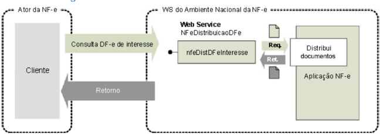

Este serviço permite que um ator da NF-e tenha acesso aos documentos fiscais eletrônicos (DF-e) e informações resumidas que não tenham sido gerados por ele e que sejam de seu interesse. Pode ser consumido por qualquer ator de NF-e, Pessoa Jurídica ou Pessoa Física, que possua um certificado digital  de  PJ  ou  PF.  No  caso  de  Pessoa  Jurídica,  a  empresa  será  autenticada  pelo  CNPJ  base  e poderá realizar a consulta com qualquer CNPJ da empresa desde que o CNPJ base consultado seja o mesmo do certificado digital.


Os documentos fiscais eletrônicos e informações resumidas estarão disponíveis para distribuição por até  3  meses  após  sua  recepção  pelo  Ambiente  Nacional  da  NF-e.  A  distribuição  ocorrerá  para  os atores  que  desempenham  papéis  de  emitente,  destinatário,  transportador  e  terceiros  (informado  na tag autXML) conforme a Tabela 5-25.

Tabela 5-25 - Leiaute Mensagem de Entrada do Web Service nfeAutorizacao

| Documentos                                                                | Emitente   | Destinatário1   | Transportador2   | Terceiros3   |
|---------------------------------------------------------------------------|------------|-----------------|------------------|--------------|
| NF-e                                                                      | Não        | Sim             | Sim              | Sim          |
| Evento deCancelamento                                                     | Não        | Sim             | Sim              | Sim          |
| Evento deCarta de Correção                                                | Não        | Sim             | Sim              | Sim          |
| Eventos de Manifestação do Destinatário                                   | Sim        | Não             | Não              | Sim          |
| Eventos da Suframa (Vistoria/Internalização)                              | Sim        | Sim             | Não              | Sim          |
| EPEC                                                                      | Não        | Sim             | Sim              | Não          |
| Eventos dePedido de Prorrogação de Prazo 4                                | Não        | Sim             | Não              | Não          |
| Eventos do Fisco emResposta ao Pedidode Prorrogação 5                     | Sim        | Sim             | Não              | Não          |
| Evento deAverbação 6                                                      | Sim        | Sim             | Sim              | Sim          |
| Resumo deNF-e                                                             | Não        | Sim             | Não              | Não          |
| Resumo deEventos CT-e Autorizado/Cancelado                                | Sim        | Sim             | Sim              | Sim          |
| Resumo deEventos MDF-eAutorizado/Cancelado                                | Sim        | Sim             | Sim              | Sim          |
| Resumo deEventos de Registro de Passagem                                  | Sim        | Sim             | Sim              | Sim          |
| Eventos deComprovante de Entrega Autorizado/Cancelado propagado do CT-e 7 | Sim        | Sim             | Sim              | Sim          |

## 5.7.1. Leiaute Mensagem de Entrada

Entrada : Estrutura XML com o pedido de distribuição de DF-e de interesse do ator

Schema XML: distDFeInt\_v9.99.xsd

Tabela 5-26 - Leiaute Mensagem de Entrada do Web Service nfeDistribuicaoDFe

| #   | Campo      | Ele   | Pai   | Tipo   | Ocor.   | Tam.   | Descrição/Observação                                 |
|-----|------------|-------|-------|--------|---------|--------|------------------------------------------------------|
| A01 | distDFeInt | Raiz  | -     | -      | -       | -      | TAG raiz                                             |
| A02 | versao     | A     | A01   | N      | 1-1     | 2v2    | Versão do leiaute                                    |
| A03 | tpAmb      | E     | A01   | N      | 1-1     | 1      | Identificação do Ambiente: 1=Produção /2=Homologação |
| A04 | cUFAutor   | E     | A01   | N      | 0-1     | 2      | Código da UF do Autor                                |
| A05 | CNPJ       | CE    | A01   | N      | 1-1     | 14     | CNPJ do interessadono DF-e                           |
| A06 | CPF        | CE    | A01   | N      | 1-1     | 11     | CPF do interessado no DF-e                           |
| A07 | distNSU    | CG    | A01   | -      | 1-1     | -      | Grupopara distribuir DF-e de interesse               |


| #   | Campo     | Ele   | Pai   | Tipo   | Ocor.   | Tam.   | Descrição/Observação                                                                                                                                                                                                                                                                  |
|-----|-----------|-------|-------|--------|---------|--------|---------------------------------------------------------------------------------------------------------------------------------------------------------------------------------------------------------------------------------------------------------------------------------------|
| A08 | ultNSU    | E     | A07   | N      | 1-1     | 1-15   | Último NSUrecebido pelo ator. Caso seja informado com zero,ou comumNSU muito antigo, a consulta retornará unicamente as informações resumidas e documentos fiscais eletrônicos que tenham sido recepcionados pelo AmbienteNacional nos últimos 3 meses.                               |
| A09 | consNSU   | CG    | A01   | -      | 1-1     | -      | Grupo para consultar um DF-e a partir de um NSU específico                                                                                                                                                                                                                            |
| A10 | NSU       | E     | A09   | N      | 1-1     | 1-15   | Número Sequencial Único. Geralmente esta consulta será utilizada quando identificado pelo interessado umNSUfaltante.O Web Service retornará o documento ou informará queo NSU não existeno AmbienteNacional. Assim, esta consulta fechará a lacuna do NSU identificado como faltante. |
| A11 | consChNFe | CG    | A01   | -      | 1-1     | -      | Grupo para consultar uma NF-e pela chave de acesso                                                                                                                                                                                                                                    |
| A12 | chNFe     | E     | A11   | N      | 1-1     | 44     | Chave deacesso específica.                                                                                                                                                                                                                                                            |

## 5.7.2. Leiaute Mensagem de Retorno

Retorno:

Estrutura XML com os documentos de interesse do ator (qtde máxima=50).

Schema XML: retDistDFeInt \_v9.99.xsd

Tabela 5-27 - Leiaute Mensagem de Retorno do Web Service nfeDistribuicaoDFe

| #   | Campo          | Ele   | Pai   | Tipo   | Ocor.   | Tam.   | Descrição/Observação                                                                                                                                                                                                                    |
|-----|----------------|-------|-------|--------|---------|--------|-----------------------------------------------------------------------------------------------------------------------------------------------------------------------------------------------------------------------------------------|
| B01 | retDistDFeInt  | Raiz  | -     | -      | -       | -      | TAG raiz da Resposta                                                                                                                                                                                                                    |
| B02 | versao         | A     | B01   | N      | 1-1     | 2v2    | Versão do leiaute                                                                                                                                                                                                                       |
| B03 | tpAmb          | E     | B01   | N      | 1-1     | 1      | Identificação do Ambiente: 1=Produção/2=Homologação                                                                                                                                                                                     |
| B04 | verAplic       | E     | B01   | C      | 1-1     | 1-20   | Versão do aplicativo queprocessou a consulta                                                                                                                                                                                            |
| B05 | cStat          | E     | B01   | N      | 1-1     | 3      | Código do status da resposta (conforme item 4.4.1 do documento MOC - AnexoI - Leiaute NF-e/NFC-e )                                                                                                                                      |
| B06 | xMotivo        | E     | B01   | C      | 1-1     | 1-255  | Descrição literal do status da resposta                                                                                                                                                                                                 |
| B07 | dhResp         | E     | B01   | D      | 1-1     |        | Data e hora da mensagemde Resposta.Formato: 'AAAA -MM- DDThh:mm:ssTZD' (UTC - Universal Coordinated                                                                                                                                     |
| B08 | ultNSU         | E     | B01   | N      | 0-1     | 1-15   | Último NSUpesquisado no AmbienteNacional. Se for o caso, o solicitante pode continuar a consulta a partir deste NSUpara obter novos resultados.                                                                                         |
| B09 | maxNSU         | E     | B01   | N      | 0-1     | 1-15   | Maior NSU existente noAmbienteNacional para o CNPJ/CPFinformado                                                                                                                                                                         |
| B10 | loteDistDFeInt | G     | B01   | -      | 0-1     |        | Conjunto de informações resumidas e documentos fiscais eletrônicos de interesseda pessoa físicaou empresa.                                                                                                                              |
| B11 | docZip         | E     | B10   | B64    | 1-50    |        | Informação resumida ou documentofiscal eletrônico de interesse da ou empresa.O conteúdo desta tag estará compactado no padrão gZip.O tipo do campo é base64Binary.                                                                      |
| B12 | NSU            | A     | B11   | N      | 1-1     | 1-15   | NSU do documentfiscal                                                                                                                                                                                                                   |
| B13 | schema         | A     | B11   | C      | 1-1     | -      | Identificação do SchemaXMLque será utilizado para validar o XML existenteno campo seguinte. Vai identificar o tipo do documento e sua versão.Exemplos: resNFe_v1.00.xsd;procNFe_v3.10.xsd, resEvento_1.00.xsd - procEventoNFe_v1.00.xsd |

## 5.7.3. Mensagem de Retorno Compactada

O  tamanho  médio  da  NF-e  é  de  aproximadamente  10  KB  (dependendo  da  quantidade  de  itens), necessitando de um dimensionamento correto da rede interna e do canal de Internet das empresas e do Ambiente Nacional.


Para  minimizar  necessidades  de  infraestrutura  de  rede  cada  documento  contido  na  mensagem  de retorno  da  solicitação  será  compactado  (tag:docZip).  Estima-se  que  a  compactação  reduzirá  o tamanho da mensagem de retorno em aproximadamente 60%.

A  aplicação  do  Ambiente Nacional irá compactar individualmente cada documento da mensagem de retorno  e  a  aplicação  cliente  deverá  descompactá-lo  e  seguir  o  procedimento normal do tratamento do documento descompactado.

O padrão de compactação adotado para o projeto será  o  Gzip  (GNU  zip)  que é implementado nas plataformas Java e .NET.

## 5.7.4. Descrição do Processo de Distribuição de DF-e de Interesse

Este  serviço  pode  ser  consumido  por  atores  que  desempenham  papel  na  NF-e  de  emitente, destinatário,  transportador  ou  terceiro,  Pessoa  Física  ou  Jurídica,  que  possua  um  certificado  digital com, respectivamente, seu CPF ou seu CNPJ.

O Ambiente  Nacional gera um  número  sequencial único (NSU)  para cada interessado nos documentos fiscais. Os documentos recuperados deverão conter uma sequência de numeração  sem intervalos em sua base de dados.

## 5.7.4.1. Geração do pedido de distribuição

O XML do pedido de distribuição suporta três tipos de consultas que são definidas de acordo com a tag informada no XML. As tags são distNSU, consNSU e consChNFe.

## a)  distNSU - Distribuição de Conjunto de DF-e a Partir do NSU Informado

A aplicação cliente do WS deve informar o último número sequencial único (ultNSU) que possui. Caso o NSU informado seja menor que o primeiro NSU disponível para distribuição, a aplicação do Ambiente Nacional deverá fornecer os documentos a partir do primeiro disponível para consulta.

## b) consNSU - Consulta DF-e Vinculado ao NSU Informado

Este  processo  de  consulta  DF-e  a  partir  de  um  NSU  permite  que  o  interessado  nos  documentos fiscais  consulte  de  maneira  pontual  um  NSU  que  foi  identificado  como  faltante  em  sua  base  de dados.

A aplicação cliente do WS deve informar o número sequencial único (NSU) identificado como faltante em sua base de dados

## c)  consChNFe - Consulta de NF-e por Chave de Acesso Informada

Este  processo  de  consulta  a  partir  de  uma  chave  de  acesso  permite  que  o  interessado  na  NF-e consulte de maneira pontual uma chave de acesso e obtenha o documento relativo à esta chave. A aplicação cliente do WS deve informar uma chave de acesso válida para recuperar a NF-e.

## 5.7.4.2. CNPJ ou CPF do Interessado no DF-e

Informar  o  CPF da pessoa física ou CNPJ da empresa para recuperação de DF-e de seu interesse. Este  campo  possibilita  que  uma  empresa  consiga  recuperar  os  DF-e  de  qualquer  um  de  seus estabelecimentos  utilizando somente um certificado digital PJ.

## 5.7.4.3. Envio das Informações

O pedido de distribuição  será  enviado  por  Web  Service,  sendo  necessário  o  uso  de  um  certificado digital de PJ ou PF válido.

O WS do Ambiente Nacional é acionado pela aplicação cliente do interessado que deve enviar uma mensagem que atenda os padrões estabelecidos neste manual.

## 5.7.4.4. Processamento  da Requisição de Distribuição de Conjunto de DF-e a Partir do NSU Informado (distNSU)

O Web  Service deverá  gerar  lotes  com  até  50  documentos  ao  interessado  com  informações resumidas ou documentos fiscais eletrônicos que tenham o número sequencial único (NSU) superior ao NSU informado.

Caso o NSU informado seja menor que o primeiro NSU disponível para distribuição, a aplicação do Ambiente Nacional deverá fornecer os documentos a partir do primeiro disponível para consulta.

A criação do lote de documentos deverá observar as seguintes regras:

- Ordem crescente de NSU
- O lote poderá conter qualquer tipo de documento válido e seu respectivo NSU
- Quantidade máxima de documentos no lote: 50 documentos

Documentos emitidos pela própria empresa não estarão disponíveis para consulta.

Importante  ressaltar  que  o  processo  de  recepção  e  sincronização  não  será  realizado  em  ordem cronológica  de  emissão  ou  autorização  de  uso,  uma  vez  que  a  geração  do  NSU  dos  documentos será organizada por ordem cronológica de recepção pelo Ambiente Nacional.

Não  existe  necessidade  de  o  Ambiente  Nacional  estar  sincronizado  em  tempo  real  com  todos  os documentos fiscais autorizados. Como a geração do NSU será organizada por ordem de inserção de documentos,  a  empresa  ou  pessoa  física  conseguirá  recuperar  todos  os  documentos  de  seu interesse tão logo estes sejam recebidos pelo Ambiente Nacional da NF-e.

É  conveniente  manter  um  controle  do  primeiro  NSU  válido  para  consulta.  A  resposta  do  WS  do Ambiente Nacional poderá ser:

- Rejeição -  com a devolução da mensagem com o motivo da falha informado no cStat;
- Nenhum documento localizado -  não existe documentos fiscais para o CNPJ/CPF informado cStat='137-Nenhum documento localizado';
- Documento  localizado -  com  a  devolução  dos  documentos  fiscais  encontrados  -  cStat='138Documento(s) localizado(s)'.

A  empresa  deverá  aguardar  um  tempo  mínimo  de  uma  hora  para  efetuar  uma  nova  solicitação  de distribuição  caso  receba  a  indicação  que  não  existem  mais  documentos  a  serem  pesquisados  na base  de  dados  do  Ambiente  Nacional. Se o NSU informado (tag:ultNSU) for igual ao maior NSU do Ambiente  Nacional  (tag:maxNSU),  então  não  existem  mais  documentos  a  serem  pesquisados  no momento.

## 5.7.4.5. Processamento  da Requisição de Consulta DF-e Vinculado ao NSU Informado (consNSU)

Considerando  que  o  Ambiente  Nacional  gera  NSU  sem  lacunas,  o  processo  de  distribuição  de conjunto  de  DF-e  a  partir  do  NSU  informado  (tag:distNSU)  disponibiliza  para  o  interessado  uma sequência  de numeração ordenada de forma ascendente. A identificação de alguma lacuna na base de dados do interessado indica que houve  alguma  falha no processo de distribuição dos documentos.


Neste caso, o interessado deve consultar pontualmente os NSU identificados como faltantes em sua base  de  dados  através  do  método nfeDistDFeInteresse do Web  Service nfeDistribuicaoDFe informando o NSU desejado no conteúdo da tag consNSU no XML de requisição

A resposta do WS poderá ser:

- Rejeição -  com a devolução da mensagem com o motivo da falha informado no cStat ;
- Nenhum  documento  localizado -  indicando  que  o  Ambiente  Nacional  não  gerou  o  NSU  e  o interessado deve desconsiderá-lo - cStat='137-Nenhum  documento localizado';
- Documento  localizado -  com  a  devolução  do  documento  fiscal  encontrado  -  cStat='138Documento localizado.

## 5.7.4.6. Processamento  da Requisição de Consulta de NF-e por Chave de Acesso Informada (consChNFe)

O  processo  de  consulta  por  chave  de  acesso  (tag:  chNFe)  permite  ao  interessado  consultar pontualmente uma NF-e pela chave de acesso. A chave de acesso informada deve ser válida, existir no Ambiente Nacional e estar vinculada ao interessado como destinatário, transportador ou terceiro.

Caso a consulta seja realizada pelo destinatário o Ambiente Nacional irá verificar a existência de sua manifestação  ('Ciência  da  Operação',  'Operação  não  Realizada'  ou  'Confirmação  de  Operação'). Em  caso  da  existência  da  manifestação  do  destinatário  a  NF-e  será  retornada  para  o  destinatário. Caso  contrário,  será  retornado  apenas  o  resumo  da  NF-e.  Com  o  resumo  o  destinatário  terá  as informações necessárias para realizar a manifestação.

Para transportador e terceiros a NF-e estará disponível integralmente na consulta. Para o emitente a NF-e não será disponibilizada  nesta consulta.

Assim  como nas demais consultas disponibilizadas pelo Web Service nfeDistribuicaoDFe, a consulta por  chave  de  acesso  estará  disponível  para  documentos  recebidos  pelo  Ambiente  Nacional  nos últimos 90 dias. Após este período não será possível recuperar a NF-e.

A resposta do WS poderá ser:

- Rejeição -  com a devolução da mensagem com o motivo da falha informado no cStat;
- Nenhum  documento  localizado -  indicando  que  o  Ambiente  Nacional  não  possui  a  NF-e consultada - cStat= '137-Nenhum documento localizado';
- Documento  localizado -  com  a  devolução  do  documento  fiscal  encontrado  -  cStat=  '138Documento localizado'.

## 5.7.5. Regras de Validação

Serão  aplicadas  as  regras  de  validação  genéricas  conforme  os  grupos  citados  na  Tabela  5-28, detalhados no documento MOC - Anexo I - Leiaute e Regras de Validação da NF-e e da NFC-e .

Tabela 5-28 - Regras de Validação Genéricas do Web Service nfeDistribuicaoDFe

| Grupo   | Descrição                                               |
|---------|---------------------------------------------------------|
| A       | Validação do Certificado de Transmissão (protocolo TLS) |
| B       | Validação Inicial da Mensagemno Web Service             |
| D       | Validação da Área de Dados                              |


As regras de validação específicas deste WS podem ser vistas na Tabela 5-29.

Tabela 5-29 - Regras de Validação Específicas do Web Service nfeDistribuicaoDFe

| #     | Regra de Validação                                                                                                                             | Aplic.   |   Msg | Efeito   | Descrição Erro                                                                   |
|-------|------------------------------------------------------------------------------------------------------------------------------------------------|----------|-------|----------|----------------------------------------------------------------------------------|
| H01   | Tipo do ambiente da NF-e difere do ambiente do Web Service                                                                                     | Obrig.   |   252 | Rej.     | Rejeição: Ambienteinformado diverge do Ambiente de recebimento                   |
| H02   | CNPJ do interessadona distribuição inválido (DV ou zeros)                                                                                      | Obrig.   |   489 | Rej.     | Rejeição: CNPJ informado inválido (DV ou zeros)                                  |
| H03   | CPF do interessado na distribuição inválido (DV ou zeros)                                                                                      | Obrig.   |   490 | Rej.     | Rejeição: CPF informado inválido (DVou zeros)                                    |
| H04   | CNPJ do Certificado Digital utilizado na transmissão não tem o mesmoCNPJ basedo CNPJ consultado                                                | Obrig.   |   593 | Rej.     | Rejeição: CNPJ-Base consultado difere do CNPJ-Base do Certificado Digital        |
| H05   | CPF do Certificado Digital utilizado na transmissão diferentedo CPF consultado                                                                 | Obrig.   |   472 | Rej.     | Rejeição: CPF consultado diferedo CPF do Certificado Digital                     |
| H06 1 | Número do NSUinformado superior ao maior NSU disponível para consulta                                                                          | Obrig.   |   589 | Rej.     | Rejeição: Númerodo NSUinformado superior ao maior NSU do AmbienteNacional        |
| H07 2 | Chave de Acesso com dígito verificador inválido                                                                                                | Obrig.   |   236 | Rej.     | Rejeição: Chave deAcesso com dígito verificador inválido                         |
| H08 2 | Chave deAcesso inválida (Código UF inválido)                                                                                                   | Obrig.   |   614 | Rej.     | Rejeição: Chave deAcesso inválida (Código UF inválido)                           |
| H09 2 | Chave deAcesso inválida (Ano< 06 ou Anomaior que Ano)                                                                                          | Obrig.   |   615 | Rej.     | Rejeição: Chave deAcesso inválida (Ano menor que 06 ou Ano maior queAno          |
| H10 2 | Chave deAcesso inválida (Mês=0ou Mês > 12)                                                                                                     | Obrig.   |   616 | Rej.     | Rejeição: Chave deAcesso inválida (Mês menorque 1 ou Mês maior que12)            |
| H11 2 | Chave deAcesso inválida: - Série = [0-909] e CNPJ zerado ou dígito inválido, ou - Série = [910-969] e CPF zerado ou dígito inválido            | Obrig.   |   617 | Rej.     | Rejeição: Chave deAcesso inválida (CNPJ zerado ou dígito inválido)               |
| H12 2 | Chave deAcesso inválida (modelodiferentede 55)                                                                                                 | Obrig.   |   618 | Rej.     | Rejeição: Chave deAcesso inválida (CNPJ zerado ou dígito inválido)               |
| H13 2 | Chave deAcesso inválida (númeroNF = 0)                                                                                                         | Obrig.   |   619 | Rej.     | Rejeição: Chave deAcesso inválida (número NF = 0)                                |
| H14 2 | NF-e inexistente para a chave de acesso informada                                                                                              | Obrig.   |   217 | Rej.     | Rejeição: NF-e inexistente para a chave de acesso informada                      |
| H15 2 | Verificar se NF-e estáno prazo de download, 90 dias da data de recebimentoda NF-eno Ambiente Nacional                                          | Obrig.   |   632 | Rej.     | Rejeição: Solicitação fora deprazo, a NF-enão está mais disponível para download |
| H16 2 | Se CNPJ,verificar se o CNPJ do interessadona NF-e tem o mesmo CNPJ-Base informado no pedido. Se CPF, verificar seo CPF éo mesmodo interessado. | Obrig.   |   640 | Rej.     | Rejeição: CNPJ/CPFdo interessado não possui permissão para consultar esta NF-e   |
| H17 2 | A NF-enão deveser disponibilizada para o emitente da NF-e.Verificar se CNPJdo interessadona NF-e é o emitente.                                 | Obrig.   |   641 | Rej.     | Rejeição: NF-e indisponível para o emitente                                      |
| H18 2 | NF-e Cancelada, arquivo NF-e indisponível para download                                                                                        | Obrig.   |   653 | Rej.     | Rejeição: NF-e Cancelada, arquivo indisponível para download                     |
| H19 2 | NF-e Denegada,arquivo NF-e indisponível para download                                                                                          | Obrig.   |   654 | Rej.     | Rejeição: NF-e Denegada,arquivo indisponível para download                       |

## 5.7.6. Leiautes Resumidos

Para  possibilitar  o  compartilhamento  de  informações  relevantes  para  o  ator  de  forma  a  manter  o sigilo da informação, foram criados dois novos leiautes contendo informações resumidas das NF-e e informações resumidas dos eventos.

## 5.7.6.1. Leiaute Resumo da NF-e

Descrição: Estrutura XML gerada pelo Ambiente Nacional com o conjunto de informações resumidas da  NF-e.  Este  documento  será  distribuído  para  os  destinatários  possibilitando  sua  manifestação  na operação acobertada pela Nota Fiscal eletrônica emitida para o seu CNPJ.

## Schema XML: resNFe\_v1.01.xsd

Tabela 5-30 - Leiaute Mensagem de Resumo da NF-e

| #   | Campo    | Ele   | Pai   | Tipo   | Ocor.   | Tam.      | Descrição/Observações                                                                                                                                                       |
|-----|----------|-------|-------|--------|---------|-----------|-----------------------------------------------------------------------------------------------------------------------------------------------------------------------------|
| C01 | resNFe   | G     | -     | -      | -       | -         | TAG raíz com o conjunto de informações resumidas da NF-e.Este conjunto de informação será gerado quando a NF-efor autorizada ou denegada.                                   |
| C02 | versao   | A     | C01   | N      | 1-1     | 2v2       | Versão do leiaute                                                                                                                                                           |
| C03 | chNFe    | E     | C01   | N      | 1-1     | 44        | Chave deacesso da NF-e                                                                                                                                                      |
| C04 | CNPJ     | CE    | C01   | N      | 1-1     | 14        | CNPJ do Emitente                                                                                                                                                            |
| C05 | CPF      | CE    | C01   | N      | 1-1     | 11        | CPF do Emitente                                                                                                                                                             |
| C06 | xNome    | E     | C01   | C      | 1-1     | 3-60      | Razão Social ou Nome do Emitente                                                                                                                                            |
| C07 | IE       | E     | C01   | N      | 1-1     | 0 ou 2-14 | IE do Emitente. Valores válidos: vazio (não contribuinte do ICMS), ISENTO(contribuinte do ICMSISENTO de Inscrição no Cadastro de Contribuintes) ou IE (Contribuinte doICMS) |
| C08 | dhEmi    | E     | C01   | D      | 1-1     |           | Data de Emissão da NF-eno formato UTC (Universal Coordinated Time): AAAA-MM-                                                                                                |
| C09 | tpNF     | E     | C01   | N      | 1-1     | 1         | Tipo de Operação da NF-e:0=Entrada; 1=Saída                                                                                                                                 |
| C10 | vNF      | E     | C01   | N      | 1-1     | 13,2      | Valor Total da NF-e                                                                                                                                                         |
| C11 | digVal   | E     | C01   | C      | 1-1     | 28        | Digest Value da NF-e na base de dados do Ambiente                                                                                                                           |
| C12 | dhRecbto | E     | C01   | D      | 1-1     |           | Data de autorização da NF-e. Formato: 'AAAA -MM- DDThh:mm:ssTZD' (UTC - Universal Coordinated Time).                                                                        |
| C13 | nProt    | E     | C01   | N      | 1-1     | 15        | Número deprotocolo da NF-e,conforme item 4.3.5                                                                                                                              |
| C14 | cSitNFe  | E     | C01   | N      | 1-1     | 1         | Situação da NF-e:1=Uso autorizado; 2=Usodenegado; 3=NF-e Cancelada;                                                                                                         |

## 5.7.6.2. Leiaute Resumo de Evento de NF-e

Descrição: Estrutura XML gerada pelo Ambiente Nacional com o conjunto de informações resumidas de um evento de NF-e.

## Schema XML: resEvento\_ v1.01.xsd

Tabela 5-31 - Leiaute Mensagem de Resumo de Evento da NF-e

| #   | Campo      | Ele   | Pai   | Tipo   | Ocor.   | Tam.   | Descrição/Observações                                                                                  |
|-----|------------|-------|-------|--------|---------|--------|--------------------------------------------------------------------------------------------------------|
| D01 | resEvento  | Raiz  | -     | -      | -       | -      | TAG raiz                                                                                               |
| D02 | versao     | A     | D01   | N      | 1-1     | 2v2    | Versão do leiaute                                                                                      |
| D03 | cOrgao     | E     | D01   | N      | 1-1     | 2      | Código do órgão de recepção do Evento.Ocódigo 91 para identificar o Ambiente                           |
| D04 | CNPJ       | CE    | C01   | N      | 1-1     | 14     | CNPJ do Emitente                                                                                       |
| D05 | CPF        | CE    | C01   | N      | 1-1     | 11     | CPF do Emitente                                                                                        |
| D06 | chNFe      | E     | D01   | N      | 1-1     | 44     | Chave deacesso da NF-e                                                                                 |
| D07 | dhEvento   | E     | D01   | D      | 1-1     |        | Data e hora do eventono formato AAAA-MM- DDThh:mm:ssTZD (UTC - Universal Coordinated Time)             |
| D08 | tpEvento   | E     | D01   | N      | 1-1     | 6      | Código do evento (de acordo com tabelas do item 3.1 )                                                  |
| D09 | nSeqEvento | E     | D01   | N      | 1-1     | 1-2    | Número sequencialdo evento                                                                             |
| D10 | xEvento    | E     | D01   | C      | 1-1     | 5-60   | Descrição do evento                                                                                    |
| D11 | dhRecbto   | E     | D01   | D      | 1-1     |        | Data de autorização do evento. Formato: 'AAAA -MM- DDThh:mm:ssTZD' (UTC - Universal Coordinated Time). |
| D12 | nProt      | E     | D01   | N      | 1-1     | 15     | Número deprotocolo do evento,conforme item 4.3.5                                                       |


## 5.7.7. Visão Geral do Modelo de Distribuição

O  modelo  de  distribuição  de  documentos  é  baseado  na  geração  de  um  número  sequencial  único (NSU) para cada CNPJ ou CPF. O fluxo que pode ser visto na Figura 5-8 exemplifica a geração do NSU para o emitente e destinatário da NF-e.

Figura 5-8 - Visão Geral do Modelo  de Distribuição

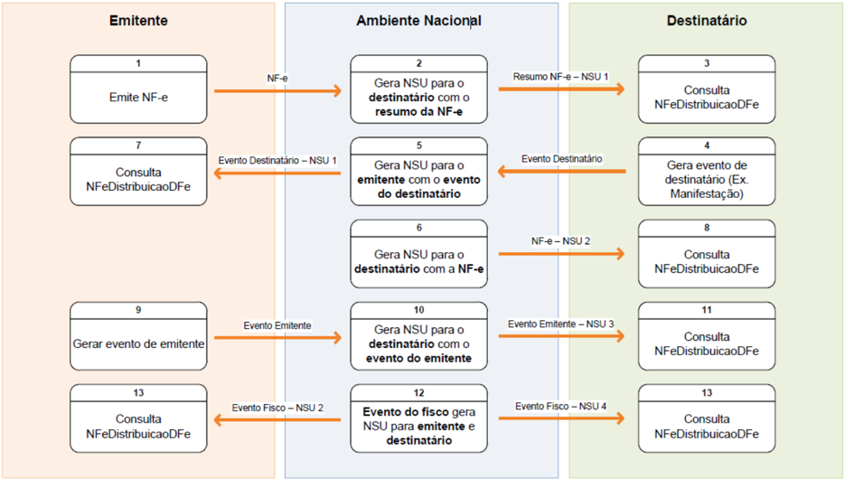

A  consulta  no Web  Service nfeDistribuicaoDFe poderá  ser  realizada  a  qualquer  instante  pela empresa  ou  pessoa  física.  O  Ambiente  Nacional  disponibilizará  para  consulta  os  documentos  de interesse de cada ator. Seguem os passos do fluxo exemplificado:

- (1) O emitente gera e transmite uma NF-e que será autorizada pela Sefaz e compartilhada com o Ambiente Nacional;
- (2) O  Ambiente  Nacional  gera  um  NSU  para  o  destinatário  do  resumo  da  NF-e  e  o  disponibiliza  para consulta;
- (3) O destinatário consulta o WS nfeDistribuicaoDFe a partir do último NSU recebido e recupera o resumo da NF-e;
- (4) O destinatário, de posse do resumo da NF-e, gera um evento de NF-e (Ex. evento de manifestação do destinatário);
- (5) O Ambiente Nacional gera um NSU do evento gerado pelo destinatário para o emitente e o disponibiliza para consulta;
- (6) Caso seja um evento de manifestação do destinatário diferente do tipo 'desconhecimento da operação', o Ambiente Nacional gera um NSU para o destinatário com a NF-e (liberação do download);
- (7) O  emitente  consulta  o  WS  nfeDistribuicaoDFe  a  partir  do  último  NSU  recebido  e recupera o evento gerado pelo destinatário;
- (8) O destinatário consulta o WS nfeDistribuicaoDFe a partir do último NSU recebido e recupera a NF-e;
- (9) O emitente gera um evento de sua NF-e (ex.: evento de cancelamento de NF-e, caso não exista outro evento que impeça este cancelamento) que será compartilhado pela Sefaz com o Ambiente Nacional;
- (10)  O Ambiente Nacional gera um NSU para o destinatário do evento gerado pelo emitente e o disponibiliza para consulta;
- (11)  O destinatário consulta o WS nfeDistribuicaoDFe a partir do último NSU recebido e recupera o evento gerado pelo emitente;
- (12)  O Ambiente Nacional recebe um evento gerado pelo fisco e gera um NSU para o emitente e outro NSU para o destinatário, disponibilizando-os para consulta;


SNFeNFCe


- (13)  Tanto  o  emitente  quanto  o  destinatário  consultam  o  WS  nfeDistribuicaoDFe  a  partir  do  último  NSU recebido e recuperam o evento gerado pelo fisco;

O fluxo exemplificado resulta nos seguintes NSU para emitente e destinatário:

| NSU Emitente     | Documento              |
|------------------|------------------------|
| 1                | Evento do Destinatário |
| 2                | Evento do Fisco        |
| NSU Destinatário | Documento              |
| 1                | Resumo da NF-e         |
| 2                | NF-e                   |
| 3                | Evento do Emitente     |
| 4                | Evento do Fisco        |

Este  novo  modelo permitirá ao emitente a consulta dos eventos manifestados pelos destinatários de suas  NF-e.  Também  será  disponibilizado  para  o  destinatário  da  NF-e  qualquer  evento  gerado  pelo emitente.  Além  disso,  os  eventos  gerados  pelo  fisco  serão  disponibilizados  tanto  para  o  emitente quanto para o destinatário da NF-e.

O  modelo  simplifica  o  processo  de  download  da  NF-e  uma  vez  que  a  partir  da  manifestação  do destinatário  o  Ambiente  Nacional gera automaticamente um NSU referenciando a NF-e e permitindo sua recuperação a partir do WS nfeDistribuicaoDFe.

## 5.7.7.1. Recomendações Para Evitar o Uso Indevido

A  análise  do  comportamento  atual  das  aplicações  das  empresas  ('aplicação  cliente')  permite identificar algumas situações de 'uso indevido' nos ambientes autorizadores.

Como exemplo maior do mau uso do ambiente, ressalta-se a falta de controle de algumas aplicações que  entram  em  'loop',  consumindo  recursos  de  forma  indevida,  sobrecarregando  principalmente  o canal de comunicação com a Internet.

Para  este  Web  Service  serão  mantidos  controles  para  identificar  as  situações  de  uso  indevido  de sucessivas tentativas de busca de registros já disponibilizados anteriormente.

As novas tentativas serão rejeitadas com o erro '656-Rejeição:  Consumo Indevido'.

## 5.7.7.2. Endereços dos Web Services

Os endereços dos Web Services de Distribuição do Ambiente Nacional estão publicados no Portal da NFe (http://www.nfe.fazenda.gov.br/portal), e no Portal de Homologação (http://hom.nfe.fazenda.gov.br/  portal) no menu 'Serviços' / 'Relação de Serviços Web'.

## 5.8. Web Service - NFeRecepcaoEvento - Parte Geral

Função

: Serviço destinado à recepção de mensagem de Evento da NF-e

Processo

:  síncrono.

Método :

nfeRecepcaoEvento

Figura 5-9 - Fluxo do Web Service NFeRecepcaoEvento

## SistemadeRegistrodeEventos

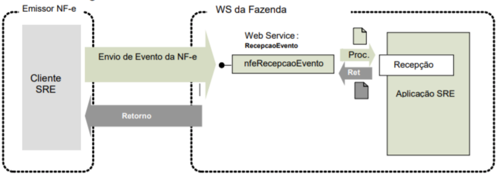

## 5.8.1. Leiaute Mensagem de Entrada (Parte Geral)

O Web Service de Registro de Evento possui uma interface genérica, complementada por uma área específica para cada tipo de evento. Segue abaixo o leiaute da parte geral da mensagem de entrada para os eventos.

## Schema XML: envEvento\_v1.00.xsd

Tabela 5-32 - Leiaute Mensagem de Entrada de Evento, Parte Geral

| #   | Campo      | Ele   | Pai   | Tipo   | Ocor   | Tam   | Descrição/Observação                                                                                                                                                                                  |
|-----|------------|-------|-------|--------|--------|-------|-------------------------------------------------------------------------------------------------------------------------------------------------------------------------------------------------------|
| P01 | envEvento  | Raiz  | -     | -      | -      | -     | TAG raiz                                                                                                                                                                                              |
| P02 | versao     | A     | P01   | N      | 1-1    | 2v2   | Versão do leiaute                                                                                                                                                                                     |
| P03 | idLote     | E     | P01   | N      | 1-1    | 1-15  | Identificador de controle do Lote de envio do Evento. Número sequencial único para identificação do Lote, de uso exclusivo do autor do evento.O Web Service não faz qualquer uso deste identificador. |
| P04 | evento     | G     | P01   | xml    | 1-20   | -     | Evento, umlote pode conter até 20 eventos                                                                                                                                                             |
| P05 | versao     | A     | P04   | N      | 1-1    | 2v2   | Versão do leiaute do evento                                                                                                                                                                           |
| P06 | infEvento  | G     | P04   | -      | 1-1    | -     | Grupo de informações do registro do Evento                                                                                                                                                            |
| P07 | Id         | ID    | P06   | C      | 1-1    | 54    | Identificador da TAG a ser assinada, formado por 'ID' + tpEvento + Chave da NF-e + nSeqEvento                                                                                                         |
| P08 | cOrgao     | E     | P06   | N      | 1-1    | 2     | Código do órgão de recepção do Evento,conforme Tabela do IBGE ou: 91=Ambiente Nacional Informar o código da UF para este evento.                                                                      |
| P09 | tpAmb      | E     | P06   | N      | 1-1    | 1     | Identificação do Ambiente: 1=Produção/2=Homologação                                                                                                                                                   |
| P10 | CNPJ       | CE    | P06   | N      | 1-1    | 14    | CNPJ do autor do evento                                                                                                                                                                               |
| P11 | CPF        | CE    | P06   | N      | 1-1    | 11    | CPF do autor do evento                                                                                                                                                                                |
| P12 | chNFe      | E     | P06   | N      | 1-1    | 44    | Chave deAcesso da NF-e à qual o eventoserá vinculado                                                                                                                                                  |
| P13 | dhEvento   | E     | P06   | D      | 1-1    | -     | Data e hora do eventono formato AAAA- MMDDThh:mm:ssTZD (UTC - Universal Coordinated Time)                                                                                                             |
| P14 | tpEvento   | E     | P06   | N      | 1-1    | 6     | Código do evento (de acordo com tabelas do item 3.1 )                                                                                                                                                 |
| P15 | nSeqEvento | E     | P06   | N      | 1-1    | 1-2   | Sequencialdo eventopara o mesmo tipo deevento. Informar o valor '1' para este evento.                                                                                                                 |
| P16 | verEvento  | E     | P06   | N      | 1-1    | 2v2   | Versão do grupo de detalhedo evento.                                                                                                                                                                  |
| P17 | detEvento  | G     | P06   |        | 1-1    | -     | Detalhes do evento. Inserir neste local o XML específicodo tipo de evento (ex: cancelamento, carta correção, registro de passagem).                                                                   |


SNFeNFCe


| #   | Campo     | Ele   | Pai   | Tipo   | Ocor   | Tam   | Descrição/Observação                                                                        |
|-----|-----------|-------|-------|--------|--------|-------|---------------------------------------------------------------------------------------------|
| P91 | Signature | G     | P04   | xml    | 1-1    | -     | Assinatura Digital do documento XML, a assinatura deverá ser aplicada no elemento infEvento |

## 5.8.2. Leiaute Mensagem de Retorno (Parte Geral)

Retorno

: Estrutura XML com a mensagem do resultado da transmissão.

Schema XML: retEnvEvento\_v1.00.xsd

Tabela 5-33 - Leiaute Mensagem de Retorno de Evento, Parte Geral

| #   | Campo        | Ele   | Pai   | Tipo   | Ocorr   | Tam   | Descrição/Observação                                                                                                                                                                                                                               |
|-----|--------------|-------|-------|--------|---------|-------|----------------------------------------------------------------------------------------------------------------------------------------------------------------------------------------------------------------------------------------------------|
| R01 | retEnvEvento | Raiz  | -     | -      | -       | -     | TAG raiz da mensagemde retorno                                                                                                                                                                                                                     |
| R02 | versao       | A     | R01   | N      | 1-1     | 2v2   | Versão do leiaute                                                                                                                                                                                                                                  |
| R03 | idLote       | E     | R01   | N      | 1-1     | 1-15  | Idema mensagemde entrada.                                                                                                                                                                                                                          |
| R04 | tpAmb        | E     | R01   | N      | 1-1     | 1     | Idema mensagemde entrada.                                                                                                                                                                                                                          |
| R05 | verAplic     | E     | R01   | C      | 1-1     | 1-20  | Versão da aplicação que processou o evento.                                                                                                                                                                                                        |
| R06 | cOrgao       | E     | R01   | N      | 1-1     | 2     | Órgão derecepção do Evento,idem a mensagemde entrada.                                                                                                                                                                                              |
| R07 | cStat        | E     | R01   | N      | 1-1     | 3     | Código do status da resposta (conforme item 4.4.1 do documento MOC - AnexoI - Leiaute NF-e/NFC-e )                                                                                                                                                 |
| R08 | xMotivo      | E     | R01   | C      | 1-1     | 1-255 | Descrição do status da resposta                                                                                                                                                                                                                    |
| R09 | retEvento    | G     | R01   | -      | 0-20    | -     | Grupo do resultado do processamento do Evento                                                                                                                                                                                                      |
| R10 | versao       | A     | R09   | N      | 1-1     | 2v2   | Versão do leiaute                                                                                                                                                                                                                                  |
| R11 | infEvento    | G     | R09   |        | 1-1     | -     | Grupo de informações do registro do Evento                                                                                                                                                                                                         |
| R12 | Id           | ID    | R11   | C      | 0-1     | 17    | Identificador da TAG a ser assinada, somentedeveser informado se o órgão de registro assinar a resposta. No caso de assinatura, preenchercom o número do protocolo, precedido pela literal 'ID'                                                    |
| R13 | tpAmb        | E     | R11   | N      | 1-1     | 1     | Idema mensagemde entrada.                                                                                                                                                                                                                          |
| R14 | verAplic     | E     | R11   | C      | 1-1     | 1-20  | Versão da aplicação que registrou o Evento, utilizar literal quepermita a identificação do órgão, como a sigla da UF ou do órgão.                                                                                                                  |
| R15 | cOrgao       | E     | R11   | N      | 1-1     | 2     | Idema mensagemde entrada.                                                                                                                                                                                                                          |
| R16 | cStat        | E     | R11   | N      | 1-1     | 3     | Código do status da resposta (conforme item 4.4.1 do documento MOC - AnexoI - Leiaute NF-e/NFC-e )                                                                                                                                                 |
| R17 | xMotivo      | E     | R11   | C      | 1-1     | 1-255 | Descrição do status da resposta.                                                                                                                                                                                                                   |
| R18 | chNFe        | E     | R11   | N      | 0-1     | 44    | Idema mensagemde entrada.                                                                                                                                                                                                                          |
| R19 | tpEvento     | E     | R11   | N      | 0-1     | 6     | Código do evento (de acordo com tabelas do item 3.1 )                                                                                                                                                                                              |
| R20 | xEvento      | E     | R11   | C      | 0-1     | 5-60  | Descrição do resultado do processamentodo evento                                                                                                                                                                                                   |
| R21 | nSeqEvento   | E     | R11   | N      | 0-1     | 1-2   | Idema mensagemde entrada.                                                                                                                                                                                                                          |
| R22 | cOrgaoAutor  | E     | R11   | N      | 0-1     | 2     | Idema mensagemde entrada, para os casos de eventosem queé informado na mensagemde entrada. Específico para eventos: - 110112 - Cancelamento por substituição (NT 2018.005) - 110140 - EPEC Obs: Esta tag não é preenchida no eventode manifestação |
| R23 | CNPJDest     | CE    | R11   | N      | 0-1     | 14    | Informar o CNPJ do destinatário da NF-e. Específico para evento 110111 - Cancelamento                                                                                                                                                              |
| R24 | CPFDest      | CE    | R11   | N      | 0-1     | 11    | Informar o CPF do destinatário da NF-e. Específico para evento 110111 - Cancelamento Obs: Esta tag não é preenchida no eventode manifestação                                                                                                       |


| #   | Campo       | Ele   | Pai   | Tipo   | Ocorr   | Tam   | Descrição/Observação                                                                                                                                                    |
|-----|-------------|-------|-------|--------|---------|-------|-------------------------------------------------------------------------------------------------------------------------------------------------------------------------|
| R25 | emailDest   | E     | R11   | C      | 0-1     | 1-60  | E-mail do destinatário informado na NF-e. Específico para eventos 110111 - Cancelamento Obs: Esta tag não é preenchida no eventode manifestação                         |
| R30 | dhRegEvento | E     | R11   | D      | 1-1     | -     | Data e hora de registro do eventono formato AAAA- MMDDTHH:MM:SSTZD (formato UTC). Se o eventofor rejeitado informar a data e hora de recebimentodo evento.              |
| R31 | nProt       | E     | R11   | N      | 0-1     | 15    | Número do Protocolo do Evento,conforme item 4.3.5                                                                                                                       |
| R32 | chNFePend   | E     | R11   | N      | 0-50    | 44    | Relação de Chavesde Acesso deEPEC pendentesde conciliação, existentesnoAN. Específico para evento:110140 - EPEC Obs: Esta tag não é preenchida no eventode manifestação |
| R91 | Signature   | G     | R09   | XML    | 0-1     | -     | Assinatura Digital do documento XML, a assinatura deverá ser aplicada no elemento infEvento. A decisão de assinar amensagem fica a critério da UF.                      |

## 5.8.3. Descrição do Processo de Web Service

O  WS  de  Eventos  é  acionado  pelo  interessado  emissor  da  NF-e  que  deve  enviar  mensagem  de registro de evento.

O processo de Registro de Eventos recebe eventos em uma estrutura de lotes, que podem conter de 1 a 20 eventos.

## 5.8.4. Regras de Validação Genéricas Para Todos os Eventos

Serão  aplicadas  as  regras  de  validação  genéricas  conforme  os  grupos  citados  na  Tabela  5-34, detalhados no documento MOC - Anexo I - Leiaute e Regras de Validação da NF-e e da NFC-e .

Tabela 5-34 - Regras de Validação Genéricas do Web Service NFeRecepcaoEvento

| Grupo   | Descrição                                               |
|---------|---------------------------------------------------------|
| A       | Validação do Certificado de Transmissão (protocolo TLS) |
| B       | Validação Inicial da Mensagemno Web Service             |
| D       | Validação da Área de Dados                              |
| E       | Validação do Certificado Digital deAssinatura           |
| F       | Validação da Assinatura Digital                         |

A validação do Schema XML é realizada em toda mensagem de entrada, mas como existe uma parte da  mensagem  que  é  variável  pode  ocorrer  erro  de  falha  de  Schema  XML  da  parte  específica  da mensagem que será identificado posteriormente.

As regras de validação da parte geral deste WS podem ser vistas na Tabela 5-35 (NT 2018.004); as regras  de  validação  específicas  para  cada  evento  estão  tratadas  nas  seções  relativas  a  cada  um deles.

Tabela 5-35 - Regras de Validação da Parte Geral do Web Service NFeRecepcaoEvento

| #      | Regra de Validação                                                                                           | Aplic.   |   Msg | Efeito   | Descrição Erro                                                                                                      |
|--------|--------------------------------------------------------------------------------------------------------------|----------|-------|----------|---------------------------------------------------------------------------------------------------------------------|
| P07-10 | Atributo 'Id' não corresponde à concatenação dos campos do evento('ID' + tpEvento + chNFe + nSeqEvento) (*1) | Obrig.   |   572 | Rej.     | Rejeição: Erro Atributo ID do eventonão corresponde a concatenação dos campos ('ID' + tpEvento+ chNFe + nSeqEvento) |
| P08-10 | Código do órgão de recepção do Eventodiverge do definido para este evento(*1)                                | Obrig.   |   250 | Rej.     | Rejeição: UF diverge da UF autorizadora                                                                             |
| P09-10 | Tipo do ambiente diferedo ambiente do Web Service (*1)                                                       | Obrig.   |   252 | Rej.     | Rejeição: Ambienteinformado diverge do Ambiente de recebimento                                                      |


| #                          | Regra de Validação                                                                                                                                                      | Aplic.                     | Msg                        | Efeito                     | Descrição Erro                                                             |
|----------------------------|-------------------------------------------------------------------------------------------------------------------------------------------------------------------------|----------------------------|----------------------------|----------------------------|----------------------------------------------------------------------------|
| P10-10                     | Se informado CNPJ do Autor do Evento: • CNPJ inválido (zeros, nulo ou DV inválido) (*1)                                                                                 | Obrig.                     | 489                        | Rej.                       | Rejeição: CNPJ informado inválido (DV ou zeros)                            |
| P11-10                     | Se informado o CPF do Autor do evento: • CPF inválido (zeros, nulo ou DV inválido) (*1)                                                                                 | Obrig.                     | 490                        | Rej.                       | Rejeição: CPF informado inválido (DVou zeros)                              |
| P11-20                     | Se informado o CPF do Autor do eventoe Modelo da Chave de Acesso= 65: • Evento não disponível para Autor tipo pessoa física (*1)                                        | Obrig.                     | 408                        | Rej.                       | Rejeição: Evento não disponível para Autor pessoa física                   |
| P12-10                     | Validação da Chave deAcesso (tag:chNFe): • Dígito verificador inválido (*1)                                                                                             | Obrig.                     | 236                        | Rej.                       | Rejeição: Chave deAcesso com dígito verificador inválido                   |
| P12-14                     | • Código UFinválido (*1)                                                                                                                                                | Obrig.                     | 614                        | Rej.                       | Rejeição: Chave deAcesso inválida (Código UF inválido)                     |
| P12-18                     | • Ano < 06 ou Ano maior que Ano corrente (*1)                                                                                                                           | Obrig.                     | 615                        | Rej.                       | Rejeição: Chave deAcesso inválida (Ano < 06 ou Ano maior que Ano corrente) |
| P12-22                     | • Mês =0 ou Mês> 12 (*1)                                                                                                                                                | Obrig.                     | 616                        | Rej.                       | Rejeição: Chave deAcesso inválida (Mês <1 ou Mês> 12)                      |
| P12-26                     | • CNPJ/CPFzerado ou dígito inválido (*1) Nota: Considerar a Série para determinar se CNPJ/CPFna Chave de Acesso.CNPJ: Série=[0-909], CPF: Série<>[0-909]                | Obrig.                     | 617                        | Rej.                       | Rejeição: Chave deAcesso inválida (CNPJ/CPFzerado ou dígito inválido)      |
| P12-30                     | • Modelo diferentede55 ou 65 (*1)                                                                                                                                       | Obrig.                     | 618                        | Rej.                       | Rejeição: Chave deAcesso inválida (modelo diferente de 55/65)              |
| P12-34                     | • Número NF= 0 (*1)                                                                                                                                                     | Obrig.                     | 619                        | Rej.                       | Rejeição: Chave de Acesso inválida (número NF = 0)                         |
| P12-40                     | • UF da Chave de Acessodiverge da UF Autorizadora                                                                                                                       | Obrig.                     | 249                        | Rej.                       | Rejeição: UF da Chave de Acessodiverge da UF autorizadora                  |
| P12-44                     | • CNPJ/CPFdo Autor diverge do CNPJ/CPFda Chave deAcesso Nota: Considerar a Série para determinar se CNPJ/CPFna Chave de Acesso.CNPJ: Série=[0-909], CPF: Série<>[0-909] | Obrig.                     | 574                        | Rej.                       | Rejeição: Autor do eventodiverge do emissor da NF-e                        |
| P13-10                     | Data do eventomaior que a data de processamento(aceitar tolerância deaté 5 minutos) (*1)                                                                                | Obrig.                     | 578                        | Rej.                       | Rejeição: A data do eventonão pode ser maior quea data do processamento    |
| ***Banco deDados: Emitente | ***Banco deDados: Emitente                                                                                                                                              | ***Banco deDados: Emitente | ***Banco deDados: Emitente | ***Banco deDados: Emitente | ***Banco deDados: Emitente                                                 |
| 1P10-10                    | Acesso ao Cadastro deContribuintes (Chave: CNPJ do Autor): • Verificar se Emitente não autorizado a emitir NF-e                                                         | Obrig.                     | 203                        | Rej.                       | Rejeição: Emissor não habilitado para emissão de NF-e                      |
| 1P10-20                    | • Verificar situação fiscal do emitente                                                                                                                                 | Obrig.                     | 240                        | Rej.                       | Rejeição: Irregularidade fiscal do emitente                                |
| ***Banco deDados: Evento   | ***Banco deDados: Evento                                                                                                                                                | ***Banco deDados: Evento   | ***Banco deDados: Evento   | ***Banco deDados: Evento   | ***Banco deDados: Evento                                                   |
| 3P15-10                    | Acesso BDde Eventos (Chave:Chave deAcesso, tpEvento,nSeqEvento): • Duplicidade do evento(tpEvento+ chNFe+ nSeqEvento) (*1)                                              | Obrig.                     | 573                        | Rej.                       | Rejeição: Duplicidade de Evento                                            |

## 5.8.5. Final do Processamento do Lote

O processamento do lote pode resultar em:

- Rejeição do Lote - por algum problema que comprometa o processamento do lote;
- Processamento do Lote - o lote foi processado (cStat=128), a validação de cada evento do lote poderá resultar em:
- o Rejeição - o Evento será descartado, com retorno do código do status do motivo da rejeição;
- o Recebido  pelo  Sistema  de  Registro  de  Eventos,  com  vinculação  do  evento  na  NF-e ,  o Evento será armazenado no repositório do Sistema de Registro de Eventos com a vinculação do Evento à respectiva NF-e (cStat=135);


SNFeNFCe

- o Recebido pelo Sistema de Registro de Eventos - vinculação do evento à respectiva NFe  prejudicada -  o  Evento  será  armazenado  no  repositório  do  Sistema  de  Registro  de Eventos, a vinculação do evento à respectiva NF-e fica prejudicada face à inexistência da NFe no momento do recebimento do Evento (cStat=136);

A  UF  que  recepcionar  o  Evento  deve  enviá-lo  para  o  Sistema  de  Compartilhamento  do  AN  Ambiente Nacional - para que o Evento seja distribuído para todos os interessados.

A  resposta  da  SEFAZ  pode  ser  assinada  e  neste  caso  deve  ser  preenchido  o  atributo  "Id'  (HR12). Este  atributo  é  opcional  e  não  deve  ser  informado  pela  SEFAZ caso a mensagem de resposta não seja assinada. Esta orientação é válida para todos os tipos de evento.

## 5.8.6. Armazenamento e Disponibilização do Evento

O arquivo digital do Evento, com a respectiva informação do Registro de Evento da SEFAZ, deve ser mantido pelo emissor e disponibilizado para o destinatário, na forma da Tabela 5-36.

## Schema XML: procEventoNFe\_v1.00.xsd

Tabela 5-36 - Leiaute da Informação do Registro de Evento

| #    | Campo         | Ele   | Pai   | Tipo   | Ocor.   | Tam.   | Dec.   | Descrição/Observação                            |
|------|---------------|-------|-------|--------|---------|--------|--------|-------------------------------------------------|
| ZR01 | procEventoNFe | Raiz  | -     | -      | -       | -      | -      | TAG raiz                                        |
| ZR02 | versao        | A     | ZR01  | N      | 1-1     | 1-4    | 2      |                                                 |
| ZR03 | evento        | G     | ZR01  | -      | 1-1     | -      | -      |                                                 |
| YR04 | (dados)       | -     | -     | -      | -       | -      | -      | Dados do Evento(mensagemde entrada)             |
| YR05 | retEvento     | G     | ZR01  | -      | 1-1     | -      | -      |                                                 |
| YR06 | (dados)       | -     | -     | -      | -       | -      | -      | Dados do registro do Evento (mensagem de saída) |

Figura 5-10 - Diagrama  Simplificado  do procEventoNFe

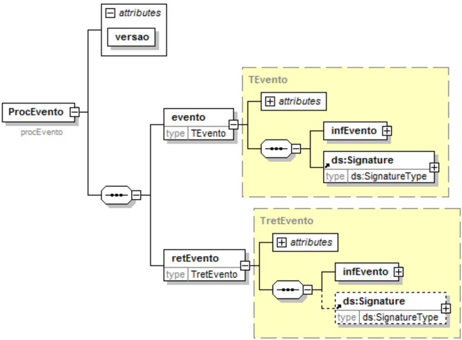


## 5.9. Web Service - NFeRecepcaoEvento - Cancelamento / Cancelamento por substituição

(Atualizado pela NT 2018.004)

Função :  evento  destinado  ao  atendimento  de  solicitações  de  cancelamento  de  NF-e/NFC-e.  O evento de cancelamento por substituição é específico para NFC-e.

Autor do Evento :  O autor do evento é o emissor da NF-e e a NF-e deve existir no banco de dados da SEFAZ. A mensagem XML do evento será assinada com o certificado digital do emitente da NF-e. No caso do emitente pessoa jurídica, poderá ser usado o certificado digital da matriz ou de qualquer filial da empresa (mesmo CNPJ-Base)'.

## Códigos dos Eventos:

- 110111 - 'Cancelamento'
- 110112 - 'Cancelamento por substituição'

## 5.9.1. Leiaute Mensagem de Entrada

Entrada: Estrutura XML da parte específica do evento, a ser inserida na tag detEvento (P17) da Parte Geral do Web Service de Registro de Eventos especificada na seção 5.8 .

Schema XML: envEventoCancNFe\_v1.00.xsd  (tpEvento=110111) Schema XML: envEventoCancSubst\_v1.00.xsd  (tpEvento=110112)

Tabela 5-37 - Leiaute Mensagem de Entrada do Web Service NFeRecepcaoEvento - Cancelamento

| #   | Campo       | Ele   | Pai   | Tipo   | Ocor.   | Tam.   | Descrição/Observação                                                                                                                                                                                   |
|-----|-------------|-------|-------|--------|---------|--------|--------------------------------------------------------------------------------------------------------------------------------------------------------------------------------------------------------|
| P18 | versao      | A     | P17   | N      | 1-1     | 2v2    | Informar o mesmo valor da tag 'verEvento' (P16)                                                                                                                                                        |
| P19 | descEvento  | E     | P17   | C      | 1-1     | 5-60   | Vejaa descrição do evento,juntocom o Tipo de Evento documentado anteriormente.                                                                                                                         |
| P20 | cOrgaoAutor | E     | P17   | N      | 1-1     | 2      | Código do Órgão Autor do Evento.Informar o Código da UF para este Evento. Nota: Campo exclusivo do Evento'110112 - Cancelamento por substituição'.                                                     |
| P21 | tpAutor     | E     | P17   | N      | 1-1     | 1      | Informar 1=Empresa Emitente. Valores: 1=Empresa Emitente, 2=Empresa destinatária; 3=Empresa; 5=Fisco; 6=RFB; 9=Outros Órgãos; Nota: Campo exclusivo do Evento'110112 - Cancelamento por substituição'. |
| P22 | verAplic    | E     | P17   | C      | 1-1     | 1-20   | Versão do aplicativo do Autor do Evento. Nota: Campo exclusivo do Evento'110112 - Cancelamento por substituição'.                                                                                      |
| P23 | nProt       | E     | P17   | N      | 1-1     | 15     | Informar o número do Protocolo de Autorização da NF- e a ser Cancelada.                                                                                                                                |
| P30 | xJust       | E     | P17   | C      | 1-1     | 15-255 | Informar a justificativa do cancelamento                                                                                                                                                               |
| P31 | chNFeRef    | E     | P17   | N      | 1-1     | 44     | Informa a chave deacesso da NF-e substituta da NF-e a ser cancelada. Nota: Campo exclusivo do Evento'110112 - Cancelamento por substituição'.                                                          |

## 5.9.2. Leiaute Mensagem de Retorno

Retorno : Estrutura XML com a mensagem do resultado da transmissão, conforme retorno do Web Service de Registro de Eventos - Parte Geral, especificado no item 5.8.2 .

Descrição do resultado do processamento do evento (xEvento): 'Cancelamento homologado'


Schema XML: retEnvEventoCancNFe\_v1.00.xsd  (tpEvento=110111)

Schema XML: retEventoCancSubst\_v1.00.xsd  (tpEvento=110112)

O leiaute desta mensagem de retorno não apresenta nenhuma diferença com relação à Schema XML: retEnvEvento\_v1.00.xsd

Tabela 5-33.

## 5.9.3. Regras de Validação

Serão  aplicadas  as  regras  de  validação  gerais  apresentadas  no  item 5.8.4 e  as  regras  de  negócio específicas que podem ser vistas na Tabela 5-38 (NT 2018.004).

Tabela 5-38 - Regras de Validação Específicas dos Eventos Cancelamento de NF-e e Cancelamento  por Substituição

| #      | Regra de Validação                                                                                                                                                                                                 | Aplic.   |   Msg | Efeito   | Descrição Erro                                                             |
|--------|--------------------------------------------------------------------------------------------------------------------------------------------------------------------------------------------------------------------|----------|-------|----------|----------------------------------------------------------------------------|
| P12-40 | • UF da Chave de Acessodiverge da UF Autorizadora                                                                                                                                                                  | Obrig.   |   249 | Rej.     | Rejeição: UF da Chave de Acessodiverge da UF autorizadora                  |
| P12-44 | • CNPJ/CPFdo Autor diverge do CNPJ/CPFda Chave deAcesso Nota: Considerar a Série para determinar se CNPJ/CPFna Chave de Acesso.CNPJ: Série=[0-909], CPF: Série<>[0-909]                                            | Obrig.   |   574 | Rej.     | Rejeição: Autor do eventodiverge do emissor da NF-e                        |
| P12-48 | • Se tpEvento=110112 e NF-ecom Tipo de Emissão diferentede1-Normal                                                                                                                                                 | Obrig.   |   920 | Rej.     | Rejeição: Tipo de emissão da NF-e a ser cancelada deveser normal           |
| P13-10 | Data do eventomaior que a data de processamento(aceitar tolerância deaté 5 minutos) (*1)                                                                                                                           | Obrig.   |   578 | Rej.     | Rejeição: A data do eventonão pode ser maior quea data do processamento    |
| P15-10 | Número desequência do eventodiferentede 1                                                                                                                                                                          | Obrig.   |   594 | Rej.     | Rejeição: Númerode sequência do eventoinformado é maior do que o permitido |
| P20-10 | UF do Autor (cOrgaoAutor) diverge da UF da Chave deAcesso                                                                                                                                                          | Obrig.   |   455 | Rej.     | Rejeição: Órgão Autor do eventodifere da UF da Chave deAcesso              |
| P21-10 | Tipo do Autor difere de '1=Empresa Emitente'                                                                                                                                                                       | Obrig.   |   466 | Rej.     | Rejeição: Evento com Tipo de Autor incompatível                            |
| P31-10 | Se tpEvento=110112, validar a Chave de Acesso substituta (tag:chNFeRef): • Dígito verificador inválido                                                                                                             | Obrig.   |   910 | Rej.     | Rejeição: Chave deAcesso NFeSubstituta inválida (Dígito)                   |
| P31-14 | • Código UFinválido                                                                                                                                                                                                | Obrig.   |   910 | Rej.     | Rejeição: Chave deAcesso NFeSubstituta inválida (Código UF)                |
| P31-18 | • Ano < 06 ou Ano maior que Ano corrente                                                                                                                                                                           | Obrig.   |   910 | Rej.     | Rejeição: Chave deAcesso NFeSubstituta inválida (Ano)                      |
| P31-22 | • Mês =0 ou Mês> 12                                                                                                                                                                                                | Obrig.   |   910 | Rej.     | Rejeição: Chave deAcesso NFeSubstituta inválida (Mês)                      |
| P31-26 | • CNPJ/CPFzerado ou dígito inválido Nota: Considerar a Série para determinar se CNPJ/CPFna Chave de Acesso.CNPJ: Série=[0-909], CPF: Série<>[0-909]                                                                | Obrig.   |   910 | Rej.     | Rejeição: Chave deAcesso NFeSubstituta inválida (CNPJ/CPF)                 |
| P31-30 | • Modelo diferentede55 ou 65                                                                                                                                                                                       | Obrig.   |   910 | Rej.     | Rejeição: Chave deAcesso NFe Substituta inválida (Modelo)                  |
| P31-34 | • Número NF= 0                                                                                                                                                                                                     | Obrig.   |   910 | Rej.     | Rejeição: Chave deAcesso NFeSubstituta inválida (Número)                   |
| P31-38 | • Chave deAcesso da NF-e Substituta igual a Chave deAcesso da NF-e a ser cancelada                                                                                                                                 | Obrig.   |   911 | Rej.     | Rejeição: Chave deAcesso NFeSubstituta incorreta (mesmaChave de Acesso)    |
| P31-42 | • Chave deAcesso da NF-e Substituta com UF divergenteda Chave de Acessoda NF-e a ser cancelada                                                                                                                     | Obrig.   |   911 | Rej.     | Rejeição: Chave deAcesso NFeSubstituta incorreta (Código da UF)            |
| P31-46 | • Chave deAcesso da NF-e Substituta com CNPJ/CPFdivergenteda Chavede Acessoda NF-e a ser cancelada Nota: Considerar a Série para determinar se CNPJ/CPFna Chave de Acesso.CNPJ: Série=[0-909], CPF: Série<>[0-909] | Obrig.   |   911 | Rej.     | Rejeição: Chave deAcesso NFeSubstituta incorreta (CNPJ/CPF)                |

## Nota Fiscal Eletrônica

MOC 7.0 - Visão Geral


| #                                                                                                                                                                                                                                                                                                                                                  | Regra de Validação                                                                                                                                                                                                                                                                                                                                                                           | Aplic.                                                                                                                                                                                                                                                                                                                                             | Msg                                                                                                                                                                                                                                                                                                                                                | Efeito                                                                                                                                                                                                                                                                                                                                             | Descrição Erro                                                                                                                                                                                                                                                                                                                                     |
|----------------------------------------------------------------------------------------------------------------------------------------------------------------------------------------------------------------------------------------------------------------------------------------------------------------------------------------------------|----------------------------------------------------------------------------------------------------------------------------------------------------------------------------------------------------------------------------------------------------------------------------------------------------------------------------------------------------------------------------------------------|----------------------------------------------------------------------------------------------------------------------------------------------------------------------------------------------------------------------------------------------------------------------------------------------------------------------------------------------------|----------------------------------------------------------------------------------------------------------------------------------------------------------------------------------------------------------------------------------------------------------------------------------------------------------------------------------------------------|----------------------------------------------------------------------------------------------------------------------------------------------------------------------------------------------------------------------------------------------------------------------------------------------------------------------------------------------------|----------------------------------------------------------------------------------------------------------------------------------------------------------------------------------------------------------------------------------------------------------------------------------------------------------------------------------------------------|
| P31-50                                                                                                                                                                                                                                                                                                                                             | • Chave deAcesso da NF-e Substituta com Ano- Mês inválido: o chNFeRef(Ano-Mês)>chNFe(Ano-Mês)ou o chNFeRef(Ano-Mês)<chNFe(Ano-Mês) - 1                                                                                                                                                                                                                                                       | Obrig.                                                                                                                                                                                                                                                                                                                                             | 911                                                                                                                                                                                                                                                                                                                                                | Rej.                                                                                                                                                                                                                                                                                                                                               | Rejeição: Chave deAcesso NFeSubstituta incorreta (Ano-Mes)                                                                                                                                                                                                                                                                                         |
| P31-52                                                                                                                                                                                                                                                                                                                                             | • Chave deAcesso da NF-e Substituta com Modelo divergenteda Chave de Acessoda NF-e a ser cancelada                                                                                                                                                                                                                                                                                           | Obrig.                                                                                                                                                                                                                                                                                                                                             | 911                                                                                                                                                                                                                                                                                                                                                | Rej.                                                                                                                                                                                                                                                                                                                                               | Rejeição: Chave deAcesso NFe Substituta incorreta (Modelo)                                                                                                                                                                                                                                                                                         |
| ***Banco deDados: Emitente                                                                                                                                                                                                                                                                                                                         | ***Banco deDados: Emitente                                                                                                                                                                                                                                                                                                                                                                   | ***Banco deDados: Emitente                                                                                                                                                                                                                                                                                                                         | ***Banco deDados: Emitente                                                                                                                                                                                                                                                                                                                         | ***Banco deDados: Emitente                                                                                                                                                                                                                                                                                                                         | ***Banco deDados: Emitente                                                                                                                                                                                                                                                                                                                         |
| 1P10-10                                                                                                                                                                                                                                                                                                                                            | Acesso ao Cadastro deContribuintes (Chave:CNPJ do Autor): • Verificar se Emitentenão autorizado a emitir NF-e                                                                                                                                                                                                                                                                                | Obrig.                                                                                                                                                                                                                                                                                                                                             | 203                                                                                                                                                                                                                                                                                                                                                | Rej.                                                                                                                                                                                                                                                                                                                                               | Rejeição: Emissor não habilitado para emissão de NF- e                                                                                                                                                                                                                                                                                             |
| 1P10-20                                                                                                                                                                                                                                                                                                                                            | • Verificar situação fiscal do emitente                                                                                                                                                                                                                                                                                                                                                      | Obrig.                                                                                                                                                                                                                                                                                                                                             | 240                                                                                                                                                                                                                                                                                                                                                | Rej.                                                                                                                                                                                                                                                                                                                                               | Rejeição: Irregularidade fiscal do emitente                                                                                                                                                                                                                                                                                                        |
| ***Banco deDados: NF-e                                                                                                                                                                                                                                                                                                                             | ***Banco deDados: NF-e                                                                                                                                                                                                                                                                                                                                                                       | ***Banco deDados: NF-e                                                                                                                                                                                                                                                                                                                             | ***Banco deDados: NF-e                                                                                                                                                                                                                                                                                                                             | ***Banco deDados: NF-e                                                                                                                                                                                                                                                                                                                             | ***Banco deDados: NF-e                                                                                                                                                                                                                                                                                                                             |
| 2P12-10                                                                                                                                                                                                                                                                                                                                            | Acesso BDNFE (Chave:CNPJ/CPFda Chave de Acesso,Modelo, Série e Número): • Chave Acessoinexistente para o tpEvento que exige a existência da NF-e (*1) Nota: Caso existano banco de dados umaNF-e com Chavede Acesso divergente, opcionalmente, deveráser concatenado a Chave deAcesso existentena descrição do erro, caso o CNPJ/CPFdo Autor do Evento sejao mesmoCNPJ/CPFda Chavede Acesso. | Obrig.                                                                                                                                                                                                                                                                                                                                             | 494                                                                                                                                                                                                                                                                                                                                                | Rej.                                                                                                                                                                                                                                                                                                                                               | Rejeição: Chave deAcesso Inexistente (chNFe:999...999]                                                                                                                                                                                                                                                                                             |
| 2P12-14                                                                                                                                                                                                                                                                                                                                            | • Se tpEvento=110111 (Cancelamento Normal): verificar se NF-e autorizada há mais de 1 dia (24 horas). Nota: Considera a exceção deprazo definidaem legislação estadual                                                                                                                                                                                                                       | Obrig.                                                                                                                                                                                                                                                                                                                                             | 501                                                                                                                                                                                                                                                                                                                                                | Rej.                                                                                                                                                                                                                                                                                                                                               | Rejeição: Prazo de cancelamento superior ao previsto na Legislação                                                                                                                                                                                                                                                                                 |
| 2P12-18                                                                                                                                                                                                                                                                                                                                            | • Se tpEvento=110112 (Cancelamento por Substituição): verificar se NF-e autorizada há mais de 7 dias (168 horas). Nota: Considera a exceção deprazo definidaem legislação estadual                                                                                                                                                                                                           | Obrig.                                                                                                                                                                                                                                                                                                                                             | 501                                                                                                                                                                                                                                                                                                                                                | Rej.                                                                                                                                                                                                                                                                                                                                               | Rejeição: Prazo de cancelamento superior ao previsto na Legislação                                                                                                                                                                                                                                                                                 |
| 2P12-22                                                                                                                                                                                                                                                                                                                                            | • Verificar se NF-e estádenegada ou cancelada                                                                                                                                                                                                                                                                                                                                                | Obrig.                                                                                                                                                                                                                                                                                                                                             | 580                                                                                                                                                                                                                                                                                                                                                | Rej.                                                                                                                                                                                                                                                                                                                                               | Rejeição: Evento exige umaNF-eautorizada                                                                                                                                                                                                                                                                                                           |
| 2P13-10                                                                                                                                                                                                                                                                                                                                            | • Data do eventomenor que a Data de Emissão da NF-e (*1)                                                                                                                                                                                                                                                                                                                                     | Obrig.                                                                                                                                                                                                                                                                                                                                             | 577                                                                                                                                                                                                                                                                                                                                                | Rej.                                                                                                                                                                                                                                                                                                                                               | Rejeição: A data do eventonão pode ser menorque a data deemissão da NF-e                                                                                                                                                                                                                                                                           |
| 2P13-14                                                                                                                                                                                                                                                                                                                                            | • Data do eventomenor que a Data de Autorização da NF-enão emitida em contingência (tpEmis=1)                                                                                                                                                                                                                                                                                                | Obrig.                                                                                                                                                                                                                                                                                                                                             | 579                                                                                                                                                                                                                                                                                                                                                | Rej.                                                                                                                                                                                                                                                                                                                                               | Rejeição: A data do eventonão pode ser menorque a data deautorização da NF-e                                                                                                                                                                                                                                                                       |
| Nota: Nacomparação acima, aceitar uma tolerância de 5 minutos, devido ao sincronismo de horário entreo servidor da Empresa e o servidor da SEFAZ Autorizadora. 2P23-10 • Número do Protocolo informado diverge do número do Protocolo da NF-e Obrig. 222 Rej. Rejeição: Protocolo deAutorização deUso diferedo cadastrado ***Banco deDados: Evento | Nota: Nacomparação acima, aceitar uma tolerância de 5 minutos, devido ao sincronismo de horário entreo servidor da Empresa e o servidor da SEFAZ Autorizadora. 2P23-10 • Número do Protocolo informado diverge do número do Protocolo da NF-e Obrig. 222 Rej. Rejeição: Protocolo deAutorização deUso diferedo cadastrado ***Banco deDados: Evento                                           | Nota: Nacomparação acima, aceitar uma tolerância de 5 minutos, devido ao sincronismo de horário entreo servidor da Empresa e o servidor da SEFAZ Autorizadora. 2P23-10 • Número do Protocolo informado diverge do número do Protocolo da NF-e Obrig. 222 Rej. Rejeição: Protocolo deAutorização deUso diferedo cadastrado ***Banco deDados: Evento | Nota: Nacomparação acima, aceitar uma tolerância de 5 minutos, devido ao sincronismo de horário entreo servidor da Empresa e o servidor da SEFAZ Autorizadora. 2P23-10 • Número do Protocolo informado diverge do número do Protocolo da NF-e Obrig. 222 Rej. Rejeição: Protocolo deAutorização deUso diferedo cadastrado ***Banco deDados: Evento | Nota: Nacomparação acima, aceitar uma tolerância de 5 minutos, devido ao sincronismo de horário entreo servidor da Empresa e o servidor da SEFAZ Autorizadora. 2P23-10 • Número do Protocolo informado diverge do número do Protocolo da NF-e Obrig. 222 Rej. Rejeição: Protocolo deAutorização deUso diferedo cadastrado ***Banco deDados: Evento | Nota: Nacomparação acima, aceitar uma tolerância de 5 minutos, devido ao sincronismo de horário entreo servidor da Empresa e o servidor da SEFAZ Autorizadora. 2P23-10 • Número do Protocolo informado diverge do número do Protocolo da NF-e Obrig. 222 Rej. Rejeição: Protocolo deAutorização deUso diferedo cadastrado ***Banco deDados: Evento |
|                                                                                                                                                                                                                                                                                                                                                    | BDde Eventos (Chave:Chave deAcesso,                                                                                                                                                                                                                                                                                                                                                          |                                                                                                                                                                                                                                                                                                                                                    |                                                                                                                                                                                                                                                                                                                                                    |                                                                                                                                                                                                                                                                                                                                                    |                                                                                                                                                                                                                                                                                                                                                    |
| 3P15-10                                                                                                                                                                                                                                                                                                                                            | Acesso tpEvento,nSeqEvento): • Duplicidade do evento(tpEvento+ chNFe+ nSeqEvento) (*1)                                                                                                                                                                                                                                                                                                       | Obrig.                                                                                                                                                                                                                                                                                                                                             | 573                                                                                                                                                                                                                                                                                                                                                | Rej.                                                                                                                                                                                                                                                                                                                                               | Rejeição: Duplicidade de Evento                                                                                                                                                                                                                                                                                                                    |

## Nota Fiscal Eletrônica

MOC 7.0 - Visão Geral


| #                        | Regra de Validação                                                                                                                                                                                                                                                                                                                                                                                                        | Aplic.                   | Msg                      | Efeito                   | Descrição Erro                                                                                            |
|--------------------------|---------------------------------------------------------------------------------------------------------------------------------------------------------------------------------------------------------------------------------------------------------------------------------------------------------------------------------------------------------------------------------------------------------------------------|--------------------------|--------------------------|--------------------------|-----------------------------------------------------------------------------------------------------------|
| 4P15-14                  | Se NF-e (Modelo55): Acesso ao BD de Eventos (Chave:Chave de Acesso, tag:chNFe): • Existe eventode Manifestação do Destinatário o tpEvento = '210220 -Confirmação da Operação' Exceção: A NF-e podeter mais de umtipo de                                                                                                                                                                                                   | Obrig.                   | 221                      | Rej.                     | Rejeição: Confirmado o recebimentoda NF-e pelo destinatário                                               |
| 4P15-18                  | • Existe eventode Conhecimentode Transporte ou MDF-e Autorizado, tpEvento: o '610600 - CT- e Autorizado' (Cancelamento: 610601) o '610610 - MDF- e Autorizado' (Cancelamento: 610611) o '610614 - MDF-eAutorizado com CT- e' (Canc: 610615) Exceção:Uma NF-e podeparticipar de vários CT-e / MDF-e.Permitir o cancelamento se todos                                                                                       | Obrig.                   | 690                      | Rej.                     | Rejeição: Pedido deCancelamento para NF-ecom CT- e / MDF-e                                                |
| 4P15-22                  | • Existe eventode Registro de Passagem, tpEvento: o '610500 - Registro dePassagem NF- e'(Canc: 610501); o '610510 - Registro dePassagem MDF- e' (Canc: 610511) o '610514 - Registro PassagemMDF-e com CT- e' (Canc: 610515) o '610550 - Registro PassagemNF- e BRId' o '610552 - Registro PassagemAutomático MDF- e' o '610554 - Registro PassagemAutomático MDF-ecom CT- e' Exceção:Uma NF-e podeter vários Registros de | Obrig.                   | 219                      | Rej.                     | Rejeição: Circulação da NF-e verificada                                                                   |
| 4P15-26                  | correspondente eventodecancelamento. • Existe eventoda Suframa, tpEvento: o '990900 - Vistoria SUFRAMA'; o '9910910 - Internalização SUFRAMA';                                                                                                                                                                                                                                                                            | Obrig.                   | 304                      | Rej.                     | Rejeição: Pedido de Cancelamento para NF-ecom eventoda Suframa                                            |
| ***Banco deDados: NF-e_2 | ***Banco deDados: NF-e_2                                                                                                                                                                                                                                                                                                                                                                                                  | ***Banco deDados: NF-e_2 | ***Banco deDados: NF-e_2 | ***Banco deDados: NF-e_2 | ***Banco deDados: NF-e_2                                                                                  |
| 5P31-10                  | Se tpEvento=110112 (Cancelamento por Substituição): AcessoBD NFE (Chave:Chave de AcessoSubstituta, tag:chNFeRef): • Chave AcessoSubstituta inexistente                                                                                                                                                                                                                                                                    | Obrig.                   | 912                      | Rej.                     | Rejeição: NF-e Substituta inexistente                                                                     |
| 5P31-14                  | • Situação da NF-e = Denegadaou Cancelada                                                                                                                                                                                                                                                                                                                                                                                 | Obrig.                   | 913                      | Rej.                     | Rejeição: NF-e Substituta Denegada ou Cancelada                                                           |
| 5P31-20                  | • Data de emissão da NF-e substituta (chNFeRef) maior que 2 horas da data de emissão da NF-e a ser cancelada (chNFe)                                                                                                                                                                                                                                                                                                      | Obrig.                   | 914                      | Rej.                     | Rejeição: Data de emissão da NF-e Substituta maior que 2 horas da data de emissão da NF-e a ser cancelada |
| 5P31-24                  | • Valor total da NF-e substituta (chNFeRef) difere do valor total da NF-e a ser cancelada (chNFe)                                                                                                                                                                                                                                                                                                                         | Obrig.                   | 915                      | Rej.                     | Rejeição: Valor total da NF-e Substituta difere do valor da NF-e a ser cancelada                          |
| 5P31-28                  | • Valor total do ICMS da NF-e substituta (chNFeRef) diferedo valor total do ICMSda NF- e a ser cancelada (chNFe)                                                                                                                                                                                                                                                                                                          | Obrig.                   | 916                      | Rej.                     | Rejeição: Valor total do ICMS da NF-e Substituta diferedo valor da NF-e a ser cancelada                   |


| #                        | Regra de Validação                                                                                                                                                                                | Aplic.                   | Msg                      | Efeito                   | Descrição Erro                                                                                                              |
|--------------------------|---------------------------------------------------------------------------------------------------------------------------------------------------------------------------------------------------|--------------------------|--------------------------|--------------------------|-----------------------------------------------------------------------------------------------------------------------------|
| 5P31-32                  | • Identificação do destinatário (CNPJ/CPF/ID Estrangeiro, IE) da NF-e substituta (chNFeRef) difere da identificação do destinatário da NF-e a ser cancelada (chNFe).                              | Obrig.                   | 917                      | Rej.                     | Rejeição: Identificação do destinatário da NF-e Substituta difere da identificação do destinatário da NF-e a ser cancelada. |
| 5P31-36                  | • Quantidade de Itensda NF-e substituta (chNFeRef) difere da quantidade de itens da NF-e a ser cancelada (chNFe).                                                                                 | Obrig.                   | 918                      | Rej.                     | Rejeição: Quantidade de itens da NF-e Substituta difere da quantidade de itens da NF-e a ser cancelada.                     |
| 5P31-40                  | • Verificar se o item da NF-e substituta (chNFeRef) diferedo respectivoitem da NF-e a ser cancelada (chNFe). Nota: Verificar divergência para os campos cProd, cEAN, xProd, NCM,CFOP, uCom, qCom, | Obrig.                   | 919                      | Rej.                     | Rejeição: Item da NF-e Substituta difere do mesmo item da NF-e a ser cancelada.                                             |
| 5P31-44                  | • Se tpEvento=110112 e chave da NF-e substituta com Tipo deEmissão igual a 1-Normal                                                                                                               | Obrig.                   | 921                      | Rej.                     | Rejeição: Tipo de emissão da NF-e substituta deveser de contingência                                                        |
| ***Banco deDados: NF-e_2 | ***Banco deDados: NF-e_2                                                                                                                                                                          | ***Banco deDados: NF-e_2 | ***Banco deDados: NF-e_2 | ***Banco deDados: NF-e_2 | ***Banco deDados: NF-e_2                                                                                                    |
|                          | Pedido deProrrogação deferidoimpedeo cancelamento da NF-e (NT 2015.001)                                                                                                                           | Obrig.                   | 811                      | Rej.                     | Rejeição: Pedido deProrrogação deferidoimpedeo cancelamento da NF-e                                                         |

## 5.9.4. Final do Processamento do Lote

O  resultado  do  processamento  do  lote  está  especificado  na  seção Web  Service de  Registro  de Eventos - Parte Geral, item 5.8.5 .

A SEFAZ autorizadora poderá aceitar o cancelamento fora de prazo, mantendo um código de retorno diferente para estes casos: status '155-Cancelamento  homologado fora de prazo'.

No  caso  do  Evento  de  Cancelamento  para  a  NFC-e,  o  pedido  de  cancelamento  fora  do  prazo  é rejeitado  com  o  código  de  erro  501  'Rejeição:  Prazo  de  cancelamento  superior  ao  previsto  na Legislação'.

Será  observada  uma  tolerância  na  comparação  do  horário  informado  no  evento  e  o  horário  da autorização  da  Nota  Fiscal,  devido  ao  sincronismo  de  horário  entre  o  servidor  da  Empresa  e  o servidor da SEFAZ Autorizadora.

Deverá ser impedido o cancelamento  da NF-e caso exista pelo menos um item do Pedido de Prorrogação de Prazo deferido pelo Fisco (tpEvento=411500  ou 411501, com statPedido=1).

No caso de rejeição do Pedido de Cancelamento da NF-e recebido pela empresa, o fisco usará o código de rejeição '811-Pedido de Prorrogação deferido impede o cancelamento da NF-e'.

Nota:  Como  o  mesmo  Pedido da Empresa (tag:'idPedido') pode ter diferentes respostas pelo Fisco, deve ser considerada a resposta do Fisco com maior 'nSeqEvento' de resposta do Fisco.

## 5.10. Web Service - NFeRecepcaoEvento - Carta de Correção

Função : evento destinado à correção de informações da NF-e.

A Carta de Correção é um evento para corrigir as informações da NF-e, prevista na cláusula décima quarta-A  do  Ajuste  SINIEF  07/05.  O  evento  será  utilizado  pelo  contribuinte  e  o  alcance  das alterações permitidas é definido no § 1º do art. 7º do Convênio SINIEF s/n de 1970:

'Art.  7º  Os documentos fiscais referidos nos incisos I a V do artigo anterior deverão ser extraídos por decalque a carbono ou em papel carbonado, devendo ser preenchidos a máquina ou  manuscritos  a tinta ou a lápis-tinta, devendo ainda os seus dizeres e indicações estar bem legíveis, em todas as vias.

(...)

- §  1º-A  Fica  permitida  a  utilização  de  carta  de  correção,  para  regularização  de  erro ocorrido na emissão de documento fiscal, desde que o erro não esteja relacionado com:
- I  -  as  variáveis  que  determinam o valor do imposto tais como: base de cálculo, alíquota, diferença de preço, quantidade,  valor da operação ou da prestação;
- II -a  correção  de  dados  cadastrais  que  implique  mudança  do  remetente  ou  do destinatário;

III - a data  de emissão ou de saída.'

O registro de uma nova Carta de Correção substitui a Carta de Correção anterior, assim a nova Carta de Correção deve conter todas as correções a serem consideradas.

Autor do Evento :  O autor do evento é o emissor da NF-e e a NF-e deve existir no banco de dados da SEFAZ. A mensagem XML do evento será assinada com o certificado digital do emitente da NF-e. No caso do emitente pessoa jurídica, poderá ser usado o certificado digital da matriz ou de qualquer filial da empresa (mesmo CNPJ-Base)'.

Código do Evento: 110110

## 5.10.1. Leiaute Mensagem de Entrada

Entrada: Estrutura XML da parte específica do evento, a ser inserida na tag detEvento (P17) da Parte Geral do Web Service de Registro de Eventos especificada na seção 5.8 .

## Schema XML: envCCe\_v9.99.xsd

Tabela 5-39 - Leiaute Mensagem de Entrada do Web Service NFeRecepcaoEvento - Carta Correção

| #     | Campo      | Ele   | Pai   | Tipo   | Ocor.   | Tam.    | Descrição/Observação                                                                                                                                                                                                                                                                                                                                                                                                                                                                                                                                                                                                                                                                                                                                                                                                                                                                                                                                                                                                                                                                                                                                                               |
|-------|------------|-------|-------|--------|---------|---------|------------------------------------------------------------------------------------------------------------------------------------------------------------------------------------------------------------------------------------------------------------------------------------------------------------------------------------------------------------------------------------------------------------------------------------------------------------------------------------------------------------------------------------------------------------------------------------------------------------------------------------------------------------------------------------------------------------------------------------------------------------------------------------------------------------------------------------------------------------------------------------------------------------------------------------------------------------------------------------------------------------------------------------------------------------------------------------------------------------------------------------------------------------------------------------|
| HP18  | versao     | A     | P17   |        | 1-1     |         | Versão da carta de correção                                                                                                                                                                                                                                                                                                                                                                                                                                                                                                                                                                                                                                                                                                                                                                                                                                                                                                                                                                                                                                                                                                                                                        |
| HP19  | descEvento | E     | P17   | C      | 1-1     | 5-60    | 'Carta de Correção' ou 'Carta de Correcao'                                                                                                                                                                                                                                                                                                                                                                                                                                                                                                                                                                                                                                                                                                                                                                                                                                                                                                                                                                                                                                                                                                                                         |
| HP20  | xCorrecao  | E     | P17   | C      | 1-1     | 15-1000 | Correção a ser considerada, textolivre. A correção mais recente substitui as anteriores.                                                                                                                                                                                                                                                                                                                                                                                                                                                                                                                                                                                                                                                                                                                                                                                                                                                                                                                                                                                                                                                                                           |
| HP20a | xCondUso   | E     | P17   | C      | 1-1     | -       | Condições de uso da Carta de Correção, informar a literal : 'A Carta de Correção é disciplinada pelo § 1º -A do art. 7º do Convênio S/N, de15 de dezembrode1970 e podeser utilizada para regularização de erro ocorrido na emissão dedocumento fiscal, desde que o erro não estejarelacionado com: I - as variáveis quedeterminam o valor do imposto tais como: basede cálculo, alíquota, diferença de preço, quantidade, valor da operação ou da prestação; II - a correção de dados cadastrais que implique mudança do remetenteoudo destinatário; III - a data de emissão ou de saída.' (textocom acentuação) ou 'A Carta de Correcao e disciplinada pelo paragrafo 1o -A do art. 7o do ConvenioS/N, de 15 de dezembro de 1970 epode ser utilizada para regularizacao de erro ocorrido na emissao dedocumento fiscal, desdeque o erro nao estejarelacionado com: I - as variaveis que determinam o valor do imposto tais como: base de calculo, aliquota, diferencade preco, quantidade, valor da operacao ou da prestacao; II - a correcao de dados cadastrais que implique mudanca do remetenteoudo destinatario; III - a data de emissao ou de saida.' (textosem acentuação) |


## 5.10.2. Leiaute Mensagem de Retorno

Retorno : Estrutura XML com a mensagem do resultado da transmissão, conforme retorno do Web Service de Registro de Eventos - Parte Geral, especificado no item 5.8.2 .

Descrição do resultado do processamento do evento (xEvento): Carta de Correção registrada

## Schema XML: retEnvCCe\_v9.99.xsd

O leiaute desta mensagem de retorno não apresenta nenhuma diferença com relação à Schema XML: retEnvEvento\_v1.00.xsd Tabela 5-33.

## 5.10.3. Regras de Validação

Serão  aplicadas  as  regras  de  validação  gerais  apresentadas  no  item 5.8.4 e  as  regras  de  negócio específicas que podem ser vistas na  Tabela 5-40(NT 2018.004).

Tabela 5-40 - Regras de Validação Específicas do Evento Carta de Correção

| #     | Regra de Validação                                                              | Aplic.   |   Msg | Efeito   | Descrição Erro                                                            |
|-------|---------------------------------------------------------------------------------|----------|-------|----------|---------------------------------------------------------------------------|
| GA01  | Verificar se a NF-e está autorizada (não pode estar cancelada nemdenegada)      | Obrig.   |   580 | Rej.     | Rejeição: Oeventoexigeuma NF-e autorizada                                 |
| GA03  | Verificar o sequencialdo evento(P15 - nSeqEvento)é valor válido (1-20)          | Obrig.   |   594 | Rej.     | Rejeição: Onúmero de sequenciado evento informado é maior que o permitido |
| GA03a | Se Modelo = 65: NFC-enão permite o eventode Carta de Correção                   | Obrig.   |   784 | Rej.     | Rejeição: NFC-enão permite o eventode Carta de Correção                   |
| GA04  | Acesso Cadastro Contribuinte: - Verificar Emitente não autorizado a emitir NF-e | Obrig.   |   203 | Rej.     | Rejeição: Emissor não habilitado para emissão de NF-e                     |
| GA05  | - Verificar Situação Fiscal irregular do Emitente                               | Obrig.   |   240 | Rej.     | Rejeição: Cancelamento/Inutilização - Irregularidade Fiscal do Emitente   |

## 5.10.4. Final do Processamento do Lote

O  resultado  do  processamento  do  lote  está  especificado  na  seção Web  Service de  Registro  de Eventos - Parte Geral, item 5.8.5.

## 5.10.5. Disponibilização  do Evento

O  arquivo  digital  da  Carta  de  Correção  com  a  respectiva  informação  de  Registro  do  Evento  da SEFAZ faz parte integrante da NF-e e também deve ser disponibilizado para o destinatário e para o transportador.


SNFeNFCe

## 5.11. Web Service - NFeRecepcaoEvento - Manifestação do Destinatário

## SistemadeRegistrodeEventos

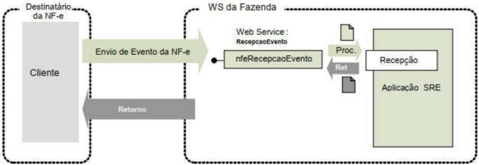

Processo:

síncrono.

Método:

nfeRecepcaoEvento

Função : permite  que  o  destinatário  da  Nota  Fiscal  eletrônica  confirme  a  sua  participação  na operação acobertada pela Nota Fiscal eletrônica emitida para o seu CNPJ/CPF, através do envio da mensagem de:

- Confirmação  da  Operação -  confirmando  a  ocorrência  da  operação  e  o  recebimento  da mercadoria (para as operações com circulação de mercadoria);
- Desconhecimento da Operação - declarando o desconhecimento  da operação;
- Operação  Não  Realizada -  declarando  que  a  operação  não  foi  realizada  (com  recusa  do Recebimento da mercadoria e outros) e a justificativa do porquê a operação não se realizou;
- Ciência  da  Emissão (ou  Ciência  da  Operação)  -  declarando  ter  ciência  da  operação  destinada ao  CNPJ,  mas  ainda  não  possuir  elementos  suficientes  para  apresentar  uma  manifestação conclusiva, como as acima citadas. Este evento era chamado de Ciência da Operação.

Uma listagem destes eventos pode ser encontrada no item 3.2.1 .

Autor  do  Evento :  destinatário  da  NF-e.  A  mensagem  XML  do  evento  será  assinada  com  o certificado digital que tenha o CNPJ-Base (8 primeiras posições do CNPJ) ou CPF do Destinatário da NF-e.

A ciência da emissão é um evento opcional que pode ser utilizado pelo destinatário para declarar que tem  ciência  da  existência  da  operação,  mas  ainda  não  tem  elementos  suficientes  para  apresentar uma  manifestação  conclusiva.  O  destinatário  deve  apresentar  uma  manifestação  conclusiva  dentro de um prazo máximo definido, contados a partir da data de autorização da NF-e.

## Código do Tipo de Evento:

- 210200 - Confirmação da Operação
- 210210 - Ciência da Emissão
- 210220 - Desconhecimento da Operação
- 210240 - Operação não Realizada

## 5.11.1. Leiaute Mensagem de Entrada

Entrada: Estrutura XML da parte específica do evento, a ser inserida na tag detEvento (P17) da Parte Geral do Web Service de Registro de Eventos especificada na seção 5.8 .

Schema XML: envConfRecebto\_v9.99.xsd


Tabela 5-41 - Leiaute Mensagem de Entrada do Web Service NFeRecepcaoEvento - Manifestação do Destinatário

| #    | Campo      | Ele   | Pai   | Tipo   | Ocor.   | Tam.   | Descrição/Observação                                                                                                                 |
|------|------------|-------|-------|--------|---------|--------|--------------------------------------------------------------------------------------------------------------------------------------|
| HP18 | versao     | A     | P17   | N      | 1-1     | 2v2    | Versão do evento                                                                                                                     |
| HP19 | descEvento | E     | P17   | C      | 1-1     | 5-60   | Informar a descrição do evento: Confirmacao da Operacao Ciencia da Operacao Desconhecimentoda Operacao Operacao nao Realizada        |
| HP20 | xJust      | E     | P17   | C      | 0-1     | 15-255 | Informar a justificativa porque a operação não foi realizada, estecampo deveser informado somenteno eventode Operação não Realizada. |

## 5.11.2. Leiaute Mensagem de Retorno

Retorno : Estrutura XML com a mensagem do resultado da transmissão, conforme retorno do Web Service de Registro de Eventos - Parte Geral, especificado no item 5.8.2 .

## Descrição do resultado do processamento do evento (xEvento):

- Confirmacao de Operacao registrada
- Ciencia da Operacao registrada
- Desconhecimento da Operacao registrada
- Operacao nao Realizada registrada

## Schema XML: retEnvConfRecebto \_v9.99.xsd

O leiaute desta mensagem de retorno não apresenta nenhuma diferença com relação à Schema XML: retEnvEvento\_v1.00.xsd Tabela 5-33.

## 5.11.3. Regras de Validação

Serão  aplicadas  as  regras  de  validação  gerais  apresentadas  no  item 5.8.4 e  as  regras  de  negócio específicas que podem ser vistas na Tabela 5-42.

Tabela 5-42 - Regras de Validação da Específicas do Evento Manifestação  do Destinatário

| #   | Regra de Validação                                                                                                                                                                  | Aplic.   |   Msg | Efeito   | Descrição Erro                                                                            |
|-----|-------------------------------------------------------------------------------------------------------------------------------------------------------------------------------------|----------|-------|----------|-------------------------------------------------------------------------------------------|
| H01 | Evento de'Operação não Realizada' deveteruma justificativa                                                                                                                          | Obrig.   |   595 | Rej.     | Rejeição: Obrig.atória a informação da justificativa do evento.                           |
| H02 | OnSeqEventodeveser = 1                                                                                                                                                              | Obrig.   |   594 | Rej.     | Rejeição: Onúmero de sequenciado evento informado é maior que o permitido                 |
| H03 | Verificar prazo de recepção do evento,em relação a data da autorização                                                                                                              | Obrig.   |   596 | Rej.     | Rejeição: Evento apresentadofora do prazo: [prazo vigente]                                |
| H04 | Evento de'Ciência da Emissão' para NF -e Cancelada ou Denegada                                                                                                                      | Obrig.   |   650 | Rej.     | Rejeição: Evento de "Ciência da Emissão" para NF-e Cancelada ou Denegada                  |
| H05 | Evento de'Desconhecimento da Operação' para NF - e Cancelada ou Denegada                                                                                                            | Obrig.   |   651 | Rej.     | Rejeição: Evento de"Desconhecimento da Operação" para NF-e Cancelada ou Denegada          |
| H06 | Evento de "Ciência da Emissão" informado após a Manifestação final do destinatário (Confirmação da Operação, Operação não Realizada ou Desconhecimento).                            | Obrig.   |   655 | Rej.     | Rejeição: Evento deCiência da Emissão informado após a manifestação final do destinatário |
| H07 | Se Eventodo Destinatário, verificar seUF do destinatário corresponde a UF do Web Service (Nota: esta validação não se aplica para o AmbienteNacional, no atendimentode todas as UF) | Obrig.   |   658 | Rej.     | Rejeição: UF do destinatário da Chave de Acesso diverge da UF autorizadora                |

## 5.11.4. Final do Processamento do Lote

O  resultado  do  processamento  do  lote  está  especificado  na  seção Web  Service de  Registro  de Eventos - Parte Geral, item 5.8.5.

## 5.12. Web Service - NFeRecepcaoEvento - EPEC

Função: permite  à  empresa  solicitar  o  registro  do  " Evento Prévio de Emissão em  Contingência " anterior  à  emissão  do  documento  em  si  com  um  leiaute  mínimo  de  informações.  A  seção 3.2.3 apresenta uma visão geral desse evento.

Autor  do  Evento: O  autor  do  evento  é  o  emissor  da  NF-e.  A  mensagem  XML  do  evento  será assinada com o certificado digital que tenha o CNPJ base do Emissor da NF-e.

Código do Tipo de Evento:

110140

## 5.12.1. Leiaute Mensagem de Entrada

Entrada: Estrutura XML da parte específica do evento, a ser inserida na tag detEvento (P17) da Parte Geral do Web Service de Registro de Eventos especificada na seção 5.8 .

## Schema XML: envEPEC\_v1.00.xsd

Tabela 5-43 - Leiaute Mensagem de Entrada do Web Service NFeRecepcaoEvento - EPEC

| #   | Campo         | Ele   | Pai   | Tipo   | Ocor.   | Tam.   | Descrição/Observação                                                                                                                                                                 |
|-----|---------------|-------|-------|--------|---------|--------|--------------------------------------------------------------------------------------------------------------------------------------------------------------------------------------|
| P18 | versao        | A     | P17   | N      | 1-1     | 2v2    | Informar o mesmo valor da tag verEvento (P16).                                                                                                                                       |
| P19 | descEvento    | E     | P17   | C      | 1-1     | 5-60   | 'EPEC'                                                                                                                                                                               |
| P20 | cOrgaoAutor   | E     | P17   | N      | 1-1     | 2      | Código do Órgão do Autor do Evento. Nota: Informar o código da UF do Emitente para este evento.                                                                                      |
| P21 | tpAutor       | E     | P17   | N      | 1-1     | 1      | Informar "1=Empresa Emitente" para este evento. Nota: 1=Empresa Emitente; 2=Empresa Destinatária; 3=Empresa; 5=Fisco; 6=RFB; 9=Outros Órgãos.                                        |
| P22 | verAplic      | E     | P17   | C      | 1-1     | 1-20   | Versão do aplicativo do Autor do Evento.                                                                                                                                             |
| P23 | dhEmi         | E     | P17   | D      | 1-1     |        | Data e hora no formato UTC (Universal Coordinated Time): "AAAA-MM-DDThh:mm:ssTZD".                                                                                                   |
| P24 | tpNF          | E     | P17   | N      | 1-1     | 1      | 0=Entrada; 1=Saída;                                                                                                                                                                  |
| P25 | IE            | E     | P17   | N      | 1-1     | 2-14   | IE do Emitente                                                                                                                                                                       |
| P26 | dest          | G     | P17   |        | 1-1     |        |                                                                                                                                                                                      |
| P27 | UF            | E     | P26   | C      | 1-1     | 2      | Sigla da UF do destinatário. Informar 'EX' no caso de operação com o exterior.                                                                                                       |
| P28 | CNPJ          | CE    | P26   | N      | 1-1     | 14     | Informar o CPF ou o CNPJ do destinatário, preenchendo os zeros não significativos. No caso de operação com exterior,ou para comprador estrangeiro,                                   |
| P29 | CPF           | CE    | P26   | N      | 1-1     | 11     | Informar o CPF ou o CNPJ do destinatário, preenchendo os zeros não significativos. No caso de operação com exterior,ou para comprador estrangeiro,                                   |
| P30 | idEstrangeiro | CE    | P26   | C      | 1-1     | 0,     | Informar o CPF ou o CNPJ do destinatário, preenchendo os zeros não significativos. No caso de operação com exterior,ou para comprador estrangeiro,                                   |
| P31 | IE            | E     | P26   | N      | 0-1     | 2-14   | Informar a IE do destinatário somentequando o contribuinte destinatário possuiruma inscrição estadual. Omitir a tag no caso dedestinatário 'ISENTO', ou destinatário não possuir IE. |
| P32 | vNF           | E     | P17   | N      | 1-1     | 13v2   | Valor total da NF-e                                                                                                                                                                  |
| P33 | vICMS         | E     | P17   | N      | 1-1     | 13v2   | Valor total do ICMS                                                                                                                                                                  |
| P34 | vST           | E     | P17   | N      | 1-1     | 13v2   | Valor total do ICMS deSubstituição Tributária                                                                                                                                        |
| P91 | Signature     | G     | P04   | XML    | 1-1     |        | Assinatura Digital do documento XML, a assinatura deveráser aplicada no elementoinfEvento                                                                                            |


## 5.12.2. Leiaute Mensagem de Retorno

Retorno : Estrutura XML com a mensagem do resultado da transmissão, conforme retorno do Web Service de Registro de Eventos - Parte Geral, especificado no item 5.8.2 .

Descrição do resultado do processamento do evento (xEvento): EPEC autorizado

## Schema XML: retEnvEPEC\_v1.00

No caso de evento registrado  com  sucesso,  serão  retornados  campos  opcionais listados na Tabela 5-44, seguindo a mensagem geral de retorno descrita na

Schema XML: retEnvEvento\_v1.00.xsd

Tabela 5-33.

Tabela 5-44 - Leiaute Mensagem de Retorno  do Web Service NFeRecepcaoEvento - EPEC

| #   | Campo       | Ele   | Pai   | Tipo   | Ocor.   |   Tam. | Descrição/Observação                                                       |
|-----|-------------|-------|-------|--------|---------|--------|----------------------------------------------------------------------------|
| R22 | cOrgaoAutor | E     | HR11  | N      | 0-1     |      2 | Idema mensagemde entrada.                                                  |
| R32 | chNFePend   | E     | R11   | N      | 0-50    |     44 | Relação de Chavesde Acesso deEPEC pendentesde conciliação, existentesnoAN. |

A  relação  de  Chaves  de  Acesso  pendentes  de  conciliação  (tag:chNFePend)  será  disponibilizada sempre  que  o  ambiente  de  autorização  do  EPEC  estiver  bloqueado  para  o  CNPJ  do  emitente (Rejeição '142-Ambiente de Contingência EPEC bloqueado para o Emitente'.

## 5.12.3. Regras de Validação

Serão  aplicadas  as  regras  de  validação  gerais  apresentadas  no  item 5.8.4 e  as  regras  de  negócio específicas que podem ser vistas na Tabela 5-45.

Tabela 5-45 - Regras de Validação Específicas do Evento Prévio de Emissão em Contingência

| #      | Regra de Validação                                                                                     | Aplic.   |   Msg | Efeito   | Descrição Erro                                                                             |
|--------|--------------------------------------------------------------------------------------------------------|----------|-------|----------|--------------------------------------------------------------------------------------------|
| P11-20 | Se informado CPF do Autor do evento: Evento não disponível para Autor pessoa física (CPF)              | Obrig.   |   408 | Rej.     | Rejeição: Evento não disponível para Autor pessoa física                                   |
| P11-21 | Se informado CPF do autor do evento,evento= EPEC e série difere da faixa [920-969] (NT 2014.001 v1.20) | Obrig.   |   495 | Rej.     | Rejeição: CPF do emitentecom série incompatível                                            |
| P12-32 | Validação da Chave deAcesso: Série difere da faixa [0-889] [920-969] (NT 2018.001) (NT 2014.001 v1.20) | Obrig.   |   266 | Rej.     | Rejeição: Série utilizada não permitida no Web Service                                     |
| P12-50 | Tipo de Emissão diferede '4' (posição 35 da Chave de Acesso)                                           | Obrig.   |   484 | Rej.     | Rejeição: Chave deAcesso com tipo de emissão diferentede 4 (posição 35 da Chave de Acesso) |
| P15-10 | Verificar se sequencialdo evento(nSeqEvento) difere de 1                                               | Obrig.   |   594 | Rej.     | Rejeição: Onúmero de sequênciado evento informado é maior que o permitido                  |
| P20-10 | Verificar se o órgão do Autor (cOrgaoAutor) difere da UF da Chave de Acesso(Evento do Emitente)        | Obrig.   |   455 | Rej.     | Rejeição: Órgão Autor do eventodiferenteda UF da Chave de Acesso                           |
| P21-10 | Verificar se Tipo do Autor diferede "1=Empresa Emitente"                                               | Obrig.   |   466 | Rej.     | Rejeição: Evento com Tipo de Autor incompatível                                            |
| P23-10 | Data de Emissão posterior a data de recebimento                                                        | Obrig.   |   212 | Rej.     | Rejeição: Data de emissão NF-e posterior a data de recebimento                             |
| P23-20 | Data de Emissão ocorrida há mais de 1 dia                                                              | Obrig.   |   228 | Rej.     | Rejeição: Data de Emissão muito atrasada                                                   |
| P23-30 | Data de Emissão maior do que a data do evento (dhEvento)                                               | Obrig.   |   577 | Rej.     | Rejeição: A data do eventonão pode ser menor que a data de emissão da NF-e                 |
| P23-40 | Ano-Mêsda Data de Emissão (dhEmi) divergedo Ano-Mêsda Chave deAcesso                                   | Obrig.   |   659 | Rej.     | Rejeição: Ano-Mêsda Data de Emissão divergedo Ano_MêsdaChave deAcesso                      |
| P25-10 | Validação da IE do Emitente: IE Emitente com zeros ou nulo                                             | Obrig.   |   229 | Rej.     | Rejeição: IE do emitentenão informada                                                      |
| P25-20 | IE inválida para a UF:erro no tamanho, composição ou dígito verificador (*2)                           | Obrig.   |   209 | Rej.     | Rejeição: IE do emitente inválida                                                          |


## Nota Fiscal Eletrônica

MOC 7.0 - Visão Geral


| #                                                  | Regra de Validação                                                                                                                                                                                                                              | Aplic.                                             | Msg                                                | Efeito                                             | Descrição Erro                                                                      |
|----------------------------------------------------|-------------------------------------------------------------------------------------------------------------------------------------------------------------------------------------------------------------------------------------------------|----------------------------------------------------|----------------------------------------------------|----------------------------------------------------|-------------------------------------------------------------------------------------|
| P28-10                                             | Se informado CNPJ do destinatário: CNPJ com zeros ou dígito de controle inválido                                                                                                                                                                | Obrig.                                             | 208                                                | Rej.                                               | Rejeição: CNPJ do destinatário inválido                                             |
| P29-10                                             | Se informado CPF do destinatário: CPF com zeros, 111..., 222..., ..., 999..., ou dígito de controle inválido                                                                                                                                    | Obrig.                                             | 237                                                | Rej.                                               | Rejeição: CPF do destinatário inválido                                              |
| P30-10                                             | Se não informada a tag idEstrangeiro para Operação com Exterior (UF Destinatário = 'EX').                                                                                                                                                       | Obrig.                                             | 720                                                | Rej.                                               | Rejeição: Naoperação com Exterior deveser informada tag idEstrangeiro               |
| P30-20                                             | Se informada tag idEstrangeiro: Não informar tag idEstrangeiro para Operação Interestadual (UFDestinatário difere de 'EX' e difere da UF do Emitente):                                                                                          | Obrig.                                             | 721                                                | Rej.                                               | Rejeição: Operação interestadual deveinformar CNPJ ou CPF                           |
| P31-10                                             | Se informada IE do Destinatário: Não informar a tag IE do Destinatário na operação com exterior(UF Destinatário = 'EX')                                                                                                                         | Obrig.                                             | 792                                                | Rej.                                               | Rejeição: Informada a IE do destinatário para operação com destinatário no Exterior |
| P31-20                                             | IEcom zeros ou nulo                                                                                                                                                                                                                             | Obrig.                                             | 210                                                | Rej.                                               | Rejeição: IE do destinatário inválida                                               |
| P31-30                                             | IE inválida para a UF:erro no tamanho, composição ou dígito verificador (*2)                                                                                                                                                                    | Obrig.                                             | 210                                                | Rej.                                               | Rejeição: IE do destinatário inválida                                               |
| P32-10                                             | Valor da NF-e superior ao valor limite estabelecido (*3)                                                                                                                                                                                        | Obrig.                                             | 628                                                | Rej.                                               | Rejeição: Total da NF superior ao valor limite estabelecido pela SEFAZ [Limite]     |
| P33-10                                             | Valor do ICMS superior ao valor limite (*3)                                                                                                                                                                                                     | Obrig.                                             | 417                                                | Rej.                                               | Rejeição: Total do ICMS superior ao valor limite estabelecido                       |
| P34-10                                             | Valor do ICMS-STsuperior ao valor limite (*3)                                                                                                                                                                                                   | Obrig.                                             | 418                                                | Rej.                                               | Rejeição: Total do ICMS ST superior ao valor limite                                 |
| estabelecido ***Banco deDados: Emitente / CNECCC   | estabelecido ***Banco deDados: Emitente / CNECCC                                                                                                                                                                                                | estabelecido ***Banco deDados: Emitente / CNECCC   | estabelecido ***Banco deDados: Emitente / CNECCC   | estabelecido ***Banco deDados: Emitente / CNECCC   | estabelecido ***Banco deDados: Emitente / CNECCC                                    |
| 1P25-10                                            | Acessar Cadastro Centralizado deContribuintes (CCC, Chave: UF,CNPJ/CPF,IE) ou Cadastro de Emitentes (CNE, Chave:UF, IE) no caso da UF não estiver atualizando o CCC: • - IE emitente não cadastrada (NT 2014.001 v1.20)                         | Obrig.                                             | 230                                                | Rej.                                               | Rejeição: IE do emitentenão cadastrada                                              |
| 1P25-20                                            | IE Emitente não vinculada ao CNPJou CPF (CPF incluído pela (NT 2018.001 v1.10)                                                                                                                                                                  | Obrig.                                             | 231                                                | Rej.                                               | Rejeição: IE do emitentenão vinculada ao CNPJ ou CPF                                |
| 1P25-30                                            | Emitente não habilitado para emissão de NF-e                                                                                                                                                                                                    | Obrig.                                             | 203                                                | Rej.                                               | Rejeição: Emissor não habilitado para emissão de NF-e                               |
| ***Banco deDados: Emitente / Controle AmbienteEPEC | ***Banco deDados: Emitente / Controle AmbienteEPEC                                                                                                                                                                                              | ***Banco deDados: Emitente / Controle AmbienteEPEC | ***Banco deDados: Emitente / Controle AmbienteEPEC | ***Banco deDados: Emitente / Controle AmbienteEPEC | ***Banco deDados: Emitente / Controle AmbienteEPEC                                  |
| 2P10-10                                            | AcessarBD Ambientede Contingência EPEC (Chave: UF, CNPJou CPF Emitente): Verificar se Ambiente EPEC está bloqueado para o Emitente (*4)                                                                                                         | Obrig.                                             | 142                                                | Rej.                                               | Rejeição: Ambientede Contingência EPEC bloqueado para o Emitente                    |
| ***Banco deDados: Numeração da NF-e                | ***Banco deDados: Numeração da NF-e                                                                                                                                                                                                             | ***Banco deDados: Numeração da NF-e                | ***Banco deDados: Numeração da NF-e                | ***Banco deDados: Numeração da NF-e                | ***Banco deDados: Numeração da NF-e                                                 |
| 3P12-10                                            | Acesso ao BD deEventos (Chave:tpEvento=110140, Modelo=55, UF, CNPJou CPF Emitente, Série, Número da NF-e) Verificar se já existe EPEC para a numeração da NF-e                                                                                  | Obrig.                                             | 485                                                | Rej.                                               | Rejeição: Duplicidade de numeração do EPEC (Modelo,CNPJ ou CPF, Série e Número)     |
| 4P12-10                                            | Acesso ao BD NFE (Chave:Modelo=55, UF Emitente, CNPJ ou CPF Emitente, Série e Número da NF- e): NF-e já existente para o número do EPEC informado                                                                                               | Obrig.                                             | 661                                                | Rej.                                               | Rejeição: NF-e já existente para o númerodo EPEC informado                          |
| 5P12.10                                            | Acesso ao BD deInutilização (Chave: Modelo=55, UF Emitente, CNPJou CPF Emitente, Série e Número): Numeração do EPEC está inutilizada na Base de Dados da SEFAZ                                                                                  | Obrig.                                             | 662                                                | Rej.                                               | Rejeição: Numeração do EPEC está inutilizada na Base de Dados da SEFAZ              |
| ***Banco deDados: Destinatário                     | ***Banco deDados: Destinatário                                                                                                                                                                                                                  | ***Banco deDados: Destinatário                     | ***Banco deDados: Destinatário                     | ***Banco deDados: Destinatário                     | ***Banco deDados: Destinatário                                                      |
| 6P31-10                                            | Se informada IE do Destinatário: Acessar Cadastro deContribuinte da UF (Chave:UF Dest, IE Dest.) (*5) IE destinatário não cadastrada, ou situação da IE igual a exclusão lógica no CCC (CCC.cSitIE=9- Exclusão lógica) (*7) (NT 2019.001 v1.00) | Obrig.                                             | 233                                                | Rej.                                               | Rejeição: IE do destinatário não cadastrada                                         |
| 6P31-20                                            | Se informado CNPJ do destinatário e IE destinatário não vinculada ao CNPJ (tratar Regime Especial de IE Única) (NT 2019.001 v1.00)                                                                                                              | Obrig.                                             | 234                                                | Rej.                                               | Rejeição: IE do destinatário não vinculada ao CNPJ                                  |


| #       | Regra de Validação                                                                                                                                                                                                                                             | Aplic.   |   Msg | Efeito   | Descrição Erro                                          |
|---------|----------------------------------------------------------------------------------------------------------------------------------------------------------------------------------------------------------------------------------------------------------------|----------|-------|----------|---------------------------------------------------------|
| 6P31-30 | Se informado CPF do destinatário e IE destinatário não vinculada ao CPF (*7) (NT 2019.001 v1.00)                                                                                                                                                               | Obrig.   |   624 | Rej.     | Rejeição: IE Destinatário não vinculada ao CPF          |
| 6P31-40 | Destinatário emsituação irregular peranteo Fisco, vedada operação na UF (CCC.cSitCNPJ=3- Vedado)(NT 2019.001 v1.00)                                                                                                                                            | Obrig.   |   302 | Rej.     | Uso Denegado:Irregularidade fiscal do destinatário      |
| 6P31-43 | Destinatário bloqueado na UF (CCC.cSitCNPJ=2- Bloqueado) (NT 2019.001 v1.00)                                                                                                                                                                                   | Obrig.   |   305 | Rej.     | Rejeição: Destinatário bloqueado na UF                  |
| 6P31-46 | IE do Destinatário não está ativa na UF (CCC.cSitIE=0- Não habilitado) (*7) (NT 2019.001 v1.00)                                                                                                                                                                | Obrig.   |   306 | Rej.     | Rejeição: IE do destinatário não está ativa na UF       |
| 6P31-50 | Se IE Destinatário não informada e informado CNPJ do destinatário: Acessar Cadastro Contribuinte da UF(Chave: UF- Dest, CNPJ-Dest) (*6) Destinatário possui IE ativa na UF (CCC.cSitIE=1- Habilitado) e CCC.IndIEDestOpc= 0 - Obrig.atório (NT 2019.001 v1.00) | Obrig.   |   232 | Rej.     | Rejeição: IE do destinatário não informada              |
| 6P31-60 | Destinatário com CNPJvedado na UF (CCC.cSitCNPJ=3-Vedado) (NT2019.001 v1.00)                                                                                                                                                                                   | Obrig.   |   303 | Den.     | Uso Denegado:Destinatário não habilitado a operar na UF |
| 6P31-63 | Destinatário bloqueado na UF (CCC.cSitCNPJ=2- Bloqueado) (NT 2019.001 v1.00)                                                                                                                                                                                   | Obrig.   |   305 | Rej.     | Rejeição: Destinatário bloqueado na UF                  |

## Notas:

(*2)  ....  O  tamanho  da  IE deve ser normalizado na aplicação do AN, desprezando os zeros não significativos, antes da verificação do dígito de controle;

(*3)  ....  Valor parametrizável, definido inicialmente em R$ 500  milhões, para evitar erros de preenchimento do campo;

(*4)  ....  No  caso  do ambiente de contingência EPEC bloqueado para o emitente, serão retornadas as Chaves de Acesso de até 50 EPEC pendentes de conciliação  (tag:chNFePend);

- (*5)  ....  Validação  possível  na  operação  interestadual,  ou  no  ambiente  da  SEFAZ  Virtual,  utilizando  o  CCC-Cadastro  Centralizado  de Contribuintes. (NT 2019.001  v1.00)
- .......... Nota: A validação do destinatário do EPEC não gera denegação, mas simplesmente uma rejeição.
- (*6)  ....  Validação  possível  na  operação  interestadual,  ou  no  ambiente  da  SEFAZ  Virtual,  utilizando  o  CCC.  Pesquisar  todas  as  IE vinculadas com o CNPJ informado. (NT 2019.001  v1.00)
- (*7)  ....  Algumas UF ainda não cadastraram no CCC os Contribuintes Pessoa Física (IE e CPF). Portanto, o Ambiente de Contingência EPEC que utiliza o CCC para validar o destinatário somente poderá efetuar as validações assinaladas se o Contribuinte (IE e CPF) e xistir no CCC. (NT 2019.001  v1.00)

## 5.12.4. Final do Processamento do Lote

O  resultado  do  processamento  do  lote  está  especificado  na  seção Web  Service de  Registro  de Eventos - Parte Geral, item 5.8.5.

No  caso  do  evento  de  EPEC,  não  existe  a  possibilidade  do  retorno  "135  -  Evento  registrado  e vinculado a NF-e" porque este evento somente é autorizado se não existir uma NF-e para a mesma Nota Fiscal (mesma UF, CNPJ emitente, Série e Número).

## 5.13. Web Service - NFeRecepcaoEvento - Pedido de Prorrogação

Função : serviço destinado à recepção de mensagem de Evento da NF-e

O Pedido de Prorrogação é um evento para prorrogar o prazo de retorno de produtos de uma NF-e de  remessa  para  industrialização  por  encomenda  com  suspensão  do  ICMS.  Este  evento  é  de implementação  facultativa  dos  Estados.  As  UFs  que  determinarem  em  sua  legislação  local  a suspensão do ICMS podem utilizar o mesmo recurso para receberem os pedidos de prorrogação de operações internas. Por enquanto apenas São Paulo adota esta NT.


O  registro  de  um  novo  Pedido  de  Prorrogação  não  substitui  o  Pedido  de  Prorrogação  anterior,  ou seja,  serão  eventos  cumulativos.  Recomenda-se  agrupar  a  maior  quantidade  de  itens  em  cada Pedido de Prorrogação.

A seção 3.4 apresenta o fluxo operacional destes eventos.

Autor  do  Evento: O  autor  do  evento  é  o  emissor  da  NF-e.  A  mensagem  XML  do  evento  será assinada com o certificado digital que tenha o CNPJ base do Emissor da NF-e.

## Códigos dos eventos:

- 111500 - Pedido de Prorrogação 1º prazo
- 111501 - Pedido de Prorrogação 2º prazo

## 5.13.1. Leiaute Mensagem de Entrada

Entrada: Estrutura XML da parte específica do evento, a ser inserida na tag detEvento (P17) da Parte Geral do Web Service de Registro de Eventos especificada na seção 5.8 .

## Schema XML: envRemIndus\_v1.0.xsd

Tabela 5-46 - Leiaute Mensagem de Entrada do Web Service NFeRecepcaoEvento - Pedido de Prorrogação

| #   | Campo      | Ele   | Pai   | Tipo   | Ocor.   | Tam.   | Descrição/Observação                                                                                         |
|-----|------------|-------|-------|--------|---------|--------|--------------------------------------------------------------------------------------------------------------|
| P17 | versao     | A     | P17   |        | 1-1     |        | Versão do Pedidode Prorrogação                                                                               |
| P18 | descEvento | E     | P17   | C      | 1-1     | 5-60   | 'Pedido de Prorrogação' ou 'Pedido de Prorrogacao'                                                           |
| P19 | nProt      | E     | P17   | N      | 1-1     | 15     | Informar o número do Protocolo de Autorização da NF- e a ser Prorrogada.                                     |
| P20 | itemPedido | G     | P17   |        | 1-990   |        | Item do Pedido de Prorrogação. Recomenda-se agrupar a maior quantidade de itens emcada Pedido de Prorrogação |
| P21 | numItem    | A     | P17   | N      | 1-1     | 1-3    | Número do item da NF-e.O númerodo item deveráser o mesmo número do item na NF-e                              |
| P22 | qtdeItem   | E     | P17   | N      | 1-1     | 11v0-4 | Quantidade de comercialização do item que será solicitada a prorrogação de prazo                             |

## 5.13.2. Leiaute Mensagem de Retorno

Retorno : Estrutura XML com a mensagem do resultado da transmissão, conforme retorno do Web Service de Registro de Eventos - Parte Geral, especificado no item 5.8.2 .

Descrição do resultado do processamento do evento (xEvento): Pedido de Prorrogação registrado

## Schema XML: retEnvRemIndus\_v1.0.xsd

O leiaute desta mensagem de retorno não apresenta nenhuma diferença com relação à Schema XML: retEnvEvento\_v1.00.xsd Tabela 5-33.

## 5.13.3. Regras de Validação

Serão  aplicadas  as  regras  de  validação  gerais  apresentadas  no  item 5.8.4 e  as  regras  de  negócio específicas que podem ser vistas na Tabela 5-47 (NT 2015.001).

Tabela 5-47 - Regras de Validação Específicas do Evento Pedido de Prorrogação

| Regra de Validação   | Aplic. Msg Efeito   | Descrição Erro   |
|----------------------|---------------------|------------------|


| #      | Regra de Validação                                                                                                                              | Aplic.   |   Msg | Efeito   | Descrição Erro                                                                                                                                |
|--------|-------------------------------------------------------------------------------------------------------------------------------------------------|----------|-------|----------|-----------------------------------------------------------------------------------------------------------------------------------------------|
| P12    | Data do eventonão pode ser menor quea data de autorização para o eventode Pedido de Prorrogação                                                 | Obrig.   |   641 | Rej.     | Rejeição: A data do eventonão pode ser menorque a data deautorização para o evento                                                            |
| P11    | Verificar se a NF-e está autorizada (não pode estar cancelada nemdenegada)                                                                      | Obrig.   |   580 | Rej.     | Rejeição: Oeventoexigeuma NF-e autorizada                                                                                                     |
| P10    | Acesso Cadastro Contribuinte: - Verificar Emitente não autorizado a emitir NF-e                                                                 | Obrig.   |   203 | Rej.     | Rejeição: Emissor não habilitado para emissão da NF-e                                                                                         |
| P10    | - Verificar Situação Fiscal irregular do Emitente                                                                                               | Obrig.   |   240 | Rej.     | Rejeição: Cancelamento/Inutilização - Irregularidade Fiscal do Emitente                                                                       |
| P13-14 | Verificar o sequencialdo evento(P14 - nSeqEvento)éumvalor válido (último + 1) conforme tipo de evento(P13/P14)                                  | Obrig.   |   594 | Rej.     | Rejeição: Onúmero de sequênciado evento informado é maior que o permitido                                                                     |
| P11-19 | Verificar se o número Protocolo informado difere do nro. Protocolo da NF-e                                                                      | Obrig.   |   222 | Rej.     | Rejeição: Protocolo deAutorização deUso diferedo cadastrado                                                                                   |
| P13-14 | Verificar a quantidade de eventosdo tipo '1º pedido'. A soma dos pedidos do tipo '1º pedid o'sem resposta do Fisco não deverá exceder20 pedidos | Obrig.   |   638 | Rej.     | Rejeição: A quantidade de Pedidosde Prorrogação 1º prazo excede ovalor limite de 20 Pedidosde Prorrogação autorizados e sem respostado Fisco  |
| P13-14 | Verificar a quantidade de eventosdo tipo '2º pedido'. A soma dos pedidos do tipo '2º pedido'sem re sposta do Fisco não deverá exceder20 pedidos | Obrig.   |   639 | Rej.     | Rejeição: A quantidade de Pedidosde Prorrogação 2° prazo excede ovalor limite de 20 Pedidosde Prorrogação autorizados e sem respostado Fisco. |

## 5.13.4. Final do Processamento do Lote

O  resultado  do  processamento  do  lote  está  especificado  na  seção Web  Service de  Registro  de Eventos - Parte Geral, item 5.8.5.

Deverá  ser  impedido  o  cancelamento  da  NF-e  caso  exista  pelo  menos  um  item  do  Pedido  de Prorrogação de Prazo deferido pelo Fisco (tpEvento=411500  ou 411501, com statPedido=1).

No  caso  de  rejeição  do  Pedido  de  Cancelamento  da  NF-e  recebido  pela  empresa,  o  fisco  usará  o código de rejeição '811-Pedido de Prorrogação deferido impede o cancelamento da NF-e'.

Nota:  Como  o  mesmo  Pedido da Empresa (tag:'idPedido') pode ter diferentes respostas pelo Fisco, deve ser considerada a resposta do Fisco com maior 'nSeqEvento' de resposta do Fisco.

## 5.14. Web Service - NFeRecepcaoEvento - Ator Interessado na NF-e Transportador

Função : serviço destinado à recepção de mensagem de Evento da NF-e

O  objetivo  deste  evento  é  permitir  que  o  Emitente  informe  a  identificação  do  Transportador  a qualquer momento, como uma das pessoas autorizadas a acessar o XML da NF-e.

No caso em que o transporte não é de responsabilidade do Emitente, o Destinatário poderá gerar o evento, com o mesmo objetivo de autorizar que o Transportador fique autorizado a acessar o XML da NF-e.

Autor do Evento: : O autor do evento é o emissor da NF-e, podendo também ser o destinatário ou o transportador.

## 5.14.1. Leiaute Mensagem de Entrada

Entrada: Estrutura XML da parte específica do evento, a ser inserida na tag detEvento (P17) da Parte Geral do Web Service de Registro de Eventos especificada na seção 5.8 .

Schema XML: envEventoAtorInteressado\_v1.00.xsd

Tabela 5-48 -  Leiaute Mensagem  de Entrada do Web Service NFeRecepcaoEvento - Ator Interessado na NF-e Transportador

| #   | Campo         | Ele   | Pai   | Tipo   | Ocor.   | Tam.   | Descrição/Observação                                                                                                                                                                                                                                                     |
|-----|---------------|-------|-------|--------|---------|--------|--------------------------------------------------------------------------------------------------------------------------------------------------------------------------------------------------------------------------------------------------------------------------|
| P18 | versao        | A     | P17   |        | 1-1     | 2v2    | Informar o mesmo valor da tag 'verEvento' (P16)                                                                                                                                                                                                                          |
| P19 | descEvento    | E     | P17   | C      | 1-1     | 5-60   | Descrição do Evento,conforme documentadojunto com o Código do Evento(Id: P14).                                                                                                                                                                                           |
| P20 | cOrgaoAutor   | E     | P17   | N      | 1-1     | 2      | Código da UF do emitentedo Evento.                                                                                                                                                                                                                                       |
| P21 | tpAutor       | E     | P17   | N      | 1-1     | 1      | Informaruma das opções abaixo: 1=Geração do Evento pelo Emitente; 2=Geração do Evento pelo Destinatário; 3=Geração do Evento pelo Transportador Contratado; Valores : 1=Empresa Emitente,2=Empresa Destinatária; 3=Empresa Transportadora.                               |
| P22 | verAplic      | E     | P17   | C      | 1-1     | 1-20   | Versão do aplicativo do Autor do Evento.                                                                                                                                                                                                                                 |
| P23 | autXML        | G     | P17   | -      | 1-1     | -      | Pessoasautorizadas a acessar o XMLdaNF-e                                                                                                                                                                                                                                 |
| P24 | CNPJ          | CE    | P23   | N      | 1-1     | 3-14   | CNPJ autorizado                                                                                                                                                                                                                                                          |
| P25 | CPF           | CE    | P23   | N      | 1-1     | 3-11   | CPF autorizado                                                                                                                                                                                                                                                           |
| P26 | tpAutorizacao | E     | P17   | N      | 0-1     | 1      | 0 - Não permite; 1 - Permite o transportador autorizado pelo emitente ou destinatário autorizar outros transportadores para ter acesso ao download da NF-e                                                                                                               |
| P27 | xCondUso      | E     | P17   | C      | 0-1     | -      | Condição de uso do tipo de autorização para o transportador: Oemitenteou destinatário da NF- e, declara quepermite o transportador declarado no campo CNPJ/CPFdesteeventoa autorizar os transportadores subcontratados ou redespachadosa terem acesso ao download da NF- |
| P91 | Signature     | G     | P04   | XML    | 1-1     | -      | Assinatura Digital do documento XML, a assinatura deveráser aplicada no elementoinfEvento.                                                                                                                                                                               |

## 5.14.2. Leiaute Mensagem de Retorno

Retorno : Estrutura XML com a mensagem do resultado da transmissão, conforme retorno do Web Service de Registro de Eventos - Parte Geral, especificado no item 5.8.2 .

Descrição do resultado do processamento do evento (xEvento): Ator Interessado na NF-e Transportador

## Schema XML: retEnvEventoAtorInteressado\_v1.00.xsd

O leiaute desta mensagem de retorno não apresenta nenhuma diferença com relação à

Schema XML: retEnvEvento\_v1.00.xsd

Tabela 5-33


## 5.14.3. Regras de Validação

Serão  aplicadas  as  regras  de  validação  gerais  apresentadas  no  item 5.8.4 e  as  regras  de  negócio específicas que podem ser vistas na  (NT 2020.007).

| #       | RegradeValidação                                                                                                                                                              | Aplic.   |   Msg | DescriçãoErro                                                                                                       |
|---------|-------------------------------------------------------------------------------------------------------------------------------------------------------------------------------|----------|-------|---------------------------------------------------------------------------------------------------------------------|
| P07-10  | Atributo 'Id'não corresponde à concatenação dos campos do evento ('ID'+ tpEvento + chNFe +nSeqEvento) (*1)                                                                    | Obrig.   |   572 | Rejeição: Erro Atributo ID do evento não corresponde a concatenação dos campos('Id' + tpEvento + chNFe +nSeqEvento) |
| P08-10  | Código do órgão de recepção do Evento diverge do definido para este evento (*1)                                                                                               | Obrig.   |   250 | Rejeição: UFdiverge da UF autorizadora                                                                              |
| P09-10  | Tipo do ambiente difere do ambiente do WebService (*1)                                                                                                                        | Obrig.   |   252 | Rejeição: Ambiente informado diverge do Ambiente de recebimento                                                     |
| P10-10  | Se informado CNPJ do Autor do Evento: - CNPJ inválido (zeros, nulo ou DVinválido) (*1)                                                                                        | Obrig.   |   489 | Rejeição: CNPJ informado inválido (DV ou zeros)                                                                     |
| P11-10  | Se informado o CPF do Autor do evento: - CPF inválido (zeros, nulo ou DVinválido) (*1)                                                                                        | Obrig.   |   490 | Rejeição: CPF informado inválido (DV ou zeros)                                                                      |
| P12-10  | Validação da Chave de Acesso da NF-e (tag: chNFe): - Dígito verificador inválido (*1)                                                                                         | Obrig.   |   236 | Rejeição: Chave de Acesso comdígito verificador inválido                                                            |
| P12-14  | - Código UFinválido (*1)                                                                                                                                                      | Obrig.   |   614 | Rejeição: Chave de Acesso inválida (Código UFinválido)                                                              |
| P12-18  | - Ano < 06 ou Ano maior que Ano corrente (*1)                                                                                                                                 | Obrig.   |   615 | Rejeição: Chave de Acesso inválida (Ano <06 ou Ano maior que Ano corrente)                                          |
| P12-22  | - Mês = 0 ouMês >12 (*1)                                                                                                                                                      | Obrig.   |   616 | Rejeição: Chave de Acesso inválida (Mês < 1ou Mês > 12)                                                             |
| P12-26  | - CNPJ/CPF zerado ou dígito inválido (*1) Nota: Considerar a Série para determinar se CNPJ/CPF na Chave de Acesso. CNPJ: Série=[0-909], CPF: Série<>[0- 909]                  | Obrig.   |   617 | Rejeição: Chave de Acesso inválida (CNPJ/CPF zerado ou dígito inválido)                                             |
| P12-30A | - Eventos somente da NF-e: - Modelo diferente de 55                                                                                                                           | Obrig.   |   450 | Rejeição: Modelo da NF-e diferente de 55                                                                            |
| P12-34  | - Número NF= 0 (*1)                                                                                                                                                           | Obrig.   |   619 | Rejeição: Chave de Acesso inválida (número NF= 0)                                                                   |
| P12-40  | Se tpAutor=1-Empresa Emitente: - UFda Chave de Acesso diverge da UFAutorizadora                                                                                               | Obrig.   |   249 | Rejeição: UFda Chave de Acesso diverge da UFautorizadora                                                            |
| P12-44  | - CNPJ/CPF do Autor diverge do CNPJ/CPF da Chave de Acesso Nota: Considerar a Série para determinar se CNPJ/CPF na Chave de Acesso. CNPJ: Série=[0-909], CPF: Série<>[0- 909] | Obrig.   |   574 | Rejeição: Autor do evento diverge do emissor da NF-e                                                                |
| P13-10  | Data do evento maior que a data de processamento (aceitar tolerância de até 5minutos) (*1)                                                                                    | Obrig.   |   578 | Rejeição: A data do evento não pode ser maior que a data do processamento                                           |
| P15-10  | Número de sequência do Evento maior que 20                                                                                                                                    | Obrig.   |   594 | Rejeição: Número de sequência do evento informado é maior que o permitido                                           |
| P20-10  | Se tpAutor=1-Empresa Emitente: -UFdo Autor (cOrgaoAutor) diverge da UFda Chave de Acesso                                                                                      | Obrig.   |   455 | Rejeição: Órgão Autor do evento difere da UFda Chave de Acesso                                                      |
| P21-10  | Tipo do Autor difere de '1=Empresa Emitente', '2=Empresa destinatária' ou '3=Empresa Transportador Contratado.                                                                | Obrig.   |   466 | Rejeição: Evento com Tipo de Autor incompatível                                                                     |
| P24-10  | Se informado CNPJ autorizado: - CNPJ comzeros ou dígito inválido                                                                                                              | Obrig.   |   323 | Rejeição: CNPJ autorizado para download inválido                                                                    |
| P25-10  | Se informado CPF autorizado: - CPF comzeros ou dígito inválido                                                                                                                | Obrig.   |   325 | Rejeição: CPF autorizado para download inválido                                                                     |
| P26-10  | Se autor do evento for o emitente ou destinatário da NF-e: - Obrigatório o preenchimento do campo tpAutorizacao                                                               | Obrig    |   827 | Rejeição: Obrigatório informar o tipo de autorização                                                                |
| P26-20  | Se autor do evento não for o emitente ou destinatário da NF-e: - Preenchimento do campo tpAutorizacao não é permitido                                                         | Obrig    |   828 | Rejeição: Não permitido informar o campo tipo de autorização                                                        |


## Nota Fiscal Eletrônica


| #                                                     | RegradeValidação                                                                                                                                                                                                                | Aplic.                                                | Msg                                                   | DescriçãoErro                                                                   |
|-------------------------------------------------------|---------------------------------------------------------------------------------------------------------------------------------------------------------------------------------------------------------------------------------|-------------------------------------------------------|-------------------------------------------------------|---------------------------------------------------------------------------------|
| P27-10                                                | Se informado tpAutorizacao igual 1: - Obrigatório informar o campo xCondUso, declarando que está ciente da permissão para o transportador                                                                                       | Obrig.                                                | 829                                                   | Rejeição: Condição de uso não informado para o tipo de autorização de uso       |
| P27-20                                                | Se informado tpAutorizacao diferente de 1: - Preenchimento do campo xCondUso não é permitido                                                                                                                                    | Obrig                                                 | 830                                                   | Rejeição: Não permitido preencher o campo Condição de Uso                       |
| *** Bancode Dados:Emitente                            | *** Bancode Dados:Emitente                                                                                                                                                                                                      | *** Bancode Dados:Emitente                            | *** Bancode Dados:Emitente                            | *** Bancode Dados:Emitente                                                      |
| 1P10-20                                               | - Verificar situação fiscal do emitente                                                                                                                                                                                         | Obrig.                                                | 240                                                   | Rejeição: Irregularidade fiscal do emitente                                     |
| *** Bancode Dados:NF-e                                | *** Bancode Dados:NF-e                                                                                                                                                                                                          | *** Bancode Dados:NF-e                                | *** Bancode Dados:NF-e                                | *** Bancode Dados:NF-e                                                          |
| 2P12-10                                               | Acesso BD NFE (Chave: Chave de Acesso): - Chave Acesso inexistente para o tpEvento que exige a existência da NF-e (*1)                                                                                                          | Obrig.                                                | 494                                                   | Rejeição: Chave de Acesso Inexistente                                           |
| 2P12-22                                               | - Verificar se NF-e está denegada ou cancelada                                                                                                                                                                                  | Obrig.                                                | 580                                                   | Rejeição: Evento exige uma NF-e autorizada                                      |
| 2P13-10                                               | - Data do evento menor que a Data de Emissão da NF-e (*1)                                                                                                                                                                       | Obrig.                                                | 577                                                   | Rejeição: A data do evento não pode ser menor que a data de emissão da NF-e     |
| 2P13-14                                               | - Data do evento menor que a Data de Autorização da NF-e não emitida em contingência (tpEmis=1) Nota :Tolerância de 5 minutos, devido ao sincronismo de horário entre o servidor da Empresa e o servidor da SEFAZ Autorizadora. | Obrig.                                                | 579                                                   | Rejeição: A data do evento não pode ser menor que a data de autorização da NF-e |
| 2P21-10                                               | - Se tpAutor=2-Empresa Destinatário: - CNPJ/CPF do Autor diverge do CNPJ/CPF do Destinatário da NF-e                                                                                                                            | Obrig.                                                | 575                                                   | Rejeição: Autor do evento diverge do destinatário da NF-e                       |
| 2P21-14                                               | - Se tpAutor=2-Empresa Destinatário: - Modalidade de Frete não é por conta do Destinatário (modFrete<>1 e 4)                                                                                                                    | Obrig.                                                | 449                                                   | Rejeição: Modalidade de Frete não é por conta do Destinatário                   |
| 2P24-10                                               | - CNPJ/CPF autorizado neste evento idêntico ao CNPJ/CPF do Emitente                                                                                                                                                             | Obrig.                                                | 421                                                   | Rejeição: Informado o CNPJ/CPF do Emitente                                      |
| P24-14                                                | - CNPJ/CPF autorizado neste evento idêntico ao CNPJ/CPF do Destinatário                                                                                                                                                         | Obrig.                                                | 422                                                   | Rejeição: Informado o CNPJ/CPF do Destinatário                                  |
| P24-18                                                | - CNPJ/CPF autorizado neste evento já está autorizado a acessar oXMLda NF-e (leiaute NF-e, tag: autXML, Id:GA01)                                                                                                                | Obrig.                                                | 423                                                   | Rejeição: CNPJ/CPF já está autorizado a acessar o XMLda NF- e                   |
| *** Bancode Dados:Evento                              | *** Bancode Dados:Evento                                                                                                                                                                                                        | *** Bancode Dados:Evento                              | *** Bancode Dados:Evento                              | *** Bancode Dados:Evento                                                        |
| 3P15-10                                               | Acesso BD de Eventos (Chave: Chave de Acesso, tpEvento, nSeqEvento, cOrgaoAutor): - Evento já existente (*1)                                                                                                                    | Obrig.                                                | 573                                                   | Rejeição: Duplicidade de Evento                                                 |
| *** Bancode Dados:Evento2                             | *** Bancode Dados:Evento2                                                                                                                                                                                                       | *** Bancode Dados:Evento2                             | *** Bancode Dados:Evento2                             | *** Bancode Dados:Evento2                                                       |
| 3P15-10                                               | Acesso BD de Eventos (Chave: Chave de Acesso, tpEvento=110150): - CNPJ/CPF autorizado neste evento já está autorizado a acessar oXMLda NF-e                                                                                     | Obrig.                                                | 423                                                   | Rejeição: CNPJ/CPF já está autorizado a acessar o XMLda NF- e                   |
| 3P15-20                                               | - Evento do BDpossui tpAutorizacao=0 e Evento atual com CNPJ/CPF Autor (tag:CNPJ, id:P10) diferente do Emitente ou Destinatário da NF-e                                                                                         | Obrig.                                                | 831                                                   | Rejeição: Transportador Contratado não autorizado a a liberar acesso a NF-e     |
| *** Bancode Dados:CadastroCentralizadodeContribuintes | *** Bancode Dados:CadastroCentralizadodeContribuintes                                                                                                                                                                           | *** Bancode Dados:CadastroCentralizadodeContribuintes | *** Bancode Dados:CadastroCentralizadodeContribuintes | *** Bancode Dados:CadastroCentralizadodeContribuintes                           |
| 4P21-10                                               | Se tpAutor=3-Transportador Contratado: -Acesso Cadastro Centralizado de Contribuintes (Chave: cOrgaoAutor, CNPJ/CPF Autor): - CNPJ/CPF Autor do evento não é emitente de CT-e (nenhum Modal), ou não está ativo para aUF        | Obrig.                                                | 448                                                   | Rejeição: CNPJ/CPF Autor não é emitente de CT-e                                 |
| 4P24-10                                               | Acesso CCC-Cadastro Centralizado de Contribuintes (Chave: cOrgaoAutor, CNPJ/CPF Autorizado): - CNPJ/CPF autorizado neste evento não é emitente de CT-e (nenhum Modal), ou não está ativo para a UF                              | Obrig.                                                | 371                                                   | Rejeição: CNPJ/CPF Autorizado não é emitente de CT-e                            |

## 5.14.4. Final do Processamento do Lote

O processamento do lote pode resultar em:

- Rejeição do Lote: por algum problema que comprometa o processamento do lote;
-  Processamento  do  Lote: o  lote  foi  processado  (cStat=  128  - ), e a validação de cada evento do lote poderá resultar em:
- Rejeição: o Evento será rejeitado, retornando do código do status do motivo da rejeição;
-  Evento  Autorizado,  com  vinculação à respectiva NF-e: Encontrada a NF-e no banco de dados. Retornar cStat= 135-Evento registrado e vinculado a NF-e
-  Evento  Autorizado,  sem  vinculação  à  respectiva  NF-e: Não  encontrada  a  NF-e  no  banco  de dados. Retornar cStat=136 - Evento registrado, mas não vinculado a NF-e


## 6. Distribuição dos Documentos com Autorização pela SEFAZ

Conforme  previsto  na  cláusula  décima  do  Ajuste  SINIEF  07/05,  de  30  de  setembro  de  2005,  o emitente  e  o  destinatário  deverão  manter  em  arquivo digital as Notas Fiscais eletrônicas pelo prazo estabelecido na legislação tributária para a guarda dos documentos fiscais, devendo ser apresentadas à administração  tributária, quando solicitado.

O emissor da Nota Fiscal Eletrônica deve enviar o arquivo digital da NF-e para o destinatário, seja de forma  eletrônica  ou  por  qualquer  outro  meio  que  possibilite  o  destinatário  ter  acesso  ao  arquivo digital.

O DANFE é um Documento Auxiliar da Nota Fiscal Eletrônica e, ainda que hábil para acompanhar o trânsito de mercadorias, não substitui o arquivo da Nota Fiscal.

Os  destinatários  que  não  sejam  credenciados  para  operar  com  a  NF-e  poderão  escriturar  a  NF-e com  base  nas  informações  contidas  no  DANFE,  que  neste  caso  deverá  ser  mantido  pelo  prazo decadencial para apresentação à Administração Tributária quando solicitado.

## 6.1. Processo de Distribuição

A  modalidade  tecnológica  de  intercâmbio  do  documento  eletrônico  entre  o  emissor  e receptor deve ser  acordada  entre  ambos,  respeitando  o  sigilo  fiscal  e  o  padrão  de  conteúdo  de  dados  definido neste  item.  As  formas  mais  comuns  de  troca  de  informações  entre  as  empresas  no  comércio eletrônico (B2B) são:

- troca de mensagens em sistema específico, baseado em WEB ou rede privativa;
- troca de arquivos  via EDI (Intercambio Eletrônico de Dados), baseado em WEB ou rede privada, ou outros protocolos de troca de arquivos rastreáveis;
- troca de mensagens via e-mail;
- disponibilização de informações em portais, com acesso sob demanda e autenticação de acesso.

## 6.2. Distribuição de Documentos Autorizados e Informações de B2B

No próximo item, é definida a forma de compartilhamentos dos documentos autorizados pela SEFAZ (NF-e, Cancelamento e Evento).

É  possível  também  a  distribuição  de  informações  unicamente  em  um  padrão  B2B  mais  amplo, incluindo  informações  relacionadas  com  a  logística  de  entrega,  transporte  e  armazenamento  das mercadorias  que  estão  sendo  transitadas  entre  os  diferentes  entes.  Na  adoção  deste  modelo  mais amplo,  é  aconselhável  evitar  a  definição  de  padrões  específicos de determinada empresa, tentando adotar  padrões  setoriais,  nacionais  ou  internacionais,  que  atendam  um  maior  número  de  empresas emitentes ou destinatárias de NF-e, diminuindo o custo de customizações específicas.

De  uma  forma  geral,  esta  estrutura  de  dados  que  engloba  as  informações  dos  documentos autorizados e as informações de logística da circulação de mercadorias entre as empresas, obedece a um padrão, conforme exemplo apresentado na Tabela 6-1

Tabela 6-1 - Exemplo de Estrutura de Dados Sobre Logística de Circulação de Mercadorias

| #    | Campo      | Ele   | Pai   | Tipo   | Ocor.   | Tam.   | Descrição/Observação                                                                    |
|------|------------|-------|-------|--------|---------|--------|-----------------------------------------------------------------------------------------|
| VR01 | nfeProcB2B | Raiz  | -     | -      | -       | -      | TAG raiz                                                                                |
| VR02 | nfeProc    | G     | VR01  | xml    | 1-1     | -      | Estrutura de dados da distribuição                                                      |
| VR03 | NFe        | G     | VR02  | xml    | 1-1     | -      |                                                                                         |
| VR04 | (dados)    | -     | -     | -      | -       | -      | Dados da NFe,inclusive com os dados da assinatura                                       |
| VR05 | protNfe    | G     | VR02  | xml    | 1-1     | -      | Protocolo de autorização ou denegação de uso do NF- e, conforme descrito no item 5.2.2. |


| #    | Campo       | Ele   | Pai   | Tipo   | Ocor.   | Tam.   | Descrição/Observação                                                                                                                                                                                            |
|------|-------------|-------|-------|--------|---------|--------|-----------------------------------------------------------------------------------------------------------------------------------------------------------------------------------------------------------------|
| VR06 | (dados)     | -     | -     | -      | -       | -      |                                                                                                                                                                                                                 |
| VR07 | NFeB2B      | G     | VR01  | xml    | 0-1     | -      |                                                                                                                                                                                                                 |
| VR08 | xIntegrador | A     | VR07  | C      | 1-1     | 2-15   | Identificador da organização, empresa ou entidade mantenedorado padrão de interface B2B.Exemplo: 'ANFAVEA','GS1', (...), 'XYZ'.                                                                                 |
| VR09 | xSetor      | A     | VR07  | C      | 1-1     | 2-15   | Identificador do setorou área a quese refereo padrão B2B, mantido pelo Integrador.Exemplo:- xIntegrador='XYZ', xSetor='Geral'; - xIntegrador='XYZ', xSetor='Veículo'; - xIntegrador ='XYZ',xSetor='Medicamento' |
| VR10 | Versão      | A     | VR07  | C      | 1-1     | 4-5    | Versão do leiaute desta área/setor depadronização B2B. Exemplo: '1.00'.                                                                                                                                         |
| VR11 | (dados)     | -     | VR07  | -      | -       | -      |                                                                                                                                                                                                                 |

## 6.3. Leiaute da Distribuição: NF-e

Deverá ser  disponibilizado  para  o  destinatário  o  mesmo  conteúdo  da  NF-e  enviada  para  a  SEFAZ, complementada com a informação da Autorização de Uso.

## Schema XML: procNFe\_v3.10.xsd

Tabela 6-2 - Leiaute  de Distribuição da NF-e (proc)

| #    | Campo   | Ele   | Pai   | Tipo   | Ocor.   | Tam.   | Descrição/Observação                                                                   |
|------|---------|-------|-------|--------|---------|--------|----------------------------------------------------------------------------------------|
| XR01 | nfeProc | Raiz  | -     | -      | -       | -      | TAG raiz                                                                               |
| XR02 | versao  | A     | XR01  | N      | 1-1     | 1-2v2  |                                                                                        |
| XR03 | NFe     | G     | XR01  | -      | 1-1     | -      |                                                                                        |
| XR04 | (dados) | -     | -     | -      | -       | -      | Dados da NF-e,inclusive com os dados da assinatura                                     |
| XR05 | protNfe | G     | XR01  | -      | 1-1     | -      | Protocolo de autorização ou denegação de uso do NF-e, conforme descrito no item 5.2.2. |
| XR06 | (dados) | -     | -     | -      | -       | -      |                                                                                        |

No  caso  de  troca  de  arquivo  entre  as  empresas,  é  sugerida  a  adoção  do  nome  do  arquivo  como segue:

&lt;999...999&gt;-procNFe.xml

## Onde:

- &lt;999...999&gt;: corresponde a Chave de Acesso da NF-e;
- '-procNFe': identifica o processamento  do documento autorizado.

## 7. Consulta Pública da NF-e

## 7.1. Consulta Completa da NF-e

A  Consulta  Completa,  individualmente  realizada  através  da  Internet  nos  portais  das  Administrações Tributárias,  retornará  todo  o  conteúdo  da  NF-e,  exclusivamente  aos  participantes  da  operação comercial  descritos  no  documento  eletrônico,  que  desempenham  papéis  de  emitente,  destinatário, transportador  e  terceiros  citados  no  XML  da  NF-e  (informado  na  tag  autXML),  por  meio  do  acesso identificado do consulente ao portal da administração tributária.

Estas  restrições  não  se  aplicarão  às  NF-e  emitidas  para  os  seguintes  destinatários:  pessoa  física (CPF) sem inscrição estadual e pessoa jurídica (CNPJ) sem inscrição estadual.

## 7.2. Consulta Resumida da NF-e

Para  as  situações  não  enquadradas  na  Consulta  Completa,  o  acesso  aos  dados  da  NF-e  só  será possível através da consulta resumida.

## 7.3. Exibição de EPEC na Consulta Pública

## 7.3.1.  Evento EPEC com a Respectiva NF-e

Caso  a  NF-e  referente  ao  EPEC  já  tenha  sido  autorizada,  a  Consulta  Pública  da  NF-e  deverá  ser visualizada normalmente, mostrando também a existência do evento de emissão em contingência.


Figura 7-1 - Visualização de um Evento Prévio de Emissão em Contingência

SNFeNFCe


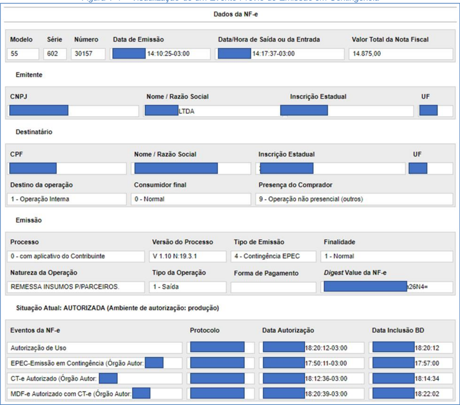

## 7.3.2. Evento EPEC sem a Respectiva NF-e

Caso  exista  unicamente  o  EPEC,  a  Consulta  Pública  da  NF-e  deverá  mostrar  os  dados  do  EPEC, visualizando unicamente a Aba NF-e, com as informações existentes.

## 7.4. Leiaute de Distribuição: Evento da NF-e

Deverão  ser  disponibilizados  para  o  destinatário  os  dados  do  Evento  enviados  para  a  SEFAZ, acrescentados os dados da homologação deste Evento.

Tabela 7-1 - Leiaute  de Distribuição: Evento da NF-e

| #    | Campo         | Ele   | Pai   | Tipo   | Ocor.   | Tam.   | Descrição/Observação           |
|------|---------------|-------|-------|--------|---------|--------|--------------------------------|
| ZR01 | procEventoNFe | Raiz  | -     | -      | -       | -      | TAG raiz                       |
| ZR02 | versao        | A     | ZR01  | N      | 1-1     | 1-2v2  |                                |
| ZR03 | evento        | G     | ZR01  | Xml    | 1-1     | -      |                                |
| ZR04 | (dados)       | -     | -     | -      | -       | -      | Dados do Evento                |
| ZR05 | retEvento     | G     | ZR01  | xml    | 1-1     | -      |                                |
| ZR06 | (dados)       | -     | -     | -      | -       | -      | Dados da homologação do Evento |

No  caso  de  troca  de  arquivo  entre  as  empresas,  é  sugerida  a  adoção  do  nome  do  arquivo  como segue:

## &lt;999...999&gt;\_&lt;888888&gt;-procEventoNFe.xml

## Onde:

- &lt;999...999&gt;: corresponde a Chave de Acesso da NF-e;
- &lt;888888&gt;: identifica o tipo de evento (CC-e=110110, Cancelamento=110111,  etc.)
- '-procEventoNFe':  identifica o processamento do documento autorizado.


## 8. Tabelas e Códigos

## 8.1. Tabela de Código de UF do IBGE

A  NF-e  utiliza  a  codificação adotada pelo  Instituto Brasileiro de Geografia e Estatística (IBGE) para representar o código da UF, como pode ser visto na Tabela 8-1.

Tabela 8-1 -Tabela de Código de UF do IBGE

| Região Norte                                                             | Região Nordeste                                                                                             | Região Sudeste                                                  | Região Sul                                      | Região Centro-Oeste                                               |
|--------------------------------------------------------------------------|-------------------------------------------------------------------------------------------------------------|-----------------------------------------------------------------|-------------------------------------------------|-------------------------------------------------------------------|
| 11-Rondônia 12-Acre 13-Amazonas 14-Roraima 15-Pará 16-Amapá 17-Tocantins | 21-Maranhão 22-Piauí 23-Ceará 24-Rio Grandedo Norte 25-Paraíba 26-Pernambuco 27-Alagoas 28-Sergipe 29-Bahia | 31-Minas Gerais 32-Espírito Santo 33-Rio deJaneiro 35-São Paulo | 41-Paraná 42-Santa Catarina 43-Rio Grandedo Sul | 50-Mato Grosso do Sul 51-Mato Grosso 52-Goiás 53-Distrito Federal |

## 8.2. Tabela de Código de Município do IBGE

A  NF-e  utiliza  a  codificação adotada pelo  Instituto Brasileiro de Geografia e Estatística (IBGE) para representar  o  código  de  município.  Este  código  é  composto  de  7  dígitos  numéricos,  com  as  duas primeiras  representando  a  UF.  Os  códigos  de  município  das  capitais  dos  estados  podem  ser encontrados  na  Tabela  8-2.  Os  códigos  dos  demais  municípios  podem  ser  encontrados  na  página daquele Instituto na Internet (https://www.ibge.gov.br).

Tabela 8-2 - Brasília e Capitais de Estado na Tabela de Código de Município  do IBGE

| Município      |   código | Estado             |   código |
|----------------|----------|--------------------|----------|
| Aracaju        |  2800308 | Sergipe            |       28 |
| Belém          |  1501402 | Pará               |       15 |
| Belo Horizonte |  3106200 | Minas Gerais       |       31 |
| Boa Vista      |  1400100 | Roraima            |       14 |
| Brasília       |  5300108 | Distrito Federal   |       53 |
| CampoGrande    |  5002704 | MatoGrosso do Sul  |       50 |
| Cuiabá         |  5103403 | MatoGrosso         |       51 |
| Curitiba       |  4106902 | Paraná             |       41 |
| Florianópolis  |  4205407 | Santa Catarina     |       42 |
| Fortaleza      |  2304400 | Ceará              |       23 |
| Goiânia        |  5208707 | Goiás              |       52 |
| João Pessoa    |  2507507 | Paraíba            |       25 |
| Macapá         |  1600303 | Amapá              |       16 |
| Maceió         |  2704302 | Alagoas            |       27 |
| Manaus         |  1302603 | Amazonas           |       13 |
| Natal          |  2408102 | Rio Grandedo Norte |       24 |
| Palmas         |  1721000 | Tocantins          |       17 |
| Porto Alegre   |  4314902 | Rio Grandedo Sul   |       43 |
| Porto Velho    |  1100205 | Rondônia           |       11 |
| Recife         |  2611606 | Pernambuco         |       26 |
| Rio Branco     |  1200401 | Acre               |       12 |
| Rio de Janeiro |  3304557 | Rio de Janeiro     |       33 |
| Salvador       |  2927408 | Bahia              |       29 |
| São Luís       |  2111300 | Maranhão           |       21 |
| São Paulo      |  3550308 | São Paulo          |       35 |
| Teresina       |  2211001 | Piauí              |       22 |
| Vitória        |  3205309 | Espírito Santo     |       32 |


Informar  o  código  9999999  e  o  nome  do  município  'EXTERIOR'  para  as  operações  que  envolvam localidades do exterior.

Quando  a  operação  envolver  regiões  administrativas  (Ex.  Cidades-satélites  do  DF),  deve  ser considerado o município sede como localidade da operação.

## 8.2.1. Validação do Código de Município

O Código de Município do IBGE tem a composição que segue:

- UUNNNND

## Onde:

- UU = Código da UF do IBGE
- NNNN = Número de ordem dentro da UF;
- D = Dígito de Controle módulo 10

## Validação possível:

- Extensão máxima: 7 dígitos;
- Extensão mínima: 7 dígitos;
- Código da UF: deve ser válido, conforme Tabela de UF do IBGE;
- Número de ordem dentro da UF: não pode ser zero;
- Dígito de Controle: módulo 10 (pesos 2 e 1)

Obs  1:  Considerar  a  soma  dos  algarismos  no  somatório  dos  produtos  dos  pesos.  Ou  seja,  se  o produto for superior a 9 os dois algarismos devem ser somados.

Obs 2: Se o resto da divisão for zero, considerar o dígito verificador igual a zero.

## 8.2.2. Exemplo de Cálculo do Dígito de Controle do Código de Município

## Exemplo 1:

Código Município IBGE = 355030 D (Município de São Paulo)

| A. CÓDIGOMUN         |   3 |   5 |   5 |   0 |   3 |   0 |
|----------------------|-----|-----|-----|-----|-----|-----|
| B. PESOS             |   1 |   2 |   1 |   2 |   1 |   2 |
| C. PONDERAÇÃO (A* B) |   3 |  10 |   5 |   0 |   3 |   0 |
| D. SOMA ALGARISMOS   |   3 |   1 |   5 |   0 |   3 |   0 |

- O somatório da soma dos algarismos é: 3 + 1 + 5 + 0 + 3 + 0 = 12
- Dividindo o somatório por 10 teremos: 12 / 10 = 1, com um resto valendo 2
- O dígito verificador é: DV = 10 - (resto da divisão), portanto 10 - 2 = 8
- Neste caso, o Dígito Verificador = 8

## Exemplo 2:

Código Município IBGE = 211130 D (Município de São Luís)

| A. CÓDIGOMUN         |   2 |   1 |   1 |   1 |   3 |   0 |
|----------------------|-----|-----|-----|-----|-----|-----|
| B. PESOS             |   1 |   2 |   1 |   2 |   1 |   2 |
| C. PONDERAÇÃO (A* B) |   2 |   2 |   1 |   2 |   3 |   0 |
| D. SOMA ALGARISMOS   |   2 |   2 |   1 |   2 |   3 |   0 |

- O somatório da soma dos algarismos é: 2 + 2 + 1 + 2 + 3 + 0 = 10
- Dividindo o somatório por 10 teremos: 10 / 10 = 1, com um resto valendo 0
- O dígito verificador é: DV = 10 - (resto da divisão), portanto 10 - 0 = 10
- Neste caso, o Dígito Verificador = 0


O código de Município do IBGE dos seguintes Municípios na tabela do IBGE tem o dígito verificador inválido; para estes municípios deve ser usado o DV respectivo, em vez do calculado:

- 4305871 - Coronel Barros/RS;
- 2201919 - Bom Princípio do Piauí/PI;
- 2202251 - Canavieira /PI;
- 2201988 - Brejo do Piauí/PI;
- 2611533 - Quixaba/PE;
- 3117836 - Cônego Marinho/MG;
- 3152131 - Ponto Chique/MG;
- 5203939 - Buriti de Goiás/GO;
- 5203962 - Buritinópolis/GO;

## 8.3. Tabela de Código de País do BACEN

Para  o  preenchimento  dos  campos  de  códigos  de  países  deve  ser  utilizada  a  Tabela  de  País  do Banco Central do Brasil, disponibilizada no Portal Nacional da Nota Fiscal Eletrônica (www.nfe.fazenda.gov.br),  aba 'Documentos', opção 'Diversos'.

Tabela 8-3 - Exemplos de Códigos de País na Tabela do BACEN

| País      |   código | País        |   código | País                      |   código |
|-----------|----------|-------------|----------|---------------------------|----------|
| Brasil    |     1058 | Espanha     |     2453 | Estados Unidos            |     2496 |
| Argentina |     0639 | França      |     2755 | China, República Popular, |     1600 |
| Chile     |     1589 | Itália      |     3867 | Coréia, República da,     |     1902 |
| Paraguai  |     5860 | Portugal    |     6076 | Formosa                   |     1619 |
| Uruguai   |     8451 | Reino Unido |     6289 | Japão                     |     3999 |

A validação do país deve considerar a data de emissão da NF-e para verificar se o país é válido.

## 8.3.1. Validação do Código de País do BACEN

Composição do Código de País:

- NNND

## Onde:

- NNN = Número de ordem do Código do País;
- D = Dígito de Controle módulo 11.

## 8.3.2. Validação Possível do Código de País do BACEN

- Extensão máxima: 4 dígitos;

- Extensão mínima: 2 dígitos;

- •

Dígito de Controle: módulo 11, pesos 2 a 9

Obs.: Se o resto da divisão for zero ou 1, considerar o dígito verificador igual a zero.

## 8.3.3. Exemplo de Cálculo do Dígito de Controle do Código de País

Exemplo 1 - Código País = 105 (Brasil):

| A. CÓDIGO PAÍS      |   1 |   0 |   5 |
|---------------------|-----|-----|-----|
| B. PESOS            |   4 |   3 |   2 |
| C. PRODUTOS (A * B) |   4 |   0 |  10 |

- O somatório dos produtos é: 4 + 0 + 10 = 14
- Dividindo o somatório por 11 teremos: 14 / 11 = 1, com resto valendo 3
- Considerar: 11 - (resto da divisão), portanto: 11 - 3 = 8
- Neste caso, o Dígito Verificador = 8

Exemplo 2 - Código País = 586 (Paraguai):

| A. CÓDIGO PAÍS      |   5 |   8 |   6 |
|---------------------|-----|-----|-----|
| B. PESOS            |   4 |   3 |   2 |
| C. PRODUTOS (A * B) |  20 |  24 |  12 |

O somatório dos produtos é: 20 + 24 + 12 = 56

- Dividindo o somatório por 11 teremos: 56 / 11 = 5, com resto valendo 1
- Considerar: 11 - (resto da divisão), portanto: 11 - 1 = 10
- Neste caso, o Dígito Verificador = 0

O código de País do BACEN dos seguintes países tem o DV - dígito verificador inválido:

- 1504 - GUERNSEY, ILHA DO CANAL (INCLUI ALDERNEY E SARK)
- 1508 - JERSEY, ILHA DO CANAL
- 4525 - MADEIRA, ILHA DA
- 3595 - MAN, ILHA DE
- 4985 - MONTENEGRO
- 6781 - SAINT KITTS E NEVIS
- 7370 - SERVIA

As  aplicações  dos  Estados  e  dos  emissores  devem  utilizar  os  códigos  de  País  do  BACEN  sem validação  do  DV  -  dígito  verificador,  da  mesma  forma  que  consta  da  tabela  de  código  de  país  do BACEN.

## 8.4. Identificador: Inscrição SUFRAMA

## 8.4.1. Composição do Identificador de Inscrição SUFRAMA

A  SUFRAMA  mantém  controle sobre as  empresas  com  incentivo  fiscal,  identificando-as  através  de um número de "Inscrição SUFRAMA", com a seguinte composição:

- SS.NNNN.LLD

## Onde:

- SS=Código do setor de atividade da empresa, conforme exemplos abaixo:
- o 01 e 02=Cooperativa;
- o 10 e 11=Comércio;
- o 20=Indústria com Projeto Pleno;
- o 60=Serviços
- NNNN=Número sequencial;
- LL=Código da  localidade  da  Unidade  Administrativa  da  Suframa  que  habilitou  a  empresa, conforme exemplos abaixo:
- o 01=Manaus
- o 10=Boa Vista


- o 30=Porto Velho
- D=Dígito Verificador

## 8.4.2. Validação Possível do Identificador de Inscrição SUFRAMA

- Campo: Numérico, com 8 ou 9 posições
- o Considerar que 'SS' pode começar por "0", mas não pode ser "00"
- D: Dígito Verificador, Módulo 11, Pesos de 2 a 9
- o considerar DV=0 se o resto da divisão for '0' ou '1'

## 8.4.3. Exemplo de Cálculo do Dígito Verificador do Identificador de Inscrição SUFRAMA

| A. CÓDIGO SUFRAMA   |   1 |   2 |   3 |   4 |   5 |   6 |   7 |   8 |
|---------------------|-----|-----|-----|-----|-----|-----|-----|-----|
| B. PESOS            |   9 |   8 |   7 |   6 |   5 |   4 |   3 |   2 |
| C. PRODUTOS (A * B) |   9 |  16 |  21 |  24 |  25 |  24 |  21 |  16 |

- O somatório dos produtos é: 16 + 21 + 24 + 25 + 24 + 21 + 16 + 9 = 156
- Dividindo o somatório por 11 teremos: 156 / 11 = 14, com resto valendo 2
- Considerar: 11 - (resto da divisão), portanto: 11 - 2 = 9
- Neste caso, o Dígito Verificador = 9

## 8.5. Identificador: RECOPI

O CONFAZ instituiu o "Sistema de Registro e Controle das Operações com o Papel Imune Nacional", denominado  RECOPI  NACIONAL,  de  uso  opcional  por  UF,  que  disciplina  o  credenciamento  do contribuinte  que  realize  operações  com  papel  destinado à impressão de livro, jornal ou periódico. O contribuinte credenciado deve registrar previamente cada operação com papel destinado à impressão,  obtendo  o  "número  de  registro  de  controle  da  operação",  denominado  de  número  do RECOPI nesta especificação. O Sistema RECOPI Nacional é disponibilizado pela SEFAZ-SP.

## 8.5.1. Composição do Identificador RECOPI

O número do RECOPI contém um timestamp gerado pelo sistema e a composição deste identificador é:

- aaaammddHHMMSSffffDD

## Onde:

- aaaammdd= Ano, mês e dia da autorização do sistema RECOP;
- hhmmssffff=  Hora,  minuto,  segundo  da  autorização  do  sistema  RECOPI,  com  mais  4  dígitos  da fração de segundo
- DD= Dígitos Verificadores

## 8.5.2. Validação Possível

- Campo: Numérico, com 20 posições fixas
- aaaa: Ano maior do que o ano atual, ou menor do que 2013


- mm: Mês válido, não pode ser maior do que o Ano-Mês atual
- dd: Dia válido para o ano-mês do timestamp
- HHMMSS: Hora, minuto, segundos válidos
- DD: Dígitos verificadores, módulo 11
- o DV-1:  Módulo 11, Pesos de 1 a 18 (caso o resto da divisão por 11 seja 0 ou 1, DV = 0)
- o DV-2:    Módulo  11,  Pesos  de  1  a  19,  considerando  o  D1  calculado  acima  (caso  o  resto  da divisão por 11 seja 0 ou 1, DV = 0)

## 8.5.3. Exemplo de Cálculo do Dígito Verificador

Número de exemplo: 201311061146097343-DD Cálculo do DV-1:

| A. IDENTIFICADOR    |   2 |   0 |   1 |   3 |   1 |   1 |   0 |   6 |   1 |   1 |   4 |   6 | 0   | 9     |   7 |   3 |   4 3 |
|---------------------|-----|-----|-----|-----|-----|-----|-----|-----|-----|-----|-----|-----|-----|-------|-----|-----|-------|
| B. PESOS            |  18 |  17 |  16 |  15 |  14 |  13 |  12 |  11 |  10 |   9 |   8 |   7 | 6 5 | 4     |   3 |   2 |     1 |
| C. PRODUTOS (A * B) |  36 |   0 |  16 |  45 |  14 |  13 |   0 |  66 |  10 |   9 |  32 |  42 | 0   | 45 28 |   9 |   8 |     3 |

- O somatório dos produtos é: 36+0+16+45+14+13+0+66+10+9+32+42+0+45+28+9+8+3 = 376
- Dividindo o somatório por 11 teremos: 376 / 11 = 34, com resto valendo 2
- Considerar: 11 - (resto da divisão), portanto: 11 - 2 = 9
- Neste caso, o Dígito Verificador 1 = 9

## Cálculo do DV-2:

Repetir o processo anterior, usando agora os 19 dígitos existentes, incluindo o DV1 recém-calculado

| A. IDENTIFICADOR    |   2 |   0 |   1 |   3 |   1 |   1 |   0 |   6 |   1 |   1 |   4 |   6 | 0   | 9     |   7 |   3 |   4 |   3 9 |
|---------------------|-----|-----|-----|-----|-----|-----|-----|-----|-----|-----|-----|-----|-----|-------|-----|-----|-----|-------|
| B. PESOS            |  19 |  18 |  17 |  16 |  15 |  14 |  13 |  12 |  11 |  10 |   9 |   8 | 7 6 | 5     |   4 |   3 |   2 |     1 |
| C. PRODUTOS (A * B) |  38 |   0 |  17 |  48 |  15 |  14 |   0 |  72 |  11 |  10 |  36 |  48 | 0   | 54 35 |  12 |  12 |   6 |     9 |

- O somatório dos produtos é: 38+0+17+48+15+14+0+72+11+10+36+48+0+54+35+12+12+6+9  = 437
- Dividindo o somatório por 11 teremos: 437 / 11 = 39, com resto valendo 8
- Considerar: 11 - (resto da divisão), portanto: 11 - 8 = 3
- Neste caso, o Dígito Verificador 2 = 3

## 8.6. Identificador: Nomenclatura de Valor Aduaneiro e Estatística

A  Receita  Federal  definiu  a  codificação  da  "NVE  -  Nomenclatura de Valor Aduaneiro e Estatística", com  o  objetivo  de  identificar  a  mercadoria  submetida  a  despacho  aduaneiro  de  importação,  para efeito de valoração aduaneira, e aprimorar os dados estatísticos de comércio exterior.

Em  julho  de  2013  existiam  1.315  códigos  NCM  com  detalhamento  pelo  NVE,  totalizando  5.414 codificações NVE.

## 8.6.1. Composição

A  NVE  tem  por  base  a  codificação  do  NCM - Nomenclatura Comum do MERCOSUL, acrescida de atributos  e  suas  especificações,  identificados,  respectivamente,  por  dois  caracteres  alfabéticos  e quatro  numéricos.  A  mesma  codificação  NVE  tem  significado  diferente,  conforme  o  NCM  que  está sendo detalhado.


## 8.6.2. Validação Possível

- Campo: Composto por 2 letras e 4 algarismos, com tamanho total de 6 posições
- Tabela:  Somente  alguns  códigos  NCM  possuem  o  detalhamento  da  NVE,  conforme  tabela publicada pela RFB

## 8.6.3. Exemplo de Códigos NVE

Exemplo de codificação para Camisa de Malha de Uso Masculino: Tabela NCM:

| 61.05      | Camisas de malha, de uso masculino.   |
|------------|---------------------------------------|
| 6105.10.00 | - De algodão                          |
| 6105.20.00 | - De fibras sintéticas ou artificiais |
| 6105.90.00 | - De outras matérias têxteis          |

## Codificação NVE:

```
23.28. Posição 6105 Camisas de malha, de uso masculino. 23.28.1. Subitem 61051000 -De algodão Atributos e Especificações de Nível 'U' 23.28.1.1. Atributo AA COMPOSIÇÃO 0001 - 100% Algodão 0002 - De 99% até 90% algodão 0003 - De 89% até 80% algodão 0004 - De 79% até 70% algodão ... 23.28.1.2. Atributo AB TAMANHO 0001 - Infanto-juvenil (até 32) 0002 - Adulto (superior a 32) 23.28.1.3. Atributo AC MANGA 0001 - Sem 0002 - Curta (que não cubra o cotovelo) 0003 - Longa 0004 - 3/4 ... 23.29. Subitem 61052000 -De fibras sintéticas ou artificiais Atributos e Especificações de Nível 'U' 23.29.1. Atributo AA COMPOSIÇÃO 0001 - 100% Poliéster 0004 - De 99% até 90% poliéster 0005 - De 89% até 80% poliéster
```

## 8.7. Classe de enquadramento do IPI para Cigarros e Bebidas

A  informação  da  Classe  de  enquadramento  do  IPI para Cigarros e Bebidas, quando aplicável, deve ser  informada  utilizando  a  codificação  prevista  nos  Atos  Normativos  editados  pela  Receita  Federal, conforme o exemplo que pode ser visto na Tabela 8-4.

Tabela 8-4 - Tabela do Artigo 149 do RIPI/2002 (Decreto nº 4.544 de 26.12.2002  D.O.U: 27.12.2002)

| CÓDIGONCM   | DESCRIÇÃO                    | CLASSE POR CAPACIDADE (ml) DO RECIPIENTE   | CLASSE POR CAPACIDADE (ml) DO RECIPIENTE   | CLASSE POR CAPACIDADE (ml) DO RECIPIENTE   | CLASSE POR CAPACIDADE (ml) DO RECIPIENTE   |
|-------------|------------------------------|--------------------------------------------|--------------------------------------------|--------------------------------------------|--------------------------------------------|
|             |                              | Até 180                                    | De 181 a 375                               | De 376 a 670                               | De 671 a 1000                              |
| 2204.10.10  | Tipo Champanha ("Champagne") | E aH                                       | JaM                                        | K a P                                      | L aQ                                       |
| 2204.10.90  | Outros Espumantes            | C a G                                      | H a L                                      | I a O                                      | K a Q                                      |


|           |                                                                                                                                                                                                                                           | CLASSE POR CAPACIDADE (ml) DO RECIPIENTE   | CLASSE POR CAPACIDADE (ml) DO RECIPIENTE   | CLASSE POR CAPACIDADE (ml) DO RECIPIENTE   | CLASSE POR CAPACIDADE (ml) DO RECIPIENTE   |
|-----------|-------------------------------------------------------------------------------------------------------------------------------------------------------------------------------------------------------------------------------------------|--------------------------------------------|--------------------------------------------|--------------------------------------------|--------------------------------------------|
| CÓDIGONCM | DESCRIÇÃO                                                                                                                                                                                                                                 | Até 180                                    | De 181 a 375                               | De 376 a 670                               | De 671 a 1000                              |
| 2204.2    | - Outros vinhos; mostos de uvas cuja fermentação tenha sido impedida ou interrompida por adição de álcool                                                                                                                                 |                                            |                                            |                                            |                                            |
|           | 1. Vinhos da madeira, do porto e de xerez,demálaga e outros licorosos                                                                                                                                                                     | E a F                                      | J a K                                      | K a L                                      | L aO                                       |
|           | 2. Mostos deuvas cuja fermentaçãotenha sido impedida ou interrompida por adição deálcool, compreendendoas mistelas                                                                                                                        | A a C                                      | A a F                                      | B a I                                      | C a J                                      |
|           | 3. Vinhos demesacomum ou de consumo corrente produzidos com uvas de variedadesamericanas ou híbridas, incluídos os frisantes com gaseificação máxima de 2 atmosferase mínima demeia atmosferae graduação alcoólica não superior a 13 G.L. | A a B                                      | A a D                                      | B aG                                       | C a J                                      |
|           | 4. Vinhos demesa finos ou nobres e especiais produzidos com uvas viníferas, incluídos os frisantescom gaseificação máxima de 2 atmosferas e mínima de meia atmosfera e graduação alcoólica não superior a 13 G.L.                         | C a E                                      | E a F                                      | G a I                                      | H a J                                      |
|           | 5. Outros vinhos                                                                                                                                                                                                                          | C a I                                      | EaM                                        | G a P                                      | H aQ                                       |

## 8.8. Código do Selo

A  informação  do  código  de  selo,  quando  aplicável,  deve  ser  informada  utilizando  a  codificação prevista nos Atos Normativos editados pela Receita Federal, conforme o exemplo que pode ser visto na Tabela 8-5.

Tabela 8-5 - Codificação utilizada  no Ato Declaratório Executivo COFIS Nº 8, de 31 de março de 2005

| Tipo/cor do selo                        | Código   |
|-----------------------------------------|----------|
| Uísque Verde                            | 9729-11  |
| Uísque Azul                             | 9729-12  |
| Uísque Vermelho                         | 9729-13  |
| Uísque Amarelo                          | 9729-14  |
| Uísque Miniatura Verde                  | 9729-21  |
| Uísque Miniatura Azul                   | 9729-22  |
| Uísque Miniatura Vermelho               | 9729-23  |
| Uísque Miniatura Amarelo                | 9729-24  |
| Bebida Alcoólica Laranja                | 9737-11  |
| Bebida Alcoólica Cinza                  | 9737-12  |
| Bebida Alcoólica Marrom                 | 9737-13  |
| Bebida Alcoólica Verde                  | 9737-14  |
| Bebida Alcoólica Vermelho               | 9737-15  |
| Bebida Alcoólica Azul Marinho           | 9737-16  |
| Bebida Alcoólica Miniatura Verde        | 9737-21  |
| Bebida Alcoólica Miniatura Vermelho     | 9737-22  |
| Bebida Alcoólica Miniatura Azul Marinho | 9737-23  |
| Aguardente Laranja                      | 9745-11  |
| Aguardente Azul                         | 9745-12  |
| Aguardente Violeta                      | 9745-13  |

## 8.9. Código de Enquadramento Legal do IPI

Tabela 8-6 - Código de Enquadramento  Legal do IPI

|   Cód | GrupoCST   | Descrição Enquadramento Legal do IPI                                                                              |
|-------|------------|-------------------------------------------------------------------------------------------------------------------|
|   001 | Imunidade  | Livros, jornais, periódicos eo papel destinado à sua impressão - Art. 18 Inciso I do Decreto 7.212/2010           |
|   002 | Imunidade  | Produtos industrializados destinadosao exterior - Art. 18 Inciso II do Decreto 7.212/2010                         |
|   003 | Imunidade  | Ouro, definido emleicomo ativo financeiro ou instrumento cambial - Art. 18 Inciso IIIdo Decreto 7.212/2010        |
|   004 | Imunidade  | Energia elétrica, derivados depetróleo, combustíveis e minerais do País - Art. 18 Inciso IV do Decreto 7.212/2010 |

## Nota Fiscal Eletrônica

MOC 7.0 - Visão Geral


|   Cód | GrupoCST   | Descrição Enquadramento Legal do IPI                                                                                                                                                                                                                                                                                                                                                        |
|-------|------------|---------------------------------------------------------------------------------------------------------------------------------------------------------------------------------------------------------------------------------------------------------------------------------------------------------------------------------------------------------------------------------------------|
|   005 | Imunidade  | Exportação de produtos nacionais - sem saída do território brasileiro - vendapara empresasediada no exterior -atividades depesquisa ou lavra dejazidas de petróleoe de gás natural - Art. 19 Inciso I do Decreto 7.212/2010                                                                                                                                                                 |
|   006 | Imunidade  | Exportação de produtos nacionais - sem saída do território brasileiro - vendapara empresasediada no exterior - incorporados a produto final exportado para o Brasil - Art. 19 Inciso II do Decreto 7.212/2010                                                                                                                                                                               |
|   007 | Imunidade  | Exportação de produtos nacionais - sem saída do território brasileiro - vendapara órgão ou entidade de governoestrangeiro ou organismo internacional de queo Brasil seja membro,para ser entregue,no País, à ordem do comprador - Art. 19 Inciso III do Decreto 7.212/2010                                                                                                                  |
|   101 | Suspensão  | Óleo de menta embruto, produzido por lavradores - Art. 43 Inciso I do Decreto 7.212/2010                                                                                                                                                                                                                                                                                                    |
|   102 | Suspensão  | Produtos remetidosà exposição emfeiras de amostras e promoções semelhantes - Art. 43 Inciso II do Decreto 7.212/2010                                                                                                                                                                                                                                                                        |
|   103 | Suspensão  | Produtos remetidosa depósitos fechadosou armazéns-gerais, bemassim aqueles devolvidos ao remetente - Art. 43 Inciso IIIdo Decreto 7.212/2010                                                                                                                                                                                                                                                |
|   104 | Suspensão  | Produtos industrializados, que com matérias-primas (MP),produtosintermediários (PI)e material de embalagem (ME) importados submetidos a regime aduaneiro especial (drawback - suspensão/isenção),remetidosdiretamente a empresasindustriais exportadoras - Art. 43 Inciso IVdo Decreto 7.212/2010                                                                                           |
|   105 | Suspensão  | Produtos, destinadosà exportação, quesaiam do estabelecimento industrial para empresascomerciais exportadoras,com o fim específico deexportação - Art. 43, Inciso V, alínea "a" do Decreto 7.212/2010                                                                                                                                                                                       |
|   106 | Suspensão  | Produtos, destinadosà exportação, quesaiam do estabelecimento industrial para recintos alfandegados ondese processeo despacho aduaneiro de exportação - Art. 43, Inciso V, alíneas "b" do Decreto 7.212/2010                                                                                                                                                                                |
|   107 | Suspensão  | Produtos, destinadosà exportação, quesaiam do estabelecimento industrial para outros locais onde se processeo despacho aduaneiro deexportação - Art. 43, Inciso V, alíneas "c" do Decreto 7.212/2010                                                                                                                                                                                        |
|   108 | Suspensão  | Matérias-primas (MP),produtosintermediários (PI)e material de embalagem (ME) destinados ao executorde industrialização por encomenda- Art. 43 Inciso VIdo Decreto 7.212/2010                                                                                                                                                                                                                |
|   109 | Suspensão  | Produtos industrializados por encomendaremetidos ao estabelecimentode origem - Art. 43 Inciso VII do Decreto 7.212/2010                                                                                                                                                                                                                                                                     |
|   110 | Suspensão  | Matérias-primas ou produtos intermediários remetidospara emprego emoperação industrial realizada pelo remetente fora do estabelecimento - Art. 43 Inciso VIIIdo Decreto 7.212/2010                                                                                                                                                                                                          |
|   111 | Suspensão  | Veículo, aeronave ou embarcação destinados aemprego emprovas de engenharia pelo fabricante - Art. 43 Inciso IX do Decreto 7.212/2010                                                                                                                                                                                                                                                        |
|   112 | Suspensão  | Produtos remetidos,para industrialização ou comércio, deum para outro estabelecimentodamesma firma - Art. 43 Inciso X do Decreto 7.212/2010                                                                                                                                                                                                                                                 |
|   113 | Suspensão  | Bens do ativo permanenteremetidosaoutro estabelecimentoda mesmafirma, para serem utilizados no processo industrial do recebedor - Art. 43 Inciso XI do Decreto 7.212/2010                                                                                                                                                                                                                   |
|   114 | Suspensão  | Bens do ativo permanenteremetidosaoutro estabelecimento,para serem utilizados no processo industrial deprodutos encomendadospelo remetente - Art. 43 Inciso XII do Decreto 7.212/2010                                                                                                                                                                                                       |
|   115 | Suspensão  | Partes e peças destinadas ao reparo deprodutos com defeitode fabricação, quando a operação for executadagratuitamente, emvirtude de garantia - Art. 43 Inciso XIIIdo Decreto 7.212/2010                                                                                                                                                                                                     |
|   116 | Suspensão  | Matérias-primas (MP),produtosintermediários (PI) e material de embalagem (ME) de fabricação nacional, vendidos a estabelecimento industrial, para industrialização de produtos destinados à exportação ou a estabelecimentocomercial, para industrialização emoutro estabelecimentoda mesmafirma ou de terceiro, deproduto destinadoà exportação - Art. 43 Inciso XIV do Decreto 7.212/2010 |
|   117 | Suspensão  | Produtos para empregoou consumo na industrialização ou elaboração deproduto a ser exportado, adquiridos no mercado interno ou importados - Art. 43 Inciso XV do Decreto 7.212/2010                                                                                                                                                                                                          |
|   118 | Suspensão  | Bebidas alcóolicas e demais produtos deprodução nacional acondicionados emrecipientes de capacidade superior ao limite máximo permitido para vendaa varejo - Art. 44 do Decreto 7.212/2010                                                                                                                                                                                                  |
|   119 | Suspensão  | Produtos classificados NCM21.06.90.10 Ex 02, 22.01, 22.02, excetoos Ex 01 e Ex 02 do Código 22.02.90.00 e 22.03 saídos de estabelecimentoindustrial destinado a comercial equiparado a industrial - Art. 45 Inciso I do Decreto7.212/2010                                                                                                                                                   |
|   120 | Suspensão  | Produtos classificados NCM21.06.90.10 Ex 02, 22.01, 22.02, excetoos Ex 01 e Ex 02 do Código 22.02.90.00 e 22.03 saídos de estabelecimentocomercial equiparado a industrial destinado aequiparado a industrial - Art. 45 Inciso II do Decreto7.212/2010                                                                                                                                      |
|   121 | Suspensão  | Produtos classificados NCM21.06.90.10 Ex 02, 22.01, 22.02, excetoos Ex 01 e Ex 02 do Código 22.02.90.00 e 22.03 saídos de importador destinado a equiparado a industrial - Art. 45 Inciso IIIdo Decreto7.212/2010                                                                                                                                                                           |
|   122 | Suspensão  | Matérias-primas (MP),produtosintermediários (PI)e material de embalagem (ME) destinados a estabelecimentoque se dedique à elaboração de produtos classificados nos códigos previstosno art. 25 da Lei 10.684/2003 - Art. 46 Inciso I do Decreto 7.212/2010                                                                                                                                  |

## Nota Fiscal Eletrônica

MOC 7.0 - Visão Geral


|   Cód | GrupoCST   | Descrição Enquadramento Legal do IPI                                                                                                                                                                                                                                                                                                                                        |
|-------|------------|-----------------------------------------------------------------------------------------------------------------------------------------------------------------------------------------------------------------------------------------------------------------------------------------------------------------------------------------------------------------------------|
|   123 | Suspensão  | Matérias-primas (MP),produtosintermediários (PI)e material de embalagem (ME) adquiridos por estabelecimentosindustriais fabricantes de partes e peças destinadas a estabelecimento industrial fabricante deproduto classificado no Capítulo 88 da Tipi - Art. 46 Inciso II do Decreto 7.212/2010                                                                            |
|   124 | Suspensão  | Matérias-primas (MP),produtosintermediários (PI)e material de embalagem (ME) adquiridos por pessoasjurídicas preponderantemente exportadoras - Art. 46 Inciso III do Decreto 7.212/2010                                                                                                                                                                                     |
|   125 | Suspensão  | Materiais e equipamentosdestinados a embarcações pré-registradas ou registradas no Registro Especial Brasileira - REB quando adquiridos por estaleiros navais brasileiros - Art. 46 Inciso IV do Decreto 7.212/2010                                                                                                                                                         |
|   126 | Suspensão  | Aquisição por beneficiário de regime aduaneiro suspensivodo imposto, destinado a industrialização para exportação - Art. 47 do Decreto 7.212/2010                                                                                                                                                                                                                           |
|   127 | Suspensão  | Desembaraço de produtos de procedência estrangeira importados por lojas francas - Art. 48 Inciso I do Decreto 7.212/2010                                                                                                                                                                                                                                                    |
|   128 | Suspensão  | Desembaraço de maquinas, equipamentos,veículos, aparelhos e instrumentossem similar nacional importados por empresasnacionais de engenharia, destinados à execuçãode obras no exterior - Art. 48 Inciso II do Decreto 7.212/2010                                                                                                                                            |
|   129 | Suspensão  | Desembaraço de produtos de procedência estrangeiracom saída de repartições aduaneiras com suspensãodo Imposto de Importação - Art. 48 Inciso III do Decreto 7.212/2010                                                                                                                                                                                                      |
|   130 | Suspensão  | Desembaraço de matérias-primas, produtos intermediários e materiais de embalagem, importados diretamente por estabelecimentode quetratam os incisos I a III do caput do Decreto 7.212/2010 - Art. 48 Inciso IV do Decreto 7.212/2010                                                                                                                                        |
|   131 | Suspensão  | Remessade produtos para aZFM destinadosao seuconsumo interno, utilização ou industrialização - Art. 84 do Decreto 7.212/2010                                                                                                                                                                                                                                                |
|   132 | Suspensão  | Remessade produtos para aZFM destinadosà exportação - Art. 85 Inciso I do Decreto 7.212/2010                                                                                                                                                                                                                                                                                |
|   133 | Suspensão  | Produtos que,antes de sua remessaà ZFM, foremenviados pelo seu fabricante a outro estabelecimento,para industrialização adicional, por conta e ordem do destinatário - Art. 85 Inciso II do Decreto 7.212/2010                                                                                                                                                              |
|   134 | Suspensão  | Desembaraço de produtos de procedência estrangeira importados pelaZFM quando ali consumidos ou utilizados, excetoarmas, munições, fumo,bebidas alcoólicas e automóveis de passageiros. - Art. 86 do Decreto 7.212/2010                                                                                                                                                      |
|   135 | Suspensão  | Remessade produtos para a Amazônia Ocidental destinados ao seu consumo interno ou utilização - Art. 96 do Decreto 7.212/2010                                                                                                                                                                                                                                                |
|   136 | Suspensão  | Entrada de produtos estrangeiros na Área de Livre Comércio de Tabatinga - ALCT destinados ao seu consumo interno ou utilização - Art. 106 do Decreto 7.212/2010                                                                                                                                                                                                             |
|   137 | Suspensão  | Entrada de produtos estrangeiros na Área de Livre Comércio de Guajará-Mirim - ALCGM destinados ao seu consumo interno ou utilização - Art. 109 do Decreto 7.212/2010                                                                                                                                                                                                        |
|   138 | Suspensão  | Entrada de produtos estrangeiros nas Áreas de Livre Comércio de Boa Vista - ALCBV eBomfim - ALCB destinados a seu consumo interno ou utilização - Art. 112 do Decreto 7.212/2010                                                                                                                                                                                            |
|   139 | Suspensão  | Entrada de produtos estrangeiros na Área de Livre Comércio de Macapá e Santana - ALCMS destinados a seuconsumo interno ou utilização - Art. 116 do Decreto 7.212/2010                                                                                                                                                                                                       |
|   140 | Suspensão  | Entrada de produtos estrangeiros nas Áreas de Livre Comércio de Brasiléia - ALCB e deCruzeiro do Sul - ALCCS destinados a seuconsumo interno ou utilização - Art. 119 do Decreto 7.212/2010                                                                                                                                                                                 |
|   141 | Suspensão  | Remessapara Zona deProcessamento deExportação - ZPE - Art. 121 do Decreto 7.212/2010                                                                                                                                                                                                                                                                                        |
|   142 | Suspensão  | Setor Automotivo - Desembaraço aduaneiro, chassis e outros - regime aduaneiro especial - industrialização 87.01 a 87.05 - Art. 136, I do Decreto 7.212/2010                                                                                                                                                                                                                 |
|   143 | Suspensão  | Setor Automotivo - Do estabelecimentoindustrial produtos 87.01 a 87.05 da TIPI - mercado interno - empresacomercial atacadista controlada por PJ encomendantedoexterior. - Art. 136, II do Decreto 7.212/2010                                                                                                                                                               |
|   144 | Suspensão  | Setor Automotivo - Do estabelecimentoindustrial - chassis e outros classificados nas posições 84.29, 84.32, 84.33, 87.01 a 87.06 e 87.11 da TIPI. - Art. 136, III do Decreto 7.212/2010                                                                                                                                                                                     |
|   145 | Suspensão  | Setor Automotivo - Desembaraço aduaneiro, chassis e outros classificados nas posições 84.29, 84.32, 84.33, 87.01 a 87.06 e 87.11 da TIPI quando importados diretamente por estabelecimento industrial - Art. 136, IV do Decreto 7.212/2010                                                                                                                                  |
|   146 | Suspensão  | Setor Automotivo - do estabelecimentoindustrial matérias-primas, os produtos intermediários e os materiais de embalagem, adquiridos por fabricantes, preponderantemente,de componentes,chassis e outrosclassificados nos Códigos 84.29, 8432.40.00, 8432.80.00, 8433.20, 8433.30.00, 8433.40.00, 8433.5 e 87.01 a 87.06 da TIPI- Art. 136, V do Decreto 7.212/2010          |
|   147 | Suspensão  | Setor Automotivo -Desembaraçoaduaneiro, as matérias-primas, os produtos intermediários e os materiais de embalagem, importados diretamente por fabricantes, preponderantemente,de componentes,chassis e outrosclassificados nos Códigos 84.29, 8432.40.00, 8432.80.00, 8433.20, 8433.30.00, 8433.40.00, 8433.5 e 87.01 a 87.06 da TIPI - Art. 136, VI do Decreto 7.212/2010 |

## Nota Fiscal Eletrônica

MOC 7.0 - Visão Geral


|   Cód | GrupoCST   | Descrição Enquadramento Legal do IPI                                                                                                                                                                                                                                                                                                                                                                                                                                                                                                               |
|-------|------------|----------------------------------------------------------------------------------------------------------------------------------------------------------------------------------------------------------------------------------------------------------------------------------------------------------------------------------------------------------------------------------------------------------------------------------------------------------------------------------------------------------------------------------------------------|
|   148 | Suspensão  | Bens deInformática e Automação- matérias-primas, os produtos intermediários e os materiais de embalagem, quando adquiridos por estabelecimentosindustriais fabricantes dos referidos bens. - Art. 148 do Decreto 7.212/2010                                                                                                                                                                                                                                                                                                                        |
|   149 | Suspensão  | Reporto - Saída de Estabelecimento demáquinas e outros quando adquiridos por beneficiários do REPORTO - Art. 166, I do Decreto 7.212/2010                                                                                                                                                                                                                                                                                                                                                                                                          |
|   150 | Suspensão  | Reporto - Desembaraço aduaneiro de máquinas e outros quando adquiridos por beneficiários do REPORTO - Art. 166, II do Decreto 7.212/2010                                                                                                                                                                                                                                                                                                                                                                                                           |
|   151 | Suspensão  | Repes- Desembaraço aduaneiro - benssem similar nacional importados por beneficiários do REPES - Art. 171 do Decreto 7.212/2010                                                                                                                                                                                                                                                                                                                                                                                                                     |
|   152 | Suspensão  | Recine - Saída para beneficiário do regime - Art. 14, III da Lei 12.599/2012                                                                                                                                                                                                                                                                                                                                                                                                                                                                       |
|   153 | Suspensão  | Recine - Desembaraço aduaneiro por beneficiário do regime - Art. 14, IV da Lei 12.599/2012                                                                                                                                                                                                                                                                                                                                                                                                                                                         |
|   154 | Suspensão  | Reif - Saída para beneficiário do regime - Lei 12.794/1013, art. 8, III                                                                                                                                                                                                                                                                                                                                                                                                                                                                            |
|   155 | Suspensão  | Reif - Desembaraço aduaneiro por beneficiário do regime - Lei 12.794/1013, art. 8, IV                                                                                                                                                                                                                                                                                                                                                                                                                                                              |
|   156 | Suspensão  | Repnbl-Redes- Saída para beneficiário do regime - Lei nº 12.715/2012, art. 30, II                                                                                                                                                                                                                                                                                                                                                                                                                                                                  |
|   157 | Suspensão  | Recompe - Saída de matérias-primas e produtos intermediários para beneficiários do regime - Decreto nº 7.243/2010, art. 5º, I                                                                                                                                                                                                                                                                                                                                                                                                                      |
|   158 | Suspensão  | Recompe - Saída de matérias-primas e produtos intermediários destinados a industrialização de equipamentos- Programa Estímulo Universidade-Empresa- Apoio à Inovação - Decreto nº 7.243/2010, art. 5º, III                                                                                                                                                                                                                                                                                                                                         |
|   159 | Suspensão  | Rio 2016 - Produtosnacionais, duráveis, uso econsumo dos eventos, adquiridos pelas pessoas jurídicas mencionadas no § 2o do art. 4o da Lei nº 12.780/2013 - Lei nº 12.780/2013, Art. 13                                                                                                                                                                                                                                                                                                                                                            |
|   160 | Suspensão  | Regime Especial de Admissão Temporária nos Termos do Art. 2o da IN 1361/2013                                                                                                                                                                                                                                                                                                                                                                                                                                                                       |
|   161 | Suspensão  | Regime Especial de Admissão Temporária nos termos do art. 5o da IN 1361/2013                                                                                                                                                                                                                                                                                                                                                                                                                                                                       |
|   162 | Suspensão  | Regime Especial de Admissão Temporária nos termos do art. 7o da IN 1361/2013 (Suspensãocom pagamento de tributos diferidos até a duração do regime, limitado a 100% do valor original)                                                                                                                                                                                                                                                                                                                                                             |
|   163 | Suspensão  | REPETRO-Industrialização Vendano mercado interno de matérias-primas, produtos intermediários e materiais de embalagem para seremutilizados integralmente no processo deindustrialização de produto final destinado às atividades deexploração, dedesenvolvimentoe deprodução de petróleo,de gás natural e de outros hidrocarbonetos fluidos à PJ habilitada no Repetro-Industrialização. - Instrução Normativa RFB nº 1901, de 17 de julho de 2019. (Incluído naNT 2020.002)                                                                       |
|   164 | Suspensão  | REPETRO-SPED Vendados produtos finais destinados às atividades deexploração, dedesenvolvimentoe deprodução de petróleo,de gás natural ede outros hidrocarbonetos fluidos previstas na Lei nº 9.478, de 6 de agosto de 1997 , na Lei nº 12.276, de30 de junhode 2010, e na Lei nº 12.351, de22 de dezembrode 2010, por fabricantes desses, beneficiários do RepetroIndustrialização, quando diretamente adquiridos por pessoa jurídica habilitada no RepetroSped.- Instrução Normativa RFB nº 1901, de 17 dejulho de 2019. (Incluído naNT 2020.002) |
|   165 | Suspensão  | Otransportador com relação aos produtos tributados quetransportar desacompanhados da documentação comprobatória de sua procedência; qualquer possuidor - com relação aos produtos tributados cuja posse mantiver para fins de vendaou industrialização; o industrial ou equiparado, mediante requerimento,nas operações anteriores,concomitantes ou posteriores às saídas que promover,nas hipótesese condições estabelecidas pela Secretaria da Receita Federal, nos termos da IN RFB nº 1.081/2010. (Incluído naNT 2020.002)                     |
|   301 | Isenção    | Produtos industrializados por instituições de educação ou de assistência social, destinados a uso próprio ou a distribuição gratuita a seus educandos ou assistidos - Art. 54 Inciso I do Decreto 7.212/2010                                                                                                                                                                                                                                                                                                                                       |
|   302 | Isenção    | Produtos industrializados por estabelecimentospúblicos e autárquicos da União, dos Estados, do Distrito Federale dos Municípios, não destinadosa comércio - Art. 54 Inciso II do Decreto 7.212/2010                                                                                                                                                                                                                                                                                                                                                |
|   303 | Isenção    | Amostras de produtos para distribuição gratuita, dediminuto ou nenhum valor comercial - Art. 54 Inciso IIIdo Decreto 7.212/2010                                                                                                                                                                                                                                                                                                                                                                                                                    |
|   304 | Isenção    | Amostras de tecidos sem valor comercial- Art. 54 Inciso IV do Decreto 7.212/2010                                                                                                                                                                                                                                                                                                                                                                                                                                                                   |
|   305 | Isenção    | Pésisolados de calçados - Art. 54 Inciso V do Decreto 7.212/2010                                                                                                                                                                                                                                                                                                                                                                                                                                                                                   |
|   306 | Isenção    | Aeronavesde uso militar e suas partes e peças,vendidas à União - Art. 54 Inciso VI do Decreto 7.212/2010                                                                                                                                                                                                                                                                                                                                                                                                                                           |
|   307 | Isenção    | Caixões funerários - Art. 54 Inciso VIIdo Decreto 7.212/2010                                                                                                                                                                                                                                                                                                                                                                                                                                                                                       |
|   308 | Isenção    | Papel destinado à impressão demúsicas - Art. 54 Inciso VIIIdo Decreto 7.212/2010                                                                                                                                                                                                                                                                                                                                                                                                                                                                   |
|   309 | Isenção    | Panelas e outros artefatos semelhantes,de uso doméstico, de fabricação rústica, de pedra ou barro bruto - Art. 54 Inciso IX do Decreto 7.212/2010                                                                                                                                                                                                                                                                                                                                                                                                  |
|   310 | Isenção    | Chapéus,roupas e proteção, de couro, próprios para tropeiros - Art. 54 Inciso X do Decreto 7.212/2010                                                                                                                                                                                                                                                                                                                                                                                                                                              |

## Nota Fiscal Eletrônica

MOC 7.0 - Visão Geral


|   Cód | GrupoCST   | Descrição Enquadramento Legal do IPI                                                                                                                                                                                                                                                                                                                                                                          |
|-------|------------|---------------------------------------------------------------------------------------------------------------------------------------------------------------------------------------------------------------------------------------------------------------------------------------------------------------------------------------------------------------------------------------------------------------|
|   311 | Isenção    | Material bélico, deuso privativo das Forças Armadas, vendidoà União - Art. 54 Inciso XI do Decreto 7.212/2010                                                                                                                                                                                                                                                                                                 |
|   312 | Isenção    | Automóveladquirido diretamente a fabricante nacional, pelas missõesdiplomáticas e repartições consulares de caráter permanente,ou seusintegrantes, bemassim pelas representações internacionais ou regionais deque o Brasil sejamembro, e seusfuncionários, peritos, técnicos e consultores, de nacionalidade estrangeira, que exerçamfunções decaráter permanente - Art. 54 Inciso XII do Decreto 7.212/2010 |
|   313 | Isenção    | Veículo de fabricação nacional adquirido por funcionário das missões diplomáticas acreditadas junto ao GovernoBrasileiro - Art. 54 Inciso XIII do Decreto 7.212/2010                                                                                                                                                                                                                                          |
|   314 | Isenção    | Produtos nacionais saídos diretamente para Lojas Francas - Art. 54 Inciso XIVdo Decreto 7.212/2010                                                                                                                                                                                                                                                                                                            |
|   315 | Isenção    | Materiais e equipamentosdestinados a Itaipu Binacional - Art. 54 Inciso XVdo Decreto 7.212/2010                                                                                                                                                                                                                                                                                                               |
|   316 | Isenção    | Produtos Importados por missões diplomáticas, consulados ou organismo internacional - Art. 54 Inciso XVIdo Decreto 7.212/2010                                                                                                                                                                                                                                                                                 |
|   317 | Isenção    | Bagagem de passageiros desembaraçadacom isenção do II. - Art. 54 Inciso XVIIdo Decreto 7.212/2010                                                                                                                                                                                                                                                                                                             |
|   318 | Isenção    | Bagagem de passageiros desembaraçadacom pagamento do II. - Art. 54 Inciso XVIIIdo Decreto 7.212/2010                                                                                                                                                                                                                                                                                                          |
|   319 | Isenção    | Remessaspostais internacionais sujeitas a tributação simplificada. - Art. 54 Inciso XIX do Decreto 7.212/2010                                                                                                                                                                                                                                                                                                 |
|   320 | Isenção    | Máquinas e outros destinadosà pesquisa científica e tecnológica - Art. 54 Inciso XX do Decreto 7.212/2010                                                                                                                                                                                                                                                                                                     |
|   321 | Isenção    | Produtos de procedência estrangeira, isentos do II conforme Lei nº 8032/1990. - Art. 54 Inciso XXI do Decreto 7.212/2010                                                                                                                                                                                                                                                                                      |
|   322 | Isenção    | Produtos de procedência estrangeira utilizados emeventosesportivos - Art. 54 Inciso XXII do Decreto 7.212/2010                                                                                                                                                                                                                                                                                                |
|   323 | Isenção    | Veículos automotores, máquinas, equipamentos,bem assim suas partes e peças separadas, destinadas à utilização nas atividades dos Corpos deBombeiros - Art. 54 Inciso XXIIIdo Decreto 7.212/2010                                                                                                                                                                                                               |
|   324 | Isenção    | Produtos importados para consumo emcongressos, feiras e exposições - Art. 54 Inciso XXIVdo Decreto 7.212/2010                                                                                                                                                                                                                                                                                                 |
|   325 | Isenção    | Bens deinformática, Matéria Prima, produtos intermediários e embalagem destinados a Urnas eletrônicas - TSE - Art. 54 Inciso XXVdo Decreto 7.212/2010                                                                                                                                                                                                                                                         |
|   326 | Isenção    | Materiais, equipamentos,máquinas, aparelhos e instrumentos, bemassim os respectivos acessórios, sobressalentese ferramentas,queos acompanhem,destinados à construção do GasodutoBrasil - Bolívia - Art. 54 Inciso XXVIdo Decreto 7.212/2010                                                                                                                                                                   |
|   327 | Isenção    | Partes, peças e componentes,adquiridos por estaleiros navais brasileiros, destinadosao empregona conservação, modernização, conversão ou reparo de embarcações registradas no Registro Especial Brasileiro - REB - Art. 54 Inciso XXVIIdo Decreto 7.212/2010                                                                                                                                                  |
|   328 | Isenção    | Aparelhos transmissores e receptoresde radiotelefonia e radiotelegrafia; veículos para patrulhamento policial; armas e munições, destinados a órgãos de segurança pública da União, dos Estados edo Distrito Federal- Art. 54 Inciso XXVIIIdo Decreto 7.212/2010                                                                                                                                              |
|   329 | Isenção    | Automóveisde passageiros de fabricação nacional destinados à utilização como táxi adquiridos por motoristas profissionais - Art. 55 Inciso I do Decreto 7.212/2010                                                                                                                                                                                                                                            |
|   330 | Isenção    | Automóveisde passageiros de fabricação nacional destinados à utilização como táxi por impedidos de exerceratividade por destruição, furto ou roubo do veículo adquiridos por motoristas profissionais. - Art. 55 Inciso II do Decreto 7.212/2010                                                                                                                                                              |
|   331 | Isenção    | Automóveisde passageiros de fabricação nacional destinados à utilização como táxi adquiridos por cooperativas detrabalho. - Art. 55 Inciso II do Decreto 7.212/2010                                                                                                                                                                                                                                           |
|   332 | Isenção    | Automóveisde passageiros de fabricação nacional, destinados a pessoas portadoras dedeficiência física, visual, mental severaou profunda,ou autistas - Art. 55 Inciso IV do Decreto 7.212/2010                                                                                                                                                                                                                 |
|   333 | Isenção    | Produtos estrangeiros, recebidosem doação de representaçõesdiplomáticas estrangeiras sediadas no País,vendidosem feiras, bazares e eventossemelhantesporentidadesbeneficentes - Art. 67 do Decreto 7.212/2010                                                                                                                                                                                                 |
|   334 | Isenção    | Produtos industrializados na Zona Franca deManaus - ZFM, destinados ao seuconsumo interno - Art. 81 Inciso I do Decreto 7.212/2010                                                                                                                                                                                                                                                                            |
|   335 | Isenção    | Produtos industrializados na ZFM, por estabelecimentoscom projetosaprovados pela SUFRAMA, destinados a comercialização emqualquer outro ponto do Território Nacional - Art. 81 Inciso II do Decreto 7.212/2010                                                                                                                                                                                                |
|   336 | Isenção    | Produtos nacionais destinados à entrada na ZFM, para seu consumo interno, utilização ou industrialização, ou ainda, para seremremetidos, por intermédio de seus entrepostos,à Amazônia Ocidental - Art. 81 Inciso III do Decreto 7.212/2010                                                                                                                                                                   |


|   Cód | GrupoCST   | Descrição Enquadramento Legal do IPI                                                                                                                                                                                                                        |
|-------|------------|-------------------------------------------------------------------------------------------------------------------------------------------------------------------------------------------------------------------------------------------------------------|
|   337 | Isenção    | Produtos industrializados por estabelecimentoscom projetosaprovados pela SUFRAMA,consumidos ou utilizados na Amazônia Ocidental,ou adquiridos através da ZFM ou de seusentrepostosna referida região - Art. 95 Inciso I do Decreto 7.212/2010               |
|   338 | Isenção    | Produtos de procedência estrangeira, relacionados na legislação, oriundos da ZFM e quederem entrada na Amazônia Ocidental para ali seremconsumidos ou utilizados:- Art. 95 Inciso II do Decreto 7.212/2010                                                  |
|   339 | Isenção    | Produtos elaborados com matérias-primas agrícolas e extrativas vegetaisde produção regional, por estabelecimentosindustriais localizados na Amazônia Ocidental, com projetosaprovados pela SUFRAMA- Art. 95 Inciso III do Decreto 7.212/2010                |
|   340 | Isenção    | Produtos industrializados emÁrea de Livre Comércio - Art. 105 do Decreto 7.212/2010                                                                                                                                                                         |
|   341 | Isenção    | Produtos nacionais ou nacionalizados, destinados à entrada na Área de Livre Comércio de Tabatinga - ALCT - Art. 107 do Decreto 7.212/2010                                                                                                                   |
|   342 | Isenção    | Produtos nacionais ou nacionalizados, destinados à entrada na Área de Livre Comércio de Guajará- Mirim - ALCGM - Art. 110 do Decreto 7.212/2010                                                                                                             |
|   343 | Isenção    | Produtos nacionais ou nacionalizados, destinados à entrada nas Áreas deLivre Comércio deBoa Vista ALCBV e Bonfim - ALCB - Art. 113 do Decreto 7.212/2010                                                                                                    |
|   344 | Isenção    | Produtos nacionais ou nacionalizados, destinados à entrada na Área de Livre Comércio de Macapá e Santana - ALCMS - Art. 117 do Decreto 7.212/2010                                                                                                           |
|   345 | Isenção    | Produtos nacionais ou nacionalizados, destinados à entrada nas Áreas deLivre Comércio deBrasiléia - ALCB ede Cruzeiro do Sul - ALCCS - Art. 120 do Decreto 7.212/2010                                                                                       |
|   346 | Isenção    | Recompe - equipamentosdeinformática - de beneficiário do regime para escolas das redespúblicas de ensino federal, estadual, distrital, municipal ou nas escolas sem fins lucrativos deatendimento a pessoascom deficiência - Decreto nº 7.243/2010, art. 7º |
|   347 | Isenção    | Rio 2016 - Importação de materiais para os jogos (medalhas, troféus,impressos,bens não duráveis, etc.) - Lei nº 12.780/2013, Art. 4º, §1º, I                                                                                                                |
|   348 | Isenção    | Rio 2016 - Suspensãoconvertida emIsenção - Lei nº 12.780/2013, Art. 6º, I                                                                                                                                                                                   |
|   349 | Isenção    | Rio 2016 - Empresas vinculadas ao CIO - Lei nº 12.780/2013, Art. 9º, I, d                                                                                                                                                                                   |
|   350 | Isenção    | Rio 2016 - Saída deprodutos importados pelo RIO 2016- Lei nº 12.780/2013, Art. 10, I, d                                                                                                                                                                     |
|   351 | Isenção    | Rio 2016 - Produtosnacionais, não duráveis, uso e consumo dos eventos, adquiridos pelas pessoas jurídicas mencionadas no § 2o do art. 4o da Lei nº 12.780/2013, Art. 12                                                                                     |
|   601 | Redução    | Equipamentos e outros destinados à pesquisa e ao desenvolvimentotecnológico - Art. 72 do Decreto 7.212/2010                                                                                                                                                 |
|   602 | Redução    | Equipamentos e outros destinados àempresashabilitadas no PDTI e PDTA utilizados empesquisa e ao desenvolvimentotecnológico - Art. 73 do Decreto 7.212/2010                                                                                                  |
|   603 | Redução    | Microcomputadores e outros deaté R$11.000,00, unidades de disco, circuitos, etc, destinados a bens de informática ou automação. Centro-OesteSUDAMSUDENE- Art. 142, I do Decreto 7.212/2010                                                                  |
|   604 | Redução    | Microcomputadores e outros deaté R$11.000,00, unidades de disco, circuitos, etc, destinados a bens de informática ou automação. - Art. 142, I do Decreto 7.212/2010                                                                                         |
|   605 | Redução    | Bens deinformática não incluídos no art. 142 do Decreto 7.212/2010 - Produzidos no Centro-Oeste, SUDAM,SUDENE - Art. 143, I do Decreto 7.212/2010                                                                                                           |
|   606 | Redução    | Bens deinformática não incluídos no art. 142 do Decreto 7.212/2010- Art. 143, II do Decreto 7.212/2010                                                                                                                                                      |
|   607 | Redução    | Padis - Art. 150 do Decreto 7.212/2010                                                                                                                                                                                                                      |
|   608 | Redução    | Patvd - Art. 158 do Decreto 7.212/2010                                                                                                                                                                                                                      |
|   999 | Outros     | Tributação normal IPI;Outros;                                                                                                                                                                                                                               |

## 8.10. CFOP Específicos

A Tabela de Códigos Fiscais de Operação e Prestação (CFOP) publicada no Portal da NF-e mantém controles por CFOP para os indicadores abaixo:

- Indicador de CFOP que pode ser utilizado na NF-e (indNFe=1);
- Indicador de CFOP de comunicação  (indComunica=1);
- Indicador de CFOP de transporte (indTransp=1);
- Indicador de CFOP de devolução (indDevol=1);

Na  NT  2017.002  foram  eliminados  os  CFOP  Específicos  constantes  nesse  MOC.  Para  suprir  a necessidade  de  controle  sobre  os  CFOP,  foram  incluídos  novos  indicadores  na  Tabela  de  CFOP, alterando as RV que citavam os anexos eliminados.

Os novos indicadores vinculados ao CFOP são:

- Indicador de CFOP de retorno de mercadorias (indRetor=1);
- Indicador de CFOP de anulação de valor (indAnula=1);
- Indicador de CFOP de remessa de mercadorias (indRemes=1).
- Indicador de CFOP de combustível sem informação de transporte obrigatória (indComb=1).
- Indicador de CFOP de combustível com informação de transporte obrigatória (indComb=2).

Para  consultar  a  tabela  de  CFOP,  acesse  o Portal da NF-e, área Documentos &gt; Diversos &gt; Tabela CFOP.

## 8.11. Códigos de Produto da ANP Específicos

## 8.11.1. Tabela de Códigos de Produto da ANP (Combustíveis e Lubrificantes)

Os códigos de produtos ANP devem ser verificados diretamente nas tabelas publicadas pelas fontes oficiais, no site da ANP e no Portal Nacional da NF-e (www.nfe.fazenda.gov.br).

## 8.11.2. Produtos da ANP com Obrigatoriedade de informação do Transportador 7

Tabela 8-7 - Produtos da ANP com Obrigatoriedade  de informação  do Transportador

|   CódigoANP | Descrição do Produto        |
|-------------|-----------------------------|
|   210101001 | GÁSCOMBUSTÍVEL              |
|   210201001 | PROPANO                     |
|   210201002 | PROPANOESPECIAL             |
|   210201003 | PROPENO                     |
|   210202001 | BUTANO                      |
|   210202002 | BUTANO ESPECIAL             |
|   210202003 | BUTADIENO                   |
|   210203001 | GLP                         |
|   210203002 | GLP FORA DE ESPECIFICAÇÃO   |
|   210204001 | GÁSLIQUEFEITO INTERMEDIÁRIO |
|   210204002 | OUTROS GASES LIQUEFEITOS    |
|   210301001 | ETANO                       |
|   210301002 | ETENO                       |
|   210302001 | OUTROS GASES                |
|   210302002 | GÁSINTERMEDIÁRIO            |
|   210302003 | GÁSDE XISTO                 |
|   210302004 | GÁSÁCIDO                    |
|   220101001 | GÁSNATURALÚMIDO             |
|   220101002 | GÁSNATURALSECO              |
|   220101003 | GÁSNATURALCOMPRIMIDO        |
|   220101004 | GÁSNATURALLIQUEFEITO        |
|   220101005 | GÁSNATURALVEICULAR          |
|   220101006 | GÁSNATURALVEICULARPADRÃO    |
|   220102001 | GASOLINANATURAL(C5+)        |
|   220102002 | LÍQUIDO DE GÁSNATURAL       |
|   320101001 | GASOLINAACOMUM              |
|   320101002 | GASOLINAA PREMIUM           |


## Nota Fiscal Eletrônica

MOC 7.0 - Visão Geral


| CódigoANP           | Descrição do Produto                                   |
|---------------------|--------------------------------------------------------|
| 320101003           | GASOLINAA FORA DE ESPECIFICAÇÃO                        |
| 320102001           | GASOLINACCOMUM                                         |
| 320102002           | GASOLINAC ADITIVADA                                    |
| 320102003           | GASOLINAC PREMIUM                                      |
| 320102004           | GASOLINAC FORA DE ESPECIFICAÇÃO                        |
| 320103001           | GASOLINAAUTOMOTIVAPADRÃO                               |
| 320103002           | OUTRAS GASOLINASAUTOMOTIVAS                            |
| 320201001           | GASOLINADE AVIAÇÃO                                     |
| 320201002           | GASOLINADE AVIAÇÃOFORADE ESPECIFICAÇÃO                 |
| 320301001           | OUTRAS GASOLINAS                                       |
| 320301002           | GASOLINAPARAEXPORTAÇÃO                                 |
| 410101001           | QUEROSENE DE AVIAÇÃO                                   |
| 410101002           | QUEROSENE DE AVIAÇÃOFORADE ESPECIFICAÇÃO               |
| 410102001           | QUEROSENE ILUMINANTE                                   |
| 410102002           | QUEROSENE ILUMINANTEFORA DE ESPECIFICAÇÃO              |
| 410103001           | OUTROS QUEROSENES                                      |
| 420101003           | ÓLEO DIESEL A S1800 - FORA DE ESPECIFICAÇÃO            |
| 420101004           | ÓLEO DIESEL A S1800 -COMUM                             |
| 420101005           | ÓLEO DIESEL A S1800 - ADITIVADO                        |
| 420102003           | ÓLEO DIESEL A S500 - FORA DE ESPECIFICAÇÃO             |
| 420102004           | ÓLEO DIESEL A S500 -COMUM                              |
| 420102005           | ÓLEO DIESEL A S500 - ADITIVADO                         |
| 420102006           | ÓLEO DIESEL A S50                                      |
| 420104001           | ÓLEO DIESEL AUTOMOTIVOESPECIAL - ENXOFRE200 PPM        |
| 420201001           | DMA -MGO                                               |
| 420201002           | ÓLEO DIESEL MARÍTIMO FORA DE ESPECIFICAÇÃO             |
| 420201003           | DMB -MDO                                               |
| 420202001           | ÓLEO DIESEL NÁUTICOESPECIAL - ENXOFRE200 PPM           |
| 420301001           | ÓLEO DIESEL PADRÃO OUTROS ÓLEOS DIESEL                 |
| 420301002 420301003 | ÓLEO DIESEL FORA DE ESPECIFICAÇÃO                      |
| 510101001           | ÓLEO COMBUSTÍVELA1                                     |
| 510101002           | ÓLEO COMBUSTÍVELA2                                     |
| 510101003           | ÓLEO COMBUSTÍVELA FORA DE ESPECIFICAÇÃO                |
| 510102001           | ÓLEO COMBUSTÍVEL B1                                    |
| 510102002           | ÓLEO COMBUSTÍVEL B2                                    |
| 510102003           | ÓLEO COMBUSTÍVEL B FORA DE ESPECIFICAÇÃO               |
| 510201001           | ÓLEO COMBUSTÍVELMARÍTIMO                               |
| 510201002           | ÓLEO COMBUSTÍVEL MARÍTIMO FORA DEESPECIFICAÇÃO         |
| 510201003           | ÓLEO COMBUSTÍVELMARÍTIMO MISTURA(MF)                   |
| 510301001           | OUTROS ÓLEOS COMBUSTÍVEIS                              |
| 510301002 510301003 | ÓLEOS COMBUSTÍVEISPARA EXPORTAÇÃO GERAÇÃOELÉTRICA      |
| 540101001           | ÓLEO COMBUSTÍVELPARA                                   |
|                     | COQUEVERDE                                             |
| 540101002           | COQUECALCINADO                                         |
| 810101001           | ETANOL HIDRATADOCOMUM                                  |
| 810101002           | ETANOL HIDRATADO ADITIVADO DE ESPECIFICAÇÃO            |
| 810101003           | ETANOL HIDRATADO FORA                                  |
| 810102001           | ETANOL ANIDRO                                          |
| 810102002           | ETANOL ANIDROFORA DE ESPECIFICAÇÃO ETANOL ANIDROPADRÃO |
| 810102003           | ETANOL ANIDROCOM CORANTE                               |
| 810102004           |                                                        |
| 810201001           | ÁLCOOL METÍLICO                                        |
| 810201002           | OUTROS ALCOÓIS BIODIESEL B100                          |
| 820101001 820101002 | DIESEL B4 S1800 -COMUM -COMUM                          |
| 820101003           | ÓLEO DIESEL B S1800 DIESEL B10                         |
| 820101004           | DIESEL B15                                             |
| 820101005           |                                                        |


|   CódigoANP | Descrição do Produto                           |
|-------------|------------------------------------------------|
|   820101006 | DIESEL B20 S1800 -COMUM                        |
|   820101007 | DIESEL B4 S1800 - ADITIVADO                    |
|   820101008 | DIESEL B4 S500 -COMUM                          |
|   820101009 | DIESEL B4 S500 - ADITIVADO                     |
|   820101010 | BIODIESEL FORA DE ESPECIFICAÇÃO                |
|   820101011 | ÓLEO DIESEL B S1800 - ADITIVADO                |
|   820101012 | ÓLEO DIESEL B S500 -COMUM                      |
|   820101013 | ÓLEO DIESEL B S500 - ADITIVADO                 |
|   820101014 | DIESEL B20 S1800 - ADITIVADO                   |
|   820101015 | DIESEL B20 S500 -COMUM                         |
|   820101016 | DIESEL B20 S500 - ADITIVADO                    |
|   820101017 | DIESEL MARÍTIMO - DMAB2                        |
|   820101018 | DIESEL MARÍTIMO - DMAB5                        |
|   820101019 | DIESEL MARÍTIMO - DMBB2                        |
|   820101020 | DIESEL MARÍTIMO - DMBB5                        |
|   820101021 | DIESEL NÁUTICO B2 ESPECIAL - 200 PPMENXOFRE    |
|   820101022 | DIESEL B2 ESPECIAL - 200 PPMENXOFRE            |
|   820101025 | DIESEL B30                                     |
|   820101026 | DIESEL B S1800 PARA GERAÇÃO DE ENERGIAELÉTRICA |
|   820101027 | DIESEL B S500 PARAGERAÇÃO DE ENERGIA ELÉTRICA  |
|   820101028 | ÓLEO DIESEL B S50 - ADITIVADO                  |
|   820101029 | ÓLEO DIESEL B S50 -COMUM                       |
|   820101030 | DIESEL B20 S50COMUM                            |
|   820101031 | DIESEL B20 S50 ADITIVADO                       |
|   820101032 | DIESEL B S50 PARA GERAÇÃODE ENERGIA ELÉTRICA   |
|   820101033 | ÓLEO DIESEL B S10 - ADITIVADO                  |
|   820101034 | ÓLEO DIESEL B S10 -COMUM                       |

## 8.12. NCM Específicos

## 8.12.1. NCM Tipos de Papel (Vinculado ao RECOPI, #128 NCM)

Tabela 8-8 - NCM Tipos de Papel Vinculados ao RECOPI

|      NCM | Descrição                                                                                                                                                     |
|----------|---------------------------------------------------------------------------------------------------------------------------------------------------------------|
| 48010010 | De peso inferior ou igual a 57g/m2, emque65% ou mais, empeso, do conteúdototal de fibras sejaconstituído por fibras de madeiras obtidas por processo mecânico |
| 48010090 | Outros                                                                                                                                                        |
| 48021000 | Papel e cartão feitos àmão (folha a folha)                                                                                                                    |
| 48022010 | Em tiras ou rolos delargura não superior a 15cm ou emfolhas nas quais nenhum lado exceda 360mm, quando não dobradas                                           |
| 48022090 | Outros                                                                                                                                                        |
| 48024010 | Em tiras ou rolos delargura não superior a 15cm                                                                                                               |
| 48024090 | Outros                                                                                                                                                        |
| 48025410 | Em tiras ou rolos delargura não superior a 15cm ou emfolhas nas quais nenhum lado exceda 360mm, quando não dobradas                                           |
| 48025491 | Fabricado principalmente a partir de pasta branqueada ou pasta obtida por umprocesso mecânico, de pesoinferior a 19g/m2                                       |
| 48025499 | Outros                                                                                                                                                        |
| 48025510 | De largura não superior a 15cm                                                                                                                                |
| 48025591 | De desenho                                                                                                                                                    |
| 48025592 | Kraft                                                                                                                                                         |
| 48025599 | Outros                                                                                                                                                        |
| 48025610 | Nas quais nenhumlado exceda360mm, quando não dobradas                                                                                                         |
| 48025692 | De desenho                                                                                                                                                    |
| 48025693 | Kraft                                                                                                                                                         |
| 48025699 | Outros                                                                                                                                                        |
| 48025710 | Em tiras de largura não superior a 15cm ou emfolhas nas quais nenhum lado exceda360mm, quando não dobradas                                                    |
| 48025792 | De desenho                                                                                                                                                    |

## Nota Fiscal Eletrônica


| NCM               | Descrição                                                                                                                                                                                                                    |
|-------------------|------------------------------------------------------------------------------------------------------------------------------------------------------------------------------------------------------------------------------|
| 48025793          | Kraft                                                                                                                                                                                                                        |
| 48025799          | Outros                                                                                                                                                                                                                       |
| 48025810          | Em tiras ou rolos delargura não superior a 15cm ouem folhas nas quais nenhum lado exceda 360mm, quando não dobradas                                                                                                          |
| 48025891          | De desenho                                                                                                                                                                                                                   |
| 48025892          | Kraft                                                                                                                                                                                                                        |
| 48025899          | Outros                                                                                                                                                                                                                       |
| 48026110          | De largura não superior a 15cm                                                                                                                                                                                               |
| 48026191          | De peso inferior ou igual a 57g/m2, emque65% ou mais, empeso, do conteúdototal de fibras sejaconstituído por fibras de madeiras obtidas por processo mecânico                                                                |
| 48026192          | Kraft                                                                                                                                                                                                                        |
| 48026199          | Outros                                                                                                                                                                                                                       |
| 48026210          | Nas quais nenhumlado exceda360mm, quando não dobradas                                                                                                                                                                        |
| 48026291          | De peso inferior ou igual a 57g/m2, emque65% ou mais, empeso, do conteúdototal de fibras sejaconstituído por fibras de madeiras obtidas por processo mecânico                                                                |
| 48026292          | Kraft                                                                                                                                                                                                                        |
| 48026299          | Outros                                                                                                                                                                                                                       |
| 48026910          | Em tiras de largura não superior a 15cm ou emfolhas nas quais nenhum lado exceda360mm, quando não dobradas                                                                                                                   |
| 48026991          | De peso inferior ou igual a 57g/m2, emque65% ou mais, empeso, do conteúdototal de fibras sejaconstituído por fibras de madeiras obtidas por processo mecânico                                                                |
| 48026992          | Kraft                                                                                                                                                                                                                        |
| 48026999          | Outros                                                                                                                                                                                                                       |
| 48041100          | Crus                                                                                                                                                                                                                         |
| 48041900          | Outros                                                                                                                                                                                                                       |
| 48042100          | Crus                                                                                                                                                                                                                         |
| 48042900 48043110 | Outros De rigidez dielétrica superior ou igual a 600V (métodoASTM D 202 ou equivalente)                                                                                                                                      |
| 48043190          | Outros                                                                                                                                                                                                                       |
| 48043910          | De rigidez dielétrica superior ou igual a 600V (métodoASTM D 202 ou equivalente)                                                                                                                                             |
| 48043990          | Outros                                                                                                                                                                                                                       |
| 48044100          | Crus                                                                                                                                                                                                                         |
| 48044200          | Branqueados uniformementena massa e emque mais de 95%, empeso,do conteúdo total de fibras seja constituído por fibras demadeira obtidas por processo químico                                                                 |
| 48044900          | Outros                                                                                                                                                                                                                       |
| 48045100          | Crus                                                                                                                                                                                                                         |
| 48045200          | Branqueados uniformementena massa e emque mais de 95%, empeso,do conteúdo total de fibras seja constituído por fibras demadeira obtidas por processo químico                                                                 |
| 48045910          | Semibranqueados,com umconteúdo de100%, empeso,de fibras de madeira obtidas por processo químico                                                                                                                              |
| 48051100          | Papel semiquímico para                                                                                                                                                                                                       |
| 48051200          | ondular Papel palha para ondular                                                                                                                                                                                             |
| 48051900          | Outros                                                                                                                                                                                                                       |
| 48052400          | De peso não superior a 150g/m2                                                                                                                                                                                               |
| 48052500          | De peso superior a 150g/m2                                                                                                                                                                                                   |
| 48053000 48054010 | Papel sulfite para embalagem De peso superior a 15g/m2 e inferior ou igual a 25g/m2, comum conteúdode fibras sintéticas termossoldáveis superior ou igual a 20% e inferior ou igual a 25%, empeso,do conteúdo total defibras |
| 48054090          | Outros lanosos                                                                                                                                                                                                               |
|                   | Papel-feltroe cartão-feltro, papel e cartão                                                                                                                                                                                  |
| 48055000 48059100 | De peso não superior a 150g/m2                                                                                                                                                                                               |
| 48059210          | Comfibras de vidro                                                                                                                                                                                                           |
| 48059290          | Outros                                                                                                                                                                                                                       |
| 48059300          | De peso igual ou superior a 225g/m2                                                                                                                                                                                          |
| 48061000          | Papel-pergaminho vegetale cartão-pergaminho vegetal (sulfurizados)                                                                                                                                                           |
| 48062000          | Papel impermeável a                                                                                                                                                                                                          |
|                   | gorduras                                                                                                                                                                                                                     |
| 48063000 48064000 | Papel vegetal Papel cristal e outros papéis calandrados transparentes ou translúcidos                                                                                                                                        |
| 48070000          | Papel e cartão obtidos por colagem defolhas planas sobrepostas, não revestidosna superfície nem impregnados, mesmo reforçados interiormente,emrolos ou emfolhas.                                                             |
| 48081000          | Papel e cartão ondulados, mesmo perfurados                                                                                                                                                                                   |

## Nota Fiscal Eletrônica

MOC 7.0 - Visão Geral


| NCM               | Descrição                                                                                                                           |
|-------------------|-------------------------------------------------------------------------------------------------------------------------------------|
| 48082000          | Papel Kraft para sacos degrande capacidade, encrespado ou plissado, mesmogofrado, estampado ou perfurado                            |
| 48083000          | Outros papéis Kraft, encrespados ou plissados, mesmo gofrados, estampadosou perfurados                                              |
| 48089000          | Outros                                                                                                                              |
| 48101310          | De largura não superior a 15cm                                                                                                      |
| 48101381          | Metalizados                                                                                                                         |
| 48101382          | Baritados (revestidosde óxido ou sulfato de bário)                                                                                  |
| 48101389          | Outros                                                                                                                              |
| 48101390          | Outros                                                                                                                              |
| 48101410          | Nas quais nenhumlado exceda360mm, quando não dobradas                                                                               |
| 48101481          | Metalizados                                                                                                                         |
| 48101482 48101489 | Baritados (revestidosde óxido ou sulfato de bário) Outros                                                                           |
| 48101490          | Outros                                                                                                                              |
| 48101910          | Em tiras de largura não superior a 15cm ou emfolhas nas quais nenhum lado exceda360mm, quando não dobradas                          |
| 48101981          | Metalizados                                                                                                                         |
| 48101982          | Baritados (revestidosde óxido ou sulfato de bário)                                                                                  |
| 48101989          | Outros                                                                                                                              |
| 48101990          | Outros                                                                                                                              |
| 48102210          | Em tiras ou rolos delargura não superior a 15cm ou emfolhas nas quais nenhum lado exceda 360mm, quando não dobradas                 |
| 48102290          | Outros                                                                                                                              |
| 48102910          | Em tiras ou rolos de largura não superior a 15cm ou emfolhas nas quais nenhum lado exceda 360mm, quando não                         |
| 48102990          | dobradas Outros                                                                                                                     |
| 48103110          | Em tiras ou rolos delargura não superior a 15cm ou emfolhas nas quais nenhum lado exceda 360mm, quando não dobradas                 |
| 48103190          | Outros Em tiras ou rolos delargura não superior a 15cm ou emfolhas nas quais nenhum lado exceda 360mm, quando não                   |
| 48103210          | dobradas                                                                                                                            |
| 48103290          | Outros Em tiras ou rolos delargura não superior a 15cm ou emfolhas nas quais nenhum lado exceda 360mm, quando não                   |
| 48103910          | dobradas                                                                                                                            |
| 48103990 48109210 | Outros Em tiras ou rolos delargura não superior a 15cm ou emfolhas nas quais nenhum lado exceda 360mm, quando não                   |
|                   | dobradas                                                                                                                            |
| 48109290          | Outros                                                                                                                              |
| 48109910          | Em tiras ou rolos delargura não superior a 15cm ou emfolhas nas quais nenhum lado exceda 360mm, quando não dobradas                 |
| 48109990          | Outros Em tiras ou rolos delargura não superior a 15cm ou emfolhas nas quais nenhum lado exceda 360mm, quando não                   |
| 48111010          | dobradas                                                                                                                            |
| 48111090          | Outros Em tiras ou rolos de largura não superior a 15cm ou emfolhas nas quais nenhum lado exceda 360mm, quando                      |
| 48114110          | não dobradas                                                                                                                        |
| 48114190 48114910 | Outros                                                                                                                              |
|                   | Em tiras ou rolos delargura não superior a 15cm ou emfolhas nas quais nenhum lado exceda 360mm, quando não dobradas                 |
| 48114990          | Outros Em tiras ou rolos delargura não superior a 15cm ou emfolhas nas quais nenhum lado exceda 360mm, quando não                   |
| 48115110          | dobradas                                                                                                                            |
| 48115121          | De silicone                                                                                                                         |
| 48115122          | De polietileno, estratificado com alumínio, impresso De polietileno ou polipropileno, emambas as faces, base para papel fotográfico |
| 48115123 48115129 | Outros                                                                                                                              |
| 48115130          | Outros, impregnados                                                                                                                 |
| 48115910          | Em tiras ou rolos delargura não superior a 15cm ou emfolhas nas quais nenhum lado exceda 360mm, quando não dobradas                 |
| 48115921          | De polietileno ou polipropileno, emambas as faces, base para papel fotográfico                                                      |
| 48115922          | De silicone                                                                                                                         |
| 48115923          | De polietileno, estratificado com alumínio, impresso                                                                                |


|      NCM | Descrição                                                                                                           |
|----------|---------------------------------------------------------------------------------------------------------------------|
| 48115929 | Outros                                                                                                              |
| 48115930 | Outros, impregnados                                                                                                 |
| 48116010 | Em tiras ou rolos delargura não superior a 15cm ou emfolhas nas quais nenhum lado exceda 360mm, quando não dobradas |
| 48116090 | Outros                                                                                                              |
| 48119010 | Em tiras ou rolos delargura não superior a 15cm ou emfolhas nas quais nenhum lado exceda 360mm, quando não dobradas |
| 48119090 | Outros                                                                                                              |
| 48239091 | Em tiras ou rolos delargura superior a 15cm mas não superior a 36cm                                                 |
| 48239099 | Outros                                                                                                              |

## 8.12.2. NCM Especiais Definidos pela RFB para Permitir Uso no Registro de Exportação

Tabela 8-9 - NCM Especiais para Uso no Registro de Exportação

| NCMEspecial   | Descrição                                                   |
|---------------|-------------------------------------------------------------|
| 9998.01.01    | CONSUMODE BORDO - COMBUSTÍVEISE LUBRIFICANTES.P/EMBARCAÇÕES |
| 9998.01.02    | CONSUMODE BORDO - COMBUSTÍVEISE LUBRIFICANTES P/ AERONAVES  |
| 9998.02.01    | CONSUMODE BORDO - QUALQUEROUTRA MERCADORIA P/ EMBARCAÇÕES   |
| 9998.02.02    | CONSUMODE BORDO - QUALQUEROUTRA MERCADORIA P/ AERONAVES     |

## 8.12.3. Tabela NCM e Unidade Tributável (comércio exterior)

A  Tabela  de  Unidades  de  Medidas  Tributáveis  no  Comércio  Exterior  relaciona,  para  cada  código NCM, a unidade de medida, que deverá ser obrigatoriamente utilizada na emissão de documentos fiscais,  para  quantificar  os  produtos  a  que  se  refiram,  nos  campos  relativos  à  Unidade  Tributável (uTrib) e Quantidade Tributável (qTrib) da Nota Fiscal Eletrônica  - NF-e.

As  unidades  de  medida  relacionadas  na  tabela  'Unidades  de  Medidas  Tributáveis  no  Comércio Exterior'  se  baseiam  em  recomendação  da  OMA  e  são  idênticas  àquelas  utilizadas  no  Sistema Integrado de Comércio Exterior para registro das operações de exportação e importação brasileiras.

O campo uTrib (Unidade Tributável) (06 caracteres) da NF-e deve ser preenchido com uma das opções apresentadas na coluna 'uTrib (Abreviatura)' da 'Tabela de NCM e respectiva Utrib (comércio exterior)', publicada na aba 'Documentos', opção 'Diversos', do Portal da NF-e &lt;www.nfe.fazenda.gov.br&gt;.    (NT 2016.001 / NT 2016.003)

## LEGENDA:

BC: BASE DE CÁLCULO DO ICMS

ALQ: ALÍQUOTA DO IMPOSTO

ALQ INTER: ALÍQUOTA INTERESTADUAL APLICÁVEL À OPERAÇÃO OU PRESTAÇÃO

ALQ INTRA: ALÍQUOTA INTERNA NA UF DE DESTINO APLICÁVEL À OPERAÇÃO OU PRESTAÇÃO

DIFAL: ICMS CORRESPONDENTE À DIFERENÇA ENTRE A ALÍQUOTA INTERNA DO ESTADO DESTINATÁRIO E A ALÍQUOTA INTERESTADUAL

## 1ª SITUAÇÃO:

OPERAÇÕES SUJEITAS À ALÍQUOTA INTERESTADUAL DE 7%

(DE: Sul/Sudeste (exceto ES), E - PARA: Norte/Nordeste/Centro-Oeste/ES)

| Operação: ALÍQUOTA INTERESTADUAL DE 7%   | Operação: ALÍQUOTA INTERESTADUAL DE 7%   | Operação: ALÍQUOTA INTERESTADUAL DE 7%   | ITEM 1 (Importa do)   | ITEM 2 (18%)      | ITEM 3 (18% + FCP)   | ITEM 4 (25% + FCP)   |
|------------------------------------------|------------------------------------------|------------------------------------------|-----------------------|-------------------|----------------------|----------------------|
| VALOR DA OPERAÇÃO                        | BASE DE CÁLCULO- BC                      |                                          | R$ 1.000,00           | R$ 1.000,00       | R$ 1.000,00          | R$ 1.000,00          |
| ALÍQUOTA INTERESTADUAL                   | ALQ INTER                                |                                          | 4%                    | 7%                | 7%                   | 7%                   |
| ALÍQUOTA INTERNA NO DESTINO              | ALQ INTRA                                |                                          | 18%                   | 18%               | 18%                  | 25%                  |
| ALÍQUOTA FCP NO DESTINO                  | ALQ FCP                                  |                                          |                       |                   | 2%                   | 2%                   |
| ICMSORIGEM                               | BC * ALQ INTER                           | (truncar o resultado da multiplicação)   | R$ 40,00              | R$ 70,00          | R$ 70,00             | R$ 70,00             |
| ICMS DIFAL                               | [BC * ALQ INTRA] - [BC * ALQ INTER]      | (truncar o resultado da multiplicação)   | R$ 140,00             | R$ 110,00         | R$ 110,00            | R$ 180,00            |
| PARTILHA DO DIFAL                        | PARTILHA DO DIFAL                        | PARTILHA DO DIFAL                        | PARTILHA DO DIFAL     | PARTILHA DO DIFAL | PARTILHA DO DIFAL    | PARTILHA DO DIFAL    |
| 2016 - 40% PARA DESTINO                  | PARTILHA DESTINO                         | 40%                                      | R$ 56,00              | R$ 44,00          | R$ 44,00             | R$ 72,00             |
| 2016 - 40% PARA DESTINO                  | PARTILHA ORIGEM                          | 60%                                      | R$ 84,00              | R$ 66,00          | R$ 66,00             | R$ 108,00            |


## 9. Sistemática  de  Cálculo  em  Operações  Interestaduais  (EC 87/2015)

## PREENCHIMENTO DA NF-E E SISTEMÁTICA DE CÁLCULO

VENDA INTERESTADUAL PARA CONSUMIDOR FINAL NÃO-CONTRIBUINTE -EC 87/2015

(CONVÊNIO ICMS 93/2015 E NT 003.2015 v. 1.70)

FCP: FUNDO DE COMBATE À POBREZA DO ESTADO DESTINATÁRIO


| GRUPO                                                                    | ICMSUFDest                                                               | ICMSUFDest                                                               | ICMSUFDest                                                               | ICMSUFDest                                                               | ICMSUFDest                                                               | ICMSUFDest                                                               |
|--------------------------------------------------------------------------|--------------------------------------------------------------------------|--------------------------------------------------------------------------|--------------------------------------------------------------------------|--------------------------------------------------------------------------|--------------------------------------------------------------------------|--------------------------------------------------------------------------|
| Campos (tag)                                                             | vBCUFDest                                                                |                                                                          | R$ 1.000,00                                                              | R$ 1.000,00                                                              | R$ 1.000,00                                                              | R$ 1.000,00                                                              |
| Campos (tag)                                                             | pFCPUFDest                                                               |                                                                          | 0%                                                                       | 0%                                                                       | 2%                                                                       | 2%                                                                       |
| Campos (tag)                                                             | pICMSUFDest                                                              |                                                                          | 18%                                                                      | 18%                                                                      | 18%                                                                      | 25%                                                                      |
| Campos (tag)                                                             | pICMSInter                                                               |                                                                          | 4%                                                                       | 7%                                                                       | 7%                                                                       | 7%                                                                       |
| Campos (tag)                                                             | pICMSInterPart                                                           | 40% em 2016                                                              | 40%                                                                      | 40%                                                                      | 40%                                                                      | 40%                                                                      |
| Campos (tag)                                                             | vFCPUFDest                                                               | [vBCUFDest * 2%]                                                         | R$ 0,00                                                                  | R$ 0,00                                                                  | R$ 20,00                                                                 | R$ 20,00                                                                 |
| Campos (tag)                                                             | vICMSUFDest                                                              | (PART DEST)                                                              | R$ 56,00                                                                 | R$ 44,00                                                                 | R$ 44,00                                                                 | R$ 72,00                                                                 |
| Campos (tag)                                                             | vICMSUFRemet                                                             | (PART ORIGEM)                                                            | R$ 84,00                                                                 | R$ 66,00                                                                 | R$ 66,00                                                                 | R$ 108,00                                                                |
| GRUPO                                                                    | ICMSTot                                                                  | ICMSTot                                                                  | ICMSTot                                                                  | ICMSTot                                                                  | ICMSTot                                                                  | ICMSTot                                                                  |
| Campos (tag)                                                             | vFCPUFDest                                                               | (soma dos itens)                                                         | R$ 40,00                                                                 | R$ 40,00                                                                 | R$ 40,00                                                                 | R$ 40,00                                                                 |
| Campos (tag)                                                             | vICMSUFDest                                                              | (soma dos itens)                                                         | R$ 216,00                                                                | R$ 216,00                                                                | R$ 216,00                                                                | R$ 216,00                                                                |
| Campos (tag)                                                             | vICMSUFRemet                                                             | (soma dos itens)                                                         | R$ 324,00                                                                | R$ 324,00                                                                | R$ 324,00                                                                | R$ 324,00                                                                |
| 2ª SITUAÇÃO:                                                             |                                                                          |                                                                          |                                                                          |                                                                          |                                                                          |                                                                          |
| OPERAÇÕES SUJEITAS À ALÍQUOTA INTERESTADUAL DE 12%                       | OPERAÇÕES SUJEITAS À ALÍQUOTA INTERESTADUAL DE 12%                       | OPERAÇÕES SUJEITAS À ALÍQUOTA INTERESTADUAL DE 12%                       | OPERAÇÕES SUJEITAS À ALÍQUOTA INTERESTADUAL DE 12%                       | OPERAÇÕES SUJEITAS À ALÍQUOTA INTERESTADUAL DE 12%                       | OPERAÇÕES SUJEITAS À ALÍQUOTA INTERESTADUAL DE 12%                       | OPERAÇÕES SUJEITAS À ALÍQUOTA INTERESTADUAL DE 12%                       |
| (DE: Norte/Nordeste/Centro-Oeste/ES, OU - PARA: Sul/Sudeste (exceto ES)) | (DE: Norte/Nordeste/Centro-Oeste/ES, OU - PARA: Sul/Sudeste (exceto ES)) | (DE: Norte/Nordeste/Centro-Oeste/ES, OU - PARA: Sul/Sudeste (exceto ES)) | (DE: Norte/Nordeste/Centro-Oeste/ES, OU - PARA: Sul/Sudeste (exceto ES)) | (DE: Norte/Nordeste/Centro-Oeste/ES, OU - PARA: Sul/Sudeste (exceto ES)) | (DE: Norte/Nordeste/Centro-Oeste/ES, OU - PARA: Sul/Sudeste (exceto ES)) | (DE: Norte/Nordeste/Centro-Oeste/ES, OU - PARA: Sul/Sudeste (exceto ES)) |
| Operação: ALÍQUOTA INTERESTADUAL DE 12%                                  | Operação: ALÍQUOTA INTERESTADUAL DE 12%                                  | Operação: ALÍQUOTA INTERESTADUAL DE 12%                                  | ITEM 1 (Importa do)                                                      | ITEM 2 (18%)                                                             | ITEM 3 (18% + FCP)                                                       | ITEM 4 (25% + FCP)                                                       |
| VALOR DA OPERAÇÃO                                                        | BASE DE CÁLCULO- BC                                                      |                                                                          | R$ 1.000,00                                                              | R$ 1.000,00                                                              | R$ 1.000,00                                                              | R$ 1.000,00                                                              |
| ALÍQUOTA INTERESTADUAL                                                   | ALQ INTER                                                                |                                                                          | 4%                                                                       | 12%                                                                      | 12%                                                                      | 12%                                                                      |
| ALÍQUOTA INTERNA NO DESTINO                                              | ALQ INTRA                                                                |                                                                          | 18%                                                                      | 18%                                                                      | 18%                                                                      | 25%                                                                      |
| ALÍQUOTA FCP NO DESTINO                                                  | ALQ FCP                                                                  |                                                                          |                                                                          |                                                                          | 2%                                                                       | 2%                                                                       |
| ICMSORIGEM                                                               | BC * ALQ INTER                                                           |                                                                          | R$ 40,00                                                                 | R$ 120,00                                                                | R$ 120,00                                                                | R$ 120,00                                                                |
| ICMS DIFAL                                                               | [BC * ALQ INTRA] - [BC * ALQ INTER]                                      | (truncar o resultado da multiplicação)                                   | R$ 140,00                                                                | R$ 60,00                                                                 | R$ 60,00                                                                 | R$ 130,00                                                                |
| PARTILHA DO DIFAL                                                        | PARTILHA DO DIFAL                                                        | PARTILHA DO DIFAL                                                        | PARTILHA DO DIFAL                                                        | PARTILHA DO DIFAL                                                        | PARTILHA DO DIFAL                                                        | PARTILHA DO DIFAL                                                        |


| 2016 - 40% PARA DESTINO                        | PARTILHA DESTINO                               | 40%                                            | R$ 56,00                                       | R$ 24,00                                       | R$ 24,00                                       | R$ 52,00                                       |
|------------------------------------------------|------------------------------------------------|------------------------------------------------|------------------------------------------------|------------------------------------------------|------------------------------------------------|------------------------------------------------|
| 2016 - 40% PARA DESTINO                        | PARTILHA ORIGEM                                | 60%                                            | R$ 84,00                                       | R$ 36,00                                       | R$ 36,00                                       | R$ 78,00                                       |
| PREENCHIMENTO DA NOTA FISCAL ELETRÔNICA - NF-E | PREENCHIMENTO DA NOTA FISCAL ELETRÔNICA - NF-E | PREENCHIMENTO DA NOTA FISCAL ELETRÔNICA - NF-E | PREENCHIMENTO DA NOTA FISCAL ELETRÔNICA - NF-E | PREENCHIMENTO DA NOTA FISCAL ELETRÔNICA - NF-E | PREENCHIMENTO DA NOTA FISCAL ELETRÔNICA - NF-E | PREENCHIMENTO DA NOTA FISCAL ELETRÔNICA - NF-E |
| GRUPO                                          | ICMSUFDest                                     | ICMSUFDest                                     | ICMSUFDest                                     | ICMSUFDest                                     | ICMSUFDest                                     | ICMSUFDest                                     |
| Campos (tag)                                   | vBCUFDest                                      |                                                | R$ 1.000,00                                    | R$ 1.000,00                                    | R$ 1.000,00                                    | R$ 1.000,00                                    |
| Campos (tag)                                   | pFCPUFDest                                     |                                                | 0%                                             | 0%                                             | 2%                                             | 2%                                             |
| Campos (tag)                                   | pICMSUFDest                                    |                                                | 18%                                            | 18%                                            | 18%                                            | 25%                                            |
| Campos (tag)                                   | pICMSInter                                     |                                                | 4%                                             | 12%                                            | 12%                                            | 12%                                            |
| Campos (tag)                                   | pICMSInterPart                                 | 40% em 2016                                    | 40%                                            | 40%                                            | 40%                                            | 40%                                            |
| Campos (tag)                                   | vFCPUFDest                                     | [vBCUFDest * 2%]                               | R$ 0,00                                        | R$ 0,00                                        | R$ 20,00                                       | R$ 20,00                                       |
| Campos (tag)                                   | vICMSUFDest                                    | (PART DEST)                                    | R$ 56,00                                       | R$ 24,00                                       | R$ 24,00                                       | R$ 52,00                                       |
| Campos (tag)                                   | vICMSUFRemet                                   | (PART ORIGEM)                                  | R$ 84,00                                       | R$ 36,00                                       | R$ 36,00                                       | R$ 78,00                                       |
| GRUPO                                          | ICMSTot                                        |                                                |                                                |                                                |                                                |                                                |
| Campos (tag)                                   | vFCPUFDest                                     | (soma dos itens)                               | R$ 40,00                                       | R$ 40,00                                       | R$ 40,00                                       | R$ 40,00                                       |
| Campos (tag)                                   | vICMSUFDest                                    | (soma dos itens)                               | R$ 156,00                                      | R$ 156,00                                      | R$ 156,00                                      | R$ 156,00                                      |
| Campos (tag)                                   | vICMSUFRemet                                   | (soma dos itens)                               | R$ 234,00                                      | R$ 234,00                                      | R$ 234,00                                      | R$ 234,00                                      |