## Metadados
- [Metadados do corpus](metadata.json)
- [Fonte e procedência](../../../../sources/portal_nacional_nfe/nfe/manuais/manualcontingencia/source.json)
- [Dados normalizados](../../../../normalized/nfe/manuais/manualcontingencia/normalized.json)
- [Changelog](../../../../changelog/nfe/manuais/manualcontingencia.md)
- [Proveniência resumida](../../../../sources/provenance/manualcontingencia.json)

## Projeto Nota Fiscal Eletrônica


## Manual de Emissão da NF-e em Contingência


Versão 1.01 Março 2009


## Controle de Versões

|   Versão | Data                  |
|----------|-----------------------|
|     1.00 | 03/03/2009 - SP       |
|     1.01 | 11/03/2009 - ENCAT PE |


## Identificação e vigência do Manual

| Versão do manual                                      | 1.01        |
|-------------------------------------------------------|-------------|
| Data de divulgação do manual                          | Março/2009  |
| Pacote de liberação de Schemas XML                    | PL_DPEC_101 |
| Data de início de vigência no ambiente de homologação | 21/12/08    |
| Data de início de vigência no ambiente de produção    | 19/01/09    |

## Versões de leiautes do PL\_DPEC\_101

| Leiaute             |   versão | Schema XML                    | Observação                                         |
|---------------------|----------|-------------------------------|----------------------------------------------------|
| consDPEC            |     1.01 | consDPEC_v1.01.xsd            | Mensagem de consulta de DPEC registrado            |
| envDPEC             |     1.01 | envDPEC_v1.01.xsd             | Mensagem de envio de DPEC                          |
| leiauteDPEC         |     1.01 | leiauteDPEC_v1.00.xsd         | Repositório de tipos utilizados no pacote          |
| retDPEC             |     1.01 | retDPEC_v1.00.xsd             | Mensagem de retorno de processamento da DPEC       |
| retConsDPEC         |     1.01 | retConsDPEC_v1.00.xsd         | Mensagem de retorno da consulta de DPEC registrado |
| xmldsig-core-schema |     1.01 | xmldsig-core-schema_v1.01.xsd | Schema da assinatura digital                       |


## Índice

## Nota Fiscal eletrônica

| 1.                                                                                                                                                                                                                                                                                                                                                                                | 1.                                                                                                                                                                                                                                                                                                                                                                                | 1.                                                                                                                                                                                                                                                                                                                                                                                | 1.                                                                                                                                                                                                                                                                                                                                                                                |
|-----------------------------------------------------------------------------------------------------------------------------------------------------------------------------------------------------------------------------------------------------------------------------------------------------------------------------------------------------------------------------------|-----------------------------------------------------------------------------------------------------------------------------------------------------------------------------------------------------------------------------------------------------------------------------------------------------------------------------------------------------------------------------------|-----------------------------------------------------------------------------------------------------------------------------------------------------------------------------------------------------------------------------------------------------------------------------------------------------------------------------------------------------------------------------------|-----------------------------------------------------------------------------------------------------------------------------------------------------------------------------------------------------------------------------------------------------------------------------------------------------------------------------------------------------------------------------------|
| Introdução.............................................................................................................................6 2.                                                                                                                                                                                                                                       | Introdução.............................................................................................................................6 2.                                                                                                                                                                                                                                       | Introdução.............................................................................................................................6 2.                                                                                                                                                                                                                                       | Introdução.............................................................................................................................6 2.                                                                                                                                                                                                                                       |
| Modelo Operacional de emissão da Nota Fiscal Eletrônica - NF-e........................................7                                                                                                                                                                                                                                                                           | Modelo Operacional de emissão da Nota Fiscal Eletrônica - NF-e........................................7                                                                                                                                                                                                                                                                           | Modelo Operacional de emissão da Nota Fiscal Eletrônica - NF-e........................................7                                                                                                                                                                                                                                                                           | Modelo Operacional de emissão da Nota Fiscal Eletrônica - NF-e........................................7                                                                                                                                                                                                                                                                           |
| 2.1 Modalidades de Emissão de NF-e .......................................................................................9 2.1.1 Emissão Normal..............................................................................................................9                                                                                                                   | 2.1 Modalidades de Emissão de NF-e .......................................................................................9 2.1.1 Emissão Normal..............................................................................................................9                                                                                                                   | 2.1 Modalidades de Emissão de NF-e .......................................................................................9 2.1.1 Emissão Normal..............................................................................................................9                                                                                                                   | 2.1 Modalidades de Emissão de NF-e .......................................................................................9 2.1.1 Emissão Normal..............................................................................................................9                                                                                                                   |
| 2.1.2 Contingência em Formulário de Segurança - FS...........................................................10                                                                                                                                                                                                                                                                   | 2.1.2 Contingência em Formulário de Segurança - FS...........................................................10                                                                                                                                                                                                                                                                   | 2.1.2 Contingência em Formulário de Segurança - FS...........................................................10                                                                                                                                                                                                                                                                   | 2.1.2 Contingência em Formulário de Segurança - FS...........................................................10                                                                                                                                                                                                                                                                   |
| 2.1.3 Contingência SCAN......................................................................................................12                                                                                                                                                                                                                                                   | 2.1.3 Contingência SCAN......................................................................................................12                                                                                                                                                                                                                                                   | 2.1.3 Contingência SCAN......................................................................................................12                                                                                                                                                                                                                                                   | 2.1.3 Contingência SCAN......................................................................................................12                                                                                                                                                                                                                                                   |
| 2.1.4 Contingência Eletrônica com o uso da Declaração Prévia de Emissão em Contingência                                                                                                                                                                                                                                                                                           | 2.1.4 Contingência Eletrônica com o uso da Declaração Prévia de Emissão em Contingência                                                                                                                                                                                                                                                                                           | 2.1.4 Contingência Eletrônica com o uso da Declaração Prévia de Emissão em Contingência                                                                                                                                                                                                                                                                                           | 2.1.4 Contingência Eletrônica com o uso da Declaração Prévia de Emissão em Contingência                                                                                                                                                                                                                                                                                           |
| - SCE/DPEC.............................................................................................................................14                                                                                                                                                                                                                                         | - SCE/DPEC.............................................................................................................................14                                                                                                                                                                                                                                         | - SCE/DPEC.............................................................................................................................14                                                                                                                                                                                                                                         | - SCE/DPEC.............................................................................................................................14                                                                                                                                                                                                                                         |
| 2.1.5 Contingência em Formulário de Segurança para impressão de Documento Auxiliar de Documento Fiscal Eletrônico - FS-DA.......................................................................................16                                                                                                                                                                | 2.1.5 Contingência em Formulário de Segurança para impressão de Documento Auxiliar de Documento Fiscal Eletrônico - FS-DA.......................................................................................16                                                                                                                                                                | 2.1.5 Contingência em Formulário de Segurança para impressão de Documento Auxiliar de Documento Fiscal Eletrônico - FS-DA.......................................................................................16                                                                                                                                                                | 2.1.5 Contingência em Formulário de Segurança para impressão de Documento Auxiliar de Documento Fiscal Eletrônico - FS-DA.......................................................................................16                                                                                                                                                                |
| 2.1.6 Quadro Resumo das modalidades de emissão da NF-e ...............................................17                                                                                                                                                                                                                                                                          | 2.1.6 Quadro Resumo das modalidades de emissão da NF-e ...............................................17                                                                                                                                                                                                                                                                          | 2.1.6 Quadro Resumo das modalidades de emissão da NF-e ...............................................17                                                                                                                                                                                                                                                                          | 2.1.6 Quadro Resumo das modalidades de emissão da NF-e ...............................................17                                                                                                                                                                                                                                                                          |
| 2.2 Documento Auxiliar da Nota Fiscal Eletrônica - DANFE.....................................................18                                                                                                                                                                                                                                                                   | 2.2 Documento Auxiliar da Nota Fiscal Eletrônica - DANFE.....................................................18                                                                                                                                                                                                                                                                   | 2.2 Documento Auxiliar da Nota Fiscal Eletrônica - DANFE.....................................................18                                                                                                                                                                                                                                                                   | 2.2 Documento Auxiliar da Nota Fiscal Eletrônica - DANFE.....................................................18                                                                                                                                                                                                                                                                   |
| 2.3 Ações que devem ser tomadas após a recuperação da falha ............................................22 2.3.1 Registro da Contingência no RUDFTO..........................................................................22                                                                                                                                                   | 2.3 Ações que devem ser tomadas após a recuperação da falha ............................................22 2.3.1 Registro da Contingência no RUDFTO..........................................................................22                                                                                                                                                   | 2.3 Ações que devem ser tomadas após a recuperação da falha ............................................22 2.3.1 Registro da Contingência no RUDFTO..........................................................................22                                                                                                                                                   | 2.3 Ações que devem ser tomadas após a recuperação da falha ............................................22 2.3.1 Registro da Contingência no RUDFTO..........................................................................22                                                                                                                                                   |
| 2.3.2 Transmissão das NF-e emitidas em Contingência ........................................................22 2.3.3 Rejeição de NF-e emitidas em Contingência.................................................................22 2.3.4 NF-e Pendentes de Retorno..........................................................................................22                     | 2.3.2 Transmissão das NF-e emitidas em Contingência ........................................................22 2.3.3 Rejeição de NF-e emitidas em Contingência.................................................................22 2.3.4 NF-e Pendentes de Retorno..........................................................................................22                     | 2.3.2 Transmissão das NF-e emitidas em Contingência ........................................................22 2.3.3 Rejeição de NF-e emitidas em Contingência.................................................................22 2.3.4 NF-e Pendentes de Retorno..........................................................................................22                     | 2.3.2 Transmissão das NF-e emitidas em Contingência ........................................................22 2.3.3 Rejeição de NF-e emitidas em Contingência.................................................................22 2.3.4 NF-e Pendentes de Retorno..........................................................................................22                     |
| 3. Arquitetura do Sistema Eletrônico de Contingência ............................................................24                                                                                                                                                                                                                                                               | 3. Arquitetura do Sistema Eletrônico de Contingência ............................................................24                                                                                                                                                                                                                                                               | 3. Arquitetura do Sistema Eletrônico de Contingência ............................................................24                                                                                                                                                                                                                                                               | 3. Arquitetura do Sistema Eletrônico de Contingência ............................................................24                                                                                                                                                                                                                                                               |
| 3.1 Modelo Conceitual do SCE................................................................................................24                                                                                                                                                                                                                                                    | 3.1 Modelo Conceitual do SCE................................................................................................24                                                                                                                                                                                                                                                    | 3.1 Modelo Conceitual do SCE................................................................................................24                                                                                                                                                                                                                                                    | 3.1 Modelo Conceitual do SCE................................................................................................24                                                                                                                                                                                                                                                    |
| 3.2 Padrões Técnicos ..............................................................................................................24                                                                                                                                                                                                                                             | 3.2 Padrões Técnicos ..............................................................................................................24                                                                                                                                                                                                                                             | 3.2 Padrões Técnicos ..............................................................................................................24                                                                                                                                                                                                                                             | 3.2 Padrões Técnicos ..............................................................................................................24                                                                                                                                                                                                                                             |
| 3.2.1 Padrão de documento XML...........................................................................................24                                                                                                                                                                                                                                                        | 3.2.1 Padrão de documento XML...........................................................................................24                                                                                                                                                                                                                                                        | 3.2.1 Padrão de documento XML...........................................................................................24                                                                                                                                                                                                                                                        | 3.2.1 Padrão de documento XML...........................................................................................24                                                                                                                                                                                                                                                        |
| 3.2.2 Padrão de Comunicação...............................................................................................25                                                                                                                                                                                                                                                      | 3.2.2 Padrão de Comunicação...............................................................................................25                                                                                                                                                                                                                                                      | 3.2.2 Padrão de Comunicação...............................................................................................25                                                                                                                                                                                                                                                      | 3.2.2 Padrão de Comunicação...............................................................................................25                                                                                                                                                                                                                                                      |
| 3.2.3 Padrão de Certificado Digital.........................................................................................26 3.2.4 Resumo dos Padrões Técnicos.....................................................................................26                                                                                                                           | 3.2.3 Padrão de Certificado Digital.........................................................................................26 3.2.4 Resumo dos Padrões Técnicos.....................................................................................26                                                                                                                           | 3.2.3 Padrão de Certificado Digital.........................................................................................26 3.2.4 Resumo dos Padrões Técnicos.....................................................................................26                                                                                                                           | 3.2.3 Padrão de Certificado Digital.........................................................................................26 3.2.4 Resumo dos Padrões Técnicos.....................................................................................26                                                                                                                           |
| 3.3 Padrão de mensagens dos Web Services..........................................................................27 3.3.1 Informação de controle e área de dados das mensagens .............................................27                                                                                                                                                   | 3.3 Padrão de mensagens dos Web Services..........................................................................27 3.3.1 Informação de controle e área de dados das mensagens .............................................27                                                                                                                                                   | 3.3 Padrão de mensagens dos Web Services..........................................................................27 3.3.1 Informação de controle e área de dados das mensagens .............................................27                                                                                                                                                   | 3.3 Padrão de mensagens dos Web Services..........................................................................27 3.3.1 Informação de controle e área de dados das mensagens .............................................27                                                                                                                                                   |
| 3.3.2 Validação da estrutura XML das Mensagens dos Web Services...................................27                                                                                                                                                                                                                                                                              | 3.3.2 Validação da estrutura XML das Mensagens dos Web Services...................................27                                                                                                                                                                                                                                                                              | 3.3.2 Validação da estrutura XML das Mensagens dos Web Services...................................27                                                                                                                                                                                                                                                                              | 3.3.2 Validação da estrutura XML das Mensagens dos Web Services...................................27                                                                                                                                                                                                                                                                              |
| 3.3.3 Schemas XML das Mensagens dos Web Services .......................................................28 3.4 Versão dos Schemas.........................................................................................................28 3.4.1 Liberação das versões dos Schemas para o WS do Sistema de Contingência Eletrônico 29                                           | 3.3.3 Schemas XML das Mensagens dos Web Services .......................................................28 3.4 Versão dos Schemas.........................................................................................................28 3.4.1 Liberação das versões dos Schemas para o WS do Sistema de Contingência Eletrônico 29                                           | 3.3.3 Schemas XML das Mensagens dos Web Services .......................................................28 3.4 Versão dos Schemas.........................................................................................................28 3.4.1 Liberação das versões dos Schemas para o WS do Sistema de Contingência Eletrônico 29                                           | 3.3.3 Schemas XML das Mensagens dos Web Services .......................................................28 3.4 Versão dos Schemas.........................................................................................................28 3.4.1 Liberação das versões dos Schemas para o WS do Sistema de Contingência Eletrônico 29                                           |
| 3.4.3 Pacote de Liberação de Homologação e Pacote de Liberação definitivo.......................29 3.4.4 Correção de Pacote de Liberação.................................................................................30                                                                                                                                                       | 3.4.3 Pacote de Liberação de Homologação e Pacote de Liberação definitivo.......................29 3.4.4 Correção de Pacote de Liberação.................................................................................30                                                                                                                                                       | 3.4.3 Pacote de Liberação de Homologação e Pacote de Liberação definitivo.......................29 3.4.4 Correção de Pacote de Liberação.................................................................................30                                                                                                                                                       | 3.4.3 Pacote de Liberação de Homologação e Pacote de Liberação definitivo.......................29 3.4.4 Correção de Pacote de Liberação.................................................................................30                                                                                                                                                       |
| 3.4.2 Pacote de Liberação Preliminar ....................................................................................29 3.4.5 Divulgação de novos Pacotes de Liberação..................................................................30 3.4.6 Controle de Versão .......................................................................................................30 | 3.4.2 Pacote de Liberação Preliminar ....................................................................................29 3.4.5 Divulgação de novos Pacotes de Liberação..................................................................30 3.4.6 Controle de Versão .......................................................................................................30 | 3.4.2 Pacote de Liberação Preliminar ....................................................................................29 3.4.5 Divulgação de novos Pacotes de Liberação..................................................................30 3.4.6 Controle de Versão .......................................................................................................30 | 3.4.2 Pacote de Liberação Preliminar ....................................................................................29 3.4.5 Divulgação de novos Pacotes de Liberação..................................................................30 3.4.6 Controle de Versão .......................................................................................................30 |
| Web Services......................................................................................................................31                                                                                                                                                                                                                                              | Web Services......................................................................................................................31                                                                                                                                                                                                                                              | Web Services......................................................................................................................31                                                                                                                                                                                                                                              | Web Services......................................................................................................................31                                                                                                                                                                                                                                              |
| 4.1 Serviço de Recepção de DPEC.........................................................................................32                                                                                                                                                                                                                                                        | 4.1 Serviço de Recepção de DPEC.........................................................................................32                                                                                                                                                                                                                                                        | 4.1 Serviço de Recepção de DPEC.........................................................................................32                                                                                                                                                                                                                                                        | 4.1 Serviço de Recepção de DPEC.........................................................................................32                                                                                                                                                                                                                                                        |
| 4.                                                                                                                                                                                                                                                                                                                                                                                | 4.                                                                                                                                                                                                                                                                                                                                                                                | 4.                                                                                                                                                                                                                                                                                                                                                                                | 4.                                                                                                                                                                                                                                                                                                                                                                                |
| 4.1.1 Web Service - SCERecepcaoRFB................................................................................32                                                                                                                                                                                                                                                              | 4.1.1 Web Service - SCERecepcaoRFB................................................................................32                                                                                                                                                                                                                                                              | 4.1.1 Web Service - SCERecepcaoRFB................................................................................32                                                                                                                                                                                                                                                              | 4.1.1 Web Service - SCERecepcaoRFB................................................................................32                                                                                                                                                                                                                                                              |
| 4.1.2 Leiaute Mensagem de Entrada .....................................................................................32                                                                                                                                                                                                                                                         | 4.1.2 Leiaute Mensagem de Entrada .....................................................................................32                                                                                                                                                                                                                                                         | 4.1.2 Leiaute Mensagem de Entrada .....................................................................................32                                                                                                                                                                                                                                                         | 4.1.2 Leiaute Mensagem de Entrada .....................................................................................32                                                                                                                                                                                                                                                         |
| 4.1.3 Leiaute Mensagem de Retorno .....................................................................................34 4.1.4 Descrição do Processo de Geração da Declaração Prévia de Emissão em Contingência - DPEC36 Emissão                                                                                                                                                 | 4.1.3 Leiaute Mensagem de Retorno .....................................................................................34 4.1.4 Descrição do Processo de Geração da Declaração Prévia de Emissão em Contingência - DPEC36 Emissão                                                                                                                                                 | 4.1.3 Leiaute Mensagem de Retorno .....................................................................................34 4.1.4 Descrição do Processo de Geração da Declaração Prévia de Emissão em Contingência - DPEC36 Emissão                                                                                                                                                 | 4.1.3 Leiaute Mensagem de Retorno .....................................................................................34 4.1.4 Descrição do Processo de Geração da Declaração Prévia de Emissão em Contingência - DPEC36 Emissão                                                                                                                                                 |
| 4.1.5                                                                                                                                                                                                                                                                                                                                                                             | Descrição                                                                                                                                                                                                                                                                                                                                                                         | Processo de Recepção da                                                                                                                                                                                                                                                                                                                                                           | em                                                                                                                                                                                                                                                                                                                                                                                |
| Contingência..............................................................................................................................36                                                                                                                                                                                                                                      | Contingência..............................................................................................................................36                                                                                                                                                                                                                                      | Contingência..............................................................................................................................36                                                                                                                                                                                                                                      | Contingência..............................................................................................................................36                                                                                                                                                                                                                                      |
| 4.1.6 Validação do Certificado de Transmissão .....................................................................37                                                                                                                                                                                                                                                             | 4.1.6 Validação do Certificado de Transmissão .....................................................................37                                                                                                                                                                                                                                                             | 4.1.6 Validação do Certificado de Transmissão .....................................................................37                                                                                                                                                                                                                                                             | 4.1.6 Validação do Certificado de Transmissão .....................................................................37                                                                                                                                                                                                                                                             |
| 4.1.7                                                                                                                                                                                                                                                                                                                                                                             | do                                                                                                                                                                                                                                                                                                                                                                                | Prévia de                                                                                                                                                                                                                                                                                                                                                                         |                                                                                                                                                                                                                                                                                                                                                                                   |
| Service...........................................................37                                                                                                                                                                                                                                                                                                              | Service...........................................................37                                                                                                                                                                                                                                                                                                              | Service...........................................................37                                                                                                                                                                                                                                                                                                              | Service...........................................................37                                                                                                                                                                                                                                                                                                              |
|                                                                                                                                                                                                                                                                                                                                                                                   | Validação Inicial da Mensagem no Web                                                                                                                                                                                                                                                                                                                                              | Declaração                                                                                                                                                                                                                                                                                                                                                                        |                                                                                                                                                                                                                                                                                                                                                                                   |
| 4.1.8                                                                                                                                                                                                                                                                                                                                                                             | Validação das informações                                                                                                                                                                                                                                                                                                                                                         | de controle da chamada ao Web Service...........................37                                                                                                                                                                                                                                                                                                                |                                                                                                                                                                                                                                                                                                                                                                                   |
| 4.1.9 Validação da área de Dados.........................................................................................38 4.1.10 Final do Processamento do Lote...................................................................................39                                                                                                                            | 4.1.9 Validação da área de Dados.........................................................................................38 4.1.10 Final do Processamento do Lote...................................................................................39                                                                                                                            | 4.1.9 Validação da área de Dados.........................................................................................38 4.1.10 Final do Processamento do Lote...................................................................................39                                                                                                                            | 4.1.9 Validação da área de Dados.........................................................................................38 4.1.10 Final do Processamento do Lote...................................................................................39                                                                                                                            |
| 4.2 Serviço de Consulta de DPEC...........................................................................................43                                                                                                                                                                                                                                                      | 4.2 Serviço de Consulta de DPEC...........................................................................................43                                                                                                                                                                                                                                                      | 4.2 Serviço de Consulta de DPEC...........................................................................................43                                                                                                                                                                                                                                                      | 4.2 Serviço de Consulta de DPEC...........................................................................................43                                                                                                                                                                                                                                                      |
| 4.2.1                                                                                                                                                                                                                                                                                                                                                                             | Web Service -                                                                                                                                                                                                                                                                                                                                                                     | SCEConsultaRFB..................................................................................43                                                                                                                                                                                                                                                                                |                                                                                                                                                                                                                                                                                                                                                                                   |
| 4.2.2                                                                                                                                                                                                                                                                                                                                                                             | 4.2.2                                                                                                                                                                                                                                                                                                                                                                             | Leiaute Mensagem de Entrada .....................................................................................43                                                                                                                                                                                                                                                               |                                                                                                                                                                                                                                                                                                                                                                                   |
| 4.2.3                                                                                                                                                                                                                                                                                                                                                                             | 4.2.3                                                                                                                                                                                                                                                                                                                                                                             | Leiaute Mensagem de Retorno .....................................................................................44                                                                                                                                                                                                                                                               |                                                                                                                                                                                                                                                                                                                                                                                   |
| 4.2.4                                                                                                                                                                                                                                                                                                                                                                             | 4.2.4                                                                                                                                                                                                                                                                                                                                                                             |                                                                                                                                                                                                                                                                                                                                                                                   |                                                                                                                                                                                                                                                                                                                                                                                   |
|                                                                                                                                                                                                                                                                                                                                                                                   |                                                                                                                                                                                                                                                                                                                                                                                   | Descrição do Processo de Consulta de                                                                                                                                                                                                                                                                                                                                              | DPEC..............................................................46                                                                                                                                                                                                                                                                                                              |


## Nota Fiscal eletrônica

| 4.2.5   | Descrição do Processo de Consulta DPEC..................................................................                      |   46 |
|---------|-------------------------------------------------------------------------------------------------------------------------------|------|
| 4.2.6   | Validação do Certificado de Transmissão.....................................................................                  |   46 |
| 4.2.7   | Validação Inicial da Mensagem no Web Service ..........................................................                       |   47 |
| 4.2.8   | Validação das informações de controle da chamada ao Web Service ..........................                                    |   47 |
| 4.2.9   | Validação da área de Dados.........................................................................................           |   47 |
| 4.2.10  | Processamento da consulta..........................................................................................           |   48 |
| 5.      | Web Services - Informações Adicionais.............................................................................            |   49 |
| 5.1     | Regras de validação.......................................................................................................... |   49 |
| 5.1.1   | Tabela de códigos de erros e descrições de mensagens de erros................................                                 |   49 |
| 6.      | Consumo dos Web Services através de páginas WEB.......................................................                        |   51 |
| 6.1     | Envio de DPEC via página WEB.......................................................................................           |   51 |
| 6.2     | Consulta de DPEC por página WEB..................................................................................             |   52 |


## 1.  Introdução

Este  documento  tem  o  objetivo  de  orientar  a  emissão  de  NF-e  em  contingência,  descrever  e distinguir os diversos tipos de emissão em contingência, destacar as diferenças entre os dois tipos de formulários de segurança empregados para a impressão do DANFE e, especificamente, estabelecer as especificações e critérios técnicos necessários para implementação da modalidade Contingência Eletrônica da NF-e com o registro prévio do resumo da Nota Fiscal Eletrônica no Ambiente Nacional por meio de do envio da Declaração Prévia de Emissão em Contingência - DPEC para o Sistema de Contingência Eletrônica - SCE.

Este documento substituiu o Manual de Contingência - Contribuinte - v 6.0.2 e o Manual do Sistema de Contingência Eletrônica - DPEC - versão 1.00 de 25/08/2008.


## 2.  Modelo Operacional de emissão da Nota Fiscal Eletrônica - NF-e

O Projeto da NF-e é baseado no conceito de documento fiscal eletrônico: um arquivo eletrônico com as informações fiscais da operação comercial que tenha a assinatura digital do emissor.

A validade de uma NF-e e do respectivo DANFE está condicionada à existência de uma autorização de  uso  da  Nota  Fiscal  Eletrônica  NF-e  concedida  pela  Secretaria  de  Fazenda  de  localização  do emissor ou pelo órgão por ela designado para autorizar a NF-e em seu nome, como são os casos da SEFAZ Virtual  do  Ambiente  Nacional,  da  SEFAZ  Virtual  do  Rio  Grande  do  Sul  e  do  Sistema  de Contingência do Ambiente Nacional - SCAN.

A obtenção da autorização de uso da NF-e é um processo que envolve diversos recursos de infraestrutura, hardware e software. O mau funcionamento ou a indisponibilidade de qualquer um destes recursos pode prejudicar o processo de autorização da NF-e, com reflexos nos negócios do emissor da NF-e que fica impossibilitado de obter a prévia autorização de uso da NF-e exigida na legislação para a emissão do DANFE para acompanhar a circulação da mercadoria.

A alta disponibilidade é uma das premissas básicas do sistema da NF-e e os sistemas de recepção de NF-e das UFs foram construídos para funcionar em regime de 24x7, contudo, existem diversos outros componentes do sistema que podem apresentar falhas e comprometer a disponibilidade dos serviços, exigindo alternativas de emissão da NF-e em contingência.

Atualmente existem as seguintes modalidades de emissão de NF-e:

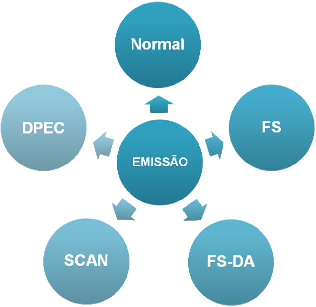

- a)  Normal - é o procedimento padrão de emissão da NF-e com transmissão da NF-e para a Secretaria de Fazenda de origem do emissor para obter a autorização de uso, o DANFE será impresso em papel comum após o recebimento da autorização de uso da NF-e;


- b)  FS - Contingência com uso do Formulário de Segurança é a alternativa mais simples para a situação em que exista algum impedimento para obtenção da autorização de uso da NF-e, como por exemplo, um problema no acesso à internet ou a indisponibilidade da SEFAZ de  origem  do  emissor.  Neste  caso,  o  emissor  pode  optar  pela  emissão  da  NF-e  em contingência com a impressão do DANFE em Formulário de Segurança. O envio das NF-e emitidas  nesta  situação  para  SEFAZ  de  origem  será  realizado  quando  cessarem  os problemas técnicos que impediam a sua transmissão. Somente as empresas que possuam estoque de Formulário de Segurança poderão utilizar este impresso fiscal para a emissão do DANFE, pois  o  Convênio  ICMS  110/08  criou  o  impresso  fiscal  denominado  Formulário  de Segurança para impressão de Documento Auxiliar do Documento Fiscal eletrônico - FS-DA, não sendo mais possível a aquisição do Formulário de Segurança - FS para impressão do DANFE, a partir de 1º de agosto de 2009;
- c)  FS-DA  -  Contingência  com  uso  do  Formulário  de  Segurança  para  impressão  de Documento Auxiliar do Documento Fiscal eletrônico - FS-DA - é um modelo operacional similar ao modelo operacional da contingência com uso de Formulário de Segurança - FS, A única  diferença  é  a  substituição  do  FS  pelo  FS-DA.  O  FS-DA  foi  criado  para  aumentar  a capilaridade dos pontos de venda do Formulário de Segurança com a criação da figura do estabelecimento  distribuidor  do  FS-DA  que  poderá  adquirir  FS-DA  dos  fabricantes  para distribuir para os emissores de NF-e de sua região;
- d)  SCAN - Sistema de Contingência do Ambiente Nacional - é a alternativa de emissão da NF-e  em  contingência  com  transmissão  da  NF-e  para  o  Sistema  de  Contingência  do Ambiente Nacional (SCAN), nesta modalidade de contingência o DANFE pode ser impresso em papel comum e não existe necessidade de transmissão da NF-e para SEFAZ de origem quando cessarem os problemas técnicos que impediam a transmissão. Além do uso de série específica reservada para o SCAN (série 900-999), o Sistema de Contingência do Ambiente Nacional depende de ativação da SEFAZ de origem, o que significa dizer que o SCAN só entra  em  operação  quando  a  SEFAZ  de  origem  estiver  com  problemas  técnicos  que impossibilitam a recepção da NF-e;
- e)  DPEC - Declaração Prévia de Emissão em Contingência - é alternativa de emissão de NF-e em contingência com o registro prévio do resumo das NF-e emitidas. O registro prévio das  NF-e  permite  a  impressão  do  DANFE  em  papel  comum.  A  validade  do  DANFE  está condicionada à posterior transmissão da NF-e para a SEFAZ de Origem.


## 2.1 Modalidades de Emissão de NF-e

O  AJUSTE  SINIEF  07/05  e  as  legislações  específicas  de  cada  UF  disciplinam  e  detalham  as modalidades de emissão de NF-e que serão descritos de forma simplificada a seguir.

Em um cenário de falha que impossibilite a emissão da NF-e na modalidade normal, o emissor deve escolher  a  modalidade  de  emissão  de  contingência  que  lhe  for  mais  conveniente,  ou  até  mesmo aguardar  a  normalização  da  situação  para  voltar  a  emitir  a  NF-e  na  modalidade  normal,  caso  a emissão da NF-e não seja premente.

Como não existe precedência ou hierarquia nas modalidades de emissão da NF-e em contingência, o emissor pode adotar uma, algumas ou todas as modalidades que tiver à sua disposição, ou não adotá-las.

## 2.1.1 Emissão Normal

O processo de emissão normal é a situação desejada e mais adequada para o emissor, pois é a situação  em  que  todos  os  recursos  necessários  para  a  emissão  da  NF-e  estão  operacionais  e  a autorização de uso da NF-e é concedida normalmente pela SEFAZ.

Nesta situação a emissão das NF-e é realizada normalmente com a impressão do DANFE em papel comum, após o recebimento da autorização de uso da NF-e.

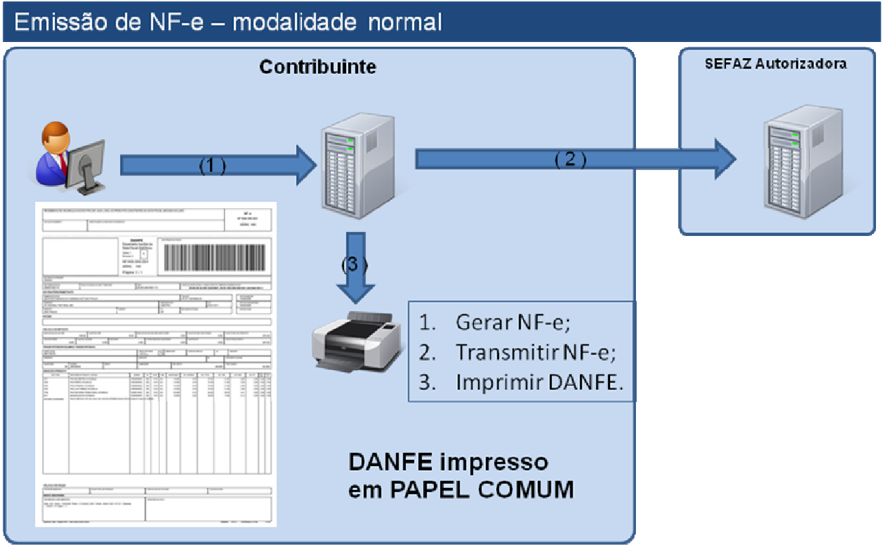


## 2.1.2 Contingência em Formulário de Segurança - FS

A contingência com o uso do formulário de segurança é o processo mais simples de implementar, sendo  o  processo  de  contingência  que  tem  a  menor  dependência  de  recursos  de  infra-estrutura, hardware e software para ser utilizado.

Sendo identificada a existência de qualquer incidente que prejudique ou impossibilite a transmissão das NF-e e/ou obtenção da autorização de uso da SEFAZ, a empresa pode adotar a Contingência com formulário de segurança que requer os seguintes procedimentos do emissor:

- geração de novo arquivo XML da NF-e com o campo tp\_emis alterado para '2';
- impressão de pelo menos duas vias do DANFE em formulário de segurança constando no corpo a expressão ' DANFE em Contingência - impresso em decorrência de problemas técnicos ', tendo as vias a seguinte destinação:
- I - uma das vias permitirá o trânsito das mercadorias e deverá ser mantida em arquivo pelo destinatário pelo prazo estabelecido na legislação tributária para a guarda de documentos fiscais;
- II  -  outra  via  deverá  ser  mantida  em  arquivo  pelo  emitente  pelo  prazo  estabelecido  na  legislação tributária para a guarda dos documentos fiscais.
- lavrar termo circunstanciado no livro Registro de Documentos Fiscais e Termos de Ocorrência - RUDFTO, modelo 6, para registro da contingência, informando:
- I - o motivo da entrada em contingência;
- II - a data, hora com minutos e segundos do seu início e seu término;
- III - a numeração e série da primeira e da última NF-e geradas neste período;
- IV - identificar a modalidade de contingência utilizada.
- transmitir as NF-e imediatamente após a cessação dos problemas técnicos que impediam a transmissão da NF-e, observando o prazo limite de transmissão na legislação;
- tratar  as  NF-e  transmitidas  por  ocasião  da  ocorrência  dos  problemas  técnicos  que  estão pendentes de retorno.

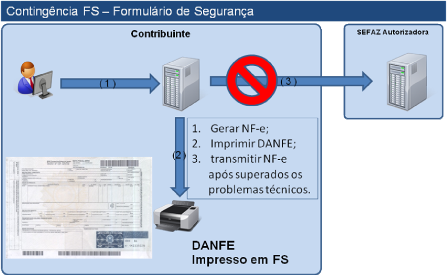

Nota: Esta alternativa de contingência poderá ser utilizada até o término do estoque de Formulários de  Segurança  -  FS  autorizados,  mediante  PAFS,  até  31/07/09,,  desde  que  o  Formulário  de Segurança  -  FS  tenha  tamanho  A4  e  seja  lavrado  termo  no  livro  RUDFTO,  conforme  dispõe  a cláusula décima segunda do Convênio ICMS 110/08, a seguir transcrito:


'Cláusula  décima  segunda Os  formulários  de  segurança,  obtidos  em  conformidade  com  o Convênio ICMS 58/95 e Ajuste SINIEF 07/05, em estoque, poderão ser utilizados pelo contribuinte credenciado como  emissor  de  documento  fiscal  eletrônico,  para  fins  de  impressão  dos  documentos  auxiliares  dos documentos eletrônicos relacionados no § 1º da cláusula primeira, desde que:

I - o formulário de segurança tenha tamanho A4 para todas as vias;

II - seja lavrado, previamente, termo no livro Registro de Uso de Documentos Fiscais e Termos de Ocorrência - RUDFTO, modelo 6, contendo as informações de numeração e série dos formulários e, quando se tratar de formulários de segurança obtidos por regime especial, na condição de impressão autônomo, a data da opção pela nova finalidade.

Parágrafo único. Os formulários de segurança adquiridos na condição de impressor autônomo e que tenham sido destinados para impressão de documentos auxiliares de documentos fiscais eletrônicos, nos termos  do  item  II  acima,  somente  poderão  ser  utilizados  para  impressão  de  documentos  auxiliares  de documentos fiscais eletrônicos.'


## 2.1.3 Contingência SCAN

O Sistema de Contingência do Ambiente Nacional - SCAN é administrada pela Receita Federal do Brasil  que  pode  assumir  a  recepção  e  autorização  das  NF-e  de  qualquer  unidade  da  federação, quando solicitado pela UF interessada.

O SCAN somente tratará NF-e emitidas com numeração nas séries 900 a 999, inclusive. Esta regra aplica-se a todos os serviços (autorização, cancelamento, inutilização e consulta situação da NF-e). Com esta restrição elimina-se a possibilidade de que, após a recuperação de uma falha, uma mesma NF-e tenha sido autorizada pelo SCAN e pela SEFAZ origem. Da mesma forma, a SEFAZ origem não autorizará, cancelará ou inutilizará numeração de NF-e nestas séries reservadas ao SCAN. A exceção a esta regra é o serviço de consulta à situação da NF-e, uma vez que a SEFAZ origem poderá responder à consulta de situação das NF-e das séries 900-999 que estejam em sua base de dados.

A  recepção  das  NF-e  pelo  SCAN  é  ativado  pela  UF  interessada  e  uma  vez  acionada  passa  a recepcionar  as  NF-e  de  série  900  a  999  dos  emissores  credenciados  para  emitir  NF-e  na  UF. Eventualmente um emissor credenciado recentemente pode não estar autorizado a emitir NF-e no SCAN caso o Cadastro Nacional de Emissores não tenha sido atualizado pela UF interessada.

Ocorrendo  a  indisponibilidade,  a  SEFAZ  origem  acionará  o  SCAN  para  que  ative  o  serviço  de recepção e autorização de NF-e em seu lugar. Finda a indisponibilidade, a SEFAZ origem acionará novamente  o  SCAN,  agora  para  desativar  o  serviço.  A  desativação  do  serviço  de  recepção  e autorização de NF-e pelo SCAN será precedida por um período de 15 minutos, em que ambos os ambientes estarão simultaneamente disponíveis, de forma a minimizar o impacto da mudança para o Contribuinte.

Inicialmente, o acionamento para ativação/desativação será baseado em interação humana, entre a operação da SEFAZ origem e a operação do SCAN.

Apenas  o  serviço  de  recepção  e  autorização  de  NF-e  pelo  SCAN  seguirá  a  sistemática  de ativação/desativação.  Os  demais  serviços  (cancelamento,  inutilização,  consulta  status  de  NF-e  e consulta  status  do  serviço)  ficarão  permanentemente  ativos.  Com  isso  o  Contribuinte  poderá,  a qualquer momento, executar os cancelamentos, inutilizações e consultas necessárias à manutenção da integridade da seqüência de numeração das emissões de NF-e nas séries reservadas ao SCAN.

Após a recuperação da falha pela SEFAZ origem, as NF-e recebidas pelo SCAN (séries 900 a 999) serão transmitidas pelo Ambiente Nacional para a SEFAZ origem, de forma que, como as demais NF-e, elas ficarão disponíveis para consulta nos dois ambientes.

A contingência  SCAN  deverá  ser  ativada com  maior  freqüência nas situações  em  que  a indisponibilidade  da  recepção  de  NF-e  pela  SEFAZ  de  origem  seja  previsível  e  de  longa  duração como  é  o  caso  das  interrupções  programadas  para  manutenção  preventiva  da  infra-estrutura  de recepção da SEFAZ de origem.

A identificação de que o SCAN foi ativado pela SEFAZ será através do serviço Consulta ao Status do SCAN  e  somente  neste  caso  a  empresa  pode  acionar  o  SCAN,  devendo  adotar  os  seguintes procedimentos:

- Identificação de que o SCAN foi acionado pela SEFAZ;
- geração de novo arquivo XML da NF-e com o campo tp\_emis alterado para '3';
- alteração da série da NF-e para a faixa de uso exclusivo do SCAN (900 a 999), a alteração da série implica na adoção da numeração em uso da série escolhida o que implica na alteração do número da NF-e também;
- transmissão da NF-e para o SCAN e obtenção da autorização de uso;


- impressão do DANFE em papel comum;
- lavratura  de  termo  circunstanciado  no  livro  Registro  de  Documentos  Fiscais  e  Termos  de Ocorrência - RUDFTO, modelo 6, para registro da contingência, informando: I - o motivo da entrada em contingência;
- II - a data, hora com minutos e segundos do seu início e seu término;
- III - a numeração e série da primeira e da última NF-e geradas neste período;
- IV - identificar a modalidade de contingência utilizada.
- tratamento dos arquivos de NF-e transmitidos antes da ocorrência dos problemas técnicos e que  estão  pendentes  de  retorno,  cancelando  aquelas  NF-e  autorizadas  e  que  foram substituídas pela seriação do SCAN ou inutilizando a numeração de arquivos não recebidos ou processados.

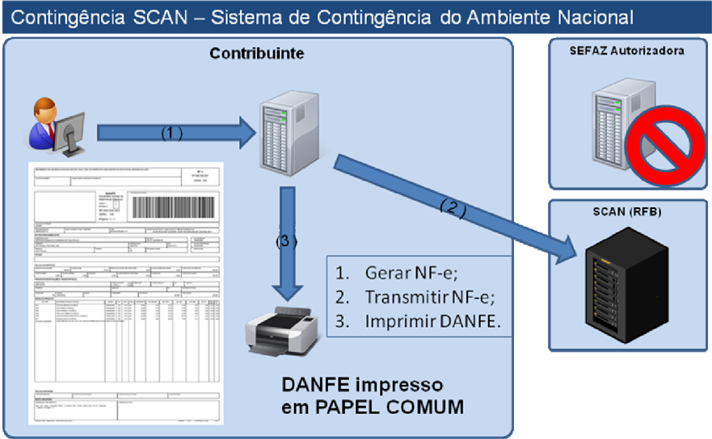

## WebServices do ambiente de Homologação do SCAN:

- https://hom.nfe.fazenda.gov.br/SCAN/NfeCancelamento/NfeCancelamento.asmx
- https://hom.nfe.fazenda.gov.br/SCAN/NfeConsulta/NfeConsulta.asmx
- https://hom.nfe.fazenda.gov.br/SCAN/NfeInutilizacao/NfeInutilizacao.asmx
- https://hom.nfe.fazenda.gov.br/SCAN/NfeRecepcao/NfeRecepcao.asmx
- https://hom.nfe.fazenda.gov.br/SCAN/NfeRetRecepcao/NfeRetRecepcao.asmx
- https://hom.nfe.fazenda.gov.br/SCAN/NfeStatusServico/NfeStatusServico.asmx

## WebServices do ambiente de produção do SCAN:

- https://www.scan.fazenda.gov.br/NfeCancelamento/NfeCancelamento.asmx
- https://www.scan.fazenda.gov.br/NfeConsulta/NfeConsulta.asmx
- https://www.scan.fazenda.gov.br/NfeInutilizacao/NfeInutilizacao.asmx
- https://www.scan.fazenda.gov.br/NfeRecepcao/NfeRecepcao.asmx
- https://www.scan.fazenda.gov.br/NfeRetRecepcao/NfeRetRecepcao.asmx
- https://www.scan.fazenda.gov.br/NfeStatusServico/NfeStatusServico.asmx


## 2.1.4 Contingência  Eletrônica  com  o  uso  da  Declaração  Prévia  de  Emissão  em Contingência - SCE/DPEC

O modelo de Contingência Eletrônica foi idealizado como alternativa que permita a dispensa do uso do formulário de segurança para impressão do DANFE e a não alteração da série e numeração da NF-e emitida em contingência.

Esta  modalidade  de  contingência  é  baseada  no  conceito  de  Declaração  Prévia  de  Emissão  em Contingência  -  DPEC,  que  contem  as  principais  informações  da  NF-e  que  serão  emitidas  em contingência, que será prestada pelo emissor para SEFAZ.

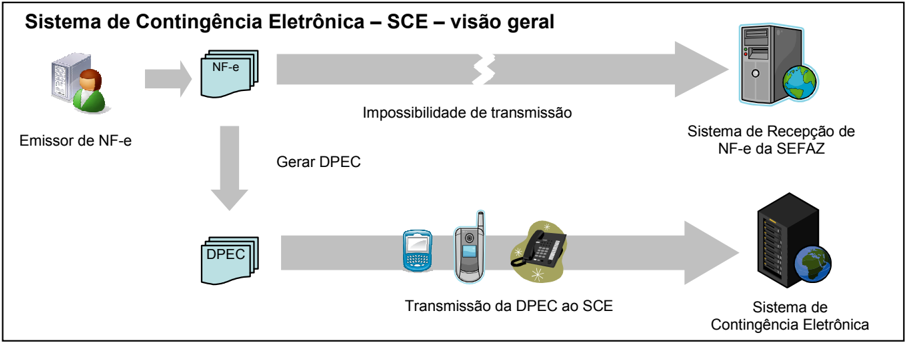

A  Contingência  Eletrônica  poderá  ser  adotada  por  qualquer  emissor  que  esteja  impossibilitado  de transmissão e/ou recepção das autorizações de uso de suas NF-e, adotando os seguintes passos:

- alterar o tp\_Emis das NF-e que deseja emitir para '4';
- regerar as notas fiscais e os lotes de NF-e;
- gerar o arquivo XML de Declaração Prévia de Emissão em Contingência - DPEC, com as seguintes informações das NF-e que compõe um lote de NF-e:
- o chave de acesso;
- o CNPJ ou CPF do destinatário;
- o UF de localização do destinatário;
- o Valor Total da NF-e;
- o Valor Total do ICMS;
- o Valor Total do ICMS retido por Substituição Tributária.
- completar o arquivo gerado com outras informações de controle como o CNPJ, a IE e a UF de localização  do  contribuinte  emissor  e  assinar  o  arquivo  com  o  certificado  digital  do  seu emissor;
- enviar  o  arquivo  XML  da  DPEC  para  a  Receita  Federal  do  Brasil  via  Web  Service  ou  via upload através de página WEB do Portal Nacional da NF-e;
- impressão dos DANFE das NF-e que constam da DPEC enviado ao SCE em papel comum, constando no corpo a expressão ' DANFE impresso em contingência - DPEC regularmente recebida pela Receita Federal do Brasil ', tendo as vias a seguinte destinação: I - uma das vias permitirá o trânsito das mercadorias e deverá ser mantida em arquivo pelo destinatário
- pelo prazo estabelecido na legislação tributária para a guarda de documentos fiscais;
- II  -  outra  via  deverá  ser  mantida  em  arquivo  pelo  emitente  pelo  prazo  estabelecido  na  legislação tributária para a guarda dos documentos fiscais.
- lavrar termo circunstanciado no livro Registro de Documentos Fiscais e Termos de Ocorrência - RUDFTO, modelo 6, para registro da contingência, informando:
- I - o motivo da entrada em contingência;
- II - a data, hora com minutos e segundos do seu início e seu término;


III - a numeração e série da primeira e da última NF-e geradas neste período;

- IV - identificar a modalidade de contingência utilizada.
- Adotar as seguintes providências, após a cessação dos problemas técnicos que impediam a transmissão da NF-e para UF de origem:
- o transmitir  as  NF-e  emitidas  em  Contingência  Eletrônica  para  a  SEFAZ  de  origem, observando o prazo limite de transmissão na legislação;
- o tratar  as  NF-e  transmitidas  por  ocasião  da  ocorrência  dos  problemas  técnicos  que estão pendentes de retorno;

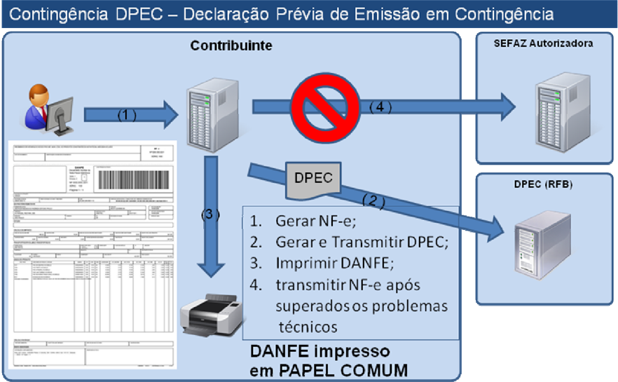

## WS da DPEC do ambiente de homologação:

- https://hom.nfe.fazenda.gov.br/SCERecepcaoRFB/SCERecepcaoRFB.asmx
- https://hom.nfe.fazenda.gov.br/SCEConsultaRFB/SCEConsultaRFB.asmx

## Página Web da DPEC do ambiente de homologação:

- https://hom.nfe.fazenda.gov.br/PORTAL/DPEC/ConsultaDPEC.aspx
- https://hom.nfe.fazenda.gov.br/PORTAL/DPEC/UploadDPEC.aspx

## WS de DPEC do ambiente de produção:

- https://www.nfe.fazenda.gov.br/SCERecepcaoRFB/SCERecepcaoRFB.asmx
- https://www.nfe.fazenda.gov.br/SCEConsultaRFB/SCEConsultaRFB.asmx

## Página Web da DPEC do ambiente de produção:

- https://www.nfe.fazenda.gov.br/portal/DPEC/ConsultaDPEC.aspx
- https://www.nfe.fazenda.gov.br/portal/DPEC/UploadDPEC.aspx


## 2.1.5 Contingência  em  Formulário  de  Segurança  para  impressão  de  Documento Auxiliar de Documento Fiscal Eletrônico - FS-DA

Este procedimento de contingência será adotado pelos emissores que adquirirem o Formulário de Segurança  para  impressão  de  Documento  Auxiliar  de  Documento  Fiscal  -  FS-DA,  e  substitui  a contingência com o uso do formulário de segurança.

Sendo identificada a existência de qualquer fator que prejudique ou impossibilite a transmissão das NF-e e/ou obtenção da autorização de uso da SEFAZ, a empresa pode acionar a Contingência com FS-DA, adotando os seguintes passos:

- gerar novo arquivo XML da NF-e com o campo tp\_emis alterado para '5';
- imprimir  o  DANFE  em  pelo  menos  duas  vias  do  FS-DA  constando  no  corpo  a  expressão ' DANFE em Contingência - impresso em decorrência de problemas técnicos ', tendo as vias a seguinte destinação:
- I - uma das vias permitirá o trânsito das mercadorias e deverá ser mantida em arquivo pelo destinatário pelo prazo estabelecido na legislação tributária para a guarda de documentos fiscais;
- II  -  outra  via  deverá  ser  mantida  em  arquivo  pelo  emitente  pelo  prazo  estabelecido  na  legislação tributária para a guarda dos documentos fiscais.
- lavrar termo circunstanciado no livro Registro de Documentos Fiscais e Termos de Ocorrência - RUDFTO, modelo 6, para registro da contingência, informando:
- I - o motivo da entrada em contingência;
- II - a data, hora com minutos e segundos do seu início e seu término;
- III - a numeração e série da primeira e da última NF-e geradas neste período;
- IV - identificar a modalidade de contingência utilizada.
- transmitir as NF-e imediatamente após a cessação dos problemas técnicos que impediam a transmissão da NF-e, observando o prazo limite de transmissão na legislação;
- tratar  as  NF-e  transmitidas  por  ocasião  da  ocorrência  dos  problemas  técnicos  que  estão pendentes de retorno.

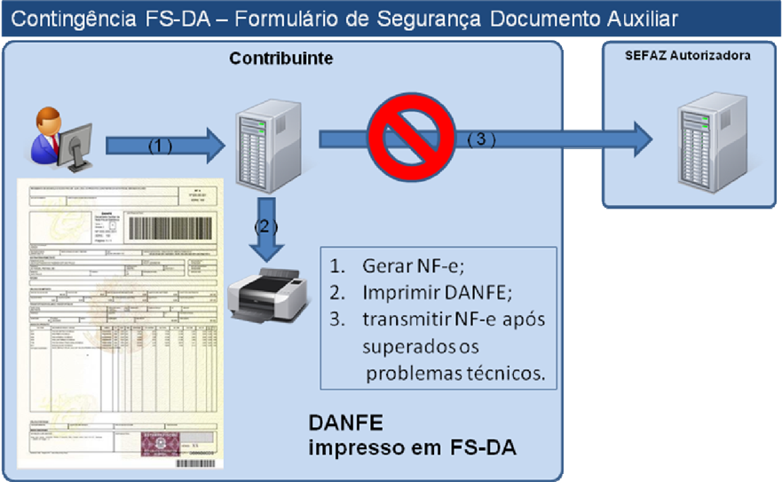


## 2.1.6 Quadro Resumo das modalidades de emissão da NF-e

A  seguir  resumimos  os  principais  procedimentos  necessários  para  adequar  a  NF-e  para  a modalidade de emissão desejada.

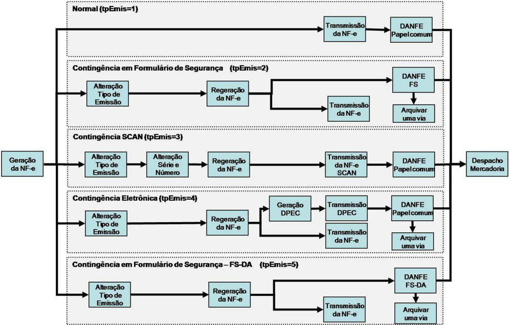


## 2.2 Documento Auxiliar da Nota Fiscal Eletrônica - DANFE

O  DANFE  é  um  documento  fiscal  auxiliar  que  tem  a  finalidade  de  acobertar  a  circulação  da mercadoria e não se confunde com a NF-e da qual é mera representação gráfica. A sua validade está  condicionada  à  existência  da  NF-e  que  representa  devidamente  autorizada  na  SEFAZ  de origem.

O DANFE deverá ser impresso em papel, exceto papel jornal, no tamanho mínimo A4 (210 x 297 mm)  e  máximo  ofício  2  (230  x  330  mm),  podendo  ser  utilizadas  folhas  soltas,  formulário  de segurança, Formulário de Segurança para Impressão de Documento Auxiliar de Documento Fiscal Eletrônico (FS-DA), formulário contínuo ou formulário pré-impresso.

As folhas soltas, formulário contínuo ou formulário pré-impresso são considerados papel comum e a sua aquisição ou confecção não está sujeito ao controle do fisco como ocorre com o formulário de segurança que é um impresso fiscal com normas rígidas de aquisição, controle e utilização.

## 2.2.1 Formulários de Segurança para Impressão do DANFE

Atualmente existem os seguintes tipos de formulários de segurança:

- Formulário de Segurança - FS: , disciplinado pelos Convênios ICMS 58/95 e 131/95;
- Formulário de Segurança para Impressão de Documento Auxiliar de Documento Fiscal Eletrônico - FS-DA : disciplinado pelo Convênio ICMS 110/08 e Ato COTEPE 35/08.

O uso do formulário de segurança FS será permitido apenas para consumir os estoques existentes, pois sua aquisição para impressão de DANFE não será mais autorizada a partir de 01/08/2009.

O  FS  e  o  FS-DA  podem  ser  fabricados  por  estabelecimento  industrial  gráfico  previamente credenciado  junto  à  COTEPE/ICMS,  porém  somente  este  último  tem  a  possibilidade  de  ser distribuído através de estabelecimento gráfico credenciado como distribuidor junto à UF de interesse, mediante a obtenção de credenciamento, concedido por regime especial,

Os formulários de segurança são confeccionados com requisitos de segurança com o objetivo de dificultar    falsificação  e fraudes.  Estes requisitos são adicionados ou por ocasião da fabricação do papel de segurança produzido pelo processo "mould made"ou por ocasião da impressão no caso do FS  fabricado  com  papel  dotado  de  estampa  fiscal,  com  recursos  de  segurança  impressos.  Assim,  a legislação tributária permite o uso de formulários de segurança que atendam os seguintes requisitos:

- FS com Estampa Fiscal -  impresso  com  calcografia  com microtexto e  imagem  latente  na área  reservado  ao  fisco,  o  impresso  deverá  ter  fundo  numismático  com  tinta  reagente  a produtos químicos combinado com as Armas da República;
- FS em Papel de Segurança - com filigrana (marca d'água) produzida pelo processo "mould made", fibras coloridas e luminescentes, papel não fluorescente, microcápsulas de reagente químico e microporos que aumentem a aderência do toner ao papel.

Todos  os  formulários  de  segurança  terão  o  número  de  controle  do  formulário  com  numeração sequencial de 000.000.001 a 999.999.999 e seriação de "AA" a "ZZ", impresso no quadro reservado ao fisco.

A  identificação  do  formulário  de  segurança  com  calcografia  é  mais  simples  pela  existência  da estampa  fiscal  localizada  no  quadro  reservado  ao  fisco  e  pelo  fundo  numismático  com  cor característica associada ao brasão das Armas da República no corpo do formulário.


A diferenciação entre o FS e FS-DA produzidos por calcografia é estabelecida simultaneamente pela cor utilizada no fundo numismático, pela estampa fiscal, pelas Armas da República e pelo logotipo característico de formulário destinado a impressão de documento fiscal eletrônico.

O FS tem o fundo numismático impresso na cor de tonalidade predominante esverdeada combinada com  as  Armas  da  República  e  estampa  fiscal  na  cor  azul  pantone.  O  FS-DA  tem  o  fundo numismático impresso na cor de tonalidade predominante Salmão pantone nº 155 combinada com as Armas da República ao lado do logotipo que caracteriza o Documento Auxiliar de Documento Fiscal Eletrônico e estampa fiscal na cor Vinho Pantone, conforme exemplos visualizados na figura abaixo.

Exemplo de FS

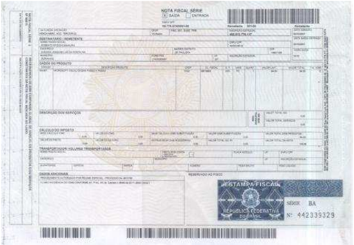

Proxim.83mm

Exemplo de FS-DA

A  identificação  do  formulário  de  segurança  fabricado  em  papel  de  segurança  não  é  tão  evidente como é o formulário com calcografia, pois a primeira vista é um papel branco facilmente confundido com um papel comum.

A distinção deste papel de segurança deve ser feito pela  filigrana (marca d'água) existente no seu corpo; pela seriação composta por duas letras e numeração seqüencial de nove números aposta no espaço  normalmente  reservado  ao  fisco;  pela  impressão  da  identificação  do  adquirente  e  pelo códigos de barras impressos no rodapé inferior.

O  FS  possui  filigrana  caracterizada  com  o  brasão  de  Armas  da  República  intercalada  com  a expressão 'NOTA FISCAL', enquanto que o FS-DA possui filigrana caracterizada pelo brasão das Armas  da  República  intercalada  com  o  logotipo  do  Documento  Auxiliar  de  Documentos  Fiscais Eletrônicos. Estas filigranas somente se tornam visíveis contra a luz, conformes exemplos e modelos reproduzidos nas figuras abaixo

Ex. FS com os detalhes da filigrana que só é visível contra luz. No FS-DA teremos o logotipo do Documento Auxiliar de Documentos Fiscais Eletrônicos no lugar da expressão 'NOTA FISCAL'.

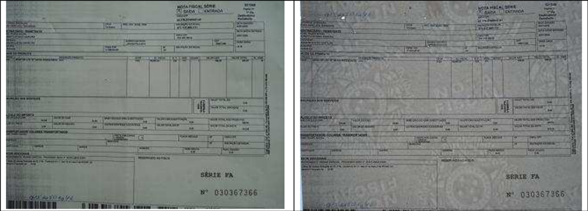

ModeloPaisagem

297mm

Aprox.77mm

210mm,（com10mm dearea branca norodape）

85mm

Xxs

AFEDERATI

000000000

Modelo da filigrana característica do papel de segurança exclusivo para o FS-DA


Modelo das dimensões e posicionamento das filigranas no papel de segurança para FS-DA

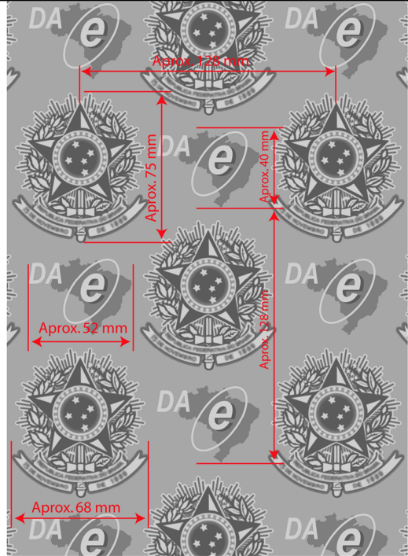

## 2.2.2 localização da Estampa Fiscal no FS -DA

A estampa fiscal é impressa na área reservado ao fisco que está localizada no canto inferior direito do formulário de segurança.

Nesta  mesma  área  também  é  impresso  a  série  e  o  número  de  controle  do  impresso,  assim,  o emissor deve tomar os cuidados necessários para que o recibo do canhoto de entrega não utilize o espaço de 40 mm x 85 mm do canto inferior do impresso, deslocando-o para a parte superior do formulário Importante destacar que o FS-DA tem um código de barras com a identificação da sua origem e seu usuário pré-impresso no rodapé inferior, que deve ser preservado, pois será utilizado na fiscalização de trânsito.

Ex. de DANFE com recibo deslocado para a parte superior.


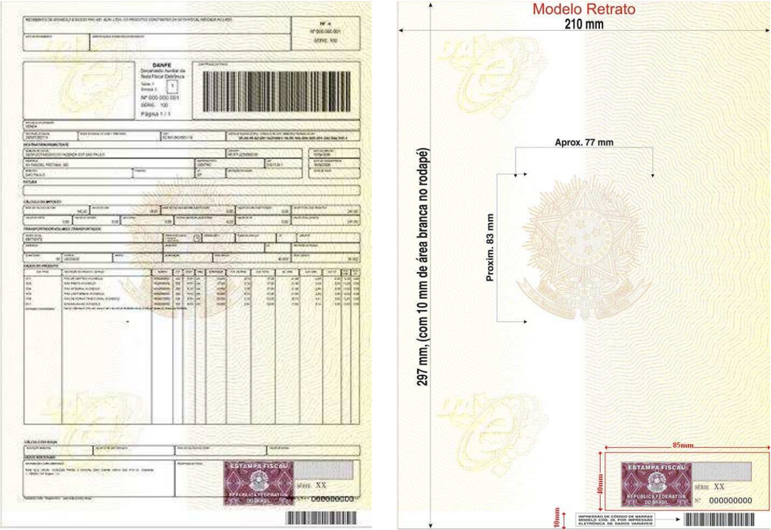

## 2.2.3 Impressão do DANFE em Contingência com Formulário de Segurança

Quando a modalidade emissão de contingência for baseada no uso de formulário de segurança, o DANFE deve ser impresso no mesmo tipo de formulário de segurança declarado no campo tp\_emis da NF-e.

Nos casos de contingência com uso de formulário de segurança, a impressão do DANFE em papel comum contraria a legislação e ocasiona graves conseqüências ao emitente, pelo descumprimento de obrigação acessória, caracterizando ainda a inidoneidade do DANFE para efeito de circulação da mercadoria e de escrituração e  aproveitamento do crédito pelo seu destinatário.

O formulário de segurança pode ser utilizado para impressão do DANFE em qualquer modalidade de emissão,  contudo,  o  emissor  deverá  formalizar  a  opção  pelo  uso  do  formulário  de  segurança  em todas as operações no livro Registro de Documentos Fiscais e Termos de Ocorrência - RUDFTO, modelo 6.

|                                 | Modalidade de emissão da NF-e   | Modalidade de emissão da NF-e   | Modalidade de emissão da NF-e   | Modalidade de emissão da NF-e   | Modalidade de emissão da NF-e   |
|---------------------------------|---------------------------------|---------------------------------|---------------------------------|---------------------------------|---------------------------------|
| Impressão do DANFE              | Normal                          | FS                              | FS-DA                           | SCAN                            | DPEC                            |
| em papel comum                  |                                 |                                 |                                 |                                 |                                 |
| em FS (Convênio ICMS 58/57)     |                                 |                                 |                                 |                                 |                                 |
| em FS-DA (Convênio ICMS 110/08) |                                 |                                 |                                 |                                 |                                 |


DANFE regular /

DANFE irregular /

DANFE regular, mas requer opção do emissor


## 2.3 Ações que devem ser tomadas após a recuperação da falha

A emissão de NF-e em contingência é um procedimento de exceção e existem algumas ações que devem  ser  tomadas  após  a  recuperação  da  falha,  a  principal  delas  é  a  transmissão  das  NF-e emitidas em contingência para que sejam autorizadas.

## 2.3.1 Registro da Contingência no RUDFTO

Qualquer que  seja  a  hipótese  de  contingência,  é  necessário  lavrar  termo  circunstanciado  no  livro Registro de Documentos Fiscais e Termos de Ocorrência - RUDFTO, modelo 6, para registro da contingência, informando:

- I - o motivo da entrada em contingência;
- II - a data, hora com minutos e segundos do seu início e seu término;
- III - a numeração e série da primeira e da última NF-e geradas neste período;
- IV - identificar a modalidade de contingência utilizada.

## 2.3.2 Transmissão das NF-e emitidas em Contingência

As notas fiscais emitidas em contingência FS, FS-DA e DPEC devem ser transmitidas imediatamente após a cessação dos problemas técnicos que impediam a transmissão da NF-e, observando o prazo limite de transmissão estabelecido na legislação.

As NF-e emitidas no SCAN não precisam ser transmitidas para a SEFAZ de origem.

## 2.3.3 Rejeição de NF-e emitidas em Contingência

Caso ocorra a rejeição de alguma NF-e emitida em contingência, o contribuinte deverá:

I - gerar novamente o arquivo com a mesma numeração e série, sanando a irregularidade desde que não se altere:

- a)  as  variáveis  que  determinam  o  valor  do  imposto  tais  como:  base  de  cálculo,  alíquota, diferença de preço, quantidade, valor da operação ou da prestação;
- b) a correção de dados cadastrais que implique mudança do remetente ou do destinatário;
- c) a data de emissão ou de saída;

II - solicitar Autorização de Uso da NF-e;

III  -  imprimir  o  DANFE  correspondente  à  NF-e  autorizada,  no  mesmo  tipo  de  papel  utilizado  para imprimir o DANFE original;

IV  -  providenciar,  junto  ao  destinatário,  a  entrega  da  NF-e  autorizada  bem  como  do  novo  DANFE impresso  nos  termos  do  item  III,  caso  a  geração  saneadora  da  irregularidade  da  NF-e  tenha promovido alguma alteração no DANFE.

## 2.3.4 NF-e Pendentes de Retorno

Quando  ocorrer  uma  falha,  seja  ela  no  ambiente  do  Contribuinte,  no  ambiente  da  SEFAZ  origem  ou  no ambiente do SCAN, há a probabilidade de existirem NF-e transmitidas pelo contribuinte e para as quais ele ainda  não  obteve  o  resultado  do  processamento.  Estas  NF-e  são  denominadas  de  'NF-e  Pendentes  de Retorno'.


As NF-e Pendentes de Retorno podem não ter sido recebidas pela SEFAZ origem, estar na fila aguardando processamento, estar em processamento ou o processamento pode já ter sido concluído.

Caso a falha tenha ocorrido na SEFAZ origem, ao retornar à operação normal, é possível que as NF-e que estavam  em  processamento  sejam  perdidas,  e  que  as  que  estavam  na  fila  tenham  o  seu  processamento concluído normalmente.

Cabe à aplicação do contribuinte tratar adequadamente a situação das NF-e Pendentes de Retorno e executar, imediatamente após o retorno à operação normal, as ações necessárias à regularização da situação destas NF-e, a saber:

- a) Cancelar as NF-e Pendentes de Retorno que tenham sido autorizadas pela SEFAZ origem, mas que tiveram as operações comerciais correspondentes registradas em NF-e emitidas em contingência.
- b) Inutilizar a numeração das NF-e Pendentes de Retorno que não foram autorizadas ou denegadas.


## 3.  Arquitetura do Sistema Eletrônico de Contingência

## 3.1 Modelo Conceitual do SCE

O  Sistema  de  Contingência  Eletrônica  -  SCE  é  o  modelo  de  registro  de  Declaração  Prévia  de Emissão em Contingência - DPEC emitida pelo Emissor de NF-e em contingência.

Esta  modalidade  de  contingência  prevê  a  elaboração  de  uma  Declaração  Prévia  de  Emissão  em Contingência - DPEC que contem os resumos das NF-e emitidas pelo interessado e a emissão do DANFE em papel comum sem alteração da série da NF-e.

Como a DPEC é um resumo das NF-e, o seu tamanho é bastante reduzido em comparação com a NF-e, sendo viável a transmissão para o Web Service do SCE por acesso discado ou através de upload  em  página  WEB  do  Portal  Nacional  da  NF-e  (Ambiente  Nacional).  A  opção  de  upload  de arquivo  é  interessante  por  dispensar  a  exigência  de  uma  aplicação  cliente  para  consumir  o  Web Service, permitindo a transmissão da DPEC de qualquer equipamento que tenha acesso a Internet via browser.

A consulta da DPEC existente no Sistema de Contingência Eletrônica - SCE poderá ser feita através de Web Service pelo emissor.

A  consulta  pela  chave  de  acesso  da  NF-e  deverá  disponibilizar  as  informações  básicas  da  NF-e dando uma maior segurança para todos os envolvidos no processo de emissão da NF-e.

## 3.2 Padrões Técnicos

## 3.2.1 Padrão de documento XML

## a) Padrão de Codificação

A especificação do documento XML adotada é a recomendação W3C para XML 1.0, disponível em  www.w3.org/TR/REC-xml  e  a  codificação  dos  caracteres  será  o  UTF-8,  assim  todos  os documentos XML serão iniciados com a seguinte declaração:

&lt;?xml version="1.0" encoding="UTF-8"?&gt;

OBS:  Lembrando  que  cada  arquivo  XML  somente  poderá  ter  uma  única  declaração  &lt;?xml version="1.0"  encoding="UTF-8"?&gt;.  Nas  situações  em  que  um  documento  XML  pode  conter outros  documentos  XML,  como  ocorre  com  o  documento  XML  de  retorno  da  DPEC,  deve-se tomar o cuidado para que exista uma única declaração no início do arquivo.

## b) Declaração namespace

O  documento  XML  deverá  ter  uma  única  declaração  de namespace no  elemento  raiz  do documento com o seguinte padrão:

&lt;envDPEC xmlns='http://www.portalfiscal.inf.br/nfe' &gt; (exemplo para o XML de envio da DPEC)

O uso de declaração namespace diferente do padrão estabelecido é vedado.

A  declaração  do namespace da  assinatura digital deverá  ser  realizada na  própria tag &lt;Signature&gt;, conforme exemplo abaixo.

Cada documento XML deverá ter o seu namespace individual  em seu elemento raiz. No caso específico do arquivo de retorno da DPEC, a DPEC enviada e o arquivo de retorno terão seu namespace individual,  para  possibilitar  que  a  extração  da  DPEC  enviada  da  mensagem  de retorno se necessário.


Segue abaixo um exemplo:

```
<?xml version="1.0" encoding="UTF-8"?> <loteRFBNFe xmlns="http://www.portalfiscal.inf.br/nfe" versao="1.00"> <NFe xmlns="http://www.portalfiscal.inf.br/nfe"> <infNFe Id="NFe31060243816719000108650000000010001234567890" versao="1.01"> ... <Signature xmlns="http://www.w3.org/2000/09/xmldsig#"> /elipsis </NFe> <NFe xmlns="http://www.portalfiscal.inf.br/nfe"> <infNFe Id="NFe31060243816719000108650000000010011234567900" versao="1.01"> ... <Signature xmlns="http://www.w3.org/2000/09/xmldsig#"> /elipsis </NFe> <NFe xmlns="http://www.portalfiscal.inf.br/nfe"> <infNFe Id="NFe31060243816719000108650000000010021234567916" versao="1.01"> ... <Signature xmlns="http://www.w3.org/2000/09/xmldsig#"> /elipsis </NFe> </loteRFBNFe>
```

## c) Prefixo de namespace

Não é permitida a utilização de prefixos de namespace . Essa restrição visa otimizar o tamanho do arquivo XML.

Assim, ao invés da declaração:

- &lt;NFe xmlns :nfe =http://www.portalfiscal.inf.br/nfe&gt; (exemplo para o XML de NF-e com prefixo nfe) deverá ser adotado a declaração:
- &lt;NFe xmlns ='http://www.portalfiscal.inf.br/nfe' &gt;

## d) Validação de Schema

Para garantir minimamente a integridade das informações prestadas e a correta formação dos arquivos XML, as mensagens XML deverão ser submetidas ao respectivo Schema XML (XSD XML Schema Definition).

## 3.2.2 Padrão de Comunicação

A  comunicação  será  baseada  em  Web  Services  disponibilizados  pelo  Sistema  de  Contingência Eletrônica.

O meio físico de comunicação utilizado será a Internet, com o uso do protocolo SSL versão 3.0, com autenticação mútua, que além de garantir um duto de comunicação seguro na Internet, permite a identificação do servidor e do cliente através de certificados digitais, eliminando a necessidade de identificação do usuário através de nome ou código de usuário e senha.

O modelo de comunicação segue o padrão de Web Services definido pelo WS-I Basic Profile.


A troca de mensagens entre os Web Services do Ambiente Nacional e o aplicativo da administração tributária interessada será realizada no padrão SOAP versão 1.2, com troca de mensagens XML no padrão Style/Enconding: Document/Literal.

A chamada de diferentes Web Services do Sistema de Contingência Eletrônica é realizado com o envio de uma mensagem XML através do parâmetro sceDadosMsg .

A  versão  do  leiaute  da  mensagem  XML  contida  no  parâmetro sceDadosMsg será  informado  no elemento versaoDados do tipo string localizados no elemento sceCabecMsg do SOAP Header.

## Exemplo de uma mensagem requisição padrão SOAP:

```
<?xml version="1.0" encoding="utf-8"?> <soap12:Envelope xmlns:xsi="http://www.w3.org/2001/XMLSchema-instance" xmlns:xsd="http://www.w3.org/2001/XMLSchema" xmlns:soap12="http://www.w3.org/2003/05/soapenvelope"> <soap12:Header> <sceCabecMsg xmlns="http://www.portalfiscal.inf.br/sce/wsdl/SCERecepcaoRFB"> <versaoDados>string</versaoDados> </sceCabecMsg> </soap12:Header> <soap12:Body> <scRecepcaoDPEC xmlns="http://www.portalfiscal.inf.br/nfe/wsdl/SCERecepcaoRFB"> <nfeDadosMsg>xml</nfeDadosMsg> </nfeRecepcaoDPEC> </soap12:Body> </soap12:Envelope>
```

## Exemplo de uma mensagem de retorno padrão SOAP:

```
<?xml version="1.0" encoding="utf-8"?> <soap12:Envelope xmlns:xsi="http://www.w3.org/2001/XMLSchema-instance" xmlns:xsd="http://www.w3.org/2001/XMLSchema" xmlns:soap12="http://www.w3.org/2003/05/soapenvelope"> <soap12:Header> <sceCabecMsg xmlns="http://www.portalfiscal.inf.br/nfe/wsdl/SCERecepcaoRFB"> <versaoDados>string</versaoDados> </sceCabecMsg> </soap12:Header> <soap12:Body> <sceRecepcaoDPECResponse xmlns="http://www.portalfiscal.inf.br/nfe/wsdl/SCERecepcaoRFB"> <sceRecepcaoDPECResult>xml</sceRecepcaoDPECResult> </sceRecepcaoDPECResponse> </soap12:Body> </soap12:Envelope>
```

## 3.2.3 Padrão de Certificado Digital

O certificado digital utilizado no estabelecimento da conexão segura com autenticação mútua será emitido por Autoridade Certificadora credenciada pela Infra-estrutura de Chaves Públicas Brasileira ICP-Brasil, tipo A1 ou A3, devendo conter o CNPJ da pessoa jurídica titular do certificado digital no campo  otherName  OID  =2.16.76.1.3.3  e  ter  a  extensão  Extended  Key  Usage  com  permissão  de "Autenticação Cliente".

## 3.2.4 Resumo dos Padrões Técnicos

A tabela a seguir resume os principais padrões de tecnologia utilizados:


## 3.3 Padrão de mensagens dos Web Services

As chamadas dos Web Services disponibilizados pelo Ambiente Nacional e os respectivos resultados do processamento são realizadas através das mensagens com o seguinte padrão:

Padrão de Mensagem de chamada/retorno de Web Service

| versaoDados   | Estrutura XML definida na documentação do Web Service   |
|---------------|---------------------------------------------------------|

Elemento sceCabecMsg (SOAP Header)

Área de dados (SOAP Body)

- versaoDados -versão do leiaute da estrutura XML informado na área de dados.
- Área  de  Dados -  estrutura  XML  variável  definida  na  documentação  do  Web  Service acessado.

## 3.3.1 Informação de controle e área de dados das mensagens

A identificação da versão da mensagem XML submetida ao Web Service será realizada através do campo versaoDados informado no elemento sceCabecMsg do SOAP Header:

```
<soap12:Header> <sceCabecMsg xmlns="http://www.portalfiscal.inf.br/nfe/wsdl/SCERecepcaoRFB"> <versaoDados>string</versaoDados> </sceCabecMsg> </soap12:Header>
```

A  informação  armazenada  na  área  de  dados  é  um  documento  XML  que  deve  atender  o  leiaute definido na documentação do Web Service acessado:

```
<soap12:Body> <sceRecepcaoDPECResponse xmlns="http://www.portalfiscal.inf.br/nfe/wsdl/SCERecepcaoRFB"> <nfeRetornoMsg>xml</nfeRetornoMsg> </sceRecepcaoDPECResponse> </soap12:Body>
```

## 3.3.2 Validação da estrutura XML das Mensagens dos Web Services

As informações são enviadas ou recebidas dos Web Services através de mensagens no padrão XML definido na documentação de cada Web Service.

As alterações de leiaute e da estrutura de dados XML realizadas nas mensagens são controladas através da atribuição de um número de versão para a mensagem.

Um  Schema  XML  é  uma  linguagem  que  define  o  conteúdo  do  documento  XML,  descrevendo  os  seus elementos  e a sua organização, além  de  estabelecer regras de preenchimento  de  conteúdo  e  de obrigatoriedade de cada elemento ou grupo de informação.

A validação da estrutura XML da mensagem é realizada por um analisador sintático (parser) que verifica se a mensagem atende as definições e regras de seu Schema XML.

Qualquer divergência da estrutura XML da mensagem em relação ao seu Schema XML, provoca um erro de validação do Schema XML.


A primeira condição para que a mensagem seja validada com sucesso é que ela seja submetida ao Schema XML correto.

Assim, os aplicativos clientes devem estar preparados para gerar as mensagens no leiaute em vigor, devendo ainda  informar  a  versão  do  leiaute  da  estrutura  XML  da  mensagem  no  campo versaoDados do  elemento sceCabecMsg do SOAP Header.

```
<soap12:Header> <sceCabecMsg xmlns="http://www.portalfiscal.inf.br/nfe/wsdl/SCERecepcaoRFB"> <versaoDados>1.00</versaoDados> </sceCabecMsg> </soap12:Header>
```

## 3.3.3 Schemas XML das Mensagens dos Web Services

Qualquer  alteração  de  leiaute  das  mensagens  dos  Web  Services  implica  na  atualização  do  seu respectivo Schema XML.

A identificação da versão dos Schemas será realizada com o acréscimo do número da versão no nome do arquivo precedida da literal '\_v', como segue:

envDPEC\_v1.00.xsd (Schema XML da mensagem de envio da DPEC, versão 1.00); leiauteDPEC\_v10.15.xsd (Schema XML dos tipos básicos da DPEC, versão 10.15).

A maioria dos Schemas XML do Sistema de Contingência Eletrônica utiliza as definições de tipos básicos ou tipos complexos que estão definidos em outros Schemas XML (ex.: leiauteDPEC\_v1.00.xsd,  etc.),  nestes  casos,  a  modificação  de  versão  do  Schema  básico  será repercutida no Schema principal.

Por exemplo, o tipo numérico de 15 posições com 2 decimais é definido no  Schema leiuateDPEC\_v1.00.xsd, caso ocorra alguma modificação na definição deste tipo, todos os Schemas que  utilizam  este  tipo  básico  devem  ter  a  sua  versão  atualizada  e  as  declarações  'import'  ou 'include' devem ser atualizadas com o nome do Schema básico atualizado.

## Exemplo de Schema XML

- &lt;?xml version="1.0" encoding="UTF-8"?&gt;
- &lt;xs:schema xmlns:ds="http://www.w3.org/2000/09/xmldsig#" xmlns:xs="http://www.w3.org/2001/XMLSchema" xmlns="http://www.portalfiscal.inf.br/nfe" targetNamespace="http://www.portalfiscal.inf.br/nfe" elementFormDefault="qualified" attributeFormDefault="unqualified"&gt;
- &lt;xs: import namespace="http://www.w3.org/2000/09/xmldsig#" schemaLocation="xmldsig-core-schema\_v1.01.xsd"/&gt;

&lt;xs: include schemaLocation="leiauteDPEC\_v1.00.xsd"/&gt;

- &lt;xs:element name="envDPEC"&gt;
- &lt;xs:annotation&gt;
- &lt;xs:documentation&gt;mensagem de envio de DPEC&lt;/xs:documentation&gt;

&lt;/xs:annotation&gt;

As modificações de leiaute das mensagens  dos  Web  Services podem  ser causadas por necessidades  técnicas  ou  em  razão  da  modificação  de  alguma  legislação.  As  modificações decorrentes  de  alteração  da  legislação  deverão  ser  implementadas  nos  prazos  previstos  no  ato normativo  que  introduziu  a  alteração.  As  modificações  de  ordem  técnica  serão  divulgadas  pela Coordenação Técnica do ENCAT e poderão ocorrer sempre que se fizerem necessárias.

## 3.4 Versão dos Schemas


## 3.4.1 Liberação  das  versões  dos  Schemas  para  o  WS  do  Sistema  de  Contingência Eletrônico

Os schemas válidos para o WS do Sistema de Contingência Eletrônico serão disponibilizados no sítio nacional do Projeto (www.nfe.fazenda.gov.br), e serão liberados após autorização da Coordenação Técnica do Projeto.

A cada nova liberação será disponibilizado um arquivo compactado contendo o conjunto de schemas a serem utilizados pelos emissores de NF-e para a geração dos arquivos XML. Este arquivo será denominado  'Pacote  de  Liberação'  e  terá  a  mesma  numeração  da  versão  do  Manual  que  lhe  é compatível. Os pacotes de liberação serão identificados pelas letras 'PL\_SCE', seguida do número da  versão  do  Manual  do  Sistema  de  Contingência  Eletrônica  correspondente.  Exemplificando:  O pacote  PL\_SCE\_1.00.zip  representa  o  'Pacote  de  Liberação'  de  schemas  do  WS  do  Sistema  de Contingência Eletrônica compatíveis com o Manual de Sistema de Contingência Eletrônica - versão 1.00.

Os  schemas  XML  das  mensagens  XML  do  projeto  são  identificados  pelo  seu  nome,  seguido  da versão do respectivo schema.

Assim,  para  o  schema  XML  de  'Envio  de  Declaração  Prévia  de  Emissão  em  Contingência', corresponderá um arquivo com a extensão '.xsd', que terá o nome de ' envDPEC\_v9.99.xsd ', onde v9.99, corresponde à versão do respectivo schema.

Para identificar quais os schemas que sofreram alteração em um determinado pacote liberado, devese comparar o número da versão do schema deste pacote com o do pacote anterior.

## Exemplificando:

| PACOTE         | PL_ SCE_ 1.00.ZIP     | PL_SCE_ 1.01.ZIP      |
|----------------|-----------------------|-----------------------|
| DATA LIBERAÇÃO | 01/09/2008            | 01/10/2009            |
| SCHEMAS        | envDPEC_v1.00.xsd     | envDPEC_v1.30.xsd     |
| SCHEMAS        | retDPEC_v1.00.xsd     | retDPEC_v1.00.xsd     |
| SCHEMAS        | leiauteDPEC_v1.00.xsd | leiauteDPEC_v1.01.xsd |

## 3.4.2 Pacote de Liberação Preliminar

Após  a  divulgação  de  uma  nova  versão  do  Manual  de  Sistema  de  Contingência  Eletrônica,  será divulgado  um  pacote  de  liberação  preliminar  com  vigência  limitada  até  o  início  da  fase  de disponibilização do ambiente de homologação.

Durante este período, os novos Schemas XML serão avaliados e testados para a identificação de eventuais falhas de implementação das alterações realizadas na nova versão do Manual de Sistema de Contingência Eletrônica.

O PL preliminar será identificado com o acréscimo do literal 'pre' na identificação do pacote, como por exemplo: PL\_SCE\_1.00pre.zip.

## 3.4.3 Pacote de Liberação de Homologação e Pacote de Liberação definitivo

Para  o  ambiente  de  homologação  será  divulgado  um  pacote  de  liberação  de  homologação identificado  com  o  acréscimo  da  literal  'hom'  na  identificação  do  pacote,  como  por  exemplo: PL\_SCE\_100hom.zip.

A  principal  característica  do  pacote  de  liberação  de  homologação  é  seu  uso  estar  restrito  ao ambiente de homologação por aceitar somente mensagens XML com tpAmb =2-homologação.


O pacote de liberação definitivo será divulgado na véspera da data de início da vigência do ambiente de produção.

## 3.4.4 Correção de Pacote de Liberação

Em algumas situações pode surgir a necessidade de correção de um Schema XML por um erro de implementação de regra de validação, obrigatoriedade de campo, nome de tag divergente do definido no leiaute da mensagem, que não modifica a estrutura do Schema XML e nem exige a alteração dos aplicativos da SEFAZ.

Nesta  situação,  divulgaremos  um  novo  pacote  de  liberação  com  o  Schema  XML  corrigido,  sem modificar o número da versão do PL para manter a compatibilidade com o Manual de Sistema de Contingência Eletrônica vigente.

A identificação dos pacotes mais recentes se dará com o acréscimo de letra minúscula do alfabeto, como  por  exemplo:  PL\_SCE\_1.00a.ZIP,  indicando  que  se  trata  da  primeira  versão  corrigida  do PL\_SCE\_1.00.ZIP

## 3.4.5 Divulgação de novos Pacotes de Liberação

A divulgação de novos pacotes de liberação ou atualizações de pacote de liberação será realizada através  da  publicação  de  Notas  Técnicas  pela  Coordenação  do  ENCAT  com  as  informações necessárias para a implementação dos novos pacotes de liberação.

## 3.4.6 Controle de Versão

O  controle  de  versão  de  cada  um  dos  schemas  válidos  para  o  WS  do  Sistema  de  Contingência Eletrônica compreende uma definição nacional sobre:

- qual a versão vigente (versão mais atualizada);
- quais são as versões anteriores ainda suportadas.

Este  controle  de  versões  permite  a  adaptação  dos  sistemas  de  informática  dos  emissores  em diferentes  datas.  Ou  seja,  alguns  emissores  poderão  estar  com  uma  versão  de  leiaute  mais atualizada, enquanto outros poderão ainda estar operando com mensagens em um leiaute anterior.

Mensagens  recebidas  com  uma  versão  de  leiaute  não  suportada  serão  rejeitadas  com  uma mensagem de erro específica na versão do leiaute de resposta mais recente em uso.


## 4.  Web Services

Os Web Services disponibilizam os serviços que serão utilizados pelos aplicativos dos emissores de NF-e  que  desejam  emitir  a  NF-e  em  contingência  pelo  Sistema  de  Contingência  Eletrônica.  O mecanismo de utilização dos Web Services segue as seguintes premissas:

- a)  Será  disponibilizado  um  Web  Service  por  serviço,  existindo  um  método  para  cada  tipo  de serviço;
- b) O envio da solicitação e a obtenção do retorno serão realizados na mesma conexão através de um único método.
- c)  As  URL  dos Web  Services  serão  publicadas  no  portal  do  Ambiente  Nacional.  Acessando  a URL pode ser obtido o WSDL (Web Services Description Language) de cada Web Service.
- d) O processo de utilização dos Web Services sempre é iniciado pelo emissor da NF-e  enviando uma mensagem nos padrões XML e SOAP, através do protocolo SSL com autenticação mútua.
- e) A ocorrência de qualquer erro na validação dos dados recebidos interrompe o processo com a disponibilização de uma mensagem contendo o código e a descrição do erro.


## 4.1 Serviço de Recepção de DPEC

O  Serviço  de  Recepção  de  DPEC  é  o  serviço  oferecido  pelo  WS  do  Sistema  de  Contingência Eletrônica  para  atualização  do  repositório  de  Declaração  Prévia  de  Emissão  em  Contingência  DPEC emitidos por emissores de NF-e que emitam NF-e pelo Sistema de Contingência Eletrônica.

## 4.1.1 Web Service - SCERecepcaoRFB

Recepção Sistema de Contingência Eletrônica

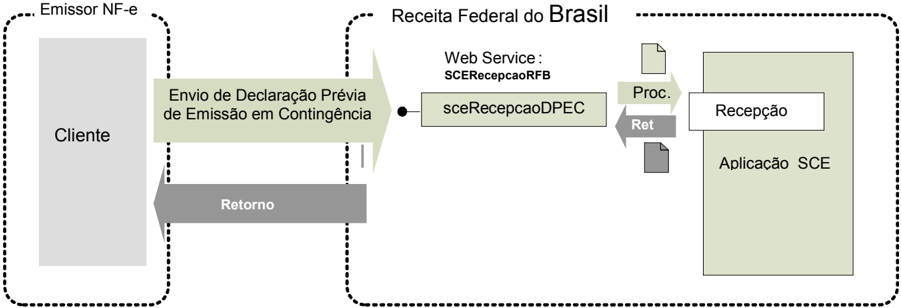

Função

: serviço destinado à recepção de mensagens de envio de DPEC.

Processo

: síncrono.

Método: sceRecepcaoDPEC

## 4.1.2 Leiaute Mensagem de Entrada

Entrada:

Estrutura XML com a Declaração Prévia Emissão em Contingência - DPEC

Schema XML: envDPEC\_v9.99.xsd

| #    | Campo   | Ele   | Pai   | Tipo   | Ocor.   | Tam.   | Descrição/Observação                                                                                                          |
|------|---------|-------|-------|--------|---------|--------|-------------------------------------------------------------------------------------------------------------------------------|
| AP01 | envDPEC | Raiz  | -     | -      | -       | -      | TAG raiz                                                                                                                      |
| AP02 | versao  | A     | AP01  | N      | 1-1     | 1-4    | Versão do leiaute                                                                                                             |
| AP03 | infDPEC | G     | AP01  |        | 1-1     |        | Tag de grupo com Informações da Declaração Prévia de Emissão em Contingência                                                  |
| AP04 | Id      | E     | AP03  | C      | 1-1     | 14     | Grupo de Identificação da TAG a ser assinada. Informar com a literal 'DPEC' + CNPJ do emissor.                                |
| AP05 | ideDec  | G     | AP03  |        | 1-1     | -      | Grupo de Identificação do Declarante, deve ser informado com os dados do emissor das NF-e emitidas em contingência eletrônica |
| AP06 | cUF     | E     | AP05  | N      | 1-1     | 2      | Código da UF do emitente do Documento Fiscal. Utilizar a Tabela do IBGE.                                                      |
| AP07 | tpAmb   | E     | AP05  | N      | 1-1     | 1      | Identificação do Ambiente: 1 - Produção 2 - Homologação                                                                       |
| AP08 | verProc | E     | AP05  | C      | 1-1     | 1-20   | versão do aplicativo utilizado no processo de emissão da DPEC                                                                 |
| AP09 | CNPJ    | E     | AP05  | N      | 1-1     | 14     | Número do CNPJ do emitente, vedada a formatação do campo.                                                                     |


| #    | Campo     | Ele   | Pai   | Tipo   | Ocor.   | Tam.   |   Dec. | Descrição/Observação                                                                                                                                          |
|------|-----------|-------|-------|--------|---------|--------|--------|---------------------------------------------------------------------------------------------------------------------------------------------------------------|
| AP10 | IE        | E     | AP05  | N      | 1-1     | 2-14   |        | Número da Inscrição Estadual do emitente, vedada a formatação do campo                                                                                        |
| AP11 | resNFe    | G     | AP03  |        | 1-50    |        |        | Resumo das NF-e emitidas no Sistema de Contingência Eletrônica (até 50 NF-e com tpEmiss = "4")                                                                |
| AP12 | chNFe     | E     | AP11  | N      | 1-1     | 44     |        | Chave de Acesso da NF-e emitida em contingência eletrônica                                                                                                    |
| AP13 | CNPJ      | CE    | AP11  | N      | 1-1     | 14     |        | Informar o CNPJ ou o CPF do destinatário da NF-e, em caso de destinatário ou remetente estabelecido no exterior deverá ser informado a tag CNPJ sem conteúdo. |
| AP14 | CPF       | CE    | AP11  | N      | 1-1     | 11     |        | Informar o CNPJ ou o CPF do destinatário da NF-e, em caso de destinatário ou remetente estabelecido no exterior deverá ser informado a tag CNPJ sem conteúdo. |
| AP15 | UF        | E     | AP11  | C      | 1-1     | 2      |        | Sigla da UF de destino da mercadoria                                                                                                                          |
| AP16 | vNF       | E     | AP11  | N      | 1-1     | 15     |      2 | Valor total da NF-e                                                                                                                                           |
| AP17 | vICMS     | E     | AP11  | N      | 1-1     | 15     |      2 | Valor Total do ICMS da operação própria                                                                                                                       |
| AP18 | vST       | E     | AP11  | N      | 1-1     | 15     |      2 | Valor Total do ICMS retido por Substituição Tributária                                                                                                        |
| AP19 | Signature | G     | AP01  | G      | 1-1     |        |        | Assinatura Digital do documento XML, a assinatura deverá ser aplicada no elemento infDPEC.                                                                    |

## Diagrama simplificado do Schema XML: envDPEC\_v9.99.xsd

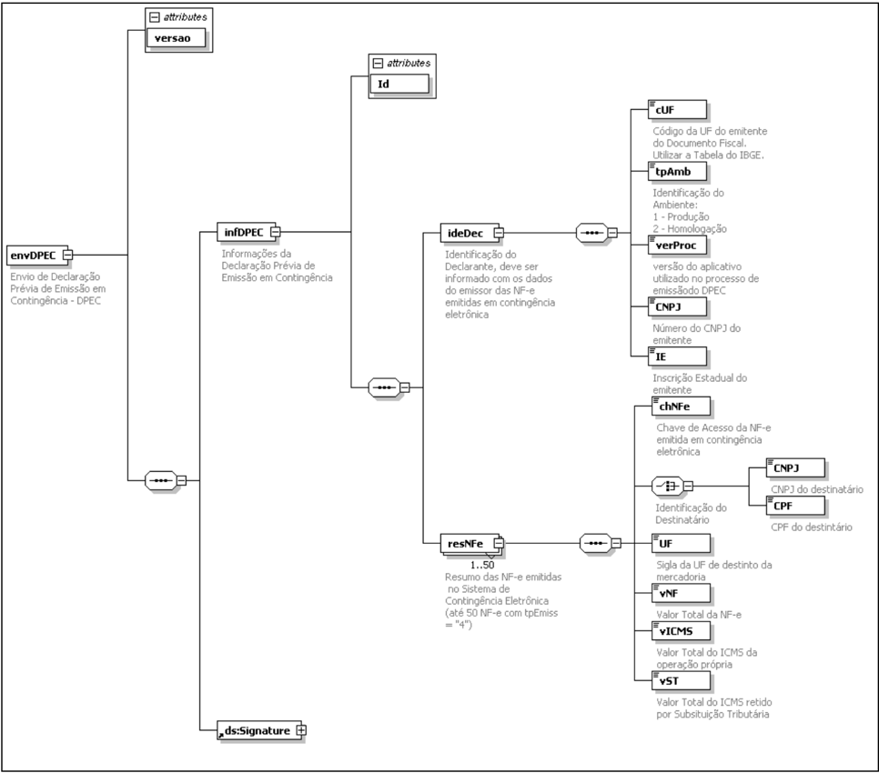


## 4.1.3 Leiaute Mensagem de Retorno

Retorno:

Estrutura XML com a mensagem do resultado da transmissão.

Schema XML: retDPEC\_v9.99.xsd

| #                                                                                                       | Campo                                                                                                   | Ele                                                                                                     | Pai                                                                                                     | Tipo                                                                                                    | Ocor.                                                                                                   | Tam.                                                                                                    | Dec.                                                                                                    | Descrição/Observação                                                                                    |
|---------------------------------------------------------------------------------------------------------|---------------------------------------------------------------------------------------------------------|---------------------------------------------------------------------------------------------------------|---------------------------------------------------------------------------------------------------------|---------------------------------------------------------------------------------------------------------|---------------------------------------------------------------------------------------------------------|---------------------------------------------------------------------------------------------------------|---------------------------------------------------------------------------------------------------------|---------------------------------------------------------------------------------------------------------|
| AR01                                                                                                    | retDPEC                                                                                                 | Raiz                                                                                                    | -                                                                                                       | -                                                                                                       | -                                                                                                       | -                                                                                                       |                                                                                                         | TAG raiz do Resultado da Transmissão                                                                    |
| AR02                                                                                                    | versao                                                                                                  | A                                                                                                       | AR01                                                                                                    | N                                                                                                       | 1-1                                                                                                     | 1-4                                                                                                     | 2                                                                                                       | Versão do leiaute                                                                                       |
| AR03                                                                                                    | infDPECReg                                                                                              | G                                                                                                       | AR01                                                                                                    |                                                                                                         | 1-1                                                                                                     |                                                                                                         |                                                                                                         | Grupo de informações do resultado da transmissão da DPEC                                                |
| AR04                                                                                                    | Id                                                                                                      | E                                                                                                       | AR03                                                                                                    | C                                                                                                       | 1-1                                                                                                     | 14                                                                                                      |                                                                                                         | Grupo de Identificação da TAG a ser assinada. Informar com a literal 'RETDPEC' + CNPJ do emissor.       |
| AR05                                                                                                    | tpAmb                                                                                                   | E                                                                                                       | AR03                                                                                                    | N                                                                                                       | 1-1                                                                                                     | 1                                                                                                       |                                                                                                         | Identificação do Ambiente: 1 - Produção / 2 - Homologação                                               |
| AR06                                                                                                    | verAplic                                                                                                | E                                                                                                       | AR03                                                                                                    | C                                                                                                       | 1-1                                                                                                     | 1-20                                                                                                    |                                                                                                         | Versão da aplicação do AN.                                                                              |
| AR07                                                                                                    | cStat                                                                                                   | E                                                                                                       | AR03                                                                                                    | N                                                                                                       | 1-1                                                                                                     | 3                                                                                                       |                                                                                                         | Código do status da resposta (vide item 5.1.1)                                                          |
| AR08                                                                                                    | xMotivo                                                                                                 | E                                                                                                       | AR03                                                                                                    | C                                                                                                       | 1-1                                                                                                     | 1-255                                                                                                   |                                                                                                         | Descrição literal do status da resposta                                                                 |
| As tags AR09, AR10 e AR11 só existirão se a DPEC for processada com sucesso                             | As tags AR09, AR10 e AR11 só existirão se a DPEC for processada com sucesso                             | As tags AR09, AR10 e AR11 só existirão se a DPEC for processada com sucesso                             | As tags AR09, AR10 e AR11 só existirão se a DPEC for processada com sucesso                             | As tags AR09, AR10 e AR11 só existirão se a DPEC for processada com sucesso                             | As tags AR09, AR10 e AR11 só existirão se a DPEC for processada com sucesso                             | As tags AR09, AR10 e AR11 só existirão se a DPEC for processada com sucesso                             | As tags AR09, AR10 e AR11 só existirão se a DPEC for processada com sucesso                             | As tags AR09, AR10 e AR11 só existirão se a DPEC for processada com sucesso                             |
| AR09                                                                                                    | dhRegDPEC                                                                                               | E                                                                                                       | AR03                                                                                                    | D                                                                                                       | 1-1                                                                                                     | -                                                                                                       |                                                                                                         | Data e Hora de registro da DPEC                                                                         |
| AR10                                                                                                    | nRegDPEC                                                                                                | E                                                                                                       | AR03                                                                                                    | N                                                                                                       | 1-1                                                                                                     | 15                                                                                                      |                                                                                                         | Número de registro da DPEC                                                                              |
| AR11                                                                                                    | envDPEC                                                                                                 | G                                                                                                       | AR03                                                                                                    | xml                                                                                                     | 1-1                                                                                                     |                                                                                                         |                                                                                                         | Mensagem de Declaração Prévia de Emissão em Contingência transmitida                                    |
| A tag chNFe só existirá no caso de DPEC inconsistente por falha na validação da chave de acesso da NF-e | A tag chNFe só existirá no caso de DPEC inconsistente por falha na validação da chave de acesso da NF-e | A tag chNFe só existirá no caso de DPEC inconsistente por falha na validação da chave de acesso da NF-e | A tag chNFe só existirá no caso de DPEC inconsistente por falha na validação da chave de acesso da NF-e | A tag chNFe só existirá no caso de DPEC inconsistente por falha na validação da chave de acesso da NF-e | A tag chNFe só existirá no caso de DPEC inconsistente por falha na validação da chave de acesso da NF-e | A tag chNFe só existirá no caso de DPEC inconsistente por falha na validação da chave de acesso da NF-e | A tag chNFe só existirá no caso de DPEC inconsistente por falha na validação da chave de acesso da NF-e | A tag chNFe só existirá no caso de DPEC inconsistente por falha na validação da chave de acesso da NF-e |
| AR12                                                                                                    | chNFe                                                                                                   | E                                                                                                       | AR03                                                                                                    | N                                                                                                       | 1-1                                                                                                     | 44                                                                                                      |                                                                                                         | Chave de Acesso da 1ª NF-e que provocou o erro de validação                                             |
| AR13                                                                                                    | Signature                                                                                               | G                                                                                                       | AR01                                                                                                    | G                                                                                                       | 1-1                                                                                                     |                                                                                                         |                                                                                                         | Assinatura Digital do documento XML, a assinatura deverá ser aplicada no elemento infDPECReg.           |


## Diagrama Simplificado do retorno

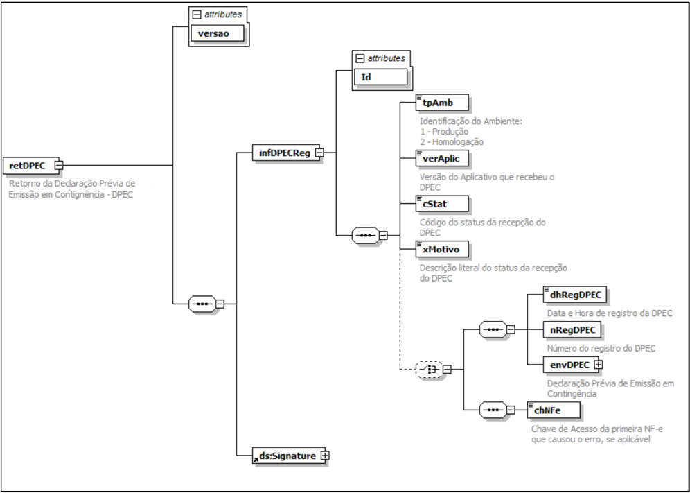


## 4.1.4 Descrição  do  Processo  de  Geração  da  Declaração  Prévia  de  Emissão  em Contingência - DPEC

Ao optar por adotar o uso do Sistema de Contingência Eletrônica, o emissor de NF-e deve executar os seguintes procedimentos:

## a) Geração da DPEC

- alterar o tp\_Emis das NF-e que deseja emitir em Sistema de Contingência Eletrônica para '4';
- regerar as notas fiscais e os lotes de NF-e;
- gerar o arquivo XML de Declaração Prévia de Emissão em Contingência - DPEC, com as seguintes informações das NF-e que compõe um lote de NF-e:
- o chave de acesso;
- o CNPJ ou CPF do destinatário;
- o UF de localização do destinatário;
- o Valor Total da NF-e;
- o Valor Total do ICMS;
- o Valor Total do ICMS ST;
- o o arquivo gerado deve ser complementado com outras informações de controle como o  CNPJ, a IE e a UF de localização do contribuinte e assinado digitalmente com o certificado digital do emissor dos documentos contidos no arquivo;

A adoção do mesmo critério de formação de lotes para formar a Declaração Prévia de Emissão em Contingência é recomendada para facilitar a posterior transmissão da NF-e.

O  contribuinte  deve  manter  um  rígido  controle  de  transmissão  das  NF-e  emitidas  no  Sistema  de Contingência  Eletrônica,  para  evitar  que  venha  a  ser  penalizado  pela  não  transmissão  das  NF-e emitidas em contingência.

## b) Informações de controle

A informação da versão do leiaute dos dados será informada no elemento sceCabecMsg do SOAP Header (para maiores detalhes vide item 3.4).

## c) envio das informações

A  mensagem  do  lote  será  transmitida  através  do  Web  Service  do  Sistema  de  Contingência Eletrônica.

URL de Envio de DPEC do ambiente de homologação:

https://hom.nfe.fazenda.gov.br/SCERecepcaoRFB/SCERecepcaoRFB.asmx

URL de Envio de DPEC do ambiente de produção:

https://www.nfe.fazenda.gov.br/SCERecepcaoRFB/SCERecepcaoRFB.asmx

## 4.1.5 Descrição  do  Processo  de  Recepção  da  Declaração  Prévia  de  Emissão  em Contingência

O WS do Sistema de Contingência Eletrônica é acionado pelo emissor  ou pela aplicação Web da Receita Federal (opção de envio da DPEC via formulário WEB) que devem  enviar uma Declaração Prévia de Emissão em Contingência que atenda os padrões estabelecidos neste manual.


## 4.1.6 Validação do Certificado de Transmissão

| Validação do Certificado Digital do Transmissor (protocolo SSL   | Validação do Certificado Digital do Transmissor (protocolo SSL                                                                                                                                                                              | Validação do Certificado Digital do Transmissor (protocolo SSL   | Validação do Certificado Digital do Transmissor (protocolo SSL   | Validação do Certificado Digital do Transmissor (protocolo SSL   |
|------------------------------------------------------------------|---------------------------------------------------------------------------------------------------------------------------------------------------------------------------------------------------------------------------------------------|------------------------------------------------------------------|------------------------------------------------------------------|------------------------------------------------------------------|
| #                                                                | Regra de Validação                                                                                                                                                                                                                          | Crítica                                                          | Msg                                                              | Efeito                                                           |
| A01                                                              | Certificado de Transmissor Inválido: - Certificado de Transmissor inexistente na mensagem - Versão difere "3" - Se informado o Basic Constraint deve ser true (não pode ser Certificado de AC) - KeyUsage não define "Autenticação Cliente" | Obrig.                                                           | 280                                                              | Rej.                                                             |
| A02                                                              | Validade do Certificado (data início e data fim)                                                                                                                                                                                            | Obrig.                                                           | 281                                                              | Rej.                                                             |
| A03                                                              | Verifica a Cadeia de Certificação: - Certificado da AC emissora não cadastrado na SEFAZ - Certificado de AC revogado - Certificado não assinado pela AC emissora do Certificado                                                             | Obrig.                                                           | 283                                                              | Rej.                                                             |
| A04                                                              | LCR do Certificado de Transmissor - Falta o endereço da LCR (CRL DistributionPoint) - LCR indisponível - LCR inválida                                                                                                                       | Obrig.                                                           | 286                                                              | Rej.                                                             |
| A05                                                              | Certificado do Transmissor revogado                                                                                                                                                                                                         | Obrig.                                                           | 284                                                              | Rej.                                                             |
| A06                                                              | Certificado Raiz difere da "ICP-Brasil"                                                                                                                                                                                                     | Obrig.                                                           | 285                                                              | Rej.                                                             |
| A07                                                              | Falta a extensão de CNPJ no Certificado (OtherName - OID=2.16.76.1.3.3)                                                                                                                                                                     | Obrig.                                                           | 282                                                              | Rej.                                                             |

As validações de A01, A02, A03, A04 e A05 são realizadas pelo protocolo SSL e não precisam ser implementadas. A validação A06 também pode ser realizada pelo protocolo SSL, mas pode falhar se existirem outros certificados digitais de Autoridade Certificadora Raiz que não sejam 'ICP-Brasil' no repositório de certificados digitais do servidor de Web Service do Ambiente Nacional.

## 4.1.7 Validação Inicial da Mensagem no Web Service

| Validação Inicial da Mensagem no Web Service   | Validação Inicial da Mensagem no Web Service                            | Validação Inicial da Mensagem no Web Service   | Validação Inicial da Mensagem no Web Service   | Validação Inicial da Mensagem no Web Service   |
|------------------------------------------------|-------------------------------------------------------------------------|------------------------------------------------|------------------------------------------------|------------------------------------------------|
| #                                              | Regra de Validação                                                      | Aplic.                                         | Msg                                            | Efeito                                         |
| B01                                            | Tamanho do XML de Dados superior a 50 KB                                | Obrig.                                         | 214                                            | Rej.                                           |
| B02                                            | XML de Dados Mal Formado                                                | Obrig.                                         | 243                                            | Rej.                                           |
| B03                                            | Verifica se o Servidor de Processamento está Paralisado Momentaneamente | Obrig.                                         | 108                                            | Rej.                                           |
| B04                                            | Verifica se o Servidor de Processamento está Paralisado sem Previsão    | Obrig.                                         | 109                                            | Rej.                                           |

A  mensagem  será  descartada  se  o  tamanho  exceder  o  limite  previsto  (50  KB).  A  aplicação  do Emissor não poderá permitir  a geração  de mensagem com tamanho superior a 50 KB. Caso isto ocorra,  a  conexão  poderá  ser  interrompida  sem  retorno  da  mensagem  de  erro  se  o  controle  do tamanho da mensagem for implementado por configurações  do  ambiente  de  rede  do  Sistema  de Contingência Eletrônica (ex.: controle no firewall). No caso do controle de tamanho ser implementado por aplicativo teremos a devolução da mensagem de erro 214.

Caso  o  Web  Service  fique  disponível,  mesmo  quando  o  serviço  estiver  paralisado,  deverão implementar as verificações 108 e 109. Estas validações poderão ser dispensadas se o Web Service não ficar disponível quando o serviço estiver paralisado.

## 4.1.8 Validação das informações de controle da chamada ao Web Service

## Validação das informações de controle da chamada ao Web Service


## Nota Fiscal eletrônica

| #   | Regra de Validação                                                   | Aplic.   |   Msg | Efeito   |
|-----|----------------------------------------------------------------------|----------|-------|----------|
| C01 | Elemento sceCabecMsg inexistente no SOAP Header                      | Obrig.   |   409 | Rej.     |
| C02 | Campo versaoDados inexistente no elemento nfeCabecMsg do SOAP Header | Obrig.   |   412 | Rej.     |
| C03 | Versão dos Dados informada é superior à versão vigente               | Facult.  |   238 | Rej.     |
| C04 | Versão dos Dados não suportada                                       | Obrig.   |   239 | Rej.     |

A  informação  da  versão  do  leiaute  da  DPEC  é  informada  no  elemento sceCabecMsg do  SOAP Header (para maiores detalhes vide item 3.4).

A aplicação deverá validar o campo de versão da mensagem ( versaoDados ), rejeitando a solicitação recebida em caso de informações inexistentes ou inválidas.

## 4.1.9 Validação da área de Dados

## a) Validação de forma da área de dados

A validação de forma da área de dados da mensagem é realizada com a aplicação da seguinte regra:

| Validação da área de dados da mensagem   | Validação da área de dados da mensagem     | Validação da área de dados da mensagem   | Validação da área de dados da mensagem   | Validação da área de dados da mensagem   |
|------------------------------------------|--------------------------------------------|------------------------------------------|------------------------------------------|------------------------------------------|
| #                                        | Regra de Validação                         | Aplic.                                   | Msg                                      | Efeito                                   |
| D01                                      | Verifica Schema XML da Área de Dados       | Obrig.                                   | 215                                      | Rej.                                     |
| D02                                      | Verifica o uso de prefixo no namespace     | Obrig.                                   | 404                                      | Rej.                                     |
| D03                                      | XML utiliza codificação diferente de UTF-8 | Obrig.                                   | 402                                      | Rej.                                     |

Como a validação do Schema XML é realizada em toda mensagem de entrada, a existência de um erro em um dos Resumos de NF-e implica na rejeição de toda a DPEC.

## b) Validação do Certificado Digital de Assinatura

A seguir será validada a assinatura digital da DPEC:

| Validação do Certificado Digital utilizado na Assinatura Digital da DPEC   | Validação do Certificado Digital utilizado na Assinatura Digital da DPEC                                                                                                                                                                                                              | Validação do Certificado Digital utilizado na Assinatura Digital da DPEC   | Validação do Certificado Digital utilizado na Assinatura Digital da DPEC   | Validação do Certificado Digital utilizado na Assinatura Digital da DPEC   |
|----------------------------------------------------------------------------|---------------------------------------------------------------------------------------------------------------------------------------------------------------------------------------------------------------------------------------------------------------------------------------|----------------------------------------------------------------------------|----------------------------------------------------------------------------|----------------------------------------------------------------------------|
| #                                                                          | Regra de Validação                                                                                                                                                                                                                                                                    | Aplic.                                                                     | Msg                                                                        | Efeito                                                                     |
| E01                                                                        | Certificado de Assinatura inválido: - Certificado de Assinatura inexistente na mensagem (*validado também pelo Schema) - Versão difere "3" - Se informado o Basic Constraint deve ser true (não pode ser Certificado de AC) - KeyUsage não define "Assinatura Digital" e 'Não Recusa' | Obrig.                                                                     | 290                                                                        | Rej.                                                                       |
| E02                                                                        | Validade do Certificado (data início e data fim)                                                                                                                                                                                                                                      | Obrig.                                                                     | 291                                                                        | Rej.                                                                       |
| E03                                                                        | Falta a extensão de CNPJ no Certificado (OtherName - OID=2.16.76.1.3.3)                                                                                                                                                                                                               | Obrig.                                                                     | 292                                                                        | Rej.                                                                       |
| E04                                                                        | Verifica Cadeia de Certificação: - Certificado da AC emissora não cadastrado na SEFAZ - Certificado de AC revogado - Certificado não assinado pela AC emissora do Certificado                                                                                                         | Obrig.                                                                     | 293                                                                        | Rej.                                                                       |
| E05                                                                        | LCR do Certificado de Assinatura: - Falta o endereço da LCR (CRLDistributionPoint) - Erro no acesso a LCR ou LCR inexistente                                                                                                                                                          | Obrig.                                                                     | 296                                                                        | Rej.                                                                       |


| E06   | Certificado de Assinatura revogado      | Obrig.   |   294 | Rej.   |
|-------|-----------------------------------------|----------|-------|--------|
| E07   | Certificado Raiz difere da 'ICP-Brasil' | Obrig.   |   295 | Rej.   |

## c)  Validação da Assinatura Digital

| Validação da Assinatura Digital da DPEC   | Validação da Assinatura Digital da DPEC                                                                                                                                                                                                                                                      | Validação da Assinatura Digital da DPEC   | Validação da Assinatura Digital da DPEC   | Validação da Assinatura Digital da DPEC   |
|-------------------------------------------|----------------------------------------------------------------------------------------------------------------------------------------------------------------------------------------------------------------------------------------------------------------------------------------------|-------------------------------------------|-------------------------------------------|-------------------------------------------|
| #                                         | Regra de Validação                                                                                                                                                                                                                                                                           | Aplic.                                    | Msg                                       | Efeito                                    |
| F01                                       | Assinatura difere do padrão do Projeto: - Não assinado o atributo "ID" (falta "Reference URI" na assinatura) (*validado também pelo Schema) - Faltam os "Transform Algorithm" previstos na assinatura ("C14N" e "Enveloped") Estas validações são implementadas pelo Schema XML da Signature | Obrig.                                    | 298                                       | Rej.                                      |
| F02                                       | Valor da assinatura (SignatureValue) difere do valor calculado                                                                                                                                                                                                                               | Obrig.                                    | 297                                       | Rej.                                      |
| F03                                       | CNPJ-Base do Emitente difere do CNPJ-Base do Certificado Digital                                                                                                                                                                                                                             | Obrig.                                    | 213                                       | Rej.                                      |
| F04                                       | CNPJ do Certificado Digital difere do CNPJ da Matriz e do CNPJ do Emitente                                                                                                                                                                                                                   | Facult.                                   | 244                                       | Rej.                                      |

## d) Validação de regras de negócios da DPEC

| Validação da DPEC - Regras de Negócios   | Validação da DPEC - Regras de Negócios                                                          | Validação da DPEC - Regras de Negócios   | Validação da DPEC - Regras de Negócios   | Validação da DPEC - Regras de Negócios   |
|------------------------------------------|-------------------------------------------------------------------------------------------------|------------------------------------------|------------------------------------------|------------------------------------------|
| #                                        | Regra de Validação                                                                              | Aplic.                                   | Msg                                      | Efeito                                   |
| G01                                      | Tipo do ambiente da DPEC difere do ambiente do Web Service                                      | Obrig.                                   | 252                                      | Rej.                                     |
| G02                                      | CNPJ do emitente informado inválido (DV ou zeros)                                               | Obrig.                                   | 207                                      | Rej.                                     |
| G03                                      | IE do emitente informado inválido (DV ou zeros)                                                 | Obrig.                                   | 209                                      | Rej.                                     |
| G04                                      | Emitente não credenciado como emissor da NF-e na UF informada                                   | Obrig.                                   | 203                                      | Rej.                                     |
| G05                                      | IE do emitente não vinculado ao CNPJ                                                            | Obrig.                                   | 231                                      | Rej.                                     |
| G06                                      | Emissor em situação irregular perante o fisco                                                   | Obrig.                                   | 479                                      | Rej.                                     |
| G07                                      | CNPJ da Chave de acesso da NF-e informada diverge do CNPJ do emitente                           | Obrig.                                   | 480                                      | Rej.                                     |
| G08                                      | UF da Chave de acesso diverge do código da UF informada                                         | Obrig.                                   | 481                                      | Rej.                                     |
| G09                                      | AA da Chave de acesso inválida (valores válidos: ano atual ou ano atual - 1, se mês atual = 01) | Obrig.                                   | 482                                      | Rej.                                     |
| G10                                      | MM da chave de acesso inválido (valores válidos: mês atual ou mês atual -1, se dia atual = 01)  | Obrig.                                   | 483                                      | Rej.                                     |
| G11                                      | DV da Chave de acesso inválida                                                                  | Obrig.                                   | 484                                      | Rej.                                     |
| G12                                      | CNPJ do destinatário inválido                                                                   | Obrig.                                   | 208                                      | Rej.                                     |
| G13                                      | Chave de acesso já existe no cadastro de DPEC                                                   | Obrig.                                   | 485                                      | Rej.                                     |

A  existência  de  um  erro  na  chave  de  acesso  da  NF-e  de  qualquer  um  dos  Resumos  de  NF-e, interrompe a validação dos Resumos de NF-e, resultando na rejeição de todos os Resumos de NF-e existentes na DPEC.

## 4.1.10  Final do Processamento do Lote

A validação da DPEC poderá resultar em:

- Rejeição - a DPEC será descartado, com retorno do código do status do motivo da rejeição o motivo da rejeição poderá ser de forma (validações dos blocos A, B, C, D, E, F e G01 a G06) ou violação das regras de negócios  dos resumos da NF-e (validações G07 a G13);


- Recebido  pelo  Sistema  de  Contingência  Eletrônica -  a  DEPC  será  armazenado  na repositório do Sistema de Contingência Eletrônica (cStat=124);

O Sistema de Contingência Eletrônica deve atribuir um número de Registro d DPEC (nRegDPEC) para todos os DPEC recepcionados, independentemente da forma de recepção (WS do Sistema de Contingência Eletrônica ou Página WEB de upload da DPEC).

A regra de formação do número de Registro de DPEC é:

| 9                   | 9   | 9   | 9                         | 9                         | 9                         | 9                         | 9                         | 9                         | 9                         | 9                         | 9                         | 9                         | 9                         | 9                         |
|---------------------|-----|-----|---------------------------|---------------------------|---------------------------|---------------------------|---------------------------|---------------------------|---------------------------|---------------------------|---------------------------|---------------------------|---------------------------|---------------------------|
| Tipo de Autorizador | ano |     | seqüencial de 12 posições | seqüencial de 12 posições | seqüencial de 12 posições | seqüencial de 12 posições | seqüencial de 12 posições | seqüencial de 12 posições | seqüencial de 12 posições | seqüencial de 12 posições | seqüencial de 12 posições | seqüencial de 12 posições | seqüencial de 12 posições | seqüencial de 12 posições |

- 1 posição com o Tipo de Autorizador (9-Sistema de Contingência Eletrônica);
- 2 posições para ano;
- 12 posições para o seqüencial no ano.

Importante ressaltar que o serviço de consulta das DPECs poderá ser feito pelo número de Registro da DPEC ou pela chave de acesso das NF-e vinculadas à DPEC.

A  mensagem  de  retorno  do  processamento  será  sempre  assinada  digitalmente  pelo  Sistema  de Contingência Eletrônico e nos casos de DPEC ser aceita pelo Sistema de Contingência Eletrônica, a mensagem de envio da DPEC fará parte da mensagem de retorno da DPEC recebida.

## Diagrama Simplificado do retorno em caso de Falha na validação do Schema XML, Assinatura Digital, etc. (validações dos blocos A, B, C, D, E, F e G01 a G06)

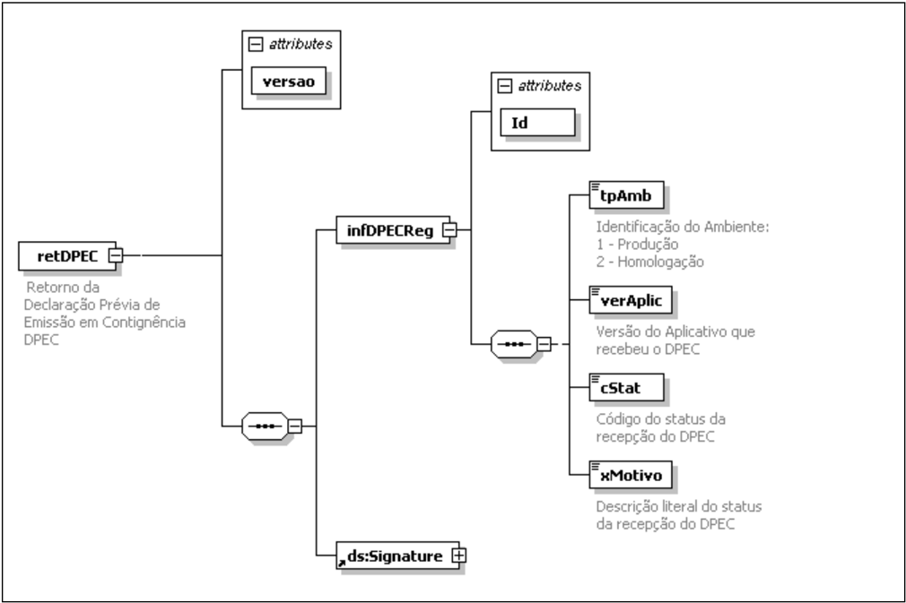


## Diagrama simplificado de retorno na Falha na validação das regras de negócios relacionadas com o resumo da NF-e contidas na DPEC (regras G07 a G13)

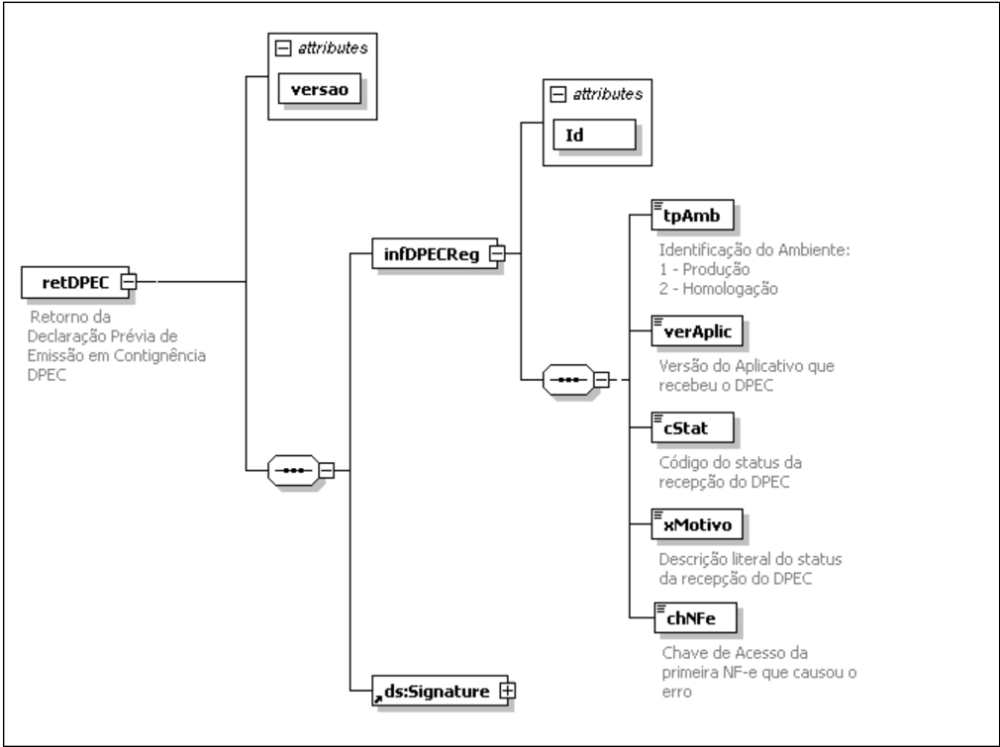


## Diagrama simplificado do retorno da DPEC processada com sucesso

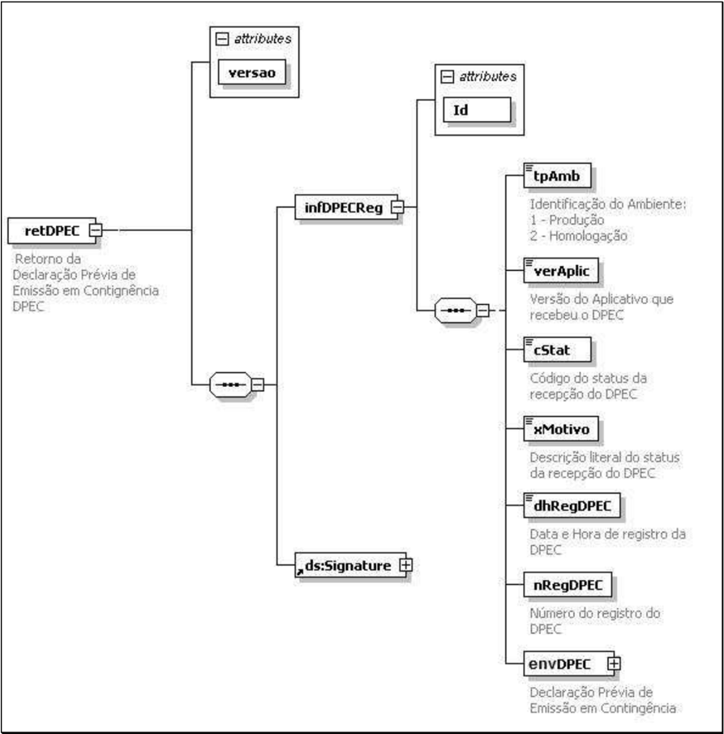


## 4.2 Serviço de Consulta de DPEC

O Serviço de Consulta de DPEC é o serviço oferecido pelo Sistema de Contingência Eletrônica que permite a consulta das DPEC existentes no Sistema de Contingência Eletrônica. A DPEC poderá ser consultada pelo um número de Registro de DPEC (nRegDPEC) ou pela chave de Acesso da NF-e.

## 4.2.1 Web Service - SCEConsultaRFB

Consulta do Sistema de Contingência

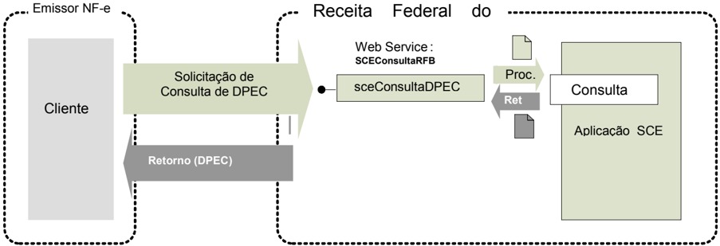

Função

: serviço destinado à consulta de DPEC.

Processo

: síncrono.

## 4.2.2 Leiaute Mensagem de Entrada

Entrada:

Estrutura XML com o pedido de consulta de DPEC

Schema XML: distNFe\_v9.99.xsd

| #    | Campo    | Ele   | Pai   | Tipo   | Ocor.   | Tam.   |   Dec. | Descrição/Observação                                    |
|------|----------|-------|-------|--------|---------|--------|--------|---------------------------------------------------------|
| BP01 | consDPEC | Raiz  | -     | -      | -       | -      |        | TAG raiz                                                |
| BP02 | versao   | A     | BP01  | N      | 1-1     | 1-4    |      2 | Versão do leiaute                                       |
| BP03 | tpAmb    | E     | BP01  | N      | 1-1     | 1      |        | Identificação do Ambiente: 1 - Produção 2 - Homologação |
| BP04 | verAplic | E     | BP01  | C      | 1-1     | 1-20   |        | Versão do Aplicativo que solicitou a consulta           |
| BP05 | chNFe    | CE    | BP01  | N      | 1-1     | 44     |        | Chave de Acesso da NF-e                                 |
| BP06 | nRegDPEC | CE    | BP01  | N      | 1-1     | 15     |        | Número de registro da DPEC                              |


## Diagrama simplificado do Schema XML: consNFe\_v9.99.xsd

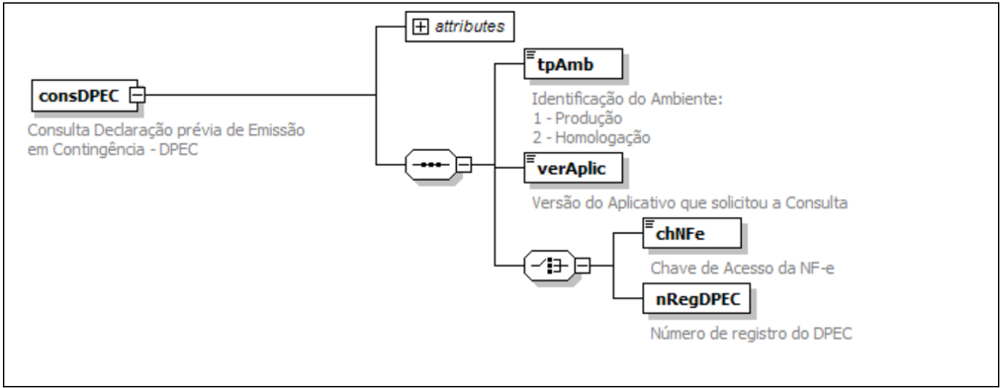

## 4.2.3 Leiaute Mensagem de Retorno

Retorno:

Estrutura XML de retorno, pode conter uma DPEC localizada.

## Schema XML: retConsDPEC\_v9.99.xsd

| #    | Campo      | Ele   | Pai   | Tipo   | Ocor.   | Tam.   |   Dec. | Descrição/Observação                                      |
|------|------------|-------|-------|--------|---------|--------|--------|-----------------------------------------------------------|
| BR01 | retDistNFe | Raiz  | -     | -      | -       | -      |        | TAG raiz da Resposta                                      |
| BR02 | versao     | A     | BR01  | N      | 1-1     | 1-4    |      2 | Versão do leiaute                                         |
| BR03 | tpAmb      | E     | BR01  | N      | 1-1     | 1      |        | Identificação do Ambiente: 1 - Produção / 2 - Homologação |
| BR04 | verAplic   | E     | BR01  | C      | 1-1     | 1-20   |        | Versão do Aplicativo do SCE.                              |
| BR05 | cStat      | E     | BR01  | N      | 1-1     | 3      |        | Código do status da resposta                              |
| BR06 | xMotivo    | E     | BR01  | C      | 1-1     | 1-255  |        | Descrição literal do status da resposta                   |
| BR07 | DPEC       | G     | BR01  | Xml    | 0-1     |        |        | DPEC localizado tem a mesma estrutura do retDPEC          |


## Diagrama simplificado do Schema XML: retConsDPEC\_v9.99.xsd

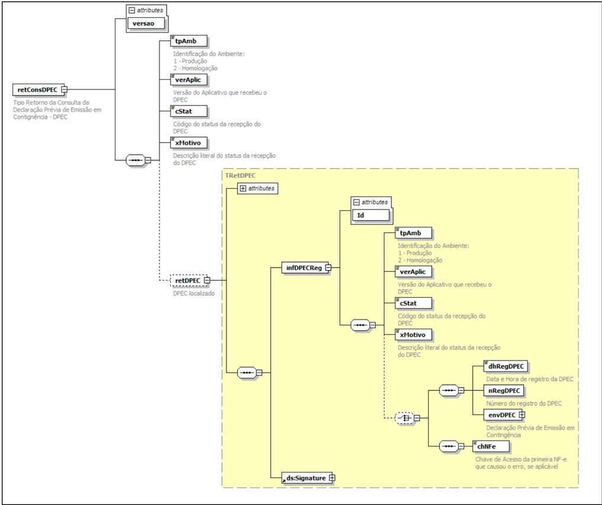


## 4.2.4 Descrição do Processo de Consulta de DPEC

Este  serviço  pode  ser  consumido  por  qualquer  UF  que  desejar  acessar  as  DPEC  existentes  no Sistema de Contingência Eletrônico e pelo emissor de NF-e que gerou a DPEC.

## a) Geração do pedido de Consulta

A aplicação cliente do WS  deve gerar uma mensagem informando o número de registro da DPEC ou a chave de acesso da NF-e.

## b) Informações de controle

A versão do leiaute dos dados será informada no elemento nfeCabecMsg do SOAP Header (para maiores detalhes vide item 3.4).

## c) Envio das informações

O pedido de consulta será transmitido através de requisição SOAP, com autenticação mútua, sendo necessário  que  o  CNPJ  utilizado  na  transmissão  pela  SEFAZ  interessada  esteja  previamente cadastrada  no  Sistema  de  Contingência  Eletrônica  caso  o  CNPJ  seja  divergente  do  emissor  da DPEC.

URL de Consulta de DPEC do ambiente de homologação:

https://hom.nfe.fazenda.gov.br/SCEConsultaRFB/SCEConsultaRFB.asmx

URL de Consulta de DPEC do ambiente de produção:

https://www.nfe.fazenda.gov.br/SCEConsultaRFB/SCEConsultaRFB.asmx

## 4.2.5 Descrição do Processo de Consulta DPEC

O WS do Ambiente Nacional é acionado pelo interessado na consulta que deve enviar uma consulta DPEC  por  Número  de  Registro  da  DPEC  ou  chave  de  acesso  da  NF-e  que  atenda  os  padrões estabelecidos neste manual.

## 4.2.6 Validação do Certificado de Transmissão

| Validação do Certificado Digital do Transmissor (protocolo SSL)   | Validação do Certificado Digital do Transmissor (protocolo SSL)                                                                                                                                                                             | Validação do Certificado Digital do Transmissor (protocolo SSL)   | Validação do Certificado Digital do Transmissor (protocolo SSL)   | Validação do Certificado Digital do Transmissor (protocolo SSL)   |
|-------------------------------------------------------------------|---------------------------------------------------------------------------------------------------------------------------------------------------------------------------------------------------------------------------------------------|-------------------------------------------------------------------|-------------------------------------------------------------------|-------------------------------------------------------------------|
| #                                                                 | Regra de Validação                                                                                                                                                                                                                          | Crítica                                                           | Msg                                                               | Efeito                                                            |
| A01                                                               | Certificado de Transmissor Inválido: - Certificado de Transmissor inexistente na mensagem - Versão difere "3" - Se informado o Basic Constraint deve ser true (não pode ser Certificado de AC) - KeyUsage não define "Autenticação Cliente" | Obrig.                                                            | 280                                                               | Rej.                                                              |
| A02                                                               | Validade do Certificado (data início e data fim)                                                                                                                                                                                            | Obrig.                                                            | 281                                                               | Rej.                                                              |
| A03                                                               | Verifica a Cadeia de Certificação: - Certificado da AC emissora não cadastrado na SEFAZ - Certificado de AC revogado - Certificado não assinado pela AC emissora do Certificado                                                             | Obrig.                                                            | 283                                                               | Rej.                                                              |
| A04                                                               | LCR do Certificado de Transmissor - Falta o endereço da LCR (CRL DistributionPoint) - LCR indisponível - LCR inválida                                                                                                                       | Obrig.                                                            | 286                                                               | Rej.                                                              |


| A05   | Certificado do Transmissor revogado                                     | Obrig.   |   284 | Rej.   |
|-------|-------------------------------------------------------------------------|----------|-------|--------|
| A06   | Certificado Raiz difere da "ICP-Brasil"                                 | Obrig.   |   285 | Rej.   |
| A07   | Falta a extensão de CNPJ no Certificado (OtherName - OID=2.16.76.1.3.3) | Obrig.   |   282 | Rej.   |

As validações de A01, A02, A03, A04 e A05 são realizadas pelo protocolo SSL e não precisam ser implementadas. A validação A06 também pode ser realizada pelo protocolo SSL, mas pode falhar se existirem outros certificados digitais de Autoridade Certificadora Raiz que não sejam 'ICP-Brasil' no repositório de certificados digitais do servidor de Web Service do Ambiente Nacional.

## 4.2.7 Validação Inicial da Mensagem no Web Service

| Validação Inicial da Mensagem no Web Service   | Validação Inicial da Mensagem no Web Service                            | Validação Inicial da Mensagem no Web Service   | Validação Inicial da Mensagem no Web Service   | Validação Inicial da Mensagem no Web Service   |
|------------------------------------------------|-------------------------------------------------------------------------|------------------------------------------------|------------------------------------------------|------------------------------------------------|
| #                                              | Regra de Validação                                                      | Aplic.                                         | Msg                                            | Efeito                                         |
| B01                                            | Tamanho do XML de Dados superior a 10 KB                                | Obrig.                                         | 214                                            | Rej.                                           |
| B02                                            | XML de Dados Mal Formado                                                | Obrig.                                         | 243                                            | Rej.                                           |
| B03                                            | Verifica se o Servidor de Processamento está Paralisado Momentaneamente | Obrig.                                         | 108                                            | Rej.                                           |
| B04                                            | Verifica se o Servidor de Processamento está Paralisado sem Previsão    | Obrig.                                         | 109                                            | Rej.                                           |

A  mensagem  será  descartada  se  o  tamanho  exceder  o  limite  previsto  (10  KB).  A  aplicação  da Secretaria de Fazenda não poderá permitir a geração de mensagem com tamanho superior a 10 KB. Caso isto ocorra, a conexão poderá ser interrompida sem retorno da mensagem de erro se o controle do tamanho da mensagem for implementado por configurações do ambiente de rede do Ambiente Nacional (ex.: controle no firewall). No caso do controle de tamanho ser implementado por aplicativo teremos a devolução da mensagem de erro 214.

Caso  o  Web  Service  fique  disponível,  mesmo  quando  o  serviço  estiver  paralisado,  deverão implementar as verificações 108 e 109. Estas validações poderão ser dispensadas se o Web Service não ficar disponível quando o serviço estiver paralisado.

## 4.2.8 Validação das informações de controle da chamada ao Web Service

## Validação das informações de controle da chamada ao Web Service

| Validação das informações de controle da chamada ao Web Service   | Validação das informações de controle da chamada ao Web Service      | Validação das informações de controle da chamada ao Web Service   | Validação das informações de controle da chamada ao Web Service   | Validação das informações de controle da chamada ao Web Service   |
|-------------------------------------------------------------------|----------------------------------------------------------------------|-------------------------------------------------------------------|-------------------------------------------------------------------|-------------------------------------------------------------------|
| #                                                                 | Regra de Validação                                                   | Aplic.                                                            | Msg                                                               | Efeito                                                            |
| C01                                                               | Elemento nfeCabecMsg inexistente no SOAP Header                      | Obrig.                                                            | 409                                                               | Rej.                                                              |
| C02                                                               | Campo versaoDados inexistente no elemento nfeCabecMsg do SOAP Header | Obrig.                                                            | 412                                                               | Rej.                                                              |
| C03                                                               | Versão dos Dados informada é superior à versão vigente               | Facult.                                                           | 238                                                               | Rej.                                                              |
| C04                                                               | Versão dos Dados não suportada                                       | Obrig.                                                            | 239                                                               | Rej.                                                              |

A  informação  da  versão  do  leiaute  do  lote  será  informada  no  elemento sceCabecMsg do  SOAP Header (para maiores detalhes vide item 3.4).

## 4.2.9 Validação da área de Dados

## a) Validação de forma da área de dados

A validação de forma da área de dados da mensagem é realizada pelo WS do Ambiente Nacional com a aplicação da seguinte regra:


## Validação da área de dados da mensagem

| Validação da área de dados da mensagem   | Validação da área de dados da mensagem     | Validação da área de dados da mensagem   | Validação da área de dados da mensagem   | Validação da área de dados da mensagem   |
|------------------------------------------|--------------------------------------------|------------------------------------------|------------------------------------------|------------------------------------------|
| #                                        | Regra de Validação                         | Aplic.                                   | Msg                                      | Efeito                                   |
| D01                                      | Verifica Schema XML da Área de Dados       | Obrig.                                   | 215                                      | Rej.                                     |
| D02                                      | Verifica o uso de prefixo no namespace     | Obrig.                                   | 404                                      | Rej.                                     |
| D03                                      | XML utiliza codificação diferente de UTF-8 | Obrig.                                   | 402                                      | Rej.                                     |

## b) Validação de regras de negócios da Consulta DPEC

| Validação da Consulta DPEC - Regras de Negócios   | Validação da Consulta DPEC - Regras de Negócios                                                                                                                      | Validação da Consulta DPEC - Regras de Negócios   | Validação da Consulta DPEC - Regras de Negócios   | Validação da Consulta DPEC - Regras de Negócios   |
|---------------------------------------------------|----------------------------------------------------------------------------------------------------------------------------------------------------------------------|---------------------------------------------------|---------------------------------------------------|---------------------------------------------------|
| #                                                 | Regra de Validação                                                                                                                                                   | Aplic.                                            | Msg                                               | Efeito                                            |
| H01                                               | Tipo do ambiente do SCE difere do ambiente do Web Service                                                                                                            | Obrig.                                            | 252                                               | Rej.                                              |
| H02                                               | Validar DV da Chave de Acesso da DPEC                                                                                                                                | Obrig                                             | 484                                               | Rej.                                              |
| H03                                               | se informado o número do registro da DPEC como argumento de pesquisa - Consultar DPEC por número do registro da DPEC                                                 | Obrig                                             | 486                                               | Rej.                                              |
| H04                                               | se informada chave de acesso da NF-e como argumento de pesquisa - Consultar DPEC por chave de acesso da NF-e                                                         | Obrig                                             | 487                                               | Rej.                                              |
| H05                                               | se solicitante da consulta não for órgão conveniado (vide Anexo I - Tabela de órgãos conveniados), validar se o CNPJ do requisitante da consulta é o emissor da DPEC | Obrig                                             | 488                                               | Rej.                                              |

## 4.2.10  Processamento da consulta

A aplicação deve localizar a DPEC pela chave de acesso da NF-e ou pelo número de registro da DPEC.

Após a localização da DPEC, verificar se o CNPJ do solicitante tem o mesmo CNPJ do emissor da DPEC,  em  caso  negativo,  verificar  se  o  CNPJ  pertence  a  um  órgão  conveniado  (vide  Anexo  I  Tabela de órgãos conveniados).

A resposta do WS do Ambiente Nacional pode ser:

- rejeição - com a devolução da mensagem com o motivo da falha informado no cStat .
- DPEC não localizado - não existe DPEC para o número de registro de DPEC informado cStat =  126 ou não existe DPEC para a chave de acesso da NF-e informada cStat = 127.
- DPEC localizado - com a devolução da DPEC encontrado cStat = 125;


## 5.  Web Services - Informações Adicionais

## 5.1 Regras de validação

As regras de validação aplicadas nos Web Services estão agrupadas da seguinte forma:

| Grupo   | Grupo                                                            | Aplicação   |
|---------|------------------------------------------------------------------|-------------|
| A       | Validação do Certificado Digital utilizada no protocolo SSL      | geral       |
| B       | Validação da Mensagem                                            | geral       |
| C       | Validação das informações de controle da chamada ao Web Service  | geral       |
| D       | Validação da área de dados da Mensagem XML                       | geral       |
| E       | Validação do Certificado Digital utilizada na Assinatura Digital | geral       |
| F       | Validação da Assinatura Digital                                  | geral       |
| G       | Validação do Lote de DF-e                                        | específica  |
| H       | Validação do Pedido de Distribuição de DF-e                      | específica  |

As regras do grupo A, B, C, D, E e F são de aplicação geral e aplicadas em todos os Web Services existentes, as regras do grupo G, H são específicos de cada Web Service existente.

## 5.1.1 Tabela de códigos de erros e descrições de mensagens de erros

| CÓDIGO   | RESULTADO DO PROCESSAMENTO DA SOLICITAÇÃO                                            |
|----------|--------------------------------------------------------------------------------------|
| 108      | Serviço Paralisado Momentaneamente (curto prazo)                                     |
| 109      | Serviço Paralisado sem Previsão                                                      |
| 124      | DPEC recebido pelo Sistema de Contingência Eletrônica                                |
| 125      | DPEC localizado                                                                      |
| 126      | Inexiste DPEC para o número de registro de DPEC informado                            |
| 127      | Inexiste DPEC para a chave de acesso da NF-e informada                               |
| CÓDIGO   | MOTIVOS DE NÃO ATENDIMENTO DA SOLICITAÇÃO                                            |
| 203      | Rejeição: Emissor não habilitado para emissão d NF-e                                 |
| 207      | Rejeição: CNPJ do emitente inválido                                                  |
| 208      | Rejeição: CNPJ do destinatário inválido                                              |
| 209      | Rejeição: IE do emitente inválida                                                    |
| 213      | Rejeição: CNPJ-Base do Emitente difere do CNPJ-Base do Certificado Digital           |
| 214      | Rejeição: Tamanho da mensagem excedeu o limite estabelecido                          |
| 215      | Rejeição: Falha no schema XML                                                        |
| 238      | Rejeição: Cabeçalho - Versão do arquivo XML superior a Versão vigente                |
| 239      | Rejeição: Cabeçalho - Versão do arquivo XML não suportada                            |
| 243      | Rejeição: XML Mal Formado                                                            |
| 244      | Rejeição: CNPJ do Certificado Digital difere do CNPJ da Matriz e do CNPJ do Emitente |
| 252      | Rejeição: Ambiente informado diverge do Ambiente de recebimento                      |
| 280      | Rejeição: Certificado Transmissor inválido                                           |
| 281      | Rejeição: Certificado Transmissor Data Validade                                      |
| 282      | Rejeição: Certificado Transmissor sem CNPJ                                           |
| 283      | Rejeição: Certificado Transmissor - erro Cadeia de Certificação                      |
| 284      | Rejeição: Certificado Transmissor revogado                                           |
| 285      | Rejeição: Certificado Transmissor difere ICP-Brasil                                  |
| 286      | Rejeição: Certificado Transmissor erro no acesso a LCR                               |
| 290      | Rejeição: Certificado Assinatura inválido                                            |
| 291      | Rejeição: Certificado Assinatura Data Validade                                       |
| 292      | Rejeição: Certificado Assinatura sem CNPJ                                            |
| 293      | Rejeição: Certificado Assinatura - erro Cadeia de Certificação                       |
| 294      | Rejeição: Certificado Assinatura revogado                                            |
| 295      | Rejeição: Certificado Assinatura difere ICP-Brasil                                   |
| 296      | Rejeição: Certificado Assinatura erro no acesso a LCR                                |


## Nota Fiscal eletrônica

|   297 | Rejeição: Assinatura difere do calculado                                        |
|-------|---------------------------------------------------------------------------------|
|   298 | Rejeição: Assinatura difere do padrão do Projeto                                |
|   402 | Rejeição: XML da área de dados com codificação diferente de UTF-8               |
|   404 | Rejeição: Uso de prefixo de namespace não permitido                             |
|   409 | Rejeição: Elemento nfeCabecMsg inexistente no SOAP Header                       |
|   412 | Rejeição: Campo versaoDados inexistente no elemento nfeCabecMsg do SOAP Header  |
|   479 | Rejeição: Emissor em situação irregular perante o fisco                         |
|   480 | Rejeição: CNPJ da Chave de acesso da NF-e informada diverge do CNPJ do emitente |
|   481 | Rejeição: UF da Chave de acesso diverge do código da UF informada               |
|   482 | Rejeição: AA da Chave de acesso inválida                                        |
|   483 | Rejeição: MM da chave de acesso inválido                                        |
|   484 | Rejeição: DV da Chave de acesso inválida                                        |
|   485 | Rejeição: Chave de acesso já existe no cadastro de DPEC                         |
|   486 | Rejeição: DPEC não localizada para o número de registro de DPEC informado       |
|   487 | Rejeição: Nenhuma DPEC localizada para a chave de acesso informada              |
|   488 | Rejeição: Requisitante de Consulta não tem o mesmo CNPJ base do emissor da DPEC |

## OBS.:

1.  Recomendamos  a  não  utilização  de  caracteres  especiais  ou  acentuação  nos  textos  das mensagens de erro.
2. Recomendamos que o campo xMotivo da mensagem de erro para o código 999 seja informado com a mensagem de erro do aplicativo ou do sistema que gerou a exceção não prevista.


## 6.  Consumo dos Web Services através de páginas WEB

O Sistema de Contingência Eletrônica - SCE deverá oferecer a possibilidade de consumir os Web Services através de páginas WEB para permitir que um emissor consiga transmitir ou consultar a DPEC em qualquer ambiente que ofereça acesso WEB.

## 6.1 Envio de DPEC via página WEB

O envio de DPEC por página WEB será viabilizado com o oferecimento de uma página WEB que permitirá realizar o envio  da DPEC elaborado nos padrões descritos neste manual.

A aplicação deve permitir a indicação de um dispositivo para leitura do arquivo DPEC e realizar o envio deste arquivo para o Web Service de recepção de DPEC, mostrando a mensagem de resultado do processamento da DPEC.

O resultado do processamento será apresentado na tela e haverá uma opção para gravar o resultado do  processamento  no  padrão  XML  definido  no  projeto  no  dispositivo  de  gravação  que  o  usuário indicar.

Não será necessário realizar a autenticação do usuário,  pois a autoria do documento será verificada pela assinatura digital da DPEC, sendo requerido apenas o uso de Código de Verificação (CAPCHA ) para restringir a consulta por robôs.

URL da página web para envio de DPEC do ambiente de homologação:

https://hom.nfe.fazenda.gov.br/PORTAL/DPEC/UploadDPEC.aspx

URL da página web para envio de DPEC do ambiente de produção:

https://www.nfe.fazenda.gov.br/portal/DPEC/UploadDPEC.aspx

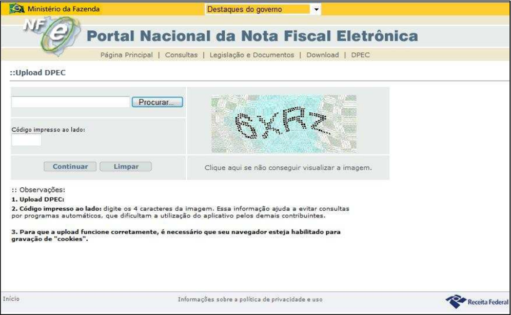


## 6.2 Consulta de DPEC por página WEB

O controle de acesso à consulta de DPEC por página WEB será realizado através da exigência do certificado  digital  do  usuário.  A  verificação  da  legitimidade  da  consulta  será  realizada  através  da comparação do CNPJ base do certificado digital utilizado com o CNPJ base do emissor da DPEC consultado.

A consulta poderá ser realizada por número de registro da DPEC ou pela chave de acesso da NF-e. No caso de consulta por chave de acesso da NF-e, a aplicação WEB deverá verificar se o CNPJ base da chave de acesso da NF-e consultada e o CNPJ base do titular do certificado digital utilizado na autenticação do usuário são iguais.

URL da página web para consulta de DPEC do ambiente de homologação:

https://hom.nfe.fazenda.gov.br/PORTAL/DPEC/ConsultaDPEC.aspx

URL da página web para consulta de DPEC do ambiente de produção:

https://www.nfe.fazenda.gov.br/portal/DPEC/ConsultaDPEC.aspx

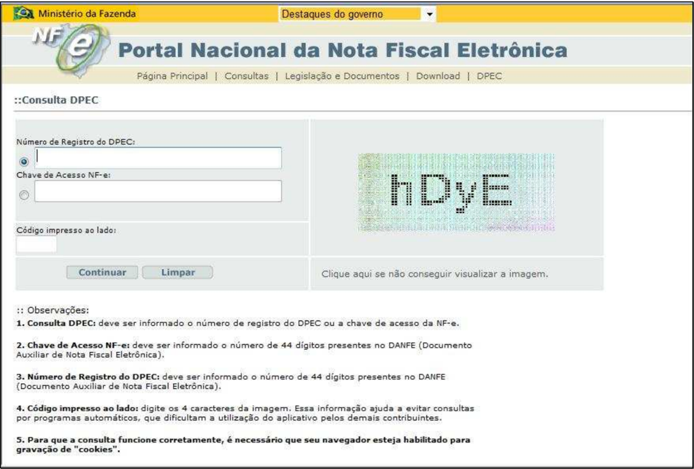

## Documentos relacionados
_Nenhum documento relacionado conhecido._
