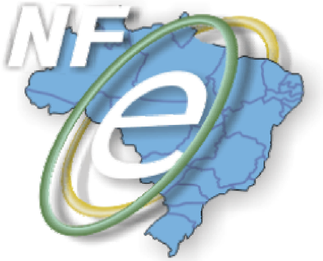

## Projeto Nota Fiscal Eletrônica

## Nota Técnica 2008/005

## Divulga alteração das regras de negócios da Nota Fiscal Eletrônica - NF-e

Agosto-2008

## 1.  Resumo

Divulga as seguintes alterações nas regras de negóc ios da Nota Fiscal Eletrônica - NF-e:

- Redução prazo máximo de cancelamento da NF-e (Ato  COTEPE 22/08);
- Validação da IE do Substituto Tributário (Convênio ICMS 58/08).

## 2.  Redução no prazo máximo de cancelamento da NF-e

O  Ato  COTEPE  ICMS  Nº  22,  de  25/06/2008,  aprovou  a  versão  2.0.2a  do  Manual  de Integração da Nota Fiscal Eletrônica - NF-e, com as  seguintes alterações:

## · alteração da regra H10 do Web Service NfeCancelamen to (página 43):

| Pedido de cancelamento de NF-e - Regras de Negócios   | Pedido de cancelamento de NF-e - Regras de Negócios      | Pedido de cancelamento de NF-e - Regras de Negócios   | Pedido de cancelamento de NF-e - Regras de Negócios   | Pedido de cancelamento de NF-e - Regras de Negócios   |
|-------------------------------------------------------|----------------------------------------------------------|-------------------------------------------------------|-------------------------------------------------------|-------------------------------------------------------|
| #                                                     | Regra de Validação                                       | Aplic.                                                | Msg                                                   | Efeito                                                |
| H10                                                   | - Verificar NF-e autorizada há mais de 7 dias (168horas) | Obrig.                                                | 220                                                   | Rej.                                                  |

## · alteração do texto da mensagem 220 (página 65):

|   CÓDIGO | MOTIVOS DE NÃO ATENDIMENTO DA SOLICITAÇÃO                |
|----------|----------------------------------------------------------|
|      220 | Rejeição: NF-e autorizada há mais de 7 dias (168 ho ras) |

O prazo máximo de cancelamento de uma NF-e passa se r limitada em 7 dias (168 horas) da data de concessão da autorização de uso da NF-e.

A alteração não implica em qualquer modificação nos leiautes das mensagens, permanecendo válidos os Schemas XML do Pacote de Li beração 005a (PL\_005a.zip) em vigor.

## 3.  Validação da IE do substituto tributário

O Convênio ICMS 58/08 , de 05/06/2008, introduziu a seguinte alteração na  cláusula primeira do  Convênio  ICMS  51/00 ,  de  15/09/2000,  que  disciplina  as  operações  com  ve ículos automotores novos efetuados por meio de faturamento direto para o consumidor final:

'Cláusula  primeira Ficam  acrescentados  os  §§  2º  e  3º  à  cláusula  prime ira  do  Convênio ICMS  51/00,  de  15  de  setembro  de  2000,  com  a  seguinte  redação ,  renumerando-se  o parágrafo único para parágrafo primeiro:

- '§ 2º A parcela do imposto relativa à operação sujeita ao regime de sujeição passiva por substituição é devida à unidade federada de localização da concessionária que fará a entrega do veículo ao consumidor.
- § 3º A partir de 1º de julho de 2008, o disposto no §  2º  aplica-se também às operações de arrendamento mercantil (leasing).'

A  alteração  cria  uma  exceção  na  regra  de  validação da  Inscrição  Estadual  do  Substituto Tributário - IE ST ao determinar que o ICMS da Subs tituição Tributária - ST calculado na forma prevista no Convênio ICMS 51/00 é devido para a unidade federada de localização da concessionária  que  fará  a  entrega  do  veículo  ao  con sumidor  nos  casos  de  faturamento direto de veículos automotores novos para consumido r.

- Criação  da  regra  de  validação  G13a  para  verificar  s e  os  dados  do  local  de entrega foram informados em uma operação  de fatura mento direto de veículos automotores novos para consumidor (página 32);
- Acréscimo  da  mensagem  478  no  item  5.1.1  Tabela  de  c ódigos  de  erros  e descrições de mensagens de erros  (página 67):
- Alteração da regra de validação G14 para considerar  a UF do local de entrega como UF a ser utilizada na validação, quando se tra tar de faturamento direto de veículos automotores novos para consumidor (página 32).

| Validação da NF-e - Regras de Negócios   | Validação da NF-e - Regras de Negócios                                                                                                                                                                                                                                                                     | Validação da NF-e - Regras de Negócios   | Validação da NF-e - Regras de Negócios   | Validação da NF-e - Regras de Negócios   |
|------------------------------------------|------------------------------------------------------------------------------------------------------------------------------------------------------------------------------------------------------------------------------------------------------------------------------------------------------------|------------------------------------------|------------------------------------------|------------------------------------------|
| #                                        | Regra de Validação                                                                                                                                                                                                                                                                                         | Aplic.                                   | Msg                                      | Efeito                                   |
| G13a                                     | Se informado o tpOP (campo J02 do grupo VeicProd - J01) = '2 - Faturamento direto': Verificar se foi informado a UF (campo G09 do grupo entrega - G01) necessária na validação da IE ST, nos casos de operação de faturamento direto de veículos automotores novos pa ra consumidor (Convênio ICMS 51/00). | Obrig.                                   | 478                                      | Rej.                                     |

|   CÓDIGO | MOTIVOS DE NÃO ATENDIMENTO DA SOLICITAÇÃO                                           |
|----------|-------------------------------------------------------------------------------------|
|      478 | Rejeição: Local da entrega não informado para fatur amento direto de veículos novos |

| Validação da NF-e - Regras de Negócios   | Validação da NF-e - Regras de Negócios                                                                                                                                                                                                                                                                                                                                                                                                                                                                                               | Validação da NF-e - Regras de Negócios   | Validação da NF-e - Regras de Negócios   | Validação da NF-e - Regras de Negócios   |
|------------------------------------------|--------------------------------------------------------------------------------------------------------------------------------------------------------------------------------------------------------------------------------------------------------------------------------------------------------------------------------------------------------------------------------------------------------------------------------------------------------------------------------------------------------------------------------------|------------------------------------------|------------------------------------------|------------------------------------------|
| #                                        | Regra de Validação                                                                                                                                                                                                                                                                                                                                                                                                                                                                                                                   | Aplic.                                   | Msg                                      | Efeito                                   |
| G14                                      | IE ST informada: verificar o DV da IE do Substituto Tributário informada. UF a ser utilizada na validação: • UF do Local de Entrega (UF - G09 do grupo entrega - G01) caso o campo Tipo da operação (tpOP - J02 do grupo VeicProd - J01) tenha sido informado com '2 - Faturamento direto'; • UF do destinatário (UF - E12 do grupo enderDest -E05) nos demais casos. A aplicação deve normalizar a IE ST informada pelo emissor, acrescentando zeros à esquerda para atingir o tamanho padrão da IE da UF de destino se necessário. | Obrig.                                   | 211                                      | Rej.                                     |

A alteração do Manual de Integração para registro d a implementação será realizada quando publicarmos uma nova versão oficial do Manual de In tegração.