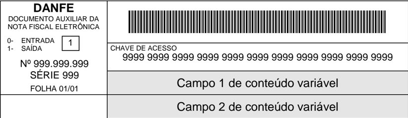
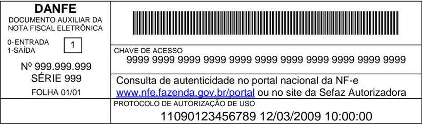
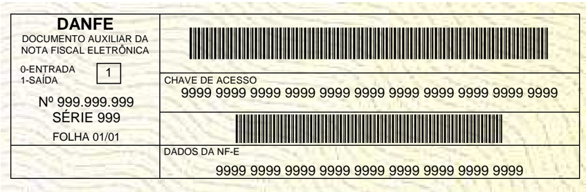
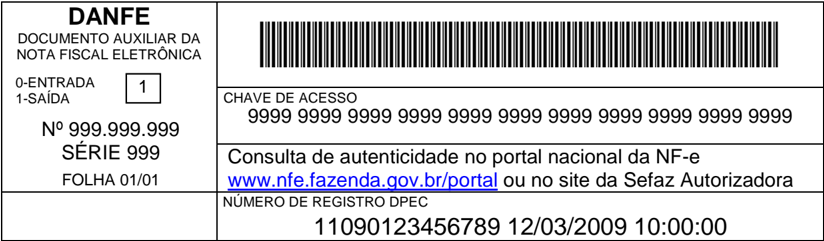

## Projeto Nota Fiscal Eletrônica

## Nota Técnica 2009/003

Padroniza o uso de campos do grupo de medicamentos da NF-e e a geração e impressão do código de barras adicional no DANFE

Agosto-2009

## 1.  Resumo

Esta  Nota  Técnica  tem  o  objetivo  de  padronizar  o  us o  do  grupo  específico  de  medicamento  e  a geração do código de barras adicional nas operações com exterior e a sua impressão no DANFE.

## 2. Padroniza o preenchimento de informações de interes se da ANVISA e do segmento farmacêutico

Os medicamentos e as matérias-primas (insumos) farm acêuticas são produtos sujeitos ao regime de vigilância sanitária e, portanto são cont rolados pela ANVISA. Destacam-se entre estes  produtos  aqueles  sujeitos  ao  regime  de  controle  especial  segundo  o  regime  da Portaria nº. 344/98 e suas atualizações, monitorado s através do SISTEMA NACIONAL DE GERENCIAMENTO DE PRODUTOS CONTROLADOS - SNGPC. Assim, informações como o lote e a data de fabricação são necessárias para o monitoramento de consumo e controle destes produtos.

O leiaute da Nota Fiscal eletrônica - NF-e oferece um grupo de informação que dispõe dos campos utilizados no monitoramento e controle dos produtos pela ANVISA e que poderia ser utilizado por outros produtos como é caso das matér ias-primas farmacêuticas. Ocorre que este  grupo  de  informação  não  é  utilizado  pela  maior ia  do  segmento  farmacêutico  por entenderem que campos são de uso exclusivo de medic amentos e com isto as informações de interesse da sociedade estão sendo informadas na  descrição do produto ou no campo de informações complementares, prejudicando o seu uso.

Assim, acrescentamos a expressão 'matérias-primas farmacêuticas' no grupo de informações  específicas  de  medicamentos,  conforme  quadro  abaixo  para  que  todos  os interessados possam utilizar os campos existentes.

| K - Detalhamento Específico de Medicamentoe de matérias-primas farmacêuticas   | K - Detalhamento Específico de Medicamentoe de matérias-primas farmacêuticas   | K - Detalhamento Específico de Medicamentoe de matérias-primas farmacêuticas   | K - Detalhamento Específico de Medicamentoe de matérias-primas farmacêuticas      | K - Detalhamento Específico de Medicamentoe de matérias-primas farmacêuticas   | K - Detalhamento Específico de Medicamentoe de matérias-primas farmacêuticas   | K - Detalhamento Específico de Medicamentoe de matérias-primas farmacêuticas   | K - Detalhamento Específico de Medicamentoe de matérias-primas farmacêuticas   | K - Detalhamento Específico de Medicamentoe de matérias-primas farmacêuticas   | K - Detalhamento Específico de Medicamentoe de matérias-primas farmacêuticas   | K - Detalhamento Específico de Medicamentoe de matérias-primas farmacêuticas                                                     |
|--------------------------------------------------------------------------------|--------------------------------------------------------------------------------|--------------------------------------------------------------------------------|-----------------------------------------------------------------------------------|--------------------------------------------------------------------------------|--------------------------------------------------------------------------------|--------------------------------------------------------------------------------|--------------------------------------------------------------------------------|--------------------------------------------------------------------------------|--------------------------------------------------------------------------------|----------------------------------------------------------------------------------------------------------------------------------|
| #                                                                              | ID                                                                             | Campo                                                                          | Descrição                                                                         | Ele                                                                            | Pai                                                                            | Tipo                                                                           | Ocorr                                                                          | tama                                                                           | Dec                                                                            | Observação                                                                                                                       |
| 152                                                                            | K01                                                                            | med                                                                            | TAG de grupo do detalhamento de Medicamentos e de matérias- primas farmacêuticas  | CG                                                                             | I01                                                                            |                                                                                | 0-N                                                                            |                                                                                |                                                                                | Informar apenas quando se tratar de medicamentos ou de matérias-primas farmacêuticas , permite múltiplas ocorrências (ilimitado) |
| 153                                                                            | K02                                                                            | nLote                                                                          | Número do Lote do medicamentoe de matérias-primas farmacêuticas                   | E                                                                              | K01                                                                            | C                                                                              | 1-1                                                                            | 1-20                                                                           |                                                                                |                                                                                                                                  |
| 154                                                                            | K03                                                                            | qLote                                                                          | Quantidade de produto no Lote do medicamento e das matérias- primas farmacêuticas | E                                                                              | K01                                                                            | N                                                                              | 1-1                                                                            | 11                                                                             | 3                                                                              |                                                                                                                                  |
| 155                                                                            | K04                                                                            | dFab                                                                           | Data de fabricação                                                                | E                                                                              | K01                                                                            | D                                                                              | 1-1                                                                            |                                                                                |                                                                                | Formato 'AAAA-MM- DD'                                                                                                            |
| 156                                                                            | K05                                                                            | dVal                                                                           | Data de validade                                                                  | E                                                                              | K01                                                                            | D                                                                              | 1-1                                                                            |                                                                                |                                                                                | Formato 'AAAA-MM- DD'                                                                                                            |
| 157                                                                            | K06                                                                            | vPMC                                                                           | Preço máximo consumidor                                                           | E                                                                              | K01                                                                            | N                                                                              | 1-1                                                                            | 15                                                                             | 2                                                                              |                                                                                                                                  |

## 3. O Código de Barras Adicional do DANFE

A versão 3.0 do Manual de integração do Contribuint e aprovada pelo Ato COTEPE 03/2009 de 19/03/2009 criou um Código de Barras Adicional para facilitar a captura das principais informações da NF-e emitida em contingência pela fi scalização de trânsito.

O Código de Barras é formado com a UF e CNPJ do des tinatário, que podem não existir nos casos de operação de comércio exterior. Para este caso adotaremos o código 99 para o cUF e 00000000000000 para o CNPJ do destinatário/remetente.

Caso o destinatário seja pessoa física, o campo CNPJ deverá ser informado com o CPF.

Todos os campos que formam o código de barras devem ser preenchidos com alinhamento à  direita,  sem  formatação  e  com  os  zeros  não  signif icativos  necessários  para  alcançar  o tamanho do campo.

Assim,  o  trecho  do  Manual  de  Integração  do  Contribu inte  que  trata  do  Código  de  Barras adicional passa a ter a seguinte redação:

'O Código de Barras Adicional dos Dados da NF-e será formado pelo seguinte conteúdo, em um total de 36 caracteres:

|                          |   cUF |   tpEmis |   CNPJ |   vNF |   ICMSp |   ICMSs |   DD |   DV |
|--------------------------|-------|----------|--------|-------|---------|---------|------|------|
| Quantidade de caracteres |    02 |       01 |     14 |    14 |      01 |      01 |   02 |   01 |

- cUF = Código da UF do destinatário ou remetente do Documento Fiscal , informar 99 quando a operação for de comércio exterior ;
- tpEmis = Forma de Emissão da NF-e, informar 2-Contingência FS ou 5Contingência FS-DA, conforme o Anexo I.
- CNPJ = CNPJ do destinatário ou do remetente, informar zeros no caso de operaçã o com o exterior ou o CPF caso o destinatário ou reme tente seja pessoa física;
- vNF = Valor Total da NF-e (sem ponto decimal, informar sempre os centavos);
- ICMSp = Destaque de ICMS próprio na NF-e no seguinte formato:
- /square4 1 = há destaque de ICMS próprio;
- /square4 2 = não há destaque de ICMS próprio.
- ICMSs = Destaque de ICMS por substituição tributá ria na NF-e, no seguinte formato:
- /square4 1 = há destaque de ICMS por substituição tributária ;
- /square4 2 = não há destaque de ICMS por substituição tributária.
- DD = Dia da emissão da NF-e;
- DV = Dígito Verificador, calculado de forma semelhante ao DV da Chave de Acesso (item 5.4) .

Obs. Todos os campos que formam o código de barras devem ser preenchidos com alinhamento à direita, sem formatação e com os zero s não significativos necessários para alcançar o tamanho do campo. '

As alterações de redação foram destacadas em negrit o serão realizadas na próxima versão do Manual de Integração do Contribuinte.

## 4.  O Código de Barras Adicional

O  leiaute  de  impressão  DANFE  foi  alterado  com  a  cri ação  de  dois  novos  campos  nas proximidades do local onde é impresso atualmente o código de barras da chave de acesso da NF-e ficando com a seguinte disposição:

Os dois novos campos terão conteúdo variável em fun ção da forma de emissão da NF-e.

## 4.1 Emissão da NF-e normal e SCAN

A  forma  de  emissão  de  NF-e  normal  e  emissão  SCAN  sã o  formas  de  emissão  da  NF-e conclusivas com obtenção da autorização de uso para  a NF-e emitida, sem necessidade de posterior transmissão da NF-e para a SEFAZ.

Após a obtenção da autorização de uso da NF-e, o em issor pode emitir o DANFE em papel comum,  informando  o  número  do  protocolo  de  autoriza ção  de  uso  e  a  data  e  a  hora  de autorização no Campo 2, ficando com a seguinte disp osição:

## 4.2 Emissão da NF-e em contingência com impressão do DANFE em Formulário de Segurança

O uso do formulário de segurança (FS ou FS-DA) para  impressão do DANFE é a forma de contingência  mais  simples  e  que  funciona  sempre.  As   NF-e  devem  ser  transmitidas posteriormente  para  a  SEFAZ  quando  cessados  os  problemas  técnicos  que  impediam  a transmissão.

Neste  caso,  o  emissor  deverá  gerar  o  Código  de  Barr as  Adicional  no  Campo  1  e  a representação numérica do Código de Barras no Campo 2.

## 4.3 Emissão da NF-e com prévio registro do DPEC no Ambiente Nacional

Nesta modalidade de contingência eletrônica o emiss or deve gerar o DPEC que consiste em um arquivo de resumo das operações que está realiza ndo. Este arquivo será transmitido ao Ambiente Nacional para registro do DPEC.

Após o  registro  do  DPEC  o  emissor  poderá  emitir  os  DANFE  em  papel  comum  devendo consignar o número e data e hora do registro do DPE C no campo 2.

