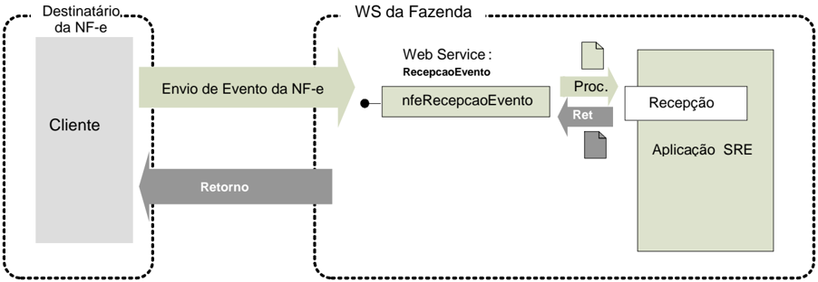
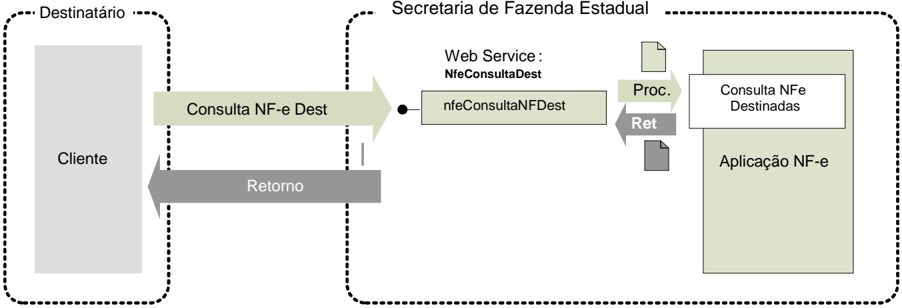
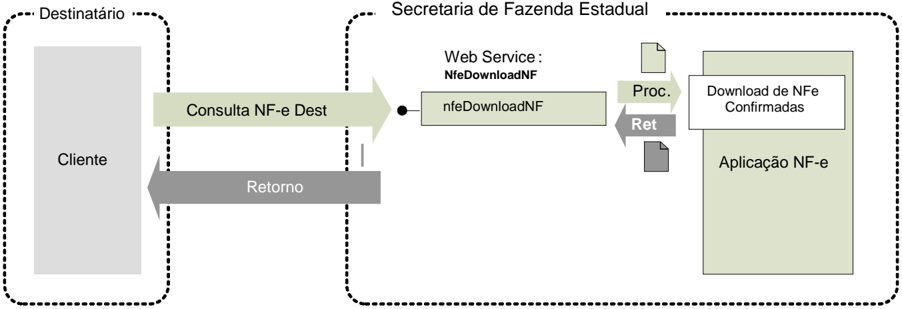

## Projeto Nota Fiscal Eletrônica Projeto Nota Fiscal Eletrônica Projeto Nota Fiscal Eletrônica

## Nota Técnica 2012/00 Manifestação do Destinatário Nota Técnica 2012/00 2 Manifestação do Destinatário Manifestação do Destinatário

Versão 1.02 Março 2012

## Controle de Versões

| Versão   | Data                                             |
|----------|--------------------------------------------------|
| 0.00     | 10/11/2010 - SP                                  |
| 0.00a    | 23/12/2010 - Revisão RS                          |
| 0.00b    | 26/04/2011 - SP                                  |
| 0.00c    | 15/07/2011 - Revisão RS/SP                       |
| 0.00d    | 20/07/2011 - Revisão RS/SP/SERPRO                |
| 0.00e    | 30/09/2011 - Revisão RS/SP                       |
| 0.00f    | 24/11/2011 - Revisão RS                          |
| 1.01     | 24/02/2012 - Revisão reunião Empresas do Pilot o |
| 1.01a    | 19/03/2012 - Alteração conforme decisão ENCAT    |
| 1.02     | 01/08/2012 - Acertos da especificação            |

Este  documento  tem  por  objetivo  a  definição  das  esp ecificações  técnicas  necessárias  para  a implementação dos eventos da Manifestação do Destin atário: Confirmação da Operação, Desconhecimento da Operação e Operação não Realizad a.

Faz parte deste documento também os novos serviços  vinculados ao registro destes eventos, com:

- Web Service de Consulta da Relação de Documentos D estinados a uma determinada empresa (NF-e, Cancelamento e Carta de Correção);
- Web Service de Download da NF-e para uma determinada Chave de Acesso informada.

O documento será tratado como um documento independ ente durante a fase de desenvolvimento dos Web Services para facilitar a sua manutenção e  aperfeiçoamento.

Após  a  disponibilização  dos  novos  eventos  e  dos  nov os  serviços  no  ambiente  de  produção,  o documento passará a fazer parte do Manual de Integr ação do Contribuinte.

Nota:  Fazem  parte  do  'Projeto  Piloto'  da  Manifestação  do  Destinatário,  as  empresas:  AGCO,  BR Foods, Bunge, Gerdau, Panarello, Petrobrás, Petrobr ás Distribuidora e Lojas Renner.

## 4.9 Web Service - RecepcaoEvento - Manifestação do Dest inatário

## Sistema de Registro de Eventos

Função : Serviço destinado à recepção de mensagem de Event o da NF-e.

Este serviço permite que o destinatário da Nota Fis cal eletrônica confirme a sua participação na operação acobertada pela Nota Fiscal eletrônica emi tida para o seu CNPJ, através do envio da mensagem de:

- Desconhecimento da operação - declarando o Desconhecimento da Operação;
- Confirmação da operação -  confirmando  a  ocorrência  da  operação  e  o  recebim ento  da mercadoria (para as operações com circulação de mer cadoria);
- Operação não Realizada - declarando que a Operação não foi Realizada (com  Recusa do Recebimento da mercadoria e outros) e a justificativa porque a operação não se realizou;
- Ciência da operação - declarando ter ciência da operação destinada ao C NPJ, mas ainda não  possui  elementos suficientes  para  apresentar  um a manifestação  conclusiva,  como  as acima citadas.

O autor do evento é o destinatário da NF-e. A mensa gem XML do evento será assinada com o certificado digital que tenha o CNPJ-Base (8 primeiras posições do CNPJ) do Destinatário da NFe.

A ciência da operação é um evento opcional que pode  ser utilizado pelo destinatário para declarar que  tem  ciência  da  existência  da  operação,  mas  aind a  não  tem  elementos  suficientes  para apresentar uma manifestação conclusiva.

O  destinatário  deve  apresentar  uma  manifestação  con clusiva  dentro  de  um  prazo  máximo definido,  contados  a  partir  da  data  de  autorização da  NF-e.  Este  prazo  é  parametrizável  e atualmente está definido em 180 dias.

Processo

: síncrono.

Método: nfeRecepcaoEvento

## 4.9.1 Leiaute Mensagem de Entrada

Entrada:

Estrutura XML com o Evento

Schema XML: envConfRecebto\_v9.99.xsd

| #    | Campo      | Ele   | Pai   | Tipo   | Ocor.   | Tam.    | Descrição/Observação                                                                                                                                                                                                                                                                   |
|------|------------|-------|-------|--------|---------|---------|----------------------------------------------------------------------------------------------------------------------------------------------------------------------------------------------------------------------------------------------------------------------------------------|
| HP01 | envEvento  | Raiz  | -     | -      | -       | -       | TAG raiz                                                                                                                                                                                                                                                                               |
| HP02 | versao     | A     | HP01  | N      | 1-1     | 2v2     | Versão do leiaute                                                                                                                                                                                                                                                                      |
| HP03 | idLote     | E     | HP01  | N      | 1-1     | 1-15    | Identificador de controle do Lote de envio do Evento. Número sequencial autoincr emental único para identificação do Lote. A responsabilidade de gerar e controlar o identificador é exclusiva do autor do evento. O Web Service não faz qualquer uso ou controle deste identificador. |
| HP04 | evento     | G     | HP01  | xml    | 1-20    | -       | Evento, um lote pode conter até 20 eventos                                                                                                                                                                                                                                             |
| HP05 | versao     | A     | HP04  | N      | 1-1     | 2v2     | Versão do leiaute do evento                                                                                                                                                                                                                                                            |
| HP06 | infEvento  | G     | HP04  |        | 1-1     |         | Grupo de informações do registro do Evento                                                                                                                                                                                                                                             |
| HP07 | Id         | ID    | HP06  | C      | 1-1     | 54      | Identificador da TAG a ser assinada, a regra de formação do Id é: 'ID' + tpEvento + chave da NF-e + nSeqEvento                                                                                                                                                                         |
| HP08 | cOrgao     | E     | HP06  | N      | 1-1     | 2       | Código do órgão de recepção do Evento. Utili zar a Tabela de UF do IBGE, utilizar 91 para identificar o Ambiente Nacional.                                                                                                                                                             |
| HP09 | tpAmb      | E     | HP06  | N      | 1-1     | 1       | Identificação do Ambiente: 1=Produção /2=Homo logação                                                                                                                                                                                                                                  |
| HP10 | CNPJ       | CE    | HP06  | N      | 1-1     | 14      | Informar o CNPJ ou o CPF do autor do Evento                                                                                                                                                                                                                                            |
| HP11 | CPF        | CE    | HP06  | N      | 1-1     | 11      |                                                                                                                                                                                                                                                                                        |
| HP12 | chNFe      | E     | HP06  | N      | 1-1     | 44      | Chave de Acesso da NF-e vinculada ao Evento                                                                                                                                                                                                                                            |
| HP13 | dhEvento   | E     | HP06  | D      | 1-1     |         | Data e hora do evento no formato AAAA-MM-DDThh:mm:ssTZD (UTC - Universal Coordinated Time, onde TZD pode ser - 02:00 (Fernando de Noronha), -03:00 (Brasília) ou - 04:00 (Manaus), no horário de verão serão -01:00, -02:00 e -03:00. Ex.: 2010-08-19T13:00:15-03:00.                  |
| HP14 | tpEvento   | E     | HP06  | N      | 1-1     | 6       | Código do evento: 210200 - Confirmação da Operação 210210 - Ciência da Operação 210220 - Desconhecimento da Operação 210240 - Operação não Realizada                                                                                                                                   |
| HP15 | nSeqEvento | E     | HP06  | N      | 1-1     | 1-2     | Sequencial do evento, informar                                                                                                                                                                                                                                                         |
| HP16 | verEvento  | E     | HP06  | N      | 1-1     | 2v2     | 1. Identificação da Versão do evento informad o em detEvento                                                                                                                                                                                                                           |
| HP17 | detEvento  | G     | HP06  |        | 1-1     |         | Informações do evento                                                                                                                                                                                                                                                                  |
| HP18 | versao     | A     | HP17  | N      | 1-1     | 2v2     | Versão do evento                                                                                                                                                                                                                                                                       |
| HP19 | descEvento | E     | HP17  | C      | 1-1     | 5-60    | Informar a descrição do evento: Confirmacao da Operacao Ciencia da Operacao Desconhecimento da Operacao Operacao nao Realizada                                                                                                                                                         |
| HP20 | xJust      | E     | HP17  | C      | 0-1     | 15- 255 | Informar a justificativa porque a operação não foi realizada, este campo deve ser informado somente no evento de Operação não Realizada.                                                                                                                                               |
| HP21 | Signature  | G     | HP04  | XML    | 1-1     |         | Assinatura Digital do documento XML, a assinatura deverá ser aplicada no elemento infEvento                                                                                                                                                                                            |

## 4.9.2 Leiaute Mensagem de Retorno

Retorno:

Estrutura XML com a mensagem do resultado da transmissão.

Schema XML: retEnvConfRecebto \_v9.99.xsd

| #    | Campo        | Ele   | Pai   | Tipo   | Ocor.   | Tam.   | Descrição /Observação                                                                                                                                                                                                                  |
|------|--------------|-------|-------|--------|---------|--------|----------------------------------------------------------------------------------------------------------------------------------------------------------------------------------------------------------------------------------------|
| HR01 | retEnvEvento | Raiz  | -     | -      | -       | -      | TAG raiz do Resultado do Envio do Evento                                                                                                                                                                                               |
| HR02 | versao       | A     | HR01  | N      | 1-1     | 2v2    | Versão do leiaute                                                                                                                                                                                                                      |
| HR03 | idLote       | E     | HR01  | N      | 1-1     | 1-15   | Identificador de controle do Lote de envio do Evento. Número sequencial autoincremental único para identi ficação do Lote.                                                                                                             |
| HR04 | tpAmb        | E     | HR01  | N      | 1-1     | 1      | Identificação do Ambiente: 1=Produção /2=Homologação                                                                                                                                                                                   |
| HR05 | verAplic     | E     | HR01  | C      | 1-1     | 1-20   | Versão da aplicação que processou o evento.                                                                                                                                                                                            |
| HR06 | cOrgao       | E     | HR01  | N      | 1-1     | 2      | Código da UF que registrou o Evento. Utilizar 91 para o Ambiente Nacional.                                                                                                                                                             |
| HR07 | cStat        | E     | HR01  | N      | 1-1     | 3      | Código do status da resposta                                                                                                                                                                                                           |
| HR08 | xMotivo      | E     | HR01  | C      | 1-1     | 1-255  | Descrição do status da resposta                                                                                                                                                                                                        |
| HR09 | retEvento    | G     | HR01  | -      | 0-20    | -      | TAG de grupo do resultado do processamento do Evento                                                                                                                                                                                   |
| HR10 | versao       | A     | HR09  | N      | 1-1     | 2v2    | Versão do leiaute                                                                                                                                                                                                                      |
| HR11 | infEvento    | G     | HR09  |        | 1-1     |        | Grupo de informações do registro do Evento                                                                                                                                                                                             |
| HR12 | Id           | ID    | HR11  | C      | 0-1     | 17     | Identificador da TAG a ser assinada, somente deve ser informado se o órgão de registro assinar a resposta . Em caso de assinatura da resposta pelo órgão de regi stro, preencher com o número do protocolo, precedido pelaliteral 'ID' |
| HR13 | tpAmb        | E     | HR11  | N      | 1-1     | 1      | Identificação do Ambiente: 1=Produção /2=Homologação                                                                                                                                                                                   |
| HR14 | verAplic     | E     | HR11  | C      | 1-1     | 1-20   | Versão da aplicação que registrou o Evento, utilizar literal que permita a identificação do órgão, como a sigla da U F ou do órgão.                                                                                                    |
| HR15 | cOrgao       | E     | HR11  | N      | 1-1     | 2      | Código da UF que registrou o Evento. Utilizar 91 para o Ambiente Nacional.                                                                                                                                                             |
| HR16 | cStat        | E     | HR11  | N      | 1-1     | 3      | Código do status da resposta.                                                                                                                                                                                                          |
| HR17 | xMotivo      | E     | HR11  | C      | 1-1     | 1-255  | Descrição do status da resposta.                                                                                                                                                                                                       |
| HR18 | chNFe        | E     | HR11  | N      | 0-1     | 44     | Chave de Acesso da NF-e vinculada ao evento.                                                                                                                                                                                           |
| HR19 | tpEvento     | E     | HR11  | N      | 0-1     | 6      | Código do Tipo do Evento: 210200 - Confirmação da Operação 210210 - Ciência da Operação 210220 - Desconhecimento da Operação 210240 - Operação não Realizada                                                                           |
| HR20 | xEvento      | E     | HR11  | C      | 0-1     | 5-60   | Descrição do Evento: Confirmacao de Operacao registrada Ciencia da Operacao registrada Desconhecimento da Operacao registrada Operacao nao Realizada registrada                                                                        |
| HR21 | nSeqEvento   | E     | HR11  | N      | 0-1     | 1-2    | Sequencial do evento, informar 1.                                                                                                                                                                                                      |
| HR22 | CNPJDest     | CE    | HR11  | N      | 0-1     | 14     | Informar o CNPJ ou o CPF do destinatário daNF-e.                                                                                                                                                                                       |
| HR23 | CPFDest      | CE    | HR11  | N      | 0-1     | 11     |                                                                                                                                                                                                                                        |
| HR24 | emailDest    | E     | HR11  | C      | 0-1     | 1-60   | email do destinatárioinformado na NF-e.                                                                                                                                                                                                |
| HR25 | dhRegEvento  | E     | HR11  | D      | 1-1     |        | Data e hora de registro do evento no formato AAAA-MM- DDTHH:MM:SSTZD (formato UTC, onde TZD é +HH:MM ou - HH:MM). Se o evento for rejeitado informar a data e hora de recebimento do evento.                                           |
| HR26 | nProt        | E     | HR11  | N      | 0-1     | 15     | Número do Protocolo do Evento 1 posição (1=Secretaria da Fazenda Estadual, 2=RFB), 2 posições para o código da UF, 2 posições para o ano e 10 posições para o sequencial no ano.                                                       |
| HR27 | Signature    | G     | HR09  | XML    | 0-1     |        | Assinatura Digital do documento XML, a assinatura deverá ser aplicada no elemento infEvento. A decisão de assinar a mensagem fica a critério da UF.                                                                                    |

## 4.9.3 Descrição do Processo de Recepção de Evento

O  WS  de  Eventos  é  acionado  pelo  destinatário  da  NFe  que  deve  enviar  uma  mensagem  para declarar a sua participação na operação.

O processo de Registro de Eventos recebe eventos em uma estrutura de lotes, que pode conter de 1 a 20 eventos.

## 4.9.4 Validação do Certificado de Transmissão

| Validação do Certificado Digital do Transmissor (pr otocolo SSL)   | Validação do Certificado Digital do Transmissor (pr otocolo SSL)                                                                                                                                                                             | Validação do Certificado Digital do Transmissor (pr otocolo SSL)   | Validação do Certificado Digital do Transmissor (pr otocolo SSL)   | Validação do Certificado Digital do Transmissor (pr otocolo SSL)   |
|--------------------------------------------------------------------|----------------------------------------------------------------------------------------------------------------------------------------------------------------------------------------------------------------------------------------------|--------------------------------------------------------------------|--------------------------------------------------------------------|--------------------------------------------------------------------|
| #                                                                  | Regra de Validação                                                                                                                                                                                                                           | Crítica                                                            | Msg                                                                | Efeito                                                             |
| A01                                                                | Certificado de Transmissor Inválido: - Certificado de Transmissor inexistente na mensagem - Versão difere "3" - Se informado o Basic Constraint deve ser true (nã o pode ser Certificado de AC) - KeyUsage não define "Autenticação Cliente" | Obrig.                                                             | 280                                                                | Rej.                                                               |
| A02                                                                | Validade do Certificado (data início e data fim)                                                                                                                                                                                             | Ob rig.                                                            | 281                                                                | Rej.                                                               |
| A03                                                                | Verifica a Cadeia de Certificação: - Certificado da AC emissora não cadastrado na SEFAZ - Certificado de AC revogado - Certificado não assinado pela AC emissora do Cert ificado                                                             | Obrig.                                                             | 283                                                                | Rej.                                                               |
| A04                                                                | LCR do Certificado de Transmissor - Falta o endereço da LCR (CRL DistributionPoint) - LCR indisponível - LCR inválida                                                                                                                        | Obrig.                                                             | 286                                                                | Rej.                                                               |
| A05                                                                | Certificado do Transmissor revogado                                                                                                                                                                                                          | Obrig.                                                             | 284                                                                | Rej.                                                               |
| A06                                                                | Certificado Raiz difere da "ICP-Brasil"                                                                                                                                                                                                      | Obrig.                                                             | 285                                                                | Rej.                                                               |
| A07                                                                | Falta a extensão de CNPJ no Certificado (OtherName - OID=2.16.76.1.3.3)                                                                                                                                                                      | Obrig.                                                             | 282                                                                | Rej.                                                               |

As validações de A01, A02, A03, A04 e A05 são reali zadas pelo protocolo SSL e não precisam ser implementadas. A validação A06 também pode ser realizada pelo protocolo SSL, mas pode falhar se existirem outros certificados digitais de Autoridade Certificadora Raiz que não sejam 'ICP-Brasil' no repositório de certificados digitais do servidor de Web Service do Órgão de registro.

## 4.9.5 Validação Inicial da Mensagem no Web Service

| Validação Inicial da Mensagem no Web Service   | Validação Inicial da Mensagem no Web Service                             | Validação Inicial da Mensagem no Web Service   | Validação Inicial da Mensagem no Web Service   | Validação Inicial da Mensagem no Web Service   |
|------------------------------------------------|--------------------------------------------------------------------------|------------------------------------------------|------------------------------------------------|------------------------------------------------|
| #                                              | Regra de Validação                                                       | Aplic.                                         | Msg                                            | Efeito                                         |
| B01                                            | Tamanho do XML de Dados superior a 500 KB                                | Obrig.                                         | 214                                            | Rej.                                           |
| B02                                            | Verifica se o Servidor de Processamento está Parali sado Momentaneamente | Obrig.                                         | 108                                            | Rej.                                           |
| B03                                            | Verifica se o Servidor de Processamento está Parali sado sem Previsão    | Obrig.                                         | 109                                            | Rej.                                           |

A  mensagem  será  descartada  se  o  tamanho  exceder  o  l imite  previsto  (500  KB).  A  aplicação  do contribuinte não poderá permitir a geração de mensagem com tamanho superior a 500 KB. Caso isto ocorra,  a  conexão  poderá  ser  interrompida  sem  retor no  da  mensagem  de  erro  se  o  controle  do tamanho da mensagem for implementado por configurações do ambiente de rede (ex.: controle no firewall).  No  caso  do  controle  de  tamanho  ser  implementado  por  aplicativo  poderá  ocorrer  a devolução da mensagem de erro 214.

Caso  o  Web  Service  fique  disponível,  mesmo  quando  o   serviço  estiver  paralisado,  deverão implementar as verificações 108 e 109. Estas valida ções poderão ser dispensadas se o Web Service não ficar disponível quando o serviço estiver paralisado.

## 4.9.6 Validação das informações de controle da chamada ao Web Service

| Validação das informações de controle da chamada ao Web Service   | Validação das informações de controle da chamada ao Web Service       | Validação das informações de controle da chamada ao Web Service   | Validação das informações de controle da chamada ao Web Service   | Validação das informações de controle da chamada ao Web Service   |
|-------------------------------------------------------------------|-----------------------------------------------------------------------|-------------------------------------------------------------------|-------------------------------------------------------------------|-------------------------------------------------------------------|
| #                                                                 | Regra de Validação                                                    | Aplic.                                                            | Msg                                                               | Efeito                                                            |
| C01                                                               | Elemento nfeCabecMsg inexistente no SOAP Header                       | Obrig.                                                            | 242                                                               | Rej.                                                              |
| C02                                                               | Campo cUF inexistente no elemento nfeCabecMsg do SOAP Header          | Obrig.                                                            | 409                                                               | Rej.                                                              |
| C03                                                               | Verificar se a UF informada no campo cUF é atendida p elo Web Service | Obrig.                                                            | 410                                                               | Rej.                                                              |
| C04                                                               | Campo versaoDados inexistente no elemento nfeCabecMsg do SOAP Header  | Obrig.                                                            | 411                                                               | Rej.                                                              |
| C05                                                               | Versão dos Dados informada é superior à versão vige nte               | Facult.                                                           | 238                                                               | Rej.                                                              |
| C06                                                               | Versão dos Dados não suportada                                        | Obrig.                                                            | 239                                                               | Rej.                                                              |

A informação da versão do leiaute do registro de ev ento é informada no elemento nfeCabecMsg do SOAP Header (para maiores detalhes vide item 3.4).

A aplicação deverá validar o campo de versão da mensagem ( versaoDados ), rejeitando a solicitação recebida em caso de informações inexistentes ou inv álidas.

## 4.9.7 Validação da Área de Dados

## a) Validação de forma da área de dados

A validação de forma da área de dados da mensagem é  realizada com a aplicação da seguinte regra:

| Validação da área de dados da mensagem                                                                                               | Validação da área de dados da mensagem                                                                                               | Validação da área de dados da mensagem   | Validação da área de dados da mensagem   | Validação da área de dados da mensagem   |
|--------------------------------------------------------------------------------------------------------------------------------------|--------------------------------------------------------------------------------------------------------------------------------------|------------------------------------------|------------------------------------------|------------------------------------------|
| #                                                                                                                                    | Regra de Validação                                                                                                                   | Aplic.                                   | Msg                                      | Efeito                                   |
| D01                                                                                                                                  | Verifica Schema XML da Área de Dados                                                                                                 | Obrig.                                   | 225                                      | Rej.                                     |
| D01a Em caso de Falha de Schema, verificar se existe a tag raiz esperada para o lote                                                 | D01a Em caso de Falha de Schema, verificar se existe a tag raiz esperada para o lote                                                 | Facul.                                   | 516                                      | Rej.                                     |
| D01b Em caso de Falha de Schema, verificar se existe o atributo versao para a tag raiz da mensagem                                   | D01b Em caso de Falha de Schema, verificar se existe o atributo versao para a tag raiz da mensagem                                   | Facul.                                   | 517                                      | Rej.                                     |
| D01c Em caso de Falha de Schema, verificar se o conteúdodo atributo versao difere do conteúdo da versaoDados informado no SOAPHeader | D01c Em caso de Falha de Schema, verificar se o conteúdodo atributo versao difere do conteúdo da versaoDados informado no SOAPHeader | Facul.                                   | 545                                      | Rej.                                     |
| D01d Verifica a existência de qualquer namespace diversodo namespace padrão da NF-e (http://www.portalfiscal.inf.br/nfe)             | D01d Verifica a existência de qualquer namespace diversodo namespace padrão da NF-e (http://www.portalfiscal.inf.br/nfe)             | Facul.                                   | 587                                      | Rej.                                     |
| D01e Verifica a existência de caracteres de edição no in ício ou fim da mensagem ou entre as tags                                    | D01e Verifica a existência de caracteres de edição no in ício ou fim da mensagem ou entre as tags                                    | Facul.                                   | 588                                      | Rej.                                     |
| D02 Verifica o uso de prefixo no namespace                                                                                           | D02 Verifica o uso de prefixo no namespace                                                                                           | Obrig.                                   | 404                                      | Rej.                                     |
| D03                                                                                                                                  | XML utiliza codificação diferente de UTF-8                                                                                           | Obrig.                                   | 402                                      | Rej.                                     |

As  validações  D01f,  D01g  e  D01h  são  de  aplicação  fa cultativa  e  podem  ser  aplicadas sucessivamente quando ocorrer falha na validação D0 1 e a SEFAZ entender oportuno informar a divergência entre a versão informada no SOAP Header  e a versão da mensagem XML.

A validação do Schema XML é realizada em toda mensagem de entrada, mas como existe uma parte da mensagem que é variável pode ocorrer erro de falha de Schema XML da parte específica da mensagem que será identificado posteriormente.

## b) Extração dos eventos do lote e validação do Sche ma XML do evento

A aplicação deve extrair os eventos do lote para tr atar individualmente os eventos, a princípio não existe necessidade de que todos os eventos sejam do mesmo tipo.

A  escolha  do  Schema  XML  aplicável  para  o  evento  é  r ealizado  com  base  no  tipo  do  evento tpEvento combinado com a verEvento, assim, a aplicação deve  manter um controle dos tpEvento válidos e as verEvento em vigência e o respectivo S chema XML.

| Validação do evento   | Validação do evento             | Validação do evento   | Validação do evento   | Validação do evento   |
|-----------------------|---------------------------------|-----------------------|-----------------------|-----------------------|
| #                     | Regra de Validação              | Aplic.                | Msg                   | Efeito                |
| D04                   | Verifica se o tpEvento é válido | Obrig.                | 491                   | Rej.                  |

## Nota Fiscal eletrônica

| D05 Verifica se o verEvento é válido                       | Obrig.   |   492 | Rej.   |
|------------------------------------------------------------|----------|-------|--------|
| D06 Verifica se o detEvento atende o respectivo schema XML | Obrig.   |   493 | Rej.   |

## c) Validação do Certificado Digital de Assinatura

| Validação do Certificado Digital utilizado na Assin atura Digital do DF-e   | Validação do Certificado Digital utilizado na Assin atura Digital do DF-e                                                                                                                                                                                                              | Validação do Certificado Digital utilizado na Assin atura Digital do DF-e   | Validação do Certificado Digital utilizado na Assin atura Digital do DF-e   | Validação do Certificado Digital utilizado na Assin atura Digital do DF-e   |
|-----------------------------------------------------------------------------|----------------------------------------------------------------------------------------------------------------------------------------------------------------------------------------------------------------------------------------------------------------------------------------|-----------------------------------------------------------------------------|-----------------------------------------------------------------------------|-----------------------------------------------------------------------------|
| #                                                                           | Regra de Validação                                                                                                                                                                                                                                                                     | Aplic.                                                                      | Msg                                                                         | Efeito                                                                      |
| E01                                                                         | Certificado de Assinatura inválido: - Certificado de Assinatura inexistente na mensagem (*validado também pelo Schema) - Versão difere "3" - Se informado o Basic Constraint deve ser true (não pode ser Certificado de AC) - KeyUsage não define "Assinatura Digital" e 'Não R ecusa' | Obrig.                                                                      | 290                                                                         | Rej.                                                                        |
| E02                                                                         | Validade do Certificado (data início e data fim)                                                                                                                                                                                                                                       | Ob rig.                                                                     | 291                                                                         | Rej.                                                                        |
| E03                                                                         | Falta a extensão de CNPJ no Certificado (OtherName - OID=2.16.76.1.3.3)                                                                                                                                                                                                                | Obrig.                                                                      | 292                                                                         | Rej.                                                                        |
| E04                                                                         | Verifica Cadeia de Certificação: - Certificado da AC emissora não cadastrado na SEFAZ - Certificado de AC revogado - Certificado não assinado pela AC emissora do Cert ificado                                                                                                         | Obrig.                                                                      | 293                                                                         | Rej.                                                                        |
| E05                                                                         | LCR do Certificado de Assinatura: - Falta o endereço da LCR (CRLDistributionPoint) - Erro no acesso a LCR ou LCR inexistente                                                                                                                                                           | Obrig.                                                                      | 296                                                                         | Rej.                                                                        |
| E06                                                                         | Certificado de Assinatura revogado                                                                                                                                                                                                                                                     | Obrig.                                                                      | 294                                                                         | Rej.                                                                        |
| E07                                                                         | Certificado Raiz difere da 'ICP-Brasil'                                                                                                                                                                                                                                                | Obrig.                                                                      | 295                                                                         | Rej.                                                                        |

## d) Validação da Assinatura Digital

| Validação da Assinatura Digital do DF -e   | Validação da Assinatura Digital do DF -e                                                                                                                                                                                                                                                     | Validação da Assinatura Digital do DF -e   | Validação da Assinatura Digital do DF -e   | Validação da Assinatura Digital do DF -e   |
|--------------------------------------------|----------------------------------------------------------------------------------------------------------------------------------------------------------------------------------------------------------------------------------------------------------------------------------------------|--------------------------------------------|--------------------------------------------|--------------------------------------------|
| #                                          | Regra de Validação                                                                                                                                                                                                                                                                           | Aplic.                                     | Msg                                        | Efeito                                     |
| F01                                        | Assinatura difere do padrão do Projeto: - Não assinado o atributo "Id" (falta "Reference URI" na assinatura) (*validado também pelo Schema) - Faltam os "Transform Algorithm" previstos na assinatura ("C14N" e "Enveloped") Estas validações são implementadas pelo Schema XML da Signature | Obrig.                                     | 298                                        | Rej.                                       |
| F02                                        | Valor da assinatura (SignatureValue) difere do valor calculado                                                                                                                                                                                                                               | Obrig.                                     | 297                                        | Rej.                                       |
| F03                                        | CNPJ-Base do Autor da mensagem difere do CNPJ-Base do Certificado Digital                                                                                                                                                                                                                    | Obrig.                                     | 213                                        | Rej.                                       |

## e) Validação de regras de negócio do Registro de Ev ento - parte Geral

| Validação do Registro de Eventos - Regras de Negócio - parte Geral   | Validação do Registro de Eventos - Regras de Negócio - parte Geral                                                     | Validação do Registro de Eventos - Regras de Negócio - parte Geral   | Validação do Registro de Eventos - Regras de Negócio - parte Geral   | Validação do Registro de Eventos - Regras de Negócio - parte Geral   |
|----------------------------------------------------------------------|------------------------------------------------------------------------------------------------------------------------|----------------------------------------------------------------------|----------------------------------------------------------------------|----------------------------------------------------------------------|
| #                                                                    | Regra de Validação                                                                                                     | Aplic.                                                               | Msg                                                                  | Efeito                                                               |
| G01                                                                  | Tipo do ambiente difere do ambiente do Web Service                                                                     | Obrig.                                                               | 252                                                                  | Rej.                                                                 |
| G02                                                                  | Código do órgão de recepção do Evento da UF diverge da solicitada                                                      | Obrig.                                                               | 250                                                                  | Rej.                                                                 |
| G03                                                                  | CNPJ do autor do evento informado inválido (DVou zeros)                                                                | Obrig.                                                               | 489                                                                  | Rej.                                                                 |
| G04                                                                  | CPF do autor do evento informado inválido (DV o u zeros)                                                               | Obrig.                                                               | 490                                                                  | Rej.                                                                 |
| G04a                                                                 | Chave de Acesso com dígito verificador inválido                                                                        | Obr ig.                                                              | 236                                                                  | Rej.                                                                 |
| G04b                                                                 | Chave de Acesso inválida (Código UF inválido)                                                                          | Obrig .                                                              | 614                                                                  | Rej.                                                                 |
| G04c                                                                 | Chave de Acesso inválida (Ano < 06 ou Ano maior queAno corrente)                                                       | Obrig.                                                               | 615                                                                  | Rej.                                                                 |
| G04d                                                                 | Chave de Acesso inválida (Mês =0 ou Mês > 12)                                                                          | Obrig .                                                              | 616                                                                  | Rej.                                                                 |
| G04e                                                                 | Chave de Acesso inválida (CNPJ zerado ou dígito inv álido)                                                             | Obrig.                                                               | 617                                                                  | Rej.                                                                 |
| G04f                                                                 | Chave de Acesso inválida (modelo diferente de55)                                                                       | Obrig.                                                               | 618                                                                  | Rej.                                                                 |
| G04g                                                                 | Chave de Acesso inválida (número NF = 0)                                                                               | Obrig.                                                               | 619                                                                  | Rej.                                                                 |
| G05                                                                  | Validar se atributo Id corresponde à concatenação dos campos evento ('ID' + tpEvento + chNFe + nSeqEvento)             | Obrig.                                                               | 572                                                                  | Rej.                                                                 |
| G07                                                                  | Verificar duplicidade do evento (tpEvento + chNFe + nSeqEvento)                                                        | Obrig.                                                               | 573                                                                  | Rej.                                                                 |
| G09                                                                  | Se evento do destinatário verificar se CNPJ doAutor diferente do CNPJ do destinatário da NF-e, se a NF-e existir.      | Obrig.                                                               | 575                                                                  | Rej.                                                                 |
| G10                                                                  | Se evento do Fisco/RFB/Outros órgãos, verificar se CNPJ do Autor consta da tabela de órgãos autorizados a gerar evento | Obrig.                                                               | 576                                                                  | Rej.                                                                 |
| G11                                                                  | Data do evento não pode ser menor que a data de emissão da NF-e, se a NF-e existir                                     | Obrig.                                                               | 577                                                                  | Rej.                                                                 |
| G12                                                                  | Data do evento não pode ser maior que a data de processamento                                                          | Obrig.                                                               | 578                                                                  | Rej.                                                                 |

| Validação do Registro de Eventos - Regras de Negócio - parte Geral   | Validação do Registro de Eventos - Regras de Negócio - parte Geral                                                   | Validação do Registro de Eventos - Regras de Negócio - parte Geral   | Validação do Registro de Eventos - Regras de Negócio - parte Geral   | Validação do Registro de Eventos - Regras de Negócio - parte Geral   |
|----------------------------------------------------------------------|----------------------------------------------------------------------------------------------------------------------|----------------------------------------------------------------------|----------------------------------------------------------------------|----------------------------------------------------------------------|
| #                                                                    | Regra de Validação                                                                                                   | Aplic.                                                               | Msg                                                                  | Efeito                                                               |
| G13                                                                  | Data do evento não pode ser menor que a data de autorização para NF-e não emitida em contingência se a NF-e existir. | Obrig.                                                               | 579                                                                  | Rej.                                                                 |

## 4.9.8 Regras de validação específica dos eventos da Manifestação do Destinatário

| Validação do Registro de Eventos - Regras de Negócio específicas   | Validação do Registro de Eventos - Regras de Negócio específicas                                                                                                                          | Validação do Registro de Eventos - Regras de Negócio específicas   | Validação do Registro de Eventos - Regras de Negócio específicas   | Validação do Registro de Eventos - Regras de Negócio específicas   |
|--------------------------------------------------------------------|-------------------------------------------------------------------------------------------------------------------------------------------------------------------------------------------|--------------------------------------------------------------------|--------------------------------------------------------------------|--------------------------------------------------------------------|
| #                                                                  | Regra de Validação                                                                                                                                                                        | Aplic.                                                             | Msg                                                                | Efeito                                                             |
| H01                                                                | Evento de 'Operação não Realizada ' deve ter uma justificativa                                                                                                                            | Obrig.                                                             | 595                                                                | Rej.                                                               |
| H02                                                                | O nSeqEvento deve ser = 1                                                                                                                                                                 | Obrig.                                                             | 594                                                                | Rej.                                                               |
| H03                                                                | Verificar prazo de recepção do evento, em relaç ão a data da autorização (180 dias)                                                                                                       | Obrig.                                                             | 596                                                                | Rej.                                                               |
| H04                                                                | Evento de 'Ciência da Operação' para NF-e Cance lada ou Denegada                                                                                                                          | Obrig.                                                             | 650                                                                | Rej.                                                               |
| H05                                                                | Evento de 'Desconhecimento da Operação' para NF-e Cancelada ou Denegada                                                                                                                   | Obrig.                                                             | 651                                                                | Rej.                                                               |
| H06                                                                | Evento de "Ciência da Operação" informado apósa Manifestação final do destinatário (Confirmação da Operação, Operação não Realizada ou Desconhecimento).                                  | Obrig.                                                             | 655                                                                | Rej.                                                               |
| H07                                                                | Se Evento do Destinatário, verificar se UF do d estinatário corresponde a UF do Web Service (Nota: esta validação não se aplica par a o Ambiente Nacional, no atendimento de todas as UF) | Obrig.                                                             | 658                                                                | Rej.                                                               |

## 4.9.9 Final do Processamento do Lote

O processamento do lote pode resultar em:

- Processamento do Lote - o lote foi processado (cStat=128), a validação de  cada evento do lote poderá resultar em:
- Rejeição do Lote - por algum problema que comprometa o processamento do lote;
- o Rejeição -  o  Evento  será  descartado,  com  retorno  do  código  do  status  do  motivo  da rejeição;
- o Recebido  pelo  Sistema  de  Registro  de  Eventos,  com  vinculação  do  evento  na respectiva NF-e ,  o  Evento será armazenado no repositório do Sistem a de Registro de Eventos com a vinculação do Evento à respectiva NF- e (cStat='135-Evento registrado e vinculado a NF-e');
- o Recebido  pelo  Sistema  de  Registro  de  Eventos  -  sem  vinculação  do  evento  à respectiva NF-e - o Evento será armazenado no repositório do Sistem a de Registro de Eventos, a vinculação do evento à respectiva NF-e f ica prejudicada face a inexistência da NF-e  no  momento  do  recebimento  do  Evento  (cStat='136-Evento  registrado,  mas  não vinculado a NF-e');

A UF que recepcionar o Evento deve enviá-lo para o  Sistema de Compartilhamento do AN (Ambiente Nacional) para que o Evento seja distribuído para a s demais UF envolvidas na operação.

## 4.9.10  Sobre os Eventos da Manifestação do Destinatário

## A. Evento de 'Confirmação da Operação'

O evento de 'Confirmação da Operação' pelo destinat ário confirma a operação e o recebimento da mercadoria (para as operações com circulação de  mercadoria).

Se ocorrer a devolução total ou parcial das mercado rias, além do procedimento atual de geração da  Nota  Fiscal  de  devolução,  também  poderá  ser  coma ndado  o  evento  da  'Confirmação  da Operação'.

O registro deste evento libera a possibilidade da empresa efetuar o download da NF-e, conforme especificado no 'Serviço de Download da NF-e Confirmada'.

Nota: Após a Confirmação da Operação pelo destinatário, a empresa emitente fica automaticamente impedida de cancelar a NF-e.

## B. Evento de 'Desconhecimento da Operação'

Uma  empresa  pode  ficar sabendo  das operações destin adas  a  um  determinado  CNPJ consultando o 'Serviço de Consulta da Relação de Do cumentos Destinados' ao seu CNPJ.

O evento de 'Desconhecimento da Operação' permite a o destinatário informar o seu desconhecimento de uma determinada operação que con ste nesta relação, por exemplo.

## C. Evento de 'Operação não Realizada'

Em algumas situações, a empresa destinatária inform a que a operação não foi  realizada  (com Recusa de Recebimento da mercadoria e outros motivos), não cabendo neste caso a emissão de uma Nota Fiscal de devolução.

Este  evento  permite  o  registro  da  declaração  de  Ope ração  não  Realizada  pelo  destinatário, permitindo também a informação complementar da justificativa desta informação.

## D. Evento de 'Ciência da Operação'

Neste evento, o destinatário declara ter ciência so bre uma determinada operação destinada ao seu CNPJ, mas não possui elementos suficientes para  apresentar a sua manifestação conclusiva sobre a operação citada.

O registro deste evento libera também a possibilida de da empresa efetuar o download da NF-e, conforme especificado no 'Serviço de Download das NF-e Confirmadas'.

O evento de 'Ciência da Operação' é um evento opcio nal e pode ser evitado, já que normalmente o  destinatário  da  NF-e  deve  possuir  o  arquivo  XML  d a  NF-e  enviado  e/ou  disponibilizado  pelo emitente.

Após  um  período  determinado,  todas  as  operações  com  'Ciência  da  Operação'  deverão obrigatoriamente  ter  a  manifestação  final  do  destin atário  declarada  em  um  dos  eventos  de Confirmação da Operação, Desconhecimento ou Operaçã o não Realizada.

## E. Sobre a mudança da Manifestação do Destinatário

O destinatário poderá enviar uma única mensagem de Confirmação da Operação, Desconhecimento da Operação ou Operação não Realiza da, valendo apenas a última mensagem registrada.  Exemplo:  o  destinatário  pode  desconhece r  uma  operação  que  havia  confirmado inicialmente ou confirmar uma operação que havia de sconhecido inicialmente.

O evento de 'Ciência da Operação' não configura a manifestação final do destinatário, portanto não cabe o registro deste evento após a manifestaçã o final do destinatário.

## 4.10  Web Service - NfeConsultaDest

## Consulta NF-e destinadas

Secretaria de Fazenda Estadual

Função : 'Serviço de Consulta da Relação de Documentos Des tinados' para um determinado CNPJ de destinatário informado na NF-e.

Processo

: síncrono.

Método: nfeConsultaNFDest

## 4.10.1  Leiaute Mensagem de Entrada

Entrada:

Estrutura XML com o pedido de consulta de NF-e

Schema XML: consNFeDest\_v9.99.xsd

| #    | Campo       | Ele   | Pai   | Tipo   | Ocor.   | Tam.   | Descrição/Obse rvação                                                                                                                                                                                                                                                                  |
|------|-------------|-------|-------|--------|---------|--------|----------------------------------------------------------------------------------------------------------------------------------------------------------------------------------------------------------------------------------------------------------------------------------------|
| IP01 | consNFeDest | Raiz  | -     | -      | -       | -      | TAG raiz                                                                                                                                                                                                                                                                               |
| IP02 | versao      | A     | IP01  | N      | 1-1     | 2v2    | Versão do leiaute                                                                                                                                                                                                                                                                      |
| IP03 | tpAmb       | E     | IP01  | N      | 1-1     | 1      | Identificação do Ambiente: 1=Pr odução /2=Homologação                                                                                                                                                                                                                                  |
| IP04 | xServ       | E     | IP01  | C      | 1-1     | 18     | Serviço Solicitado 'CONSULTAR NFE DEST'                                                                                                                                                                                                                                                |
| IP05 | CNPJ        | E     | IP01  | N      | 1-1     | 14     | CNPJ do destinatário da NF-e.                                                                                                                                                                                                                                                          |
| IP06 | indNFe      | E     | IP01  | N      | 1-1     | 1      | Indicador de NF-e consultada: 0=Todas as NF-e; 1=Somente as NF-e que ainda não tiveram manifestação do destinatário (Desconhecimento da operação, Operação não Realizada ou Confirmação da Operação); 2=Idem anterior, incluindo as NF-e que também não tiveram a Ciência da Operação. |
| IP07 | indEmi      | E     | IP01  | N      | 1-1     | 1      | Indicador do Emissor da NF-e: 0=Todos os Emitentes / Remetentes; 1=Somente as NF-e emitidas por emissores / remetentes que não tenham o mesmo CNPJ-Base do destinatário (para e xcluir as notas fiscais de transferência entre filiais).                                               |
| IP08 | ultNSU      | E     | IP01  | N      | 1-1     | 1-15   | Último NSU recebido pela Empresa. Caso seja informado com zero, ou com um NSU muito antigo, a consulta retornará unicamente as notas fiscais quetenham sido recepcionadas nos últimos 15 dias.                                                                                         |

## 4.10.2  Leiaute Mensagem de Retorno

Retorno:

Estrutura XML com o resumo das NF-e encontradas (qtde máxima=50).

Schema XML: retConsNFeDest \_v9.99.xsd

| #         | Campo            | Ele   | Pai       | Tipo   | Ocor.   | Tam.      | Descrição /Observação                                                                                                                                                                                                                                             |
|-----------|------------------|-------|-----------|--------|---------|-----------|-------------------------------------------------------------------------------------------------------------------------------------------------------------------------------------------------------------------------------------------------------------------|
| IR01      | retConsNFeDest   | Raiz  | -         | -      | -       | -         | TAG raiz da Resposta                                                                                                                                                                                                                                              |
| IR02      | versao           | A     | IR01      | N      | 1-1     | 2v2       | Versão do leiaute                                                                                                                                                                                                                                                 |
| IR03      | tpAmb            | E     | IR01      | N      | 1-1     | 1         | Identificação do Ambiente: 1=Produção /2=Homologação                                                                                                                                                                                                              |
| IR04      | verAplic         | E     | IR01      | C      | 1-1     | 1-20      | Versão do Aplicativo que processou a consulta.                                                                                                                                                                                                                    |
| IR05      | cStat            | E     | IR01      | N      | 1-1     | 3         | Código do status da resposta (vide item 5)                                                                                                                                                                                                                        |
| IR06      | xMotivo          | E     | IR01      | C      | 1-1     | 1-255     | Descrição literal do status da resposta                                                                                                                                                                                                                           |
| IR07      | dhResp           | E     | IR01      | D      | 1-1     |           | Data e hora da mensagem de Resposta.                                                                                                                                                                                                                              |
| IR08 IR09 | indCont ultNSU   | E E   | IR01 IR01 | N N    | 0-1 0-1 | 1 1-15    | Indicador de continuação: 0=SEFAZ não possui mais documentos para o CNPJ informa do; 1=SEFAZ possui mais documentos para o CNPJ informado, ou ainda não avaliou a totalidade da sua base de dados . Último NSU pesquisado na SEFAZ. Se for o caso, o solici tante |
| IR10      | ret              | G     | IR01      |        | 0-50    |           | pode continuar a consulta a partir deste NSU para obter novos resultados. Conjunto de informações resumo da NF-e, Cancelament o e CC- e localizadas                                                                                                               |
| IR11      | resNFe           | CG    | IR10      |        | 1-1     |           | Conjunto de informações resumo da NF-e localizadas. Este conjunto de informação será gerado quando a NF- e for autorizada ou denegada.                                                                                                                            |
| IR12      | NSU              | A     | IR11      | N      | 1-1     | 1-15      | NSU do documento fiscal.                                                                                                                                                                                                                                          |
| IR13      | chNFe            | E     | IR11      | N      | 1-1     | 44        | Chave de acesso da NF-e                                                                                                                                                                                                                                           |
| IR14      | CNPJ             | CE    | IR11      | N      | 1-1     | 14        | CNPJ do Emitente                                                                                                                                                                                                                                                  |
| IR15      | CPF              | CE    | IR11      | N      | 1-1     | 11        | CPF do Emitente                                                                                                                                                                                                                                                   |
| IR16      | xNome            | E     | IR11      | C      | 1-1     | 3-60      | Razão Social ou Nome do Emitente                                                                                                                                                                                                                                  |
| IR17      | IE               | E     | IR11      | C      | 1-1     | 0 ou 2-14 | IE do Emitente. Valores válidos: vazio (não contribuin te do ICMS), ISENTO (contribuinte do ICMS ISENTO de Inscrição n o                                                                                                                                          |
| IR18      | dEmi             | E     | IR11      | D      | 1-1     |           | Data de Emissão da NF-e                                                                                                                                                                                                                                           |
| IR19      | tpNF             | E     | IR11      | N      | 1-1     | 1         | Tipo de Operação da NF-e: 0=Entrada; 1=Saída                                                                                                                                                                                                                      |
| IR20      | vNF              | E     | IR11      | N      | 1-1     | 13,2      | Valor Total da NF-e                                                                                                                                                                                                                                               |
| IR21      | digVal           | E     | IR11      | C      | 1-1     | 28        | Digest Value da NF-e na base de dados da SEFAZ                                                                                                                                                                                                                    |
| IR22      | dhRecbto         | E     | IR11      | D      | 1-1     |           | Data de autorização da NF-e                                                                                                                                                                                                                                       |
| IR23      | cSitNFe          | E     | IR11      | N      | 1-1     | 1         | Situação da NF-e:                                                                                                                                                                                                                                                 |
|           |                  | E     | IR11      | N      | 1-1     | 1         | 1=Uso autorizado no momento da consulta; 2=Uso denegado; 3=NF-e cancelada; Situação da Manifestação do Destinatário: 0=Sem Manifestação do Destinatário; 1=Confirmada Operação;                                                                                   |
| IR24 IR25 | cSitConf resCanc | CG    | IR10      |        | 1-1     |           | 2=Desconhecida; 3=Operação não Realizada; 4=Ciência. Conjunto de informações resumo da NF-e localizadas. Este conjunto de informação será gerado quando o Cancelamento da NF-e for homologado.                                                                    |
| IR26      | NSU              | A     | IR25      | N      | 1-1     | 1-15      | NSU do documento fiscal.                                                                                                                                                                                                                                          |
| IR27      |                  |       |           |        |         |           | NF-e                                                                                                                                                                                                                                                              |
|           | chNFe            | E     | IR25      | N      | 1-1     | 44        | Chave de acesso da                                                                                                                                                                                                                                                |
| IR28      | CNPJ             | CE    | IR25      | N      | 1-1     | 14        | CNPJ do Emitente                                                                                                                                                                                                                                                  |
| IR29      | CPF              | CE    | IR25      | N      | 1-1     | 11        | CPF do Emitente                                                                                                                                                                                                                                                   |
| IR30      | xNome            | E     | IR25      | C      | 1-1 1-1 | 3-60      | Razão Social ou Nome do Emitente IE do Emitente. Valores válidos: vazio (não contribuin te do o                                                                                                                                                                   |
| IR31      | IE               | E     | IR25      | C      |         | 0 ou 2-14 | ICMS), ISENTO (contribuinte do ICMS ISENTO de Inscrição n Cadastro de Contribuintes) ou IE (Contribuinte do ICMS)                                                                                                                                                 |
| IR32      | dEmi             | E     | IR25      | D      | 1-1     |           | Data de Emissão da NF-e                                                                                                                                                                                                                                           |
|           |                  |       | IR25      | N      | 1-1     | 1         |                                                                                                                                                                                                                                                                   |
| IR33      | tpNF             | E     |           |        |         |           | Tipo de Operação da NF-e: 0=Entrada; 1=Saída                                                                                                                                                                                                                      |
| IR34 IR35 | vNF digVal       | E     | IR25 IR25 | N C    | 1-1 1-1 | 13,2 28   | Valor Total da NF-e Digest Value da NF-e na base de dados da SEFAZ Data de autorização do Cancelamento                                                                                                                                                            |
| IR37      |                  | E     | IR25 IR25 | N      |         |           | Situação da NF-e: 3=NF-e cancelada;                                                                                                                                                                                                                               |
| IR36      | dhRecbto cSitNFe | E E   |           | D      | 1-1     |           |                                                                                                                                                                                                                                                                   |
| IR38      | cSitConf         | E     | IR25      | N      | 1-1 1-1 | 1 1       | Situação da Manifestação do Destinatário: 0=Sem manifestação do destinatário;                                                                                                                                                                                     |

| #    | Campo      | Ele   | Pai   | Tipo   | Ocor.   | Tam.   | Descrição /Observação                                                        |
|------|------------|-------|-------|--------|---------|--------|------------------------------------------------------------------------------|
|      |            |       |       |        |         |        | 1=Confirmada Operação; 2=Desconhecida; 3= Operação não Realizada; 4=Ciência. |
| IR39 | resCCe     | CG    | IR10  |        | 1-1     |        | Conjunto de informações da Carta de Correção eletrô nica vinculada à NF-e;   |
| IR40 | NSU        | A     | IR39  | N      | 1-1     | 1-15   | NSU do documento fiscal.                                                     |
| IR41 | chNFe      | E     | IR39  | N      | 1-1     | 44     | Chave de Acesso da NF-e                                                      |
| IR42 | dhEvento   | E     | IR39  | D      | 1-1     |        | Data e hora do evento no formato AAAA-MM-DDThh:mm:ssTZD                      |
| IR43 | tpEvento   | E     | IR39  | N      | 1-1     | 6      | Código do de evento = 110110                                                 |
| IR44 | nSeqEvento | E     | IR39  | N      | 1-1     | 1-2    | Sequencial do evento                                                         |
| IR45 | descEvento | E     | IR39  | C      | 1-1     | 5-60   | 'Carta de Correção' ou 'Carta de Correcao'                                   |
| IR46 | xCorrecao  | E     | IR39  | C      | 0-1     | 15-    | Correção a ser considerada (texto livre).                                    |
| IR47 | tpNF       | E     | IR39  | N      | 1-1     | 1      | Tipo de Operação da NF-e: 0=Entrada; 1=Saída                                 |
| IR48 | dhRecbto   | E     | IR39  | D      | 1-1     |        | Data de autorização da Carta de Correção                                     |

## 4.10.3  Descrição do Processo de Consulta da Relação de Doc umentos Destinados

Este  serviço  pode  ser  consumido  por  destinatário  de   NF-e,  Pessoa  Jurídica,  que  possua  um certificado digital de PJ com o seu CNPJ base.

## a) Geração do pedido de consulta

A aplicação cliente do WS deve informar o último nú mero sequencial único ultNSU que possui.

Caso o ultNSU seja informado com 0 (zero), o WS fará a consulta  a partir da primeira nota fiscal recepcionada há menos de 15 dias ou outro prazo mai or que a UF entender conveniente;

IMPORTANTE : O campo ultNSU representa a numeração única da NF-e dentro do amb iente que está sendo consultado. Se estiver sendo consultado  o AN, este será o valor do NSU\_RFB. Se tiver sendo consulta uma determinada SEFAZ, este será o valor do NSU\_SEFAZ\_XX.

## b) CNPJ do destinatário da NF-e

Informar o CNPJ do destinatário da NF-e.

## c) Indicador de NF-e

O campo indNFe serve para indicar as notas fiscais que deseja consultar:

- 1 = somente as Chaves de Acesso sem manifestação f inal do destinatário;
- 0 = todas as Chaves de Acesso do período;
- 2 = somente as Chaves de Acesso sem manifestação f inal do destinatário e sem Ciência da Operação.

## d) Indicador do Emissor

O campo indEmi serve para indicar as notas fiscais que deseja consultar:

- 0 = todos os emitentes;
- 1 = somente as NF-e emitidas por emissores que não  tenham o mesmo CNPJ-Base do destinatário.

## e) Envio das informações

O pedido de consulta será enviado por Web Service,  sendo necessário o uso de um certificado digital de PJ válido.

O WS da SEFAZ é acionado pela aplicação cliente do destinatário que deve enviar uma mensagem que atenda os padrões estabelecidos neste manual.

## 4.10.4  Validação do Certificado de Transmissão

## Nota Fiscal eletrônica

| Validação do Certificado Digital do Transmissor (pr otocolo SSL)   | Validação do Certificado Digital do Transmissor (pr otocolo SSL)                                                                                                                                                                             | Validação do Certificado Digital do Transmissor (pr otocolo SSL)   | Validação do Certificado Digital do Transmissor (pr otocolo SSL)   | Validação do Certificado Digital do Transmissor (pr otocolo SSL)   |
|--------------------------------------------------------------------|----------------------------------------------------------------------------------------------------------------------------------------------------------------------------------------------------------------------------------------------|--------------------------------------------------------------------|--------------------------------------------------------------------|--------------------------------------------------------------------|
| #                                                                  | Regra de Validação                                                                                                                                                                                                                           | Crítica                                                            | Msg                                                                | Efeito                                                             |
| A01                                                                | Certificado de Transmissor Inválido: - Certificado de Transmissor inexistente na mensagem - Versão difere "3" - Se informado o Basic Constraint deve ser true (nã o pode ser Certificado de AC) - KeyUsage não define "Autenticação Cliente" | Obrig.                                                             | 280                                                                | Rej.                                                               |
| A02                                                                | Validade do Certificado (data início e data fim)                                                                                                                                                                                             | Ob rig.                                                            | 281                                                                | Rej.                                                               |
| A03                                                                | Verifica a Cadeia de Certificação: - Certificado da AC emissora não cadastrado na SEFAZ - Certificado de AC revogado - Certificado não assinado pela AC emissora do Cert ificado                                                             | Obrig.                                                             | 283                                                                | Rej.                                                               |
| A04                                                                | LCR do Certificado de Transmissor - Falta o endereço da LCR (CRL DistributionPoint) - LCR indisponível - LCR inválida                                                                                                                        | Obrig.                                                             | 286                                                                | Rej.                                                               |
| A05                                                                | Certificado do Transmissor revogado                                                                                                                                                                                                          | Obrig.                                                             | 284                                                                | Rej.                                                               |
| A06                                                                | Certificado Raiz difere da "ICP-Brasil"                                                                                                                                                                                                      | Obrig.                                                             | 285                                                                | Rej.                                                               |
| A07                                                                | Falta a extensão de CNPJ no Certificado (OtherName - OID=2.16.76.1.3.3)                                                                                                                                                                      | Obrig.                                                             | 282                                                                | Rej.                                                               |

As validações de A01, A02, A03, A04 e A05 são reali zadas pelo protocolo SSL e não precisam ser implementadas. A validação A06 também pode ser realizada pelo protocolo SSL, mas pode falhar se existirem outros certificados digitais de Autoridade Certificadora Raiz que não sejam 'ICP-Brasil' no repositório de certificados digitais do servidor de Web Service do Órgão da consulta.

## 4.10.5  Validação Inicial da Mensagem no Web Service

| Validação Inicial da Mensagem no Web Service   | Validação Inicial da Mensagem no Web Service                             | Validação Inicial da Mensagem no Web Service   | Validação Inicial da Mensagem no Web Service   | Validação Inicial da Mensagem no Web Service   |
|------------------------------------------------|--------------------------------------------------------------------------|------------------------------------------------|------------------------------------------------|------------------------------------------------|
| #                                              | Regra de Validação                                                       | Aplic.                                         | Msg                                            | Efeito                                         |
| B01                                            | Tamanho do XML de Dados superior a 10 KB                                 | Obrig.                                         | 214                                            | Rej.                                           |
| B02                                            | XML de Dados Mal Formado                                                 | Obrig.                                         | 243                                            | Rej.                                           |
| B03                                            | Verifica se o Servidor de Processamento está Parali sado Momentaneamente | Obrig.                                         | 108                                            | Rej.                                           |
| B04                                            | Verifica se o Servidor de Processamento está Parali sado sem Previsão    | Obrig.                                         | 109                                            | Rej.                                           |

A  mensagem  será  descartada  se  o  tamanho  exceder  o  l imite  previsto  (10  KB).  A  aplicação  da Secretaria de Fazenda não poderá permitir a geração de mensagem com tamanho superior a 10 KB. Caso isto ocorra, a conexão poderá ser interrompida  sem retorno da mensagem de erro se o controle do tamanho da mensagem for implementado por configurações do ambiente de rede (ex.: controle no firewall).  No  caso  do  controle  de  tamanho  ser  implementado  por  aplicativo  poderá  ocorrer  a devolução da mensagem de erro 214.

Caso  o  Web  Service  fique  disponível,  mesmo  quando  o   serviço  estiver  paralisado,  deverão implementar as verificações 108 e 109. Estas valida ções poderão ser dispensadas se o Web Service não ficar disponível quando o serviço estiver paralisado.

## 4.10.6  Validação das informações de controle da chamada ao Web Service

| Validação das informações de controle da chamada ao Web Service   | Validação das informações de controle da chamada ao Web Service      | Validação das informações de controle da chamada ao Web Service   | Validação das informações de controle da chamada ao Web Service   | Validação das informações de controle da chamada ao Web Service   |
|-------------------------------------------------------------------|----------------------------------------------------------------------|-------------------------------------------------------------------|-------------------------------------------------------------------|-------------------------------------------------------------------|
| #                                                                 | Regra de Validação                                                   | Aplic.                                                            | Msg                                                               | Efeito                                                            |
| C01                                                               | Elemento nfeCabecMsg inexistente no SOAP Header                      | Obrig.                                                            | 242                                                               | Rej.                                                              |
| C02                                                               | Campo cUF inexistente no elemento nfeCabecMsg do SOAP Header         | Obrig.                                                            | 409                                                               | Rej.                                                              |
| C03                                                               | Verificar se a UF informada no campo cUF é válida                    | O brig.                                                           | 410                                                               | Rej.                                                              |
| C04                                                               | Campo versaoDados inexistente no elemento nfeCabecMsg do SOAP Header | Obrig.                                                            | 411                                                               | Rej.                                                              |
| C05                                                               | Versão dos Dados informada é superior à versão vige nte              | Facult.                                                           | 238                                                               | Rej.                                                              |
| C06                                                               | Versão dos Dados não suportada                                       | Obrig.                                                            | 239                                                               | Rej.                                                              |

A informação da versão do leiaute da mensagem e a U F consultada são informados no elemento nfeCabecMsg do SOAP Header (para maiores detalhes vide item 3.4).

A aplicação deverá validar o código da UF requisita da ( cUF ) e versão da mensagem ( versaoDados ), rejeitando a solicitação recebida em caso de inform ações inexistentes ou inválidas.

## 4.10.7  Validação da Área de Dados

## a) Validação de forma da área de dados

| Validação da área de dados da mensagem   | Validação da área de dados da mensagem                                                                                          | Validação da área de dados da mensagem   | Validação da área de dados da mensagem   | Validação da área de dados da mensagem   |
|------------------------------------------|---------------------------------------------------------------------------------------------------------------------------------|------------------------------------------|------------------------------------------|------------------------------------------|
| #                                        | Regra de Validação                                                                                                              | Aplic.                                   | Msg                                      | Efeito                                   |
| D01                                      | Verifica Schema XML da Área de Dados                                                                                            | Obrig.                                   | 215                                      | Rej.                                     |
| D01a                                     | Em caso de Falha de Schema, verificar se existe a tag raiz esperada para a mensagem                                             | Facul.                                   | 516                                      | Rej.                                     |
| D01b                                     | Em caso de Falha de Schema, verificar se existe o atributo versao para a tag raiz da mensagem                                   | Facul.                                   | 517                                      | Rej.                                     |
| D01c                                     | Em caso de Falha de Schema, verificar se o conteúdo do atributo versaodifere do conteúdo da versaoDados informado no SOAPHeader | Facul.                                   | 545                                      | Rej.                                     |
| D01d                                     | Verifica a existência de qualquer namespace diversodo namespace padrão da NF-e (http://www.portalfiscal.inf.br/nfe)             | Facul.                                   | 587                                      | Rej.                                     |
| D01e                                     | Verifica a existência de caracteres de edição no in ício ou fim da mensagem ou entre as tags                                    | Facul.                                   | 588                                      | Rej.                                     |
| D02                                      | Verifica o uso de prefixo no namespace                                                                                          | Obrig.                                   | 404                                      | Rej.                                     |
| D03                                      | XML utiliza codificação diferente de UTF-8                                                                                      | Obrig.                                   | 402                                      | Rej.                                     |

As  validações  D01f,  D01g  e  D01h  são  de  aplicação  fa cultativa  e  podem  ser  aplicadas sucessivamente quando ocorrer falha na validação D0 1 e a SEFAZ entender oportuno informar a divergência entre a versão informada no SOAP Header  e a versão da mensagem XML.

A validação do Schema XML é realizada em toda mensagem de entrada, mas como existe uma parte da mensagem que é variável pode ocorrer erro de falha de Schema XML da parte específica da mensagem que será identificado posteriormente.

## b) Validação de regras de negócio da Consulta

| Validação das Regras de Negócio   | Validação das Regras de Negócio                                                                    | Validação das Regras de Negócio   | Validação das Regras de Negócio   | Validação das Regras de Negócio   |
|-----------------------------------|----------------------------------------------------------------------------------------------------|-----------------------------------|-----------------------------------|-----------------------------------|
| #                                 | Regra de Validação                                                                                 | Aplic.                            | Msg                               | Efeito                            |
| H01                               | Tipo do ambiente da NF-e difere do ambiente do Web Service                                         | Obrig.                            | 252                               | Rej.                              |
| H02                               | CNPJ da Consulta inválido (DV ou zeros)                                                            | Obrig.                            | 489                               | Rej.                              |
| H03                               | CNPJ do Certificado Digital utilizado na transmissã o não tem o mesmo CNPJ base do CNPJ consultado | Obrig.                            | 593                               | Rej.                              |
| H04                               | Número do NSU informado superior ao maior NSU dispo nível para consulta                            | Obrig.                            | 589                               | Rej.                              |

## 4.10.8  Processamento da Consulta

O WS deve gerar lotes com até 50 Resumos de NF-e ou  CC-e destinadas ao CNPJ consultado que tenham o número sequencial único NSU superior ao NSU informado.

Caso o NSU informado  seja  menor  que  o  primeiro NSU disponível  para  consulta,  a  aplicação  da SEFAZ deve começar a fornecer a relação de Chaves d e Acesso a partir do primeiro documento disponível para consulta.

A mensagem de retorno deve observar as seguintes regras:

- NSU vinculado a uma NF-e
- o NF-e que tenham o CNPJ do destinatário igual ao CNPJ consultado;
- o NF-e que atendam o indNFe :
- /square4 0 = todas as NF-e do período;
- /square4 1 = somente as NF-e sem manifestação final do dest inatário;
- /square4 2 = somente as NF-e sem manifestação final do dest inatário e sem Ciência.

## · NSU vinculado a um Cancelamento de NF-e

- o Idem anterior para a operação de Cancelamento de N F-e;
- o Serão devolvidas as mesmas informações do resumo d a NF-e;
- NSU vinculado a uma Carta de Correção eletrônica
- o Idem anterior para a operação de Carta de Correção  da NF-e;

Em relação a quantidade de Chaves de Acesso informa da, a mensagem de retorno deve observar as seguintes regras:

- A SEFAZ poderá limitar o escopo da consulta em 50. 000 registros por consulta, caso adote uma pesquisa sequencial no banco de dados para evitar que o banco de dados seja totalmente percorrido  nos  casos  em  que  não  existam  NF-e/Cancel amento/CC-e  ou  a  quantidade  de documentos seja  inferior  a  50  documentos.  Assim  a  pesquisa  do  banco  de  dados  pode  ser encerrada quando a quantidade de documentos pesquisados atingir 50.000 registros, mesmo que a quantidade de 50 documentos não seja alcançad a;
- Quantidade máxima de documentos fiscais do resumo:  50 NF-e, ou Cancelamento, ou CC-e;
- O indicador de continuação na mensagem de resposta  indica se a SEFAZ já pesquisou todos os documentos destinados ao CNPJ informado, ou se ainda existem documentos em sua base de dados que ainda não foram consultados.

O universo de Documentos objeto da consulta é conju nto de todas NF-e emitidas no país para o CNPJ consultado, respectivos Cancelamentos e Carta de Correção. Assim a SEFAZ que oferecer este  Serviço  de  Consulta  deverá  manter  uma  base  de dados  com  todas  as  Notas  Fiscais, Cancelamentos e Carta de Correção que tenham sido e mitidas para destinatários localizados em sua UF.

Este banco de dados será populado com as NF-e, Canc elamentos e Cartas de Correção emitidas pelos  emissores  da  própria  UF  e  de  NF-e,  Cancelamentos  e  Carta  de  Correção  emitidas  por contribuintes  localizados  em  outras  UF,  sendo  necessário  manter  o  banco  de  dados  sincronizado com o Ambiente Nacional.

Importante  ressaltar  que  o  processo  de  recepção  e  s incronização  não  será  realizado  em  ordem cronológica  de  emissão  ou  autorização  de  uso,  assim ,  a  tabela  de  documentos  deverá  ser organizada por ordem cronológica de recepção pela U F de destino (UF do CNPJ que está sendo consultado).

Não existe necessidade de banco de dados estar sinc ronizado em tempo real com todas as notas fiscais autorizadas. Como a tabela será organizada  por ordem de inserção de documentos (NSU), o destinatário conseguirá consultar todas as NF-e, Ca ncelamentos e Cartas de Correção que foram emitidas para o seu CNPJ e foram recepcionadas pela sua SEFAZ.

É conveniente manter um controle do primeiro NSU vá lido para consulta, ressaltando que deve ser considerada  a  data  de  recebimento  no  ambiente  consultado,  que  pode  ser  diferente  da  data  de autorização de uso da NF-e ou data de homologação d o Cancelamento ou da data de registro da Carta de Correção.

A resposta do WS da SEFAZ pode ser:

- Nenhum documento localizado -  não  existe  documentos fiscais  para o  CNPJ  inform ado  cSta t='137-Nenhum documento localizado para o destinatá rio';
- Rejeição - com a devolução da mensagem com o motivo da falh a informado no cStat ;
- Documento  localizado -  com  a  devolução  das  informações  de  resumo  de  doc umentos encontrados cStat ='138-Documento localizado para o destinatário'.

A  empresa  deverá  aguardar  um  tempo  mínimo  de  1  hora para  efetuar  uma  nova  solicitação  de distribuição,  caso  receba  a  indicação  que  não  exist em mais documentos a serem pesquisados na base de dados da SEFAZ (indCont=0).

## Importante:

Caso uma SEFAZ disponibilize este serviço, deverá r etornar  as  Chaves  de  Acesso  vinculadas  ao  CNPJ solicitado, somente se a UF do Destinatário da NF-e  corresponder ao seu código de UF da SEFAZ. Esta observação não se aplica para o Ambiente Nacional.

## 4.10.9  Recomendações para evitar o uso indevido

A  análise  do  comportamento  atual  das  aplicações  das   empresas  ('aplicação  cliente')  permite identificar algumas situações de 'uso indevido' do  ambiente de autorização de Nota Fiscal Eletrônica, mantidos pelas SEFAZ.

Como exemplo maior do mau uso do ambiente de autorização, ressalta-se a falta de controle de algumas aplicações que entram em 'loop', consumindo  recursos de forma indevida, sobrecarregando principalmente o canal de comunicação com a Interne t.

Para  este  Web  Service  de  Consulta  as  operações  dest inadas,  serão  mantidos  controles  para identificar  as  situações  de  uso  indevido  de  sucessi vas  tentativas  de  busca  de  registros  já disponibilizados anteriormente.

As novas tentativas serão rejeitadas com o erro '65 6-Rejeição: Consumo Indevido'.

## 4.10.10  Recomendações para a SEFAZ

Recomendado  que  o  banco  de  dados  consultado  seja  distinto  do  banco  de  dados  de  NF-e autorizadas para não comprometer o desempenho do Se rviço de Autorização da NF-e. Sugerida a criação de uma tabela com pelo menos as seguintes i nformações:

- Tipo de documento - NF-e, Cancelamento, Evento de CC-e;
- NSU - Número Sequencial Único, IDENTITY da tabela;
- Data recebimento do Documento -  data  de  inserção  da  NF-e,  Cancelamento  ou  CC-e  n a tabela, será utilizado para limitar o escopo da con sulta no prazo definido;
- Identificação do Destinatário/Remetente: UF, CNPJ/C PF, IE; Nome/Razão Social;
- Identificação do Emitente: UF, CNPJ/CPF, IE; Nome/R azão Social;
- chNFe - Chave de Acesso da NF-e;
- Dados da NF-e ou do Cancelamento
- o dEmi: Data de emissão da NF-e ou do Cancelamento da NF-e ;
- o tpNF: Tipo do Documento Fiscal: 0=Entrada; 1=Saída;
- o finNFe: Finalidade da NF-e: 1=NF-e Normal; 2=NF-e Complementar; 3=NF-e Ajuste.
- o DigestValue: DigestValue da NF-e Autorizada;
- o Situação: 1=Autorizada; 2=Cancelada; 3=Denegada;
- o Confirmação Destinatário: 0=não confirmada; 1=confirmada; 2=desconhecida; 3=Operação não Realizada ;
- o dhRecbto: Data e Hora de autorização de uso da NF-e  pela SE FAZ origem. Idem para a data de autorização do Cancelamento;
- o vNF: Valor total da NF-e;
- Dados da Carta de Correção
- o dhEvento: Data de emissão da Carta de Correção;
- o tpEvento: Código do de evento = 110110;
- o nSeqEvento: Sequencial do evento;
- o descEvento: 'Carta de Correção' ou 'Carta de Correcao';
- o xCorrecao: Correção a ser considerada.
- o dhRecbto: Data e Hora de autorização de uso da Carta de Corr eção;

Importante  ressaltar  que  as  informações  acima  são  b asicamente  as  mesmas  que  são mostradas na consulta resumida da NF-e.

## 4.11  Web Service - NfeDownloadNF

## Download de NF-e Confirmadas

Secretaria de Fazenda Estadual

Função : Serviço de Download da NF-e para uma determinada Chave de Acesso informada, para as NF-e confirmadas pelo destinatário.

Processo

: síncrono.

Método: nfeDownloadNF

## 4.11.1  Leiaute Mensagem de Entrada

Entrada:

Estrutura XML com o pedido de download de NF-e

Schema XML: downloadNFe\_v9.99.xsd

| #    | Campo       | Ele   | Pai   | Tipo   | Ocor.   | Tam.   | Descrição/Observação                                  |
|------|-------------|-------|-------|--------|---------|--------|-------------------------------------------------------|
| JP01 | downloadNFe | Raiz  | -     | -      | -       | -      | TAG raiz                                              |
| JP02 | versao      | A     | JP01  | N      | 1-1     | 2v2    | Versão do leiaute                                     |
| JP03 | tpAmb       | E     | JP01  | N      | 1-1     | 1      | Identificação do Ambiente: 1=Produção /2=Homo logação |
| JP04 | xServ       | E     | JP01  | C      | 1-1     | 12     | Serviço Solicitado 'DOWNLOAD NFE'                     |
| JP05 | CNPJ        | E     | JP01  | N      | 1-1     | 14     | CNPJ do destinatário da NF-e                          |
| JP06 | chNFe       | E     | JP01  | N      | 1-10    | 44     | Chave de Acesso da NF-e                               |

## 4.11.2  Leiaute Mensagem de Retorno

Retorno:

Estrutura XML com as NF-e encontradas

Schema XML: retDownloadNFe\_v9.99.xsd

| #    | Campo           | Ele   | Pai   | Tipo   | Ocor.   | Tam.   | Descrição/Observação                                                                         |
|------|-----------------|-------|-------|--------|---------|--------|----------------------------------------------------------------------------------------------|
| JR01 | retDownloadNFe  | Raiz  | -     | -      | -       | -      | TAG raiz da Resposta                                                                         |
| JR02 | versao          | A     | JR01  | N      | 1-1     | 2v2    | Versão do leiaute                                                                            |
| JR03 | tpAmb           | E     | JR01  | N      | 1-1     | 1      | Identificação do Ambiente: 1=Produção /2=Homologação                                         |
| JR04 | verAplic        | E     | JR01  | C      | 1-1     | 1-20   | Versão do Aplicativo que processou a consulta.                                               |
| JR05 | cStat           | E     | JR01  | N      | 1-1     | 3      | Código do status da resposta (vide item 5)                                                   |
| JR06 | xMotivo         | E     | JR01  | C      | 1-1     | 1-255  | Descrição literal do status da resposta                                                      |
| JR07 | dhResp          | E     | JR01  | D      | 1-1     |        | Data e Hora da mensagem de resposta                                                          |
| JR08 | retNFe          | G     | JR01  |        | 0-10    |        | Conjunto de informações da NF-e                                                              |
| JR09 | chNFe           | E     | JR08  | N      | 1-1     |        | Chave de acesso da NF-e                                                                      |
| JR10 | cStat           | E     | JR08  | N      | 1-1     | 3      | Código do status da resposta (vide item 5)                                                   |
| JR11 | xMotivo         | E     | JR08  | C      | 1-1     | 1-255  | Descrição literal do status da resposta                                                      |
| JR12 | Grupo opcional  | G     | JR08  | -      | 0-1     |        | Grupo de elementos no Schema XML.                                                            |
| JR13 | procNFeZip      | CE    | JR12  | B64    | 0-1     |        | Estrutura 'procNFe', compactado no padrão gZip, o ti po do campo é base64Binary.             |
| JR14 | procNFe         | CE    | JR12  | xml    | 0-1     |        | Estrutura 'procNFe', descompactada                                                           |
| JR15 | schema          | A     | JR14  | C      | 1-1     |        | Identificação do Schema XML Exemplo: procNFe_v1.10.xs d.                                     |
| JR16 | <any>           | G     | JR14  | xml    | 1-1     |        | Estrutura genérica do procNFe, informada com um XMLconforme consta no atributo schema acima. |
| JR17 | procNFeGrupoZip | CG    | JR12  | G      | 0-1     |        | Grupo contendo a NF-e compactada e o Protocolo de Autorização compactado.                    |
| JR18 | NFeZip          | E     | JR17  | B64    | 1-1     |        | XML da NF-e compactado no padrão gZip, o tipo do campo é base64Binary.                       |
| JR19 | protNFeZip      | E     | JR17  | B64    | 1-1     |        | Protocolo de Autorização de Uso compactado no padrão gZip, o tipo do campo é base64Binary.   |

## 4.11.3  Descrição do Processo de Pedido de Download de NF-e

Este serviço pode ser consumido por qualquer destinatário Pessoa Jurídica, de NF-e que possua um certificado digital de PJ com o seu CNPJ base.

O pedido deve informar o CNPJ do destinatário e uma  lista de até 10 chaves de acesso da NF-e.

O pedido de consulta será enviado por Web Service,  sendo necessário o uso de um certificado digital de PJ válido.

O WS da SEFAZ é acionado pela aplicação cliente do destinatário que deve enviar uma mensagem que atenda os padrões estabelecidos neste manual.

## 4.11.4  Validação do Certificado de Transmissão

| Validação do Certificado Digital do Transmissor (pr otocolo SSL)   | Validação do Certificado Digital do Transmissor (pr otocolo SSL)                                                                                                                                                                             | Validação do Certificado Digital do Transmissor (pr otocolo SSL)   | Validação do Certificado Digital do Transmissor (pr otocolo SSL)   | Validação do Certificado Digital do Transmissor (pr otocolo SSL)   |
|--------------------------------------------------------------------|----------------------------------------------------------------------------------------------------------------------------------------------------------------------------------------------------------------------------------------------|--------------------------------------------------------------------|--------------------------------------------------------------------|--------------------------------------------------------------------|
| #                                                                  | Regra de Validação                                                                                                                                                                                                                           | Crítica                                                            | Msg                                                                | Efeito                                                             |
| A01                                                                | Certificado de Transmissor Inválido: - Certificado de Transmissor inexistente na mensagem - Versão difere "3" - Se informado o Basic Constraint deve ser true (nã o pode ser Certificado de AC) - KeyUsage não define "Autenticação Cliente" | Obrig.                                                             | 280                                                                | Rej.                                                               |
| A02                                                                | Validade do Certificado (data início e data fim)                                                                                                                                                                                             | Ob rig.                                                            | 281                                                                | Rej.                                                               |
| A03                                                                | Verifica a Cadeia de Certificação: - Certificado da AC emissora não cadastrado na SEFAZ - Certificado de AC revogado - Certificado não assinado pela AC emissora do Cert ificado                                                             | Obrig.                                                             | 283                                                                | Rej.                                                               |
| A04                                                                | LCR do Certificado de Transmissor - Falta o endereço da LCR (CRL DistributionPoint)                                                                                                                                                          | Obrig.                                                             | 286                                                                | Rej.                                                               |

## Nota Fiscal eletrônica

|     | - LCR indisponível - LCR inválida                                       |        |     |      |
|-----|-------------------------------------------------------------------------|--------|-----|------|
| A05 | Certificado do Transmissor revogado                                     | Obrig. | 284 | Rej. |
| A06 | Certificado Raiz difere da "ICP-Brasil"                                 | Obrig. | 285 | Rej. |
| A07 | Falta a extensão de CNPJ no Certificado (OtherName - OID=2.16.76.1.3.3) | Obrig. | 282 | Rej. |

As validações de A01, A02, A03, A04 e A05 são reali zadas pelo protocolo SSL e não precisam ser implementadas. A validação A06 também pode ser realizada pelo protocolo SSL, mas pode falhar se existirem outros certificados digitais de Autoridade Certificadora Raiz que não sejam 'ICP-Brasil' no repositório de certificados digitais do servidor de Web Service do Órgão da consulta.

## 4.11.5  Validação Inicial da Mensagem no Web Service

| Validação Inicial da Mensagem no Web Service   | Validação Inicial da Mensagem no Web Service                             | Validação Inicial da Mensagem no Web Service   | Validação Inicial da Mensagem no Web Service   | Validação Inicial da Mensagem no Web Service   |
|------------------------------------------------|--------------------------------------------------------------------------|------------------------------------------------|------------------------------------------------|------------------------------------------------|
| #                                              | Regra de Validação                                                       | Aplic.                                         | Msg                                            | Efeito                                         |
| B01                                            | Tamanho do XML de Dados superior a 10 KB                                 | Obrig.                                         | 214                                            | Rej.                                           |
| B02                                            | XML de Dados Mal Formado                                                 | Obrig.                                         | 243                                            | Rej.                                           |
| B03                                            | Verifica se o Servidor de Processamento está Parali sado Momentaneamente | Obrig.                                         | 108                                            | Rej.                                           |
| B04                                            | Verifica se o Servidor de Processamento está Parali sado sem Previsão    | Obrig.                                         | 109                                            | Rej.                                           |

A  mensagem  será  descartada  se  o  tamanho  exceder  o  l imite  previsto  (10  KB).  A  aplicação  da Secretaria de Fazenda não poderá permitir a geração de mensagem com tamanho superior a 10 KB. Caso isto ocorra, a conexão poderá ser interrompida  sem retorno da mensagem de erro se o controle do tamanho da mensagem for implementado por configurações do ambiente de rede (ex.: controle no firewall).  No  caso  do  controle  de  tamanho  ser  implementado  por  aplicativo  poderá  ocorrer  a devolução da mensagem de erro 214.

Caso  o  Web  Service  fique  disponível,  mesmo  quando  o   serviço  estiver  paralisado,  deverão implementar as verificações 108 e 109. Estas valida ções poderão ser dispensadas se o Web Service não ficar disponível quando o serviço estiver paralisado.

## 4.11.6  Validação das informações de controle da chamada ao Web Service

| Validação das informações de controle da chamada ao Web Service   | Validação das informações de controle da chamada ao Web Service      | Validação das informações de controle da chamada ao Web Service   | Validação das informações de controle da chamada ao Web Service   | Validação das informações de controle da chamada ao Web Service   |
|-------------------------------------------------------------------|----------------------------------------------------------------------|-------------------------------------------------------------------|-------------------------------------------------------------------|-------------------------------------------------------------------|
| #                                                                 | Regra de Validação                                                   | Aplic.                                                            | Msg                                                               | Efeito                                                            |
| C01                                                               | Elemento nfeCabecMsg inexistente no SOAP Header                      | Obrig.                                                            | 242                                                               | Rej.                                                              |
| C02                                                               | Campo cUF inexistente no elemento nfeCabecMsg do SOAP Header         | Obrig.                                                            | 409                                                               | Rej.                                                              |
| C03                                                               | Verificar se a UF informada no campo cUF é válida                    | O brig.                                                           | 410                                                               | Rej.                                                              |
| C04                                                               | Campo versaoDados inexistente no elemento nfeCabecMsg do SOAP Header | Obrig.                                                            | 411                                                               | Rej.                                                              |
| C05                                                               | Versão dos Dados informada é superior à versão vige nte              | Facult.                                                           | 238                                                               | Rej.                                                              |
| C06                                                               | Versão dos Dados não suportada                                       | Obrig.                                                            | 239                                                               | Rej.                                                              |

A informação da versão do leiaute da mensagem e a U F consultada são informados no elemento nfeCabecMsg do SOAP Header (para maiores detalhes vide item 3.4).

A aplicação deverá validar o código da UF requisita da ( cUF ) e versão da mensagem ( versaoDados ), rejeitando a solicitação recebida em caso de inform ações inexistentes ou inválidas.

## 4.11.7  Validação da Área de Dados

## a) Validação de forma da área de dados

| Validação da área de dados da mensagem                                          | Validação da área de dados da mensagem                                          | Validação da área de dados da mensagem   | Validação da área de dados da mensagem   | Validação da área de dados da mensagem   |
|---------------------------------------------------------------------------------|---------------------------------------------------------------------------------|------------------------------------------|------------------------------------------|------------------------------------------|
| #                                                                               | Regra de Validação                                                              | Aplic.                                   | Msg                                      | Efeito                                   |
| D01                                                                             | Verifica Schema XML da Área de Dados                                            | Obrig.                                   | 215                                      | Rej.                                     |
| D01a Em caso de Falha de Schema, verificar se existe a tag raiz esperada para a | D01a Em caso de Falha de Schema, verificar se existe a tag raiz esperada para a | Facul.                                   | 516                                      | Rej.                                     |

|      | mensagem                                                                                                                          |        |     |      |
|------|-----------------------------------------------------------------------------------------------------------------------------------|--------|-----|------|
| D01b | Em caso de Falha de Schema, verificar se existe o atributo versao para a tag raiz da mensagem                                     | Facul. | 517 | Rej. |
| D01c | Em caso de Falha de Schema, verificar se o conteúdo do a tributo versao difere do conteúdo da versaoDados informado no SOAPHeader | Facul. | 545 | Rej. |
| D01d | Verifica a existência de qualquer namespace diversodo namespace padrão da NF-e (http://www.portalfiscal.inf.br/nfe)               | Facul. | 587 | Rej. |
| D01e | Verifica a existência de caracteres de edição no in ício ou fim da mensagem ou entre as tags                                      | Facul. | 588 | Rej. |
| D02  | Verifica o uso de prefixo no namespace                                                                                            | Obrig. | 404 | Rej. |
| D03  | XML utiliza codificação diferente de UTF-8                                                                                        | Obrig. | 402 | Rej. |

As validações D01f, D01g e D01h são de aplicação fa cultativa e podem  ser aplicadas sucessivamente quando ocorrer falha na validação D0 1 e a SEFAZ entender oportuno informar a divergência entre a versão informada no SOAP Header  e a versão da mensagem XML.

A validação do Schema XML é realizada em toda mensagem de entrada, mas como existe uma parte da  mensagem que é variável pode ocorrer  erro  de fal ha  de  Schema  XML  da  parte  específica  da mensagem que será identificado posteriormente.

## b) Validação de regras de negócio

| Validação do DF -e - Regras de Negócio   | Validação do DF -e - Regras de Negócio                                                     | Validação do DF -e - Regras de Negócio   | Validação do DF -e - Regras de Negócio   | Validação do DF -e - Regras de Negócio   |
|------------------------------------------|--------------------------------------------------------------------------------------------|------------------------------------------|------------------------------------------|------------------------------------------|
| #                                        | Regra de Validação                                                                         | Aplic.                                   | Msg                                      | Efeito                                   |
| I01                                      | Tipo do ambiente da NF-e difere do ambiente do Web Service                                 | Obrig.                                   | 252                                      | Rej.                                     |
| I02                                      | CNPJ do destinatário inválido (DV ou zeros)                                                | Obrig.                                   | 489                                      | Rej.                                     |
| I03                                      | Verificar se o certificado digital utilizado tem o mesmo CNPJ base do CNPJ do destinatário | Obrig.                                   | 631                                      | Rej.                                     |

## 4.11.8  Processamento do Pedido

O WS deve extrair as chaves de acesso informadas no pedido de download e aplicar as seguintes validações para cada chave de acesso:

| Validação das Chaves de Acesso das NF -e   | Validação das Chaves de Acesso das NF -e                                                                                                | Validação das Chaves de Acesso das NF -e   | Validação das Chaves de Acesso das NF -e   | Validação das Chaves de Acesso das NF -e   |
|--------------------------------------------|-----------------------------------------------------------------------------------------------------------------------------------------|--------------------------------------------|--------------------------------------------|--------------------------------------------|
| #                                          | Regra de Validação                                                                                                                      | Aplic.                                     | Msg                                        | Efeito                                     |
| K01                                        | Chave de Acesso com dígito verificador inválido                                                                                         | Obr ig.                                    | 236                                        | Rej.                                       |
| K02                                        | Chave de Acesso inválida (Código UF inválido)                                                                                           | Obrig .                                    | 614                                        | Rej.                                       |
| K03                                        | Chave de Acesso inválida (Ano < 06 ou Ano maior queAno corrente)                                                                        | Obrig.                                     | 615                                        | Rej.                                       |
| K04                                        | Chave de Acesso inválida (Mês =0 ou Mês > 12)                                                                                           | Obrig .                                    | 616                                        | Rej.                                       |
| K05                                        | Chave de Acesso inválida (CNPJ zerado ou dígito inv álido)                                                                              | Obrig.                                     | 617                                        | Rej.                                       |
| K06                                        | Chave de Acesso inválida (modelo diferente de 55)                                                                                       | O brig.                                    | 618                                        | Rej.                                       |
| K07                                        | Chave de Acesso inválida (número NF = 0)                                                                                                | Obrig.                                     | 619                                        | Rej.                                       |
| K08                                        | NF-e inexistente para a chave de acesso informada                                                                                       | Obrig.                                     | 217                                        | Rej.                                       |
| K09                                        | Verificar se NF-e está no prazo de download, 30 dia s da data de autorização de uso ou data de recebimento da NF-e no órgão consult ado | Obrig.                                     | 632                                        | Rej.                                       |
| K10                                        | Verificar se existe "Ciência da Operação" ou "Confi rmação de Operação"para a NF-e                                                      | Obrig.                                     | 633                                        | Rej.                                       |
| K11                                        | Verificar se CNPJ do destinatário da NF-e tem o mes mo CNPJ-Base informado no pedido.                                                   | Obrig.                                     | 634                                        | Rej.                                       |
| K12                                        | NF-e Cancelada, arquivo NF-e indisponível para down load                                                                                | Obrig.                                     | 653                                        | Rej.                                       |
| K13                                        | NF-e Denegada, arquivo NF-e indisponível para downl oad                                                                                 | Obrig.                                     | 654                                        | Rej.                                       |

O  download  da  NF-e  só  será  oferecido  para  pedido  ap resentado  dentro  do  prazo  de  30  dias  da autorização de uso e que tenha sido objeto de Confi rmação da Operação ou Ciência da Operação.

A resposta do WS da SEFAZ pode ser:

- rejeição - com a devolução da mensagem com o motivo da falh a informado no cStat . Exemplo:

## Nota Fiscal eletrônica

- &lt;tpAmb&gt;2&lt;/tpAmb&gt;
- &lt;verAplic&gt;XX\_v123&lt;/verAplic&gt;
- &lt;cStat&gt;631&lt;/cStat&gt;
- &lt;xMotivo&gt;Rejeição: CNPJ-Base do Destinatário d ifere do CNPJ-Base do Certificado Digital&lt;/xMotivo&gt;
- &lt;dhResp&gt;2011-11-24T10:02:46&lt;/dhResp&gt;

&lt;/retDownloadNFe &gt;

- Pedido de download Processado cStat ='139-Pedido de Download processado', o WS devolve um  conjunto  de  informações  NFe  para  cada  chave  de  a cesso  que  consta  do  pedido.  A aplicação do contribuinte deve analisar o cStat de cada retorno (retNFe) para verificar se a NFe  está  disponível  ( cStat ='140-Download  disponibilizado'),  o procNFeZip conterá  um  XML compactado no padrão gZip com representação base64b inary. Exemplo:

&lt;retDownloadNFe versao="1.00" xmlns="http://www.portalfiscal.inf.br/nfe"&gt;

- &lt;tpAmb&gt;2&lt;/tpAmb&gt;
- &lt;verAplic&gt;XX\_v123&lt;/verAplic&gt;
- &lt;cStat&gt;139&lt;/cStat&gt;
- &lt;xMotivo&gt;Pedido de download Processado&lt;/xMotivo&gt;
- &lt;dhResp&gt;2011-11-24T10:02:46&lt;/dhResp&gt;
- &lt;retNFe&gt;
- &lt;chNFe&gt;12345678901234567890123456789012345678901234&lt;/chNFe&gt;
- &lt;cStat&gt;632&lt;/cStat&gt;
- &lt;xMotivo&gt;Rejeição: Solicitação fora de p razo, a NF-e não está mais disponível para download &lt;/xMotivo&gt;
- &lt;/retNFe&gt;
- &lt;retNFe&gt;
- &lt;chNFe&gt;12345678901234567890123456789012345678901245&lt;/chNFe&gt;
- &lt;cStat&gt;140&lt;/cStat&gt;
- &lt;xMotivo&gt;Download disponibilizado&lt;/xMotivo&gt;
- &lt;procNFeZip &gt; (xml da procNFe compactado no padrão gZip com representação base64binary) &lt;/p rocNFeZip &gt;
- &lt;/retNFe&gt;
- &lt;retNFe&gt;
- &lt;chNFe&gt;12345678901234567890123456789012345678901256&lt;/chNFe&gt;
- &lt;cStat&gt;140&lt;/cStat&gt;
- &lt;xMotivo&gt;Download disponibilizado&lt;/xMotivo&gt;
- &lt;procNFeZip&gt; (xml da procNFe compactado no padrão gZip com representação base64binary) &lt;/pr ocNFeZip &gt; &lt;/retNFe&gt;

&lt;/retDownloadNFe &gt;

## 4.11.9  Recomendações para evitar o uso indevido

A  análise  do  comportamento  atual  das  aplicações  das   empresas  ('aplicação  cliente')  permite identificar algumas situações de 'uso indevido' do  ambiente de autorização de Nota Fiscal Eletrônica, mantidos pelas SEFAZ.

Como exemplo maior do mau uso do ambiente de autorização, ressalta-se a falta de controle de algumas aplicações que entram em 'loop', consumindo  recursos de forma indevida, sobrecarregando principalmente o canal de comunicação com a Interne t.

Para este Web Service de Download do XML da NF-e, serão mantidos controles para identificar as situações de novas tentativas de download de uma NF -e já disponibilizada anteriormente.

As novas tentativas serão rejeitadas com o erro '65 6-Rejeição: Consumo Indevido'.

## 4.11.10  Sobre o Download da NF-e

Normalmente  o  destinatário  da  NF-e  deve possuir o a rquivo  XML  da  NF-e  enviado  e/ou disponibilizado  pelo  emitente.  Portanto  não  é  esperado  o  download  da  totalidade  das  NF-e destinadas a um determinado CNPJ.

Futuramente, a SEFAZ poderá estabelecer mecanismos  de controle para verificar o percentual de downloads realizados em relação a quantidade total  de NF-e destinadas a um determinado CNPJ no período analisado.

## 5.  Tabela de códigos de erros e descrições de mensa gens de erros

| Código   | RESULTADO DO PROCESSAMENTO DA SOLICITAÇÃO                                                                              |
|----------|------------------------------------------------------------------------------------------------------------------------|
| 128      | Lote de Evento Processado                                                                                              |
| 135      | Evento registrado e vinculado a NF-e                                                                                   |
| 136      | Evento registrado, mas não vinculado a NF-e                                                                            |
| 137      | Nenhum documento localizado para o Destinatário                                                                        |
| 138      | Documento localizado para o Destinatário                                                                               |
| 139      | Pedido de Download processado                                                                                          |
| 140      | Download disponibilizado                                                                                               |
| Código   | MOTIVOS DE NÃO ATENDIMENTO DA SOLICITAÇÃO                                                                              |
| 489      | Rejeição: CNPJ informado inválido (DV ou zeros)                                                                        |
| 490      | Rejeição: CPF informado inválido (DV ou zeros)                                                                         |
| 491      | Rejeição: O tpEvento informado inválido                                                                                |
| 492      | Rejeição: O verEvento informado inválido                                                                               |
| 493      | Rejeição: Evento não atende o Schema XML específico                                                                    |
| 494      | Rejeição: Chave de Acesso inexistente                                                                                  |
| 572      | Rejeição: Erro Atributo ID do evento não corres ponde a concatenação dos campos ('ID' + tpEvento + chNFe + nSeqEvento) |
| 573      | Rejeição: Duplicidade de Evento                                                                                        |
| 574      | Rejeição: O autor do evento diverge do emissor da NF-e                                                                 |
| 575      | Rejeição: O autor do evento diverge do destinat ário da NF-e                                                           |
| 576      | Rejeição: O autor do evento não é um órgão auto rizado a gerar o evento                                                |
| 577      | Rejeição: A data do evento não pode ser menor q ue a data de emissão da NF-e                                           |
| 578      | Rejeição: A data do evento não pode ser maior q ue a data do processamento                                             |
| 579      | Rejeição: A data do evento não pode ser menor q ue a data de autorização para NF-e não emitida em contingência         |
| 580      | Rejeição: O evento exige uma NF-e autorizada                                                                           |
| 587      | Rejeição: Usar somente o namespace padrão da NF-e                                                                      |
| 588      | Rejeição: Não é permitida a presença de caracteres de edição no início/fim da mensagem ou entre as tags da mensagem    |
| 589      | Rejeição: Número do NSU informado superior ao maiorNSU da base de dados da SEFAZ                                       |
| 593      | Rejeição: CNPJ-Base consultado difere do CNPJ-Base do Certificado Digital                                              |
| 594      | Rejeição: O número de sequencia do evento informadoé maior que o permitido                                             |
| 595      | Rejeição: Obrigatória a informação da justificativa do evento.                                                         |
| 596      | Rejeição: Evento apresentado fora do prazo: [prazo vigente]                                                            |
| 614      | Rejeição: Chave de Acesso inválida (Código UF invál ido)                                                               |
| 615      | Rejeição: Chave de Acesso inválida (Ano menor que 0 6 ou Ano maior que Ano corrente)                                   |
| 616      | Rejeição: Chave de Acesso inválida (Mês menor que 1 ou Mês maior que 12)                                               |
| 617      | Rejeição: Chave de Acesso inválida (CNPJ zerado oudígito inválido)                                                     |
| 618      | Rejeição: Chave de Acesso inválida (modelo diferent e de 55)                                                           |
| 619      | Rejeição: Chave de Acesso inválida (número NF = 0)                                                                     |
| 631      | Rejeição: CNPJ-Base do Destinatário difere do CNPJ- Base do Certificado Digital                                        |
| 632      | Rejeição: Solicitação fora de prazo, a NF-e não est ámais disponível para download                                     |
| 633      | Rejeição: NF-e indisponível para download devido a ausência de Manifestação do Destinatário                            |
| 634      | Rejeição: Destinatário da NF-e não tem o mesmo CNPJraiz do solicitante do download                                     |
| 650      | Rejeição: Evento de "Ciência da Operação" para NF-e Cancelada ou Denegada                                              |
| 651      | Rejeição: Evento de "Desconhecimento da Operação" p ara NF-e Cancelada ou Denegada                                     |
| 653      | Rejeição: NF-e Cancelada, arquivo indisponível para download                                                           |
| 654      | Rejeição: NF-e Denegada, arquivo indisponível para download                                                            |
| 655      | Rejeição: Evento de Ciência da Operação informado após a manifestação final do destinatário                            |
| 656 657  | Rejeição: Consumo Indevido Rejeição: Código do Órgão diverge do órgão autoriza dor                                     |
| 658      | UF do destinatário da Chave de Acesso div erge da UF                                                                   |
|          | Rejeição: autorizadora                                                                                                 |

## OBS.:

1. Recomendado a não utilização de caracteres espec iais ou acentuação nos textos das mensagens de erro.
2. Recomendado que o campo xMotivo da mensagem de erro para o código 999 seja informado com a mensagem de erro do aplicativo ou do sistema que gerou a exceção não prevista.

## Anexo I - Orientação sobre o Desenvolvimento da Apl icação pelas Empresas

## A. Sobre os Novos Serviços

Os serviços vinculados a Manifestação do Destinatár io compreendem:

- Serviço  de  Registro  de  Evento  para:  Confirmação  da   Operação,  Desconhecimento  da Operação, Operação não Realizada e o evento opciona l de 'Ciência da Operação';
- Serviço de Consulta da Relação de Documentos Desti nados (NF-e, Cancelamento e Carta de Correção);
- Serviço  de  Download  da  NF-e  Confirmada,  para  uma  determinada  Chave  de  Acesso informada.

Estes serviços estão disponíveis em produção, conforme segue:

- ambiente nacional desde 01/08/12
- ambiente da SEFAZ-RS, em produção desde 29/03/12 ( projeto piloto);

Os  endereços  dos  Web  Services  estão  publicados  no  P ortal  da  NF-e,  no  ambiente  nacional (https://www.nfe.fazenda.gov.br, menu Serviços, Relação de Serviços Web).

## B. Sobre a arquitetura da Aplicação 'Cliente' que d everá consumir os novos Serviços

Muitas  empresas  têm  filias  em  mais  de  uma  UF  e  dese nvolveram  as  suas  aplicações  de autorização de NF-e consumindo um endereço de Web S ervice parametrizável, conforme a UF do CNPJ emitente.

Proposto  que  a  aplicação  da  empresa  que  vá  consumir   os  novos  serviços  seja  projetada  da mesma  forma,  já  que  existe  a  tendência  destes  novos serviços  serem  atendidos  por  poucos ambientes diferentes.

## C. Sobre as condições de teste para as empresas

O ambiente de homologação deve ser usado para que a s empresas possam efetuar os testes necessários  nas  suas  aplicações,  antes  de  passar  a consumir  os  serviços  no  ambiente  de produção.

Em relação a massa de dados para que os testes poss am ser efetuados, lembramos que podem ser geradas NF-e no ambiente de homologação à critério da empresa (NF-e sem valor fiscal). As NF-e  no  ambiente  de  homologação  podem  ser  geradas  p or  aplicativo  da  própria  empresa,  ou usando o Programa Emissor Público, com a mesma fina lidade.

Os testes no ambiente de produção, quando liberado  este ambiente, por falha da aplicação da empresa, podem disparar os mecanismos de controle de uso indevido, impedindo, por exemplo, uma  nova  Consulta  a  Relação  de  Documentos  Destinado s  para  documentos  que  já  foram consultados anteriormente.