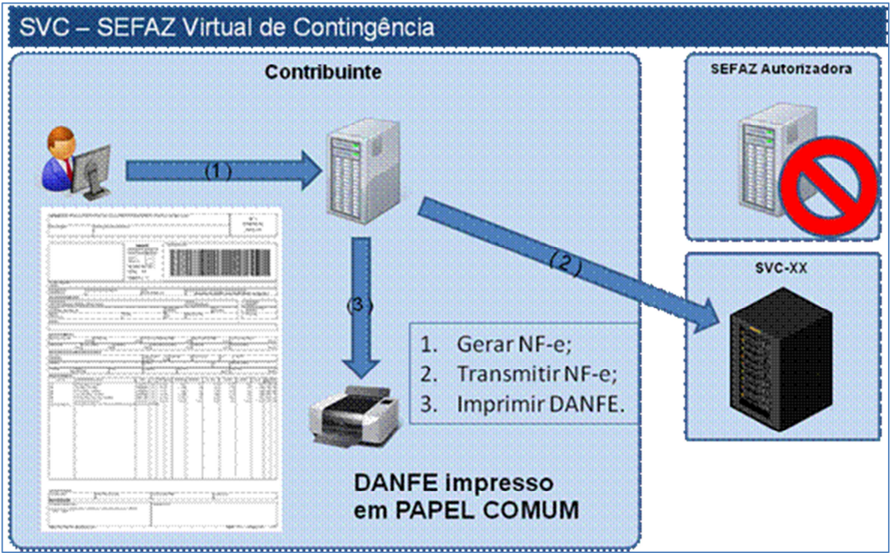

## Sistema Nota Fiscal Eletrônica

## Nota Técnica 2013/007

## Apresenta o novo ambiente de autorização de contingência do Sistema NF-e e disciplina a sua forma de uso pelas empresas: 'SVC - SEFAZ VIRTUAL DE CONTINGÊNCIA'

Versão 1.03

## Histórico de Alterações

## Alterações efetuadas na versão 1.03

- Documentado na especificação as regras de validaçã o implementadas na SVC-SEFAZ Virtual de Contingência, com as mensagens de erro correspon dentes;
- Documentado  na  especificação  as  regras  de  validaçã o  implementadas  no  ambiente  de autorização de uso da SEFAZ, com as mensagens de er ro correspondentes, impedindo o envio para o ambiente normal de autorização de uma NF-e c om tipo de emissão da SVC;
- Documentado  na  especificação  o  novo  prazo  previsto   para  desativação  do  ambiente  de contingência do SCAN.

## 01. Resumo

Esta  Nota  Técnica  tem  como  objetivo  a  apresentação  do  novo  ambiente  de  autorização  em contingência  do  Sistema  NF-e  denominado  'SVC  -  SEFA Z  VIRTUAL  DE  CONTINGÊNCIA', disciplinando  a  forma  de  uso  deste  ambiente  pelas  empresas,  de  acordo  com  o  disposto  no Convênio ICMS 32/2012 de 30/03/2012 e Ato COTEPE IC MS 39/2012 de 4/09/2012.

Esta alternativa de emissão da NF-e em contingência , com transmissão da NF-e para a SEFAZ Virtual de Contingência (SVC), permite a impressão  do DANFE em papel comum e não existe a necessidade  de  transmissão  da  NF-e  para  SEFAZ  de  or igem  quando  cessarem  os  problemas técnicos que impediam o uso do ambiente de autoriza ção normal da circunscrição do contribuinte.

Diferentemente do SCAN - Sistema de Contingência do  Ambiente Nacional, esta modalidade de contingência não obriga o uso de série específica n a NF-e (série 900-999), o que facilitará o uso dessa modalidade de contingência por parte das empr esas.

A  contingência  do  Serviço  de  Contingência  do  Ambien te  Nacional  (SCAN)  conviverá,  por  um breve período de tempo, com esta nova modalidade, s endo desativada assim que as empresas migrarem para o uso da SVC.

## 01.1 Sobre o Prazo de Implantação

Os prazos previstos são:

- Ambiente de Homologação: 01/12/2013;
- Ambiente de Produção: 03/01/2014;
- Desativação do ambiente SCAN: até 30/09/2014.

## 02. Ambiente de Autorização - SVC

## 02.1 Ambiente de Contingência Alternativo

O ambiente de autorização da SVC, SEFAZ Virtual de  Contingência, poderá assumir a recepção e autorização  de  NF-e  de  uma  outra  unidade  da  federaç ão,  quando  solicitado  pela  SEFAZ  de origem.

Existirão dois locais alternativos de autorização e m contingência, operados pelas estruturas das SEFAZ VIRTUAIS atuais:

- SVRS - SEFAZ Virtual do Rio Grande do Sul.
- SVAN - SEFAZ Virtual do Ambiente Nacional;

Portanto, de forma natural, mesmo as estruturas de autorização das SEFAZ VIRTUAIS passarão a ter a contingência da SVC, utilizando a infraestr utura de autorização uma da outra.

As SEFAZ autorizadoras adotarão uma das duas SVC, c onforme definido no Ato COTEPE 39, de 04/09/2012 e alterações.

Art.  1º O  Serviço  de  Sefaz  Virtual  de  Contingência,  previs to  no  Ajuste  SINIEF  07/05,  de  30  de setembro de 2005, e disciplinado pelo Convênio ICMS 32/12 , de 30 de março de 2012, será oferecido:

I - pela Sefaz Virtual do Ambiente Nacional, disponibilizada pela Secretaria da Receita Federal do Brasil, para os Estados do Acre, Alagoas, Amapá, Mi nas Gerais, Paraíba, Rio de Janeiro, Rio Grande do Sul, Rondônia, Roraima, Santa Catarina, Sergipe, Sã o Paulo e Tocantins e para o Distrito Federal; e

II  -  pela  Sefaz  Virtual  do  Rio Grande do Sul, disponibilizada pelo Estado do Rio Grande do Sul, para  os  estados  do  Amazonas,  Bahia,  Ceará,  Espírito Santo,  Goiás,  Maranhão,  Mato  Grosso,  Mato Grosso do Sul, Pará, Pernambuco, Piauí, Paraná e Ri o Grande do Norte.

Nota: Os Estados do Espírito Santos e Rio Grande do  Norte passaram a ser atendidos pela Sefaz Virtual de Contingência do Ambiente Nacional (SVC-A N).

## 02.2 Ambiente de Produção e Ambiente de Teste

A  SVC  deverá  manter  um  ambiente  de  produção  e  um  am biente  de  teste  (homologação) disponíveis para as empresas. O ambiente de testes (homologação) deverá estar sempre ativo para todas as UF e o ambiente de produção será disp onibilizado conforme ativação da SEFAZ de origem da circunscrição do contribuinte.

## 03. Ativação da SVC-XX

O ambiente de autorização da SVC é ativado pela UF interessada e uma vez acionado passa a recepcionar as NF-e enviadas pelas empresas credenciadas para emitir NF-e na UF. O ambiente da SVC deverá manter controle sobre os contribuinte s credenciados para emissão de NF-e para todas as UF, através do sincronismo automático com o Cadastro Nacional de Emissores (CNE), mantido no Ambiente Nacional.

Ocorrendo a indisponibilidade do ambiente de autorização normal, seja de forma programada ou não, a SEFAZ de origem acionará a SVC para que ativ e o serviço de recepção e autorização de NF-e para utilização dos contribuintes da sua circu nscrição. Esta ativação será realizada na área de acesso restrito do Portal Nacional da NF-e ou na Extranet da SVC-RS, conforme o caso.

Finda a indisponibilidade, a SEFAZ de origem acionará novamente a SVC, agora para desativar o serviço. A desativação do serviço de recepção e aut orização de NF-e pela SVC será precedida por um período de 15 minutos, em que ambos os ambie ntes estarão simultaneamente disponíveis, de forma a minimizar o impacto da mudança para as Empresas.

## 03.1 Ativação Manual por Representante da SEFAZ de  Origem

Inicialmente, a ativação / desativação será baseada em interação humana de um representante da SEFAZ de origem, acionando o ambiente de autorização da SVC específica para a sua UF.

Esta operação de ativação prevê o registro prévio d a informação de Data-Hora de início e fim de funcionamento do ambiente da SVC; servindo, portanto, para as situações em  que  a indisponibilidade da recepção de NF-e no ambiente n ormal de autorização da SEFAZ de origem seja  previsível  e  de  longa  duração,  como  é  o  caso  d as  interrupções  programadas  para manutenção preventiva da infraestrutura de recepção  e autorização da SEFAZ de origem.

## 04. Serviços Disponibilizados pela SVC

Serão disponibilizados pela SVC os mesmos serviços  do ambiente normal de autorização, com as características que seguem:

## 04.1 Serviço de Recepção

## A. Orientação para as Empresas

O serviço de recepção e autorização de NF-e pela SV C (Web Service: NFeRecepcao) somente estará  disponível  conforme  decisão  sobre  a  ativação   ou  não  da  SVC  por  uma  determinada SEFAZ de origem.

## B. Regras de Validação

A critério da SVC-XX, as regras de validação que verificam se a UF é atendida pela SVC serão implementadas  na  validação  dos  campos  do  SOAP  Heade r,  ou  na  validação  dos  campos normais da mensagem.

## B.1 Validação das informações de controle da chamad a ao Web Service (item 4.1.8 do MOC)

| #     | Regra de Validação                                                     | Aplic.   | Msg Descrição                                          |
|-------|------------------------------------------------------------------------|----------|--------------------------------------------------------|
| C03.1 | UF do SOAP Header não é atendida pela SVC-XX                           | Obrig.   | 582 Rejeição: UF não atendida pela SVC-[AN/RS]         |
| C03.2 | Ambiente da SVC-XX não está ativado para a UF informado no SOAP Header | Obrig.   | 114 Rejeição: SVC não ativada para a SEFAZ do Emitente |
| C06.1 | Campo versaoDados informado no Soap Header é inferior a versão '2.00'  | Obrig.   | 583 Rejeição: Versão da mensagem inferior a 2.00       |

## B.2 Validação das regras de negócio (item 4.1.9.4 d o MOC)

| #      | Regra de Validação                                                | Aplic.      | Msg Msg/Descrição                                           |
|--------|-------------------------------------------------------------------|-------------|-------------------------------------------------------------|
| GB02.1 | Código da UF do Emitente não é atendida pela SVC-XX               | Obrig.      | 582 Rejeição: UF não atendida pela SVC-[AN/RS]              |
| GB02.2 | Ambiente da SVC não está ativado para o Código da UF do Emitente  | Obrig. 114  | Rejeição: SVC não ativada para a SEFAZ do Emitente          |
| GB22.4 | Na autorização pela SVC: Campo 'tpEmis' incompatível com a SVC-XX | Obrig.. 584 | Rejeição: tpEmis informado é incompatível com a SVC-[AN/RS] |

## 04.2 Serviço de Retorno da Recepção

## A. Orientação para as Empresas

O serviço de retorno da recepção do lote de NF-e pe la SVC (Web Service: NFeRetRecepcao) sempre  estará  disponível  para  consultar  o  resultado do  processamento  dos  Lotes  enviados para a SVC.

## B. Regras de Validação

A critério da SVC-XX, as regras de validação que verificam se a UF é atendida pela SVC serão implementadas  na  validação  dos  campos  do  SOAP  Heade r,  ou  na  validação  dos  campos normais da mensagem.

## B.1 Validação das informações de controle da chamad a ao Web Service (item 4.2.6 do MOC)

| #     | Regra de Validação                           | Aplic.   |   Msg | Descrição                                    |
|-------|----------------------------------------------|----------|-------|----------------------------------------------|
| C03.1 | UF do SOAP Header não é atendida pela SVC-XX | Obrig    |   582 | Rejeição: UF não atendida pela SVC-[AN/RS]   |
| C06.1 | Campo versaoDados informado no               | Obrig    |   583 | Rejeição: Versão da mensagem inferior a 2.00 |

| Soap Header é inferior a versão '2.00'   |
|------------------------------------------|

## B.2 Validação das regras de negócio (item 4.2.7.2 d o MOC)

| #     | Regra de Validação                                | Aplic.    | Msg Msg/Descrição                          |
|-------|---------------------------------------------------|-----------|--------------------------------------------|
| E02.1 | Código da UF do Recibo não é atendida pela SVC-XX | Obrig 582 | Rejeição: UF não atendida pela SVC-[AN/RS] |

## 04.3 Serviço de Registro de Eventos: Cancelamento

## A. Orientação para as Empresas

O  Serviço  de  Registro  de  Eventos  (Web  Service:  RecepcaoEvento),  para  o  evento  de Cancelamento  (Tipo  Evento=110111),  sempre  estará  di sponível  somente  para  as  NF-e autorizadas  pela  própria  SVC,  dentro  das  regras  definidas  para  a  operação  normal  de cancelamento.

Quando da utilização da SVC pela empresa, uma event ual necessidade de cancelamento de uma NF-e autorizada  no  ambiente  normal  deverá  ser  r epresada  para  comando  posterior  no ambiente de autorização normal da SEFAZ de origem d a circunscrição do contribuinte.

Nota: Futuramente, poderá ser analisada a possibilidade  de cancelamento na SVC de uma NFe emitida no ambiente de autorização normal da SEFA Z. O cancelamento no ambiente de autorização normal da SEFAZ de uma NF-e autorizada  pela SVC fica a critério da SEFAZ de circunscrição  do  contribuinte.  Somente  será  possíve l  o  cancelamento  no  outro  ambiente, caso  o  documento  autorizado  já  tenha  sido  automatic amente  compartilhado  entre  o ambiente normal de autorização e o ambiente da SVC  (e vice-versa).

## B. Regras de Validação

A critério da SVC-XX, as regras de validação que verificam se a UF é atendida pela SVC serão implementadas  na  validação  dos  campos  do  SOAP  Heade r,  ou  na  validação  dos  campos normais da mensagem.

## B.1 Validação das informações de controle da chamada ao Web Service (item 4.9.6 da NT 2011.006)

| #     | Regra de Validação                           | Aplic.    | Msg Descrição                              |
|-------|----------------------------------------------|-----------|--------------------------------------------|
| C03.1 | UF do SOAP Header não é atendida pela SVC-XX | Obrig 582 | Rejeição: UF não atendida pela SVC-[AN/RS] |

## B.2 Validação das regras de negócio (item 4.9.7-e d a NT 2011.006)

| #      | Regra de Validação                                        | Aplic.   | Msg Msg/Descrição                                               |
|--------|-----------------------------------------------------------|----------|-----------------------------------------------------------------|
| G05b.1 | UF da Chave de Acesso não atendida pela SVC-XX            | é Obrig  | 582 Rejeição: UF não atendida pela SVC-[AN/RS]                  |
| G05g.1 | Campo tpEmis da Chave de Acesso incompatível com a SVC-XX | Obrig.   | 584 Rejeição: tpEmis informado é incompatível com a SVC-[AN/RS] |

## 04.4 Serviço de Registro de Eventos: CC-e e Outros

## A. Orientação para as Empresas

O registro dos demais tipos de evento do Emitente ou do Destinatário, tais como a Carta de Correção  Eletrônica,  Manifestação  do  Destinatário  e  outros,  não  será  disponibilizado  para atendimento pela SVC.

## B. Regras de Validação

A critério da SVC-XX, as regras de validação que verificam se a UF é atendida pela SVC serão implementadas  na  validação  dos  campos  do  SOAP  Heade r,  ou  na  validação  dos  campos normais da mensagem.

## B.1 Validação das informações de controle da chamada ao Web Service (item 4.8.6 do MOC)

| #     | Regra de Validação                           | Aplic.   | Msg Descrição                                  |
|-------|----------------------------------------------|----------|------------------------------------------------|
| C03.1 | UF do SOAP Header não é atendida pela SVC-XX | Obrig    | 582 Rejeição: UF não atendida pela SVC-[AN/RS] |

## B.2 Extração dos eventos do lote e validação do Schema XML do evento (item 4.8.7.2 do MOC)

| #   | Regra de Validação Aplic. Msg Msg/Descrição                                          |
|-----|--------------------------------------------------------------------------------------|
| D04 | Campo tpEvento é inválido para a SVC Obrig 491 Rejeição: tpEvento informado inválido |

## 04.5 Serviço de Inutilização

## A. Orientação para as Empresas

O Serviço de Inutilização (Web Service: NFeInutiliz acao) não será oferecido pela SVC.

Quando  da  utilização  da  SVC  pela  empresa,  uma  event ual  necessidade  de  inutilização  de numeração  identificada  pela  aplicação  da  empresa  de verá  ser  represada  para  comando posterior  no  ambiente  de  autorização  normal  da  SEFA Z  de  origem  da  circunscrição  do contribuinte.

## B. Regras de Validação

A critério da SVC-XX, as regras de validação que verificam se a UF é atendida pela SVC serão implementadas  na  validação  dos  campos  do  SOAP  Heade r,  ou  na  validação  dos  campos normais da mensagem.

## B.1 Validação das informações de controle da chamada ao Web Service (item 4.4.6 do MOC)

| #     | Regra de Validação                           | Aplic.   | Msg Descrição                                  |
|-------|----------------------------------------------|----------|------------------------------------------------|
| C03.1 | UF do SOAP Header não é atendida pela SVC-XX | Obrig    | 582 Rejeição: UF não atendida pela SVC-[AN/RS] |

## B.2 Validação das regras de negócio (item 4.4.7.4 d o MOC)

| #     | Regra de Validação                                    | Aplic.   | Msg Msg/Descrição                              |
|-------|-------------------------------------------------------|----------|------------------------------------------------|
| I02.1 | UF do Pedido de Inutilização não atendida pela SVC-XX | é Obrig  | 582 Rejeição: UF não atendida pela SVC-[AN/RS] |
| I02.2 | Serviço não disponível na SVC                         | Obrig.   | 586 Rejeição: Serviço não disponível na SVC    |

## 04.6 Serviço de Consulta Situação da NF-e

## A. Orientação para as Empresas

O  Serviço  de  Consulta  Situação  da  NF-e  (Web  Service :  NFeConsulta)  sempre  estará disponível somente para as NF-e autorizadas pela pr ópria SVC, dentro das regras definidas para a operação normal desta consulta.

A Consulta da Situação da NF-e retorna toda a estru tura de autorização da NF-e, portanto com informações inexistentes na SVC para uma NF-e autor izada pela SEFAZ de origem.

## B. Regras de Validação

A critério da SVC-XX, as regras de validação que verificam se a UF é atendida pela SVC serão implementadas  na  validação  dos  campos  do  SOAP  Heade r,  ou  na  validação  dos  campos normais da mensagem.

## B.1 Validação das informações de controle da chamad a ao Web Service (item 4.5.6 do MOC)

| #     | Regra de Validação                           | Aplic.   | Msg Descrição                                  |
|-------|----------------------------------------------|----------|------------------------------------------------|
| C03.1 | UF do SOAP Header não é atendida pela SVC-XX | Obrig    | 582 Rejeição: UF não atendida pela SVC-[AN/RS] |

## B.2 Validação das regras de negócio (item 4.5.7.2 d o MOC)

| # Regra de Validação                                              | Aplic.   | Msg Msg/Descrição                                             |
|-------------------------------------------------------------------|----------|---------------------------------------------------------------|
| J02b.1Código da UF da Chave de Acesso não é atendida pela SVC-XX  | Obrig    | 582 Rejeição: UF não atendida pela SVC-[AN/RS]                |
| J02h.1Campo 'tpEmis' da Chave de Acesso incompatível com a SVC-XX | Obrig.   | 584 Rejeição: tpEmis informado é incompatível com SVC-[AN/RS] |

## 04.7 Serviço de Consulta Status do Serviço

## A. Orientação para as Empresas

O Serviço de Consulta Status dos Serviços (Web Service: NFeStatusServico) sempre deverá estar disponível na SVC. No caso de indisponibilida de do ambiente normal de autorização da SEFAZ de origem da circunscrição  do  contribuinte,  a   aplicação  da  empresa  consultará  este Web Service e identificará a oportunidade de trocar  seu ambiente normal de autorização para utilização da SVC-XX.

O Serviço de Consulta ao Status da SVC poderá retor nar os seguintes códigos de situação:

- 107 - Serviço SVC em Operação;
- 113 - SVC em processo de desativação. SVC será de sabilitada para a SEFAZ-XX em dd/mm/aa às hh:mm horas;
- 114 - SVC desabilitada pela SEFAZ de Origem.

A  empresa  somente  deverá  efetuar  a  consulta  ao  Stat us  do  Serviço  da  SVC  no  caso  de indisponibilidade do ambiente de autorização normal  da SEFAZ.

Acessando  a  Consulta  Status  da  SVC,  a  empresa  somente  poderá  utilizar  os  serviços  de recepção  e  autorização  de  NF-e  da  SVC  quando  obtive r  o  Status  '107  -  Serviço  SVC  em Operação'.

## B. Regras de Validação

A critério da SVC-XX, as regras de validação que verificam se a UF é atendida pela SVC serão implementadas  na  validação  dos  campos  do  SOAP  Heade r,  ou  na  validação  dos  campos normais da mensagem.

## B.1 Validação das informações de controle da chamad a ao Web Service (item 4.6.6 do MOC)

| #     | Regra de Validação                           | Aplic.   | Msg Descrição                                  |
|-------|----------------------------------------------|----------|------------------------------------------------|
| C03.1 | UF do SOAP Header não é atendida pela SVC-XX | Obrig    | 582 Rejeição: UF não atendida pela SVC-[AN/RS] |

## B.2 Validação das regras de negócio (item 4.6.7.2 d o MOC)

| #     | Regra de Validação                        | Aplic.   | Msg Msg/Descrição                              |
|-------|-------------------------------------------|----------|------------------------------------------------|
| K02.1 | UF da mensagem não é atendida pela SVC-XX | Obrig    | 582 Rejeição: UF não atendida pela SVC-[AN/RS] |

## Nota Fiscal eletrônica

| K05.1 Se ambiente da SVC-XX não está ativado pela SEFAZ de origem                                                                                                                         | Obrig.   |   114 | Rejeição: SVC-[XX] desabilitada pela SEFAZ de Origem               |
|-------------------------------------------------------------------------------------------------------------------------------------------------------------------------------------------|----------|-------|--------------------------------------------------------------------|
| K05.2 Se ambiente da SVC-XX ativado pela SEFAZ de Origem e não há previsão de retorno do ambiente normal de autorização, ou previsão de retorno do ambiente normal superior a 15 minutos. | Obrig.   |   107 | Serviço em Operação                                                |
| K05.3 Se ambiente da SVC-XX ativado pela SEFAZ de Origem e há previsão de retorno do ambiente normal de autorização em até 15 minutos.                                                    | Obrig.   |   113 | Rejeicao: SVC-[XX] será de sabilitada para a UF informada às HH:MM |

## 04.8 Compartilhamento das NF-e autorizadas pela SVC

Todas as NF-e autorizadas pela SVC serão automatica mente disponibilizadas para o Ambiente Nacional  da  NF-e  e,  consequentemente,  distribuídas para  as  Sefaz  envolvidas  na  operação.  A princípio, quando o ambiente de autorização normal da UF retornar ao seu funcionamento normal, os documentos autorizados no ambiente da SVC já con starão na sua base de dados.

## 05. Uso da SVC pela Empresa

## 05.1 Operação 'Em Contingência'

A aplicação da empresa atualmente já mantém um cont role sobre a disponibilidade do ambiente normal de autorização da sua SEFAZ de circunscrição , identificando o seu status de operação como 'Normal' ou 'Em Contingência'.

No  caso  da  indisponibilidade  do  ambiente  normal  de  autorização,  para  uso  dos  serviços  de recepção e autorização da SVC-XX, a empresa deve ad otar os seguintes procedimentos:

- Geração de novo arquivo XML da NF-e com as seguint es alterações:
- Identificação  que  a  SVC-XX  foi  ativada  pela  SEFAZ de  origem  da  sua  circunscrição, conforme resultado do Web Service de Consulta Status do Serviço, descrito anteriormente;
- a.  Caso a NF-e já tenha sido enviada para o ambient e normal de autorização e não tenha sido obtido resposta, deverá ser alterada a numeraç ão (ou Série) da NF-e para evitar duplicidade de documentos autorizados no ambiente normal de autorização e na SVC;
- b.  Campo tpEmis alterado para '6' (SVC-AN) ou para '7' (SVC-RS), conforme legislação que define qual UF está vinculada a cada uma das SV C;
- c.  Informação do motivo da adoção da contingência (campo xJust) e da data e hora de início  de  utilização  da  SVC  (campo  dhCont),  que  também  devem  ser  impressos  no DANFE, conforme definido na legislação.
- Impressão do DANFE em papel comum;
- Transmissão do Lote de NF-e para a SVC-XX e obtenç ão da autorização de uso;
- Tratamento dos arquivos de NF-e transmitidos para a SEFAZ de origem antes da ocorrência dos  problemas  técnicos  e  que  estão  pendentes  de  retorno,  cancelando  aquelas  NF-e autorizadas  e  que  foram  substituídas  por  NF-e  autor izada  na  SVC,  ou  inutilizando  a numeração de arquivos não recebidos ou processados.

Nota: No momento que a empresa detecta a indisponibilidade do ambiente de autorização normal, pode ser que tenha enviado uma NF-e e não tenha obt ido o resultado deste pedido de autorização de uso. Neste caso, deve gerar um outro  número de NF-e, evitando que seja autorizado o mesmo número e série de NF-e no ambien te da SEFAZ autorizadora e da SVC.

## 05.2 Leiaute da NF-e - Versão 2.0

O campo 'tpEmis' faz parte da Chave de Acesso na versão 2.0 do leiaute da NF-e e isso garante que  duas  Chaves  de  Acesso  exatamente  iguais  não  con seguirão  ser  autorizadas  na  SEFAZ autorizadora  normal  e  na  SEFAZ  Virtual  de  Contingên cia.  Portanto,  este  mecanismo  da  SVC somente será disponibilizada para as empresas que e stiverem usando a versão 2.0 do leiaute da NF-e, ou versão superior.

Algumas regras de validação foram implementadas gar antindo a integridade do funcionamento da SVC, da forma que segue:

|                                                 | Ambiente de Autorização   | Ambiente de Autorização   | Ambiente de Autorização   | Ambiente de Autorização   |
|-------------------------------------------------|---------------------------|---------------------------|---------------------------|---------------------------|
| Campo tpEmis                                    | Normal                    | SVC-AN                    | SVC-RS                    | SCAN                      |
| 1-Emissão Normal                                | OK                        | -x-                       | -x-                       | -x-                       |
| 2-Contingência em Formulário de Segurança       | OK                        | -x-                       | -x -                      | -x-                       |
| 3-Contingência SCAN (*em desativação*)          | -x-                       | -x-                       | -x-                       | OK-                       |
| 4-Contingência DPEC/EPEC                        | OK                        | -x-                       | -x-                       | -x-                       |
| 5-Contingência em Formulário de Segurança FS-DA | OK                        | -x-                       | -x-                       | -x-                       |
| 6-Contingência SVC-AN                           | -x-                       | OK                        | -x-                       | -x-                       |
| 7-Contingência SVC-RS                           | -x-                       | -x-                       | OK                        | -x-                       |

## 05.3 Contingência em Formulário de Segurança

Continua disponível a emissão do DANFE em Contingên cia utilizando Formulário de Segurança. Neste caso, a empresa deve transmitir as NF-e imediatamente após a cessação dos problemas técnicos  que  impediam  a  transmissão  da  NF-e,  observando  o  prazo  limite  de  transmissão  na legislação.

Esta transmissão da NF-e somente pode ser feita par a a SEFAZ autorizadora normal, tendo em vista a identificação do campo tpEmis com os valore s diferentes dos permitidos para a SVC.

## 05.4 Contingência via DPEC/EPEC

Idem para a contingência via DPEC - Declaração Prév ia de Emissão em Contingência ou EPEC Evento Prévio de Emissão em Contingência.

## 05.5 Contingência via SCAN

A implementação da SEFAZ Virtual de Contingência é  uma evolução do Sistema de Contingência do Ambiente Nacional - SCAN, eliminando a necessidade de alteração do número de Série da NF-e para uma faixa de Série específica do SCAN (fa ixa 900-999).

## 05.6 Endereço dos Web Services

O  endereço  dos  Web  Services  da  SVC-AN  e  da  SVC-RS  serão  disponibilizados  no  Portal Nacional da NF-e.

## 06. Chave Natural da NF-e

## 06.1 Numeração da Nota Fiscal

A  numeração  da  Nota  Fiscal  modelo  1/1A  é  disciplinada  por  legislação  nacional  e  existem controles das SEFAZ sobre esta sequência de numeraç ão. O advento da NF-e liberou o uso do AIDF,  mas  não  desobrigou  as  empresas  do  controle  da   numeração.  Ou  seja,  as  empresas continuam sem poder emitir NF-e diferentes, com o mesmo CNPJ do emitente, Série e Número da Nota Fiscal.

## 06.2 Chave Natural e Chave de Acesso

A Chave Natural da NF-e é composta pelos campos de UF, CNPJ do Emi tente, Série e Número da NF-e, além do Modelo do documento fiscal eletrôn ico (Modelo = 55). O sistema de recepção e autorização  da  SEFAZ  valida  a  existência  de  uma  NF- e  previamente  autorizada  com  uma determinada  Chave  Natural  e  rejeita  novos  pedidos  de  autorização  de  uso  para  NF-e  com duplicidade da Chave Natural.

A  existência  de  mais  de  um  ambiente  de  autorização para  a  mesma  SEFAZ  de  origem,  e  a impossibilidade  técnica  de  manutenção  de  um  sincronismo  em  tempo  real  entre  estes  dois ambientes, traz como consequência a possibilidade d e autorização de Notas Fiscais Eletrônicas com a mesma Chave Natural, uma em cada ambiente de autorização.

Para evitar que estas duas NF-e com a mesma Chave Natural tivessem também a mesma Chave de Acesso ,  foi  alterada a composição da Chave de Acesso, inc luindo a informação do Tipo de Emissão, que passa a ter os valores:

- '6' - Autorização pela SVC-AN;
- '7' - Autorização pela SVC-RS.

A Chave de Acesso de uma NF-e contém todos os campos da Chave Natural , complementados com o Código Numérico (chave de segurança gerada pe la empresa), Ano-Mês da emissão da NFe e o dígito de controle desta Chave de Acesso. A p artir da versão 2.0, faz parte da Chave de Acesso a informação do Tipo de Emissão, conforme ci tado anteriormente.

## 06.3 Chave Natural em Duplicidade

Para  evitar  problemas  futuros,  tendo  ciência  que  fa talmente  ocorrerão  erros  nos  aplicativos utilizados pelas empresas, a legislação que trata e specificamente da numeração da Nota Fiscal Eletrônica  será  alterada  para  conviver  com  uma  poss ível  duplicidade  da Chave  Natural nas situações de autorização em ambientes operacionais diferentes, já que as duas NF-e terão uma autorização de uso fornecida pelo Fisco.

Conforme definição a ser considerada em legislação,  as duas NF-e são válidas, embora também caracterizem uma inconformidade da aplicação da emp resa na utilização da mesma numeração para NF-e diferentes. Nestes casos, a empresa  emitente deve providenciar o imediato cancelamento da NF-e que não acobertou o trânsito f ísico da mercadoria, nem foi enviada para o destinatário.

Será disponibilizada uma consulta no Portal Naciona l e no Portal das SEFAZ mostrando a Chave de  Natural  autorizada  em  duplicidade  no  ambiente  normal  da  SEFAZ  e  no  ambiente  de contingência da SVC-XX.

## 07. Ambiente de Autorização normal

Com a entrada em operação da SVC-Sefaz Virtual de C ontingência passam a existir os novos valores do Tipo de Emissão (tag:'tpEmis'). Deverão  ser alteradas as regras de validação da NF-e não  aceitando  os  novos  valores  do  Tipos  de  Emissão para as NF-e enviadas para o ambiente normal de Autorização de Uso da UF.

## 07.1 Serviço de Recepção

## A. Validação das regras de negócio (item 4.1.9.4 do  MOC)

| #         | Regra de Validação                                                                                               | Aplic.   | Msg Msg/Descrição                                                            |
|-----------|------------------------------------------------------------------------------------------------------------------|----------|------------------------------------------------------------------------------|
| GB22.2 Na | autorização pela SEFAZ Autorizadora: Não aceitar campo 'tpEmis' com conteúdo 3 (SCAN), 6 (SVC- AN) ou 7 (SVC-RS) | Obrig.   | 584 Rejeição: Tipo de Emissão 3, 6 ou 7 só é válido na contingência SCAN/SVC |

## 90. Documentacional

## 91. Número do Recibo de Lote (item 5.5 do MOC)

Consta no Número do Recibo do Lote o 'Tipo de Autor izador', que agora assume os valores:

- -2: Ambiente de Contingência SCAN da RFB;
- -0 ou 1: Ambiente de Autorização normal da Sefaz;
- -3: Sefaz Virtual do RS (SVRS);
- -6: Ambiente da Sefaz Virtual de Contingência do Am biente Nacional (SVC-AN);
- -4: Sefaz Virtual do Ambiente Nacional (SVAN);
- -7: Ambiente da Sefaz Virtual de Contingência do RS  (SVC-RS).

## 92. Número do Protocolo (item 5.6 do MOC)

Consta no Número do Protocolo o 'Tipo de Autorizado r', que agora assume os valores:

- -2: Ambiente de Contingência SCAN da RFB;
- -1: Ambiente de Autorização normal da Sefaz;
- -3: Sefaz Virtual do RS (SVRS);
- -6: Ambiente da Sefaz Virtual de Contingência do Am biente Nacional (SVC-AN);
- -4: Sefaz Virtual do Ambiente Nacional (SVAN);
- -7: Ambiente da Sefaz Virtual de Contingência do RS  (SVC-RS).
## Metadados
- [Metadados do corpus](metadata.json)
- [Fonte e procedência](../../../../sources/portal_nacional_nfe/nfe/notas-tecnicas/nt-2013-007-v1-03-svc/source.json)
- [Dados normalizados](../../../../normalized/nfe/notas-tecnicas/nt-2013-007-v1-03-svc/normalized.json)
- [Changelog](../../../../changelog/nfe/notas-tecnicas/nt-2013-007-v1-03-svc.md)
- [Proveniência resumida](../../../../sources/provenance/nt-2013-007-v1-03-svc.json)
