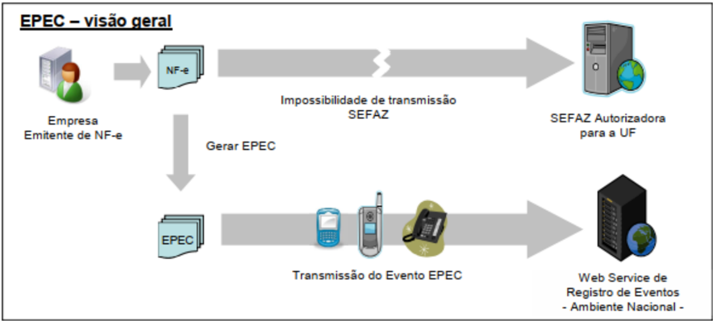
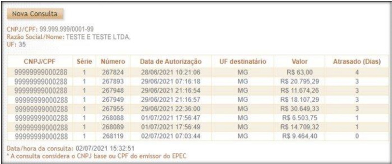
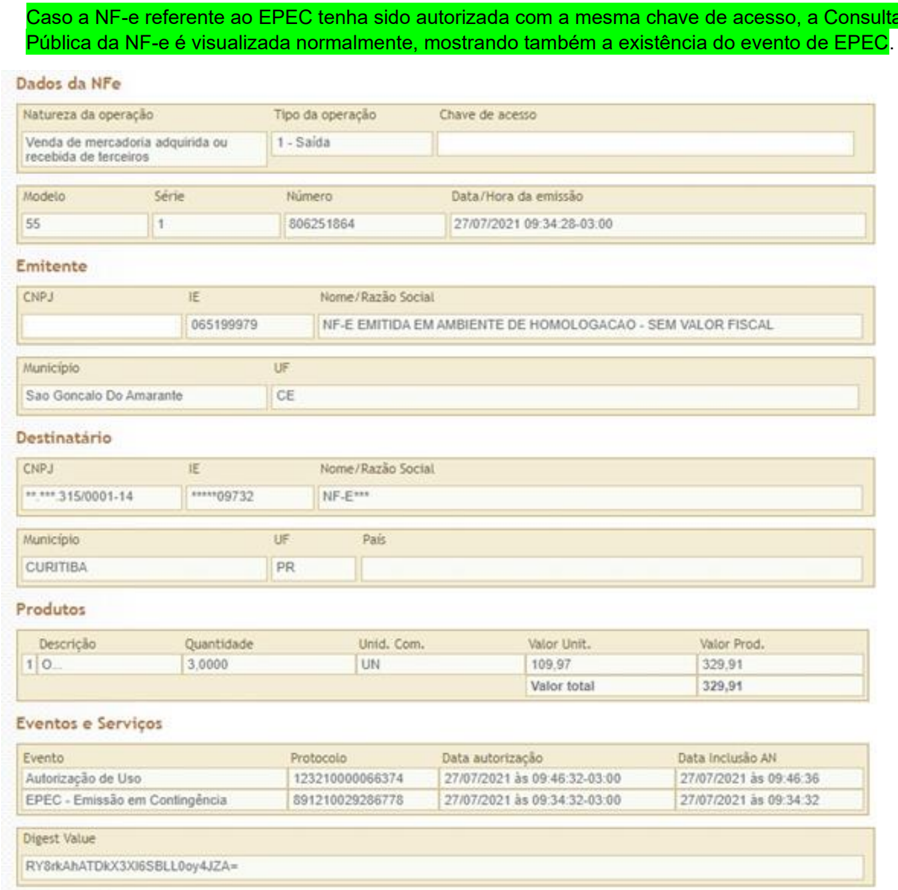
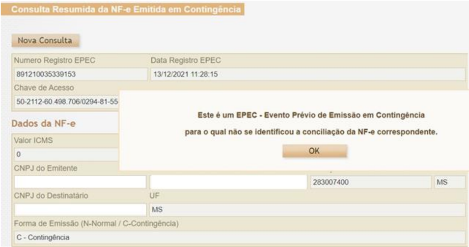
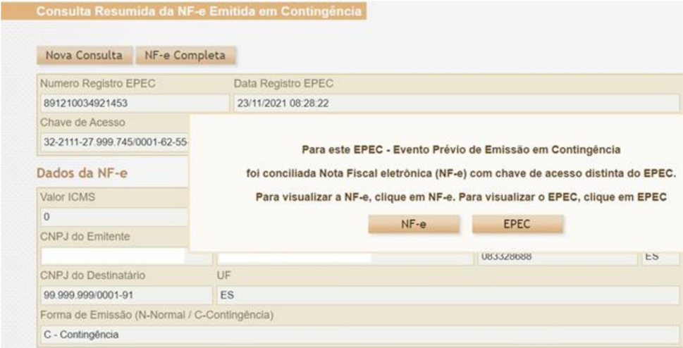

## Projeto Nota Fiscal Eletrônica

## Nota Técnica 2014.001

Evento Prévio de Emissão em Contingência (EPEC)

Versão 1.30 - Junho 2022

## Controle de Versões

|   Versão | Publicação    | Descrição                                                                                                                      |
|----------|---------------|--------------------------------------------------------------------------------------------------------------------------------|
|     1.00 |               | Publicação da NT.                                                                                                              |
|     1.10 | Janeiro/2015  | Mudança nas regras de v alidação                                                                                               |
|     1.20 | Novembro/2019 | Inclusão do EPEC para Pessoa Física                                                                                            |
|     1.21 | Dezembro/2021 | Alteração do tpAutor tipo 1 para '1 - Empresa emitente/Pessoa Fisica' Alteração da RV P23-10 para conceder tolerância de 5 min |
|     1.30 | Junho/2022    | Alteração na consulta do EPEC no Portal Nacional da NF-e                                                                       |

## Histórico de Alterações / Cronograma

| Versão   | Histórico de atualizações                                                                                                                                                                                                                                                                                                                                                                                                                                                                                                                                                                                                                                       | Implantação Teste   |                      |
|----------|-----------------------------------------------------------------------------------------------------------------------------------------------------------------------------------------------------------------------------------------------------------------------------------------------------------------------------------------------------------------------------------------------------------------------------------------------------------------------------------------------------------------------------------------------------------------------------------------------------------------------------------------------------------------|---------------------|----------------------|
| 1.10 A.2 | A.1 Mudança na documentação • Alterada a data de desativação do DPEC (Declaração Prévia da Emissão em Contingência) para 31/03/2015; • Alterada a documentação do item "03.1 - Visão Geral" ressaltando a geração do EPEC a partir dos dados da NF-e que não conseguiu ser transmitida, mantendo, portanto, exatamente a mesma Chave de Acesso e os mesmos dados da NF-e e do EPEC; • Alterada documentação do item "04.2 - Controle do Ambiente de Contingência do EPEC", documentando os controles de desbloqueio do ambiente EPEC, caso não existam outros EPEC pendentes de conciliação. Mudança em Regras de Validação no Serviço de Autorização de EPEC • |                     | Implantação Produção |
| 1.20     | 2.00). Inclusão da emissão do EPEC para Pessoa Física                                                                                                                                                                                                                                                                                                                                                                                                                                                                                                                                                                                                           | 17/02/2020          | 16/03/2020           |
| 1.21     | Atualização da documentação para alterar descrição do tpAutor tipo 1 para '1 - Empresa emitente/Pessoa Fisica' vigente desde a versão 1.20 desta NT Alteração da RV P23-10 para conceder tolerância de 5 min                                                                                                                                                                                                                                                                                                                                                                                                                                                    |                     |                      |
| 1.30     | Alteração na consulta pública do EPEC no Portal Nacional da NF-e                                                                                                                                                                                                                                                                                                                                                                                                                                                                                                                                                                                                | 08/11/2021          | 23/11/2021           |
|          |                                                                                                                                                                                                                                                                                                                                                                                                                                                                                                                                                                                                                                                                 | 08/03/2022          | 02/05/2022           |

## 1 Resumo

Uma das contingências previstas no modelo do Sistema da Nota Fiscal Eletrônica é a possibilidade de autorização de um Evento Prévio de Emissão em Contingência (EPEC), contendo dados reduzidos da NF-e. A autorização da EPEC permite a impressão do DANFE em papel comum, considerando-se emitida a  NF-e  a  partir  do  momento  da  impressão  deste  DANFE,  sob  condição  resolutória  de  posterior transmissão da NF-e para a SEFAZ de circunscrição do contribuinte.

Esta Nota Técnica apresenta a especificação técnica necessária para a implementação do registro de evento:

- Evento Prévio de Emissão em Contingência (tpEvento=110140, "EPEC")

## 2 Sobre a Emissão em Contingência

A  obtenção  da  autorização  de  uso  da  NF-e  é  um  processo  que  envolve  diversos  recursos  de infraestrutura, hardware e software. O mau funcionamento ou a indisponibilidade de qualquer um destes recursos pode prejudicar o processo de autorização da NF-e, com reflexos nos negócios do emissor da NF-e que fica impossibilitado de obter a prévia autorização de uso da NF-e exigida na legislação para a impressão do DANFE, necessário para acompanhar a circulação da mercadoria.

A alta disponibilidade é uma das premissas básicas do sistema da NF-e e os sistemas de autorização de NF-e das UF foram construídos para funcionar em regime de 24x7, contudo, existem diversos outros componentes do sistema que podem apresentar falhas e comprometer a disponibilidade dos serviços, exigindo alternativas de emissão da NF-e em contingência.

Atualmente existem as seguintes modalidades de emissão de NF-e:

- a) Normal - é o procedimento padrão de emissão da NF-e com transmissão da NF-e para a Secretaria de Fazenda da unidade federada onde o emissor está estabelecido para obter a autorização de uso. O DANFE será impresso em papel comum após o recebimento da autorização de uso da NF-e;
- b) FS-DA - Contingência com uso do Formulário de Segurança para impressão de Documento Auxiliar do Documento Fiscal eletrônico - é a alternativa mais simples para a situação em que exista algum impedimento para obtenção da autorização de uso da NF-e, como por exemplo, um problema no acesso à internet ou a indisponibilidade da SEFAZ de origem do emissor. Neste caso, o emissor pode optar  pela  emissão  da  NF-e  em  contingência  com  a  impressão  do  DANFE  em  Formulário  de Segurança. O envio das NF-e emitidas nesta situação para SEFAZ de origem será realizado quando cessarem  os  problemas  técnicos  que  impediam  a  sua  transmissão.  Cabe  ressaltar  que  a  esta modalidade de contingência ainda é possível utilizando-se formulários de segurança para impressor autônomo, nos termos da legislação vigente até 2010, até o final do estoque daqueles formulários;
- c)  EPEC -  Evento  Prévio  de  Emissão  em  Contingência  -  é  alternativa  de  emissão  de  NF-e  em contingência com o registro prévio do resumo das NF-e emitidas. O registro prévio das NF-e permite a  impressão do DANFE em papel comum. A validade do DANFE está condicionada  à posterior transmissão da NF-e para a SEFAZ de Origem;
- d)  SVC -  Sefaz  Virtual  de  Contingência  -  é  alternativa  de  emissão  de  NF-e  em  contingência  com transmissão  da  NF-e  para  uma  das  Sefaz  Virtuais  de  Contingência.  Nesta  modalidade  de contingência o DANFE pode ser impresso em papel comum e não existe necessidade de transmissão da  NF-e  para  a  SEFAZ  de  origem  quando  cessarem  os  problemas  técnicos  que  impediam  a transmissão. A utilização da SVC depende de ativação da SEFAZ de origem, o que significa dizer que

NFe

a  SVC  só  entra  em  operação  quando  a  SEFAZ  de  origem  estiver  com  problemas  técnicos  que impossibilitam a recepção da NF-e.

O EPEC permite à empresa solicitar o registro do "Evento Prévio de Emissão em Contingência" anterior à emissão do documento em si com um leiaute mínimo de informações. O EPEC deve ser enviado para o Ambiente Nacional (AN), utilizando-se o Web Service de Eventos genérico, criado para este fim.

Os principais benefícios deste tipo de contingência são:

- Reduzir custo da emissão em Formulário de Segurança (FS-DA);
- Prover uma rota alternativa em caso de falha da infraestrutura de internet para acesso a SEFAZ Autorizadora, não tendo sido ativada a SEFAZ Virtual de Contingência para a UF;
- Geração de arquivo pequeno, com melhores condições de transmissão, em função de possível problema de largura de banda e outras restrições na transmissão (uso de linha discada, rede de celular, etc).

## 3 Emissão do EPEC

## 3.1 Visão Geral

A emissão do EPEC poderá ser adotada por qualquer emissor que esteja impossibilitado de transmissão e/ou recepção das autorizações de uso de suas NF-e, adotando os seguintes passos:

- Gerar  a  NF-e  com  "tpEmis  =  4",  mantendo  também  a  informação  do  motivo  de  entrada  em contingência com data e hora do início da contingência, com número diferente de qualquer NF-e que tenha sido transmitida com outro "tpEmis";
- Gerar o arquivo XML do EPEC conforme especificado no item 3.2;
- Assinar o arquivo com o certificado digital do emitente;
- Enviar o arquivo XML do EPEC para o Web Service de Registro de Eventos do AN;
- Impressão  do  DANFE  da  NF-e que consta do  EPEC, em papel comum, constando no corpo a expressão "DANFE impresso em contingência - DPEC regularmente recebida pela Receita Federal do Brasil".

Obtida a autorização do Evento (Número do Protocolo: 891xxxxxxxxxxxx), a exemplo do que ocorre com outros eventos da NF-e, este evento também será distribuído para as UF envolvidas na operação, inclusive para a própria UF do emitente.

Após a cessação dos problemas técnicos que impediam a transmissão da NF-e para UF de origem, a NFe que deu origem a necessidade de uso da Contingência Eletrônica "EPEC" deverá ser transmitida para a SEFAZ  de  origem,  observando  o  prazo  limite  de  transmissão  na  legislação,  bem  como  outros procedimentos constantes na legislação caso ocorra rejeição na autorização de uso.

Nota: A Chave de Acesso desta NF-e é exatamente a mesma Chave de Acesso do EPEC autorizado anteriormente.

## 3.1a Informações complementares

## A. Endereço do Web Service

O endereço do Web Service de Eventos do Ambiente Nacional está publicado no Portal da NF-e (http://www.nfe.fazenda.gov.br/portal), no link "Serviços" / "Relação de Serviços Web".

Idem para o ambiente de homologação, no Portal de Homologação (http://hom.nfe.fazenda.gov.br/portal)

## B. Entrada em Contingência

A decisão da empresa de começar a usar a contingência do EPEC é tomada quando a empresa não recebe a resposta de uma determinada NF-e com pedido de autorização de uso, ou quando não consegue determinar se o pedido foi ou não corretamente enviado.

## C. Impressão do DANFE

Deverá ser impresso no DANFE o número do Protocolo de Autorização do Evento de EPEC, além do motivo e a hora da entrada em contingência.

O DANFE deverá ser impresso em duas vias que terão a seguinte destinação:

o Uma via permite o trânsito das mercadorias e deverá ser mantida pelo destinatário; o A outra via deverá ser mantida pelo emitente.

Estas  vias  deverão  ser  mantidas  em  arquivo  pelo  emitente  e  pelo  destinatário,  durante  o  prazo estabelecido na legislação tributária para a guarda de documentos fiscais.

## D. Lote de EPEC

Como é utilizado o Web Service genérico de registro de evento é possível registrar os eventos de EPEC para até 20 NF-e diferentes em uma mesma conexão, sendo um EPEC para cada NF-e.

## 3.2 Leiaute Mensagem de Entrada

O Web Service de Registro de Evento possui uma interface genérica, complementada por uma área específica para cada tipo de evento. Segue abaixo o leiaute da mensagem de entrada para este evento.

## Schema XML: eventoEPEC\_v9.99.xsd

| #   | Campo     | Ele   | Pai   | Tipo   | Ocor.   | Tam.   | Descrição/Observação                                                                                           |
|-----|-----------|-------|-------|--------|---------|--------|----------------------------------------------------------------------------------------------------------------|
| P01 | envEvento | Raiz  | -     | -      | -       | -      | TAG raiz                                                                                                       |
| P02 | versao    | A     | P01   | N      | 1-1     | 2v2    | Versão do leiaute                                                                                              |
| P03 | idLote    | E     | P01   | N      | 1-1     | 1-15   | Identificador de controle do Lote de envio do Evento. Número sequencial único para identificação do Lote.      |
| P04 | evento    | G     | P01   | xml    | 1-20    | -      | Evento, um lote pode conter até 20 eventos                                                                     |
| P05 | versao    | A     | P04   | N      | 1-1     | 2v2    | Versão do leiaute do evento                                                                                    |
| P06 | infEvento | G     | P04   |        | 1-1     |        | Grupo de informações do registro do Evento                                                                     |
| P07 | Id        | ID    | P06   | C      | 1-1     | 54     | Identificador da TAG a ser assinada, a regra de formação do Id é: "ID" + tpEvento + Chave da NF-e + nSeqEvento |
| P08 | cOrgao    | E     | P06   | N      | 1-1     | 2      | Código do órgão de recepção do Evento. Utilizar 91 para identificar o Ambiente Nacional.                       |

| P09   | tpAmb          | E   | P06   | N   | 1-1   | 1       | Identificação do Ambiente: 1=Produção /2=Homologação                                                                                                                                    |
|-------|----------------|-----|-------|-----|-------|---------|-----------------------------------------------------------------------------------------------------------------------------------------------------------------------------------------|
| P10   | CNPJ           | CE  | P06   | N   | 1-1   | 14      | Informar o CNPJ / CPF do Autor do Evento (CNPJ da Empresa                                                                                                                               |
| P11   | CPF            | CE  | P06   | N   | 1-1   | 11      | Emitente).                                                                                                                                                                              |
| P12   | chNFe          | E   | P06   | N   | 1-1   | 44      | Para o evento de EPEC, a posição 35 da Chave de Acesso deve ser 4 (tpEmis=4).                                                                                                           |
| P13   | dhEvento       | E   | P06   | D   | 1-1   |         | Data e hora do evento no formato AAAA-MM-DDThh:mm:ssTZD (UTC - Universal Coordinated Time).                                                                                             |
| P14   | tpEvento       | E   | P06   | N   | 1-1   | 6       | Código do evento: 110140 - "EPEC"                                                                                                                                                       |
| P15   | nSeqEvent o    | E   | P06   | N   | 1-1   | 1-2     | Informar o valor "1" para o evento do EPEC.                                                                                                                                             |
| P16   | verEvento      | E   | P06   | N   | 1-1   | 2v2     | Versão do detalhe do evento (grupo detEvento - P17), informação usada pela SEFAZ para validar o grupo detEvento.                                                                        |
| P17   | detEvento      | G   | P06   |     | 1-1   |         | Informações de detalhes do evento                                                                                                                                                       |
| P18   | versao         | A   | P17   | N   | 1-1   | 2v2     | Informar o mesmo valor da tag verEvento (P16).                                                                                                                                          |
| P19   | descEvent o    | E   | P17   | C   | 1-1   | 5-60    | "EPEC"                                                                                                                                                                                  |
| P20   | cOrgaoAut or   | E   | P17   | N   | 1-1   | 2       | Código do Grgão do Autor do Evento. Nota: Informar o código da UF do Emitente para este evento.                                                                                         |
| P21   | tpAutor        | E   | P17   | N   | 1-1   | 1       | Informar "1=Empresa Emitente/Pessoa Fisica" para este evento. Nota: 1=Empresa Emitente/Pessoa Fisica; 2=Empresa Destinatária; 3=Empresa; 5=Fisco; 6=RFB; 9=Outros Órgãos.               |
| P22   | verAplic       | E   | P17   | C   | 1-1   | 1-20    | Versão do aplicativo do Autor do Evento.                                                                                                                                                |
| P23   | dhEmi          | E   | P17   | D   | 1-1   |         | Data e hora no formato UTC (Universal Coordinated Time): "AAAA- MM-DDThh:mm:ss TZD".                                                                                                    |
| P24   | tpNF           | E   | P17   | N   | 1-1   | 1       | 0=Entrada; 1 =Saída;                                                                                                                                                                    |
| P25   | IE             | E   | P17   | N   | 1-1   | 2-14    | IE do Emitente                                                                                                                                                                          |
| P26   | dest           | G   | P17   |     | 1-1   |         |                                                                                                                                                                                         |
| P27   | UF             | E   | P26   | C   | 1-1   | 2       | Sigla da UF do destinatário. Informar "EX" no caso de operação com o exterior.                                                                                                          |
| P28   | CNPJ           | CE  | P26   | N   | 1-1   | 14      | Informar o CPF ou o CNPJ do destinatário, preenchendo os zeros não                                                                                                                      |
| P29   | CPF            | CE  | P26   | N   | 1-1   | 11      | significativos. No caso de operação com exterior, ou para comprador                                                                                                                     |
| P30   | idEstrange iro | CE  | P26   | C   | 1-1   | 0, 5-20 | estrangeiro, informar a tag "idEstrangeiro", com o número do passaporte, ou outro documento legal (campo aceita valor Nulo no caso de operação com exterior).                           |
| P31   | IE             | E   | P26   | N   | 0-1   | 2-14    | Informar a IE do destinatário somente quando o contribuinte destinatário possuir uma inscrição estadual. Omitir a tag no caso de destinatário "ISENTO", ou destinatário não possuir IE. |
| P32   | vNF            | E   | P17   | N   | 1-1   | 13v2    | Valor total da NF-e                                                                                                                                                                     |
| P33   | vICMS          | E   | P17   | N   | 1-1   | 13v2    | Valor total do ICMS                                                                                                                                                                     |
| P34   | vST            | E   | P17   | N   | 1-1   | 13v2    | Valor total do ICMS de Substituição Tributária                                                                                                                                          |
| P91   | Signature      | G   | P04   | XML | 1-1   |         | Assinatura Digital do documento XML, a assinatura deverá ser aplicada no elemento infEvento                                                                                             |

## 3.3 Leiaute Mensagem de Retorno

O Web Service de Registro de Evento  possui uma  interface genérica, complementada  por uma área específica para cada tipo de evento. Segue abaixo o leiaute da mensagem de retorno (resposta) para este evento.

Schema XML: retEventoEPEC\_v9.99.xsd

| #   | Campo         | Ele   | Pai   | Tipo   | Ocor.   | Tam.   | Descrição/Observação                                                                             |
|-----|---------------|-------|-------|--------|---------|--------|--------------------------------------------------------------------------------------------------|
| R01 | retEnvEvent o | Raiz  | -     | -      | -       | -      | TAG raiz da mensagem de retorno                                                                  |
| R02 | versao        | A     | R01   | N      | 1-1     | 2v2    | Versão do leiaute                                                                                |
| R03 | idLote        | E     | R01   | N      | 1-1     | 1-15   | Identificador de controle do Lote de envio do Evento, conforme informado na mensagem de entrada. |
| R04 | tpAmb         | E     | R01   | N      | 1-1     | 1      | Identificação do Ambiente: 1=Produção /2=Homologação                                             |
| R05 | verAplic      | E     | R01   | C      | 1-1     | 1-20   | Versão da aplicação que processou o evento.                                                      |
| R06 | cOrgao        | E     | R01   | N      | 1-1     | 2      | Código da UF que registrou o Evento. Utilizar 91 para o Ambiente Nacional.                       |

| R07   | cStat        | E   | R01   | N   | 1-1   | S     | Código do status da resposta                                                                                                                                                                                                          |
|-------|--------------|-----|-------|-----|-------|-------|---------------------------------------------------------------------------------------------------------------------------------------------------------------------------------------------------------------------------------------|
| R08   | xMotivo      | E   | R01   | C   | 1-1   | 1-255 | Descrição do status da resposta                                                                                                                                                                                                       |
| R09   | retEvento    | G   | R01   | -   | 0-20  | -     | TAG de grupo do resultado do processamento do Evento                                                                                                                                                                                  |
| R10   | versao       | A   | R09   | N   | 1-1   | 2v2   | Versão do leiaute                                                                                                                                                                                                                     |
| R11   | infEvento    | G   | R09   |     | 1-1   |       | Grupo de informações do registro do Evento                                                                                                                                                                                            |
| R12   | Id           | ID  | R11   | C   | 0-1   | 17    | Identificador da TAG a ser assinada, somente deve ser informado se o órgão de registro assinar a resposta. Em caso de assinatura da resposta pelo órgão de registro, preencher com o número do protocolo, precedido pela literal "ID" |
| R13   | tpAmb        | E   | R11   | N   | 1-1   | 1     | Identificação do Ambiente: 1=Produção /2=Homologação                                                                                                                                                                                  |
| R14   | verAplic     | E   | R11   | C   | 1-1   | 1-20  | Versão da aplicação que registrou o Evento, utilizar literal que permita a identificação do órgão, como a sigla da UF ou do órgão.                                                                                                    |
| R15   | cOrgao       | E   | R11   | N   | 1-1   | 2     | Código da UF que registrou o Evento. Utilizar 91 para o Ambiente Nacional.                                                                                                                                                            |
| R16   | cStat        | E   | R11   | N   | 1-1   | S     | Código do status da resposta.                                                                                                                                                                                                         |
| R17   | xMotivo      | E   | R11   | C   | 1-1   | 1-255 | Descrição do status da resposta.                                                                                                                                                                                                      |
| R18   | chNFe        | E   | R11   | N   | 0-1   | 44    | Chave de Acesso da NF-e vinculada ao evento.                                                                                                                                                                                          |
| R19   | tpEvento     | E   | R11   | N   | 0-1   | B     | 110140 - "EPEC"                                                                                                                                                                                                                       |
| R20   | xEvento      | E   | R11   | C   | 0-1   | 5-60  | "EPEC autorizado"                                                                                                                                                                                                                     |
| R21   | nSeqEvento   | E   | R11   | N   | 0-1   | 1-2   | Sequencial do evento, conforme a mensagem de entrada.                                                                                                                                                                                 |
| R22   | cOrgaoAutor  | E   | R11   | N   | 0-1   | 2     | Idem a mensagem de entrada.                                                                                                                                                                                                           |
| R30   | dhRegEvent o | E   | R11   | D   | 1-1   |       | Data e hora de registro do evento no formatoAAAA-MM- DDTHH:MM:SSTZD (formato UTC, onde TZD é +HH:MM ou - HH:MM). Se o evento for rejeitado informar a data e hora de recebimento do evento.                                           |
| R31   | nProt        | E   | R11   | N   | 0-1   | 1S    | Número do Protocolo do Evento 1 posição (1=Secretaria da Fazenda Estadual, 2=RFB), 2 posições para o código da UF, 2 posições para o ano e 10 posições para o sequencial no ano.                                                      |
| R32   | chNFePend    | E   | R11   | N   | 0-50  | 44    | Relação de Chaves de Acesso de EPEC pendentes de conciliação, existentes no AN.                                                                                                                                                       |
| R91   | Signature    | G   | R09   | XML | 0-1   |       | Assinatura Digital do documento XML, a assinatura deverá ser aplicada no elemento infEvento. Adecisão de assinar a mensagem fica a critério da UF/RFB.                                                                                |

Nota 1: No caso de evento registrado com sucesso, os campos opcionais serão retornados.

Nota  2: A  relação  de  Chaves  de Acesso  pendentes  de  conciliação  (tag:chNFePend)  será  disponibilizada sempre que o ambiente de autorização do EPEC estiver bloqueado para o CNPJ do emitente (Rejeição "142Ambiente de Contingência EPEC bloqueado para o Emitente".

## 3.4 Descrição do Processo de Recepção de Evento

O processo de Registro de Eventos recebe eventos em uma estrutura de lotes, que pode conter de 1 a 20 eventos. Normalmente este evento será feito de forma on-line para cada necessidade de autorização de EPEC (lote com somente 1 ocorrência).

## 3.5 Validação do Certificado de Transmissão

Regras de validação idênticas aos demais Web Services, podendo gerar os erros:

- 280: "Rejeição: Certificado Transmissor inválido"
- 281: "Rejeição: Certificado Transmissor Data Validade"
- 282: "Rejeição: Certificado Transmissor sem CNPJ/CPF"
- 283: "Rejeição: Certificado Transmissor - erro Cadeia de Certificação"
- 284: "Rejeição: Certificado Transmissor revogado"
- 285: "Rejeição: Certificado Transmissor difere ICP-Brasil"
- 286: "Rejeição: Certificado Transmissor erro no acesso a LCR"

## 3.6 Validação inicial da Mensagem no Web Services

Regras de validação idênticas aos demais Web Services, podendo gerar os erros:

- 108: 'Rejeição: Serviço Paralisado Momentaneamente (curto prazo)'
- 109: "Serviço Paralisado sem Previsão"
- 214: "Rejeição: Tamanho da mensagem excedeu o limite estabelecido"
- 239: 'Rejeição: Versão do arquivo XML não suportada'
- 243: 'Rejeição: XML Mal Formado'
- 410: 'Rejeição: UF informada no campo cUF não é atendida pelo WebService'

## 3.7 Validação da Área de Dados

## a) Validação de forma da área de dados

Regras de validação idênticas aos demais Web Services, podendo gerar os erros:

- 215: "Rejeição: Falha Schema XML"
- 225: 'Rejeição: Falha no Schema XML do lote de NFe'
- 404: "Rejeição: Uso de prefixo de namespace não permitido"
- 402: "Rejeição: XML da área de dados com codificação diferente de UTF-8"
- 516: "Rejeição: Falha Schema XML, inexiste a tag raiz esperada para a mensagem"
- 517: "Rejeição: Falha Schema XML, inexiste atributo versão na tag raiz da mensagem"
- 587: "Rejeição: Usar somente o namespace padrão da NF-e"
- 588: "Rejeição: Não é permitida a presença de caracteres de edição no início/fim da mensagem ou entre as tags da mensagem"

## b) Extração dos eventos do lote e validação do Schema XML do evento

Regras de validação idênticas aos demais Eventos, podendo gerar os erros:

- 491: "Rejeição: O tpEvento informado invalido"
- 492: "Rejeição: O verEvento informado invalido"
- 493: "Rejeição: Evento não atende o Schema XML específico"

## c) Validação do Certificado Digital de Assinatura

Regras de validação idênticas aos demais Web Services, podendo gerar os erros:

- 290: "Rejeição: Certificado Assinatura inválido"
- 291: "Rejeição: Certificado Assinatura Data Validade"
- 292: "Rejeição: Certificado Assinatura sem CNPJ/CPF"
- 293: "Rejeição: Certificado Assinatura - erro Cadeia de Certificação"
- 294: "Rejeição: Certificado Assinatura revogado"
- 295: "Rejeição: Certificado Assinatura difere ICP-Brasil"
- 296: "Rejeição: Certificado Assinatura erro no acesso a LCR"

## d) Validação da Assinatura Digital

Regras de validação idênticas aos demais Web Services, podendo gerar os erros:

- 213: "Rejeição: CNPJ-Base do Autor difere do CNPJ-Base do Certificado Digital"
- 227: 'Rejeição: CPF do emitente difere do CPF do Certificado Digital'
- 297: "Rejeição: Assinatura difere do calculado"
- 298: "Rejeição: Assinatura difere do padrão do Projeto"

## 3.8 Validações gerais do WS NfeRecepcaoEvento

| #       | Modelo                     | Regra de Validação                                                                                                                                                            | Aplic.   |   Msg | Descrição Erro                                                                                                        |
|---------|----------------------------|-------------------------------------------------------------------------------------------------------------------------------------------------------------------------------|----------|-------|-----------------------------------------------------------------------------------------------------------------------|
| P07-10  | 55                         | Atributo 'Id' não corresponde à concatenação dos campos do evento ('ID' + tpEvento + chNFe + nSeqEvento) (*1)                                                                 | Obrig.   |   572 | Rejeição: Erro Atributo ID do evento não corresponde a concatenação dos campos ('ID' + tpEvento + chNFe + nSeqEvento) |
| P08-10  | 55                         | Código do órgão de recepção do Evento diverge do definido para este evento (*1)                                                                                               | Obrig.   |   250 | Rejeição: UF diverge da UF autorizadora                                                                               |
| P09-10  | 55                         | Tipo do ambiente difere do ambiente do Web Service (*1)                                                                                                                       | Obrig.   |   252 | Rejeição: Ambiente informado diverge do Ambiente de recebimento                                                       |
| P10-10  | 55                         | Se informado CNPJ do Autor do Evento: - CNPJ inválido (zeros, nulo ou DV inválido) (*1)                                                                                       | Obrig.   |   489 | Rejeição: CNPJ informado inválido (DV ou zeros)                                                                       |
| P11-10  | 55                         | Se informado o CPF do Autor do evento: - CPF inválido (zeros, nulo ou DV inválido) (*1)                                                                                       | Obrig.   |   490 | Rejeição: CPF informado inválido (DV ou zeros)                                                                        |
| P12-10  | 55                         | Validação da Chave de Acesso (tag:chNFe): - Dígito verificador inválido (*1)                                                                                                  | Obrig.   |   236 | Rejeição: Chave de Acesso com dígito verificador inválido                                                             |
| P12-14  | 55                         | - Código UF inválido (*1)                                                                                                                                                     | Obrig.   |   614 | Rejeição: Chave de Acesso inválida (Código UF inválido)                                                               |
| P12-18  | 55                         | - Ano < 06 ou Ano maior que Ano corrente (*1)                                                                                                                                 | Obrig.   |   615 | Rejeição: Chave de Acesso inválida (Ano < 06 ou Ano maior que Ano corrente)                                           |
| P12-22  | 55                         | - Mês = 0 ou Mês > 12 (*1)                                                                                                                                                    | Obrig.   |   616 | Rejeição: Chave de Acesso inválida (Mês < 1 ou Mês > 12)                                                              |
| P12-26  | 55                         | - CNPJ/CPF zerado ou dígito inválido (*1) Nota : Considerar a Série para determinar se CNPJ/CPF na Chave de Acesso. CNPJ: Série=[0-909], CPF: Série<>[0-909]                  | Obrig.   |   617 | Rejeição: Chave de Acesso inválida (CNPJ/CPF zerado ou dígito inválido)                                               |
| P12-30  | 55                         | - Modelo diferente de 55 ou 65 (*1)                                                                                                                                           | Obrig.   |   618 | Rejeição: Chave de Acesso inválida (modelo diferente de 55/65)                                                        |
| P12-34  | 55                         | - Número NF = 0 (*1)                                                                                                                                                          | Obrig.   |   619 | Rejeição: Chave de Acesso inválida (número NF = 0)                                                                    |
| P12-40  | 55                         | - UF da Chave de Acesso diverge da UF Autorizadora                                                                                                                            | Obrig.   |   249 | Rejeição: UF da Chave de Acesso diverge da UF autorizadora                                                            |
| P12-44  | 55                         | - CNPJ/CPF do Autor diverge do CNPJ/CPF da Chave de Acesso Nota : Considerar a Série para determinar se CNPJ/CPF na Chave de Acesso. CNPJ: Série=[0-909], CPF: Série<>[0-909] | Obrig.   |   574 | Rejeição: Autor do evento diverge do emissor da NF-e                                                                  |
| P13-10  | 55                         | Data do evento maior que a data de processamento (aceitar tolerância de até 5 minutos) (*1)                                                                                   | Obrig.   |   578 | Rejeição: Adata do evento não pode ser maior que a data do processamento                                              |
| ***     | Banco de Dados: Emitente   | Banco de Dados: Emitente                                                                                                                                                      |          |       |                                                                                                                       |
| 1P10-10 | 55                         | Acesso ao Cadastro de Contribuintes (Chave: CNPJ do Autor): - Verificar se Emitente não autorizado a emitir NF-e                                                              | Obrig.   |   203 | Rejeição: Emissor não habilitado para emissão de NF-e                                                                 |
| 1P10-20 | 55                         | - Verificar situação fiscal do emitente                                                                                                                                       | Obrig.   |   240 | Rejeição: Irregularidade fiscal do emitente                                                                           |
|         | *** Banco de Dados: Evento | *** Banco de Dados: Evento                                                                                                                                                    |          |       |                                                                                                                       |
| 3P15-10 | 55                         | Acesso BD de Eventos (Chave: Chave de Acesso, tpEvento, nSeqEvento): - Duplicidade do evento (tpEvento + chNFe + nSeqEvento) (*1)                                             | Obrig.   |   573 | Rejeição: Duplicidade de Evento                                                                                       |

Nota:  (*1) Validações genéricas do Registro de Evento.

## 3.9 Validações específicas do WS NfeRecepcaoEvento - EPEC

| #      |   Modelo | Regra de Validação                                                                                                                                                                                                  | Aplic    |   Msg | Efeito   | Descrição Erro                                                                               |
|--------|----------|---------------------------------------------------------------------------------------------------------------------------------------------------------------------------------------------------------------------|----------|-------|----------|----------------------------------------------------------------------------------------------|
| P11-21 |       55 | Se informado CPF do autor do evento, evento = EPEC e série difere da faixa [920-969]                                                                                                                                | . Obrig. |   495 | Rej.     | Rejeição: CPF do emitente com série incompatível                                             |
| P12-32 |       55 | Validação da Chave de Acesso: - Série difere da faixa [0-889] [920-969] (NT 2018.001)                                                                                                                               | Obrig.   |   266 | Rej.     | Rejeição: Série utilizada não permitida no Web Service                                       |
| P12-50 |       55 | - Tipo de Emissão difere de '4' (posição 35 da Chave de Acesso)                                                                                                                                                     | Obrig.   |   484 | Rej.     | Rejeição: Chave de Acesso com tipo de emissão diferente de 4 (posição 35 da Chave de Acesso) |
| P15-10 |       55 | Verificar se sequencial do evento (nSeqEvento) difere de 1                                                                                                                                                          | Obrig.   |   594 | Rej.     | Rejeição: O número de sequencia do evento informado é maior que o permitido                  |
| P20-10 |       55 | Verificar se o órgão do Autor (cOrgaoAutor) difere da UF da Chave de Acesso (Evento do Emitente)                                                                                                                    | Obrig.   |   455 | Rej.     | Rejeição: Órgão Autor do evento diferente da UF da Chave de Acesso                           |
| P21-10 |       55 | Verificar se Tipo do Autor difere de "1=Empresa Emitente/Pessoa Fisica"                                                                                                                                             | Obrig.   |   466 | Rej.     | Rejeição: Evento com Tipo de Autor incompatível                                              |
| P23-10 |       55 | Data de Emissão posterior a data de recebimento Nota : Na comparação acima, aceitar uma tolerância de 5 minutos, devido ao sincronismo de horário entre o servidor da Empresa e o servidor da SEFAZ Au- torizadora. | Obrig.   |   212 | Rej.     | Rejeição: Data de emissão NF-e posterior a data de recebimento                               |
| P23-20 |       55 | Data de Emissão ocorrida há mais de 1 dia                                                                                                                                                                           | Obrig.   |   228 | Rej.     | Rejeição: Data de Emissão muito atrasada                                                     |
| P23-30 |       55 | Data de Emissão maior do que a data do evento (dhEvento)                                                                                                                                                            | Obrig.   |   577 | Rej.     | Rejeição: A data do evento não pode ser menor que a data de emissão da NF-e                  |
| P23-40 |       55 | Ano-Mês da Data de Emissão (dhEmi) diverge do Ano-Mês da Chave de Acesso                                                                                                                                            | Obrig.   |   659 | Rej.     | Rejeicao: Ano-Mes da Data de Emissao diverge do Ano-Mes da Chave de Acesso                   |
| P25-10 |       55 | Validação da IE do Emitente: - IE Emitente com zeros ou nulo                                                                                                                                                        | Obrig.   |   229 | Rej.     | Rejeição: IE do emitente não informada                                                       |
| P25-20 |       55 | - IE inválida para a UF: erro no tamanho, composição ou dígito verificador (*2)                                                                                                                                     | Obrig.   |   209 | Rej.     | Rejeição: IE do emitente inválida                                                            |
| P28-10 |       55 | Se informado CNPJ do destinatário: -CNPJ com zeros ou dígito de controle inválido                                                                                                                                   | Obrig.   |   208 | Rej.     | Rejeição: CNPJ do destinatário inválido                                                      |
| P29-10 |       55 | Se informado CPF do destinatário: -CPF com zeros, 111..., 222..., ..., 999..., ou dígito de controle inválido                                                                                                       | Obrig.   |   237 | Rej.     | Rejeição: CPF do destinatário inválido                                                       |
| P30-10 |       55 | Se não informada a tag idEstrangeiro para Operação com Exterior (UF Destinatário = 'EX').                                                                                                                           | Obrig.   |   720 | Rej.     | Rejeição: Na operação com Exterior deve ser informada tag idEstrangeiro                      |
| P30-20 |       55 | Se informada tag idEstrangeiro: - Não informar tag idEstrangeiro para Operação Interestadual (UF Destinatário difere de 'EX' e difere da UF do Emitente):                                                           | Obrig.   |   721 | Rej.     | Rejeição: Operação interestadual deve informar CNPJ ou CPF                                   |
| P31-10 |       55 | Se informada IE do Destinatário: - Não informar a tag IE do Destinatário na operação com exterior (UF Destinatário = 'EX')                                                                                          | Obrig.   |   792 | Rej.     | Rejeição: Informada a IE do destinatário para operação com destinatário no Exterior          |
| P31-20 |       55 | - IE com zeros ou nulo                                                                                                                                                                                              | Obrig.   |   210 | Rej.     | Rejeição: IE do destinatário                                                                 |
| P31-30 |       55 | - IE inválida para a UF: erro no tamanho, composição ou dígito verificador (*2)                                                                                                                                     | Obrig.   |   210 | Rej.     | inválida Rejeição: IE do destinatário inválida                                               |
| P32-10 |       55 | Valor da NF-e superior ao valor limite estabelecido (*3)                                                                                                                                                            | Obrig.   |   628 | Rej.     | Rejeição: Total da NFsuperior ao valor limite estabelecido pela SEFAZ [Limite]               |
| P33-10 |       55 | Valor do ICMS superior ao valor limite (*3)                                                                                                                                                                         | Obrig.   |   417 | Rej.     | Rejeição: Total do ICMS superior ao valor limite estabelecido                                |

| P34-10   | 55                                                    | Valor do ICMS-ST superior ao valor limite (*3)                                                                                                                                                        | Obrig.                                                | 418                                                   | Rej.                                                  | Rejeição: Total do ICMS ST superior ao valor limite estabelecido                  |
|----------|-------------------------------------------------------|-------------------------------------------------------------------------------------------------------------------------------------------------------------------------------------------------------|-------------------------------------------------------|-------------------------------------------------------|-------------------------------------------------------|-----------------------------------------------------------------------------------|
|          | *** Banco de Dados: Emitente / CCC                    | *** Banco de Dados: Emitente / CCC                                                                                                                                                                    | *** Banco de Dados: Emitente / CCC                    | *** Banco de Dados: Emitente / CCC                    | *** Banco de Dados: Emitente / CCC                    | *** Banco de Dados: Emitente / CCC                                                |
| 1P25-10  | 55                                                    | Acessar Cadastro Centralizado de Contribuintes (CCC, Chave: UF, CNPJ/CPF, IE) ou Cadastro de Emitentes (CNE, Chave: UF, IE) no caso da UF não estiver atualizando o CCC: - IE emitente não cadastrada | Obrig.                                                | 230                                                   | Rej.                                                  | Rejeição: IE do emitente não cadastrada                                           |
| 1P25-20  | 55                                                    | - IE Emitente não vinculada ao CNPJ ou CPF                                                                                                                                                            | Obrig.                                                | 231                                                   | Rej.                                                  | Rejeição: IE do emitente não vinculada ao CNPJ                                    |
| 1P25-30  | 55                                                    | - Emitente não habilitado para emissão de NF-e                                                                                                                                                        | Obrig.                                                | 203                                                   | Rej.                                                  | Rejeição: Emissor não habilitado para emissão de NF-e                             |
|          | *** Banco de Dados: Emitente / Controle Ambiente EPEC | *** Banco de Dados: Emitente / Controle Ambiente EPEC                                                                                                                                                 | *** Banco de Dados: Emitente / Controle Ambiente EPEC | *** Banco de Dados: Emitente / Controle Ambiente EPEC | *** Banco de Dados: Emitente / Controle Ambiente EPEC | *** Banco de Dados: Emitente / Controle Ambiente EPEC                             |
| 2P10-10  | 55                                                    | Acessar BD Ambiente de Contingência EPEC (Chave: UF, CNPJ ou CPF Emitente): - Verificar se Ambiente EPEC está bloqueado para o Emitente (*4)                                                          | Obrig.                                                | 142                                                   | Rej.                                                  | Rejeição: Ambiente de Contingência EPEC bloqueado para o Emitente                 |
|          | *** Banco de Dados: Numeração da NF-e                 | *** Banco de Dados: Numeração da NF-e                                                                                                                                                                 | *** Banco de Dados: Numeração da NF-e                 | *** Banco de Dados: Numeração da NF-e                 | *** Banco de Dados: Numeração da NF-e                 | *** Banco de Dados: Numeração da NF-e                                             |
| 3P12-10  | 55                                                    | Acesso ao BD de Eventos (Chave: tpEvento=110140, Modelo=55, UF, CNPJ ou CPF Emitente, Série, Número da NF-e) - Verificar se já existe EPEC para a numeração da NF-e                                   | Obrig.                                                | 485                                                   | Rej.                                                  | Rejeição: Duplicidade de numeração do EPEC (Modelo, CNPJ ou CPF , Série e Número) |
| 4P12-10  | 55                                                    | Acesso ao BD NFE (Chave: Modelo=55, UF Emitente, CNPJ ou CPF Emitente, Série e Número da NF- e): - NF-e já existente para o número do EPEC informado                                                  | Obrig.                                                | 661                                                   | Rej.                                                  | Rejeição: NF-e já existente para o número do EPEC informado                       |
| 5P12.10  | 55                                                    | Acesso ao BD de Inutilização (Chave: Modelo=55, UF Emitente, CNPJ ou CPF Emitente, Série e Número): - Numeração do EPEC está inutilizada na Base de Dados da SEFAZ                                    | Obrig.                                                | 662                                                   | Rej.                                                  | Rejeição: Numeração do EPEC está inutilizada na Base de Dados da SEFAZ            |

|         |   *** Banco de Dados: Destinatário | *** Banco de Dados: Destinatário                                                                                                                                                                                                                     | *** Banco de Dados: Destinatário   |   *** Banco de Dados: Destinatário | *** Banco de Dados: Destinatário   | *** Banco de Dados: Destinatário                    |
|---------|------------------------------------|------------------------------------------------------------------------------------------------------------------------------------------------------------------------------------------------------------------------------------------------------|------------------------------------|------------------------------------|------------------------------------|-----------------------------------------------------|
| 6P31-10 |                                 55 | Se informada IE do Destinatário: - Acessar Cadastro de Contribuinte da UF (Chave: UF Dest, IE Dest.) (*5) - IE destinatário não cadastrada, ou situação da IE igual a exclusão lógica no CCC (CCC.cSitIE=9-Exclusão lógica) (*7) (NT 2019.001 v1.00) | Obrig.                             |                                233 | Rej.                               | Rejeição: IE do destinatário não cadastrada         |
| 6P31-20 |                                 55 | - Se informado CNPJ do destinatário e IE destinatário não vinculada ao CNPJ (tratar Regime Especial de IE Única) (NT 2019.001 v1.00)                                                                                                                 | Obrig.                             |                                234 | Rej.                               | Rejeição: IE do destinatário não vinculada ao CNPJ  |
| 6P31-30 |                                 55 | - Se informado CPF do destinatário e IE destinatário não vinculada ao CPF (*7) (NT 2019.001 v1.00)                                                                                                                                                   | Obrig.                             |                                624 | Rej.                               | Rejeição: IE Destinatário não vinculada ao CPF      |
| 6P31-40 |                                 55 | - Destinatário em situação irregular perante o Fisco, vedada operação na UF (CCC.cSitCNPJ=3-Vedado) (NT 2019.001 v1.00)                                                                                                                              | Obrig.                             |                                302 | Rej.                               | Uso Denegado: Irregularidade fiscal do destinatário |
| 6P31-43 |                                 55 | - Destinatário bloqueado na UF (CCC.cSitCNPJ=2-Bloqueado) (NT 2019.001 v1.00)                                                                                                                                                                        | Obrig.                             |                                305 | Rej.                               | Rejeição: Destinatário bloqueado na UF              |
| 6P31-46 |                                 55 | - IE do Destinatário não está ativa na UF (CCC.cSitIE=0-Não                                                                                                                                                                                          | Obrig.                             |                                306 | Rej.                               | Rejeição: IE do destinatário não está ativa na UF   |

|         |    | habilitado) (*7) (NT 2019.001 v1.00)                                                                                                                                                                                                                               |        |     |      |                                                          |
|---------|----|--------------------------------------------------------------------------------------------------------------------------------------------------------------------------------------------------------------------------------------------------------------------|--------|-----|------|----------------------------------------------------------|
| 6P31-50 | 55 | Se IE Destinatário não informada e informado CNPJ do destinatário: - Acessar Cadastro Contribuinte da UF (Chave: UF-Dest, CNPJ- Dest) (*6) - Destinatário possui IE ativa na UF (CCC.cSitIE=1-Habilitado) e CCC.IndIEDestOpc = 0 - Obrigatório (NT 2019.001 v1.00) | Obrig. | 232 | Rej. | Rejeição: IE do destinatário não informada               |
| 6P31-60 | 55 | - Destinatário com CNPJ vedado na UF (CCC.cSitCNPJ=3- Vedado) (NT 2019.001 v1.00)                                                                                                                                                                                  | Obrig. | 303 | Den. | Uso Denegado: Destinatário não habilitado a operar na UF |
| 6P31-63 | 55 | - Destinatário bloqueado na UF (CCC.cSitCNPJ=2- Bloqueado) (NT 2019.001 v1.00)                                                                                                                                                                                     | Obrig. | 305 | Rej. | Rejeição: Destinatário bloqueado na UF                   |

## Nota:

- (*2) O tamanho da IE deve ser normalizado na aplicação do AN, desprezando os zeros não significativos, antes da verificação do dígito de controle;
- (*3) Valor parametrizável, definido inicialmente em R$ 500 milhões, para evitar erros de preenchimento do campo;
- (*4) No caso do ambiente de contingência EPEC bloqueado para o emitente, serão retornadas as Chaves de Acesso de até 50 EPEC pendentes de conciliação (tag:chNFePend);
- (*5)  Validação  possível  na  operação  interestadual,  ou  no  ambiente  da  SEFAZ  Virtual,  utilizando  o  CCCCadastro Centralizado de Contribuintes. (NT 2019.001 v1.00)

Nota: A validação do destinatário do EPEC não gera denegação, mas simplesmente uma rejeição.

- (*6) Validação possível na operação interestadual, ou no ambiente da SEFAZ Virtual, utilizando o CCC. Pesquisar todas as IE vinculadas com o CNPJ informado. (NT 2019.001 v1.00)
- (*7) Algumas UF ainda não cadastraram no CCC os Contribuintes Pessoa Física (IE e CPF). Portanto, o Ambiente de Contingência EPEC que utiliza o CCC para validar o destinatário somente poderá efetuar as validações assinaladas se o contribuinte (IE e CPF) existir no CCC.(NT 2019.001 v.1.00)

## 3.10   Final do Processamento do Lote

O processamento do lote pode resultar em:

- Rejeição do Lote - por algum problema que comprometa o processamento do lote;
- Processamento do Lote - o lote foi processado (cStat=128), a validação de cada evento do lote poderá resultar em:
- o Rejeição: o Evento será rejeitado, retornando o código do status e o motivo da rejeição;
- o Evento autorizado sem vinculação do evento à respectiva NF-e, devido à inexistência da NF-e no momento do recebimento do Evento (cStat="136-Evento registrado, mas não vinculado a NF-e");

O AN (Ambiente Nacional) deverá distribuir o Evento para as UF envolvidas na operação, inclusive para a própria UF do emitente.

Nota:  No  caso  do  evento  de  EPEC,  não  existe  a  possibilidade  do  retorno  "135-Evento  registrado  e vinculado a NF-e" porque este evento somente é autorizado se não existir uma NF-e para a mesma Nota Fiscal (mesma UF, CNPJ ou CPF emitente, Série e Número).

## 4. Controle do Ambiente de Contingência do EPEC

As  notas  fiscais  emitidas  em  contingência,  com  a  autorização  do  "Evento  Prévio  de  Emissão  em Contingência (EPEC)", devem ser transmitidas imediatamente após a cessação dos problemas técnicos que impediam a transmissão da NF-e, observado o prazo limite definido na legislação.

Neste modelo de contingência serão estabelecidos controles para identificar a existência de EPEC sem o envio da NF-e correspondente. Passado o prazo previsto na legislação para o envio da NF-e, será bloqueada a autorização de novos EPEC para o Contribuinte Emitente, sem prejuízo das demais ações relacionadas com a ausência da NF-e para os EPEC pendentes de conciliação.

## 4.1 Controle de EPEC Pendente de C o nciliação

Para cada EPEC autorizado, a SEFAZ (e/ou o Ambiente Nacional) deverá manter um controle em banco de dados, contendo, entre outras, as informações de:

- Chave de Acesso da NF-e, com os campos:
- o Modelo do documento fiscal (55=NF-e);
- o UF e CNPJ do Emitente, além da Série e Número da NF-e;
- UF do Destinatário;
- Valor do EPEC;
- Protocolo e Data-Hora da Autorização do EPEC;
- Indicador de Conciliação: 0=Pendente; 1 = EPEC Conciliado;
- Indicador para Liberar a necessidade de Conciliação: 0=Não; 1=Liberada a necessidade de conciliação do EPEC.

Quando o Emitente enviar a NF-e com a mesma Chave de Acesso de um EPEC pendente, o "Indicador de Conciliação" do EPEC deverá ser alterado, eliminando a pendência de conciliação.

## 4.2 Controle do Ambiente de Contingência do EPEC

## A. Bloqueio do Ambiente de Contingência EPEC

Diariamente será efetuada uma avaliação dos "EPEC Pendente de Conciliação" há mais de 168 horas (7 dias), bloqueando o Ambiente de Contingência do EPEC para o Emitente com pendência. A partir deste  momento,  o  Emitente  não  conseguirá  obter  autorização  de  novas  EPEC,  enquanto  não regularizar a situação dos "EPEC Pendentes de Conciliação".

## B. Desbloqueio do Ambiente de Contingência EPEC

Deverá ser efetuado o desbloqueio do "Ambiente de contingência EPEC" para um Emitente (CNPJ ou CPF) bloqueado anteriormente, mas que não possua mais "EPEC Pendente de Conciliação".

Outras informações:

- A avaliação do desbloqueio do ambiente EPEC para um determinado Emitente pode ser feita no momento de recepção da NF-e correspondente ao EPEC que originou o bloqueio. Se não restarem outros EPEC pendentes de conciliação após o prazo de 168 horas, o ambiente EPEC pode ser liberado;
- Deverá ser possível desconsiderar a necessidade de conciliação para um determinado EPEC, a  partir  de  comando  de  liberação  pela  SEFAZ,  efetuado  em  Extranet  disponibilizada  pelo Ambiente  Nacional.  Esta  liberação  comandada  pode  significar  o  desbloqueio  do Ambiente EPEC, caso não existam outros EPEC pendentes de conciliação.

## 4.3 Relação de EPEC Pendente de Conciliação

É responsabilidade da empresa obter a autorização de uso da NF-e com Chave de Acesso idêntica ao EPEC previamente autorizado.

A critério de cada UF poderá ser disponibilizada no Portal da SEFAZ, em área restrita, uma Consulta de EPEC Pendente de Conciliação, onde o operador informa o CNPJ ou CPF do Emitente, obtendo as informações de:

- UF, CNPJ ou CPF consultado e Nome da Empresa;
- Relação  dos  EPEC  Pendente  de  Conciliação,  na  ordem  de  Data  de  Autorização  do  EPEC, mostrando também as informações destes EPEC.

No Portal Nacional da NF-e (www.nfe.fazenda.gov.br), existe o serviço 'Consultar EPEC pendente de conciliação', o qual exige o uso de certificado digital do emitente(CPF ou CNPJ) do EPEC. Caso  o  certificado  digital  pertença  a  uma  pessoa  jurídica,  este  serviço  considera  o  CNPJ-base  (8 primeiros dígitos) do certificado digital e exibe na tela o CNPJ 14 dígitos, série, número da NF-e, data de autorização, UF destinatário, valor e dias de atraso na conciliação dos EPECs pendentes .

## 5. Adaptação nos Serviços de Autorização de Uso

A SEFAZ Autorizadora mantém controle da numeração das NF-e já autorizadas, evitando a duplicidade de autorização de uso para a mesma Chave Natural (campos de: Modelo, UF, CNPJ ou CPF do Emitente, Série e Número da NF-e).

O EPEC autorizado pelo Ambiente Nacional é compartilhado com a SEFAZ do emitente e deverá ser armazenado na UF como um evento normal. A Chave Natural da NF-e constante no EPEC autorizado deverá também ser registrada no banco de dados de controle de numeração das NF-e autorizadas.

Os Serviços de Autorização de Uso existentes deverão ser alterados, conforme segue.

## 5.1 Serviço de Autorização de NF-e

Conforme citado anteriormente, o Emitente do EPEC deve obter a Autorização de Uso para a NF-e correspondente ao EPEC autorizado.

Caso a NF-e com tipo de emissão 4 (EPEC) seja autorizada ou denegada, o ambiente nacional no Serpro assinará o EPEC como conciliado, conforme o item de "Controle de EPEC Pendente de Conciliação" tratado anteriormente. No caso da NF-e ter sido "Denegada", o ambiente nacional no Serpro assinará

NFe para avaliação a posteriori pela SEFAZ, já que o EPEC autorizado pode ter acobertado a circulação da mercadoria.

Como os dados do EPEC são obtidos a partir da NF-e que não conseguiu ser transmitida por problemas técnicos,  quando  for  transmitida,  esta  NF-e  deverá  possuir  os  mesmos  dados  do  EPEC  autorizado anteriormente.

O Serviço  de Autorização  de  Uso  da  NF-e  deverá  validar  estas  informações.  Portanto,  deverão  ser alteradas as regras de validação da NF-e, conforme segue:

| Campo- Seq   |   Model o | Regra de Validação                                                                                                               | Aplic.   |   Msg | Efeit o   | Descrição Erro                                                                               |
|--------------|-----------|----------------------------------------------------------------------------------------------------------------------------------|----------|-------|-----------|----------------------------------------------------------------------------------------------|
| 2AB08-10     |        55 | Acesso ao BD Evento EPEC (Chave: Modelo, UF, CNPJ ou CPF Emitente, Série, Nro): - Se existe EPEC: - Se Tipo Emissão da NF-e <> 4 | Obrig.   |   692 | Rej.      | Rejeição: Existe EPEC registrado para esta Série e Número [Chave EPEC: xxxxxxxxxxx]          |
| 2AB08-20     |        55 | - Chave de Acesso da NF-e diverge da Chave de Acesso do EPEC                                                                     | Obrig.   |   691 | Rej.      | Rejeição: Chave de Acesso da NF-e diverge da Chave de Acesso do EPEC [Chave EPEC: xxxxxxxxx] |
| 2AB08-30     |        55 | - Verificar divergência entre os dados da NF-e e os dados do EPEC (*1)                                                           | Obrig.   |   467 | Rej.      | Rejeição: Dados da NF- e divergentes do EPEC [tag:xxxx]                                      |
| 2AB08-40     |        55 | - Se não existe EPEC: - Se Tipo Emissão da NF-e=4-EPEC e Data Emissão NF-e > Data da desativação do DPEC                         | Obrig.   |   468 | Rej.      | Rejeição: NF-e com Tipo Emissão = 4, sem EPEC correspondente                                 |

(*1) Conferir a divergência dos dados da NF-e com os dados do EPEC recebido anteriormente, para os campos: IE do Emitente, Data de Emissão, Tipo de Nota Fiscal (entrada / saída), UF do destinatário, identificação  do  destinatário  (CNPJ/CPF/idEstrangeiro),  IE  do  Destinatário,  dados  de  valor  (Total, ICMS e ICMS-ST). Opcionalmente, a SEFAZ Autorizadora poderá informar na mensagem de erro o nome da tag da NF-e com valor divergente no EPEC.

## 5.2 Serviço de Registro de Evento: Cancelamento de NF-e

Não  existe  o  cancelamento  de  um  EPEC  autorizado,  portanto  o  pedido  de  cancelamento  da  NF-e somente é possível se existir a NF-e.

No caso da empresa ter autorizado o evento de EPEC, mas decidir pelo cancelamento da operação, deverá proceder como segue:

- Obter a autorização de uso da NF-e relacionada com o EPEC autorizado;
- Cancelar a NF-e recém autorizada.

## 5.3 Serviço de Registro de Evento: Carta de Correção

O evento de Carta de Correção somente é possível se existir a NF-e autorizada.

## 5.4 Serviço de Registro de Evento: Manifestação do Destinatário

Os eventos da Manifestação do Destinatário se referem a uma NF-e autorizada, portanto os serviços relacionados com a Manifestação do Destinatário não serão afetados pela existência unicamente do EPEC, sem ter sido autorizada a NF-e correspondente.

## 5.5 Serviço de Inutilização de Numeração

A validação do pedido de inutilização deverá considerar a existência do EPEC, portanto o pedido de inutilização será rejeitado com a mensagem abaixo, caso exista um EPEC autorizado para a faixa de numeração:

· Mensagem: "241 - Rejeição: Um número da faixa já foi utilizado".

## 5.6 Serviço de Consulta Situação da NF-e (Web Service: NfeConsulta2)

Caso a NF-e referente ao evento EPEC já tenha sido autorizada, a Consulta da Situação da NF-e deverá retornar normalmente o protocolo de autorização de uso da NF-e e os dados dos eventos, da mesma forma que acontece para qualquer NF-e com evento.

Caso exista unicamente o EPEC, a Consulta da Situação da NF-e deverá retornar os dados do evento EPEC, com a mensagem abaixo:

- ·

"124 - EPEC Autorizado".

## 6. Sincronismo dos Ambientes de Autorização: Situações de Exceção

## 6.1  Compartilhamento  de  Informações  entre  as  SEFAZ  e  o  Ambiente Nacional da Receita Federal

A NF-e e o EPEC são autorizados em ambientes de autorização diferentes e existe um processo de compartilhamento  de  informações  entre  as  SEFAZ  e  o Ambiente  Nacional  mantido  pela  Secretaria Especial da Receita Federal, que se encarrega de sincronizar estas informações. Portanto:

- A NF-e autorizada em uma SEFAZ Autorizadora é compartilhada com o Ambiente Nacional;
- O EPEC autorizado no Ambiente Nacional é compartilhado com a SEFAZ Autorizadora.

Este processo de compartilhamento acontece também para a UF de destino da operação e para todas as demais UF citadas no documento fiscal.

## 6.2 Sincronismo das Informações

O processo de compartilhamento das informações entre os diferentes ambientes de autorização demora algum tempo para ser efetuado (poucos minutos) e durante este tempo podem ocorrer algumas situações de exceção, conforme segue:

## A. Autorização Simultânea: EPEC e NF-e

Neste  caso  a  Empresa  emitente  autoriza  simultaneamente,  ou  com  um  pequeno  atraso,  os documentos de:

- EPEC: Autorizado no Ambiente Nacional mantido pela Secretaria Especial da Receita Federal;
- NF-e: Autorizada na SEFAZ Autorizadora, com a mesma Chave Natural do EPEC, mas com o Tipo de Emissão diferente de 4-EPEC.

O documento de EPEC será compartilhado com a SEFAZ do Emitente, causando uma duplicidade de Chave Natural que deverá ser tratada.

Ocorrida esta situação, a Empresa não conseguirá autorizar uma NF-e com uma Chave de Acesso idêntica à Chave de Acesso do EPEC, resultando em um EPEC pendente de conciliação. Decorrido o prazo, o ambiente de contingência EPEC será bloqueado para este emitente. A empresa deverá rever seus processos internos, evitando ocorrências deste tipo.

Para liberar o uso do Ambiente de Contingência EPEC, a empresa deverá contatar a SEFAZ da sua circunscrição, informando a Chave de Acesso do EPEC pendente de conciliação. Analisado o caso, a SEFAZ poderá decidir por desconsiderar a necessidade de conciliação para este EPEC específico, comandando esta liberação no Ambiente de Contingência EPEC.

## B. Autorização Simultânea: EPEC e Inutilização de Numeração

Neste  caso  a  Empresa  emitente  autoriza  simultaneamente,  ou  com  um  pequeno  atraso,  os documentos de:

- EPEC: Autorizado no Ambiente Nacional mantido pela Secretaria Especial da Receita Federal;
- Pedido  de  Inutilização  de  Numeração: Autorizada  na  SEFAZ Autorizadora,  com  a  mesma Chave Natural do EPEC.

O documento de EPEC será compartilhado com a SEFAZ do Emitente, causando uma duplicidade de Chave Natural que deverá ser tratada.

Ocorrida esta situação, a Empresa poderá não conseguir autorizar uma NF-e com uma Chave de Acesso idêntica à Chave de Acesso do EPEC, resultando em um EPEC pendente de conciliação. Decorrido o prazo, o ambiente de contingência EPEC será bloqueado para este emitente. A empresa deverá rever seus processos internos, evitando ocorrências deste tipo.

Para liberar o uso do Ambiente de Contingência EPEC, a empresa deverá contatar a SEFAZ de sua circunscrição, informando a Chave de Acesso do EPEC pendente de conciliação. Analisado o caso, a SEFAZ poderá decidir por desconsiderar a necessidade de conciliação para este EPEC específico, comandando esta liberação no Ambiente de Contingência EPEC.

## 7. Consulta Pública do EPEC no Portal Nacional da NF-e

## A.  Evento EPEC com NF-e conciliada com a mesma chave de acesso

NFe

## B.  Evento EPEC sem a Respectiva NF-e

Caso exista unicamente o EPEC, a Consulta Pública da NF-e mostra os dados do EPEC, visualizando unicamente a Aba NF-e, com as informações existentes.

## C.  Evento EPEC com NF-e conciliada com chaves de acesso  diferentes

Caso a NF-e tenha sido autorizada com chave de acesso diferente do EPEC, é fornecida opção de visualizar o EPEC ou a NF-e.

NFe

## 8. Tabela de códigos de erros e descrições de mensagens de erros

| Código   | RESULTADO DO PROCESSAMENTO DASOLICITAÇÃO                                                                                            |
|----------|-------------------------------------------------------------------------------------------------------------------------------------|
| 142      | Rejeição: Ambiente de Contingência EPEC bloqueado para o Emitente                                                                   |
| 203      | Rejeição: Emissor não habilitado para emissão de NF-e                                                                               |
| 209      | Rejeição: IE do emitente inválida                                                                                                   |
| 210      | Rejeição: IE do destinatário inválida                                                                                               |
| 212      | Rejeição: Data de emissão NF-e posterior a data de recebimento                                                                      |
| 228      | Rejeição: Data de Emissão muito atrasada                                                                                            |
| 229      | Rejeição: IE do emitente não informada                                                                                              |
| 230      | Rejeição: IE do emitente não cadastrada                                                                                             |
| 231      | Rejeição: IE do emitente não vinculada ao CNPJ                                                                                      |
| 232      | Rejeição: IE do destinatário não informada                                                                                          |
| 233      | Rejeição: IE do destinatário não cadastrada                                                                                         |
| 234      | Rejeição: IE do destinatário não vinculada ao CNPJ                                                                                  |
| 236      | Rejeição: Chave de Acesso com dígito verificador inválido                                                                           |
| 237      | Rejeição: CPF do destinatário inválido                                                                                              |
| 240      | Rejeição: Irregularidade fiscal do emitente                                                                                         |
| 241      | Rejeição: Um número da faixa já foi utilizado                                                                                       |
| 249      | Rejeição: UF da Chave de Acesso diverge da UF autorizadora                                                                          |
| 250      | Rejeição: UF diverge da UF autorizadora                                                                                             |
| 252      | Rejeição: Ambiente informado diverge do Ambiente de recebimento                                                                     |
| 266      | Rejeição: Série utilizada não permitida no Web Service                                                                              |
| 302      | Uso Denegado: Irregularidade fiscal do destinatário                                                                                 |
| 303      | Uso Denegado: Destinatário não habilitado a operar na UF                                                                            |
| 305      | Rejeição: Destinatário bloqueado na UF                                                                                              |
| 306      | Rejeição: IE do destinatário não está ativa na UF                                                                                   |
| 370      | Rejeição: Processo de emissão pelo Fisco com tipo de Emissão inválido                                                               |
| 417      | Rejeição: Total do ICMS superior ao valor limite estabelecido                                                                       |
| 418 455  | Rejeição: Total do ICMS ST superior ao valor limite estabelecido Rejeição: Órgão Autor do evento diferente da UF da Chave de Acesso |
|          | Rejeição: Evento com Tipo de Autor incompatível                                                                                     |
| 466      |                                                                                                                                     |
| 467      | Rejeição: Dados da NF-e divergentes do EPEC [tag:xxxx]                                                                              |
| 484      | Rejeição: Chave de Acesso com tipo de emissão diferente de 4 (posição 35 da Chave de Acesso)                                        |
| 485      | Rejeição: Duplicidade de numeração do EPEC (Modelo, CNPJ ou CPF, Série e Número)                                                    |
| 489      | Rejeição: CNPJ informado inválido (DV ou zeros)                                                                                     |
| 490      | Rejeição: CPF informado inválido (DV ou zeros)                                                                                      |
| 495      | Rejeição: CPF do emitente com Série incompatível                                                                                    |
| 572      | Rejeição: Erro Atributo ID do evento não corresponde a concatenação dos campos ('ID' + tpEvento + chNFe nSeqEvento)                 |
| 573      | Rejeição: Duplicidade de Evento                                                                                                     |
| 574      | Rejeição: Autor do evento diverge do emissor da NF-e                                                                                |
| 577      | Rejeição:A data do evento não pode ser menor que a data de emissão da NF-e                                                          |
| 578      | Rejeição:A data do evento não pode ser maior que a data do processamento                                                            |
| 594      | Rejeição: O número de sequencia do evento informado é maior que o permitido                                                         |
| 614      | Rejeição: Chave de Acesso inválida (Código UF inválido)                                                                             |
| 615      | Rejeição: Chave de Acesso inválida (Ano < 06 ou Ano maior que Ano corrente)                                                         |
| 616      | Rejeição: Chave de Acesso inválida (Mês < 1 ou Mês > 12)                                                                            |
| 617      | Rejeição: Chave de Acesso inválida (CNPJ/CPF zerado ou dígito inválido)                                                             |
| 618      | Rejeição: Chave de Acesso inválida (modelo diferente de 55/65)                                                                      |
| 619      | Rejeição: Chave de Acesso inválida (número NF = 0)                                                                                  |
| 628      | Rejeição: Total da NF superior ao valor limite estabelecido pela SEFAZ [Limite] de                                                  |
| 659      | Rejeição: Ano-Mês da Data de Emissão diverge do Ano_Mês da Chave Acesso                                                             |
| 661      | Rejeição: NF-e já existente para o número do EPEC informado                                                                         |
| 662      | Rejeição: Numeração do EPEC está inutilizada na Base de Dados da SEFAZ Rejeição: IE Destinatário não vinculada ao CPF               |
| 624      | Rejeição: Chave de Acesso da NF-e diverge da Chave de Acesso do EPEC [Chave EPEC: xxxxxxxxx]                                        |
| 691 692  | Rejeição: Existe EPEC registrado para esta Série e Número [Chave EPEC: xxxxxxxxxxx]                                                 |

|   720 | Rejeição: Na operação com Exterior deve ser informada tag idEstrangeiro             |
|-------|-------------------------------------------------------------------------------------|
|   721 | Rejeição: Operação interestadual deve informar CNPJ ou CPF                          |
|   792 | Rejeição: Informada a IE do destinatário para operação com destinatário no Exterior |

## OBS.:

1. Recomendado a não utilização de caracteres especiais ou acentuação nos textos das mensagens de erro.
2. Recomendado que o campo xMotivo da mensagem de erro para o código 999 seja informado com a mensagem de erro do aplicativo ou do sistema que gerou a exceção não prevista.
## Metadados
- [Metadados do corpus](metadata.json)
- [Fonte e procedência](../../../../sources/portal_nacional_nfe/nfe/notas-tecnicas/nt-2014-001-v1-30-evento-epec/source.json)
- [Dados normalizados](../../../../normalized/nfe/notas-tecnicas/nt-2014-001-v1-30-evento-epec/normalized.json)
- [Changelog](../../../../changelog/nfe/notas-tecnicas/nt-2014-001-v1-30-evento-epec.md)
- [Proveniência resumida](../../../../sources/provenance/nt-2014-001-v1-30-evento-epec.json)

## Documentos relacionados

- [nt-nfce-2014-001](../../../nfce/notas-tecnicas/nt-nfce-2014-001/document.md)
- [nt2014-002-v1-30-wsnfedistribuicaodfe](../nt2014-002-v1-30-wsnfedistribuicaodfe/document.md)
- [nt2014-003-v1-02](../../../nfce/notas-tecnicas/nt2014-003-v1-02/document.md)
- [nt2014-004-v1-10-ncm-pais-fuso-evento](../nt2014-004-v1-10-ncm-pais-fuso-evento/document.md)
