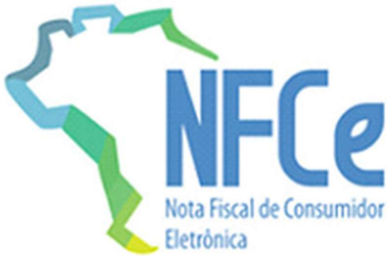

## Projeto Nota Fiscal Eletrônica

Nota Técnica 2015.001 - Versão 1.30 06 de dezembro de 2024

## Sumário

| 1.                                                                                                                                                                                                                                          | Resumo ...................................................................................................................................5                                                            |
|---------------------------------------------------------------------------------------------------------------------------------------------------------------------------------------------------------------------------------------------|--------------------------------------------------------------------------------------------------------------------------------------------------------------------------------------------------------|
| 2. Visão                                                                                                                                                                                                                                    | Geral..............................................................................................................................6                                                                   |
| 2.1. Alterações da versão                                                                                                                                                                                                                   | 1.20........................................................................................................6                                                                                          |
| 2.2 Alterações da versão                                                                                                                                                                                                                    | 1.30......................................................................................................13                                                                                           |
| 3. Fluxo operacional...................................................................................................................17                                                                                                   |                                                                                                                                                                                                        |
| 3.1. Pedido de                                                                                                                                                                                                                              | prorrogação...........................................................................................................17                                                                               |
| 3.2. Cancelamento........................................................................................................................18                                                                                                 |                                                                                                                                                                                                        |
| 3.3. Deferimento dos pedidos de prorrogação e de cancelamento pela Sefaz:.............................19                                                                                                                                    |                                                                                                                                                                                                        |
| 3.4. Exemplo de pedido de prorrogação e evento                                                                                                                                                                                              | com resposta do fisco para a solicitação parcial. ..................................................................................................................................................19 |
| 3.5. Exemplo de pedido de prorrogação e evento com resposta do fisco para a completa...........................................................................................................................................20           | solicitação                                                                                                                                                                                            |
| 3.6. Evento de cancelamento de pedido e resposta do fisco...........................................................21                                                                                                                      |                                                                                                                                                                                                        |
| 3.7. Exemplo de evento de cancelamento de pedido e resposta do fisco para a solicitação parcial..22                                                                                                                                         |                                                                                                                                                                                                        |
| 3.8. Exemplo de evento de cancelamento de pedido e resposta do fisco para a completa...........................................................................................................................................23           | solicitação                                                                                                                                                                                            |
| 4. Exemplo de sequência de eventos no tempo e seu relacionamento...........................................24                                                                                                                               |                                                                                                                                                                                                        |
| 4.1. Exemplo de sequência de eventos no tempo e seu relacionamento para a                                                                                                                                                                   | solicitação                                                                                                                                                                                            |
| completa...........................................................................................................................................25                                                                                       |                                                                                                                                                                                                        |
| 4.2. Exemplo de sequência de eventos no tempo e seu relacionamento para a solicitação completa...........................................................................................................................................26 |                                                                                                                                                                                                        |
| 5. Registro dos eventos..................................................................................................................27                                                                                                 |                                                                                                                                                                                                        |
| 6. Web Service - RecepcaoEvento - Pedido de Prorrogação                                                                                                                                                                                     | ......................................................29                                                                                                                                               |
| 6.1. Leiaute Mensagem de Entrada                                                                                                                                                                                                            | ...............................................................................................29                                                                                                      |
| 6.2. Leiaute Mensagem de Retorno                                                                                                                                                                                                            | ...............................................................................................31                                                                                                      |
| 6.3. Descrição do Processo de Recepção de                                                                                                                                                                                                   | Evento......................................................................8                                                                                                                          |
| 6.4. Validação do Certificado de                                                                                                                                                                                                            | Transmissão.................................................................................8                                                                                                          |
| 6.5. Validação Inicial da Mensagem no Web                                                                                                                                                                                                   | Service.......................................................................8                                                                                                                        |
| 6.6. Validação das informações de controle da                                                                                                                                                                                               | chamada ao Web Service.....................................8                                                                                                                                           |
| 6.7. Validação da área de                                                                                                                                                                                                                   | Dados...................................................................................................8                                                                                              |
| 6.8. Final do Processamento do                                                                                                                                                                                                              | Lote...........................................................................................11                                                                                                      |
| 6.9. Armazenamento e Disponibilização do Pedido de Prorrogação.............................................11                                                                                                                               |                                                                                                                                                                                                        |
| 7. Web Service - RecepcaoEvento - Cancelamento de Pedido de Prorrogação..........................12                                                                                                                                         |                                                                                                                                                                                                        |
| 7.1. Leiaute Mensagem de Entrada                                                                                                                                                                                                            | ..............................................................................................13                                                                                                       |

## Projeto Nota Fiscal Eletrônica

| 7.2. Leiaute Mensagem de Retorno ..............................................................................................15   |
|-------------------------------------------------------------------------------------------------------------------------------------|
| 7.3. Descrição do Processo de Recepção de Evento....................................................................17              |
| 7.4. Validação do Certificado de Transmissão ..............................................................................17       |
| 7.5. Validação Inicial da Mensagem no Web Service....................................................................17             |
| 7.6. Validação das informações de controle da chamada ao Web Service....................................17                          |
| 7.7. Validação da área de Dados..................................................................................................17 |
| 7.8. Final do Processamento do Lote............................................................................................19   |
| 7.9. Armazenamento e Disponibilização do Cancelamento de Pedido de Prorrogação.................20                                   |
| 8. Web Service - RecepcaoEvento - Fisco - Prorrogação ICMS .................................................21                      |
| 8.3. Descrição do Processo de Recepção de Evento....................................................................26              |
| 8.4. Validação do Certificado de Transmissão ..............................................................................26       |
| 8.5. Validação Inicial da Mensagem no Web Service....................................................................27             |
| 8.6. Validação das informações de controle da chamada ao Web Service ...................................27                          |
| 8.7. Validação da área de Dados..................................................................................................27 |
| 8.8. Final do Processamento do Lote............................................................................................29   |
| 8.9. Armazenamento e Disponibilização do Evento Fisco.............................................................30                |
| 8.10. Diagrama simplificado do procEventoNFe............................................................................30          |
| 8.11. Tabela de códigos de erros e descrições de mensagens de erros .......................................30                       |
| 9. Pedido de Cancelamento da NF-e versus Evento de Pedido de Prorrogação de Prazo............32                                     |
| 10. Web Service - NFeDistribuicaoDFe........................................................................................33      |

## Controle de Versões

|   Versão | Publicação   | Descrição         |
|----------|--------------|-------------------|
|     1.00 | 03/2015      | Publicação da NT. |
|     1.10 | 06/2015      | Versão 1.10.      |
|     1.20 | 06/2016      | Versão 1.20.      |
|     1.30 | 11/2024      | Versão 1.30.      |

## Histórico de Alterações / Cronograma

|   Versão | Histórico de atualizações                                                                                                        | Implantação Teste        | Implantação Produção     |
|----------|----------------------------------------------------------------------------------------------------------------------------------|--------------------------|--------------------------|
|     1.00 | Documento inicial                                                                                                                | -                        | -                        |
|     1.10 | Alteração de regras de validação, prazo de vigência para ambiente de produção, resumo e descrição de códigos do Evento do Fisco. | -                        | -                        |
|     1.20 | Alterações de regras de validação, de regras na recepção dos eventos e inclusão de itens e mensagens.                            | 26/10/2015               | 30/11/2015               |
|     1.30 | Inclusão de novo tipo de implementação de solicitação completa.                                                                  | 29/10/2024 Somente em MG | 06/01/2025 Somente em MG |

## 1. Resumo

Esta Nota Técnica apresenta a especificação técnica necessária para a implementação do pedido de prorrogação da suspensão do ICMS na remessa para industrialização após decorridos 180 dias.

O  Evento  de  pedido  de  prorrogação  substitui  uma  petição  em  papel  do  contribuinte,  frente  à administração pública, com um arquivo xml assinado.

O  evento  será  utilizado  pelo  contribuinte  e  o  alcance  das  alterações  permitidas  é  definido  no CONVÊNIO AE-15/74:

'Os Secretários  de  Fazenda dos Estados e do Distrito  Federal, reunidos em  Brasília, DF, no dia 11 de dezembro de 1974, resolvem celebrar o seguinte CONVÊNIO.

(...)

Cláusula primeira Os signatários acordam em conceder suspensão do Imposto sobre Operações Relativas à Circulação de Mercadorias nas remessas interestaduais de produtos destinados a conserto, reparo ou industrialização, desde que as mesmas retornem ao estabelecimento de origem no prazo de 180 (cento oitenta) dias, contados da data das respectivas saídas, prorrogáveis por mais cento e oitenta dias, admitindose, excepcionalmente, uma segunda prorrogação de igual prazo.

(...)

§ 1º O disposto nesta cláusula não se aplica às saídas de sucatas e de produtos primários de origem animal, vegetal ou mineral, salvo se a remessa e o retorno se fizerem nos termos de protocolos celebrados entre os Estados interessados.

§  2º  A  suspensão  nas  remessas  interestaduais  para  industrialização  promovidas  por  estabelecimentos localizados  no  Estado  de  Mato  Grosso  do  Sul  fica  condicionada  à  existência  de  autorização  específica concedida pela Secretaria de Estado de Fazenda desse Estado.

(...)

Cláusula segunda O presente Convênio passa a vigorar a partir de 1º de janeiro de 1975.

(...)

Signatários: AC, AL, AM, BA, CE, DF, ES, GB, GO, MA, MG, MT, PA, PB, PE, PI, PR, RJ, RN, RS, SC, SE e SP.'

As UFs que determinarem em sua legislação local a suspensão do ICMS podem utilizar o mesmo recurso para receberem os pedidos de prorrogação de operações internas. Por enquanto, apenas São Paulo e Minas Gerais adotam esta NT.

Esta NT define o layout e a operacionalização da petição da prorrogação da suspensão do ICMS e seu deferimento através dos seguintes eventos:

- Evento Pedido de Prorrogação 1º. prazo (tpEvento=111500, 'EPP1')
- Evento Pedido de Prorrogação 2º. prazo (tpEvento=111501, 'EPP2')
- Evento Cancelamento de Pedido de Prorrogação 1º prazo (tpEvento=111502, 'ECPP1')
- Evento  Cancelamento  de  pedido  de  Prorrogação  2°  prazo  (tpEvento=111503,  'ECPP2')  Evento Fisco Resposta ao Pedido de Prorrogação 1º prazo (tpEvento=411500, 'EFPP1')  Evento Fisco Resposta ao Pedido de Prorrogação 2º prazo (tpEvento=411501,

'EFPP2')

- Evento  Fisco  Resposta  ao  Cancelamento  de  Prorrogação  1º  prazo  (tpEvento=411502, 'EFCPP1')
- Evento Fisco Resposta ao Cancelamento de Prorrogação 2º prazo (tpEvento=411503, 'EFCPP2')

## 2. Visão Geral

## 2.1. Alterações da versão 1.20

## 2.1.1. Alteração na descrição das mensagens

## De:

## Para:

- Itens 3.6, 4.6, 5.6

- 242: "Rejeição: Cabeçalho - Falha no Schema XML'

- Itens 3.7(d), 4.7(d), 5.7(d)

- 298: 'Rejeição: Assinatura difere do padrão do Sistema'

- 213: 'Rejeição: CNPJ-Base do Emitente difere do CNPJ-Base do Certificado Digital'

## 2.1.2. Inclusão de validações nos eventos

- 3.7(e)
- 4.7(e)

| P12   | Data do evento não pode ser menor que a data de autorização para NF-e não emitida em contingência se a NF-e existir.   | Obrig.   | 579   | Rej.   |
|-------|------------------------------------------------------------------------------------------------------------------------|----------|-------|--------|

| P12   | Data do evento não pode ser menor que a data de emissão da NF-e, se existir                                          | Obrig.   |   577 | Rej.   |
|-------|----------------------------------------------------------------------------------------------------------------------|----------|-------|--------|
| P12   | Data do evento não pode ser maior que a data de processamento (aceitar uma tolerância de até 5 minutos)              | Obrig.   |   578 | Rej.   |
| P12   | Data do evento não pode ser menor que a data de autorização para NF-e não emitida em contingência se a NF-e existir. | Obrig.   |   579 | Rej.   |

## · 5.7(e)

| P12   | Data do evento não pode ser menor que a data de emissão da NF-e, se existir                                          | Obrig.   |   577 | Rej.   |
|-------|----------------------------------------------------------------------------------------------------------------------|----------|-------|--------|
| P12   | Data do evento não pode ser maior que a data de processamento (aceitar uma tolerância de até 5 minutos)              | Obrig.   |   578 | Rej.   |
| P12   | Data do evento não pode ser menor que a data de autorização para NF-e não emitida em contingência se a NF-e existir. | Obrig.   |   579 | Rej.   |
| P31   | Verificar se o CNPJ do certificado digiral do evento corresponde ao CNPJ da Fazenda,                                 | Obrig.   |   808 | Rej.   |
| P19   | Verificar se o ID do evento (P19 - idPedido) existe em banco de dados                                                | Obrig.   |   809 | Rej    |

- Itens 3.6, 4.6, 5.6
- 242: "Rejeição: Elemento nfeCabecMsg inexistente no SOAP Header"
- Itens 3.7(d), 4.7(d), 5.7(d)
- 298: 'Rejeição: Assinatura difere do padrão do Projeto'
- 213: 'Rejeição: CNPJ-Base do Autor difere do CNPJ-Base do Certificado Digital'

| P13, P19   | Os eventos do fisco se relacionam ao evento de pedido de prorrogação ou de cancelamento por meio do campo P19. Verificar se o tpEvento do Evento do Fisco (P13) corresponde ao tpEvento do Pedido de Prorrogação ou de Cancelamento (campo P13 do evento de Pedido de Prorrogação ou campo P13 do evento de Cancelamento) de acordo com as tabelas abaixo:   | Os eventos do fisco se relacionam ao evento de pedido de prorrogação ou de cancelamento por meio do campo P19. Verificar se o tpEvento do Evento do Fisco (P13) corresponde ao tpEvento do Pedido de Prorrogação ou de Cancelamento (campo P13 do evento de Pedido de Prorrogação ou campo P13 do evento de Cancelamento) de acordo com as tabelas abaixo:   | Obrig.   | 810   | Rej.   |
|------------|--------------------------------------------------------------------------------------------------------------------------------------------------------------------------------------------------------------------------------------------------------------------------------------------------------------------------------------------------------------|--------------------------------------------------------------------------------------------------------------------------------------------------------------------------------------------------------------------------------------------------------------------------------------------------------------------------------------------------------------|----------|-------|--------|
|            | tpEvento Pedido Prorrogação de                                                                                                                                                                                                                                                                                                                               | tpEvento Fisco                                                                                                                                                                                                                                                                                                                                               |          |       |        |
|            | 111500                                                                                                                                                                                                                                                                                                                                                       | 411500                                                                                                                                                                                                                                                                                                                                                       |          |       |        |
|            | 111501                                                                                                                                                                                                                                                                                                                                                       | 411501                                                                                                                                                                                                                                                                                                                                                       |          |       |        |
|            | tpEvento Cancelamento                                                                                                                                                                                                                                                                                                                                        | tpEvento Fisco                                                                                                                                                                                                                                                                                                                                               |          |       |        |
|            | 111502                                                                                                                                                                                                                                                                                                                                                       | 411502                                                                                                                                                                                                                                                                                                                                                       |          |       |        |
|            | 111503                                                                                                                                                                                                                                                                                                                                                       | 411503                                                                                                                                                                                                                                                                                                                                                       |          |       |        |

## 2.1.3. Alteração de validações nos eventos

## De:

## Para:

- 4.7(e)
- 4.7(e)

| P14   | Verificar o sequencial do evento (P14 - nSeqEvento) é um valor válido (=1)   | Obrig.   | 594   | Rej.   |
|-------|------------------------------------------------------------------------------|----------|-------|--------|

| P1314   | Verificar o sequencial do evento (P14 - nSeqEvento) é um valor válido (último + 1) conforme tipo de evento (P13/P14)   | Obrig.   | 594   | Rej.   |
|---------|------------------------------------------------------------------------------------------------------------------------|----------|-------|--------|

## 2.1.4. Item 4.1 - Correção no campo P14

## De:

## Para:

| #   | Campo       | Ele   | Pai   | Tipo   | Ocor.   | Tam.   | Descrição/Observação                              |
|-----|-------------|-------|-------|--------|---------|--------|---------------------------------------------------|
| P14 | nSeqEvent o | E     | P06   | N      | 1-1     | 1-2    | Sequencial do evento para o mesmo tipo de evento. |

| #   | Campo   | Ele Pai Tipo Ocor. Tam. Descrição/Observação   |
|-----|---------|------------------------------------------------|

| P14   | nSeqEvent o   | E   | P06   | N   | 1-1   | 1-2   | Sequencial do evento para o mesmo tipo de evento. Para maioria dos eventos será 1, porém, nos casos em que possa existir mais de um evento, como é o caso da Carta de Correção, Pedido de Prorrogação, Cancelamento de Pedido de Prorrogação e Fisco, o autor do evento deve numerar de forma sequencial. Ex: tpEvento nSeqEvento 111502 1 111503 1 111502 2 111503 2   |
|-------|---------------|-----|-------|-----|-------|-------|-------------------------------------------------------------------------------------------------------------------------------------------------------------------------------------------------------------------------------------------------------------------------------------------------------------------------------------------------------------------------|

2.1.5. Item 5.1 - Correção do índice do domínios nos campos P25 e P29 De:

| #   | Campo      | Ele   | Pai   | Tipo   | Ocor.   | Tam.   | Descrição/Observação                                                                                                                                                                                                                                                                                                                                                                            |
|-----|------------|-------|-------|--------|---------|--------|-------------------------------------------------------------------------------------------------------------------------------------------------------------------------------------------------------------------------------------------------------------------------------------------------------------------------------------------------------------------------------------------------|
| P25 | justStatus | E     | P22   | N      | 1-1     | 1-2    | Justificativa da resposta do Fisco ao item do Pedido de Prorrogação: Autorizado pelo Fisco Manifestação de Destinatário - desconhece a operação Manifestação do Destinatário - operação não realizada O item não consta na NFe O item não consta no pedido de prorrogação do 1º prazo CFOP não autorizado Quantidade inconsistente com a quantidade do item Solicitação de pedido fora do prazo |

## Para:

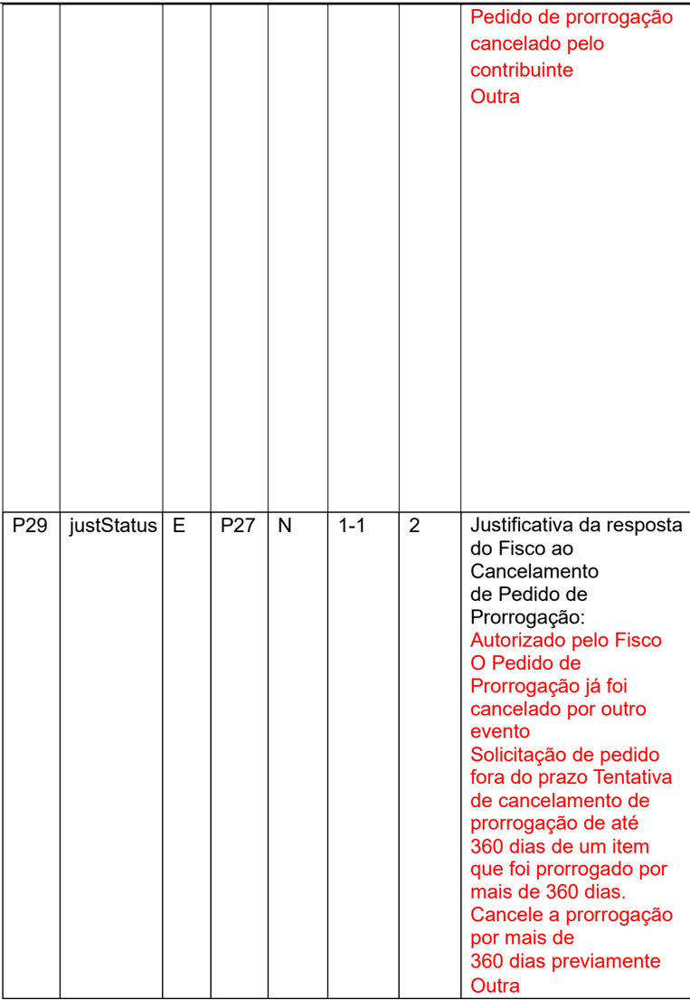

|     |            |    |     |    |     |    | Pedido de prorrogação cancelado pelo contribuinte Outra                                                                                                                                                                                                                                                                                                                    |
|-----|------------|----|-----|----|-----|----|----------------------------------------------------------------------------------------------------------------------------------------------------------------------------------------------------------------------------------------------------------------------------------------------------------------------------------------------------------------------------|
| P29 | justStatus | E  | P27 | N  | 1-1 |  2 | Justificativa da resposta do Fisco ao Cancelamento de Pedido de Prorrogação: Autorizado pelo Fisco O Pedido de Prorrogação já foi cancelado por outro evento Solicitação de pedido fora do prazo Tentativa de cancelamento de prorrogação de até 360 dias de um item que foi prorrogado por mais de 360 dias. Cancele a prorrogação por mais de 360 dias previamente Outra |

| #   | Campo Ele Pai Tipo Ocor. Tam. Descrição/Observação   |
|-----|------------------------------------------------------|

| P25   | justStatus   | E   | P22   | N   | 1-1   |   1-2 | Justificativa da resposta do Fisco ao item do Pedido de Prorrogação: 1 - Autorizado pelo Fisco 2 - Manifestação de Destinatário - desconhece a operação 3 - Manifestação do Destinatário - operação não realizada 4 - O item não consta na NF-e                                                                                                                                                      |
|-------|--------------|-----|-------|-----|-------|-------|------------------------------------------------------------------------------------------------------------------------------------------------------------------------------------------------------------------------------------------------------------------------------------------------------------------------------------------------------------------------------------------------------|
|       |              |     |       |     |       |       | 5 - O item não consta no pedido de prorrogação do 1º prazo 6 - CFOP não autorizado 7 - Quantidade inconsistente com a quantidade do item 8 - Solicitação de pedido fora do prazo 9 - Pedido de prorrogação cancelado pelo contribuinte 10 -                                                                                                                                                          |
| P29   | justStatus   | E   | P27   | N   | 1-1   |     2 | Outra Justificativa da resposta do Fisco ao Cancelamento de Pedido de Prorrogação: 1 - Autorizado pelo Fisco 2 - O Pedido de Prorrogação já foi cancelado por outro evento 3 - Solicitação de pedido fora do prazo 4 - Tentativa de cancelamento de prorrogação de até 360 dias de um item que foi prorrogado por mais de 360 dias. Cancele a prorrogação por mais de 360 dias previamente 5 - Outra |

- 2.1.6. Item 5.2 - Descrição do campo R20:
- 2.1.7. Item 5.11 - Inclusão de mensagens:
- 2.1.8. Item 6 - Pedido de Cancelamento da NF-e versus Evento de Pedido de Prorrogação de Prazo
- 2.1.9. Item 7 - A tabela do item 2 (Web Service - NFeDistribuicaoDFe) da NT2014.002\_v1.01:

## De:

Descrição do Evento - 'Fisco registrado'

## Para:

Descrição do Evento - 'Evento do fisco registrado'

|   CÓDIGO | MOTIVOS DE NÃOATENDIMENTO DASOLICITAÇÃO                                                                              |
|----------|----------------------------------------------------------------------------------------------------------------------|
|      808 | Rejeição: Evento Fisco emitido por contribuinte                                                                      |
|      809 | Rejeição: ID do Pedido de Prorrogação ou Cancelamento não existe na base de dados                                    |
|      810 | Rejeição: tpEvento do Evento Fisco não corresponde ao tpEvento do Evento de Pedido de Prorrogação ou de Cancelamento |
|      811 | Rejeição: Pedido de Prorrogação deferido impede o cancelamento da NF-e                                               |

De:

| Documento                                                  | Emitente   | Destinatário   | Transportador   | Terceiros   |
|------------------------------------------------------------|------------|----------------|-----------------|-------------|
| Evento de Pedido de Prorrogação 1º prazo                   | Sim        | Sim            | Não             | Não         |
| Evento de Pedido de Prorrogação 2º prazo                   | Sim        | Sim            | Não             | Não         |
| Evento de Cancelamento de Pedido de Prorrogação 1º prazo   | Sim        | Sim            | Não             | Não         |
| Evento de Cancelamento de Pedido de Prorrogação 2º prazo   | Sim        | Sim            | Não             | Não         |
| Evento Fisco de Resposta ao Pedido de Prorrogação 1º prazo | Sim        | Sim            | Não             | Não         |
| Evento Fisco de Resposta ao                                | Sim        | Sim            | Não             | Não         |

## Projeto Nota Fiscal Eletrônica

| Pedido de Prorrogação 2º prazo                                             |     |     |     |     |
|----------------------------------------------------------------------------|-----|-----|-----|-----|
| Evento Fisco de Resposta ao Cancelamento de Pedido de Prorrogação 1º prazo | Sim | Sim | Não | Não |
| Evento Fisco de Resposta ao Cancelamento de Pedido de Prorrogação 2º prazo | Sim | Sim | Não | Não |

## Para:

| Documento                                                                  | Emitente   | Destinatário   | Transportador   | Terceiros   |
|----------------------------------------------------------------------------|------------|----------------|-----------------|-------------|
| Evento de Pedido de Prorrogação 1º prazo                                   | Não        | Sim            | Não             | Não         |
| Evento de Pedido de Prorrogação 2º prazo                                   | Não        | Sim            | Não             | Não         |
| Evento de Cancelamento de Pedido de Prorrogação 1º prazo                   | Não        | Sim            | Não             | Não         |
| Evento de Cancelamento de Pedido de Prorrogação 2º prazo                   | Não        | Sim            | Não             | Não         |
| Evento Fisco de Resposta ao Pedido de Prorrogação 1º prazo                 | Sim        | Sim            | Não             | Não         |
| Evento Fisco de Resposta ao Pedido de Prorrogação 2º prazo                 | Sim        | Sim            | Não             | Não         |
| Evento Fisco de Resposta ao Cancelamento de Pedido de Prorrogação 1º prazo | Sim        | Sim            | Não             | Não         |
| Evento Fisco de Resposta ao Cancelamento de Pedido de Prorrogação 2º prazo | Sim        | Sim            | Não             | Não         |

## 2.2 Alterações da versão 1.30

- 2.2.1.  Complementação  de  texto  no  item  1.1  e  adição  de  exemplo  ilustrativo  para  que  se adequem ao tipo de implementação de solicitação completa.
- 2.1.2. Complementação de texto no item 1.2 para que se adeque ao tipo de implementação de solicitação completa.
- 2.1.3. Complementação de texto no item 1.3 para que se adeque ao tipo de implementação de solicitação completa.
- 2.1.4. Adição de exemplo ilustrativo no item 1.3.2 para o tipo de implementação de solicitação completa.
- 2.1.5. Adição de exemplo ilustrativo no item 1.3.5 para o tipo de implementação de solicitação completa.
- 2.1.6. Adição de exemplo ilustrativo no item 2.2 para o tipo de implementação de solicitação completa
- 2.1.7. Alteração do texto do item 2.3 para permitir a parametrização das regras de validação P13-14  a  critério  da  UF,  de  forma  que  se  uma  NFe  contiver  mais  que  1  evento autorizado sem resposta pelo fisco, o WebService de recepção de eventos devolva a mensagem de rejeição.
- 2.1.8. Alteração das regras de validação P13-14 para que sejam parametrizáveis a critério da UF e da regra de validação P19 para que se adeque a outras situações:

## De:

## Para:

| P13-14   | Verificar a quantidade de eventos do tipo '1º pedido'. A soma dos pedidos do tipo '1º pedido' sem resposta do Fisco não deverá exceder 20 pedidos.   | Obrig.   |   638 | Rej.   |
|----------|------------------------------------------------------------------------------------------------------------------------------------------------------|----------|-------|--------|
| P13-14   | Verificar a quantidade de eventos do tipo '2º pedido'. A soma dos pedidos do tipo '2º pedido' sem resposta do Fisco não deverá exceder 20 pedidos.   | Obrig.   |   639 | Rej.   |
| P19      | Verificar se o ID do evento (P19 - idPedido) existe em banco de dados.                                                                               | Obrig.   |   809 | Rej.   |

| P13-14   | Verificar a quantidade de eventos do tipo '1º pedido'. A soma dos pedidos do tipo '1º pedido' sem resposta do Fisco não deverá exceder 20 pedidos. Exceção 1: A critério da UF, a soma dos pedidos do tipo '1º pedido' sem resposta do   | Obrig.   |   638 | Rej.   |
|----------|------------------------------------------------------------------------------------------------------------------------------------------------------------------------------------------------------------------------------------------|----------|-------|--------|
| P13-14   | Verificar a quantidade de eventos do tipo '2º pedido'. A soma dos pedidos do tipo '2º pedido' sem resposta do Fisco não deverá exceder 20 pedidos.                                                                                       | Obrig.   |   639 | Rej.   |

| P13-14   | Rejeição: A quantidade de Pedidos de Prorrogação 1° prazo excede o valor limite de 20 Pedidos de Prorrogação autorizados e sem resposta do Fisco.   | Obrig.   |   638 | Rej.   |
|----------|-----------------------------------------------------------------------------------------------------------------------------------------------------|----------|-------|--------|
| P13-14   | Rejeição: A quantidade de Pedidos de Prorrogação 2° prazo excede o valor limite de 20 Pedidos de Prorrogação autorizados e sem resposta do Fisco.   | Obrig.   |   639 | Rej.   |
| P19      | Rejeição: ID do Pedido de Prorrogação ou Cancelamento não existe na base de dados                                                                   | Obrig.   |   809 | Rej.   |

|     | Exceção 1: A critério da UF, a soma dos pedidos do tipo '2º pedido' sem resposta do Fisco não deverá exceder 1 pedido.   |        |     |     |
|-----|--------------------------------------------------------------------------------------------------------------------------|--------|-----|-----|
| P19 | Verificar se o ID do evento (P19 - idPedido) existe em banco de dados ou se há um                                        | Obrig. | 809 | Rej |

- 2.1.9. Adição de texto no retorno da regra de validação P19 para que se adequem a outras situações:

De:

## Para:

| P13-14   | Rejeição: A quantidade de Pedidos de Prorrogação 1° prazo excede o valor limite de Pedidos de Prorrogação autorizados e sem resposta do Fisco.        | Obrig.   |   638 | Rej.   |
|----------|-------------------------------------------------------------------------------------------------------------------------------------------------------|----------|-------|--------|
| P13-14   | Rejeição: A quantidade de Pedidos de Prorrogação 2° prazo excede o valor limite de Pedidos de Prorrogação autorizados e sem resposta do Fisco.        | Obrig.   |   639 | Rej.   |
| P19      | Rejeição: ID do Pedido de Prorrogação ou Cancelamento não existe na base de dados ou não há um pedido de prorrogação deferido para o tipo: [tpEvento] | Obrig.   |   809 | Rej.   |

- 2.1.10. Adição de texto de justificativa da resposta do fisco, para indicar que o indeferimento '7
-  Quantidade  inconsistente  com  a  quantidade  do  item'  não  se  aplica  ao  tipo  de implementação de solicitação completa.

De:

#

Campo

Ele

Pai

Tipo

Ocor.

Tam.

Descrição/Observação

NT 2015.001 Versão 1.30 - Evento Pedido de Prorrogação

| P25   | justStatus   | E   | P22   | N   | 1-1   | 1-2   | Justificativa da resposta do Fisco ao item do                                                                                                                                                                                                                                                                                                                                                                                                       |
|-------|--------------|-----|-------|-----|-------|-------|-----------------------------------------------------------------------------------------------------------------------------------------------------------------------------------------------------------------------------------------------------------------------------------------------------------------------------------------------------------------------------------------------------------------------------------------------------|
|       |              |     |       |     |       |       | Pedido de Prorrogação: 1 - Autorizado pelo Fisco 2 - Manifestação do Destinatário - desconhece a operação 3 - Manifestação do Destinatário - operação não realizada 4 - O item não consta na NF-e 5 - O item não consta no pedido de prorrogação do 1º prazo 6 - CFOP não autorizado 7 - Quantidade inconsistente com a quantidade do item 8 - Solicitação de pedido fora do prazo 9 - Pedido de prorrogação cancelado pelo contribuinte 10 - Outra |

## Projeto

## Para:

| #   | Campo      | Ele   | Pai   | Tipo   | Ocor.   | Tam.   | Descrição/Observação                                                                                                                                                                                                                                                                                                                                                                                                                                                                                                                     |
|-----|------------|-------|-------|--------|---------|--------|------------------------------------------------------------------------------------------------------------------------------------------------------------------------------------------------------------------------------------------------------------------------------------------------------------------------------------------------------------------------------------------------------------------------------------------------------------------------------------------------------------------------------------------|
| P25 | justStatus | E     | P22   | N      | 1-1     | 1-2    | Justificativa da resposta do Fisco ao item do Pedido de Prorrogação: 1 - Autorizado pelo Fisco 2 - Manifestação do Destinatário - desconhece a operação 3 - Manifestação do Destinatário - operação não realizada 4 - O item não consta na NF-e 5 - O item não consta no pedido de prorrogação do 1º prazo 6 - CFOP não autorizado 7 - Quantidade inconsistente com a quantidade do item (não se aplica à solicitação completa) 8 - Solicitação de pedido fora do prazo 9 - Pedido de prorrogação cancelado pelo contribuinte 10 - Outra |

## 3. Fluxo operacional

## 3.1. Pedido de prorrogação

A saída com a suspensão de ICMS (nos casos previstos em legislação) independe da emissão de eventos na NF-e. Na necessidade de prorrogação deste prazo, o pedido de prorrogação se dá por eventos vinculados à NF-e indicando o item e a quantidade que se pretende prorrogar.

A suspensão do ICMS é prorrogável por mais 180 dias após o primeiro período de prorrogação. Neste caso, a empresa solicita uma nova prorrogação com o evento de 2º prazo de prorrogação.

Esse evento poderá ser implementado de duas formas.

A solicitação parcial, em que há a possibilidade de pedido parcial, caso em que o emitente indicará os itens e as quantidades que se pretende prorrogar. Essa é a forma implementada por São Paulo.

A solicitação completa, em que só serão aceitos pedidos totais, ou seja, indicando todos os itens e quantidades da NF-e. Essa é a forma implementada em Minas Gerais.

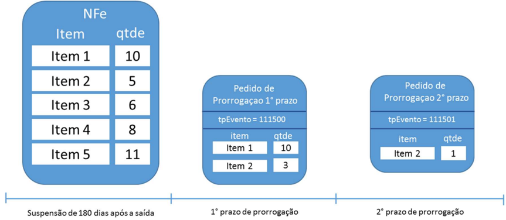

Para a solicitação parcial, no exemplo acima, uma saída de 5 itens teve a suspensão prorrogada por 180 dias para os itens 1 e 2 nas quantidades 10 e 3, respectivamente. Em seguida, a empresa pediu a prorrogação da suspensão novamente para o item 2. Como já havia pedido a prorrogação para 3 unidades do item 2, está limitada a este no valor na 2ª prorrogação. No exemplo acima, pediu para apenas uma 1 unidade.

Já  para  a  solicitação  completa,  o  pedido  conforme  o  exemplo  acima  seria  indeferido.  Isso aconteceria porque o pedido não contempla todos os itens e todas as quantidades da NF-e. Essa regra também se aplica para o Pedido de Prorrogação de 2º prazo. O desenho abaixo ilustra um pedido que atende às regras aplicadas para essa opção de implementação.

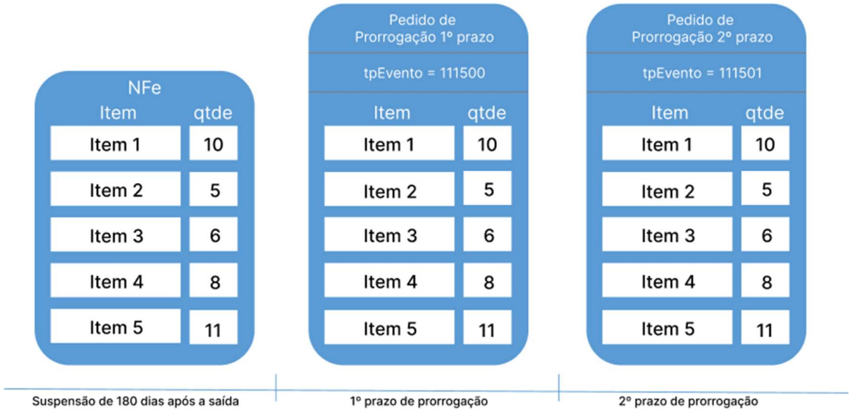

Como a suspensão pode ser prorrogável por até  2  períodos  de  180  dias,  há  dois  pedidos  de prorrogação: um para o primeiro período de 180 dias (tpEvento = 111500) e outro para o segundo período de 180 dias (tpEvento = 111501).

## 3.2. Cancelamento

Se a empresa quiser desfazer o pedido de prorrogação (1º ou 2º prazo), pode enviar um evento pedindo seu cancelamento, porém, deverá observar a seguinte regra para cancelar eventos de Pedido de Prorrogação 1º prazo.

- 1  -  A  quantidade  de  um  determinado  item  prorrogado  de  360  a  540  dias  (nos  eventos  de prorrogação 2° prazo) deve sempre ter sido prorrogado de 180 a 360 dias por eventos de prorrogação 1° prazo. Por isso, para a solicitação parcial, ao tentar cancelar eventos de prorrogação  1°  prazo,  deve  -  se  atentar  para  a  quantidade  de  itens  nos  eventos  de prorrogação de 2° prazo. É preciso que existam itens prorrogados no primeiro prazo (até 360 dias) suficientes para que as prorrogações a partir de 360 dias sejam compatíveis.

Considerando  como  exemplo  os  dados  do  item  1.1,  não  é  possível  cancelar  o  Pedido  de Prorrogação 1º prazo sem antes cancelar o Pedido de Prorrogação 2º prazo. Neste caso, para realizar este cancelamento a empresa deverá seguir os seguintes passos:

- 1 -  Solicitar evento de Cancelamento de Pedido de Prorrogação 2º prazo e, após deferimento deste;

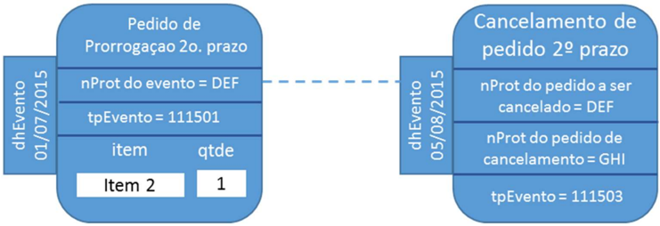

## 2 -  Solicitar evento de Cancelamento de Pedido de Prorrogação 1º prazo

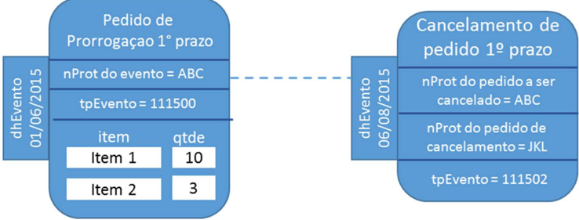

O evento de cancelamento, além de vinculado à  NFe de  remessa,  também está  vinculado  ao evento de prorrogação que se pretende cancelar. Este vínculo ocorre pelo ID do evento e pelo protocolo de registro do evento.

## 3.3.  Deferimento dos pedidos de prorrogação e de cancelamento pela Sefaz

Todos os eventos de pedido de prorrogação e cancelamento são síncronos. A obtenção de um protocolo  de  registro  na  NFe  não  implica  o  deferimento  pelo  fisco  como  ocorre  no  registro  de cancelamento de NFe, por exemplo.

O  deferimento  pela  Sefaz  depende  de  um  evento  (tp  -  411500,  411501,  411502  ou  411503) assinado com certificado da Fazenda responsável pela empresa emitente da NFe de remessa. Este  evento  traz  o  posicionamento  da  Sefaz  frente  o  pedido  e  a  motivação  no  caso  de indeferimento.

O evento do fisco está vinculado à NFe de remessa e ao pedido de prorrogação pelo ID do evento e pelo protocolo de registro do evento na NFe.

Para a solicitação parcial, para cada item, a Sefaz defere/indefere o pedido e justifica a resposta.

Já  para  a  solicitação  completa,  como  não  será  possível  o  pedido  parcial,  o  deferimento  e indeferimento será sempre para todos os itens e quantidades da NFe.

## 3.4. Exemplo de pedido de prorrogação e evento com resposta do fisco

para a solicitação parcial A empresa pediu a prorrogação de 8 unidades do item 2. Porém, a NFe de remessa contém apenas 5  unidades do item 2. O evento de resposta para o pedido de prorrogação com  nProt = ABC autoriza a prorrogação de prazo para 10 unidades do item 1 e indefere o pedido de prorrogação para o item 2.

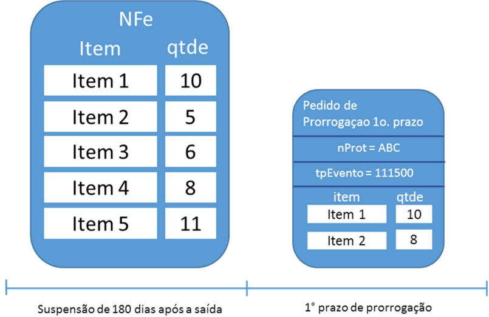

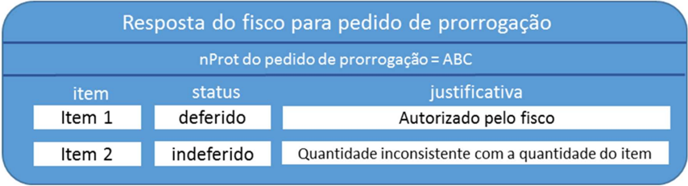

## 3.5. Exemplo de pedido de prorrogação e evento com resposta do fisco para a solicitação completa.

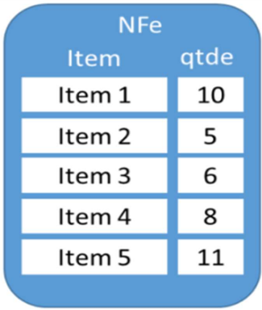

Suspensaode180diasaposasaida

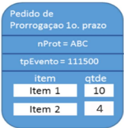

1°prazodeprorrogacao

A empresa pediu a prorrogação de apenas 2 itens da nota e 4 unidades do item 2. Porém, é necessário realizar o pedido de prorrogação para todos os itens e quantidades da nota. O evento de resposta para o pedido de prorrogação com  nProt = ABC indefere o pedido de prorrogação para todos os itens.

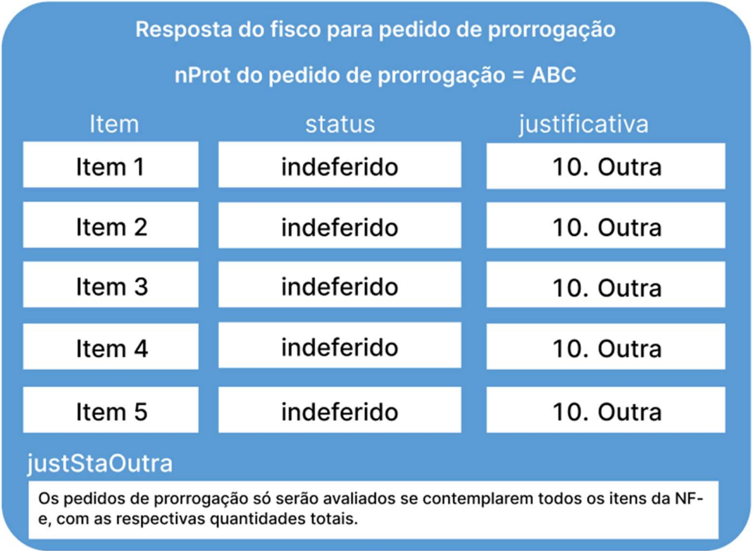

## 3.6. Evento de cancelamento de pedido e resposta do fisco.

A empresa pode pedir para cancelar um pedido de prorrogação depois da manifestação do fisco (deferindo ou indeferindo o cancelamento).

O deferimento de um pedido de cancelamento de um pedido de prorrogação que tenha sido aprovado anteriormente gera um novo evento do fisco revertendo todos os deferimentos.

Em situações que estejam fora do controle do fisco, como uma ordem judicial em virtude de um  mandado  de  segurança  determinando  a  reversão  de  uma  resposta  do  fisco,  há  a possibilidade de o fisco emitir novo evento revertendo sua posição.

Assim, um evento de prorrogação pode ter mais de um evento de resposta do fisco ao longo do tempo. A resposta do fisco que prevalece é sempre a última.

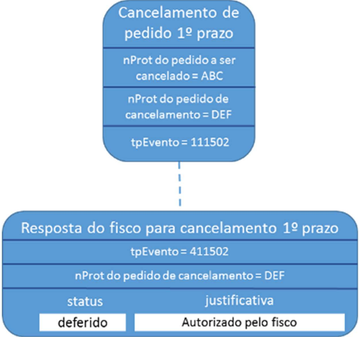

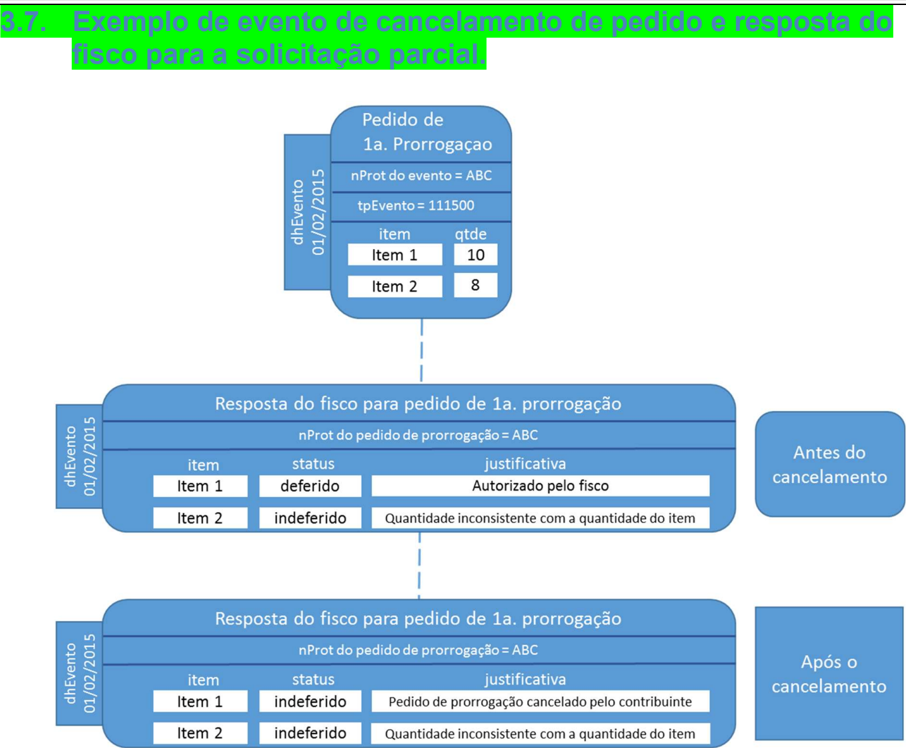

## 3.8. Exemplo de evento de cancelamento de pedido e resposta do fisco para a solicitação completa.

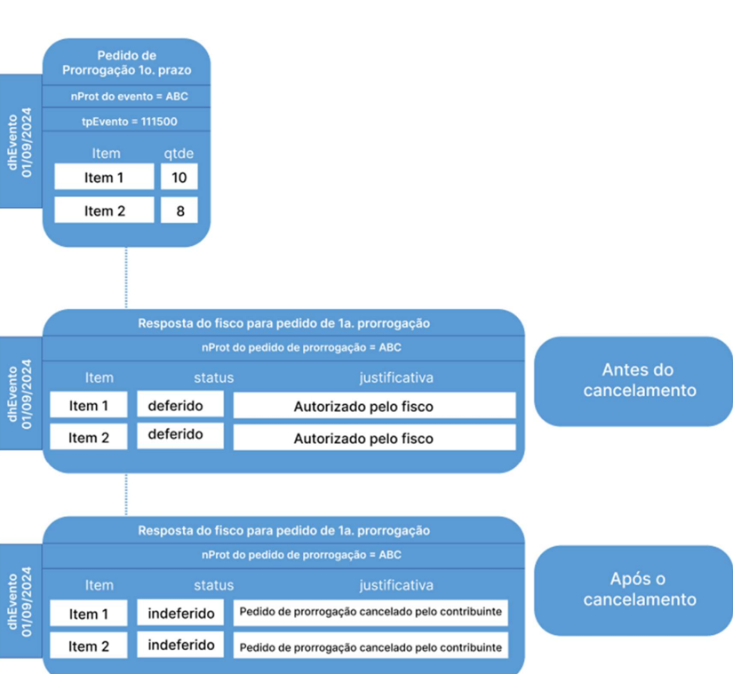

## 4. Exemplo de sequência de eventos no tempo e seu relacionamento:

| (1)   | emissão da NFe de remessa                           | 01/02/2015   |
|-------|-----------------------------------------------------|--------------|
| (2)   | pedido de prorrogação 1º prazo                      | 01/07/2015   |
| (3)   | resposta do fisco para prorrogação 1º prazo         | 02/07/2015   |
| (4)   | cancelamento pela empresa para prorrogação 1º prazo | 05/08/2015   |
| (5)   | resposta do fisco para o cancelamento 1º prazo      | 06/08/2015   |
| (6)   | resposta do fisco para prorrogação 1° prazo         | 06/08/2015   |

## 4.1. Exemplo de sequência de eventos no tempo e seu relacionamento para a solicitação parcial:

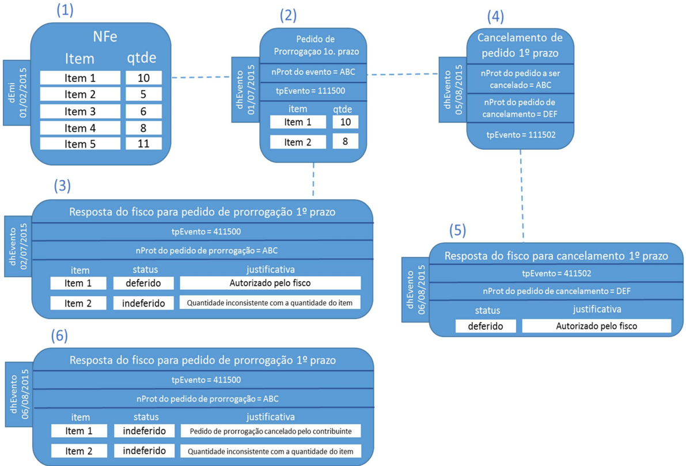

## 4.2. Exemplo de sequência de eventos no tempo e seu relacionamento para a solicitação completa

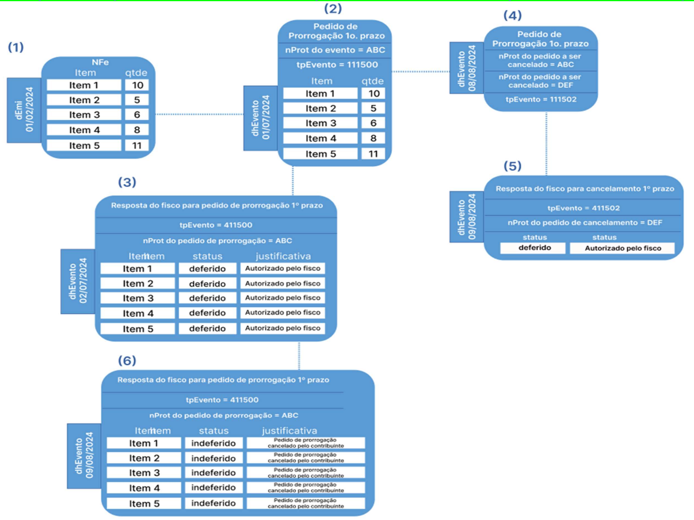

## 5. Registro dos eventos

- As regras aplicadas no deferimento dos pedidos de prorrogação seguem a legislação vigente em cada UF de onde ocorreu a remessa com suspensão. O sistema da NFe apenas recepciona os pedidos de prorrogação de suspensão de ICMS. As regras de rejeição desta NT definem critérios suficientes para o registro de um pedido de prorrogação (ou de cancelamento) pela Sefaz.
- O  deferimento  dos  pedidos  dependem  de  critérios  específicos  fora  do  escopo  da  NFe.  O recebimento de uma mensagem de resposta com o registro do evento não significa deferimento pela Sefaz responsável pelo contribuinte emitente da NFe de remessa.
- A resposta do fisco com o deferimento não é síncrona com a recepção do evento de pedido de prorrogação ou cancelamento do contribuinte. Dependendo das regras implementadas por cada Sefaz, alguns eventos podem ser analisados manualmente e dependem de intervenção humana para serem gerados.
- Cada NFe poderá ter até 99 eventos de prorrogação de 1º prazo, 2º. prazo, e cancelamento, em conjunto.
- Se uma NFe contiver mais que 20 eventos autorizados sem resposta pelo fisco, o WebService de  recepção de  eventos  devolverá mensagem de rejeição. Esta medida visa a recepção de eventos em casos de erros no sistema do contribuinte. A critério da UF, a regra de validação poderá ser parametrizada para que se uma NFe contiver mais que 1 evento autorizado sem resposta pelo fisco, o WebService de recepção de eventos devolva a mensagem de rejeição, de forma que o contribuinte só poderá enviar um novo pedido de prorrogação ou cancelamento caso o evento anteriormente enviado já tenha sido processado e possua a devida resposta.
- A  geração  de  eventos  do  fisco  com  a  resposta  para  os  pedidos  pode  ser  implementada internamente  ao  sistema  da  NFe  ou  por  sistema  independente  que  implemente  regras específicas para o processamento de prorrogação de prazos para a suspensão de ICMS.
- NFes que tiverem pedidos de prorrogação de prazo com deferimento pelo fisco não poderão ser canceladas.
- As UFs que utilizarem Sefaz Virtual receberão os eventos de pedido de prorrogação através do compartilhamento com o ambiente nacional e emitirão os eventos do fisco para o WebService de recepção de eventos.

Esquema de distribuição da informação:

Eletronica

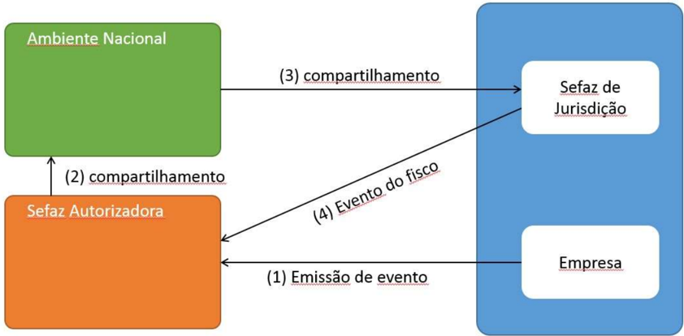

A empresa receberá a resposta do fisco através do compartilhamento de DFes segundo a Nota Técnica 2014/002 Web Service de Distribuição de DF-e de Interesse dos Atores da NF-e (PF ou PJ).

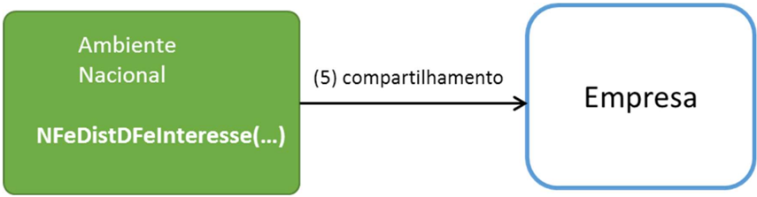

## 6. Web Service - RecepcaoEvento - Pedido de Prorrogação

Sistema de Registro de Eventos

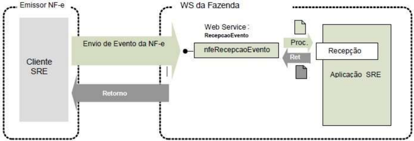

Função : serviço destinado à recepção de mensagem de Evento da NF-e

NT 2015.001 Versão 1.30 - Evento Pedido de Prorrogação

O Pedido de Prorrogação é um evento para prorrogar o prazo de retorno de produtos de uma NFe de remessa para industrialização por encomenda com suspensão do ICMS.

O registro de um novo Pedido de Prorrogação não substitui o Pedido de Prorrogação anterior, ou seja, serão eventos cumulativos. Recomenda-se agrupar a maior quantidade de itens em cada Pedido de Prorrogação.

Processo

: síncrono.

Método: nfeRecepcaoEvento

## 6.1. Leiaute Mensagem de Entrada

Schema XML: envPProrrogNFe\_v1.0.xsd

| #   | Campo     | Ele   | Pai   | Tipo   | Ocor   | Tam   | Descrição/Observação                                                                                                                                                                                                                                      |
|-----|-----------|-------|-------|--------|--------|-------|-----------------------------------------------------------------------------------------------------------------------------------------------------------------------------------------------------------------------------------------------------------|
| P01 | envEvento | Raiz  | -     | -      | -      | -     | TAG raiz                                                                                                                                                                                                                                                  |
| P02 | versao    | A     | P01   | N      | 1-1    | 2v2   | Versão do leiaute                                                                                                                                                                                                                                         |
| P03 | idLote    | E     | P01   | N      | 1-1    | 1-15  | Identificador de controle do Lote de envio do Evento. Número sequencial autoincremental único para identificação do Lote. A responsabilidade de gerar e controlar é exclusiva do autor do evento. O Web Service não faz qualquer uso deste identificador. |
| P04 | evento    | G     | P01   | xml    | 1-20   | -     | Evento, um lote pode conter até 20 eventos                                                                                                                                                                                                                |
| P05 | versao    | A     | P04   | N      | 1-1    | 1-4v2 | Versão do leiaute do evento                                                                                                                                                                                                                               |
| P06 | infEvento | G     | P04   |        | 1-1    |       | Grupo de informações do registro do Evento                                                                                                                                                                                                                |
| P07 | Id        | ID    | P06   | C      | 1-1    | 54    | Identificador da TAG a ser assinada, a regra de formação do Id é: 'ID' + tpEvento + chave da NFe + nSeqEvento                                                                                                                                             |
| P08 | cOrgao    | E     | P06   | N      | 1-1    | 2     | Código do órgão de recepção do Evento. Utilizar a Tabela do                                                                                                                                                                                               |
|     |           |       |       |        |        |       | IBGE, utilizar 90 para identificar o Ambiente Nacional.                                                                                                                                                                                                   |
| P09 | tpAmb     | E     | P06   | N      | 1-1    | 1     | Identificação do Ambiente: 1 - Produção 2 - Homologação                                                                                                                                                                                                   |
| P10 | CNPJ      | E     | P06   | N      | 1-1    | 14    | Informar o CNPJ do autor do Evento                                                                                                                                                                                                                        |
| P11 | chNFe     | E     | P06   | N      | 1-1    | 44    | Chave de Acesso da NF-e vinculada ao Evento                                                                                                                                                                                                               |

## Projeto Nota Fiscal Eletrônica

NT 2015.001 Versão 1.30 - Evento Pedido de Prorrogação

| P12   | dhEvento   | E   | P06   | D   | 1-1   |       | Data e hora do evento no formato AAAA- MMDDThh:mm:ssTZD (UTC - Universal Coordinated Time, onde TZD pode ser 02:00 (Fernando de Noronha), -03:00 (Brasília) ou -04:00 (Manaus), no horário de verão serão -01:00, -02:00 e -03:00. Ex.: 2010-08- 19T13:00:1503:00.                                                             |
|-------|------------|-----|-------|-----|-------|-------|--------------------------------------------------------------------------------------------------------------------------------------------------------------------------------------------------------------------------------------------------------------------------------------------------------------------------------|
| P13   | tpEvento   | E   | P06   | N   | 1-1   | 6     | Código do evento: 111500 - Pedido de Prorrogação 1º prazo 111501 - Pedido de Prorrogação 2º prazo                                                                                                                                                                                                                              |
| P14   | nSeqEvento | E   | P06   | N   | 1-1   | 1-2   | Sequencial do evento para o mesmo tipo de evento. Para maioria dos eventos será 1, porém, nos casos em que possa existir mais de um evento, como é o caso da Carta de Correção, Pedido de Prorrogação e Fisco, o autor do evento deve numerar de forma sequencial. Ex: tpEvento nSeqEvento 111500 1 111501 1 111500 2 111501 2 |
| P15   | verEvento  | E   | P06   | N   | 1-1   | 1-4v2 | Versão do evento                                                                                                                                                                                                                                                                                                               |
| P16   | detEvento  | G   | P06   |     | 1-1   |       | Informações do Pedido de Prorrogação                                                                                                                                                                                                                                                                                           |
| P17   | versao     | A   | P16   |     | 1-1   |       | Versão do Pedido de Prorrogação                                                                                                                                                                                                                                                                                                |
| P18   | descEvento | E   | P16   | C   | 1-1   | 5-60  | 'Pedido de Prorrogação' ou 'Pedido de Prorrogacao'                                                                                                                                                                                                                                                                             |
| P19   | nProt      | E   | P16   | N   | 1-1   | 15    | Informar o número do Protocolo de Autorização da NF-e a ser Prorrogada. (vide item 5.6).                                                                                                                                                                                                                                       |
| P20   | itemPedido | G   | P16   |     | 1-990 |       | Item do Pedido de Prorrogação. Recomenda- se agrupar a maior quantidade de itens em cada Pedido de Prorrogação                                                                                                                                                                                                                 |
| P21   | numItem    | A   | P20   | N   | 1-1   | 1-3   | Número do item da NF-e. O número do item deverá ser o mesmo número do item na NFe                                                                                                                                                                                                                                              |

| P22   | qtdeItem   | E   | P20   | N   | 1-1   | 11v0- 4   | Quantidade de comercialização do item que será solicitada a prorrogação de prazo            |
|-------|------------|-----|-------|-----|-------|-----------|---------------------------------------------------------------------------------------------|
| P23   | Signature  | G   | P04   | XML | 1-1   |           | Assinatura Digital do documento XML, a assinatura deverá ser aplicada no elemento infEvento |

## 6.2 Leiaute Mensagem de Retorno

## Schema XML: retPProrrogNFe\_v1.0.xsd

| #   | Campo        | Ele   | Pai   | Tip o   | Ocorr   | Tam    | Descrição/Observação                                                                                                                                                                                                                  |
|-----|--------------|-------|-------|---------|---------|--------|---------------------------------------------------------------------------------------------------------------------------------------------------------------------------------------------------------------------------------------|
| R01 | retEnvEvento | Raiz  | -     | -       | -       | -      | TAG raiz do Resultado do Envio do Evento                                                                                                                                                                                              |
| R02 | versao       | A     | R01   | N       | 1-1     | 1- 4v2 | Versão do leiaute                                                                                                                                                                                                                     |
| R03 | idLote       | E     | R01   | N       | 1-1     | 1-15   | Identificador de controle do                                                                                                                                                                                                          |
| R04 | tpAmb        | E     | R01   | N       | 1-1     | 1      | Lote de envio do Evento. Número sequencial autoincremental único para identificação do Lote. Identificação do Ambiente: 1 - Produção / 2 - Homologação                                                                                |
| R05 | verAplic     | E     | R01   | C       | 1-1     | 1-20   | Versão da aplicação que processou o evento.                                                                                                                                                                                           |
| R06 | cOrgao       | E     | R01   | N       | 1-1     | 2      | Código da UF que registrou o Evento. Utilizar 90 para o Ambiente Nacional.                                                                                                                                                            |
| R07 | cStat        | E     | R01   | N       | 1-1     | 3      | Código do status da resposta                                                                                                                                                                                                          |
| R08 | xMotivo      | E     | R01   | C       | 1-1     | 255    | Descrição do status da resposta                                                                                                                                                                                                       |
| R09 | retEvento    | G     | R01   | -       | 0-20    | -      | TAG de grupo do resultado do processamento do Evento                                                                                                                                                                                  |
| R10 | versao       | A     | R09   | N       | 1-1     | 1- 4v2 | Versão do leiaute                                                                                                                                                                                                                     |
| R11 | infEvento    | G     | R09   |         | 1-1     |        | Grupo de informações do registro do Evento                                                                                                                                                                                            |
| R12 | Id           | ID    | R11   | C       | 0-1     | 17     | Identificador da TAG a ser assinada, somente deve ser informado se o órgão de registro assinar a resposta. Em caso de assinatura da resposta pelo órgão de registro, preencher com o número do protocolo, precedido pela literal 'ID' |
| R13 | tpAmb        | E     | R11   | N       | 1-1     | 1      | Identificação do Ambiente:                                                                                                                                                                                                            |

|     |             |    |     |    |     |      | 1 - Produção / 2 - Homologação                                                                                                                                                                                                                              |
|-----|-------------|----|-----|----|-----|------|-------------------------------------------------------------------------------------------------------------------------------------------------------------------------------------------------------------------------------------------------------------|
| R14 | verAplic    | E  | R11 | C  | 1-1 | 1-20 | Versão da aplicação que registrou o Evento, utilizar literal que permita a identificação do órgão, como a sigla da UF ou do órgão.                                                                                                                          |
| R15 | cOrgao      | E  | R11 | N  | 1-1 | 2    | Código da UF que registrou o Evento. Utilizar 90 para o Ambiente Nacional.                                                                                                                                                                                  |
| R16 | cStat       | E  | R11 | N  | 1-1 | 3    | Código do status da resposta.                                                                                                                                                                                                                               |
| R17 | xMotivo     | E  | R11 | C  | 1-1 | 255  | Descrição do status da resposta.                                                                                                                                                                                                                            |
| R18 | chNFe       | E  | R11 | N  | 0-1 | 44   | Chave de Acesso da NF-e vinculada ao evento.                                                                                                                                                                                                                |
| R19 | tpEvento    | E  | R11 | N  | 0-1 | 6    | Código do Tipo do Evento: 111500 - Pedido de Prorrogação 1º prazo                                                                                                                                                                                           |
|     |             |    |     |    |     |      | 111501 - Pedido de Prorrogação 2º prazo                                                                                                                                                                                                                     |
| R20 | xEvento     | E  | R11 | C  | 0-1 | 5-60 | Descrição do Evento - 'Pedido de Prorrogação registrado'                                                                                                                                                                                                    |
| R21 | nSeqEvento  | E  | R11 | N  | 0-1 | 1-2  | Sequencial do evento para o mesmo tipo de evento. Para maioria dos eventos será 1, nos casos em que possa existir mais de um evento, como é o caso da Carta de Correção, Pedido de Prorrogação e Fisco, o autor do evento deve numerar de forma sequencial. |
| R22 | CNPJDest    | E  | R11 | N  | 0-1 | 14   | Informar o CNPJ do destinatário da NF-e.                                                                                                                                                                                                                    |
| R23 | emailDest   | E  | R11 | C  | 0-1 | 1-60 | email do destinatário informado na NF-e.                                                                                                                                                                                                                    |
| R24 | dhRegEvento | E  | R11 | D  | 1-1 |      | Data e hora de registro do evento no formato AAAA- MMDDTHH:MM:SSTZD (formato UTC, onde TZD é +HH:MM ou -HH:MM), se o evento for rejeitado informar a data e hora de recebimento do evento.                                                                  |
| R25 | nProt       | E  | R11 | N  | 0-1 | 15   | Número do Protocolo do Evento 1 posição (1-Secretaria da Fazenda Estadual, 2-RFB), 2 posições para o código da UF, 2 posições para o ano e 10 posições para o sequencial no ano.                                                                            |

| R26   | Signature   | G   | R09   | XM L   | 0-1   | Assinatura Digital do documento XML, a assinatura deverá ser aplicada no elemento infEvento. A decisão de assinar a mensagem fica a critério da UF.   |
|-------|-------------|-----|-------|--------|-------|-------------------------------------------------------------------------------------------------------------------------------------------------------|

## 6.3. Descrição do Processo de Recepção de Evento

O WS de Eventos é acionado pelo interessado emissor da NF-e que deve enviar mensagem de registro de evento de Pedido de Prorrogação.

O processo de Registro de Eventos recebe eventos em uma estrutura de lotes, que pode conter de 1 a 20 eventos.

## 6.4. Validação do Certificado de Transmissão

Regras de validação idênticas aos demais Web Services, podendo gerar os erros:

- 280: "Rejeição: Certificado Transmissor inválido"
- 281: "Rejeição: Certificado Transmissor Data Validade"
- 283: "Rejeição: Certificado Transmissor - erro Cadeia de Certificação"
- 286: "Rejeição: Certificado Transmissor erro no acesso a LCR"
- 284: "Rejeição: Certificado Transmissor revogado"
- 285: "Rejeição: Certificado Transmissor difere ICP-Brasil"
- 282: "Rejeição: Certificado Transmissor sem CNPJ"

## 6.5 Validação Inicial da Mensagem no Web Service

Regras de validação idênticas aos demais Web Services, podendo gerar os erros:

- 214: "Rejeição: Tamanho da mensagem excedeu o limite estabelecido"
- 108: "Serviço Paralisado Momentaneamente (curto prazo)"
- 109: "Serviço Paralisado sem Previsão"

## 6.6 Validação das informações de controle da chamada ao Web Service

Regras de validação idênticas aos demais Web Services, podendo gerar os erros:

- 242: "Rejeição: Cabeçalho - Falha no Schema XML'
- 409: "Rejeição: Campo cUF inexistente no elemento nfeCabecMsg do SOAP Header"
- 410: "Rejeição: UF informada no campo cUF não é atendida pelo WebService"
- 411: 'Rejeição: Campo versaoDados inexistente no elemento nfeCabecMsg do SOAP Header'
- 238: 'Rejeição: Cabeçalho - Versão do arquivo XML superior a Versão vigente'
- 239: 'Rejeição: Cabeçalho - Versão do arquivo XML não suportada'

## 6.7 Validação da área de Dados

## a) Validação de forma da área de dados

Regras de validação idênticas aos demais Web Services, podendo gerar os erros:

- 516: "Rejeição: Falha Schema XML, inexiste a tag raiz esperada para a mensagem"
- 517: "Rejeição: Falha Schema XML, inexiste atributo versão na tag raiz da mensagem"
- 545: "Rejeição: Falha no schema XML - versão informada na versaoDados do SOAP

## Projeto Nota Fiscal Eletrônica

NT 2015.001 Versão 1.30 - Evento Pedido de Prorrogação

Header diverge da versão da mensagem'

- 215: "Rejeição: Falha Schema XML"
- 587: "Rejeição: Usar somente o namespace padrão da NF-e"
- 588: "Rejeição: Não é permitida a presença de caracteres de edição no início/fim da mensagem ou entre as tags da mensagem"
- 404: "Rejeição: Uso de prefixo de namespace não permitido"
- 402: "Rejeição: XML da área de dados com codificação diferente de UTF-8"

## b) Extração dos eventos do lote e validação do Schema XML do evento

Regras de validação idênticas aos demais Eventos, podendo gerar os erros:

- 491: "Rejeição: O tpEvento informado invalido"
- 492: 'Rejeição: O verEvento informado invalido'
- 493: 'Rejeição: Evento não atende o Schema XML específico'

## c) Validação do Certificado Digital de Assinatura

Regras de validação idênticas aos demais Web Services, podendo gerar os erros:

- 290: "Rejeição: Certificado Assinatura inválido"
- 291: 'Rejeição: Certificado Assinatura Data Validade'
- 292: 'Rejeição: Certificado Assinatura sem CNPJ'
- 293: 'Rejeição: Certificado Assinatura - erro Cadeia de Certificação'
- 296: 'Rejeição: Certificado Assinatura erro no acesso a LCR'
- 294: 'Rejeição: Certificado Assinatura revogado'
- 295: 'Rejeição: Certificado Assinatura difere ICP-Brasil'

## d) Validação da Assinatura Digital

Regras de validação idênticas aos demais Web Services, podendo gerar os erros:

- 298: 'Rejeição: Assinatura difere do padrão do Sistema'
- 297: 'Rejeição: Assinatura difere do calculado'
- 213: 'Rejeição: CNPJ-Base do Emitente difere do CNPJ-Base do Certificado Digital'

## e) Validação das regras de negócio do evento Pedido de Prorrogação

| Validação do Registro de Eventos - Regras de Negócios - parte Geral   | Validação do Registro de Eventos - Regras de Negócios - parte Geral         | Validação do Registro de Eventos - Regras de Negócios - parte Geral   | Validação do Registro de Eventos - Regras de Negócios - parte Geral   | Validação do Registro de Eventos - Regras de Negócios - parte Geral   |
|-----------------------------------------------------------------------|-----------------------------------------------------------------------------|-----------------------------------------------------------------------|-----------------------------------------------------------------------|-----------------------------------------------------------------------|
| #                                                                     | Regra de Validação                                                          | Aplic.                                                                | Msg                                                                   | Efeito                                                                |
| P09                                                                   | Tipo do ambiente difere do ambiente do Web Service (*1)                     | Obrig.                                                                | 252                                                                   | Rej.                                                                  |
| P08                                                                   | Código do órgão de recepção do Evento da UF diverge da UF Autorizadora (*1) | Obrig.                                                                | 250                                                                   | Rej.                                                                  |
| P10                                                                   | CNPJ do autor inválido (zeros, nulo oiu DV inválido) (*1)                   | Obrig.                                                                | 489                                                                   | Rej.                                                                  |
| P11                                                                   | Validação da Chave de Acesso: - Dígito verificador inválido (*1)            | Obrig.                                                                | 236                                                                   | Rej.                                                                  |
| P11                                                                   | Chave de Acesso inválida (Código UF inválido) (*1)                          | Obrig.                                                                | 614                                                                   | Rej.                                                                  |
| P11                                                                   | Chave de Acesso inválida (Ano < 06 ou Ano maior que Ano corrente) (*1)      | Obrig.                                                                | 615                                                                   | Rej.                                                                  |
| P11                                                                   | Chave de Acesso inválida (Mês = 0 ou Mês > 12) (*1)                         | Obrig.                                                                | 616                                                                   | Rej.                                                                  |
| P1011                                                                 | Chave de Acesso inválida (CNPJ zerado ou dígito inválido) (*1)              | Obrig.                                                                | 617                                                                   | Rej.                                                                  |
| P11                                                                   | Chave de Acesso inválida (modelo diferente de 55) (*1)                      | Obrig.                                                                | 618                                                                   | Rej.                                                                  |
| P11                                                                   | Chave de Acesso inválida (número NF = 0) (*1)                               | Obrig.                                                                | 619                                                                   | Rej.                                                                  |

## Projeto Nota Fiscal Eletrônica

| P11     | UF da Chave de Acesso diverge da UF Autorizadora (*1)                                                                                                                                                                                                                                                                                                                                | Obrig.   |   249 | Rej.   |
|---------|--------------------------------------------------------------------------------------------------------------------------------------------------------------------------------------------------------------------------------------------------------------------------------------------------------------------------------------------------------------------------------------|----------|-------|--------|
| P0714   | Validar se atributo Id corresponde à concatenação dos campos evento ('ID' + tpEvento + chNFe + nSeqEvento) (*1)                                                                                                                                                                                                                                                                      | Obrig.   |   572 | Rej.   |
| P10- 11 | Acesso BD NFE (Chave: CNPJ Emitente, Modelo, Série e Nro): - Chave Acesso inexistente para o tpEvento que exige a existência da NF-e (*1) Obs.: Caso exista uma NF-e no banco de dados com Chave de Acesso divergente, opcionalmente, deve-se concatenar a Chave de Acesso existente na descrição do erro, caso o CNPJ do Autor do evento seja o mesmo CNPJ da Chave de Acesso. (*1) | Obrig.   |   494 | Rej.   |
| P11- 14 | Acesso BD de Eventos: - Verificar duplicidade do evento (tpEvento + chNFe + nSeqEvento) (*1)                                                                                                                                                                                                                                                                                         | Obrig.   |   573 | Rej.   |
| P1011   | Se evento do emissor verificar se CNPJ do Autor diferente do CNPJ da Chave de Acesso da NF-e (*1)                                                                                                                                                                                                                                                                                    | Obrig.   |   574 | Rej.   |
| P11- 12 | Data do evento não pode ser menor que a data de emissão da NF-e, se existir (*1)                                                                                                                                                                                                                                                                                                     | Obrig.   |   577 | Rej.   |
| P12     | Data do evento não pode ser maior que a data de processamento (aceitar uma tolerância de até 5 minutos) (*1)                                                                                                                                                                                                                                                                         | Obrig.   |   578 | Rej.   |
| P12     | Data do evento não pode ser menor que a data de autorização para NF-e não emitida em contingência se a NF-e existir.                                                                                                                                                                                                                                                                 | Obrig.   |   579 | Rej.   |
| P12     | Data do evento não pode ser menor que a data de autorização para o evento de Pedido de Prorrogação                                                                                                                                                                                                                                                                                   | Obrig.   |   641 | Rej.   |
| P11     | Verificar se a NF-e está autorizada (não pode estar cancelada nem denegada)                                                                                                                                                                                                                                                                                                          | Obrig.   |   580 | Rej.   |
| P10     | Acesso Cadastro Contribuinte: - Verificar Emitente não autorizado a emitir NF-e                                                                                                                                                                                                                                                                                                      | Obrig.   |   203 | Rej.   |
| P10     | - Verificar Situação Fiscal irregular do Emitente                                                                                                                                                                                                                                                                                                                                    | Obrig.   |   240 | Rej.   |
| P13- 14 | Verificar o sequencial do evento (P14 - nSeqEvento) é um valor válido (último + 1) conforme tipo de evento (P13/P14)                                                                                                                                                                                                                                                                 | Obrig.   |   594 | Rej.   |
| P11- 19 | Verificar se o número Protocolo informado difere do nro. Protocolo da NF-e                                                                                                                                                                                                                                                                                                           | Obrig.   |   222 | Rej.   |
| P13- 14 | Verificar a quantidade de eventos do tipo '1º pedido'. A soma dos pedidos do tipo '1º pedido' sem resposta do Fisco não deverá exceder 20 pedidos. Exceção 1: A critério da UF, a soma dos pedidos do tipo '1º pedido' sem resposta do Fisco não deverá exceder 1 pedido.                                                                                                            | Obrig.   |   638 | Rej.   |
| P13- 14 | Verificar a quantidade de eventos do tipo '2º pedido'. A soma dos pedidos do tipo '2º pedido' sem resposta do Fisco não deverá exceder 20 pedidos. Exceção 1: A critério da UF, a soma dos pedidos do tipo '2º pedido' sem resposta do Fisco não deverá exceder 1 pedido.                                                                                                            | Obrig.   |   639 | Rej.   |

## Nota:

(*1) Validações genéricas do Registro de Evento.

## 6.8 Final do Processamento do Lote

O processamento do lote pode resultar em:

- Rejeição do Lote - por algum problema que comprometa o processamento do lote;
- Processamento do Lote - o lote foi processado (cStat=128), a validação de cada evento do lote poderá resultar em: o Rejeição - o Evento será descartado, com retorno do código do status do motivo da rejeição;
- o Recebido pelo Sistema de Registro de Eventos, com vinculação do evento na NF-e , o Evento  será  armazenado  no  repositório  do  Sistema  de  Registro  de  Eventos  com  a vinculação do Evento à respectiva NF-e (cStat=135);

A  UF  que  recepcionar  o  Evento  deve  enviá-lo  para  o  Sistema  de  compartilhamento  do  AN  Ambiente Nacional para que o Evento seja distribuído para todos os interessados.

## 6.9 Armazenamento e Disponibilização do Pedido de Prorrogação

O emissor deve manter o arquivo digital do Pedido de Prorrogação com a informação de Registro do Evento da SEFAZ na forma que segue:

## Schema XML: procEventoNFe\_v99.99.xsd

| #    | Campo          | Ele   | Pai   | Tipo   | Ocor.   | Tam.   | Dec.   | Descrição/Observação                            |
|------|----------------|-------|-------|--------|---------|--------|--------|-------------------------------------------------|
| ZR01 | procEvento NFe | Raiz  | -     | -      | -       | -      | -      | TAG raiz                                        |
| ZR02 | versao         | A     | ZR01  | N      | 1-1     | 1-4    | 2      |                                                 |
| ZR03 | evento         | G     | ZR01  | -      | 1-1     | -      | -      |                                                 |
| YR04 | (dados)        | -     | -     | -      | -       | -      | -      | Dados do Evento (mensagem de entrada)           |
| YR05 | retEvento      | G     | ZR01  | -      | 1-1     | -      | -      |                                                 |
| YR06 | (dados)        | -     | -     | -      | -       | -      | -      | Dados do registro do Evento (mensagem de saı́da) |

## Projeto Nota Fiscal Eletrônica

NT 2015.001 Versão 1.30 - Evento Pedido de Prorrogação

## Diagrama simplificado do procEventoNFe

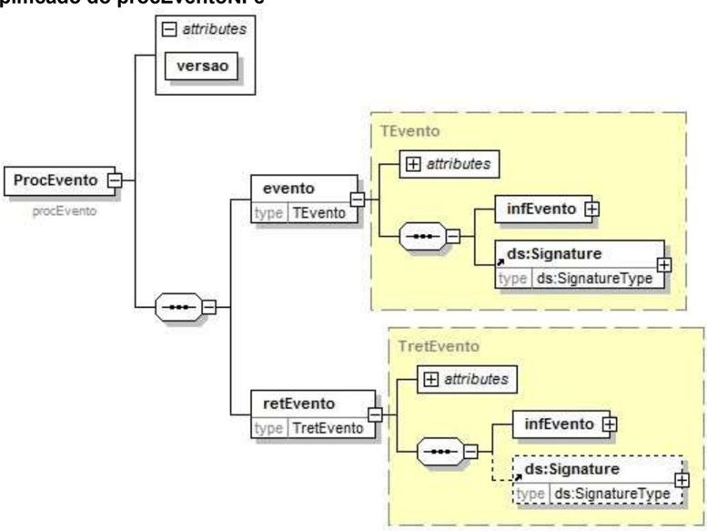

O arquivo digital do Pedido de Prorrogação com a respectiva informação de Registro do Evento da SEFAZ faz parte integrante da NF-e e deve ser disponibilizado para o destinatário.

## 7. Web Service - RecepcaoEvento - Cancelamento de Pedido de Prorrogação

Sistema de Registro de Eventos

Função : serviço destinado à recepção de mensagem de Evento da NF-e

O Cancelamento de Pedido de Prorrogação é um evento para cancelar um Pedido de Prorrogação de uma NF-e.

- O  autor  do  evento  é  o  emissor  da  NF-e.  A  mensagem  XML  do  evento  será  assinada  com  o certificado digital que tenha o CNPJ base do Emissor da NF-e.

O evento será utilizado pelo contribuinte.

O  registro  de  um  Cancelamento  de  Pedido  de  Prorrogação  é  único  para  cada  Pedido  de Prorrogação.

Processo

: síncrono.

Método: nfeRecepcaoEvento

## 7.1. Leiaute Mensagem de Entrada

## Schema XML: envCancelPProrrogNFe\_v1.0.xsd

| #   | Campo     | Ele   | Pai   | Tipo   | Ocor .   | Tam.   | Descrição/Observação                                                                                                                                                                                                                                               |
|-----|-----------|-------|-------|--------|----------|--------|--------------------------------------------------------------------------------------------------------------------------------------------------------------------------------------------------------------------------------------------------------------------|
| P01 | envEvento | Raiz  | -     | -      | -        | -      | TAG raiz                                                                                                                                                                                                                                                           |
| P02 | versao    | A     | P01   | N      | 1-1      | 2v2    | Versão do leiaute                                                                                                                                                                                                                                                  |
| P03 | idLote    | E     | P01   | N      | 1-1      | 1-15   | Identificador de controle do Lote de envio do Evento. Número sequencial autoincremental único para identificação do Lote. A responsabilidade de gerar e controlar é exclusiva do autor do evento. O Web Service não faz qualquer uso deste identificador.          |
| P04 | evento    | G     | P01   | xml    | 1-20     | -      | Evento, um lote pode conter até 20 eventos                                                                                                                                                                                                                         |
| P05 | versao    | A     | P04   | N      | 1-1      | 1-4v2  | Versão do leiaute do evento                                                                                                                                                                                                                                        |
| P06 | infEvento | G     | P04   |        | 1-1      |        | Grupo de informações do registro do Evento                                                                                                                                                                                                                         |
| P07 | Id        | ID    | P06   | C      | 1-1      | 54     | Identificador da TAG a ser assinada, a regra de formação do Id é: 'ID' + tpEvento + chave da NFe + nSeqEvento                                                                                                                                                      |
| P08 | cOrgao    | E     | P06   | N      | 1-1      | 2      | Código do órgão de recepção do Evento. Utilizar a Tabela do IBGE, utilizar 90 para identificar o Ambiente Nacional.                                                                                                                                                |
| P09 | tpAmb     | E     | P06   | N      | 1-1      | 1      | Identificação do Ambiente: 1 - Produção 2 - Homologação                                                                                                                                                                                                            |
| P10 | CNPJ      | E     | P06   | N      | 1-1      | 14     | Informar o CNPJ ou o do autor do Evento                                                                                                                                                                                                                            |
| P11 | chNFe     | E     | P06   | N      | 1-1      | 44     | Chave de Acesso da NF-e vinculada ao Evento                                                                                                                                                                                                                        |
| P12 | dhEvento  | E     | P06   | D      | 1-1      |        | Data e hora do evento no formato AAAA- MMDDThh:mm:ssTZD (UTC - Universal Coordinated Time, onde TZD pode ser 02:00 (Fernando de Noronha), -03:00 (Brasília) ou -04:00 (Manaus), no horário de verão serão -01:00, -02:00 e -03:00. Ex.: 2010-08- 19T13:00:1503:00. |

## Projeto Nota Fiscal Eletrônica

NT 2015.001 Versão 1.30 - Evento Pedido de Prorrogação

| P13   | tpEvento           | E   | P06   | N   | 1-1   | 6     | Código do evento: 111502 - Cancelamento de Pedido de Prorrogação de 1º prazo 111503 - Cancelamento de Pedido de Prorrogação de 2º prazo                                                                                  |
|-------|--------------------|-----|-------|-----|-------|-------|--------------------------------------------------------------------------------------------------------------------------------------------------------------------------------------------------------------------------|
| P14   | nSeqEvento         | E   | P06   | N   | 1-1   | 1-2   | Sequencial do evento para o mesmo tipo de evento. Para maioria dos eventos será 1, porém, nos casos em que possa existir mais de um                                                                                      |
|       |                    |     |       |     |       |       | evento, como é o caso da Carta de Correção, Pedido de Prorrogação, Cancelamento de Pedido de Prorrogação e Fisco, o autor do evento deve numerar de forma sequencial. Ex: tpEvento nSeqEvento 111502 1 111503 1 111502 2 |
| P15   | verEvento          | E   | P06   | N   | 1-1   | 1-4v2 | Versão do evento                                                                                                                                                                                                         |
| P16   | detEvento          | G   | P06   |     | 1-1   |       | Informações do Cancelamento de Pedido de Prorrogação                                                                                                                                                                     |
| P17   | versao             | A   | P16   |     | 1-1   |       | Versão do Cancelamento de Pedido de Prorrogação                                                                                                                                                                          |
| P18   | descEvento         | E   | P16   | C   | 1-1   | 5-60  | 'Cancelamento de Pedido de Prorrogação' ou 'Cancelamento de Pedido de                                                                                                                                                    |
| P19   | idPedidoCan celado | E   | P16   | C   | 1-1   | 54    | Prorrogacao' Identificador do evento a ser cancelado, a regra de formação do Id é: 'ID' + tpEvento + chave da NF-e + nSeqEvento (este campo corresponde ao campo P07 do evento 111500 ou                                 |
| P20   | nProt              | E   | P16   | N   | 1-1   | 15    | Informar o número do Protocolo de Autorização do Pedido de Prorrogaçãoa ser cancelado.                                                                                                                                   |
| P21   | Signature          | G   | P04   | XML | 1-1   |       | Assinatura Digital do documento XML, a assinatura deverá ser aplicada no elemento infEvento                                                                                                                              |

## 7.2. Leiaute Mensagem de Retorno

Retorno:

Estrutura XML com a mensagem do resultado da transmissão.

## Schema XML: retEnvCancelPProrrogNFe\_v1.0.xsd

| #   | Campo        | Ele   | Pai   | Tipo   | Ocor .   | Tam .   | Descrição/Observação                                                                                                                                                                                                                  |
|-----|--------------|-------|-------|--------|----------|---------|---------------------------------------------------------------------------------------------------------------------------------------------------------------------------------------------------------------------------------------|
| R01 | retEnvEvento | Raiz  | -     | -      | -        | -       | TAG raiz do Resultado do Envio do Evento                                                                                                                                                                                              |
| R02 | versao       | A     | R01   | N      | 1-1      | 1- 4v2  | Versão do leiaute                                                                                                                                                                                                                     |
| R03 | idLote       | E     | R01   | N      | 1-1      | 1-15    | Identificador de controle do                                                                                                                                                                                                          |
| R04 | tpAmb        | E     | R01   | N      | 1-1      | 1       | Lote de envio do Evento. Número sequencial autoincremental único para identificação do Lote. Identificação do Ambiente: 1 - Produção / 2 - Homologação                                                                                |
| R05 | verAplic     | E     | R01   | C      | 1-1      | 1-20    | Versão da aplicação que processou o evento.                                                                                                                                                                                           |
| R06 | cOrgao       | E     | R01   | N      | 1-1      | 2       | Código da UF que registrou o Evento. Utilizar 90 para o Ambiente Nacional.                                                                                                                                                            |
| R07 | cStat        | E     | R01   | N      | 1-1      | 3       | Código do status da resposta                                                                                                                                                                                                          |
| R08 | xMotivo      | E     | R01   | C      | 1-1      | 255     | Descrição do status da resposta                                                                                                                                                                                                       |
| R09 | retEvento    | G     | R01   | -      | 0-20     | -       | TAG de grupo do resultado do processamento do Evento                                                                                                                                                                                  |
| R10 | versao       | A     | R09   | N      | 1-1      | 1-      | Versão do leiaute                                                                                                                                                                                                                     |
| R11 | infEvento    | G     | R09   |        | 1-1      |         | Grupo de informações do registro do Evento                                                                                                                                                                                            |
| R12 | Id           | ID    | R11   | C      | 0-1      | 17      | Identificador da TAG a ser assinada, somente deve ser informado se o órgão de registro assinar a resposta. Em caso de assinatura da resposta pelo órgão de registro, preencher com o número do protocolo, precedido pela literal 'ID' |
| R13 | tpAmb        | E     | R11   | N      | 1-1      | 1       | Identificação do Ambiente: 1 - Produção / 2 - Homologação                                                                                                                                                                             |
| R14 | verAplic     | E     | R11   | C      | 1-1      | 1-20    | Versão da aplicação que registrou o Evento, utilizar literal que permita a identificação do órgão, como a sigla da UF ou do órgão.                                                                                                    |

| R15   | cOrgao      | E   | R11   | N   | 1-1   | 2    | Código da UF que registrou o Evento. Utilizar 90 para o Ambiente Nacional.                                                                                                                 |
|-------|-------------|-----|-------|-----|-------|------|--------------------------------------------------------------------------------------------------------------------------------------------------------------------------------------------|
| R16   | cStat       | E   | R11   | N   | 1-1   | 3    | Código do status da resposta.                                                                                                                                                              |
| R17   | xMotivo     | E   | R11   | C   | 1-1   | 255  | Descrição do status da resposta.                                                                                                                                                           |
| R18   | chNFe       | E   | R11   | N   | 0-1   | 44   | Chave de Acesso da NF-e vinculada ao evento.                                                                                                                                               |
| R19   | tpEvento    | E   | R11   | N   | 0-1   | 6    | Código do Tipo do Evento: 111502 - Cancelamento de Pedido de Prorrogação de 1º prazo 111503 - Cancelamento de Pedido de Prorrogação de 2º prazo                                            |
| R20   | xEvento     | E   | R11   | C   | 0-1   | 5-60 | Descrição do Evento - 'Cancelamento de Pedido de Prorrogação registrado'                                                                                                                   |
| R21   | nSeqEvento  | E   | R11   | N   | 0-1   | 1-2  | Sequencial do evento para o mesmo tipo de evento.                                                                                                                                          |
| R22   | CNPJDest    | E   | R11   | N   | 0-1   | 14   | Informar o CNPJ do destinatário da NF-e.                                                                                                                                                   |
| R23   | emailDest   | E   | R11   | C   | 0-1   | 1-60 | email do destinatário informado na NF-e.                                                                                                                                                   |
| R24   | dhRegEvento | E   | R11   | D   | 1-1   |      | Data e hora de registro do evento no formato AAAA- MMDDTHH:MM:SSTZD (formato UTC, onde TZD é +HH:MM ou -HH:MM), se o evento for rejeitado informar a data e hora de recebimento do evento. |
| R25   | nProt       | E   | R11   | N   | 0-1   | 15   | Número do Protocolo do Evento 1 posição (1- Secretaria da Fazenda Estadual, 2-RFB), 2 posições para o código da UF, 2 posições para o ano e 10 posições para o sequencial no ano.          |
| R26   | Signature   | G   | R09   | XML | 0-1   |      | Assinatura Digital do documento XML, a assinatura                                                                                                                                          |
|       |             |     |       |     |       |      | deverá ser aplicada no elemento infEvento.A decisão de assinar a mensagem fica a critério da UF.                                                                                           |

NT 2015.001 Versão 1.30 - Evento Pedido de Prorrogação

## 7.3. Descrição do Processo de Recepção de Evento

O WS de Eventos é acionado pelo interessado emissor da NF-e que deve enviar mensagem de registro de evento de Cancelamento de Pedido de Prorrogação.

O processo de Registro de Eventos recebe eventos em uma estrutura de lotes, que pode conter de 1 a 20 eventos.

## 7.4. Validação do Certificado de Transmissão

Regras de validação idênticas aos demais Web Services, podendo gerar os erros:

- 280: "Rejeição: Certificado Transmissor inválido"
- 281: "Rejeição: Certificado Transmissor Data Validade"
- 283: "Rejeição: Certificado Transmissor - erro Cadeia de Certificação"
- 286: "Rejeição: Certificado Transmissor erro no acesso a LCR"
- 284: "Rejeição: Certificado Transmissor revogado"
- 285: "Rejeição: Certificado Transmissor difere ICP-Brasil"
- 282: "Rejeição: Certificado Transmissor sem CNPJ"

## 7.5. Validação Inicial da Mensagem no Web Service

Regras de validação idênticas aos demais Web Services, podendo gerar os erros:

- 214: "Rejeição: Tamanho da mensagem excedeu o limite estabelecido"
- 108: "Serviço Paralisado Momentaneamente (curto prazo)"
- 109: "Serviço Paralisado sem Previsão"

## 7.6. Validação das informações de controle da chamada ao Web Service

Regras de validação idênticas aos demais Web Services, podendo gerar os erros:

- 242: "Rejeição: Cabeçalho - Falha no Schema XML'
- 409: "Rejeição: Campo cUF inexistente no elemento nfeCabecMsg do SOAP Header"
- 410: "Rejeição: UF informada no campo cUF não é atendida pelo WebService"
- 411: 'Rejeição: Campo versaoDados inexistente no elemento nfeCabecMsg do SOAP Header'
- 238: 'Rejeição: Cabeçalho - Versão do arquivo XML superior a Versão vigente'
- 239: 'Rejeição: Cabeçalho - Versão do arquivo XML não suportada'

## 7.7.    Validação da área de Dados

## a) Validação de forma da área de dados

Regras de validação idênticas aos demais Web Services, podendo gerar os erros:

- 516: "Rejeição: Falha Schema XML, inexiste a tag raiz esperada para a mensagem"
- 517: "Rejeição: Falha Schema XML, inexiste atributo versão na tag raiz da mensagem"
- 545: "Rejeição: Falha no schema XML - versão informada na versaoDados do SOAP Header diverge da versão da mensagem'
- 215: "Rejeição: Falha Schema XML"
- 587: "Rejeição: Usar somente o namespace padrão da NF-e"
- 588: "Rejeição: Não é permitida a presença de caracteres de edição no início/fim da mensagem ou entre as tags da mensagem"
- 404: "Rejeição: Uso de prefixo de namespace não permitido"
- 402: "Rejeição: XML da área de dados com codificação diferente de UTF-8"

## Projeto Nota Fiscal Eletrônica

NT 2015.001 Versão 1.30 - Evento Pedido de Prorrogação

## b) Extração dos eventos do lote e validação do Schema XML do evento

Regras de validação idênticas aos demais Eventos, podendo gerar os erros:

- 491: "Rejeição: O tpEvento informado invalido"
- 492: 'Rejeição: O verEvento informado invalido'
- 493: 'Rejeição: Evento não atende o Schema XML específico'

## c) Validação do Certificado Digital de Assinatura

Regras de validação idênticas aos demais Web Services, podendo gerar os erros:

- 290: "Rejeição: Certificado Assinatura inválido"
- 291: 'Rejeição: Certificado Assinatura Data Validade'
- 292: 'Rejeição: Certificado Assinatura sem CNPJ'
- 293: 'Rejeição: Certificado Assinatura - erro Cadeia de Certificação'
- 296: 'Rejeição: Certificado Assinatura erro no acesso a LCR'
- 294: 'Rejeição: Certificado Assinatura revogado'
- 295: 'Rejeição: Certificado Assinatura difere ICP-Brasil'

## d) Validação da Assinatura Digital

Regras de validação idênticas aos demais Web Services, podendo gerar os erros:

- 298: 'Rejeição: Assinatura difere do padrão do Sistema'
- 297: 'Rejeição: Assinatura difere do calculado'
- 213: 'Rejeição: Assinatura difere do padrão do Sistema'

## e) Validação das regras de negócio do evento Cancelamento de Pedido de Prorrogação

| Validação do Registro de Eventos - Regras de Negócios - parte Geral   | Validação do Registro de Eventos - Regras de Negócios - parte Geral                                             | Validação do Registro de Eventos - Regras de Negócios - parte Geral   | Validação do Registro de Eventos - Regras de Negócios - parte Geral   | Validação do Registro de Eventos - Regras de Negócios - parte Geral   |
|-----------------------------------------------------------------------|-----------------------------------------------------------------------------------------------------------------|-----------------------------------------------------------------------|-----------------------------------------------------------------------|-----------------------------------------------------------------------|
| #                                                                     | Regra de Validação                                                                                              | Aplic.                                                                | Msg                                                                   | Efeito                                                                |
| P09                                                                   | Tipo do ambiente difere do ambiente do Web Service (*1)                                                         | Obrig.                                                                | 252                                                                   | Rej.                                                                  |
| P08                                                                   | Código do órgão de recepção do Evento da UF diverge da UF Autorizadora (*1)                                     | Obrig.                                                                | 250                                                                   | Rej.                                                                  |
| P10                                                                   | CNPJ do autor inválido (zeros, nulo oiu DV inválido) (*1)                                                       | Obrig.                                                                | 489                                                                   | Rej.                                                                  |
| P11                                                                   | Validação da Chave de Acesso: - Dígito verificador inválido (*1)                                                | Obrig.                                                                | 236                                                                   | Rej.                                                                  |
| P11                                                                   | Chave de Acesso inválida (Código UF inválido) (*1)                                                              | Obrig.                                                                | 614                                                                   | Rej.                                                                  |
| P11                                                                   | Chave de Acesso inválida (Ano < 06 ou Ano maior que Ano corrente) (*1)                                          | Obrig.                                                                | 615                                                                   | Rej.                                                                  |
| P11                                                                   | Chave de Acesso inválida (Mês = 0 ou Mês > 12) (*1)                                                             | Obrig.                                                                | 616                                                                   | Rej.                                                                  |
| P1011                                                                 | Chave de Acesso inválida (CNPJ zerado ou dígito inválido) (*1)                                                  | Obrig.                                                                | 617                                                                   | Rej.                                                                  |
| P11                                                                   | Chave de Acesso inválida (modelo diferente de 55) (*1)                                                          | Obrig.                                                                | 618                                                                   | Rej.                                                                  |
| P11                                                                   | Chave de Acesso inválida (número NF = 0) (*1)                                                                   | Obrig.                                                                | 619                                                                   | Rej.                                                                  |
| P11                                                                   | UF da Chave de Acesso diverge da UF Autorizadora (*1)                                                           | Obrig.                                                                | 249                                                                   | Rej.                                                                  |
| P0714                                                                 | Validar se atributo Id corresponde à concatenação dos campos evento ('ID' + tpEvento + chNFe + nSeqEvento) (*1) | Obrig.                                                                | 572                                                                   | Rej.                                                                  |

## Projeto Nota Fiscal Eletrônica

NT 2015.001 Versão 1.30 - Evento Pedido de Prorrogação

| P10- 11   | Acesso BD NFE (Chave: CNPJ Emitente, Modelo, Série e Nro): - Chave Acesso inexistente para o tpEvento que exige a existência da NF-e (*1) Obs.: Caso exista uma NF-e no banco de dados com Chave de Acesso divergente, opcionalmente, deve-se concatenar a Chave de Acesso existente na descrição do erro, caso o CNPJ do Autor do evento seja o mesmo CNPJ da Chave de Acesso. (*1)   | Obrig.   |   494 | Rej.   |
|-----------|----------------------------------------------------------------------------------------------------------------------------------------------------------------------------------------------------------------------------------------------------------------------------------------------------------------------------------------------------------------------------------------|----------|-------|--------|
| P11- 14   | Acesso BD de Eventos: - Verificar duplicidade do evento (tpEvento + chNFe + nSeqEvento) (*1)                                                                                                                                                                                                                                                                                           | Obrig.   |   573 | Rej.   |
| P1011     | Se evento do emissor verificar se CNPJ do Autor diferente do CNPJ da Chave de Acesso da NF-e (*1)                                                                                                                                                                                                                                                                                      | Obrig.   |   574 | Rej.   |
| P12       | Data do evento não pode ser menor que a data de autorização para o evento de Candelamento de Pedido de Prorrogação                                                                                                                                                                                                                                                                     | Obrig.   |   641 | Rej.   |
| P11       | Verificar se a NF-e está autorizada (não pode estar cancelada nem denegada)                                                                                                                                                                                                                                                                                                            | Obrig.   |   580 | Rej.   |
| P12       | Data do evento não pode ser menor que a data de emissão da NF-e, se existir                                                                                                                                                                                                                                                                                                            | Obrig.   |   577 | Rej.   |
| P12       | Data do evento não pode ser maior que a data de processamento (aceitar uma tolerância de até 5 minutos)                                                                                                                                                                                                                                                                                | Obrig.   |   578 | Rej.   |
| P12       | Data do evento não pode ser menor que a data de autorização para NF-e não emitida em contingência se a NF-e existir.                                                                                                                                                                                                                                                                   | Obrig.   |   579 | Rej.   |
| P19       | Verificar se o Pedido de Prorrogação (P19 - idPedidoCancelado) é válido                                                                                                                                                                                                                                                                                                                | Obrig.   |   640 | Rej.   |
| P1319     | Verificar se o tpEvento (P13) do Cancelamento corresponde ao tpEvento (P13) do Pedido de Prorrogação a ser cancelado.                                                                                                                                                                                                                                                                  | Obrig.   |   636 | Rej.   |
| P1314     | Verificar o sequencial do evento (P14 - nSeqEvento) é um valor válido (último + 1) conforme tipo de evento (P13/P14)                                                                                                                                                                                                                                                                   | Obrig.   |   594 | Rej.   |
| P1920     | Verificar se o protocolo do evento a ser cancelado corresponde ao nProt (P20)                                                                                                                                                                                                                                                                                                          | Obrig.   |   222 | Rej.   |
| P10       | Acesso Cadastro Contribuinte: - Verificar Emitente não autorizado a emitir NF-e                                                                                                                                                                                                                                                                                                        | Obrig.   |   203 | Rej.   |
| P10       | Verificar Situação Fiscal irregular do Emitente                                                                                                                                                                                                                                                                                                                                        | Obrig.   |   240 | Rej.   |

## Nota:

(*1) Validações genéricas do Registro de Evento.

## 7.8. Final do Processamento do Lote

O processamento do lote pode resultar em:

 Rejeição  do  Lote -  por  algum  problema  que  comprometa  o  processamento  do  lote;  Processamento do Lote - o lote foi processado (cStat=128), a validação de cada evento do lote poderá resultar em:

- o Rejeição - o Evento será descartado, com retorno do código do status do motivo da rejeição;
- o Recebido pelo Sistema de Registro de Eventos, com vinculação do evento na NF-e , o Evento será armazenado no repositório do Sistema de Registro de Eventos com a vinculação do Evento à respectiva NF-e (cStat=135).

A UF que recepcionar o Evento deve enviá-lo para o Sistema de compartilhamento do AN - Ambiente Nacional para que o Evento seja distribuído para todos os interessados.

## 7.9. Armazenamento e Disponibilização do Cancelamento de Pedido de Prorrogação

O  emissor  deve  manter  o  arquivo  digital  do  Cancelamento  do  Pedido  de  Prorrogação  com  a informação de Registro do Evento da SEFAZ na forma que segue:

Schema XML: procEventoNFe\_v99.99.xsd

| #    | Campo          | Ele   | Pai   | Tip o   | Oco r.   | Tam .   | Dec .   | Descrição/Observação                            |
|------|----------------|-------|-------|---------|----------|---------|---------|-------------------------------------------------|
| ZR01 | procEvento NFe | Raiz  | -     | -       | -        | -       | -       | TAG raiz                                        |
| ZR02 | versao         | A     | ZR01  | N       | 1-1      | 1-4     | 2       |                                                 |
| ZR03 | evento         | G     | ZR01  | -       | 1-1      | -       | -       |                                                 |
| YR04 | (dados)        | -     | -     | -       | -        | -       | -       | Dados do Evento (mensagem de entrada)           |
| YR05 | retEvento      | G     | ZR01  | -       | 1-1      | -       | -       |                                                 |
| YR06 | (dados)        | -     | -     | -       | -        | -       | -       | Dados do registro do Evento (mensagem de saída) |

## Diagrama simplificado do procEventoNFe

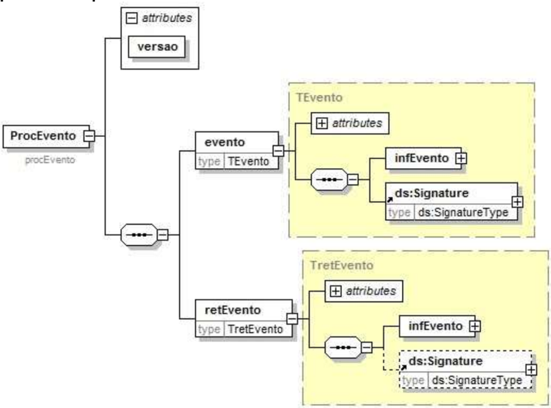

O arquivo digital do Cancelamento de Pedido de Prorrogação com a respectiva informação de Registro do Evento da SEFAZ faz parte integrante da NF-e e deve ser disponibilizado para o destinatário.

## 8.  Web Service - RecepcaoEvento - Fisco - Prorrogação ICMS

## Sistema de Registro de Eventos

Função : serviço destinado à recepção de mensagem de Evento da NF-e

O Fisco é um evento para deferir/indeferir um Pedido de Prorrogação ou Cancelamento de Pedido de prorrogação de uma NF-e.

O autor do evento é a UF que processou os eventos de Pedido de Prorrogação ou Cancelamento de Pedido de Prorrogação. A mensagem XML do evento será assinada com o certificado digital da Secretaria da Fazenda que processou o Pedido de Prorrogação ou Cancelamento de Pedido de Prorrogação.

O registro de um evento Fisco substitui o evento Fisco anterior.

Processo

: síncrono.

Método: nfeRecepcaoEvento

## 8.1. Leiaute Mensagem de Entrada

## Schema XML: envFiscoNfe\_v1.0.xsd

| #   | Campo     | Ele   | Pai   | Tipo   | Ocor .   | Tam.   | Descrição/Observação                                                                                                                                                                                                                                      |
|-----|-----------|-------|-------|--------|----------|--------|-----------------------------------------------------------------------------------------------------------------------------------------------------------------------------------------------------------------------------------------------------------|
| P01 | envEvento | Raiz  | -     | -      | -        | -      | TAG raiz                                                                                                                                                                                                                                                  |
| P02 | versao    | A     | P01   | N      | 1-1      | 2v2    | Versão do leiaute                                                                                                                                                                                                                                         |
| P03 | idLote    | E     | P01   | N      | 1-1      | 1-15   | Identificador de controle do Lote de envio do Evento. Número sequencial autoincremental único para identificação do Lote. A responsabilidade de gerar e controlar é exclusiva do autor do evento. O Web Service não faz qualquer uso deste identificador. |
| P04 | evento    | G     | P01   | xml    | 1-20     | -      | Evento, um lote pode conter até 20 eventos                                                                                                                                                                                                                |
| P05 | versao    | A     | P04   | N      | 1-1      | 1- 4v2 | Versão do leiaute do evento                                                                                                                                                                                                                               |
| P06 | infEvento | G     | P04   |        | 1-1      |        | Grupo de informações do registro do Evento                                                                                                                                                                                                                |
| P07 | Id        | ID    | P06   | C      | 1-1      | 54     | Identificador da TAG a ser assinada, a regra de formação do Id é: 'ID' + tpEvento + chave da NF-e + nSeqEvento                                                                                                                                            |
| P08 | cOrgao    | E     | P06   | N      | 1-1      | 2      | Código do órgão de geração do Evento. Utilizar a Tabela do IBGE, utilizar 90 para                                                                                                                                                                         |

|     |            |    |     |    |     |      | identificar o Ambiente Nacional.                                                                                                                                                                                                                                    |
|-----|------------|----|-----|----|-----|------|---------------------------------------------------------------------------------------------------------------------------------------------------------------------------------------------------------------------------------------------------------------------|
| P09 | tpAmb      | E  | P06 | N  | 1-1 | 1    | Identificação do Ambiente: 1 - Produção 2 - Homologação                                                                                                                                                                                                             |
| P10 | CNPJ       | E  | P06 | N  | 1-1 | 14   | Informar o CNPJ do autor do Evento                                                                                                                                                                                                                                  |
| P11 | chNFe      | E  | P06 | N  | 1-1 | 44   | Chave de Acesso da NF-e vinculada ao Evento                                                                                                                                                                                                                         |
| P12 | dhEvento   | E  | P06 | D  | 1-1 |      | Data e hora do evento no formato AAAA- MMDDThh:mm:ssTZD (UTC - Universal Coordinated Time, onde TZD pode ser - 02:00 (Fernando de Noronha), -03:00 (Brasília) ou -04:00 (Manaus), no horário de verão serão 01:00, -02:00 e -03:00. Ex.: 2010-08-19T13:00:15-03:00. |
| P13 | tpEvento   | E  | P06 | N  | 1-1 | 6    | Código do evento: 411500 - resposta ao pedido de prorrogação 1º prazo 411501 - resposta ao pedido de prorrogação 2º prazo 411502 - resposta ao cancelamento de prorrogação de 1º prazo 411503 - resposta ao cancelamento de prorrogação de 2º prazo                 |
| P14 | nSeqEvento | E  | P06 | N  | 1-1 | 1-2  | Sequencial do evento para o mesmo tipo de evento. Para maioria dos eventos será 1, nos casos em que possa existir mais de um evento, como é o caso da Carta de Correção, Pedido de Prorrogação e Fisco, o autor do evento deve numerar de forma sequencial.         |
| P15 | verEvento  | E  | P06 | N  | 1-1 | 1-   | Versão do evento                                                                                                                                                                                                                                                    |
| P16 | detEvento  | G  | P06 |    | 1-1 |      | Informações do Fisco                                                                                                                                                                                                                                                |
| P17 | versao     | A  | P16 |    | 1-1 |      | Versão do Fisco                                                                                                                                                                                                                                                     |
| P18 | descEvento | E  | P16 | C  | 1-1 | 5-60 | 'Fisco - Prorrogação ICMS remessa para industrialização'                                                                                                                                                                                                            |

## Projeto Nota Fiscal Eletrônica

NT 2015.001 Versão 1.30 - Evento Pedido de Prorrogação

| P19   | idPedido   | E   | P16   | C   | 1-1    | 54   | Identificador do Pedido de Prorrogação ou Cancelamento de Pedido de Prorrogação que deu origem ao evento do Fisco, a regra de formação do Id é: 'ID' + tpEvento + chave da NF-e + nSeqEvento (este campo corresponde ao campo P07 do evento 111500, 111501, 111502 ou 111503)                                                                                                                                                                                                     |
|-------|------------|-----|-------|-----|--------|------|-----------------------------------------------------------------------------------------------------------------------------------------------------------------------------------------------------------------------------------------------------------------------------------------------------------------------------------------------------------------------------------------------------------------------------------------------------------------------------------|
| P20   | respPedido | CG  | P16   |     | 1-1    |      | Resposta a um tpEvento 111500 ou 111501                                                                                                                                                                                                                                                                                                                                                                                                                                           |
| P21   | statPrazo  | E   | P20   | N   | 1-1    | 1    | Identificador do cumprimento do prazo para solicitação do pedido de prorrogação 0 - Após o prazo 1 - Dentro do prazo                                                                                                                                                                                                                                                                                                                                                              |
| P22   | itemPedido | G   | P20   |     | 1- 990 |      | Item do Pedido de Prorrogação                                                                                                                                                                                                                                                                                                                                                                                                                                                     |
| P23   | numItem    | A   | P22   | N   | 1-1    | 1-3  | Número do item do Pedido de Prorrogação. O número do item deverá ser o mesmo número do item do Pedido de Prorrogação.                                                                                                                                                                                                                                                                                                                                                             |
| P24   | statPedido | E   | P22   | N   | 1-1    | 1    | Resposta do Fisco ao item do Pedido de Prorrogação: 1 - Deferido 2 - Indeferido                                                                                                                                                                                                                                                                                                                                                                                                   |
| P25   | justStatus | E   | P22   | N   | 1-1    | 1-2  | Justificativa da resposta do Fisco ao item do Pedido de                                                                                                                                                                                                                                                                                                                                                                                                                           |
|       |            |     |       |     |        |      | Prorrogação: 1 - Autorizado pelo Fisco 2 - Manifestação do Destinatário - desconhece a operação 3 - Manifestação do Destinatário - operação não realizada 4 - O item não consta na NF- e 5 - O item não consta no pedido de prorrogação do 1º prazo 6 - CFOP não autorizado 7 - Quantidade inconsistente com a quantidade do item (não se aplica à solicitação completa) 8 - Solicitação de pedido fora do prazo 9 - Pedido de prorrogação cancelado pelo contribuinte 10 - Outra |

| P26   | justStaOutra    | E   | P22   | C   | 0-1   |   1000 | Justificativa diferente das opções disponíveis no campo P25                                                                                                                                                                                                                                                                                                                                    |
|-------|-----------------|-----|-------|-----|-------|--------|------------------------------------------------------------------------------------------------------------------------------------------------------------------------------------------------------------------------------------------------------------------------------------------------------------------------------------------------------------------------------------------------|
| P27   | respCancPe dido | CG  | P16   |     | 1-1   |        | Resposta a um tpEvento 111502 ou 111503.                                                                                                                                                                                                                                                                                                                                                       |
| P28   | statCancPed ido | E   | P27   | N   | 1-1   |      1 | Resposta do Fisco ao Cancelamento do Pedido de Prorrogação: 1 - Deferido 2 - Indeferido                                                                                                                                                                                                                                                                                                        |
| P29   | justStatus      | E   | P27   | N   | 1-1   |      2 | Justificativa da resposta do Fisco ao Cancelamento de Pedido de Prorrogação: 1 - Autorizado pelo Fisco 2 - O Pedido de Prorrogação já foi cancelado por outro evento 3 - Solicitação de pedido fora do prazo 4 - Tentativa de cancelamento de prorrogação de até 360 dias de um item que foi prorrogado por mais de 360 dias. Cancele a prorrogação por mais de 360 dias previamente 5 - Outra |
| P30   | justStaOutra    | E   | P27   | C   | 0-1   |   1000 | Justificativa diferente das opções disponíveis no campo P29                                                                                                                                                                                                                                                                                                                                    |
| P31   | Signature       | G   | P04   | XML | 1-1   |        | Assinatura Digital do documento XML, a assinatura deverá ser aplicada no elemento infEvento                                                                                                                                                                                                                                                                                                    |

## 8.2. Leiaute Mensagem de Retorno

Retorno: Estrutura XML com a mensagem do resultado da transmissão.

## Schema XML: retEnvFiscoNFe\_v1.0.xsd

| #   | Campo         | Ele   | Pai   | Tipo   | Ocor   | Tam.   | Descrição/Observação                                  |
|-----|---------------|-------|-------|--------|--------|--------|-------------------------------------------------------|
| R01 | retEnvEven to | Rai z | -     | -      | -      | -      | TAG raiz do Resultado do Envio do Evento              |
| R02 | versao        | A     | R01   | N      | 1-1    | 1-4v2  | Versão do leiaute                                     |
| R03 | idLote        | E     | R01   | N      | 1-1    | 1-15   | Identificador de controle do Lote de envio do Evento. |
| R04 | tpAmb         | E     | R01   | N      | 1-1    | 1      |                                                       |

| Número sequencial autoincremental único para identificação do Lote. Identificação do Ambiente: 1 - Produção / 2 - Homologação   |
|---------------------------------------------------------------------------------------------------------------------------------|

| R05   | verAplic   | E   | R01   | C   | 1-1   | 1-20   | Versão da aplicação que processou o evento.                                                                                                                                                                                                     |
|-------|------------|-----|-------|-----|-------|--------|-------------------------------------------------------------------------------------------------------------------------------------------------------------------------------------------------------------------------------------------------|
| R06   | cOrgao     | E   | R01   | N   | 1-1   | 2      | Código da UF que registrou o Evento. Utilizar 90 para o Ambiente Nacional.                                                                                                                                                                      |
| R07   | cStat      | E   | R01   | N   | 1-1   | 3      | Código do status da resposta                                                                                                                                                                                                                    |
| R08   | xMotivo    | E   | R01   | C   | 1-1   | 255    | Descrição do status da resposta                                                                                                                                                                                                                 |
| R09   | retEvento  | G   | R01   | -   | 0-20  | -      | TAG de grupo do resultado do processamento do Evento                                                                                                                                                                                            |
| R10   | versao     | A   | R09   | N   | 1-1   | 1-4v2  | Versão do leiaute                                                                                                                                                                                                                               |
| R11   | infEvento  | G   | R09   |     | 1-1   |        | Grupo de informações do registro do Evento                                                                                                                                                                                                      |
| R12   | Id         | ID  | R11   | C   | 0-1   | 17     | Identificador da TAG a ser assinada, somente deve ser informado se o órgão de registro assinar a resposta. Em caso de assinatura da resposta pelo órgão de registro, preencher com o número do protocolo, precedido pela literal 'ID'           |
| R13   | tpAmb      | E   | R11   | N   | 1-1   | 1      | Identificação do Ambiente: 1 - Produção / 2 - Homologação                                                                                                                                                                                       |
| R14   | verAplic   | E   | R11   | C   | 1-1   | 1-20   | Versão da aplicação que registrou o Evento, utilizar literal que permita a identificação do órgão, como a sigla da UF ou do órgão.                                                                                                              |
| R15   | cOrgao     | E   | R11   | N   | 1-1   | 2      | Código da UF que registrou o Evento. Utilizar 90 para o Ambiente Nacional.                                                                                                                                                                      |
| R16   | cStat      | E   | R11   | N   | 1-1   | 3      | Código do status da resposta.                                                                                                                                                                                                                   |
| R17   | xMotivo    | E   | R11   | C   | 1-1   | 255    | Descrição do status da resposta.                                                                                                                                                                                                                |
| R18   | chNFe      | E   | R11   | N   | 0-1   | 44     | Chave de Acesso da NF-e vinculada ao evento.                                                                                                                                                                                                    |
| R19   | tpEvento   | E   | R11   | N   | 0-1   | 6      | Código do Tipo do Evento: 411500 - resposta ao pedido de prorrogação 1º prazo 411501 - resposta ao pedido de prorrogação 2º prazo 411502 - resposta ao cancelamento de prorrogação de 1º prazo 411503 - resposta ao cancelamento de prorrogação |
| R20   | xEvento    | E   | R11   | C   | 0-1   | 5-60   | Descrição do Evento - 'Evento do fisco registrado'                                                                                                                                                                                              |

NT 2015.001 Versão 1.30 - Evento Pedido de Prorrogação

## 8.5. Validação Inicial da Mensagem no Web Service

Regras de validação idênticas aos demais Web Services, podendo gerar os erros:

- 214: "Rejeição: Tamanho da mensagem excedeu o limite estabelecido"
- 108: "Serviço Paralisado Momentaneamente (curto prazo)"
- 109: "Serviço Paralisado sem Previsão"

## 8.6. Validação das informações de controle da chamada ao Web Service

Regras de validação idênticas aos demais Web Services, podendo gerar os erros:

- 242: "Rejeição: Cabeçalho - Falha no Schema XML'
- 409: "Rejeição: Campo cUF inexistente no elemento nfeCabecMsg do SOAP Header"  410: "Rejeição: UF informada no campo cUF não é atendida pelo WebService"
- 411: 'Rejeição: Campo versaoDados inexistente no elemento nfeCabecMsg do SOAP Header'
- 238: 'Rejeição: Cabeçalho - Versão do arquivo XML superior a Versão vigente'
- 239: 'Rejeição: Cabeçalho - Versão do arquivo XML não suportada'

## 8.7. Validação da área de Dados

## a) Validação de forma da área de dados

Regras de validação idênticas aos demais Web Services, podendo gerar os erros:

- 516: "Rejeição: Falha Schema XML, inexiste a tag raiz esperada para a mensagem"
- 517: "Rejeição: Falha Schema XML, inexiste atributo versão na tag raiz da mensagem"
- 545: "Rejeição: Falha no schema XML - versão informada na versaoDados do SOAP Header diverge da versão da mensagem'
- 215: "Rejeição: Falha Schema XML"
- 587: "Rejeição: Usar somente o namespace padrão da NF-e"
- 588: "Rejeição: Não é permitida a presença de caracteres de edição no início/fim da mensagem ou entre as tags da mensagem"
- 404: "Rejeição: Uso de prefixo de namespace não permitido"
- 402: "Rejeição: XML da área de dados com codificação diferente de UTF-8"

## b) Extração dos eventos do lote e validação do Schema XML do evento

Regras de validação idênticas aos demais Eventos, podendo gerar os erros:

- 491: "Rejeição: O tpEvento informado invalido"
- 492: 'Rejeição: O verEvento informado invalido'
- 493: 'Rejeição: Evento não atende o Schema XML específico'

## c) Validação do Certificado Digital de Assinatura

Regras de validação idênticas aos demais Web Services, podendo gerar os erros:

- 290: "Rejeição: Certificado Assinatura inválido"
- 291: 'Rejeição: Certificado Assinatura Data Validade'
- 292: 'Rejeição: Certificado Assinatura sem CNPJ'
- 293: 'Rejeição: Certificado Assinatura - erro Cadeia de Certificação'
- 296: 'Rejeição: Certificado Assinatura erro no acesso a LCR'
- 294: 'Rejeição: Certificado Assinatura revogado'
- 295: 'Rejeição: Certificado Assinatura difere ICP-Brasil'

## Projeto Nota Fiscal Eletrônica

NT 2015.001 Versão 1.30 - Evento Pedido de Prorrogação

## d) Validação da Assinatura Digital

Regras de validação idênticas aos demais Web Services, podendo gerar os erros:

- 298: 'Rejeição: Assinatura difere do padrão do Sistema'
- 297: 'Rejeição: Assinatura difere do calculado'
- 213: 'Rejeição: Assinatura difere do padrão do Sistema'

## e) Validação das regras de negócio do evento Fisco - Prorrogação ICMS

| Validação do Registro de Eventos - Regras de Negócios - parte Geral   | Validação do Registro de Eventos - Regras de Negócios - parte Geral                                                                                                                                                                                                                                                                                                                  | Validação do Registro de Eventos - Regras de Negócios - parte Geral   | Validação do Registro de Eventos - Regras de Negócios - parte Geral   | Validação do Registro de Eventos - Regras de Negócios - parte Geral   |
|-----------------------------------------------------------------------|--------------------------------------------------------------------------------------------------------------------------------------------------------------------------------------------------------------------------------------------------------------------------------------------------------------------------------------------------------------------------------------|-----------------------------------------------------------------------|-----------------------------------------------------------------------|-----------------------------------------------------------------------|
| #                                                                     | Regra de Validação                                                                                                                                                                                                                                                                                                                                                                   | Aplic.                                                                | Msg                                                                   | Efeito                                                                |
| P09                                                                   | Tipo do ambiente difere do ambiente do Web Service (*1)                                                                                                                                                                                                                                                                                                                              | Obrig.                                                                | 252                                                                   | Rej.                                                                  |
| P08                                                                   | Código do órgão de recepção do Evento da UF diverge da UF Autorizadora (*1)                                                                                                                                                                                                                                                                                                          | Obrig.                                                                | 250                                                                   | Rej.                                                                  |
| P10                                                                   | CNPJ do autor inválido (zeros, nulo oiu DV inválido) (*1)                                                                                                                                                                                                                                                                                                                            | Obrig.                                                                | 489                                                                   | Rej.                                                                  |
| P11                                                                   | Validação da Chave de Acesso: - Dígito verificador inválido (*1)                                                                                                                                                                                                                                                                                                                     | Obrig.                                                                | 236                                                                   | Rej.                                                                  |
| P11                                                                   | Chave de Acesso inválida (Código UF inválido) (*1)                                                                                                                                                                                                                                                                                                                                   | Obrig.                                                                | 614                                                                   | Rej.                                                                  |
| P11                                                                   | Chave de Acesso inválida (Ano < 06 ou Ano maior que Ano corrente) (*1)                                                                                                                                                                                                                                                                                                               | Obrig.                                                                | 615                                                                   | Rej.                                                                  |
| P11                                                                   | Chave de Acesso inválida (Mês = 0 ou Mês > 12) (*1)                                                                                                                                                                                                                                                                                                                                  | Obrig.                                                                | 616                                                                   | Rej.                                                                  |
| P1011                                                                 | Chave de Acesso inválida (CNPJ zerado ou dígito inválido) (*1)                                                                                                                                                                                                                                                                                                                       | Obrig.                                                                | 617                                                                   | Rej.                                                                  |
| P11                                                                   | Chave de Acesso inválida (modelo diferente de 55) (*1)                                                                                                                                                                                                                                                                                                                               | Obrig.                                                                | 618                                                                   | Rej.                                                                  |
| P11                                                                   | Chave de Acesso inválida (número NF = 0) (*1)                                                                                                                                                                                                                                                                                                                                        | Obrig.                                                                | 619                                                                   | Rej.                                                                  |
| P11                                                                   | UF da Chave de Acesso diverge da UF Autorizadora (*1)                                                                                                                                                                                                                                                                                                                                | Obrig.                                                                | 249                                                                   | Rej.                                                                  |
| P0714                                                                 | Validar se atributo Id corresponde à concatenação dos campos evento ('ID' + tpEvento + chNFe + nSeqEvento) (*1)                                                                                                                                                                                                                                                                      | Obrig.                                                                | 572                                                                   | Rej.                                                                  |
| P10- 11                                                               | Acesso BD NFE (Chave: CNPJ Emitente, Modelo, Série e Nro): - Chave Acesso inexistente para o tpEvento que exige a existência da NF-e (*1) Obs.: Caso exista uma NF-e no banco de dados com Chave de Acesso divergente, opcionalmente, deve-se concatenar a Chave de Acesso existente na descrição do erro, caso o CNPJ do Autor do evento seja o mesmo CNPJ da Chave de Acesso. (*1) | Obrig.                                                                | 494                                                                   | Rej.                                                                  |
| P11- 14                                                               | Acesso BD de Eventos: - Verificar duplicidade do evento (tpEvento + chNFe + nSeqEvento) (*1)                                                                                                                                                                                                                                                                                         | Obrig.                                                                | 573                                                                   | Rej.                                                                  |
| P1011                                                                 | Se evento do emissor verificar se CNPJ do Autor diferente do CNPJ da Chave de Acesso da NF-e (*1)                                                                                                                                                                                                                                                                                    | Obrig.                                                                | 574                                                                   | Rej.                                                                  |
| P12                                                                   | Data do evento não pode ser menor que a data de autorização para o evento Fisco                                                                                                                                                                                                                                                                                                      | Obrig.                                                                | 641                                                                   | Rej.                                                                  |
| P12                                                                   | Data do evento não pode ser menor que a data de emissão da NF-e, se existir                                                                                                                                                                                                                                                                                                          | Obrig.                                                                | 577                                                                   | Rej.                                                                  |
| P12                                                                   | Data do evento não pode ser maior que a data de processamento (aceitar uma tolerância de até 5 minutos)                                                                                                                                                                                                                                                                              | Obrig.                                                                | 578                                                                   | Rej.                                                                  |
| P12                                                                   | Data do evento não pode ser menor que a data de autorização para NF-e não emitida em contingência se a NF-e existir.                                                                                                                                                                                                                                                                 | Obrig.                                                                | 579                                                                   | Rej.                                                                  |

| P19   | Verificar se o ID do evento (P19 - idPedido) de Pedido de Prorrogação ou Cancelamento de Pedido de Prorrogação é válido                      | Obrig.   |   637 | Rej.   |
|-------|----------------------------------------------------------------------------------------------------------------------------------------------|----------|-------|--------|
| P1314 | Verificar o sequencial do evento (P14 - nSeqEvento) é um valor válido (último + 1) conforme tipo de evento (P13/P14)                         | Obrig.   |   594 | Rej.   |
| P31   | Verificar se o CNPJ do certificado digiral do evento corresponde ao CNPJ da Fazenda.                                                         | Obrig.   |   808 | Rej.   |
| P19   | Verificar se o ID do evento (P19 - idPedido) existe em banco de dados ou se se há um pedido de prorrogação deferido para o tipo + [tpEvento] | Obrig.   |   809 | Rej    |

| P13, P19   | Os eventos do fisco se relacionam ao evento de pedido de prorrogação ou de cancelamento por meio do campo P19. Verificar se o tpEvento do Evento do Fisco (P13) corresponde ao tpEvento do Pedido de Prorrogação ou de Cancelamento (campo P13 do evento de Pedido de Prorrogação ou campo P13 do evento de Cancelamento) de acordo com as tabelas abaixo:   | Obrig.         | 810   | Rej.   |
|------------|--------------------------------------------------------------------------------------------------------------------------------------------------------------------------------------------------------------------------------------------------------------------------------------------------------------------------------------------------------------|----------------|-------|--------|
|            | tpEvento Pedido Prorrogação                                                                                                                                                                                                                                                                                                                                  | tpEvento Fisco |       |        |
|            | 111500                                                                                                                                                                                                                                                                                                                                                       | 411500         |       |        |
|            | 111501                                                                                                                                                                                                                                                                                                                                                       | 411501         |       |        |
|            | tpEvento Cancelamento                                                                                                                                                                                                                                                                                                                                        | tpEvento Fisco |       |        |
|            | 111502                                                                                                                                                                                                                                                                                                                                                       | 411502         |       |        |
|            | 111503                                                                                                                                                                                                                                                                                                                                                       | 411503         |       |        |

## Nota:

(*1) Validações genéricas do Registro de Evento.

## 8.8. Final do Processamento do Lote

O processamento do lote pode resultar em:

 Rejeição  do  Lote -  por  algum  problema  que  comprometa  o  processamento  do  lote;  Processamento do Lote - o lote foi processado (cStat=128), a validação de cada evento do lote poderá resultar em: o Rejeição - o Evento será descartado, com retorno do código do status do motivo da rejeição;

- o Recebido pelo Sistema de Registro de Eventos, com vinculação do evento na NF-e , o Evento  será  armazenado  no  repositório  do  Sistema  de  Registro  de  Eventos  com  a vinculação do Evento à respectiva NF-e (cStat=135).

A UF que recepcionar o Evento deve enviá-lo para o Sistema de compartilhamento do AN - Ambiente Nacional para que o Evento seja distribuído para todos os interessados.

## 8.9. Armazenamento e Disponibilização do Evento Fisco

O emissor deve manter o arquivo digital do Evento com a informação de Registro do Evento da SEFAZ na forma que segue:

## Schema XML: procEventoNFe\_v99.99.xsd

| #    | Campo          | Ele   | Pai   | Tipo   | Ocor.   | Tam.   | Dec.   | Descrição/Observação                            |
|------|----------------|-------|-------|--------|---------|--------|--------|-------------------------------------------------|
| ZR01 | procEvent oNFe | Raiz  | -     | -      | -       | -      | -      | TAG raiz                                        |
| ZR02 | versao         | A     | ZR01  | N      | 1-1     | 1-4    | 2      |                                                 |
| ZR03 | evento         | G     | ZR01  | -      | 1-1     | -      | -      |                                                 |
| YR04 | (dados)        | -     | -     | -      | -       | -      | -      | Dados do Evento (mensagem de entrada)           |
| YR05 | retEvento      | G     | ZR01  | -      | 1-1     | -      | -      |                                                 |
| YR06 | (dados)        | -     | -     | -      | -       | -      | -      | Dados do registro do Evento (mensagem de saída) |

## 8.10. Diagrama simplificado do procEventoNFe

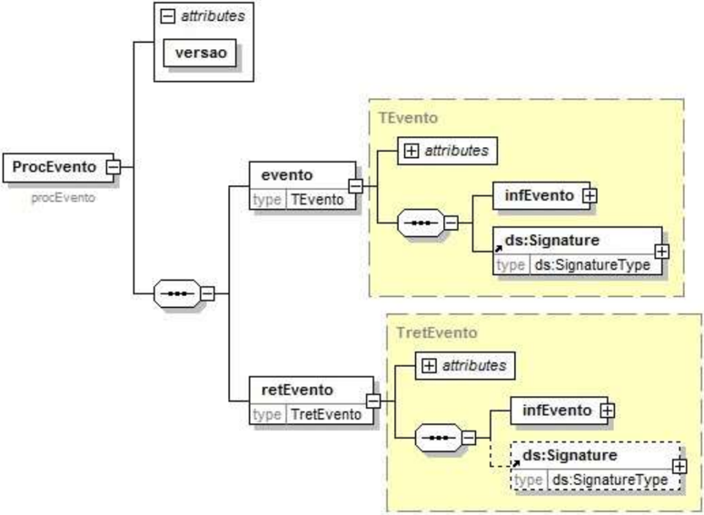

O arquivo digital do Evento com a respectiva informação de Registro do Evento da SEFAZ faz parte integrante da NF-e e deve ser disponibilizado para o destinatário e para a transportadora também.

## 8.11. Tabela de códigos de erros e descrições de mensagens de erros

|   CÓDIGO | RESULTADO DO PROCESSAMENTO DA SOLICITAÇÃO        |
|----------|--------------------------------------------------|
|      108 | Serviço Paralisado Momentaneamente (curto prazo) |

## Projeto Nota Fiscal Eletrônica

| 109    | Serviço Paralisado sem Previsão                                            |
|--------|----------------------------------------------------------------------------|
| 128    | Lote de Evento Processado                                                  |
| 135    | Evento registrado e vinculado a NF-e                                       |
| 136    | Evento registrado, mas não vinculado a NF-e                                |
| CÓDIGO | MOTIVOS DE NÃOATENDIMENTO DA SOLICITAÇÃO                                   |
| 203    | Rejeição: Emissor não habilitado para emissão da NF-e                      |
| 213    | Rejeição: CNPJ-Base do Emitente difere do CNPJ-Base do Certificado Digital |
| 214    | Rejeição: Tamanho da mensagem excedeu o limite estabelecido                |
| 215    | Rejeição: Falha Schema XML                                                 |
| 222    | Rejeição: Protocolo de Autorização de Uso difere do cadastrado             |
| 225    | Rejeição: Falha no Schema XML do lote de NFe                               |
| 236    | Rejeição: Chave de Acesso com dígito verificador inválido                  |
| 238    | Rejeição: Cabeçalho - Versão do arquivo XML superior a Versão vigente      |
| 239    | Rejeição: Cabeçalho - Versão do arquivo XML não suportada                  |
| 240    | Rejeição: Cancelamento/Inutilização - Irregularidade Fiscal do Emitente    |
| 242    | Rejeição: Cabeçalho - Falha no Schema XML                                  |
| 249    | Rejeição: UF da Chave de Acesso diverge da UF autorizadora                 |
| 250    | Rejeição: UF diverge da UF autorizadora                                    |
| 252    | Rejeição: Ambiente informado diverge do Ambiente de recebimento            |
| 280    | Rejeição: Certificado Transmissor inválido                                 |
| 281    | Rejeição: Certificado Transmissor Data Validade                            |

|   282 | Rejeição: Certificado Transmissor sem CNPJ                                       |
|-------|----------------------------------------------------------------------------------|
|   283 | Rejeição: Certificado Transmissor - erro Cadeia de Certificação                  |
|   284 | Rejeição: Certificado Transmissor revogado                                       |
|   285 | Rejeição: Certificado Transmissor difere ICP-Brasil                              |
|   286 | Rejeição: Certificado Transmissor erro no acesso a LCR                           |
|   290 | Rejeição: Certificado Assinatura inválido                                        |
|   291 | Rejeição: Certificado Assinatura Data Validade                                   |
|   292 | Rejeição: Certificado Assinatura sem CNPJ                                        |
|   293 | Rejeição: Certificado Assinatura - erro Cadeia de Certificação                   |
|   294 | Rejeição: Certificado Assinatura revogado                                        |
|   295 | Rejeição: Certificado Assinatura difere ICP-Brasil                               |
|   296 | Rejeição: Certificado Assinatura erro no acesso a LCR                            |
|   297 | Rejeição: Assinatura difere do calculado                                         |
|   298 | Rejeição: Assinatura difere do padrão do Sistema                                 |
|   402 | Rejeição: XML da área de dados com codificação diferente de UTF-8                |
|   404 | Rejeição: Uso de prefixo de namespace não permitido                              |
|   409 | Rejeição: Campo cUF inexistente no elemento nfeCabecMsg do SOAP Header           |
|   410 | Rejeição: UF informada no campo cUF não é atendida pelo Web Service              |
|   411 | Rejeição: Campo versaoDados inexistente no elemento nfeCabecMsg do SOAP Header   |
|   489 | Rejeição: CNPJ informado inválido (DV ou zeros)                                  |
|   490 | Rejeição: CPF informado inválido (DV ou zeros)                                   |
|   491 | Rejeição: O tpEvento informado inválido                                          |
|   492 | Rejeição: O verEvento informado inválido                                         |
|   493 | Rejeição: Evento não atende o Schema XML específico                              |
|   494 | Rejeição: Chave de Acesso inexistente                                            |
|   516 | Rejeição: Falha no schema XML - inexiste a tag raiz esperada para a mensagem     |
|   517 | Rejeição: Falha no schema XML - inexiste atributo versao na tag raiz da mensagem |

|   545 | Rejeição: Falha no schema XML - versão informada na versaoDados do SOAPHeader diverge da versão da mensagem                                           |
|-------|-------------------------------------------------------------------------------------------------------------------------------------------------------|
|   572 | Rejeição: Erro Atributo ID do evento não corresponde a concatenação dos campos ('ID' + tpEvento + chNFe + nSeqEvento)                                 |
|   573 | Rejeição: Duplicidade de Evento                                                                                                                       |
|   574 | Rejeição: O autor do evento diverge do emissor da NF-e                                                                                                |
|   575 | Rejeição: O autor do evento diverge do destinatário da NF-e                                                                                           |
|   576 | Rejeição: O autor do evento não é um órgão autorizado a gerar o evento                                                                                |
|   577 | Rejeição: A data do evento não pode ser menor que a data de emissão da NF-e                                                                           |
|   578 | Rejeição: A data do evento não pode ser maior que a data do processamento                                                                             |
|   579 | Rejeição: A data do evento não pode ser menor que a data de autorização para NF-e não emitida em contingência                                         |
|   580 | Rejeição: O evento exige uma NF-e autorizada                                                                                                          |
|   587 | Rejeição: Usar somente o namespace padrão da NF-e                                                                                                     |
|   588 | Rejeição: Não é permitida a presença de caracteres de edição no início/fim da mensagem ou entre as tags da mensagem                                   |
|   594 | Rejeição: O número de sequência do evento informado é maior que o permitido                                                                           |
|   614 | Rejeição: Chave de Acesso inválida (Código UF inválido)                                                                                               |
|   615 | Rejeição: Chave de Acesso inválida (Ano < 05 ou Ano maior que Ano corrente)                                                                           |
|   616 | Rejeição: Chave de Acesso inválida (Mês < 1 ou Mês > 12)                                                                                              |
|   617 | Rejeição: Chave de Acesso inválida (CNPJ zerado ou dígito inválido)                                                                                   |
|   618 | Rejeição: Chave de Acesso inválida (modelo diferente de 55)                                                                                           |
|   619 | Rejeição: Chave de Acesso inválida (número NF = 0)                                                                                                    |
|   636 | Rejeição: O tipo do evento de cancelamento não corresponde ao tipo do evento a ser cancelado                                                          |
|   637 | Rejeição: ID do evento (idPedido) inválido                                                                                                            |
|   638 | Rejeição: A quantidade de Pedidos de Prorrogação 1º prazo excede o valor limite de 20 Pedidos de Prorrogação autorizados e sem resposta do Fisco.     |
|   639 | Rejeição: A quantidade de Pedidos de Prorrogação 2° prazo excede o valor limite de 20 Pedidos de Prorrogação autorizados e sem resposta do Fisco.     |
|   640 | Rejeição: ID do Pedido de Prorrogação inválido                                                                                                        |
|   641 | Rejeição: A data do evento não pode ser menor que a data de autorização para o evento                                                                 |
|   808 | Rejeição: Evento Fisco emitido por contribuinte                                                                                                       |
|   809 | Rejeição: ID do Pedido de Prorrogação ou Cancelamento não existe na base de dados ou não há um pedido de prorrogação deferido para o tipo: [tpEvento] |
|   810 | Rejeição: tpEvento do Evento Fisco não corresponde ao tpEvento do Evento de Pedido de Prorrogação ou de Cancelamento                                  |
|   811 | Rejeição: Pedido de Prorrogação deferido impede o cancelamento da NF-e                                                                                |

## 9.  Pedido de Cancelamento da NF-e versus Evento de Pedido de Prorrogação de Prazo

| Regra de validação                      | Aplic.   |   Msg | Efeito   | Descrição do Erro                                                     |
|-----------------------------------------|----------|-------|----------|-----------------------------------------------------------------------|
| Pedido de Prorrogação deferido impede o | Obrig.   |   811 | Rej.     | Rejeição: Pedido de Prorrogação deferido impede o cancelamento da NFe |

| cancelamento da NF-e   |
|------------------------|

Deverá ser impedido o cancelamento da NF-e caso exista pelo menos um item do Pedido de Prorrogação de Prazo deferido pelo Fisco (tpEvento=411500 ou 411501, com statPedido=1).

No caso de rejeição do Pedido de Cancelamento da NF-e recebido pela empresa, o fisco usará o código de rejeição '811-Pedido de Prorrogação deferido impede o cancelamento da NF-e'.

Nota: Como o mesmo Pedido da Empresa (tag:'idPedido') pode ter diferentes respostas pelo Fisco, deve ser considerada a resposta do Fisco com maior 'nSeqEvento' de resposta do Fisco.

## 10. Web Service - NFeDistribuicaoDFe

Distribui documentos e informações de interesse do ator da NF-e

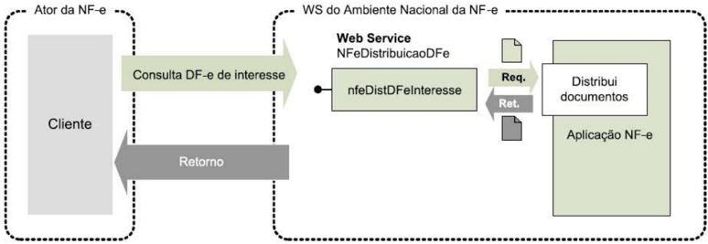

Função: Serviço destinado à distribuição de informações resumidas e documentos fiscais eletrônicos de interesse de um ator, seja este pessoa física ou jurídica.

Processo:

síncrono

Método:

nfeDistDFeInteresse

A tabela do item Web Service - NFeDistribuicaoDFe da NT2014.002 fica acrescida com estes eventos.

| Documento                                                | Emitente   | Destinatário   | Transportador   | Terceiros   |
|----------------------------------------------------------|------------|----------------|-----------------|-------------|
| Evento de Pedido de Prorrogação 1º prazo                 | Não        | Sim            | Não             | Não         |
| Evento de Pedido de Prorrogação 2º prazo                 | Não        | Sim            | Não             | Não         |
| Evento de Cancelamento de Pedido de Prorrogação 1º prazo | Não        | Sim            | Não             | Não         |
| Evento de Cancelamento de Pedido de Prorrogação 2º prazo | Não        | Sim            | Não             | Não         |

| Evento Fisco de Resposta ao Pedido de Prorrogação 1º prazo                 | Sim   | Sim   | Não   | Não   |
|----------------------------------------------------------------------------|-------|-------|-------|-------|
| Evento Fisco de Resposta ao Pedido de Prorrogação 2º prazo                 | Sim   | Sim   | Não   | Não   |
| Evento Fisco de Resposta ao Cancelamento de Pedido de Prorrogação 1º prazo | Sim   | Sim   | Não   | Não   |
| Evento Fisco de Resposta ao Cancelamento de Pedido de Prorrogação 2º prazo | Sim   | Sim   | Não   | Não   |

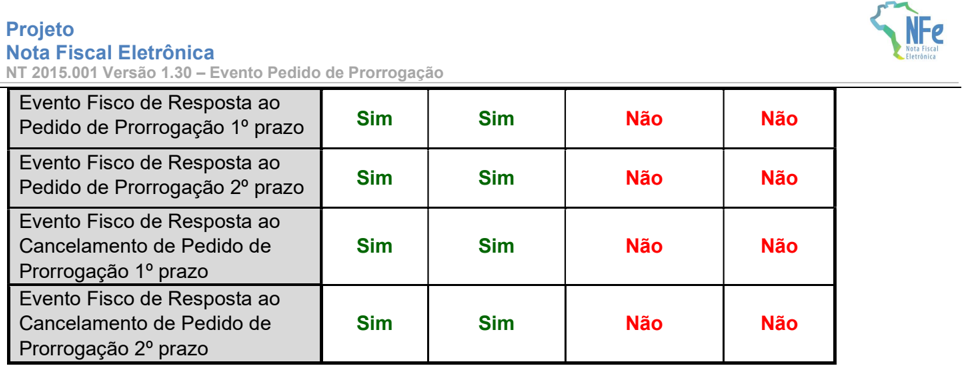
## Metadados
- [Metadados do corpus](metadata.json)
- [Fonte e procedência](../../../../sources/portal_nacional_nfe/nfe/notas-tecnicas/nt-2015-001-v-1-30/source.json)
- [Dados normalizados](../../../../normalized/nfe/notas-tecnicas/nt-2015-001-v-1-30/normalized.json)
- [Changelog](../../../../changelog/nfe/notas-tecnicas/nt-2015-001-v-1-30.md)
- [Proveniência resumida](../../../../sources/provenance/nt-2015-001-v-1-30.json)

## Documentos relacionados

- [[nt-2015-002-v141-23-08-2016]]
- [[nt-2015-003-v194]]
