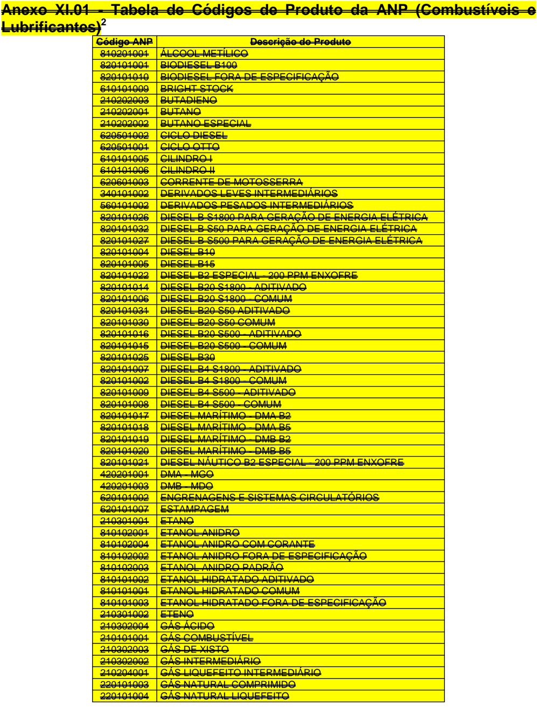
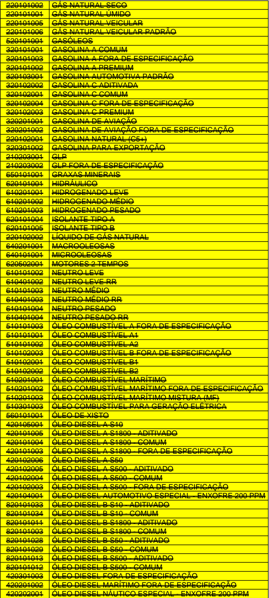
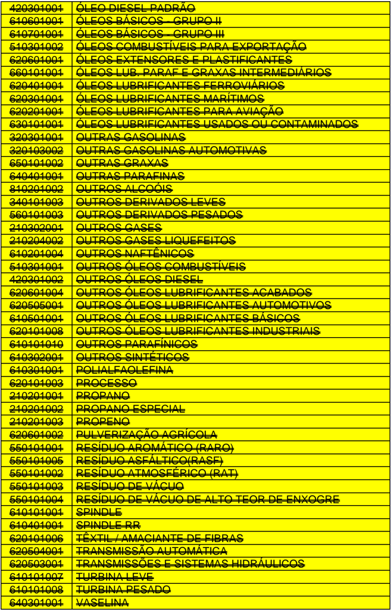

## Projeto Nota Fiscal Eletrônica

Nota Técnica 2015/002

WebServiceConsulta Situação Enquadramento Legal IPI / ICMS Alterações em Regras de Validação NFC-e: Venda de Combustível para Consumidor Final Campo do QR-Code Formas de Pagamento

Versão 1.41 Agosto 2016

## Histórico de Alterações

## A. Alterações introduzidas na versão 1.10

-  Alterado o prazo de implantação da versão em produção para o dia 01/12/2015, por solicitação das empresas;
-  Alterado o campo de valor do Encerrante para 3 casas decimais;
-  Eliminadaregra de validação prevista originalmente para o piloto da NFC-e (RV: A02-10);
-  No caso de exportação indireta (CFOP=3.503, 7.501) é obrigatória a informação de Nota Fiscal referenciada (RV: I08-190);
-  Para a NFC-e, não deve ser informado o grupo de grupo de exportação (tag:detExport, RV: I5010);
-  Melhor definidas as regras de validação relacionadas com a venda de Combustível pela NFC-e, documentando a obrigatoriedade da informação do grupo de combustível conforme critério da UF (eliminada RV LA01-10 e LA01-30, alterada RV LA01-20);
-  Melhor documentada a RV N12a-30, com a aceitação dos CSOSN citados a critério da UF;
-  Melhor documentada a RV O09-10, citando o grupo IPINT;
-  Na  validação  do  QR-Code  da  NFC-e,  serão  aceitos  os  caracteres  hexadecimal  em  letras maiúsculas ou minúsculas, conforme Manual do DANFE da NFC-e (RV: ZX02-64, ZX02-92, ZX02116);
-  Documentado  na  validação  do  QR-Code  da  NFC-e,  que  as  validações  dos  parâmetros relacionados com o CSC são opcionais por UF (RV: ZX02-104, ZX02-108, ZX02-120);
-  Flexibilizada  a  implantação  em  produção  de  algumas  regras  de  validação,  permitindo  que  elas sejam implementadas pelas empresas em uma data variável, a partir da implantação da NT em produção pela SEFAZ Autorizadora até a data informada na própria regra de validação (data limite = 01/01/2016). Ou seja, a empresa pode implantar as mudanças necessárias em seus aplicativos, dentro deste período informado, em qualquer data a seu critério. As regras de validação com esta flexibilização são: RV I05-20, LA01-20, LA11-10, N12-30, N12a-20, N12a-30, YA04-10, YA04a-10, YA05-10, ZX02-10.

## B. Alterações introduzidas na versão 1.20

-  Alterado Anexo XIV, incluindo 3 novos Códigos de Enquadramento Legal para a suspensão do IPI (IPI/cEnq=160, 161, 162);
-  Aperfeiçoada a descrição da regra de validação BA10-30 e alterada a mensagem de erro;Alterada a descrição da mensagem de erro da RV I08-190, melhorando a documentação;
-  Criada exceção na regra de validação LA11-10 combustíveis GLP;
-  Inserida observação na regra de validação LA16-10 para tratar das situações em que o encerrante for zerado durante a venda de combustível;
-  Alterado o prazo de implantação das validações relacionadas com os Códigos de Enquadramento Legal do IPI (RV: O06-10 e O09-10);

Nota : A regra de validação YA04a-10 será aplicada sempre que informado o grupo 'card'.

## C. Alterações introduzidas na versão 1.30

-  Alterada a data limite para referenciar NF modelo 1, ou modelo 4 (RV:BA05-10, BA12-10);
-  Documentado que a exceção de prazo para a regra de validação LA01-20 se aplica somente para a NFC-e;

## Nota Fiscal eletrônica

-  Alterada a regra de validação LA11-10, definindo os códigos de produto da ANP que poderão ter controle de Encerrante;
-  Por  solicitação  das  empresas,  foi  alterado  o  prazo  limite  para  implantação  em  produção  das regras de validação: RV N12-30, N12a-20, N12a-30, YA04-10, YA04a-10, YA05-10, ZX02-10;
-  Alterada  RVZX02-20  para  não  validar  o  uso  diferenciado  de  maiúsculas  ou  minúsculas  no endereço do site disponibilizado pela UF para consulta via QR-Code.

## D. Alterações introduzidas na versão1.40

-  Publicado Schema XML, sem alteração de leiaute, tendo-se eliminando do Schema :
- o Relação de CFOP possíveis de usar no item na NF-e (tag:det/prod/CFOP, id:I08);
- o Relação  de  CFOP  possíveis  de  usar  no  grupo  de  retenção  de  ICMS  de  transporte (tag:transp/retTransp/CFOP, id:X16);
- o Relação  de  Códigos  de  País  usados  para  controle  do  País  do  destinatário  da  NF-e (tag:dest/enderDest/cPais, id:E14) e usado também para controle do País da Prestação de Serviços (tag:ISSQN/cPais, id:U15);
-  Em substituição as mudanças do Schema , foram publicadas no Portal da NF-e algumas tabelas de apoio, conforme segue:
- o Tabela de CFOP, com indicativo dos CFOP possíveis de uso no item da NF-e (indNFe=1);
- o Tabela de CFOP idem acima, com indicativo dos CFOP possíveis de uso no grupo de retenção de ICMS de transporte (indTransp=1);
- o Tabela  de  CFOP  idem  acima,  com  indicativo  dos  CFOP  de  devolução  de  mercadorias (indDevol=1);
- o Tabela de Códigos de País;
-  Na tabela de CFOP citada, foram incluídos novos CFOP relacionados com o 'Regime Aduaneiro Especial de Entreposto Industrial (Recof-Sped)', em implantação pela RFB, conforme segue:
-  Na tabela de Códigos de País citada, foi incluído o código '200-Curacao';
-  Alterada a RV B26-30 permitindo a emissão da NFA-e (Nota Fiscal Avulsa emitida pelo Fisco) na SVC-SEFAZ Virtual de Contingência;
-  Incluídas validações sobre a Chave de Acesso referenciada da NF-e (RV:BA02-10 a BA02-50);
-  Incluídas validações sobre a Chave de Acesso referenciada do CT-e (RV:BA19-10 a BA19-44);
-  Alterada  a  RV  E03a-20  e  E14-20,  excluída  a  RV  E03a-50  e  E12-20,  e  incluída  a  RV  I08-94 relacionada com a informação de 'idEstrangeiro' na operaçãointerna e interestadual;
-  Incluída  RV  E14-04,  passando a ser verificada a existência do Código do País do  destinatário, conforme tabela publicada no Portal da NF-e;

|   CFOP | Descrição Resumida                                                                                                                                                    |
|--------|-----------------------------------------------------------------------------------------------------------------------------------------------------------------------|
|  1.212 | Devolução de venda no mercado interno de mercadoria industrializada e insumo importado sob o Regime Aduaneiro Especial de Entreposto Industrial (Recof-Sped)          |
|  2.212 | Devolução de venda no mercado interno de mercadoria industrializada e insumo importado sob o Regime Aduaneiro Especial de Entreposto Industrial (Recof-Sped)          |
|  3.129 | Compra para industrialização sob o Regime Aduaneiro Especial de Entreposto Industrial (Recof- Sped)                                                                   |
|  3.212 | Devolução de venda no mercado externo de mercadoria industrializada sob o Regime Aduaneiro Especial de Entreposto Industrial (Recof-Sped)                             |
|  5.129 | Venda de insumo importado e de mercadoria industrializada sob o amparo do Regime Aduaneiro Especial de Entreposto Industrial (Recof-Sped)                             |
|  6.129 | Venda de insumo importado e de mercadoria industrializada sob o amparo do Regime Aduaneiro Especial de Entreposto Industrial (Recof-Sped)                             |
|  7.129 | Venda de produção do estabelecimento ao mercado externo de mercadoria industrializada sob o amparo do Regime Aduaneiro Especial de Entreposto Industrial (Recof-Sped) |
|  7.212 | Devolução de compras para industrialização sob o regime de Regime Aduaneiro Especial de Entreposto Industrial (Recof-Sped)                                            |

## Nota Fiscal eletrônica

-  Alterada a RV I05-20 para considerar a inclusão do Anexo X.02 com códigos deNCM especiais para tratamento específico do consumo de bordo;
-  Incluída  RV  I08-04  passando  a  verificar  a  existência  do  CFOP,  conforme  tabela  de  CFOP publicada no Portal da NF-e;
-  Alteradas as RV I08-70e I50-10 para verificar o tipo de operação pelo Identificador de local de destino (tag idDest) ao invés de utilizar o CFOP;
-  Alterada a RV I08-70 para verificar se o destinatário é contribuinte do ICMS pela tag indIEDest=1 e para não efetuar a validação nas operações presenciais e sem frete;
-  Excluída  a  RV  I08-80  por  ter  ficado  em  duplicidade  com  a  RV  I08-70,  após  a  alteração  da verificação pela tag idDest ao invés do CFOP;
-  Alteradas RV I08-140 e I08-144, passando a verificar a tabela de CFOP, para os CFOP indicados como sendo de devolução, conforme tabela de CFOP publicada no Portal da NF-e;
-  Alterada a RV I08-180 para prever a rejeição também pelo CFOP 6.929, além do 5.929;
-  Incluída a RV I08-184 para rejeitar a NF-e com Lançamento relativo a Cupom Fiscal (CFOP 5.929 e 6.929) sem documento fiscal referenciado;
-  Alterado o prazo limite para implantação em produção da regra de validaçãoRV O09-10;
-  Aperfeiçoada a descrição da regra de  validação X04-10, considerando também a renumeração dos anexos;
-  Incluída RV U15-10 passando a verificar a existência do Código do País na prestação de serviços, conforme tabela de Código de País publicada no Portal da NF-e;
-  Incluída RV X16-10 passando a verificar a existência do CFOP de Transporte, conforme tabela de CFOP publicada no Portal da NF-e;
-  Postergada a RV 7C21-10, que valida o regime tributário do emitente;
-  Renumerado o Anexo X para Anexo X.01,e incluído o Anexo X.02;
-  Excluído  o  Anexo  XI.01  porque  os  códigos  de  produtos  ANP  passaram  a  ser  validados diretamente pelas tabelas publicadas pelas fontes oficiais, no site da ANP e Portal Nacional da NF-e;
-  Eliminado o Anexo 'XIII.01 - CFOP de Devolução de Mercadorias', que foi substituído por tabela de apoio publicada no Portal da NF-e.

Nota 1 : Nesta NT está sendo eliminado do Schema XML as tabelas de País e CFOP, facilitando futura manutenção nestas tabelas. No momento atual, temos uma limitação de tempo para viabilizar esta mudança,  já  que  os  novos  CFOP  poderão  ser  informados  a  partir  de  01/04/16.  Portanto,  foram geradas as alternativas abaixo:

1.  Enquanto a SEFAZ Autorizadora não estiver apta a implementar a mudança continuará com a validação do CFOP e País pelo Schema XML.Para esta finalidadefoi gerada uma versão do Schema com os novos códigos de CFOP e código de País, disponibilizado no Portal da NF-e, com o nome de 'PL\_008i\_CFOP\_Novo'. Nesta alternativa, os novos CFOP 1.212. 2.212. 3.212 e 7.212 deverão ser considerados como constantes no 'Anexo XIII.01 - CFOP de Devolução de Mercadorias'; e
2.  A partir do momento em que a SEFAZ Autorizadora implementar a mudança,utilizará o Schema XML no Pacote de Liberação 'PL\_008i1\_CFOP\_Externo', e passará a controlar o CFOP e o Código de País por meiodas tabelas de códigos disponibilizadas.

O uso de uma ou outra alternativa pela SEFAZ autorizadora é transparente para o contribuinte para a geração de seu arquivo XML; caso exista erro neste arquivo, no caso da alternativa 1 o erro será recusado por meio de uma rejeição de schema , enquanto na alternativa 2 ocorrerá uma rejeição com o código específico.

Nota 2 : Todas as SEFAZ Autorizadora deverão adotar o Schema definitivo ('PL\_008i1\_CFOP\_Externo'), até 01/06/16.

- E. Alterações introduzidas na versão 1.41
2.  Aperfeiçoada  a  redação  das  mensagens  de  erro  das  regras  de  validação  do  grupo  'BA. Documento  Fiscal  Referenciado'  para  esclarecer  que  o  número  de  ordem  constante  na mensagem identifica a chave de acesso em que foi encontrado erro conforme sua ocorrência;
3.  Alterada a regra C18-14 para não permitir inscrição estadual de substituição tributária (IE-ST) nas operações internas.
4.  Incluída a regra C21-10 para não permitir emitente com código de regime tributário com excesso de sublimite (CRT=2) para a UF.
5.  Incluído  nas  regras  I04-10,  I08-04  e  I08-144  uma  mensagem  complementar  na  rejeição  para mostrar o número do item em que ocorreu a rejeição.
6.  Aperfeiçoada a redação do texto introdutório que resume as alterações em regras de validação deixando mais clara a intenção da modificação efetuada na RV I08-140;
7.  Alterada  a  regra  I08-180  para  a  critério  da  UF  aceitar  NF-e  (modelo  55)  com  CFOP  5.929 referenciando uma NFC-e (modelo 65).
8.  Excluída a regra K01-10 para permitir o grupo de detalhamento específico de medicamentos na NFC-e.
9.  Incluída  a  regra  YA04a-20  para  não  permitir  o  tipo  de  integração  de  pagamento  como 'pagamento não integrado'. Sendo essa nova regra facultativa por UF.
10.  Incluída a regra ZA01-30 para não permitir o grupo exportação (id: ZA01, tag: exporta) na NFCe.
11.  Alteradas para obrigatórias as regras de validação ZX02-24, ZX02-32, ZX02-40, ZX02-60, ZX0264, ZX02-72, ZX02-80, ZX02-88, ZX02-92, ZX02-100, ZX02-112.
12.  Alteradas para obrigatórias as regras de validação ZX02-20, ZX02-104, ZX02-108, ZX02-120, mantendo uma observação 'Regra de Validação opcional até 01/11/2016, a critério da UF'.
13.  Incluído nas regras ZX02-20, ZX02-100 e ZX02-104 uma observação incluindo o link do Encat, onde o contribuinte pode obter mais informações sobre o CSC e o QRCODE.
14.  Incluída  a  regra  ZX02-22  para  não  permitir  QR-Code  com  sequência  de  escape  para  o  ecomercial '&amp;'.

## 01. Resumo

Esta Nota Técnica trata de diferentes assuntos, conforme segue:

## A. Consulta Situação da Nota Fiscal

Limitado o prazo da consulta ao Web Service de Consulta Situação para 180 dias da data de emissão da Nota Fiscal Eletrônica. Alterada também a resposta desta consulta, retornandounicamente os eventos de Cancelamento, Carta de Correção e EPEC.

## B. Enquadramento Legal: IPI / ICMS

Definição  dos  valores  possíveis  para  o  Código  de  Enquadramento  Legal  no  IPI,  incluindo  o código  de  isenção  de  IPI  relacionado  com  as  Olimpíadas  Rio  2016.  Definido  também  novo Motivo de Desoneração do ICMS relacionado com as Olimpíadas Rio 2016.

## C. Regras de Validação Diversas

A partir desta NT será verificado se o NCM informado no item da Nota Fiscal existe na tabela de  NCM  publicada  pelo  Ministério  do  Desenvolvimento  (MDIC).  Foram  alteradas  também diversas  regras  de  validação,  melhorando  a  qualidade  da  informação  recebida,  afetando, principalmente, os sistemas das SEFAZ Autorizadoras.

## D. NFC-e: Ambiente de Homologação

Alterados  os  controles  para  a  autorização  de  uso  de  NFC-e  enviada  para  o  ambiente  de homologação (ambiente de testes para as empresas).

## E. NFC-e: Prazo de Tolerância no envio para a SEFAZ

Mantida  a  tolerância  de  5  minutos  no  atraso  no  envio  da  NFC-e  para  a  SEFAZ,  devido  ao sincronismo de horário do servidor da empresa e do servidor da SEFAZ. Eliminada a tolerância anterior de 10 minutos. Para o Evento de Cancelamento, foi incluída a mesma tolerância de 5 minutos de atraso no envio, devido ao sincronismo de servidores citada anteriormente.

## F. NFC-e: Grupos de Tributação vinculados com CFOP

Incluídas  regras  de  validação  relacionadas  com  os  grupos  de  tributação  do  ICMS  e  CFOP possíveis de serem utilizados nas operações de venda para consumidor final, através da NFCe.

## G. NFC-e: Utilização na operação de venda de combustível

Viabilizada a utilização da NFC-e para representar a operação de venda de combustível para consumidor final, efetuada por Posto Revendedor de Combustíveis.

## H. NFC-e: Formas de Pagamento

Alterado o grupo de informações sobre o pagamento da NFC-e por cartão de crédito / débito, incluindo a informação do tipo de integração do processo de pagamento com o sistema interno da empresa. Foram estabelecidas novas regras de validação nesta área.

## I. NFC-e: Campo de QR-Code no leiaute da NFC-e

O Projeto da NFC-e compreende a autorização da NFC-e pelas empresas e a disponibilização para  o  consumidor  final  de  uma  Consulta  da  NFC-e  via  QR-Code.  Incluído  no  leiaute  um campo texto  que  representa  o  QR-Code.  Incluídas  novas  regras  de  validação,  garantindo  a qualidade desta informação.

O prazo previsto para a implementação desses ajustes é:

- o Ambiente de Homologação (ambiente de teste das empresas): 01/09/16;
- o Ambiente de Produção : 10/09/16.

## 02. Serviço: Autorização de Uso da Nota Fiscal (item 4.1 do MOC)

## 02.1 Leiauteda Nota Fiscal Eletrônica

## A. Formulário de Segurança para a NFC-e (Não altera leiaute)

Documentada a retirada da opção de contingência usando Formulário de Segurança (tpEmis=2 ou 5) para a emissão de NFC-e em contingência.

|   # | ID   | Campo   | Descrição       | Ele   | Pai   | Tipo   | Ocor.   |   Tam. | Observação                                                                                                                                                                                                                                                                                                                                                                                                                                                                                                                                                                                                                                                                                  |
|-----|------|---------|-----------------|-------|-------|--------|---------|--------|---------------------------------------------------------------------------------------------------------------------------------------------------------------------------------------------------------------------------------------------------------------------------------------------------------------------------------------------------------------------------------------------------------------------------------------------------------------------------------------------------------------------------------------------------------------------------------------------------------------------------------------------------------------------------------------------|
|  26 | B22  | tpEmis  | Tipo de Emissão | E     | B01   | N      | 1-1     |      1 | 1=Emissão normal (não em contingência); 2=Contingência FS-IA, com impressão do DANFE em Formulário de Segurança - Impressor Autônomo; 3=Contingência SCAN (Sistema de Contingência do Ambiente Nacional); *Desativado* 4=Contingência EPEC (Evento Prévio da Emissão em Contingência); 5=Contingência FS-DA, com impressão do DANFE em Formulário de Segurança - Documento Auxiliar; 6=Contingência SVC-AN (SEFAZ Virtual de Contingência do AN); 7=Contingência SVC-RS (SEFAZ Virtual de Contingência do RS); 9=Contingência off-line da NFC-e; Observação : Para a NFC-e somente é válida a opção de contingência: 9-Contingência Off-Linee, a critério da UF, opção 4-Contingência EPEC. |

## B. Campo de Identificação do Destinatário Estrangeiro (Não altera leiaute)

O campo de identificação de destinatário estrangeiro (tag:idEstrangeiro, id:E03a) tem um formato livre, não podendo ser preenchido com caracteres que prejudicam a Consulta da  NFC-e via QR-Code. Documentado no leiaute o conjunto de caracteres que podem ser usados na identificação do destinatário estrangeiro.

## E. Identificação do Destinatário da Nota Fiscal

| #   | ID   | Campo         | Descrição                                                      | Ele   | Pai   | Tipo   | Ocor.   | Tam.    | Observação                                                                                                                                                                                                                                                                                                                           |
|-----|------|---------------|----------------------------------------------------------------|-------|-------|--------|---------|---------|--------------------------------------------------------------------------------------------------------------------------------------------------------------------------------------------------------------------------------------------------------------------------------------------------------------------------------------|
| 64a | E03a | idEstrangeiro | Identificação do destinatário no caso de comprador estrangeiro | CE    | E01   | C      | 1-1     | 0, 5-20 | Informar esta tag no caso de operação com o exterior, ou para comprador estrangeiro. Informar o número do passaporte ou outro documento legal para identificar pessoa estrangeira (campo aceita valor nulo). Observação : Campo aceita algarismos, letras (maiúsculas e minúsculas) e os caracteres do conjunto que segue: [:.+-/()] |

## C.Grupo de Combustível: Informação de 'Encerrante'

Dentro do grupo de informações relacionado com as operações de combustíveis, foi incluído o subgrupo de 'encerrante' que permite o controle sobre as operações de venda de combustíveis, de forma semelhante à atualmente em vigor.

## LA. Detalhamento Específico de Combustíveis

| #    | ID   | Campo      | Descrição                                                      | Ele   |      | Pai   | Tipo   | Ocor.   | Tam.   | Observação                                                                                                                                                                      |
|------|------|------------|----------------------------------------------------------------|-------|------|-------|--------|---------|--------|---------------------------------------------------------------------------------------------------------------------------------------------------------------------------------|
| 162j | LA11 | encerrante | Informações do grupo de 'encerrante'                           | G     |      | LA01  |        | 0-1     |        | Informações do grupo de 'encerrante' disponibilizado por hardware específico acoplado à bomba de combustível, definido no controle da venda do Posto Revendedor de Combustível. |
| 162k | LA12 | nBico      | Número de identificação do utilizado no abastecimento          | bico  | E    | LA11  | N      | 1-1     | 1-3    | Informar o número do bico utilizado no abastecimento.                                                                                                                           |
| 162l | LA13 | nBomba     | Número de identificação da bomba qual o bico está interligado  | ao    | E    | LA11  | N      | 0-1     | 1-3    | Caso exista, informar o número da bomba utilizada.                                                                                                                              |
| 162m | LA14 | nTanque    | Número de identificação do tanque qual o bico está interligado | ao    | E    | LA11  | N      | 1-1     | 1-3    | Informar o número do tanque utilizado.                                                                                                                                          |
| 162n | LA15 | vEncIni    | Valor do Encerrante no início abastecimento                    |       | do E | LA11  | N      | 1-1     | 12v3   | Informar o valor da leitura do contador (Encerrante) no início do abastecimento                                                                                                 |
| 162o | LA16 | vEncFin    | Valor do Encerrante no final abastecimento                     |       | do E | LA11  | N      | 1-1     | 12v3   | Informar o valor da leitura do contador (Encerrante) no término do abastecimento                                                                                                |

## D. Motivo de Desoneração do ICMS: Olimpíadas Rio 2016

Definido  um  novo  valor  para  o  campo  de  'Motivo  de  Desoneração  do  ICMS'  (tag:motDesICMS,  id:N28)  relacionado  com  a  Olimpíadas  Rio  2016, conforme legislação vigente. O novo valor será validado via Schema XML, publicado no Portal da NF-e.

## Grupo Tributação do ICMS= 40, 41, 50

|      # | ID   | Campo      | Descrição                     | Ele   | Pai   | Tipo   | Ocor.   |   Tam. | Observação                                                                                                                                                                                                                                                                                                                                                                                                                                                                                                                                                                                                    |
|--------|------|------------|-------------------------------|-------|-------|--------|---------|--------|---------------------------------------------------------------------------------------------------------------------------------------------------------------------------------------------------------------------------------------------------------------------------------------------------------------------------------------------------------------------------------------------------------------------------------------------------------------------------------------------------------------------------------------------------------------------------------------------------------------|
| 204.02 | N28  | motDesICMS | Motivo da desoneração do ICMS | E     | N27.1 | N      | 1-1     |      2 | Campo será preenchido quando o campo anterior estiver preenchido.Informar o motivo da desoneração: 1=Táxi; 3=Produtor Agropecuário; 4=Frotista/Locadora; 5=Diplomático/Consular; 6=Utilitários e Motocicletas da Amazônia Ocidental e Áreas de Livre Comércio (Resolução 714/88 e 790/94 - CONTRAN e suas alterações); 7=SUFRAMA; 8=Venda a Órgão Público; 9=Outros. (NT 2011/004); 10=Deficiente Condutor (Convênio ICMS 38/12); 11=Deficiente Não Condutor (Convênio ICMS 38/12). 16=Olimpíadas Rio 2016; Observação: Revogada a partir da versão 3.10 a possibilidade de usar o motivo 2=Deficiente Físico |

## E. Código de Enquadramento Legal do IPI (Não altera leiaute)

Em relação ao 'Código de Enquadramento Legal do IPI' (tag:cEnq, id:O06), o Manual de Orientação do Contribuinte (MOC) orienta o preenchimento do campo com o valor '999', enquanto não forem informados os valores possíveis para este código de enquadramento. Nesta NT é definida a tabela de valores possíveis para o campo, incluindo os códigos relacionados com as Olimpíadas Rio 2016, mantendo o valor '999' como uma das possibilidades.

|   # | ID   | Campo   | Descrição                            | Ele   | Pai   | Tipo   | Ocor.   | Tam.   | Observação                                                               |
|-----|------|---------|--------------------------------------|-------|-------|--------|---------|--------|--------------------------------------------------------------------------|
| 251 | O06  | cEnq    | Código de Enquadramento Legal do IPI | E     | O01   | N      | 1-1     | 1-3    | Codificação conforme Anexo XIV - 'Código de Enquadramento Legal do IPI'. |

## F. Grupo de Formas de Pagamento

## YA. Formas de Pagamento

| #      | ID    | Campo     | Descrição                                                       | Ele   | Pai   | Tipo   | Ocor.   | Tam.   | Observação                                                                                                                                                                                                                                                                           |
|--------|-------|-----------|-----------------------------------------------------------------|-------|-------|--------|---------|--------|--------------------------------------------------------------------------------------------------------------------------------------------------------------------------------------------------------------------------------------------------------------------------------------|
| 398ª   | YA01  | pag       | Grupo de Formas de Pagamento                                    | G     | A01   |        | 0-100   |        | Grupo obrigatório para a NFC-e, a critério da UF. Não informar para a NF-e (modelo 55).                                                                                                                                                                                              |
| 398b   | YA02  | tPag      | Forma de pagamento                                              | E     | YA01  | N      | 1-1     | 2      | 01=Dinheiro 02=Cheque 03=Cartão de Crédito 04=Cartão de Débito 05=Crédito Loja 10=Vale Alimentação 11=Vale Refeição 12=Vale Presente 13=Vale Combustível 99=Outros                                                                                                                   |
| 398c   | YA03  | vPag      | Valor do Pagamento                                              | E     | YA01  | N      | 1-1     | 13v2   |                                                                                                                                                                                                                                                                                      |
| 398d   | YA04  | card      | Grupo de Cartões                                                | G     | YA01  | -      | 0-1     |        |                                                                                                                                                                                                                                                                                      |
| 398d.1 | YA04a | tpIntegra | Tipo de Integração para pagamento                               | E     | YA04  | N      | 0-1     | 1      | Tipo de Integração do processo de pagamento com o sistema de automação da empresa: 1=Pagamento integrado com o sistema de automação da empresa (Ex.: equipamento TEF, Comércio Eletrônico); 2= Pagamento não integrado com o sistema de automação da empresa (Ex.: equipamento POS); |
| 398e   | YA05  | CNPJ      | CNPJ da Credenciadora de cartão de crédito e/ou débito          | E     | YA04  | C      | 0-1     | 14     | Informar o CNPJ da Credenciadora de cartão de crédito / débito.                                                                                                                                                                                                                      |
| 398f   | YA06  | tBand     | Bandeira da operadora de cartão de crédito e/ou débito          | E     | YA04  | N      | 0-1     | 2      | 01=Visa; 02=Mastercard; 03=American Express; 04=Sorocred; 99=Outros;                                                                                                                                                                                                                 |
| 398g   | YA07  | cAut      | Número de autorização da operação cartão de crédito e/ou débito | E     | YA04  | C      | 0-1     | 1-20   | Identifica o número da autorização da transação da operação com cartão de crédito e/ou débito                                                                                                                                                                                        |

## G. Grupo de Informações Suplementares

Incluído no leiaute da Nota Fiscal, um grupo opcional de 'Informações Suplementares', contendo um texto que representa o conteúdo do QR-Code impresso no DANFE - NFC-e.Veja que este grupo de informações está no mesmo nível do grupo 'infNFe', não afetando portanto a assinatura digital da Nota Fiscal.

ZX. Informações Suplementares da Nota Fiscal

|   # | ID   | Campo      | Descrição                                    | Ele   | Pai   | Tipo   | Ocor.   | Tam.    | Observação                                                                                                                                                                                                                                                                                                                                                                                                                                                                                                                                                                                                                                                                                                                                                                                                                                                                                                                                                                                                                                                                                                                                                                                    |
|-----|------|------------|----------------------------------------------|-------|-------|--------|---------|---------|-----------------------------------------------------------------------------------------------------------------------------------------------------------------------------------------------------------------------------------------------------------------------------------------------------------------------------------------------------------------------------------------------------------------------------------------------------------------------------------------------------------------------------------------------------------------------------------------------------------------------------------------------------------------------------------------------------------------------------------------------------------------------------------------------------------------------------------------------------------------------------------------------------------------------------------------------------------------------------------------------------------------------------------------------------------------------------------------------------------------------------------------------------------------------------------------------|
| 600 | ZX01 | infNFeSupl | Informações suplementares da Nota Fiscal     | G     | Raiz  | -      | 0-1     | -       | Informações suplementares da Nota Fiscal, não afetando a assinatura digital.                                                                                                                                                                                                                                                                                                                                                                                                                                                                                                                                                                                                                                                                                                                                                                                                                                                                                                                                                                                                                                                                                                                  |
| 601 | ZX02 | qrCode     | Texto com o QR-Code impresso no DANFE NFC-e. | E     | ZX01  | C      | 1-1     | 100-600 | Informar a URL da 'Consulta da NFC-e via QR-Code' no site da SEFAZ, compreendendo: - Endereço do site daUF, incluindo o protocolo de comunicação ('http://' ou 'https://'); - Caractere separador '?'; - Parâmetros do QR-Code, concatenados usando o '&' como separador. Nota 1 : Vide 'Manual de Padrões Técnicos do DANFE NFC-e e QR-Code' que documenta os endereços dos sites das UF, os parâmetros do QR-Code e a fórmula de montagem e/ou cálculo dos parâmetros. Nota 2 : Respeitar o uso de caracteres maiúsculos / minúsculos, conforme consta no referido Manual. Nota 3 : O caractere '&' é um caractere reservado do XML, portanto não pode aparecer no conteúdo da tag. Para viabilizar a informação do QR-Code, o conteúdo deste campo deve ser informado como: <![CDATA[ texto ]]> Exemplo: <![CDATA[https://www.sefaz.rs.gov.br/NF CE/NFCE- COM.aspx?chNFe=4315010828769300015765101 0000000971000001251&nVersao=100&tpAmb=2&c Dest=99999999000191&dhEmi=323031352d30312 d32305431373a30303a34392d30323a3030&vNF= 1.00&vICMS=0.00&digVal=2f4a703477714e6d6e4e 646d31776b64743936655a486b65354f513d&cIdTo ken=000001&cHashQRCode=ecc4f0e7e612456f2e 3521768bd572b6f0eae240]]> |

## 02.2 Alteração em Regras de Validação (RV)

Nesta NT, são melhor documentadas algumas regras de validação existentes e também são incorporadas novas regras de validação com o objetivo de aprimorar a qualidade da informação recebida na SEFAZ, afetando principalmente os sistemas de autorização das SEFAZ Autorizadoras.

Resumidamente as mudanças em regras de validação compreendem:

-  Verificar a Data de Emissão da Nota Fiscal em relação a data da autorização, conforme o Tipo de Emissão. Idem para a verificação da Data de Emissão em relaçãoà data de credenciamento do contribuinte (RV:B09-20, B09-30, B09-40, B09-50, 7B09-10);
-  Verificar a existência do código de Município na tabela do IBGE, substituindo a atual validação do dígito verificador deste código (RV: B12-10, C10-10, E10-10, F07-20, G07-20, U05-10, U14-10, X17-10);
-  Verificar se o Município do Emitente informado na Nota Fiscal corresponde ao cadastrado na UF. Idem para o município do destinatário (RV: 7C10-10, 7E10-10);
-  Aceitar a Chave de Acesso referenciada do documento fiscal 'SAT-CF-e', modelo 59 (RV: BA02-20);
-  Definidos melhores controles sobre a Nota Fiscal referenciada de Produtor, conforme critério da UF (RV: BA10-20, BA10-30, BA10-40);
-  Definidos melhores controles sobre a IE de Substituto Tributário (RV: C18-14, C18-40);
-  Viabilizar  a  operação  de  venda  de  combustível  ou  lubrificante  a  consumidor  ou  usuário  final  estabelecido  em  outra  UF  (CFOP=6.667)para  a pessoa estrangeira, sem configurar exportação (RV: E03a-20, E12-20, E14-20);
-  Limitar o conjunto de caracteres que podem ser usados na identificação do destinatário estrangeiro (RV: E03a-60);
-  Verificar se o NCM informado no item da Nota Fiscal existe na tabela de NCM publicada pelo MDIC - Ministério do Desenvolvimento (RV: I05-20);
-  Na Nota Fiscal de entrada de devolução de mercadora, aceitar os CFOP 1.949 ou 2.949 apenas no caso de devolução de venda de consumidor final não contribuinte (RV: I08-140);
-  Verificar se o Valor do Desconto informado no item da Nota Fiscal é maior do que o Valor do Produto (RV: I17-10);
-  Verificar os valores possíveis para o Código de Enquadramento Legal do IPI, conforme Anexo XIV (RV: O06-10);
-  Verificar os Códigos de Enquadramento Legal possíveis, conforme o CST do IPI informado (RV: O09-10);
-  Verificar o Código de Regime Tributário do emitente informado na Nota Fiscal, em relação ao Cadastro de Contribuintes da SEFAZ (RV: 7C2110);
-  Verificar se foi informado o CNPJ/CPF do Escritório de Contabilidade para a UF que solicitar esta informação na legislação estadual (RV: 7GA0110, 7GA01-20);
-  A critério da UF, verificar se as vendas do Emitente são incompatíveis com o Porte da Empresa (RV: 8C02-10);

##  Para a NFC-e:

- o Mantida a tolerância de 5 minutos de atraso no envio da NFC-e para a autorização na SEFAZ (RV: B09-40);
- o Não aceitar a indicação de uso de Formulário de Segurança (RV:B22-34);
- o Não aceitar a identificação do Emitente como Pessoa Física (RV: C02a-04);
- o Não aceitar a identificação do destinatário como sendo o próprio emitente (RV:E02-20);
- o A critério da UF, é opcional a informação do Nome e Endereço do Destinatário na NFC-e, para operações com valor superior a R$ 10.000,00 (RV: W16-50, W16-60);
- o Verificar se a descrição do primeiro item da NFC-e emitida em ambiente de homologação difere de 'NOTA FISCAL EMITIDA EM AMBIENTE DE HOMOLOGACAO - SEM VALOR FISCAL' (RV:I04-10);
- o Eliminada a utilização dos CFOP 5.401 e 5.403, relacionados ao regime de substituição tributáriae o CFOP 5.653 relacionado com a venda de combustível de produção do estabelecimento, para consumidor final (RV: I08-150);
- o No caso da prestação de serviços (CFOP=5.933), verificar o uso do grupo de tributação do ISSQN (RV: I08-160, I08-170);
- o Permitir a informação do grupo de combustíveis (conforme decisão da UF), somente para CFOP específicos (RV: LA01-10, LA01-30);
- o Na venda de combustível pela NFC-e, a critério da UF, verificar se existem as informações do grupo 'encerrante' (LA11-10);
- o Melhor controlada a utilização dos grupos de tributação de ICMS, conforme segue:
-  Verificar os CST possíveis de uso na NFC-e (RV: N12-30, N12-34);
-  Verificar os CSTpossíveis de uso na NFC-e, conforme o CFOP informado (RV: N12-40, N12-44);
-  Eliminado uso do grupo ICMSST - Repasse de ICMS-ST retido anteriormente em operação interestadual (RV: N12-60);
- o Melhor controlada a utilização dos grupos de tributação do Simples Nacional, conforme segue:
-  Verificar os CSOSN possíveis de uso na NFC-e (RV: N12a-20, N12a-30, N12a-34);
-  Verificar os CSOSN possíveis de uso na NFC-e, conforme o CFOP informado (RV: N12a-40, N12a-44);
- o Eliminada a possibilidade de informação do grupo de Devolução de Tributos na NFC-e (RV: UA01-20);
- o Implementado controles sobre as informações da Forma de Pagamento da NFC-e (RV: YA01-20, YA04-10, YA04a-10);
- o Validar o novo campo QR-Code, utilizado na Consulta da NFC-e (RV: ZX01-10 em diante).

Seguem as alterações em regras de validação:

## A. Dados da NF-e

| Campo-Seq   |   Modelo | Regra de Validação                          |   Aplic. Msg | Efeito   | Descrição Erro                                 |
|-------------|----------|---------------------------------------------|--------------|----------|------------------------------------------------|
| A02-10      |       55 | NF-e não pode utilizar a versão 3.00 Obrig. |          701 | Rej.     | Rejeição: NF-e não pode utilizar a versão 3.00 |

## B. Identificação da Nota Fiscal

| Campo-Seq   |   Modelo | Regra de Validação                                                                                                                                                                                                                                                                                                          | Aplic.   |   Msg | Efeito   | Descrição Erro                                                                   |
|-------------|----------|-----------------------------------------------------------------------------------------------------------------------------------------------------------------------------------------------------------------------------------------------------------------------------------------------------------------------------|----------|-------|----------|----------------------------------------------------------------------------------|
| B09-20      |       55 | NF-e com Tipo de Emissão = 1-Normal (ou 6-SVC-AN, 7-SVC-RS) (NT2012.003): - Data de Emissão ocorrida há mais de 30 dias (ou outro limite, a critério da UF) Exceção 1 : A critério da UF,a rejeição acima pode ser efetuada para qualquer Tipo de Emissão. Exceção 2 : A critério da UF, pode ser aceita a NF-e com Data de | Obrig.   |   228 | Rej.     | Rejeição: Data de Emissão muito atrasada                                         |
| B09-30      |       55 | Data de Emissão anterior ao início da autorização de NF-e na UF. Observação: O início da operação da NF-e ocorreu em diferentes momentos, conforme a UF (a primeira NF-e autorizada no País foi em 14/09/2006).                                                                                                             | Obrig.   |   315 | Rej.     | Rejeição: Data de Emissão anterior ao início da autorização de Nota Fiscal na UF |
| B09-40      |       65 | NFC-e com Tipo de Emissão=1-Normal: - Data-Hora de Emissão com atraso superior a 5 minutos em relação ao horário de recepção na SEFAZ Autorizadora. Exceção 1 : A critério da UF, a rejeição acima pode ser efetuada                                                                                                        | Obrig.   |   704 | Rej.     | Rejeição: NFC-e com Data-Hora de emissão atrasada                                |

| Campo-Seq   | Modelo   | Regra de Validação                                                                                                                                                                                                 | Aplic.   |   Msg | Efeito   | Descrição Erro                                                                           |
|-------------|----------|--------------------------------------------------------------------------------------------------------------------------------------------------------------------------------------------------------------------|----------|-------|----------|------------------------------------------------------------------------------------------|
|             |          | ser controlado pela aplicação da SEFAZ Autorizadora.                                                                                                                                                               |          |       |          |                                                                                          |
| B09-50      | 65       | Data de Emissão anterior ao início da autorização de NFC-e na UF. Observação: O início da operação da NFC-e ocorreu em diferentes momentos, conforme a UF (a primeira NFC-e autorizada no País foi em 01/03/2013). | Obrig.   |   315 | Rej.     | Rejeição: Data de Emissão anterior ao início da autorização de Nota Fiscal na UF         |
| B12-10      | 55/65    | Código Município do Fato Gerador de ICMSinexistente (Tabela Municípios IBGE)                                                                                                                                       | Obrig.   |   270 | Rej.     | Rejeição: Código Município do Fato Gerador de ICMS inexistente                           |
| B22-34      | 65       | Na autorização pela SEFAZ: - rejeitar a NFC-e com opção de contingência inválida (tag:tpEmis=2, 4, 5) Observação : A contingência EPEC (tag:tpEmis=4) poderá ser aceita, a critério da UF.                         | Facult.  |   714 | Rej.     | Rejeição: NFC-e com opção de contingência inválida (tpEmis=2, 4 (a critério da UF) ou 5) |
| B26-30      | 55/65    | Se Processo de Emissão pelo Fisco (procEmi=1 ou 2): - Tipo de Emissão difere de Emissão Normal ou Emissão na SVC (tpEmis<>1, 6 e 7)                                                                                | Obrig.   |   370 | Rej.     | Rejeição: Nota Fiscal Avulsa com tipo de emissão inválido                                |

## BA. Documento Fiscal Referenciado

| Campo-Seq   |   Modelo | Regra de Validação                                                                                                                                                      | Aplic.   |   Msg | Efeito   | Descrição Erro                                                                                      |
|-------------|----------|-------------------------------------------------------------------------------------------------------------------------------------------------------------------------|----------|-------|----------|-----------------------------------------------------------------------------------------------------|
| BA02-10     |       55 | Se informada NF-e referenciada (tag:refNFe): - Chave de Acesso referenciada com Dígito Verificador inválido                                                             | Facult.  |   547 | Rej.     | Rejeição: Chave de Acesso referenciada com Dígito Verificador inválido[nOcor:nnn]                   |
| BA02-14     |       55 | - Chave de Acesso referenciada com UF inválida                                                                                                                          | Facult.  |   522 | Rej.     | Rejeição: Chave de Acesso referenciada com UF inválida[nOcor:nnn]                                   |
| BA02-20     |       55 | - Chave de Acesso referenciada com Ano Emissão < 06 ou > que o Ano corrente                                                                                             | Facult.  |   524 | Rej.     | Rejeição: Chave de Acesso referenciada com Ano-Mês inválido[nOcor:nnn]                              |
| BA02-24     |       55 | - Chave de Acesso referenciada com Mês Emissão < 01 ou > 12                                                                                                             | Facult.  |   524 | Rej.     | Rejeição: Chave de Acesso referenciada com Ano-Mês inválido[nOcor:nnn]                              |
| BA02-30     |       55 | - Chave de Acesso referenciada com CNPJ zerado ou CNPJ com DV inválido                                                                                                  | Facult.  |   552 | Rej.     | Rejeição: Chave de Acesso referenciada com CNPJ inválido[nOcor:nnn]                                 |
| BA02-34     |       55 | - Chave de Acesso referenciada com Modelo diferente de 55 / 65 /59 (NT 2015/002)                                                                                        | Facult.  |   679 | Rej.     | Rejeição: Chave de Acesso referenciada com Modelo inválido[nOcor:nnn]                               |
| BA02-40     |       55 | - Chave de Acesso referenciada com Número zerado                                                                                                                        | Facult.  |   683 | Rej.     | Rejeição: Chave de Acesso referenciada com Número inválido[nOcor:nnn]                               |
| BA02-44     |       55 | - Chave de Acesso referenciada em duplicidade na NF-e (duplicidade da tag refNFe) (NT 2013/003)                                                                         | Facult.  |   680 | Rej.     | Rejeição: Chave de Acesso referenciada em duplicidade na NF-e [nOcor:nnn]                           |
| BA02-50     |       55 | - Nota Fiscal referenciada com a mesma Chave de Acesso da Nota Fiscal atual                                                                                             | Obrig.   |   316 | Rej.     | Rejeição: Chave de Acesso referenciada com a mesma Chave de Acesso da Nota Fiscal atual [nOcor:nnn] |
| BA05-10     |       55 | Se informada NF Modelo 1 referenciada (tag:refNF): - NF modelo 1 referenciada emitida há mais de 20 anos da data atual ou com data de emissão superior ao Ano-Mês atual | Facult.  |   317 | Rej.     | Rejeição: NF modelo 1 referenciada com data de emissão inválida [nOcor:nnn]                         |

| Campo-Seq   |   Modelo | Regra de Validação                                                                                                                                                                                                                                                                                                                                                                                                                                                                                                                                   | Aplic.   |   Msg | Efeito   | Descrição Erro                                                                       |
|-------------|----------|------------------------------------------------------------------------------------------------------------------------------------------------------------------------------------------------------------------------------------------------------------------------------------------------------------------------------------------------------------------------------------------------------------------------------------------------------------------------------------------------------------------------------------------------------|----------|-------|----------|--------------------------------------------------------------------------------------|
| BA10-20     |       55 | Contranota de Produtor sem Nota Fiscal referenciada: - não informada NF de Produtor referenciada (tag:refNFP); - e não informada Nota Fiscal referenciada (tag:refNFe). Observação 1 : A Contranota de Produtor é identificada como uma Nota Fiscal de entrada (tag:tpNF=0) e remetente da mesma UF com IE de Produtor Rural. Observação 2 : A utilização e controle da Contranota de Produtor é opcional, a critério da UF.                                                                                                                         | Facult.  |   318 | Rej.     | Rejeição: Contranota de Produtor sem Nota Fiscal referenciada                        |
| BA10-30     |       55 | Contranota de Produtor não pode referenciar somente Nota Fiscal de entrada: - não informada NF de Produtor referenciada (tag:refNFP); - e não informada Nota Fiscal referenciada (tag:refNFe) de saída (tag:tpNF=1). Observação 1 : Identificação de Contranota de Produtor conforme observação da validação anterior. Observação 2 : A utilização e controle da Contranota de Produtor é opcional, a critério da UF.                                                                                                                                | Facult.  |   319 | Rej.     | Rejeição: Contranota de Produtor não pode referenciar somente Nota Fiscal de entrada |
| BA10-40     |       55 | Contranota de Produtor referencia somente Nota Fiscal de outro emitente. Não existe nenhuma das ocorrências abaixo: - IE da NF de Produtor referenciada (tag:refNFP/IE) idêntica à IE do Emitente (emit/IE) ou do Remente (dest/IE); - IE do emitente da NF referenciada (tag:emit/IE) idêntica à IE do Emitente (emit/IE) ou do Remente (dest/IE). Observação 1 : Identificação de Contranota de Produtor conforme observação da validação anterior. Observação 2 : A utilização e controle da Contranota de Produtor é opcional, a critério da UF. | Facult.  |   320 | Rej.     | Rejeição: Contranota de Produtor referencia somente NF de outro emitente             |
| BA12-10     |       55 | Se informada NF de Produtor referenciada (tag:refNFP): - NF de produtor referenciada emitida a mais de 20 anos da data atual ou com data de emissão superior ao Ano-Mês atual                                                                                                                                                                                                                                                                                                                                                                        | Facult.  |   322 | Rej.     | Rejeição: NF de produtor referenciada com data de emissão inválida [nOcor:nnn]       |
| BA19-10     |       55 | Se informado CT-e referenciado (tag:refCTe): - Chave de Acesso referenciada com Dígito Verificador inválido                                                                                                                                                                                                                                                                                                                                                                                                                                          | Facult.  |   547 | Rej.     | Rejeição: Chave de Acesso referenciada com Dígito Verificador inválido[nOcor:nnn]    |
| BA19-14     |       55 | - Chave de Acesso referenciada com UF inválida                                                                                                                                                                                                                                                                                                                                                                                                                                                                                                       | Facult.  |   522 | Rej.     | Rejeição: Chave de Acesso referenciada com UF inválida[nOcor:nnn]                    |
| BA19-20     |       55 | - Chave de Acesso referenciada com Ano Emissão < 06 ou > que o Ano corrente                                                                                                                                                                                                                                                                                                                                                                                                                                                                          | Facult.  |   524 | Rej.     | Rejeição: Chave de Acesso referenciada com Ano-Mês inválido[nOcor:nnn]               |
| BA19-24     |       55 | - Chave de Acesso referenciada com Mês Emissão < 01 ou > 12                                                                                                                                                                                                                                                                                                                                                                                                                                                                                          | Facult.  |   524 | Rej.     | Rejeição: Chave de Acesso referenciada com Ano-Mês inválido[nOcor:nnn]               |

| Campo-Seq   |   Modelo | Regra de Validação                                                                                      | Aplic.   | Msg Efeito   | Descrição Erro                                                            |
|-------------|----------|---------------------------------------------------------------------------------------------------------|----------|--------------|---------------------------------------------------------------------------|
| BA19-30     |       55 | - Chave de Acesso referenciada com CNPJ zerado ou CNPJ com DV inválido                                  | Facult.  | 552 Rej.     | Rejeição: Chave de Acesso referenciada com CNPJ inválido[nOcor:nnn]       |
| BA19-34     |       55 | - Chave de Acesso referenciada com Modelo diferente de 57 (NT 2013/003) Facult.                         | 679      | Rej.         | Rejeição: Chave de Acesso referenciada com Modelo inválido[nOcor:nnn]     |
| BA19-40     |       55 | - Chave de Acesso referenciada com Número zerado Facult.                                                | 683      | Rej.         | Rejeição: Chave de Acesso referenciada com Número inválido[nOcor:nnn]     |
| BA19-44     |       55 | - Chave de Acesso referenciada em duplicidade na NF-e (duplicidade da tag refCTe) (NT 2013/003) Facult. | 680      | Rej.         | Rejeição: Chave de Acesso referenciada em duplicidade na NF-e [nOcor:nnn] |

## C. Identificação do Emitente

| Campo-Seq   | Modelo   | Regra de Validação                                                                                                                                                                                                                                                                                                                                              | Aplic.   |   Msg | Efeito   | Descrição Erro                                                                                   |
|-------------|----------|-----------------------------------------------------------------------------------------------------------------------------------------------------------------------------------------------------------------------------------------------------------------------------------------------------------------------------------------------------------------|----------|-------|----------|--------------------------------------------------------------------------------------------------|
| C02a-04     | 65       | Se informado CPF do emitente: - Se NFC-e (modelo 65)                                                                                                                                                                                                                                                                                                            | Obrig.   |   337 | Rej.     | Rejeição: NFC-e para emitente pessoa física                                                      |
| C02a-10     | 55       | - CPF só pode ser informado como Emitente na Nota Fiscalavulsa                                                                                                                                                                                                                                                                                                  | Obrig.   |   407 | Rej.     | Rejeição: O CPF só pode ser informado no campo emitente para a NF-e avulsa                       |
| C02a-20     | 55       | - CPF com zeros, nulo, 111..., 222..., ..., ou DV inválido (NT 2012/003)                                                                                                                                                                                                                                                                                        | Obrig.   |   401 | Rej.     | Rejeição: CPF do emitente inválido                                                               |
| C10-10      | 55/65    | Código Município do Emitente inexistente (Tabela Municípios IBGE)                                                                                                                                                                                                                                                                                               | Obrig.   |   272 | Rej.     | Rejeição: Código Município do Emitente inexistente                                               |
| C18-14      | 55       | Se informada a IE do Substituto Tributário para uma operação com Exterior ou Operação Interna (tag:idDest=1 ou 3)                                                                                                                                                                                                                                               | Obrig.   |   347 | Rej.     | Rejeição: Informada IE do substituto tributário em operação que não é interestadual              |
| C18-30      | 55       | Se informada a IE do Substituto Tributário: - IEST inválida para a UF: erro no tamanho, na composição da IE, ou no dígito verificador (*2) Observação : UF a ser utilizada na validação: - UF do Local de Entrega para operação de Faturamento Direto de veículos novos (id:G09, caso tpOP, id:J02 = 2); - UF do destinatário (UF, campo E12) nos demais casos. | Obrig.   |   211 | Rej.     | Rejeição: IE do substituto inválida                                                              |
| C18-40      | 55       | -IEST idêntica à IE do emitente ou do destinatário                                                                                                                                                                                                                                                                                                              | Obrig.   |   363 | Rej.     | Rejeição: IE do substituto tributário idêntica à IE do emitente ou do destinatário               |
| C21-10      | 55/65    | Regime Tributário SN, com excesso de sublimite não é permitido para Emitentes desta UF (id:CRT=2). Nota: Regra de validação opcional, a critério da UF.                                                                                                                                                                                                         | Facult.  |   812 | Rej.     | Rejeição: Regime Tributário SN, com excesso de sublimite não é permitido para Emitentes desta UF |

## E. Identificação do Destinatário

| Campo-Seq   | Modelo   | Regra de Validação                                                                                                                                                                                                                                                                                                                                                                                                     | Aplic.   |   Msg | Efeito   | Descrição Erro                                                                              |
|-------------|----------|------------------------------------------------------------------------------------------------------------------------------------------------------------------------------------------------------------------------------------------------------------------------------------------------------------------------------------------------------------------------------------------------------------------------|----------|-------|----------|---------------------------------------------------------------------------------------------|
| E02-10      | 55/65    | Se informado CNPJ: - CNPJ com zeros ou dígito de controle inválido                                                                                                                                                                                                                                                                                                                                                     | Obrig.   |   208 | Rej.     | Rejeição: CNPJ do destinatário inválido                                                     |
| E02-20      | 65       | - CNPJ do destinatário = CNPJ do Emitente                                                                                                                                                                                                                                                                                                                                                                              | Obrig.   |   220 | Rej.     | Rejeição: Destinatário com identificação igual à identificação do emitente                  |
| E03a-20     | 55       | Se não é operação com Exterior (tag:idDest<>3): - Informado 'idEstrangeiro', e operação não é com consumidor final(tag:indFinal<> 1) - Não pode informar tag idEstrangeiro Exceção : A regra acima não se aplica para o CFOP='6.667- Venda de combustível ou lubrificante a consumidor ou usuário final estabelecido em outra UF diferente da que ocorrer o consumo'                                                   | Obrig.   |   721 | Rej.     | Rejeição: Informado idEstrangeiro e Operação não é com consumidor final.                    |
| E03a-50     | 55       | Se Operação dentro do Estado (tag:idDest = 1): - Se informado 'idEstrangeiro', operação deve ser de consumidor final (tag:indFinal<> 1)                                                                                                                                                                                                                                                                                | Obrig.   |   723 | Rej.     | Rejeição: Operação interna com idEstrangeiro informado deve ser para consumidor final       |
| E03a-60     | 55/65    | Se informado 'idEstrangeiro', campo deve conter somente algarismos, letras (maiúsculas e minúsculas) e/ou os caracteres do conjunto que segue: [:.+-/()]                                                                                                                                                                                                                                                               | Obrig.   |   372 | Rej.     | Rejeição: Destinatário com identificação de estrangeiro com caracteres inválidos            |
| E10-10      | 55/65    | Se endereço destinatário não é no Exterior (dest/UF <> 'EX'): - Código Município do destinatário inexistente (Tabela Municípios IBGE)                                                                                                                                                                                                                                                                                  | Obrig.   |   274 | Rej.     | Rejeição: Código Município do Destinatário inexistente                                      |
| E12-20      | 55       | Se operação Interestadual (tag:idDest = 2): - UF de destino não pode ser 'EX' Exceção : A regra acima não se aplica para o CFOP='6.667- Venda de combustível ou lubrificante a consumidor ou usuário final estabelecido em outra UF diferente da que ocorrer o consumo'                                                                                                                                                | Obrig.   |   771 | Rej.     | Rejeição: Operação Interestadual e UF de destino com EX                                     |
| E14-04      | 55/65    | Se informado Código País do destinatário (tag:dest/enderDest/cPais): - Código do País inexistente (Tabela do BACEN, vide tabela de apoio publicada no Portal da NF-e). Observação : O Código do País informado na NF-e pode conter ou não zeros não significativos.                                                                                                                                                    | Obrig.   |   377 | Rej.     | Rejeição: Código de País do destinatário Inexistente                                        |
| E14-20      | 55/65    | Se não é operação com Exterior (tag:idDest<> 3) e informado Código País do destinatário: - Código País do destinatário difere de 1058 (Brasil) Exceção : Se idEstrangeiro <> nulo é permitido cPais <> 1058. Exceção 2 : A regra de validação não se aplica se idDest=2 e CFOP='6.667- Venda de combustível ou lubrificante a consumidor ou usuário final estabelecido em outra UF diferente da que ocorrer o consumo' | Facult.  |   511 | Rej.     | Rejeição: Não é de Operação com Exterior e Código País destinatário difere de 1058 (Brasil) |

## F. Local da Retirada

| Campo-Seq   | Modelo Regra de Validação                                                                                                               | Aplic.   |   Msg | Efeito   | Descrição Erro                                              |
|-------------|-----------------------------------------------------------------------------------------------------------------------------------------|----------|-------|----------|-------------------------------------------------------------|
| F07-20      | 55/65 Se informado Local de Retirada com UF Retirada <> 'EX': - Código Município Local de Retirada inexistente (Tabela Municípios IBGE) | Obrig.   |   276 | Rej.     | Rejeição: Código Município do Local de Retirada inexistente |

## G. Local da Entrega

| Campo-Seq   | Modelo Regra de Validação                                                                                                               | Aplic.   |   Msg | Efeito   | Descrição Erro                                             |
|-------------|-----------------------------------------------------------------------------------------------------------------------------------------|----------|-------|----------|------------------------------------------------------------|
| G07-20      | 55/65 Se informado Local de Entrega com UF Entrega <> 'EX': - Código Município do Local de Entrega inexistente (Tabela Municípios IBGE) | Obrig.   |   278 | Rej.     | Rejeição: Código Município do Local de Entrega inexistente |

## I. Produtos e Serviços

| Campo-Seq   | Modelo Regra de Validação                                                                                                                                                                                                                                                                                                                                                                                                                                                                                        | Aplic.   |   Msg | Efeito   | Descrição Erro                                                                                                                  |
|-------------|------------------------------------------------------------------------------------------------------------------------------------------------------------------------------------------------------------------------------------------------------------------------------------------------------------------------------------------------------------------------------------------------------------------------------------------------------------------------------------------------------------------|----------|-------|----------|---------------------------------------------------------------------------------------------------------------------------------|
| I04-10      | 65 Para a NFC-e, se ambiente de homologação (tag: tpAmb=2, id:B24): - Descrição do primeiro item da Nota Fiscal (tag:xProd) deve ser informada como 'NOTA FISCAL EMITIDA EM AMBIENTE DE HOMOLOGACAO - SEM VALOR FISCAL'                                                                                                                                                                                                                                                                                          | Obrig    |   373 | Rej.     | Rejeição: Descrição do primeiro item diferente de NOTA FISCAL EMITIDA EM AMBIENTE DE HOMOLOGACAO - SEM VALOR FISCAL [nItem:nnn] |
| I05-20      | 55/65 Se informado NCM completo (8 pos.) e valor difere de '00000000': - NCM inexistente na tabela de NCM publicada pelo Ministério do Desenvolvimento, Indústria e Comércio Exterior - MDIC * Implementação futura. Exceção 1: A regra de validação não se aplica, em produção, para Nota Fiscal com Data de Emissão anterior a 01/01/2016. Exceção 2: Para a NF-e, considerar nesta validação os códigos de NCM especiais definidos pela RFB para permitir o uso no Registro de Exportação (Anexo X.02). 55/65 | Obrig.   |   778 | Rej.     | Rejeição: Informado NCM inexistente[nItem:nnn]                                                                                  |
| I08-04      | CFOP inexistente ou não pode ser usado na NF-e, conforme tabela de apoio publicada no Portal da NF-e (Tabela CFOP, indNFe=0)                                                                                                                                                                                                                                                                                                                                                                                     | Obrig.   |   770 | Rej.     | Rejeição: CFOP Inexistente [nItem:nnn]                                                                                          |

| Campo-Seq   |   Modelo Regra de Validação | Modelo Regra de Validação                                                                                                                                                                                                                                                                                                                                                                                                                                                                                                                                                                                                                 | Aplic.   |   Msg | Efeito   | Descrição Erro                                                                                               |
|-------------|-----------------------------|-------------------------------------------------------------------------------------------------------------------------------------------------------------------------------------------------------------------------------------------------------------------------------------------------------------------------------------------------------------------------------------------------------------------------------------------------------------------------------------------------------------------------------------------------------------------------------------------------------------------------------------------|----------|-------|----------|--------------------------------------------------------------------------------------------------------------|
| I08-70      |                          55 | Operação Interna (idDest=1) e UF emitente diferente da UF do destinatário/remetente e destinatário/remetente contribuinte do ICMS (indIEDest=1) Exceção 1 : A regra de validação não se aplica se a tag UFCons (id:LA06) foi informada com a mesma UF do emitente. (NT 2010/007) Exceção 2 : A regra de validação não se aplica se a operação é presencial (tag: indPres =1 -Operação presencial) e não possui frete (tag: modFrete =9 -Sem frete).(NT 2011/004) Observação: No caso da NFC-e, a informação do endereço do destinatário é opcional. Considerar a UF do destinatário como sendo a mesma UF do emitente (operação interna). | Facult.  |   521 | Rej      | Rejeição: Operação Interna e UF do emitente difere da UF do destinatário/remetente contribuinte do ICMS      |
| I08-80      |                          55 | CFOP de Operação no Estado (inicia com 1) e UF emitente diferente da UF remetente e remetente contribuinte do ICMS (indIEDest=1)(NT 2010/007) Exceção 1: Se a tag UFCons (id:LA06) foi informada com a mesma                                                                                                                                                                                                                                                                                                                                                                                                                              | Facult.  |   522 | Rej.     | Rejeição: CFOP de Operação Estadual e UF emitente difere da UF remetente para remetente contribuinte do ICMS |
| I08-94      |                          55 | Operação Interestadual (idDest=2) e informado idEstrangeiro Exceção : A regra acima não se aplica para o CFOP='6.667- Venda de combustível ou lubrificante a consumidor ou usuário final estabelecido em outra UF diferente da que ocorrer o consumo'                                                                                                                                                                                                                                                                                                                                                                                     | Facult.  |   771 | Rej.     | Rejeição: Informado idEstrangeiro em operação interestadual                                                  |
| I08-140     |                          55 | Para a Nota Fiscal com finalidade de devolução de mercadoria (tag:finNFe=4), somente serão aceitos CFOP de devolução de mercadoria. Observação : Vide relação de CFOP de devolução de mercadoria natabela de apoio publicada no Portal da NF-e (Tabela CFOP, indDevol=1). Exceção : Aceitar os CFOP 1.949 e 2.949 na devolução de venda para não Contribuinte. Para estes CFOP verificar a condição:                                                                                                                                                                                                                                      | Obrig.   |   327 | Rej.     | Rejeição: CFOP inválido para Nota Fiscal com finalidade de devolução de mercadoria[nItem:nnn]                |

| Campo-Seq   |   Modelo | Regra de Validação                                                                                                                                                                                                                                                                                                                                                                                                                                                                                   | Aplic.   |   Msg | Efeito   | Descrição Erro                                                                                                     |
|-------------|----------|------------------------------------------------------------------------------------------------------------------------------------------------------------------------------------------------------------------------------------------------------------------------------------------------------------------------------------------------------------------------------------------------------------------------------------------------------------------------------------------------------|----------|-------|----------|--------------------------------------------------------------------------------------------------------------------|
| I08-144     |       55 | Para as NF-e que não tem a finalidade de devolução de mercadoria (tag:finNFe não é '2' nem '4'), não serão aceitos CFOP de devolução de mercadoria. (NT 2013/005) Observação : Vide relação de CFOP de devolução de mercadoria natabela de apoio publicada no Portal da NF-e (Tabela CFOP, indDevol=1).                                                                                                                                                                                              | Obrig.   |   328 | Rej.     | Rejeição: CFOP de devolução de mercadoria para NF- e que não tem finalidade de devolução de mercadoria [nItem:nnn] |
| I08-150     |       65 | NFC-e (mod=65) com CFOP inválido. Aceitar unicamente os CFOP: - 5.101: Venda de produção do estabelecimento; - 5.102: Venda de mercadoria de terceiros; - 5.103: Venda de produção do estabelecimento efetuada fora do estabelecimento; - 5.104: Venda de mercadoria adquirida ou recebida de terceiros, efetuada fora do estabelecimento; - 5.115: Venda de mercadoria de terceiros, recebida anteriormente em consignação mercantil; - 5.401: Venda de produção do estabelecimento em operação com | Obrig.   |   725 | Rej.     | Rejeição: NFC-e com CFOP inválido[nItem:nnn]                                                                       |
|             |          | produto sujeito a ST, como contribuinte substituto; - 5.403: Venda de mercadoria de terceiros em operação com mercadoria sujeita a ST, como contribuinte substituto; - 5.405: Venda de mercadoria de terceiros, sujeita a ST, como contribuinte substituído; - 5.653: Venda de combustível ou lubrificante, de produção do estabelecimento, destinados a consumidor final; - 5.656: Venda de combustível ou lubrificante de terceiros, destinados a consumidor final;                                |          |       |          |                                                                                                                    |
|             |          | - 5.667: Venda de combustível ou lubrificante a consumidor ou usuário final estabelecido em outra Unidade da Federação; - 5.933: Prestação de serviço tributado pelo ISSQN (Nota Fiscal conjugada); (NT 2013/005 v 1.20)                                                                                                                                                                                                                                                                             |          |       |          |                                                                                                                    |
| I08-160     |       65 | NFC-e (mod=65) com CFOP=5.933 (Prestação de serviço), sem o grupo de tributação pelo ISSQN (tag:imposto/ISSQN)                                                                                                                                                                                                                                                                                                                                                                                       | Obrig.   |   374 | Rej.     | Rejeição: CFOP incompatível com o grupo de tributação [nItem:nnn]                                                  |
| I08-170     |       65 | NFC-e (mod=65) com CFOP diferente de 5.933 (Prestação de serviço), com o grupo de tributação pelo ISSQN (tag:imposto/ISSQN)                                                                                                                                                                                                                                                                                                                                                                          | Obrig.   |   374 | Rej.     | Rejeição: CFOP incompatível com o grupo de tributação [nItem:nnn]                                                  |
| I08-180     |       55 | NF-e (mod=55) com lançamento relativo a Cupom Fiscal (CFOP=5.929 ou CFOP=6.929) e existe NFC-e referenciada (tag:refNFe com modelo 65) Observação : Regra de Validação opcional, a critério da UF poderá ser aceito o CFOP 5.929.                                                                                                                                                                                                                                                                    | Facult.  |   375 | Rej.     | Rejeição: NF-e com lançamento relativo a Cupom Fiscal referencia uma NFC-e [nItem:nnn]                             |

| Nota Fiscal eletrônica   | NT 2015.002 (Consulta Situação, Outros)   |
|--------------------------|-------------------------------------------|

| Campo-Seq   | Modelo   | Regra de Validação                                                                                                                  | Aplic.   |   Msg | Efeito Descrição Erro                                                                                  |
|-------------|----------|-------------------------------------------------------------------------------------------------------------------------------------|----------|-------|--------------------------------------------------------------------------------------------------------|
| I08-184     | 55       | NF-e (mod=55) com lançamento relativo a Cupom Fiscal (CFOP=5.929ou CFOP6.929) sem Documento Fiscal referenciado (tag:NFref, idBA01) | Obrig.   |   701 | Rej. Rejeição: Não informado Nota Fiscal referenciada (Lançamento relativo a Cupom Fiscal) [nItem:nnn] |
| I08-190     | 55       | NF-e (mod=55) com CFOP de exportação indireta (3503, 7501) sem Nota Fiscal referenciada (tag:NFref, id:BA01)                        | Obrig.   |   701 | Rej. Rejeição: Não informado Nota Fiscal referenciada (CFOP de Exportação Indireta) [nItem:nnn]        |
| I17-10      | 55/65    | Valor do Desconto (tag:vDesc, id:I17) maior que o valor do Produto (tag:vProd, id:I11)                                              | Obrig.   |   483 | Rej. Rejeição: Valor do desconto maior que valor do produto [nItem:nnn]                                |

- I01. Produtos e Serviços / Declaração de Importação
- I03. Produtos e Serviços / Grupo de Exportação

| Campo-Seq Modelo Regra de Validação                                                              | Aplic.   | Msg Efeito Descrição Erro                                             |
|--------------------------------------------------------------------------------------------------|----------|-----------------------------------------------------------------------|
| I23-10 55 Data do Desembaraço Aduaneiro inferior a 5 anos da data atual ou superior a data atual | Obrig    | 376 Rej. Rejeição: Data do Desembaraço Aduaneiro inválida [nItem:nnn] |

| Campo-Seq   | Modelo Regra de Validação                                                                                           | Aplic.   |   Msg | Efeito Descrição Erro                                                                                 |
|-------------|---------------------------------------------------------------------------------------------------------------------|----------|-------|-------------------------------------------------------------------------------------------------------|
| I50-10      | 55/65 Informado o grupo de Exportação (tag:detExport) no Itemem operação que não é com exterior (tag: idDest <> 3). | Obrig.   |   336 | Rej. Rejeição: Informado o grupo de exportação no item em operação que não é com exterior [nItem:nnn] |

## K. Item / Medicamentos

| Campo-Seq   | Modelo Regra de Validação                                                                                                                                                                           | Aplic.   |   Msg | Efeito   | Descrição Erro                            |
|-------------|-----------------------------------------------------------------------------------------------------------------------------------------------------------------------------------------------------|----------|-------|----------|-------------------------------------------|
| K01-10      | 65 NFC-e com grupo de Medicamentos (tag:med) Observação : Regra de validação excluída. NFC-e poderá aceitar o grupo de detalhamento específico de medicamentos e de matérias- primas farmacêuticas. | Obrig.   |   737 | Rej.     | Rejeição: NFC-e com grupo de Medicamentos |

- LA. Item / Combustível

| Campo-Seq   | Modelo   | Regra de Validação                                                                                                                                                                                                                                                                                                                                                      | Aplic.   |   Msg | Efeito Descrição Erro                                                              |
|-------------|----------|-------------------------------------------------------------------------------------------------------------------------------------------------------------------------------------------------------------------------------------------------------------------------------------------------------------------------------------------------------------------------|----------|-------|------------------------------------------------------------------------------------|
| LA01-10     | 65       | NFC-e com grupo de Combustível (tag:comb)                                                                                                                                                                                                                                                                                                                               | Obrig.   |   739 | Rej. Rejeição: NFC-e com grupo de Combustível                                      |
| LA01-20     | 55/65    | Obrigatória a informação do grupo de combustível para os CFOP constantes no Anexo XIII.02 do MOC - CFOP de Combustível e Lubrificantes (NT 2012/003) Observação : Para a NFC-e, a regra de validação é opcional, a critério da UF. Exceção : Para a NFC-e, a regra de validação não se aplica, em produção, para Nota Fiscal com Data de Emissão anterior a 01/01/2016. | Facult.  |   660 | Rej. Rejeição: CFOP de Combustível e não informado grupo de combustível[nItem:nnn] |

| Campo-Seq   | Modelo   | Regra de Validação                                                                                                                                                                                                                                                                                                                                                                                                                                                                                                                                                                                                                                                                                                                                                                                                                                                                                                                                                                                                                                                                                                     | Aplic.   |   Msg | Efeito   | Descrição Erro                                                                                                                  |
|-------------|----------|------------------------------------------------------------------------------------------------------------------------------------------------------------------------------------------------------------------------------------------------------------------------------------------------------------------------------------------------------------------------------------------------------------------------------------------------------------------------------------------------------------------------------------------------------------------------------------------------------------------------------------------------------------------------------------------------------------------------------------------------------------------------------------------------------------------------------------------------------------------------------------------------------------------------------------------------------------------------------------------------------------------------------------------------------------------------------------------------------------------------|----------|-------|----------|---------------------------------------------------------------------------------------------------------------------------------|
| LA01-30     | 65       | NFC-e com grupo de combustível (tag:comb) para CFOP diferente de venda de combustível para consumidor final (CFOP= 5.656, 5.667):                                                                                                                                                                                                                                                                                                                                                                                                                                                                                                                                                                                                                                                                                                                                                                                                                                                                                                                                                                                      | Obrig.   |   377 | Rej.     | Rejeição: Grupo de Combustível para CFOP diferente dos permitidos [nItem:nnn]                                                   |
| LA11-10     | 65       | NFC-e sem a informação do grupo de Encerrante na venda de combustível para consumidor final Observação: Regra de validação opcional a critério da UF. Exceção 1 : A regra de validação se aplica somente para os códigos de produtos ANP (cProdANP) abaixo: - 810101002 - ETANOL HIDRATADO ADITIVADO - 810101001 - ETANOL HIDRATADO COMUM - 220101005 - GÁS NATURAL VEICULAR - 220101006 - GÁS NATURAL VEICULAR PADRÃO - 320103001 - GASOLINA AUTOMOTIVA PADRÃO - 320102002 - GASOLINA C ADITIVADA - 320102001 - GASOLINA C COMUM - 320102003 - GASOLINA C PREMIUM - 820101033 - ÓLEO DIESEL B S10 - ADITIVADO - 820101034 - ÓLEO DIESEL B S10 - COMUM - 420106001 - ÓLEO DIESEL B S10 AMD 10 - 820101011 - ÓLEO DIESEL B S1800 Não Rodoviário- Aditivado - 820101003 - ÓLEO DIESEL B S1800 Não Rodoviário - Comum - 820101013 - ÓLEO DIESEL B S500 - ADITIVADO - 820101012 - ÓLEO DIESEL B S500 - COMUM - 420106002 - ÓLEO DIESEL B S500 AMD 10 - 420301004 - OLEO DIESEL DE REFERÊNCIA S300 Exceção 2 : A regra de validação não se aplica, em produção, para Nota Fiscal com Data de Emissão anterior a 01/01/2016. | Facult.  |   378 | Rej.     | Rejeição: Grupo de Combustível sem a informação de Encerrante [nItem:nnn]                                                       |
| LA11-20     | 55       | Informado o grupo de 'Encerrante' na NF-e (modelo 55) para CFOP diferente de venda de combustível para consumidor final (CFOP= 5.656, 5.667):                                                                                                                                                                                                                                                                                                                                                                                                                                                                                                                                                                                                                                                                                                                                                                                                                                                                                                                                                                          | Obrig.   |   379 | Rej.     | Rejeição: Grupo de Encerrante na NF-e (modelo 55) para CFOP diferente de venda de combustível para consumidor final [nItem:nnn] |
| LA16-10     | 55/65    | Valor do Encerrante final não é superior ao Encerrante inicial Observação :No caso do valor do encerrante chegar ao final (zerar) o item correspondente deverá ser informado com encerrante final 999... e deverá ser incluído um novo item na NF a partir do encerrante com valor inicial zero.                                                                                                                                                                                                                                                                                                                                                                                                                                                                                                                                                                                                                                                                                                                                                                                                                       | Obrig.   |   380 | Rej.     | Rejeição: Valor do Encerrante final não é superior ao Encerrante inicial [nItem:nnn]                                            |

## N. Item / Tributo: ICMS

| Campo-Seq   |   Modelo | Regra de Validação                                                                                                                                                                                                                                                                                                                                                                                                                                                                 | Aplic.   |   Msg | Efeito   | Descrição Erro                                                                   |
|-------------|----------|------------------------------------------------------------------------------------------------------------------------------------------------------------------------------------------------------------------------------------------------------------------------------------------------------------------------------------------------------------------------------------------------------------------------------------------------------------------------------------|----------|-------|----------|----------------------------------------------------------------------------------|
| N12-30      |       65 | NFC-e com CST diferente da relação abaixo: - 00-Tributada integralmente; - 20-Com redução da Base de Cálculo; - 40-Isenta; - 41-Não tributada; - 60-ICMS cobrado anteriormente por substituição tributária; Exceção 1 : Aceitar CST=90-Outros, a critério da UF. Exceção 2 : A regra de validação não se aplica, em produção, para Nota Fiscal com Data de Emissão anterior a 01/04/2016.                                                                                          | Obrig.   |   766 | Rej.     | Rejeição: Item com CST indevido [nItem:nnn]                                      |
| N12-34      |       65 | NFC-e com CST=90, informando dados do ICMS-ST (tag: ICMS90/modBCST)                                                                                                                                                                                                                                                                                                                                                                                                                | Obrig.   |   381 | Rej.     | Rejeição: Grupo de tributação ICMS90, informando dados do ICMS-ST [nItem:nnn]    |
| N12-40      |       65 | NFC-e com CST=00, 20, 40, 41 ou 90 e - CFOP diferente de 5.101, 5.102, 5.103, 5.104, 5.115                                                                                                                                                                                                                                                                                                                                                                                         | Obrig    |   382 | Rej.     | Rejeição: CFOP não permitido para o CST informado [nItem:nnn]                    |
| N12-44      |       65 | NFC-e com CST=60 (ICMS cobrado anteriormente por ST) e - CFOP diferente de 5.405, 5.656, 5.667                                                                                                                                                                                                                                                                                                                                                                                     | Obrig    |   382 | Rej.     | Rejeição: CFOP não permitido para o CST informado [nItem:nnn]                    |
| N12-60      |       65 | NFC-e com repasse de ICMS-ST retido anteriormente em operação interestadual com repasse pelo SubstitutoTributário (tag:ICMS/ICMSST)                                                                                                                                                                                                                                                                                                                                                | Obrig.   |   740 | Rej.     | Rejeição: Item com Repasse de ICMS retido por Substituto Tributário [nItem:nnn]  |
| N12a-20     |       65 | NFC-e com CSOSN diferente da relação abaixo: - 102-Tributação SN sem permissão de crédito; - 103-Tributação SN, com isenção para faixa de receita bruta; - 300-Imune; - 400-Não tributada pelo Simples Nacional; - 500-ICMS cobrado anteriormente por substituição tributária ou por antecipação; Exceção 1 : Aceitar CSOSN=900-Outros, a critério da UF. Exceção 2 : A regra de validação não se aplica, em produção, para Nota Fiscal com Data de Emissão anterior a 01/04/2016. | Obrig.   |   383 | Rej.     | Rejeição: Item com CSOSN indevido [nItem:nnn]                                    |
| N12a-30     |       65 | NFC-e com CSOSN 103 ou 400 não permitidos para a UF. Observação: Regra de validação opcional a critério da UF. Exceção : A regra de validação não se aplica, em produção, para Nota Fiscal com Data de Emissão anterior a 01/04/2016.                                                                                                                                                                                                                                              | Obrig.   |   384 | Rej.     | Rejeição: CSOSN não permitido para a UF [nItem:nnn]                              |
| N12a-34     |       65 | NFC-e com CSOSN=900, informando dados do ICMS-ST (informada tag: ICMSSN900/modBCST)                                                                                                                                                                                                                                                                                                                                                                                                | Obrig.   |   385 | Rej.     | Rejeição: Grupo de tributação ICMSSN900, informando dados do ICMS-ST [nItem:nnn] |
| N12a-40     |       65 | NFC-e com CSOSN=102, 103, 300, 400 ou 900 e - CFOP diferente de 5.101, 5.102, 5.103, 5.104, 5.115                                                                                                                                                                                                                                                                                                                                                                                  | Obrig    |   386 | Rej.     | Rejeição: CFOP não permitido para o CSOSN informado [nItem:nnn]                  |
| N12a-44     |       65 | NFC-e com CSOSN=500 (ICMS cobrado anteriormente) e - CFOP diferente de 5.405, 5.656, 5.667                                                                                                                                                                                                                                                                                                                                                                                         | Obrig    |   386 | Rej.     | Rejeição: CFOP não permitido para o CSOSN informado [nItem:nnn]                  |

## O. Item / Tributo: IPI

| Campo-Seq   |   Modelo | Regra de Validação                                                                                                                                                                                                                                                                                                                                                                                                                                                                                                                                                            | Aplic.   |   Msg | Efeito Descrição Erro                                                                                                  |
|-------------|----------|-------------------------------------------------------------------------------------------------------------------------------------------------------------------------------------------------------------------------------------------------------------------------------------------------------------------------------------------------------------------------------------------------------------------------------------------------------------------------------------------------------------------------------------------------------------------------------|----------|-------|------------------------------------------------------------------------------------------------------------------------|
| O06-10      |       55 | Código de Enquadramento Legal do IPI inválido (tag:cEnq, id:O06). Ver Anexo XIV - Código de Enquadramento Legal do IPI. Observação : Implementação futura em 01/01/2016.                                                                                                                                                                                                                                                                                                                                                                                                      | Obrig.   |   387 | Rej. Rejeição: Código de Enquadramento Legal do IPI inválido [nItem:nnn]                                               |
| O09-10      |       55 | Verificar compatibilidade entre o CST do IPI e o Código de Enquadramento Legal (cEnq), conforme as regras abaixo: - CST de Isenção e Código de Enquadramento incompatível (IPINT/CST=02, 52 e cEnq fora da faixa [301, 399]) - CST de Imunidade e Código de Enquadramento incompatível (IPINT/CST=04, 54 e cEnq fora da faixa [001, 099]) - CST de Suspensão e Código de Enquadramento incompatível (IPINT/CST=05, 55 e cEnq fora da faixa [101, 199]) Exceção : A regra de validação não se aplica, em produção, para Nota Fiscal com data de emissão anterior a 01/04/2016. | Obrig    |   388 | Rej. Rejeição: Código de Situação Tributária do IPI incompatível com o Código de Enquadramento Legaldo IPI [nItem:nnn] |

## U. Item / Tributo: ISSQN

| Campo-Seq   | Modelo Regra de Validação                                                                                                                                                                                                                                                | Aplic.   |   Msg | Efeito   | Descrição Erro                                                              |
|-------------|--------------------------------------------------------------------------------------------------------------------------------------------------------------------------------------------------------------------------------------------------------------------------|----------|-------|----------|-----------------------------------------------------------------------------|
| U05-10      | 55/65 Se informado Código Município do Fato Gerado deISSQN: - Código Município do Fato Gerador deISSQN inexistente (Tabela Municípios IBGE) Exceção :Aceitar ISSQN/cMunFG='9999999' no caso de prestação de serviço no exterior (dest/cUF='EX'). (NT 2013/005 v 1.20)    | Obrig.   |   287 | Rej.     | Rejeição: Código Município do Fato Gerador de ISSQN inexistente [nItem:nnn] |
| U14-10      | 55/65 Se informado Código Município de incidência do ISSQN: - Código Município ISSQN inexistente (Tabela Municípios IBGE)                                                                                                                                                | Obrig.   |   389 | Rej.     | Rejeição: Código Município ISSQN inexistente [nItem:nnn]                    |
| U15-10      | 55/65 Se informado Código País onde o serviço foi prestado (tag:ISSQN/cPais) - Código País inexistente (Tabela do BACEN, vide tabela de apoio publicada no Portal da NF-e). Observação : O Código do País informado na NF-e pode conter ou não zeros não significativos. | Obrig.   |   739 | Rej.     | Rejeição: Código de País do ISSQN Inexistente                               |

## UA. Item / Devolução de Tributos

| Campo-Seq Modelo Regra de Validação                                                                                | Aplic. Msg Efeito Descrição Erro                                                    |
|--------------------------------------------------------------------------------------------------------------------|-------------------------------------------------------------------------------------|
| UA01-20 65 Informado grupo de devolução de tributos (tag:impostoDevol): - NFC-e com grupo de devolução de tributos | Obrig. 390 Rej. Rejeição: Nota Fiscal com grupo de devolução de tributos[nItem:nnn] |

## W. Total da Nota Fiscal

| Campo-Seq   |   Modelo | Regra de Validação                                                                                                                                                            | Aplic.   |   Msg | Efeito   | Descrição Erro                                                                                              |
|-------------|----------|-------------------------------------------------------------------------------------------------------------------------------------------------------------------------------|----------|-------|----------|-------------------------------------------------------------------------------------------------------------|
| W16-40      |       65 | NFC-e com valor total superior a R$ 10.000,00: - Código do Destinatário não informado(tag:dest/CNPJ, dest/CPF oudest/idEstrang) Observação : Valor definido a critério da UF. | Obrig.   |   750 | Rej.     | Rejeição: NFC-e com valor total superior ao permitido para destinatário não identificado (Código) [Limite]  |
| W16-50      |       65 | - Nome do Destinatário não informado (tag:dest/xNome) Observação : Regra de Validação opcional, a critério da UF.                                                             | Facult.  |   751 | Rej.     | Rejeição: NFC-e com valor total superior ao permitido para destinatário não identificado (Nome) [Limite]    |
| W16-60      |       65 | - Endereço do Destinatário não informado (tag:dest/enderDest) Observação : Regra de Validação opcional, a critério da UF.                                                     | Facult.  |   752 | Rej.     | Rejeição: NFC-e com valor total superior ao permitido para destinatário não identificado(Endereço) [Limite] |

## X. Transporte da Nota Fiscal

| Campo-Seq   |   Modelo | Regra de Validação                                                                                                                                                                                                                                                                                                                                                                                                                                                                                                                                                                                                                                                                                                                                                                                                                                                                       | Aplic.   |   Msg | Efeito   | Descrição Erro                                                       |
|-------------|----------|------------------------------------------------------------------------------------------------------------------------------------------------------------------------------------------------------------------------------------------------------------------------------------------------------------------------------------------------------------------------------------------------------------------------------------------------------------------------------------------------------------------------------------------------------------------------------------------------------------------------------------------------------------------------------------------------------------------------------------------------------------------------------------------------------------------------------------------------------------------------------------------|----------|-------|----------|----------------------------------------------------------------------|
| X04-10      |       55 | Obrigatória a informação de identificação do Transportador para os CFOP de venda de combustível (tag: CNPJ/CPF, id:X04/X05)com esta obrigatoriedade (Anexo XIII.02 do MOC). Exceção 1: A regra de validação acima se aplica somente para a Nota Fiscal com Finalidade de Emissão normal (tag:finNFe=1); Exceção 2: A regra de validação acima se aplica somente para os Códigos de Produto ANP relacionados no Anexo XI.02do MOC; Exceção 3: A regra de validação acima não se aplica se for informada a UF do Transportador no exterior (tag:transporta/UF='EX', id:X10). Observação 1 : Vide relação de CFOP de combustível com obrigatoriedade de informações do transportador no Anexo XI.02 do MOC. Observação : Nos casos em que não houver circulação física de mercadoria, os dados do transportador poderão ser preenchidos com o CNPJ do próprio emitente do documento fiscal. | Obrig.   |   362 | Rej.     | Rejeição: Venda de combustível sem informação do Transportador       |
| X16-10      |       55 | CFOP de Transporte inexistente ou não pode ser usado no grupo de retenção do ICMS de transporte, conforme tabela de apoio publicada no Portal da NF-e (Tabela CFOP, indTransp=0)                                                                                                                                                                                                                                                                                                                                                                                                                                                                                                                                                                                                                                                                                                         | Obrig.   |   722 | Rej.     | Rejeição: CFOP de Transporte Inexistente                             |
| X17-10      |       55 | Se informado Município do Fato Gerador doTransporte (id:X17): - Código do Município do Fato Gerador doTransporte inexistente (Tabela Municípios IBGE)                                                                                                                                                                                                                                                                                                                                                                                                                                                                                                                                                                                                                                                                                                                                    | Obrig.   |   288 | Rej.     | Rejeição: Código Município do Fato Gerador do Transporte inexistente |

## YA. Formas de Pagamento

| Campo-Seq   | Modelo Regra de Validação        | Aplic.   |   Msg | Efeito Descrição Erro                                            |
|-------------|----------------------------------|----------|-------|------------------------------------------------------------------|
| YA01-20     | 65 NFC-e deve possuir Observação | Facult.  |   769 | Rej. Rejeição: NFC-e deve possuir o grupo de Formas de Pagamento |

| Campo-Seq   |   Modelo | Regra de Validação                                                                                                                                                                                                                                                                                                                                                                                                                                                                | Aplic.   |   Msg | Efeito   | Descrição Erro                                                                                         |
|-------------|----------|-----------------------------------------------------------------------------------------------------------------------------------------------------------------------------------------------------------------------------------------------------------------------------------------------------------------------------------------------------------------------------------------------------------------------------------------------------------------------------------|----------|-------|----------|--------------------------------------------------------------------------------------------------------|
| YA04-10     |       65 | Se informado o grupo de pagamentos (tag:pag): - Se o Pagamento for por cartão (tag:tPag=03, 04), deve ser informado o grupo de cartões (tag:card) Observação : Implementação por padrão, opcional a critério da UF. Exceção : A regra de validação não se aplica, em produção, para Nota Fiscal com Data de Emissão anterior a 01/04/2016.                                                                                                                                        | Facult.  |   391 | Rej.     | Rejeição: Não informados os dados do cartão de crédito / débito nas Formas de Pagamento da Nota Fiscal |
| YA04a-10    |       65 | Se informado o grupo de Cartão de Crédito / Débito (tag:card), deve ser informado o tipo de integração (tag:tpIntegra). Exceção : A regra de validação não se aplica, em produção, para Nota Fiscal com Data de Emissão anterior a 01/04/2016.                                                                                                                                                                                                                                    | Obrig.   |   496 | Rej.     | Rejeição: Não informado o tipo de integração no pagamento com cartão de crédito / débito               |
| YA04a-20    |       65 | Se informado o tipo de integração como pagamento não integrado com o sistema de automação da empresa (tag: tpIntegra=2) para UF que não aceita esse tipo de integração.                                                                                                                                                                                                                                                                                                           | Facult.  |   737 | Rej.     | Rejeição: Pagamento com cartão de crédito em sistema de automação não integrado                        |
| YA05-10     |       65 | Se informado o grupo de Cartão de Crédito / Débito (tag:card): - Se o pagamento com cartão for integrado ao sistema de automação da empresa (tag:tpIntegra=1) devem ser informados os campos de CNPJ da Credenciadora e o código de autenticação da operação (tag:card/CNPJ e card/cAut) Observação : Implementação por padrão, opcional a critério da UF. Exceção : A regra de validação não se aplica, em produção, para Nota Fiscal com Data de Emissão anterior a 01/04/2016. | Facult.  |   392 | Rej.     | Rejeição: Não informados os dados da operação de pagamento por cartão de crédito / débito              |

## ZA. Informações de Comércio Exterior

| Campo-Seq Modelo Regra de Validação                                                             | Aplic. Msg Efeito Descrição Erro                                     |
|-------------------------------------------------------------------------------------------------|----------------------------------------------------------------------|
| ZA01-30 65 Informado grupo de comércio exterior (tag: exporta): - NFC-e com grupo de exportação | Obrig. 814 Rej. Rejeição: Nota Fiscal com grupo de comércio exterior |

## ZX. Informações Suplementares da Nota Fiscal

| Campo-Seq   |   Modelo | Regra de Validação                                                                                                                                                                                                                                                   | Aplic.   |   Msg | Efeito Descrição Erro                                        |
|-------------|----------|----------------------------------------------------------------------------------------------------------------------------------------------------------------------------------------------------------------------------------------------------------------------|----------|-------|--------------------------------------------------------------|
| ZX01-10     |       55 | Informado o grupo de parâmetros suplementares para a NF-e (Modelo 55)                                                                                                                                                                                                | Obrig.   |   393 | Rej. Rejeição: NF-e com o grupo de Informações Suplementares |
| ZX02-10     |       65 | Não informado o campo de QR-Code para a NFC-e. Exceção : A regra de validação não se aplica, em produção, para Nota Fiscal com Data de Emissão anterior a 01/04/2016. Não sendo informado o QR-Code não se aplicam as demais validações relacionadas com este campo. | Obrig.   |   394 | Rej. Rejeição: Nota Fiscal sem a informação do QR-Code       |

| Campo-Seq   |   Modelo | Regra de Validação                                                                                                                                                                                                                               | Aplic.   |   Msg | Efeito   | Descrição Erro                                                                                                     |
|-------------|----------|--------------------------------------------------------------------------------------------------------------------------------------------------------------------------------------------------------------------------------------------------|----------|-------|----------|--------------------------------------------------------------------------------------------------------------------|
| ZX02-20     |       65 | Endereço do site da UF para a Consulta via QR-Code difere do previsto. Nota : O uso diferenciado de maiúsculas ou minúsculas não deve ser considerado na validação. Observação 1 : Regra de Validação opcional até 01/11/2016, a critério da UF. | Obrig.   |   395 | Rej.     | Rejeição: Endereço do site da UF da Consulta via QR- Code diverge do previsto                                      |
| ZX02-20     |       65 | Observação 2: Para consultar as URLs por UF utilizadas no QR Code, acesse: http://nfce.encat.org/desenvolvedor/qrcode/                                                                                                                           | Obrig.   |   395 | Rej.     | Rejeição: Endereço do site da UF da Consulta via QR- Code diverge do previsto                                      |
| ZX02-22     |       65 | QR-Code com sequência de escape para o e-comercial '&'. (qrCode like '%&amp;%')                                                                                                                                                                  | Obrig    |   813 | Rej.     | Rejeição: QR-Code com sequência de escape para o e-comercial. Usar CDATA                                           |
| ZX02-22     |       65 | Nota: Deve-se usar o CDATA.                                                                                                                                                                                                                      | Obrig    |   813 | Rej.     | Rejeição: QR-Code com sequência de escape para o e-comercial. Usar CDATA                                           |
| ZX02-22     |       65 | Observação : A regra de validação não se aplica, em produção, para Nota Fiscal com data de emissão anterior a 03/04/2017.                                                                                                                        | Obrig    |   813 | Rej.     | Rejeição: QR-Code com sequência de escape para o e-comercial. Usar CDATA                                           |
| ZX02-24     |       65 | Parâmetro Chave de Acesso não informado no QR-Code. Nota : O Schema XML faz esta verificação.                                                                                                                                                    | Obrig.   |   396 | Rej.     | Rejeição: Parâmetro do QR-Code inexistente (chAcesso)                                                              |
| ZX02-28     |       65 | Parâmetro Chave de Acesso noQR-Code diverge da Chave de Acesso da Nota Fiscal                                                                                                                                                                    | Obrig.   |   397 | Rej.     | Rejeição: Parâmetro do QR-Code divergente da Nota Fiscal (chAcesso)                                                |
| ZX02-32     |       65 | Parâmetro Versão não informado noQR-Code. Nota : O Schema XML faz esta verificação.                                                                                                                                                              | Obrig.   |   396 | Rej.     | Rejeição: Parâmetro do QR-Code inexistente (nVersao)                                                               |
| ZX02-36     |       65 | Parâmetro Versão informada no QR-Code diverge do previsto ('100')                                                                                                                                                                                | Obrig.   |   398 | Rej.     | Rejeição Parâmetro nVersao do QR-Code difere do previsto                                                           |
| ZX02-40     |       65 | Parâmetro Tipo de Ambiente não informado no QR-Code. Nota : O Schema XML faz esta verificação.                                                                                                                                                   | Obrig.   |   396 | Rej.     | Rejeição: Parâmetro do QR-Code inexistente (tpAmp)                                                                 |
| ZX02-44     |       65 | Parâmetro Tipo de Ambiente doQR-Code diverge do Tipo de Ambiente da Nota Fiscal (tag:tpAmb, id:B24)                                                                                                                                              | Obrig.   |   397 | Rej.     | Rejeição: Parâmetro do QR-Code divergente da Nota Fiscal (tpAmb)                                                   |
| ZX02-48     |       65 | Parâmetro Código de Identificação do Destinatário não informado no QR-Code, para Nota Fiscal com identificação do destinatário (existe tag:dest, id:E01).                                                                                        | Obrig.   |   396 | Rej.     | Rejeição: Parâmetro do QR-Code inexistente (cDest)                                                                 |
| ZX02-52     |       65 | Parâmetro Código de Identificação do Destinatário no QR-Code para Nota Fiscal sem identificação do destinatário (não existe tag:dest, id:E01)                                                                                                    | Obrig.   |   399 | Rej.     | Rejeição: Parâmetro de Identificação do destinatário no QR-Code para Nota Fiscal sem identificação do destinatário |
| ZX02-56     |       65 | Parâmetro Código de Identificação do Destinatário no QR-Code diverge do destinatário da Nota Fiscal (tag:CNPJ - id:E02, ou CPF - id:E03 ou idEstrangeiro - id:E03a)                                                                              | Obrig.   |   397 | Rej.     | Rejeição: Parâmetro do QR-Code divergente da Nota Fiscal (cDest)                                                   |
| ZX02-60     |       65 | Parâmetro Data de Emissão não informado no QR-Code. Nota : O Schema XML faz esta verificação.                                                                                                                                                    | Obrig.   |   396 | Rej.     | Rejeição: Parâmetro do QR-Code inexistente (dhEmi)                                                                 |

| Campo-Seq   |   Modelo | Regra de Validação                                                                                                                                                                     | Aplic.   |   Msg | Efeito   | Descrição Erro                                                             |
|-------------|----------|----------------------------------------------------------------------------------------------------------------------------------------------------------------------------------------|----------|-------|----------|----------------------------------------------------------------------------|
| ZX02-64     |       65 | Parâmetro Data de Emissão no QR-Code não está no formato hexadecimal (Caracteres: '0-9', 'a-f', 'A-F'). Nota : O Schema XML faz esta verificação.                                      | Obrig.   |   400 | Rej.     | Rejeição: Parâmetro do QR-Code não está no formato hexadecimal (dhEmi)     |
| ZX02-68     |       65 | Parâmetro Data de Emissão no QR-Code diverge da Data de Emissão da Nota Fiscal (tag:dhEmi, id:B09)                                                                                     | Obrig.   |   397 | Rej.     | Rejeição: Parâmetro do QR-Code divergente da Nota Fiscal (dhEmi)           |
| ZX02-72     |       65 | Parâmetro Valor da Nota Fiscal não informado no QR-Code. Nota : O Schema XML faz esta verificação.                                                                                     | Obrig.   |   396 | Rej      | Rejeição: Parâmetro do QR-Code inexistente (vNF)                           |
| ZX02-76     |       65 | Parâmetro Valor da Nota Fiscal no QR-Code diverge do Valor Total da Nota Fiscal (tag:vNF, id:W16)                                                                                      | Obrig.   |   397 | Rej.     | Rejeição: Parâmetro do QR-Code divergente da Nota Fiscal (vNF)             |
| ZX02-80     |       65 | Parâmetro Valor do ICMS não informado no QR-Code. Nota : O Schema XML faz esta verificação.                                                                                            | Obrig.   |   396 | Rej.     | Rejeição: Parâmetro do QR-Code inexistente (vICMS)                         |
| ZX02-84     |       65 | Parâmetro Valor do ICMS no QR-Code diverge do Valor Total do ICMS da Nota Fiscal (tag:vICMS, id:W04)                                                                                   | Obrig.   |   397 | Rej.     | Rejeição: Parâmetro do QR-Code divergente da Nota Fiscal (vICMS)           |
| ZX02-88     |       65 | Parâmetro Digest Value não informado no QR-Code. Nota : O Schema XML faz esta verificação.                                                                                             | Obrig.   |   396 | Rej.     | Rejeição: Parâmetro do QR-Code inexistente (digVal)                        |
| ZX02-92     |       65 | Parâmetro Digest Value no QR-Code não está no formato hexadecimal (Caracteres: '0-9', 'a-f','A-F'). Nota : O Schema XML faz esta verificação.                                          | Obrig.   |   400 | Rej.     | Rejeição: Parâmetro do QR-Code não está no formato hexadecimal (digVal)    |
| ZX02-96     |       65 | Parâmetro Digest Value no QR-Code diverge do Digest Value da Nota Fiscal (tag grupo: Signature, id:ZZ01)                                                                               | Obrig.   |   397 | Rej.     | Rejeição: Parâmetro do QR-Code divergente da Nota Fiscal (digVal)          |
| ZX02-100    |       65 | Parâmetro Código Identificador do CSC não informado no QR-Code. Nota : O Schema XML faz esta verificação.                                                                              | Obrig.   |   396 | Rej.     | Rejeição: Parâmetro do QR-Code inexistente (cIdToken)                      |
|             |          | Observação: Mais informações sobre o CSC de cada UF estão disponíveis em http://nfce.encat.org/empresario/csc/                                                                         |          |       |          |                                                                            |
| ZX02-104    |       65 | Parâmetro Código Identificador do CSC no QR-Code não cadastrado na SEFAZ. Observação 1 : Regra de Validação opcional até 01/11/2016, a critério da UF.                                 | Obrig.   |   462 | Rej.     | Rejeição: Código Identificador do CSC no QR-Code não cadastrado na SEFAZ   |
|             |          | Observação 2: Mais informações sobre o CSC de cada UF estão disponíveis em http://nfce.encat.org/empresario/csc/                                                                       |          |       |          |                                                                            |
| ZX02-108    |       65 | Parâmetro Código Identificador do CSC no QR-Code foi revogado pela empresa anteriormente a Data de Emissão. Observação : Regra de Validação opcional até 01/11/2016, a critério da UF. | Obrig.   |   463 | Rej.     | Rejeição: Código Identificador do CSC no QR-Code foi revogado pela empresa |
| ZX02-112    |       65 | Parâmetro Hashnão informado no QR-Code. Nota : O Schema XML faz esta verificação.                                                                                                      | Obrig.   |   396 | Rej.     | Rejeição: Parâmetro do QR-Code inexistente (cHashQRCode)                   |

| Campo-Seq   |   Modelo | Regra de Validação                                                                                                                    | Aplic.   |   Msg | Efeito Descrição Erro                                                             |
|-------------|----------|---------------------------------------------------------------------------------------------------------------------------------------|----------|-------|-----------------------------------------------------------------------------------|
| ZX02-116    |       65 | Parâmetro Hash no QR-Code não está no formato hexadecimal (Caracteres: '0-9', 'a-f','A-F'). Nota : O Schema XML faz esta verificação. | Obrig.   |   400 | Rej. Rejeição: Parâmetro do QR-Code não está no formato hexadecimal (cHashQRCode) |
| ZX02-120    |       65 | Parâmetro Hash no QR-Code diverge do calculado. Observação : Regra de Validação opcional até 01/11/2016, a critério da UF.            | Obrig.   |   464 | Rej. Rejeição: Código de Hash no QR-Code difere do calculado                      |

## 6. Banco de Dados: Chave de Segurança para o QR-Code (NFC-e)

Eliminado este grupo de validação devido à inclusão do QR-Code no leiaute da Nota Fiscal.

| Campo-Seq   |   Modelo | Regra de Validação                                                                                                                                                                               | Aplic.   |   Msg | Efeito Descrição Erro                                        |
|-------------|----------|--------------------------------------------------------------------------------------------------------------------------------------------------------------------------------------------------|----------|-------|--------------------------------------------------------------|
| 6C02-10     |       65 | Acessar BD de Chaves de Segurança do QR-Code (Acesso por: CNPJ-8 do Emitente): - Empresa não possui chave de segurança para o QR-Code cadastrada na UF, ou as chaves existentes foram revogadas. | Facult.  |   796 | Rej. Rejeição: Empresa sem Chave de Segurança para o QR-Code |

## 7.Banco de Dados: Cadastro da SEFAZ

| Campo-Seq   | Modelo   | Regra de Validação                                                                                                                                                                                                                                                                               | Aplic.   |   Msg | Efeito Descrição Erro                                                                                                               |
|-------------|----------|--------------------------------------------------------------------------------------------------------------------------------------------------------------------------------------------------------------------------------------------------------------------------------------------------|----------|-------|-------------------------------------------------------------------------------------------------------------------------------------|
| 7B09-10     | 55/65    | Data de Emissão anterior a data de credenciamento do Contribuinte para a emissão de Nota Fiscal na UF, ou anterior a Data de Abertura do estabelecimento na UF.                                                                                                                                  | Facult.  |   479 | Rej. Rejeição: Data de Emissão anterior a data de credenciamento ou anterior a Data de Abertura do estabelecimento                  |
| 7C10-10     | 55/65    | Código do Município do Emitente diverge do cadastrado na UF                                                                                                                                                                                                                                      | Facult.  |   480 | Rej. Rejeição: Código Município do Emitente diverge do cadastrado na UF                                                             |
| 7C21-10     | 55/65    | Código de Regime Tributário do emitente divergente do cadastrado na SEFAZ (tag:emit/CRT): - CRT='1-Simples Nacional' para Contribuinte cadastrado como Regime Normal na UF; - CRT='3-Regime Normal' para Contribuinte cadastrado como Simples Nacional na UF; Observação : Implementação futura. | Facult.  |   481 | Rej. Rejeição: Código Regime Tributário do emitente diverge do cadastro na SEFAZ                                                    |
| 7E10-10     | 55/65    | Código do Município do Destinatário diverge do cadastrado na UF                                                                                                                                                                                                                                  | Facult.  |   482 | Rej. Rejeição: Código do Município do Destinatário diverge do cadastrado na UF                                                      |
| 7GA01-10    | 55       | Não informado o Grupo de Autorização para obter o XML, para a UF que exige a identificação do Escritório de Contabilidade na Nota Fiscal, conforme legislação estadual. Observação : Regra de Validação opcional, a critério da UF.                                                              | Facult.  |   486 | Rej. Rejeição: Não informado o Grupo de Autorização para UF que exige a identificação do Escritório de Contabilidade na Nota Fiscal |

| Nota Fiscal eletrônica   |
|--------------------------|

| Campo-Seq   |   Modelo | Regra de Validação                                                                                                                                                                                                                          | Aplic.   |   Msg | Efeito   | Descrição Erro                                                |
|-------------|----------|---------------------------------------------------------------------------------------------------------------------------------------------------------------------------------------------------------------------------------------------|----------|-------|----------|---------------------------------------------------------------|
| 7GA01-20    |       55 | Verificar se o CNPJ/CPF informado na primeira ocorrência do Grupo de Autorização corresponde a um Escritório de Contabilidade cadastrado na SEFAZ, conforme legislação estadual. Observação : Regra de Validação opcional a critério da UF. | Facult.  |   487 | Rej.     | Rejeição: Escritório de Contabilidade não cadastrado na SEFAZ |

## 8.Banco de Dados: Acompanhamento do Contribuinte

| Campo-Seq   |   Modelo | Regra de Validação                                                                                                                                                                                                                                                                                                       | Aplic.   |   Msg | Efeito   | Descrição Erro                                                    |
|-------------|----------|--------------------------------------------------------------------------------------------------------------------------------------------------------------------------------------------------------------------------------------------------------------------------------------------------------------------------|----------|-------|----------|-------------------------------------------------------------------|
| 8C02-10     |       55 | Na Nota Fiscal de Saída, verificar se a soma das demais Notas Fiscais de Saída (vendas) do Emitente no período ultrapassa o limite anual de faturamento, conforme o Porte da Empresa. Observação 1 : Regra de validação opcional a critério da UF. Observação 2 : Considerar tolerância, conforme a legislação estadual. | Facult.  |   488 | Rej.     | Rejeição: Vendas do Emitente incompatíveis com o Porte da Empresa |

## 03. Serviço:Inutilização de numeração(item 4.4 do MOC)

## 03.1 Sobre o Processamento do Pedido de Inutilização

Atualmente  já  é  verificada  a  existência  de  um  Pedido  de  Inutilização  de  Numeração  em duplicidade  (mesma  faixa  de  numeração  a  ser  inutilizada),  rejeitando  o  novo  Pedido  de Inutilização  com  o  erro  '563-Rejeição:  Já  existe  pedido  de  Inutilização  com  a  mesma  faixa  de inutilização'.

Para esta rejeição, será informado na resposta o Número do Protocolo de Autorização do Pedido de Inutilização anteriormente autorizado (tag: retInutNFe/infInut/nProt).

## 04.  Serviço:  Consulta Situação da Nota Fiscal (item 4.5 do MOC)

## 04.1 Sobre o Processamento da Consulta

Na  resposta  do  Web  Service  de  Consulta  Situação  da  Nota  Fiscal  deverão  ser  retornados unicamente os Eventos de Cancelamento, Carta de Correção e EPEC, reduzindo o tamanho da mensagem de resposta da SEFAZ Autorizadora e reduzindo também o tempo de resposta para esta consulta (*1).

Reforçada  a  orientação  de  uso  do  Web  Service  de  'Distribuição  dos  Documentos  Fiscais Eletrônicos  de  Interesse  dos  Atores  da  NF-e',  que  foi  criado  exatamente  com  a  finalidade  de distribuição de todos os DF-e para Emitentes, Destinatários e demais atores da NF-e, conforme descrito na NT 2014/002, de Agosto de 2014.

Ainda no processamento da requisição das consultas deste Web Service, será limitado o período de consulta para 180 dias da data de emissão da Nota Fiscal (*1).

Atualmente as requisições do WebService de Consulta da Nota Fiscal representam aproximadamente  30%  das  requisições  recebidas  no  ambiente  da  SEFAZ  Autorizadora,  sendo que algumas empresas mantêm processos em 'loop' consultando Chaves de Acesso inexistentes, mesmo para Notas Fiscais autorizadas em anos anteriores.

- (*1)  Eventualmente  a  SEFAZ  Autorizadora  poderá  manter  o  modelo  anterior,  conforme  seu critério.

## 04.2 Alteração em Regras de Validação (item 4.5.7.2 do MOC)

Alteração em regras de validação, conforme segue:

| #    | Regra de Validação                                                                                                                                                                                 | Aplic.   |   Msg | Efeito   |
|------|----------------------------------------------------------------------------------------------------------------------------------------------------------------------------------------------------|----------|-------|----------|
| J02k | Ano-Mês da Chave de Acesso com atraso superior a 6 meses em relação ao Ano-Mês atual Observação : Eventualmente a SEFAZ Autorizadora poderá não implementar esta validação, conforme seu critério. | Obrig.   |   526 | Rej.     |
| J06  | Chave de Acesso difere da existente em BD (NT 2011/004)                                                                                                                                            | Obrig.   |   613 | Rej.     |

## 05. Serviço: Evento de Cancelamento (NT 2011/006)

## 05.1 Alteração em Regras de Validação (item 4.9.8 da NT 2011/006)

No caso do Evento de Cancelamento para a NFC-e, o pedido de cancelamento fora do prazo é rejeitado  com  o  código  de  erro  770  e  com  uma  descrição  de  erro  não  documentada  na  NT 2013/005.Alterada  a  regra  de  validação  de  controle  do  prazo  do  cancelamento  da  NFC-e, eliminando o código de erro 770, passando a utilizar o código de erro 501 'Rejeição: Prazo de cancelamento superior ao previsto na Legislação'.

Ainda  para  o  Evento  de  Cancelamento  da  Nota  Fiscal,  será  observada  uma  tolerância  na comparação do horário informado no evento e o horário da autorização da Nota Fiscal, devido ao sincronismo de horário entre o servidor da Empresa e o servidor da SEFAZ Autorizadora.

| #     | Regra de Validação                                                                                                                                                                                                                                                                                                    | Aplic.   |   Msg | Efeito   |
|-------|-----------------------------------------------------------------------------------------------------------------------------------------------------------------------------------------------------------------------------------------------------------------------------------------------------------------------|----------|-------|----------|
| GA06a | Se Modelo = 65: NFC-e autorizada há mais de 24 horas.                                                                                                                                                                                                                                                                 | Obrig.   |   501 | Rej.     |
| G13   | Data do evento não pode ser menor que a data de autorização para Nota Fiscal não emitida em contingência se a Nota Fiscal existir. Observação : Na comparação dos horários acima, aceitar uma tolerância de 5 minutos, devido ao sincronismo de horário entre servidor da Empresa e o servidor da SEFAZ Autorizadora. | Obrig.   |   579 | Rej.     |

Nota: O evento de Registro de Passagem da NF-e bloqueia o cancelamento da Nota Fiscal na SEFAZ Autorizadora. Será eliminada a consulta ao antigo WebService Nacional de Registro de Passagem para as SEFAZ que ainda mantém esta prática (WS nfeTransitoCancelamento), já que a consulta a  um  WebService  externo  no momento  da  validação do pedido de cancelamento traz os inconvenientes de disponibilidade e tempo de resposta.

## 80.  Tabela  de  códigos  e  descrições  de  mensagens  de erro

|   Código | RESULTADO DO PROCESSAMENTO DA SOLICITAÇÃO                          |
|----------|--------------------------------------------------------------------|
|      501 | Rejeição: Prazo de cancelamento superior ao previsto na Legislação |
|      526 | Rejeição: Consulta a uma Chave de Acesso muito antiga              |
|      613 | Rejeição: Chave de Acesso difere da existente em BD                |

## Anexo X - NCM Específicos 1

## Anexo X.01 - NCM Tipos de Papel (Vinculado ao RECOPI, #128 NCM)

| NCM               | Descrição                                                                                                                                                                |
|-------------------|--------------------------------------------------------------------------------------------------------------------------------------------------------------------------|
| 48010010          | De peso inferior ou igual a 57g/m2, em que 65% ou mais, em peso, do conteúdo total de fibras seja constituído por fibras de madeiras obtidas por processo mecânico       |
| 48010090          | Outros                                                                                                                                                                   |
| 48021000          | Papel e cartão feitos à mão (folha a folha)                                                                                                                              |
| 48022010          | Em tiras ou rolos de largura não superior a 15cm ou em folhas nas quais nenhum lado exceda 360mm, quando não dobradas                                                    |
| 48022090          | Outros                                                                                                                                                                   |
| 48024010          | Em tiras ou rolos de largura não superior a 15cm                                                                                                                         |
| 48024090          | Outros                                                                                                                                                                   |
| 48025410          | Em tiras ou rolos de largura não superior a 15cm ou em folhas nas quais nenhum lado exceda 360mm, quando não dobradas                                                    |
| 48025491          | Fabricado principalmente a partir de pasta branqueada ou pasta obtida por um processo mecânico, de peso inferior a 19g/m2                                                |
| 48025499          | Outros                                                                                                                                                                   |
| 48025510          | De largura não superior a 15cm                                                                                                                                           |
| 48025591          | De desenho                                                                                                                                                               |
| 48025592          | Kraft                                                                                                                                                                    |
| 48025599          | Outros                                                                                                                                                                   |
| 48025610          | Nas quais nenhum lado exceda 360mm, quando não dobradas                                                                                                                  |
| 48025692          | De desenho                                                                                                                                                               |
| 48025693          | Kraft                                                                                                                                                                    |
| 48025699          | Outros                                                                                                                                                                   |
| 48025710          | Em tiras de largura não superior a 15cm ou em folhas nas quais nenhum lado exceda 360mm, quando não dobradas                                                             |
| 48025792          | De desenho                                                                                                                                                               |
| 48025793          | Kraft                                                                                                                                                                    |
| 48025799          | Outros                                                                                                                                                                   |
| 48025810          | Em tiras ou rolos de largura não superior a 15cm ou em folhas nas quais nenhum lado exceda 360mm, quando não dobradas                                                    |
| 48025891          | De desenho                                                                                                                                                               |
| 48025892          | Kraft                                                                                                                                                                    |
| 48025899          | Outros                                                                                                                                                                   |
| 48026110          | De largura não superior a 15cm                                                                                                                                           |
| 48026191 48026192 | De peso inferior ou igual a 57g/m2, em que 65% ou mais, em peso, do conteúdo total de fibras seja constituído por fibras de madeiras obtidas por processo mecânico Kraft |
| 48026199          | Outros                                                                                                                                                                   |
| 48026210          | Nas quais nenhum lado exceda 360mm, quando não dobradas                                                                                                                  |
| 48026291          | De peso inferior ou igual a 57g/m2, em que 65% ou mais, em peso, do conteúdo total de fibras seja constituído por fibras de madeiras obtidas por processo mecânico       |
| 48026292          | Kraft                                                                                                                                                                    |
| 48026299          | Outros                                                                                                                                                                   |
| 48026910          | Em tiras de largura não superior a 15cm ou em folhas nas quais nenhum lado exceda 360mm, quando não dobradas                                                             |
| 48026991          | De peso inferior ou igual a 57g/m2, em que 65% ou mais, em peso, do conteúdo total de fibras seja constituído por fibras de madeiras obtidas por processo mecânico       |
| 48026992          | Kraft                                                                                                                                                                    |
| 48026999          | Outros                                                                                                                                                                   |
| 48041100          | Crus                                                                                                                                                                     |
| 48041900 48042100 | Outros Crus                                                                                                                                                              |
| 48042900          | Outros                                                                                                                                                                   |

## Nota Fiscal eletrônica

| NCM               | Descrição                                                                                                                                                                                            |
|-------------------|------------------------------------------------------------------------------------------------------------------------------------------------------------------------------------------------------|
| 48043110          | De rigidez dielétrica superior ou igual a 600V (método ASTM D 202 ou equivalente)                                                                                                                    |
| 48043190          | Outros                                                                                                                                                                                               |
| 48043910          | De rigidez dielétrica superior ou igual a 600V (método ASTM D 202 ou equivalente)                                                                                                                    |
| 48043990          | Outros                                                                                                                                                                                               |
| 48044100          | Crus                                                                                                                                                                                                 |
| 48044200          | Branqueados uniformemente na massa e em que mais de 95%, em peso, do conteúdo total de fibras seja constituído por fibras de madeira obtidas por processo químico                                    |
| 48044900          | Outros                                                                                                                                                                                               |
| 48045100          | Crus                                                                                                                                                                                                 |
| 48045200          | Branqueados uniformemente na massa e em que mais de 95%, em peso, do conteúdo total de fibras seja constituído por fibras de madeira obtidas por processo químico                                    |
| 48045910          | Semibranqueados, com um conteúdo de 100%, em peso, de fibras de madeira obtidas por processo químico                                                                                                 |
| 48045990          | Outros                                                                                                                                                                                               |
| 48051100          | Papel semiquímico para ondular                                                                                                                                                                       |
| 48051200          | Papel palha para ondular                                                                                                                                                                             |
| 48051900          | Outros                                                                                                                                                                                               |
| 48052400          | De peso não superior a 150g/m2                                                                                                                                                                       |
| 48052500          | De peso superior a 150g/m2                                                                                                                                                                           |
| 48053000          | Papel sulfite para embalagem                                                                                                                                                                         |
| 48054010          | De peso superior a 15g/m2 e inferior ou igual a 25g/m2, com um conteúdo de fibras sintéticas termossoldáveis superior ou igual a 20% e inferior ou igual a 25%, em peso, do conteúdo total de fibras |
| 48054090          | Outros                                                                                                                                                                                               |
| 48055000          | Papel-feltro e cartão-feltro, papel e cartão lanosos                                                                                                                                                 |
| 48059100          | De peso não superior a 150g/m2                                                                                                                                                                       |
| 48059210          | Com fibras de vidro                                                                                                                                                                                  |
| 48059290          | Outros                                                                                                                                                                                               |
| 48061000          | Papel-pergaminho vegetal e cartão-pergaminho vegetal (sulfurizados)                                                                                                                                  |
|                   | Papel impermeável a gorduras                                                                                                                                                                         |
| 48062000          |                                                                                                                                                                                                      |
| 48063000          | Papel vegetal                                                                                                                                                                                        |
| 48064000          | Papel cristal e outros papéis calandrados transparentes ou translúcidos                                                                                                                              |
| 48070000          | Papel e cartão obtidos por colagem de folhas planas sobrepostas, não revestidos na superfície nem impregnados, mesmo reforçados interiormente, em rolos ou em folhas.                                |
| 48081000          | Papel e cartão ondulados, mesmo perfurados                                                                                                                                                           |
| 48082000 48083000 | Papel Kraft para sacos de grande capacidade, encrespado ou plissado, mesmo gofrado, estampado ou perfurado Outros papéis Kraft, encrespados ou plissados, mesmo gofrados, estampados ou perfurados   |
| 48089000          | Outros                                                                                                                                                                                               |
| 48101310          | De largura não superior a 15cm                                                                                                                                                                       |
| 48101381          | Metalizados                                                                                                                                                                                          |
| 48101382          | Baritados (revestidos de óxido ou sulfato de bário)                                                                                                                                                  |
| 48101389          | Outros                                                                                                                                                                                               |
| 48101390          | Outros                                                                                                                                                                                               |
| 48101410          | Nas quais nenhum lado exceda 360mm, quando não dobradas                                                                                                                                              |
| 48101481          | Metalizados                                                                                                                                                                                          |
| 48101482          | Baritados (revestidos de óxido ou sulfato de bário)                                                                                                                                                  |
| 48101489          | Outros                                                                                                                                                                                               |
| 48101490          | Outros                                                                                                                                                                                               |
| 48101910          | Em tiras de largura não superior a 15cm ou em folhas nas quais nenhum lado exceda 360mm, quando não dobradas                                                                                         |
| 48101981          | Metalizados                                                                                                                                                                                          |
| 48101982          | Baritados (revestidos de óxido ou sulfato de bário)                                                                                                                                                  |
| 48101989          | Outros                                                                                                                                                                                               |
| 48101990          | Outros                                                                                                                                                                                               |
| 48102210          | Em tiras ou rolos de largura não superior a 15cm ou em folhas nas quais nenhum lado exceda 360mm, quando não dobradas                                                                                |
| 48102290          | Outros                                                                                                                                                                                               |
| 48102910          | Em tiras ou rolos de largura não superior a 15cm ou em folhas nas quais nenhum lado exceda 360mm, quando não dobradas                                                                                |
| 48102990          | Outros                                                                                                                                                                                               |

## Nota Fiscal eletrônica

|      NCM | Descrição                                                                                                             |
|----------|-----------------------------------------------------------------------------------------------------------------------|
| 48103110 | Em tiras ou rolos de largura não superior a 15cm ou em folhas nas quais nenhum lado exceda 360mm, quando não dobradas |
| 48103190 | Outros                                                                                                                |
| 48103210 | Em tiras ou rolos de largura não superior a 15cm ou em folhas nas quais nenhum lado exceda 360mm, quando não dobradas |
| 48103290 | Outros                                                                                                                |
| 48103910 | Em tiras ou rolos de largura não superior a 15cm ou em folhas nas quais nenhum lado exceda 360mm, quando não dobradas |
| 48103990 | Outros                                                                                                                |
| 48109210 | Em tiras ou rolos de largura não superior a 15cm ou em folhas nas quais nenhum lado exceda 360mm, quando não dobradas |
| 48109290 | Outros                                                                                                                |
| 48109910 | Em tiras ou rolos de largura não superior a 15cm ou em folhas nas quais nenhum lado exceda 360mm, quando não dobradas |
| 48109990 | Outros                                                                                                                |
| 48111010 | Em tiras ou rolos de largura não superior a 15cm ou em folhas nas quais nenhum lado exceda 360mm, quando não dobradas |
| 48111090 | Outros                                                                                                                |
| 48114110 | Em tiras ou rolos de largura não superior a 15cm ou em folhas nas quais nenhum lado exceda 360mm, quando não dobradas |
| 48114190 | Outros                                                                                                                |
| 48114910 | Em tiras ou rolos de largura não superior a 15cm ou em folhas nas quais nenhum lado exceda 360mm, quando não dobradas |
| 48114990 | Outros                                                                                                                |
| 48115110 | Em tiras ou rolos de largura não superior a 15cm ou em folhas nas quais nenhum lado exceda 360mm, quando não dobradas |
| 48115121 | De silicone                                                                                                           |
| 48115122 | De polietileno, estratificado com alumínio, impresso                                                                  |
| 48115123 | De polietileno ou polipropileno, em ambas as faces, base para papel fotográfico                                       |
| 48115129 | Outros                                                                                                                |
| 48115130 | Outros, impregnados                                                                                                   |
| 48115910 | Em tiras ou rolos de largura não superior a 15cm ou em folhas nas quais nenhum lado exceda 360mm, quando não dobradas |
| 48115921 | De polietileno ou polipropileno, em ambas as faces, base para papel fotográfico                                       |
| 48115922 | De silicone                                                                                                           |
| 48115923 | De polietileno, estratificado com alumínio, impresso                                                                  |
| 48115929 | Outros                                                                                                                |
| 48115930 | Outros, impregnados                                                                                                   |
| 48116010 | Em tiras ou rolos de largura não superior a 15cm ou em folhas nas quais nenhum lado exceda 360mm, quando não dobradas |
| 48116090 | Outros                                                                                                                |
| 48119010 | Em tiras ou rolos de largura não superior a 15cm ou em folhas nas quais nenhum lado exceda 360mm, quando não dobradas |
| 48119090 | Outros                                                                                                                |
| 48239091 | Em tiras ou rolos de largura superior a 15cm mas não superior a 36cm                                                  |
| 48239099 | Outros                                                                                                                |

## Anexo  X.02  -  NCM  Especiais  definidos  pela  RFB  para  permitir  uso  no Registro de Exportação

| NCM Especial   | Descrição                                                      |
|----------------|----------------------------------------------------------------|
| 9998.01.01     | CONSUMO DE BORDO - COMBUSTÍVEIS E LUBRIFICANTES.P/ EMBARCAÇÕES |
| 9998.01.02     | CONSUMO DE BORDO - COMBUSTÍVEIS E LUBRIFICANTES P/ AERONAVES   |
| 9998.02.01     | CONSUMO DE BORDO - QUALQUER OUTRA MERCADORIA P/ EMBARCAÇÕES    |
| 9998.02.02     | CONSUMO DE BORDO - QUALQUER OUTRA MERCADORIA P/ AERONAVES      |

## Anexo XI - Códigos de Produto da ANP Específicos

## Anexo  XI.02-  Produtos  da  ANP  com  Obrigatoriedade  de  informação  do Transportador

|   Código ANP | Descrição do Produto         |
|--------------|------------------------------|
|    210101001 | GÁS COMBUSTÍVEL              |
|    210201001 | PROPANO                      |
|    210201002 | PROPANO ESPECIAL             |
|    210201003 | PROPENO                      |
|    210202001 | BUTANO                       |
|    210202002 | BUTANO ESPECIAL              |
|    210202003 | BUTADIENO                    |
|    210203001 | GLP                          |
|    210203002 | GLP FORA DE ESPECIFICAÇÃO    |
|    210204001 | GÁS LIQUEFEITO INTERMEDIÁRIO |
|    210204002 | OUTROS GASES LIQUEFEITOS     |
|    210301001 | ETANO                        |
|    210301002 | ETENO                        |

|                     | Descrição do Produto                                         |   Código ANP |   Código ANP |   Código ANP |   Código ANP |   Código ANP |   Código ANP |   Código ANP |   Código ANP |   Código ANP |   Código ANP |   Código ANP |
|---------------------|--------------------------------------------------------------|--------------|--------------|--------------|--------------|--------------|--------------|--------------|--------------|--------------|--------------|--------------|
| 210302001           | OUTROS GASES                                                 |              |              |              |              |              |              |              |              |              |              |              |
|                     | GÁS INTERMEDIÁRIO                                            |    210302002 |    210302002 |    210302002 |    210302002 |    210302002 |    210302002 |    210302002 |    210302002 |    210302002 |    210302002 |    210302002 |
|                     | GÁS DE XISTO                                                 |    210302003 |    210302003 |    210302003 |    210302003 |    210302003 |    210302003 |    210302003 |    210302003 |    210302003 |    210302003 |    210302003 |
| 210302004           | GÁS ÁCIDO                                                    |              |              |              |              |              |              |              |              |              |              |              |
| 220101001           | GÁS NATURAL ÚMIDO                                            |              |              |              |              |              |              |              |              |              |              |              |
| 220101002           | GÁS NATURAL SECO                                             |              |              |              |              |              |              |              |              |              |              |              |
| 220101003           | GÁS NATURAL COMPRIMIDO                                       |              |              |              |              |              |              |              |              |              |              |              |
| 220101004           | GÁS NATURAL LIQUEFEITO                                       |              |              |              |              |              |              |              |              |              |              |              |
| 220101005           | GÁS NATURAL VEICULAR                                         |              |              |              |              |              |              |              |              |              |              |              |
| 220101006           | GÁS NATURAL VEICULAR PADRÃO                                  |              |              |              |              |              |              |              |              |              |              |              |
| 220102001           | GASOLINA NATURAL (C5+)                                       |              |              |              |              |              |              |              |              |              |              |              |
| 220102002           | LÍQUIDO DE GÁS NATURAL                                       |              |              |              |              |              |              |              |              |              |              |              |
| 320101001           | GASOLINA A COMUM                                             |              |              |              |              |              |              |              |              |              |              |              |
| 320101002           | GASOLINA A PREMIUM                                           |              |              |              |              |              |              |              |              |              |              |              |
| 320101003           | GASOLINA A FORA DE ESPECIFICAÇÃO                             |              |              |              |              |              |              |              |              |              |              |              |
|                     | GASOLINA C COMUM                                             |    320102001 |    320102001 |    320102001 |    320102001 |    320102001 |    320102001 |    320102001 |    320102001 |    320102001 |    320102001 |    320102001 |
| 320102002           | GASOLINA C ADITIVADA                                         |              |              |              |              |              |              |              |              |              |              |              |
| 320102003           | GASOLINA C PREMIUM                                           |              |              |              |              |              |              |              |              |              |              |              |
| 320102004           | GASOLINA C FORA DE ESPECIFICAÇÃO                             |              |              |              |              |              |              |              |              |              |              |              |
| 320103001           | GASOLINA AUTOMOTIVA PADRÃO                                   |              |              |              |              |              |              |              |              |              |              |              |
|                     | OUTRAS GASOLINAS AUTOMOTIVAS                                 |    320103002 |    320103002 |    320103002 |    320103002 |    320103002 |    320103002 |    320103002 |    320103002 |    320103002 |    320103002 |    320103002 |
|                     | GASOLINA DE AVIAÇÃO                                          |    320201001 |    320201001 |    320201001 |    320201001 |    320201001 |    320201001 |    320201001 |    320201001 |    320201001 |    320201001 |    320201001 |
| 320201002           | GASOLINA DE AVIAÇÃO FORA DE ESPECIFICAÇÃO                    |              |              |              |              |              |              |              |              |              |              |              |
|                     | OUTRAS GASOLINAS GASOLINA PARA EXPORTAÇÃO                    |    320301001 |    320301001 |    320301001 |    320301001 |    320301001 |    320301001 |    320301001 |    320301001 |    320301001 |    320301001 |    320301001 |
|                     |                                                              |    320301002 |    320301002 |    320301002 |    320301002 |    320301002 |    320301002 |    320301002 |    320301002 |    320301002 |    320301002 |    320301002 |
| 410101001           | QUEROSENE DE AVIAÇÃO                                         |              |              |              |              |              |              |              |              |              |              |              |
| 410101002           | QUEROSENE DE AVIAÇÃO FORA DE ESPECIFICAÇÃO                   |              |              |              |              |              |              |              |              |              |              |              |
| 410102001           | QUEROSENE ILUMINANTE                                         |              |              |              |              |              |              |              |              |              |              |              |
| 410102002           | QUEROSENE ILUMINANTE FORA DE ESPECIFICAÇÃO OUTROS QUEROSENES |    410103001 |    410103001 |    410103001 |    410103001 |    410103001 |    410103001 |    410103001 |    410103001 |    410103001 |    410103001 |    410103001 |
| 420101003           | ÓLEO DIESEL A S1800 - FORA DE ESPECIFICAÇÃO                  |              |              |              |              |              |              |              |              |              |              |              |
|                     | ÓLEO DIESEL A S1800 - COMUM                                  |    420101004 |    420101004 |    420101004 |    420101004 |    420101004 |    420101004 |    420101004 |    420101004 |    420101004 |    420101004 |    420101004 |
| 420101005           | ÓLEO DIESEL A S1800 - ADITIVADO                              |              |              |              |              |              |              |              |              |              |              |              |
| 420102003           | ÓLEO DIESEL A S500 - FORA DE ESPECIFICAÇÃO                   |              |              |              |              |              |              |              |              |              |              |              |
| 420102004           | ÓLEO DIESEL A S500 - COMUM                                   |              |              |              |              |              |              |              |              |              |              |              |
| 420102005           | ÓLEO DIESEL A S500 - ADITIVADO                               |              |              |              |              |              |              |              |              |              |              |              |
|                     | ÓLEO DIESEL A S50                                            |    420102006 |    420102006 |    420102006 |    420102006 |    420102006 |    420102006 |    420102006 |    420102006 |    420102006 |    420102006 |    420102006 |
| 420104001           | ÓLEO DIESEL AUTOMOTIVO ESPECIAL - ENXOFRE 200 PPM            |              |              |              |              |              |              |              |              |              |              |              |
|                     | ÓLEO DIESEL A S10                                            |    420105001 |    420105001 |    420105001 |    420105001 |    420105001 |    420105001 |    420105001 |    420105001 |    420105001 |    420105001 |    420105001 |
|                     | DMA - MGO                                                    |    420201001 |    420201001 |    420201001 |    420201001 |    420201001 |    420201001 |    420201001 |    420201001 |    420201001 |    420201001 |    420201001 |
| 420201002           | ÓLEO DIESEL MARÍTIMO FORA DE ESPECIFICAÇÃO                   |              |              |              |              |              |              |              |              |              |              |              |
| 420201003           | DMB - MDO 200 PPM                                            |              |              |              |              |              |              |              |              |              |              |              |
| 420202001           | ÓLEO DIESEL NÁUTICO ESPECIAL - ENXOFRE                       |              |              |              |              |              |              |              |              |              |              |              |
| 420301001           | ÓLEO DIESEL PADRÃO                                           |              |              |              |              |              |              |              |              |              |              |              |
| 420301002           | OUTROS ÓLEOS DIESEL                                          |              |              |              |              |              |              |              |              |              |              |              |
| 420301003           | ÓLEO DIESEL FORA DE ESPECIFICAÇÃO                            |              |              |              |              |              |              |              |              |              |              |              |
| 510101001           | ÓLEO COMBUSTÍVEL A1                                          |              |              |              |              |              |              |              |              |              |              |              |
| 510101002           | ÓLEO COMBUSTÍVEL A2                                          |              |              |              |              |              |              |              |              |              |              |              |
| 510101003           | ÓLEO COMBUSTÍVEL A FORA DE ESPECIFICAÇÃO ÓLEO COMBUSTÍVEL B1 |              |              |              |              |              |              |              |              |              |              |              |
| 510102001           |                                                              |              |              |              |              |              |              |              |              |              |              |              |
| 510102002           | ÓLEO COMBUSTÍVEL B2                                          |              |              |              |              |              |              |              |              |              |              |              |
| 510102003           | ÓLEO COMBUSTÍVEL B FORA DE ESPECIFICAÇÃO                     |              |              |              |              |              |              |              |              |              |              |              |
| 510201001           | ÓLEO COMBUSTÍVEL MARÍTIMO                                    |              |              |              |              |              |              |              |              |              |              |              |
| 510201002           | ÓLEO COMBUSTÍVEL MARÍTIMO FORA DE                            |              |              |              |              |              |              |              |              |              |              |              |
| 510201003           | ESPECIFICAÇÃO ÓLEO COMBUSTÍVEL MARÍTIMO MISTURA (MF)         |              |              |              |              |              |              |              |              |              |              |              |
| 510301001 510301002 | OUTROS ÓLEOS COMBUSTÍVEIS ÓLEOS COMBUSTÍVEIS PARA EXPORTAÇÃO |              |              |              |              |              |              |              |              |              |              |              |
| 510301003           | GERAÇÃO ELÉTRICA                                             |              |              |              |              |              |              |              |              |              |              |              |
| 540101001           | ÓLEO COMBUSTÍVEL PARA COQUE VERDE                            |              |              |              |              |              |              |              |              |              |              |              |
| 540101002           |                                                              |              |              |              |              |              |              |              |              |              |              |              |
|                     | COQUE CALCINADO                                              |              |              |              |              |              |              |              |              |              |              |              |
| 810101001           | ETANOL HIDRATADO                                             |              |              |              |              |              |              |              |              |              |              |              |
| 810101002           | COMUM ETANOL HIDRATADO                                       |              |              |              |              |              |              |              |              |              |              |              |
| 810101003           | ADITIVADO ETANOL HIDRATADO FORA DE ESPECIFICAÇÃO             |              |              |              |              |              |              |              |              |              |              |              |
| 810102001           | ETANOL ANIDRO                                                |              |              |              |              |              |              |              |              |              |              |              |
| 810102002           | ETANOL ANIDRO FORA DE ESPECIFICAÇÃO                          |              |              |              |              |              |              |              |              |              |              |              |
|                     | ETANOL ANIDRO PADRÃO                                         |    810102003 |    810102003 |    810102003 |    810102003 |    810102003 |    810102003 |    810102003 |    810102003 |    810102003 |    810102003 |    810102003 |

|   Código ANP | Descrição do Produto                            |
|--------------|-------------------------------------------------|
|    810102004 | ETANOL ANIDRO COM CORANTE                       |
|    810201001 | ÁLCOOL METÍLICO                                 |
|    810201002 | OUTROS ALCOÓIS                                  |
|    820101001 | BIODIESEL B100                                  |
|    820101002 | DIESEL B4 S1800 - COMUM                         |
|    820101003 | ÓLEO DIESEL B S1800 - COMUM                     |
|    820101004 | DIESEL B10                                      |
|    820101005 | DIESEL B15                                      |
|    820101006 | DIESEL B20 S1800 - COMUM                        |
|    820101007 | DIESEL B4 S1800 - ADITIVADO                     |
|    820101008 | DIESEL B4 S500 - COMUM                          |
|    820101009 | DIESEL B4 S500 - ADITIVADO                      |
|    820101010 | BIODIESEL FORA DE ESPECIFICAÇÃO                 |
|    820101011 | ÓLEO DIESEL B S1800 - ADITIVADO                 |
|    820101012 | ÓLEO DIESEL B S500 - COMUM                      |
|    820101013 | ÓLEO DIESEL B S500 - ADITIVADO                  |
|    820101014 | DIESEL B20 S1800 - ADITIVADO                    |
|    820101015 | DIESEL B20 S500 - COMUM                         |
|    820101016 | DIESEL B20 S500 - ADITIVADO                     |
|    820101017 | DIESEL MARÍTIMO - DMA B2                        |
|    820101018 | DIESEL MARÍTIMO - DMA B5                        |
|    820101019 | DIESEL MARÍTIMO - DMB B2                        |
|    820101020 | DIESEL MARÍTIMO - DMB B5                        |
|    820101021 | DIESEL NÁUTICO B2 ESPECIAL - 200 PPM ENXOFRE    |
|    820101022 | DIESEL B2 ESPECIAL - 200 PPM ENXOFRE            |
|    820101025 | DIESEL B30                                      |
|    820101026 | DIESEL B S1800 PARA GERAÇÃO DE ENERGIA ELÉTRICA |
|    820101027 | DIESEL B S500 PARA GERAÇÃO DE ENERGIA ELÉTRICA  |
|    820101028 | ÓLEO DIESEL B S50 - ADITIVADO                   |
|    820101029 | ÓLEO DIESEL B S50 - COMUM                       |
|    820101030 | DIESEL B20 S50 COMUM                            |
|    820101031 | DIESEL B20 S50 ADITIVADO                        |
|    820101032 | DIESEL B S50 PARA GERAÇÃO DE ENERGIA ELÉTRICA   |
|    820101033 | ÓLEO DIESEL B S10 - ADITIVADO                   |
|    820101034 | ÓLEO DIESEL B S10 - COMUM                       |

## Anexo XIV - Código de Enquadramento Legal do IPI

|   Cód. | GrupoCST                                                                                            | Descrição Enquadramento Legal do IPI                                                                                                                                                                                                                                                                                                                                                                |
|--------|-----------------------------------------------------------------------------------------------------|-----------------------------------------------------------------------------------------------------------------------------------------------------------------------------------------------------------------------------------------------------------------------------------------------------------------------------------------------------------------------------------------------------|
|    002 | Imunidade                                                                                           | 7.212/2010 Produtos industrializados destinados ao exterior - Art. 18 Inciso II do Decreto 7.212/2010                                                                                                                                                                                                                                                                                               |
|    003 | Imunidade                                                                                           | Ouro, definido em lei como ativo financeiro ou instrumento cambial - Art. 18 Inciso III do Decreto 7.212/2010                                                                                                                                                                                                                                                                                       |
|    004 | Imunidade                                                                                           | Energia elétrica, derivados de petróleo, combustíveis e minerais do País - Art. 18 Inciso IV do Decreto 7.212/2010                                                                                                                                                                                                                                                                                  |
|    005 | Imunidade                                                                                           | Exportação de produtos nacionais - sem saída do território brasileiro - venda para empresa sediada no exterior -atividades de pesquisa ou lavra de jazidas de petróleo e de gás natural - Art. 19 Inciso I do Decreto 7.212/2010                                                                                                                                                                    |
|    006 | Imunidade                                                                                           | Exportação de produtos nacionais - sem saída do território brasileiro - venda para empresa sediada no exterior - incorporados a produto final exportado para o Brasil - Art. 19 Inciso II do Decreto 7.212/2010                                                                                                                                                                                     |
|    007 | Imunidade                                                                                           | Exportação de produtos nacionais - sem saída do território brasileiro - venda para órgão ou entidade de governo estrangeiro ou organismo internacional de que o Brasil seja membro, para ser entregue, no País, à ordem do comprador - Art. 19 Inciso III do Decreto 7.212/2010                                                                                                                     |
|    101 | Suspensão Óleo de menta em bruto, produzido por lavradores - Art. 43 Inciso I do Decreto 7.212/2010 | Suspensão Óleo de menta em bruto, produzido por lavradores - Art. 43 Inciso I do Decreto 7.212/2010                                                                                                                                                                                                                                                                                                 |
|    102 | Suspensão                                                                                           | Produtos remetidos à exposição em feiras de amostras e promoções semelhantes - Art. 43 Inciso II do Decreto 7.212/2010                                                                                                                                                                                                                                                                              |
|    103 | Suspensão                                                                                           | Produtos remetidos a depósitos fechados ou armazéns-gerais, bem assim aqueles devolvidos ao remetente - Art. 43 Inciso III do Decreto 7.212/2010                                                                                                                                                                                                                                                    |
|    104 | Suspensão                                                                                           | Produtos industrializados, que com matérias-primas (MP), produtos intermediários (PI) e material de embalagem (ME) importados submetidos a regime aduaneiro especial (drawback - suspensão/isenção), remetidos diretamente a empresas industriais exportadoras - Art. 43 Inciso IV do Decreto 7.212/2010                                                                                            |
|    105 | Suspensão                                                                                           | Produtos, destinados à exportação, que saiam do estabelecimento industrial para empresas comerciais exportadoras, com o fim específico de exportação - Art. 43, Inciso V, alínea "a" do Decreto 7.212/2010                                                                                                                                                                                          |
|    106 | Suspensão                                                                                           | Produtos, destinados à exportação, que saiam do estabelecimento industrial para recintos alfandegados onde se processe o despacho aduaneiro de exportação - Art. 43, Inciso V, alíneas "b" do Decreto 7.212/2010                                                                                                                                                                                    |
|    107 | Suspensão                                                                                           | Produtos, destinados à exportação, que saiam do estabelecimento industrial para outros locais onde se processe o despacho aduaneiro de exportação - Art. 43, Inciso V, alíneas "c" do Decreto 7.212/2010                                                                                                                                                                                            |
|    108 | Suspensão                                                                                           | Matérias-primas (MP), produtos intermediários (PI) e material de embalagem (ME) destinados ao executor de industrialização por encomenda - Art. 43 Inciso VI do Decreto 7.212/2010                                                                                                                                                                                                                  |
|    109 | Suspensão                                                                                           | Produtos industrializados por encomenda remetidos ao estabelecimento de origem - Art. 43 Inciso VII do Decreto 7.212/2010                                                                                                                                                                                                                                                                           |
|    110 | Suspensão                                                                                           | Matérias-primas ou produtos intermediários remetidos para emprego em operação industrial realizada pelo remetente fora do estabelecimento - Art. 43 Inciso VIII do Decreto 7.212/2010                                                                                                                                                                                                               |
|    111 | Suspensão                                                                                           | Veículo, aeronave ou embarcação destinados aemprego em provas de engenharia pelo fabricante - Art. 43 Inciso IX do Decreto 7.212/2010                                                                                                                                                                                                                                                               |
|    112 | Suspensão                                                                                           | Produtos remetidos, para industrialização ou comércio, de um para outro estabelecimento da mesma firma - Art. 43 Inciso X do Decreto 7.212/2010                                                                                                                                                                                                                                                     |
|    113 | Suspensão                                                                                           | Bens do ativo permanente remetidosa outro estabelecimento da mesma firma, para serem utilizados no processo industrial do recebedor - Art. 43 Inciso XI do Decreto 7.212/2010                                                                                                                                                                                                                       |
|    114 | Suspensão                                                                                           | Bens do ativo permanente remetidosa outro estabelecimento, para serem utilizados no processo industrial de produtos encomendados pelo remetente - Art. 43 Inciso XII do Decreto 7.212/2010                                                                                                                                                                                                          |
|    115 | Suspensão                                                                                           | Partes e peças destinadas ao reparo de produtos com defeito de fabricação, quando a operação for executada gratuitamente, em virtude de garantia - Art. 43 Inciso XIII do Decreto 7.212/2010                                                                                                                                                                                                        |
|    116 | Suspensão                                                                                           | Matérias-primas (MP), produtos intermediários (PI) e material de embalagem (ME) de fabricação nacional, vendidos a estabelecimento industrial, para industrialização de produtos destinados à exportação ou a estabelecimento comercial, para industrialização em outro estabelecimento da mesma firma ou de terceiro, de produto destinado à exportação - Art. 43 Inciso XIV do Decreto 7.212/2010 |
|    117 | Suspensão Produtos para emprego ou consumo na industrialização ou elaboração de produto a ser       | Suspensão Produtos para emprego ou consumo na industrialização ou elaboração de produto a ser                                                                                                                                                                                                                                                                                                       |

## Nota Fiscal eletrônica

|   Cód. | GrupoCST   | Descrição Enquadramento Legal do IPI exportado, adquiridos no mercado interno ou importados - Art. 43 Inciso XV do Decreto 7.212/2010                                                                                                                                                                 |
|--------|------------|-------------------------------------------------------------------------------------------------------------------------------------------------------------------------------------------------------------------------------------------------------------------------------------------------------|
|    118 | Suspensão  | Bebidas alcóolicas e demais produtos de produção nacional acondicionados em recipientes de capacidade superior ao limite máximo permitido para venda a varejo - Art. 44 do Decreto 7.212/2010                                                                                                         |
|    119 | Suspensão  | Produtos classificados NCM 21.06.90.10 Ex 02, 22.01, 22.02, exceto os Ex 01 e Ex 02 do Código 22.02.90.00 e 22.03 saídos de estabelecimento industrial destinado a comercial equiparado a industrial - Art. 45 Inciso I do Decreto7.212/2010                                                          |
|    120 | Suspensão  | Produtos classificados NCM 21.06.90.10 Ex 02, 22.01, 22.02, exceto os Ex 01 e Ex 02 do Código 22.02.90.00 e 22.03 saídos de estabelecimento comercial equiparado a industrial destinado aequiparado a industrial - Art. 45 Inciso II do Decreto7.212/2010                                             |
|    121 | Suspensão  | Produtos classificados NCM 21.06.90.10 Ex 02, 22.01, 22.02, exceto os Ex 01 e Ex 02 do Código 22.02.90.00 e 22.03 saídos de importador destinado a equiparado a industrial - Art. 45 Inciso III do Decreto7.212/2010                                                                                  |
|    122 | Suspensão  | Matérias-primas (MP), produtos intermediários (PI) e material de embalagem (ME) destinados a estabelecimento que se dedique à elaboração de produtos classificados nos códigos previstos no art. 25 da Lei 10.684/2003 - Art. 46 Inciso I do Decreto 7.212/2010                                       |
|    123 | Suspensão  | Matérias-primas (MP), produtos intermediários (PI) e material de embalagem (ME) adquiridos por estabelecimentos industriais fabricantes de partes e peças destinadas a estabelecimento industrial fabricante de produto classificado no Capítulo 88 da Tipi - Art. 46 Inciso II do Decreto 7.212/2010 |
|    124 | Suspensão  | Matérias-primas (MP), produtos intermediários (PI) e material de embalagem (ME) adquiridos por pessoas jurídicas preponderantemente exportadoras - Art. 46 Inciso III do Decreto 7.212/2010                                                                                                           |
|    125 | Suspensão  | Materiais e equipamentos destinados a embarcações pré-registradas ou registradas no Registro Especial Brasileira - REB quando adquiridos por estaleiros navais brasileiros - Art. 46 Inciso IV do Decreto 7.212/2010                                                                                  |
|    126 | Suspensão  | Aquisição por beneficiário de regime aduaneiro suspensivo do imposto, destinado a industrialização para exportação - Art. 47 do Decreto 7.212/2010                                                                                                                                                    |
|    127 | Suspensão  | Desembaraço de produtos de procedência estrangeira importados por lojas francas - Art. 48 Inciso I do Decreto 7.212/2010                                                                                                                                                                              |
|    128 | Suspensão  | Desembaraço de maquinas, equipamentos, veículos, aparelhos e instrumentos sem similar nacional importados por empresas nacionais de engenharia, destinados à execução de obras no exterior - Art. 48 Inciso II do Decreto 7.212/2010                                                                  |
|    129 | Suspensão  | Desembaraço de produtos de procedência estrangeira com saída de repartições aduaneiras com suspensão do Imposto de Importação - Art. 48 Inciso III do Decreto 7.212/2010                                                                                                                              |
|    130 | Suspensão  | Desembaraço de matérias-primas, produtos intermediários e materiais de embalagem, importados diretamente por estabelecimento de que tratam os incisos I a III do caput do Decreto 7.212/2010 - Art. 48 Inciso IV do Decreto 7.212/2010                                                                |
|    131 | Suspensão  | Remessa de produtos para a ZFM destinados ao seu consumo interno, utilização ou industrialização - Art. 84 do Decreto 7.212/2010                                                                                                                                                                      |
|    132 | Suspensão  | Remessa de produtos para a ZFM destinados à exportação - Art. 85 Inciso I do Decreto 7.212/2010                                                                                                                                                                                                       |
|    133 | Suspensão  | Produtos que, antes de sua remessa à ZFM, forem enviados pelo seu fabricante a outro estabelecimento, para industrialização adicional, por conta e ordem do destinatário - Art. 85 Inciso II do Decreto 7.212/2010                                                                                    |
|    134 | Suspensão  | Desembaraço de produtos de procedência estrangeira importados pela ZFM quando ali consumidos ou utilizados, exceto armas, munições, fumo, bebidas alcoólicas e automóveis de passageiros. - Art. 86 do Decreto 7.212/2010                                                                             |
|    135 | Suspensão  | Remessa de produtos para a Amazônia Ocidental destinados ao seu consumo interno ou utilização - Art. 96 do Decreto 7.212/2010                                                                                                                                                                         |
|    136 | Suspensão  | Entrada de produtos estrangeiros na Área de Livre Comércio de Tabatinga - ALCT destinados ao seu consumo interno ou utilização - Art. 106 do Decreto 7.212/2010                                                                                                                                       |
|    137 | Suspensão  | Entrada de produtos estrangeiros na Área de Livre Comércio de Guajará-Mirim - ALCGM destinados ao seu consumo interno ou utilização - Art. 109 do Decreto 7.212/2010                                                                                                                                  |
|    138 | Suspensão  | Entrada de produtos estrangeiros nas Áreas de Livre Comércio de Boa Vista - ALCBV e Bomfim - ALCB destinados a seu consumo interno ou utilização - Art. 112 do Decreto 7.212/2010                                                                                                                     |
|    139 | Suspensão  | Entrada de produtos estrangeiros na Área de Livre Comércio de Macapá e Santana - ALCMS destinados a seu consumo interno ou utilização - Art. 116 do Decreto 7.212/2010                                                                                                                                |
|    140 | Suspensão  | Entrada de produtos estrangeiros nas Áreas de Livre Comércio de Brasiléia - ALCB e de                                                                                                                                                                                                                 |

## Nota Fiscal eletrônica

|   Cód. | GrupoCST   | Descrição Enquadramento Legal do IPI Cruzeiro do Sul - ALCCS destinados a seu consumo interno ou utilização - Art. 119 do                                                                                                                                                                                                                                                      |
|--------|------------|--------------------------------------------------------------------------------------------------------------------------------------------------------------------------------------------------------------------------------------------------------------------------------------------------------------------------------------------------------------------------------|
|    141 | Suspensão  | Decreto 7.212/2010 Remessa para Zona de Processamento de Exportação - ZPE - Art. 121 do Decreto 7.212/2010                                                                                                                                                                                                                                                                     |
|    142 | Suspensão  | Setor Automotivo - Desembaraço aduaneiro, chassis e outros - regime aduaneiro especial - industrialização 87.01 a 87.05 - Art. 136, I do Decreto 7.212/2010                                                                                                                                                                                                                    |
|    143 | Suspensão  | Setor Automotivo - Do estabelecimento industrial produtos 87.01 a 87.05 da TIPI - mercado interno - empresa comercial atacadista controlada por PJ encomendante do exterior. - Art. 136, II do Decreto 7.212/2010                                                                                                                                                              |
|    144 | Suspensão  | Setor Automotivo - Do estabelecimento industrial - chassis e outros classificados nas posições 84.29, 84.32, 84.33, 87.01 a 87.06 e 87.11 da TIPI. - Art. 136, III do Decreto 7.212/2010                                                                                                                                                                                       |
|    145 | Suspensão  | Setor Automotivo - Desembaraço aduaneiro, chassis e outros classificados nas posições 84.29, 84.32, 84.33, 87.01 a 87.06 e 87.11 da TIPI quando importados diretamente por estabelecimento industrial - Art. 136, IV do Decreto 7.212/2010                                                                                                                                     |
|    146 | Suspensão  | Setor Automotivo - do estabelecimento industrial matérias-primas, os produtos intermediários e os materiais de embalagem, adquiridos por fabricantes, preponderantemente, de componentes, chassis e outrosclassificados nos Códigos 84.29, 8432.40.00, 8432.80.00, 8433.20, 8433.30.00, 8433.40.00, 8433.5 e 87.01 a 87.06 da TIPI- Art. 136, V do Decreto 7.212/2010          |
|    147 | Suspensão  | Setor Automotivo -Desembaraço aduaneiro, as matérias-primas, os produtos intermediários e os materiais de embalagem, importados diretamente por fabricantes, preponderantemente, de componentes, chassis e outrosclassificados nos Códigos 84.29, 8432.40.00, 8432.80.00, 8433.20, 8433.30.00, 8433.40.00, 8433.5 e 87.01 a 87.06 da TIPI - Art. 136, VI do Decreto 7.212/2010 |
|    148 | Suspensão  | Bens de Informática e Automação- matérias-primas, os produtos intermediários e os materiais de embalagem, quando adquiridos por estabelecimentos industriais fabricantes dos referidos bens. - Art. 148 do Decreto 7.212/2010                                                                                                                                                  |
|    149 | Suspensão  | Reporto - Saída de Estabelecimento de máquinas e outros quando adquiridos por beneficiários do REPORTO - Art. 166, I do Decreto 7.212/2010                                                                                                                                                                                                                                     |
|    150 | Suspensão  | Reporto - Desembaraço aduaneiro de máquinas e outros quando adquiridos por beneficiários do REPORTO - Art. 166, II do Decreto 7.212/2010                                                                                                                                                                                                                                       |
|    151 | Suspensão  | Repes - Desembaraço aduaneiro - bens sem similar nacional importados por beneficiários do REPES - Art. 171 do Decreto 7.212/2010                                                                                                                                                                                                                                               |
|    152 | Suspensão  | Recine - Saída para beneficiário do regime - Art. 14, III da Lei 12.599/2012                                                                                                                                                                                                                                                                                                   |
|    153 | Suspensão  | Recine - Desembaraço aduaneiro por beneficiário do regime - Art. 14, IV da Lei 12.599/2012                                                                                                                                                                                                                                                                                     |
|    154 | Suspensão  | Reif - Saída para beneficiário do regime - Lei 12.794/1013, art. 8, III                                                                                                                                                                                                                                                                                                        |
|    155 | Suspensão  | Reif - Desembaraço aduaneiro por beneficiário do regime - Lei 12.794/1013, art. 8, IV                                                                                                                                                                                                                                                                                          |
|    156 | Suspensão  | Repnbl-Redes - Saída para beneficiário do regime - Lei nº 12.715/2012, art. 30, II                                                                                                                                                                                                                                                                                             |
|    157 | Suspensão  | Recompe - Saída de matérias-primas e produtos intermediários para beneficiários do regime - Decreto nº 7.243/2010, art. 5º, I                                                                                                                                                                                                                                                  |
|    158 | Suspensão  | Recompe - Saída de matérias-primas e produtos intermediários destinados a industrialização de equipamentos - Programa Estímulo Universidade-Empresa - Apoio à Inovação - Decreto nº 7.243/2010, art. 5º, III                                                                                                                                                                   |
|    159 | Suspensão  | Rio 2016 - Produtos nacionais, duráveis, uso e consumo dos eventos, adquiridos pelas pessoas jurídicas mencionadas no § 2o do art. 4o da Lei nº 12.780/2013 - Lei nº 12.780/2013, Art. 13                                                                                                                                                                                      |
|    160 | Suspensão  | Regime Especial de Admissão Temporária nos Termos do Art. 2o da IN 1361/2013                                                                                                                                                                                                                                                                                                   |
|    161 | Suspensão  | Regime Especial de Admissão Temporária nos termos do art. 5o da IN 1361/2013                                                                                                                                                                                                                                                                                                   |
|    162 | Suspensão  | Regime Especial de Admissão Temporária nos termos do art. 7o da IN 1361/2013 (Suspensão com pagamento de tributos diferidos até a duração do regime, limitado a 100% do valor original)                                                                                                                                                                                        |
|    301 | Isenção    | Produtos industrializados por instituições de educação ou de assistência social, destinados a uso próprio ou a distribuição gratuita a seus educandos ou assistidos - Art. 54 Inciso I do Decreto 7.212/2010                                                                                                                                                                   |
|    302 | Isenção    | Produtos industrializados por estabelecimentos públicos e autárquicos da União, dos Estados, do Distrito Federal e dos Municípios, não destinados a comércio - Art. 54 Inciso II do Decreto 7.212/2010                                                                                                                                                                         |
|    303 | Isenção    | Amostras de produtos para distribuição gratuita, de diminuto ou nenhum valor comercial - Art. 54 Inciso III do Decreto 7.212/2010                                                                                                                                                                                                                                              |
|    304 | Isenção    | Amostras de tecidos sem valor comercial- Art. 54 Inciso IV do Decreto 7.212/2010                                                                                                                                                                                                                                                                                               |

## Nota Fiscal eletrônica

|   Cód. | GrupoCST   | Descrição Enquadramento Legal do IPI                                                                                                                                                                                                                                                                                                                                                                                    |
|--------|------------|-------------------------------------------------------------------------------------------------------------------------------------------------------------------------------------------------------------------------------------------------------------------------------------------------------------------------------------------------------------------------------------------------------------------------|
|    305 | Isenção    | Pés isolados de calçados - Art. 54 Inciso V do Decreto 7.212/2010                                                                                                                                                                                                                                                                                                                                                       |
|    306 | Isenção    | Aeronaves de uso militar e suas partes e peças, vendidas à União - Art. 54 Inciso VI do Decreto 7.212/2010                                                                                                                                                                                                                                                                                                              |
|    307 | Isenção    | Caixões funerários - Art. 54 Inciso VII do Decreto 7.212/2010                                                                                                                                                                                                                                                                                                                                                           |
|    308 | Isenção    | Papel destinado à impressão de músicas - Art. 54 Inciso VIII do Decreto 7.212/2010                                                                                                                                                                                                                                                                                                                                      |
|    309 | Isenção    | Panelas e outros artefatos semelhantes, de uso doméstico, de fabricação rústica, de pedra ou barro bruto - Art. 54 Inciso IX do Decreto 7.212/2010                                                                                                                                                                                                                                                                      |
|    310 | Isenção    | Chapéus, roupas e proteção, de couro, próprios para tropeiros - Art. 54 Inciso X do Decreto 7.212/2010                                                                                                                                                                                                                                                                                                                  |
|    311 | Isenção    | Material bélico, de uso privativo das Forças Armadas, vendido à União - Art. 54 Inciso XI do Decreto 7.212/2010                                                                                                                                                                                                                                                                                                         |
|    312 | Isenção    | Automóvel adquirido diretamente a fabricante nacional, pelas missões diplomáticas e repartições consulares de caráter permanente, ou seus integrantes, bem assim pelas representações internacionais ou regionais de que o Brasil seja membro, e seus funcionários, peritos, técnicos e consultores, de nacionalidade estrangeira, que exerçam funções de caráter permanente - Art. 54 Inciso XII do Decreto 7.212/2010 |
|    313 | Isenção    | Veículo de fabricação nacional adquirido por funcionário das missões diplomáticas acreditadas junto ao Governo Brasileiro - Art. 54 Inciso XIII do Decreto 7.212/2010                                                                                                                                                                                                                                                   |
|    314 | Isenção    | Produtos nacionais saídos diretamente para Lojas Francas - Art. 54 Inciso XIV do Decreto 7.212/2010                                                                                                                                                                                                                                                                                                                     |
|    315 | Isenção    | Materiais e equipamentos destinados a Itaipu Binacional - Art. 54 Inciso XV do Decreto 7.212/2010                                                                                                                                                                                                                                                                                                                       |
|    316 | Isenção    | Produtos Importados por missões diplomáticas, consulados ou organismo internacional - Art. 54 Inciso XVI do Decreto 7.212/2010                                                                                                                                                                                                                                                                                          |
|    317 | Isenção    | Bagagem de passageiros desembaraçada com isenção do II. - Art. 54 Inciso XVII do Decreto 7.212/2010                                                                                                                                                                                                                                                                                                                     |
|    318 | Isenção    | Bagagem de passageiros desembaraçada com pagamento do II. - Art. 54 Inciso XVIII do Decreto 7.212/2010                                                                                                                                                                                                                                                                                                                  |
|    319 | Isenção    | Remessas postais internacionais sujeitas a tributação simplificada. - Art. 54 Inciso XIX do Decreto 7.212/2010                                                                                                                                                                                                                                                                                                          |
|    320 | Isenção    | Máquinas e outros destinados à pesquisa científica e tecnológica - Art. 54 Inciso XX do Decreto 7.212/2010                                                                                                                                                                                                                                                                                                              |
|    321 | Isenção    | Produtos de procedência estrangeira, isentos do II conforme Lei nº 8032/1990. - Art. 54 Inciso XXI do Decreto 7.212/2010                                                                                                                                                                                                                                                                                                |
|    322 | Isenção    | Produtos de procedência estrangeira utilizados em eventos esportivos - Art. 54 Inciso XXII do Decreto 7.212/2010                                                                                                                                                                                                                                                                                                        |
|    323 | Isenção    | Veículos automotores, máquinas, equipamentos, bem assim suas partes e peças separadas, destinadas à utilização nas atividades dos Corpos de Bombeiros - Art. 54 Inciso XXIII do Decreto 7.212/2010                                                                                                                                                                                                                      |
|    324 | Isenção    | Produtos importados para consumo em congressos, feiras e exposições - Art. 54 Inciso XXIV do Decreto 7.212/2010                                                                                                                                                                                                                                                                                                         |
|    325 | Isenção    | Bens de informática, Matéria Prima, produtos intermediários e embalagem destinados a Urnas eletrônicas - TSE - Art. 54 Inciso XXV do Decreto 7.212/2010                                                                                                                                                                                                                                                                 |
|    326 | Isenção    | Materiais, equipamentos, máquinas, aparelhos e instrumentos, bem assim os respectivos acessórios, sobressalentes e ferramentas, que os acompanhem, destinados à construção do Gasoduto Brasil - Bolívia - Art. 54 Inciso XXVI do Decreto 7.212/2010                                                                                                                                                                     |
|    327 | Isenção    | Partes, peças e componentes, adquiridos por estaleiros navais brasileiros, destinados ao emprego na conservação, modernização, conversão ou reparo de embarcações registradas no Registro Especial Brasileiro - REB - Art. 54 Inciso XXVII do Decreto 7.212/2010                                                                                                                                                        |
|    328 | Isenção    | Aparelhos transmissores e receptores de radiotelefonia e radiotelegrafia; veículos para patrulhamento policial; armas e munições, destinados a órgãos de segurança pública da União, dos Estados e do Distrito Federal - Art. 54 Inciso XXVIII do Decreto 7.212/2010                                                                                                                                                    |
|    329 | Isenção    | Automóveis de passageiros de fabricação nacional destinados à utilização como táxi adquiridos por motoristas profissionais - Art. 55 Inciso I do Decreto 7.212/2010                                                                                                                                                                                                                                                     |
|    330 | Isenção    | Automóveis de passageiros de fabricação nacional destinados à utilização como táxi por impedidos de exercer atividade por destruição, furto ou roubo do veículo adquiridos por motoristas profissionais. - Art. 55 Inciso II do Decreto 7.212/2010                                                                                                                                                                      |
|    331 | Isenção    | Automóveis de passageiros de fabricação nacional destinados à utilização como táxi adquiridos por cooperativas de trabalho. - Art. 55 Inciso II do Decreto 7.212/2010                                                                                                                                                                                                                                                   |
|    332 | Isenção    | Automóveis de passageiros de fabricação nacional, destinados a pessoas portadoras de deficiência física, visual, mental severa ou profunda, ou autistas - Art. 55 Inciso IV do                                                                                                                                                                                                                                          |

## Nota Fiscal eletrônica

| Cód.    | GrupoCST       | Descrição Enquadramento Legal do IPI                                                                                                                                                                                                                             |
|---------|----------------|------------------------------------------------------------------------------------------------------------------------------------------------------------------------------------------------------------------------------------------------------------------|
| 333     | Isenção        | Produtos estrangeiros, recebidos em doação de representações diplomáticas estrangeiras sediadas no País,vendidos em feiras, bazares e eventos semelhantes porentidades beneficentes - Art. 67 do Decreto 7.212/2010                                              |
| 334     | Isenção        | Produtos industrializados na Zona Franca de Manaus - ZFM, destinados ao seu consumo interno - Art. 81 Inciso I do Decreto 7.212/2010                                                                                                                             |
| 335     | Isenção        | Produtos industrializados na ZFM, por estabelecimentos com projetos aprovados pela SUFRAMA, destinados a comercialização em qualquer outro ponto do Território Nacional - Art. 81 Inciso II do Decreto 7.212/2010                                                |
| 336     | Isenção        | Produtos nacionais destinados à entrada na ZFM, para seu consumo interno, utilização ou industrialização, ou ainda, para serem remetidos, por intermédio de seus entrepostos, à Amazônia Ocidental - Art. 81 Inciso III do Decreto 7.212/2010                    |
| 337     | Isenção        | Produtos industrializados por estabelecimentos com projetos aprovados pela SUFRAMA, consumidos ou utilizados na Amazônia Ocidental,ou adquiridos através da ZFM ou de seus entrepostos na referida região - Art. 95 Inciso I do Decreto 7.212/2010               |
| 338     | Isenção        | Produtos de procedência estrangeira, relacionados na legislação, oriundos da ZFM e que derem entrada na Amazônia Ocidental para ali serem consumidos ou utilizados:- Art. 95 Inciso II do Decreto 7.212/2010                                                     |
| 339     | Isenção        | Produtos elaborados com matérias-primas agrícolas e extrativas vegetais de produção regional, por estabelecimentos industriais localizados na Amazônia Ocidental, com projetos aprovados pela SUFRAMA - Art. 95 Inciso III do Decreto 7.212/2010                 |
| 340     | Isenção        | Produtos industrializados em Área de Livre Comércio - Art. 105 do Decreto 7.212/2010                                                                                                                                                                             |
| 341     | Isenção        | Produtos nacionais ou nacionalizados, destinados à entrada na Área de Livre Comércio de Tabatinga - ALCT - Art. 107 do Decreto 7.212/2010                                                                                                                        |
| 342     | Isenção        | Produtos nacionais ou nacionalizados, destinados à entrada na Área de Livre Comércio de Guajará-Mirim - ALCGM - Art. 110 do Decreto 7.212/2010                                                                                                                   |
|         |                | de Boa Vista - ALCBV e Bonfim - ALCB - Art. 113 do Decreto 7.212/2010 Produtos nacionais ou nacionalizados, destinados à entrada na Área de Livre Comércio de                                                                                                    |
| 344     | Isenção        | Macapá e Santana - ALCMS - Art. 117 do Decreto 7.212/2010                                                                                                                                                                                                        |
| 345     | Isenção        | Produtos nacionais ou nacionalizados, destinados à entrada nas Áreas de Livre Comércio de Brasiléia - ALCB e de Cruzeiro do Sul - ALCCS - Art. 120 do Decreto 7.212/2010                                                                                         |
| 346     | Isenção        | Recompe - equipamentos de informática - de beneficiário do regime para escolas das redes públicas de ensino federal, estadual, distrital, municipal ou nas escolas sem fins lucrativos de atendimento a pessoas com deficiência - Decreto nº 7.243/2010, art. 7º |
| 347     | Isenção        | Rio 2016 - Importação de materiais para os jogos (medalhas, troféus, impressos, bens não duráveis, etc.) - Lei nº 12.780/2013, Art. 4º, §1º, I                                                                                                                   |
| 348     | Isenção        | Rio 2016 - Suspensão convertida em Isenção - Lei nº 12.780/2013, Art. 6º, I                                                                                                                                                                                      |
| 349     | Isenção        | Rio 2016 - Empresas vinculadas ao CIO - Lei nº 12.780/2013, Art. 9º, I, d                                                                                                                                                                                        |
| 350     | Isenção        | Rio 2016 - Saída de produtos importados pelo RIO 2016- Lei nº 12.780/2013, Art. 10, I, d                                                                                                                                                                         |
| 351     | Isenção        | Rio 2016 - Produtos nacionais, não duráveis, uso e consumo dos eventos, adquiridos pelas pessoas jurídicas mencionadas no § 2o do art. 4o da Lei nº 12.780/2013, Art. 12                                                                                         |
| 601     | Redução        | Equipamentos e outros destinados à pesquisa e ao desenvolvimento tecnológico - Art. 72 do Decreto 7.212/2010                                                                                                                                                     |
| 602     | Redução        | Equipamentos e outros destinados àempresas habilitadas no PDTI e PDTA utilizados em pesquisa e ao desenvolvimento tecnológico - Art. 73 do Decreto 7.212/2010                                                                                                    |
| 603     | Redução        | Microcomputadores e outros de até R$11.000,00, unidades de disco, circuitos, etc, destinados a bens de informática ou automação. Centro-Oeste SUDAM SUDENE - Art. 142, I do Decreto 7.212/2010                                                                   |
| 604     | Redução        | Microcomputadores e outros de até R$11.000,00, unidades de disco, circuitos, etc, destinados a bens de informática ou automação. - Art. 142, I do Decreto 7.212/2010                                                                                             |
| 605     | Redução        | Bens de informática não incluídos no art. 142 do Decreto 7.212/2010 - Produzidos no Centro-Oeste, SUDAM, SUDENE - Art. 143, I do Decreto 7.212/2010                                                                                                              |
| 606     | Redução        | Bens de informática não incluídos no art. 142 do Decreto 7.212/2010- Art. 143, II do Decreto 7.212/2010                                                                                                                                                          |
| 607     | Redução        | Padis - Art. 150 do Decreto 7.212/2010                                                                                                                                                                                                                           |
| 608 999 | Redução Outros | Patvd - Art. 158 do Decreto 7.212/2010 Tributação normal IPI; Outros;                                                                                                                                                                                            |
## Metadados
- [Metadados do corpus](metadata.json)
- [Fonte e procedência](../../../../sources/portal_nacional_nfe/nfe/notas-tecnicas/nt-2015-002-v141-23-08-2016/source.json)
- [Dados normalizados](../../../../normalized/nfe/notas-tecnicas/nt-2015-002-v141-23-08-2016/normalized.json)
- [Changelog](../../../../changelog/nfe/notas-tecnicas/nt-2015-002-v141-23-08-2016.md)
- [Proveniência resumida](../../../../sources/provenance/nt-2015-002-v141-23-08-2016.json)

## Documentos relacionados

- [[nt-2015-001-v-1-30]]
- [[nt-2015-003-v194]]
