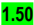
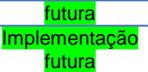

## Metadados
- [Metadados do corpus](metadata.json)
- [Fonte e procedência](../../../../sources/portal_nacional_nfe/nfe/notas-tecnicas/nt-2017-001-v1-50/source.json)
- [Dados normalizados](../../../../normalized/nfe/notas-tecnicas/nt-2017-001-v1-50/normalized.json)
- [Changelog](../../../../changelog/nfe/notas-tecnicas/nt-2017-001-v1-50.md)
- [Proveniência resumida](../../../../sources/provenance/nt-2017-001-v1-50.json)

## Projeto Nota Fiscal Eletrônica

Nota Técnica 2017.001 Validação GTIN

Versão 1.50 - Dezembro 2018

## Sumário

| Controle de Versões.........................................................................................................................3   | Controle de Versões.........................................................................................................................3   | Controle de Versões.........................................................................................................................3   |
|-------------------------------------------------------------------------------------------------------------------------------------------------|-------------------------------------------------------------------------------------------------------------------------------------------------|-------------------------------------------------------------------------------------------------------------------------------------------------|
| Histórico de Alterações / Cronograma ..............................................................................................4            | Histórico de Alterações / Cronograma ..............................................................................................4            | Histórico de Alterações / Cronograma ..............................................................................................4            |
| 1                                                                                                                                               | Resumo.....................................................................................................................................6    | Resumo.....................................................................................................................................6    |
| 2                                                                                                                                               | Cadastro Centralizado de GTIN.................................................................................................6                 | Cadastro Centralizado de GTIN.................................................................................................6                 |
| 2.1                                                                                                                                             | 2.1                                                                                                                                             | Cadastro Centralizado de GTIN..........................................................................................6                        |
| 2.2                                                                                                                                             | 2.2                                                                                                                                             | Manutenção do Cadastro Centralizado de GTIN (CCG) .....................................................8                                        |
| 3                                                                                                                                               | Alterações no Leiaute da Nota Fiscal Eletrônica (NF-e/NFC-e) .................................................9                                 | Alterações no Leiaute da Nota Fiscal Eletrônica (NF-e/NFC-e) .................................................9                                 |
| 3.1                                                                                                                                             | 3.1                                                                                                                                             | I. Produtos e Serviços da NF-e...........................................................................................9                      |
| 4                                                                                                                                               | Alterações em Regras de Validação (RV) da NF-e/NFC-e.......................................................10                                   | Alterações em Regras de Validação (RV) da NF-e/NFC-e.......................................................10                                   |
| 4.1                                                                                                                                             | 4.1                                                                                                                                             | Etapa 01...........................................................................................................................10           |
| 4.2                                                                                                                                             | 4.2                                                                                                                                             | Etapa 02...........................................................................................................................11           |
| 4.3                                                                                                                                             | 4.3                                                                                                                                             | Etapa 03...........................................................................................................................12           |
| 4.4                                                                                                                                             | 4.4                                                                                                                                             | Etapa 04 - Implementação futura.....................................................................................12                          |
| 4.5                                                                                                                                             | 4.5                                                                                                                                             | Etapa 05 - Implementação futura.....................................................................................13                          |
| 4.6                                                                                                                                             | 4.6                                                                                                                                             | Regras de validação excluídas .........................................................................................14                       |
| 5                                                                                                                                               | Mensagens de Erro .................................................................................................................16           | Mensagens de Erro .................................................................................................................16           |

## Controle de Versões

|   Versão | Publicação     | Descrição                                                                                                                                                                                                                                                                                                     |
|----------|----------------|---------------------------------------------------------------------------------------------------------------------------------------------------------------------------------------------------------------------------------------------------------------------------------------------------------------|
|     1.50 | Dezembro/2018  | Suspende a aplicação das regras de validação ainda não implementadas                                                                                                                                                                                                                                          |
|     1.40 | Agosto/2018    |  Modificação do leiaute da NT para o novo padrão de identidade visual.  Estruturação da seção 4.0 para apresentação das regras de validação por etapas de implantação e remoção da informação de prazo da descrição da regra de validação.  Atualização do cronograma detalhado de implantação Anexo I.01. |
|     1.30 | Junho/2018     | Alteração de regras de validação e cronograma de implantação                                                                                                                                                                                                                                                  |
|     1.20 | Fevereiro/2018 | Alteração de regras de validação e cronograma de implantação                                                                                                                                                                                                                                                  |
|     1.10 | Dezembro/2017  | Alteração de regras de validação e cronograma de implantação                                                                                                                                                                                                                                                  |
|     1.00 | Outubro/ 2017  | Publicação da NT, válida somente para a versão 4.00 da NF-e e NFC-e.                                                                                                                                                                                                                                          |

## Histórico de Alterações / Cronograma

|   Versão | Histórico de atualizações                                                                                                                                                                                                                                                                                                                                                                                                                                                                                                                                                                                                                                                   | Implantação Homologação                                           | Implantação Produção                                              |
|----------|-----------------------------------------------------------------------------------------------------------------------------------------------------------------------------------------------------------------------------------------------------------------------------------------------------------------------------------------------------------------------------------------------------------------------------------------------------------------------------------------------------------------------------------------------------------------------------------------------------------------------------------------------------------------------------|-------------------------------------------------------------------|-------------------------------------------------------------------|
|     1.50 |  Implantação das seções 4.4 e 4.5: 4.4 - Etapa 04: RV 9I03-10 e RV 9I12-10 (Verificação da existência no CCG do GTIN informado na NF-e) 4.5 - Etapa 05: RV 9I0320, 9I03-30, 9I03-40, 9I12-20 e 9I12-30 (validação pelo CCG das informações de NCM, CEST e GTIN Contido, para cada GTIN informado na NF- e)                                                                                                                                                                                                                                                                                                                                                                 | Implementação Futura                                              | Implementação Futura                                              |
|     1.50 |  Implantação da seção 4.3 - Etapa 03: RV I03-30 e RV I12-60 (Exigência do GTIN para todos CNAE e todas NCM)                                                                                                                                                                                                                                                                                                                                                                                                                                                                                                                                                                | 01/12/2018                                                        | Implementação Futura                                              |
|     1.50 |  Implantação da seção 4.2 - Etapa 02: RV 7I03-10 (Exigência do GTIN, conforme cronograma por CNAE e NCM do Anexo I.01)                                                                                                                                                                                                                                                                                                                                                                                                                                                                                                                                                     | Entre 01/09/2018 e 01/12/2018 (conforme Cronograma do Anexo I.01) | Implementação Futura                                              |
|     1.40 |  Implantação das seções 4.4 e 4.5: 4.4 - Etapa 04: RV 9I03-10 e RV 9I12-10 (Verificação da existência no CCG do GTIN informado na NF-e) 4.5 - Etapa 05: RV 9I0320, 9I03-30, 9I03-40, 9I12-20 e 9I12-30 (validação pelo CCG das informações de NCM, CEST e GTIN Contido, para cada GTIN informado na NF- e)                                                                                                                                                                                                                                                                                                                                                                 | Implementação Futura                                              | Implementação Futura                                              |
|     1.40 |  Implantação da seção 4.3 - Etapa 03: RV I03-30 e RV I12-60 (Exigência do GTIN para todos CNAE e todas NCM)                                                                                                                                                                                                                                                                                                                                                                                                                                                                                                                                                                | 01/12/2018                                                        | 06/05/2019                                                        |
|     1.40 |  Implantação da seção 4.2 - Etapa 02: RV 7I03-10 (Exigência do GTIN, conforme cronograma por CNAE e NCM do Anexo I.01)                                                                                                                                                                                                                                                                                                                                                                                                                                                                                                                                                     | Entre 01/09/2018 e 01/12/2018 (conforme Cronograma do Anexo I.01) | Entre 04/02/2019 e 06/05/2019 (conforme Cronograma do Anexo I.01) |
|     1.30 |  Ajustada a observação do campo cEANTrib.  Alteradas as regras I03-30, I12-60 para serem aplicadas em homologação, deixando a implementação em produção para data futura.  Excluída a regra I12-50.  Ajustado o enunciado da regra 7I03-10  Alteradas as regras 9I03-10, 9I03-20, 9I03-30, 9I03-40, 9I12-10, 9I12-20, 9I12-30, ajustando o enunciado, postergando a validação em homologação e deixando a implementação em produção para data futura.  Ajustada a descrição da mensagem de erro das rejeições 891, 892, 893, 895 e 896.  Alterado o cronograma de validação do GTIN para iniciar as validações em ambiente de homologação a partir de setembro/2018. | 27/06/2018                                                        | 02/07/2018                                                        |
|     1.20 |  Incluído a denominação GTIN contido/Item comercial contido para o GTIN de nível inferior.                                                                                                                                                                                                                                                                                                                                                                                                                                                                                                                                                                                 | 04/12/2017                                                        | 02/01/2018                                                        |

-  Alteradas as regras I03-30 e I12-60 para começarem as validações a partir de 01/12/2018.
-  Alteradas as regras I03-20, I12-20, 9I03-30 e 9I12-30 para obrigatórias.
-  Alteradas as observações das regras I03-20 e I12-20.
-  Alterada a regra 7I03-10 para tratar das regras de validações do GTIN para todos os grupos de CNAEs.
-  Excluídas as regras 7I03-20 e 7I03-30, já que a regra 7I03-10 atende a todos os CNAEs.
-  Alteradas as regras 9I03-10, 9I03-20, 9I03-30, 9I03-40, 9I12-10, 9I12-20 e 9I12-30 para começarem a validar a partir de 02/07/2018.
-  Alterada a descrição de GTIN de nível inferior da regra 9I03-40 para GTIN Contido.
-  Incluído o subcapítulo 2.1.
-  Alterada a tabela do ANEXO I.01.

|   1.10 |  Incluída como obrigatória a foto do produto no Cadastro Centralizado de Produto (CCG).                                                     | 04/12/2017   | 02/01/2018   |
|--------|----------------------------------------------------------------------------------------------------------------------------------------------|--------------|--------------|
|        |  Alteradas as regras I03-30 e I12-60, deixando-a para implantação futura.                                                                   |              |              |
|        |  Alterada a regra 7I03-20.                                                                                                                  |              |              |
|        |  Alteradas as regras I03-10, I03-20, I12-10, I12-20 e I12-50 para não aplicar a validação quando for preenchido 'SEM GTIN' ou estiver nulo. |              |              |
|        |  Alterada a regra I12-60 para começar a partir de 01/03/2018 para NF-e, modelo 55.                                                          |              |              |
|   1.00 |  Implantações desta NT previstas somente para a versão 4.00 da NF-e e NFC-e                                                                 | 04/12/2017   | 02/01/2018   |

## 1 Resumo

Atualmente o Ajuste SINIEF 07/05, Ajuste SINIEF 19/16 e suas alterações obrigam o preenchimento dos campos cEAN e cEANTrib na NF-e e NFC-e quando o produto comercializado possuir código de barras com GTIN.

Os Ajustes SINIEF supracitados também informam que os sistemas autorizadores da NF-e e NFC-e deverão validar as informações descritas nos  campos  cEAN  e  cEANTrib,  junto  ao  Cadastro  Centralizado  de  GTIN  (CCG),  devendo  as  notas  serem  rejeitadas  em  casos  de  não conformidades com as informações contidas no CCG.

Para mais informações sobre esses Ajustes SINIEF visite: https://www.confaz.fazenda.gov.br/legislacao/ajustes/2017.

## 2 Cadastro Centralizado de GTIN

## 2.1  Cadastro Centralizado de GTIN

O GTIN, sigla de 'Global Trade Item Number' é um identificador para itens comerciais. Os GTIN, anteriormente chamados de códigos EAN, são  atribuídos  para  qualquer  item  (produto  ou  serviço)  que  pode  ser  precificado,  pedido  ou  faturado  em  qualquer  ponto  da  cadeia  de suprimentos. O GTIN é utilizado para recuperar  informação pré-definida  e  abrange  desde  as matérias  primas  até  produtos  acabados. Os GTINs podem ter o tamanho de 8, 12, 13 ou 14 dígitos e podem ser construídos utilizando qualquer uma das quatro estruturas de numeração dependendo da aplicação.

O Cadastro Centralizado de GTIN (CCG) é um banco de dados contendo um conjunto reduzido de informações dos produtos que possuem o código de barras GTIN em suas embalagens, e funciona de forma integrada com o CNP (Cadastro Nacional de Produtos da GS1), que é o cadastro mantido pela organização legalmente responsável pelo licenciamento do respectivo código de barras. Os produtos em circulação no mercado que possuem GTIN e que são informados nos documentos fiscais eletrônicos, NF-e e NFC-e, terão suas informações validadas no CCG, de acordo com o cronograma previsto na legislação. Portanto, os donos das marcas dos produtos que possuem GTIN deverão manter atualizados os dados cadastrais de seus produtos junto ao CNP (em cnp.gs1br.org/), de forma a manter atualizado o Cadastro Centralizado de GTIN.

As informações obrigatórias que devem estar no Cadastro Centralizado de GTIN (CCG) são:

- I. GTIN
- II. Marca
- III. Tipo GTIN (8, 12, 13 ou 14 posições)
- IV. Descrição do Produto
- V. Dados da classificação do produto (Segmento, Família, Classe e Subclasse/Bloco)
- VI. País - Principal Mercado de Destino
- VII. CEST (quando existir)
- VIII. NCM
- IX. Peso Bruto
- X. Unidade de Medida do Peso Bruto
- XI. Foto do produto

Caso o GTIN cadastrado seja de um agrupamento de produtos homogêneos (GTIN-14, antigo DUN-14), as informações adicionais que devem conter no CCG são:

- I. GTIN de nível inferior, também denominado GTIN contido/Item comercial contido
- II. Quantidade de Itens Contidos

## 2.2  Manutenção do Cadastro Centralizado de GTIN (CCG)

Conforme citado, os Ajustes SINIEF 07/05 e 19/16 informam que os sistemas autorizadores da NF-e e NFC-e deverão validar as informações de GTIN devendo as notas serem rejeitadas quando não estiverem em conformidade com o CCG. Por isso, é fundamental que os donos de marca  mantenham  as  informações  cadastrais  de  produtos  com  GTIN  atualizadas  junto  ao  CCG,  o  que  é  feito  através  da  manutenção atualizada do cadastro junto ao CNP da GS1.

Os  registros  rejeitados  no  CCG  serão  devolvidos  pelo  Fisco  à  GS1  para  que  a  mesma  disponibilize  essa  informação  junto  aos  seus associados.

Segue  relação  das  principais  validações,  efetuadas  no  CCG,  que  poderão  levar  à  necessidade  de  correção,  pelos  donos  de  marca,  do cadastro de GTIN no CNP-GS1:

| Campo                                                     | Validação                                                                                                                                                |
|-----------------------------------------------------------|----------------------------------------------------------------------------------------------------------------------------------------------------------|
| GTIN                                                      | Dígito de Controle inválido                                                                                                                              |
| Descrição do Produto                                      | Descrição do Produto muito genérica ou que não permita a identificação adequada do produto. Exemplo: 'A definir', 'Disponível', 'Não informado(a)', etc. |
| Inscrição do Dono da Marca no Cadastro da Receita Federal | CNPJ ou CPF inválido                                                                                                                                     |
| NCM                                                       | Não informado o código do NCM do produto, ou informado um NCM inexistente                                                                                |
| CEST                                                      | Se for o caso, não informado o código CEST para o produto, ou informado um CEST inexistente, ou informado código CEST incompatível com o NCM             |
| Código de Classificação Geral do Produto (GPC)            | Não informado o código de Classificação Geral do Produto (Segmento, Família, Classe e Subclasse), ou informado código existente, ou incompatível.        |
| GTIN de nível inferior (vinculado ao GTIN-14)             | Não informado GTIN contido para o GTIN-14 ou Dígito de Controle inválido.                                                                                |

## 3 Alterações no Leiaute da Nota Fiscal Eletrônica (NF-e/NFC-e)

## 3.1  I. Produtos e Serviços da NF-e

|   # | ID   | Campo    | Descrição                                                                                    | Ele   | Pai   | Tipo   | Ocor.   | Tam.           | Observação                                                                                                                                                                                                                                                                                                                                               |
|-----|------|----------|----------------------------------------------------------------------------------------------|-------|-------|--------|---------|----------------|----------------------------------------------------------------------------------------------------------------------------------------------------------------------------------------------------------------------------------------------------------------------------------------------------------------------------------------------------------|
| 102 | I03  | cEAN     | GTIN (Global Trade Item Number) do produto, antigo código EAN ou código de barras            | E     | I01   | C      | 1-1     | 0,8,12, 13, 14 | Preencher com o código GTIN-8, GTIN-12, GTIN- 13 ou GTIN-14 (antigos códigos EAN, UPC e DUN-14). Para produtos que não possuem código de barras com GTIN, deve ser informado o literal 'SEM GTIN';                                                                                                                                                       |
| 111 | I12  | cEANTrib | GTIN (Global Trade Item Number) da unidade tributável, antigo código EAN ou código de barras | E     | I01   | C      | 1-1     | 0,8,12, 13, 14 | Preencher com o código GTIN-8, GTIN-12, GTIN- 13 ou GTIN-14 (antigos códigos EAN, UPC e DUN-14) da unidade tributável do produto. O GTIN da unidade tributável deve corresponder àquele da menor unidade comercializável identificada por código GTIN. Para produtos que não possuem código de barras com GTIN, deve ser informado o literal "SEM GTIN'; |

## 4 Alterações em Regras de Validação (RV) da NF-e/NFC-e

As  regras  de  validação  do  GTIN  serão  implantadas  por  etapas,  conforme  plano  de  implantação  a  seguir.  As  etapas  previstas  para implementação futura serão divulgadas em nova versão desta Nota Técnica.

## 4.1  Etapa 01

As regras de validação a seguir já foram implantadas conforme definido na versão 1.10 desta NT.

## I. Produtos e Serviços

| Campo- Seq   | Modelo   | Regra de Validação                                                                                                                                                                                                                                                            | Aplic.   |   Msg | Efeito   | Descrição Erro                                                       |
|--------------|----------|-------------------------------------------------------------------------------------------------------------------------------------------------------------------------------------------------------------------------------------------------------------------------------|----------|-------|----------|----------------------------------------------------------------------|
| I03-10       | 55/65    | Se informado GTIN (tag: cEAN) <> 'SEM GTIN' ou Nulo): - cEAN com dígito de controle inválido Observação: Cálculo do dígito verificador em www.gs1.org/check- digit-calculator                                                                                                 | Obrig.   |   611 | Rej.     | Rejeição: GTIN (cEAN) inválido [nItem:999]                           |
| I03-20       | 55/65    | Se informado GTIN (tag: cEAN) <> 'SEM GTIN' ou Nulo): - Prefixo GS1 inválido, conforme tabela de prefixos publicada no Portal da NF-e Observação: Validação efetuada conforme prefixos e orientações constantes na 'Tabela Prefixo GS1' publicada no Portal Nacional da NF-e. | Obrig.   |   882 | Rej.     | Rejeição: GTIN (cEAN) com prefixo inválido [nItem:999]               |
| I12-10       | 55/65    | Se informado GTIN da unidade tributável (tag: cEANTrib) <> 'SEM GTIN' ou Nulo): - cEANTrib com dígito de controle inválido Observação: Cálculo do dígito verificador em www.gs1.org/check- digit-calculator                                                                   | Obrig.   |   612 | Rej.     | Rejeição: GTIN da unidade tributável (cEANTrib) inválido [nItem:999] |

| I12-20   | 55/65   | Se informado GTIN da unidade tributável (tag: cEANTrib) <> 'SEM GTIN' ou Nulo): - Prefixo GS1 inválido, conforme tabela de prefixos publicada no Portal da NF-e Observação: Validação efetuada conforme prefixos e orientações constantes na 'Tabela Prefixo GS1' publicada no Portal Nacional da NF-e. Obrig. 884   |     | Rej.   | Rejeição: GTIN da unidade tributável (cEANTrib) com prefixo inválido [nItem:999]     |
|----------|---------|----------------------------------------------------------------------------------------------------------------------------------------------------------------------------------------------------------------------------------------------------------------------------------------------------------------------|-----|--------|--------------------------------------------------------------------------------------|
| I12-30   | 55/65   | Informado GTIN específico (cEAN<>'SEM GTIN' ou Nulo) e informado GTIN da unidade tributável igual a "SEM GTIN" ou Nulo (cEANTrib='SEM GTIN' ou Nulo) Obrig.                                                                                                                                                          | 885 | Rej.   | Rejeição: GTIN informado, mas não informado o GTIN da unidade tributável [nItem:999] |
| I12-40   | 55/65   | Informado GTIN da unidade tributável específico (cEANTrib<>'SEM GTIN' ou Nulo) e informado GTIN igual a "SEM GTIN" ou Nulo (cEAN='SEM GTIN' ou Nulo) Obrig.                                                                                                                                                          | 886 | Rej.   | Rejeição: GTIN da unidade tributável informado, mas não informado o GTIN [nItem:999] |

## 4.2  Etapa 02

A regra de validação a seguir será implantada por grupo de CNAE e NCM conforme cronograma publicado no Anexo I.01 .

## Banco de Dados: Cadastro SEFAZ

| Campo- Seq   | Modelo   | Regra de Validação                                                                                            | Aplic.   | Msg Efeito   | Descrição Erro                                                        |
|--------------|----------|---------------------------------------------------------------------------------------------------------------|----------|--------------|-----------------------------------------------------------------------|
| 7I03-10      | 55/65    | Se não informado GTIN (cEAN=Nulo). Observação: Para produtos que não possuem GTIN, a informação de "SEM GTIN" | Obrig.   | 889 Rej.     | Rejeição: Obrigatória a informação do GTIN para o produto [nItem:999] |

## 4.3  Etapa 03 - Implementação futura

As regras de validação a seguir serão implantadas em versão futura desta NT.

## I. Produtos e Serviços

| Campo- Seq   | Modelo   | Regra de Validação                                                                                                                                                                    | Aplic.   |   Msg | Efeito   | Descrição Erro                                                             |
|--------------|----------|---------------------------------------------------------------------------------------------------------------------------------------------------------------------------------------|----------|-------|----------|----------------------------------------------------------------------------|
| I03-30       | 55/65    | GTIN (tag: cEAN) em branco, campo sem informação. Observação: Para produtos que não possuem GTIN, utilizar a informação de "SEM GTIN".                                                | Obrig.   |   883 | Rej.     | Rejeição: GTIN (cEAN) sem informação [nItem:999]                           |
| I12-60       | 55/65    | GTIN da unidade tributável (tag: cEANTrib) em branco, campo sem informação. Observação Para produtos que não possuem GTIN da unidade tributável, utilizar a informação de "SEM GTIN". | Obrig.   |   888 | Rej.     | Rejeição: GTIN da unidade tributável (cEANTrib) sem informação [nItem:999] |

## 4.4  Etapa 04 - Implementação futura

As regras de validação a seguir verificam a existência do código GTIN no Cadastro Centralizado de GTIN (CCG). Elas serão implantadas por grupo de CNAE e NCM em cronograma a ser divulgado em versão futura desta NT.

Banco de Dados: Cadastro Centralizado de GTIN (CCG)

| Campo-Seq   | Modelo   | Regra de Validação                           | Aplic.   |   Msg | Efeito   | Descrição Erro                         |
|-------------|----------|----------------------------------------------|----------|-------|----------|----------------------------------------|
| 9I03-10     | 55/65    | Se informado GTIN (tag: cEAN) com prefixo do | Obrig    |   890 | Rej.     | Rejeição: GTIN inexistente no Cadastro |

|         |       | Brasil (iniciado em 789 ou 790) e GTIN informado na NF-e inexistente no CCG.                                                                                                              |       |     |      | Centralizado de GTIN (CCG) [nItem:999]                                                              |
|---------|-------|-------------------------------------------------------------------------------------------------------------------------------------------------------------------------------------------|-------|-----|------|-----------------------------------------------------------------------------------------------------|
| 9I12-10 | 55/65 | Se informado GTIN da unidade tributável (tag: cEANTrib) com prefixo do Brasil (iniciado em 789 ou 790) e GTIN da unidade tributável informado na NF-e (tag: cEANTrib) inexistente no CCG. | Obrig | 894 | Rej. | Rejeição: GTIN da unidade tributável inexistente no Cadastro Centralizado de GTIN (CCG) [nItem:999] |

## 4.5  Etapa 05 - Implementação futura

As regras de validação a seguir verificam a existência do código GTIN no Cadastro Centralizado de GTIN (CCG). Elas serão implantadas por grupo de CNAE e NCM em cronograma a ser divulgado em versão futura desta NT.

## Banco de Dados: Cadastro Centralizado de GTIN (CCG)

| Campo- Seq   | Modelo   | Regra de Validação                                                                                                                                                                                | Aplic.   |   Msg | Efeito   | Descrição Erro                                                                                                                    |
|--------------|----------|---------------------------------------------------------------------------------------------------------------------------------------------------------------------------------------------------|----------|-------|----------|-----------------------------------------------------------------------------------------------------------------------------------|
| 9I03-20      | 55/65    | Se informado GTIN (tag: cEAN) com prefixo do Brasil (iniciado em 789 ou 790) e NCM informada na NF-e diferente da cadastrada no CCG                                                               | Obrig    |   891 | Rej.     | Rejeição: GTIN incompatível com a NCM [nItem:999; NCM esperada: 99999999]                                                         |
| 9I03-30      | 55/65    | Se informado o GTIN (tag: cEAN) com prefixo do Brasil (iniciado em 789 ou 790) e CEST informado na NF-e diferente do cadastrado no CCG                                                            | Obrig.   |   892 | Rej.     | Rejeição: GTIN incompatível com CEST [nItem:999; CEST esperado: 9999999]                                                          |
| 9I03-40      | 55/65    | Se informado GTIN-14 (tag: cEAN>09999999999999) com prefixo do Brasil (iniciado em 789 ou 790) e informado GTIN da unidade tributável (tag: cEANTrib) diferente do GTIN Contido cadastrado no CCG | Obrig.   |   893 | Rej.     | Rejeição: GTIN da unidade tributável diverge do GTIN Contido cadastrado no CCG [nItem:999; GTIN Contido esperado: 99999999999999] |

|         |       | Exceção: a RV não se aplica em operações com exterior (idDest=3) Nota : o GTIN pode possuir GTIN de nível inferior (GTIN Contido), agrupando diversas unidades do mesmo produto. O GTIN da unidade tributável deve corresponder àquele da menor unidade comercializável identificada por código GTIN, ou seja, deve corresponder ao GTIN do menor nível inferior (GTIN Contido).   |        |     |      |                                                                                                 |
|---------|-------|------------------------------------------------------------------------------------------------------------------------------------------------------------------------------------------------------------------------------------------------------------------------------------------------------------------------------------------------------------------------------------|--------|-----|------|-------------------------------------------------------------------------------------------------|
| 9I12-20 | 55/65 | Se informado GTIN da unidade tributável (tag: cEANTrib) com prefixo do Brasil (iniciado em 789 ou 790) e NCM informada na NF-e diferente da cadastrada no CCG                                                                                                                                                                                                                      | Obrig  | 895 | Rej. | Rejeição: GTIN da unidade tributável incompatível com a NCM [nItem:999; NCM esperada: 99999999] |
| 9I12-30 | 55/65 | Se informado GTIN da unidade tributável (tag: cEANTrib) com prefixo do Brasil (iniciado em 789 ou 790) e CEST informado na NF-e diferente do cadastrado no CCG                                                                                                                                                                                                                     | Obrig. | 896 | Rej. | Rejeição: GTIN da unidade tributável incompatível com CEST [nItem:999; CEST esperado: 9999999]  |

## 4.6  Regras de validação excluídas

## I. Produtos e Serviços (Excluída na versão 1.30)

| Campo- Seq   | Modelo   | Regra de Validação                                                                                                                                                                                                                                                 | Aplic.   |   Msg | Efeito   | Descrição Erro                                                                                                     |
|--------------|----------|--------------------------------------------------------------------------------------------------------------------------------------------------------------------------------------------------------------------------------------------------------------------|----------|-------|----------|--------------------------------------------------------------------------------------------------------------------|
| I12-50       | 55/65    | Informado GTIN da unidade tributável como um agrupamento de produtos homogêneos (GTIN-14, tag: cEANTrib>09999999999999 e <> 'SEM GTIN' ou Nulo): Exceção: a RV não se aplica em operações com exterior (idDest=3) Nota: No GTIN-14 o primeiro dígito identifica um | Obrig.   |   887 | Rej.     | Rejeição: Informado GTIN de agrupamento de produtos homogêneos (GTIN-14) no GTIN da unidade tributável [nItem:999] |

| agrupamento homogêneo de diversas unidades do mesmo produto. O GTIN da unidade tributável deve corresponder ao GTIN da   |
|--------------------------------------------------------------------------------------------------------------------------|

Banco de Dados: Cadastro SEFAZ

(Excluídas na versão 1.20)

| Campo- Seq   | Modelo   | Regra de Validação                                                                                                                                                                                                                                                                                                                                                                                | Aplic.   |   Aplic. | Msg Efeito   | Msg Efeito                                                            | Descrição Erro                                                        |                                                                       |
|--------------|----------|---------------------------------------------------------------------------------------------------------------------------------------------------------------------------------------------------------------------------------------------------------------------------------------------------------------------------------------------------------------------------------------------------|----------|----------|--------------|-----------------------------------------------------------------------|-----------------------------------------------------------------------|-----------------------------------------------------------------------|
| 7I03-20      | 55/65    | Se informado NCM de cigarro (NCM=24022000) e CNAE do emitente for de fabricação de produtos de fumo (CNAE iniciada em 121 ou 122) - Não informado GTIN (cEAN=Nulo). ou informado GTIN igual a 'SEM GTIN' (cEAN='SEM GTIN'). Observação 1: Regra de validação se aplica por grupo de CNAE conforme vigência definida no ANEXO I.01; Observação 2: Para produtos que não possuem GTIN,              | Obrig.   |      889 | Rej.         | Rejeição: Obrigatória a informação do GTIN para o produto [nItem:999] | Rejeição: Obrigatória a informação do GTIN para o produto [nItem:999] | Rejeição: Obrigatória a informação do GTIN para o produto [nItem:999] |
| 7I03-30      | 55/65    | Se informado grupo de medicamentos (tag: med, id: K01) e CNAE do emitente for de fabricação de produtos farmoquímicos e farmacêuticos (CNAE iniciada em 211 e 212) - Não informado GTIN (cEAN=Nulo). Observação 1: Regra de validação se aplica por grupo de CNAE conforme vigência definida no ANEXO I.01. Observação 2: Para produtos que não possuem GTIN, utilizar a informação de "SEM GTIN" | Obrig.   |      889 | Rej.         | Rejeição: Obrigatória a informação do GTIN para o produto [nItem:999] | Rejeição: Obrigatória a informação do GTIN para o produto [nItem:999] | Rejeição: Obrigatória a informação do GTIN para o produto [nItem:999] |

## 5 Mensagens de Erro

| CÓDIGO                                                                            | MOTIVOS DE NÃO ATENDIMENTO DA SOLICITAÇÂO                                                                                         |
|-----------------------------------------------------------------------------------|-----------------------------------------------------------------------------------------------------------------------------------|
| 611                                                                               | Rejeição: GTIN (cEAN) inválido [nItem:999]                                                                                        |
| 612 Rejeição: GTIN da unidade tributável (cEANTrib)                               | inválido [nItem:999]                                                                                                              |
| 882 GTIN (cEAN) com prefixo inválido                                              | Rejeição: [nItem:999]                                                                                                             |
| 883 [nItem:999]                                                                   | Rejeição: GTIN (cEAN) sem informação                                                                                              |
| 884 Rejeição: GTIN da unidade tributável (cEANTrib)                               | com prefixo inválido [nItem:999]                                                                                                  |
| 885 Rejeição: GTIN informado, mas não informado                                   | o GTIN da unidade tributável [nItem:999]                                                                                          |
| 886 GTIN da unidade tributável informado,                                         | Rejeição: mas não informado o GTIN [nItem:999]                                                                                    |
| 887 Rejeição: Informado GTIN de agrupamento de                                    | produtos homogêneos (GTIN-14) no GTIN da unidade tributável [nItem:999]                                                           |
| 888 Rejeição: GTIN da unidade tributável (cEANTrib)                               | sem informação [nItem:999]                                                                                                        |
| Rejeição: Obrigatória a informação do GTIN para o produto [nItem:999]             | 889                                                                                                                               |
| 890 Rejeição: GTIN inexistente no Cadastro Centralizado de GTIN (CCG) [nItem:999] |                                                                                                                                   |
| 891 Rejeição: GTIN incompatível com a NCM [nItem:999; NCM esperada: 99999999]     |                                                                                                                                   |
| 892 Rejeição: GTIN incompatível com CEST [nItem:999; CEST esperado: 9999999]      |                                                                                                                                   |
| 893                                                                               | Rejeição: GTIN da unidade tributável diverge do GTIN Contido cadastrado no CCG [nItem:999; GTIN Contido esperado: 99999999999999] |
| 894                                                                               | Rejeição: GTIN da unidade tributável inexistente no Cadastro Centralizado de GTIN (CCG) [nItem:999]                               |
| 895                                                                               | Rejeição: GTIN da unidade tributável incompatível com a NCM [nItem:999; NCM esperada: 99999999]                                   |
| 896                                                                               | Rejeição: GTIN da unidade tributável incompatível com CEST [nItem:999; CEST esperado: 9999999]                                    |

## ANEXO I.01 - Tabela Cronograma GTIN - Etapa 02

Cronograma para validar a exigência de preenchimento do GTIN no campo cEAN (RV 7I03-10).

| GRUPO   | CNAE      | NCM                                                                                                                                                                                                                                                                                        | VIGÊNCIA Homologação   | VIGÊNCIA Produção    |
|---------|-----------|--------------------------------------------------------------------------------------------------------------------------------------------------------------------------------------------------------------------------------------------------------------------------------------------|------------------------|----------------------|
| I       | 324       | 9503 a 9505                                                                                                                                                                                                                                                                                | 01/set/18              | Implementação futura |
| II      | 121 a 122 | 2401 a 2403                                                                                                                                                                                                                                                                                | 01/set/18              | Implementação futura |
| III     | 211 e 212 | 3001 a 3006                                                                                                                                                                                                                                                                                | 01/set/18              | Implementação futura |
| IV      | 261 a 323 | 3701 a 3707, 7101 a 7118, 8401, 8405 a 8479, 8482 a 8487, 8501 a 8519, 8521 a 8523, 8525 a 8548, 8601 a 8608, 8701 a 8716, 8801 a 8805, 8901 a 8908, 9001 a 9033, 9101 a 9114, 9201 a 9209, 9401 a 9406, 9506 a 9508.                                                                      | 01/out/18              | Implementação futura |
| V       | 103 a 112 | 0401 a 0410, 0811 a 0814, 0901 a 0910, 1101 a 1109, 1501 a 1518, 1520 a 1522, 1701 a 1704, 1801 a 1806, 1901 a 1905, 2001 a 2009, 2101 a 2106, 2201 a 2209, 2301 a 2309, 3501 a 3507                                                                                                       | 01/out/18              | Implementação futura |
| VI      | 011 a 102 | 0101 a 0106, 0201 a 0210, 0301 a 0308, 0501 a 0507, 0601 a 0604, 0701 a 0714, 0801 a 0810, 1001 a 1008, 1201 a 1214, 1301 a 1302, 1401, 1404, 1601 a 1605, 2501 a 2530, 2601 a 2621, 2701 a 2715                                                                                           | 01/out/18              | Implementação futura |
| VII     | 131 a 142 | 5001 a 5007, 5101 a 5113, 5201 a 5212, 5301 a 5311, 5401 a 5408, 5601 a 5609, 5701 a 5705, 5801 a 5811, 5901 a 5911, 6001 a 6006, 6101 a 6117, 6201 a 6217, 6301 a 6310, 6501 a 6507, 6601 a 6603, 6701 a 6704                                                                             | 01/nov/18              | Implementação futura |
| VIII    | 151 a 209 | 2801 a 2853, 2901 a 2942, 3101 a 3105, 3201 a 3215, 3301 a 3307, 3401 a 3406, 3801 a 3826, 4101 a 4115, 4201 a 4206, 4301 a 4304, 4401 a 4421, 4501 a 4504, 4601 a 4602, 4701 a 4707, 4801 a 4814, 4816 a 4823, 4901 a 4911, 5501 a 5516, 6401 a 6406                                      | 01/nov/18              | Implementação futura |
| IX      | 221 a 259 | 3601 a 3606, 3901 a 3926, 4001 a 4017, 6801 a 6815, 6901 a 6914, 7001 a 7020, 7201 a 7229, 7301 a 7326, 7401 a 7419, 7501 a 7508, 7601 a 7616, 7801 a 7802, 7804, 7806, 7901 a 7905, 7907, 8001 a 8003, 8007, 8101 a 8113, 8201 a 8215, 8301 a 8311, 8402 a 8404, 8480 a 8481, 9301 a 9307 | 01/nov/18              | Implementação futura |
| X       | 491 a 662 | Qualquer NCM                                                                                                                                                                                                                                                                               | 01/dez/18              | Implementação futura |
| XI      | 663 a 872 | Qualquer NCM                                                                                                                                                                                                                                                                               | 01/dez/18              | Implementação        |

|    | Qualquer   | Qualquer NCM   |           | futura               |
|----|------------|----------------|-----------|----------------------|
| XI | CNAE       |                | 01/dez/18 | Implementação futura |

## Documentos relacionados
_Nenhum documento relacionado conhecido._
