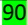
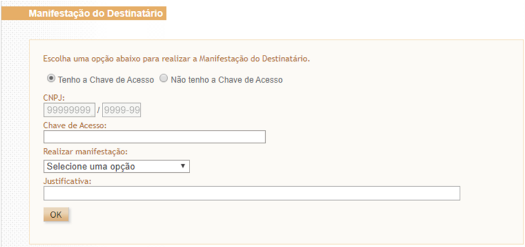
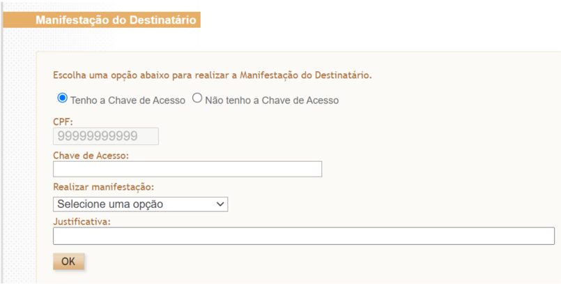
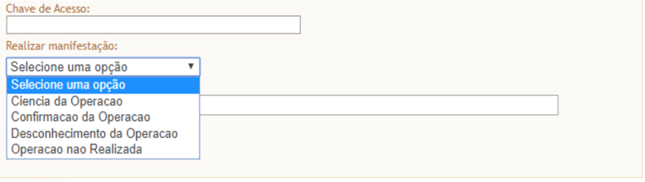
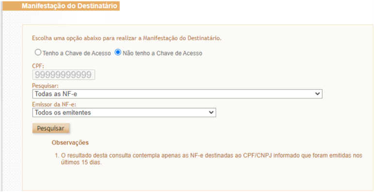
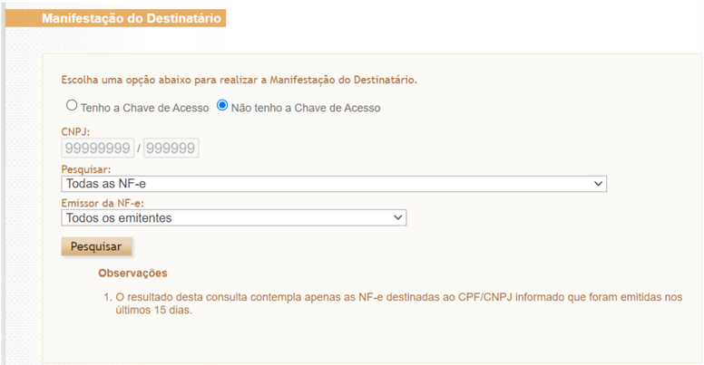
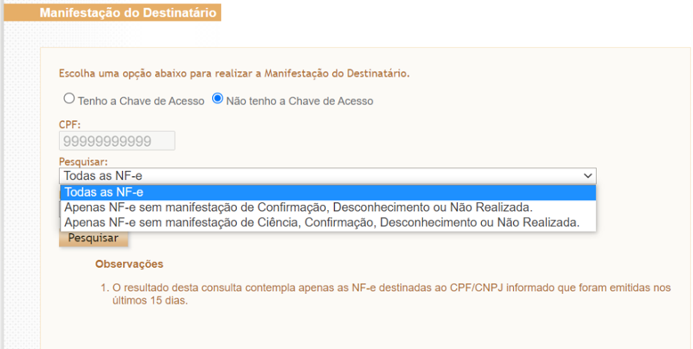
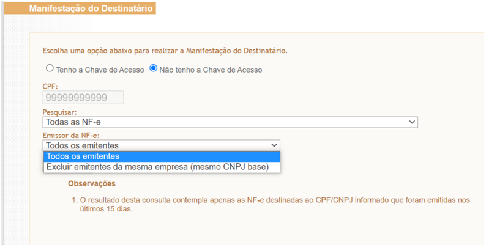
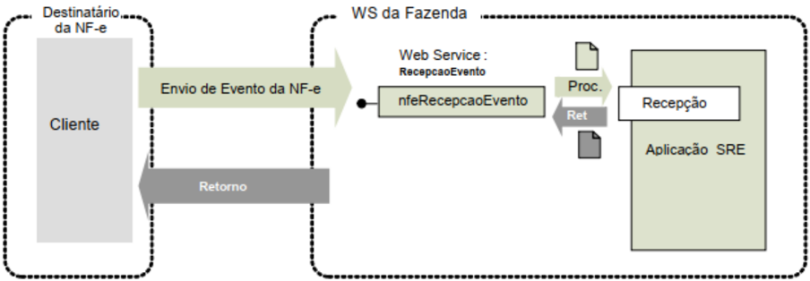

## Projeto Nota Fiscal Eletrônica

Nota Técnica 2020.001 Evento de manifestação do destinatário

## Sumário

| 1      | Histórico de Alterações / Cronograma ................................................................................................. 3                 |
|--------|----------------------------------------------------------------------------------------------------------------------------------------------------------|
| 2      | Resumo ............................................................................................................................................... 4 |
| 3      | Eventos da Manifestação do Destinatário ........................................................................................... 4                    |
| 4      | Prazos para realização dos eventos de manifestação do destinatário .................................................. 5                                  |
| 5      | Obrigados a realização da manifestação do destinatário ..................................................................... 5                           |
| 6 Como | operacionalizar a manifestação do destinatário ........................................................................ 6                                |
| 6.1    | Serviço no Portal Nacional da NF-e .............................................................................................. 6                      |
| 6.1.1  | Manifestação do destinatário com chave de acesso ................................................................. 6                                     |
| 6.1.2  | Manifestação do destinatário sem chave de acesso ................................................................. 8                                     |
| 6.2    | Aplicativo no Portal Nacional da NF-e ......................................................................................... 10                       |
| 6.3    | Web Service - RecepcaoEvento - Manifestação do Destinatário ................................................ 10                                          |
| 6.3.1  | Leiaute Mensagem de Entrada ............................................................................................... 10                           |
| 6.3.2  | Leiaute Mensagem de Retorno ............................................................................................... 11                           |
| 6.3.3  | Descrição do Processo de Recepção de Evento ....................................................................... 13                                   |
| 6.3.4  | Validação do Certificado de Transmissão ................................................................................ 13                              |
| 6.3.5  | Validação Inicial da Mensagem no Web Service ...................................................................... 13                                   |
| 6.3.6  | Validação da Área de Dados .................................................................................................... 13                       |
| 6.3.7  | Validações gerais do WSNfeRecepcaoEvento ......................................................................... 14                                    |
| 6.3.8  | Regras de validação específica dos eventos de manifestação do Destinatário ........................ 15                                                   |
| 6.3.9  | Final do processamento do Lote ............................................................................................. 16                          |
| 7      | Tabela de códigos de erros e descrições de mensagens de erros ........................................................ 17                                |

## 1 Histórico de Alterações / Cronograma

|   Versão | Histórico de atualizações                                                                                                                         | Implantação Teste   | Implantação Produção   |
|----------|---------------------------------------------------------------------------------------------------------------------------------------------------|---------------------|------------------------|
|     1.00 | • Junção das NT 2012.002 e 2013.001, ambas tratando da Manifestação do Destinatário • Inclusão da Manifestação para Pessoa Fisica (CPF)           | 16/03/2020          | 11/05/2020             |
|     1.10 | • Atualização das regras de rejeição e adequação ao Ajuste SINIEF 44/20                                                                           | 01/03/2022          | 04/04/2022             |
|     1.20 | • Alteração do prazo de implantação das alterações da versão 1.10                                                                                 | 04/04/2022          | 02/05/2022             |
|     1.30 | • Alteração da regra de validação H08 para incluir tpEmis=3 (NFF)                                                                                 | 23/05/2022          | 25/05/2022             |
|     1.40 | • Alteração das opções do serviço de manifestação do destinatário no Portal Nacional da NF-e                                                      | 04/04/2022          | 02/05/2022             |
|     1.50 | • Alteração para possibilitar 2 ocorrências de cada evento conclusivo, conforme previsto no Ajuste SINIEF 43/23, que altera o Ajuste SINIEF 07/05 | 01/07/2024          | 01/08/2024             |
|     1.60 | • Alteração do prazo de manifestação conclusiva conforme previsto no Ajuste SINIEF 14/26                                                          | 15/05/2026          | 01/06/2026             |

## 2 Resumo

Este documento substituirá as Notas Técnicas (NT) 2012.002 e 2013.001 e tem por objetivo unificar as informações referentes aos eventos de manifestação do destinatário (pessoa jurídica) na Nota Fiscal eletrônica (NF-e) modelo 55 e estender o serviço para ser usado também por pessoa física (CPF).

A manifestação está prevista na cláusula décima-quinta-A do Ajuste SINIEF 7/05, a qual estabelece que o destinatário da Nota Fiscal eletrônica confirme a sua participação na operação acobertada pela Nota Fiscal eletrônica emitida para o seu CNPJ/CPF, através dos eventos tratados logo a seguir.

A versão 1.10 dessa NT tem o objetivo de adequar esta documentação ao Ajuste SINIEF 44/20, que alterou os prazos para registro dos eventos de manifestação do destinatário.

A versão 1.50 dessa NT tem o objetivo de adequar esta documentação ao Ajuste SINIEF 43/23, que possibilitou a retificação, por uma única vez, do registro da manifestação do destinatário conclusiva.

A versão 1.60 dessa NT tem o objetivo de adequar esta documentação ao Ajuste SINIEF 14/26, que alterou o prazo do registro da manifestação do destinatário conclusiva de 180 dias para 90 dias contados da data de autorização.

## 3 Eventos da Manifestação do Destinatário

## A. Evento de 'Confirmação da Operação'

O evento de 'Confirmação da Operação' pelo destinatário confirma a operação e o recebimento da mercadoria (para as operações com circulação de mercadoria).

Se ocorrer a devolução total ou parcial das mercadorias, além do procedimento atual de geração da Nota Fiscal de devolução, também poderá ser comandado o evento da 'Confirmação da operação'.

O registro deste evento disponibiliza ao destinatário da NF-e todos os documentos fiscais previstos no item 3 da NT 2014.002.

Nota: Após a Confirmação da Operação pelo destinatário, a empresa emitente fica automaticamente impedida de cancelar a NF-e.

## B. Evento de 'Desconhecimento da Operação'

O evento de 'Desconhecimento da Operação' permite ao destinatário informar o seu desconhecimento de uma determinada operação.

## C. Evento de 'Operação não Realizada'

Em algumas situações, a empresa destinatária informa que a operação não foi realizada (com recusa de recebimento da mercadoria e outros motivos), não cabendo neste caso a emissão de uma Nota Fiscal de devolução.

Este  evento  permite  o  registro  da  declaração  de  Operação  não  Realizada  pelo  destinatário, permitindo também a informação complementar da justificativa desta informação.

O registro deste evento disponibiliza ao destinatário da NF-e todos os documentos fiscais previstos no item 3 da NT 2014.002.

## D. Evento de 'Ciência da Emissão' (Ciência da operação)

Neste evento, o destinatário declara ter ciência sobre uma determinada operação destinada ao seu CNPJ  ou  CPF,  mas  não  possui  ainda  elementos  suficientes  para  apresentar  a  sua  manifestação conclusiva sobre a operação citada.

O evento de 'Ciência da Emissão' é opcional, pois o contribuinte pode registrar diretamente os eventos  de  manifestação  final  (confirmação  da  operação,  desconhecimento  da  operação  ou operação não realizada).

O registro deste evento disponibiliza ao destinatário da NF-e todos os documentos fiscais previstos no item 3 da NT 2014.002.

As NF-e com evento 'Ciência da Emissão' deverão ter a manifestação final do destinatário declarada (registro do evento de Confirmação da Operação ou Desconhecimento da Operação ou Operação não Realizada) no prazo máximo de 90 dias contados da data de autorização da NF-e, nos casos de obrigatoriedade previstos no Ajuste SINIEF 07/05.

## E. Sobre a mudança da Manifestação do Destinatário

Conforme disposto no Ajuste SINIEF 43/23, que altera o Ajuste SINIEF 07/05, o destinatário poderá registrar até 2 (dois) eventos de cada manifestação conclusiva por NF-e, quais sejam: Confirmação da Operação, Desconhecimento da Operação ou Operação não Realizada. Porém, somente terá validade a última manifestação registrada. Exemplo: o destinatário pode confirmar uma operação, depois desconhecê-la e por fim confirmá-la novamente.

Conforme previsto na cláusula décima quinta-C do Ajuste SINIEF 7/05, alterada pelo Ajuste SINIEF 14/2026, todas manifestações do destinatário devem ocorrer dentro do prazo máximo de 90 dias contados da data de autorização  da NF-e, observado o  prazo  de retificação previsto  no § 3º  da mesma cláusula.

O evento de 'Ciência da Operação' não configura a manifestação final do destinatário, portanto não cabe o registro deste evento após a manifestação final do destinatário.

## 4 Prazos para realização dos eventos de manifestação do destinatário

O destinatário deve apresentar uma manifestação conclusiva dentro de um prazo máximo definido, contados a partir da data de autorização da NF-e, conforme tabela abaixo:

| Evento                      | Prazo legal(Ajuste SINIEF 44/20)                         |
|-----------------------------|----------------------------------------------------------|
| Ciência da Emissão          | 10 dias contados a partir da data de autorização da NF-e |
| Confirmação da Operação     | 90 dias contados a partir da data de autorização da NF-e |
| Desconhecimento da Operação | 90 dias contados a partir da data de autorização da NF-e |
| Operação Não Realizada      | 90 dias contados a partir da data de autorização da NF-e |

A  cláusula  décima-quinta-B  do  Ajuste  SINIEF  7/2005  prevê  a  obrigatoriedade  do  registro  pelo destinatário  da  NF-e  dos  eventos  de  confirmação  da  operação,  operação  não  realizada  e desconhecimento da operação nos prazos especificados naquele Ajuste.

Também está obrigado a realizar a manifestação, de acordo com o Anexo II do Ajuste SINIEF 7/2005, o destinatário de toda NF-e que:

I  -  seja exigido o preenchimento do Grupo Detalhamento específico de Combustíveis, como nos casos de mercadoria destinada a:

- a) estabelecimentos distribuidores de combustíveis, a partir de 1º de março de 2013;

b) postos de combustíveis e transportadores revendedores retalhistas, a partir de 1º de julho de 2013;

II - acoberte operações com álcool para fins não-combustíveis, transportado a granel, a partir de 1º de julho de 2014;

III - acoberte, nos casos em que o destinatário for um estabelecimento distribuidor ou atacadista, a partir de 1º de agosto de 2015, a circulação de:

- a) cigarros;
- b) bebidas alcoólicas, inclusive cervejas e chopes;
- c) refrigerantes e água mineral.

Obs: a NT 2012/003 (item 03.1), publicada em agosto/2012, define quais são os CFOP que obrigam a  informação  do  Grupo  de  Combustível  na  NF-e.  Os  CFOP  citados  estão  relacionados  com  as operações que envolvem 'Combustível derivado ou não de Petróleo e Lubrificantes'.

Como  as  operações  com  lubrificantes  são  exceção  à  obrigatoriedade  de  manifestação  do destinatário, consta no Anexo II a tabela de Códigos de Produto da ANP relativa a lubrificantes e que não estão obrigados à Manifestação do Destinatário.

## 6 Como operacionalizar a manifestação do destinatário

## 6.1 Serviço no Portal Nacional da NF-e

No menu 'Serviços', 'Manifestação Destinatário' do Portal Nacional da NF-e (https://www.nfe.fazenda.gov.br) é disponibilizada a opção de realizar a manifestação por chave  de  acesso  ou  por  NSU  (Número  Sequencial  Único),  sendo  obrigatório  o  uso  de Certificado Digital do destinatário.

## 6.1.1 Manifestação do destinatário com chave de acesso

Nesta  opção  deve  ser  informada  a  chave  de  acesso  e  selecionar  uma  das  formas  de manifestação: 'Ciência da Operação', 'Confirmação da Operação', 'Desconhecimento da Operação' ou  'Operação Não  Realizada'. O campo  'Justificativa' somente  será preenchido se selecionada manifestação 'Desconhecimento da Operação' ou 'Operação Não Realizada'.

O campo 'CPF' ou 'CNPJ' não é editável, pois corresponde ao CPF ou CNPJ do certificado digital.

Nesta  opção,  é  possível  realizar  a  manifestação  do  destinatário  de  NF-e  destinada  a qualquer estabelecimento da pessoa jurídica com um mesmo certificado digital, pois é considerado somente o CNPJ-base (primeiros 8 dígitos do CNPJ) do certificado digital. Ex: certificado digital do CNPJ 99.999.999/0002-99 consegue realizar manifestação de NF-e destinada ao CNPJ 99.999.999/0004-99.

Figura 1: Tela da manifestação do destinatário com chave de acesso  para pessoa jurídica

Figura 2: Tela da manifestação do destinatário com chave de acesso para pessoa física

Figura 3: Opções de manifestação do destinatário com chave de acesso para pessoa física e jurídica

## 6.1.2 Manifestação do destinatário sem chave de acesso

Nesta opção de assinalar 'Não tenho chave de acesso', será mostrado na tela as NF-e emitidas nos últimos 15 dias e destinadas ao CPF ou CNPJ de 14 dígitos do certificado digital informado.

Entretanto, caso o certificado digital seja de pessoa jurídica, somente é possível realizar a manifestação  do  destinatário  de  NF-e  destinada  ao  CNPJ  de  14  dígitos  do  certificado digital. Ex: certificado digital do  CNPJ 99.999.999/0002-99  não  consegue  realizar manifestação de NF-e destinada ao CNPJ 99.999.999/0004-99.

Figura 4: Tela da manifestação do destinatário sem chave de acesso  para pessoa física

Figura 5: Tela da manifestação do destinatário sem chave de acesso  para pessoa jurídica

Figura 6: Opções de pesquisa da manifestação do destinatário sem chave de acesso  para pessoa física. As mesmas opções aparecem para pessoa jurídica

Figura 7: Opção de excluir emitentes da mesma empresa na manifestação do destinatário sem chave de acesso  para pessoa física. As mesmas opções aparecem para pessoa jurídica.

## 6.2 Aplicativo no Portal Nacional da NF-e

No menu 'Downloads', 'Manifestador de NF-e' do Portal Nacional da NF-e (https://www.nfe.fazenda.gov.br) foi disponibilizado software desenvolvido pela Sefaz-SP que  viabiliza  exclusivamente  a  manifestação  do  destinatário  pessoa  jurídica,  sendo obrigatório o uso de Certificado Digital do destinatário.

## 6.3 Web Service - RecepcaoEvento - Manifestação do Destinatário

## Sistema de Registro de Eventos

Função:

Serviço destinado à recepção de mensagem de Evento da NF-e.

Processo:

síncrono.

Método: nfeRecepcaoEvento

O autor do evento é o destinatário da NF-e. A mensagem XML do evento será assinada com o certificado digital que tenha o CNPJ-Base (8 primeiras posições do CNPJ) ou CPF do Destinatário da NF-e.

Os  endereços  dos  Web  Services  estão  publicados  no  Portal  da  NF-e,  no  ambiente  nacional (https://www.nfe.fazenda.gov.br, menu Serviços, Relação de Serviços Web).

## 6.3.1 Leiaute Mensagem de Entrada

Entrada:

Estrutura XML com o evento Schema

XML :

envConfRecebto\_v9.99.xsd

| #   | Campo     | Ele   | Pai   | Tipo   | Oco r.   | Tam .   | Descrição/Observação                                                                                                                                                                                                                                                                  |
|-----|-----------|-------|-------|--------|----------|---------|---------------------------------------------------------------------------------------------------------------------------------------------------------------------------------------------------------------------------------------------------------------------------------------|
| P01 | envEvento | Raiz  | -     | -      | -        | -       | TAG raiz                                                                                                                                                                                                                                                                              |
| P02 | versao    | A     | P01   | N      | 1-1      | 2v2     | Versão do leiaute                                                                                                                                                                                                                                                                     |
| P03 | idLote    | E     | P01   | N      | 1-1      | 1-15    | Identificador de controle do Lote de envio do Evento. Número sequencial autoincremental único para identificação do Lote. A responsabilidade de gerar e controlar o identificador é exclusiva do autor do evento. O Web Service não faz qualquer uso ou controle deste identificador. |
| P04 | evento    | G     | P01   | xml    | 1-20     | -       | Evento,um lote pode conter até 20 eventos                                                                                                                                                                                                                                             |
| P05 | versao    | A     | P04   | N      | 1-1      | 2v2     | Versão do leiaute do evento                                                                                                                                                                                                                                                           |

| #   | Campo      | Ele   | Pai   | Tipo   | Oco r.   | Tam .   | Descrição/Observação                                                                                                                                 |
|-----|------------|-------|-------|--------|----------|---------|------------------------------------------------------------------------------------------------------------------------------------------------------|
| P06 | infEvento  | G     | P04   |        | 1-1      |         | Grupo de informações do registro do Evento                                                                                                           |
| P07 | Id         | ID    | P06   | C      | 1-1      | 54      | Identificador da TAG a ser assinada, a regra de formação do Id é: "ID" + tpEvento + chave da NF-e + nSeqEvento                                       |
| P08 | cOrgao     | E     | P06   | N      | 1-1      | 2       | Código do órgão de recepção do Evento, conforme Tabela do IBGE ou: 91 - Ambiente Nacional                                                            |
| P09 | tpAmb      | E     | P06   | N      | 1-1      | 1       | Informar o código da UF para este evento. Identificação do Ambiente: 1=Produção /2=Homologação                                                       |
| P10 | CNPJ       | CE    | P06   | N      | 1-1      | 14      | Informar o CNPJ ou o CPF do autor do Evento                                                                                                          |
| P11 | CPF        | CE    | P06   | N      | 1-1      | 11      |                                                                                                                                                      |
| P12 | chNFe      | E     | P06   | N      | 1-1      | 44      | Chave de Acesso da NF-e vinculada ao Evento                                                                                                          |
| P13 | dhEvento   | E     | P06   | D      | 1-1      |         | Data e hora do evento no formato AAAA- MMDDThh:mm:ssTZD (UTC - Universal Coordinated Time)                                                           |
| P14 | tpEvento   | E     | P06   | N      | 1-1      | 6       | Código do evento: 210200 - Confirmação da Operação 210210 - Ciência da Operação 210220 - Desconhecimento da Operação 210240 - Operação não Realizada |
| P15 | nSeqEvento | E     | P06   | N      | 1-1      | 1-2     | Sequencial do evento para o mesmo tipo de evento. Informar o valor '1' para este evento.                                                             |
| P16 | verEvento  | E     | P06   | N      | 1-1      | 2v2     | Identificação da Versão do evento informadoem detEvento                                                                                              |
| P17 | detEvento  | G     | P06   |        | 1-1      |         | Detalhes do evento. Insira neste local o XML específico do tipo de evento (ex: cancelamento, carta correção, registro de passagem).                  |
| P18 | versao     | A     | P17   | N      | 1-1      | 2v2     | Versão do evento                                                                                                                                     |
| P19 | descEvento | E     | P17   | C      | 1-1      | 5-60    | Informar a descrição do evento: Confirmacao da Operacao Ciencia da Operacao Desconhecimento da Operacao Operacao nao Realizada                       |
| P20 | xJust      | E     | P17   | C      | 0-1      | 15-255  | Informar a justificativa porque a operação não foi realizada, este campo deve ser informado somente no evento de Operação não Realizada.             |
| P91 | Signature  | G     | P04   | XML    | 1-1      |         | Assinatura Digital do documento XML, a assinatura deverá ser aplicada no elemento infEvento                                                          |

## 6.3.2 Leiaute Mensagem de Retorno

Retorno: Estrutura XML com a mensagem do resultado da transmissão. Schema XML: retEnvConfRecebto \_v9.99.xsd

| #   | Campo        | Ele   | Pai   | Tipo   | Ocor.   | Tam.   | Descrição/Observação                                                                                                                                                                                                                                                                  |
|-----|--------------|-------|-------|--------|---------|--------|---------------------------------------------------------------------------------------------------------------------------------------------------------------------------------------------------------------------------------------------------------------------------------------|
| R01 | retEnvEvento | Raiz  | -     | -      | -       | -      | TAG raiz do Resultado do Envio do Evento                                                                                                                                                                                                                                              |
| R02 | versao       | A     | R01   | N      | 1-1     | 2v2    | Versão do leiaute                                                                                                                                                                                                                                                                     |
| R03 | idLote       | E     | R01   | N      | 1-1     | 1-15   | Identificador de controle do Lote de envio do Evento. Número sequencial autoincremental único para identificação do Lote. A responsabilidade de gerar e controlar o identificador é exclusiva do autor do evento. O Web Service não faz qualquer uso ou controle deste identificador. |
| R04 | tpAmb        | E     | R01   | N      | 1-1     | 1      | Identificação do Ambiente: 1 =Produção /2=Homologação                                                                                                                                                                                                                                 |
| R05 | verAplic     | E     | R01   | C      | 1-1     | 1-20   | Versão da aplicação que processou o evento.                                                                                                                                                                                                                                           |

| R06   | cOrgao      | E   | R01   | N   | 1-1   | 2     | Código do órgão de recepção do Evento, conforme Tabela do IBGE ou: 91 - Ambiente Nacional Informar o código da UF para este evento.                                                                                                   |
|-------|-------------|-----|-------|-----|-------|-------|---------------------------------------------------------------------------------------------------------------------------------------------------------------------------------------------------------------------------------------|
| R07   | cStat       | E   | R01   | N   | 1-1   | 3     | Código do status da resposta                                                                                                                                                                                                          |
| R08   | xMotivo     | E   | R01   | C   | 1-1   | 1-255 | Descrição do status da resposta                                                                                                                                                                                                       |
| R09   | retEvento   | G   | R01   | -   | 0-20  | -     | TAG de grupo do resultado do processamento do Evento                                                                                                                                                                                  |
| R10   | versao      | A   | R09   | N   | 1-1   | 2v2   | Versão do leiaute                                                                                                                                                                                                                     |
| R11   | infEvento   | G   | R09   |     | 1-1   |       | Grupo de informações do registro do Evento                                                                                                                                                                                            |
| R12   | Id          | ID  | R11   | C   | 0-1   | 17    | Identificador da TAG a ser assinada, somente deve ser informado se o órgão de registro assinar a resposta. Em caso de assinatura da resposta pelo órgão de registro, preencher com o número do protocolo, precedido pela literal "ID" |
| R13   | tpAmb       | E   | R11   | N   | 1-1   | 1     | Identificação do Ambiente: 1 =Produção /2=Homologação                                                                                                                                                                                 |
| R14   | verAplic    | E   | R11   | C   | 1-1   | 1-20  | Versão da aplicação que registrou o Evento, utilizar literal que permita a identificação do órgão, como a sigla da UF ou do órgão.                                                                                                    |
| R15   | cOrgao      | E   | R11   | N   | 1-1   | 2     | Código do órgão de recepção do Evento, conforme Tabela do IBGE ou: 91 - Ambiente Nacional Informar o código da UF para este evento.                                                                                                   |
| R16   | cStat       | E   | R11   | N   | 1-1   | 3     | Código do status da resposta.                                                                                                                                                                                                         |
| R17   | xMotivo     | E   | R11   | C   | 1-1   | 1-255 | Descrição do status da resposta.                                                                                                                                                                                                      |
| R18   | chNFe       | E   | R11   | N   | 0-1   | 44    | Chave de Acesso da NF-e vinculada ao evento.                                                                                                                                                                                          |
| R19   | tpEvento    | E   | R11   | N   | 0-1   | 6     | Código do Tipo do Evento: 210200 - Confirmação da Operação 210210 - Ciência da Operação 210220 - Desconhecimento da Operação 210240 - Operação não Realizada                                                                          |
| R20   | xEvento     | E   | R11   | C   | 0-1   | 5-60  | Descrição do Evento: Confirmacao de Operacao registrada Ciencia da Operacao registrada Desconhecimento da Operacao registrada Operacao nao Realizada registrada                                                                       |
| R21   | nSeqEvento  | E   | R11   | N   | 0-1   | 1-2   | Sequencial do evento para o mesmo tipo de evento. Informar o valor '1' para este evento.                                                                                                                                              |
| R22   | cOrgaoAutor | E   | R11   | N   | 0-1   | 2     | Esta tag não é preenchida no evento de manifestação                                                                                                                                                                                   |
| R23   | CNPJDest    | CE  | R11   | N   | 0-1   | 14    | Informar o CNPJ ou o CPF do destinatário da NF-e.                                                                                                                                                                                     |
| R24   | CPFDest     | CE  | R11   | N   | 0-1   | 11    | Esta tag não é preenchida no evento de manifestação Específico para evento: 110111 - Cancelamento                                                                                                                                     |
| R25   | emailDest   | E   | R11   | C   | 0-1   | 1-60  | E-mail do destinatário informado na NF-e. Esta tag não é preenchida no evento de manifestação Específico para evento: 110111 - Cancelamento                                                                                           |
| 30    | dhRegEvento | E   | R11   | D   | 1-1   |       | Data e hora de registro do evento no formato AAAA- MMDDTHH:MM:SSTZD (formato UTC). Se o evento for rejeitado informar a data e hora de recebimento do evento.                                                                         |
| R31   | nProt       | E   | R11   | N   | 0-1   | 15    | Número do Protocolo do Evento 1 posição (1-Secretaria da Fazenda Estadual, 2-RFB), 2 posições para o código da UF, 2 posições para o ano e 10 posições para o sequencial no ano.                                                      |
| R32   | chNFePend   | E   | R11   | N   | 0-50  | 44    | Relação de Chaves de Acesso de EPEC pendentes de conciliação, existentes no AN. Esta tag não é preenchida no evento de manifestação Específico para evento: - 110140 - EPEC                                                           |

| R91   | Signature   | G   | R09   | XML   | 0-1   | Assinatura Digital do documento XML, a assinatura deverá ser aplicada no elemento infEvento. A decisão de assinar a mensagem fica a critério da UF.   |
|-------|-------------|-----|-------|-------|-------|-------------------------------------------------------------------------------------------------------------------------------------------------------|

## 6.3.3 Descrição do Processo de Recepção de Evento

O WS de Eventos é acionado pelo destinatário da NF-e que deve enviar uma mensagem para declarar a sua participação na operação.

O processo de Registro de Eventos recebe eventos em uma estrutura de lotes, que pode conter de 1 a 20 eventos.

## 6.3.4 Validação do Certificado de Transmissão

Regras de validação idênticas aos demais Web Services, podendo gerar os erros:

- 280: "Rejeição: Certificado Transmissor inválido"
- 281: "Rejeição: Certificado Transmissor Data Validade"
- 282: "Rejeição: Certificado Transmissor sem CNPJ/CPF"
- 283: "Rejeição: Certificado Transmissor - erro Cadeia de Certificação"
- 286: "Rejeição: Certificado Transmissor erro no acesso a LCR"
- 284: "Rejeição: Certificado Transmissor revogado"
- 285: "Rejeição: Certificado Transmissor difere ICP-Brasil"

## 6.3.5 Validação Inicial da Mensagem no Web Service

Regras de validação idênticas aos demais Web Services, podendo gerar os erros:

- 108: 'Rejeição: Serviço Paralisado Momentaneamente (curto prazo)
- 109: 'Rejeição: Serviço Paralisado sem previsão'
- 214: 'Rejeição: Tamanho da mensagem excedeu o limite estabelecido'

## 6.3.6 Validação da Área de Dados

## a) Validação de forma da área de dados

Regras de validação idênticas aos demais Web Services, podendo gerar os erros:

- 225: 'Rejeição: Falha no Schema XML do lote de NFe'
- 402: "Rejeição: XML da área de dados com codificação diferente de UTF-8"
- 404: "Rejeição: Uso de prefixo de namespace não permitido"
- 516: "Rejeição: Falha Schema XML, inexiste a tag raiz esperada para a mensagem"
- 517: "Rejeição: Falha Schema XML, inexiste atributo versão na tag raiz da mensagem"
- 587: "Rejeição: Usar somente o namespace padrão da NF-e"
- 588: "Rejeição: Não é permitida a presença de caracteres de edição no início/fim da mensagem ou entre as tags da mensagem"

## b) Extração dos eventos do lote e validação do Schema XML do evento

Regras de validação idênticas aos demais Eventos, podendo gerar os erros:

- 491: "Rejeição: O tpEvento informado invalido"
- 492: "Rejeição: O verEvento informado invalido"
- 493: "Rejeição: Evento não atende o Schema XML específico"

## c) Validação do Certificado Digital de Assinatura

Regras de validação idênticas aos demais Web Services, podendo gerar os erros:

- 290: "Rejeição: Certificado Assinatura inválido"
- 291: "Rejeição: Certificado Assinatura Data Validade"
- 292: "Rejeição: Certificado Assinatura sem CNPJ/CPF"
- 293: "Rejeição: Certificado Assinatura - erro Cadeia de Certificação"
- 294: "Rejeição: Certificado Assinatura revogado"
- 295: "Rejeição: Certificado Assinatura difere ICP-Brasil"
- 296: "Rejeição: Certificado Assinatura erro no acesso a LCR"

## d) Validação da Assinatura Digital

Regras de validação idênticas aos demais Web Services, podendo gerar os erros:

- 213: "Rejeição: CNPJ-Base do Autor difere do CNPJ-Base do Certificado Digital"
- 227: 'Rejeição: CPF do emitente difere do CPF do Certificado Digital'
- 297: "Rejeição: Assinatura difere do calculado"
- 298: "Rejeição: Assinatura difere do padrão do Projeto"

## 6.3.7 Validações gerais do WS NfeRecepcaoEvento

| #      | Regra de Validação                                                                                            | Aplic.   |   Ms g | Descrição Erro                                                                                                        |
|--------|---------------------------------------------------------------------------------------------------------------|----------|--------|-----------------------------------------------------------------------------------------------------------------------|
| P07-10 | Atributo 'Id' não corresponde à concatenação dos campos do evento ('ID' + tpEvento + chNFe + nSeqEvento) (*1) | Obrig.   |    572 | Rejeição: Erro Atributo ID do evento não corresponde a concatenação dos campos ('ID' + tpEvento + chNFe + nSeqEvento) |
| P08-10 | Código do órgão de recepção do Evento diverge do definido para este evento (*1)                               | Obrig.   |    250 | Rejeição: UF diverge da UF autorizadora                                                                               |
| P09-10 | Tipo do ambiente difere do ambiente do Web Service (*1)                                                       | Obrig.   |    252 | Rejeição: Ambiente informado diverge do Ambiente de recebimento                                                       |
| P10-10 | Se informado CNPJ do Autor do Evento: - CNPJ inválido (zeros, nulo ou DV inválido) (*1)                       | Obrig.   |    489 | Rejeição: CNPJ informado inválido (DV ou zeros)                                                                       |
| P11-10 | Se informado o CPF do Autor do evento:                                                                        | Obrig.   |    490 | Rejeição: CPF informado inválido (DV ou zeros)                                                                        |

|                            | - CPF inválido (zeros, nulo ou DV inválido) (*1)                                                                                                                                                                                                             |                            |                            |                                                                                                            |
|----------------------------|--------------------------------------------------------------------------------------------------------------------------------------------------------------------------------------------------------------------------------------------------------------|----------------------------|----------------------------|------------------------------------------------------------------------------------------------------------|
| P12-10                     | Validação da Chave de Acesso (tag:chNFe): - Dígito verificador inválido (*1)                                                                                                                                                                                 | Obrig.                     | 236                        | Rejeição: Chave de Acesso com dígito verificador inválido                                                  |
| P12-14                     | - Código UF inválido (*1)                                                                                                                                                                                                                                    | Obrig.                     | 614                        | Rejeição: Chave de Acesso inválida (Código UF inválido)                                                    |
| P12-18                     | - Ano < 06 ou Ano maior que Ano corrente (*1)                                                                                                                                                                                                                | Obrig.                     | 615                        | Rejeição: Chave de Acesso inválida (Ano < 06 ou Ano maior que Ano corrente)                                |
| P12-22                     | - Mês = 0 ou Mês > 12 (*1)                                                                                                                                                                                                                                   | Obrig.                     | 616                        | Rejeição: Chave de Acesso inválida (Mês < 1 ou Mês > 12)                                                   |
| P12-26                     | - CNPJ/CPF zerado ou dígito inválido (*1) Nota : Considerar a Série para determinar se CNPJ/CPF na Chave de Acesso. CNPJ: Série=[0-909], CPF: Série<>[0-909]                                                                                                 | Obrig.                     | 617                        | Rejeição: Chave de Acesso inválida (CNPJ/CPF zerado ou dígito inválido)                                    |
| P12-30                     | - Modelo diferente de 55 ou 65 (*1)                                                                                                                                                                                                                          | Obrig.                     | 618                        | Rejeição: Chave de Acesso inválida (modelo diferente de 55/65)                                             |
| P12-34                     | - Número NF = 0 (*1)                                                                                                                                                                                                                                         | Obrig.                     | 619                        | Rejeição: Chave de Acesso inválida (número NF = 0)                                                         |
| P13-10                     | Data do evento maior que a data de processamento (aceitar tolerância de até 5 minutos) (*1)                                                                                                                                                                  | Obrig.                     | 578                        | Rejeição: A data do evento não pode ser maior que a data do processamento                                  |
| 2P13-10                    | Data do evento menor que a Data de Emissão da NF-e                                                                                                                                                                                                           | Obrig.                     | 577                        | Rejeição: A data do evento não pode ser menor que a data de emissão da NF-e                                |
| 2P13-14                    | Data do evento menor que a Data de Autorização da NF-e não emitida em contingência (tpEmis=1) Nota : Na comparação acima, aceitar uma tolerância de 5 minutos, devido ao sincronismo de horário entre o ser- vidor daEmpresaeoservidor daSEFAZ Autorizadora. | Obrig.                     | 579                        | Rejeição: A data do evento não pode ser menor que a data de autorização da NF-e não emitidaem contingência |
| *** Banco de Dados: Evento | *** Banco de Dados: Evento                                                                                                                                                                                                                                   | *** Banco de Dados: Evento | *** Banco de Dados: Evento | *** Banco de Dados: Evento                                                                                 |
| 3P15-10                    | Acesso BD de Eventos (Chave: Chave de Acesso, tpEvento, nSeqEvento): - Duplicidade do evento (tpEvento + chNFe + nSeqEvento) (*1)                                                                                                                            | Obrig.                     | 573                        | Rejeição: Duplicidade de Evento                                                                            |
| *** Banco de Dados: NF-e   | *** Banco de Dados: NF-e                                                                                                                                                                                                                                     | *** Banco de Dados: NF-e   | *** Banco de Dados: NF-e   | *** Banco de Dados: NF-e                                                                                   |
| 2P21-10                    | Se tpAutor=2-Empresa Destinatário: - CNPJ/CPF do Autor diverge do CNPJ/CPF do Destinatário da NF-e                                                                                                                                                           | Obrig.                     | 575                        | Rejeição: Oautor do evento diverge do destinatário da NF-e                                                 |

## 6.3.8 Regras de validação específica dos eventos de manifestação do Destinatário

| #   | Regra de Validação                                            | Aplic.   |   Msg | Efeito   | Descrição Erro                                                 |
|-----|---------------------------------------------------------------|----------|-------|----------|----------------------------------------------------------------|
| H01 | Evento de 'Operação não Realizada' deve ter uma justificativa | Obrig.   |   595 | Rej.     | Rejeição: Obrigatória a informação da justificativa do evento. |

| H02   | OnSeqEvento deve ser = 1                                                                                                                                                                | Obrig.   |   594 | Rej.   | Rejeição: Onúmerodesequencia do evento informado é maior que o permitido                    |
|-------|-----------------------------------------------------------------------------------------------------------------------------------------------------------------------------------------|----------|-------|--------|---------------------------------------------------------------------------------------------|
| H02   | O nSeqEvento deve ser, no máximo, 2 (dois)                                                                                                                                              | Obrig.   |   594 | Rej.   | Rejeição: Onúmerodesequencia do evento informado é maior que o permitido                    |
| H03   | Verificar prazo de recepção do evento, em relação a data da autorização *ver prazos no item 3                                                                                           | Obrig.   |   596 | Rej.   | Rejeição: Evento apresentado fora do prazo: [prazo vigente]                                 |
| H04   | Evento de 'Ciência da Emissão' para NF-e Cancelada ou Denegada                                                                                                                          | Obrig.   |   650 | Rej.   | Rejeição: Evento de "Ciência da Emissão" para NF-e Cancelada ou Denegada                    |
| H05   | Evento de 'Desconhecimento da Operação' para NF-e Cancelada ou Denegada                                                                                                                 | Obrig.   |   651 | Rej.   | Rejeição: Evento de "Desconhecimento da Operação" para NF-e Cancelada ou Denegada           |
| H06   | Evento de "Ciência da Emissão" informado após a Manifestação final do destinatário (Confirmação da Operação, Operação não Realizada ou Desconhecimento).                                | Obrig.   |   655 | Rej.   | Rejeição: Evento de Ciência da Emissão informado após a manifestação final do destinatário  |
| H07   | Se Evento do Destinatário, verificar se UF do destinatário corresponde a UF do Web Service (Nota: esta validação não se aplica para o Ambiente Nacional, no atendimento de todas as UF) | Obrig.   |   658 | Rej.   | Rejeição: UF do destinatário da Chave de Acesso diverge da UF autorizadora                  |
| H08   | AchavedeacessodaNF-einformadano evento está com o tpEmis inválido, (posição 35 da chave) <> 1, 2, 3, 4, 5, 6, 7                                                                         | Obrig    |   496 | Rej.   | Rejeição: A chave de acesso da NF-e informada no evento está com código de tpEmis inválido. |

## 6.3.9 Final do processamento do Lote

O processamento do lote pode resultar em:

1. Rejeição do Lote -  por algum problema que comprometa o processamento do lote;
2. Processamento do Lote - o lote foi processado (cStat=128), a validação de cada evento do lote poderá resultar em:
3. 2.1. Rejeição - o Evento será descartado, com retorno do código do status do motivo da rejeição;
4. 2.2. Recebido pelo Sistema de Registro de Eventos, com vinculação do evento na NF-e , o Evento será armazenado no repositório do Sistema de Registro de Eventos com  a vinculação do Evento à respectiva NF-e (cStat=135);
5. 2.3. Recebido pelo Sistema de Registro de Eventos - vinculação do  evento  à  respectiva  NF-e  prejudicada -  o  Evento  será armazenado no repositório do Sistema de Registro de Eventos, a vinculação do evento à respectiva NF-e fica prejudicada face

## à inexistência da NF-e no momento do recebimento do Evento (cStat=136);

## 7 Tabela de códigos de erros e descrições de mensagens de erros

|   Código | RESULTADO DOPROCESSAMENTO DA SOLICITAÇÃO    |
|----------|---------------------------------------------|
|      128 | Lote de evento processado                   |
|      135 | Evento registrado e vinculado à NF-e        |
|      136 | Evento registrado, mas não vinculado à NF-e |

|   Código | MOTIVOS DE NÃOATENDIMENTO DA SOLICITAÇÃO                                                                              |
|----------|-----------------------------------------------------------------------------------------------------------------------|
|      236 | Rejeição: Chave de Acesso com dígito verificador inválido                                                             |
|      250 | Rejeição: UF diverge da UF autorizadora                                                                               |
|      252 | Rejeição: Ambiente informado diverge do Ambiente de recebimento                                                       |
|      489 | Rejeição: CNPJ informado inválido (DV ou zeros)                                                                       |
|      490 | Rejeição: CPF informado inválido (DV ou zeros)                                                                        |
|      496 | Rejeição: A chave de acesso da NF-e informada no evento está com código de tpEmis inválido.                           |
|      572 | Rejeição: Erro Atributo ID do evento não corresponde a concatenação dos campos ('ID' + tpEvento + chNFe + nSeqEvento) |
|      573 | Rejeição: Duplicidade de Evento                                                                                       |
|      575 | Rejeição: Oautor do evento diverge do destinatário da NF-e                                                            |
|      577 | Rejeição: A data do evento não pode ser menor que a data de emissão da NF-e                                           |
|      578 | Rejeição: A data do evento não pode ser maior que a data do processamento                                             |
|      579 | Rejeição: A data do evento não pode ser menor que a data de autorização para NF-e não emitida em contingência         |
|      594 | Rejeição: Onúmero de sequência do evento informado é maior que o permitido                                            |
|      595 | Rejeição: Obrigatória a informação da justificativa do evento.                                                        |
|      596 | Rejeição: Evento apresentado fora do prazo: [prazo vigente]                                                           |
|      614 | Rejeição: Chave de Acesso inválida (Código UF inválido)                                                               |
|      615 | Rejeição: Chave de Acesso inválida (Ano < 06 ou Ano maior que Ano corrente)                                           |
|      616 | Rejeição: Chave de Acesso inválida (Mês < 1 ou Mês > 12)                                                              |
|      617 | Rejeição: Chave de Acesso inválida (CNPJ/CPF zerado ou dígito inválido)                                               |
|      618 | Rejeição: Chave de Acesso inválida (modelo diferente de 55/65)                                                        |
|      619 | Rejeição: Chave de Acesso inválida (número NF = 0)                                                                    |
|      650 | Rejeição: Evento de "Ciência da Emissão" para NF-e Cancelada ou Denegada                                              |
|      651 | Rejeição: Evento de "Desconhecimento da Operação" para NF-e Cancelada ou Denegada                                     |
|      655 | Rejeição: Evento de Ciência da Emissão informado após a manifestação final do destinatário                            |
|      658 | Rejeição: UF do destinatário da Chave de Acesso diverge da UF autorizadora                                            |

## OBS.:

1. Recomendado a não utilização de caracteres especiais ou acentuação nos textos das mensagens de erro.
2. Recomendado que o campo xMotivo da mensagem de erro para o código 999 seja informado com a mensagem de erro do aplicativo ou do sistema que gerou a exceção não prevista.

## Anexo I - Orientação sobre o Desenvolvimento da Aplicação pelas Empresas

O  ambiente  de  homologação  deve  ser  usado  para  que  as  empresas  possam  efetuar  os  testes necessários nas suas aplicações, antes de passar a consumir os serviços no ambiente de produção.

Em relação a massa de dados para que os testes possam ser efetuados, lembramos que podem ser geradas NF-e no ambiente de homologação a critério da empresa (NF-e sem valor fiscal). As NF-e no ambiente  de  homologação  podem  ser  geradas  por  aplicativo  da  própria  empresa,  ou  usando  o Programa Emissor Público, com a mesma finalidade.

Os testes no ambiente de  produção,  quando  liberado este ambiente,  por falha da aplicação da empresa, podem disparar os mecanismos de controle de uso indevido.

## Anexo II - Tabela de Códigos de Produto da ANP (lubrificantes)

| Produto                                                 | Código ANP          |
|---------------------------------------------------------|---------------------|
| SPINDLE                                                 | 610101001           |
| NEUTRO LEVE                                             | 610101002           |
| NEUTRO MÉDIO                                            | 610101003           |
| NEUTRO PESADO                                           | 610101004           |
| CILINDRO I                                              | 610101005           |
| CILINDRO II                                             | 610101006           |
| TURBINA LEVE                                            | 610101007           |
| TURBINA PESADO                                          | 610101008           |
| BRIGHT STOCK                                            | 610101009           |
| OUTROS PARAFINICOS                                      | 610101010           |
| HIDROGENADO LEVE                                        | 610201001           |
| HIDROGENADO MÉDIO                                       | 610201002           |
| HIDROGENADO PESADO                                      | 610201003           |
| OUTROS NAFTENICOS                                       | 610201004           |
| POLIALFAOLEFINA                                         | 610301001           |
| OUTROS SINTÉTICOS                                       | 610301002           |
| OUTROS SINTÉTICOS                                       | 610302001           |
| SPINDLE RR                                              | 610401001           |
| NEUTRO LEVE RR                                          | 610401002           |
| NEUTRO MÉDIO RR                                         | 610401003           |
| NEUTRO PESADO RR                                        | 610401004           |
| OUTROS ÓLEOS LUBRIFICANTES BÁSICOS                      | 610501001           |
| ÓLEOS BÁSICOS - GRUPO II                                | 610601001           |
| ÓLEOS BÁSICOS - GRUPO III                               | 610701001           |
| HIDRÁULICO                                              | 620101001           |
| ENGRENAGENS E SISTEMAS CIRCULATÓRIOS                    | 620101002           |
| PROCESSO                                                | 620101003           |
| ISOLANTE TIPO A                                         | 620101004           |
| ISOLANTE TIPO B                                         | 620101005           |
| TEXTIL / AMACIANTE DE FIBRAS                            | 620101006           |
| ESTAMPAGEM                                              | 620101007           |
| OUTROS ÓLEOS LUBRIFICANTES INDUSTRIAIS                  | 620101008           |
| ÓLEOS LUBRIFICANTES PARAAVIAÇÃO                         | 620201001           |
| ÓLEOS LUBRIFICANTES MARÍTIMOS                           | 620301001           |
| ÓLEOS LUBRIFICANTES FERROVIÁRIOS                        | 620401001           |
| CICLO OTTO                                              | 620501001           |
| CICLO DIESEL                                            | 620501002           |
| MOTORES 2 TEMPOS                                        | 620502001           |
| TRANSMISSÕES E SISTEMAS HIDRÁULICOS                     | 620503001           |
| TRANSMISSÃO AUTOMÁTICA                                  | 620504001           |
| OUTROS ÓLEOS LUBRIFICANTESAUTOMOTIVOS                   | 620505001           |
| ÓLEOS EXTENSORES E PLASTIFICANTES                       | 620601001           |
| PULVERIZAÇÃO AGRÍCOLA                                   | 620601002           |
| CORRENTE DE MOTOSSERRA                                  | 620601003           |
| OUTROS ÓLEOS LUBRIFICANTESACABADOS                      | 620601004           |
| ÓLEOS LUBRIFICANTES USADOS OU CONTAMINADOS MICROOLEOSAS | 630101001 640101001 |
| MACROOLEOSAS                                            |                     |
|                                                         | 640201001           |

| VASELINA                                 |   640301001 |
|------------------------------------------|-------------|
| OUTRAS PARAFINAS                         |   640401001 |
| GRAXAS MINERAIS                          |   650101001 |
| OUTRAS GRAXAS                            |   650101002 |
| ÓLEOS LUB. PARAF E GRAXAS INTERMEDIÁRIOS |   660101001 |