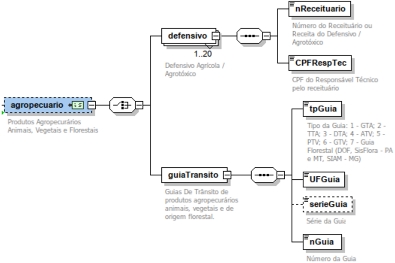

## Projeto Nota Fiscal Eletrônica

NT 2024.003

Informações de Produtos da Agricultura, Pecuária e Produção Florestal e Alteração de regra de validação

Versão 1.10 - Maio 2026

NT 2024.003 Versão 1.10

## Sumário

| 1 Introdução.......................................................................................................................................   |   4 |
|-------------------------------------------------------------------------------------------------------------------------------------------------------|-----|
| 1.1 Tipos de Guia.........................................................................................................................6           |     |
| 1.2 Agrotóxicos.............................................................................................................................7         |     |
| 1.3 Alteração na Regra de Validação N12a-70............................................................................7                              |     |
| 2 Alterações no arquivo XML da NF-e...............................................................................................7                   |     |
| 2.1 Esquema gráfico do leiaute....................................................................................................7                   |     |
| 3 Leiaute da NF-e (Modelo 55 e 65)..................................................................................................                  |   8 |
| Grupo ZF. Informações de Produtos da Agricultura, Pecuária e Produção Florestal...................8                                                   |     |
| 4 Regras de Validação.......................................................................................................................9         |     |
| 4.1. Tabela de aplicação das regras de validação...............................................................                                       |  14 |

## Controle de Versões

|   Versão | Publicação   | Descrição                                                                                                                                                                                                                                                                                                                                                                              |
|----------|--------------|----------------------------------------------------------------------------------------------------------------------------------------------------------------------------------------------------------------------------------------------------------------------------------------------------------------------------------------------------------------------------------------|
|     1.00 | 02/2024      | Criação desta NT como documento com campos e regras para informação de guia de trânsito em produtos primários (animal, vegetal e florestal) e dados do receituário no caso de produtos de agrotóxico.                                                                                                                                                                                  |
|     1.03 | 02/2025      | Alteração nas regras de validação permitindo o controle das validações de Guias de Transporte Animal e Vegetal por UF e NCM, atendendo às especificidades de cada UF. O grupo de agrotóxico agora tem várias ocorrências, atendendo às situações em que mais de um agrotóxico é produto na mesma NF-e.                                                                                 |
|     1.04 | 05/2025      | Alteração das datas para compatibilizar a disponibilização do schema XML em conjunto com a NT 2025.002. Não haverá prorrogação ou antecipação do prazo de vigência da NT em produção. Alteração na RV N12a-70, criando exceção para contribuintes do MEI em algumas operações. Correção no texto das RVs ZF02-10, ZF05-10, ZF05-20 e ZF05-30 identificando o item que causou rejeição. |
|     1.05 | 06/2025      | Correção de NCM.                                                                                                                                                                                                                                                                                                                                                                       |
|     1.06 | 06/2025      | Alteração de datas de vigência.                                                                                                                                                                                                                                                                                                                                                        |
|     1.07 | 10/2025      | Alteração de datas de vigência.                                                                                                                                                                                                                                                                                                                                                        |
|     1.08 | 10/2025      | Alteração de datas de vigência das regras de validação.                                                                                                                                                                                                                                                                                                                                |
|     1.09 | 03/2026      | Alterações em regras de validação.                                                                                                                                                                                                                                                                                                                                                     |
|     1.10 | 05/2026      | Alterações em regras de validação.                                                                                                                                                                                                                                                                                                                                                     |

## Histórico de Alterações / Cronograma

|   Versão | Histórico de atualizações                                                                                                                                                                                                                                                                          | Implantação Teste             | Implantação Produção   |
|----------|----------------------------------------------------------------------------------------------------------------------------------------------------------------------------------------------------------------------------------------------------------------------------------------------------|-------------------------------|------------------------|
|     1.00 | Versão inicial                                                                                                                                                                                                                                                                                     | 02-10-2024                    | 01-04-2025             |
|     1.01 | Versão revisada com inclusão do Responsável Técnico do Agrotóxico e explicações sobre as guias de trânsito.                                                                                                                                                                                        | 04-11-2024                    | 01-04-2025             |
|     1.03 | RVs de Guias adaptáveis por UF e informação mais de um agrotóxico na NF-e                                                                                                                                                                                                                          | 01-08-2025                    | 06/10/2025             |
|     1.04 | Padronização com a NT 2025.002, datas se aplicam a toda NT, não somente esta versão. Alteração na RV N12a-70, criando exceção para contribuintes do MEI em algumas operações. Correção no texto das RVs ZF02-10, ZF05-10, ZF05-20 e ZF05-30 identificando o item que causou rejeição.              | De 07/07/2025 até 11/08/2025* | 06/10/2025             |
|     1.05 | Correção de NCM                                                                                                                                                                                                                                                                                    | De 07/07/2025 até 11/08/2025* | 06/10/2025             |
|     1.06 | Padronização das datas de vigência com a NT 2025.002. Não houve alteração de layout ou de regra de validação.                                                                                                                                                                                      | De 07/07/2025 até 11/08/2025  | 06/10/2025             |
|     1.07 | Padronização das datas de vigência com a NT 2025.002. Não houve alteração de layout ou de regra de validação.                                                                                                                                                                                      | De 07/07/2025 até 11/08/2025  | 10/11/2025             |
|     1.08 | Entrada em produção das Regras de Validação, visando não afetar a entrada em produção da NT 2025.002 - RTC.                                                                                                                                                                                        | -x-x-x                        | 01/03/2026             |
|     1.09 | Ajustes nas RVs de controle da GTA e Agrotóxicos Remoção da RV I08-94 que causa a rejeição 771, visando abarcar operações de consumo por embarcações estrangeiras em regime de cabotagem em outras UFs. Alteração contempla também operações de comércio eletrônico cujo adquirente é estrangeiro. | -x-x-x                        | Até 20/03/2026         |
|     1.10 | Ajustes nas RVs de controle de Agrotóxicos                                                                                                                                                                                                                                                         | Até 15/05/2026                | Até 20/05/2026         |

## 1 Introdução

Este documento tem por objetivo detalhar as especificações para fazer constar na NF-e os dados relativos ao trânsito de produtos animais vivos, vegetais e florestais.

Esta definição deve permitir aos estados fazer um acompanhamento mais preciso das operações com estes produtos, além de atender solicitação da ENCCLA - Estratégia Nacional de Combate à Corrupção  e  à  Lavagem  de  Dinheiro,  encaminhada  pelo  Ofício  nº  598/202  /CGAI/  DRCI/ SENAJUS/  MJ,  do  Ministério  da  Justiça,  que  solicita  inclusão  do  campo  para  informação  do Documento de Origem Florestal - DOF.

Todavia conforme Item 5.7 da NOTA TÉCNICA Nº 4/2020/DBFLO do Instituto Brasileiro Do Meio Ambiente e dos Recursos Naturais Renováveis - IBAMA, a informação da nota fiscal é necessária para emissão do DOF, o que inviabiliza a emissão do documento fiscal antes do DOF.

A exceção do Pará e Mato Grosso que utilizam o Sisflora e Minas Gerais o SIAM, a NF-e deve ser emitida  antes do DOF, e os dados da NF-e devem constar no DOF conforme Nota Técnica 04 2020 do IBAMA.

Nota Técnica do IBAMA:

https://www.gov.br/ibama/pt-br/centrais-de-conteudo/arquivos/arquivos-pdf/2020-04-09-nota-tecnic a-4-2020-dbflo-pdf

## Sobre o DOF:

https://www.gov.br/ibama/pt-br/assuntos/biodiversidade/flora-e-madeira/documento-de-origem-flore stal-dof

Porém optou-se por manter o campo na NF-e visando atender as UFs que não utilizam o DOF.

A  criação  dos  campos  relacionados  ao  defensivo  agrícola  (agrotóxico)  visa  atender  legislação federal e normas estaduais sobre o tema.

Para melhor identificação do receituário agrícola é necessário identificar o emissor do receituário, para tal criamos o campo 'CPFRespTec' para compor as informações do receituário agrícola.

## 1.1  Tipos de Guia

As Guias de Trânsito Animal e Vegetal, assim como o Documento de Origem Florestal, SisFlora e SIAM são instrumentos de controle sanitário e ambiental para animais vivos e madeira de origem florestal.

A ativação das regras de validação de guias é facultativa e visando atender interesse da UF, será acionada indicando o NCM do produto do qual será exigida guia de trânsito.

A utilização destes instrumentos é regulada pelo MAPA, IBAMA e órgãos estaduais que atuam no controle e fiscalização da produção rural e florestal.

Os campos criados na NF-e para receber estas informações visam atender legislações sobre o tema e possibilitar um maior controle sanitário e ambiental desses produtos, visando aumentar a conformidade neste ambiente de negócio, conforme disposição da UF.

Os tipos de guia são:

## Guias para Animais

- GTA - Guia de Trânsito Animal
- Utilizada em todo o território nacional para o trânsito de animais vivos, ovos férteis e outros materiais de multiplicação animal, conforme legislação vigente.
- ATA - Autorização de Transporte Animal;
- DTA - Documento de Transferência Animal e
- TTA - Termo de Transferência Animal;
- Estes  três  documentos  acima  mencionados  devem  ser  utilizados  quando  há transferência de propriedade de animais vivos, ovos férteis e outros materiais de multiplicação animal, conforme legislação vigente, e não houver trânsito físico do animal. Embora  sirvam  ao  mesmo  propósito,  os  nomes  são  diferentes  por regulamentação estadual.

## Guias para Vegetais

- ATV - Autorização Trânsito Vegetal e
- GTV - Guia de Trânsito Vegetal
- Documento  sanitário que  deve  acompanhar  o  transporte  da  mercadoria  de determinados  produtos  agrícolas  com  acompanhamento  específico,  conforme regulamentação estadual.
- PTV - Permissão de Trânsito Vegetal
- Documento  oficial  para o trânsito interestadual de plantas, partes de vegetais ou produtos de origem vegetal sujeitos à Certificação Fitossanitária de Origem (CFO).

## Guias Florestais

- SisFlora - Sistema de Comercialização e Transporte de Produtos Florestais
- Utilizado para controle da produção florestal no Pará e Mato Grosso
- SIAM - Sistema Integrado de Informação Ambiental
- Utilizado para controle da produção florestal em Minas Gerais
- DOF - Documento de Origem Florestal
- Utilizado para controle da produção florestal nas demais Unidades Federadas

## 1.2  Agrotóxicos

A  informação  do  número  do  receituário  e  do  CPF  do  responsável  técnico  pela  emissão  do receituário do Agrotóxico visa atender a normas Estaduais onde é exigido o número do receituário do agrotóxico na nota fiscal de venda do produto.

## 1.3  Alteração na Regra de Validação N12a-70

Para permitir que o contribuinte Microempreendedor Individual - MEI possa fazer venda de bem do ativo imobilizado.

## 2 Alterações no arquivo XML da NF-e

## 2.1  Esquema gráfico do leiaute

## 3 Leiaute da NF-e (Modelo 55 e 65)

Grupo ZF. Informações de Produtos da Agricultura, Pecuária e Produção Florestal

| #       | ID    | Campo                             | Descrição                                                            | Ele   | Pai   | Tipo   | Ocor.   | Tam.   | Observação                                                                                                                                                                                                                                                                                             |
|---------|-------|-----------------------------------|----------------------------------------------------------------------|-------|-------|--------|---------|--------|--------------------------------------------------------------------------------------------------------------------------------------------------------------------------------------------------------------------------------------------------------------------------------------------------------|
| 423k    | ZF01  | agropecuario Informações produção | de produtos da agricultura, pecuária e Florestal                     | G     | A01   |        | 0-1     |        |                                                                                                                                                                                                                                                                                                        |
| 423k.1  | ZF02  | defensivo                         | Defensivos Agrícolas                                                 | CG    | ZF01  |        | 1-20    |        |                                                                                                                                                                                                                                                                                                        |
| 423k.2  | ZF03  | nReceituario                      | Número da receita ou receituário do agrotóxico / defensivo agrícola. | E     | ZF02  | C      | 1-1     | 1-30   | Informar o número da receita ou receituário de aplicação do defensivo                                                                                                                                                                                                                                  |
| 423k.2a | ZF03a | CPFRespTec                        | CPF do Responsável Técnico pela emissão do receituário.              | E     | ZF02  | N      | 1-1     | 11     | Informar o CPF do Responsável Técnico legalmente habilitado para emissão do receituário agrícola, conforme exigências federais e estaduais, como engenheiro agrônomo, engenheiro florestal ou técnico agrícola.                                                                                        |
| 423k.3  | ZF04  | guiaTransito                      | Guia de Trânsito                                                     | CG    | ZF01  |        | 1-1     |        |                                                                                                                                                                                                                                                                                                        |
| 423k.4  | ZF05  | tpGuia                            | Tipo da Guia                                                         | E     | ZF04  | N      | 1-1     | 1      | 1 - GTA - Guia de Trânsito Animal; 2 - TTA - Termo de Trânsito Animal; 3 - DTA - Documento de Transferência Animal; 4 - ATV - Autorização de Trânsito Vegetal; 5 - PTV - Permissão de Trânsito Vegetal; 6 - GTV - Guia de Trânsito Vegetal; 7 - Guia Florestal (DOF, SisFlora - PA e MT ou SIAM - MG). |
| 423k.5  | ZF06  | UFGuia                            | UF de emissão                                                        | E     | ZF04  | C      | 1-1     | 2      | UF de emissão da guia                                                                                                                                                                                                                                                                                  |
| 423k.6  | ZF07  | serieGuia                         | Série da Guia                                                        | E     | ZF04  | C      | 0-1     | 1-9    | Informar sempre que houver a série da guia                                                                                                                                                                                                                                                             |

| #      | ID   | Campo   | Descrição      | Ele   | Pai   | Tipo   | Ocor.   | Tam.   | Observação     |
|--------|------|---------|----------------|-------|-------|--------|---------|--------|----------------|
| 423k.7 | ZF08 | nGuia   | Número da Guia | E     | ZF04  | N      | 1-1     | 1-9    | Número da Guia |

## 4 Regras de Validação

## I. Produtos e Serviços

| Campo-Seq   |   Modelo | Regra de Validação                                                                                                                                                                                                                                                 | Aplic.   |   Msg | Efeito   | Descrição Erro                                              |
|-------------|----------|--------------------------------------------------------------------------------------------------------------------------------------------------------------------------------------------------------------------------------------------------------------------|----------|-------|----------|-------------------------------------------------------------|
| I08-94      |       55 | Operação Interestadual (idDest=2) e informado idEstrangeiro Exceção: A regra acima não se aplica para o CFOP="6.667- Venda de combustível ou lubrificante a consumidor ou usuário final estabelecido em outra UF diferente da que ocorrer o consumo" (NT 2015.002) | Facult.  |   771 | Rej.     | Rejeição: Informado idEstrangeiro em operação interestadual |

## N. Item / Tributo: ICMS

|   Campo-Seq | Modelo                                                                                                                      | Regra de Validação   |   Aplic. | Msg   | Efeito                                                                     | Descrição Erro   |
|-------------|-----------------------------------------------------------------------------------------------------------------------------|----------------------|----------|-------|----------------------------------------------------------------------------|------------------|
|          55 | Operação com Não Contribuinte (indIEDest=9) e CSOSN difere da relação abaixo: - 102-Tributação SN sem permissão de crédito; | Obrig.               |      600 | Rej.  | Rejeição: CSOSN incompatível na operação com Não Contribuinte [nItem: 999] | N12a-70          |

| - 103-Tributação receita bruta; - 300-Imune; - 400-Não tributada - 500-ICMS substituição tributária Exceção 1 : A aplica para NF-e Exceção 2 : A aplica nas operações reparo (CFOP remessa para (CFOP 5912 e Exceção 3 : A em produção, emissão anterior Exceção 4 : A acima não se operações de 6904 e CSOSN=900. Exceção 5 : A aplica para o Remessa com CSOSN=900.   |
|-------------------------------------------------------------------------------------------------------------------------------------------------------------------------------------------------------------------------------------------------------------------------------------------------------------------------------------------------------------------------|

## ZF. Informações de Produtos da Agricultura, Pecuária e Produção Florestal

|   Campo-Seq | Modelo                                                                 | Regra de Validação   |   Aplic. | Msg   | Efeito                                                | Descrição Erro   |
|-------------|------------------------------------------------------------------------|----------------------|----------|-------|-------------------------------------------------------|------------------|
|          55 | Em algum item informado defensivo Agrícola (NCM 3808.52.00, 3808.59.2X | Facult.              |      835 | Rej.  | Rejeição: Em algum item da NF-e foi informado produto | ZF02-10          |

|    | / e de de de de nos                                                                                                                                                                                                                | 3808.6X.XX, 3808.91.9X, 3808.92.20, 3808.92.9X 3808.93.2X, 3808.93.3X, 3808.93.5X, 3808.99.20, 3808.99.9X) sem Receita Receituário, quando finNFe = 1 (normal) indFinal = 1 (consumidor final) Exceção 1: A regra validação acima não se aplica para as operações com CFOP de Retorno de Mercadorias. Exceção 2: A regra validação acima não se aplica para as operações com CFOP de Transferência de Mercadorias (X.151, X.152, X.155 e X.156). Exceção 3: A regra validação acima não se aplica para as operações com CFOP faturamento de venda para entrega futura (5.922, 6.922). Exceção 4: A regra validação não se aplica a: produtos biológicos NCMs: 3808.59.29, 3808.61.00, 3808.62.90, 3808.69.90, 3808.91.91, 3808.91.92, 3808.91.93, 3808.91.94, 3808.91.96, 3808.91.97, 3808.91.99, 3808.92.94, 3808.92.99, 3808.93.29, 3808.93.33, 3808.93.59, 3808.99.91, 3808.99.93, 3808.99.95, 3808.99.96, 3808.99.99 e produtos saneantes do NCM 3808.62.10   |     |      | agrotóxico e não informado número da receita do defensivo agrícola. [nItem: 999]      |
|----|------------------------------------------------------------------------------------------------------------------------------------------------------------------------------------------------------------------------------------|-------------------------------------------------------------------------------------------------------------------------------------------------------------------------------------------------------------------------------------------------------------------------------------------------------------------------------------------------------------------------------------------------------------------------------------------------------------------------------------------------------------------------------------------------------------------------------------------------------------------------------------------------------------------------------------------------------------------------------------------------------------------------------------------------------------------------------------------------------------------------------------------------------------------------------------------------------------------|-----|------|---------------------------------------------------------------------------------------|
| 55 | Nenhum item da NF-e é Defensivo Agrícola ((NCM 3808.52.00, 3808.59.2X 3808.6X.XX, 3808.91.9X, 3808.92.20, 3808.92.9X 3808.93.2X, 3808.93.3X, 3808.93.5X, 3808.99.20, 3808.99.9X ) e informado receituário / receita de agrotóxico. | Facult                                                                                                                                                                                                                                                                                                                                                                                                                                                                                                                                                                                                                                                                                                                                                                                                                                                                                                                                                            | 309 | Rej. | Rejeição: Nenhum item da NF-e é defensivo agrícola e informada receita de agrotóxico. |
| 55 | Se Informado CPF (tag: CPFRespTec) e CPF inválido para Responsável técnico do receituário                                                                                                                                          | Obrig.                                                                                                                                                                                                                                                                                                                                                                                                                                                                                                                                                                                                                                                                                                                                                                                                                                                                                                                                                            | 308 | Rej. | Rejeição: CPF inválido para Responsável Técnico do                                    |

|    | de                                                                                                                                                                                                                                                                                                                                                              | agrotóxico.   |     |      |                                                               | receituário de agrotóxico.   |
|----|-----------------------------------------------------------------------------------------------------------------------------------------------------------------------------------------------------------------------------------------------------------------------------------------------------------------------------------------------------------------|---------------|-----|------|---------------------------------------------------------------|------------------------------|
| 55 | Em algum item da NF-e, informado produto Animal Vivo e CFOP diferente de X105; X106; X111; X112; X113; X114; X115; X155; X156; X907 X949, X454; ou X.922), finalidade de emissão normal (finNFe = 1) e não informada Guia de Trânsito Animal (tpGuia=01, 02 ou 03). Observação : Aplicação a critério da UF, conforme UF e NCM constantes na tabela 4.1 abaixo. | Facult.       | 836 | Rej. | Rejeição: Não informada Guia de Trânsito Animal [nItem: 999]  | ZF05-10                      |
| 55 | Em nenhum item da NF-e informado produto Animal Vivo (NCM 01xxxxxx e 0301xxxx) e informada a Guia de Trânsito Animal (tpGuia=01, 02 ou 03). Observação : aplicação a critério da UF.                                                                                                                                                                            | Facult.       | 310 | Rej. | Rejeição: Informação indevida de Guia de Trânsito Animal      | ZF05-14                      |
| 55 | Em algum item da NF-e informado produto vegetal e CFOP diferente de X.105; X.106; X.111; X.112; X.113; X.114; X.115; X.155; X.156; X.907 e, X.949, X.914, X.922 e X.454) e não informada a Guia de Trânsito Vegetal (tpGuia=04,05 ou 06). Observação : Aplicação a critério da UF, conforme UF e NCM constantes na tabela 4.1 abaixo.                           | Facult.       | 311 | Rej. | Rejeição: Não Informada Guia de Trânsito Vegetal [nItem: 999] | ZF05-20                      |
| 55 | Em nenhum item da NF-e informado produto 6.vegetal (NCM 06xxxxxx, 07xxxxxx, 08xxxxxx, ou 12xxxxxx) e informada a Guia de Trânsito Vegetal (tpGuia=04,05 ou 06). Observação : aplicação a critério da UF.                                                                                                                                                        | Facult.       | 312 | Rej. | Rejeição: Informação Indevida de Guia de Trânsito Vegetal     | ZF05-24                      |
| 55 | Em algum item da NF-e foi informado produto florestal (Madeira, Lenha ou Carvão) sem                                                                                                                                                                                                                                                                            | Facult.       | 839 | Rej. | Rejeição: Madeira sem documento de origem [nItem:             | ZF05-30                      |

| documento de origem florestal. (tpGuia=07) Observação : Implementação Futura   | 999]   |
|--------------------------------------------------------------------------------|--------|

## 10. Banco de Dados: Informações de Produtos da Agricultura, Pecuária e Produção Florestal

|   Campo-Seq | Modelo                                                                                                                                                                                                                                    | Regra de Validação   |   Aplic. | Msg   | Efeito                                  | Descrição Erro   |
|-------------|-------------------------------------------------------------------------------------------------------------------------------------------------------------------------------------------------------------------------------------------|----------------------|----------|-------|-----------------------------------------|------------------|
|          55 | Guia de Trânsito inválida Observação: Será validado o número da guia de trânsito no banco de dados integrado da SEFAZ com o órgão de controle sanitário responsável pela emissão da GTA. Observação : aplicação a critério da UF.         | Facult.              |      837 | Rej.  | Rejeição: Guia de trânsito inválida     | 10ZF04-10        |
|          55 | Guia de Trânsito já utilizada Observação: Será validada a utilização da guia de trânsito no banco de dados integrado da SEFAZ com o órgão de controle sanitário responsável pela emissão da GTA. Observação : aplicação a critério da UF. | Facult.              |      838 | Rej.  | Rejeição: Guia de trânsito já utilizada | 10ZF04-20        |

## 4.1. Tabela de aplicação das regras de validação

| UF   | RV      | NCMs     | Data Início de Validação   | Observações                          |
|------|---------|----------|----------------------------|--------------------------------------|
| BA   | ZF05-10 | 0102XXXX | 01-10-2025                 | Operações com o produto Gado bovino. |
| GO   | ZF05-10 | 0102XXXX | 01-10-2025                 | Operações com o produto Gado bovino. |
| MA   | ZF05-10 | 0102XXXX | 01-10-2025                 | Operações com o produto Gado bovino. |
| MT   | ZF05-10 | 0102XXXX | 01-10-2025                 | Operações com o produto Gado bovino. |
| **** | ZF05-20 | ---      | ---                        | RV não ativada para nenhuma UF.      |

