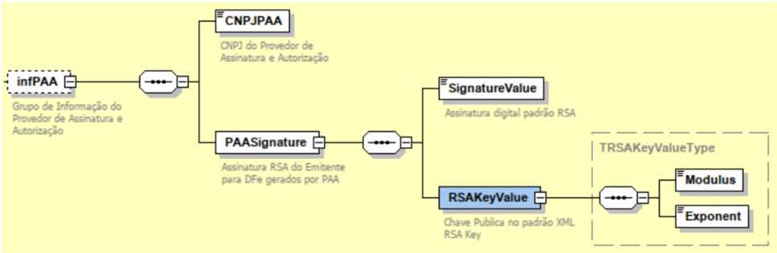
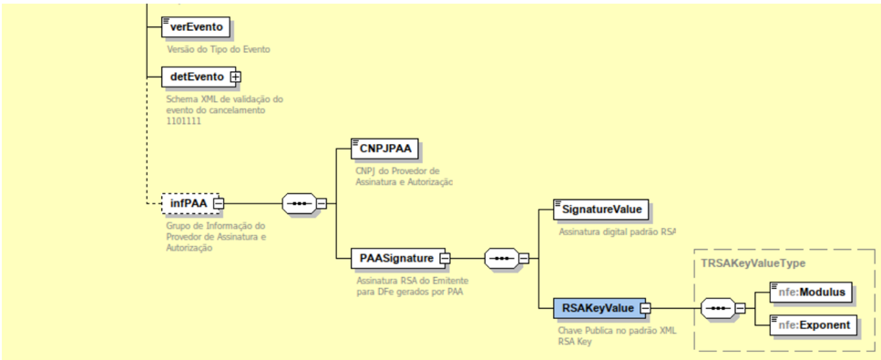
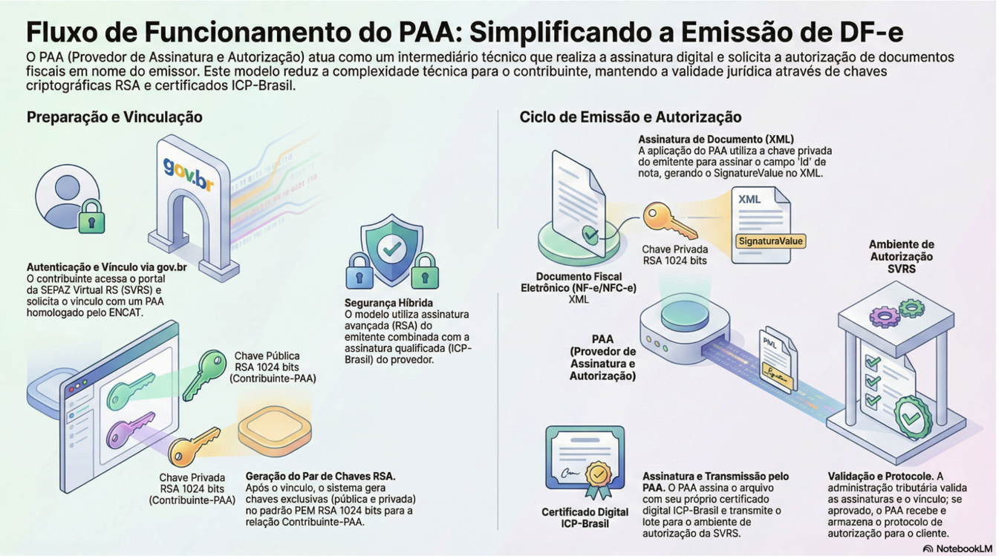

## Metadados
- [Metadados do corpus](metadata.json)
- [Fonte e procedência](../../../../sources/portal_nacional_nfe/nfe/notas-tecnicas/nt-2026-001-nf-e-v1-00-paa/source.json)
- [Dados normalizados](../../../../normalized/nfe/notas-tecnicas/nt-2026-001-nf-e-v1-00-paa/normalized.json)
- [Changelog](../../../../changelog/nfe/notas-tecnicas/nt-2026-001-nf-e-v1-00-paa.md)
- [Proveniência resumida](../../../../sources/provenance/nt-2026-001-nf-e-v1-00-paa.json)

## Sumário

| Introdução.......................................................................................................................................... 3   |
|----------------------------------------------------------------------------------------------------------------------------------------------------------|
| 1 Provedor de Assinatura e Autorização.......................................................................................4                           |
| 1.1 Geração de XML com envio ao Ambiente de Autorização...............................................5                                                  |
| 2 Padrão de Certificado Digital para Assinatura Avançada.........................................................5                                       |
| 2.1 Chave Privada RSA (PrivateKey).....................................................................................5                                 |
| 2.2 Chave Pública RSA (PublicKey)...................................................................................... 6                                |
| 3 Assinatura RSA e Geração do DFe pelo PAA.............................................................................6                                 |
| 4 Credenciamento de contribuintes...............................................................................................7                        |
| 5 Série de emissão dos documentos.............................................................................................7                          |
| 6 Estrutura das informações do PAA no XML da NF-e.................................................................9                                      |
| 6.1 Esquema gráfico do leiaute da NF-e contemplando o PAA................................................... 9                                           |
| 6.2 Esquema gráfico do leiaute do evento de cancelamento da NF-e contemplando o PAA......9                                                               |
| 7 Fluxo simplificado de funcionamento do PAA.........................................................................10                                  |
| 8 Leiaute da NF-e (Modelo 55 e 65)...............................................................................................11                      |
| Grupo B. Identificação da Nota Fiscal eletrônica....................................................................... 11                               |
| Grupo ZG. Informações do PAA.................................................................................................12                          |
| 9 Regras de Validação................................................................................................................... 13              |
| Grupo B. Identificação da Nota Fiscal eletrônica....................................................................... 13                               |
| Grupo C. Identificação do Emitente........................................................................................... 13                         |
| Grupo F. Validação da Assinatura Digital...................................................................................14                            |
| Grupo ZG. Informações do PAA.................................................................................................15                          |
| Evento: Parte Geral....................................................................................................................18                |

## Controle de Versões

|   Versão | Publicação   | Descrição                                                                                                                     |
|----------|--------------|-------------------------------------------------------------------------------------------------------------------------------|
|     1.00 | 03/2026      | Especificações técnicas para o funcionamento do Provedor de Assinatura e Autorização de Documentos Fiscais Eletrônicos - PAA. |

## Histórico de Alterações / Cronograma

|   Versão | Histórico de atualizações   | Implantação Teste   | Implantação Produção   |
|----------|-----------------------------|---------------------|------------------------|
|     1.00 | Versão inicial              | 08/06/2026          | 03/08/2026             |

NT 2026.001 Versão 1.00

## Introdução

Este documento tem como objetivo apresentar, de forma clara e objetiva, as diretrizes técnicas relacionadas  ao  uso  de  um  Provedor  de  Assinatura  e  Autorização  de  Documentos  Fiscais Eletrônicos - PAA, em conformidade com as disposições do Ajuste SINIEF 9/22, que instituiu este modelo em âmbito nacional.

O  Ajuste  SINIEF 9/22, celebrado pelo CONFAZ e pela Receita Federal do Brasil, estabelece o arcabouço  legal  e  regulatório  para  a  atuação  do  PAA,  permitindo  que  a  assinatura  digital e a solicitação  de  autorização  de  documentos  fiscais eletrônicos sejam realizadas por meio de um serviço  intermediário  devidamente  habilitado,  em  nome  do  emissor  do  documento. A presente Nota Técnica detalha a implementação técnica deste modelo, em consonância com as normas e os  prazos  definidos  pelo  Ajuste  e  suas  posteriores  alterações  (como os Ajustes SINIEF 45/22, 55/22, 47/23 e 46/25).

A proposta desse modelo é simplificar os processos envolvidos na emissão de documentos fiscais eletrônicos,  reduzindo  a  complexidade  técnica  para  contribuintes  e  sistemas  emissores,  ao mesmo  tempo  em  que mantém os requisitos de segurança, integridade e validade jurídica das informações transmitidas. A utilização de provedores especializados, nos termos do Ajuste SINIEF 9/22, possibilita maior padronização, confiabilidade e eficiência  na  comunicação  com  os ambientes  de  autorização  fiscal,  especialmente  para  públicos  como  o  Microempreendedor Individual (MEI), o produtor rural e os optantes pelo Simples Nacional.

De  forma  geral,  o  PAA atua como uma camada de apoio ao emissor, realizando as etapas de assinatura eletrônica e encaminhamento dos documentos para autorização, conforme as regras previamente estabelecidas no Ajuste SINIEF 9/22 e nos manuais técnicos (MOC e MOPAA). Esse modelo contribui para a modernização  dos  processos  fiscais eletrônicos, favorecendo  a automação, a escalabilidade das soluções e a melhoria da experiência dos usuários envolvidos.

É importante salientar que o uso do Provedor de Assinatura e Autorização de Documentos Fiscais Eletrônicos não altera a responsabilidade legal e tributária do emitente em relação às informações constantes  no  documento  fiscal  eletrônico  emitido,  conforme  preconiza  o  inciso III da cláusula quarta do Ajuste SINIEF 9/22. O PAA atua exclusivamente como intermediário técnico, prestando serviços de apoio à assinatura digital e ao encaminhamento do documento para autorização, não assumindo  a  autoria  fiscal  nem  a  responsabilidade  pelo  conteúdo,  veracidade  ou  adequação tributária das informações declaradas pelo contribuinte.

## 1 Provedor de Assinatura e Autorização

O  contribuinte  emitente  de  Documento  Fiscal  Eletrônico  poderá  utilizar  os  serviços  de  um Provedor de Assinatura e Autorização de Documentos Fiscais Eletrônicos - PAA com a finalidade de  realizar  comunicações  com  os  sistemas  de  autorização  de  uso  de  documentos  fiscais eletrônicos providos pelas administrações tributárias, em nome do contribuinte.

O  ambiente  de  autorização  das  Administrações  Tributárias  através  do  Portal  Nacional  dos Documentos Fiscais Eletrônicos irá permitir a vinculação entre contribuintes que se enquadrarem nesse perfil (devidamente identificados na plataforma gov.br do governo federal) com Provedores de Assinatura e Autorização previamente homologados pela Coordenação do ENCAT.

O  contribuinte  deverá  utilizar  ferramenta  de  emissão  de  documento  fiscal  fornecida  pelo PAA, preferencialmente na internet e com identificação do usuário.

O Provedor de Assinatura e Autorização poderá optar pelos seguintes modelos de autorização:

## 1.1 Geração de XML com envio ao Ambiente de Autorização

O  PAA  receberá  o  pedido  de  emissão  no  formato  que  seu  software  estiver  construído  e providenciará a geração do XML do documento fiscal eletrônico preenchendo o grupo 'infPAA' . Neste grupo será alimentada a tag 'SignatureValue' assinando o atributo 'Id' do DFe com a chave criptográfica  no  padrão  RSA  fornecida  pela  administração  tributária.  O  DFe  também  deverá receber a assinatura digital qualificada com certificado ICP-Brasil do PAA.

O PAA deverá transmitir o XML do DFe para o ambiente de autorização onde será submetido a todas  as  regras  de  validação  estabelecidas  no  MOC.  O  documento  poderá  ser  autorizado  ou rejeitado,  devendo o PAA guardar o protocolo de autorização e atuar nos casos em que houver rejeição.

## 2 Padrão de Certificado Digital para Assinatura Avançada

O certificado digital utilizado para assinatura avançada das mensagens seguirá padrão RSA (com par  de  chaves)  gerados  pela  Plataforma  de  Emissão  Simplificada  -  PES  para  o  usuário contribuinte  que  efetuar  seu  credenciamento  e  vinculação  com  o  Provedor  de  Assinatura  e Autorização no portal da SEFAZ Virtual RS identificando-se com usuário e senha da plataforma gov.br.

O PAA poderá obter o par de chaves (pública e privada) do usuário diretamente no módulo de administração da PES no portal da Plataforma de Emissão Simplificada e selecionando  a opção de obter os dados do cliente.

Os certificados seguirão a especificação OpenSSL e serão gerados de forma única para a relação de cada PAA com o contribuinte vinculado no portal. A especificação produz um par de chaves (pública e privada) no formato PEM RSA 1024 bits.

As  chaves  são  transformadas  na  estrutura  RSA  para  assinatura  digital  XML  com  a  seguinte definição:

## 2.1 Chave Privada RSA (PrivateKey)

| #      | Campo       | Ele   | Pai    | Tipo   | Ocor.   | Descrição / Observação   |
|--------|-------------|-------|--------|--------|---------|--------------------------|
| Priv01 | RSAKeyValue | G     | Raiz   | -      | 1-1     | Chave Privada RSA        |
| Priv02 | Modulus     | E     | Priv01 | Base64 | 1-1     |                          |
| Priv03 | Exponent    | E     | Priv01 | C      | 1-1     | Informar 'AQAB'          |

NT 2026.001 Versão 1.00

| Priv04   | P        | E   | Priv01   | Base64   | 1-1   |
|----------|----------|-----|----------|----------|-------|
| Priv05   | Q        | E   | Priv01   | Base64   | 1-1   |
| Priv06   | DP       | E   | Priv01   | Base64   | 1-1   |
| Priv07   | DQ       | E   | Priv01   | Base64   | 1-1   |
| Priv08   | InverseQ | E   | Priv01   | Base64   | 1-1   |
| Priv09   | D        | E   | Priv01   | Base64   | 1-1   |

## 2.2 Chave Pública RSA (PublicKey)

| #     | Campo       | Ele   | Pai   | Tipo   | Ocor.   | Descrição / Observação   |
|-------|-------------|-------|-------|--------|---------|--------------------------|
| Pub01 | RSAKeyValue | G     | Raiz  | -      | 1-1     | Chave Pública RSA        |
| Pub02 | Modulus     | E     | Pub01 | Base64 | 1-1     |                          |
| Pub03 | Exponent    | E     | Pub01 | C      | 1-1     | Informar 'AQAB'          |

## 3 Assinatura RSA e Geração do DFe pelo PAA

A empresa usuária do serviço de Provedor de Assinatura e Autorização deverá solicitar o vínculo a um Provedor homologado no portal da SEFAZ Virtual RS, o resultado dessa solicitação entregará um par de chaves RSA (chave pública e chave privada) para o emitente.

Com a chave privada, a aplicação do PAA deverá assinar o conteúdo do atributo 'Id' da NFe / Evento (convertido para array de bytes) com padrão de assinatura assimétrica RSA SHA1 originando um 'SignatureValue' no formato base64.

A chave pública deverá ser informada no grupo 'RSAKeyValue' no padrão XML Signature para chaves RSA.

Passos a executar:

NT 2026.001 Versão 1.00

1. Solicitar o vínculo com o Provedor de Assinatura e Autorização no portal DFe da SVRS com CPF do responsável pela empresa autenticado na plataforma gov.br
2. Obter no portal o par de chaves RSA (chave privada e chave pública).
3. No software do PAA: utilizar a chave privada para assinar o conteúdo da tag 'Id' do DFe (RSA SHA1 base64).
4. Informar a chave pública no padrão XML Signature no grupo 'RSAKeyValue'.
5. O PAA deverá assinar o DFe com certificado X509 padrão ICP-Brasil
6. PAA deverá transmitir o DFe para o serviço de autorização da SVRS

A qualquer tempo o Emitente poderá solicitar o término do vínculo e utilização do PAA acessando o portal da SVRS. A administração tributária e o PAA também poderão comandar o encerramento do vínculo.

A perda do vínculo tem efeito imediato a partir do momento da solicitação por qualquer interveniente.

Observação: O processo de assinatura e envio do pedido de emissão na plataforma de emissão simplificada está disciplinado no Manual de Orientações do PAA - MOPAA disponível em https://dfe-portal.svrs.rs.gov.br/pes.

## 4 Credenciamento de contribuintes

Para o credenciamento, o PAA irá consultar no CCC se o contribuinte tem alguma restrição no CCC ou se já está credenciado.

Se o contribuinte não estiver credenciado, o portal do PAA irá direcionar o contribuinte para que este faça o credenciamento na sua UF de origem. Se houver alguma restrição, o contribuinte será informado que há restrição de emissão na sua UF de origem.

Após o credenciamento para emissão de NF-e, estará disponível a utilização de PAA para este contribuinte.

Até o final de 2026, ou assim que operacional e tempestivamente disponíveis, serão utilizadas na solução  do  PAA,  as  informações  cadastrais  disponibilizadas  pelo  ambiente  nacional  de  dados previsto no Art. 59 da LC 214/2025.

## 5 Série de emissão dos documentos.

Visando viabilizar a utilização de software emissor próprio e também a emissão via PAA ou até mais  de  um  PAA  pelo  contribuinte,  é  necessário  fazer  o  controle  da  utilização  da  série  do documento a fim de evitar duplicidade de documentos com mesma série e número.

Desta maneira, ao estabelecer o vínculo do PAA, o portal da SVRS irá atribuir àquele vínculo uma série específica que será utilizada pelo PAA para emitir os documentos daquele contribuinte.

| Emit   | Processo Emissão   | Assinatura   | Série   | Ch Acesso   | Numeração   |
|--------|--------------------|--------------|---------|-------------|-------------|

NT 2026.001 Versão 1.00

| CNPJ                                      | Aplicativo da Empresa                     | e-CNPJ do Emitente (procEmi <> 1,2)                            | 000-889                                   | CNPJ do Emitente                          | Sequencial por CNPJ, controlado pelo emitente                      |
|-------------------------------------------|-------------------------------------------|----------------------------------------------------------------|-------------------------------------------|-------------------------------------------|--------------------------------------------------------------------|
| CNPJ                                      | Programa Emissor Fisco                    | e-CNPJ do Emitente (procEmi <> 1,2)                            | 000-889                                   | CNPJ do Emitente                          | Sequencial por CNPJ, controlado pelo emitente                      |
| CNPJ/ CPF                                 | Site SEFAZ (NFA-e)                        | e-CNPJ da SEFAZ (procEmi=1)                                    | 890-899                                   | CNPJ da SEFAZ                             | Sequencial pela SEFAZ, independentemente do emitente (CPF ou CNPJ) |
| Faixas reservadas a partir da [NT 2018.001](../nt2018-001-v1-10-emitente-cpf/document.md) | Faixas reservadas a partir da [NT 2018.001](../nt2018-001-v1-10-emitente-cpf/document.md) | Faixas reservadas a partir da [NT 2018.001](../nt2018-001-v1-10-emitente-cpf/document.md)                      | Faixas reservadas a partir da [NT 2018.001](../nt2018-001-v1-10-emitente-cpf/document.md) | Faixas reservadas a partir da [NT 2018.001](../nt2018-001-v1-10-emitente-cpf/document.md) | Faixas reservadas a partir da [NT 2018.001](../nt2018-001-v1-10-emitente-cpf/document.md)                          |
| CNPJ/ CPF                                 | Site SEFAZ                                | e-CNPJ da SEFAZ (procEmi=1), ou e-CNPJ do Emitente (procEmi=2) | 900-909                                   | CNPJ do Emitente                          | Sequencial por CNPJ, controlado pela SEFAZ                         |
| CPF                                       | Site SEFAZ                                | e-CNPJ da SEFAZ (procEmi=1), ou e-CPF do Emitente (procEmi=2)  | 910-919                                   | CPF do Emitente                           | Sequencial pelo CPF, controlado pela SEFAZ                         |
| CPF                                       | Aplicativo da Empresa                     | e-CPF do Emitente (procEmi<>1,2)                               | 920-969                                   | CPF do Emitente                           | Sequencial por CPF, controlado pelo emitente                       |
| Faixa reservada para o PAA                | Faixa reservada para o PAA                | Faixa reservada para o PAA                                     | Faixa reservada para o PAA                | Faixa reservada para o PAA                | Faixa reservada para o PAA                                         |
| CNPJ                                      | PAA                                       | e-CNPJ do PAA                                                  | 970-979                                   | CNPJ do Emitente                          | Sequencial por CNPJ do emitente, controlado pelo PAA               |

## 6 Estrutura das informações do PAA no XML da NF-e

## 6.1  Esquema gráfico do leiaute da NF-e contemplando o PAA.

## 6.2  Esquema gráfico do leiaute do evento de cancelamento da NF-e contemplando o PAA.

## 7 Fluxo simplificado de funcionamento do PAA

## 8 Leiaute da NF-e (Modelo 55 e 65)

## Grupo B. Identificação da Nota Fiscal eletrônica

| #   | ID   | Campo   | Descrição                   | Ele   | Pai   | Tipo   | Ocor.   | Tam.   | Observação                                                                                                                                                                                                                                                                                                                                                                                                                                                                                                                                                                                                                                                                                                                                                                                                                                                                                                                                                                                       |
|-----|------|---------|-----------------------------|-------|-------|--------|---------|--------|--------------------------------------------------------------------------------------------------------------------------------------------------------------------------------------------------------------------------------------------------------------------------------------------------------------------------------------------------------------------------------------------------------------------------------------------------------------------------------------------------------------------------------------------------------------------------------------------------------------------------------------------------------------------------------------------------------------------------------------------------------------------------------------------------------------------------------------------------------------------------------------------------------------------------------------------------------------------------------------------------|
| 11  | B07  | serie   | Série do Documento Fiscal   | E     | B01   | N      | 1-1     | 1 - 3  | Série do Documento Fiscal, preencher com zeros na hipótese de a NF-e não possuir série. Série na faixa: - [000-889]: Aplicativo do Contribuinte; Emitente=CNPJ; Assinatura pelo e-CNPJ do contribuinte (procEmi<>1,2); - [120-999]: Aplicativo NFF; Emitente=CNPJ/CPF; Assinatura pelo e-CNPJ da PROCERGS (procEmi=3); - [890-899]: Emissão no site do Fisco (NFA-e - Avulsa); Emitente= CNPJ / CPF; Assinatura pelo e-CNPJ da SEFAZ (procEmi=1); - [900-909]: Emissão no site do Fisco (NFA-e); Emitente= CNPJ; Assinatura pelo e-CNPJ da SEFAZ (procEmi=1), ou Assinatura pelo e-CNPJ do contribuinte (procEmi=2); - [910-919]: Emissão no site do Fisco (NFA-e); Emitente= CPF; Assinatura pelo e-CNPJ da SEFAZ (procEmi=1), ou Assinatura pelo e-CPF do contribuinte (procEmi=2); - [920-969]: Aplicativo do Contribuinte; Emitente=CPF; Assinatura pelo e-CPF do contribuinte (procEmi<>1,2); (Atualizado [NT 2018/001](../nt2018-001-v1-10-emitente-cpf/document.md)) - [970-979]: Emissão por Provedor de Assinatura e Autorização - PAA. |
| 29a | B26  | procEmi | Processo de emissão da NF-e | E     | B01   | N      | 1-1     | 1      | 0=Emissão de NF-e com aplicativo do contribuinte; 1=Emissão de NF-e avulsa pelo Fisco; 2=Emissão de NF-e avulsa, pelo contribuinte com seu certificado digital, através do site do Fisco; 3=Emissão NF-e pelo contribuinte com aplicativo fornecido pelo Fisco. 4=Emissão de NF-e por Provedor de Assinatura e Autorização - PAA                                                                                                                                                                                                                                                                                                                                                                                                                                                                                                                                                                                                                                                                 |

## Grupo ZG. Informações do PAA

| #      | ID   | Campo          | Descrição                                                   | Ele   | Pai   | Tipo   | Ocor.   |   Tam. | Observação                                                                                                                                                  |
|--------|------|----------------|-------------------------------------------------------------|-------|-------|--------|---------|--------|-------------------------------------------------------------------------------------------------------------------------------------------------------------|
| 423l   | ZG01 | infPAA         | Grupo de Informação do Provedor de Assinatura e Autorização | G     | A01   |        | 0-1     |        | Uso exclusivo para NF-e gerada por Provedor de Assinatura e Autorização - PAA conforme legislação vigente.                                                  |
| 423l.1 | ZG02 | CNPJPAA        | CNPJ do Provedor de Assinatura e Autorização                | E     | ZG01  | C      | 1-1     |     14 |                                                                                                                                                             |
| 423l.1 | ZG03 | PAASignature   | Assinatura RSA do Emitente para DFe gerados por PAA         | G     | ZG01  |        | 1-1     |        | A estrutura apresentada não corresponde à implementação completa do padrão XMLDSig, tratando-se de validação específica do ambiente autorizador para o PAA. |
| 423l.1 | ZG04 | SignatureValue | Assinatura digital padrão RSA                               | E     | ZG03  | C      | 1-1     |        | Converter o atributo Id da NFe para array de bytes e assinar com a chave privada do RSA com algoritmo SHA1 gerando um valor no formato base64.              |
| 423l.1 | ZG05 | RSAKeyValue    | Chave Pública no padrão XML RSA Key                         | G     | ZG03  |        | 1-1     |        |                                                                                                                                                             |
| 423l.1 | ZG06 | Modulus        |                                                             | E     | ZG05  | C      | 1-1     |        |                                                                                                                                                             |
| 423l.1 | ZG07 | Exponent       |                                                             | E     | ZG05  | C      | 1-1     |        | Informar 'AQAB'                                                                                                                                             |

## 9 Regras de Validação

## Grupo B. Identificação da Nota Fiscal eletrônica

| #      | Modelo   | Regra de Validação                                                                                                                                                                                                                                                                                                           | Aplic.   |   Msg | Efeito   | Descrição Erro                                                                 |
|--------|----------|------------------------------------------------------------------------------------------------------------------------------------------------------------------------------------------------------------------------------------------------------------------------------------------------------------------------------|----------|-------|----------|--------------------------------------------------------------------------------|
| B26-10 | 55/65    | Se Processo de Emissão pelo Contribuinte (procEmi<>1 e 2): - Série da NF-e difere da faixa de 0-889 ou 920-969 ([NT 2018.001](../nt2018-001-v1-10-emitente-cpf/document.md)) ou Se Processo de Emissão não for PAA (procEmi <> 4): - Série da NF-e na faixa 970-979 - Uso exclusivo do PAA. Observação: Regra de Validação implementada em todos os ambientes autorizadores. | Obrig.   |   244 | Rej.     | Rejeição: Processo de Emissão pelo Contribuinte incompatível com a Série da NF |
| B26-20 | 55/65    | Se Processo de Emissão pelo Fisco (procEmi=1 ou 2): - Série difere da faixa 890-919 (NF Avulsa) ([NT 2018.001](../nt2018-001-v1-10-emitente-cpf/document.md)) ou Se Processo de Emissão for PAA (procEmi = 4): - Série da NF-e difere da faixa 970-979 Observação: Regra de Validação implementada somente na SVRS.                                                          | Obrig.   |   451 | Rej.     | Rejeição: Processo de Emissão pelo Fisco incompatível com a Série da NF        |

## Grupo C. Identificação do Emitente

| #   | Modelo Regra de Validação   | Aplic. Msg Efeito Descrição Erro   |
|-----|-----------------------------|------------------------------------|

NT 2026.001 Versão 1.00

| C21-20   | 55/65   | Se CRT (emit/CRT) = 3 (Regime Normal) ou 2 (Simples Nacional, excesso sublimite de receita bruta;) - Regime normal, e emissão por PAA (grupo: infPAA): PAA não disponível para contribuinte do regime normal. Exceção: Essa regra não se aplica ao contribuinte produtor rural (tipo da IE no CCC: infCad/tpIE = 5 - IE de Produtor Rural). Observação: Regra de Validação implementada somente na SVRS.   | Obrig.   | 1178   | Rej.   | Rejeição: Utilização de PAA não permitida para contribuinte enquadrado no regime normal.   |
|----------|---------|------------------------------------------------------------------------------------------------------------------------------------------------------------------------------------------------------------------------------------------------------------------------------------------------------------------------------------------------------------------------------------------------------------|----------|--------|--------|--------------------------------------------------------------------------------------------|

## Grupo F. Validação da Assinatura Digital

Esta RV é utilizada pelo sistema autorizador de documentos e também de eventos, para o cancelamento.

| #   |   Modelo | Regra de Validação                                                                                                                                                                                                                                                                                                                                                                                                                          | Aplic.   |   Msg | Efeito   | Descrição Erro                                                             |
|-----|----------|---------------------------------------------------------------------------------------------------------------------------------------------------------------------------------------------------------------------------------------------------------------------------------------------------------------------------------------------------------------------------------------------------------------------------------------------|----------|-------|----------|----------------------------------------------------------------------------|
| F03 |       55 | Se Certificado de Assinatura com CNPJ e CNPJ do Certificado difere do CNPJ da SEFAZ para a UF: -CNPJ-Base do Emitente difere do CNPJ-Base do Certificado Digital ([NT 2018.001](../nt2018-001-v1-10-emitente-cpf/document.md)) Exceção: Para tpEmis = 3-NFF, CNPJ do certificado é somente o da SVRS ([NT 2021.002](../nt2021-002-v1-12-nota-fiscal-f-cil/document.md)) Exceção 2 : Autorizador = SVRS e DF-e / Evento possuir indicação de uso do Provedor de Assinatura e Autorização (grupo: infPAA preenchido) esta regra não será aplicada. | Obrig.   |   213 | Rej.     | Rejeição: CNPJ-Base do Emitente difere do CNPJ-Base do Certificado Digital |

| F03A   | Se Certificado de Assinatura com CPF: - CPF do Emitente difere do CPF do Certificado Digital ([NT 2018.001](../nt2018-001-v1-10-emitente-cpf/document.md)) Exceção : Autorizador = SVRS e DF-e / Evento possuir indicação uso do Provedor de Assinatura e Autorização (grupo: infPAA preenchido) esta regra não será aplicada.   | Obrig.   | 227   | Rej.   | Rejeição: CPF do Emitente difere do CPF do Certificado Digital   |
|--------|----------------------------------------------------------------------------------------------------------------------------------------------------------------------------------------------------------------------------------------------------------------------------------|----------|-------|--------|------------------------------------------------------------------|

## Grupo ZG. Informações do PAA

Este conjunto de RVs são utilizadas pelo sistema autorizador de documentos e também de eventos, para o cancelamento.

| Campo-Seq   | Modelo   | Regra de Validação                                                                                                                                                                                                                                                      | Aplic.   |   Msg | Efeito   | Descrição Erro                                                    |
|-------------|----------|-------------------------------------------------------------------------------------------------------------------------------------------------------------------------------------------------------------------------------------------------------------------------|----------|-------|----------|-------------------------------------------------------------------|
| ZG01-10     | 55/65    | Se o grupo de informações do Provedor de Assinatura e Autorização estiver informado (grupo: infPAA), o ambiente de autorização da NF-e / NFC-e deverá ser o da SEFAZ Virtual RS. Observação: Deve ser implementado em todos os ambientes autorizadores de NF-e / NFC-e. | Obrig.   |  1179 | Rej.     | Rejeição: Ambiente de autorização inválido para emissão pelo PAA. |
| ZG02-10     | 55/65    | Se o grupo de informações do Provedor de Assinatura e Autorização estiver informado (grupo: infPAA), o CNPJ do PAA deve ser válido (zeros, DV). Observação: Regra de Validação implementada somente na SVRS.                                                            | Obrig.   |  1180 | Rej.     | Rejeição: CNPJ do PAA inválido                                    |

## Provedor de Assinatura e Autorização de Documentos Fiscais Eletrônicos - PAA

NT 2026.001 Versão 1.00

| ZG02-20   | 55/65   | Se o grupo de informações do Provedor de Assinatura e Autorização estiver informado (grupo: infPAA): Verificar se o CNPJ do PAA (tag: CNPJPAA) existe na relação de Provedores de Autorização e Assinatura homologados pelo ENCAT Observação: Regra de Validação implementada somente na SVRS.   | Obrig   |   1181 | Rej.   | Rejeição: Provedor de Assinatura e Autorização não existe na base da SEFAZ      |
|-----------|---------|--------------------------------------------------------------------------------------------------------------------------------------------------------------------------------------------------------------------------------------------------------------------------------------------------|---------|--------|--------|---------------------------------------------------------------------------------|
| ZG02-30   | 55/65   | Se o grupo de informações do Provedor de Assinatura e Autorização estiver informado (grupo: infPAA): Verificar se o Emitente (tag: CNPJ/CPF grupo emit) possui vínculo ativo com o PAA (tag: CNPJPAA) Observação: Regra de Validação implementada somente na SVRS.                               | Obrig.  |   1182 | Rej.   | Rejeição: Emitente não associado ao PAA                                         |
| ZG02-40   | 55/65   | Se o grupo de informações do Provedor de Assinatura e Autorização estiver informado (grupo: infPAA) e o CNPJ do certificado de assinatura for diferente da SVRS, o CNPJ do certificado de assinatura DEVE ser igual ao CNPJ do PAA Observação: Regra de Validação implementada somente na SVRS.  | Obrig.  |   1183 | Rej.   | Rejeição: Emissão por PAA deve ser assinada pelo CNPJ do Provedor de Assinatura |
| ZG04-10   | 55/65   | Se o grupo de informações do Provedor de Assinatura e Autorização estiver informado (grupo: infPAA): Validar assinatura RSA (tag:SignatureValue) com a chave                                                                                                                                     | Obrig.  |   1184 | Rej.   | Rejeição: Emissão por PAA com Assinatura RSA inválida                           |

NT 2026.001 Versão 1.00

| pública do emitente (grupo: RSAKeyValue) Observação: Regra de Validação implementada somente na SVRS.   |
|---------------------------------------------------------------------------------------------------------|

## Evento: Parte Geral

| #      | Regra de Validação                                                                                                                                                                                 | Aplic.   |   Msg | Efeito   | Descrição Erro                                                  |
|--------|----------------------------------------------------------------------------------------------------------------------------------------------------------------------------------------------------|----------|-------|----------|-----------------------------------------------------------------|
| P09-10 | Tipo do ambiente difere do ambiente do Web Service (*1) Para DF-e emitido com PAA ambiente deve ser o da SVRS. Observação: Deve ser implementado em todos ambientes autorizadores de NF-e / NFC-e. | Obrig.   |   252 | Rej.     | Rejeição: Ambiente informado diverge do Ambiente de recebimento |

## Documentos relacionados
_Nenhum documento relacionado conhecido._
