Operações de vendas presenciais e não presenciais com impressão do DANFE Simplificado Tipo 2

Nota Técnica 2026.002 Versão 1.00 Maio de 2026

NT 2026.002 v1.00

## Sumário

| 1.                                                                                                                                      | Introdução................................................................................................................................4   |
|-----------------------------------------------------------------------------------------------------------------------------------------|-----------------------------------------------------------------------------------------------------------------------------------------------|
| 2. Autorização de Uso com                                                                                                               | Alerta................................................................................................4                                       |
| 2.1 Visão Geral da Autorização com Alerta                                                                                               | .................................................................................4                                                            |
| 2.2 Processamento das Regras nas Aplicações                                                                                             | Autorizadoras...................................................5                                                                             |
| 2.3 Web Services - NfeAutorizacao, NFeRetAutorizacao e NFeConsultaProtocolo                                                             | .....................5                                                                                                                        |
| 3. Leiaute da NF-e (Modelo 55 e 65)                                                                                                     | ...........................................................................................7                                                  |
| 4. Regras de                                                                                                                            | Validação................................................................................................................8                    |
| B. Identificação da                                                                                                                     | NF-e...........................................................................................................8                              |
| BA. Documento Fiscal Referenciado .......................................................................................9              |                                                                                                                                               |
| C. Identificação do Emitente                                                                                                            | ....................................................................................................9                                         |
| E. Identificação do Destinatário................................................................................................9       |                                                                                                                                               |
| F. Local da Retirada.................................................................................................................9  |                                                                                                                                               |
| G. Local da Entrega...............................................................................................................10    |                                                                                                                                               |
| I. Produtos e Serviços............................................................................................................10    |                                                                                                                                               |
| J. Item / Veículos Novos                                                                                                                | ........................................................................................................11                                    |
| K. Item / Medicamentos                                                                                                                  | .........................................................................................................11                                   |
| L. Item / Armamentos.............................................................................................................12     |                                                                                                                                               |
| LA. Item / Combustível...........................................................................................................12     |                                                                                                                                               |
| LB. Item / Papel Imune                                                                                                                  | ..........................................................................................................14                                  |
| N. Item / Tributo: ICMS                                                                                                                 | ..........................................................................................................14                                  |
| NA. Item / ICMS para a UF de Destino ..................................................................................15               |                                                                                                                                               |
| O. Item / Tributo: IPI...............................................................................................................16 |                                                                                                                                               |
| P. Item / Tributo: II                                                                                                                   | .................................................................................................................16                           |
| R. Item / Tributo: PIS ST........................................................................................................16     |                                                                                                                                               |
| T. Item / Tributo: COFINS ST.................................................................................................16         |                                                                                                                                               |
| UA. Item / Devolução de Tributos ..........................................................................................16           |                                                                                                                                               |
| VC. Referenciamento de item de outro Documento Fiscal Eletrônico - DF-e .........................16                                     |                                                                                                                                               |
| W. Total da NF-e                                                                                                                        | ...................................................................................................................17                         |
| X. Transporte da NF-e                                                                                                                   | ...........................................................................................................17                                 |
| Y. Dados de                                                                                                                             | Cobrança...........................................................................................................17                         |
| ZB. Informação de Compra....................................................................................................18          |                                                                                                                                               |
| ZC. Informações do Registro de Aquisição de                                                                                             | Cana..............................................................18                                                                          |
| ZX. Informações Suplementares da Nota Fiscal                                                                                            | ....................................................................18                                                                        |
| Banco de Dados: Destinatário                                                                                                            | ...............................................................................................22                                             |

NT 2026.002 v1.00

## Controle de Versões

|   Versão | Publicação   | Descrição        |
|----------|--------------|------------------|
|     1.00 | 05/2026      | Publicação da NT |

## Histórico de Alterações / Cronograma

|   Versão | Histórico de atualizações                                                                                                                                                                                                                                                                                                                                                                                                                                                                                                                                                                                                                                                                                                                                                                                                                                                                                                                                                                                              | Implantação Teste   | Implantação Produção   |
|----------|------------------------------------------------------------------------------------------------------------------------------------------------------------------------------------------------------------------------------------------------------------------------------------------------------------------------------------------------------------------------------------------------------------------------------------------------------------------------------------------------------------------------------------------------------------------------------------------------------------------------------------------------------------------------------------------------------------------------------------------------------------------------------------------------------------------------------------------------------------------------------------------------------------------------------------------------------------------------------------------------------------------------|---------------------|------------------------|
|     1.00 | - Alteração da regra W16-40 que permite que cada UF defina o valor limite para emissão de NFC-e (mod. 65) sem identificação do destinatário. Será criada tabela com os limites por UF. Na ausência de definição, mantém- se o limite de R$ 10.000,00                                                                                                                                                                                                                                                                                                                                                                                                                                                                                                                                                                                                                                                                                                                                                                   | 01/06/2026          | 15/06/2026             |
|     1.00 | - Criação da regra BA02-35 que rejeita a NF-e de saída (tpNF = 1) que faça referência ao modelo 65 (NFC-e) ou ao modelo 59 (CF-e). - Atualização de domínio em campos da NF-e/NFC-e (schema) e de regras de validação para emissão da NF-e com DANFE Simplificado Tipo 2: B09-40, B09-60, B10-10, B11-10, B11A-10, B22-10, B25-20, B25A-10, B25B-20, B25B-30, BA01-10, C18-10, D01-20, F01-10, G01-10, I04-10, I08-150, I17B-10, J01-10, K01-10, K01-20, L01-10, LA11-10, LA17-20, LA18-10, LA18-20, LB01-10, N12-30, N12-34, N12-40, N12-44, N12- 50, N12-60, N12A-20, N12A-30, N12a-34, N12a-40, N12a-44, N12a-81, N12a-91, NA01-10, O01-10, P01-10, R01-10, T01-10, UA01-20, VC02- 40, VC02-50, W16-30, W16-40, W16-50, W16-60, X02-10, X11-10, X18- 10, X22-10, X25a-10, X25b-10, Y01-10, ZB01-10, ZC01-10, ZX01-10, ZX02-10, ZX02-20, ZX02-220, ZX02-224, ZX02-228, ZX02-232, ZX02- 236, ZX02-240, ZX02-244, ZX02-260, ZX02-268, ZX02-272, ZX02-276, ZX02-324, ZX02-326, ZX02-328, ZX02-330, ZX02-334, ZX02-338 . | 01/07/2026          | 03/08/2026             |
|     1.00 | - Estrutura de autorização com alertas e regra de validação 5E17-65. - Obrigatoriedade para todas as UFs das regras I08-180 e I08-186.                                                                                                                                                                                                                                                                                                                                                                                                                                                                                                                                                                                                                                                                                                                                                                                                                                                                                 | 01/09/2026          | 05/10/2026             |

NT 2026.002 v1.00

## 1.  Introdução

Com  a  publicação  dos  Ajustes  SINIEF  nº  32/25  e  nº  13/26,  o  Conselho  Nacional  de  Política Fazendária  (CONFAZ)  promoveu  alterações  no  modelo  de  emissão  de  documentos  fiscais eletrônicos  aplicáveis  às  operações  presenciais  e  não  presenciais.  Tais  alterações  impactam diretamente  a  utilização  da  Nota  Fiscal  de  Consumidor  Eletrônica  (NFC-e)  e  da  Nota  Fiscal Eletrônica (NF-e).

Fica o DANFE Simplificado Tipo 2 disponível para o contribuinte que opte ou necessite emitir uma NF-e modelo 55 em uma operação que normalmente seria acobertada por NFC-e.

Nesse contexto, esta Nota Técnica contempla, entre outros aspectos:

- a possibilidade de utilização da NF-e em operações presenciais e não presenciais, com a utilização do Documento Auxiliar da Nota Fiscal Eletrônica - DANFE Simplificado Tipo 2, em operações que normalmente seriam acobertadas por NFC-e;
- a  possibilidade  de  impressão  do  DANFE  Simplificado  Tipo  2  na  NF-e,  nas  condições especificadas no Ajustes SINIEF nº 13/26;
- a previsão de autorização de documentos fiscais eletrônicos com alerta na NFC-e, modelo 65, nos casos em que o destinatário identificado por CNPJ apresente situação irregular no momento da emissão;
- a vedação de emissão de NF-e de saída, que faça referência a uma NFC-e ou a um CF-e, modelo 59, excetuando-se a emissão de NF-e complementar;
- a regulamentação da emissão em contingência off-line para NF-e com Tipo de Emissão '9= Contingência off-line da NFC-e e da NF-e com DANFE Simplificado Tipo 2 ' , com posterior transmissão para autorização.

## 2.  Autorização de Uso com Alerta

## 2.1 Visão Geral da Autorização com Alerta

Esta Nota Técnica implementa a possibilidade de autorizar a NF-e com mensagem de alerta para o emitente e/ou para o destinatário. A nota será autorizada normalmente, e o alerta será retornado em campo específico do protocolo de autorização, conforme apresentado nesta seção.

O objetivo é avisar tanto emitente quanto destinatário que nesta NF-e existe uma inconsistência que deve ser verificada, sem que esta inconsistência seja motivo suficiente para provocar uma rejeição.

Atualmente, a aplicação das regras de validação da NF-e pode resultar nos seguintes códigos de processamento (cStat):

| CÓDIGO   | EFEITO      | RESULTADO DO PROCESSAMENTO DA SOLICITAÇÃO                 |
|----------|-------------|-----------------------------------------------------------|
| 100      | Autorização | Autorizado o uso da NF-e                                  |
| 150      | Autorização | Autorizado o uso da NF-e, autorização fora de prazo       |
| XXXX     | Rejeição    | Rejeição: [mensagem correspondente ao código da rejeição] |

A  modificação  introduzida  por  esta  Nota  Técnica  cria  um  novo  resultado  de  processamento, inicialmente somente para a NFC-e : ' Autorizado o uso da NFe, com alerta' (cStat = 120).

As regras de validação que geram alertas estão identificadas  nesta  Nota  Técnica  com  o  efeito 'Alerta'. Com esta alteração, os possíveis resultados da validação da NF-e passam a ser:

| CÓDIGO   | EFEITO                 | RESULTADO DO PROCESSAMENTO DA SOLICITAÇÃO                 |
|----------|------------------------|-----------------------------------------------------------|
| 100      | Autorização            | Autorizado o uso da NF-e                                  |
| 120      | Autorização Autorizado | o uso da NF-e, com alerta                                 |
| 150      | Autorização            | Autorizado o uso da NF-e, autorização fora de prazo       |
| XXXX     | Rejeição               | Rejeição: [mensagem correspondente ao código da rejeição] |

NT 2026.002 v1.00

Desta forma, o processamento das regras de validação resultará em um dos seguintes resultados:

- Autorização de uso - a NF-e será armazenada no banco de dados;
- Autorização de uso com alerta(s) - a NF-e será armazenada no banco de dados, não necessitando ser corrigida e novamente transmitida para solucionar a origem do alerta;
- Rejeição - a NF-e será descartada, não sendo armazenada no banco de dados, podendo ser corrigida e novamente transmitida.

Caso o documento seja autorizado fora de prazo e contenha a lertas, será retornado o código '120 - Autorizado o uso da NFe, com alerta'.

## 2.2 Processamento das Regras nas Aplicações Autorizadoras

As SEFAZ Autorizadoras processam as regras de validação descritas no Manual de Orientação do  Contribuinte  da  NF-e  /  NFCe  (MOC).  As  regras  de  validação  identificadas  como  'Alerta' registram  a  ocorrência  do  alerta,  mas  não  interrompem  o  processamento  da  NF-e  (regra  de validação 'não fatal').

- A regra de validação que tenha como efeito um alerta provoca o armazenamento do código correspondente à regra não atendida, até um limite de 5 (cinco) códigos de alerta . Ou seja, somente serão retornados os primeiros 5 alertas identificados;
- O não atendimento de alguma regra de validação que tenha como efeito uma rejeição interromperá o processamento das demais regras, retornando a rejeição e os códigos de alerta identificados até o momento;
- Ao final do processamento das regras de validação será montada a mensagem de retorno do Web Service -com a autorização de uso da NF-e ou com o código de rejeição, contendo, se houver, os códigos de alerta conforme o resultado das validações efetuadas.

## 2.3 Web Services - NfeAutorizacao, NFeRetAutorizacao e NFeConsultaProtocolo

Atualmente já existe a possibilidade da Sefaz retornar uma mensagem para o contribuinte, no grupo PR13, na estrutura XML do protNFe (Dados do Protocolo de recebimento da NF-e). As informações resultantes das aplicações das regras de validação serão colocadas nos campos da mensagem de retorno, conforme detalhado abaixo:

| Natureza da mensagem   | Elemento pai                          | Código       | Motivo         |
|------------------------|---------------------------------------|--------------|----------------|
| Rejeição               | PR03 (infProt)                        | PR11 (cStat) | PR12 (xMotivo) |
| Alerta                 | PR13 (Sequência XML) PR14 (cMsg) PR15 |              | (xMsg)         |

| #    | Campo    | Ele   | Pai   | Tipo   | Ocor.   | Tam.   | Descrição/Observação                                                                                                                                                                                                    |
|------|----------|-------|-------|--------|---------|--------|-------------------------------------------------------------------------------------------------------------------------------------------------------------------------------------------------------------------------|
| PR01 | protNFe  | Raiz  | -     | -      | -       | -      | TAG raiz do Protocolo de recebimento da NFe                                                                                                                                                                             |
| PR02 | versao   | A     | PR01  | N      | 1-1     | 2v2    | Versão do leiaute das informações de Protocolo.                                                                                                                                                                         |
| PR03 | infProt  | G     | PR01  | -      | 1-1     | -      | Informações do Protocolo de resposta. TAG a ser assinada                                                                                                                                                                |
| PR04 | Id       | ID    | PR03  | C      | 0-1     | -      | Identificador da TAG a ser assinada, somente precisa ser informado se a UF assinar a resposta. Em caso de assinatura da resposta pela SEFAZ preen- cher o campo com o Número do Protocolo, precedido com o literal 'ID' |
| PR05 | tpAmb    | E     | PR03  | N      | 1-1     | 1      | Identificação do Ambiente: 1 - Produção/2 - Homologação                                                                                                                                                                 |
| PR06 | verAplic | E     | PR03  | C      | 1-1     | 1-20   | Versão do Aplicativo que processou o Lote. A versão deve ser iniciada com a sigla da UF nos casos de WS próprio ou a sigla SVAN ou SVRS nos demais casos.                                                               |
| PR07 | chNFe    | E     | PR03  | N      | 1-1     | 44     | Chave de Acesso da NF-e (vide item 5.4)                                                                                                                                                                                 |

NT 2026.002 v1.00

| #    | Campo         | Ele   | Pai   | Tipo   | Ocor.   | Tam.   | Descrição/Observação                                                                                                                                              |
|------|---------------|-------|-------|--------|---------|--------|-------------------------------------------------------------------------------------------------------------------------------------------------------------------|
| PR08 | dhRecbto      | E     | PR03  | D      | 1-1     | -      | Preenchido com a data e hora do processamento (infor- mado também no caso de rejeição). Formato: 'AAAA -MM- DDThh:mm:ssTZD' (UTC - Uni- versal Coordinated Time). |
| PR09 | nProt         | E     | PR03  | N      | 0-1     | 15, 17 | Número do Protocolo da NF-e                                                                                                                                       |
| PR10 | digVal        | E     | PR03  | C      | 0-1     | 28     | Digest Value da NF-e processada Utilizado para conferir a integridade da NFe original.                                                                            |
| PR11 | cStat         | E     | PR03  | N      | 1-1     | 3-4    | Código do status da resposta para a NF-e                                                                                                                          |
| PR12 | xMotivo       | E     | PR03  | C      | 1-1     | 1-255  | Descrição literal do status da resposta para a NF-e.                                                                                                              |
| PR13 | Sequência XML | G     | PR03  |        | 0-5     |        | Grupo de informações para envio de mensagens do interesse da SEFAZ (Criado na NT 2018.005)                                                                        |
| PR14 | cMsg          | E     | PR13  | N      | 0-1     | 1-4    | Código da Mensagem. (Criado na NT 2018.005)                                                                                                                       |
| PR15 | xMsg          | E     | PR13  | C      | 1-1     | 1-255  | Mensagem da SEFAZ para o emissor. (Criado na NT 2018.005)                                                                                                         |
| PR90 | Signature     | G     | PR01  | xml    | 0-1     | -      | Assinatura XML do grupo identificado pelo atributo 'Id' . A decisão de assinar a mensagem fica a critério da UF interessada.                                      |

## 3.  Leiaute da NF-e (Modelo 55 e 65)

|    # | ID   | Campo   | Descrição                                                                              | Ele   | Pai   | Tipo   | Ocor.   | Tam.   | Observação                                                                                                                                                                                                                                                                                                                                                                                                                                                                                                                                                                                                                                                                                                                                                                                                                                                           |
|------|------|---------|----------------------------------------------------------------------------------------|-------|-------|--------|---------|--------|----------------------------------------------------------------------------------------------------------------------------------------------------------------------------------------------------------------------------------------------------------------------------------------------------------------------------------------------------------------------------------------------------------------------------------------------------------------------------------------------------------------------------------------------------------------------------------------------------------------------------------------------------------------------------------------------------------------------------------------------------------------------------------------------------------------------------------------------------------------------|
|    5 | B01  | ide     | Informações de identificação da NF-e                                                   | G     | A01   | -      | 1-1     | -      |                                                                                                                                                                                                                                                                                                                                                                                                                                                                                                                                                                                                                                                                                                                                                                                                                                                                      |
|   25 | B21  | tpImp   | Formato de Impressão do DANFE                                                          | E     | B01   | N      | 1-1     | 1      | 0=Sem geração de DANFE; 1=DANFE normal, Retrato; 2=DANFE normal, Paisagem; 3=DANFE Simplificado; 4=DANFE NFC-e; 5=DANFE NFC-e em mensagem eletrônica (o envio de mensagem eletrônica pode ser feita de forma simultânea com a impressão do DANFE; usar o tpImp=5 quando esta for a única forma de disponibilização do DANFE);                                                                                                                                                                                                                                                                                                                                                                                                                                                                                                                                        |
|   26 | B22  | tpEmis  | Tipo de Emissão da NF-e                                                                | E     | B01   | N      | 1-1     | 1      | 6=DANFE Simplificado Tipo 2 (nas condições do Ajuste SINIEF 13/26). 1=Emissão normal (não em contingência); 2=Contingência FS-IA, com impressão do DANFE em Formulário de Segurança - Impressor Autônomo; 3= Regime Especial NFF (NT 2021.002)Contingência SCAN (Sistema de Contingência do Ambiente Nacional); *Desativado * NT 2015/002 4=Contingência EPEC (Evento Prévio da Emissão em Contingência); 5=Contingência FS-DA, com impressão do DANFE em Formulário de Segurança - Documento Auxiliar; 6=Contingência SVC-AN (SEFAZ Virtual de Contingência do AN); 7=Contingência SVC-RS (SEFAZ Virtual de Contingência do RS); 9=Contingência off-line da NFC-e e da NF-e com DANFE Simplificado Tipo 2. Observação: Para a NFC-e somente é válida a opção de contingência: 9-Contingência Off-Line e, a critério da UF, opção 4-Contingência EPEC. (NT 2015/002) |
| 29.4 | B25b | indPres | Indicador de presença do comprador no estabelecimento comercial no momento da operação | E     | B01   | N      | 1-1     | 1      | 0=Não se aplica (por exemplo, Nota Fiscal complementar ou de ajuste); 1=Operação presencial; 2=Operação não presencial, pela Internet; 3=Operação não presencial, Teleatendimento; 4=Operações não presenciais com NFC-e e NFe com DANFE Simplificado Tipo 2 (com entrega); 5=Operação presencial, fora do estabelecimento; (incluído NT 2016/002) 9=Operação não presencial, outros.                                                                                                                                                                                                                                                                                                                                                                                                                                                                                |

## 4.  Regras de Validação

## Validações específicas do Web Service - NFeAutorizacao

## B. Identificação da NF-e

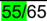

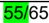

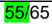

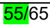

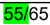

| #             | Modelo   | Regra de Validação                                                                                                                                                                                                                                                                                                                                                                                                                                                                                                                                                                                                                                                                                                                                                                                                                                                                                                                                                                                         | Aplic.        | Msg     | Efeito    | Descrição Erro                                                                                      |
|---------------|----------|------------------------------------------------------------------------------------------------------------------------------------------------------------------------------------------------------------------------------------------------------------------------------------------------------------------------------------------------------------------------------------------------------------------------------------------------------------------------------------------------------------------------------------------------------------------------------------------------------------------------------------------------------------------------------------------------------------------------------------------------------------------------------------------------------------------------------------------------------------------------------------------------------------------------------------------------------------------------------------------------------------|---------------|---------|-----------|-----------------------------------------------------------------------------------------------------|
| B06-10 B09-20 | 65 55    | NFC-e não é aceita pela UF do Emitente Independentemente do Tipo de Emissão: - Aceita NF- e com atraso de até 7 dias, retornando cStat='100 -Autorizado Uso da NF- e'; - Aceita NF- e com atraso superior a 7 dias, retornando cStat='150 -Autorizado Uso da NF- e, autorização fora de prazo'; Exceção 01: A critério da UF, após 30 dias (ou outro limite definido pela SEFAZ) somente será aceita NF-e emitida em contingência (tpEmis=2, 4, 5, 9).                                                                                                                                                                                                                                                                                                                                                                                                                                                                                                                                                     | Obrig. Obrig. | 702 228 | Rej. Rej. | Rejeição: NFC-e não é aceita pela UF do Emitente Rejeição: Data de Emissão muito atrasada           |
| B09-40        | 55/65    | Se NFC-e ou NF-e com DANFE Simplificado Tipo 2 (tag:tpImp=6): - Se Tipo de Emissão=1-Normal (ou 6-SVC-AN, 7-SVC-RS): - Data-Hora de Emissão com atraso superior a 5 minutos em relação ao horário de recepção na SEFAZ. Exceção 1: A critério da UF, a rejeição acima pode ser efetuada para qualquer Tipo de Emissão. Exceção 2: A critério da UF, pode ser aceita a NFC-e ou NF-e com DANFE Simplificado Tipo 2 (tag:tpImp=6) e com Data de Emissão muito atrasada, desde que tenha sido emitida em contingência (tpEmis=4, 9). A NFC-e ou NF-e com DANFE Simplificado Tipo 2 (tag:tpImp=6) transmitida para a SEFAZ Autorizadora após o prazo de 24 horas deve retornar cStat="150- Autorizado Uso da NF-e, autorização fora de prazo". Observação 1: A emissão da NFC-e ou NF-e com DANFE Simplificado Tipo 2 (tag:tpImp=6) deve ocorrer de forma on-line, real-time, com uma tolerância de até 5 minutos, devido ao sincronismo de horário do servidor da Empresa e o servidor da SEFAZ Autorizadora. | Obrig.        | 704     | Rej.      | Rejeição: NFC-e ou NF-e com DANFE Simplificado Tipo 2 com Data-Hora de emissão atrasada             |
| B10-10        | 55/65    | Se NFC-e ou NF-e com DANFE Simplificado Tipo 2 (tag:tpImp=6): - Data de entrada/saída informada indevidamente.                                                                                                                                                                                                                                                                                                                                                                                                                                                                                                                                                                                                                                                                                                                                                                                                                                                                                             | Obrig.        | 705     | Rej.      | Rejeição: NFC-e ou NF-e com DANFE Simplificado Tipo 2 com data de entrada/saída                     |
| B11-10        | 55/65    | Se NFC-e ou NF-e com DANFE Simplificado Tipo 2 (tag:tpImp=6): - Não é permitida operação de entrada (tag:tpNF=0)                                                                                                                                                                                                                                                                                                                                                                                                                                                                                                                                                                                                                                                                                                                                                                                                                                                                                           | Obrig.        | 706     | Rej.      | Rejeição: NFC-e ou NF-e com DANFE Simplificado Tipo 2 para operação de entrada                      |
| B11a-10       | 55/65    | Se NFC-e ou NF-e com DANFE Simplificado Tipo 2 (tag:tpImp=6): - Não é permitida operação interestadual ou com o exterior (tag:idDest<>1)                                                                                                                                                                                                                                                                                                                                                                                                                                                                                                                                                                                                                                                                                                                                                                                                                                                                   | Obrig.        | 707     | Rej.      | Rejeição: NFC-e ou NF-e com DANFE Simplificado Tipo 2 para operação interestadual ou com o exterior |
| B22-10        | 55       | Se NF-e com contingência off-line (tag:tpEmis=9) e tipo de impressão difere de DANFE Simplificado Tipo 2 (tag:tpImp <> 6)                                                                                                                                                                                                                                                                                                                                                                                                                                                                                                                                                                                                                                                                                                                                                                                                                                                                                  | Obrig         | 711     | Rej.      | Rejeição: NF-e com contingência off-line em operação não permitida                                  |
| B25-20        | 55/65    | Se NFC-e ou NF-e com DANFE Simplificado Tipo 2 (tag:tpImp=6): - Não é permitida finalidade diferente finalidade diferente de ' 1-Normal ' (tag:finNFe <> 1)                                                                                                                                                                                                                                                                                                                                                                                                                                                                                                                                                                                                                                                                                                                                                                                                                                                | Obrig         | 715     | Rej.      | Rejeição: NFC-e ou NF-e com DANFE Simplificado Tipo 2 com finalidade inválida                       |

| #       | Modelo   | Regra de Validação                                                                                                                                                                                                                                                                                    | Aplic.   |   Msg | Efeito   | Descrição Erro                                                                                     |
|---------|----------|-------------------------------------------------------------------------------------------------------------------------------------------------------------------------------------------------------------------------------------------------------------------------------------------------------|----------|-------|----------|----------------------------------------------------------------------------------------------------|
| B25a-10 | 55/65    | Se NFC-e ou NF-e com DANFE Simplificado Tipo 2 (tag:tpImp=6): - Operação não destinada a Consumidor Final (tag:indFinal=0)                                                                                                                                                                            | Obrig    |   716 | Rej.     | Rejeição: NFC-e ou NF-e com DANFE Simplificado Tipo 2 em operação não destinada a consumidor final |
| B25b-10 | 55       | NF-e com indicativo de NFC-e com entrega a domicílio (tag:indPres=4)                                                                                                                                                                                                                                  | Obrig.   |   794 | Rej.     | Rejeição: NF-e com indicativo de NFC-e com entrega a domicílio                                     |
| B25b-20 | 55/65    | Se NFC-e ou NF-e com DANFE Simplificado Tipo 2 (tag:tpImp=6): - Indicador de presença difere de: - ' 1-Operação presencial ' - ' 4-Operações não presenciais com NFC-e e NF-e com DANFE Simplificado Tipo 2 ' - ' 5-Operação presencial, fora do estabelecimento ' Observação: tag:indPres<>1, 4 e 5. | Obrig.   |   717 | Rej.     | Rejeição: NFC-e ou NF-e com DANFE Simplificado Tipo 2 em operação não permitida                    |
| B25b-30 | 65       | NFC-e com operação de entrega a domicílio, não permitida para a UF (parametrizável)                                                                                                                                                                                                                   | Obrig.   |   785 | Rej.     | Rejeição: NFC-e com entrega a domicílio não permitida pela UF                                      |

- BA. Documento Fiscal Referenciado
- C. Identificação do Emitente
- E. Identificação do Destinatário
- F. Local da Retirada

| #       | Modelo   | Regra de Validação                                                                                                                                                                                                               | Aplic.   |   Msg | Efeito   | Descrição Erro                                                                              |
|---------|----------|----------------------------------------------------------------------------------------------------------------------------------------------------------------------------------------------------------------------------------|----------|-------|----------|---------------------------------------------------------------------------------------------|
| BA01-10 | 55/65    | NFC-e ou NF-e com DANFE Simplificado Tipo 2 (tag:tpImp=6) não pode refe- renciar outros documentos (tag:NFref)                                                                                                                   | Obrig.   |   708 | Rej.     | Rejeição: NFC-e ou NF-e com DANFE Simplificado Tipo 2 não pode referenciar documento fiscal |
| BA02-35 | 55       | Se informada uma NF-e referenciada (tag:refNFe) em uma NF-e de Saída (tpNF=1) e Finalidade diferente de '2 -NFe C omplementar' (tag:finfe<>2): - Modelo da NF-e referenciada não pode ser NFC-e, modelo 65, nem CF-e, modelo 59. | Obrig.   |   679 | Rej.     | Rejeição: Chave de Acesso referenciada com Modelo inválido [nOcor:nnn]                      |

| #      | Modelo   | Regra de Validação                                                                                                                  | Aplic.   |   Msg | Efeito   | Descrição Erro                                                                                      |
|--------|----------|-------------------------------------------------------------------------------------------------------------------------------------|----------|-------|----------|-----------------------------------------------------------------------------------------------------|
| C18-10 | 55/65    | Se NFC-e ou NF-e com DANFE Simplificado Tipo 2 (tag:tpImp=6): - IE de Substituto Tributário (tag:emit/IEST) informada indevidamente | Obrig.   |   718 | Rej.     | Rejeição: NFC-e ou NF-e com DANFE Simplificado Tipo 2 não deve informar IE de Substituto Tributário |

| #      | Modelo   | Regra de Validação                                                                                                                                                   | Aplic.   |   Msg | Efeito   | Descrição Erro                                                                                                                     |
|--------|----------|----------------------------------------------------------------------------------------------------------------------------------------------------------------------|----------|-------|----------|------------------------------------------------------------------------------------------------------------------------------------|
| E01-20 | 55/65    | Se NFC-e ou NF-e com DANFE Simplificado Tipo 2 (tag:tpImp=6) em operação não presencial (indPres=4): - Identificação do destinatário (tag:infNFe/dest) não informada | Obrig.   |   787 | Rej.     | Rejeição: NFC-e ou NF-e com DANFE Simplificado Tipo 2 (tag:tpImp=6) em operação não presencial sem a identificação do destinatário |

| #      | Modelo   | Regra de Validação                                                                                                       | Aplic.   |   Msg | Efeito   | Descrição Erro                                      |
|--------|----------|--------------------------------------------------------------------------------------------------------------------------|----------|-------|----------|-----------------------------------------------------|
| F01-10 | 55/65    | Se NFC-e ou NF-e com DANFE Simplificado Tipo 2 (tag:tpImp=6): - Local de retirada (tag:retirada) informado indevidamente | Obrig.   |   669 | Rej.     | Rejeição: Local de retirada informado indevidamente |

## G. Local da Entrega

| #      | Modelo   | Regra de Validação                                                                                                                                       | Aplic.   |   Msg | Efeito   | Descrição Erro                                     |
|--------|----------|----------------------------------------------------------------------------------------------------------------------------------------------------------|----------|-------|----------|----------------------------------------------------|
| G01-10 | 55/65    | Se NFC-e ou NF-e com DANFE Simplificado Tipo 2 (tag:tpImp=6): - Local de entrega (tag:entrega) informado indevidamente Observação: Implementação futura. | Obrig.   |   670 | Rej.     | Rejeição: Local de entrega informado indevidamente |

## I. Produtos e Serviços

| #       | Modelo   | Regra de Validação                                                                                                                                                                                                                                                                                                                                                                                                                                                                                                                                                                                                                                                                                                                                                                                                                                                                                                                                                                                                                                                                                                                                                        | Aplic.   |   Msg | Efeito   | Descrição Erro                                                                                                                  |
|---------|----------|---------------------------------------------------------------------------------------------------------------------------------------------------------------------------------------------------------------------------------------------------------------------------------------------------------------------------------------------------------------------------------------------------------------------------------------------------------------------------------------------------------------------------------------------------------------------------------------------------------------------------------------------------------------------------------------------------------------------------------------------------------------------------------------------------------------------------------------------------------------------------------------------------------------------------------------------------------------------------------------------------------------------------------------------------------------------------------------------------------------------------------------------------------------------------|----------|-------|----------|---------------------------------------------------------------------------------------------------------------------------------|
| I04-10  | 55/65    | Se documento for NFC-e (mod=65) ou NF-e com DANFE Simplificado Tipo 2 (tag:tpImp=6): - Se ambiente de homologação (tag:tpAmb=2, id:B24): - Descrição do primeiro item da Nota Fiscal (tag:xProd) deve ser informada como 'NOTA FISCAL EMITIDA EM AMBIENTE DE HOMOLOGACAO - SEM VALOR FISCAL"                                                                                                                                                                                                                                                                                                                                                                                                                                                                                                                                                                                                                                                                                                                                                                                                                                                                              | Obrig.   |   373 | Rej.     | Rejeição: Descrição do primeiro item diferente de NOTA FISCAL EMITIDA EM AMBIENTE DE HOMOLOGACAO - SEM VALOR FISCAL [nItem:nnn] |
| I08-150 | 55/65    | NFC-e (mod=65) ou NF-e com DANFE Simplificado Tipo 2 (tag:tpImp=6) com CFOP inválido. Aceitar unicamente os CFOP: - 5.101: Venda de produção do estabelecimento; - 5.102: Venda de mercadoria de terceiros; - 5.103: Venda de produção do estabelecimento efetuada fora do estabelecimento; - 5.104: Venda de mercadoria adquirida ou recebida de terceiros, efetuada fora do estabelecimento; - 5.115: Venda de mercadoria de terceiros, recebida anteriormente em consignação mercantil; - 5.405: Venda de mercadoria de terceiros, sujeita a ST, como contribuinte substituído; - 5.656: Venda de combustível ou lubrificante de terceiros, destinados a consumidor final; - 5.667: Venda de combustível ou lubrificante a consumidor ou usuário final estabelecido em outra Unidade da Federação; - 5.910: Remessa em bonificação, doação ou brinde; - 5.933: Prestação de serviço tributado pelo ISSQN (Nota Fiscal conjugada); (NT 2013/005 v 1.20) (NT 2015.002) Observação 1: Para a UF do RS, poderá ser permitido o uso do CFOP 5.949 com CSOSN=900 ou CST=90. Observação 2: Para a UF do SP, poderá ser permitido o uso do CFOP 5.949 com CSOSN=900 ou CST=40. | Obrig.   |   725 | Rej.     | Rejeição: NFC-e ou NF-e com DANFE Simplificado Tipo 2 com CFOP inválido[nItem:nnn]                                              |
| I08-180 | 55       | NF-e (mod=55) com lançamento relativo a Cupom Fiscal (CFOP=5.929 ou CFOP=6.929) e existe NFC-e referenciada (tag:refNFe com modelo 65) Observação: Regra de Validação opcional, a critério da UF poderá ser aceito o CFOP 5.929. (NT 2015.002) Observação: Regra de Validação obrigatória em produção a partir de 05/10/2026.                                                                                                                                                                                                                                                                                                                                                                                                                                                                                                                                                                                                                                                                                                                                                                                                                                             | Obrig.   |   375 | Rej.     | Rejeição: NF-e com lançamento relativo a Cupom Fiscal referencia uma NFC-e [nItem:nnn]                                          |

NT 2026.002 v1.00

| #       | Modelo   | Regra de Validação                                                                                                                                                                                                                                          | Aplic.   |   Msg | Efeito   | Descrição Erro                                                                                                                   |
|---------|----------|-------------------------------------------------------------------------------------------------------------------------------------------------------------------------------------------------------------------------------------------------------------|----------|-------|----------|----------------------------------------------------------------------------------------------------------------------------------|
| I08-184 | 55       | NF-e (mod=55) com lançamento relativo a Cupom Fiscal (CFOP=5.929ou CFOP6.929) sem Documento Fiscal referenciado (tag:NFref, idBA01)                                                                                                                         | Obrig.   |   701 | Rej.     | Rejeição: Não informado Nota Fiscal referenciada (Lançamento relativo a Cupom Fiscal) [nItem: nnn]                               |
| I08-186 | 55       | NF-e (mod=55) com lançamento relativo a Documento Fiscal de Varejo (CFOP=5.929 ou CFOP 6.929) com ECF referenciado (tag: refECF) Observação:Regra opcional, a critério da UF Observação: Regra de Validação obrigatória em produção a partir de 05/10/2026. | Obrig.   |   953 | Rej.     | Rejeição: Informado ECF referenciado para CFOP 5.929 em UF que não permite essa referência                                       |
| I17b-10 | 55/65    | NFC-e ou NF-e com DANFE Simplificado Tipo 2 (tag:tpImp=6) com indicador de item não participante do total (tag:indTot=0)                                                                                                                                    | Obrig.   |   774 | Rej.     | Rejeição: NFC-e ou NF-e com DANFE Simplificado Tipo 2 (tag:tpImp=6) com indicador de item não participante do total [nItem: 999] |

## J. Item / Veículos Novos

| #      | Modelo   | Regra de Validação                                                                                   | Aplic.   |   Msg | Efeito   | Descrição Erro                                                                    |
|--------|----------|------------------------------------------------------------------------------------------------------|----------|-------|----------|-----------------------------------------------------------------------------------|
| J01-10 | 55/65    | NFC-e ou NF-e com DANFE Simplificado Tipo 2 (tag:tpImp=6) com grupo de Veículos novos (tag:veicProd) | Obrig.   |   736 | Rej.     | Rejeição: NFC-e ou NF-e com DANFE Simplificado Tipo 2 com grupo de Veículos novos |

## K. Item / Medicamentos

| #      |   Modelo | Regra de Validação                                                                                                                                                                                                                                                                                                                                                                                                                                                                                                                                                                                                                                                    | Aplic.   |   Msg | Efeito   | Descrição Erro                                                                                |
|--------|----------|-----------------------------------------------------------------------------------------------------------------------------------------------------------------------------------------------------------------------------------------------------------------------------------------------------------------------------------------------------------------------------------------------------------------------------------------------------------------------------------------------------------------------------------------------------------------------------------------------------------------------------------------------------------------------|----------|-------|----------|-----------------------------------------------------------------------------------------------|
| K01-10 |       55 | Informado NCM de medicamento é obrigatório o preenchimento do Grupo de Medicamento (tag: med). (NT 2021.004)                                                                                                                                                                                                                                                                                                                                                                                                                                                                                                                                                          | Facul.   |   840 | Rej.     | Rejeição: NCM de medicamento e não informado o grupo de medicamento (med) [nItem:nnn]         |
| K01-20 |       55 | Se informado Grupo de Medicamentos (tag:med): - Obrigatório preenchimento do grupo rastro (id: I80) (NT 2016.002) Exceção 1: Regra de Validação não se aplica para NF-e de devolução (finNfe = 4). Exceção 2: Regra de Validação não se aplica para NF-e de venda não presencial (indPres = 2 ou 3). Exceção 3: Regra de Validação não se aplica para CFOP de venda para entrega futura (CFOPs 5922 e 6922) ou CFOP de Venda à Ordem (5118, 6118, 5119, 6119, 5120 e 6120) (NT 2021.004). Exceção 4: Regra de validação não se aplica para NF-e de entrada (tpNF=0). Exceção 5 : Regra de validação não se aplica a NF-e com DANFE Simplificado Tipo 2 (tag:tpImp=6). | Obrig    |   873 | Rej      | Rejeição: Operação com medicamentos e não informado os campos de rastreabilidade [nItem: 999] |

## L. Item / Armamentos

| #      | Modelo   | Regra de Validação                                                                           | Aplic.   |   Msg | Efeito   | Descrição Erro                                                                |
|--------|----------|----------------------------------------------------------------------------------------------|----------|-------|----------|-------------------------------------------------------------------------------|
| L01-10 | 55/65    | NFC-e ou NF-e com DANFE Simplificado Tipo 2 (tag:tpImp=6) com grupo de Armamentos (tag:arma) | Obrig.   |   738 | Rej.     | Rejeição: NFC-e ou NF-e com DANFE Simplificado Tipo 2 com grupo de Armamentos |

## LA. Item / Combustível

| #       | Modelo   | Regra de Validação                                                                                                                                                                                                                                                                                                                                                                                                                                                                                                                                                                                                                                                                                                                                                                                                                                                                                                                                                                                                                                                                                                                                                                      | Aplic.   |   Msg | Efeito   | Descrição Erro                                                                            |
|---------|----------|-----------------------------------------------------------------------------------------------------------------------------------------------------------------------------------------------------------------------------------------------------------------------------------------------------------------------------------------------------------------------------------------------------------------------------------------------------------------------------------------------------------------------------------------------------------------------------------------------------------------------------------------------------------------------------------------------------------------------------------------------------------------------------------------------------------------------------------------------------------------------------------------------------------------------------------------------------------------------------------------------------------------------------------------------------------------------------------------------------------------------------------------------------------------------------------------|----------|-------|----------|-------------------------------------------------------------------------------------------|
| LA11-10 | 55/65    | NFC-e ou NF-e com DANFE Simplificado Tipo 2 (tag:tpImp=6) sem a informação do grupo de Encerrante na venda de combustível para consumidor final. Observação: Regra de validação opcional a critério da UF. Exceção 1: A regra de validação se aplica somente para os códigos de produtos ANP (cProdANP) abaixo: - 810101002 - ETANOL HIDRATADO ADITIVADO - 810101001 - ETANOL HIDRATADO COMUM - 220101005 - GÁS NATURAL VEICULAR - 220101006 - GÁS NATURAL VEICULAR PADRÃO - 320103001 - GASOLINA AUTOMOTIVA PADRÃO - 320102002 - GASOLINA C ADITIVADA - 320102001 - GASOLINA C COMUM - 320102003 - GASOLINA C PREMIUM - 820101033 - ÓLEO DIESEL B S10 - ADITIVADO - 820101034 - ÓLEO DIESEL B S10 - COMUM - 420106001 - ÓLEO DIESEL B S10 AMD 10 - 820101011 - ÓLEO DIESEL B S1800 Não Rodoviário- Aditivado - 820101003 - ÓLEO DIESEL B S1800 Não Rodoviário - Comum - 820101013 - ÓLEO DIESEL B S500 - ADITIVADO - 820101012 - ÓLEO DIESEL B S500 - COMUM - 420106002 - ÓLEO DIESEL B S500 AMD 10 - 420301004 - OLEO DIESEL DE REFERÊNCIA S300 Exceção 2: A regra de validação não se aplica, em produção, para Nota Fiscal com Data de Emissão anterior a 01/01/2016. (NT 2015.002) | Facult.  |   378 | Rej.     | Rejeição: Grupo de Combustível sem a informação de Encerrante [nItem: nnn]                |
| LA17-20 | 55       | Se produto (tag: cProdANP) existe na Tabela de Combustíveis Sujeitos à Tributação Monofásica (coluna "Código ANP") e coluna ("Percentual do Biocombustível) igual a 1: - Obrigatório o preenchimento do índice de mistura do Biocombustível (tag: pBio) Exceção 1: Regra de validação não se aplica quando: - NF-e Complementar (tag:finNFe =2) ou NF-e de Devolução (tag:finfe=4). Exceção 2: Regra de validação não se aplica quando campo (tag:indFinal) igual a 1. Exceção 3: Regra de validação não se aplica quando CFOP 5.922 ou 6.922.                                                                                                                                                                                                                                                                                                                                                                                                                                                                                                                                                                                                                                          | Obrig.   |   908 | Rej.     | Rejeição: Obrigatório o preenchimento do índice de mistura do Biocombustível. [nItem:999] |

NT 2026.002 v1.00

| #       |   Modelo | Regra de Validação                                                                                                                                                                                                                                                                                                                                                                                                                                                                                                                                                                                                                                                                                                                                                                                                                                                                                                                                                              | Aplic.   |   Msg | Efeito   | Descrição Erro                                                                            |
|---------|----------|---------------------------------------------------------------------------------------------------------------------------------------------------------------------------------------------------------------------------------------------------------------------------------------------------------------------------------------------------------------------------------------------------------------------------------------------------------------------------------------------------------------------------------------------------------------------------------------------------------------------------------------------------------------------------------------------------------------------------------------------------------------------------------------------------------------------------------------------------------------------------------------------------------------------------------------------------------------------------------|----------|-------|----------|-------------------------------------------------------------------------------------------|
|         |          | Exceção 4 : Regra de validação não se aplica a NF-e com DANFE Simplificado Tipo 2 (tag:tpImp=6) Observação 1: Tabela de Combustíveis Sujeitos à Tributação Monofásica publicada na aba 'Documentos', opção 'Diversos' do Portal Nacional da Nota Fiscal Eletrônica. Observação 2: Regra implantada até 25/09/2023 em homologação e em 30/10/2023 em produção.                                                                                                                                                                                                                                                                                                                                                                                                                                                                                                                                                                                                                   |          |       |          |                                                                                           |
| LA18-10 |       55 | Se produto (tag: cProdANP) está presente na Tabela de Combustíveis Sujeitos à Tributação Monofásica (coluna "Código ANP") e coluna ("Origem do Combustível") igual a 1: - Obrigatória informação de pelo menos uma ocorrência do grupo de origem do combustível (id: LA18) Exceção 1: Regra de Validação não se aplica quando o campo (tag: indFinal) igual a 1. Exceção 2: Regra de validação não se aplica quando: NF-e Complementar (tag:finNFe =2) ou NF-e de Devolução (tag:finfe=4). Exceção 3: Regra de validação não se aplica quando CFOP 5.922 ou 6.922. Exceção 4 : Regra de validação não se aplica a NF-e com DANFE Simplificado Tipo 2 (tag:tpImp=6) Observação 1: Tabela de Combustíveis Sujeitos à Tributação Monofásica publicada na aba 'Documentos', opção 'Diversos' do Portal Nacional da Nota Fiscal Eletrônica. Observação 2: Regra com implementação futura.                                                                                            | Obrig.   |   909 | Rej.     | Rejeição: Obrigatório o preenchimento do grupo de UF de origem do combustível [nItem:999] |
| LA18-20 |       55 | Se preenchido o campo Percentual de Gás Natural Nacional - GLGNn para o produto GLP (tag: pGNn) ou o campo Percentual de Gás Natural Importado - GLGNi para o produto GLP (tag: pGNi) com valor diferente de '0' : - Obrigatória informação de pelo menos uma ocorrência do grupo de origem do combustível (id: LA18) Exceção 1: Regra de Validação não se aplica quando o campo (tag: indFinal) igual a 1. Exceção 2: Regra de validação não se aplica quando: - NF-e Complementar (tag:finNFe =2) ou NF-e de Devolução (tag:finfe=4). Exceção 3: Regra de validação não se aplica quando CFOP 5.922 ou 6.922. Exceção 4 : Regra de validação não se aplica a NF-e com DANFE Simplificado Tipo 2 (tag:tpImp=6). Observação 1: Tabela de Combustíveis Sujeitos à Tributação Monofásica publicada na aba 'Documentos', opção 'Diversos' do Portal Nacional da Nota Fiscal Eletrônica. Observação 2: Regra válida a partir de 03/07/2023 em homologação e 04/09/2023 em produção. | Obrig.   |   909 | Rej.     | Rejeição: Obrigatório o preenchimento do grupo de UF de origem                            |

## LB. Item / Papel Imune

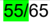

| #       | Modelo   | Regra de Validação                                                                                                               | Aplic.   |   Msg | Efeito   | Descrição Erro                                                         |
|---------|----------|----------------------------------------------------------------------------------------------------------------------------------|----------|-------|----------|------------------------------------------------------------------------|
| LB01-10 | 55/65    | Se NFC-e ou NF-e com DANFE Simplificado Tipo 2 (tag:tpImp=6): - Grupo RECOPI - Papel Imune (tag:nRECOPI) informado indevidamente | Obrig.   |   348 | Rej.     | Rejeição: NFC-e ou NF-e com DANFE Simplificado Tipo 2 com grupo RECOPI |

## N. Item / Tributo: ICMS

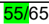

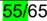

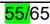

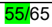

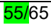

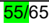

| #       | Modelo   | Regra de Validação                                                                                                                                                                                                                                                                                                                                                                                                                                                                                                                | Aplic.   |   Msg | Efeito   | Descrição Erro                                                                      |
|---------|----------|-----------------------------------------------------------------------------------------------------------------------------------------------------------------------------------------------------------------------------------------------------------------------------------------------------------------------------------------------------------------------------------------------------------------------------------------------------------------------------------------------------------------------------------|----------|-------|----------|-------------------------------------------------------------------------------------|
| N12-30  | 55/65    | Se NFC-e ou NF-e com DANFE Simplificado Tipo 2 (tag:tpImp=6): - CST diferente da relação abaixo: - 00-Tributada integralmente; - 20-Com redução da Base de Cálculo; - 40-Isenta; - 41-Não tributada; - 60-ICMS cobrado anteriormente por substituição tributária; - 61- Tributação monofásica sobre combustíveis cobrada anteriormente; Exceção 1: Aceitar CST=90-Outros, a critério da UF. Exceção 2: A regra de validação não se aplica, em produção, para Nota Fiscal com Data de Emissão anterior a 01/04/2016. (NT 2015.002) | Obrig.   |   766 | Rej.     | Rejeição: Item com CST indevido [nItem:nnn]                                         |
| N12-34  | 55/65    | Se NFC-e ou NF-e com DANFE Simplificado Tipo 2 (tag:tpImp=6): - CST=90 e informando dados do ICMS-ST (tag: ICMS90/modBCST) (NT 2015.002)                                                                                                                                                                                                                                                                                                                                                                                          | Obrig.   |   381 | Rej.     | Rejeição: Grupo de tributação ICMS90, informando dados do ICMS-ST [nItem:nnn]       |
| N12-40  | 55/65    | Se NFC-e ou NF-e com DANFE Simplificado Tipo 2 (tag:tpImp=6) com CST=00, 20, 40, 41 ou 90: - CFOP difere de 5.101, 5.102, 5.103, 5.104, 5.115, 5.910 (NT 2015.002) Observação 1: Para a UF do RS, poderá ser permitido o uso do CST 90 com o CFOP 5.949. Observação 2: Para a UF do CE, poderá ser permitido o uso do CST 90 com o CFOP 5.405. Observação 3: Para a UF do SP, poderá ser permitido o uso do CST 40 com o CFOP 5.949.                                                                                              | Obrig.   |   382 | Rej.     | Rejeição: CFOP não permitido para o CST informado [nItem:nnn]                       |
| N12-44  | 55/65    | NFC-e ou NF-e com DANFE Simplificado Tipo 2 (tag:tpImp=6) com CST=60 (ICMS cobrado anteriormente por ST) e CFOP diferente de 5.405, 5.656, 5.667, 5.910 (NT 2015.002)                                                                                                                                                                                                                                                                                                                                                             | Obrig.   |   382 | Rej.     | Rejeição: CFOP não permitido para o CST informado [nItem:nnn]                       |
| N12-50  | 55/65    | NFC-e ou NF-e com DANFE Simplificado Tipo 2 (tag:tpImp=6) com Partilha de ICMS entre UF (tag:ICMS/ICMSPart)                                                                                                                                                                                                                                                                                                                                                                                                                       | Obrig.   |   741 | Rej.     | Rejeição: NFC-e ou NF-e com DANFE Simplificado Tipo 2 com Partilha de ICMS entre UF |
| N12-60  | 55/65    | NFC-e ou NF-e com DANFE Simplificado Tipo 2 (tag:tpImp=6) com repasse de ICMS-ST retido anteriormente em operação interestadual com repasse pelo SubstitutoTributário (tag: ICMS/ICMSST) (NT 2015.002)                                                                                                                                                                                                                                                                                                                            | Obrig.   |   740 | Rej.     | Rejeição: Item com Repasse de ICMS retido por Substituto Tributário [nItem: nnn]    |
| N12a-20 | 55/65    | NFC-e ou NF-e com DANFE Simplificado Tipo 2 (tag:tpImp=6) com CSOSN diferente da relação abaixo: - 102-Tributação SN sem permissão de crédito; - 103-Tributação SN, com isenção para faixa de receita bruta; - 300-Imune;- 400-Não tributada pelo Simples Nacional;                                                                                                                                                                                                                                                               | Obrig.   |   383 | Rej.     | Rejeição: Item com CSOSN indevido [nItem: nnn]                                      |

NT 2026.002 v1.00

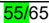

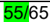

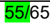

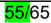

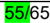

| #       | Modelo   | Regra de Validação                                                                                                                                                                                                                                                                                                                                                                                                                                 | Aplic.   |   Msg | Efeito   | Descrição Erro                                                                    |
|---------|----------|----------------------------------------------------------------------------------------------------------------------------------------------------------------------------------------------------------------------------------------------------------------------------------------------------------------------------------------------------------------------------------------------------------------------------------------------------|----------|-------|----------|-----------------------------------------------------------------------------------|
|         |          | - 500-ICMS cobrado anteriormente por substituição tributária ou por antecipação; Exceção 1 : Aceitar CSOSN=900-Outros, a critério da UF.Exceção 2:A regra de validação não se aplica, em produção, para Nota Fiscal com Data de Emissão anterior a 01/04/2016. (NT 2015.002)                                                                                                                                                                       |          |       |          |                                                                                   |
| N12a-30 | 55/65    | NFC-e ou NF-e com DANFE Simplificado Tipo 2 (tag:tpImp=6) com CSOSN 103 ou 400 não permitidos para a UF. Observação : Regra de validação opcional a critério da UF. Exceção : A regra de validação não se aplica, em produção, para Nota Fiscal com Data de Emissão anterior a 01/04/2016. (NT 2015.002)                                                                                                                                           | Obrig.   |   384 | Rej.     | Rejeição: CSOSN não permitido para a UF [nItem: nnn]                              |
| N12a-34 | 55/65    | NFC-e ou NF-e com DANFE Simplificado Tipo 2 (tag:tpImp=6) com CSOSN=900, informando dados do ICMS-ST (tag: ICMSSN900/modBCST) (NT 2015.002)                                                                                                                                                                                                                                                                                                        | Obrig.   |   385 | Rej.     | Rejeição: Grupo de tributação ICMSSN900, informando dados do ICMS-ST [nItem: nnn] |
| N12a-40 | 55/65    | NFC-e ou NF-e com DANFE Simplificado Tipo 2 (tag:tpImp=6) com CSOSN = 102, 103, 300, 400 ou 900 - CFOP diferente de 5.101, 5.102, 5.103, 5.104, 5.115, 5.910 (NT 2015.002) Observação 1: Para a UF do RS, poderá ser permitido o uso do CST 90 com o CFOP 5.949. Observação 2: Para a UF do CE, poderá ser permitido o uso do CSOSN 900 com o CFOP 5.405. Observação 3: Para a UF do SP, poderá ser permitido o uso do CSOSN 900 com o CFOP 5.949. | Obrig.   |   386 | Rej.     | Rejeição: CFOP não permitido para o CSOSN informado [nItem: nnn]                  |
| N12a-44 | 55/65    | NFC-e ou NF-e com DANFE Simplificado Tipo 2 (tag:tpImp=6) com CSOSN=500 (ICMS cobrado anteriormente): - CFOP difere de 5.405, 5.656, 5.667, 5.910 (NT 2015.002)                                                                                                                                                                                                                                                                                    | Obrig.   |   386 | Rej.     | Rejeição: CFOP não permitido para o CSOSN informado [nItem: nnn]                  |
| N12a-81 | 55/65    | Se informado CRT (id:C21) igual 4 e idDest<>3: - Se NFC-e (mod=65) ou NF-e com DANFE Simplificado Tipo 2 (tag:tpImp=6) aceitar somente o CSOSN (id:N12a) 102 e 300 Observação: Regra de validação válida a partir de 01/07/2024 em homologação e 01/04/2025 em produção                                                                                                                                                                            | Obrig.   |   782 | Rej.     | Rejeição: CSOSN inválido para emitente MEI (CRT=4) [nItem:nnn]                    |
| N12a-91 | 55/65    | Se informado CRT (id:C21) igual 4 e idDest<>3 - Se NFC-e (mod=65) ou NF-e com DANFE Simplificado Tipo 2 (tag:tpImp=6) aceitar somente o CFOP 5102 Observação: Regra de validação válida a partir de 01/07/2024 em homologação e 01/04/2025 em produção                                                                                                                                                                                             | Obrig.   |   337 | Rej.     | Rejeição: CFOP inválido para emitente MEI (CRT=4) [nItem:nnn]                     |

## NA. Item / ICMS para a UF de Destino

| #       | Modelo   | Regra de Validação                                                                                           | Aplic.   |   Msg | Efeito   | Descrição Erro                                                                                    |
|---------|----------|--------------------------------------------------------------------------------------------------------------|----------|-------|----------|---------------------------------------------------------------------------------------------------|
| NA01-10 | 55/65    | Informado grupo 'ICMSUFDest" para a NFC -e (NT 2015.003) ou NF-e com DANFE Simplificado Tipo 2 (tag:tpImp=6) | Obrig.   |   807 | Rej.     | Rejeição: NFC-e ou NF-e com DANFE Simplificado Tipo 2 com grupo de ICMS para a UF do destinatário |

- O. Item / Tributo: IPI
- P. Item / Tributo: II
- R. Item / Tributo: PIS ST
- T. Item / Tributo: COFINS ST
5. UA. Item / Devolução de Tributos
- VC. Referenciamento de item de outro Documento Fiscal Eletrônico - DF-e

| #      | Modelo   | Regra de Validação                                                                                    | Aplic.   |   Msg | Efeito   | Descrição Erro                                                         |
|--------|----------|-------------------------------------------------------------------------------------------------------|----------|-------|----------|------------------------------------------------------------------------|
| O01-10 | 55/65    | NFC-e ou NF-e com DANFE Simplificado Tipo 2 (tag:tpImp=6) com o grupo de tributação pelo IPI (id:O01) | Obrig.   |   742 | Rej.     | Rejeição: NFC-e ou NF-e com DANFE Simplificado Tipo 2 com grupo do IPI |

| #      | Modelo   | Regra de Validação                                                                                   | Aplic.   |   Msg | Efeito   | Descrição Erro                                                        |
|--------|----------|------------------------------------------------------------------------------------------------------|----------|-------|----------|-----------------------------------------------------------------------|
| P01-10 | 55/65    | NFC-e ou NF-e com DANFE Simplificado Tipo 2 (tag:tpImp=6) com o grupo de tributação pelo II (id:P01) | Obrig.   |   743 | Rej.     | Rejeição: NFC-e ou NF-e com DANFE Simplificado Tipo 2 com grupo do II |

| #      | Modelo   | Regra de Validação                                                                                       | Aplic.   |   Msg | Efeito   | Descrição Erro                                                            |
|--------|----------|----------------------------------------------------------------------------------------------------------|----------|-------|----------|---------------------------------------------------------------------------|
| R01-10 | 55/65    | NFC-e ou NF-e com DANFE Simplificado Tipo 2 (tag:tpImp=6) com o grupo de tributação pelo PIS-ST (id:R01) | Obrig.   |   746 | Rej.     | Rejeição: NFC-e ou NF-e com DANFE Simplificado Tipo 2 com grupo do PIS-ST |

| #      | Modelo   | Regra de Validação                                                                                          | Aplic.   |   Msg | Efeito   | Descrição Erro                                                               |
|--------|----------|-------------------------------------------------------------------------------------------------------------|----------|-------|----------|------------------------------------------------------------------------------|
| T01-10 | 55/65    | NFC-e ou NF-e com DANFE Simplificado Tipo 2 (tag:tpImp=6) com o grupo de tributação pela COFINS-ST (id:T01) | Obrig    |   749 | Rej.     | Rejeição: NFC-e ou NF-e com DANFE Simplificado Tipo 2 com grupo da COFINS-ST |

| #       | Modelo   | Regra de Validação                                                                                                                                                              | Aplic.   |   Msg | Efeito   | Descrição Erro                                                        |
|---------|----------|---------------------------------------------------------------------------------------------------------------------------------------------------------------------------------|----------|-------|----------|-----------------------------------------------------------------------|
| UA01-20 | 55/65    | Se informado o grupo de devolução de tributos (tag: impostoDevol): - NFC-e ou NF-e com DANFE Simplificado Tipo 2 (tag:tpImp=6) com grupo de devolução de tributos (NT 2015.002) | Obrig.   |   390 | Rej.     | Rejeição: Nota Fiscal com grupo de devolução de Tributos [nItem: nnn] |

| #       |   Modelo | Regra de Validação                                                                                                                                                                                                                                                                                                                                                                        | Aplic.   |   Msg | Efeito   | Descrição Erro                                                                              |
|---------|----------|-------------------------------------------------------------------------------------------------------------------------------------------------------------------------------------------------------------------------------------------------------------------------------------------------------------------------------------------------------------------------------------------|----------|-------|----------|---------------------------------------------------------------------------------------------|
| VC02-40 |       55 | Se item possui DFe referenciado (tag: DFeReferenciado/chaveAcesso): - Se NF-e de Saída (tpNF=1): - S e Finalidade diferente de '2 - NFe Complementar' (tag: finfe<>2): - Modelo do DFe referenciado não pode ser NFC-e, modelo 65, nem CF- e, modelo 59. Exceção: Não se aplica para Nota de Débito do tipo ' 03=Débitos de notas fiscais não processadas na apuração ' ( tpNFDebito=03); | Obrig.   |   679 | Rej.     | Rejeição: Chave de Acesso referenciada com Modelo inválido [nItem:nnn]                      |
| VC02-50 |       55 | Se NF-e com DANFE Simplificado Tipo 2 (tag:tpImp=6) - DFe Referenciado informado indevidamente                                                                                                                                                                                                                                                                                            | Obrig.   |   708 | Rej.     | Rejeição: NFC-e ou NF-e com DANFE Simplificado Tipo 2 não pode referenciar documento fiscal |

## W. Total da NF-e

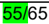

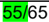

| #      | Modelo   | Regra de Validação                                                                                                                                                                                                                                                             | Aplic.   |   Msg | Efeito   | Descrição Erro                                                                                                                                     |
|--------|----------|--------------------------------------------------------------------------------------------------------------------------------------------------------------------------------------------------------------------------------------------------------------------------------|----------|-------|----------|----------------------------------------------------------------------------------------------------------------------------------------------------|
| W16-30 | 55/65    | Valor total da NFC-e ou NF-e com DANFE Simplificado Tipo 2 (tag:tpImp=6) é superior ao valor limite estabelecido pela SEFAZ (valor parametrizável por UF) Observação : O valor máximo default para a NFC-e/NF-e com DANFE Simplificado Tipo 2 (tag:tpImp=6) é de R$200.000,00. | Obrig.   |   780 | Rej.     | Rejeição: Total da NFC-e ou NF-e com DANFE Simplificado Tipo 2 superior ao valor limite estabelecido pela SEFAZ [Limite]                           |
| W16-40 | 55/65    | Se NFC-e ou NF-e com DANFE Simplificado Tipo 2 (tag:tpImp=6) com valor total superior a R$ 10.000,00 ou outro valor definido pela UF: - Código do Destinatário não informado (tag:dest/CNPJ, dest/CPF ou dest/idEstrang). (NT 2015.002)                                        | Obrig    |   750 | Rej.     | Rejeição: NFC-e ou NF-e com DANFE Simplificado Tipo 2 com valor total superior ao permitido para destinatário não identificado (Código) [Limite]   |
| W16-50 | 55/65    | Se NFC-e ou NF-e com DANFE Simplificado Tipo 2 (tag:tpImp=6) com valor total superior a R$ 10.000,00: - Nome do Destinatário não informado (tag:dest/xNome) Observação: Regra de Validação opcional, a critério da UF. (NT 2015.002)                                           | Facult.  |   751 | Rej.     | Rejeição: NFC-e ou NF-e com DANFE Simplificado Tipo 2 com valor total superior ao permitido para destinatário não identificado (Nome) [Limite]     |
| W16-60 | 55/65    | NFC-e ou NF-e com DANFE Simplificado Tipo 2 (tag:tpImp=6) com valor total superior a R$ 10.000,00: - Endereço do Destinatário não informado (tag:dest/enderDest) Observação: Regra de Validação opcional, a critério da UF. (NT 2015.002)                                      | Obrig    |   752 | Rej.     | Rejeição: NFC-e ou NF-e com DANFE Simplificado Tipo 2 com valor total superior ao permitido para destinatário não identificado (Endereço) [Limite] |

## X. Transporte da NF-e

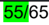

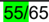

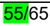

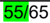

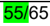

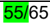

| #       | Modelo   | Regra de Validação                                                                                                             | Aplic.   |   Msg | Efeito   | Descrição Erro                                                                                      |
|---------|----------|--------------------------------------------------------------------------------------------------------------------------------|----------|-------|----------|-----------------------------------------------------------------------------------------------------|
| X02-10  | 55/65    | NFC-e ou NF-e com DANFE Simplificado Tipo 2 (tag:tpImp=6) com Frete e não é entrega a domicílio (tag:modFrete<>9 e indPres<>4) | Obrig.   |   753 | Rej.     | Rejeição: NFC-e ou NF-e com DANFE Simplificado Tipo 2 (tag:tpImp=6) com Frete                       |
| X11-10  | 55/65    | NFC-e ou NF-e com DANFE Simplificado Tipo 2 (tag:tpImp=6) com dados de Retenção do ICMS no Transporte (tag:retTransp)          | Obrig.   |   755 | Rej.     | Rejeição: NFC-e ou NF-e com DANFE Simplificado Tipo 2 com dados de Retenção do ICMS no Transporte   |
| X18-10  | 55/65    | NFC-e ou NF-e com DANFE Simplificado Tipo 2 (tag:tpImp=6) com dados do veículo de Transporte (tag:veicTransp)                  | Obrig.   |   756 | Rej.     | Rejeição: NFC-e ou NF-e com DANFE Simplificado Tipo 2 com dados do veículo de Transporte            |
| X22-10  | 55/65    | NFC-e ou NF-e com DANFE Simplificado Tipo 2 (tag:tpImp=6) com dados de Reboque do veículo de Transporte (tag:reboque)          | Obrig.   |   757 | Rej.     | Rejeição: NFC-e ou NF-e com DANFE Simplificado Tipo 2 com dados de Reboque do veículo de Transporte |
| X25a-10 | 55/65    | NFC-e ou NF-e com DANFE Simplificado Tipo 2 (tag:tpImp=6) com dados do Vagão de Transporte (tag:vagao)                         | Obrig.   |   758 | Rej.     | Rejeição: NFC-e ou NF-e com DANFE Simplificado Tipo 2 com dados do Vagão de Transporte              |
| X25b-10 | 55/65    | NFC-e ou NF-e com DANFE Simplificado Tipo 2 (tag:tpImp=6) com dados da Balsa de Transporte (tag:balsa)                         | Obrig.   |   759 | Rej.     | Rejeição: NFC-e ou NF-e com DANFE Simplificado Tipo 2 com dados da Balsa de Transporte              |

## Y. Dados de Cobrança

| #      | Modelo   | Regra de Validação                                                                                             | Aplic.   |   Msg | Efeito   | Descrição Erro                                                                                  |
|--------|----------|----------------------------------------------------------------------------------------------------------------|----------|-------|----------|-------------------------------------------------------------------------------------------------|
| Y01-10 | 55/65    | NFC-e ou NF-e com DANFE Simplificado Tipo 2 (tag:tpImp=6) com dados de cobrança (Fatura, Duplicata) (tag:cobr) | Obrig.   |   760 | Rej.     | Rejeição: NFC-e ou NF-e com DANFE Simplificado Tipo 2 com dados de cobrança (Fatura, Duplicata) |

## ZB. Informação de Compra

| #       | Modelo   | Regra de Validação                                                                                                      | Aplic.   |   Msg | Efeito   | Descrição Erro                                                                                         |
|---------|----------|-------------------------------------------------------------------------------------------------------------------------|----------|-------|----------|--------------------------------------------------------------------------------------------------------|
| ZB01-10 | 55/65    | NFC-e ou NF-e com DANFE Simplificado Tipo 2 (tag:tpImp=6) com dados de compras (Empenho, Pedido, Contrato) (tag:compra) | Obrig.   |   762 | Rej.     | Rejeição: NFC-e ou NF-e com DANFE Simplificado Tipo 2 com dados de compras (Empenho, Pedido, Contrato) |

## ZC. Informações do Registro de Aquisição de Cana

| #       | Modelo   | Regra de Validação                                                                                  | Aplic.   |   Msg | Efeito   | Descrição Erro                                                                       |
|---------|----------|-----------------------------------------------------------------------------------------------------|----------|-------|----------|--------------------------------------------------------------------------------------|
| ZC01-10 | 55/65    | NFC-e ou NF-e com DANFE Simplificado Tipo 2 (tag:tpImp=6) com dados de aquisição de Cana (tag:cana) | Obrig.   |   763 | Rej.     | Rejeição: NFC-e ou NF-e com DANFE Simplificado Tipo 2 com dados de aquisição de Cana |

## ZX. Informações Suplementares da Nota Fiscal

| #        | Modelo   | Regra de Validação                                                                                                                                                                                                                                                                                                                                                                                                                                                                                                | Aplic.   |   Msg | Efeito   | Descrição Erro                                                                  |
|----------|----------|-------------------------------------------------------------------------------------------------------------------------------------------------------------------------------------------------------------------------------------------------------------------------------------------------------------------------------------------------------------------------------------------------------------------------------------------------------------------------------------------------------------------|----------|-------|----------|---------------------------------------------------------------------------------|
| ZX01-10  | 55       | Informado o grupo de parâmetros suplementares para a NF-e (Modelo 55)                                                                                                                                                                                                                                                                                                                                                                                                                                             | Obrig.   |   393 | Rej.     | Rejeição: NF-e com o grupo de Informações Suplementares                         |
| ZX02-10  | 55/65    | Se NFC-e ou NF-e com DANFE Simplificado Tipo 2 (tag:tpImp=6): - Não informado o campo de QR-Code. Exceção 1: A regra de validação não se aplica, em produção, para Nota Fiscal com Data de Emissão anterior a 01/04/2016. Não sendo informado o QR-Code não se aplicam as demais validações relacionadas com este campo. (NT 2015.002) Exceção 2: Não se aplica para NFF (tpEmis = 3-NFF). (NT 2021.002)                                                                                                          | Obrig.   |   394 | Rej.     | Rejeição: Nota Fiscal sem a informação do QR-Code                               |
| ZX02-20  | 55/65    | Se qrCode informado: - Endereço do site da UF para a Consulta via QR-Code difere do previsto. Nota: O uso diferenciado de maiúsculas ou minúsculas não deve ser considerado na validação. Observação 1: Regra de Validação opcional até 01/11/2016, a critério da UF. Observação 2: Para consultar as URLs por UF utilizadas no QR Code, acesse: http://nfce.encat.org/desenvolvedor/qrcode/" (NT 2015.002) Observação 3: Para NF-e, modelo 55, a URL de consulta do qrCode será a mesma URL da NFC-e, modelo 65. | Obrig.   |   395 | Rej.     | Rejeição: Endereço do site da UF da Consulta via QR- Code diverge do previsto   |
| ZX02-220 | 55       | Se qrCode informado: - QR Code diferente de versão 3                                                                                                                                                                                                                                                                                                                                                                                                                                                              | Obrig.   |   672 | Rej.     | Rejeição: NF-e com DANFE Simplificado Tipo 2 com versão de qrCode não permitida |
| ZX02-224 | 55/65    | Se qrCode informado: - Se QR Code versão '2 ou 3' : - Parâmetro Chave de Acesso não informado no QR-Code. Nota : O Schema XML faz esta verificação.                                                                                                                                                                                                                                                                                                                                                               | Obrig.   |   396 | Rej.     | Rejeição: Parâmetro do QR-Code inexistente: [Param: xxx)]                       |

NT 2026.002 v1.00

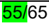

| #        | Modelo   | Regra de Validação                                                                                                                                                                                                                                                                                                                                        | Aplic.   |   Msg | Efeito   | Descrição Erro                                                                    |
|----------|----------|-----------------------------------------------------------------------------------------------------------------------------------------------------------------------------------------------------------------------------------------------------------------------------------------------------------------------------------------------------------|----------|-------|----------|-----------------------------------------------------------------------------------|
| ZX02-228 | 55/65    | Observação: Para NFC-e/NF-e ONLINE ou OFFLINE é o 1º parâmetro da URL do QR Code. Obs. 1: Para NF-e, modelo 55, somente é aceito contingência offline (tpEmis=9) para o DANFE Simplificado Tipo 2 (tag:tpImp=6) Se qrCode informado: - Se QR Code versão '2 ou 3' :                                                                                       | Obrig.   |   397 | Rej.     | Rejeição: Parâmetro do QR-Code divergente da Nota Fiscal [Param: xxx)].           |
| ZX02-232 | 55/65    | (tpEmis=9) para o DANFE Simplificado Tipo 2 (tag:tpImp=6) Se qrCode informado: - Se QR Code versão '2 ou 3' : - Parâmetro Versão não informado no QR-Code. Nota: O Schema XML faz esta verificação. Observação: Para NFC-e/NF-e ONLINE ou OFFLINE é o 2º parâmetro da URL do QR Code. Obs. 1: Para NF-e, modelo 55, somente é aceito contingência offline | Obrig.   |   396 | Rej.     | Rejeição: Parâmetro do QR-Code inexistente: [Param: xxx)]                         |
| ZX02-236 | 55/65    | (tpEmis=9) para o DANFE Simplificado Tipo 2 (tag:tpImp=6) Se qrCode informado: - Se QR Code versão '2 ou 3' : - Parâmetro Versão informada no QR-Code diverge do previsto ('2 ou 3') Observação: Para NFC-e/NF-e ONLINE ou OFFLINE é o 2º parâmetro da URL do QR Code. Obs. 1: Para NF-e, modelo 55, somente é aceito contingência offline                | Obrig.   |   398 | Rej.     | Rejeição: Parâmetro Versão informada no QR-Code diverge do previsto [Param: xxx]. |
| ZX02-240 | 55/65    | (tpEmis=9) para o DANFE Simplificado Tipo 2 (tag:tpImp=6) Se qrCode informado: - Se QR Code versão '2 ou 3' : - Parâmetro Tipo de Ambiente não informado no QR-Code. Nota: O Schema XML faz esta verificação. Observação: Para NFC-e/NF-e ONLINE ou OFFLINE é o 3º parâmetro da                                                                           | Obrig.   |   396 | Rej.     | Rejeição: Parâmetro do QR-Code inexistente: [Param: xxx]                          |
| ZX02-244 | 55/65    | (tpEmis=9) para o DANFE Simplificado Tipo 2 (tag:tpImp=6) Se qrCode informado: - Se QR Code versão '2 ou 3' : - Parâmetro Tipo de Ambiente do QR-Code diverge do Tipo de Ambiente da Nota Fiscal (tag:tpAmb, id:B24) Observação: Para NFC-e/NF-e ONLINE ou OFFLINE é o 3º parâmetro da                                                                    | Obrig.   |   397 | Rej.     | Rejeição: Parâmetro do QR-Code divergente da Nota Fiscal: [Param: xxx]            |

NT 2026.002 v1.00

| #        | Modelo   | Regra de Validação                                                                                                                                                                                                                                                                                                                                                                                                                                                                                 | Aplic.   |   Msg | Efeito   | Descrição Erro                                                         |
|----------|----------|----------------------------------------------------------------------------------------------------------------------------------------------------------------------------------------------------------------------------------------------------------------------------------------------------------------------------------------------------------------------------------------------------------------------------------------------------------------------------------------------------|----------|-------|----------|------------------------------------------------------------------------|
| ZX02-260 | 55/65    | Se qrCode informado: - Se QR Code versão '2 ou 3' : - Se NFC-e/NF-e é de contingência off-line (tpEmis=9): - Parâmetro Dia da Data de Emissão não informado no QR-Code. Nota: O Schema XML faz esta verificação Obs. 1: Para NFC-e ONLINE esse parâmetro não existe. Obs. 2: Para a NFC-e OFFLINE é o 4º parâmetro da URL do QR Code (NT 2017.002) Obs. 3: Para NF-e, modelo 55, somente é aceito contingência offline                                                                             | Obrig.   |   396 | Rej.     | Rejeição: Parâmetro do QR-Code inexistente: [Param: xxx]               |
| ZX02-268 | 55/65    | (tpEmis=9) para o DANFE Simplificado Tipo 2 (tag:tpImp=6) Se qrCode informado: - Se QR Code versão '2 ou 3": - Se NFC-e/NF-e é de contingência off-line (tpEmis=9): - Parâmetro Dia da Data de Emissão no QR-Code diverge do Dia Data de Emissão da Nota Fiscal (tag:dhEmi, id:B09) Obs. 1: Para NFC-e/NFe ONLINE esse parâmetro não existe. Obs. 2: Para a NFC-e/NFe OFFLINE é o 4º parâmetro da URL do QR Code (NT 2017.002) Obs. 3: Para NF-e, modelo 55, somente é aceito contingência offline | Obrig.   |   397 | Rej.     | Rejeição: Parâmetro do QR-Code divergente da Nota Fiscal: [Param: xxx] |
| ZX02-272 | 55/65    | Se qrCode informado: - Se QR Code versão '2 ou 3": - Se NFC-e/NF-e é de contingência off-line (tpEmis=9): - Parâmetro Valor da Nota Fiscal não informado no QR-Code. Nota: O Schema XML faz esta verificação Obs. 1: Para NFC-e/NFe ONLINE esse parâmetro não existe. Obs. 2: Para a NFC-e/NFe OFFLINE é o 5º parâmetro da URL do QR Code (NT 2017.002) Obs. 3: Para NF-e, modelo 55, somente é aceito contingência offline                                                                        | Obrig.   |   396 | Rej.     | Rejeição: Parâmetro do QR-Code inexistente: [Param: xxx]               |
| ZX02-276 | 55/65    | (tpEmis=9) para o DANFE Simplificado Tipo 2 (tag:tpImp=6) Se qrCode informado: - Se QR Code versão '2 ou 3": - Se NFC-e/NF-e é de contingência off-line (tpEmis=9): - Parâmetro Valor da Nota Fiscal no QR-Code diverge do Valor Total da Nota Fiscal (tag:vNF, id:W16) Obs. 1: Para NFC-e/NFe ONLINE esse parâmetro não existe. Obs. 2: Para a NFC-e/NFe OFFLINE é o 5º parâmetro da URL do QR Code (NT 2017.002) Obs. 3: Para NF-e, modelo 55, somente é aceito contingência offline             | Obrig.   |   397 | Rej.     | Rejeição: Parâmetro do QR-Code divergente da Nota Fiscal: [Param: xxx] |
| ZX02-324 | 55/65    | (tpEmis=9) para o DANFE Simplificado Tipo 2 (tag:tpImp=6) Se qrCode informado: - Se QR Code versão '3' : - Se NFC-e/NF-e é de contingência off-line (tpEmis=9):                                                                                                                                                                                                                                                                                                                                    | Obrig.   |   396 | Rej.     | Rejeição: Parâmetro do QR-Code inexistente: [Param: xxx]               |

NT 2026.002 v1.00

| #        | Modelo   | Regra de Validação                                                                                                                                                                                                                                                                                                                                                                                                                                                                                                                                                                                                              | Aplic.   |   Msg | Efeito   | Descrição Erro                                                    |
|----------|----------|---------------------------------------------------------------------------------------------------------------------------------------------------------------------------------------------------------------------------------------------------------------------------------------------------------------------------------------------------------------------------------------------------------------------------------------------------------------------------------------------------------------------------------------------------------------------------------------------------------------------------------|----------|-------|----------|-------------------------------------------------------------------|
|          |          | - Parâmetro Tipo de Identificação do Destinatário não informado no QR-Code. Nota: O Schema XML faz esta verificação Obs. 1: Para NFC-e/NFe ONLINE esse parâmetro não existe. Obs. 2: Para a NFC-e/NFe OFFLINE é o 6º parâmetro da URL do QR Code (NT 2025.001) Obs. 3: Para NF-e, modelo 55, somente é aceito contingência offline (tpEmis=9) para o DANFE Simplificado Tipo 2 (tag:tpImp=6)                                                                                                                                                                                                                                    |          |       |          |                                                                   |
| ZX02-326 | 55/65    | Se qrCode informado: - Se QR Code versão '3' : - Se NFC-e/NF-e é de contingência off-line (tpEmis=9): - Parâmetro Identificação do Destinatário não informado no QR-Code. Nota: O Schema XML faz esta verificação Obs. 1: Para NFC-e/NFe ONLINE esse parâmetro não existe. Obs. 2: Para a NFC-e/NFe OFFLINE é o 7º parâmetro da URL do QR Code (NT 2025.001) Obs. 3: Para NF-e, modelo 55, somente é aceito contingência offline                                                                                                                                                                                                | Obrig.   |   396 | Rej.     | Rejeição: Parâmetro do QR-Code inexistente: [Param: xxx]          |
| ZX02-328 | 55/65    | (tpEmis=9) para o DANFE Simplificado Tipo 2 (tag:tpImp=6) Se qrCode informado: - Se QR Code versão '3' : - Se NFC-e/NF-e é de contingência off-line (tpEmis=9): - Parâmetro Identificação do Destinatário do QR-Code diverge da Identificação do Destinatário da NFC-e. Obs. 1: Para NFC-e/NFe ONLINE esse parâmetro não existe. Obs. 2: Para NFC-e/NFe OFFLINE, considerar 6º e 7º parâmetros da URL do QR Code (NT 2025.001). Obs. 3: Se a identificação do Destinatário não for informada na NFC-e/NFe, não deve ser informada no QR Code, e vice-versa. Obs. 4: Para NF-e, modelo 55, somente é aceito contingência offline | Obrig.   |   397 | Rej.     | Rejeição: Parâmetro do QR-Code divergente da Nota Fiscal (idDest) |
| ZX02-330 | 55/65    | (tpEmis=9) para o DANFE Simplificado Tipo 2 (tag:tpImp=6) Se qrCode informado: - Se QR Code versão '3' : - Se NFC-e/NF-e não é de contingência off-line (tpEmis<>9): - P arâmetro 'assinatura' não deve ser informado no qrCode. (NT 2025.001) Obs. 1: Para NF-e, modelo 55, somente é aceito contingência offline                                                                                                                                                                                                                                                                                                              | Obrig.   |   445 | Rej.     | Rejeição: Parâmetro assinatura não deve ser informado no qrCode   |
| ZX02-334 | 55/65    | (tpEmis=9) para o DANFE Simplificado Tipo 2 (tag:tpImp=6) Se qrCode informado: - Se QR Code versão '3' : - Se NFC-e/NF-e é de contingência (tpEmis=9): - P arâmetro 'assinatura' deve ser informado no qrCode. (NT 2025.001) Obs. 1: Para NF-e, modelo 55, somente é aceito contingência offline                                                                                                                                                                                                                                                                                                                                | Obrig.   |   474 | Rej.     | Rejeição: Parâmetro assinatura deve ser informado no qrCode       |

| #        | Modelo   | Regra de Validação                                                                                                                                                                                                                                                                       | Aplic.   |   Msg | Efeito   | Descrição Erro                                                    |
|----------|----------|------------------------------------------------------------------------------------------------------------------------------------------------------------------------------------------------------------------------------------------------------------------------------------------|----------|-------|----------|-------------------------------------------------------------------|
| ZX02-338 | 55/65    | Se qrCode informado: - Se QR Code versão '3' : - Se NFC-/NF-e é de contingência (tpEmis=9): - Valor da assinatura difere do valor calculado. (NT 2025.001) Obs. 1: Para NF-e, modelo 55, somente é aceito contingência offline (tpEmis=9) para o DANFE Simplificado Tipo 2 (tag:tpImp=6) | Obrig.   |   583 | Rej.     | Rejeição: Valor da assinatura do qrCode difere do valor calculado |

## Banco de Dados: Destinatário

| Campo   |   Modelo | Regra de Validação                                                                                                                                             | Aplic.   |   Msg | Efeito   | Descrição Erro                                                              |
|---------|----------|----------------------------------------------------------------------------------------------------------------------------------------------------------------|----------|-------|----------|-----------------------------------------------------------------------------|
| 5E17-65 |       65 | - Destinatário em situação irregular perante o Fisco, vedada operação na UF (CCC.cSitCNPJ=3-Vedado) ou Destinatário bloqueado na UF (CCC.cSitCNPJ=2-Bloqueado) | Obrig.   |   172 | Alerta   | Alerta: Situação do CNPJ destinatário inabilitado no momento da autorização |
## Metadados
- [Metadados do corpus](metadata.json)
- [Fonte e procedência](../../../../sources/portal_nacional_nfe/nfe/notas-tecnicas/nt-2026-002-v1-00/source.json)
- [Dados normalizados](../../../../normalized/nfe/notas-tecnicas/nt-2026-002-v1-00/normalized.json)
- [Changelog](../../../../changelog/nfe/notas-tecnicas/nt-2026-002-v1-00.md)
- [Proveniência resumida](../../../../sources/provenance/nt-2026-002-v1-00.json)
