## Metadados
- [Metadados do corpus](metadata.json)
- [Fonte e procedência](../../../../sources/portal_nacional_nfe/nfe/notas-tecnicas/nt-2026-003-v1-00-danfe-simplificado-tipo-2/source.json)
- [Dados normalizados](../../../../normalized/nfe/notas-tecnicas/nt-2026-003-v1-00-danfe-simplificado-tipo-2/normalized.json)
- [Changelog](../../../../changelog/nfe/notas-tecnicas/nt-2026-003-v1-00-danfe-simplificado-tipo-2.md)
- [Proveniência resumida](../../../../sources/provenance/nt-2026-003-v1-00-danfe-simplificado-tipo-2.json)

## DANFE Simplificado Tipo 2

Nota Técnica 2026.003 - Versão 1.00 Maio de 2026

## Sumário

| Introdução.......................................................................................................................................4                                                                                                    | Introdução.......................................................................................................................................4                                                                                                    | Introdução.......................................................................................................................................4                                                                                                    |                                                                                                |
|-------------------------------------------------------------------------------------------------------------------------------------------------------------------------------------------------------------------------------------------------------|-------------------------------------------------------------------------------------------------------------------------------------------------------------------------------------------------------------------------------------------------------|-------------------------------------------------------------------------------------------------------------------------------------------------------------------------------------------------------------------------------------------------------|------------------------------------------------------------------------------------------------|
| 1 Vigência...................................................................................................................................4                                                                                                        | 1 Vigência...................................................................................................................................4                                                                                                        | 1 Vigência...................................................................................................................................4                                                                                                        |                                                                                                |
| 2 Leiaute de Impressão DANFE Simplificado Tipo 2...................................................................5                                                                                                                                  | 2 Leiaute de Impressão DANFE Simplificado Tipo 2...................................................................5                                                                                                                                  | 2 Leiaute de Impressão DANFE Simplificado Tipo 2...................................................................5                                                                                                                                  |                                                                                                |
| 3 Modelos de Impressão do DANFE Simplificado Tipo 2............................................................6                                                                                                                                      | 3 Modelos de Impressão do DANFE Simplificado Tipo 2............................................................6                                                                                                                                      | 3 Modelos de Impressão do DANFE Simplificado Tipo 2............................................................6                                                                                                                                      |                                                                                                |
| 3.1 Modelo do DANFE Simplificado Tipo 2............................................................................6                                                                                                                                  | 3.1 Modelo do DANFE Simplificado Tipo 2............................................................................6                                                                                                                                  | 3.1 Modelo do DANFE Simplificado Tipo 2............................................................................6                                                                                                                                  |                                                                                                |
| 3.1.1 Divisão I - Informações do Cabeçalho                                                                                                                                                                                                            | 3.1.1 Divisão I - Informações do Cabeçalho                                                                                                                                                                                                            | 3.1.1 Divisão I - Informações do Cabeçalho                                                                                                                                                                                                            | .............................................................................7                 |
| 3.1.2 Divisão II - Informações de detalhes de produtos/serviços ..............................................8                                                                                                                                       | 3.1.2 Divisão II - Informações de detalhes de produtos/serviços ..............................................8                                                                                                                                       | 3.1.2 Divisão II - Informações de detalhes de produtos/serviços ..............................................8                                                                                                                                       |                                                                                                |
| 3.1.4 Divisão III-A - Informações dos novos impostos IBS/CBS                                                                                                                                                                                          | 3.1.4 Divisão III-A - Informações dos novos impostos IBS/CBS                                                                                                                                                                                          | 3.1.4 Divisão III-A - Informações dos novos impostos IBS/CBS                                                                                                                                                                                          | ...............................................9                                               |
| 3.1.5 Divisão IV - Informações da consulta via chave de acesso............................................10                                                                                                                                          | 3.1.5 Divisão IV - Informações da consulta via chave de acesso............................................10                                                                                                                                          | 3.1.5 Divisão IV - Informações da consulta via chave de acesso............................................10                                                                                                                                          |                                                                                                |
| 3.1.6 Divisão V - Informações da consulta via QR Code                                                                                                                                                                                                 | 3.1.6 Divisão V - Informações da consulta via QR Code                                                                                                                                                                                                 | 3.1.6 Divisão V - Informações da consulta via QR Code                                                                                                                                                                                                 | ........................................................11                                     |
|                                                                                                                                                                                                                                                       | 3.1.7                                                                                                                                                                                                                                                 | Divisão VI - Informações sobre o                                                                                                                                                                                                                      | Consumidor...............................................................11                    |
| 3.1.8 Divisão VII - Informações de Identificação da NF-e e do Protocolo de Autorização.......12                                                                                                                                                       | 3.1.8 Divisão VII - Informações de Identificação da NF-e e do Protocolo de Autorização.......12                                                                                                                                                       | 3.1.8 Divisão VII - Informações de Identificação da NF-e e do Protocolo de Autorização.......12                                                                                                                                                       |                                                                                                |
| 3.1.9 Divisão VIII - Área de Mensagem Fiscal........................................................................12                                                                                                                                | 3.1.9 Divisão VIII - Área de Mensagem Fiscal........................................................................12                                                                                                                                | 3.1.9 Divisão VIII - Área de Mensagem Fiscal........................................................................12                                                                                                                                |                                                                                                |
| 3.1.10 Divisão IX - Mensagem de Interesse do Contribuinte ................................................13                                                                                                                                          | 3.1.10 Divisão IX - Mensagem de Interesse do Contribuinte ................................................13                                                                                                                                          | 3.1.10 Divisão IX - Mensagem de Interesse do Contribuinte ................................................13                                                                                                                                          |                                                                                                |
| 3.1.10.1 Informações exigidas pela Lei Federal nº 12.741/2012..........................................13                                                                                                                                             | 3.1.10.1 Informações exigidas pela Lei Federal nº 12.741/2012..........................................13                                                                                                                                             | 3.1.10.1 Informações exigidas pela Lei Federal nº 12.741/2012..........................................13                                                                                                                                             |                                                                                                |
| 3.2 Exemplos de DANFE Simplificado Tipo 2......................................................................14                                                                                                                                     | 3.2 Exemplos de DANFE Simplificado Tipo 2......................................................................14                                                                                                                                     | 3.2 Exemplos de DANFE Simplificado Tipo 2......................................................................14                                                                                                                                     |                                                                                                |
| 3.3 Requisitos do Papel e Margens do DANFE Simplificado Tipo 2 ....................................16                                                                                                                                                 | 3.3 Requisitos do Papel e Margens do DANFE Simplificado Tipo 2 ....................................16                                                                                                                                                 | 3.3 Requisitos do Papel e Margens do DANFE Simplificado Tipo 2 ....................................16                                                                                                                                                 |                                                                                                |
| 3.4 Dimensões mínimas do QR Code .................................................................................16                                                                                                                                  | 3.4 Dimensões mínimas do QR Code .................................................................................16                                                                                                                                  | 3.4 Dimensões mínimas do QR Code .................................................................................16                                                                                                                                  |                                                                                                |
| 4 QR Code do DANFE Simplificado Tipo 2...............................................................................16                                                                                                                               | 4 QR Code do DANFE Simplificado Tipo 2...............................................................................16                                                                                                                               | 4 QR Code do DANFE Simplificado Tipo 2...............................................................................16                                                                                                                               |                                                                                                |
| 4.1 Licença..........................................................................................................................18 4.2 Geração da imagem do QR Code para NF-e.................................................................18 | 4.1 Licença..........................................................................................................................18 4.2 Geração da imagem do QR Code para NF-e.................................................................18 | 4.1 Licença..........................................................................................................................18 4.2 Geração da imagem do QR Code para NF-e.................................................................18 |                                                                                                |
| 4.3 Geração da imagem do QR Code para o DANFE Simplificado Tipo 2...........................18                                                                                                                                                        | 4.3 Geração da imagem do QR Code para o DANFE Simplificado Tipo 2...........................18                                                                                                                                                        | 4.3 Geração da imagem do QR Code para o DANFE Simplificado Tipo 2...........................18                                                                                                                                                        |                                                                                                |
| 4.3.1 Parâmetros da URL do QR Code na emissão ONLINE.................................................19                                                                                                                                               | 4.3.1 Parâmetros da URL do QR Code na emissão ONLINE.................................................19                                                                                                                                               | 4.3.1 Parâmetros da URL do QR Code na emissão ONLINE.................................................19                                                                                                                                               |                                                                                                |
| 4.3.2 Parâmetros da URL do QR Code na emissão em contingência OFFLINE.....................19                                                                                                                                                          | 4.3.2 Parâmetros da URL do QR Code na emissão em contingência OFFLINE.....................19                                                                                                                                                          | 4.3.2 Parâmetros da URL do QR Code na emissão em contingência OFFLINE.....................19                                                                                                                                                          |                                                                                                |
| Tabela 2: Relação de Parâmetros da URL do QR Code para NF-e OFFLINE .......................19                                                                                                                                                         | Tabela 2: Relação de Parâmetros da URL do QR Code para NF-e OFFLINE .......................19                                                                                                                                                         | Tabela 2: Relação de Parâmetros da URL do QR Code para NF-e OFFLINE .......................19                                                                                                                                                         |                                                                                                |
| 4.4                                                                                                                                                                                                                                                   | 4.4                                                                                                                                                                                                                                                   | Configurações para QR                                                                                                                                                                                                                                 | Code........................................................................................20 |
| 4.4.1 Capacidade de armazenamento....................................................................................21                                                                                                                               | 4.4.1 Capacidade de armazenamento....................................................................................21                                                                                                                               | 4.4.1 Capacidade de armazenamento....................................................................................21                                                                                                                               |                                                                                                |
| 4.4.2 Capacidade de correção de erros..................................................................................21                                                                                                                             | 4.4.2 Capacidade de correção de erros..................................................................................21                                                                                                                             | 4.4.2 Capacidade de correção de erros..................................................................................21                                                                                                                             |                                                                                                |
| 4.4.3 Tipo de caracteres.........................................................................................................21 4.4.4 URL da Consulta da NF-e via QR-Code no XML - obrigatoriedade ...............................21              | 4.4.3 Tipo de caracteres.........................................................................................................21 4.4.4 URL da Consulta da NF-e via QR-Code no XML - obrigatoriedade ...............................21              | 4.4.3 Tipo de caracteres.........................................................................................................21 4.4.4 URL da Consulta da NF-e via QR-Code no XML - obrigatoriedade ...............................21              |                                                                                                |
| 5 Consulta Pública NF-e...........................................................................................................21                                                                                                                  | 5 Consulta Pública NF-e...........................................................................................................21                                                                                                                  | 5 Consulta Pública NF-e...........................................................................................................21                                                                                                                  |                                                                                                |
|                                                                                                                                                                                                                                                       | 5.1                                                                                                                                                                                                                                                   | Consulta Pública de NF-e via Digitação de Chave de Acesso.......................................22                                                                                                                                                    |                                                                                                |
| 5.2                                                                                                                                                                                                                                                   |                                                                                                                                                                                                                                                       | Consulta Pública de NF-e via QR Code.........................................................................22                                                                                                                                       | ......................23                                                                       |
| Tabela                                                                                                                                                                                                                                                | 5.3                                                                                                                                                                                                                                                   | Tabela padronizada com os códigos e mensagens na consulta de NF-e 3: Mensagens de validação de consulta da NF-e.......................................................24                                                                              |                                                                                                |

## Controle de Versões

|   Versão | Publicação   | Descrição                                                |
|----------|--------------|----------------------------------------------------------|
|     1.00 | 05/2026      | Especificações técnicas para o DANFE Simplificado Tipo 2 |

## Histórico de Alterações / Cronograma

|   Versão | Histórico de atualizações   | Implantação Teste   | Implantação Produção   |
|----------|-----------------------------|---------------------|------------------------|
|     1.00 | Versão inicial              | 01/07/2026          | 03/08/2026             |

## Introdução

A presente Nota Técnica tem por finalidade estabelecer as especificações técnicas e operacionais para o DANFE Simplificado Tipo 2, instituído pelo Ajuste SINIEF nº 13, de 6 de abril de 2026, que promoveu alterações no Ajuste SINIEF 07/05 no âmbito da Nota Fiscal Eletrônica (NF-e).

A  criação  deste  novo  modelo  decorre  da  necessidade  de  viabilizar,  de  forma  padronizada,  a emissão  de  NF-e  em  operações  tipicamente  destinadas  à  emissão  de  NFC-e,  permitindo  ao contribuinte utilizar um documento auxiliar com características simplificadas, mantendo, contudo, a aderência  aos  requisitos  legais,  fiscais  e  tecnológicos  vigentes.  Nesse  contexto,  o  DANFE Simplificado  Tipo  2  busca  alinhar  flexibilidade  operacional  com  a  garantia  de  transparência  e rastreabilidade das informações fiscais, além de facilitar a consulta do documento eletrônico pelo consumidor.

## 1 Vigência

O DANFE Simplificado Tipo 2 foi instituído pelo Ajuste SINIEF nº 13, de 6 de abril de 2026, que promoveu alterações no Ajuste SINIEF 07/05. Este manual tem como objetivo apresentar e detalhar as especificações deste novo modelo de DANFE.

Esse documento poderá ser utilizado pelo contribuinte que optar, ou necessitar, emitir uma NF-e modelo 55 em operações que, em regra, seriam acobertadas por NFC-e.

Recomenda-se que empresas e desenvolvedores atentem aos prazos estabelecidos na legislação vigente para adequação aos novos requisitos.

De acordo com o § 5º-D da cláusula nona do Ajuste SINIEF 07/05:

'Na hipótese em que o contribuinte opte pela emissão de uma NF -e nas operações previstas para emissão de uma NFC-e, o DANFE poderá ser impresso conforme o disposto no § 2º da cláusula décima do Ajuste SINIEF nº 19, de 9 de dezembro de 2016, caso em que será denominado 'DANFE Simplificado Tipo 2 ', devendo ser observadas as definições constantes no MOC.'

O Ajuste SINIEF 19/16, por sua vez, institui o DANFE-NFC-e e estabelece, em sua cláusula décima, que esse documento deve seguir o leiaute definido no 'Manual de Especificações Técnicas do DANFE - NFCe e QR Code', sendo utilizado para representar operações acobertadas por NFC-e ou para facilitar a consulta do documento fiscal.

Ainda conforme o § 2º da cláusula décima do Ajuste SINIEF nº 19/16, o DANFE-NFC-e deve:

- ser impresso em papel com largura mínima de 56 mm e altura suficiente para conter todas as seções exigidas, garantindo legibilidade por, no mínimo, seis meses;
- conter código bidimensional com mecanismo de autenticação digital, conforme padrões técnicos definidos no manual;

- apresentar o número do protocolo de concessão da Autorização de Uso, ressalvadas as exceções previstas na legislação.

Adicionalmente, o Ajuste SINIEF nº 14, de 6 de abril de 2026, incluiu o § 18 à cláusula décima primeira  do  Ajuste  SINIEF  07/05,  estabelecendo  uma  obrigação  específica  para  situações  de contingência offline. Nesses casos, o contribuinte deverá manter no estabelecimento uma segunda via do DANFE Simplificado Tipo 2 até que a NF-e correspondente seja transmitida e autorizada.

Conforme o referido dispositivo:

'Nas  hipóteses  do  §  5º -D  da  cláusula  nona,  o  DANFE  Simplificado  Tipo  2  emitido  em contingência deve ser impresso em uma segunda via até a transmissão e autorização da respectiva NFe.'

## 2 Leiaute de Impressão DANFE Simplificado - Tipo 2

Este capítulo descreve o leiaute de impressão do Documento Auxiliar da NF-e, nas hipóteses acima descritas, chamado de DANFE Simplificado Tipo 2, assim como os requisitos mínimos do Detalhe da Venda que poderá constar neste novo modelo de DANFE.

Algumas considerações acerca da impressão do DANFE Simplificado Tipo 2 pelo contribuinte:

- DANFE  Simplificado Tipo 2 é um  documento  fiscal auxiliar, sendo  apenas  uma representação  gráfica  simplificada  da  transação,  de  forma  a  facilitar  a  consulta  do documento fiscal eletrônico, no ambiente da SEFAZ, pelo adquirente;
- A  impressão  do  DANFE  Simplificado  Tipo  2  é  efetuada  diretamente  pelo  aplicativo  do contribuinte  em  impressora  comum  (não  fiscal),  com  base  nas  informações  do  arquivo eletrônico XML da NF-e;
- No DANFE Simplificado Tipo 2 não devem ser inseridas informações que não constem do respectivo arquivo eletrônico XML da NF-e, exceto as informações do XML de retorno da autorização da NFe (ex.: protocolo autorização, cMsg e xMsg);
- A legibilidade do texto impresso no DANFE Simplificado Tipo 2, assim como a durabilidade do papel, se empregado, deverão ser garantidos, no mínimo, pelo prazo de (6) seis meses.

## 3 Modelos de Impressão do DANFE Simplificado Tipo 2

## 3.1  Modelo do DANFE Simplificado Tipo 2

Seguem abaixo nas Figuras 1A e 1B as divisões de informações que compõem o DANFE Simplificado Tipo 2.

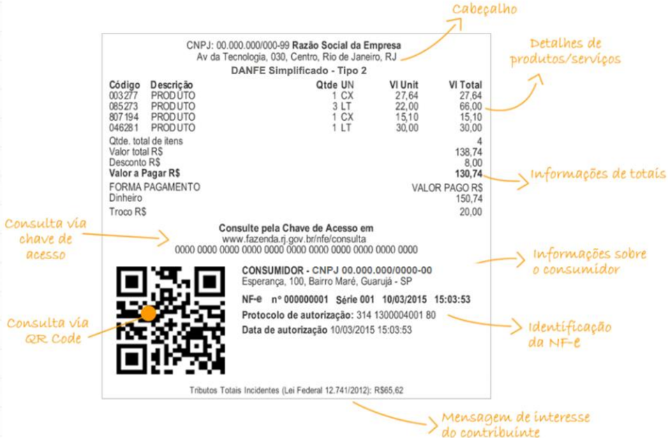

Figura 1A:  Modelo DANFE Simplificado Tipo 2 - QR Code na lateral

Figura 1B: QR Code centralizado

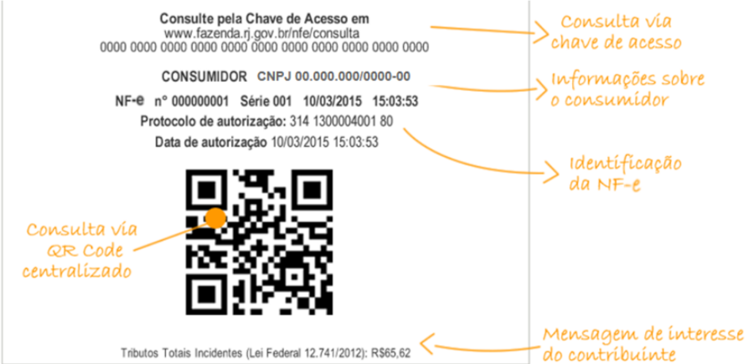

## 3.1.1 Divisão I - Informações do Cabeçalho

O cabeçalho deverá conter as seguintes informações:

- CNPJ do Emitente - formatado com a máscara AA.AAA.AAA/AAAA-99 (ID: C02, tag: CNPJ) ou CPF do Emitente -  formatado  com a máscara 999.999.999-99 (ID: C02a, tag: CPF);
- Razão Social ou Nome do Emitente (ID: C03, tag: xNome);
- Endereço Completo do Emitente sem a indicação do país;
- Texto: 'DANFE Simplificado Tipo 2 '.

A critério do emissor da NF-e poderá ser incluído, no canto esquerdo desta divisão, o logotipo da empresa ou o logotipo da NF-e.

## 3.1.2 Divisão II - Informações de detalhes de produtos/serviços

Figura 2: Detalhes de produtos/serviços

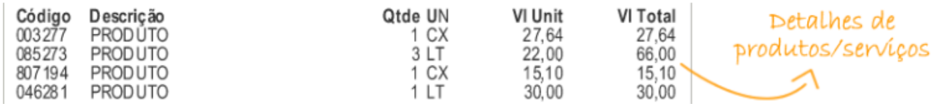

A divisão II (exibida na Figura 2) corresponde ao local onde poderão ser impressas as informações de detalhamento dos produtos/serviços adquiridos. Não são reguladas as posições das informações dos detalhes de produtos/serviços e forma de sua impressão, mas são obrigatórias, no mínimo, as seguintes informações:

- Código: código do produto adotado pelo estabelecimento (ID: I02, tag: cProd);
- Descrição: descrição do produto (ID: I04, tag: xProd);
- Qtde: quantidade de unidades do produto adquiridas pelo consumidor (ID: I10, tag: qCom);
- Un: unidade de medida do produto (ID: I09, tag: uCom);
- Valor unit. : valor de uma unidade do produto (ID: I10a, tag: vUnCom);
- Valor total: valor total do produto (ID: I11, tag: vProd).

As informações de valores devem ter as casas decimais separadas por vírgula e ser utilizado ponto para a indicação de milhar.

## 3.1.3 Divisão III - Informações de Totais do DANFE Simplificado Tipo 2

Figura 3: informações de totais do DANFE Simplificado Tipo 2

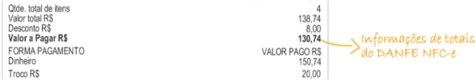

Esta divisão define os totais que deverão ser impressos no DANFE Simplificado Tipo 2 de acordo com o detalhamento abaixo:

- Qtde. Total de Itens: somatório da quantidade de itens (observação: a quantidade de itens refere-se à quantidade de itens de produtos/serviços distintos na NF-e não guardando qualquer relação com a soma de quantidade de produtos/serviços);
- Valor Total R$ : somatório dos valores totais dos itens;

## Nota Fiscal Eletrônica - NF-e DANFE Simplificado Tipo 2

NT 2026.003 Versão 1.00

- Acréscimos (frete, seguro e outras despesas) /Desconto R$ : somatório dos valores dos itens dos acréscimos (frete, seguro e outras despesas) e dos descontos (deve ser impressa a linha apenas se existir acréscimo ou desconto) (IDs: W08, W09, W10 e W15, tags: vFrete, vSeg, vDesc e vOutro);
- OBS.: Estas informações, a critério do emitente, podem estar discriminadas por item (IDs: I15, I16, I17 e I17a, tags: vFrete, vSeg, vDesc e vOutro).
- Valor a Pagar R$: somatório dos valores totais dos itens somados os acréscimos e subtraído os descontos (deve ser impresso apenas se existir acréscimo ou desconto) (ID: W16, tag: vNF);
- Forma de Pagamento: forma na qual o pagamento da NF-e foi efetuado (podem ocorrer mais de uma forma de pagamento, devendo nesse caso ser indicado o montante parcial do pagamento para a respectiva forma. Exemplo: em dinheiro, em cheque, etc. (ID: YA02, tag: tPag);
- Valor Pago: valor pago efetivamente em cada forma de pagamento (ID: YA03, tag: vPag);
- Troco: valor do troco (ID:YA09, tag: vTroco).

As informações de valores devem ter as casas decimais separadas por vírgula e ser utilizado ponto para a indicação de milhar. A informação do troco é obrigatória.

## 3.1.4 Divisão III-A - Informações dos novos impostos IBS/CBS

Esta divisão define as informações dos novos tributos, quando existirem, previstos na Lei Complementar 214/2025, que deverão ser impressos no DANFE Simplificado Tipo 2 de acordo com o detalhamento abaixo:

Figura 4: informações dos novos tributos no DANFE Simplificado Tipo 2

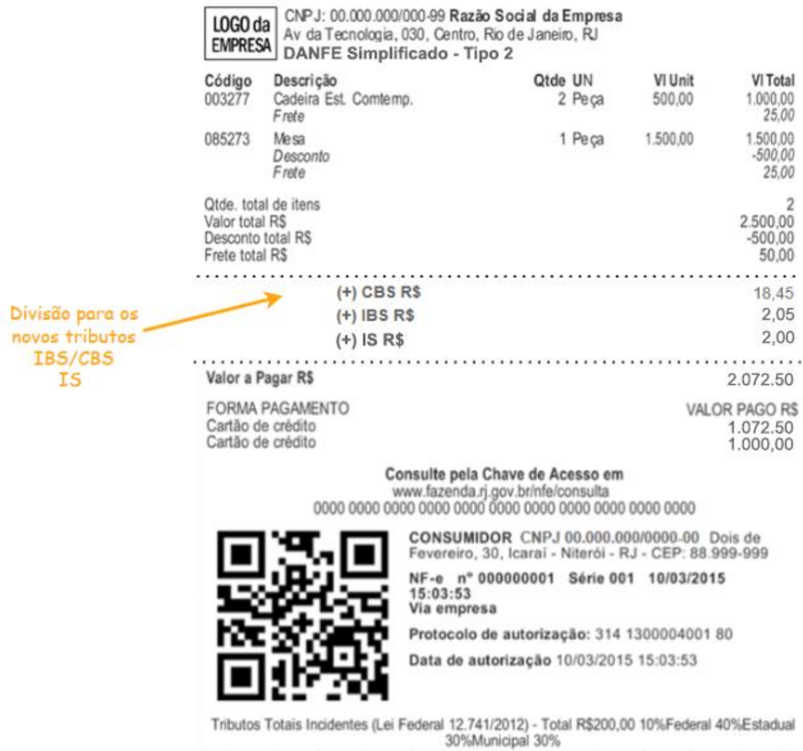

- (+) CBS R$ : Destaque da CBS;
- (+) IBS R$ : Destaque do IBS da Unidade Federada e do Município;
- (+) IS  R$ : Destaque do Imposto Seletivo. Apenas se houver imposto seletivo.

## 3.1.5 Divisão IV - Informações da consulta via chave de acesso

Esta divisão contém as informações referentes à consulta NFe.  Deve iniciar com o texto 'Consulte pela Chave de Acesso em' seguido do endereço eletrônico para consulta pública da NF -e no Portal da Secretaria da Fazenda da Unidade Federada do contribuinte, e a chave de acesso impressa em 11 blocos de quatro dígitos, com um espaço entre cada bloco.

A URL de consulta da chave de acesso da NF-e deve constar do arquivo XML da NF-e, no campo destinado às Informações Suplementares da Nota Fiscal (tag ZX-03).

## 3.1.6 Divisão V - Informações da consulta via QR Code

A divisão V corresponde à área de impressão do QR Code no DANFE Simplificado Tipo 2. A imagem do QR Code poderá ser impressa à esquerda das informações exigidas nas Divisões VI e VII, conforme figura 4, ou centralizada, conforme figura 5, e deve ter tamanho mínimo 25mm x 25mm, sendo 22mm de conteúdo para 3mm de margem segura (quiet zone). Para dimensões superiores a 25mm, considerar a margem segura de 10% da dimensão total.

Figura 5: Layout DANFE Simplificado Tipo 2 com QRCode à esquerda

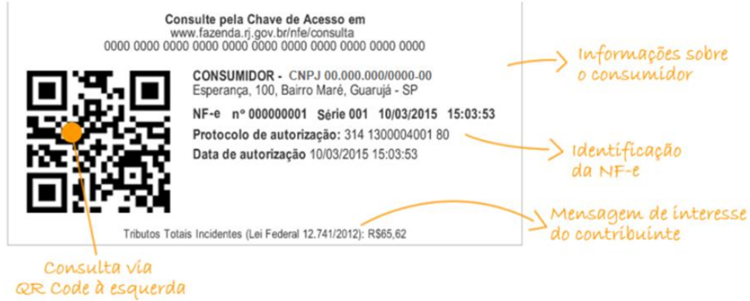

Figura 6: Layout DANFE Simplificado Tipo 2 com QRCode centralizado

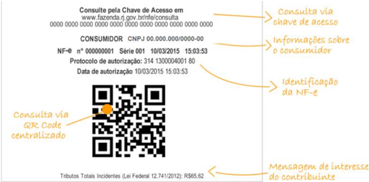

## 3.1.7 Divisão VI - Informações sobre o Consumidor

Nesta Divisão deve ser informada a identificação do adquirente no DANFE Simplificado Tipo 2, à direita  ou  antes  da  Divisão  V,  conforme  exemplo  nas  figuras  4  ou  5.  Deverá  constar  uma  das seguintes opções, em caixa alta, conforme o caso: 'CONSUMIDOR CNPJ:' e o respectivo CNPJ (ID: E02, tag: CNPJ).

Poderão ser incluídos nesta divisão também o nome do adquirente e/ou seu endereço. No caso de emissão de NF-e nas operações não presenciais é obrigatória a impressão do nome do adquirente e do endereço de entrega.

## 3.1.8 Divisão VII - Informações de Identificação da NF-e e do Protocolo de Autorização

As informações da divisão VII deverão ser impressas em uma das formas indicadas nas figuras 4 ou 5, devendo conter:

- Número da NF-e (ID: B08, tag: nNF)
- Série da NF-e (ID: B07, tag: serie)
- Data e Hora de Emissão da NF-e (ID: B09, tag: dhEmi), convertida para o horário local (apesar da data de emissão constar no arquivo XML da NF-e em formato UTC, esta data deverá ser impressa no DANFE  NF-e sempre convertida para o horário local)
- O texto 'Protocolo de autorização:' seguido do número do protocolo de autorização (ID: PR09, tag: nProt) obtido para NF-e e a data e hora da autorização (ID: PR08, tag: dhRecbto). A data de autorização é fornecida pela SEFAZ no formato UTC e deve ser impressa no DANFE NF-e convertida  para  o  horário  local.    No  caso  de  emissão  em  contingência  a informação sobre o protocolo de autorização será suprimida.

## 3.1.9 Divisão VIII - Área de Mensagem Fiscal

Esta divisão é reservada para a impressão de mensagens de interesse fiscal que constem do campo informações fiscais do arquivo eletrônico da NF-e (tag: infAdFisco).

Na hipótese de emissão de NF-e em contingência é obrigatório imprimir em destaque o texto em duas linhas: 'EMITIDA EM CONTINGÊNCIA Pendente de autorização'. O texto deve ser exibido em dois locais no documento:

- Abaixo do cabeçalho (divisão I): centralizado em duas linhas, entre bloco de linhas, conforme imagem a seguir.
- Abaixo da identificação da NF-e (divisão VII): em duas linhas, conforme Figura 6, a seguir.

NT 2026.003 Versão 1.00

Figura 6: DANFE Simplificado Tipo 2 emitido em contingência

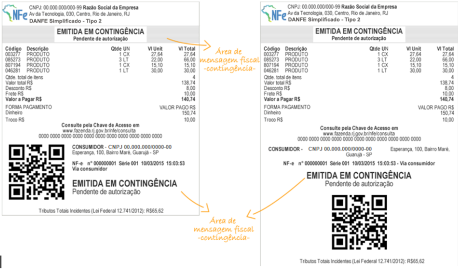

Ainda na hipótese de contingência, deverá ser impressa uma segunda via do DANFE NF-e que deverá permanecer à disposição do Fisco no estabelecimento até que tenha sido transmitida e autorizada a respectiva NF-e emitida em contingência.

Para qualquer NF-e emitida em ambiente de homologação é obrigatório imprimir nesta área, de forma centralizada e em caixa alta, o seguinte texto: 'EMITIDA EM AMBIENTE DE HOMOLOGAÇÃO SEM VALOR FISCAL'.

No caso de emissão de NF-e em contingência, a 2ª via do DANFE Simplificado Tipo 2 deverá ser identificada com a impressão ao lado da data e hora da emissão do texto 'Via do Estabelecimento'.

## 3.1.10 Divisão IX - Mensagem de Interesse do Contribuinte

Esta divisão corresponde à parte final do DANFE Simplificado Tipo 2 e se refere à área em que poderão  ser  impressas  mensagens  de  interesse  do  contribuinte  que  façam  parte  do  arquivo eletrônico da NF-e no campo informações complementares do contribuinte (ID: Z03, tag: infCpl).

Caso o contribuinte queira imprimir, no mesmo papel do DANFE Simplificado Tipo 2, mensagens institucionais ou outras informações que não estejam no arquivo XML da NF-e, as mesmas deverão ser apresentadas logo após o final do DANFE Simplificado Tipo 2 (imediatamente após a divisão IX de mensagem de interesse do contribuinte).

## 3.1.10.1  Informações exigidas pela Lei Federal nº 12.741/2012

A  critério  do  emissor  da  NF-e  poderão  ser  impressas  na  área  de  mensagem  de  interesse  do contribuinte (divisão IX) as informações exigidas pela Lei Federal nº 12.741, de 10 de dezembro de 2012, que trata da discriminação da carga tributária nos documentos fiscais. No leiaute atual da NF- e e NFC-e existe apenas um campo de valor total de tributos por item de mercadoria (campo 183a - vTotTrib) e um campo de valor total de tributos no documento fiscal (campo 341a - vTotTrib).

Esses campos não são de preenchimento obrigatório, e têm natureza informativa ao consumidor sobre a carga tributária total do produto ou serviço, e portanto, não é possível ser feita qualquer validação com relação à soma de tributos destacados na NF-e ou NFC-e.

Fica facultado ao contribuinte emissor que assim desejar, imprimir também na divisão II do detalhe de produtos/serviços o valor total de carga tributária por item de mercadoria.

Também é importante ressaltar que, alternativamente à impressão de informação no documento fiscal, a lei 12.741/12 possibilita a empresa que detalhe a carga tributária por produto por meio de painel afixado ou meio eletrônico disponível ao consumidor no estabelecimento.

## 3.2  Exemplos de DANFE Simplificado Tipo 2

Para  facilitar  aos  emissores  e  aos  desenvolvedores  de  NF-e  apresentamos  a  seguir  alguns exemplos hipotéticos de DANFE Simplificado Tipo 2.

Exemplo 1: DANFE Simplificado Tipo 2 normal com vários itens e com logo NF-e

## DANFE Simplificado Tipo 2

Exemplo 2: DANFE Simplificado Tipo 2 com 2 itens, 2 formas de pagamento, desconto, frete (ou taxa  de  entrega),  operação  não  presencial  e  com  identificação  do  consumidor  (com  endereço entrega) e logo da empresa.

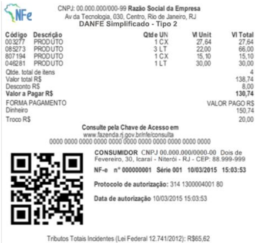

## Nota Fiscal Eletrônica - NF-e DANFE Simplificado Tipo 2

LOGOda

CNPJ: 00.000.000/000-99 Razao Social da Empresa Av daTecnolbgia,030,Centro,Rio de Janeiro,RJ

EMPRESA

DANFE Simplificado-Tipo 2

Codigo

Descricao

Qtde UN

VUnit

VI Total

003277

Cadeira Est.Comtemp.

2Peca

500,00

1.000,00

085273

Mesa

1Peca

1.500,00

1.000,00

Qtde.total deitens Valor totalRS Desconto RS Frete RS

2

2.500,00

500,00

50,00

ValoraPagar R$

2.050,00

FORMAPAGAMENTO

VALORPAGO R$

Cartaodecredito

1.050,00

Cartaodecredito

1.000,00

## ConsultepelaChavedeAcessoem

www.fazenda.rj.gov.br/nfe/consulta

00000000000000000000000000000000000000000000

CONSUMIDOR-CNPJ00.000.000/0000-00 Esperanga,100,BairroMare,Guaruja-SP

NF-en°000000001Serie00110/03/201515:03:53

Viaempresa

Protocolodeautorizacao:314130000400180

Datadeautorizacao10/03/201515:03:53

Tibutos Totais Incidentes (LeiFederal 12.741/2012)-TotalR$200,00 10%Federal 40% Estadual 30% Municipal 30%

Exemplo 3: DANFE Simplificado Tipo 2 com Logo da Empresa, NF-e Contingência com 2 itens, 2 formas de pagamento e com identificação do consumidor.

## Via Consumidor

CNPJ:00.000.000/000-99RazaoSocialdaEmpresa Av da Tecnobgia,030,Centro,RiodeJaneiro,RJ DANFESimplificado-Tipo2

## EMITIDAEMCONTINGENCIA

Pendentedeautorizacao

Codigo Descricao

QtdeUN

VUnit

VITotal

003277

Tablet

2Peca

500,00

1.000.00

085273

Smartphone

1Peca

1.500,00

1.000,00

Qtde.total deitens ValortotalR$ DescontoRS

2

2.500,00

500,00

Valora Pagar R$

2.000,00

FORMAPAGAMENTO

VALORPAGOR$

Cartao de credito

1.000,00

Cartao de credito

1.000,00

## ConsultepelaChavedeAcessoem

00000000000000000000000000000000000000000000

www.fazenda.rj.gov.br/nfe/consulta

NF-en°000000001Serie00110/03/201515:03:53

Viaconsumidor

## EMITIDAEMCONTINGENCIA

Pendentedeautorizacao

Tributos Totais Incidentes (Lei Federal 12.741/2012)-TotalR$200,00 10%Federal 40% Estadual 30%Municipal30%

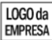

Codigo

Descricao

003277

Tablet

085273

Smartphone

## Via Empresa

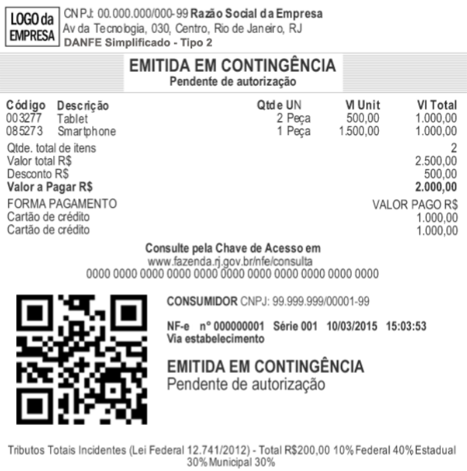

## 3.3  Requisitos do Papel e Margens do DANFE Simplificado Tipo 2

Na impressão do DANFE Simplificado Tipo 2 deve ser utilizado papel com largura mínima de 56mm. O  papel  utilizado  deve  garantir  a  legibilidade  das  informações  impressas  por,  no  mínimo,  seis meses. As margens laterais deverão ter, no mínimo, 2mm em cada lateral.

Não existe restrição que se imprima o DANFE Simplificado Tipo 2 em outros tamanhos de papel, que  pode  ser  impresso  em  papel  do  padrão  A4  (cujas  dimensões  são  de  210mm  x  297mm), conforme norma ISO 216.

Não  é  permitida,  em  nenhuma  hipótese,  a  impressão  do  DANFE  Simplificado  Tipo  2  em Equipamento Emissor de Cupom Fiscal - ECF, ainda que em modo de relatório gerencial.

## 3.4  Dimensões mínimas do QR Code

A dimensão mínima para a imagem do QR Code será 25mm X 25mm (sendo 22mm de conteúdo para 3mm de margem segura 'quiet zone'), tendo em vista ter sido essa a menor dimensão que se conseguiu leitura em dispositivos móveis que não possuem zoom (aproximação de imagem).

Para dimensões superiores a 25mm, considerar a margem segura de 10% da dimensão total.

É importante que seja observada a margem de segurança necessária para proporcionar uma melhor leitura do QR Code e evitar erros de leitura nos dispositivos.

## 4  QR Code do DANFE Simplificado Tipo 2

NT 2026.003 Versão 1.00

O QR code é um código de barras bidimensional que foi criado em 1994 pela empresa japonesa Denso-Wave. QR significa "quick response" devido à capacidade de ser interpretado rapidamente. Esse  tipo  de  codificação  permite  que  possa  ser  armazenada  uma  quantidade  significativa  de caracteres:

Numéricos:

7.089

Alfanumérico:

4.296

Binário (8 bits):

2.953

O QR code a ser impresso no DANFE Simplificado Tipo 2 da NF-e seguirá o padrão internacional ISO/IEC 18004.

Figura 7: Padrão da imagem do QR Code - Fonte: Wikipédia

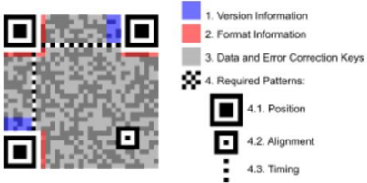

O QR Code deverá existir no DANFE Simplificado Tipo 2 relativo à emissão em operação normal ou em contingência.

A impressão do QR Code no DANFE Simplificado Tipo 2 tem a finalidade de facilitar a consulta dos dados do documento fiscal eletrônico pelos adquirentes, mediante leitura com o uso de aplicativo leitor de QR Code, instalado em smartphones ou tablets.

Atualmente, existem no mercado inúmeros aplicativos gratuitos para smartphones que possibilitam a leitura de QR Code.

Esta  tecnologia  tem  sido  amplamente  difundida  e  é  de  crescente  utilização  como  forma  de comunicação.

## 4.1  Licença

O uso do código QR é livre, sendo definido e publicado como um padrão ISO. Os direitos de patente pertencem a Denso Wave, mas a empresa escolheu não os exercer, sendo que o termo QR Code é uma marca registrada da Denso Wave Incorporated.

## 4.2  Geração da imagem do QR Code para NF-e

A  imagem  do  QR  Code  deverá  ser  impressa  no  DANFE  Simplificado  Tipo  2  com  os  padrões residentes das impressoras de não impacto (térmica, laser ou jato de tinta), conforme mostrado no item  3.2,  tendo  largura  e  altura  mínimas  de  25mm  x  25mm.  A  largura  e  altura  mínimas  foram definidas conforme testes realizados, nos quais o leitor de QR Code conseguiu ler a imagem.

## 4.3  Geração da imagem do QR Code para o DANFE Simplificado Tipo 2

A  imagem  do  QR  Code  deverá  ser  impressa  no  DANFE  Simplificado  Tipo  2  com  os  padrões residentes das impressoras de não impacto (térmica, laser ou deskjet), conforme mostrado no item 3.2, tendo largura e altura mínimas de 25mm x 25mm. A largura e altura mínimas foram definidas conforme testes realizados, nos quais o leitor de QR Code conseguiu ler a imagem.

A imagem do QR Code deverá conter uma URL composta com as seguintes informações:

- 1ª parte Endereço do site da Secretaria da Fazenda de localização do emitente da NF-e. Exemplo: http://www.sefazexemplo.gov.br/nfe/qrcode?p=
- 2ª parte Parâmetros constantes da tabela 6 para emissão online e da tabela 7 para emissão em contingência off-line, utilizando query string.

Parâmetros da consulta a chave de acesso da NFe separados pelo caractere ' | '.

Os endereços de consulta das Unidades Federadas  a serem utilizados no QR Code do DANFE Simplificado Tipo 2 em ambiente de produção e ambiente de homologação estão disponíveis no Portal Nacional da NFC-e (http://nfce.encat.org/ -&gt; Desenvolvedor -&gt; URL por UF utilizada QR code) - http://nfce.encat.org/desenvolvedor/qrcode/

A critério da Unidade Federada poderá ser utilizado o mesmo endereço para consulta no ambiente de produção e ambiente de homologação. Neste caso, a distinção entre os ambientes de consulta será feita diretamente pela aplicação da UF, a partir do conteúdo do parâmetro de identificação do ambiente, constante do QR Code.

O QR Code deverá ser impresso com os padrões residentes das impressoras de não impacto (térmica, laser ou deskjet).

A URL do QR code deverá ser composta de duas maneiras diferentes: uma para NF-e emitidas de forma online (sem contingência), e outra para NF-e emitidas na contingência off-line.

## 4.3.1 Parâmetros da URL do QR Code na emissão ONLINE

Tabela 1: Relação de Parâmetros da URL do QR Code para NF-e ONLINE

| Posição   | Descrição do Parâmetro                                    | Bytes   | Orientações de preenchimento                        |
|-----------|-----------------------------------------------------------|---------|-----------------------------------------------------|
| 1º        | Chave de Acesso da NF-e                                   | 44*     | Informar a chave de acesso da NF-e                  |
| 2º        | Versão do QR Code                                         | 1*      | Para esta versão de documento, preencher com '3'.   |
| 3º        | Identificação do Ambiente (1 - Produção, 2 - Homologação) | 1*      | Informar valor do campo B24 do leiaute NF-e - tpAmb |

O asterisco (*) na tabela acima indica que o preenchimento deve ser exato com a quantidade de bytes indicada.

Dessa forma, o modelo da URL na emissão online, será:

http://www.sefazexemplo.gov.br/nfe/qrcode?p=&lt;chave\_acesso&gt;|&lt;3&gt;|&lt;tpAmb&gt;

Figura 8: QR Code gerado do exemplo hipotético

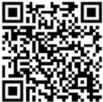

## 4.3.2 Parâmetros da URL do QR Code na emissão em contingência OFFLINE

Tabela 2: Relação de Parâmetros da URL do QR Code para NF-e OFFLINE

| Posição   | Descrição do Parâmetro                                    | Bytes   | Orientações de preenchimento                                                                                            |
|-----------|-----------------------------------------------------------|---------|-------------------------------------------------------------------------------------------------------------------------|
| 1º        | Chave de Acesso da NF-e                                   | 44*     | Informar a chave de acesso da NF-e                                                                                      |
| 2º        | Versão do QR Code                                         | 1*      | Para esta versão de documento, preencher o com '3'.                                                                     |
| 3º        | Identificação do Ambiente (1 - Produção, 2 - Homologação) | 1*      | Informar valor do campo B24 do leiaute NF-e-tpAmb                                                                       |
| 4º        | Dia da data de emissão                                    | 2*      | Informar o dia da data de emissão, que consta no campo B09 do leiaute NF-e. O valor deverá ter exatamente dois dígitos. |

| Posição   | Descrição do Parâmetro                | Bytes   | Orientações de preenchimento                                                                                                                                                                                                                                                           |
|-----------|---------------------------------------|---------|----------------------------------------------------------------------------------------------------------------------------------------------------------------------------------------------------------------------------------------------------------------------------------------|
| 5º        | Valor Total da NF-e                   | 15      | Informar valor do campo W16 do leiaute NF-e. O valor deve ser informado com ponto ('.') como separador decimal; não informar separador de milhar ou sinais.                                                                                                                            |
| 6º        | Tipo de Identificação do Destinatário | 1       | 1=CNPJ; 2=CPF; 3=idEstrangeiro                                                                                                                                                                                                                                                         |
| 7º        | Identificação do Destinatário         | 3-14    | Identificação do Destinatário CNPJ, CPF na NF-e. Caso Destinatário estrangeiro, informar apenas o separador '&#124;'                                                                                                                                                                   |
| 8º        | Assinatura                            |         | Assinatura digital da concatenação dos parâmetros de 1 a 7, mantendo os separadores ('&#124;'). Assinatura no padrão RSA SHA-1 (Base64), com o mesmo certificado digital que assina a NF-e. Este parâmetro deve ser adicionado aos demais usando um caractere '&#124;' como separador. |

O asterisco (*) na tabela acima indica que o preenchimento deve ser exato com a quantidade de bytes indicada.

Dessa forma, o modelo da URL na emissão contingência offline, será:

http://www.sefazexemplo.gov.br/nfe/qrcode?p=&lt;chave\_acesso&gt;|&lt;3&gt;|&lt;tpAmb&gt;|&lt;dia\_data\_e missao&gt;|&lt;vNF&gt;|&lt;tp\_idDest&gt;|&lt;idDest&gt;|ZZSKiypy7fkg22MUv6TUh71EI+wLYWr/fUHJy3PyW nL7d5mzEqtxu6bVbhE7AeNiDTirh1u9gVfC2Hw+Lsno2XNL5FRUc5NcuMTT2hA6E9HYC9 gryvtWAIgiCZUNG5cWWLCh0G62QdnNe8iSrlSooQu9Z5g1vbGaTFMxaugzzvo=

Figura 9: QR Code gerado do exemplo hipotético

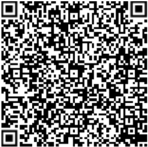

## 4.4  Configurações para QR Code

O QR Code permite algumas configurações adicionais conforme descrito a seguir:

## 4.4.1 Capacidade de armazenamento

As configurações para capacidade de armazenamento de caracteres do QR Code:

1. Numérica - máx. 7089 caracteres
2. Alfanumérica - máx. 4296 caracteres
3. Binário (8 bits) - máx. 2953 bytes
4. Kanji/Kana - máx. 1817 caracteres

Fonte: http://en.wikipedia.org/wiki/QR\_code

## 4.4.2 Capacidade de correção de erros

Seguem as configurações para correções de erros do QR Code:

- Nível L (Low) 7% das palavras do código podem ser recuperadas;
- Nível M (Medium) 15% das palavras de código podem ser restauradas;
- Nível Q (Quartil) 25% das palavras de código podem ser restauradas;
- Nível H (High) 30% das palavras de código podem ser restauradas.

Fonte: http:// http://en.wikipedia.org/wiki/QR\_code

Para o QR Code do DANFE Simplificado Tipo 2 será utilizado Nível M.

## 4.4.3 Tipo de caracteres

Existem dois padrões de caracteres que podem ser configurados na geração do QR Code, conforme visto abaixo:

1. ISO-8859-1
2. UTF-8

Fonte: http://en.wikipedia.org/wiki/QR\_code

Para o QR Code da NF-e será utilizada a opção 2 - UTF-8.

## 4.4.4 URL da Consulta da NF-e via QR-Code no XML - obrigatoriedade

A URL da consulta da NF-e via QR Code deve constar do arquivo da NF-e (XML) no grupo ZX. Informações Suplementares da Nota Fiscal.

## 5 Consulta Pública NF-e

Para que o adquirente possa verificar a validade e autenticidade da NF-e, a UF do contribuinte emitente deverá disponibilizar o serviço de consulta pública da NF-e.

NT 2026.003 Versão 1.00

Esta consulta poderá ser efetuada pelo consumidor de duas formas: pela digitação em página web dos 44 caracteres da chave de acesso constantes no DANFE NF-e ou consulta via leitura do QR Code impresso, utilizando aplicativos gratuitos de leitura de QR Code, disponíveis em dispositivos móveis como smartphones e tablets.

## 5.1  Consulta Pública de NF-e via Digitação de Chave de Acesso

O endereço que deve estar impresso no DANFE Simplificado Tipo 2 destinado à consulta utilizando a chave de acesso, está indicado por cada Unidade Federada, e consta do Portal Nacional.

A URL da consulta por chaves da NF-e deve constar do arquivo da NF-e (XML) em ZX-03, tag: urlChave, no grupo de Informações Suplementares da Nota Fiscal. Estas URL estão disponíveis no Portal Nacional da NFC-e - http://NFC-e.encat.org/ na opção "Consumidor" - "Consulte sua Nota".

Nesta hipótese o consumidor deverá acessá-los pela internet e digitar a chave de acesso composta por 44 caracteres.

Figura 10: Tela de consulta da NF-e com digitação da chave de acesso

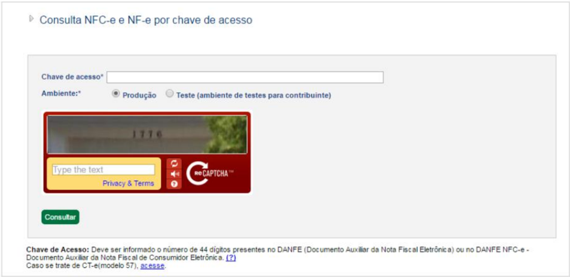

Como resultado da consulta pública, deverá ser apresentado ao consumidor a consulta da NF-e.

## 5.2  Consulta Pública de NF-e via QR Code

A aplicação de consulta pública da NF-e via QR Code será efetuada por cada Unidade Federada e efetuará validações do conteúdo de informações constantes do QR Code versus o conteúdo da respectiva NF-e, bem como a conferência do hash do QR Code.

Nesta hipótese, o consumidor deverá apontar o seu dispositivo móvel (smartphone ou tablet) para a imagem do QR Code gerada na tela do caixa ou impressa no DANFE Simplificado Tipo 2 entregue pelo operador do caixa. O leitor de QR Code se encarregará de interpretar a imagem e efetuar a consulta da NF-e da URL recuperada no Portal da SEFAZ da Unidade Federada da emissão do documento.

NT 2026.003 Versão 1.00

Eventuais divergências encontradas entre as informações da NF-e constantes dos parâmetros do QR Code ou problemas na validação do Hash do QR Code deverão ser informadas ao consumidor em área de mensagem a ser disponibilizada na tela de resposta da consulta pública sem, todavia, um detalhamento excessivo do erro identificado, que será de pouco interesse ao consumidor e apenas poderá acabar por gerar dúvidas e inseguranças.

Assim, será apresentado na tela ao consumidor o código do erro e uma mensagem de aviso mais genérica.

## 5.3  Tabela padronizada com os códigos e mensagens na consulta de NF-e

A  tabela  relaciona  todas  as  mensagens  de  validações  utilizadas  na  consulta  de  NF-e  seja  por digitação em tela ou via QR Code. Estas mensagens somente serão utilizadas na implementação da consulta pela SEFAZ.

Tabela 3: Mensagens de validação de consulta da NF-e

| Tabela do item 5.3 - Relação de mensagens de validações na consulta de NF-e   | Tabela do item 5.3 - Relação de mensagens de validações na consulta de NF-e   | Tabela do item 5.3 - Relação de mensagens de validações na consulta de NF-e   |
|-------------------------------------------------------------------------------|-------------------------------------------------------------------------------|-------------------------------------------------------------------------------|
| Código                                                                        | Mensagem                                                                      | Exibir para o Consumidor                                                      |
| 211                                                                           | Versão do QR Code inválida.                                                   | Inconsistência de Informações no QR Code                                      |
| 212                                                                           | Versão do QR Code não preenchida.                                             | Inconsistência de Informações no QR Code                                      |
| 213                                                                           | Identificação do ambiente difere de 1 ou 2.                                   | Inconsistência de Informações no QR Code                                      |
| 214                                                                           | Identificação do ambiente não preenchida.                                     | Inconsistência de Informações no QR Code                                      |
| 217                                                                           | Dia da data de emissão informada no QR Code inválida.                         | Inconsistência de Informações no QR Code                                      |
| 218                                                                           | Dia da data de emissão não preenchido.                                        | Inconsistência de Informações                                                 |
| 219                                                                           | Dia da data de emissão inconsistente com dado informado na NF-e.              | Inconsistência de Informações                                                 |
| 220                                                                           | Valor total informado no QR Code em formato inválido.                         | Inconsistência de Informações no QR Code                                      |
| 221                                                                           | Valor total informado no QR Code inconsistente com dado constante da NF-e.    | Inconsistência de Informações no QR Code                                      |
| 227                                                                           | DigestValue informado no QR Code inconsistente com dado constante da NF-e.    | Inconsistência de Informações no QR Code                                      |
| 229                                                                           | Nota Fiscal CANCELADA.                                                        | A NF-e está CANCELADA                                                         |
| 230                                                                           | Hash do QR Code não preenchido no QR Code.                                    | Inconsistência de Informações no QR Code                                      |
| 231                                                                           | Valor total da NF-e não preenchido no QR Code.                                | Inconsistência de Informações no QR Code                                      |

| Tabela do item 5.3 - Relação de mensagens de validações na consulta de NF-e   | Tabela do item 5.3 - Relação de mensagens de validações na consulta de NF-e                                          | Tabela do item 5.3 - Relação de mensagens de validações na consulta de NF-e   |
|-------------------------------------------------------------------------------|----------------------------------------------------------------------------------------------------------------------|-------------------------------------------------------------------------------|
| Código                                                                        | Mensagem                                                                                                             | Exibir para o Consumidor                                                      |
| 233                                                                           | DigestValue não preenchido no QR Code.                                                                               | Inconsistência de Informações no QR Code                                      |
| 234                                                                           | O prazo de 24h para o envio desta NF-e já foi ultrapassado.                                                          | Regra de negócios da NF-e                                                     |
| 235                                                                           | NF-e foi emitida em contingência. Volte a consultar após 24h.                                                        | Regra de negócios da NF-e                                                     |
| 236                                                                           | A NF-e da chave de acesso não existe.                                                                                | Regra de negócios da NF-e                                                     |
| 237                                                                           | Código da imagem é inválido.                                                                                         | Erro na digitação dos dados                                                   |
| 238                                                                           | NF-e emitida ainda não consta na nossa base de dados. Favor voltar a consultar mais tarde.                           | Regra de negócios da NF-e                                                     |
| 239                                                                           | A UF da chave de acesso está diferente do código da UF                                                               | Problemas na Chave de Acesso da NF-e                                          |
| 240                                                                           | NF-e CANCELADA - Documento cancelado pelo emitente.                                                                  | Documento Inválido - Sem Valor Fiscal                                         |
| 242                                                                           | Dia da data de emissão informada é inválido.                                                                         | Inconsistência de Informações                                                 |
| 245                                                                           | Chave de Acesso da NF-e inválida.                                                                                    | Problema na Chave de Acesso                                                   |
| 246                                                                           | A chave de acesso informada não é de uma NF-e (modelo 55). Verifique o modelo do documento fiscal eletrônico (DF-e). | Problema na Chave de Acesso                                                   |
| 247                                                                           | A chave de acesso informada não se refere a uma NF-e emitida por contribuinte da UF indicada.                        | Problema na Chave de Acesso                                                   |

## Documentos relacionados
_Nenhum documento relacionado conhecido._
