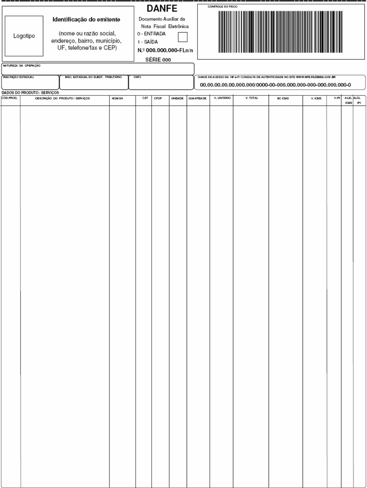
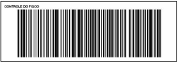
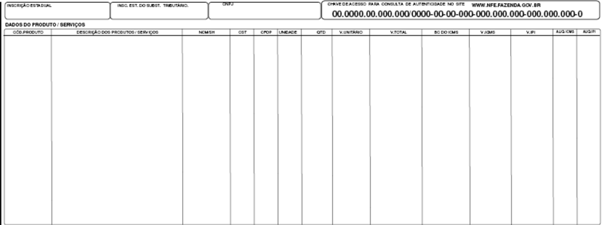
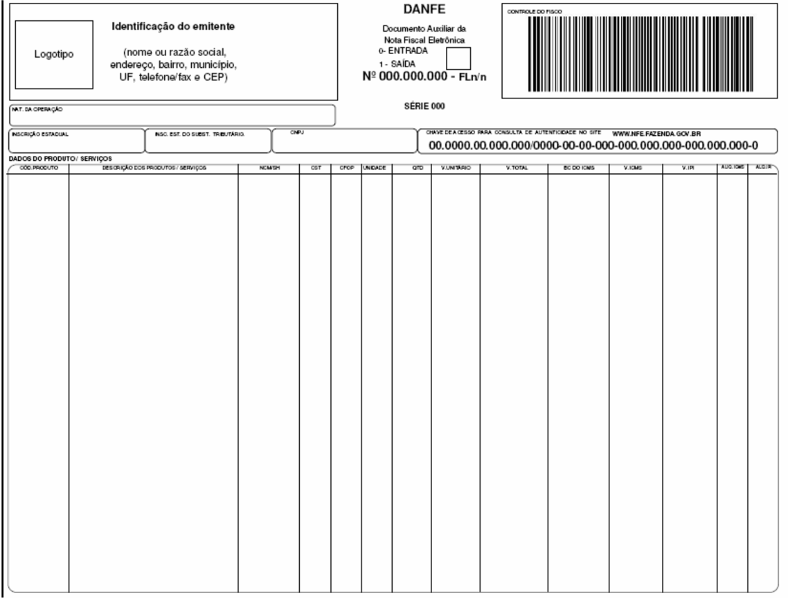

## Projeto Nota Fiscal Eletrônica


## Nota Técnica 2007/005

## Divulga Manual de Integração do Contribuinte versão 2.03


Novembro-2007


## 1.  Resumo

Divulga Manual de Integração do Contribuinte -versão 2.0.3., com  as alterações necessárias  para  a  implementação  do  Sistema  de  Contingência  do  Ambiente  Nacional (SCAN) descritas no Manual de Contingência versão 5.01.

## 2.  Identificação e vigência do Manual de Integração do Contribuinte

| Versão do Manual de Integração do Contribuinte   | 2.03                             |
|--------------------------------------------------|----------------------------------|
| Chave de codificação digital MD5 do Manual       | dd6e8e517178548f47c29018a3b214f1 |
| Data de publicação                               | 30/11/2007                       |
| Data prevista para entrada em homologação        | 28/02/2008                       |
| Data prevista para entrada em produção           | 24/03/2008                       |


## 3.  Alterações no leiaute da NF-e

## 3.1 Campo tpEmis (página 90)

Acréscimo do valor '3' como conteúdo válido do campo tpEmis do leiaute da Nota Fiscal eletrônica, que passa a aceitar a seguinte codificação para identificar a forma de emissão da NF-e:

- 1 Normal - emissão normal com transmissão da NF-e para a SEFAZ de origem;
- 2 Contingência off-line - emissão em contingência, com impressão do DANFE em formulário de segurança e posterior transmissão  da  NF-e  para  a  SEFAZ  de  origem  quando  sanado  os  problemas  técnicos  que  motivaram  a  adoção  da contingência;
- 3 Contingência SCAN - emissão em contingência no Sistema de Contingência do Ambiente Nacional - SCAN;

## Alterado de:

| 26   | B22   | tpEmis   | Forma de Emissão da NF-e   | E   | B01   | N   | 1-1   | 1   | 1-Normal/ 2-Contingência   |
|------|-------|----------|----------------------------|-----|-------|-----|-------|-----|----------------------------|

## Para:

| 26   | B22   | tpEmis   | Forma de Emissão da NF-e   | E   | B01   | N   | 1-1   | 1   | 1 - Normal - emissão normal com transmissão on-line da NF-e para a SEFAZ de origem; 2 - Contingência off-line - emissão em contingência, com impressão do DANFE em formulário de segurança e posterior transmissão da NF-e para a SEFAZ de origem quando sanados os problemas técnicos que motivaram a adoção da contingência; 3 - Contingência SCAN - emissão em contingência no Sistema de Contingência do Ambiente Nacional -   |
|------|-------|----------|----------------------------|-----|-------|-----|-------|-----|------------------------------------------------------------------------------------------------------------------------------------------------------------------------------------------------------------------------------------------------------------------------------------------------------------------------------------------------------------------------------------------------------------------------------------|


| SCAN;   |
|---------|

## 3.2 Campo cNF (página 87)

Redução do tamanho do campo cNF de 9 para 8 posições para permitir a inclusão do campo tpEmis na chave de acesso da NF-e sem alteração do tamanho do chave.

## Alterado de:

| 7   | B03   | cNF   | Código Numérico que compõe a Chave de Acesso   | E   | B01   | N   | 1-1   | 9   | Código numérico que compõe a Chave de Acesso. Número aleatório gerado pelo emitente para cada NF-e para evitar acessos indevidos da NF-e.   |
|-----|-------|-------|------------------------------------------------|-----|-------|-----|-------|-----|---------------------------------------------------------------------------------------------------------------------------------------------|

## Para:

| 7   | B03   | cNF   | Código Numérico que compõe a Chave de Acesso   | E   | B01   | N   | 1-1   | 8   | Código numérico que compõe a Chave de Acesso. Número aleatório gerado pelo emitente para cada NF-e para evitar acessos indevidos da NF-e. O tamanho do campo foi reduzido para oito posições para possibilitar a inclusão do campo tpEmis na composição da chave de acesso da NF- e.   |
|-----|-------|-------|------------------------------------------------|-----|-------|-----|-------|-----|----------------------------------------------------------------------------------------------------------------------------------------------------------------------------------------------------------------------------------------------------------------------------------------|

## 3.3 Campo fone (página 92)

Aumento do tamanho do campo fone de 10 para 11 posições


## Alterado de:

| 45   | C16   | fone   | Telefone   | E   | C05   | N   | 0-1   | 1-10   | Preencher com Código DDD + número do telefone.   |
|------|-------|--------|------------|-----|-------|-----|-------|--------|--------------------------------------------------|

## Para:

| 45   | C16   | Fone   | Telefone   | E   | C05   | N   | 0-1   | 1-11   | Preencher com Código DDD + número do telefone.   |
|------|-------|--------|------------|-----|-------|-----|-------|--------|--------------------------------------------------|

- 3.4 Campo RENAVAM (página 99)

Alteração tipo do campo RENAVAM para caractere.

## Alterado de:

| 143   | J15   | RENAVAM   | RENAVAM   | E   | J01   | N   | 0-1   | 9   | Não informar a TAG na exportação.   |
|-------|-------|-----------|-----------|-----|-------|-----|-------|-----|-------------------------------------|

## Para:

| 143   | J15   | RENAVAM   | RENAVAM   | E   | J01   | C   | 0-1   | 9   | Não informar a TAG na exportação.   |
|-------|-------|-----------|-----------|-----|-------|-----|-------|-----|-------------------------------------|


## 3.5 Campo infAdFisco (página 121)

Aumento do tamanho do campo infAdFisco de 256 para 2.000 posições

## Alterado de:

| 400   | Z02   | infAdFisco   | Informações Adicionais de Interesse do Fisco   | E   | Z01   | C   | 0-1   | 1-256   |
|-------|-------|--------------|------------------------------------------------|-----|-------|-----|-------|---------|

## Para:

| 400   | Z02   | infAdFisco   | Informações Adicionais de Interesse do Fisco   | E   | Z01   | C   | 0-1   | 1-2000   |
|-------|-------|--------------|------------------------------------------------|-----|-------|-----|-------|----------|

## 3.6 Item 5 do Leiaute da NF-e  (página 129)

O item 5 que trata da chave de acesso da NF-e foi eliminado.


## 4.  Alteração da chave de Acesso

## 4.1 Alterações na composição da chave de acesso da NF-e (página 69)

A composição da chave de acesso está sendo alterada com o acréscimo do campo tpEmis (forma de emissão da NF-e) na chave de acesso, com a redução do tamanho do campo cNF (código numérico da NF-e) para 8 posições.

## Alterado de:

## 5.4 Chave de Acesso da NF-e

A Chave de Acesso da Nota Fiscal Eletrônica é representada por uma seqüência de 44 caracteres numéricos, representados da seguinte forma:

|                          |   Código da UF |   AAMMda emissão |   CNPJ do Emitente |   Modelo |   Série |   Número da NF-e |   Código Numérico |   DV |
|--------------------------|----------------|------------------|--------------------|----------|---------|------------------|-------------------|------|
| Quantidade de caracteres |             02 |               04 |                 14 |       02 |      03 |               09 |                09 |   01 |

A Chave de Acesso da Nota Fiscal eletrônica não existe como a seqüência acima descrita no leiaute da NF-e, devendo ser composta pelos seguintes campos que se encontram dispersos no leiaute da NF-e (vide Anexo I):

- cUF - Código da UF do emitente do Documento Fiscal

- AAMM - Ano e Mês de emissão da NF-e

- CNPJ - CNPJ do emitente

- mod - Modelo do Documento Fiscal

- serie - Série do Documento Fiscal

- nNF - Número do Documento Fiscal

- cNF - Código Numérico que compõe a Chave de Acesso

- cDV - Dígito Verificador da Chave de Acesso

## Para:

## 5.4 Chave de Acesso da NF-e

Até  a  versão  1.10  do  layout  da  NF-e,  a  Chave  de  Acesso  da  Nota  Fiscal  Eletrônica  é representada por uma seqüência de 44 caracteres numéricos, representados da seguinte forma:

|                          |   Código da UF |   AAMMda emissão |   CNPJ do Emitente |   Modelo |   Série |   Número da NF-e |   Código Numérico |   DV |
|--------------------------|----------------|------------------|--------------------|----------|---------|------------------|-------------------|------|
| Quantidade de caracteres |             02 |               04 |                 14 |       02 |      03 |               09 |                09 |   01 |


## Nota Fiscal Eletrônica

A Chave de Acesso da Nota Fiscal eletrônica não existe como a seqüência acima descrita no leiaute da NF-e, devendo ser composta pelos seguintes campos que se encontram dispersos no leiaute da NF-e (vide Anexo I):

- cUF - Código da UF do emitente do Documento Fiscal
- AAMM - Ano e Mês de emissão da NF-e
- CNPJ - CNPJ do emitente
- mod - Modelo do Documento Fiscal
- serie - Série do Documento Fiscal
- nNF - Número do Documento Fiscal
- cNF - Código Numérico que compõe a Chave de Acesso
- cDV - Dígito Verificador da Chave de Acesso

A partir da versão 1.11 do leiaute da NF-e, o campo tpEmis (forma de emissão da NF-e) passou a compor a chave de acesso da seguinte forma:

|                          |   Código da UF |   AAMMda emissão |   CNPJ do Emitente |   Modelo |   Série |   Número da NF-e |   forma de emissão da NF-e |   Código Numérico |   DV |
|--------------------------|----------------|------------------|--------------------|----------|---------|------------------|----------------------------|-------------------|------|
| Quantidade de caracteres |             02 |               04 |                 14 |       02 |      03 |               09 |                         01 |                08 |   01 |

O tamanho do campo cNF - código numérico da NF-e foi reduzido para oito posições para não alterar o tamanho da chave de acesso da NF-e de 44 posições que passa ser composta pelos seguintes campos que se encontram dispersos na NF-e :

- cUF - Código da UF do emitente do Documento Fiscal
- AAMM - Ano e Mês de emissão da NF-e
- CNPJ - CNPJ do emitente
- mod - Modelo do Documento Fiscal
- serie - Série do Documento Fiscal
- nNF - Número do Documento Fiscal
- tpEmis - forma de emissão da NF-e
- cNF - Código Numérico que compõe a Chave de Acesso
- cDV - Dígito Verificador da Chave de Acesso

## 4.2 Alteração da observação do leiaute da mensagem de retorno da consulta processamento de lote (página 36)

## Alterado de:

| PR07 chNFe   | E   | PR03   | N   | 1-1   | 44   | Chave de Acesso da NF-e composta por Código da UF + AAMMda emissão + CNPJ do Emitente +   |
|--------------|-----|--------|-----|-------|------|-------------------------------------------------------------------------------------------|

## Para:


| PR07 chNFe   | E   | PR03   | N   | 1-1   | 44   | Chave de Acesso da NF-e (vide item 5.4)   |
|--------------|-----|--------|-----|-------|------|-------------------------------------------|

## 4.3 Alteração da observação do leiaute da mensagem de pedido de cancelamento de NF-e (página 40)

## Alterado de:

| CP07   | chNFe   | E   | CP03   | N   | 1-1   | 44   | Chave de acesso da NF-e composta por Código da UF + AAMMda emissão + CNPJ do Emitente + Modelo, Série e Número da NFe + Código Numérico + DV.   |
|--------|---------|-----|--------|-----|-------|------|-------------------------------------------------------------------------------------------------------------------------------------------------|

## Para:

| CP07 chNFe   | E CP03   | N   | 1-1   | 44   | Chave de acesso da NF-e (vide item 5.4)   |
|--------------|----------|-----|-------|------|-------------------------------------------|

## 4.4 Alteração da observação do leiaute da mensagem de retorno do pedido de cancelamento de NF-e (página 41)

## Alterado de:

| CR09 chNFe   | E   | CR03   | N   | 0-1   | 44   | Chave de Acesso da NF-e composta por Código da UF + AAMMda emissão + CNPJ do Emitente + Modelo, Série e Número da NFe + Código Numérico + DV.   |
|--------------|-----|--------|-----|-------|------|-------------------------------------------------------------------------------------------------------------------------------------------------|

## Para:

| CR09 chNFe   | E CR03   | N   | 0-1   | 44   | Chave de acesso da NF-e   |
|--------------|----------|-----|-------|------|---------------------------|

## 4.5 Alteração da observação do leiaute da mensagem de pedido de consulta situação atual da NF-e (página 51)

## Alterado de:

| EP05   | chNFe   | E   | EP01   | N   | 1-1   | 44   | Chave de Acesso da NF-e composta por Código da UF + AAMMda emissão + CNPJ do Emitente +   |
|--------|---------|-----|--------|-----|-------|------|-------------------------------------------------------------------------------------------|

## Para:

| EP05 chNFe   | E   | EP01   | N   | 1-1   | 44   | Chave de Acesso da NF-e (vide item 5.4)   |
|--------------|-----|--------|-----|-------|------|-------------------------------------------|


## 4.6 Alteração da observação do leiaute da mensagem de retorno do pedido de consulta situação atual da NF-e (página 52)

## Alterado de:

| ER09 chNFe   | E   | ER03   | N   | 0-1   | 44   | Chave de Acesso da NF-e composta por Código da UF + AAMMda emissão + CNPJ do Emitente + Modelo, Série e Número da NFe + Código Numérico + DV.   |
|--------------|-----|--------|-----|-------|------|-------------------------------------------------------------------------------------------------------------------------------------------------|

## Para:

| ER09 chNFe   | E   | ER03   | N   | 0-1   | 44   | Chave de Acesso da NF-e (vide item 5.4)   |
|--------------|-----|--------|-----|-------|------|-------------------------------------------|

## 5.  Alteração da regra de negócios do WS de recepção da NF-e

## 5.1 Validação do campo tpEmis (página 31)

Alterada a regra de negócios G03a que impedia recepção de NF-e emitidas para Sistema de Contingência do Ambiente Nacional (SCAN) para verificar o campo tpEmis .

## Alterado de:

| G03a Série utilizada não permitida no Web Service (faixa de 0-899 - emissão normal na UF e faixa de 900-999 - reservado para emissão em contigência na RFB)   | Obrig.   | 266   | Rej.   |
|---------------------------------------------------------------------------------------------------------------------------------------------------------------|----------|-------|--------|

## Para:

| G03a Forma de emissão da NF-e (tpEmis) = 3 informada de uso exclusivo no Sistema de Contingência do Ambiente Nacional - SCAN.   | Obrig.   | 266   | Rej.   |
|---------------------------------------------------------------------------------------------------------------------------------|----------|-------|--------|

## 5.2 Validação da chave de acesso (página 31)

A regra de validação G04 deve considerar o campo tpEmis na  composição da chave de acesso da NF-e.

## Alterado de:

| G04   | Campo ID inválido - Falta literal "NFe" - Chave de Acesso do campo ID difere da concatenação dos campos correspondentes   | Obrig.   | 227   | Rej.   |
|-------|---------------------------------------------------------------------------------------------------------------------------|----------|-------|--------|


## Para:

| G04   | Campo ID inválido - Falta literal "NFe" - Chave de Acesso do campo ID difere da concatenação dos campos correspondentes (vide item 5.4)   | Obrig.   | 227   | Rej.   |
|-------|-------------------------------------------------------------------------------------------------------------------------------------------|----------|-------|--------|

## 5.3 Alteração no texto da mensagem 266 (página 67)

A mensagem 266 foi alterada para refletir a alteração da regra de negócio G03a:

## Alterado de:

| 266   | Rejeição: Série utilizada não permitida no Web Service   |
|-------|----------------------------------------------------------|

## Para:

| 266   | Rejeição: Tipo de emissão informado não permitido para este ambiente   |
|-------|------------------------------------------------------------------------|

## 6.  Alteração da regra de negócios do WS de cancelamento da NF-e

- 6.1 Alteração do texto da regra de negócios H06 (página 44)

## Alterado de:

| H06   | Acesso BD NFE (Chave: Ano, CNPJ Emit, Modelo, Série, Nro): - Verificar se NF-e não existe   | Obrig.   | 217   | Rej.   |
|-------|---------------------------------------------------------------------------------------------|----------|-------|--------|

## Para:

| H06   | Acesso BD NFE (Chave: Ano, CNPJ Emit, Modelo, Série, Nro): - Verificar se NF-e não existe (considerar possibilidade de ocorrência de mais de um registro para esta mesma NF-e no caso de autorização em duplicidade pela SEFAZ e pelo SCAN)   | Obrig.   | 217   | Rej.   |
|-------|-----------------------------------------------------------------------------------------------------------------------------------------------------------------------------------------------------------------------------------------------|----------|-------|--------|

- 6.2 A validação deve ser alterada para considerar apenas as 8 posições da chave de acesso, caso o leiaute da NF-e localizada seja superior à versão 1.10 (página 44)

## Alterado de:

## Nota Fiscal Eletrônica


## Nota Fiscal Eletrônica

| H07   | - 'Código Numérico' informado na Chave de Acesso é diferente do existente no BD   | Obrig.   | 216   | Rej.   |
|-------|-----------------------------------------------------------------------------------|----------|-------|--------|

## Para:

| H07   | - 'Código Numérico' informado na Chave de Acesso é diferente do existente no BD (considerar a versão leiaute da NF-e para identificar o tamanho do campo 'Código Numérico')   | Obrig.   | 216   | Rej.   |
|-------|-------------------------------------------------------------------------------------------------------------------------------------------------------------------------------|----------|-------|--------|

## 6.3 Acréscimo de nova regra para verificar se o campo tpEmis informado na chave de acesso é diferente do existente no BD, caso o leiaute da NF-e localizada seja superior à versão 1.10 (página 44)

| H07a   | - Verificar se o 'Tipo de Emissão' informado na Chave de Acesso é diferente do existente no BD (considerar que existem NF-e com diferentes composições da Chave de Acesso, vide item 5.4)   | Obrig.   | 409   | Rej.   |
|--------|---------------------------------------------------------------------------------------------------------------------------------------------------------------------------------------------|----------|-------|--------|

## 6.4 Acréscimo  da mensagem 408 (página 68)

409 Rejeição: Tipo de Emissão informada na chave de acesso diferente da cadastrada

## 6.5 Acréscimo de observação para regularização das NF-e em situação inconsistente por duplicidade de NF-e ou uso de numero inutilizado (página 45)

'Caso  a  NF-e  objeto  de  cancelamento  se  encontre  em  situação  de  'inconsistência  por duplicidade'  ou  'inconsistência  por  uso  de  número já inutilizado',  a  aplicação  da  SEFAZ deverá tomar as medidas necessárias para eliminar todas as indicações de  inconsistência existente  n o  repositório  de  NF-e  da  SEFAZ  e  d o  Ambiente  Nacional  que  envolva  a  NF-e objeto do cancelamento .'

## 7.  Alteração da regra de negócios do WS de consulta status da NF-e

- 7.1 Alteração do texto da regra de negócios J03 (página 54)

## Alterado de:


## Nota Fiscal Eletrônica

| J03   | Acesso BD NFE (Chave: Ano, CNPJ Emit, Modelo, Série, Nro): - Verificar se NF-e não existe   | Obrig.   | 217   | Rej.   |
|-------|---------------------------------------------------------------------------------------------|----------|-------|--------|

## Para:

| J03   | Acesso BD NFE (Chave: Ano, CNPJ Emit, Modelo, Série, Nro): - Verificar se NF-e não existe (considerar possibilidade de ocorrência de mais de um registro para esta mesma NF-e no caso de autorização em duplicidade pela SEFAZ e pelo SCAN)   | Obrig.   | 217   | Rej.   |
|-------|-----------------------------------------------------------------------------------------------------------------------------------------------------------------------------------------------------------------------------------------------|----------|-------|--------|

- 7.2 A aplicação deve ser alterada para considerar a versão do leiaute para identificar o tamanho do campo 'Código Numérico' (página 54)

## Alterado de:

| J04   | - Verificar se campo 'Código Numérico' informado na Chave de Acesso é diferente do existente no BD   | Obrig.   | 216   | Rej.   |
|-------|------------------------------------------------------------------------------------------------------|----------|-------|--------|

## Para:

| J04   | - Verificar se campo 'Código Numérico' informado na Chave de Acesso é diferente do existente no BD (considerar a versão leiaute da NF-e para identificar o tamanho do campo 'Código Numérico')   | Obrig.   | 216   | Rej.   |
|-------|--------------------------------------------------------------------------------------------------------------------------------------------------------------------------------------------------|----------|-------|--------|

- 7.3 Acréscimo de nova regra para verificar se o campo tpEmis informado na chave de acesso é diferente do existente no BD, caso o leiaute da NF-e localizada seja superior à versão 1.10 (página 54)
- 7.4 Alteração do código e da mensagem de retorno na situação em que a NF-e consultada seja inconsistente por duplicidade ou por uso de número inutilizado (página 54).

| J05   | - Verificar se o 'Tipo de Emissão' informado na Chave de Acesso é diferente do existente no BD (considerar que existem NF-e com diferentes composições da Chave de Acesso, vide item 5.4)   | Obrig.   | 409   | Rej.   |
|-------|---------------------------------------------------------------------------------------------------------------------------------------------------------------------------------------------|----------|-------|--------|

## Alterado de:

No caso de localização da NF-e retornar o cStat com os valores 100, 101 ou 110.


## Para:

No caso de localização da NF-e retornar o cStat com os valores 100, 101 ou 110. Caso a NF-e consultada seja inconsistente a aplicação deverá retornar o cStat '113 - NF-e inconsistente: Autorizado o uso da NF-e em duplicidade'  ou '114 - NF-e inconsistente: Autorizado o uso de uma NF-e com número já inutilizado' em substituição ao cStat '100 - Autorizado o uso da NF-e'.

## 7.5 Acréscimo  da mensagem 113 e 114 (página 65)

|   113 | NF-e inconsistente: Autorizado o uso da NF-e em duplicidade                |
|-------|----------------------------------------------------------------------------|
|   114 | NF-e inconsistente: Autorizado o uso de uma NF-e com número já inutilizado |

## 8.  Alteração do Manual / SEFAZ Virtual

## 8.1 Inclusão de Texto (página 24)

## '3.6 SEFAZ VIRTUAL

As Secretarias da Fazenda Estadual podem optar por não desenvolver sistemas próprios de autorização da emissão da Nota Fiscal Eletrônica para os Contribuintes da sua jurisdição. Neste caso, os serviços da autorização de emissão da NF-e serão supridos por uma SEFAZ VIRTUAL, através de um Protocolo de cooperação assinado entre as SEFAZ e/ou entre a SEFAZ e a RFB.

Os serviços da SEFAZ VIRTUAL compreendem os Web Services descritos no Modelo Conceitual da Arquitetura de Comunicação, conforme consta no item 3.1 do Manual de Integração com o Contribuinte,

Atualmente estão previstas as operações das SEFAZ VIRTUAL de:

- SEFAZ VIRTUAL - RS
- SEFAZ VIRTUAL - RFB.

Em qualquer um dos casos, a responsabilidade sobre o credenciamento e sobre a autorização para o contribuinte usar os serviços de uma determinada SEFAZ VIRTUAL, é da SEFAZ de circunscrição do contribuinte.

Para os sistemas das Empresas, deve ser totalmente transparente se os serviços estão sendo disponibilizados pela SEFAZ VIRTUAL ou por um sistema de autorização da própria SEFAZ de circunscrição do contribuinte. A única mudança visível é no endereço dos Web Services onde ficam disponibilizados os serviços.'


## Nota Fiscal Eletrônica

## 8.2 Alteração de Texto (página 27)

## Alterado de:

| AR08 nRec   | E AR0 7   | N   | 1-1   | 15   | Número do Recibo gerado pelo Portal da Secretaria de Fazenda Estadual, composto por: duas posições com Código da UF onde foi entregue o lote, codificação de UF do IBGE, e treze posições numéricas seqüenciais. (vide item 5.5)   |
|-------------|-----------|-----|-------|------|------------------------------------------------------------------------------------------------------------------------------------------------------------------------------------------------------------------------------------|

## Para:

| AR0 8 nRec   | E AR0 7   | N   | 1-1   | 15   | Número do Recibo gerado pelo Portal da Secretaria de Fazenda Estadual, composto por duas posições com o Código da UF (codificação do IBGE) onde foi entregue o Lote, uma posição para o Tipo de Autorizador e doze posições numéricas seqüenciais (vide item 5.5)   |
|--------------|-----------|-----|-------|------|---------------------------------------------------------------------------------------------------------------------------------------------------------------------------------------------------------------------------------------------------------------------|

## 8.3 Alteração de Texto (página 27)

## Alterado de:

'Deverão ser realizadas as validações e procedimentos que seguem.'

## Para:

'Existe um limite de até 50 NF-e por lote e o agrupamento destas NF-e dentro do lote pode ser feito de qualquer uma das formas que seguem:

- todas as NF-e são do mesmo estabelecimento (mesmo CNPJ do Emitente);
- todas as NF-e são da mesma empresa (mesmo CNPJ-Base do Emitente);
- as NF-e são de diferentes Empresas.

Em qualquer um dos casos acima, por uma restrição operacional e de controle, todos os CNPJ emitentes devem ser da mesma Unidade da Federação.

Deverão ser realizadas as validações e procedimentos que seguem.'

## 8.4 Alteração de Texto (página 29)

## Alterado de:

'Não existindo qualquer problema nas validações acima referidas, o aplicativo deverá gerar um número de recibo composto por: duas posições com Código da UF onde foi entregue o


## Nota Fiscal Eletrônica

lote (codificação de UF do IBGE) e treze posições numéricas seqüenciais e gravar a mensagem, juntamente com o número do recibo e o CNPJ do transmissor. '

## Para:

'Não existindo qualquer problema nas validações acima referidas, o aplicativo deverá gerar um número de recibo (vide item 5.5) e gravar a mensagem, juntamente com o número do recibo e o CNPJ do transmissor.'

## 8.5 Alteração de Texto (página 33)

## Alterado de:

| G34   | Se finalidade da NF-e = 2 (NF-e complementar): - Verificar se o CNPJ emitente da NF Referenciada (válido se a NF referenciada for uma NF eletrônica ou não) é diferente do CNPJ do emitente desta NF-e   | Obrig.   | 269   | Rej.   |
|-------|----------------------------------------------------------------------------------------------------------------------------------------------------------------------------------------------------------|----------|-------|--------|

## Para:

| G34   | Se finalidade da NF-e = 2 (NF-e complementar): - Verificar se o CNPJ emitente da NF Referenciada (válido se a NF referenciada for uma NF eletrônica ou não) é diferente do CNPJ do emitente desta NF-e   | Obrig.   | 269   | Rej.   |
|-------|----------------------------------------------------------------------------------------------------------------------------------------------------------------------------------------------------------|----------|-------|--------|

'Nota: No caso de envio de lote para a SEFAZ VIRTUAL, todas as NF-e do Lote deverão ser da  mesma  UF.  Para  a  SEFAZ  VIRTUAL,  deverá  ser  verificado  se  todas  as  NF-e  são  da mesma UF da primeira NF-e do Lote. Em caso negativo, rejeitar a NF-e com erro 408-'Lote com NF-e de diferentes UF'.

## 8.6 Alteração de Texto (página 35)

## Alterado de:

| BP04   | nRec   | E   | BP01   | N   | 1-1   | 15   | Número do Recibo Número gerado pelo Portal da Secretaria de Fazenda Estadual, composto por: duas posições com código da UF onde foi entregue o lote, codificação de UF do IBGE, e treze posições numéricas seqüenciais.   |
|--------|--------|-----|--------|-----|-------|------|---------------------------------------------------------------------------------------------------------------------------------------------------------------------------------------------------------------------------|

## Para:

| BP04 nRec   | E   | BP01   | N   | 1-1   | 15   | Número do Recibo (vide item 5.5)   |
|-------------|-----|--------|-----|-------|------|------------------------------------|

## 8.7 Alteração de Texto (página 35)


## Nota Fiscal Eletrônica

## Alterado de:

| BR04a nRec   | E   | BR01   | N   | 1-1   | 15   | Número do Recibo consultado   |
|--------------|-----|--------|-----|-------|------|-------------------------------|

## Para:

| BR04a nRec   | E   | BR01   | N   | 1-1   | 15   | Número do Recibo consultado (vide item 5.5)   |
|--------------|-----|--------|-----|-------|------|-----------------------------------------------|

## 8.8 Alteração de Texto (página 36)

## Alterado de:

| PR09 nProt   | E   | PR03   | N   | 0-1   | 15   | Número do Protocolo da NF-e 1 posição (1 - Secretaria de Fazenda Estadual 2 - Receita Federal); 2 posições para código da UF; 2 posições ano; 10 seqüencial no ano   |
|--------------|-----|--------|-----|-------|------|----------------------------------------------------------------------------------------------------------------------------------------------------------------------|

## Para:

| PR09 nProt   | E   | PR03   | N   | 0-1   | 15   | Número do Protocolo da NF-e (vide item 5.6)   |
|--------------|-----|--------|-----|-------|------|-----------------------------------------------|

## 8.9 Alteração de Texto (página 40)

## Alterado de:

| CP08 nProt   | E   | CP03   | N   | 1-1   | 15   | Informar o número do Protocolo de Autorização da   |
|--------------|-----|--------|-----|-------|------|----------------------------------------------------|

## Para:

| CP08 nProt   | E   | CP03   | N   | 1-1   | 15   | Informar o número do Protocolo de Autorização da NF-e a ser Cancelada.   |
|--------------|-----|--------|-----|-------|------|--------------------------------------------------------------------------|

## 8.10  Alteração de Texto (página 41)

## Alterado de:

| CR11 nProt   | E   | CR03   | N   | 0-1   | 15   | Número do Protocolo de Cancelamento   |
|--------------|-----|--------|-----|-------|------|---------------------------------------|

Divulga Manual de Integração do Contribuinte - versão 2.03


| posições ano; 10 seqüencial no ano. O controle de numeração de Protocolo será único para todos os serviços.   |
|---------------------------------------------------------------------------------------------------------------|

## Para:

| CR11 nProt   | E   | CR03   | N   | 0-1   | 15   | Número do Protocolo de Cancelamento (vide item 5.6). O controle de numeração de Protocolo é único para todos os serviços.   |
|--------------|-----|--------|-----|-------|------|-----------------------------------------------------------------------------------------------------------------------------|

## 8.11  Alteração de Texto (página 47)

## Alterado de:

| DR17 nProt   | E   | DR03   | N   | 0-1   | 15   | Número do Protocolo   |
|--------------|-----|--------|-----|-------|------|-----------------------|

## Para:

| DR17 nProt   | E   | DR03   | N   | 0-1   | 15   | Número do Protocolo de Inutilização (vide item 5.6). O controle de numeração do Protocolo é único para todos os serviços.   |
|--------------|-----|--------|-----|-------|------|-----------------------------------------------------------------------------------------------------------------------------|

## 8.12  Alteração de Texto (página 52)

## Alterado de:

| ER11 nProt   | E   | ER03   | N   | 0-1   | 15   | Número do Protocolo do Status atual da NF-e 1 posição (1 - Secretaria de Fazenda Estadual 2 - Receita Federal); 2 posições para código da UF; 2 posições ano; 10 seqüencial no ano   |
|--------------|-----|--------|-----|-------|------|--------------------------------------------------------------------------------------------------------------------------------------------------------------------------------------|

## Para:

| ER11 nProt   | E   | ER03   | N   | 0-1   | 15   | Número do Protocolo do Status atual da NF-e (vide item 5.6).   |
|--------------|-----|--------|-----|-------|------|----------------------------------------------------------------|

## 8.13  Acréscimo  da mensagem 408 (página 68)

| 408   | REJEIÇÃO: Lote com NF-e de diferentes UF   |
|-------|--------------------------------------------|


## 8.14  Alteração de Texto (página 71)

## Alterado de:

O número do Recibo do Lote deve ser gerado pelo Portal da Secretaria de Fazenda Estadual, com a seguinte regra de formação: duas posições com Código da UF onde foi entregue o lote e treze posições numéricas seqüenciais:

| 9            | 9            | 9                         | 9                         | 9                         | 9                         | 9                         | 9                         | 9                         | 9                         | 9                         | 9                         | 9                         | 9                         | 9                         |
|--------------|--------------|---------------------------|---------------------------|---------------------------|---------------------------|---------------------------|---------------------------|---------------------------|---------------------------|---------------------------|---------------------------|---------------------------|---------------------------|---------------------------|
| código da UF | código da UF | seqüencial de 13 posições | seqüencial de 13 posições | seqüencial de 13 posições | seqüencial de 13 posições | seqüencial de 13 posições | seqüencial de 13 posições | seqüencial de 13 posições | seqüencial de 13 posições | seqüencial de 13 posições | seqüencial de 13 posições | seqüencial de 13 posições | seqüencial de 13 posições | seqüencial de 13 posições |

## Para:

O número do Recibo do Lote deve ser gerado pelo Portal da Secretaria de Fazenda Estadual, com a seguinte regra de formação:

- 2 posições com o Código da UF onde foi entregue o lote (codificação do IBGE);
- 1 posição com o Tipo de Autorizador (0 ou 1=SEFAZ normal, 2=Contingência SCAN - RFB, 3=SEFAZ VIRTUAL-RS, 4=SEFAZ VIRTUAL-RFB);
- 12 posições numéricas seqüenciais.

|                          |   Código da UF |   Tipo Autorizador |   seqüencial |
|--------------------------|----------------|--------------------|--------------|
| Quantidade de caracteres |             02 |                 01 |           12 |

## 8.15  Alteração de Texto (página 71)

## Alterado de:

A regra de formação do número do protocolo é:

| 9             | 9            | 9            | 9   | 9   | 9                         | 9                         | 9                         | 9                         | 9                         | 9                         | 9                         | 9                         | 9                         | 9                         |
|---------------|--------------|--------------|-----|-----|---------------------------|---------------------------|---------------------------|---------------------------|---------------------------|---------------------------|---------------------------|---------------------------|---------------------------|---------------------------|
| órgão gerador | código da UF | código da UF | ano | ano | seqüencial de 10 posições | seqüencial de 10 posições | seqüencial de 10 posições | seqüencial de 10 posições | seqüencial de 10 posições | seqüencial de 10 posições | seqüencial de 10 posições | seqüencial de 10 posições | seqüencial de 10 posições | seqüencial de 10 posições |

- 1 posição para indicar o órgão (1 - Secretaria de Fazenda Estadual 2 - Receita Federal);
- 2 posições para o código da UF do IBGE;
- 2 posições para ano;
- 10 posições para o seqüencial no ano.


## Para:

A regra de formação do número do protocolo é:

| 9                   | 9            | 9            | 9   | 9   | 9                         | 9                         | 9                         | 9                         | 9                         | 9                         | 9                         | 9                         | 9                         | 9                         |
|---------------------|--------------|--------------|-----|-----|---------------------------|---------------------------|---------------------------|---------------------------|---------------------------|---------------------------|---------------------------|---------------------------|---------------------------|---------------------------|
| Tipo de Autorizador | código da UF | código da UF | ano | ano | seqüencial de 10 posições | seqüencial de 10 posições | seqüencial de 10 posições | seqüencial de 10 posições | seqüencial de 10 posições | seqüencial de 10 posições | seqüencial de 10 posições | seqüencial de 10 posições | seqüencial de 10 posições | seqüencial de 10 posições |

- 1 posição com o Tipo de Autorizador (1=SEFAZ normal, 2= Contingência SCAN RFB, 3=SEFAZ VIRTUAL-RS, 4=SEFAZ VIRTUAL-RFB);
- 2 posições para o código da UF do IBGE;
- 2 posições para ano;
- 10 posições para o seqüencial no ano.

## 8.16  Alteração de Texto (página 79)

## Alterado de:

Os pedidos de inutilização de numeração de NF-e serão compartilhados somente com a Receita Federal.

## Para:

Os pedidos de inutilização de numeração de NF-e serão compartilhados somente com a Receita Federal.

Nota: No caso da SEFAZ VIRTUAL, o arquivo digital representando a operação realizada deverá ser distribuído também para a SEFAZ de circunscrição do contribuinte.

## 8.17  Alteração de Texto (página 80)

## Alterado de:

Nota : O Número do Protocolo é composto por: 1 posição (1 - Secretaria de Fazenda Estadual, 2 - Receita Federal) + 2 posições para código da UF no IBGE + 2 posições ano + 10 seqüencial no ano.

## Para:

Nota:

A composição do Número do Protocolo está descrita no item 5.6.


## Nota Fiscal Eletrônica

## 8.18  Alteração de Texto (página 138)

## Alterado de:

## São Paulo:

## Ambiente de homologação:

| •   | NfeRecepcao https://homologacao.nfe.fazenda.sp.gov.br/nfeWEB/services/NfeRecepcaoSoap           |
|-----|-------------------------------------------------------------------------------------------------|
| •   | NfeRetRecepcao                                                                                  |
| •   | NfeCancelamento https://homologacao.nfe.fazenda.sp.gov.br/nfeWEB/services/NfeCancelamentoSoap   |
| •   | NfeInutilizacao https://homologacao.nfe.fazenda.sp.gov.br/nfeWEB/services/NfeInutilizacaoSoap   |
| •   | NfeConsultaNF https://homologacao.nfe.fazenda.sp.gov.br/nfeWEB/services/NfeConsultaSoap         |
| •   | NfeStatusServico https://homologacao.nfe.fazenda.sp.gov.br/nfeWEB/services/NfeStatusServicoSoap |

## Ambiente de produção:

·

NfeRecepcao - https://nfe.fazenda.sp.gov.br/nfeWEB/services/NfeRecepcaoSoap

- NfeRetRecepcao

https://nfe.fazenda.sp.gov.br/nfeWEB/services/NfeRetRecepcaoSoap

- NfeCancelamento
- https://nfe.fazenda.sp.gov.br/nfeWEB/services/NfeCancelamentoSoap
- NfeInutilizacao - https://nfe.fazenda.sp.gov.br/nfeWEB/services/NfeInutilizacaoSoap
- NfeConsultaNF  - https://nfe.fazenda.sp.gov.br/nfeWEB/services/NfeConsultaSoap
- NfeStatusServico https://nfe.fazenda.sp.gov.br/nfeWEB/services/NfeStatusServicoSoap

-

-

-

-

-

-

-

-

-

A documentação do WSDL pode ser obtida na internet acessando o endereço do Web Service desejado.

Exemplificando, para obter o WSDL de cada um dos Web Service acione o navegador Web (Internet Explorer, por exemplo) e digite o endereço desejado seguido do literal '?WSDL'.

## Para:

## São Paulo:

## Ambiente de homologação:

- NfeRecepcao https://homologacao.nfe.fazenda.sp.gov.br/nfeWEB/services/NfeRecepcao.asmx

-


| •              | NfeRetRecepcao https://homologacao.nfe.fazenda.sp.gov.br/nfeWEB/services/NfeRetRecepcao.asmx                                                                                                                                                     | -   |
|----------------|--------------------------------------------------------------------------------------------------------------------------------------------------------------------------------------------------------------------------------------------------|-----|
|                | NfeCancelamento                                                                                                                                                                                                                                  | -   |
| •              | https://homologacao.nfe.fazenda.sp.gov.br/nfeWEB/services/NfeCancelamento.asmx                                                                                                                                                                   |     |
| •              | NfeInutilizacao                                                                                                                                                                                                                                  | -   |
|                | https://homologacao.nfe.fazenda.sp.gov.br/nfeWEB/services/NfeInutilizacao.asmx                                                                                                                                                                   | -   |
| •              | NfeConsultaNF https://homologacao.nfe.fazenda.sp.gov.br/nfeWEB/services/NfeConsulta.asmx                                                                                                                                                         |     |
| •              | NfeStatusServico https://homologacao.nfe.fazenda.sp.gov.br/nfeWEB/services/NfeStatusServico.asmx                                                                                                                                                 | -   |
| de             |                                                                                                                                                                                                                                                  |     |
| •              |                                                                                                                                                                                                                                                  | - - |
| produção: • •  | NfeRecepcao - https://nfe.fazenda.sp.gov.br/nfeWEB/services/NfeRecepcao.asmx NfeRetRecepcao https://nfe.fazenda.sp.gov.br/nfeWEB/services/NfeRetRecepcao.asmx NfeCancelamento https://nfe.fazenda.sp.gov.br/nfeWEB/services/NfeCancelamento.asmx | -   |
| • • •          | NfeInutilizacao - NfeConsultaNF -                                                                                                                                                                                                                |     |
|                | https://nfe.fazenda.sp.gov.br/nfeWEB/services/NfeInutilizacao.asmx https://nfe.fazenda.sp.gov.br/nfeWEB/services/NfeConsulta.asmx NfeStatusServico                                                                                               |     |
|                | VIRTUAL RS:                                                                                                                                                                                                                                      |     |
|                | https://nfe.fazenda.sp.gov.br/nfeWEB/services/NfeStatusServico.asmx                                                                                                                                                                              |     |
| •              |                                                                                                                                                                                                                                                  |     |
|                | smx                                                                                                                                                                                                                                              | -   |
|                |                                                                                                                                                                                                                                                  | -   |
|                | NfeInutilizacao https://homologacao.nfe.sefazvirtual.rs.gov.br/ws/nfeinutilizacao/NfeInutilizacao.asm                                                                                                                                            |     |
|                | asmx                                                                                                                                                                                                                                             |     |
|                | NfeConsultaNF                                                                                                                                                                                                                                    | -   |
|                | https://homologacao.nfe.sefazvirtual.rs.gov.br/ws/nfeconsulta/NfeConsulta.asmx NfeStatusServico                                                                                                                                                  |     |
| de             |                                                                                                                                                                                                                                                  |     |
|                | https://homologacao.nfe.sefazvirtual.rs.gov.br/ws/nfestatusservico/NfeStatusServico.a                                                                                                                                                            |     |
|                | produção:                                                                                                                                                                                                                                        |     |
|                |                                                                                                                                                                                                                                                  | -   |
|                |                                                                                                                                                                                                                                                  | -   |
|                | NfeCancelamento                                                                                                                                                                                                                                  |     |
|                | mx                                                                                                                                                                                                                                               |     |
|                | https://homologacao.nfe.sefazvirtual.rs.gov.br/ws/nferetrecepcao/NfeRetRecepcao.as                                                                                                                                                               |     |
|                | x                                                                                                                                                                                                                                                |     |
|                | https://homologacao.nfe.sefazvirtual.rs.gov.br/ws/nfecancelamento/NfeCancelamento.                                                                                                                                                               |     |
| •              |                                                                                                                                                                                                                                                  |     |
| •              |                                                                                                                                                                                                                                                  |     |
| •              |                                                                                                                                                                                                                                                  |     |
| •              |                                                                                                                                                                                                                                                  |     |
| •              |                                                                                                                                                                                                                                                  |     |
|                | NfeRecepcao - https://nfe.sefazvirtual.rs.gov.br/ws/nferecepcao/NfeRecepcao.asmx                                                                                                                                                                 |     |
| NfeRetRecepcao |                                                                                                                                                                                                                                                  |     |

-

-

-

-

-

-

-

-

-

-

-

-

-

-


## Nota Fiscal Eletrônica

- NfeRetRecepcao

https://nfe.sefazvirtual.rs.gov.br/ws/nferetrecepcao/NfeRetRecepcao.asmx

- NfeCancelamento-

https://nfe.sefazvirtual.rs.gov.br/ws/nfecancelamento/NfeCancelamento.asmx

- NfeInutilizacao
- https://nfe.sefazvirtual.rs.gov.br/ws/nfeinutilizacao/NfeInutilizacao.asmx
- NfeConsultaNF - https://nfe.sefazvirtual.rs.gov.br/ws/nfeconsulta/NfeConsulta.asmx
- NfeStatusServico https://nfe.sefazvirtual.rs.gov.br/ws/nfestatusservico/NfeStatusServico.asmx

Nota: A relação atualizada das UF e os respectivos endereços dos Web Services oferecidos estão publicados no Portal Nacional da NF-e.

## Obtenção do WSDL:

A documentação do WSDL pode ser obtida na internet acessando o endereço do Web Service desejado.

Exemplificando,  para  obter  o  WSDL  de  cada  um  dos  Web  Service  acione  o navegador  Web  (Internet  Explorer,  por  exemplo)  e  digite  o  endereço  desejado seguido do literal '?WSDL' .

## 9.  Quadro Indicador de ENTRADA/SAÍDA do Modelo de DANFE (página 130)

Os  modelos  de  DANFE  dos  Anexos  II  e  III  foram  alterados  para  que  o  valor  do indicador de ENTRADA/SAÍDA do DANFE tenha os mesmos valores informados na NF-e.

## Anexo II - Modelo de DANFE - retrato

-

-


Divulga Manual de Integração do Contribuinte - versão 2.03


NF-e

DATA CE RECEBIMENTO

CENTIFICAGAO EASSIFATUFA DO RECEBEDOR

N.000.000.000

SERIE 000

## DANFE

CCNTRCLE DO FISCO

Identificacaodoemitente

- [x] Documento Auxiliar da Nota Fiscal Eletronica

Logotipo

(nome ou razao social, endereco,bairro,municipio， UF,telefone/faxe CEP)

- [ ] 0 - ENTRADA 1- SAIDA

N. 000.000.000-FL1/n SERIE000

NATUREZA DA CPERACAO

NSC.ESTADUALDOSLBST.TAIEUTAAIO

CNPJ

CHAVE DEA

00.00.00.00.00.000.000/0000-00-000.000.000-000-000.000.000-0

DESTINATA RIO/REMETENTE

NOME/RAZAO SOCIAL

CNPUCPF

DATA DA EMISSAO

ENDEREQO

BAIRRODISTRITO

CEP

DATA DA ENTRADA

MUNICIPIO

FONE/FAX

LF

HORA DE SAIDA

FATURA

CALCULO DOIMPOSTO

VALOR DO ICMS

BASE CECALCULO DOICMSSUBSTITUIKAO

VALOR DO ICMS SUBSTITUICAO

VALCA TOTAL DOS PRODUTOS

VALCR DO FRETE

VALCR DO SEGLRO

DESCONTO

CUTRAS DESPESAS ACESSORAS

VALOR DO IFI

VALOR TOTAL DA NOTA

TRANSPORTADORVOLUMESTRANSPORTADOS

RAZAO SOCAL

- [ ] FRETE POR CONTA 1 - EWTENTE 2-DESTNATARO

CODIGO ANTT

PLACA DO VEICLLO

UF

CNPJCFF

ENDEREQO

MUNICIPIO

UF

QUANTIDADE

ESFECE

MARCA

NUMERACAO

FESO BRUTO

FESO UCUIDO

## DADOSDOPRODUTO/SERVICOS

COD.FACO,

DESCRICAO CO PRCOUTO/ SERVICCS

NCWSH

CST

CFCP

UNDADE

CUANTIDADE

V, UNITARIO

V. TOTAL

BC ICMS

V. ICMS

V.IFI

ALIO.

ALIO.

CMS

IP1

CALCULODOISSQN

NSCRICAO MUNICIPAL

VALOR TOTALDCS SERVICCG

BASE DE CALCULO DO ISSCN

VALOR DO ISSCN

DADOS ADICIONAIS

NFCFMACCES COMPLEMENTAFES


DADOSDOPRODUTO/SERVICOS

| COD.FRCO,   | CESCAICAO DO PRCOUTO/ SERVICCS   | NCM'SH   | UNDACE   | CUANTIDADE   | V, UNITARIO   | V. TOTAL   | BC ICMS   | V. ICMS   | ALIO. ALIO. SNOI IPI   |
|-------------|----------------------------------|----------|----------|--------------|---------------|------------|-----------|-----------|------------------------|


## DANFE

CCNTACLE DO FISCO

Identificacaodoemitente

Documento Auxiliar da

Nota Fiscal Eletronica

Logotipo

(nome ourazao social, endereco,bairro,municipio, UF,telefone/faxeCEP)

- [ ] 0- ENTRADA 1- SAIDA

N.000.000.000-FLn/n

SERIE000

NATUREZA DA CPERACAO

NSC.ESTADUALDO SLBST.TRIEUTARIO

CNPJ

00.00.00.00.00.000.000/0000-00-000.000.000-000-000.000.000-0

DADOSDOPRODUTO/SERVICOS

COD.FRCC,

DESCRICAO DO PRCOUTO/ SERVICOS

NCWSH

CFCP

UNIDACE

CUA.NTIDADE

V, UNITARIO

V. TOTAL

BC ICMS

V. ICMS

V.IFI

ALIO. ALIO.

ICMS

IPI




## Anexo III - Modelo de DANFE - paisagem

RECEBEMOS

DANFE

CONTROLE DO FISCO

DE

Identificacaodo emitente

Documento Auxiliar da Nota Fiscal Eletronica 0- ENTRADA 1- SAIDA N000.000.000-FL1/n

Logotipo

(nome ou razao social, enderego, bairro, municipio UF, telefone/fax e CEP)

DE(RAZAO

IEHT

SERIE 000

SOCIAL

NAT.DA OPERAGO

D

INSCRICAO ESTADUAL

NSC. EST. DO SUEST. TREBUTAAIO.

CNPJ

WWW.NFE.FAZENDA. GCV.BR 00.0000.00.000.000/0000-00-00-000-000.000.000-000.000.000-0

DO

四

DESTINATARIO/REMETENTE

NOHERAZAO SOCIAL

CNPUCFF

DATA DAEMSSO

DO

TENTE)

AECEIE

ENDEREGO

BAIRAODGTRTO

CEP

DATADE SAICA/ENTRADA

OS

PRODUTOS

MUNCPIO

FONEPAE

INSCRIPAO ESTADUAL

HORA CE SACA

FATURA

CONSTANTESI

CALCULO DOIMPOSTO

SNOI 00 0100T0 30 35V

VALOA TOTAL DOG PROOUTOS

WALOACO FRETE

DESCONTO

CUTRASDESPESASACESSCRIAS

VALORDO IPI

VALOR TOTAL DA HOTA

TRANSPORTADORVOLUMESTRANSPORTADOS

NOTAS

RAZAO SOCAL

- [ ] 1-EMTN 2 -DGSTIAARIO

PRETE POR CONTA

COCIGC ANTT

UF

dO.FdND

ENCERECO

MUNICIPIO

UF

T

FISCALI

CUANTEACE

MARCA

N.MERA CAO

PESO BRUTO

PESO LiouDO

INDICADA

DADOS DO PRODUTO/ SERVIQOS

CCC.PROCUTO

DESCRICAO DOS PROOUTOS/ SERVIQOG

NCHSH

CST

LNICADE

QTO

OIYLINTA

V.TOTAL

BC DO ICM5

V.ICMS

V.1P

ALO.IOWS

ALQIR

AAOLADO

INSCRICAO MUNICIFAL

VALOR TOTAL DOS SERVIPOS

BASE DE CALCULO DO ISOON

VALOR DO ISSGN

DADOS ADICIONAIS

000.000.000

INPOAMAPOES COMPLENENTAAES

RESERAADO AO FISCO

NF-e




## Divulga Manual de Integração do Contribuinte - versão 2.03



| INSCRIPAOESTADUAL           | INSCRIPAOESTADUAL           | INSC. EST. DO SLIE/ST.TRIEUTARIO.   | INSC. EST. DO SLIE/ST.TRIEUTARIO.   |                             |                             |                             |                             |                             |                             |                             |                             |                             |                             |                             |
|-----------------------------|-----------------------------|-------------------------------------|-------------------------------------|-----------------------------|-----------------------------|-----------------------------|-----------------------------|-----------------------------|-----------------------------|-----------------------------|-----------------------------|-----------------------------|-----------------------------|-----------------------------|
| DADOS DO PRODUTO / SERVICOS | DADOS DO PRODUTO / SERVICOS | DADOS DO PRODUTO / SERVICOS         | DADOS DO PRODUTO / SERVICOS         | DADOS DO PRODUTO / SERVICOS | DADOS DO PRODUTO / SERVICOS | DADOS DO PRODUTO / SERVICOS | DADOS DO PRODUTO / SERVICOS | DADOS DO PRODUTO / SERVICOS | DADOS DO PRODUTO / SERVICOS | DADOS DO PRODUTO / SERVICOS | DADOS DO PRODUTO / SERVICOS | DADOS DO PRODUTO / SERVICOS | DADOS DO PRODUTO / SERVICOS | DADOS DO PRODUTO / SERVICOS |
| GO0PROOUTO                  | DESGRIG SERVICOS            | DESGRIG SERVICOS                    | NCMSH                               | OST                         | CPOP                        |                             | QTD                         | V.UNITARIO                  |                             | BG DOICMS                   |                             | AUGICMS                     | AUQIFI                      |                             |
|                             |                             |                                     |                                     |                             |                             | LNCADE                      |                             |                             | V.TOTAL                     | VJOMS                       | V.IP1                       |                             |                             |                             |


## Divulga Manual de Integração do Contribuinte - versão 2.03




## 10. Alterações diversas para correção ou aperfeiçoamento de texto

- Versões de leiautes do PL\_005a (pg. 3)

```
. linha 'NFe': trocar para 'Lei au te' . linha 'envNFe': trocar para 'env i NFe' . linha 'retEnvNFe' : trocar para 'retEnv i NFe' -Item 2 (pg. 8): trocar para: '... foi atualizado pelo s Ajustes SINIEF ...' -Item 2.3 (pg. 9): . trocar para: '... em papel comum, geralmente em única via, ...' . trocar para '... através do sítio da Secretaria da Fazenda Estadual autorizadora ou Receita Federal.' . trocar de: 'Apesar disto, no primeiro momento de implantação do projeto, o contribuinte .destinatário , não ...' para:  'O contribuinte destinatário não emissor de NF-e poderá ...' -Item 3.2.1-b (pg. 11): . trocar o prefixo de namespace de 'NFe' para ' nfe ', melhorando a documentação (3 ocorrências); . trocar de: 'exemplo para o XML da NF-e e com prefixo ...' para:  'exemplo para o XML da NF-e com prefixo ...' -Item 3.2.1-c (pg. 12): . trocar para: '... caso específico do lote de envio da ...' ' E xemplo 1: campo R01 ...' ' E xemplo 2: Sub g rupo de Informações de .... -Item 3.2.1-d (pg. 13): trocar para '... pela Secretaria da Fazenda Estadual, antes de seu envio.' -Item 3.2.2 (pg. 13): trocar para '... no Portal da Secretaria de Fazenda Estadual ...'
```


- -Item 3.2.2 (pg. 13): Incluir o texto que segue, antes da linha de 'Segue abaixo um exemplo ...' ' Os  parâmetros  de  chamada  para  os  diferentes  Web  Services  do  Projeto  NF-e  são  do  tipo  'string',  com  os  nomes  de:

## 'nfeCabecMsg' e 'nfeDadosMsg'.

- -Item 3.2.3-b (pg. 14): trocar para: '...entre o servidor do contribuinte e o Portal da ...' -Item 3.2.4 (pg. 15): Schema xmldsig-core-schema . linha XS06, coluna Descrição : trocar para 'Atributo Algorithm de SignatureMethod ' . linha XS07, coluna Descrição: trocar para 'Grupo de Reference ' . linha XS17, coluna Ocor.: trocar para ' 1-1 ' -Item 3.2.4 (pg. 15): trocar para '... para cada NF-e , conforme leiaute ...' -Item 3.4.3 (pg. 22): trocar para '... das mensagens dos Web Services ...' trocar para 'env i NFe\_v1.03.xsd -Item 3.5.1 (pg. 23): tabela do Pacote de Liberação: . trocar para 'tiposBasicoNFe' (2 ocorrências) -Item 4 (pg. 25): eliminar o texto ' a Nota Fiscal Modelo 1/1A ou ' -Item 4.1 (pg. 26): trocar de: 'Transmissão de Lote de NF-e' para: ' Lote de NF-e ' trocar para 'Schema XML: env i NFe\_ ...' trocar para 'Schema XML: retEnv i NFe\_ ...' -Item 4.1.9-d (pg. 31, 32): . linha G03b, coluna Regra de Validação: trocar para: '... processo de emissão da NF-e pelo aplicativo do contribuinte (procEmi = 0) .' . linha G12, coluna Regra de Validação:


- . linha G14, coluna Regra de Validação: incluir o texto:

trocar para '... posterior à data de recebimento da NF-e na SEFAZ '

'O campo de IE ST somente tem sentido na operação interestadual e a validação da IE ST segue as regras de validação da IE da UF de destino.'

'Acesso BD NFE\_Inutilização (Chave: Ano, CNPJ, Modelo, Série, Número da NF-e)'

- . linha G29, coluna Regra de Validação: trocar para:
- -Item 4.2 (pg. 34):

. trocar de 'Consulta Processamento de Lote de NF-e' para: 'Consulta Resultado do Processamento do Lote'

- -Item 4.4.7-d (pg. 49):
- . linha I07, coluna Regra de Validação: trocar para: 'Acesso BD NFE\_Inutilização (Chave: Ano, CNPJ, Modelo, Série, Número da NF-e)'
- -
- Item 4.5.1 (pg. 51): . linha EP01, coluna Campo: trocar para 'con s SitNFe'
- -Item 4.5.8 (pg. 54): trocar para '... com os valores 100 ('Autorizado o Uso da NF-e'), 101 ('Cancelamento de NF-e homologado') ou 110 ('Uso Denegado').'
- -Item 4.6.8 (pg. 58): trocar para '... códigos de situação 107 ('Serviço em Operação'), 108 ('Serviço Paralisado Momentaneamente') e 109 ('Serviço Paralisado sem
- Previsão').
- -Item 5.1 (pg. 65): trocar para 'Web Se r vice existente.'
- -Item 9 (pg. 76): trocar para 'O ambi en te de homologação ...'
- -Item 12 (pg. 81): trocar para '... qualquer erro ou incons is tência ...'


```
-Item 12.1 (pg. 82): . linha O11b, coluna Descrição: trocar para 'Si tua ção do emissor:' -Item 12.2 (pg. 83): . linha M11b, coluna Descrição: trocar para 'Si tua ção do emissor:' - Anexo I - Leiaute da NF-e (pg. 86): . linha 4, coluna Campo: trocar para 'pk_n I tem' . linha 31a, coluna Observação: trocar para '... as informações do remetente ...' . linha 78, coluna Observação: trocar de 'contribuint o ' para 'contribuin te '  (2 ocorrências) . linha 101, coluna Observação: trocar para 'mercadorias/produto s ' . linha 162i, coluna Campo: trocar para ' IMCSComb ' . linha 278, coluna Ele: trocar para ' CG' . linha 280, coluna Ele: trocar para ' CG' . linha 294, coluna Ele: trocar para ' CG' . linha 299, coluna Ele: trocar para ' CG' . linha 304, coluna Ele: trocar para ' CG' . linha 306, coluna Ele: trocar para ' CG' . linha 355, coluna Observação: trocar para ' infralegais' . linha 367, coluna Tipo: trocar para ' N' . linha 368, coluna Tipo: trocar para ' N' . linha 369, coluna Tipo: trocar para ' N' . linha 370, coluna Tipo: trocar para ' N' . linha 371, coluna Tipo: trocar para ' N' . linha 372, coluna Tipo: trocar para ' N' . linha 382, coluna Tamanho: trocar para ' 1-15' . linha 388, coluna Descrição: trocar para 'Número do Lacre ' . linha 401g, coluna Observação: eliminar a observação atual . linha 401h, coluna Descr / Obs: trocar de 'I n dentificador' para 'Identificador' (2 ocorrências)
```


- Anexo IV (pg. 137) : documentar o endereço do Web Service de Consulta Cadastro
- Rio Grande do Sul  / Ambiente de homologação:
- CadConsultaCadastro  - https://sef.sefaz.rs.gov.br/ws/cadconsultacadastro/cadconsultacadastro.asmx
- Anexo VI (pg. 140) : trocar para 'Zona Franca de Man au s':

As dúvidas e sugestões devem ser encaminhadas através do Canal Fale Conosco da Secretaria da Fazenda de São Paulo (http://www.fazenda.sp.gov.br/email/default2.asp) referente à 'Portaria CAT 104/07'.