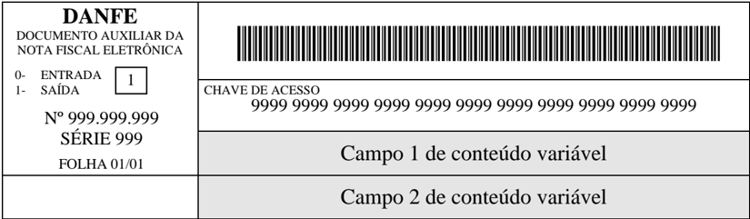
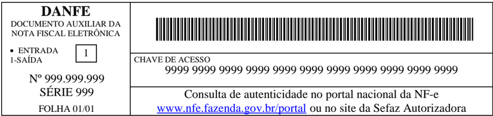
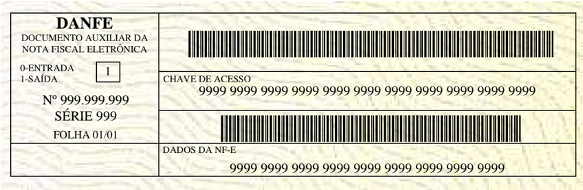
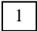
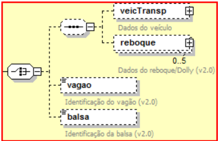

## Projeto Nota Fiscal Eletrônica


## Nota Técnica 2009/006

Substitui NT 2009/005


Dezembro-2009


## 1.  Resumo

A versão 4.0.1 do Manual de Integração do Contribui nte unifica o padrão de comunicação dos Web Services da NF-e para o novo padrão que utiliza o SOAP head er, sendo esta a principal diferença desta versão em relação à versã o 4.0.

As principais alterações ocorridas entre a versão 3 .0 em vigência e a versão 4.0.1 do Manual de Integração do Contribuinte, das quais destacamos :

- atualização  do  leiaute  da  NF-e,  com  inclusão  de  no vos  campos,  reorganização  e eliminação de alguns campos existentes;
- adequação  do  leiaute da NF-e  para registrar as ope rações praticadas pelos contribuintes optantes do SIMPLES NACIONAL;
- aperfeiçoamento das regras de validação dos campos  da NF-e;
- alteração  do Web  Services de  envio  de  lote  de  NF-e  e  busca  resultado  de processamento do lote por conta da alteração da ver são do leiaute da NF-e;
- alteração da mensagem de retorno do Web Services de consulta protocolo da NF-e para devolver o protocolo de autorização de uso e a  homologação do cancelamento se houver;
- adoção da versão 1.2 do SOAP;
- uso  do  SOAP  Header  para  a  passagem  das  informações   de  controle  dos Web Services. Além da eliminação do uso do cabeçalho e da alteração da versão de todos os Web  Services para  2.0,  a  principal  conseqüência  desta  alteração   será  a disponibilização  de  novos Web Services e  alteração  nas  regras  de  validação  das informações de controle da mensagem;
- os novos Web Services e métodos serão identificados com o acréscimo de 2 no final do nome em uso atualmente, o WSDL serão o divulgado s oportunamente pelas UF.
- as mensagens de pedido e reposta dos WS não serão  mais do tipo string;
- incorporação  do  Manual  de  Contingência  como anexo do  Manual  de  Integração  do Contribuinte.

.

## Observações:

- O objetivo desta Nota Técnica é divulgar os aperfe içoamentos e correções de erros da versão 4.01 do Manual que foram identificadas pe la Equipe Técnica.
- As alterações estão grafadas em vermelho (NT2009/0 06) ou em azul (NT2009/005) no Manual de Integração e neste documento. As corre ções dos erros identificados no Manual de Integração foram grafadas em verde;
- A  versão  4.0.1-NT2009.006  do  Manual  de  Integração do  Contribuinte  consolida  as correções desta Nota Técnica.


## 2. Arquitetura de Comunicação - alterações

## 2.1 Alteração do Padrão de Comunicação - adoção do SOAP Header

## 3.2.2 Padrão de Comunicação

A comunicação será baseada em Web Services disponibilizados pelo Sistema de Recepção de Nota Fiscal eletrônica.

O meio físico de comunicação utilizado será a Inter net, com o uso do protocolo SSL versão 3.0, com autenticação mútua, que além de garantir um duto de  comunicação seguro na Internet, permite a identificação do servidor e do cliente através de c ertificados digitais, eliminando a necessidade de identificação do usuário através de nome ou código de usuário e senha.

O modelo de comunicação segue o padrão de Web Services definido pelo WS-I Basic Profile.

A troca de mensagens entre os Web Services ambiente do Sistema de Recepção da NF-e e o aplicativo da empresa será realizada no padrão SOAP versão 1.2, com troca de mensagens XML no padrão Style/Enconding: Document/Literal.

A chamada de diferentes Web Services é realizada com o envio de uma mensagem XML atravé s do parâmetro nfeDadosMsg .

A versão do leiaute da mensagem XML contida no parâmetro nfeDadosMsg será informada no elemento versaoDados do tipo string localizado no elemento nfeCabecMsg do SOAP Header.

## Exemplo de uma mensagem requisição padrão SOAP:

```
<?xml version="1.0" encoding="utf-8"?> <soap12:Envelope xmlns:xsi="http://www.w3.org/2001/XMLSchema-instance" xmlns:xsd="http://www.w3.org/2001/XMLSchema" xmlns:soap12="http://www.w3.org/2003/05/soapenvelope"> <soap12:Header> <nfeCabecMsg xmlns="http://www.portalfiscal.inf.br/sce/wsdl/NfeRecepcao2"> <versaoDados>string</versaoDados> </nfeCabecMsg> </soap12:Header> <soap12:Body> <nfeRecepcao xmlns="http://www.portalfiscal.inf.br/nfe/wsdl/NfeRecepcao2"> <nfeDadosMsg>xml</nfeDadosMsg> </nfeRecepcao> </soap12:Body> </soap12:Envelope>
```

## Exemplo de uma mensagem de retorno padrão SOAP:

```
<?xml version="1.0" encoding="utf-8"?> <soap12:Envelope xmlns:xsi="http://www.w3.org/2001/XMLSchema-instance" xmlns:xsd="http://www.w3.org/2001/XMLSchema" xmlns:soap12="http://www.w3.org/2003/05/soapenvelope"> <soap12:Header> <nfeCabecMsg xmlns="http://www.portalfiscal.inf.br/nfe/wsdl/NfeRecepcao2">
```


## Nota Fiscal Eletrônica

```
<versaoDados>string</versaoDados> </nfeCabecMsg> </soap12:Header> <soap12:Body> <nfeRecepcaoResponse xmlns="http://www.portalfiscal.inf.br/nfe/wsdl/NfeRecepcao2"> <nfeRecepcaoResult>xml</nfeRecepcaoResult> </nfeRecepcaoResponse> </soap12:Body> </soap12:Envelope>
```

O padrão de mensagem passa a ser XML no padrão Styl e/Encoding: Document/Literal.

## 3. Web Services - alterações

## 3.1 Web Service - NfeRecepcao

- Versão do leiaute das mensagens : alterado para 2.00.
- Padrão de comunicação: SOAP 1.2, com uso de SOAP Header
- Nova nomenclatura do WS e do método.

- Web Service - NfeRecepcao2

- Método:  nfeRecepcaoLote2

## · A data e hora de recebimento do lote será devolvida  sempre

| #     | Campo      | Ele   | Pai   | Tipo   | Ocor.   | Tam.   | Dec.   | Descrição/Observação                                                                                                                                                                       |
|-------|------------|-------|-------|--------|---------|--------|--------|--------------------------------------------------------------------------------------------------------------------------------------------------------------------------------------------|
| AR01  | retEnviNFe | Raiz  | -     | -      | -       | -      |        | TAG raiz da Resposta                                                                                                                                                                       |
| AR02  | versao     | A     | AR01  | N      | 1-1     | 1-4    | 2      | Versão do leiaute                                                                                                                                                                          |
| AR03  | tpAmb      | E     | AR01  | N      | 1-1     | 1      |        | Identificação do Ambiente: 1 - Produção / 2 - Homologação                                                                                                                                  |
| AR04  | verAplic   | E     | AR01  | C      | 1-1     | 1-20   |        | Versão do Aplicativo que recebeu o Lote. A versão deve ser iniciada com a sigla da UF nos casos de WS próprio ou a sigla SCAN, SVAN ou SVRS nos demais casos.                              |
| AR05  | cStat      | E     | AR01  | N      | 1-1     | 3      |        | Código do status da resposta (vide item 5.1.1)                                                                                                                                             |
| AR06  | xMotivo    | E     | AR01  | C      | 1-1     | 1-255  |        | Descrição literal do status da resposta                                                                                                                                                    |
| AR06a | cUF        | E     | AR01  | N      | 1-1     | 2      |        | Código da UF que atendeu a solicitação.                                                                                                                                                    |
| AR09  | dhRecbto   | E     | AR01  | D      | 1-1     | -      |        | Data e Hora do Recebimento Formato = AAAA-MM-DDTHH:MM:SS Preenchido com data e hora do recebimento do lote.                                                                                |
| AR07  | infRec     | G     | AR01  | -      | 0-1     | -      |        | Dados do Recibo do Lote (Só é gerado se o Lote for aceito)                                                                                                                                 |
| AR08  | nRec       | E     | AR07  | N      | 1-1     | 15     |        | Número do Recibo gerado pelo Portal da Secretaria de Fazenda Estadual (vide item 5.5)                                                                                                      |
| AR10  | tMed       | E     | AR07  | N      | 1-1     | N      | 1-4    | Tempo médio de resposta do serviço (em segundos) dos últimos 5 minutos (vide item 5.7). Nota: Caso o tempo médio de resposta fique abaixo de 1 (um) segundo, o tempo será informado como 1 |


segundo. Arredondar as frações de segundos para cima.

## · Alteração  da  validação  das  informações  de  controle da  chamada  ao Web Service

| Validação das informações de controle da chamada ao Web Service   | Validação das informações de controle da chamada ao Web Service      | Validação das informações de controle da chamada ao Web Service   | Validação das informações de controle da chamada ao Web Service   | Validação das informações de controle da chamada ao Web Service   |
|-------------------------------------------------------------------|----------------------------------------------------------------------|-------------------------------------------------------------------|-------------------------------------------------------------------|-------------------------------------------------------------------|
| #                                                                 | Regra de Validação                                                   | Aplic.                                                            | Msg                                                               | Efeito                                                            |
| C01                                                               | Elemento nfeCabecMsg inexistente no SOAP Header                      | Facult.                                                           | 242                                                               | Rej.                                                              |
| C02                                                               | Campo cUF inexistente no elemento nfeCabecMsg do SOAP Header         | Obrig.                                                            | 409                                                               | Rej.                                                              |
| C03                                                               | Verificar se a UF informada no campo cUFé atend ida pelo Web Service | Obrig.                                                            | 410                                                               | Rej.                                                              |
| C04                                                               | Campo versaoDados inexistente no elemento nfeCabecMsg do SOAP Header | Obrig.                                                            | 411                                                               | Rej.                                                              |
| C05                                                               | Versão dos Dados informada é superior à versão vigente               | Facult.                                                           | 238                                                               | Rej.                                                              |
| C06                                                               | Versão dos Dados não suportada                                       | Obrig.                                                            | 239                                                               | Rej.                                                              |

A  informação  da  versão  do  leiaute  do  lote  e  a  UF  de   origem  do  emissor  das  NF-e  constam  no  elemento nfeCabecMsg do SOAP Header (para maiores detalhes vide item 3.4.1).

A aplicação deverá validar os campos cUF e versaoDa dos, rejeitando o lote recebido em caso de informações inexistentes ou inválidas.

O campo versaoDados contém a versão do Schema XML da mensagem contida na área de dados que deve ser utilizado pelo Servidor de Processamento da NF-e na validação do Schema XML do lote. Cabe ressaltar que um lote deve conter somente NF-e da mesma versão.

## · Aperfeiçoamento da validação da área de dados da mensagem

## a) Validação de forma da área de dados

A validação de forma da área de dados da mensagem é realizada com a aplicação da seguinte regra:

| Validação da área de dados da mensagem   | Validação da área de dados da mensagem                                                                                           | Validação da área de dados da mensagem   | Validação da área de dados da mensagem   | Validação da área de dados da mensagem   |
|------------------------------------------|----------------------------------------------------------------------------------------------------------------------------------|------------------------------------------|------------------------------------------|------------------------------------------|
| #                                        | Regra de Validação                                                                                                               | Aplic.                                   | Msg                                      | Efeito                                   |
| D01                                      | Verifica Schema XMLda Área de Dados                                                                                              | Obrig.                                   | 225                                      | Re j.                                    |
| D01d                                     | Em caso de Falha de Schema, verificar se existe a tag raiz esperada para mensagem                                                | Facul.                                   | 565                                      | Rej.                                     |
| D01e                                     | Em caso de Falha de Schema, verificar se existe o atributo versao para a tag raiz da mensagem                                    | Facul.                                   | 568                                      | Rej.                                     |
| D01f                                     | Em caso de Falha de Schema, verificar se o conteúdodo atributo versao difere do conteúdo da versaoDados informado no SOAP Header | Facul.                                   | 567                                      | Rej.                                     |
| D02                                      | Verifica o uso de prefixo no namespace                                                                                           | Obrig.                                   | 404                                      | Rej.                                     |
| D03                                      | XML utiliza codificação diferente de UTF-8                                                                                       | Obrig.                                   | 402                                      | Rej.                                     |


As validações D01d, D01e e D01f são de aplicação fa cultativa e podem ser aplicadas sucessivamente quando ocorrer falha na validação D01 e a SEFAZ entender oportuno informar a divergência entre a versão informada no SOAP Header e a versão da mensa gem XML.

- Eliminação da regra F04

| F04   | CNPJ do Certificado Digital difere do CNPJ da Matriz e do CNPJ do Emitente   | Facult.   | 244   | Rej.   |
|-------|------------------------------------------------------------------------------|-----------|-------|--------|


- Validação das regras de negócios da NF-e: aperfeiçoamento das regras de validação com o acréscimo de novas validações e reorganização da ordem de validação e indicação do campo validado.

| #      | Campo   | Regra de Validação                                                                                                                                                           | Aplic.   |   Msg | Efeito   | Descrição Erro                                                                                         |
|--------|---------|------------------------------------------------------------------------------------------------------------------------------------------------------------------------------|----------|-------|----------|--------------------------------------------------------------------------------------------------------|
|        |         | A - Dados da NF-e                                                                                                                                                            |          |       |          |                                                                                                        |
| GA03   | A03     | Campo Id inválido: - Chave de Acesso do campo Id difere da concatenação dos campos correspondentes                                                                           | Obrig.   |   502 | Rej.     | Rejeição: Erro na Chave de Acesso - Campo Id não corresponde à concatenação dos campos correspondentes |
|        |         | B - Identificação da NF-e                                                                                                                                                    |          |       |          |                                                                                                        |
| GB02   | B02     | Código da UF do Emitente difere da UF do Web Service                                                                                                                         | Obrig.   |   226 | Rej.     | Rejeição: Código da UF do Emitente diverge da UF autorizadora                                          |
| GB07   | B07     | Na autorização pela SEFAZ (ou SEFAZ VIRTUAL): - Série da NF-e difere da faixa de 0-889 A faixa 890-899 é reservada para a emissão de NF-eavulsa quando permitida pela SEFAZ. | Obrig.   |   266 | Rej.     | Rejeição: Série utilizada fora da faixa permitida n o Web Service (0-889)                              |
| GB07.1 | B07     | Na autorização pelo SCAN - Sistema de Contingência Na cional: - Série da NF-e difere da faixa de 900-999                                                                     | Obrig.   |   503 | Rej.     | Rejeição: Série utilizada fora da faixa permitida n o SCAN (900-999)                                   |
| GB09   | B09     | Data de Emissão posterior à data de recebimento da NF-e na SEFAZ                                                                                                             | Obrig.   |   212 | Rej.     | Rejeição: Data de emissão NF-e posterior a data de recebimento                                         |
| GB09.1 | B09     | Data de Emissão ocorrida há mais de 30 dias (ou out ro limite definido pela SEFAZ)                                                                                           | Obrig.   |   228 | Rej.     | Rejeição: Data de Emissão muito atrasada                                                               |
| GB10   | B10     | Se informado Data de Entrada / Saída (dSaiEnt): - Data Entrada / Saída posterior a 30 dias da Da ta de Autorização                                                           | Facult.  |   504 | Rej.     | Rejeição: Data de Entrada/Saída posterior ao permitido                                                 |
| GB10.1 | B10     | Se informado Data de Entrada / Saída (dSaiEnt): - Data Entrada / Saída anterior a 30 dias da Dat a de Autorização                                                            | Facult.  |   505 | Rej.     | Rejeição: Data de Entrada/Saída anterior ao permitido                                                  |
| GB10.2 | B10     | Se informado Data de Entrada / Saída (dSaiEnt) paraNF-e de Saída (tpNF=1): - Data de Saída (dSaiEnt) menor que a Data de Em issão (dEmis)                                    | Facult.  |   506 | Rej.     | Rejeição: Data de Saída menor que a Data de Emissão                                                    |
| GB12   | B12     | Código do Município do Fato Gerador de ICMS com díg ito verificador (DV) inválido (*1)                                                                                       | Obrig.   |   270 | Rej.     | Rejeição: Código Município do Fato Gerador: dígito inválido                                            |


| #      | Campo   | Regra de Validação                                                                                        | Aplic.   |   Msg | Efeito   | Descrição Erro                                                                                       |
|--------|---------|-----------------------------------------------------------------------------------------------------------|----------|-------|----------|------------------------------------------------------------------------------------------------------|
| GB12.1 | B12     | Código do Município do Fato Gerador (2 primeiras po sições) difere do Código da UF do emitente            | Obrig.   |   271 | Rej.     | Rejeição: Código Município do Fato Gerador: difereda UF do emitente                                  |
| GB13   | B13     | Se informada a TAG de NF-e Referenciada: - Dígito Verificador da Chave de Acesso inválido                 | Facult.  |   547 | Rej.     | Rejeição: Dígito Verificador da Chave de Acesso da NF-e Referenciada inválido                        |
| GB17   | B17     | Se informada a TAG de NF Referenciada: - CNPJ com zeros, nulo ou DV inválido                              | Facult.  |   548 | Rej.     | Rejeição: CNPJ da NF referenciada inválido.                                                          |
| GB20d  | B20d    | Se informada a TAG de NF Referenciada de produtor: - CNPJ com zeros, nulo ou DV inválido                  | Facult.  |   549 | Rej.     | Rejeição: CNPJ da NF referenciada de produtor inválido.                                              |
| GB20e  | B20e    | Se informada a TAG de NF Referenciada de produtor: - CPF com zeros, nulo ou DV inválido                   | Facult.  |   550 | Rej.     | Rejeição: CPF da NF referenciada de produtor inváli do.                                              |
| GB20f  | B20f    | Se informada a TAG de NF Referenciada de produtor: - IE com zeros, nulo ou DV inválido para a UF.         | Facult.  |   551 | Rej.     | Rejeição: IE da NF referenciada de produtor inválid o.                                               |
| GB20i  | B20i    | Se informada a TAG de CT-e Referenciado: - Dígito Verificador da Chave de Acesso inválido                 | Facult.  |   552 | Rej.     | Rejeição: Dígito Verificador da Chave de Acesso do CT-e Referenciado inválido                        |
| GB22   | B22     | Se informada a TAG de tpEmis = 1: dhCont e xJust não devem ser informados                                 | Obrig.   |   556 | Rej.     | Rejeição: Justificativa de entrada em contingêncianão deve ser informada para tipo de emissão normal |
| GB22.1 | B22     | Se informada a TAG de tpEmis diferente de 1: dhCont e xJust devem ser informados                          | Obrig.   |   557 | Rej.     | Rejeição: A Justificativa de entrada em contingênci a deve ser informada                             |
| GB23   | B23     | Chave de Acesso obtida pela concatenação dos campos correspondentes com dígito verificador (DV) inválid o | Obrig.   |   253 | Rej.     | Rejeição: Digito Verificador da chave de acesso composta inválida                                    |
| GB24   | B24     | Tipo do ambiente da NF-e difere do ambiente do Web Service                                                | Obrig.   |   252 | Rej.     | Rejeição: Ambiente informado diverge do Ambiente de recebimento                                      |
| GB25   | B25     | Se NF-e complementar (finNFe=2): - Não informado NF referenciada (NF modelo 1 ou NF-e)                    | Obrig.   |   254 | Rej.     | Rejeição: NF-e complementar não possui NF referenciada                                               |
| GB25.1 | B25     | - NF referenciada com mais de uma ocorrência (NF modelo 1 ou NF-e)                                        | Obrig.   |   255 | Rej.     | Rejeição: NF-e complementar possui mais de uma NF referenciada                                       |
| GB25.2 | B25     | - CNPJ emitente da NF Referenciada difere do CNPJ emitente desta NF-e (NF modelo 1 ou NF-e)               | Obrig.   |   269 | Rej.     | Rejeição: CNPJ Emitente da NF Complementar difere do CNPJ da NF Referenciada                         |
| GB26   | B26     | Processo de Emissão difere de emissão pelo contribu inte (procEmi <> 0 e 3)                               | Obrig.   |   451 | Rej.     | Rejeição: Processo de emissão informado inválido                                                     |
|        |         | C- Identificação do Emitente                                                                              |          |       |          |                                                                                                      |


| #       | Campo   | Regra de Validação                                                                                                                                                                                                                                                                                | Aplic.   |   Msg | Efeito   | Descrição Erro                                                                        |
|---------|---------|---------------------------------------------------------------------------------------------------------------------------------------------------------------------------------------------------------------------------------------------------------------------------------------------------|----------|-------|----------|---------------------------------------------------------------------------------------|
| GB28    | B28     | Data de entrada em contingência deve ser menor ou i gual à data de emissão                                                                                                                                                                                                                        | Facult.  |   558 | Rej.     | Rejeição: Data de entrada em contingência posteriora data de emissão                  |
| GC02    | C02     | Se informada a TAG de CNPJ do emitente: - CNPJ com zeros, nulo ou DV inválido                                                                                                                                                                                                                     | Obrig.   |   207 | Rej.     | Rejeição: CNPJ do emitente inválido                                                   |
| GC02.1  | C02     | CNPJ Base do Emitente difere do CNPJ Base da primeira NF-e do Lote recebido                                                                                                                                                                                                                       | Facult.  |   560 | Rej.     | Rejeição: CNPJ base do emitente difere do CNPJ base da primeira NF-e do lote recebido |
| GC02a   | C02a    | Se informada a TAG CPF do emitente: - CPF só pode ser informado no campo Emitente para NF-e avulsa                                                                                                                                                                                                | Obrig.   |   407 | Rej.     | Rejeição: O CPF só pode ser informado no campo emitente para a NF-e avulsa            |
| GC02a.1 | C02a    | - CPF do Remetente de NF-e Avulsa com zeros, nulo ou DV inválido                                                                                                                                                                                                                                  | Obrig.   |   401 | Rej.     | Rejeição: CPF do remetente inválido                                                   |
| GC10    | C10     | Código do Município do Emitente comDV inválido (*1 )                                                                                                                                                                                                                                              | Obrig.   |   272 | Rej.     | Rejeição: Código Município do Emitente: dígito inválido                               |
| GC10.1  | C10     | Código do Município do Emitente (2 primeiras posições) difere do Código da UF do emitente                                                                                                                                                                                                         | Obrig.   |   273 | Rej.     | Rejeição: Código Município do Emitente: difere da UF do emitente                      |
| GC12    | C12     | Sigla da UF do Emitente difere da UF do Web Service                                                                                                                                                                                                                                               | Obrig.   |   247 | Rej.     | Rejeição: Sigla da UF do Emitente diverge da UF autorizadora                          |
| GC17    | C17     | IE Emitente com zeros ou nulo                                                                                                                                                                                                                                                                     | Obrig.   |   229 | Rej.     | Rejeição: IE do emitente não informada                                                |
| GC17.1  | C17     | IE Emitente inválida para a UF: erro no tamanho, na composição da IE, ou no dígito verificador (*2)                                                                                                                                                                                               | Obrig.   |   209 | Rej.     | Rejeição: IE do emitente inválida                                                     |
| GC18    | C18     | Se informada operação de Faturamento Direto para veículos novos (tpOp, campo J02 = 2): - UF do Local de Entrega (campo G09) não informa da (A UF é necessária na validação da IE ST nestas op erações. Vide Convênio ICMS 51/00).                                                                 | Obrig.   |   478 | Rej.     | Rejeição: Local da entrega não informado para faturamento direto de veículos novos    |
| GC18.1  | C18     | Se informada a IE do Substituto Tributário: - IEST inválida para a UF: erro no tamanho, na compos ição da IE, ou no dígito verificador (*2) UF a ser utilizada na validação: - UF do Local de Entrega para operação de Faturamento Direto de veículos novos (campo G09, caso tpOP, campo J02= 2); | Obrig.   |   211 | Rej.     | Rejeição: IE do substituto inválida                                                   |


## Nota Fiscal Eletrônica

| #      | Campo   | Regra de Validação                                                                                                                                            | Aplic.   |   Msg | Efeito   | Descrição Erro                                                                               |
|--------|---------|---------------------------------------------------------------------------------------------------------------------------------------------------------------|----------|-------|----------|----------------------------------------------------------------------------------------------|
|        |         | - UF do destinatário (UF, campo E12) nos demais cas os.                                                                                                       |          |       |          |                                                                                              |
|        |         | D - Identificação do Fisco Emitente (NF-e Avulsa)                                                                                                             |          |       |          |                                                                                              |
| GD01   | D01     | Informado o grupo 'avulsa' pela empresa                                                                                                                       | Obrig.   |   403 | Rej.     | Rejeição: O grupo de informações da NF-e avulsa é de uso exclusivo do Fisco                  |
|        |         | E - Identificação do Destinatário                                                                                                                             |          |       |          |                                                                                              |
| GE02   | E02     | Se Operação com Exterior (UF Destinatário = 'EX') - não informada TAG CNPJ ou CNPJ <> nulo                                                                    | Obrig.   |   507 | Rej.     | Rejeição: O CNPJ do destinatário/remetente não deve ser informado em operação com o exterior |
| GE02.1 | E02     | Se não é Operação com Exterior (UF destinatário <> 'EX'): - CNPJ destinatário é nulo e CPF destinatário é nulo                                                | Obrig..  |   508 | Rej.     | Rejeição: O CNPJ com conteúdo nulo só é válido em operação com exterior.                     |
| GE02.2 | E02     | Se informada TAG CNPJ: - CNPJ com zeros ou dígito de controle inválido                                                                                        | Obrig.   |   208 | Rej.     | Rejeição: CNPJ do destinatário inválido                                                      |
| GE03   | E03     | Se informada a TAG CPF: - CPF com zeros ou dígito de controle inválido                                                                                        | Obrig.   |   237 | Rej.     | Rejeição: CPF do destinatário inválido                                                       |
| GE10   | E10     | Se não é Operação com Exterior (UF Destinatário <> 'EX'): - Código Município do destinatário com dígito v erificador inválido                                 | Obrig.   |   274 | Rej.     | Rejeição: Código Município do Destinatário: dígito inválido                                  |
| GE10.1 | E10     | - Código Município do destinatário (2 primeiras posições) difere do Código da UF do destinatário                                                              | Obrig.   |   275 | Rej.     | Rejeição: Código Município do Destinatário: difere da UF do Destinatário                     |
| GE10.2 | E10     | Se Operação com Exterior (UF Destinatário = 'EX'): - Código Município do destinatário difere de ' 9999999'                                                    | Obrig.   |   509 | Rej.     | Rejeição: Informado código de município diferente de '9999999' para operação com o exterior  |
| GE14   | E14     | Se Operação com Exterior (UF Destinatário = 'EX'): - Código País do destinatário = 1058 (Brasil), ou não informado                                            | Facult.  |   510 | Rej.     | Rejeição: Operação com Exterior e Código País destinatário é 1058 (Brasil) ou não informado  |
| GE14.1 | E14     | Se informado Código País do destinatário e não é um a Operação com Exterior (UF Destinatário <> 'EX'): - Código País do destinatário difere de 1058 (B rasil) | Facult.  |   511 | Rej.     | Rejeição: Não é de Operação com Exterior e Código País destinatário difere de 1058 (Brasil)  |
| GE17   | E17     | Se Operação com Exterior (UF Destinatário = 'EX'): - IE Destinatário difere de nulo ou 'ISENTO'                                                               | Obrig.   |   210 | Rej.     | Rejeição: IE do destinatário inválida                                                        |
| GE17.1 | E17     | IE Destinatário informada e difere de 'ISENTO': - IE inválida para a UF: erro no tamanho, na co mposição da IE, ou no dígito verificador (*2)                 | Obrig.   |   210 | Rej.     | Rejeição: IE do destinatário inválida                                                        |
| GE18   | E18     | Inscr. SUFRAMA informada:                                                                                                                                     | Obrig.   |   235 | Rej.     | Rejeição: Inscrição SUFRAMA inválida                                                         |


| #      | Campo   | Regra de Validação                                                                                                                                                                 | Aplic.   |   Msg | Efeito   | Descrição Erro                                                                            |
|--------|---------|------------------------------------------------------------------------------------------------------------------------------------------------------------------------------------|----------|-------|----------|-------------------------------------------------------------------------------------------|
|        |         | - Inscrição com dígito verificador inválido                                                                                                                                        |          |       |          |                                                                                           |
| GE18.1 | E18     | Inscr. SUFRAMA informada: - UF destinatário difere de AC-Acre, ou AM-Amaz onas, ou RO- Rondônia, ou RR-Roraima, ou AP-Amapá (só para muni cípios 1600303-Macapá e 1600600-Santana) | Obrig.   |   251 | Rej.     | Rejeição: UF/Município destinatário não pertence a SUFRAMA                                |
|        |         | F - Local da Retirada                                                                                                                                                              |          |       |          |                                                                                           |
| GF02   | F02     | Se informado Local de Retirada e CNPJ Retirada difere de nulo: - CNPJ com zeros ou dígito inválido                                                                                 | Facult.  |   512 | Rej.     | Rejeição: CNPJ do Local de Retirada inválido                                              |
| GF02a  | F02a    | Se informada a TAG CPF: - CPF com zeros ou dígito de controle inválido                                                                                                             | Facult.  |   540 | Rej.     | Rejeição: CPF do Local de Retirada inválido                                               |
| GF07   | F07     | Se informado Local de Retirada e UF Retirada = 'EX': - Código do Município do Local de Retirada dife re de '9999999'                                                               | Obrig.   |   513 | Rej.     | Rejeição: Código Município do Local de Retirada deve ser 9999999 para UF retirada = 'EX'. |
| GF07.1 | F07     | Se informado Local de Retirada e UF Retirada <> 'EX': - Código do Município do Local de Retirada comdígito verificador inválido                                                    | Obrig.   |   276 | Rej.     | Rejeição: Código Município do Local de Retirada: dígito inválido                          |
| GF07.2 | F07     | - Código Município do Local de Retirada (2 prime iras posições) difere do Código da UF do Local de Retirada                                                                        | Obrig.   |   277 | Rej.     | Rejeição: Código Município do Local de Retirada: difere da UF do Local de Retirada        |
|        |         | G- Local da Entrega                                                                                                                                                                |          |       |          |                                                                                           |
| GG02   | G02     | Se informado o Local de Entrega e CNPJ Entrega difere de nulo: - CNPJ com zeros ou dígito inválido                                                                                 | Facult.  |   514 | Rej.     | Rejeição: CNPJ do Local de Entrega inválido                                               |
| GG02a  | G02a    | Se informada a TAG CPF: - CPF com zeros ou dígito de controle inválido                                                                                                             | Facult.  |   541 | Rej.     | Rejeição: CPF do Local de Entrega inválido                                                |
| GG07   | G07     | Se informado Local de Entrega e UF Entrega = 'EX': - Código do Município do Local de Entrega difer e de '9999999'                                                                  | Obrig.   |   515 | Rej,     | Rejeição: Código Município do Local de Entrega deve ser 9999999 para UF entrega = 'EX'.   |
| GG07.1 | G07     | Se informado Local de Entrega e UF Entrega <> 'EX': - Código Município do Local de Entrega com dígi to verificador inválido                                                        | Obrig.   |   278 | Rej.     | Rejeição: Código Município do Local de Entrega: dígito inválido                           |
| GG07.2 | G07     | - Código Município do Local de Entrega (2 prime iras posições) difere do Código da UF do Local de Entrega                                                                          | Obrig.   |   279 | Rej.     | Rejeição: Código Município do Local de Entrega: difere da UF do Local de Entrega          |
|        |         | H - Detalhamento Produtos e Serviços                                                                                                                                               |          |       |          |                                                                                           |


## Nota Fiscal Eletrônica

| #      | Campo   | Regra de Validação                                                                                       | Aplic.   |   Msg | Efeito   | Descrição Erro                                                                   |
|--------|---------|----------------------------------------------------------------------------------------------------------|----------|-------|----------|----------------------------------------------------------------------------------|
|        |         | I - Produtos e Serviços                                                                                  |          |       |          |                                                                                  |
| GI08   | I08     | CFOP de Entrada (inicia por 1, 2, 3) para NF-e de Saída (tpNF=1)                                         | Facult.  |   518 | Rej.     | Rejeição: CFOP de entrada para NF-e de saída                                     |
| GI08.1 | I08     | CFOP de Saída (inicia por 5, 6, 7) para NF-e de Ent rada (tpNF=0)                                        | Facult.  |   519 | Rej.     | Rejeição: CFOP de saída para NF-e de entrada                                     |
| GI08.2 | I08     | CFOP de Operação com Exterior (inicia por 3 ou 7) e UF destinatário <> 'EX'                              | Facult.  |   520 | Rej.     | Rejeição: CFOP de Operação com Exterior e UF destinatário difere de 'EX'         |
| GI08.3 | I08     | CFOP não é de Operação com Exterior (não inicia por 3 e 7) e UF destinatário = 'EX'                      | Facult.  |   521 | Rej.     | Rejeição: CFOP não é de Operação com Exterior e UF destinatário é 'EX'           |
| GI08.4 | I08     | CFOP de Operação no Estado (inicia por 1 ou 5) e UF emitente difere da UF destinatário                   | Facult.  |   522 | Rej.     | Rejeição: CFOP de Operação Estadual e UF emitente difere UF destinatário.        |
| GI08.5 | I08     | CFOP não é de Operação no Estado (não inicia por 1 e 5) e UF emitente = UF destinatário                  | Facult.  |   523 | Rej.     | Rejeição: CFOP não é de Operação Estadual e UF emitente igual a UF destinatário. |
| GI08.6 | I08     | CFOP de Operação com Exterior (inicia por 3 ou 7) e não informada TAG NCM (id:I05) completo (8 posições) | Facult.  |   524 | Rej.     | Rejeição: CFOP de Operação com Exterior e não informado NCM completa             |
| GI08.7 | I08     | CFOP de Importação (inicia por 3) e não informado a tag DI                                               | Facult.  |   525 | Rej.     | Rejeição: CFOP de Importação e não informado dados da DI                         |
| GI08.8 | I08     | CFOP de Exportação (inicia por 7) e não informado L ocal de Embarque (id:ZA01)                           | Facult.  |   526 | Rej.     | Rejeição: CFOP de Exportação e não informado Local de Embarque                   |
|        |         | J - Item / Veículos Novos                                                                                |          |       |          |                                                                                  |
|        |         | K - Item / Medicamentos                                                                                  |          |       |          |                                                                                  |
|        |         | L - Item / Armamentos                                                                                    |          |       |          |                                                                                  |
|        |         | L1 - Item / Combustível                                                                                  |          |       |          |                                                                                  |
|        |         | M- Item / Tributos do Produto e Serviço                                                                  |          |       |          |                                                                                  |
|        |         | N - Item / Tributo: ICMS                                                                                 |          |       |          |                                                                                  |
| GN12   | N12     | CFOP de Exportação (inicia por 7):                                                                       | Facult.  |   527 | Rej.     | Rejeição: Operação de Exportação com informação de                               |


## Nota Fiscal Eletrônica

| #    | Campo   | Regra de Validação                                                                                                                           | Aplic.   |   Msg | Efeito   | Descrição Erro                                                                |
|------|---------|----------------------------------------------------------------------------------------------------------------------------------------------|----------|-------|----------|-------------------------------------------------------------------------------|
|      |         | - Informado CST de ICMS diferente de 41                                                                                                      |          |       |          | ICMS incompatível                                                             |
| GN17 | N17     | Se CST de ICMS = 00, 10, 20, 51, 70, 90: - Valor ICMS (id:N17) difere de Base de Cálculo (id:N15) * Alíquota (id:N16) (*3)                   | Facult.  |   528 | Rej.     | Rejeição: Valor do ICMS difere do produto BC e Alíquota                       |
|      |         | O - Item / Tributo: IPI                                                                                                                      |          |       |          |                                                                               |
| GO07 | O07     | Informada tributação do IPI (id:O07) sem informar a TAG NCM (id:I05) completo (8 posições)                                                   | Facult.  |   529 | Rej.     | Rejeição: NCM de informação obrigatória para produt o tributado pelo IPI      |
|      |         | P - Item / Tributo: II                                                                                                                       |          |       |          |                                                                               |
|      |         | Q- Item / Tributo: PIS                                                                                                                       |          |       |          |                                                                               |
|      |         | R - Item / Tributo: PIS ST                                                                                                                   |          |       |          |                                                                               |
|      |         | S - Item / Tributo: COFINS                                                                                                                   |          |       |          |                                                                               |
|      |         | T - Item / Tributo: COFINS ST                                                                                                                |          |       |          |                                                                               |
|      |         | U - Item / Tributo: ISSQN                                                                                                                    |          |       |          |                                                                               |
| GU01 | U01     | Informado grupo de tributação do ISSQN (id:U01) sem informar a Inscrição Municipal (id:C19)                                                  | Facult.  |   530 | Rej.     | Rejeição: Operação com tributação de ISSQN sem informar a Inscrição Municipal |
| GU05 | U05     | Se informado Código Município do FG - ISSQN: - Código Município do FG - ISSQN com dígito invá lido                                           | Obrig.   |   287 | Rej.     | Rejeição: Código Município do FG - ISSQN: dígito inválido                     |
|      |         | V - Item / Informação Adicional                                                                                                              |          |       |          |                                                                               |
|      |         | W-Total da NF-e                                                                                                                              |          |       |          |                                                                               |
| GW03 |         | Total da BC ICMS (id:W03) difere do somatório do valor dos itens (id:N15) (*3). O Total não deve considerar o valor informado para o CST 51. | Facult.  |   531 | Rej.     | Rejeição: Total da BC ICMS difere do somatório dos itens                      |
| GW04 |         | Total do ICMS (id:W04) difere do somatório do valor dos itens                                                                                | Facult.  |   532 | Rej.     | Rejeição: Total do ICMS difere do somatório dos itens                         |


## Nota Fiscal Eletrônica

| #      | Campo   | Regra de Validação                                                                                                                                                  | Aplic.   |   Msg | Efeito   | Descrição Erro                                                     |
|--------|---------|---------------------------------------------------------------------------------------------------------------------------------------------------------------------|----------|-------|----------|--------------------------------------------------------------------|
|        |         | (id:N17) (*3). O Total não deve considerar o valor informado para o CST 51.                                                                                         |          |       |          |                                                                    |
| GW05   |         | Total da BC ICMS-ST (id:W05) difere do somatório do valor dos itens (id:N21) (*3)                                                                                   | Facult.  |   533 | Rej.     | Rejeição: Total da BC ICMS-ST difere do somatório dos itens        |
| GW06   |         | Total do ICMS-ST (id:W06) difere do somatório do valor dos itens (id:N23) (*3)                                                                                      | Facult.  |   534 | Rej.     | Rejeição: Total do ICMS-ST difere do somatório dos itens           |
| GW07   |         | Total dos Produtos e Serviços (id:W07) difere do somatório do valor dos itens (id:I11). Considerar somente os valores dos itens com a TAG indTot (id:I17b) = 1 (*3) | Facult.  |   564 | Rej.     | Rejeição: Total do Produto / Serviço difere do somatório dos itens |
| GW08   |         | Total do Frete (id:W08) difere do somatório do valor dos itens (id:I15) (*3)                                                                                        | Facult.  |   535 | Rej.     | Rejeição: Total do Frete difere do somatório dos itens             |
| GW09   |         | Total do Seguro (id:W09) difere do somatório do valor dos itens (id:I16) (*3)                                                                                       | Facult.  |   536 | Rej.     | Rejeição: Total do Seguro difere do somatório dos itens            |
| GW10   |         | Total do Desconto (id:W10) difere do somatório do valor dos itens (id:I17) (*3)                                                                                     | Facult.  |   537 | Rej.     | Rejeição: Total do Desconto difere do somatório dos itens          |
| GW12   |         | Total do IPI (id:W12) difere do somatório do valor dos itens (id:O14) (*3)                                                                                          | Facult.  |   538 | Rej.     | Rejeição: Total do IPI difere do somatório dos itens               |
|        |         | X - Transporte da NF-e                                                                                                                                              |          |       |          |                                                                    |
| GX04   | X04     | Validar CNPJ do transportador.se informado.                                                                                                                         | Obrig.   |   542 | Rej.     | Rejeição: CNPJ do Transportador inválido                           |
| GX05   | X05     | Validar CPF do transportador.se informado.                                                                                                                          | Obrig.   |   543 | Rej.     | Rejeição: CPF do Transportador inválido                            |
| GX07   | X07     | Se informada a IE do Transportador: - UF do Transportador (id:X10) não informada                                                                                    | Obrig.   |   559 | Rej.     | Rejeição: UF do Transportador não informada                        |
| GX07.1 | X07     | Validar IE do transportador.se informado. Utilizar a UF informada para escolha do algoritmo.                                                                        | Obrig.   |   544 | Rej.     | Rejeição: IE do Transportador inválida                             |
| GX17   | X17     | Se informado Código Município do FG - Transporte (i d:X17): - Código do Município do FG - Transporte com díg ito inválido                                           | Obrig.   |   288 | Rej.     | Rejeição: Código Município do FG - Transporte: dígi to inválido    |
|        |         | Y - Dados da Cobrança                                                                                                                                               |          |       |          |                                                                    |
|        |         | Z - Informação Adicional da NF-e                                                                                                                                    |          |       |          |                                                                    |


| #       | Campo   | Regra de Validação                                                                                                                                      | Aplic.   |   Msg | Efeito   | Descrição Erro                                                                                              |
|---------|---------|---------------------------------------------------------------------------------------------------------------------------------------------------------|----------|-------|----------|-------------------------------------------------------------------------------------------------------------|
|         |         | ZA - Comércio Exterior                                                                                                                                  |          |       |          |                                                                                                             |
|         |         | ZB - Informação de Compra                                                                                                                               |          |       |          |                                                                                                             |
|         |         | ZC - Informações do Registro de Aquisição de Cana                                                                                                       |          |       |          |                                                                                                             |
|         |         | ZD - Informação de Crédito do Simples Nacional                                                                                                          |          |       |          |                                                                                                             |
|         |         | Banco de Dados: Emitente                                                                                                                                |          |       |          |                                                                                                             |
| G1C02   | C02     | Acessar Cadastro Contribuinte p/ Emitente: - CNPJ emitente não cadastrado                                                                               | Facult.  |   245 | Rej.     | Rejeição: CNPJ Emitente não cadastrado                                                                      |
| G1C02.1 | C02     | - Emitente não autorizado                                                                                                                               | Obrig.   |   203 | Rej.     | Rejeição: Emissor não habilitado para emissão da NF -e                                                      |
| G1C17   | C17     | - IE Emitente não cadastrada                                                                                                                            | Facult.  |   230 | Rej.     | Rejeição: IE do emitente não cadastrada                                                                     |
| G1C17.1 | C17     | - IE Emitente não vinculada ao CNPJ                                                                                                                     | Obrig.   |   231 | Rej.     | Rejeição: IE do emitente não vinculada ao CNPJ                                                              |
| G1C17.2 | C17     | - Emitente em situação irregular perante o Fisco                                                                                                        | Obrig.   |   301 | Den.     | Uso Denegado: Irregularidade fiscal do emitente                                                             |
|         |         | Banco de Dados: Chave da NF-e                                                                                                                           |          |       |          |                                                                                                             |
| G1B08   | B08     | Acesso BD NFE (Chave: Ano, CNPJ Emitente, Modelo, Série, Nro): - NF-e já cadastrada, com diferença na Chave de Acesso (campo de Código Numérico difere) | Facult.  |   539 | Rej.     | Rejeição: Duplicidade de NF-e, com diferença na Chave de Acesso [99999999999999999999999999999999999999999] |
| G1B08.1 | B08     | - NF-e já cadastrada e não Cancelada/Denegada                                                                                                           | Obrig.   |   204 | Rej.     | Rejeição: Duplicidade de NF-e                                                                               |
| G1B08.2 | B08     | - NF-e já cadastrada e está Cancelada                                                                                                                   | Obrig.   |   218 | Rej.     | Rejeição: NF-e já esta cancelada na base de dados d a SEFAZ                                                 |
| G1B08.3 | B08     | - NF-e já cadastrada e está Denegada                                                                                                                    | Obrig.   |   205 | Rej.     | Rejeição: NF-e está denegada na base de dados da SEFAZ                                                      |
| G1B08.4 | B08     | Acesso BD de Inutilização (Chave: Ano, CNPJ, Modelo, Série, Nro): - Numeração da NF-e está inutilizada                                                  | Obrig.   |   206 | Rej.     | Rejeição: NF-e já está inutilizada na Base de dados da SEFAZ                                                |


## Nota Fiscal Eletrônica

| #       | Campo   | Regra de Validação                                                                                                                                                                     | Aplic.   |   Msg | Efeito   | Descrição Erro                                                   |
|---------|---------|----------------------------------------------------------------------------------------------------------------------------------------------------------------------------------------|----------|-------|----------|------------------------------------------------------------------|
|         |         | Banco de Dados: NF-e Complementar                                                                                                                                                      |          |       |          |                                                                  |
| G1B25   | B25     | Se NF-e complementar (finNFe=2) e informado NF-e referenciada (Campo: refNFe): . Acessar BD NFE com a Chave de Acesso informada (Campo: refNFe); - NF-e referenciada inexistente       | Facult.  |   267 | Rej.     | Rejeição: NF Complementar referencia uma NF-e inexistente        |
| G1B25.1 | B25     | - NF-e referenciada acessada também é uma NF- e Complementar (finNFe=2)                                                                                                                | Facult.  |   268 | Rej.     | Rejeição: NF Complementar referencia uma outra NF-e Complementar |
|         |         | Banco de Dados: Destinatário                                                                                                                                                           |          |       |          |                                                                  |
| G1E17   | E17     | Se Operação no Estado (UF emitente = UF destinatári o) e informado IE Destinatário: . Acessar Cadastro Contribuinte (Chave: IE / CNPJ destinatário) - CNPJ destinatário não cadastrado | Facult.  |   246 | Rej.     | Rejeição: CNPJ Destinatário não cadastrado                       |
| G1E17.1 | E17     | - IE destinatário não cadastrada                                                                                                                                                       | Facult.  |   233 | Rej.     | Rejeição: IE do destinatário não cadastrada                      |
| G1E17.2 | E17     | - IE destinatário não vinculada ao CNPJ                                                                                                                                                | Facult.  |   234 | Rej.     | Rejeição: IE do destinatário não vinculada ao CNPJ               |
| G1E17.3 | E17     | - Destinatário em situação irregular peranteo Fisco                                                                                                                                    | Facult.  |   302 | Den.     | Uso Denegado: Irregularidade fiscal do destinatário              |

- (*1) Não validar o dígito de controle para os Códigos de Município que seguem: 2201919 - Bom Princípio do Piauí/PI; 2202251 - Canavieira /PI; 2201988 - Brejo do Piauí/PI; 2611533 - Quixaba /PE; 3117836 - Cônego Marinho/MG; 3152131 - Ponto Chique/MG; 4305871 - Coronel Barros/RS; 5203939 - Buriti de Goiás/GO; 5203962 Buritinópolis/GO.

·

- (*2) O tamanho da IE deve ser normalizado, na aplicação da SEFAZ, com acréscimo de zeros não significativos, se necessário, antes da verificação do dígito de controle.
- (*3) Considerar uma tolerância de R$ 1,00 para mais ou para menos.


- Denegação de uso: exclusão  da  possibilidade  de  denegação  de  uso  por situação irregular do destinatário.

## A validação da NF-e poderá resultar em:

- Rejeição -  a  NF-e  será  descartada,  não  sendo  armazenada  no Banco  de  Dados podendo ser corrigida e novamente transmitida;
- Autorização de uso - a NF-e será armazenada no Banco de Dados;
- Denegação de uso - a NF-e será armazenada no Banco de Dados com ess e status nos casos de irregularidade fiscal do emitente.

## Ou seja:

| Validação   | Validação   | Conseqüência       | Conseqüência                        | Conseqüência   |
|-------------|-------------|--------------------|-------------------------------------|----------------|
| NF-e        | Emitente    | Situação da NF-e   | Para o contribuinte                 | Banco de Dados |
| Inválida    | Irrelevante | Rejeição           | Corrigir NF-e                       | Não gravar     |
| Válida      | Irregular   | Denegação de uso   | A operação não poderá ser realizada | Gravar         |
| Válida      | Regular     | Autorização de uso | A operação autorizada               | Gravar         |


## 3.2 Web Service - NfeRetRecepcao

- Versão do leiaute das mensagens : alterado para 2.00.
- ·
- Padrão de comunicação: SOAP 1.2, com uso de SOAP Header
- Nova nomenclatura do WS e do método.
- Web Service - NfeRetRecepcao2

nfeRetRecepcao2

- Método:
- Mensagem  de  retorno: O  leiaute  da  mensagem  de  retorno  foi  alterado  com acréscimo de dois novos campos que poderão ser utilizados pela SEFAZ interessada em manter um canal de comunicação com o emissor da  NF-e.
- Alteração  da  validação  das  informações  de  controle da  chamada  ao Web Service

| #                                    | Campo                                | Ele                                  | Pai                                  | Tipo                                 | Ocor.                                | Tam.                                 | Dec.                                 | Descrição/Observação                                                                                                                                                                                                                |
|--------------------------------------|--------------------------------------|--------------------------------------|--------------------------------------|--------------------------------------|--------------------------------------|--------------------------------------|--------------------------------------|-------------------------------------------------------------------------------------------------------------------------------------------------------------------------------------------------------------------------------------|
| BR01                                 | retConsReciNFe                       | Raiz                                 | -                                    | -                                    | -                                    | -                                    |                                      | TAG raiz da Resposta                                                                                                                                                                                                                |
| BR02                                 | versao                               | A                                    | BR01                                 | N                                    | 1-1                                  | 1-4                                  | 2                                    | Versão do leiaute                                                                                                                                                                                                                   |
| BR03                                 | tpAmb                                | E                                    | BR01                                 | N                                    | 1-1                                  | 1                                    |                                      | Identificação do Ambiente: 1 - Produção / 2 - Homologação                                                                                                                                                                           |
| BR04                                 | verAplic                             | E                                    | BR01                                 | C                                    | 1-1                                  | 1-20                                 |                                      | Versão do Aplicativo que recebeu a Consulta. A versão deve ser iniciada com a sigla da UF nos casos de WS próprio ou a sigla SCAN, SVAN ou SVRS nos demais casos.                                                                   |
| BR04a                                | nRec                                 | E                                    | BR01                                 | N                                    | 1-1                                  | 15                                   |                                      | Número do Recibo consultado. Será preenchido com zeros se for impossível de obter o valor da mensagem de entrada (Ex. mensagem inválida).                                                                                           |
| BR05                                 | cStat                                | E                                    | BR01                                 | N                                    | 1-1                                  | 3                                    |                                      | Código do status da resposta para o Lote (vide item 5.1.1) Se cStatus = 215, 516, 517 ou 545 significa que a mensagem de consulta é inválida. Se cStatus = 225, 565. 567 ou 568, significa que o lote de NF-e consultado é inválido |
| BR06                                 | xMotivo                              | E                                    | BR01                                 | C                                    | 1-1                                  | 1-255                                |                                      | Descrição literal do status da resposta.                                                                                                                                                                                            |
| BR06a                                | cUF                                  | E                                    | BR01                                 | N                                    | 1-1                                  | 2                                    |                                      | Código da UF que atendeu a solicitação.                                                                                                                                                                                             |
| BR06b                                | cMsg                                 | E                                    | BR01                                 | N                                    | 0-1                                  | 4                                    |                                      | Código da Mensagem (v2.0) Campo de uso da SEFAZ para enviar mensagem de interesse da SEFAZ para o emissor.                                                                                                                          |
| BR06c                                | xMsg                                 | E                                    | BR01                                 | N                                    | 0-1                                  | 1-200                                |                                      | Mensagem da SEFAZ para o emissor. (v2.0)                                                                                                                                                                                            |
| Os protocolos são retornados para os | Os protocolos são retornados para os | Os protocolos são retornados para os | Os protocolos são retornados para os | Os protocolos são retornados para os | Os protocolos são retornados para os | Os protocolos são retornados para os | Os protocolos são retornados para os | Os protocolos são retornados para os                                                                                                                                                                                                |
| BR07                                 | protNfe*                             | xml                                  | BR01                                 | -                                    | 0-50                                 | -                                    |                                      | Conjunto de resultado do processamento de cada NF-e (vide leiaute abaixo). Estas informações são retornadas apenas para o código do status do lote = 104 (Lote processado)                                                          |

Validação das informações de controle da chamada ao  Web Service


## Nota Fiscal Eletrônica

| #   | Regra de Validação                                                   | Aplic.   |   Msg | Efeito   |
|-----|----------------------------------------------------------------------|----------|-------|----------|
| C01 | Elemento nfeCabecMsg inexistente no SOAP Header                      | Facult.  |   242 | Rej.     |
| C02 | Campo cUF inexistente no elemento nfeCabecMsg do SOAP Header         | Obrig.   |   409 | Rej.     |
| C03 | Verificar se a UF informada no campo cUFé atend ida pelo Web Service | Obrig.   |   410 | Rej.     |
| C04 | Campo versaoDados inexistente no elemento nfeCabecMsg do SOAP Header | Obrig.   |   411 | Rej.     |
| C05 | Versão dos Dados informada é superior à versão vigente               | Facult.  |   238 | Rej.     |
| C06 | Versão dos Dados não suportada                                       | Obrig.   |   239 | Rej.     |

A informação da versão do leiaute do lote e a UF de  origem do emissor da NF-e são informados no elemen to nfeCabecMsg do SOAP Header (para maiores detalhes vide item 3.4.1).

A aplicação deverá validar os campos cUF e versaoDa dos, rejeitando a mensagem recebida em caso de informações inexistentes ou inválidas.

O campo versaoDados contém a versão do Schema XML da mensagem contida na área de dados que será utilizado pelo Web Service.

- Aperfeiçoamento da validação da área de dados da mensagem

## a) Validação de forma da área de dados

A validação de forma da área de dados da mensagem é realizada com a aplicação da seguinte regra:

| Validação da área de dados da mensagem   | Validação da área de dados da mensagem                                                                                           | Validação da área de dados da mensagem   | Validação da área de dados da mensagem   | Validação da área de dados da mensagem   |
|------------------------------------------|----------------------------------------------------------------------------------------------------------------------------------|------------------------------------------|------------------------------------------|------------------------------------------|
| #                                        | Regra de Validação                                                                                                               | Aplic.                                   | Msg                                      | Efeito                                   |
| D01                                      | Verifica Schema XMLda Área de Dados                                                                                              | Obrig.                                   | 215                                      | Re j.                                    |
| D01a                                     | Em caso de Falha de Schema, verificar se existe a tag raiz esperada para o lote                                                  | Facul.                                   | 516                                      | Rej.                                     |
| D01b                                     | Em caso de Falha de Schema, verificar se existe o atributo versao para a tag raiz da mensagem                                    | Facul.                                   | 517                                      | Rej.                                     |
| D01c                                     | Em caso de Falha de Schema, verificar se o conteúdodo atributo versao difere do conteúdo da versaoDados informado no SOAP Header | Facul.                                   | 545                                      | Rej.                                     |
| D02                                      | Verifica o uso de prefixo no namespace                                                                                           | Obrig.                                   | 404                                      | Rej.                                     |
| D03                                      | XML utiliza codificação diferente de UTF-8                                                                                       | Obrig.                                   | 402                                      | Rej.                                     |

As validações D01a, D01b e D01c são de aplicação fa cultativa e podem ser aplicadas sucessivamente quando ocorrer falha na validação D01 e a SEFAZ entender oportuno informar a divergência entre a versão informada no SOAP Header e a versão da mensa gem XML.

- Aperfeiçoamento  das  Regras  de  Negócio  da  Consulta  R ecibo: Acréscimo  de validação para identificar o envio de mensagem para  o WS incorreto. Ex.: Tentativa de consultar um lote enviado para o SCAN na UF de origem ou na SEFAZ virtual.

| Validação da Consulta Recibo   |
|--------------------------------|


## Nota Fiscal Eletrônica

| #    | Regra de Validação                                                              | Aplic.   |   Msg | Efeito   |
|------|---------------------------------------------------------------------------------|----------|-------|----------|
| E01  | Tipo do ambiente da NF-e difere do ambiente do Web Service                      | Obrig.   |   252 | Rej.     |
| E02  | UF do Recibo difere da UF do Web Service                                        | Obrig.   |   248 | Rej.     |
| E02a | Tipo autorizador do recibo diverge do Órgão Autoriz ador.                       | Obrig.   |   553 | Rej.     |
| E03  | - Verifica se o Lote não está na fila de saída , nem na fila de entrada         | Obrig.   |   106 | Rej.     |
| E04  | - Verifica se o Lote não está na fila de respo sta, mas está na fila de entrada | Obrig.   |   105 | Rej.     |
| E05  | CNPJ do transmissor do lote difere do CNPJ do transmissor da consulta           | Obrig.   |   223 | Rej.     |

- Canal de Comunicação com Contribuinte: O contribuinte deve prever funcionalidade para armazenar/tratar as mensagens que a SEFAZ poderá disponibilizar nos campos acrescentados na mensagem de retorno do Web Service .

## 4.2.9 Canal de Comunicação com Contribuinte

A SEFAZ poderá utilizar este serviço como canal de comunicação com o emissor da NF-e.

A aplicação deverá verificar se existe alguma mensa gem para o emissor, se existir a mensagem será disponibilizada para o contribuinte.

## 3.3 Web Service - NfeCancelamento

- Versão do leiaute das mensagens : alterado para 2.00.

- Padrão de comunicação: SOAP 1.2, com uso de SOAP Header

- Nova nomenclatura do WS e do método.
- Alteração  da  validação  das  informações  de  controle da  chamada  ao Web Service

- Web Service - NfeCancelamento2

- Método:

nfeCancelamentoNF2

| Validação das informações de controle da chamada ao Web Service   | Validação das informações de controle da chamada ao Web Service      | Validação das informações de controle da chamada ao Web Service   | Validação das informações de controle da chamada ao Web Service   | Validação das informações de controle da chamada ao Web Service   |
|-------------------------------------------------------------------|----------------------------------------------------------------------|-------------------------------------------------------------------|-------------------------------------------------------------------|-------------------------------------------------------------------|
| #                                                                 | Regra de Validação                                                   | Aplic.                                                            | Msg                                                               | Efeito                                                            |
| C01                                                               | Elemento nfeCabecMsg inexistente no SOAP Header                      | Facult.                                                           | 242                                                               | Rej.                                                              |
| C02                                                               | Campo cUF inexistente no elemento nfeCabecMsg do SOAP Header         | Obrig.                                                            | 409                                                               | Rej.                                                              |
| C03                                                               | Verificar se a UF informada no campo cUFé atend ida pelo Web Service | Obrig.                                                            | 410                                                               | Rej.                                                              |
| C04                                                               | Campo versaoDados inexistente no elemento nfeCabecMsg do SOAP Header | Obrig.                                                            | 411                                                               | Rej.                                                              |


## Nota Fiscal Eletrônica

| C05   | Versão dos Dados informada é superior à versão vigente   | Facult.   |   238 | Rej.   |
|-------|----------------------------------------------------------|-----------|-------|--------|
| C06   | Versão dos Dados não suportada                           | Obrig.    |   239 | Rej.   |

A informação da versão do leiaute do lote e a UF de  origem do emissor da NF-e são informados no elemen to nfeCabecMsg do SOAP Header (para maiores detalhes vide item 3.4.1).

A aplicação deverá validar os campos cUF e versaoDa dos, rejeitando o lote recebido em caso de informações inexistentes ou inválidas.

O campo versaoDados contém a versão do Schema XML da mensagem contida na área de dados que será utilizado pelo Web Service.

## · Aperfeiçoamento da validação da área de dados da mensagem

## a) Validação de forma da área de dados

A validação de forma da área de dados da mensagem é realizada com a aplicação da seguinte regra:

| Validação da área de dados da mensagem   | Validação da área de dados da mensagem                                                                                           | Validação da área de dados da mensagem   | Validação da área de dados da mensagem   | Validação da área de dados da mensagem   |
|------------------------------------------|----------------------------------------------------------------------------------------------------------------------------------|------------------------------------------|------------------------------------------|------------------------------------------|
| #                                        | Regra de Validação                                                                                                               | Aplic.                                   | Msg                                      | Efeito                                   |
| D01                                      | Verifica Schema XMLda Área de Dados                                                                                              | Obrig.                                   | 215                                      | Re j.                                    |
| D01a                                     | Em caso de Falha de Schema, verificar se existe a tag raiz esperada para mensagem                                                | Facul.                                   | 516                                      | Rej.                                     |
| D01b                                     | Em caso de Falha de Schema, verificar se existe o atributo versao para a tag raiz da mensagem                                    | Facul.                                   | 517                                      | Rej.                                     |
| D01c                                     | Em caso de Falha de Schema, verificar se o conteúdodo atributo versao difere do conteúdo da versaoDados informado no SOAP Header | Facul.                                   | 545                                      | Rej.                                     |
| D02                                      | Verifica o uso de prefixo no namespace                                                                                           | Obrig.                                   | 404                                      | Rej.                                     |
| D03                                      | XML utiliza codificação diferente de UTF-8                                                                                       | Obrig.                                   | 402                                      | Rej.                                     |

As validações D01a, D01b e D01c são de aplicação fa cultativa e podem ser aplicadas sucessivamente quando ocorrer falha na validação D01 e a SEFAZ entender oportuno informar a divergência entre a versão informada no SOAP Header e a versão da mensa gem XML.

## · Eliminação da regra F04

| F04   | CNPJ do Certificado Digital difere do CNPJ da Matriz e do CNPJ do Emitente   | Facult.   | 244   | Rej.   |
|-------|------------------------------------------------------------------------------|-----------|-------|--------|

## · Aperfeiçoamento das Regras de Negócio do Cancelamento da NF-e :

- o Alteração do código da mensagem de rejeição da reg ra de validação H10 de 218 para 420.

.


## Nota Fiscal Eletrônica

| Pedido de cancelamento de NF-e - Regras de Negócios   | Pedido de cancelamento de NF-e - Regras de Negócios                                        | Pedido de cancelamento de NF-e - Regras de Negócios   | Pedido de cancelamento de NF-e - Regras de Negócios   | Pedido de cancelamento de NF-e - Regras de Negócios   |
|-------------------------------------------------------|--------------------------------------------------------------------------------------------|-------------------------------------------------------|-------------------------------------------------------|-------------------------------------------------------|
| #                                                     | Regra de Validação                                                                         | Aplic.                                                | Msg                                                   | Efeito                                                |
| H01                                                   | Tipo do ambiente da NF-e difere do ambiente do Web Service                                 | Obrig.                                                | 252                                                   | Rej.                                                  |
| H02                                                   | UF da Chave de Acesso difere da UF do Web Service                                          | Obrig.                                                | 249                                                   | Rej.                                                  |
| H02c                                                  | Campo Id inválido: conteúdo informado difere da con catenação dos campos correspondentes   | Obrig.                                                | 502                                                   | Rej                                                   |
| H03                                                   | Chave de Acesso: Dígito Verificador inválido                                               | Obrig.                                                | 236                                                   | Rej.                                                  |
| H04                                                   | Acesso Cadastro Contribuinte: - Verificar Emitente não autorizado a emitir NF-e            | Obrig.                                                | 203                                                   | Rej.                                                  |
| H05                                                   | - Verificar Situação Fiscal irregular do Emitente                                          | Obrig.                                                | 240                                                   | Rej.                                                  |
| H06                                                   | Acesso BD NFE (Chave: Ano, CNPJ Emit, Modelo, Série , Nro): - Verificar se NF-e não existe | Obrig.                                                | 217                                                   | Rej.                                                  |
| H07                                                   | - 'Código Numérico' informado na Chave de Acesso é di ferente do existente no BD           | Obrig.                                                | 216                                                   | Rej.                                                  |
| H07a                                                  | 'Mês de Emissão' informado na Chave de Acesso dife re do 'Mês de Emissão' da NF-e          | Obrig.                                                | 561                                                   | Rej.                                                  |
| H08                                                   | - Verificar se NF-e já está Denegada                                                       | Obrig.                                                | 205                                                   | Rej.                                                  |
| H09                                                   | - Verificar se NF-e já está Cancelada                                                      | Obrig.                                                | 420                                                   | Rej.                                                  |
| H10                                                   | - Verificar NF-e autorizada há mais de 7 dias (168 horas)                                  | Obrig.                                                | 220                                                   | Rej.                                                  |
| H11                                                   | - Verificar se o número Protocolo informado diferedo nro. Protocolo da NF- e               | Obrig.                                                | 222                                                   | Rej.                                                  |
| H12                                                   | - Verificar recebimento da NF-e pelo Destinatário*                                         | Obrig.                                                | 221                                                   | Rej.                                                  |
| H13                                                   | - Verificar registro de Circulação de Mercadoria                                           | Obrig.                                                | 219                                                   | Rej.                                                  |

## 3.4 Web Service - NfeInutilizacao

- Versão do leiaute das mensagens : alterado para 2.00.
- Padrão de comunicação: SOAP 1.2, com uso de SOAP Header
- Nova nomenclatura do WS e do método.

- Web Service - NfeInutilizacao2

- Método: nfeInutilizacaoNF2

## · Acréscimo do ano na composição do Id

| #    | Campo   | Ele   | Pai   | Tipo   | Ocor.   | Tam.   |   Dec. | Descrição/Observação                        |
|------|---------|-------|-------|--------|---------|--------|--------|---------------------------------------------|
| DP01 | inutNFe | Raiz  | -     | -      | -       | -      |        | TAG raiz                                    |
| DP02 | versao  | A     | DP01  | N      | 1-1     | 1-4    |      2 | Versão do leiaute                           |
| DP03 | infInut | G     | DP01  | -      | 1-1     | -      |        | Dados do Pedido TAG a ser assinada          |
| DP04 | Id      | ID    | DP03  | C      | 1-1     | 43     |        | Identificador da TAG a ser assinada formada |


|      |           |    |      |     |     |        | com Código da UF + Ano (2 posições) + CNPJ + modelo + série + nro inicial e nro final precedida do literal 'ID'   |
|------|-----------|----|------|-----|-----|--------|-------------------------------------------------------------------------------------------------------------------|
| DP05 | tpAmb     | E  | DP03 | N   | 1-1 | 1      | Identificação do Ambiente: 1 - Produção / 2 - Homologação                                                         |
| DP06 | xServ     | E  | DP03 | C   | 1-1 | 10     | Serviço solicitado: 'INUTILIZAR'                                                                                  |
| DP07 | cUF       | E  | DP03 | N   | 1-1 | 2      | Código da UF do solicitante                                                                                       |
| DP08 | ano       | E  | DP03 | N   | 1-1 | 2      | Ano de inutilização da numeração                                                                                  |
| DP09 | CNPJ      | E  | DP03 | C   | 1-1 | 14     | CNPJ do emitente                                                                                                  |
| DP10 | mod       | E  | DP03 | N   | 1-1 | 2      | Modelo da NF-e (55)                                                                                               |
| DP11 | serie     | E  | DP03 | N   | 1-1 | 1-3    | Série da NF-e                                                                                                     |
| DP12 | nNFIni    | E  | DP03 | N   | 1-1 | 1-9    | Número da NF-e inicial a ser inutilizada                                                                          |
| DP13 | nNFFin    | E  | DP03 | N   | 1-1 | 1-9    | Número da NF-e final a ser inutilizada                                                                            |
| DP14 | xJust     | E  | DP03 | C   | 1-1 | 15-255 | Informar a justificativa do pedido de inutilização                                                                |
| DP15 | Signature | G  | DP01 | xml | 1-1 | -      | Assinatura XMLdo grupo identificado pelo atributo 'Id'                                                            |

## · Alteração  da  validação  das  informações  de  controle da  chamada  ao Web Service

| Validação das informações de controle da chamada ao Web Service   | Validação das informações de controle da chamada ao Web Service      | Validação das informações de controle da chamada ao Web Service   | Validação das informações de controle da chamada ao Web Service   | Validação das informações de controle da chamada ao Web Service   |
|-------------------------------------------------------------------|----------------------------------------------------------------------|-------------------------------------------------------------------|-------------------------------------------------------------------|-------------------------------------------------------------------|
| #                                                                 | Regra de Validação                                                   | Aplic.                                                            | Msg                                                               | Efeito                                                            |
| C01                                                               | Elemento nfeCabecMsg inexistente no SOAP Header                      | Facult.                                                           | 242                                                               | Rej.                                                              |
| C02                                                               | Campo cUF inexistente no elemento nfeCabecMsg do SOAP Header         | Obrig.                                                            | 409                                                               | Rej.                                                              |
| C03                                                               | Verificar se a UF informada no campo cUFé atend ida pelo Web Service | Obrig.                                                            | 410                                                               | Rej.                                                              |
| C04                                                               | Campo versaoDados inexistente no elemento nfeCabecMsg do SOAP Header | Obrig.                                                            | 411                                                               | Rej.                                                              |
| C05                                                               | Versão dos Dados informada é superior à versão vigente               | Facult.                                                           | 238                                                               | Rej.                                                              |
| C06                                                               | Versão dos Dados não suportada                                       | Obrig.                                                            | 239                                                               | Rej.                                                              |

A informação da versão do leiaute do lote e a UF de  origem do emissor da NF-e são informados no elemen to nfeCabecMsg do SOAP Header (para maiores detalhes vide item 3.4.1).

A aplicação deverá validar os campos cUF e versaoDa dos, rejeitando o lote recebido em caso de informações inexistentes ou inválidas.

O campo versaoDados contém a versão do Schema XML da mensagem contida na área de dados que será utilizado pelo Web Service.

## · Aperfeiçoamento da validação da área de dados da mensagem

## a) Validação de forma da área de dados

A validação de forma da área de dados da mensagem é realizada com a aplicação da seguinte regra:

| Validação da área de dados da mensagem   | Validação da área de dados da mensagem   | Validação da área de dados da mensagem   | Validação da área de dados da mensagem   | Validação da área de dados da mensagem   |
|------------------------------------------|------------------------------------------|------------------------------------------|------------------------------------------|------------------------------------------|
| #                                        | Regra de Validação                       | Aplic.                                   | Msg                                      | Efeito                                   |
| D01                                      | Verifica Schema XMLda Área de Dados      | Obrig.                                   | 215                                      | Re j.                                    |


## Nota Fiscal Eletrônica

| D01a   | Em caso de Falha de Schema, verificar se existe a tag raiz esperada para mensagem                                                | Facul.   |   516 | Rej.   |
|--------|----------------------------------------------------------------------------------------------------------------------------------|----------|-------|--------|
| D01b   | Em caso de Falha de Schema, verificar se existe o atributo versao para a tag raiz da mensagem                                    | Facul.   |   517 | Rej.   |
| D01c   | Em caso de Falha de Schema, verificar se o conteúdodo atributo versao difere do conteúdo da versaoDados informado no SOAP Header | Facul.   |   545 | Rej.   |
| D02    | Verifica o uso de prefixo no namespace                                                                                           | Obrig.   |   404 | Rej.   |
| D03    | XML utiliza codificação diferente de UTF-8                                                                                       | Obrig.   |   402 | Rej.   |

As validações D01a, D01b e D01c são de aplicação fa cultativa e podem ser aplicadas sucessivamente quando ocorrer falha na validação D01 e a SEFAZ entender oportuno informar a divergência entre a versão informada no SOAP Header e a versão da mensa gem XML.

## · Eliminação da regra F04

| F04   | CNPJ do Certificado Digital difere do CNPJ da Matriz e do CNPJ do Emitente   | Facult.   | 244   | Rej.   |
|-------|------------------------------------------------------------------------------|-----------|-------|--------|

## · Aperfeiçoamento das Regras de Negócio da Inutilizaç ão da NF-e :

- o Acréscimo da validação para verificar se a série p ode ser inutilizada no WS;
- o Acréscimo  de  uma  nova  validação  para  verificar  se  existe  um  pedido  de inutilização idêntico, como nova mensagem de rejeiç ão 563.

| Pedido de Inutilização de numeração de NF-e - Regra s de Negócios   | Pedido de Inutilização de numeração de NF-e - Regra s de Negócios                                                                          | Pedido de Inutilização de numeração de NF-e - Regra s de Negócios   | Pedido de Inutilização de numeração de NF-e - Regra s de Negócios   | Pedido de Inutilização de numeração de NF-e - Regra s de Negócios   |
|---------------------------------------------------------------------|--------------------------------------------------------------------------------------------------------------------------------------------|---------------------------------------------------------------------|---------------------------------------------------------------------|---------------------------------------------------------------------|
| #                                                                   | Regra de Validação                                                                                                                         | Aplic.                                                              | Msg                                                                 | Efeito                                                              |
| I01                                                                 | Tipo do ambiente da NF-e difere do ambiente do Web Service                                                                                 | Obrig.                                                              | 252                                                                 | Rej.                                                                |
| I02                                                                 | UF do Pedido de inutilização difere da UF do Web Service                                                                                   | Obrig.                                                              | 250                                                                 | Rej                                                                 |
| I02a                                                                | Na SEFAZ ou SEFAZ VIRTUAL: - Série da NF-e difere da faixa de 0-889                                                                        | Obrig.                                                              | 266                                                                 | Rej                                                                 |
| I02a1                                                               | No SCAN: - Série da NF-e difere da faixa de 900-999                                                                                        | Obrig.                                                              | 554                                                                 | Rej                                                                 |
| I02b                                                                | Ano da Inutilização não pode ser superior ao Ano at ual                                                                                    | Obrig.                                                              | 453                                                                 | Rej.                                                                |
| I02c                                                                | Ano da inutilização não pode ser inferior a 2006                                                                                           | Ob rig.                                                             | 454                                                                 | Rej.                                                                |
| I03                                                                 | Número da Faixa Inicial maior do que o número F inal                                                                                       | Obrig.                                                              | 224                                                                 | Rej                                                                 |
| I04                                                                 | Quantidade máxima de numeração a inutilizar ult rapassa o limite (1.000 números)                                                           | Obrig.                                                              | 201                                                                 | Rej                                                                 |
| I04.a                                                               | Campo Id inválido: conteúdo informado difere da con catenação dos campos correspondentes                                                   | Obrig.                                                              | 502                                                                 | Rej.                                                                |
| I05                                                                 | Acesso Cadastro Contribuinte: - Verificar Emitente não autorizado a emitir NF-e                                                            | Obrig.                                                              | 203                                                                 | Rej                                                                 |
| I06                                                                 | - Verificar Situação Fiscal irregular do Emitente                                                                                          | Obrig.                                                              | 240                                                                 | Rej                                                                 |
| I07                                                                 | Acesso BD NFE-Inutilização (Chave: Ano, CNPJ Emit, Modelo, Série, nNFIni, nNFFin): - Verificar se já existe um Pedido de inutilizaçãoigual | Obrig.                                                              | 563                                                                 | Rej                                                                 |


## Nota Fiscal Eletrônica

| I07a                                                              | - Verificar se algum Nro da Faixa de Inutilização atual pertence a uma faixa anterior                                               | Obrig.                                                            | 256                                                               | Rej                                                               |
|-------------------------------------------------------------------|-------------------------------------------------------------------------------------------------------------------------------------|-------------------------------------------------------------------|-------------------------------------------------------------------|-------------------------------------------------------------------|
| I08                                                               | Acesso BD NFE (Chave: Ano, CNPJ Emit, Modelo, Série, Nro): - Verificar se existe NF-e utilizada na faixa de inutilização solicitada | Obrig.                                                            | 241                                                               | Rej                                                               |
| Pedido de Inutilização de numeração de NF-e - Regra s de Negócios | Pedido de Inutilização de numeração de NF-e - Regra s de Negócios                                                                   | Pedido de Inutilização de numeração de NF-e - Regra s de Negócios | Pedido de Inutilização de numeração de NF-e - Regra s de Negócios | Pedido de Inutilização de numeração de NF-e - Regra s de Negócios |
| #                                                                 | Regra de Validação                                                                                                                  | Aplic.                                                            | Msg                                                               | Efeito                                                            |
| I01                                                               | Tipo do ambiente da NF-e difere do ambiente do Web Service                                                                          | Obrig.                                                            | 252                                                               | Rej.                                                              |
| I02                                                               | UF do Pedido de inutilização difere da UF do Web Service                                                                            | Obrig.                                                            | 250                                                               | Rej                                                               |
| I02a                                                              | Série não permitida no Web Service (0-899 = Sefaz ou 900-999=SCAN).                                                                 | Obrig.                                                            | 226 ou 554                                                        | Rej                                                               |
| I02b                                                              | Ano da inutilização não pode ser superior ao Ano at ual                                                                             | Obrig.                                                            | 453                                                               | Rej.                                                              |
| I02c                                                              | Ano da inutilização não pode ser inferior a 2006                                                                                    | Ob rig.                                                           | 454                                                               | Rej.                                                              |
| I03                                                               | Número da Faixa Inicial maior do que o número F inal                                                                                | Obrig.                                                            | 224                                                               | Rej                                                               |
| I04                                                               | Quantidade máxima de numeração a inutilizar ult rapassa o limite (1.000 números)                                                    | Obrig.                                                            | 201                                                               | Rej                                                               |
| I04a                                                              | Campo Id inválido: falta literal ID                                                                                                 | Obrig.                                                            | 546                                                               | Rej                                                               |
| I04b                                                              | Campo Id inválido: conteúdo informado difere da con catenação dos campos correspondentes                                            | Obrig.                                                            | 502                                                               | Rej                                                               |
| I05                                                               | Acesso Cadastro Contribuinte: - Verificar Emitente não autorizado a emitir NF-e                                                     | Obrig.                                                            | 203                                                               | Rej                                                               |
| I06                                                               | - Verificar Situação Fiscal irregular do Emitente                                                                                   | Obrig.                                                            | 240                                                               | Rej                                                               |
| I07                                                               | Acesso BD NFE-Inutilização: - Verificar se algum Nro da Faixa de Inutilização atual pertence a uma faixa anterior                   | Obrig.                                                            | 256                                                               | Rej                                                               |
| I08                                                               | Acesso BD NFE (Chave: Ano, CNPJ Emit, Modelo, Série, Nro): - Verificar se existe NF-e utilizada na faixa de inutilização solicitada | Obrig.                                                            | 241                                                               | Rej                                                               |

## 3.5 Web Service - NfeConsulta Protocolo

- Versão do leiaute das mensagens : alterado para 2.00.
- Padrão de comunicação:
- Nova nomenclatura do WS e do método.
- Alteração no leiaute da mensagem de retorno: a mensagem de retorno foi alterada para  que  retorne  o  XML  do  protocolo  de  autorização de  uso  e  o  protocolo  de homologação de cancelamento se existente. A chave d e acesso (EP07a) consultada foi acrescentada na mensagem.

- SOAP 1.2, com uso de SOAP Header

- Web Service - NfeConsulta2

- Método:

nfeConsultaNF2

## 4.5.2 Leiaute Mensagem de Retorno


Retorno: Estrutura XML contendo a mensagem do resultado da consulta de protocolo:

Schema XML: retConsSitNFe\_v99.99.xsd

| #           | Campo         | Ele   | Pai   | Tipo   | Ocor.   | Tam.   |   Dec. | Descrição/Observação                                                                                                                                                |
|-------------|---------------|-------|-------|--------|---------|--------|--------|---------------------------------------------------------------------------------------------------------------------------------------------------------------------|
| ER01        | retConsSitNFe | Raiz  | -     | -      | -       | -      |        | TAG raiz da Resposta                                                                                                                                                |
| ER02        | versao        | A     | ER01  | N      | 1-1     | 1-4    |      2 | Versão do leiaute                                                                                                                                                   |
| ER03        | tpAmb         | E     | ER01  | N      | 1-1     | 1      |        | Identificação do Ambiente: 1 - Produção / 2 - Homologação                                                                                                           |
| ER04        | verAplic      | E     | ER01  | C      | 1-1     | 1-20   |        | Versão do Aplicativo que processou a consulta. A versão deve ser iniciada com a sigla da UF nos casos de WS próprio ou a sigla SCAN, SVAN ou SVRS nos demais casos. |
| ER05        | cStat         | E     | ER01  | N      | 1-1     | 3      |        | Código do status da resposta.                                                                                                                                       |
| ER06        | xMotivo       | E     | ER01  | C      | 1-1     | 1-255  |        | Descrição literal do status da resposta.                                                                                                                            |
| ER07        | cUF           | E     | ER01  | N      | 1-1     | 2      |        | Código da UF que atendeu a solicitação.                                                                                                                             |
| EP07a chNFe | EP07a chNFe   | E     | ER01  | N      | 1-1     | 44     |        | Chave de Acesso da NF-e consultada.                                                                                                                                 |
| ER08        | protNFe       | CG    | ER01  | xml    | 0-1     | -      |        | Protocolo de autorização ou denegação de uso do NF-e (vide item 4.2.2). Informar se localizado uma NF-e com cStat = 100 (uso autorizado) ou 110 (uso denegado).     |
| ER09        | retCancNFe    | CG    | ER01  | xml    | 0-1     | -      |        | Protocolo de homologação de cancelamento de NF- e (vide item 4.3.2). Informar se localizado uma NF-e com cStat = 101 (cancelado).                                   |

## · Alteração  da  validação  das  informações  de  controle da  chamada  ao Web Service

| Validação das informações de controle da chamada ao Web Service   | Validação das informações de controle da chamada ao Web Service      | Validação das informações de controle da chamada ao Web Service   | Validação das informações de controle da chamada ao Web Service   | Validação das informações de controle da chamada ao Web Service   |
|-------------------------------------------------------------------|----------------------------------------------------------------------|-------------------------------------------------------------------|-------------------------------------------------------------------|-------------------------------------------------------------------|
| #                                                                 | Regra de Validação                                                   | Aplic.                                                            | Msg                                                               | Efeito                                                            |
| C01                                                               | Elemento nfeCabecMsg inexistente no SOAP Header                      | Facult.                                                           | 242                                                               | Rej.                                                              |
| C02                                                               | Campo cUF inexistente no elemento nfeCabecMsg do SOAP Header         | Obrig.                                                            | 409                                                               | Rej.                                                              |
| C03                                                               | Verificar se a UF informada no campo cUFé atend ida pelo Web Service | Obrig.                                                            | 410                                                               | Rej.                                                              |
| C04                                                               | Campo versaoDados inexistente no elemento nfeCabecMsg do SOAP Header | Obrig.                                                            | 411                                                               | Rej.                                                              |
| C05                                                               | Versão dos Dados informada é superior à versão vigente               | Facult.                                                           | 238                                                               | Rej.                                                              |
| C06                                                               | Versão dos Dados não suportada                                       | Obrig.                                                            | 239                                                               | Rej.                                                              |

A informação da versão do leiaute do lote e a UF de  origem do emissor da NF-e são informados no elemen to nfeCabecMsg do SOAP Header (para maiores detalhes vide item 3.4.1).

A aplicação deverá validar os campos cUF e versaoDa dos, rejeitando o lote recebido em caso de informações inexistentes ou inválidas.

O campo versaoDados contém a versão do Schema XML da mensagem contida na área de dados que será utilizado pelo Web Service.

- Aperfeiçoamento da validação da área de dados da mensagem


## a) Validação de forma da área de dados

A validação de forma da área de dados da mensagem é realizada com a aplicação da seguinte regra:

| Validação da área de dados da mensagem   | Validação da área de dados da mensagem                                                                                           | Validação da área de dados da mensagem   | Validação da área de dados da mensagem   | Validação da área de dados da mensagem   |
|------------------------------------------|----------------------------------------------------------------------------------------------------------------------------------|------------------------------------------|------------------------------------------|------------------------------------------|
| #                                        | Regra de Validação                                                                                                               | Aplic.                                   | Msg                                      | Efeito                                   |
| D01                                      | Verifica Schema XMLda Área de Dados                                                                                              | Obrig.                                   | 215                                      | Re j.                                    |
| D01a                                     | Em caso de Falha de Schema, verificar se existe a tag raiz esperada para mensagem                                                | Facul.                                   | 516                                      | Rej.                                     |
| D01b                                     | Em caso de Falha de Schema, verificar se existe o atributo versao para a tag raiz da mensagem                                    | Facul.                                   | 517                                      | Rej.                                     |
| D01c                                     | Em caso de Falha de Schema, verificar se o conteúdodo atributo versao difere do conteúdo da versaoDados informado no SOAP Header | Facul.                                   | 545                                      | Rej.                                     |
| D02                                      | Verifica o uso de prefixo no namespace                                                                                           | Obrig.                                   | 404                                      | Rej.                                     |
| D03                                      | XML utiliza codificação diferente de UTF-8                                                                                       | Obrig.                                   | 402                                      | Rej.                                     |

As validações D01a, D01b e D01c são de aplicação fa cultativa e podem ser aplicadas sucessivamente quando ocorrer falha na validação D01 e a SEFAZ entender oportuno informar a divergência entre a versão informada no SOAP Header e a versão da mensa gem XML.

## · Aperfeiçoamento das Regras de Negócio da Consulta P rotocolo da NF-e :

| Validação do Pedido de Consulta de situação de NF-e - Regras de Negócios   | Validação do Pedido de Consulta de situação de NF-e - Regras de Negócios                            | Validação do Pedido de Consulta de situação de NF-e - Regras de Negócios   | Validação do Pedido de Consulta de situação de NF-e - Regras de Negócios   | Validação do Pedido de Consulta de situação de NF-e - Regras de Negócios   |
|----------------------------------------------------------------------------|-----------------------------------------------------------------------------------------------------|----------------------------------------------------------------------------|----------------------------------------------------------------------------|----------------------------------------------------------------------------|
| #                                                                          | Regra de Validação                                                                                  | Aplic.                                                                     | Msg                                                                        | Efeito                                                                     |
| J01                                                                        | Tipo do ambiente da NF-e difere do ambiente do Web Service                                          | Obrig.                                                                     | 252                                                                        | Rej.                                                                       |
| J02                                                                        | UF da Chave de Acesso difere da UF do Web Service                                                   | Obrig.                                                                     | 226                                                                        | Rej.                                                                       |
| J03                                                                        | Acesso BD NFE (Chave: Ano, CNPJ Emit, Modelo, Série, Nro): - Verificar se NF-e não existe           | Obrig.                                                                     | 217                                                                        | Rej.                                                                       |
| J04                                                                        | - Verificar se campo 'Código Numérico' informad o na Chave de Acesso é diferente do existente no BD | Obrig.                                                                     | 562                                                                        | Rej.                                                                       |
| J05                                                                        | - Verificar se campo MM(mês) informado na Chave de Acesso é diferente do existente no BD            | Obrig.                                                                     | 561                                                                        | Rej.                                                                       |

## 3.6 Web Service - NfeStatusServico

- ·
- Versão do leiaute das mensagens : alterado para 2.00.
- Padrão de comunicação: SOAP 1.2, com uso de SOAP Header
- Nova nomenclatura do WS e do método.

- Web Service - NfeStatusServico2

- Método: nfeStatusServicoNF2


## · Alteração  da  validação  das  informações  de  controle da  chamada  ao Web Service

| Validação das informações de controle da chamada ao Web Service   | Validação das informações de controle da chamada ao Web Service      | Validação das informações de controle da chamada ao Web Service   | Validação das informações de controle da chamada ao Web Service   | Validação das informações de controle da chamada ao Web Service   |
|-------------------------------------------------------------------|----------------------------------------------------------------------|-------------------------------------------------------------------|-------------------------------------------------------------------|-------------------------------------------------------------------|
| #                                                                 | Regra de Validação                                                   | Aplic.                                                            | Msg                                                               | Efeito                                                            |
| C01                                                               | Elemento nfeCabecMsg inexistente no SOAP Header                      | Facult.                                                           | 242                                                               | Rej.                                                              |
| C02                                                               | Campo cUF inexistente no elemento nfeCabecMsg do SOAP Header         | Obrig.                                                            | 409                                                               | Rej.                                                              |
| C03                                                               | Verificar se a UF informada no campo cUFé atend ida pelo Web Service | Obrig.                                                            | 410                                                               | Rej.                                                              |
| C04                                                               | Campo versaoDados inexistente no elemento nfeCabecMsg do SOAP Header | Obrig.                                                            | 411                                                               | Rej.                                                              |
| C05                                                               | Versão dos Dados informada é superior à versão vigente               | Facult.                                                           | 238                                                               | Rej.                                                              |
| C06                                                               | Versão dos Dados não suportada                                       | Obrig.                                                            | 239                                                               | Rej.                                                              |

A informação da versão do leiaute do lote e a UF de  origem do emissor da NF-e são informados no elemen to nfeCabecMsg do SOAP Header (para maiores detalhes vide item 3.4.1).

A aplicação deverá validar os campos cUF e versaoDa dos, rejeitando o lote recebido em caso de informações inexistentes ou inválidas.

O campo versaoDados contém a versão do Schema XML da mensagem contida na área de dados que será utilizado pelo Web Service.

## · Aperfeiçoamento da validação da área de dados da mensagem

## a) Validação de forma da área de dados

A validação de forma da área de dados da mensagem é realizada com a aplicação da seguinte regra:

| Validação da área de dados da mensagem   | Validação da área de dados da mensagem                                                                                           | Validação da área de dados da mensagem   | Validação da área de dados da mensagem   | Validação da área de dados da mensagem   |
|------------------------------------------|----------------------------------------------------------------------------------------------------------------------------------|------------------------------------------|------------------------------------------|------------------------------------------|
| #                                        | Regra de Validação                                                                                                               | Aplic.                                   | Msg                                      | Efeito                                   |
| D01                                      | Verifica Schema XMLda Área de Dados                                                                                              | Obrig.                                   | 215                                      | Re j.                                    |
| D01a                                     | Em caso de Falha de Schema, verificar se existe a tag raiz esperada para mensagem                                                | Facul.                                   | 516                                      | Rej.                                     |
| D01b                                     | Em caso de Falha de Schema, verificar se existe o atributo versao para a tag raiz da mensagem                                    | Facul.                                   | 517                                      | Rej.                                     |
| D01c                                     | Em caso de Falha de Schema, verificar se o conteúdodo atributo versao difere do conteúdo da versaoDados informado no SOAP Header | Facul.                                   | 545                                      | Rej.                                     |
| D02                                      | Verifica o uso de prefixo no namespace                                                                                           | Obrig.                                   | 404                                      | Rej.                                     |
| D03                                      | XML utiliza codificação diferente de UTF-8                                                                                       | Obrig.                                   | 402                                      | Rej.                                     |

As validações D01a, D01b e D01c são de aplicação fa cultativa e podem ser aplicadas sucessivamente quando ocorrer falha na validação D01 e a SEFAZ entender oportuno informar a divergência entre a versão informada no SOAP Header e a versão da mensa gem XML.


## 3.7 Web Service - CadConsultaCadastro

- •

- Versão do leiaute das mensagens : alterado para 2.00.

- Padrão de comunicação: SOAP 1.2, com uso de SOAP Header

- Nova nomenclatura do WS e do método.
- Web Service - CadConsultaCadastro2
- Método: consultaCadastro2
- Alteração no leiaute da mensagem de retorno: acréscimo de dois novos campos indicadores de contribuinte credenciado para emitir NF-e e/ou CT-e. Estas informações são opcionais e poderão ser oferecidas pela SEFAZ consultada.

Retorno : Estrutura XML com o retorno da consulta ao cadastro de contribuintes do ICMS.

## Schema XML : retConsCad\_v2.00.xsd

| #     | Campo      | Ele   | Pai   | Tipo   | Ocor.   | Tam.   | Dec.   | Descrição / Observações                                                                                                                                                                                                                                                     |
|-------|------------|-------|-------|--------|---------|--------|--------|-----------------------------------------------------------------------------------------------------------------------------------------------------------------------------------------------------------------------------------------------------------------------------|
| GR01  | retConsCad | Raiz  | -     | -      | -       | -      | -      | TAG raiz da solicitação                                                                                                                                                                                                                                                     |
| GR02  | versao     | A     | GR01  | N      | 1-1     | 1-4    | 2      | Versão do leiaute                                                                                                                                                                                                                                                           |
| GR03  | infCons    | G     | GR01  | -      | 1-1     | -      | -      | Dados da consulta                                                                                                                                                                                                                                                           |
| GR04  | verAplic   | E     | GR03  | C      | 1-1     | 1-20   |        | Versão do Aplicativo que processou a consulta. A versão deve ser iniciada com a sigla da UF nos casos de WS próprio ou a sigla SCAN, SVAN ou SVRS nos demais casos.                                                                                                         |
| GR05  | cStat      | E     | GR03  | N      | 1-1     | 3      |        | Código do status da resposta.                                                                                                                                                                                                                                               |
| GR06  | xMotivo    | E     | GR03  | C      | 1-1     | 1-255  |        | Descrição do Status da resposta.                                                                                                                                                                                                                                            |
| GR06a | UF         | E     | GP03  | C      | 1-1     | 2      |        | Sigla da UF consultada.                                                                                                                                                                                                                                                     |
| GR06b | IE         | CE    | GP03  | C      | 1-1     | 2-14   |        | Inscrição estadual consultada                                                                                                                                                                                                                                               |
| GR06c | CNPJ       | CE    | GP03  | N      | 1-1     | 3-14   |        | CNPJ consultado                                                                                                                                                                                                                                                             |
| GR06d | CPF        | CE    | GP03  | N      | 1-1     | 3-11   | -      | CPF consultado                                                                                                                                                                                                                                                              |
| GR06e | dhCons     | E     | GR03  | D      | 1-1     |        |        | Data e hora de processamento da consulta Formato = AAAA-MM- DDTHH:MM:SS                                                                                                                                                                                                     |
| GR06f | cUF        | E     | GR03  | N      | 1-1     | 2      |        | Código da UF que atendeu a solicitação.                                                                                                                                                                                                                                     |
| GR07  | infCad     | G     | GR03  | -      | 0-N     | -      | -      | Dados da situação cadastral Esta estrutura existe somente para as consultas realizadas com sucesso cStat=111, com possibilidade de múltiplas ocorrências (Ex.: consulta por IE de contribuinte com Inscrição Única - retorno de todos os estabelecimentos do contribuinte). |


## Nota Fiscal Eletrônica

| GR08   | IE         | E   | GR07   | C   | 1-1   | 2-14   | Inscrição estadual do contribuinte                                                                                                                                                                                                                                                                                                                                   |
|--------|------------|-----|--------|-----|-------|--------|----------------------------------------------------------------------------------------------------------------------------------------------------------------------------------------------------------------------------------------------------------------------------------------------------------------------------------------------------------------------|
| GR09   | CNPJ       | CE  | GR07   | N   | 1-1   | 3-14   | CNPJ do contribuinte                                                                                                                                                                                                                                                                                                                                                 |
| GR10   | CPF        | CE  | GR07   | N   | 1-1   | 3-11   | CPF em caso de pessoa física com IE                                                                                                                                                                                                                                                                                                                                  |
| GR11   | UF         | E   | GR07   | C   | 1-1   | 2      | O campo deve ser preenchido com a sigla da UF de localização do contribuinte. Em algumas situações, a UF de localização pode ser diferente da UF consultada. Ex. IE de contribuinte inscrito como Substituto Tributário.                                                                                                                                             |
| GR12   | cSit       | E   | GR07   | N   | 1-1   | 1      | Situação do contribuinte: 0 - não habilitado; 1 - habilitado.                                                                                                                                                                                                                                                                                                        |
| GR12a  | indCredNFe | E   | GR07   | N   | 1-1   | 1      | Indicador de contribuinte credenciado a emitir NF-e. 0 - Não credenciado para emissão da NF-e; 1 - Credenciado; 2 - Credenciado com obrigatoriedade para todas operações; 3 - Credenciado com obrigatoriedade parcial; 4 - a SEFAZ não fornece a informação. Este indicador significa apenas que o contribuinte é credenciado para emitir NF- e na SEFAZ consultada. |
| GR12b  | indCredCTe | E   | GR07   | N   | 1-1   | 1      | Indicador de contribuinte credenciado a emitir CT-e. 0 - Não credenciado para emissão da CT-e; 1 - Credenciado; 2 - Credenciado com obrigatoriedade para todas operações; 3 - Credenciado com obrigatoriedade parcial; 4 - a SEFAZ não fornece a informação. Este indicador significa apenas que o contribuinte é credenciado para emitir CT-                        |
| GR13   | xNome      | E   | GR07   | C   | 1-1   | 1-60   | e na SEFAZ consultada. Razão Social ou nome do Contribuinte                                                                                                                                                                                                                                                                                                          |
| GR13a  | xFant      | E   | GR07   | C   | 0-1   | 1-60   | Nome Fantasia                                                                                                                                                                                                                                                                                                                                                        |
| GR14   | xRegApur   | E   | GR07   | C   | 0-1   | 1-60   | Regime de Apuração do                                                                                                                                                                                                                                                                                                                                                |
| GR15   | CNAE       | E   | GR07   | N   | 0-1   | 6-7    | ICMS do Contribuinte CNAE principal do                                                                                                                                                                                                                                                                                                                               |
| GR16   | dIniAtiv   | E   | GR07   | D   | 0-1   |        | contribuinte Data de Início da Atividade do Contribuinte                                                                                                                                                                                                                                                                                                             |
| GR17   | dUltSit    | E   | GR07   | D   | 0-1   |        | Data da última modificação da situação cadastral do contribuinte.                                                                                                                                                                                                                                                                                                    |
| GR18   | dBaixa     | E   | GR07   | D   | 0-1   |        | Data de ocorrência da baixa do contribuinte.                                                                                                                                                                                                                                                                                                                         |


| GR20   | IEUnica   | E   | GR07   | C   | 0-1   | 2-14   | IE única, este campo será informado quando o                 |
|--------|-----------|-----|--------|-----|-------|--------|--------------------------------------------------------------|
| GR21   | IEAtual   | E   | GR07   | C   | 0-1   | 2-14   | IE atual (em caso de IE antiga consultada)                   |
| GR22   | Ender     | G   | GR07   |     | 0-1   |        | Endereço - grupo de informações opcionais.                   |
| GR23   | xLgr      | E   | GR22   | C   | 0-1   | 1-255  | Nome do Logradouro                                           |
| GR24   | Nro       | E   | GR22   | C   | 0-1   | 1-60   | Número                                                       |
| GR25   | xCpl      | E   | GR22   | C   | 0-1   | 1-60   | Complemento                                                  |
| GR26   | xBairro   | E   | GR22   | C   | 0-1   | 1-60   | Nome do Bairro                                               |
| GR27   | cMun      | E   | GR22   | N   | 0-1   | 7      | Código do Município do Contribuinte, conforme Tabela do IBGE |
| GR28   | xMun      | E   | GR22   | C   | 0-1   | 1-60   | Nome do município                                            |
| GR29   | CEP       | E   | GR22   | N   | 0-1   | 7-8    | Código do CEP                                                |

## · Alteração  da  validação  das  informações  de  controle da  chamada  ao Web Service

| Validação das informações de controle da chamada ao Web Service   | Validação das informações de controle da chamada ao Web Service      | Validação das informações de controle da chamada ao Web Service   | Validação das informações de controle da chamada ao Web Service   | Validação das informações de controle da chamada ao Web Service   |
|-------------------------------------------------------------------|----------------------------------------------------------------------|-------------------------------------------------------------------|-------------------------------------------------------------------|-------------------------------------------------------------------|
| #                                                                 | Regra de Validação                                                   | Aplic.                                                            | Msg                                                               | Efeito                                                            |
| C01                                                               | Elemento nfeCabecMsg inexistente no SOAP Header                      | Facult.                                                           | 242                                                               | Rej.                                                              |
| C02                                                               | Campo cUF inexistente no elemento nfeCabecMsg do SOAP Header         | Obrig.                                                            | 409                                                               | Rej.                                                              |
| C03                                                               | Verificar se a UF informada no campo cUFé atend ida pelo Web Service | Obrig.                                                            | 410                                                               | Rej.                                                              |
| C04                                                               | Campo versaoDados inexistente no elemento nfeCabecMsg do SOAP Header | Obrig.                                                            | 411                                                               | Rej.                                                              |
| C05                                                               | Versão dos Dados informada é superior à versão vigente               | Facult.                                                           | 238                                                               | Rej.                                                              |
| C06                                                               | Versão dos Dados não suportada                                       | Obrig.                                                            | 239                                                               | Rej.                                                              |

A informação da versão do leiaute do lote e a UF de  origem do emissor da NF-e são informados no elemen to nfeCabecMsg do SOAP Header (para maiores detalhes vide item 3.4.1).

A aplicação deverá validar os campos cUF e versaoDa dos, rejeitando o lote recebido em caso de informações inexistentes ou inválidas.

O campo versaoDados contém a versão do Schema XML da mensagem contida na área de dados que será utilizado pelo Web Service.

## · Aperfeiçoamento da validação da área de dados da mensagem

## a) Validação de forma da área de dados

A validação de forma da área de dados da mensagem é realizada com a aplicação da seguinte regra:

| Validação da área de dados da mensagem   | Validação da área de dados da mensagem                                            | Validação da área de dados da mensagem   | Validação da área de dados da mensagem   | Validação da área de dados da mensagem   |
|------------------------------------------|-----------------------------------------------------------------------------------|------------------------------------------|------------------------------------------|------------------------------------------|
| #                                        | Regra de Validação                                                                | Aplic.                                   | Msg                                      | Efeito                                   |
| D01                                      | Verifica Schema XMLda Área de Dados                                               | Obrig.                                   | 215                                      | Re j.                                    |
| D01a                                     | Em caso de Falha de Schema, verificar se existe a tag raiz esperada para mensagem | Facul.                                   | 516                                      | Rej.                                     |


| D01b   | Em caso de Falha de Schema, verificar se existe o atributo versao para a tag raiz da mensagem                                    | Facul.   |   517 | Rej.   |
|--------|----------------------------------------------------------------------------------------------------------------------------------|----------|-------|--------|
| D01c   | Em caso de Falha de Schema, verificar se o conteúdodo atributo versao difere do conteúdo da versaoDados informado no SOAP Header | Facul.   |   545 | Rej.   |
| D02    | Verifica o uso de prefixo no namespace                                                                                           | Obrig.   |   404 | Rej.   |
| D03    | XML utiliza codificação diferente de UTF-8                                                                                       | Obrig.   |   402 | Rej.   |

As validações D01a, D01b e D01c são de aplicação fa cultativa e podem ser aplicadas sucessivamente quando ocorrer falha na validação D01 e a SEFAZ entender oportuno informar a divergência entre a versão informada no SOAP Header e a versão da mensa gem XML.

## 4.  Atualização da Tabela de Códigos de Erros e Descriç ões de Mensagens de Erros

| CÓDIGO   | RESULTADO DO PROCESSAMENTO DA SOLICITAÇÃO                                         |
|----------|-----------------------------------------------------------------------------------|
| 100      | Autorizado o uso da NF-e                                                          |
| 101      | Cancelamento de NF-e homologado                                                   |
| 102      | Inutilização de número homologado                                                 |
| 103      | Lote recebido com sucesso                                                         |
| 104      | Lote processado                                                                   |
| 105      | Lote em processamento                                                             |
| 106      | Lote não localizado                                                               |
| 107      | Serviço em Operação                                                               |
| 108      | Serviço Paralisado Momentaneamente (curto prazo)                                  |
| 109      | Serviço Paralisado sem Previsão                                                   |
| 110      | Uso Denegado                                                                      |
| 111      | Consulta cadastro com uma ocorrência                                              |
| 112      | Consulta cadastro com mais de uma ocorrência                                      |
| CÓDIGO   | MOTIVOS DE NÃO ATENDIMENTO DA SOLICITAÇÃO                                         |
| 201      | Rejeição: O numero máximo de numeração de NF-e a in utilizar ultrapassou o limite |
| 202      | Rejeição: Falha no reconhecimento da autoria ou integridade do arquivo digital    |
| 203      | Rejeição: Emissor não habilitado para emissão da NF -e                            |
| 204      | Rejeição: Duplicidade de NF-e                                                     |
| 205      | Rejeição: NF-e está denegada na base de dados da SE FAZ                           |
| 206      | Rejeição: NF-e já está inutilizada na Base de dados da SEFAZ                      |
| 207      | Rejeição: CNPJ do emitente inválido                                               |
| 208      | Rejeição: CNPJ do destinatário inválido                                           |
| 209      | Rejeição: IE do emitente inválida                                                 |
| 210      | Rejeição: IE do destinatário inválida                                             |
| 211      | Rejeição: IE do substituto inválida                                               |
| 212      | Rejeição: Data de emissão NF-e posterior a data de recebimento                    |
| 213      | Rejeição: CNPJ-Base do Emitente difere do CNPJ-Base do Certificado Digital        |
| 214      | Rejeição: Tamanho da mensagem excedeu o limite estabelecido                       |
| 215      | Rejeição: Falha no schema XML                                                     |
| 216      | Rejeição: Chave de Acesso difere da cadastrada                                    |
| 217      | Rejeição: NF-e não consta na base de dados da SEFAZ                               |


## Nota Fiscal Eletrônica

|   218 | Rejeição: NF-e já esta cancelada na base de dadosda SEFAZ                            |
|-------|--------------------------------------------------------------------------------------|
|   219 | Rejeição: Circulação da NF-e verificada                                              |
|   220 | Rejeição: NF-e autorizada há mais de 7 dias (168 ho ras)                             |
|   221 | Rejeição: Confirmado o recebimento da NF-e pelo destinatário                         |
|   222 | Rejeição: Protocolo de Autorização de Uso difere do cadastrado                       |
|   223 | Rejeição: CNPJ do transmissor do lote difere do CNPJ do transmissor da consulta      |
|   224 | Rejeição: A faixa inicial é maior que a faixa final                                  |
|   225 | Rejeição: Falha no Schema XML do lote de NFe                                         |
|   226 | Rejeição: Código da UF do Emitente diverge da UF autorizadora                        |
|   227 | Rejeição: Erro na Chave de Acesso - Campo ID - falta a literal NFe                   |
|   228 | Rejeição: Data de Emissão muito atrasada                                             |
|   229 | Rejeição: IE do emitente não informada                                               |
|   230 | Rejeição: IE do emitente não cadastrada                                              |
|   231 | Rejeição: IE do emitente não vinculada ao CNPJ                                       |
|   232 | Rejeição: IE do destinatário não informada                                           |
|   233 | Rejeição: IE do destinatário não cadastrada                                          |
|   234 | Rejeição: IE do destinatário não vinculada ao CNPJ                                   |
|   235 | Rejeição: Inscrição SUFRAMA inválida                                                 |
|   236 | Rejeição: Chave de Acesso com dígito verificador inválido                            |
|   237 | Rejeição: CPF do destinatário inválido                                               |
|   238 | Rejeição: Cabeçalho - Versão do arquivo XML superio r a Versão vigente               |
|   239 | Rejeição: Cabeçalho - Versão do arquivo XML não sup ortada                           |
|   240 | Rejeição: Cancelamento/Inutilização - Irregularidad e Fiscal do Emitente             |
|   241 | Rejeição: Umnúmero da faixa já foi utilizado                                         |
|   242 | Rejeição: Cabeçalho - Falha no Schema XML                                            |
|   243 | Rejeição: XML Mal Formado                                                            |
|   244 | Rejeição: CNPJ do Certificado Digital difere do CNPJ da Matriz e do CNPJ do Emitente |
|   245 | Rejeição: CNPJ Emitente não cadastrado                                               |
|   246 | Rejeição: CNPJ Destinatário não cadastrado                                           |
|   247 | Rejeição: Sigla da UF do Emitente diverge da UF autorizadora                         |
|   248 | Rejeição: UF do Recibo diverge da UF autorizadora                                    |
|   249 | Rejeição: UF da Chave de Acesso diverge da UF autorizadora                           |
|   250 | Rejeição: UF diverge da UF autorizadora                                              |
|   251 | Rejeição: UF/Município destinatário não pertence aSUFRAMA                            |
|   252 | Rejeição: Ambiente informado diverge do Ambiente de recebimento                      |
|   253 | Rejeição: Digito Verificador da chave de acesso composta inválida                    |
|   254 | Rejeição: NF-e complementar não possui NF referenci ada                              |
|   255 | Rejeição: NF-e complementar possui mais de uma NF referenciada                       |
|   256 | Rejeição: Uma NF-e da faixa já está inutilizada na Base de dados da SEFAZ            |
|   257 | Rejeição: Solicitante não habilitado para emissão d a NF-e                           |
|   258 | Rejeição: CNPJ da consulta inválido                                                  |
|   259 | Rejeição: CNPJ da consulta não cadastrado como cont ribuinte na UF                   |
|   260 | Rejeição: IE da consulta inválida                                                    |
|   261 | Rejeição: IE da consulta não cadastrada como contri buinte na UF                     |
|   262 | Rejeição: UF não fornece consulta por CPF                                            |
|   263 | Rejeição: CPF da consulta inválido                                                   |
|   264 | Rejeição: CPF da consulta não cadastrado como contr ibuinte na UF                    |
|   265 | Rejeição: Sigla da UF da consulta difere da UF do Web Service                        |
|   266 | Rejeição: Série utilizada não permitida no Web Service                               |
|   268 | Rejeição: NF Complementar referencia uma outra NF-e Complementar                     |


## Nota Fiscal Eletrônica

| 269     | Rejeição: CNPJ Emitente da NF Complementar difere do CNPJ da NF Referenciada                                              |
|---------|---------------------------------------------------------------------------------------------------------------------------|
| 270     | Rejeição: Código Município do Fato Gerador: dígitoinválido                                                                |
| 271     | Rejeição: Código Município do Fato Gerador: difereda UF do emitente                                                       |
| 272     | Rejeição: Código Município do Emitente: dígito invá lido                                                                  |
| 273     | Rejeição: Código Município do Emitente: difere da UF do emitente                                                          |
| 274     | Rejeição: Código Município do Destinatário: dígito inválido                                                               |
| 275     | Rejeição: Código Município do Destinatário: difere da UF do Destinatário                                                  |
| 276     | Rejeição: Código Município do Local de Retirada: dí gito inválido                                                         |
| 277     | Rejeição: Código Município do Local de Retirada: difere da UF do Local de Retirada                                        |
| 278     | Rejeição: Código Município do Local de Entrega: díg ito inválido                                                          |
| 279     | Rejeição: Código Município do Local de Entrega: difere da UF do Local de Entrega                                          |
| 280     | Rejeição: Certificado Transmissor inválido                                                                                |
| 281     | Rejeição: Certificado Transmissor Data Validade                                                                           |
| 282     | Rejeição: Certificado Transmissor sem CNPJ                                                                                |
| 283     | Rejeição: Certificado Transmissor - erro Cadeia de Certificação                                                           |
| 284     | Rejeição: Certificado Transmissor revogado                                                                                |
| 285     | Rejeição: Certificado Transmissor difere ICP-Brasil                                                                       |
| 286     | Rejeição: Certificado Transmissor erro no acesso a LCR                                                                    |
| 287     | Rejeição: Código Município do FG - ISSQN: dígito in válido                                                                |
| 288     | Rejeição: Código Município do FG - Transporte: dígi to inválido Rejeição: Código da UF informada diverge da UF solicitada |
| 289     | Rejeição: Certificado Assinatura inválido                                                                                 |
| 290 291 | Rejeição: Certificado Assinatura Data Validade                                                                            |
| 292     | Rejeição: Certificado Assinatura sem CNPJ                                                                                 |
| 293     | Rejeição: Certificado Assinatura - erro Cadeia de Certificação                                                            |
| 294     | Rejeição: Certificado Assinatura revogado                                                                                 |
| 295     | Rejeição: Certificado Assinatura difere ICP-Brasil                                                                        |
| 296     | Rejeição: Certificado Assinatura erro no acesso a LCR                                                                     |
| 297     | Rejeição: Assinatura difere do calculado                                                                                  |
| 298     | Rejeição: Assinatura difere do padrão do Projeto                                                                          |
| 401     | Rejeição: CPF do remetente inválido                                                                                       |
| 402     | Rejeição: XML da área de dados com codificação dife rente de UTF-8                                                        |
| 403     | Rejeição: O grupo de informações da NF-e avulsa é de uso exclusivo do Fisco                                               |
| 404     | Rejeição: Uso de prefixo de namespace não permitido                                                                       |
| 405     | Rejeição: Código do país do emitente: dígito inváli do                                                                    |
| 406     | Rejeição: Código do país do destinatário: dígito in válido                                                                |
| 407     | Rejeição: O CPF só pode ser informado no campo emitente para a NF-e avulsa                                                |
| 409     | Rejeição: Campo cUF inexistente no elemento nfeCabecMsg do SOAP Header                                                    |
|         | Rejeição: UF informada no campo cUF não é atendida pelo Web Service                                                       |
| 410 411 | Rejeição: Campo versaoDados inexistente no elemento nfeCabecMsg do SOAP Header                                            |
|         | Rejeição: Cancelamento para NF-e já cancelada                                                                             |
| 420     |                                                                                                                           |
| 451     | Rejeição: Processo de emissão informado inválido                                                                          |
| 452     | Rejeição: Tipo Autorizador do Recibo diverge do Órg ão Autorizador                                                        |
| 453     | Rejeição: Ano de inutilização não pode ser superior ao Ano atual                                                          |
| 454     | Rejeição: Ano de inutilização não pode ser inferior a 2006                                                                |
| 478     | Rejeição: Local da entrega não informado para fatur amento direto de veículos novos                                       |
| 502     | Rejeição: Erro na Chave de Acesso - Campo ID não co rresponde à concatenação dos campos correspondentes                   |
|         | Rejeição: Série utilizada fora da faixa permitida n o SCAN (900-999)                                                      |
| 503     |                                                                                                                           |


## Nota Fiscal Eletrônica

|   504 | Rejeição: Data de Entrada/Saída posterior ao permitido                                                      |
|-------|-------------------------------------------------------------------------------------------------------------|
|   505 | Rejeição: Data de Entrada/Saída anterior ao permitido                                                       |
|   506 | Rejeição: Data de Saída menor que a Data de Emissão                                                         |
|   507 | Rejeição: O CNPJ do destinatário/remetente não deveser informado em operação com o exterior                 |
|   508 | Rejeição: O CNPJ com conteúdo nulo só é válido em o peração com exterior                                    |
|   509 | Rejeição: Informado código de município diferente de '9999999' para operação com o exterior                 |
|   510 | Rejeição: Operação com Exterior e Código País destinatário é 1058 (Brasil) ou não informado                 |
|   511 | Rejeição: Não é de Operação com Exterior e Código País destinatário difere de 1058 (Brasil)                 |
|   512 | Rejeição: CNPJ do Local de Retirada inválido                                                                |
|   513 | Rejeição: Código Município do Local de Retirada deve ser 9999999 para UF retirada = EX                      |
|   514 | Rejeição: CNPJ do Local de Entrega inválido                                                                 |
|   515 | Rejeição: Código Município do Local de Entrega deveser 9999999 para UF entrega = EX                         |
|   516 | Rejeição: Falha no schema XML- inexiste a tag raiz esperada para a mensagem                                 |
|   517 | Rejeição: Falha no schema XML- inexiste atributo versao na tag raiz da mensagem                             |
|   518 | Rejeição: CFOP de entrada para NF-e de saída                                                                |
|   519 | Rejeição: CFOP de saída para NF-e de entrada                                                                |
|   520 | Rejeição: CFOP de Operação com Exterior e UF destin atário difere de EX                                     |
|   521 | Rejeição: CFOP não é de Operação com Exterior e UF destinatário é EX                                        |
|   522 | Rejeição: CFOP de Operação Estadual e UF emitente d ifere UF destinatário.                                  |
|   523 | Rejeição: CFOP não é de Operação Estadual e UF emitente igual a UF destinatário.                            |
|   524 | Rejeição: CFOP de Operação com Exterior e não infor mado NCM                                                |
|   525 | Rejeição: CFOP de Importação e não informado dados da DI                                                    |
|   526 | Rejeição: CFOP de Exportação e não informado Local de Embarque                                              |
|   527 | Rejeição: Operação de Exportação com informação de ICMS incompatível                                        |
|   528 | Rejeição: Valor do ICMS difere do produto BC e Alíquota                                                     |
|   529 | Rejeição: NCM de informação obrigatória para produt o tributado pelo IPI                                    |
|   530 | Rejeição: Operação com tributação de ISSQN sem info rmar a Inscrição Municipal                              |
|   531 | Rejeição: Total da BC ICMS difere do somatório dos itens                                                    |
|   532 | Rejeição: Total do ICMS difere do somatório dos itens                                                       |
|   533 | Rejeição: Total da BC ICMS-ST difere do somatório dos itens                                                 |
|   534 | Rejeição: Total do ICMS-ST difere do somatório dos itens                                                    |
|   535 | Rejeição: Total do Frete difere do somatório dos itens                                                      |
|   536 | Rejeição: Total do Seguro difere do somatório dos itens                                                     |
|   537 | Rejeição: Total do Desconto difere do somatório dos itens                                                   |
|   538 | Rejeição: Total do IPI difere do somatório dos itens                                                        |
|   539 | Rejeição: Duplicidade de NF-e, com diferença na Chave de Acesso [99999999999999999999999999999999999999999] |
|   540 | Rejeição: CPF do Local de Retirada inválido                                                                 |
|   541 | Rejeição: CPF do Local de Entrega inválido                                                                  |
|   542 | Rejeição: CNPJ do Transportador inválido                                                                    |
|   543 | Rejeição: CPF do Transportador inválido                                                                     |
|   544 | Rejeição: IE do Transportador inválida                                                                      |
|   545 | Rejeição: Falha no schema XML- versão informada na versaoDados do SOAPHeader diverge da versão da mensagem  |
|   546 | Rejeição: Erro na Chave de Acesso - Campo ID - falta a literal NFe                                          |
|   547 | Rejeição: Dígito Verificador da Chave de Acesso daNF-e Referenciada inválido                                |


## Nota Fiscal Eletrônica

| 548    | Rejeição: CNPJ da NF referenciada inválido.                                                                    |
|--------|----------------------------------------------------------------------------------------------------------------|
| 549    | Rejeição: CNPJ da NF referenciada de produtor invál ido.                                                       |
| 550    | Rejeição: CPF da NF referenciada de produtor inváli do.                                                        |
| 551    | Rejeição: IE da NF referenciada de produtor inválid o.                                                         |
| 552    | Rejeição: Dígito Verificador da Chave de Acesso doCT-e Referenciado inválido                                   |
| 553    | Rejeição: Tipo autorizador do recibo diverge do Órg ão Autorizador.                                            |
| 554    | Rejeição: Série difere da faixa 0-899                                                                          |
| 555    | Rejeição: Tipo autorizador do protocolo diverge do Órgão Autorizador.                                          |
| 556    | Rejeição: Justificativa de entrada em contingêncianão deve ser informada para tipo de emissão normal.          |
| 557    | Rejeição: A Justificativa de entrada em contingênci a deve ser informada.                                      |
| 558    | Rejeição: Data de entrada em contingência posteriora data de emissão.                                          |
| 559    | Rejeição: UF do Transportador não informada                                                                    |
| 560    | Rejeição: CNPJ base do emitente difere do CNPJ base da primeira NF-e do lote recebido                          |
| 561    | Rejeição: Mês de Emissão informado na Chave de Aces so difere do Mês de Emissão da NF-e                        |
| 562    | Rejeição: Código Numérico informado na Chave de Acesso difere do Código Numérico da NF-e                       |
| 563    | Rejeição: Já existe pedido de Inutilização com a me sma faixa de inutilização                                  |
| 564    | Rejeição: Total do Produto / Serviço difere do somatório dos itens                                             |
| 565    | Rejeição: Falha no schema XML- inexiste a tag raiz esperada para o lote de NF-e                                |
| 567    | Rejeição: Falha no schema XML- versão informada na versaoDados do SOAPHeader diverge da versão do lote de NF-e |
| 568    | Rejeição: Falha no schema XML- inexiste atributo versao na tag raiz do lote de NF-e                            |
| CÓDIGO | MOTIVOS DE DENEGAÇÃO DE USO                                                                                    |
| 301    | Uso Denegado: Irregularidade fiscal do emitente                                                                |
| 999    | Rejeição: Erro não catalogado (informar a mensagem de erro capturado no tratamento da exceção)                 |

## 5.  Alteração da composição da chave de acesso da NF-e

Para facilitar a identificação do tipo de emissão d a NF-e foi acrescentado o campo tpEmis na chave de acesso, para não alterar o tamanho da chave o taman ho do código numérico foi reduzido para 8 dígitos.

## 5.4 Chave de Acesso da NF-e

Até a versão 1.10 do layout da NF-e, a Chave de Acesso da Nota Fiscal Eletrônica é representada por uma seqüência de 44 caracteres numéricos, repre sentados da seguinte forma:

|                          |   Código da UF |   AAMMda emissão |   CNPJ do Emitente |   Modelo |   Série |   Número da NF-e |   Código Numérico |   DV |
|--------------------------|----------------|------------------|--------------------|----------|---------|------------------|-------------------|------|
| Quantidade de caracteres |             02 |               04 |                 14 |       02 |      03 |               09 |                09 |   01 |

A Chave de Acesso da Nota Fiscal eletrônica não exi ste como a seqüência acima descrita no leiaute da NF-e, devendo ser composta pelos seguintes campos que se encontram dispersos no leiaute da NF-e (vide Anexo I):


- cUF - Código da UF do emitente do Documento Fiscal
- CNPJ - CNPJ do emitente
- AAMM - Ano e Mês de emissão da NF-e
- mod - Modelo do Documento Fiscal
- nNF - Número do Documento Fiscal
- serie - Série do Documento Fiscal
- cNF - Código Numérico que compõe a Chave de Acesso
- cDV - Dígito Verificador da Chave de Acesso

A partir da versão 2.00 do leiaute da NF-e, o campo tpEmis (forma de emissão da NF-e) passou a compor a chave de acesso da seguinte forma:

|                          |   Código da UF |   AAMMda emissão |   CNPJ do Emitente |   Modelo |   Série |   Número da NF-e |   forma de emissão da NF-e |   Código Numérico |   DV |
|--------------------------|----------------|------------------|--------------------|----------|---------|------------------|----------------------------|-------------------|------|
| Quantidade de caracteres |             02 |               04 |                 14 |       02 |      03 |               09 |                         01 |                08 |   01 |

O tamanho do campo cNF - código numérico da NF-e foi reduzido para oito p osições para não alterar o tamanho da chave de acesso da NF-e de 44 posições que passa ser composta pelos seguintes campos que se encontram dispersos na NF-e :

- cUF - Código da UF do emitente do Documento Fiscal
- CNPJ - CNPJ do emitente
- AAMM - Ano e Mês de emissão da NF-e
- mod - Modelo do Documento Fiscal
- nNF - Número do Documento Fiscal
- serie - Série do Documento Fiscal
- tpEmis - forma de emissão da NF-e
- cDV - Dígito Verificador da Chave de Acesso
- cNF - Código Numérico que compõe a Chave de Acesso

## 6.  Documentação da Alteração do número do recibo do lote

A regra de formação do número do recibo do lote que havia sido alterado com o surgimento da SEFAZ Virtual não constava da última versão do Manual de Integração.

## 5.5 Número do Recibo de Lote

O número do Recibo do Lote deve ser gerado pelo Por tal da Secretaria de Fazenda Estadual, com a seguinte regra de formação:

- 2 posições com o Código da UF onde foi entregue o l ote (codificação do IBGE);
- 1 posição com o Tipo de Autorizador (0 ou 1=SEFAZ normal, 2=Contingência SCAN - RFB, 3=SEFAZ VIRTUAL-RS, 4=SEFAZ VIRTUAL-RFB);
- 12 posições numéricas seqüenciais.


| campo                    |   Código da UF |   Tipo Autorizador |   seqüencial |
|--------------------------|----------------|--------------------|--------------|
| Quantidade de caracteres |             02 |                 01 |           12 |

## 7.  Campos de conteúdo variável do DANFE e código de ba rras adicional do DANFE emitido em contingência

## 7.9 Campos de Conteúdo Variável

O leiaute de impressão DANFE prevê dois campos de c onteúdo variável logo abaixo do local onde é impressa a chave de acesso, de acordo com a seguinte disposição:



O conteúdo destes campos é função da forma de emiss ão da NF-e.

## 7.9.1 Emissão Normal da NF-e e SCAN

A emissão de NF-e normal e emissão com a utilização do Sistema de Contingência do Ambiente Nacional (SCAN) são formas conclusivas de emissão d a NF-e, pois é dada a autorização de uso para a NF-e, sem necessidade de posterior transmissão para  a SEFAZ.

Nestes casos, após a obtenção da autorização de uso  da NF-e o emissor poderá imprimir o DANFE em papel comum, informando o número do protocolo de au torização de uso e a data e a hora de autorização no Campo 2, de acordo com a seguinte disposição:




| 11090123456789 12/03/2009 10:00:00 PROTOCOLO DE AUTORIZAÇÃO DE USO   |
|----------------------------------------------------------------------|

O Campo 1 conterá a mensagem informando onde pode s er consultada a autenticidade da NF-e a partir do valor da chave de acesso.

## 7.9.2 Emissão da NF-e em Contingência com Impressão do DANFE em Formulário de Segurança

O uso do formulário de segurança (FS ou FS-DA) para impressão do DANFE é a forma de contingência mais simples. As NF-e devem ser transm itidas posteriormente para a SEFAZ quando cessados os problemas técnicos que impediam a trans missão.

Neste caso, o emissor deverá gerar o Código de Barr as Adicional 'Dados da NF-e' no Campo 1 e a representação numérica deste Código de Barras Adici onal no Campo 2:



## O Código de Barras Adicional dos Dados da NF-e será formado pelo seguinte conteúdo, em um total de 36 caracteres:

|                          |   cUF |   tpEmis |   CNPJ |   vNF |   ICMSp |   ICMSs |   DD |   DV |
|--------------------------|-------|----------|--------|-------|---------|---------|------|------|
| Quantidade de caracteres |    02 |       01 |     14 |    14 |      01 |      01 |   02 |   01 |

- cUF = Código da UF do destinatário ou remetente d o Documento Fiscal, informar 99 quando a operação for de comércio exterior;
- tpEmis = Forma de Emissão da NF-e, informar 2-Con tingência FS ou 5- Contingência FS-DA, conforme o A nexo I.
- CNPJ = CNPJ do destinatário ou do remetente, info rmar zeros no caso de operação com o exterior ou o CPF caso o destinatário ou remetente seja pessoa física;
- vNF = Valor Total da NF-e (sem ponto decimal, informar sempre os centavos);
- ICMSp = Destaque de ICMS próprio na NF-e no seguinte formato:
- /square4 1 = há destaque de ICMS próprio;
- /square4 2 = não há destaque de ICMS próprio.
- ICMSs = Destaque de ICMS por substituição tributá ria na NF-e, no seguinte formato:
- /square4 1 = há destaque de ICMS por substituição tributária ;
- /square4 2 = não há destaque de ICMS por substituição tribut ária.
- DD = Dia da emissão da NF-e;
- DV = Dígito Verificador, calculado de forma igual  ao DV da Chave de Acesso (item 5.4).


Obs. Todos os campos que formam o código de barras devem ser preenchidos com alinhamento à direita, sem formatação e com os zeros não signif icativos necessários para alcançar o tamanho do campo.

## 7.9.3 Emissão da NF-e com Prévio Registro da DPEC no Ambiente Nacional

Nesta modalidade de contingência eletrônica o emiss or deve gerar a Declaração Prévia de Emissão em Contingência (DPEC), que consiste em um arquivo de resumo das operações que está realizando. Este arquivo será transmitido ao Ambiente Nacional para registro da DPEC.

Após o registro da DPEC o emissor poderá imprimir o  DANFE em papel comum devendo consignar o número e data e hora do registro do DPEC no campo 2 :

## DANFE

DOCUMENTO AUXILIAR DA NOTA FISCAL ELETRÔNICA

0-ENTRADA 1-SAÍDA



Nº 999.999.999 SÉRIE 999

FOLHA 01/01


CHAVE DE ACESSO

9999 9999 9999 9999 9999 9999 9999 9999 9999 9999 9999

Consulta de autenticidade no portal da NF-e

www.nfe.fazenda.gov.br/portal

NÚMERO DE REG ISTRO DPEC

11090123456789 12/03/2009 10:00:00

## 8.  Leiaute de Distribuição da mensagem de cancelamento  da NF-e

## 10.3 Leiaute de Distribuição: Cancelamento de NF-e

Deverá ser disponibilizado para o destinatário o me smo conteúdo da NF-e enviada para a SEFAZ, complementada com os dados da homologação do pedido de cancelamento, na forma que segue.

## Schema XML:  procCancNFe\_v99.99.xsd

| #    | Campo       | Ele   | Pai   | Tipo   | Ocor.   | Tam.   | Dec.   | Descrição/Observação                         |
|------|-------------|-------|-------|--------|---------|--------|--------|----------------------------------------------|
| YR01 | procCancNFe | Raiz  | -     | -      | -       | -      | -      | TAG raiz                                     |
| YR02 | versao      | A     | YR01  | N      | 1-1     | 1-4    | 2      |                                              |
| YR03 | cancNFe     | G     | YR01  | -      | 1-1     | -      | -      |                                              |
| YR04 | (dados)     | -     | -     | -      | -       | -      | -      | Dados do Pedido de Cancelamento (item 4.3.1) |
| YR05 | retCancNfe  | G     | YR01  | -      | 1-1     | -      | -      |                                              |
| YR06 | (dados)     | -     | -     | -      | -       | -      | -      | Dados da homologação do pedido (item 4.3.2)  |


## 9.  Alteração do Leiaute da NF-e

## 9.1 Alteração da versão do leiaute

| 2   | A02   | versao   | Versão do leiaute   | A   | A01   | N   | 1-1   | 1-4   | Versão do leiaute (v2.0)   |
|-----|-------|----------|---------------------|-----|-------|-----|-------|-------|----------------------------|

## 9.2 Alteração da composição da chave de acesso

A composição da chave de acesso da NF-e foi alterad a com a inclusão do tpEmis na sua composição e redução do tamanho do campo cNF , para maiores detalhes vide item 5.4 do Manual de Integração do Contribuinte.

| 3   | A03   | Id   | Identificador da TAG a ser assinada   | ID   | A01   | C   | 1-1   | 47   | informar a chave de acesso da NF-e precedida do literal 'NFe', acrescentada a validação do formato (v2.0).   |
|-----|-------|------|---------------------------------------|------|-------|-----|-------|------|--------------------------------------------------------------------------------------------------------------|

| 7   | B03   | cNF   | Código Numérico que compõe a Chave de Acesso   | E   | B01   | N   | 1-1   | 8   | Código numérico que compõe a Chave de Acesso. Número aleatório gerado pelo emitente para cada NF-e para evitar acessos indevidos da NF-e. (v2.0)   |
|-----|-------|-------|------------------------------------------------|-----|-------|-----|-------|-----|----------------------------------------------------------------------------------------------------------------------------------------------------|

## 9.3 Reserva de faixa de numeração de série para emissão  de NF-e avulsa

| 11   | B07   | serie   | Série do Documento Fiscal   | E   | B01   | N   | 1-1   | 1-3   | Série do Documento Fiscal,preencher   |
|------|-------|---------|-----------------------------|-----|-------|-----|-------|-------|---------------------------------------|


| com zeros na hipótese de a NF-e não possuir série. (v2.0) Série 890-899 de uso exclusivo para emissão de NF-e avulsa, pelo contribuinte com seu certificado digital, através do site do Fisco (procEmi=2). (v2.0) Serie 900-999 - uso exclusivo de NF-e emitidas no SCAN. (v2.0)   |
|------------------------------------------------------------------------------------------------------------------------------------------------------------------------------------------------------------------------------------------------------------------------------------|

## 9.4 Acréscimo da informação de hora de saída ou entrada  da mercadoria ou produto

| 14a   | B10a   | hSaiEnt   | Hora de Saída ou da Entrada da Mercadoria/Produto   | E   | B01   | H   | 0-1   | Formato 'HH:MM:SS' (v.2.0)   |
|-------|--------|-----------|-----------------------------------------------------|-----|-------|-----|-------|------------------------------|

## 9.5 Acréscimo da Nota Fiscal de Produtor, chave de aces so do CT-e e Cupom Fiscal como documentos fiscal referenciado

| 24a   | B20a   | refNFP   | Grupo de informações da NF de produtor rural referenciada   | C G   | B12a   |    | 1-1   |    |                                                                               |
|-------|--------|----------|-------------------------------------------------------------|-------|--------|----|-------|----|-------------------------------------------------------------------------------|
| 24b   | B20b   | cUF      | Código da UF do emitente do Documento Fiscal                | E     | B20a   | N  | 1-1   |  2 | Utilizar a Tabela do IBGE (Anexo VII - Tabela de UF, Município e País) (v2.0) |
| 24c   | B20c   | AAMM     | Ano e Mês de emissão da NF-e                                | E     | B20a   | N  | 1-1   |  4 | AAMMda emissão da NF de produtor (v2.0)                                       |
| 24d   | B20d   | CNPJ     | CNPJ do emitente                                            | CE    | B20a   | C  | 1-1   | 14 | Informar o CNPJ do emitente da NF de produtor (v2.0)                          |
| 24e   | B20e   | CPF      | CPF do emitente                                             | CE    | B20a   | C  | 1-1   | 11 | Informar o CPF do emitente da                                                 |


## Nota Fiscal Eletrônica

|     |      |        |                                          |    |      |    |      |      | NF de produtor (v2.0)                                                                                                                                                                                                |
|-----|------|--------|------------------------------------------|----|------|----|------|------|----------------------------------------------------------------------------------------------------------------------------------------------------------------------------------------------------------------------|
| 24f | B20f | IE     | IE do emitente                           | E  | B20a | C  | 1-1  | 1-14 | Informar a IE do emitente da NF de Produtor (v2.0)                                                                                                                                                                   |
| 24g | B20f | mod    | Modelo do Documento Fiscal               | E  | B20a | N  | 1-1  | 2    | Informar o código 04 - NF de Produtor ou 01- para NF avulsa (v2.0)                                                                                                                                                   |
| 24h | B20g | serie  | Série do Documento Fiscal                | E  | B20a | N  | 1 -1 | 1-3  | Informar a série do documento fiscal (informar zero se inexistente) (v2.0).                                                                                                                                          |
| 24h | B20h | nNF    | Número do Documento Fiscal               | E  | B20a | N  | 1- 1 | 1-9  | 1 - 999999999 - (v2.0)                                                                                                                                                                                               |
| 24i | B20i | refCTe | Chave de acesso do CT-e referenciada     | E  | B12a | N  | 1-1  | 44   | Utilizar esta TAG para referenciar um CT-e emitido anteriormente, vinculada a NF-e atual - (v2.0).                                                                                                                   |
| 24j | B20j | refECF | Informações do Cupom Fiscal referenciado | G  | B12a |    | 1-1  |      | Grupo do Cupom Fiscal vinculado à NF-e (v2.0).                                                                                                                                                                       |
| 24k | B20k | mod    | Modelo do Documento Fiscal               | E  | B20j | C  | 1-1  | 2    | Preencher com "2B", quando se tratar de Cupom Fiscal emitido por máquina registradora (não ECF), com "2C", quando se tratar de Cupom Fiscal PDV, ou "2D", quando se tratar de Cupom Fiscal (emitido por ECF) (v2.0). |
| 24l | B20l | nECF   | Número de ordem seqüencial do ECF        | E  | B20j | N  | 1-1  | 3    | Informar o número de ordem seqüencial do ECF que emitiu o Cupom Fiscal vinculado à NF-e (v2.0).                                                                                                                      |


| 24m   | B20m   | nCOO   | Número do Contador de Ordem de Operação - COO   | E   | B20j   | N   | 1-1   | 6   | Informar o Número do Contador de Ordem de Operação - COO vinculado à NF-e (v2.0).   |
|-------|--------|--------|-------------------------------------------------|-----|--------|-----|-------|-----|-------------------------------------------------------------------------------------|

## 9.6 Acréscimo dos campos necessários para registro da j ustificativa para emissão da NF-e em contingência

Os campos deverão ser preenchidos sempre que o docu mento fiscal for emitido em contingência.

| 29c   | B28   | dhCont   | Data e Hora da entrada em contingência   | E   | B01   | D   | 0-1   |     | Informar a data e hora de entrada em contingência contingência no formato AAAA-MM-DDTHH:MM:SS (v.2.0).   |
|-------|-------|----------|------------------------------------------|-----|-------|-----|-------|-----|----------------------------------------------------------------------------------------------------------|
| 29d   | B29   | xJust    | Justificativa da entrada em contingência | E   | B01   | C   | 0-1   | 256 | Informar a Justificativa da entrada em (v.2.0)                                                           |

## 9.7 Alteração do tamanho do campo fone do emissor

| 45   | C16   | fone   | Telefone   | E   | C05   | N   | 0-1   | 6-14   | Preencher com o Código DDD + número do telefone. Nas operações com exterior é permitido informar o código do país + código da localidade + número do telefone (v.2.0)   |
|------|-------|--------|------------|-----|-------|-----|-------|--------|-------------------------------------------------------------------------------------------------------------------------------------------------------------------------|

## 9.8 Acréscimo de campo para identificação do regime tributário do emissor

| 49a   | C21   | CRT   | Código de Regime Tributário   | E   | C01   | N   | 1-1   | 1   | Este campo será obrigatoriamente preenchido com: 1 - Simples Nacional;   |
|-------|-------|-------|-------------------------------|-----|-------|-----|-------|-----|--------------------------------------------------------------------------|


| 2 - Simples Nacional - excesso de sublimite de receita bruta; 3 - Regime Normal. (v2.0).   |
|--------------------------------------------------------------------------------------------|

## 9.9 Alteração do tamanho do campo fone do fisco emitent e

| 55   | D06   | fone   | Telefone   | E   | D01   | N   | 1-1   | 6-14   | Preencher com Código DDD + número do telefone (v.2.0)   |
|------|-------|--------|------------|-----|-------|-----|-------|--------|---------------------------------------------------------|

## 9.10 Alteração do tamanho do campo fone do destinatário

| 77   | E16   | fone   | Telefone   | E   | E05   | N   | 0-1   | 6-14   | Preencher com o Código DDD + número do telefone. Nas operações com exterior é permitido informar o código do país + código da localidade + número do telefone (v.2.0)   |
|------|-------|--------|------------|-----|-------|-----|-------|--------|-------------------------------------------------------------------------------------------------------------------------------------------------------------------------|

## 9.11 Alteração do tamanho do campo da inscrição SUFRAMA  do destinatário

| 79   | E18   | ISUF   | Inscrição na SUFRAMA   | E   | E01   | C   | 0-1   | 8-9   | Obrigatório, nas operações que se beneficiam de incentivos fiscais existentes nas áreas sob controle da SUFRAMA. A omissão da Inscrição SUFRAMA impede o processamento da operação pelo Sistema de Mercadoria Nacional da SUFRAMA e a liberação da   |
|------|-------|--------|------------------------|-----|-------|-----|-------|-------|------------------------------------------------------------------------------------------------------------------------------------------------------------------------------------------------------------------------------------------------------|


| Declaração de Ingresso, prejudicando a comprovação do ingresso/internamento da mercadoria nas áreas sob controle da SUFRAMA. (v2.0)   |
|---------------------------------------------------------------------------------------------------------------------------------------|

## 9.12 Acréscimo do campo email do destinatário

| 79a   | E19   | email   | email   | E   | E01   | C   | 0-1   | 1-60   | Informar o e-mail do destinatário. O campo pode ser utilizado para informar o e-mail de recepção da NF-e indicada pelo destinatário (v2.0)   |
|-------|-------|---------|---------|-----|-------|-----|-------|--------|----------------------------------------------------------------------------------------------------------------------------------------------|

## 9.13 Acréscimo do campo CPF na identificação do local de retirada

| 81   | F02   | CNPJ   | CNPJ   | CE   | F01   | C   | 1-1   |   0 ou 14 | Informar o CNPJ ou o CPF, preenchendo os zeros não significativos. (v2.0)   |
|------|-------|--------|--------|------|-------|-----|-------|-----------|-----------------------------------------------------------------------------|
| 81a  | F02a  | CPF    | CPF    | CE   | F01   | C   | 1-1   |        11 |                                                                             |

## 9.14 Acréscimo do campo CPF na identificação do local de entrega


| 90   | G02   | CNPJ   | CNPJ   | CE   | G01   | C   | 1-1   |   0 ou 14 | Informar o CNPJ ou o CPF, preenchendo os zeros não significativos. (v2.0)   |
|------|-------|--------|--------|------|-------|-----|-------|-----------|-----------------------------------------------------------------------------|
| 90a  | G02a  | CPF    | CPF    | CE   | G01   | C   | 1-1   |        11 | Informar o CNPJ ou o CPF, preenchendo os zeros não significativos. (v2.0)   |

## 9.15 Alteração da forma de preenchimento do campo NCM

| 104   | I05   | NCM   | Código NCMcom 8 dígitos ou 2 dígitos (gênero)   | E   | I01   | C   | 1-1   | 2, 8   | Código NCM(8 posições), informar o gênero (posição do capítulo do NCM) quando a operação não for de comércio exterior (importação/ exportação) ou o produto não seja tributado pelo IPI. Em caso de serviço informar o código 99 (v2.0)   |
|-------|-------|-------|-------------------------------------------------|-----|-------|-----|-------|--------|-------------------------------------------------------------------------------------------------------------------------------------------------------------------------------------------------------------------------------------------|

## 9.16 Eliminação do campo gênero

Com a obrigatoriedade de informar pelo menos a posição do capítulo do NCM (gênero do produto) não exis te mais a necessidade de informar o gênero do produto.

## 9.17 Alteração no tamanho do campo e quantidade de casas  decimais dos campos qCom e vUnCom

| 109   | I10 qCom   | Quantidade Comercial   | E   | I01   | N   | 1-1   | 15   | 0-4 Informar a quantidade de   |
|-------|------------|------------------------|-----|-------|-----|-------|------|--------------------------------|


|      |      |        |                                   |    |     |    |     |    |      | comercialização do produto (v2.0).                                                                                                                                                                                                                                               |
|------|------|--------|-----------------------------------|----|-----|----|-----|----|------|----------------------------------------------------------------------------------------------------------------------------------------------------------------------------------------------------------------------------------------------------------------------------------|
| 109a | I10a | vUnCom | Valor Unitário de Comercialização | E  | I01 | N  | 1-1 | 21 | 0-10 | Informar o valor unitário de comercialização do produto, campo meramente informativo, o contribuinte pode utilizar a precisão desejada (0-10 decimais). Para efeitos de cálculo, o valor unitário será obtido pela divisão do valor do produto pela quantidade comercial. (v2.0) |

## 9.18 Alteração no tamanho do campo e quantidade de casas  decimais dos campos qTrib e vUnTrib

| 113   | I14   | qTrib   | Quantidade Tributável        | E   | I01   | N   | 1-1   |   15 | 0-4   | Informar a quantidade de tributação do produto (v2.0).                                                                                                                                                                                                                |
|-------|-------|---------|------------------------------|-----|-------|-----|-------|------|-------|-----------------------------------------------------------------------------------------------------------------------------------------------------------------------------------------------------------------------------------------------------------------------|
| 113a  | I14a  | vUnTrib | Valor Unitário de tributação | E   | I01   | N   | 1 -1  |   21 | 0-10  | Informar o valor unitário de tributação do produto, campo meramente informativo, o contribuinte pode utilizar a precisão desejada (0-10 decimais). Para efeitos de cálculo, o valor unitário será obtido pela divisão do valor do produto pela quantidade tributável. |

## 9.19 Acréscimo do campo vOutro no detalhamento do Item

| 116a I17a   | vOutro   | Outras despesas acessórias   | E   | I01   | N   | 0-1   | 15   | 2 (v2.0)   |
|-------------|----------|------------------------------|-----|-------|-----|-------|------|------------|


## 9.20 Acréscimo do campo indTot para indicar se o valor d o item compõe o valor total da NF-e

| 116b   | I17b   | indTot   | Indica se valor do Item (vProd) entra no valor total da NF-e (vProd)   | E   | I01   | N   | 1-1   | 1   | 0   | Este campo deverá ser preenchido com: 0 - o valor do item (vProd) não compõe o valor total da NF-e (vProd) 1 - o valor do item (vProd) compõe o valor total da NF-e (vProd) (v2.0)   |
|--------|--------|----------|------------------------------------------------------------------------|-----|-------|-----|-------|-----|-----|--------------------------------------------------------------------------------------------------------------------------------------------------------------------------------------|

## 9.21 Acréscimo de campos para identificação do pedido de compra (xPed e nItemPed)

| 128a   | I30   | xPed     | Número do Pedido de Compra   | E   | I01   | C   | 0-1   |   1-1 5 | Informação de interesse do emissor para   |
|--------|-------|----------|------------------------------|-----|-------|-----|-------|---------|-------------------------------------------|
| 128b   | I31   | nItemPed | Item do Pedido de Compra     | E   | I01   | N   | 0-1   |       6 | controle do B2B. (v2.0)                   |

## 9.22 Alteração do nome de campo CM3 para cilin

| 135   | J07   | cilin   | Cilindradas   | E   | J01   | C   | 1-1   | 4   | Capacidade voluntária do motor expressa em centímetros cúbicos (CC). (cilindradas) (v2.0)   |
|-------|-------|---------|---------------|-----|-------|-----|-------|-----|---------------------------------------------------------------------------------------------|

## 9.23 Alteração do tamanho do campo tpComb e adoção da ta bela RENAVAM

| 139   | J11   | tpComb   | Tipo de combustível   | E   | J01   | C   | 1-1   | 2   | Utilizar Tabela RENAVAM (v2.0) 01-Álcool 02-Gasolina   |
|-------|-------|----------|-----------------------|-----|-------|-----|-------|-----|--------------------------------------------------------|


| 03-Diesel (...) 16-Álcool/Gasolina 17-Gasolina/Álcool/GNV 18-Gasolina/Elétrico   |
|----------------------------------------------------------------------------------|

## 9.24 Alteração do nome do campo CMKG para CMT

| 141   | J13   | CMT   | Capacidade Máxima de Tração   | E   | J01   | C   | 1-1   | 9   | CMT-Capacidade Máxima de Tração - em Toneladas 4 casas decimais (v2.0)   |
|-------|-------|-------|-------------------------------|-----|-------|-----|-------|-----|--------------------------------------------------------------------------|

## 9.25 Eliminação do campo RENAVAM

O campo número do RENAVAM foi eliminado, pois só é atribuído ao veículo novo após o licenciamento.

## 9.26 Acréscimo de novos campos para o grupo de veículos  novos

| 151a   | J24   | cCorDENATRAN   | Código da Cor   | E   | J01   | N   | 1-1   | 2   | Segundo as regras de pré-cadastro do DENATRAN (v2.0) 01-AMARELO 02-AZUL 03-BEGE 04-BRANCA 05-CINZA 06-DOURADA 07-GRENA 08-LARANJA 09-MARROM 10-PRATA   |
|--------|-------|----------------|-----------------|-----|-------|-----|-------|-----|--------------------------------------------------------------------------------------------------------------------------------------------------------|


|      |     |        |                              |    |     |    |     |      | 11-PRETA 12-ROSA 13-ROXA 14-VERDE 15-VERMELHA 16-FANTASIA                                                                            |
|------|-----|--------|------------------------------|----|-----|----|-----|------|--------------------------------------------------------------------------------------------------------------------------------------|
| 151b | J25 | lota   | Capacidade máxima de lotação | E  | J01 | N  | 1-1 | 1 -3 | Quantidade máxima permitida de passageiros sentados, inclusive motorista. (v2.0)                                                     |
| 151c | J26 | tpRest | Restrição                    | E  | J01 | N  | 1-1 | 1    | 0 - Não há; 1 - Alienação Fiduciária; 2 - Arrendamento Mercantil; 3 - Reserva de Domínio; 4 - Penhor de Veículos; 9 - outras. (v2.0) |

## 9.27 Alteração do Texto do grupo de medicamento

Acrescentada a expressão ' e de matérias-primas farmacêuticas ' ao termo ' Medicamentos' para não haver dúvidas que o grupo de informações do detalhamento Específico de Medicamento pode ser utilizado para as matérias-primas farma cêuticas.

| K- Detalhamento Específico de Medicamentoe de matérias-primas farmacêuticas   | K- Detalhamento Específico de Medicamentoe de matérias-primas farmacêuticas   | K- Detalhamento Específico de Medicamentoe de matérias-primas farmacêuticas   | K- Detalhamento Específico de Medicamentoe de matérias-primas farmacêuticas      | K- Detalhamento Específico de Medicamentoe de matérias-primas farmacêuticas   | K- Detalhamento Específico de Medicamentoe de matérias-primas farmacêuticas   | K- Detalhamento Específico de Medicamentoe de matérias-primas farmacêuticas   | K- Detalhamento Específico de Medicamentoe de matérias-primas farmacêuticas   | K- Detalhamento Específico de Medicamentoe de matérias-primas farmacêuticas   | K- Detalhamento Específico de Medicamentoe de matérias-primas farmacêuticas   | K- Detalhamento Específico de Medicamentoe de matérias-primas farmacêuticas                                                      |
|-------------------------------------------------------------------------------|-------------------------------------------------------------------------------|-------------------------------------------------------------------------------|----------------------------------------------------------------------------------|-------------------------------------------------------------------------------|-------------------------------------------------------------------------------|-------------------------------------------------------------------------------|-------------------------------------------------------------------------------|-------------------------------------------------------------------------------|-------------------------------------------------------------------------------|----------------------------------------------------------------------------------------------------------------------------------|
| #                                                                             | ID                                                                            | Campo                                                                         | Descrição                                                                        | Ele                                                                           | Pai                                                                           | Tipo                                                                          | Ocorrência                                                                    | tamanho                                                                       | Dec                                                                           | Observação                                                                                                                       |
| 152                                                                           | K01                                                                           | med                                                                           | TAG de grupo do detalhamento de Medicamentos e de matérias- primas farmacêuticas | C G                                                                           | I01                                                                           |                                                                               | 0-N                                                                           |                                                                               |                                                                               | Informar apenas quando se tratar de medicamentos ou de matérias-primas farmacêuticas , permite múltiplas ocorrências (ilimitado) |
| 153                                                                           | K02                                                                           | nLote                                                                         | Número do Lote do medicamento e de matérias-                                     | E                                                                             | K01                                                                           | C                                                                             | 1-1                                                                           | 1-20                                                                          |                                                                               |                                                                                                                                  |


|     |     |       | primas farmacêuticas                                                            |    |     |    |     |    |                      |
|-----|-----|-------|---------------------------------------------------------------------------------|----|-----|----|-----|----|----------------------|
| 154 | K03 | qLote | Quantidade de produto no Lote do medicamento das matérias- primas farmacêuticas | E  | K01 | N  | 1-1 | 11 | 3                    |
| 155 | K04 | dFab  | Data de fabricação                                                              | E  | K01 | D  | 1-1 |    | Formato 'AAAA-MM-DD' |
| 156 | K05 | dVal  | Data de validade                                                                | E  | K01 | D  | 1-1 |    | Formato 'AAAA-MM-DD' |
| 157 | K06 | vPMC  | Preço máximo consumidor                                                         | E  | K01 | N  | 1-1 | 15 | 2                    |

## 9.28 Eliminação de campos do detalhamento específico de combustíveis

Eliminados os campos relacionados com o ICMS do detalhamento específico de combustíveis que já existia m no grupo de tributos e remanejamento dos campos inexistentes para o grupo de tributos.

O Detalhamento Específico de Combustíveis deve ser  informado para operações com lubrificantes também.

| L1 - Detalhamento Específico de Combustíveis   | L1 - Detalhamento Específico de Combustíveis   | L1 - Detalhamento Específico de Combustíveis   | L1 - Detalhamento Específico de Combustíveis                                      | L1 - Detalhamento Específico de Combustíveis   | L1 - Detalhamento Específico de Combustíveis   | L1 - Detalhamento Específico de Combustíveis   | L1 - Detalhamento Específico de Combustíveis   | L1 - Detalhamento Específico de Combustíveis   | L1 - Detalhamento Específico de Combustíveis   | L1 - Detalhamento Específico de Combustíveis                                                                                                                                                                |
|------------------------------------------------|------------------------------------------------|------------------------------------------------|-----------------------------------------------------------------------------------|------------------------------------------------|------------------------------------------------|------------------------------------------------|------------------------------------------------|------------------------------------------------|------------------------------------------------|-------------------------------------------------------------------------------------------------------------------------------------------------------------------------------------------------------------|
| #                                              | ID                                             | Campo                                          | Descrição                                                                         | Ele                                            | Pai                                            | Tipo                                           | Ocorrência                                     | tamanho                                        | Dec                                            | Observação                                                                                                                                                                                                  |
| 162a                                           | L101                                           | comb                                           | TAG de grupo de informações específicas para combustíveis líquidose lubrificantes | G                                              | I01                                            | N                                              | 0-1                                            | 1                                              |                                                | Informar apenas para operações com combustíveis líquidos e lubrificantes.                                                                                                                                   |
| 162b                                           | L102                                           | cProdANP                                       | Código de produto da ANP                                                          | CE                                             | L101                                           | N                                              | 1-1                                            | 9                                              |                                                | Utilizar a codificação de produtos do Sistema de Informações de Movimentação de produtos - SIMP (http://www.anp.gov.br/simp/index.htm ). Informar 999999999 se o produto não possuir código de produto ANP. |
| 162 c                                          | L103                                           | CODIF                                          | Código de autorização / registro do CODIF                                         | E                                              | L101                                           | N                                              | 0-1                                            | 0-21                                           |                                                | Informar apenas quando a UF utilizar o CODIF (Sistema de Controle do                                                                                                                                        |


|      |      |           |                                                            |    |      |    |      |    |    | Diferimento do Imposto nas Operações com AEAC - Álcool Etílico Anidro Combustível).                                                 |
|------|------|-----------|------------------------------------------------------------|----|------|----|------|----|----|-------------------------------------------------------------------------------------------------------------------------------------|
| 162d | L104 | qTemp     | Quantidade de combustível faturada à temperatura ambiente. | E  | L101 | N  | 0-1  | 16 |  4 | Informar quando a quantidade faturada informada no campo qCom (I10) tiver sido ajustada para uma temperatura diferente da ambiente. |
| 162e | L120 | UFCons    | Sigla da UF de consumo                                     | E  | L117 | N  | 1-1  |  2 |    | Informar a UF de consumo                                                                                                            |
| 162f | L105 | CIDE      | TAG de grupo da CIDE                                       | G  | L101 |    | 0-1  |    |    | Grupo de informações da CIDE                                                                                                        |
| 162g | L106 | qBCprod   | BC da CIDE                                                 | E  | L105 | N  | 1-1  | 16 |  4 | Informar a BC da CIDE em quantidade                                                                                                 |
| 162h | L107 | vAliqProd | Valor da alíquota da CIDE                                  | E  | L105 | N  | 1 -1 | 15 |  4 | Informar o valor da alíquota em reais da CIDE                                                                                       |
| 162i | L108 | vCIDE     | Valor da CIDE                                              | E  | L105 | N  | 1-1  | 15 |  2 | Informar o valor da CIDE                                                                                                            |

## 9.29 Acréscimo de campos para identificar o valor do ICM S desonerado no grupo ICMS40

As operações com veículos novos beneficiados com desoneração condicional do ICMS devem informar o valo r do ICMS desonerado e o código do motivo da desoneração.

|   202 | N06   | ICMS40   | TAG de grupo de Tributação do ICMS = 40, 41 ou 50   | CG   | N01   |    | 1-1   |    | Tributação do ICMS - 40 - Isenta 41 - Não tributada 50 - Suspensão                                                       |
|-------|-------|----------|-----------------------------------------------------|------|-------|----|-------|----|--------------------------------------------------------------------------------------------------------------------------|
|   203 | N11   | orig     | Origem da mercadoria                                | E    | N06   | N  | 1-1   |  1 | Origem da mercadoria: 0 - Nacional; 1 - Estrangeira - Importação direta; 2 - Estrangeira - Adquirida no mercado interno. |


|    204 | N12   | CST        | Tributação do ICMS = 40, 41 ou 50   | E   | N06   | N   | 1-1   |   2 | Tributação pelo ICMS 40 - Isenta 41 - Não tributada 50 - Suspensão                                                                                                                                                                                                                                                                                                                            |
|--------|-------|------------|-------------------------------------|-----|-------|-----|-------|-----|-----------------------------------------------------------------------------------------------------------------------------------------------------------------------------------------------------------------------------------------------------------------------------------------------------------------------------------------------------------------------------------------------|
| 204.01 | N17   | vICMS      | Valor do ICMS                       | E   | N07   | N   | 0-1   |  15 | O valor do ICMS será informado apenas nas operações com veículos beneficiados com a desoneração condicional do ICMS. (v2.0)                                                                                                                                                                                                                                                                   |
| 204.02 | N28   | motDesICMS | Motivo da desoneração do ICMS       | E   | N07   | N   | 0-1   |   1 | Este campo será preenchido quando o campo anterior estiver preenchido. Informar o motivo da desoneração: 1 - Táxi; 2 - Deficiente Físico; 3 - Produtor Agropecuário; 4 - Frotista/Locadora; 5 - Diplomático/Consular; 6 - Utilitários e Motocicletas da Amazônia Ocidental e Áreas de Livre Comércio (Resolução 714/88 e 790/94 - CONTRAN e suas alterações); 7 - SUFRAMA; 9 - outros. (v2.0) |

## 9.30 Alteração do nome dos campos vBCST e vICMSST do gru po ICMS60

Os nomes dos campos vBCST e vICMSST foram alterados para vBCSTRet e vICMSSTRet para dar maior clareza que o valor não é devido na operação.

| 213 N08   | ICMS60   | TAG de grupo de Tributação   | CG N01   | 1-1   | Tributação do ICMS - 60 - ICMS   |
|-----------|----------|------------------------------|----------|-------|----------------------------------|


|     |     |            | do ICMS = 60                  |    |     |    |     |    |    | cobrado anteriormente por substituição tributária                                                                        |
|-----|-----|------------|-------------------------------|----|-----|----|-----|----|----|--------------------------------------------------------------------------------------------------------------------------|
| 214 | N11 | orig       | Origem da mercadoria          | E  | N08 | N  | 1-1 |  1 |    | Origem da mercadoria: 0 - Nacional; 1 - Estrangeira - Importação direta; 2 - Estrangeira - Adquirida no mercado interno. |
| 215 | N12 | CST        | Tributação do ICMS = 60       | E  | N08 | N  | 1-1 |  2 |    | Tributação pelo ICMS 60 - ICMS cobrado anteriormente por substituição tributária                                         |
| 216 | N26 | vBCSTRet   | Valor da BC do ICMS ST retido | E  | N08 | N  | 1-1 | 15 |  2 | Valor da BC do ICMS ST cobrado anteriormente por ST (v2.0)                                                               |
| 217 | N27 | vICMSSTRet | Valor do ICMS ST retido       | E  | N08 | N  | 1-1 | 15 |  2 | Valor do ICMS ST cobrado anteriormente por ST (v2.0)                                                                     |

## 9.31 Acréscimo do grupo de informação de ICMSPart

As informações relativas ao ICMS da operação de fat uramento direito de veículos devem ser informada ne ste grupo, ficando revogada a orientação de preenchimento do ICMS divulgada no it em 3 da NT 2008/004.

|   245.01 | N10a   | ICMSPart   | Partilha do ICMS entre a UF de origem e UF de destino ou a UF definida na legislação.   | CG   | N01   |    | 1-1   |    | Operação interestadual para consumidor final com partilha do ICMS devido na operação entre a UF de origem e a UF do destinatário ou a UF definida na legislação. (Ex. UF da concessionária de entrega do veículos) (v2.0)   |
|----------|--------|------------|-----------------------------------------------------------------------------------------|------|-------|----|-------|----|-----------------------------------------------------------------------------------------------------------------------------------------------------------------------------------------------------------------------------|
|   245.02 | N11    | orig       | Origem da mercadoria                                                                    | E    | N10a  | N  | 1-1   |  1 | Origem da mercadoria:                                                                                                                                                                                                       |


|        |     |         |                                                     |    |      |    |     |    |    | 0 - Nacional; 1 - Estrangeira - Importação direta; 2 - Estrangeira - Adquirida no mercado interno. (v2.0)                                                                  |
|--------|-----|---------|-----------------------------------------------------|----|------|----|-----|----|----|----------------------------------------------------------------------------------------------------------------------------------------------------------------------------|
| 245.03 | N12 | CST     | Tributação do ICMS                                  | E  | N10a | N  | 1-1 |  2 |    | Tributação pelo ICMS 10 - Tributada e com cobrança do ICMS por substituição tributária; 90 - Outros.                                                                       |
| 245.04 | N13 | modBC   | Modalidade de determinação da BC do ICMS            | E  | N10a | N  | 1-1 |  1 |    | 0 - Margem Valor Agregado (%); 1 - Pauta (Valor); 2 - Preço Tabelado Máx. (valor); 3 - valor da operação. (v2.0)                                                           |
| 245.05 | N15 | vBC     | Valor da BC do ICMS                                 | E  | N10a | N  | 1-1 | 15 |  2 | (v2.0)                                                                                                                                                                     |
| 245.06 | N14 | pRedBC  | Percentual da Redução de BC                         | E  | N10a | N  | 0-1 |  5 |  2 | (v2.0)                                                                                                                                                                     |
| 245.07 | N16 | pICMS   | Alíquota do imposto                                 | E  | N10a | N  | 1-1 |  5 |  2 | (v2.0)                                                                                                                                                                     |
| 245.08 | N17 | vICMS   | Valor do ICMS                                       | E  | N10a | N  | 1-1 | 15 |  2 |                                                                                                                                                                            |
| 245.09 | N18 | modBCST | Modalidade de determinação da BC do ICMS ST         | E  | N10a | N  | 1-1 |  1 |    | 0 - Preço tabelado ou máximo sugerido; 1 - Lista Negativa (valor); 2 - Lista Positiva (valor); 3 - Lista Neutra (valor); 4 - Margem Valor Agregado (%); 5 - Pauta (valor); |
| 245.10 | N19 | pMVAST  | Percentual da margem de valor Adicionado do ICMS ST | E  | N10a | N  | 0-1 |  5 |  2 | (v2.0)                                                                                                                                                                     |


## Nota Fiscal Eletrônica

|   245.11 | N20   | pRedBCST   | Percentual da Redução de BC do ICMS ST   | E   | N10a   | N   | 0-1   |   5 |   2 | (v2.0)                                                                               |
|----------|-------|------------|------------------------------------------|-----|--------|-----|-------|-----|-----|--------------------------------------------------------------------------------------|
|   245.12 | N21   | vBCST      | Valor da BC do ICMS ST                   | E   | N10a   | N   | 1-1   |  15 |   2 | (v2.0)                                                                               |
|   245.13 | N22   | pICMSST    | Alíquota do imposto do ICMS ST           | E   | N10a   | N   | 1-1   |   5 |   2 | (v2.0)                                                                               |
|   245.14 | N23   | vICMSST    | Valor do ICMS ST                         | E   | N10a   | N   | 1-1   |  15 |   2 | Valor do ICMS ST(v2.0)                                                               |
|   245.15 | N25   | pBCOp      | Percentual da BC operação própria        | E   | N10a   | N   | 1-1   |   5 |   2 | Percentual para determinação do valor da Base de Cálculo da operação própria. (v2.0) |
|   245.16 | N24   | UFST       | UF para qual é devido o ICMS ST          | E   | N10a   | C   | 1-1   |   2 |     | Sigla da UF para qual é devido o ICMS ST da operação. (v2.0)                         |

Exemplo: operação de faturamento direto de fabrican te paulista para consumidor mineiro:

Valor Total da NF-e:

38.391,60

Alíquota do ICMS:

12%

Alíquota do IPI:

8%

UF origem:

SP

UF destino:

MG

O percentual da BC do ICMS da operação própria da m ontadora ou importadora aplicável para esta operaçã o é 76,39%, conforme previsto na alínea 'p', item II, parágrafo único da cláusula se gunda do Convênio ICMS 51/00.

Assim, temos que:

## ICMS Operação própria:

Valor da Operação (a)

: 38.391,60

Perc. da BC do operação própria (b)

: 76,39

Valor da BC do ICMS (c=a x b)  : 29.327,34

Alíquota ICMS (d)

: 12%


## Nota Fiscal Eletrônica

```
Valor do ICMS (e= c x d) :   3.519,28 ICMS Substituição Tributária: Valor da BC do ICMS ST (f=a) : 38.391,60 Alíquota ICMS  ST (g) : 12% Valor do ICMS ST (h = f x g - e) :  1.087,71 (4.606,99 - 3.519,28) Exemplo de XML: <ICMSPart> <orig> 0 </orig> <CST> 10 </CST> <modBC> 3 </modBC> <vBC> 29327.34 </vBC> <pICMS> 12.00 </pICMS> <vICMS> 3519.28 </vICMS> <modBCST> 5 </modBCST> <vBCST> 38391.60 </vBCST> <pICMSST> 12.00 </pICMSST> <vICMSST> 1087.71 </vICMSST> <pBCOp> 76.39 </ pBCOp > <UFST> MG </UFST> </ICMSPart>
```

- 9.32 Acréscimo do grupo de informações de operações inte restaduais de mercadorias com ICMS ST retido anteriormente para a UF do remetente, cujo ICMS ST retido será repassado para a UF de destino pelo Substituto Tributário que fez a retenção do ICMSST


Este grupo de informação deverá ser preenchido nas  operações interestaduais com combustíveis pelo contribuinte que tiver recebido o combustível diretamente do Sujeito Passivo por Subs tituição..

|   245.17 | N10b   | ICMSST       | ICMS ST - repasse de ICMS ST retido anteriormente em operações interestaduais com repasses através do Substituto Tributário   | CG   | N01   |    | 1-1   |    |    | Grupo de informação do ICMS ST devido para a UF de destino, nas operações interestaduais de produtos que tiveram retenção antecipada de ICMS por ST na UF do remetente. Repasse via Substituto Tributário. (v2.0)   |
|----------|--------|--------------|-------------------------------------------------------------------------------------------------------------------------------|------|-------|----|-------|----|----|---------------------------------------------------------------------------------------------------------------------------------------------------------------------------------------------------------------------|
|   245.18 | N11    | orig         | Origem da mercadoria                                                                                                          | E    | N10b  | N  | 1-1   |  1 |    | Origem da mercadoria: 0 - Nacional; 1 - Estrangeira - Importação direta; 2 - Estrangeira - Adquirida no mercado interno. (v2.0)                                                                                     |
|   245.19 | N12    | CST          | Tributação do ICMS                                                                                                            | E    | N10b  | N  | 1-1   |  2 |    | Tributação pelo ICMS 41 - Não Tributado (v2.0)                                                                                                                                                                      |
|   245.20 | N26    | vBCSTRet     | Valor do BC do ICMS ST retido na UF remetente                                                                                 | E    | N10b  | N  | 1-1   | 15 |  2 | Informar o valor da BC do ICMS ST retido na UF remetente (v2.0)                                                                                                                                                     |
|   245.21 | N27    | vICMSSTRet   | Valor do ICMS ST retido na UF remetente                                                                                       | E    | N10b  | N  | 1-1   | 15 |  2 | Informar o valor do ICMS ST retido na UF remetente (iv2.0)                                                                                                                                                          |
|   245.22 | N31    | vBCSTDest    | Valor da BC do ICMS ST da UF destino                                                                                          | E    | N10b  | N  | 1-1   | 15 |  2 | Informar o valor da BC do ICMS ST da UF destino (v2.0)                                                                                                                                                              |
|   245.23 | N32    | vICMSSTDe st | Valor do ICMS ST da UF destino                                                                                                | E    | N10b  | N  | 1-1   | 15 |  2 | Informar o valor da BC do ICMS ST da UF destino (v2.0)                                                                                                                                                              |


## 9.33 Acréscimo de informações de tributação do ICMS para  operações praticadas por optante do SIMPLES Nacional

Os emissores de NF-e optantes pelo SIMPLES NACIONAL e que tenham informado o campo CRT (Código de Regime de Tributação) com valor 1 devem preencher os campos de informaçõe s do ICMS com base no CSOSN - código da Situação da  operação do ICMS no Simples Nacional.

Código de Situação da Operação - Simples Nacional ( CSOSN)

101 - Tributada pelo Simples Nacional com permissão  de crédito

102 - Tributada pelo Simples Nacional sem permissão  de crédito

103 - Isenção do ICMS no Simples Nacional para faix a de receita bruta

201 - Tributada pelo Simples Nacional com permissão  de crédito e com cobrança do ICMS por substituição tributária

202 - Tributada pelo Simples Nacional sem permissão  de crédito e com cobrança do ICMS por substituição tributária

203 - Isenção do ICMS no Simples Nacional para faix a de receita bruta e com cobrança do ICMS por substituição tributária

300 - Imune

400 - Não tributada pelo Simples Nacional

500 - ICMS cobrado anteriormente por substituição t ributária (substituído) ou por antecipação

900 - Outros

TABELA C - SERÁ PREENCHIDA QUANDO O CRT FOR IGUAL A 1 (SIMPLES NACIONAL)

| ID   | CAMPO   | DESCRIÇÃO   |   SITUAÇÃO DA OPERAÇÃODO ICMS NO SIMPLES NACIONAL - TABELA C - CSOSN |   SITUAÇÃO DA OPERAÇÃODO ICMS NO SIMPLES NACIONAL - TABELA C - CSOSN |   SITUAÇÃO DA OPERAÇÃODO ICMS NO SIMPLES NACIONAL - TABELA C - CSOSN |   SITUAÇÃO DA OPERAÇÃODO ICMS NO SIMPLES NACIONAL - TABELA C - CSOSN |   SITUAÇÃO DA OPERAÇÃODO ICMS NO SIMPLES NACIONAL - TABELA C - CSOSN |   SITUAÇÃO DA OPERAÇÃODO ICMS NO SIMPLES NACIONAL - TABELA C - CSOSN |   SITUAÇÃO DA OPERAÇÃODO ICMS NO SIMPLES NACIONAL - TABELA C - CSOSN |   SITUAÇÃO DA OPERAÇÃODO ICMS NO SIMPLES NACIONAL - TABELA C - CSOSN |   SITUAÇÃO DA OPERAÇÃODO ICMS NO SIMPLES NACIONAL - TABELA C - CSOSN |   SITUAÇÃO DA OPERAÇÃODO ICMS NO SIMPLES NACIONAL - TABELA C - CSOSN |
|------|---------|-------------|----------------------------------------------------------------------|----------------------------------------------------------------------|----------------------------------------------------------------------|----------------------------------------------------------------------|----------------------------------------------------------------------|----------------------------------------------------------------------|----------------------------------------------------------------------|----------------------------------------------------------------------|----------------------------------------------------------------------|----------------------------------------------------------------------|
|      |         |             |                                                                  101 |                                                                  102 |                                                                  103 |                                                                  201 |                                                                  202 |                                                                  203 |                                                                  300 |                                                                  400 |                                                                  500 |                                                                  900 |


| N11   | Orig        | Origem da mercadoria                                                                                 | S   | S   | S   | S   | S   | S   | S   | S   | S   | ?   |
|-------|-------------|------------------------------------------------------------------------------------------------------|-----|-----|-----|-----|-----|-----|-----|-----|-----|-----|
| N12a  | CSOSN       | Situação da operação do ICMS no Simples Nacional                                                     | S   | S   | S   | S   | S   | S   | S   | S   | S   | ?   |
| N13   | modBC       | Modalidade de determinação da BC do ICMS                                                             | N   | N   | N   | N   | N   | N   | N   | N   | N   | ?   |
| N14   | pRedBC      | Percentual da redução de BC                                                                          | N   | N   | N   | N   | N   | N   | N   | N   | N   | ?   |
| N15   | vBC         | Valor da BC do ICMS                                                                                  | N   | N   | N   | N   | N   | N   | N   | N   | N   | ?   |
| N16   | pICMS       | Alíquota do imposto                                                                                  | N   | N   | N   | N   | N   | N   | N   | N   | N   | ?   |
| N17   | vICMS       | Valor do ICMS                                                                                        | N   | N   | N   | N   | N   | N   | N   | N   | N   | ?   |
| N18   | modBCST     | Modalidade de determinação da BC do ICMS ST                                                          | N   | N   | N   | S   | S   | S   | N   | N   | N   | ?   |
| N19   | pMVAST      | Percentual da margem de valor adicionado do ICMS ST                                                  | N   | N   | N   | S   | S   | S   | N   | N   | N   | ?   |
| N20   | pRedBCST    | Percentual da redução de BC do ICMS ST                                                               | N   | N   | N   | ?   | ?   | ?   | N   | N   | N   | ?   |
| N21   | vBCST       | Valor da BC do ICMS ST                                                                               | N   | N   | N   | S   | S   | S   | N   | N   | S   | ?   |
| N22   | pICMSST     | Alíquota do imposto do ICMS ST                                                                       | N   | N   | N   | S   | S   | S   | N   | N   | S   | ?   |
| N23   | vICMSST     | Valor do ICMS ST                                                                                     | N   | N   | N   | S   | S   | S   | N   | N   | N   | ?   |
| N29   | pCredSN     | Alíquota aplicável para cálculo do crédito (SIMPLES NACIONAL)                                        | S   | N   | N   | S   | N   | N   | N   | N   | N   | ?   |
| N30   | vCredICMSSN | Valor do crédito do ICMS que pode ser aproveitado nos termos do art. 23 da LC 123 (SIMPLES NACIONAL) | S   | N   | N   | S   | N   | N   | N   | N   | N   | ?   |


## ? = Depende da situação fática

## 9.33.1 Grupo ICMSSN101, para preenchimento para CRT=1 e CSOSN = 101

|   245.24 | N10c   | ICMSSN101   | TAG de grupo CRT=1 - Simples Nacional e CSOSN=101                                                 | CG   | N01   |    | 1-1   |    | Tributação do ICMS pelo SIMPLES NACIONAL e CSOSN=101 (v.2.0)                                                                     |
|----------|--------|-------------|---------------------------------------------------------------------------------------------------|------|-------|----|-------|----|----------------------------------------------------------------------------------------------------------------------------------|
|   245.25 | N11    | Orig        | Origem da mercadoria                                                                              | E    | N10c  | N  | 1-1   |  1 | Origem da mercadoria: 0 - Nacional; 1 - Estrangeira - Importação direta; 2 - Estrangeira - Adquirida no mercado interno. (v.2.0) |
|   245.26 | N12a   | CSOSN       | Código de Situação da Operação - Simples Nacional                                                 | E    | N10c  | N  | 1-1   |  3 | 101- Tributada pelo Simples Nacional com permissão de crédito. (v.2.0)                                                           |
|   245.27 | N29    | pCredSN     | Alíquota aplicável de cálculo do crédito (Simples Nacional).                                      | E    | N10c  | N  | 1-1   |  5 | (v.2.0)                                                                                                                          |
|   245.28 | N30    | vCredICMSSN | Valor crédito do ICMS que pode ser aproveitado nos termos do art. 23 da LC 123 (Simples Nacional) | E    | N10c  | N  | 1-1   | 15 | (v.2.0)                                                                                                                          |

## 9.33.2 Grupo ICMSSN102, para preenchimento para CRT=1 e CSOSN = 102, 103, 300 ou 400


|   245.24 | N10d   | ICMSSN102   | TAG de grupo CRT=1 - Simples Nacional e CSOSN=102, 103, 300 ou 400   | CG   | N01   |    | 1-1   |    | Tributação do ICMS pelo SIMPLES NACIONAL e CSOSN=102, 103, 300 ou 400 (v.2.0)                                                                                                                               |
|----------|--------|-------------|----------------------------------------------------------------------|------|-------|----|-------|----|-------------------------------------------------------------------------------------------------------------------------------------------------------------------------------------------------------------|
|   245.25 | N11    | Orig        | Origem da mercadoria                                                 | E    | N10d  | N  | 1-1   |  1 | Origem da mercadoria: 0 - Nacional; 1 - Estrangeira - Importação direta; 2 - Estrangeira - Adquirida no mercado interno. (v.2.0)                                                                            |
|   245.26 | N12a   | CSOSN       | Código de Situação da Operação - Simples Nacional                    | E    | N10d  | N  | 1-1   |  3 | 102- Tributada pelo Simples Nacional sem permissão de crédito. 103 - Isenção do ICMS no Simples Nacional para faixa de receita bruta. 300 - Imune. 400 - Não tributda pelo Simples Nacional (v.2.0) (v.2.0) |

## 9.33.3 Grupo ICMSSN201, para preenchimento para CRT=1 e CSOSN = 201

|   245.27 | N10e   | ICMSSN201   | TAG de grupo CRT=1 - Simples Nacional e CSOSN=201   | CG   | N01   |    | 1-1   |    | Tributação do ICMS pelo SIMPLES NACIONAL e CSOSN=201 (v.2.0)                                                                     |
|----------|--------|-------------|-----------------------------------------------------|------|-------|----|-------|----|----------------------------------------------------------------------------------------------------------------------------------|
|   245.28 | N11    | Orig        | Origem da mercadoria                                | E    | N10e  | N  | 1-1   |  1 | Origem da mercadoria: 0 - Nacional; 1 - Estrangeira - Importação direta; 2 - Estrangeira - Adquirida no mercado interno. (v.2.0) |
|   245.29 | N12a   | CSOSN       | Código de Situação da Operação - Simples Nacional   | E    | N10e  | N  | 1-1   |  3 | 201- Tributada pelo Simples Nacional com permissão de crédito e com cobrança do ICMS por Substituição                            |


|        |     |             |                                                                                                   |    |      |    |     |    |    | Tributária (v.2.0)                                                                                                                                                                 |
|--------|-----|-------------|---------------------------------------------------------------------------------------------------|----|------|----|-----|----|----|------------------------------------------------------------------------------------------------------------------------------------------------------------------------------------|
| 245.30 | N18 | modBCST     | Modalidade de determinação da BC do ICMS ST                                                       | E  | N10e | N  | 1-1 |  1 |    | 0 - Preço tabelado ou máximo sugerido; 1 - Lista Negativa (valor); 2 - Lista Positiva (valor); 3 - Lista Neutra (valor); 4 - Margem Valor Agregado (%); 5 - Pauta (valor); (v.2.0) |
| 245.31 | N19 | pMVAST      | Percentual da margem de valor Adicionado do ICMS ST                                               | E  | N10e | N  | 0-1 |  5 |  2 | (v.2.0)                                                                                                                                                                            |
| 224.32 | N20 | pRedBCST    | Percentual da Redução de BC do ICMS ST                                                            | E  | N10e | N  | 0-1 |  5 |  2 | (v.2.0)                                                                                                                                                                            |
| 245.33 | N21 | vBCST       | Valor da BC do ICMS ST                                                                            | E  | N10e | N  | 1-1 | 15 |  2 | (v.2.0)                                                                                                                                                                            |
| 245.34 | N22 | pICMSST     | Alíquota do imposto do ICMS ST                                                                    | E  | N10e | N  | 1-1 |  5 |  2 | (v.2.0)                                                                                                                                                                            |
| 245.35 | N23 | vICMSST     | Valor do ICMS ST                                                                                  | E  | N10e | N  | 1-1 | 15 |  2 | Valor do ICMS ST retido (v.2.0)                                                                                                                                                    |
| 245.36 | N29 | pCredSN     | Alíquota aplicável de cálculo do crédito (SIMPLES NACIONAL).                                      | E  | N10e | N  | 1-1 |  5 |  2 | (v.2.0)                                                                                                                                                                            |
| 245.37 | N30 | vCredICMSSN | Valor crédito do ICMS que pode ser aproveitado nos termos do art. 23 da LC 123 (SIMPLES NACIONAL) | E  | N10e | N  | 1-1 | 15 |  2 | (v.2.0)                                                                                                                                                                            |

## 9.33.4 Grupo ICMSSN202, para preenchimento para CRT=1 e CSOSN = 202 ou 203

| 245.38 N10f ICMSSN202 TAG de   | CG N01   | 1-1   | Tributação do ICMS pelo SIMPLES   |
|--------------------------------|----------|-------|-----------------------------------|


|        |      |          | Simples Nacional e CSOSN=202 ou 203                 |    |      |    |     |    |    | NACIONAL e CSOSN=202 ou 203 (v.2.0)                                                                                                                                                                                                               |
|--------|------|----------|-----------------------------------------------------|----|------|----|-----|----|----|---------------------------------------------------------------------------------------------------------------------------------------------------------------------------------------------------------------------------------------------------|
| 245.39 | N11  | Orig     | Origem da mercadoria                                | E  | N10f | N  | 1-1 |  1 |    | Origem da mercadoria: 0 - Nacional; 1 - Estrangeira - Importação direta; 2 - Estrangeira - Adquirida no mercado interno. (v.2.0)                                                                                                                  |
| 245.40 | N12a | CSOSN    | Código de Situação da Operação - Simples Nacional   | E  | N10f | N  | 1-1 |  3 |    | 202- Tributada pelo Simples Nacional sem permissão de crédito e com cobrança do ICMS por Substituição Tributária 203- Isenção do ICMS nos Simples Nacional para faixa de receita bruta e com cobrança do ICMS por Substituição Tributária (v.2.0) |
| 245.41 | N18  | modBCST  | Modalidade de determinação da BC do ICMS ST         | E  | N10f | N  | 1-1 |  1 |    | 0 - Preço tabelado ou máximo suger ido; 1 - Lista Negativa (valor); 2 - Lista Positiva (valor); 3 - Lista Neutra (valor); 4 - Margem Valor Agregado (%); 5 - Pauta (valor); (v.2.0)                                                               |
| 245.42 | N19  | pMVAST   | Percentual da margem de valor Adicionado do ICMS ST | E  | N10f | N  | 0-1 |  5 |  2 | (v.2.0)                                                                                                                                                                                                                                           |
| 224.43 | N20  | pRedBCST | Percentual da Redução de BC do ICMS ST              | E  | N10f | N  | 0-1 |  5 |  2 | (v.2.0)                                                                                                                                                                                                                                           |
| 245.44 | N21  | vBCST    | Valor da BC do ICMS ST                              | E  | N10f | N  | 1-1 | 15 |  2 | (v.2.0)                                                                                                                                                                                                                                           |
| 245.45 | N22  | pICMSST  | Alíquota do imposto do ICMS ST                      | E  | N10f | N  | 1-1 |  5 |  2 | (v.2.0)                                                                                                                                                                                                                                           |
| 245.46 | N23  | vICMSST  | Valor do ICMS ST                                    | E  | N10f | N  | 1-1 | 15 |  2 | Valor do ICMS ST retido (v.2.0)                                                                                                                                                                                                                   |


## 9.33.5 Grupo ICMSSN500, para preenchimento para CRT=1 e CSOSN = 500

|   245.47 | N10g   | ICMSSN500   | TAG de grupo CRT=1 - Simples Nacional e CSOSN = 500   | CG   | N01   |    | 1-1   |    |    | Tributação do ICMS pelo SIMPLES NACIONAL e CSOSN=500 (v.2.0)                                                                     |
|----------|--------|-------------|-------------------------------------------------------|------|-------|----|-------|----|----|----------------------------------------------------------------------------------------------------------------------------------|
|   245.48 | N11    | Orig        | Origem da mercadoria                                  | E    | N10g  | N  | 1-1   |  1 |    | Origem da mercadoria: 0 - Nacional; 1 - Estrangeira - Importação direta; 2 - Estrangeira - Adquirida no mercado interno. (v.2.0) |
|   245.49 | N12a   | CSOSN       | Código de Situação da Operação - Simples Nacional     | E    | N10g  | N  | 1-1   |  3 |    | 500 - ICMS cobrado anterirmente por substituição tributária (substituído) ou por antecipação (v.2.0)                             |
|   245.50 | N26    | vBCSTRet    | Valor da BC do ICMS ST retido                         | E    | N10g  | N  | 1-1   | 15 |  2 | Valor da BC do ICMS ST cobrado anteriormente por ST (v2.0)                                                                       |
|   245.51 | N27    | vICMSSTRet  | Valor do ICMS ST retido                               | E    | N10g  | N  | 1-1   | 15 |  2 | Valor do ICMS ST cobrado anteriormente por ST (v2.0)                                                                             |

## 9.33.6 Grupo ICMSSN900, para preenchimento para CRT=1 e CSOSN = 900

|   245.52 | N10h   | ICMSSN900   | TAG de Grupo CRT=1 - Simples Nacional e CSOSN=900   | CG   | N01   |    | 1-1   |    | Tributação do ICMS pelo SIMPLES NACIONAL e CSOSN=900 (v2.0)                                                     |
|----------|--------|-------------|-----------------------------------------------------|------|-------|----|-------|----|-----------------------------------------------------------------------------------------------------------------|
|   245.53 | N11    | Orig        | Origem da mercadoria                                | E    | N10h  | N  | 1-1   |  1 | Origem da mercadoria: 0 - Nacional; 1 - Estrangeira - Importação direta; 2 - Estrangeira - Adquirida no mercado |


|        |      |             |                                                              |    |      |    |     |    |    | interno. (v2.0)                                                                                                                                                                    |
|--------|------|-------------|--------------------------------------------------------------|----|------|----|-----|----|----|------------------------------------------------------------------------------------------------------------------------------------------------------------------------------------|
| 245.54 | N12a | CSOSN       | Código de Situação da Operação - SIMPLES NACIONAL            | E  | N10h | N  | 1-1 |  2 |    | Tributação pelo ICMS 90 - Outros(v2.0)                                                                                                                                             |
| 245.55 | N13  | modBC       | Modalidade de determinação da BC do ICMS                     | E  | N10h | N  | 1-1 |  1 |    | 0 - Margem Valor Agregado (%); 1 - Pauta (Valor); 2 - Preço Tabelado Máx. (valor); 3 - valor da operação. (v2.0)                                                                   |
| 245.56 | N15  | vBC         | Valor da BC do ICMS                                          | E  | N10h | N  | 1-1 | 15 |  2 | (v2.0)                                                                                                                                                                             |
| 245.57 | N14  | pRedBC      | Percentual da Redução de BC                                  | E  | N10h | N  | 0-1 |  5 |  2 | (v2.0)                                                                                                                                                                             |
| 245.58 | N16  | pICMS       | Alíquota do imposto                                          | E  | N10h | N  | 1-1 |  5 |  2 | (v2. 0)                                                                                                                                                                            |
| 245.59 | N17  | vICMS       | Valor do ICMS                                                | E  | N10h | N  | 1-1 | 15 |  2 | (v2.0)                                                                                                                                                                             |
| 245.60 | N18  | modBCST     | Modalidade de determinação da BC do ICMS ST                  | E  | N10h | N  | 1-1 |  1 |    | 0 - Preço tabelado ou máximo suger ido; 1 - Lista Negativa (valor); 2 - Lista Positiva (valor); 3 - Lista Neutra (valor); 4 - Margem Valor Agregado (%); 5 - Pauta (valor); (v2.0) |
| 245.61 | N19  | pMVAST      | Percentual da margem de valor Adicionado do ICMS ST          | E  | N10h | N  | 0-1 |  5 |  2 | (v2.0)                                                                                                                                                                             |
| 245.62 | N20  | pRedBCST    | Percentual da Redução de BC do ICMS ST                       | E  | N10h | N  | 0-1 |  5 |  2 | (v2.0)                                                                                                                                                                             |
| 245.63 | N21  | vBCST       | Valor da BC do ICMS ST                                       | E  | N10h | N  | 1-1 | 15 |  2 | (v2.0)                                                                                                                                                                             |
| 245.64 | N22  | pICMSST     | Alíquota do imposto do ICMS ST                               | E  | N10h | N  | 1-1 |  5 |  2 | (v2.0)                                                                                                                                                                             |
| 245.65 | N23  | vICMSST     | Valor do ICMS ST                                             | E  | N10h | N  | 1-1 | 15 |  2 | Valor do ICMS ST retido(v2.0)                                                                                                                                                      |
| 245.66 | N29  | pCredSN     | Alíquota aplicável de cálculo do crédito (SIMPLES NACIONAL). | E  | N10h | N  | 1-1 |  5 |  2 | (v2.0)                                                                                                                                                                             |
| 245.67 | N30  | vCredICMSSN | Valor crédito do ICMS que                                    | E  | N10h | N  | 1-1 | 15 |  2 | (v2.0)                                                                                                                                                                             |


| pode ser aproveitado nos termos do art. 23 da LC 123 (SIMPLES NACIONAL)   |
|---------------------------------------------------------------------------|

## 9.34 Alteração na ordem dos campos do IPI para ficar com patível com a ordem do Schema XML

|   257 | O13   | pIPI   | Alíquota do IPI                                                                                      | CE   | O07   | N   | 1-1   |   5 |   2 |
|-------|-------|--------|------------------------------------------------------------------------------------------------------|------|-------|-----|-------|-----|-----|
|   255 | O11   | qUnid  | Quantidade total na unidade padrão para tributação (somente para os produtos tributados por unidade) | CE   | O07   | N   | 1-1   |  16 |   4 |
|   256 | O12   | vUnid  | Valor por Unidade Tributável                                                                         | CE   | O07   | N   | 1-1   |  15 |   4 |

## 9.35 Acréscimo do campo cSitTrib para identificação da tributação do ISSQN

| 324a   | U07   | cSitTrib   | Código de Tributação do ISSQN   | E   | U01   | C   | 1-1   | 1   | Informar o código da tributação do ISSQN: N - NORMAL; R - RETIDA;   |
|--------|-------|------------|---------------------------------|-----|-------|-----|-------|-----|---------------------------------------------------------------------|


| S -SUBSTITUTA; I - ISENTA. (v.2.0)   |
|--------------------------------------|

## 9.36 Acréscimo de novos códigos  para o campo Modalidade do Frete

| 357   | X02   | modFrete   | Modalidade do frete   | E   | X01   | N   | 1-1   | 1   | 0- Por conta do emitente; 1- Por conta do destinatário/remetente; 2- Por conta de terceiros; 9- Sem frete. (V2.0)   |
|-------|-------|------------|-----------------------|-----|-------|-----|-------|-----|---------------------------------------------------------------------------------------------------------------------|

## 9.37 Aperfeiçoamento da regra de validação da IE do tran sportador

| 362   | X07   | IE   | Inscrição Estadual   | E   | X03   | C   | 0-1   | 0,2- 14   | Informar a IE quando o transportador for contribuinte do ICMS. Informar ISENTO quando o transportador for contribuinte do ICMS, mas não estiver obrigado à inscrição no cadastro de contribuintes do ICMS. Não informar o conteúdo da TAG se o transportador não for contribuinte do ICMS. Esta tag aceita apenas: . ausência de conteúdo (<IE></IE> ou <IE/>) para transportador não contribuinte do ICMS; . algarismos para transportador contribuinte do ICMS, sem caracteres de   |
|-------|-------|------|----------------------|-----|-------|-----|-------|-----------|---------------------------------------------------------------------------------------------------------------------------------------------------------------------------------------------------------------------------------------------------------------------------------------------------------------------------------------------------------------------------------------------------------------------------------------------------------------------------------------|


| formatação (ponto, barra, hífen, etc.); . literal 'ISENTO' para transportador contribuintes do ICMS que são isentos de inscrição no cadastro de contribuintes do ICMS; A UF deve ser informada se informado uma IE. (v2.0)   |
|------------------------------------------------------------------------------------------------------------------------------------------------------------------------------------------------------------------------------|

## 9.38 Aperfeiçoamento da identificação do veículo utilizado no transporte com o acréscimo de novas opções de transporte e aumento da quantidade de reboque



|   373 | X18   | veicTransp   | TAG de grupo Veículo                               | GE   | X01   |    | 0-1   |      | Informar o veículo trator (v2.0)   |
|-------|-------|--------------|----------------------------------------------------|------|-------|----|-------|------|------------------------------------|
|   374 | X19   | placa        | Placa do Veículo                                   | E    | X18   | C  | 1-1   | 1-8  |                                    |
|   375 | X20   | UF           | Sigla da UF                                        | E    | X18   | C  | 1-1   | 2    |                                    |
|   376 | X21   | RNTC         | Registro Nacional de Transportador de Carga (ANTT) | E    | X18   | C  | 0-1   | 1-20 |                                    |


| 377   | X22   | reboque   | TAG de grupo Reboque                               | G   | X01   |    | 0-5   |      | Informar os reboques/Dolly (v2.0)   |
|-------|-------|-----------|----------------------------------------------------|-----|-------|----|-------|------|-------------------------------------|
| 378   | X23   | placa     | Placa do Veículo                                   | E   | X22   | C  | 1-1   | 1-8  |                                     |
| 379   | X24   | UF        | Sigla da UF                                        | E   | X22   | C  | 1-1   | 2    |                                     |
| 380   | X25   | RNTC      | Registro Nacional de Transportador de Carga (ANTT) | E   | X22   | C  | 0-1   | 1-20 |                                     |
| 380a  | X25a  | vagao     | Identificação do vagão                             | CE  | X01   | C  | 1-1   | 1-20 | (v2.0)                              |
| 380b  | X25b  | balsa     | Identificação da balsa                             | CE  | X01   | C  | 1-1   | 1-20 | (v2.0)                              |

## 9.39 Aumento do tamanho do campo informações Adicionais  de Interesse do Fisco (infAdFisco)

| 400   | Z02   | infAdFisco   | Informações Adicionais de Interesse do Fisco   | E   | Z01   | C   | 0-1   | 1- 2000   | (v2.0)   |
|-------|-------|--------------|------------------------------------------------|-----|-------|-----|-------|-----------|----------|

## 9.40 Acréscimo de grupo de informações específicas para registro de aquisições de cana

| ZC - Informações do Registro de Aquisição de Cana   | ZC - Informações do Registro de Aquisição de Cana   | ZC - Informações do Registro de Aquisição de Cana   | ZC - Informações do Registro de Aquisição de Cana   | ZC - Informações do Registro de Aquisição de Cana   | ZC - Informações do Registro de Aquisição de Cana   | ZC - Informações do Registro de Aquisição de Cana   | ZC - Informações do Registro de Aquisição de Cana   | ZC - Informações do Registro de Aquisição de Cana   | ZC - Informações do Registro de Aquisição de Cana   | ZC - Informações do Registro de Aquisição de Cana   |
|-----------------------------------------------------|-----------------------------------------------------|-----------------------------------------------------|-----------------------------------------------------|-----------------------------------------------------|-----------------------------------------------------|-----------------------------------------------------|-----------------------------------------------------|-----------------------------------------------------|-----------------------------------------------------|-----------------------------------------------------|
| #                                                   | ID                                                  | Campo                                               | Descrição                                           | Ele                                                 | Pai                                                 | Tipo                                                | Ocorrência                                          | tamanho                                             | Dec                                                 | Observação                                          |
| 409                                                 | ZC01                                                | cana                                                | Grupo de cana                                       | G                                                   | A01                                                 |                                                     | 0-1                                                 |                                                     |                                                     | Informações de registro aquisições de cana v2.0     |
| 410                                                 | ZC02                                                | safra                                               | Identificação da safra                              | E                                                   | ZC01                                                | C                                                   | 1-1                                                 | 4-9                                                 |                                                     | Informar a safra, AAAA ou AAAA/AAAA. v2.0           |
| 411                                                 | ZC03                                                | ref                                                 | Mês e ano de referência                             |                                                     | ZC01                                                |                                                     | 1-1                                                 | 6                                                   |                                                     | Informar o mês e ano de referência, MM/AAAA. v2.0   |
| 412                                                 | ZC04                                                | forDia                                              | Grupo de Fornecimento diário de cana                | G                                                   | ZC01                                                |                                                     | 1-31                                                |                                                     |                                                     | Informar os fornecimentos diários de cana v2.0      |
| 427                                                 | ZC05                                                | dia                                                 | Dia                                                 | A                                                   | ZC04                                                | N                                                   | 1-1                                                 | 1-2                                                 |                                                     | v2.0                                                |
| 414                                                 | ZC06                                                | qtde                                                | Quantidade                                          | E                                                   | ZC04                                                | N                                                   | 1-1                                                 | 1-11                                                | 10                                                  | Quantidade em KG v2.0                               |


|   415 | ZC07   | qTotMes   | Quantidade Total do Mês                   | E   | ZC01   | N   | 1 -1   | 1-11   |   10 | v2.0                                              |
|-------|--------|-----------|-------------------------------------------|-----|--------|-----|--------|--------|------|---------------------------------------------------|
|   416 | ZC08   | qTotAnt   | Quantidade Total Anterior                 | E   | ZC01   | N   | 1-1    | 1-11   |   10 | v2.0                                              |
|   417 | ZC09   | qTotGer   | Quantidade Total Geral                    | E   | ZC01   | N   | 1-1    | 1-11   |   10 | v2.0                                              |
|   418 | ZC10   | deduc     | Grupo de Deduções - Taxas e Contribuições | G   | ZC01   |     | 0-10   |        |      | Informar as Deduções - Taxas e Contribuições v2.0 |
|   419 | ZC11   | xDed      | Descrição da Dedução                      | E   | ZC10   | C   | 1-1    | 1-6 0  |      | Informar a Descrição da Dedução e v2.0            |
|   420 | ZC12   | vDed      | Valor da Dedução                          | E   | ZC10   | N   | 1-1    | 15     |    2 | v2.0                                              |
|   421 | ZC13   | vFor      | Valor dos Fornecimentos                   | E   | ZC01   | N   | 1-1    | 15     |    2 | Valor dos Fornecimentos v2.0                      |
|   422 | ZC14   | vTotDed   | Valor Total da Dedução                    | E   | ZC01   | N   | 1-1    | 15     |    2 | Valor das deduções v2.0                           |
|   423 | ZC15   | vLiqFor   | Valor Líquido dos Fornecimentos           | E   | ZC01   | N   | 1-1    | 15     |    2 | Valor Líquido dos Fornecimentos v2.0              |

## 9.41 Eliminação dos CFOP de prestação de serviço de comu nicação

Foi eliminada a possibilidade de informar os seguintes CFOP específicos de prestações de Serviços de Comunicação:

|   CFOP | Descrição                                                                                                  |
|--------|------------------------------------------------------------------------------------------------------------|
|  5.301 | Prestação de serviço de comunicação para exec ução de serviço da mesma natureza                            |
|  5.302 | Prestação de serviço de comunicação a estabel ecimento industrial                                          |
|  5.303 | Prestação de serviço de comunicação a estabel ecimento comercial                                           |
|  5.304 | Prestação de serviço de comunicação a estabel ecimento de prestador de serviço de transporte               |
|  5.305 | Prestação de serviço de comunicação a estabel ecimento de geradora ou de distribuidora de energia elétrica |
|  5.306 | Prestação de serviço de comunicação a estabel ecimento de produtor rural                                   |
|  5.307 | Prestação de serviço de comunicação a não con tribuinte                                                    |
|  6.301 | Prestação de serviço de comunicação para exec ução de serviço da mesma natureza                            |
|  6.302 | Prestação de serviço de comunicação a estabel ecimento industrial                                          |
|  6.303 | Prestação de serviço de comunicação a estabel ecimento comercial                                           |
|  6.304 | Prestação de serviço de comunicação a estabel ecimento de prestador de serviço de transporte               |


## Nota Fiscal Eletrônica

|   6.305 | Prestação de serviço de comunicação a estabel ecimento de geradora ou de distribuidora de energia elétrica   |
|---------|--------------------------------------------------------------------------------------------------------------|
|   6.306 | Prestação de serviço de comunicação a estabel ecimento de produtor rural                                     |
|   6.307 | Prestação de serviço de comunicação a não con tribuinte                                                      |
|   7.301 | Prestação de serviço de comunicação para exec ução de serviço da mesma natureza                              |

A  medida  visa  evitar  o  uso  indevido  da  NF-e,  modelo  55,  para  a  prestação  de  serviços  de  comunicação  e   só  tem  reflexo  para  os contribuintes que emitem indevidamente a NF-e, modelo 55, em substituição a NFSC - Nota Fiscal de Serv iço de Comunicação, modelo 21 e/ou NFST - Nota Fiscal de Serviço de Telecomunicação, modelo 22.


## 10. Correção do Anexo X - Manual de Contingência

## 10.1  Adequação da forma de registro da entrada em contin gência

Eliminação dos trechos do manual que citavam a nece ssidade de lavratura de termo no RUDFTO, que foi substituído pelo regist ro da contingência no arquivo da NF-e.

## 10.2  Acréscimo dos códigos de situação da consulta status SCAN:

A identificação de que o SCAN foi ativado pela SEFAZ será através do serviço Consulta ao Status do SCAN que poderá retornar os seguintes códigos de si tuação:

- 107 - Serviço em Operação;
- 114 - SCAN desabilitado pela SEFAZ Origem;
- 113 - SCAN será desabilitado para a UF às hh:mm;
## Metadados
- [Metadados do corpus](metadata.json)
- [Fonte e procedência](../../../../sources/portal_nacional_nfe/nfe/notas-tecnicas/nt2009-006/source.json)
- [Dados normalizados](../../../../normalized/nfe/notas-tecnicas/nt2009-006/normalized.json)
- [Changelog](../../../../changelog/nfe/notas-tecnicas/nt2009-006.md)
- [Proveniência resumida](../../../../sources/provenance/nt2009-006.json)
