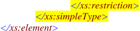
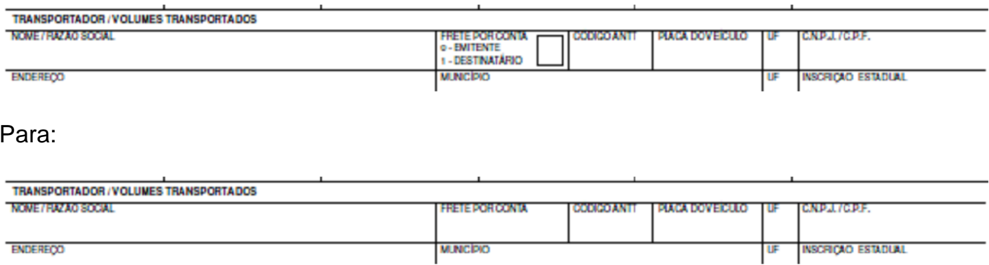

## Projeto Nota Fiscal Eletrônica


## Nota Técnica 2010/004

Substitui a Nota Técnica 2010/003


Junho-2010


## 1.  Resumo

Divulgar conjunto de correções de texto, leiaute e  schemas da versão 4.0.1 do Manual de Integração do Contribuinte.

O pacote de liberação PL\_006f contempla as alteraçõ es de Schema XML desta NT.

As  alterações  deverão  ser  implementadas  até  final  d e  Junho/2010  pelas  SEFAZ autorizadoras.


## 2.  Correção de Schema XML da NF-e

## 2.1 Definição do tipo e tamanho da tag xJust

Inclusão da definição de tipo e tamanho da tag xJust - Justificativa da entrada em contingência, passando de:

```
<xs:element name="xJust"> <xs:annotation> <xs:documentation>Informar a Justificativa da entrada em (v.2.0)</xs:documentation> </xs:annotation> </xs:element> para: <xs:element name="xJust"> <xs:annotation> <xs:documentation>Informar a Justificativa da entrada em (v.2.0)</xs:documentation> </xs:annotation> <xs:simpleType> <xs:restriction base="TString"> <xs:minLength value="15"/> <xs:maxLength value="256"/> </xs:restriction> </xs:simpleType> </xs:element>
```

## 2.2 Correção da expressão regular da tag NCM

A expressão regular para validação da tag NCM foi corrigida para permitir a informação de zeros a partir do 3º dígito quando o 1º dígito for  zero, passando de:

- &lt;xs:element name="NCM"&gt; &lt;xs:annotation&gt; &lt;xs:documentation&gt;Código NCM (8 posições), será permitida a informação do gênero (posição do capítulo do NCM) quando a operação não for de comércio exterior (importação/exportação) ou o produto não seja tributado pelo IPI. Em caso de item de serviço ou item que não tenham prod uto (Ex. transferência de crédito, crédito do ativo imobilizado, etc.), informar o código 00 (zeros) (v2.0)&lt;/xs:documentation&gt; &lt;/xs:annotation&gt; &lt;xs:simpleType&gt; &lt;xs:restriction base="xs:string"&gt; &lt;xs:whiteSpace value="preserve"/&gt; &lt;xs:pattern value=" [0-9]{2}|[0][1-9]{7}|[1-9][0-9]{7} "/&gt; &lt;/xs:restriction&gt; &lt;/xs:simpleType&gt; &lt;/xs:element&gt; para: &lt;xs:element name="NCM"&gt; &lt;xs:annotation&gt; &lt;xs:documentation&gt;Código NCM (8 posições), será permitida a informação do gênero (posição do capítulo do NCM) quando a operação não for de comércio exterior (importação/exportação) ou o produto não seja tributado pelo IPI. Em


caso de item de serviço ou item que não tenham prod uto (Ex. transferência de crédito, crédito do ativo imobilizado, etc.), informar o código 00 (zeros) (v2.0)&lt;/xs:documentation&gt;

```
</xs:annotation> <xs:simpleType> <xs:restriction base="xs:string"> <xs:whiteSpace value="preserve"/> <xs:pattern value=" [0-9]{2}|[0][1-9][0-9]{6}|[1-9][0-9]{7} "/> </xs:restriction> </xs:simpleType> </xs:element>
```

## 2.3 Definição da lista de valores válidos para a tag VIN do grupo veicProd

Inclusão da lista de valores válidos para a tag VIN , passando de:

```
<xs:element name="VIN"> <xs:annotation> <xs:documentation>Informa-se o veículo tem VIN (chassi) remarcado.Rem arcadoNormalVIN </xs:documentation> </xs:annotation> <xs:simpleType> <xs:restriction base="TString"> <xs:length value="1"/> </xs:restriction> </xs:simpleType> </xs:element> para: <xs:element name="VIN"> <xs:annotation> <xs:documentation>Informa-se o veículo tem VIN (chassi) remarcado.Rem arcadoNormalVIN </xs:documentation> </xs:annotation> <xs:simpleType> <xs:restriction base="TString"> <xs:length value="1"/> <xs:enumeration value="R"/> <xs:enumeration value="N"/> </xs:restriction> </xs:simpleType> </xs:element>
```

## 2.4 Definição do tipo e lista de valores válidos para a motDesICMS do grupo ICMS40

Inclusão da definição de tipo e lista de valores válidos para a tag motDesICMS passando de:

```
<xs:element name="motDesICMS"> <xs:annotation> <xs:documentation>Este campo será preenchido quando o campo anterior  estiver preenchido.o motivo da desoneração:
```


## Nota Fiscal Eletrônica

- Táxi; - Deficiente Físico; - Produtor Agropecuário; - Frotista/Locadora; - Diplomático/Consular; - Utilitários e Motocicletas da Amazônia Ocidental  e Áreas de Livre Comércio (Resolução 714/88 e 790/9 4 - CONTRAN e suas alterações); - SUFRAMA; - outros. (v2.0)&lt;/xs:documentation&gt; &lt;/xs:annotation&gt; &lt;/xs:element&gt; para: &lt;xs:element name="motDesICMS"&gt; &lt;xs:annotation&gt; &lt;xs:documentation&gt;Este campo será preenchido quando o campo anterior  estiver preenchido.o motivo da desoneração: - Táxi; - Deficiente Físico; - Produtor Agropecuário; - Frotista/Locadora; - Diplomático/Consular; - Utilitários e Motocicletas da Amazônia Ocidental  e Áreas de Livre Comércio (Resolução 714/88 e 790/9 4 - CONTRAN e suas alterações); - SUFRAMA; - outros. (v2.0)&lt;/xs:documentation&gt; &lt;xs:whiteSpace value="preserve"/&gt;

```
</xs:annotation> <xs:simpleType> <xs:restriction base="xs:string"> <xs:enumeration value="1"/> <xs:enumeration value="2"/> <xs:enumeration value="3"/> <xs:enumeration value="4"/> <xs:enumeration value="5"/> <xs:enumeration value="6"/> <xs:enumeration value="7"/> <xs:enumeration value="9"/> </xs:restriction> </xs:simpleType> </xs:element>
```

## 2.5 Correção do código válido na tag CST do grupo ICMSST

O código válido para a tag CST do grupo ICMSST foi corrigido para 41 conforme previsto no leiaute da NF-e, passando de:

```
<xs:element name="CST"> <xs:annotation> <xs:documentation>Tributção pelo ICMS - Não Tributado (v2.0) </xs:documentation>
```


```
</xs:annotation> <xs:simpleType> <xs:restriction base="xs:string"> <xs:whiteSpace value="preserve"/> <xs:enumeration value="90"/> </xs:restriction> </xs:simpleType> </xs:element> para: <xs:element name="CST"> <xs:annotation> <xs:documentation>Tributção pelo ICMS - Não Tributado (v2.0) </xs:documentation> </xs:annotation> <xs:simpleType> <xs:restriction base="xs:string"> <xs:whiteSpace value="preserve"/> <xs:enumeration value="41"/> </xs:restriction> </xs:simpleType> </xs:element>
```

## 2.6 Correção do nome da tag vTotDed do grupo cana

O nome da tag vTotDed do grupo cana foi corrigido, pois estava divergente do leiaute da NF-e, passando de:

```
<xs:element name="vTodDed" type="TDec_1302"> <xs:annotation> <xs:documentation>Valor Total das Deduções // v2.0 </xs:documentation> </xs:annotation> </xs:element> para: <xs:element name="vTotDed" type="TDec_1302"> <xs:annotation> <xs:documentation>Valor Total das Deduções // v2.0 </xs:documentation> </xs:annotation>
```

```
</xs:element>
```

## 2.7 Eliminação da possibilidade de informar a IE de Pro dutor Rural de MG

A expressão regular para validação da tag IE do grupo dest foi alterada para não permitir a informação de Inscrição de Produtor Rural de MG, pa ssando de:

```
<xs:simpleType name="TIeDest"> <xs:annotation> <xs:documentation>Tipo Inscrição Estadual do Destinatário // aperfeiç oado em 24/10/08 para aceitar vazio, ISENTO ou PR9999 a PR99999999 - alterado em  03/10/2009 </xs:documentation> </xs:annotation> <xs:restriction base="xs:string">
```


```
<xs:whiteSpace value="preserve"/> <xs:pattern value="ISENTO|[0-9]{0,14}|PR[0-9]{4,8}"/> </xs:restriction> </xs:simpleType> para: <xs:simpleType name="TIeDest"> <xs:annotation> <xs:documentation>Tipo Inscrição Estadual do Destinatário // alterado  para aceitar vazio ou ISENTO maio/2010</xs:documentation> </xs:annotation> <xs:restriction base="xs:string"> <xs:whiteSpace value="preserve"/> <xs:pattern value="ISENTO|[0-9]{0,14}"/> </xs:restriction> </xs:simpleType>
```

## 2.8 Correção da expressão regular do tipo TDec\_1504

A expressão regular para validação do conteúdo do Tipo TDec\_1504 foi corrigida para ficar de acordo com o previsto no leiaute da NF-e:

```
<xs:simpleType name="TDec_1504"> <xs:annotation> <xs:documentation>Tipo Decimal com até 19 dígitos, sendo 15 de corpo e até 4 decimais  // aperfeiçoamento v2.0</xs:documentation> </xs:annotation> <xs:restriction base="xs:string"> <xs:whiteSpace value="preserve"/> <xs:pattern value="0|0\.[0-9]{1,4}|[1-9]{1}[0-9]{0,14}|[1-9]{1}[0-9]{0,14}(\.[0-9]{1,4})?"/> </xs:restriction> </xs:simpleType>
```

## 2.9 Exclusão do CFOP de prestação serviços de transport es do tipo TCfop

Os seguintes códigos de CFOP foram excluídos dos va lores válidos para CFOP do item de produto:

|   CFOP | Descrição                                                                                                                                              |
|--------|--------------------------------------------------------------------------------------------------------------------------------------------------------|
|  5.351 | Prestação de serviço de transporte para execuç ão de serviço da mesma natureza                                                                         |
|  5.352 | Prestação de serviço de transporte a estabelec imento industrial                                                                                       |
|  5.353 | Prestação de serviço de transporte a estabelec imento comercial                                                                                        |
|  5.354 | Prestação de serviço de transporte a estabelec imento de prestador de serviço de comunicação                                                           |
|  5.355 | Prestação de serviço de transporte a estabelec imento de geradora ou de distribuidora de energia elétrica                                              |
|  5.356 | Prestação de serviço de transporte a estabelec imento de produtor rural                                                                                |
|  5.357 | Prestação de serviço de transporte a não contr ibuinte                                                                                                 |
|  5.359 | Prestação de serviço de transporte a contribui nte ou a não-contribuinte, quando a mercadoria transportada esteja dispensada de emissão de Nota Fiscal |
|  5.360 | Prestação de serviço de transporte a contribui nte-substituto em relação ao serviço de transporte                                                      |


|   CFOP | Descrição                                                                                                                                              |
|--------|--------------------------------------------------------------------------------------------------------------------------------------------------------|
|  6.351 | Prestação de serviço de transporte para execuç ão de serviço da mesma natureza                                                                         |
|  6.352 | Prestação de serviço de transporte a estabelec imento industrial                                                                                       |
|  6.353 | Prestação de serviço de transporte a estabelec imento comercial                                                                                        |
|  6.354 | Prestação de serviço de transporte a estabelec imento de prestador de serviço de comunicação                                                           |
|  6.355 | Prestação de serviço de transporte a estabelec imento de geradora ou de distribuidora de energia elétrica                                              |
|  6.356 | Prestação de serviço de transporte a estabelec imento de produtor rural                                                                                |
|  6.357 | Prestação de serviço de transporte a não contr ibuinte                                                                                                 |
|  6.359 | Prestação de serviço de transporte a contribui nte ou a não-contribuinte, quando a mercadoria transportada esteja dispensada de emissão de Nota Fiscal |
|  7.358 | Prestação de serviço de transporte                                                                                                                     |

## 2.10  Criação do tipo TCfopTransp para ser utilizado na t ag CFOP do grupo retTransp

Criado o tipo TCfopTransp para uso na tag CFOP do grupo retTransp - Retenção do ICMS do transporte com os seguintes valores válidos:

|   CFOP | Descrição                                                                                                                                              |
|--------|--------------------------------------------------------------------------------------------------------------------------------------------------------|
|  5.351 | Prestação de serviço de transporte para execuç ão de serviço da mesma natureza                                                                         |
|  5.352 | Prestação de serviço de transporte a estabelec imento industrial                                                                                       |
|  5.353 | Prestação de serviço de transporte a estabelec imento comercial                                                                                        |
|  5.354 | Prestação de serviço de transporte a estabelec imento de prestador de serviço de comunicação                                                           |
|  5.355 | Prestação de serviço de transporte a estabelec imento de geradora ou de distribuidora de energia elétrica                                              |
|  5.356 | Prestação de serviço de transporte a estabelec imento de produtor rural                                                                                |
|  5.357 | Prestação de serviço de transporte a não contr ibuinte                                                                                                 |
|  5.359 | Prestação de serviço de transporte a contribui nte ou a não-contribuinte, quando a mercadoria transportada esteja dispensada de emissão de Nota Fiscal |
|  5.360 | Prestação de serviço de transporte a contribui nte-substituto em relação ao serviço de transporte                                                      |
|  6.351 | Prestação de serviço de transporte para execuç ão de serviço da mesma natureza                                                                         |
|  6.352 | Prestação de serviço de transporte a estabelec imento industrial                                                                                       |
|  6.353 | Prestação de serviço de transporte a estabelec imento comercial                                                                                        |
|  6.354 | Prestação de serviço de transporte a estabelec imento de prestador de serviço de comunicação                                                           |
|  6.355 | Prestação de serviço de transporte a estabelec imento de geradora ou de distribuidora de energia elétrica                                              |
|  6.356 | Prestação de serviço de transporte a estabelec imento de produtor rural                                                                                |
|  6.357 | Prestação de serviço de transporte a não contr ibuinte                                                                                                 |
|  6.359 | Prestação de serviço de transporte a contribui nte ou a não-contribuinte, quando a mercadoria transportada esteja dispensada de emissão de Nota Fiscal |
|  6.360 | Prestação de serviço de transporte a contribu inte substituto em relação ao serviço de transporte                                                      |
|  7.358 | Prestação de serviço de transporte                                                                                                                     |

## 3.  Regras de validação da NF-e

## 3.1 Acréscimo da seguinte regra de validação:

| GB22.2   | B22   | Na autorização pela SEFAZ Autorizadora: não aceitar o conteúdo = 3 (SCAN) para tpEmis   | Obrig.   |   570 | Rej.   |
|----------|-------|-----------------------------------------------------------------------------------------|----------|-------|--------|
| GB22.3   | B22   | Na autorização pelo SCAN: não aceitar o conteúdo diferente de 3                         | Obrig.   |   571 | Rej.   |


|       |     | (SCAN) para tpEmis                                                                     |         |     |      |
|-------|-----|----------------------------------------------------------------------------------------|---------|-----|------|
| GB28a | B28 | Data de entrada em contingência não deve ser anteri or à data de emissão menos 30 dias | Facult. | 569 | Rej. |

## 3.2 Alteração das seguintes regras de validação:

| GB28   | B28   | Data de entrada em contingência não deve ser maiorque a data de recepção da NF-e                                                  | Facult.   |   558 | Rej.   |
|--------|-------|-----------------------------------------------------------------------------------------------------------------------------------|-----------|-------|--------|
| GI08.3 | I08   | CFOP de Operação no Estado (inicia com 5) e UF emitente diferente UF destinatário e destinatário contribuin te do ICMS (tem IE)   | Facult.   |   521 | Rej.   |
| GI08.4 | I08   | CFOP de Operação no Estado (inicia com 1) e UF emitente diferente UF remetente                                                    | Facult.   |   522 | Rej.   |
| GI08.5 | I08   | CFOP é de operação interestadual ( inicia por 2 ou6) e UF emitente = UF destinatário e CNPJ emissor diferente do CNPJdestinatário | Facult.   |   523 | Rej.   |

## 3.3 Mensagens de Rejeição alteradas ou acrescentadas:

|   521 | Rejeição: CFOP de Operação Estadual e UF do emitent e difere da UF do destinatário para destinatário contribuinte do ICMS.   |
|-------|------------------------------------------------------------------------------------------------------------------------------|
|   522 | Rejeição: CFOP de Operação Estadual e UF emitente d ifere da UF destinatário.                                                |
|   558 | Rejeição: Data de entrada em contingência posteriora data de recebimento.                                                    |
|   569 | Rejeição: Data de entrada em contingência muito atr asada                                                                    |
|   570 | Rejeição: tpEmis = 3 só é válido na contingência SC AN                                                                       |
|   571 | Rejeição: O tpEmis informado diferente de 3 para contingência SCAN                                                           |

## 4.  Alteração dos Schemas dos Web Services

## 4.1 Schema XML do pedido de CANCELAMENTO

Aperfeiçoamento da validação do conteúdo do xServ , passando de:

```
<xs:element name="xServ" type="TServ" fixed="CANCELAR"> <xs:annotation> <xs:documentation>Serviço Solicitado</xs:documentation> </xs:annotation> </xs:element> para: <xs:documentation>Serviço Solicitado</xs:documentation>
```

```
<xs:element name="xServ"> <xs:annotation> </xs:annotation> <xs:simpleType> <xs:restriction base="TServ"> <xs:enumeration value="CANCELAR"/>
```




## 4.2 Schema XML do pedido de INUTILIZAÇÃO

Aperfeiçoamento da validação do conteúdo do xServ , passando de:

```
<xs:element name="xServ" type="TServ" fixed="INUTILIZAR"> <xs:annotation> <xs:documentation>Serviço Solicitado</xs:documentation> </xs:annotation> </xs:element> para: <xs:element name="xServ"> <xs:annotation> <xs:documentation>Serviço Solicitado</xs:documentation> </xs:annotation> <xs:simpleType> <xs:restriction base="TServ"> <xs:enumeration value=" INUTILIZAR"/> </xs:restriction> </xs:simpleType>
```

```
</xs:element>
```

## 4.3 Schema XML do pedido de CONSULTA PROTOCOLO

Aperfeiçoamento da validação do conteúdo do xServ , passando de:

```
<xs:element name="xServ" type="TServ" fixed="CONSULTAR"> <xs:annotation> <xs:documentation>Serviço Solicitado</xs:documentation> </xs:annotation> </xs:element> para: <xs:element name="xServ"> <xs:annotation> <xs:documentation>Serviço Solicitado</xs:documentation> </xs:annotation> <xs:simpleType> <xs:restriction base="TServ"> <xs:enumeration value=" CONSULTAR"/> </xs:restriction> </xs:simpleType> </xs:element>
```


## 4.4 Schema XML do pedido de CONSULTA STATUS SERVIÇO

Aperfeiçoamento da validação do conteúdo do xServ , passando de:

```
<xs:element name="xServ" type="TServ" fixed="STATUS"> <xs:annotation> <xs:documentation>Serviço Solicitado</xs:documentation> </xs:annotation> </xs:element> para: <xs:element name="xServ"> <xs:annotation> <xs:documentation>Serviço Solicitado</xs:documentation> </xs:annotation> <xs:simpleType> <xs:restriction base="TServ"> <xs:enumeration value=" STATUS"/> </xs:restriction> </xs:simpleType>
```

```
</xs:element>
```

## 4.5 Schema XML do pedido de CONSULTA CADASTRO

Aperfeiçoamento da validação do conteúdo do xServ , passando de:

```
<xs:element name="xServ" type="TServ" fixed="CONS-CAD"> <xs:annotation> <xs:documentation>Serviço Solicitado</xs:documentation> </xs:annotation> </xs:element> para: <xs:element name="xServ"> <xs:annotation> <xs:documentation>Serviço Solicitado</xs:documentation> </xs:annotation> <xs:simpleType> <xs:restriction base="TServ"> <xs:enumeration value=" CONS-CAD"/> </xs:restriction> </xs:simpleType> </xs:element>
```

## 5.  Regras de validação do Pedido de Cancelamento

## 5.1 Acréscimo das seguintes regras de validação:


NT 2010/004

| H02a   | Campo serie - na autorização pela SEFAZ Autorizadora: não aceitar série diferente de 0-899   | Obrig.   |   266 | Rej   |
|--------|----------------------------------------------------------------------------------------------|----------|-------|-------|
| H02b   | Campo serie - na autorização pelo SCAN: não aceitar série diferente de 900- 999              | Obrig.   |   503 | Rej   |

## 6.  DANFE - Quadro do Transportador, adequação da apresentação da Modalidade do Frete

Os valores pré-impressos do campo Modalidade do Fre te do DANFE devem ser eliminados para que seja impresso o código e a descrição da Mo dalidade do Frete.

## Passando de:



Código e descrição que deverão ser impressos no cam po:

0 - Emitente;

1 - Dest/Rem;

2 - Terceiros;

9 - Sem Frete;

Para as empresas que possuem DANFE pré-impresso ind icar a mesma informação existente no XML, independente do conteúdo pré-impresso do DA NFE.

## 7. Correções de texto do Manual de Integração do Contr ibuinte

Página 29 - corrigir a identificação da tag dhRecbto passand o de:

| AR09 dhRecbto   | E   | AR01   | D   | 1-1   | -   | Data e Hora do Recebimento Formato = AAAA-MM-DDTHH:MM:SS Preenchido com data e hora do recebimento do lote.   |
|-----------------|-----|--------|-----|-------|-----|---------------------------------------------------------------------------------------------------------------|

## Para:

| AR06b dhRecbto   | E   | AR01   | D   | 1-1   | -   | Data e Hora do Recebimento Formato = AAAA-MM-DDTHH:MM:SS Preenchido com data e hora do recebimento do lote.   |
|------------------|-----|--------|-----|-------|-----|---------------------------------------------------------------------------------------------------------------|

## Nota Fiscal Eletrônica


Página 94/95 - eliminar o último parágrafo do item 7.6.1 Tamanho do Papel , que tem a seguinte redação:

'Regime especial poderá regrar a impressão de DANFE  em outros tamanhos.'

## Página 111 - corrigir a identificação e numeração da tag mod e nNF que estão em duplicidade, passando de:

| 24f   | B20f   | IE    | IE do emitente             | E   | B20a   | C   | 1-1   | 1-14   |
|-------|--------|-------|----------------------------|-----|--------|-----|-------|--------|
| 24g   | B20f   | mod   | Modelo do Documento Fiscal | E   | B20a   | N   | 1-1   | 2      |
| 24h   | B20g   | serie | Série do Documento Fiscal  | E   | B20a   | N   | 1-1   | 1 -3   |
| 24h   | B20h   | nNF   | Número do Documento Fiscal | E   | B20a   | N   | 1-1   | 1- 9   |

## Para:

| 24f   | B20f   | IE    | IE do emitente             | E   | B20a   | C   | 1-1   | 1-14   |
|-------|--------|-------|----------------------------|-----|--------|-----|-------|--------|
| 24g   | B20g   | mod   | Modelo do Documento Fiscal | E   | B20a   | N   | 1-1   | 2      |
| 24h   | B20h   | serie | Série do Documento Fiscal  | E   | B20a   | N   | 1-1   | 1 -3   |
| 24ha  | B20ha  | nNF   | Número do Documento Fiscal | E   | B20a   | N   | 1-1   | 1 -9   |

## Página 113 - inclusão do tamanho mínimo da tag xJust ,  passando de:

| 29d   | B29   | xJust   | Justificativa da entrada em contingência   | E   | B01   | C   | 0-1   | 256   |
|-------|-------|---------|--------------------------------------------|-----|-------|-----|-------|-------|

## Para:

| 29d   | B29   | xJust   | Justificativa da entrada em contingência   | E   | B01   | C   | 0-1   | 15- 256   |
|-------|-------|---------|--------------------------------------------|-----|-------|-----|-------|-----------|

## Página 122 - Acréscimo da DREI na lista de documentos de impo rtação, passando de:

|   118 | I19   | nDI   | Número do Documento de Importação DI/DSI/DA   | E   | I18   | C   | 1-1   | 1-10   |
|-------|-------|-------|-----------------------------------------------|-----|-------|-----|-------|--------|
|   119 | I20   | dDI   | Data de Registro da DI/DSI/DA                 | E   | I18   | D   | 1-1   |        |

## Para:

|   118 | I19   | nDI   | Número do Documento de Importação DI/DSI/DA/DREI/etc.   | E   | I18   | C   | 1-1   | 1-10   |
|-------|-------|-------|---------------------------------------------------------|-----|-------|-----|-------|--------|
|   119 | I20   | dDI   | Data de Registro da DI/DSI/DA/DREI/etc.                 | E   | I18   | D   | 1-1   |        |


## Página 132 - corrigir a referência do pai dos campos vICMS e motDesICMS , passando de:

|   204.01 | N17   | vICMS      | Valor do ICMS                 | E   | N07   | N   | 0-1   |   15 |
|----------|-------|------------|-------------------------------|-----|-------|-----|-------|------|
|   204.02 | N28   | motDesICMS | Motivo da desoneração do ICMS | E   | N07   | N   | 0-1   |    1 |

## Para:

|   204.01 | N17   | vICMS      | Valor do ICMS                 | E   | N06   | N   | 0-1   |   15 |
|----------|-------|------------|-------------------------------|-----|-------|-----|-------|------|
|   204.02 | N28   | motDesICMS | Motivo da desoneração do ICMS | E   | N06   | N   | 0-1   |    1 |

## Página 156 - corrigir o texto da coluna descrição da tag nProc , passando de:

| 401 h   | Z11   | nProc   | Indentificador do processo ou ato concessório   | E   | Z10   | C   | 1-1   | 1-60   |
|---------|-------|---------|-------------------------------------------------|-----|-------|-----|-------|--------|

## Para:

| 401 h   | Z11   | nProc   | Identificador do processo ou ato concessório   | E   | Z10   | C   | 1-1   | 1-60   |
|---------|-------|---------|------------------------------------------------|-----|-------|-----|-------|--------|

## Página 182 - alteração da redação do item 'b) FS- Contingência com uso do Formulário de Segurança' :

## Passando de:

- ' b) FS - Contingência com uso do Formulário de Segur ança - é a alternativa mais simples para a situação em que exista algum impedimento par a obtenção da autorização de uso da NF-e, como por exemplo, um problema no acesso à internet ou a indisponibilidade da SEFAZ de origem do emissor. Neste caso, o emissor pode optar pela emissão da NF-e em contingência com a impressão do DANFE em Formulário de Segurança . O envio das NF-e emitidas nesta situação para SEFAZ de origem será realizado quando  cessarem os problemas técnicos que impediam  a  sua  transmissão.  Somente  as  empresas  que   possuam  estoque  de  Formulário  de Segurança poderão utilizar este impresso fiscal par a a emissão do DANFE, pois o Convênio ICMS 110/08 criou o impresso fiscal denominado Formulário de Segurança para impressão de Documento  Auxiliar  do  Documento  Fiscal  eletrônico  -  FS-DA,  não  sendo  mais  possível  a aquisição  do  Formulário  de  Segurança  -  FS  para  impr essão  do  DANFE,  a  partir  de  1º  de agosto de 2009;'

## Para:

- ' b) FS - Contingência com uso do Formulário de Segur ança - é a alternativa mais simples para a situação em que exista algum impedimento par a obtenção da autorização de uso da NF-e, como por exemplo, um problema no acesso à internet ou a indisponibilidade da SEFAZ de origem do emissor. Neste caso, o emissor pode optar pela emissão da NF-e em contingência


com a impressão do DANFE em Formulário de Segurança . O envio das NF-e emitidas nesta situação para SEFAZ de origem será realizado quando  cessarem os problemas técnicos que impediam a sua transmissão;'

## Página 184 - eliminar a Nota que tem a redação:

'Nota: Esta alternativa de contingência poderá ser utiliza da até o término do estoque de Formulários de Segurança - FS autorizados, mediante PAFS, até 3 1/07/09, desde que o Formulário de Segurança FS tenha tamanho A4 e seja lavrado termo no livro RUDFTO, conforme dispõe a cláusula décima segunda do Convênio ICMS 110/08, a seguir transcrit o:

'Cláusula décima segunda Os formulários de segurança, obtidos em conformida de com o Convênio ICMS 58/95 e Ajuste SINIEF 07/05, em estoque, poderão se r utilizados pelo contribuinte credenciado como emissor de documento fiscal eletrônico, para fins de impressão  dos documentos auxiliares dos documentos eletrônicos relacionados no § 1º da cláusula primeira, desde que:

- I - o formulário de segurança tenha tamanho A4 para todas as vias;

II - seja lavrado, previamente, termo no livro Registro de Uso de Documentos Fiscais e Termos de Ocorrência - RUDFTO, modelo 6, contendo as informaç ões de numeração e série dos formulários e, quando  se tratar de formulários de segurança obtidos por regime especia l, na condição de impressão autônomo, a data da opç ão pela nova finalidade.

Parágrafo único. Os formulários de segurança adquir idos na condição de impressor autônomo e que tenham sido destinados para impressão de documentos auxili ares de documentos fiscais eletrônicos, nos termos do item II acima, somente poderão ser utilizados para impressão de do cumentos auxiliares de documentos fiscais eletrônicos.'

## Página 187/188 - alteração de redação:

## de:

' A identificação de que o SCAN foi ativado pela SEFAZ será através do serviço Consulta ao Status do SCAN que poderá retornar os seguintes códigos de si tuação:

- 107 - Serviço em Operação;
- 114 - SCAN desabilitado pela SEFAZ Origem;
- 113 - SCAN será desabilitado para a UF às hh:mm;

A empresa pode acionar o SCAN somente quando obtiver o 'status 107 - Serviço em Operação' , devendo adotar os seguintes procedimentos:

- Identificação de que o SCAN foi acionado pela SEFAZ;
- alteração da série da NF-e para a faixa de uso excl usivo do SCAN (900 a 999), a alteração da série implica na adoção da numeração em uso da séri e escolhida o que implica na alteração do número da NF-e também;
- geração de novo arquivo XML da NF-e com o campo tpEmis alterado para '3';
- transmissão da NF-e para o SCAN e obtenção da autor ização de uso;
- lavratura  de  termo  circunstanciado  no  livro  Registro  de  Documentos  Fiscais  e  Termos  de Ocorrência - RUDFTO, modelo 6, para registro da con tingência, informando: I - o motivo da entrada em contingência;
- impressão do DANFE em papel comum;


II - a data, hora com minutos e segundos do seu iní cio e seu término;

III - a numeração e série da primeira e da última N F-e geradas neste período;

- IV - identificar a modalidade de contingência utili zada.

tratamento dos arquivos de NF-e transmitidos antes da ocorrência dos problemas técnicos e que estão pendentes de retorno, cancelando aquelas NF-e autorizadas e que foram substituídas pela seriação do SCAN ou inutilizando a numeração de arquivos não re cebidos ou processados. '

Para:

'Se o SCAN estiver desabilitado para a UF, qualquer mensagem enviada pela empresa será rejeitada com o erro "114-SCAN desabilitado pela SEFAZ Origem'.

A identificação de que o SCAN foi ativado pela SEFAZ será através do serviço Consulta ao Status do SCAN que poderá retornar os seguintes códigos de si tuação:

- 107 - Serviço em Operação;
- 114 - SCAN desabilitado pela SEFAZ Origem;
- 113 - SCAN será desabilitado para a UF às hh:mm;

A empresa pode acionar o SCAN somente quando obtiver o 'status 107 - Serviço em Operação' , devendo adotar os seguintes procedimentos:

- Identificação de que o SCAN foi acionado pela SEFAZ;
- alteração da série da NF-e para a faixa de uso excl usivo do SCAN (900 a 999), a alteração da série implica na adoção da numeração em uso da séri e escolhida o que implica na alteração do número da NF-e também;
- alterar o valor de tpEmis para '3' ;
- geração de novo arquivo XML da NF-e informando a data e hora de início da contingência e o motivo da adoção da contingência, que devem ser imp ressas no DANFE;
- transmissão da NF-e para o SCAN e obtenção da autor ização de uso;
- tratamento dos arquivos de NF-e transmitidos antes da ocorrência dos problemas técnicos e que estão pendentes de retorno, cancelando aquelas NF-e  autorizadas e que foram substituídas pela seriação do SCAN ou inutilizando a numeração de arq uivos não recebidos ou processados .'
- impressão do DANFE em papel comum;

## Página 201 - alteração de redação, passando de:

'A troca de mensagens entre os Web Services do Ambiente Nacional e o aplicativo da administração tributária interessada será realizada no padrão SOA P versão 1.2, com troca de mensagens XML no padrão Style/Enconding: Document/Literal.'

Para:

'A troca de mensagens entre os Web Services do Ambiente Nacional e o aplicativo da empresa será realizada no padrão SOAP versão 1.2, com troca de m ensagens XML no padrão Style/Enconding: Document/Literal.'

## Página 209 - correção do nome da tag tpEmis , passando de:


## Nota Fiscal Eletrônica

| AP11 resNFe   | G AP03   | 1-50   | Resumo das NF-e emitidas no Sistema de Contingência Eletrônica (até 50 NF-e com tpEmiss = "4")   |
|---------------|----------|--------|--------------------------------------------------------------------------------------------------|

## Para:

| AP11 resNFe   | G AP03   | 1-50   | Resumo das NF-e emitidas no Sistema de Contingência Eletrônica (até 50 NF-e com tpEmis = "4")   |
|---------------|----------|--------|-------------------------------------------------------------------------------------------------|

No Anexo I - Leiaute da NF-e, linhas 6, onde se lê:

'(Anexo IV - Tabela de UF, Município e País).'

## Leia-se:

'(Anexo IX - Tabela de UF, Município e País).'

No Anexo I - Leiaute da NF-e, linhas 16, 19, 20b, 39, 71, 86, 95, 323, 372, onde se lê:

'(Anexo VII - Tabela de UF, Município e País).'

## Leia-se:

'(Anexo IX - Tabela de UF, Município e País).'
## Metadados
- [Metadados do corpus](metadata.json)
- [Fonte e procedência](../../../../sources/portal_nacional_nfe/nfe/notas-tecnicas/nt2010-004/source.json)
- [Dados normalizados](../../../../normalized/nfe/notas-tecnicas/nt2010-004/normalized.json)
- [Changelog](../../../../changelog/nfe/notas-tecnicas/nt2010-004.md)
- [Proveniência resumida](../../../../sources/provenance/nt2010-004.json)


## Documentos relacionados

- [nota-t-cnica-2010-002-publicada-em-29-11-2010](../nota-t-cnica-2010-002-publicada-em-29-11-2010/document.md)
- [nota-t-cnica-2010-005-publicada-em-06-07-2010](../nota-t-cnica-2010-005-publicada-em-06-07-2010/document.md)
- [nota-t-cnica-2010-009-publicada-em-10-12-2010](../nota-t-cnica-2010-009-publicada-em-10-12-2010/document.md)
