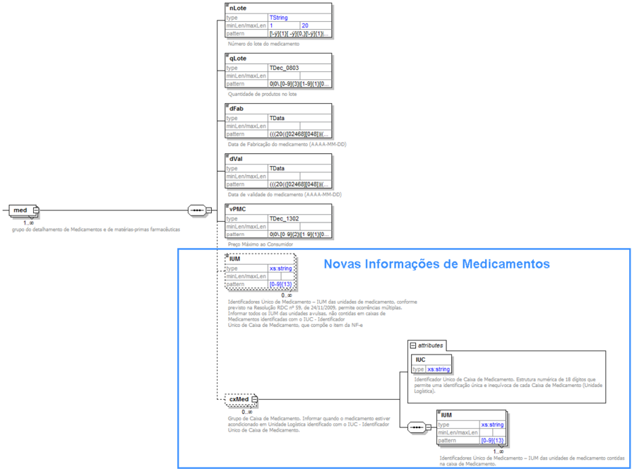

## Projeto Nota Fiscal Eletrônica Projeto Nota Fiscal Eletrônica Projeto Nota Fiscal Eletrônica

## Nota Técnica 20 Nota Técnica 20 10/006

Divulga PL\_006h com leiaute da alterado para permiti Único de  Medicamento PL\_006h com leiaute da NF-e - versão 2.00 permitir a informação do Identificador Único de  Medicamento  - IUM exigida pela ANVISA versão 2.00 r a informação do Identificador IUM exigida pela ANVISA

Setembro-2010

## 1.  Resumo

Divulgar o pacote de liberação PL\_006h com o novo l eiaute da versão 2.00 da NF-e que permite  a  informação  do  Identificador  Único  de  Medi camento  -  IUM  previsto  na Resolução RDC nº 59, de 24 de novembro de 2009, da  Agência Nacional de Vigilância Sanitária - ANVISA.

A versão do leiaute da NF-e não será atualizada, pois a alteração afeta somente o grupo de informações específicas de medicamentos.

## 2.  Acréscimo do Identificador Único de Medicamento - IUM no grupo de detalhamento específico de medicamentos do  item de produto

O Identificador Único de Medicamento - IUM é um código numérico serial de 13 dígitos existente  na  etiqueta  auto-adesiva  de  segurança  do  Sistema  Nacional  de  Controle  de Medicamentos aplicada na unidade de medicamento pelo seu fabricante.

O  IUM  deverá  ser  informado  na  tag IUM do  grupo  de  detalhamento  específico  de medicamentos med da nota fiscal eletrônica quando o item do produto for medicamento que  tenha  a  etiqueta  auto-adesiva  de  segurança  do  Sistema  Nacional  de  Controle  de Medicamentos, disciplinada pela Resolução RDC nº 59 , de 24 de novembro de 2009, da Agência Nacional de Vigilância Sanitária - ANVISA.

Quando  o  medicamento  estiver  acondicionado  em  caixa  de  Medicamento  identificado com o IUC - Identificador Único de Caixa de Medicam ento, os IUM contidos em cada caixa  de  medicamento  serão  informados  no  grupo cxMed identificado  com  o  atributo IUC .

O grupo do detalhamento específico de medicamentos  passa a ter a seguinte estrutura:

| K - #   | Detalhamento ID   | Específico Campo   | deMedicamento e Descrição                                                         | de Ele   | matérias Pai   | -primas Tipo   | Ocor- rência   | farmacêuticas tamanho   |   Dec | Observação                                                                                                                                                                                                                                                                                                                                          |
|---------|-------------------|--------------------|-----------------------------------------------------------------------------------|----------|----------------|----------------|----------------|-------------------------|-------|-----------------------------------------------------------------------------------------------------------------------------------------------------------------------------------------------------------------------------------------------------------------------------------------------------------------------------------------------------|
| 152     | K01               | med                | Grupo do detalhamento de Medicamentos e de matérias-primas farmacêuticas          | CG       | I01            |                | 0-N            |                         |       | Informar apenas quando se tratar de medicamentos ou de matérias-primas farmacêuticas, permite múltiplas ocorrências (ilimitado)                                                                                                                                                                                                                     |
| 153     | K02               | nLote              | Número do Lote de medicamentos ou de matérias-primas farmacêuticas                | E        | K01            | C              | 1-1            | 1-20                    |       |                                                                                                                                                                                                                                                                                                                                                     |
| 154     | K03               | qLote              | Quantidade de produto no Lote de medicamentos ou de matérias-primas farmacêuticas | E        | K01            | N              | 1-1            | 11                      |     3 |                                                                                                                                                                                                                                                                                                                                                     |
| 155     | K04               | dFab               | Data de fabricação                                                                | E        | K01            | D              | 1-1            |                         |       | Formato 'AAAA-MM-DD'                                                                                                                                                                                                                                                                                                                                |
| 156     | K05               | dVal               | Data de validade                                                                  | E        | K01            | D              | 1-1            |                         |       | Formato 'AAAA-MM-DD'                                                                                                                                                                                                                                                                                                                                |
| 157     | K06               | vPMC               | Preço máximo                                                                      | E        | K01            | N              | 1-1            | 15                      |     2 |                                                                                                                                                                                                                                                                                                                                                     |
| 157a    | K07               | IUM                | Identificador Único de Medicamento                                                | E        | K01            | N              | 0-N            | 13                      |       | Identificadores Único de Medicamento - IUM das unidades de medicamento, conforme previsto na Resolução RDC nº 59, de 24/11/2009, permite ocorrências múltiplas. Informar todos os IUM das unidades avulsas, não contidas em caixas de Medicamentos identificadas com o IUC - Identificador Único de Caixa de Medicamento, que compõe o item da NF-e |
| 157b    | K08               | cxMed              | Grupo de Caixa de Medicamento                                                     | G        | K01            |                | 0-N            |                         |       | Grupo de Caixa de Medicamento. Informar quando o medicamento estiver acondicionado em Unidade Logística identificado com o IUC - Identificador Único de Caixa de Medicamento.                                                                                                                                                                       |
| 157c    | K09               | IUC                | Identificador Único de Caixa de Medicamento                                       | A        | K08            | N              | 1-1            | 18                      |       | Identificador Único de Caixa de Medicamento. Estrutura numérica de 18 dígitos que permite uma identificação única e inequívoca de cada Caixa de Medicamento (Unidade Logística).                                                                                                                                                                    |
| 157d    | K10               | IUM                | Identificador Único de Medicamento                                                | E        | K08            | N              | 1-N            | 13                      |       | Identificadores Único de Medicamento - IUM das unidades de medicamento contidas na caixa de Medicamento.                                                                                                                                                                                                                                            |