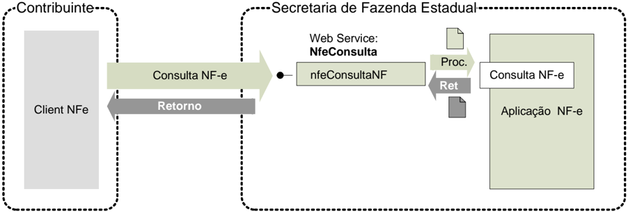
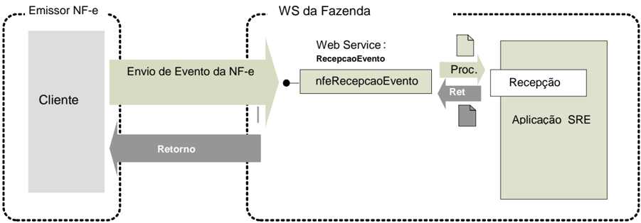
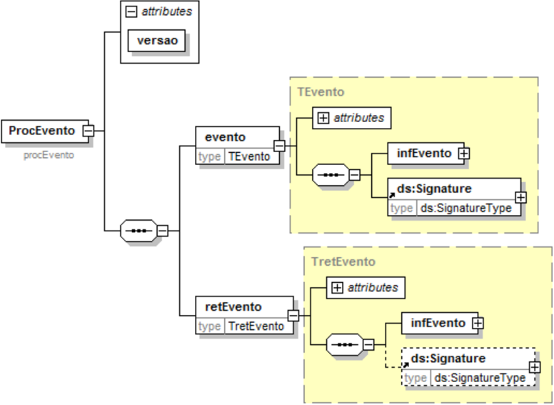

## Metadados
- [Metadados do corpus](metadata.json)
- [Fonte e procedência](../../../../sources/portal_nacional_nfe/nfe/notas-tecnicas/nt2010-008/source.json)
- [Dados normalizados](../../../../normalized/nfe/notas-tecnicas/nt2010-008/normalized.json)
- [Changelog](../../../../changelog/nfe/notas-tecnicas/nt2010-008.md)
- [Proveniência resumida](../../../../sources/provenance/nt2010-008.json)

## Projeto Nota Fiscal Eletrônica Projeto Nota Fiscal Eletrônica Projeto Nota Fiscal Eletrônica

## Nota Técnica 2010/00 Nota Técnica 2010/00 8

Registro de da Nota Fiscal Eletrônica Registro de Eventos da Nota Fiscal Eletrônica Carta de Correção

Versão 1.00 Setembro 2010

## Controle de Versões

Versão

Data

0.00

17/06/2010 - SP

1.00

20/08/2010 - RS/SC/SP

Este  documento  tem  por  objetivo  a  definição  das  esp ecificações  técnicas  necessárias  para  a implementação da Carta de Correção eletrônica - CC- e e adequação da Consulta Situação da NF-e para permitir a consulta dos eventos da NF-e 2G.

O documento será tratado como um documento independ ente durante a fase de desenvolvimento do Web Service para facilitar a sua manutenção e aperf eiçoamento.

Após a disponibilização do Web Service de Registro  do Evento Carta de Correção em ambiente de produção,  o  documento  passará  a  fazer  parte  do  Manu al  de  Integração  do  Contribuinte  -  versão 4.01.

## 4.5 Service - NfeConsulta2 Protocolo

Consulta situação atual da NF-e

Função : serviço destinado ao atendimento de solicitações  de consulta da situação atual da NF-e na Base de Dados do Portal da Secretaria de Fazenda Estadual.

Processo

: síncrono.

Método: nfeConsultaNF2

## 4.5.1 Leiaute Mensagem de Entrada

Entrada:

Estrutura XML contendo a chave de acesso da NF-e.

Schema XML: consSitNFe\_v2.01.xsd

| #    | Campo     | Ele   | Pai   | Tipo   | Ocor.   | Tam.   |   Dec. | Descrição/Observação                                      |
|------|-----------|-------|-------|--------|---------|--------|--------|-----------------------------------------------------------|
| EP01 | conSitNFe | Raiz  | -     | -      | -       | -      |        | TAG raiz                                                  |
| EP02 | versao    | A     | EP01  | N      | 1-1     | 1-4    |      2 | Versão do leiaute                                         |
| EP03 | tpAmb     | E     | EP01  | N      | 1-1     | 1      |        | Identificação do Ambiente: 1 - Produção / 2 - Homologação |
| EP04 | xServ     | E     | EP01  | C      | 1-1     | 9      |        | Serviço solicitado 'CONSULTAR'                            |
| EP05 | chNFe     | E     | EP01  | N      | 1-1     | 44     |        | Chave de Acesso da NF-e.                                  |

## 4.5.2 Leiaute Mensagem de Retorno

Retorno: Estrutura XML contendo a mensagem do resultado da consulta de protocolo:

Schema XML: retConsSitNFe\_v2.01.xsd

| #    | Campo         | Ele   | Pai   | Tipo   | Ocor.   | Tam.   |   Dec. | Descrição/Observação                                                                                                                |
|------|---------------|-------|-------|--------|---------|--------|--------|-------------------------------------------------------------------------------------------------------------------------------------|
| ER01 | retConsSitNFe | Raiz  | -     | -      | -       | -      |        | TAG raiz da Resposta                                                                                                                |
| ER02 | versao        | A     | ER01  | N      | 1-1     | 1-4    |      2 | Versão do leiaute                                                                                                                   |
| ER03 | tpAmb         | E     | ER01  | N      | 1-1     | 1      |        | Identificação do Ambiente: 1 - Produção / 2 - Homologação                                                                           |
| ER04 | verAplic      | E     | ER01  | C      | 1-1     | 1-20   |        | Versão do Aplicativo que processou a consulta. A versão deve ser iniciada com a sigla da UF nos casos de WSpróprio ou a sigla SCAN, |

|             |               |    |      |     |     | SVAN ou SVRS nos demais casos.                                                                                                                                  |
|-------------|---------------|----|------|-----|-----|-----------------------------------------------------------------------------------------------------------------------------------------------------------------|
| ER05        | cStat         | E  | ER01 | N   | 1-1 | Código do status da resposta.                                                                                                                                   |
| ER06        | xMotivo       | E  | ER01 | C   | 1-1 | Descrição literal do status da resposta.                                                                                                                        |
| ER07        | cUF           | E  | ER01 | N   | 1-1 | Código da UF que atendeu a solicitação.                                                                                                                         |
| EP07a chNFe | EP07a chNFe   | E  | ER01 | N   | 1-1 | Chave de Acesso da NF-e consultada.                                                                                                                             |
| ER08        | protNFe       | G  | ER01 | xml | 0-1 | Protocolo de autorização ou denegação de uso da NF-e (vide item 4.2.2). Informar se localizado uma NF-e com cStat = 100 (uso autorizado) ou 110 (uso denegado). |
| ER09        | retCancNFe    | G  | ER01 | xml | 0-1 | Protocolo de homologação de cancelamento de NF-e (vide item 4.3.2). Informar se localizado uma NF-e com cStat = 101 (cancelado).                                |
| ER10        | procEventoNFe | G  | ER01 | xml | 0-N | Informação do evento e respectivo Protoco lo de registro de Evento                                                                                              |

## 4.5.3 Descrição do Processo de Web Service

Este método será responsável por receber as solicit ações referentes à consulta de situação de notas fiscais  eletrônicas  enviadas  para  as  Secretarias  de  Fazendas  Estaduais.  Seu  acesso  é  permitido apenas pela chave única de identificação da nota fi scal.

O  aplicativo  do  contribuinte  envia  a  solicitação  pa ra  o Web  Service da  Secretaria  de  Fazenda Estadual.  Ao  receber  a  solicitação  a  aplicação  do  P ortal  da  Secretaria  de  Fazenda  Estadual processará a solicitação de consulta, validando a C have de Acesso da NF-e, e retornará mensagem contendo a situação atual da NF-e na Base de Dados  e todos os protocolos dos eventos existentes para a NF-e consultada.

Deverão ser realizadas as validações e procedimento s que seguem.

## 4.5.4 Validação do Certificado de Transmissão

| Validação do Certificado Digital do Transmissor (pr otocolo SSL)   | Validação do Certificado Digital do Transmissor (pr otocolo SSL)                                                                                                                                                                          | Validação do Certificado Digital do Transmissor (pr otocolo SSL)   | Validação do Certificado Digital do Transmissor (pr otocolo SSL)   | Validação do Certificado Digital do Transmissor (pr otocolo SSL)   |
|--------------------------------------------------------------------|-------------------------------------------------------------------------------------------------------------------------------------------------------------------------------------------------------------------------------------------|--------------------------------------------------------------------|--------------------------------------------------------------------|--------------------------------------------------------------------|
| #                                                                  | Regra de Validação                                                                                                                                                                                                                        | Crítica                                                            | Msg                                                                | Efeito                                                             |
| A01                                                                | Certificado de Transmissor Inválido: - Certificado de Transmissor inexistente na mensagem - Versão difere "3" - Se informado, Basic Constraint de ser true (não pod e ser Certificado de AC) - KeyUsage não define "Autenticação Cliente" | Obrig.                                                             | 280                                                                | Rej.                                                               |
| A02                                                                | Validade do Certificado (data início e data fim)                                                                                                                                                                                          | Ob rig.                                                            | 281                                                                | Rej.                                                               |
| A03                                                                | Verifica a Cadeia de Certificação: - Certificado da AC emissora não cadastrado na SEFAZ - Certificado de AC revogado - Certificado não assinado pela AC emissora do Cert ificado                                                          | Obrig.                                                             | 283                                                                | Rej.                                                               |
| A04                                                                | LCR do Certificado de Transmissor - Falta o endereço da LCR (CRL DistributionPoint) - LCR indisponível - LCR inválida                                                                                                                     | Obrig.                                                             | 286                                                                | Rej.                                                               |
| A05                                                                | Certificado do Transmissor revogado                                                                                                                                                                                                       | Obrig.                                                             | 284                                                                | Rej.                                                               |
| A06                                                                | Certificado Raiz difere da "ICP-Brasil"                                                                                                                                                                                                   | Obrig.                                                             | 285                                                                | Rej.                                                               |
| A07                                                                | Falta a extensão de CNPJ no Certificado (OtherName - OID=2.16.76.1.3.3)                                                                                                                                                                   | Obrig.                                                             | 282                                                                | Rej.                                                               |

As validações de A01, A02, A03, A04 e A05 são reali zadas pelo protocolo SSL e não precisam ser implementadas. A validação A06 também pode ser realizada pelo protocolo SSL, mas pode falhar se existirem outros certificados digitais de Autoridade Certificadora Raiz que não sejam 'ICP-Brasil' no repositório de certificados digitais do servidor de Web Service da SEFAZ.

## 4.5.5 Validação Inicial da Mensagem no Web Service

| Validação Inicial da Mensagem no Web Service   | Validação Inicial da Mensagem no Web Service           | Validação Inicial da Mensagem no Web Service   | Validação Inicial da Mensagem no Web Service   | Validação Inicial da Mensagem no Web Service   |
|------------------------------------------------|--------------------------------------------------------|------------------------------------------------|------------------------------------------------|------------------------------------------------|
| #                                              | Regra de Validação                                     | Aplic.                                         | Msg                                            | Efeito                                         |
| B01                                            | Tamanho do XML de Dados superior a 500 Kbytes          | Obrig.                                         | 214                                            | Rej.                                           |
| B02                                            | XML de Dados Mal Formado                               | Facult.                                        | 243                                            | Rej.                                           |
| B03                                            | Verifica se o Serviço está Paralisado Momentaneamen te | Obrig.                                         | 108                                            | Rej.                                           |
| B04                                            | Verifica se o Serviço está Paralisado sem Previsão     | Obrig.                                         | 109                                            | Rej.                                           |

A  mensagem  será  descartada  se  o  tamanho  exceder  o  l imite  previsto  (500  KB)  A  aplicação  do contribuinte não poderá permitir a geração de mensagem com tamanho superior a 500 KB. Caso isto ocorra,  a  conexão  poderá  ser  interrompida  sem  mensa gem  de  erro  se  o  controle  do  tamanho  da mensagem for implementado por configurações do ambi ente de rede da SEFAZ (ex.: controle no firewall). No caso do controle de tamanho ser implementado por aplicativo teremos a devolução da mensagem de erro 214.

As  unidades  federadas  que  mantêm  o Web Service disponível,  mesmo  quando  o  serviço  estiver paralisado, deverão implementar  as  verificações 108   e 109. Estas validações poderão ser dispensadas se o Web Service não ficar disponível quando o serviço estiver paralisado.

## 4.5.6 Validação das informações de controle da chamada ao Web Service

| Validação das informações de controle da chamada ao Web Service   | Validação das informações de controle da chamada ao Web Service       | Validação das informações de controle da chamada ao Web Service   | Validação das informações de controle da chamada ao Web Service   | Validação das informações de controle da chamada ao Web Service   |
|-------------------------------------------------------------------|-----------------------------------------------------------------------|-------------------------------------------------------------------|-------------------------------------------------------------------|-------------------------------------------------------------------|
| #                                                                 | Regra de Validação                                                    | Aplic.                                                            | Msg                                                               | Efeito                                                            |
| C01                                                               | Elemento nfeCabecMsg inexistente no SOAP Header                       | Facult.                                                           | 242                                                               | Rej.                                                              |
| C02                                                               | Campo cUF inexistente no elemento nfeCabecMsg do SOAP Header          | Obrig.                                                            | 409                                                               | Rej.                                                              |
| C03                                                               | Verificar se a UF informada no campo cUF é atendida p elo Web Service | Obrig.                                                            | 410                                                               | Rej.                                                              |
| C04                                                               | Campo versaoDados inexistente no elemento nfeCabecMsg do SOAP Header  | Obrig.                                                            | 411                                                               | Rej.                                                              |
| C05                                                               | Versão dos Dados informada é superior à versão vigen te               | Facult.                                                           | 238                                                               | Rej.                                                              |
| C06                                                               | Versão dos Dados não suportada                                        | Obrig.                                                            | 239                                                               | Rej.                                                              |

A informação  da  versão  do  leiaute  da  mensagem  e  a  U F  de  origem  do  emissor  da  NF-e  constam  no elemento nfeCabecMsg do SOAP Header (para maiores detalhes vide item 3.4.1).

A aplicação deverá validar os campos cUF e versaoDa dos, rejeitando a mensagem recebida em caso de informações inexistentes ou inválidas.

O campo versaoDados contém a versão do Schema XML da mensagem contida na área de dados que será utilizado pelo Web Service.

## 4.5.7 Validação da Área de Dados

## a) Validação da Forma da Área de Dados

| Validação da Mensagem do Pedido de Consulta de situ ação de NF -e.       | Validação da Mensagem do Pedido de Consulta de situ ação de NF -e.       | Validação da Mensagem do Pedido de Consulta de situ ação de NF -e.   | Validação da Mensagem do Pedido de Consulta de situ ação de NF -e.   | Validação da Mensagem do Pedido de Consulta de situ ação de NF -e.   |
|--------------------------------------------------------------------------|--------------------------------------------------------------------------|----------------------------------------------------------------------|----------------------------------------------------------------------|----------------------------------------------------------------------|
| #                                                                        | Regra de Validação                                                       | Aplic.                                                               | Msg                                                                  | Efeito                                                               |
| D01                                                                      | Verifica Schema XML da Área de Dados                                     | Obrig.                                                               | 215                                                                  | Re j.                                                                |
| D01a Em caso de Falha de Schema, verificar se existe a tag raiz esperada | D01a Em caso de Falha de Schema, verificar se existe a tag raiz esperada | Facul.                                                               | 516                                                                  | Rej.                                                                 |

## Nota Fiscal eletrônica

|      | para mensagem                                                                                                                   |        |      |      |
|------|---------------------------------------------------------------------------------------------------------------------------------|--------|------|------|
| D01b | Em caso de Falha de Schema, verificar se existe o atributo versao para a tag raiz da mensagem                                   | Facul. | 517  | Rej. |
| D01c | Em caso de Falha de Schema, verificar se o conteúdodo atributo versao difere do conteúdo da versaoDados informado no SOAPHeader | Facul. | 545  | Rej. |
| D01d | Verifica a existência de qualquer namespace diversodo namespace padrão da NF-e (http://www.portalfiscal.inf.br/nfe)             | Facul. | 587  | Rej. |
| D01e | Verifica a existência de caracteres de edição no in ício ou fim da mensagem ou entre as tags                                    | Facul. | 588  | Rej. |
| D02  | Verifica o uso de prefixo no namespace                                                                                          | Obrig. | 404  | Rej. |
| D03  | XML utiliza codificação diferente de UTF-8                                                                                      | Obrig. | 4 02 | Rej. |

As validações D01a,  D01b e D01c são de aplicação fa cultativa e podem  ser aplicadas sucessivamente quando ocorrer falha na validação D0 1 e a SEFAZ entender oportuno informar a divergência entre a versão informada no SOAP Header  e a versão da mensagem XML.

## b) Validação das Regras de Negócios da Consulta a N F-e

A seguir são realizadas as seguintes validações:

| Validação do Pedido de Consulta de situação de NF -e - Regras de Negócios   | Validação do Pedido de Consulta de situação de NF -e - Regras de Negócios                          | Validação do Pedido de Consulta de situação de NF -e - Regras de Negócios   | Validação do Pedido de Consulta de situação de NF -e - Regras de Negócios   | Validação do Pedido de Consulta de situação de NF -e - Regras de Negócios   |
|-----------------------------------------------------------------------------|----------------------------------------------------------------------------------------------------|-----------------------------------------------------------------------------|-----------------------------------------------------------------------------|-----------------------------------------------------------------------------|
| #                                                                           | Regra de Validação                                                                                 | Aplic.                                                                      | Msg                                                                         | Efeito                                                                      |
| J01                                                                         | Tipo do ambiente da NF-e difere do ambiente do Web Service                                         | Obrig.                                                                      | 252                                                                         | Rej.                                                                        |
| J02                                                                         | UF da Chave de Acesso difere da UF do Web Service                                                  | Obrig.                                                                      | 226                                                                         | Rej.                                                                        |
| J03                                                                         | Acesso BD NFE (Chave: Ano, CNPJ Emit, Modelo, Série , Nro): - Verificar se NF-e não existe         | Obrig.                                                                      | 217                                                                         | Rej.                                                                        |
| J04                                                                         | - Verificar se campo 'Código Numérico' informado na Chave de Acesso é diferente do existente no BD | Obrig.                                                                      | 562                                                                         | Rej.                                                                        |
| J05                                                                         | - Verificar se campo MM (mês) informado na Chave de A cesso é diferente do existente no BD         | Obrig.                                                                      | 561                                                                         | Rej.                                                                        |

## 4.5.8 Final do Processamento

O processamento do pedido de consulta de status de NF-e pode resultar em uma mensagem de erro ou retornar a situação atual da NF-e consultada.

No  caso  de  localização  da  NF-e  retornar  o  cStat  com   os  valores  '100-Autorizado  o  Uso',  '101Cancelamento de NF-e Homologado' ou '110-Uso Denegado'

## 4.8 Web Service - RecepcaoEvento - Carta de Correção

## Sistema de Registro de Eventos

Função : serviço destinado à recepção de mensagem de Event o da NF-e

A Carta de Correção é um evento para corrigir as informações da NF-e.

O  autor  do  evento  é  o  emissor  da  NF-e.  A  mensagem  X ML  do  evento  será  assinada  com  o certificado digital que tenha o CNPJ base do Emissor da NF-e.

O evento será utilizado pelo contribuinte e o alcan ce das alterações permitidas é definido no § 1º do art. 7º do Ajuste SINIEF S/N, que transcrevemos a seguir:

- 'Art. 7º Os documentos fiscais referidos nos incisos I a V do artigo anterior deverão ser extraídos por decalque a carbono ou em papel carbonado, devendo ser preenchidos a máquina ou manuscritos a tinta  ou a lápis-tinta, devendo ainda os seus dizeres e indica ções estar bem legíveis, em todas as vias.

(...)

- §  1º-A  Fica  permitida  a  utilização  de  carta  de  corre ção,  para  regularização  de  erro  ocorrido  na emissão de documento fiscal, desde que o erro não e steja relacionado com:
- I - as variáveis que determinam o valor do imposto  tais como: base de cálculo, alíquota, diferença de preço, quantidade, valor da operação ou da prestaçã o;
- II - a correção de dados cadastrais que implique mu dança do remetente ou do destinatário;

III - a data de emissão ou de saída.'

O registro de uma nova Carta de Correção substitui  a Carta de Correção anterior, assim a nova Carta de Correção deve conter todas as correções a serem consideradas.

Processo

: síncrono.

Método: nfeRecepcaoEvento

## 4.8.1 Leiaute Mensagem de Entrada

Entrada:

Estrutura XML com o Evento

Schema XML: envCCe\_v9.99.xsd

| # Campo        | Ele   | Pai   | Tipo   | Ocor.   | Tam.   | Descrição/Observação   |
|----------------|-------|-------|--------|---------|--------|------------------------|
| HP01 envEvento | Raiz  | -     | -      | -       | -      | TAG raiz               |
| HP02 versao    | A     | HP01  | N      | 1-1     | 1-4    | Versão do leiaute      |

## Nota Fiscal eletrônica

| #    | Campo      | Ele   | Pai   | Tipo   | Ocor.   | Tam.     | Dec. Descrição/Observação                                                                                                                                                                                                                                              |
|------|------------|-------|-------|--------|---------|----------|------------------------------------------------------------------------------------------------------------------------------------------------------------------------------------------------------------------------------------------------------------------------|
| HP03 | idLote     | E     | HP01  | N      | 1-1     | 1-15     | Identificador de controle do Lote de envio do Evento. Número seqüencial autoincremental único para identificação do Lote. A responsabilidade de gerar e controlar é exclusiva do autor do evento. OWeb Serv ice não faz qualquer uso deste identificador.              |
| HP04 | evento     | G     | HP01  | xml    | 1-20    | -        | Evento, um lote pode conter até 20 eventos                                                                                                                                                                                                                             |
| HP05 | versao     | A     | HP04  | N      | 1-1     | 1-4      | 2 Versão do leiaute do evento                                                                                                                                                                                                                                          |
| HP06 | infEvento  | G     | HP04  |        | 1-1     |          | Grupo de informações do registro do Evento                                                                                                                                                                                                                             |
| HP07 | Id         | ID    | HP06  | C      | 1-1     | 54       | Identificador da TAG a ser assinada, a regra de formação do Id é: 'ID' + tpEvento + chave da NF-e + nSeqEvento                                                                                                                                                         |
| HP08 | cOrgao     | E     | HP06  | N      | 1-1     | 2        | Código do órgão de recepção do Evento. Util izar a Tabela do IBGE, utilizar 90 para identificar o Ambiente Nacional.                                                                                                                                                   |
| HP09 | tpAmb      | E     | HP06  | N      | 1-1     | 1        | Identificação do Ambiente: 1 - Produção 2 - Homologação                                                                                                                                                                                                                |
| HP10 | CNPJ       | CE    | HP06  | N      | 1-1     | 14       | Informar o CNPJ ou o CPF do autor do Evento                                                                                                                                                                                                                            |
| HP11 | CPF        | CE    | HP06  | N      | 1-1     | 11       |                                                                                                                                                                                                                                                                        |
| HP12 | chNFe      | E     | HP06  | N      | 1-1     | 44       | Chave de Acesso da NF-e vinculada ao Evento                                                                                                                                                                                                                            |
| HP13 | dhEvento   | E     | HP06  | D      | 1-1     |          | Data e hora do evento no formato AAAA-MM- DDThh:mm:ssTZD (UTC - Universal Coordinated Time, onde TZD pode ser -02:00 (Fernando de Noronha), -03:00 (Brasília) ou -04:00 (Manaus), no horário de verão s erão - 01:00, -02:00 e -03:00. Ex.: 2010-08-19T13:00:15-03:00. |
| HP14 | tpEvento   | E     | HP06  | N      | 1-1     | 6        | Código do de evento = 110110                                                                                                                                                                                                                                           |
| HP15 | nSeqEvento | E     | HP06  | N      | 1-1     | 1-2      | Seqüencial do evento para o mesmo tipo de evento. Para maioria dos eventos será 1, nos casos em que possa existir mais de um evento, como é o caso da carta d e correção, o autor do evento deve numerar de forma seqüencial.                                          |
| HP16 | verEvento  | E     | HP06  | N      | 1-1     | 1-4      | 2 Versão do evento                                                                                                                                                                                                                                                     |
| HP17 | detEvento  | G     | HP06  |        | 1-1     |          | Informações da carta de correção                                                                                                                                                                                                                                       |
| HP18 | versao     | A     | HP17  |        | 1-1     |          | Versão da carta de correção                                                                                                                                                                                                                                            |
| HP19 | descEvento | E     | HP17  | C      | 1-1     | 5-60     | 'Carta de Correção'                                                                                                                                                                                                                                                    |
| HP20 | xCorrecao  | E     | HP17  | C      | 1-1     | 15- 1000 | Correção a ser considerada, texto livre. A correção mais recente substitui as anteriores.                                                                                                                                                                              |
| HP21 | Signature  | G     | HP04  | XML    | 1-1     |          | Assinatura Digital do documento XML, a assinatura deverá ser aplicada no elemento infEvento                                                                                                                                                                            |

## 4.8.2 Leiaute Mensagem de Retorno

Retorno:

Estrutura XML com a mensagem do resultado da transmissão.

Schema XML: retEnvCCe\_v9.99.xsd

| # Campo           | Ele   | Pai   | Tipo   | Ocor.   | Tam.   | Dec. Descrição/Observação                                                                                                  |
|-------------------|-------|-------|--------|---------|--------|----------------------------------------------------------------------------------------------------------------------------|
| HR01 retEnvEvento | Raiz  | -     | -      | -       | -      | TAG raiz do Resultado do Envio do Evento                                                                                   |
| HR02 versao       | A     | HR01  | N      | 1-1     | 1-4    | 2 Versão do leiaute                                                                                                        |
| HR03 idLote       | E     | HR01  | N      | 1-1     | 1-15   | Identificador de controle do Lote de envio do Evento. Número seqüencial autoincremental único para identi ficação do Lote. |
| HR04 tpAmb        | E     | HR01  | N      | 1-1     | 1      | Identificação do Ambiente: 1 - Produção / 2 - Homologação                                                                  |
| HR05 verAplic     | E     | HR01  | C      | 1-1     | 1-20   | Versão da aplicação que processou o evento.                                                                                |
| HR06 cOrgao       | E     | HR01  | N      | 1-1     | 2      | Código da UF que registrou o Evento. Utilizar 90 para o                                                                    |

## Nota Fiscal eletrônica

|      |             |    |      |     |      |      | Ambiente Nacional.                                                                                                                                                                                                                     |
|------|-------------|----|------|-----|------|------|----------------------------------------------------------------------------------------------------------------------------------------------------------------------------------------------------------------------------------------|
| HR07 | cStat       | E  | HR01 | N   | 1-1  | 3    | Código do status da resposta                                                                                                                                                                                                           |
| HR08 | xMotivo     | E  | HR01 | C   | 1-1  | 255  | Descrição do status da resposta                                                                                                                                                                                                        |
| HR09 | retEvento   | G  | HR01 | -   | 0-20 | -    | TAG de grupo do resultado do processamento do Evento                                                                                                                                                                                   |
| HR10 | versao      | A  | HR09 | N   | 1-1  | 1-4  | Versão do leiaute                                                                                                                                                                                                                      |
| HR11 | infEvento   | G  | HR09 |     | 1-1  |      | Grupo de informações do registro do Evento                                                                                                                                                                                             |
| HR12 | Id          | ID | HR11 | C   | 0-1  | 17   | Identificador da TAG a ser assinada, somente deve ser informado se o órgão de registro assinar a resposta . Em caso de assinatura da resposta pelo órgão de regi stro, preencher com o número do protocolo, precedido pelaliteral 'ID' |
| HR13 | tpAmb       | E  | HR11 | N   | 1-1  | 1    | Identificação do Ambiente: 1 - Produção / 2 - Homologação                                                                                                                                                                              |
| HR14 | verAplic    | E  | HR11 | C   | 1-1  | 1-20 | Versão da aplicação que registrou o Evento, utilizar literal que permita a identificação do órgão, como a sigla da UF ou do órgão.                                                                                                     |
| HR15 | cOrgao      | E  | HR11 | N   | 1-1  | 2    | Código da UF que registrou o Evento. Utilizar 90 para o Ambiente Nacional.                                                                                                                                                             |
| HR16 | cStat       | E  | HR11 | N   | 1-1  | 3    | Código do status da resposta.                                                                                                                                                                                                          |
| HR17 | xMotivo     | E  | HR11 | C   | 1-1  | 255  | Descrição do status da resposta.                                                                                                                                                                                                       |
| HR18 | chNFe       | E  | HR11 | N   | 0-1  | 44   | Chave de Acesso da NF-e vinculada ao evento.                                                                                                                                                                                           |
| HR19 | tpEvento    | E  | HR11 | N   | 0-1  | 6    | Código do Tipo do Evento.                                                                                                                                                                                                              |
| HR20 | xEvento     | E  | HR11 | C   | 0-1  | 5-60 | Descrição do Evento - 'Carta de Correção registrada'                                                                                                                                                                                   |
| HR21 | nSeqEvento  | E  | HR11 | N   | 0-1  | 1-2  | Seqüencial do evento para o mesmo tipo de evento. Para maioria dos eventos será 1, nos casos em que possaexistir mais de um evento, como é o caso da carta de correç ão, o autor do evento deve numerar de forma seqüencial.           |
| HR22 | CNPJDest    | CE | HR11 | N   | 0-1  | 14   | Informar o CNPJ ou o CPF do destinatário daNF-e.                                                                                                                                                                                       |
| HR23 | CPFDest     | CE | HR11 | N   | 0-1  | 11   |                                                                                                                                                                                                                                        |
| HR24 | emailDest   | E  | HR11 | C   | 0-1  | 1-60 | email do destinatárioinformado na NF-e.                                                                                                                                                                                                |
| HR25 | dhRegEvento | E  | HR11 | D   | 1-1  |      | Data e hora de registro do evento no formato AAAA-MM- DDTHH:MM:SSTZD (formato UTC, onde TZD é +HH:MM ou -HH:MM), se o evento for rejeitado informar a data e hora de recebimento do evento.                                            |
| HR26 | nProt       | E  | HR11 | N   | 0-1  | 15   | Número do Protocolo da NF-e 1 posição (1-Secretaria da Fazenda Estadual, 2-RFB), 2 posições para o código da UF, 2 posições para o ano e 10 posições para o seqüencial no ano.                                                         |
| HR27 | Signature   | G  | HR09 | XML | 0-1  |      | Assinatura Digital do documento XML, a assinatura deverá ser aplicada no elemento infEvento. A decisão de ass inar a mensagem fica a critério da UF.                                                                                   |

## 4.8.3 Descrição do Processo de Recepção de Evento

O WS de Eventos é acionado  pelo  interessado  emissor   da  NF-e  que  deve  enviar  mensagem  de registro de evento da Carta de Correção.

O processo de Registro de Eventos recebe eventos em uma estrutura de lotes, que pode conter de 1 a 20 eventos.

## 4.8.4 Validação do Certificado de Transmissão

| Validação do Certificado Digital do Transmissor (pr otocolo SSL)   | Validação do Certificado Digital do Transmissor (pr otocolo SSL)   | Validação do Certificado Digital do Transmissor (pr otocolo SSL)   | Validação do Certificado Digital do Transmissor (pr otocolo SSL)   | Validação do Certificado Digital do Transmissor (pr otocolo SSL)   |
|--------------------------------------------------------------------|--------------------------------------------------------------------|--------------------------------------------------------------------|--------------------------------------------------------------------|--------------------------------------------------------------------|
| #                                                                  | Regra de Validação                                                 | Crítica                                                            | Msg                                                                | Efeito                                                             |

## Nota Fiscal eletrônica

| A01   | Certificado de Transmissor Inválido: - Certificado de Transmissor inexistente na mensagem - Versão difere "3" - Se informado o Basic Constraint deve ser true (nã o pode ser Certificado de AC) - KeyUsage não define "Autenticação Cliente"   | Obrig.   |   280 | Rej.   |
|-------|------------------------------------------------------------------------------------------------------------------------------------------------------------------------------------------------------------------------------------------------|----------|-------|--------|
| A02   | Validade do Certificado (data início e data fim)                                                                                                                                                                                               | Ob rig.  |   281 | Rej.   |
| A03   | Verifica a Cadeia de Certificação: - Certificado da AC emissora não cadastrado na SEFAZ - Certificado de AC revogado - Certificado não assinado pela AC emissora do Cert ificado                                                               | Obrig.   |   283 | Rej.   |
| A04   | LCR do Certificado de Transmissor - Falta o endereço da LCR (CRL DistributionPoint) - LCR indisponível - LCR inválida                                                                                                                          | Obrig.   |   286 | Rej.   |
| A05   | Certificado do Transmissor revogado                                                                                                                                                                                                            | Obrig.   |   284 | Rej.   |
| A06   | Certificado Raiz difere da "ICP-Brasil"                                                                                                                                                                                                        | Obrig.   |   285 | Rej.   |
| A07   | Falta a extensão de CNPJ no Certificado (OtherName - OID=2.16.76.1.3.3)                                                                                                                                                                        | Obrig.   |   282 | Rej.   |

As validações de A01, A02, A03, A04 e A05 são reali zadas pelo protocolo SSL e não precisam ser implementadas. A validação A06 também pode ser realizada pelo protocolo SSL, mas pode falhar se existirem outros certificados digitais de Autoridade Certificadora Raiz que não sejam 'ICP-Brasil' no repositório de certificados digitais do servidor de Web Service do Órgão de registro.

## 4.8.5 Validação Inicial da Mensagem no Web Service

| Validação Inicial da Mensagem no Web Service   | Validação Inicial da Mensagem no Web Service                             | Validação Inicial da Mensagem no Web Service   | Validação Inicial da Mensagem no Web Service   | Validação Inicial da Mensagem no Web Service   |
|------------------------------------------------|--------------------------------------------------------------------------|------------------------------------------------|------------------------------------------------|------------------------------------------------|
| #                                              | Regra de Validação                                                       | Aplic.                                         | Msg                                            | Efeito                                         |
| B01                                            | Tamanho do XML de Dados superior a 500 KB                                | Obrig.                                         | 214                                            | Rej.                                           |
| B02                                            | Verifica se o Servidor de Processamento está Parali sado Momentaneamente | Obrig.                                         | 108                                            | Rej.                                           |
| B03                                            | Verifica se o Servidor de Processamento está Parali sado sem Previsão    | Obrig.                                         | 109                                            | Rej.                                           |

A  mensagem  será  descartada  se  o  tamanho  exceder  o  l imite  previsto  (500  KB).  A  aplicação  do contribuinte não poderá permitir a geração de mensagem com tamanho superior a 500 KB. Caso isto ocorra,  a  conexão  poderá  ser  interrompida  sem  retor no  da  mensagem  de  erro  se  o  controle  do tamanho da mensagem for implementado por configurações do ambiente de rede (ex.: controle no firewall). No caso do controle de tamanho ser implementado por aplicativo teremos a devolução da mensagem de erro 214.

Caso  o  Web  Service  fique  disponível,  mesmo  quando  o   serviço  estiver  paralisado,  deverão implementar as verificações 108 e 109. Estas valida ções poderão ser dispensadas se o Web Service não ficar disponível quando o serviço estiver paralisado.

## 4.8.6 Validação das informações de controle da chamada ao Web Service

| Validação das informações de controle da chamada ao Web Service   | Validação das informações de controle da chamada ao Web Service       | Validação das informações de controle da chamada ao Web Service   | Validação das informações de controle da chamada ao Web Service   | Validação das informações de controle da chamada ao Web Service   |
|-------------------------------------------------------------------|-----------------------------------------------------------------------|-------------------------------------------------------------------|-------------------------------------------------------------------|-------------------------------------------------------------------|
| #                                                                 | Regra de Validação                                                    | Aplic.                                                            | Msg                                                               | Efeito                                                            |
| C01                                                               | Elemento nfeCabecMsg inexistente no SOAP Header                       | Obrig.                                                            | 242                                                               | Rej.                                                              |
| C02                                                               | Campo cUF inexistente no elemento nfeCabecMsg do SOAP Header          | Obrig.                                                            | 409                                                               | Rej.                                                              |
| C03                                                               | Verificar se a UF informada no campo cUF é atendida p elo Web Service | Obrig.                                                            | 410                                                               | Rej.                                                              |
| C04                                                               | Campo versaoDados inexistente no elemento nfeCabecMsg do SOAP Header  | Obrig.                                                            | 411                                                               | Rej.                                                              |

## Nota Fiscal eletrônica

| C05   | Versão dos Dados informada é superior à versão vige nte   | Facult.   |   238 | Rej.   |
|-------|-----------------------------------------------------------|-----------|-------|--------|
| C06   | Versão dos Dados não suportada                            | Obrig.    |   239 | Rej.   |

A informação da versão do leiaute do registro de ev ento é informada no elemento nfeCabecMsg do SOAP Header (para maiores detalhes vide item 3.4).

A aplicação deverá validar o campo de versão da mensagem ( versaoDados ), rejeitando a solicitação recebida em caso de informações inexistentes ou inv álidas.

## 4.8.7 Validação da área de Dados

## a) Validação de forma da área de dados

A validação de forma da área de dados da mensagem é  realizada com a aplicação da seguinte regra:

| Validação da área de dados da mensagem   | Validação da área de dados da mensagem                                                                                           | Validação da área de dados da mensagem   | Validação da área de dados da mensagem   | Validação da área de dados da mensagem   |
|------------------------------------------|----------------------------------------------------------------------------------------------------------------------------------|------------------------------------------|------------------------------------------|------------------------------------------|
| #                                        | Regra de Validação                                                                                                               | Aplic.                                   | Msg                                      | Efeito                                   |
| D01                                      | Verifica Schema XML da Área de Dados                                                                                             | Obrig.                                   | 225                                      | Rej.                                     |
| D01a                                     | Em caso de Falha de Schema, verificar se existe a tag raiz esperada para o lote                                                  | Facul.                                   | 516                                      | Rej.                                     |
| D01b                                     | Em caso de Falha de Schema, verificar se existe o atributo versao para a tag raiz da mensagem                                    | Facul.                                   | 517                                      | Rej.                                     |
| D01c                                     | Em caso de Falha de Schema, verificar se o conteúdodo atributo versao difere do conteúdo da versaoDados informado no SOAP Header | Facul.                                   | 545                                      | Rej.                                     |
| D01d                                     | Verifica a existência de qualquer namespace diversodo namespace padrão da NF-e (http://www.portalfiscal.inf.br/nfe)              | Facul.                                   | 587                                      | Rej.                                     |
| D01e                                     | Verifica a existência de caracteres de edição no in ício ou fim da mensagem ou entre as tags                                     | Facul.                                   | 588                                      | Rej.                                     |
| D02                                      | Verifica o uso de prefixo no namespace                                                                                           | Obrig.                                   | 404                                      | Rej.                                     |
| D03                                      | XML utiliza codificação diferente de UTF-8                                                                                       | Obrig.                                   | 4 02                                     | Rej.                                     |

As validações D01d, D01e e D01f são de aplicação fa cultativa e podem  ser aplicadas sucessivamente quando ocorrer falha na validação D0 1 e a SEFAZ entender oportuno informar a divergência entre a versão informada no SOAP Header  e a versão da mensagem XML.

A validação do Schema XML é realizada em toda mensagem de entrada, mas como existe uma parte da  mensagem que é variável pode ocorrer  erro  de fal ha  de  Schema  XML  da  parte  específica  da mensagem que será identificado posteriormente.

## b) Extração dos eventos do lote e validação do Sche ma XML do evento

A aplicação deve extrair os eventos do lote para tr atar individualmente os eventos, a princípio não existe necessidade de que todos os eventos sejam do mesmo tipo.

A escolha do Schema XML aplicável para o evento é r ealizado com base no tipo do evento tpEvento combinado com a verEvento, assim, a aplicação deve  manter um controle dos tpEvento válidos e as verEvento em vigência e o respectivo Schema XML.

| Validação do evento   | Validação do evento             | Validação do evento   | Validação do evento   | Validação do evento   |
|-----------------------|---------------------------------|-----------------------|-----------------------|-----------------------|
| #                     | Regra de Validação              | Aplic.                | Msg                   | Efeito                |
| D04                   | Verifica se o tpEvento é válido | Obrig.                | 491                   | Rej.                  |

## Nota Fiscal eletrônica

| D05   | Verifica se o verEvento é válido                       | Obrig.   |   492 | Rej.   |
|-------|--------------------------------------------------------|----------|-------|--------|
| D06   | Verifica se o detEvento atende o respectivo schema XML | Obrig.   |   493 | Rej.   |

## c) Validação do Certificado Digital de Assinatura

| Validação do Certificado Digital utilizado na Assin atura Digital do DF-e   | Validação do Certificado Digital utilizado na Assin atura Digital do DF-e                                                                                                                                                                                                               | Validação do Certificado Digital utilizado na Assin atura Digital do DF-e   | Validação do Certificado Digital utilizado na Assin atura Digital do DF-e   | Validação do Certificado Digital utilizado na Assin atura Digital do DF-e   |
|-----------------------------------------------------------------------------|-----------------------------------------------------------------------------------------------------------------------------------------------------------------------------------------------------------------------------------------------------------------------------------------|-----------------------------------------------------------------------------|-----------------------------------------------------------------------------|-----------------------------------------------------------------------------|
| #                                                                           | Regra de Validação                                                                                                                                                                                                                                                                      | Aplic.                                                                      | Msg                                                                         | Efeito                                                                      |
| E01                                                                         | Certificado de Assinatura inválido: - Certificado de Assinatura inexistente na mensagem (*validado também pelo Schema) - Versão difere "3" - Se informado o Basic Constraint deve ser true (nã o pode ser Certificado de AC) - KeyUsage não define "Assinatura Digital" e 'Não R ecusa' | Obrig.                                                                      | 290                                                                         | Rej.                                                                        |
| E02                                                                         | Validade do Certificado (data início e data fim)                                                                                                                                                                                                                                        | Ob rig.                                                                     | 291                                                                         | Rej.                                                                        |
| E03                                                                         | Falta a extensão de CNPJ no Certificado (OtherName - OID=2.16.76.1.3.3)                                                                                                                                                                                                                 | Obrig.                                                                      | 292                                                                         | Rej.                                                                        |
| E04                                                                         | Verifica Cadeia de Certificação: - Certificado da AC emissora não cadastrado na SEFAZ - Certificado de AC revogado - Certificado não assinado pela AC emissora do Cert ificado                                                                                                          | Obrig.                                                                      | 293                                                                         | Rej.                                                                        |
| E05                                                                         | LCR do Certificado de Assinatura: - Falta o endereço da LCR (CRLDistributionPoint) - Erro no acesso a LCR ou LCR inexistente                                                                                                                                                            | Obrig.                                                                      | 296                                                                         | Rej.                                                                        |
| E06                                                                         | Certificado de Assinatura revogado                                                                                                                                                                                                                                                      | Obrig.                                                                      | 294                                                                         | Rej.                                                                        |
| E07                                                                         | Certificado Raiz difere da 'ICP-Brasil'                                                                                                                                                                                                                                                 | Obrig.                                                                      | 295                                                                         | Rej.                                                                        |

## d)  Validação da Assinatura Digital

| Validação da Assinatura Digital do DF -e   | Validação da Assinatura Digital do DF -e                                                                                                                                                                                                                                                     | Validação da Assinatura Digital do DF -e   | Validação da Assinatura Digital do DF -e   | Validação da Assinatura Digital do DF -e   |
|--------------------------------------------|----------------------------------------------------------------------------------------------------------------------------------------------------------------------------------------------------------------------------------------------------------------------------------------------|--------------------------------------------|--------------------------------------------|--------------------------------------------|
| #                                          | Regra de Validação                                                                                                                                                                                                                                                                           | Aplic.                                     | Msg                                        | Efeito                                     |
| F01                                        | Assinatura difere do padrão do Projeto: - Não assinado o atributo "ID" (falta "Reference URI" na assinatura) (*validado também pelo Schema) - Faltam os "Transform Algorithm" previstos na assinatura ("C14N" e "Enveloped") Estas validações são implementadas pelo Schema XML da Signature | Obrig.                                     | 298                                        | Rej.                                       |
| F02                                        | Valor da assinatura (SignatureValue) difere do valor calculado                                                                                                                                                                                                                               | Obrig.                                     | 297                                        | Rej.                                       |
| F03                                        | CNPJ-Base do Autor da mensagem difere do CNPJ-Base do Certificado Digital                                                                                                                                                                                                                    | Obrig.                                     | 213                                        | Rej.                                       |

## e) Validação de regras de negócios do Registro de E vento- parte Geral

| Validação do Registro de Eventos - Regras de Negócios - parte Geral   | Validação do Registro de Eventos - Regras de Negócios - parte Geral   | Validação do Registro de Eventos - Regras de Negócios - parte Geral   | Validação do Registro de Eventos - Regras de Negócios - parte Geral   | Validação do Registro de Eventos - Regras de Negócios - parte Geral   |
|-----------------------------------------------------------------------|-----------------------------------------------------------------------|-----------------------------------------------------------------------|-----------------------------------------------------------------------|-----------------------------------------------------------------------|
| #                                                                     | Regra de Validação                                                    | Aplic.                                                                | Msg                                                                   | Efeito                                                                |
| G01                                                                   | Tipo do ambiente difere do ambiente do Web Service                    | Obrig.                                                                | 252                                                                   | Rej.                                                                  |
| G02                                                                   | Código do órgão de recepção do Evento da UF diverge da solicitada     | Obrig.                                                                | 250                                                                   | Rej.                                                                  |
| G03                                                                   | CNPJ do autor do evento informado inválido (DV ou z eros)             | Obrig.                                                                | 489                                                                   | Rej.                                                                  |

## Nota Fiscal eletrônica

| Validação do Registro de Eventos - Regras de Negócios - parte Geral   | Validação do Registro de Eventos - Regras de Negócios - parte Geral                                                    | Validação do Registro de Eventos - Regras de Negócios - parte Geral   | Validação do Registro de Eventos - Regras de Negócios - parte Geral   | Validação do Registro de Eventos - Regras de Negócios - parte Geral   |
|-----------------------------------------------------------------------|------------------------------------------------------------------------------------------------------------------------|-----------------------------------------------------------------------|-----------------------------------------------------------------------|-----------------------------------------------------------------------|
| #                                                                     | Regra de Validação                                                                                                     | Aplic.                                                                | Msg                                                                   | Efeito                                                                |
| G04                                                                   | CPF do autor do evento informado inválido (DV ou ze ros)                                                               | Obrig.                                                                | 490                                                                   | Rej.                                                                  |
| G05                                                                   | Validar se atributo Id corresponde à concatenação d os campos evento ('ID' + tpEvento + chNFe + nSeqEvento)            | Obrig.                                                                | 572                                                                   | Rej.                                                                  |
| G06                                                                   | Chave de Acesso inexistente para o tpEvento que exige a existência da NF-e                                             | Obrig.                                                                | 494                                                                   | Rej.                                                                  |
| G07                                                                   | Verificar duplicidade do evento (tpEvento + chNFe + nSeqEvento)                                                        | Obrig.                                                                | 573                                                                   | Rej.                                                                  |
| G08                                                                   | Se evento do emissor verificar se CNPJ do Autor diferente do CNPJ base da chave de acesso da NF-e                      | Obrig.                                                                | 574                                                                   | Rej.                                                                  |
| G09                                                                   | Se evento do destinatário verificar se CNPJ do Auto r diferente do CNPJ base do destinatário da NF-e                   | Obrig.                                                                | 575                                                                   | Rej.                                                                  |
| G10                                                                   | Se evento do Fisco/RFB/Outros órgãos, verificar se CNPJ do Autor consta da tabela de órgãos autorizados a gerar evento | Obrig.                                                                | 576                                                                   | Rej.                                                                  |
| G11                                                                   | Data do evento não pode ser menor que a data de emi ssão da NF-e, se existir                                           | Obrig.                                                                | 577                                                                   | Rej.                                                                  |
| G12                                                                   | Data do evento não pode ser maior que a data de pro cessamento                                                         | Obrig.                                                                | 578                                                                   | Rej.                                                                  |
| G13                                                                   | Data do evento não pode ser menor que a data de aut orização para NF-e não emitida em contingência se a NF-e existir.  | Obrig.                                                                | 579                                                                   | Rej.                                                                  |

## 4.8.8 Regras de validação específica do evento Carta de Correção

| Validação do Registro de Eventos - Regras de Negócios específica   | Validação do Registro de Eventos - Regras de Negócios específica           | Validação do Registro de Eventos - Regras de Negócios específica   | Validação do Registro de Eventos - Regras de Negócios específica   | Validação do Registro de Eventos - Regras de Negócios específica   |
|--------------------------------------------------------------------|----------------------------------------------------------------------------|--------------------------------------------------------------------|--------------------------------------------------------------------|--------------------------------------------------------------------|
| #                                                                  | Regra de Validação                                                         | Aplic.                                                             | Msg                                                                | Efeito                                                             |
| GA01                                                               | Verificar se a NF-e está autorizada (não pode estarcancelada nem denegada) | Obrig.                                                             | 580                                                                | Rej.                                                               |
| GA02                                                               | Verificar NF-e autorizada há mais de 30 dias (720)horas                    | Obrig.                                                             | 501                                                                | Rej.                                                               |

## 4.8.9 Final do Processamento do Lote

O processamento do lote pode resultar em:

- Rejeição do Lote - por algum problema que comprometa o processamento do lote;
- Processamento do Lote - o lote foi processado (cStat=129), a validação de  cada evento do lote poderá resultar em:
- o Rejeição - o Evento será descartado, com retorno do código  do status do motivo da rejeição;
- o Recebido pelo Sistema de Registro de Eventos, com vinculação do evento na NF-e ,  o  Evento será armazenado no repositório do Sistem a de Registro de Eventos com a vinculação do Evento à respectiva NF-e (cStat =135);
- o Recebido  pelo  Sistema  de  Registro  de  Eventos  -  vinculação  do  evento  à respectiva NF-e prejudicada - o Evento será armazenado no repositório do Siste ma de  Registro  de  Eventos,  a  vinculação  do  evento  à  re spectiva  NF-e  fica  prejudicada face a inexistência da NF-e no momento do recebimen to do Evento (cStat=136);

A  UF  que  recepcionar  o  Evento  deve  enviá-lo  para  o  Sistema  de  compartilhamento  do  AN  Ambiente Nacional para que o Evento seja distribuíd o para todos os interessados.

## 4.9 Armazenamento e Disponibilização da Carta de Correç ão

O emissor deve manter o arquivo digital  da  Carta  de  Correção  com  a informação  de  Registro  do Evento da SEFAZ na forma que segue:

Schema XML:  procCCeNFe\_v99.99.xsd

| #    | Campo         | Ele   | Pai   | Tip o   | Ocor.   | Tam.   | Dec.   | Descrição/Observação                                |
|------|---------------|-------|-------|---------|---------|--------|--------|-----------------------------------------------------|
| ZR01 | procEventoNFe | Raiz  | -     | -       | -       | -      | -      | TAG raiz                                            |
| ZR02 | versao        | A     | ZR01  | N       | 1-1     | 1-4    | 2      |                                                     |
| ZR03 | evento        | G     | ZR01  | -       | 1-1     | -      | -      |                                                     |
| YR04 | (dados)       | -     | -     | -       | -       | -      | -      | Dados da Carta de Correção (item 4.8.1)             |
| YR05 | retEvento     | G     | ZR01  | -       | 1-1     | -      | -      |                                                     |
| YR06 | (dados)       | -     | -     | -       | -       | -      | -      | Dados da registro da Carta de Correção (item 4.8.2) |

## Diagrama simplificado do procCCeNFe

O  arquivo  digital  da  Carta  de  Correção  com  a  respec tiva  informação  de  Registro  do  Evento  da SEFAZ  faz  parte  integrante  da  NF-e  e  deve  ser  disponibilizado  para  o  destinatário  e  para  a transportadora também.

## 5.  Tabela de códigos de erros e descrições de mensa gens de erros

| CÓDIGO   | RESULTADO DO PROCESSAMENTO DA SOLICITAÇÃO                                                                              |
|----------|------------------------------------------------------------------------------------------------------------------------|
| 129      | Lote de Evento Processado                                                                                              |
| 135      | Evento registrado e vinculado a NF-e                                                                                   |
| 136      | Evento registrado, mas não vinculado a NF-e                                                                            |
| CÓDIGO   | MOTIVOS DE NÃO ATENDIMENTO DA SOLICITAÇÃO                                                                              |
| 489      | Rejeição: CNPJ informado inválido (DV ou zeros)                                                                        |
| 490      | Rejeição: CPF informado inválido (DV ou zeros)                                                                         |
| 491      | Rejeição: O tpEvento informado inválido                                                                                |
| 492      | Rejeição: O verEvento informado inválido                                                                               |
| 493      | Rejeição: Evento não atende o Schema XML específico                                                                    |
| 494      | Rejeição: Chave de Acesso inexistente                                                                                  |
| 501      | Rejeição: NF-e autorizada há mais de 30 dias (7 20 horas)                                                              |
| 572      | Rejeição: Erro Atributo ID do evento não corres ponde a concatenação dos campos ('ID' + tpEvento + chNFe + nSeqEvento) |
| 573      | Rejeição: Duplicidade de Evento                                                                                        |
| 574      | Rejeição: O autor do evento diverge do emissor da NF-e                                                                 |
| 575      | Rejeição: O autor do evento diverge do destinat ário da NF-e                                                           |
| 576      | Rejeição: O autor do evento não é um órgão auto rizado a gerar o evento                                                |
| 577      | Rejeição: A data do evento não pode ser menor q ue a data de emissão da NF-e                                           |
| 578      | Rejeição: A data do evento não pode ser maior q ue a data do processamento                                             |
| 579      | Rejeição: A data do evento não pode ser menor q ue a data de autorização para NF-e não emitida em contingência         |
| 580      | Rejeição: O evento exige uma NF-e autorizada                                                                           |
| 587      | Rejeição: Usar somente o namespace padrão da NF-e                                                                      |
| 588      | Rejeição: Não é permitida a presença de caracteres de edição no início/fim da mensagem ou entre as tags da mensagem    |

## OBS.:

1.  Recomendamos  a  não  utilização  de  caracteres  espe ciais  ou  acentuação  nos  textos  das mensagens de erro.
2. Recomendamos que o campo xMotivo da mensagem de erro para o código 999 seja informado com a mensagem de erro do aplicativo ou do sistema que gerou a exceção não prevista.

## Documentos relacionados
_Nenhum documento relacionado conhecido._
