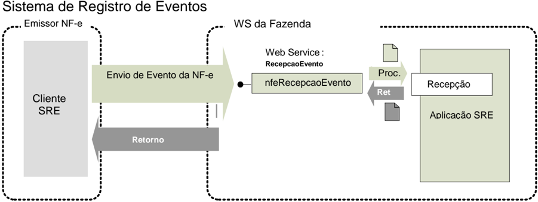

## Projeto Nota Fiscal Eletrônica Projeto Nota Fiscal Eletrônica Projeto Nota Fiscal Eletrônica

## Nota Técnica 2011 Nota Técnica 2011 /006

## Cancelamento da NF da Nota Fiscal Eletrônica Cancelamento da NF-e como Evento da Nota Fiscal Eletrônica

Versão 1.00c Março 2012

## Controle de Versões

## Versão Data

0.00

14/09/2011 - SP

1.00

07/10/2011 - Revisão RS/SP

1.00b

28/02/2012 - Revisão RS/Serpro/

- 1.00c 08/10/2012 - Acertos

Este  documento  tem  por  objetivo  a  definição  das  esp ecificações  técnicas  necessárias  para  a implementação do Cancelamento da NF-e como um event o da NF-e 2G.

O cancelamento da NF-e como evento da NF-e atende a reivindicação das empresas em ter o e-mail do  destinatário  na  resposta  do  cancelamento  que  fac ilita  a  sua  distribuição  para  o  destinatário, também vai facilitar as UF que desejarem recepciona r o pedido de cancelamento extemporâneo por desvincular o cancelamento da NF-e nos casos em que o cancelamento é armazenado com a NF-e.

A adoção do cancelamento da NF-e como evento da NF- e será gradual, a SEFAZ deve disponibilizar o Cancelamento como evento até 01/07/2012.

- O  Web  Service  de Cancelamento  existente será  elimin ado  em  01/12/2012,  permanecendo unicamente  a  possibilidade  de  cancelamento  da  NF-e  através  do  Web  Service  de  Registro  de Eventos.

O documento será tratado como um documento independ ente durante a fase de desenvolvimento do Web Service para facilitar a sua manutenção e aperf eiçoamento.

## Alterações da Versão 1.00a

O  Web  Service  do  Evento  de  Cancelamento  está  em  des envolvimento  pelas  SEFAZ  e  pelas empresas e foi reportada a necessidade de alguns ajustes, conforme segue:

- A. Adequação da Regra de Validação para o prazo do  cancelamento (1 dia, conforme legislação);
- B. Informar a Chave de Acesso existente na SEFAZ, no caso do Pedido de Cancelamento para uma  Chave  de  Acesso  divergente  (mesmo  CNPJ,  Série  e   Número,  mas  outra  Chave  de Acesso);
- C. Alteração de Schema com: Uso da versão correta d o arquivo Schema 'tiposBasico'; Nome da tag 'TRetEvento'; Identificação da RFB como cOrgao= 91;

## 4.9 Web Service - RecepcaoEvento - Cancelamento

Função : Serviço destinado à recepção de mensagem de Event o da NF-e

O Cancelamento é um evento para cancelar a NF-e.

O autor do evento é o emissor da NF-e e a NF-e deve  existir no banco de dados da SEFAZ. A mensagem XML do evento será assinada com o certific ado digital que tenha o CNPJ base do Emissor da NF-e.

Processo

: síncrono.

Método: nfeRecepcaoEvento

## 4.9.1 Leiaute Mensagem de Entrada

Entrada:

Estrutura XML com o Evento

Schema XML: envEventoCancNFe\_v9.99.xsd

| #    | Campo      | Ele   | Pai   | Tipo   | Ocor.   | Tam.   | Descrição/Observação                                                                                                                                                                                                                                                  |
|------|------------|-------|-------|--------|---------|--------|-----------------------------------------------------------------------------------------------------------------------------------------------------------------------------------------------------------------------------------------------------------------------|
| HP01 | envEvento  | Raiz  | -     | -      | -       | -      | TAG raiz                                                                                                                                                                                                                                                              |
| HP02 | versao     | A     | HP01  | N      | 1-1     | 2v2    | Versão do leiaute                                                                                                                                                                                                                                                     |
| HP03 | idLote     | E     | HP01  | N      | 1-1     | 1-15   | Identificador de controle do Lote de envio do Evento. Número sequencial autoincremental único para identi ficação do Lote. A responsabilidade de gerar e controlar é excl usiva do autor do evento. OWeb Service não faz qualquer uso deste identificador.            |
| HP04 | evento     | G     | HP01  | xml    | 1-20    | -      | Evento, um lote pode conter até 20 eventos                                                                                                                                                                                                                            |
| HP05 | versao     | A     | HP04  | N      | 1-1     | 2v2    | Versão do leiaute do evento                                                                                                                                                                                                                                           |
| HP06 | infEvento  | G     | HP04  |        | 1-1     |        | Grupo de informações do registro do Evento                                                                                                                                                                                                                            |
| HP07 | Id         | ID    | HP06  | C      | 1-1     | 54     | Identificador da TAG a ser assinada, a regra de formação do Id é: 'ID' + tpEvento + chave da NF-e + nSeqEvento                                                                                                                                                        |
| HP08 | cOrgao     | E     | HP06  | N      | 1-1     | 2      | Código do órgão de recepção do Evento. Utili zar a Tabela do IBGE, utilizar 91 para identificar o Ambiente Nacional.                                                                                                                                                  |
| HP09 | tpAmb      | E     | HP06  | N      | 1-1     | 1      | Identificação do Ambiente: 1=Produção /2=Homo logação                                                                                                                                                                                                                 |
| HP10 | CNPJ       | CE    | HP06  | N      | 1-1     | 14     | Informar o CNPJ ou o CPF do autor do Evento                                                                                                                                                                                                                           |
| HP11 | CPF        | CE    | HP06  | N      | 1-1     | 11     |                                                                                                                                                                                                                                                                       |
| HP12 | chNFe      | E     | HP06  | N      | 1-1     | 44     | Chave de Acesso da NF-e vinculada ao Evento                                                                                                                                                                                                                           |
| HP13 | dhEvento   | E     | HP06  | D      | 1-1     |        | Data e hora do evento no formato AAAA-MM-DDThh:mm:ssTZD (UTC - Universal Coordinated Time, onde TZD pode ser -02:00 (Fernando de Noronha), -03:00 (Brasília) ou -04:00 ( Manaus), no horário de verão serão -01:00, -02:00 e -03:00. Ex.: 2010-08- 19T13:00:15-03:00. |
| HP14 | tpEvento   | E     | HP06  | N      | 1-1     | 6      | Código do evento = 110111                                                                                                                                                                                                                                             |
| HP15 | nSeqEvento | E     | HP06  | N      | 1-1     | 1-2    | Sequencial do evento para o mesmo tipo de evento. Para maioria dos eventos nSeqEvento=1, nos casos em que possa existir mais                                                                                                                                          |

## Nota Fiscal eletrônica

| #    | Campo      | Ele   | Pai   | Tipo   | Ocor.   | Tam.   | Descrição/Observação                                                                                                |
|------|------------|-------|-------|--------|---------|--------|---------------------------------------------------------------------------------------------------------------------|
|      |            |       |       |        |         |        | de um evento, como é o caso da Carta de Correção, o autor do evento deve numerar de forma sequencial.               |
| HP16 | verEvento  | E     | HP06  | N      | 1-1     | 2v2    | Versão do detalhe do evento (grupo detEvento - HP17), informação utilizada para a SEFAZ validar o grupo detEvento . |
| HP17 | detEvento  | G     | HP06  |        | 1-1     |        | Informações do Pedido de Cancelamento                                                                               |
| HP18 | versao     | A     | HP17  | N      | 1-1     | 2v2    | Versão do Pedido de Cancelamento, deve ser informado com a mesma informação da tag verEvento (HP16)                 |
| HP19 | descEvento | E     | HP17  | C      | 1-1     | 5-60   | 'Cancelamento'                                                                                                      |
| HP20 | nProt      | E     | HP17  | N      | 1-1     | 15     | Informar o número do Protocolo de Autorizaçã o da NF-e a ser Cancelada. (vide item 5.6).                            |
| HP21 | xJust      | E     | HP17  | C      | 1-1     | 15-    | Informar a justificativa do cancelamento                                                                            |
| HP22 | Signature  | G     | HP04  | XML    | 1-1     |        | Assinatura Digital do documento XML, a assinatura deverá ser aplicada no elemento infEvento                         |

## 4.9.2 Leiaute Mensagem de Retorno

Retorno:

Estrutura XML com a mensagem do resultado da transmissão.

Schema XML: retEnvEventoCancNFe \_v9.99.xsd

| #    | Campo        | Ele   | Pai   | Tipo   | Ocor.   | Tam.   | Descrição/Observação                                                                                                                                                                                                                                                                 |
|------|--------------|-------|-------|--------|---------|--------|--------------------------------------------------------------------------------------------------------------------------------------------------------------------------------------------------------------------------------------------------------------------------------------|
| HR01 | retEnvEvento | Rai z | -     | -      | -       | -      | TAG raiz do Resultado do Envio do Evento                                                                                                                                                                                                                                             |
| HR02 | versao       | A     | HR01  | N      | 1-1     | 2v2    | Versão do leiaute                                                                                                                                                                                                                                                                    |
| HR03 | idLote       | E     | HR01  | N      | 1-1     | 1-15   | Identificador de controle do Lote de envio do Evento, conforme informado na mensagem de entrada.                                                                                                                                                                                     |
| HR04 | tpAmb        | E     | HR01  | N      | 1-1     | 1      | Identificação do Ambiente: 1=Produção /2=Homologação                                                                                                                                                                                                                                 |
| HR05 | verAplic     | E     | HR01  | C      | 1-1     | 1-20   | Versão da aplicação que processou o evento.                                                                                                                                                                                                                                          |
| HR06 | cOrgao       | E     | HR01  | N      | 1-1     | 2      | Código da UF que registrou o Evento. Utilizar 91 para o Ambiente Nacional.                                                                                                                                                                                                           |
| HR07 | cStat        | E     | HR01  | N      | 1-1     | 3      | Código do status da resposta                                                                                                                                                                                                                                                         |
| HR08 | xMotivo      | E     | HR01  | C      | 1-1     | 1-255  | Descrição do status da resposta                                                                                                                                                                                                                                                      |
| HR09 | retEvento    | G     | HR01  | -      | 0-20    | -      | TAG de grupo do resultado do processamento do Evento                                                                                                                                                                                                                                 |
| HR10 | versao       | A     | HR09  | N      | 1-1     | 2v2    | Versão do leiaute                                                                                                                                                                                                                                                                    |
| HR11 | infEvento    | G     | HR09  |        | 1-1     |        | Grupo de informações do registro do Evento                                                                                                                                                                                                                                           |
| HR12 | Id           | ID    | HR11  | C      | 0-1     | 17     | Identificador da TAG a ser assinada, somente deve ser informado se o órgão de registro assinar a resposta . Em caso de assinatura da resposta pelo órgão de registro, pree ncher com o número do protocolo, precedido pela literal 'ID'                                              |
| HR13 | tpAmb        | E     | HR11  | N      | 1-1     | 1      | Identificação do Ambiente: 1=Produção /2=Homologação                                                                                                                                                                                                                                 |
| HR14 | verAplic     | E     | HR11  | C      | 1-1     | 1-20   | Versão da aplicação que registrou o Evento, utilizar literal que permita a identificação do órgão, como a sigla da U F ou do órgão.                                                                                                                                                  |
| HR15 | cOrgao       | E     | HR11  | N      | 1-1     | 2      | Código da UF que registrou o Evento. Utilizar 91 para o Ambiente Nacional.                                                                                                                                                                                                           |
| HR16 | cStat        | E     | HR11  | N      | 1-1     | 3      | Código do status da resposta.                                                                                                                                                                                                                                                        |
| HR17 | xMotivo      | E     | HR11  | C      | 1-1     | 255    | Descrição do status da resposta.                                                                                                                                                                                                                                                     |
| HR18 | chNFe        | E     | HR11  | N      | 0-1     | 44     | Chave de Acesso da NF-e vinculada ao evento.                                                                                                                                                                                                                                         |
| HR19 | tpEvento     | E     | HR11  | N      | 0-1     | 6      | Código do Tipo do Evento.                                                                                                                                                                                                                                                            |
| HR20 | xEvento      | E     | HR11  | C      | 0-1     | 5-60   | Descrição do Evento - 'Cancelamento homologado'                                                                                                                                                                                                                                      |
| HR21 | nSeqEvento   | E     | HR11  | N      | 0-1     | 1-2    | Sequencial do evento, conforme informado na mensagem de entrada.                                                                                                                                                                                                                     |
| HR22 | CNPJDest     | CE    | HR11  | N      | 0-1     | 14     | Informar o CNPJ ou o CPF do destinatário daNF-e.                                                                                                                                                                                                                                     |
| HR23 | CPFDest      | CE    | HR11  | N      | 0-1     | 11     |                                                                                                                                                                                                                                                                                      |
| HR24 | emailDest    | E     | HR11  | C      | 0-1     | 1-60   | e-mail do destinatárioinformado na NF-e.                                                                                                                                                                                                                                             |
|      |              |       |       |        |         | 15     | DDTHH:MM:SSTZD (formato UTC, onde TZD é +HH:MM ou - HH:MM), se o evento for rejeitado informar a data e hora de recebimento do evento. Número do Protocolo do evento 1 posição (1-Secretaria da Fazenda Estadual, 2-RFB), 2 posições para o código da UF, 2 posições para o ano e 10 |
| HR26 | nProt        | E     | HR11  | N      | 0-1     |        | posições para o sequencial no ano.                                                                                                                                                                                                                                                   |
| HR27 | Signature    | G     | HR09  | XML    | 0-1     |        | Assinatura Digital do documento XML, a assinatura deverá ser aplicada no elemento infEvento. A decisão de assinar a                                                                                                                                                                  |

mensagem fica a critério da UF.

## 4.9.3 Descrição do Processo de Recepção de Evento

O WS de Eventos é acionado  pelo  interessado  emissor   da  NF-e  que  deve  enviar  mensagem  de registro de evento de Cancelamento.

O processo de Registro de Eventos recebe eventos em uma estrutura de lotes, que pode conter de 1 a 20 eventos.

## 4.9.4 Validação do Certificado de Transmissão

| Validação do Certificado Digital do Transmissor (pr otocolo SSL)   | Validação do Certificado Digital do Transmissor (pr otocolo SSL)                                                                                                                                                                             | Validação do Certificado Digital do Transmissor (pr otocolo SSL)   | Validação do Certificado Digital do Transmissor (pr otocolo SSL)   | Validação do Certificado Digital do Transmissor (pr otocolo SSL)   |
|--------------------------------------------------------------------|----------------------------------------------------------------------------------------------------------------------------------------------------------------------------------------------------------------------------------------------|--------------------------------------------------------------------|--------------------------------------------------------------------|--------------------------------------------------------------------|
| #                                                                  | Regra de Validação                                                                                                                                                                                                                           | Crítica                                                            | Msg                                                                | Efeito                                                             |
| A01                                                                | Certificado de Transmissor Inválido: - Certificado de Transmissor inexistente na mensagem - Versão difere "3" - Se informado o Basic Constraint deve ser true (nã o pode ser Certificado de AC) - KeyUsage não define "Autenticação Cliente" | Obrig.                                                             | 280                                                                | Rej.                                                               |
| A02                                                                | Validade do Certificado (data início e data fim)                                                                                                                                                                                             | Ob rig.                                                            | 281                                                                | Rej.                                                               |
| A03                                                                | Verifica a Cadeia de Certificação: - Certificado da AC emissora não cadastrado na SEFAZ - Certificado de AC revogado - Certificado não assinado pela AC emissora do Cert ificado                                                             | Obrig.                                                             | 283                                                                | Rej.                                                               |
| A04                                                                | LCR do Certificado de Transmissor - Falta o endereço da LCR (CRL DistributionPoint) - LCR indisponível - LCR inválida                                                                                                                        | Obrig.                                                             | 286                                                                | Rej.                                                               |
| A05                                                                | Certificado do Transmissor revogado                                                                                                                                                                                                          | Obrig.                                                             | 284                                                                | Rej.                                                               |
| A06                                                                | Certificado Raiz difere da "ICP-Brasil"                                                                                                                                                                                                      | Obrig.                                                             | 285                                                                | Rej.                                                               |
| A07                                                                | Falta a extensão de CNPJ no Certificado (OtherName - OID=2.16.76.1.3.3)                                                                                                                                                                      | Obrig.                                                             | 282                                                                | Rej.                                                               |

As validações de A01, A02, A03, A04 e A05 são reali zadas pelo protocolo SSL e não precisam ser implementadas. A validação A06 também pode ser realizada pelo protocolo SSL, mas pode falhar se existirem outros certificados digitais de Autoridade Certificadora Raiz que não sejam 'ICP-Brasil' no repositório de certificados digitais do servidor de Web Service do Órgão de registro.

## 4.9.5 Validação Inicial da Mensagem no Web Service

| Validação Inicial da Mensagem no Web Service   | Validação Inicial da Mensagem no Web Service                             | Validação Inicial da Mensagem no Web Service   | Validação Inicial da Mensagem no Web Service   | Validação Inicial da Mensagem no Web Service   |
|------------------------------------------------|--------------------------------------------------------------------------|------------------------------------------------|------------------------------------------------|------------------------------------------------|
| #                                              | Regra de Validação                                                       | Aplic.                                         | Msg                                            | Efeito                                         |
| B01                                            | Tamanho do XML de Dados superior a 500 KB                                | Obrig.                                         | 214                                            | Rej.                                           |
| B02                                            | Verifica se o Servidor de Processamento está Parali sado Momentaneamente | Obrig.                                         | 108                                            | Rej.                                           |
| B03                                            | Verifica se o Servidor de Processamento está Parali sado sem Previsão    | Obrig.                                         | 109                                            | Rej.                                           |

A  mensagem  será  descartada  se  o  tamanho  exceder  o  l imite  previsto  (500  KB).  A  aplicação  do contribuinte não poderá permitir a geração de mensagem com tamanho superior a 500 KB. Caso isto ocorra,  a  conexão  poderá  ser  interrompida  sem  retor no  da  mensagem  de  erro  se  o  controle  do tamanho da mensagem for implementado por configurações do ambiente de rede (ex.: controle no firewall). No caso do controle de tamanho ser implementado por aplicativo teremos a devolução da mensagem de erro 214.

Caso  o  Web  Service  fique  disponível,  mesmo  quando  o   serviço  estiver  paralisado,  deverão implementar as verificações 108 e 109. Estas valida ções poderão ser dispensadas se o Web Service não ficar disponível quando o serviço estiver paralisado.

## 4.9.6 Validação das informações de controle da cham ada ao Web Service

| Validação das informações de controle da chamada ao Web Service   | Validação das informações de controle da chamada ao Web Service       | Validação das informações de controle da chamada ao Web Service   | Validação das informações de controle da chamada ao Web Service   | Validação das informações de controle da chamada ao Web Service   |
|-------------------------------------------------------------------|-----------------------------------------------------------------------|-------------------------------------------------------------------|-------------------------------------------------------------------|-------------------------------------------------------------------|
| #                                                                 | Regra de Validação                                                    | Aplic.                                                            | Msg                                                               | Efeito                                                            |
| C01                                                               | Elemento nfeCabecMsg inexistente no SOAP Header                       | Obrig.                                                            | 242                                                               | Rej.                                                              |
| C02                                                               | Campo cUF inexistente no elemento nfeCabecMsg do SOAP Header          | Obrig.                                                            | 409                                                               | Rej.                                                              |
| C03                                                               | Verificar se a UF informada no campo cUF é atendida p elo Web Service | Obrig.                                                            | 410                                                               | Rej.                                                              |
| C04                                                               | Campo versaoDados inexistente no elemento nfeCabecMsg do SOAP Header  | Obrig.                                                            | 411                                                               | Rej.                                                              |
| C05                                                               | Versão dos Dados informada é superior à versão vige nte               | Facult.                                                           | 238                                                               | Rej.                                                              |
| C06                                                               | Versão dos Dados não suportada                                        | Obrig.                                                            | 239                                                               | Rej.                                                              |

A informação da versão do leiaute do registro de ev ento é informada no elemento nfeCabecMsg do SOAP Header (para maiores detalhes vide item 3.4).

A aplicação deverá validar o campo de versão da mensagem ( versaoDados ), rejeitando a solicitação recebida em caso de informações inexistentes ou inv álidas.

## 4.9.7 Validação da área de Dados

## a) Validação de forma da área de dados

A validação de forma da área de dados da mensagem é  realizada com a aplicação da seguinte regra:

| Validação da área de dados da mensagem                                                                                               | Validação da área de dados da mensagem                                                                                               | Validação da área de dados da mensagem   | Validação da área de dados da mensagem   | Validação da área de dados da mensagem   |
|--------------------------------------------------------------------------------------------------------------------------------------|--------------------------------------------------------------------------------------------------------------------------------------|------------------------------------------|------------------------------------------|------------------------------------------|
| #                                                                                                                                    | Regra de Validação                                                                                                                   | Aplic.                                   | Msg                                      | Efeito                                   |
| D01                                                                                                                                  | Verifica Schema XML da Área de Dados                                                                                                 | Obrig.                                   | 225                                      | Rej.                                     |
| D01a Em caso de Falha de Schema, verificar se existe a tag raiz esperada para o lote                                                 | D01a Em caso de Falha de Schema, verificar se existe a tag raiz esperada para o lote                                                 | Facul.                                   | 516                                      | Rej.                                     |
| D01b Em caso de Falha de Schema, verificar se existe o atributo versao para a tag raiz da mensagem                                   | D01b Em caso de Falha de Schema, verificar se existe o atributo versao para a tag raiz da mensagem                                   | Facul.                                   | 517                                      | Rej.                                     |
| D01c Em caso de Falha de Schema, verificar se o conteúdodo atributo versao difere do conteúdo da versaoDados informado no SOAPHeader | D01c Em caso de Falha de Schema, verificar se o conteúdodo atributo versao difere do conteúdo da versaoDados informado no SOAPHeader | Facul.                                   | 545                                      | Rej.                                     |
| D01d Verifica a existência de qualquer names pace diverso do namespace padrão da NF-e (http://www.portalfiscal.inf.br/nfe)           | D01d Verifica a existência de qualquer names pace diverso do namespace padrão da NF-e (http://www.portalfiscal.inf.br/nfe)           | Facul.                                   | 587                                      | Rej.                                     |
| D01e Verifica a existência de caracteres de edição no in ício ou fim da mensagem ou entre as tags                                    | D01e Verifica a existência de caracteres de edição no in ício ou fim da mensagem ou entre as tags                                    | Facul.                                   | 588                                      | Rej.                                     |
| D02 Verifica o uso de prefixo no namespace                                                                                           | D02 Verifica o uso de prefixo no namespace                                                                                           | Obrig.                                   | 404                                      | Rej.                                     |
| D03                                                                                                                                  | XML utiliza codificação diferente de UTF-8                                                                                           | Obrig.                                   | 402                                      | Rej.                                     |

As  validações  D01d,  D01e  e  D01f  são  de  aplicação  fa cultativa  e  podem  ser  aplicadas sucessivamente quando ocorrer falha na validação D0 1 e a SEFAZ entender oportuno informar a divergência entre a versão informada no SOAP Header  e a versão da mensagem XML.

A validação do Schema XML é realizada em toda mensagem de entrada, mas como existe uma parte da mensagem que é variável pode ocorrer erro de falha de Schema XML da parte específica da mensagem que será identificado posteriormente.

## b) Extração dos eventos do lote e validação do Sche ma XML do evento

A aplicação deve extrair os eventos do lote para tr atar individualmente os eventos, a princípio não existe necessidade de que todos os eventos sejam do mesmo tipo.

A  escolha  do  Schema  XML  aplicável  para  o  evento  é  r ealizado  com  base  no  tipo  do  evento tpEvento combinado com a verEvento, assim, a aplicação deve manter um controle dos tpEvento válidos e as verEvento em vigência e o respectivo S chema XML.

| Validação do evento   | Validação do evento   |
|-----------------------|-----------------------|
| # Regra de Validação  | Aplic. Msg Efeito     |

## Nota Fiscal eletrônica

| D04   | Verifica se o tpEvento é válido                        | Obrig.   |   491 | Rej.   |
|-------|--------------------------------------------------------|----------|-------|--------|
| D05   | Verifica se o verEvento é válido                       | Obrig.   |   492 | Rej.   |
| D06   | Verifica se o detEvento atende o respectivo schema XML | Obrig.   |   493 | Rej.   |

## c) Validação do Certificado Digital de Assinatura

| Validação do Certificado Digital utilizado na Assin atura Digital do DF-e   | Validação do Certificado Digital utilizado na Assin atura Digital do DF-e                                                                                                                                                                                                               | Validação do Certificado Digital utilizado na Assin atura Digital do DF-e   | Validação do Certificado Digital utilizado na Assin atura Digital do DF-e   | Validação do Certificado Digital utilizado na Assin atura Digital do DF-e   |
|-----------------------------------------------------------------------------|-----------------------------------------------------------------------------------------------------------------------------------------------------------------------------------------------------------------------------------------------------------------------------------------|-----------------------------------------------------------------------------|-----------------------------------------------------------------------------|-----------------------------------------------------------------------------|
| #                                                                           | Regra de Validação                                                                                                                                                                                                                                                                      | Aplic.                                                                      | Msg                                                                         | Efeito                                                                      |
| E01                                                                         | Certificado de Assinatura inválido: - Certificado de Assinatura inexistente na mensagem (*validado também pelo Schema) - Versão difere "3" - Se informado o Basic Constraint deve ser true (nã o pode ser Certificado de AC) - KeyUsage não define "Assinatura Digital" e 'Não R ecusa' | Obrig.                                                                      | 290                                                                         | Rej.                                                                        |
| E02                                                                         | Validade do Certificado (data início e data fim)                                                                                                                                                                                                                                        | Ob rig.                                                                     | 291                                                                         | Rej.                                                                        |
| E03                                                                         | Falta a extensão de CNPJ no Certificado (OtherName - OID=2.16.76.1.3.3)                                                                                                                                                                                                                 | Obrig.                                                                      | 292                                                                         | Rej.                                                                        |
| E04                                                                         | Verifica Cadeia de Certificação: - Certificado da AC emissora não cadastrado na SEFAZ - Certificado de AC revogado - Certificado não assinado pela AC emissora do Cert ificado                                                                                                          | Obrig.                                                                      | 293                                                                         | Rej.                                                                        |
| E05                                                                         | LCR do Certificado de Assinatura: - Falta o endereço da LCR (CRLDistributionPoint) - Erro no acesso a LCR ou LCR inexistente                                                                                                                                                            | Obrig.                                                                      | 296                                                                         | Rej.                                                                        |
| E06                                                                         | Certificado de Assinatura revogado                                                                                                                                                                                                                                                      | Obrig.                                                                      | 294                                                                         | Rej.                                                                        |
| E07                                                                         | Certificado Raiz difere da 'ICP-Brasil'                                                                                                                                                                                                                                                 | Obrig.                                                                      | 295                                                                         | Rej.                                                                        |

## d) Validação da Assinatura Digital

| Validação da Assinatura Digital do DF -e   | Validação da Assinatura Digital do DF -e                                                                                                                                                                                                                                                     | Validação da Assinatura Digital do DF -e   | Validação da Assinatura Digital do DF -e   | Validação da Assinatura Digital do DF -e   |
|--------------------------------------------|----------------------------------------------------------------------------------------------------------------------------------------------------------------------------------------------------------------------------------------------------------------------------------------------|--------------------------------------------|--------------------------------------------|--------------------------------------------|
| #                                          | Regra de Validação                                                                                                                                                                                                                                                                           | Aplic.                                     | Msg                                        | Efeito                                     |
| F01                                        | Assinatura difere do padrão do Projeto: - Não assinado o atributo "Id" (falta "Reference URI" na assinatura) (*validado também pelo Schema) - Faltam os "Transform Algorithm" previstos na assinatura ("C14N" e "Enveloped") Estas validações são implementadas pelo Schema XML da Signature | Obrig.                                     | 298                                        | Rej.                                       |
| F02                                        | Valor da assinatura (SignatureValue) difere do valor calculado                                                                                                                                                                                                                               | Obrig.                                     | 297                                        | Rej.                                       |
| F03                                        | CNPJ-Base do Autor da mensagem difere do CNPJ-Base do Certificado Digital                                                                                                                                                                                                                    | Obrig.                                     | 213                                        | Rej.                                       |

## e) Validação de regras de negócios do Registro de E vento- parte Geral

| Validação do Registro de Eventos - Regras de Negócios - parte Geral   | Validação do Registro de Eventos - Regras de Negócios - parte Geral                                                                  | Validação do Registro de Eventos - Regras de Negócios - parte Geral   | Validação do Registro de Eventos - Regras de Negócios - parte Geral   | Validação do Registro de Eventos - Regras de Negócios - parte Geral   |
|-----------------------------------------------------------------------|--------------------------------------------------------------------------------------------------------------------------------------|-----------------------------------------------------------------------|-----------------------------------------------------------------------|-----------------------------------------------------------------------|
| #                                                                     | Regra de Validação                                                                                                                   | Aplic.                                                                | Msg                                                                   | Efeito                                                                |
| G01                                                                   | Tipo do ambiente difere do ambiente do Web Service                                                                                   | Obrig.                                                                | 252                                                                   | Rej.                                                                  |
| G02                                                                   | Código do órgão de recepção do Evento da UF div erge da UF Autorizadora                                                              | Obrig.                                                                | 250                                                                   | Rej.                                                                  |
| G03                                                                   | CNPJ do autor do evento informado inválido (DVou zeros)                                                                              | Obrig.                                                                | 489                                                                   | Rej.                                                                  |
| G04                                                                   | CPF do autor do evento informado inválido (zero s, 111..., 222..., 333..., ..., ou DV inválido)                                      | Obrig.                                                                | 490                                                                   | Rej.                                                                  |
| G04a                                                                  | Chave de Acesso com dígito verificador inválido                                                                                      | Obr ig.                                                               | 236                                                                   | Rej.                                                                  |
| G04b                                                                  | Chave de Acesso inválida (Código UF inválido)                                                                                        | Obrig .                                                               | 614                                                                   | Rej.                                                                  |
| G04c                                                                  | Chave de Acesso inválida (Ano < 06 ou Ano maior queAno corrente)                                                                     | Obrig.                                                                | 615                                                                   | Rej.                                                                  |
| G04d                                                                  | Chave de Acesso inválida (Mês = 0 ou Mês > 12)                                                                                       | Obri g.                                                               | 616                                                                   | Rej.                                                                  |
| G04e                                                                  | Chave de Acesso inválida (CNPJ zerado ou dígito inv álido)                                                                           | Obrig.                                                                | 617                                                                   | Rej.                                                                  |
| G04f                                                                  | Chave de Acesso inválida (modelo diferente de55)                                                                                     | Obrig.                                                                | 618                                                                   | Rej.                                                                  |
| G04g                                                                  | Chave de Acesso inválida (número NF = 0)                                                                                             | Obrig.                                                                | 619                                                                   | Rej.                                                                  |
| G04h                                                                  | UF da Chave de Acesso diverge da UF Autorizadora                                                                                     | Obrig.                                                                | 249                                                                   | Rej.                                                                  |
| G05                                                                   | Validar se atributo Id corresponde à concatenação dos campos evento ('ID' + tpEvento + chNFe + nSeqEvento)                           | Obrig.                                                                | 572                                                                   | Rej.                                                                  |
| G06                                                                   | Acesso BD NFE (Chave: CNPJ Emitente, Modelo, Série e Nro): - Chave Acesso inexistente para o tpEvento que exige a existência da NF-e | Obrig.                                                                | 494                                                                   | Rej.                                                                  |

## Nota Fiscal eletrônica

| Validação do Registro de Eventos - Regras de Negócios - parte Geral   | Validação do Registro de Eventos - Regras de Negócios - parte Geral                                                                                                                                                                    | Validação do Registro de Eventos - Regras de Negócios - parte Geral   | Validação do Registro de Eventos - Regras de Negócios - parte Geral   | Validação do Registro de Eventos - Regras de Negócios - parte Geral   |
|-----------------------------------------------------------------------|----------------------------------------------------------------------------------------------------------------------------------------------------------------------------------------------------------------------------------------|-----------------------------------------------------------------------|-----------------------------------------------------------------------|-----------------------------------------------------------------------|
| #                                                                     | Regra de Validação                                                                                                                                                                                                                     | Aplic.                                                                | Msg                                                                   | Efeito                                                                |
|                                                                       | Obs.: Caso exista uma NF-e no banco de dados com Chave de Acesso divergente, opcionalmente, deve-se concatenar a Chave de Acesso existente na descrição do erro, caso o CNPJ do Auto r do evento seja o mesmo CNPJ da Chave de Acesso. |                                                                       |                                                                       |                                                                       |
| G07                                                                   | Acesso BD de Eventos: - Verificar duplicidade do evento (tpEvento + chNFe + nSeqEvento)                                                                                                                                                | Obrig.                                                                | 573                                                                   | Rej.                                                                  |
| G08                                                                   | Se evento do emissor verificar se CNPJ do Autor diferente do CNPJ da Chave de Acesso da NF-e                                                                                                                                           | Obrig.                                                                | 574                                                                   | Rej.                                                                  |
| G11                                                                   | Data do evento não pode ser menor que a data de emissão da NF-e, se existir                                                                                                                                                            | Obrig.                                                                | 577                                                                   | Rej.                                                                  |
| G12                                                                   | Data do evento não pode ser maior que a data de processamento (aceitar uma tolerância de até 5 minutos)                                                                                                                                | Obrig.                                                                | 578                                                                   | Rej.                                                                  |
| G13                                                                   | Data do evento não pode ser menor que a data de autorização para NF- e não emitida em contingência se a NF-e existir.                                                                                                                  | Obrig.                                                                | 579                                                                   | Rej.                                                                  |

## 4.9.8 Regras de validação específica do evento Cancelamento de NF-e

| Validação do Registro de Ev entos - Regras de Negócio específica   | Validação do Registro de Ev entos - Regras de Negócio específica                                                                  | Validação do Registro de Ev entos - Regras de Negócio específica   | Validação do Registro de Ev entos - Regras de Negócio específica   | Validação do Registro de Ev entos - Regras de Negócio específica   |
|--------------------------------------------------------------------|-----------------------------------------------------------------------------------------------------------------------------------|--------------------------------------------------------------------|--------------------------------------------------------------------|--------------------------------------------------------------------|
| #                                                                  | Regra de Validação                                                                                                                | Aplic.                                                             | Msg                                                                | Efeito                                                             |
| GA01                                                               | Campo serie - na autorização pela SEFAZ Autorizador a: não aceitar série diferente de 0-899                                       | Obrig.                                                             | 266                                                                | Rej                                                                |
| GA02                                                               | Campo serie - na autorização pelo SCAN: não aceitar série diferente de 900-999                                                    | Obrig.                                                             | 503                                                                | Rej                                                                |
| GA03                                                               | Acesso Cadastro Contribuinte: - Verificar Emitente não autorizado a emitir NF-e                                                   | Obrig.                                                             | 203                                                                | Rej.                                                               |
| GA04                                                               | - Verificar Situação Fiscal irregular do Emitente                                                                                 | Obrig.                                                             | 240                                                                | Rej.                                                               |
| GA05                                                               | Verificar se a NF-e está autorizada (não pode estarcancelada nem denegada)                                                        | Obrig.                                                             | 580                                                                | Rej.                                                               |
| GA06                                                               | Verificar se NF-e autorizada há mais de 1 dia (24 horas), considera ndo também a exceção de prazo definida em legislação estadual | Obrig.                                                             | 501                                                                | Rej.                                                               |
| GA07                                                               | Verificar o sequencial do evento (HP15 - nSeqEvento) é um valor válido (=1)                                                       | Obrig.                                                             | 594                                                                | Rej.                                                               |
| GA08                                                               | Verificar se o número Protocolo informado difere donro. Protocolo da NF-e                                                         | Obrig.                                                             | 222                                                                | Rej.                                                               |
| GA09                                                               | Verificar recebimento da NF-e pelo Destinatário                                                                                   | Obr ig.                                                            | 221                                                                | Rej.                                                               |
| GA10                                                               | Acesso Registro de Passagem: - Verificar registro de Circulação de Mercadoria                                                     | Obrig.                                                             | 219                                                                | Rej.                                                               |
| GA11                                                               | - Falha na consulta do Registro de Passagem                                                                                       | Obrig.                                                             | 642                                                                | Rej.                                                               |

## 4.9.9 Final do Processamento do Lote

O processamento do lote pode resultar em:

- Processamento do Lote - o lote foi processado (cStat=128), a validação de cada evento  do lote poderá resultar em:
- Rejeição do Lote - por algum problema que comprometa o processamento do lote;
- o Rejeição -  o  Evento  será  descartado,  com  retorno  do  código do  status  do  motivo  da rejeição;
- o Recebido pelo Sistema de Registro de Eventos, com vinculação do evento na NF-e , o Evento  será  armazenado  no  repositório  do  Sistema  de   Registro  de  Eventos  com  a vinculação do Evento à respectiva NF-e (cStat=135);
- o Recebido pelo Sistema de Registro de Eventos - vinculação do evento à respectiva NF-e prejudicada - o Evento será armazenado no repositório do Sistem a de Registro de Eventos, a vinculação do evento à respectiva NF-e f ica prejudicada face à inexistência da NF-e no momento do recebimento do Evento (cStat=136);

A  UF  que  recepcionar  o  Evento  deve  enviá-lo  para  o  Sistema  de  Compartilhamento  do  AN  Ambiente Nacional para que o Evento seja distribuíd o para todos os interessados.

## 4.9.10 Armazenamento e Disponibilização do Evento d e Cancelamento

O arquivo digital do Evento de Cancelamento, com a respectiva informação do Registro de Evento da SEFAZ, deve ser mantido pelo emissor e disponibilizado para o destinatário, na forma que segue:

## Schema XML: procEventoNFe\_v99.99.xsd

| #    | Campo         | Ele   | Pai   | Tipo   | Ocor.   | Tam.   | Dec.   | Descrição/Observação                            |
|------|---------------|-------|-------|--------|---------|--------|--------|-------------------------------------------------|
| ZR01 | procEventoNFe | Raiz  | -     | -      | -       | -      | -      | TAG raiz                                        |
| ZR02 | versao        | A     | ZR01  | N      | 1-1     | 1-4    | 2      |                                                 |
| ZR03 | evento        | G     | ZR01  | -      | 1-1     | -      | -      |                                                 |
| YR04 | (dados)       | -     | -     | -      | -       | -      | -      | Dados do Evento (mensagem de entrada)           |
| YR05 | retEvento     | G     | ZR01  | -      | 1-1     | -      | -      |                                                 |
| YR06 | (dados)       | -     | -     | -      | -       | -      | -      | Dados do registro do Evento (mensagem de saída) |

## 5. Tabela de códigos de erros e descrições de mensa gens de erros

| Código   | RESULTADO DO PROCESSAMENTO DA SOLICITAÇÃO                                                                              |
|----------|------------------------------------------------------------------------------------------------------------------------|
| 128      | Lote de Evento Processado                                                                                              |
| 135      | Evento registrado e vinculado a NF-e                                                                                   |
| 136      | Evento registrado, mas não vinculado a NF-e                                                                            |
| Código   | MOTIVOS DE NÃO ATENDIMENTO DA SOLICITAÇÃO                                                                              |
| 249      | Rejeição: UF da Chave de Acesso diverge da UF a utorizadora                                                            |
| 489      | Rejeição: CNPJ informado inválido (DV ou zeros)                                                                        |
| 490      | Rejeição: CPF informado inválido (DV ou zeros)                                                                         |
| 491      | Rejeição: O tpEvento informado inválido                                                                                |
| 492      | Rejeição: O verEvento informado inválido                                                                               |
| 493      | Rejeição: Evento não atende o Schema XML específico                                                                    |
| 494      | Rejeição: Chave de Acesso inexistente                                                                                  |
| 501      | Rejeição: Prazo de cancelamento superior ao pre visto na Legislação                                                    |
| 503      | Rejeição: Série utilizada fora da faixa permitida no SCAN (900-999)                                                    |
| 572      | Rejeição: Erro Atributo ID do evento não corres ponde a concatenação dos campos ('ID' + tpEvento + chNFe + nSeqEvento) |
| 573      | Rejeição: Duplicidade de Evento                                                                                        |
| 574      | Rejeição: O autor do evento diverge do emissor da NF-e                                                                 |
| 575      | Rejeição: O autor do evento diverge do destinat ário da NF-e                                                           |
| 576      | Rejeição: O autor do evento não é um órgão auto rizado a gerar o evento                                                |
| 577      | Rejeição: A data do evento não pode ser menor q ue a data de emissão da NF-e                                           |
| 578      | Rejeição: A data do evento não pode ser maior q ue a data do processamento                                             |
| 579      | Rejeição: A data do evento não pode ser menor q ue a data de autorização para NF-e não emitida em contingência         |
| 580      | Rejeição: O evento exige uma NF-e autorizada                                                                           |
| 594      | Rejeição: O número de sequencia do evento informadoé maior que o permitido                                             |
| 614      | Rejeição: Chave de Acesso inválida (Código UF invál ido)                                                               |
| 615      | Rejeição: Chave de Acesso inválida (Ano menor que 0 5 ou Ano maior que Ano corrente)                                   |
| 616      | Rejeição: Chave de Acesso inválida (Mês menor que 1 ou Mês maior que 12)                                               |
| 617      | Rejeição: Chave de Acesso inválida (CNPJ zerado oudígito inválido)                                                     |
| 618      | Rejeição: Chave de Acesso inválida (modelo diferent e de 55)                                                           |
| 619      | Rejeição: Chave de Acesso inválida (número NF = 0)                                                                     |
| 642      | Rejeição: Falha na Consulta do Registro de Passagem , tente novamente após 5 minutos                                   |

## OBS.:

1.  Recomendamos  a  não  utilização  de  caracteres  espe ciais  ou  acentuação  nos  textos  das mensagens de erro.
2. Recomendamos que o campo xMotivo da mensagem de erro para o código 999 seja informado com a mensagem de erro do aplicativo ou do sistema que gerou a exceção não prevista.
## Metadados
- [Metadados do corpus](metadata.json)
- [Fonte e procedência](../../../../sources/portal_nacional_nfe/nfe/notas-tecnicas/nt2011-006c-evento-cancelamento/source.json)
- [Dados normalizados](../../../../normalized/nfe/notas-tecnicas/nt2011-006c-evento-cancelamento/normalized.json)
- [Changelog](../../../../changelog/nfe/notas-tecnicas/nt2011-006c-evento-cancelamento.md)
- [Proveniência resumida](../../../../sources/provenance/nt2011-006c-evento-cancelamento.json)
