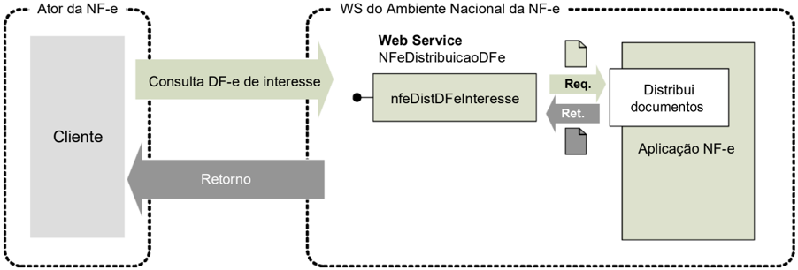
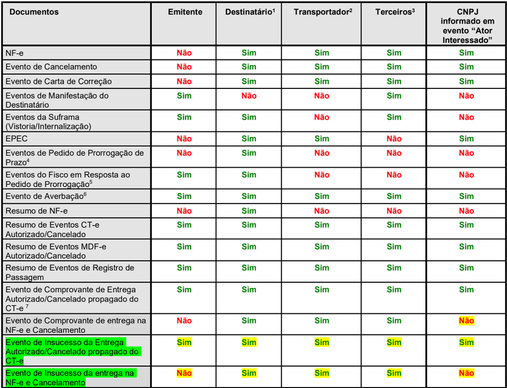
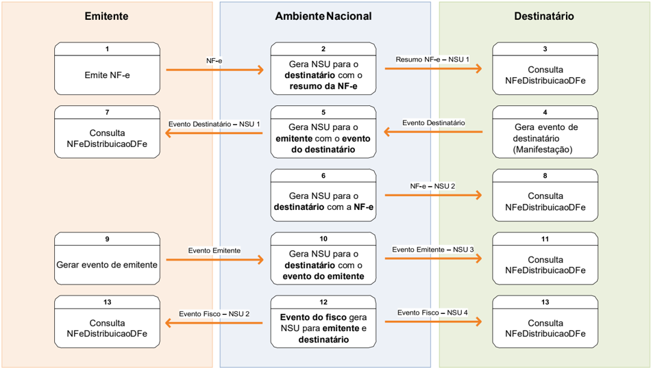

## Projeto Nota Fiscal Eletrônica

Nota Técnica 2014.002

Web Service de Distribuição de DF-e de Interesse dos Atores da NF-e (PF ou PJ)

Versões 1.30 -Fevereiro de 2026


## Sumário

| 1.                                                                                                                                                                                                                                                           | Histórico de Alterações / Cronograma......................................................................................                                                                                                                                   | Histórico de Alterações / Cronograma......................................................................................                                                                                                                                   | 3                                                                                |
|--------------------------------------------------------------------------------------------------------------------------------------------------------------------------------------------------------------------------------------------------------------|--------------------------------------------------------------------------------------------------------------------------------------------------------------------------------------------------------------------------------------------------------------|--------------------------------------------------------------------------------------------------------------------------------------------------------------------------------------------------------------------------------------------------------------|----------------------------------------------------------------------------------|
| 2.                                                                                                                                                                                                                                                           | Resumo...................................................................................................................................                                                                                                                    | Resumo...................................................................................................................................                                                                                                                    | 4                                                                                |
| 3.                                                                                                                                                                                                                                                           | Web Service - NFeDistribuicaoDFe.........................................................................................                                                                                                                                    | Web Service - NFeDistribuicaoDFe.........................................................................................                                                                                                                                    | 4                                                                                |
| 3.1. Leiaute Mensagem de Entrada................................................................................................                                                                                                                             | 3.1. Leiaute Mensagem de Entrada................................................................................................                                                                                                                             | 3.1. Leiaute Mensagem de Entrada................................................................................................                                                                                                                             | 6                                                                                |
| 3.2.                                                                                                                                                                                                                                                         | Leiaute Mensagem de Retorno.............................................................................................                                                                                                                                     | Leiaute Mensagem de Retorno.............................................................................................                                                                                                                                     | 6                                                                                |
| 3.3.                                                                                                                                                                                                                                                         | Mensagem de Retorno Compactada ....................................................................................                                                                                                                                          | Mensagem de Retorno Compactada ....................................................................................                                                                                                                                          | 6                                                                                |
| 3.4.                                                                                                                                                                                                                                                         | Descrição do Processo de Distribuição de DF-e de Interesse............................................                                                                                                                                                       | Descrição do Processo de Distribuição de DF-e de Interesse............................................                                                                                                                                                       | 7                                                                                |
| 3.4.1.                                                                                                                                                                                                                                                       | 3.4.1.                                                                                                                                                                                                                                                       | Geração do pedido de distribuição...............................................................................                                                                                                                                             | 7                                                                                |
| 3.4.2.                                                                                                                                                                                                                                                       | 3.4.2.                                                                                                                                                                                                                                                       | CNPJ ou CPF do Interessado no DF-e ........................................................................                                                                                                                                                  | 8                                                                                |
| 3.4.3.                                                                                                                                                                                                                                                       | 3.4.3.                                                                                                                                                                                                                                                       | Envio das Informações ................................................................................................                                                                                                                                       | 8                                                                                |
| 3.5.                                                                                                                                                                                                                                                         | Processamento da Requisição de Distribuição de Conjunto de DF-e a partir do NSU Informado (tag: distNSU).......................................................................................................                                              | Processamento da Requisição de Distribuição de Conjunto de DF-e a partir do NSU Informado (tag: distNSU).......................................................................................................                                              | 8                                                                                |
| 3.6.                                                                                                                                                                                                                                                         | Processamento da Requisição de Consulta DF-e Vinculado ao NSU Informado (tag: consNSU) ...............................................................................................................................                                       | Processamento da Requisição de Consulta DF-e Vinculado ao NSU Informado (tag: consNSU) ...............................................................................................................................                                       | 9                                                                                |
| 3.7.                                                                                                                                                                                                                                                         | Processamento da Requisição de Consulta de NF-e por Chave de Acesso Informada (tag: consChNFe).................................................................................................................                                              | Processamento da Requisição de Consulta de NF-e por Chave de Acesso Informada (tag: consChNFe).................................................................................................................                                              | 10                                                                               |
| 3.8.                                                                                                                                                                                                                                                         | Validação do Certificado de Transmissão .........................................................................                                                                                                                                            | Validação do Certificado de Transmissão .........................................................................                                                                                                                                            | 10                                                                               |
| 3.9 Validação Inicial da Mensagem no Web Service...................................................................                                                                                                                                          | 3.9 Validação Inicial da Mensagem no Web Service...................................................................                                                                                                                                          | 3.9 Validação Inicial da Mensagem no Web Service...................................................................                                                                                                                                          | 10                                                                               |
| 3.10 Validação da Área de Dados...............................................................................................                                                                                                                               | 3.10 Validação da Área de Dados...............................................................................................                                                                                                                               | Validação de forma da área de                                                                                                                                                                                                                                | dados........................................................................ 11 |
| 3.10.1                                                                                                                                                                                                                                                       | 3.10.1                                                                                                                                                                                                                                                       | 11                                                                                                                                                                                                                                                           |                                                                                  |
| 3.10.2 Validação de regras de negócio................................................................................. 3.11 Leiautes Resumidos ............................................................................................................. | 3.10.2 Validação de regras de negócio................................................................................. 3.11 Leiautes Resumidos ............................................................................................................. | 3.10.2 Validação de regras de negócio................................................................................. 3.11 Leiautes Resumidos ............................................................................................................. | 12                                                                               |
| 3.11.1.                                                                                                                                                                                                                                                      | 3.11.1.                                                                                                                                                                                                                                                      | Leiaute Resumo da NF-e...........................................................................................                                                                                                                                            | 12                                                                               |
| 3.11.2.                                                                                                                                                                                                                                                      | 3.11.2.                                                                                                                                                                                                                                                      | Leiaute Resumo do Evento de NF-e..........................................................................                                                                                                                                                   | 12                                                                               |
| 3.11.3.                                                                                                                                                                                                                                                      | 3.11.3.                                                                                                                                                                                                                                                      | Visão Geral do Modelo de Distribuição ......................................................................                                                                                                                                                 | 13                                                                               |
| 3.11.4.                                                                                                                                                                                                                                                      | 3.11.4.                                                                                                                                                                                                                                                      | Recomendações Para Evitar o Uso Indevido.............................................................                                                                                                                                                        | 14                                                                               |
| 3.12. Endereço dos Web Services ...............................................................................................                                                                                                                              | 3.12. Endereço dos Web Services ...............................................................................................                                                                                                                              | 3.12. Endereço dos Web Services ...............................................................................................                                                                                                                              | 15                                                                               |
| 4                                                                                                                                                                                                                                                            | Tabela de códigos de erros e descrições de mensagens de erros.........................................                                                                                                                                                       | Tabela de códigos de erros e descrições de mensagens de erros.........................................                                                                                                                                                       | 16                                                                               |
| 5                                                                                                                                                                                                                                                            | Exemplos de requisições XML ao Web Service.....................................................................                                                                                                                                              | Exemplos de requisições XML ao Web Service.....................................................................                                                                                                                                              | 16                                                                               |


## 1.  Histórico de Alterações / Cronograma

| Versão   | Histórico de atualizações                                                                                                                                                                                                                                                                                                                                                                                   | Implantação Teste   | Implantação Produção   |
|----------|-------------------------------------------------------------------------------------------------------------------------------------------------------------------------------------------------------------------------------------------------------------------------------------------------------------------------------------------------------------------------------------------------------------|---------------------|------------------------|
| 1.00     | Versão inicial desenvolvida pelo Serpro                                                                                                                                                                                                                                                                                                                                                                     |                     | 01/2014                |
| 1.01     | Acertos sugeridos pelo grupo XML                                                                                                                                                                                                                                                                                                                                                                            |                     | 08/2014                |
| 1.02     | • Inclusão para distribuição dos Eventos: Registro de Passagem, Pedido de Prorrogação/Cancelamento do prazo de suspensão do ICMS nas remessas enviadas para industrialização e os demais Eventos de Resposta do Fisco; • Possibilidade de consulta ao Web Service para uma chave de acesso de NF-e informada; • Distribuição do Evento de Cancelamento para o destinatário independente de sua manifestação |                     | 10/2016                |
| 1.02b    | Inclusão da distribuição dos Eventos de Averbação                                                                                                                                                                                                                                                                                                                                                           |                     | 05/2017                |
| 1.02c    | Inclusão da distribuição do Evento de Comprovante de Entrega propagado do CT-e                                                                                                                                                                                                                                                                                                                              | 16/09/2020          | 30/09/2020             |
| 1.02d    | Melhorias na documentação: - Esclarecer melhor o que é disponibilizado nos 3 tipos de consultas: chave de acesso (consChNFe) , Distribuição NSU (distNSU) e NSU Pontual (consNSU); - Detalhar as situações que se enquadram como'Uso indevido'; - Retirar remissões desatualizadas;                                                                                                                         | 03/2021             | 03/2021                |
| 1.10     | - Informa alteração na geração de NSU para otimizar a distribuição de NF-e e eventos - Atualiza a tabela de distribuição incluindo o evento de comprovante de entrega da NF-e previsto na NT 2021.001, que já está sendo distribuído em homologação desde 01/06/2021 e em produção desde 22/06/2021                                                                                                         | 01/11/2021          | 08/11/2021             |
| 1.11     | - Atualiza datas de homologação e produção da alteração na geração de NSU para otimizar a distribuição de NF-e e eventos - Melhorias na documentação                                                                                                                                                                                                                                                        | 03/11/2021          | 10/11/2021             |
| 1.12     | - Atualiza regras de classificação como Uso Indevido (Divulgação antecipada das novas regras em 04/03/22 - no 'Informes' - Portal da NF-e - www.fazenda.gov.br.                                                                                                                                                                                                                                             | 09/03/2022          | 10/03/2022             |
| 1.13     | Disponibilização de eventos do Fisco para emitente e destinatário iguais                                                                                                                                                                                                                                                                                                                                    | 09/12/2021          | 09/12/2021             |
| 1.14     | Retorno do ultNSU na rejeição 656 com consulta 'distNSU                                                                                                                                                                                                                                                                                                                                                     | 24/03/2022          | 24/03/2022             |
| 1.15     | Retorno de NSU tornado facultativo                                                                                                                                                                                                                                                                                                                                                                          | 24/05/2022          | 21/06/2022             |
| 1.20     | Inclusão do evento 'Ator Interessado'                                                                                                                                                                                                                                                                                                                                                                       | 20/05/2024          | 03/06/2024             |
| 1.21     | Correção na documentação do evento 'Ator Interessado'                                                                                                                                                                                                                                                                                                                                                       | 20/05/2024          | 03/06/2024             |
| 1.30     | Inclusão dos eventos 'Insuces so da Entrega na NF-e ' e 'Insucesso na Entrega do CT -e propagado para NF- e'                                                                                                                                                                                                                                                                                                | 30/09/2024          | 30/09/2024             |


## 2.  Resumo

Um dos grandes desafios do projeto Nota Fiscal Eletrônica é prover para os atores envolvidos nos processos da NF-e informações de seu interesse de forma eficiente e confiável.

Esta  nota  técnica  tem  como  objetivo  regulamentar  e  informar  sobre  o  uso  do Web Service denominado NFeDistribuicaoDFe que disponibiliza para os atores da NF-e informações e documentos fiscais eletrônicos de seu interesse. A distribuição é realizada, conforme outras regras informadas neste documento, para emitentes, destinatários, transportadores e terceiros informados no conteúdo da NF-e respectivamente no grupo do Emitente (tag:emit, id:C01), no grupo do Destinatário (tag:dest, id:E01), no grupo do Transportador (tag:transporta, id:X03) e no grupo de pessoas físicas autorizadas a acessar o XML (tag:autXML, id:GA01).

## 3. Web Service -NFeDistribuicaoDFe

Distribui documentos e informações de interesse do ator da NF-e



Função : Serviço destinado à distribuição de informações resumidas e documentos fiscais eletrônicos de interesse de um ator, seja este uma pessoa física ou jurídica.

Processo

: síncrono

Método

: nfeDistDFeInteresse

Pacote de liberação de Schemas da NT : PL\_NFeDistDFe\_102

Este serviço permite que um ator da NF-e tenha acesso aos documentos fiscais eletrônicos (DFe) e informações resumidas que não tenham sido gerados por ele e que sejam de seu interesse. Pode ser consumido por qualquer ator de NF-e, Pessoa Jurídica ou Pessoa Física, que possua um certificado digital de PJ ou PF.

No caso de Pessoa Jurídica, a empresa será autenticada pelo CNPJ base (8 primeiros dígitos) e poderá  realizar  a  consulta  para  qualquer  CNPJ  da  empresa  (14  dígitos)  desde  que  o  CNPJ  base consultado seja o mesmo do certificado digital.

Os documentos fiscais eletrônicos e informações resumidas estarão disponíveis para distribuição por até 90 dias após sua recepção pelo Ambiente Nacional da NF-e.

Caso a consulta seja realizada pelo destinatário, o Ambiente Nacional irá verificar a existência de sua manifestação ('Ciência da Operação', 'Operação não Realizada' ou 'Confirmação de Operação'). Em caso da existência da manifestação do destinatário, a NF-e será retornada para o destinatário. Caso contrário, será retornado apenas o resumo da NF-e. Com o resumo, o destinatário terá as informações necessárias para realizar a manifestação.


Para transportador e terceiros, a NF-e estará disponível integralmente na consulta.

A  distribuição  ocorrerá  para  os  atores  que  desempenham  papéis  de  emitente,  destinatário, transportador e terceiros (informado na tag autXML ), e englobará os documentos que estiverem com 'SIM' na linha correspondente, conforme tabela abaixo:



| Documentos                                                                | Emitente   | Destinatário 1   | Transportador 2   | Terceiros 3   | CNPJ informado em evento ' Ator Interessado '   |
|---------------------------------------------------------------------------|------------|------------------|-------------------|---------------|-------------------------------------------------|
| NF-e                                                                      | Não        | Sim              | Sim               | Sim           | Sim                                             |
| Evento de Cancelamento                                                    | Não        | Sim              | Sim               | Sim           | Sim                                             |
| Evento de Carta de Correção                                               | Não        | Sim              | Sim               | Sim           | Sim                                             |
| Eventos de Manifestação do Destinatário                                   | Sim        | Não              | Não               | Sim           | Não                                             |
| Eventos da Suframa (Vistoria/Internalização)                              | Sim        | Sim              | Não               | Sim           | Não                                             |
| EPEC                                                                      | Não        | Sim              | Sim               | Não           | Sim                                             |
| Eventos de Pedido de Prorrogação de Prazo 4                               | Não        | Sim              | Não               | Não           | Não                                             |
| Eventos do Fisco em Resposta ao Pedido de Prorrogação 5                   | Sim        | Sim              | Não               | Não           | Não                                             |
| Evento de Averbação 6                                                     | Sim        | Sim              | Sim               | Sim           | Sim                                             |
| Resumo de NF-e                                                            | Não        | Sim              | Não               | Não           | Não                                             |
| Resumo de Eventos CT-e Autorizado/Cancelado                               | Sim        | Sim              | Sim               | Sim           | Sim                                             |
| Resumo de Eventos MDF-e Autorizado/Cancelado                              | Sim        | Sim              | Sim               | Sim           | Sim                                             |
| Resumo de Eventos de Registro de Passagem                                 | Sim        | Sim              | Sim               | Sim           | Sim                                             |
| Evento de Comprovante de Entrega Autorizado/Cancelado propagado do CT-e 7 | Sim        | Sim              | Sim               | Sim           | Sim                                             |
| Evento de Comprovante de entrega na NF-e e Cancelamento                   | Não        | Sim              | Sim               | Sim           | Não                                             |
| Evento de Insucesso da Entrega Autorizado/Cancelado propagado do CT-e     | Sim        | Sim              | Sim               | Sim           | Sim                                             |
| Evento de Insucesso da entrega na NF-e e Cancelamento                     | Não        | Sim              | Sim               | Sim           | Não                                             |

- 1 Os documentos fiscais e resumos de eventos estarão disponíveis somente se o destinatário se manifestar dando "Ciência da Operação", 'Operação não Realizada' ou "Confirmação de Operação" para a NF-e, exceto para o Evento de Cancelamento, que será disponibilizado mesmo sem a manifestação do destinatário. Antes da manifestação ficará disponível para o destinatário somente a estrutura XML de 'Resumo de NF -e' e o cancelamento de NF-e.
- 2 A NF-e estará disponível somente para o transportador identificado no grupo X03 ou que tiver sido informado no evento 'Ator Interessado na NFe' (cod. 110150)
- 3 A NF-e estará disponível para terceiros somente cujo CNPJ ou CPF estiver informado na tag autXML.
- 4 Eventos de Pedido de Prorrogação de Prazo da NT 2015.001: EPP1 e EPP2 (Evento Pedido de Prorrogação 1º e 2º Prazo), ECPP1 e ECPP2 (Evento Cancelamento Pedido de Prorrogação 1º e 2º Prazo).
- 5 Eventos do Fisco em Resposta ao Pedido de Prorrogação de Prazo da NT 2015.001: EFPP1 e EFPP2 (Evento Fisco Resposta ao Pedido de Prorrogação 1º e 2º Prazo), EFCPP1 e EFCPP2 (Evento Fisco Resposta ao Cancelamento de Prorrogação 1º e 2º Prazo).
- 6 Os Eventos de Averbação serão distribuídos a partir da implantação do BT 2017/001 v1.0.
- 7 Os eventos de comprovante de entrega propagados do CT-e serão distribuídos a partir da implantação do BT 2019.001 v.1.10.


conforme a tabela acima, serão distribuídos ao emitente independente de manifestação do destinatário, ainda que emitente e destinatário sejam iguais.

## 3.1. Leiaute Mensagem de Entrada

Entrada : Estrutura XML com o pedido de distribuição de DF-e de interesse do ator Schema XML: distDFeInt\_v9.99.xsd

| #   | Campo      | Ele   | Pai   | Tipo   | Ocor.   | Tam.   | Descrição/Observação                                                                                                                                                                                                                                                                    |
|-----|------------|-------|-------|--------|---------|--------|-----------------------------------------------------------------------------------------------------------------------------------------------------------------------------------------------------------------------------------------------------------------------------------------|
| A01 | distDFeInt | Raiz  | -     | -      | -       | -      | TAG raiz                                                                                                                                                                                                                                                                                |
| A02 | versao     | A     | A01   | N      | 1-1     | 2v2    | Versão do leiaute                                                                                                                                                                                                                                                                       |
| A03 | tpAmb      | E     | A01   | N      | 1-1     | 1      | Identificação do Ambiente: 1=Produção /2=Homologação                                                                                                                                                                                                                                    |
| A04 | cUFAutor   | E     | A01   | N      | 0-1     | 2      | Código da UF do Autor                                                                                                                                                                                                                                                                   |
| A05 | CNPJ       | CE    | A01   | N      | 1-1     | 14     | CNPJ do interessado no DF-e                                                                                                                                                                                                                                                             |
| A06 | CPF        | CE    | A01   | N      | 1-1     | 11     | CPF do interessado no DF-e                                                                                                                                                                                                                                                              |
| A07 | distNSU    | CG    | A01   | -      | 1-1     | -      | Grupo para distribuir DF-e de interesse                                                                                                                                                                                                                                                 |
| A08 | ultNSU     | E     | A07   | N      | 1-1     | 1-15   | Último NSU recebido pelo ator. Caso seja informado com zero, ou com um NSUmuito antigo, a consulta retornará unicamente as informações resumidas e documentos fiscais eletrônicos que tenham sido recepcionados pelo Ambiente Nacional no máximo nos últimos 3 meses.                   |
| A09 | consNSU    | CG    | A01   | -      | 1-1     | -      | Grupo para consultar um DF-e a partir de um NSU específico                                                                                                                                                                                                                              |
| A10 | NSU        | E     | A09   | N      | 1-1     | 1-15   | Número Sequencial Único. Geralmente esta consulta será utilizada quando identificado pelo interessado umNSUfaltante. OWebService retornará o documento ou informará que o NSU não existe no Ambiente Nacional. Assim, esta consulta fechará a lacuna do NSU identificado como faltante. |
| A11 | consChNFe  | CG    | A01   | -      | 1-1     | -      | Grupo para consultar uma NF-e pela chave de acesso                                                                                                                                                                                                                                      |
| A12 | chNFe      | E     | A11   | N      | 1-1     | 44     | Chave de acesso específica.                                                                                                                                                                                                                                                             |

## 3.2.  Leiaute Mensagem de Retorno

Retorno:

Estrutura XML com os documentos de interesse do ator (qtde máxima=50).

Schema XML:

retDistDFeInt \_v9.99.xsd

| #   | Campo          | Ele   | Pai   | Tipo   | Ocor.   | Tam.   | Descrição/Observação                                                                                                                                                                                                                         |
|-----|----------------|-------|-------|--------|---------|--------|----------------------------------------------------------------------------------------------------------------------------------------------------------------------------------------------------------------------------------------------|
| B01 | retDistDFeInt  | Raiz  | -     | -      | -       | -      | TAG raiz da Resposta                                                                                                                                                                                                                         |
| B02 | versao         | A     | B01   | N      | 1-1     | 2v2    | Versão do leiaute                                                                                                                                                                                                                            |
| B03 | tpAmb          | E     | B01   | N      | 1-1     | 1      | Identificação do Ambiente: 1=Produção /2=Homologação                                                                                                                                                                                         |
| B04 | verAplic       | E     | B01   | C      | 1-1     | 1-20   | Versão do aplicativo que processou a consulta                                                                                                                                                                                                |
| B05 | cStat          | E     | B01   | N      | 1-1     | 3      | Código do status da resposta (vide item 5)                                                                                                                                                                                                   |
| B06 | xMotivo        | E     | B01   | C      | 1-1     | 1-255  | Descrição literal do status da resposta                                                                                                                                                                                                      |
| B07 | dhResp         | E     | B01   | D      | 1-1     |        | Data e hora da mensagem de Resposta. Formato: 'AAAA - MM- DDThh:mm:ssTZD' (UTC - Universal Coordinated                                                                                                                                       |
| B08 | ultNSU         | E     | B01   | N      | 0-1     | 1-15   | Último NSU pesquisado no Ambiente Nacional. Se for o caso, o solicitante pode continuar a consulta a partir deste NSU para obter novos resultados.                                                                                           |
| B09 | maxNSU         | E     | B01   | N      | 0-1     | 1-15   | Maior NSU existente no Ambiente Nacional para o CNPJ/CPF informado                                                                                                                                                                           |
| B10 | loteDistDFeInt | G     | B01   | -      | 0-1     |        | Conjunto de informações resumidas e documentos fiscais eletrônicos de interesse da pessoa física ou empresa.                                                                                                                                 |
| B11 | docZip         | E     | B10   | B64    | 1-50    |        | Informação resumida ou documento fiscal eletrônico de interesse da ou empresa. O conteúdo desta tag estará compactado no padrão gZip. O tipo do campo é base64Binary.                                                                        |
| B12 | NSU            | A     | B11   | N      | 0-1     | 1-15   | NSU do documento fiscal                                                                                                                                                                                                                      |
| B13 | schema         | A     | B11   | C      | 1-1     | -      | Identificação do Schema XML que será utilizado para validar o XML existente no campo seguinte. Vai identificar o tipo do documento e sua versão. Exemplos: resNFe_v1.00.xsd; procNFe_v3.10.xsd, resEvento_1.00.xsd - procEventoNFe_v1.00.xsd |

## 3.3.  Mensagem de Retorno Compactada


O tamanho médio da NF-e é de aproximadamente 10 KB (dependendo da quantidade de itens), necessitando de um dimensionamento correto da rede interna e do canal de Internet das empresas e do Ambiente Nacional.

Para minimizar necessidades de infraestrutura de rede, cada documento contido na mensagem de  retorno  da  solicitação  será  compactado  (tag:docZip).  Estima-se  que  a  compactação  reduzirá  o tamanho da mensagem de retorno em aproximadamente 60%.

A aplicação do Ambiente Nacional irá compactar individualmente cada documento da mensagem de retorno e a aplicação cliente deverá descompactá-lo e seguir o procedimento normal do tratamento do documento descompactado.

O padrão de compactação adotado para o projeto será o Gzip (GNU zip) que é implementado nas plataformas Java e .NET.

## 3.4.  Descrição do Processo de Distribuição de DF-e de Interesse

Este serviço pode ser consumido por atores que desempenham papel na NF-e de emitente, destinatário,  transportador  ou  terceiro  (campo  autXML),  Pessoa  Física  ou  Jurídica,  que  possua  um certificado digital de PF com seu CPF ou PJ com seu CNPJ.

O  Ambiente  Nacional  gera  um  número  sequencial  único  (NSU)  para  cada  interessado  nos documentos fiscais.

A geração de NSU, a partir da versão 1.10 desta NT, irá considerar somente os usuários do serviço nos últimos 60 dias. É importante ressaltar que:

- a) para  os  usuários  do  serviço  dos  últimos  60  dias,  a  geração  de  NSU  continuará normalmente;
- b)  no caso de novos usuários desse serviço (distNSU), a geração de NSU ocorrerá a partir do primeiro acesso. Não haverá geração de NSU retroativo;
- c) qualquer usuário que deixar de utilizar o serviço (distNSU) por mais de 60 dias, terá a geração de NSU interrompida e retomada a partir da próxima consulta com este método. Não haverá geração de NSU retroativo ao período de interrupção.

Obs1: para as hipóteses 'b' e 'c' acima, o primeiro acesso retornará 'cStat=137 -Nenhum documento localizado'. Mas, nas consultas subseqüentes após aguardar o prazo de 1h para cumprir as regras do uso indevido (item 3.11.4), considerando que se passou a gerar NSU, podem retornar documentos.

Obs2: A verificação da continuidade de utilização do serviço (distNSU) dar-se-á pelo CPF ou CNPJ-base constante na requisição XML.

Antes de  gerar  NSU  para  o  transportador  e  para  o  CNPJ  informando  no  campo  autXML,  é verificado se esses CNPJs também são destinatários na mesma NF-e. Se sim, não é gerado o NSU, até que o destinatário tenha realizado a manifestação.

Os documentos recuperados deverão conter uma sequência de numeração sem intervalos em sua base de dados.

## 3.4.1. Geração do pedido de distribuição

O XML do pedido de distribuição suporta três tipos de consultas que são definidas de acordo com a tag informada no XML. As tags são distNSU, consNSU e consChNFe.

- a) distNSU -Distribuição de Conjunto de DF-e a Partir do NSU Informado

A aplicação cliente do WS deve informar o último número sequencial único (ultNSU) que possui e  o  Ambiente  Nacional  deve  fornecer  todos  os  documentos  (NF-e  e  eventos)  disponíveis  para  o interessado a partir do NSU informado.

Caso o NSU informado seja menor que o primeiro NSU disponível para distribuição, a aplicação do Ambiente Nacional fornecerá os documentos fiscais do NSU mais antigo cujas NF-es e seus eventos tenham sido autorizados há menos de 90 dias.

## b) consNSU -Consulta DF-e Vinculado ao NSU Informado

Este processo de consulta DF-e a partir de um NSU permite que o interessado nos documentos fiscais consulte de maneira pontual um NSU que foi identificado como faltante em sua base de dados.

A aplicação cliente do WS deve informar o número sequencial único (NSU) identificado como faltante em sua base de dados e o Ambiente Nacional deve fornecer um único documento fiscal (NF-e ou evento) referente ao NSU informado.

- c) consChNFe -Consulta de NF-e por Chave de Acesso Informada

Este processo de consulta a partir de uma chave de acesso permite que o interessado na NF-e consulte de maneira pontual uma chave de acesso e obtenha o documento relativo à esta chave.

A aplicação cliente do WS deve informar uma chave de acesso válida para recuperar a NF-e o Ambiente Nacional deve retornar somente a NF-e (não retorna evento) referente à chave de acesso informada.

## 3.4.2. CNPJ ou CPF do Interessado no DF-e

É preciso informar o CPF da pessoa física ou CNPJ da empresa para recuperação de DF-e de seu interesse.

Para as empresas, este campo possibilita a recuperação dos DF-e de qualquer um de seus estabelecimentos com a utilização de um único certificado digital.

## 3.4.3. Envio das Informações

O pedido de distribuição será enviado por Web Service, sendo necessário o uso de um certificado digital de PJ ou PF válido.

O WS do Ambiente Nacional é acionado pela aplicação cliente do interessado que deve enviar uma mensagem que atenda os padrões estabelecidos neste manual.

## 3.5.  Processamento da Requisição de Distribuição de Conjunto de DF-e a partir do NSU Informado (tag: distNSU)

O Web Service deverá gerar lotes com até 50 documentos ao interessado com informações resumidas ou documentos fiscais eletrônicos que tenham o número sequencial único ( NSU ) superior ao NSU informado.

Caso o NSU informado seja menor que o primeiro NSU disponível para distribuição, a aplicação do Ambiente Nacional fornecerá os documentos fiscais do NSU mais  antigo cujas NF-es e seus eventos tenham sido autorizados há menos de 90 dias.

A criação do lote de documentos deverá observar as seguintes regras:

- Ordem crescente de NSU
- O lote poderá conter qualquer tipo de documento válido e seu respectivo NSU
- Quantidade máxima de documentos no lote: 50 documentos

Os documentos (NF-e e eventos) são disponibilizados de acordo com o papel do interessado como ator da NF-e, conforme descrito na tabela do item 3.


Assim como nas demais consultas disponibilizadas pelo Web Service NFeDistribuicaoDFe, a consulta por NSU estará disponível para documentos recebidos pelo Ambiente Nacional nos últimos 90 dias. Após este período não será possível recuperar a NF-e.

Importante ressaltar que o processo de recepção e sincronização não será realizado em ordem cronológica de emissão ou autorização de uso, uma vez que a geração do NSU dos documentos será organizada por ordem cronológica de recepção das NF-es e seus eventos pelo Ambiente Nacional.

Não existe necessidade de o Ambiente Nacional estar sincronizado em tempo real com todos os documentos fiscais autorizados. Como a geração do NSU será organizada por ordem de inserção de documentos, a empresa ou pessoa física conseguirá recuperar todos os documentos de seu interesse tão logo estes sejam recebidos pelo Ambiente Nacional da NF-e.

É conveniente manter um controle do primeiro NSU válido para consulta.

A resposta do WS do Ambiente Nacional poderá ser:

- Rejeição - com a devolução da mensagem com o motivo da falha informado no cStat;
- Nenhum documento localizado -não  existe  documentos  fiscais  para  o  CNPJ/CPF informado -cStat ='137 -Nenhum documento localizado';
- Documento  localizado -com  a  devolução  dos  documentos  fiscais  encontrados -cStat=' 138Documento(s) localizado(s)'.

A empresa deverá aguardar um tempo mínimo de uma hora para efetuar uma nova solicitação de distribuição caso receba o retorno cStat =' 137-N enhum documento localizado' ,  indicação  que  não existem mais documentos a serem pesquisados na base de dados do Ambiente Nacional. Se o NSU informado (tag:ultNSU) for igual ao maior NSU do Ambiente Nacional (tag:maxNSU), então não existem mais documentos a serem pesquisados no momento.

## 3.6.  Processamento da Requisição de Consulta DF-e Vinculado ao NSU Informado (tag: consNSU)

Considerando que o Ambiente Nacional gera NSU sem lacunas, o processo de distribuição de conjunto  de  DF-e  a  partir  do  NSU  informado  (tag:distNSU)  disponibiliza  para  o  interessado  uma sequência de numeração ordenada de forma ascendente. A identificação de alguma lacuna na base de dados do interessado indica que houve alguma falha no processo de distribuição dos documentos.

Neste caso, o interessado deve consultar pontualmente os NSU identificados como faltantes em sua base de  dados  através  do método nfeDistDFeInteresse do Web Service NFeDistribuicaoDFe informando o NSU desejado no conteúdo da tag consNSU no XML de requisição.

Neste método, o Ambiente Nacional deve fornecer um único documento fiscal (NF-e ou evento) referente ao NSU informado

Assim como nas demais consultas disponibilizadas pelo Web Service NFeDistribuicaoDFe, a consulta por um NSU específico estará disponível para documentos recebidos pelo Ambiente Nacional nos últimos 90 dias. Após este período não será possível recuperar a NF-e.

A resposta do WS poderá ser:

- Rejeição - com a devolução da mensagem com o motivo da falha informado no cStat ;
- Nenhum documento localizado -indicando que o Ambiente Nacional não gerou o NSU e o interessado deve desconsiderá-lo -cStat ='137 -Nenhum documento localizado';
- Documento localizado -com a devolução do documento fiscal encontrado -cStat ='138 -Documento localizado'.


## 3.7.  Processamento da Requisição de Consulta de NF-e por Chave de Acesso Informada (tag: consChNFe)

O processo de consulta por chave de acesso (tag: chNFe) permite ao interessado consultar pontualmente uma NF-e pela chave de acesso. A chave de acesso informada deve ser válida, existir no Ambiente Nacional e estar vinculada ao interessado como destinatário, transportador ou terceiro.

Nesta  consulta,  o  Ambiente  Nacional  deve  retornar  somente  a  NF-e  (não  retorna  qualquer evento) referente à chave de acesso informada.

A partir da versão 1.15 desta Nota Técnica, em que o retorno de NSU pelo Web Service passou a ser facultativo, a consulta por chave de acesso (tag: consChNFe) deixa de necessitar de prévia geração de NSU pelo Ambiente Nacional para o documento fiscal consultado.

Assim como nas demais consultas disponibilizadas pelo Web Service NFeDistribuicaoDFe, a consulta por chave de acesso estará disponível para documentos recebidos pelo Ambiente Nacional nos últimos 90 dias. Após este período não será possível recuperar a NF-e.

A resposta do WS poderá ser:

- Rejeição - com a devolução da mensagem com o motivo da falha informado no cStat;
- Nenhum documento localizado -indicando que o Ambiente Nacional não possui a NF-e consultada  ou não foi gerado NSU -cStat = '137 -Nenhum          documento localizado';
- Documento localizado -com a devolução do documento fiscal encontrado -cStat= '138 -Documento localizado'.

## 3.8.  Validação do Certificado de Transmissão

| Validação do Certificado Digital do Transmissor (protocolo SSL)   | Validação do Certificado Digital do Transmissor (protocolo SSL)                                                                                                                                                                           | Validação do Certificado Digital do Transmissor (protocolo SSL)   | Validação do Certificado Digital do Transmissor (protocolo SSL)   | Validação do Certificado Digital do Transmissor (protocolo SSL)   |
|-------------------------------------------------------------------|-------------------------------------------------------------------------------------------------------------------------------------------------------------------------------------------------------------------------------------------|-------------------------------------------------------------------|-------------------------------------------------------------------|-------------------------------------------------------------------|
| #                                                                 | Regra de Validação                                                                                                                                                                                                                        | Crítica                                                           | Msg                                                               | Efeito                                                            |
| A01                                                               | Certificado de Transmissor Inválido: Certificado de Transmissor inexistente na mensagem - Versão difere "3" - Se informado o Basic Constraint deve ser true (não pode ser Certificado de AC) - KeyUsage não define "Autenticação Cliente" | Obrig.                                                            | 280                                                               | Rej.                                                              |
| A02                                                               | Validade do Certificado (data início e data fim)                                                                                                                                                                                          | Obrig.                                                            | 281                                                               | Rej.                                                              |
| A03                                                               | Verifica a Cadeia de Certificação: - Certificado da AC emissora não cadastrado no Ambiente Nacional - Certificado de AC revogado - Certificado não assinado pela AC emissora do Certificado                                               | Obrig.                                                            | 283                                                               | Rej.                                                              |
| A04                                                               | LCR do Certificado de Transmissor - Falta o endereço da LCR (CRL DistributionPoint) - LCR indisponível - LCR inválida                                                                                                                     | Obrig.                                                            | 286                                                               | Rej.                                                              |
| A05                                                               | Certificado do Transmissor revogado                                                                                                                                                                                                       | Obrig.                                                            | 284                                                               | Rej.                                                              |
| A06                                                               | Certificado Raiz difere da "ICP-Brasil"                                                                                                                                                                                                   | Obrig.                                                            | 285                                                               | Rej.                                                              |
| A07                                                               | Falta a extensão de CNPJ (OtherName - OID=2.16.76.1.3.3) ou a extensão de CPF (OtherName - OID=2.16.76.1.3.1) no Certificado                                                                                                              | Obrig.                                                            | 473                                                               | Rej.                                                              |

As validações de A01, A02, A03, A04 e A05 são realizadas pelo protocolo SSL e não precisam ser implementadas. A validação A06 também pode ser realizada pelo protocolo SSL, mas pode falhar se existirem  outros  certificados  digitais  de  Autoridade  Certificadora  Raiz  que  não  sejam 'ICP -Brasil'  no repositório de certificados digitais do servidor de Web Service do Órgão da consulta.

## 3.9 Validação Inicial da Mensagem no Web Service


| Validação Inicial da Mensagem no Web Service   | Validação Inicial da Mensagem no Web Service                            | Validação Inicial da Mensagem no Web Service   | Validação Inicial da Mensagem no Web Service   | Validação Inicial da Mensagem no Web Service   |
|------------------------------------------------|-------------------------------------------------------------------------|------------------------------------------------|------------------------------------------------|------------------------------------------------|
| #                                              | Regra de Validação                                                      | Aplic.                                         | Msg                                            | Efeito                                         |
| B01                                            | Tamanho do XML de Dados superior a 10 KB                                | Obrig.                                         | 214                                            | Rej.                                           |
| B02                                            | Verifica se o Servidor de Processamento está Paralisado Momentaneamente | Obrig.                                         | 108                                            | Rej.                                           |
| B03                                            | Verifica se o Servidor de Processamento está Paralisado sem Previsão    | Obrig.                                         | 109                                            | Rej.                                           |

A mensagem será descartada se o tamanho exceder o limite previsto (10 KB). A aplicação do Ambiente Nacional não poderá permitir a recepção de mensagem com tamanho superior a 10 KB. Caso isto  ocorra,  a  conexão  poderá  ser  interrompida sem  retorno  da  mensagem  de erro  se  o  controle do tamanho  da  mensagem  for  implementado  por  configurações  do  ambiente  de  rede  (ex.:  controle  no firewall). No caso de o controle de tamanho ser implementado por aplicativo, poderá ocorrer a devolução da mensagem de erro 214.

Caso o Web Service fique disponível em ocasião que o serviço estiver paralisado, deverão ser implementadas as verificações 108 e 109. Estas validações poderão ser dispensadas se o Web Service não ficar disponível quando o serviço estiver paralisado.

## 3.10  Validação da Área de Dados

## 3.10.1  Validação de forma da área de dados

| Validação da área de dados da mensagem   | Validação da área de dados da mensagem                 | Validação da área de dados da mensagem   | Validação da área de dados da mensagem   | Validação da área de dados da mensagem   |
|------------------------------------------|--------------------------------------------------------|------------------------------------------|------------------------------------------|------------------------------------------|
| #                                        | Regra de Validação                                     | Aplic.                                   | Msg                                      | Efeito                                   |
| D01                                      | Verifica Schema XML da Área de Dados                   | Obrig.                                   | 215                                      | Rej.                                     |
| D02                                      | Verifica o uso de prefixo no namespace                 | Obrig.                                   | 404                                      | Rej.                                     |
| D03                                      | XML utiliza codificação diferente de UTF-8             | Obrig.                                   | 402                                      | Rej.                                     |
| D04                                      | Versão dos Dados informada é superior à versão vigente | Facult.                                  | 238                                      | Rej.                                     |
| D05                                      | Versão dos Dados não suportada                         | Obrig.                                   | 239                                      | Rej.                                     |

## 3.10.2  Validação de regras de negócio

| Validação das Regras de   | Validação das Regras de                                                                                                                             | Validação das Regras de   | Validação das Regras de   | Validação das Regras de   |
|---------------------------|-----------------------------------------------------------------------------------------------------------------------------------------------------|---------------------------|---------------------------|---------------------------|
| #                         | Regra de Validação                                                                                                                                  | Aplic.                    | Msg                       | Efeito                    |
| H01                       | Tipo do ambiente da NF-e difere do ambiente do Web Service                                                                                          | Obrig.                    | 252                       | Rej.                      |
| H02                       | CNPJ do interessado na distribuição inválido (DV ou zeros)                                                                                          | Obrig.                    | 489                       | Rej.                      |
| H03                       | CPF do interessado na distribuição inválido (DV ou zeros)                                                                                           | Obrig.                    | 490                       | Rej.                      |
| H04                       | CNPJ do Certificado Digital utilizado na transmissão não tem o mesmo CNPJ base do CNPJ consultado                                                   | Obrig.                    | 593                       | Rej.                      |
| H05                       | CPF do Certificado Digital utilizado na transmissão diferente do CPF consultado                                                                     | Obrig.                    | 472                       | Rej.                      |
| H06 1                     | Número do NSU informado superior ao maior NSU disponível para consulta                                                                              | Obrig.                    | 589                       | Rej.                      |
| H07 2                     | Chave de Acesso com dígito verificador inválido                                                                                                     | Obrig.                    | 236                       | Rej.                      |
| H08 2                     | Chave de Acesso inválida (Código UF inválido)                                                                                                       | Obrig.                    | 614                       | Rej.                      |
| H09 2                     | Chave de Acesso inválida (Ano < 06 ou Ano maior que Ano                                                                                             | Obrig.                    | 615                       | Rej.                      |
| H10 2                     | Chave de Acesso inválida (Mês =0 ou Mês > 12)                                                                                                       | Obrig.                    | 616                       | Rej.                      |
| H11 2                     | Chave de Acesso inválida (CNPJ zerado ou dígito inválido)                                                                                           | Obrig.                    | 617                       | Rej.                      |
| H12 2                     | Chave de Acesso inválida (modelo diferente de 55)                                                                                                   | Obrig.                    | 618                       | Rej.                      |
| H13 2                     | Chave de Acesso inválida (número NF = 0)                                                                                                            | Obrig.                    | 619                       | Rej.                      |
| H14 2                     | NF-e inexistente para a chave de acesso informada                                                                                                   | Obrig.                    | 217                       | Rej.                      |
| H15 2                     | Verificar se NF-e está no prazo de download, 90 dias da data de recebimento da NF-e no Ambiente Nacional                                            | Obrig.                    | 632                       | Rej.                      |
| H16 2                     | Se CNPJ, verificar se o CNPJ do interessado na NF-e tem o mesmo CNPJ-Base informado no pedido. Se CPF, verificar se o CPF é o mesmo do interessado. | Obrig.                    | 640                       | Rej.                      |
| H17 2                     | A NF-e não deve ser disponibilizada para o emitente da NF-e. Verificar se CNPJ do interessado na NF-e é o emitente.                                 | Obrig.                    | 641                       | Rej                       |
| H18 2                     | NF-e Cancelada, arquivo NF-e indisponível para download                                                                                             | Obrig.                    | 653                       | Rej.                      |
| H19 2                     | NF-e Denegada, arquivo NF-e indisponível para download                                                                                              | Obrig.                    | 654                       | Rej.                      |

- 1      Validação aplicada para os tipos de consulta distNSU e consNSU.
- 2 Validações aplicadas somente para o tipo de consulta consChNFe.

## 3.11 Leiautes Resumidos

Para possibilitar o compartilhamento de informações relevantes para o ator de forma a manter o sigilo  da  informação,  foram  criados  dois  leiautes  contendo  informações  resumidas  das  NF-e  e informações resumidas dos eventos.

## 3.11.1. Leiaute Resumo da NF-e

Descrição :  Estrutura  XML  gerada  pelo  Ambiente  Nacional  com  o  conjunto  de  informações resumidas  da  NF-e.  Este  documento  será  distribuído  para  os  destinatários  possibilitando  sua manifestação na operação acobertada pela Nota Fiscal eletrônica emitida para o seu CNPJ. Schema XML: resNFe\_v9.99.xsd

| #   | Cam      | Ele   | Pai   | Tipo   | Ocor.   | Tam.      | Descrição/Observaç                                                                                                                                                           |
|-----|----------|-------|-------|--------|---------|-----------|------------------------------------------------------------------------------------------------------------------------------------------------------------------------------|
| C01 | resNFe   | G     | -     | -      | -       | -         | TAG raíz com o conjunto de informações resumidas da NF-e. Este conjunto de informação será gerado quando a NF-e for autorizada ou denegada.                                  |
| C02 | versao   | A     | C01   | N      | 1-1     | 2v2       | Versão do leiaute                                                                                                                                                            |
| C03 | chNFe    | E     | C01   | N      | 1-1     | 44        | Chave de acesso da NF-e                                                                                                                                                      |
| C04 | CNPJ     | CE    | C01   | N      | 1-1     | 14        | CNPJ do Emitente                                                                                                                                                             |
| C05 | CPF      | CE    | C01   | N      | 1-1     | 11        | CPF do Emitente                                                                                                                                                              |
| C06 | xNome    | E     | C01   | C      | 1-1     | 3-60      | Razão Social ou Nome do Emitente                                                                                                                                             |
| C07 | IE       | E     | C01   | N      | 1-1     | 0 ou 2-14 | IE do Emitente. Valores válidos: vazio (não contribuinte do ICMS), ISENTO (contribuinte do ICMSISENTO de Inscrição no Cadastro de Contribuintes) ou IE (Contribuinte doICMS) |
| C08 | dhEmi    | E     | C01   | D      | 1-1     |           | Data de Emissão da NF-e no formato UTC (Universal Coordinated Time): AAAA-MM-                                                                                                |
| C09 | tpNF     | E     | C01   | N      | 1-1     | 1         | Tipo de Operação da NF-e: 0=Entrada; 1=Saída                                                                                                                                 |
| C10 | vNF      | E     | C01   | N      | 1-1     | 13,2      | Valor Total da NF-e                                                                                                                                                          |
| C11 | digVal   | E     | C01   | C      | 1-1     | 28        | Digest Value da NF-e na base de dados do Ambiente                                                                                                                            |
| C12 | dhRecbto | E     | C01   | D      | 1-1     |           | Data de autorização da NF-e. Formato: 'AAAA -MM- DDThh:mm:ssTZD' (UTC - Universal Coordinated Time).                                                                         |
| C13 | nProt    | E     | C01   | N      | 1-1     | 15        | Número de protocolo da NF-e                                                                                                                                                  |
| C14 | cSitNFe  | E     | C01   | N      | 1-1     | 1         | Situação da NF-e: 1=Uso autorizado; 2=Uso denegado; 3=NF-e Cancelada;                                                                                                        |

## 3.11.2. Leiaute Resumo do Evento de NF-e

Descrição: Estrutura  XML  gerada  pelo  Ambiente  Nacional  com  o  conjunto  de  informações resumidas de um evento de NF-e.

Schema XML:

resEvento\_v9.99.xsd

| #   | Camp       | Ele   | Pai   | Tipo   | Ocor.   | Tam.   | Descrição/Observaç                                                                          |
|-----|------------|-------|-------|--------|---------|--------|---------------------------------------------------------------------------------------------|
| D01 | resEvento  | Raiz  | -     | -      | -       | -      | TAG raiz                                                                                    |
| D02 | versao     | A     | D01   | N      | 1-1     | 2v2    | Versão do leiaute                                                                           |
| D03 | cOrgao     | E     | D01   | N      | 1-1     | 2      | Código do órgão de recepção do Evento.O código 91 para identificar o Ambiente Nacional.     |
| D04 | CNPJ       | CE    | C01   | N      | 1-1     | 14     | CNPJ do Emitente                                                                            |
| D05 | CPF        | CE    | C01   | N      | 1-1     | 11     | CPF do Emitente                                                                             |
| D06 | chNFe      | E     | D01   | N      | 1-1     | 44     | Chave de acesso da NF-e                                                                     |
| D07 | dhEvento   | E     | D01   | D      | 1-1     |        | Data e hora do evento no formato AAAA-MM- DDThh:mm:ssTZD (UTC - Universal Coordinated Time) |
| D08 | tpEvento   | E     | D01   | N      | 1-1     | 6      | Código do evento                                                                            |
| D09 | nSeqEvento | E     | D01   | N      | 1-1     | 1-2    | Número sequencial do evento                                                                 |
| D10 | xEvento    | E     | D01   | C      | 1-1     | 5-60   | Descrição do evento                                                                         |


| D11   | dhRecbto   | E   | D01   | D   | 1-1   |    | Data de autorização do evento. Formato: 'AAAA -MM- DDThh:mm:ssTZD' (UTC - Universal Coordinated Time).   |
|-------|------------|-----|-------|-----|-------|----|----------------------------------------------------------------------------------------------------------|
| D12   | nProt      | E   | D01   | N   | 1-1   | 15 | Número de protocolo do evento                                                                            |

## 3.11.3. Visão Geral do Modelo de Distribuição

O modelo de distribuição de documentos é baseado na geração de um número sequencial único ( NSU )  para  cada  CNPJ  ou  CPF.  O  fluxo  abaixo  exemplifica  a  geração  do NSU para  o  emitente  e destinatário da NF-e:



A consulta no Web Service NFeDistribuicaoDFe poderá ser realizada a qualquer instante pela empresa  ou  pessoa  física.  O  Ambiente  Nacional  disponibilizará  para  consulta  os  documentos  de interesse de cada ator. Seguem os passos do fluxo exemplificado.

1.  O  emitente gera e transmite uma NF-e que será autorizada pela Sefaz e compartilhada com o Ambiente Nacional;
2.  O Ambiente Nacional gera um NSU para o destinatário do resumo da NF-e e o disponibiliza para consulta;
3.  O destinatário consulta o WS NFeDistribuicaoDFe a partir do último NSU recebido e recupera o resumo da NF-e;
4.  O destinatário, de posse do resumo da NF-e, gera um evento de NF-e (evento de manifestação do destinatário);
5.  O  Ambiente  Nacional  gera  um  NSU  do  evento  gerado  pelo  destinatário  para  o  emitente  e  o disponibiliza para consulta;
6. Caso  seja  um  evento  de  manifestação  do  destinatário  diferente  do  tipo  'desconhecimento  da operação',  o  Ambiente  Nacional  gera  um  NSU  para  o  destinatário  com  a  NF -e  (liberação  do download);
7.  O emitente consulta o WS NFeDistribuicaoDFe a partir do último NSU recebido e recupera o evento gerado pelo destinatário;
8.  O destinatário consulta o WS NFeDistribuicaoDFe a partir do último NSU recebido e recupera a NFe;
9.  O emitente gera um evento de sua NF-e (ex.: evento de cancelamento de NF-e, caso não exista outro evento que impeça este cancelamento) que será compartilhado pela Sefaz com o Ambiente Nacional;
10.  O  Ambiente  Nacional  gera um  NSU  para  o  destinatário  do  evento  gerado pelo emitente e  o

disponibiliza para consulta;

11.  O destinatário consulta o WS NFeDistribuicaoDFe a partir do último NSU recebido e recupera o evento gerado pelo emitente;
12.  O Ambiente Nacional recebe um evento gerado pelo fisco e gera um NSU para o emitente e outro NSU para o destinatário, disponibilizando-os para consulta;
13.  Tanto o emitente quanto o destinatário consultam o WS NFeDistribuicaoDFe a partir do último NSU recebido e recuperam o evento gerado pelo fisco.

O fluxo exemplificado resulta nos seguintes NSU para emitente e destinatário:

|   NSU Emitente | Documento              |
|----------------|------------------------|
|              1 | Evento do Destinatário |
|              2 | Evento do Fisco        |

|   NSU Destinatário | Documento          |
|--------------------|--------------------|
|                  1 | Resumo da NF-e     |
|                  2 | NF-e               |
|                  3 | Evento do Emitente |
|                  4 | Evento do Fisco    |

Este modelo permitirá ao emitente a consulta dos eventos manifestados pelos destinatários de suas  NF-e.  Também  será  disponibilizado  para  o  destinatário  da  NF-e  qualquer  evento  gerado  pelo emitente. Além disso, os eventos gerados pelo fisco serão disponibilizados tanto para o emitente quanto para o destinatário da NF-e.

O modelo simplifica o processo de download da NF-e uma vez que a partir da manifestação do destinatário o Ambiente Nacional gera automaticamente um NSU referenciando a NF-e e permitindo sua recuperação a partir do WS NFeDistribuicaoDFe.

## 3.11.4. Recomendações Para Evitar o Uso Indevido

A análise do comportamento atual das aplicações das empresas ('aplicação cliente') permite identificar algumas situações de 'uso indevido' nos ambientes autorizadores.

Como exemplo maior do mau uso do ambiente,  ressalta-se  a falta  de  controle  de  algumas aplicações  que entram em  'loop', consumindo  recursos  de forma indevida, sobrecarregando principalmente o canal de comunicação com a Internet.

Para este Web Service serão mantidos controles para identificar as situações de uso indevido de sucessivas tentativas de busca de registros já disponibilizados anteriormente, quando utilizada a tag: distNSU.

As novas tentativas serão rejeitadas com o erro '656-Rejeição: Consumo Indevido'.

## 3.11.4.1  -  O  uso  indevido  relativo  ao Web Service  NFeDistribuicaoDFe  na  consulta  com tag:distNSU é baseado nos critérios descritos abaixo:

## 1) Não há mais documentos a distribuir e usuário continua consultando:

Se não existir mais documentos a serem retornados (cStat=137) o usuário deve aguardar uma hora para  realizar  nova  consulta.  A  realização  de  novas  consultas em  1h, após  receber  a mensagem cStat137, gerará o uso indevido, retornando cStat=656. Nesse caso, o CNPJ é bloqueado por 1 hora, sendo  impedido  de  realizar  novas  consultas  nesse  intervalo.  Decorrido  o  intervalo  de  tempo,  o desbloqueio será automático.


O campo xMotivo traz a seguinte descrição para ajudar o usuário a entender o que está causando o uso indevido: ' Rejeicao: Consumo Indevido. Deve ser aguardado 1 hora para efetuar nova solicitação caso não existam mais documentos a serem pesquisados. Tente apos 1 hora '

## 2) Usuário não está consultando os NSU de forma sequencial:

O usuário deve sempre realizar a consulta baseada no ultNsu retornado na consulta anterior, ou seja, deve usar os valores do ultNSU retornados pelo serviço nas chamadas subsequentes. O valor do  ultNSU  corresponde  ao  ponto  de  onde  a  leitura  dos  blocos  de  documentos  deve  continuar. Quando ultNSU for igual ao valor do maxNSU retornado pelo serviço, quer dizer que não existem mais documentos para serem recuperados. Neste caso, para não haver bloqueio por uso indevido, deve-se aguardar 1 hora para realização de novas consultas.

Se consultar fora da sequência, será bloqueado. Decorrido o intervalo de tempo, o desbloqueio será automático.

O campo xMotivo traz a seguinte mensagem: ' Rejeicao: Consumo Indevido. Deve ser utilizado o ultNSU nas solicitacoes subsequentes. Tente apos 1 hora '

Atenção : Se diversas aplicações do mesmo ator (emitente ou destinatário ou transportador na NF-e ou indicado no campo autxml) da NF-e efetuarem consultas por NSU para o mesmo CNPJ (14 dígitos -informado na requisição xml), essas devem seguir a mesma sequência de numeração ordenada e de forma ascendente.  Caso  contrário,  enquadrar-seão na categoria de uso indevido.

Do H

Observação :  A  partir  da  data  informada  na  versão  1.14 desta  Nota  Técnica,  o  número da  última consulta realizada para o CNPJ de 14 dígitos informado na requisição passou a ser retornado no XML da rejeição 656 (consumo indevido), caso  a consulta tenha sido efetuada com a tag 'distNSU'. Assim, caso o usuário não conheça o número do ultNSU, pode realizar a consulta a partir deste número.

## 3.11.4.2 - O uso indevido relativo ao Web Service NFeDistribuicaoDFe nas consultas com tag: consChNFe e tag: consNSU:

As consultas por chave de acesso e por NSU foram construídas para permitirem ao usuário buscar pontualmente alguma NF-e e de um período retroativo máximo de 90 (noventa) dias. Se o usuário necessitar fazer download de todas as NF-es de no máximo 90 dias de um CNPJ ator interessado, deve usar a consulta 'distNSU'.

## 1) Consultada uma quantidade de NF-e ou NSU superior ao limite permitido por hora:

Será permitido um número limitado de consultas por chave de acesso ou NSU em um período de 1hora. Se o usuário continuar consultando após atingir o limite de consultas por chave de acesso ou NSU em 1h, retornará a mensagem 656 -Consumo indevido -ultrapassou o limite de 20 consultas por hora. Nesse caso, o CNPJ é bloqueado por 1 hora, sendo impedido de realizar novas consultas nesse intervalo. Decorrido o intervalo de tempo, o desbloqueio será automático.

Observação: Em quaisquer dos três tipos de consulta, quando o usuário receber a mensagem 656 -consumo indevido, deve aguardar 1hora. Se retomar a consulta antes de completar 1 (uma) hora, o tempo é zerado e a contagem reiniciará até completar 1hora.

## 3.12. Endereço dos Web Services

Os endereços dos Web Services de Distribuição do Ambiente Nacional estão publicados no Portal  Nacional  da  NF-e  (http://www.nfe.fazenda.gov.br/portal),  e  no  Portal  de  Homologação (http://hom.nfe.fazenda.gov.br/ portal) no menu 'Serviços' / 'Relação de Serviços Web'.


## 4 Tabela de códigos de erros e descrições de mensagens de erros

| Código   | RESULTADO DO PROCESSAMENTO DA SOLICITAÇÃO                                          |
|----------|------------------------------------------------------------------------------------|
| 108      | Serviço Paralisado Momentaneamente (curto prazo)                                   |
| 109      | Serviço Paralisado sem Previsão                                                    |
| 137      | Nenhum documento localizado                                                        |
| 138      | Documento localizado                                                               |
| Código   | MOTIVOS DE NÃO ATENDIMENTO DA SOLICITAÇÃO                                          |
| 214      | Rejeição: Tamanho da mensagem excedeu o limite estabelecido                        |
| 215      | Rejeição: Falha no schema XML                                                      |
| 217      | Rejeição: NF-e inexistente para a chave de acesso informada                        |
| 236      | Rejeição: Chave de Acesso com dígito verificador inválido                          |
| 238      | Rejeição: Cabeçalho - Versão do arquivo XML superior a Versão vigente              |
| 239      | Rejeição: Cabeçalho - Versão do arquivo XML não suportada                          |
| 252      | Rejeição: Ambiente informado diverge do Ambiente de recebimento                    |
| 280      | Rejeição: Certificado Transmissor inválido                                         |
| 281      | Rejeição: Certificado Transmissor Data Validade                                    |
| 283      | Rejeição: Certificado Transmissor - erro Cadeia de Certificação                    |
| 284      | Rejeição: Certificado Transmissor revogado                                         |
| 285      | Rejeição: Certificado Transmissor difere ICP-Brasil                                |
| 286      | Rejeição: Certificado Transmissor erro no acesso a LCR                             |
| 402      | Rejeição: XML da área de dados com codificação diferente de UTF-8                  |
| 404      | Rejeição: Uso de prefixo de namespace não permitido                                |
| 472      | Rejeição: CPF consultado difere do CPF do Certificado Digital                      |
| 473      | Rejeição: Certificado Transmissor sem CNPJ ou CPF                                  |
| 489      | Rejeição: CNPJ informado inválido (DV ou zeros)                                    |
| 490      | Rejeição: CPF informado inválido (DV ou zeros)                                     |
| 589      | Rejeição: Número do NSU informado superior ao maior NSU do Ambiente Nacional       |
| 593      | Rejeição: CNPJ-Base consultado difere do CNPJ-Base do Certificado Digital          |
| 614      | Rejeição: Chave de Acesso inválida (Código UF inválido)                            |
| 615      | Rejeição: Chave de Acesso inválida (Ano menor que 06 ou Ano maior que Ano          |
| 616      | Rejeição: Chave de Acesso inválida (Mês menor que 1 ou Mês maior que 12)           |
| 617      | Rejeição: Chave de Acesso inválida (CNPJ zerado ou dígito inválido)                |
| 618      | Rejeição: Chave de Acesso inválida (modelo diferente de 55)                        |
| 619      | Rejeição: Chave de Acesso inválida (número NF = 0)                                 |
| 632      | Rejeição: Solicitação fora de prazo, a NF-e não está mais disponível para download |
| 640      | Rejeição: CNPJ/CPF do interessado não possui permissão para consultar esta NF-e    |
| 641      | Rejeição: NF-e indisponível para o emitente                                        |
| 653      | Rejeição: NF-e Cancelada, arquivo indisponível para download                       |
| 654      | Rejeição: NF-e Denegada, arquivo indisponível para download                        |
| 656      | Rejeição: Consumo Indevido                                                         |
| 999      | Rejeição: Erro não catalogado                                                      |

Obs.:  Recomendado  a  não  utilização  de  caracteres  especiais  ou  acentuação  nos  textos  das mensagens de erro.

## 5   Exemplos de requisições XML ao Web Service

Exemplo1: uso d a tag 'distNSU' em ambiente de homologação

```
<?xml version="1.0" encoding="UTF-8"?> <soap:Envelope  xmlns:soap=" http://schemas.xmlsoap.org/soap/envelope/ "  xmlns:xsd=" http://www.w3.org/2001/XMLSchema " xmlns:xsi=" http://www.w3.org/2001/XMLSchema-instance "> <soap:Body> <nfeDistDFeInteresse xmlns=" http://www.portalfiscal.inf.br/nfe/wsdl/NFeDistribuicaoDFe "> <nfeDadosMsg xmlns=" http://www.portalfiscal.inf.br/nfe/wsdl/NFeDistribuicaoDFe "> <distDFeInt xmlns=" http://www.portalfiscal.inf.br/nfe " versao=" 1.01 "> <tpAmb> 2 </tpAmb>
```

&lt;cUFAutor&gt;

29

&lt;/cUFAutor&gt;

```
<CNPJ> 99999999999999 </CNPJ> <distNSU> <ultNSU> 000000000000001 </ultNSU> </distNSU> </distDFeInt> </nfeDadosMsg> </nfeDistDFeInteresse> </soap:Body> </soap:Envelope>
```

Exemplo 2:  uso d a tag 'consNSU' em ambiente de produção

```
<?xml version="1.0" encoding="UTF-8"?> <soap:Envelope  xmlns:soap=" http://schemas.xmlsoap.org/soap/envelope/ "  xmlns:xsd=" http://www.w3.org/2001/XMLSchema " xmlns:xsi=" http://www.w3.org/2001/XMLSchema-instance "> <soap:Body> <nfeDistDFeInteresse xmlns=" http://www.portalfiscal.inf.br/nfe/wsdl/NFeDistribuicaoDFe "> <nfeDadosMsg xmlns=" http://www.portalfiscal.inf.br/nfe/wsdl/NFeDistribuicaoDFe "> <distDFeInt xmlns=" http://www.portalfiscal.inf.br/nfe " versao=" 1.01 "> <tpAmb> 1 </tpAmb> <cUFAutor> 29 </cUFAutor> <CNPJ> 99999999999999 </CNPJ> <consNSU> <NSU> 000000000000001 </ultNSU> </consNSU> </distDFeInt> </nfeDadosMsg> </nfeDistDFeInteresse> </soap:Body> </soap:Envelope>
```

Exemplo 3: uso d a tag 'consChNFe' em ambiente de produção

```
<?xml version="1.0" encoding="UTF-8"?> <soap:Envelope  xmlns:soap=" http://schemas.xmlsoap.org/soap/envelope/ "  xmlns:xsd=" http://www.w3.org/2001/XMLSchema " xmlns:xsi=" http://www.w3.org/2001/XMLSchema-instance "> <soap:Body> <nfeDistDFeInteresse xmlns=" http://www.portalfiscal.inf.br/nfe/wsdl/NFeDistribuicaoDFe "> <nfeDadosMsg xmlns=" http://www.portalfiscal.inf.br/nfe/wsdl/NFeDistribuicaoDFe "> <distDFeInt xmlns=" http://www.portalfiscal.inf.br/nfe " versao=" 1.01 "> <tpAmb> 1 </tpAmb> <cUFAutor> 29 </cUFAutor> <CNPJ> 99999999999999 </CNPJ> <consChNFe> <chNFe> 35220499999999999999550010020000001240556603 </ultNSU> </consChNFe> </distDFeInt> </nfeDadosMsg> </nfeDistDFeInteresse> </soap:Body> </soap:Envelope>
```

## 6   Exemplos de retornos do Web Service

Exemplo 1: Neste caso, a consulta com a tag 'distNSU' não teve sucesso, pois o Web Service  retornou  um  dos  códigos  de  erro  possíveis.  (cStat=589)  em  ambiente  de homologação

```
<?xml version="1.0" encoding="UTF-8"?> <soap:Envelope  xmlns:xsd=" http://www.w3.org/2001/XMLSchema "  xmlns:xsi=" http://www.w3.org/2001/XMLSchema-instance " xmlns:soap=" http://schemas.xmlsoap.org/soap/envelope/ "> <soap:Body> <nfeDistDFeInteresseResponse xmlns=" http://www.portalfiscal.inf.br/nfe/wsdl/NFeDistribuicaoDFe "> <nfeDistDFeInteresseResult> <retDistDFeInt xmlns:xsd=" http://www.w3.org/2001/XMLSchema " xmlns:xsi=" http://www.w3.org/2001/XMLSchema-instance " xmlns=" http://www.portalfiscal.inf.br/nfe " versao=" 1.01 "> <tpAmb> 2 </tpAmb> <verAplic> 1.4.0 </verAplic> <cStat> 589 </cStat> <xMotivo> Rejeicao: Numero do NSU informado superior ao maior NSU da base de dados do Ambiente Nacional </xMotivo>
```


```
<dhResp> 2022-04-04T11:54:49-03:00 </dhResp> <ultNSU> 000000000000000 </ultNSU> <maxNSU> 000000000000000 </maxNSU> </retDistDFeInt> </nfeDistDFeInteresseResult> </nfeDistDFeInteresseResponse> </soap:Body> </soap:Envelope>
```

## Exemplo 2: Neste caso, a consulta com a tag 'distNSU' teve sucesso, mas não havia documentos a serem disponibilizados (cStat=137) em ambiente de homologação

```
<?xml version="1.0" encoding="UTF-8"?> <soap:Envelope  xmlns:xsd=" http://www.w3.org/2001/XMLSchema "  xmlns:xsi=" http://www.w3.org/2001/XMLSchema-instance " xmlns:soap=" http://schemas.xmlsoap.org/soap/envelope/ "> <soap:Body> <nfeDistDFeInteresseResponse xmlns=" http://www.portalfiscal.inf.br/nfe/wsdl/NFeDistribuicaoDFe "> <nfeDistDFeInteresseResult> <retDistDFeInt xmlns:xsd=" http://www.w3.org/2001/XMLSchema " xmlns:xsi=" http://www.w3.org/2001/XMLSchema-instance " xmlns=" http://www.portalfiscal.inf.br/nfe " versao=" 1.01 "> <tpAmb> 2 </tpAmb> <verAplic> 1.4.0 </verAplic> <cStat> 137 </cStat> <xMotivo> Nenhum documento localizado </xMotivo> <dhResp> 2022-04-04T11:54:49-03:00 </dhResp> <ultNSU> 000000000000000 </ultNSU> <maxNSU> 000000000000000 </maxNSU> </retDistDFeInt> </nfeDistDFeInteresseResult> </nfeDistDFeInteresseResponse> </soap:Body> </soap:Envelope>
```

Exemplo 3: Neste caso, a consulta com a tag 'distNSU' teve sucesso e retornou documento disponível (cStat=138) em ambiente de produção

```
<?xml version="1.0" encoding="UTF-8"?> <soap:Envelope  xmlns:xsd=" http://www.w3.org/2001/XMLSchema "  xmlns:xsi=" http://www.w3.org/2001/XMLSchema-instance " xmlns:soap=" http://schemas.xmlsoap.org/soap/envelope/ "> <soap:Body> <nfeDistDFeInteresseResponse xmlns=" http://www.portalfiscal.inf.br/nfe/wsdl/NFeDistribuicaoDFe "> <nfeDistDFeInteresseResult> <retDistDFeInt xmlns:xsd=" http://www.w3.org/2001/XMLSchema " xmlns:xsi=" http://www.w3.org/2001/XMLSchema-instance " xmlns=" http://www.portalfiscal.inf.br/nfe " versao=" 1.01 "> <tpAmb> 1 </tpAmb> <verAplic> 1.4.0 </verAplic> <cStat> 138 </cStat> <xMotivo> Documento(s) localizado(s) </xMotivo> <dhResp> 2022-04-04T11:54:49-03:00 </dhResp> <ultNSU> 0000000000000200 </ultNSU> <maxNSU> 000000000000200 </maxNSU> <loteDistDFInt> <docZip NSU="000000000000200" schema="resNFe_v1.00.xsd">H4sIAAAAAAAEAIVS22qDQBD9FfFdd9Z7ZLKQphosqQ3mQuibMZto8RJcif n8rjG9PZUdZg7DOWeGYbHlIg65cqvKWvg3cZyqedddfEL6vtd7U2/aMzEAKNm/LtdZzqtU/SYX/5O1ohZdW mdcVa68FWkzVakO8PD4o780bZeWp0JkaakX9Uk/tKQ +cZVhlssVmUkNoPLZnjcAGKBtDwVMzzIodak3AIO6HpJRg/N49cL +apDcm3iLm4qz99lKWSSzMJrPlEAJnqPNWyJRlATLCMnIwShgUkqpNLEAHBOJ7OAxD6qCGWCARkED ZwPg30MDU2YkIwG7SxwyiuRe8SqTN3H1iXQZMB6L8y4t2W73sXdtJ +6TUDhGveaLbc9DsXyyt1NpNZLkzIRnh675PZZOfMP2LfNn7IOD9aptOkaHy5meDS44FnWRjG3M1kU3H Emu9gWRjP +BfQI6BY33GAIAAA== </docZip> </loteDistDFeInt> </retDistDFeInt> </nfeDistDFeInteresseResult> </nfeDistDFeInteresseResponse> </soap:Body> </soap:Envelope>
```


## Metadados
- [Metadados do corpus](metadata.json)
- [Fonte e procedência](../../../../sources/portal_nacional_nfe/nfe/notas-tecnicas/nt2014-002-v1-30-wsnfedistribuicaodfe/source.json)
- [Dados normalizados](../../../../normalized/nfe/notas-tecnicas/nt2014-002-v1-30-wsnfedistribuicaodfe/normalized.json)
- [Changelog](../../../../changelog/nfe/notas-tecnicas/nt2014-002-v1-30-wsnfedistribuicaodfe.md)
- [Proveniência resumida](../../../../sources/provenance/nt2014-002-v1-30-wsnfedistribuicaodfe.json)
