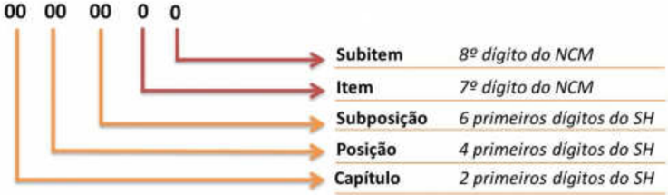

## Projeto Nota Fiscal Eletrônica

## Nota Técnica 2016/001

## Tabela de Unidades Minuta

## de Medidas Tributáveis no Comércio Exterior

ReceitaFederal

## 1. Histórico de Alteração:

| Versão 1.10   | Incluir regra de validação I14-10 e nota orientando para não diferenciar o uso de maiúsculas e minúsculas.                                          |
|---------------|-----------------------------------------------------------------------------------------------------------------------------------------------------|
| Versão 1.20   | Adiar para 28/04/2017 e 03/07/2017, resp ectivamente, os prazos de homologação e de implantação da NT 2016.001 e NT 2016.001 - V1.10.               |
| Versão 1.30   | Divulgar nova Tabela de Unidade de Medidas Tributáv eis no Comércio Exterior - Utrib, retornando as medidas us adas anteriormente para 585 códigos. |
| Versão 1.40   | Alterar de Kg para M 3 a Unidade de Medidas Tributáveis no Comércio Exterior - Utrib das NCMs4409.2200 e a 4409.2900.                               |

## Versão 1.40:

Na 'Tabela  NCM e respectiva   Utrib   (comércio   exterio r)',   disponível   no   Portal   da   NF-e,   aba 'Documentos', opção 'Diversos', alterar de Kg para  M 3 a   Unidade de Medidas Tributáveis no Comércio Exterior - Utrib das NCMs  4409.2200 e 4409.2900.

Além disso, foi excluído o parágrafo que informava que a Secretaria da Receita Federal emitiria ato normativo para regulamentar o uso da Tabela de Unidades de Medida Tributáveis no Comércio Exterior, a partir de janeiro de 2017, porque concluiu-se que não havia necessidade.

## Versão 1.30

## 1.1 - Justificativa para retornar 585 códigos da tabela  Utrib para as medidas usadas anteriormente:

Minuta

A NT 2016/001 (versão 1.0 e versão 1.20), com data  de implantação para 03/07/2017, objetivou   a   padronização   da  Tabela   de   Unidades   de   M edidas  Tributáveis   no   Comércio Exterior   -   Utrib   utilizada   na   NF-e,   de   acordo   com   a   tabela   de   Unidades   de   Medidas Estatísticas   -   UME   utilizadas   no   SISCOMEX, ambas   c onforme   recomendação   da Organização Mundial das Aduanas - OMA para unidades  de medidas estatísticas utilizadas no comércio exterior. Entretanto, em virtude de dif iculdades relatadas pelo setor privado e outras ocasionadas a alguns processos -relacionados ao SISCOMEX e de responsabilidade da Secretaria da Receita Federal do Brasil (RFB) e da Secretaria de Comércio Exterior (Secex), será necessário reverter 585 dos mais de 1 0 mil códigos da tabela para as medidas usadas anteriormente. A nova tabela está   disponível no Portal   da   NF-e (www.nfe.fazenda.gov.br) na aba 'Documentos', opções 'Diversos'. A tabela  está com 2 planilhas: a primeira apresenta todos os NCM e respectivas Utrib a vigorar a partir de 03/07/2017. A segunda planilha destaca quais foram os 585 códigos que retornaram para as medidas usadas anteriormente.

A RFB e a Secex trabalharão para que seja possível, em data futura, que 100% da tabela   da   UME   e   da   Utrib   estejam   padronizadas   conforme   unidades   de   medidas recomendadas pela OMA.

## 2. Introdução

Esta  nota   técnica   tem   como   objetivo   adequar   a   NF-e  ao   Projeto   do   Portal   Único   do Comércio Exterior,   padronizando   a Tabela   de   Unidades   de   Medidas   Tributáveis   no Comércio Exterior ,   conforme o código NCM (Nomenclatura Comum do Mercosul) da mercadoria a que se refere, com base nas unidades recomendadas pela Organização Mundial de Aduanas (OMA) .

Nesses termos, esta nota técnica não tem nenhuma vinculação com a consulta pública realizada   pelas   Secretarias   de   Fazenda   para   padronização   das   unidades   de   medidas comerciais, bem como as alterações propostas não se  aplicam a NFC-e e nem às empresas emissoras de NF-e que não operam com o Comércio Exterior.

A OMA é a única organização internacional intergovername ntal que trata de procedimentos aduaneiros concernentes ao comércio entre os países .

Sua missão é melhorar a eficácia e a eficiência das Aduanas em suas atividades de recolhimento de receitas, proteção ao consumidor, d efesa do meio ambiente, combate ao tráfico de drogas e à lavagem de dinheiro, entre ta ntas outras.

O Brasil é representado na OMA pela Secretaria da Receita Federal do Brasil (RFB) com o apoio do Ministério das Relações Exteriores (MRE) .

O SH (Sistema Harmonizado) ou Sistema Harmonizado de Designação e Codificação  de Mercadoria é um sistema de classificação internacional de mercadorias, criado e mantido pela OMA ,  que contém uma estrutura de códigos com a descrição  de características específicas dos produtos, como por exemplo, materia is que o compõe e sua aplicação, para ser utilizado pelos fabricantes, transportadores, exportadores, importadores e alfândegas, de maneira   a   permitir   uma   classificação   uniformizada   d as   mercadorias   no   mercado internacional. Esse sistema é utilizado por mais de 190 países para elaborar suas tarifas aduaneiras   e   estabelecer   estatísticas   comerciais   in ternacionais.   Mais   de   98%   das mercadorias comercializadas no mundo são classifica das com base na nomenclatura do SH. Minuta

O SH possibilita a classificação de todo e qualquer pro duto em um código de 6 dígitos .

A NCM foi criada no âmbito do Mercosul, para uso próprio do bloco, e teve como base o SH e serviu de base para a criação da tarifa aduaneira  utilizada pelos países do Mercosul, denominada Tarifa Externa Comum (TEC) . O código NCM é um código de 8 dígitos .

Qualquer mercadoria, importada ou comprada no Brasil, deve ter um código NCM na sua documentação legal (nota fiscal, livros legais, etc .), cujo objetivo é classificar os itens de acordo com regulamentos do Mercosul.

Dos 8 dígitos que compõem a NCM ,   os   6   primeiros  são classificações do SH .   Os dois últimos dígitos fazem parte das especificações próp rias do Mercosul.

## 3. Objeto

Esta nota técnica tem como objetivo estabelecer uma Tabela de Unidades de Medidas Tributáveis no Comércio Exterior, publicada na aba 'Documentos', opção 'Diversos', do Portal da NF-e &lt;www.nfe.fazenda.gov.br&gt;, a qual relaciona,   para   cada   código NCM ,   a unidade de medida, que deverá ser obrigatoriamente  utilizada na emissão de documentos fiscais, para quantificar os produtos a que se refiram, nos campos relativos à Unidade Tributável (uTrib) e Quantidade Tributável (qTrib) da Nota Fiscal Eletrônica - NF-e.

As unidades de medida relacionadas na tabela 'Unidades de  Medidas Tributáveis  no Comércio   Exterior'   se   baseiam   em   recomendação   da OMA e   são   idênticas   àquelas utilizadas   no   Sistema   Integrado   de   Comércio   Exterio r   para   registro   das   operações   de exportação e importação brasileiras.

Essa   tabela   contempla   os   códigos   que   entrarão   em   vi gor   a   partir   da   publicação   da Resolução CAMEX que vier a alterar a NCM, para adap tá-la ao Novo Sistema Harmonizado (SH 2017). A referida Resolução efetua modificações  na Tarifa Externa Comum do Mercosul (TEC) e na Nomenclatura Comum do Mercosul (NCM). A publicação dessa Resolução CAMEX está prevista para dezembro de 2016, com vigê ncia a partir de 01/01/2017. Minuta

O disposto nesta NT aplica-se apenas aos contribuintes que operem no Comércio Exterior, relativamente às notas fiscais relacionadas a operações de exportação, conforme descrito na 'Regra de validação'.

Além de divulgar a atualização da Tabela Unidades de Medidas Tributáveis no Comércio Exterior, faz-se necessária a criação de uma nova r egra de validação (I14-10) ,   conforme descrita nesta NT.

O campo uTrib (Unidade Tributável) (06 caracteres)  da NF-e deve ser preenchido com uma das opções apresentadas na coluna 'uTrib (Abreviatu ra)' da Tabela Unidades de Medidas Tributáveis no Comércio Exterior,  publicada na aba 'Documentos', opção 'Diversos', do Portal da NF-e &lt;www.nfe.fazenda.gov.br&gt;.

## 4. Datas e Prazos

As datas de início de vigência desta Nota Técnica s ão:

- Ambiente de Homologação: 28/04/2017;

- Ambiente de Produção:

03/07/2017;

## Versão 1.40:

- Ambiente de Homologação: 23 /07/2018
- Ambiente de Produção: 06/08/2018;

Observação: A Secretaria da Receita Federal do Brasil - RFB emitirá ato normativo para regulamentar o uso da Tabela de Unidades de Medida Tributáveis no Comércio Exterior a partir de janeiro de 2017.

## 5. Regras de Validações de Negócio

| Campo- Seq   |   Modelo | Regra de Validação                                                                                                                                                                                                                                                                                                                                                                                                                                                                                                                                                            | Aplic.   |   Msg | Efeito   | Descrição Erro                                                                                              |
|--------------|----------|-------------------------------------------------------------------------------------------------------------------------------------------------------------------------------------------------------------------------------------------------------------------------------------------------------------------------------------------------------------------------------------------------------------------------------------------------------------------------------------------------------------------------------------------------------------------------------|----------|-------|----------|-------------------------------------------------------------------------------------------------------------|
| I14-10       |       55 | Validar a correspondência entre o código NCM e a unidade tributável (tag: uTrib) nas operações com o Comércio Exterior, conforme segue: - Operação de Exportação (tpNF=1-Saída e idDest=3); ou - Operações vinculadas a exportação, CFOP=1501, 2501, 5501, 5502, 5504, 5505, 6501, 6502, 6504 ou 6505 Observação : Tabela de Unidades Tributáveis no Comércio Exterior publicada na aba 'Documentos', opção 'Diversos' do Portal Nacional da NF-e (www.nfe.fazenda.gov.br) Nota: O uso diferenciado de maiúsculas ou minúsculas não deve ser considerado na validação. Minuta | Obrig    |   817 | Rej.     | Rejeição: Unidade Tributável incompatível com o NCM informado na operação com Comércio Exterior [nItem:nnn] |

## 6. Tabela de códigos de erros e descrições de mensag ens de erros

|   Código | MOTIVOS DE NÃO ATENDIMENTO DASOLICITAÇÃO                                                              |
|----------|-------------------------------------------------------------------------------------------------------|
|      817 | Unidade Tributável incompa/g417vel com oNCM informado na operação com Comércio Exterior [ nItem :nnn] |
## Metadados
- [Metadados do corpus](metadata.json)
- [Fonte e procedência](../../../../sources/portal_nacional_nfe/nfe/notas-tecnicas/nt2016-001-v1-40-altera-tabela-unidades-de-medidas-tributaveis-no-comercio-exterior/source.json)
- [Dados normalizados](../../../../normalized/nfe/notas-tecnicas/nt2016-001-v1-40-altera-tabela-unidades-de-medidas-tributaveis-no-comercio-exterior/normalized.json)
- [Changelog](../../../../changelog/nfe/notas-tecnicas/nt2016-001-v1-40-altera-tabela-unidades-de-medidas-tributaveis-no-comercio-exterior.md)
- [Proveniência resumida](../../../../sources/provenance/nt2016-001-v1-40-altera-tabela-unidades-de-medidas-tributaveis-no-comercio-exterior.json)

## Documentos relacionados

- [[it-2023-003-v1-08-tabela-de-combust-veis-sujeitos-tributa-o-monof-sica]]
- [[nt-2016-003-v3-62-tabela-ncm-vig-ncia-01-11-2023-ou-01-01-2024]]
- [[nt-2016-003-v3-7-tabela-ncm-vig-ncia-01-04-2024]]
- [[nt2023-001v1-60-tributa-o-monof-sica-dos-combust-veis]]
