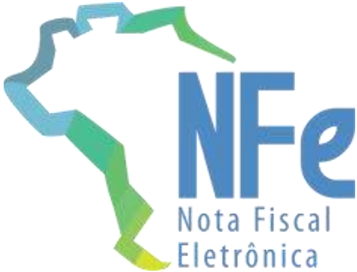
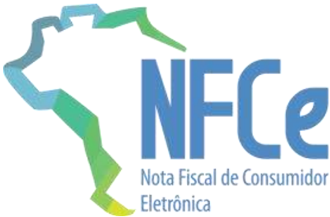
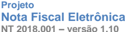
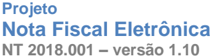

## Projeto Nota Fiscal Eletrônica

Nota Técnica 2018.001

Emitente Pessoa Física (CPF) com Inscrição Estadual

Versão 1.10 - Fevereiro 2020

## Sumário

| Controle de Versões.............................................................................................................                                                                                                                                                                                                               | Controle de Versões.............................................................................................................                                                                                                                                                                                                               | 4                                                                                                                                                                                                                                                                                                                                              |
|------------------------------------------------------------------------------------------------------------------------------------------------------------------------------------------------------------------------------------------------------------------------------------------------------------------------------------------------|------------------------------------------------------------------------------------------------------------------------------------------------------------------------------------------------------------------------------------------------------------------------------------------------------------------------------------------------|------------------------------------------------------------------------------------------------------------------------------------------------------------------------------------------------------------------------------------------------------------------------------------------------------------------------------------------------|
| Histórico de Alterações / Cronograma..................................................................................                                                                                                                                                                                                                         | Histórico de Alterações / Cronograma..................................................................................                                                                                                                                                                                                                         | 5                                                                                                                                                                                                                                                                                                                                              |
| 1. Resumo..........................................................................................................................                                                                                                                                                                                                            | 1. Resumo..........................................................................................................................                                                                                                                                                                                                            | 6                                                                                                                                                                                                                                                                                                                                              |
| 1.1                                                                                                                                                                                                                                                                                                                                            | Modificações na versão 1.10 Desta NT.................................................................................6                                                                                                                                                                                                                         | Modificações na versão 1.10 Desta NT.................................................................................6                                                                                                                                                                                                                         |
|                                                                                                                                                                                                                                                                                                                                                | 1.1.1 Conceito de Chave Natural ...............................................................................................................                                                                                                                                                                                                | 6                                                                                                                                                                                                                                                                                                                                              |
|                                                                                                                                                                                                                                                                                                                                                | 1.1.2 Alterações em Regras de Validação ................................................................................................. 1.1.3 Outras Alterações..............................................................................................................................                                                | 6                                                                                                                                                                                                                                                                                                                                              |
| 2. Visão Geral ....................................................................................................................                                                                                                                                                                                                            | 2. Visão Geral ....................................................................................................................                                                                                                                                                                                                            | 7                                                                                                                                                                                                                                                                                                                                              |
| 2.1 Sobre a Chave de Acesso da NF-e.......................................................................................7                                                                                                                                                                                                                    | 2.1 Sobre a Chave de Acesso da NF-e.......................................................................................7                                                                                                                                                                                                                    | 2.1 Sobre a Chave de Acesso da NF-e.......................................................................................7                                                                                                                                                                                                                    |
| 2.2 Sobre a Chave Natural da NF-e e da NFC-e.........................................................................7                                                                                                                                                                                                                         | 2.2 Sobre a Chave Natural da NF-e e da NFC-e.........................................................................7                                                                                                                                                                                                                         | 2.2 Sobre a Chave Natural da NF-e e da NFC-e.........................................................................7                                                                                                                                                                                                                         |
| 2.3 Assinatura Digital com Certificado e-CPF..............................................................................8                                                                                                                                                                                                                    | 2.3 Assinatura Digital com Certificado e-CPF..............................................................................8                                                                                                                                                                                                                    | 2.3 Assinatura Digital com Certificado e-CPF..............................................................................8                                                                                                                                                                                                                    |
| 2.4 Serviço de Autorização de Uso e Serviços Vinculados..........................................................8                                                                                                                                                                                                                             | 2.4 Serviço de Autorização de Uso e Serviços Vinculados..........................................................8                                                                                                                                                                                                                             | 2.4 Serviço de Autorização de Uso e Serviços Vinculados..........................................................8                                                                                                                                                                                                                             |
| 2.4.1 Serviço de Autorização de Uso .........................................................................................................                                                                                                                                                                                                  | 2.4.1 Serviço de Autorização de Uso .........................................................................................................                                                                                                                                                                                                  | 9                                                                                                                                                                                                                                                                                                                                              |
| 2.4.2 Manutenção do Cadastro Nacional de Emissores (CNE).................................................................                                                                                                                                                                                                                      | 2.4.2 Manutenção do Cadastro Nacional de Emissores (CNE).................................................................                                                                                                                                                                                                                      | 9                                                                                                                                                                                                                                                                                                                                              |
| 2.4.3 Manutenção do Cadastro Centralizado de Contribuintes (CCC) ......................................................                                                                                                                                                                                                                        | 2.4.3 Manutenção do Cadastro Centralizado de Contribuintes (CCC) ......................................................                                                                                                                                                                                                                        | 9                                                                                                                                                                                                                                                                                                                                              |
| SVC........................................................................................                                                                                                                                                                                                                                                    | SVC........................................................................................                                                                                                                                                                                                                                                    | 10                                                                                                                                                                                                                                                                                                                                             |
| 2.4.4 Ambiente de Contingência: EPEC /                                                                                                                                                                                                                                                                                                         | 2.4.4 Ambiente de Contingência: EPEC /                                                                                                                                                                                                                                                                                                         | 2.4.4 Ambiente de Contingência: EPEC /                                                                                                                                                                                                                                                                                                         |
| 3. Emissor de Nota Fiscal no Site do Fisco.......................................................................10                                                                                                                                                                                                                            | 3. Emissor de Nota Fiscal no Site do Fisco.......................................................................10                                                                                                                                                                                                                            | 3. Emissor de Nota Fiscal no Site do Fisco.......................................................................10                                                                                                                                                                                                                            |
| 3.1 Alteração na Composição da Chave de Acesso..................................................................10 3.2 Quadro Resumo Sobre as Faixas de Série .........................................................................11 4. Serviço: Autorização de Uso da Nota Fiscal (item 4.1 do MOC)...................................12 | 3.1 Alteração na Composição da Chave de Acesso..................................................................10 3.2 Quadro Resumo Sobre as Faixas de Série .........................................................................11 4. Serviço: Autorização de Uso da Nota Fiscal (item 4.1 do MOC)...................................12 | 3.1 Alteração na Composição da Chave de Acesso..................................................................10 3.2 Quadro Resumo Sobre as Faixas de Série .........................................................................11 4. Serviço: Autorização de Uso da Nota Fiscal (item 4.1 do MOC)...................................12 |
| 4.1 Leiaute da Nota Fiscal Eletrônica (Anexo I do MOC)...........................................................12                                                                                                                                                                                                                            | 4.1 Leiaute da Nota Fiscal Eletrônica (Anexo I do MOC)...........................................................12                                                                                                                                                                                                                            | 4.1 Leiaute da Nota Fiscal Eletrônica (Anexo I do MOC)...........................................................12                                                                                                                                                                                                                            |
| 4.2 Validação do Certificado Digital de Transmissão / Assinatura .............................................13                                                                                                                                                                                                                               | 4.2 Validação do Certificado Digital de Transmissão / Assinatura .............................................13                                                                                                                                                                                                                               | 13                                                                                                                                                                                                                                                                                                                                             |
| 4.2.1 Validação do Certificado Digital de Transmissão (Item 4.1.5 do MOC)..........................................                                                                                                                                                                                                                            | 4.2.1 Validação do Certificado Digital de Transmissão (Item 4.1.5 do MOC)..........................................                                                                                                                                                                                                                            | 13                                                                                                                                                                                                                                                                                                                                             |
| 4.2.2 Validação do Certificado Digital de Assinatura (Item 4.1.8.3 do MOC) ..........................................                                                                                                                                                                                                                          | 4.2.2 Validação do Certificado Digital de Assinatura (Item 4.1.8.3 do MOC) ..........................................                                                                                                                                                                                                                          | 4.2.2 Validação do Certificado Digital de Assinatura (Item 4.1.8.3 do MOC) ..........................................                                                                                                                                                                                                                          |
| 4.2.3 Validação da Assinatura Digital (Item 4.1.8.4 do MOC)..................................................................                                                                                                                                                                                                                  | 4.2.3 Validação da Assinatura Digital (Item 4.1.8.4 do MOC)..................................................................                                                                                                                                                                                                                  | 13                                                                                                                                                                                                                                                                                                                                             |
| 4.3 Alteração em Regras de Validação - RV (Anexo II do MOC)..............................................14 A. Dados da Nota Fiscal............................................................................................................................                                                                                | 4.3 Alteração em Regras de Validação - RV (Anexo II do MOC)..............................................14 A. Dados da Nota Fiscal............................................................................................................................                                                                                | 14                                                                                                                                                                                                                                                                                                                                             |
|                                                                                                                                                                                                                                                                                                                                                |                                                                                                                                                                                                                                                                                                                                                | .................................................................................................................. 14                                                                                                                                                                                                                          |
| BA. Documento Fiscal Referenciado.........................................................................................................                                                                                                                                                                                                     | BA. Documento Fiscal Referenciado.........................................................................................................                                                                                                                                                                                                     | 14                                                                                                                                                                                                                                                                                                                                             |
|                                                                                                                                                                                                                                                                                                                                                |                                                                                                                                                                                                                                                                                                                                                | Emitente...................................................................................................................... 15                                                                                                                                                                                                              |
| 1. Banco de Dados: Emitente....................................................................................................................                                                                                                                                                                                                | 1. Banco de Dados: Emitente....................................................................................................................                                                                                                                                                                                                | 16                                                                                                                                                                                                                                                                                                                                             |
| 2.Banco de Dados: NF-e........................................................................................................................... 2A.Banco de Dados: Evento EPEC...........................................................................................................                                                    | 2.Banco de Dados: NF-e........................................................................................................................... 2A.Banco de Dados: Evento EPEC...........................................................................................................                                                    | 16 17                                                                                                                                                                                                                                                                                                                                          |
| 3.Banco de Dados: Inutilização ................................................................................................................. 5.Banco de Dados: Destinatário................................................................................................................                                                | 3.Banco de Dados: Inutilização ................................................................................................................. 5.Banco de Dados: Destinatário................................................................................................................                                                | 18                                                                                                                                                                                                                                                                                                                                             |
|                                                                                                                                                                                                                                                                                                                                                |                                                                                                                                                                                                                                                                                                                                                | 18                                                                                                                                                                                                                                                                                                                                             |
| Serviço: Consulta ao Resultado do Lote (item 4.2 do MOC).........................................18                                                                                                                                                                                                                                            | Serviço: Consulta ao Resultado do Lote (item 4.2 do MOC).........................................18                                                                                                                                                                                                                                            | Serviço: Consulta ao Resultado do Lote (item 4.2 do MOC).........................................18                                                                                                                                                                                                                                            |
| 5.                                                                                                                                                                                                                                                                                                                                             | 5.                                                                                                                                                                                                                                                                                                                                             | 5.                                                                                                                                                                                                                                                                                                                                             |
| 5.1 Validação do Certificado Digital de Transmissão (Item 4.2.4 do MOC)................................18 5.2 Alteração em Regras de Validação (Item 4.2.7.2 do MOC) .................................................19 6. Serviço: Pedido de Inutilização de numeração (item 4.4 do MOC)...............................19                    | 5.1 Validação do Certificado Digital de Transmissão (Item 4.2.4 do MOC)................................18 5.2 Alteração em Regras de Validação (Item 4.2.7.2 do MOC) .................................................19 6. Serviço: Pedido de Inutilização de numeração (item 4.4 do MOC)...............................19                    | 5.1 Validação do Certificado Digital de Transmissão (Item 4.2.4 do MOC)................................18 5.2 Alteração em Regras de Validação (Item 4.2.7.2 do MOC) .................................................19 6. Serviço: Pedido de Inutilização de numeração (item 4.4 do MOC)...............................19                    |
| 6.1 Leiaute do Pedido de Inutilização (Item 4.4.1 do MOC).......................................................19                                                                                                                                                                                                                             | 6.1 Leiaute do Pedido de Inutilização (Item 4.4.1 do MOC).......................................................19                                                                                                                                                                                                                             | 6.1 Leiaute do Pedido de Inutilização (Item 4.4.1 do MOC).......................................................19                                                                                                                                                                                                                             |
| 6.2 Alteração em Regras de Validação (Item 4.4.7.4 do MOC) .................................................19                                                                                                                                                                                                                                 | 6.2 Alteração em Regras de Validação (Item 4.4.7.4 do MOC) .................................................19                                                                                                                                                                                                                                 | 6.2 Alteração em Regras de Validação (Item 4.4.7.4 do MOC) .................................................19                                                                                                                                                                                                                                 |
| 7. Serviço: Consulta Protocolo da Nota Fiscal (item 4.5 do MOC)....................................20                                                                                                                                                                                                                                          | 7. Serviço: Consulta Protocolo da Nota Fiscal (item 4.5 do MOC)....................................20                                                                                                                                                                                                                                          | 7. Serviço: Consulta Protocolo da Nota Fiscal (item 4.5 do MOC)....................................20                                                                                                                                                                                                                                          |

| 7.1                                                                                                                                                                                                                                  | Validação do Certificado Digital de Transmissão (Item 4.5.4 do MOC)................................20                                                                                                                                |    |
|--------------------------------------------------------------------------------------------------------------------------------------------------------------------------------------------------------------------------------------|--------------------------------------------------------------------------------------------------------------------------------------------------------------------------------------------------------------------------------------|----|
| 7.2                                                                                                                                                                                                                                  | Alteração em Regras de Validação (item 4.5.7.2 do MOC)..................................................20                                                                                                                           |    |
| 8. Serviço: Consulta Status Serviço (item 4.6 do MOC)....................................................21                                                                                                                          | 8. Serviço: Consulta Status Serviço (item 4.6 do MOC)....................................................21                                                                                                                          |    |
| 8.1                                                                                                                                                                                                                                  | Validação do Certificado Digital de Transmissão (Item 4.6.4 do MOC)................................21                                                                                                                                |    |
| 9.                                                                                                                                                                                                                                   | Serviço: Consulta Cadastro de Contribuintes (item 4.7 do MOC).................................21                                                                                                                                     |    |
| 9.1                                                                                                                                                                                                                                  | Validação do Certificado Digital de Transmissão (Item 4.7.4 do MOC)................................21                                                                                                                                |    |
| 9.2                                                                                                                                                                                                                                  | Alteração em Regras de Validação (item 4.7.7.2 do MOC)..................................................21                                                                                                                           |    |
| 10. Serviço: Evento de Cancelamento (Item 4.3 do MOC)..................................................22                                                                                                                            | 10. Serviço: Evento de Cancelamento (Item 4.3 do MOC)..................................................22                                                                                                                            |    |
| 10.1 Documentação inicial do Web Service ................................................................................22                                                                                                          | 10.1 Documentação inicial do Web Service ................................................................................22                                                                                                          |    |
| 10.2 Validação do Certificado Digital de Transmissão / Assinatura (Item 4.3.4, 4.3.7-c e 4.3.7-d do MOC).........................................................................................................................22  | 10.2 Validação do Certificado Digital de Transmissão / Assinatura (Item 4.3.4, 4.3.7-c e 4.3.7-d do MOC).........................................................................................................................22  |    |
| 10.3 Alteração em Regras de Validação (Item 4.3.7-e e 4.3.8 do MOC) .....................................22                                                                                                                          | 10.3 Alteração em Regras de Validação (Item 4.3.7-e e 4.3.8 do MOC) .....................................22                                                                                                                          |    |
| 11. Serviço: Evento de Carta de Correção (item 4.8 do MOC) ...........................................23                                                                                                                             | 11. Serviço: Evento de Carta de Correção (item 4.8 do MOC) ...........................................23                                                                                                                             |    |
| 11.1 Documentação inicial do Web Service ................................................................................23                                                                                                          | 11.1 Documentação inicial do Web Service ................................................................................23                                                                                                          |    |
| 11.2 Validação do Certificado Digital de Transmissão / Assinatura (Item 4.8.4, 4.8.7.3, 4.8.7.4 MOC)..............................................................................................................................23 | 11.2 Validação do Certificado Digital de Transmissão / Assinatura (Item 4.8.4, 4.8.7.3, 4.8.7.4 MOC)..............................................................................................................................23 | do |
| 11.3 Alteração em Regras de Validação (Item 4.8.7.5 e 4.8.8 do MOC)......................................23                                                                                                                          | 11.3 Alteração em Regras de Validação (Item 4.8.7.5 e 4.8.8 do MOC)......................................23                                                                                                                          |    |
| 12. Serviço: Evento de Manifestação do Destinatário (item 4.9 do MOC) ..........................24                                                                                                                                   | 12. Serviço: Evento de Manifestação do Destinatário (item 4.9 do MOC) ..........................24                                                                                                                                   |    |
| 13.1 EPEC - Emitente Pessoa Física ..........................................................................................24                                                                                                      | 13.1 EPEC - Emitente Pessoa Física ..........................................................................................24                                                                                                      |    |
| 13.2 Alteração em Regras de Validação (Item 4.10.9 do MOC) ..................................................25                                                                                                                      | 13.2 Alteração em Regras de Validação (Item 4.10.9 do MOC) ..................................................25                                                                                                                      |    |
| 14. Tabela de códigos e descrições de mensagens de erro ...............................................25                                                                                                                            | 14. Tabela de códigos e descrições de mensagens de erro ...............................................25                                                                                                                            |    |

## Controle de Versões

|   Versão | Publicação      | Descrição                                                                                                                                              |
|----------|-----------------|--------------------------------------------------------------------------------------------------------------------------------------------------------|
|     1.10 | Fevereiro/ 2020 | Alteração de regras de validação e nos eventos de Manifestação do Destinatário para admitir emitente com CPF, e no conceito de chave natural da NFC-e. |
|     1.00 | Abril/ 2018     | Publicação da NT                                                                                                                                       |

## Histórico de Alterações / Cronograma

|   Versão | Histórico de atualizações                                                                       | Implantação Teste   | Implantação Produção   |
|----------|-------------------------------------------------------------------------------------------------|---------------------|------------------------|
|     1.10 | • Alteração do conceito de chave natural                                                        | 11/05/2020          | 01/09/2020             |
|     1.10 | • Referências ao Cadastro Nacional de Emissores e novo conceito de Chave Natural                | 16/03/2020          | 11/05/2020             |
|     1.00 | Documenta as mudanças necessárias no serviço de autorização de NF-e disponibilizado pelas SEFAZ | 01/08/2018          | 01/10/2018             |

## 1. Resumo

Foi alterada a legislação nacional (Ajuste SINIEF 09/2017), permitindo a emissão da NF-e para emitente  Pessoa  Física,  identificado  pelo  seu  CPF.  Esta  decisão  atende  uma  demanda  de algumas SEFAZ e uma demanda também dos Produtores Rurais, que possuem uma Inscrição Estadual vinculada a sua inscrição no CPF.

Com esta mudança, o contribuinte Produtor Rural com CPF poderá prescindir da emissão da Nota Fiscal Avulsa no site da SEFAZ para emitir a NF-e na operação interestadual, na exportação, na venda para órgãos públicos e em outras situações em que é obrigatória a emissão da NF-e. Será possível também gerar a NF-e na própria operação interna dentro da UF.

Portanto, deverá ser possível a emissão de Nota Fiscal Eletrônica para o Emitente Pessoa Física (CPF) utilizando o Aplicativo do próprio do contribuinte.

Esta  especificação  documenta  as  mudanças  necessárias  no  serviço  de  autorização  de  NF-e disponibilizado pelas SEFAZ. O prazo previsto para a implementação desta versão é:

- o Ambiente de Homologação (ambiente de teste das empresas): em 01/08/2018;
- o Ambiente de Produção : em 01/10/2018.

## 1.1 Modificações na versão 1.10 Desta NT

## 1.1.1 Conceito de Chave Natural

Alterado o conceito de chave natural em razão de alteração introduzida pelo Ajuste SINIEF 19/19.

Os prazos para implantação das alterações correspondentes são:

- o Ambiente de Homologação (ambiente de teste das empresas): 11-mai-2020;
- o Ambiente de Produção: 01-set-2020.

## 1.1.2  Alterações em Regras de Validação

Alterada  a  regra  de  validação  K02 em  função  do  Cadastro  Nacional  de  Emissores  ter  sido descontinuado.

Os prazos para implantação das alterações correspondentes são:

- o Ambiente de Homologação (ambiente de teste das empresas): 16-mar-2020;
- o Ambiente de Produção: 11-mai-2020.

## 1.1.3 Outras Alterações

- o Corrigida a referência com relação ao Evento de Manifestação do Destinatário;
- o Corrigida a referência com relação ao Evento Prévio de Emissão em Contingência para emitente pessoa física.

## 2. Visão Geral

No leiaute atual da NF-e já consta a possibilidade de o emitente ser uma pessoa física, identificada pelo seu CPF. Esta possibilidade existe desde o início do Sistema NFE, permitindo a emissão da Nota Fiscal Avulsa no site da SEFAZ.

Segue abaixo uma visão geral das mudanças necessárias para viabilizar a emissão de NF-e, modelo 55, para contribuinte pessoa física, com Inscrição Estadual.

## 2.1 Sobre a Chave de Acesso da NF-e

Na Chave de Acesso da NF-e consta o CNPJ da empresa emitente da NF-e, ou o CNPJ da SEFAZ no caso da Nota Fiscal Avulsa. Esta realidade terá que ser alterada, permitindo a identificação na Chave de Acesso do emitente pessoa física (CPF).

Também terá que ser alterado o processo de assinatura da NF-e, que atualmente somente pode ser feito utilizando um Certificado Digital tipo 'e-CNPJ'.

No caso do Emitente Pessoa Física:

- O CPF deverá constar na Chave de Acesso, precedido por zeros, completando 14 posições;
- Será reservada uma faixa do campo Série da NF-e, como forma de identificação do Emitente pessoa física (CPF);
- A NF-e deverá ser assinada com o Certificado Digital do Emitente, do tipo 'e-CPF'.

## 2.2 Sobre a Chave Natural da NF-e e da NFC-e

A Chave Natural da NF-e é composta pelos campos de UF, CNPJ do Emitente, Série e Número da NF-e, além do modelo do documento fiscal eletrônico. O Sistema de Autorização de Uso da SEFAZ  valida  a  existência  de  uma  NF-e  previamente  autorizada  e  rejeita  novos  pedidos  de autorização para NF-e com duplicidade da Chave Natural.

Este  conceito  se  mantém,  considerando  também  a  possibilidade  da  informação  do  CPF  do emitente, ao invés do CNPJ na Chave de Acesso / Chave Natural da NF-e.

A legislação determina que a identificação única de uma nota fiscal para efeitos tributários é feita pelos seguintes conjuntos de informações, que são um subconjunto das informações existentes na chave de acesso:

- NF-e : UF, CNPJ ou CPF do Emitente, Série e Número da NF-e, modelo do documento fiscal eletrônico e ambiente de autorização.
- NFC-e :  UF,  CNPJ do Emitente, Série e Número da NF-e, modelo do documento fiscal eletrônico e tipo de emissão.

Estes  conjuntos  de  informações,  que  formam  um  subconjunto  das  informações  presentes  na chave de acesso, recebem a denominação de 'chave natural'

O Ajuste SINIEF 19/19 incluiu o tipo de emissão, que é informado pelo emitente no campo tpEmis (id: B22), entre as características que identificam de forma única uma NFC-e.

No caso da NF-e o ambiente de autorização, ou ambiente autorizador, também é escolhido pelo emitente no momento da solicitação da autorização de uso, sendo informado no mesmo campo, como pode ser visto na tabela a seguir:

| tpEmis Significado                                                                             | Ambiente autorizador          |
|------------------------------------------------------------------------------------------------|-------------------------------|
| Emissão normal (não em contingência)                                                           | Normal                        |
| 1 2 Contingência FS-IA, com impressão do DANFE em Formulário de Segurança - Impressor Autônomo | Não utilizado na NF-e         |
| 3 Contingência SCAN (Sistema de Contingência do Ambiente Nacional) *Desativado * NT 2015/002   | Não utilizado na NF-e         |
| 4 Contingência EPEC (Evento Prévio da Emissão em Contingência)                                 | Normal                        |
| 5 Contingência FS-DA, com impressão do DANFE em Formulário de Segurança - Documento Auxiliar   | Normal                        |
| 6 Contingência SVC-AN (SEFAZ Virtual de Contingência do AN)                                    | Sefaz Virtual de Contingência |
| 7 Contingência SVC-RS (SEFAZ Virtual de Contingência do RS)                                    | Sefaz Virtual de Contingência |
| 9 Contingência off-line da NFC-e                                                               | Não utilizado na NF-e         |

- Novos pedidos  de  autorização  para  NF-e  caso  seja  identificada  duplicidade  de  Chave Natural; e
- Pedidos de autorização enviados para o ambiente autorizador errado, de acordo com a tabela acima.

## 2.3 Assinatura Digital com Certificado e-CPF

O Manual de Orientação do Contribuinte (MOC) define que o certificado digital será emitido dentro do padrão ICP-Brasil, devendo conter o CNPJ da pessoa jurídica titular do certificado digital na extensão 'Nome Alternativo para o Requerente' ('OtherName'), com o OID = 2.16.76.1.3.3.

Isso se mantém, incluindo agora a possibilidade de utilização do certificado digital do tipo 'e-CPF', com o CPF da pessoa física na mesma extensão do certificado, com o OID = 2.16.76.1.3.1.

Da mesma forma que o certificado digital para pessoa jurídica, o 'e-CPF' poderá ser usado na transmissão  dos  dados  e/ou  na  assinatura  dos  documentos.  No  caso  da  assinatura  de documentos XML, o CPF constante no certificado digital deverá coincidir com o CPF do emitente da NF-e.

## 2.4 Serviço de Autorização de Uso e Serviços Vinculados

Esta Nota Técnica trata das alterações no Serviço de Autorização de Uso da NF-e utilizado pelas empresas. Existem outros serviços mantidos pela SEFAZ que dão suporte para este serviço de autorização, que serão tratados em outras especificações técnicas.

## 2.4.1 Serviço de Autorização de Uso

O Serviço de Autorização de Uso considera os Web Services consumidos pelas empresas no processo de autorização da NF-e, conforme segue:

- Web Service de Envio de Lote com as NF-e a serem autorizadas (item 4.1 do MOC);
- Web Service de Consulta ao Resultado de Lote, se solicitada resposta assíncrona (item 4.2 do MOC);
- Web Service de Evento de Cancelamento (item 4.3 do MOC);
- Web Service de Pedido de Inutilização (item 4.4 do MOC);
- Web Service de Consulta Protocolo de uma Chave de Acesso informada (item 4.5 do MOC);
- Web Service de Consulta Status Serviço (item 4.6 do MOC);
- Web Service de Consulta Cadastro de Contribuintes da UF (item 4.7 do MOC);
- Web Service de Evento de Carta de Correção (item 4.8 do MOC);
- Web Service de Evento de Manifestação do Destinatário (item 4.9 do MOC);
- Web Service de Evento de EPEC (item 4.10 do MOC).

As mudanças nos serviços acima estão detalhadas nesta Nota Técnica.

## 2.4.2  Manutenção do Cadastro Nacional de Emissores (CNE)

Item 2.4.2 removido na versão 1.10 desta NT, pois o CNE não é mais utilizado.

As  SEFAZ  mantêm  um  cadastrado  centralizado  com  os  contribuintes  credenciados  como emitentes de NF-e na UF. Atualmente no CNE somente é possível cadastrar os contribuintes pessoa jurídica, com o CNPJ e a respectiva Inscrição Estadual na UF.

## O CNE é utilizado para:

- Identificação do contribuinte autorizado para a emissão da NF-e pela UF, no ambiente da SEFAZ Virtual;
- Identificação do contribuinte autorizado para a emissão da NF-e pela UF, no ambiente da SVC - 'SEFAZ Virtual de Contingência';
- Idem  para  o  ambiente  de  contingência  do  EPEC  -  'Evento  Prévio  de  Emissão  em Contingência'.

Está prevista a substituição futura deste cadastro de emitentes, passando a utilizar o Cadastro Centralizado de Contribuintes (CCC) também para a informação de credenciamento.

O cadastro do CNE não será alterado para manter o registro de credenciamento de pessoa física.

## 2.4.3  Manutenção do Cadastro Centralizado de Contribuintes (CCC)

As SEFAZ mantêm também um cadastrado centralizado de todos os contribuintes da sua UF, no qual é possível cadastrar não somente contribuintes pessoa jurídica, com seu CNPJ e a respectiva Inscrição  Estadual,  mas  também  contribuintes  pessoa  física,  com  seu  CPF  e  a  respectiva Inscrição Estadual. Atualmente no CCC somente é possível cadastrar os contribuintes pessoa jurídica, com o CNPJ e a respectiva Inscrição Estadual.

O CCC é utilizado para:

- Verificação se a IE do destinatário existe na UF de destino (operação interestadual), se o contribuinte está habilitado e se o CNPJ informado está vinculado com a IE informada, para qualquer um dos ambientes de autorização (SEFAZ Autorizadora ou SEFAZ Virtual);
- Idem para os ambientes de contingência (ambiente SVC e ambiente EPEC).

O serviço de manutenção do CCC foi alterado para que as SEFAZ consigam manter também a informação do contribuinte pessoa física (CPF), com a respectiva Inscrição Estadual na UF.

Este cadastro do CCC é utilizado também como local único de informações sobre o contribuinte, inclusive para as informações de credenciamento para os emitentes Pessoa Física.

## 2.4.4  Ambiente de Contingência: EPEC / SVC

Conforme citado anteriormente, o uso do ambiente de Contingência EPEC e ambiente da SVC para o contribuinte Pessoa Física, depende da operacionalização das mudanças no CCC (Cadastro Centralizado de Contribuintes), para controle do credenciamento do contribuinte pessoa física como emitente de NF-e e para controle do destinatário pessoa física com Inscrição Estadual.

## 3. Emissor de Nota Fiscal no Site do Fisco

Algumas SEFAZ disponibilizam no seu site a possibilidade de emissão da Nota Fiscal Avulsa e seguem algumas características desta aplicação:

- Série da NF-e de uso exclusivo das SEFAZ, na faixa [890 a 899];
- Processo de Emissão = 1 (Emissão de NFA-e Avulsa no site do Fisco);
- Chave de Acesso com CNPJ da SEFAZ;
- Numeração das NFA-e sequencial pela SEFAZ (independentemente do Emitente);
- Emitente identificado pelo CNPJ/CPF no XML da NF-e;
- Preenchimento do grupo de informações 'avulsa' no XML da NF-e;
- Assinatura do XML com Certificado Digital da SEFAZ.

Nota:  Observado  que  o  uso  do  CNPJ  da  SEFAZ  na  Chave  de  Acesso  traz  inconvenientes operacionais para as Empresas e para o Fisco, que acabam questionando sobre este CNPJ, que é diferente do CNPJ do Emitente que consta no XML da NF-e.

## 3.1 Alteração na Composição da Chave de Acesso

Será mantido o modelo atual de emissão de NF no site do Fisco, criando também a possibilidade de:

- Manter na Chave de Acesso o CNPJ ou o CPF do Emitente;
- Identificar pela Série, se o Emitente é CNPJ ou CPF.

Sobre a assinatura da NF-e com Certificado Digital da SEFAZ, poderá ser viabilizada também a emissão da Nota Fiscal pelo Site do Fisco, com assinatura do XML pelo próprio contribuinte, usando o seu Certificado Digital (e-CNPJ ou e-CPF).

Neste caso da assinatura com Certificado do Contribuinte, o campo 'Processo de Emissão' será informado com '2' (Emissão de Nota Fiscal no site do Fisco e assinatura com Certificado do Contribuinte), conforme já previsto originalmente no Sistema NFE.

## 3.2 Quadro Resumo Sobre as Faixas de Série

Atualmente o campo de Série da NF-e é informado como segue:

| Emitente   | Processo Emissão       | Assinatura                        | Série    | Chave Acesso     | Numeração                                                           |
|------------|------------------------|-----------------------------------|----------|------------------|---------------------------------------------------------------------|
| CNPJ       | Aplicativo da Empresa  | e-CNPJ do Emitente (procEmi<>1,2) | 000- 889 | CNPJ do Emitente | Sequencial por CNPJ, controlado pelo emitente.                      |
| CNPJ       | Programa Emissor Fisco | Idem                              | Idem     | Idem             | Idem                                                                |
| CNPJ/ CPF  | Site SEFAZ             | e-CNPJ da SEFAZ (procEmi=1)       | 890- 899 | CNPJ da SEFAZ    | Sequencial pela SEFAZ, independentemente do emitente (CPF ou CNPJ). |

As definições acima são mantidas, incluindo novas alternativas como segue:

| Emitente   | Processo Emissão      | Assinatura                                                     | Série    | Chave Acesso     | Numeração                                     |
|------------|-----------------------|----------------------------------------------------------------|----------|------------------|-----------------------------------------------|
| CNPJ       | Site SEFAZ            | e-CNPJ da SEFAZ (procEmi=1), ou e-CNPJ do Emitente (procEmi=2) | 900- 909 | CNPJ do Emitente | Sequencial por CNPJ, controlado pela SEFAZ;   |
| CPF        | Site SEFAZ            | e-CNPJ da SEFAZ (procEmi=1), ou e-CPF do Emitente (procEmi=2)  | 910- 919 | CPF do Emitente  | Sequencial pelo CPF, controlado pela SEFAZ;   |
| CPF        | Aplicativo da Empresa | e-CPF do Emitente (procEmi<>1,2)                               | 920- 969 | CPF do Emitente  | Sequencial por CPF, controlado pelo emitente; |

Importante comentar que normalmente o CNPJ define um único estabelecimento (uma única filial da empresa na UF), com um único endereço e  uma  única  Inscrição  Estadual.  No  caso  do  Produtor  Rural,  isso  muda  e  existem  casos  onde  o  mesmo  CNPJ  participa  de  vários Estabelecimentos Rurais (várias Inscrições Estaduais). Nestes casos, o CNPJ na Chave de Acesso pode não identificar uma única Inscrição Estadual na UF.

O mesmo ocorre para o Produtor Rural identificado pelo seu CPF, sendo mais comum ainda a participação do mesmo CPF em diferentes estabelecimentos rurais (várias Inscrições Estaduais de Produtor Rural) na mesma UF.

## Numeração da NF-e por Estabelecimento Rural (Inscrição Estadual)

No caso de Produtor Rural, Pessoa Física, na Chave de Acesso consta o CPF do Emitente, mas não consta a Inscrição Estadual.

Esta realidade traz uma dificuldade para poder gerenciar a numeração das NF-e por Inscrição Estadual, caso o CPF possua vários estabelecimentos rurais. Exemplificando, para o mesmo CPF, a NF-e número 1 pode ser para uma determinada Inscrição Estadual e a NF-e número 2 pode ter sido autorizada para outra Inscrição Estadual de Produtor Rural.

Nestes casos, o contribuinte deverá utilizar Séries específicas para cada estabelecimento, na faixa 920 a 969.

## 4. Serviço: Autorização de Uso da Nota Fiscal (item 4.1 do MOC)

## 4.1 Leiaute da Nota Fiscal Eletrônica (Anexo I do MOC)

Esta Nota Técnica não altera o leiaute da NF-e, mas para efeito de documentação, são introduzidas as alterações abaixo:

## B. Identificação da NF-e (Não altera leiaute)

|   # | ID   | Campo   | Descrição                 | El e   | Pai   | Tip o   | Oco r.   | Tam.   | Observação                                                                                                                                                                                                                                                                                                                                                                                                                                                                                                                                                                                                                                                                                                                                                                                         |
|-----|------|---------|---------------------------|--------|-------|---------|----------|--------|----------------------------------------------------------------------------------------------------------------------------------------------------------------------------------------------------------------------------------------------------------------------------------------------------------------------------------------------------------------------------------------------------------------------------------------------------------------------------------------------------------------------------------------------------------------------------------------------------------------------------------------------------------------------------------------------------------------------------------------------------------------------------------------------------|
|  11 | B07  | serie   | Série do Documento Fiscal | E      | B01   | N       | 1-1      | 1-3    | Série do Documento Fiscal, preencher com zeros na hipótese de a NF-e não possuir série. Série na faixa - [000-889]: Aplicativo do Contribuinte; Emitente=CNPJ; Assinatura pelo e-CNPJ do contribuinte (procEmi<>1,2); - [890-899]: Emissão no site do Fisco (NFA-e - Avulsa); Emitente= CNPJ / CPF; Assinatura pelo e- CNPJ da SEFAZ (procEmi=1); - [900-909]: Emissão no site do Fisco (NFA-e); Emitente= CNPJ; Assinatura pelo e-CNPJ da SEFAZ (procEmi=1), ou Assinatura pelo e-CNPJ do contribuinte (procEmi=2); - [910-919]: Emissão no site do Fisco (NFA-e); Emitente= CPF; Assinatura pelo e-CNPJ da SEFAZ (procEmi=1), ou Assinatura pelo e-CPF do contribuinte (procEmi=2); - [920-969]: Aplicativo do Contribuinte; Emitente=CPF; Assinatura pelo e-CPF do contribuinte (procEmi<>1,2); |

## 4.2 Validação do Certificado Digital de Transmissão / Assinatura

## 4.2.1 Validação do Certificado Digital de Transmissão (Item 4.1.5 do MOC)

| Com a possibilidade de uso do Certificado Digital tipo 'e-CPF', alterar a validação do Certificado Digital de Transmissão, conforme segue:   | Com a possibilidade de uso do Certificado Digital tipo 'e-CPF', alterar a validação do Certificado Digital de Transmissão, conforme segue:                                                  |
|----------------------------------------------------------------------------------------------------------------------------------------------|---------------------------------------------------------------------------------------------------------------------------------------------------------------------------------------------|
| #                                                                                                                                            | Regra de Validação Crítica Msg Efeito Descrição Erro                                                                                                                                        |
| A07                                                                                                                                          | Falta a extensão de CNPJ no Certificado (OtherName - OID=2.16.76.1.3.3) ou a extensão de CPF (OtherName - OID=2.16.76.1.3.1) Obrig. 282 Rej. Rejeição: Certificado Transmissor sem CNPJ/CPF |

## 4.2.2 Validação do Certificado Digital de Assinatura (Item 4.1.8.3 do MOC)

Com a possibilidade de uso do Certificado Digital tipo 'e-CPF', alterar a validação do Certificado Digital de Assinatura, conforme segue:

| #   | Regra de Validação                                                                                                           | Crítica   |   Msg | Efeito   | Descrição Erro                                   |
|-----|------------------------------------------------------------------------------------------------------------------------------|-----------|-------|----------|--------------------------------------------------|
| E03 | Falta a extensão de CNPJ no Certificado (OtherName - OID=2.16.76.1.3.3) ou a extensão de CPF (OtherName - OID=2.16.76.1.3.1) | Obrig.    |   292 | Rej.     | Rejeição: Certificado de Assinatura sem CNPJ/CPF |

## 4.2.3 Validação da Assinatura Digital (Item 4.1.8.4 do MOC)

Com a possibilidade de uso do Certificado Digital tipo 'e-CPF', alterar a validação da Assinatura Digital, conforme segue:

| #    | Regra de Validação                                                                                                                                                | Crítica   |   Msg | Efeito   | Descrição Erro                                                              |
|------|-------------------------------------------------------------------------------------------------------------------------------------------------------------------|-----------|-------|----------|-----------------------------------------------------------------------------|
| F03  | Se Certificado de Assinatura com CNPJ e CNPJ do Certificado difere do CNPJ da SEFAZ para a UF: - CNPJ-Base do Emitente difere do CNPJ-Base do Certificado Digital | Obrig.    |   213 | Rej.     | Rejeição: CNPJ-Base do Emitente difere do CNPJ- Base do Certificado Digital |
| F03A | Se Certificado de Assinatura com CPF: - CPF do Emitente difere do CPF do Certificado Digital                                                                      | Obrig.    |   227 | Rej.     | Rejeição: CPF do Emitente difere do CPF do Certificado Digital              |

## 4.3 Alteração em Regras de Validação - RV (Anexo II do MOC)

Nesta NT, são melhor documentadas algumas regras de validação já existentes e alteradas regras de validação considerando que o Emitente da NF-e pode ser um CPF. Seguem as alterações em regras de validação:

## A. Dados da Nota Fiscal

| Campo-Seq   | Modelo   | Regra de Validação                                                                                                                                                                                                                                    | Aplic.   | Msg Efeito   | Descrição Erro                                                                                         |
|-------------|----------|-------------------------------------------------------------------------------------------------------------------------------------------------------------------------------------------------------------------------------------------------------|----------|--------------|--------------------------------------------------------------------------------------------------------|
| A03-10      | 55/65    | Chave de Acesso do campo Id difere da concatenação dos campos correspondentes. Observação : No caso da Nota Fiscal Avulsa da Série 890-899, considerar o CNPJ da SEFAZ para a UF correspondente. Nos demais casos, considerar o CNPJ/CPF do emitente. | Obrig.   | 502 Rej.     | Rejeição: Erro na Chave de Acesso - Campo Id não corresponde à concatenação dos campos correspondentes |

## B. Identificação da Nota Fiscal

| Campo-Seq   | Modelo   | Regra de Validação                                                                                                                            | Aplic.   |   Msg | Efeito   | Descrição Erro                                                                       |
|-------------|----------|-----------------------------------------------------------------------------------------------------------------------------------------------|----------|-------|----------|--------------------------------------------------------------------------------------|
| B25-50      | 55       | Se NF-e complementar (tag:finNFe=2): - CNPJ/CPF emitente da NF Referenciada difere do CNPJ/CPF emitente desta NF-e (NF-e, NFC-e, NF modelo 1) | Obrig.   |   269 | Rej.     | Rejeição: CNPJ/CPF Emitente da NF Complementar difere do CNPJ/CPF da NF Referenciada |
| B26-10      | 55/65    | Se Processo de Emissão pelo Contribuinte (procEmi<>1 e 2): - Série da NF-e difere da faixa de 0-889 ou 920-969                                | Obrig.   |   244 | Rej.     | Rejeição: Processo de Emissão pelo Contribuinte incompatível com a Série da NF       |
| B26-20      | 55/65    | Se Processo de Emissão pelo Fisco (procEmi=1 ou 2): - Série difere da faixa 890-919                                                           | Obrig.   |   451 | Rej.     | Rejeição: Processo de Emissão pelo Fisco incompatível com a Série da NF              |
| B26-30      | 55/65    | Se Processo de Emissão pelo Fisco (procEmi=1 ou 2): - Tipo de Emissão difere de Emissão Normal ou Emissão na SVC (tpEmis<>1, 6 e 7)           | Obrig.   |   370 | Rej.     | Rejeição: Processo de emissão pelo Fisco com Tipo de Emissão inválido                |
| B26-40      | 55/65    | Se Processo de Emissão pelo Fisco (procEmi=1 ou 2): - Certificado de Transmissão sem o CNPJ da SEFAZ para a UF                                | Obrig.   |   571 | Rej.     | Rejeição: Processo de emissão pelo Fisco com Certificado de Transmissão incompatível |

## BA. Documento Fiscal Referenciado

| Campo-Seq   |   Modelo | Regra de Validação                                                                                                                                               | Aplic.   |   Msg | Efeito   | Descrição Erro                                                           |
|-------------|----------|------------------------------------------------------------------------------------------------------------------------------------------------------------------|----------|-------|----------|--------------------------------------------------------------------------|
| BA02-30     |       55 | - Chave de Acesso referenciada com CNPJ/CPF inválido: - Série = [0-909] e CNPJ zerado ou dígito inválido, ou - Série = [910-969] e CPF zerado ou dígito inválido | Facult.  |   552 | Rej.     | Rejeição: Chave de Acesso referenciada com CNPJ/CPF inválido [nOcor:nnn] |

## C. Identificação do Emitente

| Campo-Seq   | Modelo   | Regra de Validação                                                                                                                                                                                                                                         | Aplic.   |   Msg | Efeito   | Descrição Erro                                                                                |
|-------------|----------|------------------------------------------------------------------------------------------------------------------------------------------------------------------------------------------------------------------------------------------------------------|----------|-------|----------|-----------------------------------------------------------------------------------------------|
| C02-10      | 55/65    | Se informado CNPJ do emitente: - CNPJ com zeros, nulo ou DV inválido                                                                                                                                                                                       | Obrig.   |   207 | Rej.     | Rejeição: CNPJ do emitente inválido                                                           |
| C02-20      | 55/65    | Se informado CNPJ do emitente: - CNPJ Base do Emitente difere do CNPJ Base da primeira NF-e do Lote recebido                                                                                                                                               | Facult.  |   560 | Rej.     | Rejeição: CNPJ Base/CPF do emitente difere do CNPJ Base/CPF da primeira NF-e do lote recebido |
| C02-30      | 55/65    | Se informado CNPJ do Emitente: - Série difere da faixa para emitente CNPJ: faixa 000-909                                                                                                                                                                   | Obrig.   |   503 | Rej.     | Rejeição: CNPJ do emitente com Série incompatível                                             |
| C02a-04     | 65       | Se informado CPF do emitente: - Se NFC-e (modelo 65)                                                                                                                                                                                                       | Obrig.   |   337 | Rej.     | Rejeição: NFC-e para emitente pessoa física                                                   |
| C02a-08     | 55       | Se informado CPF do emitente: - Se NF-e (modelo 55) Observação : Regra de validação opcional a critério da UF.                                                                                                                                             | Obrig.   |   652 | Rej.     | Rejeição: NF-e para emitente pessoa física                                                    |
| C02a-10     | 55       | Se informado CPF do Emitente: - Série difere da faixa para emitente CPF: 890-899 e 910-969                                                                                                                                                                 | Obrig.   |   495 | Rej.     | Rejeição: CPF do Emitente com Série incompatível                                              |
| C02a-14     | 55       | Se informado CPF do Emitente: - Série difere da faixa para emitente CPF: 890-899 e 910-919 Observação : Regra de validação opcional a critério da UF. Permite a emissão de NF-e por pessoa física, somente no serviço de Nota Fiscal Avulsa no site da UF. | Obrig.   |   407 | Rej.     | Rejeição: CPF do Emitente somente no serviço de Nota Fiscal Avulsa no site do Fisco           |
| C02a-20     | 55       | Se informado CPF do emitente: - CPF com zeros, nulo, 111..., 222..., ..., ou DV inválido (NT 2012/003)                                                                                                                                                     | Obrig.   |   401 | Rej.     | Rejeição: CPF do emitente inválido                                                            |
| C02a-30     | 55       | Se informado CPF do emitente: - CPF do Emitente difere do CPF da primeira NF-e do Lote recebido                                                                                                                                                            | Facult.  |   560 | Rej.     | Rejeição: CNPJ Base/CPF do emitente difere do CNPJ Base/CPF da primeira NF-e do lote recebido |
| C17-20      | 55/65    | Se IE diferente de 'ISENTO', validar a Inscrição Estadual: - IE Emitente inválida para a UF: erro no tamanho, na composição da IE, ou no dígito verificador (*2)                                                                                           | Obrig.   |   209 | Rej.     | Rejeição: IE do emitente inválida                                                             |
| C17-30      | 55/65    | Se IE informada com 'ISENTO': - Se modelo = 65 ou Série difere da faixa 890-919                                                                                                                                                                            | Obrig.   |   554 | Rej.     | Rejeição: IE do Emitente informada como ISENTO indevidamente                                  |

## 1. Banco de Dados: Emitente

Eliminada Regra de Validação abaixo.

| Campo-Seq Modelo   | Regra de Validação                                                                          | Aplic. Msg   | Efeito Descrição Erro                        |
|--------------------|---------------------------------------------------------------------------------------------|--------------|----------------------------------------------|
| 1C17-50 55         | Se IE do Emitente = "ISENTO" (unicamente para Nota Fiscal Avulsa): - Se não for NF-e Avulsa | Obrig. 230   | Rej. Rejeição: IE do emitente não cadastrada |

## 2.Banco de Dados: NF-e

| Campo-Seq   | Modelo   | Regra de Validação                                                                                                                                                                                                                                                                                                                                                                                                         | Aplic.   |   Msg Efeito | Descrição Erro                                                                                                                                                                                                                                             |
|-------------|----------|----------------------------------------------------------------------------------------------------------------------------------------------------------------------------------------------------------------------------------------------------------------------------------------------------------------------------------------------------------------------------------------------------------------------------|----------|--------------|------------------------------------------------------------------------------------------------------------------------------------------------------------------------------------------------------------------------------------------------------------|
| 2B08-10     | 55/65    | Modelo 55: Acesso BD NFE (Chave: Modelo, UF, CNPJ/CPF Emitente, Série, Número): - NF-e já cadastrada, com diferença na Chave de Acesso (Código Numérico ou outras posições da Chave de Acesso). (NT 2011/004) Modelo 65: Acesso BD NFE (Chave: Modelo, UF, CNPJ Emitente, Série, Número, Tipo de Emissão): - NF-e já cadastrada, com diferença na Chave de Acesso (Código Numérico ou outras posições da Chave de Acesso). | Facult.  |          539 | Rej. Rejeição: Duplicidade de NF-e com diferença na Chave de Acesso [chNFe: 999999999999999999999999999999999999 99999999][nRec:999999999999999] Observação: Na resposta assíncrona, concatenar na mensagem de erro o Número do Recibo do Lote (opcional). |
| 2B08-20     | 55/65    | Modelo 55: Acesso BD NFE (Chave: Modelo, UF, CNPJ/CPF Emitente, Série, Número): - NF-e já cadastrada e não Cancelada/Denegada Modelo 65: Acesso BD NFE (Chave: Modelo, UF, CNPJ Emitente, Série, Número, Tipo de Emissão): - NF-e já cadastrada e não Cancelada/Denegada                                                                                                                                                   | Obrig.   |          204 | Rej. Rejeição: Duplicidade de NF-e [nRec:999999999999999] Observação: Na resposta assíncrona, concatenar na mensagem de erro o Número do Recibo do Lote (opcional).                                                                                        |
| 2B08-20     | 55/65    | Observação 1: Na resposta assíncrona, a SEFAZ pode devolver o nREC - Número do Recibo do Lote caso tenha condições.                                                                                                                                                                                                                                                                                                        | Obrig.   |          204 | Rej. Rejeição: Duplicidade de NF-e [nRec:999999999999999] Observação: Na resposta assíncrona, concatenar na mensagem de erro o Número do Recibo do Lote (opcional).                                                                                        |
| 2B08-20     | 55/65    | Observação 2: A critério da UF, no caso do DigestValue ser igual a NF-e autorizada, poderá retornar o protocolo de Autorização. (NT 2018.005)                                                                                                                                                                                                                                                                              | Obrig.   |          204 | Rej. Rejeição: Duplicidade de NF-e [nRec:999999999999999] Observação: Na resposta assíncrona, concatenar na mensagem de erro o Número do Recibo do Lote (opcional).                                                                                        |

| Campo-Seq   | Modelo   | Regra de Validação                                                                                                                                                                                                                                                                                                                                                                                               | Aplic.   |   Msg | Descrição Erro                                                                                                                                                                                          |
|-------------|----------|------------------------------------------------------------------------------------------------------------------------------------------------------------------------------------------------------------------------------------------------------------------------------------------------------------------------------------------------------------------------------------------------------------------|----------|-------|---------------------------------------------------------------------------------------------------------------------------------------------------------------------------------------------------------|
| 2B08-30     | 55/65    | Modelo 55: Acesso BD NFE (Chave: Modelo, UF, CNPJ/CPF Emitente, Série, Número): - NF-e já cadastrada e está Cancelada Modelo 65: Acesso BD NFE (Chave: Modelo, UF, CNPJ Emitente, Série, Número, Tipo de Emissão): - NF-e já cadastrada e está Cancelada.                                                                                                                                                        | Obrig.   |   218 | Efeito Rej. Rejeição: NF-e já está cancelada na base de dados da SEFAZ [nRec:999999999999999] Observação: Na resposta assíncrona, concatenar na mensagem de erro o Número do Recibo do Lote (opcional). |
| 2B08-40     | 55/65    | Modelo 55: Acesso BD NFE (Chave: Modelo, UF, CNPJ/CPF Emitente, Série, Número): - NF-e já cadastrada e está Denegada Modelo 65: Acesso BD NFE (Chave: Modelo, UF, CNPJ Emitente, Série, Número, Tipo de Emissão): - NF-e já cadastrada e está Denegada                                                                                                                                                           | Obrig.   |   205 | Rej. Rejeição: NF-e está denegada na base de dados da SEFAZ [nRec:999999999999999] Observação: Na resposta assíncrona, concatenar na mensagem de erro o Número do Recibo do Lote (opcional).            |
| 2B08-50     | 55/65    | Modelo 55: Acesso BD NFE (Chave: Modelo, UF, CNPJ/CPF Emitente, Série, Número): - NF-e com mesmo número e série já transmitida e aguardando processamento (NT 2011/004) Modelo 65: Acesso BD NFE (Chave: Modelo, UF, CNPJ Emitente, Série, Número, Tipo de Emissão): - NF-e com mesmo número e série já transmitida e aguardando processamento (NT 2011/004) Observação: Verificação necessária para algumas UF. | Facult.  |   635 | Rej. Rejeição: NF-e com mesmo número e série já transmitida e aguardando processamento                                                                                                                  |

## 2A.Banco de Dados: Evento EPEC

As Regras de Validação abaixo constam na NT 2014.001 e devem ser incluídas no MOC, com as alterações assinaladas.

| Campo-Seq   | Modelo   | Regra de Validação                                                                                                        | Aplic.   |   Msg | Efeito   | Descrição Erro                                                                               |
|-------------|----------|---------------------------------------------------------------------------------------------------------------------------|----------|-------|----------|----------------------------------------------------------------------------------------------|
| 2AB08-10    | 55/65    | Acesso ao BD Evento EPEC (Chave: Modelo, UF, CNPJ Emitente, Série, Nro): - Se existe EPEC: - Se Tipo Emissão da NF-e <> 4 | Obrig    |   692 | Rej      | Rejeição: Existe EPEC registrado para esta Série e Número [Chave EPEC: xxxxxxxxxxx]          |
| 2AB08-20    | 55/65    | - Chave de Acesso da NF-e diverge da Chave de Acesso do EPEC                                                              | Obrig    |   691 | Rej      | Rejeição: Chave de Acesso da NF-e diverge da Chave de Acesso do EPEC [Chave EPEC: xxxxxxxxx] |

| Campo-Seq   | Modelo   | Regra de Validação                                                                                                                                                                                                                                                                                                                                                                                    | Aplic.   |   Msg | Efeito   | Descrição Erro                                               |
|-------------|----------|-------------------------------------------------------------------------------------------------------------------------------------------------------------------------------------------------------------------------------------------------------------------------------------------------------------------------------------------------------------------------------------------------------|----------|-------|----------|--------------------------------------------------------------|
| 2AB08-30    | 55/65    | - Verificar divergência entre os dados da NF-e e os dados do EPEC Observação 1: Conferir campos: IE Emitente, Data Emissão, Tipo Nota Fiscal (entrada / saída), UF destinatário, identificação destinatário (CNPJ/CPF/idEstrangeiro), IE Destinatário, dados de valor (Total, ICMS e ICMS-ST). Observação 2: Concatenar na mensagem de erro o nome da tag com conteúdo divergente no EPEC (opcional). | Obrig    |   467 | Rej      | Rejeição: Dados da NF-e divergentes do EPEC [tag:xxxx]       |
| 2AB08-40    | 55/65    | - Se não existe EPEC: - Se Tipo Emissão da NF-e=4-EPEC e Data de Emissão NF-e > Data da desativação do DPEC (>= 01/04/2015)                                                                                                                                                                                                                                                                           | Obrig    |   468 | Rej      | Rejeição: NF-e com Tipo Emissão = 4, sem EPEC correspondente |

## 3.Banco de Dados: Inutilização

| Campo-Seq   | Modelo   | Regra de Validação                                                                                                         | Aplic.   | Msg Efeito   | Descrição Erro                                               |
|-------------|----------|----------------------------------------------------------------------------------------------------------------------------|----------|--------------|--------------------------------------------------------------|
| 3B08-100    | 55/65    | Acesso BD de Inutilização (Chave: Modelo, UF, CNPJ/CPF, Série, Número): - Numeração da NF-e está inutilizada (NT 2011/004) | Obrig.   | 206 Rej.     | Rejeição: NF-e já está inutilizada na Base de Dados da SEFAZ |

## 5.Banco de Dados: Destinatário

| Campo-Seq   |   Modelo | Regra de Validação                                                                                                                                        | Aplic.   | Msg Efeito   | Descrição Erro                             |
|-------------|----------|-----------------------------------------------------------------------------------------------------------------------------------------------------------|----------|--------------|--------------------------------------------|
| 5E17-50     |       55 | Se informado CNPJ do Destinatário e indicador de IE Destinatário = "ISENTO" ou não informada (tag:indIEDest=2 ou 9): - Destinatário possui IE ativa na UF | Facult.  | 232 Rej.     | Rejeição: IE do destinatário não informada |

## 5. Serviço: Consulta ao Resultado do Lote (item 4.2 do MOC)

## 5.1 Validação do Certificado Digital de Transmissão (Item 4.2.4 do MOC)

Alterada a validação do Certificado Digital de Transmissão, da mesma forma citada para a NF-e (item 4.2 desta NT).

## 5.2 Alteração em Regras de Validação (Item 4.2.7.2 do MOC)

| #   | Modelo                                                                                                            | Regra de Validação   |   Aplic. Msg Efeito | Aplic. Msg Efeito   | Descrição Erro                                                                          |
|-----|-------------------------------------------------------------------------------------------------------------------|----------------------|---------------------|---------------------|-----------------------------------------------------------------------------------------|
| E05 | 55/65 CNPJ/CPF do Certificado de Transmissão do lote difere do CNPJ/CPF do Certificado de Transmissão da consulta | Obrig.               |                 223 | Rej.                | Rejeição: CNPJ/CPF do transmissor do lote difere do CNPJ/CPF do transmissor da consulta |

## 6. Serviço: Pedido de Inutilização de numeração (item 4.4 do MOC)

## 6.1 Leiaute do Pedido de Inutilização (Item 4.4.1 do MOC)

Para as empresas (pessoa jurídica) existe a operação de Inutilização de Numeração, que registra a numeração da Nota Fiscal que foi inutilizada pela empresa. Ou seja, a empresa informa que esta numeração não será utilizada.

O controle de Inutilização de Numeração não será aplicado para o emitente pessoa física.

Nota: O leiaute atual do Pedido de Inutilização não prevê a informação do CPF do emitente.

## 6.2 Alteração em Regras de Validação (Item 4.4.7.4 do MOC)

| #    | Modelo   | Regra de Validação                                                                                                | Aplic.   |   Msg | Efeito   | Descrição Erro                                         |
|------|----------|-------------------------------------------------------------------------------------------------------------------|----------|-------|----------|--------------------------------------------------------|
| I02a | 55/65    | Série do Pedido de Inutilização identifica emitente com CPF: - Série na faixa de 910-969                          | Obrig.   |   266 | Rej      | Rejeição: Série utilizada não permitida no Web Service |
| I09  | 55/65    | Acesso ao BD Evento EPEC (Chave: Modelo, UF, CNPJ Emitente, Série, Nro): - Verificar se existe EPEC (NT 2014.001) | Obrig.   |   241 | Rej.     | Rejeição: Um número da faixa já foi utilizado          |

## 7. Serviço: Consulta Protocolo da Nota Fiscal (item 4.5 do MOC)

## 7.1 Validação do Certificado Digital de Transmissão (Item 4.5.4 do MOC)

Alterada a validação do Certificado Digital de Transmissão, da mesma forma citada para a NF-e (item 4.2.1 desta NT).

## 7.2 Alteração em Regras de Validação (item 4.5.7.2 do MOC)

| #    | Modelo   | Regra de Validação                                                                                                                                                                                                                                                                                                                                                                                                                                                                                                                            | Aplic.   |   Msg | Efeito   | Descrição Erro                                                                                                                                 |
|------|----------|-----------------------------------------------------------------------------------------------------------------------------------------------------------------------------------------------------------------------------------------------------------------------------------------------------------------------------------------------------------------------------------------------------------------------------------------------------------------------------------------------------------------------------------------------|----------|-------|----------|------------------------------------------------------------------------------------------------------------------------------------------------|
| J02e | 55/65    | Chave de Acesso inválida: - Série = [0-909] e CNPJ zerado ou dígito inválido, ou - Série = [910-969] e CPF zerado ou dígito inválido                                                                                                                                                                                                                                                                                                                                                                                                          | Obrig.   |   617 | Rej.     | Rejeição: Chave de Acesso inválida (CNPJ/CPF zerado ou dígito inválido)                                                                        |
| J03  | 55/65    | Acesso BD NFE (Chave: CNPJ/CPF Emitente, Modelo, Série, Nro): - Se NF-e não existe, acessar BD Evento EPEC Chave: CNPJ/CPF Emitente, Modelo, Série, Nro) - Verificar se EPEC não existe (NT 2014.001)                                                                                                                                                                                                                                                                                                                                         | Obrig.   |   217 | Rej.     | Rejeição: NF-e não consta na base de dados da SEFAZ                                                                                            |
| J04  | 55/65    | - Verificar se campo 'Código Numérico' informado na Chave de Acesso é diferente do existente no BD Observação : Opcionalmente, concatenar na mensagem de erro a Chave de Acesso da NF-e existente no BD nas situações de: - CNPJ base do certificado digital de transmissão igual ao CNPJ base do emitente ou do destinatário da NF-e (NT 2010/007); - CNPJ base do certificado digital de transmissão igual ao CNPJ base do transmissor da NF-e (NT 2010/007); - CPF do certificado digital de transmissão igual ao CPF do emitente da NF-e. | Obrig.   |   562 | Rej.     | Rejeição: Código Numérico informado na Chave de Acesso difere do Código Numérico da NF-e [chNFe:99999999999999999999999999999999999 999999999] |

## 8. Serviço: Consulta Status Serviço (item 4.6 do MOC)

## 8.1 Validação do Certificado Digital de Transmissão (Item 4.6.4 do MOC)

Alterada a validação do Certificado Digital de Transmissão, da mesma forma citada para a NF-e (item 4.2.1 desta NT).

## 9. Serviço: Consulta Cadastro de Contribuintes (item 4.7 do MOC)

## 9.1 Validação do Certificado Digital de Transmissão (Item 4.7.4 do MOC)

Alterada a validação do Certificado Digital de Transmissão, da mesma forma citada para a NF-e (item 4.2.1 desta NT).

## 9.2 Alteração em Regras de Validação (item 4.7.7.2 do MOC)

| #    | Regra de Validação                                                                                                                                                                                         | Aplic.   |   Msg | Efeito   | Descrição Erro                                            |
|------|------------------------------------------------------------------------------------------------------------------------------------------------------------------------------------------------------------|----------|-------|----------|-----------------------------------------------------------|
| K02  | Se Certificado de Transmissão = e-CNPJ: - Acessar Cadastro Centralizado de Contribuintes (CCC): - Acessar Cadastro Nacional de Emissores (CNE): - Verificar CNPJ do Certificado Digital é emitente de NF-e | Obrig.   |   257 | Rej.     | Rejeição: Solicitante não habilitado para emissão da NF-e |
| K02a | Se Certificado de Transmissão = e-CPF: - Acessar Cadastro Centralizado de Contribuintes (CCC): - Verificar CPF do Certificado Digital é emitente de NF-e                                                   | Obrig.   |   257 | Rej.     | Rejeição: Solicitante não habilitado para emissão da NF-e |

## 10. Serviço: Evento de Cancelamento (Item 4.3 do MOC)

## 10.1  Documentação inicial do Web Service

Alterada a documentação inicial deste Web Service para:

'O autor do evento é o emissor da NF-e e a NF-e deve existir no banco de dados da SEFAZ. A mensagem XML do evento será assinada com o certificado digital do emitente da NF-e. No caso do emitente pessoa jurídica, poderá ser usado o certificado digital da matriz ou de qualquer filial da empresa (mesmo CNPJ-Base)'.

## 10.2  Validação do Certificado Digital de Transmissão / Assinatura (Item 4.3.4, 4.3.7-c e 4.3.7-d do MOC)

Alterada a validação do Certificado Digital de Transmissão, da mesma forma citada para a NF-e (item 4.2.1 desta NT).

Idem para a validação do Certificado Digital de Assinatura e validação da Assinatura Digital (item 4.2.2 e 4.2.3 desta NT).

## 10.3  Alteração em Regras de Validação (Item 4.3.7-e e 4.3.8 do MOC)

| #    |   Modelo | Regra de Validação                                                                                                                                                                                                                                                                                                                                                           | Aplic.   |   Msg | Efeito Descrição Erro                                                                            |
|------|----------|------------------------------------------------------------------------------------------------------------------------------------------------------------------------------------------------------------------------------------------------------------------------------------------------------------------------------------------------------------------------------|----------|-------|--------------------------------------------------------------------------------------------------|
| G04e |       55 | Chave de Acesso inválida: - Série = [0-909] e CNPJ zerado ou dígito inválido, ou - Série = [910-969] e CPF zerado ou dígito inválido                                                                                                                                                                                                                                         | Obrig.   |   617 | Rej. Rejeição: Chave de Acesso inválida (CNPJ/CPF zerado ou dígito inválido)                     |
| G06  |       55 | Acesso BD NFE (Chave: CNPJ/CPF Emitente, Modelo, Série e Número): - Chave Acesso inexistente para o tpEvento que exige a existência da NF-e Observação : Se existir no banco de dados uma Chave de Acesso divergente, concatenar na mensagem de erro a Chave de Acesso já existente, caso o CNPJ/CPF do Autor do evento seja o mesmo CNPJ/CPF da Chave de Acesso (opcional). | Obrig.   |   494 | Rej. Rejeição: Chave de Acesso inexistente [chNFe:99999999999999999999999999999999 999999999999] |

| #    |   Modelo | Regra de Validação                                                                                   | Aplic.   |   Msg | Efeito   | Descrição Erro                                                      |
|------|----------|------------------------------------------------------------------------------------------------------|----------|-------|----------|---------------------------------------------------------------------|
| G08  |       55 | Se evento do emissor verificar se CNPJ/CPF do Autor diferente do CNPJ/CPF da Chave de Acesso da NF-e | Obrig.   |   574 | Rej.     | Rejeição: O autor do evento diverge do emissor da NF-e              |
| GA01 |       55 | Campo serie - na autorização pela SEFAZ Autorizadora: não aceitar série diferente de 0-899           | Obrig.   |   266 | Rej      | Rejeição: Série utilizada não permitida no Web Service              |
| GA02 |       55 | Campo serie - na autorização pelo SCAN: não aceitar série diferente de 900-999                       | Obrig.   |   503 | Rej      | Rejeição: Série utilizada fora da faixa permitida no SCAN (900-999) |

## 11. Serviço: Evento de Carta de Correção (item 4.8 do MOC)

## 11.1  Documentação inicial do Web Service

Alterada a documentação inicial deste Web Service para:

'O autor do evento é o emissor da NF-e e a NF-e deve existir no banco de dados da SEFAZ. A mensagem XML do evento será assinada com o certificado digital do emitente da NF-e. No caso do emitente pessoa jurídica, poderá ser usado o certificado digital da matriz ou de qualquer filial da empresa (mesmo CNPJ-Base)'.

## 11.2  Validação do Certificado Digital de Transmissão / Assinatura (Item 4.8.4, 4.8.7.3, 4.8.7.4 do MOC)

Alterada a validação do Certificado Digital de Transmissão, da mesma forma citada para a NF-e (item 4.2.1 desta NT).

Idem para a validação do Certificado Digital de Assinatura e validação da Assinatura Digital (item 4.2.2 e 4.2.3 desta NT).

## 11.3  Alteração em Regras de Validação (Item 4.8.7.5 e 4.8.8 do MOC)

| #    |   Modelo | Regra de Validação                                                                                                                   | Aplic.   |   Msg | Efeito   | Descrição Erro                                                          |
|------|----------|--------------------------------------------------------------------------------------------------------------------------------------|----------|-------|----------|-------------------------------------------------------------------------|
| G05e |       55 | Chave de Acesso inválida: - Série = [0-909] e CNPJ zerado ou dígito inválido, ou - Série = [910-969] e CPF zerado ou dígito inválido | Obrig.   |   617 | Rej.     | Rejeição: Chave de Acesso inválida (CNPJ/CPF zerado ou dígito inválido) |

| #    |   Modelo | Regra de Validação                                                                                                                                                                                                                                                                                                                                                           | Aplic.   |   Msg | Efeito   | Descrição Erro                                                                              |
|------|----------|------------------------------------------------------------------------------------------------------------------------------------------------------------------------------------------------------------------------------------------------------------------------------------------------------------------------------------------------------------------------------|----------|-------|----------|---------------------------------------------------------------------------------------------|
| G05h |       55 | UF da Chave de Acesso diverge da UF Autorizadora                                                                                                                                                                                                                                                                                                                             | Obrig.   |   249 | Rej.     | Rejeição: UF da Chave de Acesso diverge da UF autorizadora                                  |
| G06  |       55 | Acesso BD NFE (Chave: CNPJ/CPF Emitente, Modelo, Série e Número): - Chave Acesso inexistente para o tpEvento que exige a existência da NF-e Observação : Se existir no banco de dados uma Chave de Acesso divergente, concatenar na mensagem de erro a Chave de Acesso já existente, caso o CNPJ/CPF do Autor do evento seja o mesmo CNPJ/CPF da Chave de Acesso (opcional). | Obrig.   |   494 | Rej.     | Rejeição: Chave de Acesso inexistente [chNFe:99999999999999999999999999999999 999999999999] |
| G08  |       55 | Se evento do emissor verificar se CNPJ/CPF do Autor diferente do CNPJ/CPF da Chave de Acesso da NF-e                                                                                                                                                                                                                                                                         | Obrig.   |   574 | Rej.     | Rejeição: O autor do evento diverge do emissor da NF-e                                      |

Nota: A regra de validação G05h acima citada evita o envio do evento de CC-e para a UF errada, para as UF participantes da SEFAZ Virtual. Esta validação já foi implementada faz algum tempo e deverá constar no MOC.

## 12. Serviço: Evento de Manifestação do Destinatário (item 4.9 do MOC)

O Evento de Manifestação do Destinatário é gerado pelo destinatário da NF-e e atualmente não consegue ser realizado por destinatário pessoa física (CPF). Esta NT trata do emitente pessoa física, portanto não prevê alterações relacionadas com o destinatário.

O Evento de Manifestação do Destinatário está tratado na NT 2020.001.

## 13. Serviço: Evento EPEC (item 4.10 do MOC)

## 13.1   EPEC - Emitente Pessoa Física

O emitente pessoa física, normalmente um produtor rural, possui características de operação diferentes das empresas. A princípio, o ambiente de contingência do EPEC não será disponibilizado para este tipo de emitente.

## O Evento Prévio de Emissão em Contingência (EPEC) para emitente pessoa física é tratado na NT 2014.001, v 1.20.

## 13.2  Alteração em Regras de Validação (Item 4.10.9 do MOC)

| # Modelo     | Regra de Validação                                            | Aplic.   |   Msg Efeito | Descrição Erro                                              |
|--------------|---------------------------------------------------------------|----------|--------------|-------------------------------------------------------------|
| P12-32 55/65 | Validação da Chave de Acesso: - Série difere da faixa [0-889] | Obrig.   |          266 | Rej. Rejeição: Série utilizada não permitida no Web Service |

## 14. Tabela de códigos e descrições de mensagens de erro

|   CÓDIGO | MOTIVO DE NÃO ATENDIMENTO DA SOLICITAÇÃO                                                      |
|----------|-----------------------------------------------------------------------------------------------|
|      223 | Rejeição: CNPJ/CPF do transmissor do lote difere do CNPJ/CPF do transmissor da consulta       |
|      227 | Rejeição: CPF do Emitente difere do CPF do Certificado Digital                                |
|      244 | Rejeição: Processo de Emissão pelo Contribuinte incompatível com a Série da NF                |
|      269 | Rejeição: CNPJ/CPF Emitente da NF Complementar difere do CNPJ/CPF da NF Referenciada          |
|      282 | Rejeição: Certificado Transmissor sem CNPJ/CPF                                                |
|      292 | Rejeição: Certificado Assinatura sem CNPJ/CPF                                                 |
|      370 | Rejeição: Processo de emissão pelo Fisco com Tipo de emissão inválido                         |
|      407 | Rejeição: CPF do Emitente somente no serviço de Nota Fiscal Avulsa no site do Fisco           |
|      451 | Rejeição: Processo de Emissão pelo Fisco incompatível com a Série da NF                       |
|      495 | Rejeição: CPF do Emitente com Série incompatível                                              |
|      503 | Rejeição: CNPJ do emitente com Série incompatível                                             |
|      552 | Rejeição: Chave de Acesso referenciada com CNPJ/CPF inválido [nOcor:nnn]                      |
|      554 | Rejeição: IE do Emitente informada como ISENTO indevidamente                                  |
|      560 | Rejeição: CNPJ base/CPF do emitente difere do CNPJ base/CPF da primeira NF-e do lote recebido |
|      571 | Rejeição: Processo de emissão pelo Fisco com Certificado de Transmissão incompatível          |
|      617 | Rejeição: Chave de Acesso inválida (CNPJ/CPF zerado ou dígito inválido)                       |
|      652 | Rejeição: NF-e para emitente pessoa física                                                    |

