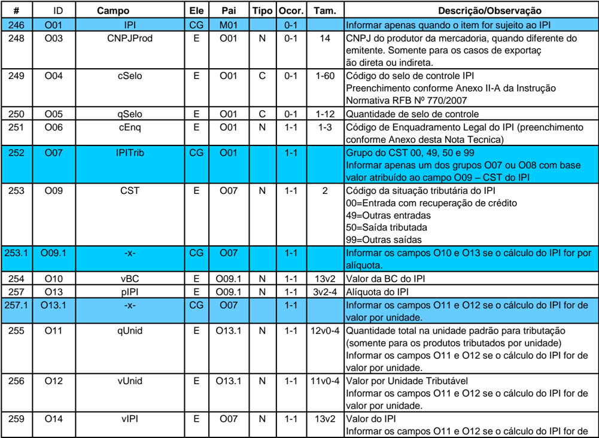
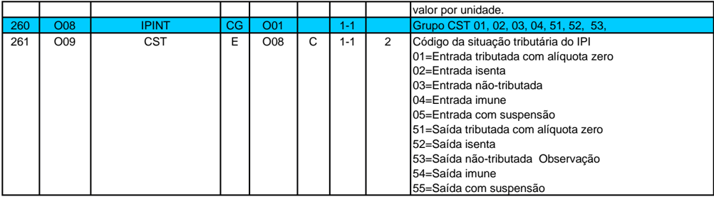
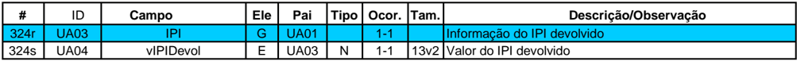
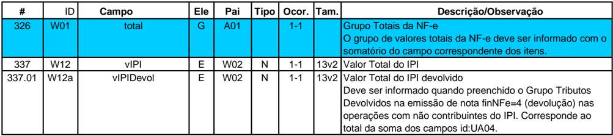

## Projeto Nota Fiscal Eletrônica

Nota Técnica 2020.002 Imposto sobre Produtos Industrializados (IPI)

Versão 1.01 - Agosto 2022

## Sumário

| Controle de Versões .......................................................................................................................3      |
|---------------------------------------------------------------------------------------------------------------------------------------------------|
| Histórico de Alterações / Cronograma.............................................................................................3                |
| 1. Resumo ......................................................................................................................................4 |
| 1.1 Alterações introduzidas na versão 1.01.....................................................................................4                  |
| 2. Leiaute da Nota Fiscal eletrônica (NF-e) .......................................................................................4              |
| 3. Regras de validação (RV) da Nota Fiscal eletrônica ...................................................................5                        |
| 4. Tabela de códigos de erro e descrições das mensagens............................................................6                              |
| 5. Anexo - Tabela do Código de Enquadramento do IPI.................................................................7                             |

## Controle de Versões

|   Versão | Publicação   | Descrição                                                                           |
|----------|--------------|-------------------------------------------------------------------------------------|
|     1.00 | Abril/ 2020  | Publicação da NT.                                                                   |
|     1.01 | Agosto/2022  | Alterar a descrição do item 165 da tabela de enquadramento e atualização da RV W16- |

## Histórico de Alterações / Cronograma

|   Versão | Histórico de atualizações                                                                       | Implantação Teste   | Implantação Produção   |
|----------|-------------------------------------------------------------------------------------------------|---------------------|------------------------|
|     1.00 | Inclusão dos códigos 163,164 e 165 na tabela de enquadramento do IPI                            | 30/05/2020          | 11/06/2020             |
|     1.01 | Alteração da descrição do código 165 da tabela de enquadramento do IPI atualização da RV W16-10 | ---------------     | ----------------       |

## 1. Resumo

Esta nota técnica visa consolidar as informações sobre o Imposto sobre Produtos Industrializados (IPI) que constam nas NT 2015.002 e NT 2016.001 da Nota Fiscal eletrônica (NF-e) e acrescentar novos códigos na Tabela de enquadramento de IPI.

## 1.1 Alterações introduzidas na versão 1.01

A  versão  1.01  visa  alterar  a  descrição  do  item  165  da  Tabela  de  Enquadramento  do  IPI,  conforme previsto no art. 35 da Lei nº 4.502, de 30 de novembro de 1964, e atualizar a regra de validação W16-10, conforme previsto na NT 2020.005.

## 2.  Leiaute da Nota Fiscal eletrônica (NF-e)

Os campos da Nota Fiscal eletrônica (NF-e) relacionados com o Imposto sobre Produtos Industrializados (IPI) são:

## Grupo I(Produtos e Serviços da NF-e)

|   # | ID   | Campo   | Ele   | Pai   | Tipo   | Ocor. Tam.   | Descrição/Observação   |
|-----|------|---------|-------|-------|--------|--------------|------------------------|
| 105 | I06  | EXTIPI  | E     | I01   | N      | 0-1 2-3      | EX_TIPI                |

## Grupo O(Imposto sobre Produtos Industrializados)

|     # | ID    | Campo    | Ele   | Pai   | Tipo   | Ocor.   | Tam.   | Descrição/Observação                                                                                                                                                            |
|-------|-------|----------|-------|-------|--------|---------|--------|---------------------------------------------------------------------------------------------------------------------------------------------------------------------------------|
|   246 | O01   | IPI      | CG    | M01   |        | 0-1     |        | Informar apenas quando o item for sujeito ao IPI                                                                                                                                |
|   248 | O03   | CNPJProd | E     | O01   | N      | 0-1     | 14     | CNPJ do produtor da mercadoria, quando diferente do emitente. Somente para os casos de exportaç ão direta ou indireta.                                                          |
|   249 | O04   | cSelo    | E     | O01   | C      | 0-1     | 1-60   | Código do selo de controle IPI Preenchimento conforme Anexo II-A da Instrução Normativa RFB Nº 770/2007                                                                         |
|   250 | O05   | qSelo    | E     | O01   | C      | 0-1     | 1-12   | Quantidade de selo de controle                                                                                                                                                  |
|   251 | O06   | cEnq     | E     | O01   | N      | 1-1     | 1-3    | Código de Enquadramento Legal do IPI (preenchimento conforme Anexo desta Nota Tecnica)                                                                                          |
|   252 | O07   | IPITrib  | CG    | O01   |        | 1-1     |        | Grupo do CST 00, 49, 50 e 99 Informar apenas um dos grupos O07 ou O08 com base valor atribuído ao campo O09 - CST do IPI                                                        |
|   253 | O09   | CST      | E     | O07   | N      | 1-1     | 2      | Código da situação tributária do IPI 00=Entrada com recuperação de crédito 49=Outras entradas 50=Saída tributada 99=Outras saídas                                               |
| 253.1 | O09.1 | -x-      | CG    | O07   |        | 1-1     |        | Informar os campos O10 e O13 se o cálculo do IPI for por alíquota.                                                                                                              |
|   254 | O10   | vBC      | E     | O09.1 | N      | 1-1     | 13v2   | Valor da BC do IPI                                                                                                                                                              |
|   257 | O13   | pIPI     | E     | O09.1 | N      | 1-1     | 3v2-4  | Alíquota do IPI                                                                                                                                                                 |
| 257.1 | O13.1 | -x-      | CG    | O07   |        | 1-1     |        | Informar os campos O11 e O12 se o cálculo do IPI for de valor por unidade.                                                                                                      |
|   255 | O11   | qUnid    | E     | O13.1 | N      | 1-1     | 12v0-4 | Quantidade total na unidade padrão para tributação (somente para os produtos tributados por unidade) Informar os campos O11 e O12 se o cálculo do IPI for de valor por unidade. |
|   256 | O12   | vUnid    | E     | O13.1 | N      | 1-1     | 11v0-4 | Valor por Unidade Tributável Informar os campos O11 e O12 se o cálculo do IPI for de valor por unidade.                                                                         |
|   259 | O14   | vIPI     | E     | O07   | N      | 1-1     | 13v2   | Valor do IPI Informar os campos O11 e O12 se o cálculo do IPI for de                                                                                                            |

|     |     |       |    |     |    |     |    | valor por unidade.                                                                                                                                                                                                                                                     |
|-----|-----|-------|----|-----|----|-----|----|------------------------------------------------------------------------------------------------------------------------------------------------------------------------------------------------------------------------------------------------------------------------|
| 260 | O08 | IPINT | CG | O01 |    | 1-1 |    | Grupo CST 01, 02, 03, 04, 51, 52, 53,                                                                                                                                                                                                                                  |
| 261 | O09 | CST   | E  | O08 | C  | 1-1 |  2 | Código da situação tributária do IPI 01=Entrada tributada com alíquota zero 02=Entrada isenta 03=Entrada não-tributada 04=Entrada imune 05=Entrada com suspensão 51=Saída tributada com alíquota zero 52=Saída isenta 53=Saída não-tributada Observação 54=Saída imune |

Grupo UA(Tributos devolvidos para o item da NF-e)

| #    | ID   | Campo     | Ele   | Pai   | Tipo   | Ocor.   | Tam.   | Descrição/Observação        |
|------|------|-----------|-------|-------|--------|---------|--------|-----------------------------|
| 324r | UA03 | IPI       | G     | UA01  |        | 1-1     |        | Informação do IPI devolvido |
| 324s | UA04 | vIPIDevol | E     | UA03  | N      | 1-1     |        | 13v2 Valor do IPI devolvido |

## Grupo W(Total da NF-e)

|      # | ID   | Campo     | Ele   | Pai   | Tipo   | Ocor.   | Tam. Descrição/Observação                                                                                                                                                                                                               |
|--------|------|-----------|-------|-------|--------|---------|-----------------------------------------------------------------------------------------------------------------------------------------------------------------------------------------------------------------------------------------|
|    326 | W01  | total     | G     | A01   |        | 1-1     | Grupo Totais da NF-e O grupo de valores totais da NF-e deve ser informado com o somatório do campo correspondente dos itens.                                                                                                            |
|    337 | W12  | vIPI      | E     | W02   | N      | 1-1     | 13v2 Valor Total do IPI                                                                                                                                                                                                                 |
| 337.01 | W12a | vIPIDevol | E     | W02   | N      | 1-1     | 13v2 Valor Total do IPI devolvido Deve ser informado quando preenchido o Grupo Tributos Devolvidos na emissão de nota finNFe=4 (devolução) nas operações com não contribuintes do IPI. Corresponde ao total da soma dos campos id:UA04. |

## 3. Regras de validação (RV) da Nota Fiscal eletrônica

Seguem as regras de validação relativas aos campos citados no item 2.

| Campo- Seq   | Modelo   | Regra de Validação                                                                                                                                                                                                                                                        | Aplic.   |   Msg | Efeito   | Descrição Erro                                                                    |
|--------------|----------|---------------------------------------------------------------------------------------------------------------------------------------------------------------------------------------------------------------------------------------------------------------------------|----------|-------|----------|-----------------------------------------------------------------------------------|
| I08-120      | 55       | CFOP de Importação (inicia por 3) e não informado o grupo de IPI Exceção: a regra não se aplica para os seguintes CFOP: 3.201; 3.202; 3.211; 3.503; 3.553 (NT 2011/004)                                                                                                   | Facult.  |   597 | Rej.     | Rejeição: CFOP de Importação e não informado dados de IPI                         |
| W12-10       | 55       | Total do IPI (id:W12) difere do somatório do valor dos itens (id:O14)                                                                                                                                                                                                     | Facult.  |   538 | Rej.     | Rejeição: Total do IPI difere do somatório dos itens                              |
| W16-10       | 55/65    | -Total do vNF (id:W16) difere do somatório de: (+) vProd (id:W07) (-) vDesc (id:W10) (-) vICMSDeson (id:W04a) (+) vST (id:W06) (+) vFCPST (id:W06a) (+) vFrete (id:W08) (+) vSeg (id:W09) (+) vOutro (id:W15) (+) vII (id:W11) (+) vIPI (id:W12) (+) vIPIDevol (id: W12a) | Obrig.   |   610 | Rej.     | Rejeição: Total da NF difere do somatório dos valores compõe o valor total da NF. |

|         |    | (+) vServ (id:W18) (*3) (NT 2011/005) (+) vPIS(id:R06, campoPISST/vPIS),se indSomaPISST=1 (+) vCofins(id:T06, campo COFINSST/vCOFINS),se indSomaCOFINSST=1 Exceção 1: Faturamento direto de veículos novos: Se informada operação de Faturamento Direto para veículos novos (tpOp = 2, id:J02): - Total do vNF (id:W16) difere do somatório de: (+) vProd (id:W07) (-) vDesc (id:W10) (-) vICMSDeson (id:W04a) (+) vFrete (id:W08) (+) vSeg (id:W09) (+) vOutro (id:W15) (+) vII (id:W11) (+) vIPI (id:W12) (+) vServ (id:W18) (*3) (NT 2011/005) (+) vPIS(id:R06, campoPISST/vPIS),se indSomaPISST=1 (+) vCofins(id:T06, campo COFINSST/vCOFINS),se indSomaCOFINSST=1 Exceção 2: Esta regra não se aplica nas operações de importação (CFOP inicia com '3'). Exceção 3 (NT 2013/005 v 1.22): Esta regra de validação não deverá causar rejeição caso não tenha sido subtraído o valor do ICMS Desonerado (vICMSDeson) do valor total da NF-e.   |         |     |      |                                                                                                                    |
|---------|----|--------------------------------------------------------------------------------------------------------------------------------------------------------------------------------------------------------------------------------------------------------------------------------------------------------------------------------------------------------------------------------------------------------------------------------------------------------------------------------------------------------------------------------------------------------------------------------------------------------------------------------------------------------------------------------------------------------------------------------------------------------------------------------------------------------------------------------------------------------------------------------------------------------------------------------------------------|---------|-----|------|--------------------------------------------------------------------------------------------------------------------|
| O06-10  | 55 | Código de Enquadramento Legal do IPI inválido (tag:cEnq, id:O06). Ver Anexo XIV - Código de Enquadramento Legal do IPI.                                                                                                                                                                                                                                                                                                                                                                                                                                                                                                                                                                                                                                                                                                                                                                                                                          | Obrig.  | 387 | Rej. | Rejeição: Código de Enquadramento Legal do IPI inválido [nItem:nnn]                                                |
| O09-10  | 55 | Verificar compatibilidade entre o CST do IPI e o Código de Enquadramento Legal (cEnq), conforme as regras abaixo: - CST de Isenção e Código de Enquadramento incompatível (IPINT/CST=02, 52 e cEnq fora da faixa [301, 399]) - CST de Imunidade e Código de Enquadramento incompatível (IPINT/CST=04, 54 e cEnq fora da faixa [001, 099]) - CST de Suspensão e Código de Enquadramento incompatível (IPINT/CST=05, 55 e cEnq fora da faixa [101, 199]) Exceção: A regra de validação não se aplica, em produção, para Nota Fiscal com data de emissão anterior a 01/04/2016.                                                                                                                                                                                                                                                                                                                                                                     | Obrig.  | 388 | Rej. | Rejeição: Código de Situação Tributária do IPI incompatível com o Código de Enquadramento Legal do IPI [nItem:nnn] |
| W12a-10 | 55 | Total do IPI devolvido (id: W12a) difere do somatório do valor dos itens (id:UA04)                                                                                                                                                                                                                                                                                                                                                                                                                                                                                                                                                                                                                                                                                                                                                                                                                                                               | Facult. | 863 | Rej. | Rejeição: Total do IPI devolvido difere do somatório dos itens                                                     |

## 4. Tabela de códigos de erro e descrições das mensagens

|   Código | RESULTADO DO PROCESSAMENTO DA SOLICITAÇÃO                                                                          |
|----------|--------------------------------------------------------------------------------------------------------------------|
|      387 | Rejeição: Código de Enquadramento Legal do IPI inválido [nItem:nnn]                                                |
|      388 | Rejeição: Código de Situação Tributária do IPI incompatível com o Código de Enquadramento Legal do IPI [nItem:nnn] |
|      597 | Rejeição: CFOP de Importação e não informado dados de IPI                                                          |
|      538 | Rejeição: Total do IPI difere do somatório dos itens                                                               |
|      610 | Rejeição: Total da NF difere do somatório dos valores compõe o valor total da NF.                                  |
|      863 | Rejeição: Total do IPI devolvido difere do somatório dos itens                                                     |

## 5. Anexo - Tabela do Código de Enquadramento do IPI

| Cód.    | Grupo CST           | Descrição Enquadramento Legal do IPI                                                                                                                                                                                                                                                                                                                                                               |
|---------|---------------------|----------------------------------------------------------------------------------------------------------------------------------------------------------------------------------------------------------------------------------------------------------------------------------------------------------------------------------------------------------------------------------------------------|
| 001     | Imunidade           | Livros, jornais, periódicos e o papel destinado à sua impressão - Art. 18 Inciso I do Decreto 7.212/2010                                                                                                                                                                                                                                                                                           |
| 002     | Imunidade           | Produtos industrializados destinados ao exterior - Art. 18 Inciso II do Decreto 7.212/2010                                                                                                                                                                                                                                                                                                         |
| 003     | Imunidade           | Ouro, definido em lei como ativo financeiro ou instrumento cambial - Art. 18 Inciso III do Decreto 7.212/2010                                                                                                                                                                                                                                                                                      |
| 004     | Imunidade           | Energia elétrica, derivados de petróleo, combustíveis e minerais do País - Art. 18 Inciso IV do Decreto 7.212/2010                                                                                                                                                                                                                                                                                 |
| 005     | Imunidade           | Exportação de produtos nacionais - sem saída do território brasileiro - venda para empresa sediada no exterior -atividades de pesquisa ou lavra de jazidas de petróleo e de gás natural - Art. 19 Inciso I do Decreto 7.212/2010                                                                                                                                                                   |
| 006     | Imunidade           | Exportação de produtos nacionais - sem saída do território brasileiro - venda para empresa sediada no exterior - incorporados a produto final exportado para o Brasil - Art. 19 Inciso II do Decreto 7.212/2010                                                                                                                                                                                    |
| 007     | Imunidade           | Exportação de produtos nacionais - sem saída do território brasileiro - venda para órgão ou entidade de governo estrangeiro ou organismo internacional de que o Brasil seja membro, para ser entregue, no País, à ordem do comprador - Art. 19 Inciso III do Decreto 7.212/2010                                                                                                                    |
| 101     | Suspensão           | Oleo de menta em bruto, produzido por lavradores - Art. 43 Inciso I do Decreto 7.212/2010                                                                                                                                                                                                                                                                                                          |
| 102     | Suspensão           | Produtos remetidos à exposição em feiras de amostras e promoções semelhantes - Art. 43 Inciso II do Decreto 7.212/2010                                                                                                                                                                                                                                                                             |
| 103     | Suspensão           | Produtos remetidos a depósitos fechados ou armazéns-gerais, bem assim aqueles devolvidos ao remetente - Art. 43 Inciso III do Decreto 7.212/2010                                                                                                                                                                                                                                                   |
| 104     | Suspensão           | Produtos industrializados, que com matérias-primas (MP), produtos intermediários (PI) e material de embalagem (ME) importados submetidos a regime aduaneiro especial (drawback - suspensão/isenção), remetidos diretamente a empresas industriais exportadoras - Art. 43 Inciso IV do Decreto 7.212/2010                                                                                           |
| 105     | Suspensão           | Produtos, destinados à exportação, que saiam do estabelecimento industrial para empresas comerciais exportadoras, com o fim específico de exportação - Art. 43, Inciso V, alínea "a" do Decreto 7.212/2010                                                                                                                                                                                         |
| 106     | Suspensão           | Produtos, destinados à exportação, que saiam do estabelecimento industrial para recintos alfandegados onde se processe o despacho aduaneiro de exportação - Art. 43, Inciso V, alíneas "b" do Decreto 7.212/2010                                                                                                                                                                                   |
| 107     | Suspensão           | Produtos, destinados à exportação, que saiam do estabelecimento industrial para outros locais onde se processe o despacho aduaneiro de exportação - Art. 43, Inciso V, alíneas "c" do Decreto 7.212/2010                                                                                                                                                                                           |
| 108     | Suspensão           | Matérias-primas (MP), produtos intermediários (PI) e material de embalagem (ME) destinados ao executor de industrialização por encomenda - Art. 43 Inciso VI do Decreto 7.212/2010                                                                                                                                                                                                                 |
| 109     | Suspensão           | Produtos industrializados por encomenda remetidos ao estabelecimento de origem - Art. 43 Inciso VII do Decreto 7.212/2010                                                                                                                                                                                                                                                                          |
| 110     | Suspensão           | Matérias-primas ou produtos intermediários remetidos para emprego em operação industrial realizada pelo remetente fora do estabelecimento - Art. 43 Inciso VIII do Decreto 7.212/2010                                                                                                                                                                                                              |
| 111 112 | Suspensão Suspensão | Veículo, aeronave ou embarcação destinados aemprego em provas de engenharia pelo fabricante - Art. 43 Inciso IX do Decreto 7.212/2010 Produtos remetidos, para industrialização ou comércio, de um para outro estabelecimento da                                                                                                                                                                   |
| 113     | Suspensão           | mesma firma - Art. 43 Inciso X do Decreto 7.212/2010 Bens do ativo permanente remetidosa outro estabelecimento da mesma firma, para serem utilizados no processo industrial do recebedor - Art. 43 Inciso XI do Decreto 7.212/2010                                                                                                                                                                 |
| 114     | Suspensão           | Bens do ativo permanente remetidosa outro estabelecimento, para serem utilizados no processo industrial de produtos encomendados pelo remetente - Art. 43 Inciso XII do Decreto 7.212/2010                                                                                                                                                                                                         |
| 115     | Suspensão           | Partes e peças destinadas ao reparo de produtos com defeito de fabricação, quando a operação for executada gratuitamente, em virtude de garantia - Art. 43 Inciso XIII do Decreto 7.212/2010                                                                                                                                                                                                       |
| 116     | Suspensão           | Matérias-primas (MP), produtos intermediários (PI) e material de embalagem (ME) de fabricação nacional, vendidos a estabelecimento industrial, para industrialização de produtos destinados à exportação ou a estabelecimento comercial, para industrialização em outro estabelecimento da mesma firma ou de terceiro, de produto destinado à exportação -Art. 43 Inciso XIV do Decreto 7.212/2010 |

| 117   | Suspensão   | Produtos para emprego ou consumo na industrialização ou elaboração de produto a ser exportado, adquiridos no mercado interno ou importados - Art. 43 Inciso XV do Decreto 7.212/2010   |
|-------|-------------|----------------------------------------------------------------------------------------------------------------------------------------------------------------------------------------|

|   Cód. | Grupo CST   | Descrição Enquadramento Legal do IPI                                                                                                                                                                                                                                                                  |
|--------|-------------|-------------------------------------------------------------------------------------------------------------------------------------------------------------------------------------------------------------------------------------------------------------------------------------------------------|
|    118 | Suspensão   | Bebidas alcóolicas e demais produtos de produção nacional acondicionados em recipientes de capacidade superior ao limite máximo permitido para venda a varejo - Art. 44 do Decreto 7.212/2010                                                                                                         |
|    119 | Suspensão   | Produtos classificados NCM 21.06.90.10 Ex 02, 22.01, 22.02, exceto os Ex 01 e Ex 02 do Código 22.02.90.00 e 22.03 saídos de estabelecimento industrial destinado a comercial equiparado a industrial - Art. 45 Inciso I do Decreto7.212/2010                                                          |
|    120 | Suspensão   | Produtos classificados NCM 21.06.90.10 Ex 02, 22.01, 22.02, exceto os Ex 01 e Ex 02 do Código 22.02.90.00 e 22.03 saídos de estabelecimento comercial equiparado a industrial destinado aequiparado a industrial - Art. 45 Inciso II do Decreto7.212/2010                                             |
|    121 | Suspensão   | Produtos classificados NCM 21.06.90.10 Ex 02, 22.01, 22.02, exceto os Ex 01 e Ex 02 do Código 22.02.90.00 e 22.03 saídos de importador destinado a equiparado a industrial - Art. 45 Inciso III do Decreto7.212/2010                                                                                  |
|    122 | Suspensão   | Matérias-primas (MP), produtos intermediários (PI) e material de embalagem (ME) destinados a estabelecimento que se dedique à elaboração de produtos classificados nos códigos previstos no art. 25 da Lei 10.684/2003 - Art. 46 Inciso I do Decreto 7.212/2010                                       |
|    123 | Suspensão   | Matérias-primas (MP), produtos intermediários (PI) e material de embalagem (ME) adquiridos por estabelecimentos industriais fabricantes de partes e peças destinadas a estabelecimento industrial fabricante de produto classificado no Capítulo 88 da Tipi - Art. 46 Inciso II do Decreto 7.212/2010 |
|    124 | Suspensão   | Matérias-primas (MP), produtos intermediários (PI) e material de embalagem (ME) adquiridos por pessoas jurídicas preponderantemente exportadoras - Art. 46 Inciso III do Decreto 7.212/2010                                                                                                           |
|    125 | Suspensão   | Materiais e equipamentos destinados a embarcações pré-registradas ou registradas no Registro Especial Brasileira - REB quando adquiridos por estaleiros navais brasileiros - Art. 46 Inciso IV do Decreto 7.212/2010                                                                                  |
|    126 | Suspensão   | Aquisição por beneficiário de regime aduaneiro suspensivo do imposto, destinado a industrialização para exportação - Art. 47 do Decreto 7.212/2010                                                                                                                                                    |
|    127 | Suspensão   | Desembaraço de produtos de procedência estrangeira importados por lojas francas - Art. 48 Inciso I do Decreto 7.212/2010                                                                                                                                                                              |
|    128 | Suspensão   | Desembaraço de maquinas, equipamentos, veículos, aparelhos e instrumentos sem similar nacional importados por empresas nacionais de engenharia, destinados à execução de obras no exterior - Art. 48 Inciso II do Decreto 7.212/2010                                                                  |
|    129 | Suspensão   | Desembaraço de produtos de procedência estrangeira com saída de repartições aduaneiras com suspensão do Imposto de Importação - Art. 48 Inciso III do Decreto 7.212/2010                                                                                                                              |
|    130 | Suspensão   | Desembaraço de matérias-primas, produtos intermediários e materiais de embalagem, importados diretamente por estabelecimento de que tratam os incisos I a III do caput do Decreto 7.212/2010 - Art. 48 Inciso IV do Decreto 7.212/2010                                                                |
|    131 | Suspensão   | Remessa de produtos para a ZFM destinados ao seu consumo interno, utilização ou industrialização - Art. 84 do Decreto 7.212/2010                                                                                                                                                                      |
|    132 | Suspensão   | Remessa de produtos para a ZFM destinados à exportação - Art. 85 Inciso I do Decreto 7.212/2010                                                                                                                                                                                                       |
|    133 | Suspensão   | Produtos que, antes de sua remessa à ZFM, forem enviados pelo seu fabricante a outro estabelecimento, para industrialização adicional, por conta e ordem do destinatário - Art. 85 Inciso II do Decreto 7.212/2010                                                                                    |
|    134 | Suspensão   | Desembaraço de produtos de procedência estrangeira importados pela ZFM quando ali consumidos ou utilizados, exceto armas, munições, fumo, bebidas alcoólicas e automóveis de passageiros. - Art. 86 do Decreto 7.212/2010                                                                             |
|    135 | Suspensão   | Remessa de produtos para a Amazônia Ocidental destinados ao seu consumo interno ou utilização - Art. 96 do Decreto 7.212/2010                                                                                                                                                                         |
|    136 | Suspensão   | Entrada de produtos estrangeiros na Área de Livre Comércio de Tabatinga - ALCT destinados ao seu consumo interno ou utilização - Art. 106 do Decreto 7.212/2010                                                                                                                                       |
|    137 | Suspensão   | Entrada de produtos estrangeiros na Área de Livre Comércio de Guajará-Mirim - ALCGM destinados ao seu consumo interno ou utilização - Art. 109 do Decreto 7.212/2010                                                                                                                                  |
|    138 | Suspensão   | Entrada de produtos estrangeiros nas Áreas de Livre Comércio de Boa Vista - ALCBV e                                                                                                                                                                                                                   |

|     |           | Bomfim - ALCB destinados a seu consumo interno ou utilização - Art. 112 do Decreto 7.212/2010                                                                                                 |
|-----|-----------|-----------------------------------------------------------------------------------------------------------------------------------------------------------------------------------------------|
| 139 | Suspensão | Entrada de produtos estrangeiros na Área de Livre Comércio de Macapá e Santana -ALCMS destinados a seu consumo interno ou utilização - Art. 116 do Decreto 7.212/2010                         |
| 140 | Suspensão | Entrada de produtos estrangeiros nas Áreas de Livre Comércio de Brasiléia - ALCB e de Cruzeiro do Sul - ALCCS destinados a seu consumo interno ou utilização - Art. 119 do Decreto 7.212/2010 |

|   Cód. | Grupo CST   | Descrição Enquadramento Legal do IPI                                                                                                                                                                                                                                                                                                                                          |
|--------|-------------|-------------------------------------------------------------------------------------------------------------------------------------------------------------------------------------------------------------------------------------------------------------------------------------------------------------------------------------------------------------------------------|
|    141 | Suspensão   | Remessa para Zona de Processamento de Exportação - ZPE - Art. 121 do Decreto 7.212/2010                                                                                                                                                                                                                                                                                       |
|    142 | Suspensão   | Setor Automotivo - Desembaraço aduaneiro, chassis e outros - regime aduaneiro especial - industrialização 87.01 a 87.05 - Art. 136, I do Decreto 7.212/2010                                                                                                                                                                                                                   |
|    143 | Suspensão   | Setor Automotivo - Do estabelecimento industrial produtos 87.01 a 87.05 da TIPI - mercado interno - empresa comercial atacadista controlada por PJ encomendante do exterior. - Art. 136, II do Decreto 7.212/2010                                                                                                                                                             |
|    144 | Suspensão   | Setor Automotivo - Do estabelecimento industrial - chassis e outros classificados nas posições 84.29, 84.32, 84.33, 87.01 a 87.06 e 87.11 da TIPI. - Art. 136, III do Decreto 7.212/2010                                                                                                                                                                                      |
|    145 | Suspensão   | Setor Automotivo - Desembaraço aduaneiro, chassis e outros classificados nas posições 84.29, 84.32, 84.33, 87.01 a 87.06 e 87.11 da TIPI quando importados diretamente por estabelecimento industrial - Art. 136, IV do Decreto 7.212/2010                                                                                                                                    |
|    146 | Suspensão   | Setor Automotivo - do estabelecimento industrial matérias-primas, os produtos intermediários e os materiais de embalagem, adquiridos por fabricantes, preponderantemente, de componentes, chassis e outrosclassificados nos Códigos 84.29, 8432.40.00, 8432.80.00, 8433.20, 8433.30.00, 8433.40.00, 8433.5 e 87.01 a 87.06 da TIPI- Art. 136, V do Decreto 7.212/2010         |
|    147 | Suspensão   | Setor Automotivo -Desembaraço aduaneiro, as matérias-primas, os produtos intermediários e os materiais de embalagem, importados diretamente por fabricantes, preponderantemente, de componentes, chassis e outrosclassificados nos Códigos 84.29, 8432.40.00, 8432.80.00, 8433.20, 8433.30.00, 8433.40.00, 8433.5 e 87.01 a 87.06 da TIPI -Art. 136, VI do Decreto 7.212/2010 |
|    148 | Suspensão   | Bens de Informática e Automação- matérias-primas, os produtos intermediários e os materiais de embalagem, quando adquiridos por estabelecimentos industriais fabricantes dos referidos bens. - Art. 148 do Decreto 7.212/2010                                                                                                                                                 |
|    149 | Suspensão   | Reporto - Saída de Estabelecimento de máquinas e outros quando adquiridos por beneficiários do REPORTO - Art. 166, I do Decreto 7.212/2010                                                                                                                                                                                                                                    |
|    150 | Suspensão   | Reporto - Desembaraço aduaneiro de máquinas e outros quando adquiridos por beneficiários do REPORTO - Art. 166, II do Decreto 7.212/2010                                                                                                                                                                                                                                      |
|    151 | Suspensão   | Repes - Desembaraço aduaneiro - bens sem similar nacional importados por beneficiários do REPES - Art. 171 do Decreto 7.212/2010                                                                                                                                                                                                                                              |
|    152 | Suspensão   | Recine - Saída para beneficiário do regime - Art. 14, III da Lei 12.599/2012                                                                                                                                                                                                                                                                                                  |
|    153 | Suspensão   | Recine - Desembaraço aduaneiro por beneficiário do regime - Art. 14, IV da Lei 12.599/2012                                                                                                                                                                                                                                                                                    |
|    154 | Suspensão   | Reif - Saída para beneficiário do regime - Lei 12.794/1013, art. 8, III                                                                                                                                                                                                                                                                                                       |
|    155 | Suspensão   | Reif - Desembaraço aduaneiro por beneficiário do regime - Lei 12.794/1013, art. 8, IV                                                                                                                                                                                                                                                                                         |
|    156 | Suspensão   | Repnbl-Redes - Saída para beneficiário do regime - Lei n° 12.715/2012, art. 30, II                                                                                                                                                                                                                                                                                            |
|    157 | Suspensão   | Recompe - Saída de matérias-primas e produtos intermediários para beneficiários do regime - Decreto n° 7.243/2010, art. 5°, I                                                                                                                                                                                                                                                 |
|    158 | Suspensão   | Recompe - Saída de matérias-primas e produtos intermediários destinados a industrialização de equipamentos - Programa Estímulo Universidade-Empresa - Apoio à Inovação - Decreto n° 7.243/2010, art. 5°, III                                                                                                                                                                  |
|    159 | Suspensão   | Rio 2016 - Produtos nacionais, duráveis, uso e consumo dos eventos, adquiridos pelas pessoas jurídicas mencionadas no § 2o do art. 4o da Lei n° 12.780/2013 - Lei n° 12.780/2013, Art. 13                                                                                                                                                                                     |
|    160 | Suspensão   | Regime Especial de Admissão Temporária nos Termos do Art. 2o da IN 1361/2013                                                                                                                                                                                                                                                                                                  |
|    161 | Suspensão   | Regime Especial de Admissão Temporária nos termos do art. 5o da IN 1361/2013                                                                                                                                                                                                                                                                                                  |
|    162 | Suspensão   | Regime Especial de Admissão Temporária nos termos do art. 7o da IN 1361/2013 (Suspensão com pagamento de tributos diferidos até a duração do regime, limitado a 100% do valor original)                                                                                                                                                                                       |
|    163 | Suspensão   | REPETRO-Industrialização                                                                                                                                                                                                                                                                                                                                                      |

|     |           | Venda no mercado interno de matérias-primas, produtos intermediários e materiais de embalagem para serem utilizados integralmente no processo de industrialização de produto final destinado às atividades de exploração, de desenvolvimento e de produção de petróleo, de gás natural e de outros hidrocarbonetos fluidos à PJ habilitada no Repetro-Industrialização. - Instrução Normativa RFB nº 1901, de 17 de julho de 2019.                                                                                                      |
|-----|-----------|-----------------------------------------------------------------------------------------------------------------------------------------------------------------------------------------------------------------------------------------------------------------------------------------------------------------------------------------------------------------------------------------------------------------------------------------------------------------------------------------------------------------------------------------|
| 164 | Suspensão | REPETRO-SPED Venda dos produtos finais destinados às atividades de exploração, de desenvolvimento e de produção de petróleo, de gás natural e de outros hidrocarbonetos fluidos previstas na Lei nº 9.478, de 6 de agosto de 1997 , na Lei nº 12.276, de 30 de junho de 2010, e na Lei nº 12.351, de 22 de dezembro de 2010, por fabricantes desses, beneficiários do Repetro-Industrialização, quando diretamente adquiridos por pessoa jurídica habilitada no Repetro-Sped.- Instrução Normativa RFB nº 1901, de 17 de julho de 2019. |
| 165 | Suspensão | O industrial ou equiparado, mediante requerimento, nas operações anteriores, concomitantes ou posteriores às saídas que promover, nas hipóteses e condições estabelecidas pela Secretaria da Receita Federal, nos termos da IN RFB nº 1.081/2010.                                                                                                                                                                                                                                                                                       |
| 301 | Isenção   | Produtos industrializados por instituições de educação ou de assistência social, destinados a uso próprio ou a distribuição gratuita a seus educandos ou assistidos - Art. 54 Inciso I do Decreto 7.212/2010                                                                                                                                                                                                                                                                                                                            |
| 302 | Isenção   | Produtos industrializados por estabelecimentos públicos e autárquicos da União, dos Estados, do Distrito Federal e dos Municípios, não destinados a comércio - Art. 54 Inciso II do Decreto 7.212/2010                                                                                                                                                                                                                                                                                                                                  |
| 303 | Isenção   | Amostras de produtos para distribuição gratuita, de diminuto ou nenhum valor comercial -Art. 54 Inciso III do Decreto 7.212/2010                                                                                                                                                                                                                                                                                                                                                                                                        |
| 304 | Isenção   | Amostras de tecidos sem valor comercial- Art. 54 Inciso IV do Decreto 7.212/2010                                                                                                                                                                                                                                                                                                                                                                                                                                                        |

|   Cód. | Grupo CST   | Descrição Enquadramento Legal do IPI                                                                                                                                                                                                                                                                                                                                                                                    |
|--------|-------------|-------------------------------------------------------------------------------------------------------------------------------------------------------------------------------------------------------------------------------------------------------------------------------------------------------------------------------------------------------------------------------------------------------------------------|
|    305 | Isenção     | Pés isolados de calçados - Art. 54 Inciso V do Decreto 7.212/2010                                                                                                                                                                                                                                                                                                                                                       |
|    306 | Isenção     | Aeronaves de uso militar e suas partes e peças, vendidas à União - Art. 54 Inciso VI do Decreto 7.212/2010                                                                                                                                                                                                                                                                                                              |
|    307 | Isenção     | Caixões funerários - Art. 54 Inciso VII do Decreto 7.212/2010                                                                                                                                                                                                                                                                                                                                                           |
|    308 | Isenção     | Papel destinado à impressão de músicas - Art. 54 Inciso VIII do Decreto 7.212/2010                                                                                                                                                                                                                                                                                                                                      |
|    309 | Isenção     | Panelas e outros artefatos semelhantes, de uso doméstico, de fabricação rústica, de pedra ou barro bruto - Art. 54 Inciso IX do Decreto 7.212/2010                                                                                                                                                                                                                                                                      |
|    310 | Isenção     | Chapéus, roupas e proteção, de couro, próprios para tropeiros - Art. 54 Inciso X do Decreto 7.212/2010                                                                                                                                                                                                                                                                                                                  |
|    311 | Isenção     | Material bélico, de uso privativo das Forças Armadas, vendido à União - Art. 54 Inciso XI do Decreto 7.212/2010                                                                                                                                                                                                                                                                                                         |
|    312 | Isenção     | Automóvel adquirido diretamente a fabricante nacional, pelas missões diplomáticas e repartições consulares de caráter permanente, ou seus integrantes, bem assim pelas representações internacionais ou regionais de que o Brasil seja membro, e seus funcionários, peritos, técnicos e consultores, de nacionalidade estrangeira, que exerçam funções de caráter permanente - Art. 54 Inciso XII do Decreto 7.212/2010 |
|    313 | Isenção     | Veículo de fabricação nacional adquirido por funcionário das missões diplomáticas acreditadas junto ao Governo Brasileiro - Art. 54 Inciso XIII do Decreto 7.212/2010                                                                                                                                                                                                                                                   |
|    314 | Isenção     | Produtos nacionais saídos diretamente para Lojas Francas - Art. 54 Inciso XIV do Decreto 7.212/2010                                                                                                                                                                                                                                                                                                                     |
|    315 | Isenção     | Materiais e equipamentos destinados a Itaipu Binacional - Art. 54 Inciso XV do Decreto 7.212/2010                                                                                                                                                                                                                                                                                                                       |
|    316 | Isenção     | Produtos Importados por missões diplomáticas, consulados ou organismo internacional -Art. 54 Inciso XVI do Decreto 7.212/2010                                                                                                                                                                                                                                                                                           |
|    317 | Isenção     | Bagagem de passageiros desembaraçada com isenção do II. - Art. 54 Inciso XVII do Decreto 7.212/2010                                                                                                                                                                                                                                                                                                                     |
|    318 | Isenção     | Bagagem de passageiros desembaraçada com pagamento do II. - Art. 54 Inciso XVIII do Decreto 7.212/2010                                                                                                                                                                                                                                                                                                                  |
|    319 | Isenção     | Remessas postais internacionais sujeitas a tributação simplificada. - Art. 54 Inciso XIX do Decreto 7.212/2010                                                                                                                                                                                                                                                                                                          |
|    320 | Isenção     | Máquinas e outros destinados à pesquisa científica e tecnológica - Art. 54 Inciso XX do Decreto 7.212/2010                                                                                                                                                                                                                                                                                                              |
|    321 | Isenção     | Produtos de procedência estrangeira, isentos do II conforme Lei n° 8032/1990. - Art. 54 Inciso                                                                                                                                                                                                                                                                                                                          |

|     |         | XXI do Decreto 7.212/2010                                                                                                                                                                                                                                            |
|-----|---------|----------------------------------------------------------------------------------------------------------------------------------------------------------------------------------------------------------------------------------------------------------------------|
| 322 | Isenção | Produtos de procedência estrangeira utilizados em eventos esportivos - Art. 54 Inciso XXII do Decreto 7.212/2010                                                                                                                                                     |
| 323 | Isenção | Veículos automotores, máquinas, equipamentos, bem assim suas partes e peças separadas, destinadas à utilização nas atividades dos Corpos de Bombeiros - Art. 54 Inciso XXIII do Decreto 7.212/2010                                                                   |
| 324 | Isenção | Produtos importados para consumo em congressos, feiras e exposições - Art. 54 Inciso XXIV do Decreto 7.212/2010                                                                                                                                                      |
| 325 | Isenção | Bens de informática, Matéria Prima, produtos intermediários e embalagem destinados a Urnas eletrônicas - TSE - Art. 54 Inciso XXV do Decreto 7.212/2010                                                                                                              |
| 326 | Isenção | Materiais, equipamentos, máquinas, aparelhos e instrumentos, bem assim os respectivos acessórios, sobressalentes e ferramentas, que os acompanhem, destinados à construção do Gasoduto Brasil - Bolívia - Art. 54 Inciso XXVI do Decreto 7.212/2010                  |
| 327 | Isenção | Partes, peças e componentes, adquiridos por estaleiros navais brasileiros, destinados ao emprego na conservação, modernização, conversão ou reparo de embarcações registradas no Registro Especial Brasileiro - REB - Art. 54 Inciso XXVII do Decreto 7.212/2010     |
| 328 | Isenção | Aparelhos transmissores e receptores de radiotelefonia e radiotelegrafia; veículos para patrulhamento policial; armas e munições, destinados a órgãos de segurança pública da União, dos Estados e do Distrito Federal - Art. 54 Inciso XXVIII do Decreto 7.212/2010 |
| 329 | Isenção | Automóveis de passageiros de fabricação nacional destinados à utilização como táxi adquiridos por motoristas profissionais - Art. 55 Inciso I do Decreto 7.212/2010                                                                                                  |
| 330 | Isenção | Automóveis de passageiros de fabricação nacional destinados à utilização como táxi por impedidos de exercer atividade por destruição, furto ou roubo do veículo adquiridos por motoristas profissionais. - Art. 55 Inciso II do Decreto 7.212/2010                   |
| 331 | Isenção | Automóveis de passageiros de fabricação nacional destinados à utilização como táxi adquiridos por cooperativas de trabalho. - Art. 55 Inciso II do Decreto 7.212/2010                                                                                                |
| 332 | Isenção | Automóveis de passageiros de fabricação nacional, destinados a pessoas portadoras de deficiência física, visual, mental severa ou profunda, ou autistas - Art. 55 Inciso IV do Decreto 7.212/2010                                                                    |

|   Cód. | Grupo CST   | Descrição Enquadramento Legal do IPI                                                                                                                                                                                                               |
|--------|-------------|----------------------------------------------------------------------------------------------------------------------------------------------------------------------------------------------------------------------------------------------------|
|    333 | Isenção     | Produtos estrangeiros, recebidos em doação de representações diplomáticas estrangeiras sediadas no País,vendidos em feiras, bazares e eventos semelhantes porentidades beneficentes - Art. 67 do Decreto 7.212/2010                                |
|    334 | Isenção     | Produtos industrializados na Zona Franca de Manaus - ZFM, destinados ao seu consumo interno - Art. 81 Inciso I do Decreto 7.212/2010                                                                                                               |
|    335 | Isenção     | Produtos industrializados na ZFM, por estabelecimentos com projetos aprovados pela SUFRAMA, destinados a comercialização em qualquer outro ponto do Território Nacional -Art. 81 Inciso II do Decreto 7.212/2010                                   |
|    336 | Isenção     | Produtos nacionais destinados à entrada na ZFM, para seu consumo interno, utilização ou industrialização, ou ainda, para serem remetidos, por intermédio de seus entrepostos, à Amazônia Ocidental - Art. 81 Inciso III do Decreto 7.212/2010      |
|    337 | Isenção     | Produtos industrializados por estabelecimentos com projetos aprovados pela SUFRAMA, consumidos ou utilizados na Amazônia Ocidental,ou adquiridos através da ZFM ou de seus entrepostos na referida região - Art. 95 Inciso I do Decreto 7.212/2010 |
|    338 | Isenção     | Produtos de procedência estrangeira, relacionados na legislação, oriundos da ZFM e que derem entrada na Amazônia Ocidental para ali serem consumidos ou utilizados:- Art. 95 Inciso II do Decreto 7.212/2010                                       |
|    339 | Isenção     | Produtos elaborados com matérias-primas agrícolas e extrativas vegetais de produção regional, por estabelecimentos industriais localizados na Amazônia Ocidental, com projetos aprovados pela SUFRAMA - Art. 95 Inciso III do Decreto 7.212/2010   |
|    340 | Isenção     | Produtos industrializados em Area de Livre Comércio - Art. 105 do Decreto 7.212/2010                                                                                                                                                               |
|    341 | Isenção     | Produtos nacionais ou nacionalizados, destinados à entrada na Area de Livre Comércio de Tabatinga - ALCT - Art. 107 do Decreto 7.212/2010                                                                                                          |
|    342 | Isenção     | Produtos nacionais ou nacionalizados, destinados à entrada na Area de Livre Comércio de Guajará-Mirim - ALCGM - Art. 110 do Decreto 7.212/2010                                                                                                     |
|    343 | Isenção     | Produtos nacionais ou nacionalizados, destinados à entrada nas Areas de Livre Comércio de Boa Vista - ALCBV e Bonfim - ALCB - Art. 113 do Decreto 7.212/2010                                                                                       |
|    344 | Isenção     | Produtos nacionais ou nacionalizados, destinados à entrada na Area de Livre Comércio de                                                                                                                                                            |

|     |         | Macapá e Santana - ALCMS - Art. 117 do Decreto 7.212/2010                                                                                                                                                                                                        |
|-----|---------|------------------------------------------------------------------------------------------------------------------------------------------------------------------------------------------------------------------------------------------------------------------|
| 345 | Isenção | Produtos nacionais ou nacionalizados, destinados à entrada nas Areas de Livre Comércio de Brasiléia - ALCB e de Cruzeiro do Sul - ALCCS - Art. 120 do Decreto 7.212/2010                                                                                         |
| 346 | Isenção | Recompe - equipamentos de informática - de beneficiário do regime para escolas das redes públicas de ensino federal, estadual, distrital, municipal ou nas escolas sem fins lucrativos de atendimento a pessoas com deficiência - Decreto n° 7.243/2010, art. 7° |
| 347 | Isenção | Rio 2016 - Importação de materiais para os jogos (medalhas, troféus, impressos, bens não duráveis, etc.) - Lei n° 12.780/2013, Art. 4°, §1°, I                                                                                                                   |
| 348 | Isenção | Rio 2016 - Suspensão convertida em Isenção - Lei n° 12.780/2013, Art. 6°, I                                                                                                                                                                                      |
| 349 | Isenção | Rio 2016 - Empresas vinculadas ao CIO - Lei n° 12.780/2013, Art. 9°, I, d                                                                                                                                                                                        |
| 350 | Isenção | Rio 2016 - Saída de produtos importados pelo RIO 2016- Lei n° 12.780/2013, Art. 10, I, d                                                                                                                                                                         |
| 351 | Isenção | Rio 2016 - Produtos nacionais, não duráveis, uso e consumo dos eventos, adquiridos pelas pessoas jurídicas mencionadas no § 2o do art. 4o da Lei n° 12.780/2013, Art. 12                                                                                         |
| 601 | Redução | Equipamentos e outros destinados à pesquisa e ao desenvolvimento tecnológico - Art. 72 do Decreto 7.212/2010                                                                                                                                                     |
| 602 | Redução | Equipamentos e outros destinados àempresas habilitadas no PDTI e PDTA utilizados em pesquisa e ao desenvolvimento tecnológico - Art. 73 do Decreto 7.212/2010                                                                                                    |
| 603 | Redução | Microcomputadores e outros de até R$11.000,00, unidades de disco, circuitos, etc, destinados a bens de informática ou automação. Centro-Oeste SUDAM SUDENE - Art. 142, I do Decreto 7.212/2010                                                                   |
| 604 | Redução | Microcomputadores e outros de até R$11.000,00, unidades de disco, circuitos, etc, destinados a bens de informática ou automação. - Art. 142, I do Decreto 7.212/2010                                                                                             |
| 605 | Redução | Bens de informática não incluídos no art. 142 do Decreto 7.212/2010 - Produzidos no Centro- Oeste, SUDAM, SUDENE - Art. 143, I do Decreto 7.212/2010                                                                                                             |
| 606 | Redução | Bens de informática não incluídos no art. 142 do Decreto 7.212/2010- Art. 143, II do Decreto 7.212/2010                                                                                                                                                          |
| 607 | Redução | Padis - Art. 150 do Decreto 7.212/2010                                                                                                                                                                                                                           |
| 608 | Redução | Patvd - Art. 158 do Decreto 7.212/2010                                                                                                                                                                                                                           |
| 999 | Outros  | Tributação normal IPI; Outros                                                                                                                                                                                                                                    |
## Metadados
- [Metadados do corpus](metadata.json)
- [Fonte e procedência](../../../../sources/portal_nacional_nfe/nfe/notas-tecnicas/nt2020-002v-1-01-espec-fica-para-ipi/source.json)
- [Dados normalizados](../../../../normalized/nfe/notas-tecnicas/nt2020-002v-1-01-espec-fica-para-ipi/normalized.json)
- [Changelog](../../../../changelog/nfe/notas-tecnicas/nt2020-002v-1-01-espec-fica-para-ipi.md)
- [Proveniência resumida](../../../../sources/provenance/nt2020-002v-1-01-espec-fica-para-ipi.json)

## Documentos relacionados
_Nenhum documento relacionado conhecido._
