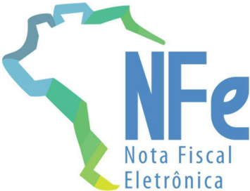
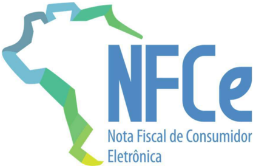
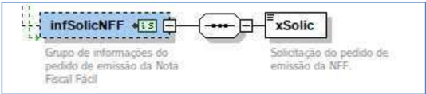

## Projeto Nota Fiscal Eletrônica

Nota Técnica 2021.002

Adequações para Nota Fiscal Fácil

Versão 1.12 - Janeiro 2025

## Sumário

| Controle de Versões ............................................................................................................................................                                                                               | 3                                                                         |
|------------------------------------------------------------------------------------------------------------------------------------------------------------------------------------------------------------------------------------------------|---------------------------------------------------------------------------|
| Histórico de Alterações / Cronograma ..............................................................................................................                                                                                            | 3                                                                         |
| 1. Resumo .............................................................................................................................................................                                                                        | 4                                                                         |
| 2. Dados para Geração do Documento Fiscal .................................................................................................                                                                                                    | 5                                                                         |
| 2.1. Chave de Acesso .....................................................................................................................................                                                                                     | 5                                                                         |
| 2.2. Faixas de Serie .........................................................................................................................................                                                                                 | 6                                                                         |
| 3. Alterações no Schema XML ...........................................................................................................................                                                                                        | 7                                                                         |
| 3.1. Grupo B. Identificação da Nota Fiscal eletrônica .................................................................................                                                                                                        | 7                                                                         |
| 3.2. Criação do Grupo I86. Informações Adicionais do Produto ...............................................................                                                                                                                   | 7                                                                         |
| 3.3. Criação do Grupo I87. Informações da Embalagem do Produto ......................................................                                                                                                                          | 7                                                                         |
| 3.4. Criação do Grupo ZE. Informações do Pedido de Emissão da NFF ................................................                                                                                                                             | 8                                                                         |
| 4. Alterações em Regras de Validação - Web Service de Autorização de NF-e .....................................                                                                                                                                | 10                                                                        |
| Grupo B. Identificação da NF-e (regras B09-40 e B22-30)                                                                                                                                                                                        | ...................................................................... 10 |
| Grupo C. Identificação do Emitente (regras C02a-04, C02a-10 e C02a-14) ........................................                                                                                                                                | 10                                                                        |
| Grupo E: Identificação do Destinatário (regra E04-20) ............................................................................                                                                                                             | 11                                                                        |
| Grupo F: Validação da Assinatura Digital (regra F03) ..............................................................................                                                                                                            | 11                                                                        |
| Grupo N: Item / Tributo: ICMS (regras N12-85, N12-86, N12-94, N12-98) ...........................................                                                                                                                              | 12                                                                        |
| Grupo BA: Documento Fiscal Referenciado (regra BA02-30) .................................................................                                                                                                                      | 14                                                                        |
| Grupo ZD. Informações do Responsável Técnico (regras ZD01-10 e ZD02-10) .................................                                                                                                                                      | 14                                                                        |
| Grupo ZX. Informações Suplementares da Nota Fiscal (regra ZX02-10) .............................................. Grupo 1. Banco de Dados: Emitente (regras 1C17-10, 1C17-20, 1C17-30, 1C17-34,                                                | 15 1C17-38,                                                               |
| 1C17-40, 1C17-60 e 1C17-70) .....................................................................................................................                                                                                              | 15                                                                        |
| Grupo 5. Banco de Dados: Destinatário (regras 5E17-10, 5E17-20, 5E17-30, 5E17-40, 5E17-43, 5E17-46, 5E17-50, 5E17-60, 5E17-63, 5E17-70 e 5E17-80) ..................................................................                           | 16                                                                        |
|                                                                                                                                                                                                                                                | 18                                                                        |
| 5. Alterações em Regras de Validação - Web Service de Registro de Eventos .....................................                                                                                                                                |                                                                           |
| Alterações em Regras de Validação - Web Service nfeDistribuicaoDFe ..............................................                                                                                                                              | 20                                                                        |
| 7.                                                                                                                                                                                                                                             |                                                                           |
| 8. Novas Regras de Validação .........................................................................................................................                                                                                         | 21                                                                        |
| Grupo A: Validação do Certificado de Transmissão (protocolo TLS) (regra A08) ............................... Grupo F: Validação da Assinatura Digital (regra F03B) ........................................................................... | 21 21                                                                     |
| Grupo ZE. Informações da Nota Fiscal Fácil - NFF (regra ZE01-10) ....................................................                                                                                                                          | 21                                                                        |
| Grupo I86. Informações Adicionais do Produto NFF (regra I86-10) ....................................................... Grupo I87. Informações de Embalagem do Produto (regras I87-10) .....................................................   | 21 22                                                                     |

3

3

4

5

5

6

7

7

7

7

8

## Controle de Versões

|   Versão | Publicação     | Descrição               |
|----------|----------------|-------------------------|
|     1.00 | Março 2021     | Publicação da NT.       |
|     1.10 | Maio 2021      | Adequações para NFF     |
|     1.11 | Fevereiro 2022 | Tamanho do campo xSolic |
|     1.12 | Janeiro 2024   | S é rie da NFF          |

## Histórico de Alterações / Cronograma

|   Versão | Histórico de atualizações                                                                                              | Implantação Teste   | Implantação Produção   |
|----------|------------------------------------------------------------------------------------------------------------------------|---------------------|------------------------|
|     1.00 | Geração do XML da NF-e modelo 55 a partir de solicitação de emissão emitida por Produtor Primário no aplicativo da NFF | 26/04/2021          | 25/05/2021             |
|     1.10 | Adequações para NFF                                                                                                    | 21/06/2021          | 28/06/2021             |
|     1.11 | Tamanho do campo xSolic                                                                                                | 24/02/2022          | 03/03/2022             |
|     1.12 | S é rie da NFF (000-999) e ajuste da lei de forma çã o da serie na chave de acesso da NFF                              | Imediato            | Imediato               |

## 1. Resumo

O  objetivo  do  Regime  Especial  Nota  Fiscal  Fácil  (NFF)  é  tornar  o  processo  de  emissão  de documentos fiscais eletrônicos, de vendas de mercadorias e prestação de serviços de transportes, mais  simples  para  os  contribuintes,  deixando  a  complexidade  trazida  pela  legislação  fiscal  sob  a responsabilidade de um sistema centralizado, disponível no Portal Nacional da NFF, que a partir de sua 'inteligência fiscal' possibilita uma emissão fácil e completamente intuitiva do documento.

Para atingir este objetivo, as Secretarias de Fazenda dos Estados disponibilizaram um aplicativo de geração  da  solicitação de emissão  de  documentos  fiscais a partir de dispositivos móveis, denominado  Aplicativo  Emissor  de  Documentos  Fiscais  Eletrônicos  (App  NFF),  cuja  principal funcionalidade é coletar as informações necessárias e suficientes para esta finalidade.

O objetivo desta NT é realizar as adequações necessárias no Schema XML da NF-e e nas regras de negócio nos sistemas autorizadores de NF-e a fim de receber este novo tipo de emissão de Notas Fiscais Eletrônicas.

## 2. Dados para Geração do Documento Fiscal

## 2.1. Chave de Acesso

A chave de acesso da NFF será gerada pelo App NFF, utilizando os espaços destinados à serie e número da NF-e para, conforme mostrado na tabela a seguir, armazenar as seguintes informações: número do dispositivo; ano, mês e dia da emissão; tipo de identificação do emissor (CPF ou CNPJ); número sequencial diário.

|                          |   Código da UF |   AAMMda emissão |   CPF/ CNPJ |   Modelo (mod) |   Série (serie) |   Número (nDF) |   Formade emissão |   Código Numérico |   DV |
|--------------------------|----------------|------------------|-------------|----------------|-----------------|----------------|-------------------|-------------------|------|
| Quantidade de caracteres |             02 |               04 |          14 |             02 |              03 |             09 |                01 |                08 |   01 |

-  cUF - Código da UF do emitente do DF-e
-  AAMM - Ano e Mês de emissão da NF-e
- o Deverá ser obtido no dispositivo móvel
-  CPF/CNPJ - CPF ou CNPJ do emitente Produtor Primário preenchido com zeros a esquerda.
- o CPF ou CNPJ do Produtor Primário identificado no app
-  mod - Modelo do Documento Fiscal: 55 para NF-e / 65 para NFC-e
-  serie - Série do Documento Fiscal
- o Gerado e controlado por dispositivo
-  1 dígito para identificar tipo de emissão OnLine/OffLine [0 = OnLine, 1 = OffLine]
-  2 dígitos para identificar o ano
-  nNF - Número do Documento Fiscal
- o Gerado e controlado sequencialmente por dispositivo:
-  2 dígitos do dia da emissão
-  2 dígitos do mês da emissão
-  1 dígito para identificar CPF [2= CPF]
-  4 dígitos sequenciais para o número com reinício diário por dispositivo
-  tpEmis - forma de emissão do DF-e
- o 3 - Emissão pelo regime especial da NFF
-  cNF - Código Numérico que compõe a Chave de Acesso
- o Aleatório de 8 dígitos
-  cDV - Dígito Verificador da Chave de Acesso

O dígito verificador da chave de acesso do DF-e é baseado em um cálculo do módulo 11

## 2.2. Faixas de Serie

Diversas  séries  da  NF-e  são  utilizadas  para  colocar  informações  adicionais  na  chave  de  acesso, conforme o quadro a seguir:

| Série   | Emitente   | Processo Emissão      | Assinatura                                                    | Chave Acesso            | Numeração                                                     |
|---------|------------|-----------------------|---------------------------------------------------------------|-------------------------|---------------------------------------------------------------|
| 000-899 | CNPJ       | Aplicativoda Empresa  | e-CNPJdo Emitente (procEmi <> 1,2)                            | CNPJ do Emitente        | Sequencial porCNPJ, controlado pelo emitente                  |
| 000-999 | CNPJ / CPF | Aplicativo NFF        | e-CNPJ da PROCERGS (procemi = 3)                              | CPF ou CNPJ do emitente | Gerado e controlado pelo APP NFF conforme item 2.1 desta NT.  |
| 890-899 | CNPJ / CPF | Site SEFAZ            | e-CNPJ da SEFAZ (procEmi = 1)                                 | CNPJ da SEFAZ           | Sequencial pela SEFAZ, independente do emitente (CPF ou CNPJ) |
| 900-909 | CNPJ       | Site SEFAZ            | e-CNPJ da SEFAZ (procEmi=1),ou e-CNPJ do Emitente (procEmi=2) | CNPJ do Emitente        | Sequencial por CNPJ, controlado pela SEFAZ                    |
| 910-919 | CPF        | Site SEFAZ            | e-CNPJ da SEFAZ (procEmi=1), ou e-CPF do Emitente (procEmi=2) | CPF do Emitente         | Sequencial por CPF, controlado pela SEFAZ                     |
| 920-969 | CPF        | Aplicativo da Empresa | e-CPF do Emitente (procEmi<>1,2)                              | CPF do Emitente         | Sequencial por CPF, controlado pelo emitente                  |

## 3. Alterações no Schema XML

## 3.1. Grupo B. Identificação da Nota Fiscal eletrônica

O tipo de emissão '3', antigamente utilizado para o Sistema de Contingência do Ambiente Nacional, deixou de ser utilizado a partir da implementação das Sefaz Virtuais de Contingência, e tinha sido desativado pela NT 2015/002.

|   # | ID   | Campo   | Descrição               | Ele   | Pai   | Tipo   | Ocor.   |   Tam. | Observação                                                                                                                                                                                                                                                                                                                                                                                                                                                                                                                                                                                                                                                                                                                                      |
|-----|------|---------|-------------------------|-------|-------|--------|---------|--------|-------------------------------------------------------------------------------------------------------------------------------------------------------------------------------------------------------------------------------------------------------------------------------------------------------------------------------------------------------------------------------------------------------------------------------------------------------------------------------------------------------------------------------------------------------------------------------------------------------------------------------------------------------------------------------------------------------------------------------------------------|
|  26 | B22  | tpEmis  | Tipo de Emissão da NF-e | E     | B01   | N      | 1-1     |      1 | 1=Emissão normal (não em contingência); 2=Contingência FS-IA, comimpressãodoDANFEem Formulário de Segurança - Impressor Autônomo; 3= Regime Especial NFF (NT 2021.002)Contingência SCAN (Sistema de Contingência do Ambiente Nacional); *Desativado * NT 2015/002 4=Contingência EPEC (Evento Prévio da Emissãoem Contingência); 5=Contingência FS-DA, comimpressãodoDANFEem Formulário de Segurança - Documento Auxiliar; 6=Contingência SVC-AN (SEFAZ Virtual de Contingência do AN); 7=Contingência SVC-RS (SEFAZ Virtual de Contingência do RS); 9=Contingência off-line da NFC-e; Observação: Para a NFC-e somente é válida a opção de contingência: 9-Contingência Off-Line e, a critério da UF, opção 4-Contingência EPEC. (NT 2015/002) |

## 3.2. Criação do Grupo I86. Informações Adicionais do Produto

O conjunto de campos do Grupo I86 tem o objetivo agrupar as informações de codificação do produto do fisco, além de receber a operação da NFF que gerou a inclusão daquele produto na NF-e. Este grupo permite também a padronização da descrição da embalagem dos produtos da NFF.

A primeira versão do app NFF para a utilização por produtores primários tem por objetivo permitir a utilização em operações internas de saída de legumes, frutas e verduras, destinadas a contribuintes do ICMS.

É esperado que o aumento deste escopo em próximas versões tenha reflexos neste grupo.

## 3.3. Criação do Grupo I87. Informações da Embalagem do Produto

Este grupo permite a padronização da descrição da embalagem dos produtos da NFF e NF-e Avulsa.

A primeira versão do app NFF para a utilização por produtores primários tem por objetivo permitir a utilização em operações internas de saída de legumes, frutas e verduras, destinadas a contribuintes do ICMS.

É esperado que o aumento deste escopo em próximas versões tenha reflexos neste grupo.

| #      | ID   | Campo      | Descrição                                         | Ele   | Pai   | Tipo   | Ocor.   | Tam.   | Observação                                                                                                                                                                       |
|--------|------|------------|---------------------------------------------------|-------|-------|--------|---------|--------|----------------------------------------------------------------------------------------------------------------------------------------------------------------------------------|
| 128v-a | I86  | infProdNFF | Informações do Produto (NT 2021.002)              | G     | I01   |        | 0-1     |        | Informações do produto                                                                                                                                                           |
| 128v-b | I86a | cProdFisco | Código Fiscal do Produto                          | E     | I86   | C      | 1-1     | 14     | Código Fiscal do Produto                                                                                                                                                         |
| 128v-c | I86b | cOperNFF   | Código da Operação NFF                            | E     | I86   | N      | 1-1     | 1-5    | Código da operação selecionada na NFF e relacionada ao item                                                                                                                      |
| 128v-d | I87  | infProdEmb | Informações da Embalagem do Produto (NT 2021.002) | G     | I01   |        | 0-1     |        | Informações da embalagem do produto No caso da NFFF, preenchido somente se modBC = 1-Pauta.                                                                                      |
| 128v-e | I87a | xEmb       | Embalagem do produto                              | E     | I87   | C      | 1-1     | 1-8    | Exemplos de embalagens: "a granel"; "balde"; "bandeja"; "barril"; "caixa"; "copo"; "estojo"; "fardo"; "garrafa"; "garrafão"; "lata"; "molho"; "pacote"; "pote"; "saco"; "sacola" |
| 128v-f | I87b | qVolEmb    | Volume do produto na embalagem                    | E     | I87   | N      | 1-1     | 7v2    | Volume / quantidade do produto por unidade de medida na embalagem. Ex: Caixa com 3 KG  xEmb: caixa  qVolEmb: 3                                                                 |
| 128v-g | I87c | uEmb       | Unidade de Medida da Embalagem                    | E     | I87   | C      | 1-1     | 1-8    | Exemplos: "grama"; "kg"; "ton"; "litro"; "metro"; "m3";"m3 ester" (m3 estéreo); "m2"; "unid"; "dúzia";                                                                           |

## 3.4. Criação do Grupo ZE. Informações do Pedido de Emissão da NFF

O pedido de emissão da NFF existirá somente na hipótese de tipo de emissão = 3-NFF e será gerado exclusivamente pelo aplicativo emissor, que também poderá gerar pedidos de evento.

Essa tag deverá conter todos os campos e valores gerados pelo aplicativo para integrar o pedido de emissão ou o pedido de registro de evento.

Fica adicionada a estrutura a seguir ao schema da NF-e e do pedido de Evento:

NT 2021.002

| #    | ID   | Campo       | Descrição                                       | Ele   | Pai   | Tipo   | Ocor.   | Tam.   | Observação                                                                     |
|------|------|-------------|-------------------------------------------------|-------|-------|--------|---------|--------|--------------------------------------------------------------------------------|
| 423i | ZE01 | infSolicNFF | Informações de solicitação da NFF (NT 2021.002) | G     | A01   |        | 0-1     |        | Grupo para informações da solicitação da NFF                                   |
| 423j | ZE02 | xSolic      | Solicitação do pedido de emissão da NFF         | E     | ZE01  | C      | 1-1     | 2-5000 | Campos do pedido preenchidos no aplicativo móvel (app) da NFF, no formato JSON |

## 4. Alterações em Regras de Validação - Web Service de Autorização de NF-e

## Grupo B. Identificação da NF-e (regras B09-40 e B22-30)

O valor '3' para tpEmis não mais identifica emissão utilizando o Sistema de Contingência do Ambiente Nacional.

| Campo-Seq   | Modelo   | Regra de Validação                                                                                                                                                                                                                                                                                                                                                                                                                                                                                                                                                                                                                                                                                                                                                                                                          | Aplic.   |   Msg | Efeito   | Descrição Erro                                                             |
|-------------|----------|-----------------------------------------------------------------------------------------------------------------------------------------------------------------------------------------------------------------------------------------------------------------------------------------------------------------------------------------------------------------------------------------------------------------------------------------------------------------------------------------------------------------------------------------------------------------------------------------------------------------------------------------------------------------------------------------------------------------------------------------------------------------------------------------------------------------------------|----------|-------|----------|----------------------------------------------------------------------------|
| B09-40      | 65       | NFC-e com Tipo de Emissão=1-Normal (ou 3-SCAN (NT 2021.002), ou 6-SVC- AN, 7-SVC-RS) e Data-Hora de Emissão com atraso superior a 5 minutos em relação ao horário de recepção na SEFAZ. Exceção 1 : A critério da UF, a rejeição acima pode ser efetuada para qualquer Tipo de Emissão. Exceção 2 : A critério da UF, pode ser aceita a NFC-e com Data de Emissão muito atrasada, desde que tenha sido emitida em contingência (tpEmis=4, 9). A NFC-e transmitida para a SEFAZ Autorizadora após o prazo de 24 horas deve retornar cStat='150- Autorizado Uso da NF-e, autorização fora de prazo'. Observação : A emissão da NFC-e deve ocorrer de forma on-line, real-time, com uma tolerância de até 5 minutos, devido ao sincronismo de horário do servidor da Empresa e o servidor da SEFAZ Autorizadora. (NT 2015.002) | Obrig.   |   704 | Rej.     | Rejeição: NFC-e com Data-Hora de emissão atrasada                          |
| B22-30      | 55/65    | Na autorização pela SEFAZ:  não aceitar o conteúdo tpEmis=3-SCAN (NT 2010/004), (NT 2021.002) 6- SVC-AN ou 7-SVC-RS                                                                                                                                                                                                                                                                                                                                                                                                                                                                                                                                                                                                                                                                                                        | Obrig.   |   570 | Rej.     | Rejeição: Tipo de Emissão 3, 6 ou 7 só é válido nas contingências SCAN/SVC |

## Grupo C. Identificação do Emitente (regras C02a-04, C02a-10 e C02a-14)

Conforme apresentado no item 2.2, tpEmis é utilizado em conjunto com a série do documento para identificar se o emitente é identificado por CPF ou CNPJ.

| Campo-Seq   |   Modelo | Regra de Validação                                                                                                                                                                                                                                                                                       | Aplic.   |   Msg | Efeito   | Descrição Erro                                                                      |
|-------------|----------|----------------------------------------------------------------------------------------------------------------------------------------------------------------------------------------------------------------------------------------------------------------------------------------------------------|----------|-------|----------|-------------------------------------------------------------------------------------|
| C02a-04     |       65 | Se informado CPF do emitente e tpEmis <> 3-NFF (NT 2021.002):  Se NFC-e (modelo 65) (NT 2015.002)                                                                                                                                                                                                       | Obrig.   |   337 | Rej.     | Rejeição: NFC-e para emitente pessoa física                                         |
| C02a-10     |       55 | Se informado CPF do emitente e tpEmis <> 3-NFF (NT 2021.002):  Série difere da faixa para emitente CPF: 890-899 e 910-969 (NT 2018.001 / NT 2015.002)                                                                                                                                                   | Obrig.   |   495 | Rej.     | Rejeição: CPF do Emitente com Série incompatível                                    |
| C02a-14     |       55 | Se informado CPF do Emitente e tpEmis <> 3-NFF (NT 2021.002):  Série difere da faixa para emitente CPF: 890-899 e 910-919 Observação : Regra de validação opcional a critério da UF. Permite a emissão de NF-e por pessoa física, somente no serviço de Nota Fiscal Avulsa no site da UF. (NT 2018.001) | Obrig.   |   407 | Rej.     | Rejeição: CPF do Emitente somente no serviço de Nota Fiscal Avulsa no site do Fisco |

## Grupo E: Identificação do Destinatário (regra E04-20)

| #      | Regra de Validação                                                                                                                                                                                         | Aplic.   |   Msg | Efeito   | Descrição Erro                                                                                                                                           |
|--------|------------------------------------------------------------------------------------------------------------------------------------------------------------------------------------------------------------|----------|-------|----------|----------------------------------------------------------------------------------------------------------------------------------------------------------|
| E04-20 | Se tag:tpAmb (id:B24) = 2: O xNome (E04) deve ser informado com a literal 'NF-E EMITIDAEMAMBIENTE DEHOMOLOGACAO -SEM VALOR FISCAL' (NT 2011/002) Exceção : Não se aplica para tpEmis = 3-NFF (NT 2021.002) | Obrig.   |   598 | Rej.     | Rejeição: NF-e emitida em ambiente de homologação com Razão Social do destinatário diferente de NF-E EMITIDAEMAMBIENTE DE HOMOLOGACAO - SEM VALOR FISCAL |

## Grupo F: Validação da Assinatura Digital (regra F03)

O arquivo XML da NF-e será gerado pelo Portal Nacional da NFF; por este motivo, se tpEmis=3 (NF-e emitida ao abrigo do regime especial NFF), o certificado digital utilizado para assinar o arquivo XML somente poderá ser da Sefaz Virtual do Rio Grande do Sul (SVRS).

| #    | Regra de Validação                                                                                                                                                                                                                                                  | Aplic.   |   Msg | Efeito   | Descrição Erro                                                             |
|------|---------------------------------------------------------------------------------------------------------------------------------------------------------------------------------------------------------------------------------------------------------------------|----------|-------|----------|----------------------------------------------------------------------------|
| F03  | Se Certificado de Assinatura comCNPJ e CNPJ do Certificado difere do CNPJ da SEFAZ para a UF:  CNPJ-Base do Emitente difere do CNPJ-Base do Certificado Digital (NT 2018.001) Exceção : Para tpEmis = 3-NFF, CNPJ do certificado é somente o da SVRS (NT 2021.002) | Obrig.   |   213 | Rej.     | Rejeição: CNPJ-Base do Emitente difere do CNPJ-Base do Certificado Digital |
| F03A | Se Certificado de Assinatura com CPF: - CPF do Emitente difere do CPF do Certificado Digital (NT 2018.001) Exceção : Para tpEmis = 3-NFF, CNPJ do certificado é somente o da SVRS (NT 2021.002)                                                                     | Obrig.   |   227 | Rej.     | Rejeição: CPF do Emitente difere do CPF do Certificado Digital             |

Projeto

Nota Fiscal Eletrônica

NT 2021.002

## Grupo N: Item / Tributo: ICMS (regras N12-85, N12-86, N12-94, N12-98)

O código do benefício ('cBenef') será tratado no Portal Nacional da NFF.

| #      | Regra de Validação                                                                                                                                                                                                                                                                                                                                                                                                                                                                                                                                                                                                                                                                                                                                                                                                                                                                                                                                                                                                                                                                                                                                                                                                                          | Aplic.   |   Msg | Efeito   | Descrição Erro                                                                              |
|--------|---------------------------------------------------------------------------------------------------------------------------------------------------------------------------------------------------------------------------------------------------------------------------------------------------------------------------------------------------------------------------------------------------------------------------------------------------------------------------------------------------------------------------------------------------------------------------------------------------------------------------------------------------------------------------------------------------------------------------------------------------------------------------------------------------------------------------------------------------------------------------------------------------------------------------------------------------------------------------------------------------------------------------------------------------------------------------------------------------------------------------------------------------------------------------------------------------------------------------------------------|----------|-------|----------|---------------------------------------------------------------------------------------------|
| N12-85 | Se informado CST e não informado código de benefício fiscal: - Verificar se CST exige código de benefício fiscal (tag: cBenef), conforme tabela de código de benefício fiscal por UF publicada no Portal da Secretaria de Fazenda da respectiva UF. Observação 1: Implementação a critério da UF, por modelo de DF-e e por CST. Observação 2: Para o CST informado, o sistema autorizador apenas verifica se existe qualquer cBenef na tabela publicada no Portal da Secretaria de Fazenda da respectiva UF, sem verificar a compatibilidade. Exceção 1: a RV não se aplica quando Finalidade de emissão da NFe (tag: finNFe) igual a Devolução de Mercadoria e Identificador de local de destino da operação (tag: idDest) igual a Operação interestadual ou com o Exterior; Exceção 2: a critério da UF, a RV não se aplica quando Finalidade de emissão da NF-e (tag: finNFe) igual a Devolução de Mercadoria; Exceção 3: a critério da UF, a RV não se aplica quando Finalidade de emissão da NF-e (tag: finNFe) igual a NF-e de Ajuste; Exceção 4: a critério da UF, a RV não se se aplica quando Tipo de Operação (tag: tpNF) igual à Entrada. (NT 2019.001 v1.50); Exceção 5: Não se aplica para NFF (tpEmis = 3-NFF) (NT 2021.002). | Facul.   |   930 | Rej.     | Rejeição: CST combenefício fiscal e não informado o código de benefício fiscal [nItem: nnn] |

## Projeto Nota Fiscal Eletrônica

NT 2021.002

| #      | Regra de Validação                                                                                                                                                                                                                                                                                                                                                                                                                                                                                                                                                                                                                                                                                                                                                                                                                                                                                                                                                                                                                                                                                                                                                                                                                                                                                                                                                                 | Aplic.   |   Msg | Efeito   | Descrição Erro                                                                            |
|--------|------------------------------------------------------------------------------------------------------------------------------------------------------------------------------------------------------------------------------------------------------------------------------------------------------------------------------------------------------------------------------------------------------------------------------------------------------------------------------------------------------------------------------------------------------------------------------------------------------------------------------------------------------------------------------------------------------------------------------------------------------------------------------------------------------------------------------------------------------------------------------------------------------------------------------------------------------------------------------------------------------------------------------------------------------------------------------------------------------------------------------------------------------------------------------------------------------------------------------------------------------------------------------------------------------------------------------------------------------------------------------------|----------|-------|----------|-------------------------------------------------------------------------------------------|
| N12-86 | Se informado CST e informado código de benefício fiscal: - Verificar se CST não possui código de benefício fiscal, conforme tabela de código de benefício fiscal por UF publicada no Portal da Secretaria de Fazenda da respectiva UF. Observação 1: Implementação a critério da UF, por modelo de DF-e e CST. Observação 2: Para o CST informado, o sistema apenas verifica se não existe qualquer cBenef na tabela publicada no Portal da Secretaria de Fazenda da respectiva UF, sem verificar a compatibilidade. Exceção 1: a RV não se aplica quando Finalidade de emissão da NFe (tag: finNFe) igual a Devolução de Mercadoria e Identificador de local de destino da operação (tag: idDest) igual a Operação interestadual ou com o Exterior. Exceção 2: a critério da UF, a RV não se aplica quando Finalidade de emissão da NF-e (tag: finNFe) igual a Devolução de Mercadoria; Exceção 3: a critério da UF, a RV não se aplica quando Finalidade de emissão da NF-e (tag: finNFe) igual a NF-e de Ajuste; Exceção 4: a critério da UF, a RV não se aplica quando Tipo de Operação (tag: tpNF) igual à Entrada. (NT 2019.001 v1.50);                                                                                                                                                                                                                                      | Facul.   |   928 | Rej.     | Rejeição: Informado código de benefício fiscal para CST sem benefício fiscal [nItem: nnn] |
| N12-94 | Se informado CST e informado código de benefício fiscal: - Verificar se código de benefício fiscal corresponde ao CST informado, conforme tabela de código de benefício fiscal por UF publicada no Portal da Secretaria de Fazenda da respectiva UF. Observação: Implementação a critério da UF, por modelo de DF-e e por CST. Exceção 1: a RV não se aplica quando Finalidade de emissão da NFe (tag: finNFe) igual a Devolução de Mercadoria e Identificador de local de destino da operação (tag: idDest) igual a Operação interestadual ou com o Exterior. Exceção 2: a critério da UF, a RV não se aplica quando Finalidade de emissão da NF-e (tag: finNFe) igual a Devolução de Mercadoria; Exceção 3: a critério da UF, a RV não se aplica quando Finalidade de emissão da NF-e (tag: finNFe) igual a NF-e de Ajuste; Exceção 4: a critério da UF, a RV não se aplica quando Tipo de Operação (tag: tpNF) igual à Entrada; Exceção 5: Não se aplica para NFF (tpEmis = 3-NFF) (NT 2021.002). Nota: Para itens sem benefício fiscal, a UF poderá exigir a informação da literal 'SEM CBENEF' para alguns CST, vide tabela publicada no Portal da Secretaria de Fazenda da respectiva UF. Nota: Para itens sem benefício fiscal, a UF poderá exigir a informação da literal 'SEM CBENEF' para alguns CST, vide tabela publicada no Portal Nacional Fazenda da respectiva UF. | Facul.   |   931 | Rej.     | Rejeição: Informado código debenefício fiscal incompatível com CST e UF [nItem: nnn]      |

## Projeto Nota Fiscal Eletrônica

NT 2021.002

| #      | Regra de Validação                                                                                                                                                                                                                                                                                                                                                                                                                                                                                                                                                                                                                                                                                                                                                                                                                                                                                                                                                                                                                                                                                      | Aplic.   |   Msg | Efeito   | Descrição Erro                                                                           |
|--------|---------------------------------------------------------------------------------------------------------------------------------------------------------------------------------------------------------------------------------------------------------------------------------------------------------------------------------------------------------------------------------------------------------------------------------------------------------------------------------------------------------------------------------------------------------------------------------------------------------------------------------------------------------------------------------------------------------------------------------------------------------------------------------------------------------------------------------------------------------------------------------------------------------------------------------------------------------------------------------------------------------------------------------------------------------------------------------------------------------|----------|-------|----------|------------------------------------------------------------------------------------------|
| N12-98 | Se informado código de benefício fiscal: - Verificar se código de benefício fiscal existe e está vigente, conforme tabela de código de benefício fiscal por UF publicada no Portal da Secretaria de Fazenda da respectiva UF. Observação: Implementação a critério da UF e por modelo de DF-e. Exceção 1: a RV não se aplica quando Finalidade de emissão da NFe (tag: finNFe) igual a Devolução de Mercadoria e Identificador de local de destino da operação (tag: idDest) igual a Operação interestadual ou com o Exterior. Exceção 2: a critério da UF, a RV não se aplica quando Finalidade de emissão da NF-e (tag: finNFe) igual a Devolução de Mercadoria; Exceção 3: a critério da UF, a RV não se aplica quando Finalidade de emissão da NF-e (tag: finNFe) igual a NF-e de Ajuste; Exceção 4: a critério da UF, a RV não se aplica quando Tipo de Operação (tag: tpNF) igual à Entrada. Exceção 5: essa RV não se aplica quando informado CSOSN (operação realizada por optante pelo Simples Nacional). (NT2019.001 v1.50) Exceção 6: Não se aplica para NFF (tpEmis = 3-NFF) (NT 2021.002). | Facul.   |   946 | Rej.     | Rejeição: Informado código de benefício fiscal incorreto ouinexistente na UF[nItem: nnn] |

## Grupo BA: Documento Fiscal Referenciado (regra BA02-30)

A Chave de Acesso de NF-e emitida ao abrigo da NFF (tpEmis=3) possui uma regra de formação onde a série não identifica se a Chave de Acesso contém um CPF ou CNPJ. É necessário identificar essa informação de uma forma alternativa.

| #       | Regra de Validação                                                                                                                                                                                                                                                                                                                                                            | Aplic.   |   Msg | Efeito   | Descrição Erro                                                         |
|---------|-------------------------------------------------------------------------------------------------------------------------------------------------------------------------------------------------------------------------------------------------------------------------------------------------------------------------------------------------------------------------------|----------|-------|----------|------------------------------------------------------------------------|
| BA02-30 | Se informada uma NF-e referenciada (tag:refNFe): - Série = [0-909] e CNPJ zerado ou dígito inválido, ou - Série = [910-969] e CPF zerado ou dígito inválido (NT 2018.001) Nota: Caso tpEmis = 3-NFF, considerar o 5º dígito do número da nota (nNF) para determinar se CNPJ/CPF na Chave de Acesso: CNPJ: 5º dígito do nNF = '1' , CPF: 5º dígito do nNF = '2' (NT 2021.002). | Facul.   |   552 | Rej.     | Rejeição: Chave de Acesso referenciadacom CNPJ/CPF inválido[nOcor:nnn] |

## Grupo ZD. Informações do Responsável Técnico (regras ZD01-10 e ZD02-10)

O arquivo XML da NF-e será gerado pelo Portal Nacional da NFF; por este motivo, se tpEmis=3 (NF-e emitida ao abrigo do regime especial NFF), não se aplicam as validações deste grupo.

| Campo-Seq Modelo   | Regra de Validação   | Aplic. Msg Efeito   | Descrição Erro   |
|--------------------|----------------------|---------------------|------------------|

NT 2021.002

| Campo-Seq   | Modelo   | Regra de Validação                                                                                                                                                                                                                                                                                                                                                                                                                            | Aplic.   |   Msg | Efeito   | Descrição Erro                                                                |
|-------------|----------|-----------------------------------------------------------------------------------------------------------------------------------------------------------------------------------------------------------------------------------------------------------------------------------------------------------------------------------------------------------------------------------------------------------------------------------------------|----------|-------|----------|-------------------------------------------------------------------------------|
| ZD01-10     | 55/65    | Não informado o grupo de informações do responsável técnico Observação : Implementação futura, exceto as UF de AM, MS, PE, PR, SC e TO, nas quais estas regras já estão em vigor em ambiente de teste e entrarão em vigor em ambiente de produção no dia 03 de junho de 2019 (NT 2018.005 v 1.30) Exceção : Não se aplica para NFF (tpEmis = 3-NFF), pois neste caso não é informado o grupo Informações do Responsável Técnico (NT 2021.002) | Facul.   |   972 | Rej.     | Rejeição: Obrigatória as informaçõesdo responsável técnico                    |
| ZD02-10     | 55/65    | Se informado CNPJ do responsável técnico e CNPJ inválido (NT 2021.002)  CNPJ com zeros, nulo ou DV inválido Observação : Implementação futura, exceto as UF de AM, MS, PE, PR, SC e TO, nas quais estas regras já estão em vigor em ambiente de teste e entrarão em vigor em ambiente de produção no dia 03 de junho de 2019 (NT 2018.005 v 1.30)                                                                                            | Facul.   |   973 | Rej.     | Rejeição: CNPJ do responsável técnico inválido                                |
| ZD07-10     | 55/65    | Obrigatória a informação do identificador do CSRT (tag: idCSRT) e Hash do CSTR (tag: hashCSRT) Observação : Implementação futura, todas as UFs (NT 2018.005 v1.30) Exceção : Não se aplica para NFF (tpEmis = 3-NFF) (NT 2021.002)                                                                                                                                                                                                            | Facul.   |   975 | Rej.     | Rejeição: Obrigatória a informação do identificador do CSRT e do Hash do CSRT |

## Grupo ZX. Informações Suplementares da Nota Fiscal (regra ZX02-10)

(previsão para quando for possível emitir NFC-e ao abrigo da NFF)

O app NFF não gera impressão de DANFE NFC-e; portanto, não há também a geração do QR-Code correspondente.

| Campo-Seq   |   Modelo | Regra de Validação                                                                                                                                                                                                                                                                                                                                     | Aplic.   |   Msg | Efeito   | Descrição Erro                                    |
|-------------|----------|--------------------------------------------------------------------------------------------------------------------------------------------------------------------------------------------------------------------------------------------------------------------------------------------------------------------------------------------------------|----------|-------|----------|---------------------------------------------------|
| ZX02-10     |       65 | Não informado o campo de QR-Code para a NFC-e. Exceção 1 : A regra de validação não se aplica, em produção, para Nota Fiscal com Data de Emissão anterior a 01/04/2016. Não sendo informado o QR-Code não se aplicam as demais validações relacionadas com este campo. (NT 2015.002) Exceção 2 : Não se aplica para NFF (tpEmis = 3-NFF) (NT 2021.002) | Obrig.   |   394 | Rej.     | Rejeição: Nota Fiscal sem a informação do QR-Code |

Grupo 1. Banco de Dados: Emitente (regras 1C17-10, 1C17-20, 1C17-30, 1C17-34, 1C17-38, 1C17-40, 1C17-60 e 1C17-70)

As  condições  tratadas  pelas  validações  realizadas  pelas  regras  1C17-10,  1C17-20,  1C17-30,  1C17-34,  1C17-38,  1C17-40,  1C17-60  e  1C17-70  são verificadas pelo app NFF em conjunto com o Portal Nacional da NFF, por isto estas regras não se aplicam em caso de emissão ao abrigo da NFF.

| Campo-Seq   | Modelo   | Regra de Validação                                                                                                                                                                                                                                                                                                                                                                                                                                            | Aplic.   |   Msg | Efeito   | Descrição Erro                                         |
|-------------|----------|---------------------------------------------------------------------------------------------------------------------------------------------------------------------------------------------------------------------------------------------------------------------------------------------------------------------------------------------------------------------------------------------------------------------------------------------------------------|----------|-------|----------|--------------------------------------------------------|
| 1C17-10     | 55/65    | Se informada IE do Emitente e tpEmis <> 3-NFF (NT 2021.002): - Acessar Cadastro de Contribuinte da UF (Chave: IE Emitente) - IE Emitente não cadastrada                                                                                                                                                                                                                                                                                                       | Obrig.   |   230 | Rej.     | Rejeição: IE do emitente não cadastrada                |
| 1C17-20     | 55/65    | - IE Emitente não vinculada ao CNPJ (se informado CNPJ emitente, tratar Regime Especial de IE Única)                                                                                                                                                                                                                                                                                                                                                          | Obrig.   |   231 | Rej.     | Rejeição: IE do emitente não vinculada ao CNPJ         |
| 1C17-30     | 55/65    | - IE emitente não vinculada ao CPF (se informado CPF emitente)                                                                                                                                                                                                                                                                                                                                                                                                | Obrig.   |   622 | Rej.     | Rejeição: IE emitente não vinculada ao CPF             |
| 1C17-34     | 55       | - Emitente não autorizado para emissão de NF-e                                                                                                                                                                                                                                                                                                                                                                                                                | Obrig.   |   203 | Rej.     | Rejeição: Emissor não habilitado para emissão da NF-e  |
| 1C17-38     | 65       | - Emitente não autorizado para emissão de NFC-e                                                                                                                                                                                                                                                                                                                                                                                                               | Obrig.   |   781 | Rej.     | Rejeição: Emissor não habilitado para emissão da NFC-e |
| 1C17-40     | 55/65    | - Emitenteem situação irregular perante o Fisco Observação: o aplicativo emissor de NFF garante que a solicitação de emissão da NF-e é realizada somente para contribuintes ativos; entretanto, como é possível que ocorraum atraso no envio do XML para o ambiente de autorização, nessa situação, de forma excepcional e transitória, poderá acontecer a autorização de uso de uma NF-e para um contribuinte que já não está mais ativo na UF (NT 2021.002) | Obrig.   |   301 | Den.     | Uso Denegado: Irregularidade fiscal do emitente        |
| 1C17-60     | 55/65    | Mensagens opcionais no caso de IE não vinculada ao CNPJ/CPF. - Acessar Cadastro de Pessoa Jurídica ou Pessoa Física: - CNPJ emitente não cadastrado Exceção : Não se aplica para NFF (tpEmis = 3-NFF) (NT 2021.002)                                                                                                                                                                                                                                           | Facul.   |   245 | Rej.     | Rejeição: CNPJ Emitente não cadastrado                 |
| 1C17-70     | 55       | Mensagens opcionais no caso de IE não vinculada ao CNPJ/CPF.  Acessar Cadastro de Pessoa Jurídica ou Pessoa Física: o CPF Emitente não cadastrado (NT 2011/004) Exceção : Não se aplica para NFF (tpEmis = 3-NFF) (NT 2021.002)                                                                                                                                                                                                                              | Facul.   |   621 | Rej.     | Rejeição: CPF Emitente não cadastrado                  |

## Grupo 5. Banco de Dados: Destinatário (regras 5E17-10, 5E17-20, 5E17-30, 5E17-40, 5E17-43, 5E17-46, 5E17-50, 5E17-60, 5E17-63, 5E17-70 e 5E17-80)

As condições tratadas pelas validações realizadas pelas regras 5E17-10, 5E17-20, 5E17-30, 5E17-40, 5E17-43, 5E17-46, 5E17-50, 5E17-60, 5E17-63, 5E17-70 e 5E17-80 são verificadas pelo app NFF em conjunto com o Portal Nacional da NFF, por isto estas regras não se aplicam em caso de emissão ao abrigo da NFF.

| Campo-Seq   |   Modelo | Regra de Validação                                                                                                                                                                                  | Aplic.   |   Msg | Efeito   | Descrição Erro                                     |
|-------------|----------|-----------------------------------------------------------------------------------------------------------------------------------------------------------------------------------------------------|----------|-------|----------|----------------------------------------------------|
| 5E17-10     |       55 | Se informada IE do Destinatário e tpEmis <> 3-NFF (NT 2021.002): - Acessar Cadastro de Contribuinte da UF (Chave: UF Dest, IE Dest.) (*5) - IE destinatário não cadastrada (*7) (NT 2019.001 v1.00) | Obrig.   |   233 | Rej.     | Rejeição: IE do destinatário não cadastrada        |
| 5E17-20     |       55 | - Se informado CNPJ do destinatário e IE destinatário não vinculada ao CNPJ (tratar Regime Especial de IE Única) (NT2019.001)                                                                       | Obrig.   |   234 | Rej.     | Rejeição: IE do destinatário não vinculada ao CNPJ |
| 5E17-30     |       55 | - Se informado CPF do destinatário e IE destinatário não vinculada ao CPF (*7) (NT2019.001)                                                                                                         | Obrig.   |   624 | Rej.     | Rejeição: IE Destinatário não vinculada ao CPF     |

## Projeto Nota Fiscal Eletrônica

NT 2021.002

| Campo-Seq   |   Modelo | Regra de Validação                                                                                                                                                                                                                                                                         | Aplic.   |   Msg | Efeito   | Descrição Erro                                           |
|-------------|----------|--------------------------------------------------------------------------------------------------------------------------------------------------------------------------------------------------------------------------------------------------------------------------------------------|----------|-------|----------|----------------------------------------------------------|
| 5E17-40     |       55 | - Destinatário em situação irregular perante o Fisco, vedada operação na UF (CCC.cSitCNPJ=3- Vedado) (NT2019.001)                                                                                                                                                                          | Obrig.   |   302 | Den.     | Uso Denegado: Irregularidade fiscal do destinatário      |
| 5E17-43     |       55 | - Destinatário bloqueado na UF (CCC.cSitCNPJ=2-Bloqueado) (NT2019.001)                                                                                                                                                                                                                     | Obrig.   |   305 | Rej.     | Rejeição: Destinatário bloqueado na UF                   |
| 5E17-46     |       55 | - IE do Destinatário não está ativa na UF (CCC.cSitIE=0-Não habilitado) (*7) (NT2019.001)                                                                                                                                                                                                  | Obrig.   |   306 | Rej.     | Rejeição: IE do destinatário não está ativa na UF        |
| 5E17-50     |       55 | Se IE Destinatário não informada e informado CNPJ do destinatário e tpEmis <> 3-NFF (NT 2021.002): - Acessar Cadastro Contribuinte da UF (Chave: UF-Dest, CNPJ-Dest) (*6) - Destinatário possui IE ativa na UF (CCC.cSitIE=1-Habilitado) e CCC.IndIEDestOpc = 0 - Obrigatório (NT2019.001) | Obrig.   |   232 | Rej.     | Rejeição: IE do destinatário não informada               |
| 5E17-60     |       55 | - Destinatário com CNPJ vedado na UF (CCC.cSitCNPJ=3-Vedado) (NT2019.001)                                                                                                                                                                                                                  | Obrig.   |   303 | Den.     | Uso Denegado: Destinatário não habilitado a operar na UF |
| 5E17-63     |       55 | - Destinatário bloqueado na UF (CCC.cSitCNPJ=2-Bloqueado) (NT2019.001)                                                                                                                                                                                                                     | Obrig.   |   305 | Rej.     | Rejeição: Destinatário bloqueado na UF                   |
| 5E17-70     |       55 | Mensagens opcionais se informada IE do destinatário e IE não vinculada ao CNPJ/CPF e tpEmis <> 3- NFF (NT 2021.002): - Acessar Cadastro de Pessoa Jurídica ou Pessoa Física: - CNPJ destinatário não cadastrado (NT2019.001)                                                               | Facul.   |   246 | Rej.     | Rejeição: CNPJ Destinatário não cadastrado               |
| 5E17-80     |       55 | - CPF destinatário não cadastrado (*7) (NT2019.001)                                                                                                                                                                                                                                        | Facul.   |   623 | Rej.     | Rejeição: CPF Destinatário não cadastrado                |

## 5. Alterações em Regras de Validação - Web Service de Registro de Eventos

No caso de registro de eventos realizado em NF-e emitida ao abrigo da NFF, o CNPJ autor deve ser o da Sefaz Virtual do Rio Grande do Sul (SVRS), e não se aplicam as necessidades de verificar se o CNPJ do autor está autorizado a emitir NF-e e a sua regularidade fiscal.

A Chave de Acesso de NF-e emitida ao abrigo da NFF (tpEmis=3) possui uma regra de formação onde a série não identifica se a Chave de Acesso contém um CPF ou CNPJ. É necessário identificar essa informação de uma forma alternativa.

| #                            | Regra de Validação                                                                                                                                                                                                                                                                                                                                                                                                                                                             | Aplic.                       | Msg                          | Efeito                       | Descrição Erro                                                     |
|------------------------------|--------------------------------------------------------------------------------------------------------------------------------------------------------------------------------------------------------------------------------------------------------------------------------------------------------------------------------------------------------------------------------------------------------------------------------------------------------------------------------|------------------------------|------------------------------|------------------------------|--------------------------------------------------------------------|
| P12-26                       |  CNPJ/CPF zerado ou dígito inválido (*1) Nota 01: Considerar a Série para determinar se CNPJ/CPF na Chave de Acesso. CNPJ: Série=[0-909], CPF: Série<>[0-909]; Nota 02: Caso tpEmis = 3-NFF, considerar o 5º dígito do número da nota (nNF) para determinar se CNPJ/CPF na Chave de Acesso: CNPJ: 5º dígito do nNF = '1' , CPF: 5º dígito do nNF = '2' (NT 2021.002).                                                                                                         |                              |                              |                              |                                                                    |
| P12-44                       |  CNPJ/CPF do Autor diverge do CNPJ/CPF da Chave de Acesso Nota 01: Considerar a Série para determinar se CNPJ/CPF na Chave de Acesso. CNPJ: Série=[0-909], CPF: Série<>[0-909] Nota 02: Caso tpEmis = 3-NFF, considerar o 5º dígito do número da nota (nNF) para determinar se CNPJ/CPF na Chave de Acesso: CNPJ: 5º dígito do nNF = '1' , CPF: 5º dígito do nNF = '2' (NT 2021.002) Exceção: Para NFF (tpEmis = 3-NFF) CNPJ do certificado é somente o da SVRS (NT 2021.002) | Obrig.                       | 574                          | Rej.                         | Rejeição: Autor do evento diverge do emissor da NF-e               |
| *** Banco de Dados: Emitente | *** Banco de Dados: Emitente                                                                                                                                                                                                                                                                                                                                                                                                                                                   | *** Banco de Dados: Emitente | *** Banco de Dados: Emitente | *** Banco de Dados: Emitente | *** Banco de Dados: Emitente                                       |
| 1P10-10                      | Acesso ao Cadastro de Contribuintes (Chave: CNPJ do Autor):  Verificar se emitente não autorizado a emitir NF-e Exceção : Não se aplica para NFF (tpEmis = 3-NFF) (NT 2021.002)                                                                                                                                                                                                                                                                                               | Obrig.                       | 203                          | Rej.                         | Rejeição: Emissor não habilitado para emissão de NF-e              |
| 1P10-20                      |  Verificar situação fiscal do emitente Exceção : Não se aplica para NFF (tpEmis = 3-NFF) (NT 2021.002)                                                                                                                                                                                                                                                                                                                                                                        | Obrig.                       | 240                          | Rej.                         | Rejeição: Irregularidade fiscal do emitente                        |
| 2P12-14                      |  Se tpEvento=110111 (Cancelamento Normal): verificar se NF-e autorizada há mais de 1 dia (24 horas). Nota: Considera a exceção de prazo definida em legislação estadual. Exceção : Não se aplica para NFF (tpEmis = 3-NFF) (NT 2021.002)                                                                                                                                                                                                                                      | Obrig.                       | 501                          | Rej.                         | Rejeição: Prazo de cancelamento superior ao previsto na Legislação |

## 6. Alterações em Regras de Validação - Web Service nfeConsultaProtocolo

A Chave de Acesso de NF-e emitida ao abrigo da NFF (tpEmis=3) possui uma regra de formação onde a série não identifica se a Chave de Acesso contém um CPF ou CNPJ. No caso deste Web Service, não é necessário validar o CNPJ/CPF da chave de acesso no caso de NFF (tpEmis=3-NFF).

| #    | Regra de Validação                                                                                                                                                                                                 | Aplic.   |   Msg | Efeito   | Descrição Erro                                                          |
|------|--------------------------------------------------------------------------------------------------------------------------------------------------------------------------------------------------------------------|----------|-------|----------|-------------------------------------------------------------------------|
| J02e | Chave de Acesso inválida • Série = [0-909] e CNPJ zerado ou dígito inválido, ou • Série = [910-969] e CPF zerado ou dígito inválido (NT 2018.001); Exceção : Não se aplica para NFF (tpEmis = 3-NFF) (NT 2021.002) | Obrig.   |   617 | Rej.     | Rejeição: Chave de Acesso inválida (CNPJ/CPF zerado ou dígito inválido) |

## 7. Alterações em Regras de Validação - Web Service nfeDistribuicaoDFe

A Chave de Acesso de NF-e emitida ao abrigo da NFF (tpEmis=3) possui uma regra de formação onde a série não identifica se a Chave de Acesso contém um CPF ou CNPJ. No caso deste Web Service, não é necessário validar o CNPJ/CPF da chave de acesso no caso de NFF (tpEmis=3-NFF).

| #    | Regra de Validação                                                                                                                                                                                    | Aplic.   |   Msg | Efeito   | Descrição Erro                                                          |
|------|-------------------------------------------------------------------------------------------------------------------------------------------------------------------------------------------------------|----------|-------|----------|-------------------------------------------------------------------------|
| H11² | Chave de Acesso inválida: - Série = [0-909] e CNPJ zerado ou dígito inválido, ou - Série = [910-969] e CPF zerado ou dígito inválido; Exceção : Não se aplica para NFF (tpEmis = 3-NFF) (NT 2021.002) | Obrig.   |   617 | Rej.     | Rejeição: Chave de Acesso inválida (CNPJ/CPF zerado ou dígito inválido) |

## 8. Novas Regras de Validação

## Grupo A: Validação do Certificado de Transmissão (protocolo TLS) (regra A08)

O arquivo XML da NF-e será gerado pelo Portal Nacional da NFF; por este motivo, se tpEmis=3 (NF-e emitida ao abrigo do regime especial NFF), o certificado digital utilizado para transmitir o arquivo XML somente poderá ser da Sefaz Virtual do Rio Grande do Sul (SVRS).

| #   | Regra de Validação                                                                                                                        | Aplic.   |   Msg | Efeito   | Descrição Erro                                 |
|-----|-------------------------------------------------------------------------------------------------------------------------------------------|----------|-------|----------|------------------------------------------------|
| A08 | NF-e do regime nota fiscal fácil (tpEmis = 3) e CNPJ-Base do certificado digital de transmissão difere do CNPJ-Base da SVRS (NT 2021.002) | Obrig    |   832 | Rej.     | Rejeição: CNPJ incorreto na transmissão da NFF |

## Grupo F: Validação da Assinatura Digital (regra F03B)

O arquivo XML da NF-e será gerado pelo Portal Nacional da NFF; por este motivo, se tpEmis=3 (NF-e emitida ao abrigo do regime especial NFF), o certificado digital utilizado para assinar o arquivo XML somente poderá ser da Sefaz Virtual do Rio Grande do Sul (SVRS).

| #    | Regra de Validação                                                                                                                       | Aplic.   |   Msg | Efeito   | Descrição Erro                                |
|------|------------------------------------------------------------------------------------------------------------------------------------------|----------|-------|----------|-----------------------------------------------|
| F03B | NF-e do regime nota fiscal fácil (tpEmis = 3) e CNPJ-Base do certificado digital de assinatura difere do CNPJ-Base da SVRS (NT 2021.002) | Obrig    |   818 | Rej.     | Rejeição: CNPJ incorreto na assinatura da NFF |

## Grupo ZE. Informações da Nota Fiscal Fácil - NFF (regra ZE01-10)

Somente pode ser informado o grupo para informações da solicitação da NFF para tpEmis = 3-NFF.

| Campo-Seq   | Modelo   | Regra de Validação                                                                                                                         | Aplic.   |   Msg | Efeito   | Descrição Erro                                                       |
|-------------|----------|--------------------------------------------------------------------------------------------------------------------------------------------|----------|-------|----------|----------------------------------------------------------------------|
| ZE01-10     | 55/65    | Tipo de emissão diferente de Nota Fiscal Fácil (tpEmis <> 3-NFF) e preenchida informação de solicitação de NFF (infSolicNFF) (NT 2021.002) | Obrig    |   819 | Rej      | Rejeição: Informação de Solicitação de NFF não pode estar preenchido |
| ZE01-20     | 55/65    | Tipo de emissão igual a Nota Fiscal Fácil (tpEmis = 3-NFF) e não preenchida informação de solicitação de NFF (infSolicNFF) (NT 2021.002)   | Obrig    |   834 | Rej      | Rejeição: Informação de Solicitação de NFF não preenchida            |

## Grupo I86. Informações Adicionais do Produto NFF (regra I86-10)

Somente pode ser informado grupo de produto NFF (infProdNFF) para tpEmis = 3-NFF ou procEmi = 1 ou 2 - NF Avulsa.

| Campo-Seq   | Modelo   | Regra de Validação                                                                                                                                                    | Aplic.   |   Msg | Efeito   | Descrição Erro                            |
|-------------|----------|-----------------------------------------------------------------------------------------------------------------------------------------------------------------------|----------|-------|----------|-------------------------------------------|
| I86-10      | 55/65    | Tipo de emissão diferente de Nota Fiscal Fácil (tpEmis <> 3-NFF) e NF-e não é avulsa (procEmi <> 1 ou 2) e preenchido grupo de produto NFF (infProdNFF) (NT 2021.002) | Obrig    |   820 | Rej      | Rejeição: Informado produto fiscal de NFF |

## Grupo I87. Informações de Embalagem do Produto (regras I87-10)

Informações de embalagem do produto (infProdEmb) disponíveis apenas para tpEmis = 3-NFF ou procEmi = 1 ou 2 - NF Avulsa.

| Campo-Seq   | Modelo   | Regra de Validação                                                                                                                                              | Aplic.   |   Msg | Efeito   | Descrição Erro                           |
|-------------|----------|-----------------------------------------------------------------------------------------------------------------------------------------------------------------|----------|-------|----------|------------------------------------------|
| I87-10      | 55/65    | Tipo de emissão diferente de Nota Fiscal Fácil (tpEmis <> 3-NFF) ou NF-e Avulsa (procEmi=1 ou 2) e preenchida a embalagem do produto (infProdEmb) (NT 2021.002) | Obrig    |   833 | Rej      | Rejeição: Informada embalagem do produto |

## Metadados
- [Metadados do corpus](metadata.json)
- [Fonte e procedência](../../../../sources/portal_nacional_nfe/nfe/notas-tecnicas/nt2021-002-v1-12-nota-fiscal-f-cil/source.json)
- [Dados normalizados](../../../../normalized/nfe/notas-tecnicas/nt2021-002-v1-12-nota-fiscal-f-cil/normalized.json)
- [Changelog](../../../../changelog/nfe/notas-tecnicas/nt2021-002-v1-12-nota-fiscal-f-cil.md)
- [Proveniência resumida](../../../../sources/provenance/nt2021-002-v1-12-nota-fiscal-f-cil.json)
