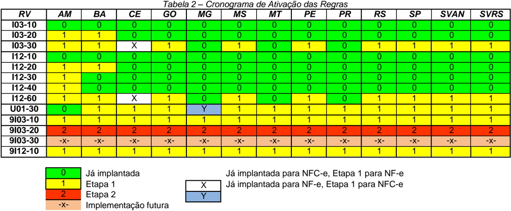

## Sistema Nota Fiscal Eletrônica

Nota Técnica 2021.003 Validação GTIN Substitui a NT 2017.001

## Nota Fiscal Eletrônica

Nota Técnica 2021.003 v1.40 - Validação de GTIN

## Sumário

SNFeNFCe

| 1 Resumo.............................................................................................................................................4   | 1 Resumo.............................................................................................................................................4        | 1 Resumo.............................................................................................................................................4   |
|----------------------------------------------------------------------------------------------------------------------------------------------------------|---------------------------------------------------------------------------------------------------------------------------------------------------------------|----------------------------------------------------------------------------------------------------------------------------------------------------------|
| 1.1                                                                                                                                                      | Alterações introduzidas na Versão 1.10 .......................................................................................................4               |                                                                                                                                                          |
| 1.2                                                                                                                                                      | Alterações introduzidas na Versão 1.20 .......................................................................................................5               |                                                                                                                                                          |
| 1.3                                                                                                                                                      | Alterações introduzidas na Versão 1.21 .......................................................................................................5               |                                                                                                                                                          |
|                                                                                                                                                          | 1.4 Alterações introduzidas na Versão 1.30 .......................................................................................................5           |                                                                                                                                                          |
|                                                                                                                                                          | 1.5 Alterações introduzidas na Versão 1.40 .......................................................................................................5           |                                                                                                                                                          |
| 2                                                                                                                                                        | Cadastro Centralizado de GTIN.........................................................................................................5                       |                                                                                                                                                          |
|                                                                                                                                                          | 2.1 Cadastro Centralizado de GTIN - CCG........................................................................................................5              |                                                                                                                                                          |
|                                                                                                                                                          | 2.2 Manutenção do Cadastro Centralizado de GTIN (CCG) ..............................................................................6                         |                                                                                                                                                          |
|                                                                                                                                                          | 2.3 Consulta Pública ao Cadastro Centralizado de GTIN...................................................................................8                     |                                                                                                                                                          |
| 3                                                                                                                                                        | Leiaute da Nota Fiscal Eletrônica ......................................................................................................9                     |                                                                                                                                                          |
| 4                                                                                                                                                        | Detalhamento das Validações .........................................................................................................10                       |                                                                                                                                                          |
|                                                                                                                                                          | 4.1 Ativação das Regras de Validação.............................................................................................................10           |                                                                                                                                                          |
|                                                                                                                                                          | 4.2 I. Produtos e Serviços.................................................................................................................................11 |                                                                                                                                                          |
| 4.3                                                                                                                                                      | U. Item / Tributo: ISSQN.............................................................................................................................12       |                                                                                                                                                          |
| 4.4                                                                                                                                                      | 7. Banco de Dados: Cadastro da SEFAZ...................................................................................................12                     |                                                                                                                                                          |
| 4.5                                                                                                                                                      | 9. Banco de Dados: Cadastro Centralizado de GTIN (CCG)......................................................................12                                |                                                                                                                                                          |
| 5                                                                                                                                                        | Mensagens de Erro .........................................................................................................................14                 |                                                                                                                                                          |
| Anexo                                                                                                                                                    | I - Grupos de Mercadoria para Validação do GTIN...................................................................15                                          |                                                                                                                                                          |
| Anexo                                                                                                                                                    | I - Grupos, I, II, III....................................................................................................................................15  |                                                                                                                                                          |
| Anexo                                                                                                                                                    | I - Grupo IV..............................................................................................................................................16  |                                                                                                                                                          |
| Anexo                                                                                                                                                    | II - CFOP para validação do GTIN............................................................................................46                                |                                                                                                                                                          |
| Índice de Tabelas                                                                                                                                        | Índice de Tabelas                                                                                                                                             | Índice de Tabelas                                                                                                                                        |
| Tabela 1 - Validações Realizadas no CCG.........................................................................................6                        | Tabela 1 - Validações Realizadas no CCG.........................................................................................6                             | Tabela 1 - Validações Realizadas no CCG.........................................................................................6                        |
| Tabela 2 - Cronograma de Ativação das Regras.................................................................................9                           | Tabela 2 - Cronograma de Ativação das Regras.................................................................................9                                | Tabela 2 - Cronograma de Ativação das Regras.................................................................................9                           |

## Controle de Versões

SNFeNFCe

| Versão     | Publicação     | Descrição                                                                                         |
|------------|----------------|---------------------------------------------------------------------------------------------------|
| Preliminar | Julho/2021     | Publicação para conhecimento de contribuintes e seus provedores, para comentários e manifestações |
| 1.00       | Setembro/2021  | Publicação da NT                                                                                  |
| 1.10       | Julho/2022     | Publicação da NT                                                                                  |
| 1.20       | Dezembro/2022  | Publicação da NT                                                                                  |
| 1.21       | Maio/2023      | Publicação da NT                                                                                  |
| 1.30       | Novembro/2023  | Publicação da NT                                                                                  |
| 1.40       | Fevereiro/2025 | Publicação da NT                                                                                  |

## Histórico de Alterações / Cronograma

|   Versão | Histórico de atualizações                                                                                                                                                                                                                          | Implantação Teste   | Implantação Produção   |
|----------|----------------------------------------------------------------------------------------------------------------------------------------------------------------------------------------------------------------------------------------------------|---------------------|------------------------|
|     1.00 | Implantação da etapa 1 desta NT (verifica GTIN existe no CCG, outros)                                                                                                                                                                              | 04/07/2022          | 12/09/2022             |
|          | Implantação da etapa 2 desta NT (verifica NCM e CEST no CCG)                                                                                                                                                                                       | 06/03/2023          | 12/06/2023             |
|     1.10 | Postergação da Validação da existência do GTIN no CCG, conforme o NCM                                                                                                                                                                              | -x-                 | -x-                    |
|          | Etapa 1 desta NT (verifica GTIN existe no CCG, outros)                                                                                                                                                                                             | Até 25/07/2022      | Sem alteração          |
|          | Etapa 2 desta NT (verifica NCM no CCG)                                                                                                                                                                                                             | Sem Alteração       | Sem alteração          |
|     1.20 | Verificada a existência do GTIN no CCG para novos grupos de NCM                                                                                                                                                                                    | 03/04/2023          | 01/06/2023             |
|     1.21 | Adiada a implantação em produção, por 30 dias, da verificação de existência de novos GTIN relacionados a indústria de bebidas e refrigerantes, cimento, perfumaria, higiene pessoal e cosméticos, conforme descrito no Anexo I, Grupo II desta NT. | -x-                 | 03/07/2023             |
|     1.30 | Implantação de novo grupo de validação de códigos GTIN - Grupo III                                                                                                                                                                                 | 01/04/2024          | 02/09/2024             |
|     1.40 | Implantação de novo grupo de validação de códigos GTIN - Grupo IV                                                                                                                                                                                  | 01/07/2025          | 01/10/2025             |

## 1  Resumo

O  Ajuste  SINIEF  07/05  e  o  Ajuste  SINIEF  19/16  obrigam  o  preenchimento  dos  campos  cEAN  e cEANTrib na Nota Fiscal Eletrônica (NF-e) e na Nota Fiscal de Consumidor Eletrônica (NFC-e) quando o produto comercializado possuir código de barras com GTIN.

Os Ajustes SINIEF citados também estipulam que os sistemas autorizadores da NF-e e NFC-e deverão validar as informações descritas nos campos cEAN e cEANTrib junto ao Cadastro Centralizado de GTIN (CCG), devendo as notas serem rejeitadas em caso de não conformidade com as informações contidas no CCG.

Estes Ajustes SINIEF podem ser encontrados seguintes endereços: https://www.confaz.fazenda.gov.br/legislacao/ajustes/2005/AJ007\_05 https://www.confaz.fazenda.gov.br/legislacao/ajustes/2016/AJ\_019\_16

Esta matéria já havia sido tratada na Nota Técnica 2017.001 e suas versões. A presente Nota Técnica substitui a NT 2017.001, em virtude de as disposições daquela NT já terem sido recepcionadas na Versão  7.0  do  Manual  de  Orientação  do  Contribuinte  -  MOC,  e  seus  anexos,  publicado  pelo  Ato COTEPE/ICMS 69, de 26 de novembro de 2020.

As regras de validação que estavam documentadas como de implementação futura na NT2017.001 serão ativadas em duas etapas, conforme disposto no Capítulo 4.

## 1.1  Alterações introduzidas na Versão 1.10

A versão 1.10 da NT basicamente adia algumas regras de validação do Serviço de Autorização de Nota Fiscal que verificam a existência do GTIN no CCG-Cadastro Centralizado de GTIN para a maior parte dos produtos comercializados.

Foram feitas algumas melhorias na documentação e, de forma mais detalhada, as mudanças desta nova versão da NT são:

## A. Existência do GTIN no CCG

- Limitada a verificação da existência do GTIN no CCG e o futuro batimento de informações contra esse cadastro de GTIN somente para a NF-e (modelo 55);
- Limitada a verificação da existência do GTIN no CCG nessa fase inicial somente para as operações de venda da Indústria (CFOP de Venda Produção do Estabelecimento) e para alguns grupos de mercadorias específicos. O grupo inicial de Mercadorias consta no Anexo I desta NT - Mercadorias relacionadas com a Indústria de Tabaco, Medicamentos e Brinquedos;
- Demais grupos de Mercadorias a serem validados serão definidos a posteriori, por novas versões dessa NT e com prazos futuros.

## B. Validação do NCM informado na NF-e em relação a informação do CCG (Etapa 2, RV 9I03-20)

- Esta validação futura será mantida, limitada agora a operação de venda da Indústria,  conforme as mercadorias do Anexo I desta NT (Etapa 1: RV 9I03-10 e 9I12-10).

## C. Validação do CEST informado na NF-e em relação a informação do CCG

- Adiada a implementação da validação do CEST em relação ao CCG, sem data prevista para implementação (RV 9I03-30) .

## D. Regras de Validação Eliminadas

- Eliminada a regra de validação do GTIN da Unidade Tributável em relação ao GTIN Contido informado no CCG. Motivo: existe o GTIN do Kit e este GTIN pode representar um conjunto de GTIN Contidos diferentes (RV 9I03-40).
- Eliminada  a  regra  de  validação  do  GTIN  da  Unidade  Tributável  em  relação  ao  NCM informado no CCG. Motivo: esta verificação já é feita para o campo cEAN (RV 9I12-20).

SNFeNFCe Nota Técnica 2021.003 v1.40 - Validação de GTIN

SNFeNFCe

- Eliminada a regra de validação do GTIN da Unidade Tributável em relação ao CEST informado no CCG. Motivo: esta verificação já é feita para o campo cEAN (RV 9I12-30).

## E. Diversos

- Correção da documentação para o código de erro da RV U01-30;

## 1.2  Alterações introduzidas na Versão 1.20

A versão 1.20 da NT basicamente amplia o grupo de NCM (grupo de Mercadorias) que verificam a existência do GTIN no CCG-Cadastro Centralizado de GTIN.

Na  versão  anterior,  é  verificada  a  existência  do  GTIN  no  CCG  para  o  grupo  de  mercadorias relacionados com a Indústria de Tabacos, Medicamentos e Brinquedos, conforme Anexo I da NT.

Nesta nova versão da NT,

- Mantida a verificação da existência do GTIN no CCG somente para a NF-e (modelo 55);
- Mantida a verificação da existência do GTIN no CCG somente para as operações de venda da Indústria (CFOP de Venda Produção do Estabelecimento);
- Ampliada a verificação da existência do GTIN no CCG agora para as mercadorias relacionadas com  a  indústria  de  Bebidas  e  Refrigerantes,  Cimento  e  Perfumaria,  Higiene  Pessoal  e Cosméticos, conforme consta no Anexo I desta NT;
- Demais grupos de Mercadorias a serem validados serão definidos a posteriori, por novas versões dessa NT e com prazos futuros.

## 1.3  Alterações introduzidas na Versão 1.21

Adiada a implantação em produção, por 30 dias, da versão que verifica a existência do GTIN no CCGCadastro  Centralizado  de  GTIN,  para  as  mercadorias  relacionadas  com  a  indústria  de  Bebidas  e Refrigerantes, Cimento e Perfumaria, Higiene Pessoal e Cosméticos, conforme consta no Anexo I, Grupo II desta NT.

## 1.4  Alterações introduzidas na Versão 1.30

A versão 1.30 da NT basicamente amplia o grupo de NCM (grupo de Mercadorias) que verificam a existência do GTIN no CCG-Cadastro Centralizado de GTIN, referentes a mercadorias que poderão vir a integrar a Cesta Básica Nacional, desde a fabricação até a venda no varejo.

## 1.5  Alterações introduzidas na Versão 1.40

A versão 1.40 da NT basicamente amplia os grupos de NCM (grupo de Mercadorias) que verificam a existência do GTIN no CCG-Cadastro Centralizado de GTIN, referentes a mercadorias submetidas à redução de alíquotas do IBS/CBS, conforme definido na Lei Complementar No. 214, de 16 de janeiro de 2025..

## 2 Cadastro Centralizado de GTIN

## 2.1  Cadastro Centralizado de GTIN - CCG

O GTIN,  sigla  de Global  Trade  Item  Number ,  é  um  identificador  para  itens  comerciais.  Os  GTIN, anteriormente  chamados  de  códigos  EAN,  são  atribuídos  para  qualquer  produto  que  possa  ser precificado,  pedido  ou faturado  em  algum  ponto  de  uma  cadeia  de suprimentos,  sendo  de  grande aplicação na automação comercial da venda a consumidor final.

O GTIN é utilizado para recuperar informação pré-definida e abrange desde as matérias primas até produtos acabados. Os GTIN podem ter o tamanho de 8, 12, 13 ou 14 dígitos e podem ser construídos utilizando qualquer uma destas quatro estruturas de numeração.

O Cadastro Centralizado de GTIN (CCG) é um banco de dados contendo um conjunto reduzido de informações dos produtos que possuem o código de barras GTIN, e funciona de forma integrada com o Cadastro Nacional de Produtos da GS1 (CNP), que é a instituição responsável pela administração, outorga de licenças e gerenciamento do padrão de identificação de produtos GTIN.

As NF-e e NFC-e que acobertarem produtos que possuam GTIN terão as informações  correspondentes a este código validadas junto ao CCG, em conformidade com o cronograma previsto  na presente Nota Técnica.

As informações do CNP que são transmitidas para o CCG são:

1.  GTIN
2. Marca
3. Tipo GTIN (8, 12, 13 ou 14 posições)
4. Descrição do Produto
5. Identificação do Dono da Marca (CNPJ ou CPF)
6. Dados da classificação do produto (Segmento, Família, Classe e Subclasse/Bloco)
7.  NCM
8. CEST (quando existir)
9. Peso Bruto e Peso Líquido
10. Unidade de Medida de Peso Bruto e Peso Líquido
11. URL da imagem do produto

Caso o GTIN cadastrado seja de um agrupamento de produtos as seguintes informações adicionais são compartilhadas com o CCG:

12. GTIN de nível inferior, também denominado GTIN contido ou Item comercial contido
13. Quantidade de Itens Contidos deste GTIN dentro do agrupamento

O GTIN de nível superior poderá ser um GTIN 14 ou um GTIN 13.

## 2.2  Manutenção do Cadastro Centralizado de GTIN (CCG)

Nos termos dos Ajustes SINIEF 07/05 e 09/16 é obrigação tributária dos donos de marca de produtos que possuírem GTIN informar e manter atualizados as informações destes códigos junto ao CNP, na página https://cnp.gs1br.org/.

Pedidos de autorização de uso de NF-e ou de NFC-e serão objeto de rejeição caso um GTIN citado na nota fiscal não exista ou não esteja em conformidade com as regras do CCG, mesmo que o emitente não seja o dono da marca.

Portanto, é fundamental que os donos de marca insiram e mantenham atualizadas as informações cadastrais  de  produtos  com  GTIN  atualizadas  junto  ao  CNP,  pois,  caso  não  o  façam,  passarão, juntamente com seus clientes, a ter rejeitadas todas as notas fiscais com referência a mercadorias identificadas por este código, a partir da entrada em vigência da regra de validação específica para esta finalidade.

Caso o dado informado pelo dono da marca junto ao CNP esteja em desacordo com as regras do CCG publicadas na presente Nota Técnica, ao serem compartilhados os registros correspondentes serão rejeitados pelo CCG.

O motivo da rejeição será informado para o CNP, de forma que a GS1 tenha condição de repassar esta informação para o dono da marca. A Tabela 1 contém a relação das validações efetuadas no CCG que ocasionarão a necessidade de correção, pelos donos de marca, do cadastro de GTIN no CNP.

## Nota Fiscal Eletrônica

SNFeNFCe

Tabela 1 - Validações Realizadas no CCG

| Campo                                                     | Validação                                                                                                                                                |
|-----------------------------------------------------------|----------------------------------------------------------------------------------------------------------------------------------------------------------|
| GTIN                                                      | Dígito de Controle inválido                                                                                                                              |
| Descrição do Produto                                      | Descrição do Produto muito genérica ou que não permita a identificação adequada do produto. Exemplo: 'A definir', 'Disponível', 'Não informado(a)', etc. |
| Inscrição do Dono da Marca no Cadastro da Receita Federal | CNPJ ou CPF inválido                                                                                                                                     |
| NCM                                                       | Não informado o código do NCM do produto, ou informado um NCM inexistente                                                                                |
| CEST                                                      | Se for o caso, não informado o código CEST para o produto, ou informado um CEST inexistente, ou informado código CEST incompatível com o NCM             |
| Código de Classificação Geral do Produto (GPC)            | Não informado o código de Classificação Geral do Produto (Segmento, Família, Classe e Subclasse), ou informado código existente, ou incompatível.        |
| GTIN de nível inferior                                    | Não informado GTIN contido ou informado GTIN contido com Dígito de Controle inválido                                                                     |
| Demais campos                                             | Obrigatoriedade de informação dos campos previstos                                                                                                       |

## 2.3  Consulta Pública ao Cadastro Centralizado de GTIN

As informações registradas no CNP e compartilhadas com o CCG podem ser visualizadas no Portal da Nota Fiscal Eletrônica - SVRS (https://dfe-portal.svrs.rs.gov.br/Nfe).

A consulta é realizada para um GTIN em particular iniciado por 789 ou 790, e pode retornar um dos seguintes resultados:

- GTIN consultado não possui prefixo 789 ou 790;
- GTIN consultado com dígito verificador inválido;
- GTIN inexistente no CCG;
- GTIN existe no CCG, mas dono da marca não autorizou a publicação das suas informações entrar em contato com o dono da marca;
- GTIN existe no CCG com situação inválida - solicitar ao dono da marca que entre em contato com a GS1;
- GTIN existe no CCG com NCM não informado;
- Dados do GTIN: descrição, NCM e, quando existir, CEST.

Outra observação importante é que, caso o dono da marca não autorize expressamente a publicação de seus dados, o GTIN, mesmo que exista no CCG, não será exibido por esta consulta pública, o que dificultará para todos os integrantes da cadeia logística saber as razões de eventuais rejeições.

SNFeNFCe

Letnnica

## 3 Leiaute da Nota Fiscal Eletrônica

Para facilitar a referência dentro desta NT foram copiadas neste capítulo as definições existentes no MOC v7.0 para o Grupo I. Produtos e Serviços da NFe, apesar de não terem sofrido alteração.

|   # | ID   | Campo    | Descrição                                                                                    | Ele   | Pai   | Tipo   | Ocor.   | Tam.           | Observação                                                                                                                                                                                                                                                                                                                                                                        |
|-----|------|----------|----------------------------------------------------------------------------------------------|-------|-------|--------|---------|----------------|-----------------------------------------------------------------------------------------------------------------------------------------------------------------------------------------------------------------------------------------------------------------------------------------------------------------------------------------------------------------------------------|
| 100 | I01  | prod     | Detalhamento de Produtos e Serviços                                                          | G     | H01   |        | 1-1     |                |                                                                                                                                                                                                                                                                                                                                                                                   |
| 102 | I03  | cEAN     | GTIN (Global Trade Item Number) do produto, antigo código EAN ou código de barras            | E     | I01   | C      | 1-1     | 0,8,12, 13, 14 | Preencher com o código GTIN-8, GTIN-12, GTIN-13 ou GTIN- 14 (antigos códigos EAN, UPC e DUN-14) Para produtos que não possuem código de barras com GTIN, deve ser informado o literal 'SEM GTIN'; (atualizado NT 2017/001)                                                                                                                                                        |
| 111 | I12  | cEANTrib | GTIN (Global Trade Item Number) da unidade tributável, antigo código EAN ou código de barras | E     | I01   | C      | 1-1     | 0,8,12, 13, 14 | Preencher com o código GTIN-8, GTIN-12, GTIN-13 ou GTIN- 14 (antigos códigos EAN, UPC e DUN-14) da unidade tributável do produto. O GTIN da unidade tributável deve corresponder àquele da menor unidade comercializável identificada por código GTIN. Para produtos que não possuem código de barras com GTIN, deve ser informado o literal "SEM GTIN'; (Atualizado NT 2017/001) |

## 4 Detalhamento das Validações

## 4.1  Ativação das Regras de Validação

As regras de validação do GTIN serão implantadas por etapas, conforme plano de implantação a seguir. A etapa inicial já ocorreu, com as exceções que podem ser vistas na Tabela 2, e corresponde às regras que foram ativadas em função do disposto na versão 1.10 da NT 2017.001.

- Etapa 1: Conforme prazos previstos no 'Histórico de Alterações / Cronograma', documentado no início desta NT.
- o Regras I03-30, I12-60, U01-30, 9I03-10 e 9I12-10
- Etapa 2: Conforme prazos previstos no 'Histórico de Alterações / Cronograma', documentado no início desta NT.
- o Regras 9I03-20, 9I03-30, 9I03-40, 9I12-20 e 9I12-30

Entretanto, algumas aplicações autorizadoras já implementaram estas regras, não valendo, portanto, as datas expostas acima. A Tabela 2 a seguir detalha a situação de cada regra em cada aplicação autorizadora:

A respeito da Tabela 2 valem as seguintes definições:

- Células com fundo verde: regras estão implementadas e seguirão implementadas, sem nenhuma alteração;
- Células com fundo vermelho: regras serão implementadas na etapa 2;
- Células com fundo bege, terão implementação em data futura, a ser definida;

## 4.2  I. Produtos e Serviços

Embora as regras de validação que obrigam a informação dos campos cEAN e cEANTrib (I03-30, I12-60) fizessem inicialmente parte da etapa inicial implantada na versão 1.10 da NT 2017.001, foram posteriormente desativadas devido a problemas operacionais. Estas regras voltarão a ser ativadas na Etapa 1 do plano de implantação. As demais regras foram ativadas na etapa inicial.

| Campo-Seq   | Modelo   | Regra de Validação                                                                                                                                                                                                                                                                                                     | Aplic.   |   Msg | Efeito   | Descrição Erro                                                                       |
|-------------|----------|------------------------------------------------------------------------------------------------------------------------------------------------------------------------------------------------------------------------------------------------------------------------------------------------------------------------|----------|-------|----------|--------------------------------------------------------------------------------------|
| I03-10      | 55/65    | Se informado GTIN (tag: cEAN) <> 'SEM GTIN' ou Nulo): - cEAN com dígito de controle inválido Observação : Cálculo do dígito verificador em www.gs1.org/check-digit-calculator. (NT 2017.001)                                                                                                                           | Obrig.   |   611 | Rej.     | Rejeição: GTIN (cEAN) inválido [nItem:999]                                           |
| I03-20      | 55/65    | Se informado GTIN (tag: cEAN) <> 'SEM GTIN' ou Nulo): - Prefixo GS1 inválido, conforme tabela de prefixos publicada no Portal da NF-e Observação : Validação efetuada conforme prefixos e orientações constantes na 'Tabela Prefixo GS1' publicada no Portal Nacional da NF-e. (NT 2017.001)                           | Obrig.   |   882 | Rej.     | Rejeição: GTIN (cEAN) com prefixo inválido [nItem:999]                               |
| I03-30      | 55/65    | GTIN (tag: cEAN) em branco, campo sem informação. Observação 1: Para produtos que não possuem GTIN, utilizar a informação de "SEM GTIN" (NT 2017.001) (NT 2021.003, Etapa 1)                                                                                                                                           | Obrig.   |   883 | Rej.     | Rejeição: GTIN (cEAN) sem informação [nItem: 999]                                    |
| I12-10      | 55/65    | Se informado GTIN da unidade tributável (tag: cEANTrib) <> 'SEM GTIN' ou Nulo): - cEANTrib com dígito de controle inválido Observação : Cálculo do dígito verificador em www.gs1.org/check-digit-calculator (NT 2017.001)                                                                                              | Obrig.   |   612 | Rej.     | Rejeição: GTIN da unidade tributável (cEANTrib) inválido [nItem:999]                 |
| I12-20      | 55/65    | Se informado GTIN da unidade tributável (tag: cEANTrib) <> 'SEM GTIN' ou Nulo): - Prefixo GS1 inválido, conforme tabela de prefixos publicada no Portal da NF-e Observação : Validação efetuada conforme prefixos e orientações constantes na 'Tabela Prefixo GS1' publicada no Portal Nacional da NF-e. (NT 2017.001) | Obrig.   |   884 | Rej.     | Rejeição: GTIN da unidade tributável (cEANTrib) com prefixo inválido [nItem:999]     |
| I12-30      | 55/65    | Informado GTIN específico (cEAN<>'SEM GTIN' ou Nulo) e informado GTIN da unidade tributável igual a "SEM GTIN" ou Nulo (cEANTrib='SEM GTIN' ou Nulo) (NT 2017.001)                                                                                                                                                     | Obrig.   |   885 | Rej.     | Rejeição: GTIN informado, mas não informado o GTIN da unidade tributável [nItem:999] |
| I12-40      | 55/65    | Informado GTIN da unidade tributável específico (cEANTrib<>'SEM GTIN' ou Nulo) e informado GTIN igual a "SEM GTIN" ou Nulo (cEAN='SEM GTIN' ou Nulo) (NT 2017.001)                                                                                                                                                     | Obrig.   |   886 | Rej.     | Rejeição: GTIN da unidade tributável informado, mas não informado o GTIN [nItem:999] |
| I12-60      | 55/65    | GTIN da unidade tributável (tag: cEANTrib) em branco, campo sem informação. Observação: Para produtos que não possuem GTIN da unidade tributável, utilizar a informação de "SEM GTIN". (NT 2017.001) (NT 2021.003, Etapa 1)                                                                                            | Obrig.   |   888 | Rej.     | Rejeição: GTIN da unidade tributável (cEANTrib) sem informação [nItem:999]           |

## 4.3  U. Item / Tributo: ISSQN

Se o item da NF-e for referente a um serviço tributado pelo ISSQN, não pode ser informado GTIN. Implementação: Etapa 1.

| Campo-Seq   | Modelo   | Regra de Validação                                                                                                                                                               | Aplic.   | Msg Efeito   | Descrição Erro                                                     |
|-------------|----------|----------------------------------------------------------------------------------------------------------------------------------------------------------------------------------|----------|--------------|--------------------------------------------------------------------|
| U01-30      | 55/65    | Se informado grupo de tributação do ISSQN (id:U01), deve ser informado GTIN (tag: cEAN) e GTIN da unidade tributável (tag: cEANTrib) igual a 'SEM GTIN' . (NT 2021.003, Etapa 1) | Obrig.   | 887 Rej.     | Item de Serviço e informado GTIN diferente de SEM GTIN [nItem:999] |

## 4.4  7. Banco de Dados: Cadastro da SEFAZ

Eliminada a regra 7I03-10, por duplicidade de objeto com regra I03-10.

| Campo-Seq   | Modelo   | Regra de Validação                                                                                                                                            | Aplic.   |   Msg | Efeito   | Descrição Erro                                                         |
|-------------|----------|---------------------------------------------------------------------------------------------------------------------------------------------------------------|----------|-------|----------|------------------------------------------------------------------------|
| 7I03-10     | 55/65    | Se não informado GTIN (cEAN=Nulo). Observação : Para produtos que não possuem GTIN, utilizar a informação de GTIN" (NT 2017.001) (eliminada pela NT 2021.003) | Obrig.   |   889 | Rej.     | Rejeição: Obrigatória a informação do GTIN para o produto [nItem: 999] |

## 4.5  9. Banco de Dados: Cadastro Centralizado de GTIN (CCG)

As regras 9I03-10 e 9I12-10 serão ativadas na Etapa 1; a regra 9I03-20 será ativada na Etapa 2.

| Campo-Seq   | Modelo   | Regra de Validação                                                                                                                                                                                                                                                                                                                                                                     | Aplic.   |   Msg | Efeito   | Descrição Erro                                                                |
|-------------|----------|----------------------------------------------------------------------------------------------------------------------------------------------------------------------------------------------------------------------------------------------------------------------------------------------------------------------------------------------------------------------------------------|----------|-------|----------|-------------------------------------------------------------------------------|
| 9I03-10     | 55/65    | Se informado GTIN (tag: cEAN) com prefixo do Brasil (iniciado em 789 ou 790) e - NCM do produto consta no Anexo I - Grupo de Mercadoria para validação do GTIN e - CFOP de Venda de Produção do Estabelecimento, conforme Anexo II: - Acesso CCG-Cadastro Centralizado de GTIN (Chave: cEAN, sitGTIN<>9- Exclusão) - GTIN informado na NF-e inexistente no CCG. (NT 2021.003, Etapa 1) | Obrig.   |   890 | Rej.     | Rejeição: GTIN inexistente no Cadastro Centralizado de GTIN (CCG) [nItem:999] |
| 9I03-20     | 55/65    | - NCM informada na NF-e diferente da cadastrada no CCG (NT 2021.003, Etapa 2)                                                                                                                                                                                                                                                                                                          | Obrig.   |   891 | Rej.     | Rejeição: GTIN incompatível com a NCM [nItem:999; NCM esperada: 99999999]     |
| 9I03-30     | 55/65    | - CEST informado na NF-e diferente do cadastrado no CCG Exceção : Validação somente é realizada se o CEST tiver sido informado no CCG (NT 2021.003) Observação : Implementação futura.                                                                                                                                                                                                 | Obrig.   |   892 | Rej.     | Rejeição: GTIN incompatível com CEST [nItem:999; CEST esperado: 9999999]      |

## Nota Fiscal Eletrônica

Nota Técnica 2021.003 - Validação de GTIN

| Campo-Seq   | Modelo   | Regra de Validação                                                                                                                                                                                                                                                                                                                                                                                                                                                                                                                                           | Aplic.   |   Msg | Efeito   | Descrição Erro                                                                                                                    |
|-------------|----------|--------------------------------------------------------------------------------------------------------------------------------------------------------------------------------------------------------------------------------------------------------------------------------------------------------------------------------------------------------------------------------------------------------------------------------------------------------------------------------------------------------------------------------------------------------------|----------|-------|----------|-----------------------------------------------------------------------------------------------------------------------------------|
| 9I03-40     | 55/65    | - Se informado GTIN-14 (tag: cEAN>09999999999999) e informado GTIN da unidade tributável (tag: cEANTrib) diferente do GTIN Contido cadastrado no CCG Exceção : a RV não se aplica em operações com exterior (idDest=3) Nota : o GTIN pode possuir GTIN de nível inferior (GTIN Contido), agrupando diversas unidades do mesmo produto.O GTIN da unidade tributável deve corresponder àquele da menor unidade comercializável identificada por código GTIN, ou seja, deve corresponder ao GTIN do menor nível inferior (GTIN Contido). (NT 2021.003, Etapa 2) | Obrig.   |   893 | Rej.     | Rejeição: GTIN da unidade tributável diverge do GTIN Contido cadastrado no CCG [nItem:999; GTIN Contido esperado: 99999999999999] |
| 9I12-10     | 55/65    | Se informado GTIN da unidade tributável (tag: cEANTrib) com prefixo do Brasil (iniciado em 789 ou 790) e - NCM do produto conforme Anexo I - Grupo de Mercadoria para validação do GTIN e - CFOP de Venda de Produção do Estabelecimento, conforme Anexo II: - Acesso CCG-Cadastro Centralizado de GTIN (Chave: cEANTrib, sitGTIN<>9- Exclusão) - GTIN da unidade tributável informado na NF-e (tag: cEANTrib) inexistente no CCG. (NT 2021.003, Etapa 1)                                                                                                    | Obrig.   |   894 | Rej.     | Rejeição: GTIN da unidade tributável inexistente no Cadastro Centralizado de GTIN (CCG) [nItem:999]                               |
| 9I12-20     | 55/65    | - NCM informada na NF-e diferente da cadastrada no CCG (NT 2021.003, Etapa 2)                                                                                                                                                                                                                                                                                                                                                                                                                                                                                | Obrig.   |   895 | Rej.     | Rejeição: GTIN da unidade tributável incompatível com a NCM [nItem:999; NCM esperada: 99999999]                                   |
| 9I12-30     | 55/65    | - CEST informado na NF-e diferente do cadastrado no CCG Exceção : Validação somente é realizada se o CEST tiver sido informado no CCG (NT 2021.003, Etapa 2)                                                                                                                                                                                                                                                                                                                                                                                                 | Obrig.   |   896 | Rej.     | Rejeição: GTIN da unidade tributável incompatível com CEST [nItem:999; CEST esperado: 9999999]                                    |

## 5  Mensagens de Erro

|   CÓD | Motivos de Não Atendimento da Solicitação                                                                                         |
|-------|-----------------------------------------------------------------------------------------------------------------------------------|
|   611 | Rejeição: GTIN (cEAN) inválido [nItem:999]                                                                                        |
|   612 | Rejeição: GTIN da unidade tributável (cEANTrib) inválido [nItem:999]                                                              |
|   882 | Rejeição: GTIN (cEAN) com prefixo inválido [nItem:999]                                                                            |
|   883 | Rejeição: GTIN (cEAN) sem informação [nItem:999]                                                                                  |
|   884 | Rejeição: GTIN da unidade tributável (cEANTrib) com prefixo inválido [nItem:999]                                                  |
|   885 | Rejeição: GTIN informado, mas não informado o GTIN da unidade tributável [nItem:999]                                              |
|   886 | Rejeição: GTIN da unidade tributável informado, mas não informado o GTIN [nItem:999]                                              |
|   887 | Rejeição: Item de Serviço e informado GTIN diferente de SEM GTIN [nItem: 999]                                                     |
|   888 | Rejeição: GTIN da unidade tributável (cEANTrib) sem informação [nItem:999]                                                        |
|   889 | Rejeição: Obrigatória a informação do GTIN para o produto [nItem:999] (eliminada pela NT 2021.003)                                |
|   890 | Rejeição: GTIN inexistente no Cadastro Centralizado de GTIN (CCG) [nItem:999]                                                     |
|   891 | Rejeição: GTIN incompatível com a NCM [nItem:999; NCM esperada: 99999999]                                                         |
|   892 | Rejeição: GTIN incompatível com CEST [nItem:999; CEST esperado: 9999999]                                                          |
|   893 | Rejeição: GTIN da unidade tributável diverge do GTIN Contido cadastrado no CCG [nItem:999; GTIN Contido esperado: 99999999999999] |
|   894 | Rejeição: GTIN da unidade tributável inexistente no Cadastro Centralizado de GTIN (CCG) [nItem:999]                               |
|   895 | Rejeição: GTIN da unidade tributável incompatível com a NCM [nItem:999; NCM esperada: 99999999]                                   |
|   896 | Rejeição: GTIN da unidade tributável incompatível com CEST [nItem:999; CEST esperado: 9999999]                                    |

Tabela 3 - Mensagens de Erro (Motivos de Não Atendimento da Solicitação)

## Anexo I - Grupos de Mercadoria para Validação do GTIN

## Anexo I - Grupos, I, II, III

| Grupo   | NCM         | Descrição resumida                                                                                                                                                                                    |
|---------|-------------|-------------------------------------------------------------------------------------------------------------------------------------------------------------------------------------------------------|
| I       | 2401 a 2403 | Tabaco e seus sucedâneos manufaturados                                                                                                                                                                |
|         | 3001 a 3006 | Produtos farmacêuticos                                                                                                                                                                                |
|         | 9503 a 9505 | Brinquedos, jogos, artigos para divertimento                                                                                                                                                          |
| II      | 2201 a 2209 | Bebidas e Refrigerantes                                                                                                                                                                               |
|         | 2523, 3816  | Cimentos e Argamassas                                                                                                                                                                                 |
|         | -x-         | Produtos de Higiene Pessoal e Cosméticos, conforme abaixo                                                                                                                                             |
|         | 2814        | Produtos químico inorgânicos ..., Amoníaco                                                                                                                                                            |
|         | 2847        | Produtos químico inorgânicos ..., Água oxigenada                                                                                                                                                      |
|         | 3301 a 3307 | Óleos Essenciais, Perfumes e Águas de Colônia, Produtos de Beleza ou de maquiagem, Preparações capilares, Higienebucal ou dentária, Preparações para barbear, Desodorantes,...                        |
|         | 3401        | Sabões, agentes orgânicos de superfície, preparações para lavagem, preparações lubrificantes, ceras artificiais, ceraspreparadas, produtos de conservação e limpeza, velas e artigos semelhantes, ... |
|         | 4818        | Papel Higiênico, Lenço e toalhas de mão, ...                                                                                                                                                          |
|         | 8212        | Navalhas e Aparelhos e lâminas de barbear, ...                                                                                                                                                        |
|         | 9605        | Conjuntos de viagem, para toucador de pessoas, para costura ou para limpeza de calçado ou de roupas                                                                                                   |
|         | 9615        | Pentes, travessas para cabelo e artigos semelhantes; grampos (alfinetes) para cabelo e artefatos semelhantes, ...                                                                                     |
|         | 9619        | Absorventes, fraldas, e artigos semelhantes                                                                                                                                                           |
| III     | 0401 a 0410 | Leite e laticínios; ovos de aves; mel natural; produtos comestíveis de origem animal, não especificados nem compreendidos noutros Capítulos.                                                          |
|         | 0811 a 0814 | Fruta, não cozida ou cozida em água ou vapor, congelada, mesmo adicionada de açúcar ou de outros edulcorantes.                                                                                        |
|         | 0901 a 0910 | Café, mesmo torrado ou descafeinado; cascas e películas de café; sucedâneos do café que contenham café em qualquer proporção.                                                                         |
|         | 1101 a 1109 | Produtos da indústria de moagem; malte; amidos e féculas; inulina; glúten de trigo.                                                                                                                   |
|         | 1501 a 1518 | Gorduras de porco (incluindo a banha) e gorduras de aves, exceto as das posições 02.09 ou 15.03.                                                                                                      |
|         | 1520 a 1522 | Glicerol em bruto; águas e lixívias, glicéricas.                                                                                                                                                      |
|         | 1701 a 1704 | Açúcares e produtos de confeitaria                                                                                                                                                                    |
|         | 1801 a 1806 | Cacau e suas preparações.                                                                                                                                                                             |
|         | 1901 a 1905 | Preparações à base de cereais, farinhas, amidos, féculas ou leite; produtos de pastelaria.                                                                                                            |

| 2001 a 2009   | Preparações de produtos hortícolas, fruta ou de outras partes de plantas.                   |
|---------------|---------------------------------------------------------------------------------------------|
| 2101 a 2106   | Preparações alimentícias diversas.                                                          |
| 2201 a 2209   | Bebidas, líquidos alcoólicos e vinagres.                                                    |
| 2301 a 2309   | Resíduos e desperdícios das indústrias alimentares; alimentos preparados para animais.      |
| 3501 a 3507   | Matérias albuminoides; produtos à base de amidos ou de féculas modificados; colas; enzimas. |
| 3306.10.00    | Dentifrício (pasta de dente).                                                               |
| 3401.30.00    | Produtos e preparações orgânicos tensoativos para lavagem da pele.                          |
| 9603.21.00    | Escovas de dentes, incluindo as escovas para dentaduras.                                    |

## Anexo I - Grupo IV

## PRODUTOS DESTINADOS À ALIMENTAÇÃO HUMANA SUBMETIDOS À REDUÇÃO A ZERO DAS ALÍQUOTAS DO IBS E DA CBS (EXCLUSIVE PRODUTOS HORTÍCOLAS, FRUTAS E OVOS, RELACIONADOS NO ANEXO XV) (Anexo I da LCP 214/2025) - Exceto para documentos emitidos por Produtores Primários ou produtos que não possuem GTIN

| NCM         | Descrição                                                                                       | Exceções                 |
|-------------|-------------------------------------------------------------------------------------------------|--------------------------|
| 02.01       | Carnes de animais da espécie bovina, frescas ou refrigeradas.                                   |                          |
| 02.02       | Carnes de animais da espécie bovina, congeladas                                                 |                          |
| 02.03       | Carnes de animais de espécie suína, frescas, refrigeradas ou congeladas                         |                          |
| 02.04       | Carnes e miudezas comestíveis da espécie suína congeladas                                       |                          |
| 02.06.10.00 | Miudezas de bovinos frescas ou refrigeradas.                                                    |                          |
| 02.06.2     | Miudezas comestíveis de bovinos congelados                                                      |                          |
| 02.06.30.00 | Carnes e miudezas comestíveis da espécie suína, frescas ou refrigeradas                         |                          |
| 02.06.4     | Carnes e miudezas comestíveis da espécie suína congeladas                                       |                          |
| 02.06.80.00 | Carnes e miudezas comestíveis , outras frescas e refrigeradas                                   |                          |
| 02.06.90.00 | Carnes e miudezas comestíveis , outras congeladas                                               |                          |
| 02.07       | Carnes e miudezas, comestíveis, frescas, refrigeradas ou congeladas, das aves da posição 01.05. | 02.07.43.00, 02.07.53.00 |
| 02.09.10    | Carnes e miudeza comestíveis de porco                                                           |                          |
| 02.09.90.00 | Carnes e miudezas, comestíveis, outros                                                          |                          |
| 02.10.1     | Carnes de espécie suína                                                                         |                          |
| 02.10.20.00 | Carne processada                                                                                |                          |
| 02.10.99.1  | Carnes e miudezas, comestíveis, carnes e aves da posição 01.05                                  |                          |
| 02.10.99.20 | Carnes e Miudezas, comestíveis, da espécie ovina                                                |                          |

## Nota Fiscal Eletrônica

Nota Técnica 2021.003 - Validação de GTIN

| NCM         | Descrição                                                                                                                                                                                                                                                                                                                                                                                                                                | Exceções                                                         |
|-------------|------------------------------------------------------------------------------------------------------------------------------------------------------------------------------------------------------------------------------------------------------------------------------------------------------------------------------------------------------------------------------------------------------------------------------------------|------------------------------------------------------------------|
| 02.10.99.90 | Carnes e miudezas, comestíveis - Carnes de animais da espécie bovina, frescas ou refrigeradas - Outras peças não desossadas - Outras                                                                                                                                                                                                                                                                                                     |                                                                  |
| 03.02       | Peixes frescos ou refrigerados, exceto os filés (filetes) de peixes e outra carne de peixes da posição 03.04.                                                                                                                                                                                                                                                                                                                            | 03.02.1, 03.02.3, 03.02.51.00, 03.02.52.00, 03.02.53.00, 03.02.9 |
| 03.03       | Peixes congelados, exceto os filés (filetes) de peixes e outra carne de peixes da posição 03.04                                                                                                                                                                                                                                                                                                                                          | 03.03.1, 03.03.4, 03.03.63.00, 03.03.64.00, 03.03.65.00, 03.03.9 |
| 03.04       | Filés (filetes) de peixes e outra carne de peixes (mesmo picada), frescos, refrigerados ou congelados                                                                                                                                                                                                                                                                                                                                    | 03.04.4, 03.04.5, 03.04.7, 03.04.8, 03.04.9                      |
| 04.01.10.10 | Leite e laticínios; ovos de aves; mel natural; produtos comestíveis de origem animal, não especificados nem compreendidos noutros Capítulos. Com um teor, em peso, de matérias gordas, não superiora1%                                                                                                                                                                                                                                   |                                                                  |
| 04.01.10.90 | Leite e laticínios; ovos de aves; mel natural; produtos comestíveis de origem animal, não especificados nem compreendidos em outros Capítulos - Leite e creme deƒ leite, não concentrados nem adicionados de açúcar ou de outros edulcorantes - Com um teor, em peso, de matérias gordas, não superior a 1% - Outros                                                                                                                     |                                                                  |
| 04.01.20.10 | Leite e laticínios; ovos de aves; mel natural; produtos comestíveis de origem animal, não especificados nem compreendidos em outros Capítulos - Leite e creme deƒ leite, não concentrados nem adicionados de açúcar ou de outros edulcorantes - Com um teor, em peso, de matérias gordas, superior a 1 %, mas não superior a 6 %                                                                                                         |                                                                  |
| 04.01.20.90 | Leite e laticínios; ovos de aves; mel natural; produtos comestíveis de origem animal, não especificados nem compreendidos em outros Capítulos - Leite e creme deƒ leite, não concentrados nem adicionados de açúcar ou de outros edulcorantes - Com um teor, em peso, de matérias gordas, superior a 1 %, mas não superior a 6 %- Outros                                                                                                 |                                                                  |
| 04.01.40.10 | Leite e laticínios; ovos de aves; mel natural; produtos comestíveis de origem animal, não especificados nem compreendidos em outros Capítulos - Leite e creme deƒ leite, não concentrados nem adicionados de açúcar ou de outros edulcorantes - Com um teor, em peso, de matérias gordas, superior a 6 %, mas não superior a 10%                                                                                                         |                                                                  |
| 04.01.50.10 | Leite e laticínios; ovos de aves; mel natural; produtos comestíveis de origem animal, não especificados nem compreendidos em outros Capítulos - Leite e creme deƒ leite, não concentrados nem adicionados de açúcar ou de outros edulcorantes - Com um teor, em peso, de matérias gordas, superior a 10%                                                                                                                                 |                                                                  |
| 04.02.10.10 | Leite e laticínios; ovos de aves; mel natural; produtos comestíveis de origem animal, não especificados nem compreendidos em outros Capítulos - Leite e creme de leite, concentrados ou adicionados de açúcar ou de outros edulcorantes - Em pó, grânulos ou outras formas sólidas, com um teor, em peso, de matérias gordas, não superior a 1,5% - Com um teor de arsênio, chumbo ou cobre, considerados isoladamente, inferior a 5 ppm |                                                                  |
| 04.02.10.90 | Leite e laticínios; ovos de aves; mel natural; produtos comestíveis de origem animal, não especificados nem compreendidos em outros Capítulos - Leite e creme de leite, concentrados ou adicionados de açúcar ou de                                                                                                                                                                                                                      |                                                                  |

## Nota Fiscal Eletrônica

Nota Técnica 2021.003 - Validação de GTIN

| NCM         | Descrição                                                                                                                                                                                                                                                                                                                                                                                                                      | Exceções   |
|-------------|--------------------------------------------------------------------------------------------------------------------------------------------------------------------------------------------------------------------------------------------------------------------------------------------------------------------------------------------------------------------------------------------------------------------------------|------------|
|             | outros edulcorantes - Em pó, grânulos ou outras formas sólidas, com um teor, em peso, de matérias gordas, não superior a 1,5% - Outros                                                                                                                                                                                                                                                                                         |            |
| 04.02.21.10 | Leite e laticínios; ovos de aves; mel natural; produtos comestíveis de origem animal, não especificados nem compreendidos em outros Capítulos - Leite e creme de leite, concentrados ou adicionados de açúcar ou de outros edulcorantes - Em pó, grânulos ou outras formas sólidas, com um teor, em peso, de matérias gordas, superior a 1,5%: - Sem adição de açúcar ou de outros edulcorantes - Leite integral               |            |
| 04.02.21.20 | Leite e laticínios; ovos de aves; mel natural; produtos comestíveis de origem animal, não especificados nem compreendidos em outros Capítulos - Leite e creme de leite, concentrados ou adicionados de açúcar ou de outros edulcorantes - Em pó, grânulos ou outras formas sólidas, com um teor, em peso, de matérias gordas, superior a 1,5%: - Sem adição de açúcar ou de outros edulcorantes - Leite parcialmente desnatado |            |
| 04.02.29.10 | Leite e laticínios; ovos de aves; mel natural; produtos comestíveis de origem animal, não especificados nem compreendidos em outros Capítulos - Leite e creme de leite, concentrados ou adicionados de açúcar ou de outros edulcorantes - Em pó, grânulos ou outras formas sólidas, com um teor, em peso, de matérias gordas, superior a 1,5%: - Outros - Leite integral                                                       |            |
| 04.02.29.20 | Leite e laticínios; ovos de aves; mel natural; produtos comestíveis de origem animal, não especificados nem compreendidos em outros Capítulos - Leite e creme de leite, concentrados ou adicionados de açúcar ou de outros edulcorantes - Em pó, grânulos ou outras formas sólidas, com um teor, em peso, de matérias gordas, superior a 1,5%: - Outros - Leite parcialmente desnatado                                         |            |
| 04.05.10.00 | Leite e laticínios; ovos de aves; mel natural; produtos comestíveis de origem animal, não especificados nem compreendidos em outros Capítulos - Manteiga e outras matérias gordas provenientes do leite; pastas de espalhar de produtos provenientes do leite - Manteiga                                                                                                                                                       |            |
| 04.06.10.10 | Leite e laticínios; ovos de aves; mel natural; produtos comestíveis de origem animal, não especificados nem compreendidos em outros Capítulos - Queijos e requeijão - Queijos frescos (não curados), incluídos o queijo de soro de leite, e o requeijão - Mozarela                                                                                                                                                             |            |
| 04.06.10.90 | Leite e laticínios; ovos de aves; mel natural; produtos comestíveis de origem animal, não especificados nem compreendidos em outros Capítulos - Queijos e requeijão - Queijos frescos (não curados), incluídos o queijo de soro de leite, e o requeijão - Outros                                                                                                                                                               |            |
| 04.06.20.00 | Leite e laticínios; ovos de aves; mel natural; produtos comestíveis de origem animal, não especificados nem compreendidos em outros Capítulos - Queijos e requeijão - Queijos ralados ou em pó, de qualquer tipo                                                                                                                                                                                                               |            |
| 04.06.90.10 | Leite e laticínios; ovos de aves; mel natural; produtos comestíveis de origem animal, não especificados nem compreendidos em outros Capítulos - Queijos e requeijão - Outros queijos - Com um teor de umidade inferior a 36,0 %, em peso (massa dura)                                                                                                                                                                          |            |
| 04.06.90.20 | Leite e laticínios; ovos de aves; mel natural; produtos comestíveis de origem animal, não especificados nem compreendidos em outros Capítulos - Queijos e requeijão - Outros queijos - Com um teor de umidade igual ou superior a 36,0 %einferior a 46,0 %, em peso (massa semidura)                                                                                                                                           |            |
| 04.06.90.30 | Leite e laticínios; ovos de aves; mel natural; produtos comestíveis de origem animal, não especificados nem compreendidos em outros Capítulos - Queijos e requeijão - Outros queijos - Com um teor de umidade igual ou superior a 46,0 %einferior a 55,0 %, em peso (massa macia)                                                                                                                                              |            |

## Nota Fiscal Eletrônica

Nota Técnica 2021.003 - Validação de GTIN

| NCM         | Descrição                                                                                                                                                                                                                                                                                                                                                                                                             | Exceções   |
|-------------|-----------------------------------------------------------------------------------------------------------------------------------------------------------------------------------------------------------------------------------------------------------------------------------------------------------------------------------------------------------------------------------------------------------------------|------------|
| 07.13.33.19 | Produtos hortícolas, plantas, raízes e tubérculos, comestíveis.- Legumes de vagem, secos, em grão, mesmo pelados ou partidos. - Feijão comum preto - outros                                                                                                                                                                                                                                                           |            |
| 07.13.33.29 | Produtos hortícolas, plantas, raízes e tubérculos, comestíveis.- Legumes de vagem, secos, em grão, mesmo pelados ou partidos. - Feijão comum branco - outros                                                                                                                                                                                                                                                          |            |
| 07.13.33.99 | Produtos hortícolas, plantas, raízes e tubérculos, comestíveis.- Legumes de vagem, secos, em grão, mesmo pelados ou partidos. - Feijão comum - outros                                                                                                                                                                                                                                                                 |            |
| 07.13.35.90 | Produtos hortícolas, plantas, raízes e tubérculos, comestíveis.- Legumes de vagem, secos, em grão, mesmo pelados ou partidos. - Feijão fradinho - outros                                                                                                                                                                                                                                                              |            |
| 09.01       | Café, chá, mate e especiarias. Café, mesmo torrado ou descafeinado; cascas e películas de café; sucedâneos do café que contenham café em qualquer proporção.                                                                                                                                                                                                                                                          |            |
| 09.03       | Café, chá, mate e especiarias. Café, mesmo torrado ou descafeinado; cascas e películas de café; sucedâneos do café que contenham café em qualquer proporção. - Mate                                                                                                                                                                                                                                                   |            |
| 10.06.20    | Arroz - Arroz descascado (arroz cargo ou castanho)                                                                                                                                                                                                                                                                                                                                                                    |            |
| 10.06.30    | Arroz - Arroz semibranqueado ou branqueado, mesmo polido ou brunido (glaciado*)                                                                                                                                                                                                                                                                                                                                       |            |
| 10.06.40.00 | Arroz - Arroz quebrado (Trinca de arroz*)                                                                                                                                                                                                                                                                                                                                                                             |            |
| 11.01.00.10 | Produtos da indústria de moagem; malte; amidos e féculas; inulina; glúten de trigo - Farinhas de trigo ou de mistura de trigo com centeio (méteil).- De Trigo                                                                                                                                                                                                                                                         |            |
| 11.02.20.00 | Produtos da indústria de moagem; malte; amidos e féculas; inulina; glúten de trigo - Farinhas de trigo ou de mistura de trigo com centeio (méteil).- Farinha de milho                                                                                                                                                                                                                                                 |            |
| 11.02.90.00 | Produtos da indústria de moagem; malte; amidos e féculas; inulina; glúten de trigo - Farinhas de trigo ou de mistura de trigo com centeio (méteil).- Outros                                                                                                                                                                                                                                                           |            |
| 11.03.13.00 | Produtos da indústria de moagem; malte; amidos e féculas; inulina; glúten de trigo. - Grumos, sêmolas e pellets, de cereais. - Grumos e sêmolas: - De milho                                                                                                                                                                                                                                                           |            |
| 11.04.12.00 | Produtos da indústria de moagem; malte; amidos e féculas; inulina; glúten de trigo - Grãos de cereais trabalhados de outro modo (por exemplo, descascados, esmagados, em flocos, em pérolas, cortados ou partidos), com exclusão do arroz da posição - germes de cereais, inteiros, esmagados, em flocos ou moídos. - Grãos esmagados ou em flocos - De aveia                                                         |            |
| 11.04.19.00 | Produtos da indústria de moagem; malte; amidos e féculas; inulina; glúten de trigo - Grãos de cereais trabalhados de outro modo (por exemplo, descascados, esmagados, em flocos, em pérolas, cortados ou partidos), com exclusão do arroz da posição - germes de cereais, inteiros, esmagados, em flocos ou moídos. - Grãos esmagados ou em flocos - De outros cereais                                                |            |
| 11.04.22.00 | Produtos da indústria de moagem; malte; amidos e féculas; inulina; glúten de trigo.- Grãos de cereais trabalhados de outro modo (por exemplo, descascados, esmagados, em flocos, em pérolas, cortados ou partidos), com exclusão do arroz da posição - germes de cereais, inteiros, esmagados, em flocos ou moídos. - Outros grãos trabalhados (por exemplo, descascados, em pérolas, cortados ou partidos - De aveia |            |

## Nota Fiscal Eletrônica

Nota Técnica 2021.003 - Validação de GTIN

| NCM         | Descrição                                                                                                                                                                                                                                                                                                                                                                                                                                                                                                                                                                                                                                                                                                                                                                               | Exceções   |
|-------------|-----------------------------------------------------------------------------------------------------------------------------------------------------------------------------------------------------------------------------------------------------------------------------------------------------------------------------------------------------------------------------------------------------------------------------------------------------------------------------------------------------------------------------------------------------------------------------------------------------------------------------------------------------------------------------------------------------------------------------------------------------------------------------------------|------------|
| 11.04.23.00 | Produtos da indústria de moagem; malte; amidos e féculas; inulina; glúten de trigo.- Grãos de cereais trabalhados de outro modo (por exemplo, descascados, esmagados, em flocos, em pérolas, cortados ou partidos), com exclusão do arroz da posição - germes de cereais, inteiros, esmagados, em flocos ou moídos. - Outros grãos trabalhados (por exemplo, descascados, em pérolas, cortados ou partidos - De milho                                                                                                                                                                                                                                                                                                                                                                   |            |
| 11.06.20.00 | Produtos da indústria de moagem; malte; amidos e féculas; inulina; glúten de trigo - Farinhas, sêmolas e pós, dos legumes de vagem, secos, da posição -, de sagu ou das raízes ou tubérculos da posição e dos produtos do Capítulo 8.- De sagu ou das raízes ou tubérculos, da posição 07.14                                                                                                                                                                                                                                                                                                                                                                                                                                                                                            |            |
| 15.13.21.20 | Gorduras e óleos animais, vegetais ou de origem microbiana e produtos da sua dissociação; gorduras alimentícias elaboradas; ceras de origem animal ou vegetal. - Óleos de coco (copra), de amêndoa de palma (palmiste) (coconote) ou de babaçu, e respectivas frações, mesmo refinados, mas não quimicamente modificados. - Óleos de amêndoa de palma (palmiste) (coconote) ou de babaçu, e respectivas frações:                                                                                                                                                                                                                                                                                                                                                                        |            |
| 15.17.10.00 | Gorduras e óleos animais, vegetais ou de origem microbiana e produtos da sua dissociação; gorduras alimentícias elaboradas; ceras de origem animal ou vegetal. - Margarina; misturas ou preparações alimentícias de gorduras ou de óleos animais, vegetais ou de origem microbiana ou de frações das diferentes gorduras ou óleos do presente Capítulo, exceto as gorduras e óleos alimentícios e respectivas frações da posição 15.16. - Margarina, exceto a margarina líquida.                                                                                                                                                                                                                                                                                                        |            |
| 17.01.14.00 | Açúcares e produtos de confeitaria. - Açúcares de cana ou de beterraba e sacarose quimicamente pura, no estado sólido. - Açúcares em bruto sem adição de aromatizantes ou de corantes: - Outros açúcares de cana                                                                                                                                                                                                                                                                                                                                                                                                                                                                                                                                                                        |            |
| 17.01.99.00 | Açúcares e produtos de confeitaria. - Açúcares de cana ou de beterraba e sacarose quimicamente pura, no estado sólido. - Outros                                                                                                                                                                                                                                                                                                                                                                                                                                                                                                                                                                                                                                                         |            |
| 19.01.10.10 | Preparações à base de cereais, farinhas, amidos, féculas ou leite; produtos de pastelaria. - Extratos de malte; preparações alimentícias de farinhas, grumos, sêmolas, amidos, féculas ou de extratos de malte, que não contenham cacau ou que contenham menos de 40 %, em peso, de cacau, calculado sobre uma base totalmente desengordurada, não especificadas nem compreendidas noutras posições; preparações alimentícias de produtos das posições 04.01 a 04.04, que não contenham cacau ou que contenham menos de 5 %, em peso, de cacau, calculado sobre uma base totalmente desengordurada, não especificadas nem compreendidas noutras posições. - Preparações para alimentação de lactentes e crianças de tenra idade, acondicionadas para venda a retalho - Leite modificado |            |
| 19.01.10.90 | Preparações à base de cereais, farinhas, amidos, féculas ou leite; produtos de pastelaria. - Extratos de malte; preparações alimentícias de farinhas, grumos, sêmolas, amidos, féculas ou de extratos de malte, que não contenham cacau ou que contenham menos de 40 %, em peso, de cacau, calculado sobre uma base totalmente desengordurada, não especificadas nem compreendidas noutras posições; preparações alimentícias de produtos das posições 04.01 a 04.04, que não contenham cacau ou que contenham menos de 5 %, em peso, de cacau, calculado sobre uma base totalmente desengordurada, não especificadas nem compreendidas noutras posições. - Preparações para alimentação de lactentes e crianças de tenra idade, acondicionadas para venda a retalho - Outras           |            |
| 19.01.20.10 | Preparações à base de cereais, farinhas, amidos, féculas ou leite; produtos de pastelaria. - Extratos de malte; preparações alimentícias de farinhas, grumos, sêmolas, amidos, féculas ou de extratos de malte, que não                                                                                                                                                                                                                                                                                                                                                                                                                                                                                                                                                                 |            |

## Nota Fiscal Eletrônica

Nota Técnica 2021.003 - Validação de GTIN

| NCM         | Descrição                                                                                                                                                                                                                                                                                                                                                                                                                                                                                                                                                                                                                                                                                                                                                                                            | Exceções   |
|-------------|------------------------------------------------------------------------------------------------------------------------------------------------------------------------------------------------------------------------------------------------------------------------------------------------------------------------------------------------------------------------------------------------------------------------------------------------------------------------------------------------------------------------------------------------------------------------------------------------------------------------------------------------------------------------------------------------------------------------------------------------------------------------------------------------------|------------|
| 19.01.20.90 | contenham cacau ou que contenham menos de 40 %, em peso, de cacau, calculado sobre uma base totalmente desengordurada, não especificadas nem compreendidas noutras posições; preparações alimentícias de produtos das posições 04.01 a 04.04, que não contenham cacau ou que contenham menos de 5 %, em peso, de cacau, calculado sobre uma base totalmente desengordurada, não especificadas nem compreendidas noutras posições. - Misturas e pastas para a preparação de produtos de padaria, pastelaria e da indústria de bolachas e biscoitos, da posição 19.05 - Massa para a preparação de pão, sem adição de grãos ou sementes integrais, congelada                                                                                                                                           |            |
|             | Preparações à base de cereais, farinhas, amidos, féculas ou leite; produtos de pastelaria. - Extratos de malte; preparações alimentícias de farinhas, grumos, sêmolas, amidos, féculas ou de extratos de malte, que não contenham cacau ou que contenham menos de 40 %, em peso, de cacau, calculado sobre uma base totalmente desengordurada, não especificadas nem compreendidas noutras posições; preparações alimentícias de produtos das posições 04.01 a 04.04, que não contenham cacau ou que contenham menos de 5 %, em peso, de cacau, calculado sobre uma base totalmente desengordurada, não especificadas nem compreendidas noutras posições. - Misturas e pastas para a preparação de produtos de padaria, pastelaria e da indústria de bolachas e biscoitos, da posição 19.05 - Outras |            |
| 19.01.90.90 | Preparações à base de cereais, farinhas, amidos, féculas ou leite; produtos de pastelaria. - Extratos de malte; preparações alimentícias de farinhas, grumos, sêmolas, amidos, féculas ou de extratos de malte, que não contenham cacau ou que contenham menos de 40 %, em peso, de cacau, calculado sobre uma base totalmente desengordurada, não especificadas nem compreendidas noutras posições; preparações alimentícias de produtos das posições 04.01 a 04.04, que não contenham cacau ou que contenham menos de 5 %, em peso, de cacau, calculado sobre uma base totalmente desengordurada, não especificadas nem compreendidas noutras posições. - Outros                                                                                                                                   |            |
| 19.02.1     | Preparações à base de cereais, farinhas, amidos, féculas ou leite; produtos de pastelaria. - Massas alimentícias, mesmo cozidas ou recheadas (de carne ou de outras substâncias) ou preparadas de outro modo, tais como espaguete, macarrão, aletria, lasanha, nhoque, ravióli e canelone; cuscuz, mesmo preparado. - Massas alimentícias não cozidas, nem recheadas, nem preparadas de outro modo:                                                                                                                                                                                                                                                                                                                                                                                                  |            |
| 19.02.19.00 | Preparações à base de cereais, farinhas, amidos, féculas ou leite; produtos de pastelaria. - Massas alimentícias, mesmo cozidas ou recheadas (de carne ou de outras substâncias) ou preparadas de outro modo, tais como espaguete, macarrão, aletria, lasanha, nhoque, ravióli e canelone; cuscuz, mesmo preparado. - Massas alimentícias não cozidas, nem recheadas, nem preparadas de outro modo - Outras                                                                                                                                                                                                                                                                                                                                                                                          |            |
| 19.03.00.00 | Preparações à base de cereais, farinhas, amidos, féculas ou leite; produtos de pastelaria. - Tapioca e seus sucedâneos preparados a partir de féculas, em flocos, grumos, grãos, pérolas ou formas semelhantes.                                                                                                                                                                                                                                                                                                                                                                                                                                                                                                                                                                                      |            |
| 19.05.90.90 | Preparações à base de cereais, farinhas, amidos, féculas ou leite; produtos de pastelaria - Produtos de padaria, pastelaria ou da indústria de bolachas e biscoitos, mesmo adicionados de cacau; hóstias, cápsulas vazias para medicamentos, obreias, pastas secas de farinha, amido ou fécula, em folhas, e produtos semelhantes. - Outros                                                                                                                                                                                                                                                                                                                                                                                                                                                          |            |
| 21.01.1     | Preparações alimentícias diversas. - Extratos, essências e concentrados de café, chá ou mate e preparações à base destes produtos ou à base de café, chá ou mate; chicória torrada e outros sucedâneos torrados do                                                                                                                                                                                                                                                                                                                                                                                                                                                                                                                                                                                   |            |

## Nota Fiscal Eletrônica

Nota Técnica 2021.003 - Validação de GTIN

| NCM         | Descrição                                                                                                                                                                              | Exceções   |
|-------------|----------------------------------------------------------------------------------------------------------------------------------------------------------------------------------------|------------|
|             | café e respectivos extratos, essências e concentrados. - Extratos, essências e concentrados de café e preparações à base destes extratos, essências ou concentrados ou à base de café: |            |
| 21.06.90.90 | Preparações alimentícias diversas. - Preparações alimentícias não especificadas nem compreendidas noutras posições. - Outras                                                           |            |
| 25.01.00.20 | Sal de Mesa                                                                                                                                                                            |            |
| 25.01.00.90 | Outros tipos de sal, cloreto de sódio puro e água do mar.                                                                                                                              |            |

## ALIMENTOS DESTINADOS AO CONSUMO HUMANO SUBMETIDOS À REDUÇÃO DE 60% (SESSENTA POR CENTO) DAS ALÍQUOTAS DO IBS E DA CBS (Anexo VII da LCP 214/2025)

| NCM         | Descrição                                                                                                                                                                                                                                                                                                                             | Exceções                              |
|-------------|---------------------------------------------------------------------------------------------------------------------------------------------------------------------------------------------------------------------------------------------------------------------------------------------------------------------------------------|---------------------------------------|
| 03.06.1     | 0306 - Crustáceos, mesmo sem casca, vivos, frescos, refrigerados, congelados, secos, salgados ou em salmoura; crustáceos com casca, cozidos em água ou vapor, mesmo refrigerados, congelados, secos, salgados ou em salmoura; farinhas, pós e pellets de crustáceos, próprios para alimentação humana Congelados                      | 03.06.11, 03.06.15.00                 |
| 03.06.3     | 0306 - Crustáceos, mesmo sem casca, vivos, frescos, refrigerados, congelados, secos, salgados ou em salmoura; crustáceos com casca, cozidos em água ou vapor, mesmo refrigerados, congelados, secos, salgados ou em salmoura; farinhas, pós e pellets de crustáceos, próprios para alimentação humana Vivos, frescos ou refrigerados: | 03.06.31.00, 03.06.34.00, 03.06.39.10 |
| 03.07.31.00 | Moluscos, mesmo com concha, vivos, frescos, refrigerados, congelados, secos, salgados ou em salmoura; moluscos, mesmo com concha, defumados (fumados), mesmo cozidos antes ou durante a defumação mexilhões vivos, frescos ou refrigerados                                                                                            |                                       |
| 03.07.32.00 | Moluscos, mesmo com concha, vivos, frescos, refrigerados, congelados, secos, salgados ou em salmoura; moluscos, mesmo com concha, defumados (fumados), mesmo cozidos antes ou durante a defumação. Mexilhões congelados                                                                                                               |                                       |
| 03.07.42.00 | Moluscos, mesmo com concha, vivos, frescos, refrigerados, congelados, secos, salgados ou em salmoura; moluscos, mesmo com concha, defumados (fumados), mesmo cozidos antes ou durante a defumação. sépias,lulas vivas frescas ou refrigeradas                                                                                         |                                       |
| 03.07.43    | Moluscos, mesmo com concha, vivos, frescos, refrigerados, congelados, secos, salgados ou em salmoura; moluscos, mesmo com concha, defumados (fumados), mesmo cozidos antes ou durante a defumação congeladas sépias,lulas congeladas                                                                                                  |                                       |
| 03.07.51.00 | Moluscos, mesmo com concha, vivos, frescos, refrigerados, congelados, secos, salgados ou em salmoura; moluscos, mesmo com concha, defumados (fumados), mesmo cozidos antes ou durante a defumação.polvo vivos frescos ou refrigerados.                                                                                                |                                       |

## Nota Fiscal Eletrônica

Nota Técnica 2021.003 - Validação de GTIN

| NCM         | Descrição                                                                                                                                                                                                                                                                                                                                                                                                                      | Exceções   |
|-------------|--------------------------------------------------------------------------------------------------------------------------------------------------------------------------------------------------------------------------------------------------------------------------------------------------------------------------------------------------------------------------------------------------------------------------------|------------|
| 03.07.52.00 | Moluscos, mesmo com concha, vivos, frescos, refrigerados, congelados, secos, salgados ou em salmoura; moluscos, mesmo com concha, defumados (fumados), mesmo cozidos antes ou durante a defumação.polvo congelado                                                                                                                                                                                                              |            |
| 03.07.91.00 | Moluscos, mesmo com concha, vivos, frescos, refrigerados, congelados, secos, salgados ou em salmoura; moluscos, mesmo com concha, defumados (fumados), mesmo cozidos antes ou durante a defumação. Outros , vivos ,frescos ou refrigerados                                                                                                                                                                                     |            |
| 03.07.92.00 | Moluscos, mesmo com concha, vivos, frescos, refrigerados, congelados, secos, salgados ou em salmoura; moluscos, mesmo com concha, defumados (fumados), mesmo cozidos antes ou durante a defumação. Outros - congelados.                                                                                                                                                                                                        |            |
| 04.03.20.00 | Leite e laticínios; ovos de aves; mel natural; produtos comestíveis de origem animal, não especificados nem compreendidos noutros Capítulos. - Iogurte; leitelho, leite e creme de leite (nata) coalhados, quefir e outros leites e cremes de leite (natas) fermentados ou acidificados, mesmo concentrados ou adicionados de açúcar ou de outros edulcorantes, ou aromatizados ou adicionados de fruta ou de cacau. - Iogurte |            |
| 04.03.90.00 | Leite e laticínios; ovos de aves; mel natural; produtos comestíveis de origem animal, não especificados nem compreendidos noutros Capítulos. - Iogurte; leitelho, leite e creme de leite (nata) coalhados, quefir e outros leites e cremes de leite (natas) fermentados ou acidificados, mesmo concentrados ou adicionados de açúcar ou de outros edulcorantes, ou aromatizados ou adicionados de fruta ou de cacau. - Outros  |            |
| 04.09.00.00 | Leite e laticínios; ovos de aves; mel natural; produtos comestíveis de origem animal, não especificados nem compreendidos noutros Capítulos. - Mel natural.                                                                                                                                                                                                                                                                    |            |
| 11.01.00    | Produtos da indústria de moagem; malte; amidos e féculas; inulina; glúten de trigo. - Farinhas de trigo ou de mistura de trigo com centeio (méteil).                                                                                                                                                                                                                                                                           |            |
| 11.02       | Produtos da indústria de moagem; malte; amidos e féculas; inulina; glúten de trigo. - Farinhas de cereais, exceto de trigo ou de mistura de trigo com centeio (méteil).                                                                                                                                                                                                                                                        |            |
| 11.05       | Produtos da indústria de moagem; malte; amidos e féculas; inulina; glúten de trigo. - Farinha, sêmola, pó, flocos, grânulos e pellets, de batata.                                                                                                                                                                                                                                                                              |            |
| 11.06       | Produtos da indústria de moagem; malte; amidos e féculas; inulina; glúten de trigo. - Farinhas, sêmolas e pós, dos legumes de vagem, secos, da posição 07.13, de sagu ou das raízes ou tubérculos da posição 07.14 e dos produtos do Capítulo 8.                                                                                                                                                                               |            |
| 11.03.11.00 | Produtos da indústria de moagem; malte; amidos e féculas; inulina; glúten de trigo. - Grumos, sêmolas e pellets, de cereais. - Grumos e sêmolas: - De trigo                                                                                                                                                                                                                                                                    |            |
| 11.03.19.00 | Produtos da indústria de moagem; malte; amidos e féculas; inulina; glúten de trigo. - Grumos, sêmolas e pellets, de cereais. - Grumos e sêmolas: - De outros cereais                                                                                                                                                                                                                                                           |            |
| 11.04.1     | Produtos da indústria de moagem; malte; amidos e féculas; inulina; glúten de trigo. - Grãos de cereais trabalhados de outro modo (por exemplo, descascados, esmagados, em flocos, em pérolas, cortados ou partidos), com exclusão do arroz da posição 10.06; germes de cereais, inteiros, esmagados, em flocos ou moídos. - Grãos esmagados ou em flocos:                                                                      |            |
| 11.04.2     | Produtos da indústria de moagem; malte; amidos e féculas; inulina; glúten de trigo. - Grãos de cereais trabalhados de outro modo (por exemplo, descascados, esmagados, em flocos, em pérolas, cortados ou                                                                                                                                                                                                                      |            |

## Nota Fiscal Eletrônica

Nota Técnica 2021.003 - Validação de GTIN

| NCM         | Descrição                                                                                                                                                                                                                                                                                                                                                                                      | Exceções   |
|-------------|------------------------------------------------------------------------------------------------------------------------------------------------------------------------------------------------------------------------------------------------------------------------------------------------------------------------------------------------------------------------------------------------|------------|
|             | partidos), com exclusão do arroz da posição 10.06; germes de cereais, inteiros, esmagados, em flocos ou moídos. - Outros grãos trabalhados (por exemplo, descascados, em pérolas, cortados ou partidos):                                                                                                                                                                                       |            |
| 11.08.12.00 | Produtos da indústria de moagem; malte; amidos e féculas; inulina; glúten de trigo. - Amidos e féculas; inulina. - Amidos e féculas: - Amido de milho                                                                                                                                                                                                                                          |            |
| 12.08       | Sementes e frutos oleaginosos; grãos, sementes e frutos diversos; plantas industriais ou medicinais; palhas e forragens. - Farinhas de sementes ou de frutos oleaginosos, exceto farinha de mostarda.                                                                                                                                                                                          |            |
| 15.07.90    | Gorduras e óleos animais, vegetais ou de origem microbiana e produtos da sua dissociação; gorduras alimentícias elaboradas; ceras de origem animal ou vegetal. - Óleo de soja e respectivas frações, mesmo refinados, mas não quimicamente modificados. - Outros                                                                                                                               |            |
| 15.08       | Gorduras e óleos animais, vegetais ou de origem microbiana e produtos da sua dissociação; gorduras alimentícias elaboradas; ceras de origem animal ou vegetal. - Óleo de amendoim e respectivas frações, mesmo refinados, mas não quimicamente modificados.                                                                                                                                    |            |
| 15.11       | Gorduras e óleos animais, vegetais ou de origem microbiana e produtos da sua dissociação; gorduras alimentícias elaboradas; ceras de origem animal ou vegetal. - Óleo de palma (dendê) e respectivas frações, mesmo refinados, mas não quimicamente modificados.                                                                                                                               |            |
| 15.12       | Gorduras e óleos animais, vegetais ou de origem microbiana e produtos da sua dissociação; gorduras alimentícias elaboradas; ceras de origem animal ou vegetal. - Óleos de girassol, de cártamo ou de algodão, e respectivas frações, mesmo refinados, mas não quimicamente modificados.                                                                                                        |            |
| 15.13       | Gorduras e óleos animais, vegetais ou de origem microbiana e produtos da sua dissociação; gorduras alimentícias elaboradas; ceras de origem animal ou vegetal. - Óleos de coco (copra), de amêndoa de palma (palmiste) (coconote) ou de babaçu, e respectivas frações, mesmo refinados, mas não quimicamente modificados.                                                                      |            |
| 15.14       | Gorduras e óleos animais, vegetais ou de origem microbiana e produtos da sua dissociação; gorduras alimentícias elaboradas; ceras de origem animal ou vegetal. - Óleos de nabo silvestre, de colza ou de mostarda, e respectivas frações, mesmo refinados, mas não quimicamente modificados.                                                                                                   |            |
| 15.15       | Gorduras e óleos animais, vegetais ou de origem microbiana e produtos da sua dissociação; gorduras alimentícias elaboradas; ceras de origem animal ou vegetal. - Outras gorduras e óleos vegetais (incluindo o óleo de jojoba) ou de origem microbiana e respectivas frações, fixos, mesmo refinados, mas não quimicamente modificados.                                                        |            |
| 19.02.20.00 | Preparações à base de cereais, farinhas, amidos, féculas ou leite; produtos de pastelaria. - Massas alimentícias, mesmo cozidas ou recheadas (de carne ou de outras substâncias) ou preparadas de outro modo, tais como espaguete, macarrão, aletria, lasanha, nhoque, ravióli e canelone; cuscuz, mesmo preparado. - Massas alimentícias recheadas (mesmo cozidas ou preparadas de outro modo |            |
| 19.02.30.00 | Preparações à base de cereais, farinhas, amidos, féculas ou leite; produtos de pastelaria. - Massas alimentícias, mesmo cozidas ou recheadas (de carne ou de outras substâncias) ou preparadas de outro modo, tais como espaguete, macarrão, aletria, lasanha, nhoque, ravióli e canelone; cuscuz, mesmo preparado. - Outras massas alimentícias                                               |            |

## Nota Fiscal Eletrônica

Nota Técnica 2021.003 - Validação de GTIN

| NCM         | Descrição                                                                                                                                                                                                                                                                                                                                                                  | Exceções                                                                                                            |
|-------------|----------------------------------------------------------------------------------------------------------------------------------------------------------------------------------------------------------------------------------------------------------------------------------------------------------------------------------------------------------------------------|---------------------------------------------------------------------------------------------------------------------|
| 19.05.90.10 | Preparações à base de cereais, farinhas, amidos, féculas ou leite; produtos de pastelaria. - Produtos de padaria, pastelaria ou da indústria de bolachas e biscoitos, mesmo adicionados de cacau; hóstias, cápsulas vazias para medicamentos, obreias, pastas secas de farinha, amido ou fécula, em folhas, e produtos semelhantes. - Outros                               |                                                                                                                     |
| 20.09       | Preparações de produtos hortícolas, fruta ou de outras partes de plantas. - Sucos (sumos) de fruta (incluindo os mostos de uvas e a água de coco) ou de produtos hortícolas, não fermentados, sem adição de álcool, mesmo com adição de açúcar ou de outros edulcorantes                                                                                                   |                                                                                                                     |
| 20.08       | Preparações de produtos hortícolas, fruta ou de outras partes de plantas. - Fruta e outras partes comestíveis de plantas, preparadas ou conservadas de outro modo, mesmo com adição de açúcar ou de outros edulcorantes ou de álcool, não especificadas nem compreendidas noutras posições.                                                                                |                                                                                                                     |
| 20.02.90.00 | Preparações de produtos hortícolas, fruta ou de outras partes de plantas. - Tomates preparados ou conservados, exceto em vinagre ou em ácido acético. - Outros                                                                                                                                                                                                             |                                                                                                                     |
| 20.04       | Preparações de produtos hortícolas, fruta ou de outras partes de plantas. - Outros produtos hortícolas preparados ou conservados, exceto em vinagre ou em ácido acético, congelados, com exceção dos produtos da posição 20.06.                                                                                                                                            |                                                                                                                     |
| 20.05       | Preparações de produtos hortícolas, fruta ou de outras partes de plantas. - Outros produtos hortícolas preparados ou conservados, exceto em vinagre ou em ácido acético, não congelados, com exceção dos produtos da posição 20.06.                                                                                                                                        |                                                                                                                     |
| 20.02.10.00 | Preparações de produtos hortícolas, fruta ou de outras partes de plantas. - Outros produtos hortícolas preparados ou conservados, exceto em vinagre ou em ácido acético, não congelados, com exceção dos produtos da posição 20.06. - Produtos hortícolas homogeneizados                                                                                                   |                                                                                                                     |
| 20.08.1     | Preparações de produtos hortícolas, fruta ou de outras partes de plantas. - Fruta e outras partes comestíveis de plantas, preparadas ou conservadas de outro modo, mesmo com adição de açúcar ou de outros edulcorantes ou de álcool, não especificadas nem compreendidas noutras posições. - Fruta de casca rija, amendoins e outras sementes, mesmo misturados entre si: |                                                                                                                     |
| 22.02.99.00 | Bebidas, líquidos alcoólicos e vinagres. - Águas, incluindo as águas minerais e as águas gaseificadas, adicionadas de açúcar ou de outros edulcorantes ou aromatizadas e outras bebidas não alcoólicas, exceto sucos (sumos) de fruta ou de produtos hortícolas da posição 20.09. - Outras - Outras                                                                        |                                                                                                                     |
| Capitulo 7  | Produtos hortícolas, plantas, raízes e tubérculos, comestíveis.                                                                                                                                                                                                                                                                                                            | 07.11, frutas de casca rija não regionais e os produtos relacionados nos Anexos I e XV da LCP 214/2025              |
| Capitulo 8  | Fruta; cascas de citros (citrinos) e de melõ                                                                                                                                                                                                                                                                                                                               | 08.12, 08.14.00.00, frutas de casca rija não regionais e os produtos relacionados nos Anexos I e XV da LCP 214/2025 |

## Nota Fiscal Eletrônica

Nota Técnica 2021.003 - Validação de GTIN

| NCM         | Descrição                                                                                                                | Exceções                                                        |
|-------------|--------------------------------------------------------------------------------------------------------------------------|-----------------------------------------------------------------|
| Capítulo 10 | Cereais                                                                                                                  | Ressalvados os produtos relacionados no Anexo I da LCP 214/2025 |
| Capítulo 12 | Sementes e frutos oleaginosos; grãos, sementes e frutos diversos; plantas industriais ou medicinais; palhas e forragens. | Ressalvados os produtos relacionados no Anexo I da LCP 214/2025 |

## PRODUTOS DE HIGIENE PESSOAL E LIMPEZA MAJORITARIAMENTE CONSUMIDOS POR FAMÍLIAS DE BAIXA RENDA SUBMETIDOS À REDUÇÃO DE 60% (SESSENTA POR CENTO) DAS ALÍQUOTAS DO IBS E DA CBS (Anexo VIII da LCP 214/2025)

| NCM         | Descrição                                                                                                                                                                                                                                                                                                                                                                                                                                                                                                                                                                                                                                            | Exceções   |
|-------------|------------------------------------------------------------------------------------------------------------------------------------------------------------------------------------------------------------------------------------------------------------------------------------------------------------------------------------------------------------------------------------------------------------------------------------------------------------------------------------------------------------------------------------------------------------------------------------------------------------------------------------------------------|------------|
| 33.06.10.00 | Óleos essenciais e resinoides; produtos de perfumaria ou de toucador preparados e preparações cosméticas. - Preparações para higiene bucal ou dentária, incluindo os pós e cremes para facilitar a aderência de dentaduras; fios utilizados para limpar os espaços interdentais (fios dentais), em embalagens individuais para venda a retalho. - Dentifrícios (dentífricos)                                                                                                                                                                                                                                                                         |            |
| 34.01.11.90 | Sabões, produtos e preparações orgânicos tensoativos, em barras, pães, pedaços ou figuras moldadas, e papel, pastas (ouates), feltros e falsos tecidos (tecidos não tecidos), impregnados, revestidos ou recobertos de sabão ou de detergentes - De toucador (incluindo os de uso medicinal) - Outros                                                                                                                                                                                                                                                                                                                                                |            |
| 34.01.19.00 | Sabões, produtos e preparações orgânicos tensoativos, em barras, pães, pedaços ou figuras moldadas, e papel, pastas (ouates), feltros e falsos tecidos (tecidos não tecidos), impregnados, revestidos ou recobertos de sabão ou de detergentes - Outros                                                                                                                                                                                                                                                                                                                                                                                              |            |
| 38.08.94.19 | Produtos diversos das indústrias químicas - Inseticidas, rodenticidas, fungicidas, herbicidas, inibidores de germinação e reguladores de crescimento para plantas, desinfetantes e produtos semelhantes, apresentados em formas ou embalagens para venda a retalho ou como preparações ou ainda sob a forma de artigos, tais como fitas, mechas e velas sulfuradas e papel mata-moscas. Outros - Desinfetantes - Apresentados em formas ou embalagens exclusivamente para uso direto em aplicações domissanitárias.                                                                                                                                  |            |
| 48.18.10.00 | Papel e cartão; obras de pasta de celulose, papel ou de cartão. - Papel do tipo utilizado para papel higiênico e papel semelhante, pasta (ouate) de celulose ou mantas de fibras de celulose, do tipo utilizado para fins domésticos ou sanitários, em rolos de largura não superior a 36 cm, ou cortados em forma própria; lenços, lenços (toalhitas) demaquilantes, toalhas de mão, toalhas de mesa, guardanapos, lençóis e artigos semelhantes, de uso doméstico, de toucador, higiênicos ou hospitalares, vestuário e seus acessórios, de pasta de papel, papel, pasta (ouate) de celulose ou de mantas de fibras de celulose. - Papel higiênico |            |
| 96.03.21.00 | Vassouras e escovas, mesmo que constituam partes de máquinas, de aparelhos ou de veículos, vassouras mecânicas de uso manual não motorizadas, pincéis e espanadores; cabeças preparadas para escovas, pincéis e                                                                                                                                                                                                                                                                                                                                                                                                                                      |            |

| NCM         | Descrição                                                                                                                                                                                                                                                                                                                                                         | Exceções   |
|-------------|-------------------------------------------------------------------------------------------------------------------------------------------------------------------------------------------------------------------------------------------------------------------------------------------------------------------------------------------------------------------|------------|
|             | artigos semelhantes; pads (talochas) e rolos para pintura; rodos de borracha ou de matérias flexíveis semelhantes. - Escovas de dentes, escovas e pincéis de barba, escovas para cabelo, para cílios ou para unhas e outras escovas de toucador de pessoas, incluindo as que sejam partes de aparelhos: - Escovas de dentes, incluindo as escovas para dentaduras |            |
| 96.19.00.00 | Absorventes (Pensos*) e tampões higiênicos, cueiros, fraldas e artigos higiênicos semelhantes, de qualquer matéria.                                                                                                                                                                                                                                               |            |

## PRODUTOS HORTÍCOLAS, FRUTAS E OVOS SUBMETIDOS À REDUÇÃO DE 100% (CEMPOR CENTO) DAS ALÍQUOTAS DO IBS E DA CBS (Anexo XV da LCP 214/2025)

| NCM         | Descrição                                                                                                                                                                                                                                                    | Exceções    |
|-------------|--------------------------------------------------------------------------------------------------------------------------------------------------------------------------------------------------------------------------------------------------------------|-------------|
| 04.07.2     | Leite e laticínios; ovos de aves; mel natural; produtos comestíveis de origem animal, não especificados nem compreendidos noutros Capítulos. - Ovos de aves, com casca, frescos, conservados ou cozidos. - Outros ovos frescos:                              |             |
| 07.01       | Batatas, frescas ou refrigeradas.                                                                                                                                                                                                                            |             |
| 07.02.00.00 | Tomates, frescos ou refrigerados.                                                                                                                                                                                                                            |             |
| 07.03       | Cebolas, chalotas, alhos, alhos-porros e outros produtos hortícolas aliáceos, frescos ou refrigerados                                                                                                                                                        |             |
| 07.04       | Couves, couve-flor, repolho ou couve frisada, couve-rábano e produtos comestíveis semelhantes do gênero Brassica, frescos ou refrigerados.                                                                                                                   |             |
| 07.05       | Alface (Lactuca sativa) e chicórias (Cichorium spp.), frescas ou refrigeradas.                                                                                                                                                                               |             |
| 07.06       | Cenouras, nabos, beterrabas para salada, cercefi, aipo-rábano, rabanetes e raízes comestíveis semelhantes, frescos ou refrigerados.                                                                                                                          |             |
| 07.07.00.00 | Pepinos e pepininhos (cornichons), frescos ou refrigerados                                                                                                                                                                                                   |             |
| 07.08       | Legumes de vagem, mesmo com vagem, frescos ou refrigerados                                                                                                                                                                                                   |             |
| 07.09       | Outros produtos hortícolas, frescos ou refrigerados                                                                                                                                                                                                          | 07.09.5     |
| 07.10       | Produtos hortícolas, não cozidos ou cozidos em água ou vapor, congelados.                                                                                                                                                                                    | 07.10.80.00 |
| 07.14       | Raízes de mandioca, de araruta e de salepo, tupinambos, batatas-doces e raízes ou tubérculos semelhantes, com elevado teor de fécula ou de inulina, frescos, refrigerados, congelados ou secos, mesmo cortados em pedaços ou em pellets; medula de sagueiro. |             |
| 08.01.1     | Fruta; cascas de citros (citrinos) e de melões.- Cocos, castanha-do-brasil (castanha-do-pará) e castanha-de-caju, frescos ou secos, mesmo com casca ou pelados. - Cocos:                                                                                     |             |
| 08.03       | Bananas, incluindo as bananas-da-terra (bananas-pão*) (plátanos*), frescas ou secas.                                                                                                                                                                         |             |
| 08.04       | Tâmaras, figos, abacaxis (ananases), abacates, goiabas, mangas e mangostões, frescos ou secos.                                                                                                                                                               |             |
| 08.05       | Citros (citrinos), frescos ou secos.                                                                                                                                                                                                                         |             |
| 08.06       | Uvas frescas ou secas (passas).                                                                                                                                                                                                                              |             |

## Nota Fiscal Eletrônica

Nota Técnica 2021.003 - Validação de GTIN

|   NCM | Descrição                                                                                                      | Exceções   |
|-------|----------------------------------------------------------------------------------------------------------------|------------|
| 08.07 | Melões, melancias e mamões (papaias), frescos.                                                                 |            |
| 08.08 | Maçãs, peras e marmelos, frescos.                                                                              |            |
| 08.09 | Damascos, cerejas, pêssegos (incluindo as nectarinas), ameixas e abrunhos, frescos.                            |            |
| 08.10 | Outra fruta fresca.                                                                                            |            |
| 08.11 | Fruta, não cozida ou cozida em água ou vapor, congelada, mesmo adicionada de açúcar ou de outros edulcorantes. |            |
|    06 | Plantas vivas e produtos de floricultura                                                                       |            |

## DISPOSITIVOS MÉDICOS SUBMETIDOS À REDUÇÃO DE 60% (SESSENTA POR CENTO) DAS ALÍQUOTAS DO IBS E DA CBS (Anexo IV da LCP 214/2025)

| NCM         | Descrição                                                                                                                                                                                                                                                                                                                                                                                                                                                                                                                                                                                                                                                                                                                                                                                                           | Exceções   |
|-------------|---------------------------------------------------------------------------------------------------------------------------------------------------------------------------------------------------------------------------------------------------------------------------------------------------------------------------------------------------------------------------------------------------------------------------------------------------------------------------------------------------------------------------------------------------------------------------------------------------------------------------------------------------------------------------------------------------------------------------------------------------------------------------------------------------------------------|------------|
| 28.44.43.90 | Produtos químicos inorgânicos; compostos inorgânicos ou orgânicos de metais preciosos, de elementos radioativos, de metais das terras raras ou de isótopos. - Elementos químicos radioativos e isótopos radioativos (incluindo os elementos químicos e isótopos físseis (cindíveis) ou férteis), e seus compostos; misturas e resíduos que contenham esses produtos. - Elementos, isótopos e compostos, radioativos, exceto os das subposições 2844.10, 2844.20 ou 2844.30; ligas, dispersões (incluindo os cermets), produtos cerâmicos e misturas que contenham estes elementos, isótopos ou compostos; resíduos radioativos: - Outros elementos, isótopos e compostos, radioativos; ligas, dispersões (incluindo os cermets), produtos cerâmicos e misturas que contenham estes elementos, isótopos ou compostos |            |
| 30.02.12.21 | Produtos farmacêuticos.- Sangue humano; sangue animal preparado para usos terapêuticos, profiláticos ou de diagnóstico; antissoros, outras frações do sangue e produtos imunológicos, mesmo modificados ou obtidos por via biotecnológica; vacinas, toxinas, culturas de microrganismos (exceto leveduras) e produtos semelhantes; culturas de células, mesmo modificadas - Antissoros, outras frações do sangue e produtos imunológicos, mesmo modificados ou obtidos por via biotecnológica - Antissoros e outras frações do sangue - Outras frações do sangue, exceto as preparadas como medicamentos - Imunoglobulina anti-Rh                                                                                                                                                                                   |            |
| 30.02.12.22 | Outras frações do sangue, exceto as preparadas como medicamentos - Outras imunoglobulinas séricas                                                                                                                                                                                                                                                                                                                                                                                                                                                                                                                                                                                                                                                                                                                   |            |
| 30.02.12.23 | Outras frações do sangue, exceto as preparadas como medicamentos -Concentrado de fator VIII                                                                                                                                                                                                                                                                                                                                                                                                                                                                                                                                                                                                                                                                                                                         |            |
| 30.02.12.29 | Outras frações do sangue, exceto as preparadas como medicamentos - Outros                                                                                                                                                                                                                                                                                                                                                                                                                                                                                                                                                                                                                                                                                                                                           |            |
| 30.04.90.99 | Medicamentos (exceto os produtos das posições 30.02, 30.05 ou 30.06) constituídos por produtos misturados ou não misturados, preparados para fins terapêuticos ou profiláticos, apresentados em                                                                                                                                                                                                                                                                                                                                                                                                                                                                                                                                                                                                                     |            |

## Nota Fiscal Eletrônica

Nota Técnica 2021.003 - Validação de GTIN

| NCM         | Descrição                                                                                                                                                                                                                                                                                                                                                                                                                                                                                            | Exceções   |
|-------------|------------------------------------------------------------------------------------------------------------------------------------------------------------------------------------------------------------------------------------------------------------------------------------------------------------------------------------------------------------------------------------------------------------------------------------------------------------------------------------------------------|------------|
|             | doses (incluindo os destinados a serem administrados por via percutânea) ou acondicionados para venda a retalho. - Outros - Outros                                                                                                                                                                                                                                                                                                                                                                   |            |
| 30.05.90.90 | Pastas (ouates), gazes, ataduras (ligaduras) e artigos análogos (por exemplo, curativos (pensos), esparadrapos, sinapismos), impregnados ou recobertos de substâncias farmacêuticas ou acondicionados para venda a retalho para usos medicinais, cirúrgicos, odontológicos ou veterinários. 3005.90 - Outros                                                                                                                                                                                         |            |
| 30.06.10    | Preparações e artigos farmacêuticos - Categutes esterilizados, materiais esterilizados semelhantes para suturas cirúrgicas (incluindo os fios absorvíveis esterilizados para cirurgia ou odontologia) e adesivos esterilizados para tecidos orgânicos, utilizados em cirurgia para fechar ferimentos; laminárias esterilizadas; hemostáticos absorvíveis esterilizados para cirurgia ou odontologia; barreiras antiaderentes esterilizadas para cirurgia ou odontologia, absorvíveis ou não          |            |
| 30.06.10.90 | Preparações e artigos farmacêuticos - Categutes esterilizados, materiais esterilizados semelhantes para suturas cirúrgicas (incluindo os fios absorvíveis esterilizados para cirurgia ou odontologia) e adesivos esterilizados para tecidos orgânicos, utilizados em cirurgia para fechar ferimentos; laminárias esterilizadas; hemostáticos absorvíveis esterilizados para cirurgia ou odontologia; barreiras antiaderentes esterilizadas para cirurgia ou odontologia, absorvíveis ou não - Outros |            |
| 30.06.30.21 | Preparações opacificantes para exames radiográficos; reagentes de diagnóstico concebidos para serem administrados ao paciente reagentes de diagnóstico concebidos para serem administrados ao paciente                                                                                                                                                                                                                                                                                               |            |
| 30.06.40.12 | Cimentos e outros produtos para obturação dentária; cimentos para reconstituição óssea - Cimentos e outros produtos para obturação dentária                                                                                                                                                                                                                                                                                                                                                          |            |
| 30.06.40.20 | Cimentos para reconstituição óssea                                                                                                                                                                                                                                                                                                                                                                                                                                                                   |            |
| 30.06.70.00 | Preparações apresentadas sob a forma de gel concebidas para uso em medicina humana ou veterinária como lubrificante para determinadas partes do corpo em intervenções cirúrgicas ou exames médicos ou como meio de ligação entre o corpo e os instrumentos médicos                                                                                                                                                                                                                                   |            |
| 30.06.91.10 | Bolsas para colostomia, ileostomia e urostomia                                                                                                                                                                                                                                                                                                                                                                                                                                                       |            |
| 30.06.91.90 | Bolsas para colostomia, ileostomia e urostomia - Outros                                                                                                                                                                                                                                                                                                                                                                                                                                              |            |
| 37.01.10.10 | Produtos para fotografia e cinematografia - Chapas e filmes planos, fotográficos, sensibilizados, não impressionados, de matérias diferentes do papel, cartão ou dos têxteis; filmes fotográficos planos, de revelação e cópia instantâneas, sensibilizados, não impressionados, mesmo em cartuchos. - Para raios X                                                                                                                                                                                  |            |
| 37.01.10.29 | Produtos para fotografia e cinematografia - Chapas e filmes planos, fotográficos, sensibilizados, não impressionados, de matérias diferentes do papel, cartão ou dos têxteis; filmes fotográficos planos, de revelação e cópia instantâneas, sensibilizados, não impressionados, mesmo em cartuchos. - Sensibilizados nas duas faces                                                                                                                                                                 |            |
| 37.02.10.10 | Filmes fotográficos sensibilizados, não impressionados, em rolos, de matérias diferentes do papel, cartão ou dos têxteis; filmes fotográficos de revelação e cópia instantâneas, em rolos, sensibilizados, não impressionados. - Para raios X                                                                                                                                                                                                                                                        |            |

## Nota Fiscal Eletrônica

Nota Técnica 2021.003 - Validação de GTIN

| NCM         | Descrição                                                                                                                                                                                                                                                                                                                                                                                                                                                                                                                                                                                                                                                                                                                                             | Exceções   |
|-------------|-------------------------------------------------------------------------------------------------------------------------------------------------------------------------------------------------------------------------------------------------------------------------------------------------------------------------------------------------------------------------------------------------------------------------------------------------------------------------------------------------------------------------------------------------------------------------------------------------------------------------------------------------------------------------------------------------------------------------------------------------------|------------|
| 37.02.10.20 | Filmes fotográficos sensibilizados, não impressionados, em rolos, de matérias diferentes do papel, cartão ou dos têxteis; filmes fotográficos de revelação e cópia instantâneas, em rolos, sensibilizados, não impressionados. -Sensibilizados em ambas as faces                                                                                                                                                                                                                                                                                                                                                                                                                                                                                      |            |
| 38.21.00.00 | Produtos diversos das indústrias químicas - Meios de cultura preparados para o desenvolvimento e a manutenção de microrganismos (incluindo os vírus e os organismos similares) ou de células vegetais, humanas ou animais.                                                                                                                                                                                                                                                                                                                                                                                                                                                                                                                            |            |
| 38.22.1     | Produtos diversos das indústrias químicas. - Reagentes de diagnóstico ou de laboratório em qualquer suporte e reagentes de diagnóstico ou de laboratório preparados, mesmo num suporte, mesmo apresentados sob a forma de estojos, exceto os da posição 30.06; materiais de referência certificados. - Reagentes de diagnóstico ou de laboratório em qualquer suporte e reagentes de diagnóstico ou de laboratório preparados, mesmo num suporte, mesmo apresentados sob a forma de estojos:                                                                                                                                                                                                                                                          |            |
| 38.24.99.89 | Aglutinantes preparados para moldes ou para núcleos de fundição; produtos químicos e preparações das indústrias químicas ou das indústrias conexas (incluindo os constituídos por misturas de produtos naturais), não especificados nem compreendidos noutras posições. - Outros - Outros - Produtos e preparações à base de compostos orgânicos, não especificados nem compreendidos noutras posições                                                                                                                                                                                                                                                                                                                                                |            |
| 39.17.40    | Plástico e suas obras. - Tubos e seus acessórios (por exemplo, juntas, cotovelos, flanges, uniões), de plástico. - Acessórios                                                                                                                                                                                                                                                                                                                                                                                                                                                                                                                                                                                                                         |            |
| 39.26.90.30 | Outras obras de plástico e obras de outras matérias das posições 39.01 a 39.14. - Bolsas para uso em medicina (hemodiálise e usos semelhantes)                                                                                                                                                                                                                                                                                                                                                                                                                                                                                                                                                                                                        |            |
| 39.26.90.40 | Outras obras de plástico e obras de outras matérias das posições 39.01 a 39.14.- Artigos de laboratório ou de farmácia                                                                                                                                                                                                                                                                                                                                                                                                                                                                                                                                                                                                                                |            |
| 39.26.90.50 | Outras obras de plástico e obras de outras matérias das posições 39.01 a 39.14.- Acessórios do tipo utilizado em linhas de sangue para hemodiálise, tais como: obturadores, incluindo os reguláveis (clamps), clipes e semelhantes                                                                                                                                                                                                                                                                                                                                                                                                                                                                                                                    |            |
| 40.14.10.00 | Borracha e suas obras. - Artigos de higiene ou de farmácia (incluindo os bicos (tetinas) para mamadeiras (biberões)), de borracha vulcanizada não endurecida, mesmo com partes de borracha endurecida. - Preservativos                                                                                                                                                                                                                                                                                                                                                                                                                                                                                                                                |            |
| 40.15.1     | Vestuário e seus acessórios (incluindo as luvas, mitenes e semelhantes), de borracha vulcanizada não endurecida, para quaisquer usos. - Luvas, mitenes e semelhantes:                                                                                                                                                                                                                                                                                                                                                                                                                                                                                                                                                                                 |            |
| 84.19.81.10 | Reatores nucleares, caldeiras, máquinas, aparelhos e instrumentos mecânicos, e suas partes. - Aparelhos, dispositivos ou equipamentos de laboratório, mesmo aquecidos eletricamente (exceto os fornos e outros aparelhos da posição 85.14), para tratamento de matérias por meio de operações que impliquem mudança de temperatura, tais como aquecimento, cozimento, torrefação, destilação, retificação, esterilização, pasteurização, estufagem, secagem, evaporação, vaporização, condensação ou arrefecimento, exceto os de uso doméstico; aquecedores de água não elétricos, de aquecimento instantâneo ou de acumulação. - Outros aparelhos e dispositivos: - Para preparação de bebidas quentes ou para cozimento ou aquecimento de alimentos |            |

## Nota Fiscal Eletrônica

Nota Técnica 2021.003 - Validação de GTIN

| NCM         | Descrição                                                                                                                                                                                                                                                                                                                                                                                                                                                                                                                                                                                          | Exceções   |
|-------------|----------------------------------------------------------------------------------------------------------------------------------------------------------------------------------------------------------------------------------------------------------------------------------------------------------------------------------------------------------------------------------------------------------------------------------------------------------------------------------------------------------------------------------------------------------------------------------------------------|------------|
| 84.19.89.99 | Aparelhos, dispositivos ou equipamentos de laboratório, mesmo aquecidos eletricamente (exceto os fornos e outros aparelhos da posição 85.14), para tratamento de matérias por meio de operações que impliquem mudança de temperatura, tais como aquecimento, cozimento, torrefação, destilação, retificação, esterilização, pasteurização, estufagem, secagem, evaporação, vaporização, condensação ou arrefecimento, exceto os de uso doméstico; aquecedores de água não elétricos, de aquecimento instantâneo ou de acumulação - Outros - Outros                                                 |            |
| 84.19.90.40 | Aparelhos, dispositivos ou equipamentos de laboratório, mesmo aquecidos eletricamente (exceto os fornos e outros aparelhos da posição 85.14), para tratamento de matérias por meio de operações que impliquem mudança de temperatura, tais como aquecimento, cozimento, torrefação, destilação, retificação, esterilização, pasteurização, estufagem, secagem, evaporação, vaporização, condensação ou arrefecimento, exceto os de uso doméstico; aquecedores de água não elétricos, de aquecimento instantâneo ou de acumulação - De aparelhos ou dispositivos das subposições 8419.81 ou 8419.89 |            |
| 84.21.29.11 | Centrifugadores, incluindo os secadores centrífugos; aparelhos para filtrar ou depurar líquidos ou gases. - Aparelhos para filtrar ou depurar líquidos: -Outros -Do tipo utilizado em hemodiálise                                                                                                                                                                                                                                                                                                                                                                                                  |            |
| 84.21.29.90 | Centrifugadores, incluindo os secadores centrífugos; aparelhos para filtrar ou depurar líquidos ou gases. - Aparelhos para filtrar ou depurar líquidos: -Outros                                                                                                                                                                                                                                                                                                                                                                                                                                    |            |
| 84.79.89.12 | Máquinas e aparelhos mecânicos com função própria, não especificados nem compreendidos noutras posições deste Capítulo. - Outras máquinas e aparelhos: - Outros - Prensas; distribuidores e doseadores de sólidos ou de líquidos                                                                                                                                                                                                                                                                                                                                                                   |            |
| 84.79.89.99 | Máquinas e aparelhos mecânicos com função própria, não especificados nem compreendidos noutras posições deste Capítulo. - Outras máquinas e aparelhos: - Outros                                                                                                                                                                                                                                                                                                                                                                                                                                    |            |
| 90.18.20.10 | Instrumentos e aparelhos de óptica, de fotografia, de cinematografia, de medida, de controle ou de precisão; instrumentos e aparelhos médico-cirúrgicos; suas partes e acessórios. - Instrumentos e aparelhos para medicina, cirurgia, odontologia e veterinária, incluindo os aparelhos para cintilografia e outros aparelhos eletromédicos, bem como os aparelhos para testes visuais. - Aparelhos de raios ultravioleta ou infravermelhos - Para cirurgia, que operem por laser                                                                                                                 |            |
| 90.18.31    | Instrumentos e aparelhos de óptica, de fotografia, de cinematografia, de medida, de controle ou de precisão; instrumentos e aparelhos médico-cirúrgicos; suas partes e acessórios. - Instrumentos e aparelhos para medicina, cirurgia, odontologia e veterinária, incluindo os aparelhos para cintilografia e outros aparelhos eletromédicos, bem como os aparelhos para testes visuais. 9018.3 - Seringas, agulhas, cateteres, cânulas e instrumentos semelhantes - Seringas, mesmo com agulhas                                                                                                   |            |
| 90.18.32    | Seringas, agulhas, cateteres, cânulas e instrumentos semelhantes - Agulhas tubulares de metal e agulhas para suturas                                                                                                                                                                                                                                                                                                                                                                                                                                                                               |            |
| 90.18.39.10 | Seringas, agulhas, cateteres, cânulas e instrumentos semelhantes - Agulhas                                                                                                                                                                                                                                                                                                                                                                                                                                                                                                                         |            |
| 90.18.39.2  | Seringas, agulhas, cateteres, cânulas e instrumentos semelhantes - Sondas, cateteres e cânulas                                                                                                                                                                                                                                                                                                                                                                                                                                                                                                     |            |
| 90.18.39.29 | Seringas, agulhas, cateteres, cânulas e instrumentos semelhantes - Sondas, cateteres e cânulas - Outros                                                                                                                                                                                                                                                                                                                                                                                                                                                                                            |            |

## Nota Fiscal Eletrônica

Nota Técnica 2021.003 - Validação de GTIN

| NCM         | Descrição                                                                                                                                                                                                                                                                                                                                                                                                                                                                                             | Exceções   |
|-------------|-------------------------------------------------------------------------------------------------------------------------------------------------------------------------------------------------------------------------------------------------------------------------------------------------------------------------------------------------------------------------------------------------------------------------------------------------------------------------------------------------------|------------|
| 90.18.39.30 | Seringas, agulhas, cateteres, cânulas e instrumentos semelhantes - Lancetas para vacinação e cautérios                                                                                                                                                                                                                                                                                                                                                                                                |            |
| 90.18.39.9  | Seringas, agulhas, cateteres, cânulas e instrumentos semelhantes - Outros                                                                                                                                                                                                                                                                                                                                                                                                                             |            |
| 90.18.39.91 | Artigo para fístula arteriovenosa, composto de agulha, base de fixação tipo borboleta, tubo plástico com conector e obturador                                                                                                                                                                                                                                                                                                                                                                         |            |
| 90.18.39.99 | Seringas, agulhas, cateteres, cânulas e instrumentos semelhantes: - Outros - Outros                                                                                                                                                                                                                                                                                                                                                                                                                   |            |
| 90.18.49.1  | Outros instrumentos e aparelhos para odontologia: - Outros - Brocas                                                                                                                                                                                                                                                                                                                                                                                                                                   |            |
| 90.18.49.20 | Outros instrumentos e aparelhos para odontologia - Limas                                                                                                                                                                                                                                                                                                                                                                                                                                              |            |
| 90.18.50.90 | Instrumentos e aparelhos para medicina, cirurgia, odontologia e veterinária, incluindo os aparelhos para cintilografia e outros aparelhos eletromédicos, bem como os aparelhos para testes visuais. - Outros instrumentos e aparelhos para oftalmologia - Outros                                                                                                                                                                                                                                      |            |
| 90.18.90.10 | - Outros instrumentos e aparelhos para oftalmologia - Para transfusão de sangue ou infusão intravenosa                                                                                                                                                                                                                                                                                                                                                                                                |            |
| 90.18.90.21 | Instrumentos e aparelhos para medicina, cirurgia, odontologia e veterinária, incluindo os aparelhos para cintilografia e outros aparelhos eletromédicos, bem como os aparelhos para testes visuais. - Outros instrumentos e aparelhos - Bisturis                                                                                                                                                                                                                                                      |            |
| 90.18.90.40 | Instrumentos e aparelhos para medicina, cirurgia, odontologia e veterinária, incluindo os aparelhos para cintilografia e outros aparelhos eletromédicos, bem como os aparelhos para testes visuais. - Outros instrumentos e aparelhos - Rins artificiais                                                                                                                                                                                                                                              |            |
| 90.18.90.95 | Outros instrumentos e aparelhos - Rins artificiais - Grampos e clipes, seus aplicadores e extratores                                                                                                                                                                                                                                                                                                                                                                                                  |            |
| 90.18.90.99 | Instrumentos e aparelhos para medicina, cirurgia, odontologia e veterinária, incluindo os aparelhos para cintilografia e outros aparelhos eletromédicos, bem como os aparelhos para testes visuais. - Outros instrumentos e aparelhos - Outros                                                                                                                                                                                                                                                        |            |
| 90.21.10.10 | Artigos e aparelhos ortopédicos, incluindo as cintas e fundas médico-cirúrgicas e as muletas; talas, goteiras e outros artigos e aparelhos para fraturas; artigos e aparelhos de prótese; aparelhos para facilitar a audição dos surdos e outros aparelhos para compensar uma deficiência ou uma incapacidade, destinados a serem transportados à mão ou sobre as pessoas ou a serem implantados no organismo. - Artigos e aparelhos ortopédicos ou para fraturas - Artigos e aparelhos ortopédicos   |            |
| 90.21.10.20 | Artigos e aparelhos ortopédicos, incluindo as cintas e fundas médico-cirúrgicas e as muletas; talas, goteiras e outros artigos e aparelhos para fraturas; artigos e aparelhos de prótese; aparelhos para facilitar a audição dos surdos e outros aparelhos para compensar uma deficiência ou uma incapacidade, destinados a serem transportados à mão ou sobre as pessoas ou a serem implantados no organismo. - Artigos e aparelhos ortopédicos ou para fraturas - Artigos e aparelhos para fraturas |            |
| 90.21.29.00 | Artigos e aparelhos ortopédicos, incluindo as cintas e fundas médico-cirúrgicas e as muletas; talas, goteiras e outros artigos e aparelhos para fraturas; artigos e aparelhos de prótese; aparelhos para facilitar a audição dos surdos e outros aparelhos para compensar uma deficiência ou uma incapacidade, destinados a serem transportados à mão ou sobre as pessoas ou a serem implantados no organismo. - Artigos e aparelhos de prótese dentária - Outros                                     |            |

## Nota Fiscal Eletrônica

Nota Técnica 2021.003 - Validação de GTIN

| NCM         | Descrição                                                                                                                                                                                                                                                                                                                                                                                                                                                                                                                                         | Exceções   |
|-------------|---------------------------------------------------------------------------------------------------------------------------------------------------------------------------------------------------------------------------------------------------------------------------------------------------------------------------------------------------------------------------------------------------------------------------------------------------------------------------------------------------------------------------------------------------|------------|
| 90.21.50.00 | Marca-passos cardíacos (Estimuladores cardíacos*), exceto as partes e acessórios                                                                                                                                                                                                                                                                                                                                                                                                                                                                  |            |
| 90.21.90.11 | Aparelhos que se implantam no organismo para compensar uma deficiência ou uma incapacidade - Cardiodesfibriladores automáticos                                                                                                                                                                                                                                                                                                                                                                                                                    |            |
| 90.21.90.12 | Aparelhos que se implantam no organismo para compensar uma deficiência ou uma incapacidade - Implantes expansíveis (stents), mesmo montados sobre cateter do tipo balão                                                                                                                                                                                                                                                                                                                                                                           |            |
| 90.21.90.19 | Aparelhos que se implantam no organismo para compensar uma deficiência ou uma incapacidade - Outros                                                                                                                                                                                                                                                                                                                                                                                                                                               |            |
| 90.21.90.80 | Artigos e aparelhos ortopédicos, incluindo as cintas e fundas médico-cirúrgicas e as muletas; talas, goteiras e outros artigos e aparelhos para fraturas; artigos e aparelhos de prótese; aparelhos para facilitar a audição dos surdos e outros aparelhos para compensar uma deficiência ou uma incapacidade, destinados a serem transportados à mão ou sobre as pessoas ou a serem implantados no organismo. - Outros                                                                                                                           |            |
| 90.21.90.89 | O código 9021.90.89 foi fechado em 30/06/2020:                                                                                                                                                                                                                                                                                                                                                                                                                                                                                                    |            |
| 90.21.90.91 | Artigos e aparelhos ortopédicos, incluindo as cintas e fundas médico-cirúrgicas e as muletas; talas, goteiras e outros artigos e aparelhos para fraturas; artigos e aparelhos de prótese; aparelhos para facilitar a audição dos surdos e outros aparelhos para compensar uma deficiência ou uma incapacidade, destinados a serem transportados à mão ou sobre as pessoas ou a serem implantados no organismo. - Outros - Partes e acessórios - De marca-passos cardíacos                                                                         |            |
| 90.21.90.99 | Artigos e aparelhos ortopédicos, incluindo as cintas e fundas médico-cirúrgicas e as muletas; talas, goteiras e outros artigos e aparelhos para fraturas; artigos e aparelhos de prótese; aparelhos para facilitar a audição dos surdos e outros aparelhos para compensar uma deficiência ou uma incapacidade, destinados a serem transportados à mão ou sobre as pessoas ou a serem implantados no organismo. - Outros - Partes e acessórios - Outros                                                                                            |            |
| 90.27.20.12 | Instrumentos e aparelhos para análises físicas ou químicas (por exemplo, polarímetros, refratômetros, espectrômetros, analisadores de gás ou de fumaça (fumos)); instrumentos e aparelhos para ensaios de viscosidade, porosidade, dilatação, tensão superficial ou semelhantes ou para medidas calorimétricas, acústicas ou fotométricas (incluindo os indicadores de tempo de exposição); micrótomos. - Cromatógrafos e aparelhos de eletroforese - Cromatógrafos - De fase líquida                                                             |            |
| 90.27.20.21 | Instrumentos e aparelhos para análises físicas ou químicas (por exemplo, polarímetros, refratômetros, espectrômetros, analisadores de gás ou de fumaça (fumos)); instrumentos e aparelhos para ensaios de viscosidade, porosidade, dilatação, tensão superficial ou semelhantes ou para medidas calorimétricas, acústicas ou fotométricas (incluindo os indicadores de tempo de exposição); micrótomos. - Cromatógrafos e aparelhos de eletroforese - Aparelhos de eletroforese - Sequenciadores automáticos de ADN mediante eletroforese capilar |            |
| 90.27.20.29 | Instrumentos e aparelhos para análises físicas ou químicas (por exemplo, polarímetros, refratômetros, espectrômetros, analisadores de gás ou de fumaça (fumos)); instrumentos e aparelhos para ensaios de viscosidade, porosidade, dilatação, tensão superficial ou semelhantes ou para medidas calorimétricas,                                                                                                                                                                                                                                   |            |

## Nota Fiscal Eletrônica

Nota Técnica 2021.003 - Validação de GTIN

| NCM         | Descrição                                                                                                                                                                                                                                                                                                                                                                                                                                                                                                        | Exceções   |
|-------------|------------------------------------------------------------------------------------------------------------------------------------------------------------------------------------------------------------------------------------------------------------------------------------------------------------------------------------------------------------------------------------------------------------------------------------------------------------------------------------------------------------------|------------|
|             | acústicas ou fotométricas (incluindo os indicadores de tempo de exposição); micrótomos. - Cromatógrafos e aparelhos de eletroforese - Aparelhos de eletroforese - Outros                                                                                                                                                                                                                                                                                                                                         |            |
| 90.27.30    | nstrumentos e aparelhos para análises físicas ou químicas (por exemplo, polarímetros, refratômetros, espectrômetros, analisadores de gás ou de fumaça (fumos)); instrumentos e aparelhos para ensaios de viscosidade, porosidade, dilatação, tensão superficial ou semelhantes ou para medidas calorimétricas, acústicas ou fotométricas (incluindo os indicadores de tempo de exposição); micrótomos. - Espectrômetros, espectrofotômetros e espectrógrafos que utilizem radiações ópticas (UV, visíveis, IV)   |            |
| 90.27.50.20 | Instrumentos e aparelhos para análises físicas ou químicas (por exemplo, polarímetros, refratômetros, espectrômetros, analisadores de gás ou de fumaça (fumos)); instrumentos e aparelhos para ensaios de viscosidade, porosidade, dilatação, tensão superficial ou semelhantes ou para medidas calorimétricas, acústicas ou fotométricas (incluindo os indicadores de tempo de exposição); micrótomos. - Outros aparelhos e instrumentos que utilizem radiações ópticas (UV, visíveis, IV) - Fotômetros         |            |
| 90.27.50.50 | Instrumentos e aparelhos para análises físicas ou químicas (por exemplo, polarímetros, refratômetros, espectrômetros, analisadores de gás ou de fumaça (fumos)); instrumentos e aparelhos para ensaios de viscosidade, porosidade, dilatação, tensão superficial ou semelhantes ou para medidas calorimétricas, acústicas ou fotométricas (incluindo os indicadores de tempo de exposição); micrótomos. - Outros aparelhos e instrumentos que utilizem radiações ópticas (UV, visíveis, IV) - Citômetro de fluxo |            |
| 90.27.50.90 | Instrumentos e aparelhos para análises físicas ou químicas (por exemplo, polarímetros, refratômetros, espectrômetros, analisadores de gás ou de fumaça (fumos)); instrumentos e aparelhos para ensaios de viscosidade, porosidade, dilatação, tensão superficial ou semelhantes ou para medidas calorimétricas, acústicas ou fotométricas (incluindo os indicadores de tempo de exposição); micrótomos. - Outros aparelhos e instrumentos que utilizem radiações ópticas (UV, visíveis, IV) - Outros             |            |
| 90.27.81.00 | Instrumentos e aparelhos para análises físicas ou químicas (por exemplo, polarímetros, refratômetros, espectrômetros, analisadores de gás ou de fumaça (fumos)); instrumentos e aparelhos para ensaios de viscosidade, porosidade, dilatação, tensão superficial ou semelhantes ou para medidas calorimétricas, acústicas ou fotométricas (incluindo os indicadores de tempo de exposição); micrótomos. - Outros instrumentos e aparelhos - Espectrômetros de massa                                              |            |
| 90.27.89.99 | Instrumentos e aparelhos para análises físicas ou químicas (por exemplo, polarímetros, refratômetros, espectrômetros, analisadores de gás ou de fumaça (fumos)); instrumentos e aparelhos para ensaios de viscosidade, porosidade, dilatação, tensão superficial ou semelhantes ou para medidas calorimétricas, acústicas ou fotométricas (incluindo os indicadores de tempo de exposição); micrótomos. - Outros instrumentos e aparelhos: - Outros                                                              |            |
| 90.27.90.10 | Instrumentos e aparelhos para análises físicas ou químicas (por exemplo, polarímetros, refratômetros, espectrômetros, analisadores de gás ou de fumaça (fumos)); instrumentos e aparelhos para ensaios de viscosidade, porosidade, dilatação, tensão superficial ou semelhantes ou para medidas calorimétricas, acústicas ou fotométricas (incluindo os indicadores de tempo de exposição); micrótomos. - Micrótomos                                                                                             |            |
| 90.27.90.9  | Micrótomos; partes e acessórios - Partes e acessórios                                                                                                                                                                                                                                                                                                                                                                                                                                                            |            |

Nota Técnica 2021.003 - Validação de GTIN

| NCM      | Descrição                                                                                                                                                                                                                                                                                                                                                                                                                                                                                                                                                                                                          | Exceções   |
|----------|--------------------------------------------------------------------------------------------------------------------------------------------------------------------------------------------------------------------------------------------------------------------------------------------------------------------------------------------------------------------------------------------------------------------------------------------------------------------------------------------------------------------------------------------------------------------------------------------------------------------|------------|
| 94.02.90 | Móveis; mobiliário médico-cirúrgico; colchões, almofadas e semelhantes; luminárias e aparelhos de iluminação não especificados nem compreendidos noutros Capítulos; anúncios, cartazes ou tabuletas e placas indicadoras, luminosos e artigos semelhantes; construções pré-fabricadas. -Mobiliário para medicina, cirurgia, odontologia ou veterinária (por exemplo, mesas de operação, mesas de exames, camas dotadas de mecanismos para usos clínicos, cadeiras odontológicas); cadeiras para salões de cabeleireiro e cadeiras semelhantes, com dispositivos de orientação e de elevação; suas partes. - Outros |            |

## DISPOSITIVOS MÉDICOS SUBMETIDOS À REDUÇÃO A ZERO DAS ALÍQUOTAS DO IBS E DA CBS (Anexo XII da LCP 214/2025)

| NCM         | Descrição                                                                                                                                                                                                                                                                                                                                                                                                                                                                                                                                       | Exceções   |
|-------------|-------------------------------------------------------------------------------------------------------------------------------------------------------------------------------------------------------------------------------------------------------------------------------------------------------------------------------------------------------------------------------------------------------------------------------------------------------------------------------------------------------------------------------------------------|------------|
| 90.18.11.00 | Instrumentos e aparelhos de óptica, de fotografia, de cinematografia, de medida, de controle ou de precisão; instrumentos e aparelhos médico-cirúrgicos; suas partes e acessórios. - Instrumentos e aparelhos para medicina, cirurgia, odontologia e veterinária, incluindo os aparelhos para cintilografia e outros aparelhos eletromédicos, bem como os aparelhos para testes visuais. - Aparelhos de eletrodiagnóstico (incluindo os aparelhos de exploração funcional e os de verificação de parâmetros fisiológicos): - Eletrocardiógrafos |            |
| 90.18.12    | Instrumentos e aparelhos para medicina, cirurgia, odontologia e veterinária, incluindo os aparelhos para cintilografia e outros aparelhos eletromédicos, bem como os aparelhos para testes visuais. - Aparelhos de eletrodiagnóstico (incluindo os aparelhos de exploração funcional e os de verificação de parâmetros fisiológicos): - Aparelhos de diagnóstico por varredura ultrassônica (scanners)                                                                                                                                          |            |
| 90.18.19.80 | Instrumentos e aparelhos para medicina, cirurgia, odontologia e veterinária, incluindo os aparelhos para cintilografia e outros aparelhos eletromédicos, bem como os aparelhos para testes visuais. - Aparelhos de eletrodiagnóstico (incluindo os aparelhos de exploração funcional e os de verificação de parâmetros fisiológicos): - Outros                                                                                                                                                                                                  |            |
| 90.18.20    | Instrumentos e aparelhos para medicina, cirurgia, odontologia e veterinária, incluindo os aparelhos para cintilografia e outros aparelhos eletromédicos, bem como os aparelhos para testes visuais. - Aparelhos de raios ultravioleta ou infravermelhos                                                                                                                                                                                                                                                                                         |            |
| 90.18.90.10 | Instrumentos e aparelhos para medicina, cirurgia, odontologia e veterinária, incluindo os aparelhos para cintilografia e outros aparelhos eletromédicos, bem como os aparelhos para testes visuais. - Outros instrumentos e aparelhos - Para transfusão de sangue ou infusão intravenosa                                                                                                                                                                                                                                                        |            |

## Nota Fiscal Eletrônica

Nota Técnica 2021.003 - Validação de GTIN

| NCM         | Descrição                                                                                                                                                                                                                                                                                                                                                                                                                                                                                                                                                                                                                                                 | Exceções   |
|-------------|-----------------------------------------------------------------------------------------------------------------------------------------------------------------------------------------------------------------------------------------------------------------------------------------------------------------------------------------------------------------------------------------------------------------------------------------------------------------------------------------------------------------------------------------------------------------------------------------------------------------------------------------------------------|------------|
| 90.18.90.99 | Instrumentos e aparelhos para medicina, cirurgia, odontologia e veterinária, incluindo os aparelhos para cintilografia e outros aparelhos eletromédicos, bem como os aparelhos para testes visuais. - Outros instrumentos e aparelhos - Outros                                                                                                                                                                                                                                                                                                                                                                                                            |            |
| 90.19.20.40 | Aparelhos de mecanoterapia; aparelhos de massagem; aparelhos de psicotécnica; aparelhos de ozonoterapia, de oxigenoterapia, de aerossolterapia, aparelhos respiratórios de reanimação e outros aparelhos de terapia respiratória. - Aparelhos de ozonoterapia, de oxigenoterapia, de aerossolterapia, aparelhos respiratórios de reanimação e outros aparelhos de terapia respiratória - Respiradores automáticos (pulmões de aço)                                                                                                                                                                                                                        |            |
| 90.21.10.10 | Artigos e aparelhos ortopédicos, incluindo as cintas e fundas médico-cirúrgicas e as muletas; talas, goteiras e outros artigos e aparelhos para fraturas; artigos e aparelhos de prótese; aparelhos para facilitar a audição dos surdos e outros aparelhos para compensar uma deficiência ou uma incapacidade, destinados a serem transportados à mão ou sobre as pessoas ou a serem implantados no organismo. - Artigos e aparelhos ortopédicos ou para fraturas                                                                                                                                                                                         |            |
| 90.21.10.20 | Artigos e aparelhos ortopédicos, incluindo as cintas e fundas médico-cirúrgicas e as muletas; talas, goteiras e outros artigos e aparelhos para fraturas; artigos e aparelhos de prótese; aparelhos para facilitar a audição dos surdos e outros aparelhos para compensar uma deficiência ou uma incapacidade, destinados a serem transportados à mão ou sobre as pessoas ou a serem implantados no organismo. - Artigos e aparelhos ortopédicos ou para fraturas                                                                                                                                                                                         |            |
| 90.21.3     | Artigos e aparelhos ortopédicos, incluindo as cintas e fundas médico-cirúrgicas e as muletas; talas, goteiras e outros artigos e aparelhos para fraturas; artigos e aparelhos de prótese; aparelhos para facilitar a audição dos surdos e outros aparelhos para compensar uma deficiência ou uma incapacidade, destinados a serem transportados à mão ou sobre as pessoas ou a serem implantados no organismo. - Outros artigos e aparelhos de prótese:                                                                                                                                                                                                   |            |
| 90.22.12.00 | Aparelhos de raios X e aparelhos que utilizem radiações alfa, beta, gama ou outras radiações ionizantes, mesmo para usos médicos, cirúrgicos, odontológicos ou veterinários, incluindo os aparelhos de radiofotografia ou de radioterapia, os tubos de raios X e outros dispositivos geradores de raios X, os geradores de tensão, as mesas de comando, as telas de visualização, as mesas, cadeiras e suportes semelhantes para exame ou tratamento. - Aparelhos de raios X, mesmo para usos médicos, cirúrgicos, odontológicos ou veterinários, incluindo os aparelhos de radiofotografia ou de radioterapia -- Aparelhos de tomografia computadorizada |            |
| 90.22.13    | Aparelhos de raios X e aparelhos que utilizem radiações alfa, beta, gama ou outras radiações ionizantes, mesmo para usos médicos, cirúrgicos, odontológicos ou veterinários, incluindo os aparelhos de radiofotografia ou de radioterapia, os tubos de raios X e outros dispositivos geradores de raios X, os geradores de tensão, as mesas de comando, as telas de visualização, as mesas, cadeiras e suportes semelhantes para exame ou tratamento. - Aparelhos de raios X, mesmo para usos médicos, cirúrgicos, odontológicos ou veterinários, incluindo os aparelhos de radiofotografia ou de radioterapia - Outros, para odontologia                 |            |

## Nota Fiscal Eletrônica

Nota Técnica 2021.003 - Validação de GTIN

| NCM         | Descrição                                                                                                                                                                                                                                                                                                                        | Exceções   |
|-------------|----------------------------------------------------------------------------------------------------------------------------------------------------------------------------------------------------------------------------------------------------------------------------------------------------------------------------------|------------|
| 90.22.14    | Aparelhos de raios X, mesmo para usos médicos, cirúrgicos, odontológicos ou veterinários, incluindo os aparelhos de radiofotografia ou de radioterapia - Outros, para usos médicos, cirúrgicos ou veterinários                                                                                                                   |            |
| 90.22.19    | Aparelhos de raios X, mesmo para usos médicos, cirúrgicos, odontológicos ou veterinários, incluindo os aparelhos de radiofotografia ou de radioterapia - Para outros usos                                                                                                                                                        |            |
| 90.22.21.10 | Aparelhos que utilizem radiações alfa, beta, gama ou outras radiações ionizantes, mesmo para usos médicos, cirúrgicos, odontológicos ou veterinários, incluindo os aparelhos de radiofotografia ou de radioterapia - Para usos médicos, cirúrgicos, odontológicos ou veterinários -Aparelhos de radiocobalto (bombas de cobalto) |            |
| 90.22.21.20 | Aparelhos que utilizem radiações alfa, beta, gama ou outras radiações ionizantes, mesmo para usos médicos, cirúrgicos, odontológicos ou veterinários, incluindo os aparelhos de radiofotografia ou de radioterapia - Para usos médicos, cirúrgicos, odontológicos ou veterinários - Outros, para gamaterapia                     |            |
| 90.22.21.90 | Aparelhos que utilizem radiações alfa, beta, gama ou outras radiações ionizantes, mesmo para usos médicos, cirúrgicos, odontológicos ou veterinários, incluindo os aparelhos de radiofotografia ou de radioterapia - Para usos médicos, cirúrgicos, odontológicos ou veterinários - Outros                                       |            |
| 90.25       | Densímetros, areômetros, pesa-líquidos e instrumentos flutuantes semelhantes, termômetros, pirômetros, barômetros, higrômetros e psicrômetros, registradores ou não, mesmo combinados entre si.                                                                                                                                  |            |

## DISPOSITIVOS DE ACESSIBILIDADE PRÓPRIOS PARA PESSOAS COM DEFICIÊNCIA SUBMETIDOS À REDUÇÃO DE 60% (SESSENTA POR CENTO) DAS ALÍQUOTAS DO IBS E DA CBS (Anexo V da LCP 214/2025)

| NCM         | Descrição                                                                                                                                                                                          | Exceções   |
|-------------|----------------------------------------------------------------------------------------------------------------------------------------------------------------------------------------------------|------------|
| 66.02.00.00 | Bengalas, bengalas-assentos, chicotes, pingalins e artigos semelhantes.                                                                                                                            |            |
| 84.25.31.10 | Guinchos; cabrestantes: De motor elétrico 8425.31.10: Com capacidade inferior ou igual a 100 t                                                                                                     |            |
| 84.28.90.90 | Outras máquinas e aparelhos de elevação, de carga, de descarga ou de movimentação (por exemplo, elevadores, escadas rolantes, transportadores, teleféricos):Outras máquinas e aparelhos:OUtros     |            |
| 84.43.32.22 | Impressoras de impacto : De caracteres Braille                                                                                                                                                     |            |
| 84.70.10.00 | Calculadoras eletrônicas capazes de funcionar sem fonte externa de energia elétrica e máquinas de bolso com função de cálculo incorporada que permitam gravar, reproduzir e visualizar informações |            |
| 84.70.29.00 | Máquinas de calcular e máquinas de bolso que permitam gravar, reproduzir e visualizar informações, com função de cálculo incorporada; máquinas de contabilidade, máquinas de franquear, de emitir  |            |

## Nota Fiscal Eletrônica

Nota Técnica 2021.003 - Validação de GTIN

| NCM         | Descrição                                                                                                                                                                                                                                                                                                                                                                                                                         | Exceções   |
|-------------|-----------------------------------------------------------------------------------------------------------------------------------------------------------------------------------------------------------------------------------------------------------------------------------------------------------------------------------------------------------------------------------------------------------------------------------|------------|
| 84.71.60.53 | bilhetes e máquinas semelhantes, com dispositivo de cálculo incorporado; caixas registradoras: Outras máquinas de calcular, eletrônicas: Outras Indicadores ou apontadores (mouse e track-ball, por exemplo)                                                                                                                                                                                                                      |            |
| 84.71.60.90 | Máquinas automáticas para processamento de dados e suas unidades; leitores magnéticos ou ópticos, máquinas para registrar dados em suporte sob forma codificada, e máquinas para processamento desses dados, não especificadas nem compreendidas noutras posições: Unidades de entrada ou de saída, podendo conter, no mesmo corpo, unidades de memória: Outras                                                                   |            |
| 84.71.80.00 | Máquinas automáticas para processamento de dados e suas unidades; leitores magnéticos ou ópticos, máquinas para registrar dados em suporte sob forma codificada, e máquinas para processamento desses dados, não especificadas nem compreendidas noutras posições: Outras unidades de máquinas automáticas para processamento de dados                                                                                            |            |
| 84.72.90.99 | Outras máquinas e aparelhos de escritório (por exemplo, duplicadores hectográficos ou a estêncil, máquinas para imprimir endereços, distribuidores automáticos de notas, máquinas para selecionar, contar ou empacotar moedas, máquinas para apontar lápis (afiadores mecânicos de lápis*), perfuradores ou grampeadores (agrafadores*)):Outros                                                                                   |            |
| 85.17.1     | parelhos telefônicos, incluindo os telefones para redes celulares e para outras redes sem fio                                                                                                                                                                                                                                                                                                                                     |            |
| 85.43.70.99 | Máquinas e aparelhos elétricos com função própria, não especificados nem compreendidos noutras posições do presente Capítulo: Outras máquinas e aparelhos: Outros: Outros                                                                                                                                                                                                                                                         |            |
| 87.08.29.99 | Partes e acessórios dos veículos automóveis das posições 87.01 a 87.05: Outras partes e acessórios de carroçarias (incluindo as de cabinas): Outros: Outros: Outros                                                                                                                                                                                                                                                               |            |
| 87.08.99.10 | Dispositivos para comando de acelerador, freio (travão), embreagem, direção ou caixa de marchas mesmo os de adaptação dos preexistentes, do tipo utilizado por pessoas incapacitadas                                                                                                                                                                                                                                              |            |
| 90.17.20.00 | Instrumentos de desenho, de traçado ou de cálculo (por exemplo, máquinas de desenhar, pantógrafos, transferidores, estojos de desenho, réguas de cálculo e discos de cálculo); instrumentos de medida de distâncias de uso manual (por exemplo, metros, micrômetros, paquímetros e calibres), não especificados nem compreendidos noutras posições do presente Capítulo: Outros instrumentos de desenho, de traçado ou de cálculo |            |
| 90.25.19.90 | Termômetros e pirômetros, não combinados com outros instrumentos: Outros: Outros                                                                                                                                                                                                                                                                                                                                                  |            |
| 91.02.11.10 | Relógios de pulso, funcionando eletricamente, mesmo com contador de tempo incorporado: De mostrador exclusivamente mecânico: Com caixa de metal comum                                                                                                                                                                                                                                                                             |            |
| 91.02.11.90 | Relógios de pulso, funcionando eletricamente, mesmo com contador de tempo incorporado: De mostrador exclusivamente mecânico: 9102.11.90: Outros                                                                                                                                                                                                                                                                                   |            |
| 91.02.91.00 | Relógios de pulso, relógios de bolso e relógios semelhantes (incluindo os contadores de tempo dos mesmos tipos), exceto os da posição 91.01. Outros: Funcionando eletricamente                                                                                                                                                                                                                                                    |            |
| 91.03.10.00 | Despertadores e outros relógios, com mecanismo de pequeno volume: Funcionando eletricamente                                                                                                                                                                                                                                                                                                                                       |            |
| 91.05.11.00 | Despertadores, outros relógios e artigos de relojoaria semelhantes, exceto os com mecanismo de pequeno volume. Despertadores: Funcionando eletricamente                                                                                                                                                                                                                                                                           |            |

## COMPOSIÇÕES PARA NUTRIÇÃO ENTERAL OU PARENTERAL E COMPOSIÇÕES ESPECIAIS E FÓRMULAS NUTRICIONAIS DESTINADAS ÀS PESSOAS COM ERROS INATOS DO METABOLISMO SUBMETIDAS À REDUÇÃO DE 60% (SESSENTA POR CENTO) DAS ALÍQUOTAS DO IBS E DA CBS (Anexo VI da LCP 214/2025)

| NCM         | Descrição                                                                                                                                                                                                                                                | Exceções   |
|-------------|----------------------------------------------------------------------------------------------------------------------------------------------------------------------------------------------------------------------------------------------------------|------------|
| 17.02.30.11 | Glicose e xarope de glicose, que não contenham frutose (levulose) ou que contenham, em peso, no estado seco, menos de 20 %de frutose (levulose) - Glicose - Quimicamente pura                                                                            |            |
| 17.02.50.00 | Frutose (levulose) quimicamente pura                                                                                                                                                                                                                     |            |
| 20.02.10.00 | Tomates preparados ou conservados, exceto em vinagre ou em ácido acético - Tomates inteiros ou em pedaços                                                                                                                                                |            |
| 21.06.90.90 | Preparações alimentícias não especificadas nem compreendidas noutras posições - Outras - Outras                                                                                                                                                          |            |
| 22.02.99.00 | Águas, incluindo as águas minerais e as águas gaseificadas, adicionadas de açúcar ou de outros edulcorantes ou aromatizadas e outras bebidas não alcoólicas, exceto sucos (sumos) de fruta ou de produtos hortícolas, da posição 20.09 - Outras - Outras |            |
| 25.01.00.90 | Sal (incluindo o sal de mesa e o sal desnaturado) e cloreto de sódio puro, mesmo em solução aquosa ou adicionados de agentes antiaglomerantes ou de agentes que assegurem uma boa fluidez; água do mar - Outros                                          |            |
| 28.11.19.90 | Outros ácidos inorgânicos - Outros - Outros                                                                                                                                                                                                              |            |
| 28.27.20.10 | Cloreto de cálcio - Com um teor de CaCl2 igual ou superior a 98 %, em peso, em base seca                                                                                                                                                                 |            |
| 28.27.20.90 | Cloreto de cálcio - Outros                                                                                                                                                                                                                               |            |
| 28.27.31.10 | Outros cloretos - De magnésio - Com um teor de MgCl2 inferior a 98 %, em peso, e de cálcio (Ca) inferior ou igual a 0,5 %, em peso                                                                                                                       |            |
| 28.27.31.90 | Outros cloretos - De magnésio - Outros                                                                                                                                                                                                                   |            |
| 28.27.39.93 | Outros cloretos - Outros - Outros - De cromo                                                                                                                                                                                                             |            |
| 28.27.39.95 | Outros cloretos - Outros - Outros - De manganês                                                                                                                                                                                                          |            |
| 28.27.39.98 | Outros cloretos - Outros - Outros - De zinco                                                                                                                                                                                                             |            |
| 28.27.60.12 | Iodetos - De potássio                                                                                                                                                                                                                                    |            |
| 28.33.21.00 | Outros sulfatos - De magnésio                                                                                                                                                                                                                            |            |
| 28.33.29.70 | Outros sulfatos - Outros - De zinco                                                                                                                                                                                                                      |            |
| 28.35.22.00 | Fosfatos - Mono ou dissódico                                                                                                                                                                                                                             |            |
| 28.35.24.00 | Fosfatos - De potássio                                                                                                                                                                                                                                   |            |
| 28.36.30.00 | Hidrogenocarbonato (bicarbonato) de sódio                                                                                                                                                                                                                |            |
| 28.42.90.00 | Outros sais dos ácidos ou peroxoácidos inorgânicos (incluindo os aluminossilicatos de constituição química definida ou não), exceto as azidas - Outros                                                                                                   |            |
| 29.05.44.00 | D-glucitol (sorbitol)                                                                                                                                                                                                                                    |            |

## Nota Fiscal Eletrônica

Nota Técnica 2021.003 - Validação de GTIN

| 29.15.21.00   | Ácido acético                                                                                                                                                 |             |
|---------------|---------------------------------------------------------------------------------------------------------------------------------------------------------------|-------------|
|               | Acetato de sódio                                                                                                                                              | 29.15.29.10 |
|               | Ácido acético e seus sais; anidrido acético - Outros - Outros                                                                                                 | 29.15.29.90 |
| 29.18.14.00   | Ácido cítrico                                                                                                                                                 |             |
| 29.18.16.10   | Gluconato de cálcio                                                                                                                                           |             |
|               | Ácidos carboxílicos de função álcool, mas sem outra função oxigenada, seus anidridos, halogenetos, peróxidos, peroxiácidos e seus derivados - Outros - Outros | 29.18.19.90 |
|               | Ésteres fosfóricos e seus sais, incluindo os lactofosfatos; seus derivados halogenados, sulfonados, nitrados ou nitrosados. Outros - Outros                   | 29.19.90.90 |
| 29.22.41.10   | Lisina                                                                                                                                                        |             |
| 29.22.41.90   | Lisina e seus ésteres; sais destes produtos - Outros                                                                                                          |             |
| 29.22.42.10   | Ácido glutâmico                                                                                                                                               |             |
| 29.22.49.10   | Glicina e seus sais                                                                                                                                           |             |
| 29.22.49.90   | Aminoácidos, exceto os que contenham mais de um tipo de função oxigenada, e seus ésteres; sais destes produtos - Outros - Outros                              |             |
| 29.22.50.39   | Tirosina e seus derivados; sais destes produtos - Outros                                                                                                      |             |
|               | Aminoálcoois-fenóis, aminoácidos-fenóis e outros compostos aminados de funções oxigenadas Outros - Outros                                                     | 29.22.50.99 |
|               | Lecitinas e outros fosfoaminolipídios                                                                                                                         | 29.23.20.00 |
| 29.25.29.19   | Arginina e seus sais - Outros                                                                                                                                 |             |
| 29.30.40.10   | DL-Metionina, com um teor de cinzas sulfatadas superior a 0,1 %, em peso                                                                                      |             |
| 29.30.40.90   | Metionina - Outra                                                                                                                                             |             |
|               | Tioéteres, tioésteres e seus derivados, exceto os produtos do item 2930.90.8; sais destes produtos - Outros                                                   | 29.30.90.39 |
| 29.33.29.92   | Histidina e seus sais                                                                                                                                         |             |
| 29.36.21.13   | Vitamina A1 álcool (retinol) e seus derivados - Palmitato                                                                                                     |             |
| 29.36.22.10   | Cloridrato de vitamina B1 (cloridrato de tiamina)                                                                                                             |             |
| 29.36.22.90   | Vitamina B1 e seus derivados - Outros                                                                                                                         |             |
| 29.36.23.10   | Vitamina B2 (riboflavina)                                                                                                                                     |             |
| 29.36.23.20   | 5'-Fosfato sódico de vitamina B2 (5'-fosfato sódico de riboflavina)                                                                                           |             |
| 29.36.25.20   | Cloridrato de piridoxina                                                                                                                                      |             |
| 29.36.26.10   | Vitamina B12 (cianocobalamina)                                                                                                                                |             |
| 29.36.27.10   | Vitamina C (ácido L- ou DL-ascórbico)                                                                                                                         |             |
| 29.36.28.12   | Acetato de D- ou DL-alfa-tocoferol                                                                                                                            |             |
| 29.36.29.11   | Vitamina B9 (ácido fólico) e seus sais                                                                                                                        |             |
| 29.36.29.21   | Vitamina D3 (colecalciferol)                                                                                                                                  |             |
| 29.36.29.29   | Vitaminas D e seus derivados - Outros                                                                                                                         |             |
| 29.36.29.31   | Vitamina H (biotina)                                                                                                                                          |             |

Nota Técnica 2021.003 - Validação de GTIN

| 29.36.29.52   | Nicotinamida                                                                         |             |
|---------------|--------------------------------------------------------------------------------------|-------------|
| 30.02.12.36   | Soroalbumina humana                                                                  |             |
|               | Cloreto de potássio - Que contenha, em peso, 60 %ou menos de óxido de potássio (K2O) | 31.04.20.10 |
|               | Cloreto de potássio - Outros                                                         | 31.04.20.90 |
|               | Dextrina e outros amidos e féculas modificados                                       | 35.05.10.00 |

## INSUMOS AGROPECUÁRIOS E AQUÍCOLAS SUBMETIDOS À REDUÇÃO DE 60%(SESSENTA POR CENTO) DAS ALÍQUOTAS DO IBS E DA CBS (SERVIÇOS RETIRADOS) (Anexo IX da LCP 214/2025)

| NCM         | Descrição                                                                                                                                                                                | Exceções   |
|-------------|------------------------------------------------------------------------------------------------------------------------------------------------------------------------------------------|------------|
| 01.02       | Animais vivos da espécie bovina                                                                                                                                                          |            |
| 01.03       | Animais vivos da espécie suína.                                                                                                                                                          |            |
| 01.04       | Animais vivos das espécies ovina e caprina.                                                                                                                                              |            |
| 01.05.1     | Aves da espécie Gallus domesticus, patos, gansos, perus, peruas e galinhas-d'angola (pintadas), das espécies domésticas, vivos: De peso não superior a 185 g                             |            |
| 01.06.90.00 | Outros animais vivos: Outros                                                                                                                                                             |            |
| 02.10       | Carnes e miudezas, comestíveis, salgadas ou em salmoura, secas ou defumadas (fumadas); farinhas e pós, comestíveis, de carnes ou de miudezas.                                            |            |
| 03.09       | Farinhas, pós e pellets, de peixe, crustáceos, moluscos e de outros invertebrados aquáticos, próprios para alimentação humana                                                            |            |
| 05.06       | Ossos e núcleos córneos, em bruto, desengordurados ou simplesmente preparados (mas não cortados sob forma determinada), acidulados ou degelatinados; pós e desperdícios destas matérias. |            |
| 05.11.10.00 | Sêmen de bovino                                                                                                                                                                          |            |
| 05.11.9     | Produtos de origem animal, não especificados nem compreendidos noutras posições; animais mortos dos Capítulos 1 ou 3, impróprios para alimentação humana: Outros                         |            |
| 06.01       | Bulbos, tubérculos, raízes tuberosas, rebentos e rizomas, em repouso vegetativo, em vegetação ou em flor; mudas, plantas e raízes de chicória, exceto as raízes da posição 12.12.        |            |
| 06.02       | : Outras plantas vivas (incluindo as suas raízes), estacas e enxertos; micélios de cogumelos.                                                                                            |            |
| 07          | Produtos hortícolas, plantas, raízes e tubérculos, comestíveis.                                                                                                                          |            |
| 07.12.90.10 | Alho em pó                                                                                                                                                                               |            |
| 10          | Cereais                                                                                                                                                                                  |            |
| 12          | ementes e frutos oleaginosos; grãos, sementes e frutos diversos; plantas industriais ou medicinais; palhas e forragens                                                                   |            |

## Nota Fiscal Eletrônica

Nota Técnica 2021.003 - Validação de GTIN

| NCM         | Descrição                                                                                                                                                                                                                                       | Exceções   |
|-------------|-------------------------------------------------------------------------------------------------------------------------------------------------------------------------------------------------------------------------------------------------|------------|
| 12.01.10.00 | Soja, mesmo triturada: Para semeadura (sementeira)                                                                                                                                                                                              |            |
| 12.11       | Plantas, partes de plantas, sementes e frutos, das espécies utilizadas principalmente em perfumaria, medicina ou como inseticidas, parasiticidas e semelhantes, frescos, refrigerados, congelados ou secos, mesmo cortados, triturados ou em pó |            |
| 12.13.00.00 | Palhas e cascas de cereais, em bruto, mesmo picadas, moídas, prensadas ou em pellets.                                                                                                                                                           |            |
| 13.01.90.90 | Goma-laca; gomas, resinas, gomas-resinas e oleorresinas (bálsamos, por exemplo), naturais: Outros: Outros                                                                                                                                       |            |
| 13.02.19.9  | Sucos e extratos vegetais: Outros: Outros                                                                                                                                                                                                       |            |
| 14.01.90.00 | Matérias vegetais das espécies principalmente utilizadas em cestaria ou espartaria (por exemplo, bambus, rotins, canas, juncos, vimes, ráfia, palha de cereais limpa, branqueada ou tingida, casca de tília): Outras                            |            |
| 14.04.90.90 | Produtos vegetais não especificados nem compreendidos noutras posições: Outros: Outros                                                                                                                                                          |            |
| 25.01.00    | Sal (incluindo o sal de mesa e o sal desnaturado) e cloreto de sódio puro, mesmo em solução aquosa ou adicionados de agentes antiaglomerantes ou de agentes que assegurem uma boa fluidez; água do mar                                          |            |
| 25.03.00.10 | Enxofre de qualquer espécie, exceto o enxofre sublimado, o precipitado e o coloidal: A granel                                                                                                                                                   |            |
| 25.03.00.90 | Enxofre de qualquer espécie, exceto o enxofre sublimado, o precipitado e o coloidal: Outros                                                                                                                                                     |            |
| 25.10.10.10 | Fosfatos de cálcio naturais, fosfatos aluminocálcicos naturais e cré fosfatado:Não moídos: Fosfatos de cálcio naturais                                                                                                                          |            |
| 25.10.10.90 | Fosfatos de cálcio naturais, fosfatos aluminocálcicos naturais e cré fosfatado: Não moídos: Outros                                                                                                                                              |            |
| 25.10.20.10 | Fosfatos de cálcio naturais, fosfatos aluminocálcicos naturais e cré fosfatado: Moídos: Fosfatos de cálcio naturais                                                                                                                             |            |
| 25.10.20.90 | Fosfatos de cálcio naturais, fosfatos aluminocálcicos naturais e cré fosfatado: Moídos: Outros                                                                                                                                                  |            |
| 25.21.00.00 | Castinas; pedras calcárias utilizadas na fabricação de cal ou de cimento                                                                                                                                                                        |            |
| 27.03.00.00 | Turfa (incluindo a turfa para cama de animais), mesmo aglomerada                                                                                                                                                                                |            |
| 28.02.00.00 | Enxofre sublimado ou precipitado; enxofre coloidal.                                                                                                                                                                                             |            |
| 28.06.10.20 | Cloreto de hidrogênio (ácido clorídrico): Em solução aquosa                                                                                                                                                                                     |            |
| 28.07.00.10 | Ácido sulfúrico                                                                                                                                                                                                                                 |            |
| 28.08.00.10 | Ácido nítrico                                                                                                                                                                                                                                   |            |
| 28.09.20.11 | Ácido fosfórico: Com um teor de ferro inferior a 750 ppm                                                                                                                                                                                        |            |
| 28.09.20.19 | Ácido fosfórico: Outros                                                                                                                                                                                                                         |            |
| 28.11.19.20 | Ácido fosfônico (ácido fosforoso)                                                                                                                                                                                                               |            |
| 28.15.11.00 | Hidróxido de sódio (soda cáustica): Sólido                                                                                                                                                                                                      |            |
| 28.15.12.00 | Hidróxido de sódio (soda cáustica): Em solução aquosa (lixívia de soda cáustica)                                                                                                                                                                |            |
| 28.36.20.10 | Anidro                                                                                                                                                                                                                                          |            |

## Nota Fiscal Eletrônica

Nota Técnica 2021.003 - Validação de GTIN

| NCM         | Descrição                                                                                                                                                                                                                                                                                                                                  | Exceções   |
|-------------|--------------------------------------------------------------------------------------------------------------------------------------------------------------------------------------------------------------------------------------------------------------------------------------------------------------------------------------------|------------|
| 28.36.20.90 | Carbonato dissódico: Outros                                                                                                                                                                                                                                                                                                                |            |
| 28.39.90.10 | Silicatos; silicatos dos metais alcalinos comerciais: Outros: De magnésio                                                                                                                                                                                                                                                                  |            |
| 28.39.90.50 | Silicatos; silicatos dos metais alcalinos comerciais: Outros: De potássio                                                                                                                                                                                                                                                                  |            |
| 29.15.21.00 | Ácido acético                                                                                                                                                                                                                                                                                                                              |            |
| 29.22.4     | Aminoácidos, exceto os que contenham mais de um tipo de função oxigenada, e seus ésteres; sais dos produtos listados nos subitens.                                                                                                                                                                                                         |            |
| 29.30.40    | Metionina                                                                                                                                                                                                                                                                                                                                  |            |
| 31          | Adubos (fertilizantes)                                                                                                                                                                                                                                                                                                                     |            |
| 31.01.00.00 | Adubos (fertilizantes) de origem animal ou vegetal, mesmo misturados entre si ou tratados quimicamente; adubos (fertilizantes) resultantes da mistura ou do tratamento químico de produtos de origem animal ou vegetal                                                                                                                     |            |
| 38.02.90.40 | Outras argilas e terras                                                                                                                                                                                                                                                                                                                    |            |
| 38.04.00    | Lixívias residuais da fabricação das pastas de celulose, mesmo concentradas, desaçucaradas ou tratadas quimicamente, incluindo os lignossulfonatos, mas excluindo o tall oil da posição 38.03.                                                                                                                                             |            |
| 38.07.00.00 | Alcatrões de madeira; óleos de alcatrão de madeira; creosoto de madeira; metileno; breu (pez) vegetal; breu (pez) para a indústria da cerveja e preparações semelhantes à base de colofônias, de ácidos resínicos ou de breu (pez) vegetal                                                                                                 |            |
| 38.08       | Inseticidas, rodenticidas, fungicidas, herbicidas, inibidores de germinação e reguladores de crescimento para plantas, desinfetantes e produtos semelhantes, apresentados em formas ou embalagens para venda a retalho ou como preparações ou ainda sob a forma de artigos, tais como fitas, mechas e velas sulfuradas e papel mata-moscas |            |
| 38.21.00.00 | Meios de cultura preparados para o desenvolvimento e a manutenção de microrganismos (incluindo os vírus e os organismos similares) ou de células vegetais, humanas ou animais.                                                                                                                                                             |            |
| 38.24       | Aglutinantes preparados para moldes ou para núcleos de fundição; produtos químicos e preparações das indústrias químicas ou das indústrias conexas (incluindo os constituídos por misturas de produtos naturais), não especificados nem compreendidos noutras posições                                                                     |            |
| 38.24.99.71 | Cal sodada; carbonato de cálcio hidrófugo                                                                                                                                                                                                                                                                                                  |            |
| 38.24.99.77 | Adubos (fertilizantes) foliares contendo zinco ou manganês                                                                                                                                                                                                                                                                                 |            |
| 38.24.99.79 | Produtos e preparações à base de elementos químicos ou de seus compostos inorgânicos, não especificados nem compreendidos noutras posições: Outros                                                                                                                                                                                         |            |
| 38.24.99.89 | Produtos e preparações à base de compostos orgânicos, não especificados nem compreendidos noutras posições: Outros                                                                                                                                                                                                                         |            |
| 44.01.39.00 | Serragem (serradura), desperdícios e resíduos, de madeira, aglomerados em toras (toros), briquetes, pellets ou em formas semelhantes: Outros                                                                                                                                                                                               |            |
| 44.01.4     | Serragem (serradura), desperdícios e resíduos, de madeira, não aglomerados                                                                                                                                                                                                                                                                 |            |
| 44.02.90.00 | Carvão vegetal (incluindo o carvão de cascas ou de caroços), mesmo aglomerado: Outros                                                                                                                                                                                                                                                      |            |
| 47.01.00.00 | Pastas mecânicas de madeira                                                                                                                                                                                                                                                                                                                |            |

| NCM         | Descrição                                                                                                                                                                                                                                                                                                 | Exceções   |
|-------------|-----------------------------------------------------------------------------------------------------------------------------------------------------------------------------------------------------------------------------------------------------------------------------------------------------------|------------|
| 53.05.00.90 | Cairo (fibra de coco), abacá (cânhamo-de-manilha ou Musa textilis Nee), rami e outras fibras têxteis vegetais não especificadas nem compreendidas noutras posições, em bruto ou trabalhados, mas não fiados; estopas e desperdícios destas fibras (incluindo os desperdícios de fios e os fiapos): Outros |            |
| 68.06.20.00 | ermiculita e argilas, expandidas, espuma de escórias e produtos minerais semelhantes, expandidos, mesmo misturados entre si                                                                                                                                                                               |            |

## DISPOSITIVOS DE ACESSIBILIDADE PRÓPRIOS PARA PESSOAS COM DEFICIÊNCIA SUBMETIDOS À REDUÇÃO A ZERO DAS ALÍQUOTAS DO IBS E DA CBS (Anexo XIII da LCP 214/2025)

| NCM         | Descrição                                                                                                                                       | Exceções   |
|-------------|-------------------------------------------------------------------------------------------------------------------------------------------------|------------|
| 83.02.41.00 | Outras guarnições, ferragens e artigos semelhantes - Para construções                                                                           |            |
| 87.13.10.00 | Cadeiras de rodas e outros veículos para pessoas com incapacidade, mesmo com motor ou outro mecanismo de propulsão - Sem mecanismo de propulsão |            |
| 87.13.90.00 | Cadeiras de rodas e outros veículos para pessoas com incapacidade, mesmo com motor ou outro mecanismo de propulsão - Outros                     |            |
| 87.14.20.00 | Partes e acessórios dos veículos das posições 87.11 a 87.13 - De cadeiras de rodas ou de outros veículos para pessoas com incapacidade          |            |
| 90.21.40.00 | Aparelhos para facilitar a audição dos surdos, exceto as partes e acessórios                                                                    |            |
| 90.21.90.19 | Aparelhos que se implantam no organismo para compensar uma deficiência ou uma incapacidade - Outros                                             |            |
| 90.21.90.92 | Partes e acessórios - De aparelhos para facilitar a audição dos surdos                                                                          |            |

## MEDICAMENTOS SUBMETIDOS À REDUÇÃO A ZERO DAS ALÍQUOTAS DO IBS E DA CBS (Anexo XIV LCP 214/2025)

| NCM         | Descrição                                                                                                                                                                                                                                                                                                                                                       | Exceções   |
|-------------|-----------------------------------------------------------------------------------------------------------------------------------------------------------------------------------------------------------------------------------------------------------------------------------------------------------------------------------------------------------------|------------|
| 25.01.00.90 | Sal (incluindo o sal de mesa e o sal desnaturado) e cloreto de sódio puro, mesmo em solução aquosa ou adicionados de agentes antiaglomerantes ou de agentes que assegurem uma boa fluidez; água do mar: Outros                                                                                                                                                  |            |
| 28.44.42.00 | Actínio-225, actínio-227, califórnio-253, cúrio-240, cúrio-241, cúrio-242, cúrio-243, cúrio-244, einstêinio-253, einstêinio-254, gadolínio-148, polônio-208, polônio-209, polônio-210, rádio-223, urânio-230 ou urânio-232, e seus compostos; ligas, dispersões (incluindo oscermets), produtos cerâmicos e misturas que contenham estes elementos ou compostos |            |
| 29.36.29.31 | Vitamina H (biotina)                                                                                                                                                                                                                                                                                                                                            |            |

## Anexo II - CFOP para validação do GTIN

|   CFOP | Descrição                                                                                                                                            |
|--------|------------------------------------------------------------------------------------------------------------------------------------------------------|
|  5.101 | Venda de produção do estabelecimento                                                                                                                 |
|  5.103 | Venda de produção do estabelecimento efetuada fora do estabelecimento                                                                                |
|  5.105 | Venda de produção do estabelecimento que não deva por ele transitar                                                                                  |
|  5.109 | Venda de produção do estabelecimento destinada à ZFM ou ALC                                                                                          |
|  5.111 | Venda de produção do estabelecimento remetida anteriormenteem consignação industrial                                                                 |
|  5.113 | Venda de produção do estabelecimento remetida anteriormenteem consignação mercantil                                                                  |
|  5.116 | Venda de produção do estabelecimento originada de encomenda p/ entrega futura                                                                        |
|  5.118 | Venda de produção do estabelecimento entregue ao destinatário por conta e ordem do adquirente originário, em venda à ordem                           |
|  5.122 | Venda de produção do estabelecimento remetida p/ industrialização, por conta e ordem do adquirente, sem transitar pelo estabelecimento do adquirente |
|  5.401 | Venda de produção do estabelecimento quando o produto esteja sujeito a ST                                                                            |
|  5.402 | Venda de produção do estabelecimento de produto sujeito a ST, emoperação entre contribuintes substitutos do mesmo produto                            |
|  6.101 | Venda de produção do estabelecimento                                                                                                                 |
|  6.103 | Venda de produção do estabelecimento, efetuada fora do estabelecimento                                                                               |
|  6.105 | Venda de produção do estabelecimento que não deva por ele transitar                                                                                  |
|  6.107 | Venda de produção do estabelecimento, destinada a não contribuinte                                                                                   |
|  6.109 | Venda de produção do estabelecimento destinada à ZFM ou ALC                                                                                          |
|  6.111 | Venda de produção do estabelecimento remetida anteriormenteem consignação industrial                                                                 |
|  6.113 | Venda de produção do estabelecimento remetida anteriormenteem consignação mercantil                                                                  |
|  6.116 | Venda de produção do estabelecimento originada de encomenda p/ entrega futura                                                                        |
|  6.118 | Venda de produção do estabelecimento entregue ao destinatário por conta e ordem do adquirente originário, em venda à ordem                           |
|  6.122 | Venda de produção do estabelecimento remetida p/ industrialização, por conta e ordem do adquirente, sem transitar pelo estabelecimento do adquirente |
|  6.401 | Venda de produção do estabelecimento quando o produto sujeito a ST                                                                                   |
|  6.402 | Venda de produção do estabelecimento de produto sujeito a ST, emoperação entre contribuintes substitutos do mesmo produto                            |
|  7.101 | Venda de produção do estabelecimento                                                                                                                 |
|  7.105 | Venda de produção do estabelecimento, que não deva por ele transitar                                                                                 |
|  7.127 | Venda de produção do estabelecimento sob o regime de drawback                                                                                        |

