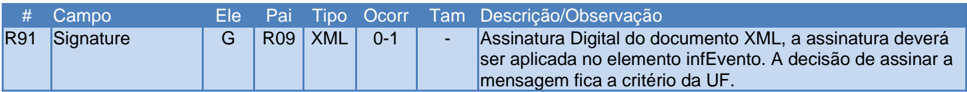
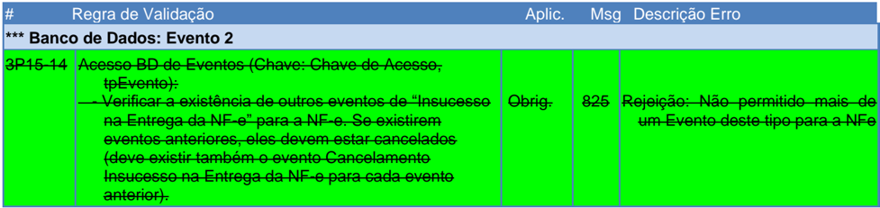

## Sistema Nota Fiscal Eletrônica

Evento Insucesso na Entrega da NF-e

Nota Técnica 2023.005

## Sumário

| Controle de Versões                                                                                                                    | ............................................................................................................3   |
|----------------------------------------------------------------------------------------------------------------------------------------|-----------------------------------------------------------------------------------------------------------------|
| Histórico de Alterações / Cronograma .................................................................................3                |                                                                                                                 |
| 1. Resumo............................................................................................................................4 |                                                                                                                 |
| 2. Definições Gerais.............................................................................................................5     |                                                                                                                 |
| 2.1 Webservice de Evento...........................................................................................................5   |                                                                                                                 |
| 2.2 Prazo da versão em homologação                                                                                                     | ........................................................................................5                       |
| 3. Evento 'Insucesso na Entrega da NF-e'..........................................................................6                    |                                                                                                                 |
| 3.1 Leiaute Mensagem de Entrada..............................................................................................6         |                                                                                                                 |
| 3.2 Leiaute Mensagem de                                                                                                                | Retorno..............................................................................................7          |
| 3.3 Descrição do Processo de Recepção de Evento ...................................................................8                   |                                                                                                                 |
| 3.4 Validação do Certificado de Transmissão..............................................................................8             |                                                                                                                 |
| 3.5 Validação Inicial da Mensagem no Web Service                                                                                       | ...................................................................8                                            |
| 3.6 Validação da área de Dados..................................................................................................8      |                                                                                                                 |
| 3.7 Validação das Regras de Negócio.........................................................................................9          |                                                                                                                 |
| 3.8 Final do Processamento do Lote                                                                                                     | .........................................................................................11                     |
| 4. Evento 'Cancelamento Insucesso na Entrega da                                                                                        | NF-e'................................................12                                                         |
| 4.1 Leiaute Mensagem de Entrada............................................................................................12          |                                                                                                                 |
| 4.2 Leiaute Mensagem de Retorno............................................................................................12          |                                                                                                                 |
| 4.3 Descrição do Processo de Recepção de Evento .................................................................13                    |                                                                                                                 |
| 4.4 Validação do Certificado de                                                                                                        | Transmissão............................................................................13                       |
| 4.5 Validação Inicial da Mensagem no Web Service                                                                                       | .................................................................13                                             |
| 4.6 Validação da área de                                                                                                               | Dados................................................................................................13         |
| 4.7 Validação das Regras de Negócio.......................................................................................14           |                                                                                                                 |
| 4.8 Final do Processamento do Lote                                                                                                     | .........................................................................................15                     |
| 5. Evento 'Cancelamento da NF-e' ...................................................................................16                 |                                                                                                                 |
|                                                                                                                                        | Negócio........................................................................................16               |
| 6. Mensagens de Erro........................................................................................................16         |                                                                                                                 |
| 6.1 Códigos de Rejeição............................................................................................................16  |                                                                                                                 |

## Controle de Versões

|   Versão | Publicação    | Descrição         |
|----------|---------------|-------------------|
|     1.00 | Dezembro/2023 | Publicação da NT. |
|     1.02 | Abril/2024    | Versão 1.02       |

## Histórico de Alterações / Cronograma

|   Versão | Histórico de atualizações                                              | Implantação Teste   | Implantação Produção   |
|----------|------------------------------------------------------------------------|---------------------|------------------------|
|     1.00 | Implantação do evento de Insucesso na Entrega da NF-e                  | 13/05/24            | 24/06/24               |
|     1.02 | Altera o Ambiente de Autorização para a SVRS e acertos na documentação | 29/04/24            | 24/06/24               |

## 1. Resumo

Esta  Nota  Técnica  disponibiliza  os  novos  eventos  de  Insucesso  na  Entrega  da  NF-e  e Cancelamento do evento de Insucesso na Entrega da NF-e, conforme disposto no Ajuste SINIEF 58/2022 de 09 de dezembro de 2022.

Quando a entrega da mercadoria não envolver um Conhecimento de Transporte Eletrônico (CTe), mas estiver relacionado direto com a NF-e, criam-se os eventos abaixo:

- Insucesso na Entrega da NF-e (tpEvento= 110192);
- Cancelamento do Insucesso na Entrega da NF-e (tpEvento= 110193).

O novo evento fiscal da NF-e visa registrar as operações de transporte que ocorreram, mas que por algum motivo (recusa do destinatário ou a sua não localização, por exemplo), não foi possível a conclusão do serviço com a efetivação da entrega da mercadoria ao recebedor.

O evento permite ao remetente, quando a entrega for realizada acobertada pela NF-e, registrar, por meio de um evento fiscal, na respectiva nota fiscal eletrônica que acoberta a entrega da mercadoria os motivos que impediram a entrega. Evento similar foi criado na NT 2023.002 para as entregas realizadas por meio do Conhecimento de Transporte Eletrônico - CT-e.

Tais eventos visam substituir a ressalva que atualmente é aposta no verso do DANFE conforme previsto no § 3° da cláusula décima do Ajuste SINIEF 07/05, ao informar que o motivo do fato que ensejou o retorno da mercadoria não entregue ao destinatário deverá estar indicado no verso do DANFE:

- '§ 3º O emitente de NF-e deverá guardar pelo prazo estabelecido na legislação tributária o DANFE que acompanhou o retorno de mercadoria não entregue ao destinatário e que contenha o motivo do fato em seu verso.'

A ausência desses eventos obriga hoje o transportador a portar o DANFE impresso ainda que esteja autorizado a apresentá-lo em meio eletrônico, para que possa se resguardar perante o Fisco, com a citada ressalva no verso desse documento, de eventual insucesso na entrega. A necessidade de portar o Danfe impresso é uma medida contrária às medidas que vem sendo adotadas pelas Administrações Tributárias para modernização e celeridade do tráfego de dados e sobretudo de simplificação das obrigações tributárias.

Assim,  para  que  a  possibilidade  da  dispensa  da  apresentação  em  papel  se  torne  realmente efetiva se faz necessária a criação desses eventos.

Por fim, esses eventos irão simplificar e agilizar a logística do transportador na medida em que este passará a poder, no exato momento em que ocorrer o insucesso da entrega, realizar na NFe os eventos ora propostos, a fim de que possa prosseguir com o transporte das mercadorias objeto  do  insucesso  resguardando-o  perante  o  Fisco  em  eventual  fiscalização  móvel,  por exemplo.

Em suma, com o processo  de  virtualização  das  informações  fiscais  nos  documentos  fiscais eletrônicos e com a previsão da apresentação do documento auxiliar da NF-e em meio eletrônico, faz-se necessário a previsão do evento de insucesso na entrega, para que o registro possa ser efetuado de forma virtual, substituindo a indicação no verso do DANFE em papel.

## 2. Definições Gerais

## 2.1 Webservice de Evento

O  Ambiente  Nacional  disponibiliza  um  Webservice  geral  de  Eventos  que  é  utilizado  para Manifestação do Destinatário e outros tipos de Eventos.

Esse evento de 'Insucesso na Entrega da NF-e' será implementado unicamente no Web Service de Eventos da SVRS, URL:

https://nfe.svrs.rs.gov.br/ws/recepcaoevento/recepcaoevento4.asmx

## 2.2 Prazo da versão em homologação

A  implementação prevista  nesta  NT  é facultativa,  portanto,  as  empresas  interessadas  nesse assunto  podem  praticar  os  prazos  que  julgarem  conveniente  em  relação  a  implantação  em homologação e a posterior implantação em produção.

## 3. Evento 'Insucesso na Entrega da NF-e'

Função : Evento para indicar o insucesso na entrega da carga pelo emitente da NF-e.

Autor do Evento : O autor do evento é o emissor da NF-e. A mensagem XML do evento será assinada com o certificado digital que tenha o CNPJ base do Emissor da NF-e.

Modelo : Nota Fiscal eletrônica - NF-e (modelo 55)

Código do Tipo de Evento

: 110192 (Este evento exige NF-e autorizada)

## 3.1 Leiaute Mensagem de Entrada

O Web Service de Registro de Evento possui uma interface genérica, complementada por uma área específica para cada tipo de evento. Segue o leiaute da mensagem de entrada deste evento.

Schema XML: envEventoInsucessoNFe\_v9.99.xsd

| #   | Campo              | Ele   | Pai   | Tipo   | Ocor   | Tam     | Descrição / Observação                                                                                                                                                                                                                                                                  |
|-----|--------------------|-------|-------|--------|--------|---------|-----------------------------------------------------------------------------------------------------------------------------------------------------------------------------------------------------------------------------------------------------------------------------------------|
| P01 | envEvento          | Raiz  | -     | -      | -      | -       | TAG raiz                                                                                                                                                                                                                                                                                |
| P02 | versao             | A     | P01   | N      | 1-1    | 2v2     | Versão do leiaute                                                                                                                                                                                                                                                                       |
| P03 | idLote             | E     | P01   | N      | 1-1    | 1-15    | Identificador de controle do Lote de envio do Evento. Número sequencial único para identificação do Lote, de uso exclusivo do autor do evento. O Web Service não faz qualquer uso deste identificador.                                                                                  |
| P04 | evento             | G     | P01   | xml    | 1-20   | -       | Evento, um lote pode conter até 20 eventos                                                                                                                                                                                                                                              |
| P05 | versao             | A     | P04   | N      | 1-1    | 2v2     | Versão do leiaute do evento                                                                                                                                                                                                                                                             |
| P06 | infEvento          | G     | P04   | -      | 1-1    | -       | Grupo de informações do registro do Evento                                                                                                                                                                                                                                              |
| P07 | Id                 | ID    | P06   | C      | 1-1    | 54      | Identificador da TAG a ser assinada, formado por: 'ID' + tpEvento + Chave da NF-e + nSeqEvento                                                                                                                                                                                          |
| P08 | cOrgao             | E     | P06   | N      | 1-1    | 2       | Código do órgão de recepção do Evento, conforme Tabela do IBGE. Utilizar código 92 - SVRS, para este evento.                                                                                                                                                                            |
| P09 | tpAmb              | E     | P06   | N      | 1-1    | 1       | Identificação do Ambiente: 1=Produção; 2=Homologação                                                                                                                                                                                                                                    |
| P10 | CNPJ               | CE    | P06   | N      | 1-1    | 14      | Informar o CNPJ/CPF do autor do Evento.                                                                                                                                                                                                                                                 |
| P11 | CPF                | CE    | P06   | N      | 1-1    | 11      |                                                                                                                                                                                                                                                                                         |
| P12 | chNFe              | E     | P06   | N      | 1-1    | 44      | Chave de Acesso da NF-e à qual o evento será vinculado                                                                                                                                                                                                                                  |
| P13 | dhEvento           | E     | P06   | D      | 1-1    | -       | Data e hora do evento. Formato AAAA-MMDDThh:mm:ssTZD (UTC)                                                                                                                                                                                                                              |
| P14 | tpEvento           | E     | P06   | N      | 1-1    | 6       | Código do evento: 110192 - 'Insucesso na Entrega da NF-e'                                                                                                                                                                                                                               |
| P15 | nSeqEvento         | E     | P06   | N      | 1-1    | 1-2     | Sequencial do evento para o mesmo tipo de evento. O autor do evento deve numerar de forma sequencial os eventos deste tipo, com os valores de 1 a 99. Nota: Para informar um novo evento de 'Insucesso na Entrega da NF-e' para a mesma NF-e, o evento anterior deverá estar cancelado. |
| P16 | verEvento          | E     | P06   | N      | 1-1    | 2v2     | Versão do grupo de detalhe do evento.                                                                                                                                                                                                                                                   |
| P17 | detEvento          | G     | P06   |        | 1-1    | -       | Detalhes do evento                                                                                                                                                                                                                                                                      |
| P18 | versao             | A     | P17   | N      | 1-1    | 2v2     | Informar o mesmo valor da tag 'verEvento' (P16)                                                                                                                                                                                                                                         |
| P19 | descEvento         | E     | P17   | C      | 1-1    | 5-60    | Veja a descrição do evento, junto com o Tipo de Evento documentado anteriormente.                                                                                                                                                                                                       |
| P20 | cOrgaoAutor        | E     | P17   | N      | 1-1    | 2       | Código do Órgão Autor do Evento. Informar o Código da UF da Chave de Acesso para este Evento.                                                                                                                                                                                           |
| P21 | verAplic           | E     | P17   | C      | 1-1    | 1-20    | Versão do aplicativo do Autor do Evento.                                                                                                                                                                                                                                                |
| P30 | dhTentativaEntrega | E     | P17   | D      | 1-1    | -       | Data e hora da tentativa de entrega Formato= AAAA-MM-DDTHH:MM:SS TZD                                                                                                                                                                                                                    |
| P31 | nTentativa         | E     | P17   | N      | 0-1    | 3       | Número da tentativa de entrega que não teve sucesso                                                                                                                                                                                                                                     |
| P32 | tpMotivo           | E     | P17   | N      | 1-1    | 1       | Motivo do insucesso: 1 - Recebedor não encontrado 2 - Recusa do recebedor 3 - Endereço inexistente                                                                                                                                                                                      |
| P33 | xJustMotivo        | E     | P17   | C      | 0-1    | 25- 250 | Justificativa do motivo do insucesso. Informar apenas para tpMotivo=4                                                                                                                                                                                                                   |
| P34 | latGPS             | E     | P17   | N      | 0-1    | [-]2v6  | Latitude do ponto de entrega                                                                                                                                                                                                                                                            |
| P35 | longGPS            | E     | P17   | N      | 0-1    | [-]3v6  | Longitude do ponto de entrega                                                                                                                                                                                                                                                           |

| #   | Campo                   | Ele   | Pai   | Tipo   | Ocor   | Tam   | Descrição / Observação                                                                                                                                                                                                                                                                                                                                                                                                                             |
|-----|-------------------------|-------|-------|--------|--------|-------|----------------------------------------------------------------------------------------------------------------------------------------------------------------------------------------------------------------------------------------------------------------------------------------------------------------------------------------------------------------------------------------------------------------------------------------------------|
| P36 | hashTentativaEntre ga   | E     | P17   | C      | 1-1    | 28    | Hash SHA-1, no formato Base64, resultante da concatenação de: Chave de Acesso da NF-e + Base64 da imagem capturada na tentativa da entrega (ex: imagem capturada da assinatura eletrônica, digital do recebedor, foto,etc). Nota 1 : A critério do autor do evento, este campo pode ser utilizado como índice para acesso as informações do Insucesso na Entrega da NF-e. Nota 2 : A SEFAZ não tem nenhum controle sobre a informação deste campo. |
| P37 | dhHashTentativaEn trega | E     | P17   | D      | 0-1    | -     | Data e hora da geração do hash da tentativa de entrega. Formato AAAA-MMDDThh:mm:ssTZD.                                                                                                                                                                                                                                                                                                                                                             |
| P91 | Signature               | G     | P04   | XML    | 1-1    | -     | Assinatura Digital do documento XML, a assinatura deverá ser aplicada no elemento infEvento                                                                                                                                                                                                                                                                                                                                                        |

## 3.2 Leiaute Mensagem de Retorno

O Web Service de Registro de Evento possui uma interface genérica, complementada por uma área específica para cada tipo de evento. Segue o leiaute da mensagem de retorno (resposta) deste evento.

Schema XML: retEnvEventoInsucessoNFe\_v1.0.xsd

| #   | Campo        | Ele   | Pai   | Tipo   | Ocorr   | Tam   | Descrição/Observação                                                                                                                                                                               |
|-----|--------------|-------|-------|--------|---------|-------|----------------------------------------------------------------------------------------------------------------------------------------------------------------------------------------------------|
| R01 | retEnvEvento | Raiz  | -     | -      | -       | -     | TAG raiz da mensagem de retorno                                                                                                                                                                    |
| R02 | versao       | A     | R01   | N      | 1-1     | 2v2   | Versão do leiaute                                                                                                                                                                                  |
| R03 | idLote       | E     | R01   | N      | 1-1     | 1-15  | Idem a mensagem de entrada.                                                                                                                                                                        |
| R04 | tpAmb        | E     | R01   | N      | 1-1     | 1     | Idem a mensagem de entrada.                                                                                                                                                                        |
| R05 | verAplic     | E     | R01   | C      | 1-1     | 1-20  | Versão da aplicação que processou o evento.                                                                                                                                                        |
| R06 | cOrgao       | E     | R01   | N      | 1-1     | 2     | Órgão de recepção do Evento, idem a mensagem de entrada.                                                                                                                                           |
| R07 | cStat        | E     | R01   | N      | 1-1     | 3     | Código do status da resposta                                                                                                                                                                       |
| R08 | xMotivo      | E     | R01   | C      | 1-1     | 1-255 | Descrição do status da resposta                                                                                                                                                                    |
| R09 | retEvento    | G     | R01   | -      | 0-20    | -     | Grupo do resultado do processamento do Evento                                                                                                                                                      |
| R10 | versao       | A     | R09   | N      | 1-1     | 2v2   | Versão do leiaute                                                                                                                                                                                  |
| R11 | infEvento    | G     | R09   |        | 1-1     | -     | Grupo de informações do registro do Evento                                                                                                                                                         |
| R12 | Id           | ID    | R11   | C      | 0-1     | 17    | Identificador da TAG a ser assinada, somente deve ser informado se o órgão de registro assinar a resposta. No caso de assinatura, preencher com o número do protocolo, precedido pela literal 'ID' |
| R13 | tpAmb        | E     | R11   | N      | 1-1     | 1     | Idem a mensagem de entrada.                                                                                                                                                                        |
| R14 | verAplic     | E     | R11   | C      | 1-1     | 1-20  | Versão da aplicação que registrou o Evento, utilizar literal que permita a identificação do órgão, como a sigla da UF ou do órgão.                                                                 |
| R15 | cOrgao       | E     | R11   | N      | 1-1     | 2     | Idem a mensagem de entrada.                                                                                                                                                                        |
| R16 | cStat        | E     | R11   | N      | 1-1     | 3     | Código do status da resposta.                                                                                                                                                                      |
| R17 | xMotivo      | E     | R11   | C      | 1-1     | 1-255 | Descrição do status da resposta.                                                                                                                                                                   |
| R18 | chNFe        | E     | R11   | N      | 0-1     | 44    | Idem a mensagem de entrada.                                                                                                                                                                        |
| R19 | tpEvento     | E     | R11   | N      | 0-1     | 6     | Idem a mensagem de entrada.                                                                                                                                                                        |
| R20 | xEvento      | E     | R11   | C      | 0-1     | 5-60  | Idem a mensagem de entrada.                                                                                                                                                                        |
| R21 | nSeqEvento   | E     | R11   | N      | 0-1     | 1-2   | Idem a mensagem de entrada.                                                                                                                                                                        |
| R22 | cOrgaoAutor  | E     | R11   | N      | 0-1     | 2     | Idem a mensagem de entrada.                                                                                                                                                                        |
| R50 | dhRegEvento  | E     | R11   | D      | 1-1     | -     | Data e hora de registro do evento no formato AAAAMM- DDTHH:MM:SSTZD (formato UTC). Se o evento for rejeitado informar a data e hora de recebimento do evento.                                      |
| R51 | nProt        | E     | R11   | N      | 0-1     | 15    | Número do Protocolo do Evento 1 posição (1Secretaria da Fazenda Estadual, 2-RFB, 3=SVRS), 2 posições para o código da UF, 2 posições para o ano e 10 posições para o sequencial no ano.            |

| #   | Campo     | Ele   | Pai   | Tipo   | Ocorr   | Tam Descrição/Observação                                                                                                                              |
|-----|-----------|-------|-------|--------|---------|-------------------------------------------------------------------------------------------------------------------------------------------------------|
| R91 | Signature | G     | R09   | XML    | 0-1     | - Assinatura Digital do documento XML, a assinatura deverá ser aplicada no elemento infEvento. A decisão de assinar a mensagem fica a critério da UF. |

Nota: No caso de evento registrado com sucesso, os campos opcionais serão retornados.

## 3.3 Descrição do Processo de Recepção de Evento

O  Web  Service  de  Evento  é  acionado  pelo  interessado,  emissor  de  NF-e,  que  deve  enviar mensagem com o pedido de autorização do evento da NF-e.

O processo de Registro de Eventos recebe eventos em uma estrutura de lotes, que pode conter de 1 a 20 eventos.

## 3.4 Validação do Certificado de Transmissão

Regras de validação idênticas aos demais Web Services, podendo gerar os erros:

- 280: 'Rejeição: Certificado Transmissor inválido'

- 281: 'Rejeição: Certificado Transmissor Data Validade'

- 283: 'Rejeição: Certificado Transmissor - erro Cadeia de Certificação'

- 286: 'Rejeição: Certificado Transmissor erro no acesso a LCR'

- 284: 'Rejeição: Certificado Transmissor revogado'

- 285: 'Rejeição: Certificado Transmissor difere ICP-Brasil'

- 282: 'Rejeição: Certificado Transmissor sem CNPJ/CPF'

## 3.5 Validação Inicial da Mensagem no Web Service

Regras de validação idênticas aos demais Web Services, podendo gerar os erros:

- 214: 'Rejeição: Tamanho da mensagem excedeu o limite estabelecido'
- 108: 'Serviço Paralisado Momentaneamente (curto prazo)'
- 109: 'Serviço Paralisado sem Previsão'
- 410: 'Rejeição: UF informada no campo cUF não é atendida pelo WebService'
- 239: 'Rejeição: Versão do arquivo XML não suportada'

## 3.6 Validação da área de Dados

## a) Validação de forma da área de dados

Regras de validação idênticas aos demais Web Services, podendo gerar os erros:

- 516: 'Rejeição: Falha Schema XML, inexiste a tag raiz esperada para a mensagem'
- 517: 'Rejeição: Falha Schema XML, inexiste atributo versão na tag raiz da mensagem'
- 215: 'Rejeição: Falha Schema XML'
- 587: 'Rejeição: Usar somente o namespace padrão da NF-e'
- 588: 'Rejeição: Não é permitida a presença de caracteres de edição no início/fim da mensagem ou entre as tags da mensagem'
- 404: 'Rejeição: Uso de prefixo de namespace não permitido'
- 402: 'Rejeição: XML da área de dados com codificação diferente de UTF-8'

## b) Extração dos eventos do lote e validação do Schema XML do evento

Regras de validação idênticas aos demais Eventos, podendo gerar os erros:

- 491: 'Rejeição: O tpEvento informado invalido'

- 492: 'Rejeição: O verEvento informado invalido'

- 493: 'Rejeição: Evento não atende o Schema XML específico'

## c) Validação do Certificado Digital de Assinatura

Regras de validação idênticas aos demais Web Services, podendo gerar os erros:

- 290: 'Rejeição: Certificado Assinatura inválido'

- •

291: 'Rejeição: Certificado Assinatura Data Validade'

- 292: 'Rejeição: Certificado Assinatura sem CNPJ/CPF'

- •

293: 'Rejeição: Certificado Assinatura - erro Cadeia de Certificação'

- 296: 'Rejeição: Certificado Assinatura erro no acesso a LCR'

- 294: 'Rejeição: Certificado Assinatura revogado'

- 295: 'Rejeição: Certificado Assinatura difere ICP-Brasil'

## d) Validação da Assinatura Digital

Regras de validação idênticas aos demais Web Services, podendo gerar os erros:

- 298: 'Rejeição: Assinatura difere do padrão do Sistema'

- 297: 'Rejeição: Assinatura difere do calculado'

- 213: 'Rejeição: CNPJ-Base do Autor difere do CNPJ-Base do Certificado Digital'

- 227: 'Rejeição: 'CPF do Autor difere do CPF do Certificado Digital'

## 3.7 Validação das Regras de Negócio

| #      | Regra de Validação                                                                                                                                         | Aplic.   |   Msg | Descrição Erro                                                                                                        |
|--------|------------------------------------------------------------------------------------------------------------------------------------------------------------|----------|-------|-----------------------------------------------------------------------------------------------------------------------|
| P07-10 | Atributo 'Id' não corresponde à concatenação dos campos do evento ('ID' + tpEvento + chNFe + nSeqEvento) (*1)                                              | Obrig.   |   572 | Rejeição: Erro Atributo ID do evento não corresponde a concatenação dos campos ('Id' + tpEvento + chNFe + nSeqEvento) |
| P08-10 | Código do órgão de recepção do Evento diverge do definido para este evento (*1)                                                                            | Obrig.   |   250 | Rejeição: UF diverge da UF autorizadora                                                                               |
| P09-10 | Tipo do ambiente difere do ambiente do Web Service (*1)                                                                                                    | Obrig.   |   252 | Rejeição: Ambiente informado diverge do Ambiente de recebimento                                                       |
| P10-10 | Se informado CNPJ do Autor do Evento: - CNPJ inválido (zeros, nulo ou DV inválido) (*1)                                                                    | Obrig.   |   489 | Rejeição: CNPJ informado inválido (DV ou zeros)                                                                       |
| P11-10 | Se informado o CPF do Autor do evento: - CPF inválido (zeros, nulo ou DV inválido) (*1)                                                                    | Obrig.   |   490 | Rejeição: CPF informado inválido (DV ou zeros)                                                                        |
| P12-10 | Validação da Chave de Acesso (tag:chNFe): - Dígito verificador inválido (*1)                                                                               | Obrig.   |   236 | Rejeição: Chave de Acesso com dígito verificador inválido                                                             |
| P12-14 | - Código UF inválido (*1)                                                                                                                                  | Obrig.   |   614 | Rejeição: Chave de Acesso inválida (Código UF inválido)                                                               |
| P12-18 | - Ano < 06 ou Ano maior que Ano corrente (*1)                                                                                                              | Obrig.   |   615 | Rejeição: Chave de Acesso inválida (Ano < 06 ou Ano maior que Ano corrente)                                           |
| P12-22 | - Mês = 0 ou Mês > 12 (*1)                                                                                                                                 | Obrig.   |   616 | Rejeição: Chave de Acesso inválida (Mês < 1 ou Mês > 12)                                                              |
| P12-26 | - CNPJ/CPF zerado ou dígito inválido (*1) Nota: Considerar a Série para determinar se CNPJ/CPF na Chave de Acesso. CNPJ: Série=[0909], CPF: Série<>[0-909] | Obrig.   |   617 | Rejeição: Chave de Acesso inválida (CNPJ/CPF zerado ou dígito inválido)                                               |
| P12-30 | - Modelo diferente de 55                                                                                                                                   | Obrig.   |   450 | Rejeição: Modelo da NF-e diferente de 55                                                                              |
| P12-34 | - Número NF = 0 (*1)                                                                                                                                       | Obrig.   |   619 | Rejeição: Chave de Acesso inválida (número NF = 0)                                                                    |

| #                                                          | Regra de Validação                                                                                                                                                                                                                                                                                                                                         | Aplic.                                                     | Msg Descrição Erro                                         | Msg Descrição Erro                                                              |
|------------------------------------------------------------|------------------------------------------------------------------------------------------------------------------------------------------------------------------------------------------------------------------------------------------------------------------------------------------------------------------------------------------------------------|------------------------------------------------------------|------------------------------------------------------------|---------------------------------------------------------------------------------|
| P12-40                                                     | - UF da Chave de Acesso diverge da UF Autorizadora                                                                                                                                                                                                                                                                                                         | Obrig.                                                     | 249                                                        | Rejeição: UF da Chave de Acesso diverge da UF autorizadora                      |
| P12-44                                                     | - CNPJ/CPF da Chave de Acesso diverge do CNPJ/CPF do Autor Nota : Considerar a Série para determinar se CNPJ/CPF na Chave de Acesso. CNPJ: Série=[0909], CPF: Série<>[0-909]                                                                                                                                                                               | Obrig.                                                     | 574                                                        | Rejeição: Autor do evento diverge do emissor da NF-e                            |
| P13-10                                                     | Data do evento maior que a data de processamento (aceitar tolerância de até 5 minutos) (*1)                                                                                                                                                                                                                                                                | Obrig.                                                     | 578                                                        | Rejeição: A data do evento não pode ser maior que a data do processamento       |
| P20-10                                                     | UF do Autor (cOrgaoAutor) diverge da UF da Chave de Acesso                                                                                                                                                                                                                                                                                                 | Obrig.                                                     | 455                                                        | Rejeição: Órgão Autor do evento difere da UF da Chave de Acesso                 |
| P30-10                                                     | Data-Hora de Entrega superior a data de emissão do Evento                                                                                                                                                                                                                                                                                                  | Obrig.                                                     | 821                                                        | Rejeição: Data-Hora de Entrega superior a data de emissão do evento             |
| P37-10                                                     | Data-Hora do Hash de entrega superior a data de emissão do Evento                                                                                                                                                                                                                                                                                          | Obrig.                                                     | 822                                                        | Rejeição: Data-Hora do Hash de Entrega superior a data de emissão do evento     |
| *** Banco de Dados: Emitente                               | *** Banco de Dados: Emitente                                                                                                                                                                                                                                                                                                                               |                                                            |                                                            |                                                                                 |
| 1P10-10                                                    | Acesso ao Cadastro de Contribuintes (Chave: CNPJ/CPF do Autor): - Verificar se Emitente não autorizado a emitir NF-e                                                                                                                                                                                                                                       | Obrig.                                                     | 203                                                        | Rejeição: Emissor não habilitado para emissão de NF-e                           |
| 1P10-20                                                    | - Verificar situação fiscal do emitente                                                                                                                                                                                                                                                                                                                    | Obrig.                                                     | 240                                                        | Rejeição: Irregularidade fiscal do emitente                                     |
| *** Banco de Dados: NF-e                                   | *** Banco de Dados: NF-e                                                                                                                                                                                                                                                                                                                                   |                                                            |                                                            |                                                                                 |
| 2P12-10 Acesso BD NFE (Chave: CNPJ/CPF da Chave de Acesso, | 2P12-10 Acesso BD NFE (Chave: CNPJ/CPF da Chave de Acesso,                                                                                                                                                                                                                                                                                                 | 2P12-10 Acesso BD NFE (Chave: CNPJ/CPF da Chave de Acesso, | 2P12-10 Acesso BD NFE (Chave: CNPJ/CPF da Chave de Acesso, | 2P12-10 Acesso BD NFE (Chave: CNPJ/CPF da Chave de Acesso,                      |
|                                                            | Modelo, Série e Número): - Chave Acesso inexistente para o tpEvento que exige a existência da NF-e (*1) Nota : Caso exista no banco de dados uma NF-e com Chave de Acesso divergente, opcionalmente, deverá ser concatenado a Chave de Acesso existente na descrição do erro, caso o CNPJ/CPF do Autor do Evento seja o mesmo CNPJ/CPF da Chave de Acesso. | Obrig.                                                     | 494                                                        | Rejeição: Chave de Acesso Inexistente [chNFe:999...999]                         |
| 2P12-22                                                    | - Verificar se NF-e está denegada ou cancelada                                                                                                                                                                                                                                                                                                             | Obrig.                                                     | 580                                                        | Rejeição: Evento exige uma NF-e autorizada                                      |
| 2P13-10                                                    | - Data do evento menor que a Data de Emissão da NF-e (*1)                                                                                                                                                                                                                                                                                                  | Obrig.                                                     | 577                                                        | Rejeição: A data do evento não pode ser menor que a data de emissão da NF-e     |
| 2P13-14                                                    | - Data do evento menor que a Data de Autorização da NF-e não emitida em contingência (tpEmis=1) Nota : Aceitar uma tolerância de 5 minutos, devido ao sincronismo de horário entre o servidor da Empresa e o servidor da SEFAZ Autorizadora.                                                                                                               | Obrig.                                                     | 579                                                        | Rejeição: A data do evento não pode ser menor que a data de autorização da NF-e |
| 2P30-10                                                    | Data-Hora de Entrega inferior a data de emissão da NF-e                                                                                                                                                                                                                                                                                                    | Obrig.                                                     | 823                                                        | Rejeição: Data-Hora de Entrega inferior a data de emissão da NF- e              |
| 2P36-10                                                    | Data-Hora do Hash de Entrega inferior a data de emissão da NF-e                                                                                                                                                                                                                                                                                            | Obrig.                                                     | 824                                                        | Rejeição: Data-Hora do Hash de Entrega inferior a data de emissão da NF-e       |
| *** Banco de Dados: Evento                                 | *** Banco de Dados: Evento                                                                                                                                                                                                                                                                                                                                 |                                                            |                                                            |                                                                                 |
| 3P15-10                                                    | Acesso BD de Eventos (Chave: Chave de Acesso, tpEvento, nSeqEvento): - Duplicidade do evento (tpEvento + chNFe + nSeqEvento + chCTe)                                                                                                                                                                                                                       | Obrig.                                                     | 573                                                        | Rejeição: Duplicidade de Evento                                                 |

| #                            | Regra de Validação                                                                                                                                                                                                                                                                                                  | Aplic.                       | Msg                          | Descrição Erro                                                  |
|------------------------------|---------------------------------------------------------------------------------------------------------------------------------------------------------------------------------------------------------------------------------------------------------------------------------------------------------------------|------------------------------|------------------------------|-----------------------------------------------------------------|
| *** Banco de Dados: Evento 2 | *** Banco de Dados: Evento 2                                                                                                                                                                                                                                                                                        | *** Banco de Dados: Evento 2 | *** Banco de Dados: Evento 2 | *** Banco de Dados: Evento 2                                    |
| 3P15-14                      | Acesso BD de Eventos (Chave: Chave de Acesso, tpEvento): - Verificar a existência de outros eventos de 'Insucesso na Entrega da NF-e' para a NF-e. Se existirem eventos anteriores, eles devem estar cancelados (deve existir também o evento Cancelamento Insucesso na Entrega da NF-e para cada evento anterior). | Obrig.                       | 825                          | Rejeição: Não permitido mais de um Evento deste tipo para a NFe |

Nota : (*1) Validações genéricas do Registro de Evento.

## 3.8 Final do Processamento do Lote

O processamento do lote pode resultar em:

- Rejeição do Lote: por algum problema que comprometa o processamento do lote;
- Processamento do Lote: o lote foi processado (cStat='128 - Lote de Evento Processado'), e a validação de cada evento do lote poderá resultar em:
- Rejeição: o Evento será rejeitado, retornando do código do status do motivo da rejeição;
- Evento Autorizado, com vinculação à respectiva NF-e: Encontrada a NF-e no banco de dados. Retornar cStat='135-Evento registrado e vinculado a NF-e';
- Evento Autorizado, sem vinculação à respectiva NF-e: Não encontrada a NF-e no banco de dados. Retornar cStat='136-Evento registrado, mas não vinculado a NF-e';

## 4. Evento 'Cancelamento Insucesso na Entrega da NF-e'

Função : Evento para indicar o cancelamento do evento de insucesso na entrega da carga pelo emitente da NF-e.

Autor do Evento : O autor do evento é o emissor da NF-e. A mensagem XML do evento será assinada com o certificado digital que tenha o CNPJ base do Emissor da NF-e.

Modelo : Nota Fiscal eletrônica - NF-e (modelo 55)

Código do Tipo de Evento

: 110193 (Este evento exige NF-e autorizada)

## 4.1 Leiaute Mensagem de Entrada

O Web Service de Registro de Evento possui uma interface genérica, complementada por uma área específica para cada tipo de evento. Segue o leiaute da mensagem de entrada deste evento.

Schema XML: envEventoCancInsucessoNFe\_v9.99.xsd

| #   | Campo       | Ele   | Pai   | Tipo   | Ocor   | Tam   | Descrição / Observação                                                                                                                                                                                 |
|-----|-------------|-------|-------|--------|--------|-------|--------------------------------------------------------------------------------------------------------------------------------------------------------------------------------------------------------|
| P01 | envEvento   | Raiz  | -     | -      | -      | -     | TAG raiz                                                                                                                                                                                               |
| P02 | versao      | A     | P01   | N      | 1-1    | 2v2   | Versão do leiaute                                                                                                                                                                                      |
| P03 | idLote      | E     | P01   | N      | 1-1    | 1-15  | Identificador de controle do Lote de envio do Evento. Número sequencial único para identificação do Lote, de uso exclusivo do autor do evento. O Web Service não faz qualquer uso deste identificador. |
| P04 | evento      | G     | P01   | xml    | 1-20   | -     | Evento, um lote pode conter até 20 eventos                                                                                                                                                             |
| P05 | versao      | A     | P04   | N      | 1-1    | 2v2   | Versão do leiaute do evento                                                                                                                                                                            |
| P06 | infEvento   | G     | P04   | -      | 1-1    | -     | Grupo de informações do registro do Evento                                                                                                                                                             |
| P07 | Id          | ID    | P06   | C      | 1-1    | 54    | Identificador da TAG a ser assinada, formado por: 'ID' + tpEvento + Chave da NF-e + nSeqEvento                                                                                                         |
| P08 | cOrgao      | E     | P06   | N      | 1-1    | 2     | Código do órgão de recepção do Evento, conforme Tabela do IBGE. Utilizar código 92 - SVRS, para este evento.                                                                                           |
| P09 | tpAmb       | E     | P06   | N      | 1-1    | 1     | Identificação do Ambiente: 1=Produção; 2=Homologação                                                                                                                                                   |
| P10 | CNPJ        | CE    | P06   | N      | 1-1    | 14    | Informar o CNPJ/CPF do autor do Evento.                                                                                                                                                                |
| P11 | CPF         | CE    | P06   | N      | 1-1    | 11    |                                                                                                                                                                                                        |
| P12 | chNFe       | E     | P06   | N      | 1-1    | 44    | Chave de Acesso da NF-e à qual o evento será vinculado                                                                                                                                                 |
| P13 | dhEvento    | E     | P06   | D      | 1-1    | -     | Data e hora do evento. Formato AAAA-MMDDThh:mm:ssTZD (UTC)                                                                                                                                             |
| P14 | tpEvento    | E     | P06   | N      | 1-1    | 6     | Código do evento: 110193 - 'Cancelamento do Insucesso na Entrega da NF-e'                                                                                                                              |
| P15 | nSeqEvento  | E     | P06   | N      | 1-1    | 1-2   | Sequencial do evento para o mesmo tipo de evento. O autor do evento deve numerar de forma sequencial os eventos deste tipo, com os valores de 1 a 99.                                                  |
| P16 | verEvento   | E     | P06   | N      | 1-1    | 2v2   | Versão do grupo de detalhe do evento.                                                                                                                                                                  |
| P17 | detEvento   | G     | P06   |        | 1-1    | -     | Detalhes do evento                                                                                                                                                                                     |
| P18 | versao      | A     | P17   | N      | 1-1    | 2v2   | Informar o mesmo valor da tag 'verEvento' (P16)                                                                                                                                                        |
| P19 | descEvento  | E     | P17   | C      | 1-1    | 5-60  | Veja a descrição do evento, junto com o Tipo de Evento documentado anteriormente.                                                                                                                      |
| P20 | cOrgaoAutor | E     | P17   | N      | 1-1    | 2     | Código do Órgão Autor do Evento. Informar o Código da UF da Chave de Acesso para este Evento.                                                                                                          |
| P21 | verAplic    | E     | P17   | C      | 1-1    | 1-20  | Versão do aplicativo do Autor do Evento.                                                                                                                                                               |
| P22 | nProtEvento | E     | P17   | N      | 1-1    | 15    | Informar o número do Protocolo de Autorização do Evento da NF-e a que se refere este cancelamento.                                                                                                     |
| P91 | Signature   | G     | P04   | XML    | 1-1    | -     | Assinatura Digital do documento XML, a assinatura deverá ser aplicada no elemento infEvento                                                                                                            |

## 4.2 Leiaute Mensagem de Retorno

O Web Service de Registro de Evento possui uma interface genérica, complementada por uma área específica para cada tipo de evento. Segue o leiaute da mensagem de retorno (resposta) deste evento.

## Schema XML: retEnvEventoCancInsucessoNFe\_v1.0.xsd

| #   | Campo        | Ele   | Pai   | Tipo   | Ocorr   | Tam   | Descrição/Observação                                                                                                                                                                               |
|-----|--------------|-------|-------|--------|---------|-------|----------------------------------------------------------------------------------------------------------------------------------------------------------------------------------------------------|
| R01 | retEnvEvento | Raiz  | -     | -      | -       | -     | TAG raiz da mensagem de retorno                                                                                                                                                                    |
| R02 | versao       | A     | R01   | N      | 1-1     | 2v2   | Versão do leiaute                                                                                                                                                                                  |
| R03 | idLote       | E     | R01   | N      | 1-1     | 1-15  | Idem a mensagem de entrada.                                                                                                                                                                        |
| R04 | tpAmb        | E     | R01   | N      | 1-1     | 1     | Idem a mensagem de entrada.                                                                                                                                                                        |
| R05 | verAplic     | E     | R01   | C      | 1-1     | 1-20  | Versão da aplicação que processou o evento.                                                                                                                                                        |
| R06 | cOrgao       | E     | R01   | N      | 1-1     | 2     | Órgão de recepção do Evento, idem a mensagem de entrada.                                                                                                                                           |
| R07 | cStat        | E     | R01   | N      | 1-1     | 3     | Código do status da resposta                                                                                                                                                                       |
| R08 | xMotivo      | E     | R01   | C      | 1-1     | 1-255 | Descrição do status da resposta                                                                                                                                                                    |
| R09 | retEvento    | G     | R01   | -      | 0-20    | -     | Grupo do resultado do processamento do Evento                                                                                                                                                      |
| R10 | versao       | A     | R09   | N      | 1-1     | 2v2   | Versão do leiaute                                                                                                                                                                                  |
| R11 | infEvento    | G     | R09   |        | 1-1     | -     | Grupo de informações do registro do Evento                                                                                                                                                         |
| R12 | Id           | ID    | R11   | C      | 0-1     | 17    | Identificador da TAG a ser assinada, somente deve ser informado se o órgão de registro assinar a resposta. No caso de assinatura, preencher com o número do protocolo, precedido pela literal 'ID' |
| R13 | tpAmb        | E     | R11   | N      | 1-1     | 1     | Idem a mensagem de entrada.                                                                                                                                                                        |
| R14 | verAplic     | E     | R11   | C      | 1-1     | 1-20  | Versão da aplicação que registrou o Evento, utilizar literal que permita a identificação do órgão, como a sigla da UF ou do órgão.                                                                 |
| R15 | cOrgao       | E     | R11   | N      | 1-1     | 2     | Idem a mensagem de entrada.                                                                                                                                                                        |
| R16 | cStat        | E     | R11   | N      | 1-1     | 3     | Código do status da resposta.                                                                                                                                                                      |
| R17 | xMotivo      | E     | R11   | C      | 1-1     | 1-255 | Descrição do status da resposta.                                                                                                                                                                   |
| R18 | chNFe        | E     | R11   | N      | 0-1     | 44    | Idem a mensagem de entrada.                                                                                                                                                                        |
| R19 | tpEvento     | E     | R11   | N      | 0-1     | 6     | Idem a mensagem de entrada.                                                                                                                                                                        |
| R20 | xEvento      | E     | R11   | C      | 0-1     | 5-60  | Idem a mensagem de entrada.                                                                                                                                                                        |
| R21 | nSeqEvento   | E     | R11   | N      | 0-1     | 1-2   | Idem a mensagem de entrada.                                                                                                                                                                        |
| R22 | cOrgaoAutor  | E     | R11   | N      | 0-1     | 2     | Idem a mensagem de entrada.                                                                                                                                                                        |
| R50 | dhRegEvento  | E     | R11   | D      | 1-1     | -     | Data e hora de registro do evento no formato AAAAMM- DDTHH:MM:SSTZD (formato UTC). Se o evento for rejeitado informar a data e hora de recebimento do evento.                                      |
| R51 | nProt        | E     | R11   | N      | 0-1     | 15    | Número do Protocolo do Evento 1 posição (1Secretaria da Fazenda Estadual, 2-RFB, 3-SVRS), 2 posições para o código da UF, 2 posições para o ano e 10 posições para o sequencial no ano.            |
| R91 | Signature    | G     | R09   | XML    | 0-1     | -     | Assinatura Digital do documento XML, a assinatura deverá ser aplicada no elemento infEvento. A decisão de assinar a mensagem fica a critério da UF.                                                |

Nota : No caso de evento registrado com sucesso, os campos opcionais serão retornados.

## 4.3 Descrição do Processo de Recepção de Evento

Idem descrição anterior para o Evento de 'Insucesso na Entrega da NF-e'.

## 4.4 Validação do Certificado de Transmissão

Idem descrição anterior para o Evento de 'Insucesso na Entrega da NF-e'.

## 4.5 Validação Inicial da Mensagem no Web Service

Idem descrição anterior para o Evento de 'Insucesso na Entrega da NF-e'.

## 4.6 Validação da área de Dados

Idem descrição anterior para o Evento de 'Insucesso na Entrega da NF-e'.

## 4.7 Validação das Regras de Negócio

| #                           | Regra de Validação                                                                                                                                                                                                                                                                                                                                           | Aplic.   |   Msg | Descrição Erro                                                                                                        |
|-----------------------------|--------------------------------------------------------------------------------------------------------------------------------------------------------------------------------------------------------------------------------------------------------------------------------------------------------------------------------------------------------------|----------|-------|-----------------------------------------------------------------------------------------------------------------------|
| P07-10                      | Atributo 'Id' não corresponde à concatenação dos campos do evento ('ID' + tpEvento + chNFe + nSeqEvento) (*1)                                                                                                                                                                                                                                                | Obrig.   |   572 | Rejeição: Erro Atributo ID do evento não corresponde a concatenação dos campos ('ID' + tpEvento + chNFe + nSeqEvento) |
| P08-10                      | Código do órgão de recepção do Evento diverge do definido para este evento (*1)                                                                                                                                                                                                                                                                              | Obrig.   |   250 | Rejeição: UF diverge da UF autorizadora                                                                               |
| P09-10                      | Tipo do ambiente difere do ambiente do Web Service (*1)                                                                                                                                                                                                                                                                                                      | Obrig.   |   252 | Rejeição: Ambiente informado diverge do Ambiente de recebimento                                                       |
| P10-10                      | Se informado CNPJ do Autor do Evento: - CNPJ inválido (zeros, nulo ou DV inválido) (*1)                                                                                                                                                                                                                                                                      | Obrig.   |   489 | Rejeição: CNPJ informado inválido (DV ou zeros)                                                                       |
| P11-10                      | Se informado o CPF do Autor do evento: - CPF inválido (zeros, nulo ou DV inválido) (*1)                                                                                                                                                                                                                                                                      | Obrig.   |   490 | Rejeição: CPF informado inválido (DV ou zeros)                                                                        |
| P12-10                      | Validação da Chave de Acesso (tag:chNFe): - Dígito verificador inválido (*1)                                                                                                                                                                                                                                                                                 | Obrig.   |   236 | Rejeição: Chave de Acesso com dígito verificador inválido                                                             |
| P12-14                      | - Código UF inválido (*1)                                                                                                                                                                                                                                                                                                                                    | Obrig.   |   614 | Rejeição: Chave de Acesso inválida (Código UF inválido)                                                               |
| P12-18                      | - Ano < 06 ou Ano maior que Ano corrente (*1)                                                                                                                                                                                                                                                                                                                | Obrig.   |   615 | Rejeição: Chave de Acesso inválida (Ano < 06 ou Ano maior que Ano corrente)                                           |
| P12-22                      | - Mês = 0 ou Mês > 12 (*1)                                                                                                                                                                                                                                                                                                                                   | Obrig.   |   616 | Rejeição: Chave de Acesso inválida (Mês < 1 ou Mês > 12)                                                              |
| P12-26                      | - CNPJ/CPF zerado ou dígito inválido (*1) Nota : Considerar a Série para determinar se CNPJ/CPF na Chave de Acesso. CNPJ: Série=[0909], CPF: Série<>[0-909]                                                                                                                                                                                                  | Obrig.   |   617 | Rejeição: Chave de Acesso inválida (CNPJ/CPF zerado ou dígito inválido)                                               |
| P12-30                      | - Modelo diferente de 55                                                                                                                                                                                                                                                                                                                                     | Obrig.   |   450 | Rejeição: Modelo da NF-e diferente de 55                                                                              |
| P12-34                      | - Número NF = 0 (*1)                                                                                                                                                                                                                                                                                                                                         | Obrig.   |   619 | Rejeição: Chave de Acesso inválida (número NF = 0)                                                                    |
| P12-40                      | - UF da Chave de Acesso diverge da UF Autorizadora                                                                                                                                                                                                                                                                                                           | Obrig.   |   249 | Rejeição: UF da Chave de Acesso diverge da UF autorizadora                                                            |
| P12-44                      | - CNPJ/CPF do Autor diverge do CNPJ/CPF da Chave de Acesso Nota : Considerar a Série para determinar se CNPJ/CPF na Chave de Acesso. CNPJ: Série=[0909], CPF: Série<>[0-909]                                                                                                                                                                                 | Obrig.   |   574 | Rejeição: Autor do evento diverge do emissor da NF-e                                                                  |
| P13-10                      | Data do evento maior que a data de processamento (aceitar tolerância de até 5 minutos) (*1)                                                                                                                                                                                                                                                                  | Obrig.   |   578 | Rejeição: A data do evento não pode ser maior que a data do processamento                                             |
| P20-10                      | UF do Autor (cOrgaoAutor) diverge da UF da Chave de Acesso                                                                                                                                                                                                                                                                                                   | Obrig.   |   455 | Rejeição: Órgão Autor do evento difere da UF da Chave de Acesso                                                       |
| ***Banco de Dados: Emitente | ***Banco de Dados: Emitente                                                                                                                                                                                                                                                                                                                                  |          |       |                                                                                                                       |
| 1P10-10                     | Acesso ao Cadastro de Contribuintes (Chave: CNPJ do Autor): - Verificar se Emitente não autorizado a emitir NF-e                                                                                                                                                                                                                                             | Obrig.   |   203 | Rejeição: Emissor não habilitado para emissão de NF-e                                                                 |
| 1P10-20                     | - Verificar situação fiscal do emitente                                                                                                                                                                                                                                                                                                                      | Obrig.   |   240 | Rejeição: Irregularidade fiscal do emitente                                                                           |
| ***Banco de Dados: NF-e     | ***Banco de Dados: NF-e                                                                                                                                                                                                                                                                                                                                      |          |       |                                                                                                                       |
| 2P12-10                     | Acesso BD NFE (Chave: CNPJ/CPF da Chave de Acesso, Modelo, Série e Número): - Chave Acesso inexistente para o tpEvento que exige a existência da NF-e (*1) Nota : Caso exista no banco de dados uma NF-e com Chave de Acesso divergente, opcionalmente, deverá ser concatenado a Chave de Acesso existente na descrição do erro, caso o CNPJ/CPF do Autor do | Obrig.   |   494 | Rejeição: Chave de Acesso Inexistente [chNFe:999...999]                                                               |

| #                            | Regra de Validação                                                                                                                                                                                                                                                | Aplic.                       | Msg                          | Descrição Erro                                                                  |
|------------------------------|-------------------------------------------------------------------------------------------------------------------------------------------------------------------------------------------------------------------------------------------------------------------|------------------------------|------------------------------|---------------------------------------------------------------------------------|
|                              | Evento seja o mesmo CNPJ/CPF da Chave de Acesso.                                                                                                                                                                                                                  |                              |                              |                                                                                 |
| 2P12-22                      | - Verificar se NF-e está denegada ou cancelada                                                                                                                                                                                                                    | Obrig.                       | 580                          | Rejeição: Evento exige uma NF-e autorizada                                      |
| 2P13-10                      | - Data do evento menor que a Data de Emissão da NF-e (*1)                                                                                                                                                                                                         | Obrig.                       | 577                          | Rejeição: A data do evento não pode ser menor que a data de emissão da NF-e     |
| 2P13-14                      | - Data do evento menor que a Data de Autorização da NF-e não emitida em contingência (tpEmis=1) Nota : Na comparação acima, aceitar uma tolerância de 5 minutos, devido ao sincronismo de horário entre o servidor da Empresa e o servidor da SEFAZ Autorizadora. | Obrig.                       | 579                          | Rejeição: A data do evento não pode ser menor que a data de autorização da NF-e |
| ***Banco de Dados: Evento    | ***Banco de Dados: Evento                                                                                                                                                                                                                                         | ***Banco de Dados: Evento    | ***Banco de Dados: Evento    | ***Banco de Dados: Evento                                                       |
| 3P15-10                      | Acesso BD de Eventos (Chave: Chave de Acesso, tpEvento, nSeqEvento): - Duplicidade do evento (tpEvento + chNFe + nSeqEvento) (*1)                                                                                                                                 | Obrig.                       | 573                          | Rejeição: Duplicidade de Evento                                                 |
| *** Banco de Dados: Evento 2 | *** Banco de Dados: Evento 2                                                                                                                                                                                                                                      | *** Banco de Dados: Evento 2 | *** Banco de Dados: Evento 2 | *** Banco de Dados: Evento 2                                                    |
| 4P15-10                      | Acesso BD de Eventos (Chave: Chave de Acesso, tpEvento=110192, nSeqEvento): - Evento inexistente                                                                                                                                                                  | Obrig.                       | 459                          | Rejeição: Cancelamento de Evento inexistente                                    |
| 4P22-10                      | - Número do Protocolo não encontrado                                                                                                                                                                                                                              | Obrig.                       | 460                          | Rejeição: Protocolo do Evento difere do cadastrado                              |

Nota : (*1) Validações genéricas do Registro de Evento.

## 4.8 Final do Processamento do Lote

O processamento do lote pode resultar em:

- Rejeição do Lote: por algum problema que comprometa o processamento do lote;
- Processamento do Lote: o lote foi processado (cStat='128 - Lote de Evento Processado'), e a validação de cada evento do lote poderá resultar em:
- Rejeição: o Evento será rejeitado, retornando do código do status do motivo da rejeição;
- Evento Autorizado, com vinculação à respectiva NF-e: Encontrada a NF-e no banco de dados. Retornar cStat='135-Evento registrado e vinculado a NF-e';
- Evento Autorizado, sem vinculação à respectiva NF-e: Não encontrada a NF-e no banco de dados. Retornar cStat='136-Evento registrado, mas não vinculado a NF-e';

## 5. Evento 'Cancelamento da NF-e'

## 5.1Validação das Regras de Negócio

| #                          | Regra de Validação                                                                                                                                                                                                                                                     | Aplic.                     | Msg                        | Descrição Erro                                                   |
|----------------------------|------------------------------------------------------------------------------------------------------------------------------------------------------------------------------------------------------------------------------------------------------------------------|----------------------------|----------------------------|------------------------------------------------------------------|
| *** Banco de Dados: Evento | *** Banco de Dados: Evento                                                                                                                                                                                                                                             | *** Banco de Dados: Evento | *** Banco de Dados: Evento | *** Banco de Dados: Evento                                       |
| 4P15-32                    | Acesso BD de Eventos (Chave: Chave de Acesso) - Existe evento de 'Insucesso na Entrega da NF-e', ou 'Insucesso na Entrega do CT-e' não cancelados: - tpEvento=110192 (Cancelamento: 110193) - NF-e tpEvento=610190 (Cancelamento 610191) - Eventos propagados do CT-e. | Obrig.                     | 826                        | Rejeição: Pedido de Cancelamento para NF-e com evento de Entrega |

## 6. Mensagens de Erro

## 6.1 Códigos de Rejeição

|   Código | Motivo de não atendimento da solicitação                                         |
|----------|----------------------------------------------------------------------------------|
|      460 | Rejeição: Protocolo do Evento difere do cadastrado (*1)                          |
|      821 | Rejeição: Data-Hora de Entrega superior a data de emissão do evento              |
|      822 | Rejeição: Data-Hora do Hash de Entrega superior a data de emissão do evento (*1) |
|      823 | Rejeição: Data-Hora de Entrega inferior a data de emissão da NF-e                |
|      824 | Rejeição: Data-Hora do Hash de Entrega inferior a data de emissão da NF-e (*1    |
|      825 | Rejeição: Não permitido mais de uma NF-e                                         |
|      826 | Rejeição: Pedido de Cancelamento para NF-e com Evento de Entrega (*1)            |

