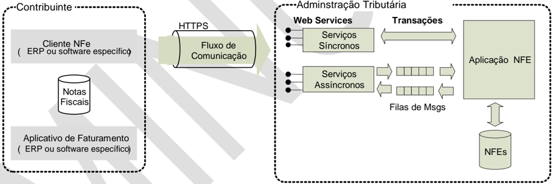
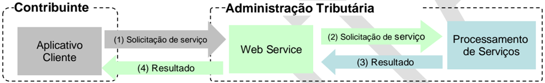
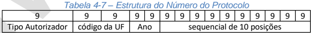
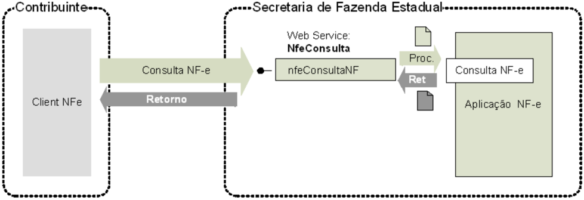
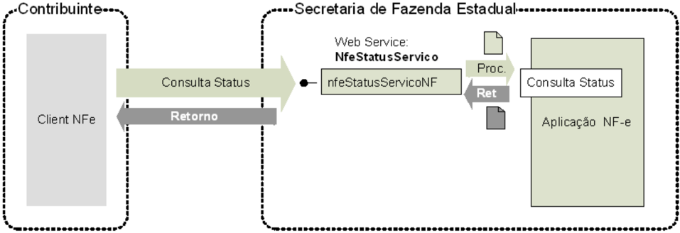
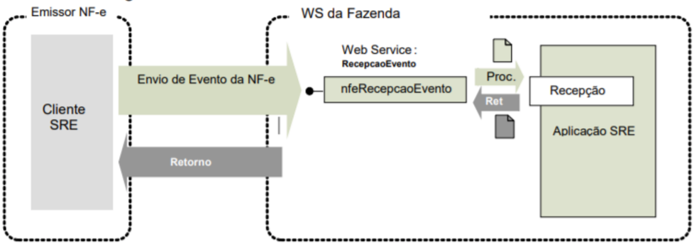
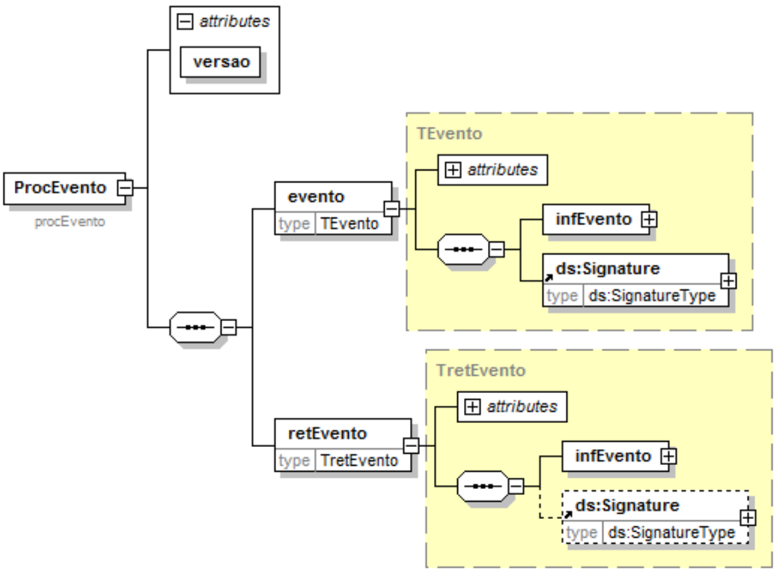

## Metadados
- [Metadados do corpus](metadata.json)
- [Fonte e procedência](../../../../sources/portal_nacional_nfe/nfeabi/manuais/moc-nfe-abi-vis-o-geral-v1-00-minuta/source.json)
- [Dados normalizados](../../../../normalized/nfeabi/manuais/moc-nfe-abi-vis-o-geral-v1-00-minuta/normalized.json)
- [Changelog](../../../../changelog/nfeabi/manuais/moc-nfe-abi-vis-o-geral-v1-00-minuta.md)
- [Proveniência resumida](../../../../sources/provenance/moc-nfe-abi-vis-o-geral-v1-00-minuta.json)

## Sistema Nota Fiscal Eletrônica

Manual de Orientação do Contribuinte Visão Geral - NF-e ABI

Versão 1.00 -Outubro de 2025


## Sumário

| Sumário                                                                                                                                                                                                                                                                                                                                                                                       | ...............................................................................................................................................2                                  |
|-----------------------------------------------------------------------------------------------------------------------------------------------------------------------------------------------------------------------------------------------------------------------------------------------------------------------------------------------------------------------------------------------|-----------------------------------------------------------------------------------------------------------------------------------------------------------------------------------|
| Índice de Ilustrações ............................................................................................................................4                                                                                                                                                                                                                                           |                                                                                                                                                                                   |
| Índice de Tabelas.................................................................................................................................5                                                                                                                                                                                                                                           |                                                                                                                                                                                   |
| Índice de Schemas XML......................................................................................................................6                                                                                                                                                                                                                                                  |                                                                                                                                                                                   |
| 1. Introdução........................................................................................................................................7                                                                                                                                                                                                                                        |                                                                                                                                                                                   |
| 2. Considerações Iniciais                                                                                                                                                                                                                                                                                                                                                                     | .....................................................................................................................7                                                            |
| 2.1. Objetivos do Projeto ...................................................................................................................7                                                                                                                                                                                                                                                |                                                                                                                                                                                   |
| 2.2. Conceitos....................................................................................................................................7                                                                                                                                                                                                                                           |                                                                                                                                                                                   |
| 2.2.1. NF-e ABI (Modelo 77).......................................................................................................................7                                                                                                                                                                                                                                           |                                                                                                                                                                                   |
| 2.2.2. DANFE-ABI......................................................................................................................................7                                                                                                                                                                                                                                       |                                                                                                                                                                                   |
| 2.2.3. Chave de Acesso .............................................................................................................................7                                                                                                                                                                                                                                         |                                                                                                                                                                                   |
| 2.2.3.1. Cálculo do Dígito Verificador da Chave de Acesso da NF-e ABI..............................................................................................8                                                                                                                                                                                                                          |                                                                                                                                                                                   |
| 2.2.4. Chave Natural                                                                                                                                                                                                                                                                                                                                                                          | ..................................................................................................................................8                                               |
| 2.2.5. Responsável Técnico .......................................................................................................................8                                                                                                                                                                                                                                           |                                                                                                                                                                                   |
| 2.3. Descrição Simplificada do Modelo Operacional da NF-e ABI......................................................9                                                                                                                                                                                                                                                                          |                                                                                                                                                                                   |
| 2.3.1. Autorização de Uso..........................................................................................................................9                                                                                                                                                                                                                                          |                                                                                                                                                                                   |
| 2.3.2. Modalidades de Emissão..................................................................................................................9                                                                                                                                                                                                                                              |                                                                                                                                                                                   |
| 2.3.2.1. Emissão Normal...........................................................................................................................................................................9 2.3.2.2. Contingência                                                                                                                                                                     | ................................................................................................................................................................................9 |
| Eventos..........................................................................................................................................10                                                                                                                                                                                                                                           |                                                                                                                                                                                   |
| 3.                                                                                                                                                                                                                                                                                                                                                                                            |                                                                                                                                                                                   |
| 3.1. Tipos de Evento............................................................................ Erro! Indicador não definido.                                                                                                                                                                                                                                                                |                                                                                                                                                                                   |
| 4.1. Modelo Conceitual....................................................................................................................11                                                                                                                                                                                                                                                  |                                                                                                                                                                                   |
| 4.2. Padrões Técnicos.....................................................................................................................11                                                                                                                                                                                                                                                  |                                                                                                                                                                                   |
| 4.2.1. Padrão de Documento XML............................................................................................................11                                                                                                                                                                                                                                                  |                                                                                                                                                                                   |
| 4.2.1.1. Padrão de Codificação ..............................................................................................................................................................11 4.2.1.2. Declaração namespace .............................................................................................................................................................12 |                                                                                                                                                                                   |
| 4.2.1.3. Validação de Schema................................................................................................................................................................12 4.2.1.4. Tratamento de Caracteres Especiais no Texto de XML ..........................................................................................................12                       |                                                                                                                                                                                   |
| 4.2.2. Padrão de Comunicação ................................................................................................................13                                                                                                                                                                                                                                               |                                                                                                                                                                                   |
| 4.2.3. Padrão de Certificado Digital                                                                                                                                                                                                                                                                                                                                                          | ..........................................................................................................13                                                                      |
| 4.2.4. Padrão de Assinatura Digital...........................................................................................................13 4.2.5. Validação de Assinatura Digital pela Administração                                                                                                                                                                                    | Tributária ........................................................15                                                                                                             |
| 4.2.6. Resumo dos Padrões Técnicos ......................................................................................................16                                                                                                                                                                                                                                                   |                                                                                                                                                                                   |
| 4.2.7. Colunas das Tabelas de Leiaute de Mensagens.............................................................................16                                                                                                                                                                                                                                                             |                                                                                                                                                                                   |
| 4.3. Modelo Operacional..................................................................................................................17                                                                                                                                                                                                                                                   |                                                                                                                                                                                   |
| 4.3.1. Serviços Síncronos.........................................................................................................................18                                                                                                                                                                                                                                          |                                                                                                                                                                                   |
| 4.3.2. Número do Protocolo......................................................................................................................18                                                                                                                                                                                                                                            |                                                                                                                                                                                   |
| 4.3.3. Ambientes de Homologação e de Produção ...................................................................................19                                                                                                                                                                                                                                                           |                                                                                                                                                                                   |
| 4.4. Padrão de Mensagens dos Web Service s ................................................................................19                                                                                                                                                                                                                                                                 |                                                                                                                                                                                   |
| 4.4.1. Validação da Estrutura XML das Mensagens dos Web Services .....................................................19                                                                                                                                                                                                                                                                      |                                                                                                                                                                                   |
| 4.4.2. Schemas XML das Mensagens dos Web Services ..........................................................................20                                                                                                                                                                                                                                                                |                                                                                                                                                                                   |
| 4.5. Versão dos Schemas................................................................................................................20                                                                                                                                                                                                                                                     |                                                                                                                                                                                   |
| 4.5.1. Controle de Versão.........................................................................................................................20                                                                                                                                                                                                                                          |                                                                                                                                                                                   |
| Web Service s.................................................................................................................................21                                                                                                                                                                                                                                              |                                                                                                                                                                                   |
| 5.1. Web Service - NfeAutorizacao .................................................................................................21                                                                                                                                                                                                                                                         |                                                                                                                                                                                   |
| 5.1.1. Leiaute Mensagem de Entrada.......................................................................................................21                                                                                                                                                                                                                                                   |                                                                                                                                                                                   |

## Nota Fiscal Eletrônica

| Schema XML: NFeABI_v1.00.xsd..........................................................................................................................................................21                                                                                                                                     |                                                                           |
|------------------------------------------------------------------------------------------------------------------------------------------------------------------------------------------------------------------------------------------------------------------------------------------------------------------------------|---------------------------------------------------------------------------|
| 5.1.2. Leiaute Mensagem de Retorno.......................................................................................................21                                                                                                                                                                                  |                                                                           |
| Schema XML: retEnviNFeABI_v1.00.xsd ..............................................................................................................................................21                                                                                                                                         |                                                                           |
| 5.1.2.1. Processamento Síncrono ............................................................................................................ Erro! Indicador não definido.                                                                                                                                                   |                                                                           |
| 5.1.3. Regras de Validação ......................................................................................................................21                                                                                                                                                                          |                                                                           |
| 5.1.4. Final do Processamento do Lote.....................................................................................................22                                                                                                                                                                                 |                                                                           |
| 5.2. Web Service - NfeConsultaProtocolo.......................................................................................22                                                                                                                                                                                             |                                                                           |
| 5.2.1. Leiaute Mensagem de Entrada.......................................................................................................22                                                                                                                                                                                  |                                                                           |
| Schema XML: consSitNFe_1.00.xsd......................................................................................................................................................23                                                                                                                                      |                                                                           |
| 5.2.2. Leiaute Mensagem de Retorno.......................................................................................................23                                                                                                                                                                                  |                                                                           |
| Schema XML: retConsSitNFe_v1.00.xsd...............................................................................................................................................23                                                                                                                                         |                                                                           |
| 5.2.3. Descrição do Processo de Web Service .........................................................................................23                                                                                                                                                                                      |                                                                           |
| 5.2.4. Regras de Validação ......................................................................................................................23                                                                                                                                                                          |                                                                           |
| 5.2.5. Final do Processamento.................................................................................................................25                                                                                                                                                                             |                                                                           |
| 5.3. Web Service - NfeStatusServico..............................................................................................25                                                                                                                                                                                          |                                                                           |
| 5.3.1. Leiaute Mensagem de Entrada.......................................................................................................25                                                                                                                                                                                  |                                                                           |
| Schema XML: consStatServ_v1.00.xsd.................................................................................................................................................25                                                                                                                                        |                                                                           |
| 5.3.2. Leiaute Mensagem de Retorno.......................................................................................................25                                                                                                                                                                                  |                                                                           |
| Schema XML: retConsStatServ_1.00.xsd..............................................................................................................................................25 5.3.3. Descrição do Processo de Web Service .........................................................................................26 |                                                                           |
| 5.3.4. Regras de Validação ......................................................................................................................26                                                                                                                                                                          |                                                                           |
| 5.3.5. Final do Processamento.................................................................................................................27 5.4. Web Service - NFeRecepcaoEvento - Parte                                                                                                                                | Geral..................................................................27 |
| 5.4.1. Leiaute Mensagem de Entrada (Parte Geral)..................................................................................27                                                                                                                                                                                         |                                                                           |
| 5.4.2. Leiaute Mensagem de Retorno (Parte Geral)..................................................................................28                                                                                                                                                                                         |                                                                           |
| Schema XML: envEvento_v1.00.xsd .....................................................................................................................................................27                                                                                                                                      |                                                                           |
| Schema XML: retEnvEvento_v1.00.xsd.................................................................................................................................................28                                                                                                                                        |                                                                           |
| 5.4.3. Descrição do Processo de Web Service .........................................................................................29                                                                                                                                                                                      | ................................................................29        |
| 5.4.4. Regras de Validação Genéricas Para Todos os Eventos 5.4.5. Final do Processamento do Lote.....................................................................................................30                                                                                                                      |                                                                           |
| 5.4.6. Armazenamento e Disponibilização do Evento................................................................................30                                                                                                                                                                                          |                                                                           |
| Schema XML: procEventoNFe_v1.00.xsd .............................................................................................................................................30                                                                                                                                          |                                                                           |
| Schema XML: envEventoCancNFe_v1.00.xsd (tpEvento=110111)                                                                                                                                                                                                                                                                     |                                                                           |
| 5.5.1. Leiaute Mensagem de Entrada.......................................................................................................31                                                                                                                                                                                  |                                                                           |
| .....................................................................................................31                                                                                                                                                                                                                      |                                                                           |
| Schema XML: retEnvEventoCancNFe_v1.00.xsd (tpEvento=110111)                                                                                                                                                                                                                                                                  |                                                                           |
| ................................................................................................32                                                                                                                                                                                                                           |                                                                           |
| 5.5.3. Regras de Validação ......................................................................................................................32                                                                                                                                                                          |                                                                           |
| 5.5.4. Final do Processamento do Lote.....................................................................................................33                                                                                                                                                                                 |                                                                           |
| 6.1. Consulta Completa da NF-e ABI...............................................................................................34                                                                                                                                                                                          |                                                                           |
| ABI..............................................................................................34                                                                                                                                                                                                                          |                                                                           |
| 6.2. Consulta Resumida da NF-e                                                                                                                                                                                                                                                                                               |                                                                           |

## Índice de Ilustrações

| Figura 4-1 - Arquitetura de Comunicação: Visão Conceitual .............................................................11      |
|--------------------------------------------------------------------------------------------------------------------------------|
| Figura 4-2 - Serviço de Implementação Síncrona..............................................................................18 |
| Figura 4-5 - Padrão de Mensagem de Chamada/Retorno de Web Service .......................................19                    |
| Figura 5-4 - Fluxo do Web Service nfeConsultaProtocolo .................................................................22     |
| Figura 5-5 - Fluxo do Web Service nfeStatusServico ........................................................................25  |
| Figura 5-9 - Fluxo do Web Service NFeRecepcaoEvento .................................................................27        |
| Figura 5-10 - Diagrama Simplificado do procEventoNFe...................................................................31      |

## Índice de Tabelas

| Tabela 2-1 - Chave de Acesso da Versão 4.00 da NF-e .....................................................................8                                                                                       |                       |
|------------------------------------------------------------------------------------------------------------------------------------------------------------------------------------------------------------------|-----------------------|
| Tabela 4-1 - Caracteres Especiais no Texto de XML ........................................................................12                                                                                     |                       |
| Tabela 4-2 - Padrões de Assinatura Digital .......................................................................................15                                                                             |                       |
| Tabela 4-3 - Resumo dos Padrões Técnicos.....................................................................................16                                                                                  |                       |
| Tabela 4-4 - Colunas das Tabelas de Leiaute de Mensagens...........................................................16                                                                                            |                       |
| Tabela 4-5 - Notação e Exemplos de Tamanhos de Elementos em Tabelas de Leiaute XML...........17                                                                                                                  |                       |
| Tabela 4-6 - Forma de Implementação dos Serviços Web................................................................17                                                                                           |                       |
| Tabela 4-8 - Estrutura do Número do Protocolo ................................................................................18                                                                                 |                       |
| Tabela 5-1 - Leiaute Mensagem de Entrada do Web Service nfeAutorizacao ...................................21                                                                                                     |                       |
| Tabela 5-2 - Leiaute Mensagem de Retorno do Web Service nfeAutorizacao...................................21                                                                                                      |                       |
| Tabela 5-3 - Regras de Validação do Web Service nfeAutorizacao...................................................21                                                                                              |                       |
| Tabela 5-13 - Leiaute Mensagem de Entrada do Web Service nfeConsultaProtocolo.......................23                                                                                                           |                       |
| Tabela 5-14 - Leiaute Mensagem de Retorno do Web Service nfeConsultaProtocolo.......................23                                                                                                           |                       |
| Tabela 5-15 - Regras de Genéricas Validação do Web Service nfeConsultaProtocolo .....................24                                                                                                          |                       |
| Tabela 5-16 - Regras de Validação Específicas do Web Service nfeConsultaProtocolo                                                                                                                                | ...................24 |
| Tabela 5-17 - Leiaute Mensagem de Entrada do Web Service nfeStatusServico..............................25                                                                                                        |                       |
| Tabela 5-18 - Leiaute Mensagem de Retorno do Web Service nfeStatusServico..............................26                                                                                                        |                       |
| Tabela 5-19 - Regras de Validação Genéricas do Web Service nfeStatusServico ............................26                                                                                                       |                       |
| Tabela 5-20 - Regras de Validação Específicas do Web Service nfeStatusServico ..........................26                                                                                                       |                       |
| Tabela 5-32 - Leiaute Mensagem de Entrada de Evento, Parte Geral...............................................27                                                                                                |                       |
| Tabela 5-33 - Leiaute Mensagem de Retorno de Evento, Parte Geral ..............................................28                                                                                                |                       |
| Tabela 5-34 - Regras de Validação Genéricas do Web Service NFeRecepcaoEvento......................29                                                                                                             |                       |
| Tabela 5-35 - Regras de Validação da Parte Geral do Web Service NFeRecepcaoEvento...............29                                                                                                               |                       |
| Tabela 5-36 - Leiaute da Informação do Registro de Evento.............................................................30                                                                                         |                       |
| Tabela 5-37 - Leiaute Mensagem de Entrada do Web Service NFeRecepcaoEvento - Cancelamento                                                                                                                        |                       |
| ...............................................................................................................................31 Tabela 5-38 - Regras de Validação Específicas dos Eventos Cancelamento da NF-e | ABI ...............32 |

## Índice de Schemas XML

| Schema XML: NFeABI_v1.00.xsd......................................................................................................21   |
|----------------------------------------------------------------------------------------------------------------------------------------|
| Schema XML: retEnviNFeABI_v1.00.xsd...........................................................................................21       |
| Schema XML: consSitNFe_1.00.xsd..................................................................................................23    |
| Schema XML: retConsSitNFe_v1.00.xsd ...........................................................................................23      |
| Schema XML: consStatServ_v1.00.xsd .............................................................................................25     |
| Schema XML: retConsStatServ_1.00.xsd ..........................................................................................25      |
| Schema XML: envEvento_v1.00.xsd..................................................................................................27    |
| Schema XML: retEnvEvento_v1.00.xsd .............................................................................................28     |
| Schema XML: procEventoNFe_v1.00.xsd..........................................................................................30        |
| Schema XML: envEventoCancNFe_v1.00.xsd (tpEvento=110111)....................................................31                         |
| Schema XML: retEnvEventoCancNFe_v1.00.xsd (tpEvento=110111) ...............................................32                          |

## 1. Introdução

Este documento tem por objetivo a definição das especificações e critérios técnicos necessários para a  integração  entre  os  sistemas  da  Administração  Tributária  e  os  sistemas  de  informações  dos contribuintes emissores de NF-e de Alienação de Bens Imóveis

O Manual de Orientação do Contribuinte é composto pelos seguintes documentos:

- [MOC - Visão Geral](../../../nfe/manuais/manual-de-orienta-o-ao-contribuinte-moc-vers-o-7-0-nf-e-e-nfc-e/document.md) NF-e ABI
- MOC - Anexo I - Leiaute e Regras de Validação da NF-e ABI
- MOC - Anexo II - Manual de Especificações Técnicas do DANFE-ABI e Código de Barras

## 2. Considerações Iniciais

NF-e de Alienação de Bens Imóveis (NF-e ABI) é o documento emitido e armazenado eletronicamente, de existência apenas digital, cuja validade jurídica é garantida pela assinatura digital do emitente e autorização de uso pelo ambiente nacional da NF-e ABI

## 2.1. Objetivos do Projeto

O Projeto NF-e ABI tem como objetivo a implantação de um modelo nacional de documento fiscal eletrônico, identificado pelo modelo 77, visando atender a Lei Complementar 214/2025, com validade jurídica garantida pela assinatura digital do emitente.

## 2.2. Conceitos

## 2.2.1. NF-e ABI (Modelo 77)

A  NF-e  de  ABI  é  um  documento  de  existência  exclusivamente  digital,  emitido  e  armazenado eletronicamente, com o intuito de documentar uma operação sujeita ao IBS/CBS.

## 2.2.2. DANFE-ABI

O DANFE-ABI (Documento Auxiliar da Nota Fiscal Eletrônica) é um documento fiscal auxiliar, que pode ser  impresso  em  papel;  sua  especificação  e  modelos  de  leiaute  encontram-se  disponíveis  no documento [MOC - Anexo II - Manual de Especificações Técnicas do DANFE e Código de Barras](../../../nfe/manuais/anexo-ii-manual-especifica-est-cnicas-danfe-c-digo-barras/document.md) .

O DANFE-ABI não é nota fiscal, nem a substitui, servindo apenas como instrumento auxiliar para consulta da NF-e ABI, pois contém a chave de acesso da NF-e ABI, que permite ao detentor desse documento  confirmar  a  efetiva  existência  de  uma  NF-e  que  tenha  tido  seu  uso  regularmente autorizado.

## 2.2.3. Chave de Acesso

A Chave de Acesso de identificação da NF-e ABI é um conjunto de 44 caracteres numéricos, formado pela concatenação de campos que se encontram no leiaute da NF-e, seguindo a estrutura que pode ser vista na Tabela 2-1.

Tabela 2-1 - Chave de Acesso da Versão 4.00 da NF-e

|   Posição | Informação                                     |   Caracteres | Campo        | Id               |
|-----------|------------------------------------------------|--------------|--------------|------------------|
|         1 | Código da UF do emitente do Documento Fiscal   |           02 | cUF          | B02              |
|         2 | Ano e Mês de emissão da NF-e                   |           04 | AAMM         | Extraídos de B07 |
|         3 | CNPJ/CPF do emitente                           |           14 | CNPJ/CPF     | C02/C03          |
|         4 | Modelo do Documento Fiscal                     |           02 | mod          | B04              |
|         5 | Série do Documento Fiscal                      |           03 | serie        | B05              |
|         6 | Número do Documento Fiscal                     |           09 | nNF          | B06              |
|         7 | Forma de emissão da NF-e                       |           01 | tpEmis       | B12              |
|         8 | Tipo do emitente da DCe                        |           01 | tpEmit       | C18              |
|         9 | Site do Autorizador que recepcionou a NF-e ABI |           01 | nSiteAutoriz | B13              |
|         8 | Código Numérico que compõe a Chave de Acesso   |           06 | cNF          | B03              |
|         9 | Dígito Verificador da Chave de Acesso          |           01 | cDV          | B23              |

|               |   Código da UF |   AAMM da emissão |   CNPJ do Emitente |   Modelo (mod) |   Série (serie) |   Número da NF-e ABI |   Forma de emissão |   Tipo do emitente da DCe |   Site Autoriz. |   Código Numérico |   DV |
|---------------|----------------|-------------------|--------------------|----------------|-----------------|----------------------|--------------------|---------------------------|-----------------|-------------------|------|
| Quantidade de |             02 |                04 |                 14 |             02 |              03 |                   09 |                 01 |                        01 |              01 |                06 |   01 |

O Dígito Verificador (DV) irá garantir a integridade da chave de acesso, protegendo-a principalmente contra digitações erradas.

O Cálculo do Dígito Verificador da Chave de Acesso da NF-e ABI deverá respeita o mesmo cálculo feito para os demais documentos fiscais eletrônicos, Vide DFe NTCJ 2025.001\_CNPJ Alfa\_v1.00

## 2.2.4. Chave Natural

A identificação única de uma nota fiscal para efeitos tributários é feita pelos seguintes conjuntos de informações, que são um subconjunto das informações existentes na chave de acesso:

- NF-e ABI : UF, CNPJ ou CPF do Emitente, Série e Número da NF-e, modelo do documento fiscal eletrônico, ambiente de autorização, Tipo do emitente da DCe e Site.

Estes subconjuntos recebem a denominação de 'chave natural'.

O Sistema de Autorização de Uso valida a existência de uma NF-e ABI previamente autorizada e rejeita novos pedidos de autorização para NF-e ABI caso seja identificada duplicidade de Chave Natural.

## 2.2.5. Responsável Técnico

Responsável  Técnico  é  a  empresa  desenvolvedora  ou  a  empresa  responsável  tecnicamente  pelo sistema  (software)  de  emissão  utilizado  pelo  emitente.  Essa  informação  será  utilizada  pelas Administrações Tributárias.

Em caso de sistema emissão de NF-e ABI de desenvolvimento próprio o responsável técnico é o próprio emitente.

## 2.3. Descrição Simplificada do Modelo Operacional da NF-e ABI

## 2.3.1. Autorização de Uso

O emissor da NF-e ABI gera um arquivo eletrônico contendo as informações da operação, o qual deverá ser assinado digitalmente, transformando este arquivo em um documento eletrônico nos termos da legislação brasileira, de maneira a garantir a integridade dos dados e a autoria do emissor.

Este arquivo eletrônico será transmitido pela Internet para a Administração Tributária, após verificar a integridade formal, devolverá um protocolo de recebimento denominado 'Autorização de Uso'.

Após a Autorização de Uso, que transforma o documento eletrônico no Documento Fiscal denominado NF-e ABI, a Administração Tributária disponibilizará consulta, através da Internet, para o adquirente e outros legítimos interessados, que conheçam a chave de acesso do documento eletrônico.

## 2.3.2. Modalidades de Emissão

Em um cenário de falha que impossibilite a emissão da NF-e ABI na modalidade normal, o emissor poderá escolher a modalidade de emissão de contingência, ou aguardar a regularização da situação para voltar a emitir a NF-e ABI na modalidade normal.

## 2.3.2.1. Emissão Normal

O processo de emissão normal é a situação desejada e mais  adequada para o emissor, pois é a situação em que todos os recursos necessários para a emissão da NF-e ABI estão operacionais e a autorização de uso da NF-e ABI é concedida normalmente.

Nesta  situação  a  emissão  das  NF-e  ABI  é  realizada  normalmente,  sendo  que  os  respectivos documentos auxiliares somente podem ser gerados após o emitente ter recebido a autorização de uso.

## 2.3.2.2. Contingência

A obtenção da autorização de uso da NF-e ABI é um processo que envolve diversos recursos de infraestrutura,  hardware  e  software.  O  mau  funcionamento  ou  a  indisponibilidade  de  qualquer  um destes recursos pode prejudicar o processo de autorização da NF-e ABI, com reflexos nos negócios do emissor da NF-e ABI, que fica impossibilitado de obter a prévia autorização de uso da NF-e exigida na legislação para a emissão do DANFE-ABI para acompanhar a circulação da mercadoria.

A alta disponibilidade é uma das premissas básicas do sistema da NF-e ABI. Contudo, existem diversos outros componentes do sistema que podem apresentar falhas e comprometer a disponibilidade dos serviços, exigindo alternativas de emissão da NF-e ABI em contingência.

## 3. Eventos

Um evento é o registro de uma ocorrência relacionada com um documento fiscal eletrônico.

O evento pode modificar a situação do documento (por exemplo cancelamento).

O Sistema de Registro de Eventos da NF-e (SRE) é o modelo genérico que permite o registro da ocorrência por ator que pratica ou recepciona qualquer ocorrência que tenha vinculação ou interesse para a NF-e ABI.

Existe um único Web Service com a funcionalidade de tratar eventos de forma genérica, para facilitar a criação de novos eventos sem a necessidade de criação de novos serviços, e com poucas alterações na aplicação de Registro de Eventos do Ambiente Autorizador.

O modelo de mensagem de registro de evento possui o seguinte conjunto mínimo de informações comuns:

- Identificação do autor do registro;
- Identificação do evento;
- Identificação da NF-e ABI vinculada;
- Informações específicas do evento;
- Assinatura digital da mensagem.

O leiaute da mensagem de Registro de Evento contém uma parte genérica (comum a todos os tipos de evento) e uma parte específica onde será inserido o XML correspondente a cada tipo de evento em uma tag do tipo any .

O Pacote de Liberação de schemas da NF-e ABI contém o leiaute da parte genérica do Registro de Eventos e um schema para cada leiaute específico dos eventos definidos neste manual.

## 4. Arquitetura de Comunicação com Emitente

## 4.1. Modelo Conceitual

As Administrações Tributárias disponibilizam os seguintes serviços:

- Recepção de NF-e ABI;
- Consulta da situação atual da NF-e ABI;
- Consulta do status do serviço;
- Registro de eventos.

Para cada serviço oferecido existe um Web Service específico.  O  fluxo de  comunicação é sempre iniciado  pelo  aplicativo  do  emitente  através  do  envio  de  uma  mensagem  ao Web  Service com  a solicitação do serviço desejado.

O Web Service devolve uma mensagem de resposta confirmando o recebimento da solicitação de serviço ao aplicativo do emitente na mesma conexão.

A Figura 4-1 ilustra o fluxo conceitual de comunicação entre o aplicativo do emitente e a Administração Tributária.

Figura 4-1 - Arquitetura de Comunicação: Visão Conceitual



## 4.2. Padrões Técnicos

## 4.2.1. Padrão de Documento XML

## 4.2.1.1. Padrão de Codificação

A especificação do documento XML adotada é a recomendação W3C para XML 1.0, disponível em www.w3.org/TR/REC-xml e a codificação dos caracteres é UTF-8; assim, todos os documentos XML devem iniciar com a seguinte declaração:

<!-- formula-not-decoded -->

Cada arquivo XML somente poderá ter uma única declaração &lt;?xml version="1.0" encoding="UTF-8"?&gt; . Nas situações em que um documento XML pode conter outros documentos XML, como ocorre com o documento XML de lote de envio de NF-e ABI, deve-se tomar cuidado para que exista uma única declaração no início do lote.

## 4.2.1.2. Declaração namespace

O documento XML deverá ter uma única declaração de namespace no elemento raiz do documento com o seguinte padrão:

<!-- formula-not-decoded -->

É vedado o uso de declaração namespace diferente do padrão estabelecido.

Para reduzir o tamanho final do arquivo XML da NF-e ABI alguns cuidados de programação deverão ser assumidos:

- não incluir "zeros não significativos" para campos numéricos;
- não incluir "espaços" no início ou no final de campos numéricos e alfanuméricos;
- não incluir comentários no arquivo XML;
- não incluir anotação e documentação no arquivo XML (TAG annotation e TAG documentation);
- não incluir caracteres de formatação no arquivo XML ("line-feed", "carriage return", "tab", caractere de "espaço" entre as TAGs);
- não incluir prefixo no namespace das tags de NFe.

## 4.2.1.3. Validação de Schema

Para garantir minimamente a integridade das informações prestadas e a correta formação dos arquivos XML, o emitente deverá, antes de seu envio, submeter o arquivo da NF-e ABI e as demais mensagens XML  para  validação  pelo  Schema  do  XML  (XSD  -  XML  Schema  Definition),  disponibilizado  pela Administração Tributária.

## 4.2.1.4. Tratamento de Caracteres Especiais no Texto de XML

Todos os textos de um documento XML passam por uma análise do 'parser' específico da linguagem. Alguns caracteres afetam o funcionamento deste 'parser', não podendo aparecer no texto de uma forma não controlada.

Os caracteres que afetam o 'parser' podem ser encontrados na Tabela 4-1.

Alguns destes caracteres podem aparecer especialmente no campo de Razão Social, Endereço e Informação Adicional. Para resolver esses casos, é recomendável o uso de uma sequência de 'escape' em substituição ao caractere que causa o problema.

- Ex. a denominação: DIAS &amp; DIAS LTDA deve ser informada como: DIAS &amp;amp; DIAS LTDA no XML para não afetar o funcionamento do "parser".

Nota: A sequência de escape conta como um único caractere para a validação do tamanho do campo pelo Schema.

Tabela 4-1 - Caracteres Especiais no Texto de XML

| Caractere   | Descrição          | Sequência de Escape   |
|-------------|--------------------|-----------------------|
| <           | sinal de maior     | &lt;                  |
| >           | sinal de menor     | &gt;                  |
| &           | e-comercial        | &amp;                 |
| "           | aspas              | &quot;                |
| '           | sinal de apóstrofe | &#39;                 |

## 4.2.2. Padrão de Comunicação

A comunicação será baseada em Web Services disponibilizados pelo Sistema de Recepção de Nota Fiscal eletrônica.

O meio físico de comunicação utilizado será a Internet, com o uso do protocolo TLS 1.2 ou superior, com autenticação mútua, que além de garantir um duto de comunicação seguro na Internet, permite a identificação do servidor e do cliente através de certificados digitais, eliminando a necessidade de identificação do usuário através de nome ou código de usuário e senha.

O modelo de comunicação segue o padrão de Web Services definido pelo WS-I Basic Profile.

A troca de mensagens entre os Web Services do ambiente do Sistema de Recepção da NF-e e o aplicativo da empresa será realizada no padrão SOAP versão 1.2, com troca de mensagens XML no padrão Style/Encoding: Document/Literal.

A chamada de diferentes Web Services é realizada com o envio de uma mensagem XML através do parâmetro nfeDadosMsg .

## 4.2.3. Padrão de Certificado Digital

O  certificado  digital  utilizado  no  Sistema  NF-e  ABI  será  emitido  por  Autoridade  Certificadora credenciada pela Infraestrutura de Chaves Públicas Brasileira - ICP-Brasil, tipo A1 ou A3, devendo conter o CNPJ da pessoa jurídica titular do certificado digital no campo OtherName OID =2.16.76.1.3.3 ou o CPF da pessoa física titular do certificado digital no campo OtherName OID=2.16.76.1.3.1.

Os certificados digitais serão exigidos em 2 (dois) momentos distintos:

- Assinatura  de  Mensagens :  O  certificado  digital  utilizado  para  essa  função  deverá  conter  o CNPJ/CPF de um emitente da NF-e ABI.
- o Por mensagens, entenda-se: o Pedido de Autorização de Uso (Arquivo NF-e ABI), o Pedido de Cancelamento de NF-e ABI, o Registro de Evento e demais arquivos XML que necessitem de assinatura.
- o O certificado digital deverá ter o 'uso da chave' previsto para a função de assinatura digital, respeitando a Política do Certificado.
- Transmissão (durante  a  transmissão  das  mensagens  entre  o  servidor  do emitente e a Administração Tributária): O certificado digital utilizado para identificação do aplicativo do emitente deverá  conter  o  CNPJ  do  responsável  pela  transmissão  das  mensagens,  que  não  será necessariamente  o  CNPJ/CPF  da  empresa  emissora  da  NF-e  ABI,  devendo  ter  a  extensão Extended Key Usage com permissão de "Autenticação Cliente".

## 4.2.4. Padrão de Assinatura Digital

As mensagens enviadas ao Portal da Administração Tributária são documentos eletrônicos elaborados no padrão XML e devem ser assinados digitalmente com um certificado digital que contenha o CNPJ de um dos estabelecimentos da empresa emissora da NF-e objeto do pedido.

Alguns elementos estão presentes dentro do Certificado do emitente tornando desnecessária a sua representação individualizada no arquivo XML. Portanto, o arquivo XML não deve conter os elementos:

&lt;X509SubjectName&gt;

&lt;X509IssuerSerial&gt;

&lt;X509IssuerName&gt;

- &lt;X509SerialNumber&gt;
- &lt;X509SKI&gt;

Deve-se evitar o uso das TAG abaixo, pois as informações serão obtidas a partir do Certificado do emitente:

- &lt;KeyValue&gt;
- &lt;RSAKeyValue&gt;
- &lt;Modulus&gt;
- &lt;Exponent&gt;

A NF-e ABI utiliza um subconjunto do padrão de assinatura XML definido pelo http://www.w3.org/TR/xmldsig-core/, com o seguinte leiaute:

Schema XML: xmldsig-core-schema\_v1.01.xsd

| #    | Campo                   | Ele   | Pai   | Tipo   | Ocor.   | Tam.   | Descrição/Observação                                                                                                                             |
|------|-------------------------|-------|-------|--------|---------|--------|--------------------------------------------------------------------------------------------------------------------------------------------------|
| XS01 | Signature               | Raiz  | -     | -      | -       | -      |                                                                                                                                                  |
| XS02 | SignedInfo              | G     | XS01  | -      | 1-1     |        | Grupo da Informação da assinatura                                                                                                                |
| XS03 | Canonicalization Method | G     | XS02  | -      | 1-1     |        | Grupo do Método de Canonicalização                                                                                                               |
| XS04 | Algorithm               | A     | XS03  | C      | 1-1     |        | Atributo Algorithm de CanonicalizationMethod: http://www.w3.org/TR/2001/REC-xml-c14n-20010315                                                    |
| XS05 | SignatureMethod         | G     | XS02  | -      | 1-1     |        | Grupo do Método de Assinatura                                                                                                                    |
| XS06 | Algorithm               | A     | XS05  | C      | 1-1     |        | Atributo Algorithm de SignatureMethod: http://www.w3.org/2000/09/xmldsig#rsa-sha1                                                                |
| XS07 | Reference               | G     | XS02  | -      | 1-1     |        | Grupo Reference                                                                                                                                  |
| XS08 | URI                     | A     | XS07  | C      | 1-1     |        | Atributo URI da tag Reference                                                                                                                    |
| XS10 | Transforms              | G     | XS07  | -      | 1-1     |        | Grupo do algorithm de Transform                                                                                                                  |
| XS11 | unique_Transf_Alg       | RC    | XS10  | -      | 1-1     |        | Regra para o atributo Algorithm do Transform ser único.                                                                                          |
| XS12 | Transform               | G     | XS10  | -      | 2-2     |        | Grupo de Transform                                                                                                                               |
| XS13 | Algorithm               | A     | XS12  | C      | 1-1     |        | Atributos válidos Algorithm do Transform: http://www.w3.org/TR/2001/REC-xml-c14n-20010315 http://www.w3.org/2000/09/xmldsig#enveloped- signature |
| XS14 | XPath                   | E     | XS12  | C      | 0-N     |        | XPath                                                                                                                                            |
| XS15 | DigestMethod            | G     | XS07  | -      | 1-1     |        | Grupo do Método de DigestMethod                                                                                                                  |
| XS16 | Algorithm               | A     | XS15  | C      | 1-1     |        | Atributo Algorithm de DigestMethod: http://www.w3.org/2000/09/xmldsig#sha1                                                                       |
| XS17 | DigestValue             | E     | XS07  | C      | 1       |        | Digest Value (Hash SHA-1 - Base64)                                                                                                               |
| XS18 | SignatureValue          | G     | XS01  | -      | 1-1     |        | Grupo do Signature Value                                                                                                                         |
| XS19 | KeyInfo                 | G     | XS01  | -      | 1-1     |        | Grupo do KeyInfo                                                                                                                                 |
| XS20 | X509Data                | G     | XS19  | -      | 1-1     |        | Grupo X509                                                                                                                                       |
| XS21 | X509Certificate         | E     | XS20  | C      | 1-1     |        | Certificado Digital X509 emBase64                                                                                                                |

A assinatura do emitente na NF-e ABI será feita na TAG &lt;infNFe&gt; identificada pelo atributo Id , cujo conteúdo deverá ser um identificador único (chave de acesso) precedido do literal 'NFe' para cada NFe conforme leiaute descrito no documento MOC NFe ABI Anexo I Leiaute e RV . O identificador único precedido do literal '#NFeABI' deverá ser informado no atributo URI da TAG &lt;Reference&gt;. Para as demais mensagens a serem assinadas, o processo é o mesmo mantendo sempre um identificador único para o atributo Id na TAG a ser assinada. Segue abaixo um exemplo:

```
<NFeABI xmlns="http://www.portalfiscal.inf.br/nfeabi" > <infNFe Id="NFeABI31060243816719000108550000000010001234567897" versao="1.01"> ... </infNFe> <Signature xmlns="http://www.w3.org/2000/09/xmldsig#"> <SignedInfo> <CanonicalizationMethod Algorithm="http://www.w3.org/TR/2001/REC-xml-c14n-20010315"/> <SignatureMethod Algorithm="http://www.w3.org/2000/09/xmldsig#rsa-sha1" /> <Reference URI="#NFeABI31060243816719000108550000000010001234567897"> <Transforms>
```

```
<Transform Algorithm="http://www.w3.org/2000/09/xmldsig#enveloped-signature"/> <Transform Algorithm="http://www.w3.org/TR/2001/REC-xml-c14n-20010315"/> </Transforms> <DigestMethod Algorithm="http://www.w3.org/2000/09/xmldsig#sha1"/> <DigestValue>vFL68WETQ+mvj1aJAMDx+oVi928=</DigestValue> </Reference> </SignedInfo> <SignatureValue>IhXNhbdL1F9UGb2ydVc5v/gTB/y6r0KIFaf5evUi1i ...</SignatureValue> <KeyInfo> <X509Data> <X509Certificate>MIIFazCCBFOgAwIBAgIQaHEfNaxSeOEvZGlVDANB ... </X509Certificate> </X509Data> </KeyInfo> </Signature> </NFe>
```

Para o processo de assinatura o emitente não deve fornecer a Lista de Certificados Revogados, já que a mesma será montada e validada no momento da conferência da assinatura digital.

A assinatura digital do documento eletrônico deverá atender aos seguintes padrões adotados descritos na Tabela 4-2.

Tabela 4-2 - Padrões de Assinatura Digital

| Parâmetro                        | Padrão                                                                                                                                                                                     |
|----------------------------------|--------------------------------------------------------------------------------------------------------------------------------------------------------------------------------------------|
| Padrão de assinatura             | 'XML Digital Signature', utilizando o formato 'Enveloped' ( http://www.w3.org/TR/xmldsig- core/)                                                                                           |
| Certificado digital              | Emitido por AC credenciada no ICP-Brasil (http://www.w3.org/2000/09/xmldsig#X509Data)                                                                                                      |
| Cadeia de Certificação           | EndCertOnly (Incluir na assinatura apenas o certificado do usuário final)                                                                                                                  |
| Tipo do certificado              | A1 ou A3                                                                                                                                                                                   |
| Tamanho da Chave Criptográfica   | Compatível com os certificados A1 e A3 (1024 bits)                                                                                                                                         |
| Função criptográfica assimétrica | RSA (http://www.w3.org/2000/09/xmldsig#rsa-sha1)                                                                                                                                           |
| Função de 'message digest'       | SHA-1 (http://www.w3.org/2000/09/xmldsig#sha1)                                                                                                                                             |
| Codificação                      | Base64 (http://www.w3.org/2000/09/xmldsig#base64)                                                                                                                                          |
| Transformações exigidas          | Útil para realizar a canonicalização do XML enviado para realizar a validação correta da Assinatura Digital. São elas: • Enveloped (http://www.w3.org/2000/09/xmldsig#enveloped-signature) |

## 4.2.5. Validação de Assinatura Digital pela Administração Tributária

O Procedimento para a validação da assinatura digital é:

- a) Extrair a chave pública do certificado;
- b) Verificar o prazo de validade do certificado utilizado;
- c) Montar  e  validar  a  cadeia  de  confiança  dos  certificados  validando  também  a  LCR  (Lista  de Certificados Revogados) de cada certificado da cadeia;
- d) Validar o uso da chave utilizada (Assinatura Digital) de tal forma a aceitar certificados somente do tipo A (não serão aceitos certificados do tipo S);
- e) Garantir que o certificado utilizado é de um usuário final e não de uma Autoridade Certificadora;
- f) Adotar as regras definidas pelo RFC 3280 para as LCR e cadeia de confiança;
- g) Validar a integridade de todas as LCR utilizadas pelo sistema;
- h) Prazo de validade de cada LCR utilizada (verificar data inicial e final).

A forma de conferência da LCR pode ser feita de 2 (duas) maneiras: Online ou Download periódico. As  assinaturas  digitais  das  mensagens  serão  verificadas  considerando  a  lista  de  certificados revogados disponível no momento da conferência da assinatura.

## 4.2.6. Resumo dos Padrões Técnicos

A Tabela 4-3 resume os principais padrões de tecnologia utilizados:

Tabela 4-3 - Resumo dos Padrões Técnicos

| Parâmetro                       | Padrão                                                                                                                                                                                                                                                                                                                                            |
|---------------------------------|---------------------------------------------------------------------------------------------------------------------------------------------------------------------------------------------------------------------------------------------------------------------------------------------------------------------------------------------------|
| Web Services                    | Padrão definido pelo WS-I Basic Profile 1.1 (http://www.ws-i.org/Profiles/BasicProfile-1.1- 2004-08-24.html).                                                                                                                                                                                                                                     |
| Meio lógico de comunicação      | Web Services, disponibilizados pela Administração Tributária.                                                                                                                                                                                                                                                                                     |
| Meio físico de comunicação      | Internet                                                                                                                                                                                                                                                                                                                                          |
| Protocolo Internet              | TLS versão 1.2, com autenticação mútua através de certificados digitais.                                                                                                                                                                                                                                                                          |
| Padrão de troca de mensagens    | SOAP versão 1.2.                                                                                                                                                                                                                                                                                                                                  |
| Padrão da mensagem              | XML no padrão Style/Encoding: Document/Literal.                                                                                                                                                                                                                                                                                                   |
| Padrão de certificado digital   | X.509 versão 3, emitido por Autoridade Certificadora credenciada pela Infraestrutura de Chaves Públicas Brasileira - ICP-Brasil, do tipo A1 ou A3, devendo conter o CNPJ do proprietário do certificado digital. Para transmissão, utilizar o certificado digital do responsável pela transmissão.                                                |
| Padrão de assinatura digital    | XML Digital Signature, Enveloped, com certificado digital X.509 versão 3, com chave privada de tamanho variável, conforme o padrão da ICP-Brasil (1024, 2048, ou mais bits)., com padrões de criptografia assimétrica RSA, algoritmo message digest SHA-1 e utilização das transformações Enveloped e C14N.                                       |
| Validação de assinatura digital | Será validada além da integridade e autoria, a cadeia de confiança com a validação das LCR.                                                                                                                                                                                                                                                       |
| Padrões de preenchimento XML    | Campos não obrigatórios do Schema que não possuam conteúdo terão suas tags suprimidas no arquivo XML. Máscara de números decimais e datas estão definidas no Schema XML. Nos campos numéricos inteiro, não incluir a vírgula ou ponto decimal. Nos campos numéricos com casas decimais, utilizar o 'ponto decimal' na separação da parte inteira. |

## 4.2.7. Colunas das Tabelas de Leiaute de Mensagens

As colunas utilizadas nas  tabelas que definem as mensagens XML contêm informações conforme descrito na Tabela 4-4.

Tabela 4-4 - Colunas das Tabelas de Leiaute de Mensagens

| Nome da Coluna   | Informação contida                                                                                                                                                                                                                                                                                                                                                                                                           |
|------------------|------------------------------------------------------------------------------------------------------------------------------------------------------------------------------------------------------------------------------------------------------------------------------------------------------------------------------------------------------------------------------------------------------------------------------|
| #                | Número de referência da tag XML                                                                                                                                                                                                                                                                                                                                                                                              |
| Campo            | Nome da tag XML                                                                                                                                                                                                                                                                                                                                                                                                              |
| Ele              | Tipo de elemento, podendo assumir os valores: • A=Versão • Id=Identificador da TAG a ser assinada • G=Grupo • CG=Grupo exclusivo ( Choice Group : somente umdos grupos pode existir) • E=Elemento • CE=Elemento exclusivo ( Choice Element : somente umdos elementos pode existir)                                                                                                                                           |
| Pai              | Número de referência da tag XML que contém esta tag XML                                                                                                                                                                                                                                                                                                                                                                      |
| Tipo             | Tipo de dado, podendo assumir os valores: • C=Caractere (alfanumérico) • N=Número • D=Data no formato AAAA-MM-DD • DH=Data e hora no formato UTC(Universal Coordinated Time): AAAA-MM-DDThh:mm:ssTZD, onde: • AAAA=Ano com quatro dígitos • MM=Mês com dois dígitos • DD=Dia com dois dígitos • T=Letra 'T' • HH=Hora (de 00 a 23) • MM=Minuto • SS=Segundo • TZD=Distância emhoras do meridiano de Greenwich (zona horária) |

| Nome da Coluna        | Informação contida                                                                                                                                                                                                                                          |
|-----------------------|-------------------------------------------------------------------------------------------------------------------------------------------------------------------------------------------------------------------------------------------------------------|
| Ocor.                 | Quantidade de ocorrências • 1-1: elemento obrigatório com no máximo uma ocorrência • 0-1: elemento opcional com no máximo uma ocorrência • 1- n: elemento obrigatório com no máximo 'n' ocorrências • 0- n: elemento opcional com no máximo 'n' ocorrências |
| Tam.                  | Tamanhos aceito, conforme notação e exemplos vistos na Tabela 4-5                                                                                                                                                                                           |
| Descrição/ Observação | Comentários explicativos desta tag XML                                                                                                                                                                                                                      |

Tabela 4-5 - Notação e Exemplos de Tamanhos de Elementos em Tabelas de Leiaute XML

| Tam                            | Observação                                                                                                                                                                                                                                                                                    |
|--------------------------------|-----------------------------------------------------------------------------------------------------------------------------------------------------------------------------------------------------------------------------------------------------------------------------------------------|
| x                              | Tamanho do elemento • ex.: 5: o campo deve conter umvalor com cinco posições.                                                                                                                                                                                                                 |
| x-y                            | Tamanho mínimo de 'x', máximo de 'y' • ex.: 0- 10: neste exemplo, o campo pode conter nenhum valor (tamanho '0') atéum valor de até dez posições.                                                                                                                                             |
| xvn                            | Campo de valor, com tamanho de 'x' posições na parte inteira, seguido pelo 'ponto decimal' e com 'n' casas decimais. • ex.: 11v4: Número com onze posições no inteiro e quatro casas decimais.                                                                                                |
| xv(n-m)                        | Campo de valor, com tamanho de 'x' posições na parte inteira, seguido pelo 'ponto decimal' e com entre 'n' e 'm' casas decimais • ex.: 11v(0- 6): Número com onze posições no inteiro, com zero a 6 casas decimais. No caso de 'zero' casas decimais, o ponto decimal não deve ser informado. |
| (x-y)v(n-m)                    | Campo de valor com tamanho mínimo de 'x' e no máximo de 'y' posições, com entre 'n' e 'm' casas decimais • ex.: 1-11v(0-6):Número deve ter entre uma e onze posições, com zero a seis casas decimais.                                                                                         |
| Valores separados por vírgulas | O elemento dever ser informado com o tamanho de uma das opções listadas • ex.: 1, 3, 5, 8: Campo deve ser informado com umdoquatro tamanhos fixos na quantidade de caracteres.                                                                                                                |

## 4.3. Modelo Operacional

A solicitação de serviço poderá ser atendida na mesma conexão, ou seja, os serviços são síncronos em função da forma de processamento da solicitação de serviços:

- Serviços síncronos - o processamento da solicitação de serviço é concluído na mesma conexão, com a devolução de uma mensagem com o resultado do processamento do serviço solicitado;

Tabela 4-6 - Forma de Implementação dos Serviços Web

| Serviço                                | Implementação   |
|----------------------------------------|-----------------|
| Autorização de NF-e ABI                | Síncrona        |
| Consulta da situação atual da NF-e ABI | Síncrona        |
| Consulta do status do serviço          | Síncrona        |
| Registro de eventos                    | Síncrona        |

Os Web Services disponibilizam os serviços que serão utilizados pelos aplicativos dos emitentes. O mecanismo de utilização dos Web Services segue as seguintes premissas:

- a) É disponibilizado um Web Service por serviço, existindo um método para cada tipo de serviço, com exceção do registro de eventos, que poderão ser atendidos por Web Services diferentes conforme o tipo de evento;
- b) Para os serviços síncronos , o envio da solicitação e a obtenção do retorno serão realizados na mesma conexão através de um único método;

- c) As URL dos Web Services encontram-se disponíveis no Portal Nacional da NF-e ABI; mediante acesso à URL pode ser obtido o WSDL ( Web Services Description Language ) de cada Web Service ;
- d)  O processo de utilização dos Web Services sempre é iniciado pelo  emitente enviando uma mensagem nos padrões XML e SOAP, através do protocolo TLS com autenticação mútua;
- e) A ocorrência de qualquer erro na validação dos dados recebidos interrompe o processo com a disponibilização de uma mensagem contendo o código e a descrição do erro.

## 4.3.1. Serviços Síncronos

As solicitações de serviços de implementação síncrona são processadas imediatamente e o resultado do processamento é obtido em uma única conexão, conforme o fluxo exposto na Figura 4-2.

Figura 4-2 - Serviço de Implementação Síncrona



## Etapas do processo:

- (1)  O aplicativo do emitente inicia a conexão enviando uma mensagem de solicitação de serviço para o Web Service;
- (2)  O Web Service recebe a mensagem de solicitação de serviço e encaminha ao aplicativo da NF-e ABI que irá processar o serviço solicitado;
- (3)  O  aplicativo  da  NF-e  ABI  recebe  a  mensagem  de  solicitação  de  serviço  e  realiza  o  processamento, devolvendo uma mensagem de resultado do processamento ao Web Service;
- (4)  O  Web  Service  recebe  a  mensagem  de  resultado  do  processamento  e  o  encaminha  ao  aplicativo  do emitente;
- (5)  O  aplicativo  do  emitente  recebe  a  mensagem  de  resultado  do  processamento  e, caso  não  exista  outra mensagem, encerra a conexão.

## 4.3.2. Número do Protocolo

O número do protocolo (nProt) é gerado pela Administração Tributária para identificar univocamente as transações realizadas de autorização de uso, e autorização da NF-e ABI. A regra de formação do número do protocolo pode ser vista na Tabela 4-7.



| Tabela 4-7 - Estrutura do Número do Protocolo   | Tabela 4-7 - Estrutura do Número do Protocolo   | Tabela 4-7 - Estrutura do Número do Protocolo   | Tabela 4-7 - Estrutura do Número do Protocolo   | Tabela 4-7 - Estrutura do Número do Protocolo   | Tabela 4-7 - Estrutura do Número do Protocolo   | Tabela 4-7 - Estrutura do Número do Protocolo   | Tabela 4-7 - Estrutura do Número do Protocolo   | Tabela 4-7 - Estrutura do Número do Protocolo   | Tabela 4-7 - Estrutura do Número do Protocolo   | Tabela 4-7 - Estrutura do Número do Protocolo   | Tabela 4-7 - Estrutura do Número do Protocolo   | Tabela 4-7 - Estrutura do Número do Protocolo   | Tabela 4-7 - Estrutura do Número do Protocolo   | Tabela 4-7 - Estrutura do Número do Protocolo   |
|-------------------------------------------------|-------------------------------------------------|-------------------------------------------------|-------------------------------------------------|-------------------------------------------------|-------------------------------------------------|-------------------------------------------------|-------------------------------------------------|-------------------------------------------------|-------------------------------------------------|-------------------------------------------------|-------------------------------------------------|-------------------------------------------------|-------------------------------------------------|-------------------------------------------------|
| 9                                               | 9                                               | 9                                               | 9                                               | 9                                               | 9                                               | 9                                               | 9                                               | 9                                               | 9                                               | 9                                               | 9                                               | 9                                               | 9                                               | 9                                               |
| Tipo Autorizador                                | código da UF                                    | código da UF                                    | Ano                                             | Ano                                             | Ano                                             | sequencial de 10 posições                       | sequencial de 10 posições                       | sequencial de 10 posições                       | sequencial de 10 posições                       | sequencial de 10 posições                       | sequencial de 10 posições                       | sequencial de 10 posições                       | sequencial de 10 posições                       | sequencial de 10 posições                       |

- 1 posição para indicar o Tipo Autorizado:
- 2 posições para o código da UF do IBGE ( Erro! Fonte de referência não encontrada. );
- 2 posições para ano;
- 10 posições para o sequencial no ano.

A geração do número de protocolo é única, e é utilizada por todos os Web Services que precisam atribuir um número de protocolo para o resultado do processamento.

## 4.3.3. Ambientes de Homologação e de Produção

As Administrações Tributária mantêm dois ambientes para recepção de NF-e ABI. O ambiente de homologação é específico para a realização de testes e integração das aplicações do emitente durante a fase de implementação e adequação do sistema de emissão de NF-e do emitente, e nos casos em que este sistema sofre alterações após entrar em regime de operação normal.

A autorização de uso de NF-e ABI no ambiente de produção tem o efeito de permitir que o arquivo da NF-e ABI seja utilizado como documento fiscal.

O acesso a cada um dos ambientes será concedido mediante prévia requisição do  emitente ou de ofício, caso seja de interesse da Administração Tributária.

## 4.4. Padrão de Mensagens dos Web Service s

As chamadas dos Web Services disponibilizados pelos Web Service da NF-e ABI e os respectivos resultados  do  processamento  são  realizadas  através  das  mensagens  com  o  padrão  mostrado  na Figura 4-3, onde:

- versaoDados: versão do leiaute da estrutura XML informado na área de dados;
- Área de Dados estrutura XML variável definida na documentação do Web Service acessado.

Figura 4-3 - Padrão de Mensagem de Chamada/Retorno de Web Service

versaoDados Estrutura XML definida na documentação do Web Service

Elemento nfeCabecMsg (SOAP Header)

Área de dados (SOAP Body)

## 4.4.1. Validação da Estrutura XML das Mensagens dos Web Services

As informações são enviadas ou recebidas dos Web Service s através de mensagens no padrão XML definido na documentação de cada Web Service .

As alterações de leiaute e da estrutura de dados XML realizadas nas mensagens são controladas através da atribuição de um número de versão para a mensagem.

Um Schema XML é uma linguagem que define o conteúdo do documento XML, descrevendo os seus elementos e a sua organização, além de estabelecer regras de preenchimento de conteúdo e de obrigatoriedade de cada elemento ou grupo de informação.

A validação  da  estrutura  XML  da mensagem  é realizada  por  um  analisador  sintático  ( parser )  que verifica se a mensagem atende as definições e regras de seu Schema XML.

Qualquer divergência da estrutura XML da mensagem em relação ao seu Schema XML provoca um erro de validação do Schema XML.

A primeira condição para que a mensagem seja validada com sucesso é que ela seja submetida com êxito ao Schema XML correspondente.

Assim, os aplicativos do emitente devem estar preparados para gerar as mensagens no leiaute em vigor,  devendo  ainda  informar  a  versão  do  leiaute  da  estrutura  XML  da  mensagem  no  campo versaoDados da área de cabeçalho da mensagem.

## 4.4.2. Schemas XML das Mensagens dos Web Services

Toda mudança de leiaute das mensagens dos Web Service s implica na atualização do seu respectivo Schema XML.

A maioria dos Schemas XML da NF-e ABI utilizam as definições de tipos básicos ou tipos complexos que  estão  definidos  em  outros  Schemas  XML  (ex.:  tiposBasico\_v1.00.xsd,  etc.),  nestes  casos,  a modificação de versão do Schema básico será repercutida no Schema principal.

Por exemplo, o tipo numérico de 15 posições com 2 decimais é definido no Schema tiposBasico\_v1.00.xsd, caso ocorra alguma modificação na definição deste tipo, todos os Schemas que utilizam este tipo básico devem ter a sua versão atualizada e as declarações 'import' ou 'include' devem ser atualizadas com o nome do Schema básico atualizado.

As modificações de leiaute das mensagens dos Web Services podem ser causadas por necessidades técnicas ou em razão da modificação de alguma legislação. As modificações decorrentes de alteração da  legislação deverão  ser  implementadas nos prazos  previstos  no  ato  normativo  que  introduziu  a alteração. As modificações de ordem técnica serão divulgadas pela Coordenação Técnica do Sistema e poderão ocorrer sempre que se fizerem necessárias.

## 4.5. Versão dos Schemas

## 4.5.1. Controle de Versão

O controle de versão de cada um dos schemas válidos compreende uma definição nacional sobre:

- qual a versão vigente (versão mais atualizada);
- quais são as versões anteriores ainda suportadas por todas as SEFAZ.

Este controle de versões permite a adaptação dos sistemas de informática das empresas participantes do Sistema em diferentes datas; desta forma, algumas empresas poderão estar com uma versão de leiaute mais atualizada, enquanto outras empresas poderão ainda estar operando com mensagens em um leiaute anterior.

Não existem mudanças frequentes de leiaute de mensagens e as empresas dispõem de um prazo razoável para implementar as mudanças necessárias, conforme acordo operacional estabelecido. Mensagens recebidas com uma versão de leiaute não suportada serão rejeitadas com uma mensagem de erro específica na versão do leiaute de resposta mais antiga em uso.

## 5. Web Service s

## 5.1. Web Service - NFeAutorizacao

Função

: serviço destinado à recepção de mensagens da NF-e ABI.

Processo

: síncrono.

Método:

nfeAutorizacao

## 5.1.1. Leiaute Mensagem de Entrada

Entrada

: Estrutura XML com as notas fiscais enviadas.

Schema XML: NFeABI\_v1.00.xsd

Tabela 5-1 - Leiaute Mensagem de Entrada do Web Service nfeAutorizacao

| #     | Campo   | Ele   | Pai   | Tipo   | Ocor.   | Tam.   | Descrição/Observação   |
|-------|---------|-------|-------|--------|---------|--------|------------------------|
| AP014 | NFeABI  | G     | -     | xml    | 1-1     | -      | NF-e ABI transmitida.  |

O tamanho médio da NF-e é de aproximadamente 10 KB.

## 5.1.2. Leiaute Mensagem de Retorno

Retorno

: Estrutura XML com a mensagem do resultado da transmissão.

Schema XML: retEnviNFeABI\_v1.00.xsd

Tabela 5-2 - Leiaute Mensagem de Retorno do Web Service nfeAutorizacao

| #     | Campo         | Ele   | Pai   | Tipo   | Ocor.   | Tam.   | Descrição/Observação                                                                                                                                          |
|-------|---------------|-------|-------|--------|---------|--------|---------------------------------------------------------------------------------------------------------------------------------------------------------------|
| AR01  | retEnviNFeABI | Raiz  | -     | -      | -       | -      | TAG raiz da Resposta                                                                                                                                          |
| AR02  | versao        | A     | AR01  | N      | 1-1     | 1-2v2  | Versão do leiaute                                                                                                                                             |
| AR03  | tpAmb         | E     | AR01  | N      | 1-1     | 1      | Identificação do Ambiente: 1=Produção/2= Homologação                                                                                                          |
| AR04  | verAplic      | E     | AR01  | C      | 1-1     | 1-20   | Versão do Aplicativo que recebeu a NF-e ABI.                                                                                                                  |
| AR05  | cStat         | E     | AR01  | N      | 1-1     | 3      | Código do status da resposta                                                                                                                                  |
| AR06  | xMotivo       | E     | AR01  | C      | 1-1     | 1-255  | Descrição literal do status da resposta                                                                                                                       |
| AR06a | cUF           | E     | AR01  | N      | 1-1     | 2      | Código da UF que atendeu a solicitação.                                                                                                                       |
| AR06b | dhRecbto      | E     | AR01  | D      | 1-1     |        | Preenchido com a data e hora do processamento (informado também no caso de rejeição). Formato: 'AAAA -MM- DDThh:mm:ssTZD' (UTC - Universal Coordinated Time). |
| AR11  | protNFeABI    | CG    | AR01  | -      | 0-1     | -      | Dados do Protocolo de recebimento da NF-e ABI                                                                                                                 |

## 5.1.3. Regras de Validação

Serão aplicadas  as  regras  de  validação  genéricas  do  documento Anexo  I  -  Leiaute  e  Regras  de Validação

Tabela 5-3 - Regras de Validação do Web Service nfeAutorizacao

| Grupo   | Descrição                                               |
|---------|---------------------------------------------------------|
| A       | Validação do Certificado de Transmissão (protocolo TLS) |

| Grupo   | Descrição                                      |
|---------|------------------------------------------------|
| B       | Validação Inicial da Mensagem no Web Service   |
| D       | Validação da Área de Dados                     |
| E       | Validação do Certificado Digital de Assinatura |
| F       | Validação da Assinatura Digital                |

## 5.1.4. Final do Processamento do Lote

A validação da NF-e ABI poderá resultar em:

- Rejeição - a NF-e ABI será descartada, não sendo armazenada no Banco de Dados podendo ser corrigida e novamente transmitida;
- Autorização de uso - a NF-e ABI será armazenada no Banco de Dados;

A validação da NF- ABI e poderá resultar em:

- Rejeição sem avisos - a NF-e ABI será descartada, não sendo armazenada no Banco de Dados podendo ser corrigida e novamente transmitida;
- Rejeição com avisos - a NF-e ABI será descartada, não sendo armazenada no Banco de Dados podendo ser corrigida e novamente transmitida a solucionar a origem do(s) avisos;
- Autorização de uso sem avisos - a NF-e ABI será armazenada no Banco de Dados;
- Autorização de uso com avisos - a NF-e ABI será armazenada no Banco de Dados, e não poderá ser corrigida e novamente transmitida para solucionar a origem do(s) avisos;

## 5.2. Web Service - NFeConsultaProtocolo

Função : serviço destinado ao atendimento de solicitações de consulta da situação atual da NF-e ABI na Base de Dados do Portal da Administração Tributária.

Processo

: síncrono.

Método: nfeConsulta

Figura 5-1 - Fluxo do Web Service nfeConsultaProtocolo

## Consulta situacao atual da NF-e



## 5.2.1. Leiaute Mensagem de Entrada

Entrada : Estrutura XML contendo a chave de acesso da NF-e.

Schema XML: consSitNFe\_1.00.xsd

Tabela 5-4 - Leiaute Mensagem de Entrada do Web Service nfeConsultaProtocolo

| #    | Campo         | Ele   | Pai   | Tipo   | Ocor.   | Tam.   | Descrição/Observação                                |
|------|---------------|-------|-------|--------|---------|--------|-----------------------------------------------------|
| EP01 | consSitNFeABI | Raiz  | -     | -      | -       | -      | TAG raiz                                            |
| EP02 | versao        | A     | EP01  | N      | 1-1     | 1-2v2  | Versão do leiaute                                   |
| EP03 | tpAmb         | E     | EP01  | N      | 1-1     | 1      | Identificação do Ambiente: 1=Produção/2=Homologação |
| EP04 | xServ         | E     | EP01  | C      | 1-1     | 9      | Serviço solicitado 'CONSULTAR'                      |
| EP05 | chNFe         | E     | EP01  | C      | 1-1     | 44     | Chave de Acesso da NF-e ABI.                        |

## 5.2.2. Leiaute Mensagem de Retorno

Retorno: Estrutura XML contendo a mensagem do resultado da consulta de protocolo:

Schema XML: retConsSitNFe\_v1.00.xsd

Tabela 5-5 - Leiaute Mensagem de Retorno do Web Service nfeConsultaProtocolo

| #     | Campo            | Ele   | Pai   | Tipo   | Ocor.   | Tam.   | Descrição/Observação                                                                                                                                         |
|-------|------------------|-------|-------|--------|---------|--------|--------------------------------------------------------------------------------------------------------------------------------------------------------------|
| ER01  | retConsSitNFeABI | Raiz  | -     | -      | -       | -      | TAG raiz da Resposta                                                                                                                                         |
| ER02  | versao           | A     | ER01  | N      | 1-1     | 1-2v2  | Versão do leiaute                                                                                                                                            |
| ER03  | tpAmb            | E     | ER01  | N      | 1-1     | 1      | Identificação do Ambiente: 1=Produção/2=Homologação                                                                                                          |
| ER04  | verAplic         | E     | ER01  | C      | 1-1     | 1-20   | Versão do Aplicativo que processou a consulta. A versão deve ser iniciada com a sigla da UF nos casos deWS próprio ou a sigla SVAN ou SVRS nos demais casos. |
| ER05  | cStat            | E     | ER01  | N      | 1-1     | 3      | Código do status da resposta                                                                                                                                 |
| ER06  | xMotivo          | E     | ER01  | C      | 1-1     | 1-255  | Descrição literal do status da resposta.                                                                                                                     |
| ER07  | cUF              | E     | ER01  | N      | 1-1     | 2      | Código da UF que atendeu a solicitação.                                                                                                                      |
| ER07a | dhRecbto         | E     | ER01  | D      | 1-1     |        | Preenchido com a data e hora do processamento. Formato: 'AAAA -MM- DDThh:mm:ssTZD' (UTC - Universal Coordinated Time).                                       |
| ER07b | chNFe            | E     | ER01  | C      | 1-1     | 44     | Chave de Acesso da NF-e consultada.                                                                                                                          |
| ER08  | protNFeABI       | G     | ER01  | xml    | 0-1     | -      | Protocolo de autorização. • Informar se localizada uma NF-e com cStat = 100- uso autorizado, 150-uso autorizado fora de prazo ou 110-uso denegado.           |
| ER10  | procEventoNFeABI | G     | ER01  | xml    | 0-N     | -      | Informação do evento e respectivo Protocolo de registro de Evento                                                                                            |

## 5.2.3. Descrição do Processo de Web Service

Este método será responsável por receber as solicitações referentes à consulta de situação de notas fiscais eletrônicas enviadas. Seu acesso é permitido apenas pela chave única de identificação da nota fiscal.

O aplicativo do emitente envia a solicitação para o Web Service . Ao receber a solicitação a aplicação processará  a  solicitação  de  consulta,  validando  a  Chave  de  Acesso  da  NF-e  ABI,  e  retornará mensagem contendo a situação atual da NF-e ABI na Base de Dados.

Na resposta do Web Service de Consulta Situação deverão ser retornados unicamente os Eventos de Cancelamento e Pagamento de Parcela. Ainda no processamento da requisição das consultas deste Web Service , será limitado o período de consulta para 180 dias da data de emissão.

## 5.2.4. Regras de Validação

Serão aplicadas as regras de validação genéricas.

Tabela 5-6 - Regras de Genéricas Validação do Web Service nfeConsultaProtocolo

| Grupo   | Descrição                                               |
|---------|---------------------------------------------------------|
| A       | Validação do Certificado de Transmissão (protocolo TLS) |
| B       | Validação Inicial da Mensagem no Web Service            |
| D       | Validação da Área de Dados                              |
| E       | Validação do Certificado Digital de Assinatura          |
| F       | Validação da Assinatura Digital                         |

As regras de validação específicas deste WS podem ser vistas na Tabela 5-7.

Tabela 5-7 - Regras de Validação Específicas do Web Service nfeConsultaProtocolo

| #    | Regra de Validação                                                                                                                                                                                                                                                                                                                                                                                                                                                                    | Aplic.   |   Msg | Efeito   | Descrição Erro                                                                                                                                |
|------|---------------------------------------------------------------------------------------------------------------------------------------------------------------------------------------------------------------------------------------------------------------------------------------------------------------------------------------------------------------------------------------------------------------------------------------------------------------------------------------|----------|-------|----------|-----------------------------------------------------------------------------------------------------------------------------------------------|
| J01  | Tipo do ambiente da NF-e difere do ambiente do Web Service                                                                                                                                                                                                                                                                                                                                                                                                                            | Obrig.   |   252 | Rej.     | Rejeição: Ambiente informado diverge do Ambiente de recebimento                                                                               |
| J02  | UF da Chave de Acesso difere da UF do Web Service                                                                                                                                                                                                                                                                                                                                                                                                                                     | Obrig.   |   226 | Rej.     | Rejeição: Código da UF do Emitente diverge da UF autorizadora                                                                                 |
| J02a | Chave de Acesso com dígito verificador inválido                                                                                                                                                                                                                                                                                                                                                                                                                                       | Obrig.   |   236 | Rej.     | Rejeição: Chave de Acesso com dígito verificador inválido                                                                                     |
| J02b | Chave de Acesso inválida (Código UF inválido)                                                                                                                                                                                                                                                                                                                                                                                                                                         | Obrig.   |   614 | Rej.     | Rejeição: Chave de Acesso inválida (Código UF inválido)                                                                                       |
| J02c | Chave de Acesso inválida (Ano < 06 ou Ano maior que Ano corrente)                                                                                                                                                                                                                                                                                                                                                                                                                     | Obrig.   |   615 | Rej.     | Rejeição: Chave de Acesso inválida (Ano menor que 06 ou Ano maior que Ano corrente)                                                           |
| J02d | Chave de Acesso inválida (Mês < 1 ou Mês > 12)                                                                                                                                                                                                                                                                                                                                                                                                                                        | Obrig.   |   616 | Rej.     | Rejeição: Chave de Acesso inválida (Mês menor que 1 ouMês maior que 12)                                                                       |
| J02f | Chave de Acesso inválida (modelo diferente 77)                                                                                                                                                                                                                                                                                                                                                                                                                                        | Obrig.   |   618 | Rej.     | Rejeição: Chave de Acesso inválida (modelo diferente de 77)                                                                                   |
| J02g | Chave de Acesso inválida (número NF = 0)                                                                                                                                                                                                                                                                                                                                                                                                                                              | Obrig.   |   619 | Rej.     | Rejeição: Chave de Acesso inválida (número NF = 0)                                                                                            |
| J02k | Ano-Mês da Chave de Acesso com atraso superior a 6 meses emrelação ao Ano-Mês atual Observação: Eventualmente a Autorizadora poderá não implementar esta validação, conforme seu critério.                                                                                                                                                                                                                                                                                            | Obrig.   |   526 | Rej.     | Rejeição: Consulta a uma Chave de Acesso muito antiga                                                                                         |
| J03  | Acesso BD NFE (Chave: CNPJ/CPF Emit, Modelo, Série, Número):                                                                                                                                                                                                                                                                                                                                                                                                                          | Obrig.   |   217 | Rej.     | Rejeição: NF-e não consta na base de dados da SEFAZ                                                                                           |
| J04  | - Verificar se campo 'Código Numérico' informado na Chave de Acesso é diferente do existente no BD Observação: Opcionalmente, concatenar na mensagem de erro a Chave de Acesso da NF-e existente no BD nas situações de: • CNPJ base do certificado digital de transmissão igual ao CNPJ base do emitente ou do destinatário da NF-e • CNPJ base do certificado digital de transmissão igual ao CNPJ base do transmissor da NF-e • CPF do certificado digital de transmissão igual ao | Obrig.   |   562 | Rej.     | Rejeição: Código Numérico informado na Chave de Acesso difere do Código Numérico da NF-e [chNFe:9999999999999999999999999999999 9999999999999 |
| J05  | • Verificar se campo MM(mês) informado na Chave de Acesso é diferente do existente no BD                                                                                                                                                                                                                                                                                                                                                                                              | Obrig.   |   561 | Rej.     | Rejeição:Mês de Emissão informado na Chave de Acesso difere doMês de Emissão da NF-e                                                          |
| J06  | Chave de Acesso difere da existenteemBD                                                                                                                                                                                                                                                                                                                                                                                                                                               | Obrig.   |   613 | Rej.     | Rejeição: Chave de Acesso difere da existenteemBD                                                                                             |

## 5.2.5. Final do Processamento

O processamento do pedido de consulta de status de NF-e ABI pode resultar em uma mensagem de erro ou retornar à situação atual da NF-e ABI consultada.

No caso de localização da NF-e ABI retornar o cStat com os valores '100-Autorizado o Uso' ou '101Cancelamento de NF-e ABI Homologado'

## 5.3. Web Service - NFeStatusServico

Função : serviço destinado à consulta do status do serviço prestado pela administração tributária Processo : síncrono.

Método: nfeStatusServico

Figura 5-2 - Fluxo do Web Service nfeStatusServico

## Consulta Status do Servico



## 5.3.1. Leiaute Mensagem de Entrada

Entrada:

Estrutura XML para a consulta do status do serviço.

Schema XML: consStatServ\_v1.00.xsd

Tabela 5-8 - Leiaute Mensagem de Entrada do Web Service nfeStatusServico

| #    | Campo        | Ele   | Pai   | Tipo   | Ocor.   | Tam.   | Descrição/Observação        |
|------|--------------|-------|-------|--------|---------|--------|-----------------------------|
| FP01 | consStatServ | Raiz  | -     | -      | -       | -      | TAG raiz                    |
| FP02 | versao       | A     | FP01  | N      | 1-1     | 1-2v2  | Versão do leiaute           |
| FP03 | tpAmb        | E     | FP01  | N      | 1-1     | 1      | Identificação do Ambiente:  |
| FP04 | cUF          | E     | FP01  | N      | 1-1     | 2      | Código da UF consultada     |
| FP05 | xServ        | E     | FP01  | C      | 1-1     | 6      | Serviço solicitado 'STATUS' |

## 5.3.2. Leiaute Mensagem de Retorno

Retorno: Estrutura XML contendo a mensagem do resultado da consulta do status do serviço:

Schema XML: retConsStatServ\_1.00.xsd

Tabela 5-9 - Leiaute Mensagem de Retorno do Web Service nfeStatusServico

| #    | Campo           | Ele   | Pai   | Tipo   | Ocor.   | Tam.   | Descrição/Observação                                                                                                   |
|------|-----------------|-------|-------|--------|---------|--------|------------------------------------------------------------------------------------------------------------------------|
| FR01 | retConsStatServ | Raiz  | -     | -      | -       | -      | TAG raiz da Resposta                                                                                                   |
| FR02 | versao          | A     | FR01  | N      | 1-1     | 1-2v2  | Versão do leiaute                                                                                                      |
| FR03 | tpAmb           | E     | FR01  | N      | 1-1     | 1      | Identificação do Ambiente: 1=Produção/2=Homologação                                                                    |
| FR04 | verAplic        | E     | FR01  | C      | 1-1     | 1-20   | Versão do Aplicativo que processou a consulta.                                                                         |
| FR05 | cStat           | E     | FR01  | N      | 1-1     | 3      | Código do status da resposta                                                                                           |
| FR06 | xMotivo         | E     | FR01  | C      | 1-1     | 1-60   | Descrição literal do status da resposta.                                                                               |
| FR07 | cUF             | E     | FR01  | N      | 1-1     | 2      | Código da UF que atendeu a solicitação                                                                                 |
| FR08 | dhRecbto        | E     | FR01  | D      | 1-1     | -      | Preenchido com a data e hora do processamento. Formato: 'AAAA -MM- DDThh:mm:ssTZD' (UTC - Universal Coordinated Time). |
| FR09 | tMed            | E     | FR01  | N      | 0-1     | 1-4    | Tempo médio de resposta do serviço (em segundos) dos últimos 5 minutos                                                 |
| FR10 | dhRetorno       | E     | FR01  | D      | 0-1     | -      | Preencher com data e hora previstas para o retorno do Web Service , no formato AAA-MM- DDTHH:MM:SS                     |
| FR11 | xObs            | E     | FR01  | C      | 0-1     | 1-255  | Informações adicionais para o emitente                                                                                 |

## 5.3.3. Descrição do Processo de Web Service

Este método é responsável por receber as solicitações referentes à consulta do status do serviço

O aplicativo do emitente envia a solicitação para o Web Service da Administração Tributária.

Ao receber a solicitação a aplicação processa a solicitação de consulta, e retorna mensagem contendo a status do serviço.

As empresas que construírem um aplicativo que se mantenha em "loop" permanente de consulta a este Web Service ,  devem aguardar um tempo mínimo de 3 minutos entre cada consulta, evitando sobrecarregar desnecessariamente os servidores da SEFAZ.

## 5.3.4. Regras de Validação

Serão aplicadas as regras de validação genéricas.

Tabela 5-10 - Regras de Validação Genéricas do Web Service nfeStatusServico

| Grupo   | Descrição                                               |
|---------|---------------------------------------------------------|
| A       | Validação do Certificado de Transmissão (protocolo TLS) |
| B       | Validação Inicial da Mensagem no Web Service            |
| D       | Validação da Área de Dados                              |

As regras de validação específicas deste WS podem ser vistas na Tabela 5-11.

Tabela 5-11 - Regras de Validação Específicas do Web Service nfeStatusServico

| #   | Regra de Validação                                                      | Aplic.   |   Msg | Efeito   | Descrição Erro                                                  |
|-----|-------------------------------------------------------------------------|----------|-------|----------|-----------------------------------------------------------------|
| K01 | Tipo do ambiente da NF-e difere do ambiente do Web Service              | Obrig.   |   252 | Rej.     | Rejeição: Ambiente informado diverge do Ambiente de recebimento |
| K02 | Código da UF consultada difere da UF do Web Service                     | Obrig.   |   289 | Rej.     | Rejeição: Código da UF informada diverge da UF solicitada       |
| K03 | Verifica se o Servidor de Processamento está Paralisado Momentaneamente | Obrig.   |   108 | -        | Rejeição: Serviço Paralisado Momentaneamente (curto prazo)      |
| K04 | Verifica se o Servidor de Processamento está Paralisado sem Previsão    | Obrig.   |   109 | -        | Rejeição: Serviço Paralisado sem Previsão                       |

## 5.3.5. Final do Processamento

O processamento do pedido de consulta de status de Serviço pode resultar em uma mensagem de erro ou retornar a situação atual do Servidor de Processamento, códigos de situação '107-Serviço em Operação', '108-Serviço Paralisado Temporariamente' e '109-Serviço Paralisado sem Previsão'. O campo xObs pode ser utilizado para fornecer maiores informações ao emitente, como por exemplo: 'manutenção programada', 'modificação de versão do aplicativo', 'previsão de retorno', etc.

## 5.4. Web Service - NFeRecepcaoEvento - Parte Geral

Função

: Serviço destinado à recepção de mensagem de Evento da NF-e ABI

Processo

: síncrono.

Método :

nfeRecepcaoEvento

Figura 5-3 - Fluxo do Web Service NFeRecepcaoEvento

## SistemadeRegistrodeEventos



## 5.4.1. Leiaute Mensagem de Entrada (Parte Geral)

O Web Service de Registro de Evento possui uma interface genérica, complementada por uma área específica para cada tipo de evento. Segue abaixo o leiaute da parte geral da mensagem de entrada para os eventos.

## Schema XML: envEvento\_v1.00.xsd

Tabela 5-12 - Leiaute Mensagem de Entrada de Evento, Parte Geral

| #   | Campo     | Ele   | Pai   | Tipo   | Ocor   | Tam   | Descrição/Observação                                                                                                                                                                                   |
|-----|-----------|-------|-------|--------|--------|-------|--------------------------------------------------------------------------------------------------------------------------------------------------------------------------------------------------------|
| P01 | envEvento | Raiz  | -     | -      | -      | -     | TAG raiz                                                                                                                                                                                               |
| P02 | versao    | A     | P01   | N      | 1-1    | 2v2   | Versão do leiaute                                                                                                                                                                                      |
| P03 | idLote    | E     | P01   | N      | 1-1    | 1-15  | Identificador de controle do Lote de envio do Evento. Número sequencial único para identificação do Lote, de uso exclusivo do autor do evento. O Web Service não faz qualquer uso deste identificador. |
| P04 | evento    | G     | P01   | xml    | 1-20   | -     | Evento, umlote pode conter até 20 eventos                                                                                                                                                              |
| P05 | versao    | A     | P04   | N      | 1-1    | 2v2   | Versão do leiaute do evento                                                                                                                                                                            |
| P06 | infEvento | G     | P04   | -      | 1-1    | -     | Grupo de informações do registro do Evento                                                                                                                                                             |
| P07 | Id        | ID    | P06   | C      | 1-1    | 54    | Identificador da TAG a ser assinada, formado por 'ID' + tpEvento + Chave da NF-e + nSeqEvento                                                                                                          |
| P08 | cOrgao    | E     | P06   | N      | 1-1    | 2     | Código do órgão de recepção do Evento, conforme Tabela do IBGE ou: 91=Ambiente Nacional Informar o código da UF para este evento.                                                                      |

| #   | Campo      | Ele   | Pai   | Tipo   | Ocor   | Tam   | Descrição/Observação                                                                                                                |
|-----|------------|-------|-------|--------|--------|-------|-------------------------------------------------------------------------------------------------------------------------------------|
| P09 | tpAmb      | E     | P06   | N      | 1-1    | 1     | Identificação do Ambiente: 1=Produção/2=Homologação                                                                                 |
| P10 | CNPJ       | CE    | P06   | C      | 1-1    | 14    | CNPJ do autor do evento                                                                                                             |
| P11 | CPF        | CE    | P06   | C      | 1-1    | 11    | CPF do autor do evento                                                                                                              |
| P12 | chNFe      | E     | P06   | C      | 1-1    | 44    | Chave de Acesso da NF-e à qual o evento será vinculado                                                                              |
| P13 | dhEvento   | E     | P06   | D      | 1-1    | -     | Data e hora do evento no formato AAAA- MMDDThh:mm:ssTZD (UTC - Universal Coordinated Time)                                          |
| P14 | tpEvento   | E     | P06   | N      | 1-1    | 6     | Código do evento                                                                                                                    |
| P15 | nSeqEvento | E     | P06   | N      | 1-1    | 1-2   | Sequencial do evento para o mesmo tipo de evento. Informar o valor '1' para este evento.                                            |
| P16 | verEvento  | E     | P06   | N      | 1-1    | 2v2   | Versão do grupo de detalhe do evento.                                                                                               |
| P17 | detEvento  | G     | P06   |        | 1-1    | -     | Detalhes do evento. Inserir neste local oXML específico do tipo de evento (ex: cancelamento, carta correção, registro de passagem). |
| P91 | Signature  | G     | P04   | xml    | 1-1    | -     | Assinatura Digital do documento XML, a assinatura deverá ser aplicada no elemento infEvento                                         |

## 5.4.2. Leiaute Mensagem de Retorno (Parte Geral)

Retorno : Estrutura XML com a mensagem do resultado da transmissão.

Schema XML: retEnvEvento\_v1.00.xsd

Tabela 5-13 - Leiaute Mensagem de Retorno de Evento, Parte Geral

| #   | Campo        | Ele   | Pai   | Tipo   | Ocorr   | Tam   | Descrição/Observação                                                                                                                                                                               |
|-----|--------------|-------|-------|--------|---------|-------|----------------------------------------------------------------------------------------------------------------------------------------------------------------------------------------------------|
| R01 | retEnvEvento | Raiz  | -     | -      | -       | -     | TAG raiz da mensagem de retorno                                                                                                                                                                    |
| R02 | versao       | A     | R01   | N      | 1-1     | 2v2   | Versão do leiaute                                                                                                                                                                                  |
| R03 | idLote       | E     | R01   | N      | 1-1     | 1-15  | Idem a mensagem de entrada.                                                                                                                                                                        |
| R04 | tpAmb        | E     | R01   | N      | 1-1     | 1     | Idem a mensagem de entrada.                                                                                                                                                                        |
| R05 | verAplic     | E     | R01   | C      | 1-1     | 1-20  | Versão da aplicação que processou o evento.                                                                                                                                                        |
| R06 | cOrgao       | E     | R01   | N      | 1-1     | 2     | Órgão de recepção do Evento, idem a mensagem de entrada.                                                                                                                                           |
| R07 | cStat        | E     | R01   | N      | 1-1     | 3     | Código do status da resposta                                                                                                                                                                       |
| R08 | xMotivo      | E     | R01   | C      | 1-1     | 1-255 | Descrição do status da resposta                                                                                                                                                                    |
| R09 | retEvento    | G     | R01   | -      | 0-20    | -     | Grupo do resultado do processamento do Evento                                                                                                                                                      |
| R10 | versao       | A     | R09   | N      | 1-1     | 2v2   | Versão do leiaute                                                                                                                                                                                  |
| R11 | infEvento    | G     | R09   |        | 1-1     | -     | Grupo de informações do registro do Evento                                                                                                                                                         |
| R12 | Id           | ID    | R11   | C      | 0-1     | 17    | Identificador da TAG a ser assinada, somente deve ser informado se o órgão de registro assinar a resposta. No caso de assinatura, preencher com o número do protocolo, precedido pela literal 'ID' |
| R13 | tpAmb        | E     | R11   | N      | 1-1     | 1     | Idem a mensagem de entrada.                                                                                                                                                                        |
| R14 | verAplic     | E     | R11   | C      | 1-1     | 1-20  | Versão da aplicação que registrou o Evento, utilizar literal que permita a identificação do órgão, como a sigla da UF ou do órgão.                                                                 |
| R15 | cOrgao       | E     | R11   | N      | 1-1     | 2     | Idem a mensagem de entrada.                                                                                                                                                                        |
| R16 | cStat        | E     | R11   | N      | 1-1     | 3     | Código do status da resposta                                                                                                                                                                       |
| R17 | xMotivo      | E     | R11   | C      | 1-1     | 1-255 | Descrição do status da resposta.                                                                                                                                                                   |
| R18 | chNFe        | E     | R11   | C      | 0-1     | 44    | Idem a mensagem de entrada.                                                                                                                                                                        |
| R19 | tpEvento     | E     | R11   | N      | 0-1     | 6     | Código do evento                                                                                                                                                                                   |
| R20 | xEvento      | E     | R11   | C      | 0-1     | 5-60  | Descrição do resultado do processamento do evento                                                                                                                                                  |
| R21 | nSeqEvento   | E     | R11   | N      | 0-1     | 1-2   | Idem a mensagem de entrada.                                                                                                                                                                        |
| R22 | dhRegEvento  | E     | R11   | D      | 1-1     | -     | Data e hora de registro do evento no formato AAAA- MMDDTHH:MM:SSTZD (formato UTC). Se o evento for rejeitado informar a data e hora de recebimento do evento.                                      |
| R23 | nProt        | E     | R11   | N      | 0-1     | 15    | Número do Protocolo do Evento                                                                                                                                                                      |

| #   | Campo     | Ele   | Pai   | Tipo   | Ocorr   | Tam   | Descrição/Observação                                                                                                                                |
|-----|-----------|-------|-------|--------|---------|-------|-----------------------------------------------------------------------------------------------------------------------------------------------------|
| R99 | Signature | G     | R09   | XML    | 0-1     | -     | Assinatura Digital do documento XML, a assinatura deverá ser aplicada no elemento infEvento. A decisão de assinar a mensagem fica a critério da UF. |

## 5.4.3. Descrição do Processo de Web Service

O WS de Eventos é acionado pelo interessado emissor da NF-e ABI que deve enviar mensagem de registro de evento.

O processo de Registro de Eventos recebe eventos em uma estrutura de lotes, que podem conter de 1 a 20 eventos.

## 5.4.4. Regras de Validação Genéricas Para Todos os Eventos

Serão aplicadas as regras de validação genéricas.

Tabela 5-14 - Regras de Validação Genéricas do Web Service NFeRecepcaoEvento

| Grupo   | Descrição                                               |
|---------|---------------------------------------------------------|
| A       | Validação do Certificado de Transmissão (protocolo TLS) |
| B       | Validação Inicial da Mensagem no Web Service            |
| D       | Validação da Área de Dados                              |
| E       | Validação do Certificado Digital de Assinatura          |
| F       | Validação da Assinatura Digital                         |

A validação do Schema XML é realizada em toda mensagem de entrada, mas como existe uma parte da  mensagem  que é  variável  pode  ocorrer  erro  de  falha  de  Schema  XML  da  parte  específica  da mensagem que será identificado posteriormente.

As regras de validação específicas para cada evento estão tratadas nas seções relativas a cada um deles.

Tabela 5-15 - Regras de Validação da Parte Geral do Web Service NFeRecepcaoEvento

| #      | Regra de Validação                                                                                            | Aplic.   |   Msg | Efeito   | Descrição Erro                                                                                                        |
|--------|---------------------------------------------------------------------------------------------------------------|----------|-------|----------|-----------------------------------------------------------------------------------------------------------------------|
| P07-10 | Atributo 'Id' não corresponde à concatenação dos campos do evento ('ID' + tpEvento + chNFe + nSeqEvento) (*1) | Obrig.   |   572 | Rej.     | Rejeição: Erro Atributo ID do evento não corresponde a concatenação dos campos ('ID' + tpEvento + chNFe + nSeqEvento) |
| P08-10 | Código do órgão de recepção do Evento diverge do definido para este evento (*1)                               | Obrig.   |   250 | Rej.     | Rejeição: UF diverge da UF autorizadora                                                                               |
| P09-10 | Tipo do ambiente difere do ambiente do Web Service (*1)                                                       | Obrig.   |   252 | Rej.     | Rejeição: Ambiente informado diverge do Ambiente de recebimento                                                       |
| P10-10 | Se informado CNPJ do Autor do Evento: • CNPJ inválido (zeros, nulo ou DV inválido) (*1)                       | Obrig.   |   489 | Rej.     | Rejeição: CNPJ informado inválido (DV ou zeros)                                                                       |
| P11-10 | Se informado o CPF do Autor do evento: • CPF inválido (zeros, nulo ou DV inválido) (*1)                       | Obrig.   |   490 | Rej.     | Rejeição: CPF informado inválido (DV ou zeros)                                                                        |
| P11-20 | Se informado o CPF do Autor do evento: • Evento não disponível para Autor tipo pessoa física                  | Obrig.   |   408 | Rej.     | Rejeição: Evento não disponível para Autor pessoa física                                                              |
| P12-10 | Validação da Chave de Acesso (tag:chNFe): • Dígito verificador inválido (*1)                                  | Obrig.   |   236 | Rej.     | Rejeição: Chave de Acesso com dígito verificador inválido                                                             |
| P12-14 | • Código UF inválido (*1)                                                                                     | Obrig.   |   614 | Rej.     | Rejeição: Chave de Acesso inválida (Código UF inválido)                                                               |
| P12-18 | • Ano < 06 ou Ano maior que Ano corrente (*1)                                                                 | Obrig.   |   615 | Rej.     | Rejeição: Chave de Acesso inválida (Ano < 06 ou Ano maior que Ano corrente)                                           |
| P12-22 | • Mês = 0 ouMês > 12 (*1)                                                                                     | Obrig.   |   616 | Rej.     | Rejeição: Chave de Acesso inválida (Mês < 1 ouMês > 12)                                                               |
| P12-26 | • CNPJ/CPF zerado ou dígito inválido (*1)                                                                     | Obrig.   |   617 | Rej.     | Rejeição: Chave de Acesso inválida (CNPJ/CPF zerado ou dígito inválido)                                               |

| #                            | Regra de Validação                                                                                                                | Aplic.                       | Msg                          | Efeito                       | Descrição Erro                                                            |
|------------------------------|-----------------------------------------------------------------------------------------------------------------------------------|------------------------------|------------------------------|------------------------------|---------------------------------------------------------------------------|
| P12-30                       | • Modelo diferente de 77 (*1)                                                                                                     | Obrig.                       | 618                          | Rej.                         | Rejeição: Chave de Acesso inválida (modelo diferente de 77)               |
| P12-34                       | • Número NF = 0 (*1)                                                                                                              | Obrig.                       | 619                          | Rej.                         | Rejeição: Chave de Acesso inválida (número NF = 0)                        |
| P12-40                       | • UF da Chave de Acesso diverge da UF Autorizadora                                                                                | Obrig.                       | 249                          | Rej.                         | Rejeição: UF da Chave de Acesso diverge da UF autorizadora                |
| P12-44                       | • CNPJ/CPF do Autor diverge do CNPJ/CPF da Chave de Acesso                                                                        | Obrig.                       | 574                          | Rej.                         | Rejeição: Autor do evento diverge do emissor da NF-e                      |
| P13-10                       | Data do evento maior que a data de processamento (aceitar tolerância de até 5 minutos) (*1)                                       | Obrig.                       | 578                          | Rej.                         | Rejeição: A data do evento não pode ser maior que a data do processamento |
| *** Banco de Dados: Emitente | *** Banco de Dados: Emitente                                                                                                      | *** Banco de Dados: Emitente | *** Banco de Dados: Emitente | *** Banco de Dados: Emitente | *** Banco de Dados: Emitente                                              |
| 1P10-10                      | Acesso ao Cadastro de Contribuintes (Chave: CNPJ do Autor): • Verificar se Emitente não autorizado a emitir NF-e ABI              | Obrig.                       | 203                          | Rej.                         | Rejeição: Emissor não habilitado para emissão de NF-e ABI                 |
| 1P10-20                      | • Verificar situação fiscal do emitente                                                                                           | Obrig.                       | 240                          | Rej.                         | Rejeição: Irregularidade fiscal do emitente                               |
| *** Banco de Dados: Evento   | *** Banco de Dados: Evento                                                                                                        | *** Banco de Dados: Evento   | *** Banco de Dados: Evento   | *** Banco de Dados: Evento   | *** Banco de Dados: Evento                                                |
| 3P15-10                      | Acesso BD de Eventos (Chave: Chave de Acesso, tpEvento, nSeqEvento): • Duplicidade do evento (tpEvento + chNFe + nSeqEvento) (*1) | Obrig.                       | 573                          | Rej.                         | Rejeição: Duplicidade de Evento                                           |

## 5.4.5. Final do Processamento do Lote

O processamento do lote pode resultar em:

- Rejeição do Lote - por algum problema que comprometa o processamento do lote;
- Processamento do Lote - o lote foi processado (cStat=128), a validação de cada evento do lote poderá resultar em:
- o Rejeição - o Evento será descartado, com retorno do código do status do motivo da rejeição;
- o Recebido pelo Sistema de Registro de Eventos, com vinculação do evento na NF-e ABI , o Evento será armazenado no repositório do Sistema de Registro de Eventos com a vinculação do Evento à respectiva NF-e ABI (cStat=135);
- o Recebido pelo Sistema de Registro de Eventos - vinculação do evento à respectiva NFe ABI prejudicada - o Evento será armazenado no repositório do Sistema de Registro de Eventos, a vinculação do evento à respectiva NF-e fica prejudicada face à inexistência da NFe no momento do recebimento do Evento (cStat=136);

A resposta pode ser assinada e neste caso deve ser preenchido o atributo "Id' (HR12). Este atributo é opcional e não deve ser informado caso a mensagem de resposta não seja assinada. Esta orientação é válida para todos os tipos de evento.

## 5.4.6. Armazenamento e Disponibilização do Evento

O arquivo digital do Evento, com a respectiva informação do Registro de Evento, deve ser mantido pelo emissor e disponibilizado para o destinatário.

## Schema XML: procEventoNFe\_v1.00.xsd

Tabela 5-16 - Leiaute da Informação do Registro de Evento

| #    | Campo         | Ele   | Pai   | Tipo   | Ocor.   | Tam.   | Dec.   | Descrição/Observação                  |
|------|---------------|-------|-------|--------|---------|--------|--------|---------------------------------------|
| ZR01 | procEventoNFe | Raiz  | -     | -      | -       | -      | -      | TAG raiz                              |
| ZR02 | versao        | A     | ZR01  | N      | 1-1     | 1-4    | 2      |                                       |
| ZR03 | evento        | G     | ZR01  | -      | 1-1     | -      | -      |                                       |
| YR04 | (dados)       | -     | -     | -      | -       | -      | -      | Dados do Evento (mensagem de entrada) |

| YR05   | retEvento   | G   | ZR01   | -   | 1-1   | -   | -   |                                                 |
|--------|-------------|-----|--------|-----|-------|-----|-----|-------------------------------------------------|
| YR06   | (dados)     | -   | -      | -   | -     | -   | -   | Dados do registro do Evento (mensagem de saída) |

Figura 5-4 - Diagrama Simplificado do procEventoNFe



## 5.5. Web Service - NFeRecepcaoEvento - Cancelamento

Função : evento destinado ao atendimento de solicitações de cancelamento da NF-e ABI.

Autor do Evento : O autor do evento é o emissor da NF-e e a NF-e deve existir no banco de dados com autorizada. A mensagem XML do evento será assinada com o certificado digital do emitente da NF-e ABI. No caso do emitente pessoa jurídica, poderá ser usado o certificado digital da matriz ou de qualquer filial da empresa (mesmo CNPJ-Base)'.

## Códigos dos Eventos:

- 110111 - 'Cancelamento'

## 5.5.1. Leiaute Mensagem de Entrada

Entrada: Estrutura XML da parte específica do evento, a ser inserida na tag detEvento (P17) da Parte Geral do Web Service de Registro de Eventos.

Schema XML: envEventoCancNFe\_v1.00.xsd (tpEvento=110111)

Tabela 5-17 - Leiaute Mensagem de Entrada do Web Service NFeRecepcaoEvento - Cancelamento

| #   | Campo      | Ele   | Pai   | Tipo   | Ocor.   | Tam.   | Descrição/Observação                                                              |
|-----|------------|-------|-------|--------|---------|--------|-----------------------------------------------------------------------------------|
| P18 | versao     | A     | P17   | N      | 1-1     | 2v2    | Informar o mesmo valor da tag 'verEvento' (P16)                                   |
| P19 | descEvento | E     | P17   | C      | 1-1     | 5-60   | Veja a descrição do evento, junto com o Tipo de Evento documentado anteriormente. |

| #   | Campo       | Ele   | Pai   | Tipo   | Ocor.   | Tam.   | Descrição/Observação                                                        |
|-----|-------------|-------|-------|--------|---------|--------|-----------------------------------------------------------------------------|
| P20 | cOrgaoAutor | E     | P17   | N      | 1-1     | 2      | Código do Órgão Autor do Evento. Informar o Código da UF para este Evento.  |
| P21 | tpAutor     | E     | P17   | N      | 1-1     | 1      | Informar 1=Empresa Emitente.                                                |
| P22 | verAplic    | E     | P17   | C      | 1-1     | 1-20   | Versão do aplicativo do Autor do Evento.                                    |
| P23 | nProt       | E     | P17   | N      | 1-1     | 15     | Informar o número do Protocolo de Autorização da NF- e ABI a ser Cancelada. |
| P30 | xJust       | E     | P17   | C      | 1-1     | 15-255 | Informar a justificativa do cancelamento                                    |

## 5.5.2. Leiaute Mensagem de Retorno

Retorno : Estrutura XML com a mensagem do resultado da transmissão.

Descrição do resultado do processamento do evento (xEvento): 'Cancelamento homologado'

Schema XML: retEnvEventoCancNFe\_v1.00.xsd (tpEvento=110111)

O leiaute desta mensagem de retorno não apresenta nenhuma diferença com relação à Schema XML: retEnvEvento\_v1.00.xsd

## 5.5.3. Regras de Validação

Serão aplicadas as regras de validação gerais apresentadas no item 5.4.4 e as regras de negócio específicas.

Tabela 5-18 - Regras de Validação Específicas dos Eventos Cancelamento da NF-e ABI

| #                            | Regra de Validação                                                                                                                                                                                                                                                                                                                                                                                           | Aplic.                       | Msg                          | Efeito                       | Descrição Erro                                                               |
|------------------------------|--------------------------------------------------------------------------------------------------------------------------------------------------------------------------------------------------------------------------------------------------------------------------------------------------------------------------------------------------------------------------------------------------------------|------------------------------|------------------------------|------------------------------|------------------------------------------------------------------------------|
| P12-40                       | • UF da Chave de Acesso diverge da UF Autorizadora                                                                                                                                                                                                                                                                                                                                                           | Obrig.                       | 249                          | Rej.                         | Rejeição: UF da Chave de Acesso diverge da UF autorizadora                   |
| P12-44                       | • CNPJ/CPF do Autor diverge do CNPJ/CPF da Chave de Acesso                                                                                                                                                                                                                                                                                                                                                   | Obrig.                       | 574                          | Rej.                         | Rejeição: Autor do evento diverge do emissor da NF-e                         |
| P13-10                       | Data do evento maior que a data de processamento (aceitar tolerância de até 5 minutos) (*1)                                                                                                                                                                                                                                                                                                                  | Obrig.                       | 578                          | Rej.                         | Rejeição: A data do evento não pode ser maior que a data do processamento    |
| P15-10                       | Número de sequência do evento diferente de 1                                                                                                                                                                                                                                                                                                                                                                 | Obrig.                       | 594                          | Rej.                         | Rejeição: Número de sequência do evento informado é maior do que o permitido |
| P20-10                       | UF do Autor (cOrgaoAutor) diverge da UF da Chave de Acesso                                                                                                                                                                                                                                                                                                                                                   | Obrig.                       | 455                          | Rej.                         | Rejeição: Órgão Autor do evento difere da UF da Chave de Acesso              |
| P21-10                       | Tipo do Autor difere de '1=Empresa Emitente'                                                                                                                                                                                                                                                                                                                                                                 | Obrig.                       | 466                          | Rej.                         | Rejeição: Evento com Tipo de Autor incompatível                              |
| *** Banco de Dados: Emitente | *** Banco de Dados: Emitente                                                                                                                                                                                                                                                                                                                                                                                 | *** Banco de Dados: Emitente | *** Banco de Dados: Emitente | *** Banco de Dados: Emitente | *** Banco de Dados: Emitente                                                 |
| 1P10-10                      | Acesso ao Cadastro de Contribuintes (Chave: CNPJ do Autor): • Verificar se Emitente não autorizado a emitir NF-e                                                                                                                                                                                                                                                                                             | Obrig.                       | 203                          | Rej.                         | Rejeição: Emissor não habilitado para emissão de NF- e                       |
| 1P10-20                      | • Verificar situação fiscal do emitente                                                                                                                                                                                                                                                                                                                                                                      | Obrig.                       | 240                          | Rej.                         | Rejeição: Irregularidade fiscal do emitente                                  |
| *** Banco de Dados: NF-e     | *** Banco de Dados: NF-e                                                                                                                                                                                                                                                                                                                                                                                     | *** Banco de Dados: NF-e     | *** Banco de Dados: NF-e     | *** Banco de Dados: NF-e     | *** Banco de Dados: NF-e                                                     |
| 2P12-10                      | Acesso BD NFE (Chave: CNPJ/CPF da Chave de Acesso, Modelo, Série e Número): • Chave Acesso inexistente para o tpEvento que exige a existência da NF-e (*1) Nota: Caso exista no banco de dados uma NF-e com Chave de Acesso divergente, opcionalmente, deverá ser concatenado a Chave de Acesso existente na descrição do erro, caso o CNPJ/CPF do Autor do Evento seja o mesmo CNPJ/CPF da Chave de Acesso. | Obrig.                       | 494                          | Rej.                         | Rejeição: Chave de Acesso Inexistente (chNFe:999...999]                      |

| #                      | Regra de Validação                                                                                                                                                                                                                                              | Aplic.                 | Msg                    | Efeito                 | Descrição Erro                                                                  |
|------------------------|-----------------------------------------------------------------------------------------------------------------------------------------------------------------------------------------------------------------------------------------------------------------|------------------------|------------------------|------------------------|---------------------------------------------------------------------------------|
| 2P12-14                | • Se tpEvento=110111 (Cancelamento Normal): verificar se NF-e autorizada há mais de XX dias. Nota: Considera a exceção de prazo definida em legislação estadual                                                                                                 | Obrig.                 | 501                    | Rej.                   | Rejeição: Prazo de cancelamento superior ao previsto na Legislação              |
| 2P12-22                | • Verificar se NF-e está cancelada                                                                                                                                                                                                                              | Obrig.                 | 580                    | Rej.                   | Rejeição: Evento exige umaNF-e autorizada                                       |
| 2P13-10                | • Data do evento menor que a Data de Emissão da NF-e (*1)                                                                                                                                                                                                       | Obrig.                 | 577                    | Rej.                   | Rejeição: A data do evento não pode ser menor que a data de emissão da NF-e     |
| 2P13-14                | • Data do evento menor que a Data de Autorização da NF-e não emitidaem contingência (tpEmis=1) Nota: Na comparação acima, aceitar uma tolerância de 5 minutos, devido ao sincronismo de horário entre o servidor da Empresa e o servidor da SEFAZ Autorizadora. | Obrig.                 | 579                    | Rej.                   | Rejeição: A data do evento não pode ser menor que a data de autorização da NF-e |
| 2P23-10                | • Número do Protocolo informado diverge do número do Protocolo da NF-e                                                                                                                                                                                          | Obrig.                 | 222                    | Rej.                   | Rejeição: Protocolo de Autorização de Uso difere do cadastrado                  |
| Banco de Dados: Evento | Banco de Dados: Evento                                                                                                                                                                                                                                          | Banco de Dados: Evento | Banco de Dados: Evento | Banco de Dados: Evento | Banco de Dados: Evento                                                          |
| 3P15-10                | Acesso BD de Eventos (Chave: Chave de Acesso, tpEvento, nSeqEvento): • Duplicidade do evento (tpEvento + chNFe + nSeqEvento) (*1)                                                                                                                               | Obrig.                 | 573                    | Rej.                   | Rejeição: Duplicidade de Evento                                                 |

## 5.5.4. Final do Processamento do Lote

A Administração Tributária  poderá  aceitar o  cancelamento fora de  prazo, mantendo um  código de retorno diferente para estes casos: status '155-Cancelamento homologado fora de prazo'.

Será  observada  uma  tolerância  na  comparação  do  horário  informado  no  evento  e  o  horário  da autorização da Nota Fiscal, devido ao sincronismo de horário entre o servidor da Empresa e o servidor da Autorizadora.

## 6. Consulta Pública da NF-e ABI

## 6.1. Consulta Completa da NF-e ABI

A Consulta Completa, individualmente realizada através da Internet nos portais das Administrações Tributárias, retornará todo o conteúdo da NF-e ABI, exclusivamente aos participantes da operação comercial  descritos  no documento eletrônico, que desempenham papéis de emitente, destinatário, transportador e terceiros citados no XML da NF-e (informado na tag autXML), por meio do acesso identificado do consulente ao portal da administração tributária.

## 6.2. Consulta Resumida da NF-e ABI

Para as situações não enquadradas na Consulta Completa, o acesso aos dados da NF-e ABI só será possível através da consulta resumida.

## Documentos relacionados
_Nenhum documento relacionado conhecido._
