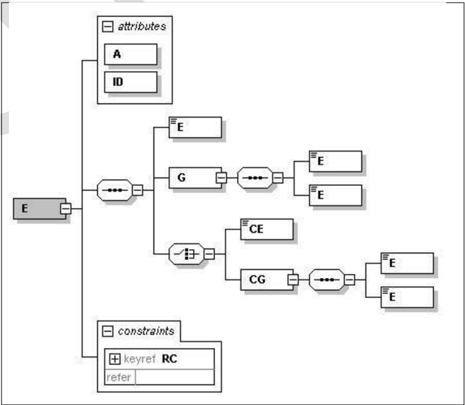

## Sistema Nota Fiscal Eletrônica

Manual de Orientação do Contribuinte Anexo I - Leiaute e Regras de Validação da NF-e ABI

Versão Minuta 2.00 - Março de 2026

## Sumário

| Controle de Versões..................................................................................................................................................................                                                                                                                                        | 3     |
|------------------------------------------------------------------------------------------------------------------------------------------------------------------------------------------------------------------------------------------------------------------------------------------------------------------------------|-------|
| Histórico de Alterações / Cronograma.......................................................................................................................................                                                                                                                                                  | 4     |
| 1. Introdução .............................................................................................................................................................................                                                                                                                                  | 5     |
| 2. Leiaute da NF-e ABI..............................................................................................................................................................                                                                                                                                         | 6     |
| Grupo A. Dados da Nota Fiscal eletrônica........................................................................................................                                                                                                                                                                             | 6     |
| Grupo B. Identificação da NF-e ABI .................................................................................................................                                                                                                                                                                         | 6     |
| Grupo BA. Documento Fiscal Referenciado .....................................................................................................                                                                                                                                                                                | 7     |
| Grupo C. Identificação do Emitente da NFe ABI..............................................................................................                                                                                                                                                                                  | 7     |
| Grupo E. Identificação dos Transmitentes da Operação da NF-e ABI................................................................                                                                                                                                                                                             | 8     |
| Grupo F. Identificação dos Adquirentes da Operação da NF-e ABI....................................................................                                                                                                                                                                                           | 9     |
| Grupo G. Identificação do Imóvel...................................................................................................................                                                                                                                                                                          | 11    |
| Grupo GA. Autorização para obter XML.........................................................................................................                                                                                                                                                                                | 13    |
| Grupo H. Informações da Operação..............................................................................................................                                                                                                                                                                               | 13    |
| Grupo U. Informações da Tributação.............................................................................................................                                                                                                                                                                              | 17    |
| Grupo Y. Detalhes de Pagamento..................................................................................................................                                                                                                                                                                             | 20    |
| Grupo W. Total da NF-e ABI ..........................................................................................................................                                                                                                                                                                        | 21    |
| Grupo Z. Informações Adicionais da NF-e ABI...............................................................................................                                                                                                                                                                                   | 22    |
| Grupo ZD. Informações do Responsável Técnico ..........................................................................................                                                                                                                                                                                      | 22    |
| Grupo ZX. Informações Suplementares da NFe ABI ......................................................................................                                                                                                                                                                                        | 23    |
| Grupo ZZ. Informações da Assinatura Digital .................................................................................................                                                                                                                                                                                | 23    |
| 3. Eventos ...............................................................................................................................................................................                                                                                                                                   | 24    |
| Evento: Pagamento de Parcela......................................................................................................................                                                                                                                                                                           | 24    |
| 4. Orientações Gerais .............................................................................................................................................................                                                                                                                                          | 26    |
| Abreviações utilizadas nas colunas de cabeçalho do leiaute ..........................................................................                                                                                                                                                                                        | 26    |
| Regras de preenchimento dos campos da NFe ABI.......................................................................................                                                                                                                                                                                         | 27    |
| Preenchimento da URL doQR Code .............................................................................................................                                                                                                                                                                                 | 27    |
| 5. Regras de Validação dos Webservices...............................................................................................................................                                                                                                                                                        | 28    |
| Regras de Validação Gerais ..........................................................................................................................                                                                                                                                                                        | 28    |
| Grupo A: Validação do Certificado de Transmissão (protocolo TLS)..............................................................................                                                                                                                                                                               | 28    |
| Grupo B: Validação Inicial da Mensagem no Web Service.............................................................................................                                                                                                                                                                           | 28    |
| Grupo D: Validação da Área de Dados...........................................................................................................................                                                                                                                                                               | 29    |
| Grupo E: Validação do Certificado Digital de Assinatura ................................................................................................                                                                                                                                                                     | 30    |
| Grupo F: Validação da Assinatura Digital........................................................................................................................                                                                                                                                                             | 31    |
| Regras de Negócio específicas...................................................................................................................... Autorização de NF-e ABI................................................................................................................................................. | 31 31 |

## Controle de Versões

|   Versão | Publicação    | Descrição                     |
|----------|---------------|-------------------------------|
|     1.00 | Novembro/2025 | Publicação da primeira versão |
|     2.00 | Mar ç o/2026  | Publicação da segunda versão  |

## Histórico de Alterações / Cronograma

|   Versão | Histórico de atualizações     | Implantação Homologação   | Implantação Produção   |
|----------|-------------------------------|---------------------------|------------------------|
|     1.00 | Publicação da primeira versão | -                         | -                      |
|     2.00 | Publicação da segunda versão  | -                         | -                      |

## 1. Introdução

Este documento tem por objetivo a definição do leiaute da NF-e de Alienação de Bens Imóveis

O Manual de Orientação do Contribuinte 2.0 é composto pelos seguintes documentos:

-  MOC - Visão Geral
-  MOC - Anexo I - Leiaute NF-e ABI e Regras de Validação
-  MOC - Anexo II - Manual de Especificações Técnicas do DANFE e Código de Barras (a ser publicado)

## 2. Leiaute da NF-e ABI

A seguir são apresentados os campos do leiaute da NF-e ABI.

| ID   | Campo   | Descrição            | Ele   | Pai   | Tipo   | Ocor.   | Tam.   | Observação           |
|------|---------|----------------------|-------|-------|--------|---------|--------|----------------------|
| -    | NFeABI  | TAG raiz da NF-e ABI | G     | -     |        | 1-1     |        | TAG raiz da NF-e ABI |

## Grupo A. Dados da Nota Fiscal eletrônica

| ID   | Campo     | Descrição                                                             | Ele   | Pai   | Tipo   | Ocor.   | Tam.   | Observação                                                                                                                                               |
|------|-----------|-----------------------------------------------------------------------|-------|-------|--------|---------|--------|----------------------------------------------------------------------------------------------------------------------------------------------------------|
| A01  | infNFeABI | Informações da NF-e ABI                                               | G     | Raiz  | -      | 1-1     |        | Grupo que contém as informações da NF-e ABI                                                                                                              |
| A02  | versao    | Versão do leiaute                                                     | A     | A01   | C      | 1-1     | 1 - 4  | Versão do leiaute (1.00)                                                                                                                                 |
| A03  | Id        | Identificador da TAG a ser assinada                                   | ID    | A01   | C      | 1-1     | 50     | Informar a Chave de Acesso precedida do literal 'NFeABI',                                                                                                |
| A04  | pk_nItem  | Regra para que a numeração do item de detalhe da NF-e ABI seja única. | RC    | -     | -      | 1-1     |        | Regra de validação do item de detalhe da NF-e ABI, campo de controle do Schema XML, o contribuinte não deve se preocupar como preenchimento deste campo. |

## Grupo B. Identificação da NF-e ABI

| ID   | Campo   | Descrição                                    | Ele   | Pai   | Tipo   | Ocor.   | Tam.   | Observação                                                                                                                            |
|------|---------|----------------------------------------------|-------|-------|--------|---------|--------|---------------------------------------------------------------------------------------------------------------------------------------|
| B01  | ide     | Informações de identificação da NF-e ABI     | G     | A01   |        | 1-1     |        |                                                                                                                                       |
| B02  | cUF     | Código da UF do emitente do Documento Fiscal | E     | B01   | N      | 1-1     | 2      | Código da UF do emitente do Documento Fiscal. Utilizar a Tabela do IBGE de código de unidades da federação                            |
| B03  | cNF     | Código Numérico que compõe a Chave de Acesso | E     | B01   | N      | 1-1     | 6      | Código numérico que compõe a Chave de Acesso. Número aleatório gerado pelo emitente para cada NF-e ABI para evitar acessos indevidos. |
| B04  | mod     | Código do Modelo do Documento Fiscal         | E     | B01   | N      | 1-1     | 2      | 77=NF-e ABI                                                                                                                           |
| B05  | serie   | Série do Documento Fiscal                    | E     | B01   | N      | 1-1     | 1 - 3  | Série do Documento Fiscal.                                                                                                            |
| B06  | nNF     | Número do Documento Fiscal                   | E     | B01   | N      | 1-1     | 1 - 9  | Número do Documento Fiscal.                                                                                                           |
| B07  | dhEmi   | Data e hora de emissão do Documento Fiscal   | E     | B01   | D      | 1-1     |        | Data e hora no formato UTC (Universal Coordinated Time): AAAA-MM-DDThh:mm:ssTZD                                                       |
| B08  | tpImp   | Formato de Impressão do DANFE                | E     | B01   | N      | 1-1     | 1      | 0=Sem geração de DANFE; 1=DANFE-ABInormal, Retrato; 2=DANFE-ABI normal, Paisagem;                                                     |
| B09  | gModNat | Grupo Modalidade e Natureza da operação      | G     | B01   | -      | 1-1     |        |                                                                                                                                       |
| B10  | modOper | Modalidade da operação                       | E     | B09   | N      | 1-1     | 2      | Verificar Tabela de códigos da NFe ABI, publicada no Portal da NFe ABI                                                                |
| B11  | natOper | Natureza da operação                         | E     | B09   | N      | 1-1     | 2      | Verificar Tabela de códigos da NFe ABI, publicada no Portal da NFe ABI                                                                |
| B12  | detOper | Detalhamento da operação                     | E     | B09   | N      | 1-1     | 2      | Verificar Tabela de códigos da NFe ABI, publicada no Portal da NFe ABI                                                                |

| ID   | Campo        | Descrição                                         | Ele   | Pai   | Tipo   | Ocor.   | Tam.     | Observação                                                                                                                                                                                            |
|------|--------------|---------------------------------------------------|-------|-------|--------|---------|----------|-------------------------------------------------------------------------------------------------------------------------------------------------------------------------------------------------------|
| B13  | tpEmis       | Tipo de Emissão da NF-e ABI                       | E     | B01   | N      | 1-1     | 1        | 1=Emissão normal (não emcontingência); 3=Emissão NFF; 9=Contingência off-line;                                                                                                                        |
| B14  | nSiteAutoriz | Site do Autorizador que recepcionou a NF-e ABI    | E     | B01   | N      | 1-1     | 1        | Se o autorizador possuir apenas um site deverá ser informado com Zero (0), em caso de autorizador trabalhar com múltiplos sites indicar o número do site para qual foi endereçada a NF-e ABI (1 a 9)  |
| B15  | cDV          | Dígito Verificador da Chave de Acesso da NF-e ABI | E     | B01   | N      | 1-1     | 1        | Informar o DV da Chave de Acesso, o DV será calculado com a aplicação do algoritmo módulo 11 (base 2,9) da Chave de Acesso.                                                                           |
| B16  | tpAmb        | Identificação do Ambiente                         | E     | B01   | N      | 1-1     | 1        | 1=Produção; 2=Homologação                                                                                                                                                                             |
| B17  | finNFe       | Finalidade de emissão da NF-e ABI                 | E     | B01   | N      | 1-1     | 1        | 1=NF-e normal; 2=NF-esubstituição;                                                                                                                                                                    |
| B18  | procEmi      | Processo de emissão da NF-e ABI                   | E     | B01   | N      | 1-1     | 1        | 0=Emissão de NF-e com aplicativo do contribuinte (Assinatura com certificado do emitente); 1=Emissão NF-e pelo contribuinte com aplicativo fornecido pelo Fisco (Assinatura comcertificado do fisco). |
| B19  | verProc      | Versão do Processo de emissão da NF-e ABI         | E     | B01   | C      | 1-1     | 1- 20    | Informar a versão do aplicativo emissor de NF-e ABI.                                                                                                                                                  |
| B20  | gCont        | Grupo de contingência                             | G     | B01   |        | 0-1     |          | Grupo opcional.                                                                                                                                                                                       |
| B21  | dhCont       | Data e Hora da entrada emcontingência             | E     | B20   | D      | 1-1     |          | Data e hora no formato UTC (Universal Coordinated Time): AAAA-MM-DDThh:mm:ssTZD                                                                                                                       |
| B22  | xJust        | Justificativa da entrada emcontingência           | E     | B20   | C      | 1-1     | 15 - 256 |                                                                                                                                                                                                       |

## Grupo BA. Documento Fiscal Referenciado

| ID   | Campo     | Descrição                                      | Ele   | Pai   | Tipo   | Ocor.   |   Tam. | Observação                                                 |
|------|-----------|------------------------------------------------|-------|-------|--------|---------|--------|------------------------------------------------------------|
| BA01 | NFref     | Informação de Documentos Fiscais referenciados | G     | B01   |        | 0-500   |        | Grupo com informações de Documentos Fiscais referenciados. |
| BA02 | refNFeABI | Chave de acesso da NF-e ABI referenciada       | E     | BA01  | N      | 1-1     |     44 | Referencia uma NF-e ABI emitida anteriormente              |

## Grupo C.  Identificação do Emitente da NFe ABI

| ID   | Campo     | Descrição                             | Ele   | Pai   | Tipo   | Ocor.   | Observação                   |
|------|-----------|---------------------------------------|-------|-------|--------|---------|------------------------------|
| C01  | emit      | Identificação do emitente da NF-e ABI | G     | A01   |        | 1-1     |                              |
| C02  | CNPJ      | CNPJ do emitente                      | CE    | C01   | C      | 1-1     | Informar o CNPJ do emitente. |
| C03  | CPF       | CPF do emitente                       | CE    | C01   | C      | 1-1     | 11                           |
| C04  | xNome     | Razão Social ouNome do emitente       | E     | C01   | C      | 1-1     | 2 - 60                       |
| C05  | xFant     | Nome fantasia                         | E     | C01   | C      | 0-1     | 1 - 60                       |
| C06  | enderEmit | Endereço do emitente                  | G     | C01   |        | 1-1     |                              |
| C07  | xLgr      | Logradouro                            | E     | C06   | C      | 1-1     | 2 - 60                       |

## Nota Fiscal Eletrônica de Alienação de Bens Imóveis

NF-e ABI - Anexo I, Leiaute e Regras de Validação

| ID   | Campo   | Descrição                                  | Ele   | Pai   | Tipo   | Ocor.   | Tam.   | Observação                                                                                                                                                                                                                                                                                                                                                                                                                                                                                                                                                                                                                                                                                                                                                                                                                                                     |
|------|---------|--------------------------------------------|-------|-------|--------|---------|--------|----------------------------------------------------------------------------------------------------------------------------------------------------------------------------------------------------------------------------------------------------------------------------------------------------------------------------------------------------------------------------------------------------------------------------------------------------------------------------------------------------------------------------------------------------------------------------------------------------------------------------------------------------------------------------------------------------------------------------------------------------------------------------------------------------------------------------------------------------------------|
| C08  | nro     | Número                                     | E     | C06   | C      | 1-1     | 1 - 60 |                                                                                                                                                                                                                                                                                                                                                                                                                                                                                                                                                                                                                                                                                                                                                                                                                                                                |
| C09  | xCpl    | Complemento                                | E     | C06   | C      | 0-1     | 1 - 60 |                                                                                                                                                                                                                                                                                                                                                                                                                                                                                                                                                                                                                                                                                                                                                                                                                                                                |
| C10  | xBairro | Bairro                                     | E     | C06   | C      | 1-1     | 2 - 60 |                                                                                                                                                                                                                                                                                                                                                                                                                                                                                                                                                                                                                                                                                                                                                                                                                                                                |
| C11  | cMun    | Código do município                        | E     | C06   | N      | 1-1     | 7      | Utilizar a Tabela do IBGE                                                                                                                                                                                                                                                                                                                                                                                                                                                                                                                                                                                                                                                                                                                                                                                                                                      |
| C12  | xMun    | Nome do município                          | E     | C06   | C      | 1-1     | 2 - 60 |                                                                                                                                                                                                                                                                                                                                                                                                                                                                                                                                                                                                                                                                                                                                                                                                                                                                |
| C13  | UF      | Sigla da UF                                | E     | C06   | C      | 1-1     | 2      |                                                                                                                                                                                                                                                                                                                                                                                                                                                                                                                                                                                                                                                                                                                                                                                                                                                                |
| C14  | CEP     | Código do CEP                              | E     | C06   | N      | 1-1     | 8      | Informar os zeros não significativos.                                                                                                                                                                                                                                                                                                                                                                                                                                                                                                                                                                                                                                                                                                                                                                                                                          |
| C15  | cPais   | Código do País                             | E     | C06   | N      | 0-1     | 4      | 1058=Brasil                                                                                                                                                                                                                                                                                                                                                                                                                                                                                                                                                                                                                                                                                                                                                                                                                                                    |
| C16  | xPais   | Nome do País                               | E     | C06   | C      | 0-1     | 1 - 60 | Brasil ou BRASIL                                                                                                                                                                                                                                                                                                                                                                                                                                                                                                                                                                                                                                                                                                                                                                                                                                               |
| C17  | fone    | Telefone                                   | E     | C06   | N      | 0-1     | 6 - 14 | Preencher com o Código DDD + número do telefone. Nas operações com exterior é permitido informar o código do país + código da localidade + número do telefone                                                                                                                                                                                                                                                                                                                                                                                                                                                                                                                                                                                                                                                                                                  |
| C18  | tpEmit  | Tipo do Emitente                           | E     | C01   | N      | 1-1     | 1      | 01=Vendedor, Transmitente ou Cedente 02=Comprador, Adquirenteou Cessionário 03=Leiloeiro (em nome do arrematante) 04=Tabelionato de Notas (em nome do vendedor ou transmitente) 05=Junta Comercial (em nome do transmitente) 06=Banco ou instituição financeira (em nome do vendedor ou transmitente) 07=Organização gestora de fundo patrimonial 08=Credor fiduciário (na consolidação da propriedade) 09=Grupo de consórcio (na consolidação da propriedade) 10=Sucessoraem virtude de incorporação, cisão ou fusão 99=Outros Emitentes OBSERVAÇÃO 1: Proibida a opção '01' quando a moda- lidade for 02=Arrematação, Adjudicação ou Remição. OBSERVAÇÃO 2: Proibidas as opções '02' e '03' quando as modalidades forem diferentes de 02=Arrematação, Adjudicação ou Remição. OBSERVAÇÃO 3: Proibida a opção '99' quando houver destaque de tributo na nota. |
| C19  | tpIMF   | Tipo de Inscrição no Ministério da Fazenda | E     | C01   | N      | 1-1     | 1      | 1=Emitente cominscrição CNPJ 2=Emitente com inscrição CPF                                                                                                                                                                                                                                                                                                                                                                                                                                                                                                                                                                                                                                                                                                                                                                                                      |

## Grupo E. Identificação dos Transmitentes da Operação da NF-e ABI

| ID   | Campo     | Descrição                                   | Ele   | Pai   | Tipo   | Ocor.   | Tam.   | Observação                               |
|------|-----------|---------------------------------------------|-------|-------|--------|---------|--------|------------------------------------------|
| E01  | transmit  | Vendedor, Transmitente ou Cedente do imóvel | G     | A01   |        | 1-99    |        |                                          |
| E01a | nTransmit | Número Sequencial do Transmitente           | A     | E01   | N      | 1-1     | 1-2    | Número Sequencial do Transmitente (1-99) |

## Nota Fiscal Eletrônica de Alienação de Bens Imóveis

NF-e ABI - Anexo I, Leiaute e Regras de Validação

| ID   | Campo         | Descrição                                              | Ele   | Pai   | Tipo   | Ocor.   | Tam.   | Observação                                                                                                                                                                                                                                                                       |
|------|---------------|--------------------------------------------------------|-------|-------|--------|---------|--------|----------------------------------------------------------------------------------------------------------------------------------------------------------------------------------------------------------------------------------------------------------------------------------|
| E02  | indDeclarante | Indicador de declarante                                | E     | E01   | N      | 1-1     | 1      | Q. O vendedor, transmitente ou cedente aqui identificado é o declarante desta Nota Fiscal? 0=Não 1=Sim Não abrir para a modalidade '02.Arrematação, Adjudicação ou Remição' (tag: modOper<>2) OBSERVAÇÃO: O transmitente com indDelcarante=1 deverá corresponder ao nTransmit=1. |
| E03  | CNPJ          | CNPJ do Transmitente                                   | CE    | E01   | C      | 1-1     | 14     | Informar o CNPJ doTransmitente, preenchendo os zeros não significativos.                                                                                                                                                                                                         |
| E04  | CPF           | CPF do Transmitente                                    | CE    | E01   | C      | 1-1     | 11     | Informar o CPF do Transmitente, preenchendo os zeros não significativos.                                                                                                                                                                                                         |
| E05  | xNome         | Razão Social ou nome do Transmitente                   | E     | E01   | C      | 1-1     | 2 - 60 |                                                                                                                                                                                                                                                                                  |
| E06  | enderTransmit | Endereço do Transmitente da NF-e ABI                   | G     | E01   |        | 0-1     |        | Obrigatório somente quando indDeclarante=1                                                                                                                                                                                                                                       |
| E07  | xLgr          | Logradouro                                             | E     | E06   | C      | 1-1     | 2 - 60 |                                                                                                                                                                                                                                                                                  |
| E08  | nro           | Número                                                 | E     | E06   | C      | 1-1     | 1 - 60 |                                                                                                                                                                                                                                                                                  |
| E09  | xCpl          | Complemento                                            | E     | E06   | C      | 0-1     | 1 - 60 |                                                                                                                                                                                                                                                                                  |
| E10  | xBairro       | Bairro                                                 | E     | E06   | C      | 0-1     | 2 - 60 |                                                                                                                                                                                                                                                                                  |
| E11  | cMun          | Código do município                                    | E     | E06   | N      | 1-1     | 7      |                                                                                                                                                                                                                                                                                  |
| E12  | xMun          | Nome do município                                      | E     | E06   | C      | 1-1     | 2 - 60 |                                                                                                                                                                                                                                                                                  |
| E13  | UF            | Sigla da UF                                            | E     | E06   | C      | 1-1     | 2      |                                                                                                                                                                                                                                                                                  |
| E14  | CEP           | Código do CEP                                          | E     | E06   | N      | 0-1     | 8      | Informar os zeros não significativos.                                                                                                                                                                                                                                            |
| E15  | cPais         | Código do País                                         | E     | E06   | N      | 0-1     | 2 - 4  |                                                                                                                                                                                                                                                                                  |
| E16  | xPais         | Nome o País                                            | E     | E06   | C      | 0-1     | 2 - 60 |                                                                                                                                                                                                                                                                                  |
| E17  | fone          | Telefone                                               | E     | E06   | N      | 0-1     | 6 - 14 | Preencher com o Código DDD + número do telefone.                                                                                                                                                                                                                                 |
| E18  | pTransIndiv   | Proporção Transmitida Tndividual                       | E     | E01   | N      | 1-1     | 3v4    | ORIENTAÇÃO: Preencher a proporção do imóvel (*) que o vendedor, transmitente ou cedente está transferindo individualmente. (*) em formato percentual                                                                                                                             |
| E19  | indContrib    | Indicador de Contribuinte do Regime regular do IBS/CBS | E     | E01   | N      | 1-1     | 1      | 0=Não Contribuinte do IBS/CBS 1=Contribuinte do IBS/CBS 2=Optante doSimplesNacional                                                                                                                                                                                              |

## Grupo F. Identificação dos Adquirentes da Operação da NF-e ABI

| ID   | Campo      | Descrição                            | Ele   | Pai   | Tipo   | Ocor.   | Tam.   | Observação                             |
|------|------------|--------------------------------------|-------|-------|--------|---------|--------|----------------------------------------|
| F01  | adquirente | Comprador, Adquirente ou Cessionário | G     | A01   |        | 1-99    |        |                                        |
| F01a | nAdquir    | Número Sequencial do Adquirente      | A     | F01   | N      | 1-1     | 1-2    | Número Sequencial do Adquirente (1-99) |

## Nota Fiscal Eletrônica de Alienação de Bens Imóveis

NF-e ABI - Anexo I, Leiaute e Regras de Validação

| ID   | Campo           | Descrição                                              | Ele   | Pai   | Tipo   | Ocor.   | Tam.   | Observação                                                                                                                                                                                                                                                                                                                                                                                                                                                                                                           |
|------|-----------------|--------------------------------------------------------|-------|-------|--------|---------|--------|----------------------------------------------------------------------------------------------------------------------------------------------------------------------------------------------------------------------------------------------------------------------------------------------------------------------------------------------------------------------------------------------------------------------------------------------------------------------------------------------------------------------|
| F02  | indDeclarante   | Indicador de Declarante                                | E     | E01   | N      | 1-1     | 1      | Q. O comprador, adquirente ou cessionário aqui identificado é o declarante desta Nota Fiscal? 0=Não 1=Sim Abrir somente para a modalidade 2.Arrematação, Adjudicação ou Remição (tag: modOper=2). OBSERVAÇÃO: O adquirente com indDelcarante=1 deve corresponder ao nAdquir=1.                                                                                                                                                                                                                                       |
| F03  | CNPJ            | CNPJ do Adquirente                                     | CE    | F01   | C      | 1-1     | 14     | Informar o CNPJ do Adquirente, preenchendo os zeros não significativos.                                                                                                                                                                                                                                                                                                                                                                                                                                              |
| F04  | CPF             | CPF do Adquirente                                      | CE    | F01   | C      | 1-1     | 11     | Informar o CPF do Adquirente, preenchendo os zeros não significativos.                                                                                                                                                                                                                                                                                                                                                                                                                                               |
| F05  | xNome           | Razão Social ou nome do Adquirente                     | E     | F01   | C      | 1-1     | 2 - 60 |                                                                                                                                                                                                                                                                                                                                                                                                                                                                                                                      |
| F06  | enderAdquirente | Endereço do Adquirente da NF-e ABI                     | G     | F01   |        | 1 -1    |        |                                                                                                                                                                                                                                                                                                                                                                                                                                                                                                                      |
| F07  | xLgr            | Logradouro                                             | E     | F06   | C      | 1-1     | 2 - 60 |                                                                                                                                                                                                                                                                                                                                                                                                                                                                                                                      |
| F08  | nro             | Número                                                 | E     | F06   | C      | 1-1     | 1 - 60 |                                                                                                                                                                                                                                                                                                                                                                                                                                                                                                                      |
| F09  | xCpl            | Complemento                                            | E     | F06   | C      | 0-1     | 1 - 60 |                                                                                                                                                                                                                                                                                                                                                                                                                                                                                                                      |
| F10  | xBairro         | Bairro                                                 | E     | F06   | C      | 0-1     | 2 - 60 |                                                                                                                                                                                                                                                                                                                                                                                                                                                                                                                      |
| F11  | cMun            | Código do município                                    | E     | F06   | N      | 1-1     | 7      |                                                                                                                                                                                                                                                                                                                                                                                                                                                                                                                      |
| F12  | xMun            | Nome do município                                      | E     | F06   | C      | 1-1     | 2 - 60 |                                                                                                                                                                                                                                                                                                                                                                                                                                                                                                                      |
| F13  | UF              | Sigla da UF                                            | E     | F06   | C      | 1-1     | 2      |                                                                                                                                                                                                                                                                                                                                                                                                                                                                                                                      |
| F14  | CEP             | Código do CEP                                          | E     | F06   | N      | 0-1     | 8      | Informar os zeros não significativos.                                                                                                                                                                                                                                                                                                                                                                                                                                                                                |
| F15  | cPais           | Código do País                                         | E     | F06   | N      | 0-1     | 2 - 4  |                                                                                                                                                                                                                                                                                                                                                                                                                                                                                                                      |
| F16  | xPais           | Nome do País                                           | E     | F06   | C      | 0-1     | 2 - 60 |                                                                                                                                                                                                                                                                                                                                                                                                                                                                                                                      |
| F17  | fone            | Telefone                                               | E     | F06   | N      | 0-1     | 6 - 14 | Preencher com o Código DDD + número do telefone.                                                                                                                                                                                                                                                                                                                                                                                                                                                                     |
| F18  | pAquisição      | Percentual de Aquisição                                | E     | F01   | N      | 1-1     | 3v4    | A obrigatoriedade ou vedação do preenchimento deste campo está condicionada ao indicador 'ind_pAquisic_NFeABI' da tabela de cClassTrib do IBS e da CBS. Se cClassTrib do IBS/CBS (tag: IBSCBS/cClassTrib) possui indicador que não permite a informação do Percentual de Aquisição (ind_pAquisic_NFeABI=0):  Não abrir o campo pAquisicao Se cClassTrib do IBS/CBS (tag: IBSCBS/cClassTrib) possui indicador que obriga a informação do Percentual de Aquisição (ind_pAquisic_NFeABI=1):  Abrir o campo pAquisicao |
| F19  | indContrib      | Indicador de Contribuinte do Regime regular do IBS/CBS | E     | F01   | N      | 1-1     | 1      | 0=NãoContribuintedo IBS/CBS 1=Contribuinte do IBS/CBS 2=Optante do Simples Nacional                                                                                                                                                                                                                                                                                                                                                                                                                                  |
| F20  | gCredIndiv      | Grupo de informação dos créditos individuais           | G     | F01   |        | 0-1     |        | Válido somente para indContrib = 1                                                                                                                                                                                                                                                                                                                                                                                                                                                                                   |

## Nota Fiscal Eletrônica de Alienação de Bens Imóveis

NF-e ABI - Anexo I, Leiaute e Regras de Validação

| ID   | Campo         | Descrição                                         | Ele   | Pai   | Tipo   | Ocor.   | Tam.   | Observação                                                                                                                                                                                                                                                                                                                  |
|------|---------------|---------------------------------------------------|-------|-------|--------|---------|--------|-----------------------------------------------------------------------------------------------------------------------------------------------------------------------------------------------------------------------------------------------------------------------------------------------------------------------------|
| F21  | vCredIBSIndiv | Valor do crédito individual correspondente ao IBS | E     | F20   | N      | 1-1     | 13v2   | Nas modalidades diferentes de '02.Arrematação, Adjudicação ou Remição' (modOper <> 2):  vCredIBSIndiv = (vIBSUF + vIBSMun) * pAquisicao / pTransImovel Na modalidade 2.Arrematação, Adjudicação ou Remição (modOper=2):  Abrir o vCredIBSIndiv somente para indDeclarante=1  vCredIBSIndiv = vIBSUF + vIBSMun            |
| F22  | vCredCBSIndiv | Valor do crédito individual correspondente à CBS  | E     | F20   | N      | 1-1     | 13v2   | Valor do crédito correspondente à CBS: Na modalidade diferentes de '02.Arrematação, Adjudicação ou Remição' (modOper <> 2):  vCredCBSIndiv = vCBS * pAquisicao / pTransImovel Na modalidade 2.Arrematação, Adjudicação ou Remição (modOper=2):  Abrir o vCredCBSIndiv somente para indDeclarante=1  vCredIBSIndiv = vCBS |

## Grupo G. Identificação do Imóvel

| ID   | Campo           | Descrição                           | Ele   | Pai   | Tipo   | Ocor.   | Tam.   | Observação                                                                                                            |
|------|-----------------|-------------------------------------|-------|-------|--------|---------|--------|-----------------------------------------------------------------------------------------------------------------------|
| G01  | imovel          | Identificação do imóvel transmitido | G     | A01   |        | 0-1     |        | Na permuta com torna envolvendo exclusivamente bens imóveis (indTorna=1), informar os dados do imóvel de maior valor. |
| G02  | tipo            | Tipo do imóvel                      | CE    | G01   | N      | 1-1     | 1      | 1=Urbano 2=Rural                                                                                                      |
| G03  | cadastro        | Informações Cadastrais do imóvel    | G     | G01   |        | 1-1     |        |                                                                                                                       |
| G04  | cCIB            | Cadastro do CIB                     | E     | G03   | C      | 0-1     | 2-60   |                                                                                                                       |
| G05  | indIPTU         | Indicador se o imóvel possui IPTU   | E     | G03   | N      | 0-1     | 1      | 0=Nãopossui IPTU 1=Possui IPTU                                                                                        |
| G06  | nIptu           | Número do IPTU                      | E     | G03   | C      | 0-1     | 2 - 60 |                                                                                                                       |
| G07  | indIncra        | Indicador se o imóvel possui INCRA  | E     | G03   | N      | 0-1     | 1      | 0=Não possui Incra 1=Possui Incra                                                                                     |
| G08  | nIncra          | Número do Incra                     | E     | G03   | C      | 0-1     | 2 - 60 |                                                                                                                       |
| G09  | espImovel       | Espécie do Imóvel                   | E     | G01   | N      | 1-1     | 2      | Verificar Tabela de códigos da NFe ABI, publicada no Portal da NFe ABI                                                |
| G10  | xOutrosEspecies | Descrição das Outras Espécies       | E     | G01   | C      | 0-1     | 1 - 60 | Obrigatório para a Espécie de Imóvel "99=Outras"                                                                      |

## Nota Fiscal Eletrônica de Alienação de Bens Imóveis

NF-e ABI - Anexo I, Leiaute e Regras de Validação

| ID   | Campo          | Descrição                           | Ele   | Pai   | Tipo   | Ocor.   | Tam.   | Observação                                                                                                                                                                                                                                                                                                                                                                                                                                                                                                                                                                                                  |
|------|----------------|-------------------------------------|-------|-------|--------|---------|--------|-------------------------------------------------------------------------------------------------------------------------------------------------------------------------------------------------------------------------------------------------------------------------------------------------------------------------------------------------------------------------------------------------------------------------------------------------------------------------------------------------------------------------------------------------------------------------------------------------------------|
| G11  | enquadramento  | Enquadramento do imóvel             | E     | G01   | N      | 1-1     | 1      | Verificar Tabela de códigos da NFe ABI, publicada no Portal da NFe ABI. OBSERVAÇÃO: A obrigatoriedade ou vedação do preenchimento deste campo está condicionada ao indicador 'ind_Enquadr_NFeABI' da tabela de cClassTrib do IBS e da CBS. Se cClassTrib do IBS/CBS (tag: IBSCBS/cClassTrib) possui indicador que não permite a informação do Enquadramento do imóvel (ind_Enquadr_NFeABI=0):  Não abrir o campo enquadramento Se cClassTrib do IBS/CBS (tag: IBSCBS/cClassTrib) possui indicador que obriga a informação do Enquadramento do imóvel (ind_Enquadr NFeABI=1):  Abrir o campo enquadramento |
| G12  | enderImovel    | Endereço do Imóvelda NF-e ABI       | G     | G01   |        | 1 -1    |        |                                                                                                                                                                                                                                                                                                                                                                                                                                                                                                                                                                                                             |
| G13  | xLgr           | Logradouro                          | E     | G12   | C      | 1-1     | 2 - 60 |                                                                                                                                                                                                                                                                                                                                                                                                                                                                                                                                                                                                             |
| G14  | nro            | Número                              | E     | G12   | C      | 1-1     | 1 - 60 |                                                                                                                                                                                                                                                                                                                                                                                                                                                                                                                                                                                                             |
| G15  | xCpl           | Complemento                         | E     | G12   | C      | 0-1     | 1 - 60 |                                                                                                                                                                                                                                                                                                                                                                                                                                                                                                                                                                                                             |
| G16  | xBairro        | Bairro                              | E     | G12   | C      | 1-1     | 2 - 60 |                                                                                                                                                                                                                                                                                                                                                                                                                                                                                                                                                                                                             |
| G17  | cMun           | Código do município                 | E     | G12   | N      | 1-1     | 7      |                                                                                                                                                                                                                                                                                                                                                                                                                                                                                                                                                                                                             |
| G18  | xMun           | Nome do município                   | E     | G12   | C      | 1-1     | 2 - 60 |                                                                                                                                                                                                                                                                                                                                                                                                                                                                                                                                                                                                             |
| G19  | UF             | Sigla da UF                         | E     | G12   | C      | 1-1     | 2      |                                                                                                                                                                                                                                                                                                                                                                                                                                                                                                                                                                                                             |
| G20  | CEP            | Código do CEP                       | E     | G12   | N      | 0-1     | 8      | Informar os zeros não significativos.                                                                                                                                                                                                                                                                                                                                                                                                                                                                                                                                                                       |
| G21  | cPais          | Código do País                      | E     | G12   | N      | 0-1     | 2 - 4  |                                                                                                                                                                                                                                                                                                                                                                                                                                                                                                                                                                                                             |
| G22  | xPais          | Nome do País                        | E     | G12   | C      | 0-1     | 2 - 60 |                                                                                                                                                                                                                                                                                                                                                                                                                                                                                                                                                                                                             |
| G23  | obsLocalImovel | Observações sobre o local do imóvel | E     | G01   | C      | 0-1     | 2 -200 |                                                                                                                                                                                                                                                                                                                                                                                                                                                                                                                                                                                                             |
| G24  | areaTotal      | Área Total do Imóvel                | E     | G01   | C      | 1-1     | 13v2   | OBSERVAÇÃO: A obrigatoriedade ou vedação do preenchimento deste campo está condicionada ao indicador 'ind_Area_NFeABI' da tabela de cClassTrib do IBS e da CBS. Se cClassTrib do IBS/CBS (tag: IBSCBS/cClassTrib) possui indicador que não permite a informação do Area Total do imóvel (ind_Area_NFeABI=0):  Não abrir o campo areaTotal Se cClassTrib do IBS/CBS (tag: IBSCBS/cClassTrib) possui indicador que obriga a informação do Area Total do imóvel (ind_Area_NFeABI=1):  Abrir o campo areaTotal                                                                                                |

## Nota Fiscal Eletrônica de Alienação de Bens Imóveis

NF-e ABI - Anexo I, Leiaute e Regras de Validação

| ID   | Campo            | Descrição                       | Ele   | Pai   | Tipo   | Ocor.   | Tam.   | Observação                                                                                                                                                                                                                                                                                                                                                                                                                                                                                                                                                                    |
|------|------------------|---------------------------------|-------|-------|--------|---------|--------|-------------------------------------------------------------------------------------------------------------------------------------------------------------------------------------------------------------------------------------------------------------------------------------------------------------------------------------------------------------------------------------------------------------------------------------------------------------------------------------------------------------------------------------------------------------------------------|
| G25  | uAreaTotal       | Unidade de Medida da Área Total | E     | G01   | C      | 1-1     | 3      | 'm2' - Metro quadrado 'ha' - Hectares OBSERVAÇÃO: A obrigatoriedade ou vedação do preenchimento deste campo está condicionada ao indicador 'ind_uArea_NFeABI' da tabela de cClassTrib do IBS e da CBS. Se cClassTrib do IBS/CBS (tag: IBSCBS/cClassTrib) possui indicador que não permite a informação da Unidade de Medida da Área Total (ind_uArea_NFeABI=0):  Não abrir o campo uAreaTotal Se cClassTrib do IBS/CBS (tag: IBSCBS/cClassTrib) possui indicador que obriga a informação da Unidade de Medida da Área Total (ind_uArea_NFeABI=1):  Abrir o campo uAreaTotal |
| G26  | cartorioRegistro | Cartório de Registro do Imóvel  | E     | G01   | C      | 0-1     | 2 - 60 |                                                                                                                                                                                                                                                                                                                                                                                                                                                                                                                                                                               |
| G27  | matricTransc     | Matrícula ou Transcrição        | E     | G01   | C      | 0-1     | 2 - 60 |                                                                                                                                                                                                                                                                                                                                                                                                                                                                                                                                                                               |

## Grupo GA. Autorização para obter XML

| ID    | Campo   | Descrição                                     | Ele   | Pai   | Tipo   | Ocor.   | Tam.   | Observação                                                   |
|-------|---------|-----------------------------------------------|-------|-------|--------|---------|--------|--------------------------------------------------------------|
| GA01  | autXML  | Pessoas autorizadas a acessar oXMLda NF-e ABI | G     | A01   |        | 0-10    |        |                                                              |
| GA01a | nAutXML | Número sequencial da autorização do XML       | A     | GA01  | N      | 1-1     | 1-2    | Número sequencial da autorização do XML                      |
| GA02  | CNPJ    | CNPJ Autorizado                               | CE    | GA01  | C      | 1-1     | 14     | Informar CNPJ ou CPF. Preencher os zeros não significativos. |
| GA03  | CPF     | CPF Autorizado                                | CE    | GA01  | C      | 1-1     | 11     |                                                              |

## Grupo H. Informações da Operação

| ID   | Campo          | Descrição                       | Ele   | Pai   | Tipo   | Ocor.   | Tam.   | Observação                                                                                                                                                                                                                                                                         |
|------|----------------|---------------------------------|-------|-------|--------|---------|--------|------------------------------------------------------------------------------------------------------------------------------------------------------------------------------------------------------------------------------------------------------------------------------------|
| H01  | infOper        | Informações da Operação         | G     | A01   |        | 1-1     |        |                                                                                                                                                                                                                                                                                    |
| H02  | pTransImovel   | Proporção Transmitida do Imóvel | E     | H01   | N      | 1-1     | 3v4    | Proporção Transmitida do imóvel (em formato percentual) ORIENTAÇÃO 1: Caso esteja sendo transmitida a totalidade do imóvel, inserir como proporção transmitida 100%. ORIENTAÇÃO 2: Preencher a proporção transmitida do imóvel, considerando a venda ou negócio na sua totalidade. |
| H03  | vTotalOperacao | Valor Total da Operação         | E     | H01   | N      | 1-1     | 3v4    | ORIENTAÇÃO: Na permuta com torna envolvendo exclusivamente bens imóveis (indTorna=1), preencher com o imóvel de maior valor.                                                                                                                                                       |

## Nota Fiscal Eletrônica de Alienação de Bens Imóveis

NF-e ABI - Anexo I, Leiaute e Regras de Validação

| ID   | Campo            | Descrição                              | Ele   | Pai   | Tipo   | Ocor.   | Tam.   | Observação                                                                                                                                                                                                                                                                                                                                                                                                                                                                                                                                                                                                                                                                                                                                                                                                                                                                                                                                                                                                          |
|------|------------------|----------------------------------------|-------|-------|--------|---------|--------|---------------------------------------------------------------------------------------------------------------------------------------------------------------------------------------------------------------------------------------------------------------------------------------------------------------------------------------------------------------------------------------------------------------------------------------------------------------------------------------------------------------------------------------------------------------------------------------------------------------------------------------------------------------------------------------------------------------------------------------------------------------------------------------------------------------------------------------------------------------------------------------------------------------------------------------------------------------------------------------------------------------------|
| H04  | indTorna         | Indicador de Torna                     | E     | E01   | N      | 1-1     | 1      | Indicador de torna nas permutas envolvendo exclusivamente bens imóveis Q. Houve torna na permuta (ou na compra e venda equiparada à permuta)? 0=Não 1=Sim Abrir somente para as naturezas:  13. Permuta envolvendo exclusivamente bens imóveis  14. Compra e venda quitada com confissão de dívida e promessa de dação em pagamento nos termos do art. 252, § 6° da LC 214/2025                                                                                                                                                                                                                                                                                                                                                                                                                                                                                                                                                                                                                                   |
| H05  | gTorna           | Grupo Torna                            | G     | H01   |        | 0-1     |        | Abrir somente se indTorna=1                                                                                                                                                                                                                                                                                                                                                                                                                                                                                                                                                                                                                                                                                                                                                                                                                                                                                                                                                                                         |
| H06  | vTorna           | Valor da Torna                         | E     | H05   | N      | 1-1     | 13v2   |                                                                                                                                                                                                                                                                                                                                                                                                                                                                                                                                                                                                                                                                                                                                                                                                                                                                                                                                                                                                                     |
| H07  | imovelTorna      | Imóveis transmitidos junto com a torna | G     | H05   | TC     | 1-1     |        | Tipo Complexo 'imóvel' do grupo 'G. Identificação do Imovel'                                                                                                                                                                                                                                                                                                                                                                                                                                                                                                                                                                                                                                                                                                                                                                                                                                                                                                                                                        |
| H08  | gRedAjusteImovel | Redutor de Ajuste Imovel               | G     | H01   |        | 0 -1    |        | OBSERVAÇÃO: A obrigatoriedade ou vedação do preenchimento deste grupo está condicionada ao indicador 'ind_RedAjuste_NFeABI' da tabela de cClassTrib do IBS e da CBS. 1. Nas modalidades diferentes de '03. Cessão ou transmissão de direitos' (tag: modOper<>3) e Indicador de diferente de 1 (tag: indTorna<>1): 1.1. Se cClassTrib do IBS/CBS (tag: IBSCBS/cClassTrib) informado possui indicador que não permite a informação do Redutor de Ajuste (ind_RedAjuste_NFeABI=0):  Não abrir o grupo de Redutor de Ajuste do Imóvel 1.2. Se cClassTrib do IBS/CBS (tag: IBSCBS/cClassTrib) informado possui indicador que permite a informação do Redutor de Ajuste (ind_RedAjuste_NFeABI=1):  Abrir o grupo de Redutor de Ajuste do Imóvel 2. Na modalidade igual a '03. Cessão ou transmissão de direitos' (modOper = 3):  Não abrir o grupo de Redutor de Ajuste do Imóvel 3. Na permuta com torna envolvendo exclusivamente bens imóveis (tag: indTorna=1):  Não abrir o grupo de Redutor de Ajuste do Imóvel |

## Nota Fiscal Eletrônica de Alienação de Bens Imóveis

NF-e ABI - Anexo I, Leiaute e Regras de Validação

| ID   | Campo            | Descrição                                                                                                                                             | Ele   | Pai   | Tipo   | Ocor.   | Tam.   | Observação                                                                                                                                                                                                                                                                                                                                                                                                                                  |
|------|------------------|-------------------------------------------------------------------------------------------------------------------------------------------------------|-------|-------|--------|---------|--------|---------------------------------------------------------------------------------------------------------------------------------------------------------------------------------------------------------------------------------------------------------------------------------------------------------------------------------------------------------------------------------------------------------------------------------------------|
| H09  | vInicial         | Valor Inicial do Redutor de Ajuste                                                                                                                    | E     | H08   | N      | 1-1     | 13v2   | ORIENTAÇÃO 1: Observar todos os critérios estabelecidos no art. 258, Caput da LC 214/2025. ORIENTAÇÃO 2: O Valor Inicial do Redutor de Ajuste deverá ser corrigido desde a data da sua constituição, nos termos do art. 257, parág. 3° da LC 214/2025. ORIENTAÇÃO 3: Não podem ser incluídos neste campo os valores de outorga onerosa do direito de construir, outorga onerosa por alteração de uso ou de quaisquer outras contrapartidas. |
| H10  | vITBI            | Valor do ITBI                                                                                                                                         | E     | H08   | N      | 0-1     | 13v2   | ORIENTAÇÃO 1: Deverá ser considerado o valor do ITBI incidente na aquisição do imóvel ao qual se refere o Redutor de Ajuste. ORIENTAÇÃO 2: O valor do ITBI deverá ser corrigido desde a data do pagamento, nos termos do art. 257, parág. 3° e art. 258, parág. 9° da LC 214/2025.                                                                                                                                                          |
| H11  | vLaudemio        | Valor do Laudêmio                                                                                                                                     | E     | H08   | N      | 0-1     | 13v2   | ORIENTAÇÃO 1: Deverá ser considerado o valor do Laudêmio incidente na aquisição do imóvel ao qual se refere o Redutor de Ajuste. ORIENTAÇÃO 2: O valor do Laudêmio deverá ser corrigido desde a data do pagamento, nos termos do art. 257, parág. 3° e art. 258, parág. 9° da LC 214/2025.                                                                                                                                                  |
| H12  | vOutorgaOnerosa  | Valores despendidos a título de outorga onerosa do direito de construir, de outorga onerosa por alteração de uso                                      | E     | H08   | N      | 0-1     | 13v2   | ORIENTAÇÃO: O valor da outorga onerosa deverá ser corrigido desde a data do pagamento das contrapartidas ou da transferência ao poder público dos bens cedidos em contrapartida, nos termos do art. 257, parág. 3° e art. 258, parág. 9° da LC 214/2025.                                                                                                                                                                                    |
| H13  | vDemaisContrap   | Demais contrapartidas de ordem urbanística e ambientais pagas ou entregues aos entes públicos em virtude de legislação federal, estadual ou municipal | E     | H08   | N      | 0-1     | 13v2   | ORIENTAÇÃO: O valor das Demais Contrapartidas deverá ser corrigido desde a data do pagamento das contrapartidas ou da transferência ao poder público dos bens cedidos em contrapartida, nos termos do art. 257, parág. 3° e art. 258, parág. 9° da LC 214/2025.                                                                                                                                                                             |
| H14  | vRedAjusteImovel | Valor do Redutor de Ajuste Imovel                                                                                                                     | E     | H08   | N      | 1-1     | 13v2   | vRedAjusteImovel = vInicial + vITBI + vLaudemio + vOutorgaOnerosa + vDemaisContrap                                                                                                                                                                                                                                                                                                                                                          |

## Nota Fiscal Eletrônica de Alienação de Bens Imóveis

NF-e ABI - Anexo I, Leiaute e Regras de Validação

| ID   | Campo         | Descrição                   | Ele   | Pai   | Tipo   | Ocor.   |   Tam. | Observação                                                                                                                                                                                                                                                                                                                                                                                                                                                                                                                                                                                                                                                                                                                                                                                                                                                                                                                                                                                                                                                                                                                                                                                                                                                                                                                                                                                                                                                                                                                                                                                                                                        |
|------|---------------|-----------------------------|-------|-------|--------|---------|--------|---------------------------------------------------------------------------------------------------------------------------------------------------------------------------------------------------------------------------------------------------------------------------------------------------------------------------------------------------------------------------------------------------------------------------------------------------------------------------------------------------------------------------------------------------------------------------------------------------------------------------------------------------------------------------------------------------------------------------------------------------------------------------------------------------------------------------------------------------------------------------------------------------------------------------------------------------------------------------------------------------------------------------------------------------------------------------------------------------------------------------------------------------------------------------------------------------------------------------------------------------------------------------------------------------------------------------------------------------------------------------------------------------------------------------------------------------------------------------------------------------------------------------------------------------------------------------------------------------------------------------------------------------|
| H15  | indRedSocial  | Indicador de Redutor Social | E     | H01   | N      | 0-1     |      1 | Indicador de Redutor Social Q. Deseja utilizar o redutor social previsto no art. 259 da LC 214/2025 para reduzir a base de cálculo do IBS e da CBS? 0=Não 1=Sim OBSERVAÇÃO: A obrigatoriedade ou vedação do preenchimento deste grupo está condicionada ao indicador 'ind_RedSocial_NFeABI' da tabela de cClassTrib do IBS e da CBS. 1. Nas modalidades diferentes de '03. Cessão ou transmissão de direitos' (modOper <> 3) e Indicador de Torna (tag: infOper/indTorna) diferente de 1 (indTorna<>1): 1.1. Se cClassTrib do IBS/CBS (tag: IBSCBS/cClassTrib) possui indicador que não permite a informação do Redutor Social (ind_RedSocial_NFeABI=0)  Não abrir o Indicador de Redutor Social 1.2. Se cClassTrib do IBS/CBS (tag: IBSCBS/cClassTrib) possui indicador que permite a informação do Redutor Social (ind_RedSocial_NFeABI=1) e o Enquadramento do Imóvel (tag: imóvel/enquadramento) for '01=Imóvel Residencial Novo':  Abrir o Indicador de Redutor Social 1.3. Se cClassTrib do IBS/CBS (tag: IBSCBS/cClassTrib) possui indicador que permite a informação do Redutor Social (ind_RedSocial_NFeABI=1) e o Enquadramento do Imóvel (tag: imovel/enquadramento) for '03=Lote Residencial':  Abrir o Indicador de Redutor Social 2. Na modalidade igual a '03. Cessão ou transmissão de direitos' (tag: modOper = 3):  Não abrir o Indicador de Redutor Social 3. Na permuta com torna envolvendo exclusivamente bens imóveis (tag: indTorna=1):  Não abrir o Indicador de Redutor Social ORIENTAÇÃO: O Redutor Social somente poderá ser utilizado uma única vez para cada bem imóvel (art. 259, parág. 2°, da LC 214/2025). |
| H16  | instrumento   | Informações do Instrumento  | G     | H01   |        | 1-1     |        |                                                                                                                                                                                                                                                                                                                                                                                                                                                                                                                                                                                                                                                                                                                                                                                                                                                                                                                                                                                                                                                                                                                                                                                                                                                                                                                                                                                                                                                                                                                                                                                                                                                   |
| H17  | tpInstrumento | Tipo de Instrumento         | E     | H16   | N      | 1-1     |      2 | Verificar Tabela de códigos da NFe ABI, publicada no Portal da NFe ABI ORIENTAÇÃO: Caso tenha sido celebrado anteriormente algum acordo ou ajuste, deverá ser selecionado o tipo de instrumento correspondente ao respectivo contrato preliminar, promessa, compromisso, carta de reserva com princípio de pagamento ou documento representativo de compromisso.                                                                                                                                                                                                                                                                                                                                                                                                                                                                                                                                                                                                                                                                                                                                                                                                                                                                                                                                                                                                                                                                                                                                                                                                                                                                                  |

## Nota Fiscal Eletrônica de Alienação de Bens Imóveis

NF-e ABI - Anexo I, Leiaute e Regras de Validação

| ID   | Campo             | Descrição                                                    | Ele   | Pai   | Tipo   | Ocor.   | Tam.   | Observação                                                                                                                                                                                                                                                                                                                                                                                                            |
|------|-------------------|--------------------------------------------------------------|-------|-------|--------|---------|--------|-----------------------------------------------------------------------------------------------------------------------------------------------------------------------------------------------------------------------------------------------------------------------------------------------------------------------------------------------------------------------------------------------------------------------|
| H18  | xOutrosInst       | Descrição dos Outros Instrumentos                            | E     | H16   | C      | 0-1     | 1 - 60 | Obrigatório quando o tpInstrumento for '99=Outros'                                                                                                                                                                                                                                                                                                                                                                    |
| H19  | dtInstrumento     | Data do Instrumento (Contrato, escritura, etc.)              | E     | H16   | D      | 1-1     |        | ORIENTAÇÃO 1: Para o Tipo de Instrumento "03=Escritura pública", informar a data programada da lavratura da escritura no cartório ou tabelionato de notas. ORIENTAÇÃO 2: Caso tenha sido celebrado anteriormente algum acordo ou ajuste, deverá ser inserida a data do respectivo contrato preliminar, promessa, compromisso, carta de reserva com princípio de pagamento ou documento representativo de compromisso. |
| H20  | gIncorpLote       | Grupo de informações relativas ao empreendimento imobiliário | G     | H01   | N      | 0-99    | G      |                                                                                                                                                                                                                                                                                                                                                                                                                       |
| H21  | indIncorpLote     | Indicador de Venda Inicial de Lote ou Imóvel na Planta       | E     | H20   | N      | 0-1     | 1      | Q. Trata-se de venda inicial de lote ou imóvel na planta (art. 262 da LC 214/2025)? 0=Não 1=Sim Abrir somente para a modalidade 1. Alienação emGeral Se indIncorpLote = 1, o documento fiscal será emitido sem destaque de IBS e CBS. Se indIncorpLote = 0, o documento fiscal será emitido normalmente com destaque de IBS e CBS.                                                                                    |
| H22  | CNPJempImob       | CNPJ do Empreendimento Imobiliário                           | E     | H20   | C      | 0-1     | 14     | Informar o CNPJ específico do empreendimento imobiliário (incorporação ou parcelmento do solo) Abrir somente se indIncorpLote = 1.                                                                                                                                                                                                                                                                                    |
| H23  | indIntermedCorret | Indicador de Intermediação ou Corretagem                     | E     | H01   | N      | 1-1     | 1      | Q. Houve intermediação ou corretagem na operação imobiliária? 0=Não 1=Sim Abrir somente para a modalidade 1. Alienação emGeral                                                                                                                                                                                                                                                                                        |
| H24  | gIntermedCorret   | Grupo de informações de Intermediação ou Corretagem          | G     | H01   |        | 0-99    |        | Abrir somente se:  a modalidade da operação for '1. Alienação em Geral' (tag: modOper=1); e  Indicador de Intermediação ou Corretagem for igual a 1 (tag: indIntermedCorret = 1)                                                                                                                                                                                                                                    |
| H25  | nCorretagem       | Número sequencial da corretagem                              | A     | H24   | N      | 1-1     | 1-2    | Número sequencial da corretagem                                                                                                                                                                                                                                                                                                                                                                                       |
| H26  | CNPJ              | CNPJ do corretor ou corretora                                | CE    | H24   | C      | 1-1     | 14     | Informar o CNPJ do corretor ou corretora, preenchendo os zeros não significativos.                                                                                                                                                                                                                                                                                                                                    |
| H27  | CPF               | CPF do corretor ou corretora                                 | CE    | H24   | C      | 1-1     | 11     | Informar o CPF do do corretor ou corretora, preenchendo os zeros não significativos.                                                                                                                                                                                                                                                                                                                                  |
| H28  | xNome             | Razão Social ouNome do corretor ou corretora                 | E     | H24   | C      | 1-1     | 2 - 60 | Razão Social ouNome do corretor ou corretora                                                                                                                                                                                                                                                                                                                                                                          |
| H29  | vCorretagem       | Valor da Corretagem                                          | E     | H24   | N      | 1-1     | 13v2   | Valor da Corretagem                                                                                                                                                                                                                                                                                                                                                                                                   |

| ID   | Campo        | Descrição                                                                                  | Ele   | Pai   | Tipo   | Ocor.   | Tam.   | Observação                                                                                                                                                                                                                                                                                                                                                                                                                                                        |
|------|--------------|--------------------------------------------------------------------------------------------|-------|-------|--------|---------|--------|-------------------------------------------------------------------------------------------------------------------------------------------------------------------------------------------------------------------------------------------------------------------------------------------------------------------------------------------------------------------------------------------------------------------------------------------------------------------|
| U01  | gInfTrib     | Informações da Tributação                                                                  | G     | A01   |        | 1-1     |        |                                                                                                                                                                                                                                                                                                                                                                                                                                                                   |
| U02  | gCompraGov   | Grupo de Compra Governamental                                                              | G     | U01   |        | 0-1     |        |                                                                                                                                                                                                                                                                                                                                                                                                                                                                   |
| U03  | tpEnteGov    | Tipo de ente governamental                                                                 | E     | U02   | N      | 1-1     | 1      | 1=União 2=Estados 3=Distrito Federal 4=Município                                                                                                                                                                                                                                                                                                                                                                                                                  |
| U04  | pRedutor     | Percentual de redução de aliquota em compra governamental                                  | E     | U02   | N      | 1-1     | 3v2-4  | Conforme o art. 472/370 da LC 214/2025.                                                                                                                                                                                                                                                                                                                                                                                                                           |
| U05  | tpOperGov    | Tipo de operação com o ente governamental                                                  | E     | U02   | N      | 1-1     | 1      | 1=Fornecimento; 2=Recebimento do pagamento, conforme fato gerador do IBS/CBS definido no Art. 10 § 2º                                                                                                                                                                                                                                                                                                                                                             |
| U06  | IBSCBS       | Informações do Imposto de Bens e Serviços - IBS e da Contribuição de Bens e Serviços - CBS | G     | U01   |        | 1-1     |        |                                                                                                                                                                                                                                                                                                                                                                                                                                                                   |
| U07  | CST          | Código de Situação Tributária do IBS/CBS do Declarante                                     | E     | U06   | N      | 1-1     | 3      | Utilizar tabela CST do IBS/CBS ORIENTAÇÃO 1: Se indContrib = 0 e indDeclarante=1 utilizar CST de imunidade ou não incidência (CST 410). ORIENTAÇÃO 2: Se indContrib = 1 e indDeclarante=1 utilizar CST correspondente à operação (Ex.: CST 200 - Alíquota reduzida).                                                                                                                                                                                              |
| U08  | cClassTrib   | Código de Classificação Tributária do IBS/ CBSdo Declarante                                | E     | U06   | N      | 1-1     | 6      | Utilizar tabela cClassTrib ORIENTAÇÃO 1: Se indContrib = 0 e indDeclarante=1 utilizar cClassTrib de imunidade ou não incidência (cClassTrib 410XXX). ORIENTAÇÃO 2: Se indContrib = 1 e indDeclarante=1 utilizar cClassTrib correspondente à operação. (Ex.: cClassTrib 200046 - Operações com bens imóveis).                                                                                                                                                      |
| U09  | gIBSCBS      | Grupo de Informações do IBS e da CBS                                                       | G     | U06   |        | 0-1     |        | A obrigatoriedade ou vedação do preenchimento deste grupo está condicionada ao indicador "ind_gIBSCBS" da tabela de CST do IBS e da CBS. Se CST do IBS/CBS (tag: IBSCBS/CST) possui indicador que não permite a informação do IBS/CBS (ind_gIBSCBS=0):  Não abrir o Grupo de Informações do IBS e da CBS Se CST do IBS/CBS (tag: IBSCBS/CST) possui indicador que obriga a informação do IBS/CBS (ind_gIBSCBS=1):  Abrir o Grupo de Informações do IBS e da CBS |
| U10  | vOperacIndiv | Valor da Operação individual do Declarante                                                 | E     | U09   | N      | 1-1     | 13v2   | Verificar Tabela de códigos da NFe ABI, publicada no Portal da NFe ABI.                                                                                                                                                                                                                                                                                                                                                                                           |
| U11  | vTornaIndiv  | Valor da Torna Individual do Declarante                                                    | E     | U09   | N      | 1-1     | 13v2   | Verificar Tabela de códigos da NFe ABI, publicada no Portal da NFe ABI. Abrir somente para permuta com torna envolvendo exclusivamente bens imóveis (tag: indTorna=1).                                                                                                                                                                                                                                                                                            |
| ID   | Campo        | Descrição                                                                                  | Ele   | Pai   | Tipo   | Ocor.   | Tam.   | Observação                                                                                                                                                                                                                                                                                                                                                                                                                                                        |

## Nota Fiscal Eletrônica de Alienação de Bens Imóveis

NF-e ABI - Anexo I, Leiaute e Regras de Validação NF-e ABI - Anexo I, Leiaute e Regras de Validação

| U12   | vRedAjusteIndiv   | Valor do Redutor de Ajuste Individual do Declarante                                   | E   | U09   | N   | 1-1   | 13v2   | Verificar Tabela de códigos da NFe ABI, publicada no Portal da NFe ABI. Não abrir para a modalidade '03.Cessão ou Transmissão de direitos' (tag: modOper=3). Não abrir na permuta com torna envolvendo exclusivamente bens imóveis (tag: indTorna=1).   |
|-------|-------------------|---------------------------------------------------------------------------------------|-----|-------|-----|-------|--------|---------------------------------------------------------------------------------------------------------------------------------------------------------------------------------------------------------------------------------------------------------|
| U13   | vRedSocialIndiv   | Valor do Redutor Social Individual do Declarante                                      | E   | U09   | N   | 1-1   | 13v2   | Verificar Tabela de códigos da NFe ABI, publicada no Portal da NFe ABI. Não abrir para a modalidade '03. Cessão ou Transmissão de direitos' (tag: modOper=3). Não abrir na permuta com torna envolvendo exclusivamente bens imóveis (tag: indTorna=1).  |
| U14   | vBC               | Valor da Base de Cálculo do Declarante                                                | E   | U09   | N   | 1-1   | 13v2   | Verificar Tabela de códigos da NFe ABI, publicada no Portal da NFe ABI.                                                                                                                                                                                 |
| U15   | gIBSUF            | Grupo de informações do IBS da UF                                                     | G   | U09   |     | 1-1   |        |                                                                                                                                                                                                                                                         |
| U16   | pIBSUF            | Aliquota do IBS de competência das UF                                                 | E   | U15   | N   | 1-1   | 3v4    |                                                                                                                                                                                                                                                         |
| U17   | gRed              | Grupo de informações da reduçãoda alíquota                                            | G   | U15   |     | 1-1   |        |                                                                                                                                                                                                                                                         |
| U18   | pRedAliq          | Percentual de redução de alíquota                                                     | E   | U17   | N   | 1-1   | 3v4    |                                                                                                                                                                                                                                                         |
| U19   | pAliqEfet         | Alíquota Efetiva que será aplicada a Base de Cálculo                                  | E   | U17   | N   | 1-1   | 3v4    |                                                                                                                                                                                                                                                         |
| U20   | vIBSUF            | Valor do IBS de competência das UF                                                    | E   | U15   | N   | 1-1   | 13v2   | vIBSUF = pAliqEfet * vBC                                                                                                                                                                                                                                |
| U21   | gIBSMun           | Grupo de informações do IBS no Município                                              | G   | U09   |     | 1-1   |        |                                                                                                                                                                                                                                                         |
| U22   | pIBSMun           | Aliquota do IBS Municipal                                                             | E   | U21   | N   | 1-1   | 3v4    |                                                                                                                                                                                                                                                         |
| U23   | gRed              | Grupo de informações da reduçãoda alíquota                                            | G   | U21   |     | 1-1   |        |                                                                                                                                                                                                                                                         |
| U24   | pRedAliq          | Percentual de redução de alíquota                                                     | E   | U23   | N   | 1-1   | 3v4    |                                                                                                                                                                                                                                                         |
| U25   | pAliqEfet         | Aliquota Efetiva que será aplicada a Base de Calculo                                  | E   | U23   | N   | 1-1   | 3v4    |                                                                                                                                                                                                                                                         |
| U26   | vIBSMun           | Valor do IBS de competência dos Municípios                                            | E   | U21   | N   | 1-1   | 13v2   | vIBSMun = pAliqEfet * vBC                                                                                                                                                                                                                               |
| U27   | gCBS              | Grupo de Tributação da CBS                                                            | G   | U09   |     | 1-1   |        |                                                                                                                                                                                                                                                         |
| U28   | pCBS              | Aliquota da CBS                                                                       | E   | U27   | N   | 1-1   | 3v4    |                                                                                                                                                                                                                                                         |
| U29   | gRed              | Grupo de informações da reduçãoda alíquota                                            | G   | U27   |     | 1-1   |        |                                                                                                                                                                                                                                                         |
| U30   | pRedAliq          | Percentual de redução de alíquota                                                     | E   | U29   | N   | 1-1   | 3v4    |                                                                                                                                                                                                                                                         |
| U31   | pAliqEfet         | Aliquota Efetiva que será aplicada a Base de Calculo                                  | E   | U29   | N   | 1-1   | 3v4    |                                                                                                                                                                                                                                                         |
| U32   | vCBS              | Valor da CBS                                                                          | E   | U25   | N   | 1-1   | 13v2   | vCBS = pAliqEfet * vBC                                                                                                                                                                                                                                  |
| U33   | gTribCompraGov    | Grupo de informações da composição do valor do IBS e da CBS em compras governamentais | G   | U09   |     | 1-1   |        |                                                                                                                                                                                                                                                         |
| U34   | pAliqIBSUF        | Aliquota do IBS de competência das UF                                                 | E   | U33   | N   | 1-1   | 3v4    |                                                                                                                                                                                                                                                         |
| U35   | vTribIBSUF        | Valor do tributo do IBS da UF calculado                                               | E   | U33   | N   | 1-1   | 13v2   | Valor que seria devido a UF, sem aplicação do Art. 473. da LC 214/2025                                                                                                                                                                                  |
| U36   | pAliqIBSMun       | Aliquota do IBS de competência dos Municípios                                         | E   | U33   | N   | 1-1   | 3v4    |                                                                                                                                                                                                                                                         |
| U37   | vTribIBSMun       | Valor do tributo do IBS do Município calculado                                        | E   | U33   | N   | 1-1   | 13v2   | Valor que seria devido ao município, sem aplicação do Art. 473. da LC 214/2025                                                                                                                                                                          |
| U38   | pAliqCBS          | Aliquota da CBS                                                                       | E   | U33   | N   | 1-1   | 3v4    |                                                                                                                                                                                                                                                         |
| U39   | vTribCBS          | Valor do tributo da CBS calculado                                                     | E   | U33   | N   | 1-1   | 13v2   | Valor que seria devido a CBS, sem aplicação do Art. 473. da LC 214/2025                                                                                                                                                                                 |

| ID   | Campo   | Descrição   | Ele Pai   | Tipo   | Ocor.   | Tam.   | Observação   |
|------|---------|-------------|-----------|--------|---------|--------|--------------|

| U40   | gEstornoCred   | Estorno de Crédito           | G   | U06   |    | 0-1   |      | A obrigatoriedade ou vedação do preenchimento deste grupo está condicionada ao indicador 'ind_gEstornoCred' da tabela de cClassTrib do IBS e da CBS.   |
|-------|----------------|------------------------------|-----|-------|----|-------|------|--------------------------------------------------------------------------------------------------------------------------------------------------------|
| U41   | vIBSEstCred    | Valor do IBS a ser estornado | E   | U40   | N  | 1-1   | 13v2 |                                                                                                                                                        |
| U42   | vCBSEstCred    | Valor da CBS a ser estornado | E   | U40   | N  | 1-1   | 13v2 |                                                                                                                                                        |

## Grupo Y. Detalhes de Pagamento

| ID   | Campo   | Descrição                                 | Ele   | Pai   | Tipo   | Ocor.   | Tam.   | Observação                                                                                                                                                                                                                                                                                                                                                                                                                                                                                                                                                                                                                                                         |
|------|---------|-------------------------------------------|-------|-------|--------|---------|--------|--------------------------------------------------------------------------------------------------------------------------------------------------------------------------------------------------------------------------------------------------------------------------------------------------------------------------------------------------------------------------------------------------------------------------------------------------------------------------------------------------------------------------------------------------------------------------------------------------------------------------------------------------------------------|
| Y01  | pag     | Grupo de pagamento                        | G     | A01   |        | 1-1     |        |                                                                                                                                                                                                                                                                                                                                                                                                                                                                                                                                                                                                                                                                    |
| Y02  | detPag  | Grupo de Detalhamento de Pagamento        | G     | Y01   |        | 1-99    |        | A obrigatoriedade ou vedação do preenchimento deste grupo está condicionada ao indicador 'ind_detPag_NFeABI' da tabela de cClassTrib do IBS e da CBS. Se cClassTrib do IBS/CBS (tag: IBSCBS/cClassTrib) possui indicador que não permite a informação dos Detalhes de Pagamento (ind_detPag_NFeABI=0):  Não abrir o grupo detPag Se cClassTrib do IBS/CBS (tag: IBSCBS/cClassTrib) possui indicador que obriga a informação do Percentual de Aquisição (ind_detPag_NFeABI=1):  Abrir o grupo detPag                                                                                                                                                              |
| Y02a | nDetPag | Número sequencial do Detalhe de Pagamento | A     | Y02   | N      | 1-1     | 1-2    |                                                                                                                                                                                                                                                                                                                                                                                                                                                                                                                                                                                                                                                                    |
| Y03  | meioPag | Meio de Pagamento                         | E     | Y02   | N      | 1-1     | 2      | Verificar Tabela de códigos da NFe ABI, publicada no Portal da NFe ABI OBSERVAÇÃO: No caso de pagamento futuro ou postergado, informar o meio de pagamento previsto.                                                                                                                                                                                                                                                                                                                                                                                                                                                                                               |
| Y04  | xPag    | Descrição do pagamento                    | E     | Y02   | C      | 0-1     | 6-120  | Campo obrigatório quando o meio de pagamento for '13=Bens móveis' ou "99=Outros".                                                                                                                                                                                                                                                                                                                                                                                                                                                                                                                                                                                  |
| Y05  | vPag    | Valor do Pagamento                        | E     | Y02   | N      | 1-1     | 13v2   | ORIENTAÇÕES: 1. No caso de pagamento já efetuados: inserir o valor pago; 2. No caso de pagamento parcelados com periodicidade fixa (mensal, semestral, etc.): Inserir o valor total do montante a ser pago em parcelas com a mesma periodicidade; (no caso, por exemplo, de parcelas com periodicidade mensal, informar o valor a ser pago em parcelas mensais); 3. No caso de FGTS: inserir valor utilizado de FGTS; 4. No caso de financiamento imobiliário: inserir o valor do financiamento concedido pelo banco ou instituição financeira; 5. No caso de consórcio imobiliário: inserir o valor do crédito efetivamente utilizado para aquisicação do imóvel. |
| ID   | Campo   | Descrição                                 | Ele   | Pai   | Tipo   | Ocor.   | Tam.   | Observação                                                                                                                                                                                                                                                                                                                                                                                                                                                                                                                                                                                                                                                         |

## Nota Fiscal Eletrônica de Alienação de Bens Imóveis

NF-e ABI - Anexo I, Leiaute e Regras de Validação

| Y06   | periodParcelas   | Periodicidade das Parcelas   | E   | Y02   | C   | 1-1   |   1-16 | Campo obrigatório para indIncorpLot = 1 ORIENTAÇÃO: Preencher comuma das seguintes opções: 'Sem parcelamento' 'Isolada' 'Mensal' 'Bimestral' 'Trimestral' 'Quadrimestral'                                                                                                                                                                                                                                                                                                                                                   |
|-------|------------------|------------------------------|-----|-------|-----|-------|--------|-----------------------------------------------------------------------------------------------------------------------------------------------------------------------------------------------------------------------------------------------------------------------------------------------------------------------------------------------------------------------------------------------------------------------------------------------------------------------------------------------------------------------------|
| Y07   | nParcelas        | Número de Parcelas           | E   | Y02   | N   | 0-1   |      3 | 'Anual' ORIENTAÇÕES: 1. Preencher somente no caso de pagamento parcelados com periodicidade fixa (mensal, semestral, etc.); 2. Informar o número de parcelas correspondentes à série pagamentos com a mesma periodicidade (mensal, semestral, etc.); 3. No caso, por exemplo, de parcelas com periodicidade mensal, informar número de parcelas mensais.                                                                                                                                                                    |
|       | -x-              | Sequencia XML                | G   |       |     | 0-1   |        |                                                                                                                                                                                                                                                                                                                                                                                                                                                                                                                             |
| Y08   | dtPag            | Data de Pagamento            | CE  | Y02   | D   | 1-1   |        | ORIENTAÇÕES: 1. No caso de pagamento já efetuado: inserir a data do respectivo pagamento; 2. No caso de utilização do FGTS: inserir a data do contrato ou escritura de aquisição do bem imóvel; 3. No caso de financiamento ou consórcio: inserir a data do contrato ou escritura de aquisição do bem imóvel. OBSERVAÇÃO: Para pagamentos futuros ou parcelados, utilizar o campo Data de Vencimento.                                                                                                                       |
| Y09   | dtVenc           | Data de Vencimento           | CE  | Y02   | F   | 1-1   |        | ORIENTAÇÕES: 1. No caso de pagamento futuro ou postergado: inserir a data do vencimento da obrigação; 2. No caso de parcelas com periodicidade fixada (mensal, semestral, etc.): inserir a data do vencimento da primeira parcela da série de pagamentos com a mesma periodicidade; (no caso, por exemplo, de parcelas com periodicidade mensal, informar a data do vencimento da primeira parcela mensal). OBSERVAÇÃO: Para pagamentos já efetuados, FGTS, financiamento ou consórcio, utilizar o campo Data de Pagamento. |

Grupo W. Total da NF-e ABI

NF-e ABI - Anexo I, Leiaute e Regras de Validação

| ID   | Campo           | Descrição                                  | Ele   | Pai   | Tipo   | Ocor.   | Observação                                   |
|------|-----------------|--------------------------------------------|-------|-------|--------|---------|----------------------------------------------|
| W01  | total           | Grupo Totais da NF-e ABI                   | G     | A01   |        | 1-1     |                                              |
| W02  | tribTot         | Grupo Totais Referentes aos Tributos       | G     | W01   |        | 1-1     |                                              |
| W03  | vTotalOperacao  | Valor Total da Operação                    | E     | W01   | N      | 1-1     | 13v2                                         |
| W04  | vOperacIndiv    | Valor da Operação Individual               | E     | W01   | N      | 1-1     | 13v2                                         |
| W05  | vRedAjusteIndiv | Valor do Redutor de Ajuste Individual      | E     | W02   | N      | 1-1     | 13v2                                         |
| W06  | vRedSocialIndiv | Valor do Redutor Social Individual         | E     | W02   | N      | 1-1     | 13v2                                         |
| W07  | vBC             | Valor da Base de Cálculo                   | E     | W02   | N      | 1-1     | 13v2                                         |
| W08  | vIBSUF          | Valor do IBS de Competência das UF         | E     | W02   | N      | 1-1     | 13v2                                         |
| W09  | vIBSMun         | Valor do IBS de Competência dos Municípios | E     | W02   | N      | 1-1     | 13v2                                         |
| W10  | vCBS            | Valor da CBS                               | E     | W02   | N      | 1-1     | 13v2                                         |
| W11  | vNF             | Valor Total da NF-e ABI                    | E     | W01   | N      | 1-1     | vNF = vOperacIndiv + vIBSUF + vIBSMun + vCBS |

## Grupo Z. Informações Adicionais da NF-e ABI

| ID   | Campo      | Descrição                                               | Ele   | Pai   | Tipo   | Ocor.   | Tam.     | Observação                                                                                                                                 |
|------|------------|---------------------------------------------------------|-------|-------|--------|---------|----------|--------------------------------------------------------------------------------------------------------------------------------------------|
| Z01  | infAdic    | Grupo de Informações Adicionais                         | G     | A01   |        | 0-1     |          | Os campos de informações adicionais não podem ser utilizados para preenchimento de informações de campos que possuem estrutura específica. |
| Z02  | infAdFisco | Informações Adicionais de Interesse do Fisco            | E     | Z01   | C      | 0-1     | 1 - 5000 |                                                                                                                                            |
| Z03  | infCpl     | Informações Complementares de interesse do Contribuinte | E     | Z01   | C      | 0-1     | 1 - 5000 |                                                                                                                                            |
| Z04  | obsCont    | Grupo Campo de uso livre do contribuinte                | G     | Z01   |        | 0-10    |          | Campo de uso livre do contribuinte, Informar onome do campo no atributo xCampo e o conteúdo do campo no xTexto                             |
| Z05  | xCampo     | Identificação do campo                                  | A     | Z04   | C      | 1-1     | 1 - 20   | Identificação do campo                                                                                                                     |
| Z06  | xTexto     | Conteúdo do campo                                       | E     | Z04   | C      | 1-1     | 1 - 60   | Conteúdo do campo                                                                                                                          |
| Z07  | obsFisco   | Grupo Campo de uso livre do Fisco                       | G     | Z01   |        | 0-10    |          | Campo de uso livre do Fisco. Informar o nome do campo no atributo xCampo e o conteúdo do campo no xTexto                                   |
| Z08  | xCampo     | Identificação do campo                                  | A     | Z07   | C      | 1-1     | 1 - 20   | Identificação do campo                                                                                                                     |
| Z09  | xTexto     | Conteúdo do campo                                       | E     | Z07   | C      | 1-1     | 1 - 60   | Conteúdo do campo                                                                                                                          |

## Grupo ZD. Informações do Responsável Técnico

| ID   | Campo      | Descrição                                                                                            | Ele   | Pai   | Tipo   | Ocor.   |   Tam. | Observação                                                                                                       |
|------|------------|------------------------------------------------------------------------------------------------------|-------|-------|--------|---------|--------|------------------------------------------------------------------------------------------------------------------|
| ZD01 | infRespTec | Informações do Responsável Técnico pela emissão do DFe                                               | G     | A01   |        | 1-1     |        | Grupo para informações do responsável técnico pelo sistema de emissão do DFe                                     |
| ZD02 | CNPJ       | CNPJ da pessoa jurídica responsável pelo sistema utilizado na emissão do documento fiscal eletrônico | E     | ZD01  | C      | 1-1     |     14 | Informar o CNPJ da pessoa jurídica responsável pelo sistema utilizado na emissão do documento fiscal eletrônico. |

| ID   | Campo   | Descrição   | Ele Pai   | Tipo   | Ocor.   | Observação   |
|------|---------|-------------|-----------|--------|---------|--------------|

| ZD04   | xContato   | Nome da pessoa a ser contatada                     | E   | ZD01   | C   | 1-1   | 2-60   | Informar onomeda pessoa a ser contatada na empresa desenvolvedora do sistema utilizado na emissão do documento fiscal eletrônico.   |
|--------|------------|----------------------------------------------------|-----|--------|-----|-------|--------|-------------------------------------------------------------------------------------------------------------------------------------|
| ZD05   | email      | E-mail da pessoa jurídica a ser contatada          | E   | ZD01   | C   | 1-1   | 6-60   | Informar o e-mail da pessoa a ser contatada na empresa desenvolvedora do sistema.                                                   |
| ZD06   | fone       | Telefone da pessoa jurídica/física a ser contatada | E   | ZD01   | N   | 1-1   | 6-14   | Informar o telefone da pessoa a ser contatada na empresa desenvolvedora do sistema. Preenchercomo Código DDD+ número do telefone.   |

## Grupo ZX. Informações Suplementares da NFe ABI

| ID   | Campo      | Descrição                                                                   | Ele   | Pai   | Tipo   | Ocor.   | Tam.    | Observação                                                                   |
|------|------------|-----------------------------------------------------------------------------|-------|-------|--------|---------|---------|------------------------------------------------------------------------------|
| ZX01 | infNFeSupl | Informações suplementares da Nota Fiscal                                    | G     | Raiz  | -      | 1-1     |         | Informações suplementares da Nota Fiscal, não afetando a assinatura digital. |
| ZX02 | qrCode     | Texto com o QR-Code impresso no DANFE-ABI.                                  | E     | ZX01  | C      | 1-1     | 100-600 |                                                                              |
| ZX03 | urlChave   | Texto com a URL de consulta por chave de acesso a ser impressa no DANFE-ABI | E     | ZX01  | C      | 1-1     | 21-85   | Informar a URL da 'Consulta por chave de acesso da NF-e ABI'.                |

## Grupo ZZ. Informações da Assinatura Digital

| ID   | Campo     | Descrição                                                        | Ele   | Pai   | Tipo   | Ocor.   | Tam.   | Observação   |
|------|-----------|------------------------------------------------------------------|-------|-------|--------|---------|--------|--------------|
| ZZ01 | Signature | Assinatura XML da NF-e ABI Segundo o PadrãoXML Digital Signature | G     | A01   |        | 1-1     |        |              |

## 3. Eventos

## Evento: Pagamento de Parcela

| ID    | Campo             | Descrição                                            | Ele   | Pai   | Tipo   | Ocor.   | Tam.   | Observação                                                                                                                                                                                                                                         |
|-------|-------------------|------------------------------------------------------|-------|-------|--------|---------|--------|----------------------------------------------------------------------------------------------------------------------------------------------------------------------------------------------------------------------------------------------------|
| ZZA01 | EventoPagParcela  | Evento de Pagamento de Parcela                       | G     |       |        | 1-1     |        | Somente será aceito para NF-e ABI se  modalidade da operação igual a '1. Alienação em Geral' (tag: modOper=01); e  indIncorpLote=1                                                                                                               |
| ZZA02 | vOriginalParcela  | Valor Original da Parcela                            | E     | ZZA01 | N      | 1-1     | 13v2   | ORIENTAÇÃO: Preencher o valor original do sinal, entrada ou parcela, sem considerar multa, atualização e juros.                                                                                                                                    |
| ZZA03 | vAcrescimos       | Valor dos acréscimos                                 | E     | ZZA01 | N      | 0-1     | 13v2   | ORIENTAÇÃO: Preencher commulta, atualização juros e demais encargos incidentes sobre a parcela.                                                                                                                                                    |
| ZZA04 | vTotalPagoParcela | Valor total pago da parcela                          | E     | ZZA01 | N      | 1-1     | 13v2   | vTotalPagoParcela = vOriginalParcela + vAcrescimos                                                                                                                                                                                                 |
| ZZA05 | dataPagParcela    | Data de pagamento da parcela                         | E     | ZZA01 | D      | 1-1     |        |                                                                                                                                                                                                                                                    |
| ZZA06 | gIBSCBS           | Grupo de Informações do IBS e da CBS                 | G     | ZZA01 |        | 0-1     |        |                                                                                                                                                                                                                                                    |
| ZZA07 | vOperacIndiv      | Valor da Operação individual do Declarante           | E     | ZZA06 | N      | 1-1     | 13v2   | Verificar Tabela de códigos da NFe ABI, publicada no Portal da NFe ABI.                                                                                                                                                                            |
| ZZA08 | vTornaIndiv       | Valor da Torna Individual do Declarante              | E     | ZZA06 | N      | 1-1     | 13v2   | Verificar Tabela de códigos da NFe ABI, publicada no Portal da NFe ABI. Abrir somente para permuta com torna envolvendo exclusivamente bens imóveis (tag: indTorna=1).                                                                             |
| ZZA09 | vRedAjusteIndiv   | Valor do Redutor de Ajuste Individual do Declarante  | E     | ZZA06 | N      | 1-1     | 13v2   | Verificar Tabela de códigos da NFe ABI, publicada no Portal da NFe ABI. Não abrir para a modalidade 3.Cessão ou Transmissão de direitos (tag: modOper=3). Não abrir na permuta com torna envolvendo exclusivamente bens imóveis (tag: indTorna=1). |
| ZZA10 | vRedSocialIndiv   | Valor do Redutor Social Individual do Declarante     | E     | ZZA06 | N      | 1-1     | 13v2   | Verificar Tabela de códigos da NFe ABI, publicada no Portal da NFe ABI. Não abrir para a modalidade 3.Cessão ou Transmissão de direitos tag: (modOper=3). Não abrir na permuta com torna envolvendo exclusivamente bens imóveis (tag: indTorna=1). |
| ZZA11 | vBC               | Valor da Base de Cálculo do Declarante               | E     | ZZA06 | N      | 1-1     | 13v2   | Verificar Tabela de códigos da NFe ABI, publicada no Portal da NFe ABI.                                                                                                                                                                            |
| ZZA12 | gIBSUF            | Grupo de informações do IBS da UF                    | G     | ZZA06 |        | 1-1     |        |                                                                                                                                                                                                                                                    |
| ZZA13 | pIBSUF            | Aliquota do IBS de competência das UF                | E     | ZZA12 | N      | 1-1     | 3v4    |                                                                                                                                                                                                                                                    |
| ZZA14 | gRed              | Grupo de informações da reduçãoda alíquota           | G     | ZZA12 |        | 1-1     |        |                                                                                                                                                                                                                                                    |
| ZZA15 | pRedAliq          | Percentual de redução de alíquota                    | E     | ZZA14 | N      | 1-1     | 3v4    |                                                                                                                                                                                                                                                    |
| ZZA16 | pAliqEfet         | Alíquota Efetiva que será aplicada a Base de Cálculo | E     | ZZA14 | N      | 1-1     | 3v4    |                                                                                                                                                                                                                                                    |
| ZZA17 | vIBSUF            | Valor do IBS de competência das UF                   | E     | ZZA12 | N      | 1-1     | 13v2   | vIBSUF = pAliqEfet * vBC                                                                                                                                                                                                                           |
| ZZA18 | gIBSMun           | Grupo de informações do IBS no Município             | G     | ZZA06 |        | 1-1     |        |                                                                                                                                                                                                                                                    |
| ZZA19 | pIBSMun           | Aliquota do IBS Municipal                            | E     | ZZA18 | N      | 1-1     | 3v4    |                                                                                                                                                                                                                                                    |
| ZZA20 | gRed              | Grupo de informações da reduçãoda alíquota           | G     | ZZA18 |        | 1-1     |        |                                                                                                                                                                                                                                                    |

## Nota Fiscal Eletrônica de Alienação de Bens Imóveis

NF-e ABI - Anexo I, Leiaute e Regras de Validação

| ID    | Campo          | Descrição                                                                             | Ele   | Pai   | Tipo   | Ocor.   | Tam.   | Observação                                                                     |
|-------|----------------|---------------------------------------------------------------------------------------|-------|-------|--------|---------|--------|--------------------------------------------------------------------------------|
| ZZA21 | pRedAliq       | Percentual de redução de alíquota                                                     | E     | ZZA20 | N      | 1-1     | 3v4    |                                                                                |
| ZZA22 | pAliqEfet      | Aliquota Efetiva que será aplicada a Base de Calculo                                  | E     | ZZA20 | N      | 1-1     | 3v4    |                                                                                |
| ZZA23 | vIBSMun        | Valor do IBS de competência dos Municípios                                            | E     | ZZA18 | N      | 1-1     | 13v2   | vIBSMun = pAliqEfet * vBC                                                      |
| ZZA24 | gCBS           | Grupo de Tributação da CBS                                                            | G     | ZZA06 |        | 1-1     |        |                                                                                |
| ZZA25 | pCBS           | Aliquota da CBS                                                                       | E     | ZZA24 | N      | 1-1     | 3v4    |                                                                                |
| ZZA26 | gRed           | Grupo de informações da reduçãoda alíquota                                            | G     | ZZA24 |        | 1-1     |        |                                                                                |
| ZZA27 | pRedAliq       | Percentual de redução de alíquota                                                     | E     | ZZA26 | N      | 1-1     | 3v4    |                                                                                |
| ZZA28 | pAliqEfet      | Aliquota Efetiva que será aplicada a Base de Calculo                                  | E     | ZZA26 | N      | 1-1     | 3v4    |                                                                                |
| ZZA29 | vCBS           | Valor da CBS                                                                          | E     | ZZA24 | N      | 1-1     | 13v2   | vCBS = pAliqEfet * vBC                                                         |
| ZZA30 | gTribCompraGov | Grupo de informações da composição do valor do IBS e da CBS em compras governamentais | G     | ZZA06 |        | 1-1     |        |                                                                                |
| ZZA31 | pAliqIBSUF     | Aliquota do IBS de competência das UF                                                 | E     | ZZA30 | N      | 1-1     | 3v4    |                                                                                |
| ZZA32 | vTribIBSUF     | Valor do tributo do IBS da UF calculado                                               | E     | ZZA30 | N      | 1-1     | 13v2   | Valor que seria devido a UF, sem aplicação do Art. 473. da LC 214/2025         |
| ZZA33 | pAliqIBSMun    | Aliquota do IBS de competência dos Municípios                                         | E     | ZZA30 | N      | 1-1     | 3v4    |                                                                                |
| ZZA34 | vTribIBSMun    | Valor do tributo do IBS do Município calculado                                        | E     | ZZA30 | N      | 1-1     | 13v2   | Valor que seria devido ao município, sem aplicação do Art. 473. da LC 214/2025 |
| ZZA35 | pAliqCBS       | Aliquota da CBS                                                                       | E     | ZZA30 | N      | 1-1     | 3v4    |                                                                                |
| ZZA36 | vTribCBS       | Valor do tributo da CBS calculado                                                     | E     | ZZA30 | N      | 1-1     | 13v2   | Valor que seria devido a CBS, sem aplicação do Art. 473. da LC 214/2025        |

## 4. Orientações Gerais

## Abreviações utilizadas nas colunas de cabeçalho do leiaute

| ID   | Campo   | Descrição          | Ele   | Pai   | Tipo   | Ocor.   | Tam.   | Observação   |
|------|---------|--------------------|-------|-------|--------|---------|--------|--------------|
| Y01  | tag     | Descrição do campo | G     | A01   |        | 0-1     |        |              |

- a) coluna # : identificador da linha da tabela;

- b) coluna ID : identificação do campo;

- c) coluna campo : identificador do nome do campo, como a nomenclatura dos nomes dos campos foi padronizada. Um nome de campo é utilizado para identificar campos diferentes, como por exemplo, a CNPJ, que pode ser do emitente ou do destinatário. A diferenciação dos campos é realizada considerando as tags de grupo.

## d) coluna Ele :

- A - indica que o campo é um atributo do Elemento anterior;
- E - indica que o campo é um Elemento;
- CE - indica que o campo é um Elemento que deriva de uma Escolha (Choice);
- G - indica que o campo é um Elemento de Grupo;
- CG - indica que o campo é um Elemento de Grupo que deriva de uma Escolha (Choice);
- ID - indica que o campo é um ID da XML 1.0;
- RC - indica que o campo é uma key constraint (Restrição de Chave) para garantir a unicidade e presença do valor;

e) Coluna Pai : indica qual é o elemento pai;

f) Coluna Tipo:

N - campo numérico;

C - campo alfanumérico;

D - campo data;

TC - campo tipo complexo

- g) Coluna Ocorrência: x-y , onde x indica a ocorrência mínima e y a ocorrência máxima;
- h) Coluna tamanho: x-y(vz), onde x indica o tamanho mínimo e y o tamanho máximo; v , quando presente, indica a possibilidade de valores decimais (vírgula) e z indica a quantidade máxima de casas decimais do campo; a existência de um único valor indica que o campo tem tamanho fixo, devendo-se informar a quantidade de caracteres exigidos, preenchendo-se os zeros não significativos; tamanhos separados por vírgula indicam que o campo deve ter um dos tamanhos fixos da lista.

## Regras de preenchimento dos campos da NFe ABI

-  Campos que representam códigos (CNPJ, CPF, CEP, CST) devem ser informados com o tamanho fixo previsto, sem formatação e com o preenchimento dos zeros não significativos;
-  Campos numéricos  que  representam  valores  e  quantidades  são  de  tamanho  variável,  respeitando  o  tamanho  máximo  previsto  para  o  campo  e  a quantidade de casas decimais. O preenchimento de zeros não significativos causa erro de validação do Schema XML. Os campos numéricos devem ser informados sem o separador de milhar, com uso do ponto decimal para indicar a parte fracionária se existente respeitando-se a quantidade de dígitos prevista no leiaute;
-  O uso de caracteres acentuados e símbolos especiais para o preenchimento dos campos alfanuméricos devem ser evitados. Os espa ços informados no início e no final do campo alfanumérico também devem ser evitados;
-  As datas devem ser informadas no formato 'AAAA-MM-DD';
-  A forma e a obrigatoriedade de preenchimento dos campos da NFe ABI estão previstas na legislação aplicável para a operação que se pretende realizar;
-  Inexistindo conteúdo (valor zero ou vazio) para um campo não obrigatório, a TAG deste campo não deverá ser informada no arquivo da NF-e;

## Preenchimento da URL do QR Code

|   Versão QRCode | Orientações de Preenchimento da URL do QRCode (id ZX02: qrCode)                                                                                                                                                                                                                                                                                   |
|-----------------|---------------------------------------------------------------------------------------------------------------------------------------------------------------------------------------------------------------------------------------------------------------------------------------------------------------------------------------------------|
|            1.00 | Informar a URL da 'Consulta da NF-e ABI via QR-Code' no site da SEFAZ, compreendendo: • Endereço do site da UF, incluindo o protocolo de comunicação ('http://' ou 'https://'); • Caractere separador '?'; • Parâmetros do QR-Code, concatenados usando o '&#124;' como separador. Nota 1: Respeitar o uso de caracteres maiúsculos / minúsculos. |

## 5. Regras de Validação dos Webservices

## Regras de Validação Gerais

## Grupo A: Validação do Certificado de Transmissão (protocolo TLS)

As validações de A01, A02, A03, A04 e A05 são realizadas pelo protocolo TLS e não precisam ser implementadas. A validação A06 também pode ser realizada  pelo  protocolo TLS, mas pode falhar se existirem outros certificados digitais de Autoridade Certificadora Raiz que não sejam 'ICP-Brasil' no repositório de certificados digitais do servidor de Web Service da SEFAZ.

| #    | Regra de Validação                                                                                                                                                                                                                         |   Msg | Efeito   | Descrição Erro                                                  |
|------|--------------------------------------------------------------------------------------------------------------------------------------------------------------------------------------------------------------------------------------------|-------|----------|-----------------------------------------------------------------|
| A0 1 | Certificado de Transmissor Inválido: - Certificado de Transmissor inexistente na mensagem - Versão difere "3" - Se informado, Basic Constraint deve ser true (não pode ser Certificado de AC) - KeyUsage não define "Autenticação Cliente" |   280 | Rej.     | Rejeição: Certificado Transmissor inválido                      |
| A0 2 | Validade do Certificado (data início e data fim)                                                                                                                                                                                           |   281 | Rej.     | Rejeição: Certificado Transmissor Data Validade                 |
| A0 3 | Verifica a Cadeia de Certificação: - Certificado da AC emissora não cadastrado na SEFAZ - Certificado de AC revogado - Certificado não assinado pela AC emissora do Certificado                                                            |   283 | Rej.     | Rejeição: Certificado Transmissor - erro Cadeia de Certificação |
| A0 4 | LCR do Certificado de Transmissor - Falta o endereço da LCR (CRL DistributionPoint) - LCR indisponível - LCR inválida                                                                                                                      |   286 | Rej.     | Rejeição: Certificado Transmissor erro no acesso a LCR          |
| A0 5 | Certificado do Transmissor revogado                                                                                                                                                                                                        |   284 | Rej.     | Rejeição: Certificado Transmissor revogado                      |
| A0 6 | Certificado Raiz difere da "ICP-Brasil"                                                                                                                                                                                                    |   285 | Rej.     | Rejeição: Certificado Transmissor difere ICP-Brasil             |
| A0 7 | Falta a extensão de CNPJ no Certificado (OtherName - OID=2.16.76.1.3.3) ou a extensão de CPF (OtherName - OID=2.16.76.1.3.1)                                                                                                               |   282 | Rej.     | Rejeição: Certificado Transmissor sem CNPJ/CPF                  |

## Grupo B: Validação Inicial da Mensagem no Web Service

| #   | Regra de Validação                                                      |   Msg | Efeito   | Descrição Erro                                                     |
|-----|-------------------------------------------------------------------------|-------|----------|--------------------------------------------------------------------|
| B01 | Tamanho do XML de Dados superior a 500 KB                               |   214 | Rej.     | Rejeição: Tamanho da mensagem excedeu o limite estabelecido        |
| B02 | XML de Dados Malformado                                                 |   243 | Rej.     | Rejeição: XML Mal Formado                                          |
| B03 | Verifica se o Servidor de Processamento está Paralisado Momentaneamente |   108 | Rej.     | Rejeição: Serviço Paralisado Momentaneamente(curto prazo)          |
| B04 | Verifica se o Servidor de Processamento está Paralisado sem Previsão    |   109 | Rej.     | Rejeição: Serviço Paralisado sem Previsão                          |
| B05 | Verifica se UFinformada é atendida pelo Webservice                      |   410 | Rej.     | Rejeição: UF informada no campo cUF não é atendida pelo WebService |

A mensagem será descartada se o tamanho exceder o limite previsto (500 KB) a aplicação do contribuinte não poderá permitir a geração de mensagem com tamanho superior a 500 KB. Caso isto ocorra, a conexão poderá ser interrompida sem mensagem de erro se o controle do tamanho da mensagem for implementado por configurações do ambiente de rede da SEFAZ (ex.: controle no firewall). No caso do controle de tamanho ser implementado por aplicativo teremos a devolução da mensagem de erro 214.

As unidades federadas que mantêm o Web Service disponível, mesmo quando o serviço estiver paralisado, deverão implementar as verificações 108 e 109. Estas validações poderão ser dispensadas se o Web Service não ficar disponível quando o serviço estiver paralisado.

## Grupo D: Validação da Área de Dados

## D. Validação de forma da área de dados

A validação de forma da área de dados da mensagem é realizada com a aplicação da seguinte regra:

| #    | Regra de Validação                                                                                                   |   Msg | Efeito   | Descrição Erro                                                                                                      |
|------|----------------------------------------------------------------------------------------------------------------------|-------|----------|---------------------------------------------------------------------------------------------------------------------|
| D01  | Verifica Schema XML da Área de Dados(WS Autorização)                                                                 |   225 | Rej.     | Rejeição: Falha no Schema XML do lote de NFe                                                                        |
| D01  | Verifica Schema XML da Área de Dados                                                                                 |   215 | Rej.     | Rejeição: Falha no schema XML                                                                                       |
| D01a | Em caso de Falha de Schema, verificar se existe a tag raiz esperada para o lote (WS Autorização)                     |   565 | Rej.     | Rejeição: Falha no schema XML - inexiste a tag raiz esperada para o lote de NF-e                                    |
| D01a | Em caso de Falha de Schema, verificar se existe a tag raiz esperada para mensagem                                    |   516 | Rej.     | Rejeição: Falha no schema XML - inexiste a tag raiz esperada para a mensagem                                        |
| D01b | Em caso de Falha de Schema, verificar se existe o atributo versao para a tag raiz da mensagem                        |   568 | Rej.     | Rejeição: Falha no schema XML - inexiste atributo versao na tag raiz do lote de NF-e                                |
| D01b | Em caso de Falha de Schema, verificar se existe o atributo versao para a tag raiz da mensagem                        |   517 | Rej.     | Rejeição: Falha no schema XML - inexiste atributo versao na tag raiz da mensagem                                    |
| D01d | Verifica a existência de qualquer namespace diverso do namespace padrão da NF-e (http://www.portalfiscal.inf.br/nfe) |   587 | Rej.     | Rejeição: Usar somente o namespace padrão da NF-e                                                                   |
| D01e | Verifica a existência de caracteres de edição no início ou fim da mensagem ou entre as tags                          |   588 | Rej.     | Rejeição: Não é permitida a presença de caracteres de edição no início/fim da mensagem ou entre as tags da mensagem |
| D02  | Verifica o uso de prefixo no namespace                                                                               |   404 | Rej.     | Rejeição: Uso de prefixo de namespace não permitido                                                                 |
| D03  | XML utiliza codificação diferente de UTF-8                                                                           |   402 | Rej.     | Rejeição:XML da área de dados com codificação diferente de UTF-8                                                    |

As validações D01a, D01b são de aplicação facultativa e podem ser aplicadas sucessivamente quando ocorrer falha na validação D01.

## DB. Extração dos eventos do lote e validação do Schema XML do evento

A aplicação deve extrair os eventos do lote para tratar individualmente os eventos, a princípio não existe necessidade de que todos os eventos sejam do mesmo tipo.

A escolha do Schema XML aplicável para o evento é realizado com base no tipo do evento tpEvento combinado com a verEvento, as  sim, a aplicação deve manter um controle dos tpEvento válidos e as verEvento em vigência e o respectivo Schema XML.

| #   | Regra de Validação                                     |   Msg | Efeito   | Descrição Erro                                      |
|-----|--------------------------------------------------------|-------|----------|-----------------------------------------------------|
| D04 | Verifica se o tpEvento é válido                        |   491 | Rej.     | Rejeição: OtpEvento informado inválido              |
| D05 | Verifica se o verEvento é válido                       |   492 | Rej.     | Rejeição: OverEvento informado inválido             |
| D06 | Verifica se o detEvento atende o respectivo schema XML |   493 | Rej.     | Rejeição: Evento não atende o Schema XML específico |

## Grupo E: Validação do Certificado Digital de Assinatura

| #   | Regra de Validação                                                                                                                                                                                                                                                                    |   Msg | Efeito   | Descrição Erro                                                 |
|-----|---------------------------------------------------------------------------------------------------------------------------------------------------------------------------------------------------------------------------------------------------------------------------------------|-------|----------|----------------------------------------------------------------|
| E01 | Certificado de Assinatura inválido: - Certificado de Assinatura inexistente na mensagem (*validado também pelo Schema) - Versão difere "3" - Se informado o Basic Constraint deve ser true (não pode ser Certificado de AC) - KeyUsage não define "Assinatura Digital" e 'Não Recusa' |   290 | Rej.     | Rejeição: Certificado Assinatura inválido                      |
| E02 | Validade do Certificado (data início e data fim)                                                                                                                                                                                                                                      |   291 | Rej.     | Rejeição: Certificado Assinatura Data Validade                 |
| E03 | Falta a extensão de CNPJ no Certificado (OtherName OID=2.16.76.1.3.3) ou a extensão de CPF (OtherName OID=2.16.76.1.3.1) (NT 2018.001)                                                                                                                                                |   292 | Rej.     | Rejeição: Certificado de Assinatura sem CNPJ/CPF               |
| E04 | Verifica Cadeia de Certificação: - Certificado da AC emissora não cadastrado na SEFAZ - Certificado de AC revogado - Certificado não assinado pela AC emissora do Certificado                                                                                                         |   293 | Rej.     | Rejeição: Certificado Assinatura - erro Cadeia de Certificação |
| E05 | LCR do Certificado de Assinatura: - Falta o endereço da LCR (CRLDistributionPoint) - Erro no acesso a LCR ou LCR inexistente                                                                                                                                                          |   296 | Rej.     | Rejeição: Certificado Assinatura erro no acesso a LCR          |
| E06 | Certificado de Assinatura revogado                                                                                                                                                                                                                                                    |   294 | Rej.     | Rejeição: Certificado Assinatura revogado                      |
| E07 | Certificado Raiz difere da 'ICP-Brasil'                                                                                                                                                                                                                                               |   295 | Rej.     | Rejeição: Certificado Assinatura difere ICP-Brasil             |

## Grupo F: Validação da Assinatura Digital

| #    | Regra de Validação                                                                                                                                                                                                                                                                           |   Msg | Efeito   | Descrição Erro                                                             |
|------|----------------------------------------------------------------------------------------------------------------------------------------------------------------------------------------------------------------------------------------------------------------------------------------------|-------|----------|----------------------------------------------------------------------------|
| F01  | Assinatura difere do padrão do Sistema: - Não assinado o atributo "Id" (falta "Reference URI" na assinatura) (*validado também pelo Schema) - Faltam os "Transform Algorithm" previstos na assinatura ("C14N" e "Enveloped") Estas validações são implementadas pelo Schema XML da Signature |   298 | Rej.     | Rejeição: Assinatura difere do padrão do Sistema                           |
| F02  | Valor da assinatura (SignatureValue) difere do valor calculado                                                                                                                                                                                                                               |   297 | Rej.     | Rejeição: Assinatura difere do calculado                                   |
| F03  | Se Certificado de Assinatura com CNPJ e CNPJ do Certificado difere do CNPJ da SEFAZ para a UF: - CNPJ-Base doEmitente difere do CNPJ-Base do Certificado Digital (NT 2018.001)                                                                                                               |   213 | Rej.     | Rejeição: CNPJ-Base do Emitente difere do CNPJ-Base do Certificado Digital |
| F03A | Se Certificado de Assinatura com CPF: - CPF do Emitente difere do CPF do Certificado Digital (NT 2018.001)                                                                                                                                                                                   |   227 | Rej.     | Rejeição: CPF do Emitente difere do CPF do Certificado Digital             |

## Regras de Negócio específicas

## Autorização de NF-e ABI

## A. Dados da NF-e ABI

| Campo-Seq   | Regra de Validação                                                                                  |   Msg | Efeito   | Descrição Erro                                                                                         |
|-------------|-----------------------------------------------------------------------------------------------------|-------|----------|--------------------------------------------------------------------------------------------------------|
| A03-10      | Campo Id inválido:  Chave de Acesso do campo Id difere da concatenação dos campos correspondentes. |   502 | Rej.     | Rejeição: Erro na Chave de Acesso - Campo Id não corresponde à concatenação dos campos correspondentes |

## B. Identificação da NF-e ABI

| Campo-Seq   | Regra de Validação                                                                                                                                                                                                                                                                                 |   Msg | Efeito   | Descrição Erro                                                     |
|-------------|----------------------------------------------------------------------------------------------------------------------------------------------------------------------------------------------------------------------------------------------------------------------------------------------------|-------|----------|--------------------------------------------------------------------|
| B02-10      | Código da UF do Emitente difere da UF do Web Service                                                                                                                                                                                                                                               |   226 | Rej.     | Rejeição: Código da UF do Emitente diverge da UF autorizadora      |
| B03-10      | Verificar formação do cNF: cNFnão pode ser igual a 00000000, 11111111, 22222222, 33333333, 44444444, 55555555, 66666666, 77777777, 88888888, 99999999, 12345678, 23456789, 34567890, 45678901, 56789012, 67890123, 78901234, 89012345, 90123456, 01234567. cNF não pode ser igual a nNF (id: B08). |   897 | Rej.     | Rejeição: Código numérico emformato inválido.                      |
| B09-10      | Data-Hora de Emissão posterior ao horário de recepção na SEFAZ. Observação: Aceita uma tolerância de até 5 minutos, devido ao sincronismo de horário do servidor da Empresa e o servidor da SEFAZ.                                                                                                 |   703 | Rej.     | Rejeição: Data-Hora de Emissão posterior ao horário de recebimento |
| B09-20      | NF-e comTipo de Emissão = 1-Normal:  Data de Emissão ocorrida há mais de 30 dias                                                                                                                                                                                                                  |   228 | Rej.     | Rejeição: Data de Emissão muito atrasada                           |

## Nota Fiscal Eletrônica de Alienação de Bens Imóveis

NF-e ABI - Anexo I, Leiaute e Regras de Validação

| Campo-Seq   | Regra de Validação                                                                                                                                                                                                      |   Msg | Efeito   | Descrição Erro                                                                                       |
|-------------|-------------------------------------------------------------------------------------------------------------------------------------------------------------------------------------------------------------------------|-------|----------|------------------------------------------------------------------------------------------------------|
| B09-30      | Data de Emissão anterior ao início da autorização de NF-e ABI.                                                                                                                                                          |   315 | Rej.     | Rejeição: Data de Emissão anterior ao início da autorização de NFe ABI                               |
| B23-10      | Chave de Acesso obtida pela concatenação dos campos correspondentes comdígito verificador (DV) inválido                                                                                                                 |   253 | Rej.     | Rejeição: Digito Verificador da chave de acesso composta inválida                                    |
| B24-10      | Tipo do ambiente da NF-e ABI difere do ambiente do Web Service                                                                                                                                                          |   252 | Rej.     | Rejeição: Ambiente informado diverge do Ambiente de recebimento                                      |
| B25-30      | Se NF-e ABI substituição (tag:finNFe=2):  Não informado NF referenciada                                                                                                                                                |   254 | Rej.     | Rejeição: NF-e ABI substituição não possui NF referenciada                                           |
| B25-40      | Se NF-e ABI substituição (tag:finNFe=2):  NF referenciada commais de uma ocorrência                                                                                                                                    |   255 | Rej.     | Rejeição: NF-e ABI substituição possui mais de uma NF referenciada                                   |
| B25-50      | Se NF-e ABI substituição (tag:finNFe=2):  CNPJ/CPF emitente da NF Referenciada difere do CNPJ/CPF emitente desta NF-e ABI                                                                                              |   269 | Rej.     | Rejeição: CNPJ/CPF Emitente da NF substituição difere do CNPJ/CPF da NF Referenciada                 |
| B25-60      | Se NF-e ABI substituição (tag:finNFe=2):  UF da NF referenciada diferente da UF do substituição                                                                                                                        |   678 | Rej.     | Rejeição: NF referenciada com UF diferente da NF-e ABI substituição                                  |
| B28-10      | Se emissão normal (tpEmis = 1-Normal):  gCont (tag: B19) não deve ser informado                                                                                                                                        |   556 | Rej.     | Rejeição: Justificativa de entrada emcontingência não deve ser informada para tipo de emissão normal |
| B28-20      | Se emissão emcontingência off-line (tpEmis = 9):  gCont (tag: B19) deve ser informado                                                                                                                                  |   557 | Rej.     | Rejeição:A Justificativa de entrada emcontingência deve ser informada                                |
| B28-30      | Data de entrada em contingência não deve ser maior que a data de recepção da NF-e ABI Observação: Aceita umatolerância de até 5 minutos, devido ao sincronismo de horário do servidor da Empresa e o servidor da SEFAZ. |   558 | Rej.     | Rejeição: Data de entrada emcontingência posterior a data de recebimento                             |
| B28-40      | Data de entrada emcontingência deve ser menor ou igual à data de emissão - 30 dias                                                                                                                                      |   569 | Rej.     | Rejeição: Data de entradaem contingência muito atrasada                                              |

## BA. Documento Fiscal Referenciado

| Campo-Seq   | Regra de Validação                                                                                                                  |   Msg | Efeito   | Descrição Erro                                                                    |
|-------------|-------------------------------------------------------------------------------------------------------------------------------------|-------|----------|-----------------------------------------------------------------------------------|
| BA02-10     | Se informada umaNF-e ABI referenciada (tag: refNFeABI):  Dígito Verificador da Chave de Acesso inválido                            |   547 | Rej.     | Rejeição: Chave de Acesso referenciadacom Dígito Verificador inválido [nOcor:nnn] |
| BA02-14     | Se informada umaNF-e ABI referenciada (tag: refNFeABI):  Chave de Acesso referenciada com UF inválida                              |   522 | Rej.     | Rejeição: Chave de Acesso referenciadacom UFinválida [nOcor:nnn]                  |
| BA02-20     | Se informada umaNF-e ABI referenciada (tag: refNFeABI):  Chave de Acesso referenciada comAno Emissão < 26 ou > que o Ano corrente  |   524 | Rej.     | Rejeição: Chave de Acesso referenciada comAno-Mês inválido [nOcor:nnn]            |
| BA02-24     | Se informada umaNF-e ABI referenciada (tag: refNFeABI):  Chave de Acesso referenciada comMêsEmissão < 01 ou > 12                   |   524 | Rej.     | Rejeição: Chave de Acesso referenciada comAno-Mês inválido [nOcor:nnn]            |
| BA02-30     | Se informada umaNF-e ABI referenciada (tag: refNFeABI):  CPF/CNPJ zerado ou dígito inválido                                        |   552 | Rej.     | Rejeição: Chave de Acesso referenciadacom CNPJ/CPF inválido [nOcor:nnn]           |
| BA02-34     | Se informada umaNF-e ABI referenciada (tag: refNFeABI):  Modelo da NF-e ABI referenciada diferente de 77                           |   679 | Rej.     | Rejeição: Chave de Acesso referenciada comModelo inválido [nOcor:nnn]             |
| BA02-40     | Se informada umaNF-e ABI referenciada (tag: refNFeABI):  Chave de Acesso referenciada comNúmero zerado                             |   683 | Rej.     | Rejeição: Chave de Acesso referenciadacomNúmero inválido [nOcor:nnn]              |
| BA02-44     | Se informada umaNF-e ABI referenciada (tag: refNFeABI):  Verificar duplicidade da NF-e referenciada (duplicidade da tag refNFeABI) |   680 | Rej.     | Rejeição: Chave de Acesso referenciadaem duplicidade na NF-e [nOcor:nnn]          |

| Campo-Seq   | Regra de Validação                                                                                                             |   Msg | Efeito   | Descrição Erro                                                                                    |
|-------------|--------------------------------------------------------------------------------------------------------------------------------|-------|----------|---------------------------------------------------------------------------------------------------|
| BA02-50     | Se informada umaNF-e referenciada (tag: refNFeABI):  Nota Fiscal referenciadacom a mesma Chave de Acesso da Nota Fiscal atual |   316 | Rej.     | Rejeição: Chave de Acesso referenciadacoma mesma Chave de Acesso da Nota Fiscal atual [nOcor:nnn] |

## C. Identificação do Emitente

| Campo- Seq   | Regra de Validação                                                                                                                                                                                                                                      |   Msg | Efeito   | Descrição Erro                                                                                                                                             |
|--------------|---------------------------------------------------------------------------------------------------------------------------------------------------------------------------------------------------------------------------------------------------------|-------|----------|------------------------------------------------------------------------------------------------------------------------------------------------------------|
| C02-10       | Se informado CNPJ do emitente:  CNPJ comzeros, nulo ou DV inválido                                                                                                                                                                                     |   207 | Rej.     | Rejeição: CNPJ do emitente inválido                                                                                                                        |
| C02a-20      | Se informado CPF do emitente:  CPFcom zeros, nulo, 111..., 222..., ..., ou DV inválido                                                                                                                                                                 |   401 | Rej.     | Rejeição: CPF do emitente inválido                                                                                                                         |
| C04-10       | Se tpAmb (id:B24) = 2 e informado xNome (C04)  xNome (C04) deve ser informado comaliteral 'NF-E ABI EMITIDA EMAMBIENTE DE HOMOLOGACAO- SEMVALOR FISCAL'                                                                                                |   800 | Rej.     | Rejeição: NF-e emitida em ambiente de homologação com Razão Social do emitente diferente de NF-E ABI EMITIDA EM AMBIENTE DE HOMOLOGACAO - SEM VALOR FISCAL |
| C10-10       | Código do Município do Emitente inexistente (Tabela Municípios IBGE) (NT 2015.002)                                                                                                                                                                      |   272 | Rej.     | Rejeição: Código Município do Emitente inexistente                                                                                                         |
| C10-20       | Código do Município do Emitente (2 primeiras posições) difere do Código da UF do emitente                                                                                                                                                               |   273 | Rej.     | Rejeição: Código Município do Emitente: difere da UF do emitente                                                                                           |
| C18-10       | Se modalidade da operação diferente de '02=Arrematação, Adjudicação ou Remição' (tag: modOper<>02):  Proibido informar os Tipos de Emitente (tag: tpEmit) '02=Comprador, Adquirente ouCessionário' ou '03=Leiloeiro (em nome do arrematante)'          |   274 | Rej.     | Rejeição: Tipo de Emitente inválido para a modalidade da operação [tpEmit=XX, modOper=XX]                                                                  |
| C18-20       | Se modalidade da operação igual a '02=Arrematação, Adjudicação ou Remição' (tag: modOper=02):  Tipo de Emitente não pode ser diferente de '02=Comprador, Adquirente ou Cessionário' ou '03=Leiloeiro (em nome do arrematante)' (tag: tpEmit<>02 ou 03) |   274 | Rej.     | Rejeição: Tipo de Emitente inválido para a modalidade da operação [tpEmit=XX, modOper=XX]                                                                  |
| C18-30       | Se CST do IBS/CBS (tag: IBSCBS/CST) possui indicador que obriga a informação do IBS/CBS (ind_gIBSCBS=1):  Proibido informar o Tipo de Emitente '99=Outros Emitentes' (tag: tpEmit=99)                                                                  |   275 | Rej.     | Rejeição: Proibido informar o Tipo de Emitente '99=Outros Emitentes' para o CST informado.                                                                 |

## E. Identificação dos Transmitentes da Operação da NF-e ABI

| Campo-Seq   | Regra de Validação                                                                                                                                                                |   Msg | Efeito   | Descrição Erro                                                                                  |
|-------------|-----------------------------------------------------------------------------------------------------------------------------------------------------------------------------------|-------|----------|-------------------------------------------------------------------------------------------------|
| E01a-10     | Número sequencial dos Transmitentes (atributo: nTransmit) deverá ser sequencial e incremental                                                                                     |   801 | Rej.     | Rejeição: Número sequencial dos Transmitentes não está sequencial e incremental [nTransmit:NNN] |
| E02-10      | Se modOper for igual a '2.Arrematação, Adjudicação ou Remição' (tag: modOper=02)  Não pode ser informado o Indicador de Declarante (tag: indDeclarante)                          |   802 | Rej.     | Rejeição: Proibido informar o Indicador de Declarante nesta modalidade da operação.             |
| E02-20      | Se modOper for diferente de '2.Arrematação, Adjudicação ou Remição' (tag: modOper<>02)  Obrigatório informar o Indicador de Declarante (tag: indDeclarante)                      |   803 | Rej.     | Rejeição: Obrigatório informar o Indicador de Declarante nesta modalidade da operação.          |
| E02-30      | Se modOper for diferente de '2.Arrematação, Adjudicação ou Remição' (tag: modOper<>02)  Não pode haver mais de umIndicador de Declarante (tag: indDeclarante) que seja igual à 1 |   804 | Rej.     | Rejeição: Não pode ser informado mais de um Indicador de Declarante que seja igual à 1          |

## Nota Fiscal Eletrônica de Alienação de Bens Imóveis

NF-e ABI - Anexo I, Leiaute e Regras de Validação

| Campo-Seq   | Regra de Validação                                                                                                                                                                                                              |   Msg | Efeito   | Descrição Erro                                                                                                                                                                 |
|-------------|---------------------------------------------------------------------------------------------------------------------------------------------------------------------------------------------------------------------------------|-------|----------|--------------------------------------------------------------------------------------------------------------------------------------------------------------------------------|
| E02-40      | Se modOper for diferente de '2.Arrematação, Adjudicação ou Remição' (tag: modOper<>02)  Obrigatório haver umIndicador de Declarante (tag: indDeclarante) que seja igual à 1                                                    |   805 | Rej.     | Rejeição: Obrigatório haver umIndicador de Declarante que seja igual à 1.                                                                                                      |
| E03-10      | Se informado CNPJ (transmit/CNPJ):  CNPJ com zeros ou dígito de controle inválido                                                                                                                                              |   208 | Rej.     | Rejeição: CNPJ do Transmitente da Operação inválido                                                                                                                            |
| E04-10      | Se informado (transmit/CPF):  CPF comzeros, nulo, 111..., 222..., ... ou dígito de controle inválido                                                                                                                           |   237 | Rej.     | Rejeição: CPF do Transmitente da Operação inválido                                                                                                                             |
| E05-10      | Se tpAmb (id:B24) = 2 e informado xNome (E04)  xNome (E05) deverá ser informado com a literal 'NF-E ABI EMITIDA EM AMBIENTE DE HOMOLOGACAO - SEM VALOR FISCAL'                                                                 |   598 | Rej.     | Rejeição: NF-e ABI emitida em ambiente de homologação com Razão Social do Transmitente da Operação diferente de NF-E ABI EMITIDA EM AMBIENTE DE HOMOLOGACAO - SEM VALOR FISCAL |
| E11-10      | Se endereço Transmitente não é no Exterior (enderTransmit/UF <> 'EX"):  Código Município do Transmitente da Operação inexistente (Tabela Municípios IBGE)                                                                      |   276 | Rej.     | Rejeição: Código Município do Transmitente da Operação inexistente                                                                                                             |
| E11-20      | Código do Município do Transmitente (2 primeiras posições) difere do Código da UF do Transmitente da Operação                                                                                                                   |   277 | Rej.     | Rejeição: Código doMunicípio do Transmitente difere da UFdo Transmitente da Operação                                                                                           |
| E15-04      | Se informado Código País do Transmitente da Operação (tag: enderTransmit/cPais):  Código do País inexistente (Tabela do BACEN) Observação: O Código do País informado na NF-e ABI pode conter ou não zeros não significativos. |   377 | Rej.     | Rejeição: Código de País do Transmitente da Operação inexistente                                                                                                               |
| E15-30      | Se endereço do Transmitente da Operação é no Exterior (enderTransmit/UF = 'EX"):  Código do país 'cPais' (id: E15) não pode ser 1058 (Brasil)                                                                                  |   926 | Rej.     | Rejeição: UF de endereço do Transmitente da Operação igual a EX e país igual a Brasil.                                                                                         |

## F. Identificação dos Adquirentes da Operação da NF-e ABI

| Campo-Seq   | Regra de Validação                                                                                                                                                     |   Msg | Efeito   | Descrição Erro                                                                                                                                                           |
|-------------|------------------------------------------------------------------------------------------------------------------------------------------------------------------------|-------|----------|--------------------------------------------------------------------------------------------------------------------------------------------------------------------------|
| F01a-10     | Número sequencial dos Adquirentes (atributo: nAdquir) deve ser sequencial e incremental                                                                                |   806 | Rej.     | Rejeição: Número sequencial de outros adquirenteS não está sequencial e incremental [nAdquir: NNN]                                                                       |
| F02-10      | Se modOper for diferente de '2.Arrematação, Adjudicação ou Remição' (tag: modOper<>02)  Proibido informar o Indicador de Declarante (tag: indDeclarante)              |   807 | Rej.     | Rejeição: Proibido informar o Indicador de Declarante nesta modalidade da operação.                                                                                      |
| F02-20      | Se modOper for igual a '2.Arrematação, Adjudicação ou Remição' (tag: modOper=02)  Obrigatório informar o Indicador de Declarante (tag: indDeclarante)                 |   808 | Rej.     | Rejeição: Obrigatório informar o Indicador de Declarante nesta modalidade da operação.                                                                                   |
| F02-30      | Se modOper for igual a '2.Arrematação, Adjudicação ou Remição' (tag: modOper=02)  Proibido mais de umIndicador de Declarante (tag: indDeclarante) que seja igual à 1  |   809 | Rej.     | Rejeição: Não pode ser informado mais de um Indicador de.Declarante que seja igual à 1                                                                                   |
| F02-40      | Se modOper for igual a '2.Arrematação, Adjudicação ou Remição' (tag: modOper=02)  Obrigatório haver umIndicador de Declarante (tag: indDeclarante) que seja igual à 1 |   810 | Rej.     | Rejeição: Obrigatório haver umIndicador de Declarante que seja igual à 1.                                                                                                |
| F03-10      | Se informado CNPJ (adquirente /CNPJ):  CNPJ com zeros ou dígito de controle inválido                                                                                  |   811 | Rej.     | Rejeição: CNPJ do Adquirente da Operação inválido                                                                                                                        |
| F04-10      | Se informado (adquirente /CPF):  CPF comzeros, nulo, 111..., 222..., ... ou dígito de controle inválido                                                               |   812 | Rej.     | Rejeição: CPF do Adquirente da Operação inválido                                                                                                                         |
| F05-20      | Se tag: tpAmb (id:B24) = 2 e informado xNome (F04)  xNome (F05) deve ser informado com a literal 'NF-E ABI EMITIDA EM AMBIENTE DE HOMOLOGACAO - SEM VALOR FISCAL'     |   813 | Rej.     | Rejeição: NF-e emitida em ambiente de homologação com Razão Social do Adquirente da Operação diferente de NF-E ABI EMITIDA EM AMBIENTE DE HOMOLOGACAO - SEM VALOR FISCAL |

## Nota Fiscal Eletrônica de Alienação de Bens Imóveis

NF-e ABI - Anexo I, Leiaute e Regras de Validação

| Campo-Seq   | Regra de Validação                                                                                                                                                                                                                                                                                       |   Msg | Efeito   | Descrição Erro                                                                                                                                                           |
|-------------|----------------------------------------------------------------------------------------------------------------------------------------------------------------------------------------------------------------------------------------------------------------------------------------------------------|-------|----------|--------------------------------------------------------------------------------------------------------------------------------------------------------------------------|
| F05-20      | Se tag: tpAmb (id:B24) = 2 e informado xNome (F04)  xNome (F05) deve ser informado com a literal 'NF-E ABI EMITIDA EM AMBIENTE DE HOMOLOGACAO - SEM VALOR FISCAL'                                                                                                                                       |   813 | Rej.     | Rejeição: NF-e emitida em ambiente de homologação com Razão Social do Adquirente da Operação diferente de NF-E ABI EMITIDA EM AMBIENTE DE HOMOLOGACAO - SEM VALOR FISCAL |
| F11-10      | Se endereço do Adquirente da Operação não é no Exterior (enderTransmit/UF <> 'EX"):  Código Município do Adquirente da Operação inexistente (Tabela Municípios IBGE)                                                                                                                                    |   814 | Rej.     | Rejeição: Código Município do Adquirente da Operação inexistente                                                                                                         |
| F11-20      | Código do Município do Adquirente da Operação (2 primeiras posições) difere do Código da UF do Adquirente da Operação.                                                                                                                                                                                   |   815 | Rej.     | Rejeição: Código do Município do Adquirente da Operação é diferente da UF do Adquirente da Operação                                                                      |
| F15-04      | Se informado Código País do Adquirente da Operação (tag: enderAdquirente/cPais):  Código do País inexistente (Tabela do BACEN) Observação: OCódigo do País informado na NF-e pode conter ou não zeros não significativos.                                                                               |   816 | Rej.     | Rejeição: Código de País do Adquirente da Operação inexistente                                                                                                           |
| F15-30      | Se endereço do Adquirente da Operação é no Exterior (enderAdquirente/UF = 'EX"):  Código do país 'cPais' (id: f15) não pode ser 1058 (Brasil)                                                                                                                                                           |   817 | Rej.     | Rejeição: UF de endereço do Adquirente da Operação igual a EX e país igual a Brasil.                                                                                     |
| F18-10      | Se o indicador 'ind_pAquisic_NFeABI' da tabela de cClassTrib do IBS e da CBS for igual a 0 (tag: ind_pAquisic_NFeABI=0):  Proibido informar o Percentual de Aquisição (tag: pAquisicao)                                                                                                                 |   818 | Rej.     | Rejeição: É proibido informar o Percentual de Aquisição.                                                                                                                 |
| F18-20      | Se o indicador 'ind_pAquisic_NFeABI' da tabela de cClassTrib do IBS e da CBS for igual a 1 (tag: ind_pAquisic_NFeABI=1):  Obrigatório informar o Percentual de Aquisição (tag: pAquisicao)                                                                                                              |   819 | Rej.     | Rejeição: É obrigatório informar o Percentual de Aquisição.                                                                                                              |
| F21-10      | Se o indicador de contribuinte for 0 (tag: indContrib=0):  Proibido informar o Valor do crédito individual correspondente ao IBS (tag: vCredIBSIndiv)                                                                                                                                                   |   820 | Rej.     | Rejeição: Proibido informar oValor do crédito individual correspondente ao IBS                                                                                           |
| F21-20      | Se o indicador de contribuinte for 1 ou 2 (tag: indContrib=1 ou 2) e a modalidade da operação (modOper) diferente de '02=Arrematação, Adjudicação ou Remição' (tag: modOper<>02)', vCredIBSIndiv do Adquirente deve ser o cálculo:  vCredIBSIndiv = (vIBSUF + vIBSMun) * pAquisicao / pTransImovel (*1) |   821 | Rej.     | Rejeição: Valor do crédito correspondente ao IBS difere do calculado                                                                                                     |
| F22-10      | Se o indicador de contribuinte for 0 (tag: indContrib=0):  Proibido informar o Valor do crédito individual correspondente à CBS (tag: vCredCBSIndiv)                                                                                                                                                    |   822 | Rej.     | Rejeição: Proibido informar oValor do crédito individual correspondente à CBS                                                                                            |
| F22-20      | Se o indicador de contribuinte for 1 ou 2 (tag: indContrib=1 ou 2) e a modalidade da operação (modOper) diferente de '02=Arrematação, Adjudicação ou Remição' (tag: modOper<>02)', vCredIBSIndiv do Adquirente deve ser o cálculo:  vCredCBSIndiv = vCBS * pAquisicao / pTransImovel (*1)               |   823 | Rej.     | Rejeição: Valor do crédito correspondente ao CBS difere do calculado                                                                                                     |

## G. Identificação do Imóvel

| Campo-Seq   | Regra de Validação                                                                                        |   Msg | Efeito   | Descrição Erro                                   |
|-------------|-----------------------------------------------------------------------------------------------------------|-------|----------|--------------------------------------------------|
| G06-10      | Se informado indIPTU igual a 1 (tag: indIPTU=1):  Obrigatório informar o número do IPTU (tag: nIptu)     |   824 | Rej.     | Rejeição: Obrigatório informar o número do IPTU  |
| G08-10      | Se informado indIncra igual a 1 (tag: indIncra=1):  Obrigatório informar o número do Incra (tag: nIncra) |   825 | Rej.     | Rejeição: Obrigatório informar o número do INCRA |

## Nota Fiscal Eletrônica de Alienação de Bens Imóveis

NF-e ABI - Anexo I, Leiaute e Regras de Validação

| Campo-Seq   | Regra de Validação                                                                                                                                                                         |   Msg | Efeito   | Descrição Erro                                                       |
|-------------|--------------------------------------------------------------------------------------------------------------------------------------------------------------------------------------------|-------|----------|----------------------------------------------------------------------|
| G09-10      | Código da espécie de imóvel (tag: espImovel) inválido Observação: Verificar tabela de código da NF-e ABI                                                                                   |   826 | Rej.     | Rejeição: Código da espécie do imóvel inválido                       |
| G10-10      | Se código da espécie de imóvel igual '99=Outras' (tag: espImovel=99):  Obrigatório informar o campo Descrição das Outras Imóvel (tag: xOutrosEspecies)                                    |   827 | Rej.     | Rejeição: Obrigatório informar o campo Descrição das Outras Espécies |
| G11-10      | Código do enquadramento do imóvel (tag: enquadramento) inválido Observação: Verificar tabela de código da NF-e ABI                                                                         |   828 | Rej.     | Rejeição: Código do enquadramento do imóvel inválido                 |
| G11-20      | Se o indicador 'ind_Enquadr_NFeABI' da tabela de cClassTrib do IBS e da CBS for igual a 0 (tag: ind_Enquadr_NFeABI=0):  Proibido informar Enquadramento do imóvel (tag: enquadramento)    |   829 | Rej.     | Rejeição: É proibido informar o Enquadramento do imóvel.             |
| G11-30      | Se o indicador 'ind_Enquadr_NFeABI' da tabela de cClassTrib do IBS e da CBS for igual a 1 (tag: ind_Enquadr_NFeABI=1):  Obrigatório informar Enquadramento do imóvel (tag: enquadramento) |   830 | Rej.     | Rejeição: É obrigatório informar o Enquadramento do imóvel.          |
| G24-10      | Se o indicador 'ind_Area_NFeABI' da tabela de cClassTrib do IBS e da CBS igual a 0 (tag: ind_Area_NFeABI=0):  Proibido informar a Área Total (tag: areaTotal)                             |   831 | Rej.     | Rejeição: É proibido informar a Área Total do Imóvel.                |
| G24-20      | Se o indicador 'ind_Area_NFeABI' da tabela de cClassTrib do IBS e da CBS igual a 1 (tag: ind_Area_NFeABI=1):  Obrigatório informar a Área Total (tag: areaTotal)                          |   832 | Rej.     | Rejeição: É obrigatório informar a Área Total do Imóvel.             |
| G25-10      | Se o indicador 'ind_uArea_NFeABI' da tabela de cClassTrib do IBS e da CBS igual a 0 (tag: ind_uArea_NFeABI=0):  Proibido informar a Unidade de Medida da Área Total (tag: uAreaTotal)     |   833 | Rej.     | Rejeição: É proibido informar a Unidade de Medida da Área Total.     |
| G25-20      | Se o indicador 'ind_uArea_NFeABI' da tabela de cClassTrib do IBS e da CBS igual a 1 (tag: ind_uArea_NFeABI=1):  Obrigatório informar a Unidade de Medida da Área Total (tag: uAreaTotal)  |   834 | Rej.     | Rejeição: É obrigatório informar a Unidade de Medida da Área Total.  |

## GA. Autorização para obter o XML

| Campo-Seq   | Regra de Validação                                                                                                         |   Msg | Efeito   | Descrição Erro                                                                                             |
|-------------|----------------------------------------------------------------------------------------------------------------------------|-------|----------|------------------------------------------------------------------------------------------------------------|
| GA01a-10    | Número sequencial da autorização para obter XML (atributo: nAutXML) deve ser sequencial e incremental                      |   835 | Rej.     | Rejeição: Número sequencial da autorização para obter XML não está sequencial e incremental [nAutXML: NNN] |
| GA02-10     | Se informada autorização downloadXML com CNPJ:  CNPJ com zeros ou dígito inválido                                         |   323 | Rej.     | Rejeição: CNPJ autorizado para download inválido                                                           |
| GA02-20     | Se informada autorização downloadXML com CNPJ:  Informado CNPJ do destinatário                                            |   324 | Rej.     | Rejeição: CNPJ do destinatário já autorizado para download                                                 |
| GA03-10     | Se informada autorização download do XML com CPF:  CPFcom zeros, nulo, 111..., 222..., ..., oudígito de controle inválido |   325 | Rej.     | Rejeição: CPF autorizado para download inválido                                                            |
| GA03-20     | Se informada autorização download do XML com CPF:  Informado CPF do destinatário                                          |   326 | Rej.     | Rejeição: CPF do destinatário já autorizado para download                                                  |

## H. Informações da Operação

| Campo- Seq   | Regra de Validação                                                                                                                                                                                                                                                                                                                                                                                  |   Msg | Efeito   | Descrição Erro                                                                                                                                   |
|--------------|-----------------------------------------------------------------------------------------------------------------------------------------------------------------------------------------------------------------------------------------------------------------------------------------------------------------------------------------------------------------------------------------------------|-------|----------|--------------------------------------------------------------------------------------------------------------------------------------------------|
| H02-10       | Se a modalidade da operação for diferente de '02=Arrematação, Adjudicação ou Remição' (tag: modOper<>2):  Somatório das Proporções Transmitidas Individuais (tag: transmit/pTransIndiv) deverá corresponder à Proporção Transmitida do Imóvel (tag: pTransImovel)                                                                                                                                  |   836 | Rej.     | Rejeição: A soma das Proporções Transmitidas Individuais de cada vendedor ou transmitente deverá corresponder à Proporção Transmitida do Imóvel. |
| H02-20       | Se a modalidade da operação for igual a '02=Arrematação, Adjudicação ou Remição' (tag: modOper=2) e o cClassTrib do IBS/CBS do Declarante possuir indicador que obriga a informação do Percentual de Aquisição (ind_pAquisic_NFeABI=1):  Somatório dos respectivos Percentuais de Aquisição (tag: adquirente/pAquisicao) deverá corresponder à Proporção Transmitida do Imóvel (tag: pTransImovel) |   837 | Rej.     | Rejeição: A soma dos percentuais de aquisicão deverá corresponder à Proporção Transmitida do Imóvel.                                             |
| H04-10       | Se a natureza da operação for diferente de 13 ou 14 (natOper<>13 ou 14):  Proibido informar o Indicador de Torna (tag: indTorna)                                                                                                                                                                                                                                                                   |   838 | Rej.     | Rejeição: Proibido informar o Indicador de Torna                                                                                                 |
| H04-20       | Se a natureza da operação for igual a 13 ou 14 (natOper=13 ou 14):  Obrigatório informar o Indicador de Torna (tag: indTorna)                                                                                                                                                                                                                                                                      |   839 | Rej.     | Rejeição: Obrigatório informar o Indicador de Torna                                                                                              |
| H05-10       | Se o Indicador de torna (tag: indTorna) for igual à 0 (indTorna=0) ou não tiver sido informado:  Proibido informar o Grupo Torna (tag: gTorna)                                                                                                                                                                                                                                                     |   840 | Rej.     | Rejeição: Proibido informar o Grupo Torna                                                                                                        |
| H05-20       | Se o Indicador de torna for igual à 1 (tag: indTorna=1):  Obrigatório informar o Grupo Torna (tag: gTorna)                                                                                                                                                                                                                                                                                         |   841 | Rej.     | Rejeição: Obrigatório informar o Grupo Torna                                                                                                     |
| H08-10       | Se:  modalidade da operação diferente de '03=Cessão ou Transmissão de direitos' (tag: modOper<>03); e  Indicador de Torna diferente de 1 (tag: indTorna<>1); e  indicador 'ind_RedAjuste_NFeABI' da tabela de cClassTrib do IBS e da CBS igual a 1 (tag: ind_RedAjuste_NFeABI=1) Então:  Obrigatório informar o grupo de Redutor de Ajuste Imovel (tag: gRedAjusteImovel)                       |   842 | Rej.     | Rejeição: Obrigatório informar o grupo de Redutor de Ajuste Imóvel                                                                               |
| H08-20       | Se:  modalidade da operação diferente de '03=Cessão ou Transmissão de direitos' (tag: modOper<>03); e  Indicador de Torna diferente de 1 (tag: indTorna<>1); e  indicador 'ind_RedAjuste_NFeABI' da tabela de cClassTrib do IBS e da CBS igual a 0 (tag: ind_RedAjuste_NFeABI=0) Então:  Proibido informar o grupo de Redutor de Ajuste Imovel (tag: gRedAjusteImovel)                          |   843 | Rej.     | Rejeição: Proibido informar o grupo de Redutor de Ajuste Imóvel                                                                                  |
| H08-30       | Se modalidade da operação for igual a '03=Cessão ou Transmissão de direitos' (tag: modOper=03)  Proibido informar o grupo de Redutor de Ajuste Imovel (tag: gRedAjusteImovel)                                                                                                                                                                                                                      |   844 | Rej.     | Rejeição: Proibido informar o grupo de Redutor de Ajuste Imóvel                                                                                  |
| H08-40       | Se o Indicador de Torna for igual a 1 (tag: indTorna=1):  Proibido informar o grupo de Redutor de Ajuste Imovel (tag: gRedAjusteImovel)                                                                                                                                                                                                                                                            |   844 | Rej.     | Rejeição: Proibido informar o grupo de Redutor de Ajuste Imóvel                                                                                  |
| H14-10       | Valor do Redutor de Ajuste Imóvel (tag: vRedAjusteImovel) deve ser o cálculo: vRedAjusteImovel = vInicial + vITBI + vLaudemio + vOutorgaOnerosa + vDemaisContrap                                                                                                                                                                                                                                    |   845 | Rej.     | Rejeição: Valor do Redutor de Ajuste Imóvel difere do calculado                                                                                  |

## Nota Fiscal Eletrônica de Alienação de Bens Imóveis

NF-e ABI - Anexo I, Leiaute e Regras de Validação

| Campo- Seq   | Regra de Validação                                                                                                                                                                                                                                                                                                                                                                                                                                                                                          |   Msg | Efeito   | Descrição Erro                                                                               |
|--------------|-------------------------------------------------------------------------------------------------------------------------------------------------------------------------------------------------------------------------------------------------------------------------------------------------------------------------------------------------------------------------------------------------------------------------------------------------------------------------------------------------------------|-------|----------|----------------------------------------------------------------------------------------------|
| H15-10       | Se:  modalidade da operação for igual a '03=Cessão ou Transmissão de direitos' (tag: modOper=03); ou  Indicador de Torna igual a 1 (tag: indTorna=1); ou  indicador 'ind_RedSocial_NFeABI' da tabela de cClassTrib do IBS e da CBS igual a 0 (tag: ind_RedSocial_NFeABI=0); ou  Enquadramento do Imóvel for igual a '02=Imóvel Residencial Usado' (tag: enquadramento=02) ou '04=Não Residencial' (tag: enquadramento=04). Então:  Proibido informar o Indicador do Redutor Social (tag: indRedSocial) |   846 | Rej.     | Rejeição: Proibido informaro Indicador deRedutor Social                                      |
| H17-10       | Código do Tipo de Instrumento inválido (tag: tpInstrumento) Observação: Verificar tabela de código da NF-e ABI                                                                                                                                                                                                                                                                                                                                                                                              |   847 | Rej.     | Rejeição: Código do Tipo de Instrumento inválido                                             |
| H18-10       | Se Tipo de Instrumento igual '99=Outros':  Obrigatório informar o campo Descrição dos Outros Instrumentos (tag: xOutrosInst)                                                                                                                                                                                                                                                                                                                                                                               |   848 | Rej.     | Rejeição: Obrigatório informar o campo Descrição dos Outros Instrumentos                     |
| H20-10       | Se modalidade da operação foi igual a '01=Alienação emGeral':  Obrigatório informar o campo Indicador de Venda Incial de Lote ou Imóvel na Planta (tag: indIncorpLote)                                                                                                                                                                                                                                                                                                                                     |   849 | Rej.     | Rejeição: Obrigatório informar o campo Indicador de Venda Incial de Lote ou Imóvel na Planta |
| H20-20       | Se modalidade da operação foi diferente de '01=Alienação emGeral':  Proibido informar o campo Indicador de Venda Incial de Lote ou Imóvel na Planta (tag: indIncorpLote)                                                                                                                                                                                                                                                                                                                                   |   850 | Rej.     | Rejeição: Proibido informar o campo Indicador de Venda Incial de Lote ou Imóvel na Planta    |
| H24-10       | Se o Indicador de Intermediação ou Corretagem for igual a '1=Sim' (tag: indIntermedCorret=1)  Obrigatório informar o Grupo de informações de Intermediação ou Corretagem (tag: gIntermedCorret)                                                                                                                                                                                                                                                                                                            |   851 | Rej.     | Rejeição: Obrigatório informar o Grupo de informações de Intermediação ou Corretagem.        |

## U. Informações da Tributação

| Campo-Seq   | Regra de                                                                                                                                                                                                                                                                                                                                                                                                                                                                                                                                                                                                                                                                                                                                                                                                                                                                                                                                                                                                                                                                                                                                                                                                                                                                                                                                                                                                                 |   Msg | Efeito   | Descrição Erro                                                                                             |
|-------------|--------------------------------------------------------------------------------------------------------------------------------------------------------------------------------------------------------------------------------------------------------------------------------------------------------------------------------------------------------------------------------------------------------------------------------------------------------------------------------------------------------------------------------------------------------------------------------------------------------------------------------------------------------------------------------------------------------------------------------------------------------------------------------------------------------------------------------------------------------------------------------------------------------------------------------------------------------------------------------------------------------------------------------------------------------------------------------------------------------------------------------------------------------------------------------------------------------------------------------------------------------------------------------------------------------------------------------------------------------------------------------------------------------------------------|-------|----------|------------------------------------------------------------------------------------------------------------|
| U03-10      | Validação Se informado tpEnteGov (nota de compra governamental), verificar se alíquota de outros entes está preenchida durante o período de transição: Se ano de emissão = 2027 a 2032 Se compra da união (tag: tpEnteGov = 1):  Alíquota do IBS da UF (tag: pIBSUF) MAIOR QUE ZERO;OU  Alíquota do IBS do Município (tag: pIBSMun) MAIOR QUE ZERO Se compra estadual (tag: tpEnteGov = 2): -  Alíquota do IBS do Município (tag: pIBSMun) MAIOR QUE ZERO Se compra do DF (tag: tpEnteGov = 3):  Alíquota do IBS do Município (tag: pIBSMun) MAIOR QUE ZERO Se compra municipal (tag: tpEnteGov = 4):  Alíquota do IBS da UF (tag: pIBSUF) MAIOR QUE ZERO Se ano de emissão = 2033 ou superior Se compra da união (tag: tpEnteGov = 1):  Alíquota do IBS da UF (tag: pIBSUF) MAIOR QUE ZERO;OU  Alíquota do IBS do Município (tag: pIBSMun) MAIOR QUE ZERO Se compra estadual (tag: tpEnteGov = 2):  Alíquota da CBS (tag: pCBS) MAIOR QUE ZERO;OU  Alíquota do IBS do Município (tag: pIBSMun) MAIOR QUE ZERO Se compra do DF (tag: tpEnteGov = 3):  Alíquota da CBS (tag: pCBS) MAIOR QUE ZERO;OU  Alíquota do IBS do Município (tag: pIBSMun) MAIOR QUE ZERO Se compra municipal (tag: tpEnteGov = 4):  Alíquota do IBS da UF (tag: pIBSUF) MAIOR QUE ZERO;OU  Alíquota da CBS (tag: pCBS) MAIOR QUE ZERO Observação : Conforme Art. 473, § 1° e seus Incisos I, II, III e IV e Art. 372 da LC 214/2025. |   900 | Rej.     | Rejeição: Nota de compra governamental e alíquota dos outros entes informada incorretamente.               |
| U05-10      | Se informado tipo de operação com o ente governamental igual a '2=recebimento do pagamento, conforme fato gerador do IBS/CBS definido no Art. 10 § 2º' (tag: tpOperGov = 2)  o informado documento fiscal referenciado no grupo documento fiscal referenciado (tag: NFref /refNFeABI)                                                                                                                                                                                                                                                                                                                                                                                                                                                                                                                                                                                                                                                                                                                                                                                                                                                                                                                                                                                                                                                                                                                                   |   901 | Rej.     | Rejeição: NF-e ABI de recebimento de pagamento do ente governamental sem nota de fornecimento referenciada |
| U09-10      | Se CST do IBS/CBS (tag: IBSCBS/CST) possui indicador que não permite a informação do IBS/CBS (ind_gIBSCBS=0):  Proibido informar o Grupo de Informações do IBS e da CBS                                                                                                                                                                                                                                                                                                                                                                                                                                                                                                                                                                                                                                                                                                                                                                                                                                                                                                                                                                                                                                                                                                                                                                                                                                                 |   902 | Rej.     | Rejeição: É proibido o preenchimento o Grupo de Informações do IBS e da CBS.                               |

## Nota Fiscal Eletrônica de Alienação de Bens Imóveis

NF-e ABI - Anexo I, Leiaute e Regras de Validação

| Campo-Seq   | Regra de Validação                                                                                                                                                                                                                                                                                                                                         |   Msg | Efeito   | Descrição Erro                                                                    |
|-------------|------------------------------------------------------------------------------------------------------------------------------------------------------------------------------------------------------------------------------------------------------------------------------------------------------------------------------------------------------------|-------|----------|-----------------------------------------------------------------------------------|
| U09-20      | Se CST do IBS/CBS (tag: IBSCBS/CST) possui indicador que obriga a informação do IBS/CBS (ind_gIBSCBS=1):  Obrigatório informar o Grupo de Informações do IBS e da CBS                                                                                                                                                                                     |   902 | Rej.     | Rejeição: É obrigatório o preenchimento o Grupo de Informações do IBS e da CBS.   |
| U10-10      | Se modalidade da operação diferente de '02=Arrematação, Adjudicação ou Remição' (tag: modOper<>02), vOperacIndiv do Transmitente deverá ser o cálculo:  vOperacIndiv = vTotalOperação * pTransIndiv / pTransImovel (*1)                                                                                                                                   |   903 | Rej.     | Rejeição: Valor da Operação Individual do Declarante difere do calculado.         |
| U10-20      | Se modalidade da operação igual a '02=Arrematação, Adjudicação ou Remição' (tag: modOper=02), vOperacIndiv do Transmitente deverá ser o cálculo:  vOperacIndiv = vTotalOperação * pAquisicao / pTransImovel (*1)                                                                                                                                          |   903 | Rej.     | Rejeição: Valor da Operação Individual do Declarante difere do calculado.         |
| U11-10      | Se natureza da operação diferente de 13 ou 14 (tag: natOper<>13 e natOper<>14)  Proibido informar o Valor da Torna Individual (tag: vTornaIndiv)                                                                                                                                                                                                          |   904 | Rej.     | Rejeição: Proibido informar o Valor da Torna Individual                           |
| U11-20      | Se natureza da operação igual a 13 ou 14 (tag: natOper=13 ou 14) e Indicador de Torna igual a 0 (tag: indTorna=0):  Proibido informar o Valor da Torna Individual (tag: vTornaIndiv)                                                                                                                                                                      |   904 | Rej.     | Rejeição: Proibido informar o Valor da Torna Individual                           |
| U11-30      | Se natureza da operação igual a 13 ou 14 (tag: natOper=13 ou 14) e Indicador de Torna igual a 1 (tag: indTorna=1), vTornaIndiv do Declarante deverá ser o cálculo:  vTornaIndiv = vTorna * pTransIndiv /pTransImovel (*1)                                                                                                                                 |   905 | Rej.     | Rejeição: Valor da Torna Individual do Declarante difere do calculado.            |
| U12-10      | Se modalidade da operação igual a '01=Alienação em geral' (tag: modOper=01), vRedAjusteIndiv do Declarante deverá ser o cálculo:  vRedAjusteIndiv = pTransIndiv * vRedAjusteImovel (*1)                                                                                                                                                                   |   906 | Rej.     | Rejeição: Valor do Redutor de Ajuste Individual do Declarante difere do calculado |
| U12-20      | Se modalidade da operação igual a '02=Arrematação, Adjudicação ou Remição' (tag: modOper=02), vRedAjusteIndiv do Declarante deverá ser o cálculo:  vRedAjusteIndiv = pAquisicao * vRedAjusteImovel (*1)                                                                                                                                                   |   906 | Rej.     | Rejeição: Valor do Redutor de Ajuste Individual do Declarante difere do calculado |
| U12-30      | Se modalidade da operação igual a '03=Cessão ou Transmissão de direitos' (tag: modOper=03):  Proibido informar o valor do Redutor de Ajuste Individual do Declarante (tag: vRedAjusteImovel)                                                                                                                                                              |   907 | Rej.     | Rejeição: Proibido informar o Valor do Redutor de Ajuste Individual do Declarante |
| U12-40      | Se modalidade da operação igual a '04=Permuta' (tag: modOper=04) e natureza da operação igual a 13 ou 14 (tag: natOper=13 ou 14):  Proibido informar o valor do Redutor de Ajuste Individual do Declarante (tag: vRedAjusteImovel)                                                                                                                        |   907 | Rej.     | Rejeição: Proibido informar o Valor do Redutor de Ajuste Individual do Declarante |
| U12-50      | Se modalidade da operação igual a '04=Permuta' (tag: modOper=04) e natureza da operação igual a 15 (tag: natOper=15), vRedAjusteIndiv do Declarante deverá ser o cálculo:  vRedAjusteIndiv = pTransIndiv * vRedAjusteImovel (*1)                                                                                                                          |   906 | Rej.     | Rejeição: Valor do Redutor de Ajuste Individual do Declarante difere do calculado |
| U13-10      | Se:  modalidade da operação igual a '01=Alienação emGeral' (tag: modOper=01); e  enquadramento igual a '01=Imóvel Residencial Novo' ou '03=Lote Residencial' (tag: enquadramento=01 ou 03); e  indRedSocial = 1 Então, vRedSocialIndiv do Declarante deverá ser o cálculo:  vRedSocialIndiv =MÍNIMO ( (100.000,00 atualizado pelo IPCA * pTransIndiv); |   908 | Rej.     | Rejeição: Valor do Redutor Social Individual do Declarante difere do calculado    |

(*1) Aceitar resultado com tolerância de 0,01 para mais ou para menos

## Nota Fiscal Eletrônica de Alienação de Bens Imóveis

NF-e ABI - Anexo I, Leiaute e Regras de Validação

| Campo-Seq   | Regra de Validação                                                                                                                                                                                                                                                                                                                                                                                                                                                                                                                                             |   Msg | Efeito   | Descrição Erro                                                                 |
|-------------|----------------------------------------------------------------------------------------------------------------------------------------------------------------------------------------------------------------------------------------------------------------------------------------------------------------------------------------------------------------------------------------------------------------------------------------------------------------------------------------------------------------------------------------------------------------|-------|----------|--------------------------------------------------------------------------------|
| U13-20      | Se:  modalidade da operação igual a '02=Arrematação, Adjudicação ou Remição' (tag: modOper=02); e  enquadramento igual a '01=Imóvel Residencial Novo' ou '03=Lote Residencial' (tag: enquadramento=01 ou 03); e  indRedSocial = 1 Então, vRedSocialIndiv do Declarante deverá ser o cálculo:  vRedSocialIndiv =MÍNIMO ( (100.000,00 atualizado pelo IPCA * pAquisicao);                                                                                                                                                                                    |   908 | Rej.     | Rejeição: Valor do Redutor Social Individual do Declarante difere do calculado |
| U13-30      | Se:  modalidade da operação igual a '04=Permuta' (tag: modOper=04); e  natureza da operação igual a 15 (tag: natOper=15); e  enquadramento igual a '01=Imóvel Residencial Novo' ou '03=Lote Residencial' (tag: enquadramento=01 ou 03); e  indRedSocial = 1 Então, vRedSocialIndiv do Declarante deverá ser o cálculo:  vRedSocialIndiv =MÍNIMO ( (100.000,00 atualizado pelo IPCA * pTransIndiv);                                                                                                                                                        |   908 | Rej.     | Rejeição: Valor do Redutor Social Individual do Declarante difere do calculado |
| U13-40      | (vOperacIndiv - vRedAjusteIndiv)) (*1) Se:  modalidade da operação igual a '03=Cessão ou Transmissão de direitos' (tag: modOper=03); ou  Indicador de Torna igual a 1 (tag: indTorna=1); ou  indicador 'ind_RedSocial_NFeABI' da tabela de cClassTrib do IBS e da CBS igual a 0 (tag: ind_RedSocial_NFeABI=0); ou  Enquadramento do Imóvel for '02=Imóvel Residencial Usado' (tag: enquadramento=02) ou '04=Não Residencial' (tag: enquadramento=04). Então:  Proibido informar o Valor do Redutor Social Individual do Declarante (tag: vRedSocialIndiv) |   909 | Rej.     | Rejeição: Proibido informar oValor do Redutor Social Individual do Declarante  |
| U14-10      | Se modalidade da operação igual a '01=Alienação em geral' (tag: modOper=01), o valor da Base de Cálculo do declarante deverá ser o cálculo:  vBC = vOperacIndiv - vRedAjusteIndiv - vRedSocialIndiv (*1)                                                                                                                                                                                                                                                                                                                                                      |   910 | Rej.     | Rejeição: Valor da Base de Cálculo do Declarante difere do calculado           |
| U14-20      | Se:  modalidade da operação igual a '02=Arrematação, Adjudicação ou Remição' (tag: modOper=02); e  valor do Redutor de Ajuste do Imóvel igual a 0 ou não informado (tag: vRedAjusteImovel=0 ou não informado) Então, o valor da Base de Cálculo do declarante deverá ser 0 (tag: vBC = 0) (*1)                                                                                                                                                                                                                                                               |   910 | Rej.     | Rejeição: Valor da Base de Cálculo do Declarante difere do calculado           |

(*1) Aceitar resultado com tolerância de 0,01 para mais ou para menos

## Nota Fiscal Eletrônica de Alienação de Bens Imóveis

NF-e ABI - Anexo I, Leiaute e Regras de Validação

| Campo-Seq   | Regra de Validação                                                                                                                                                                                                                                                                                                          |   Msg | Efeito   | Descrição Erro                                                       |
|-------------|-----------------------------------------------------------------------------------------------------------------------------------------------------------------------------------------------------------------------------------------------------------------------------------------------------------------------------|-------|----------|----------------------------------------------------------------------|
| U14-30      | Se:  modalidade da operação igual a '02=Arrematação, Adjudicação ou Remição' (tag: modOper=02); e  valor do Redutor de Ajuste do Imóvel for diferente de 0 (tag: vRedAjusteImovel<>0) Então, o valor da Base de Cálculo do Declarante deverá ser o cálculo:  vBC = vOperacIndiv - vRedAjusteIndiv - vRedSocialIndiv (*1) |   910 | Rej.     | Rejeição: Valor da Base de Cálculo do Declarante difere do calculado |
| U14-40      | Se modalidade da operação igual a '03=Cessão ou Transmissão de direitos' (tag: modOper=03), o valor da Base de Cálculo do Declarante deverá ser o cálculo:  vBC = vOperacIndiv (*1)                                                                                                                                        |   910 | Rej.     | Rejeição: Valor da Base de Cálculo do Declarante difere do calculado |
| U14-50      | Se:  modalidade da operação igual a '04=Permuta' (tag: modOper=04); e  natureza da operação igual a 13 ou 14 (tag: natOper=13 ou 14); e  indicador de Torna igual a 1 (tag: indTorna=1) Então, o valor da Base de Cálculo do Declarante deverá ser o cálculo:  vBC = vTornaIndiv (*1)                                   |   910 | Rej.     | Rejeição: Valor da Base de Cálculo do Declarante difere do calculado |
| U14-60      | Se:  modalidade da operação igual a '04=Permuta' (tag: modOper=04); e  natureza da operação igual a 15 (tag: natOper=15) Então, o valor da Base de Cálculo do Declarante deverá ser o cálculo:  vBC = vOperacIndiv - vRedAjusteIndiv - vRedSocialIndiv (*1)                                                              |   910 | Rej.     | Rejeição: Valor da Base de Cálculo do Declarante difere do calculado |

## Y. Detalhes de Pagamento

| Campo-Seq   | Regra de Validação                                                                                                                                                                   |   Msg | Efeito   | Descrição Erro                                                                                       |
|-------------|--------------------------------------------------------------------------------------------------------------------------------------------------------------------------------------|-------|----------|------------------------------------------------------------------------------------------------------|
| Y02-10      | Se o indicador 'ind_detPag_NFeABI' da tabela de cClassTrib do IBS e da CBS for igual a 0 (tag: ind_detPag_NFeABI=0):  Proibido informar o grupo Detalhes de Pagamento (tag: detPag) |   852 | Rej.     | Rejeição: É proibido informar o grupo Detalhes de Pagamento.                                         |
| Y02-20      | Se o indicador 'ind_Enquadr_NFeABI' da tabela de cClassTrib do IBS e da CBS igual a 1 (tag: ind_ detPag_NFeABI=1):  Obrigatório informar Detalhes de Pagamento (tag: detPag)        |   853 | Rej.     | Rejeição: É obrigatório informar o grupo Detalhes de Pagamento.                                      |
| Y02a-10     | Número sequencial do detalhe de pagamento (atributo: nDetPag) deve ser sequencial e incremental                                                                                      |   854 | Rej.     | Rejeição: Número sequencial do detalhe de pagamento não está sequencial e incremental [nDetPag: NNN] |
| Y04-10      | Se informado meio de pagamento igual a '13=Bens móveis' ou "99=Outros" (meioPag=13 ou 99)  Obrigatório informar o campo Descrição de Pagamento (tag: xPag)                          |   436 | Rej.     | Rejeição: Obrigatório informar o campo descrição de pagamento [nDetPag: NNN].                        |
| Y05-10      | Somatório do valor dos pagamentos (tag:vPag) menor que o total da nota (tag: vNF)                                                                                                    |   855 | Rej.     | Rejeição: Total dos pagamentos menor que o total da nota                                             |

## W. Total da NF-e

| Campo-Seq   | Regra de Validação                                                                                                                   |   Msg | Efeito   | Descrição Erro                                                                    |
|-------------|--------------------------------------------------------------------------------------------------------------------------------------|-------|----------|-----------------------------------------------------------------------------------|
| W07-10      | Total da Base de Cálculo (id: W07) difere do Valor da Base de Cálculo Individual (id: F27).                                          |   531 | Rej.     | Rejeição: Total da Base de Cálculo difere da BC individual                        |
| W08-10      | Total do IBS da UF (id:W08) difere do somatório do valor do IBS da UF Individual (id: F32).                                          |   532 | Rej.     | Rejeição: Total do IBS da UF difere IBS da UF individual                          |
| W16-10      | Total do vNF (id:W16) difere do somatório de: (+) vOperacIndiv (id: W04) (+) vIBSUF (id: W08) (+)vIBSMun (id:W09) (+) vCBS (id: W10) |   610 | Rej.     | Rejeição: Total da NF difere do somatório dos Valores compõe o valor Total da NF. |
| W16-20      | Valor total da NF-e ABI superior ao valor limite estabelecido pela SEFAZ                                                             |   628 | Rej.     | Rejeição: Total daNF superior ao valor limite estabelecido pela SEFAZ [Limite]    |

## ZD. Informações do Responsável Técnico

| Campo-Seq   | Regra de Validação                                                                  | Msg Efeito   | Descrição Erro                                 |
|-------------|-------------------------------------------------------------------------------------|--------------|------------------------------------------------|
| ZD02-10     | Informado CNPJ do responsável técnico inválido  CNPJ comzeros, nulo ou DV inválido | 973 Rej.     | Rejeição: CNPJ do responsável técnico inválido |

## ZX. Informações Suplementares da NF-e ABI

| Campo- Seq   | Regra de Validação                                                                                                                                                                                                                                                                              |   Msg | Efeito   | Descrição Erro                                                               |
|--------------|-------------------------------------------------------------------------------------------------------------------------------------------------------------------------------------------------------------------------------------------------------------------------------------------------|-------|----------|------------------------------------------------------------------------------|
| ZX02-20      | Endereço do site da UF para a Consulta viaQR-Code difere do previsto. Nota: O uso diferenciado de maiúsculas ou minúsculas não deve ser considerado na validação.                                                                                                                               |   395 | Rej.     | Rejeição: Endereço do site da UF da Consulta via QR-Code diverge do previsto |
| ZX02-228     | Parâmetro Chave de Acesso no QR-Code diverge da Chave de Acesso da Nota Fiscal Observação: NF-e ABI ONLINE ou OFFLINE é 1º parâmetro da URL do QR Code                                                                                                                                          |   397 | Rej.     | Rejeição: Parâmetro do QR-Code divergente da Nota Fiscal [Param: xxx)].      |
| ZX02-236     | Parâmetro Versão informada no QR-Code diverge do previsto ('1') Observação: Para NF-e ABI ONLINE ou OFFLINE é o 2º parâmetro da URLdoQR Code                                                                                                                                                    |   398 | Rej.     | Rejeição: Parâmetro Versão informada no QR-Code diverge do previsto ('1')    |
| ZX02-244     | Parâmetro Tipo de Ambiente do QR-Code diverge do Tipo de Ambiente da Nota Fiscal (tag: tpAmb) Observação: Para NF-e ABI ONLINE ou OFFLINE é o 3º parâmetro da URLdoQR Code                                                                                                                      |   397 | Rej.     | Rejeição: Parâmetro do QR-Code divergente da Nota Fiscal: [Param: xxx)]      |
| ZX02-268     | NF-e ABI de contingência (tpEmis=9): Parâmetro Dia da Data de Emissão no QR-Code diverge do Dia Data de Emissão da Nota Fiscal (tag: dhEmi) Observação 1: Para NF-e ABI ONLINE esse parâmetro não existe. Observação 2: Para NF-e ABI OFFLINE é o 4º parâmetro da URL doQR Code ) (NT 2016.002) |   397 | Rej.     | Rejeição: Parâmetro do QR-Code divergente da Nota Fiscal: [Param: xxx)]      |

## Nota Fiscal Eletrônica de Alienação de Bens Imóveis

NF-e ABI - Anexo I, Leiaute e Regras de Validação

| Campo- Seq   | Regra de Validação                                                                                                                                                                                                                                                             |   Msg | Efeito   | Descrição Erro                                                          |
|--------------|--------------------------------------------------------------------------------------------------------------------------------------------------------------------------------------------------------------------------------------------------------------------------------|-------|----------|-------------------------------------------------------------------------|
| ZX02-276     | NF-e ABI de contingência (tpEmis=9): Parâmetro Valor da Nota Fiscal no QR-Code diverge do Valor Total da Nota Fiscal (tag:vNF) Observação 1: Para NF-e ABI ONLINE esse parâmetro não existe. Observação 2: Para a NF-e ABI OFFLINE é o 5º parâmetro da URL do QR               |   397 | Rej.     | Rejeição: Parâmetro do QR-Code divergente da Nota Fiscal: [Param: xxx)] |
| ZX02-328     | NF-e ABI de contingência (tpEmis=9):  Parâmetro Identificação do Adquirente do QR-Code diverge da Identificação do Adquirente da NFC-e. Obs. 1: Para NF-e ABI ONLINE esse parâmetro não existe. Obs. 2: Para NF-e ABI OFFLINE, considerar 6º e 7º parâmetros da URL doQR Code |   396 | Rej.     | Rejeição: Parâmetro do QR-Code inexistente: [Param: xxx)                |
| ZX02-330     | NF-e ABI não é de contingência (tpEmis<>9), o parâmetro 'assinatura' não deve ser informado no qrCode.                                                                                                                                                                         |   400 | Rej.     | Rejeição: Parâmetro assinatura não deve ser informado no qrCode         |
| ZX02-334     | NF-e ABI é de contingência (tpEmis=9), o parâmetro 'assinatura' deve ser informado no qrCode.                                                                                                                                                                                  |   856 | Rej.     | Rejeição: Parâmetro assinatura deve ser informado no qrCode             |
| ZX02-338     | NF-e ABI de contingência (tpEmis=9): Valor da assinatura difere do valor calculado.                                                                                                                                                                                            |   857 | Rej.     | Rejeição: Valor da assinatura do qrCode difere do valor calculado       |

## ZZA. Evento de Pagamento de parcela

| Campo-Seq   | Regra de Validação                                                                                                                                                                                                                       |   Msg | Efeito   | Descrição Erro                                                                                                        |
|-------------|------------------------------------------------------------------------------------------------------------------------------------------------------------------------------------------------------------------------------------------|-------|----------|-----------------------------------------------------------------------------------------------------------------------|
| ZZA01-10    | A Modalidade da Operação da NF-e ABI é diferente de '01=Alienação em Geral' (tag: modOper<>01)                                                                                                                                           |   858 | Rej.     | Rejeição: Oevento de pagamento de parcela só pode ser registrado para a NF-e ABI com modalidade 01=Alienação em Geral |
| ZZA01-20    | O Indicador de Venda Inicial de Lote ou Imóvel na Planta da NF-e ABI for igual a 0 (tag: indIncorpLote=0)                                                                                                                                |   859 | Rej.     | Rejeição: Oevento de pagamento de parcela só pode ser registrado para a NF-e ABI com indIncorpLote=1                  |
| ZZA07-10    | Se a Modalidade da Operação da NF-e ABI for igual a '01=Alienação em Geral' (modOper=01), vOperacIndiv do Declarante deverá ser o cálculo:  vOperacIndiv = vOperacIndiv (da NF-e ABI) * vPagoTotalParcela / vTotalOperacao              |   903 | Rej.     | Rejeição: Valor da Operação Individual do Declarante difere do calculado                                              |
| ZZA08-10    | O Valor da Torna Individual (tag: vTornaIndiv) não deve ser sido informado no Evento de Pagamento de Parcela.                                                                                                                            |   904 | Rej.     | Rejeição: Proibido informar o Valor da Torna Individual                                                               |
| ZZA09-10    | Se a Modalidade da Operação da NF-e ABI for igual a '01=Alienação em Geral' (modOper=01), vRedAjusteIndiv do Declarante deverá ser o cálculo:  vRedAjusteIndiv = vRedAjusteIndiv (da NF-e ABI) * vOriginalParcela / vTotalOperacao (*1) |   906 | Rej.     | Rejeição: Valor do Redutor de Ajuste Individual do Declarante difere do calculado                                     |
| ZZA10-10    | Se a Modalidade da Operação da NF-e ABI for igual a '01=Alienação em Geral' (modOper=01), vRedSocialIndiv do Declarante deverá ser o cálculo:  vRedSocialIndiv = vRedSocialIndiv (da NF-e ABI) * vOriginalParcela / vTotalOperacao (*1) |   908 | Rej.     | Rejeição: Valor do Redutor Social Individual do Declarante difere do calculado                                        |
| ZZA11-10    | Se a Modalidade da Operação da NF-e ABI for igual a '01=Alienação em Geral' (modOper=01), vRedAjusteIndiv do Declarante deverá ser o cálculo:  vBC = vOperacIndiv - vRedAjusteIndiv - vRedSocialIndiv (*1)                              |   910 | Rej.     | Rejeição: Valor da Base de Cálculo do Declarante difere do calculado                                                  |

(*1) Aceitar resultado com tolerância de 0,01 para mais ou para menos

## 1. Banco de Dados: Emitente

| Campo-Seq   | Regra de Validação                                                                |   Msg | Efeito   | Descrição Erro                                            |
|-------------|-----------------------------------------------------------------------------------|-------|----------|-----------------------------------------------------------|
| 1C17-34     | Se informada CNPJ do Emitente:  Emitente não autorizado para emissão de NF-e ABI |   203 | Rej.     | Rejeição: Emissor não habilitado para emissão da NF-e ABI |
| 1C17-40     | Se informada IE do Emitente:  Emitente emsituação irregular perante o Fisco      |   301 | Rej.     | Rejeição: Irregularidade fiscal do emitente               |

## 2. Banco de Dados: NF-e

| Campo-Seq   | Regra de Validação                                                                                                                                                                 |   Msg | Efeito   | Descrição Erro                                                                                                           |
|-------------|------------------------------------------------------------------------------------------------------------------------------------------------------------------------------------|-------|----------|--------------------------------------------------------------------------------------------------------------------------|
| 2B08-10     | AcessoBD NFE (Chave: Modelo, UF, CNPJ/CPF Emitente, Série, Número):  NF-e já cadastrada, comdiferença na Chave de Acesso (Código Numérico ou outras posições da Chave de Acesso). |   539 | Rej.     | Rejeição: Duplicidade de NF-e ABI com diferença na Chave de Acesso [chNFe: 99999999999999999999999999999999999999999999] |
| 2B08-20     | AcessoBD NFE (Chave: Modelo, UF, CNPJ/CPF Emitente, Série, Número):  NF-e já cadastrada e não Cancelada                                                                           |   204 | Rej.     | Rejeição: Duplicidade de NF-e ABI [chNFe: 99999999999999999999999999999999999999999999]                                  |
| 2B08-30     | AcessoBD NFE (Chave: Modelo, UF, CNPJ/CPF Emitente, Série, Número):  NF-e já cadastrada e está Cancelada                                                                          |   218 | Rej.     | Rejeição: NF-e ABI já está cancelada na base de dados da SEFAZ [chNFe: 99999999999999999999999999999999999999999999]     |

## 3A. Banco de Dados: NF-e Referenciada

| Campo-Seq   | Regra de Validação                                                                                                                                                         |   Msg | Efeito   | Descrição Erro                                                              |
|-------------|----------------------------------------------------------------------------------------------------------------------------------------------------------------------------|-------|----------|-----------------------------------------------------------------------------|
| 3BA02-10    | Para cada NF-e referenciada (tag:refNFe):  AcessarBDNFE com Chave de Acesso referenciada  NF-e referenciada inexistente                                                  |   267 | Rej.     | Rejeição: Chave de Acesso referenciada inexistente [nRef: xxx]              |
| 3BA02-20    | Para cada NF-e referenciada (tag:refNFe):  AcessarBDNFE com Chave de Acesso referenciada  NF-e substituição (finNFe=2) referencia uma outra NF-e substituição (finNFe=2) |   268 | Rej.     | Rejeição: NF substituição referencia umaoutra NF-e substituição [nRef: xxx] |
| 3BA02-30    | Para cada NF-e referenciada (tag:refNFe):  AcessarBDNFE com Chave de Acesso referenciada  NF-e substituição (finNFe=2) referencia uma NF-e cancelada                     |   686 | Rej.     | Rejeição: NF substituição referencia umaNF-e cancelada [nRef: xxx]          |

## 7. Banco de Dados: Cadastro da SEFAZ

| Campo-Seq   | Regra de Validação                                              |   Msg | Efeito   | Descrição Erro                                                            |
|-------------|-----------------------------------------------------------------|-------|----------|---------------------------------------------------------------------------|
| 7C10-10     | Código do Município do Emitente diverge do cadastrado na UF     |   480 | Rej.     | Rejeição: Código Município do Emitente diverge do cadastrado na UF        |
| 7E10-10     | Código do Município do Destinatário diverge do cadastrado na UF |   482 | Rej.     | Rejeição: Código do Município do Destinatário diverge do cadastrado na UF |

