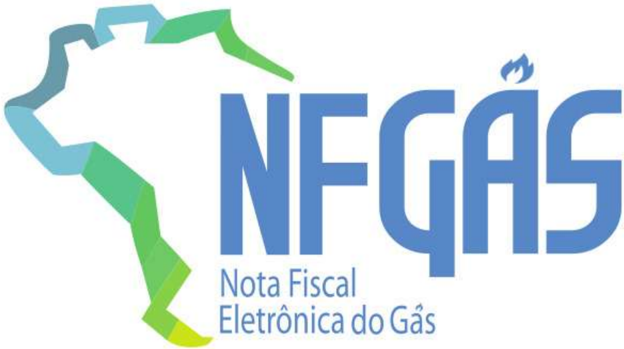

## Projeto Nota Fiscal Eletrônica do Gás

Manual de Orientação do Contribuinte

Anexo II - DANFGas

Versão 1.00 - Março 2026

## Sumário

| 1 Introdução........................................................................................................................................5   |
|---------------------------------------------------------------------------------------------------------------------------------------------------------|
| 2 Documento Auxiliar de NFGas - DANFGas...................................................................................6                             |
| 2.1 Leiaute de Impressão do DANFGas .........................................................................................6                          |
| 2.2 Dados do Emitente ...................................................................................................................7              |
| 2.3 Informações ao Destinatário .....................................................................................................7                  |
| 2.4 Informações de identificação da NFGas e do Protocolo de Autorização e consulta NFGas......8                                                         |
| 2.5 Informações das Leituras..........................................................................................................9                 |
| 2.6 Informações dos itens.............................................................................................................10                |
| 2.7 Tributos totais e Taxas Regulatórias ..................................................................................11                           |
| 2.8 Histórico de consumo ..........................................................................................................11                   |
| 2.9 Aviso e informações complementares ................................................................................12                               |
| 2.10 Informações de Pagamento .........................................................................................12                               |
| 3 Leiaute do DANFGas - Modelo A4- Opção 1................................................................................13                             |
| 4 Leiaute do DANFGas - Modelo A4- Opção 2................................................................................14                             |
| 6 Leiaute do DANFGas - Modelo Bobina - Opção 2.......................................................................16                                 |

## Controle de Versões

|   Versão | Publicação   | Descrição                                                                                                                                |
|----------|--------------|------------------------------------------------------------------------------------------------------------------------------------------|
|     1.00 |              | Criação deste manual como documento anexo do MOC. Corresponde ao Anexo II do MOC 1.00, que trata das especificações técnicas do DANFGas. |

## Histórico de Alterações / Cronograma

|   Versão | Histórico de atualizações   | Implantação Teste   | Implantação Produção   |
|----------|-----------------------------|---------------------|------------------------|
|     1.00 | Versão inicial              |                     |                        |

## 1 Introdução

Este  documento é parte  integrante do Manual de  Orientação  do  Contribuinte  (MOC)  e tem  por objetivo a definição das especificações técnicas do Documento Auxiliar da Nota Fiscal Eletrônica do Gás - DANFGas.

O Manual de Orientação do Contribuinte 1.00a é composto pelos seguintes documentos:

- MOC - Visão Geral
- MOC - Anexo I - Leiaute e Regras de Validação da NFGas
- MOC - Anexo II - Manual de Especificações Técnicas do DANFGas

## 2  Documento Auxiliar de NFGas - DANFGas

O DANFGas é uma representação gráfica resumida da NFGas, impressa em papel comum, para ser entregue ao consumidor do serviço de distribuição de gás canalizado, representando sua conta mensal de consumo.

## 2.1  Leiaute de Impressão do DANFGas

Este capítulo descreve o leiaute de impressão do Documento Auxiliar da NFGas pelo contribuinte, chamado de  DANFGas, assim como  os  requisitos  mínimos  do  que  poderá  constar  do  DANFGas. Algumas considerações acerca da impressão do DANFGas:

- O DANFGas é um documento fiscal auxiliar, sendo apenas uma representação simplificada em papel da nota fiscal do gás eletrônica, de forma a facilitar a consulta do documento fiscal eletrônico, no ambiente do FISCO, pelo consumidor;
- A  impressão  do  DANFGas  é  efetuada  diretamente  pelo  aplicativo  do  contribuinte  em impressora comum (não fiscal), com base nas informações do arquivo eletrônico XML da NFGas;
- No DANFGas é vedada a inclusão de informações que não estejam presentes no respectivo arquivo XML da NFGas, exceto o protocolo de autorização.
- O contribuinte emitente da NFGas está dispensado de enviar ou disponibilizar o arquivo XML ao consumidor, salvo se este solicitar previamente ao início da emissão.
- A legislação poderá facultar que, por opção do consumidor, o DANFGas não seja impresso e seja enviado por mensagem eletrônica (e-mail ou SMS);
- Modelos de leiaute diversos dos apresentados neste anexo somente poderão ser utilizados com a concordância da respectiva Agência Reguladora.
- A  competência  para  definir  a  obrigatoriedade  de  cada  campo  é  do  órgão  regulador. Ressalta-se  que,  mesmo  quando  um  campo  estiver  indicado  como  opcional,  seu preenchimento será obrigatório caso a regulação o exija.
- Campos identificados como opcionais no arquivo XML ou que não possuam informação preenchida poderão ser suprimidos do layout impresso, exceto se possuir preenchimento obrigatório exigido pelo órgão regulador.

A legibilidade  do texto impresso no DANFGas, assim como a durabilidade do papel empregado, deverá ser garantida, no mínimo, pelo prazo de (12) doze meses.

## 2.2  Dados do Emitente

O  cabeçalho  deverá  indicar  obrigatoriamente  os  dados  do  emitente  da  NFGas  contendo  as seguintes informações:

- Razão social do Emitente (xnome)
- CNPJ do Emitente - formatado com a máscara 99.999.999/9999-99 (CNPJ)
- Endereço Completo do Emitente sem a indicação do país (enderEmit)
- Incrição estadual do emitente (IE emitente)
- Texto fixo: 'Documento Auxiliar da Nota Fiscal Eletrônica do Gás'
- Observação:  a  critério  do  emissor  da  NFGas  poderá  ser  incluído  o  logotipo  da empresa ou logotipo da NFGas, no canto direito ou esquerdo, a depender do layout a ser utilizado.

## 2.3  Informações ao Destinatário

A  divisão  II  corresponde  ao  local  onde  deverão  ser  impressas  as  informações  de  qualificação  do destinatário e da localização do acessante.

Os campos opcionais devem observar aspectos de regulação.

## São informações mínimas:

- Nome do destinatário: Razão social ou nome do destinatário (xNome);
- CNPJ / CPF / idOutros: Identificação do destinatário pelo número do CNPJ, CPF ou Outros, para os casos de destinatário não obrigados a inscrição do CPF;
- Observação: A critério do emissor ou regulação, por razões de sigilo da informação, os  dados  deste  campo  poderão  ser  impressos  de  forma  incompleta,  substituindo 60% dos caracteres por * (asterisco).
- Inscrição estadual do destinatário (IE destinatario);
- Endereço: Endereço completo do destinatário sem a indicação do país (enderDest);
- Identificação da instalação : Código único de identificação da instalação do cliente (idInstalacao);
- É opcional a apresentação do código de identificação do cliente para empresa emitente, podendo ser apresentado esta informação em substituição ao código da instalação (idCodCliente);
- Tipo de instalação: informação sobre tipo de instalação (idInstalacao);
- Segmento de consumo: Classe de Consumo da Instalação (tpClasse).

Não estão reguladas as posições e localização das informações dos detalhes do destinatário e dados do acessante, assim como a forma de sua impressão, sendo indicado uma das formas de apresentação demonstradas nos leiautes inseridos nesta nota técnica.

## 2.4  Informações  de  identificação  da  NFGas  e  do  Protocolo de Autorização e consulta NFGas

As informações da identificação da NFGas devem conter:

- Número da NFGas (nNF);
- Série da NFGas (serie);
- Modelo da NFGas (mod);
- Data de Emissão (dhEmi);
- Finalidade da emissão (finNFGas);
- Tipo de faturamento (tpFat).
- Observação: a data de emissão apesar de constar no arquivo XML da NFGas em formato UTC deverá ser impressa no DANFGas sempre no formato dd/mm/aaaa;
- O texto: 'Consulte pela Chave de Acesso em' seguido do endereço eletrônico para consulta pública da NFGas no Portal Nacional da NFGas    - https://dfeportal.svrs.rs.gov.br/NFGas), e a chave de acesso impressa em 11 blocos de quatro dígitos, com um espaço entre cada bloco (cNF e cDV).
- Para NFGas substituta, incluir  número da nota fiscal substituída (nNF), chave  de acesso  (chNFGas) e motivo da substituição (motSub);
- O  texto  'Protocolo  de  autorização:  '  devendo  ser  impresso  o  número  do  protocolo  de autorização obtido para NFGas e a data e hora da autorização. A data de autorização é fornecida pela Administração Tributária no formato UTC e deve ser impressa no DANFGas convertida para o horário local.
- No caso de emissão em contingência a informação sobre o protocolo de autorização será suprimida.
- A imagem do QR Code da NFGas que deve ter tamanho mínimo 25 mm x 25 mm, sendo 22mm de conteúdo para 3mm de margem segura (quiet zone), para dimensões superiores a 25mm, considerar a margem segura de 10% da dimensão total (qrCodNFGas).

Não estão reguladas as posições e localização das informações dos detalhes do destinatário e dados do acessante, assim como a forma de sua impressão, sendo indicado uma das formas de apresentação demonstradas nos leiautes inseridos nesta nota técnica.

## 2.5  Informações das Leituras

Nesta seção serão apresentadas as informações referentes às leituras dos medidores. Pode ser indicada uma linha para cada medidor. Podem ser acrescidas colunas desde que a informação esteja  no  arquivo  XML  ou  possa  ser  obtida  a  partir  de  um  cálculo  simples  a  partir  de  dados apresentados (Exemplo: média diária = consumo medido / qtd dias).

- Identificação do equipamento de medição (idEqp);
- Identificação do tipo de equipamento (tpEqp) e tipo de medidor, caso aplicável (tpMedidor);
- Leitura  Atual:  Datas  em  que  foram realizadas as leituras anteriores  (dMedAnt);
- Leitura  Anterior:  Datas  em  que  foram  realizadas as leituras atuais (dMedAtu);
- Valor da medição anterior: Valor da leitura anterior (vMedAnt);
- Valor da medição atual: Valor da leitura anterior (vMedAtu);
- Consumo medido : Valor do consumo medido (vMed);
- Tipo de Consumo Faturado: Origem do consumo faturado (indOrigemQtd).
- Observação: quando não houver leitura no mês de referência, indicar o motivo (tpMotNaoLeitura);
- Próxima leitura / Previsão próxima leitura: Data que deve ocorrer a próxima medição (dProxLeitura);
- Número de dias faturados: quantidad de dias de consumo: (qtdDias).

Não estão reguladas as posições e localização destas informações da NFGas no DANFGas, assim como a forma de sua impressão, sendo indicado uma das formas de apresentação demonstradas nos leiautes inseridos nesta nota técnica.

## 2.6  Informações dos itens

Nessa seção serão discriminados os itens constantes da NFGas, definindo-se os itens faturados que  deverão  ser  impressos  no  DANFGas,  de  acordo  com  o  detalhamento  abaixo.  Serão apresentadas as informações mínimas que devem constar nessa parte do documento, contudo, deverão ser observadas as questões regulatórias, podendo ser inseridas colunas adicionais caso  a regulação assim exija.

- Itens da Fatura: descrição do item relacionado na NFGas (xProd);
- Consumo faturado: quantidade faturada (qFaturada);
- Tarifa: valor da tarifa aplicável (vTarifAplic);
- Valor total : valor total dos item (vProd);
- CFOP: código CFOP por item (CFOP);
- IBS Estadual: alíquota e valor do IBS Estadual (pAliqEfet | vIBSUF);
- IBS Municipal: alíquota e valor do IBS Municipal (pAliqEfet | vIBSMun);
- CBS: Alíquota e valor da CBS (pAliqEfet | vCBS);
- ICMS: alíquota e valor do ICMS (pICMS | vICMS);
- Base ICMS: valor considerado para base de cálculo do ICMS (vBC);
- ICMS ST: alíquota e valor do ICMS ST(vBCSTRet | vICMSSubstituto);
- Base ICMS ST: valor considerado para base de cálculo do ICMS ST (vBC);

Deverá ser apresentada uma linha totalizadora 'TOTAL' ao final do quadro dos itens (no  caso  de valores, devem ter as casas decimais separadas por vírgula e ser utilizado ponto para a indicação de milhar. Exemplo: 1.234,56).

Importante :  Itens  de  classificação  de  natureza  negativa  (cClass)  podem  aparecer  com  sinal negativo, mesmo que o valor no arquivo XML seja positivo.

Se o item possuir o indicador de devolução (indDevolucao) deverá ser apresentado negativo no item e, se possível, adicionar na descrição o literal 'devolução' entre parênteses.

Nesta seção o contribuinte, se desejar, pode informar também as informações de CST por item A localização do grupo dos itens no DANFGas não está regulamentada, devendo ser posicionado conforme melhor exibição, impressão e dobra para entrega ao consumidor, sendo indicado uma das formas de apresentação demonstradas nos leiautes inseridos nesta nota técnica.

## 2.7  Tributos totais e Taxas Regulatórias

Serão discriminados nesta seção os valores de totais dos tributos incidentes sobre os produtos e serviços, incluindo retenções de tributos federais. Neste quadro pode ser informado também o valor da Taxa Regulatória, conforme necessidade da empresa ou regulação.

- Total dos tributos municipais: Soma do total dos tributos municipais incidente na operação;
- Total dos tributos estaduais: Soma do total dos tributos estaduais incidentes na operação;
- Total dos tributos federais: Soma do total dos tributos federais incidentes na operação;
- Total taxa regulatória: Valor total da taxa regulatória incidente na operação (vTxReg)
- IRPJ: Alíquota e valor da retenção do IRPJ (vIRRF)
- CSLL: Alíquota e valor da retenção da CSLL (vRetCSLL)
- PIS: Alíquota e valor da retenção da contribuição para o PIS (vRetPIS)
- COFINS: Alíquota e valor da retenção da contribuição para a COFINS (vRetCofins)
- Base de cálculo: valor considerado para base de cálculo dos tributos federais retidos

Não estão reguladas as posições e localização destas informações da NFGas no DANFGas, assim como a forma de sua impressão, sendo indicado uma das formas de apresentação demonstradas nos leiautes inseridos nesta nota técnica.

## 2.8  Histórico de consumo

As informações do  histórico  de  consumo,  exigidas  pela  regulação,  devem  ser  apresentadas  no documento.

- Consumo medido (consumo);
- Quantidade de dias de medição (qtdDias);
- Para cada mês apresentado:
- Mes/Ano de Referência;
- Valor do consumo.

Não estão reguladas as posições e localização destas informações da NFGas no DANFGas, assim como a forma de sua impressão, sendo indicado uma das formas de apresentação demonstradas nos leiautes inseridos nesta nota técnica.

## 2.9 Aviso e informações complementares

Essa seção deve conter as informações de interesse do contribuinte ou da regulação, em posição de  destaque.  É  importante  ressaltar  que  as  informações  constantes  neste  quadro  devem  estar presentes no arquivo XML da NFGas (infAdFat  | InfAdReg | infAdFisco | infCpl).

Não estão reguladas as posições e localização destas informações da NFGas no DANFAG, assim como a forma de sua impressão, sendo indicado uma das formas de apresentação demonstradas nos leiautes inseridos nesta nota técnica

## 2.10 Informações de Pagamento

Esta  seção  contém  as  informações  para  pagamento  da  fatura,  quando  aplicável.  Devem  ser apresentadas  aqui  as  informações  sobre  PIX  /  Boleto  ou  outra  forma  para  quitação  da  fatura, conforme interesse do contribuinte.

- Mês de Referência: Competência da medição a que se refere a NFGas (CompetFat);
- Data de apresentação da fatura (dApresFat)
- Data de Vencimento: Conforme (dVencFat)
- Valor total da Fatura: Conforme (vTotDFe)
- Número da Fatura: Código único de identificação da fatura ou cliente (nFat)
- Endereço de entrega da fatura, caso este seja diferente do endereço do destinatário (enderCorresp)
- Código de autorização débito automático, número do banco e agência para débito em conta (codDebAuto | codBanco | codAgencia)
- Linha digitável do código de barras e QRCode do Pix (codBarras | urlQRCodePIX)

Não estão reguladas as posições e localização destas informações da NFGas no DANFGas, assim como a forma de sua impressão, abaixo segue um exemplo opcional de exibição, sendo indicado uma das formas de apresentação demonstradas nos leiautes inseridos nesta nota técnica.

## 3 Leiaute do DANFGas - Modelo A4 - Opção 1

ESPACO PARALOGO

Enderego,00o CEP0000-000-Bairo-CidadeUF

CNPJ 00.000.000/0000-00

Insc. Estadual 000.000.000.000

## DOCUMENTOAUXILIARDANOTAFISCALELETRONICADOGAS-DANFGAS

Finalidade da emissao:

N nota fiscal substituida:

Motivo da substituicao:

Tipo de faturamento:

Data da apresentacao:

Tipo da instalacao:

Data da leitura anterior.

Det. segmentos:

Segmento:

Data da leitura atual:

Dias de consumo: 30 dias

Motivo da nao leitura:

Data da leitura prevista:

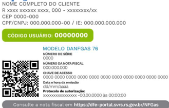

Vencimento

dd/mm/aaa

MesRef

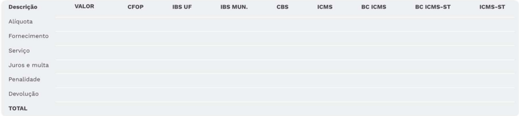

## Consumoe tarifas

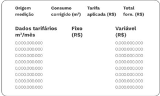

Avisosimportantesparavoce

Detalhamento do consumo(Saibamais:www.xx.com.br/para-a-sua-casa/entenda-sua-conta/)

*Valores para Gas Natural referidos nas seguintes condigoes: Poder Calorifico Superior: 9.400 k/cal/m?, Temperatura = 293,15 °K (20 °C) e Pressao - 101.325 Pa (1 atm), conforme Resolucao ANP n 16.

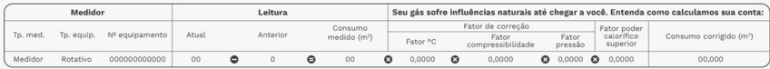

Reservado aoFisco e12b.5ffc.0c7f.c2cc.8e56.5506.0583.61d8

Via do usuario-Autenticacaomecanica

## DOCUMENTOAUXILIARDENOTAFISCALELETRONICADOGAS-DANFGAS

NOME COMPLETO DO CLIENTE

CPF/CNPJ:000.000.000-00

ParacadastramentoemDebitoAutomatico:

Banco xxxAg.xxxx C6digo usuario:xxxxxxxx

Mes de Referencia

mm/aaaa

## N000.000.000

Vencimento

dd/mm/aaaa RS00,00

R xXXXxxxxxXxxxx,000-xxxxxxxx/xX-CEP0000-000

Opagamento desta conta nao quita debitos anteriores.Sobre o valor pago apos o vencimento incidiramulta de 2% e juros de mora de O033% ao dia,incluidos em conta futura (Port.CSPE x.xxx/x）. O nao pagamento pociera levar a protesto e/ou negativacao,cobranga cie despesas e demais emolumentos (Lei Fed. x.xx).Verifique se ocorreu debito automatico em sua conta corrente,no vencimento. Se, por qualquer motivo o debito nao for efetuado, utilie esta nota fiscal / conta de gas para o pagamento em qualquer banco autorizacio.

Bancos autorizados a receber esta conta: Banco do Brasil*,Banco Inter*,Banco Original*,Bradesco*,C6 Bank*,Itau*,Nubank*,PicPay*,Safra*e Santander(*exceto boca de caixa).

000000000000

000000000000

000000000000

000000000000

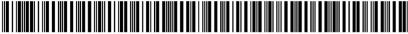

DEBITOAUTOMATICO

Autenticacao Mecanica

PAGAMENTO VIAPIX

ValorTotala Pagar

## Tributos

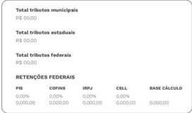

## Seu historico uUtimos 13 meses (m)

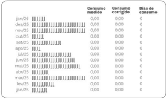

Valortotal

R$0.000,00

XXXX'XXX"

## Nota Fiscal Eletrônica do Gás

MOC - ANEXO II - v 1.00

## 4 Leiaute do DANFGas - Modelo A4 - Opção 2

+

CEBITOAUTCMATCO

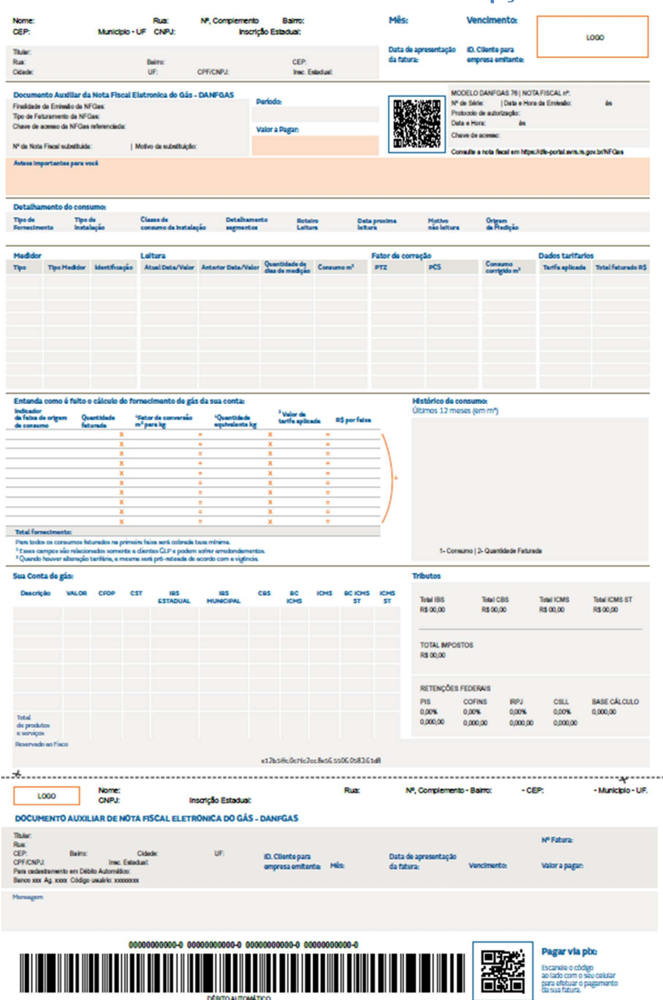

## Nota Fiscal Eletrônica do Gás

MOC - ANEXO II - v 1.00

## 5 Leiaute do DANFGas - Modelo Bobina - Opção 1

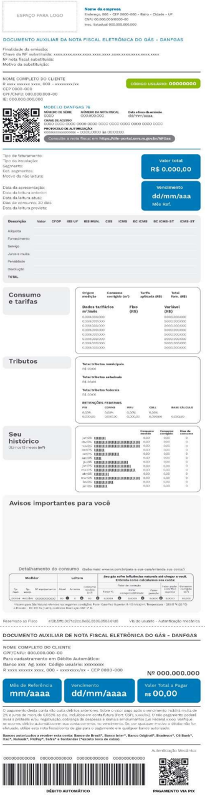

## Nota Fiscal Eletrônica do Gás

MOC - ANEXO II - v 1.00

## 6 Leiaute do DANFGas - Modelo Bobina - Opção 2

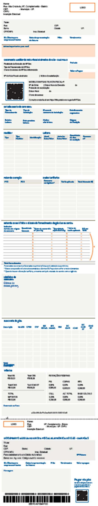

## Nota Fiscal Eletrônica do Gás

MOC - ANEXO II - v 1.00

